Linux in Greece - Tested Hardware & Statistics
----------------------------------------------

A project to collect tested hardware configurations for Linux in Greece.

Anyone can contribute to this report by the [hw-probe](https://github.com/linuxhw/hw-probe) tool:

    sudo -E hw-probe -all -upload

Please contribute! Especially if your hardware is rare.

This is a report for all computer types. See also reports for [desktops](/Location/Greece/Desktop/README.md) and [notebooks](/Location/Greece/Notebook/README.md).

Contents
--------

* [ Test Cases ](#test-cases)

* [ System ](#system)
  - [ OS                       ](#os)
  - [ OS Family                ](#os-family)
  - [ Kernel                   ](#kernel)
  - [ Kernel Family            ](#kernel-family)
  - [ Kernel Major Ver.        ](#kernel-major-ver)
  - [ Arch                     ](#arch)
  - [ DE                       ](#de)
  - [ Display Server           ](#display-server)
  - [ Display Manager          ](#display-manager)
  - [ OS Lang                  ](#os-lang)
  - [ Boot Mode                ](#boot-mode)
  - [ Filesystem               ](#filesystem)
  - [ Part. scheme             ](#part-scheme)
  - [ Dual Boot with Linux/BSD ](#dual-boot-with-linuxbsd)
  - [ Dual Boot (Win)          ](#dual-boot-win)

* [ Board ](#board)
  - [ Vendor                   ](#vendor)
  - [ Model                    ](#model)
  - [ Model Family             ](#model-family)
  - [ MFG Year                 ](#mfg-year)
  - [ Form Factor              ](#form-factor)
  - [ Secure Boot              ](#secure-boot)
  - [ Coreboot                 ](#coreboot)
  - [ RAM Size                 ](#ram-size)
  - [ RAM Used                 ](#ram-used)
  - [ Total Drives             ](#total-drives)
  - [ Has CD-ROM               ](#has-cd-rom)
  - [ Has Ethernet             ](#has-ethernet)
  - [ Has WiFi                 ](#has-wifi)
  - [ Has Bluetooth            ](#has-bluetooth)

* [ Location ](#location)
  - [ Country                  ](#country)
  - [ City                     ](#city)

* [ Drives ](#drives)
  - [ Drive Vendor             ](#drive-vendor)
  - [ Drive Model              ](#drive-model)
  - [ HDD Vendor               ](#hdd-vendor)
  - [ SSD Vendor               ](#ssd-vendor)
  - [ Drive Kind               ](#drive-kind)
  - [ Drive Connector          ](#drive-connector)
  - [ Drive Size               ](#drive-size)
  - [ Space Total              ](#space-total)
  - [ Space Used               ](#space-used)
  - [ Malfunc. Drives          ](#malfunc-drives)
  - [ Malfunc. Drive Vendor    ](#malfunc-drive-vendor)
  - [ Malfunc. HDD Vendor      ](#malfunc-hdd-vendor)
  - [ Malfunc. Drive Kind      ](#malfunc-drive-kind)
  - [ Failed Drives            ](#failed-drives)
  - [ Failed Drive Vendor      ](#failed-drive-vendor)
  - [ Drive Status             ](#drive-status)

* [ Storage controller ](#storage-controller)
  - [ Storage Vendor           ](#storage-vendor)
  - [ Storage Model            ](#storage-model)
  - [ Storage Kind             ](#storage-kind)

* [ Processor ](#processor)
  - [ CPU Vendor               ](#cpu-vendor)
  - [ CPU Model                ](#cpu-model)
  - [ CPU Model Family         ](#cpu-model-family)
  - [ CPU Cores                ](#cpu-cores)
  - [ CPU Sockets              ](#cpu-sockets)
  - [ CPU Threads              ](#cpu-threads)
  - [ CPU Op-Modes             ](#cpu-op-modes)
  - [ CPU Microcode            ](#cpu-microcode)
  - [ CPU Microarch            ](#cpu-microarch)

* [ Graphics ](#graphics)
  - [ GPU Vendor               ](#gpu-vendor)
  - [ GPU Model                ](#gpu-model)
  - [ GPU Combo                ](#gpu-combo)
  - [ GPU Driver               ](#gpu-driver)
  - [ GPU Memory               ](#gpu-memory)

* [ Monitor ](#monitor)
  - [ Monitor Vendor           ](#monitor-vendor)
  - [ Monitor Model            ](#monitor-model)
  - [ Monitor Resolution       ](#monitor-resolution)
  - [ Monitor Diagonal         ](#monitor-diagonal)
  - [ Monitor Width            ](#monitor-width)
  - [ Aspect Ratio             ](#aspect-ratio)
  - [ Monitor Area             ](#monitor-area)
  - [ Pixel Density            ](#pixel-density)
  - [ Multiple Monitors        ](#multiple-monitors)

* [ Network ](#network)
  - [ Net Controller Vendor    ](#net-controller-vendor)
  - [ Net Controller Model     ](#net-controller-model)
  - [ Wireless Vendor          ](#wireless-vendor)
  - [ Wireless Model           ](#wireless-model)
  - [ Ethernet Vendor          ](#ethernet-vendor)
  - [ Ethernet Model           ](#ethernet-model)
  - [ Net Controller Kind      ](#net-controller-kind)
  - [ Used Controller          ](#used-controller)
  - [ NICs                     ](#nics)
  - [ IPv6                     ](#ipv6)

* [ Bluetooth ](#bluetooth)
  - [ Bluetooth Vendor         ](#bluetooth-vendor)
  - [ Bluetooth Model          ](#bluetooth-model)

* [ Sound ](#sound)
  - [ Sound Vendor             ](#sound-vendor)
  - [ Sound Model              ](#sound-model)

* [ Memory ](#memory)
  - [ Memory Vendor            ](#memory-vendor)
  - [ Memory Model             ](#memory-model)
  - [ Memory Kind              ](#memory-kind)
  - [ Memory Form Factor       ](#memory-form-factor)
  - [ Memory Size              ](#memory-size)
  - [ Memory Speed             ](#memory-speed)

* [ Printers & scanners ](#printers--scanners)
  - [ Printer Vendor           ](#printer-vendor)
  - [ Printer Model            ](#printer-model)
  - [ Scanner Vendor           ](#scanner-vendor)
  - [ Scanner Model            ](#scanner-model)

* [ Camera ](#camera)
  - [ Camera Vendor            ](#camera-vendor)
  - [ Camera Model             ](#camera-model)

* [ Security ](#security)
  - [ Fingerprint Vendor       ](#fingerprint-vendor)
  - [ Fingerprint Model        ](#fingerprint-model)
  - [ Chipcard Vendor          ](#chipcard-vendor)
  - [ Chipcard Model           ](#chipcard-model)

* [ Unsupported ](#unsupported)
  - [ Unsupported Devices      ](#unsupported-devices)
  - [ Unsupported Device Types ](#unsupported-device-types)

Test Cases
----------

Total: 3011

| Vendor        | Model                       | Form-Factor | Probe                                                      | Date         |
|---------------|-----------------------------|-------------|------------------------------------------------------------|--------------|
| Lenovo        | ThinkCentre M90 5485WHG     | Desktop     | [f8da681374](https://linux-hardware.org/?probe=f8da681374) | Jan 03, 2026 |
| Lenovo        | IdeaPad 1 15AMN7 82VG       | Notebook    | [9032b9ee50](https://linux-hardware.org/?probe=9032b9ee50) | Jan 02, 2026 |
| ASUSTek       | VivoBook_ASUSLaptop E510... | Notebook    | [28a780eedd](https://linux-hardware.org/?probe=28a780eedd) | Dec 30, 2025 |
| Lenovo        | ThinkPad T440 20B7S0JF09    | Notebook    | [063f67ca68](https://linux-hardware.org/?probe=063f67ca68) | Dec 27, 2025 |
| HP            | 83E9                        | Desktop     | [daed51befb](https://linux-hardware.org/?probe=daed51befb) | Dec 27, 2025 |
| Dell          | G3 3579                     | Notebook    | [a89cadf284](https://linux-hardware.org/?probe=a89cadf284) | Dec 26, 2025 |
| ASUSTek       | PRIME B250-PLUS             | Desktop     | [7e050bab7a](https://linux-hardware.org/?probe=7e050bab7a) | Dec 25, 2025 |
| Gigabyte      | H97M-D3H                    | Desktop     | [1ab529f341](https://linux-hardware.org/?probe=1ab529f341) | Dec 23, 2025 |
| Lenovo        | ThinkPad X1 Carbon 5th 2... | Notebook    | [a4e2f64a6b](https://linux-hardware.org/?probe=a4e2f64a6b) | Dec 23, 2025 |
| Lenovo        | G550 20023                  | Notebook    | [fbcd82ccd0](https://linux-hardware.org/?probe=fbcd82ccd0) | Dec 23, 2025 |
| Lenovo        | G550 20023                  | Notebook    | [4d7ae0d126](https://linux-hardware.org/?probe=4d7ae0d126) | Dec 23, 2025 |
| ASRock        | A520M-HVS                   | Desktop     | [8fb8ca5968](https://linux-hardware.org/?probe=8fb8ca5968) | Dec 23, 2025 |
| ASRock        | A520M-HVS                   | Desktop     | [c6b245496c](https://linux-hardware.org/?probe=c6b245496c) | Dec 22, 2025 |
| Lenovo        | ThinkBook 15 G4 IAP 21DJ    | Notebook    | [0202253142](https://linux-hardware.org/?probe=0202253142) | Dec 21, 2025 |
| Acer          | Aspire A114-33              | Notebook    | [1773222e3d](https://linux-hardware.org/?probe=1773222e3d) | Dec 21, 2025 |
| Lenovo        | Z50-75 80EC                 | Notebook    | [1a51f35758](https://linux-hardware.org/?probe=1a51f35758) | Dec 20, 2025 |
| Acer          | Chapala                     | Notebook    | [3d8d891a38](https://linux-hardware.org/?probe=3d8d891a38) | Dec 19, 2025 |
| Gigabyte      | EP43T-S3L                   | Desktop     | [fa303b42ef](https://linux-hardware.org/?probe=fa303b42ef) | Dec 18, 2025 |
| Apple         | Mac-942B59F58194171B iMa... | All in one  | [997adce596](https://linux-hardware.org/?probe=997adce596) | Dec 18, 2025 |
| Gigabyte      | EP43T-S3L                   | Desktop     | [9d787e7b8c](https://linux-hardware.org/?probe=9d787e7b8c) | Dec 15, 2025 |
| Lenovo        | 335A NOK                    | Desktop     | [74794406c0](https://linux-hardware.org/?probe=74794406c0) | Dec 15, 2025 |
| Gigabyte      | Z790 UD AX                  | Desktop     | [2cecbb7b53](https://linux-hardware.org/?probe=2cecbb7b53) | Dec 14, 2025 |
| Dell          | Vostro 3500                 | Notebook    | [68538c7f31](https://linux-hardware.org/?probe=68538c7f31) | Dec 14, 2025 |
| MSI           | MAG X570 TOMAHAWK WIFI      | Desktop     | [e0da88cc6b](https://linux-hardware.org/?probe=e0da88cc6b) | Dec 14, 2025 |
| ASUSTek       | PRIME B250-PLUS             | Desktop     | [c4a9830a94](https://linux-hardware.org/?probe=c4a9830a94) | Dec 13, 2025 |
| Dell          | Inspiron 3537               | Notebook    | [6193fe62d1](https://linux-hardware.org/?probe=6193fe62d1) | Dec 13, 2025 |
| Dell          | 09KPNV A00                  | Desktop     | [3e3cec6946](https://linux-hardware.org/?probe=3e3cec6946) | Dec 13, 2025 |
| Dell          | 09KPNV A00                  | Desktop     | [873590398b](https://linux-hardware.org/?probe=873590398b) | Dec 13, 2025 |
| ASUSTek       | TUF Gaming B650M-E WIFI     | Desktop     | [4f8401a5e2](https://linux-hardware.org/?probe=4f8401a5e2) | Dec 12, 2025 |
| Apple         | Mac-942B59F58194171B iMa... | All in one  | [dcef59550a](https://linux-hardware.org/?probe=dcef59550a) | Dec 11, 2025 |
| Gigabyte      | B450 AORUS PRO-CF           | Desktop     | [7fcfc5e3c2](https://linux-hardware.org/?probe=7fcfc5e3c2) | Dec 10, 2025 |
| ASUSTek       | P8B75-M LX                  | Desktop     | [59dbd8a680](https://linux-hardware.org/?probe=59dbd8a680) | Dec 10, 2025 |
| AMI           | AMD                         | Desktop     | [535f8fb4e7](https://linux-hardware.org/?probe=535f8fb4e7) | Dec 09, 2025 |
| ASUSTek       | PRIME B550M-A WIFI II       | Desktop     | [79af089680](https://linux-hardware.org/?probe=79af089680) | Dec 08, 2025 |
| Apple         | MacBookPro16,1              | Notebook    | [11e3d48626](https://linux-hardware.org/?probe=11e3d48626) | Dec 08, 2025 |
| ASUSTek       | PRIME B550M-K ARGB          | Desktop     | [540db248e9](https://linux-hardware.org/?probe=540db248e9) | Dec 08, 2025 |
| ASUSTek       | PRIME B550M-K ARGB          | Desktop     | [5ddd1903fe](https://linux-hardware.org/?probe=5ddd1903fe) | Dec 08, 2025 |
| Gigabyte      | B550 AORUS ELITE            | Desktop     | [17136119cf](https://linux-hardware.org/?probe=17136119cf) | Dec 07, 2025 |
| ASRock        | Z690 PG Riptide             | Desktop     | [fe76314165](https://linux-hardware.org/?probe=fe76314165) | Dec 07, 2025 |
| ASRock        | B850M Steel Legend WiFi     | Desktop     | [a04cba6a53](https://linux-hardware.org/?probe=a04cba6a53) | Dec 07, 2025 |
| ASRock        | B850M Steel Legend WiFi     | Desktop     | [6996ced710](https://linux-hardware.org/?probe=6996ced710) | Dec 07, 2025 |
| Dell          | Latitude 2120               | Notebook    | [bcfef96715](https://linux-hardware.org/?probe=bcfef96715) | Dec 07, 2025 |
| ASRock        | A320M-HDV R4.0              | Desktop     | [966188d1b7](https://linux-hardware.org/?probe=966188d1b7) | Dec 06, 2025 |
| HP            | 250 G8 Notebook PC          | Notebook    | [4f80d7e143](https://linux-hardware.org/?probe=4f80d7e143) | Dec 06, 2025 |
| ASUSTek       | H110M-K                     | Desktop     | [c2430d1ead](https://linux-hardware.org/?probe=c2430d1ead) | Dec 06, 2025 |
| ASUSTek       | H110M-K                     | Desktop     | [0c3f148abd](https://linux-hardware.org/?probe=0c3f148abd) | Dec 05, 2025 |
| ASUSTek       | ProArt B550-CREATOR         | Desktop     | [cd3e84c16a](https://linux-hardware.org/?probe=cd3e84c16a) | Dec 04, 2025 |
| Gigabyte      | Z790 UD AX                  | Desktop     | [570fa5f9ee](https://linux-hardware.org/?probe=570fa5f9ee) | Dec 04, 2025 |
| HUAWEI        | FLMH-XX                     | Notebook    | [a0f954f17e](https://linux-hardware.org/?probe=a0f954f17e) | Dec 02, 2025 |
| Gigabyte      | Z790 UD AX                  | Desktop     | [3b57cefd72](https://linux-hardware.org/?probe=3b57cefd72) | Nov 30, 2025 |
| HP            | 250 G6 Notebook PC          | Notebook    | [c5519e474d](https://linux-hardware.org/?probe=c5519e474d) | Nov 30, 2025 |
| Dell          | Precision 5490              | Notebook    | [1d8cff2f28](https://linux-hardware.org/?probe=1d8cff2f28) | Nov 29, 2025 |
| Dell          | 0F6X5P A00                  | Desktop     | [3dfc44fb16](https://linux-hardware.org/?probe=3dfc44fb16) | Nov 29, 2025 |
| TUXEDO        | BM1510                      | Notebook    | [0d7a85fae1](https://linux-hardware.org/?probe=0d7a85fae1) | Nov 28, 2025 |
| HP            | EliteBook 840 G8 Noteboo... | Notebook    | [bc7ab4b7a9](https://linux-hardware.org/?probe=bc7ab4b7a9) | Nov 27, 2025 |
| HP            | EliteBook 6930p             | Notebook    | [49d0004918](https://linux-hardware.org/?probe=49d0004918) | Nov 25, 2025 |
| HP            | EliteBook 6930p             | Notebook    | [4b5eda0377](https://linux-hardware.org/?probe=4b5eda0377) | Nov 25, 2025 |
| ASUSTek       | M5A99X EVO R2.0             | Desktop     | [430f1fdbf7](https://linux-hardware.org/?probe=430f1fdbf7) | Nov 24, 2025 |
| Lenovo        | G505 20240                  | Notebook    | [dfee17c37c](https://linux-hardware.org/?probe=dfee17c37c) | Nov 22, 2025 |
| Lenovo        | G505 20240                  | Notebook    | [ff967d66ae](https://linux-hardware.org/?probe=ff967d66ae) | Nov 22, 2025 |
| ASUSTek       | M5A87                       | Desktop     | [c9af5522a8](https://linux-hardware.org/?probe=c9af5522a8) | Nov 19, 2025 |
| Fujitsu       | D3220-A1 S26361-D3220-A1    | Desktop     | [8afecd57c9](https://linux-hardware.org/?probe=8afecd57c9) | Nov 16, 2025 |
| ASRock        | P67 Professional            | Desktop     | [6b75aaa57a](https://linux-hardware.org/?probe=6b75aaa57a) | Nov 16, 2025 |
| ASRock        | P67 Professional            | Desktop     | [2065ab45ee](https://linux-hardware.org/?probe=2065ab45ee) | Nov 15, 2025 |
| ASUSTek       | M5A87                       | Desktop     | [3263043e7f](https://linux-hardware.org/?probe=3263043e7f) | Nov 14, 2025 |
| MSI           | B350 TOMAHAWK ARCTIC        | Desktop     | [2d5f1962c0](https://linux-hardware.org/?probe=2d5f1962c0) | Nov 06, 2025 |
| Gigabyte      | H55M-S2H                    | Desktop     | [4d56e46e47](https://linux-hardware.org/?probe=4d56e46e47) | Nov 05, 2025 |
| NEC Comput... | PC-VK26TXZCM                | Notebook    | [d22d97025e](https://linux-hardware.org/?probe=d22d97025e) | Nov 04, 2025 |
| Dell          | G3 3579                     | Notebook    | [7b7c7622b8](https://linux-hardware.org/?probe=7b7c7622b8) | Nov 04, 2025 |
| Gigabyte      | B760I AORUS PRO DDR4        | Desktop     | [2c2d58e066](https://linux-hardware.org/?probe=2c2d58e066) | Nov 03, 2025 |
| Apple         | MacBookPro8,1               | Notebook    | [baf4a07707](https://linux-hardware.org/?probe=baf4a07707) | Nov 02, 2025 |
| HP            | 3398                        | Desktop     | [555b8ac3b3](https://linux-hardware.org/?probe=555b8ac3b3) | Nov 02, 2025 |
| ASRock        | B450M Pro4-F                | Desktop     | [df6811c424](https://linux-hardware.org/?probe=df6811c424) | Oct 31, 2025 |
| Lenovo        | ThinkPad L14 Gen 1 20U6S... | Notebook    | [e2ff8d1c8c](https://linux-hardware.org/?probe=e2ff8d1c8c) | Oct 31, 2025 |
| HP            | Pavilion TS Sleekbook 15    | Notebook    | [0d41cd214e](https://linux-hardware.org/?probe=0d41cd214e) | Oct 29, 2025 |
| Lenovo        | ThinkPad 13 2nd Gen 20J2... | Notebook    | [bf312fe781](https://linux-hardware.org/?probe=bf312fe781) | Oct 29, 2025 |
| ASRock        | FM2A55M-HD+                 | Desktop     | [e3c28e5f5a](https://linux-hardware.org/?probe=e3c28e5f5a) | Oct 27, 2025 |
| Dell          | Vostro 3520                 | Notebook    | [6e6f2ec2e7](https://linux-hardware.org/?probe=6e6f2ec2e7) | Oct 26, 2025 |
| ASRock        | G31M-GS                     | Desktop     | [9dabe23099](https://linux-hardware.org/?probe=9dabe23099) | Oct 26, 2025 |
| ASRock        | G31M-GS                     | Desktop     | [f181062e64](https://linux-hardware.org/?probe=f181062e64) | Oct 26, 2025 |
| Dell          | Inspiron 3537               | Notebook    | [23b95661aa](https://linux-hardware.org/?probe=23b95661aa) | Oct 25, 2025 |
| Dell          | Inspiron 3537               | Notebook    | [9872260921](https://linux-hardware.org/?probe=9872260921) | Oct 25, 2025 |
| ASRock        | FM2A55M-HD+                 | Desktop     | [0cebc68002](https://linux-hardware.org/?probe=0cebc68002) | Oct 24, 2025 |
| Lenovo        | IdeaPad 1 14ADA05 82GW      | Notebook    | [6ec3a4440f](https://linux-hardware.org/?probe=6ec3a4440f) | Oct 24, 2025 |
| Intel         | STK1AW32SC                  | Stick pc    | [bcb4eedc01](https://linux-hardware.org/?probe=bcb4eedc01) | Oct 23, 2025 |
| HP            | Laptop 15s-eq1xxx           | Notebook    | [f40735785e](https://linux-hardware.org/?probe=f40735785e) | Oct 23, 2025 |
| Gigabyte      | H97-D3H-CF                  | Desktop     | [9a0ea37189](https://linux-hardware.org/?probe=9a0ea37189) | Oct 21, 2025 |
| Lenovo        | ThinkPad T480 20L6S5QH00    | Notebook    | [ff23dbffa8](https://linux-hardware.org/?probe=ff23dbffa8) | Oct 19, 2025 |
| Valve         | Jupiter                     | Notebook    | [d8a6cbde3e](https://linux-hardware.org/?probe=d8a6cbde3e) | Oct 18, 2025 |
| Valve         | Jupiter                     | Notebook    | [b2aa7d91db](https://linux-hardware.org/?probe=b2aa7d91db) | Oct 18, 2025 |
| ASUSTek       | TUF Gaming B550-PLUS        | Desktop     | [eaabbef900](https://linux-hardware.org/?probe=eaabbef900) | Oct 17, 2025 |
| Gigabyte      | MZBAYAB-00                  | Desktop     | [7002e87600](https://linux-hardware.org/?probe=7002e87600) | Oct 17, 2025 |
| ASUSTek       | ASUS Zenbook 14 UM3406KA... | Notebook    | [3413b96046](https://linux-hardware.org/?probe=3413b96046) | Oct 16, 2025 |
| GMKtec        | M5 PLUS                     | Mini pc     | [9cdbefcd0d](https://linux-hardware.org/?probe=9cdbefcd0d) | Oct 15, 2025 |
| HP            | Pavilion Notebook           | Notebook    | [e7f2e13fd5](https://linux-hardware.org/?probe=e7f2e13fd5) | Oct 14, 2025 |
| Google        | Ultima                      | Notebook    | [8654ec1880](https://linux-hardware.org/?probe=8654ec1880) | Oct 13, 2025 |
| Google        | Ultima                      | Notebook    | [56bb361285](https://linux-hardware.org/?probe=56bb361285) | Oct 13, 2025 |
| ASUSTek       | Zenbook UX3404VA_Q410VA     | Notebook    | [415269cf39](https://linux-hardware.org/?probe=415269cf39) | Oct 13, 2025 |
| ASRock        | A320M_HDVr4.0               | Desktop     | [9f2636bb84](https://linux-hardware.org/?probe=9f2636bb84) | Oct 12, 2025 |
| Samsung       | SF311/SF411/SF511           | Notebook    | [017db03232](https://linux-hardware.org/?probe=017db03232) | Oct 12, 2025 |
| ASUSTek       | PRIME A520M-K               | Desktop     | [5ed3991e77](https://linux-hardware.org/?probe=5ed3991e77) | Oct 09, 2025 |
| HP            | 250 G6 Notebook PC          | Notebook    | [4d3aecb48c](https://linux-hardware.org/?probe=4d3aecb48c) | Oct 09, 2025 |
| ASUSTek       | VivoBook_ASUSLaptop X150... | Notebook    | [0342576baf](https://linux-hardware.org/?probe=0342576baf) | Oct 09, 2025 |
| HP            | EliteBook 840 G2            | Notebook    | [b8d994450b](https://linux-hardware.org/?probe=b8d994450b) | Oct 08, 2025 |
| Unknown       | Unknown                     | Notebook    | [e5f8df8354](https://linux-hardware.org/?probe=e5f8df8354) | Oct 08, 2025 |
| Unknown       | Unknown                     | Notebook    | [1d218f41b6](https://linux-hardware.org/?probe=1d218f41b6) | Oct 07, 2025 |
| American M... | K7S41GX                     | Desktop     | [53edf0f2d4](https://linux-hardware.org/?probe=53edf0f2d4) | Oct 05, 2025 |
| HP            | 18E5                        | Desktop     | [442c80266a](https://linux-hardware.org/?probe=442c80266a) | Oct 03, 2025 |
| HP            | Compaq nw8440 (RN039AW#A... | Notebook    | [091773b630](https://linux-hardware.org/?probe=091773b630) | Oct 03, 2025 |
| ASRock        | B650M Pro RS                | Desktop     | [06ef2ef27a](https://linux-hardware.org/?probe=06ef2ef27a) | Oct 03, 2025 |
| Lenovo        | ThinkBook 16 G7 IML 21MS    | Notebook    | [436112a1cf](https://linux-hardware.org/?probe=436112a1cf) | Oct 03, 2025 |
| ASUSTek       | M4A785TD-M EVO              | Desktop     | [d90bc80967](https://linux-hardware.org/?probe=d90bc80967) | Oct 03, 2025 |
| Lenovo        | Yoga Slim 7 14AKP10 83JY    | Notebook    | [35a7ff611b](https://linux-hardware.org/?probe=35a7ff611b) | Oct 03, 2025 |
| Lenovo        | G40-30 80FY                 | Notebook    | [2ebcc99f37](https://linux-hardware.org/?probe=2ebcc99f37) | Oct 02, 2025 |
| ASUSTek       | PRIME B450-PLUS             | Desktop     | [3d569f0f3f](https://linux-hardware.org/?probe=3d569f0f3f) | Sep 30, 2025 |
| ASUSTek       | PRIME X370-A                | Desktop     | [cb5d936b99](https://linux-hardware.org/?probe=cb5d936b99) | Sep 29, 2025 |
| Unknown       | V1.0                        | Desktop     | [66c6a924a4](https://linux-hardware.org/?probe=66c6a924a4) | Sep 29, 2025 |
| Dell          | Latitude E5520              | Notebook    | [7e7641423e](https://linux-hardware.org/?probe=7e7641423e) | Sep 28, 2025 |
| Dell          | 0WMJ54 A01                  | Desktop     | [acc96fbd92](https://linux-hardware.org/?probe=acc96fbd92) | Sep 27, 2025 |
| HP            | 8906 SMVB                   | Desktop     | [6c486af030](https://linux-hardware.org/?probe=6c486af030) | Sep 27, 2025 |
| Unknown       | K7VT6-C                     | Desktop     | [1ebf11a51e](https://linux-hardware.org/?probe=1ebf11a51e) | Sep 27, 2025 |
| Unknown       | K7VT6-C                     | Desktop     | [5acc199b06](https://linux-hardware.org/?probe=5acc199b06) | Sep 27, 2025 |
| HUAWEI        | FLMH-XX                     | Notebook    | [5eabe6f1dd](https://linux-hardware.org/?probe=5eabe6f1dd) | Sep 26, 2025 |
| Lenovo        | IdeaPad S145-14AST 81ST     | Notebook    | [7cf2ebbe50](https://linux-hardware.org/?probe=7cf2ebbe50) | Sep 26, 2025 |
| Fujitsu Si... | D2841-A1 S26361-D2841-A1    | Desktop     | [c261ed1a7e](https://linux-hardware.org/?probe=c261ed1a7e) | Sep 24, 2025 |
| Lenovo        | Yoga 6 13ABR8 83B2          | Convertible | [4428068e13](https://linux-hardware.org/?probe=4428068e13) | Sep 20, 2025 |
| HP            | Laptop 15s-eq2xxx           | Notebook    | [ab8d57a3a7](https://linux-hardware.org/?probe=ab8d57a3a7) | Sep 19, 2025 |
| Gigabyte      | B450M DS3H-CF               | Desktop     | [9ce38e3856](https://linux-hardware.org/?probe=9ce38e3856) | Sep 19, 2025 |
| Lenovo        | 312D SDK0J40697 WIN 3305... | Mini pc     | [44617526f1](https://linux-hardware.org/?probe=44617526f1) | Sep 19, 2025 |
| Dell          | Vostro 5402                 | Notebook    | [9e982e643b](https://linux-hardware.org/?probe=9e982e643b) | Sep 16, 2025 |
| Toshiba       | Satellite C50-B             | Notebook    | [fe11ba7b57](https://linux-hardware.org/?probe=fe11ba7b57) | Sep 16, 2025 |
| Dell          | Pro 14 PC14255              | Notebook    | [1be5e0f9dd](https://linux-hardware.org/?probe=1be5e0f9dd) | Sep 16, 2025 |
| Dell          | XPS 13 9310 2-in-1          | Convertible | [6f97efed7b](https://linux-hardware.org/?probe=6f97efed7b) | Sep 15, 2025 |
| Fujitsu Si... | LIFEBOOK S7220              | Notebook    | [cf94049d4c](https://linux-hardware.org/?probe=cf94049d4c) | Sep 15, 2025 |
| Lenovo        | Yoga Pro 7 14AHP9 83E3      | Notebook    | [61a9cb62d3](https://linux-hardware.org/?probe=61a9cb62d3) | Sep 14, 2025 |
| Dell          | Inspiron 5759               | Notebook    | [fb1b828096](https://linux-hardware.org/?probe=fb1b828096) | Sep 13, 2025 |
| Dell          | Inspiron 5759               | Notebook    | [83df07bc52](https://linux-hardware.org/?probe=83df07bc52) | Sep 13, 2025 |
| Lenovo        | G560 20042                  | Notebook    | [9beb7c73d1](https://linux-hardware.org/?probe=9beb7c73d1) | Sep 13, 2025 |
| HP            | ENVY 15                     | Notebook    | [1b20082f2f](https://linux-hardware.org/?probe=1b20082f2f) | Sep 12, 2025 |
| Toshiba       | Satellite C50-B             | Notebook    | [6df9744d69](https://linux-hardware.org/?probe=6df9744d69) | Sep 12, 2025 |
| Dell          | Latitude 5350               | Convertible | [c598dcba0b](https://linux-hardware.org/?probe=c598dcba0b) | Sep 11, 2025 |
| Dell          | XPS 15 9560                 | Notebook    | [73257b1760](https://linux-hardware.org/?probe=73257b1760) | Sep 11, 2025 |
| ASUSTek       | PRIME A520M-K               | Desktop     | [ab85390635](https://linux-hardware.org/?probe=ab85390635) | Sep 11, 2025 |
| Dell          | Latitude 5350               | Convertible | [a948bb5659](https://linux-hardware.org/?probe=a948bb5659) | Sep 09, 2025 |
| Dell          | Precision 7540              | Notebook    | [d40719cdee](https://linux-hardware.org/?probe=d40719cdee) | Sep 08, 2025 |
| Pegatron      | C15B                        | Notebook    | [324b4d8a34](https://linux-hardware.org/?probe=324b4d8a34) | Sep 06, 2025 |
| ASUSTek       | TUF Gaming B650-PLUS WIF... | Desktop     | [c9280cf6ab](https://linux-hardware.org/?probe=c9280cf6ab) | Sep 06, 2025 |
| MSI           | H310M PRO-VH PLUS           | Desktop     | [ea74c47b0b](https://linux-hardware.org/?probe=ea74c47b0b) | Sep 05, 2025 |
| ASUSTek       | ASUS Zenbook 14 UM3406KA... | Notebook    | [97f598a495](https://linux-hardware.org/?probe=97f598a495) | Sep 04, 2025 |
| ASUSTek       | ASUS TUF Gaming A15 FA50... | Notebook    | [ea71fa826f](https://linux-hardware.org/?probe=ea71fa826f) | Sep 04, 2025 |
| Gigabyte      | B250M-D3H-CF                | Desktop     | [9f902ea35e](https://linux-hardware.org/?probe=9f902ea35e) | Sep 02, 2025 |
| HP            | 250 15.6 inch G10           | Notebook    | [a1872ad7c1](https://linux-hardware.org/?probe=a1872ad7c1) | Aug 31, 2025 |
| Acer          | AO756                       | Notebook    | [6ab932fc57](https://linux-hardware.org/?probe=6ab932fc57) | Aug 31, 2025 |
| ASUSTek       | VivoBook_ASUSLaptop X150... | Notebook    | [21045a1580](https://linux-hardware.org/?probe=21045a1580) | Aug 29, 2025 |
| ASRock        | X370 Pro4                   | Desktop     | [5e26850b9a](https://linux-hardware.org/?probe=5e26850b9a) | Aug 27, 2025 |
| Lenovo        | Yoga Slim 7 14AKP10 83JY    | Notebook    | [6905ecc81f](https://linux-hardware.org/?probe=6905ecc81f) | Aug 27, 2025 |
| ASUSTek       | VivoBook_ASUSLaptop X150... | Notebook    | [151894ed32](https://linux-hardware.org/?probe=151894ed32) | Aug 27, 2025 |
| Lenovo        | Yoga Slim 7 14AKP10 83JY    | Notebook    | [6ed2b007c4](https://linux-hardware.org/?probe=6ed2b007c4) | Aug 27, 2025 |
| Lenovo        | IdeaPad Pro 5 16APH8 83A... | Notebook    | [1ef427ec77](https://linux-hardware.org/?probe=1ef427ec77) | Aug 26, 2025 |
| Dell          | XPS 13 7390                 | Notebook    | [2e05b40a6a](https://linux-hardware.org/?probe=2e05b40a6a) | Aug 25, 2025 |
| HP            | ProBook 455R G6             | Notebook    | [0a0c68b46d](https://linux-hardware.org/?probe=0a0c68b46d) | Aug 25, 2025 |
| Gigabyte      | Z790 UD AX                  | Desktop     | [e1cb957b21](https://linux-hardware.org/?probe=e1cb957b21) | Aug 25, 2025 |
| ASUSTek       | ProArt B550-CREATOR         | Desktop     | [812d6074d1](https://linux-hardware.org/?probe=812d6074d1) | Aug 25, 2025 |
| Lenovo        | IdeaPad S145-15API 81UT     | Notebook    | [9a3f80f780](https://linux-hardware.org/?probe=9a3f80f780) | Aug 24, 2025 |
| ASUSTek       | TUF Gaming B650-PLUS        | Desktop     | [0b20d4d4e3](https://linux-hardware.org/?probe=0b20d4d4e3) | Aug 23, 2025 |
| Fujitsu Si... | LIFEBOOK S7220              | Notebook    | [670c446602](https://linux-hardware.org/?probe=670c446602) | Aug 22, 2025 |
| Acer          | Aspire 5733Z                | Notebook    | [f12b190113](https://linux-hardware.org/?probe=f12b190113) | Aug 21, 2025 |
| Acer          | Aspire 5733Z                | Notebook    | [c7375c5d7d](https://linux-hardware.org/?probe=c7375c5d7d) | Aug 21, 2025 |
| Lenovo        | LOQ 16APH8 82XU             | Notebook    | [677a36475e](https://linux-hardware.org/?probe=677a36475e) | Aug 17, 2025 |
| Lenovo        | IdeaPad 5 Pro 16ACH6 82L... | Notebook    | [aae480cea8](https://linux-hardware.org/?probe=aae480cea8) | Aug 16, 2025 |
| Lenovo        | IdeaPad 5 Pro 16ACH6 82L... | Notebook    | [d7212c6dff](https://linux-hardware.org/?probe=d7212c6dff) | Aug 15, 2025 |
| ASUSTek       | A88XM-E                     | Desktop     | [b95a4f2227](https://linux-hardware.org/?probe=b95a4f2227) | Aug 15, 2025 |
| IP3 Tech      | AB4                         | Mini pc     | [309fb4df49](https://linux-hardware.org/?probe=309fb4df49) | Aug 14, 2025 |
| Lenovo        | ThinkPad E15 Gen 2 20TD0... | Notebook    | [96d2432bb6](https://linux-hardware.org/?probe=96d2432bb6) | Aug 13, 2025 |
| Gigabyte      | X570 AORUS PRO              | Desktop     | [75cc550836](https://linux-hardware.org/?probe=75cc550836) | Aug 13, 2025 |
| Gigabyte      | Z790 UD AX                  | Desktop     | [bbb0c8a7fd](https://linux-hardware.org/?probe=bbb0c8a7fd) | Aug 08, 2025 |
| ASUSTek       | ASUS TUF Gaming A15 FA50... | Notebook    | [dd6f9542ce](https://linux-hardware.org/?probe=dd6f9542ce) | Aug 04, 2025 |
| HP            | Pavilion Notebook           | Notebook    | [dd79c1e480](https://linux-hardware.org/?probe=dd79c1e480) | Aug 03, 2025 |
| Gigabyte      | B650 EAGLE AX               | Desktop     | [53703278e8](https://linux-hardware.org/?probe=53703278e8) | Jul 31, 2025 |
| ASUSTek       | ASUS Zenbook 14 UM3406KA... | Notebook    | [e429313fd7](https://linux-hardware.org/?probe=e429313fd7) | Jul 30, 2025 |
| Pegatron      | A15                         | Notebook    | [5b0b8980a4](https://linux-hardware.org/?probe=5b0b8980a4) | Jul 28, 2025 |
| ASRock        | B450M Pro4-F                | Desktop     | [dfe43994bc](https://linux-hardware.org/?probe=dfe43994bc) | Jul 28, 2025 |
| MSI           | B450M-A PRO MAX             | Desktop     | [da9678edeb](https://linux-hardware.org/?probe=da9678edeb) | Jul 27, 2025 |
| Biostar       | G41-M7                      | Desktop     | [1f6d011ff4](https://linux-hardware.org/?probe=1f6d011ff4) | Jul 26, 2025 |
| ASUSTek       | ProArt B550-CREATOR         | Desktop     | [929e673c42](https://linux-hardware.org/?probe=929e673c42) | Jul 24, 2025 |
| Dell          | XPS 13 7390                 | Notebook    | [e75e296a28](https://linux-hardware.org/?probe=e75e296a28) | Jul 23, 2025 |
| Gigabyte      | B850 AORUS ELITE WIFI7 I... | Desktop     | [a1181c4847](https://linux-hardware.org/?probe=a1181c4847) | Jul 23, 2025 |
| Gigabyte      | B850 AORUS ELITE WIFI7 I... | Desktop     | [d3d1a8c707](https://linux-hardware.org/?probe=d3d1a8c707) | Jul 22, 2025 |
| MSI           | G41M-P26                    | Desktop     | [d72733ae00](https://linux-hardware.org/?probe=d72733ae00) | Jul 21, 2025 |
| HP            | 255 G5                      | Notebook    | [04e512c767](https://linux-hardware.org/?probe=04e512c767) | Jul 20, 2025 |
| ASUSTek       | PRIME Z690-P D4             | Desktop     | [841622386a](https://linux-hardware.org/?probe=841622386a) | Jul 18, 2025 |
| ASUSTek       | A8V-VM                      | Desktop     | [f9283c323c](https://linux-hardware.org/?probe=f9283c323c) | Jul 18, 2025 |
| HP            | ProBook 445 G8 Notebook ... | Notebook    | [fd7c38b90e](https://linux-hardware.org/?probe=fd7c38b90e) | Jul 17, 2025 |
| ASUSTek       | ASUS Zenbook 14 UM3406KA... | Notebook    | [890db7e091](https://linux-hardware.org/?probe=890db7e091) | Jul 14, 2025 |
| Lenovo        | IdeaPad Gaming 3 15IMH05... | Notebook    | [45ba48d6bb](https://linux-hardware.org/?probe=45ba48d6bb) | Jul 14, 2025 |
| Dell          | XPS L421X                   | Notebook    | [28f3c7b9f5](https://linux-hardware.org/?probe=28f3c7b9f5) | Jul 12, 2025 |
| Dell          | XPS L421X                   | Notebook    | [029c2a1449](https://linux-hardware.org/?probe=029c2a1449) | Jul 12, 2025 |
| Lenovo        | ThinkPad P14s Gen 1 20S5... | Notebook    | [c933207238](https://linux-hardware.org/?probe=c933207238) | Jul 12, 2025 |
| HP            | Pavilion dv6                | Notebook    | [4410bad79d](https://linux-hardware.org/?probe=4410bad79d) | Jul 12, 2025 |
| HP            | Pavilion dv6                | Notebook    | [023de10a40](https://linux-hardware.org/?probe=023de10a40) | Jul 11, 2025 |
| Lenovo        | IdeaPad Gaming 3 15ARH05... | Notebook    | [8d776bffc4](https://linux-hardware.org/?probe=8d776bffc4) | Jul 10, 2025 |
| ASUSTek       | ASUS Vivobook S 16 M5606... | Notebook    | [f944ff7cee](https://linux-hardware.org/?probe=f944ff7cee) | Jul 07, 2025 |
| HP            | 15                          | Notebook    | [4363b81549](https://linux-hardware.org/?probe=4363b81549) | Jul 07, 2025 |
| HUAWEI        | BOHK-WAX9X                  | Notebook    | [86dba419ee](https://linux-hardware.org/?probe=86dba419ee) | Jul 06, 2025 |
| ASUSTek       | ROG Strix G513IH_G513IH     | Notebook    | [1cea402e34](https://linux-hardware.org/?probe=1cea402e34) | Jul 01, 2025 |
| MSI           | A320M-A PRO                 | Desktop     | [11085a7148](https://linux-hardware.org/?probe=11085a7148) | Jun 30, 2025 |
| ASUSTek       | ASUS Zenbook 14 UM3406KA... | Notebook    | [77940501a3](https://linux-hardware.org/?probe=77940501a3) | Jun 30, 2025 |
| THUNDEROBO... | 911 Plus                    | Notebook    | [af241d37c9](https://linux-hardware.org/?probe=af241d37c9) | Jun 29, 2025 |
| Dell          | Latitude 5420               | Notebook    | [82cf8286ca](https://linux-hardware.org/?probe=82cf8286ca) | Jun 29, 2025 |
| Dell          | 06FW8P A02                  | Desktop     | [b63d02c5c3](https://linux-hardware.org/?probe=b63d02c5c3) | Jun 28, 2025 |
| Dell          | Latitude 5480               | Notebook    | [af173cf769](https://linux-hardware.org/?probe=af173cf769) | Jun 26, 2025 |
| ASRock        | B450M Pro4                  | Desktop     | [d018f53fb1](https://linux-hardware.org/?probe=d018f53fb1) | Jun 25, 2025 |
| ASUSTek       | AM1I-A                      | Desktop     | [2a0358f217](https://linux-hardware.org/?probe=2a0358f217) | Jun 25, 2025 |
| ASUSTek       | TUF Gaming X570-PLUS        | Desktop     | [078be92988](https://linux-hardware.org/?probe=078be92988) | Jun 23, 2025 |
| Lenovo        | ThinkPad T440 20B7S0JF09    | Notebook    | [992b980486](https://linux-hardware.org/?probe=992b980486) | Jun 22, 2025 |
| SLIMBOOK      | EXCALIBUR-16-AMD8           | Notebook    | [d33340a166](https://linux-hardware.org/?probe=d33340a166) | Jun 21, 2025 |
| Dell          | Precision 5690              | Notebook    | [81b6810a03](https://linux-hardware.org/?probe=81b6810a03) | Jun 20, 2025 |
| Dell          | Precision 5690              | Notebook    | [6dea9cd548](https://linux-hardware.org/?probe=6dea9cd548) | Jun 20, 2025 |
| Dell          | Precision 5680              | Notebook    | [84a6b3d67c](https://linux-hardware.org/?probe=84a6b3d67c) | Jun 20, 2025 |
| Toshiba       | Satellite L655              | Notebook    | [79b6120ade](https://linux-hardware.org/?probe=79b6120ade) | Jun 18, 2025 |
| MSI           | MPG B550 GAMING PLUS        | Desktop     | [9a8f3f9700](https://linux-hardware.org/?probe=9a8f3f9700) | Jun 18, 2025 |
| Dell          | Inspiron 1545               | Notebook    | [ca0896e901](https://linux-hardware.org/?probe=ca0896e901) | Jun 18, 2025 |
| Lenovo        | ThinkPad X200 7459W87       | Notebook    | [4dcd3ee673](https://linux-hardware.org/?probe=4dcd3ee673) | Jun 17, 2025 |
| Dell          | Latitude 7480               | Notebook    | [72f8a64a21](https://linux-hardware.org/?probe=72f8a64a21) | Jun 16, 2025 |
| Dell          | Latitude 7480               | Notebook    | [1522b32e5d](https://linux-hardware.org/?probe=1522b32e5d) | Jun 16, 2025 |
| HP            | Laptop 15s-eq2xxx           | Notebook    | [47fe5b620a](https://linux-hardware.org/?probe=47fe5b620a) | Jun 16, 2025 |
| HP            | OmniBook Ultra Laptop 14... | Notebook    | [eaf5571557](https://linux-hardware.org/?probe=eaf5571557) | Jun 15, 2025 |
| HP            | 81C6 MVB 0B                 | Desktop     | [6636fec7c8](https://linux-hardware.org/?probe=6636fec7c8) | Jun 14, 2025 |
| Dell          | Precision 5680              | Notebook    | [99730d20e2](https://linux-hardware.org/?probe=99730d20e2) | Jun 11, 2025 |
| HP            | Compaq 6735s                | Notebook    | [daf2b16592](https://linux-hardware.org/?probe=daf2b16592) | Jun 10, 2025 |
| Gigabyte      | Z690 GAMING X DDR4          | Desktop     | [714c348a24](https://linux-hardware.org/?probe=714c348a24) | Jun 08, 2025 |
| HP            | Compaq 6735s                | Notebook    | [3451b85aa8](https://linux-hardware.org/?probe=3451b85aa8) | Jun 07, 2025 |
| Lenovo        | IdeaPad 1 15ALC7 82R4       | Notebook    | [901ff13b6e](https://linux-hardware.org/?probe=901ff13b6e) | Jun 06, 2025 |
| Apple         | Mac-F2268DAE                | All in one  | [6a62e2a59a](https://linux-hardware.org/?probe=6a62e2a59a) | Jun 03, 2025 |
| HP            | ProBook 6450b               | Notebook    | [76f07f2c84](https://linux-hardware.org/?probe=76f07f2c84) | May 31, 2025 |
| HP            | G72                         | Notebook    | [a1de2227b0](https://linux-hardware.org/?probe=a1de2227b0) | May 30, 2025 |
| HP            | 8954                        | Desktop     | [10ef5d8b94](https://linux-hardware.org/?probe=10ef5d8b94) | May 29, 2025 |
| Lenovo        | Yoga Pro 7 14ASP9 83HN      | Notebook    | [74af66805f](https://linux-hardware.org/?probe=74af66805f) | May 28, 2025 |
| Lenovo        | IdeaPad Gaming 3 15IMH05... | Notebook    | [1a87dcd2ae](https://linux-hardware.org/?probe=1a87dcd2ae) | May 27, 2025 |
| ASRock        | H67M                        | Desktop     | [0b9dde9fa3](https://linux-hardware.org/?probe=0b9dde9fa3) | May 27, 2025 |
| ASUSTek       | Vivobook Go E1504FA_E150... | Notebook    | [d31cd61333](https://linux-hardware.org/?probe=d31cd61333) | May 26, 2025 |
| Lenovo        | IdeaPad 1 15ALC7 82R4       | Notebook    | [f694fc7f7c](https://linux-hardware.org/?probe=f694fc7f7c) | May 26, 2025 |
| Dell          | Inspiron 15 3525            | Notebook    | [a8d76ffcdd](https://linux-hardware.org/?probe=a8d76ffcdd) | May 26, 2025 |
| ASRock        | H570 Phantom Gaming 4       | Desktop     | [c30da82877](https://linux-hardware.org/?probe=c30da82877) | May 25, 2025 |
| Plaisio Co... | Flynote Xi                  | Notebook    | [1e07545eb7](https://linux-hardware.org/?probe=1e07545eb7) | May 23, 2025 |
| Acer          | Aspire V3-772G              | Notebook    | [ab3a54fb3e](https://linux-hardware.org/?probe=ab3a54fb3e) | May 23, 2025 |
| ASUSTek       | ZenBook UX434FAC_UX434FA    | Notebook    | [d59ee165e1](https://linux-hardware.org/?probe=d59ee165e1) | May 22, 2025 |
| Dell          | Inspiron 15-3552            | Notebook    | [934542ddc6](https://linux-hardware.org/?probe=934542ddc6) | May 19, 2025 |
| Lenovo        | IdeaPad Gaming 3 15IMH05... | Notebook    | [e421e1ab85](https://linux-hardware.org/?probe=e421e1ab85) | May 19, 2025 |
| ASUSTek       | PRIME A320M-K               | Desktop     | [e3365ba6bf](https://linux-hardware.org/?probe=e3365ba6bf) | May 19, 2025 |
| Dell          | Latitude 7320               | Convertible | [854201cf32](https://linux-hardware.org/?probe=854201cf32) | May 19, 2025 |
| Gigabyte      | B550 AORUS ELITE V2         | Desktop     | [7248c0a4e2](https://linux-hardware.org/?probe=7248c0a4e2) | May 18, 2025 |
| Dell          | Latitude 7480               | Notebook    | [47832173fd](https://linux-hardware.org/?probe=47832173fd) | May 17, 2025 |
| ASUSTek       | Vivobook Go E1504FA_E150... | Notebook    | [624e637efa](https://linux-hardware.org/?probe=624e637efa) | May 16, 2025 |
| Apple         | Mac-F4238CC8 PVT            | All in one  | [9029bac7ad](https://linux-hardware.org/?probe=9029bac7ad) | May 16, 2025 |
| Apple         | Mac-F4238CC8 PVT            | All in one  | [54908bc09b](https://linux-hardware.org/?probe=54908bc09b) | May 16, 2025 |
| ASUSTek       | P8Z68-V PRO GEN3            | Desktop     | [9b050bd05b](https://linux-hardware.org/?probe=9b050bd05b) | May 16, 2025 |
| ASUSTek       | Rampage III Extreme         | Desktop     | [80d88e6967](https://linux-hardware.org/?probe=80d88e6967) | May 15, 2025 |
| Dell          | Inspiron 5567               | Notebook    | [888d4cda6f](https://linux-hardware.org/?probe=888d4cda6f) | May 13, 2025 |
| Lenovo        | SHARKBAY SDK0E50510 PRO ... | Desktop     | [93bad22174](https://linux-hardware.org/?probe=93bad22174) | May 09, 2025 |
| HP            | EliteBook 850 G3            | Notebook    | [5f76067846](https://linux-hardware.org/?probe=5f76067846) | May 08, 2025 |
| HP            | EliteBook 840 G6            | Notebook    | [5b6fd124c9](https://linux-hardware.org/?probe=5b6fd124c9) | May 08, 2025 |
| ASUSTek       | PRIME X370-A                | Desktop     | [1def7f2f09](https://linux-hardware.org/?probe=1def7f2f09) | May 07, 2025 |
| ASUSTek       | H110M-K D3                  | Desktop     | [669ddd2596](https://linux-hardware.org/?probe=669ddd2596) | May 07, 2025 |
| Apple         | MacBookPro16,1              | Notebook    | [cf3ef0e16d](https://linux-hardware.org/?probe=cf3ef0e16d) | May 06, 2025 |
| Gigabyte      | X570 I AORUS PRO WIFI       | Desktop     | [00a63ca054](https://linux-hardware.org/?probe=00a63ca054) | May 06, 2025 |
| Sony          | SVF1521A1EW                 | Notebook    | [6e841a9d6e](https://linux-hardware.org/?probe=6e841a9d6e) | May 04, 2025 |
| HP            | 255 15.6 inch G9 Noteboo... | Notebook    | [a43ff37272](https://linux-hardware.org/?probe=a43ff37272) | May 04, 2025 |
| Dell          | Latitude 5420               | Notebook    | [99557035de](https://linux-hardware.org/?probe=99557035de) | May 03, 2025 |
| Dell          | Latitude 5420               | Notebook    | [d689998c0a](https://linux-hardware.org/?probe=d689998c0a) | May 02, 2025 |
| Dell          | 00V62H A01                  | Desktop     | [792c27256e](https://linux-hardware.org/?probe=792c27256e) | May 02, 2025 |
| Dell          | Latitude 7480               | Notebook    | [1bbc741054](https://linux-hardware.org/?probe=1bbc741054) | May 02, 2025 |
| HP            | 250 G6 Notebook PC          | Notebook    | [1774227f70](https://linux-hardware.org/?probe=1774227f70) | May 01, 2025 |
| Gigabyte      | GA-880GMA-USB3              | Desktop     | [98669950ce](https://linux-hardware.org/?probe=98669950ce) | May 01, 2025 |
| Dell          | Latitude 3189               | Notebook    | [7de9c658af](https://linux-hardware.org/?probe=7de9c658af) | Apr 30, 2025 |
| ASUSTek       | P8H61-M LX                  | Desktop     | [58a2a39f7e](https://linux-hardware.org/?probe=58a2a39f7e) | Apr 30, 2025 |
| ASUSTek       | P8H61-M LX                  | Desktop     | [bddb911632](https://linux-hardware.org/?probe=bddb911632) | Apr 30, 2025 |
| Gigabyte      | B550 AORUS ELITE V2         | Desktop     | [ff18683fcc](https://linux-hardware.org/?probe=ff18683fcc) | Apr 29, 2025 |
| Dell          | 0GY6Y8 A02                  | Desktop     | [c22b2bb0c3](https://linux-hardware.org/?probe=c22b2bb0c3) | Apr 28, 2025 |
| ASUSTek       | ASUS Zenbook 14 UM3406KA... | Notebook    | [0f673a066b](https://linux-hardware.org/?probe=0f673a066b) | Apr 28, 2025 |
| ASUSTek       | Z170-A                      | Desktop     | [ef88f098a6](https://linux-hardware.org/?probe=ef88f098a6) | Apr 28, 2025 |
| HP            | Pavilion Notebook           | Notebook    | [793904776d](https://linux-hardware.org/?probe=793904776d) | Apr 28, 2025 |
| Fujitsu Si... | LIFEBOOK S7220              | Notebook    | [c5702c4f41](https://linux-hardware.org/?probe=c5702c4f41) | Apr 27, 2025 |
| MSI           | B450-A PRO MAX              | Desktop     | [f78c728d4b](https://linux-hardware.org/?probe=f78c728d4b) | Apr 27, 2025 |
| ASUSTek       | A88XM-E                     | Desktop     | [c964baa4d7](https://linux-hardware.org/?probe=c964baa4d7) | Apr 27, 2025 |
| ASUSTek       | PRIME B450M-A II            | Desktop     | [6a315ead3a](https://linux-hardware.org/?probe=6a315ead3a) | Apr 26, 2025 |
| HP            | 255 G8 Notebook PC          | Notebook    | [b68cf5f87a](https://linux-hardware.org/?probe=b68cf5f87a) | Apr 26, 2025 |
| Lenovo        | ThinkBook 16p Gen 4 21J8    | Notebook    | [3e10f3fe44](https://linux-hardware.org/?probe=3e10f3fe44) | Apr 26, 2025 |
| Lenovo        | ThinkPad P14s Gen 4 21K5... | Notebook    | [78e382f8f4](https://linux-hardware.org/?probe=78e382f8f4) | Apr 26, 2025 |
| HP            | EliteBook 840 G6            | Notebook    | [5b626e8b8c](https://linux-hardware.org/?probe=5b626e8b8c) | Apr 25, 2025 |
| HP            | Pavilion Notebook           | Notebook    | [a115694383](https://linux-hardware.org/?probe=a115694383) | Apr 23, 2025 |
| HP            | 3032h                       | Desktop     | [d3b67f6368](https://linux-hardware.org/?probe=d3b67f6368) | Apr 22, 2025 |
| Timi          | RedmiBook 16                | Notebook    | [43ce79902a](https://linux-hardware.org/?probe=43ce79902a) | Apr 21, 2025 |
| HP            | EliteBook 840 G6            | Notebook    | [ae64f490ea](https://linux-hardware.org/?probe=ae64f490ea) | Apr 21, 2025 |
| Lenovo        | ThinkPad L15 Gen 2 20X30... | Notebook    | [6f87f3f563](https://linux-hardware.org/?probe=6f87f3f563) | Apr 20, 2025 |
| ASUSTek       | 2A73h                       | Desktop     | [2112b37c45](https://linux-hardware.org/?probe=2112b37c45) | Apr 19, 2025 |
| GRT           | U58                         | Mini pc     | [0bb7d3e405](https://linux-hardware.org/?probe=0bb7d3e405) | Apr 18, 2025 |
| Dell          | Latitude 5420               | Notebook    | [2764c43e5c](https://linux-hardware.org/?probe=2764c43e5c) | Apr 18, 2025 |
| Dell          | Precision 5560              | Notebook    | [a1727944e5](https://linux-hardware.org/?probe=a1727944e5) | Apr 17, 2025 |
| Lenovo        | ThinkPad T400 7434A16       | Notebook    | [bab02c3ddf](https://linux-hardware.org/?probe=bab02c3ddf) | Apr 16, 2025 |
| Gigabyte      | G31M-S2L                    | Desktop     | [bd25685343](https://linux-hardware.org/?probe=bd25685343) | Apr 16, 2025 |
| HUAWEI        | VGHH-XX                     | Notebook    | [21c63b8188](https://linux-hardware.org/?probe=21c63b8188) | Apr 14, 2025 |
| Lenovo        | ThinkPad T480s 20L8S5S20... | Notebook    | [c0f514114f](https://linux-hardware.org/?probe=c0f514114f) | Apr 12, 2025 |
| ASRock        | B550 Pro4                   | Desktop     | [54a85d2c5e](https://linux-hardware.org/?probe=54a85d2c5e) | Apr 11, 2025 |
| Lenovo        | ThinkPad Edge E531 68852... | Notebook    | [7968f9e070](https://linux-hardware.org/?probe=7968f9e070) | Apr 11, 2025 |
| Dell          | 00V62H A01                  | Desktop     | [b631de4e69](https://linux-hardware.org/?probe=b631de4e69) | Apr 10, 2025 |
| Lenovo        | IdeaPad Pro 5 16AHP9 83D... | Notebook    | [07dab704a2](https://linux-hardware.org/?probe=07dab704a2) | Apr 10, 2025 |
| Lenovo        | SHARKBAY NO DPK             | All in one  | [52b572399e](https://linux-hardware.org/?probe=52b572399e) | Apr 10, 2025 |
| Lenovo        | ThinkPad Edge E531 68852... | Notebook    | [b88ccb9beb](https://linux-hardware.org/?probe=b88ccb9beb) | Apr 10, 2025 |
| ASUSTek       | P8P67 LE                    | Desktop     | [c4abd7ed3c](https://linux-hardware.org/?probe=c4abd7ed3c) | Apr 09, 2025 |
| MSI           | PRO Z790-P WIFI             | Desktop     | [e66778b912](https://linux-hardware.org/?probe=e66778b912) | Apr 09, 2025 |
| MSI           | PRO Z790-P WIFI             | Desktop     | [072776868b](https://linux-hardware.org/?probe=072776868b) | Apr 08, 2025 |
| HP            | 212B                        | Desktop     | [bba8753f67](https://linux-hardware.org/?probe=bba8753f67) | Apr 08, 2025 |
| Lenovo        | ThinkPad L15 Gen 2 20X30... | Notebook    | [f8245debe0](https://linux-hardware.org/?probe=f8245debe0) | Apr 07, 2025 |
| Clevo         | W251EFQ/W270EFQ             | Notebook    | [d1c3281902](https://linux-hardware.org/?probe=d1c3281902) | Apr 06, 2025 |
| Dell          | Latitude 7480               | Notebook    | [61f482c6e7](https://linux-hardware.org/?probe=61f482c6e7) | Apr 06, 2025 |
| Gigabyte      | B85M-HD3                    | Desktop     | [350a5e0ed7](https://linux-hardware.org/?probe=350a5e0ed7) | Apr 05, 2025 |
| ASRock        | B450M Pro4-F                | Desktop     | [259f3d97da](https://linux-hardware.org/?probe=259f3d97da) | Apr 03, 2025 |
| Lenovo        | 3181 SEK0T35577 IOT 4247... | Mini pc     | [a464ab875e](https://linux-hardware.org/?probe=a464ab875e) | Apr 01, 2025 |
| Dell          | Precision 5680              | Notebook    | [54f3396a95](https://linux-hardware.org/?probe=54f3396a95) | Mar 31, 2025 |
| Dell          | Inspiron 5567               | Notebook    | [d40754dafe](https://linux-hardware.org/?probe=d40754dafe) | Mar 30, 2025 |
| ASUSTek       | PRIME B250-PLUS             | Desktop     | [7604787d2e](https://linux-hardware.org/?probe=7604787d2e) | Mar 30, 2025 |
| ASUSTek       | PRIME B250-PLUS             | Desktop     | [08153ea1de](https://linux-hardware.org/?probe=08153ea1de) | Mar 28, 2025 |
| Unknown       | SKYBAY                      | Desktop     | [3d76a7c414](https://linux-hardware.org/?probe=3d76a7c414) | Mar 27, 2025 |
| Dell          | Latitude 7480               | Notebook    | [f10a663772](https://linux-hardware.org/?probe=f10a663772) | Mar 27, 2025 |
| Dell          | Latitude 7480               | Notebook    | [473f160597](https://linux-hardware.org/?probe=473f160597) | Mar 26, 2025 |
| Lenovo        | ThinkPad E14 Gen 3 20Y70... | Notebook    | [c3776fbbc7](https://linux-hardware.org/?probe=c3776fbbc7) | Mar 25, 2025 |
| HP            | 18E7                        | Desktop     | [af0f0acb4a](https://linux-hardware.org/?probe=af0f0acb4a) | Mar 25, 2025 |
| HP            | Laptop 15-dw3xxx            | Notebook    | [d265a654ed](https://linux-hardware.org/?probe=d265a654ed) | Mar 24, 2025 |
| MSI           | PRO Z790-P WIFI             | Desktop     | [ce4027f846](https://linux-hardware.org/?probe=ce4027f846) | Mar 23, 2025 |
| MSI           | PRO Z790-P WIFI             | Desktop     | [a8a4d3929f](https://linux-hardware.org/?probe=a8a4d3929f) | Mar 23, 2025 |
| Dell          | Precision 5570              | Notebook    | [f43cb567f0](https://linux-hardware.org/?probe=f43cb567f0) | Mar 23, 2025 |
| ASUSTek       | ASUS Zenbook 14 UM3406KA... | Notebook    | [35c081571d](https://linux-hardware.org/?probe=35c081571d) | Mar 22, 2025 |
| Lenovo        | ThinkPad X270 W10DG 20K5... | Notebook    | [cb0161b6e2](https://linux-hardware.org/?probe=cb0161b6e2) | Mar 22, 2025 |
| HP            | Notebook                    | Notebook    | [ff80d79bf0](https://linux-hardware.org/?probe=ff80d79bf0) | Mar 22, 2025 |
| ASUSTek       | ASUS Zenbook 14 UM3406KA... | Notebook    | [1970648fa8](https://linux-hardware.org/?probe=1970648fa8) | Mar 22, 2025 |
| ASRock        | B450M Pro4-F                | Desktop     | [51409297e6](https://linux-hardware.org/?probe=51409297e6) | Mar 20, 2025 |
| Lenovo        | Legion Pro 7 16IRX8H 82W... | Notebook    | [859e170707](https://linux-hardware.org/?probe=859e170707) | Mar 20, 2025 |
| ASUSTek       | PRIME B350-PLUS             | Desktop     | [07af58692b](https://linux-hardware.org/?probe=07af58692b) | Mar 16, 2025 |
| Gigabyte      | Z390 UD                     | Desktop     | [2454ec4c18](https://linux-hardware.org/?probe=2454ec4c18) | Mar 15, 2025 |
| ASUSTek       | X542UAR                     | Notebook    | [caf7744fda](https://linux-hardware.org/?probe=caf7744fda) | Mar 14, 2025 |
| ASRock        | A320M_HDVr4.0               | Desktop     | [eacdb1c36f](https://linux-hardware.org/?probe=eacdb1c36f) | Mar 14, 2025 |
| Samsung       | SF311/SF411/SF511           | Notebook    | [f6da421302](https://linux-hardware.org/?probe=f6da421302) | Mar 14, 2025 |
| Toshiba       | Satellite C660D             | Notebook    | [65278f0c1c](https://linux-hardware.org/?probe=65278f0c1c) | Mar 13, 2025 |
| Gigabyte      | B365M_DS3H                  | Desktop     | [d47a02e699](https://linux-hardware.org/?probe=d47a02e699) | Mar 13, 2025 |
| HP            | 1495                        | Desktop     | [8028cc1ca3](https://linux-hardware.org/?probe=8028cc1ca3) | Mar 13, 2025 |
| ASUSTek       | VivoBook_ASUSLaptop X140... | Notebook    | [17db29d4ff](https://linux-hardware.org/?probe=17db29d4ff) | Mar 12, 2025 |
| ASRock        | B360M-HDV                   | Desktop     | [0858fa0b98](https://linux-hardware.org/?probe=0858fa0b98) | Mar 10, 2025 |
| Dell          | Latitude E6330              | Notebook    | [68de971193](https://linux-hardware.org/?probe=68de971193) | Mar 10, 2025 |
| ASUSTek       | F2A85-M PRO                 | Desktop     | [910466ab50](https://linux-hardware.org/?probe=910466ab50) | Mar 09, 2025 |
| Gigabyte      | X570 I AORUS PRO WIFI       | Desktop     | [85a93c0236](https://linux-hardware.org/?probe=85a93c0236) | Mar 09, 2025 |
| Sony          | SVF1521A1EW                 | Notebook    | [d5d6a4b6b7](https://linux-hardware.org/?probe=d5d6a4b6b7) | Mar 05, 2025 |
| Lenovo        | Yoga Pro 9 16IMH9 83DN      | Notebook    | [aace7eaa1e](https://linux-hardware.org/?probe=aace7eaa1e) | Mar 04, 2025 |
| Lenovo        | ThinkPad Edge 0301GBG       | Notebook    | [b79809bba2](https://linux-hardware.org/?probe=b79809bba2) | Mar 03, 2025 |
| Lenovo        | ThinkPad Edge 0301GBG       | Notebook    | [f2f33b3d2b](https://linux-hardware.org/?probe=f2f33b3d2b) | Mar 03, 2025 |
| ASUSTek       | VivoBook_ASUSLaptop M150... | Notebook    | [c0ee983dd9](https://linux-hardware.org/?probe=c0ee983dd9) | Mar 01, 2025 |
| ASUSTek       | K52JU                       | Notebook    | [9957c76ffc](https://linux-hardware.org/?probe=9957c76ffc) | Mar 01, 2025 |
| Lenovo        | IdeaPad S145-15IIL 81W8     | Notebook    | [a7916b590e](https://linux-hardware.org/?probe=a7916b590e) | Feb 28, 2025 |
| Dell          | 0GY6Y8 A02                  | Desktop     | [9f80873123](https://linux-hardware.org/?probe=9f80873123) | Feb 26, 2025 |
| ASRock        | A320M-HDV R4.0              | Desktop     | [a16603c460](https://linux-hardware.org/?probe=a16603c460) | Feb 26, 2025 |
| HP            | 250 G6 Notebook PC          | Notebook    | [5cd2bf1d7a](https://linux-hardware.org/?probe=5cd2bf1d7a) | Feb 25, 2025 |
| GMKtec        | NucBoxG5                    | Other       | [a902a69f36](https://linux-hardware.org/?probe=a902a69f36) | Feb 25, 2025 |
| ASRock        | B450M Pro4-F                | Desktop     | [db2c61ec90](https://linux-hardware.org/?probe=db2c61ec90) | Feb 24, 2025 |
| Gigabyte      | B450 AORUS M                | Desktop     | [77a78036c0](https://linux-hardware.org/?probe=77a78036c0) | Feb 23, 2025 |
| ASRock        | P45TS                       | Desktop     | [7811f9bf1c](https://linux-hardware.org/?probe=7811f9bf1c) | Feb 22, 2025 |
| Gigabyte      | B550 AORUS PRO AC           | Desktop     | [cb26270696](https://linux-hardware.org/?probe=cb26270696) | Feb 22, 2025 |
| Dell          | Inspiron N5110              | Notebook    | [e11a321b13](https://linux-hardware.org/?probe=e11a321b13) | Feb 22, 2025 |
| ASUSTek       | VivoBook_ASUSLaptop M160... | Notebook    | [a61245474f](https://linux-hardware.org/?probe=a61245474f) | Feb 21, 2025 |
| Lenovo        | IdeaPad Gaming 3 15IMH05... | Notebook    | [80e7a70aaa](https://linux-hardware.org/?probe=80e7a70aaa) | Feb 20, 2025 |
| HP            | 0A60h                       | Desktop     | [96b816631a](https://linux-hardware.org/?probe=96b816631a) | Feb 20, 2025 |
| Gigabyte      | X870E AORUS ELITE WIFI7     | Desktop     | [15bad1921c](https://linux-hardware.org/?probe=15bad1921c) | Feb 19, 2025 |
| SLIMBOOK      | PROX14-AMD                  | Notebook    | [4705f07c52](https://linux-hardware.org/?probe=4705f07c52) | Feb 19, 2025 |
| Dell          | Inspiron 3576               | Notebook    | [929f9a8dbd](https://linux-hardware.org/?probe=929f9a8dbd) | Feb 18, 2025 |
| Toshiba       | dynabook Satellite B551/... | Notebook    | [0c3501f2f5](https://linux-hardware.org/?probe=0c3501f2f5) | Feb 18, 2025 |
| HP            | ProBook 430 G1              | Notebook    | [1b3653c103](https://linux-hardware.org/?probe=1b3653c103) | Feb 18, 2025 |
| Dell          | 06FW8P A02                  | Desktop     | [1a3e321d8f](https://linux-hardware.org/?probe=1a3e321d8f) | Feb 17, 2025 |
| MSI           | MPG X570 GAMING PLUS        | Desktop     | [3d5e89df6b](https://linux-hardware.org/?probe=3d5e89df6b) | Feb 16, 2025 |
| Dell          | Latitude E5570              | Notebook    | [a7862412cf](https://linux-hardware.org/?probe=a7862412cf) | Feb 16, 2025 |
| Lenovo        | Legion Pro 7 16IRX8H 82W... | Notebook    | [656224a5f7](https://linux-hardware.org/?probe=656224a5f7) | Feb 15, 2025 |
| Lenovo        | ThinkPad W540 20BHS1SQ08    | Notebook    | [9ee69cc888](https://linux-hardware.org/?probe=9ee69cc888) | Feb 14, 2025 |
| Lenovo        | Legion Pro 7 16IRX8H 82W... | Notebook    | [b68c6c6d9b](https://linux-hardware.org/?probe=b68c6c6d9b) | Feb 14, 2025 |
| Gigabyte      | B650 GAMING X AX V2         | Desktop     | [1b21208ec1](https://linux-hardware.org/?probe=1b21208ec1) | Feb 13, 2025 |
| Gigabyte      | B650 GAMING X AX V2         | Desktop     | [7cb4a5bee8](https://linux-hardware.org/?probe=7cb4a5bee8) | Feb 12, 2025 |
| HUAWEI        | BOM-WXX9                    | Notebook    | [8615c8628a](https://linux-hardware.org/?probe=8615c8628a) | Feb 12, 2025 |
| FriendlyEl... | NanoPC-T6                   | Soc         | [651ed61371](https://linux-hardware.org/?probe=651ed61371) | Feb 11, 2025 |
| Sony          | VPCF13Z1E                   | Notebook    | [daa160de3c](https://linux-hardware.org/?probe=daa160de3c) | Feb 10, 2025 |
| Sony          | VPCF13Z1E                   | Notebook    | [635f68d31c](https://linux-hardware.org/?probe=635f68d31c) | Feb 09, 2025 |
| Lenovo        | Legion Y540-15IRH-PG0 81... | Notebook    | [b664428e78](https://linux-hardware.org/?probe=b664428e78) | Feb 09, 2025 |
| ASUSTek       | H81M-PLUS                   | Notebook    | [94f7e6316a](https://linux-hardware.org/?probe=94f7e6316a) | Feb 09, 2025 |
| HP            | Pavilion g6                 | Notebook    | [9593d6dc40](https://linux-hardware.org/?probe=9593d6dc40) | Feb 09, 2025 |
| Dell          | Latitude 5430               | Notebook    | [4b331aee47](https://linux-hardware.org/?probe=4b331aee47) | Feb 08, 2025 |
| ASUSTek       | G15CK                       | Desktop     | [44e4634356](https://linux-hardware.org/?probe=44e4634356) | Feb 08, 2025 |
| Lenovo        | ThinkCentre M58 6258RD5     | Desktop     | [d7f57124c2](https://linux-hardware.org/?probe=d7f57124c2) | Feb 08, 2025 |
| HP            | Pavilion g6                 | Notebook    | [60c611cda4](https://linux-hardware.org/?probe=60c611cda4) | Feb 07, 2025 |
| HP            | EliteBook 840 G6            | Notebook    | [fc66713b5e](https://linux-hardware.org/?probe=fc66713b5e) | Feb 07, 2025 |
| Lenovo        | ThinkPad T495 20U1S0X700    | Notebook    | [b5e7dce153](https://linux-hardware.org/?probe=b5e7dce153) | Feb 07, 2025 |
| Biostar       | B550MH                      | Desktop     | [29aa79bbda](https://linux-hardware.org/?probe=29aa79bbda) | Feb 06, 2025 |
| HP            | EliteBook 840 G6            | Notebook    | [e4648f39c3](https://linux-hardware.org/?probe=e4648f39c3) | Feb 06, 2025 |
| ASUSTek       | UX410UAK                    | Notebook    | [7033af2005](https://linux-hardware.org/?probe=7033af2005) | Feb 05, 2025 |
| ASUSTek       | K50IJ                       | Notebook    | [94d8dc895e](https://linux-hardware.org/?probe=94d8dc895e) | Feb 04, 2025 |
| ASUSTek       | K50IJ                       | Notebook    | [2515e60d58](https://linux-hardware.org/?probe=2515e60d58) | Feb 04, 2025 |
| HP            | Pavilion Notebook           | Notebook    | [60ec177df2](https://linux-hardware.org/?probe=60ec177df2) | Feb 02, 2025 |
| ASRock        | AB350 Pro4                  | Desktop     | [5fb037117e](https://linux-hardware.org/?probe=5fb037117e) | Feb 02, 2025 |
| HP            | EliteBook 8540w             | Notebook    | [721b5b66d0](https://linux-hardware.org/?probe=721b5b66d0) | Jan 31, 2025 |
| Gigabyte      | P35C-DS3R                   | Desktop     | [71fee4b7c0](https://linux-hardware.org/?probe=71fee4b7c0) | Jan 30, 2025 |
| HP            | 82B4                        | Desktop     | [ba0950050a](https://linux-hardware.org/?probe=ba0950050a) | Jan 29, 2025 |
| Acer          | Aspire V3-772G              | Notebook    | [9653697a94](https://linux-hardware.org/?probe=9653697a94) | Jan 29, 2025 |
| Red Hat       | RHEL RHEL-9.4.0 PC          | Desktop     | [d5e1c03bd1](https://linux-hardware.org/?probe=d5e1c03bd1) | Jan 29, 2025 |
| MSI           | 970A-G43 PLUS               | Desktop     | [e5cf893d6f](https://linux-hardware.org/?probe=e5cf893d6f) | Jan 29, 2025 |
| Lenovo        | IdeaPad 3 14ALC6 82KT       | Notebook    | [850367a130](https://linux-hardware.org/?probe=850367a130) | Jan 27, 2025 |
| Dell          | Precision 5680              | Notebook    | [f610acb4c9](https://linux-hardware.org/?probe=f610acb4c9) | Jan 26, 2025 |
| Dell          | Precision 5680              | Notebook    | [a29d58b7ac](https://linux-hardware.org/?probe=a29d58b7ac) | Jan 25, 2025 |
| Gigabyte      | B250M-DS3H-CF               | Desktop     | [02dbf93901](https://linux-hardware.org/?probe=02dbf93901) | Jan 25, 2025 |
| MSI           | 760GA-P43                   | Desktop     | [cdb4610924](https://linux-hardware.org/?probe=cdb4610924) | Jan 24, 2025 |
| Dell          | Latitude E5550              | Notebook    | [ed67e2e69c](https://linux-hardware.org/?probe=ed67e2e69c) | Jan 24, 2025 |
| Gigabyte      | P35-S3G                     | Desktop     | [e84c0677ae](https://linux-hardware.org/?probe=e84c0677ae) | Jan 24, 2025 |
| Gigabyte      | Z68MA-D2H-B3                | Desktop     | [f8f1ed7129](https://linux-hardware.org/?probe=f8f1ed7129) | Jan 20, 2025 |
| HP            | Pavilion Notebook           | Notebook    | [ef80dc841c](https://linux-hardware.org/?probe=ef80dc841c) | Jan 20, 2025 |
| MSI           | B450M PRO-M2                | Desktop     | [8eb62be4b0](https://linux-hardware.org/?probe=8eb62be4b0) | Jan 18, 2025 |
| Fujitsu       | LIFEBOOK AH531              | Notebook    | [147bfbd0c0](https://linux-hardware.org/?probe=147bfbd0c0) | Jan 18, 2025 |
| ASUSTek       | P5KPL-AM/PS                 | Desktop     | [d2f0faf6b5](https://linux-hardware.org/?probe=d2f0faf6b5) | Jan 17, 2025 |
| HP            | ENVY 15                     | Notebook    | [3a0a2b189a](https://linux-hardware.org/?probe=3a0a2b189a) | Jan 16, 2025 |
| ASUSTek       | PRIME B350-PLUS             | Desktop     | [9637ceb838](https://linux-hardware.org/?probe=9637ceb838) | Jan 15, 2025 |
| Dell          | Latitude E6410              | Notebook    | [06d4c1adcc](https://linux-hardware.org/?probe=06d4c1adcc) | Jan 15, 2025 |
| HP            | 212A                        | Desktop     | [64f3e0e07d](https://linux-hardware.org/?probe=64f3e0e07d) | Jan 14, 2025 |
| HP            | 0AA8h                       | Desktop     | [188b9a473f](https://linux-hardware.org/?probe=188b9a473f) | Jan 14, 2025 |
| ASUSTek       | M3A76-CM                    | Desktop     | [65aaf9b2b4](https://linux-hardware.org/?probe=65aaf9b2b4) | Jan 13, 2025 |
| ASUSTek       | M3A76-CM                    | Desktop     | [a41e76857d](https://linux-hardware.org/?probe=a41e76857d) | Jan 13, 2025 |
| HP            | G7000                       | Notebook    | [42f56e7ed9](https://linux-hardware.org/?probe=42f56e7ed9) | Jan 12, 2025 |
| HP            | G7000                       | Notebook    | [c081e91681](https://linux-hardware.org/?probe=c081e91681) | Jan 12, 2025 |
| Dell          | Inspiron 15 3511            | Notebook    | [9ee072f2ef](https://linux-hardware.org/?probe=9ee072f2ef) | Jan 12, 2025 |
| Gigabyte      | H310M H x.x                 | Desktop     | [9940687765](https://linux-hardware.org/?probe=9940687765) | Jan 11, 2025 |
| Supermicro    | X11SCL-F                    | Server      | [c1cc1e420d](https://linux-hardware.org/?probe=c1cc1e420d) | Jan 11, 2025 |
| Lenovo        | Legion Pro 7 16IRX8H 82W... | Notebook    | [bbcf007504](https://linux-hardware.org/?probe=bbcf007504) | Jan 11, 2025 |
| Lenovo        | IdeaPad Gaming 3 15ARH05... | Notebook    | [2d6478fd33](https://linux-hardware.org/?probe=2d6478fd33) | Jan 10, 2025 |
| Toshiba       | Satellite C660              | Notebook    | [51a0e017b5](https://linux-hardware.org/?probe=51a0e017b5) | Jan 09, 2025 |
| Dell          | Precision 5570              | Notebook    | [f2f2ed487a](https://linux-hardware.org/?probe=f2f2ed487a) | Jan 05, 2025 |
| Dell          | Precision 5570              | Notebook    | [ac97f0b0c6](https://linux-hardware.org/?probe=ac97f0b0c6) | Jan 05, 2025 |
| HP            | 635                         | Notebook    | [021402dc32](https://linux-hardware.org/?probe=021402dc32) | Jan 04, 2025 |
| Gigabyte      | G41M-ES2L                   | Desktop     | [60cf453df6](https://linux-hardware.org/?probe=60cf453df6) | Jan 04, 2025 |
| AMI           | Intel                       | Desktop     | [a5d99b38fe](https://linux-hardware.org/?probe=a5d99b38fe) | Jan 03, 2025 |
| Lenovo        | Legion Pro 7 16IRX8H 82W... | Notebook    | [7d04e69f0f](https://linux-hardware.org/?probe=7d04e69f0f) | Dec 30, 2024 |
| Dell          | 0F3KHR A01                  | Desktop     | [2a4ad29ef8](https://linux-hardware.org/?probe=2a4ad29ef8) | Dec 26, 2024 |
| Lenovo        | ThinkPad P14s Gen 1 20S5... | Notebook    | [e5bf005a5f](https://linux-hardware.org/?probe=e5bf005a5f) | Dec 26, 2024 |
| Gigabyte      | B450M DS3H-CF               | Desktop     | [e3be4eb4bf](https://linux-hardware.org/?probe=e3be4eb4bf) | Dec 24, 2024 |
| HP            | 2000                        | Notebook    | [178dbdf355](https://linux-hardware.org/?probe=178dbdf355) | Dec 24, 2024 |
| MSI           | 990FXA-GD65                 | Desktop     | [f62a826f4d](https://linux-hardware.org/?probe=f62a826f4d) | Dec 24, 2024 |
| Toshiba       | Satellite P870              | Notebook    | [a0e62c769c](https://linux-hardware.org/?probe=a0e62c769c) | Dec 24, 2024 |
| Toshiba       | Satellite P870              | Notebook    | [17c3c89a60](https://linux-hardware.org/?probe=17c3c89a60) | Dec 23, 2024 |
| HP            | Laptop 15s-eq0xxx           | Notebook    | [abde21108d](https://linux-hardware.org/?probe=abde21108d) | Dec 22, 2024 |
| ASUSTek       | ASUS TUF Gaming A15 FA50... | Notebook    | [8ab0fc807b](https://linux-hardware.org/?probe=8ab0fc807b) | Dec 22, 2024 |
| Lenovo        | ThinkPad T470s W10DG 20J... | Notebook    | [6abe074048](https://linux-hardware.org/?probe=6abe074048) | Dec 21, 2024 |
| HP            | Notebook                    | Notebook    | [0e1d6a3365](https://linux-hardware.org/?probe=0e1d6a3365) | Dec 21, 2024 |
| Lenovo        | G550 20023                  | Notebook    | [ae390615a1](https://linux-hardware.org/?probe=ae390615a1) | Dec 21, 2024 |
| Lenovo        | G500 20236                  | Notebook    | [f41f8ad808](https://linux-hardware.org/?probe=f41f8ad808) | Dec 20, 2024 |
| Dell          | Vostro 5625                 | Notebook    | [c081eaa179](https://linux-hardware.org/?probe=c081eaa179) | Dec 20, 2024 |
| ASRock        | B550M Steel Legend          | Desktop     | [e843ef7f48](https://linux-hardware.org/?probe=e843ef7f48) | Dec 19, 2024 |
| Lenovo        | Legion Pro 7 16IRX8H 82W... | Notebook    | [0b19989780](https://linux-hardware.org/?probe=0b19989780) | Dec 19, 2024 |
| HP            | ProBook 4330s               | Notebook    | [e113fb9fd9](https://linux-hardware.org/?probe=e113fb9fd9) | Dec 18, 2024 |
| Acer          | Aspire 5560                 | Notebook    | [8765d80e65](https://linux-hardware.org/?probe=8765d80e65) | Dec 18, 2024 |
| HP            | 83F2                        | Desktop     | [d6f68a1e91](https://linux-hardware.org/?probe=d6f68a1e91) | Dec 16, 2024 |
| Gigabyte      | X570 I AORUS PRO WIFI       | Desktop     | [41ce41aa0b](https://linux-hardware.org/?probe=41ce41aa0b) | Dec 16, 2024 |
| ASUSTek       | VivoBook_ASUSLaptop X509... | Notebook    | [ec283efd6e](https://linux-hardware.org/?probe=ec283efd6e) | Dec 15, 2024 |
| EVGA          | 121-KS-E375                 | Desktop     | [f5844acfd1](https://linux-hardware.org/?probe=f5844acfd1) | Dec 15, 2024 |
| HP            | Laptop 15-bw0xx             | Notebook    | [821c2b9cb8](https://linux-hardware.org/?probe=821c2b9cb8) | Dec 15, 2024 |
| Dell          | 07GYG7 A00                  | All in one  | [604a7bb2e8](https://linux-hardware.org/?probe=604a7bb2e8) | Dec 15, 2024 |
| HP            | Pavilion Notebook           | Notebook    | [29c7464484](https://linux-hardware.org/?probe=29c7464484) | Dec 15, 2024 |
| Timi          | RedmiBook 16                | Notebook    | [0d74278d32](https://linux-hardware.org/?probe=0d74278d32) | Dec 15, 2024 |
| Lenovo        | IdeaPad 330-15IKB 81DC      | Notebook    | [cdd64fe0e0](https://linux-hardware.org/?probe=cdd64fe0e0) | Dec 14, 2024 |
| HUAWEI        | NBLK-WAX9X                  | Notebook    | [287c370d01](https://linux-hardware.org/?probe=287c370d01) | Dec 14, 2024 |
| Lenovo        | IdeaPad 100-15IBD 80QQ      | Notebook    | [eb28eff5f8](https://linux-hardware.org/?probe=eb28eff5f8) | Dec 13, 2024 |
| Google        | Vortininja                  | Notebook    | [d144b6b4fa](https://linux-hardware.org/?probe=d144b6b4fa) | Dec 12, 2024 |
| HP            | Pavilion Notebook           | Notebook    | [f654786871](https://linux-hardware.org/?probe=f654786871) | Dec 10, 2024 |
| ASUSTek       | M3A76-CM                    | Desktop     | [1b5bbe8b9b](https://linux-hardware.org/?probe=1b5bbe8b9b) | Dec 10, 2024 |
| Dell          | XPS 16 9640                 | Notebook    | [abc56657dd](https://linux-hardware.org/?probe=abc56657dd) | Dec 09, 2024 |
| Dell          | XPS 16 9640                 | Notebook    | [b72bcc523e](https://linux-hardware.org/?probe=b72bcc523e) | Dec 09, 2024 |
| Lenovo        | V15 G4 AMN 82YU             | Notebook    | [152aa1b4ca](https://linux-hardware.org/?probe=152aa1b4ca) | Dec 09, 2024 |
| Lenovo        | ThinkPad L15 Gen 2 20X30... | Notebook    | [db6679efb6](https://linux-hardware.org/?probe=db6679efb6) | Dec 08, 2024 |
| Lenovo        | V15 G4 AMN 82YU             | Notebook    | [5b795c5c2c](https://linux-hardware.org/?probe=5b795c5c2c) | Dec 08, 2024 |
| ASUSTek       | M3A76-CM                    | Desktop     | [fb83a1efd1](https://linux-hardware.org/?probe=fb83a1efd1) | Dec 08, 2024 |
| Timi          | RedmiBook 16                | Notebook    | [f88c0150a1](https://linux-hardware.org/?probe=f88c0150a1) | Dec 05, 2024 |
| ASUSTek       | VivoBook_ASUSLaptop X570... | Notebook    | [cfdba4136a](https://linux-hardware.org/?probe=cfdba4136a) | Dec 04, 2024 |
| Lenovo        | IdeaPad 3 15ALC6 82KU       | Notebook    | [29e95f13ac](https://linux-hardware.org/?probe=29e95f13ac) | Dec 04, 2024 |
| HP            | 1998                        | Desktop     | [924f8aa401](https://linux-hardware.org/?probe=924f8aa401) | Dec 02, 2024 |
| HP            | 1998                        | Desktop     | [96ed13c26f](https://linux-hardware.org/?probe=96ed13c26f) | Dec 02, 2024 |
| Gigabyte      | H97M-D3H                    | Desktop     | [f8e5244664](https://linux-hardware.org/?probe=f8e5244664) | Dec 02, 2024 |
| HP            | Laptop 15-bw0xx             | Notebook    | [4809801b37](https://linux-hardware.org/?probe=4809801b37) | Dec 01, 2024 |
| ASUSTek       | ROG Zephyrus G14 GA401QM... | Notebook    | [1cabb4b7bd](https://linux-hardware.org/?probe=1cabb4b7bd) | Dec 01, 2024 |
| MSI           | B450 TOMAHAWK MAX II        | Desktop     | [00d4ce0f70](https://linux-hardware.org/?probe=00d4ce0f70) | Dec 01, 2024 |
| Lenovo        | ThinkPad L15 Gen 2 20X30... | Notebook    | [4465a33023](https://linux-hardware.org/?probe=4465a33023) | Nov 30, 2024 |
| ASUSTek       | PRIME B250-PLUS             | Desktop     | [2e64c84332](https://linux-hardware.org/?probe=2e64c84332) | Nov 29, 2024 |
| HP            | EliteBook 8540w             | Notebook    | [791b33a243](https://linux-hardware.org/?probe=791b33a243) | Nov 29, 2024 |
| ASUSTek       | M5A97 R2.0                  | Desktop     | [2ca4532a01](https://linux-hardware.org/?probe=2ca4532a01) | Nov 27, 2024 |
| ASUSTek       | ROG Strix G513IH_G513IH     | Notebook    | [00247be989](https://linux-hardware.org/?probe=00247be989) | Nov 27, 2024 |
| Fujitsu       | D3061-A1 S26361-D3061-A1    | Desktop     | [2397b52715](https://linux-hardware.org/?probe=2397b52715) | Nov 27, 2024 |
| ASUSTek       | PRIME B250-PLUS             | Desktop     | [b83b69cfbe](https://linux-hardware.org/?probe=b83b69cfbe) | Nov 23, 2024 |
| Google        | Lillipup rev2               | Notebook    | [d770b59a72](https://linux-hardware.org/?probe=d770b59a72) | Nov 23, 2024 |
| Fujitsu       | LIFEBOOK AH532/G21          | Notebook    | [51cbd9f492](https://linux-hardware.org/?probe=51cbd9f492) | Nov 20, 2024 |
| Lenovo        | IdeaPad 330-15IKB 81DC      | Notebook    | [3fd82c3ca3](https://linux-hardware.org/?probe=3fd82c3ca3) | Nov 20, 2024 |
| HP            | Pavilion Notebook           | Notebook    | [8fe35fac83](https://linux-hardware.org/?probe=8fe35fac83) | Nov 20, 2024 |
| HP            | ProBook 650 G8 Notebook ... | Notebook    | [b127afd574](https://linux-hardware.org/?probe=b127afd574) | Nov 18, 2024 |
| Toshiba       | Satellite C55-A-1H9         | Notebook    | [936476ea78](https://linux-hardware.org/?probe=936476ea78) | Nov 17, 2024 |
| Dell          | Precision 5680              | Notebook    | [99d9b32657](https://linux-hardware.org/?probe=99d9b32657) | Nov 17, 2024 |
| Foxconn       | G31MXP FAB:1.1              | Desktop     | [e6250c0cfc](https://linux-hardware.org/?probe=e6250c0cfc) | Nov 16, 2024 |
| Chuwi         | GemiBook Plus               | Notebook    | [10be58e89f](https://linux-hardware.org/?probe=10be58e89f) | Nov 16, 2024 |
| Gigabyte      | B450 AORUS ELITE            | Desktop     | [46c8f7928b](https://linux-hardware.org/?probe=46c8f7928b) | Nov 15, 2024 |
| Lenovo        | IdeaPad 320-17IKB 80XM      | Notebook    | [0db94ed770](https://linux-hardware.org/?probe=0db94ed770) | Nov 14, 2024 |
| Dell          | Latitude 7390               | Notebook    | [caea874a2f](https://linux-hardware.org/?probe=caea874a2f) | Nov 14, 2024 |
| ASRock        | X600M-STX                   | Desktop     | [c16fbb9c2c](https://linux-hardware.org/?probe=c16fbb9c2c) | Nov 13, 2024 |
| MSI           | Thin GF63 12VE              | Notebook    | [dba5f78212](https://linux-hardware.org/?probe=dba5f78212) | Nov 10, 2024 |
| Gigabyte      | A320M-S2H-CF                | Desktop     | [b2ec371df1](https://linux-hardware.org/?probe=b2ec371df1) | Nov 08, 2024 |
| Lenovo        | Legion Pro 5 16ARX8 82WM    | Notebook    | [42efcfaea3](https://linux-hardware.org/?probe=42efcfaea3) | Nov 06, 2024 |
| HP            | Pavilion Sleekbook 15 PC    | Notebook    | [06aea2ac21](https://linux-hardware.org/?probe=06aea2ac21) | Nov 05, 2024 |
| Valve         | Galileo                     | Notebook    | [9a91afe08a](https://linux-hardware.org/?probe=9a91afe08a) | Nov 05, 2024 |
| Dell          | 0PJDGF A02                  | Desktop     | [7d9db2e575](https://linux-hardware.org/?probe=7d9db2e575) | Nov 05, 2024 |
| Gigabyte      | A320M-H-CF                  | Desktop     | [6f0c41f989](https://linux-hardware.org/?probe=6f0c41f989) | Nov 05, 2024 |
| Gigabyte      | H310M H x.x                 | Desktop     | [50298be9fe](https://linux-hardware.org/?probe=50298be9fe) | Nov 04, 2024 |
| ASUSTek       | P5K SE                      | Desktop     | [3a9546eaaa](https://linux-hardware.org/?probe=3a9546eaaa) | Nov 02, 2024 |
| Apple         | MacBookPro8,1               | Notebook    | [5c2dacf3d8](https://linux-hardware.org/?probe=5c2dacf3d8) | Nov 01, 2024 |
| Lenovo        | ThinkPad X280 20KESEYC00    | Notebook    | [bc3e6aa2dc](https://linux-hardware.org/?probe=bc3e6aa2dc) | Oct 30, 2024 |
| Lenovo        | IdeaPad 5 Pro 14ACN6 82L... | Notebook    | [e2b4f362a6](https://linux-hardware.org/?probe=e2b4f362a6) | Oct 30, 2024 |
| Dell          | 0MN1TX A02                  | Desktop     | [3b7b8ccbfe](https://linux-hardware.org/?probe=3b7b8ccbfe) | Oct 29, 2024 |
| Dell          | 0VTH9F A02                  | Desktop     | [dfee8a872a](https://linux-hardware.org/?probe=dfee8a872a) | Oct 29, 2024 |
| Sony          | VPCF12Z1E                   | Notebook    | [419e054c06](https://linux-hardware.org/?probe=419e054c06) | Oct 27, 2024 |
| Sony          | VPCF12Z1E                   | Notebook    | [f68f55bfd6](https://linux-hardware.org/?probe=f68f55bfd6) | Oct 27, 2024 |
| HP            | ProBook 650 G8 Notebook ... | Notebook    | [95f5649f6f](https://linux-hardware.org/?probe=95f5649f6f) | Oct 26, 2024 |
| Dell          | Latitude E6430              | Notebook    | [7aa1bdef3c](https://linux-hardware.org/?probe=7aa1bdef3c) | Oct 25, 2024 |
| Dell          | Latitude 5320               | Notebook    | [7302e97437](https://linux-hardware.org/?probe=7302e97437) | Oct 25, 2024 |
| Gigabyte      | EP31-DS3L                   | Desktop     | [5e82737779](https://linux-hardware.org/?probe=5e82737779) | Oct 24, 2024 |
| Dell          | Inspiron 3551               | Notebook    | [9a94d5f1a3](https://linux-hardware.org/?probe=9a94d5f1a3) | Oct 24, 2024 |
| Gigabyte      | EP31-DS3L                   | Desktop     | [ea94c74a3f](https://linux-hardware.org/?probe=ea94c74a3f) | Oct 24, 2024 |
| Gigabyte      | B450M S2H                   | Desktop     | [e9b1483206](https://linux-hardware.org/?probe=e9b1483206) | Oct 23, 2024 |
| Lenovo        | ThinkPad X250 20CLS3320C    | Notebook    | [66c0507882](https://linux-hardware.org/?probe=66c0507882) | Oct 23, 2024 |
| Gigabyte      | H67A-UD3H-B3                | Desktop     | [7666cf6341](https://linux-hardware.org/?probe=7666cf6341) | Oct 23, 2024 |
| Gigabyte      | Z68MA-D2H-B3                | Desktop     | [edbea4a1b6](https://linux-hardware.org/?probe=edbea4a1b6) | Oct 23, 2024 |
| ASUSTek       | PRIME X570-P                | Desktop     | [c747936704](https://linux-hardware.org/?probe=c747936704) | Oct 20, 2024 |
| Gigabyte      | B450M DS3H-CF               | Desktop     | [4b8d9423fc](https://linux-hardware.org/?probe=4b8d9423fc) | Oct 19, 2024 |
| Dell          | G15 5530                    | Notebook    | [4126a139a6](https://linux-hardware.org/?probe=4126a139a6) | Oct 18, 2024 |
| Gigabyte      | B450M DS3H-CF               | Desktop     | [88309143f0](https://linux-hardware.org/?probe=88309143f0) | Oct 18, 2024 |
| Lenovo        | 314F NO DPK                 | Desktop     | [ab8e224c72](https://linux-hardware.org/?probe=ab8e224c72) | Oct 18, 2024 |
| Clevo         | M7x0S                       | Notebook    | [167af55baf](https://linux-hardware.org/?probe=167af55baf) | Oct 15, 2024 |
| ASUSTek       | TUF Gaming X570-PLUS        | Desktop     | [3fc892bab8](https://linux-hardware.org/?probe=3fc892bab8) | Oct 14, 2024 |
| MSI           | B450-A PRO MAX              | Desktop     | [b09dbbecea](https://linux-hardware.org/?probe=b09dbbecea) | Oct 13, 2024 |
| HP            | ProBook 4540s               | Notebook    | [38d30c1f16](https://linux-hardware.org/?probe=38d30c1f16) | Oct 13, 2024 |
| SLIMBOOK      | EXCALIBUR-16-AMD8           | Notebook    | [a410299e44](https://linux-hardware.org/?probe=a410299e44) | Oct 11, 2024 |
| Lenovo        | ThinkPad T470s W10DG 20J... | Notebook    | [f108ee0d16](https://linux-hardware.org/?probe=f108ee0d16) | Oct 10, 2024 |
| Lenovo        | Yoga 7 14ARB7 82QF          | Convertible | [977e57020e](https://linux-hardware.org/?probe=977e57020e) | Oct 09, 2024 |
| MSI           | B450-A PRO MAX              | Desktop     | [a4588f5890](https://linux-hardware.org/?probe=a4588f5890) | Oct 08, 2024 |
| MSI           | B450-A PRO MAX              | Desktop     | [43af547870](https://linux-hardware.org/?probe=43af547870) | Oct 08, 2024 |
| Dell          | Latitude 5420               | Notebook    | [984b4c62dc](https://linux-hardware.org/?probe=984b4c62dc) | Oct 06, 2024 |
| Dell          | Inspiron 3580               | Notebook    | [e71d6571fb](https://linux-hardware.org/?probe=e71d6571fb) | Oct 06, 2024 |
| HP            | Pavilion 11 x360 PC         | Notebook    | [fe5bb258a3](https://linux-hardware.org/?probe=fe5bb258a3) | Oct 05, 2024 |
| HP            | Pavilion 11 x360 PC         | Notebook    | [1856abb0a4](https://linux-hardware.org/?probe=1856abb0a4) | Oct 05, 2024 |
| Lenovo        | Legion Pro 7 16ARX8H 82W... | Notebook    | [33416938d4](https://linux-hardware.org/?probe=33416938d4) | Oct 05, 2024 |
| HP            | ProLiant DL360 G7           | Server      | [7926b0dc7f](https://linux-hardware.org/?probe=7926b0dc7f) | Oct 05, 2024 |
| MSI           | Thin GF63 12VE              | Notebook    | [f7be3a7069](https://linux-hardware.org/?probe=f7be3a7069) | Oct 05, 2024 |
| Dell          | XPS 13 9300                 | Notebook    | [e5e96718fa](https://linux-hardware.org/?probe=e5e96718fa) | Sep 29, 2024 |
| TUXEDO        | InfinityBook Pro AMD Gen... | Notebook    | [d51b3c150f](https://linux-hardware.org/?probe=d51b3c150f) | Sep 28, 2024 |
| Apple         | Mac-F2218FC8                | All in one  | [b11d96a4d8](https://linux-hardware.org/?probe=b11d96a4d8) | Sep 28, 2024 |
| Apple         | Mac-F2218FC8                | All in one  | [9ca663b8d5](https://linux-hardware.org/?probe=9ca663b8d5) | Sep 28, 2024 |
| Gigabyte      | 965P-S3                     | Desktop     | [278f1bb58c](https://linux-hardware.org/?probe=278f1bb58c) | Sep 27, 2024 |
| Dell          | 0HY9JP A02                  | Desktop     | [34ec1e561d](https://linux-hardware.org/?probe=34ec1e561d) | Sep 27, 2024 |
| ViewSonic     | VNB120                      | Notebook    | [ded53d2f1e](https://linux-hardware.org/?probe=ded53d2f1e) | Sep 26, 2024 |
| Sony          | VGN-SZ1XP_C                 | Other       | [462d86a049](https://linux-hardware.org/?probe=462d86a049) | Sep 26, 2024 |
| ASUSTek       | VivoBook_ASUSLaptop X509... | Notebook    | [0e0ec9b83b](https://linux-hardware.org/?probe=0e0ec9b83b) | Sep 25, 2024 |
| Dell          | Inspiron 5770               | Notebook    | [9ea257bf1a](https://linux-hardware.org/?probe=9ea257bf1a) | Sep 24, 2024 |
| Dell          | Precision 5550              | Notebook    | [bf5c196e01](https://linux-hardware.org/?probe=bf5c196e01) | Sep 24, 2024 |
| HP            | Pavilion Aero Laptop 13-... | Notebook    | [ab0a67408a](https://linux-hardware.org/?probe=ab0a67408a) | Sep 24, 2024 |
| Gigabyte      | Z87M-HD3                    | Desktop     | [9c562981a8](https://linux-hardware.org/?probe=9c562981a8) | Sep 22, 2024 |
| ASUSTek       | VivoBook_ASUSLaptop X509... | Notebook    | [28d162298f](https://linux-hardware.org/?probe=28d162298f) | Sep 22, 2024 |
| HP            | 82B4                        | Desktop     | [40361b82fa](https://linux-hardware.org/?probe=40361b82fa) | Sep 21, 2024 |
| Dell          | Inspiron 5770               | Notebook    | [8fd2420469](https://linux-hardware.org/?probe=8fd2420469) | Sep 21, 2024 |
| Gigabyte      | Z87M-HD3                    | Desktop     | [4890beb64c](https://linux-hardware.org/?probe=4890beb64c) | Sep 21, 2024 |
| ASUSTek       | VivoBook_ASUSLaptop X515... | Notebook    | [f6b6091065](https://linux-hardware.org/?probe=f6b6091065) | Sep 18, 2024 |
| HP            | G62                         | Notebook    | [ef53abac2a](https://linux-hardware.org/?probe=ef53abac2a) | Sep 16, 2024 |
| ASUSTek       | N55SF                       | Notebook    | [f49d65bd76](https://linux-hardware.org/?probe=f49d65bd76) | Sep 16, 2024 |
| ASUSTek       | Vivobook Go E1504FA_E150... | Notebook    | [a924d657ed](https://linux-hardware.org/?probe=a924d657ed) | Sep 15, 2024 |
| Lenovo        | ThinkPad T480 20L6SJPJ00    | Notebook    | [ac38116df7](https://linux-hardware.org/?probe=ac38116df7) | Sep 15, 2024 |
| Fujitsu       | LIFEBOOK AH532/G52          | Notebook    | [6055f6f61a](https://linux-hardware.org/?probe=6055f6f61a) | Sep 14, 2024 |
| ASUSTek       | VivoBook_ASUSLaptop X515... | Notebook    | [eed963830f](https://linux-hardware.org/?probe=eed963830f) | Sep 12, 2024 |
| Dell          | Vostro 5625                 | Notebook    | [0ba2c3fbfa](https://linux-hardware.org/?probe=0ba2c3fbfa) | Sep 11, 2024 |
| ASRock        | A320M-HDVr4.00              | Desktop     | [935e537005](https://linux-hardware.org/?probe=935e537005) | Sep 08, 2024 |
| Gigabyte      | X570 I AORUS PRO WIFI       | Desktop     | [9e5df6f5b7](https://linux-hardware.org/?probe=9e5df6f5b7) | Sep 08, 2024 |
| ASUSTek       | N501VW                      | Notebook    | [c80d222867](https://linux-hardware.org/?probe=c80d222867) | Sep 07, 2024 |
| Lenovo        | IdeaPadFlex 5 14IAU7 82R... | Convertible | [5706648055](https://linux-hardware.org/?probe=5706648055) | Sep 07, 2024 |
| Dell          | Vostro 5625                 | Notebook    | [77ba1698f0](https://linux-hardware.org/?probe=77ba1698f0) | Sep 07, 2024 |
| Lenovo        | 3106 SDK0J40697 WIN 3305... | Desktop     | [c69cdaba12](https://linux-hardware.org/?probe=c69cdaba12) | Sep 06, 2024 |
| ASUSTek       | X542UAR                     | Notebook    | [e77501a0d8](https://linux-hardware.org/?probe=e77501a0d8) | Sep 05, 2024 |
| ASRock        | Z490 Extreme4               | Desktop     | [3b2c0ab3e9](https://linux-hardware.org/?probe=3b2c0ab3e9) | Sep 04, 2024 |
| HP            | ProBook 645 G3              | Notebook    | [49013f7886](https://linux-hardware.org/?probe=49013f7886) | Sep 03, 2024 |
| HP            | ProBook 4540s               | Notebook    | [7516cf33af](https://linux-hardware.org/?probe=7516cf33af) | Sep 03, 2024 |
| Lenovo        | IdeaPad 3 15ALC6 82KU       | Notebook    | [500e0af968](https://linux-hardware.org/?probe=500e0af968) | Sep 03, 2024 |
| VERO          | K147                        | Notebook    | [fa6457d35f](https://linux-hardware.org/?probe=fa6457d35f) | Sep 02, 2024 |
| Dell          | 008PGD A00                  | Desktop     | [88de1510fd](https://linux-hardware.org/?probe=88de1510fd) | Sep 02, 2024 |
| Toshiba       | PORTEGE Z20T-B              | Notebook    | [0e4218c20f](https://linux-hardware.org/?probe=0e4218c20f) | Sep 01, 2024 |
| Lenovo        | V17 G2 ITL 82NX             | Notebook    | [ce81460fc8](https://linux-hardware.org/?probe=ce81460fc8) | Aug 31, 2024 |
| HUAWEI        | KLVD-WXX9                   | Notebook    | [c74d967cf0](https://linux-hardware.org/?probe=c74d967cf0) | Aug 29, 2024 |
| Dell          | Inspiron 5491 2n1           | Convertible | [efdba9e0cb](https://linux-hardware.org/?probe=efdba9e0cb) | Aug 25, 2024 |
| Dell          | Inspiron 5406 2n1           | Convertible | [6392846523](https://linux-hardware.org/?probe=6392846523) | Aug 22, 2024 |
| Notebook      | W65_67SH                    | Notebook    | [5fcbc7f537](https://linux-hardware.org/?probe=5fcbc7f537) | Aug 21, 2024 |
| ASUSTek       | TUF Gaming X570-PLUS        | Desktop     | [69acdcb6dd](https://linux-hardware.org/?probe=69acdcb6dd) | Aug 21, 2024 |
| HUAWEI        | BOHB-WAX9                   | Notebook    | [1f84172e15](https://linux-hardware.org/?probe=1f84172e15) | Aug 19, 2024 |
| ASUSTek       | X556UV                      | Notebook    | [8ffcded5f7](https://linux-hardware.org/?probe=8ffcded5f7) | Aug 19, 2024 |
| ASUSTek       | X556UV                      | Notebook    | [0e12f5e5e2](https://linux-hardware.org/?probe=0e12f5e5e2) | Aug 19, 2024 |
| ASUSTek       | Vivobook Go E1504FA_E150... | Notebook    | [16b9778317](https://linux-hardware.org/?probe=16b9778317) | Aug 18, 2024 |
| HP            | 1495                        | Desktop     | [732805c466](https://linux-hardware.org/?probe=732805c466) | Aug 17, 2024 |
| Notebook      | W65_67SH                    | Notebook    | [b80ca179b5](https://linux-hardware.org/?probe=b80ca179b5) | Aug 17, 2024 |
| HP            | EliteBook 8470p             | Notebook    | [82c857ca2e](https://linux-hardware.org/?probe=82c857ca2e) | Aug 17, 2024 |
| Sony          | VGN-AR51J                   | Notebook    | [68abb3faf1](https://linux-hardware.org/?probe=68abb3faf1) | Aug 15, 2024 |
| ASRock        | H97 Pro4                    | Desktop     | [545b152052](https://linux-hardware.org/?probe=545b152052) | Aug 14, 2024 |
| HP            | ProBook 6470b               | Notebook    | [01aa420cc9](https://linux-hardware.org/?probe=01aa420cc9) | Aug 13, 2024 |
| HP            | ProBook 6470b               | Notebook    | [58080f1221](https://linux-hardware.org/?probe=58080f1221) | Aug 13, 2024 |
| HUAWEI        | BOHK-WAX9X                  | Notebook    | [0f74198db8](https://linux-hardware.org/?probe=0f74198db8) | Aug 11, 2024 |
| Gigabyte      | Z68X-UD3P-B3                | Desktop     | [9a444b2f1a](https://linux-hardware.org/?probe=9a444b2f1a) | Aug 11, 2024 |
| Dell          | Inspiron 5770               | Notebook    | [b1036a3c27](https://linux-hardware.org/?probe=b1036a3c27) | Aug 10, 2024 |
| Unknown       | Unknown                     | Notebook    | [1d6978a562](https://linux-hardware.org/?probe=1d6978a562) | Aug 09, 2024 |
| ASUSTek       | VivoBook_ASUSLaptop X515... | Notebook    | [47629a128e](https://linux-hardware.org/?probe=47629a128e) | Aug 06, 2024 |
| Dell          | Precision 5570              | Notebook    | [0bb62cf06c](https://linux-hardware.org/?probe=0bb62cf06c) | Aug 05, 2024 |
| HP            | ZBook Firefly 16 inch G1... | Notebook    | [d67b7a8159](https://linux-hardware.org/?probe=d67b7a8159) | Aug 04, 2024 |
| HP            | ZBook Firefly 16 inch G1... | Notebook    | [4f7505fae7](https://linux-hardware.org/?probe=4f7505fae7) | Aug 04, 2024 |
| Lenovo        | IdeaPadFlex 5 14ALC05 82... | Convertible | [edcdf3e8e4](https://linux-hardware.org/?probe=edcdf3e8e4) | Aug 04, 2024 |
| Lenovo        | ThinkCentre M81 0267A38     | Desktop     | [88a07e7d3e](https://linux-hardware.org/?probe=88a07e7d3e) | Aug 03, 2024 |
| Lenovo        | ThinkPad X1 Carbon 5th 2... | Notebook    | [f683a72991](https://linux-hardware.org/?probe=f683a72991) | Jul 28, 2024 |
| MSI           | PRO B650-S WIFI             | Desktop     | [6476fbfd85](https://linux-hardware.org/?probe=6476fbfd85) | Jul 27, 2024 |
| ASUSTek       | G15CK                       | Desktop     | [938bb988d9](https://linux-hardware.org/?probe=938bb988d9) | Jul 27, 2024 |
| ASUSTek       | ASUS TUF Gaming A16 FA60... | Notebook    | [0adfab33d3](https://linux-hardware.org/?probe=0adfab33d3) | Jul 26, 2024 |
| Gigabyte      | B450 AORUS PRO-CF           | Desktop     | [8ab73f3496](https://linux-hardware.org/?probe=8ab73f3496) | Jul 25, 2024 |
| HP            | 255 G7 Notebook PC          | Notebook    | [19a51f93c3](https://linux-hardware.org/?probe=19a51f93c3) | Jul 24, 2024 |
| ASRock        | B360M-HDV                   | Desktop     | [94cbafc49e](https://linux-hardware.org/?probe=94cbafc49e) | Jul 24, 2024 |
| Toshiba       | Satellite L40               | Notebook    | [dac6bed959](https://linux-hardware.org/?probe=dac6bed959) | Jul 23, 2024 |
| Toshiba       | Satellite L40               | Notebook    | [be27198d96](https://linux-hardware.org/?probe=be27198d96) | Jul 23, 2024 |
| ASUSTek       | ASUS TUF Gaming A16 FA60... | Notebook    | [13726eb99d](https://linux-hardware.org/?probe=13726eb99d) | Jul 22, 2024 |
| Gigabyte      | B450M DS3H-CF               | Desktop     | [0da31e8c61](https://linux-hardware.org/?probe=0da31e8c61) | Jul 22, 2024 |
| Lenovo        | ThinkBook 16p Gen 4 21J8    | Notebook    | [7a3b21946e](https://linux-hardware.org/?probe=7a3b21946e) | Jul 21, 2024 |
| Lenovo        | ThinkPad L450 20DSS1DT00    | Notebook    | [13a4bd8ef8](https://linux-hardware.org/?probe=13a4bd8ef8) | Jul 21, 2024 |
| Lenovo        | IdeaPad 3 15ABA7 82RN       | Notebook    | [be16ffa7bd](https://linux-hardware.org/?probe=be16ffa7bd) | Jul 16, 2024 |
| HP            | 255 15.6 inch G9 Noteboo... | Notebook    | [524616cba4](https://linux-hardware.org/?probe=524616cba4) | Jul 16, 2024 |
| ASUSTek       | P8Z68-V LX                  | Desktop     | [cea2e41904](https://linux-hardware.org/?probe=cea2e41904) | Jul 15, 2024 |
| Sony          | VPCF13E8E                   | Notebook    | [1529d3e692](https://linux-hardware.org/?probe=1529d3e692) | Jul 15, 2024 |
| Gigabyte      | B550M DS3H                  | Desktop     | [3763510ee6](https://linux-hardware.org/?probe=3763510ee6) | Jul 13, 2024 |
| ASRock        | X370 Pro4                   | Desktop     | [f11e620b5b](https://linux-hardware.org/?probe=f11e620b5b) | Jul 11, 2024 |
| ASRock        | X370 Pro4                   | Desktop     | [755857b571](https://linux-hardware.org/?probe=755857b571) | Jul 11, 2024 |
| TUXEDO        | Polaris AMD Gen5            | Notebook    | [c587060103](https://linux-hardware.org/?probe=c587060103) | Jul 11, 2024 |
| Gigabyte      | A520M DS3H                  | Desktop     | [d196225c2c](https://linux-hardware.org/?probe=d196225c2c) | Jul 09, 2024 |
| Gigabyte      | A520M DS3H                  | Desktop     | [edfc4cf0e5](https://linux-hardware.org/?probe=edfc4cf0e5) | Jul 09, 2024 |
| Jumper        | EZbook                      | Notebook    | [ba10a989a5](https://linux-hardware.org/?probe=ba10a989a5) | Jul 09, 2024 |
| Sony          | VGN-SZ1XP_C                 | Other       | [1d5b38f501](https://linux-hardware.org/?probe=1d5b38f501) | Jul 09, 2024 |
| Dell          | Latitude 7480               | Notebook    | [397c8634c6](https://linux-hardware.org/?probe=397c8634c6) | Jul 07, 2024 |
| Sony          | VGN-SZ1XP_C                 | Other       | [c61564daba](https://linux-hardware.org/?probe=c61564daba) | Jul 07, 2024 |
| MSI           | 2A78h                       | Desktop     | [2e3e93ad88](https://linux-hardware.org/?probe=2e3e93ad88) | Jul 06, 2024 |
| ASUSTek       | P5KPL-AM/PS                 | Desktop     | [8abaff1afd](https://linux-hardware.org/?probe=8abaff1afd) | Jul 06, 2024 |
| Lenovo        | 3111 SDK0J40697 WIN 3305... | Mini pc     | [3a3f2b875b](https://linux-hardware.org/?probe=3a3f2b875b) | Jul 06, 2024 |
| Unknown       | N10(M1N1)                   | Notebook    | [fc2ca6d762](https://linux-hardware.org/?probe=fc2ca6d762) | Jul 04, 2024 |
| ASUSTek       | P7H55-M LE                  | Desktop     | [84a42d41f7](https://linux-hardware.org/?probe=84a42d41f7) | Jul 04, 2024 |
| HP            | 8954                        | Desktop     | [e4a7684a2a](https://linux-hardware.org/?probe=e4a7684a2a) | Jul 03, 2024 |
| ASUSTek       | ROG CROSSHAIR VII HERO      | Desktop     | [2da254e332](https://linux-hardware.org/?probe=2da254e332) | Jul 03, 2024 |
| Dell          | Inspiron 15-3567            | Notebook    | [89266f618e](https://linux-hardware.org/?probe=89266f618e) | Jul 03, 2024 |
| Gigabyte      | Z790 UD AX                  | Desktop     | [e0176f7f71](https://linux-hardware.org/?probe=e0176f7f71) | Jul 01, 2024 |
| Dell          | Precision 5570              | Notebook    | [f9ee92b9fd](https://linux-hardware.org/?probe=f9ee92b9fd) | Jun 30, 2024 |
| Dell          | Latitude 5420               | Notebook    | [8d6876fbcb](https://linux-hardware.org/?probe=8d6876fbcb) | Jun 30, 2024 |
| ASUSTek       | ASUS Vivobook Pro 15 N65... | Notebook    | [60ca4af7d3](https://linux-hardware.org/?probe=60ca4af7d3) | Jun 29, 2024 |
| Lenovo        | 3106 SDK0J40697 WIN 3305... | Desktop     | [369ee572d0](https://linux-hardware.org/?probe=369ee572d0) | Jun 29, 2024 |
| Clevo         | P150HMx                     | Notebook    | [b10d38706f](https://linux-hardware.org/?probe=b10d38706f) | Jun 29, 2024 |
| Dell          | XPS 13 7390                 | Notebook    | [e9cd898e8e](https://linux-hardware.org/?probe=e9cd898e8e) | Jun 27, 2024 |
| ASUSTek       | ROG Maximus Z690 HERO       | Desktop     | [c17442ac07](https://linux-hardware.org/?probe=c17442ac07) | Jun 23, 2024 |
| Gigabyte      | B365M D2V                   | Desktop     | [9a4ad817b1](https://linux-hardware.org/?probe=9a4ad817b1) | Jun 23, 2024 |
| Dell          | Inspiron 15-3567            | Notebook    | [31f20bd3dc](https://linux-hardware.org/?probe=31f20bd3dc) | Jun 23, 2024 |
| ASUSTek       | ProArt B550-CREATOR         | Desktop     | [fb2d7227a4](https://linux-hardware.org/?probe=fb2d7227a4) | Jun 22, 2024 |
| Dell          | Inspiron 15-3567            | Notebook    | [ab622d7142](https://linux-hardware.org/?probe=ab622d7142) | Jun 22, 2024 |
| FriendlyEl... | NanoPC-T6                   | Soc         | [495284e3d1](https://linux-hardware.org/?probe=495284e3d1) | Jun 20, 2024 |
| Gigabyte      | Z77X-D3H                    | Desktop     | [82c23cabe2](https://linux-hardware.org/?probe=82c23cabe2) | Jun 20, 2024 |
| Gigabyte      | Z790 UD AX                  | Desktop     | [5de5d6223f](https://linux-hardware.org/?probe=5de5d6223f) | Jun 19, 2024 |
| ASUSTek       | PRIME B350-PLUS             | Desktop     | [f91ac672d7](https://linux-hardware.org/?probe=f91ac672d7) | Jun 19, 2024 |
| ASUSTek       | ROG Zephyrus G14 GA401IU... | Notebook    | [b3c4746d73](https://linux-hardware.org/?probe=b3c4746d73) | Jun 19, 2024 |
| Lenovo        | G50-45 80E3                 | Notebook    | [52195a1b7d](https://linux-hardware.org/?probe=52195a1b7d) | Jun 18, 2024 |
| HP            | 255 G7 Notebook PC          | Notebook    | [e7e02b5c94](https://linux-hardware.org/?probe=e7e02b5c94) | Jun 18, 2024 |
| NU591         | 1.0                         | Desktop     | [c1efde8d4f](https://linux-hardware.org/?probe=c1efde8d4f) | Jun 15, 2024 |
| Dell          | G15 5515                    | Notebook    | [c7ed207c3d](https://linux-hardware.org/?probe=c7ed207c3d) | Jun 15, 2024 |
| Dell          | XPS 13 7390                 | Notebook    | [c46ecb0517](https://linux-hardware.org/?probe=c46ecb0517) | Jun 14, 2024 |
| Acer          | Aspire 7745G                | Notebook    | [c155ee3313](https://linux-hardware.org/?probe=c155ee3313) | Jun 08, 2024 |
| Acer          | Aspire 7745G                | Notebook    | [b7ca47a62c](https://linux-hardware.org/?probe=b7ca47a62c) | Jun 08, 2024 |
| Gigabyte      | GB-BRR5H-4500               | Desktop     | [a5e0188d5f](https://linux-hardware.org/?probe=a5e0188d5f) | Jun 08, 2024 |
| Apple         | MacBookPro16,1              | Notebook    | [fe2220a383](https://linux-hardware.org/?probe=fe2220a383) | Jun 08, 2024 |
| Apple         | MacBookPro16,1              | Notebook    | [d288e32434](https://linux-hardware.org/?probe=d288e32434) | Jun 07, 2024 |
| Dell          | 0M3F6C A01                  | Desktop     | [d9355d53f8](https://linux-hardware.org/?probe=d9355d53f8) | Jun 07, 2024 |
| Lenovo        | ThinkPad X250 20CLS3320C    | Notebook    | [ba79b0d8a5](https://linux-hardware.org/?probe=ba79b0d8a5) | Jun 04, 2024 |
| Dell          | Inspiron 3537               | Notebook    | [6da543e575](https://linux-hardware.org/?probe=6da543e575) | Jun 03, 2024 |
| HP            | Pavilion Notebook           | Notebook    | [8a87530eb6](https://linux-hardware.org/?probe=8a87530eb6) | Jun 03, 2024 |
| ASUSTek       | X205TA                      | Notebook    | [e39012d26d](https://linux-hardware.org/?probe=e39012d26d) | Jun 02, 2024 |
| Gigabyte      | X570 I AORUS PRO WIFI       | Desktop     | [19dda078e9](https://linux-hardware.org/?probe=19dda078e9) | May 30, 2024 |
| Lenovo        | Legion 5 15ACH6H 82JU       | Notebook    | [a60f14fa91](https://linux-hardware.org/?probe=a60f14fa91) | May 28, 2024 |
| Gigabyte      | Z170N-Gaming 5              | Desktop     | [a658adf1a2](https://linux-hardware.org/?probe=a658adf1a2) | May 26, 2024 |
| ASRock        | B550 Phantom Gaming-ITX/... | Desktop     | [6f5141fe52](https://linux-hardware.org/?probe=6f5141fe52) | May 25, 2024 |
| HP            | OMEN by Laptop 16-b1xxx     | Notebook    | [63bafff3a1](https://linux-hardware.org/?probe=63bafff3a1) | May 25, 2024 |
| ASRock        | X370 Gaming X               | Desktop     | [4dbaba7984](https://linux-hardware.org/?probe=4dbaba7984) | May 24, 2024 |
| HP            | Notebook                    | Notebook    | [6681b8a10c](https://linux-hardware.org/?probe=6681b8a10c) | May 21, 2024 |
| Lenovo        | ThinkPad T420 4236RN1       | Notebook    | [b8307144df](https://linux-hardware.org/?probe=b8307144df) | May 21, 2024 |
| Lenovo        | 3106 SDK0J40697 WIN 3305... | Desktop     | [629ad3c466](https://linux-hardware.org/?probe=629ad3c466) | May 20, 2024 |
| ASUSTek       | ROG Strix G513IH_G513IH     | Notebook    | [4ca08b4a41](https://linux-hardware.org/?probe=4ca08b4a41) | May 20, 2024 |
| HP            | Stream Laptop 14-ds0xxx     | Notebook    | [0ca5fbf86f](https://linux-hardware.org/?probe=0ca5fbf86f) | May 20, 2024 |
| Lenovo        | IdeaPad 5 14ALC05 82LM      | Notebook    | [8a843d5cfd](https://linux-hardware.org/?probe=8a843d5cfd) | May 19, 2024 |
| Lenovo        | Bantry CRB NOK              | Desktop     | [a501c1214c](https://linux-hardware.org/?probe=a501c1214c) | May 19, 2024 |
| Toshiba       | Satellite C660D             | Notebook    | [b5c4ff6e0a](https://linux-hardware.org/?probe=b5c4ff6e0a) | May 19, 2024 |
| Lenovo        | Bantry CRB NOK              | Desktop     | [5c2dca5ac4](https://linux-hardware.org/?probe=5c2dca5ac4) | May 19, 2024 |
| Gigabyte      | Z170N-Gaming 5              | Desktop     | [a0f7ed76e9](https://linux-hardware.org/?probe=a0f7ed76e9) | May 17, 2024 |
| Gigabyte      | GB-BRR5H-4500               | Desktop     | [d99dadbc4b](https://linux-hardware.org/?probe=d99dadbc4b) | May 17, 2024 |
| Dell          | XPS 13 7390                 | Notebook    | [a68eeebb7a](https://linux-hardware.org/?probe=a68eeebb7a) | May 17, 2024 |
| ASUSTek       | VivoBook_ASUSLaptop X150... | Notebook    | [eb5522a04d](https://linux-hardware.org/?probe=eb5522a04d) | May 16, 2024 |
| HP            | Pavilion Laptop 15-cs0xx... | Notebook    | [a6d1ac5090](https://linux-hardware.org/?probe=a6d1ac5090) | May 15, 2024 |
| HP            | EliteBook 8470p             | Notebook    | [11104fdba5](https://linux-hardware.org/?probe=11104fdba5) | May 15, 2024 |
| ASRock        | X470 Master SLI             | Desktop     | [78d93088af](https://linux-hardware.org/?probe=78d93088af) | May 15, 2024 |
| Lenovo        | ThinkPad X1 Carbon 5th 2... | Notebook    | [b1bd8211bc](https://linux-hardware.org/?probe=b1bd8211bc) | May 13, 2024 |
| Lenovo        | ThinkPad X1 Carbon 5th 2... | Notebook    | [957fab5954](https://linux-hardware.org/?probe=957fab5954) | May 13, 2024 |
| Toshiba       | Satellite A200              | Notebook    | [6096de9c72](https://linux-hardware.org/?probe=6096de9c72) | May 11, 2024 |
| Compal        | JHL90 REFERENCE             | Notebook    | [c477434d4e](https://linux-hardware.org/?probe=c477434d4e) | May 09, 2024 |
| Sony          | VPCEB1S1E                   | Notebook    | [551a1d2f64](https://linux-hardware.org/?probe=551a1d2f64) | May 08, 2024 |
| Gigabyte      | Z790 UD AX                  | Desktop     | [38ae310bd0](https://linux-hardware.org/?probe=38ae310bd0) | May 08, 2024 |
| Gigabyte      | Z790 UD AX                  | Desktop     | [d1a276f0c5](https://linux-hardware.org/?probe=d1a276f0c5) | May 08, 2024 |
| Toshiba       | Satellite C50-B             | Notebook    | [4037de5266](https://linux-hardware.org/?probe=4037de5266) | May 06, 2024 |
| Toshiba       | Satellite A200              | Notebook    | [633754915c](https://linux-hardware.org/?probe=633754915c) | May 05, 2024 |
| Toshiba       | Satellite A200              | Notebook    | [ba705e9e1b](https://linux-hardware.org/?probe=ba705e9e1b) | May 05, 2024 |
| ASUSTek       | ROG Strix G513IH_G513IH     | Notebook    | [5a6ae63a80](https://linux-hardware.org/?probe=5a6ae63a80) | May 05, 2024 |
| Lenovo        | 36F7 SDK0J40700 WIN 3258... | Desktop     | [7380e71093](https://linux-hardware.org/?probe=7380e71093) | May 05, 2024 |
| HP            | ProBook 6470b               | Notebook    | [3865a636e2](https://linux-hardware.org/?probe=3865a636e2) | May 04, 2024 |
| Notebook      | W54_W94_W955TU,-T,-C        | Notebook    | [c327d5c1a6](https://linux-hardware.org/?probe=c327d5c1a6) | May 01, 2024 |
| ASUSTek       | ROG CROSSHAIR VII HERO      | Desktop     | [ad6a595fac](https://linux-hardware.org/?probe=ad6a595fac) | Apr 29, 2024 |
| MSI           | PRO Z690-A WIFI DDR4        | Desktop     | [803a7bb728](https://linux-hardware.org/?probe=803a7bb728) | Apr 29, 2024 |
| MSI           | PRO Z690-A WIFI DDR4        | Desktop     | [3e6502d337](https://linux-hardware.org/?probe=3e6502d337) | Apr 28, 2024 |
| HP            | 2AFB                        | Desktop     | [6173192c73](https://linux-hardware.org/?probe=6173192c73) | Apr 28, 2024 |
| Lenovo        | ThinkPad L13 Gen 3 21B90... | Notebook    | [372c9b4a75](https://linux-hardware.org/?probe=372c9b4a75) | Apr 28, 2024 |
| Lenovo        | IdeaPad 5 14ALC05 82LM      | Notebook    | [5560070361](https://linux-hardware.org/?probe=5560070361) | Apr 25, 2024 |
| Lenovo        | IdeaPad 5 14ALC05 82LM      | Notebook    | [6ec3950131](https://linux-hardware.org/?probe=6ec3950131) | Apr 25, 2024 |
| ASUSTek       | Pro WS WRX80E-SAGE SE WI... | Desktop     | [9517bddd97](https://linux-hardware.org/?probe=9517bddd97) | Apr 25, 2024 |
| Dell          | Latitude 5420               | Notebook    | [604846386f](https://linux-hardware.org/?probe=604846386f) | Apr 24, 2024 |
| HP            | EliteBook 745 G4            | Notebook    | [f38a6451f0](https://linux-hardware.org/?probe=f38a6451f0) | Apr 24, 2024 |
| Techvision    | TVI7309X B0                 | Desktop     | [0bf8074cfc](https://linux-hardware.org/?probe=0bf8074cfc) | Apr 23, 2024 |
| ASRock        | B450M Pro4-F                | Desktop     | [e8d54dd61b](https://linux-hardware.org/?probe=e8d54dd61b) | Apr 23, 2024 |
| Lenovo        | ThinkPad T420 4236RN1       | Notebook    | [4ad39fcdb5](https://linux-hardware.org/?probe=4ad39fcdb5) | Apr 23, 2024 |
| Dell          | Latitude 5420               | Notebook    | [f3182ce0c2](https://linux-hardware.org/?probe=f3182ce0c2) | Apr 23, 2024 |
| Lenovo        | Unknown                     | Desktop     | [8c44eea387](https://linux-hardware.org/?probe=8c44eea387) | Apr 23, 2024 |
| Gigabyte      | X570 I AORUS PRO WIFI       | Desktop     | [02420cbf38](https://linux-hardware.org/?probe=02420cbf38) | Apr 22, 2024 |
| HP            | Pavilion dv7                | Notebook    | [c7af52e729](https://linux-hardware.org/?probe=c7af52e729) | Apr 21, 2024 |
| ASRock        | G41M-VS3                    | Desktop     | [21ae4d4c1e](https://linux-hardware.org/?probe=21ae4d4c1e) | Apr 21, 2024 |
| Acer          | AO756                       | Notebook    | [2f4e22ef7f](https://linux-hardware.org/?probe=2f4e22ef7f) | Apr 21, 2024 |
| MSI           | MPG B550 GAMING PLUS        | Desktop     | [42a4ba108a](https://linux-hardware.org/?probe=42a4ba108a) | Apr 21, 2024 |
| Apple         | Mac-27ADBB7B4CEE8E61 iMa... | All in one  | [4ee9cea1bf](https://linux-hardware.org/?probe=4ee9cea1bf) | Apr 19, 2024 |
| Lenovo        | IdeaPad U350                | Notebook    | [148c50f66b](https://linux-hardware.org/?probe=148c50f66b) | Apr 16, 2024 |
| ASRock        | X370 Gaming X               | Desktop     | [db397e4511](https://linux-hardware.org/?probe=db397e4511) | Apr 15, 2024 |
| ASUSTek       | TUF Gaming B760M-PLUS       | Desktop     | [cb668da9ee](https://linux-hardware.org/?probe=cb668da9ee) | Apr 12, 2024 |
| Lenovo        | G40-30 80FY                 | Notebook    | [d1d8e1d51f](https://linux-hardware.org/?probe=d1d8e1d51f) | Apr 11, 2024 |
| ASRock        | B450M Pro4-F                | Desktop     | [72a3752add](https://linux-hardware.org/?probe=72a3752add) | Apr 11, 2024 |
| Dell          | 0NKW6Y A02                  | Desktop     | [fcd30b6392](https://linux-hardware.org/?probe=fcd30b6392) | Apr 11, 2024 |
| Lenovo        | 30D9 SDK0J40697 WIN 3305... | Desktop     | [2ad2ada69c](https://linux-hardware.org/?probe=2ad2ada69c) | Apr 11, 2024 |
| Acer          | Aspire A514-52              | Notebook    | [7019dcf4ea](https://linux-hardware.org/?probe=7019dcf4ea) | Apr 10, 2024 |
| Lenovo        | ThinkPad T480 20L6S5QH00    | Notebook    | [5068f44f3b](https://linux-hardware.org/?probe=5068f44f3b) | Apr 10, 2024 |
| Lenovo        | IdeaPad 3 15IAU7 82RK       | Notebook    | [62a1298341](https://linux-hardware.org/?probe=62a1298341) | Apr 10, 2024 |
| Acer          | Aspire A515-45              | Notebook    | [d62d670bd4](https://linux-hardware.org/?probe=d62d670bd4) | Apr 09, 2024 |
| HP            | EliteBook 745 G4            | Notebook    | [0d92302707](https://linux-hardware.org/?probe=0d92302707) | Apr 09, 2024 |
| Gigabyte      | Z590I AORUS ULTRA           | Desktop     | [2a11ab4791](https://linux-hardware.org/?probe=2a11ab4791) | Apr 06, 2024 |
| Gigabyte      | Z590I AORUS ULTRA           | Desktop     | [e786bc1b13](https://linux-hardware.org/?probe=e786bc1b13) | Apr 06, 2024 |
| Toshiba       | Satellite C50-B             | Notebook    | [f5e88caf50](https://linux-hardware.org/?probe=f5e88caf50) | Apr 06, 2024 |
| Gigabyte      | 945GME-DS2                  | Desktop     | [37085a5c3f](https://linux-hardware.org/?probe=37085a5c3f) | Apr 06, 2024 |
| Lenovo        | G40-30 80FY                 | Notebook    | [216b899f97](https://linux-hardware.org/?probe=216b899f97) | Apr 04, 2024 |
| Toshiba       | Satellite C50-B             | Notebook    | [065f34b713](https://linux-hardware.org/?probe=065f34b713) | Apr 04, 2024 |
| ASUSTek       | ROG CROSSHAIR VII HERO      | Desktop     | [3b126a195a](https://linux-hardware.org/?probe=3b126a195a) | Apr 04, 2024 |
| Fujitsu       | STYLISTIC Q702              | Notebook    | [1abe698880](https://linux-hardware.org/?probe=1abe698880) | Apr 02, 2024 |
| Dell          | Inspiron 5770               | Notebook    | [3a6a7880c9](https://linux-hardware.org/?probe=3a6a7880c9) | Apr 01, 2024 |
| ASUSTek       | PRIME B450M-K II            | Desktop     | [f8bc7da1fc](https://linux-hardware.org/?probe=f8bc7da1fc) | Apr 01, 2024 |
| Gigabyte      | B550I AORUS PRO AX          | Desktop     | [a3e56de041](https://linux-hardware.org/?probe=a3e56de041) | Apr 01, 2024 |
| Lenovo        | IdeaPad 3 15ABA7 82RN       | Notebook    | [4fc00ab41f](https://linux-hardware.org/?probe=4fc00ab41f) | Apr 01, 2024 |
| Gigabyte      | Z97P-D3                     | Desktop     | [87ccc4d35d](https://linux-hardware.org/?probe=87ccc4d35d) | Mar 30, 2024 |
| Timi          | TM1604                      | Notebook    | [9ef2ec37c2](https://linux-hardware.org/?probe=9ef2ec37c2) | Mar 29, 2024 |
| Timi          | TM1604                      | Notebook    | [ec2ab8fb5f](https://linux-hardware.org/?probe=ec2ab8fb5f) | Mar 29, 2024 |
| HP            | 250 15.6 inch G9 Noteboo... | Notebook    | [90fc1c5336](https://linux-hardware.org/?probe=90fc1c5336) | Mar 26, 2024 |
| Lenovo        | IdeaPadFlex 5 14ALC7 82R... | Convertible | [be3135994e](https://linux-hardware.org/?probe=be3135994e) | Mar 23, 2024 |
| Medion        | WIM2170                     | Notebook    | [190b555e0c](https://linux-hardware.org/?probe=190b555e0c) | Mar 23, 2024 |
| ASRock        | Z77 Extreme6                | Desktop     | [72c7021b55](https://linux-hardware.org/?probe=72c7021b55) | Mar 22, 2024 |
| ASUSTek       | TUF Gaming B550M-PLUS WI... | Desktop     | [e4e9866823](https://linux-hardware.org/?probe=e4e9866823) | Mar 22, 2024 |
| Dell          | Latitude 7490               | Notebook    | [869b39d5bd](https://linux-hardware.org/?probe=869b39d5bd) | Mar 22, 2024 |
| HP            | Pro x2 612 G2               | Tablet      | [78b3bd7efb](https://linux-hardware.org/?probe=78b3bd7efb) | Mar 22, 2024 |
| HP            | Pro x2 612 G2               | Tablet      | [b4f88bb3c8](https://linux-hardware.org/?probe=b4f88bb3c8) | Mar 22, 2024 |
| Lenovo        | ThinkPad P14s Gen 2i 20V... | Notebook    | [1c71f92a5b](https://linux-hardware.org/?probe=1c71f92a5b) | Mar 22, 2024 |
| AMI           | Intel                       | Desktop     | [4bb3934f7d](https://linux-hardware.org/?probe=4bb3934f7d) | Mar 21, 2024 |
| ASRock        | B560 Pro4                   | Desktop     | [a34877f66c](https://linux-hardware.org/?probe=a34877f66c) | Mar 21, 2024 |
| Lenovo        | Legion Y540-15IRH 81SX      | Notebook    | [fab517699b](https://linux-hardware.org/?probe=fab517699b) | Mar 17, 2024 |
| NU591         | 1.0                         | Desktop     | [46ad6dd364](https://linux-hardware.org/?probe=46ad6dd364) | Mar 16, 2024 |
| Dell          | Inspiron 5770               | Notebook    | [9b23f75048](https://linux-hardware.org/?probe=9b23f75048) | Mar 15, 2024 |
| Lenovo        | IdeaPad 5 Pro 16ACH6 82L... | Notebook    | [78ad2387d5](https://linux-hardware.org/?probe=78ad2387d5) | Mar 15, 2024 |
| Gigabyte      | Z68MA-D2H-B3                | Desktop     | [708c2c7987](https://linux-hardware.org/?probe=708c2c7987) | Mar 15, 2024 |
| Lenovo        | IdeaPad C340-14API 81N6     | Notebook    | [08ca6f8423](https://linux-hardware.org/?probe=08ca6f8423) | Mar 14, 2024 |
| Lenovo        | IdeaPad 5 Pro 16ACH6 82L... | Notebook    | [0fbeb0332d](https://linux-hardware.org/?probe=0fbeb0332d) | Mar 14, 2024 |
| FriendlyEl... | NanoPC-T6                   | Soc         | [05efb3f7fe](https://linux-hardware.org/?probe=05efb3f7fe) | Mar 14, 2024 |
| HP            | Pavilion Notebook           | Notebook    | [b2e7f143bc](https://linux-hardware.org/?probe=b2e7f143bc) | Mar 13, 2024 |
| Lenovo        | IdeaPad 5 Pro 16ACH6 82L... | Notebook    | [ad2e487982](https://linux-hardware.org/?probe=ad2e487982) | Mar 12, 2024 |
| Dell          | Inspiron 3542               | Notebook    | [f850f2ab1d](https://linux-hardware.org/?probe=f850f2ab1d) | Mar 11, 2024 |
| HP            | Pavilion Notebook           | Notebook    | [76431ddf1c](https://linux-hardware.org/?probe=76431ddf1c) | Mar 10, 2024 |
| ASUSTek       | VivoBook_ASUSLaptop M150... | Notebook    | [3529da3bcf](https://linux-hardware.org/?probe=3529da3bcf) | Mar 10, 2024 |
| ASUSTek       | PRIME B450M-A II            | Desktop     | [b591cc5cfe](https://linux-hardware.org/?probe=b591cc5cfe) | Mar 09, 2024 |
| Acer          | Aspire E5-575G              | Notebook    | [ff379abc68](https://linux-hardware.org/?probe=ff379abc68) | Mar 08, 2024 |
| Lenovo        | G50-30 80G0                 | Notebook    | [be5e190ea5](https://linux-hardware.org/?probe=be5e190ea5) | Mar 08, 2024 |
| ASUSTek       | Vivobook Go E1504FA_E150... | Notebook    | [386945e586](https://linux-hardware.org/?probe=386945e586) | Mar 07, 2024 |
| ASRock        | A300M-STX                   | Desktop     | [a92e2761aa](https://linux-hardware.org/?probe=a92e2761aa) | Mar 06, 2024 |
| MSI           | B450M MORTAR MAX            | Desktop     | [f9ed40afc2](https://linux-hardware.org/?probe=f9ed40afc2) | Mar 06, 2024 |
| MSI           | MAG B550M MORTAR            | Desktop     | [31da1b6dc5](https://linux-hardware.org/?probe=31da1b6dc5) | Mar 06, 2024 |
| Biostar       | H610MH D5                   | Desktop     | [d3ae388ebd](https://linux-hardware.org/?probe=d3ae388ebd) | Mar 05, 2024 |
| Lenovo        | IdeaPad S340-15IIL 81VW     | Notebook    | [66f2f3a361](https://linux-hardware.org/?probe=66f2f3a361) | Mar 04, 2024 |
| Lenovo        | IdeaPad S340-15IIL 81VW     | Notebook    | [3ab9b49b3e](https://linux-hardware.org/?probe=3ab9b49b3e) | Mar 04, 2024 |
| HP            | Pavilion g6                 | Notebook    | [fd797ba3af](https://linux-hardware.org/?probe=fd797ba3af) | Mar 04, 2024 |
| ASUSTek       | SABERTOOTH Z97 MARK 2       | Desktop     | [d658a7bd4f](https://linux-hardware.org/?probe=d658a7bd4f) | Mar 03, 2024 |
| HP            | Pavilion g6                 | Notebook    | [7e4412a097](https://linux-hardware.org/?probe=7e4412a097) | Mar 03, 2024 |
| System76      | Galago Pro                  | Notebook    | [c7cb94f475](https://linux-hardware.org/?probe=c7cb94f475) | Mar 01, 2024 |
| HUAWEI        | BOM-WXX9                    | Notebook    | [94a4405784](https://linux-hardware.org/?probe=94a4405784) | Feb 29, 2024 |
| HP            | Pavilion Gaming Laptop 1... | Notebook    | [f9c04cc616](https://linux-hardware.org/?probe=f9c04cc616) | Feb 29, 2024 |
| Gigabyte      | B450M DS3H-CF               | Desktop     | [04eb7eabdf](https://linux-hardware.org/?probe=04eb7eabdf) | Feb 26, 2024 |
| Gigabyte      | H61M-S2PV                   | Desktop     | [62412b14af](https://linux-hardware.org/?probe=62412b14af) | Feb 26, 2024 |
| Gigabyte      | H55M-S2H                    | Desktop     | [c7a7e78042](https://linux-hardware.org/?probe=c7a7e78042) | Feb 25, 2024 |
| Biostar       | B450MHP                     | Desktop     | [5c5906ef27](https://linux-hardware.org/?probe=5c5906ef27) | Feb 21, 2024 |
| NU591         | 1.0                         | Desktop     | [488e067c84](https://linux-hardware.org/?probe=488e067c84) | Feb 21, 2024 |
| ASRock        | QC6000M                     | Desktop     | [c262bb8499](https://linux-hardware.org/?probe=c262bb8499) | Feb 20, 2024 |
| ASUSTek       | P8P67 LE                    | Desktop     | [d0258cca7f](https://linux-hardware.org/?probe=d0258cca7f) | Feb 20, 2024 |
| ASUSTek       | P8P67 LE                    | Desktop     | [b2cba004d5](https://linux-hardware.org/?probe=b2cba004d5) | Feb 20, 2024 |
| Lenovo        | Yoga 920-13IKB 80Y7         | Convertible | [8b8462848e](https://linux-hardware.org/?probe=8b8462848e) | Feb 18, 2024 |
| Biostar       | B450MHP                     | Desktop     | [81eca30554](https://linux-hardware.org/?probe=81eca30554) | Feb 18, 2024 |
| ASUSTek       | VivoBook 15_ASUS Laptop ... | Notebook    | [b4370c5953](https://linux-hardware.org/?probe=b4370c5953) | Feb 17, 2024 |
| Biostar       | B450MHP                     | Desktop     | [1c50343bc4](https://linux-hardware.org/?probe=1c50343bc4) | Feb 17, 2024 |
| Apple         | MacBookPro5,5               | Notebook    | [6ea4dd15da](https://linux-hardware.org/?probe=6ea4dd15da) | Feb 15, 2024 |
| Apple         | MacBookPro5,5               | Notebook    | [e23c7132d2](https://linux-hardware.org/?probe=e23c7132d2) | Feb 15, 2024 |
| HP            | Laptop 15s-eq2xxx           | Notebook    | [f2321427cf](https://linux-hardware.org/?probe=f2321427cf) | Feb 15, 2024 |
| HP            | ProBook 450 15.6 inch G9... | Notebook    | [00a2d1b052](https://linux-hardware.org/?probe=00a2d1b052) | Feb 09, 2024 |
| HP            | Pavilion Notebook           | Notebook    | [075e2f410b](https://linux-hardware.org/?probe=075e2f410b) | Feb 05, 2024 |
| HP            | Pavilion Notebook           | Notebook    | [f6f5d83216](https://linux-hardware.org/?probe=f6f5d83216) | Feb 04, 2024 |
| Biostar       | G41-M7                      | Desktop     | [eea33a47ac](https://linux-hardware.org/?probe=eea33a47ac) | Feb 03, 2024 |
| nJoy Roman... | Ediam                       | Notebook    | [913590be87](https://linux-hardware.org/?probe=913590be87) | Feb 02, 2024 |
| Dell          | 0D28YY A01                  | Desktop     | [21e722f277](https://linux-hardware.org/?probe=21e722f277) | Feb 02, 2024 |
| ASUSTek       | Zenbook UM3402YAR_UM3402... | Notebook    | [04c6362187](https://linux-hardware.org/?probe=04c6362187) | Feb 01, 2024 |
| ASRock        | X370 Gaming X               | Desktop     | [54fa92de97](https://linux-hardware.org/?probe=54fa92de97) | Feb 01, 2024 |
| Lenovo        | IdeaPad 320-15ISK 80XH      | Notebook    | [a3932a77fb](https://linux-hardware.org/?probe=a3932a77fb) | Feb 01, 2024 |
| Gigabyte      | B365M DS3H                  | Desktop     | [bb6bab84d0](https://linux-hardware.org/?probe=bb6bab84d0) | Jan 31, 2024 |
| Gigabyte      | B365M DS3H                  | Desktop     | [8a8a84c18b](https://linux-hardware.org/?probe=8a8a84c18b) | Jan 31, 2024 |
| MSI           | MS-7345                     | Desktop     | [3453f85c21](https://linux-hardware.org/?probe=3453f85c21) | Jan 30, 2024 |
| ASUSTek       | P5K                         | Desktop     | [2596e1adb2](https://linux-hardware.org/?probe=2596e1adb2) | Jan 29, 2024 |
| ASUSTek       | ROG STRIX Z690-A GAMING ... | Desktop     | [37e7442cca](https://linux-hardware.org/?probe=37e7442cca) | Jan 27, 2024 |
| ASUSTek       | Zenbook UM3402YAR_UM3402... | Notebook    | [ee59cf62cb](https://linux-hardware.org/?probe=ee59cf62cb) | Jan 27, 2024 |
| ASUSTek       | Zenbook UM3402YAR_UM3402... | Notebook    | [dfb6b2a1c8](https://linux-hardware.org/?probe=dfb6b2a1c8) | Jan 27, 2024 |
| Toshiba       | Satellite P70-B             | Notebook    | [3e21232f45](https://linux-hardware.org/?probe=3e21232f45) | Jan 25, 2024 |
| Lenovo        | ThinkPad X201 36805B8       | Notebook    | [cf0a1641da](https://linux-hardware.org/?probe=cf0a1641da) | Jan 25, 2024 |
| Dell          | Inspiron 5770               | Notebook    | [6cf464989f](https://linux-hardware.org/?probe=6cf464989f) | Jan 24, 2024 |
| ASRock        | A320M-HDV R4.0              | Desktop     | [64c2e7a1f3](https://linux-hardware.org/?probe=64c2e7a1f3) | Jan 24, 2024 |
| Dell          | 0D28YY A00                  | Desktop     | [8d8d8005b1](https://linux-hardware.org/?probe=8d8d8005b1) | Jan 23, 2024 |
| Dell          | Inspiron 5770               | Notebook    | [8d01c56fca](https://linux-hardware.org/?probe=8d01c56fca) | Jan 22, 2024 |
| Sony          | SVF1521A1EW                 | Notebook    | [034a736927](https://linux-hardware.org/?probe=034a736927) | Jan 20, 2024 |
| Dell          | Latitude 5490               | Notebook    | [06fca2f5b2](https://linux-hardware.org/?probe=06fca2f5b2) | Jan 20, 2024 |
| Lenovo        | IdeaPad 5 14ALC05 82LM      | Notebook    | [a13a3a85d9](https://linux-hardware.org/?probe=a13a3a85d9) | Jan 19, 2024 |
| ASRock        | B450M Pro4                  | Desktop     | [440bc94322](https://linux-hardware.org/?probe=440bc94322) | Jan 19, 2024 |
| HP            | Pavilion 15                 | Notebook    | [8e7f087158](https://linux-hardware.org/?probe=8e7f087158) | Jan 17, 2024 |
| Lenovo        | IdeaPad 5 Pro 14ACN6 82L... | Notebook    | [3c194e897a](https://linux-hardware.org/?probe=3c194e897a) | Jan 17, 2024 |
| HP            | Pavilion 15                 | Notebook    | [0d78ac3518](https://linux-hardware.org/?probe=0d78ac3518) | Jan 16, 2024 |
| ASUSTek       | M4A89GTD-PRO/USB3           | Desktop     | [c69281db28](https://linux-hardware.org/?probe=c69281db28) | Jan 15, 2024 |
| Lenovo        | IdeaPad 5 14ALC05 82LM      | Notebook    | [2c9fe1dad7](https://linux-hardware.org/?probe=2c9fe1dad7) | Jan 15, 2024 |
| HP            | Compaq Presario CQ60        | Notebook    | [fd48d4e0d2](https://linux-hardware.org/?probe=fd48d4e0d2) | Jan 15, 2024 |
| Lenovo        | ThinkPad T520 42406AG       | Notebook    | [df565d9a02](https://linux-hardware.org/?probe=df565d9a02) | Jan 14, 2024 |
| Dell          | XPS 13 9310                 | Notebook    | [5c6de2d4a2](https://linux-hardware.org/?probe=5c6de2d4a2) | Jan 11, 2024 |
| Gigabyte      | GA-78LMT-USB3 x.x           | Desktop     | [fda5ec8f8d](https://linux-hardware.org/?probe=fda5ec8f8d) | Jan 10, 2024 |
| Lenovo        | IdeaPad 3 15ABA7 82RN       | Notebook    | [12b7a5f613](https://linux-hardware.org/?probe=12b7a5f613) | Jan 10, 2024 |
| Sony          | SVF1521A6EW                 | Notebook    | [37c4dd98f1](https://linux-hardware.org/?probe=37c4dd98f1) | Jan 09, 2024 |
| MSI           | 2A78h                       | Desktop     | [dfa343a5d1](https://linux-hardware.org/?probe=dfa343a5d1) | Jan 08, 2024 |
| ASUSTek       | Vivobook Go E1504FA_E150... | Notebook    | [1e21573b13](https://linux-hardware.org/?probe=1e21573b13) | Jan 05, 2024 |
| ASRock        | X370 Gaming X               | Desktop     | [b780de408a](https://linux-hardware.org/?probe=b780de408a) | Jan 05, 2024 |
| MSI           | Z170A PC MATE               | Desktop     | [9a11a14058](https://linux-hardware.org/?probe=9a11a14058) | Jan 04, 2024 |
| Lenovo        | Yoga Pro 7 14APH8 82Y8      | Notebook    | [761431c40c](https://linux-hardware.org/?probe=761431c40c) | Jan 04, 2024 |
| Lenovo        | ThinkPad Edge 0301GBG       | Notebook    | [2c26de7dfa](https://linux-hardware.org/?probe=2c26de7dfa) | Jan 03, 2024 |
| AZW           | MINI S 10                   | Desktop     | [3a1b0c6d91](https://linux-hardware.org/?probe=3a1b0c6d91) | Jan 02, 2024 |
| ASUSTek       | Vivobook Go E1504FA_E150... | Notebook    | [83ae2c858c](https://linux-hardware.org/?probe=83ae2c858c) | Jan 01, 2024 |
| ASUSTek       | Vivobook Go E1504FA_E150... | Notebook    | [4ec973722a](https://linux-hardware.org/?probe=4ec973722a) | Jan 01, 2024 |
| ASUSTek       | Vivobook Go E1504FA_E150... | Notebook    | [5cde8dcd78](https://linux-hardware.org/?probe=5cde8dcd78) | Jan 01, 2024 |
| HP            | Laptop 17-ca1xxx            | Notebook    | [b569c39f5a](https://linux-hardware.org/?probe=b569c39f5a) | Dec 31, 2023 |
| AZW           | U57                         | Mini pc     | [857aa7dbae](https://linux-hardware.org/?probe=857aa7dbae) | Dec 31, 2023 |
| Gigabyte      | Z490 AORUS ELITE AC         | Desktop     | [4faca6dad4](https://linux-hardware.org/?probe=4faca6dad4) | Dec 31, 2023 |
| Dell          | Precision 3551              | Notebook    | [38a733d0c4](https://linux-hardware.org/?probe=38a733d0c4) | Dec 30, 2023 |
| HP            | Laptop 15-db0xxx            | Notebook    | [bacd120c51](https://linux-hardware.org/?probe=bacd120c51) | Dec 30, 2023 |
| TUXEDO        | InfinityBook Pro Gen8 (M... | Notebook    | [5cfb3467bc](https://linux-hardware.org/?probe=5cfb3467bc) | Dec 29, 2023 |
| Dell          | 0PU052                      | Desktop     | [7da56e0b33](https://linux-hardware.org/?probe=7da56e0b33) | Dec 29, 2023 |
| Toshiba       | Satellite P70-B             | Notebook    | [2a5acedd16](https://linux-hardware.org/?probe=2a5acedd16) | Dec 29, 2023 |
| Lenovo        | ThinkPad X13 Yoga Gen 3 ... | Convertible | [793c6c630d](https://linux-hardware.org/?probe=793c6c630d) | Dec 27, 2023 |
| Lenovo        | ThinkPad X13 Yoga Gen 3 ... | Convertible | [b7d225eab5](https://linux-hardware.org/?probe=b7d225eab5) | Dec 27, 2023 |
| HP            | 250 15.6 inch G9 Noteboo... | Notebook    | [ab0b99f2f2](https://linux-hardware.org/?probe=ab0b99f2f2) | Dec 25, 2023 |
| HP            | 250 15.6 inch G9 Noteboo... | Notebook    | [0da41c3e3b](https://linux-hardware.org/?probe=0da41c3e3b) | Dec 25, 2023 |
| Lenovo        | ThinkPad 13 2nd Gen 20J2... | Notebook    | [30446f4198](https://linux-hardware.org/?probe=30446f4198) | Dec 23, 2023 |
| Dell          | 0X7841                      | Desktop     | [3757ec7f5f](https://linux-hardware.org/?probe=3757ec7f5f) | Dec 22, 2023 |
| ASUSTek       | P7H55-M LE                  | Desktop     | [d15476594e](https://linux-hardware.org/?probe=d15476594e) | Dec 22, 2023 |
| Lenovo        | ThinkPad X131e 33691K7      | Notebook    | [360dc0f244](https://linux-hardware.org/?probe=360dc0f244) | Dec 21, 2023 |
| Raspberry ... | Raspberry Pi 4 Model B R... | Soc         | [b0f2aee070](https://linux-hardware.org/?probe=b0f2aee070) | Dec 21, 2023 |
| ASRock        | G41C-GS                     | Desktop     | [cea8e45a31](https://linux-hardware.org/?probe=cea8e45a31) | Dec 17, 2023 |
| HP            | Notebook                    | Notebook    | [86266f15e7](https://linux-hardware.org/?probe=86266f15e7) | Dec 16, 2023 |
| FriendlyEl... | NanoPC-T6                   | Soc         | [e4c855bedc](https://linux-hardware.org/?probe=e4c855bedc) | Dec 16, 2023 |
| Lenovo        | ThinkPad 13 2nd Gen 20J2... | Notebook    | [de6ccbb0bc](https://linux-hardware.org/?probe=de6ccbb0bc) | Dec 15, 2023 |
| Lenovo        | IdeaPad Slim 3 14AMN8 82... | Notebook    | [e4542af709](https://linux-hardware.org/?probe=e4542af709) | Dec 15, 2023 |
| ASUSTek       | VivoBook_ASUSLaptop M160... | Notebook    | [abc0a9283d](https://linux-hardware.org/?probe=abc0a9283d) | Dec 14, 2023 |
| HP            | Stream x360 Convertible ... | Convertible | [edab80a2f1](https://linux-hardware.org/?probe=edab80a2f1) | Dec 12, 2023 |
| Lenovo        | IdeaPad Slim 3 14AMN8 82... | Notebook    | [2b589c71b3](https://linux-hardware.org/?probe=2b589c71b3) | Dec 12, 2023 |
| Sony          | VPCCW1S1E                   | Notebook    | [361d9573dd](https://linux-hardware.org/?probe=361d9573dd) | Dec 12, 2023 |
| HP            | EliteBook 840 14 inch G9... | Notebook    | [2bc28bf202](https://linux-hardware.org/?probe=2bc28bf202) | Dec 12, 2023 |
| HP            | Pavilion dv7                | Notebook    | [1c31a8cd6f](https://linux-hardware.org/?probe=1c31a8cd6f) | Dec 12, 2023 |
| ASRock        | X370 Gaming X               | Desktop     | [3cba3acfa9](https://linux-hardware.org/?probe=3cba3acfa9) | Dec 10, 2023 |
| Dell          | Latitude 7410               | Notebook    | [5d528f2b74](https://linux-hardware.org/?probe=5d528f2b74) | Dec 08, 2023 |
| Fujitsu       | D2863 S26361-D2863-A10 W... | Server      | [b5b2a93ff1](https://linux-hardware.org/?probe=b5b2a93ff1) | Dec 07, 2023 |
| Lenovo        | ThinkBook 15 G2 ARE 20VG    | Notebook    | [de12499622](https://linux-hardware.org/?probe=de12499622) | Dec 05, 2023 |
| Dell          | Inspiron 15-3552            | Notebook    | [8ca2d01e7c](https://linux-hardware.org/?probe=8ca2d01e7c) | Dec 05, 2023 |
| Lenovo        | ThinkCentre M81 0267A38     | Desktop     | [a9f041fc10](https://linux-hardware.org/?probe=a9f041fc10) | Dec 05, 2023 |
| Lenovo        | ThinkPad 13 2nd Gen 20J2... | Notebook    | [c0cd3f5ac1](https://linux-hardware.org/?probe=c0cd3f5ac1) | Dec 05, 2023 |
| ASUSTek       | PRIME B450M-A               | Desktop     | [23937a8b80](https://linux-hardware.org/?probe=23937a8b80) | Dec 04, 2023 |
| Gigabyte      | B550 AORUS ELITE AX V2      | Desktop     | [4d788fb96c](https://linux-hardware.org/?probe=4d788fb96c) | Dec 04, 2023 |
| Dell          | Inspiron 17-7779            | Notebook    | [16c9e2b55c](https://linux-hardware.org/?probe=16c9e2b55c) | Dec 04, 2023 |
| Acer          | Aspire A515-44G             | Notebook    | [7e41d52591](https://linux-hardware.org/?probe=7e41d52591) | Dec 03, 2023 |
| Lenovo        | IdeaPad 5 14ALC05 82LM      | Notebook    | [8d214d7977](https://linux-hardware.org/?probe=8d214d7977) | Dec 03, 2023 |
| ASUSTek       | TUF Gaming B550M-PLUS WI... | Desktop     | [980caec27f](https://linux-hardware.org/?probe=980caec27f) | Dec 03, 2023 |
| ASUSTek       | VivoBook_ASUSLaptop M150... | Notebook    | [e3255e030f](https://linux-hardware.org/?probe=e3255e030f) | Dec 03, 2023 |
| Dell          | 0PU052                      | Desktop     | [4a653cc26a](https://linux-hardware.org/?probe=4a653cc26a) | Dec 02, 2023 |
| Lenovo        | ThinkPad L470 W10DG 20JV... | Notebook    | [1462381824](https://linux-hardware.org/?probe=1462381824) | Dec 02, 2023 |
| Dell          | 0WK833                      | Desktop     | [f363206bab](https://linux-hardware.org/?probe=f363206bab) | Nov 30, 2023 |
| Gigabyte      | H270-HD3-CF                 | Desktop     | [b18e30be2d](https://linux-hardware.org/?probe=b18e30be2d) | Nov 30, 2023 |
| Lenovo        | IdeaPad 5 15ITL05 82FG      | Notebook    | [77e37462eb](https://linux-hardware.org/?probe=77e37462eb) | Nov 29, 2023 |
| Gigabyte      | X570 I AORUS PRO WIFI       | Desktop     | [85217c44b9](https://linux-hardware.org/?probe=85217c44b9) | Nov 27, 2023 |
| ASUSTek       | Zenbook UM3402YAR_UM3402... | Notebook    | [f5c438ff75](https://linux-hardware.org/?probe=f5c438ff75) | Nov 26, 2023 |
| Lenovo        | G40-30 80FY                 | Notebook    | [6c102c1e42](https://linux-hardware.org/?probe=6c102c1e42) | Nov 26, 2023 |
| Gigabyte      | P55-US3L                    | Desktop     | [fdb0f32546](https://linux-hardware.org/?probe=fdb0f32546) | Nov 26, 2023 |
| Intel         | NUC6i3SYB H81132-502        | Mini pc     | [0238e68d82](https://linux-hardware.org/?probe=0238e68d82) | Nov 26, 2023 |
| HP            | 255 G8 Notebook PC          | Notebook    | [f889c15ce7](https://linux-hardware.org/?probe=f889c15ce7) | Nov 26, 2023 |
| Shenzhen W... | Alder Lake N                | Notebook    | [0cd16ad752](https://linux-hardware.org/?probe=0cd16ad752) | Nov 25, 2023 |
| HP            | G5000 (GF767EA#B1A)         | Notebook    | [5239511cca](https://linux-hardware.org/?probe=5239511cca) | Nov 24, 2023 |
| SLIMBOOK      | PROX14-AMD                  | Notebook    | [cbd8cb44fe](https://linux-hardware.org/?probe=cbd8cb44fe) | Nov 23, 2023 |
| Gigabyte      | GA-MA74GMT-S2               | Desktop     | [440e7b6c7c](https://linux-hardware.org/?probe=440e7b6c7c) | Nov 23, 2023 |
| HP            | Pavilion dv6                | Notebook    | [964efd4752](https://linux-hardware.org/?probe=964efd4752) | Nov 23, 2023 |
| HC Technol... | HCAR5000-MI                 | Desktop     | [718e30ca5e](https://linux-hardware.org/?probe=718e30ca5e) | Nov 22, 2023 |
| Lenovo        | IdeaPad 5 15ITL05 82FG      | Notebook    | [ac1c1063ba](https://linux-hardware.org/?probe=ac1c1063ba) | Nov 22, 2023 |
| ASUSTek       | PRIME B450M-A II            | Desktop     | [eda4b1d020](https://linux-hardware.org/?probe=eda4b1d020) | Nov 21, 2023 |
| Lenovo        | IdeaPad 5 Pro 14ACN6 82L... | Notebook    | [58af364f54](https://linux-hardware.org/?probe=58af364f54) | Nov 20, 2023 |
| HP            | Notebook                    | Notebook    | [bdb0e2841f](https://linux-hardware.org/?probe=bdb0e2841f) | Nov 20, 2023 |
| ASRock        | A320M-DVS R4.0              | Desktop     | [34d3fcf76b](https://linux-hardware.org/?probe=34d3fcf76b) | Nov 18, 2023 |
| Acer          | Aspire A515-55              | Notebook    | [3ce3a10b05](https://linux-hardware.org/?probe=3ce3a10b05) | Nov 18, 2023 |
| HP            | Pavilion Notebook           | Notebook    | [85f5d912da](https://linux-hardware.org/?probe=85f5d912da) | Nov 18, 2023 |
| Lenovo        | ThinkPad T460s 20F9CTO1W... | Notebook    | [51e880c4fd](https://linux-hardware.org/?probe=51e880c4fd) | Nov 17, 2023 |
| Lenovo        | NOK                         | Desktop     | [1126fee720](https://linux-hardware.org/?probe=1126fee720) | Nov 16, 2023 |
| Dell          | Precision 5570              | Notebook    | [7cb435d2dc](https://linux-hardware.org/?probe=7cb435d2dc) | Nov 16, 2023 |
| HP            | ProLiant DL380 G5           | Server      | [55414de640](https://linux-hardware.org/?probe=55414de640) | Nov 14, 2023 |
| Lenovo        | IdeaPad 5 14ALC05 82LM      | Notebook    | [d95de7fccb](https://linux-hardware.org/?probe=d95de7fccb) | Nov 13, 2023 |
| HP            | ProLiant DL360 G5           | Server      | [90ce2b0711](https://linux-hardware.org/?probe=90ce2b0711) | Nov 13, 2023 |
| HP            | Presario CQ57               | Notebook    | [0d4999d483](https://linux-hardware.org/?probe=0d4999d483) | Nov 13, 2023 |
| ASRock        | 970M Pro3                   | Desktop     | [fe2966d899](https://linux-hardware.org/?probe=fe2966d899) | Nov 13, 2023 |
| ASRock        | QC5000-ITX/PH               | Desktop     | [983df9a44c](https://linux-hardware.org/?probe=983df9a44c) | Nov 13, 2023 |
| Gigabyte      | GA-880GMA-USB3              | Desktop     | [3c0f8e3cdd](https://linux-hardware.org/?probe=3c0f8e3cdd) | Nov 13, 2023 |
| Dell          | 0HY9JP A02                  | Desktop     | [d3d9b9a9ba](https://linux-hardware.org/?probe=d3d9b9a9ba) | Nov 12, 2023 |
| Gigabyte      | B460M D3H                   | Desktop     | [45ff3557a5](https://linux-hardware.org/?probe=45ff3557a5) | Nov 11, 2023 |
| HP            | 339A                        | Desktop     | [7be77c764f](https://linux-hardware.org/?probe=7be77c764f) | Nov 09, 2023 |
| ASUSTek       | P8Z68-V PRO GEN3            | Desktop     | [14438106c9](https://linux-hardware.org/?probe=14438106c9) | Nov 09, 2023 |
| Toshiba       | Satellite A300              | Notebook    | [3845af142b](https://linux-hardware.org/?probe=3845af142b) | Nov 08, 2023 |
| HP            | Pavilion Laptop 14-bf0xx    | Notebook    | [01884ea8de](https://linux-hardware.org/?probe=01884ea8de) | Nov 07, 2023 |
| Lenovo        | IdeaPad 5 14ALC05 82LM      | Notebook    | [c2ae66ef2b](https://linux-hardware.org/?probe=c2ae66ef2b) | Nov 06, 2023 |
| HP            | 255 G7 Notebook PC          | Notebook    | [216faa6f5d](https://linux-hardware.org/?probe=216faa6f5d) | Nov 06, 2023 |
| FriendlyEl... | NanoPC-T6                   | Soc         | [7a75d5ed73](https://linux-hardware.org/?probe=7a75d5ed73) | Nov 04, 2023 |
| ASUSTek       | ROG STRIX X570-F GAMING     | Desktop     | [d8ceb3854c](https://linux-hardware.org/?probe=d8ceb3854c) | Nov 03, 2023 |
| Apple         | MacBookPro6,2               | Notebook    | [8ee912a147](https://linux-hardware.org/?probe=8ee912a147) | Nov 02, 2023 |
| ASUSTek       | ROG CROSSHAIR VII HERO      | Desktop     | [fc0052213d](https://linux-hardware.org/?probe=fc0052213d) | Nov 02, 2023 |
| Lenovo        | ThinkPad X250 20CLS45J00    | Notebook    | [c03ae6e6b0](https://linux-hardware.org/?probe=c03ae6e6b0) | Nov 02, 2023 |
| ASUSTek       | ROG STRIX X570-F GAMING     | Desktop     | [aec8690672](https://linux-hardware.org/?probe=aec8690672) | Nov 02, 2023 |
| ASUSTek       | VivoBook 15_ASUS Laptop ... | Notebook    | [e5b852ff3e](https://linux-hardware.org/?probe=e5b852ff3e) | Nov 02, 2023 |
| Lenovo        | V17 G2 ITL 82NX             | Notebook    | [d267711f7e](https://linux-hardware.org/?probe=d267711f7e) | Nov 01, 2023 |
| Lenovo        | IdeaPad 5 14ALC05 82LM      | Notebook    | [f08e4e21a0](https://linux-hardware.org/?probe=f08e4e21a0) | Nov 01, 2023 |
| Acer          | Aspire E5-553G              | Notebook    | [7c76f143a4](https://linux-hardware.org/?probe=7c76f143a4) | Oct 31, 2023 |
| Toshiba       | Satellite A300              | Notebook    | [e4c2011e59](https://linux-hardware.org/?probe=e4c2011e59) | Oct 30, 2023 |
| Gigabyte      | 965P-S3                     | Desktop     | [ae3a4e206c](https://linux-hardware.org/?probe=ae3a4e206c) | Oct 26, 2023 |
| HP            | Pavilion g7                 | Notebook    | [aca57140b6](https://linux-hardware.org/?probe=aca57140b6) | Oct 26, 2023 |
| ASUSTek       | PRIME X670E-PRO WIFI        | Desktop     | [9a65857d3c](https://linux-hardware.org/?probe=9a65857d3c) | Oct 23, 2023 |
| ASUSTek       | PRIME X670E-PRO WIFI        | Desktop     | [001c668695](https://linux-hardware.org/?probe=001c668695) | Oct 23, 2023 |
| Lenovo        | IdeaPad 5 14ALC05 82LM      | Notebook    | [8ceed23497](https://linux-hardware.org/?probe=8ceed23497) | Oct 21, 2023 |
| Gigabyte      | B550 AORUS ELITE V2         | Desktop     | [91318c1cf1](https://linux-hardware.org/?probe=91318c1cf1) | Oct 21, 2023 |
| MSI           | GL62VR 7RFX                 | Notebook    | [0d88fb381c](https://linux-hardware.org/?probe=0d88fb381c) | Oct 21, 2023 |
| ASUSTek       | PRIME X670E-PRO WIFI        | Desktop     | [62ae73f967](https://linux-hardware.org/?probe=62ae73f967) | Oct 21, 2023 |
| ASRock        | H170 Pro4S                  | Desktop     | [e3960f114d](https://linux-hardware.org/?probe=e3960f114d) | Oct 18, 2023 |
| Sony          | SVF1521A6EW                 | Notebook    | [dada2b85e8](https://linux-hardware.org/?probe=dada2b85e8) | Oct 17, 2023 |
| HP            | G62                         | Notebook    | [7b4645719a](https://linux-hardware.org/?probe=7b4645719a) | Oct 17, 2023 |
| Lenovo        | ThinkPad T440 20B7S1D200    | Notebook    | [43185c1e5b](https://linux-hardware.org/?probe=43185c1e5b) | Oct 16, 2023 |
| HP            | 250 G6 Notebook PC          | Notebook    | [66cb1cf832](https://linux-hardware.org/?probe=66cb1cf832) | Oct 16, 2023 |
| Dell          | Inspiron 5567               | Notebook    | [d632a645e1](https://linux-hardware.org/?probe=d632a645e1) | Oct 16, 2023 |
| Lenovo        | ThinkBook 15 G2 ARE 20VG    | Notebook    | [5651db5e36](https://linux-hardware.org/?probe=5651db5e36) | Oct 16, 2023 |
| Dell          | 09KPNV A00                  | Desktop     | [13db34ae64](https://linux-hardware.org/?probe=13db34ae64) | Oct 16, 2023 |
| Alienware     | 14                          | Notebook    | [50c4d04d8b](https://linux-hardware.org/?probe=50c4d04d8b) | Oct 13, 2023 |
| HP            | OMEN by Laptop 16-b1xxx     | Notebook    | [aafdab7043](https://linux-hardware.org/?probe=aafdab7043) | Oct 13, 2023 |
| Gigabyte      | A520M DS3H                  | Desktop     | [e79f4b834d](https://linux-hardware.org/?probe=e79f4b834d) | Oct 13, 2023 |
| Alienware     | 14                          | Notebook    | [62837bd175](https://linux-hardware.org/?probe=62837bd175) | Oct 13, 2023 |
| ASUSTek       | M5A78L-M LX3                | Desktop     | [88f08528f7](https://linux-hardware.org/?probe=88f08528f7) | Oct 13, 2023 |
| Gigabyte      | X570 I AORUS PRO WIFI       | Desktop     | [1cf16b0a10](https://linux-hardware.org/?probe=1cf16b0a10) | Oct 12, 2023 |
| HP            | 212B                        | Desktop     | [7bd2a09958](https://linux-hardware.org/?probe=7bd2a09958) | Oct 11, 2023 |
| HP            | 198E                        | Desktop     | [2fa031a84b](https://linux-hardware.org/?probe=2fa031a84b) | Oct 10, 2023 |
| Acer          | Aspire A315-41              | Notebook    | [85d999063f](https://linux-hardware.org/?probe=85d999063f) | Oct 09, 2023 |
| ASUSTek       | P5Q3                        | Desktop     | [5d51aca6b2](https://linux-hardware.org/?probe=5d51aca6b2) | Oct 08, 2023 |
| ASUSTek       | P5Q3                        | Desktop     | [9beb6f3b26](https://linux-hardware.org/?probe=9beb6f3b26) | Oct 08, 2023 |
| Lenovo        | IdeaPad 3 14ALC6 82KT       | Notebook    | [3dd894caee](https://linux-hardware.org/?probe=3dd894caee) | Oct 08, 2023 |
| Gigabyte      | G31M-ES2L                   | Desktop     | [7912f11c78](https://linux-hardware.org/?probe=7912f11c78) | Oct 08, 2023 |
| Lenovo        | ThinkPad T420s 4171CTO      | Notebook    | [334da57291](https://linux-hardware.org/?probe=334da57291) | Oct 08, 2023 |
| Dell          | Latitude 5480               | Notebook    | [d3ca182481](https://linux-hardware.org/?probe=d3ca182481) | Oct 08, 2023 |

...

See full list of test cases in the file [Test_Cases.md](</Location/Greece/All/Test_Cases.md>).

System
------

OS
--

Installed operating systems

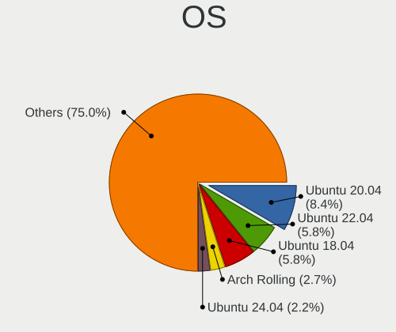

| Name                         | Computers | Percent |
|------------------------------|-----------|---------|
| Ubuntu 20.04                 | 184       | 8.41%   |
| Ubuntu 22.04                 | 127       | 5.81%   |
| Ubuntu 18.04                 | 127       | 5.81%   |
| Arch Rolling                 | 60        | 2.74%   |
| Ubuntu 24.04                 | 49        | 2.24%   |
| Debian 12                    | 40        | 1.83%   |
| Pop!_OS 22.04                | 39        | 1.78%   |
| OpenMandriva 4.2             | 37        | 1.69%   |
| Manjaro                      | 33        | 1.51%   |
| OpenMandriva 24.12           | 32        | 1.46%   |
| Zorin 16                     | 31        | 1.42%   |
| Debian 11                    | 29        | 1.33%   |
| KDE neon 20.04               | 26        | 1.19%   |
| Zorin 17                     | 25        | 1.14%   |
| OpenMandriva 23.08           | 24        | 1.1%    |
| Linux Mint 21.1              | 24        | 1.1%    |
| ArcoLinux Rolling            | 24        | 1.1%    |
| openSUSE Tumbleweed-XXXXXXXX | 23        | 1.05%   |
| OpenMandriva 4.3             | 22        | 1.01%   |
| Ubuntu MATE 20.04            | 21        | 0.96%   |
| Linux Mint 19.3              | 21        | 0.96%   |
| Zorin 15                     | 20        | 0.91%   |
| Fedora 41                    | 20        | 0.91%   |
| Ubuntu 19.10                 | 19        | 0.87%   |
| MX 23                        | 19        | 0.87%   |
| Linux Mint 22.1              | 19        | 0.87%   |
| Fedora 40                    | 19        | 0.87%   |
| OpenMandriva 25.90           | 18        | 0.82%   |
| Linux Mint 20.3              | 18        | 0.82%   |
| Linux Mint 22.2              | 17        | 0.78%   |
| Fedora 42                    | 17        | 0.78%   |
| Ubuntu MATE 18.04            | 16        | 0.73%   |
| Linux Mint 20.1              | 16        | 0.73%   |
| Arch                         | 16        | 0.73%   |
| Ubuntu 19.04                 | 15        | 0.69%   |
| Pop!_OS 20.04                | 15        | 0.69%   |
| OpenMandriva 5.0             | 15        | 0.69%   |
| Linux Mint 20.2              | 15        | 0.69%   |
| Xubuntu 18.04                | 14        | 0.64%   |
| Ubuntu 23.04                 | 14        | 0.64%   |

OS Family
---------

OS without a version

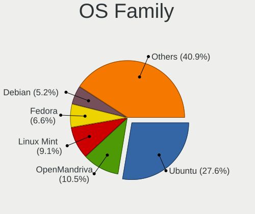

| Name          | Computers | Percent |
|---------------|-----------|---------|
| Ubuntu        | 565       | 27.61%  |
| OpenMandriva  | 215       | 10.51%  |
| Linux Mint    | 187       | 9.14%   |
| Fedora        | 136       | 6.65%   |
| Debian        | 107       | 5.23%   |
| Zorin         | 85        | 4.15%   |
| Pop!_OS       | 78        | 3.81%   |
| Manjaro       | 75        | 3.67%   |
| Arch          | 75        | 3.67%   |
| Ubuntu MATE   | 45        | 2.2%    |
| KDE neon      | 43        | 2.1%    |
| Kubuntu       | 42        | 2.05%   |
| Xubuntu       | 39        | 1.91%   |
| openSUSE      | 30        | 1.47%   |
| MX            | 27        | 1.32%   |
| ArcoLinux     | 26        | 1.27%   |
| ROSA          | 24        | 1.17%   |
| Gentoo        | 20        | 0.98%   |
| Endless       | 19        | 0.93%   |
| Elementary    | 19        | 0.93%   |
| Ubuntu Unity  | 13        | 0.64%   |
| Lubuntu       | 12        | 0.59%   |
| LMDE          | 11        | 0.54%   |
| CachyOS       | 11        | 0.54%   |
| ALT Linux     | 10        | 0.49%   |
| EndeavourOS   | 9         | 0.44%   |
| Kali          | 8         | 0.39%   |
| Garuda Linux  | 8         | 0.39%   |
| BlackPanther  | 8         | 0.39%   |
| Nobara        | 7         | 0.34%   |
| Void Linux    | 6         | 0.29%   |
| Ubuntu Budgie | 6         | 0.29%   |
| Bazzite       | 6         | 0.29%   |
| Xero          | 5         | 0.24%   |
| Parrot        | 5         | 0.24%   |
| SteamOS       | 4         | 0.2%    |
| Peppermint    | 4         | 0.2%    |
| CentOS        | 4         | 0.2%    |
| BigLinux      | 4         | 0.2%    |
| Artix         | 4         | 0.2%    |

Kernel
------

Version of the Linux kernel

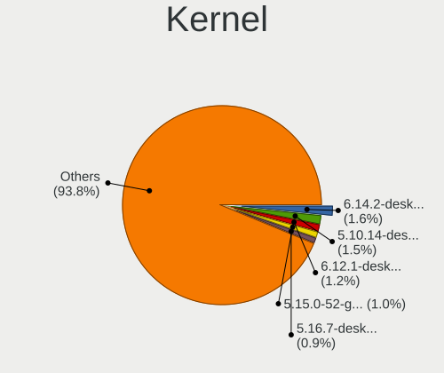

| Version                  | Computers | Percent |
|--------------------------|-----------|---------|
| 6.14.2-desktop-3omv2590  | 39        | 1.61%   |
| 5.10.14-desktop-1omv4002 | 36        | 1.49%   |
| 6.12.1-desktop-1omv2490  | 29        | 1.2%    |
| 5.15.0-52-generic        | 25        | 1.03%   |
| 5.16.7-desktop-1omv4003  | 22        | 0.91%   |
| 5.15.0-56-generic        | 22        | 0.91%   |
| 5.4.0-42-generic         | 20        | 0.83%   |
| 5.4.0-58-generic         | 19        | 0.78%   |
| 6.4.11-desktop-1omv2390  | 17        | 0.7%    |
| 6.6.2-desktop-1omv2390   | 16        | 0.66%   |
| 5.4.0-29-generic         | 14        | 0.58%   |
| 4.15.0-163-generic       | 14        | 0.58%   |
| 6.8.0-52-generic         | 13        | 0.54%   |
| 5.4.0-94-generic         | 13        | 0.54%   |
| 5.15.0-58-generic        | 13        | 0.54%   |
| 6.2.6-desktop-1omv2390   | 12        | 0.5%    |
| 5.3.0-46-generic         | 12        | 0.5%    |
| 6.1.1-desktop-1omv2290   | 11        | 0.45%   |
| 5.4.0-54-generic         | 11        | 0.45%   |
| 5.4.0-48-generic         | 11        | 0.45%   |
| 5.15.0-53-generic        | 11        | 0.45%   |
| 5.11.0-40-generic        | 11        | 0.45%   |
| 6.8.0-51-generic         | 10        | 0.41%   |
| 5.4.0-65-generic         | 10        | 0.41%   |
| 4.15.0-47-generic        | 10        | 0.41%   |
| 6.8.0-49-generic         | 9         | 0.37%   |
| 6.1.0-9-amd64            | 9         | 0.37%   |
| 5.4.0-91-generic         | 9         | 0.37%   |
| 5.4.0-52-generic         | 9         | 0.37%   |
| 5.19.0-35-generic        | 9         | 0.37%   |
| 5.10.88-std-def-alt1     | 9         | 0.37%   |
| 6.2.0-39-generic         | 8         | 0.33%   |
| 5.8.0-43-generic         | 8         | 0.33%   |
| 5.4.0-56-generic         | 8         | 0.33%   |
| 5.4.0-37-generic         | 8         | 0.33%   |
| 5.3.0-42-generic         | 8         | 0.33%   |
| 5.15.0-91-generic        | 8         | 0.33%   |
| 5.15.0-46-generic        | 8         | 0.33%   |
| 5.13.0-39-generic        | 8         | 0.33%   |
| 5.11.0-38-generic        | 8         | 0.33%   |

Kernel Family
-------------

Linux kernel without a distro release

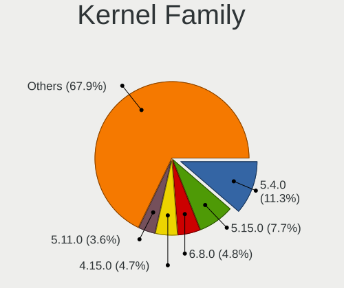

| Version | Computers | Percent |
|---------|-----------|---------|
| 5.4.0   | 260       | 11.34%  |
| 5.15.0  | 176       | 7.68%   |
| 6.8.0   | 110       | 4.8%    |
| 4.15.0  | 108       | 4.71%   |
| 5.11.0  | 83        | 3.62%   |
| 5.8.0   | 66        | 2.88%   |
| 5.3.0   | 66        | 2.88%   |
| 5.13.0  | 64        | 2.79%   |
| 6.5.0   | 57        | 2.49%   |
| 6.1.0   | 56        | 2.44%   |
| 5.19.0  | 55        | 2.4%    |
| 6.14.0  | 49        | 2.14%   |
| 6.2.0   | 41        | 1.79%   |
| 6.14.2  | 41        | 1.79%   |
| 5.0.0   | 38        | 1.66%   |
| 5.10.14 | 36        | 1.57%   |
| 5.10.0  | 35        | 1.53%   |
| 4.18.0  | 30        | 1.31%   |
| 6.12.1  | 29        | 1.26%   |
| 6.11.0  | 25        | 1.09%   |
| 5.16.7  | 23        | 1%      |
| 6.4.11  | 19        | 0.83%   |
| 6.6.2   | 18        | 0.78%   |
| 6.2.6   | 14        | 0.61%   |
| 4.19.0  | 14        | 0.61%   |
| 6.1.1   | 13        | 0.57%   |
| 6.12.9  | 11        | 0.48%   |
| 5.10.88 | 11        | 0.48%   |
| 6.17.9  | 8         | 0.35%   |
| 6.10.0  | 8         | 0.35%   |
| 5.17.5  | 8         | 0.35%   |
| 6.6.0   | 7         | 0.31%   |
| 6.5.5   | 7         | 0.31%   |
| 6.4.8   | 7         | 0.31%   |
| 6.11.5  | 7         | 0.31%   |
| 6.0.6   | 7         | 0.31%   |
| 5.9.11  | 7         | 0.31%   |
| 5.14.21 | 7         | 0.31%   |
| 5.14.0  | 7         | 0.31%   |
| 4.9.60  | 7         | 0.31%   |

Kernel Major Ver.
-----------------

Linux kernel major version

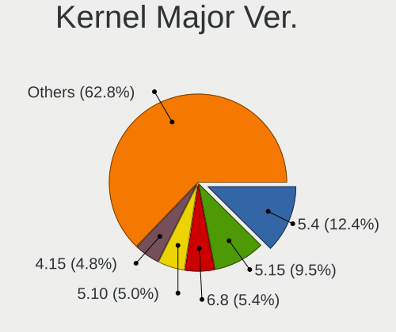

| Version | Computers | Percent |
|---------|-----------|---------|
| 5.4     | 281       | 12.42%  |
| 5.15    | 216       | 9.55%   |
| 6.8     | 123       | 5.44%   |
| 5.10    | 113       | 5%      |
| 4.15    | 108       | 4.77%   |
| 6.14    | 103       | 4.55%   |
| 5.11    | 101       | 4.47%   |
| 6.1     | 96        | 4.24%   |
| 5.8     | 87        | 3.85%   |
| 6.5     | 82        | 3.63%   |
| 6.12    | 80        | 3.54%   |
| 5.3     | 72        | 3.18%   |
| 5.13    | 71        | 3.14%   |
| 6.2     | 65        | 2.87%   |
| 5.19    | 63        | 2.79%   |
| 6.6     | 59        | 2.61%   |
| 6.11    | 50        | 2.21%   |
| 5.0     | 42        | 1.86%   |
| 6.4     | 38        | 1.68%   |
| 5.16    | 36        | 1.59%   |
| 4.18    | 36        | 1.59%   |
| 6.10    | 35        | 1.55%   |
| 6.0     | 29        | 1.28%   |
| 5.14    | 28        | 1.24%   |
| 5.17    | 22        | 0.97%   |
| 6.16    | 20        | 0.88%   |
| 5.9     | 19        | 0.84%   |
| 6.17    | 17        | 0.75%   |
| 5.18    | 17        | 0.75%   |
| 6.9     | 16        | 0.71%   |
| 4.19    | 15        | 0.66%   |
| 6.15    | 14        | 0.62%   |
| 5.6     | 14        | 0.62%   |
| 4.9     | 14        | 0.62%   |
| 6.3     | 13        | 0.57%   |
| 5.7     | 12        | 0.53%   |
| 6.13    | 11        | 0.49%   |
| 5.12    | 11        | 0.49%   |
| 6.7     | 9         | 0.4%    |
| 5.5     | 6         | 0.27%   |

Arch
----

OS architecture (x86_64, i586, etc.)

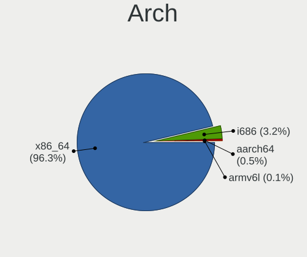

| Name    | Computers | Percent |
|---------|-----------|---------|
| x86_64  | 1875      | 96.25%  |
| i686    | 62        | 3.18%   |
| aarch64 | 9         | 0.46%   |
| armv7l  | 1         | 0.05%   |
| armv6l  | 1         | 0.05%   |

DE
--

Desktop Environment

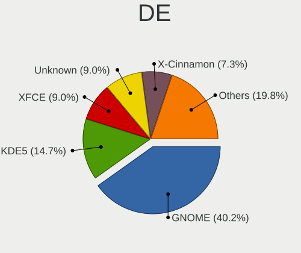

| Name                | Computers | Percent |
|---------------------|-----------|---------|
| GNOME               | 824       | 40.16%  |
| KDE5                | 302       | 14.72%  |
| XFCE                | 185       | 9.02%   |
| Unknown             | 185       | 9.02%   |
| X-Cinnamon          | 149       | 7.26%   |
| KDE6                | 143       | 6.97%   |
| MATE                | 82        | 4%      |
| KDE                 | 44        | 2.14%   |
| LXQt                | 30        | 1.46%   |
| Pantheon            | 19        | 0.93%   |
| Unity               | 14        | 0.68%   |
| KDE4                | 14        | 0.68%   |
| i3                  | 13        | 0.63%   |
| Budgie              | 10        | 0.49%   |
| Hyprland            | 6         | 0.29%   |
| Cinnamon            | 6         | 0.29%   |
| LXDE                | 5         | 0.24%   |
| Deepin              | 4         | 0.19%   |
| openbox             | 3         | 0.15%   |
| GNOME Classic       | 3         | 0.15%   |
| ICEWM               | 2         | 0.1%    |
| wlroots             | 1         | 0.05%   |
| lightdm-xsession    | 1         | 0.05%   |
| herbstluftwm        | 1         | 0.05%   |
| GNOME Flashback     | 1         | 0.05%   |
| Endless:GNOME       | 1         | 0.05%   |
| default             | 1         | 0.05%   |
| BunsenLabs          | 1         | 0.05%   |
| awesome             | 1         | 0.05%   |
| /usr/bin/startxfce4 | 1         | 0.05%   |

Display Server
--------------

X11 or Wayland

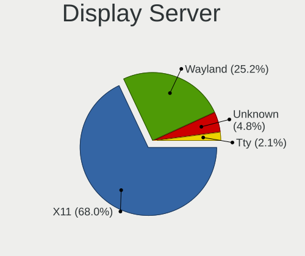

| Name    | Computers | Percent |
|---------|-----------|---------|
| X11     | 1381      | 68%     |
| Wayland | 511       | 25.16%  |
| Unknown | 97        | 4.78%   |
| Tty     | 42        | 2.07%   |

Display Manager
---------------

SDDM, LightDM, etc.

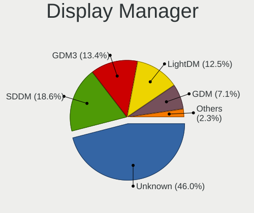

| Name    | Computers | Percent |
|---------|-----------|---------|
| Unknown | 940       | 45.99%  |
| SDDM    | 380       | 18.59%  |
| GDM3    | 274       | 13.41%  |
| LightDM | 256       | 12.52%  |
| GDM     | 146       | 7.14%   |
| TDM     | 25        | 1.22%   |
| KDM     | 12        | 0.59%   |
| XDM     | 4         | 0.2%    |
| SLiM    | 2         | 0.1%    |
| LXDM    | 2         | 0.1%    |
| GREETD  | 2         | 0.1%    |
| Ly      | 1         | 0.05%   |

OS Lang
-------

Language

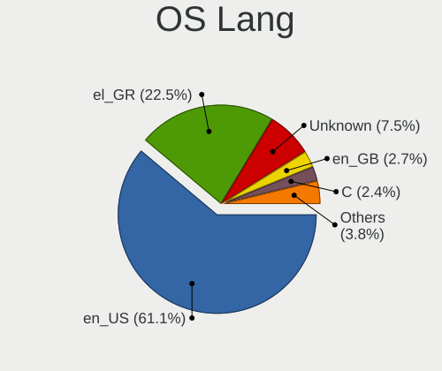

| Lang       | Computers | Percent |
|------------|-----------|---------|
| en_US      | 1222      | 61.13%  |
| el_GR      | 450       | 22.51%  |
| Unknown    | 150       | 7.5%    |
| en_GB      | 54        | 2.7%    |
| C          | 47        | 2.35%   |
| de_DE      | 22        | 1.1%    |
| ru_RU      | 10        | 0.5%    |
| en_IE      | 6         | 0.3%    |
| POSIX      | 4         | 0.2%    |
| fr_FR      | 4         | 0.2%    |
| en_CA      | 4         | 0.2%    |
| bg_BG      | 4         | 0.2%    |
| it_IT      | 3         | 0.15%   |
| el_GR@euro | 3         | 0.15%   |
| es_ES      | 2         | 0.1%    |
| en_AG      | 2         | 0.1%    |
| C.UTF8     | 2         | 0.1%    |
| unm_US     | 1         | 0.05%   |
| tr_TR      | 1         | 0.05%   |
| pl_PL      | 1         | 0.05%   |
| hu_HU      | 1         | 0.05%   |
| en_US.UTF8 | 1         | 0.05%   |
| en_NZ      | 1         | 0.05%   |
| en_AU      | 1         | 0.05%   |
| de_AT      | 1         | 0.05%   |
| cs_CZ      | 1         | 0.05%   |
| anp_IN     | 1         | 0.05%   |

Boot Mode
---------

EFI or BIOS

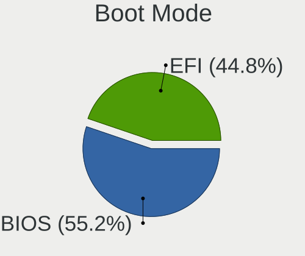

| Mode | Computers | Percent |
|------|-----------|---------|
| BIOS | 1107      | 55.21%  |
| EFI  | 898       | 44.79%  |

Filesystem
----------

Type of filesystem

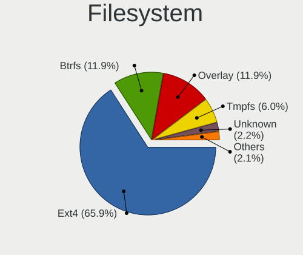

| Type    | Computers | Percent |
|---------|-----------|---------|
| Ext4    | 1345      | 65.87%  |
| Btrfs   | 244       | 11.95%  |
| Overlay | 243       | 11.9%   |
| Tmpfs   | 123       | 6.02%   |
| Unknown | 44        | 2.15%   |
| Xfs     | 19        | 0.93%   |
| Zfs     | 16        | 0.78%   |
| F2fs    | 4         | 0.2%    |
| Ext3    | 2         | 0.1%    |
| Ext2    | 2         | 0.1%    |

Part. scheme
------------

Scheme of partitioning

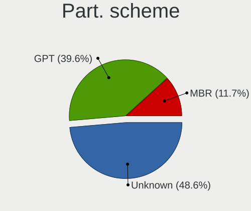

| Type    | Computers | Percent |
|---------|-----------|---------|
| Unknown | 983       | 48.64%  |
| GPT     | 801       | 39.63%  |
| MBR     | 237       | 11.73%  |

Dual Boot with Linux/BSD
------------------------

Hosting more than one Linux/BSD

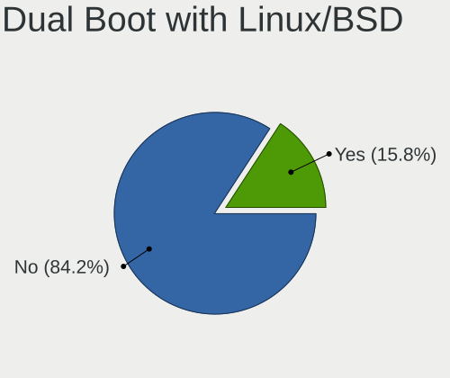

| Dual boot | Computers | Percent |
|-----------|-----------|---------|
| No        | 1678      | 84.19%  |
| Yes       | 315       | 15.81%  |

Dual Boot (Win)
---------------

Hosting Linux and Windows

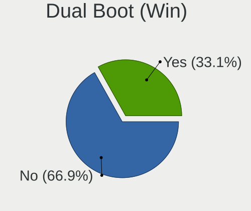

| Dual boot | Computers | Percent |
|-----------|-----------|---------|
| No        | 1331      | 66.85%  |
| Yes       | 660       | 33.15%  |

Board
-----

Vendor
------

Motherboard manufacturer

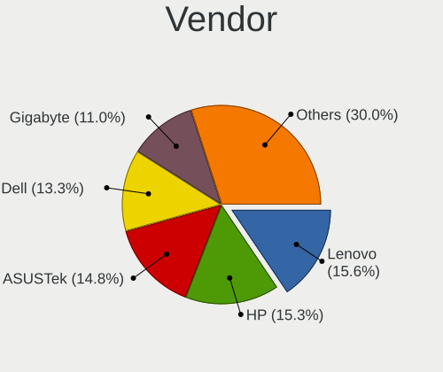

| Name                    | Computers | Percent |
|-------------------------|-----------|---------|
| Lenovo                  | 303       | 15.55%  |
| Hewlett-Packard         | 299       | 15.35%  |
| ASUSTek Computer        | 288       | 14.78%  |
| Dell                    | 259       | 13.3%   |
| Gigabyte Technology     | 215       | 11.04%  |
| ASRock                  | 93        | 4.77%   |
| MSI                     | 86        | 4.41%   |
| Acer                    | 62        | 3.18%   |
| Toshiba                 | 42        | 2.16%   |
| Sony                    | 38        | 1.95%   |
| Apple                   | 26        | 1.33%   |
| Fujitsu                 | 19        | 0.98%   |
| HUAWEI                  | 16        | 0.82%   |
| Unknown                 | 16        | 0.82%   |
| Fujitsu Siemens         | 15        | 0.77%   |
| Intel                   | 13        | 0.67%   |
| Pegatron                | 9         | 0.46%   |
| Notebook                | 9         | 0.46%   |
| Clevo                   | 9         | 0.46%   |
| Raspberry Pi Foundation | 6         | 0.31%   |
| Google                  | 6         | 0.31%   |
| Foxconn                 | 6         | 0.31%   |
| Chuwi                   | 6         | 0.31%   |
| TUXEDO                  | 5         | 0.26%   |
| Samsung Electronics     | 5         | 0.26%   |
| FriendlyElec            | 5         | 0.26%   |
| Valve                   | 4         | 0.21%   |
| Timi                    | 4         | 0.21%   |
| IBM                     | 4         | 0.21%   |
| Biostar                 | 4         | 0.21%   |
| Teclast                 | 3         | 0.15%   |
| Insyde                  | 3         | 0.15%   |
| Hampoo                  | 3         | 0.15%   |
| ECS                     | 3         | 0.15%   |
| E-shop.gr               | 3         | 0.15%   |
| AMI                     | 3         | 0.15%   |
| ZOTAC                   | 2         | 0.1%    |
| VERO                    | 2         | 0.1%    |
| Supermicro              | 2         | 0.1%    |
| SLIMBOOK                | 2         | 0.1%    |

Model
-----

Motherboard model

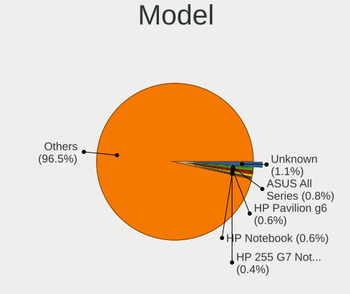

| Name                             | Computers | Percent |
|----------------------------------|-----------|---------|
| Unknown                          | 22        | 1.13%   |
| ASUS All Series                  | 16        | 0.82%   |
| HP Pavilion g6                   | 12        | 0.62%   |
| HP Notebook                      | 11        | 0.56%   |
| HP 255 G7 Notebook PC            | 8         | 0.41%   |
| Gigabyte B450M DS3H              | 8         | 0.41%   |
| Dell OptiPlex 7010               | 8         | 0.41%   |
| HP ProDesk 600 G1 SFF            | 7         | 0.36%   |
| Dell Inspiron 3537               | 7         | 0.36%   |
| ASUS Vivobook Go E1504FA_E1504FA | 7         | 0.36%   |
| MSI MS-7C02                      | 6         | 0.31%   |
| HP Pavilion Notebook             | 6         | 0.31%   |
| HP G62                           | 6         | 0.31%   |
| Dell OptiPlex 790                | 6         | 0.31%   |
| Dell Inspiron 3542               | 6         | 0.31%   |
| ASRock B450 Gaming K4            | 6         | 0.31%   |
| Pegatron A15                     | 5         | 0.26%   |
| Lenovo IdeaPad 100-15IBD 80QQ    | 5         | 0.26%   |
| Lenovo G40-30 80FY               | 5         | 0.26%   |
| HP Pavilion dv6                  | 5         | 0.26%   |
| HP Pavilion 15                   | 5         | 0.26%   |
| HP Compaq 8200 Elite SFF PC      | 5         | 0.26%   |
| Gigabyte H61M-S2PV               | 5         | 0.26%   |
| Gigabyte B550 AORUS ELITE V2     | 5         | 0.26%   |
| Gigabyte A320M-S2H               | 5         | 0.26%   |
| FriendlyElec NanoPC-T6           | 5         | 0.26%   |
| Dell OptiPlex GX520              | 5         | 0.26%   |
| Dell Latitude 5420               | 5         | 0.26%   |
| Dell Inspiron 5567               | 5         | 0.26%   |
| ASUS ROG STRIX B350-F GAMING     | 5         | 0.26%   |
| Notebook W54_W94_W955TU,-T,-C    | 4         | 0.21%   |
| MSI MS-7C56                      | 4         | 0.21%   |
| Lenovo IdeaPad 5 Pro 14ACN6 82L7 | 4         | 0.21%   |
| Lenovo IdeaPad 3 15ABA7 82RN     | 4         | 0.21%   |
| Lenovo G550 20023                | 4         | 0.21%   |
| Lenovo G510 20238                | 4         | 0.21%   |
| HP Pavilion dv7                  | 4         | 0.21%   |
| HP Compaq Pro 6300 SFF           | 4         | 0.21%   |
| HP 255 G8 Notebook PC            | 4         | 0.21%   |
| HP 250 G6 Notebook PC            | 4         | 0.21%   |

Model Family
------------

Motherboard model prefix

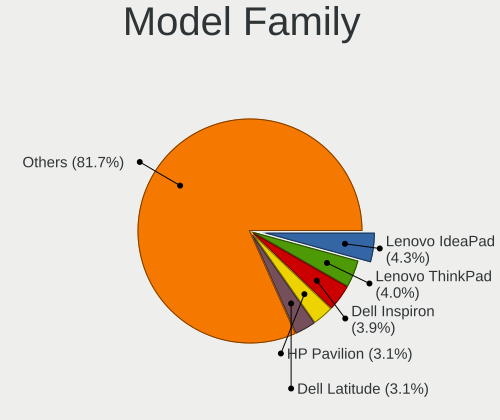

| Name                  | Computers | Percent |
|-----------------------|-----------|---------|
| Lenovo IdeaPad        | 83        | 4.26%   |
| Lenovo ThinkPad       | 78        | 4%      |
| Dell Inspiron         | 75        | 3.85%   |
| HP Pavilion           | 61        | 3.13%   |
| Dell Latitude         | 60        | 3.08%   |
| Acer Aspire           | 51        | 2.62%   |
| Dell OptiPlex         | 47        | 2.41%   |
| HP Compaq             | 44        | 2.26%   |
| ASUS PRIME            | 40        | 2.05%   |
| Toshiba Satellite     | 36        | 1.85%   |
| ASUS VivoBook         | 36        | 1.85%   |
| Lenovo ThinkCentre    | 34        | 1.75%   |
| Dell Precision        | 32        | 1.64%   |
| HP EliteBook          | 24        | 1.23%   |
| HP ProBook            | 23        | 1.18%   |
| ASUS ROG              | 23        | 1.18%   |
| Unknown               | 22        | 1.13%   |
| HP 255                | 19        | 0.98%   |
| HP Laptop             | 17        | 0.87%   |
| Dell XPS              | 17        | 0.87%   |
| ASUS All              | 16        | 0.82%   |
| Lenovo Yoga           | 15        | 0.77%   |
| ASUS TUF              | 15        | 0.77%   |
| Lenovo Legion         | 14        | 0.72%   |
| Dell Vostro           | 14        | 0.72%   |
| HP 250                | 13        | 0.67%   |
| Fujitsu LIFEBOOK      | 12        | 0.62%   |
| HP ProDesk            | 11        | 0.56%   |
| HP Notebook           | 11        | 0.56%   |
| Gigabyte B550         | 10        | 0.51%   |
| Gigabyte B450         | 10        | 0.51%   |
| Gigabyte B450M        | 9         | 0.46%   |
| ASUS ASUS             | 9         | 0.46%   |
| HP ENVY               | 8         | 0.41%   |
| HP EliteDesk          | 8         | 0.41%   |
| Fujitsu Siemens AMILO | 7         | 0.36%   |
| ASUS Zenbook          | 7         | 0.36%   |
| RPi Raspberry         | 6         | 0.31%   |
| MSI MS-7C02           | 6         | 0.31%   |
| Lenovo ThinkBook      | 6         | 0.31%   |

MFG Year
--------

Motherboard manufacture year

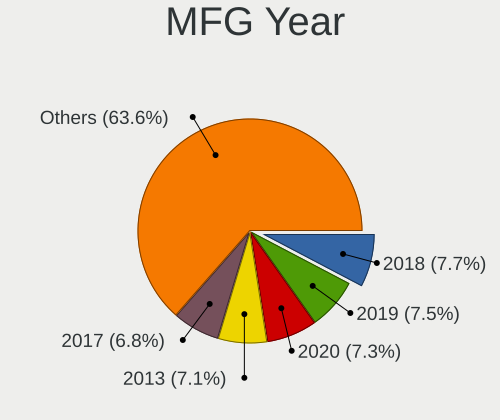

| Year    | Computers | Percent |
|---------|-----------|---------|
| 2018    | 150       | 7.7%    |
| 2019    | 146       | 7.49%   |
| 2020    | 143       | 7.34%   |
| 2013    | 138       | 7.08%   |
| 2017    | 133       | 6.83%   |
| 2011    | 131       | 6.72%   |
| 2012    | 119       | 6.11%   |
| 2008    | 113       | 5.8%    |
| 2014    | 107       | 5.49%   |
| 2009    | 105       | 5.39%   |
| 2021    | 99        | 5.08%   |
| 2015    | 93        | 4.77%   |
| 2010    | 86        | 4.41%   |
| 2016    | 77        | 3.95%   |
| 2022    | 71        | 3.64%   |
| 2007    | 71        | 3.64%   |
| 2023    | 50        | 2.57%   |
| 2024    | 40        | 2.05%   |
| 2006    | 27        | 1.39%   |
| 2005    | 23        | 1.18%   |
| Unknown | 10        | 0.51%   |
| 2004    | 6         | 0.31%   |
| 2025    | 5         | 0.26%   |
| 2003    | 5         | 0.26%   |

Form Factor
-----------

Physical design of the computer

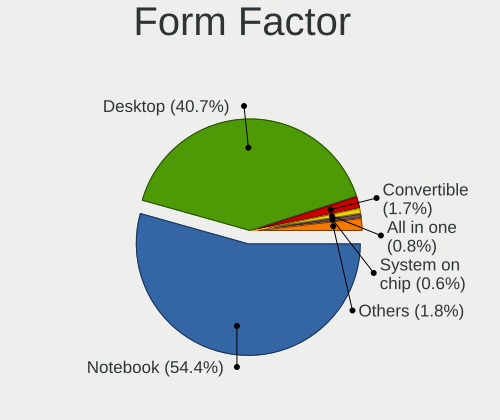

| Name           | Computers | Percent |
|----------------|-----------|---------|
| Notebook       | 1059      | 54.36%  |
| Desktop        | 792       | 40.66%  |
| Convertible    | 33        | 1.69%   |
| All in one     | 16        | 0.82%   |
| System on chip | 12        | 0.62%   |
| Mini pc        | 11        | 0.56%   |
| Server         | 11        | 0.56%   |
| Tablet         | 9         | 0.46%   |
| Other          | 4         | 0.21%   |
| Stick pc       | 1         | 0.05%   |

Secure Boot
-----------

Enabled or disabled

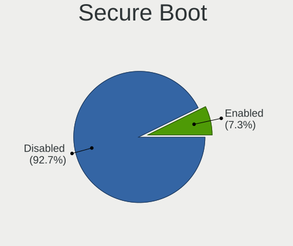

| State    | Computers | Percent |
|----------|-----------|---------|
| Disabled | 1824      | 92.73%  |
| Enabled  | 143       | 7.27%   |

Coreboot
--------

Have coreboot on board

| Used | Computers | Percent |
|------|-----------|---------|
| No   | 1941      | 99.64%  |
| Yes  | 7         | 0.36%   |

RAM Size
--------

Total RAM memory

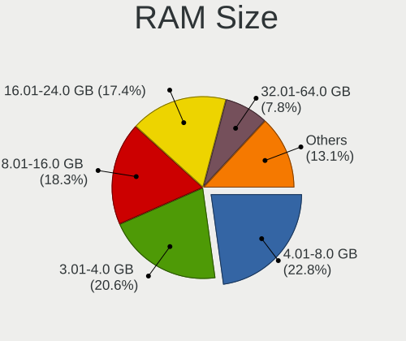

| Size in GB  | Computers | Percent |
|-------------|-----------|---------|
| 4.01-8.0    | 455       | 22.82%  |
| 3.01-4.0    | 411       | 20.61%  |
| 8.01-16.0   | 365       | 18.3%   |
| 16.01-24.0  | 346       | 17.35%  |
| 32.01-64.0  | 156       | 7.82%   |
| 1.01-2.0    | 120       | 6.02%   |
| 2.01-3.0    | 45        | 2.26%   |
| 24.01-32.0  | 44        | 2.21%   |
| 64.01-256.0 | 36        | 1.81%   |
| 0.51-1.0    | 15        | 0.75%   |
| 0.01-0.5    | 1         | 0.05%   |

RAM Used
--------

Used RAM memory

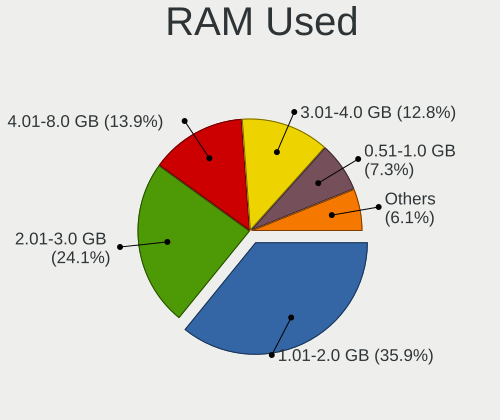

| Used GB    | Computers | Percent |
|------------|-----------|---------|
| 1.01-2.0   | 781       | 35.86%  |
| 2.01-3.0   | 525       | 24.1%   |
| 4.01-8.0   | 302       | 13.87%  |
| 3.01-4.0   | 279       | 12.81%  |
| 0.51-1.0   | 158       | 7.25%   |
| 8.01-16.0  | 90        | 4.13%   |
| 0.01-0.5   | 29        | 1.33%   |
| 16.01-24.0 | 11        | 0.51%   |
| 24.01-32.0 | 2         | 0.09%   |
| 32.01-64.0 | 1         | 0.05%   |

Total Drives
------------

Number of drives on board

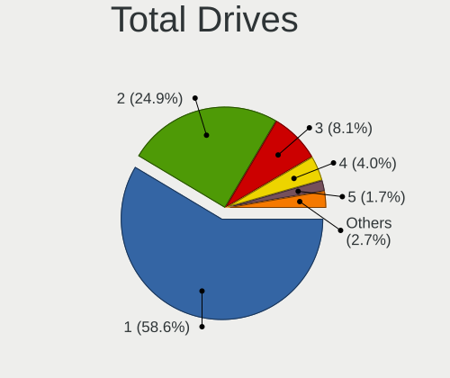

| Drives | Computers | Percent |
|--------|-----------|---------|
| 1      | 1181      | 58.58%  |
| 2      | 502       | 24.9%   |
| 3      | 163       | 8.09%   |
| 4      | 81        | 4.02%   |
| 5      | 35        | 1.74%   |
| 6      | 21        | 1.04%   |
| 0      | 21        | 1.04%   |
| 7      | 7         | 0.35%   |
| 18     | 1         | 0.05%   |
| 14     | 1         | 0.05%   |
| 13     | 1         | 0.05%   |
| 12     | 1         | 0.05%   |
| 8      | 1         | 0.05%   |

Has CD-ROM
----------

Has CD-ROM on board

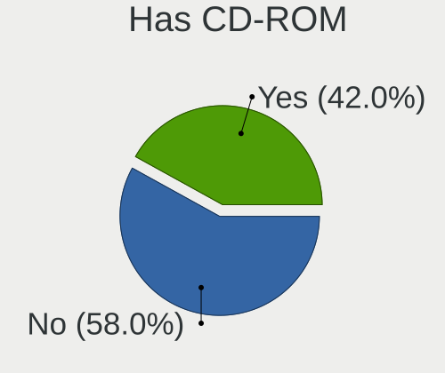

| Presented | Computers | Percent |
|-----------|-----------|---------|
| No        | 1140      | 58.04%  |
| Yes       | 824       | 41.96%  |

Has Ethernet
------------

Has Ethernet on board

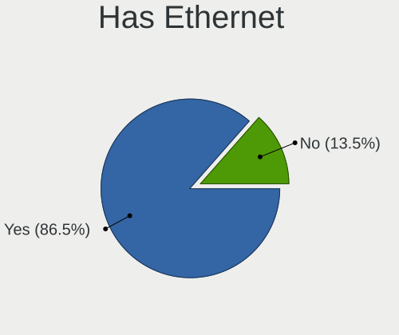

| Presented | Computers | Percent |
|-----------|-----------|---------|
| Yes       | 1691      | 86.5%   |
| No        | 264       | 13.5%   |

Has WiFi
--------

Has WiFi module

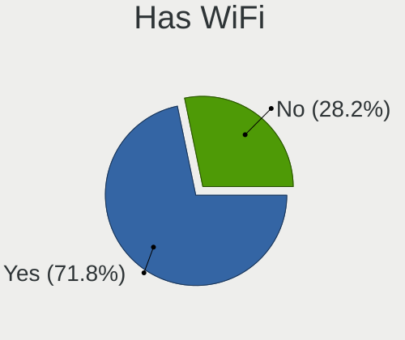

| Presented | Computers | Percent |
|-----------|-----------|---------|
| Yes       | 1413      | 71.76%  |
| No        | 556       | 28.24%  |

Has Bluetooth
-------------

Has Bluetooth module

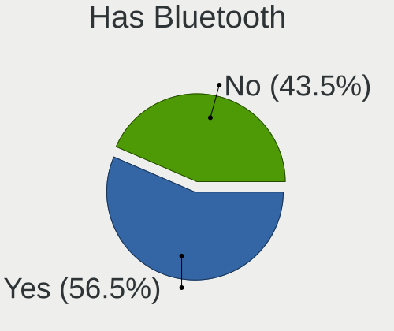

| Presented | Computers | Percent |
|-----------|-----------|---------|
| Yes       | 1117      | 56.5%   |
| No        | 860       | 43.5%   |

Location
--------

Country
-------

Geographic location (country)

| Country | Computers | Percent |
|---------|-----------|---------|
| Greece  | 1948      | 100%    |

City
----

Geographic location (city)

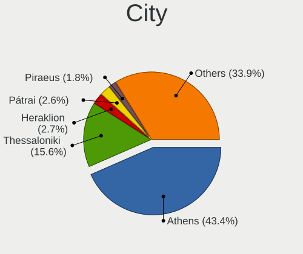

| City           | Computers | Percent |
|----------------|-----------|---------|
| Athens         | 927       | 43.44%  |
| Thessaloniki   | 333       | 15.6%   |
| Heraklion      | 57        | 2.67%   |
| Pátrai        | 55        | 2.58%   |
| Piraeus        | 39        | 1.83%   |
| Larissa        | 35        | 1.64%   |
| Volos          | 29        | 1.36%   |
| Chalcis        | 29        | 1.36%   |
| Kavala         | 22        | 1.03%   |
| Ioannina       | 22        | 1.03%   |
| Chania         | 19        | 0.89%   |
| Trikala        | 17        | 0.8%    |
| Katerini       | 17        | 0.8%    |
| Kalamata       | 16        | 0.75%   |
| Rhodes         | 14        | 0.66%   |
| Lamia          | 13        | 0.61%   |
| Chalandri      | 12        | 0.56%   |
| Serres         | 11        | 0.52%   |
| Drama          | 11        | 0.52%   |
| Corfu          | 11        | 0.52%   |
| Xanthi         | 10        | 0.47%   |
| Nea Smyrni     | 10        | 0.47%   |
| Acharnes       | 10        | 0.47%   |
| Marousi        | 9         | 0.42%   |
| Kallithea      | 9         | 0.42%   |
| Igoumenitsa    | 9         | 0.42%   |
| Alexandroupoli | 9         | 0.42%   |
| Veroia         | 8         | 0.37%   |
| Rethymno       | 8         | 0.37%   |
| Mytilene       | 8         | 0.37%   |
| Komotini       | 8         | 0.37%   |
| Corinth        | 8         | 0.37%   |
| Agrinio        | 8         | 0.37%   |
| Zakynthos      | 7         | 0.33%   |
| Nea Palatia    | 7         | 0.33%   |
| Kozani         | 7         | 0.33%   |
| Kilkis         | 7         | 0.33%   |
| Karditsa       | 7         | 0.33%   |
| Astros         | 7         | 0.33%   |
| Samos          | 6         | 0.28%   |

Drives
------

Drive Vendor
------------

Hard drive vendors

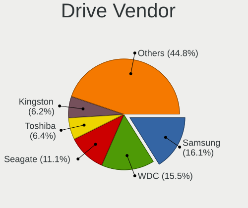

| Vendor                      | Computers | Drives | Percent |
|-----------------------------|-----------|--------|---------|
| Samsung Electronics         | 468       | 735    | 16.08%  |
| WDC                         | 451       | 749    | 15.49%  |
| Seagate                     | 322       | 517    | 11.06%  |
| Toshiba                     | 186       | 254    | 6.39%   |
| Kingston                    | 181       | 238    | 6.22%   |
| SanDisk                     | 177       | 239    | 6.08%   |
| Patriot                     | 116       | 146    | 3.98%   |
| Unknown                     | 86        | 138    | 2.95%   |
| Intenso                     | 75        | 100    | 2.58%   |
| Crucial                     | 72        | 101    | 2.47%   |
| SK hynix                    | 69        | 86     | 2.37%   |
| Hitachi                     | 63        | 70     | 2.16%   |
| Micron Technology           | 48        | 61     | 1.65%   |
| Intel                       | 48        | 63     | 1.65%   |
| KIOXIA                      | 40        | 60     | 1.37%   |
| HGST                        | 34        | 48     | 1.17%   |
| Kingston Technology Company | 27        | 42     | 0.93%   |
| A-DATA Technology           | 27        | 37     | 0.93%   |
| Team                        | 25        | 33     | 0.86%   |
| OCZ                         | 24        | 27     | 0.82%   |
| China                       | 21        | 22     | 0.72%   |
| Fujitsu                     | 19        | 20     | 0.65%   |
| SPCC                        | 17        | 21     | 0.58%   |
| PNY                         | 17        | 19     | 0.58%   |
| Gigabyte Technology         | 17        | 21     | 0.58%   |
| Maxtor                      | 15        | 17     | 0.52%   |
| JMicron Technology          | 14        | 33     | 0.48%   |
| Phison Electronics          | 13        | 16     | 0.45%   |
| Corsair                     | 13        | 14     | 0.45%   |
| Unknown                     | 12        | 12     | 0.41%   |
| ADATA Technology            | 11        | 17     | 0.38%   |
| Phison                      | 10        | 13     | 0.34%   |
| Micron/Crucial Technology   | 10        | 12     | 0.34%   |
| Silicon Motion              | 9         | 10     | 0.31%   |
| Leven                       | 9         | 10     | 0.31%   |
| Apple                       | 9         | 11     | 0.31%   |
| MAXIO Technology (Hangzhou) | 8         | 11     | 0.27%   |
| KIOXIA-EXCERIA              | 8         | 8      | 0.27%   |
| Verbatim                    | 7         | 8      | 0.24%   |
| Hewlett-Packard             | 7         | 12     | 0.24%   |

Drive Model
-----------

Hard drive models

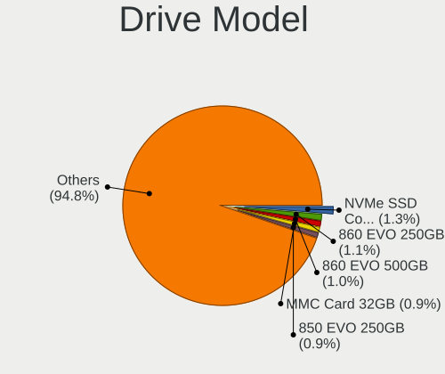

| Model                                              | Computers | Percent |
|----------------------------------------------------|-----------|---------|
| Samsung NVMe SSD Controller SM981/PM981/PM983 1TB  | 42        | 1.3%    |
| Samsung SSD 860 EVO 250GB                          | 36        | 1.12%   |
| Samsung SSD 860 EVO 500GB                          | 32        | 0.99%   |
| Unknown MMC Card  32GB                             | 30        | 0.93%   |
| Samsung SSD 850 EVO 250GB                          | 28        | 0.87%   |
| Patriot Burst 240GB SSD                            | 27        | 0.84%   |
| Patriot Burst 120GB SSD                            | 26        | 0.81%   |
| Kingston SA400S37480G 480GB SSD                    | 25        | 0.78%   |
| Kingston SA400S37240G 240GB SSD                    | 24        | 0.75%   |
| Kingston SA400S37120G 120GB SSD                    | 23        | 0.71%   |
| Seagate ST500DM002-1BD142 500GB                    | 21        | 0.65%   |
| Seagate ST1000LM035-1RK172 1TB                     | 19        | 0.59%   |
| Seagate ST1000LM024 HN-M101MBB 1TB                 | 19        | 0.59%   |
| Toshiba MQ01ABF050 500GB                           | 18        | 0.56%   |
| Toshiba DT01ACA100 1TB                             | 18        | 0.56%   |
| Seagate ST1000DM010-2EP102 1TB                     | 18        | 0.56%   |
| Toshiba DT01ACA050 500GB                           | 17        | 0.53%   |
| Samsung NVMe SSD Controller PM9A1/PM9A3/980PRO 1TB | 17        | 0.53%   |
| Unknown MMC Card  64GB                             | 16        | 0.5%    |
| Samsung SSD 850 EVO 500GB                          | 16        | 0.5%    |
| WDC WDS240G2G0A-00JH30 240GB SSD                   | 15        | 0.47%   |
| WDC WD10EZEX-08WN4A0 1TB                           | 15        | 0.47%   |
| Samsung SSD 870 EVO 500GB                          | 14        | 0.43%   |
| Kingston Company SNV2S1000G 1TB                    | 13        | 0.4%    |
| Unknown MMC Card  128GB                            | 12        | 0.37%   |
| Toshiba MQ01ABD100 1TB                             | 12        | 0.37%   |
| Toshiba HDWD110 1TB                                | 12        | 0.37%   |
| SK hynix NVMe SSD Drive 256GB                      | 12        | 0.37%   |
| Samsung SSD 860 EVO 1TB                            | 12        | 0.37%   |
| Patriot Burst 480GB SSD                            | 12        | 0.37%   |
| Unknown                                            | 12        | 0.37%   |
| Seagate ST500LT012-1DG142 500GB                    | 11        | 0.34%   |
| Seagate ST500LM012 HN-M500MBB 500GB                | 11        | 0.34%   |
| Seagate ST3500418AS 500GB                          | 10        | 0.31%   |
| SanDisk SDSSDA120G 120GB                           | 10        | 0.31%   |
| SanDisk NVMe SSD Drive 512GB                       | 10        | 0.31%   |
| Samsung SSD 980 500GB                              | 10        | 0.31%   |
| Samsung SSD 870 EVO 1TB                            | 10        | 0.31%   |
| Samsung SSD 850 EVO 120GB                          | 10        | 0.31%   |
| Kingston SV300S37A120G 120GB SSD                   | 10        | 0.31%   |

HDD Vendor
----------

Hard disk drive vendors

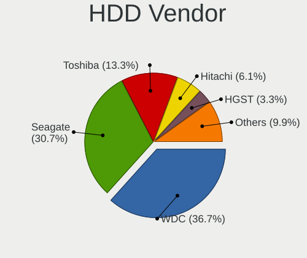

| Vendor              | Computers | Drives | Percent |
|---------------------|-----------|--------|---------|
| WDC                 | 378       | 607    | 36.66%  |
| Seagate             | 317       | 504    | 30.75%  |
| Toshiba             | 137       | 186    | 13.29%  |
| Hitachi             | 63        | 70     | 6.11%   |
| HGST                | 34        | 48     | 3.3%    |
| Samsung Electronics | 28        | 35     | 2.72%   |
| Fujitsu             | 19        | 20     | 1.84%   |
| Maxtor              | 15        | 17     | 1.45%   |
| Intenso             | 10        | 15     | 0.97%   |
| JMicron Technology  | 9         | 25     | 0.87%   |
| Hewlett-Packard     | 4         | 9      | 0.39%   |
| Apple               | 4         | 4      | 0.39%   |
| Unknown             | 3         | 4      | 0.29%   |
| Min Yi U            | 2         | 4      | 0.19%   |
| External            | 2         | 3      | 0.19%   |
| USB                 | 1         | 1      | 0.1%    |
| Quantum             | 1         | 1      | 0.1%    |
| Inateck             | 1         | 1      | 0.1%    |
| IBM/Hitachi         | 1         | 1      | 0.1%    |
| IBM-ESXS            | 1         | 3      | 0.1%    |
| ExcelStor           | 1         | 1      | 0.1%    |

SSD Vendor
----------

Solid state drive vendors

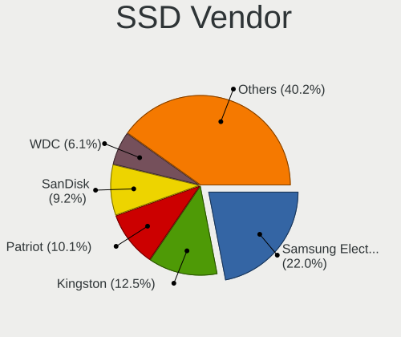

| Vendor              | Computers | Drives | Percent |
|---------------------|-----------|--------|---------|
| Samsung Electronics | 249       | 350    | 21.98%  |
| Kingston            | 142       | 191    | 12.53%  |
| Patriot             | 114       | 144    | 10.06%  |
| SanDisk             | 104       | 149    | 9.18%   |
| WDC                 | 69        | 112    | 6.09%   |
| Crucial             | 66        | 95     | 5.83%   |
| Intenso             | 55        | 74     | 4.85%   |
| Toshiba             | 32        | 45     | 2.82%   |
| Team                | 25        | 33     | 2.21%   |
| A-DATA Technology   | 24        | 34     | 2.12%   |
| OCZ                 | 23        | 26     | 2.03%   |
| Intel               | 21        | 25     | 1.85%   |
| Micron Technology   | 19        | 22     | 1.68%   |
| China               | 19        | 20     | 1.68%   |
| SPCC                | 17        | 21     | 1.5%    |
| PNY                 | 17        | 19     | 1.5%    |
| Gigabyte Technology | 16        | 20     | 1.41%   |
| SK hynix            | 10        | 11     | 0.88%   |
| Corsair             | 10        | 11     | 0.88%   |
| Leven               | 9         | 10     | 0.79%   |
| Verbatim            | 7         | 8      | 0.62%   |
| GOODRAM             | 7         | 9      | 0.62%   |
| LITEONIT            | 6         | 6      | 0.53%   |
| Unknown             | 5         | 5      | 0.44%   |
| Transcend           | 4         | 4      | 0.35%   |
| Mushkin             | 4         | 4      | 0.35%   |
| LITEON              | 4         | 6      | 0.35%   |
| Emtec               | 4         | 5      | 0.35%   |
| Apacer              | 4         | 4      | 0.35%   |
| Teclast             | 3         | 3      | 0.26%   |
| Plextor             | 3         | 3      | 0.26%   |
| Hewlett-Packard     | 3         | 3      | 0.26%   |
| Apple               | 3         | 3      | 0.26%   |
| AGI                 | 3         | 4      | 0.26%   |
| WDC WDS             | 2         | 2      | 0.18%   |
| Platinet            | 2         | 2      | 0.18%   |
| Neo Forza           | 2         | 2      | 0.18%   |
| Lite-On             | 2         | 3      | 0.18%   |
| KIOXIA-EXCERIA      | 2         | 2      | 0.18%   |
| Drevo               | 2         | 2      | 0.18%   |

Drive Kind
----------

HDD or SSD

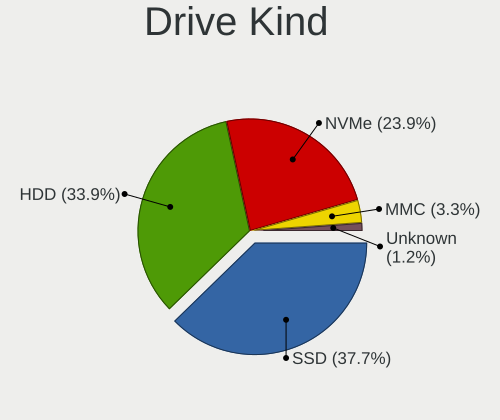

| Kind    | Computers | Drives | Percent |
|---------|-----------|--------|---------|
| SSD     | 978       | 1516   | 37.72%  |
| HDD     | 879       | 1559   | 33.9%   |
| NVMe    | 620       | 955    | 23.91%  |
| MMC     | 86        | 139    | 3.32%   |
| Unknown | 30        | 39     | 1.16%   |

Drive Connector
---------------

SATA, SAS, NVMe, etc.

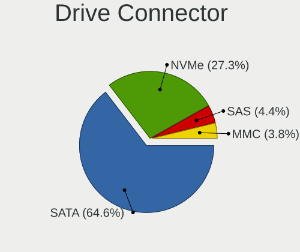

| Type | Computers | Drives | Percent |
|------|-----------|--------|---------|
| SATA | 1468      | 2965   | 64.58%  |
| NVMe | 620       | 949    | 27.28%  |
| SAS  | 99        | 155    | 4.36%   |
| MMC  | 86        | 139    | 3.78%   |

Drive Size
----------

Size of hard drive

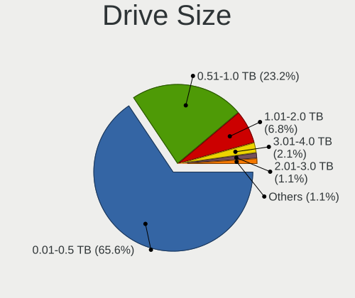

| Size in TB | Computers | Drives | Percent |
|------------|-----------|--------|---------|
| 0.01-0.5   | 1231      | 2042   | 65.62%  |
| 0.51-1.0   | 436       | 681    | 23.24%  |
| 1.01-2.0   | 128       | 207    | 6.82%   |
| 3.01-4.0   | 39        | 64     | 2.08%   |
| 2.01-3.0   | 21        | 39     | 1.12%   |
| 4.01-10.0  | 17        | 34     | 0.91%   |
| 10.01-20.0 | 3         | 4      | 0.16%   |
| 20.01-50.0 | 1         | 4      | 0.05%   |

Space Total
-----------

Amount of disk space available on the file system

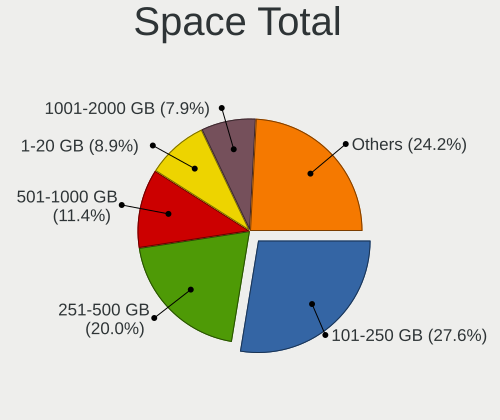

| Size in GB     | Computers | Percent |
|----------------|-----------|---------|
| 101-250        | 582       | 27.58%  |
| 251-500        | 422       | 20%     |
| 501-1000       | 241       | 11.42%  |
| 1-20           | 188       | 8.91%   |
| 1001-2000      | 167       | 7.91%   |
| 51-100         | 148       | 7.01%   |
| 21-50          | 104       | 4.93%   |
| More than 3000 | 101       | 4.79%   |
| Unknown        | 96        | 4.55%   |
| 2001-3000      | 61        | 2.89%   |

Space Used
----------

Amount of used disk space

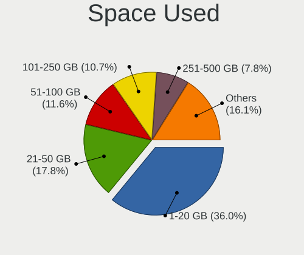

| Used GB        | Computers | Percent |
|----------------|-----------|---------|
| 1-20           | 783       | 35.95%  |
| 21-50          | 388       | 17.81%  |
| 51-100         | 252       | 11.57%  |
| 101-250        | 234       | 10.74%  |
| 251-500        | 170       | 7.81%   |
| 501-1000       | 116       | 5.33%   |
| Unknown        | 96        | 4.41%   |
| 1001-2000      | 75        | 3.44%   |
| More than 3000 | 38        | 1.74%   |
| 2001-3000      | 21        | 0.96%   |
| 0              | 5         | 0.23%   |

Malfunc. Drives
---------------

Drive models with a malfunction

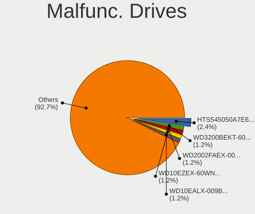

| Model                                 | Computers | Drives | Percent |
|---------------------------------------|-----------|--------|---------|
| HGST HTS545050A7E680 500GB            | 4         | 4      | 2.42%   |
| WDC WD3200BEKT-60V5T1 320GB           | 2         | 2      | 1.21%   |
| WDC WD2002FAEX-007BA0 2TB             | 2         | 3      | 1.21%   |
| WDC WD10EZEX-60WN4A0 1TB              | 2         | 2      | 1.21%   |
| WDC WD10EALX-009BA0 1TB               | 2         | 2      | 1.21%   |
| Toshiba MQ01ABF050 500GB              | 2         | 2      | 1.21%   |
| Toshiba MQ01ABD100 1TB                | 2         | 2      | 1.21%   |
| Toshiba MQ01ABD050 500GB              | 2         | 4      | 1.21%   |
| SK hynix BC711 HFM256GD3JX013N 256GB  | 2         | 3      | 1.21%   |
| Seagate ST500DM002-1BD142 500GB       | 2         | 3      | 1.21%   |
| Seagate ST3500320AS 500GB             | 2         | 2      | 1.21%   |
| Seagate ST3320620AS 320GB             | 2         | 2      | 1.21%   |
| Seagate ST3250318AS 250GB             | 2         | 2      | 1.21%   |
| Seagate ST1000LM024 HN-M101MBB 1TB    | 2         | 13     | 1.21%   |
| SanDisk SSD PLUS 240GB                | 2         | 2      | 1.21%   |
| Samsung Electronics SSD 870 EVO 500GB | 2         | 3      | 1.21%   |
| Hitachi HTS723232A7A364 320GB         | 2         | 2      | 1.21%   |
| Hitachi HTS545050B9A300 500GB         | 2         | 2      | 1.21%   |
| WDC WDS240G2G0A-00JH30 240GB SSD      | 1         | 1      | 0.61%   |
| WDC WDS120G2G0A-00JH30 120GB SSD      | 1         | 1      | 0.61%   |
| WDC WD800JD-23LSA0 80GB               | 1         | 1      | 0.61%   |
| WDC WD800JB-00JJC0 80GB               | 1         | 2      | 0.61%   |
| WDC WD6400AAKS-65A7B0 640GB           | 1         | 1      | 0.61%   |
| WDC WD6002FRYZ-01WD5B0 6TB            | 1         | 1      | 0.61%   |
| WDC WD5000LPVT-00FMCT0 500GB          | 1         | 1      | 0.61%   |
| WDC WD5000LPCX-24VHAT0 500GB          | 1         | 1      | 0.61%   |
| WDC WD5000BPVT-60HXZT1 500GB          | 1         | 1      | 0.61%   |
| WDC WD5000AAVS-22G9B1 500GB           | 1         | 1      | 0.61%   |
| WDC WD5000AAKX-60U6AA0 500GB          | 1         | 1      | 0.61%   |
| WDC WD5000AAKX-603CA0 500GB           | 1         | 1      | 0.61%   |
| WDC WD5000AAKX-001CA0 500GB           | 1         | 1      | 0.61%   |
| WDC WD5000AAKB-00H8A0 500GB           | 1         | 1      | 0.61%   |
| WDC WD40EFRX-68WT0N0 4TB              | 1         | 1      | 0.61%   |
| WDC WD40EFRX-68N32N0 4TB              | 1         | 1      | 0.61%   |
| WDC WD3200BPVT-22ZEST0 320GB          | 1         | 2      | 0.61%   |
| WDC WD3200BEVT-26ZCT0 320GB           | 1         | 1      | 0.61%   |
| WDC WD3200BEVT-00A0RT0 320GB          | 1         | 1      | 0.61%   |
| WDC WD30EZRZ-00GXCB0 3TB              | 1         | 1      | 0.61%   |
| WDC WD2500YS-01SHB1 256GB             | 1         | 2      | 0.61%   |
| WDC WD2500BEVT-22A23T0 250GB          | 1         | 1      | 0.61%   |

Malfunc. Drive Vendor
---------------------

Vendors of faulty drives

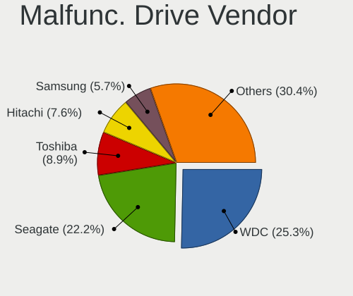

| Vendor              | Computers | Drives | Percent |
|---------------------|-----------|--------|---------|
| WDC                 | 40        | 53     | 25.32%  |
| Seagate             | 35        | 50     | 22.15%  |
| Toshiba             | 14        | 17     | 8.86%   |
| Hitachi             | 12        | 12     | 7.59%   |
| Samsung Electronics | 9         | 11     | 5.7%    |
| HGST                | 8         | 14     | 5.06%   |
| SK hynix            | 4         | 5      | 2.53%   |
| SanDisk             | 4         | 4      | 2.53%   |
| Micron Technology   | 4         | 4      | 2.53%   |
| Patriot             | 3         | 3      | 1.9%    |
| Maxtor              | 3         | 3      | 1.9%    |
| Crucial             | 3         | 4      | 1.9%    |
| Corsair             | 3         | 3      | 1.9%    |
| OCZ                 | 2         | 2      | 1.27%   |
| Kingston            | 2         | 2      | 1.27%   |
| Intenso             | 2         | 2      | 1.27%   |
| Intel               | 2         | 2      | 1.27%   |
| Fujitsu             | 2         | 2      | 1.27%   |
| SPCC                | 1         | 1      | 0.63%   |
| OCZ-AGIL            | 1         | 1      | 0.63%   |
| Leven               | 1         | 1      | 0.63%   |
| ExcelStor           | 1         | 1      | 0.63%   |
| China               | 1         | 1      | 0.63%   |
| A-DATA Technology   | 1         | 1      | 0.63%   |

Malfunc. HDD Vendor
-------------------

Vendors of faulty HDD drives

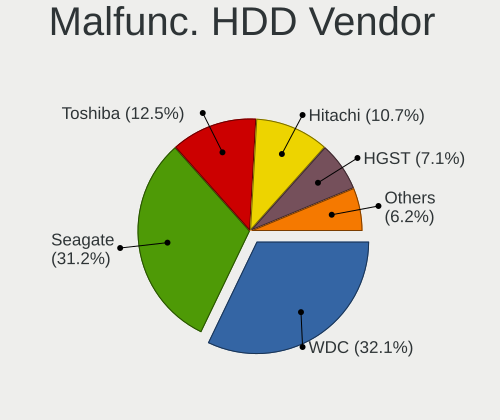

| Vendor              | Computers | Drives | Percent |
|---------------------|-----------|--------|---------|
| WDC                 | 36        | 49     | 32.14%  |
| Seagate             | 35        | 50     | 31.25%  |
| Toshiba             | 14        | 17     | 12.5%   |
| Hitachi             | 12        | 12     | 10.71%  |
| HGST                | 8         | 14     | 7.14%   |
| Maxtor              | 3         | 3      | 2.68%   |
| Fujitsu             | 2         | 2      | 1.79%   |
| Samsung Electronics | 1         | 1      | 0.89%   |
| ExcelStor           | 1         | 1      | 0.89%   |

Malfunc. Drive Kind
-------------------

Kinds of faulty drives

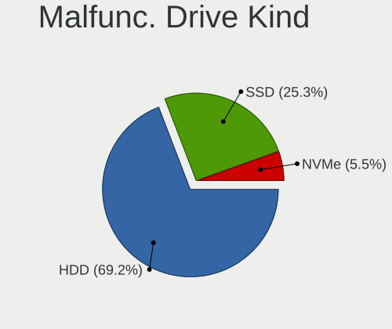

| Kind | Computers | Drives | Percent |
|------|-----------|--------|---------|
| HDD  | 101       | 149    | 69.18%  |
| SSD  | 37        | 41     | 25.34%  |
| NVMe | 8         | 9      | 5.48%   |

Failed Drives
-------------

Failed drive models

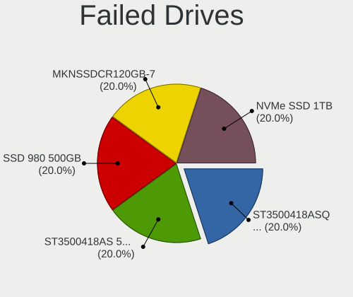

| Model                             | Computers | Drives | Percent |
|-----------------------------------|-----------|--------|---------|
| Seagate ST3500418ASQ 500GB        | 1         | 1      | 20%     |
| Seagate ST3500418AS 500GB         | 1         | 1      | 20%     |
| Samsung Electronics SSD 980 500GB | 1         | 1      | 20%     |
| Mushkin MKNSSDCR120GB-7           | 1         | 1      | 20%     |
| KIOXIA NVMe SSD 1TB               | 1         | 1      | 20%     |

Failed Drive Vendor
-------------------

Failed drive vendors

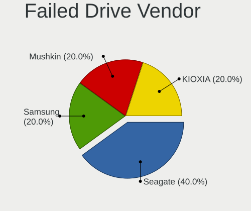

| Vendor              | Computers | Drives | Percent |
|---------------------|-----------|--------|---------|
| Seagate             | 2         | 2      | 40%     |
| Samsung Electronics | 1         | 1      | 20%     |
| Mushkin             | 1         | 1      | 20%     |
| KIOXIA              | 1         | 1      | 20%     |

Drive Status
------------

Number of failed and malfunc. drives

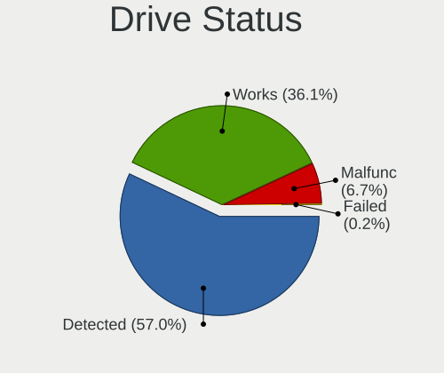

| Status   | Computers | Drives | Percent |
|----------|-----------|--------|---------|
| Detected | 1202      | 2553   | 57.02%  |
| Works    | 760       | 1451   | 36.05%  |
| Malfunc  | 141       | 199    | 6.69%   |
| Failed   | 5         | 5      | 0.24%   |

Storage controller
------------------

Storage Vendor
--------------

Storage controller vendors

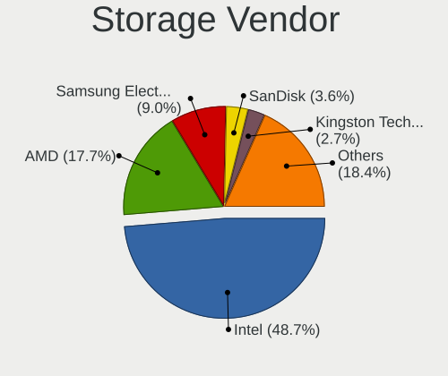

| Vendor                                  | Computers | Percent |
|-----------------------------------------|-----------|---------|
| Intel                                   | 1206      | 48.69%  |
| AMD                                     | 438       | 17.68%  |
| Samsung Electronics                     | 222       | 8.96%   |
| SanDisk                                 | 88        | 3.55%   |
| Kingston Technology Company             | 68        | 2.75%   |
| SK hynix                                | 57        | 2.3%    |
| JMicron Technology                      | 51        | 2.06%   |
| KIOXIA                                  | 47        | 1.9%    |
| Marvell Technology Group                | 36        | 1.45%   |
| Micron Technology                       | 30        | 1.21%   |
| Nvidia                                  | 29        | 1.17%   |
| ASMedia Technology                      | 29        | 1.17%   |
| Phison Electronics                      | 28        | 1.13%   |
| ADATA Technology                        | 19        | 0.77%   |
| Toshiba America Info Systems            | 18        | 0.73%   |
| VIA Technologies                        | 13        | 0.52%   |
| Micron/Crucial Technology               | 13        | 0.52%   |
| Silicon Motion                          | 11        | 0.44%   |
| Silicon Image                           | 10        | 0.4%    |
| MAXIO Technology (Hangzhou)             | 9         | 0.36%   |
| Union Memory (Shenzhen)                 | 7         | 0.28%   |
| Realtek Semiconductor                   | 5         | 0.2%    |
| Solid State Storage Technology          | 4         | 0.16%   |
| Silicon Integrated Systems [SiS]        | 4         | 0.16%   |
| Seagate Technology                      | 4         | 0.16%   |
| LSI Logic / Symbios Logic               | 4         | 0.16%   |
| Hewlett-Packard                         | 3         | 0.12%   |
| Broadcom / LSI                          | 3         | 0.12%   |
| Apple                                   | 3         | 0.12%   |
| Shenzhen Longsys Electronics            | 2         | 0.08%   |
| O2 Micro                                | 2         | 0.08%   |
| Yangtze Memory Technologies             | 1         | 0.04%   |
| Transcend                               | 1         | 0.04%   |
| TenaFe                                  | 1         | 0.04%   |
| Solidigm                                | 1         | 0.04%   |
| Shenzhen Unionmemory Information System | 1         | 0.04%   |
| Promise Technology                      | 1         | 0.04%   |
| OCZ Technology Group                    | 1         | 0.04%   |
| Netac Technology                        | 1         | 0.04%   |
| Lite-On Technology                      | 1         | 0.04%   |

Storage Model
-------------

Storage controller models

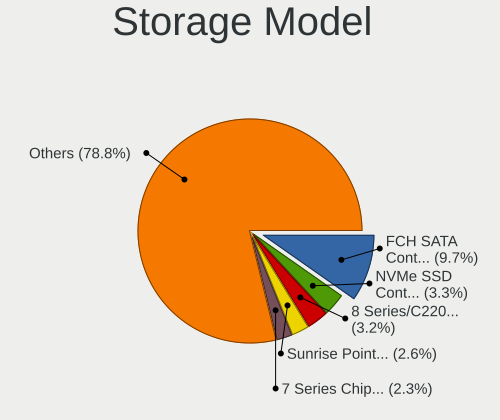

| Model                                                                                   | Computers | Percent |
|-----------------------------------------------------------------------------------------|-----------|---------|
| AMD FCH SATA Controller [AHCI mode]                                                     | 285       | 9.74%   |
| Samsung NVMe SSD Controller SM981/PM981/PM983                                           | 98        | 3.35%   |
| Intel 8 Series/C220 Series Chipset Family 6-port SATA Controller 1 [AHCI mode]          | 93        | 3.18%   |
| Intel Sunrise Point-LP SATA Controller [AHCI mode]                                      | 76        | 2.6%    |
| Intel 7 Series Chipset Family 6-port SATA Controller [AHCI mode]                        | 68        | 2.32%   |
| Intel NM10/ICH7 Family SATA Controller [IDE mode]                                       | 67        | 2.29%   |
| AMD 400 Series Chipset SATA Controller                                                  | 67        | 2.29%   |
| Intel 82801G (ICH7 Family) IDE Controller                                               | 61        | 2.08%   |
| Intel 82801IBM/IEM (ICH9M/ICH9M-E) 4 port SATA Controller [AHCI mode]                   | 56        | 1.91%   |
| Intel 6 Series/C200 Series Chipset Family 6 port Mobile SATA AHCI Controller            | 51        | 1.74%   |
| Samsung NVMe SSD Controller 980 (DRAM-less)                                             | 50        | 1.71%   |
| AMD SB7x0/SB8x0/SB9x0 IDE Controller                                                    | 46        | 1.57%   |
| Intel 6 Series/C200 Series Chipset Family 6 port Desktop SATA AHCI Controller           | 43        | 1.47%   |
| Intel 82801 Mobile SATA Controller [RAID mode]                                          | 39        | 1.33%   |
| Intel 8 Series SATA Controller 1 [AHCI mode]                                            | 39        | 1.33%   |
| Intel Q170/Q150/B150/H170/H110/Z170/CM236 Chipset SATA Controller [AHCI Mode]           | 38        | 1.3%    |
| AMD SB7x0/SB8x0/SB9x0 SATA Controller [AHCI mode]                                       | 38        | 1.3%    |
| AMD 500 Series Chipset SATA Controller                                                  | 37        | 1.26%   |
| Intel Volume Management Device NVMe RAID Controller                                     | 36        | 1.23%   |
| AMD SB7x0/SB8x0/SB9x0 SATA Controller [IDE mode]                                        | 33        | 1.13%   |
| Samsung NVMe SSD Controller PM9A1/PM9A3/980PRO                                          | 32        | 1.09%   |
| Intel 82801HM/HEM (ICH8M/ICH8M-E) IDE Controller                                        | 32        | 1.09%   |
| Intel 200 Series PCH SATA controller [AHCI mode]                                        | 30        | 1.03%   |
| JMicron JMB363 SATA/IDE Controller                                                      | 29        | 0.99%   |
| Intel 7 Series/C210 Series Chipset Family 6-port SATA Controller [AHCI mode]            | 28        | 0.96%   |
| Intel 82801HM/HEM (ICH8M/ICH8M-E) SATA Controller [AHCI mode]                           | 27        | 0.92%   |
| ASMedia ASM1061/ASM1062 Serial ATA Controller                                           | 27        | 0.92%   |
| Intel Atom Processor E3800 Series SATA AHCI Controller                                  | 25        | 0.85%   |
| Intel 5 Series/3400 Series Chipset 4 port SATA AHCI Controller                          | 25        | 0.85%   |
| Intel Wildcat Point-LP SATA Controller [AHCI Mode]                                      | 24        | 0.82%   |
| Intel 5 Series/3400 Series Chipset 6 port SATA AHCI Controller                          | 24        | 0.82%   |
| KIOXIA NVMe SSD Controller BG4 (DRAM-less)                                              | 22        | 0.75%   |
| Intel SATA Controller [RAID mode]                                                       | 20        | 0.68%   |
| AMD A320 Chipset SATA Controller [AHCI mode]                                            | 20        | 0.68%   |
| AMD 300 Series Chipset SATA Controller                                                  | 19        | 0.65%   |
| SK hynix Gold P31/BC711/PC711 NVMe Solid State Drive                                    | 18        | 0.62%   |
| Intel Celeron N3350/Pentium N4200/Atom E3900 Series SATA AHCI Controller                | 18        | 0.62%   |
| Intel Alder Lake-S PCH SATA Controller [AHCI Mode]                                      | 18        | 0.62%   |
| Intel 6 Series/C200 Series Chipset Family Desktop SATA Controller (IDE mode, ports 0-3) | 18        | 0.62%   |
| Intel Tiger Lake-LP SATA Controller                                                     | 17        | 0.58%   |

Storage Kind
------------

Kind of storage controller (IDE, SATA, NVMe, SAS, ...)

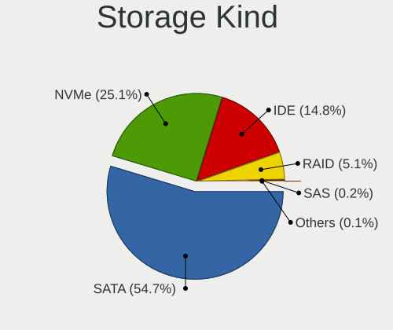

| Kind | Computers | Percent |
|------|-----------|---------|
| SATA | 1366      | 54.66%  |
| NVMe | 627       | 25.09%  |
| IDE  | 370       | 14.81%  |
| RAID | 127       | 5.08%   |
| SAS  | 6         | 0.24%   |
| SCSI | 3         | 0.12%   |

Processor
---------

CPU Vendor
----------

Processor vendors

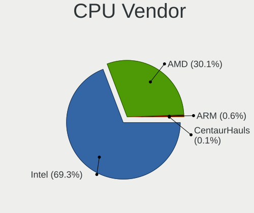

| Vendor       | Computers | Percent |
|--------------|-----------|---------|
| Intel        | 1349      | 69.25%  |
| AMD          | 587       | 30.13%  |
| ARM          | 11        | 0.56%   |
| CentaurHauls | 1         | 0.05%   |

CPU Model
---------

Processor models

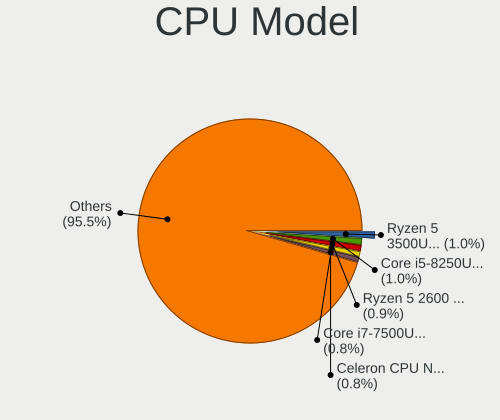

| Model                                         | Computers | Percent |
|-----------------------------------------------|-----------|---------|
| AMD Ryzen 5 3500U with Radeon Vega Mobile Gfx | 20        | 1.02%   |
| Intel Core i5-8250U CPU @ 1.60GHz             | 19        | 0.97%   |
| AMD Ryzen 5 2600 Six-Core Processor           | 18        | 0.92%   |
| Intel Core i7-7500U CPU @ 2.70GHz             | 16        | 0.82%   |
| Intel Celeron CPU N2840 @ 2.16GHz             | 15        | 0.76%   |
| Intel 11th Gen Core i5-1135G7 @ 2.40GHz       | 15        | 0.76%   |
| AMD Ryzen 5 5600G with Radeon Graphics        | 15        | 0.76%   |
| Intel Atom x5-Z8350 CPU @ 1.44GHz             | 14        | 0.71%   |
| Intel Core i5-7200U CPU @ 2.50GHz             | 12        | 0.61%   |
| AMD Ryzen 5 3600 6-Core Processor             | 12        | 0.61%   |
| AMD Ryzen 5 3400G with Radeon Vega Graphics   | 12        | 0.61%   |
| AMD Ryzen 7 2700X Eight-Core Processor        | 11        | 0.56%   |
| Intel Core i5-4460 CPU @ 3.20GHz              | 10        | 0.51%   |
| Intel Core i5-10210U CPU @ 1.60GHz            | 10        | 0.51%   |
| Intel Core i3-4005U CPU @ 1.70GHz             | 10        | 0.51%   |
| Intel Celeron CPU N3350 @ 1.10GHz             | 10        | 0.51%   |
| AMD Ryzen 5 5500U with Radeon Graphics        | 10        | 0.51%   |
| AMD Ryzen 3 2200G with Radeon Vega Graphics   | 10        | 0.51%   |
| AMD FX-6300 Six-Core Processor                | 10        | 0.51%   |
| Intel Core i7-8550U CPU @ 1.80GHz             | 9         | 0.46%   |
| Intel Core i5-6500 CPU @ 3.20GHz              | 9         | 0.46%   |
| Intel Core i5-3320M CPU @ 2.60GHz             | 9         | 0.46%   |
| Intel Core i5-2410M CPU @ 2.30GHz             | 9         | 0.46%   |
| Intel Core i5-2400 CPU @ 3.10GHz              | 9         | 0.46%   |
| Intel Core i3-6006U CPU @ 2.00GHz             | 9         | 0.46%   |
| Intel Core i3-3110M CPU @ 2.40GHz             | 9         | 0.46%   |
| Intel Core 2 Duo CPU E7500 @ 2.93GHz          | 9         | 0.46%   |
| Intel 11th Gen Core i7-1165G7 @ 2.80GHz       | 9         | 0.46%   |
| AMD Ryzen 5 4500U with Radeon Graphics        | 9         | 0.46%   |
| Intel Pentium 4 CPU 3.00GHz                   | 8         | 0.41%   |
| Intel Core i5-6300U CPU @ 2.40GHz             | 8         | 0.41%   |
| Intel Core i5-6200U CPU @ 2.30GHz             | 8         | 0.41%   |
| Intel Core i5-5200U CPU @ 2.20GHz             | 8         | 0.41%   |
| Intel Core i5-3470 CPU @ 3.20GHz              | 8         | 0.41%   |
| Intel Core i5-1035G1 CPU @ 1.00GHz            | 8         | 0.41%   |
| Intel Core i5 CPU M 520 @ 2.40GHz             | 8         | 0.41%   |
| Intel Core i3-3220 CPU @ 3.30GHz              | 8         | 0.41%   |
| Intel Core 2 Duo CPU E8400 @ 3.00GHz          | 8         | 0.41%   |
| Intel 12th Gen Core i5-1235U                  | 8         | 0.41%   |
| ARM Processor                                 | 8         | 0.41%   |

CPU Model Family
----------------

Processor model prefix

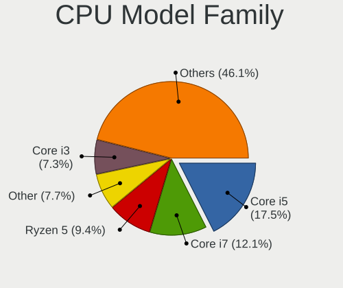

| Model                   | Computers | Percent |
|-------------------------|-----------|---------|
| Intel Core i5           | 343       | 17.54%  |
| Intel Core i7           | 236       | 12.07%  |
| AMD Ryzen 5             | 184       | 9.41%   |
| Other                   | 150       | 7.67%   |
| Intel Core i3           | 142       | 7.26%   |
| Intel Core 2 Duo        | 118       | 6.03%   |
| AMD Ryzen 7             | 107       | 5.47%   |
| Intel Celeron           | 96        | 4.91%   |
| Intel Pentium           | 55        | 2.81%   |
| Intel Atom              | 41        | 2.1%    |
| AMD Ryzen 3             | 41        | 2.1%    |
| Intel Core 2 Quad       | 34        | 1.74%   |
| Intel Xeon              | 32        | 1.64%   |
| AMD Ryzen 9             | 30        | 1.53%   |
| AMD FX                  | 27        | 1.38%   |
| Intel Pentium Dual-Core | 26        | 1.33%   |
| Intel Core 2            | 26        | 1.33%   |
| Intel Pentium 4         | 21        | 1.07%   |
| AMD Athlon 64 X2        | 17        | 0.87%   |
| AMD A10                 | 17        | 0.87%   |
| AMD A6                  | 16        | 0.82%   |
| AMD A8                  | 15        | 0.77%   |
| AMD A4                  | 15        | 0.77%   |
| AMD Phenom II X4        | 11        | 0.56%   |
| Intel Core              | 10        | 0.51%   |
| AMD E1                  | 10        | 0.51%   |
| AMD Athlon              | 10        | 0.51%   |
| Intel Pentium Dual      | 9         | 0.46%   |
| Intel Genuine           | 9         | 0.46%   |
| AMD E                   | 7         | 0.36%   |
| Intel Pentium D         | 6         | 0.31%   |
| Intel Core i9           | 6         | 0.31%   |
| AMD Ryzen 7 PRO         | 6         | 0.31%   |
| Intel Pentium M         | 5         | 0.26%   |
| Intel Celeron M         | 5         | 0.26%   |
| AMD Phenom              | 5         | 0.26%   |
| Intel Celeron Dual-Core | 4         | 0.2%    |
| AMD Sempron             | 4         | 0.2%    |
| AMD Ryzen 5 PRO         | 4         | 0.2%    |
| AMD Phenom II X6        | 4         | 0.2%    |

CPU Cores
---------

Number of processor cores

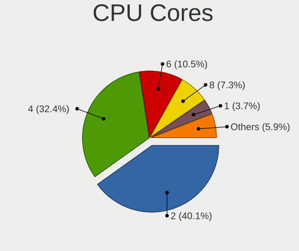

| Number  | Computers | Percent |
|---------|-----------|---------|
| 2       | 785       | 40.11%  |
| 4       | 635       | 32.45%  |
| 6       | 206       | 10.53%  |
| 8       | 143       | 7.31%   |
| 1       | 72        | 3.68%   |
| 16      | 28        | 1.43%   |
| 12      | 28        | 1.43%   |
| 10      | 24        | 1.23%   |
| 14      | 19        | 0.97%   |
| 3       | 13        | 0.66%   |
| 24      | 2         | 0.1%    |
| 20      | 1         | 0.05%   |
| Unknown | 1         | 0.05%   |

CPU Sockets
-----------

Number of sockets

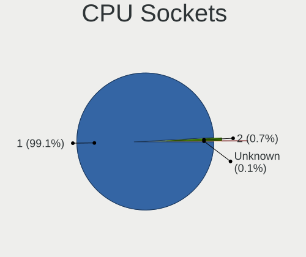

| Number  | Computers | Percent |
|---------|-----------|---------|
| 1       | 1932      | 99.13%  |
| 2       | 14        | 0.72%   |
| 4       | 2         | 0.1%    |
| Unknown | 1         | 0.05%   |

CPU Threads
-----------

Threads per core (Hyper-Threading)

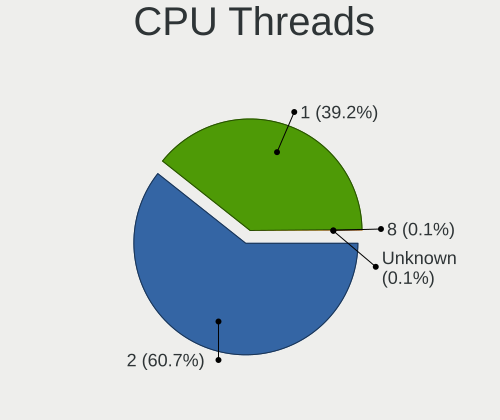

| Number  | Computers | Percent |
|---------|-----------|---------|
| 2       | 1183      | 60.67%  |
| 1       | 764       | 39.18%  |
| 8       | 1         | 0.05%   |
| 4       | 1         | 0.05%   |
| Unknown | 1         | 0.05%   |

CPU Op-Modes
------------

CPU Operation Modes (32-bit, 64-bit)

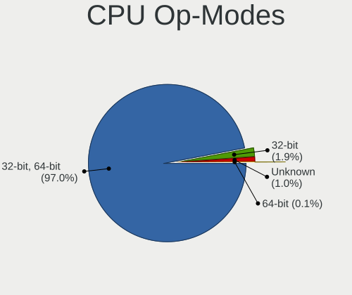

| Op mode        | Computers | Percent |
|----------------|-----------|---------|
| 32-bit, 64-bit | 1893      | 96.98%  |
| 32-bit         | 37        | 1.9%    |
| Unknown        | 20        | 1.02%   |
| 64-bit         | 2         | 0.1%    |

CPU Microcode
-------------

Microcode number

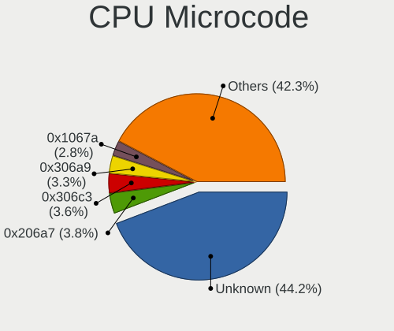

| Number     | Computers | Percent |
|------------|-----------|---------|
| Unknown    | 900       | 44.2%   |
| 0x206a7    | 77        | 3.78%   |
| 0x306c3    | 73        | 3.59%   |
| 0x306a9    | 67        | 3.29%   |
| 0x1067a    | 57        | 2.8%    |
| 0x40651    | 29        | 1.42%   |
| 0x10676    | 27        | 1.33%   |
| 0x6fd      | 26        | 1.28%   |
| 0x08108109 | 25        | 1.23%   |
| 0x906ea    | 24        | 1.18%   |
| 0x806ea    | 24        | 1.18%   |
| 0x506e3    | 23        | 1.13%   |
| 0x30678    | 20        | 0.98%   |
| 0x906e9    | 18        | 0.88%   |
| 0x806e9    | 18        | 0.88%   |
| 0x08108102 | 18        | 0.88%   |
| 0x806c1    | 17        | 0.83%   |
| 0x406c4    | 17        | 0.83%   |
| 0x0800820d | 17        | 0.83%   |
| 0x406e3    | 16        | 0.79%   |
| 0x306d4    | 16        | 0.79%   |
| 0x0a50000c | 15        | 0.74%   |
| 0x806ec    | 14        | 0.69%   |
| 0x506c9    | 14        | 0.69%   |
| 0x6f6      | 13        | 0.64%   |
| 0x06000852 | 13        | 0.64%   |
| 0x20655    | 12        | 0.59%   |
| 0x0810100b | 12        | 0.59%   |
| 0x106c2    | 11        | 0.54%   |
| 0x08701021 | 11        | 0.54%   |
| 0x906ed    | 10        | 0.49%   |
| 0x6fb      | 10        | 0.49%   |
| 0x406c3    | 10        | 0.49%   |
| 0x106e5    | 10        | 0.49%   |
| 0xf43      | 9         | 0.44%   |
| 0x20652    | 9         | 0.44%   |
| 0x0a50000d | 9         | 0.44%   |
| 0x08600106 | 9         | 0.44%   |
| 0x05000119 | 9         | 0.44%   |
| 0x010000c8 | 9         | 0.44%   |

CPU Microarch
-------------

Microarchitecture

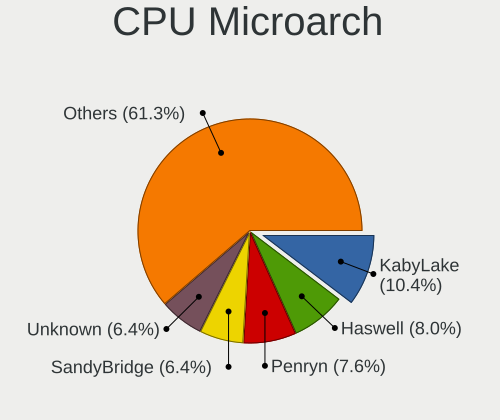

| Name              | Computers | Percent |
|-------------------|-----------|---------|
| KabyLake          | 203       | 10.35%  |
| Haswell           | 156       | 7.96%   |
| Penryn            | 150       | 7.65%   |
| SandyBridge       | 125       | 6.37%   |
| Unknown           | 125       | 6.37%   |
| IvyBridge         | 111       | 5.66%   |
| Zen 3             | 105       | 5.35%   |
| Zen+              | 102       | 5.2%    |
| Core              | 87        | 4.44%   |
| Skylake           | 73        | 3.72%   |
| Silvermont        | 67        | 3.42%   |
| Zen 2             | 65        | 3.31%   |
| Westmere          | 49        | 2.5%    |
| Zen               | 47        | 2.4%    |
| TigerLake         | 47        | 2.4%    |
| Alderlake Hybrid  | 47        | 2.4%    |
| Piledriver        | 36        | 1.84%   |
| K10               | 34        | 1.73%   |
| Broadwell         | 30        | 1.53%   |
| Excavator         | 29        | 1.48%   |
| NetBurst          | 28        | 1.43%   |
| Nehalem           | 27        | 1.38%   |
| CometLake         | 27        | 1.38%   |
| K8 Hammer         | 25        | 1.27%   |
| IceLake           | 21        | 1.07%   |
| Goldmont          | 19        | 0.97%   |
| Bonnell           | 16        | 0.82%   |
| Puma              | 15        | 0.76%   |
| P6                | 15        | 0.76%   |
| Goldmont plus     | 15        | 0.76%   |
| Bobcat            | 15        | 0.76%   |
| Steamroller       | 13        | 0.66%   |
| K10 Llano         | 7         | 0.36%   |
| K8 & K10 hybrid   | 6         | 0.31%   |
| Jaguar            | 6         | 0.31%   |
| Meteorlake Hybrid | 5         | 0.25%   |
| K6                | 5         | 0.25%   |
| Tremont           | 3         | 0.15%   |
| Gracemont         | 3         | 0.15%   |
| Bulldozer         | 2         | 0.1%    |

Graphics
--------

GPU Vendor
----------

Vendors of graphics cards

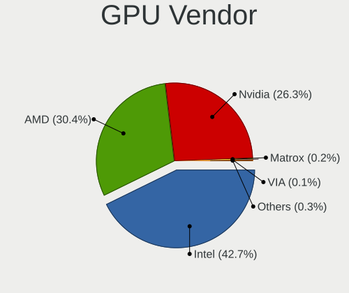

| Vendor                           | Computers | Percent |
|----------------------------------|-----------|---------|
| Intel                            | 968       | 42.74%  |
| AMD                              | 688       | 30.38%  |
| Nvidia                           | 595       | 26.27%  |
| Matrox Electronics Systems       | 4         | 0.18%   |
| VIA Technologies                 | 3         | 0.13%   |
| Silicon Integrated Systems [SiS] | 3         | 0.13%   |
| ASPEED Technology                | 2         | 0.09%   |
| Red Hat                          | 1         | 0.04%   |
| Conexant Systems                 | 1         | 0.04%   |

GPU Model
---------

Graphics card models

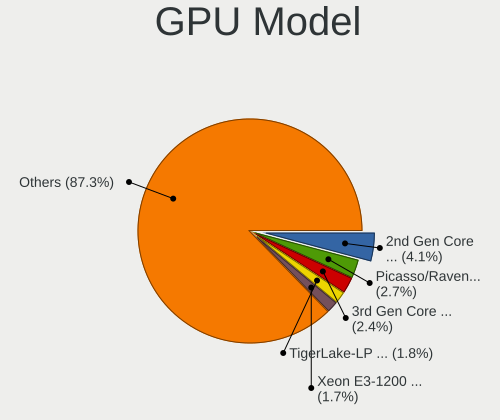

| Model                                                                                    | Computers | Percent |
|------------------------------------------------------------------------------------------|-----------|---------|
| Intel 2nd Generation Core Processor Family Integrated Graphics Controller                | 98        | 4.14%   |
| AMD Picasso/Raven 2 [Radeon Vega Series / Radeon Vega Mobile Series]                     | 65        | 2.74%   |
| Intel 3rd Gen Core processor Graphics Controller                                         | 56        | 2.36%   |
| Intel TigerLake-LP GT2 [Iris Xe Graphics]                                                | 42        | 1.77%   |
| Intel Xeon E3-1200 v3/4th Gen Core Processor Integrated Graphics Controller              | 40        | 1.69%   |
| Intel Kaby Lake-R GT2 [UHD Graphics 620]                                                 | 40        | 1.69%   |
| Intel Haswell-ULT Integrated Graphics Controller                                         | 39        | 1.65%   |
| Intel Atom/Celeron/Pentium Processor x5-E8000/J3xxx/N3xxx Integrated Graphics Controller | 38        | 1.6%    |
| AMD Cezanne [Radeon Vega Series / Radeon Vega Mobile Series]                             | 37        | 1.56%   |
| Intel Mobile 4 Series Chipset Integrated Graphics Controller                             | 35        | 1.48%   |
| AMD Renoir [Radeon Vega Series / Radeon Vega Mobile Series]                              | 35        | 1.48%   |
| AMD Ellesmere [Radeon RX 470/480/570/570X/580/580X/590]                                  | 34        | 1.43%   |
| Intel Kaby Lake-U GT2 [HD Graphics 620]                                                  | 33        | 1.39%   |
| Intel 4th Gen Core Processor Integrated Graphics Controller                              | 33        | 1.39%   |
| Nvidia GK208B [GeForce GT 710]                                                           | 31        | 1.31%   |
| Intel Atom Processor Z36xxx/Z37xxx Series Graphics & Display                             | 29        | 1.22%   |
| Intel Core Processor Integrated Graphics Controller                                      | 28        | 1.18%   |
| AMD Raven Ridge [Radeon Vega Series / Radeon Vega Mobile Series]                         | 27        | 1.14%   |
| Intel Skylake-U GT2 [HD Graphics 520]                                                    | 26        | 1.1%    |
| Intel Broadwell-U GT2 [HD Graphics 5500]                                                 | 23        | 0.97%   |
| AMD Sun XT [Radeon HD 8670A/8670M/8690M / R5 M330 / M430 / Radeon 520 Mobile]            | 23        | 0.97%   |
| AMD Lucienne                                                                             | 23        | 0.97%   |
| Intel Xeon E3-1200 v2/3rd Gen Core processor Graphics Controller                         | 22        | 0.93%   |
| AMD Barcelo                                                                              | 20        | 0.84%   |
| Intel CometLake-U GT2 [UHD Graphics]                                                     | 19        | 0.8%    |
| Intel 4 Series Chipset Integrated Graphics Controller                                    | 19        | 0.8%    |
| Intel Mobile GM965/GL960 Integrated Graphics Controller (secondary)                      | 18        | 0.76%   |
| Intel Mobile GM965/GL960 Integrated Graphics Controller (primary)                        | 18        | 0.76%   |
| Intel Mobile 945GM/GMS/GME, 943/940GML Express Integrated Graphics Controller            | 18        | 0.76%   |
| Nvidia GT218 [GeForce 210]                                                               | 17        | 0.72%   |
| Nvidia GP107 [GeForce GTX 1050 Ti]                                                       | 17        | 0.72%   |
| Intel Apollo Lake GT1 [HD Graphics 500]                                                  | 17        | 0.72%   |
| Intel CoffeeLake-H GT2 [UHD Graphics 630]                                                | 16        | 0.68%   |
| AMD Stoney [Radeon R2/R3/R4/R5 Graphics]                                                 | 16        | 0.68%   |
| Intel WhiskeyLake-U GT2 [UHD Graphics 620]                                               | 15        | 0.63%   |
| Intel CoffeeLake-S GT2 [UHD Graphics 630]                                                | 15        | 0.63%   |
| AMD Topaz XT [Radeon R7 M260/M265 / M340/M360 / M440/M445 / 530/535 / 620/625 Mobile]    | 15        | 0.63%   |
| Nvidia TU117M [GeForce GTX 1650 Mobile / Max-Q]                                          | 14        | 0.59%   |
| Nvidia GP108 [GeForce GT 1030]                                                           | 14        | 0.59%   |
| Intel Skylake-S GT2 [HD Graphics 530]                                                    | 14        | 0.59%   |

GPU Combo
---------

Combinations of graphics cards

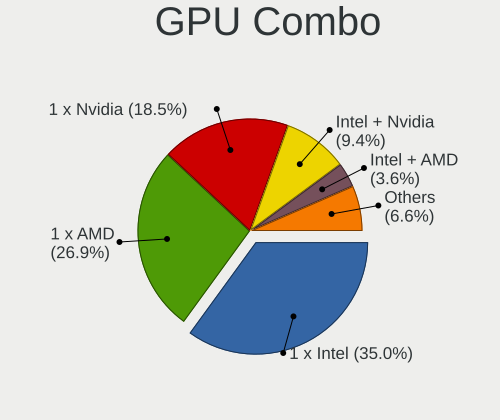

| Name                           | Computers | Percent |
|--------------------------------|-----------|---------|
| 1 x Intel                      | 689       | 35.01%  |
| 1 x AMD                        | 530       | 26.93%  |
| 1 x Nvidia                     | 365       | 18.55%  |
| Intel + Nvidia                 | 185       | 9.4%    |
| Intel + AMD                    | 70        | 3.56%   |
| 2 x AMD                        | 46        | 2.34%   |
| AMD + Nvidia                   | 41        | 2.08%   |
| Other                          | 15        | 0.76%   |
| 2 x Intel                      | 10        | 0.51%   |
| 1 x Matrox                     | 4         | 0.2%    |
| 2 x Nvidia                     | 3         | 0.15%   |
| 1 x VIA                        | 3         | 0.15%   |
| 1 x SiS                        | 3         | 0.15%   |
| 2 x AMD + 1 x Conexant Systems | 1         | 0.05%   |
| 1 x Red Hat                    | 1         | 0.05%   |
| Nvidia + ASPEED                | 1         | 0.05%   |
| 1 x ASPEED                     | 1         | 0.05%   |

GPU Driver
----------

Free vs proprietary

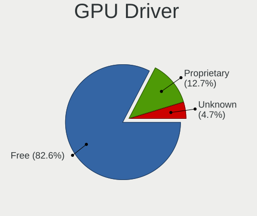

| Driver      | Computers | Percent |
|-------------|-----------|---------|
| Free        | 1633      | 82.64%  |
| Proprietary | 250       | 12.65%  |
| Unknown     | 93        | 4.71%   |

GPU Memory
----------

Total video memory

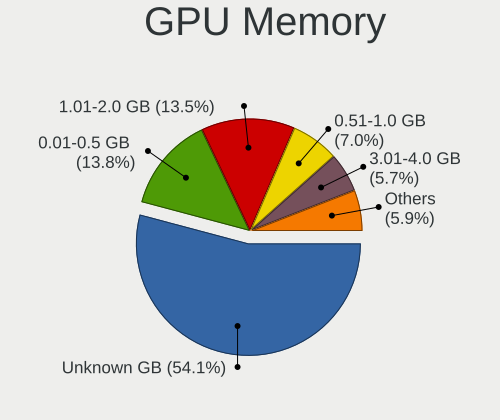

| Size in GB | Computers | Percent |
|------------|-----------|---------|
| Unknown    | 1098      | 54.14%  |
| 0.01-0.5   | 280       | 13.81%  |
| 1.01-2.0   | 274       | 13.51%  |
| 0.51-1.0   | 141       | 6.95%   |
| 3.01-4.0   | 115       | 5.67%   |
| 7.01-8.0   | 53        | 2.61%   |
| 5.01-6.0   | 33        | 1.63%   |
| 8.01-16.0  | 22        | 1.08%   |
| 2.01-3.0   | 8         | 0.39%   |
| 16.01-24.0 | 4         | 0.2%    |

Monitor
-------

Monitor Vendor
--------------

Monitor vendors

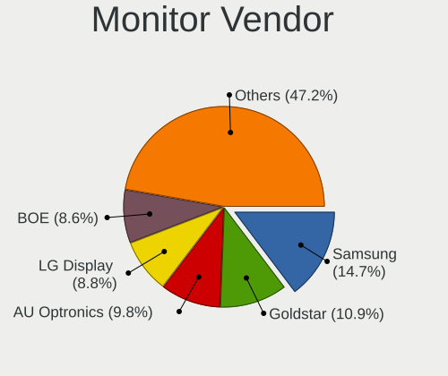

| Vendor                  | Computers | Percent |
|-------------------------|-----------|---------|
| Samsung Electronics     | 306       | 14.7%   |
| Goldstar                | 227       | 10.91%  |
| AU Optronics            | 203       | 9.75%   |
| LG Display              | 183       | 8.79%   |
| BOE                     | 179       | 8.6%    |
| Chimei Innolux          | 158       | 7.59%   |
| Dell                    | 129       | 6.2%    |
| Philips                 | 67        | 3.22%   |
| Hewlett-Packard         | 44        | 2.11%   |
| Chi Mei Optoelectronics | 36        | 1.73%   |
| AOC                     | 36        | 1.73%   |
| Sony                    | 29        | 1.39%   |
| Lenovo                  | 29        | 1.39%   |
| ViewSonic               | 26        | 1.25%   |
| LG Electronics          | 26        | 1.25%   |
| BenQ                    | 26        | 1.25%   |
| Sharp                   | 24        | 1.15%   |
| Apple                   | 24        | 1.15%   |
| Eizo                    | 22        | 1.06%   |
| Ancor Communications    | 20        | 0.96%   |
| InfoVision              | 19        | 0.91%   |
| LG Philips              | 18        | 0.86%   |
| ASUSTek Computer        | 16        | 0.77%   |
| Acer                    | 15        | 0.72%   |
| PANDA                   | 13        | 0.62%   |
| Vestel Elektronik       | 12        | 0.58%   |
| NEC Computers           | 12        | 0.58%   |
| Iiyama                  | 12        | 0.58%   |
| Unknown                 | 10        | 0.48%   |
| Mi                      | 10        | 0.48%   |
| JRY                     | 10        | 0.48%   |
| Fujitsu Siemens         | 9         | 0.43%   |
| CSO                     | 9         | 0.43%   |
| CPT                     | 8         | 0.38%   |
| HannStar                | 6         | 0.29%   |
| Belinea                 | 6         | 0.29%   |
| Toshiba                 | 4         | 0.19%   |
| Panasonic               | 4         | 0.19%   |
| MSI                     | 4         | 0.19%   |
| Medion                  | 4         | 0.19%   |

Monitor Model
-------------

Monitor models

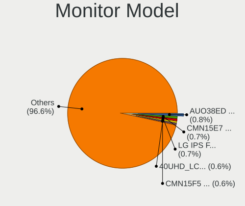

| Model                                                                    | Computers | Percent |
|--------------------------------------------------------------------------|-----------|---------|
| AU Optronics LCD Monitor AUO38ED 1920x1080 344x193mm 15.5-inch           | 18        | 0.84%   |
| Chimei Innolux LCD Monitor CMN15E7 1920x1080 344x193mm 15.5-inch         | 16        | 0.75%   |
| Goldstar LG IPS FULLHD GSM5AB8 1920x1080 480x270mm 21.7-inch             | 15        | 0.7%    |
| Vestel Elektronik 40UHD_LCD_TV VES3700 3840x2160 880x500mm 39.8-inch     | 12        | 0.56%   |
| Chimei Innolux LCD Monitor CMN15F5 1920x1080 344x193mm 15.5-inch         | 12        | 0.56%   |
| LG Display LCD Monitor LGD02DC 1366x768 344x194mm 15.5-inch              | 10        | 0.47%   |
| Goldstar FULL HD GSM5B55 1920x1080 480x270mm 21.7-inch                   | 10        | 0.47%   |
| BOE LCD Monitor BOE0687 1920x1080 344x193mm 15.5-inch                    | 10        | 0.47%   |
| Samsung Electronics T24E390 SAM0C20 1920x1080 521x293mm 23.5-inch        | 9         | 0.42%   |
| Samsung Electronics C24F390 SAM0D2C 1920x1080 521x293mm 23.5-inch        | 9         | 0.42%   |
| Chimei Innolux LCD Monitor CMN14D4 1920x1080 309x173mm 13.9-inch         | 9         | 0.42%   |
| Chimei Innolux LCD Monitor CMN15C4 1920x1080 344x193mm 15.5-inch         | 8         | 0.37%   |
| AU Optronics LCD Monitor AUO45EC 1366x768 344x193mm 15.5-inch            | 8         | 0.37%   |
| LG Display LP156WH2-TLAA LGD0230 1366x768 344x194mm 15.5-inch            | 7         | 0.33%   |
| LG Display LCD Monitor LGD039F 1366x768 345x194mm 15.6-inch              | 7         | 0.33%   |
| LG Display LCD Monitor LGD02F2 1366x768 344x194mm 15.5-inch              | 7         | 0.33%   |
| Goldstar FULL HD GSM5ABB 1920x1080 480x270mm 21.7-inch                   | 7         | 0.33%   |
| Goldstar 2D FHD TV GSM59C6 1920x1080 509x286mm 23.0-inch                 | 7         | 0.33%   |
| Samsung Electronics S27F350 SAM0D22 1920x1080 598x336mm 27.0-inch        | 6         | 0.28%   |
| Samsung Electronics S24F350 SAM0D20 1920x1080 521x293mm 23.5-inch        | 6         | 0.28%   |
| Samsung Electronics LCD Monitor SDC4347 1366x768 344x193mm 15.5-inch     | 6         | 0.28%   |
| Philips PHL 245B1 PHL094C 2560x1440 530x300mm 24.0-inch                  | 6         | 0.28%   |
| Philips PHL 223V5 PHLC0CF 1920x1080 477x268mm 21.5-inch                  | 6         | 0.28%   |
| LG Display LCD Monitor LGD05E5 1920x1080 344x194mm 15.5-inch             | 6         | 0.28%   |
| Chimei Innolux LCD Monitor CMN15DB 1366x768 344x193mm 15.5-inch          | 6         | 0.28%   |
| Chimei Innolux LCD Monitor CMN15C6 1366x768 344x193mm 15.5-inch          | 6         | 0.28%   |
| Chi Mei Optoelectronics LCD Monitor CMO15A7 1366x768 344x193mm 15.5-inch | 6         | 0.28%   |
| AU Optronics LCD Monitor AUOE48D 1920x1080 344x194mm 15.5-inch           | 6         | 0.28%   |
| ViewSonic VA703-4Series VSC6A1E 1280x1024 341x274mm 17.2-inch            | 5         | 0.23%   |
| Samsung Electronics T23B350 SAM093B 1920x1080 510x287mm 23.0-inch        | 5         | 0.23%   |
| Samsung Electronics LCD Monitor SDC4161 1920x1080 344x194mm 15.5-inch    | 5         | 0.23%   |
| LG Display LCD Monitor LGD0468 1366x768 344x194mm 15.5-inch              | 5         | 0.23%   |
| InfoVision LCD Monitor IVO057D 1920x1080 309x174mm 14.0-inch             | 5         | 0.23%   |
| Goldstar HDR WFHD GSM7714 2560x1080 798x334mm 34.1-inch                  | 5         | 0.23%   |
| Dell S2715H DEL40BB 1920x1080 598x336mm 27.0-inch                        | 5         | 0.23%   |
| Dell P3223DE DEL4294 2560x1440 698x393mm 31.5-inch                       | 5         | 0.23%   |
| CPT LCD Monitor CPT1415 1280x800 331x207mm 15.4-inch                     | 5         | 0.23%   |
| Chimei Innolux LCD Monitor CMN1735 1920x1080 381x214mm 17.2-inch         | 5         | 0.23%   |
| Chimei Innolux LCD Monitor CMN15CA 1366x768 344x193mm 15.5-inch          | 5         | 0.23%   |
| BOE LCD Monitor BOE097D 1920x1080 344x194mm 15.5-inch                    | 5         | 0.23%   |

Monitor Resolution
------------------

Monitor screen resolution

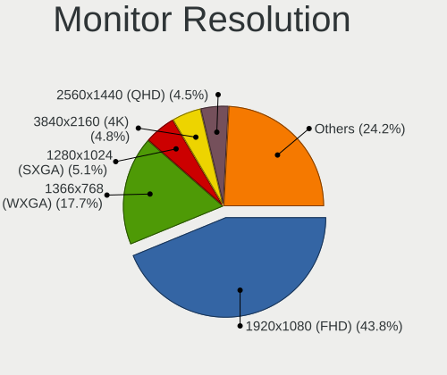

| Resolution         | Computers | Percent |
|--------------------|-----------|---------|
| 1920x1080 (FHD)    | 875       | 43.79%  |
| 1366x768 (WXGA)    | 353       | 17.67%  |
| 1280x1024 (SXGA)   | 102       | 5.11%   |
| 3840x2160 (4K)     | 95        | 4.75%   |
| 2560x1440 (QHD)    | 90        | 4.5%    |
| 1680x1050 (WSXGA+) | 67        | 3.35%   |
| 1280x800 (WXGA)    | 66        | 3.3%    |
| 1920x1200 (WUXGA)  | 63        | 3.15%   |
| 1600x900 (HD+)     | 63        | 3.15%   |
| 1440x900 (WXGA+)   | 40        | 2%      |
| 2560x1600          | 17        | 0.85%   |
| 1360x768           | 17        | 0.85%   |
| 2560x1080          | 16        | 0.8%    |
| 3440x1440          | 15        | 0.75%   |
| Unknown            | 15        | 0.75%   |
| 1024x768 (XGA)     | 13        | 0.65%   |
| 2880x1800          | 11        | 0.55%   |
| 1600x1200          | 10        | 0.5%    |
| 1024x600           | 10        | 0.5%    |
| 3840x1080          | 6         | 0.3%    |
| 2160x1440          | 6         | 0.3%    |
| 3072x1920          | 5         | 0.25%   |
| 2288x1287          | 5         | 0.25%   |
| 3840x2400          | 4         | 0.2%    |
| 800x1280           | 3         | 0.15%   |
| 3200x2000          | 3         | 0.15%   |
| 2240x1400          | 3         | 0.15%   |
| 1920x540           | 3         | 0.15%   |
| 2048x1152          | 2         | 0.1%    |
| 5120x1440          | 1         | 0.05%   |
| 4864x2160          | 1         | 0.05%   |
| 4480x1600          | 1         | 0.05%   |
| 4480x1080          | 1         | 0.05%   |
| 3840x1600          | 1         | 0.05%   |
| 3600x1080          | 1         | 0.05%   |
| 3200x1800 (QHD+)   | 1         | 0.05%   |
| 3200x1080          | 1         | 0.05%   |
| 3000x1920          | 1         | 0.05%   |
| 2960x1050          | 1         | 0.05%   |
| 2880x1620          | 1         | 0.05%   |

Monitor Diagonal
----------------

Diagonal size in inches

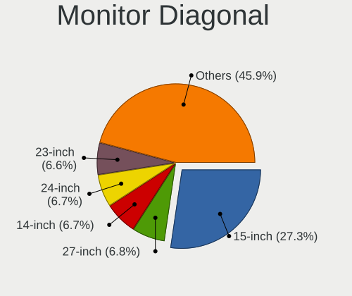

| Inches  | Computers | Percent |
|---------|-----------|---------|
| 15      | 571       | 27.32%  |
| 27      | 142       | 6.79%   |
| 14      | 141       | 6.75%   |
| 24      | 140       | 6.7%    |
| 23      | 137       | 6.56%   |
| 21      | 135       | 6.46%   |
| 13      | 134       | 6.41%   |
| 17      | 116       | 5.55%   |
| Unknown | 84        | 4.02%   |
| 19      | 78        | 3.73%   |
| 31      | 54        | 2.58%   |
| 20      | 40        | 1.91%   |
| 18      | 39        | 1.87%   |
| 16      | 38        | 1.82%   |
| 22      | 32        | 1.53%   |
| 12      | 25        | 1.2%    |
| 84      | 24        | 1.15%   |
| 34      | 24        | 1.15%   |
| 11      | 22        | 1.05%   |
| 72      | 12        | 0.57%   |
| 10      | 12        | 0.57%   |
| 54      | 11        | 0.53%   |
| 40      | 8         | 0.38%   |
| 32      | 7         | 0.33%   |
| 63      | 6         | 0.29%   |
| 33      | 5         | 0.24%   |
| 26      | 5         | 0.24%   |
| 25      | 5         | 0.24%   |
| 42      | 4         | 0.19%   |
| 142     | 3         | 0.14%   |
| 60      | 3         | 0.14%   |
| 52      | 3         | 0.14%   |
| 29      | 3         | 0.14%   |
| 28      | 3         | 0.14%   |
| 8       | 3         | 0.14%   |
| 7       | 3         | 0.14%   |
| 65      | 2         | 0.1%    |
| 55      | 2         | 0.1%    |
| 49      | 2         | 0.1%    |
| 46      | 2         | 0.1%    |

Monitor Width
-------------

Physical width

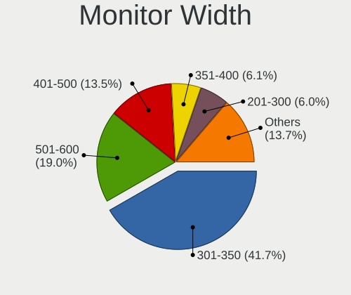

| Width in mm    | Computers | Percent |
|----------------|-----------|---------|
| 301-350        | 856       | 41.72%  |
| 501-600        | 389       | 18.96%  |
| 401-500        | 276       | 13.45%  |
| 351-400        | 126       | 6.14%   |
| 201-300        | 123       | 5.99%   |
| Unknown        | 84        | 4.09%   |
| 601-700        | 64        | 3.12%   |
| 701-800        | 38        | 1.85%   |
| 1501-2000      | 36        | 1.75%   |
| 1001-1500      | 33        | 1.61%   |
| 801-900        | 12        | 0.58%   |
| 901-1000       | 6         | 0.29%   |
| More than 2000 | 3         | 0.15%   |
| 101-200        | 3         | 0.15%   |
| 1-100          | 3         | 0.15%   |

Aspect Ratio
------------

Proportional relationship between the width and the height

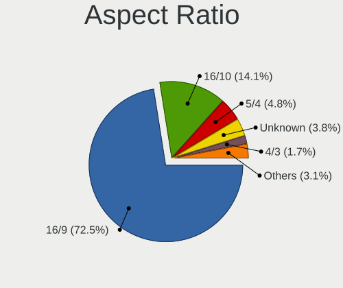

| Ratio   | Computers | Percent |
|---------|-----------|---------|
| 16/9    | 1371      | 72.5%   |
| 16/10   | 267       | 14.12%  |
| 5/4     | 91        | 4.81%   |
| Unknown | 71        | 3.75%   |
| 4/3     | 33        | 1.75%   |
| 21/9    | 25        | 1.32%   |
| 3/2     | 15        | 0.79%   |
| 6/5     | 9         | 0.48%   |
| 1.00    | 3         | 0.16%   |
| 32/9    | 2         | 0.11%   |
| 0.67    | 2         | 0.11%   |
| 0.62    | 1         | 0.05%   |
| 0.56    | 1         | 0.05%   |

Monitor Area
------------

Area in inch²

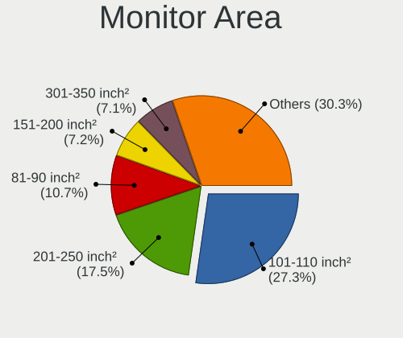

| Area in inch² | Computers | Percent |
|----------------|-----------|---------|
| 101-110        | 563       | 27.25%  |
| 201-250        | 362       | 17.52%  |
| 81-90          | 222       | 10.75%  |
| 151-200        | 148       | 7.16%   |
| 301-350        | 146       | 7.07%   |
| 351-500        | 92        | 4.45%   |
| Unknown        | 84        | 4.07%   |
| 141-150        | 82        | 3.97%   |
| More than 1000 | 68        | 3.29%   |
| 121-130        | 55        | 2.66%   |
| 71-80          | 51        | 2.47%   |
| 251-300        | 49        | 2.37%   |
| 111-120        | 40        | 1.94%   |
| 501-1000       | 23        | 1.11%   |
| 61-70          | 22        | 1.06%   |
| 51-60          | 22        | 1.06%   |
| 41-50          | 12        | 0.58%   |
| 131-140        | 12        | 0.58%   |
| 91-100         | 7         | 0.34%   |
| 1-40           | 6         | 0.29%   |

Pixel Density
-------------

Pixels per inch

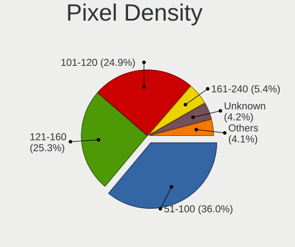

| Density       | Computers | Percent |
|---------------|-----------|---------|
| 51-100        | 717       | 36.05%  |
| 121-160       | 504       | 25.34%  |
| 101-120       | 496       | 24.94%  |
| 161-240       | 107       | 5.38%   |
| Unknown       | 84        | 4.22%   |
| 1-50          | 56        | 2.82%   |
| More than 240 | 25        | 1.26%   |

Multiple Monitors
-----------------

Total monitors connected

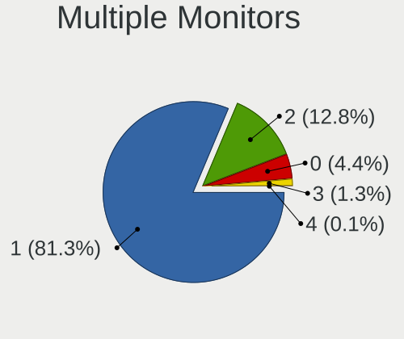

| Total | Computers | Percent |
|-------|-----------|---------|
| 1     | 1634      | 81.33%  |
| 2     | 258       | 12.84%  |
| 0     | 89        | 4.43%   |
| 3     | 26        | 1.29%   |
| 4     | 2         | 0.1%    |

Network
-------

Net Controller Vendor
---------------------

Controller vendors

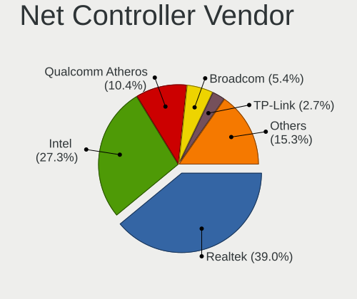

| Vendor                            | Computers | Percent |
|-----------------------------------|-----------|---------|
| Realtek Semiconductor             | 1132      | 38.99%  |
| Intel                             | 792       | 27.28%  |
| Qualcomm Atheros                  | 302       | 10.4%   |
| Broadcom                          | 156       | 5.37%   |
| TP-Link                           | 77        | 2.65%   |
| MediaTek                          | 69        | 2.38%   |
| Marvell Technology Group          | 57        | 1.96%   |
| Ralink Technology                 | 52        | 1.79%   |
| Broadcom Limited                  | 34        | 1.17%   |
| Ralink                            | 30        | 1.03%   |
| Nvidia                            | 24        | 0.83%   |
| Qualcomm Atheros Communications   | 15        | 0.52%   |
| Xiaomi                            | 14        | 0.48%   |
| ASIX Electronics                  | 11        | 0.38%   |
| VIA Technologies                  | 10        | 0.34%   |
| Shenzhen Goodix Technology        | 10        | 0.34%   |
| D-Link                            | 9         | 0.31%   |
| Sierra Wireless                   | 7         | 0.24%   |
| ASUSTek Computer                  | 7         | 0.24%   |
| Samsung Electronics               | 5         | 0.17%   |
| NetGear                           | 5         | 0.17%   |
| Microsoft                         | 5         | 0.17%   |
| JMicron Technology                | 5         | 0.17%   |
| Ericsson Business Mobile Networks | 5         | 0.17%   |
| Dell                              | 5         | 0.17%   |
| Silicon Integrated Systems [SiS]  | 4         | 0.14%   |
| Huawei Technologies               | 4         | 0.14%   |
| Hewlett-Packard                   | 4         | 0.14%   |
| Apple                             | 4         | 0.14%   |
| Qualcomm                          | 3         | 0.1%    |
| DisplayLink                       | 3         | 0.1%    |
| D-Link System                     | 3         | 0.1%    |
| Belkin Components                 | 3         | 0.1%    |
| Motorola                          | 2         | 0.07%   |
| Mercucys                          | 2         | 0.07%   |
| Lenovo                            | 2         | 0.07%   |
| IBM                               | 2         | 0.07%   |
| Google                            | 2         | 0.07%   |
| Fujitsu Siemens Computers         | 2         | 0.07%   |
| Edimax Technology                 | 2         | 0.07%   |

Net Controller Model
--------------------

Controller models

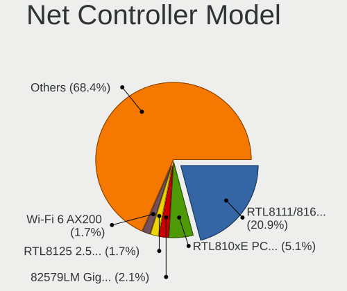

| Model                                                                   | Computers | Percent |
|-------------------------------------------------------------------------|-----------|---------|
| Realtek RTL8111/8168/8211/8411 PCI Express Gigabit Ethernet Controller  | 704       | 20.87%  |
| Realtek RTL810xE PCI Express Fast Ethernet controller                   | 173       | 5.13%   |
| Intel 82579LM Gigabit Network Connection (Lewisville)                   | 71        | 2.1%    |
| Realtek RTL8125 2.5GbE Controller                                       | 59        | 1.75%   |
| Intel Wi-Fi 6 AX200                                                     | 58        | 1.72%   |
| Realtek RTL8822CE 802.11ac PCIe Wireless Network Adapter                | 52        | 1.54%   |
| Realtek RTL8821CE 802.11ac PCIe Wireless Network Adapter                | 52        | 1.54%   |
| Qualcomm Atheros QCA9377 802.11ac Wireless Network Adapter              | 48        | 1.42%   |
| Intel I211 Gigabit Network Connection                                   | 48        | 1.42%   |
| Intel Wireless 8265 / 8275                                              | 47        | 1.39%   |
| Qualcomm Atheros QCA9565 / AR9565 Wireless Network Adapter              | 43        | 1.27%   |
| Intel Wi-Fi 6 AX201                                                     | 39        | 1.16%   |
| Realtek RTL8723BE PCIe Wireless Network Adapter                         | 38        | 1.13%   |
| Realtek RTL8153 Gigabit Ethernet Adapter                                | 38        | 1.13%   |
| Qualcomm Atheros AR9485 Wireless Network Adapter                        | 37        | 1.1%    |
| Realtek RTL8188EUS 802.11n Wireless Network Adapter                     | 32        | 0.95%   |
| Intel Wireless 3165                                                     | 32        | 0.95%   |
| Intel Wireless 7265                                                     | 29        | 0.86%   |
| Qualcomm Atheros AR9285 Wireless Network Adapter (PCI-Express)          | 28        | 0.83%   |
| Intel Wireless 7260                                                     | 27        | 0.8%    |
| Intel Ethernet Connection I217-LM                                       | 27        | 0.8%    |
| Broadcom BCM43142 802.11b/g/n                                           | 26        | 0.77%   |
| Realtek RTL-8100/8101L/8139 PCI Fast Ethernet Adapter                   | 22        | 0.65%   |
| Qualcomm Atheros QCA6174 802.11ac Wireless Network Adapter              | 22        | 0.65%   |
| Intel PRO/Wireless 3945ABG [Golan] Network Connection                   | 22        | 0.65%   |
| Intel Centrino Advanced-N 6205 [Taylor Peak]                            | 20        | 0.59%   |
| MediaTek MT7922 802.11ax PCI Express Wireless Network Adapter           | 19        | 0.56%   |
| Intel Ethernet Connection (2) I219-V                                    | 19        | 0.56%   |
| Ralink RT2870/RT3070 Wireless Adapter                                   | 18        | 0.53%   |
| Qualcomm Atheros AR242x / AR542x Wireless Network Adapter (PCI-Express) | 18        | 0.53%   |
| Intel Ethernet Connection (4) I219-LM                                   | 18        | 0.53%   |
| Intel Alder Lake-P PCH CNVi WiFi                                        | 18        | 0.53%   |
| Realtek RTL8852BE PCIe 802.11ax Wireless Network Controller             | 17        | 0.5%    |
| MediaTek MT7921 802.11ax PCIe Wireless Network Adapter [Filogic 330]    | 17        | 0.5%    |
| MediaTek MT7902 802.11ax PCIe Wireless Network Adapter [Filogic 310]    | 17        | 0.5%    |
| Intel Wireless 8260                                                     | 17        | 0.5%    |
| TP-Link TL-WN722N v2/v3 [Realtek RTL8188EUS]                            | 16        | 0.47%   |
| Intel Wireless 3160                                                     | 16        | 0.47%   |
| Intel Ethernet Controller I225-V                                        | 16        | 0.47%   |
| Qualcomm Atheros AR8151 v2.0 Gigabit Ethernet                           | 15        | 0.44%   |

Wireless Vendor
---------------

Wireless vendors

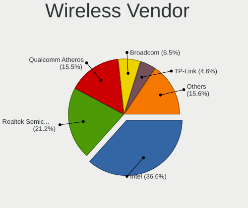

| Vendor                                | Computers | Percent |
|---------------------------------------|-----------|---------|
| Intel                                 | 557       | 36.62%  |
| Realtek Semiconductor                 | 322       | 21.17%  |
| Qualcomm Atheros                      | 236       | 15.52%  |
| Broadcom                              | 99        | 6.51%   |
| TP-Link                               | 70        | 4.6%    |
| MediaTek                              | 64        | 4.21%   |
| Ralink Technology                     | 52        | 3.42%   |
| Ralink                                | 30        | 1.97%   |
| Qualcomm Atheros Communications       | 15        | 0.99%   |
| Broadcom Limited                      | 13        | 0.85%   |
| D-Link                                | 9         | 0.59%   |
| Sierra Wireless                       | 7         | 0.46%   |
| ASUSTek Computer                      | 7         | 0.46%   |
| NetGear                               | 5         | 0.33%   |
| Microsoft                             | 5         | 0.33%   |
| Hewlett-Packard                       | 3         | 0.2%    |
| Belkin Components                     | 3         | 0.2%    |
| Qualcomm                              | 2         | 0.13%   |
| Mercucys                              | 2         | 0.13%   |
| Marvell Technology Group              | 2         | 0.13%   |
| Fujitsu Siemens Computers             | 2         | 0.13%   |
| Edimax Technology                     | 2         | 0.13%   |
| Dell                                  | 2         | 0.13%   |
| 802.11g Adapter [Linksys WUSB54GC v3] | 2         | 0.13%   |
| ZyDAS                                 | 1         | 0.07%   |
| Sitecom Europe                        | 1         | 0.07%   |
| Realtek                               | 1         | 0.07%   |
| Philips (or NXP)                      | 1         | 0.07%   |
| Ovislink                              | 1         | 0.07%   |
| Micro Star International              | 1         | 0.07%   |
| Linksys                               | 1         | 0.07%   |
| InProComm                             | 1         | 0.07%   |
| D-Link System                         | 1         | 0.07%   |
| Accton Technology                     | 1         | 0.07%   |

Wireless Model
--------------

Wireless models

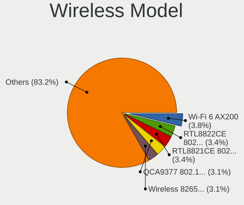

| Model                                                                   | Computers | Percent |
|-------------------------------------------------------------------------|-----------|---------|
| Intel Wi-Fi 6 AX200                                                     | 58        | 3.79%   |
| Realtek RTL8822CE 802.11ac PCIe Wireless Network Adapter                | 52        | 3.4%    |
| Realtek RTL8821CE 802.11ac PCIe Wireless Network Adapter                | 52        | 3.4%    |
| Qualcomm Atheros QCA9377 802.11ac Wireless Network Adapter              | 48        | 3.14%   |
| Intel Wireless 8265 / 8275                                              | 47        | 3.07%   |
| Qualcomm Atheros QCA9565 / AR9565 Wireless Network Adapter              | 43        | 2.81%   |
| Intel Wi-Fi 6 AX201                                                     | 39        | 2.55%   |
| Realtek RTL8723BE PCIe Wireless Network Adapter                         | 38        | 2.48%   |
| Qualcomm Atheros AR9485 Wireless Network Adapter                        | 37        | 2.42%   |
| Realtek RTL8188EUS 802.11n Wireless Network Adapter                     | 32        | 2.09%   |
| Intel Wireless 3165                                                     | 32        | 2.09%   |
| Intel Wireless 7265                                                     | 29        | 1.89%   |
| Qualcomm Atheros AR9285 Wireless Network Adapter (PCI-Express)          | 28        | 1.83%   |
| Intel Wireless 7260                                                     | 27        | 1.76%   |
| Broadcom BCM43142 802.11b/g/n                                           | 26        | 1.7%    |
| Qualcomm Atheros QCA6174 802.11ac Wireless Network Adapter              | 22        | 1.44%   |
| Intel PRO/Wireless 3945ABG [Golan] Network Connection                   | 22        | 1.44%   |
| Intel Centrino Advanced-N 6205 [Taylor Peak]                            | 20        | 1.31%   |
| Ralink RT2870/RT3070 Wireless Adapter                                   | 18        | 1.18%   |
| Qualcomm Atheros AR242x / AR542x Wireless Network Adapter (PCI-Express) | 18        | 1.18%   |
| MediaTek MT7922 802.11ax PCI Express Wireless Network Adapter           | 17        | 1.11%   |
| MediaTek MT7921 802.11ax PCIe Wireless Network Adapter [Filogic 330]    | 17        | 1.11%   |
| MediaTek MT7902 802.11ax PCIe Wireless Network Adapter [Filogic 310]    | 17        | 1.11%   |
| Intel Wireless 8260                                                     | 17        | 1.11%   |
| TP-Link TL-WN722N v2/v3 [Realtek RTL8188EUS]                            | 16        | 1.05%   |
| Intel Wireless 3160                                                     | 16        | 1.05%   |
| Intel Wi-Fi 5(802.11ac) Wireless-AC 9x6x [Thunder Peak]                 | 15        | 0.98%   |
| Intel Dual Band Wireless-AC 3168NGW [Stone Peak]                        | 15        | 0.98%   |
| TP-Link TL-WN823N v2/v3 [Realtek RTL8192EU]                             | 14        | 0.91%   |
| Ralink MT7601U Wireless Adapter                                         | 14        | 0.91%   |
| Intel Comet Lake PCH-LP CNVi WiFi                                       | 14        | 0.91%   |
| Intel Centrino Advanced-N 6200                                          | 14        | 0.91%   |
| Broadcom BCM4313 802.11bgn Wireless Network Adapter                     | 14        | 0.91%   |
| Broadcom BCM4312 802.11b/g LP-PHY                                       | 14        | 0.91%   |
| Realtek RTL8723AE PCIe Wireless Network Adapter                         | 13        | 0.85%   |
| Realtek 802.11ac NIC                                                    | 13        | 0.85%   |
| Intel Alder Lake-P PCH CNVi WiFi                                        | 13        | 0.85%   |
| Realtek RTL8822BE 802.11a/b/g/n/ac WiFi adapter                         | 12        | 0.78%   |
| Qualcomm Atheros AR9271 802.11n                                         | 12        | 0.78%   |
| Intel Ultimate N WiFi Link 5300                                         | 12        | 0.78%   |

Ethernet Vendor
---------------

Ethernet vendors

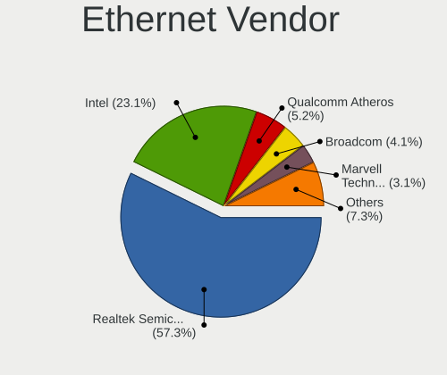

| Vendor                                 | Computers | Percent |
|----------------------------------------|-----------|---------|
| Realtek Semiconductor                  | 1010      | 57.29%  |
| Intel                                  | 407       | 23.09%  |
| Qualcomm Atheros                       | 91        | 5.16%   |
| Broadcom                               | 72        | 4.08%   |
| Marvell Technology Group               | 55        | 3.12%   |
| Nvidia                                 | 24        | 1.36%   |
| Broadcom Limited                       | 24        | 1.36%   |
| Xiaomi                                 | 14        | 0.79%   |
| ASIX Electronics                       | 11        | 0.62%   |
| VIA Technologies                       | 9         | 0.51%   |
| TP-Link                                | 7         | 0.4%    |
| Samsung Electronics                    | 5         | 0.28%   |
| MediaTek                               | 5         | 0.28%   |
| JMicron Technology                     | 5         | 0.28%   |
| Silicon Integrated Systems [SiS]       | 4         | 0.23%   |
| Apple                                  | 4         | 0.23%   |
| DisplayLink                            | 3         | 0.17%   |
| Lenovo                                 | 2         | 0.11%   |
| Huawei Technologies                    | 2         | 0.11%   |
| D-Link System                          | 2         | 0.11%   |
| Suzhou Motorcomm Electronic Technology | 1         | 0.06%   |
| Sundance Technology Inc / IC Plus      | 1         | 0.06%   |
| Qualcomm                               | 1         | 0.06%   |
| IBM                                    | 1         | 0.06%   |
| Google                                 | 1         | 0.06%   |
| Attansic Technology                    | 1         | 0.06%   |
| Aquantia                               | 1         | 0.06%   |

Ethernet Model
--------------

Ethernet models

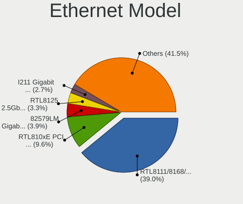

| Model                                                                  | Computers | Percent |
|------------------------------------------------------------------------|-----------|---------|
| Realtek RTL8111/8168/8211/8411 PCI Express Gigabit Ethernet Controller | 704       | 39.05%  |
| Realtek RTL810xE PCI Express Fast Ethernet controller                  | 173       | 9.6%    |
| Intel 82579LM Gigabit Network Connection (Lewisville)                  | 71        | 3.94%   |
| Realtek RTL8125 2.5GbE Controller                                      | 59        | 3.27%   |
| Intel I211 Gigabit Network Connection                                  | 48        | 2.66%   |
| Realtek RTL8153 Gigabit Ethernet Adapter                               | 38        | 2.11%   |
| Intel Ethernet Connection I217-LM                                      | 27        | 1.5%    |
| Realtek RTL-8100/8101L/8139 PCI Fast Ethernet Adapter                  | 22        | 1.22%   |
| Intel Ethernet Connection (2) I219-V                                   | 19        | 1.05%   |
| Intel Ethernet Connection (4) I219-LM                                  | 18        | 1%      |
| Intel Ethernet Controller I225-V                                       | 16        | 0.89%   |
| Qualcomm Atheros AR8151 v2.0 Gigabit Ethernet                          | 15        | 0.83%   |
| Intel 82567LM-3 Gigabit Network Connection                             | 14        | 0.78%   |
| Xiaomi Mi/Redmi series (RNDIS)                                         | 13        | 0.72%   |
| Realtek RTL8169 PCI Gigabit Ethernet Controller                        | 11        | 0.61%   |
| Qualcomm Atheros QCA8172 Fast Ethernet                                 | 11        | 0.61%   |
| Intel Ethernet Connection I219-LM                                      | 11        | 0.61%   |
| Intel Ethernet Connection I217-V                                       | 11        | 0.61%   |
| Intel Ethernet Connection (2) I218-V                                   | 11        | 0.61%   |
| Qualcomm Atheros AR8161 Gigabit Ethernet                               | 9         | 0.5%    |
| Qualcomm Atheros AR8121/AR8113/AR8114 Gigabit or Fast Ethernet         | 9         | 0.5%    |
| Intel Ethernet Connection (2) I219-LM                                  | 9         | 0.5%    |
| Intel 82567LM Gigabit Network Connection                               | 9         | 0.5%    |
| ASIX AX88179 Gigabit Ethernet                                          | 9         | 0.5%    |
| Marvell Group 88E8056 PCI-E Gigabit Ethernet Controller                | 8         | 0.44%   |
| Marvell Group 88E8055 PCI-E Gigabit Ethernet Controller                | 8         | 0.44%   |
| Intel Ethernet Connection I218-LM                                      | 8         | 0.44%   |
| Intel Ethernet Connection (3) I218-LM                                  | 8         | 0.44%   |
| Intel 82577LM Gigabit Network Connection                               | 8         | 0.44%   |
| Broadcom NetXtreme BCM5751 Gigabit Ethernet PCI Express                | 8         | 0.44%   |
| VIA VT6102/VT6103 [Rhine-II]                                           | 7         | 0.39%   |
| Realtek RTL8152 Fast Ethernet Adapter                                  | 7         | 0.39%   |
| Qualcomm Atheros Killer E220x Gigabit Ethernet Controller              | 7         | 0.39%   |
| Qualcomm Atheros AR8132 Fast Ethernet                                  | 7         | 0.39%   |
| Intel Ethernet Connection (13) I219-LM                                 | 7         | 0.39%   |
| Intel 82579V Gigabit Network Connection                                | 7         | 0.39%   |
| Broadcom NetXtreme BCM57765 Gigabit Ethernet PCIe                      | 7         | 0.39%   |
| Broadcom NetXtreme BCM5761 Gigabit Ethernet PCIe                       | 7         | 0.39%   |
| Broadcom NetLink BCM5784M Gigabit Ethernet PCIe                        | 7         | 0.39%   |
| Broadcom NetLink BCM57785 Gigabit Ethernet PCIe                        | 7         | 0.39%   |

Net Controller Kind
-------------------

Ethernet, WiFi or modem

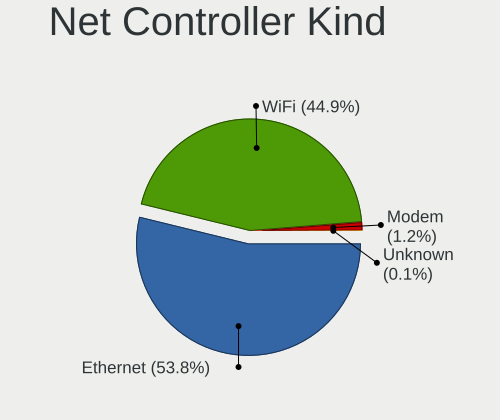

| Kind     | Computers | Percent |
|----------|-----------|---------|
| Ethernet | 1691      | 53.82%  |
| WiFi     | 1411      | 44.91%  |
| Modem    | 38        | 1.21%   |
| Unknown  | 2         | 0.06%   |

Used Controller
---------------

Currently used network controller

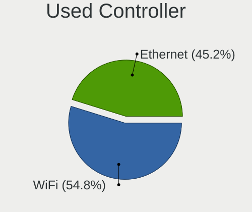

| Kind     | Computers | Percent |
|----------|-----------|---------|
| WiFi     | 1109      | 54.79%  |
| Ethernet | 915       | 45.21%  |

NICs
----

Total network controllers on board

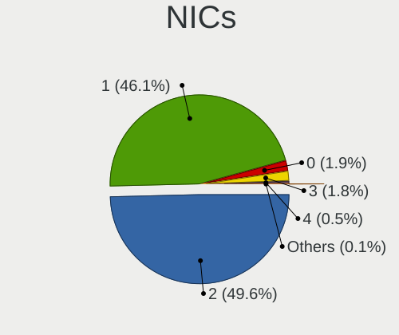

| Total | Computers | Percent |
|-------|-----------|---------|
| 2     | 972       | 49.62%  |
| 1     | 903       | 46.09%  |
| 0     | 37        | 1.89%   |
| 3     | 35        | 1.79%   |
| 4     | 10        | 0.51%   |
| 8     | 1         | 0.05%   |
| 5     | 1         | 0.05%   |

IPv6
----

IPv6 vs IPv4

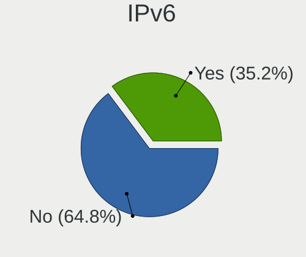

| Used | Computers | Percent |
|------|-----------|---------|
| No   | 1309      | 64.77%  |
| Yes  | 712       | 35.23%  |

Bluetooth
---------

Bluetooth Vendor
----------------

Controller vendors

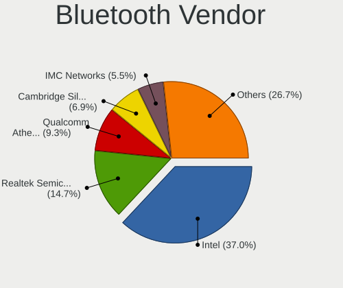

| Vendor                          | Computers | Percent |
|---------------------------------|-----------|---------|
| Intel                           | 418       | 36.96%  |
| Realtek Semiconductor           | 166       | 14.68%  |
| Qualcomm Atheros Communications | 105       | 9.28%   |
| Cambridge Silicon Radio         | 78        | 6.9%    |
| IMC Networks                    | 62        | 5.48%   |
| Foxconn / Hon Hai               | 55        | 4.86%   |
| Broadcom                        | 54        | 4.77%   |
| Apple                           | 24        | 2.12%   |
| Toshiba                         | 23        | 2.03%   |
| Hewlett-Packard                 | 22        | 1.95%   |
| Lite-On Technology              | 21        | 1.86%   |
| ASUSTek Computer                | 14        | 1.24%   |
| TP-Link                         | 11        | 0.97%   |
| Realtek                         | 11        | 0.97%   |
| Ralink                          | 10        | 0.88%   |
| MediaTek                        | 8         | 0.71%   |
| Foxconn International           | 7         | 0.62%   |
| Dell                            | 7         | 0.62%   |
| Alps Electric                   | 7         | 0.62%   |
| Ralink Technology               | 5         | 0.44%   |
| Askey Computer                  | 4         | 0.35%   |
| Mobile Action Technology        | 3         | 0.27%   |
| Micro Star International        | 2         | 0.18%   |
| Chicony Electronics             | 2         | 0.18%   |
| Actions                         | 2         | 0.18%   |
| Unknown                         | 2         | 0.18%   |
| USI                             | 1         | 0.09%   |
| Taiyo Yuden                     | 1         | 0.09%   |
| Syntek                          | 1         | 0.09%   |
| SiW                             | 1         | 0.09%   |
| Primax Electronics              | 1         | 0.09%   |
| Integrated System Solution      | 1         | 0.09%   |
| Edimax Technology               | 1         | 0.09%   |
| Belkin Components               | 1         | 0.09%   |

Bluetooth Model
---------------

Controller models

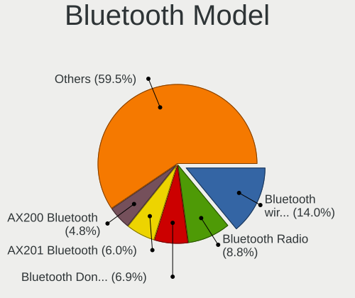

| Model                                                                               | Computers | Percent |
|-------------------------------------------------------------------------------------|-----------|---------|
| Intel Bluetooth wireless interface                                                  | 159       | 14.03%  |
| Realtek Bluetooth Radio                                                             | 100       | 8.83%   |
| Cambridge Silicon Radio Bluetooth Dongle (HCI mode)                                 | 78        | 6.88%   |
| Intel AX201 Bluetooth                                                               | 68        | 6%      |
| Intel AX200 Bluetooth                                                               | 54        | 4.77%   |
| Qualcomm Atheros  Bluetooth Device                                                  | 47        | 4.15%   |
| Intel Bluetooth 9460/9560 Jefferson Peak (JfP)                                      | 47        | 4.15%   |
| Intel Bluetooth Device                                                              | 35        | 3.09%   |
| Realtek  Bluetooth 4.2 Adapter                                                      | 32        | 2.82%   |
| IMC Networks Wireless_Device                                                        | 23        | 2.03%   |
| IMC Networks Bluetooth Radio                                                        | 23        | 2.03%   |
| Foxconn / Hon Hai Wireless_Device                                                   | 16        | 1.41%   |
| Realtek RTL8723B Bluetooth                                                          | 15        | 1.32%   |
| Intel Wireless-AC 9260 Bluetooth Adapter                                            | 15        | 1.32%   |
| Intel Wireless-AC 3168 Bluetooth                                                    | 15        | 1.32%   |
| Qualcomm Atheros AR3011 Bluetooth                                                   | 14        | 1.24%   |
| Qualcomm Atheros QCA61x4 Bluetooth 4.0                                              | 12        | 1.06%   |
| Qualcomm Atheros AR9462 Bluetooth                                                   | 12        | 1.06%   |
| Qualcomm Atheros AR3012 Bluetooth 4.0                                               | 12        | 1.06%   |
| Intel Centrino Bluetooth Wireless Transceiver                                       | 12        | 1.06%   |
| TP-Link TP-T@- UB500 Adapter                                                        | 11        | 0.97%   |
| Realtek Bluetooth Radio                                                             | 11        | 0.97%   |
| HP Broadcom 2070 Bluetooth Combo                                                    | 11        | 0.97%   |
| Apple Bluetooth Host Controller                                                     | 11        | 0.97%   |
| Ralink RT3290 Bluetooth                                                             | 10        | 0.88%   |
| Lite-On Qualcomm Atheros QCA9377 Bluetooth                                          | 10        | 0.88%   |
| HP Bluetooth 2.0 Interface [Broadcom BCM2045]                                       | 10        | 0.88%   |
| Lite-On Bluetooth Device                                                            | 9         | 0.79%   |
| Intel AX210 Bluetooth                                                               | 9         | 0.79%   |
| Foxconn / Hon Hai MediaTek Bluetooth Adapter                                        | 9         | 0.79%   |
| MediaTek Wireless_Device                                                            | 8         | 0.71%   |
| IMC Networks Bluetooth Device                                                       | 8         | 0.71%   |
| Toshiba Bluetooth Device                                                            | 7         | 0.62%   |
| Foxconn International BCM43142A0 Bluetooth module                                   | 7         | 0.62%   |
| Broadcom BCM2045B (BDC-2.1)                                                         | 7         | 0.62%   |
| Toshiba RT Bluetooth Radio                                                          | 6         | 0.53%   |
| Realtek RTL8822BE Bluetooth 4.2 Adapter                                             | 6         | 0.53%   |
| Foxconn / Hon Hai Foxconn T77H114 BCM2070 [Single-Chip Bluetooth 2.1 + EDR Adapter] | 6         | 0.53%   |
| Foxconn / Hon Hai Bluetooth USB Host Controller                                     | 6         | 0.53%   |
| Broadcom BCM43142A0 Bluetooth 4.0                                                   | 6         | 0.53%   |

Sound
-----

Sound Vendor
------------

Sound card vendors

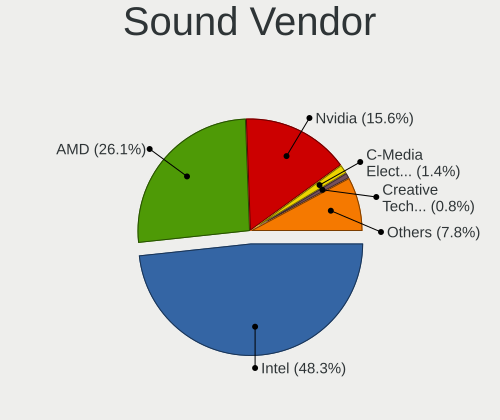

| Vendor                                       | Computers | Percent |
|----------------------------------------------|-----------|---------|
| Intel                                        | 1284      | 48.31%  |
| AMD                                          | 694       | 26.11%  |
| Nvidia                                       | 415       | 15.61%  |
| C-Media Electronics                          | 36        | 1.35%   |
| Creative Technology                          | 21        | 0.79%   |
| Creative Labs                                | 20        | 0.75%   |
| Logitech                                     | 15        | 0.56%   |
| Razer USA                                    | 13        | 0.49%   |
| Texas Instruments                            | 9         | 0.34%   |
| GN Netcom                                    | 9         | 0.34%   |
| Barco Display Systems                        | 9         | 0.34%   |
| VIA Technologies                             | 8         | 0.3%    |
| Dell                                         | 8         | 0.3%    |
| Lenovo                                       | 6         | 0.23%   |
| Kingston Technology                          | 6         | 0.23%   |
| Focusrite-Novation                           | 6         | 0.23%   |
| Realtek Semiconductor                        | 5         | 0.19%   |
| BEHRINGER International                      | 5         | 0.19%   |
| ASUSTek Computer                             | 5         | 0.19%   |
| Tenx Technology                              | 4         | 0.15%   |
| Silicon Integrated Systems [SiS]             | 4         | 0.15%   |
| Yamaha                                       | 3         | 0.11%   |
| SteelSeries ApS                              | 3         | 0.11%   |
| Nordic Semiconductor ASA                     | 3         | 0.11%   |
| KTMicro                                      | 3         | 0.11%   |
| JMTek                                        | 3         | 0.11%   |
| Hewlett-Packard                              | 3         | 0.11%   |
| Guillemot                                    | 3         | 0.11%   |
| Generalplus Technology                       | 3         | 0.11%   |
| Cooler Master                                | 3         | 0.11%   |
| Apple                                        | 3         | 0.11%   |
| Zoran Co. Personal Media Division (Nogatech) | 2         | 0.08%   |
| Trust                                        | 2         | 0.08%   |
| Plantronics                                  | 2         | 0.08%   |
| Native Instruments                           | 2         | 0.08%   |
| Ensoniq                                      | 2         | 0.08%   |
| Edifier Technology                           | 2         | 0.08%   |
| AudioQuest                                   | 2         | 0.08%   |
| Altec Lansing Technologies                   | 2         | 0.08%   |
| Zeroplus                                     | 1         | 0.04%   |

Sound Model
-----------

Sound card models

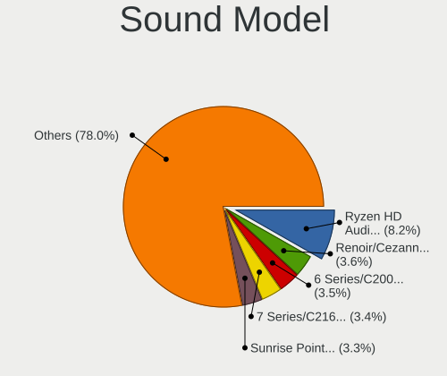

| Model                                                                      | Computers | Percent |
|----------------------------------------------------------------------------|-----------|---------|
| AMD Ryzen HD Audio Controller                                              | 270       | 8.23%   |
| AMD Renoir/Cezanne HDMI/DP Audio Controller                                | 118       | 3.6%    |
| Intel 6 Series/C200 Series Chipset Family High Definition Audio Controller | 114       | 3.47%   |
| Intel 7 Series/C216 Chipset Family High Definition Audio Controller        | 112       | 3.41%   |
| Intel Sunrise Point-LP HD Audio                                            | 108       | 3.29%   |
| Intel 8 Series/C220 Series Chipset High Definition Audio Controller        | 94        | 2.86%   |
| AMD Raven/Raven2/Fenghuang HDMI/DP Audio Controller                        | 91        | 2.77%   |
| Intel NM10/ICH7 Family High Definition Audio Controller                    | 87        | 2.65%   |
| Intel 82801I (ICH9 Family) HD Audio Controller                             | 81        | 2.47%   |
| Intel Xeon E3-1200 v3/4th Gen Core Processor HD Audio Controller           | 78        | 2.38%   |
| AMD SBx00 Azalia (Intel HDA)                                               | 77        | 2.35%   |
| AMD Starship/Matisse HD Audio Controller                                   | 64        | 1.95%   |
| Intel 5 Series/3400 Series Chipset High Definition Audio                   | 60        | 1.83%   |
| AMD FCH Azalia Controller                                                  | 60        | 1.83%   |
| Nvidia GK208 HDMI/DP Audio Controller                                      | 52        | 1.58%   |
| AMD Family 17h (Models 00h-0fh) HD Audio Controller                        | 52        | 1.58%   |
| AMD Radeon High Definition Audio Controller                                | 50        | 1.52%   |
| Intel 82801H (ICH8 Family) HD Audio Controller                             | 48        | 1.46%   |
| Intel Tiger Lake-LP Smart Sound Technology Audio Controller                | 46        | 1.4%    |
| Intel 100 Series/C230 Series Chipset Family HD Audio Controller            | 45        | 1.37%   |
| Intel Haswell-ULT HD Audio Controller                                      | 40        | 1.22%   |
| Intel 8 Series HD Audio Controller                                         | 40        | 1.22%   |
| Intel Cannon Lake PCH cAVS                                                 | 38        | 1.16%   |
| Nvidia GP107GL High Definition Audio Controller                            | 36        | 1.1%    |
| AMD Ellesmere HDMI Audio [Radeon RX 470/480 / 570/580/590]                 | 36        | 1.1%    |
| Intel 200 Series PCH HD Audio                                              | 32        | 0.98%   |
| AMD Kabini HDMI/DP Audio                                                   | 32        | 0.98%   |
| Nvidia High Definition Audio Controller                                    | 30        | 0.91%   |
| Nvidia GF108 High Definition Audio Controller                              | 30        | 0.91%   |
| AMD Navi 21/23 HDMI/DP Audio Controller                                    | 30        | 0.91%   |
| Intel Broadwell-U Audio Controller                                         | 29        | 0.88%   |
| AMD Family 15h (Models 60h-6fh) Audio Controller                           | 29        | 0.88%   |
| Intel Wildcat Point-LP High Definition Audio Controller                    | 28        | 0.85%   |
| Intel Alder Lake PCH-P High Definition Audio Controller                    | 27        | 0.82%   |
| Intel Atom Processor Z36xxx/Z37xxx Series High Definition Audio Controller | 26        | 0.79%   |
| Intel 82801JI (ICH10 Family) HD Audio Controller                           | 25        | 0.76%   |
| Nvidia TU116 High Definition Audio Controller                              | 24        | 0.73%   |
| AMD Oland/Hainan/Cape Verde/Pitcairn HDMI Audio [Radeon HD 7000 Series]    | 24        | 0.73%   |
| Nvidia TU107 GeForce GTX 1650 High Definition Audio Controller             | 22        | 0.67%   |
| Intel Comet Lake PCH-LP cAVS                                               | 22        | 0.67%   |

Memory
------

Memory Vendor
-------------

Memory module vendors

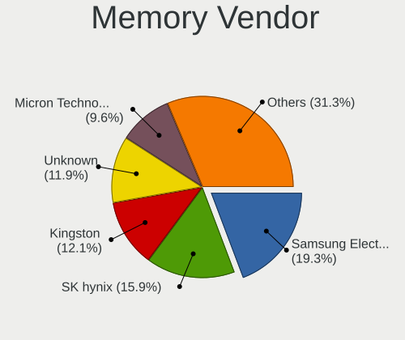

| Vendor                       | Computers | Percent |
|------------------------------|-----------|---------|
| Samsung Electronics          | 217       | 19.25%  |
| SK hynix                     | 179       | 15.88%  |
| Kingston                     | 136       | 12.07%  |
| Unknown                      | 134       | 11.89%  |
| Micron Technology            | 108       | 9.58%   |
| G.Skill                      | 79        | 7.01%   |
| Corsair                      | 74        | 6.57%   |
| Crucial                      | 61        | 5.41%   |
| Unknown                      | 20        | 1.77%   |
| Ramaxel Technology           | 15        | 1.33%   |
| Transcend                    | 14        | 1.24%   |
| Patriot                      | 13        | 1.15%   |
| Elpida                       | 13        | 1.15%   |
| Team                         | 11        | 0.98%   |
| Nanya Technology             | 9         | 0.8%    |
| Unknown (ABCD)               | 6         | 0.53%   |
| A-DATA Technology            | 6         | 0.53%   |
| GOODRAM                      | 4         | 0.35%   |
| Apacer                       | 4         | 0.35%   |
| Avant                        | 3         | 0.27%   |
| SHARETRONIC                  | 2         | 0.18%   |
| GeIL                         | 2         | 0.18%   |
| Veineda                      | 1         | 0.09%   |
| Unknown (0x8945)             | 1         | 0.09%   |
| Unknown (0x0E9D)             | 1         | 0.09%   |
| Toshiba                      | 1         | 0.09%   |
| Silicon Power                | 1         | 0.09%   |
| Red Hat                      | 1         | 0.09%   |
| Qimonda                      | 1         | 0.09%   |
| Patriot Memory (PDP Systems) | 1         | 0.09%   |
| Patriot Memory               | 1         | 0.09%   |
| Lexar                        | 1         | 0.09%   |
| Infineon                     | 1         | 0.09%   |
| HMD                          | 1         | 0.09%   |
| Hikvision                    | 1         | 0.09%   |
| H                            | 1         | 0.09%   |
| Goldkey                      | 1         | 0.09%   |
| ff                           | 1         | 0.09%   |
| 4ea5                         | 1         | 0.09%   |

Memory Model
------------

Memory module models

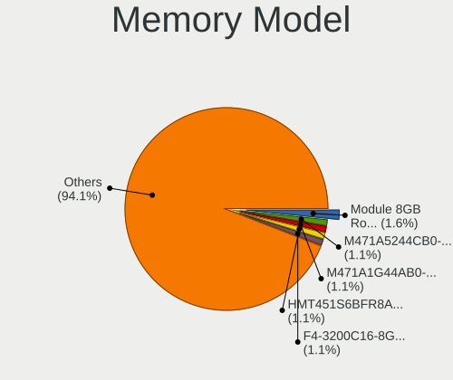

| Model                                                            | Computers | Percent |
|------------------------------------------------------------------|-----------|---------|
| Unknown                                                          | 20        | 1.63%   |
| SK hynix RAM HMT451S6BFR8A-PB 4GB SODIMM DDR3 1600MT/s           | 13        | 1.06%   |
| Samsung RAM M471A5244CB0-CTD 4GB SODIMM DDR4 3266MT/s            | 13        | 1.06%   |
| Samsung RAM M471A1G44AB0-CWE 8GiB SODIMM DDR4 3200MT/s           | 13        | 1.06%   |
| G.Skill RAM F4-3200C16-8GVKB 8GB DIMM DDR4 4000MT/s              | 13        | 1.06%   |
| Samsung RAM M471B5173EB0-YK0 4GB SODIMM DDR3 1600MT/s            | 11        | 0.9%    |
| Samsung RAM M471A1G44BB0-CWE 8GB SODIMM DDR4 3200MT/s            | 10        | 0.82%   |
| SK hynix RAM HMAA1GS6CJR6N-XN 8GB SODIMM DDR4 3200MT/s           | 9         | 0.73%   |
| G.Skill RAM F4-3000C16-8GISB 8GB DIMM DDR4 3200MT/s              | 9         | 0.73%   |
| Unknown RAM Module 2GB DIMM 800MT/s                              | 8         | 0.65%   |
| SK hynix RAM HMA81GS6AFR8N-UH 8GB SODIMM DDR4 2667MT/s           | 8         | 0.65%   |
| Samsung RAM M471B5173QH0-YK0 4GB SODIMM DDR3 1600MT/s            | 8         | 0.65%   |
| Unknown RAM Module 4GB DIMM 1333MT/s                             | 7         | 0.57%   |
| Samsung RAM M471A1K43DB1-CTD 8GB SODIMM DDR4 2667MT/s            | 7         | 0.57%   |
| Unknown RAM Module 4GB SODIMM DDR3                               | 6         | 0.49%   |
| Unknown RAM Module 2GB SODIMM DDR2 667MT/s                       | 6         | 0.49%   |
| Unknown RAM Module 2GB DIMM 1333MT/s                             | 6         | 0.49%   |
| Unknown (ABCD) RAM 123456789012345678 2GB SODIMM LPDDR4 2400MT/s | 6         | 0.49%   |
| SK hynix RAM HMA81GS6JJR8N-VK 8GB SODIMM DDR4 2667MT/s           | 6         | 0.49%   |
| Samsung RAM M471B5773CHS-CH9 2GB SODIMM DDR3 4199MT/s            | 6         | 0.49%   |
| Samsung RAM M471B5273CH0-CH9 4GB SODIMM DDR3 1334MT/s            | 6         | 0.49%   |
| Samsung RAM M471B5173DB0-YK0 4GB SODIMM DDR3 1600MT/s            | 6         | 0.49%   |
| Samsung RAM M471A1K43EB1-CWE 8GB SODIMM DDR4 3200MT/s            | 6         | 0.49%   |
| Unknown RAM Module 1024MB DIMM SDRAM                             | 5         | 0.41%   |
| SK hynix RAM HMT351S6EFR8A-PB 4GB SODIMM DDR3 1600MT/s           | 5         | 0.41%   |
| SK hynix RAM HMCG78MEBSA092N 16GB SODIMM DDR5 4800MT/s           | 5         | 0.41%   |
| SK hynix RAM HMA81GS6DJR8N-XN 8GB SODIMM DDR4 3200MT/s           | 5         | 0.41%   |
| Samsung RAM M471B1G73DB0-YK0 8GB SODIMM DDR3 1600MT/s            | 5         | 0.41%   |
| Samsung RAM M471A5244CB0-CRC 4GB SODIMM DDR4 2667MT/s            | 5         | 0.41%   |
| Micron RAM 4ATF51264HZ-3G2J1 4GB SODIMM DDR4 3200MT/s            | 5         | 0.41%   |
| Micron RAM 4ATF51264HZ-3G2J1 4GB Row Of Chips DDR4 3200MT/s      | 5         | 0.41%   |
| Kingston RAM KF3200C16D4/8GX 8GiB DIMM DDR4 3600MT/s             | 5         | 0.41%   |
| Unknown RAM Module 2048MB DIMM DDR2 800MT/s                      | 4         | 0.33%   |
| Unknown RAM Module 2048MB DIMM DDR 533MT/s                       | 4         | 0.33%   |
| Unknown RAM Module 1GB SODIMM DDR2                               | 4         | 0.33%   |
| SK hynix RAM HMT451S6MFR8C-PB 4GB SODIMM DDR3 1600MT/s           | 4         | 0.33%   |
| SK hynix RAM HMT41GS6BFR8A-PB 8GB SODIMM DDR3 2667MT/s           | 4         | 0.33%   |
| SK hynix RAM HMAA2GS6CJR8N-XN 16GB SODIMM DDR4 3200MT/s          | 4         | 0.33%   |
| SK hynix RAM HMA851S6DJR6N-XN 4GB SODIMM DDR4 3200MT/s           | 4         | 0.33%   |
| SK hynix RAM HMA82GS6JJR8N-VK 16GB SODIMM DDR4 2667MT/s          | 4         | 0.33%   |

Memory Kind
-----------

Memory module kinds

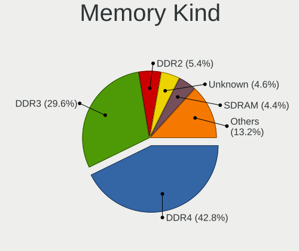

| Kind    | Computers | Percent |
|---------|-----------|---------|
| DDR4    | 420       | 42.77%  |
| DDR3    | 291       | 29.63%  |
| DDR2    | 53        | 5.4%    |
| Unknown | 45        | 4.58%   |
| SDRAM   | 43        | 4.38%   |
| DDR5    | 38        | 3.87%   |
| LPDDR5  | 29        | 2.95%   |
| LPDDR4  | 28        | 2.85%   |
| DDR     | 18        | 1.83%   |
| LPDDR3  | 12        | 1.22%   |
| DRAM    | 4         | 0.41%   |
| RAM     | 1         | 0.1%    |

Memory Form Factor
------------------

Physical design of the memory module

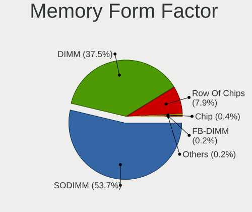

| Name         | Computers | Percent |
|--------------|-----------|---------|
| SODIMM       | 521       | 53.71%  |
| DIMM         | 364       | 37.53%  |
| Row Of Chips | 77        | 7.94%   |
| Chip         | 4         | 0.41%   |
| FB-DIMM      | 2         | 0.21%   |
| Unknown      | 2         | 0.21%   |

Memory Size
-----------

Memory module size

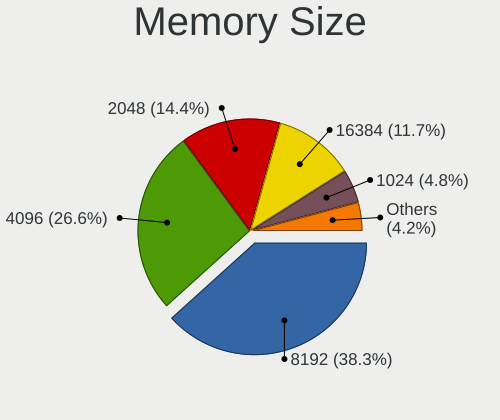

| Size  | Computers | Percent |
|-------|-----------|---------|
| 8192  | 406       | 38.3%   |
| 4096  | 282       | 26.6%   |
| 2048  | 153       | 14.43%  |
| 16384 | 124       | 11.7%   |
| 1024  | 51        | 4.81%   |
| 32768 | 30        | 2.83%   |
| 512   | 10        | 0.94%   |
| 3072  | 2         | 0.19%   |
| 24576 | 1         | 0.09%   |
| 256   | 1         | 0.09%   |

Memory Speed
------------

Memory module speed

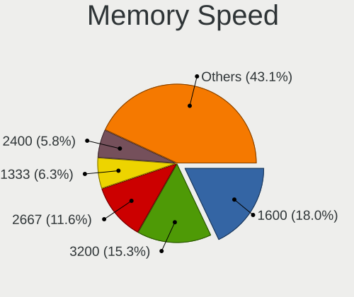

| Speed   | Computers | Percent |
|---------|-----------|---------|
| 1600    | 193       | 17.95%  |
| 3200    | 164       | 15.26%  |
| 2667    | 125       | 11.63%  |
| 1333    | 68        | 6.33%   |
| 2400    | 62        | 5.77%   |
| 3600    | 37        | 3.44%   |
| 2133    | 34        | 3.16%   |
| Unknown | 33        | 3.07%   |
| 667     | 30        | 2.79%   |
| 800     | 28        | 2.6%    |
| 1334    | 25        | 2.33%   |
| 5600    | 15        | 1.4%    |
| 4000    | 15        | 1.4%    |
| 1067    | 15        | 1.4%    |
| 6400    | 14        | 1.3%    |
| 4800    | 13        | 1.21%   |
| 3266    | 13        | 1.21%   |
| 1066    | 13        | 1.21%   |
| 4267    | 10        | 0.93%   |
| 4199    | 10        | 0.93%   |
| 3000    | 10        | 0.93%   |
| 533     | 10        | 0.93%   |
| 3733    | 9         | 0.84%   |
| 1867    | 9         | 0.84%   |
| 6000    | 8         | 0.74%   |
| 3800    | 8         | 0.74%   |
| 1800    | 8         | 0.74%   |
| 7500    | 7         | 0.65%   |
| 3400    | 7         | 0.65%   |
| 2933    | 7         | 0.65%   |
| 2048    | 6         | 0.56%   |
| 1866    | 5         | 0.47%   |
| 400     | 5         | 0.47%   |
| 8533    | 4         | 0.37%   |
| 4266    | 4         | 0.37%   |
| 3007    | 4         | 0.37%   |
| 8400    | 3         | 0.28%   |
| 7467    | 3         | 0.28%   |
| 3866    | 3         | 0.28%   |
| 2800    | 3         | 0.28%   |

Printers & scanners
-------------------

Printer Vendor
--------------

Printer device vendors

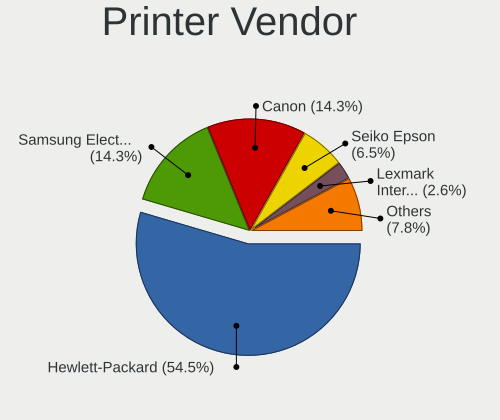

| Vendor                | Computers | Percent |
|-----------------------|-----------|---------|
| Hewlett-Packard       | 42        | 54.55%  |
| Samsung Electronics   | 11        | 14.29%  |
| Canon                 | 11        | 14.29%  |
| Seiko Epson           | 5         | 6.49%   |
| Lexmark International | 2         | 2.6%    |
| Brother Industries    | 2         | 2.6%    |
| Ricoh                 | 1         | 1.3%    |
| QinHeng Electronics   | 1         | 1.3%    |
| Oki Data              | 1         | 1.3%    |
| Konica Minolta        | 1         | 1.3%    |

Printer Model
-------------

Printer device models

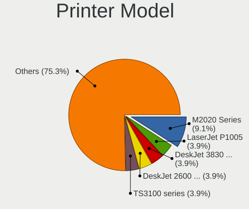

| Model                                        | Computers | Percent |
|----------------------------------------------|-----------|---------|
| Samsung M2020 Series                         | 7         | 9.09%   |
| HP LaserJet P1005                            | 3         | 3.9%    |
| HP DeskJet 3830 series                       | 3         | 3.9%    |
| HP DeskJet 2600 series                       | 3         | 3.9%    |
| Canon TS3100 series                          | 3         | 3.9%    |
| Seiko Epson L312 Series                      | 2         | 2.6%    |
| Samsung M2070 Series                         | 2         | 2.6%    |
| HP Smart Tank 510 series                     | 2         | 2.6%    |
| HP LaserJet P1102                            | 2         | 2.6%    |
| HP DeskJet 2300 series                       | 2         | 2.6%    |
| Seiko Epson ME 320/330 Series [Stylus SX125] | 1         | 1.3%    |
| Seiko Epson L1250 Series                     | 1         | 1.3%    |
| Seiko Epson ET-2810 Series                   | 1         | 1.3%    |
| Samsung SCX-3400 Series                      | 1         | 1.3%    |
| Samsung M267x 287x Series                    | 1         | 1.3%    |
| Ricoh SP 111SU                               | 1         | 1.3%    |
| QinHeng CH340S                               | 1         | 1.3%    |
| Oki Data USB Device                          | 1         | 1.3%    |
| Lexmark International E350d                  | 1         | 1.3%    |
| Lexmark International E120                   | 1         | 1.3%    |
| Konica Minolta magicolor 1680MF scan         | 1         | 1.3%    |
| HP Smart Tank 750 series                     | 1         | 1.3%    |
| HP Smart Tank 580-590 series                 | 1         | 1.3%    |
| HP Officejet Pro L7400                       | 1         | 1.3%    |
| HP Officejet J4500 series                    | 1         | 1.3%    |
| HP OfficeJet 6200                            | 1         | 1.3%    |
| HP Officejet 4500 G510g-m                    | 1         | 1.3%    |
| HP LaserJet M109-M112                        | 1         | 1.3%    |
| HP LaserJet 1022                             | 1         | 1.3%    |
| HP LaserJet 1020                             | 1         | 1.3%    |
| HP LaserJet 1018                             | 1         | 1.3%    |
| HP LaserJet 1010                             | 1         | 1.3%    |
| HP HP OfficeJet Pro 8020 series              | 1         | 1.3%    |
| HP HP Laser 107w                             | 1         | 1.3%    |
| HP DeskJet F300 series                       | 1         | 1.3%    |
| HP DeskJet F2492 All-in-One                  | 1         | 1.3%    |
| HP DeskJet D2300                             | 1         | 1.3%    |
| HP DeskJet 930c                              | 1         | 1.3%    |
| HP DeskJet 840c                              | 1         | 1.3%    |
| HP DeskJet 4670 series                       | 1         | 1.3%    |

Scanner Vendor
--------------

Scanner device vendors

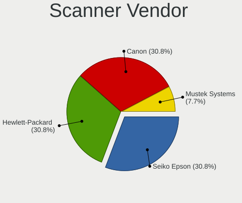

| Vendor          | Computers | Percent |
|-----------------|-----------|---------|
| Seiko Epson     | 4         | 30.77%  |
| Hewlett-Packard | 4         | 30.77%  |
| Canon           | 4         | 30.77%  |
| Mustek Systems  | 1         | 7.69%   |

Scanner Model
-------------

Scanner device models

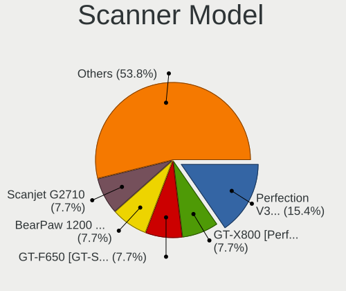

| Model                                             | Computers | Percent |
|---------------------------------------------------|-----------|---------|
| Seiko Epson Perfection V37/V370                   | 2         | 15.38%  |
| Seiko Epson GT-X800 [Perfection 4990 PHOTO]       | 1         | 7.69%   |
| Seiko Epson GT-F650 [GT-S600/Perfection V10/V100] | 1         | 7.69%   |
| Mustek Systems BearPaw 1200 CU Plus               | 1         | 7.69%   |
| HP Scanjet G2710                                  | 1         | 7.69%   |
| HP ScanJet 5530C PhotoSmart                       | 1         | 7.69%   |
| HP ScanJet 4370                                   | 1         | 7.69%   |
| HP ScanJet 3400cse                                | 1         | 7.69%   |
| Canon CanoScan LiDE 220                           | 1         | 7.69%   |
| Canon CanoScan LiDE 110                           | 1         | 7.69%   |
| Canon CanoScan LiDE 100                           | 1         | 7.69%   |
| Canon CanoScan 1220U                              | 1         | 7.69%   |

Camera
------

Camera Vendor
-------------

Camera device vendors

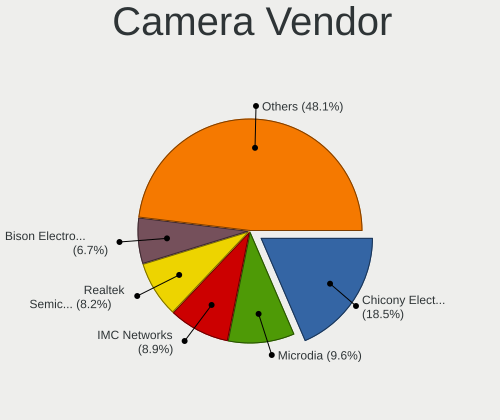

| Vendor                                 | Computers | Percent |
|----------------------------------------|-----------|---------|
| Chicony Electronics                    | 217       | 18.53%  |
| Microdia                               | 113       | 9.65%   |
| IMC Networks                           | 104       | 8.88%   |
| Realtek Semiconductor                  | 96        | 8.2%    |
| Bison Electronics                      | 78        | 6.66%   |
| Logitech                               | 70        | 5.98%   |
| Sunplus Innovation Technology          | 49        | 4.18%   |
| Suyin                                  | 47        | 4.01%   |
| Cheng Uei Precision Industry (Foxlink) | 42        | 3.59%   |
| Quanta                                 | 37        | 3.16%   |
| Syntek                                 | 31        | 2.65%   |
| Luxvisions Innotech Limited            | 25        | 2.13%   |
| Apple                                  | 25        | 2.13%   |
| Lite-On Technology                     | 23        | 1.96%   |
| Microsoft                              | 22        | 1.88%   |
| Ricoh                                  | 21        | 1.79%   |
| Alcor Micro                            | 19        | 1.62%   |
| Creative Technology                    | 14        | 1.2%    |
| ShineTech                              | 13        | 1.11%   |
| Generalplus Technology                 | 11        | 0.94%   |
| Silicon Motion                         | 10        | 0.85%   |
| Acer                                   | 10        | 0.85%   |
| Z-Star Microelectronics                | 8         | 0.68%   |
| Sonix Technology                       | 7         | 0.6%    |
| Samsung Electronics                    | 7         | 0.6%    |
| Importek                               | 5         | 0.43%   |
| Arkmicro Technologies                  | 5         | 0.43%   |
| Philips (or NXP)                       | 4         | 0.34%   |
| Lenovo                                 | 4         | 0.34%   |
| Jieli Technology                       | 4         | 0.34%   |
| Genesys Logic                          | 4         | 0.34%   |
| Aveo Technology                        | 4         | 0.34%   |
| ALi                                    | 4         | 0.34%   |
| Xiongmai                               | 3         | 0.26%   |
| Razer USA                              | 3         | 0.26%   |
| Primax Electronics                     | 3         | 0.26%   |
| Pixart Imaging                         | 2         | 0.17%   |
| Cubeternet                             | 2         | 0.17%   |
| webcam                                 | 1         | 0.09%   |
| WCM_USB                                | 1         | 0.09%   |

Camera Model
------------

Camera device models

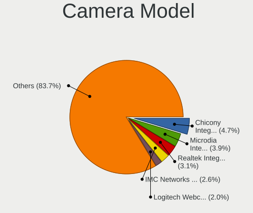

| Model                                               | Computers | Percent |
|-----------------------------------------------------|-----------|---------|
| Chicony Integrated Camera                           | 55        | 4.67%   |
| Microdia Integrated_Webcam_HD                       | 46        | 3.91%   |
| Realtek Integrated_Webcam_HD                        | 37        | 3.14%   |
| IMC Networks Integrated Camera                      | 31        | 2.63%   |
| Logitech Webcam C270                                | 23        | 1.95%   |
| IMC Networks USB2.0 HD UVC WebCam                   | 23        | 1.95%   |
| Syntek Integrated Camera                            | 19        | 1.61%   |
| Sunplus Integrated_Webcam_HD                        | 16        | 1.36%   |
| Chicony HP Truevision HD                            | 16        | 1.36%   |
| Bison Lenovo EasyCamera                             | 14        | 1.19%   |
| Bison Integrated Camera                             | 14        | 1.19%   |
| IMC Networks USB2.0 VGA UVC WebCam                  | 12        | 1.02%   |
| Chicony HP Webcam                                   | 11        | 0.93%   |
| Bison SunplusIT Integrated Camera                   | 11        | 0.93%   |
| Realtek Integrated Webcam                           | 10        | 0.85%   |
| Chicony USB 2.0 Camera                              | 10        | 0.85%   |
| Apple Built-in iSight                               | 10        | 0.85%   |
| Realtek Lenovo EasyCamera                           | 9         | 0.76%   |
| Luxvisions Innotech Limited HP TrueVision HD Camera | 9         | 0.76%   |
| Chicony TOSHIBA Web Camera - HD                     | 9         | 0.76%   |
| Chicony HD Webcam                                   | 9         | 0.76%   |
| ShineTech USB2.0 HD UVC WebCam                      | 8         | 0.68%   |
| Microsoft LifeCam HD-3000                           | 8         | 0.68%   |
| Creative Live! Cam Sync 1080p V2                    | 8         | 0.68%   |
| Chicony USB2.0 VGA UVC WebCam                       | 8         | 0.68%   |
| Cheng Uei Precision Industry (Foxlink) HP Webcam    | 8         | 0.68%   |
| Syntek Lenovo EasyCamera                            | 7         | 0.59%   |
| Quanta HP TrueVision HD Camera                      | 7         | 0.59%   |
| Microdia Camera                                     | 7         | 0.59%   |
| Bison Lenovo Integrated Webcam                      | 7         | 0.59%   |
| Apple FaceTime HD Camera (Built-in)                 | 7         | 0.59%   |
| Suyin Integrated_Webcam_HD                          | 6         | 0.51%   |
| Suyin HP Truevision HD                              | 6         | 0.51%   |
| Suyin Acer/Lenovo Webcam [CN0316]                   | 6         | 0.51%   |
| Realtek HP Webcam-101                               | 6         | 0.51%   |
| Quanta VGA WebCam                                   | 6         | 0.51%   |
| Microdia Laptop_Integrated_Webcam_HD                | 6         | 0.51%   |
| Luxvisions Innotech Limited Integrated RGB Camera   | 6         | 0.51%   |
| Luxvisions Innotech Limited Integrated Camera       | 6         | 0.51%   |
| Logitech HD Pro Webcam C920                         | 6         | 0.51%   |

Security
--------

Fingerprint Vendor
------------------

Fingerprint sensor vendors

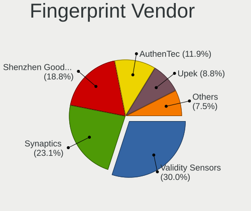

| Vendor                     | Computers | Percent |
|----------------------------|-----------|---------|
| Validity Sensors           | 48        | 30%     |
| Synaptics                  | 37        | 23.13%  |
| Shenzhen Goodix Technology | 30        | 18.75%  |
| AuthenTec                  | 19        | 11.88%  |
| Upek                       | 14        | 8.75%   |
| Elan Microelectronics      | 8         | 5%      |
| STMicroelectronics         | 2         | 1.25%   |
| LighTuning Technology      | 1         | 0.63%   |
| HOLTEK                     | 1         | 0.63%   |

Fingerprint Model
-----------------

Fingerprint sensor models

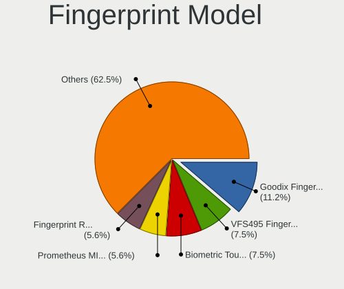

| Model                                                                      | Computers | Percent |
|----------------------------------------------------------------------------|-----------|---------|
| Shenzhen Goodix  FingerPrint Device                                        | 18        | 11.25%  |
| Validity Sensors VFS495 Fingerprint Reader                                 | 12        | 7.5%    |
| Upek Biometric Touchchip/Touchstrip Fingerprint Sensor                     | 12        | 7.5%    |
| Synaptics Prometheus MIS Touch Fingerprint Reader                          | 9         | 5.63%   |
| Shenzhen Goodix Fingerprint Reader                                         | 9         | 5.63%   |
| AuthenTec AES2501 Fingerprint Sensor                                       | 8         | 5%      |
| Validity Sensors VFS471 Fingerprint Reader                                 | 7         | 4.38%   |
| Synaptics Metallica MIS Touch Fingerprint Reader                           | 7         | 4.38%   |
| Validity Sensors VFS491                                                    | 6         | 3.75%   |
| Synaptics  WBDI                                                            | 6         | 3.75%   |
| Elan ELAN:ARM-M4                                                           | 6         | 3.75%   |
| AuthenTec AES2810                                                          | 6         | 3.75%   |
| Synaptics WBDI                                                             | 5         | 3.13%   |
| Validity Sensors VFS 5011 fingerprint sensor                               | 4         | 2.5%    |
| Validity Sensors Synaptics WBDI                                            | 4         | 2.5%    |
| Synaptics FS7604 Touch Fingerprint Sensor with PurePrint                   | 4         | 2.5%    |
| Validity Sensors VFS451 Fingerprint Reader                                 | 3         | 1.88%   |
| Shenzhen Goodix FingerPrint                                                | 3         | 1.88%   |
| Validity Sensors VFS7500 Touch Fingerprint Sensor                          | 2         | 1.25%   |
| Validity Sensors VFS5011 Fingerprint Reader                                | 2         | 1.25%   |
| Validity Sensors VFS101 Fingerprint Reader                                 | 2         | 1.25%   |
| Validity Sensors Swipe Fingerprint Sensor                                  | 2         | 1.25%   |
| Validity Sensors Fingerprint scanner                                       | 2         | 1.25%   |
| Upek TCS5B Fingerprint sensor                                              | 2         | 1.25%   |
| Synaptics UWP WBDI Device                                                  | 2         | 1.25%   |
| Synaptics UWP WBDI                                                         | 2         | 1.25%   |
| Synaptics Metallica MOH Touch Fingerprint Reader                           | 2         | 1.25%   |
| STMicroelectronics Fingerprint Reader                                      | 2         | 1.25%   |
| Elan ELAN:Fingerprint                                                      | 2         | 1.25%   |
| AuthenTec AES2550 Fingerprint Sensor                                       | 2         | 1.25%   |
| AuthenTec AES1600                                                          | 2         | 1.25%   |
| Validity Sensors VFS301 Fingerprint Reader                                 | 1         | 0.63%   |
| Validity Sensors Synaptics VFS7552 Touch Fingerprint Sensor with PurePrint | 1         | 0.63%   |
| LighTuning Fingerprint Reader                                              | 1         | 0.63%   |
| HOLTEK FocalTech Fingerprint Device                                        | 1         | 0.63%   |
| AuthenTec Fingerprint Sensor                                               | 1         | 0.63%   |

Chipcard Vendor
---------------

Chipcard module vendors

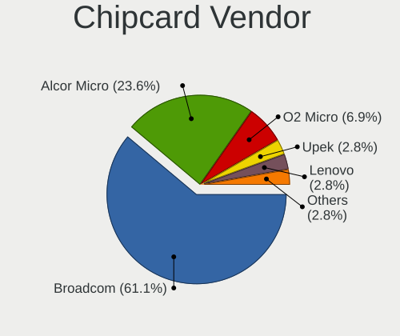

| Vendor      | Computers | Percent |
|-------------|-----------|---------|
| Broadcom    | 44        | 61.11%  |
| Alcor Micro | 17        | 23.61%  |
| O2 Micro    | 5         | 6.94%   |
| Upek        | 2         | 2.78%   |
| Lenovo      | 2         | 2.78%   |
| Yubico.com  | 1         | 1.39%   |
| ASK-RFID    | 1         | 1.39%   |

Chipcard Model
--------------

Chipcard module models

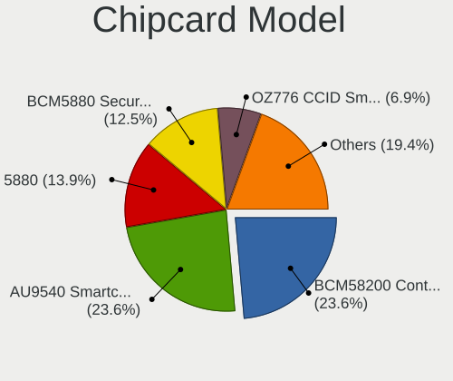

| Model                                                                        | Computers | Percent |
|------------------------------------------------------------------------------|-----------|---------|
| Broadcom BCM58200 ControlVault 3 (FingerPrint sensor + Contacted SmartCard)  | 17        | 23.61%  |
| Alcor Micro AU9540 Smartcard Reader                                          | 17        | 23.61%  |
| Broadcom 5880                                                                | 10        | 13.89%  |
| Broadcom BCM5880 Secure Applications Processor                               | 9         | 12.5%   |
| O2 Micro OZ776 CCID Smartcard Reader                                         | 5         | 6.94%   |
| Broadcom BCM5880 Secure Applications Processor with fingerprint swipe sensor | 4         | 5.56%   |
| Broadcom 58200                                                               | 4         | 5.56%   |
| Upek TouchChip Fingerprint Coprocessor (WBF advanced mode)                   | 2         | 2.78%   |
| Lenovo Integrated Smart Card Reader                                          | 2         | 2.78%   |
| Yubico.com Yubikey 4/5 U2F+CCID                                              | 1         | 1.39%   |
| ASK-RFID GEN5XX CCID                                                         | 1         | 1.39%   |

Unsupported
-----------

Unsupported Devices
-------------------

Total unsupported devices on board

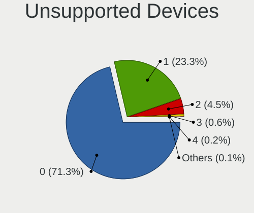

| Total | Computers | Percent |
|-------|-----------|---------|
| 0     | 1419      | 71.34%  |
| 1     | 464       | 23.33%  |
| 2     | 89        | 4.47%   |
| 3     | 12        | 0.6%    |
| 4     | 3         | 0.15%   |
| 7     | 1         | 0.05%   |
| 6     | 1         | 0.05%   |

Unsupported Device Types
------------------------

Types of unsupported devices

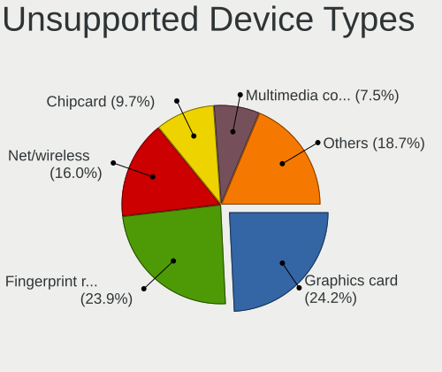

| Type                     | Computers | Percent |
|--------------------------|-----------|---------|
| Graphics card            | 162       | 24.22%  |
| Fingerprint reader       | 160       | 23.92%  |
| Net/wireless             | 107       | 15.99%  |
| Chipcard                 | 65        | 9.72%   |
| Multimedia controller    | 50        | 7.47%   |
| Bluetooth                | 25        | 3.74%   |
| Communication controller | 22        | 3.29%   |
| Camera                   | 15        | 2.24%   |
| Sound                    | 11        | 1.64%   |
| Storage                  | 8         | 1.2%    |
| Modem                    | 7         | 1.05%   |
| Unassigned class         | 6         | 0.9%    |
| Network                  | 5         | 0.75%   |
| Flash memory             | 5         | 0.75%   |
| Dvb card                 | 5         | 0.75%   |
| Card reader              | 5         | 0.75%   |
| Net/ethernet             | 4         | 0.6%    |
| Storage/raid             | 2         | 0.3%    |
| Firewire controller      | 2         | 0.3%    |
| Tv card                  | 1         | 0.15%   |
| Storage/ide              | 1         | 0.15%   |
| Storage/ata              | 1         | 0.15%   |

