Linux in Greece - Tested Hardware & Statistics
----------------------------------------------

A project to collect tested hardware configurations for Linux in Greece.

Anyone can contribute to this report by the [hw-probe](https://github.com/linuxhw/hw-probe) tool:

    sudo -E hw-probe -all -upload

Please contribute! Especially if your hardware is rare.

This is a report for all computer types. See also reports for [desktops](/Location/Greece/Desktop/README.md) and [notebooks](/Location/Greece/Notebook/README.md).

Contents
--------

* [ Test Cases ](#test-cases)

* [ System ](#system)
  - [ OS                       ](#os)
  - [ OS Family                ](#os-family)
  - [ Kernel                   ](#kernel)
  - [ Kernel Family            ](#kernel-family)
  - [ Kernel Major Ver.        ](#kernel-major-ver)
  - [ Arch                     ](#arch)
  - [ DE                       ](#de)
  - [ Display Server           ](#display-server)
  - [ Display Manager          ](#display-manager)
  - [ OS Lang                  ](#os-lang)
  - [ Boot Mode                ](#boot-mode)
  - [ Filesystem               ](#filesystem)
  - [ Part. scheme             ](#part-scheme)
  - [ Dual Boot with Linux/BSD ](#dual-boot-with-linuxbsd)
  - [ Dual Boot (Win)          ](#dual-boot-win)

* [ Board ](#board)
  - [ Vendor                   ](#vendor)
  - [ Model                    ](#model)
  - [ Model Family             ](#model-family)
  - [ MFG Year                 ](#mfg-year)
  - [ Form Factor              ](#form-factor)
  - [ Secure Boot              ](#secure-boot)
  - [ Coreboot                 ](#coreboot)
  - [ RAM Size                 ](#ram-size)
  - [ RAM Used                 ](#ram-used)
  - [ Total Drives             ](#total-drives)
  - [ Has CD-ROM               ](#has-cd-rom)
  - [ Has Ethernet             ](#has-ethernet)
  - [ Has WiFi                 ](#has-wifi)
  - [ Has Bluetooth            ](#has-bluetooth)

* [ Location ](#location)
  - [ Country                  ](#country)
  - [ City                     ](#city)

* [ Drives ](#drives)
  - [ Drive Vendor             ](#drive-vendor)
  - [ Drive Model              ](#drive-model)
  - [ HDD Vendor               ](#hdd-vendor)
  - [ SSD Vendor               ](#ssd-vendor)
  - [ Drive Kind               ](#drive-kind)
  - [ Drive Connector          ](#drive-connector)
  - [ Drive Size               ](#drive-size)
  - [ Space Total              ](#space-total)
  - [ Space Used               ](#space-used)
  - [ Malfunc. Drives          ](#malfunc-drives)
  - [ Malfunc. Drive Vendor    ](#malfunc-drive-vendor)
  - [ Malfunc. HDD Vendor      ](#malfunc-hdd-vendor)
  - [ Malfunc. Drive Kind      ](#malfunc-drive-kind)
  - [ Failed Drives            ](#failed-drives)
  - [ Failed Drive Vendor      ](#failed-drive-vendor)
  - [ Drive Status             ](#drive-status)

* [ Storage controller ](#storage-controller)
  - [ Storage Vendor           ](#storage-vendor)
  - [ Storage Model            ](#storage-model)
  - [ Storage Kind             ](#storage-kind)

* [ Processor ](#processor)
  - [ CPU Vendor               ](#cpu-vendor)
  - [ CPU Model                ](#cpu-model)
  - [ CPU Model Family         ](#cpu-model-family)
  - [ CPU Cores                ](#cpu-cores)
  - [ CPU Sockets              ](#cpu-sockets)
  - [ CPU Threads              ](#cpu-threads)
  - [ CPU Op-Modes             ](#cpu-op-modes)
  - [ CPU Microcode            ](#cpu-microcode)
  - [ CPU Microarch            ](#cpu-microarch)

* [ Graphics ](#graphics)
  - [ GPU Vendor               ](#gpu-vendor)
  - [ GPU Model                ](#gpu-model)
  - [ GPU Combo                ](#gpu-combo)
  - [ GPU Driver               ](#gpu-driver)
  - [ GPU Memory               ](#gpu-memory)

* [ Monitor ](#monitor)
  - [ Monitor Vendor           ](#monitor-vendor)
  - [ Monitor Model            ](#monitor-model)
  - [ Monitor Resolution       ](#monitor-resolution)
  - [ Monitor Diagonal         ](#monitor-diagonal)
  - [ Monitor Width            ](#monitor-width)
  - [ Aspect Ratio             ](#aspect-ratio)
  - [ Monitor Area             ](#monitor-area)
  - [ Pixel Density            ](#pixel-density)
  - [ Multiple Monitors        ](#multiple-monitors)

* [ Network ](#network)
  - [ Net Controller Vendor    ](#net-controller-vendor)
  - [ Net Controller Model     ](#net-controller-model)
  - [ Wireless Vendor          ](#wireless-vendor)
  - [ Wireless Model           ](#wireless-model)
  - [ Ethernet Vendor          ](#ethernet-vendor)
  - [ Ethernet Model           ](#ethernet-model)
  - [ Net Controller Kind      ](#net-controller-kind)
  - [ Used Controller          ](#used-controller)
  - [ NICs                     ](#nics)
  - [ IPv6                     ](#ipv6)

* [ Bluetooth ](#bluetooth)
  - [ Bluetooth Vendor         ](#bluetooth-vendor)
  - [ Bluetooth Model          ](#bluetooth-model)

* [ Sound ](#sound)
  - [ Sound Vendor             ](#sound-vendor)
  - [ Sound Model              ](#sound-model)

* [ Memory ](#memory)
  - [ Memory Vendor            ](#memory-vendor)
  - [ Memory Model             ](#memory-model)
  - [ Memory Kind              ](#memory-kind)
  - [ Memory Form Factor       ](#memory-form-factor)
  - [ Memory Size              ](#memory-size)
  - [ Memory Speed             ](#memory-speed)

* [ Printers & scanners ](#printers--scanners)
  - [ Printer Vendor           ](#printer-vendor)
  - [ Printer Model            ](#printer-model)
  - [ Scanner Vendor           ](#scanner-vendor)
  - [ Scanner Model            ](#scanner-model)

* [ Camera ](#camera)
  - [ Camera Vendor            ](#camera-vendor)
  - [ Camera Model             ](#camera-model)

* [ Security ](#security)
  - [ Fingerprint Vendor       ](#fingerprint-vendor)
  - [ Fingerprint Model        ](#fingerprint-model)
  - [ Chipcard Vendor          ](#chipcard-vendor)
  - [ Chipcard Model           ](#chipcard-model)

* [ Unsupported ](#unsupported)
  - [ Unsupported Devices      ](#unsupported-devices)
  - [ Unsupported Device Types ](#unsupported-device-types)

Test Cases
----------

Total: 1396

| Vendor        | Model                       | Form-Factor | Probe                                                      | Date         |
|---------------|-----------------------------|-------------|------------------------------------------------------------|--------------|
| HP            | Unknown                     | Notebook    | [521124e0e2](https://linux-hardware.org/?probe=521124e0e2) | May 28, 2022 |
| Lenovo        | ThinkPad X230 2324FV6       | Notebook    | [6386696f31](https://linux-hardware.org/?probe=6386696f31) | May 25, 2022 |
| Dell          | Vostro 5625                 | Notebook    | [2ae97190b6](https://linux-hardware.org/?probe=2ae97190b6) | May 24, 2022 |
| Dell          | Latitude 5420               | Notebook    | [28c0f1ba96](https://linux-hardware.org/?probe=28c0f1ba96) | May 24, 2022 |
| ASUSTek       | X505BA                      | Notebook    | [685c1f7378](https://linux-hardware.org/?probe=685c1f7378) | May 22, 2022 |
| ASUSTek       | H81M-K                      | Desktop     | [22fb59a94a](https://linux-hardware.org/?probe=22fb59a94a) | May 19, 2022 |
| Pegatron      | A15                         | Notebook    | [335d6a014c](https://linux-hardware.org/?probe=335d6a014c) | May 18, 2022 |
| ASUSTek       | P8H61 PRO                   | Desktop     | [87a148ac90](https://linux-hardware.org/?probe=87a148ac90) | May 18, 2022 |
| ASUSTek       | H61M-E                      | Desktop     | [1dc25cb237](https://linux-hardware.org/?probe=1dc25cb237) | May 17, 2022 |
| HP            | Mini 110-1100               | Notebook    | [b93ac7c302](https://linux-hardware.org/?probe=b93ac7c302) | May 16, 2022 |
| HP            | Mini 110-1100               | Notebook    | [4a5f85e53d](https://linux-hardware.org/?probe=4a5f85e53d) | May 16, 2022 |
| HP            | ProBook 645 G1              | Notebook    | [771f25ecc9](https://linux-hardware.org/?probe=771f25ecc9) | May 14, 2022 |
| Gigabyte      | X58A-UD3R                   | Desktop     | [0e9a009c11](https://linux-hardware.org/?probe=0e9a009c11) | May 13, 2022 |
| HP            | EliteBook 8470p             | Notebook    | [2c8d1eec1e](https://linux-hardware.org/?probe=2c8d1eec1e) | May 13, 2022 |
| HP            | EliteBook 8470p             | Notebook    | [074043a5ca](https://linux-hardware.org/?probe=074043a5ca) | May 13, 2022 |
| Gigabyte      | X58A-UD3R                   | Desktop     | [ed659a9633](https://linux-hardware.org/?probe=ed659a9633) | May 13, 2022 |
| Dell          | Inspiron 7786               | Convertible | [7df1484700](https://linux-hardware.org/?probe=7df1484700) | May 12, 2022 |
| AOpen         | i67QMx-DV R1.00BC1 55MP6... | Desktop     | [151db99970](https://linux-hardware.org/?probe=151db99970) | May 11, 2022 |
| ASUSTek       | ROG STRIX B350-F GAMING     | Desktop     | [5d59ce5dd7](https://linux-hardware.org/?probe=5d59ce5dd7) | May 11, 2022 |
| ASUSTek       | Z97-PRO GAMER               | Desktop     | [173fac4f5b](https://linux-hardware.org/?probe=173fac4f5b) | May 11, 2022 |
| HP            | 3031h                       | Desktop     | [4a57ff5761](https://linux-hardware.org/?probe=4a57ff5761) | May 10, 2022 |
| Gigabyte      | Z87X-D3H-CF                 | Desktop     | [8caf6e2b66](https://linux-hardware.org/?probe=8caf6e2b66) | May 09, 2022 |
| Gigabyte      | Z87X-D3H-CF                 | Desktop     | [4242d236c5](https://linux-hardware.org/?probe=4242d236c5) | May 09, 2022 |
| ASUSTek       | Z170-A                      | Desktop     | [bdfe0722a7](https://linux-hardware.org/?probe=bdfe0722a7) | May 09, 2022 |
| Gigabyte      | 990FXA-UD3                  | Desktop     | [4fe934e84d](https://linux-hardware.org/?probe=4fe934e84d) | May 06, 2022 |
| ASRock        | AB350 Gaming-ITX/ac         | Desktop     | [9967806049](https://linux-hardware.org/?probe=9967806049) | May 02, 2022 |
| ASUSTek       | TUF Gaming FX505GE_FX505... | Notebook    | [ec5dbcb034](https://linux-hardware.org/?probe=ec5dbcb034) | May 02, 2022 |
| Dell          | Latitude E6500              | Notebook    | [bbd302d9ba](https://linux-hardware.org/?probe=bbd302d9ba) | May 02, 2022 |
| Dell          | Latitude E6500              | Notebook    | [8eb92ca472](https://linux-hardware.org/?probe=8eb92ca472) | May 02, 2022 |
| MSI           | B550-A PRO                  | Desktop     | [d2903d25c5](https://linux-hardware.org/?probe=d2903d25c5) | Apr 30, 2022 |
| Gigabyte      | B450 AORUS M                | Desktop     | [de4ae72708](https://linux-hardware.org/?probe=de4ae72708) | Apr 28, 2022 |
| Lenovo        | ThinkPad T495 20NJ0012GM    | Notebook    | [81f7a796be](https://linux-hardware.org/?probe=81f7a796be) | Apr 28, 2022 |
| Lenovo        | MAHOBAY 0B98401 PRO         | Desktop     | [c6bf48bfb3](https://linux-hardware.org/?probe=c6bf48bfb3) | Apr 27, 2022 |
| Dell          | Inspiron 5567               | Notebook    | [9da2289998](https://linux-hardware.org/?probe=9da2289998) | Apr 24, 2022 |
| Dell          | Inspiron 5559               | Notebook    | [e9676d63f9](https://linux-hardware.org/?probe=e9676d63f9) | Apr 24, 2022 |
| HP            | Notebook                    | Notebook    | [4772a69956](https://linux-hardware.org/?probe=4772a69956) | Apr 23, 2022 |
| HP            | Notebook                    | Notebook    | [e6099e9fd5](https://linux-hardware.org/?probe=e6099e9fd5) | Apr 22, 2022 |
| ASUSTek       | P5P43TD                     | Desktop     | [8c7c0bd289](https://linux-hardware.org/?probe=8c7c0bd289) | Apr 21, 2022 |
| HP            | Pavilion g7                 | Notebook    | [6bfdb0c3c9](https://linux-hardware.org/?probe=6bfdb0c3c9) | Apr 19, 2022 |
| HP            | Pavilion g7                 | Notebook    | [97e00013eb](https://linux-hardware.org/?probe=97e00013eb) | Apr 19, 2022 |
| Dell          | XPS 15 7590                 | Notebook    | [ee7354dd8d](https://linux-hardware.org/?probe=ee7354dd8d) | Apr 19, 2022 |
| Alienware     | M11x                        | Notebook    | [df72ecbe58](https://linux-hardware.org/?probe=df72ecbe58) | Apr 18, 2022 |
| Acer          | Aspire A315-51              | Notebook    | [a6ae41a1c9](https://linux-hardware.org/?probe=a6ae41a1c9) | Apr 18, 2022 |
| ASUSTek       | TUF Z390-PLUS GAMING        | Desktop     | [dddd6b6edd](https://linux-hardware.org/?probe=dddd6b6edd) | Apr 18, 2022 |
| Toshiba       | Satellite L50D-B            | Notebook    | [c5d02ba256](https://linux-hardware.org/?probe=c5d02ba256) | Apr 17, 2022 |
| HP            | Pavilion Notebook           | Notebook    | [217905d42a](https://linux-hardware.org/?probe=217905d42a) | Apr 17, 2022 |
| Toshiba       | Satellite L50D-B            | Notebook    | [912c61bb9b](https://linux-hardware.org/?probe=912c61bb9b) | Apr 15, 2022 |
| Lenovo        | IdeaPad 5 Pro 16IHU6 82L... | Notebook    | [4838334e73](https://linux-hardware.org/?probe=4838334e73) | Apr 14, 2022 |
| Dell          | 04PT3G A00                  | Desktop     | [a10754ebca](https://linux-hardware.org/?probe=a10754ebca) | Apr 14, 2022 |
| Dell          | Latitude D630               | Notebook    | [dbee98e342](https://linux-hardware.org/?probe=dbee98e342) | Apr 13, 2022 |
| HP            | 250 G5 Notebook PC          | Notebook    | [92b78eaf1b](https://linux-hardware.org/?probe=92b78eaf1b) | Apr 13, 2022 |
| ASRock        | H97 Pro4                    | Desktop     | [0ad016db29](https://linux-hardware.org/?probe=0ad016db29) | Apr 13, 2022 |
| Dell          | Inspiron 3542               | Notebook    | [b41fc0fac0](https://linux-hardware.org/?probe=b41fc0fac0) | Apr 13, 2022 |
| Unknown       | Z37S                        | Notebook    | [25d5118843](https://linux-hardware.org/?probe=25d5118843) | Apr 13, 2022 |
| Schenker      | XMG NEO (TGL/M21)           | Notebook    | [eeb87dca9a](https://linux-hardware.org/?probe=eeb87dca9a) | Apr 13, 2022 |
| Gigabyte      | Z68MA-D2H-B3                | Desktop     | [5c247da651](https://linux-hardware.org/?probe=5c247da651) | Apr 10, 2022 |
| HP            | G7000                       | Notebook    | [11280d88c6](https://linux-hardware.org/?probe=11280d88c6) | Apr 10, 2022 |
| ASUSTek       | TUF Gaming X570-PLUS        | Desktop     | [761e954b86](https://linux-hardware.org/?probe=761e954b86) | Apr 07, 2022 |
| ASRock        | X399 Phantom Gaming 6       | Desktop     | [111167cacb](https://linux-hardware.org/?probe=111167cacb) | Apr 07, 2022 |
| ASUSTek       | TUF Gaming FX705GD_FX705... | Notebook    | [091e8b72d9](https://linux-hardware.org/?probe=091e8b72d9) | Apr 05, 2022 |
| TUXEDO        | Aura 15 Gen1                | Notebook    | [cda73dafa0](https://linux-hardware.org/?probe=cda73dafa0) | Apr 04, 2022 |
| Lenovo        | SHARKBAY SDK0J40705 WIN     | Desktop     | [374819f582](https://linux-hardware.org/?probe=374819f582) | Apr 04, 2022 |
| Acer          | Aspire 5745G                | Notebook    | [4a6e981204](https://linux-hardware.org/?probe=4a6e981204) | Apr 04, 2022 |
| Gigabyte      | Z270-Gaming K3              | Desktop     | [492c2c7bf4](https://linux-hardware.org/?probe=492c2c7bf4) | Apr 03, 2022 |
| ASUSTek       | TUF Gaming X570-PLUS        | Desktop     | [8d251b1b2a](https://linux-hardware.org/?probe=8d251b1b2a) | Apr 03, 2022 |
| Gigabyte      | Z270-Gaming K3              | Desktop     | [97969b1325](https://linux-hardware.org/?probe=97969b1325) | Apr 03, 2022 |
| Acer          | Aspire 5750G                | Notebook    | [8aeaa381e8](https://linux-hardware.org/?probe=8aeaa381e8) | Apr 03, 2022 |
| Acer          | Aspire 5750G                | Notebook    | [722346a184](https://linux-hardware.org/?probe=722346a184) | Apr 03, 2022 |
| ASUSTek       | PRIME H310-PLUS R2.0        | Desktop     | [348af6c202](https://linux-hardware.org/?probe=348af6c202) | Apr 02, 2022 |
| ASUSTek       | PRIME X570-P                | Desktop     | [e237e56d72](https://linux-hardware.org/?probe=e237e56d72) | Apr 02, 2022 |
| Sony          | VGN-AW11XU_Q                | Notebook    | [b3f2270d5f](https://linux-hardware.org/?probe=b3f2270d5f) | Apr 02, 2022 |
| ASUSTek       | TUF Gaming FX705GD_FX705... | Notebook    | [6b00b2928a](https://linux-hardware.org/?probe=6b00b2928a) | Apr 01, 2022 |
| ASUSTek       | P8Z77-V PRO                 | Desktop     | [3ac2dfc728](https://linux-hardware.org/?probe=3ac2dfc728) | Apr 01, 2022 |
| ASRock        | B75M R2.0                   | Desktop     | [ee7a1d8721](https://linux-hardware.org/?probe=ee7a1d8721) | Mar 30, 2022 |
| HP            | Unknown                     | Notebook    | [e989736b06](https://linux-hardware.org/?probe=e989736b06) | Mar 30, 2022 |
| HP            | Unknown                     | Notebook    | [672d3c8b62](https://linux-hardware.org/?probe=672d3c8b62) | Mar 29, 2022 |
| ASRock        | M3N78D FX                   | Desktop     | [66bb134c6c](https://linux-hardware.org/?probe=66bb134c6c) | Mar 29, 2022 |
| Raspberry ... | Raspberry Pi Zero Rev 1.... | Soc         | [380efd9f08](https://linux-hardware.org/?probe=380efd9f08) | Mar 29, 2022 |
| HP            | 250 G3                      | Notebook    | [22f691edac](https://linux-hardware.org/?probe=22f691edac) | Mar 29, 2022 |
| ASUSTek       | ROG STRIX B350-F GAMING     | Desktop     | [6335525127](https://linux-hardware.org/?probe=6335525127) | Mar 28, 2022 |
| ASRock        | N68-GS4 FX R2.0             | Desktop     | [d01df98d83](https://linux-hardware.org/?probe=d01df98d83) | Mar 28, 2022 |
| ASRock        | M3N78D FX                   | Desktop     | [3ebcef4241](https://linux-hardware.org/?probe=3ebcef4241) | Mar 28, 2022 |
| Dell          | Latitude 7420               | Notebook    | [9ef752b49a](https://linux-hardware.org/?probe=9ef752b49a) | Mar 27, 2022 |
| Dell          | Inspiron 5406 2n1           | Convertible | [1297813d45](https://linux-hardware.org/?probe=1297813d45) | Mar 27, 2022 |
| Apple         | Mac-F4238CC8 PVT            | All in one  | [c8289cd264](https://linux-hardware.org/?probe=c8289cd264) | Mar 26, 2022 |
| HP            | ProBook 4530s               | Notebook    | [f4d3c7fddf](https://linux-hardware.org/?probe=f4d3c7fddf) | Mar 25, 2022 |
| HP            | Laptop 15s-eq0xxx           | Notebook    | [22d9e9ead2](https://linux-hardware.org/?probe=22d9e9ead2) | Mar 25, 2022 |
| Lenovo        | IdeaPad Y550 20017          | Notebook    | [09576b4897](https://linux-hardware.org/?probe=09576b4897) | Mar 25, 2022 |
| Lenovo        | IdeaPad Y550 20017          | Notebook    | [610b3ad535](https://linux-hardware.org/?probe=610b3ad535) | Mar 25, 2022 |
| Dell          | Latitude E6220              | Notebook    | [b006a7da3b](https://linux-hardware.org/?probe=b006a7da3b) | Mar 23, 2022 |
| Acer          | Aspire 5930                 | Notebook    | [ac66ce376e](https://linux-hardware.org/?probe=ac66ce376e) | Mar 23, 2022 |
| ASUSTek       | N752VX                      | Notebook    | [9eb7fe04cf](https://linux-hardware.org/?probe=9eb7fe04cf) | Mar 21, 2022 |
| Apple         | Mac-F4238CC8 PVT            | All in one  | [5c6b1616fa](https://linux-hardware.org/?probe=5c6b1616fa) | Mar 21, 2022 |
| Gigabyte      | B450 AORUS M                | Desktop     | [789a97d437](https://linux-hardware.org/?probe=789a97d437) | Mar 20, 2022 |
| ASUSTek       | H81M-K                      | Desktop     | [9055c398c9](https://linux-hardware.org/?probe=9055c398c9) | Mar 18, 2022 |
| Gigabyte      | AB350M-Gaming 3-CF          | Desktop     | [4fa05350b7](https://linux-hardware.org/?probe=4fa05350b7) | Mar 17, 2022 |
| Dell          | Latitude E7470              | Notebook    | [db5eecff9e](https://linux-hardware.org/?probe=db5eecff9e) | Mar 16, 2022 |
| MSI           | B550-A PRO                  | Desktop     | [44e9c813e9](https://linux-hardware.org/?probe=44e9c813e9) | Mar 14, 2022 |
| HP            | Laptop 15s-eq0xxx           | Notebook    | [321ad64376](https://linux-hardware.org/?probe=321ad64376) | Mar 13, 2022 |
| HP            | Laptop 15s-eq0xxx           | Notebook    | [d5bc8e4202](https://linux-hardware.org/?probe=d5bc8e4202) | Mar 13, 2022 |
| HP            | 1850                        | Desktop     | [7e0b4230d4](https://linux-hardware.org/?probe=7e0b4230d4) | Mar 11, 2022 |
| Lenovo        | IdeaPad S145-15IIL 81W8     | Notebook    | [e251c9f079](https://linux-hardware.org/?probe=e251c9f079) | Mar 11, 2022 |
| HP            | 86F3 00100                  | All in one  | [7de0381db8](https://linux-hardware.org/?probe=7de0381db8) | Mar 11, 2022 |
| MSI           | MS-7091                     | Desktop     | [6ff1d651e4](https://linux-hardware.org/?probe=6ff1d651e4) | Mar 11, 2022 |
| Raspberry ... | Raspberry Pi 4 Model B R... | Soc         | [c36fe6c067](https://linux-hardware.org/?probe=c36fe6c067) | Mar 10, 2022 |
| ASUSTek       | P5GC-MX/MEDION/SI           | Desktop     | [772e020316](https://linux-hardware.org/?probe=772e020316) | Mar 09, 2022 |
| ASUSTek       | P5GC-MX/MEDION/SI           | Desktop     | [2a7edc452e](https://linux-hardware.org/?probe=2a7edc452e) | Mar 09, 2022 |
| Gigabyte      | F2A85XM-D3H                 | Desktop     | [cf20f6e233](https://linux-hardware.org/?probe=cf20f6e233) | Mar 09, 2022 |
| MSI           | MS-7091                     | Desktop     | [71aaa6a920](https://linux-hardware.org/?probe=71aaa6a920) | Mar 09, 2022 |
| MSI           | MS-7091                     | Desktop     | [b08ddd1115](https://linux-hardware.org/?probe=b08ddd1115) | Mar 09, 2022 |
| Toshiba       | Satellite C50-B             | Notebook    | [6bffc83185](https://linux-hardware.org/?probe=6bffc83185) | Mar 08, 2022 |
| Dell          | Latitude E6430              | Notebook    | [e32f5b40a1](https://linux-hardware.org/?probe=e32f5b40a1) | Mar 07, 2022 |
| ASUSTek       | X101CH                      | Notebook    | [486f5c28ad](https://linux-hardware.org/?probe=486f5c28ad) | Mar 07, 2022 |
| Gigabyte      | X58A-UD3R                   | Desktop     | [f56996aab6](https://linux-hardware.org/?probe=f56996aab6) | Mar 07, 2022 |
| Acer          | Aspire A515-44G             | Notebook    | [7f95a3373c](https://linux-hardware.org/?probe=7f95a3373c) | Mar 06, 2022 |
| Acer          | Aspire A515-44G             | Notebook    | [ea17b9cff2](https://linux-hardware.org/?probe=ea17b9cff2) | Mar 06, 2022 |
| HP            | 3048h                       | Desktop     | [cb9a7b7f4f](https://linux-hardware.org/?probe=cb9a7b7f4f) | Mar 05, 2022 |
| Dell          | Inspiron 3593               | Notebook    | [9e9718070f](https://linux-hardware.org/?probe=9e9718070f) | Mar 02, 2022 |
| Gigabyte      | X58A-UD3R                   | Desktop     | [3cc5bac970](https://linux-hardware.org/?probe=3cc5bac970) | Mar 02, 2022 |
| ASUSTek       | PRIME B350M-A               | Desktop     | [299a727e8a](https://linux-hardware.org/?probe=299a727e8a) | Mar 02, 2022 |
| ASUSTek       | H81M-K                      | Desktop     | [2789dc5384](https://linux-hardware.org/?probe=2789dc5384) | Mar 02, 2022 |
| ASUSTek       | PRIME H310-PLUS R2.0        | Desktop     | [3f6b2ab46e](https://linux-hardware.org/?probe=3f6b2ab46e) | Mar 01, 2022 |
| Toshiba       | Satellite C50-A-19T         | Notebook    | [daa7733b2d](https://linux-hardware.org/?probe=daa7733b2d) | Feb 28, 2022 |
| Gigabyte      | H410M S2H V3                | Desktop     | [e5da146c8e](https://linux-hardware.org/?probe=e5da146c8e) | Feb 27, 2022 |
| ASUSTek       | X550CA                      | Notebook    | [926781b691](https://linux-hardware.org/?probe=926781b691) | Feb 27, 2022 |
| Supermicro    | X9SRA/X9SRA-3               | Server      | [7f43788673](https://linux-hardware.org/?probe=7f43788673) | Feb 27, 2022 |
| Fujitsu       | LIFEBOOK S752               | Notebook    | [abb12adccc](https://linux-hardware.org/?probe=abb12adccc) | Feb 26, 2022 |
| HP            | 2000                        | Notebook    | [53d7131a3d](https://linux-hardware.org/?probe=53d7131a3d) | Feb 26, 2022 |
| Clevo         | M740TU(N)/M760TU(N)/W7X0... | Notebook    | [810f5ad6fa](https://linux-hardware.org/?probe=810f5ad6fa) | Feb 25, 2022 |
| Dell          | 0N185P A01                  | Desktop     | [996f9f7805](https://linux-hardware.org/?probe=996f9f7805) | Feb 24, 2022 |
| Fujitsu       | LIFEBOOK AH512              | Notebook    | [d7889a52d1](https://linux-hardware.org/?probe=d7889a52d1) | Feb 24, 2022 |
| ASUSTek       | X550CA                      | Notebook    | [ad54ee0dbe](https://linux-hardware.org/?probe=ad54ee0dbe) | Feb 20, 2022 |
| Gigabyte      | MZBSWMP-00                  | Desktop     | [fc444df804](https://linux-hardware.org/?probe=fc444df804) | Feb 20, 2022 |
| Dell          | Inspiron 5567               | Notebook    | [1ba170be6a](https://linux-hardware.org/?probe=1ba170be6a) | Feb 20, 2022 |
| ASUSTek       | X550CA                      | Notebook    | [c036f1a977](https://linux-hardware.org/?probe=c036f1a977) | Feb 20, 2022 |
| Teclast       | F7                          | Notebook    | [fccda8fbdc](https://linux-hardware.org/?probe=fccda8fbdc) | Feb 20, 2022 |
| HP            | Pavilion Aero Laptop 13-... | Notebook    | [b8e767511b](https://linux-hardware.org/?probe=b8e767511b) | Feb 19, 2022 |
| Gigabyte      | H61M-S2PV                   | Desktop     | [9e10ad29c3](https://linux-hardware.org/?probe=9e10ad29c3) | Feb 19, 2022 |
| Lenovo        | G700 20251                  | Notebook    | [2e68ddfdd3](https://linux-hardware.org/?probe=2e68ddfdd3) | Feb 18, 2022 |
| TUXEDO        | Aura 15 Gen1                | Notebook    | [536a1e49b0](https://linux-hardware.org/?probe=536a1e49b0) | Feb 17, 2022 |
| Lenovo        | IdeaPad D330-10IGM 81H3     | Tablet      | [c9d8bb9bd9](https://linux-hardware.org/?probe=c9d8bb9bd9) | Feb 16, 2022 |
| Gigabyte      | X58A-UD3R                   | Desktop     | [87774dacdd](https://linux-hardware.org/?probe=87774dacdd) | Feb 15, 2022 |
| Gigabyte      | X58A-UD3R                   | Desktop     | [3cf4dc7f97](https://linux-hardware.org/?probe=3cf4dc7f97) | Feb 15, 2022 |
| MSI           | MS-7176                     | Desktop     | [b54631ff57](https://linux-hardware.org/?probe=b54631ff57) | Feb 14, 2022 |
| e-shop.gr     | V113                        | Notebook    | [e9a1ae2e96](https://linux-hardware.org/?probe=e9a1ae2e96) | Feb 14, 2022 |
| HP            | ProBook 640 G1              | Notebook    | [640d06ac28](https://linux-hardware.org/?probe=640d06ac28) | Feb 12, 2022 |
| e-shop.gr     | V113                        | Notebook    | [6d015f399b](https://linux-hardware.org/?probe=6d015f399b) | Feb 12, 2022 |
| Gigabyte      | B250M-DS3H-CF               | Desktop     | [57de891506](https://linux-hardware.org/?probe=57de891506) | Feb 12, 2022 |
| Gigabyte      | Z87N-WIFI                   | Desktop     | [e86fa9ee02](https://linux-hardware.org/?probe=e86fa9ee02) | Feb 09, 2022 |
| Gigabyte      | Z87N-WIFI                   | Desktop     | [1b6aa0ce08](https://linux-hardware.org/?probe=1b6aa0ce08) | Feb 09, 2022 |
| HP            | Pavilion 11 x360 PC         | Notebook    | [dcd0177f71](https://linux-hardware.org/?probe=dcd0177f71) | Feb 07, 2022 |
| ASUSTek       | 900                         | Notebook    | [88ce413793](https://linux-hardware.org/?probe=88ce413793) | Feb 06, 2022 |
| HP            | Pavilion Notebook           | Notebook    | [8f79e4d763](https://linux-hardware.org/?probe=8f79e4d763) | Feb 06, 2022 |
| Notebook      | W54_W94_W955TU,-T,-C        | Notebook    | [5a3fcd1230](https://linux-hardware.org/?probe=5a3fcd1230) | Feb 05, 2022 |
| Lenovo        | IdeaPad S540-14API 81NH     | Notebook    | [e32abec202](https://linux-hardware.org/?probe=e32abec202) | Feb 03, 2022 |
| ASUSTek       | PRIME B350-PLUS             | Desktop     | [df711c6514](https://linux-hardware.org/?probe=df711c6514) | Feb 03, 2022 |
| Lenovo        | ThinkCentre M58 7373W43     | Desktop     | [4dc312f4f3](https://linux-hardware.org/?probe=4dc312f4f3) | Feb 02, 2022 |
| Lenovo        | SDK0E50510 WIN              | Desktop     | [f317005b0a](https://linux-hardware.org/?probe=f317005b0a) | Feb 02, 2022 |
| Lenovo        | NOK                         | Desktop     | [8905840b45](https://linux-hardware.org/?probe=8905840b45) | Feb 02, 2022 |
| ASUSTek       | H110M-D                     | Desktop     | [3dbf1d9544](https://linux-hardware.org/?probe=3dbf1d9544) | Jan 31, 2022 |
| Lenovo        | ThinkPad Edge 0301GBG       | Notebook    | [2227d37e2f](https://linux-hardware.org/?probe=2227d37e2f) | Jan 30, 2022 |
| Sony          | SVE1113M1EB                 | Notebook    | [83220eef23](https://linux-hardware.org/?probe=83220eef23) | Jan 30, 2022 |
| HP            | Pavilion dv3                | Notebook    | [c1abcb66ee](https://linux-hardware.org/?probe=c1abcb66ee) | Jan 29, 2022 |
| RuggedPC      | RuggedPadC86V               | Tablet      | [c9f76be971](https://linux-hardware.org/?probe=c9f76be971) | Jan 28, 2022 |
| ASUSTek       | VivoBook 15_ASUS Laptop ... | Notebook    | [48ad956cc2](https://linux-hardware.org/?probe=48ad956cc2) | Jan 28, 2022 |
| HP            | 8434 11                     | Desktop     | [76a7851e7f](https://linux-hardware.org/?probe=76a7851e7f) | Jan 28, 2022 |
| VIA Techno... | VT8366-8233/5               | Desktop     | [e285c87c48](https://linux-hardware.org/?probe=e285c87c48) | Jan 27, 2022 |
| HP            | Pavilion Gaming Laptop 1... | Notebook    | [f7633506c3](https://linux-hardware.org/?probe=f7633506c3) | Jan 26, 2022 |
| VIA Techno... | VT8366-8233/5               | Desktop     | [54ce61fa7e](https://linux-hardware.org/?probe=54ce61fa7e) | Jan 25, 2022 |
| MSI           | A88XM-E45                   | Desktop     | [6a25ca99d2](https://linux-hardware.org/?probe=6a25ca99d2) | Jan 24, 2022 |
| Gigabyte      | H410M H V3                  | Desktop     | [f6b7e2e2e6](https://linux-hardware.org/?probe=f6b7e2e2e6) | Jan 24, 2022 |
| HP            | 86F3 00100                  | All in one  | [6b9bc0d34d](https://linux-hardware.org/?probe=6b9bc0d34d) | Jan 24, 2022 |
| Lenovo        | 314F NO DPK                 | Desktop     | [07bd238c48](https://linux-hardware.org/?probe=07bd238c48) | Jan 24, 2022 |
| ASRock        | A300M-STX                   | Desktop     | [13de9d767d](https://linux-hardware.org/?probe=13de9d767d) | Jan 21, 2022 |
| MSI           | H310M PRO-VH                | Desktop     | [68c71dac17](https://linux-hardware.org/?probe=68c71dac17) | Jan 21, 2022 |
| ASRock        | G41C-VS                     | Desktop     | [4dbb4b7fad](https://linux-hardware.org/?probe=4dbb4b7fad) | Jan 21, 2022 |
| Albatron      | PM73V                       | Desktop     | [7bd3956f1f](https://linux-hardware.org/?probe=7bd3956f1f) | Jan 21, 2022 |
| ASUSTek       | H81M-K                      | Desktop     | [e5d70436b2](https://linux-hardware.org/?probe=e5d70436b2) | Jan 21, 2022 |
| HP            | EliteBook 8570p             | Notebook    | [5716cdab2a](https://linux-hardware.org/?probe=5716cdab2a) | Jan 21, 2022 |
| HP            | 8455                        | Desktop     | [fbf272366c](https://linux-hardware.org/?probe=fbf272366c) | Jan 20, 2022 |
| ASUSTek       | H110M-D                     | Desktop     | [b105d56395](https://linux-hardware.org/?probe=b105d56395) | Jan 19, 2022 |
| ASUSTek       | P5LD2                       | Desktop     | [00ec990ce2](https://linux-hardware.org/?probe=00ec990ce2) | Jan 19, 2022 |
| Dell          | 0KP561                      | Desktop     | [1b772786e5](https://linux-hardware.org/?probe=1b772786e5) | Jan 19, 2022 |
| Dell          | 0FH884                      | Desktop     | [5ffacf9f99](https://linux-hardware.org/?probe=5ffacf9f99) | Jan 19, 2022 |
| Dell          | 0UG982                      | Desktop     | [c85c923e97](https://linux-hardware.org/?probe=c85c923e97) | Jan 19, 2022 |
| Dell          | 0X7841                      | Desktop     | [40600195c8](https://linux-hardware.org/?probe=40600195c8) | Jan 19, 2022 |
| Lenovo        | SDK0E50510 WIN              | Desktop     | [597677191c](https://linux-hardware.org/?probe=597677191c) | Jan 19, 2022 |
| Dell          | 0UG982                      | Desktop     | [686f3558d2](https://linux-hardware.org/?probe=686f3558d2) | Jan 19, 2022 |
| Lenovo        | 314F NO DPK                 | Desktop     | [f4f3386726](https://linux-hardware.org/?probe=f4f3386726) | Jan 19, 2022 |
| Dell          | 0FH884                      | Desktop     | [f6e9bda3a9](https://linux-hardware.org/?probe=f6e9bda3a9) | Jan 19, 2022 |
| Lenovo        | 314F NO DPK                 | Desktop     | [b9153e0c28](https://linux-hardware.org/?probe=b9153e0c28) | Jan 19, 2022 |
| HP            | 18E7                        | Desktop     | [b68364ed90](https://linux-hardware.org/?probe=b68364ed90) | Jan 19, 2022 |
| Dell          | 0HY9JP A02                  | Desktop     | [8314cd9ba6](https://linux-hardware.org/?probe=8314cd9ba6) | Jan 19, 2022 |
| Dell          | 0UG982                      | Desktop     | [38c30e280b](https://linux-hardware.org/?probe=38c30e280b) | Jan 19, 2022 |
| Gigabyte      | H81M-S2PV                   | Desktop     | [f2d5dba7ff](https://linux-hardware.org/?probe=f2d5dba7ff) | Jan 19, 2022 |
| Dell          | 0FH884                      | Desktop     | [083697081f](https://linux-hardware.org/?probe=083697081f) | Jan 19, 2022 |
| MSI           | H310M PRO-VH                | Desktop     | [844791ed3e](https://linux-hardware.org/?probe=844791ed3e) | Jan 19, 2022 |
| ASRock        | B550M Steel Legend          | Desktop     | [0601abdfa6](https://linux-hardware.org/?probe=0601abdfa6) | Jan 18, 2022 |
| HP            | 18E7                        | Desktop     | [9fedcb7ff7](https://linux-hardware.org/?probe=9fedcb7ff7) | Jan 18, 2022 |
| HP            | 18E7                        | Desktop     | [48871270a2](https://linux-hardware.org/?probe=48871270a2) | Jan 18, 2022 |
| HP            | 18E7                        | Desktop     | [ca38c856e1](https://linux-hardware.org/?probe=ca38c856e1) | Jan 18, 2022 |
| HP            | 18E7                        | Desktop     | [a4df88b38f](https://linux-hardware.org/?probe=a4df88b38f) | Jan 18, 2022 |
| HP            | 18E7                        | Desktop     | [a745b9add0](https://linux-hardware.org/?probe=a745b9add0) | Jan 18, 2022 |
| HP            | 18E7                        | Desktop     | [b69abe6fd4](https://linux-hardware.org/?probe=b69abe6fd4) | Jan 18, 2022 |
| Lenovo        | SDK0E50510 WIN              | Desktop     | [9753f9164a](https://linux-hardware.org/?probe=9753f9164a) | Jan 18, 2022 |
| Lenovo        | ThinkCentre M58 7373W43     | Desktop     | [2d7a6e6cb6](https://linux-hardware.org/?probe=2d7a6e6cb6) | Jan 18, 2022 |
| Lenovo        | SDK0E50510 WIN              | Desktop     | [51484889f9](https://linux-hardware.org/?probe=51484889f9) | Jan 18, 2022 |
| Lenovo        | SDK0E50510 WIN              | Desktop     | [4ca462c89a](https://linux-hardware.org/?probe=4ca462c89a) | Jan 18, 2022 |
| Dell          | 0HY9JP A02                  | Desktop     | [c4c9f4b0a9](https://linux-hardware.org/?probe=c4c9f4b0a9) | Jan 18, 2022 |
| HP            | 8434 11                     | Desktop     | [4a128d2bb2](https://linux-hardware.org/?probe=4a128d2bb2) | Jan 18, 2022 |
| HP            | 18E7                        | Desktop     | [97d4bc7367](https://linux-hardware.org/?probe=97d4bc7367) | Jan 18, 2022 |
| Lenovo        | NOK                         | Desktop     | [7ae2819a6f](https://linux-hardware.org/?probe=7ae2819a6f) | Jan 18, 2022 |
| HP            | 18E7                        | Desktop     | [e86d0cc284](https://linux-hardware.org/?probe=e86d0cc284) | Jan 18, 2022 |
| Lenovo        | SDK0E50510 WIN              | Desktop     | [022f56a960](https://linux-hardware.org/?probe=022f56a960) | Jan 18, 2022 |
| HP            | 18E7                        | Desktop     | [0d2a09f683](https://linux-hardware.org/?probe=0d2a09f683) | Jan 18, 2022 |
| HP            | 8455                        | Desktop     | [639182896b](https://linux-hardware.org/?probe=639182896b) | Jan 18, 2022 |
| ASUSTek       | H81M-C                      | Desktop     | [f4bb742149](https://linux-hardware.org/?probe=f4bb742149) | Jan 17, 2022 |
| ASUSTek       | P5LD2                       | Desktop     | [b972c7929f](https://linux-hardware.org/?probe=b972c7929f) | Jan 17, 2022 |
| ASUSTek       | PRIME H310M-D R2.0          | Desktop     | [9a6c2f82f1](https://linux-hardware.org/?probe=9a6c2f82f1) | Jan 17, 2022 |
| Dell          | 0UG982                      | Desktop     | [684478b2fb](https://linux-hardware.org/?probe=684478b2fb) | Jan 17, 2022 |
| Gigabyte      | H410M H V3                  | Desktop     | [13b01fb40a](https://linux-hardware.org/?probe=13b01fb40a) | Jan 17, 2022 |
| ASUSTek       | PRIME H310M-D R2.0          | Desktop     | [385f76b996](https://linux-hardware.org/?probe=385f76b996) | Jan 17, 2022 |
| HP            | ENVY x360 Convertible 15... | Convertible | [910af5ce1a](https://linux-hardware.org/?probe=910af5ce1a) | Jan 17, 2022 |
| Gigabyte      | X58A-UD3R                   | Desktop     | [dc02dbb307](https://linux-hardware.org/?probe=dc02dbb307) | Jan 16, 2022 |
| ASUSTek       | H81M-C                      | Desktop     | [f21bf32c9a](https://linux-hardware.org/?probe=f21bf32c9a) | Jan 15, 2022 |
| ASUSTek       | H81M-K                      | Desktop     | [f1858e63f4](https://linux-hardware.org/?probe=f1858e63f4) | Jan 14, 2022 |
| Gigabyte      | P55-USB3                    | Desktop     | [07d50b5a0a](https://linux-hardware.org/?probe=07d50b5a0a) | Jan 14, 2022 |
| HP            | ProBook 640 G1              | Notebook    | [6261e290d6](https://linux-hardware.org/?probe=6261e290d6) | Jan 13, 2022 |
| Dell          | Latitude E5440              | Notebook    | [e4ec245baf](https://linux-hardware.org/?probe=e4ec245baf) | Jan 12, 2022 |
| Lenovo        | ThinkPad Edge 0301GBG       | Notebook    | [41205188c5](https://linux-hardware.org/?probe=41205188c5) | Jan 12, 2022 |
| Lenovo        | SHARKBAY SDK0E50510 WIN     | Desktop     | [32b2cea437](https://linux-hardware.org/?probe=32b2cea437) | Jan 10, 2022 |
| Unknown       | Unknown                     | Notebook    | [5557e91853](https://linux-hardware.org/?probe=5557e91853) | Jan 09, 2022 |
| Gigabyte      | A320M-H-CF                  | Desktop     | [c09f135f63](https://linux-hardware.org/?probe=c09f135f63) | Jan 09, 2022 |
| HP            | Notebook                    | Notebook    | [97eb40cec9](https://linux-hardware.org/?probe=97eb40cec9) | Jan 07, 2022 |
| Dell          | Inspiron 3585               | Notebook    | [bd035d052c](https://linux-hardware.org/?probe=bd035d052c) | Jan 07, 2022 |
| Lenovo        | G50-70 20351                | Notebook    | [5467cc6a24](https://linux-hardware.org/?probe=5467cc6a24) | Jan 06, 2022 |
| ASUSTek       | PRIME B350M-A               | Desktop     | [7887040435](https://linux-hardware.org/?probe=7887040435) | Jan 05, 2022 |
| Apple         | MacBookPro5,5               | Notebook    | [a03baba93d](https://linux-hardware.org/?probe=a03baba93d) | Jan 05, 2022 |
| ASRock        | H97M Pro4                   | Desktop     | [92a6f429b5](https://linux-hardware.org/?probe=92a6f429b5) | Jan 05, 2022 |
| ASUSTek       | ROG STRIX B550-E GAMING     | Desktop     | [f5f5eadcd4](https://linux-hardware.org/?probe=f5f5eadcd4) | Jan 04, 2022 |
| ECS           | G31T-M7                     | Desktop     | [8cd5d79924](https://linux-hardware.org/?probe=8cd5d79924) | Dec 31, 2021 |
| ECS           | G31T-M7                     | Desktop     | [9ebfb53472](https://linux-hardware.org/?probe=9ebfb53472) | Dec 31, 2021 |
| HP            | Compaq 6730s                | Notebook    | [bd8962f904](https://linux-hardware.org/?probe=bd8962f904) | Dec 30, 2021 |
| Acer          | AOA110                      | Notebook    | [1670ad4a71](https://linux-hardware.org/?probe=1670ad4a71) | Dec 29, 2021 |
| ASRock        | B75M R2.0                   | Desktop     | [8e4a08a77a](https://linux-hardware.org/?probe=8e4a08a77a) | Dec 26, 2021 |
| Gigabyte      | X570 I AORUS PRO WIFI       | Desktop     | [68ea35c97d](https://linux-hardware.org/?probe=68ea35c97d) | Dec 25, 2021 |
| Foxconn       | 2ABF                        | Desktop     | [fdc6aac853](https://linux-hardware.org/?probe=fdc6aac853) | Dec 25, 2021 |
| Gigabyte      | H170M-D3H DDR3-CF           | Desktop     | [537cb36279](https://linux-hardware.org/?probe=537cb36279) | Dec 25, 2021 |
| HP            | EliteBook 8570p             | Notebook    | [261883bf38](https://linux-hardware.org/?probe=261883bf38) | Dec 23, 2021 |
| HP            | Notebook                    | Notebook    | [c14ea64659](https://linux-hardware.org/?probe=c14ea64659) | Dec 23, 2021 |
| TUXEDO        | Aura 15 Gen1                | Notebook    | [c860a1c3c5](https://linux-hardware.org/?probe=c860a1c3c5) | Dec 22, 2021 |
| Dell          | Vostro 3580                 | Notebook    | [a57edf2ddc](https://linux-hardware.org/?probe=a57edf2ddc) | Dec 22, 2021 |
| MSI           | H81M PRO-VD                 | Desktop     | [b0c70d78fd](https://linux-hardware.org/?probe=b0c70d78fd) | Dec 22, 2021 |
| Sony          | SVE1113M1EB                 | Notebook    | [09619ba678](https://linux-hardware.org/?probe=09619ba678) | Dec 19, 2021 |
| Gigabyte      | Z390 GAMING X-CF            | Desktop     | [8962cfd1c6](https://linux-hardware.org/?probe=8962cfd1c6) | Dec 19, 2021 |
| Dell          | 0MN1TX A01                  | Desktop     | [312bd0bfd8](https://linux-hardware.org/?probe=312bd0bfd8) | Dec 18, 2021 |
| IBM           | 00D4062                     | Server      | [76a0ebbfc4](https://linux-hardware.org/?probe=76a0ebbfc4) | Dec 17, 2021 |
| ASUSTek       | P5LD2-Deluxe                | Desktop     | [a2ee48eeb1](https://linux-hardware.org/?probe=a2ee48eeb1) | Dec 16, 2021 |
| Dell          | Inspiron 3585               | Notebook    | [e12da201c3](https://linux-hardware.org/?probe=e12da201c3) | Dec 16, 2021 |
| Dell          | Inspiron 3585               | Notebook    | [f8e1e0ea63](https://linux-hardware.org/?probe=f8e1e0ea63) | Dec 16, 2021 |
| Sony          | SVE1113M1EB                 | Notebook    | [a91f9c891f](https://linux-hardware.org/?probe=a91f9c891f) | Dec 15, 2021 |
| Gigabyte      | B75M-D3H                    | Desktop     | [495d348f1e](https://linux-hardware.org/?probe=495d348f1e) | Dec 15, 2021 |
| HP            | G62                         | Notebook    | [80ca0b53f0](https://linux-hardware.org/?probe=80ca0b53f0) | Dec 14, 2021 |
| Gigabyte      | 970A-DS3P                   | Desktop     | [da23db2916](https://linux-hardware.org/?probe=da23db2916) | Dec 13, 2021 |
| ASUSTek       | P8P67 LE                    | Desktop     | [b86c41a0a9](https://linux-hardware.org/?probe=b86c41a0a9) | Dec 13, 2021 |
| Lenovo        | ThinkPad T14 Gen 1 20UES... | Notebook    | [ecc22ad350](https://linux-hardware.org/?probe=ecc22ad350) | Dec 12, 2021 |
| Sony          | SVF1521A1EW                 | Notebook    | [3ffae5f3ba](https://linux-hardware.org/?probe=3ffae5f3ba) | Dec 12, 2021 |
| HUAWEI        | BOHK-WAX9X                  | Notebook    | [b049c5de44](https://linux-hardware.org/?probe=b049c5de44) | Dec 12, 2021 |
| Gigabyte      | X570 I AORUS PRO WIFI       | Desktop     | [ac3e0f0271](https://linux-hardware.org/?probe=ac3e0f0271) | Dec 11, 2021 |
| ASUSTek       | VivoBook 15_ASUS Laptop ... | Notebook    | [191c3b9c7e](https://linux-hardware.org/?probe=191c3b9c7e) | Dec 10, 2021 |
| ASUSTek       | VivoBook 15_ASUS Laptop ... | Notebook    | [c7efd05b73](https://linux-hardware.org/?probe=c7efd05b73) | Dec 10, 2021 |
| Gigabyte      | X470 AORUS ULTRA GAMING-... | Desktop     | [1876329ada](https://linux-hardware.org/?probe=1876329ada) | Dec 10, 2021 |
| Gigabyte      | X570 I AORUS PRO WIFI       | Desktop     | [c97b5a008f](https://linux-hardware.org/?probe=c97b5a008f) | Dec 09, 2021 |
| Toshiba       | Satellite C850D-118         | Notebook    | [b15f2e2c92](https://linux-hardware.org/?probe=b15f2e2c92) | Dec 09, 2021 |
| Lenovo        | Legion Y530-15ICH 81FV      | Notebook    | [f0a11b91f5](https://linux-hardware.org/?probe=f0a11b91f5) | Dec 09, 2021 |
| MSI           | MAG B550M BAZOOKA           | Desktop     | [11f31cc288](https://linux-hardware.org/?probe=11f31cc288) | Dec 08, 2021 |
| Gigabyte      | Z97P-D3                     | Desktop     | [abc89c9b78](https://linux-hardware.org/?probe=abc89c9b78) | Dec 07, 2021 |
| Gateway       | DT55                        | Desktop     | [efc935f11c](https://linux-hardware.org/?probe=efc935f11c) | Dec 06, 2021 |
| Dell          | Inspiron 3585               | Notebook    | [eea11725bb](https://linux-hardware.org/?probe=eea11725bb) | Dec 06, 2021 |
| Gigabyte      | G31M-S2C                    | Desktop     | [75933dd4ba](https://linux-hardware.org/?probe=75933dd4ba) | Dec 06, 2021 |
| Lenovo        | MIIX 320-10ICR 80XF         | Tablet      | [998b2258eb](https://linux-hardware.org/?probe=998b2258eb) | Dec 05, 2021 |
| Dell          | Inspiron 3585               | Notebook    | [d614f524af](https://linux-hardware.org/?probe=d614f524af) | Dec 05, 2021 |
| Fujitsu Si... | ESPRIMO Mobile V6535        | Notebook    | [e2d660554f](https://linux-hardware.org/?probe=e2d660554f) | Dec 05, 2021 |
| Acer          | Aspire 7540                 | Notebook    | [ebaf96fd07](https://linux-hardware.org/?probe=ebaf96fd07) | Dec 04, 2021 |
| Dell          | Inspiron 3541               | Notebook    | [6b187612d2](https://linux-hardware.org/?probe=6b187612d2) | Dec 04, 2021 |
| Sony          | SVE1711Q1EB                 | Notebook    | [a4e4d21671](https://linux-hardware.org/?probe=a4e4d21671) | Dec 04, 2021 |
| HP            | Compaq 6910p (GC021ET#AB... | Notebook    | [677180a63e](https://linux-hardware.org/?probe=677180a63e) | Dec 03, 2021 |
| Lenovo        | V15-ADA 82C7                | Notebook    | [5ade9a0569](https://linux-hardware.org/?probe=5ade9a0569) | Dec 02, 2021 |
| Dell          | 0WK833                      | Desktop     | [59fed7d754](https://linux-hardware.org/?probe=59fed7d754) | Nov 30, 2021 |
| Lenovo        | G70-35 80Q5                 | Notebook    | [a53168ca9d](https://linux-hardware.org/?probe=a53168ca9d) | Nov 30, 2021 |
| Fujitsu Si... | ESPRIMO Mobile V6535        | Notebook    | [d860ff9858](https://linux-hardware.org/?probe=d860ff9858) | Nov 30, 2021 |
| HP            | Pavilion g7                 | Notebook    | [da6e298046](https://linux-hardware.org/?probe=da6e298046) | Nov 29, 2021 |
| Sony          | SVE1113M1EB                 | Notebook    | [e2df3c29e6](https://linux-hardware.org/?probe=e2df3c29e6) | Nov 29, 2021 |
| Dell          | Latitude 7490               | Notebook    | [c12e537d05](https://linux-hardware.org/?probe=c12e537d05) | Nov 29, 2021 |
| ASUSTek       | P5QPL-AM                    | Desktop     | [6e37f9cd8a](https://linux-hardware.org/?probe=6e37f9cd8a) | Nov 29, 2021 |
| Gigabyte      | B450M DS3H-CF               | Desktop     | [999b38ba1f](https://linux-hardware.org/?probe=999b38ba1f) | Nov 28, 2021 |
| Dell          | 042P49 A02                  | Desktop     | [f6d9c481bd](https://linux-hardware.org/?probe=f6d9c481bd) | Nov 27, 2021 |
| Gigabyte      | P35-S3G                     | Desktop     | [f8b94398df](https://linux-hardware.org/?probe=f8b94398df) | Nov 27, 2021 |
| Toshiba       | Satellite C855-27U          | Notebook    | [5974840aa7](https://linux-hardware.org/?probe=5974840aa7) | Nov 27, 2021 |
| Lenovo        | IdeaPad Gaming 3 15ARH05... | Notebook    | [82a3d5c144](https://linux-hardware.org/?probe=82a3d5c144) | Nov 27, 2021 |
| Unknown       | Unknown                     | Notebook    | [72b623d149](https://linux-hardware.org/?probe=72b623d149) | Nov 27, 2021 |
| Toshiba       | Satellite C850D-118         | Notebook    | [db07af607f](https://linux-hardware.org/?probe=db07af607f) | Nov 26, 2021 |
| ASRock        | B450 Gaming K4              | Desktop     | [ba4141a214](https://linux-hardware.org/?probe=ba4141a214) | Nov 26, 2021 |
| Gigabyte      | Z370 HD3-CF                 | Desktop     | [b6396cac2d](https://linux-hardware.org/?probe=b6396cac2d) | Nov 25, 2021 |
| Sony          | SVF1521A1EW                 | Notebook    | [52bd968f68](https://linux-hardware.org/?probe=52bd968f68) | Nov 25, 2021 |
| Gigabyte      | B450M DS3H-CF               | Desktop     | [2c14d4d6ad](https://linux-hardware.org/?probe=2c14d4d6ad) | Nov 23, 2021 |
| Unknown       | Unknown                     | Notebook    | [b6800c14dc](https://linux-hardware.org/?probe=b6800c14dc) | Nov 21, 2021 |
| Unknown       | Unknown                     | Notebook    | [65b01d9a8a](https://linux-hardware.org/?probe=65b01d9a8a) | Nov 21, 2021 |
| ASUSTek       | X550CC                      | Notebook    | [9915f9e908](https://linux-hardware.org/?probe=9915f9e908) | Nov 20, 2021 |
| ASRock        | B75M R2.0                   | Desktop     | [000f6b6f44](https://linux-hardware.org/?probe=000f6b6f44) | Nov 20, 2021 |
| Lenovo        | ThinkPad X13 Gen 1 20UF0... | Notebook    | [709cd419bc](https://linux-hardware.org/?probe=709cd419bc) | Nov 19, 2021 |
| HP            | 304Bh                       | Desktop     | [d6f490c0ea](https://linux-hardware.org/?probe=d6f490c0ea) | Nov 19, 2021 |
| Acer          | TravelMate 5720             | Notebook    | [77b5cad080](https://linux-hardware.org/?probe=77b5cad080) | Nov 18, 2021 |
| Intel         | NUC5i5RYB H40999-504        | Mini pc     | [b3319a217d](https://linux-hardware.org/?probe=b3319a217d) | Nov 17, 2021 |
| Acer          | Aspire 5735                 | Notebook    | [9b2574c5be](https://linux-hardware.org/?probe=9b2574c5be) | Nov 17, 2021 |
| Dell          | 0Y2K8N A00                  | Desktop     | [db79ad16d3](https://linux-hardware.org/?probe=db79ad16d3) | Nov 16, 2021 |
| MSI           | B350 TOMAHAWK ARCTIC        | Desktop     | [9cc745f754](https://linux-hardware.org/?probe=9cc745f754) | Nov 16, 2021 |
| ASUSTek       | X550CC                      | Notebook    | [e39729aec8](https://linux-hardware.org/?probe=e39729aec8) | Nov 14, 2021 |
| Gigabyte      | 945P-S3                     | Desktop     | [770408fd3d](https://linux-hardware.org/?probe=770408fd3d) | Nov 14, 2021 |
| Gigabyte      | 945P-S3                     | Desktop     | [2cf9966c22](https://linux-hardware.org/?probe=2cf9966c22) | Nov 14, 2021 |
| Acer          | Aspire E5-553G              | Notebook    | [b22df8f53d](https://linux-hardware.org/?probe=b22df8f53d) | Nov 14, 2021 |
| Acer          | Aspire E5-553G              | Notebook    | [93d20530a1](https://linux-hardware.org/?probe=93d20530a1) | Nov 14, 2021 |
| Gigabyte      | G41M-Combo                  | Desktop     | [7a3d3a2f06](https://linux-hardware.org/?probe=7a3d3a2f06) | Nov 12, 2021 |
| Acer          | Aspire 5742                 | Notebook    | [4c0a93b88d](https://linux-hardware.org/?probe=4c0a93b88d) | Nov 12, 2021 |
| Lenovo        | IdeaPad 5 Pro 16IHU6 82L... | Notebook    | [a7998fa53a](https://linux-hardware.org/?probe=a7998fa53a) | Nov 11, 2021 |
| Gigabyte      | Z370 HD3-CF                 | Desktop     | [867958b2cc](https://linux-hardware.org/?probe=867958b2cc) | Nov 11, 2021 |
| Dell          | 0DXJD9 A00                  | Desktop     | [e9abfeb7a2](https://linux-hardware.org/?probe=e9abfeb7a2) | Nov 11, 2021 |
| Intel         | NUC5i5RYB H40999-504        | Mini pc     | [476167fea8](https://linux-hardware.org/?probe=476167fea8) | Nov 10, 2021 |
| HP            | 339A                        | Desktop     | [702ccff1e4](https://linux-hardware.org/?probe=702ccff1e4) | Nov 09, 2021 |
| HP            | Pavilion Laptop 15-eh0xx... | Notebook    | [9dc24197f3](https://linux-hardware.org/?probe=9dc24197f3) | Nov 09, 2021 |
| HUAWEI        | NBLB-WAX9N                  | Notebook    | [dc9fcc92be](https://linux-hardware.org/?probe=dc9fcc92be) | Nov 08, 2021 |
| ASUSTek       | 900                         | Notebook    | [b3f1475dcf](https://linux-hardware.org/?probe=b3f1475dcf) | Nov 08, 2021 |
| HP            | 255 G1                      | Notebook    | [3676d15104](https://linux-hardware.org/?probe=3676d15104) | Nov 06, 2021 |
| MSI           | B150M MORTAR                | Desktop     | [58d8ce0102](https://linux-hardware.org/?probe=58d8ce0102) | Nov 05, 2021 |
| ASUSTek       | P5LD2-Deluxe                | Desktop     | [d1dcf79c72](https://linux-hardware.org/?probe=d1dcf79c72) | Nov 05, 2021 |
| Sony          | SVE1513Y1ESI                | Notebook    | [fc86d071c2](https://linux-hardware.org/?probe=fc86d071c2) | Nov 02, 2021 |
| Lenovo        | IdeaPad D330-10IGM 81H3     | Tablet      | [44acfe85a5](https://linux-hardware.org/?probe=44acfe85a5) | Oct 31, 2021 |
| Fujitsu Si... | AMILO Xi 2428               | Notebook    | [3332a4c510](https://linux-hardware.org/?probe=3332a4c510) | Oct 30, 2021 |
| Dell          | Latitude 5520               | Notebook    | [370dda1922](https://linux-hardware.org/?probe=370dda1922) | Oct 28, 2021 |
| HP            | Pavilion dv7                | Notebook    | [d4b81612a8](https://linux-hardware.org/?probe=d4b81612a8) | Oct 28, 2021 |
| Dell          | Latitude 5520               | Notebook    | [2a08ef4aeb](https://linux-hardware.org/?probe=2a08ef4aeb) | Oct 27, 2021 |
| ASUSTek       | Z170-A                      | Desktop     | [02cc756dd4](https://linux-hardware.org/?probe=02cc756dd4) | Oct 26, 2021 |
| ASUSTek       | TP202NAS                    | Convertible | [3498f0a5df](https://linux-hardware.org/?probe=3498f0a5df) | Oct 26, 2021 |
| Lenovo        | ThinkPad E595 20NF0002BM    | Notebook    | [52ba950565](https://linux-hardware.org/?probe=52ba950565) | Oct 25, 2021 |
| HP            | EliteBook 840 G1            | Notebook    | [cecd552e89](https://linux-hardware.org/?probe=cecd552e89) | Oct 25, 2021 |
| Lenovo        | G50-30 80G0                 | Notebook    | [4e11b29d08](https://linux-hardware.org/?probe=4e11b29d08) | Oct 23, 2021 |
| Lenovo        | IdeaPad 5 15ITL05 82FG      | Notebook    | [16268db25b](https://linux-hardware.org/?probe=16268db25b) | Oct 22, 2021 |
| Lenovo        | IdeaPad S540-14API 81NH     | Notebook    | [963b34aa8b](https://linux-hardware.org/?probe=963b34aa8b) | Oct 22, 2021 |
| Toshiba       | Satellite L50-A-1D9         | Notebook    | [cd55b73689](https://linux-hardware.org/?probe=cd55b73689) | Oct 20, 2021 |
| Lenovo        | ThinkCentre M71e 3167A46    | Desktop     | [afc98aba09](https://linux-hardware.org/?probe=afc98aba09) | Oct 20, 2021 |
| Gigabyte      | X570 I AORUS PRO WIFI       | Desktop     | [c76a2534a0](https://linux-hardware.org/?probe=c76a2534a0) | Oct 19, 2021 |
| HP            | Notebook                    | Notebook    | [ff690977bf](https://linux-hardware.org/?probe=ff690977bf) | Oct 19, 2021 |
| HP            | 8717                        | Desktop     | [23f7ea44ce](https://linux-hardware.org/?probe=23f7ea44ce) | Oct 18, 2021 |
| Intel         | NUC6i7KYB H90766-406        | Mini pc     | [fa1ceccee5](https://linux-hardware.org/?probe=fa1ceccee5) | Oct 18, 2021 |
| Dell          | Inspiron 3537               | Notebook    | [255aca010b](https://linux-hardware.org/?probe=255aca010b) | Oct 18, 2021 |
| HP            | 1496                        | Desktop     | [f438fdb757](https://linux-hardware.org/?probe=f438fdb757) | Oct 17, 2021 |
| Dell          | Precision M4800             | Notebook    | [87034ed159](https://linux-hardware.org/?probe=87034ed159) | Oct 16, 2021 |
| MSI           | H110I PRO                   | Desktop     | [0aeac6b99e](https://linux-hardware.org/?probe=0aeac6b99e) | Oct 16, 2021 |
| HP            | 1495                        | Desktop     | [e7c0f59f92](https://linux-hardware.org/?probe=e7c0f59f92) | Oct 15, 2021 |
| HUAWEI        | NBLB-WAX9N                  | Notebook    | [7ba2477e56](https://linux-hardware.org/?probe=7ba2477e56) | Oct 13, 2021 |
| HP            | Laptop 17-ca1xxx            | Notebook    | [ae1811a242](https://linux-hardware.org/?probe=ae1811a242) | Oct 13, 2021 |
| Gigabyte      | Z370 HD3-CF                 | Desktop     | [a671b6ab07](https://linux-hardware.org/?probe=a671b6ab07) | Oct 11, 2021 |
| HP            | 1496                        | Desktop     | [f6ad468908](https://linux-hardware.org/?probe=f6ad468908) | Oct 10, 2021 |
| ARIMA         | W651UI                      | Notebook    | [287379af9f](https://linux-hardware.org/?probe=287379af9f) | Oct 10, 2021 |
| MSI           | H110I PRO                   | Desktop     | [33e1bf9b6c](https://linux-hardware.org/?probe=33e1bf9b6c) | Oct 09, 2021 |
| Gigabyte      | X570 I AORUS PRO WIFI       | Desktop     | [13ee121adc](https://linux-hardware.org/?probe=13ee121adc) | Oct 07, 2021 |
| MSI           | B150M MORTAR                | Desktop     | [fd3b108340](https://linux-hardware.org/?probe=fd3b108340) | Oct 07, 2021 |
| MSI           | Alpha 17 A4DEK              | Notebook    | [eca8493d4b](https://linux-hardware.org/?probe=eca8493d4b) | Oct 07, 2021 |
| HP            | 1496                        | Desktop     | [3f369a5dd6](https://linux-hardware.org/?probe=3f369a5dd6) | Oct 06, 2021 |
| Lenovo        | IdeaPad L340-17API 81LY     | Notebook    | [415ce3638d](https://linux-hardware.org/?probe=415ce3638d) | Oct 06, 2021 |
| Lenovo        | IdeaPad L340-17API 81LY     | Notebook    | [74e6b1bc07](https://linux-hardware.org/?probe=74e6b1bc07) | Oct 06, 2021 |
| Lenovo        | IdeaPad L340-17API 81LY     | Notebook    | [9e35238cd2](https://linux-hardware.org/?probe=9e35238cd2) | Oct 05, 2021 |
| ASUSTek       | PRIME H310-PLUS R2.0        | Desktop     | [c627fc3c07](https://linux-hardware.org/?probe=c627fc3c07) | Oct 04, 2021 |
| HP            | 255 G6 Notebook PC          | Notebook    | [6ae274321c](https://linux-hardware.org/?probe=6ae274321c) | Oct 03, 2021 |
| MSI           | B150M MORTAR                | Desktop     | [224b713b5c](https://linux-hardware.org/?probe=224b713b5c) | Oct 03, 2021 |
| Gigabyte      | B250M-DS3H-CF               | Desktop     | [62558ba69c](https://linux-hardware.org/?probe=62558ba69c) | Sep 29, 2021 |
| Lenovo        | ThinkPad T420 4236A22       | Notebook    | [e92d8556e9](https://linux-hardware.org/?probe=e92d8556e9) | Sep 29, 2021 |
| ASRock        | X570 Phantom Gaming 4       | Desktop     | [68b6365968](https://linux-hardware.org/?probe=68b6365968) | Sep 28, 2021 |
| ASUSTek       | ROG STRIX X399-E GAMING     | Desktop     | [1c1bca9399](https://linux-hardware.org/?probe=1c1bca9399) | Sep 28, 2021 |
| PC Special... | N85_N87,HJ,HJ1,HK1          | Notebook    | [c5a7069c64](https://linux-hardware.org/?probe=c5a7069c64) | Sep 26, 2021 |
| Apple         | MacBookAir3,1               | Notebook    | [2b14368aed](https://linux-hardware.org/?probe=2b14368aed) | Sep 25, 2021 |
| ASRock        | M3A790GXH/128M              | Desktop     | [818ec10ec8](https://linux-hardware.org/?probe=818ec10ec8) | Sep 24, 2021 |
| HP            | Pavilion g6                 | Notebook    | [43a34f4589](https://linux-hardware.org/?probe=43a34f4589) | Sep 23, 2021 |
| Intel         | NUC6i7KYB H90766-406        | Mini pc     | [bfa3ee0eda](https://linux-hardware.org/?probe=bfa3ee0eda) | Sep 22, 2021 |
| ASUSTek       | ROG STRIX X399-E GAMING     | Desktop     | [b04783b7e1](https://linux-hardware.org/?probe=b04783b7e1) | Sep 20, 2021 |
| Sony          | VGN-FW510F                  | Notebook    | [8f2f403347](https://linux-hardware.org/?probe=8f2f403347) | Sep 19, 2021 |
| Fujitsu Si... | AMILO M7440D                | Notebook    | [e23f21b9b4](https://linux-hardware.org/?probe=e23f21b9b4) | Sep 19, 2021 |
| Fujitsu Si... | AMILO M7440D                | Notebook    | [bce3e66350](https://linux-hardware.org/?probe=bce3e66350) | Sep 19, 2021 |
| Apple         | Mac-F4208DC8 PVT            | Desktop     | [ad193a0b9c](https://linux-hardware.org/?probe=ad193a0b9c) | Sep 16, 2021 |
| Apple         | MacBookPro8,2               | Notebook    | [64a2bd261a](https://linux-hardware.org/?probe=64a2bd261a) | Sep 12, 2021 |
| Acer          | Aspire 5020                 | Notebook    | [54ddef7aa7](https://linux-hardware.org/?probe=54ddef7aa7) | Sep 11, 2021 |
| Acer          | Aspire 5020                 | Notebook    | [8c00427976](https://linux-hardware.org/?probe=8c00427976) | Sep 11, 2021 |
| Acer          | Aspire 3610                 | Notebook    | [fc6953a3f9](https://linux-hardware.org/?probe=fc6953a3f9) | Sep 10, 2021 |
| Acer          | Aspire 3610                 | Notebook    | [3ab0387498](https://linux-hardware.org/?probe=3ab0387498) | Sep 08, 2021 |
| ASUSTek       | VivoBook_ASUSLaptop X512... | Notebook    | [0bfdb154b9](https://linux-hardware.org/?probe=0bfdb154b9) | Sep 08, 2021 |
| Gigabyte      | Z370 HD3-CF                 | Desktop     | [d45a82c3c9](https://linux-hardware.org/?probe=d45a82c3c9) | Sep 06, 2021 |
| HP            | 255 G3                      | Notebook    | [bd1a8b58da](https://linux-hardware.org/?probe=bd1a8b58da) | Sep 03, 2021 |
| HP            | 255 G3                      | Notebook    | [b5f1c73339](https://linux-hardware.org/?probe=b5f1c73339) | Sep 03, 2021 |
| Lenovo        | IdeaPad 720S-13ARR 81BR     | Notebook    | [d3f86f70ae](https://linux-hardware.org/?probe=d3f86f70ae) | Sep 03, 2021 |
| HP            | Presario CQ58               | Notebook    | [313af01ef8](https://linux-hardware.org/?probe=313af01ef8) | Sep 01, 2021 |
| Foxconn       | 2ABF                        | Desktop     | [171462cc36](https://linux-hardware.org/?probe=171462cc36) | Aug 29, 2021 |
| MSI           | 970A SLI Krait Edition      | Desktop     | [862999e242](https://linux-hardware.org/?probe=862999e242) | Aug 27, 2021 |
| Dell          | Inspiron 15 5510            | Notebook    | [cbc1dd6499](https://linux-hardware.org/?probe=cbc1dd6499) | Aug 27, 2021 |
| Gigabyte      | Z77-DS3H                    | Desktop     | [540c64bf79](https://linux-hardware.org/?probe=540c64bf79) | Aug 26, 2021 |
| Sony          | SVT1122B2EW                 | Notebook    | [cb166ff02b](https://linux-hardware.org/?probe=cb166ff02b) | Aug 24, 2021 |
| Gigabyte      | F2A88XM-HD3P                | Desktop     | [dee9503ed0](https://linux-hardware.org/?probe=dee9503ed0) | Aug 24, 2021 |
| Sony          | SVT1122B2EW                 | Notebook    | [7ef0a9c54a](https://linux-hardware.org/?probe=7ef0a9c54a) | Aug 21, 2021 |
| Lenovo        | IdeaPad 5 Pro 14ACN6 82L... | Notebook    | [80dfc52333](https://linux-hardware.org/?probe=80dfc52333) | Aug 21, 2021 |
| HP            | 255 G7 Notebook PC          | Notebook    | [1639c4e352](https://linux-hardware.org/?probe=1639c4e352) | Aug 20, 2021 |
| HP            | 255 G7 Notebook PC          | Notebook    | [a7c72d0be5](https://linux-hardware.org/?probe=a7c72d0be5) | Aug 20, 2021 |
| Lenovo        | IdeaPad 320-15ISK 80XH      | Notebook    | [301da897a6](https://linux-hardware.org/?probe=301da897a6) | Aug 19, 2021 |
| Pegatron      | 2A72h                       | Desktop     | [57575daae2](https://linux-hardware.org/?probe=57575daae2) | Aug 19, 2021 |
| Lenovo        | IdeaPad 5 15ITL05 82FG      | Notebook    | [e1467bfa3e](https://linux-hardware.org/?probe=e1467bfa3e) | Aug 18, 2021 |
| HP            | Laptop 14s-fq0xxx           | Notebook    | [0cdcd7cac9](https://linux-hardware.org/?probe=0cdcd7cac9) | Aug 17, 2021 |
| Gigabyte      | GA-870A-UD3                 | Desktop     | [d436538e39](https://linux-hardware.org/?probe=d436538e39) | Aug 13, 2021 |
| Acer          | Aspire A517-51G             | Notebook    | [6387ddee62](https://linux-hardware.org/?probe=6387ddee62) | Aug 13, 2021 |
| Dell          | Latitude 7420               | Notebook    | [67165b9d66](https://linux-hardware.org/?probe=67165b9d66) | Aug 12, 2021 |
| Gigabyte      | X570 AORUS ULTRA            | Desktop     | [b937ce5e88](https://linux-hardware.org/?probe=b937ce5e88) | Aug 10, 2021 |
| HP            | Pavilion g6                 | Notebook    | [d4523e209b](https://linux-hardware.org/?probe=d4523e209b) | Aug 09, 2021 |
| Lenovo        | 36EE SDK0J40700 WIN 3258... | Desktop     | [a2c47444e8](https://linux-hardware.org/?probe=a2c47444e8) | Aug 09, 2021 |
| ASUSTek       | M5A78L-M/USB3               | Desktop     | [b5f6eb1dc0](https://linux-hardware.org/?probe=b5f6eb1dc0) | Aug 09, 2021 |
| HP            | Pavilion g6                 | Notebook    | [4116e486f5](https://linux-hardware.org/?probe=4116e486f5) | Aug 07, 2021 |
| Samsung       | R780                        | Notebook    | [f59b3d2a3f](https://linux-hardware.org/?probe=f59b3d2a3f) | Aug 05, 2021 |
| MSI           | 970A SLI Krait Edition      | Desktop     | [08cf0272da](https://linux-hardware.org/?probe=08cf0272da) | Aug 05, 2021 |
| Dell          | Latitude 5410               | Notebook    | [5f861ac987](https://linux-hardware.org/?probe=5f861ac987) | Aug 04, 2021 |
| Dell          | Latitude 5410               | Notebook    | [aed58623e2](https://linux-hardware.org/?probe=aed58623e2) | Aug 04, 2021 |
| HP            | EliteBook 8460p             | Notebook    | [7243281e28](https://linux-hardware.org/?probe=7243281e28) | Aug 01, 2021 |
| Dell          | Latitude 7390               | Notebook    | [ee6d9cb25f](https://linux-hardware.org/?probe=ee6d9cb25f) | Aug 01, 2021 |
| Dell          | Vostro 5502                 | Notebook    | [f1e6f11078](https://linux-hardware.org/?probe=f1e6f11078) | Jul 31, 2021 |
| HP            | 255 G7 Notebook PC          | Notebook    | [49e2ef564c](https://linux-hardware.org/?probe=49e2ef564c) | Jul 31, 2021 |
| Lenovo        | IdeaPad 120S-14IAP 81A5     | Notebook    | [4c6cb12482](https://linux-hardware.org/?probe=4c6cb12482) | Jul 30, 2021 |
| Lenovo        | ThinkPad T480 20L5CTO1WW    | Notebook    | [1cd2de69ff](https://linux-hardware.org/?probe=1cd2de69ff) | Jul 29, 2021 |
| Toshiba       | Satellite C850D-119         | Notebook    | [bb3f1b4afa](https://linux-hardware.org/?probe=bb3f1b4afa) | Jul 29, 2021 |
| Dell          | Latitude E7470              | Notebook    | [9d580f1809](https://linux-hardware.org/?probe=9d580f1809) | Jul 28, 2021 |
| Lenovo        | ThinkPad E14 Gen 2 20T60... | Notebook    | [e2877b1692](https://linux-hardware.org/?probe=e2877b1692) | Jul 27, 2021 |
| Gigabyte      | P35C-DS3R                   | Desktop     | [e8ffe8991b](https://linux-hardware.org/?probe=e8ffe8991b) | Jul 27, 2021 |
| Dell          | Studio 1555                 | Notebook    | [30b17f2421](https://linux-hardware.org/?probe=30b17f2421) | Jul 26, 2021 |
| Acer          | Aspire 5735                 | Notebook    | [60451d6f55](https://linux-hardware.org/?probe=60451d6f55) | Jul 25, 2021 |
| Fujitsu       | LIFEBOOK AH532/G52          | Notebook    | [4e8d8d9253](https://linux-hardware.org/?probe=4e8d8d9253) | Jul 25, 2021 |
| Dell          | 0JD6X3 A05                  | Server      | [494cd954e9](https://linux-hardware.org/?probe=494cd954e9) | Jul 22, 2021 |
| MSI           | H81M PRO-VD                 | Desktop     | [190d4540e9](https://linux-hardware.org/?probe=190d4540e9) | Jul 20, 2021 |
| HP            | 250 G3                      | Notebook    | [b1a0952727](https://linux-hardware.org/?probe=b1a0952727) | Jul 19, 2021 |
| Lenovo        | Yoga 710-15IKB 80V5         | Convertible | [aed568d94c](https://linux-hardware.org/?probe=aed568d94c) | Jul 19, 2021 |
| HP            | ProBook 470 G0              | Notebook    | [0ac8121d51](https://linux-hardware.org/?probe=0ac8121d51) | Jul 14, 2021 |
| Lenovo        | ThinkPad E490 20N8005JMH    | Notebook    | [4ffde7a90a](https://linux-hardware.org/?probe=4ffde7a90a) | Jul 13, 2021 |
| Gigabyte      | GA-790XT-USB3               | Desktop     | [72f5d673d9](https://linux-hardware.org/?probe=72f5d673d9) | Jul 11, 2021 |
| PC Special... | N85_N87,HJ,HJ1,HK1          | Notebook    | [515b7e11d1](https://linux-hardware.org/?probe=515b7e11d1) | Jul 11, 2021 |
| HP            | Laptop 15s-eq1xxx           | Notebook    | [89a5013659](https://linux-hardware.org/?probe=89a5013659) | Jul 09, 2021 |
| Lenovo        | QIQY2                       | Notebook    | [7f8f82feb5](https://linux-hardware.org/?probe=7f8f82feb5) | Jul 07, 2021 |
| ASRock        | X370 Gaming X               | Desktop     | [df5a9e402e](https://linux-hardware.org/?probe=df5a9e402e) | Jul 07, 2021 |
| Dell          | Latitude D531               | Notebook    | [5a671e0dc0](https://linux-hardware.org/?probe=5a671e0dc0) | Jul 06, 2021 |
| Dell          | Latitude D531               | Notebook    | [bc3e80d306](https://linux-hardware.org/?probe=bc3e80d306) | Jul 06, 2021 |
| ASUSTek       | X540UA                      | Notebook    | [b9169c0ae3](https://linux-hardware.org/?probe=b9169c0ae3) | Jul 05, 2021 |
| Gigabyte      | P35-DS3                     | Desktop     | [1756b98ff7](https://linux-hardware.org/?probe=1756b98ff7) | Jul 04, 2021 |
| HP            | Laptop 15-bs1xx             | Notebook    | [f57bd1d1d8](https://linux-hardware.org/?probe=f57bd1d1d8) | Jul 04, 2021 |
| ASRock        | B450 Gaming K4              | Desktop     | [ed31fd442f](https://linux-hardware.org/?probe=ed31fd442f) | Jul 01, 2021 |
| ASRock        | B450 Gaming K4              | Desktop     | [479f6c752d](https://linux-hardware.org/?probe=479f6c752d) | Jul 01, 2021 |
| Gigabyte      | Z68XP-UD3P                  | Desktop     | [259e2a4ac0](https://linux-hardware.org/?probe=259e2a4ac0) | Jun 24, 2021 |
| Chuwi         | GemiBook Pro                | Notebook    | [03f12de5a1](https://linux-hardware.org/?probe=03f12de5a1) | Jun 17, 2021 |
| HP            | 339A                        | Desktop     | [88af8ec05f](https://linux-hardware.org/?probe=88af8ec05f) | Jun 16, 2021 |
| HP            | 255 G7 Notebook PC          | Notebook    | [22c9d6c7de](https://linux-hardware.org/?probe=22c9d6c7de) | Jun 16, 2021 |
| Dell          | Latitude 7400               | Notebook    | [c58ebb3bf8](https://linux-hardware.org/?probe=c58ebb3bf8) | Jun 15, 2021 |
| HP            | Notebook                    | Notebook    | [611efdde0d](https://linux-hardware.org/?probe=611efdde0d) | Jun 15, 2021 |
| HP            | Pavilion Notebook           | Notebook    | [8d612e77f2](https://linux-hardware.org/?probe=8d612e77f2) | Jun 14, 2021 |
| Chuwi         | GemiBook Pro                | Notebook    | [7a4b730903](https://linux-hardware.org/?probe=7a4b730903) | Jun 13, 2021 |
| Gigabyte      | X570 I AORUS PRO WIFI       | Desktop     | [2989252679](https://linux-hardware.org/?probe=2989252679) | Jun 12, 2021 |
| Dell          | Vostro 3500                 | Notebook    | [128de02660](https://linux-hardware.org/?probe=128de02660) | Jun 12, 2021 |
| Dell          | Vostro 3500                 | Notebook    | [e8a90de6cd](https://linux-hardware.org/?probe=e8a90de6cd) | Jun 12, 2021 |
| ASUSTek       | VivoBook_ASUS Laptop E21... | Notebook    | [676f8cfa11](https://linux-hardware.org/?probe=676f8cfa11) | Jun 12, 2021 |
| Sony          | VGN-FW510F                  | Notebook    | [88362a4659](https://linux-hardware.org/?probe=88362a4659) | Jun 10, 2021 |
| Sony          | VGN-FW510F                  | Notebook    | [d87f3ea107](https://linux-hardware.org/?probe=d87f3ea107) | Jun 10, 2021 |
| HP            | Compaq 6910p                | Notebook    | [5b4d256824](https://linux-hardware.org/?probe=5b4d256824) | Jun 10, 2021 |
| Dell          | Inspiron 5559               | Notebook    | [356b7fd3c6](https://linux-hardware.org/?probe=356b7fd3c6) | Jun 09, 2021 |
| ASUSTek       | N550JV                      | Notebook    | [7973dc9123](https://linux-hardware.org/?probe=7973dc9123) | Jun 08, 2021 |
| MSI           | H97 GAMING 3                | Desktop     | [831ff65864](https://linux-hardware.org/?probe=831ff65864) | Jun 07, 2021 |
| Dell          | 0Y7WYT A00                  | Desktop     | [e7b9652dbd](https://linux-hardware.org/?probe=e7b9652dbd) | Jun 07, 2021 |
| MSI           | H97 GAMING 3                | Desktop     | [33dcfeee7b](https://linux-hardware.org/?probe=33dcfeee7b) | Jun 07, 2021 |
| PLAISIO CO... | TURBO-X                     | Notebook    | [44f5d57c9d](https://linux-hardware.org/?probe=44f5d57c9d) | Jun 06, 2021 |
| PLAISIO CO... | TURBO-X                     | Notebook    | [47473943ab](https://linux-hardware.org/?probe=47473943ab) | Jun 06, 2021 |
| HP            | 304Bh                       | Desktop     | [4f331fec6f](https://linux-hardware.org/?probe=4f331fec6f) | Jun 04, 2021 |
| HP            | 304Bh                       | Desktop     | [a41a097984](https://linux-hardware.org/?probe=a41a097984) | Jun 04, 2021 |
| Lenovo        | IdeaPad 3 15IIL05 81WE      | Notebook    | [ef4e2ca66f](https://linux-hardware.org/?probe=ef4e2ca66f) | Jun 03, 2021 |
| Dell          | Inspiron 15 7000 Gaming     | Notebook    | [2ff583b918](https://linux-hardware.org/?probe=2ff583b918) | Jun 02, 2021 |
| Gigabyte      | GA-MA785GT-UD3H             | Desktop     | [6018f18645](https://linux-hardware.org/?probe=6018f18645) | Jun 02, 2021 |
| Gigabyte      | GA-MA785GT-UD3H             | Desktop     | [03b8f35b44](https://linux-hardware.org/?probe=03b8f35b44) | Jun 02, 2021 |
| ASUSTek       | ZenBook UX363EA_UX363EA     | Convertible | [5c26b20836](https://linux-hardware.org/?probe=5c26b20836) | Jun 01, 2021 |
| HUAWEI        | NBLK-WAX9X                  | Notebook    | [b7f26cced7](https://linux-hardware.org/?probe=b7f26cced7) | Jun 01, 2021 |
| HUAWEI        | NBLK-WAX9X                  | Notebook    | [36f36a1183](https://linux-hardware.org/?probe=36f36a1183) | Jun 01, 2021 |
| Lenovo        | IdeaPad 3 15IIL05 81WE      | Notebook    | [bd16a61719](https://linux-hardware.org/?probe=bd16a61719) | May 31, 2021 |
| Lenovo        | IdeaPad 3 15IIL05 81WE      | Notebook    | [da0e32387a](https://linux-hardware.org/?probe=da0e32387a) | May 31, 2021 |
| MSI           | B365M PRO-VH                | Desktop     | [9a3529c8ae](https://linux-hardware.org/?probe=9a3529c8ae) | May 29, 2021 |
| Gigabyte      | X570 I AORUS PRO WIFI       | Desktop     | [e5a1aba629](https://linux-hardware.org/?probe=e5a1aba629) | May 26, 2021 |
| Fujitsu Si... | LIFEBOOK S7220              | Notebook    | [b9c73baf1d](https://linux-hardware.org/?probe=b9c73baf1d) | May 25, 2021 |
| ASUSTek       | PRIME H310M-R R2.0          | Desktop     | [dd9596a6b0](https://linux-hardware.org/?probe=dd9596a6b0) | May 25, 2021 |
| Gigabyte      | A320M-H-CF                  | Desktop     | [79e354be47](https://linux-hardware.org/?probe=79e354be47) | May 24, 2021 |
| ASUSTek       | A8V Deluxe                  | Desktop     | [e739f2f0ba](https://linux-hardware.org/?probe=e739f2f0ba) | May 24, 2021 |
| Lenovo        | G500 20236                  | Notebook    | [91cf490677](https://linux-hardware.org/?probe=91cf490677) | May 24, 2021 |
| Toshiba       | Satellite A200              | Notebook    | [455915e23a](https://linux-hardware.org/?probe=455915e23a) | May 21, 2021 |
| HP            | G62                         | Notebook    | [72f8505e51](https://linux-hardware.org/?probe=72f8505e51) | May 20, 2021 |
| MSI           | B350M GAMING PRO            | Desktop     | [c04e6666e7](https://linux-hardware.org/?probe=c04e6666e7) | May 20, 2021 |
| Lenovo        | ThinkPad T440p 20AWS4PN0... | Notebook    | [f8b2c84bc1](https://linux-hardware.org/?probe=f8b2c84bc1) | May 19, 2021 |
| ASRock        | Z370 Professional Gaming... | Desktop     | [2c915c81d9](https://linux-hardware.org/?probe=2c915c81d9) | May 18, 2021 |
| HP            | Pavilion Laptop 13-an1xx... | Notebook    | [ead418c0a3](https://linux-hardware.org/?probe=ead418c0a3) | May 17, 2021 |
| HP            | Pavilion Laptop 13-an1xx... | Notebook    | [8312f6899d](https://linux-hardware.org/?probe=8312f6899d) | May 17, 2021 |
| HP            | 84EE 1100                   | All in one  | [df07e6aab4](https://linux-hardware.org/?probe=df07e6aab4) | May 17, 2021 |
| Dell          | Precision 3551              | Notebook    | [a080388baa](https://linux-hardware.org/?probe=a080388baa) | May 16, 2021 |
| Dell          | Precision 3551              | Notebook    | [f9f9852b96](https://linux-hardware.org/?probe=f9f9852b96) | May 16, 2021 |
| ASUSTek       | Z170-K                      | Desktop     | [8f3fc4eeda](https://linux-hardware.org/?probe=8f3fc4eeda) | May 15, 2021 |
| HP            | Unknown                     | Notebook    | [554d7cd528](https://linux-hardware.org/?probe=554d7cd528) | May 14, 2021 |
| Dell          | Inspiron 3537               | Notebook    | [3038e4027b](https://linux-hardware.org/?probe=3038e4027b) | May 14, 2021 |
| HP            | Compaq 6735s                | Notebook    | [b3d6b7770a](https://linux-hardware.org/?probe=b3d6b7770a) | May 13, 2021 |
| Fujitsu Si... | ESPRIMO Mobile V6535        | Notebook    | [e6848fb30e](https://linux-hardware.org/?probe=e6848fb30e) | May 13, 2021 |
| Notebook      | W65_67SF                    | Notebook    | [342074c2e1](https://linux-hardware.org/?probe=342074c2e1) | May 13, 2021 |
| Notebook      | W65_67SF                    | Notebook    | [54aedd8090](https://linux-hardware.org/?probe=54aedd8090) | May 13, 2021 |
| Lenovo        | Legion Y530-15ICH 81FV      | Notebook    | [643481b28f](https://linux-hardware.org/?probe=643481b28f) | May 10, 2021 |
| ASUSTek       | H170 PRO GAMING             | Desktop     | [b1375145c3](https://linux-hardware.org/?probe=b1375145c3) | May 10, 2021 |
| MSI           | GF75 Thin 10SCSR            | Notebook    | [d88c558cda](https://linux-hardware.org/?probe=d88c558cda) | May 09, 2021 |
| ASUSTek       | P5LD2-Deluxe                | Desktop     | [46242d579f](https://linux-hardware.org/?probe=46242d579f) | May 09, 2021 |
| ASUSTek       | P5LD2-Deluxe                | Desktop     | [0b6b9eab78](https://linux-hardware.org/?probe=0b6b9eab78) | May 07, 2021 |
| Notebook      | W65_67SF                    | Notebook    | [89628bc0a5](https://linux-hardware.org/?probe=89628bc0a5) | May 07, 2021 |
| Sony          | SVE1513R1EB                 | Notebook    | [e87dd3a1c3](https://linux-hardware.org/?probe=e87dd3a1c3) | May 07, 2021 |
| ASRock        | 880GM-LE FX                 | Desktop     | [256c66503a](https://linux-hardware.org/?probe=256c66503a) | May 06, 2021 |
| ASUSTek       | P5LD2-Deluxe                | Desktop     | [70bb3aecd9](https://linux-hardware.org/?probe=70bb3aecd9) | May 05, 2021 |
| Fujitsu Si... | ESPRIMO Mobile V6535        | Notebook    | [0b34a1f92d](https://linux-hardware.org/?probe=0b34a1f92d) | May 04, 2021 |
| Lenovo        | B590 20208                  | Notebook    | [f483fd5a3b](https://linux-hardware.org/?probe=f483fd5a3b) | May 04, 2021 |
| HP            | Compaq 6735s                | Notebook    | [f50dd52975](https://linux-hardware.org/?probe=f50dd52975) | May 03, 2021 |
| Unknown       | Unknown                     | Notebook    | [6f9d6686f3](https://linux-hardware.org/?probe=6f9d6686f3) | May 03, 2021 |
| ASUSTek       | P5LD2-Deluxe                | Desktop     | [193ecc62cf](https://linux-hardware.org/?probe=193ecc62cf) | May 03, 2021 |
| QDI           | P4I865A                     | Desktop     | [a3df896b35](https://linux-hardware.org/?probe=a3df896b35) | May 03, 2021 |
| Apple         | MacBookPro8,1               | Notebook    | [ad00f41e81](https://linux-hardware.org/?probe=ad00f41e81) | May 02, 2021 |
| Toshiba       | NB100                       | Notebook    | [9540e0d0d5](https://linux-hardware.org/?probe=9540e0d0d5) | May 02, 2021 |
| HP            | G62                         | Notebook    | [327a8383cf](https://linux-hardware.org/?probe=327a8383cf) | Apr 30, 2021 |
| Dell          | Inspiron 5406 2n1           | Convertible | [7dbdf36326](https://linux-hardware.org/?probe=7dbdf36326) | Apr 30, 2021 |
| Dell          | Inspiron 5406 2n1           | Convertible | [abc02a4329](https://linux-hardware.org/?probe=abc02a4329) | Apr 30, 2021 |
| ASUSTek       | P5Q DELUXE                  | Desktop     | [34b91a88a8](https://linux-hardware.org/?probe=34b91a88a8) | Apr 28, 2021 |
| MSI           | MS-7235                     | Desktop     | [3d8c008ca3](https://linux-hardware.org/?probe=3d8c008ca3) | Apr 27, 2021 |
| Acer          | AO756                       | Notebook    | [f398615a01](https://linux-hardware.org/?probe=f398615a01) | Apr 22, 2021 |
| Lenovo        | IdeaPad 320-15IKB 81BG      | Notebook    | [eb3e5cf436](https://linux-hardware.org/?probe=eb3e5cf436) | Apr 22, 2021 |
| Lenovo        | ThinkPad T430 2349CV2       | Notebook    | [98063e03b9](https://linux-hardware.org/?probe=98063e03b9) | Apr 21, 2021 |
| HP            | 1494                        | Desktop     | [775b59a599](https://linux-hardware.org/?probe=775b59a599) | Apr 20, 2021 |
| MSI           | H81M PRO-VD                 | Desktop     | [4c7c9824db](https://linux-hardware.org/?probe=4c7c9824db) | Apr 19, 2021 |
| Dell          | G3 3590                     | Notebook    | [5fe47837ac](https://linux-hardware.org/?probe=5fe47837ac) | Apr 19, 2021 |
| ASRock        | A320M-DVS R4.0              | Desktop     | [0a7e8b0fab](https://linux-hardware.org/?probe=0a7e8b0fab) | Apr 19, 2021 |
| Toshiba       | Satellite C850D-119         | Notebook    | [7c519e9719](https://linux-hardware.org/?probe=7c519e9719) | Apr 17, 2021 |
| Google        | Coral                       | Notebook    | [d0fef96a1b](https://linux-hardware.org/?probe=d0fef96a1b) | Apr 15, 2021 |
| Toshiba       | Satellite C55-A-1F5         | Notebook    | [d7b4bf2642](https://linux-hardware.org/?probe=d7b4bf2642) | Apr 15, 2021 |
| Toshiba       | Satellite C55-A-1F5         | Notebook    | [aa32e3693a](https://linux-hardware.org/?probe=aa32e3693a) | Apr 14, 2021 |
| MSI           | 970A SLI Krait Edition      | Desktop     | [8695142550](https://linux-hardware.org/?probe=8695142550) | Apr 13, 2021 |
| Acer          | Predator G3-571             | Notebook    | [2db50fb736](https://linux-hardware.org/?probe=2db50fb736) | Apr 12, 2021 |
| HP            | 255 G1                      | Notebook    | [0244337bdd](https://linux-hardware.org/?probe=0244337bdd) | Apr 12, 2021 |
| HP            | 255 G1                      | Notebook    | [df0d528c9c](https://linux-hardware.org/?probe=df0d528c9c) | Apr 12, 2021 |
| HP            | 255 G8 Notebook PC          | Notebook    | [fd8afa6f02](https://linux-hardware.org/?probe=fd8afa6f02) | Apr 11, 2021 |
| HP            | 255 G8 Notebook PC          | Notebook    | [166de8c643](https://linux-hardware.org/?probe=166de8c643) | Apr 11, 2021 |
| ASUSTek       | PRIME X370-PRO              | Desktop     | [fd3c6d01f7](https://linux-hardware.org/?probe=fd3c6d01f7) | Apr 11, 2021 |
| Gigabyte      | B550 VISION D               | Desktop     | [3246784665](https://linux-hardware.org/?probe=3246784665) | Apr 09, 2021 |
| Gigabyte      | P41T-D3                     | Desktop     | [2f9a494265](https://linux-hardware.org/?probe=2f9a494265) | Apr 09, 2021 |
| Hampoo        | Cherry Trail CR V200        | Notebook    | [fcbaa285ef](https://linux-hardware.org/?probe=fcbaa285ef) | Apr 07, 2021 |
| ASRock        | J3355B-ITX                  | Desktop     | [8f3bd77b70](https://linux-hardware.org/?probe=8f3bd77b70) | Apr 06, 2021 |
| HP            | Pavilion Laptop 15-cw1xx... | Notebook    | [f1c3f62a55](https://linux-hardware.org/?probe=f1c3f62a55) | Apr 04, 2021 |
| MSI           | GF75 Thin 10SCSR            | Notebook    | [4c5b57df0f](https://linux-hardware.org/?probe=4c5b57df0f) | Apr 03, 2021 |
| ASUSTek       | P5Q DELUXE                  | Desktop     | [2d30481374](https://linux-hardware.org/?probe=2d30481374) | Apr 01, 2021 |
| ASUSTek       | M5A78L-M LX                 | Desktop     | [63df5a92c1](https://linux-hardware.org/?probe=63df5a92c1) | Apr 01, 2021 |
| ASUSTek       | M5A78L-M LX                 | Desktop     | [9312919fed](https://linux-hardware.org/?probe=9312919fed) | Apr 01, 2021 |
| Lenovo        | ThinkCentre M71e 3157H2U    | Desktop     | [6e0ad0f342](https://linux-hardware.org/?probe=6e0ad0f342) | Mar 31, 2021 |
| Acer          | Aspire A315-51              | Notebook    | [a6ad1251de](https://linux-hardware.org/?probe=a6ad1251de) | Mar 30, 2021 |
| Toshiba       | Satellite L500              | Notebook    | [d11d1f9916](https://linux-hardware.org/?probe=d11d1f9916) | Mar 28, 2021 |
| Quest         | GTN1408                     | Notebook    | [e0a15c69a8](https://linux-hardware.org/?probe=e0a15c69a8) | Mar 25, 2021 |
| ASUSTek       | X555QG                      | Notebook    | [9e2fba943d](https://linux-hardware.org/?probe=9e2fba943d) | Mar 25, 2021 |
| Gigabyte      | F2A88XM-HD3P                | Desktop     | [5bedab76df](https://linux-hardware.org/?probe=5bedab76df) | Mar 25, 2021 |
| Gigabyte      | B550 VISION D               | Desktop     | [5916c313e7](https://linux-hardware.org/?probe=5916c313e7) | Mar 25, 2021 |
| Gigabyte      | F2A88XM-HD3P                | Desktop     | [aab9ef0b36](https://linux-hardware.org/?probe=aab9ef0b36) | Mar 24, 2021 |
| Dell          | Latitude D530               | Notebook    | [bd67bc09cd](https://linux-hardware.org/?probe=bd67bc09cd) | Mar 22, 2021 |
| HP            | 0984h                       | Desktop     | [20a29fe8b0](https://linux-hardware.org/?probe=20a29fe8b0) | Mar 20, 2021 |
| Acer          | Aspire 5750G                | Notebook    | [82fb28dfec](https://linux-hardware.org/?probe=82fb28dfec) | Mar 19, 2021 |
| ASUSTek       | X556UQK                     | Notebook    | [67d33fc829](https://linux-hardware.org/?probe=67d33fc829) | Mar 19, 2021 |
| Lenovo        | ThinkPad X1 Yoga 3rd 20L... | Convertible | [f579ddfcb8](https://linux-hardware.org/?probe=f579ddfcb8) | Mar 17, 2021 |
| HP            | 18E4                        | Desktop     | [b5eec7a501](https://linux-hardware.org/?probe=b5eec7a501) | Mar 17, 2021 |
| ASRock        | Z97 Extreme4                | Desktop     | [6378d46f22](https://linux-hardware.org/?probe=6378d46f22) | Mar 17, 2021 |
| ASUSTek       | N552VX                      | Notebook    | [79120776d5](https://linux-hardware.org/?probe=79120776d5) | Mar 14, 2021 |
| ASUSTek       | N552VX                      | Notebook    | [2bb101d8ca](https://linux-hardware.org/?probe=2bb101d8ca) | Mar 14, 2021 |
| MSI           | Z97-G45 GAMING              | Desktop     | [5843e7b038](https://linux-hardware.org/?probe=5843e7b038) | Mar 14, 2021 |
| MSI           | Z97-G45 GAMING              | Desktop     | [fc76eddc08](https://linux-hardware.org/?probe=fc76eddc08) | Mar 14, 2021 |
| HP            | G62                         | Notebook    | [f586fad981](https://linux-hardware.org/?probe=f586fad981) | Mar 14, 2021 |
| Gigabyte      | G31M-S2L                    | Desktop     | [9ff279ae01](https://linux-hardware.org/?probe=9ff279ae01) | Mar 11, 2021 |
| Teclast       | F15                         | Notebook    | [2a9e97f18c](https://linux-hardware.org/?probe=2a9e97f18c) | Mar 10, 2021 |
| HP            | Notebook                    | Notebook    | [26fdd1f108](https://linux-hardware.org/?probe=26fdd1f108) | Mar 09, 2021 |
| Gigabyte      | B75-D3V                     | Desktop     | [f4b8176eb4](https://linux-hardware.org/?probe=f4b8176eb4) | Mar 09, 2021 |
| Dell          | Latitude E7250              | Notebook    | [551399bf55](https://linux-hardware.org/?probe=551399bf55) | Mar 08, 2021 |
| Gigabyte      | G31M-S2L                    | Desktop     | [78933b8238](https://linux-hardware.org/?probe=78933b8238) | Mar 07, 2021 |
| Acer          | Aspire E5-771G              | Notebook    | [693347465d](https://linux-hardware.org/?probe=693347465d) | Mar 06, 2021 |
| Info Quest... | GTN1408                     | Notebook    | [571eedb776](https://linux-hardware.org/?probe=571eedb776) | Mar 03, 2021 |
| Toshiba       | NB100                       | Notebook    | [7876cca0bb](https://linux-hardware.org/?probe=7876cca0bb) | Mar 03, 2021 |
| MSI           | H81M PRO-VD                 | Desktop     | [efa82d3df7](https://linux-hardware.org/?probe=efa82d3df7) | Mar 02, 2021 |
| Dell          | Latitude E6400              | Notebook    | [ebe53e8b99](https://linux-hardware.org/?probe=ebe53e8b99) | Feb 28, 2021 |
| Dell          | Inspiron 5567               | Notebook    | [e2ede83088](https://linux-hardware.org/?probe=e2ede83088) | Feb 27, 2021 |
| Dell          | Inspiron 5567               | Notebook    | [951acd6af9](https://linux-hardware.org/?probe=951acd6af9) | Feb 27, 2021 |
| HP            | ProBook 430 G7              | Notebook    | [b4b70424b9](https://linux-hardware.org/?probe=b4b70424b9) | Feb 27, 2021 |
| Gigabyte      | 8I915PL-G                   | Desktop     | [e9ed9c7fdf](https://linux-hardware.org/?probe=e9ed9c7fdf) | Feb 27, 2021 |
| Notebook      | W54_W94_W955TU,-T,-C        | Notebook    | [1ecf28a1c8](https://linux-hardware.org/?probe=1ecf28a1c8) | Feb 27, 2021 |
| Notebook      | W54_W94_W955TU,-T,-C        | Notebook    | [cada48fb79](https://linux-hardware.org/?probe=cada48fb79) | Feb 27, 2021 |
| ASUSTek       | UX305CA                     | Notebook    | [65b536ca2f](https://linux-hardware.org/?probe=65b536ca2f) | Feb 26, 2021 |
| ASUSTek       | VivoBook_ASUSLaptop X512... | Notebook    | [c501aa1f72](https://linux-hardware.org/?probe=c501aa1f72) | Feb 26, 2021 |
| Gigabyte      | G31M-S2L                    | Desktop     | [c0301ac11d](https://linux-hardware.org/?probe=c0301ac11d) | Feb 26, 2021 |
| ASUSTek       | P6T                         | Desktop     | [c2d58a2c68](https://linux-hardware.org/?probe=c2d58a2c68) | Feb 25, 2021 |
| HP            | Pavilion dv6                | Notebook    | [ffde1aad10](https://linux-hardware.org/?probe=ffde1aad10) | Feb 25, 2021 |
| MSI           | MS-7176                     | Desktop     | [f04765b1b9](https://linux-hardware.org/?probe=f04765b1b9) | Feb 24, 2021 |
| MSI           | MS-7176                     | Desktop     | [760a593d35](https://linux-hardware.org/?probe=760a593d35) | Feb 24, 2021 |
| Dell          | Latitude E6400              | Notebook    | [256426a815](https://linux-hardware.org/?probe=256426a815) | Feb 22, 2021 |
| ASUSTek       | Z170-A                      | Desktop     | [ec035af0d0](https://linux-hardware.org/?probe=ec035af0d0) | Feb 21, 2021 |
| Gigabyte      | G31M-S2L                    | Desktop     | [563f422327](https://linux-hardware.org/?probe=563f422327) | Feb 21, 2021 |
| Gigabyte      | Z97X-UD5H                   | Desktop     | [74869ab078](https://linux-hardware.org/?probe=74869ab078) | Feb 21, 2021 |
| HP            | Pavilion Notebook           | Notebook    | [e6ea03de75](https://linux-hardware.org/?probe=e6ea03de75) | Feb 21, 2021 |
| Gigabyte      | G31M-S2L                    | Desktop     | [38e7b43029](https://linux-hardware.org/?probe=38e7b43029) | Feb 21, 2021 |
| Gigabyte      | G31M-S2L                    | Desktop     | [aac0643552](https://linux-hardware.org/?probe=aac0643552) | Feb 21, 2021 |
| HP            | Pavilion AB7                | Notebook    | [410cf90e15](https://linux-hardware.org/?probe=410cf90e15) | Feb 20, 2021 |
| Intel         | DP55WB AAE64798-204         | Desktop     | [6e9ac2a13d](https://linux-hardware.org/?probe=6e9ac2a13d) | Feb 20, 2021 |
| Fujitsu       | LIFEBOOK NH570              | Notebook    | [9b2fc1e55f](https://linux-hardware.org/?probe=9b2fc1e55f) | Feb 19, 2021 |
| ASUSTek       | P8P67 LE                    | Desktop     | [492632cd6f](https://linux-hardware.org/?probe=492632cd6f) | Feb 19, 2021 |
| ASUSTek       | P8P67 LE                    | Desktop     | [2dae363129](https://linux-hardware.org/?probe=2dae363129) | Feb 19, 2021 |
| Lenovo        | IdeaPad C340-14API 81N6     | Notebook    | [6e91e6e551](https://linux-hardware.org/?probe=6e91e6e551) | Feb 18, 2021 |
| ABIT          | FP-IN9 SLI                  | Desktop     | [91f5f66c7c](https://linux-hardware.org/?probe=91f5f66c7c) | Feb 17, 2021 |
| HP            | Laptop 15-db0xxx            | Notebook    | [9e831f773a](https://linux-hardware.org/?probe=9e831f773a) | Feb 17, 2021 |
| Dell          | Studio 1557                 | Notebook    | [bf361a7ed3](https://linux-hardware.org/?probe=bf361a7ed3) | Feb 16, 2021 |
| Gigabyte      | GA-MA770T-UD3               | Desktop     | [209ecb3837](https://linux-hardware.org/?probe=209ecb3837) | Feb 16, 2021 |
| Lenovo        | IdeaPad L340-15IRH Gamin... | Notebook    | [38a0ac2efa](https://linux-hardware.org/?probe=38a0ac2efa) | Feb 16, 2021 |
| Gigabyte      | G31M-S2L                    | Desktop     | [6c898a20f1](https://linux-hardware.org/?probe=6c898a20f1) | Feb 15, 2021 |
| Dell          | Precision M6400             | Notebook    | [2bd1a24330](https://linux-hardware.org/?probe=2bd1a24330) | Feb 14, 2021 |
| ASUSTek       | Rampage III GENE            | Desktop     | [3994b32fbb](https://linux-hardware.org/?probe=3994b32fbb) | Feb 14, 2021 |
| Raspberry ... | Raspberry Pi                | Soc         | [e688396a21](https://linux-hardware.org/?probe=e688396a21) | Feb 14, 2021 |
| Raspberry ... | Raspberry Pi                | Soc         | [696129adca](https://linux-hardware.org/?probe=696129adca) | Feb 14, 2021 |
| Gigabyte      | H61MA-D2V                   | Desktop     | [35291823d8](https://linux-hardware.org/?probe=35291823d8) | Feb 14, 2021 |
| Gigabyte      | Z370 HD3-CF                 | Desktop     | [de94ccbf1a](https://linux-hardware.org/?probe=de94ccbf1a) | Feb 14, 2021 |
| ASUSTek       | P8H77-V                     | Desktop     | [71b1c108c4](https://linux-hardware.org/?probe=71b1c108c4) | Feb 14, 2021 |
| ASRock        | B450 Gaming K4              | Desktop     | [2dd140ff3e](https://linux-hardware.org/?probe=2dd140ff3e) | Feb 14, 2021 |
| MSI           | B450 TOMAHAWK MAX           | Desktop     | [dfc223f07c](https://linux-hardware.org/?probe=dfc223f07c) | Feb 14, 2021 |
| MSI           | X470 GAMING PRO CARBON      | Desktop     | [e0ef54344d](https://linux-hardware.org/?probe=e0ef54344d) | Feb 14, 2021 |
| HP            | ProBook 450 G5              | Notebook    | [3e6fa8f362](https://linux-hardware.org/?probe=3e6fa8f362) | Feb 13, 2021 |
| HP            | Pavilion dv6000 (RR398EA... | Notebook    | [2b5732689b](https://linux-hardware.org/?probe=2b5732689b) | Feb 13, 2021 |
| HP            | Pavilion dv6000 (RR398EA... | Notebook    | [0005b66219](https://linux-hardware.org/?probe=0005b66219) | Feb 13, 2021 |
| ASUSTek       | P5Q                         | Desktop     | [a9bc15b309](https://linux-hardware.org/?probe=a9bc15b309) | Feb 13, 2021 |
| Teclast       | F15                         | Notebook    | [1c7d49b0b0](https://linux-hardware.org/?probe=1c7d49b0b0) | Feb 13, 2021 |
| ASUSTek       | P7P55D-E DELUXE             | Desktop     | [b0857a93ff](https://linux-hardware.org/?probe=b0857a93ff) | Feb 13, 2021 |
| Gigabyte      | GA-MA790XT-UD4P             | Desktop     | [0ebedefc78](https://linux-hardware.org/?probe=0ebedefc78) | Feb 13, 2021 |
| Lenovo        | ThinkBook 14-IML 20RV       | Notebook    | [654141e59d](https://linux-hardware.org/?probe=654141e59d) | Feb 13, 2021 |
| Fujitsu Si... | AMILO Li 1818               | Notebook    | [68c7aa1fa1](https://linux-hardware.org/?probe=68c7aa1fa1) | Feb 09, 2021 |
| Gigabyte      | GA-MA770T-UD3               | Desktop     | [2ed0ae9569](https://linux-hardware.org/?probe=2ed0ae9569) | Feb 09, 2021 |
| Gigabyte      | H77M-D3H                    | Desktop     | [0a56b88fc8](https://linux-hardware.org/?probe=0a56b88fc8) | Feb 08, 2021 |
| Gigabyte      | B365M DS3H                  | Desktop     | [6b7db83192](https://linux-hardware.org/?probe=6b7db83192) | Feb 06, 2021 |
| Lenovo        | G510 20238                  | Notebook    | [0022cd41e5](https://linux-hardware.org/?probe=0022cd41e5) | Feb 06, 2021 |
| Gigabyte      | B365M DS3H                  | Desktop     | [543b5a7398](https://linux-hardware.org/?probe=543b5a7398) | Feb 06, 2021 |
| ASUSTek       | Z97-A                       | Desktop     | [fc8c462cc7](https://linux-hardware.org/?probe=fc8c462cc7) | Feb 04, 2021 |
| Lenovo        | Y50-70 20378                | Notebook    | [a95bc37d1f](https://linux-hardware.org/?probe=a95bc37d1f) | Feb 03, 2021 |
| Gigabyte      | GA-790XT-USB3               | Desktop     | [d14e71b6b4](https://linux-hardware.org/?probe=d14e71b6b4) | Feb 03, 2021 |
| HP            | G62                         | Notebook    | [273bf04457](https://linux-hardware.org/?probe=273bf04457) | Feb 03, 2021 |
| HP            | G62                         | Notebook    | [a74ecdb45c](https://linux-hardware.org/?probe=a74ecdb45c) | Feb 03, 2021 |
| HP            | 1494                        | Desktop     | [d3fbad0c50](https://linux-hardware.org/?probe=d3fbad0c50) | Feb 01, 2021 |
| ASUSTek       | VivoBook_ASUSLaptop X412... | Notebook    | [4f64a771ff](https://linux-hardware.org/?probe=4f64a771ff) | Feb 01, 2021 |
| Foxconn       | P43A01                      | Desktop     | [6ebcadfb23](https://linux-hardware.org/?probe=6ebcadfb23) | Jan 31, 2021 |
| HP            | Pavilion Sleekbook 15       | Notebook    | [bf72f555cb](https://linux-hardware.org/?probe=bf72f555cb) | Jan 31, 2021 |
| ASUSTek       | VivoBook_ASUSLaptop X412... | Notebook    | [4d8f4f66c7](https://linux-hardware.org/?probe=4d8f4f66c7) | Jan 31, 2021 |
| Acer          | Aspire A517-51G             | Notebook    | [7b7f7244e6](https://linux-hardware.org/?probe=7b7f7244e6) | Jan 28, 2021 |
| Lenovo        | G510 20238                  | Notebook    | [c53a37fb5a](https://linux-hardware.org/?probe=c53a37fb5a) | Jan 28, 2021 |
| ASUSTek       | Rampage III GENE            | Desktop     | [32605971fb](https://linux-hardware.org/?probe=32605971fb) | Jan 28, 2021 |
| ASUSTek       | Rampage III GENE            | Desktop     | [1ac6133a40](https://linux-hardware.org/?probe=1ac6133a40) | Jan 28, 2021 |
| Dell          | 06FW8P A01                  | Desktop     | [392c18a8d2](https://linux-hardware.org/?probe=392c18a8d2) | Jan 28, 2021 |
| HP            | Unknown                     | Notebook    | [437cd35d62](https://linux-hardware.org/?probe=437cd35d62) | Jan 28, 2021 |
| Gigabyte      | G41M-Combo                  | Desktop     | [a85f6c4759](https://linux-hardware.org/?probe=a85f6c4759) | Jan 27, 2021 |
| IBM           | ThinkPad T41 2373271        | Notebook    | [71daf2c5b4](https://linux-hardware.org/?probe=71daf2c5b4) | Jan 26, 2021 |
| Fujitsu       | AMILO Pi 3560               | Notebook    | [a54f523eae](https://linux-hardware.org/?probe=a54f523eae) | Jan 26, 2021 |
| HP            | 255 G7 Notebook PC          | Notebook    | [54bfedf54f](https://linux-hardware.org/?probe=54bfedf54f) | Jan 24, 2021 |
| Lenovo        | G40-30 80FY                 | Notebook    | [2ade08670a](https://linux-hardware.org/?probe=2ade08670a) | Jan 22, 2021 |
| Dell          | 0DFRFW A01                  | Desktop     | [7bcce8c99f](https://linux-hardware.org/?probe=7bcce8c99f) | Jan 22, 2021 |
| Gigabyte      | GA-890GPA-UD3H              | Desktop     | [ef38db344e](https://linux-hardware.org/?probe=ef38db344e) | Jan 20, 2021 |
| ASUSTek       | P8H61-M LX R2.0             | Desktop     | [0c61498134](https://linux-hardware.org/?probe=0c61498134) | Jan 19, 2021 |
| HP            | Unknown                     | Notebook    | [db1b52d959](https://linux-hardware.org/?probe=db1b52d959) | Jan 19, 2021 |
| Toshiba       | Satellite L50-B             | Notebook    | [6e7fe8b488](https://linux-hardware.org/?probe=6e7fe8b488) | Jan 18, 2021 |
| Toshiba       | Satellite L50-B             | Notebook    | [df23913572](https://linux-hardware.org/?probe=df23913572) | Jan 18, 2021 |
| HP            | 550                         | Notebook    | [384b3f65ed](https://linux-hardware.org/?probe=384b3f65ed) | Jan 18, 2021 |
| Lenovo        | ThinkCentre M55 880894G     | Desktop     | [3b766a7c24](https://linux-hardware.org/?probe=3b766a7c24) | Jan 17, 2021 |
| Acer          | Aspire 1410                 | Notebook    | [c7045484b1](https://linux-hardware.org/?probe=c7045484b1) | Jan 16, 2021 |
| Sony          | VPCS11X9E                   | Notebook    | [279fb61afa](https://linux-hardware.org/?probe=279fb61afa) | Jan 16, 2021 |
| Acer          | Aspire E1-571G              | Notebook    | [051b3d5b1b](https://linux-hardware.org/?probe=051b3d5b1b) | Jan 16, 2021 |
| ASUSTek       | X99-DELUXE                  | Desktop     | [ca2c414b09](https://linux-hardware.org/?probe=ca2c414b09) | Jan 13, 2021 |
| HP            | 3648h                       | Desktop     | [21e48412d9](https://linux-hardware.org/?probe=21e48412d9) | Jan 12, 2021 |
| Lenovo        | IdeaPad 320-17IKB 81BJ      | Notebook    | [a137e1b57f](https://linux-hardware.org/?probe=a137e1b57f) | Jan 11, 2021 |
| Gigabyte      | GA-790XT-USB3               | Desktop     | [637d6c6ea6](https://linux-hardware.org/?probe=637d6c6ea6) | Jan 11, 2021 |
| Medion        | P6612                       | Notebook    | [5e83afdaae](https://linux-hardware.org/?probe=5e83afdaae) | Jan 11, 2021 |
| Dell          | G3 3579                     | Notebook    | [d48d0d6f85](https://linux-hardware.org/?probe=d48d0d6f85) | Jan 11, 2021 |
| HP            | 550                         | Notebook    | [10da4607b5](https://linux-hardware.org/?probe=10da4607b5) | Jan 11, 2021 |
| Lenovo        | ThinkPad T430 2347AG4       | Notebook    | [01c5b6209d](https://linux-hardware.org/?probe=01c5b6209d) | Jan 11, 2021 |
| ASUSTek       | PRIME X570-P                | Desktop     | [9a71b52057](https://linux-hardware.org/?probe=9a71b52057) | Jan 11, 2021 |
| ASUSTek       | P5KPL-AM SE                 | Desktop     | [6164e26717](https://linux-hardware.org/?probe=6164e26717) | Jan 09, 2021 |
| ASUSTek       | PRIME X570-P                | Desktop     | [a2113ca536](https://linux-hardware.org/?probe=a2113ca536) | Jan 08, 2021 |
| ASRock        | A320M Pro4                  | Desktop     | [df605a19b9](https://linux-hardware.org/?probe=df605a19b9) | Jan 07, 2021 |
| Dell          | Precision 3551              | Notebook    | [1f3d433e7b](https://linux-hardware.org/?probe=1f3d433e7b) | Jan 07, 2021 |
| Dell          | Precision 3551              | Notebook    | [b9869afb9a](https://linux-hardware.org/?probe=b9869afb9a) | Jan 07, 2021 |
| HP            | ENVY Laptop 13-ad0xx        | Notebook    | [2040f17b4e](https://linux-hardware.org/?probe=2040f17b4e) | Jan 07, 2021 |
| HP            | ENVY Laptop 13-ad0xx        | Notebook    | [7758717ed0](https://linux-hardware.org/?probe=7758717ed0) | Jan 07, 2021 |
| Unknown       | Unknown                     | Notebook    | [394c90d235](https://linux-hardware.org/?probe=394c90d235) | Jan 06, 2021 |
| ASRock        | 970M Pro3                   | Desktop     | [7e9042951e](https://linux-hardware.org/?probe=7e9042951e) | Jan 06, 2021 |
| Lenovo        | ThinkPad X1 Carbon Gen 8... | Notebook    | [7fa2f92090](https://linux-hardware.org/?probe=7fa2f92090) | Jan 05, 2021 |
| ASUSTek       | P5G41C-M LX                 | Desktop     | [d6f76d5ca0](https://linux-hardware.org/?probe=d6f76d5ca0) | Jan 05, 2021 |
| Lenovo        | IdeaPad 100-15IBD 80QQ      | Notebook    | [1bf71bd97d](https://linux-hardware.org/?probe=1bf71bd97d) | Jan 04, 2021 |
| ASRock        | J3455-ITX                   | Desktop     | [45519ff99d](https://linux-hardware.org/?probe=45519ff99d) | Jan 04, 2021 |
| ASUSTek       | H81M-K                      | Desktop     | [8708f0aa1a](https://linux-hardware.org/?probe=8708f0aa1a) | Jan 04, 2021 |
| ASUSTek       | P5E3 Deluxe                 | Desktop     | [6f3605f8a7](https://linux-hardware.org/?probe=6f3605f8a7) | Jan 04, 2021 |
| ASUSTek       | P5E3 Deluxe                 | Desktop     | [5939021d4c](https://linux-hardware.org/?probe=5939021d4c) | Jan 03, 2021 |
| Lenovo        | IdeaPad 720S-13IKB 81BV     | Notebook    | [010507185c](https://linux-hardware.org/?probe=010507185c) | Jan 03, 2021 |
| HP            | G62                         | Notebook    | [26fedb2989](https://linux-hardware.org/?probe=26fedb2989) | Jan 03, 2021 |
| Sony          | VGN-CR11S_W                 | Notebook    | [e7b02a15dc](https://linux-hardware.org/?probe=e7b02a15dc) | Dec 30, 2020 |
| HP            | ENVY x360 Convertible 13... | Convertible | [d8fb43bcba](https://linux-hardware.org/?probe=d8fb43bcba) | Dec 29, 2020 |
| Fujitsu Si... | AMILO Pi 2530               | Notebook    | [33e1b7b962](https://linux-hardware.org/?probe=33e1b7b962) | Dec 28, 2020 |
| Fujitsu Si... | AMILO Pi 2530               | Notebook    | [7463092751](https://linux-hardware.org/?probe=7463092751) | Dec 28, 2020 |
| ASRock        | J3455B-ITX                  | Desktop     | [188b19422f](https://linux-hardware.org/?probe=188b19422f) | Dec 28, 2020 |
| Lenovo        | ThinkPad T495s 20QJCTO1W... | Notebook    | [cb411462ef](https://linux-hardware.org/?probe=cb411462ef) | Dec 28, 2020 |
| Acer          | Aspire 9410                 | Notebook    | [502b2847a6](https://linux-hardware.org/?probe=502b2847a6) | Dec 28, 2020 |
| Acer          | Aspire 9410                 | Notebook    | [29cadd906c](https://linux-hardware.org/?probe=29cadd906c) | Dec 28, 2020 |
| HP            | Pavilion Notebook           | Notebook    | [4301611dfb](https://linux-hardware.org/?probe=4301611dfb) | Dec 28, 2020 |
| Dell          | Inspiron 5567               | Notebook    | [4bed00686e](https://linux-hardware.org/?probe=4bed00686e) | Dec 27, 2020 |
| Lenovo        | 3000 G530 444624G           | Notebook    | [34e6d98329](https://linux-hardware.org/?probe=34e6d98329) | Dec 27, 2020 |
| Dell          | 0WR7PY A03                  | Desktop     | [e9d1c14615](https://linux-hardware.org/?probe=e9d1c14615) | Dec 27, 2020 |
| Insyde        | CherryTrail                 | Notebook    | [3d9eb0babd](https://linux-hardware.org/?probe=3d9eb0babd) | Dec 26, 2020 |
| HP            | Pavilion dv7                | Notebook    | [cc13d41ddd](https://linux-hardware.org/?probe=cc13d41ddd) | Dec 25, 2020 |
| Dell          | XPS 15 7590                 | Notebook    | [2974690eda](https://linux-hardware.org/?probe=2974690eda) | Dec 25, 2020 |
| Lenovo        | IdeaPad 100-15IBD 80QQ      | Notebook    | [752fb8d0c7](https://linux-hardware.org/?probe=752fb8d0c7) | Dec 25, 2020 |
| ASRock        | J3455-ITX                   | Desktop     | [e530bd21e8](https://linux-hardware.org/?probe=e530bd21e8) | Dec 23, 2020 |
| HP            | Laptop 15-db0xxx            | Notebook    | [08f4092908](https://linux-hardware.org/?probe=08f4092908) | Dec 21, 2020 |
| Lenovo        | ThinkPad X200 7458Y28       | Notebook    | [508111c39d](https://linux-hardware.org/?probe=508111c39d) | Dec 20, 2020 |
| HP            | Laptop 15-db1xxx            | Notebook    | [c7807b04ff](https://linux-hardware.org/?probe=c7807b04ff) | Dec 20, 2020 |
| Gigabyte      | Z490 AORUS ELITE AC         | Desktop     | [71036e26bf](https://linux-hardware.org/?probe=71036e26bf) | Dec 19, 2020 |
| Gigabyte      | Z490 AORUS ELITE AC         | Desktop     | [c58e872c12](https://linux-hardware.org/?probe=c58e872c12) | Dec 19, 2020 |
| Lenovo        | IdeaPad S210 Touch 20257    | Notebook    | [faacb1a39b](https://linux-hardware.org/?probe=faacb1a39b) | Dec 19, 2020 |
| Lenovo        | ThinkPad X220 4291W3B       | Notebook    | [0cb7ed54d1](https://linux-hardware.org/?probe=0cb7ed54d1) | Dec 19, 2020 |
| Lenovo        | IdeaPad Y560                | Notebook    | [c5c8b0a320](https://linux-hardware.org/?probe=c5c8b0a320) | Dec 19, 2020 |
| Lenovo        | IdeaPad Y560                | Notebook    | [1a68fc4e19](https://linux-hardware.org/?probe=1a68fc4e19) | Dec 19, 2020 |
| Toshiba       | NB100                       | Notebook    | [01daa00e87](https://linux-hardware.org/?probe=01daa00e87) | Dec 19, 2020 |
| Dell          | Latitude D520               | Notebook    | [7f5d3e9a40](https://linux-hardware.org/?probe=7f5d3e9a40) | Dec 19, 2020 |
| Lenovo        | 3000 G530 444624G           | Notebook    | [fb187878c5](https://linux-hardware.org/?probe=fb187878c5) | Dec 16, 2020 |
| ASRock        | B450 Gaming K4              | Desktop     | [6fcb38f3dc](https://linux-hardware.org/?probe=6fcb38f3dc) | Dec 15, 2020 |
| ASUSTek       | X550CC                      | Notebook    | [d8723f48ef](https://linux-hardware.org/?probe=d8723f48ef) | Dec 15, 2020 |
| Sony          | VPCCB2S1E                   | Notebook    | [dadaeb0257](https://linux-hardware.org/?probe=dadaeb0257) | Dec 14, 2020 |
| Sony          | VPCCB2S1E                   | Notebook    | [b08942a95c](https://linux-hardware.org/?probe=b08942a95c) | Dec 14, 2020 |
| ASUSTek       | P8H61-M LX R2.0             | Desktop     | [de42fe0cb3](https://linux-hardware.org/?probe=de42fe0cb3) | Dec 14, 2020 |
| ECS           | GF7050VT-M5                 | Desktop     | [c29ca24015](https://linux-hardware.org/?probe=c29ca24015) | Dec 12, 2020 |
| ECS           | GF7050VT-M5                 | Desktop     | [657f63e3cb](https://linux-hardware.org/?probe=657f63e3cb) | Dec 12, 2020 |
| Lenovo        | G50-80 80L0                 | Notebook    | [951a5a280f](https://linux-hardware.org/?probe=951a5a280f) | Dec 11, 2020 |
| ASUSTek       | M4N78 PRO                   | Desktop     | [f25cf52f68](https://linux-hardware.org/?probe=f25cf52f68) | Dec 11, 2020 |
| Sony          | VGN-CR11S_W                 | Notebook    | [9f07e6181c](https://linux-hardware.org/?probe=9f07e6181c) | Dec 10, 2020 |
| Gigabyte      | G41M-Combo                  | Desktop     | [5866279b5d](https://linux-hardware.org/?probe=5866279b5d) | Dec 10, 2020 |
| HP            | OMEN by Laptop              | Notebook    | [ae88c5398f](https://linux-hardware.org/?probe=ae88c5398f) | Dec 10, 2020 |
| HP            | ENVY x360 Convertible 15... | Convertible | [763ee2bb89](https://linux-hardware.org/?probe=763ee2bb89) | Dec 09, 2020 |
| Gigabyte      | 8IPE1000                    | Desktop     | [af54151e80](https://linux-hardware.org/?probe=af54151e80) | Dec 09, 2020 |
| HP            | 158B                        | Desktop     | [3a87a2e567](https://linux-hardware.org/?probe=3a87a2e567) | Dec 09, 2020 |
| ASUSTek       | VivoBook_ASUSLaptop X512... | Notebook    | [b7becb585e](https://linux-hardware.org/?probe=b7becb585e) | Dec 08, 2020 |
| Intel         | CAPELL VALLEY CRB           | Notebook    | [59d2069d40](https://linux-hardware.org/?probe=59d2069d40) | Dec 07, 2020 |
| Intel         | CAPELL VALLEY CRB           | Notebook    | [ce350750e3](https://linux-hardware.org/?probe=ce350750e3) | Dec 05, 2020 |
| Toshiba       | Satellite C850D-119         | Notebook    | [4a0f2ef22e](https://linux-hardware.org/?probe=4a0f2ef22e) | Dec 05, 2020 |
| HP            | Pavilion dv7                | Notebook    | [ea3cf2d030](https://linux-hardware.org/?probe=ea3cf2d030) | Dec 04, 2020 |
| Lenovo        | G70-35 80Q5                 | Notebook    | [455f011c08](https://linux-hardware.org/?probe=455f011c08) | Dec 03, 2020 |
| ASUSTek       | X556UQK                     | Notebook    | [529e0c244d](https://linux-hardware.org/?probe=529e0c244d) | Dec 02, 2020 |
| ASUSTek       | P5G41T-M LX                 | Desktop     | [584da25316](https://linux-hardware.org/?probe=584da25316) | Dec 02, 2020 |
| ASUSTek       | P5G41T-M LX                 | Desktop     | [24658bc507](https://linux-hardware.org/?probe=24658bc507) | Dec 01, 2020 |
| ASUSTek       | ZenBook UX433FA_UX433FA     | Notebook    | [09b180815e](https://linux-hardware.org/?probe=09b180815e) | Dec 01, 2020 |
| Fujitsu       | CELSIUS H710                | Notebook    | [03fea3325c](https://linux-hardware.org/?probe=03fea3325c) | Dec 01, 2020 |
| Lenovo        | G70-35 80Q5                 | Notebook    | [23ee81bd5e](https://linux-hardware.org/?probe=23ee81bd5e) | Dec 01, 2020 |
| HP            | Pavilion Notebook           | Notebook    | [193e7f8bf4](https://linux-hardware.org/?probe=193e7f8bf4) | Dec 01, 2020 |
| Toshiba       | NB100                       | Notebook    | [73e92718a9](https://linux-hardware.org/?probe=73e92718a9) | Dec 01, 2020 |
| HP            | Unknown                     | Notebook    | [6ecc666f9f](https://linux-hardware.org/?probe=6ecc666f9f) | Dec 01, 2020 |
| Sony          | VPCW12J1E                   | Notebook    | [7f54f3a6f0](https://linux-hardware.org/?probe=7f54f3a6f0) | Dec 01, 2020 |
| Gigabyte      | F2A78M-DS2                  | Desktop     | [32f996990f](https://linux-hardware.org/?probe=32f996990f) | Dec 01, 2020 |
| Fujitsu       | CELSIUS H710                | Notebook    | [1214e804ff](https://linux-hardware.org/?probe=1214e804ff) | Dec 01, 2020 |
| Lenovo        | 36EE SDK0J40700 WIN 3258... | Desktop     | [a56d5a585c](https://linux-hardware.org/?probe=a56d5a585c) | Nov 30, 2020 |
| Lenovo        | 36EE SDK0J40700 WIN 3258... | Desktop     | [2810240912](https://linux-hardware.org/?probe=2810240912) | Nov 30, 2020 |
| Acer          | Predator G5-793             | Notebook    | [ae170a3127](https://linux-hardware.org/?probe=ae170a3127) | Nov 30, 2020 |
| HP            | 1998                        | Desktop     | [33515aa889](https://linux-hardware.org/?probe=33515aa889) | Nov 29, 2020 |
| ASUSTek       | P5QL-ASUS-SE                | Desktop     | [e2e1a617e3](https://linux-hardware.org/?probe=e2e1a617e3) | Nov 29, 2020 |
| Acer          | Aspire 5738                 | Notebook    | [c34c324fc5](https://linux-hardware.org/?probe=c34c324fc5) | Nov 28, 2020 |
| HP            | EliteBook 850 G5            | Notebook    | [e261ebbf0e](https://linux-hardware.org/?probe=e261ebbf0e) | Nov 26, 2020 |
| ASUSTek       | M2A74-AM SE                 | Desktop     | [c95d6e0e82](https://linux-hardware.org/?probe=c95d6e0e82) | Nov 24, 2020 |
| Toshiba       | Satellite P500              | Notebook    | [25e5577463](https://linux-hardware.org/?probe=25e5577463) | Nov 24, 2020 |
| Dell          | Inspiron 5570               | Notebook    | [2074f71e04](https://linux-hardware.org/?probe=2074f71e04) | Nov 24, 2020 |
| Dell          | Inspiron 3537               | Notebook    | [0bc23c46e1](https://linux-hardware.org/?probe=0bc23c46e1) | Nov 23, 2020 |
| Lenovo        | IdeaPad D330-10IGM 81H3     | Tablet      | [7e4f7fa402](https://linux-hardware.org/?probe=7e4f7fa402) | Nov 23, 2020 |
| ASRock        | X470 Gaming-ITX/ac          | Desktop     | [75644ed3b7](https://linux-hardware.org/?probe=75644ed3b7) | Nov 23, 2020 |
| Foxconn       | G31MVP FAB:1.0              | Desktop     | [1dc63b8e97](https://linux-hardware.org/?probe=1dc63b8e97) | Nov 23, 2020 |
| ASUSTek       | M2A74-AM SE                 | Desktop     | [08ba3f8354](https://linux-hardware.org/?probe=08ba3f8354) | Nov 22, 2020 |
| Acer          | Aspire 9500                 | Notebook    | [14c016a2f9](https://linux-hardware.org/?probe=14c016a2f9) | Nov 22, 2020 |
| Foxconn       | G31MVP FAB:1.0              | Desktop     | [a1d0d6fdb7](https://linux-hardware.org/?probe=a1d0d6fdb7) | Nov 22, 2020 |
| ASRock        | ConRoeXFire-eSATA2          | Desktop     | [4818c2eae0](https://linux-hardware.org/?probe=4818c2eae0) | Nov 22, 2020 |
| ASRock        | ConRoeXFire-eSATA2          | Desktop     | [b0cee03629](https://linux-hardware.org/?probe=b0cee03629) | Nov 22, 2020 |
| HP            | EliteBook 840 G3            | Notebook    | [4dd618cb59](https://linux-hardware.org/?probe=4dd618cb59) | Nov 21, 2020 |
| HP            | EliteBook 840 G3            | Notebook    | [2543664b54](https://linux-hardware.org/?probe=2543664b54) | Nov 21, 2020 |
| Gigabyte      | GA-78LMT-S2                 | Desktop     | [6f38a56098](https://linux-hardware.org/?probe=6f38a56098) | Nov 20, 2020 |
| Lenovo        | IdeaPad Z570 HuronRiver ... | Notebook    | [00c9bbbec5](https://linux-hardware.org/?probe=00c9bbbec5) | Nov 20, 2020 |
| Lenovo        | ThinkPad X1 Carbon Gen 8... | Notebook    | [baae1bd1ef](https://linux-hardware.org/?probe=baae1bd1ef) | Nov 20, 2020 |
| HP            | 14                          | Notebook    | [99583d854a](https://linux-hardware.org/?probe=99583d854a) | Nov 20, 2020 |
| ASUSTek       | PRIME X370-PRO              | Desktop     | [c893b56f4b](https://linux-hardware.org/?probe=c893b56f4b) | Nov 19, 2020 |
| Gigabyte      | B450M DS3H-CF               | Desktop     | [e191bfb512](https://linux-hardware.org/?probe=e191bfb512) | Nov 19, 2020 |
| ASUSTek       | H81M-K                      | Desktop     | [44bf08a027](https://linux-hardware.org/?probe=44bf08a027) | Nov 19, 2020 |
| HP            | 158B                        | Desktop     | [048fb23518](https://linux-hardware.org/?probe=048fb23518) | Nov 19, 2020 |
| Gigabyte      | 990FXA-UD3 R5               | Desktop     | [42a67a5d5e](https://linux-hardware.org/?probe=42a67a5d5e) | Nov 18, 2020 |
| Gigabyte      | P35-DS3L                    | Desktop     | [2385da6b14](https://linux-hardware.org/?probe=2385da6b14) | Nov 18, 2020 |
| ASRock        | B450 Gaming K4              | Desktop     | [f900377694](https://linux-hardware.org/?probe=f900377694) | Nov 18, 2020 |
| Dell          | Inspiron 3542               | Notebook    | [6647cfca50](https://linux-hardware.org/?probe=6647cfca50) | Nov 18, 2020 |
| Gigabyte      | A320M-S2H-CF                | Desktop     | [4a734aa939](https://linux-hardware.org/?probe=4a734aa939) | Nov 17, 2020 |
| Raspberry ... | Raspberry Pi 4 Model B      | Soc         | [f2f6bcc691](https://linux-hardware.org/?probe=f2f6bcc691) | Nov 17, 2020 |
| HP            | Pavilion g6                 | Notebook    | [4a521aad50](https://linux-hardware.org/?probe=4a521aad50) | Nov 16, 2020 |
| Clevo         | W55xEU                      | Notebook    | [932e7d8f27](https://linux-hardware.org/?probe=932e7d8f27) | Nov 16, 2020 |
| MSI           | B365M PRO-VH                | Desktop     | [9edabdaf62](https://linux-hardware.org/?probe=9edabdaf62) | Nov 15, 2020 |
| HP            | Laptop 17-ca1xxx            | Notebook    | [43e0f99b97](https://linux-hardware.org/?probe=43e0f99b97) | Nov 14, 2020 |
| HUAWEI        | KLVL-WXX9                   | Notebook    | [bd2dcac2ac](https://linux-hardware.org/?probe=bd2dcac2ac) | Nov 12, 2020 |
| Fujitsu Si... | AMILO Li1705                | Notebook    | [3233bbc0ec](https://linux-hardware.org/?probe=3233bbc0ec) | Nov 12, 2020 |
| HP            | ENVY x360 Convertible 13... | Convertible | [02f2260a96](https://linux-hardware.org/?probe=02f2260a96) | Nov 12, 2020 |
| HP            | ENVY x360 Convertible 13... | Convertible | [61fa8dc919](https://linux-hardware.org/?probe=61fa8dc919) | Nov 12, 2020 |
| MSI           | GE70 2OC\2OE                | Notebook    | [ba1376cdb9](https://linux-hardware.org/?probe=ba1376cdb9) | Nov 11, 2020 |
| HUAWEI        | KLVL-WXX9                   | Notebook    | [0c0bf4e794](https://linux-hardware.org/?probe=0c0bf4e794) | Nov 11, 2020 |
| Dell          | Inspiron 3593               | Notebook    | [005da6030a](https://linux-hardware.org/?probe=005da6030a) | Nov 11, 2020 |
| ASUSTek       | X540LJ                      | Notebook    | [3a7e7932f2](https://linux-hardware.org/?probe=3a7e7932f2) | Nov 10, 2020 |
| ASUSTek       | PRIME X370-A                | Desktop     | [a4aae311b7](https://linux-hardware.org/?probe=a4aae311b7) | Nov 09, 2020 |
| ASUSTek       | PRIME A320M-K               | Desktop     | [6ed5d0f8ea](https://linux-hardware.org/?probe=6ed5d0f8ea) | Nov 07, 2020 |
| HP            | 3397                        | Desktop     | [583e0c49c2](https://linux-hardware.org/?probe=583e0c49c2) | Nov 05, 2020 |
| Dell          | Latitude 7400               | Notebook    | [95aa8c5f82](https://linux-hardware.org/?probe=95aa8c5f82) | Nov 04, 2020 |
| ASUSTek       | K5130                       | Desktop     | [893f38d333](https://linux-hardware.org/?probe=893f38d333) | Nov 04, 2020 |
| Dell          | Inspiron 3542               | Notebook    | [b30631ff4c](https://linux-hardware.org/?probe=b30631ff4c) | Nov 03, 2020 |
| Gigabyte      | AM1M-S2H                    | Desktop     | [b087bebc1e](https://linux-hardware.org/?probe=b087bebc1e) | Nov 03, 2020 |
| HP            | 1998                        | Desktop     | [053d3aaa45](https://linux-hardware.org/?probe=053d3aaa45) | Nov 02, 2020 |
| ASUSTek       | VivoBook_ASUSLaptop X412... | Notebook    | [5a78c67deb](https://linux-hardware.org/?probe=5a78c67deb) | Oct 30, 2020 |
| ASUSTek       | M4A87TD EVO                 | Desktop     | [a104997cae](https://linux-hardware.org/?probe=a104997cae) | Oct 30, 2020 |
| ASUSTek       | M2V-MX SE                   | Desktop     | [ced2dcbac9](https://linux-hardware.org/?probe=ced2dcbac9) | Oct 29, 2020 |
| ASUSTek       | M2V-MX SE                   | Desktop     | [f34d071ba0](https://linux-hardware.org/?probe=f34d071ba0) | Oct 29, 2020 |
| HP            | 15                          | Notebook    | [8ebe037b8f](https://linux-hardware.org/?probe=8ebe037b8f) | Oct 29, 2020 |
| Lenovo        | ThinkCentre M58 6258WCY     | Desktop     | [a1896b3549](https://linux-hardware.org/?probe=a1896b3549) | Oct 26, 2020 |
| Toshiba       | Satellite C850D-119         | Notebook    | [493e216eea](https://linux-hardware.org/?probe=493e216eea) | Oct 25, 2020 |
| ASUSTek       | M4A87TD EVO                 | Desktop     | [08fdefffc8](https://linux-hardware.org/?probe=08fdefffc8) | Oct 24, 2020 |
| HP            | 255 G1                      | Notebook    | [bfd456834c](https://linux-hardware.org/?probe=bfd456834c) | Oct 24, 2020 |
| Dell          | 0V6XGW A00                  | Desktop     | [1518ff90f9](https://linux-hardware.org/?probe=1518ff90f9) | Oct 24, 2020 |
| HP            | 84EE 1100                   | All in one  | [5fc64a8883](https://linux-hardware.org/?probe=5fc64a8883) | Oct 23, 2020 |
| Toshiba       | Satellite P200              | Notebook    | [84d2d0d8cf](https://linux-hardware.org/?probe=84d2d0d8cf) | Oct 21, 2020 |
| Toshiba       | Satellite P200              | Notebook    | [932b71224c](https://linux-hardware.org/?probe=932b71224c) | Oct 21, 2020 |
| HP            | Pavilion x2 Detachable      | Notebook    | [b7f2a6ef39](https://linux-hardware.org/?probe=b7f2a6ef39) | Oct 21, 2020 |
| ASUSTek       | ROG STRIX X570-F GAMING     | Desktop     | [0f6b6ecd03](https://linux-hardware.org/?probe=0f6b6ecd03) | Oct 19, 2020 |
| ASUSTek       | ROG STRIX X570-F GAMING     | Desktop     | [f6626ce773](https://linux-hardware.org/?probe=f6626ce773) | Oct 19, 2020 |
| ASUSTek       | ROG STRIX X570-F GAMING     | Desktop     | [a921662ed8](https://linux-hardware.org/?probe=a921662ed8) | Oct 17, 2020 |
| HP            | 84EE 1100                   | All in one  | [2154d1844e](https://linux-hardware.org/?probe=2154d1844e) | Oct 17, 2020 |
| Dell          | System XPS L502X            | Notebook    | [dc6eea4b63](https://linux-hardware.org/?probe=dc6eea4b63) | Oct 17, 2020 |
| HP            | 84EE 1100                   | All in one  | [31e1208249](https://linux-hardware.org/?probe=31e1208249) | Oct 17, 2020 |
| ASUSTek       | ROG STRIX X570-F GAMING     | Desktop     | [456f1d4b3b](https://linux-hardware.org/?probe=456f1d4b3b) | Oct 16, 2020 |
| ASUSTek       | Rampage Formula             | Desktop     | [d015efaedd](https://linux-hardware.org/?probe=d015efaedd) | Oct 15, 2020 |
| Clevo         | M550SE/M660SE VT6363A       | Notebook    | [01a8ac7cd9](https://linux-hardware.org/?probe=01a8ac7cd9) | Oct 14, 2020 |
| MSI           | X470 GAMING PRO CARBON      | Desktop     | [5752a1dbb8](https://linux-hardware.org/?probe=5752a1dbb8) | Oct 14, 2020 |
| Lenovo        | IdeaPad L340-15IRH Gamin... | Notebook    | [4974ae8ad2](https://linux-hardware.org/?probe=4974ae8ad2) | Oct 13, 2020 |
| Sony          | VPCCB2S1E                   | Notebook    | [8a80ad4971](https://linux-hardware.org/?probe=8a80ad4971) | Oct 13, 2020 |
| ASRock        | X370 Gaming X               | Desktop     | [1d2919768b](https://linux-hardware.org/?probe=1d2919768b) | Oct 13, 2020 |
| Clevo         | M550SE/M660SE VT6363A       | Notebook    | [9bd883acaa](https://linux-hardware.org/?probe=9bd883acaa) | Oct 12, 2020 |
| Dell          | G3 3590                     | Notebook    | [e710fb7efe](https://linux-hardware.org/?probe=e710fb7efe) | Oct 12, 2020 |
| ASUSTek       | GL702ZC                     | Notebook    | [c90edc1b80](https://linux-hardware.org/?probe=c90edc1b80) | Oct 12, 2020 |
| Gigabyte      | AX370-Gaming K7             | Desktop     | [65de3956e6](https://linux-hardware.org/?probe=65de3956e6) | Oct 12, 2020 |
| MSI           | B450M MORTAR MAX            | Desktop     | [03d4495b89](https://linux-hardware.org/?probe=03d4495b89) | Oct 10, 2020 |
| Lenovo        | IdeaPad L340-15IRH Gamin... | Notebook    | [33f4f77db5](https://linux-hardware.org/?probe=33f4f77db5) | Oct 10, 2020 |
| Lenovo        | ThinkPad Edge 0301GBG       | Notebook    | [8700c3217b](https://linux-hardware.org/?probe=8700c3217b) | Oct 10, 2020 |
| HP            | Notebook                    | Notebook    | [1e6bba57b7](https://linux-hardware.org/?probe=1e6bba57b7) | Oct 09, 2020 |
| Acer          | AO531h                      | Notebook    | [af1d7d28cc](https://linux-hardware.org/?probe=af1d7d28cc) | Oct 07, 2020 |
| Acer          | Aspire 5738                 | Notebook    | [f814a33c4c](https://linux-hardware.org/?probe=f814a33c4c) | Oct 07, 2020 |
| HP            | Pavilion g6                 | Notebook    | [c1ff9eb372](https://linux-hardware.org/?probe=c1ff9eb372) | Oct 06, 2020 |
| MSI           | B450M PRO-VDH MAX           | Desktop     | [1f401d3ab8](https://linux-hardware.org/?probe=1f401d3ab8) | Oct 04, 2020 |
| ASUSTek       | PRIME B450-PLUS             | Desktop     | [76406749f2](https://linux-hardware.org/?probe=76406749f2) | Oct 04, 2020 |
| ASUSTek       | Rampage Formula             | Desktop     | [aa6626f3b5](https://linux-hardware.org/?probe=aa6626f3b5) | Oct 04, 2020 |
| ASUSTek       | Crosshair IV Extreme        | Desktop     | [7a1cab9b57](https://linux-hardware.org/?probe=7a1cab9b57) | Oct 04, 2020 |
| MSI           | B450M PRO-VDH MAX           | Desktop     | [b88c0fed86](https://linux-hardware.org/?probe=b88c0fed86) | Oct 03, 2020 |
| Lenovo        | Legion Y540-15IRH-PG0 81... | Notebook    | [2436dcb42a](https://linux-hardware.org/?probe=2436dcb42a) | Oct 02, 2020 |
| Lenovo        | Legion Y540-15IRH-PG0 81... | Notebook    | [815070f834](https://linux-hardware.org/?probe=815070f834) | Oct 02, 2020 |
| Lenovo        | ThinkPad E580 20KS006GUK    | Notebook    | [43cd14b799](https://linux-hardware.org/?probe=43cd14b799) | Oct 01, 2020 |
| Intel         | DH61HO AAG62445-102         | Desktop     | [df12d4ae9a](https://linux-hardware.org/?probe=df12d4ae9a) | Sep 30, 2020 |
| HP            | Pavilion Notebook           | Notebook    | [85a733886a](https://linux-hardware.org/?probe=85a733886a) | Sep 29, 2020 |
| Dell          | XPS M1530                   | Notebook    | [dc08069215](https://linux-hardware.org/?probe=dc08069215) | Sep 29, 2020 |
| MSI           | H81M PRO-VD                 | Desktop     | [65d6038c79](https://linux-hardware.org/?probe=65d6038c79) | Sep 29, 2020 |
| Sony          | VPCM13M1E                   | Notebook    | [139119fce3](https://linux-hardware.org/?probe=139119fce3) | Sep 28, 2020 |
| Sony          | VPCM13M1E                   | Notebook    | [40da79e9dc](https://linux-hardware.org/?probe=40da79e9dc) | Sep 28, 2020 |
| MSI           | 970A SLI Krait Edition      | Desktop     | [000ee6620d](https://linux-hardware.org/?probe=000ee6620d) | Sep 26, 2020 |
| Lenovo        | ThinkBook 14-IML 20RV       | Notebook    | [f6809ca4e3](https://linux-hardware.org/?probe=f6809ca4e3) | Sep 26, 2020 |
| HP            | Pavilion Laptop 15-cw1xx... | Notebook    | [135cb18944](https://linux-hardware.org/?probe=135cb18944) | Sep 26, 2020 |
| Toshiba       | Satellite L750              | Notebook    | [74a0ca3614](https://linux-hardware.org/?probe=74a0ca3614) | Sep 25, 2020 |
| HP            | Pavilion g6                 | Notebook    | [7ed6ea1d8e](https://linux-hardware.org/?probe=7ed6ea1d8e) | Sep 24, 2020 |
| Lenovo        | Yoga Slim 7 14ARE05 82A2    | Notebook    | [301fab4ca7](https://linux-hardware.org/?probe=301fab4ca7) | Sep 17, 2020 |
| HP            | Pavilion Notebook           | Notebook    | [a1e9bd74fd](https://linux-hardware.org/?probe=a1e9bd74fd) | Sep 17, 2020 |
| Toshiba       | Satellite L750              | Notebook    | [091facc59a](https://linux-hardware.org/?probe=091facc59a) | Sep 12, 2020 |
| Intel         | DG31PR AAD97573-302         | Desktop     | [0362c81208](https://linux-hardware.org/?probe=0362c81208) | Sep 11, 2020 |
| ASUSTek       | TUF Gaming FX505DY          | Notebook    | [9149c8b59c](https://linux-hardware.org/?probe=9149c8b59c) | Sep 11, 2020 |
| ASUSTek       | TUF Gaming FX505DY          | Notebook    | [d549f8665d](https://linux-hardware.org/?probe=d549f8665d) | Sep 11, 2020 |
| MSI           | B150M MORTAR                | Desktop     | [3a6d780eff](https://linux-hardware.org/?probe=3a6d780eff) | Sep 11, 2020 |
| HP            | 1495                        | Desktop     | [02bb1f1448](https://linux-hardware.org/?probe=02bb1f1448) | Sep 11, 2020 |
| Lenovo        | ThinkCentre M58p 6209AP7    | Desktop     | [82306363c8](https://linux-hardware.org/?probe=82306363c8) | Sep 10, 2020 |
| ASUSTek       | TUF Gaming FX505DY          | Notebook    | [41a8975f07](https://linux-hardware.org/?probe=41a8975f07) | Sep 09, 2020 |
| Fujitsu Si... | 8P965UBH-RH-FS              | Desktop     | [8469018851](https://linux-hardware.org/?probe=8469018851) | Sep 09, 2020 |
| Fujitsu Si... | 8P965UBH-RH-FS              | Desktop     | [d3e1b20591](https://linux-hardware.org/?probe=d3e1b20591) | Sep 09, 2020 |
| Foxconn       | 2ABF                        | Desktop     | [dcdd010420](https://linux-hardware.org/?probe=dcdd010420) | Sep 08, 2020 |
| ASUSTek       | VivoBook_ASUSLaptop X512... | Notebook    | [1f9434f4c9](https://linux-hardware.org/?probe=1f9434f4c9) | Sep 06, 2020 |
| Acer          | Aspire A315-31              | Notebook    | [118b474cc3](https://linux-hardware.org/?probe=118b474cc3) | Sep 06, 2020 |
| ASRock        | H81M-GL                     | Desktop     | [adca51da19](https://linux-hardware.org/?probe=adca51da19) | Sep 04, 2020 |
| Gigabyte      | 970A-DS3P                   | Desktop     | [ec5f49b3b8](https://linux-hardware.org/?probe=ec5f49b3b8) | Sep 03, 2020 |
| Dell          | Latitude 5400               | Notebook    | [1ae84c03c5](https://linux-hardware.org/?probe=1ae84c03c5) | Sep 02, 2020 |
| Gigabyte      | M68M-S2P                    | Desktop     | [acbf11a591](https://linux-hardware.org/?probe=acbf11a591) | Sep 02, 2020 |
| HP            | 15                          | Notebook    | [5b582297ed](https://linux-hardware.org/?probe=5b582297ed) | Sep 02, 2020 |
| Gigabyte      | G31M-S2L                    | Desktop     | [ff5ef4f17a](https://linux-hardware.org/?probe=ff5ef4f17a) | Aug 31, 2020 |
| Dell          | Inspiron 7720               | Notebook    | [9f2a48a228](https://linux-hardware.org/?probe=9f2a48a228) | Aug 25, 2020 |
| Apple         | Mac-F4208DC8 PVT            | Desktop     | [9f0b4888f9](https://linux-hardware.org/?probe=9f0b4888f9) | Aug 22, 2020 |
| HP            | Compaq 6735s                | Notebook    | [529e1a4543](https://linux-hardware.org/?probe=529e1a4543) | Aug 21, 2020 |
| HP            | Pavilion Notebook           | Notebook    | [2afa749d39](https://linux-hardware.org/?probe=2afa749d39) | Aug 19, 2020 |
| HP            | Stream Laptop 14-ax0XX      | Notebook    | [5faf279c4f](https://linux-hardware.org/?probe=5faf279c4f) | Aug 17, 2020 |
| Dell          | Inspiron 7559               | Notebook    | [85dd645b39](https://linux-hardware.org/?probe=85dd645b39) | Aug 16, 2020 |
| Lenovo        | V145-15AST 81MT             | Notebook    | [8b03ada262](https://linux-hardware.org/?probe=8b03ada262) | Aug 15, 2020 |
| Lenovo        | V145-15AST 81MT             | Notebook    | [a9262f65c0](https://linux-hardware.org/?probe=a9262f65c0) | Aug 15, 2020 |
| Dell          | Vostro 5481                 | Notebook    | [fc1a36f64d](https://linux-hardware.org/?probe=fc1a36f64d) | Aug 13, 2020 |
| Apple         | Mac-F4208DC8 PVT            | Desktop     | [23932dee06](https://linux-hardware.org/?probe=23932dee06) | Aug 08, 2020 |
| Apple         | Mac-F4208DC8 PVT            | Desktop     | [b2bb2e091d](https://linux-hardware.org/?probe=b2bb2e091d) | Aug 08, 2020 |
| Toshiba       | Satellite P200D             | Notebook    | [9bb94d56ed](https://linux-hardware.org/?probe=9bb94d56ed) | Aug 06, 2020 |
| Lenovo        | ThinkCentre M58p 7220W21    | Desktop     | [aa37671480](https://linux-hardware.org/?probe=aa37671480) | Aug 05, 2020 |
| HP            | ENVY Laptop 13-aq0xxx       | Notebook    | [20185e7b49](https://linux-hardware.org/?probe=20185e7b49) | Aug 04, 2020 |
| Gigabyte      | GA-78LMT-S2                 | Desktop     | [ce7d3839c2](https://linux-hardware.org/?probe=ce7d3839c2) | Aug 04, 2020 |
| Hampoo        | Cherry Trail CR V200        | Notebook    | [62925bc138](https://linux-hardware.org/?probe=62925bc138) | Aug 01, 2020 |
| Samsung       | 350V5C/351V5C/3540VC/344... | Notebook    | [50226c4586](https://linux-hardware.org/?probe=50226c4586) | Jul 30, 2020 |
| Dell          | Inspiron 5567               | Notebook    | [25489b5aa4](https://linux-hardware.org/?probe=25489b5aa4) | Jul 29, 2020 |
| Dell          | Inspiron 5567               | Notebook    | [d690a1848c](https://linux-hardware.org/?probe=d690a1848c) | Jul 29, 2020 |
| Gigabyte      | GA-MA78LM-S2                | Desktop     | [6b6a4fb2a4](https://linux-hardware.org/?probe=6b6a4fb2a4) | Jul 27, 2020 |
| Lenovo        | IdeaPad D330-10IGM 81H3     | Tablet      | [ea24181230](https://linux-hardware.org/?probe=ea24181230) | Jul 26, 2020 |
| HP            | 250 G6 Notebook PC          | Notebook    | [7b6b423b68](https://linux-hardware.org/?probe=7b6b423b68) | Jul 23, 2020 |
| Lenovo        | ThinkPad X1 Yoga 3rd 20L... | Convertible | [ed0973a339](https://linux-hardware.org/?probe=ed0973a339) | Jul 23, 2020 |
| HP            | ENVY 17 Leap Motion SE N... | Notebook    | [192dd297bd](https://linux-hardware.org/?probe=192dd297bd) | Jul 22, 2020 |
| Dell          | G3 3590                     | Notebook    | [0bfa0fdeb2](https://linux-hardware.org/?probe=0bfa0fdeb2) | Jul 22, 2020 |
| ASRock        | B450M-HDV R4.0              | Desktop     | [ab12b8b821](https://linux-hardware.org/?probe=ab12b8b821) | Jul 21, 2020 |
| HP            | ENVY 17 Leap Motion SE N... | Notebook    | [b73a34930b](https://linux-hardware.org/?probe=b73a34930b) | Jul 21, 2020 |
| ASRock        | A300M-STX                   | Desktop     | [a026a886dc](https://linux-hardware.org/?probe=a026a886dc) | Jul 18, 2020 |
| ASRock        | A300M-STX                   | Desktop     | [41dd1d4d2f](https://linux-hardware.org/?probe=41dd1d4d2f) | Jul 18, 2020 |
| Gigabyte      | H67MA-USB3-B3               | Desktop     | [9807c6ea02](https://linux-hardware.org/?probe=9807c6ea02) | Jul 18, 2020 |
| HP            | 339A                        | Desktop     | [1c3706f5bb](https://linux-hardware.org/?probe=1c3706f5bb) | Jul 17, 2020 |
| ASUSTek       | X99-DELUXE                  | Desktop     | [6bcb4b0e88](https://linux-hardware.org/?probe=6bcb4b0e88) | Jul 13, 2020 |
| ASUSTek       | PRIME X370-PRO              | Desktop     | [bb4aee1ce5](https://linux-hardware.org/?probe=bb4aee1ce5) | Jul 09, 2020 |
| HP            | ElitePad 1000 G2            | Notebook    | [b2c793bfb4](https://linux-hardware.org/?probe=b2c793bfb4) | Jul 09, 2020 |
| Dell          | Inspiron 3543               | Notebook    | [39df7edbea](https://linux-hardware.org/?probe=39df7edbea) | Jul 09, 2020 |
| Dell          | 040DDP A01                  | Desktop     | [f45d9ec3af](https://linux-hardware.org/?probe=f45d9ec3af) | Jul 09, 2020 |
| HP            | ElitePad 1000 G2            | Notebook    | [152f8e9ebd](https://linux-hardware.org/?probe=152f8e9ebd) | Jul 09, 2020 |
| ASRock        | B450M-HDV                   | Desktop     | [a74dc966e4](https://linux-hardware.org/?probe=a74dc966e4) | Jul 08, 2020 |
| Dell          | 0Y5FXV A00                  | Desktop     | [9e489ee5d4](https://linux-hardware.org/?probe=9e489ee5d4) | Jul 08, 2020 |
| MSI           | AM1I                        | Desktop     | [27e3770f9f](https://linux-hardware.org/?probe=27e3770f9f) | Jul 08, 2020 |
| HP            | ElitePad 1000 G2            | Notebook    | [5054174795](https://linux-hardware.org/?probe=5054174795) | Jul 08, 2020 |
| Lenovo        | ThinkBook 14-IML 20RV       | Notebook    | [717049c98f](https://linux-hardware.org/?probe=717049c98f) | Jul 07, 2020 |
| ASUSTek       | PRIME X370-PRO              | Desktop     | [f0a928112b](https://linux-hardware.org/?probe=f0a928112b) | Jul 07, 2020 |
| ASUSTek       | PRIME X370-PRO              | Desktop     | [3fa02437d2](https://linux-hardware.org/?probe=3fa02437d2) | Jul 07, 2020 |
| Acer          | Aspire A315-53G             | Notebook    | [b6506c9a23](https://linux-hardware.org/?probe=b6506c9a23) | Jul 07, 2020 |
| Gigabyte      | Z68P-DS3                    | Desktop     | [0488222130](https://linux-hardware.org/?probe=0488222130) | Jul 05, 2020 |
| Fujitsu       | LIFEBOOK E751               | Notebook    | [6f4a149255](https://linux-hardware.org/?probe=6f4a149255) | Jul 02, 2020 |
| Lenovo        | G40-30 80FY                 | Notebook    | [2e7c3657fb](https://linux-hardware.org/?probe=2e7c3657fb) | Jun 30, 2020 |
| Notebook      | NJ50_70CU                   | Notebook    | [5c9684cdab](https://linux-hardware.org/?probe=5c9684cdab) | Jun 29, 2020 |
| Lenovo        | G40-30 80FY                 | Notebook    | [5cfcbbb4a4](https://linux-hardware.org/?probe=5cfcbbb4a4) | Jun 28, 2020 |
| Notebook      | NJ50_70CU                   | Notebook    | [427a02d3bc](https://linux-hardware.org/?probe=427a02d3bc) | Jun 27, 2020 |
| Gigabyte      | 990XA-UD3                   | Desktop     | [eadf2910c1](https://linux-hardware.org/?probe=eadf2910c1) | Jun 26, 2020 |
| Dell          | Inspiron 15-3552            | Notebook    | [9b7f2ae65e](https://linux-hardware.org/?probe=9b7f2ae65e) | Jun 25, 2020 |
| HP            | ZBook 15                    | Notebook    | [ac608e1d37](https://linux-hardware.org/?probe=ac608e1d37) | Jun 25, 2020 |
| HP            | ProBook 6560b               | Notebook    | [5db87fcc49](https://linux-hardware.org/?probe=5db87fcc49) | Jun 24, 2020 |
| HP            | ProBook 6560b               | Notebook    | [9a78de8ed6](https://linux-hardware.org/?probe=9a78de8ed6) | Jun 24, 2020 |
| Gigabyte      | B250M-DS3H-CF               | Desktop     | [ad9f19123a](https://linux-hardware.org/?probe=ad9f19123a) | Jun 24, 2020 |
| ASUSTek       | VivoBook 15_ASUS Laptop ... | Notebook    | [31b59ae094](https://linux-hardware.org/?probe=31b59ae094) | Jun 24, 2020 |
| Lenovo        | ThinkPad P50 20EQS2CY01     | Notebook    | [68f2706e1c](https://linux-hardware.org/?probe=68f2706e1c) | Jun 22, 2020 |
| Sony          | VGN-N31Z_W                  | Notebook    | [9dbeef64ee](https://linux-hardware.org/?probe=9dbeef64ee) | Jun 22, 2020 |
| Gigabyte      | B360M D2V                   | Desktop     | [d5c81912f3](https://linux-hardware.org/?probe=d5c81912f3) | Jun 22, 2020 |
| ASUSTek       | K52JU                       | Notebook    | [38a9288b85](https://linux-hardware.org/?probe=38a9288b85) | Jun 21, 2020 |
| ASUSTek       | P10S-I Series               | Desktop     | [9ef15f5d63](https://linux-hardware.org/?probe=9ef15f5d63) | Jun 21, 2020 |
| ASUSTek       | P10S-I Series               | Desktop     | [a732fadebf](https://linux-hardware.org/?probe=a732fadebf) | Jun 21, 2020 |
| ASUSTek       | K52JU                       | Notebook    | [a07e2655ec](https://linux-hardware.org/?probe=a07e2655ec) | Jun 21, 2020 |
| Lenovo        | IdeaPad D330-10IGM 81H3     | Tablet      | [77f20e18fe](https://linux-hardware.org/?probe=77f20e18fe) | Jun 20, 2020 |
| Lenovo        | IdeaPad D330-10IGM 81H3     | Tablet      | [22e08e13fb](https://linux-hardware.org/?probe=22e08e13fb) | Jun 20, 2020 |
| HP            | Stream Laptop 14-ax0XX      | Notebook    | [c2f7f39a83](https://linux-hardware.org/?probe=c2f7f39a83) | Jun 20, 2020 |
| Dell          | Inspiron 15 7000 Gaming     | Notebook    | [b388cd0a96](https://linux-hardware.org/?probe=b388cd0a96) | Jun 20, 2020 |
| HP            | 18E4                        | Desktop     | [de1ec6cf05](https://linux-hardware.org/?probe=de1ec6cf05) | Jun 18, 2020 |
| ASUSTek       | X556UQK                     | Notebook    | [c6c57358a6](https://linux-hardware.org/?probe=c6c57358a6) | Jun 18, 2020 |
| ASUSTek       | ROG Maximus X HERO          | Desktop     | [5eec140218](https://linux-hardware.org/?probe=5eec140218) | Jun 18, 2020 |
| Toshiba       | Satellite A300D             | Notebook    | [872199f2c5](https://linux-hardware.org/?probe=872199f2c5) | Jun 17, 2020 |
| Dell          | Inspiron 15 7000 Gaming     | Notebook    | [eaccc0249f](https://linux-hardware.org/?probe=eaccc0249f) | Jun 17, 2020 |
| Dell          | 0HD5W2 A00                  | Desktop     | [5c2c44732b](https://linux-hardware.org/?probe=5c2c44732b) | Jun 17, 2020 |
| Toshiba       | Satellite A300D             | Notebook    | [8e0f23dc31](https://linux-hardware.org/?probe=8e0f23dc31) | Jun 16, 2020 |
| HP            | 15                          | Notebook    | [7644a7713f](https://linux-hardware.org/?probe=7644a7713f) | Jun 16, 2020 |
| Gigabyte      | 990XA-UD3                   | Desktop     | [750c6c3f47](https://linux-hardware.org/?probe=750c6c3f47) | Jun 15, 2020 |
| HP            | 1495                        | Desktop     | [b5eb32227c](https://linux-hardware.org/?probe=b5eb32227c) | Jun 14, 2020 |
| Gigabyte      | B75M-D3H                    | Desktop     | [a798cb0891](https://linux-hardware.org/?probe=a798cb0891) | Jun 12, 2020 |
| Acer          | Aspire 3935                 | Notebook    | [3957942dc1](https://linux-hardware.org/?probe=3957942dc1) | Jun 10, 2020 |
| Intel         | DN2820FYK H24582-202        | Desktop     | [58e20d2f89](https://linux-hardware.org/?probe=58e20d2f89) | Jun 08, 2020 |
| ASRock        | B450M Pro4                  | Desktop     | [45a4b1598d](https://linux-hardware.org/?probe=45a4b1598d) | Jun 07, 2020 |
| ASUSTek       | PRIME X470-PRO              | Desktop     | [b43ad5a6b1](https://linux-hardware.org/?probe=b43ad5a6b1) | Jun 07, 2020 |
| Gigabyte      | Z170-HD3P-CF                | Desktop     | [a594975388](https://linux-hardware.org/?probe=a594975388) | Jun 06, 2020 |
| ASUSTek       | H97M-E                      | Desktop     | [62134f37df](https://linux-hardware.org/?probe=62134f37df) | Jun 06, 2020 |
| Lenovo        | MIIX 310-10ICR 80SG         | Tablet      | [6834600254](https://linux-hardware.org/?probe=6834600254) | Jun 05, 2020 |
| Gigabyte      | B450 AORUS M                | Desktop     | [cd81341297](https://linux-hardware.org/?probe=cd81341297) | Jun 03, 2020 |
| Gigabyte      | B450 AORUS M                | Desktop     | [71b460bd76](https://linux-hardware.org/?probe=71b460bd76) | Jun 02, 2020 |
| HP            | Pavilion dv7                | Notebook    | [27d5196b74](https://linux-hardware.org/?probe=27d5196b74) | May 30, 2020 |
| Lenovo        | V330-14ARR 81B1             | Notebook    | [659d266fe7](https://linux-hardware.org/?probe=659d266fe7) | May 30, 2020 |
| MSI           | B450M MORTAR MAX            | Desktop     | [99a79f4889](https://linux-hardware.org/?probe=99a79f4889) | May 30, 2020 |
| HP            | 255 G7 Notebook PC          | Notebook    | [e4bba31386](https://linux-hardware.org/?probe=e4bba31386) | May 29, 2020 |
| HP            | 255 G7 Notebook PC          | Notebook    | [bd6ea57435](https://linux-hardware.org/?probe=bd6ea57435) | May 29, 2020 |
| Toshiba       | Satellite S855D             | Notebook    | [2b4ff1e9b6](https://linux-hardware.org/?probe=2b4ff1e9b6) | May 29, 2020 |
| Toshiba       | Satellite S855D             | Notebook    | [8e54bbb3e2](https://linux-hardware.org/?probe=8e54bbb3e2) | May 29, 2020 |
| Lenovo        | ThinkPad P50 20EQS2CY01     | Notebook    | [9975194681](https://linux-hardware.org/?probe=9975194681) | May 28, 2020 |
| HP            | Pavilion g6                 | Notebook    | [1fd4402991](https://linux-hardware.org/?probe=1fd4402991) | May 28, 2020 |
| Dell          | 040DDP A01                  | Desktop     | [da5657c3c9](https://linux-hardware.org/?probe=da5657c3c9) | May 28, 2020 |
| Lenovo        | ThinkPad Edge 0301GBG       | Notebook    | [15696a9c46](https://linux-hardware.org/?probe=15696a9c46) | May 28, 2020 |
| MSI           | B450M MORTAR MAX            | Desktop     | [14e6ced790](https://linux-hardware.org/?probe=14e6ced790) | May 27, 2020 |
| Lenovo        | ThinkCentre M71e 3167A46    | Desktop     | [dc3403470e](https://linux-hardware.org/?probe=dc3403470e) | May 27, 2020 |
| HP            | Stream Laptop 14-ax0XX      | Notebook    | [0508854129](https://linux-hardware.org/?probe=0508854129) | May 27, 2020 |
| ASUSTek       | TUF Gaming FX504GD_FX80G... | Notebook    | [0d35855885](https://linux-hardware.org/?probe=0d35855885) | May 25, 2020 |
| Lenovo        | ThinkPad T580 20L90023RT    | Notebook    | [a7b6c79ac0](https://linux-hardware.org/?probe=a7b6c79ac0) | May 24, 2020 |
| HP            | Pavilion dv7                | Notebook    | [9d4e0753f6](https://linux-hardware.org/?probe=9d4e0753f6) | May 23, 2020 |
| Dell          | 0HD5W2 A00                  | Desktop     | [33cbff4154](https://linux-hardware.org/?probe=33cbff4154) | May 23, 2020 |
| Dell          | 0HD5W2 A00                  | Desktop     | [ed61c260f3](https://linux-hardware.org/?probe=ed61c260f3) | May 23, 2020 |
| HP            | 304Ah                       | Desktop     | [1634c5ba40](https://linux-hardware.org/?probe=1634c5ba40) | May 23, 2020 |
| ASRock        | H81M-GL                     | Desktop     | [40f0375a69](https://linux-hardware.org/?probe=40f0375a69) | May 23, 2020 |
| HP            | Unknown                     | Notebook    | [f8fa416688](https://linux-hardware.org/?probe=f8fa416688) | May 22, 2020 |
| Dell          | Latitude E6410              | Notebook    | [7c8e49e14c](https://linux-hardware.org/?probe=7c8e49e14c) | May 22, 2020 |
| HP            | Compaq Presario C700        | Notebook    | [32ab884c0f](https://linux-hardware.org/?probe=32ab884c0f) | May 21, 2020 |
| HP            | Pavilion g6                 | Notebook    | [31a778de5b](https://linux-hardware.org/?probe=31a778de5b) | May 18, 2020 |
| HP            | Pavilion g6                 | Notebook    | [619ed13a7f](https://linux-hardware.org/?probe=619ed13a7f) | May 18, 2020 |
| Gigabyte      | 8I865G775-G                 | Desktop     | [f7d448edb4](https://linux-hardware.org/?probe=f7d448edb4) | May 18, 2020 |
| HUAWEI        | NBLK-WAX9X                  | Notebook    | [fa51e14d38](https://linux-hardware.org/?probe=fa51e14d38) | May 17, 2020 |
| Intel         | CAPELL VALLEY CRB           | Notebook    | [67b7ec6a84](https://linux-hardware.org/?probe=67b7ec6a84) | May 17, 2020 |
| HP            | Pavilion g6                 | Notebook    | [f5334be644](https://linux-hardware.org/?probe=f5334be644) | May 17, 2020 |
| HP            | 1998                        | Desktop     | [9ccf5438f1](https://linux-hardware.org/?probe=9ccf5438f1) | May 16, 2020 |
| HP            | 1998                        | Desktop     | [62c2c8d350](https://linux-hardware.org/?probe=62c2c8d350) | May 16, 2020 |
| Gigabyte      | GA-78LMT-USB3 x.x           | Desktop     | [9f89d95532](https://linux-hardware.org/?probe=9f89d95532) | May 16, 2020 |
| Lenovo        | MIIX 310-10ICR 80SG         | Tablet      | [4718002197](https://linux-hardware.org/?probe=4718002197) | May 16, 2020 |
| Lenovo        | MIIX 310-10ICR 80SG         | Tablet      | [d12112ae8b](https://linux-hardware.org/?probe=d12112ae8b) | May 16, 2020 |
| Notebook      | W65_67SH                    | Notebook    | [497422c9fc](https://linux-hardware.org/?probe=497422c9fc) | May 16, 2020 |
| Notebook      | W65_67SH                    | Notebook    | [9559aff349](https://linux-hardware.org/?probe=9559aff349) | May 16, 2020 |
| Gigabyte      | GA-78LMT-USB3 x.x           | Desktop     | [d9884d1dfd](https://linux-hardware.org/?probe=d9884d1dfd) | May 14, 2020 |
| ASUSTek       | M3A78-T                     | Desktop     | [3d44016f99](https://linux-hardware.org/?probe=3d44016f99) | May 14, 2020 |
| ASUSTek       | H110M-D                     | Desktop     | [65825e0bec](https://linux-hardware.org/?probe=65825e0bec) | May 13, 2020 |
| Dell          | Latitude E5410              | Notebook    | [b51e124387](https://linux-hardware.org/?probe=b51e124387) | May 13, 2020 |
| ASUSTek       | TUF Gaming FX505DY_FX505... | Notebook    | [d225d411f9](https://linux-hardware.org/?probe=d225d411f9) | May 13, 2020 |
| HP            | 250 G4                      | Notebook    | [adc4529aff](https://linux-hardware.org/?probe=adc4529aff) | May 12, 2020 |
| Lenovo        | ThinkPad X230 23245D4       | Notebook    | [740b68266b](https://linux-hardware.org/?probe=740b68266b) | May 12, 2020 |
| Dell          | G3 3590                     | Notebook    | [85e10bcd60](https://linux-hardware.org/?probe=85e10bcd60) | May 11, 2020 |
| Gigabyte      | G31M-ES2L                   | Desktop     | [86a0177aac](https://linux-hardware.org/?probe=86a0177aac) | May 11, 2020 |
| Gigabyte      | G31M-ES2L                   | Desktop     | [8bca8a21eb](https://linux-hardware.org/?probe=8bca8a21eb) | May 11, 2020 |
| Toshiba       | NB100                       | Notebook    | [3459eb4984](https://linux-hardware.org/?probe=3459eb4984) | May 11, 2020 |
| HP            | Unknown                     | Notebook    | [b52569877b](https://linux-hardware.org/?probe=b52569877b) | May 11, 2020 |
| HP            | Pavilion Notebook           | Notebook    | [57203b3010](https://linux-hardware.org/?probe=57203b3010) | May 11, 2020 |
| HP            | G5000 (GF767EA#B1A)         | Notebook    | [39fd61954e](https://linux-hardware.org/?probe=39fd61954e) | May 10, 2020 |
| ASRock        | B75M R2.0                   | Desktop     | [efd3354b61](https://linux-hardware.org/?probe=efd3354b61) | May 10, 2020 |
| Gigabyte      | Z170-HD3P-CF                | Desktop     | [3cef46e3b5](https://linux-hardware.org/?probe=3cef46e3b5) | May 10, 2020 |
| Gigabyte      | Z170-HD3P-CF                | Desktop     | [425ab8fa42](https://linux-hardware.org/?probe=425ab8fa42) | May 10, 2020 |
| Gigabyte      | Z170-HD3P-CF                | Desktop     | [326dfdd03c](https://linux-hardware.org/?probe=326dfdd03c) | May 09, 2020 |
| Gigabyte      | GA-970A-UD3                 | Desktop     | [567162aae3](https://linux-hardware.org/?probe=567162aae3) | May 09, 2020 |
| Dell          | Inspiron 3542               | Notebook    | [231fda4e89](https://linux-hardware.org/?probe=231fda4e89) | May 09, 2020 |
| ASUSTek       | P5E-VM DO                   | Desktop     | [6b9367fb7d](https://linux-hardware.org/?probe=6b9367fb7d) | May 07, 2020 |
| Gigabyte      | A320M-S2H-CF                | Desktop     | [929c938534](https://linux-hardware.org/?probe=929c938534) | May 07, 2020 |
| Lenovo        | ThinkPad X250 20CLS0110B    | Notebook    | [9da7641ead](https://linux-hardware.org/?probe=9da7641ead) | May 07, 2020 |
| ASUSTek       | P5G41T-M LX2/GB/LPT         | Desktop     | [419ece7416](https://linux-hardware.org/?probe=419ece7416) | May 06, 2020 |
| HP            | ProLiant DL360e Gen8        | Server      | [0de2cd5337](https://linux-hardware.org/?probe=0de2cd5337) | May 06, 2020 |
| HP            | ProLiant DL360e Gen8        | Server      | [aa3029d253](https://linux-hardware.org/?probe=aa3029d253) | May 06, 2020 |
| Pegatron      | D15R                        | Notebook    | [9b128d4d23](https://linux-hardware.org/?probe=9b128d4d23) | May 05, 2020 |
| Pegatron      | D15R                        | Notebook    | [25cf2e91d8](https://linux-hardware.org/?probe=25cf2e91d8) | May 05, 2020 |
| ASRock        | X370 Gaming X               | Desktop     | [061da7844f](https://linux-hardware.org/?probe=061da7844f) | May 05, 2020 |
| Sony          | VGN-CR590E                  | Notebook    | [cb2c7466cc](https://linux-hardware.org/?probe=cb2c7466cc) | May 04, 2020 |
| Lenovo        | SHARKBAY SDK0E50510 WIN     | Desktop     | [097d9e6627](https://linux-hardware.org/?probe=097d9e6627) | May 03, 2020 |
| Lenovo        | SHARKBAY SDK0E50510 WIN     | Desktop     | [0b92e38d49](https://linux-hardware.org/?probe=0b92e38d49) | May 03, 2020 |
| Acer          | Aspire 5100                 | Notebook    | [0b4ce05d4b](https://linux-hardware.org/?probe=0b4ce05d4b) | May 03, 2020 |
| ASUSTek       | M4A87TD EVO                 | Desktop     | [a260c9daa7](https://linux-hardware.org/?probe=a260c9daa7) | May 01, 2020 |
| ASUSTek       | M4A87TD EVO                 | Desktop     | [206baf206d](https://linux-hardware.org/?probe=206baf206d) | May 01, 2020 |
| Dell          | 0PC5F7 A01                  | Desktop     | [541846e7d7](https://linux-hardware.org/?probe=541846e7d7) | May 01, 2020 |
| ASUSTek       | A7N8X-X                     | Desktop     | [e975d79594](https://linux-hardware.org/?probe=e975d79594) | May 01, 2020 |
| ASUSTek       | A7N8X-X                     | Desktop     | [75dea3bce3](https://linux-hardware.org/?probe=75dea3bce3) | May 01, 2020 |
| ASRock        | M3A785GXH/128M              | Desktop     | [2c2e4ffd37](https://linux-hardware.org/?probe=2c2e4ffd37) | May 01, 2020 |
| Gigabyte      | GA-MA78LM-S2                | Desktop     | [81517bd66d](https://linux-hardware.org/?probe=81517bd66d) | May 01, 2020 |
| Fujitsu Si... | AMILO M1451G Series         | Notebook    | [f77cb5d716](https://linux-hardware.org/?probe=f77cb5d716) | Apr 30, 2020 |
| ASUSTek       | P5K SE/EPU                  | Desktop     | [ae1bdb128c](https://linux-hardware.org/?probe=ae1bdb128c) | Apr 30, 2020 |
| ASUSTek       | P5K SE/EPU                  | Desktop     | [c59ce96e89](https://linux-hardware.org/?probe=c59ce96e89) | Apr 30, 2020 |
| ASUSTek       | A8V-MX                      | Desktop     | [48bf426b83](https://linux-hardware.org/?probe=48bf426b83) | Apr 30, 2020 |
| Lenovo        | G580 20150                  | Notebook    | [158ef386df](https://linux-hardware.org/?probe=158ef386df) | Apr 29, 2020 |
| Lenovo        | IdeaPad Y700-15ISK 80NV     | Notebook    | [7deee5c6f4](https://linux-hardware.org/?probe=7deee5c6f4) | Apr 28, 2020 |
| Gigabyte      | GA-MA78LM-S2                | Desktop     | [b4516c2c86](https://linux-hardware.org/?probe=b4516c2c86) | Apr 28, 2020 |
| HP            | ProBook 6560b               | Notebook    | [f7e0abeaf2](https://linux-hardware.org/?probe=f7e0abeaf2) | Apr 27, 2020 |
| Chuwi         | Hi10 pro tablet             | Tablet      | [2a49e8c3a6](https://linux-hardware.org/?probe=2a49e8c3a6) | Apr 26, 2020 |
| HP            | Pavilion g6                 | Notebook    | [166222e5c9](https://linux-hardware.org/?probe=166222e5c9) | Apr 26, 2020 |
| HP            | Pavilion g6                 | Notebook    | [e5e0d5140e](https://linux-hardware.org/?probe=e5e0d5140e) | Apr 25, 2020 |
| Lenovo        | IdeaPad S540-14API 81NH     | Notebook    | [6770cf29bb](https://linux-hardware.org/?probe=6770cf29bb) | Apr 25, 2020 |
| Gigabyte      | GA-MA78LM-S2                | Desktop     | [222a066411](https://linux-hardware.org/?probe=222a066411) | Apr 24, 2020 |
| ASRock        | G31M-S                      | Desktop     | [68a7deee55](https://linux-hardware.org/?probe=68a7deee55) | Apr 24, 2020 |
| Sony          | VGN-FE41E                   | Notebook    | [1d8645be3f](https://linux-hardware.org/?probe=1d8645be3f) | Apr 24, 2020 |
| Dell          | 0WF810                      | Desktop     | [1b9697ff31](https://linux-hardware.org/?probe=1b9697ff31) | Apr 23, 2020 |
| ASUSTek       | A8V-MX                      | Desktop     | [b881fd6abb](https://linux-hardware.org/?probe=b881fd6abb) | Apr 23, 2020 |
| Dell          | 0W2563                      | Desktop     | [d83c8ddedf](https://linux-hardware.org/?probe=d83c8ddedf) | Apr 22, 2020 |
| Dell          | 0W2563                      | Desktop     | [696b47564f](https://linux-hardware.org/?probe=696b47564f) | Apr 22, 2020 |
| Gigabyte      | G31M-S2L                    | Desktop     | [0b48cefe24](https://linux-hardware.org/?probe=0b48cefe24) | Apr 22, 2020 |
| Apple         | MacBook5,2                  | Notebook    | [33530c3091](https://linux-hardware.org/?probe=33530c3091) | Apr 21, 2020 |
| Apple         | MacBook5,2                  | Notebook    | [fbb9346ad4](https://linux-hardware.org/?probe=fbb9346ad4) | Apr 21, 2020 |
| ASUSTek       | M4A87TD EVO                 | Desktop     | [b039afa67d](https://linux-hardware.org/?probe=b039afa67d) | Apr 20, 2020 |
| ASUSTek       | M4A87TD EVO                 | Desktop     | [1696d2d9ce](https://linux-hardware.org/?probe=1696d2d9ce) | Apr 20, 2020 |
| Toshiba       | Satellite L450D             | Notebook    | [7f26f2d180](https://linux-hardware.org/?probe=7f26f2d180) | Apr 20, 2020 |
| Gigabyte      | B75M-D3H                    | Desktop     | [9b01bf2a08](https://linux-hardware.org/?probe=9b01bf2a08) | Apr 20, 2020 |
| Gigabyte      | B75M-D3H                    | Desktop     | [ee54fa2ed4](https://linux-hardware.org/?probe=ee54fa2ed4) | Apr 20, 2020 |
| ASRock        | B450M Pro4                  | Desktop     | [e08a09dd83](https://linux-hardware.org/?probe=e08a09dd83) | Apr 20, 2020 |
| HP            | Unknown                     | Notebook    | [6cd3c0a036](https://linux-hardware.org/?probe=6cd3c0a036) | Apr 19, 2020 |
| HP            | Unknown                     | Notebook    | [7a5b60f20c](https://linux-hardware.org/?probe=7a5b60f20c) | Apr 19, 2020 |
| HP            | Unknown                     | Notebook    | [97ca26d3d7](https://linux-hardware.org/?probe=97ca26d3d7) | Apr 19, 2020 |
| ASUSTek       | M3N78-EM                    | Desktop     | [9c8c19f179](https://linux-hardware.org/?probe=9c8c19f179) | Apr 18, 2020 |
| ZOTAC         | AMD HUDSON-M1               | Desktop     | [e312729536](https://linux-hardware.org/?probe=e312729536) | Apr 17, 2020 |
| ZOTAC         | AMD HUDSON-M1               | Desktop     | [de7fd27b31](https://linux-hardware.org/?probe=de7fd27b31) | Apr 17, 2020 |
| Chuwi         | Hi10 pro tablet             | Tablet      | [1ba510148e](https://linux-hardware.org/?probe=1ba510148e) | Apr 16, 2020 |
| ASUSTek       | M2A-VM                      | Desktop     | [88101e3d2f](https://linux-hardware.org/?probe=88101e3d2f) | Apr 16, 2020 |
| ASRock        | A320M-HDV R3.0              | Desktop     | [6095aae488](https://linux-hardware.org/?probe=6095aae488) | Apr 14, 2020 |
| Toshiba       | Satellite L450D             | Notebook    | [f541e27fef](https://linux-hardware.org/?probe=f541e27fef) | Apr 14, 2020 |
| Toshiba       | Satellite L450D             | Notebook    | [dd6245c9f1](https://linux-hardware.org/?probe=dd6245c9f1) | Apr 14, 2020 |
| HP            | Compaq 6710b (GR680EA#B1... | Notebook    | [fb9d604f9d](https://linux-hardware.org/?probe=fb9d604f9d) | Apr 13, 2020 |
| ASRock        | A320M-HDV R3.0              | Desktop     | [41f0f05e33](https://linux-hardware.org/?probe=41f0f05e33) | Apr 13, 2020 |
| ASUSTek       | ROG STRIX B350-F GAMING     | Desktop     | [eb57124022](https://linux-hardware.org/?probe=eb57124022) | Apr 13, 2020 |
| HP            | Stream Laptop 14-ax0XX      | Notebook    | [20eeb3f580](https://linux-hardware.org/?probe=20eeb3f580) | Apr 12, 2020 |
| Dell          | 0HD5W2 A00                  | Desktop     | [63ce7e4135](https://linux-hardware.org/?probe=63ce7e4135) | Apr 12, 2020 |
| Dell          | XPS 13 7390 2-in-1          | Convertible | [6dad99eced](https://linux-hardware.org/?probe=6dad99eced) | Apr 11, 2020 |
| Lenovo        | G510 20238                  | Notebook    | [72f97922cc](https://linux-hardware.org/?probe=72f97922cc) | Apr 09, 2020 |
| Lenovo        | G510 20238                  | Notebook    | [126766dead](https://linux-hardware.org/?probe=126766dead) | Apr 09, 2020 |
| Dell          | Inspiron 5558               | Notebook    | [9ecfa320c9](https://linux-hardware.org/?probe=9ecfa320c9) | Apr 08, 2020 |
| Dell          | G3 3590                     | Notebook    | [9466a720ff](https://linux-hardware.org/?probe=9466a720ff) | Apr 07, 2020 |
| HP            | Pavilion dv7                | Notebook    | [88ff5b44b7](https://linux-hardware.org/?probe=88ff5b44b7) | Apr 07, 2020 |
| Dell          | Latitude E6510              | Notebook    | [5f62bf8564](https://linux-hardware.org/?probe=5f62bf8564) | Apr 07, 2020 |
| Dell          | 0F5C5X A00                  | Desktop     | [ee0a362506](https://linux-hardware.org/?probe=ee0a362506) | Apr 06, 2020 |
| HP            | Presario CQ62               | Notebook    | [3821156090](https://linux-hardware.org/?probe=3821156090) | Apr 06, 2020 |
| ASUSTek       | X540LJ                      | Notebook    | [3818f5dd9e](https://linux-hardware.org/?probe=3818f5dd9e) | Apr 05, 2020 |
| Dell          | Inspiron 1750               | Notebook    | [3b7ede7bc6](https://linux-hardware.org/?probe=3b7ede7bc6) | Apr 05, 2020 |
| HP            | Pavilion dv7                | Notebook    | [88debf96e8](https://linux-hardware.org/?probe=88debf96e8) | Apr 04, 2020 |
| Lenovo        | ThinkCentre M81 0385AW4     | Desktop     | [943d4d3c19](https://linux-hardware.org/?probe=943d4d3c19) | Apr 04, 2020 |
| HP            | Pavilion dv7                | Notebook    | [d64ce74086](https://linux-hardware.org/?probe=d64ce74086) | Apr 04, 2020 |
| Sony          | VGN-CR590E                  | Notebook    | [121394a15c](https://linux-hardware.org/?probe=121394a15c) | Apr 03, 2020 |
| E-shop.gr     | Innovator M1589             | Notebook    | [be146dfa67](https://linux-hardware.org/?probe=be146dfa67) | Mar 31, 2020 |
| Fujitsu       | LIFEBOOK AH531              | Notebook    | [9c2eef7d10](https://linux-hardware.org/?probe=9c2eef7d10) | Mar 31, 2020 |
| Lenovo        | G50-70 20351                | Notebook    | [199d2287e2](https://linux-hardware.org/?probe=199d2287e2) | Mar 30, 2020 |
| Sony          | VPCM13M1E                   | Notebook    | [eb20399d8b](https://linux-hardware.org/?probe=eb20399d8b) | Mar 30, 2020 |
| Apple         | MacBook1,1                  | Notebook    | [27d210b0e2](https://linux-hardware.org/?probe=27d210b0e2) | Mar 30, 2020 |
| Lenovo        | IdeaPad S145-15AST 81N3     | Notebook    | [b9f6bf0ad4](https://linux-hardware.org/?probe=b9f6bf0ad4) | Mar 29, 2020 |
| ASUSTek       | 1101HAGG                    | Notebook    | [1ecc8fa4d3](https://linux-hardware.org/?probe=1ecc8fa4d3) | Mar 29, 2020 |
| ASUSTek       | 1101HAGG                    | Notebook    | [8d2c258ed7](https://linux-hardware.org/?probe=8d2c258ed7) | Mar 29, 2020 |
| Gigabyte      | 946GMX-S2                   | Desktop     | [9b4c3e822f](https://linux-hardware.org/?probe=9b4c3e822f) | Mar 29, 2020 |
| Dell          | XPS 13 7390 2-in-1          | Convertible | [8b2b986525](https://linux-hardware.org/?probe=8b2b986525) | Mar 29, 2020 |
| Lenovo        | ThinkPad X1 Carbon 7th 2... | Notebook    | [220c3c60b0](https://linux-hardware.org/?probe=220c3c60b0) | Mar 28, 2020 |
| Lenovo        | MIIX 320-10ICR 80XF         | Tablet      | [f792e56769](https://linux-hardware.org/?probe=f792e56769) | Mar 28, 2020 |
| HP            | 3397                        | Desktop     | [f72e7a317a](https://linux-hardware.org/?probe=f72e7a317a) | Mar 28, 2020 |
| Dell          | Inspiron 3543               | Notebook    | [5d80035b8d](https://linux-hardware.org/?probe=5d80035b8d) | Mar 27, 2020 |
| HP            | Compaq Mini 110c-1000       | Notebook    | [ba8efb8d78](https://linux-hardware.org/?probe=ba8efb8d78) | Mar 26, 2020 |
| ASUSTek       | ROG STRIX B350-F GAMING     | Desktop     | [55f19a4f35](https://linux-hardware.org/?probe=55f19a4f35) | Mar 26, 2020 |
| Lenovo        | G50-70 20351                | Notebook    | [d361a95cae](https://linux-hardware.org/?probe=d361a95cae) | Mar 24, 2020 |
| Dell          | G3 3590                     | Notebook    | [ff14d5222d](https://linux-hardware.org/?probe=ff14d5222d) | Mar 24, 2020 |
| Sony          | VGN-NR11Z_S                 | Notebook    | [69fb7aa4d4](https://linux-hardware.org/?probe=69fb7aa4d4) | Mar 23, 2020 |
| HP            | ProBook 6560b               | Notebook    | [40d00a5fb1](https://linux-hardware.org/?probe=40d00a5fb1) | Mar 16, 2020 |
| ASUSTek       | P6T                         | Desktop     | [dbf0c0687f](https://linux-hardware.org/?probe=dbf0c0687f) | Mar 15, 2020 |
| Lenovo        | ThinkPad T490 20N2000BRT    | Notebook    | [a6b3d80476](https://linux-hardware.org/?probe=a6b3d80476) | Mar 11, 2020 |
| Lenovo        | ThinkPad T470 20HD000LUK    | Notebook    | [9c47172207](https://linux-hardware.org/?probe=9c47172207) | Mar 08, 2020 |
| Lenovo        | ThinkPad T420 4236Q23       | Notebook    | [65d50c61eb](https://linux-hardware.org/?probe=65d50c61eb) | Mar 05, 2020 |
| ASUSTek       | P5G41T-M LX                 | Desktop     | [ef194ecc3b](https://linux-hardware.org/?probe=ef194ecc3b) | Mar 03, 2020 |
| ASUSTek       | P5G41T-M LX                 | Desktop     | [2e61fd9e0b](https://linux-hardware.org/?probe=2e61fd9e0b) | Mar 03, 2020 |
| IBM           | 819421G                     | Desktop     | [60a7f83f19](https://linux-hardware.org/?probe=60a7f83f19) | Mar 03, 2020 |
| HP            | 3397                        | Desktop     | [e342a631c6](https://linux-hardware.org/?probe=e342a631c6) | Mar 02, 2020 |
| Dell          | 0HD5W2 A00                  | Desktop     | [7a0b3876ca](https://linux-hardware.org/?probe=7a0b3876ca) | Feb 26, 2020 |
| Dell          | 0HD5W2 A00                  | Desktop     | [5e4dcd1b24](https://linux-hardware.org/?probe=5e4dcd1b24) | Feb 26, 2020 |
| Acer          | Aspire A315-53G             | Notebook    | [150b9c6b6d](https://linux-hardware.org/?probe=150b9c6b6d) | Feb 25, 2020 |
| ASRock        | H97 Pro4                    | Desktop     | [06a946b189](https://linux-hardware.org/?probe=06a946b189) | Feb 24, 2020 |
| Compal        | JHL90 REFERENCE             | Notebook    | [56b05900a0](https://linux-hardware.org/?probe=56b05900a0) | Feb 24, 2020 |
| Dell          | Inspiron 15-3567            | Notebook    | [270e63cceb](https://linux-hardware.org/?probe=270e63cceb) | Feb 23, 2020 |
| Gigabyte      | H61M-S2PV                   | Desktop     | [f8b4191082](https://linux-hardware.org/?probe=f8b4191082) | Feb 23, 2020 |
| Acer          | Aspire A315-51              | Notebook    | [77543de863](https://linux-hardware.org/?probe=77543de863) | Feb 19, 2020 |
| Lenovo        | ThinkPad X1 Carbon 7th 2... | Notebook    | [f3fe28b459](https://linux-hardware.org/?probe=f3fe28b459) | Feb 19, 2020 |
| Lenovo        | ThinkPad T450s 20BXCTO1W... | Notebook    | [6beff5886c](https://linux-hardware.org/?probe=6beff5886c) | Feb 19, 2020 |
| ASUSTek       | B85M-G                      | Desktop     | [542abc0408](https://linux-hardware.org/?probe=542abc0408) | Feb 18, 2020 |
| ASUSTek       | B85M-G                      | Desktop     | [612bf8e23e](https://linux-hardware.org/?probe=612bf8e23e) | Feb 17, 2020 |
| HP            | EliteBook 6930p (KK082AV... | Notebook    | [55a53b12ce](https://linux-hardware.org/?probe=55a53b12ce) | Feb 15, 2020 |
| HP            | EliteBook 6930p (KK082AV... | Notebook    | [745a30749e](https://linux-hardware.org/?probe=745a30749e) | Feb 15, 2020 |
| Gigabyte      | A320M-S2H-CF                | Desktop     | [3995d0575b](https://linux-hardware.org/?probe=3995d0575b) | Feb 13, 2020 |
| HP            | EliteBook 8460p             | Notebook    | [b57c6ec496](https://linux-hardware.org/?probe=b57c6ec496) | Feb 12, 2020 |
| ASRock        | X370 Gaming X               | Desktop     | [05ae411d1f](https://linux-hardware.org/?probe=05ae411d1f) | Feb 10, 2020 |
| ASUSTek       | PRIME X470-PRO              | Desktop     | [da709d9bae](https://linux-hardware.org/?probe=da709d9bae) | Feb 09, 2020 |
| Chuwi         | HeroBook                    | Notebook    | [c63663b03e](https://linux-hardware.org/?probe=c63663b03e) | Feb 09, 2020 |
| Lenovo        | IdeaPad S540-14API 81NH     | Notebook    | [7b350a4e79](https://linux-hardware.org/?probe=7b350a4e79) | Feb 07, 2020 |
| ASUSTek       | P5KPL-C/1600                | Desktop     | [3054120eee](https://linux-hardware.org/?probe=3054120eee) | Feb 06, 2020 |
| ASUSTek       | P5KPL-C/1600                | Desktop     | [733547325a](https://linux-hardware.org/?probe=733547325a) | Feb 06, 2020 |
| HP            | 15                          | Notebook    | [16b52341f5](https://linux-hardware.org/?probe=16b52341f5) | Feb 04, 2020 |
| Gigabyte      | 965P-S3                     | Desktop     | [9a3a48c621](https://linux-hardware.org/?probe=9a3a48c621) | Feb 01, 2020 |
| Acer          | TravelMate 2490             | Notebook    | [a93e1d86a8](https://linux-hardware.org/?probe=a93e1d86a8) | Jan 27, 2020 |
| VERO          | K147                        | Notebook    | [9f10ca8308](https://linux-hardware.org/?probe=9f10ca8308) | Jan 26, 2020 |
| ASUSTek       | P5QL-ASUS-SE                | Desktop     | [6fc14bf3ff](https://linux-hardware.org/?probe=6fc14bf3ff) | Jan 26, 2020 |
| ASUSTek       | PRIME X470-PRO              | Desktop     | [eec3f4a665](https://linux-hardware.org/?probe=eec3f4a665) | Jan 19, 2020 |
| AOpen         | i945GMm-HL 918EM10I4F0      | Desktop     | [8b319cd8a8](https://linux-hardware.org/?probe=8b319cd8a8) | Jan 18, 2020 |
| Lenovo        | ThinkPad E495 20NE001GMH    | Notebook    | [3a02dced23](https://linux-hardware.org/?probe=3a02dced23) | Jan 14, 2020 |
| Gigabyte      | GA-78LMT-S2                 | Desktop     | [ae993b5ad5](https://linux-hardware.org/?probe=ae993b5ad5) | Jan 13, 2020 |
| Lenovo        | ThinkPad L412 0585W28       | Notebook    | [8ba74bb2b0](https://linux-hardware.org/?probe=8ba74bb2b0) | Jan 13, 2020 |
| Sony          | VGN-FW21M                   | Notebook    | [cda530b21f](https://linux-hardware.org/?probe=cda530b21f) | Jan 12, 2020 |
| Gigabyte      | B450 I AORUS PRO WIFI-CF    | Desktop     | [56d01c2d20](https://linux-hardware.org/?probe=56d01c2d20) | Jan 12, 2020 |
| HP            | 650                         | Notebook    | [41d463f623](https://linux-hardware.org/?probe=41d463f623) | Jan 09, 2020 |
| Acer          | TravelMate 2490             | Notebook    | [b883b5c1af](https://linux-hardware.org/?probe=b883b5c1af) | Jan 09, 2020 |
| Acer          | TravelMate 2490             | Notebook    | [76920bc1b7](https://linux-hardware.org/?probe=76920bc1b7) | Jan 03, 2020 |
| AMD           | 970A-UD3                    | Desktop     | [d1e093d616](https://linux-hardware.org/?probe=d1e093d616) | Jan 02, 2020 |
| Acer          | Aspire 5755G                | Notebook    | [99f3d96106](https://linux-hardware.org/?probe=99f3d96106) | Dec 31, 2019 |
| HP            | 255 G6 Notebook PC          | Notebook    | [4d572c7a12](https://linux-hardware.org/?probe=4d572c7a12) | Dec 31, 2019 |
| MSI           | B150M BAZOOKA               | Desktop     | [3c0ca553e1](https://linux-hardware.org/?probe=3c0ca553e1) | Dec 30, 2019 |
| ASRock        | X370 Gaming X               | Desktop     | [035469bb6f](https://linux-hardware.org/?probe=035469bb6f) | Dec 29, 2019 |
| Lenovo        | ThinkPad T400 6475R1G       | Notebook    | [1a90ac4588](https://linux-hardware.org/?probe=1a90ac4588) | Dec 26, 2019 |
| ASRock        | X370 Gaming X               | Desktop     | [5e8a739106](https://linux-hardware.org/?probe=5e8a739106) | Dec 26, 2019 |
| Lenovo        | ThinkPad T400 6475R1G       | Notebook    | [966b8a2a9a](https://linux-hardware.org/?probe=966b8a2a9a) | Dec 23, 2019 |
| ASUSTek       | X551MA                      | Notebook    | [cc9b263062](https://linux-hardware.org/?probe=cc9b263062) | Dec 23, 2019 |
| HP            | EliteBook 8440p             | Notebook    | [d1c32bf428](https://linux-hardware.org/?probe=d1c32bf428) | Dec 21, 2019 |
| HP            | EliteBook 8460p             | Notebook    | [00c6afae23](https://linux-hardware.org/?probe=00c6afae23) | Dec 19, 2019 |
| Acer          | Aspire A315-31              | Notebook    | [702d379dd6](https://linux-hardware.org/?probe=702d379dd6) | Dec 17, 2019 |
| ASUSTek       | M2A-MX                      | Desktop     | [487090e1b2](https://linux-hardware.org/?probe=487090e1b2) | Dec 17, 2019 |
| Lenovo        | ThinkPad T400 6475R1G       | Notebook    | [6498ff99ee](https://linux-hardware.org/?probe=6498ff99ee) | Dec 15, 2019 |
| Lenovo        | ThinkPad T400 6475R1G       | Notebook    | [b27320fd81](https://linux-hardware.org/?probe=b27320fd81) | Dec 15, 2019 |
| MSI           | B150M BAZOOKA               | Desktop     | [3afe42946d](https://linux-hardware.org/?probe=3afe42946d) | Dec 12, 2019 |
| HP            | 158B                        | Desktop     | [7a65e2f97f](https://linux-hardware.org/?probe=7a65e2f97f) | Dec 11, 2019 |
| Insyde        | CherryTrail                 | Notebook    | [deeda709d2](https://linux-hardware.org/?probe=deeda709d2) | Dec 07, 2019 |
| Insyde        | CherryTrail                 | Notebook    | [81201a03c1](https://linux-hardware.org/?probe=81201a03c1) | Dec 07, 2019 |
| HP            | 650                         | Notebook    | [2a96c9ca75](https://linux-hardware.org/?probe=2a96c9ca75) | Dec 03, 2019 |
| HP            | 650                         | Notebook    | [4a1d85a63b](https://linux-hardware.org/?probe=4a1d85a63b) | Dec 03, 2019 |
| Lenovo        | IdeaPad 100-15IBD 80QQ      | Notebook    | [4db92d49fe](https://linux-hardware.org/?probe=4db92d49fe) | Nov 30, 2019 |
| Lenovo        | IdeaPad 100-15IBD 80QQ      | Notebook    | [495e998bda](https://linux-hardware.org/?probe=495e998bda) | Nov 28, 2019 |
| HP            | 255 G7 Notebook PC          | Notebook    | [d73b2ac7d1](https://linux-hardware.org/?probe=d73b2ac7d1) | Nov 28, 2019 |
| HP            | 255 G7 Notebook PC          | Notebook    | [5fd6ae6ef8](https://linux-hardware.org/?probe=5fd6ae6ef8) | Nov 28, 2019 |
| Lenovo        | IdeaPad S210 Touch 20257    | Notebook    | [bf342390e8](https://linux-hardware.org/?probe=bf342390e8) | Nov 24, 2019 |
| ASUSTek       | AT3N7A-I                    | Desktop     | [d4897620b7](https://linux-hardware.org/?probe=d4897620b7) | Nov 22, 2019 |
| ASUSTek       | AT3N7A-I                    | Desktop     | [68e4b5b760](https://linux-hardware.org/?probe=68e4b5b760) | Nov 22, 2019 |
| Lenovo        | ThinkPad L412 0585W28       | Notebook    | [73073ac3f3](https://linux-hardware.org/?probe=73073ac3f3) | Nov 17, 2019 |
| Dell          | Precision M3800             | Notebook    | [b133f93faa](https://linux-hardware.org/?probe=b133f93faa) | Nov 10, 2019 |
| Toshiba       | Satellite P755              | Notebook    | [673d423adc](https://linux-hardware.org/?probe=673d423adc) | Nov 10, 2019 |
| MSI           | B450 TOMAHAWK               | Desktop     | [5ac9ac64f7](https://linux-hardware.org/?probe=5ac9ac64f7) | Nov 05, 2019 |
| Toshiba       | Satellite L50D-B            | Notebook    | [eb4b70f853](https://linux-hardware.org/?probe=eb4b70f853) | Nov 03, 2019 |
| Toshiba       | Satellite L50D-B            | Notebook    | [3b759734b2](https://linux-hardware.org/?probe=3b759734b2) | Nov 03, 2019 |
| Toshiba       | Satellite L50D-B            | Notebook    | [fe505beff6](https://linux-hardware.org/?probe=fe505beff6) | Nov 03, 2019 |
| Pegatron      | A15                         | Notebook    | [291f1aae6d](https://linux-hardware.org/?probe=291f1aae6d) | Oct 29, 2019 |
| HP            | Pavilion Notebook           | Notebook    | [87a279150a](https://linux-hardware.org/?probe=87a279150a) | Oct 26, 2019 |
| Gigabyte      | H57M-USB3                   | Desktop     | [6929a58c82](https://linux-hardware.org/?probe=6929a58c82) | Oct 26, 2019 |
| Gigabyte      | H57M-USB3                   | Desktop     | [2b6c5d66f8](https://linux-hardware.org/?probe=2b6c5d66f8) | Oct 26, 2019 |
| Gigabyte      | nVidia-nForce2              | Desktop     | [38f4bb47c3](https://linux-hardware.org/?probe=38f4bb47c3) | Oct 26, 2019 |
| HP            | 630                         | Notebook    | [99ab4364d4](https://linux-hardware.org/?probe=99ab4364d4) | Oct 26, 2019 |
| Acer          | AOD270                      | Notebook    | [fbe9c7eee3](https://linux-hardware.org/?probe=fbe9c7eee3) | Oct 25, 2019 |
| Acer          | AOD270                      | Notebook    | [cfabf3084a](https://linux-hardware.org/?probe=cfabf3084a) | Oct 25, 2019 |
| ASUSTek       | M3A78 PRO                   | Desktop     | [b6fa3d93af](https://linux-hardware.org/?probe=b6fa3d93af) | Oct 24, 2019 |
| HP            | Presario CQ57               | Notebook    | [758c395c78](https://linux-hardware.org/?probe=758c395c78) | Oct 23, 2019 |
| Acer          | AOD270                      | Notebook    | [1ae1144336](https://linux-hardware.org/?probe=1ae1144336) | Oct 19, 2019 |
| HP            | 3032h                       | Desktop     | [670f34074b](https://linux-hardware.org/?probe=670f34074b) | Oct 13, 2019 |
| HP            | 3032h                       | Desktop     | [61a5b05c99](https://linux-hardware.org/?probe=61a5b05c99) | Oct 06, 2019 |
| Fujitsu Si... | D2824-A1 S26361-D2824-A1    | Desktop     | [44c4d203a8](https://linux-hardware.org/?probe=44c4d203a8) | Oct 05, 2019 |
| Sony          | SVE1512C6EW                 | Notebook    | [cc73d5214f](https://linux-hardware.org/?probe=cc73d5214f) | Sep 23, 2019 |
| Gigabyte      | GA-990FXA-UD3               | Desktop     | [7a646cb519](https://linux-hardware.org/?probe=7a646cb519) | Sep 20, 2019 |
| ASRock        | ConRoe1333-DVI/H            | Desktop     | [b7a267e0d3](https://linux-hardware.org/?probe=b7a267e0d3) | Sep 14, 2019 |
| ASUSTek       | P5N32-E SLI                 | Desktop     | [16ac788014](https://linux-hardware.org/?probe=16ac788014) | Sep 11, 2019 |
| Lenovo        | N22 80S6                    | Notebook    | [5850aa007f](https://linux-hardware.org/?probe=5850aa007f) | Sep 09, 2019 |
| Toshiba       | Satellite S855D             | Notebook    | [b0e8c02a13](https://linux-hardware.org/?probe=b0e8c02a13) | Sep 07, 2019 |
| ASUSTek       | X541NA                      | Notebook    | [dad09e76f4](https://linux-hardware.org/?probe=dad09e76f4) | Sep 05, 2019 |
| ASRock        | H97M Pro4                   | Desktop     | [168644ddd0](https://linux-hardware.org/?probe=168644ddd0) | Sep 04, 2019 |
| HP            | Compaq Presario C700        | Notebook    | [f05eb74bea](https://linux-hardware.org/?probe=f05eb74bea) | Aug 31, 2019 |
| ASUSTek       | M2A-VM                      | Desktop     | [fd2fe6e6aa](https://linux-hardware.org/?probe=fd2fe6e6aa) | Aug 31, 2019 |
| HP            | Pavilion 15                 | Notebook    | [2f3cb20593](https://linux-hardware.org/?probe=2f3cb20593) | Aug 30, 2019 |
| Lenovo        | G550 20023                  | Notebook    | [d6126ff072](https://linux-hardware.org/?probe=d6126ff072) | Aug 30, 2019 |
| Gigabyte      | Z68P-DS3                    | Desktop     | [d266d501ce](https://linux-hardware.org/?probe=d266d501ce) | Aug 27, 2019 |
| MSI           | 760GMA-P34                  | Desktop     | [e1cae3d6ee](https://linux-hardware.org/?probe=e1cae3d6ee) | Aug 24, 2019 |
| Gigabyte      | Z68P-DS3                    | Desktop     | [bd54ee5e91](https://linux-hardware.org/?probe=bd54ee5e91) | Aug 20, 2019 |
| Gigabyte      | Z170-HD3P-CF                | Desktop     | [2b457352c9](https://linux-hardware.org/?probe=2b457352c9) | Aug 17, 2019 |
| Gigabyte      | Z97X-Gaming 5               | Desktop     | [5a16d7bc77](https://linux-hardware.org/?probe=5a16d7bc77) | Aug 14, 2019 |
| MiTAC         | PH10CI AAG92370-404         | All in one  | [da0c20fdf7](https://linux-hardware.org/?probe=da0c20fdf7) | Aug 11, 2019 |
| HP            | Pavilion 15                 | Notebook    | [61616fc1bf](https://linux-hardware.org/?probe=61616fc1bf) | Aug 10, 2019 |
| HP            | Pavilion 15                 | Notebook    | [dc6c804e81](https://linux-hardware.org/?probe=dc6c804e81) | Jul 26, 2019 |
| HP            | Pavilion 15                 | Notebook    | [3652e8f3c6](https://linux-hardware.org/?probe=3652e8f3c6) | Jul 26, 2019 |
| MSI           | MS-7309                     | Desktop     | [11d0376265](https://linux-hardware.org/?probe=11d0376265) | Jul 23, 2019 |
| Gigabyte      | Z68P-DS3                    | Desktop     | [cdabcf84b6](https://linux-hardware.org/?probe=cdabcf84b6) | Jul 23, 2019 |
| ASRock        | 4Core1600P35-WiFi           | Desktop     | [878d54b863](https://linux-hardware.org/?probe=878d54b863) | Jul 21, 2019 |
| ASRock        | 4Core1600P35-WiFi           | Desktop     | [d3d4f6ec9a](https://linux-hardware.org/?probe=d3d4f6ec9a) | Jul 21, 2019 |
| Pegatron      | A15                         | Notebook    | [1b6dcb6a34](https://linux-hardware.org/?probe=1b6dcb6a34) | Jul 20, 2019 |
| Lenovo        | N22 80S6                    | Notebook    | [97f993a2ca](https://linux-hardware.org/?probe=97f993a2ca) | Jul 19, 2019 |
| ASUSTek       | P6T                         | Desktop     | [42cc2f59e6](https://linux-hardware.org/?probe=42cc2f59e6) | Jul 17, 2019 |
| ASUSTek       | P6T                         | Desktop     | [6d2ab78f42](https://linux-hardware.org/?probe=6d2ab78f42) | Jul 16, 2019 |
| Packard Be... | EasyNote MH35               | Notebook    | [eb538975bd](https://linux-hardware.org/?probe=eb538975bd) | Jul 13, 2019 |
| HP            | Pavilion zd8000 (EL033EA... | Notebook    | [91c7ae2180](https://linux-hardware.org/?probe=91c7ae2180) | Jul 12, 2019 |
| MSI           | H61M-P21                    | Desktop     | [cbe52d9e29](https://linux-hardware.org/?probe=cbe52d9e29) | Jul 02, 2019 |
| E-shop.gr     | Innovator M1479C            | Tablet      | [ef78567252](https://linux-hardware.org/?probe=ef78567252) | Jun 21, 2019 |
| HP            | Compaq Presario CQ60        | Notebook    | [265a212fdc](https://linux-hardware.org/?probe=265a212fdc) | Jun 02, 2019 |
| ASUSTek       | P8Z77-V LE PLUS             | Desktop     | [9ec349ffc5](https://linux-hardware.org/?probe=9ec349ffc5) | Jun 02, 2019 |
| Gigabyte      | H110M-S2PV-CF               | Desktop     | [7afdd3951c](https://linux-hardware.org/?probe=7afdd3951c) | Jun 01, 2019 |
| Lenovo        | IdeaPad S210 Touch 20257    | Notebook    | [5834730131](https://linux-hardware.org/?probe=5834730131) | May 31, 2019 |
| HP            | Compaq Presario CQ60        | Notebook    | [4e935854b3](https://linux-hardware.org/?probe=4e935854b3) | May 26, 2019 |
| ASUSTek       | M3A78 PRO                   | Desktop     | [f2dffd30f5](https://linux-hardware.org/?probe=f2dffd30f5) | May 26, 2019 |
| Lenovo        | V510-15IKB 80WQ             | Notebook    | [a8db92bb48](https://linux-hardware.org/?probe=a8db92bb48) | May 23, 2019 |
| ASUSTek       | STRIKER II NSE              | Desktop     | [13d6ead175](https://linux-hardware.org/?probe=13d6ead175) | May 22, 2019 |
| ASRock        | H97M Pro4                   | Desktop     | [410a594809](https://linux-hardware.org/?probe=410a594809) | May 21, 2019 |
| Gigabyte      | H61M-S2PV                   | Desktop     | [b823e3b7d6](https://linux-hardware.org/?probe=b823e3b7d6) | May 16, 2019 |
| HP            | 3032h                       | Desktop     | [68675fa918](https://linux-hardware.org/?probe=68675fa918) | May 16, 2019 |
| MSI           | GE70 2PC                    | Notebook    | [347632684e](https://linux-hardware.org/?probe=347632684e) | May 10, 2019 |
| Unknown       | Unknown                     | Desktop     | [03322637f9](https://linux-hardware.org/?probe=03322637f9) | May 07, 2019 |
| Dell          | Inspiron 3537               | Notebook    | [b57530d6a4](https://linux-hardware.org/?probe=b57530d6a4) | May 07, 2019 |
| Clevo         | M740TU(N)/M760TU(N)/W7X0... | Notebook    | [bf6bd6c60d](https://linux-hardware.org/?probe=bf6bd6c60d) | May 06, 2019 |
| Dell          | 0GXM1W A02                  | Desktop     | [1845f7e294](https://linux-hardware.org/?probe=1845f7e294) | May 05, 2019 |
| Fujitsu Si... | AMILO Xi 2428               | Notebook    | [7f4acc9070](https://linux-hardware.org/?probe=7f4acc9070) | May 03, 2019 |
| Dell          | Inspiron 3521               | Notebook    | [5913b022e4](https://linux-hardware.org/?probe=5913b022e4) | May 01, 2019 |
| ASRock        | 970 Extreme4                | Desktop     | [6d8f048eff](https://linux-hardware.org/?probe=6d8f048eff) | Apr 29, 2019 |
| Toshiba       | Satellite S855D             | Notebook    | [b1213b7b31](https://linux-hardware.org/?probe=b1213b7b31) | Apr 28, 2019 |
| Lenovo        | ThinkPad T400 2768WR2       | Notebook    | [90cf61c66f](https://linux-hardware.org/?probe=90cf61c66f) | Apr 28, 2019 |
| Lenovo        | ThinkPad T400 2768WR2       | Notebook    | [820530546d](https://linux-hardware.org/?probe=820530546d) | Apr 28, 2019 |
| Pegatron      | Maureen                     | Desktop     | [ef835695b4](https://linux-hardware.org/?probe=ef835695b4) | Apr 25, 2019 |
| HP            | Pavilion g6                 | Notebook    | [50125f8815](https://linux-hardware.org/?probe=50125f8815) | Apr 25, 2019 |
| Dell          | Inspiron 5323               | Notebook    | [d25db8c5f1](https://linux-hardware.org/?probe=d25db8c5f1) | Apr 24, 2019 |
| Lenovo        | Yoga 720-15IKB 80X7         | Convertible | [f445f1b326](https://linux-hardware.org/?probe=f445f1b326) | Apr 23, 2019 |
| Dell          | 0F8096                      | Desktop     | [16ed8f93ee](https://linux-hardware.org/?probe=16ed8f93ee) | Apr 21, 2019 |
| Gigabyte      | GA-890GPA-UD3H              | Desktop     | [6881cfb846](https://linux-hardware.org/?probe=6881cfb846) | Apr 20, 2019 |
| Gigabyte      | H61M-S2PV                   | Desktop     | [6ef1bc0546](https://linux-hardware.org/?probe=6ef1bc0546) | Apr 19, 2019 |
| Dell          | Inspiron 3543               | Notebook    | [b028e3e4f9](https://linux-hardware.org/?probe=b028e3e4f9) | Apr 18, 2019 |
| HP            | 3032h                       | Desktop     | [b9ec07b051](https://linux-hardware.org/?probe=b9ec07b051) | Apr 18, 2019 |
| Intel         | Calistoga & ICH7M Chipse... | Notebook    | [146663e5c0](https://linux-hardware.org/?probe=146663e5c0) | Apr 17, 2019 |
| Dell          | 0WMJ54 A01                  | Desktop     | [427e22d196](https://linux-hardware.org/?probe=427e22d196) | Apr 17, 2019 |
| Gigabyte      | G41M-ES2L                   | Desktop     | [20df40c66d](https://linux-hardware.org/?probe=20df40c66d) | Apr 11, 2019 |
| Intel         | DQ67EP AAG12529-308         | Desktop     | [93a39661ec](https://linux-hardware.org/?probe=93a39661ec) | Apr 10, 2019 |
| Gigabyte      | X48-DS5                     | Desktop     | [79a097bf6f](https://linux-hardware.org/?probe=79a097bf6f) | Apr 07, 2019 |
| Info Quest... | GTN1408                     | Notebook    | [968a29d212](https://linux-hardware.org/?probe=968a29d212) | Apr 06, 2019 |
| HP            | Pavilion x2 Detachable      | Notebook    | [f91e0fbe6b](https://linux-hardware.org/?probe=f91e0fbe6b) | Apr 05, 2019 |
| HP            | Pavilion x2 Detachable      | Notebook    | [7dfc4ddd35](https://linux-hardware.org/?probe=7dfc4ddd35) | Apr 05, 2019 |
| Info Quest... | GTN1408                     | Notebook    | [bfc5bebd38](https://linux-hardware.org/?probe=bfc5bebd38) | Apr 05, 2019 |
| Info Quest... | GTN1408                     | Notebook    | [b0a5ef56cb](https://linux-hardware.org/?probe=b0a5ef56cb) | Apr 05, 2019 |
| ASUSTek       | X551MA                      | Notebook    | [4d7df702b8](https://linux-hardware.org/?probe=4d7df702b8) | Apr 05, 2019 |
| ASUSTek       | X551MA                      | Notebook    | [1b08ea07c0](https://linux-hardware.org/?probe=1b08ea07c0) | Apr 05, 2019 |
| Gigabyte      | H170-HD3-CF                 | Desktop     | [648c433823](https://linux-hardware.org/?probe=648c433823) | Apr 04, 2019 |
| ASUSTek       | M2N-SLI DELUXE              | Desktop     | [2a14e96053](https://linux-hardware.org/?probe=2a14e96053) | Mar 30, 2019 |
| ASUSTek       | M2N-SLI DELUXE              | Desktop     | [cba4a3e3be](https://linux-hardware.org/?probe=cba4a3e3be) | Mar 30, 2019 |
| ASUSTek       | P5QL-E                      | Desktop     | [d4c43a54e2](https://linux-hardware.org/?probe=d4c43a54e2) | Mar 29, 2019 |
| ASUSTek       | A88XM-A                     | Desktop     | [0f01674bb9](https://linux-hardware.org/?probe=0f01674bb9) | Mar 28, 2019 |
| ASUSTek       | P5QL-E                      | Desktop     | [feee6b6b4b](https://linux-hardware.org/?probe=feee6b6b4b) | Mar 26, 2019 |
| ASUSTek       | P5QL-E                      | Desktop     | [4fc067190a](https://linux-hardware.org/?probe=4fc067190a) | Mar 26, 2019 |
| Dell          | Inspiron 3576               | Notebook    | [132c5c22bb](https://linux-hardware.org/?probe=132c5c22bb) | Mar 24, 2019 |
| Gigabyte      | B85M-D3H                    | Desktop     | [a660f1deba](https://linux-hardware.org/?probe=a660f1deba) | Mar 23, 2019 |
| Dell          | 0YXT71 A02                  | Desktop     | [bd2634142d](https://linux-hardware.org/?probe=bd2634142d) | Mar 21, 2019 |
| Dell          | Inspiron 3576               | Notebook    | [df5ad730b4](https://linux-hardware.org/?probe=df5ad730b4) | Mar 18, 2019 |
| Dell          | Inspiron 3576               | Notebook    | [a88f966e70](https://linux-hardware.org/?probe=a88f966e70) | Mar 18, 2019 |
| ASUSTek       | Rampage III GENE            | Desktop     | [a3dc9e143a](https://linux-hardware.org/?probe=a3dc9e143a) | Mar 17, 2019 |
| Intel         | D875PBZ AAC26680-303        | Desktop     | [399fe679ce](https://linux-hardware.org/?probe=399fe679ce) | Mar 16, 2019 |
| Toshiba       | Satellite C660D             | Notebook    | [884f236bc9](https://linux-hardware.org/?probe=884f236bc9) | Mar 14, 2019 |
| Toshiba       | Satellite C660D             | Notebook    | [ec10f22ef4](https://linux-hardware.org/?probe=ec10f22ef4) | Mar 12, 2019 |
| Sony          | VGN-SZ71XN_C                | Notebook    | [afbc222743](https://linux-hardware.org/?probe=afbc222743) | Mar 10, 2019 |
| Sony          | VGN-SZ71XN_C                | Notebook    | [75a71aa3ec](https://linux-hardware.org/?probe=75a71aa3ec) | Mar 10, 2019 |
| Gigabyte      | B75-D3V                     | Desktop     | [e8b0d211d6](https://linux-hardware.org/?probe=e8b0d211d6) | Mar 08, 2019 |
| ASUSTek       | X555BA                      | Notebook    | [79a6f78b23](https://linux-hardware.org/?probe=79a6f78b23) | Mar 07, 2019 |
| Acer          | Aspire 5935                 | Notebook    | [454098b840](https://linux-hardware.org/?probe=454098b840) | Mar 04, 2019 |
| Gigabyte      | G41M-ES2L                   | Desktop     | [f494cc6bb9](https://linux-hardware.org/?probe=f494cc6bb9) | Mar 03, 2019 |
| HP            | Pavilion dv5                | Notebook    | [cfd60bad2b](https://linux-hardware.org/?probe=cfd60bad2b) | Feb 23, 2019 |
| ASRock        | FM2A68M-HD+                 | Desktop     | [f1426dc86a](https://linux-hardware.org/?probe=f1426dc86a) | Feb 19, 2019 |
| Dell          | Inspiron 3543               | Notebook    | [bf3ef7e629](https://linux-hardware.org/?probe=bf3ef7e629) | Feb 17, 2019 |
| Dell          | Inspiron 5555               | Notebook    | [65100107dc](https://linux-hardware.org/?probe=65100107dc) | Feb 16, 2019 |
| HP            | 15                          | Notebook    | [30a42ae5dc](https://linux-hardware.org/?probe=30a42ae5dc) | Feb 13, 2019 |
| Gigabyte      | Z97X-Gaming 5               | Desktop     | [bd5ed31e84](https://linux-hardware.org/?probe=bd5ed31e84) | Feb 10, 2019 |
| Gigabyte      | G33M-DS2R                   | Desktop     | [a60a6e48c0](https://linux-hardware.org/?probe=a60a6e48c0) | Feb 09, 2019 |
| Lenovo        | ThinkPad T440p 20AW0000U... | Notebook    | [5a68cab2c0](https://linux-hardware.org/?probe=5a68cab2c0) | Jan 24, 2019 |
| Lenovo        | ThinkPad T440p 20AW0000U... | Notebook    | [103dc16b24](https://linux-hardware.org/?probe=103dc16b24) | Jan 24, 2019 |
| Samsung       | 300E4C/300E5C/300E7C        | Notebook    | [e7121f92f8](https://linux-hardware.org/?probe=e7121f92f8) | Jan 20, 2019 |
| MSI           | MS-7329                     | Desktop     | [0e8628d300](https://linux-hardware.org/?probe=0e8628d300) | Jan 15, 2019 |
| Gigabyte      | G33M-DS2R                   | Desktop     | [b559521683](https://linux-hardware.org/?probe=b559521683) | Jan 11, 2019 |
| ASRock        | G31M-GS                     | Desktop     | [bf12881f79](https://linux-hardware.org/?probe=bf12881f79) | Jan 07, 2019 |
| Lenovo        | ThinkPad T420 4236NGG       | Notebook    | [5b72be1d6f](https://linux-hardware.org/?probe=5b72be1d6f) | Jan 01, 2019 |
| ASRock        | X470 Master SLI             | Desktop     | [061e4b9d1e](https://linux-hardware.org/?probe=061e4b9d1e) | Jan 01, 2019 |
| ASRock        | X470 Master SLI             | Desktop     | [3c27217608](https://linux-hardware.org/?probe=3c27217608) | Jan 01, 2019 |
| Lenovo        | ThinkPad T420 4236NGG       | Notebook    | [ac9ae784ed](https://linux-hardware.org/?probe=ac9ae784ed) | Dec 30, 2018 |
| Lenovo        | ThinkPad T420 4236NGG       | Notebook    | [9947b5b177](https://linux-hardware.org/?probe=9947b5b177) | Dec 28, 2018 |
| Lenovo        | ThinkPad T420 4236NGG       | Notebook    | [3cc96f096e](https://linux-hardware.org/?probe=3cc96f096e) | Dec 28, 2018 |
| Dell          | Inspiron 3542               | Notebook    | [a630fe7049](https://linux-hardware.org/?probe=a630fe7049) | Dec 25, 2018 |
| Dell          | Inspiron 3542               | Notebook    | [cd0695d1aa](https://linux-hardware.org/?probe=cd0695d1aa) | Dec 25, 2018 |
| Dell          | Inspiron 3521               | Notebook    | [f56872fdba](https://linux-hardware.org/?probe=f56872fdba) | Dec 15, 2018 |
| Dell          | Inspiron 3521               | Notebook    | [a3e64442a6](https://linux-hardware.org/?probe=a3e64442a6) | Dec 15, 2018 |
| Acer          | Aspire A315-31              | Notebook    | [03420d4e05](https://linux-hardware.org/?probe=03420d4e05) | Dec 03, 2018 |
| Acer          | Aspire A315-31              | Notebook    | [5afd838dfc](https://linux-hardware.org/?probe=5afd838dfc) | Dec 03, 2018 |
| ASRock        | B450 Gaming K4              | Desktop     | [1a8e50aa1b](https://linux-hardware.org/?probe=1a8e50aa1b) | Dec 01, 2018 |
| ASRock        | B450 Gaming K4              | Desktop     | [8dc4fad051](https://linux-hardware.org/?probe=8dc4fad051) | Dec 01, 2018 |
| MSI           | B350 GAMING PRO CARBON      | Desktop     | [123db2c68f](https://linux-hardware.org/?probe=123db2c68f) | Nov 27, 2018 |
| ASRock        | H97M Pro4                   | Desktop     | [2e4984a12a](https://linux-hardware.org/?probe=2e4984a12a) | Nov 27, 2018 |
| Sony          | VGN-AR41L                   | Notebook    | [e80a4c81ba](https://linux-hardware.org/?probe=e80a4c81ba) | Nov 17, 2018 |
| Sony          | VGN-AR41L                   | Notebook    | [33c85bd949](https://linux-hardware.org/?probe=33c85bd949) | Nov 17, 2018 |
| Gigabyte      | Z370 HD3P-CF                | Desktop     | [6474c9c0b3](https://linux-hardware.org/?probe=6474c9c0b3) | Nov 13, 2018 |
| HP            | 630                         | Notebook    | [375f1ecc8e](https://linux-hardware.org/?probe=375f1ecc8e) | Nov 11, 2018 |
| Gigabyte      | Z370 HD3P-CF                | Desktop     | [6995918cdc](https://linux-hardware.org/?probe=6995918cdc) | Nov 06, 2018 |
| Fujitsu       | LIFEBOOK S760               | Notebook    | [e5a9a2740a](https://linux-hardware.org/?probe=e5a9a2740a) | Nov 03, 2018 |
| Lenovo        | ThinkPad X201 3680BW9       | Notebook    | [b2ac9f5577](https://linux-hardware.org/?probe=b2ac9f5577) | Nov 03, 2018 |
| HP            | Notebook                    | Notebook    | [643f8c70bb](https://linux-hardware.org/?probe=643f8c70bb) | Oct 30, 2018 |
| Gigabyte      | 965P-DQ6                    | Desktop     | [781abca00d](https://linux-hardware.org/?probe=781abca00d) | Oct 29, 2018 |
| Lenovo        | G700 20251                  | Notebook    | [25cef818bf](https://linux-hardware.org/?probe=25cef818bf) | Oct 22, 2018 |
| HP            | Notebook                    | Notebook    | [8be002c789](https://linux-hardware.org/?probe=8be002c789) | Oct 21, 2018 |
| MSI           | B150M MORTAR                | Desktop     | [889ed60d6d](https://linux-hardware.org/?probe=889ed60d6d) | Oct 11, 2018 |
| HP            | EliteBook 820 G1            | Notebook    | [5ffb2eac69](https://linux-hardware.org/?probe=5ffb2eac69) | Jun 12, 2018 |
| ASUSTek       | H81M-K                      | Desktop     | [5bb8093b50](https://linux-hardware.org/?probe=5bb8093b50) | May 30, 2018 |
| Dell          | Latitude D530               | Notebook    | [37fd80baa9](https://linux-hardware.org/?probe=37fd80baa9) | May 18, 2018 |
| Dell          | Latitude D530               | Notebook    | [4a84b665e6](https://linux-hardware.org/?probe=4a84b665e6) | May 18, 2018 |
| Lenovo        | G510 20238                  | Notebook    | [f39685a972](https://linux-hardware.org/?probe=f39685a972) | Apr 22, 2018 |
| HP            | G62                         | Notebook    | [4fd190da5e](https://linux-hardware.org/?probe=4fd190da5e) | Apr 18, 2018 |
| ASUSTek       | M3A79-T DELUXE              | Desktop     | [409b3d680a](https://linux-hardware.org/?probe=409b3d680a) | Dec 15, 2017 |
| ASUSTek       | Rampage III GENE            | Desktop     | [e674cb2a2f](https://linux-hardware.org/?probe=e674cb2a2f) | Dec 07, 2017 |
| Clevo         | W251ESQ/W270ESQ             | Notebook    | [a9eccff022](https://linux-hardware.org/?probe=a9eccff022) | Aug 01, 2017 |
| ASUSTek       | UX31E                       | Notebook    | [6be30c42a9](https://linux-hardware.org/?probe=6be30c42a9) | Jun 28, 2017 |
| Dell          | Inspiron 5558               | Notebook    | [ffc88e7749](https://linux-hardware.org/?probe=ffc88e7749) | Apr 23, 2017 |
| Intel         | DG965WH AAD41692-304        | Desktop     | [fcb3be90ef](https://linux-hardware.org/?probe=fcb3be90ef) | Apr 22, 2017 |
| Toshiba       | TECRA R850                  | Notebook    | [6f44cbe917](https://linux-hardware.org/?probe=6f44cbe917) | Mar 14, 2017 |
| ASUSTek       | Rampage III GENE            | Desktop     | [4863310b3c](https://linux-hardware.org/?probe=4863310b3c) | Mar 09, 2017 |

System
------

OS
--

Installed operating systems

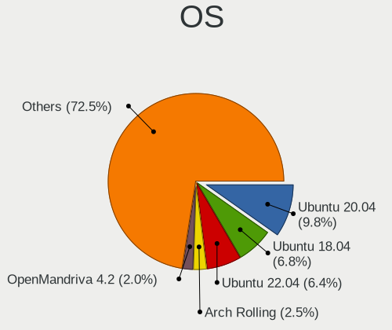

| Name                         | Computers | Percent |
|------------------------------|-----------|---------|
| Ubuntu 20.04                 | 164       | 16.3%   |
| Ubuntu 18.04                 | 124       | 12.33%  |
| OpenMandriva 4.2             | 36        | 3.58%   |
| KDE neon 20.04               | 24        | 2.39%   |
| Ubuntu MATE 20.04            | 21        | 2.09%   |
| Linux Mint 19.3              | 20        | 1.99%   |
| Ubuntu 19.10                 | 19        | 1.89%   |
| Arch Rolling                 | 19        | 1.89%   |
| Zorin 15                     | 16        | 1.59%   |
| Ubuntu MATE 18.04            | 16        | 1.59%   |
| Arch                         | 16        | 1.59%   |
| Ubuntu 19.04                 | 15        | 1.49%   |
| Pop!_OS 20.04                | 15        | 1.49%   |
| Xubuntu 18.04                | 14        | 1.39%   |
| Ubuntu 21.10                 | 14        | 1.39%   |
| Manjaro                      | 14        | 1.39%   |
| Linux Mint 20.1              | 14        | 1.39%   |
| Zorin 16                     | 13        | 1.29%   |
| Linux Mint 20.2              | 13        | 1.29%   |
| Fedora 35                    | 13        | 1.29%   |
| Xubuntu 20.04                | 12        | 1.19%   |
| Kubuntu 20.04                | 12        | 1.19%   |
| Gentoo 2.7                   | 12        | 1.19%   |
| Debian 11                    | 12        | 1.19%   |
| Ubuntu 21.04                 | 11        | 1.09%   |
| Pop!_OS 21.04                | 11        | 1.09%   |
| Debian 10                    | 11        | 1.09%   |
| ArcoLinux Rolling            | 11        | 1.09%   |
| ROSA R10                     | 10        | 0.99%   |
| Ubuntu 16.04                 | 9         | 0.89%   |
| Pop!_OS 20.10                | 9         | 0.89%   |
| OpenMandriva 4.3             | 9         | 0.89%   |
| Linux Mint 20                | 9         | 0.89%   |
| Fedora 32                    | 9         | 0.89%   |
| Ubuntu 20.10                 | 8         | 0.8%    |
| Pop!_OS 21.10                | 8         | 0.8%    |
| Ubuntu 18.10                 | 7         | 0.7%    |
| Linux Mint 20.3              | 7         | 0.7%    |
| Fedora 33                    | 7         | 0.7%    |
| Fedora 34                    | 6         | 0.6%    |
| BlackPanther 18.1            | 6         | 0.6%    |
| Manjaro 20.2                 | 5         | 0.5%    |
| LMDE 4                       | 5         | 0.5%    |
| Gentoo 2.6                   | 5         | 0.5%    |
| ALT Linux 10.0               | 5         | 0.5%    |
| ROSA R8.1                    | 4         | 0.4%    |
| ROSA R11                     | 4         | 0.4%    |
| openSUSE Tumbleweed-XXXXXXXX | 4         | 0.4%    |
| Manjaro 20.0.3               | 4         | 0.4%    |
| Linux Mint 19.1              | 4         | 0.4%    |
| Debian Unstable              | 4         | 0.4%    |
| Debian Testing               | 4         | 0.4%    |
| Xero Rolling                 | 3         | 0.3%    |
| Ubuntu 22.04                 | 3         | 0.3%    |
| ROSA R9                      | 3         | 0.3%    |
| OpenMandriva 4.50            | 3         | 0.3%    |
| Manjaro 21.1.6               | 3         | 0.3%    |
| Manjaro 20.1                 | 3         | 0.3%    |
| Lubuntu 20.04                | 3         | 0.3%    |
| LinuxFX 11                   | 3         | 0.3%    |

OS Family
---------

OS without a version

| Name          | Computers | Percent |
|---------------|-----------|---------|
| Ubuntu        | 355       | 37.17%  |
| Linux Mint    | 68        | 7.12%   |
| OpenMandriva  | 49        | 5.13%   |
| Pop!_OS       | 42        | 4.4%    |
| Fedora        | 42        | 4.4%    |
| Manjaro       | 39        | 4.08%   |
| Ubuntu MATE   | 38        | 3.98%   |
| Arch          | 34        | 3.56%   |
| Zorin         | 31        | 3.25%   |
| Xubuntu       | 30        | 3.14%   |
| Debian        | 30        | 3.14%   |
| KDE neon      | 26        | 2.72%   |
| ROSA          | 22        | 2.3%    |
| Kubuntu       | 20        | 2.09%   |
| Endless       | 17        | 1.78%   |
| Gentoo        | 14        | 1.47%   |
| ArcoLinux     | 13        | 1.36%   |
| BlackPanther  | 7         | 0.73%   |
| openSUSE      | 6         | 0.63%   |
| Elementary    | 6         | 0.63%   |
| Lubuntu       | 5         | 0.52%   |
| LMDE          | 5         | 0.52%   |
| ALT Linux     | 5         | 0.52%   |
| Kali          | 4         | 0.42%   |
| EndeavourOS   | 4         | 0.42%   |
| Artix         | 4         | 0.42%   |
| Xero          | 3         | 0.31%   |
| Ubuntu Budgie | 3         | 0.31%   |
| Peppermint    | 3         | 0.31%   |
| LinuxFX       | 3         | 0.31%   |
| CentOS        | 3         | 0.31%   |
| Void Linux    | 2         | 0.21%   |
| Solus         | 2         | 0.21%   |
| Slackware     | 2         | 0.21%   |
| Reborn OS     | 2         | 0.21%   |
| MX            | 2         | 0.21%   |
| Mageia        | 2         | 0.21%   |
| Raspbian      | 1         | 0.1%    |
| Parrot        | 1         | 0.1%    |
| GNOME OS      | 1         | 0.1%    |
| Garuda Linux  | 1         | 0.1%    |
| GalliumOS     | 1         | 0.1%    |
| Feren OS      | 1         | 0.1%    |
| Devuan        | 1         | 0.1%    |
| Deepin        | 1         | 0.1%    |
| Clear Linux   | 1         | 0.1%    |
| Chrome OS     | 1         | 0.1%    |
| BlackArch     | 1         | 0.1%    |
| antiX         | 1         | 0.1%    |

Kernel
------

Version of the Linux kernel

| Version                         | Computers | Percent |
|---------------------------------|-----------|---------|
| 5.10.14-desktop-1omv4002        | 35        | 3.19%   |
| 5.4.0-42-generic                | 20        | 1.82%   |
| 5.4.0-58-generic                | 19        | 1.73%   |
| 5.4.0-29-generic                | 14        | 1.28%   |
| 4.15.0-163-generic              | 14        | 1.28%   |
| 5.4.0-94-generic                | 13        | 1.19%   |
| 5.3.0-46-generic                | 12        | 1.09%   |
| 5.4.0-54-generic                | 11        | 1%      |
| 5.4.0-48-generic                | 11        | 1%      |
| 5.11.0-40-generic               | 11        | 1%      |
| 5.4.0-65-generic                | 10        | 0.91%   |
| 4.15.0-47-generic               | 10        | 0.91%   |
| 5.4.0-91-generic                | 9         | 0.82%   |
| 5.4.0-52-generic                | 9         | 0.82%   |
| 5.16.7-desktop-1omv4003         | 9         | 0.82%   |
| 5.4.0-56-generic                | 8         | 0.73%   |
| 5.4.0-37-generic                | 8         | 0.73%   |
| 5.3.0-42-generic                | 8         | 0.73%   |
| 5.13.0-39-generic               | 8         | 0.73%   |
| 5.11.0-38-generic               | 8         | 0.73%   |
| 5.11.0-37-generic               | 8         | 0.73%   |
| 5.0.0-37-generic                | 8         | 0.73%   |
| 5.0.0-13-generic                | 8         | 0.73%   |
| 4.15.0-45-generic               | 8         | 0.73%   |
| 5.8.0-43-generic                | 7         | 0.64%   |
| 5.4.0-53-generic                | 7         | 0.64%   |
| 5.4.0-40-generic                | 7         | 0.64%   |
| 5.3.0-51-generic                | 7         | 0.64%   |
| 5.3.0-45-generic                | 7         | 0.64%   |
| 5.8.0-55-generic                | 6         | 0.55%   |
| 5.4.0-72-generic                | 6         | 0.55%   |
| 5.4.0-66-generic                | 6         | 0.55%   |
| 5.4.0-59-generic                | 6         | 0.55%   |
| 5.4.0-47-generic                | 6         | 0.55%   |
| 5.4.0-26-generic                | 6         | 0.55%   |
| 5.3.0-28-generic                | 6         | 0.55%   |
| 5.11.0-7620-generic             | 6         | 0.55%   |
| 5.11.0-7614-generic             | 6         | 0.55%   |
| 5.0.0-25-generic                | 6         | 0.55%   |
| 5.0.0-23-generic                | 6         | 0.55%   |
| 4.9.60-nrj-desktop-1rosa-x86_64 | 6         | 0.55%   |
| 4.18.0-25-generic               | 6         | 0.55%   |
| 5.8.0-7630-generic              | 5         | 0.46%   |
| 5.8.0-53-generic                | 5         | 0.46%   |
| 5.8.0-48-generic                | 5         | 0.46%   |
| 5.4.0-33-generic                | 5         | 0.46%   |
| 5.3.0-53-generic                | 5         | 0.46%   |
| 5.13.0-30-generic               | 5         | 0.46%   |
| 5.13.0-27-generic               | 5         | 0.46%   |
| 5.11.0-46-generic               | 5         | 0.46%   |
| 4.18.16-desktop-1bP             | 5         | 0.46%   |
| 4.18.0-17-generic               | 5         | 0.46%   |
| 4.18.0-15-generic               | 5         | 0.46%   |
| 4.15.0-96-generic               | 5         | 0.46%   |
| 4.15.0-50-generic               | 5         | 0.46%   |
| 4.15.0-43-generic               | 5         | 0.46%   |
| 5.8.0-59-generic                | 4         | 0.36%   |
| 5.8.0-14-generic                | 4         | 0.36%   |
| 5.4.0-73-generic                | 4         | 0.36%   |
| 5.4.0-51-generic                | 4         | 0.36%   |

Kernel Family
-------------

Linux kernel without a distro release

| Version | Computers | Percent |
|---------|-----------|---------|
| 5.4.0   | 232       | 22.39%  |
| 4.15.0  | 105       | 10.14%  |
| 5.11.0  | 82        | 7.92%   |
| 5.3.0   | 66        | 6.37%   |
| 5.8.0   | 65        | 6.27%   |
| 5.13.0  | 54        | 5.21%   |
| 5.0.0   | 38        | 3.67%   |
| 5.10.14 | 35        | 3.38%   |
| 4.18.0  | 30        | 2.9%    |
| 5.10.0  | 14        | 1.35%   |
| 4.19.0  | 14        | 1.35%   |
| 5.16.7  | 10        | 0.97%   |
| 5.15.0  | 8         | 0.77%   |
| 5.9.11  | 7         | 0.68%   |
| 4.9.60  | 7         | 0.68%   |
| 5.10.88 | 6         | 0.58%   |
| 4.9.20  | 5         | 0.48%   |
| 4.18.16 | 5         | 0.48%   |
| 5.8.18  | 4         | 0.39%   |
| 5.17.4  | 4         | 0.39%   |
| 5.17.1  | 4         | 0.39%   |
| 5.16.0  | 4         | 0.39%   |
| 5.15.32 | 4         | 0.39%   |
| 5.14.14 | 4         | 0.39%   |
| 5.12.4  | 4         | 0.39%   |
| 5.11.12 | 4         | 0.39%   |
| 5.7.2   | 3         | 0.29%   |
| 5.7.0   | 3         | 0.29%   |
| 5.6.10  | 3         | 0.29%   |
| 5.4.77  | 3         | 0.29%   |
| 5.3.18  | 3         | 0.29%   |
| 5.17.5  | 3         | 0.29%   |
| 5.15.5  | 3         | 0.29%   |
| 5.15.19 | 3         | 0.29%   |
| 5.14.10 | 3         | 0.29%   |
| 5.11.11 | 3         | 0.29%   |
| 5.10.33 | 3         | 0.29%   |
| 5.9.16  | 2         | 0.19%   |
| 5.9.14  | 2         | 0.19%   |
| 5.9.1   | 2         | 0.19%   |
| 5.8.7   | 2         | 0.19%   |
| 5.8.6   | 2         | 0.19%   |
| 5.8.5   | 2         | 0.19%   |
| 5.8.16  | 2         | 0.19%   |
| 5.8.14  | 2         | 0.19%   |
| 5.8.11  | 2         | 0.19%   |
| 5.6.6   | 2         | 0.19%   |
| 5.6.14  | 2         | 0.19%   |
| 5.6.11  | 2         | 0.19%   |
| 5.5.13  | 2         | 0.19%   |
| 5.4.83  | 2         | 0.19%   |
| 5.4.52  | 2         | 0.19%   |
| 5.4.18  | 2         | 0.19%   |
| 5.16.11 | 2         | 0.19%   |
| 5.15.7  | 2         | 0.19%   |
| 5.15.24 | 2         | 0.19%   |
| 5.15.16 | 2         | 0.19%   |
| 5.15.15 | 2         | 0.19%   |
| 5.14.16 | 2         | 0.19%   |
| 5.14.0  | 2         | 0.19%   |

Kernel Major Ver.
-----------------

Linux kernel major version

| Version | Computers | Percent |
|---------|-----------|---------|
| 5.4     | 253       | 24.63%  |
| 4.15    | 105       | 10.22%  |
| 5.11    | 99        | 9.64%   |
| 5.8     | 86        | 8.37%   |
| 5.10    | 85        | 8.28%   |
| 5.3     | 72        | 7.01%   |
| 5.13    | 61        | 5.94%   |
| 5.0     | 42        | 4.09%   |
| 4.18    | 36        | 3.51%   |
| 5.15    | 34        | 3.31%   |
| 5.16    | 23        | 2.24%   |
| 5.9     | 19        | 1.85%   |
| 5.14    | 15        | 1.46%   |
| 4.19    | 15        | 1.46%   |
| 5.6     | 14        | 1.36%   |
| 5.17    | 14        | 1.36%   |
| 4.9     | 14        | 1.36%   |
| 5.7     | 12        | 1.17%   |
| 5.12    | 10        | 0.97%   |
| 5.5     | 6         | 0.58%   |
| 4.4     | 2         | 0.19%   |
| 4.1     | 2         | 0.19%   |
| 5.2     | 1         | 0.1%    |
| 5.1     | 1         | 0.1%    |
| 4.20    | 1         | 0.1%    |
| 4.16    | 1         | 0.1%    |
| 4.14    | 1         | 0.1%    |
| 4.10    | 1         | 0.1%    |
| 3.16    | 1         | 0.1%    |
| 3.10    | 1         | 0.1%    |

Arch
----

OS architecture (x86_64, i586, etc.)

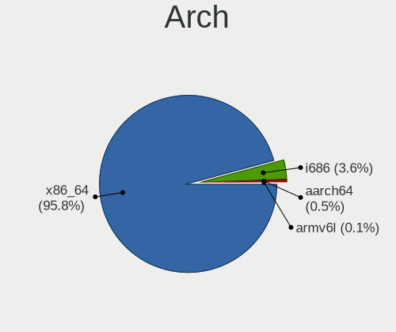

| Name    | Computers | Percent |
|---------|-----------|---------|
| x86_64  | 864       | 93.81%  |
| i686    | 53        | 5.75%   |
| aarch64 | 3         | 0.33%   |
| armv6l  | 1         | 0.11%   |

DE
--

Desktop Environment

| Name                | Computers | Percent |
|---------------------|-----------|---------|
| GNOME               | 396       | 40.99%  |
| Unknown             | 148       | 15.32%  |
| KDE5                | 131       | 13.56%  |
| XFCE                | 86        | 8.9%    |
| X-Cinnamon          | 58        | 6%      |
| MATE                | 51        | 5.28%   |
| KDE                 | 37        | 3.83%   |
| KDE4                | 12        | 1.24%   |
| Unity               | 9         | 0.93%   |
| LXQt                | 6         | 0.62%   |
| Pantheon            | 5         | 0.52%   |
| i3                  | 5         | 0.52%   |
| Cinnamon            | 5         | 0.52%   |
| Budgie              | 5         | 0.52%   |
| LXDE                | 3         | 0.31%   |
| Openbox             | 2         | 0.21%   |
| GNOME Classic       | 2         | 0.21%   |
| herbstluftwm        | 1         | 0.1%    |
| GNOME Flashback     | 1         | 0.1%    |
| Deepin              | 1         | 0.1%    |
| awesome             | 1         | 0.1%    |
| /usr/bin/startxfce4 | 1         | 0.1%    |

Display Server
--------------

X11 or Wayland

| Name    | Computers | Percent |
|---------|-----------|---------|
| X11     | 774       | 81.82%  |
| Unknown | 84        | 8.88%   |
| Wayland | 70        | 7.4%    |
| Tty     | 18        | 1.9%    |

Display Manager
---------------

SDDM, LightDM, etc.

| Name    | Computers | Percent |
|---------|-----------|---------|
| Unknown | 571       | 59.73%  |
| SDDM    | 120       | 12.55%  |
| LightDM | 87        | 9.1%    |
| GDM     | 87        | 9.1%    |
| GDM3    | 49        | 5.13%   |
| TDM     | 24        | 2.51%   |
| KDM     | 12        | 1.26%   |
| XDM     | 3         | 0.31%   |
| SLiM    | 2         | 0.21%   |
| Ly      | 1         | 0.1%    |

OS Lang
-------

Language

| Lang    | Computers | Percent |
|---------|-----------|---------|
| en_US   | 478       | 50.48%  |
| el_GR   | 271       | 28.62%  |
| Unknown | 144       | 15.21%  |
| en_GB   | 19        | 2.01%   |
| C       | 11        | 1.16%   |
| de_DE   | 8         | 0.84%   |
| ru_RU   | 3         | 0.32%   |
| POSIX   | 2         | 0.21%   |
| fr_FR   | 2         | 0.21%   |
| unm_US  | 1         | 0.11%   |
| pl_PL   | 1         | 0.11%   |
| it_IT   | 1         | 0.11%   |
| hu_HU   | 1         | 0.11%   |
| es_ES   | 1         | 0.11%   |
| en_IE   | 1         | 0.11%   |
| en_AU   | 1         | 0.11%   |
| C.UTF8  | 1         | 0.11%   |
| anp_IN  | 1         | 0.11%   |

Boot Mode
---------

EFI or BIOS

| Mode | Computers | Percent |
|------|-----------|---------|
| BIOS | 556       | 59.02%  |
| EFI  | 386       | 40.98%  |

Filesystem
----------

Type of filesystem

| Type    | Computers | Percent |
|---------|-----------|---------|
| Ext4    | 734       | 77.75%  |
| Overlay | 86        | 9.11%   |
| Btrfs   | 62        | 6.57%   |
| Unknown | 44        | 4.66%   |
| Xfs     | 8         | 0.85%   |
| Zfs     | 4         | 0.42%   |
| F2fs    | 2         | 0.21%   |
| Ext3    | 2         | 0.21%   |
| Tmpfs   | 1         | 0.11%   |
| Ext2    | 1         | 0.11%   |

Part. scheme
------------

Scheme of partitioning

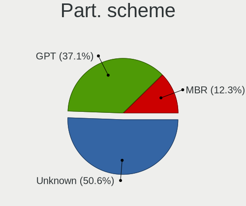

| Type    | Computers | Percent |
|---------|-----------|---------|
| Unknown | 616       | 65.81%  |
| GPT     | 212       | 22.65%  |
| MBR     | 108       | 11.54%  |

Dual Boot with Linux/BSD
------------------------

Hosting more than one Linux/BSD

| Dual boot | Computers | Percent |
|-----------|-----------|---------|
| No        | 786       | 83.71%  |
| Yes       | 153       | 16.29%  |

Dual Boot (Win)
---------------

Hosting Linux and Windows

| Dual boot | Computers | Percent |
|-----------|-----------|---------|
| No        | 594       | 63.6%   |
| Yes       | 340       | 36.4%   |

Board
-----

Vendor
------

Motherboard manufacturer

| Name                    | Computers | Percent |
|-------------------------|-----------|---------|
| Hewlett-Packard         | 151       | 16.4%   |
| ASUSTek Computer        | 143       | 15.53%  |
| Dell                    | 116       | 12.6%   |
| Lenovo                  | 115       | 12.49%  |
| Gigabyte Technology     | 108       | 11.73%  |
| ASRock                  | 45        | 4.89%   |
| Acer                    | 40        | 4.34%   |
| MSI                     | 35        | 3.8%    |
| Toshiba                 | 24        | 2.61%   |
| Sony                    | 23        | 2.5%    |
| Intel                   | 11        | 1.19%   |
| Fujitsu Siemens         | 11        | 1.19%   |
| Fujitsu                 | 9         | 0.98%   |
| Apple                   | 8         | 0.87%   |
| Unknown                 | 7         | 0.76%   |
| Pegatron                | 5         | 0.54%   |
| Notebook                | 5         | 0.54%   |
| HUAWEI                  | 5         | 0.54%   |
| Clevo                   | 5         | 0.54%   |
| Raspberry Pi Foundation | 4         | 0.43%   |
| Foxconn                 | 4         | 0.43%   |
| Teclast                 | 3         | 0.33%   |
| Samsung Electronics     | 3         | 0.33%   |
| IBM                     | 3         | 0.33%   |
| e-shop.gr               | 3         | 0.33%   |
| Chuwi                   | 3         | 0.33%   |
| Insyde                  | 2         | 0.22%   |
| Info Quest Technologies | 2         | 0.22%   |
| Hampoo                  | 2         | 0.22%   |
| ECS                     | 2         | 0.22%   |
| AOpen                   | 2         | 0.22%   |
| ZOTAC                   | 1         | 0.11%   |
| VIA Technologies        | 1         | 0.11%   |
| VERO                    | 1         | 0.11%   |
| TUXEDO                  | 1         | 0.11%   |
| Supermicro              | 1         | 0.11%   |
| Schenker                | 1         | 0.11%   |
| RuggedPC                | 1         | 0.11%   |
| Quest                   | 1         | 0.11%   |
| QDI                     | 1         | 0.11%   |
| PLAISIO COMPUTERS SA    | 1         | 0.11%   |
| PC Specialist           | 1         | 0.11%   |
| Packard Bell            | 1         | 0.11%   |
| MiTAC                   | 1         | 0.11%   |
| Medion                  | 1         | 0.11%   |
| Google                  | 1         | 0.11%   |
| Gateway                 | 1         | 0.11%   |
| Compal                  | 1         | 0.11%   |
| ARIMA                   | 1         | 0.11%   |
| AMD                     | 1         | 0.11%   |
| Alienware               | 1         | 0.11%   |
| Albatron                | 1         | 0.11%   |
| ABIT                    | 1         | 0.11%   |

Model
-----

Motherboard model

| Name                                   | Computers | Percent |
|----------------------------------------|-----------|---------|
| ASUS All Series                        | 12        | 1.3%    |
| Unknown                                | 12        | 1.3%    |
| HP ProDesk 600 G1 SFF                  | 6         | 0.65%   |
| HP Pavilion g6                         | 6         | 0.65%   |
| HP Notebook                            | 6         | 0.65%   |
| Dell Inspiron 3542                     | 5         | 0.54%   |
| ASRock B450 Gaming K4                  | 5         | 0.54%   |
| HP G62                                 | 4         | 0.43%   |
| HP 255 G7 Notebook PC                  | 4         | 0.43%   |
| Gigabyte H61M-S2PV                     | 4         | 0.43%   |
| Dell OptiPlex GX520                    | 4         | 0.43%   |
| Dell OptiPlex 7010                     | 4         | 0.43%   |
| Dell Inspiron 3537                     | 4         | 0.43%   |
| ASUS ROG STRIX B350-F GAMING           | 4         | 0.43%   |
| Lenovo G510 20238                      | 3         | 0.33%   |
| HP Pavilion dv7                        | 3         | 0.33%   |
| HP Compaq 8200 Elite SFF PC            | 3         | 0.33%   |
| Gigabyte G41M-Combo                    | 3         | 0.33%   |
| Gigabyte G31M-S2L                      | 3         | 0.33%   |
| Gigabyte B75M-D3H                      | 3         | 0.33%   |
| Gigabyte B450 AORUS M                  | 3         | 0.33%   |
| Gigabyte B250M-DS3H                    | 3         | 0.33%   |
| Dell OptiPlex GX620                    | 3         | 0.33%   |
| Dell OptiPlex 7040                     | 3         | 0.33%   |
| Dell Inspiron 5567                     | 3         | 0.33%   |
| ASUS Z170-A                            | 3         | 0.33%   |
| ASUS VivoBook_ASUSLaptop X512DA_X512DA | 3         | 0.33%   |
| ASUS P6T                               | 3         | 0.33%   |
| Acer Aspire A315-51                    | 3         | 0.33%   |
| Acer Aspire A315-31                    | 3         | 0.33%   |
| Toshiba Satellite C850D-119            | 2         | 0.22%   |
| Toshiba NB100                          | 2         | 0.22%   |
| Teclast F15                            | 2         | 0.22%   |
| Sony VPCM13M1E                         | 2         | 0.22%   |
| Sony VPCCB2S1E                         | 2         | 0.22%   |
| Pegatron A15                           | 2         | 0.22%   |
| Notebook W54_W94_W955TU,-T,-C          | 2         | 0.22%   |
| MSI MS-7C31                            | 2         | 0.22%   |
| MSI MS-7C02                            | 2         | 0.22%   |
| MSI MS-7B78                            | 2         | 0.22%   |
| MSI MS-7972                            | 2         | 0.22%   |
| Lenovo ThinkCentre M71e 3167A46        | 2         | 0.22%   |
| Lenovo ThinkCentre E73 10AW008MMX      | 2         | 0.22%   |
| Lenovo MIIX 320-10ICR 80XF             | 2         | 0.22%   |
| Lenovo Legion Y530-15ICH 81FV          | 2         | 0.22%   |
| Lenovo IdeaPad S540-14API 81NH         | 2         | 0.22%   |
| Lenovo IdeaPad L340-15IRH Gaming 81LK  | 2         | 0.22%   |
| Lenovo IdeaPad 100-15IBD 80QQ          | 2         | 0.22%   |
| Lenovo G700 20251                      | 2         | 0.22%   |
| Lenovo G70-35 80Q5                     | 2         | 0.22%   |
| Lenovo G50-70 20351                    | 2         | 0.22%   |
| Lenovo G40-30 80FY                     | 2         | 0.22%   |
| Intel Calistoga & ICH7M Chipset        | 2         | 0.22%   |
| Insyde CherryTrail                     | 2         | 0.22%   |
| HUAWEI NBLK-WAX9X                      | 2         | 0.22%   |
| HP Z820 Workstation                    | 2         | 0.22%   |
| HP ProBook 6560b                       | 2         | 0.22%   |
| HP Pavilion x2 Detachable              | 2         | 0.22%   |
| HP Pavilion Notebook                   | 2         | 0.22%   |
| HP Pavilion 15                         | 2         | 0.22%   |

Model Family
------------

Motherboard model prefix

| Name                  | Computers | Percent |
|-----------------------|-----------|---------|
| Dell Inspiron         | 38        | 4.13%   |
| Lenovo ThinkPad       | 34        | 3.69%   |
| Acer Aspire           | 32        | 3.47%   |
| HP Pavilion           | 30        | 3.26%   |
| Lenovo IdeaPad        | 27        | 2.93%   |
| HP Compaq             | 26        | 2.82%   |
| Dell Latitude         | 26        | 2.82%   |
| Dell OptiPlex         | 25        | 2.71%   |
| Toshiba Satellite     | 21        | 2.28%   |
| Lenovo ThinkCentre    | 17        | 1.85%   |
| ASUS PRIME            | 14        | 1.52%   |
| ASUS All              | 12        | 1.3%    |
| Unknown               | 12        | 1.3%    |
| HP EliteBook          | 10        | 1.09%   |
| HP 255                | 10        | 1.09%   |
| Dell Precision        | 9         | 0.98%   |
| ASUS VivoBook         | 9         | 0.98%   |
| HP ProBook            | 8         | 0.87%   |
| HP Laptop             | 8         | 0.87%   |
| ASUS TUF              | 8         | 0.87%   |
| ASUS ROG              | 8         | 0.87%   |
| HP ProDesk            | 7         | 0.76%   |
| Fujitsu Siemens AMILO | 7         | 0.76%   |
| Fujitsu LIFEBOOK      | 7         | 0.76%   |
| Dell Vostro           | 7         | 0.76%   |
| HP Notebook           | 6         | 0.65%   |
| HP ENVY               | 6         | 0.65%   |
| HP 250                | 5         | 0.54%   |
| ASRock B450           | 5         | 0.54%   |
| RPi Raspberry         | 4         | 0.43%   |
| HP G62                | 4         | 0.43%   |
| Gigabyte H61M-S2PV    | 4         | 0.43%   |
| Gigabyte B450         | 4         | 0.43%   |
| Dell XPS              | 4         | 0.43%   |
| Lenovo Yoga           | 3         | 0.33%   |
| Lenovo MIIX           | 3         | 0.33%   |
| Lenovo Legion         | 3         | 0.33%   |
| Lenovo G510           | 3         | 0.33%   |
| HP Presario           | 3         | 0.33%   |
| HP EliteDesk          | 3         | 0.33%   |
| Gigabyte Z370         | 3         | 0.33%   |
| Gigabyte G41M-Combo   | 3         | 0.33%   |
| Gigabyte G31M-S2L     | 3         | 0.33%   |
| Gigabyte B75M-D3H     | 3         | 0.33%   |
| Gigabyte B250M-DS3H   | 3         | 0.33%   |
| ASUS Z170-A           | 3         | 0.33%   |
| ASUS P6T              | 3         | 0.33%   |
| ASUS P5Q              | 3         | 0.33%   |
| ASUS P5G41T-M         | 3         | 0.33%   |
| Toshiba NB100         | 2         | 0.22%   |
| Teclast F15           | 2         | 0.22%   |
| Sony VPCM13M1E        | 2         | 0.22%   |
| Sony VPCCB2S1E        | 2         | 0.22%   |
| Pegatron A15          | 2         | 0.22%   |
| Notebook W65          | 2         | 0.22%   |
| Notebook W54          | 2         | 0.22%   |
| MSI MS-7C31           | 2         | 0.22%   |
| MSI MS-7C02           | 2         | 0.22%   |
| MSI MS-7B78           | 2         | 0.22%   |
| MSI MS-7972           | 2         | 0.22%   |

MFG Year
--------

Motherboard manufacture year

| Year    | Computers | Percent |
|---------|-----------|---------|
| 2013    | 81        | 8.79%   |
| 2019    | 74        | 8.03%   |
| 2008    | 73        | 7.93%   |
| 2018    | 72        | 7.82%   |
| 2017    | 72        | 7.82%   |
| 2011    | 69        | 7.49%   |
| 2012    | 66        | 7.17%   |
| 2009    | 60        | 6.51%   |
| 2014    | 58        | 6.3%    |
| 2015    | 50        | 5.43%   |
| 2007    | 50        | 5.43%   |
| 2020    | 46        | 4.99%   |
| 2010    | 45        | 4.89%   |
| 2016    | 37        | 4.02%   |
| 2005    | 20        | 2.17%   |
| 2006    | 18        | 1.95%   |
| 2021    | 17        | 1.85%   |
| 2004    | 5         | 0.54%   |
| 2003    | 4         | 0.43%   |
| Unknown | 3         | 0.33%   |
| 2022    | 1         | 0.11%   |

Form Factor
-----------

Physical design of the computer

| Name           | Computers | Percent |
|----------------|-----------|---------|
| Notebook       | 491       | 53.31%  |
| Desktop        | 398       | 43.21%  |
| Convertible    | 11        | 1.19%   |
| Tablet         | 7         | 0.76%   |
| System on chip | 4         | 0.43%   |
| All in one     | 4         | 0.43%   |
| Server         | 4         | 0.43%   |
| Mini pc        | 2         | 0.22%   |

Secure Boot
-----------

Enabled or disabled

| State    | Computers | Percent |
|----------|-----------|---------|
| Disabled | 868       | 93.53%  |
| Enabled  | 60        | 6.47%   |

Coreboot
--------

Have coreboot on board

| Used | Computers | Percent |
|------|-----------|---------|
| No   | 920       | 99.89%  |
| Yes  | 1         | 0.11%   |

RAM Size
--------

Total RAM memory

| Size in GB  | Computers | Percent |
|-------------|-----------|---------|
| 3.01-4.0    | 264       | 28.18%  |
| 4.01-8.0    | 189       | 20.17%  |
| 8.01-16.0   | 170       | 18.14%  |
| 16.01-24.0  | 134       | 14.3%   |
| 1.01-2.0    | 91        | 9.71%   |
| 32.01-64.0  | 32        | 3.42%   |
| 2.01-3.0    | 32        | 3.42%   |
| 0.51-1.0    | 14        | 1.49%   |
| 64.01-256.0 | 7         | 0.75%   |
| 24.01-32.0  | 3         | 0.32%   |
| 0.01-0.5    | 1         | 0.11%   |

RAM Used
--------

Used RAM memory

| Used GB    | Computers | Percent |
|------------|-----------|---------|
| 1.01-2.0   | 424       | 41.73%  |
| 2.01-3.0   | 234       | 23.03%  |
| 0.51-1.0   | 115       | 11.32%  |
| 3.01-4.0   | 99        | 9.74%   |
| 4.01-8.0   | 88        | 8.66%   |
| 8.01-16.0  | 27        | 2.66%   |
| 0.01-0.5   | 23        | 2.26%   |
| 16.01-24.0 | 5         | 0.49%   |
| 24.01-32.0 | 1         | 0.1%    |

Total Drives
------------

Number of drives on board

| Drives | Computers | Percent |
|--------|-----------|---------|
| 1      | 549       | 58.22%  |
| 2      | 259       | 27.47%  |
| 3      | 66        | 7%      |
| 4      | 35        | 3.71%   |
| 5      | 15        | 1.59%   |
| 6      | 9         | 0.95%   |
| 0      | 7         | 0.74%   |
| 7      | 2         | 0.21%   |
| 12     | 1         | 0.11%   |

Has CD-ROM
----------

Has CD-ROM on board

| Presented | Computers | Percent |
|-----------|-----------|---------|
| Yes       | 469       | 50.65%  |
| No        | 457       | 49.35%  |

Has Ethernet
------------

Has Ethernet on board

| Presented | Computers | Percent |
|-----------|-----------|---------|
| Yes       | 835       | 90.56%  |
| No        | 87        | 9.44%   |

Has WiFi
--------

Has WiFi module

| Presented | Computers | Percent |
|-----------|-----------|---------|
| Yes       | 636       | 68.39%  |
| No        | 294       | 31.61%  |

Has Bluetooth
-------------

Has Bluetooth module

| Presented | Computers | Percent |
|-----------|-----------|---------|
| No        | 481       | 51.66%  |
| Yes       | 450       | 48.34%  |

Location
--------

Country
-------

Geographic location (country)

| Country | Computers | Percent |
|---------|-----------|---------|
| Greece  | 921       | 100%    |

City
----

Geographic location (city)

| City         | Computers | Percent |
|--------------|-----------|---------|
| Athens       | 485       | 48.74%  |
| Thessaloniki | 151       | 15.18%  |
| Ptrai      | 25        | 2.51%   |
| Heraklion    | 24        | 2.41%   |
| Kavala       | 17        | 1.71%   |
| Chalcis      | 17        | 1.71%   |
| Volos        | 12        | 1.21%   |
| Ioannina     | 10        | 1.01%   |
| Chania       | 10        | 1.01%   |
| Katerini     | 9         | 0.9%    |
| Kalamata     | 9         | 0.9%    |
| Lamia        | 8         | 0.8%    |
| Trikala      | 7         | 0.7%    |
| Rhodes       | 7         | 0.7%    |
| Piraeus      | 7         | 0.7%    |
| Larissa      | 7         | 0.7%    |
| Serres       | 6         | 0.6%    |
| Drama        | 6         | 0.6%    |
| Xanthi       | 5         | 0.5%    |
| Corinth      | 5         | 0.5%    |
| Corfu        | 5         | 0.5%    |
| Chalandri    | 5         | 0.5%    |
| Samos        | 4         | 0.4%    |
| Kilkis       | 4         | 0.4%    |
| Karditsa     | 4         | 0.4%    |
| Fira         | 4         | 0.4%    |
| Aigaleo      | 4         | 0.4%    |
| Agrinio      | 4         | 0.4%    |
| Zakynthos    | 3         | 0.3%    |
| Veroia       | 3         | 0.3%    |
| Rethymno     | 3         | 0.3%    |
| Ptrai    | 3         | 0.3%    |
| Nea Smyrni   | 3         | 0.3%    |
| Nafplion     | 3         | 0.3%    |
| Kozani       | 3         | 0.3%    |
| Koropi       | 3         | 0.3%    |
| Komotini     | 3         | 0.3%    |
| Kallithea    | 3         | 0.3%    |
| Grevena      | 3         | 0.3%    |
| Aridaea      | 3         | 0.3%    |
| Ano Liosia   | 3         | 0.3%    |
| Vergina      | 2         | 0.2%    |
| Tripoli      | 2         | 0.2%    |
| Ptolemaida   | 2         | 0.2%    |
| Poros        | 2         | 0.2%    |
| Paros        | 2         | 0.2%    |
| Nafpaktos    | 2         | 0.2%    |
| Limnos       | 2         | 0.2%    |
| Lefkada      | 2         | 0.2%    |
| Ithaki       | 2         | 0.2%    |
| Gytheion     | 2         | 0.2%    |
| Florina      | 2         | 0.2%    |
| Farsala      | 2         | 0.2%    |
| Elateia      | 2         | 0.2%    |
| Edessa       | 2         | 0.2%    |
| Argostoli    | 2         | 0.2%    |
| Acharnes     | 2         | 0.2%    |
| Zografou     | 1         | 0.1%    |
| Zografos     | 1         | 0.1%    |
| Zaros        | 1         | 0.1%    |

Drives
------

Drive Vendor
------------

Hard drive vendors

| Vendor                         | Computers | Drives | Percent |
|--------------------------------|-----------|--------|---------|
| WDC                            | 264       | 413    | 19.53%  |
| Seagate                        | 203       | 285    | 15.01%  |
| Samsung Electronics            | 164       | 227    | 12.13%  |
| Toshiba                        | 117       | 147    | 8.65%   |
| Kingston                       | 82        | 101    | 6.07%   |
| SanDisk                        | 74        | 96     | 5.47%   |
| Unknown                        | 48        | 80     | 3.55%   |
| Patriot                        | 48        | 55     | 3.55%   |
| Hitachi                        | 40        | 42     | 2.96%   |
| SK Hynix                       | 28        | 38     | 2.07%   |
| Intenso                        | 24        | 29     | 1.78%   |
| Intel                          | 23        | 27     | 1.7%    |
| HGST                           | 22        | 29     | 1.63%   |
| Crucial                        | 21        | 29     | 1.55%   |
| Fujitsu                        | 18        | 18     | 1.33%   |
| Team                           | 16        | 21     | 1.18%   |
| OCZ                            | 13        | 16     | 0.96%   |
| Micron Technology              | 12        | 15     | 0.89%   |
| MAXTOR                         | 11        | 13     | 0.81%   |
| A-DATA Technology              | 11        | 16     | 0.81%   |
| PNY                            | 7         | 7      | 0.52%   |
| Phison                         | 7         | 10     | 0.52%   |
| KIOXIA                         | 7         | 7      | 0.52%   |
| JMicron                        | 7         | 10     | 0.52%   |
| Transcend                      | 5         | 5      | 0.37%   |
| Leven                          | 5         | 5      | 0.37%   |
| Gigabyte Technology            | 5         | 7      | 0.37%   |
| SPCC                           | 4         | 5      | 0.3%    |
| CORSAIR                        | 4         | 4      | 0.3%    |
| Unknown                        | 4         | 4      | 0.3%    |
| XPG                            | 3         | 4      | 0.22%   |
| Teclast                        | 3         | 3      | 0.22%   |
| Mushkin                        | 3         | 3      | 0.22%   |
| GOODRAM                        | 3         | 5      | 0.22%   |
| EMTEC                          | 3         | 4      | 0.22%   |
| China                          | 3         | 3      | 0.22%   |
| Apple                          | 3         | 3      | 0.22%   |
| Verbatim                       | 2         | 2      | 0.15%   |
| PLEXTOR                        | 2         | 2      | 0.15%   |
| Platinet                       | 2         | 2      | 0.15%   |
| LITEONIT                       | 2         | 2      | 0.15%   |
| LITEON                         | 2         | 2      | 0.15%   |
| Hewlett-Packard                | 2         | 2      | 0.15%   |
| DREVO                          | 2         | 2      | 0.15%   |
| WDC WDS                        | 1         | 1      | 0.07%   |
| USB30                          | 1         | 1      | 0.07%   |
| Union Memory (Shenzhen)        | 1         | 1      | 0.07%   |
| SSSTC                          | 1         | 1      | 0.07%   |
| Solid State Storage Technology | 1         | 1      | 0.07%   |
| SMI                            | 1         | 1      | 0.07%   |
| Silicon Motion                 | 1         | 1      | 0.07%   |
| Realtek Semiconductor          | 1         | 2      | 0.07%   |
| QUANTUM                        | 1         | 1      | 0.07%   |
| OCZ-AGIL                       | 1         | 1      | 0.07%   |
| Netac                          | 1         | 1      | 0.07%   |
| Micron/Crucial Technology      | 1         | 1      | 0.07%   |
| Lite-On                        | 1         | 2      | 0.07%   |
| KIOXIA-EXCERIA                 | 1         | 1      | 0.07%   |
| KingSpec                       | 1         | 1      | 0.07%   |
| InnoLite                       | 1         | 1      | 0.07%   |

Drive Model
-----------

Hard drive models

| Model                               | Computers | Percent |
|-------------------------------------|-----------|---------|
| Samsung SSD 860 EVO 250GB           | 20        | 1.35%   |
| Unknown MMC Card  32GB              | 19        | 1.28%   |
| Samsung SSD 860 EVO 500GB           | 15        | 1.01%   |
| Kingston SA400S37120G 120GB SSD     | 15        | 1.01%   |
| Seagate ST500DM002-1BD142 500GB     | 14        | 0.95%   |
| Samsung SSD 850 EVO 250GB           | 14        | 0.95%   |
| Patriot Burst 120GB SSD             | 14        | 0.95%   |
| Toshiba DT01ACA100 1TB              | 13        | 0.88%   |
| Seagate ST1000LM024 HN-M101MBB 1TB  | 13        | 0.88%   |
| Toshiba MQ01ABF050 500GB            | 12        | 0.81%   |
| SK Hynix NVMe SSD Drive 256GB       | 11        | 0.74%   |
| Seagate ST1000DM010-2EP102 1TB      | 11        | 0.74%   |
| Patriot Burst 240GB SSD             | 11        | 0.74%   |
| Patriot Burst 480GB SSD             | 10        | 0.68%   |
| Kingston SA400S37240G 240GB SSD     | 10        | 0.68%   |
| WDC WDS240G2G0A-00JH30 240GB SSD    | 9         | 0.61%   |
| Unknown MMC Card  64GB              | 9         | 0.61%   |
| Toshiba MQ01ABD100 1TB              | 9         | 0.61%   |
| Seagate ST500LT012-1DG142 500GB     | 9         | 0.61%   |
| Seagate ST500LM012 HN-M500MBB 500GB | 9         | 0.61%   |
| WDC WD10EZEX-08WN4A0 1TB            | 8         | 0.54%   |
| Toshiba DT01ACA200 2TB              | 8         | 0.54%   |
| Toshiba DT01ACA050 500GB            | 8         | 0.54%   |
| Seagate ST1000LM035-1RK172 1TB      | 8         | 0.54%   |
| Samsung NVMe SSD Drive 500GB        | 8         | 0.54%   |
| Samsung SSD 850 EVO 500GB           | 7         | 0.47%   |
| Kingston SV300S37A120G 120GB SSD    | 7         | 0.47%   |
| Kingston SA400S37480G 480GB SSD     | 7         | 0.47%   |
| HGST HTS545050A7E680 500GB          | 7         | 0.47%   |
| Unknown MMC Card  128GB             | 6         | 0.41%   |
| SanDisk SDSSDA120G 120GB            | 6         | 0.41%   |
| Samsung SSD 850 EVO 120GB           | 6         | 0.41%   |
| Samsung NVMe SSD Drive 512GB        | 6         | 0.41%   |
| Samsung NVMe SSD Drive 256GB        | 6         | 0.41%   |
| WDC WD5000AAKX-08U6AA0 500GB        | 5         | 0.34%   |
| WDC WD10EZEX-00BN5A0 1TB            | 5         | 0.34%   |
| Seagate ST3500418AS 500GB           | 5         | 0.34%   |
| Seagate ST3160815AS 160GB           | 5         | 0.34%   |
| SanDisk SSD PLUS 240GB              | 5         | 0.34%   |
| SanDisk SSD PLUS 120GB              | 5         | 0.34%   |
| Sandisk NVMe SSD Drive 256GB        | 5         | 0.34%   |
| Samsung SSD 970 EVO Plus 500GB      | 5         | 0.34%   |
| Samsung SSD 840 Series 120GB        | 5         | 0.34%   |
| Samsung NVMe SSD Drive 1TB          | 5         | 0.34%   |
| PNY CS900 120GB SSD                 | 5         | 0.34%   |
| Intenso SSD Sata III 240GB          | 5         | 0.34%   |
| Intel SSDSA2BW120G3H 120GB          | 5         | 0.34%   |
| HGST HTS721010A9E630 1TB            | 5         | 0.34%   |
| Fujitsu MHY2200BH 200GB             | 5         | 0.34%   |
| WDC WDS500G2B0A-00SM50 500GB SSD    | 4         | 0.27%   |
| WDC WDS240G2G0B-00EPW0 240GB SSD    | 4         | 0.27%   |
| WDC WD5000AAKX-00ERMA0 500GB        | 4         | 0.27%   |
| WDC WD1003FZEX-00MK2A0 1TB          | 4         | 0.27%   |
| Toshiba MQ04ABF100 1TB              | 4         | 0.27%   |
| Seagate ST9250315AS 250GB           | 4         | 0.27%   |
| Seagate ST3500630AS 500GB           | 4         | 0.27%   |
| Seagate ST3500320AS 500GB           | 4         | 0.27%   |
| Sandisk NVMe SSD Drive 512GB        | 4         | 0.27%   |
| Samsung SSD 860 EVO 1TB             | 4         | 0.27%   |
| Samsung SSD 840 EVO 250GB           | 4         | 0.27%   |

HDD Vendor
----------

Hard disk drive vendors

| Vendor              | Computers | Drives | Percent |
|---------------------|-----------|--------|---------|
| WDC                 | 225       | 344    | 35.49%  |
| Seagate             | 201       | 282    | 31.7%   |
| Toshiba             | 88        | 107    | 13.88%  |
| Hitachi             | 40        | 42     | 6.31%   |
| HGST                | 22        | 29     | 3.47%   |
| Samsung Electronics | 20        | 25     | 3.15%   |
| Fujitsu             | 18        | 18     | 2.84%   |
| MAXTOR              | 11        | 13     | 1.74%   |
| Intenso             | 3         | 4      | 0.47%   |
| Apple               | 2         | 2      | 0.32%   |
| QUANTUM             | 1         | 1      | 0.16%   |
| IBM/Hitachi         | 1         | 1      | 0.16%   |
| IBM-ESXS            | 1         | 3      | 0.16%   |
| Hewlett-Packard     | 1         | 1      | 0.16%   |

SSD Vendor
----------

Solid state drive vendors

| Vendor              | Computers | Drives | Percent |
|---------------------|-----------|--------|---------|
| Samsung Electronics | 104       | 132    | 20.43%  |
| Kingston            | 67        | 84     | 13.16%  |
| SanDisk             | 61        | 81     | 11.98%  |
| Patriot             | 47        | 54     | 9.23%   |
| WDC                 | 32        | 53     | 6.29%   |
| Intenso             | 19        | 23     | 3.73%   |
| Crucial             | 19        | 27     | 3.73%   |
| Toshiba             | 17        | 24     | 3.34%   |
| Intel               | 17        | 19     | 3.34%   |
| Team                | 16        | 21     | 3.14%   |
| OCZ                 | 12        | 15     | 2.36%   |
| A-DATA Technology   | 10        | 15     | 1.96%   |
| PNY                 | 7         | 7      | 1.38%   |
| Micron Technology   | 7         | 8      | 1.38%   |
| Leven               | 5         | 5      | 0.98%   |
| JMicron             | 5         | 5      | 0.98%   |
| Gigabyte Technology | 5         | 7      | 0.98%   |
| Transcend           | 4         | 4      | 0.79%   |
| SPCC                | 4         | 5      | 0.79%   |
| SK Hynix            | 4         | 4      | 0.79%   |
| CORSAIR             | 4         | 4      | 0.79%   |
| Teclast             | 3         | 3      | 0.59%   |
| Mushkin             | 3         | 3      | 0.59%   |
| GOODRAM             | 3         | 5      | 0.59%   |
| EMTEC               | 3         | 4      | 0.59%   |
| China               | 3         | 3      | 0.59%   |
| Unknown             | 3         | 3      | 0.59%   |
| Verbatim            | 2         | 2      | 0.39%   |
| PLEXTOR             | 2         | 2      | 0.39%   |
| Platinet            | 2         | 2      | 0.39%   |
| LITEONIT            | 2         | 2      | 0.39%   |
| DREVO               | 2         | 2      | 0.39%   |
| WDC WDS             | 1         | 1      | 0.2%    |
| USB30               | 1         | 1      | 0.2%    |
| Unknown             | 1         | 4      | 0.2%    |
| OCZ-AGIL            | 1         | 1      | 0.2%    |
| Netac               | 1         | 1      | 0.2%    |
| LITEON              | 1         | 1      | 0.2%    |
| Lite-On             | 1         | 2      | 0.2%    |
| KIOXIA-EXCERIA      | 1         | 1      | 0.2%    |
| KingSpec            | 1         | 1      | 0.2%    |
| InnoLite            | 1         | 1      | 0.2%    |
| Hewlett-Packard     | 1         | 1      | 0.2%    |
| External            | 1         | 2      | 0.2%    |
| ASUS-PHISON         | 1         | 2      | 0.2%    |
| Apple               | 1         | 1      | 0.2%    |
| Apacer              | 1         | 1      | 0.2%    |

Drive Kind
----------

HDD or SSD

| Kind    | Computers | Drives | Percent |
|---------|-----------|--------|---------|
| HDD     | 549       | 872    | 45.33%  |
| SSD     | 443       | 649    | 36.58%  |
| NVMe    | 162       | 215    | 13.38%  |
| MMC     | 49        | 82     | 4.05%   |
| Unknown | 8         | 12     | 0.66%   |

Drive Connector
---------------

SATA, SAS, NVMe, etc.

| Type | Computers | Drives | Percent |
|------|-----------|--------|---------|
| SATA | 793       | 1489   | 76.54%  |
| NVMe | 162       | 215    | 15.64%  |
| MMC  | 49        | 82     | 4.73%   |
| SAS  | 32        | 44     | 3.09%   |

Drive Size
----------

Size of hard drive

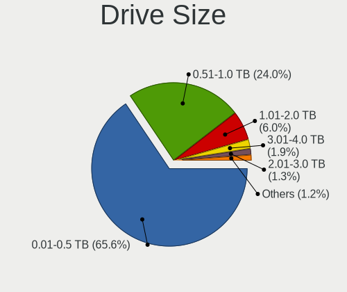

| Size in TB | Computers | Drives | Percent |
|------------|-----------|--------|---------|
| 0.01-0.5   | 680       | 1088   | 69.25%  |
| 0.51-1.0   | 217       | 307    | 22.1%   |
| 1.01-2.0   | 46        | 63     | 4.68%   |
| 3.01-4.0   | 18        | 22     | 1.83%   |
| 2.01-3.0   | 13        | 24     | 1.32%   |
| 4.01-10.0  | 7         | 15     | 0.71%   |
| 10.01-20.0 | 1         | 2      | 0.1%    |

Space Total
-----------

Amount of disk space available on the file system

| Size in GB     | Computers | Percent |
|----------------|-----------|---------|
| 101-250        | 289       | 29.73%  |
| 251-500        | 196       | 20.16%  |
| 501-1000       | 106       | 10.91%  |
| 51-100         | 84        | 8.64%   |
| 1001-2000      | 71        | 7.3%    |
| 1-20           | 67        | 6.89%   |
| 21-50          | 58        | 5.97%   |
| Unknown        | 50        | 5.14%   |
| More than 3000 | 32        | 3.29%   |
| 2001-3000      | 19        | 1.95%   |

Space Used
----------

Amount of used disk space

| Used GB        | Computers | Percent |
|----------------|-----------|---------|
| 1-20           | 399       | 39.9%   |
| 21-50          | 163       | 16.3%   |
| 51-100         | 113       | 11.3%   |
| 101-250        | 107       | 10.7%   |
| 251-500        | 67        | 6.7%    |
| 501-1000       | 50        | 5%      |
| Unknown        | 50        | 5%      |
| 1001-2000      | 29        | 2.9%    |
| More than 3000 | 16        | 1.6%    |
| 2001-3000      | 6         | 0.6%    |

Malfunc. Drives
---------------

Drive models with a malfunction

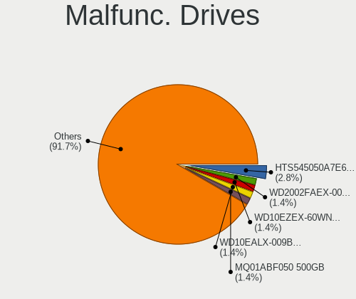

| Model                                 | Computers | Drives | Percent |
|---------------------------------------|-----------|--------|---------|
| HGST HTS545050A7E680 500GB            | 3         | 3      | 4.35%   |
| Seagate ST3500320AS 500GB             | 2         | 2      | 2.9%    |
| SanDisk SSD PLUS 240GB                | 2         | 2      | 2.9%    |
| WDC WD800JB-00JJC0 80GB               | 1         | 1      | 1.45%   |
| WDC WD5000BPVT-60HXZT1 500GB          | 1         | 1      | 1.45%   |
| WDC WD5000AAVS-22G9B1 500GB           | 1         | 1      | 1.45%   |
| WDC WD5000AAKB-00H8A0 500GB           | 1         | 1      | 1.45%   |
| WDC WD3200BEVT-26ZCT0 320GB           | 1         | 1      | 1.45%   |
| WDC WD3200BEVT-00A0RT0 320GB          | 1         | 1      | 1.45%   |
| WDC WD2500YS-01SHB1 256GB             | 1         | 2      | 1.45%   |
| WDC WD2500BEVT-22A23T0 250GB          | 1         | 1      | 1.45%   |
| WDC WD2500AAKX-083CA1 250GB           | 1         | 1      | 1.45%   |
| WDC WD20PURX-64P6ZY0 2TB              | 1         | 1      | 1.45%   |
| WDC WD2002FAEX-007BA0 2TB             | 1         | 2      | 1.45%   |
| WDC WD1600AAJS-22L7A0 160GB           | 1         | 1      | 1.45%   |
| WDC WD1200JD-00HBB0 120GB             | 1         | 2      | 1.45%   |
| WDC WD10EZEX-60WN4A1 1TB              | 1         | 2      | 1.45%   |
| WDC WD10EZEX-60WN4A0 1TB              | 1         | 1      | 1.45%   |
| WDC WD10EADS-00M2B0 1TB               | 1         | 1      | 1.45%   |
| Toshiba MQ01ACF050 500GB              | 1         | 1      | 1.45%   |
| Toshiba MQ01ABD100M 1TB               | 1         | 1      | 1.45%   |
| Toshiba MQ01ABD050 500GB              | 1         | 3      | 1.45%   |
| Toshiba MK1665GSX H 160GB             | 1         | 1      | 1.45%   |
| Toshiba DT01ACA100 1TB                | 1         | 1      | 1.45%   |
| SK Hynix SC210 mSATA 256GB SSD        | 1         | 1      | 1.45%   |
| Seagate ST980811AS 80GB               | 1         | 1      | 1.45%   |
| Seagate ST9320325AS 320GB             | 1         | 1      | 1.45%   |
| Seagate ST9160310AS 160GB             | 1         | 1      | 1.45%   |
| Seagate ST500LT012-9WS142 500GB       | 1         | 1      | 1.45%   |
| Seagate ST500LT012-1DG142 500GB       | 1         | 1      | 1.45%   |
| Seagate ST500LM021-1KJ152 500GB       | 1         | 1      | 1.45%   |
| Seagate ST500DM002-1BD142 500GB       | 1         | 1      | 1.45%   |
| Seagate ST3402111AS 40GB              | 1         | 1      | 1.45%   |
| Seagate ST3360320AS 360GB             | 1         | 1      | 1.45%   |
| Seagate ST3320620AS 320GB             | 1         | 1      | 1.45%   |
| Seagate ST3320613AS 320GB             | 1         | 1      | 1.45%   |
| Seagate ST3250410AS 250GB             | 1         | 2      | 1.45%   |
| Seagate ST3250318AS 250GB             | 1         | 1      | 1.45%   |
| Seagate ST320LT020-9YG142 320GB       | 1         | 1      | 1.45%   |
| Seagate ST3160815AS 160GB             | 1         | 1      | 1.45%   |
| Seagate ST3000DM001-1ER166 3TB        | 1         | 1      | 1.45%   |
| Seagate ST1000LM049-2GH172 1TB        | 1         | 1      | 1.45%   |
| Seagate ST1000LM024 HN-M101MBB 1TB    | 1         | 2      | 1.45%   |
| SanDisk SSD U100 128GB                | 1         | 1      | 1.45%   |
| SanDisk SDSSDXPS480G 480GB            | 1         | 1      | 1.45%   |
| Samsung Electronics SSD 970 EVO 500GB | 1         | 1      | 1.45%   |
| Samsung Electronics SSD 860 EVO 500GB | 1         | 1      | 1.45%   |
| Samsung Electronics HD501LJ 500GB     | 1         | 1      | 1.45%   |
| OCZ-AGIL ITY3 120GB SSD               | 1         | 1      | 1.45%   |
| MAXTOR 6Y060L0 64GB                   | 1         | 1      | 1.45%   |
| MAXTOR 4K040H2 40GB                   | 1         | 1      | 1.45%   |
| Kingston SA400S37120G 120GB SSD       | 1         | 1      | 1.45%   |
| Kingston RBUSNS8180DS3128GJ 128GB SSD | 1         | 1      | 1.45%   |
| Intel SSDSC2BW240H6 240GB             | 1         | 1      | 1.45%   |
| Hitachi HTS723216L9A360 160GB         | 1         | 1      | 1.45%   |
| Hitachi HTS543232A7A384 320GB         | 1         | 1      | 1.45%   |
| Hitachi HTS541612J9SA00 120GB         | 1         | 1      | 1.45%   |
| Hitachi HDT722516DLA380 164GB         | 1         | 1      | 1.45%   |
| Hitachi HDS721050DLE630 500GB         | 1         | 1      | 1.45%   |
| HGST HUS724030ALA640 3TB              | 1         | 1      | 1.45%   |

Malfunc. Drive Vendor
---------------------

Vendors of faulty drives

| Vendor              | Computers | Drives | Percent |
|---------------------|-----------|--------|---------|
| Seagate             | 20        | 22     | 29.41%  |
| WDC                 | 15        | 20     | 22.06%  |
| Toshiba             | 5         | 7      | 7.35%   |
| Hitachi             | 5         | 5      | 7.35%   |
| SanDisk             | 4         | 4      | 5.88%   |
| HGST                | 4         | 4      | 5.88%   |
| Samsung Electronics | 3         | 3      | 4.41%   |
| MAXTOR              | 2         | 2      | 2.94%   |
| Kingston            | 2         | 2      | 2.94%   |
| Corsair             | 2         | 2      | 2.94%   |
| SK Hynix            | 1         | 1      | 1.47%   |
| OCZ-AGIL            | 1         | 1      | 1.47%   |
| Intel               | 1         | 1      | 1.47%   |
| Fujitsu             | 1         | 1      | 1.47%   |
| Crucial             | 1         | 2      | 1.47%   |
| A-DATA Technology   | 1         | 1      | 1.47%   |

Malfunc. HDD Vendor
-------------------

Vendors of faulty HDD drives

| Vendor              | Computers | Drives | Percent |
|---------------------|-----------|--------|---------|
| Seagate             | 20        | 22     | 37.74%  |
| WDC                 | 15        | 20     | 28.3%   |
| Toshiba             | 5         | 7      | 9.43%   |
| Hitachi             | 5         | 5      | 9.43%   |
| HGST                | 4         | 4      | 7.55%   |
| MAXTOR              | 2         | 2      | 3.77%   |
| Samsung Electronics | 1         | 1      | 1.89%   |
| Fujitsu             | 1         | 1      | 1.89%   |

Malfunc. Drive Kind
-------------------

Kinds of faulty drives

| Kind | Computers | Drives | Percent |
|------|-----------|--------|---------|
| HDD  | 49        | 62     | 76.56%  |
| SSD  | 13        | 14     | 20.31%  |
| NVMe | 2         | 2      | 3.13%   |

Failed Drives
-------------

Failed drive models

| Model                     | Computers | Drives | Percent |
|---------------------------|-----------|--------|---------|
| Seagate ST3500418AS 500GB | 1         | 1      | 50%     |
| Mushkin MKNSSDCR120GB-7   | 1         | 1      | 50%     |

Failed Drive Vendor
-------------------

Failed drive vendors

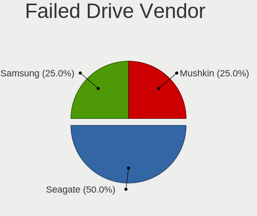

| Vendor  | Computers | Drives | Percent |
|---------|-----------|--------|---------|
| Seagate | 1         | 1      | 50%     |
| Mushkin | 1         | 1      | 50%     |

Drive Status
------------

Number of failed and malfunc. drives

| Status   | Computers | Drives | Percent |
|----------|-----------|--------|---------|
| Detected | 652       | 1237   | 66.13%  |
| Works    | 270       | 513    | 27.38%  |
| Malfunc  | 62        | 78     | 6.29%   |
| Failed   | 2         | 2      | 0.2%    |

Storage controller
------------------

Storage Vendor
--------------

Storage controller vendors

| Vendor                           | Computers | Percent |
|----------------------------------|-----------|---------|
| Intel                            | 629       | 57.29%  |
| AMD                              | 190       | 17.3%   |
| Samsung Electronics              | 58        | 5.28%   |
| JMicron Technology               | 32        | 2.91%   |
| SK Hynix                         | 23        | 2.09%   |
| Nvidia                           | 21        | 1.91%   |
| Sandisk                          | 20        | 1.82%   |
| Marvell Technology Group         | 18        | 1.64%   |
| Kingston Technology Company      | 16        | 1.46%   |
| ASMedia Technology               | 15        | 1.37%   |
| Toshiba America Info Systems     | 12        | 1.09%   |
| KIOXIA                           | 10        | 0.91%   |
| VIA Technologies                 | 9         | 0.82%   |
| Silicon Image                    | 7         | 0.64%   |
| Phison Electronics               | 7         | 0.64%   |
| Micron Technology                | 5         | 0.46%   |
| ADATA Technology                 | 4         | 0.36%   |
| Silicon Motion                   | 3         | 0.27%   |
| LSI Logic / Symbios Logic        | 3         | 0.27%   |
| Broadcom / LSI                   | 3         | 0.27%   |
| Union Memory (Shenzhen)          | 2         | 0.18%   |
| Realtek Semiconductor            | 2         | 0.18%   |
| Micron/Crucial Technology        | 2         | 0.18%   |
| Solid State Storage Technology   | 1         | 0.09%   |
| Silicon Integrated Systems [SiS] | 1         | 0.09%   |
| Seagate Technology               | 1         | 0.09%   |
| Promise Technology               | 1         | 0.09%   |
| OCZ Technology Group             | 1         | 0.09%   |
| Lite-On Technology               | 1         | 0.09%   |
| Integrated Technology Express    | 1         | 0.09%   |

Storage Model
-------------

Storage controller models

| Model                                                                                   | Computers | Percent |
|-----------------------------------------------------------------------------------------|-----------|---------|
| AMD FCH SATA Controller [AHCI mode]                                                     | 131       | 9.58%   |
| Intel 8 Series/C220 Series Chipset Family 6-port SATA Controller 1 [AHCI mode]          | 49        | 3.58%   |
| Intel NM10/ICH7 Family SATA Controller [IDE mode]                                       | 44        | 3.22%   |
| Intel 82801G (ICH7 Family) IDE Controller                                               | 44        | 3.22%   |
| Samsung NVMe SSD Controller SM981/PM981/PM983                                           | 40        | 2.93%   |
| Intel 7 Series Chipset Family 6-port SATA Controller [AHCI mode]                        | 37        | 2.71%   |
| Intel Sunrise Point-LP SATA Controller [AHCI mode]                                      | 33        | 2.41%   |
| Intel 82801IBM/IEM (ICH9M/ICH9M-E) 4 port SATA Controller [AHCI mode]                   | 33        | 2.41%   |
| Intel 6 Series/C200 Series Chipset Family 6 port Mobile SATA AHCI Controller            | 32        | 2.34%   |
| AMD SB7x0/SB8x0/SB9x0 IDE Controller                                                    | 30        | 2.19%   |
| AMD 400 Series Chipset SATA Controller                                                  | 27        | 1.98%   |
| Intel 82801HM/HEM (ICH8M/ICH8M-E) IDE Controller                                        | 23        | 1.68%   |
| Intel 8 Series SATA Controller 1 [AHCI mode]                                            | 23        | 1.68%   |
| Intel 6 Series/C200 Series Chipset Family 6 port Desktop SATA AHCI Controller           | 21        | 1.54%   |
| AMD SB7x0/SB8x0/SB9x0 SATA Controller [AHCI mode]                                       | 21        | 1.54%   |
| Intel 82801 Mobile SATA Controller [RAID mode]                                          | 20        | 1.46%   |
| AMD SB7x0/SB8x0/SB9x0 SATA Controller [IDE mode]                                        | 20        | 1.46%   |
| JMicron JMB363 SATA/IDE Controller                                                      | 19        | 1.39%   |
| Intel 82801HM/HEM (ICH8M/ICH8M-E) SATA Controller [AHCI mode]                           | 18        | 1.32%   |
| Intel Q170/Q150/B150/H170/H110/Z170/CM236 Chipset SATA Controller [AHCI Mode]           | 17        | 1.24%   |
| Intel 7 Series/C210 Series Chipset Family 6-port SATA Controller [AHCI mode]            | 14        | 1.02%   |
| ASMedia ASM1062 Serial ATA Controller                                                   | 14        | 1.02%   |
| AMD 300 Series Chipset SATA Controller                                                  | 14        | 1.02%   |
| Intel Celeron N3350/Pentium N4200/Atom E3900 Series SATA AHCI Controller                | 13        | 0.95%   |
| Intel 82801GBM/GHM (ICH7-M Family) SATA Controller [IDE mode]                           | 13        | 0.95%   |
| Intel 5 Series/3400 Series Chipset 4 port SATA AHCI Controller                          | 13        | 0.95%   |
| Intel 200 Series PCH SATA controller [AHCI mode]                                        | 13        | 0.95%   |
| Intel 9 Series Chipset Family SATA Controller [AHCI Mode]                               | 12        | 0.88%   |
| Intel Wildcat Point-LP SATA Controller [AHCI Mode]                                      | 11        | 0.8%    |
| Intel SATA Controller [RAID mode]                                                       | 11        | 0.8%    |
| Intel Cannon Lake Mobile PCH SATA AHCI Controller                                       | 11        | 0.8%    |
| Intel Atom Processor E3800 Series SATA AHCI Controller                                  | 11        | 0.8%    |
| Intel 6 Series/C200 Series Chipset Family Desktop SATA Controller (IDE mode, ports 0-3) | 11        | 0.8%    |
| KIOXIA Non-Volatile memory controller                                                   | 10        | 0.73%   |
| JMicron JMB368 IDE controller                                                           | 10        | 0.73%   |
| Intel 82801JI (ICH10 Family) 4 port SATA IDE Controller #1                              | 10        | 0.73%   |
| Intel 82801JI (ICH10 Family) 2 port SATA IDE Controller #2                              | 10        | 0.73%   |
| Intel 6 Series/C200 Series Chipset Family Desktop SATA Controller (IDE mode, ports 4-5) | 10        | 0.73%   |
| Samsung NVMe SSD Controller 980                                                         | 9         | 0.66%   |
| Intel 82801HM/HEM (ICH8M/ICH8M-E) SATA Controller [IDE mode]                            | 9         | 0.66%   |
| Intel 5 Series/3400 Series Chipset 6 port SATA AHCI Controller                          | 9         | 0.66%   |
| Intel 4 Series Chipset PT IDER Controller                                               | 9         | 0.66%   |
| Intel Cannon Lake PCH SATA AHCI Controller                                              | 8         | 0.59%   |
| Intel 82801I (ICH9 Family) 2 port SATA Controller [IDE mode]                            | 8         | 0.59%   |
| Intel 82801GBM/GHM (ICH7-M Family) SATA Controller [AHCI mode]                          | 8         | 0.59%   |
| AMD FCH SATA Controller D                                                               | 8         | 0.59%   |
| SK Hynix BC511                                                                          | 7         | 0.51%   |
| SK Hynix BC501 NVMe Solid State Drive                                                   | 7         | 0.51%   |
| Kingston Company A2000 NVMe SSD                                                         | 7         | 0.51%   |
| Intel HM170/QM170 Chipset SATA Controller [AHCI Mode]                                   | 7         | 0.51%   |
| Intel Atom/Celeron/Pentium Processor x5-E8000/J3xxx/N3xxx Series SATA Controller        | 7         | 0.51%   |
| Intel 82801FB/FBM/FR/FW/FRW (ICH6 Family) IDE Controller                                | 7         | 0.51%   |
| VIA VT82C586A/B/VT82C686/A/B/VT823x/A/C PIPC Bus Master IDE                             | 6         | 0.44%   |
| Marvell Group 88SE6111/6121 SATA II / PATA Controller                                   | 6         | 0.44%   |
| Intel Comet Lake SATA AHCI Controller                                                   | 6         | 0.44%   |
| Intel Celeron/Pentium Silver Processor SATA Controller                                  | 6         | 0.44%   |
| Intel 82801JI (ICH10 Family) SATA AHCI Controller                                       | 6         | 0.44%   |
| Intel 82801JD/DO (ICH10 Family) SATA AHCI Controller                                    | 6         | 0.44%   |
| Intel 82801IR/IO/IH (ICH9R/DO/DH) 4 port SATA Controller [IDE mode]                     | 6         | 0.44%   |
| Intel 82801HR/HO/HH (ICH8R/DO/DH) 2 port SATA Controller [IDE mode]                     | 6         | 0.44%   |

Storage Kind
------------

Kind of storage controller (IDE, SATA, NVMe, SAS, ...)

| Kind | Computers | Percent |
|------|-----------|---------|
| SATA | 650       | 57.42%  |
| IDE  | 255       | 22.53%  |
| NVMe | 169       | 14.93%  |
| RAID | 52        | 4.59%   |
| SAS  | 5         | 0.44%   |
| SCSI | 1         | 0.09%   |

Processor
---------

CPU Vendor
----------

Processor vendors

| Vendor       | Computers | Percent |
|--------------|-----------|---------|
| Intel        | 682       | 74.05%  |
| AMD          | 234       | 25.41%  |
| ARM          | 4         | 0.43%   |
| CentaurHauls | 1         | 0.11%   |

CPU Model
---------

Processor models

| Model                                         | Computers | Percent |
|-----------------------------------------------|-----------|---------|
| Intel Atom x5-Z8350 CPU @ 1.44GHz             | 12        | 1.3%    |
| AMD Ryzen 5 3500U with Radeon Vega Mobile Gfx | 12        | 1.3%    |
| Intel Core i5-8250U CPU @ 1.60GHz             | 10        | 1.08%   |
| Intel Core i7-7500U CPU @ 2.70GHz             | 9         | 0.98%   |
| AMD Ryzen 5 2600 Six-Core Processor           | 9         | 0.98%   |
| Intel Core i3-3220 CPU @ 3.30GHz              | 8         | 0.87%   |
| Intel Celeron CPU N3350 @ 1.10GHz             | 8         | 0.87%   |
| AMD Ryzen 3 2200G with Radeon Vega Graphics   | 8         | 0.87%   |
| Intel Pentium 4 CPU 3.20GHz                   | 7         | 0.76%   |
| Intel Pentium 4 CPU 3.00GHz                   | 7         | 0.76%   |
| Intel Core i5-6500 CPU @ 3.20GHz              | 7         | 0.76%   |
| Intel Core i5-2410M CPU @ 2.30GHz             | 7         | 0.76%   |
| Intel Atom CPU N270 @ 1.60GHz                 | 7         | 0.76%   |
| AMD Ryzen 7 2700X Eight-Core Processor        | 7         | 0.76%   |
| AMD FX-6300 Six-Core Processor                | 7         | 0.76%   |
| Intel Core i5-4460 CPU @ 3.20GHz              | 6         | 0.65%   |
| Intel Core i3-4005U CPU @ 1.70GHz             | 6         | 0.65%   |
| Intel Core 2 Duo CPU T7250 @ 2.00GHz          | 6         | 0.65%   |
| Intel Core 2 Duo CPU E8500 @ 3.16GHz          | 6         | 0.65%   |
| Intel Celeron CPU N2840 @ 2.16GHz             | 6         | 0.65%   |
| Intel Celeron CPU G1840 @ 2.80GHz             | 6         | 0.65%   |
| AMD Ryzen 5 3400G with Radeon Vega Graphics   | 6         | 0.65%   |
| AMD Ryzen 5 1600 Six-Core Processor           | 6         | 0.65%   |
| Intel Core i5-3320M CPU @ 2.60GHz             | 5         | 0.54%   |
| Intel Core i5-3230M CPU @ 2.60GHz             | 5         | 0.54%   |
| Intel Core i5-2400 CPU @ 3.10GHz              | 5         | 0.54%   |
| Intel Core 2 Quad CPU Q6600 @ 2.40GHz         | 5         | 0.54%   |
| Intel Core 2 Duo CPU T7500 @ 2.20GHz          | 5         | 0.54%   |
| Intel Atom x5-Z8300 CPU @ 1.44GHz             | 5         | 0.54%   |
| AMD Ryzen 7 3700U with Radeon Vega Mobile Gfx | 5         | 0.54%   |
| AMD Ryzen 5 2600X Six-Core Processor          | 5         | 0.54%   |
| AMD Ryzen 3 3200U with Radeon Vega Mobile Gfx | 5         | 0.54%   |
| AMD Phenom II X4 965 Processor                | 5         | 0.54%   |
| Intel Pentium Dual CPU T3400 @ 2.16GHz        | 4         | 0.43%   |
| Intel Pentium D CPU 2.80GHz                   | 4         | 0.43%   |
| Intel Pentium CPU G3240 @ 3.10GHz             | 4         | 0.43%   |
| Intel Core i7-9750H CPU @ 2.60GHz             | 4         | 0.43%   |
| Intel Core i7-8750H CPU @ 2.20GHz             | 4         | 0.43%   |
| Intel Core i7-7700HQ CPU @ 2.80GHz            | 4         | 0.43%   |
| Intel Core i7-6700HQ CPU @ 2.60GHz            | 4         | 0.43%   |
| Intel Core i7-2670QM CPU @ 2.20GHz            | 4         | 0.43%   |
| Intel Core i5-7200U CPU @ 2.50GHz             | 4         | 0.43%   |
| Intel Core i5-5200U CPU @ 2.20GHz             | 4         | 0.43%   |
| Intel Core i5-4690K CPU @ 3.50GHz             | 4         | 0.43%   |
| Intel Core i5-4210U CPU @ 1.70GHz             | 4         | 0.43%   |
| Intel Core i5-4200M CPU @ 2.50GHz             | 4         | 0.43%   |
| Intel Core i5-3470 CPU @ 3.20GHz              | 4         | 0.43%   |
| Intel Core i5-2520M CPU @ 2.50GHz             | 4         | 0.43%   |
| Intel Core i5 CPU M 520 @ 2.40GHz             | 4         | 0.43%   |
| Intel Core i3-3110M CPU @ 2.40GHz             | 4         | 0.43%   |
| Intel Core i3 CPU M 330 @ 2.13GHz             | 4         | 0.43%   |
| Intel Core 2 Duo CPU T7100 @ 1.80GHz          | 4         | 0.43%   |
| Intel Core 2 Duo CPU P8600 @ 2.40GHz          | 4         | 0.43%   |
| Intel Core 2 Duo CPU E8400 @ 3.00GHz          | 4         | 0.43%   |
| Intel Core 2 Duo CPU E7500 @ 2.93GHz          | 4         | 0.43%   |
| Intel Core 2 CPU 6400 @ 2.13GHz               | 4         | 0.43%   |
| Intel Celeron CPU N3050 @ 1.60GHz             | 4         | 0.43%   |
| AMD Ryzen 7 4700U with Radeon Graphics        | 4         | 0.43%   |
| AMD Phenom II X4 955 Processor                | 4         | 0.43%   |
| AMD Athlon 64 X2 Dual Core Processor 4200+    | 4         | 0.43%   |

CPU Model Family
----------------

Processor model prefix

| Model                          | Computers | Percent |
|--------------------------------|-----------|---------|
| Intel Core i5                  | 159       | 17.25%  |
| Intel Core i7                  | 118       | 12.8%   |
| Intel Core 2 Duo               | 79        | 8.57%   |
| Intel Core i3                  | 77        | 8.35%   |
| AMD Ryzen 5                    | 61        | 6.62%   |
| Intel Celeron                  | 53        | 5.75%   |
| Intel Pentium                  | 36        | 3.9%    |
| Intel Atom                     | 34        | 3.69%   |
| AMD Ryzen 7                    | 30        | 3.25%   |
| Intel Pentium 4                | 19        | 2.06%   |
| Other                          | 18        | 1.95%   |
| Intel Core 2 Quad              | 18        | 1.95%   |
| AMD Ryzen 3                    | 18        | 1.95%   |
| Intel Core 2                   | 17        | 1.84%   |
| AMD FX                         | 15        | 1.63%   |
| Intel Pentium Dual-Core        | 14        | 1.52%   |
| Intel Xeon                     | 13        | 1.41%   |
| AMD Athlon 64 X2               | 12        | 1.3%    |
| AMD Phenom II X4               | 10        | 1.08%   |
| AMD A8                         | 10        | 1.08%   |
| AMD A6                         | 8         | 0.87%   |
| AMD A4                         | 8         | 0.87%   |
| AMD A10                        | 8         | 0.87%   |
| Intel Pentium Dual             | 7         | 0.76%   |
| AMD E1                         | 7         | 0.76%   |
| Intel Pentium D                | 6         | 0.65%   |
| AMD Ryzen 9                    | 6         | 0.65%   |
| Intel Genuine                  | 5         | 0.54%   |
| Intel Celeron M                | 5         | 0.54%   |
| Intel Pentium M                | 4         | 0.43%   |
| AMD Sempron                    | 3         | 0.33%   |
| AMD Ryzen 7 PRO                | 3         | 0.33%   |
| AMD Phenom II X6               | 3         | 0.33%   |
| AMD E                          | 3         | 0.33%   |
| AMD Athlon                     | 3         | 0.33%   |
| Intel Celeron Dual-Core        | 2         | 0.22%   |
| AMD Turion 64 X2 Mobile        | 2         | 0.22%   |
| AMD Turion                     | 2         | 0.22%   |
| AMD Ryzen Threadripper         | 2         | 0.22%   |
| AMD Phenom                     | 2         | 0.22%   |
| AMD Athlon XP                  | 2         | 0.22%   |
| AMD Athlon 64                  | 2         | 0.22%   |
| Intel Pentium Gold             | 1         | 0.11%   |
| Intel Core m3                  | 1         | 0.11%   |
| Intel Core Duo                 | 1         | 0.11%   |
| Intel Core 2 Extreme           | 1         | 0.11%   |
| CentaurHauls VIA C7            | 1         | 0.11%   |
| ARM BCM                        | 1         | 0.11%   |
| AMD V140                       | 1         | 0.11%   |
| AMD Turion X2 Dual-Core Mobile | 1         | 0.11%   |
| AMD Turion 64 Mobile           | 1         | 0.11%   |
| AMD Ryzen 5 PRO                | 1         | 0.11%   |
| AMD Phenom II X2               | 1         | 0.11%   |
| AMD E2                         | 1         | 0.11%   |
| AMD Dual Core Opteron          | 1         | 0.11%   |
| AMD Athlon II X4               | 1         | 0.11%   |
| AMD Athlon II X3               | 1         | 0.11%   |
| AMD Athlon II X2               | 1         | 0.11%   |
| AMD Athlon II Dual-Core        | 1         | 0.11%   |
| AMD Athlon Dual Core           | 1         | 0.11%   |

CPU Cores
---------

Number of processor cores

| Number  | Computers | Percent |
|---------|-----------|---------|
| 2       | 444       | 48.16%  |
| 4       | 297       | 32.21%  |
| 6       | 66        | 7.16%   |
| 1       | 58        | 6.29%   |
| 8       | 37        | 4.01%   |
| 3       | 9         | 0.98%   |
| 12      | 7         | 0.76%   |
| 16      | 3         | 0.33%   |
| Unknown | 1         | 0.11%   |

CPU Sockets
-----------

Number of sockets

| Number  | Computers | Percent |
|---------|-----------|---------|
| 1       | 913       | 99.13%  |
| 2       | 7         | 0.76%   |
| Unknown | 1         | 0.11%   |

CPU Threads
-----------

Threads per core (Hyper-Threading)

| Number  | Computers | Percent |
|---------|-----------|---------|
| 2       | 473       | 51.36%  |
| 1       | 446       | 48.43%  |
| 8       | 1         | 0.11%   |
| Unknown | 1         | 0.11%   |

CPU Op-Modes
------------

CPU Operation Modes (32-bit, 64-bit)

| Op mode        | Computers | Percent |
|----------------|-----------|---------|
| 32-bit, 64-bit | 872       | 94.27%  |
| 32-bit         | 33        | 3.57%   |
| Unknown        | 18        | 1.95%   |
| 64-bit         | 2         | 0.22%   |

CPU Microcode
-------------

Microcode number

| Number     | Computers | Percent |
|------------|-----------|---------|
| Unknown    | 169       | 17.83%  |
| 0x206a7    | 62        | 6.54%   |
| 0x306c3    | 58        | 6.12%   |
| 0x306a9    | 45        | 4.75%   |
| 0x1067a    | 42        | 4.43%   |
| 0x40651    | 22        | 2.32%   |
| 0x10676    | 22        | 2.32%   |
| 0x6fd      | 21        | 2.22%   |
| 0x906ea    | 17        | 1.79%   |
| 0x08108102 | 17        | 1.79%   |
| 0x806ea    | 16        | 1.69%   |
| 0x506e3    | 16        | 1.69%   |
| 0x406c4    | 15        | 1.58%   |
| 0x0800820d | 15        | 1.58%   |
| 0x906e9    | 13        | 1.37%   |
| 0x806e9    | 13        | 1.37%   |
| 0x506c9    | 13        | 1.37%   |
| 0x08108109 | 13        | 1.37%   |
| 0x6f6      | 12        | 1.27%   |
| 0x306d4    | 12        | 1.27%   |
| 0x106c2    | 11        | 1.16%   |
| 0x806c1    | 10        | 1.05%   |
| 0x30678    | 10        | 1.05%   |
| 0x06000852 | 10        | 1.05%   |
| 0x906ed    | 9         | 0.95%   |
| 0x806ec    | 9         | 0.95%   |
| 0x406c3    | 9         | 0.95%   |
| 0x0810100b | 9         | 0.95%   |
| 0xf43      | 8         | 0.84%   |
| 0x6fb      | 8         | 0.84%   |
| 0x20655    | 8         | 0.84%   |
| 0x20652    | 8         | 0.84%   |
| 0x106e5    | 8         | 0.84%   |
| 0x406e3    | 7         | 0.74%   |
| 0xf41      | 6         | 0.63%   |
| 0x906eb    | 6         | 0.63%   |
| 0x6d8      | 6         | 0.63%   |
| 0x05000119 | 6         | 0.63%   |
| 0x010000c8 | 6         | 0.63%   |
| 0x706e5    | 5         | 0.53%   |
| 0x706a1    | 5         | 0.53%   |
| 0x6f2      | 5         | 0.53%   |
| 0x10677    | 5         | 0.53%   |
| 0x08701021 | 5         | 0.53%   |
| 0x08600104 | 5         | 0.53%   |
| 0x06006705 | 5         | 0.53%   |
| 0x06003106 | 5         | 0.53%   |
| 0xf29      | 4         | 0.42%   |
| 0xa0653    | 4         | 0.42%   |
| 0x806eb    | 4         | 0.42%   |
| 0x6ec      | 4         | 0.42%   |
| 0x08701013 | 4         | 0.42%   |
| 0x08600106 | 4         | 0.42%   |
| 0x08101016 | 4         | 0.42%   |
| 0x08001129 | 4         | 0.42%   |
| 0x0600611a | 4         | 0.42%   |
| 0xf47      | 3         | 0.32%   |
| 0x106a5    | 3         | 0.32%   |
| 0x0a50000c | 3         | 0.32%   |
| 0x0800820b | 3         | 0.32%   |

CPU Microarch
-------------

Microarchitecture

| Name            | Computers | Percent |
|-----------------|-----------|---------|
| KabyLake        | 97        | 10.52%  |
| Haswell         | 88        | 9.54%   |
| Penryn          | 84        | 9.11%   |
| SandyBridge     | 71        | 7.7%    |
| Core            | 64        | 6.94%   |
| Zen+            | 59        | 6.4%    |
| IvyBridge       | 59        | 6.4%    |
| Silvermont      | 38        | 4.12%   |
| Skylake         | 31        | 3.36%   |
| Zen             | 29        | 3.15%   |
| NetBurst        | 26        | 2.82%   |
| Zen 2           | 23        | 2.49%   |
| Westmere        | 22        | 2.39%   |
| Piledriver      | 21        | 2.28%   |
| K10             | 21        | 2.28%   |
| K8 Hammer       | 19        | 2.06%   |
| Bonnell         | 15        | 1.63%   |
| Goldmont        | 14        | 1.52%   |
| Excavator       | 14        | 1.52%   |
| P6              | 13        | 1.41%   |
| Nehalem         | 13        | 1.41%   |
| Broadwell       | 13        | 1.41%   |
| Zen 3           | 11        | 1.19%   |
| TigerLake       | 11        | 1.19%   |
| CometLake       | 9         | 0.98%   |
| Bobcat          | 9         | 0.98%   |
| Puma            | 7         | 0.76%   |
| Icelake         | 7         | 0.76%   |
| Goldmont plus   | 7         | 0.76%   |
| Steamroller     | 6         | 0.65%   |
| Unknown         | 6         | 0.65%   |
| K8 & K10 hybrid | 5         | 0.54%   |
| K10 Llano       | 4         | 0.43%   |
| K6              | 3         | 0.33%   |
| Jaguar          | 3         | 0.33%   |

Graphics
--------

GPU Vendor
----------

Vendors of graphics cards

| Vendor                           | Computers | Percent |
|----------------------------------|-----------|---------|
| Intel                            | 457       | 43.69%  |
| AMD                              | 292       | 27.92%  |
| Nvidia                           | 290       | 27.72%  |
| VIA Technologies                 | 3         | 0.29%   |
| Matrox Electronics Systems       | 2         | 0.19%   |
| Silicon Integrated Systems [SiS] | 1         | 0.1%    |
| Conexant Systems                 | 1         | 0.1%    |

GPU Model
---------

Graphics card models

| Model                                                                                    | Computers | Percent |
|------------------------------------------------------------------------------------------|-----------|---------|
| Intel 2nd Generation Core Processor Family Integrated Graphics Controller                | 54        | 4.89%   |
| AMD Picasso/Raven 2 [Radeon Vega Series / Radeon Vega Mobile Series]                     | 35        | 3.17%   |
| Intel 3rd Gen Core processor Graphics Controller                                         | 28        | 2.53%   |
| Intel Atom/Celeron/Pentium Processor x5-E8000/J3xxx/N3xxx Integrated Graphics Controller | 26        | 2.35%   |
| Intel Haswell-ULT Integrated Graphics Controller                                         | 23        | 2.08%   |
| Intel Xeon E3-1200 v3/4th Gen Core Processor Integrated Graphics Controller              | 22        | 1.99%   |
| Nvidia GK208B [GeForce GT 710]                                                           | 20        | 1.81%   |
| AMD Ellesmere [Radeon RX 470/480/570/570X/580/580X/590]                                  | 19        | 1.72%   |
| Intel UHD Graphics 620                                                                   | 17        | 1.54%   |
| Intel Mobile 945GM/GMS/GME, 943/940GML Express Integrated Graphics Controller            | 16        | 1.45%   |
| Intel Mobile 4 Series Chipset Integrated Graphics Controller                             | 16        | 1.45%   |
| Intel Mobile GM965/GL960 Integrated Graphics Controller (secondary)                      | 15        | 1.36%   |
| Intel Mobile GM965/GL960 Integrated Graphics Controller (primary)                        | 15        | 1.36%   |
| Intel 4th Gen Core Processor Integrated Graphics Controller                              | 15        | 1.36%   |
| Intel HD Graphics 620                                                                    | 14        | 1.27%   |
| AMD Raven Ridge [Radeon Vega Series / Radeon Vega Mobile Series]                         | 14        | 1.27%   |
| Intel HD Graphics 500                                                                    | 13        | 1.18%   |
| Intel 4 Series Chipset Integrated Graphics Controller                                    | 13        | 1.18%   |
| AMD Renoir                                                                               | 13        | 1.18%   |
| Intel Core Processor Integrated Graphics Controller                                      | 12        | 1.09%   |
| Intel CoffeeLake-H GT2 [UHD Graphics 630]                                                | 12        | 1.09%   |
| Intel Atom Processor Z36xxx/Z37xxx Series Graphics & Display                             | 12        | 1.09%   |
| Intel Xeon E3-1200 v2/3rd Gen Core processor Graphics Controller                         | 11        | 1%      |
| Intel HD Graphics 5500                                                                   | 11        | 1%      |
| Intel HD Graphics 530                                                                    | 11        | 1%      |
| Intel TigerLake-LP GT2 [Iris Xe Graphics]                                                | 10        | 0.9%    |
| Nvidia GT218 [GeForce 210]                                                               | 9         | 0.81%   |
| Nvidia GP107 [GeForce GTX 1050 Ti]                                                       | 9         | 0.81%   |
| Intel WhiskeyLake-U GT2 [UHD Graphics 620]                                               | 9         | 0.81%   |
| Intel Mobile 945GSE Express Integrated Graphics Controller                               | 9         | 0.81%   |
| Intel CoffeeLake-S GT2 [UHD Graphics 630]                                                | 9         | 0.81%   |
| Nvidia GP106 [GeForce GTX 1060 6GB]                                                      | 8         | 0.72%   |
| Intel Mobile 945GM/GMS, 943/940GML Express Integrated Graphics Controller                | 8         | 0.72%   |
| Intel 82945G/GZ Integrated Graphics Controller                                           | 8         | 0.72%   |
| AMD Topaz XT [Radeon R7 M260/M265 / M340/M360 / M440/M445 / 530/535 / 620/625 Mobile]    | 8         | 0.72%   |
| AMD Stoney [Radeon R2/R3/R4/R5 Graphics]                                                 | 8         | 0.72%   |
| Intel Skylake GT2 [HD Graphics 520]                                                      | 7         | 0.63%   |
| Intel HD Graphics 630                                                                    | 7         | 0.63%   |
| Intel GeminiLake [UHD Graphics 600]                                                      | 7         | 0.63%   |
| AMD Sun XT [Radeon HD 8670A/8670M/8690M / R5 M330 / M430 / Radeon 520 Mobile]            | 7         | 0.63%   |
| AMD Seymour [Radeon HD 6400M/7400M Series]                                               | 7         | 0.63%   |
| Nvidia GP107M [GeForce GTX 1050 Mobile]                                                  | 6         | 0.54%   |
| Intel CometLake-U GT2 [UHD Graphics]                                                     | 6         | 0.54%   |
| AMD Wani [Radeon R5/R6/R7 Graphics]                                                      | 6         | 0.54%   |
| AMD RV710/M92 [Mobility Radeon HD 4530/4570/545v]                                        | 6         | 0.54%   |
| AMD Oland PRO [Radeon R7 240/340 / Radeon 520]                                           | 6         | 0.54%   |
| AMD Kaveri [Radeon R7 Graphics]                                                          | 6         | 0.54%   |
| AMD Curacao PRO [Radeon R7 370 / R9 270/370 OEM]                                         | 6         | 0.54%   |
| AMD Cezanne                                                                              | 6         | 0.54%   |
| AMD Cedar [Radeon HD 5000/6000/7350/8350 Series]                                         | 6         | 0.54%   |
| Nvidia GP108 [GeForce GT 1030]                                                           | 5         | 0.45%   |
| Nvidia GM108M [GeForce 840M]                                                             | 5         | 0.45%   |
| Nvidia GK208BM [GeForce 920M]                                                            | 5         | 0.45%   |
| Nvidia GF117M [GeForce 610M/710M/810M/820M / GT 620M/625M/630M/720M]                     | 5         | 0.45%   |
| Nvidia GF108M [GeForce GT 540M]                                                          | 5         | 0.45%   |
| AMD Wrestler [Radeon HD 7310]                                                            | 5         | 0.45%   |
| AMD Navi 10 [Radeon RX 5600 OEM/5600 XT / 5700/5700 XT]                                  | 5         | 0.45%   |
| Nvidia TU117M [GeForce GTX 1650 Mobile / Max-Q]                                          | 4         | 0.36%   |
| Nvidia GP107M [GeForce GTX 1050 Ti Mobile]                                               | 4         | 0.36%   |
| Nvidia GP107 [GeForce GTX 1050]                                                          | 4         | 0.36%   |

GPU Combo
---------

Combinations of graphics cards

| Name                           | Computers | Percent |
|--------------------------------|-----------|---------|
| 1 x Intel                      | 335       | 36.18%  |
| 1 x AMD                        | 236       | 25.49%  |
| 1 x Nvidia                     | 198       | 21.38%  |
| Intel + Nvidia                 | 87        | 9.4%    |
| Intel + AMD                    | 30        | 3.24%   |
| 2 x AMD                        | 22        | 2.38%   |
| Other                          | 7         | 0.76%   |
| 1 x VIA                        | 3         | 0.32%   |
| AMD + Nvidia                   | 3         | 0.32%   |
| 1 x Matrox                     | 2         | 0.22%   |
| 2 x Nvidia                     | 1         | 0.11%   |
| 2 x AMD + 1 x Conexant Systems | 1         | 0.11%   |
| 1 x SiS                        | 1         | 0.11%   |

GPU Driver
----------

Free vs proprietary

| Driver      | Computers | Percent |
|-------------|-----------|---------|
| Free        | 759       | 81.53%  |
| Proprietary | 135       | 14.5%   |
| Unknown     | 37        | 3.97%   |

GPU Memory
----------

Total video memory

| Size in GB | Computers | Percent |
|------------|-----------|---------|
| Unknown    | 420       | 44.35%  |
| 1.01-2.0   | 163       | 17.21%  |
| 0.01-0.5   | 156       | 16.47%  |
| 0.51-1.0   | 97        | 10.24%  |
| 3.01-4.0   | 64        | 6.76%   |
| 7.01-8.0   | 21        | 2.22%   |
| 5.01-6.0   | 18        | 1.9%    |
| 2.01-3.0   | 6         | 0.63%   |
| 8.01-16.0  | 2         | 0.21%   |

Monitor
-------

Monitor Vendor
--------------

Monitor vendors

| Vendor                  | Computers | Percent |
|-------------------------|-----------|---------|
| Samsung Electronics     | 136       | 14.38%  |
| Goldstar                | 110       | 11.63%  |
| LG Display              | 92        | 9.73%   |
| AU Optronics            | 92        | 9.73%   |
| BOE                     | 75        | 7.93%   |
| Chimei Innolux          | 64        | 6.77%   |
| Dell                    | 54        | 5.71%   |
| Philips                 | 27        | 2.85%   |
| Hewlett-Packard         | 23        | 2.43%   |
| LG Electronics          | 21        | 2.22%   |
| Chi Mei Optoelectronics | 19        | 2.01%   |
| ViewSonic               | 16        | 1.69%   |
| AOC                     | 16        | 1.69%   |
| LG Philips              | 14        | 1.48%   |
| Lenovo                  | 14        | 1.48%   |
| BenQ                    | 14        | 1.48%   |
| Ancor Communications    | 13        | 1.37%   |
| Eizo                    | 9         | 0.95%   |
| Apple                   | 9         | 0.95%   |
| Sony                    | 8         | 0.85%   |
| Sharp                   | 8         | 0.85%   |
| Vestel Elektronik       | 7         | 0.74%   |
| Iiyama                  | 7         | 0.74%   |
| CPT                     | 7         | 0.74%   |
| Unknown                 | 6         | 0.63%   |
| NEC Computers           | 6         | 0.63%   |
| HannStar                | 6         | 0.63%   |
| PANDA                   | 4         | 0.42%   |
| JRY                     | 4         | 0.42%   |
| InfoVision              | 4         | 0.42%   |
| Fujitsu Siemens         | 4         | 0.42%   |
| Belinea                 | 4         | 0.42%   |
| ASUSTek Computer        | 4         | 0.42%   |
| Quanta Display          | 3         | 0.32%   |
| Medion                  | 3         | 0.32%   |
| Acer                    | 3         | 0.32%   |
| Nvidia                  | 2         | 0.21%   |
| Mi                      | 2         | 0.21%   |
| IBM                     | 2         | 0.21%   |
| FUS                     | 2         | 0.21%   |
| DAO                     | 2         | 0.21%   |
| CSO                     | 2         | 0.21%   |
| ZLX                     | 1         | 0.11%   |
| YM                      | 1         | 0.11%   |
| TSL                     | 1         | 0.11%   |
| Toshiba                 | 1         | 0.11%   |
| SKY                     | 1         | 0.11%   |
| RTK                     | 1         | 0.11%   |
| PER                     | 1         | 0.11%   |
| PDI                     | 1         | 0.11%   |
| Panasonic               | 1         | 0.11%   |
| OUT                     | 1         | 0.11%   |
| NCS                     | 1         | 0.11%   |
| Marantz                 | 1         | 0.11%   |
| LPL                     | 1         | 0.11%   |
| LLL                     | 1         | 0.11%   |
| Lite-On                 | 1         | 0.11%   |
| LGD                     | 1         | 0.11%   |
| KET                     | 1         | 0.11%   |
| KDC                     | 1         | 0.11%   |

Monitor Model
-------------

Monitor models

| Model                                                                    | Computers | Percent |
|--------------------------------------------------------------------------|-----------|---------|
| AU Optronics LCD Monitor AUO38ED 1920x1080 344x193mm 15.5-inch           | 10        | 1.03%   |
| Vestel Elektronik 22W_LCD_TV VES3700 1920x540                            | 7         | 0.72%   |
| Goldstar IPS FULLHD GSM5AB8 1920x1080 480x270mm 21.7-inch                | 7         | 0.72%   |
| Chimei Innolux LCD Monitor CMN15F5 1920x1080 344x193mm 15.5-inch         | 7         | 0.72%   |
| Chimei Innolux LCD Monitor CMN15C4 1920x1080 344x193mm 15.5-inch         | 6         | 0.62%   |
| AU Optronics LCD Monitor AUO45EC 1366x768 344x193mm 15.5-inch            | 6         | 0.62%   |
| Goldstar 2D FHD LG TV GSM59C6 1920x1080 510x290mm 23.1-inch              | 5         | 0.52%   |
| CPT LCD Monitor CPT1415 1280x800 331x207mm 15.4-inch                     | 5         | 0.52%   |
| BOE LCD Monitor BOE0687 1920x1080 344x193mm 15.5-inch                    | 5         | 0.52%   |
| ViewSonic VA703-4Series VSC6A1E 1280x1024 341x274mm 17.2-inch            | 4         | 0.41%   |
| Samsung Electronics T24E390 SAM0C20 1920x1080 521x293mm 23.5-inch        | 4         | 0.41%   |
| Samsung Electronics T23B350 SAM093B 1920x1080 510x287mm 23.0-inch        | 4         | 0.41%   |
| Samsung Electronics LCD Monitor SDC4E51 1366x768 344x194mm 15.5-inch     | 4         | 0.41%   |
| LG Display LP156WH2-TLAA LGD0230 1366x768 344x194mm 15.5-inch            | 4         | 0.41%   |
| LG Display LCD Monitor LGD039F 1366x768 345x194mm 15.6-inch              | 4         | 0.41%   |
| LG Display LCD Monitor LGD02F2 1366x768 344x194mm 15.5-inch              | 4         | 0.41%   |
| Dell S2715H DEL40BB 1920x1080 598x336mm 27.0-inch                        | 4         | 0.41%   |
| Chimei Innolux LCD Monitor CMN15DB 1366x768 344x193mm 15.5-inch          | 4         | 0.41%   |
| Chimei Innolux LCD Monitor CMN15C6 1366x768 344x193mm 15.5-inch          | 4         | 0.41%   |
| AU Optronics LCD Monitor AUO71EC 1366x768 344x193mm 15.5-inch            | 4         | 0.41%   |
| AOC Q3279WG5B AOC3279 2560x1440 725x428mm 33.1-inch                      | 4         | 0.41%   |
| Ancor Communications ASUS VS247 ACI249A 1920x1080 520x290mm 23.4-inch    | 4         | 0.41%   |
| Samsung Electronics S27F350 SAM0D22 1920x1080 598x336mm 27.0-inch        | 3         | 0.31%   |
| Samsung Electronics S24F350 SAM0D20 1920x1080 521x293mm 23.5-inch        | 3         | 0.31%   |
| Samsung Electronics LCD Monitor SEC3150 1366x768 344x193mm 15.5-inch     | 3         | 0.31%   |
| Samsung Electronics LCD Monitor SAM090B 1920x1080 700x390mm 31.5-inch    | 3         | 0.31%   |
| Samsung Electronics C24F390 SAM0D2C 1920x1080 521x293mm 23.5-inch        | 3         | 0.31%   |
| Philips PHL 223V5 PHLC0CF 1920x1080 480x270mm 21.7-inch                  | 3         | 0.31%   |
| Philips 226V4 PHLC0B1 1920x1080 477x268mm 21.5-inch                      | 3         | 0.31%   |
| LG Display LCD Monitor LGD0484 1366x768 344x194mm 15.5-inch              | 3         | 0.31%   |
| LG Display LCD Monitor LGD0456 1366x768 344x194mm 15.5-inch              | 3         | 0.31%   |
| LG Display LCD Monitor LGD02DC 1366x768 344x194mm 15.5-inch              | 3         | 0.31%   |
| LG Display LCD Monitor LGD02AC 1366x768 344x194mm 15.5-inch              | 3         | 0.31%   |
| Hewlett-Packard L2035 HWP2612 1600x1200 408x306mm 20.1-inch              | 3         | 0.31%   |
| HannStar LCD Monitor HSD03E9 1024x600 220x129mm 10.0-inch                | 3         | 0.31%   |
| Goldstar W1934 GSM4B7A 1440x900 410x256mm 19.0-inch                      | 3         | 0.31%   |
| Goldstar IPS FULLHD GSM5AB6 1920x1080 480x270mm 21.7-inch                | 3         | 0.31%   |
| Goldstar FULL HD GSM5B55 1920x1080 480x270mm 21.7-inch                   | 3         | 0.31%   |
| Goldstar FULL HD GSM5ABB 1920x1080 480x270mm 21.7-inch                   | 3         | 0.31%   |
| Goldstar 22EN33 GSM597C 1920x1080 480x270mm 21.7-inch                    | 3         | 0.31%   |
| Chimei Innolux LCD Monitor CMN15E7 1920x1080 344x193mm 15.5-inch         | 3         | 0.31%   |
| Chimei Innolux LCD Monitor CMN15CA 1366x768 344x193mm 15.5-inch          | 3         | 0.31%   |
| Chi Mei Optoelectronics LCD Monitor CMO15A7 1366x768 344x193mm 15.5-inch | 3         | 0.31%   |
| BOE LCD Monitor BOE0877 1920x1080 309x173mm 13.9-inch                    | 3         | 0.31%   |
| BOE LCD Monitor BOE0802 1920x1080 344x193mm 15.5-inch                    | 3         | 0.31%   |
| BOE LCD Monitor BOE06A5 1366x768 344x194mm 15.5-inch                     | 3         | 0.31%   |
| BOE LCD Monitor BOE0675 1366x768 344x194mm 15.5-inch                     | 3         | 0.31%   |
| AU Optronics LCD Monitor AUO333C 1366x768 309x173mm 13.9-inch            | 3         | 0.31%   |
| AU Optronics LCD Monitor AUO213E 1600x900 309x174mm 14.0-inch            | 3         | 0.31%   |
| Sony SDM-S73 SNY2770 1280x1024 359x287mm 18.1-inch                       | 2         | 0.21%   |
| Samsung Electronics SyncMaster SAM05C7 1920x1080 521x293mm 23.5-inch     | 2         | 0.21%   |
| Samsung Electronics SyncMaster SAM0522 1600x900 443x249mm 20.0-inch      | 2         | 0.21%   |
| Samsung Electronics SyncMaster SAM03C2 1680x1050 459x296mm 21.5-inch     | 2         | 0.21%   |
| Samsung Electronics SyncMaster SAM0218 1280x1024 376x301mm 19.0-inch     | 2         | 0.21%   |
| Samsung Electronics S22F350 SAM0D1A 1920x1080 480x270mm 21.7-inch        | 2         | 0.21%   |
| Samsung Electronics LCD Monitor SEC5641 1366x768 344x193mm 15.5-inch     | 2         | 0.21%   |
| Samsung Electronics LCD Monitor SEC5441 1366x768 309x174mm 14.0-inch     | 2         | 0.21%   |
| Samsung Electronics LCD Monitor SEC4545 1280x800 331x207mm 15.4-inch     | 2         | 0.21%   |
| Samsung Electronics LCD Monitor SEC4256 1600x900 382x215mm 17.3-inch     | 2         | 0.21%   |
| Samsung Electronics LCD Monitor SEC3645 1280x800 331x207mm 15.4-inch     | 2         | 0.21%   |

Monitor Resolution
------------------

Monitor screen resolution

| Resolution         | Computers | Percent |
|--------------------|-----------|---------|
| 1920x1080 (FHD)    | 370       | 40.57%  |
| 1366x768 (WXGA)    | 192       | 21.05%  |
| 1280x1024 (SXGA)   | 60        | 6.58%   |
| 1280x800 (WXGA)    | 46        | 5.04%   |
| 1680x1050 (WSXGA+) | 37        | 4.06%   |
| 1600x900 (HD+)     | 31        | 3.4%    |
| 3840x2160 (4K)     | 29        | 3.18%   |
| 1440x900 (WXGA+)   | 28        | 3.07%   |
| 2560x1440 (QHD)    | 21        | 2.3%    |
| 1920x1200 (WUXGA)  | 18        | 1.97%   |
| 1360x768           | 11        | 1.21%   |
| 1024x768 (XGA)     | 11        | 1.21%   |
| 1024x600           | 9         | 0.99%   |
| Unknown            | 9         | 0.99%   |
| 1600x1200          | 6         | 0.66%   |
| 3840x1080          | 5         | 0.55%   |
| 3440x1440          | 4         | 0.44%   |
| 2560x1080          | 4         | 0.44%   |
| 2560x1600          | 2         | 0.22%   |
| 2160x1440          | 2         | 0.22%   |
| 2048x1152          | 2         | 0.22%   |
| 1920x540           | 2         | 0.22%   |
| 5120x1440          | 1         | 0.11%   |
| 4864x2160          | 1         | 0.11%   |
| 4480x1080          | 1         | 0.11%   |
| 3840x2400          | 1         | 0.11%   |
| 3600x1080          | 1         | 0.11%   |
| 3200x1800 (QHD+)   | 1         | 0.11%   |
| 3000x1920          | 1         | 0.11%   |
| 2960x1050          | 1         | 0.11%   |
| 2880x1800          | 1         | 0.11%   |
| 2624x900           | 1         | 0.11%   |
| 1680x945           | 1         | 0.11%   |
| 1280x768           | 1         | 0.11%   |
| 1024x576           | 1         | 0.11%   |

Monitor Diagonal
----------------

Diagonal size in inches

| Inches  | Computers | Percent |
|---------|-----------|---------|
| 15      | 280       | 29.69%  |
| 23      | 69        | 7.32%   |
| 21      | 66        | 7%      |
| 17      | 66        | 7%      |
| Unknown | 58        | 6.15%   |
| 13      | 57        | 6.04%   |
| 27      | 54        | 5.73%   |
| 14      | 49        | 5.2%    |
| 24      | 44        | 4.67%   |
| 19      | 40        | 4.24%   |
| 18      | 24        | 2.55%   |
| 20      | 22        | 2.33%   |
| 22      | 17        | 1.8%    |
| 11      | 12        | 1.27%   |
| 12      | 10        | 1.06%   |
| 10      | 10        | 1.06%   |
| 84      | 8         | 0.85%   |
| 34      | 8         | 0.85%   |
| 31      | 8         | 0.85%   |
| 54      | 5         | 0.53%   |
| 33      | 5         | 0.53%   |
| 72      | 4         | 0.42%   |
| 25      | 4         | 0.42%   |
| 16      | 4         | 0.42%   |
| 8       | 3         | 0.32%   |
| 49      | 2         | 0.21%   |
| 42      | 2         | 0.21%   |
| 32      | 2         | 0.21%   |
| 65      | 1         | 0.11%   |
| 60      | 1         | 0.11%   |
| 48      | 1         | 0.11%   |
| 47      | 1         | 0.11%   |
| 46      | 1         | 0.11%   |
| 40      | 1         | 0.11%   |
| 39      | 1         | 0.11%   |
| 37      | 1         | 0.11%   |
| 29      | 1         | 0.11%   |
| 28      | 1         | 0.11%   |

Monitor Width
-------------

Physical width

| Width in mm | Computers | Percent |
|-------------|-----------|---------|
| 301-350     | 388       | 41.68%  |
| 501-600     | 153       | 16.43%  |
| 401-500     | 145       | 15.57%  |
| 351-400     | 68        | 7.3%    |
| 201-300     | 58        | 6.23%   |
| Unknown     | 58        | 6.23%   |
| 701-800     | 15        | 1.61%   |
| 601-700     | 14        | 1.5%    |
| 1501-2000   | 12        | 1.29%   |
| 1001-1500   | 12        | 1.29%   |
| 801-900     | 3         | 0.32%   |
| 101-200     | 3         | 0.32%   |
| 901-1000    | 2         | 0.21%   |

Aspect Ratio
------------

Proportional relationship between the width and the height

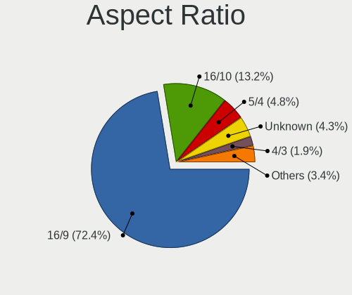

| Ratio   | Computers | Percent |
|---------|-----------|---------|
| 16/9    | 603       | 69.31%  |
| 16/10   | 124       | 14.25%  |
| 5/4     | 50        | 5.75%   |
| Unknown | 50        | 5.75%   |
| 4/3     | 20        | 2.3%    |
| 6/5     | 7         | 0.8%    |
| 3/2     | 7         | 0.8%    |
| 21/9    | 7         | 0.8%    |
| 32/9    | 2         | 0.23%   |

Monitor Area
------------

Area in inch

| Area in inch | Computers | Percent |
|----------------|-----------|---------|
| 101-110        | 280       | 29.85%  |
| 201-250        | 164       | 17.48%  |
| 81-90          | 85        | 9.06%   |
| 151-200        | 78        | 8.32%   |
| Unknown        | 58        | 6.18%   |
| 301-350        | 54        | 5.76%   |
| 141-150        | 48        | 5.12%   |
| 121-130        | 27        | 2.88%   |
| 351-500        | 24        | 2.56%   |
| More than 1000 | 21        | 2.24%   |
| 71-80          | 21        | 2.24%   |
| 251-300        | 20        | 2.13%   |
| 51-60          | 12        | 1.28%   |
| 131-140        | 11        | 1.17%   |
| 41-50          | 10        | 1.07%   |
| 61-70          | 9         | 0.96%   |
| 501-1000       | 9         | 0.96%   |
| 1-40           | 3         | 0.32%   |
| 111-120        | 3         | 0.32%   |
| 91-100         | 1         | 0.11%   |

Pixel Density
-------------

Pixels per inch

| Density       | Computers | Percent |
|---------------|-----------|---------|
| 51-100        | 362       | 39.56%  |
| 101-120       | 251       | 27.43%  |
| 121-160       | 192       | 20.98%  |
| Unknown       | 58        | 6.34%   |
| 161-240       | 23        | 2.51%   |
| 1-50          | 20        | 2.19%   |
| More than 240 | 9         | 0.98%   |

Multiple Monitors
-----------------

Total monitors connected

| Total | Computers | Percent |
|-------|-----------|---------|
| 1     | 785       | 83.16%  |
| 2     | 106       | 11.23%  |
| 0     | 45        | 4.77%   |
| 3     | 8         | 0.85%   |

Network
-------

Net Controller Vendor
---------------------

Controller vendors

| Vendor                                | Computers | Percent |
|---------------------------------------|-----------|---------|
| Realtek Semiconductor                 | 525       | 38.07%  |
| Intel                                 | 362       | 26.25%  |
| Qualcomm Atheros                      | 168       | 12.18%  |
| Broadcom                              | 85        | 6.16%   |
| Marvell Technology Group              | 34        | 2.47%   |
| TP-Link                               | 26        | 1.89%   |
| Ralink Technology                     | 26        | 1.89%   |
| Ralink                                | 21        | 1.52%   |
| Broadcom Limited                      | 21        | 1.52%   |
| Nvidia                                | 17        | 1.23%   |
| Qualcomm Atheros Communications       | 9         | 0.65%   |
| VIA Technologies                      | 8         | 0.58%   |
| D-Link                                | 7         | 0.51%   |
| MediaTek                              | 6         | 0.44%   |
| Xiaomi                                | 4         | 0.29%   |
| NetGear                               | 4         | 0.29%   |
| Ericsson Business Mobile Networks     | 4         | 0.29%   |
| ASUSTek Computer                      | 4         | 0.29%   |
| Sierra Wireless                       | 3         | 0.22%   |
| JMicron Technology                    | 3         | 0.22%   |
| Huawei Technologies                   | 3         | 0.22%   |
| Hewlett-Packard                       | 3         | 0.22%   |
| Dell                                  | 3         | 0.22%   |
| Motorola                              | 2         | 0.15%   |
| Fujitsu Siemens Computers             | 2         | 0.15%   |
| Edimax Technology                     | 2         | 0.15%   |
| D-Link System                         | 2         | 0.15%   |
| Belkin Components                     | 2         | 0.15%   |
| ASIX Electronics                      | 2         | 0.15%   |
| 802.11g Adapter [Linksys WUSB54GC v3] | 2         | 0.15%   |
| ZyDAS                                 | 1         | 0.07%   |
| U-Blox                                | 1         | 0.07%   |
| Toshiba                               | 1         | 0.07%   |
| Sundance Technology Inc / IC Plus     | 1         | 0.07%   |
| Sitecom Europe                        | 1         | 0.07%   |
| Silicon Integrated Systems [SiS]      | 1         | 0.07%   |
| Samsung Electronics                   | 1         | 0.07%   |
| PCTel                                 | 1         | 0.07%   |
| Microsoft                             | 1         | 0.07%   |
| Micro Star International              | 1         | 0.07%   |
| Linksys                               | 1         | 0.07%   |
| InProComm                             | 1         | 0.07%   |
| IBM                                   | 1         | 0.07%   |
| Google                                | 1         | 0.07%   |
| Dresden Elektronik                    | 1         | 0.07%   |
| Attansic Technology                   | 1         | 0.07%   |
| Aquantia                              | 1         | 0.07%   |
| AMD                                   | 1         | 0.07%   |
| Accton Technology                     | 1         | 0.07%   |

Net Controller Model
--------------------

Controller models

| Model                                                                   | Computers | Percent |
|-------------------------------------------------------------------------|-----------|---------|
| Realtek RTL8111/8168/8411 PCI Express Gigabit Ethernet Controller       | 342       | 21.52%  |
| Realtek RTL810xE PCI Express Fast Ethernet controller                   | 97        | 6.1%    |
| Intel 82579LM Gigabit Network Connection (Lewisville)                   | 39        | 2.45%   |
| Intel I211 Gigabit Network Connection                                   | 29        | 1.83%   |
| Qualcomm Atheros AR9485 Wireless Network Adapter                        | 26        | 1.64%   |
| Realtek RTL8821CE 802.11ac PCIe Wireless Network Adapter                | 24        | 1.51%   |
| Qualcomm Atheros QCA9565 / AR9565 Wireless Network Adapter              | 24        | 1.51%   |
| Intel Wireless 8265 / 8275                                              | 23        | 1.45%   |
| Qualcomm Atheros QCA9377 802.11ac Wireless Network Adapter              | 22        | 1.38%   |
| Realtek RTL8723BE PCIe Wireless Network Adapter                         | 20        | 1.26%   |
| Intel Wireless 3165                                                     | 18        | 1.13%   |
| Realtek RTL-8100/8101L/8139 PCI Fast Ethernet Adapter                   | 17        | 1.07%   |
| Intel PRO/Wireless 3945ABG [Golan] Network Connection                   | 17        | 1.07%   |
| Intel Ethernet Connection I217-LM                                       | 17        | 1.07%   |
| Intel Wi-Fi 6 AX200                                                     | 16        | 1.01%   |
| Broadcom BCM43142 802.11b/g/n                                           | 16        | 1.01%   |
| Realtek RTL8188EUS 802.11n Wireless Network Adapter                     | 15        | 0.94%   |
| Qualcomm Atheros AR9285 Wireless Network Adapter (PCI-Express)          | 15        | 0.94%   |
| Realtek RTL8153 Gigabit Ethernet Adapter                                | 13        | 0.82%   |
| Qualcomm Atheros AR242x / AR542x Wireless Network Adapter (PCI-Express) | 13        | 0.82%   |
| Intel Wireless 7260                                                     | 13        | 0.82%   |
| Realtek RTL8822CE 802.11ac PCIe Wireless Network Adapter                | 12        | 0.76%   |
| TP-Link TL-WN722N v2/v3 [Realtek RTL8188EUS]                            | 11        | 0.69%   |
| Ralink RT2870/RT3070 Wireless Adapter                                   | 11        | 0.69%   |
| Intel Wireless 7265                                                     | 11        | 0.69%   |
| Intel Centrino Advanced-N 6205 [Taylor Peak]                            | 11        | 0.69%   |
| Intel WiFi Link 5100                                                    | 10        | 0.63%   |
| Intel Wi-Fi 6 AX201                                                     | 10        | 0.63%   |
| Intel PRO/Wireless 4965 AG or AGN [Kedron] Network Connection           | 10        | 0.63%   |
| Intel Ethernet Connection (2) I219-V                                    | 10        | 0.63%   |
| Realtek RTL8169 PCI Gigabit Ethernet Controller                         | 9         | 0.57%   |
| Qualcomm Atheros AR8151 v2.0 Gigabit Ethernet                           | 9         | 0.57%   |
| Intel Ultimate N WiFi Link 5300                                         | 9         | 0.57%   |
| Intel 82567LM-3 Gigabit Network Connection                              | 9         | 0.57%   |
| Broadcom BCM4312 802.11b/g LP-PHY                                       | 9         | 0.57%   |
| Realtek RTL8822BE 802.11a/b/g/n/ac WiFi adapter                         | 8         | 0.5%    |
| Realtek RTL8723AE PCIe Wireless Network Adapter                         | 8         | 0.5%    |
| Ralink RT3290 Wireless 802.11n 1T/1R PCIe                               | 8         | 0.5%    |
| Qualcomm Atheros AR9271 802.11n                                         | 8         | 0.5%    |
| Intel Ethernet Connection (2) I218-V                                    | 8         | 0.5%    |
| Intel Centrino Wireless-N 2230                                          | 8         | 0.5%    |
| Intel Cannon Point-LP CNVi [Wireless-AC]                                | 8         | 0.5%    |
| Realtek RTL8188CUS 802.11n WLAN Adapter                                 | 7         | 0.44%   |
| Ralink MT7601U Wireless Adapter                                         | 7         | 0.44%   |
| Qualcomm Atheros QCA8172 Fast Ethernet                                  | 7         | 0.44%   |
| Marvell Group 88E8056 PCI-E Gigabit Ethernet Controller                 | 7         | 0.44%   |
| Intel Wireless-AC 9260                                                  | 7         | 0.44%   |
| Intel Wireless 8260                                                     | 7         | 0.44%   |
| Intel Wireless 3160                                                     | 7         | 0.44%   |
| Intel Dual Band Wireless-AC 3168NGW [Stone Peak]                        | 7         | 0.44%   |
| Intel Cannon Lake PCH CNVi WiFi                                         | 7         | 0.44%   |
| Broadcom NetXtreme BCM5751 Gigabit Ethernet PCI Express                 | 7         | 0.44%   |
| Realtek RTL8187 Wireless Adapter                                        | 6         | 0.38%   |
| Qualcomm Atheros AR8132 Fast Ethernet                                   | 6         | 0.38%   |
| Qualcomm Atheros AR8121/AR8113/AR8114 Gigabit or Fast Ethernet          | 6         | 0.38%   |
| Marvell Group 88E8055 PCI-E Gigabit Ethernet Controller                 | 6         | 0.38%   |
| Intel PRO/Wireless 2200BG [Calexico2] Network Connection                | 6         | 0.38%   |
| Intel Centrino Advanced-N 6200                                          | 6         | 0.38%   |
| Intel 82567LM Gigabit Network Connection                                | 6         | 0.38%   |
| VIA VT6102/VT6103 [Rhine-II]                                            | 5         | 0.31%   |

Wireless Vendor
---------------

Wireless vendors

| Vendor                                | Computers | Percent |
|---------------------------------------|-----------|---------|
| Intel                                 | 243       | 35.37%  |
| Realtek Semiconductor                 | 139       | 20.23%  |
| Qualcomm Atheros                      | 125       | 18.2%   |
| Broadcom                              | 53        | 7.71%   |
| Ralink Technology                     | 26        | 3.78%   |
| TP-Link                               | 24        | 3.49%   |
| Ralink                                | 21        | 3.06%   |
| Qualcomm Atheros Communications       | 9         | 1.31%   |
| Broadcom Limited                      | 8         | 1.16%   |
| D-Link                                | 7         | 1.02%   |
| NetGear                               | 4         | 0.58%   |
| ASUSTek Computer                      | 4         | 0.58%   |
| Sierra Wireless                       | 3         | 0.44%   |
| MediaTek                              | 3         | 0.44%   |
| Hewlett-Packard                       | 2         | 0.29%   |
| Fujitsu Siemens Computers             | 2         | 0.29%   |
| Edimax Technology                     | 2         | 0.29%   |
| Belkin Components                     | 2         | 0.29%   |
| 802.11g Adapter [Linksys WUSB54GC v3] | 2         | 0.29%   |
| ZyDAS                                 | 1         | 0.15%   |
| Sitecom Europe                        | 1         | 0.15%   |
| Microsoft                             | 1         | 0.15%   |
| Micro Star International              | 1         | 0.15%   |
| Linksys                               | 1         | 0.15%   |
| InProComm                             | 1         | 0.15%   |
| Dell                                  | 1         | 0.15%   |
| Accton Technology                     | 1         | 0.15%   |

Wireless Model
--------------

Wireless models

| Model                                                                   | Computers | Percent |
|-------------------------------------------------------------------------|-----------|---------|
| Qualcomm Atheros AR9485 Wireless Network Adapter                        | 26        | 3.76%   |
| Realtek RTL8821CE 802.11ac PCIe Wireless Network Adapter                | 24        | 3.47%   |
| Qualcomm Atheros QCA9565 / AR9565 Wireless Network Adapter              | 24        | 3.47%   |
| Intel Wireless 8265 / 8275                                              | 23        | 3.32%   |
| Qualcomm Atheros QCA9377 802.11ac Wireless Network Adapter              | 22        | 3.18%   |
| Realtek RTL8723BE PCIe Wireless Network Adapter                         | 20        | 2.89%   |
| Intel Wireless 3165                                                     | 18        | 2.6%    |
| Intel PRO/Wireless 3945ABG [Golan] Network Connection                   | 17        | 2.46%   |
| Intel Wi-Fi 6 AX200                                                     | 16        | 2.31%   |
| Broadcom BCM43142 802.11b/g/n                                           | 16        | 2.31%   |
| Realtek RTL8188EUS 802.11n Wireless Network Adapter                     | 15        | 2.17%   |
| Qualcomm Atheros AR9285 Wireless Network Adapter (PCI-Express)          | 15        | 2.17%   |
| Qualcomm Atheros AR242x / AR542x Wireless Network Adapter (PCI-Express) | 13        | 1.88%   |
| Intel Wireless 7260                                                     | 13        | 1.88%   |
| Realtek RTL8822CE 802.11ac PCIe Wireless Network Adapter                | 12        | 1.73%   |
| TP-Link TL-WN722N v2/v3 [Realtek RTL8188EUS]                            | 11        | 1.59%   |
| Ralink RT2870/RT3070 Wireless Adapter                                   | 11        | 1.59%   |
| Intel Wireless 7265                                                     | 11        | 1.59%   |
| Intel Centrino Advanced-N 6205 [Taylor Peak]                            | 11        | 1.59%   |
| Intel WiFi Link 5100                                                    | 10        | 1.45%   |
| Intel Wi-Fi 6 AX201                                                     | 10        | 1.45%   |
| Intel PRO/Wireless 4965 AG or AGN [Kedron] Network Connection           | 10        | 1.45%   |
| Intel Ultimate N WiFi Link 5300                                         | 9         | 1.3%    |
| Broadcom BCM4312 802.11b/g LP-PHY                                       | 9         | 1.3%    |
| Realtek RTL8822BE 802.11a/b/g/n/ac WiFi adapter                         | 8         | 1.16%   |
| Realtek RTL8723AE PCIe Wireless Network Adapter                         | 8         | 1.16%   |
| Ralink RT3290 Wireless 802.11n 1T/1R PCIe                               | 8         | 1.16%   |
| Qualcomm Atheros AR9271 802.11n                                         | 8         | 1.16%   |
| Intel Centrino Wireless-N 2230                                          | 8         | 1.16%   |
| Intel Cannon Point-LP CNVi [Wireless-AC]                                | 8         | 1.16%   |
| Realtek RTL8188CUS 802.11n WLAN Adapter                                 | 7         | 1.01%   |
| Ralink MT7601U Wireless Adapter                                         | 7         | 1.01%   |
| Intel Wireless-AC 9260                                                  | 7         | 1.01%   |
| Intel Wireless 8260                                                     | 7         | 1.01%   |
| Intel Wireless 3160                                                     | 7         | 1.01%   |
| Intel Dual Band Wireless-AC 3168NGW [Stone Peak]                        | 7         | 1.01%   |
| Intel Cannon Lake PCH CNVi WiFi                                         | 7         | 1.01%   |
| Realtek RTL8187 Wireless Adapter                                        | 6         | 0.87%   |
| Intel PRO/Wireless 2200BG [Calexico2] Network Connection                | 6         | 0.87%   |
| Intel Centrino Advanced-N 6200                                          | 6         | 0.87%   |
| Realtek 802.11ac NIC                                                    | 5         | 0.72%   |
| Qualcomm Atheros AR5212/5213/2414 Wireless Network Adapter              | 5         | 0.72%   |
| Intel Dual Band Wireless-AC 3165 Plus Bluetooth                         | 5         | 0.72%   |
| Intel Comet Lake PCH-LP CNVi WiFi                                       | 5         | 0.72%   |
| TP-Link TL-WN823N v2/v3 [Realtek RTL8192EU]                             | 4         | 0.58%   |
| Realtek RTL8192CU 802.11n WLAN Adapter                                  | 4         | 0.58%   |
| Realtek RTL8188CE 802.11b/g/n WiFi Adapter                              | 4         | 0.58%   |
| Ralink RT5370 Wireless Adapter                                          | 4         | 0.58%   |
| Qualcomm Atheros QCA6174 802.11ac Wireless Network Adapter              | 4         | 0.58%   |
| Qualcomm Atheros AR9287 Wireless Network Adapter (PCI-Express)          | 4         | 0.58%   |
| Qualcomm Atheros AR9227 Wireless Network Adapter                        | 4         | 0.58%   |
| Intel Comet Lake PCH CNVi WiFi                                          | 4         | 0.58%   |
| Intel Centrino Ultimate-N 6300                                          | 4         | 0.58%   |
| D-Link 802.11ac NIC                                                     | 4         | 0.58%   |
| Broadcom BCM4360 802.11ac Wireless Network Adapter                      | 4         | 0.58%   |
| Broadcom BCM4318 [AirForce One 54g] 802.11g Wireless LAN Controller     | 4         | 0.58%   |
| Broadcom BCM4313 802.11bgn Wireless Network Adapter                     | 4         | 0.58%   |
| Realtek RTL8723BU 802.11b/g/n WLAN Adapter                              | 3         | 0.43%   |
| Realtek RTL8191SEvB Wireless LAN Controller                             | 3         | 0.43%   |
| Ralink RT3090 Wireless 802.11n 1T/1R PCIe                               | 3         | 0.43%   |

Ethernet Vendor
---------------

Ethernet vendors

| Vendor                            | Computers | Percent |
|-----------------------------------|-----------|---------|
| Realtek Semiconductor             | 483       | 56.1%   |
| Intel                             | 190       | 22.07%  |
| Qualcomm Atheros                  | 56        | 6.5%    |
| Broadcom                          | 36        | 4.18%   |
| Marvell Technology Group          | 34        | 3.95%   |
| Nvidia                            | 17        | 1.97%   |
| Broadcom Limited                  | 16        | 1.86%   |
| VIA Technologies                  | 7         | 0.81%   |
| Xiaomi                            | 4         | 0.46%   |
| JMicron Technology                | 3         | 0.35%   |
| TP-Link                           | 2         | 0.23%   |
| MediaTek                          | 2         | 0.23%   |
| D-Link System                     | 2         | 0.23%   |
| ASIX Electronics                  | 2         | 0.23%   |
| Sundance Technology Inc / IC Plus | 1         | 0.12%   |
| Silicon Integrated Systems [SiS]  | 1         | 0.12%   |
| Samsung Electronics               | 1         | 0.12%   |
| IBM                               | 1         | 0.12%   |
| Huawei Technologies               | 1         | 0.12%   |
| Attansic Technology               | 1         | 0.12%   |
| Aquantia                          | 1         | 0.12%   |

Ethernet Model
--------------

Ethernet models

| Model                                                             | Computers | Percent |
|-------------------------------------------------------------------|-----------|---------|
| Realtek RTL8111/8168/8411 PCI Express Gigabit Ethernet Controller | 342       | 39.18%  |
| Realtek RTL810xE PCI Express Fast Ethernet controller             | 97        | 11.11%  |
| Intel 82579LM Gigabit Network Connection (Lewisville)             | 39        | 4.47%   |
| Intel I211 Gigabit Network Connection                             | 29        | 3.32%   |
| Realtek RTL-8100/8101L/8139 PCI Fast Ethernet Adapter             | 17        | 1.95%   |
| Intel Ethernet Connection I217-LM                                 | 17        | 1.95%   |
| Realtek RTL8153 Gigabit Ethernet Adapter                          | 13        | 1.49%   |
| Intel Ethernet Connection (2) I219-V                              | 10        | 1.15%   |
| Realtek RTL8169 PCI Gigabit Ethernet Controller                   | 9         | 1.03%   |
| Qualcomm Atheros AR8151 v2.0 Gigabit Ethernet                     | 9         | 1.03%   |
| Intel 82567LM-3 Gigabit Network Connection                        | 9         | 1.03%   |
| Intel Ethernet Connection (2) I218-V                              | 8         | 0.92%   |
| Qualcomm Atheros QCA8172 Fast Ethernet                            | 7         | 0.8%    |
| Marvell Group 88E8056 PCI-E Gigabit Ethernet Controller           | 7         | 0.8%    |
| Broadcom NetXtreme BCM5751 Gigabit Ethernet PCI Express           | 7         | 0.8%    |
| Qualcomm Atheros AR8132 Fast Ethernet                             | 6         | 0.69%   |
| Qualcomm Atheros AR8121/AR8113/AR8114 Gigabit or Fast Ethernet    | 6         | 0.69%   |
| Marvell Group 88E8055 PCI-E Gigabit Ethernet Controller           | 6         | 0.69%   |
| Intel 82567LM Gigabit Network Connection                          | 6         | 0.69%   |
| VIA VT6102/VT6103 [Rhine-II]                                      | 5         | 0.57%   |
| Qualcomm Atheros Killer E220x Gigabit Ethernet Controller         | 5         | 0.57%   |
| Qualcomm Atheros AR8161 Gigabit Ethernet                          | 5         | 0.57%   |
| Marvell Group 88E8053 PCI-E Gigabit Ethernet Controller           | 5         | 0.57%   |
| Intel Ethernet Connection I217-V                                  | 5         | 0.57%   |
| Intel Ethernet Connection (4) I219-LM                             | 5         | 0.57%   |
| Intel Ethernet Connection (2) I219-LM                             | 5         | 0.57%   |
| Intel 82577LM Gigabit Network Connection                          | 5         | 0.57%   |
| Broadcom NetLink BCM5784M Gigabit Ethernet PCIe                   | 5         | 0.57%   |
| Broadcom NetLink BCM57785 Gigabit Ethernet PCIe                   | 5         | 0.57%   |
| Xiaomi Mi/Redmi series (RNDIS)                                    | 4         | 0.46%   |
| Realtek RTL8125 2.5GbE Controller                                 | 4         | 0.46%   |
| Qualcomm Atheros AR8162 Fast Ethernet                             | 4         | 0.46%   |
| Nvidia MCP77 Ethernet                                             | 4         | 0.46%   |
| Nvidia MCP61 Ethernet                                             | 4         | 0.46%   |
| Broadcom Limited NetLink BCM5787M Gigabit Ethernet PCI Express    | 4         | 0.46%   |
| Realtek RTL8152 Fast Ethernet Adapter                             | 3         | 0.34%   |
| Qualcomm Atheros Attansic L2 Fast Ethernet                        | 3         | 0.34%   |
| Marvell Group 88E8071 PCI-E Gigabit Ethernet Controller           | 3         | 0.34%   |
| Marvell Group 88E8042 PCI-E Fast Ethernet Controller              | 3         | 0.34%   |
| Marvell Group 88E8001 Gigabit Ethernet Controller                 | 3         | 0.34%   |
| Intel Ethernet Connection I219-LM                                 | 3         | 0.34%   |
| Intel Ethernet Connection I218-LM                                 | 3         | 0.34%   |
| Intel Ethernet Connection (7) I219-LM                             | 3         | 0.34%   |
| Intel Ethernet Connection (3) I218-LM                             | 3         | 0.34%   |
| Intel 82579V Gigabit Network Connection                           | 3         | 0.34%   |
| Intel 82578DM Gigabit Network Connection                          | 3         | 0.34%   |
| Intel 82574L Gigabit Network Connection                           | 3         | 0.34%   |
| Broadcom Limited NetXtreme BCM5755M Gigabit Ethernet PCI Express  | 3         | 0.34%   |
| VIA VT6105/VT6106S [Rhine-III]                                    | 2         | 0.23%   |
| Realtek RTL-8110SC/8169SC Gigabit Ethernet                        | 2         | 0.23%   |
| Qualcomm Atheros Killer E2500 Gigabit Ethernet Controller         | 2         | 0.23%   |
| Qualcomm Atheros Attansic L1 Gigabit Ethernet                     | 2         | 0.23%   |
| Qualcomm Atheros AR8152 v2.0 Fast Ethernet                        | 2         | 0.23%   |
| Qualcomm Atheros AR8131 Gigabit Ethernet                          | 2         | 0.23%   |
| Nvidia MCP79 Ethernet                                             | 2         | 0.23%   |
| Nvidia MCP73 Ethernet                                             | 2         | 0.23%   |
| Nvidia MCP55 Ethernet                                             | 2         | 0.23%   |
| Nvidia MCP51 Ethernet Controller                                  | 2         | 0.23%   |
| MediaTek Vodafone Smart N10                                       | 2         | 0.23%   |
| Marvell Group 88E8040 PCI-E Fast Ethernet Controller              | 2         | 0.23%   |

Net Controller Kind
-------------------

Ethernet, WiFi or modem

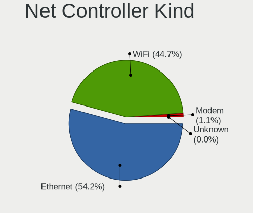

| Kind     | Computers | Percent |
|----------|-----------|---------|
| Ethernet | 835       | 55.89%  |
| WiFi     | 635       | 42.5%   |
| Modem    | 24        | 1.61%   |

Used Controller
---------------

Currently used network controller

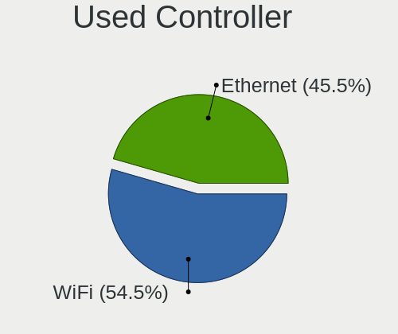

| Kind     | Computers | Percent |
|----------|-----------|---------|
| WiFi     | 498       | 52.31%  |
| Ethernet | 454       | 47.69%  |

NICs
----

Total network controllers on board

| Total | Computers | Percent |
|-------|-----------|---------|
| 2     | 472       | 51.08%  |
| 1     | 414       | 44.81%  |
| 0     | 22        | 2.38%   |
| 3     | 13        | 1.41%   |
| 4     | 3         | 0.32%   |

IPv6
----

IPv6 vs IPv4

| Used | Computers | Percent |
|------|-----------|---------|
| No   | 770       | 81.57%  |
| Yes  | 174       | 18.43%  |

Bluetooth
---------

Bluetooth Vendor
----------------

Controller vendors

| Vendor                          | Computers | Percent |
|---------------------------------|-----------|---------|
| Intel                           | 152       | 33.33%  |
| Realtek Semiconductor           | 62        | 13.6%   |
| Qualcomm Atheros Communications | 45        | 9.87%   |
| Cambridge Silicon Radio         | 44        | 9.65%   |
| Broadcom                        | 32        | 7.02%   |
| IMC Networks                    | 16        | 3.51%   |
| Foxconn / Hon Hai               | 15        | 3.29%   |
| Toshiba                         | 14        | 3.07%   |
| Hewlett-Packard                 | 13        | 2.85%   |
| Lite-On Technology              | 12        | 2.63%   |
| Ralink                          | 8         | 1.75%   |
| Apple                           | 7         | 1.54%   |
| Foxconn International           | 6         | 1.32%   |
| ASUSTek Computer                | 6         | 1.32%   |
| Alps Electric                   | 5         | 1.1%    |
| Realtek                         | 4         | 0.88%   |
| Dell                            | 4         | 0.88%   |
| Ralink Technology               | 3         | 0.66%   |
| Askey Computer                  | 3         | 0.66%   |
| Micro Star International        | 2         | 0.44%   |
| Syntek                          | 1         | 0.22%   |
| Mobile Action Technology        | 1         | 0.22%   |
| Edimax Technology               | 1         | 0.22%   |

Bluetooth Model
---------------

Controller models

| Model                                                 | Computers | Percent |
|-------------------------------------------------------|-----------|---------|
| Intel Bluetooth wireless interface                    | 74        | 16.23%  |
| Cambridge Silicon Radio Bluetooth Dongle (HCI mode)   | 44        | 9.65%   |
| Qualcomm Atheros  Bluetooth Device                    | 28        | 6.14%   |
| Realtek Bluetooth Radio                               | 25        | 5.48%   |
| Intel Bluetooth 9460/9560 Jefferson Peak (JfP)        | 22        | 4.82%   |
| Realtek  Bluetooth 4.2 Adapter                        | 16        | 3.51%   |
| Intel AX201 Bluetooth                                 | 16        | 3.51%   |
| Intel AX200 Bluetooth                                 | 15        | 3.29%   |
| Ralink RT3290 Bluetooth                               | 8         | 1.75%   |
| Lite-On Qualcomm Atheros QCA9377 Bluetooth            | 8         | 1.75%   |
| Intel Centrino Bluetooth Wireless Transceiver         | 8         | 1.75%   |
| HP Bluetooth 2.0 Interface [Broadcom BCM2045]         | 8         | 1.75%   |
| Realtek RTL8723B Bluetooth                            | 7         | 1.54%   |
| Intel Wireless-AC 9260 Bluetooth Adapter              | 7         | 1.54%   |
| Intel Wireless-AC 3168 Bluetooth                      | 7         | 1.54%   |
| Realtek 802.11ac WLAN Adapter                         | 6         | 1.32%   |
| Qualcomm Atheros AR3011 Bluetooth                     | 6         | 1.32%   |
| IMC Networks Bluetooth Radio                          | 6         | 1.32%   |
| Foxconn International BCM43142A0 Bluetooth module     | 6         | 1.32%   |
| Foxconn / Hon Hai Bluetooth USB Host Controller       | 6         | 1.32%   |
| Realtek RTL8822BE Bluetooth 4.2 Adapter               | 5         | 1.1%    |
| Qualcomm Atheros AR3012 Bluetooth 4.0                 | 5         | 1.1%    |
| Toshiba RT Bluetooth Radio                            | 4         | 0.88%   |
| Toshiba Bluetooth Device                              | 4         | 0.88%   |
| Realtek Bluetooth Radio                               | 4         | 0.88%   |
| Qualcomm Atheros Bluetooth                            | 4         | 0.88%   |
| HP Broadcom 2070 Bluetooth Combo                      | 4         | 0.88%   |
| Broadcom BCM43142 Bluetooth 4.0                       | 4         | 0.88%   |
| Broadcom BCM2045B (BDC-2.1)                           | 4         | 0.88%   |
| Realtek RTL8723A Bluetooth                            | 3         | 0.66%   |
| Lite-On Bluetooth Device                              | 3         | 0.66%   |
| Intel Centrino Advanced-N 6230 Bluetooth adapter      | 3         | 0.66%   |
| IMC Networks Bluetooth Device                         | 3         | 0.66%   |
| IMC Networks Atheros AR3012 Bluetooth 4.0 Adapter     | 3         | 0.66%   |
| Dell DW375 Bluetooth Module                           | 3         | 0.66%   |
| Broadcom BCM20702A0 Bluetooth 4.0                     | 3         | 0.66%   |
| Broadcom BCM20702 Bluetooth 4.0 [ThinkPad]            | 3         | 0.66%   |
| Broadcom BCM2045 Bluetooth                            | 3         | 0.66%   |
| Askey Bluetooth Device                                | 3         | 0.66%   |
| Apple Bluetooth Host Controller                       | 3         | 0.66%   |
| Toshiba Integrated Bluetooth HCI                      | 2         | 0.44%   |
| Toshiba Integrated Bluetooth (Taiyo Yuden)            | 2         | 0.44%   |
| Ralink Motorola BC4 Bluetooth 3.0+HS Adapter          | 2         | 0.44%   |
| Qualcomm Atheros QCA61x4 Bluetooth 4.0                | 2         | 0.44%   |
| Foxconn / Hon Hai Broadcom Bluetooth 2.1 Device       | 2         | 0.44%   |
| Foxconn / Hon Hai Bluetooth Device                    | 2         | 0.44%   |
| Broadcom HP Portable SoftSailing                      | 2         | 0.44%   |
| Broadcom HP Portable Bumble Bee                       | 2         | 0.44%   |
| Broadcom Bluetooth 2.1 Device                         | 2         | 0.44%   |
| Broadcom BCM43142A0 Bluetooth 4.0                     | 2         | 0.44%   |
| Broadcom BCM2045B (BDC-2.1) [Bluetooth Controller]    | 2         | 0.44%   |
| ASUS Broadcom BCM20702 Single-Chip Bluetooth 4.0 + LE | 2         | 0.44%   |
| Alps Electric Bluetooth Adapter                       | 2         | 0.44%   |
| Alps Electric BCM2046 Bluetooth Device                | 2         | 0.44%   |
| Toshiba BCM43142A0                                    | 1         | 0.22%   |
| Toshiba Askey for                                     | 1         | 0.22%   |
| Syntek 802.11g + Bluetooth Wireless Adapter           | 1         | 0.22%   |
| Ralink CSR BS8510                                     | 1         | 0.22%   |
| Mobile Action MA-730/MA-730G Bluetooth Adapter        | 1         | 0.22%   |
| Micro Star International Bluetooth EDR Device         | 1         | 0.22%   |

Sound
-----

Sound Vendor
------------

Sound card vendors

| Vendor                                          | Computers | Percent |
|-------------------------------------------------|-----------|---------|
| Intel                                           | 642       | 52.2%   |
| AMD                                             | 291       | 23.66%  |
| Nvidia                                          | 192       | 15.61%  |
| C-Media Electronics                             | 20        | 1.63%   |
| Creative Labs                                   | 10        | 0.81%   |
| Logitech                                        | 7         | 0.57%   |
| Creative Technology                             | 7         | 0.57%   |
| VIA Technologies                                | 6         | 0.49%   |
| Barco Display Systems                           | 5         | 0.41%   |
| Razer USA                                       | 4         | 0.33%   |
| BEHRINGER International                         | 4         | 0.33%   |
| Kingston Technology                             | 3         | 0.24%   |
| Texas Instruments                               | 2         | 0.16%   |
| Hewlett-Packard                                 | 2         | 0.16%   |
| Guillemot                                       | 2         | 0.16%   |
| Focusrite-Novation                              | 2         | 0.16%   |
| Ensoniq                                         | 2         | 0.16%   |
| Edifier Technology                              | 2         | 0.16%   |
| AudioQuest                                      | 2         | 0.16%   |
| Altec Lansing Technologies                      | 2         | 0.16%   |
| Yamaha                                          | 1         | 0.08%   |
| Trust                                           | 1         | 0.08%   |
| Tenx Technology                                 | 1         | 0.08%   |
| SteelSeries ApS                                 | 1         | 0.08%   |
| Silicon Integrated Systems [SiS]                | 1         | 0.08%   |
| Shenzhen Riitek Technology                      | 1         | 0.08%   |
| Realtek Semiconductor                           | 1         | 0.08%   |
| Numark                                          | 1         | 0.08%   |
| Native Instruments                              | 1         | 0.08%   |
| Mark of the Unicorn                             | 1         | 0.08%   |
| Licensed by Sony Computer Entertainment America | 1         | 0.08%   |
| Lenovo                                          | 1         | 0.08%   |
| JMTek                                           | 1         | 0.08%   |
| iCreate Technologies                            | 1         | 0.08%   |
| GN Netcom                                       | 1         | 0.08%   |
| Generalplus Technology                          | 1         | 0.08%   |
| Dell                                            | 1         | 0.08%   |
| Cooler Master                                   | 1         | 0.08%   |
| CMX Systems                                     | 1         | 0.08%   |
| ClearOne Communications                         | 1         | 0.08%   |
| bestechnic                                      | 1         | 0.08%   |
| Asahi Kasei Microsystems                        | 1         | 0.08%   |
| AKAI Professional M.I.                          | 1         | 0.08%   |

Sound Model
-----------

Sound card models

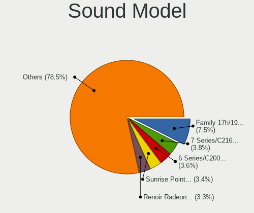

| Model                                                                                             | Computers | Percent |
|---------------------------------------------------------------------------------------------------|-----------|---------|
| AMD Family 17h/19h HD Audio Controller                                                            | 73        | 4.94%   |
| Intel 6 Series/C200 Series Chipset Family High Definition Audio Controller                        | 64        | 4.33%   |
| Intel NM10/ICH7 Family High Definition Audio Controller                                           | 60        | 4.06%   |
| Intel 7 Series/C216 Chipset Family High Definition Audio Controller                               | 58        | 3.92%   |
| Intel 82801I (ICH9 Family) HD Audio Controller                                                    | 49        | 3.31%   |
| Intel 8 Series/C220 Series Chipset High Definition Audio Controller                               | 49        | 3.31%   |
| AMD Raven/Raven2/Fenghuang HDMI/DP Audio Controller                                               | 48        | 3.25%   |
| AMD SBx00 Azalia (Intel HDA)                                                                      | 47        | 3.18%   |
| Intel Sunrise Point-LP HD Audio                                                                   | 42        | 2.84%   |
| Intel Xeon E3-1200 v3/4th Gen Core Processor HD Audio Controller                                  | 41        | 2.77%   |
| AMD Family 17h (Models 00h-0fh) HD Audio Controller                                               | 36        | 2.43%   |
| Intel 82801H (ICH8 Family) HD Audio Controller                                                    | 35        | 2.37%   |
| AMD FCH Azalia Controller                                                                         | 32        | 2.16%   |
| Nvidia GK208 HDMI/DP Audio Controller                                                             | 29        | 1.96%   |
| Intel 5 Series/3400 Series Chipset High Definition Audio                                          | 28        | 1.89%   |
| Intel 100 Series/C230 Series Chipset Family HD Audio Controller                                   | 25        | 1.69%   |
| Nvidia GP107GL High Definition Audio Controller                                                   | 24        | 1.62%   |
| Intel Haswell-ULT HD Audio Controller                                                             | 24        | 1.62%   |
| Intel 8 Series HD Audio Controller                                                                | 24        | 1.62%   |
| Intel Cannon Lake PCH cAVS                                                                        | 23        | 1.56%   |
| AMD Renoir Radeon High Definition Audio Controller                                                | 19        | 1.28%   |
| AMD Ellesmere HDMI Audio [Radeon RX 470/480 / 570/580/590]                                        | 19        | 1.28%   |
| Nvidia High Definition Audio Controller                                                           | 18        | 1.22%   |
| AMD Oland/Hainan/Cape Verde/Pitcairn HDMI Audio [Radeon HD 7000 Series]                           | 17        | 1.15%   |
| AMD Kabini HDMI/DP Audio                                                                          | 16        | 1.08%   |
| Intel 82801JI (ICH10 Family) HD Audio Controller                                                  | 15        | 1.01%   |
| Nvidia GF108 High Definition Audio Controller                                                     | 14        | 0.95%   |
| Intel Celeron N3350/Pentium N4200/Atom E3900 Series Audio Cluster                                 | 14        | 0.95%   |
| Intel 200 Series PCH HD Audio                                                                     | 14        | 0.95%   |
| AMD Family 15h (Models 60h-6fh) Audio Controller                                                  | 14        | 0.95%   |
| Intel Wildcat Point-LP High Definition Audio Controller                                           | 13        | 0.88%   |
| Intel Broadwell-U Audio Controller                                                                | 13        | 0.88%   |
| AMD Starship/Matisse HD Audio Controller                                                          | 13        | 0.88%   |
| AMD RV710/730 HDMI Audio [Radeon HD 4000 series]                                                  | 13        | 0.88%   |
| Intel 9 Series Chipset Family HD Audio Controller                                                 | 12        | 0.81%   |
| Nvidia GP106 High Definition Audio Controller                                                     | 11        | 0.74%   |
| Intel Tiger Lake-LP Smart Sound Technology Audio Controller                                       | 11        | 0.74%   |
| Intel Atom Processor Z36xxx/Z37xxx Series High Definition Audio Controller                        | 11        | 0.74%   |
| AMD Turks HDMI Audio [Radeon HD 6500/6600 / 6700M Series]                                         | 11        | 0.74%   |
| Nvidia GT216 HDMI Audio Controller                                                                | 10        | 0.68%   |
| Intel Cannon Point-LP High Definition Audio Controller                                            | 10        | 0.68%   |
| Intel 82801JD/DO (ICH10 Family) HD Audio Controller                                               | 10        | 0.68%   |
| AMD Cedar HDMI Audio [Radeon HD 5400/6300/7300 Series]                                            | 10        | 0.68%   |
| Intel Atom/Celeron/Pentium Processor x5-E8000/J3xxx/N3xxx Series High Definition Audio Controller | 9         | 0.61%   |
| Nvidia GK107 HDMI Audio Controller                                                                | 8         | 0.54%   |
| AMD Wrestler HDMI Audio                                                                           | 8         | 0.54%   |
| AMD High Definition Audio Controller                                                              | 8         | 0.54%   |
| Nvidia GF119 HDMI Audio Controller                                                                | 7         | 0.47%   |
| Intel Comet Lake PCH-LP cAVS                                                                      | 7         | 0.47%   |
| Intel Celeron/Pentium Silver Processor High Definition Audio                                      | 7         | 0.47%   |
| Intel 82801G (ICH7 Family) AC'97 Audio Controller                                                 | 7         | 0.47%   |
| AMD Baffin HDMI/DP Audio [Radeon RX 550 640SP / RX 560/560X]                                      | 7         | 0.47%   |
| Nvidia TU116 High Definition Audio Controller                                                     | 6         | 0.41%   |
| Nvidia GM206 High Definition Audio Controller                                                     | 6         | 0.41%   |
| Intel Ice Lake-LP Smart Sound Technology Audio Controller                                         | 6         | 0.41%   |
| Intel CM238 HD Audio Controller                                                                   | 6         | 0.41%   |
| AMD Navi 10 HDMI Audio                                                                            | 6         | 0.41%   |
| Nvidia GP108 High Definition Audio Controller                                                     | 5         | 0.34%   |
| Nvidia GM107 High Definition Audio Controller [GeForce 940MX]                                     | 5         | 0.34%   |
| Intel Comet Lake PCH cAVS                                                                         | 5         | 0.34%   |

Memory
------

Memory Vendor
-------------

Memory module vendors

| Vendor              | Computers | Percent |
|---------------------|-----------|---------|
| SK Hynix            | 79        | 17.63%  |
| Samsung Electronics | 79        | 17.63%  |
| Unknown             | 75        | 16.74%  |
| Kingston            | 56        | 12.5%   |
| Micron Technology   | 33        | 7.37%   |
| Corsair             | 32        | 7.14%   |
| G.Skill             | 23        | 5.13%   |
| Crucial             | 20        | 4.46%   |
| Ramaxel Technology  | 10        | 2.23%   |
| Transcend           | 5         | 1.12%   |
| Nanya Technology    | 5         | 1.12%   |
| Elpida              | 5         | 1.12%   |
| Unknown (ABCD)      | 4         | 0.89%   |
| Team                | 4         | 0.89%   |
| A-DATA Technology   | 4         | 0.89%   |
| Apacer              | 3         | 0.67%   |
| Patriot             | 2         | 0.45%   |
| GOODRAM             | 2         | 0.45%   |
| Unknown             | 2         | 0.45%   |
| Toshiba             | 1         | 0.22%   |
| Qimonda             | 1         | 0.22%   |
| Infineon            | 1         | 0.22%   |
| HMD                 | 1         | 0.22%   |
| H                   | 1         | 0.22%   |

Memory Model
------------

Memory module models

| Model                                                          | Computers | Percent |
|----------------------------------------------------------------|-----------|---------|
| G.Skill RAM F4-3200C16-8GVKB 8GB DIMM DDR4 3200MT/s            | 7         | 1.41%   |
| Unknown RAM Module 1024MB DIMM SDRAM                           | 5         | 1.01%   |
| SK Hynix RAM HMT451S6BFR8A-PB 4GB SODIMM DDR3 1600MT/s         | 5         | 1.01%   |
| SK Hynix RAM HMA81GS6JJR8N-VK 8GB SODIMM DDR4 2667MT/s         | 5         | 1.01%   |
| Samsung RAM M471A5244CB0-CTD 4GB SODIMM DDR4 3266MT/s          | 5         | 1.01%   |
| Samsung RAM M471A1G44AB0-CWE 8GB SODIMM DDR4 3200MT/s          | 5         | 1.01%   |
| Unknown RAM Module 2GB DIMM 1333MT/s                           | 4         | 0.81%   |
| Unknown RAM Module 2048MB DIMM DDR2 800MT/s                    | 4         | 0.81%   |
| Unknown RAM Module 2048MB DIMM DDR 533MT/s                     | 4         | 0.81%   |
| Unknown (ABCD) RAM 123456789012345678 2GB SODIMM DDR4 2400MT/s | 4         | 0.81%   |
| SK Hynix RAM HMA81GS6AFR8N-UH 8GB SODIMM DDR4 2667MT/s         | 4         | 0.81%   |
| Samsung RAM M471B5273CH0-CH9 4GB SODIMM DDR3 1334MT/s          | 4         | 0.81%   |
| Samsung RAM M471B5173QH0-YK0 4GB SODIMM DDR3 1600MT/s          | 4         | 0.81%   |
| Unknown RAM Module 512MB DIMM SDRAM                            | 3         | 0.6%    |
| Unknown RAM Module 2GB SODIMM DDR2 667MT/s                     | 3         | 0.6%    |
| Unknown RAM Module 2GB DIMM 800MT/s                            | 3         | 0.6%    |
| Unknown RAM Module 2048MB DIMM SDRAM                           | 3         | 0.6%    |
| Unknown RAM Module 1024MB DIMM 800MT/s                         | 3         | 0.6%    |
| SK Hynix RAM HMT41GS6BFR8A-PB 8GB SODIMM DDR3 1600MT/s         | 3         | 0.6%    |
| SK Hynix RAM HMA82GS6JJR8N-VK 16GB SODIMM DDR4 2667MT/s        | 3         | 0.6%    |
| SK Hynix RAM HMA81GS6DJR8N-XN 8GB SODIMM DDR4 3200MT/s         | 3         | 0.6%    |
| SK Hynix RAM HMA81GS6CJR8N-VK 8192MB SODIMM DDR4 2667MT/s      | 3         | 0.6%    |
| Samsung RAM M471B5173EB0-YK0 4GB SODIMM DDR3 1600MT/s          | 3         | 0.6%    |
| Samsung RAM M471B5173DB0-YK0 4GB SODIMM DDR3 1600MT/s          | 3         | 0.6%    |
| Samsung RAM M471A1K43DB1-CTD 8GB SODIMM DDR4 2667MT/s          | 3         | 0.6%    |
| G.Skill RAM F4-3000C16-8GISB 8GB DIMM DDR4 3200MT/s            | 3         | 0.6%    |
| Corsair RAM CMZ8GX3M2A1600C9 4GB DIMM DDR3 1600MT/s            | 3         | 0.6%    |
| Corsair RAM CMZ4GX3M1A1600C9 4096MB DIMM DDR3 1600MT/s         | 3         | 0.6%    |
| Unknown RAM Module 4GB SODIMM DDR3                             | 2         | 0.4%    |
| Unknown RAM Module 4GB DIMM 1333MT/s                           | 2         | 0.4%    |
| Unknown RAM Module 4096MB DIMM 1333MT/s                        | 2         | 0.4%    |
| Unknown RAM Module 2GB DIMM 400MT/s                            | 2         | 0.4%    |
| Unknown RAM Module 2048MB DIMM 800MT/s                         | 2         | 0.4%    |
| Unknown RAM Module 1GB SODIMM DDR2                             | 2         | 0.4%    |
| Unknown RAM Module 1GB DIMM                                    | 2         | 0.4%    |
| Unknown RAM Module 1024MB SODIMM DDR                           | 2         | 0.4%    |
| Unknown RAM Module 1024MB DIMM DDR 533MT/s                     | 2         | 0.4%    |
| Transcend RAM JM667QSU-2G 2GB SODIMM DDR2 667MT/s              | 2         | 0.4%    |
| SK Hynix RAM HYMP125S64CP8-Y5 2GB SODIMM DDR2 667MT/s          | 2         | 0.4%    |
| SK Hynix RAM HMT351S6EFR8A-PB 4GB SODIMM DDR3 1600MT/s         | 2         | 0.4%    |
| SK Hynix RAM HMAA2GS6CJR8N-XN 16384MB SODIMM DDR4 3200MT/s     | 2         | 0.4%    |
| SK Hynix RAM HMAA1GS6CMR6N-VK 8GB SODIMM DDR4 2667MT/s         | 2         | 0.4%    |
| SK Hynix RAM HMA851S6CJR6N-VK 4GB SODIMM DDR4 2667MT/s         | 2         | 0.4%    |
| SK Hynix RAM HMA82GS6AFR8N-UH 16384MB SODIMM DDR4 2667MT/s     | 2         | 0.4%    |
| SK Hynix RAM HMA81GS6CJR8N-XN 8GB SODIMM DDR4 3200MT/s         | 2         | 0.4%    |
| Samsung RAM Module 2048MB SODIMM DDR2 533MT/s                  | 2         | 0.4%    |
| Samsung RAM M471B5773CHS-CH9 2GB SODIMM DDR3 4199MT/s          | 2         | 0.4%    |
| Samsung RAM M471B5273CH0-CK0 4GB SODIMM DDR3 1600MT/s          | 2         | 0.4%    |
| Samsung RAM M471B1G73DB0-YK0 8192MB SODIMM DDR3 1600MT/s       | 2         | 0.4%    |
| Samsung RAM M471A5244CB0-CRC 4GB SODIMM DDR4 2667MT/s          | 2         | 0.4%    |
| Samsung RAM M471A2K43DB1-CWE 16GB SODIMM DDR4 3200MT/s         | 2         | 0.4%    |
| Samsung RAM M471A1K43DB1-CWE 8GB SODIMM DDR4 3200MT/s          | 2         | 0.4%    |
| Samsung RAM M471A1K43BB0-CPB 8GB SODIMM DDR4 2133MT/s          | 2         | 0.4%    |
| Ramaxel RAM RMT3170ME68F9F1600 4GB SODIMM DDR3 1600MT/s        | 2         | 0.4%    |
| Ramaxel RAM RMSA3260ME78HAF-2666 8GB SODIMM DDR4 2667MT/s      | 2         | 0.4%    |
| Nanya RAM NT2GT64U8HD0BN-3C 2GB SODIMM DDR 667MT/s             | 2         | 0.4%    |
| Nanya RAM NT2GC64B88B0NS-CG 2GB SODIMM DDR3 1334MT/s           | 2         | 0.4%    |
| Micron RAM 8JSF25664HZ-1G4D1 2048MB SODIMM DDR3 1334MT/s       | 2         | 0.4%    |
| Micron RAM 53E2G32D4NQ-046 4096MB Row Of Chips LPDDR4 4267MT/s | 2         | 0.4%    |
| Micron RAM 4ATF51264HZ-3G2J1 4GB Row Of Chips DDR4 3200MT/s    | 2         | 0.4%    |

Memory Kind
-----------

Memory module kinds

| Kind    | Computers | Percent |
|---------|-----------|---------|
| DDR4    | 148       | 37.19%  |
| DDR3    | 133       | 33.42%  |
| DDR2    | 39        | 9.8%    |
| Unknown | 29        | 7.29%   |
| SDRAM   | 18        | 4.52%   |
| DDR     | 13        | 3.27%   |
| LPDDR4  | 12        | 3.02%   |
| LPDDR3  | 4         | 1.01%   |
| DRAM    | 2         | 0.5%    |

Memory Form Factor
------------------

Physical design of the memory module

| Name         | Computers | Percent |
|--------------|-----------|---------|
| SODIMM       | 204       | 52.31%  |
| DIMM         | 171       | 43.85%  |
| Row Of Chips | 14        | 3.59%   |
| Unknown      | 1         | 0.26%   |

Memory Size
-----------

Memory module size

| Size  | Computers | Percent |
|-------|-----------|---------|
| 8192  | 141       | 32.34%  |
| 4096  | 128       | 29.36%  |
| 2048  | 92        | 21.1%   |
| 1024  | 33        | 7.57%   |
| 16384 | 31        | 7.11%   |
| 512   | 9         | 2.06%   |
| 32768 | 1         | 0.23%   |
| 256   | 1         | 0.23%   |

Memory Speed
------------

Memory module speed

| Speed   | Computers | Percent |
|---------|-----------|---------|
| 1600    | 88        | 20.32%  |
| 2667    | 55        | 12.7%   |
| 3200    | 38        | 8.78%   |
| 2400    | 33        | 7.62%   |
| 1333    | 28        | 6.47%   |
| 667     | 24        | 5.54%   |
| Unknown | 21        | 4.85%   |
| 800     | 19        | 4.39%   |
| 2133    | 15        | 3.46%   |
| 1334    | 12        | 2.77%   |
| 1066    | 10        | 2.31%   |
| 533     | 10        | 2.31%   |
| 1067    | 9         | 2.08%   |
| 3466    | 8         | 1.85%   |
| 2933    | 8         | 1.85%   |
| 3600    | 6         | 1.39%   |
| 3266    | 5         | 1.15%   |
| 400     | 5         | 1.15%   |
| 4267    | 4         | 0.92%   |
| 3400    | 4         | 0.92%   |
| 1866    | 4         | 0.92%   |
| 4199    | 3         | 0.69%   |
| 1867    | 3         | 0.69%   |
| 333     | 3         | 0.69%   |
| 3733    | 2         | 0.46%   |
| 3000    | 2         | 0.46%   |
| 2733    | 2         | 0.46%   |
| 2048    | 2         | 0.46%   |
| 1800    | 2         | 0.46%   |
| 49926   | 1         | 0.23%   |
| 3333    | 1         | 0.23%   |
| 3007    | 1         | 0.23%   |
| 2800    | 1         | 0.23%   |
| 2666    | 1         | 0.23%   |
| 1639    | 1         | 0.23%   |
| 975     | 1         | 0.23%   |
| 200     | 1         | 0.23%   |

Printers & scanners
-------------------

Printer Vendor
--------------

Printer device vendors

| Vendor              | Computers | Percent |
|---------------------|-----------|---------|
| Hewlett-Packard     | 23        | 58.97%  |
| Samsung Electronics | 6         | 15.38%  |
| Canon               | 6         | 15.38%  |
| Seiko Epson         | 1         | 2.56%   |
| Oki Data            | 1         | 2.56%   |
| Konica Minolta      | 1         | 2.56%   |
| Brother Industries  | 1         | 2.56%   |

Printer Model
-------------

Printer device models

| Model                                | Computers | Percent |
|--------------------------------------|-----------|---------|
| Samsung M2020 Series                 | 4         | 10.26%  |
| HP LaserJet P1102                    | 2         | 5.13%   |
| HP DeskJet 3830 series               | 2         | 5.13%   |
| Canon TS3100 series                  | 2         | 5.13%   |
| Seiko Epson L312 Series              | 1         | 2.56%   |
| Samsung SCX-3400 Series              | 1         | 2.56%   |
| Samsung M2070 Series                 | 1         | 2.56%   |
| Oki Data USB Device                  | 1         | 2.56%   |
| Konica Minolta magicolor 1680MF scan | 1         | 2.56%   |
| HP Smart Tank 510 series             | 1         | 2.56%   |
| HP Officejet Pro L7400               | 1         | 2.56%   |
| HP OfficeJet Pro 8020 series         | 1         | 2.56%   |
| HP Officejet J4500 series            | 1         | 2.56%   |
| HP OfficeJet 6200                    | 1         | 2.56%   |
| HP Officejet 4500 G510g-m            | 1         | 2.56%   |
| HP LaserJet 1020                     | 1         | 2.56%   |
| HP LaserJet 1018                     | 1         | 2.56%   |
| HP Laser 107a                        | 1         | 2.56%   |
| HP DeskJet F300 series               | 1         | 2.56%   |
| HP DeskJet F2492 All-in-One          | 1         | 2.56%   |
| HP DeskJet D2300                     | 1         | 2.56%   |
| HP DeskJet 930c                      | 1         | 2.56%   |
| HP DeskJet 840c                      | 1         | 2.56%   |
| HP DeskJet 4670 series               | 1         | 2.56%   |
| HP DeskJet 4530 series               | 1         | 2.56%   |
| HP DeskJet 3700 series               | 1         | 2.56%   |
| HP Deskjet 2640 series               | 1         | 2.56%   |
| HP Color Laser 150nw                 | 1         | 2.56%   |
| Canon TR4500 series                  | 1         | 2.56%   |
| Canon PIXMA MX390 Series             | 1         | 2.56%   |
| Canon PIXMA MG5600 Series            | 1         | 2.56%   |
| Canon PIXMA MG5500 Series            | 1         | 2.56%   |
| Brother HL-2030 Laser Printer        | 1         | 2.56%   |

Scanner Vendor
--------------

Scanner device vendors

| Vendor          | Computers | Percent |
|-----------------|-----------|---------|
| Canon           | 2         | 40%     |
| Seiko Epson     | 1         | 20%     |
| Mustek Systems  | 1         | 20%     |
| Hewlett-Packard | 1         | 20%     |

Scanner Model
-------------

Scanner device models

| Model                                       | Computers | Percent |
|---------------------------------------------|-----------|---------|
| Seiko Epson GT-X800 [Perfection 4990 PHOTO] | 1         | 20%     |
| Mustek Systems BearPaw 1200 CU Plus         | 1         | 20%     |
| HP ScanJet 4370                             | 1         | 20%     |
| Canon CanoScan LiDE 110                     | 1         | 20%     |
| Canon CanoScan LiDE 100                     | 1         | 20%     |

Camera
------

Camera Vendor
-------------

Camera device vendors

| Vendor                                 | Computers | Percent |
|----------------------------------------|-----------|---------|
| Chicony Electronics                    | 105       | 20%     |
| IMC Networks                           | 51        | 9.71%   |
| Realtek Semiconductor                  | 48        | 9.14%   |
| Microdia                               | 40        | 7.62%   |
| Logitech                               | 38        | 7.24%   |
| Acer                                   | 36        | 6.86%   |
| Suyin                                  | 30        | 5.71%   |
| Cheng Uei Precision Industry (Foxlink) | 20        | 3.81%   |
| Sunplus Innovation Technology          | 19        | 3.62%   |
| Ricoh                                  | 14        | 2.67%   |
| Quanta                                 | 14        | 2.67%   |
| Microsoft                              | 13        | 2.48%   |
| Alcor Micro                            | 12        | 2.29%   |
| Lite-On Technology                     | 11        | 2.1%    |
| Syntek                                 | 8         | 1.52%   |
| Generalplus Technology                 | 7         | 1.33%   |
| Z-Star Microelectronics                | 6         | 1.14%   |
| Apple                                  | 5         | 0.95%   |
| Silicon Motion                         | 4         | 0.76%   |
| Lenovo                                 | 4         | 0.76%   |
| Aveo Technology                        | 4         | 0.76%   |
| Arkmicro Technologies                  | 4         | 0.76%   |
| Samsung Electronics                    | 3         | 0.57%   |
| Luxvisions Innotech Limited            | 3         | 0.57%   |
| Razer USA                              | 2         | 0.38%   |
| Pixart Imaging                         | 2         | 0.38%   |
| Genesys Logic                          | 2         | 0.38%   |
| Creative Technology                    | 2         | 0.38%   |
| ALi                                    | 2         | 0.38%   |
| Xiongmai                               | 1         | 0.19%   |
| Sweex                                  | 1         | 0.19%   |
| Sonix Technology                       | 1         | 0.19%   |
| Primax Electronics                     | 1         | 0.19%   |
| Philips (or NXP)                       | 1         | 0.19%   |
| OmniVision Technologies                | 1         | 0.19%   |
| Nokia Mobile Phones                    | 1         | 0.19%   |
| MacroSilicon                           | 1         | 0.19%   |
| Leap Motion                            | 1         | 0.19%   |
| Jieli Technology                       | 1         | 0.19%   |
| Intel                                  | 1         | 0.19%   |
| Importek                               | 1         | 0.19%   |
| Guillemot                              | 1         | 0.19%   |
| GEMBIRD                                | 1         | 0.19%   |
| eMPIA Technology                       | 1         | 0.19%   |
| Cubeternet                             | 1         | 0.19%   |

Camera Model
------------

Camera device models

| Model                                               | Computers | Percent |
|-----------------------------------------------------|-----------|---------|
| Realtek Integrated_Webcam_HD                        | 19        | 3.6%    |
| Logitech Webcam C270                                | 15        | 2.84%   |
| Microdia Integrated_Webcam_HD                       | 13        | 2.46%   |
| Chicony Integrated Camera                           | 13        | 2.46%   |
| IMC Networks USB2.0 HD UVC WebCam                   | 12        | 2.27%   |
| IMC Networks Integrated Camera                      | 12        | 2.27%   |
| Chicony HP Truevision HD                            | 10        | 1.89%   |
| Sunplus Integrated_Webcam_HD                        | 8         | 1.52%   |
| IMC Networks USB2.0 VGA UVC WebCam                  | 7         | 1.33%   |
| Cheng Uei Precision Industry (Foxlink) HP Webcam    | 7         | 1.33%   |
| Acer Lenovo EasyCamera                              | 7         | 1.33%   |
| Realtek USB2.0-Camera                               | 6         | 1.14%   |
| Chicony USB 2.0 Camera                              | 6         | 1.14%   |
| Chicony TOSHIBA Web Camera - HD                     | 6         | 1.14%   |
| Acer BisonCam, NB Pro                               | 6         | 1.14%   |
| Logitech HD Pro Webcam C920                         | 5         | 0.95%   |
| Chicony Integrated Camera (1280x720@30)             | 5         | 0.95%   |
| Chicony HP Webcam                                   | 5         | 0.95%   |
| Z-Star Venus USB2.0 Camera                          | 4         | 0.76%   |
| Syntek Integrated Camera                            | 4         | 0.76%   |
| Suyin Integrated_Webcam_HD                          | 4         | 0.76%   |
| Realtek Lenovo EasyCamera                           | 4         | 0.76%   |
| Quanta VGA WebCam                                   | 4         | 0.76%   |
| Microsoft LifeCam HD-3000                           | 4         | 0.76%   |
| Microdia Laptop_Integrated_Webcam_HD                | 4         | 0.76%   |
| Logitech Webcam C310                                | 4         | 0.76%   |
| IMC Networks ov9734_azurewave_camera                | 4         | 0.76%   |
| IMC Networks EasyCamera                             | 4         | 0.76%   |
| Generalplus CAMERA - UVC                            | 4         | 0.76%   |
| Chicony USB2.0 VGA UVC WebCam                       | 4         | 0.76%   |
| Chicony Lenovo EasyCamera                           | 4         | 0.76%   |
| Chicony HD Webcam                                   | 4         | 0.76%   |
| Aveo USB2.0 Camera                                  | 4         | 0.76%   |
| Alcor Micro SHUNCCM2MP                              | 4         | 0.76%   |
| Suyin Laptop_Integrated_Webcam_HD                   | 3         | 0.57%   |
| Suyin HP Truevision HD                              | 3         | 0.57%   |
| Suyin Acer/Lenovo Webcam [CN0316]                   | 3         | 0.57%   |
| Suyin Acer/HP Integrated Webcam [CN0314]            | 3         | 0.57%   |
| Samsung Galaxy A5 (MTP)                             | 3         | 0.57%   |
| Ricoh Visual Communication Camera VGP-VCC6 [R5U870] | 3         | 0.57%   |
| Ricoh USB2.0 Camera                                 | 3         | 0.57%   |
| Realtek USB2.0 HD UVC WebCam                        | 3         | 0.57%   |
| Realtek Integrated Webcam                           | 3         | 0.57%   |
| Quanta HP TrueVision HD Camera                      | 3         | 0.57%   |
| Microdia Camera                                     | 3         | 0.57%   |
| Logitech Webcam C300                                | 3         | 0.57%   |
| Logitech Webcam C170                                | 3         | 0.57%   |
| Lite-On Integrated Camera                           | 3         | 0.57%   |
| Generalplus 808 Camera                              | 3         | 0.57%   |
| Chicony VGA WebCam                                  | 3         | 0.57%   |
| Chicony HP Wide Vision HD Camera                    | 3         | 0.57%   |
| Chicony HP Integrated Webcam                        | 3         | 0.57%   |
| Chicony HP HD Webcam                                | 3         | 0.57%   |
| Chicony EasyCamera                                  | 3         | 0.57%   |
| Chicony CKF7063 Webcam (HP)                         | 3         | 0.57%   |
| Arkmicro USB2.0 PC CAMERA                           | 3         | 0.57%   |
| Alcor Micro HP Webcam-101                           | 3         | 0.57%   |
| Acer USB2.0 Camera                                  | 3         | 0.57%   |
| Acer SunplusIT Integrated Camera                    | 3         | 0.57%   |
| Acer Lenovo Integrated Webcam                       | 3         | 0.57%   |

Security
--------

Fingerprint Vendor
------------------

Fingerprint sensor vendors

| Vendor                     | Computers | Percent |
|----------------------------|-----------|---------|
| Validity Sensors           | 21        | 28.38%  |
| Synaptics                  | 16        | 21.62%  |
| AuthenTec                  | 13        | 17.57%  |
| Upek                       | 10        | 13.51%  |
| Shenzhen Goodix Technology | 10        | 13.51%  |
| Elan Microelectronics      | 2         | 2.7%    |
| STMicroelectronics         | 1         | 1.35%   |
| LighTuning Technology      | 1         | 1.35%   |

Fingerprint Model
-----------------

Fingerprint sensor models

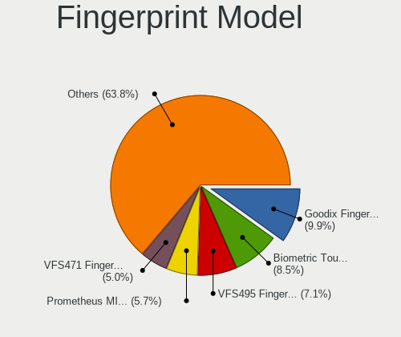

| Model                                                                      | Computers | Percent |
|----------------------------------------------------------------------------|-----------|---------|
| Upek Biometric Touchchip/Touchstrip Fingerprint Sensor                     | 9         | 12.16%  |
| AuthenTec AES2501 Fingerprint Sensor                                       | 7         | 9.46%   |
| Shenzhen Goodix  Fingerprint Device                                        | 6         | 8.11%   |
| Synaptics Prometheus MIS Touch Fingerprint Reader                          | 5         | 6.76%   |
| Validity Sensors VFS495 Fingerprint Reader                                 | 4         | 5.41%   |
| Validity Sensors VFS471 Fingerprint Reader                                 | 4         | 5.41%   |
| Synaptics  WBDI                                                            | 4         | 5.41%   |
| Shenzhen Goodix Fingerprint Reader                                         | 4         | 5.41%   |
| AuthenTec AES2810                                                          | 3         | 4.05%   |
| Unknown                                                                    | 3         | 4.05%   |
| Validity Sensors VFS491                                                    | 2         | 2.7%    |
| Validity Sensors VFS101 Fingerprint Reader                                 | 2         | 2.7%    |
| Validity Sensors VFS 5011 fingerprint sensor                               | 2         | 2.7%    |
| Synaptics Metallica MOH Touch Fingerprint Reader                           | 2         | 2.7%    |
| Synaptics Metallica MIS Touch Fingerprint Reader                           | 2         | 2.7%    |
| Elan ELAN:ARM-M4                                                           | 2         | 2.7%    |
| AuthenTec AES2550 Fingerprint Sensor                                       | 2         | 2.7%    |
| Validity Sensors VFS7500 Touch Fingerprint Sensor                          | 1         | 1.35%   |
| Validity Sensors VFS5011 Fingerprint Reader                                | 1         | 1.35%   |
| Validity Sensors VFS451 Fingerprint Reader                                 | 1         | 1.35%   |
| Validity Sensors VFS301 Fingerprint Reader                                 | 1         | 1.35%   |
| Validity Sensors Synaptics WBDI                                            | 1         | 1.35%   |
| Validity Sensors Synaptics VFS7552 Touch Fingerprint Sensor with PurePrint | 1         | 1.35%   |
| Validity Sensors Swipe Fingerprint Sensor                                  | 1         | 1.35%   |
| Upek TCS5B Fingerprint sensor                                              | 1         | 1.35%   |
| STMicroelectronics Fingerprint Reader                                      | 1         | 1.35%   |
| LighTuning Fingerprint Reader                                              | 1         | 1.35%   |
| AuthenTec AES1600                                                          | 1         | 1.35%   |

Chipcard Vendor
---------------

Chipcard module vendors

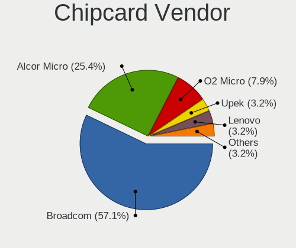

| Vendor      | Computers | Percent |
|-------------|-----------|---------|
| Broadcom    | 21        | 58.33%  |
| Alcor Micro | 6         | 16.67%  |
| O2 Micro    | 4         | 11.11%  |
| Upek        | 2         | 5.56%   |
| Lenovo      | 2         | 5.56%   |
| Yubico.com  | 1         | 2.78%   |

Chipcard Model
--------------

Chipcard module models

| Model                                                                        | Computers | Percent |
|------------------------------------------------------------------------------|-----------|---------|
| Broadcom 58200                                                               | 9         | 25%     |
| Broadcom BCM5880 Secure Applications Processor                               | 7         | 19.44%  |
| Alcor Micro AU9540 Smartcard Reader                                          | 6         | 16.67%  |
| O2 Micro OZ776 CCID Smartcard Reader                                         | 4         | 11.11%  |
| Broadcom 5880                                                                | 3         | 8.33%   |
| Upek TouchChip Fingerprint Coprocessor (WBF advanced mode)                   | 2         | 5.56%   |
| Lenovo Integrated Smart Card Reader                                          | 2         | 5.56%   |
| Broadcom BCM5880 Secure Applications Processor with fingerprint swipe sensor | 2         | 5.56%   |
| Yubico.com Yubikey 4/5 U2F+CCID                                              | 1         | 2.78%   |

Unsupported
-----------

Unsupported Devices
-------------------

Total unsupported devices on board

| Total | Computers | Percent |
|-------|-----------|---------|
| 0     | 686       | 72.98%  |
| 1     | 209       | 22.23%  |
| 2     | 37        | 3.94%   |
| 3     | 6         | 0.64%   |
| 6     | 1         | 0.11%   |
| 4     | 1         | 0.11%   |

Unsupported Device Types
------------------------

Types of unsupported devices

| Type                     | Computers | Percent |
|--------------------------|-----------|---------|
| Fingerprint reader       | 74        | 24.83%  |
| Graphics card            | 54        | 18.12%  |
| Net/wireless             | 45        | 15.1%   |
| Chipcard                 | 32        | 10.74%  |
| Multimedia controller    | 17        | 5.7%    |
| Bluetooth                | 17        | 5.7%    |
| Communication controller | 12        | 4.03%   |
| Sound                    | 7         | 2.35%   |
| Modem                    | 7         | 2.35%   |
| Camera                   | 7         | 2.35%   |
| Storage                  | 5         | 1.68%   |
| Flash memory             | 4         | 1.34%   |
| Net/ethernet             | 3         | 1.01%   |
| Dvb card                 | 3         | 1.01%   |
| Card reader              | 3         | 1.01%   |
| Unassigned class         | 2         | 0.67%   |
| Network                  | 2         | 0.67%   |
| Firewire controller      | 2         | 0.67%   |
| Tv card                  | 1         | 0.34%   |
| Storage/raid             | 1         | 0.34%   |

