Linux in Greece - Tested Hardware & Statistics
----------------------------------------------

A project to collect tested hardware configurations for Linux in Greece.

Anyone can contribute to this report by the [hw-probe](https://github.com/linuxhw/hw-probe) tool:

    sudo -E hw-probe -all -upload

Please contribute! Especially if your hardware is rare.

This is a report for all computer types. See also reports for [desktops](/Location/Greece/Desktop/README.md) and [notebooks](/Location/Greece/Notebook/README.md).

Contents
--------

* [ Test Cases ](#test-cases)

* [ System ](#system)
  - [ OS                       ](#os)
  - [ OS Family                ](#os-family)
  - [ Kernel                   ](#kernel)
  - [ Kernel Family            ](#kernel-family)
  - [ Kernel Major Ver.        ](#kernel-major-ver)
  - [ Arch                     ](#arch)
  - [ DE                       ](#de)
  - [ Display Server           ](#display-server)
  - [ Display Manager          ](#display-manager)
  - [ OS Lang                  ](#os-lang)
  - [ Boot Mode                ](#boot-mode)
  - [ Filesystem               ](#filesystem)
  - [ Part. scheme             ](#part-scheme)
  - [ Dual Boot with Linux/BSD ](#dual-boot-with-linuxbsd)
  - [ Dual Boot (Win)          ](#dual-boot-win)

* [ Board ](#board)
  - [ Vendor                   ](#vendor)
  - [ Model                    ](#model)
  - [ Model Family             ](#model-family)
  - [ MFG Year                 ](#mfg-year)
  - [ Form Factor              ](#form-factor)
  - [ Secure Boot              ](#secure-boot)
  - [ Coreboot                 ](#coreboot)
  - [ RAM Size                 ](#ram-size)
  - [ RAM Used                 ](#ram-used)
  - [ Total Drives             ](#total-drives)
  - [ Has CD-ROM               ](#has-cd-rom)
  - [ Has Ethernet             ](#has-ethernet)
  - [ Has WiFi                 ](#has-wifi)
  - [ Has Bluetooth            ](#has-bluetooth)

* [ Location ](#location)
  - [ Country                  ](#country)
  - [ City                     ](#city)

* [ Drives ](#drives)
  - [ Drive Vendor             ](#drive-vendor)
  - [ Drive Model              ](#drive-model)
  - [ HDD Vendor               ](#hdd-vendor)
  - [ SSD Vendor               ](#ssd-vendor)
  - [ Drive Kind               ](#drive-kind)
  - [ Drive Connector          ](#drive-connector)
  - [ Drive Size               ](#drive-size)
  - [ Space Total              ](#space-total)
  - [ Space Used               ](#space-used)
  - [ Malfunc. Drives          ](#malfunc-drives)
  - [ Malfunc. Drive Vendor    ](#malfunc-drive-vendor)
  - [ Malfunc. HDD Vendor      ](#malfunc-hdd-vendor)
  - [ Malfunc. Drive Kind      ](#malfunc-drive-kind)
  - [ Failed Drives            ](#failed-drives)
  - [ Failed Drive Vendor      ](#failed-drive-vendor)
  - [ Drive Status             ](#drive-status)

* [ Storage controller ](#storage-controller)
  - [ Storage Vendor           ](#storage-vendor)
  - [ Storage Model            ](#storage-model)
  - [ Storage Kind             ](#storage-kind)

* [ Processor ](#processor)
  - [ CPU Vendor               ](#cpu-vendor)
  - [ CPU Model                ](#cpu-model)
  - [ CPU Model Family         ](#cpu-model-family)
  - [ CPU Cores                ](#cpu-cores)
  - [ CPU Sockets              ](#cpu-sockets)
  - [ CPU Threads              ](#cpu-threads)
  - [ CPU Op-Modes             ](#cpu-op-modes)
  - [ CPU Microcode            ](#cpu-microcode)
  - [ CPU Microarch            ](#cpu-microarch)

* [ Graphics ](#graphics)
  - [ GPU Vendor               ](#gpu-vendor)
  - [ GPU Model                ](#gpu-model)
  - [ GPU Combo                ](#gpu-combo)
  - [ GPU Driver               ](#gpu-driver)
  - [ GPU Memory               ](#gpu-memory)

* [ Monitor ](#monitor)
  - [ Monitor Vendor           ](#monitor-vendor)
  - [ Monitor Model            ](#monitor-model)
  - [ Monitor Resolution       ](#monitor-resolution)
  - [ Monitor Diagonal         ](#monitor-diagonal)
  - [ Monitor Width            ](#monitor-width)
  - [ Aspect Ratio             ](#aspect-ratio)
  - [ Monitor Area             ](#monitor-area)
  - [ Pixel Density            ](#pixel-density)
  - [ Multiple Monitors        ](#multiple-monitors)

* [ Network ](#network)
  - [ Net Controller Vendor    ](#net-controller-vendor)
  - [ Net Controller Model     ](#net-controller-model)
  - [ Wireless Vendor          ](#wireless-vendor)
  - [ Wireless Model           ](#wireless-model)
  - [ Ethernet Vendor          ](#ethernet-vendor)
  - [ Ethernet Model           ](#ethernet-model)
  - [ Net Controller Kind      ](#net-controller-kind)
  - [ Used Controller          ](#used-controller)
  - [ NICs                     ](#nics)
  - [ IPv6                     ](#ipv6)

* [ Bluetooth ](#bluetooth)
  - [ Bluetooth Vendor         ](#bluetooth-vendor)
  - [ Bluetooth Model          ](#bluetooth-model)

* [ Sound ](#sound)
  - [ Sound Vendor             ](#sound-vendor)
  - [ Sound Model              ](#sound-model)

* [ Memory ](#memory)
  - [ Memory Vendor            ](#memory-vendor)
  - [ Memory Model             ](#memory-model)
  - [ Memory Kind              ](#memory-kind)
  - [ Memory Form Factor       ](#memory-form-factor)
  - [ Memory Size              ](#memory-size)
  - [ Memory Speed             ](#memory-speed)

* [ Printers & scanners ](#printers--scanners)
  - [ Printer Vendor           ](#printer-vendor)
  - [ Printer Model            ](#printer-model)
  - [ Scanner Vendor           ](#scanner-vendor)
  - [ Scanner Model            ](#scanner-model)

* [ Camera ](#camera)
  - [ Camera Vendor            ](#camera-vendor)
  - [ Camera Model             ](#camera-model)

* [ Security ](#security)
  - [ Fingerprint Vendor       ](#fingerprint-vendor)
  - [ Fingerprint Model        ](#fingerprint-model)
  - [ Chipcard Vendor          ](#chipcard-vendor)
  - [ Chipcard Model           ](#chipcard-model)

* [ Unsupported ](#unsupported)
  - [ Unsupported Devices      ](#unsupported-devices)
  - [ Unsupported Device Types ](#unsupported-device-types)

Test Cases
----------

Total: 2296

| Vendor        | Model                       | Form-Factor | Probe                                                      | Date         |
|---------------|-----------------------------|-------------|------------------------------------------------------------|--------------|
| Sony          | VPCEB1S1E                   | Notebook    | [551a1d2f64](https://linux-hardware.org/?probe=551a1d2f64) | May 08, 2024 |
| Gigabyte      | Z790 UD AX                  | Desktop     | [38ae310bd0](https://linux-hardware.org/?probe=38ae310bd0) | May 08, 2024 |
| Gigabyte      | Z790 UD AX                  | Desktop     | [d1a276f0c5](https://linux-hardware.org/?probe=d1a276f0c5) | May 08, 2024 |
| Toshiba       | Satellite C50-B             | Notebook    | [4037de5266](https://linux-hardware.org/?probe=4037de5266) | May 06, 2024 |
| Toshiba       | Satellite A200              | Notebook    | [633754915c](https://linux-hardware.org/?probe=633754915c) | May 05, 2024 |
| Toshiba       | Satellite A200              | Notebook    | [ba705e9e1b](https://linux-hardware.org/?probe=ba705e9e1b) | May 05, 2024 |
| ASUSTek       | ROG Strix G513IH_G513IH     | Notebook    | [5a6ae63a80](https://linux-hardware.org/?probe=5a6ae63a80) | May 05, 2024 |
| Lenovo        | 36F7 SDK0J40700 WIN 3258... | Desktop     | [7380e71093](https://linux-hardware.org/?probe=7380e71093) | May 05, 2024 |
| HP            | ProBook 6470b               | Notebook    | [3865a636e2](https://linux-hardware.org/?probe=3865a636e2) | May 04, 2024 |
| Notebook      | W54_W94_W955TU,-T,-C        | Notebook    | [c327d5c1a6](https://linux-hardware.org/?probe=c327d5c1a6) | May 01, 2024 |
| ASUSTek       | ROG CROSSHAIR VII HERO      | Desktop     | [ad6a595fac](https://linux-hardware.org/?probe=ad6a595fac) | Apr 29, 2024 |
| MSI           | PRO Z690-A WIFI DDR4        | Desktop     | [803a7bb728](https://linux-hardware.org/?probe=803a7bb728) | Apr 29, 2024 |
| MSI           | PRO Z690-A WIFI DDR4        | Desktop     | [3e6502d337](https://linux-hardware.org/?probe=3e6502d337) | Apr 28, 2024 |
| HP            | 2AFB                        | Desktop     | [6173192c73](https://linux-hardware.org/?probe=6173192c73) | Apr 28, 2024 |
| Lenovo        | ThinkPad L13 Gen 3 21B90... | Notebook    | [372c9b4a75](https://linux-hardware.org/?probe=372c9b4a75) | Apr 28, 2024 |
| Lenovo        | IdeaPad 5 14ALC05 82LM      | Notebook    | [5560070361](https://linux-hardware.org/?probe=5560070361) | Apr 25, 2024 |
| Lenovo        | IdeaPad 5 14ALC05 82LM      | Notebook    | [6ec3950131](https://linux-hardware.org/?probe=6ec3950131) | Apr 25, 2024 |
| ASUSTek       | Pro WS WRX80E-SAGE SE WI... | Desktop     | [9517bddd97](https://linux-hardware.org/?probe=9517bddd97) | Apr 25, 2024 |
| Dell          | Latitude 5420               | Notebook    | [604846386f](https://linux-hardware.org/?probe=604846386f) | Apr 24, 2024 |
| HP            | EliteBook 745 G4            | Notebook    | [f38a6451f0](https://linux-hardware.org/?probe=f38a6451f0) | Apr 24, 2024 |
| Techvision    | TVI7309X B0                 | Desktop     | [0bf8074cfc](https://linux-hardware.org/?probe=0bf8074cfc) | Apr 23, 2024 |
| ASRock        | B450M Pro4-F                | Desktop     | [e8d54dd61b](https://linux-hardware.org/?probe=e8d54dd61b) | Apr 23, 2024 |
| Lenovo        | ThinkPad T420 4236RN1       | Notebook    | [4ad39fcdb5](https://linux-hardware.org/?probe=4ad39fcdb5) | Apr 23, 2024 |
| Dell          | Latitude 5420               | Notebook    | [f3182ce0c2](https://linux-hardware.org/?probe=f3182ce0c2) | Apr 23, 2024 |
| Lenovo        | Unknown                     | Desktop     | [8c44eea387](https://linux-hardware.org/?probe=8c44eea387) | Apr 23, 2024 |
| Gigabyte      | X570 I AORUS PRO WIFI       | Desktop     | [02420cbf38](https://linux-hardware.org/?probe=02420cbf38) | Apr 22, 2024 |
| HP            | Pavilion dv7                | Notebook    | [c7af52e729](https://linux-hardware.org/?probe=c7af52e729) | Apr 21, 2024 |
| ASRock        | G41M-VS3                    | Desktop     | [21ae4d4c1e](https://linux-hardware.org/?probe=21ae4d4c1e) | Apr 21, 2024 |
| Acer          | AO756                       | Notebook    | [2f4e22ef7f](https://linux-hardware.org/?probe=2f4e22ef7f) | Apr 21, 2024 |
| MSI           | MPG B550 GAMING PLUS        | Desktop     | [42a4ba108a](https://linux-hardware.org/?probe=42a4ba108a) | Apr 21, 2024 |
| Apple         | Mac-27ADBB7B4CEE8E61 iMa... | All in one  | [4ee9cea1bf](https://linux-hardware.org/?probe=4ee9cea1bf) | Apr 19, 2024 |
| Lenovo        | IdeaPad U350                | Notebook    | [148c50f66b](https://linux-hardware.org/?probe=148c50f66b) | Apr 16, 2024 |
| ASRock        | X370 Gaming X               | Desktop     | [db397e4511](https://linux-hardware.org/?probe=db397e4511) | Apr 15, 2024 |
| ASUSTek       | TUF Gaming B760M-PLUS       | Desktop     | [cb668da9ee](https://linux-hardware.org/?probe=cb668da9ee) | Apr 12, 2024 |
| Lenovo        | G40-30 80FY                 | Notebook    | [d1d8e1d51f](https://linux-hardware.org/?probe=d1d8e1d51f) | Apr 11, 2024 |
| ASRock        | B450M Pro4-F                | Desktop     | [72a3752add](https://linux-hardware.org/?probe=72a3752add) | Apr 11, 2024 |
| Dell          | 0NKW6Y A02                  | Desktop     | [fcd30b6392](https://linux-hardware.org/?probe=fcd30b6392) | Apr 11, 2024 |
| Lenovo        | 30D9 SDK0J40697 WIN 3305... | Desktop     | [2ad2ada69c](https://linux-hardware.org/?probe=2ad2ada69c) | Apr 11, 2024 |
| Acer          | Aspire A514-52              | Notebook    | [7019dcf4ea](https://linux-hardware.org/?probe=7019dcf4ea) | Apr 10, 2024 |
| Lenovo        | ThinkPad T480 20L6S5QH00    | Notebook    | [5068f44f3b](https://linux-hardware.org/?probe=5068f44f3b) | Apr 10, 2024 |
| Lenovo        | IdeaPad 3 15IAU7 82RK       | Notebook    | [62a1298341](https://linux-hardware.org/?probe=62a1298341) | Apr 10, 2024 |
| Acer          | Aspire A515-45              | Notebook    | [d62d670bd4](https://linux-hardware.org/?probe=d62d670bd4) | Apr 09, 2024 |
| HP            | EliteBook 745 G4            | Notebook    | [0d92302707](https://linux-hardware.org/?probe=0d92302707) | Apr 09, 2024 |
| Gigabyte      | Z590I AORUS ULTRA           | Desktop     | [2a11ab4791](https://linux-hardware.org/?probe=2a11ab4791) | Apr 06, 2024 |
| Gigabyte      | Z590I AORUS ULTRA           | Desktop     | [e786bc1b13](https://linux-hardware.org/?probe=e786bc1b13) | Apr 06, 2024 |
| Toshiba       | Satellite C50-B             | Notebook    | [f5e88caf50](https://linux-hardware.org/?probe=f5e88caf50) | Apr 06, 2024 |
| Gigabyte      | 945GME-DS2                  | Desktop     | [37085a5c3f](https://linux-hardware.org/?probe=37085a5c3f) | Apr 06, 2024 |
| Lenovo        | G40-30 80FY                 | Notebook    | [216b899f97](https://linux-hardware.org/?probe=216b899f97) | Apr 04, 2024 |
| Toshiba       | Satellite C50-B             | Notebook    | [065f34b713](https://linux-hardware.org/?probe=065f34b713) | Apr 04, 2024 |
| ASUSTek       | ROG CROSSHAIR VII HERO      | Desktop     | [3b126a195a](https://linux-hardware.org/?probe=3b126a195a) | Apr 04, 2024 |
| Fujitsu       | STYLISTIC Q702              | Notebook    | [1abe698880](https://linux-hardware.org/?probe=1abe698880) | Apr 02, 2024 |
| Dell          | Inspiron 5770               | Notebook    | [3a6a7880c9](https://linux-hardware.org/?probe=3a6a7880c9) | Apr 01, 2024 |
| ASUSTek       | PRIME B450M-K II            | Desktop     | [f8bc7da1fc](https://linux-hardware.org/?probe=f8bc7da1fc) | Apr 01, 2024 |
| Gigabyte      | B550I AORUS PRO AX          | Desktop     | [a3e56de041](https://linux-hardware.org/?probe=a3e56de041) | Apr 01, 2024 |
| Lenovo        | IdeaPad 3 15ABA7 82RN       | Notebook    | [4fc00ab41f](https://linux-hardware.org/?probe=4fc00ab41f) | Apr 01, 2024 |
| Gigabyte      | Z97P-D3                     | Desktop     | [87ccc4d35d](https://linux-hardware.org/?probe=87ccc4d35d) | Mar 30, 2024 |
| Timi          | TM1604                      | Notebook    | [9ef2ec37c2](https://linux-hardware.org/?probe=9ef2ec37c2) | Mar 29, 2024 |
| Timi          | TM1604                      | Notebook    | [ec2ab8fb5f](https://linux-hardware.org/?probe=ec2ab8fb5f) | Mar 29, 2024 |
| HP            | 250 15.6 inch G9 Noteboo... | Notebook    | [90fc1c5336](https://linux-hardware.org/?probe=90fc1c5336) | Mar 26, 2024 |
| Lenovo        | IdeaPadFlex 5 14ALC7 82R... | Convertible | [be3135994e](https://linux-hardware.org/?probe=be3135994e) | Mar 23, 2024 |
| Medion        | WIM2170                     | Notebook    | [190b555e0c](https://linux-hardware.org/?probe=190b555e0c) | Mar 23, 2024 |
| ASRock        | Z77 Extreme6                | Desktop     | [72c7021b55](https://linux-hardware.org/?probe=72c7021b55) | Mar 22, 2024 |
| ASUSTek       | TUF Gaming B550M-PLUS WI... | Desktop     | [e4e9866823](https://linux-hardware.org/?probe=e4e9866823) | Mar 22, 2024 |
| Dell          | Latitude 7490               | Notebook    | [869b39d5bd](https://linux-hardware.org/?probe=869b39d5bd) | Mar 22, 2024 |
| HP            | Pro x2 612 G2               | Tablet      | [78b3bd7efb](https://linux-hardware.org/?probe=78b3bd7efb) | Mar 22, 2024 |
| HP            | Pro x2 612 G2               | Tablet      | [b4f88bb3c8](https://linux-hardware.org/?probe=b4f88bb3c8) | Mar 22, 2024 |
| Lenovo        | ThinkPad P14s Gen 2i 20V... | Notebook    | [1c71f92a5b](https://linux-hardware.org/?probe=1c71f92a5b) | Mar 22, 2024 |
| AMI           | Intel                       | Desktop     | [4bb3934f7d](https://linux-hardware.org/?probe=4bb3934f7d) | Mar 21, 2024 |
| ASRock        | B560 Pro4                   | Desktop     | [a34877f66c](https://linux-hardware.org/?probe=a34877f66c) | Mar 21, 2024 |
| Lenovo        | Legion Y540-15IRH 81SX      | Notebook    | [fab517699b](https://linux-hardware.org/?probe=fab517699b) | Mar 17, 2024 |
| NU591         | 1.0                         | Desktop     | [46ad6dd364](https://linux-hardware.org/?probe=46ad6dd364) | Mar 16, 2024 |
| Dell          | Inspiron 5770               | Notebook    | [9b23f75048](https://linux-hardware.org/?probe=9b23f75048) | Mar 15, 2024 |
| Lenovo        | IdeaPad 5 Pro 16ACH6 82L... | Notebook    | [78ad2387d5](https://linux-hardware.org/?probe=78ad2387d5) | Mar 15, 2024 |
| Gigabyte      | Z68MA-D2H-B3                | Desktop     | [708c2c7987](https://linux-hardware.org/?probe=708c2c7987) | Mar 15, 2024 |
| Lenovo        | IdeaPad C340-14API 81N6     | Notebook    | [08ca6f8423](https://linux-hardware.org/?probe=08ca6f8423) | Mar 14, 2024 |
| Lenovo        | IdeaPad 5 Pro 16ACH6 82L... | Notebook    | [0fbeb0332d](https://linux-hardware.org/?probe=0fbeb0332d) | Mar 14, 2024 |
| FriendlyEl... | NanoPC-T6                   | Soc         | [05efb3f7fe](https://linux-hardware.org/?probe=05efb3f7fe) | Mar 14, 2024 |
| HP            | Pavilion Notebook           | Notebook    | [b2e7f143bc](https://linux-hardware.org/?probe=b2e7f143bc) | Mar 13, 2024 |
| Lenovo        | IdeaPad 5 Pro 16ACH6 82L... | Notebook    | [ad2e487982](https://linux-hardware.org/?probe=ad2e487982) | Mar 12, 2024 |
| Dell          | Inspiron 3542               | Notebook    | [f850f2ab1d](https://linux-hardware.org/?probe=f850f2ab1d) | Mar 11, 2024 |
| HP            | Pavilion Notebook           | Notebook    | [76431ddf1c](https://linux-hardware.org/?probe=76431ddf1c) | Mar 10, 2024 |
| ASUSTek       | VivoBook_ASUSLaptop M150... | Notebook    | [3529da3bcf](https://linux-hardware.org/?probe=3529da3bcf) | Mar 10, 2024 |
| ASUSTek       | PRIME B450M-A II            | Desktop     | [b591cc5cfe](https://linux-hardware.org/?probe=b591cc5cfe) | Mar 09, 2024 |
| Acer          | Aspire E5-575G              | Notebook    | [ff379abc68](https://linux-hardware.org/?probe=ff379abc68) | Mar 08, 2024 |
| Lenovo        | G50-30 80G0                 | Notebook    | [be5e190ea5](https://linux-hardware.org/?probe=be5e190ea5) | Mar 08, 2024 |
| ASUSTek       | Vivobook Go E1504FA_E150... | Notebook    | [386945e586](https://linux-hardware.org/?probe=386945e586) | Mar 07, 2024 |
| ASRock        | A300M-STX                   | Desktop     | [a92e2761aa](https://linux-hardware.org/?probe=a92e2761aa) | Mar 06, 2024 |
| MSI           | B450M MORTAR MAX            | Desktop     | [f9ed40afc2](https://linux-hardware.org/?probe=f9ed40afc2) | Mar 06, 2024 |
| MSI           | MAG B550M MORTAR            | Desktop     | [31da1b6dc5](https://linux-hardware.org/?probe=31da1b6dc5) | Mar 06, 2024 |
| Biostar       | H610MH D5                   | Desktop     | [d3ae388ebd](https://linux-hardware.org/?probe=d3ae388ebd) | Mar 05, 2024 |
| Lenovo        | IdeaPad S340-15IIL 81VW     | Notebook    | [66f2f3a361](https://linux-hardware.org/?probe=66f2f3a361) | Mar 04, 2024 |
| Lenovo        | IdeaPad S340-15IIL 81VW     | Notebook    | [3ab9b49b3e](https://linux-hardware.org/?probe=3ab9b49b3e) | Mar 04, 2024 |
| HP            | Pavilion g6                 | Notebook    | [fd797ba3af](https://linux-hardware.org/?probe=fd797ba3af) | Mar 04, 2024 |
| ASUSTek       | SABERTOOTH Z97 MARK 2       | Desktop     | [d658a7bd4f](https://linux-hardware.org/?probe=d658a7bd4f) | Mar 03, 2024 |
| HP            | Pavilion g6                 | Notebook    | [7e4412a097](https://linux-hardware.org/?probe=7e4412a097) | Mar 03, 2024 |
| System76      | Galago Pro                  | Notebook    | [c7cb94f475](https://linux-hardware.org/?probe=c7cb94f475) | Mar 01, 2024 |
| HUAWEI        | BOM-WXX9                    | Notebook    | [94a4405784](https://linux-hardware.org/?probe=94a4405784) | Feb 29, 2024 |
| HP            | Pavilion Gaming Laptop 1... | Notebook    | [f9c04cc616](https://linux-hardware.org/?probe=f9c04cc616) | Feb 29, 2024 |
| Gigabyte      | B450M DS3H-CF               | Desktop     | [04eb7eabdf](https://linux-hardware.org/?probe=04eb7eabdf) | Feb 26, 2024 |
| Gigabyte      | H61M-S2PV                   | Desktop     | [62412b14af](https://linux-hardware.org/?probe=62412b14af) | Feb 26, 2024 |
| Gigabyte      | H55M-S2H                    | Desktop     | [c7a7e78042](https://linux-hardware.org/?probe=c7a7e78042) | Feb 25, 2024 |
| Biostar       | B450MHP                     | Desktop     | [5c5906ef27](https://linux-hardware.org/?probe=5c5906ef27) | Feb 21, 2024 |
| NU591         | 1.0                         | Desktop     | [488e067c84](https://linux-hardware.org/?probe=488e067c84) | Feb 21, 2024 |
| ASRock        | QC6000M                     | Desktop     | [c262bb8499](https://linux-hardware.org/?probe=c262bb8499) | Feb 20, 2024 |
| ASUSTek       | P8P67 LE                    | Desktop     | [d0258cca7f](https://linux-hardware.org/?probe=d0258cca7f) | Feb 20, 2024 |
| ASUSTek       | P8P67 LE                    | Desktop     | [b2cba004d5](https://linux-hardware.org/?probe=b2cba004d5) | Feb 20, 2024 |
| Lenovo        | Yoga 920-13IKB 80Y7         | Convertible | [8b8462848e](https://linux-hardware.org/?probe=8b8462848e) | Feb 18, 2024 |
| Biostar       | B450MHP                     | Desktop     | [81eca30554](https://linux-hardware.org/?probe=81eca30554) | Feb 18, 2024 |
| ASUSTek       | VivoBook 15_ASUS Laptop ... | Notebook    | [b4370c5953](https://linux-hardware.org/?probe=b4370c5953) | Feb 17, 2024 |
| Biostar       | B450MHP                     | Desktop     | [1c50343bc4](https://linux-hardware.org/?probe=1c50343bc4) | Feb 17, 2024 |
| Apple         | MacBookPro5,5               | Notebook    | [6ea4dd15da](https://linux-hardware.org/?probe=6ea4dd15da) | Feb 15, 2024 |
| Apple         | MacBookPro5,5               | Notebook    | [e23c7132d2](https://linux-hardware.org/?probe=e23c7132d2) | Feb 15, 2024 |
| HP            | Laptop 15s-eq2xxx           | Notebook    | [f2321427cf](https://linux-hardware.org/?probe=f2321427cf) | Feb 15, 2024 |
| HP            | ProBook 450 15.6 inch G9... | Notebook    | [00a2d1b052](https://linux-hardware.org/?probe=00a2d1b052) | Feb 09, 2024 |
| HP            | Pavilion Notebook           | Notebook    | [075e2f410b](https://linux-hardware.org/?probe=075e2f410b) | Feb 05, 2024 |
| HP            | Pavilion Notebook           | Notebook    | [f6f5d83216](https://linux-hardware.org/?probe=f6f5d83216) | Feb 04, 2024 |
| Biostar       | G41-M7                      | Desktop     | [eea33a47ac](https://linux-hardware.org/?probe=eea33a47ac) | Feb 03, 2024 |
| nJoy Roman... | Ediam                       | Notebook    | [913590be87](https://linux-hardware.org/?probe=913590be87) | Feb 02, 2024 |
| Dell          | 0D28YY A01                  | Desktop     | [21e722f277](https://linux-hardware.org/?probe=21e722f277) | Feb 02, 2024 |
| ASUSTek       | Zenbook UM3402YAR_UM3402... | Notebook    | [04c6362187](https://linux-hardware.org/?probe=04c6362187) | Feb 01, 2024 |
| ASRock        | X370 Gaming X               | Desktop     | [54fa92de97](https://linux-hardware.org/?probe=54fa92de97) | Feb 01, 2024 |
| Lenovo        | IdeaPad 320-15ISK 80XH      | Notebook    | [a3932a77fb](https://linux-hardware.org/?probe=a3932a77fb) | Feb 01, 2024 |
| Gigabyte      | B365M DS3H                  | Desktop     | [bb6bab84d0](https://linux-hardware.org/?probe=bb6bab84d0) | Jan 31, 2024 |
| Gigabyte      | B365M DS3H                  | Desktop     | [8a8a84c18b](https://linux-hardware.org/?probe=8a8a84c18b) | Jan 31, 2024 |
| MSI           | MS-7345                     | Desktop     | [3453f85c21](https://linux-hardware.org/?probe=3453f85c21) | Jan 30, 2024 |
| ASUSTek       | P5K                         | Desktop     | [2596e1adb2](https://linux-hardware.org/?probe=2596e1adb2) | Jan 29, 2024 |
| ASUSTek       | ROG STRIX Z690-A GAMING ... | Desktop     | [37e7442cca](https://linux-hardware.org/?probe=37e7442cca) | Jan 27, 2024 |
| ASUSTek       | Zenbook UM3402YAR_UM3402... | Notebook    | [ee59cf62cb](https://linux-hardware.org/?probe=ee59cf62cb) | Jan 27, 2024 |
| ASUSTek       | Zenbook UM3402YAR_UM3402... | Notebook    | [dfb6b2a1c8](https://linux-hardware.org/?probe=dfb6b2a1c8) | Jan 27, 2024 |
| Toshiba       | Satellite P70-B             | Notebook    | [3e21232f45](https://linux-hardware.org/?probe=3e21232f45) | Jan 25, 2024 |
| Lenovo        | ThinkPad X201 36805B8       | Notebook    | [cf0a1641da](https://linux-hardware.org/?probe=cf0a1641da) | Jan 25, 2024 |
| Dell          | Inspiron 5770               | Notebook    | [6cf464989f](https://linux-hardware.org/?probe=6cf464989f) | Jan 24, 2024 |
| ASRock        | A320M-HDV R4.0              | Desktop     | [64c2e7a1f3](https://linux-hardware.org/?probe=64c2e7a1f3) | Jan 24, 2024 |
| Dell          | 0D28YY A00                  | Desktop     | [8d8d8005b1](https://linux-hardware.org/?probe=8d8d8005b1) | Jan 23, 2024 |
| Dell          | Inspiron 5770               | Notebook    | [8d01c56fca](https://linux-hardware.org/?probe=8d01c56fca) | Jan 22, 2024 |
| Sony          | SVF1521A1EW                 | Notebook    | [034a736927](https://linux-hardware.org/?probe=034a736927) | Jan 20, 2024 |
| Dell          | Latitude 5490               | Notebook    | [06fca2f5b2](https://linux-hardware.org/?probe=06fca2f5b2) | Jan 20, 2024 |
| Lenovo        | IdeaPad 5 14ALC05 82LM      | Notebook    | [a13a3a85d9](https://linux-hardware.org/?probe=a13a3a85d9) | Jan 19, 2024 |
| ASRock        | B450M Pro4                  | Desktop     | [440bc94322](https://linux-hardware.org/?probe=440bc94322) | Jan 19, 2024 |
| HP            | Pavilion 15                 | Notebook    | [8e7f087158](https://linux-hardware.org/?probe=8e7f087158) | Jan 17, 2024 |
| Lenovo        | IdeaPad 5 Pro 14ACN6 82L... | Notebook    | [3c194e897a](https://linux-hardware.org/?probe=3c194e897a) | Jan 17, 2024 |
| HP            | Pavilion 15                 | Notebook    | [0d78ac3518](https://linux-hardware.org/?probe=0d78ac3518) | Jan 16, 2024 |
| ASUSTek       | M4A89GTD-PRO/USB3           | Desktop     | [c69281db28](https://linux-hardware.org/?probe=c69281db28) | Jan 15, 2024 |
| Lenovo        | IdeaPad 5 14ALC05 82LM      | Notebook    | [2c9fe1dad7](https://linux-hardware.org/?probe=2c9fe1dad7) | Jan 15, 2024 |
| HP            | Compaq Presario CQ60        | Notebook    | [fd48d4e0d2](https://linux-hardware.org/?probe=fd48d4e0d2) | Jan 15, 2024 |
| Lenovo        | ThinkPad T520 42406AG       | Notebook    | [df565d9a02](https://linux-hardware.org/?probe=df565d9a02) | Jan 14, 2024 |
| Dell          | XPS 13 9310                 | Notebook    | [5c6de2d4a2](https://linux-hardware.org/?probe=5c6de2d4a2) | Jan 11, 2024 |
| Gigabyte      | GA-78LMT-USB3 x.x           | Desktop     | [fda5ec8f8d](https://linux-hardware.org/?probe=fda5ec8f8d) | Jan 10, 2024 |
| Lenovo        | IdeaPad 3 15ABA7 82RN       | Notebook    | [12b7a5f613](https://linux-hardware.org/?probe=12b7a5f613) | Jan 10, 2024 |
| Sony          | SVF1521A6EW                 | Notebook    | [37c4dd98f1](https://linux-hardware.org/?probe=37c4dd98f1) | Jan 09, 2024 |
| MSI           | 2A78h                       | Desktop     | [dfa343a5d1](https://linux-hardware.org/?probe=dfa343a5d1) | Jan 08, 2024 |
| ASUSTek       | Vivobook Go E1504FA_E150... | Notebook    | [1e21573b13](https://linux-hardware.org/?probe=1e21573b13) | Jan 05, 2024 |
| ASRock        | X370 Gaming X               | Desktop     | [b780de408a](https://linux-hardware.org/?probe=b780de408a) | Jan 05, 2024 |
| MSI           | Z170A PC MATE               | Desktop     | [9a11a14058](https://linux-hardware.org/?probe=9a11a14058) | Jan 04, 2024 |
| Lenovo        | Yoga Pro 7 14APH8 82Y8      | Notebook    | [761431c40c](https://linux-hardware.org/?probe=761431c40c) | Jan 04, 2024 |
| Lenovo        | ThinkPad Edge 0301GBG       | Notebook    | [2c26de7dfa](https://linux-hardware.org/?probe=2c26de7dfa) | Jan 03, 2024 |
| AZW           | MINI S 10                   | Desktop     | [3a1b0c6d91](https://linux-hardware.org/?probe=3a1b0c6d91) | Jan 02, 2024 |
| ASUSTek       | Vivobook Go E1504FA_E150... | Notebook    | [83ae2c858c](https://linux-hardware.org/?probe=83ae2c858c) | Jan 01, 2024 |
| ASUSTek       | Vivobook Go E1504FA_E150... | Notebook    | [4ec973722a](https://linux-hardware.org/?probe=4ec973722a) | Jan 01, 2024 |
| ASUSTek       | Vivobook Go E1504FA_E150... | Notebook    | [5cde8dcd78](https://linux-hardware.org/?probe=5cde8dcd78) | Jan 01, 2024 |
| HP            | Laptop 17-ca1xxx            | Notebook    | [b569c39f5a](https://linux-hardware.org/?probe=b569c39f5a) | Dec 31, 2023 |
| AZW           | U57                         | Mini pc     | [857aa7dbae](https://linux-hardware.org/?probe=857aa7dbae) | Dec 31, 2023 |
| Gigabyte      | Z490 AORUS ELITE AC         | Desktop     | [4faca6dad4](https://linux-hardware.org/?probe=4faca6dad4) | Dec 31, 2023 |
| Dell          | Precision 3551              | Notebook    | [38a733d0c4](https://linux-hardware.org/?probe=38a733d0c4) | Dec 30, 2023 |
| HP            | Laptop 15-db0xxx            | Notebook    | [bacd120c51](https://linux-hardware.org/?probe=bacd120c51) | Dec 30, 2023 |
| TUXEDO        | InfinityBook Pro Gen8 (M... | Notebook    | [5cfb3467bc](https://linux-hardware.org/?probe=5cfb3467bc) | Dec 29, 2023 |
| Dell          | 0PU052                      | Desktop     | [7da56e0b33](https://linux-hardware.org/?probe=7da56e0b33) | Dec 29, 2023 |
| Toshiba       | Satellite P70-B             | Notebook    | [2a5acedd16](https://linux-hardware.org/?probe=2a5acedd16) | Dec 29, 2023 |
| Lenovo        | ThinkPad X13 Yoga Gen 3 ... | Convertible | [793c6c630d](https://linux-hardware.org/?probe=793c6c630d) | Dec 27, 2023 |
| Lenovo        | ThinkPad X13 Yoga Gen 3 ... | Convertible | [b7d225eab5](https://linux-hardware.org/?probe=b7d225eab5) | Dec 27, 2023 |
| HP            | 250 15.6 inch G9 Noteboo... | Notebook    | [ab0b99f2f2](https://linux-hardware.org/?probe=ab0b99f2f2) | Dec 25, 2023 |
| HP            | 250 15.6 inch G9 Noteboo... | Notebook    | [0da41c3e3b](https://linux-hardware.org/?probe=0da41c3e3b) | Dec 25, 2023 |
| Lenovo        | ThinkPad 13 2nd Gen 20J2... | Notebook    | [30446f4198](https://linux-hardware.org/?probe=30446f4198) | Dec 23, 2023 |
| Dell          | 0X7841                      | Desktop     | [3757ec7f5f](https://linux-hardware.org/?probe=3757ec7f5f) | Dec 22, 2023 |
| ASUSTek       | P7H55-M LE                  | Desktop     | [d15476594e](https://linux-hardware.org/?probe=d15476594e) | Dec 22, 2023 |
| Lenovo        | ThinkPad X131e 33691K7      | Notebook    | [360dc0f244](https://linux-hardware.org/?probe=360dc0f244) | Dec 21, 2023 |
| Raspberry ... | Raspberry Pi 4 Model B R... | Soc         | [b0f2aee070](https://linux-hardware.org/?probe=b0f2aee070) | Dec 21, 2023 |
| ASRock        | G41C-GS                     | Desktop     | [cea8e45a31](https://linux-hardware.org/?probe=cea8e45a31) | Dec 17, 2023 |
| HP            | Notebook                    | Notebook    | [86266f15e7](https://linux-hardware.org/?probe=86266f15e7) | Dec 16, 2023 |
| FriendlyEl... | NanoPC-T6                   | Soc         | [e4c855bedc](https://linux-hardware.org/?probe=e4c855bedc) | Dec 16, 2023 |
| Lenovo        | ThinkPad 13 2nd Gen 20J2... | Notebook    | [de6ccbb0bc](https://linux-hardware.org/?probe=de6ccbb0bc) | Dec 15, 2023 |
| Lenovo        | IdeaPad Slim 3 14AMN8 82... | Notebook    | [e4542af709](https://linux-hardware.org/?probe=e4542af709) | Dec 15, 2023 |
| ASUSTek       | VivoBook_ASUSLaptop M160... | Notebook    | [abc0a9283d](https://linux-hardware.org/?probe=abc0a9283d) | Dec 14, 2023 |
| HP            | Stream x360 Convertible ... | Convertible | [edab80a2f1](https://linux-hardware.org/?probe=edab80a2f1) | Dec 12, 2023 |
| Lenovo        | IdeaPad Slim 3 14AMN8 82... | Notebook    | [2b589c71b3](https://linux-hardware.org/?probe=2b589c71b3) | Dec 12, 2023 |
| Sony          | VPCCW1S1E                   | Notebook    | [361d9573dd](https://linux-hardware.org/?probe=361d9573dd) | Dec 12, 2023 |
| HP            | EliteBook 840 14 inch G9... | Notebook    | [2bc28bf202](https://linux-hardware.org/?probe=2bc28bf202) | Dec 12, 2023 |
| HP            | Pavilion dv7                | Notebook    | [1c31a8cd6f](https://linux-hardware.org/?probe=1c31a8cd6f) | Dec 12, 2023 |
| ASRock        | X370 Gaming X               | Desktop     | [3cba3acfa9](https://linux-hardware.org/?probe=3cba3acfa9) | Dec 10, 2023 |
| Dell          | Latitude 7410               | Notebook    | [5d528f2b74](https://linux-hardware.org/?probe=5d528f2b74) | Dec 08, 2023 |
| Fujitsu       | D2863 S26361-D2863-A10 W... | Server      | [b5b2a93ff1](https://linux-hardware.org/?probe=b5b2a93ff1) | Dec 07, 2023 |
| Lenovo        | ThinkBook 15 G2 ARE 20VG    | Notebook    | [de12499622](https://linux-hardware.org/?probe=de12499622) | Dec 05, 2023 |
| Dell          | Inspiron 15-3552            | Notebook    | [8ca2d01e7c](https://linux-hardware.org/?probe=8ca2d01e7c) | Dec 05, 2023 |
| Lenovo        | ThinkCentre M81 0267A38     | Desktop     | [a9f041fc10](https://linux-hardware.org/?probe=a9f041fc10) | Dec 05, 2023 |
| Lenovo        | ThinkPad 13 2nd Gen 20J2... | Notebook    | [c0cd3f5ac1](https://linux-hardware.org/?probe=c0cd3f5ac1) | Dec 05, 2023 |
| ASUSTek       | PRIME B450M-A               | Desktop     | [23937a8b80](https://linux-hardware.org/?probe=23937a8b80) | Dec 04, 2023 |
| Gigabyte      | B550 AORUS ELITE AX V2      | Desktop     | [4d788fb96c](https://linux-hardware.org/?probe=4d788fb96c) | Dec 04, 2023 |
| Dell          | Inspiron 17-7779            | Notebook    | [16c9e2b55c](https://linux-hardware.org/?probe=16c9e2b55c) | Dec 04, 2023 |
| Acer          | Aspire A515-44G             | Notebook    | [7e41d52591](https://linux-hardware.org/?probe=7e41d52591) | Dec 03, 2023 |
| Lenovo        | IdeaPad 5 14ALC05 82LM      | Notebook    | [8d214d7977](https://linux-hardware.org/?probe=8d214d7977) | Dec 03, 2023 |
| ASUSTek       | TUF Gaming B550M-PLUS WI... | Desktop     | [980caec27f](https://linux-hardware.org/?probe=980caec27f) | Dec 03, 2023 |
| ASUSTek       | VivoBook_ASUSLaptop M150... | Notebook    | [e3255e030f](https://linux-hardware.org/?probe=e3255e030f) | Dec 03, 2023 |
| Dell          | 0PU052                      | Desktop     | [4a653cc26a](https://linux-hardware.org/?probe=4a653cc26a) | Dec 02, 2023 |
| Lenovo        | ThinkPad L470 W10DG 20JV... | Notebook    | [1462381824](https://linux-hardware.org/?probe=1462381824) | Dec 02, 2023 |
| Dell          | 0WK833                      | Desktop     | [f363206bab](https://linux-hardware.org/?probe=f363206bab) | Nov 30, 2023 |
| Gigabyte      | H270-HD3-CF                 | Desktop     | [b18e30be2d](https://linux-hardware.org/?probe=b18e30be2d) | Nov 30, 2023 |
| Lenovo        | IdeaPad 5 15ITL05 82FG      | Notebook    | [77e37462eb](https://linux-hardware.org/?probe=77e37462eb) | Nov 29, 2023 |
| Gigabyte      | X570 I AORUS PRO WIFI       | Desktop     | [85217c44b9](https://linux-hardware.org/?probe=85217c44b9) | Nov 27, 2023 |
| ASUSTek       | Zenbook UM3402YAR_UM3402... | Notebook    | [f5c438ff75](https://linux-hardware.org/?probe=f5c438ff75) | Nov 26, 2023 |
| Lenovo        | G40-30 80FY                 | Notebook    | [6c102c1e42](https://linux-hardware.org/?probe=6c102c1e42) | Nov 26, 2023 |
| Gigabyte      | P55-US3L                    | Desktop     | [fdb0f32546](https://linux-hardware.org/?probe=fdb0f32546) | Nov 26, 2023 |
| Intel         | NUC6i3SYB H81132-502        | Mini pc     | [0238e68d82](https://linux-hardware.org/?probe=0238e68d82) | Nov 26, 2023 |
| HP            | 255 G8 Notebook PC          | Notebook    | [f889c15ce7](https://linux-hardware.org/?probe=f889c15ce7) | Nov 26, 2023 |
| Shenzhen W... | Alder Lake N                | Notebook    | [0cd16ad752](https://linux-hardware.org/?probe=0cd16ad752) | Nov 25, 2023 |
| HP            | G5000 (GF767EA#B1A)         | Notebook    | [5239511cca](https://linux-hardware.org/?probe=5239511cca) | Nov 24, 2023 |
| SLIMBOOK      | PROX14-AMD                  | Notebook    | [cbd8cb44fe](https://linux-hardware.org/?probe=cbd8cb44fe) | Nov 23, 2023 |
| Gigabyte      | GA-MA74GMT-S2               | Desktop     | [440e7b6c7c](https://linux-hardware.org/?probe=440e7b6c7c) | Nov 23, 2023 |
| HP            | Pavilion dv6                | Notebook    | [964efd4752](https://linux-hardware.org/?probe=964efd4752) | Nov 23, 2023 |
| HC Technol... | HCAR5000-MI                 | Desktop     | [718e30ca5e](https://linux-hardware.org/?probe=718e30ca5e) | Nov 22, 2023 |
| Lenovo        | IdeaPad 5 15ITL05 82FG      | Notebook    | [ac1c1063ba](https://linux-hardware.org/?probe=ac1c1063ba) | Nov 22, 2023 |
| ASUSTek       | PRIME B450M-A II            | Desktop     | [eda4b1d020](https://linux-hardware.org/?probe=eda4b1d020) | Nov 21, 2023 |
| Lenovo        | IdeaPad 5 Pro 14ACN6 82L... | Notebook    | [58af364f54](https://linux-hardware.org/?probe=58af364f54) | Nov 20, 2023 |
| HP            | Notebook                    | Notebook    | [bdb0e2841f](https://linux-hardware.org/?probe=bdb0e2841f) | Nov 20, 2023 |
| ASRock        | A320M-DVS R4.0              | Desktop     | [34d3fcf76b](https://linux-hardware.org/?probe=34d3fcf76b) | Nov 18, 2023 |
| Acer          | Aspire A515-55              | Notebook    | [3ce3a10b05](https://linux-hardware.org/?probe=3ce3a10b05) | Nov 18, 2023 |
| HP            | Pavilion Notebook           | Notebook    | [85f5d912da](https://linux-hardware.org/?probe=85f5d912da) | Nov 18, 2023 |
| Lenovo        | ThinkPad T460s 20F9CTO1W... | Notebook    | [51e880c4fd](https://linux-hardware.org/?probe=51e880c4fd) | Nov 17, 2023 |
| Lenovo        | NOK                         | Desktop     | [1126fee720](https://linux-hardware.org/?probe=1126fee720) | Nov 16, 2023 |
| Dell          | Precision 5570              | Notebook    | [7cb435d2dc](https://linux-hardware.org/?probe=7cb435d2dc) | Nov 16, 2023 |
| HP            | ProLiant DL380 G5           | Server      | [55414de640](https://linux-hardware.org/?probe=55414de640) | Nov 14, 2023 |
| Lenovo        | IdeaPad 5 14ALC05 82LM      | Notebook    | [d95de7fccb](https://linux-hardware.org/?probe=d95de7fccb) | Nov 13, 2023 |
| HP            | ProLiant DL360 G5           | Server      | [90ce2b0711](https://linux-hardware.org/?probe=90ce2b0711) | Nov 13, 2023 |
| HP            | Presario CQ57               | Notebook    | [0d4999d483](https://linux-hardware.org/?probe=0d4999d483) | Nov 13, 2023 |
| ASRock        | 970M Pro3                   | Desktop     | [fe2966d899](https://linux-hardware.org/?probe=fe2966d899) | Nov 13, 2023 |
| ASRock        | QC5000-ITX/PH               | Desktop     | [983df9a44c](https://linux-hardware.org/?probe=983df9a44c) | Nov 13, 2023 |
| Gigabyte      | GA-880GMA-USB3              | Desktop     | [3c0f8e3cdd](https://linux-hardware.org/?probe=3c0f8e3cdd) | Nov 13, 2023 |
| Dell          | 0HY9JP A02                  | Desktop     | [d3d9b9a9ba](https://linux-hardware.org/?probe=d3d9b9a9ba) | Nov 12, 2023 |
| Gigabyte      | B460M D3H                   | Desktop     | [45ff3557a5](https://linux-hardware.org/?probe=45ff3557a5) | Nov 11, 2023 |
| HP            | 339A                        | Desktop     | [7be77c764f](https://linux-hardware.org/?probe=7be77c764f) | Nov 09, 2023 |
| ASUSTek       | P8Z68-V PRO GEN3            | Desktop     | [14438106c9](https://linux-hardware.org/?probe=14438106c9) | Nov 09, 2023 |
| Toshiba       | Satellite A300              | Notebook    | [3845af142b](https://linux-hardware.org/?probe=3845af142b) | Nov 08, 2023 |
| HP            | Pavilion Laptop 14-bf0xx    | Notebook    | [01884ea8de](https://linux-hardware.org/?probe=01884ea8de) | Nov 07, 2023 |
| Lenovo        | IdeaPad 5 14ALC05 82LM      | Notebook    | [c2ae66ef2b](https://linux-hardware.org/?probe=c2ae66ef2b) | Nov 06, 2023 |
| HP            | 255 G7 Notebook PC          | Notebook    | [216faa6f5d](https://linux-hardware.org/?probe=216faa6f5d) | Nov 06, 2023 |
| FriendlyEl... | NanoPC-T6                   | Soc         | [7a75d5ed73](https://linux-hardware.org/?probe=7a75d5ed73) | Nov 04, 2023 |
| ASUSTek       | ROG STRIX X570-F GAMING     | Desktop     | [d8ceb3854c](https://linux-hardware.org/?probe=d8ceb3854c) | Nov 03, 2023 |
| Apple         | MacBookPro6,2               | Notebook    | [8ee912a147](https://linux-hardware.org/?probe=8ee912a147) | Nov 02, 2023 |
| ASUSTek       | ROG CROSSHAIR VII HERO      | Desktop     | [fc0052213d](https://linux-hardware.org/?probe=fc0052213d) | Nov 02, 2023 |
| Lenovo        | ThinkPad X250 20CLS45J00    | Notebook    | [c03ae6e6b0](https://linux-hardware.org/?probe=c03ae6e6b0) | Nov 02, 2023 |
| ASUSTek       | ROG STRIX X570-F GAMING     | Desktop     | [aec8690672](https://linux-hardware.org/?probe=aec8690672) | Nov 02, 2023 |
| ASUSTek       | VivoBook 15_ASUS Laptop ... | Notebook    | [e5b852ff3e](https://linux-hardware.org/?probe=e5b852ff3e) | Nov 02, 2023 |
| Lenovo        | V17 G2 ITL 82NX             | Notebook    | [d267711f7e](https://linux-hardware.org/?probe=d267711f7e) | Nov 01, 2023 |
| Lenovo        | IdeaPad 5 14ALC05 82LM      | Notebook    | [f08e4e21a0](https://linux-hardware.org/?probe=f08e4e21a0) | Nov 01, 2023 |
| Acer          | Aspire E5-553G              | Notebook    | [7c76f143a4](https://linux-hardware.org/?probe=7c76f143a4) | Oct 31, 2023 |
| Toshiba       | Satellite A300              | Notebook    | [e4c2011e59](https://linux-hardware.org/?probe=e4c2011e59) | Oct 30, 2023 |
| Gigabyte      | 965P-S3                     | Desktop     | [ae3a4e206c](https://linux-hardware.org/?probe=ae3a4e206c) | Oct 26, 2023 |
| HP            | Pavilion g7                 | Notebook    | [aca57140b6](https://linux-hardware.org/?probe=aca57140b6) | Oct 26, 2023 |
| ASUSTek       | PRIME X670E-PRO WIFI        | Desktop     | [9a65857d3c](https://linux-hardware.org/?probe=9a65857d3c) | Oct 23, 2023 |
| ASUSTek       | PRIME X670E-PRO WIFI        | Desktop     | [001c668695](https://linux-hardware.org/?probe=001c668695) | Oct 23, 2023 |
| Lenovo        | IdeaPad 5 14ALC05 82LM      | Notebook    | [8ceed23497](https://linux-hardware.org/?probe=8ceed23497) | Oct 21, 2023 |
| Gigabyte      | B550 AORUS ELITE V2         | Desktop     | [91318c1cf1](https://linux-hardware.org/?probe=91318c1cf1) | Oct 21, 2023 |
| MSI           | GL62VR 7RFX                 | Notebook    | [0d88fb381c](https://linux-hardware.org/?probe=0d88fb381c) | Oct 21, 2023 |
| ASUSTek       | PRIME X670E-PRO WIFI        | Desktop     | [62ae73f967](https://linux-hardware.org/?probe=62ae73f967) | Oct 21, 2023 |
| ASRock        | H170 Pro4S                  | Desktop     | [e3960f114d](https://linux-hardware.org/?probe=e3960f114d) | Oct 18, 2023 |
| Sony          | SVF1521A6EW                 | Notebook    | [dada2b85e8](https://linux-hardware.org/?probe=dada2b85e8) | Oct 17, 2023 |
| HP            | G62                         | Notebook    | [7b4645719a](https://linux-hardware.org/?probe=7b4645719a) | Oct 17, 2023 |
| Lenovo        | ThinkPad T440 20B7S1D200    | Notebook    | [43185c1e5b](https://linux-hardware.org/?probe=43185c1e5b) | Oct 16, 2023 |
| HP            | 250 G6 Notebook PC          | Notebook    | [66cb1cf832](https://linux-hardware.org/?probe=66cb1cf832) | Oct 16, 2023 |
| Dell          | Inspiron 5567               | Notebook    | [d632a645e1](https://linux-hardware.org/?probe=d632a645e1) | Oct 16, 2023 |
| Lenovo        | ThinkBook 15 G2 ARE 20VG    | Notebook    | [5651db5e36](https://linux-hardware.org/?probe=5651db5e36) | Oct 16, 2023 |
| Dell          | 09KPNV A00                  | Desktop     | [13db34ae64](https://linux-hardware.org/?probe=13db34ae64) | Oct 16, 2023 |
| Alienware     | 14                          | Notebook    | [50c4d04d8b](https://linux-hardware.org/?probe=50c4d04d8b) | Oct 13, 2023 |
| HP            | OMEN by Laptop 16-b1xxx     | Notebook    | [aafdab7043](https://linux-hardware.org/?probe=aafdab7043) | Oct 13, 2023 |
| Gigabyte      | A520M DS3H                  | Desktop     | [e79f4b834d](https://linux-hardware.org/?probe=e79f4b834d) | Oct 13, 2023 |
| Alienware     | 14                          | Notebook    | [62837bd175](https://linux-hardware.org/?probe=62837bd175) | Oct 13, 2023 |
| ASUSTek       | M5A78L-M LX3                | Desktop     | [88f08528f7](https://linux-hardware.org/?probe=88f08528f7) | Oct 13, 2023 |
| Gigabyte      | X570 I AORUS PRO WIFI       | Desktop     | [1cf16b0a10](https://linux-hardware.org/?probe=1cf16b0a10) | Oct 12, 2023 |
| HP            | 212B                        | Desktop     | [7bd2a09958](https://linux-hardware.org/?probe=7bd2a09958) | Oct 11, 2023 |
| HP            | 198E                        | Desktop     | [2fa031a84b](https://linux-hardware.org/?probe=2fa031a84b) | Oct 10, 2023 |
| Acer          | Aspire A315-41              | Notebook    | [85d999063f](https://linux-hardware.org/?probe=85d999063f) | Oct 09, 2023 |
| ASUSTek       | P5Q3                        | Desktop     | [5d51aca6b2](https://linux-hardware.org/?probe=5d51aca6b2) | Oct 08, 2023 |
| ASUSTek       | P5Q3                        | Desktop     | [9beb6f3b26](https://linux-hardware.org/?probe=9beb6f3b26) | Oct 08, 2023 |
| Lenovo        | IdeaPad 3 14ALC6 82KT       | Notebook    | [3dd894caee](https://linux-hardware.org/?probe=3dd894caee) | Oct 08, 2023 |
| Gigabyte      | G31M-ES2L                   | Desktop     | [7912f11c78](https://linux-hardware.org/?probe=7912f11c78) | Oct 08, 2023 |
| Lenovo        | ThinkPad T420s 4171CTO      | Notebook    | [334da57291](https://linux-hardware.org/?probe=334da57291) | Oct 08, 2023 |
| Dell          | Latitude 5480               | Notebook    | [d3ca182481](https://linux-hardware.org/?probe=d3ca182481) | Oct 08, 2023 |
| HP            | OMEN by Laptop 16-b1xxx     | Notebook    | [a1a64b6621](https://linux-hardware.org/?probe=a1a64b6621) | Oct 05, 2023 |
| HP            | Laptop 15-db1xxx            | Notebook    | [d4ef6588b3](https://linux-hardware.org/?probe=d4ef6588b3) | Oct 04, 2023 |
| HP            | Pavilion g7                 | Notebook    | [ec5cf4fb00](https://linux-hardware.org/?probe=ec5cf4fb00) | Oct 03, 2023 |
| ASUSTek       | VivoBook_ASUSLaptop X415... | Notebook    | [657482458f](https://linux-hardware.org/?probe=657482458f) | Oct 02, 2023 |
| Gigabyte      | B450M DS3H-CF               | Desktop     | [3473652871](https://linux-hardware.org/?probe=3473652871) | Sep 29, 2023 |
| Lenovo        | Legion 5 15ARH05 82B5       | Notebook    | [3746a1b69b](https://linux-hardware.org/?probe=3746a1b69b) | Sep 28, 2023 |
| Chuwi         | CoreBook X                  | Notebook    | [0c31a47880](https://linux-hardware.org/?probe=0c31a47880) | Sep 27, 2023 |
| ASRock        | X370 Gaming X               | Desktop     | [ee8f74ab5e](https://linux-hardware.org/?probe=ee8f74ab5e) | Sep 27, 2023 |
| Lenovo        | ThinkBook 15 G2 ARE 20VG    | Notebook    | [37fdb062e1](https://linux-hardware.org/?probe=37fdb062e1) | Sep 26, 2023 |
| Apple         | Mac-F2268CC8                | All in one  | [4805d7055d](https://linux-hardware.org/?probe=4805d7055d) | Sep 25, 2023 |
| Lenovo        | G710 20252                  | Notebook    | [d7926809d7](https://linux-hardware.org/?probe=d7926809d7) | Sep 25, 2023 |
| Apple         | Mac-F2268CC8                | All in one  | [af6b7acf6e](https://linux-hardware.org/?probe=af6b7acf6e) | Sep 25, 2023 |
| Gigabyte      | MZGLKBP-00                  | Desktop     | [678c17756d](https://linux-hardware.org/?probe=678c17756d) | Sep 23, 2023 |
| Turbo-X       | III_IPS64gb                 | Notebook    | [82a144fc1a](https://linux-hardware.org/?probe=82a144fc1a) | Sep 22, 2023 |
| Dell          | Precision 5570              | Notebook    | [27b003d343](https://linux-hardware.org/?probe=27b003d343) | Sep 22, 2023 |
| Lenovo        | ThinkPad W500 40624DG       | Notebook    | [9bdd448e89](https://linux-hardware.org/?probe=9bdd448e89) | Sep 22, 2023 |
| Gigabyte      | X570 I AORUS PRO WIFI       | Desktop     | [0f28c5cddd](https://linux-hardware.org/?probe=0f28c5cddd) | Sep 20, 2023 |
| Unknown       | Unknown                     | Desktop     | [e4dc880c6f](https://linux-hardware.org/?probe=e4dc880c6f) | Sep 20, 2023 |
| Gigabyte      | X570 AORUS ELITE            | Desktop     | [0d52c010c8](https://linux-hardware.org/?probe=0d52c010c8) | Sep 20, 2023 |
| Lenovo        | G550 20023                  | Notebook    | [a79d31d050](https://linux-hardware.org/?probe=a79d31d050) | Sep 19, 2023 |
| Dell          | XPS 13 9360                 | Notebook    | [149f246bd7](https://linux-hardware.org/?probe=149f246bd7) | Sep 19, 2023 |
| Lenovo        | ThinkPad X240 20AMS1WN0A    | Notebook    | [858aed6617](https://linux-hardware.org/?probe=858aed6617) | Sep 19, 2023 |
| Dell          | Latitude 3520               | Notebook    | [c74d2293dd](https://linux-hardware.org/?probe=c74d2293dd) | Sep 18, 2023 |
| Lenovo        | IdeaPad 5 14ALC05 82LM      | Notebook    | [10e74a88da](https://linux-hardware.org/?probe=10e74a88da) | Sep 16, 2023 |
| Lenovo        | IdeaPad 5 14ALC05 82LM      | Notebook    | [bdfc48de30](https://linux-hardware.org/?probe=bdfc48de30) | Sep 16, 2023 |
| MSI           | B350 TOMAHAWK ARCTIC        | Desktop     | [31c6babc26](https://linux-hardware.org/?probe=31c6babc26) | Sep 16, 2023 |
| ZOTAC         | ZBOX-BI323                  | Mini pc     | [1ef2a06e65](https://linux-hardware.org/?probe=1ef2a06e65) | Sep 15, 2023 |
| Dell          | Latitude 7410               | Notebook    | [59abc2d869](https://linux-hardware.org/?probe=59abc2d869) | Sep 12, 2023 |
| ASUSTek       | PRIME B660-PLUS D4          | Desktop     | [b4c93a8e2e](https://linux-hardware.org/?probe=b4c93a8e2e) | Sep 12, 2023 |
| Lenovo        | Z710 20250                  | Notebook    | [9f1aed2560](https://linux-hardware.org/?probe=9f1aed2560) | Sep 10, 2023 |
| HUAWEI        | BOHK-WAX9X                  | Notebook    | [64ea9bc56d](https://linux-hardware.org/?probe=64ea9bc56d) | Sep 09, 2023 |
| Foxconn       | G41MXE/G41MXE-K             | Desktop     | [6e5224fa1d](https://linux-hardware.org/?probe=6e5224fa1d) | Sep 09, 2023 |
| Gigabyte      | B550 AORUS ELITE AX V2      | Desktop     | [bb02ef5cc7](https://linux-hardware.org/?probe=bb02ef5cc7) | Sep 08, 2023 |
| HP            | ProBook 640 G2              | Notebook    | [318f1010b6](https://linux-hardware.org/?probe=318f1010b6) | Sep 08, 2023 |
| Dell          | Inspiron 3585               | Notebook    | [89a0e93fd5](https://linux-hardware.org/?probe=89a0e93fd5) | Sep 05, 2023 |
| Dell          | Vostro 5590                 | Notebook    | [24ee101fee](https://linux-hardware.org/?probe=24ee101fee) | Sep 04, 2023 |
| ASUSTek       | ROG Zephyrus G14 GA401QE... | Notebook    | [da42098f81](https://linux-hardware.org/?probe=da42098f81) | Sep 04, 2023 |
| ALLDOCUBE     | i1402A                      | Notebook    | [d5d2c60681](https://linux-hardware.org/?probe=d5d2c60681) | Sep 03, 2023 |
| Gigabyte      | MZGLKBP-00                  | Desktop     | [e6c5ae208f](https://linux-hardware.org/?probe=e6c5ae208f) | Sep 02, 2023 |
| Lenovo        | IdeaPad 330S-15ARR 81FB     | Notebook    | [aaaa8da0a3](https://linux-hardware.org/?probe=aaaa8da0a3) | Sep 02, 2023 |
| MSI           | B450 TOMAHAWK               | Desktop     | [0cfb9de0cf](https://linux-hardware.org/?probe=0cfb9de0cf) | Sep 01, 2023 |
| Lenovo        | ThinkPad L450 20DSS1DT00    | Notebook    | [89ca82b3af](https://linux-hardware.org/?probe=89ca82b3af) | Sep 01, 2023 |
| Gigabyte      | H110M-H-CF                  | Desktop     | [faf094d2ca](https://linux-hardware.org/?probe=faf094d2ca) | Aug 31, 2023 |
| MSI           | 2A78h                       | Desktop     | [78b5a663f2](https://linux-hardware.org/?probe=78b5a663f2) | Aug 31, 2023 |
| Gigabyte      | MZGLKBP-00                  | Desktop     | [2ed0efb0a0](https://linux-hardware.org/?probe=2ed0efb0a0) | Aug 31, 2023 |
| ASRock        | X370 Gaming X               | Desktop     | [d9efc054ab](https://linux-hardware.org/?probe=d9efc054ab) | Aug 28, 2023 |
| Acer          | Aspire One 753              | Notebook    | [6070c05860](https://linux-hardware.org/?probe=6070c05860) | Aug 27, 2023 |
| Acer          | Aspire One 753              | Notebook    | [f8ae4bfb92](https://linux-hardware.org/?probe=f8ae4bfb92) | Aug 27, 2023 |
| Lenovo        | IdeaPad 100-15IBD 80QQ      | Notebook    | [f790775637](https://linux-hardware.org/?probe=f790775637) | Aug 26, 2023 |
| Lenovo        | ThinkPad T440s 20AQ005TU... | Notebook    | [28c491dd90](https://linux-hardware.org/?probe=28c491dd90) | Aug 23, 2023 |
| Lenovo        | IdeaPad 3 15ABA7 82RN       | Notebook    | [e8ac7d1737](https://linux-hardware.org/?probe=e8ac7d1737) | Aug 22, 2023 |
| MSI           | X470 GAMING PRO CARBON      | Desktop     | [a89271bc7d](https://linux-hardware.org/?probe=a89271bc7d) | Aug 22, 2023 |
| HP            | Pavilion 15                 | Notebook    | [383fdac352](https://linux-hardware.org/?probe=383fdac352) | Aug 21, 2023 |
| HP            | Pavilion Laptop 14-bf0xx    | Notebook    | [aee37b4a93](https://linux-hardware.org/?probe=aee37b4a93) | Aug 21, 2023 |
| HP            | 255 15.6 inch G9 Noteboo... | Notebook    | [2322edb05f](https://linux-hardware.org/?probe=2322edb05f) | Aug 20, 2023 |
| Dell          | Latitude 7490               | Notebook    | [e28046c842](https://linux-hardware.org/?probe=e28046c842) | Aug 20, 2023 |
| HP            | 250 G8 Notebook PC          | Notebook    | [41462b9338](https://linux-hardware.org/?probe=41462b9338) | Aug 20, 2023 |
| ASUSTek       | ROG STRIX X470-F GAMING     | Desktop     | [63d06430e4](https://linux-hardware.org/?probe=63d06430e4) | Aug 18, 2023 |
| ASUSTek       | PRIME Z390-P                | Desktop     | [c8ed9b0cb2](https://linux-hardware.org/?probe=c8ed9b0cb2) | Aug 16, 2023 |
| HP            | Laptop 15s-eq1xxx           | Notebook    | [140af1f27b](https://linux-hardware.org/?probe=140af1f27b) | Aug 15, 2023 |
| Dell          | XPS 13 7390 2-in-1          | Convertible | [ae71874b8a](https://linux-hardware.org/?probe=ae71874b8a) | Aug 15, 2023 |
| Dell          | Inspiron 3593               | Notebook    | [2b41347ea6](https://linux-hardware.org/?probe=2b41347ea6) | Aug 13, 2023 |
| HP            | 339A                        | Desktop     | [2ecbd957da](https://linux-hardware.org/?probe=2ecbd957da) | Aug 11, 2023 |
| HP            | Pavilion Laptop 14-bf0xx    | Notebook    | [ba03034ac5](https://linux-hardware.org/?probe=ba03034ac5) | Aug 10, 2023 |
| Dell          | XPS L421X                   | Notebook    | [ba412a439b](https://linux-hardware.org/?probe=ba412a439b) | Aug 10, 2023 |
| Lenovo        | ThinkPad T440s 20AQ005TU... | Notebook    | [55e9e43f37](https://linux-hardware.org/?probe=55e9e43f37) | Aug 06, 2023 |
| Notebook      | W54_W94_W955TU,-T,-C        | Notebook    | [9db6bfdcfa](https://linux-hardware.org/?probe=9db6bfdcfa) | Aug 05, 2023 |
| HP            | ProBook 6540b               | Notebook    | [6ae3405ec5](https://linux-hardware.org/?probe=6ae3405ec5) | Aug 03, 2023 |
| HP            | Pavilion g7                 | Notebook    | [882d2d9a16](https://linux-hardware.org/?probe=882d2d9a16) | Aug 02, 2023 |
| HP            | 339A                        | Desktop     | [782fefbccd](https://linux-hardware.org/?probe=782fefbccd) | Aug 01, 2023 |
| Lenovo        | V15-ADA 82C7                | Notebook    | [e3999da810](https://linux-hardware.org/?probe=e3999da810) | Jul 31, 2023 |
| Dell          | Latitude 5340               | Notebook    | [5ab5c25167](https://linux-hardware.org/?probe=5ab5c25167) | Jul 28, 2023 |
| HUAWEI        | BOHK-WAX9X                  | Notebook    | [2c2dfaa670](https://linux-hardware.org/?probe=2c2dfaa670) | Jul 27, 2023 |
| HP            | Pavilion dv6                | Notebook    | [1ed1c25f7e](https://linux-hardware.org/?probe=1ed1c25f7e) | Jul 26, 2023 |
| Gigabyte      | B650 AORUS ELITE AX         | Desktop     | [88dd1326f2](https://linux-hardware.org/?probe=88dd1326f2) | Jul 26, 2023 |
| Lenovo        | IdeaPad 5 15ITL05 82FG      | Notebook    | [295d363d3e](https://linux-hardware.org/?probe=295d363d3e) | Jul 24, 2023 |
| HP            | 255 G8 Notebook PC          | Notebook    | [c2e02d1490](https://linux-hardware.org/?probe=c2e02d1490) | Jul 24, 2023 |
| ASUSTek       | ROG STRIX X570-E GAMING     | Desktop     | [719e8b9ad3](https://linux-hardware.org/?probe=719e8b9ad3) | Jul 22, 2023 |
| Dell          | Vostro 3578                 | Notebook    | [bd32828bf5](https://linux-hardware.org/?probe=bd32828bf5) | Jul 22, 2023 |
| HP            | Presario CQ57               | Notebook    | [2c1bcfe898](https://linux-hardware.org/?probe=2c1bcfe898) | Jul 22, 2023 |
| Dell          | Latitude 3510               | Notebook    | [e1eb8b885c](https://linux-hardware.org/?probe=e1eb8b885c) | Jul 21, 2023 |
| HP            | ProLiant MicroServer Gen... | Desktop     | [a9214c4672](https://linux-hardware.org/?probe=a9214c4672) | Jul 21, 2023 |
| Dell          | Latitude 5530               | Notebook    | [235731a6f1](https://linux-hardware.org/?probe=235731a6f1) | Jul 20, 2023 |
| HP            | ProBook 6540b               | Notebook    | [ec232bc3fa](https://linux-hardware.org/?probe=ec232bc3fa) | Jul 20, 2023 |
| Dell          | Latitude 5310               | Notebook    | [5b81040709](https://linux-hardware.org/?probe=5b81040709) | Jul 20, 2023 |
| HP            | Pavilion 17                 | Notebook    | [bf76e4c333](https://linux-hardware.org/?probe=bf76e4c333) | Jul 19, 2023 |
| Acer          | Aspire One 753              | Notebook    | [f2b71747bc](https://linux-hardware.org/?probe=f2b71747bc) | Jul 18, 2023 |
| Acer          | Aspire One 753              | Notebook    | [53d0821b75](https://linux-hardware.org/?probe=53d0821b75) | Jul 18, 2023 |
| Google        | Lick                        | Notebook    | [be8f8d1fd5](https://linux-hardware.org/?probe=be8f8d1fd5) | Jul 17, 2023 |
| Dell          | Precision 5510              | Notebook    | [ff4ea6ba94](https://linux-hardware.org/?probe=ff4ea6ba94) | Jul 17, 2023 |
| Dell          | Latitude 5530               | Notebook    | [37681b3327](https://linux-hardware.org/?probe=37681b3327) | Jul 17, 2023 |
| Gigabyte      | Z77X-D3H                    | Desktop     | [8464b9ef50](https://linux-hardware.org/?probe=8464b9ef50) | Jul 17, 2023 |
| Google        | Lick                        | Notebook    | [177ed7483f](https://linux-hardware.org/?probe=177ed7483f) | Jul 16, 2023 |
| Dell          | Precision 3571              | Notebook    | [2123567cb0](https://linux-hardware.org/?probe=2123567cb0) | Jul 16, 2023 |
| ASUSTek       | VivoBook_ASUSLaptop X515... | Notebook    | [9287464155](https://linux-hardware.org/?probe=9287464155) | Jul 16, 2023 |
| ASUSTek       | X502CA                      | Notebook    | [a2f77869ad](https://linux-hardware.org/?probe=a2f77869ad) | Jul 14, 2023 |
| Dell          | Inspiron 5737               | Notebook    | [fa1cb6ffb8](https://linux-hardware.org/?probe=fa1cb6ffb8) | Jul 12, 2023 |
| Sony          | VPCEB1S1E                   | Notebook    | [4866baed77](https://linux-hardware.org/?probe=4866baed77) | Jul 10, 2023 |
| Fujitsu       | LIFEBOOK U727               | Notebook    | [ce095d85c9](https://linux-hardware.org/?probe=ce095d85c9) | Jul 09, 2023 |
| Lenovo        | IdeaPad 3 15ADA05 81W1      | Notebook    | [de87cf7e95](https://linux-hardware.org/?probe=de87cf7e95) | Jul 07, 2023 |
| MSI           | MAG B460 TOMAHAWK           | Desktop     | [a9f169ce16](https://linux-hardware.org/?probe=a9f169ce16) | Jul 05, 2023 |
| Gigabyte      | B150M-DS3H-CF               | Desktop     | [1a3056376b](https://linux-hardware.org/?probe=1a3056376b) | Jul 02, 2023 |
| Gigabyte      | B150M-DS3H-CF               | Desktop     | [648742f6d3](https://linux-hardware.org/?probe=648742f6d3) | Jul 02, 2023 |
| HP            | ZBook 15 G2                 | Notebook    | [c85bb607d4](https://linux-hardware.org/?probe=c85bb607d4) | Jul 02, 2023 |
| HP            | Pavilion 15                 | Notebook    | [2febd058ee](https://linux-hardware.org/?probe=2febd058ee) | Jul 02, 2023 |
| ASUSTek       | N752VX                      | Notebook    | [d4fd40a9f3](https://linux-hardware.org/?probe=d4fd40a9f3) | Jul 01, 2023 |
| ASUSTek       | A88XM-E                     | Desktop     | [4557637b8a](https://linux-hardware.org/?probe=4557637b8a) | Jun 26, 2023 |
| Dell          | Inspiron 5567               | Notebook    | [1a5d46559c](https://linux-hardware.org/?probe=1a5d46559c) | Jun 25, 2023 |
| Lenovo        | V15 G4 AMN 82YU             | Notebook    | [338b2e7db3](https://linux-hardware.org/?probe=338b2e7db3) | Jun 25, 2023 |
| HP            | Pavilion Laptop 14-bf0xx    | Notebook    | [589dd91af9](https://linux-hardware.org/?probe=589dd91af9) | Jun 25, 2023 |
| MSI           | MAG Z690 TOMAHAWK WIFI D... | Desktop     | [5b780b9ebd](https://linux-hardware.org/?probe=5b780b9ebd) | Jun 24, 2023 |
| Gigabyte      | EP45C-DS3R                  | Desktop     | [655d9d950d](https://linux-hardware.org/?probe=655d9d950d) | Jun 24, 2023 |
| Dell          | Latitude E5570              | Notebook    | [9f935b7571](https://linux-hardware.org/?probe=9f935b7571) | Jun 20, 2023 |
| Lenovo        | IdeaPadFlex 5 14ARE05 81... | Convertible | [e1c2d99faa](https://linux-hardware.org/?probe=e1c2d99faa) | Jun 19, 2023 |
| Lenovo        | IdeaPadFlex 5 14ARE05 81... | Convertible | [7fe527c4fa](https://linux-hardware.org/?probe=7fe527c4fa) | Jun 19, 2023 |
| Hampoo        | Cherry Trail CR Hampoo_r... | Notebook    | [e4a3b14c4c](https://linux-hardware.org/?probe=e4a3b14c4c) | Jun 18, 2023 |
| HP            | Pavilion dv6                | Notebook    | [f47b055767](https://linux-hardware.org/?probe=f47b055767) | Jun 18, 2023 |
| Hampoo        | Cherry Trail CR Hampoo_r... | Notebook    | [68f03108e5](https://linux-hardware.org/?probe=68f03108e5) | Jun 18, 2023 |
| ASRock        | B450 Gaming K4              | Desktop     | [98c46aeea5](https://linux-hardware.org/?probe=98c46aeea5) | Jun 17, 2023 |
| Gigabyte      | Z490I AORUS ULTRA           | Desktop     | [c5cea5f197](https://linux-hardware.org/?probe=c5cea5f197) | Jun 16, 2023 |
| MSI           | MS-7176                     | Desktop     | [952dc4b788](https://linux-hardware.org/?probe=952dc4b788) | Jun 16, 2023 |
| Lenovo        | IdeaPad N580 20182          | Notebook    | [93cb5afc77](https://linux-hardware.org/?probe=93cb5afc77) | Jun 15, 2023 |
| Lenovo        | SHARKBAY 0B98401 PRO        | Desktop     | [ab92fe4791](https://linux-hardware.org/?probe=ab92fe4791) | Jun 13, 2023 |
| Lenovo        | ThinkPad X250 20CLS45J00    | Notebook    | [64bbeab44d](https://linux-hardware.org/?probe=64bbeab44d) | Jun 12, 2023 |
| Lenovo        | ThinkPad X250 20CLS45J00    | Notebook    | [a08326363f](https://linux-hardware.org/?probe=a08326363f) | Jun 12, 2023 |
| Google        | Argo_AR_11 PROD             | Server      | [7a931b2f8d](https://linux-hardware.org/?probe=7a931b2f8d) | Jun 11, 2023 |
| Lenovo        | IdeaPad N580 20182          | Notebook    | [8990fd0b51](https://linux-hardware.org/?probe=8990fd0b51) | Jun 10, 2023 |
| Dell          | 0K83V0 A00                  | Desktop     | [fc7fa0850a](https://linux-hardware.org/?probe=fc7fa0850a) | Jun 08, 2023 |
| Dell          | Inspiron 5565               | Notebook    | [91fc26029a](https://linux-hardware.org/?probe=91fc26029a) | Jun 07, 2023 |
| ASUSTek       | PRIME H610M-E D4            | Desktop     | [827f6ecac2](https://linux-hardware.org/?probe=827f6ecac2) | Jun 07, 2023 |
| ASRock        | Z790 Taichi Carrara         | Desktop     | [bdea2092aa](https://linux-hardware.org/?probe=bdea2092aa) | Jun 06, 2023 |
| ASRock        | X370 Gaming X               | Desktop     | [558e181232](https://linux-hardware.org/?probe=558e181232) | Jun 05, 2023 |
| Unknown       | Intel X79                   | Desktop     | [0e2e65a79e](https://linux-hardware.org/?probe=0e2e65a79e) | Jun 04, 2023 |
| Lenovo        | IdeaPad 5 Pro 14ACN6 82L... | Notebook    | [91d11f8da1](https://linux-hardware.org/?probe=91d11f8da1) | Jun 04, 2023 |
| Dell          | 0DKKCF A00                  | All in one  | [48c5e3c802](https://linux-hardware.org/?probe=48c5e3c802) | Jun 03, 2023 |
| Dell          | Vostro 3520                 | Notebook    | [473145db98](https://linux-hardware.org/?probe=473145db98) | Jun 01, 2023 |
| Dell          | Vostro 3520                 | Notebook    | [088f4d3536](https://linux-hardware.org/?probe=088f4d3536) | Jun 01, 2023 |
| Lenovo        | V15 G2 ALC 82KD             | Notebook    | [f168bc9d53](https://linux-hardware.org/?probe=f168bc9d53) | May 31, 2023 |
| Lenovo        | Yoga C940-14IIL 81Q9        | Convertible | [b79113b0b5](https://linux-hardware.org/?probe=b79113b0b5) | May 30, 2023 |
| Dell          | G15 5525                    | Notebook    | [f7e5d0ae57](https://linux-hardware.org/?probe=f7e5d0ae57) | May 30, 2023 |
| Dell          | Vostro 3520                 | Notebook    | [4c50880385](https://linux-hardware.org/?probe=4c50880385) | May 30, 2023 |
| Fujitsu       | D3402-A1 S26361-D3402-A1    | Desktop     | [0ae3ea958a](https://linux-hardware.org/?probe=0ae3ea958a) | May 29, 2023 |
| Gigabyte      | X570 I AORUS PRO WIFI       | Desktop     | [bb842bc2d8](https://linux-hardware.org/?probe=bb842bc2d8) | May 28, 2023 |
| Lenovo        | G700 20251                  | Notebook    | [8ba2c6e5ed](https://linux-hardware.org/?probe=8ba2c6e5ed) | May 26, 2023 |
| HP            | Pavilion Notebook           | Notebook    | [1c67718bdb](https://linux-hardware.org/?probe=1c67718bdb) | May 26, 2023 |
| HP            | Pavilion Notebook           | Notebook    | [08eec5e6ca](https://linux-hardware.org/?probe=08eec5e6ca) | May 26, 2023 |
| Acer          | Aspire E5-573G              | Notebook    | [4c22ef876f](https://linux-hardware.org/?probe=4c22ef876f) | May 26, 2023 |
| HP            | ZBook 15 G2                 | Notebook    | [b6d4eff333](https://linux-hardware.org/?probe=b6d4eff333) | May 26, 2023 |
| HP            | ZBook 15 G2                 | Notebook    | [baae1e4c8b](https://linux-hardware.org/?probe=baae1e4c8b) | May 25, 2023 |
| HP            | Pavilion Notebook           | Notebook    | [945b06d022](https://linux-hardware.org/?probe=945b06d022) | May 25, 2023 |
| Compal        | JHL90 REFERENCE             | Notebook    | [0c115d29f3](https://linux-hardware.org/?probe=0c115d29f3) | May 25, 2023 |
| HUAWEI        | BOHK-WAX9X                  | Notebook    | [eaa5b878d3](https://linux-hardware.org/?probe=eaa5b878d3) | May 23, 2023 |
| MSI           | B450M PRO-VDH MAX           | Desktop     | [cf10c1fb13](https://linux-hardware.org/?probe=cf10c1fb13) | May 21, 2023 |
| Gigabyte      | A320M-H-CF                  | Desktop     | [1c178d1658](https://linux-hardware.org/?probe=1c178d1658) | May 21, 2023 |
| HP            | EliteBook 840 G2            | Notebook    | [f0eaf024c8](https://linux-hardware.org/?probe=f0eaf024c8) | May 20, 2023 |
| NEC Comput... | PC-VK26TXZCM                | Notebook    | [064b725160](https://linux-hardware.org/?probe=064b725160) | May 19, 2023 |
| Lenovo        | IdeaPad 3 15IAU7 82RK       | Notebook    | [82dca1cbb8](https://linux-hardware.org/?probe=82dca1cbb8) | May 18, 2023 |
| Gigabyte      | Z790 GAMING X AX            | Desktop     | [09f9f2e231](https://linux-hardware.org/?probe=09f9f2e231) | May 17, 2023 |
| Gigabyte      | A320M-H-CF                  | Desktop     | [c8250719d9](https://linux-hardware.org/?probe=c8250719d9) | May 16, 2023 |
| HP            | Pavilion g6                 | Notebook    | [c94e96b76a](https://linux-hardware.org/?probe=c94e96b76a) | May 15, 2023 |
| ASUSTek       | PRIME H310-PLUS R2.0        | Desktop     | [4ef8752290](https://linux-hardware.org/?probe=4ef8752290) | May 15, 2023 |
| ASUSTek       | PRIME H310-PLUS R2.0        | Desktop     | [b5c9664f50](https://linux-hardware.org/?probe=b5c9664f50) | May 15, 2023 |
| HUAWEI        | BOHK-WAX9X                  | Notebook    | [e9ce1757ae](https://linux-hardware.org/?probe=e9ce1757ae) | May 14, 2023 |
| Dell          | Latitude 7410               | Notebook    | [542e1d7f7b](https://linux-hardware.org/?probe=542e1d7f7b) | May 14, 2023 |
| Chuwi         | GemiBook XPro               | Notebook    | [53b6692944](https://linux-hardware.org/?probe=53b6692944) | May 13, 2023 |
| Chuwi         | GemiBook XPro               | Notebook    | [297921aabf](https://linux-hardware.org/?probe=297921aabf) | May 13, 2023 |
| Chuwi         | GemiBook XPro               | Notebook    | [e13fe43842](https://linux-hardware.org/?probe=e13fe43842) | May 12, 2023 |
| Acer          | Aspire 3935                 | Notebook    | [39cbd19b39](https://linux-hardware.org/?probe=39cbd19b39) | May 10, 2023 |
| HP            | Pavilion dv6                | Notebook    | [735f9b7ee4](https://linux-hardware.org/?probe=735f9b7ee4) | May 10, 2023 |
| ASUSTek       | PRIME H310-PLUS R2.0        | Desktop     | [bcb5863b0a](https://linux-hardware.org/?probe=bcb5863b0a) | May 09, 2023 |
| ASUSTek       | B85M-GAMER                  | Desktop     | [2f0a5430a3](https://linux-hardware.org/?probe=2f0a5430a3) | May 09, 2023 |
| ASRock        | X370 Gaming X               | Desktop     | [229861cf59](https://linux-hardware.org/?probe=229861cf59) | May 09, 2023 |
| HP            | Pavilion dv7                | Notebook    | [1d9699c86f](https://linux-hardware.org/?probe=1d9699c86f) | May 09, 2023 |
| Gigabyte      | Z690 AERO G                 | Desktop     | [7673380766](https://linux-hardware.org/?probe=7673380766) | May 07, 2023 |
| Gigabyte      | AB350-Gaming 3-CF           | Desktop     | [00794346db](https://linux-hardware.org/?probe=00794346db) | May 06, 2023 |
| ASRock        | G41C-GS                     | Desktop     | [03076cae9a](https://linux-hardware.org/?probe=03076cae9a) | May 06, 2023 |
| Gigabyte      | B550 AORUS ELITE V2         | Desktop     | [60c407b4e4](https://linux-hardware.org/?probe=60c407b4e4) | May 05, 2023 |
| HP            | Compaq Presario CQ60        | Notebook    | [c8347acd5d](https://linux-hardware.org/?probe=c8347acd5d) | May 05, 2023 |
| ASUSTek       | P5KPL-AM/PS                 | Desktop     | [a5c1634444](https://linux-hardware.org/?probe=a5c1634444) | May 05, 2023 |
| Gigabyte      | X570 I AORUS PRO WIFI       | Desktop     | [169cbbf5a9](https://linux-hardware.org/?probe=169cbbf5a9) | May 03, 2023 |
| Lenovo        | MIIX 320-10ICR 80XF         | Tablet      | [83abb6a8e0](https://linux-hardware.org/?probe=83abb6a8e0) | May 01, 2023 |
| Dell          | Inspiron 5567               | Notebook    | [910f08075b](https://linux-hardware.org/?probe=910f08075b) | Apr 30, 2023 |
| Lenovo        | Legion 5 17ACH6H 82JY       | Notebook    | [32f6248b20](https://linux-hardware.org/?probe=32f6248b20) | Apr 29, 2023 |
| Lenovo        | Legion 5 17ACH6H 82JY       | Notebook    | [9f604fc816](https://linux-hardware.org/?probe=9f604fc816) | Apr 29, 2023 |
| HP            | 8054                        | Desktop     | [81a57b4a2f](https://linux-hardware.org/?probe=81a57b4a2f) | Apr 29, 2023 |
| Apple         | MacBookAir7,2               | Notebook    | [c1e0f0fa03](https://linux-hardware.org/?probe=c1e0f0fa03) | Apr 29, 2023 |
| HUAWEI        | BOHK-WAX9X                  | Notebook    | [4de963cbc6](https://linux-hardware.org/?probe=4de963cbc6) | Apr 28, 2023 |
| ASRock        | A320M-DVS R4.0              | Desktop     | [7e7da68aa3](https://linux-hardware.org/?probe=7e7da68aa3) | Apr 28, 2023 |
| Pegatron      | A15                         | Notebook    | [e9de945dce](https://linux-hardware.org/?probe=e9de945dce) | Apr 28, 2023 |
| Dell          | Inspiron 5567               | Notebook    | [012329ee1f](https://linux-hardware.org/?probe=012329ee1f) | Apr 27, 2023 |
| Lenovo        | IdeaPad 5 14ALC05 82LM      | Notebook    | [f428173506](https://linux-hardware.org/?probe=f428173506) | Apr 27, 2023 |
| Gigabyte      | EX58-EXTREME                | Desktop     | [3b263c29fc](https://linux-hardware.org/?probe=3b263c29fc) | Apr 26, 2023 |
| Lenovo        | MAHOBAY                     | Desktop     | [ef2dfc5068](https://linux-hardware.org/?probe=ef2dfc5068) | Apr 25, 2023 |
| Dell          | Latitude 5490               | Notebook    | [32ddaf898c](https://linux-hardware.org/?probe=32ddaf898c) | Apr 25, 2023 |
| MSI           | H81M PRO-VD                 | Desktop     | [00ade274cb](https://linux-hardware.org/?probe=00ade274cb) | Apr 24, 2023 |
| MSI           | MAG Z690 TOMAHAWK WIFI D... | Desktop     | [e4064abe78](https://linux-hardware.org/?probe=e4064abe78) | Apr 24, 2023 |
| Apple         | MacBookAir7,2               | Notebook    | [17ae2e245a](https://linux-hardware.org/?probe=17ae2e245a) | Apr 22, 2023 |
| Lenovo        | Legion Y540-15IRH-PG0 81... | Notebook    | [5b14b21a19](https://linux-hardware.org/?probe=5b14b21a19) | Apr 21, 2023 |
| HP            | ENVY x360 Convertible 15... | Convertible | [f1193f152e](https://linux-hardware.org/?probe=f1193f152e) | Apr 20, 2023 |
| MSI           | MS-7235                     | Desktop     | [efaeac524b](https://linux-hardware.org/?probe=efaeac524b) | Apr 18, 2023 |
| ASUSTek       | ROG STRIX X470-F GAMING     | Desktop     | [4abccb30eb](https://linux-hardware.org/?probe=4abccb30eb) | Apr 18, 2023 |
| Dell          | Inspiron 5406 2n1           | Convertible | [34204ad034](https://linux-hardware.org/?probe=34204ad034) | Apr 18, 2023 |
| HP            | ProBook 440 G5              | Notebook    | [329811ff90](https://linux-hardware.org/?probe=329811ff90) | Apr 18, 2023 |
| Sony          | VPCCW1S1E                   | Notebook    | [49dc80d94c](https://linux-hardware.org/?probe=49dc80d94c) | Apr 18, 2023 |
| Dell          | 0K83V0 A00                  | Desktop     | [9e0514e439](https://linux-hardware.org/?probe=9e0514e439) | Apr 17, 2023 |
| Pegatron      | A15                         | Notebook    | [7532cb82f5](https://linux-hardware.org/?probe=7532cb82f5) | Apr 16, 2023 |
| HP            | ProBook 440 G5              | Notebook    | [ff2ad3337b](https://linux-hardware.org/?probe=ff2ad3337b) | Apr 15, 2023 |
| HP            | 3048h                       | Desktop     | [c771c0b0a7](https://linux-hardware.org/?probe=c771c0b0a7) | Apr 15, 2023 |
| Lenovo        | V15-ADA 82C7                | Notebook    | [f604f6e212](https://linux-hardware.org/?probe=f604f6e212) | Apr 14, 2023 |
| Gigabyte      | H97M-D3H                    | Desktop     | [e48eeac368](https://linux-hardware.org/?probe=e48eeac368) | Apr 14, 2023 |
| Dell          | Inspiron 5567               | Notebook    | [220e98667f](https://linux-hardware.org/?probe=220e98667f) | Apr 13, 2023 |
| Compal        | JHL90 REFERENCE             | Notebook    | [6d4660e720](https://linux-hardware.org/?probe=6d4660e720) | Apr 13, 2023 |
| Apple         | MacBookAir7,2               | Notebook    | [47f2ba894b](https://linux-hardware.org/?probe=47f2ba894b) | Apr 12, 2023 |
| Gigabyte      | Z68P-DS3                    | Desktop     | [6026c92eaa](https://linux-hardware.org/?probe=6026c92eaa) | Apr 11, 2023 |
| Dell          | Inspiron 5567               | Notebook    | [f12e2a4eb4](https://linux-hardware.org/?probe=f12e2a4eb4) | Apr 11, 2023 |
| Dell          | Latitude 3190               | Notebook    | [c2a70674ac](https://linux-hardware.org/?probe=c2a70674ac) | Apr 10, 2023 |
| Gigabyte      | B450 AORUS PRO-CF           | Desktop     | [4a0aa9f6d0](https://linux-hardware.org/?probe=4a0aa9f6d0) | Apr 06, 2023 |
| Dell          | Inspiron 5567               | Notebook    | [59e664cdc6](https://linux-hardware.org/?probe=59e664cdc6) | Apr 05, 2023 |
| Dell          | Inspiron 5567               | Notebook    | [2e9904d939](https://linux-hardware.org/?probe=2e9904d939) | Apr 05, 2023 |
| Sony          | SVF1521A6EW                 | Notebook    | [af908681c7](https://linux-hardware.org/?probe=af908681c7) | Apr 04, 2023 |
| ASUSTek       | H110M-C                     | Desktop     | [5995f1c96e](https://linux-hardware.org/?probe=5995f1c96e) | Apr 03, 2023 |
| ASUSTek       | H110M-C                     | Desktop     | [b9f944ed6e](https://linux-hardware.org/?probe=b9f944ed6e) | Apr 03, 2023 |
| ASUSTek       | M5A97 R2.0                  | Desktop     | [fe4d7e3bd0](https://linux-hardware.org/?probe=fe4d7e3bd0) | Apr 02, 2023 |
| Lenovo        | G50-45 80E3                 | Notebook    | [059e2e5858](https://linux-hardware.org/?probe=059e2e5858) | Apr 01, 2023 |
| MSI           | H81M-P33                    | Desktop     | [e2442d5cac](https://linux-hardware.org/?probe=e2442d5cac) | Mar 31, 2023 |
| Notebook      | N150CU                      | Notebook    | [5da0df2cf0](https://linux-hardware.org/?probe=5da0df2cf0) | Mar 30, 2023 |
| Lenovo        | IdeaPadFlex 10 20324        | Notebook    | [40b3e68058](https://linux-hardware.org/?probe=40b3e68058) | Mar 29, 2023 |
| HP            | 255 G7 Notebook PC          | Notebook    | [a9a8004509](https://linux-hardware.org/?probe=a9a8004509) | Mar 29, 2023 |
| HP            | 255 G7 Notebook PC          | Notebook    | [1dccfbe9f4](https://linux-hardware.org/?probe=1dccfbe9f4) | Mar 29, 2023 |
| Lenovo        | IdeaPad S340-15API 81NC     | Notebook    | [01a09bc2c7](https://linux-hardware.org/?probe=01a09bc2c7) | Mar 27, 2023 |
| Lenovo        | IdeaPadFlex 10 20324        | Notebook    | [629579e7f2](https://linux-hardware.org/?probe=629579e7f2) | Mar 27, 2023 |
| Dell          | Inspiron 5406 2n1           | Convertible | [6184002a0c](https://linux-hardware.org/?probe=6184002a0c) | Mar 27, 2023 |
| ASUSTek       | P5KPL-AM/PS                 | Desktop     | [02d9269abc](https://linux-hardware.org/?probe=02d9269abc) | Mar 25, 2023 |
| Dell          | 040DDP A01                  | Desktop     | [0d62bf0ea8](https://linux-hardware.org/?probe=0d62bf0ea8) | Mar 24, 2023 |
| Gigabyte      | X570 I AORUS PRO WIFI       | Desktop     | [49bc505f3e](https://linux-hardware.org/?probe=49bc505f3e) | Mar 22, 2023 |
| Dell          | Latitude D530               | Notebook    | [92cf04edba](https://linux-hardware.org/?probe=92cf04edba) | Mar 21, 2023 |
| Gigabyte      | Z690 AERO G                 | Desktop     | [5e8f9cafe8](https://linux-hardware.org/?probe=5e8f9cafe8) | Mar 20, 2023 |
| Lenovo        | IdeaPad Gaming 3 15ACH6 ... | Notebook    | [6247a0887f](https://linux-hardware.org/?probe=6247a0887f) | Mar 19, 2023 |
| ASUSTek       | TUF Gaming X570-PLUS        | Desktop     | [e0a2f725e3](https://linux-hardware.org/?probe=e0a2f725e3) | Mar 19, 2023 |
| ASUSTek       | TUF Gaming X570-PLUS        | Desktop     | [a77ff93d75](https://linux-hardware.org/?probe=a77ff93d75) | Mar 19, 2023 |
| Dell          | Latitude D530               | Notebook    | [c02081557b](https://linux-hardware.org/?probe=c02081557b) | Mar 18, 2023 |
| Gigabyte      | X570 I AORUS PRO WIFI       | Desktop     | [338ab5a12e](https://linux-hardware.org/?probe=338ab5a12e) | Mar 17, 2023 |
| HUAWEI        | KLVL-WXX9                   | Notebook    | [7630033ffb](https://linux-hardware.org/?probe=7630033ffb) | Mar 15, 2023 |
| HP            | 805A                        | Desktop     | [5401e12606](https://linux-hardware.org/?probe=5401e12606) | Mar 14, 2023 |
| Lenovo        | G50-45 80E3                 | Notebook    | [e0cde77238](https://linux-hardware.org/?probe=e0cde77238) | Mar 14, 2023 |
| Lenovo        | Legion 5 15ARH7H 82RD       | Notebook    | [8dc295e39b](https://linux-hardware.org/?probe=8dc295e39b) | Mar 13, 2023 |
| HP            | Pavilion dv6                | Notebook    | [9d5d0051ea](https://linux-hardware.org/?probe=9d5d0051ea) | Mar 13, 2023 |
| HP            | 3397                        | Desktop     | [0b74e11cdd](https://linux-hardware.org/?probe=0b74e11cdd) | Mar 12, 2023 |
| Lenovo        | ThinkPad X131e 3367AG9      | Notebook    | [0ff86711d1](https://linux-hardware.org/?probe=0ff86711d1) | Mar 12, 2023 |
| Compal        | JHL90 REFERENCE             | Notebook    | [702a5939d3](https://linux-hardware.org/?probe=702a5939d3) | Mar 12, 2023 |
| HP            | ENVY x360 Convertible 15... | Convertible | [f70aee3bd6](https://linux-hardware.org/?probe=f70aee3bd6) | Mar 12, 2023 |
| HP            | Pavilion dv6                | Notebook    | [fca49aa86c](https://linux-hardware.org/?probe=fca49aa86c) | Mar 11, 2023 |
| MSI           | MS-7369                     | Desktop     | [7900c0d288](https://linux-hardware.org/?probe=7900c0d288) | Mar 11, 2023 |
| HP            | Notebook                    | Notebook    | [a51df23e13](https://linux-hardware.org/?probe=a51df23e13) | Mar 10, 2023 |
| HP            | Notebook                    | Notebook    | [6065109591](https://linux-hardware.org/?probe=6065109591) | Mar 10, 2023 |
| Gigabyte      | X570 I AORUS PRO WIFI       | Desktop     | [d49d17f980](https://linux-hardware.org/?probe=d49d17f980) | Mar 10, 2023 |
| Lenovo        | ThinkPad X1 Yoga 3rd 20L... | Convertible | [135d0d7806](https://linux-hardware.org/?probe=135d0d7806) | Mar 09, 2023 |
| Lenovo        | ThinkPad X1 Yoga 3rd 20L... | Convertible | [0093249208](https://linux-hardware.org/?probe=0093249208) | Mar 09, 2023 |
| Dell          | Inspiron 16 7610            | Notebook    | [625691c490](https://linux-hardware.org/?probe=625691c490) | Mar 06, 2023 |
| Dell          | Inspiron 16 7610            | Notebook    | [66b4f88fb7](https://linux-hardware.org/?probe=66b4f88fb7) | Mar 06, 2023 |
| Raspberry ... | Raspberry Pi                | Soc         | [dbc8fc4b0d](https://linux-hardware.org/?probe=dbc8fc4b0d) | Mar 03, 2023 |
| ASUSTek       | P5QPL-AM                    | Desktop     | [52b68672fc](https://linux-hardware.org/?probe=52b68672fc) | Mar 03, 2023 |
| MSI           | MS-7250                     | Desktop     | [5127fbfef5](https://linux-hardware.org/?probe=5127fbfef5) | Mar 02, 2023 |
| Dell          | Inspiron 3537               | Notebook    | [78f270b35a](https://linux-hardware.org/?probe=78f270b35a) | Feb 27, 2023 |
| Dell          | Inspiron 3537               | Notebook    | [bb1ffc3498](https://linux-hardware.org/?probe=bb1ffc3498) | Feb 27, 2023 |
| Gigabyte      | H87M-D3H                    | Desktop     | [3c50af5218](https://linux-hardware.org/?probe=3c50af5218) | Feb 27, 2023 |
| Lenovo        | ThinkPad P70 20ESS2J700     | Notebook    | [5a94dfa289](https://linux-hardware.org/?probe=5a94dfa289) | Feb 23, 2023 |
| Lenovo        | ThinkPad P70 20ESS2J700     | Notebook    | [869614f52a](https://linux-hardware.org/?probe=869614f52a) | Feb 23, 2023 |
| Lenovo        | ThinkBook 15 G2 ARE 20VG    | Notebook    | [becb5b0ba1](https://linux-hardware.org/?probe=becb5b0ba1) | Feb 22, 2023 |
| HP            | Pavilion Notebook           | Notebook    | [da640089bd](https://linux-hardware.org/?probe=da640089bd) | Feb 21, 2023 |
| ASUSTek       | Z9PE-D8 WS                  | Server      | [12dbe88bab](https://linux-hardware.org/?probe=12dbe88bab) | Feb 20, 2023 |
| Gigabyte      | X570 AORUS ELITE            | Desktop     | [82fd276e35](https://linux-hardware.org/?probe=82fd276e35) | Feb 19, 2023 |
| Gigabyte      | X570 AORUS ELITE            | Desktop     | [f8f6e2baea](https://linux-hardware.org/?probe=f8f6e2baea) | Feb 19, 2023 |
| HP            | Pavilion Notebook           | Notebook    | [94ca7f3e34](https://linux-hardware.org/?probe=94ca7f3e34) | Feb 13, 2023 |
| Foxconn       | 2ABF                        | Desktop     | [2573ae3149](https://linux-hardware.org/?probe=2573ae3149) | Feb 13, 2023 |
| Dell          | Inspiron 5559               | Notebook    | [dcb95dba09](https://linux-hardware.org/?probe=dcb95dba09) | Feb 12, 2023 |
| Lenovo        | IdeaPad Gaming 3 15IMH05... | Notebook    | [4c191fe9c2](https://linux-hardware.org/?probe=4c191fe9c2) | Feb 12, 2023 |
| Gigabyte      | B550M AORUS ELITE           | Desktop     | [f6ed3beac1](https://linux-hardware.org/?probe=f6ed3beac1) | Feb 12, 2023 |
| ASUSTek       | ROG STRIX X570-E GAMING     | Desktop     | [f61d527ad8](https://linux-hardware.org/?probe=f61d527ad8) | Feb 12, 2023 |
| Lenovo        | IdeaPad Gaming 3 15IMH05... | Notebook    | [70643a8be9](https://linux-hardware.org/?probe=70643a8be9) | Feb 11, 2023 |
| IBM           | ThinkPad T43 18714AG        | Notebook    | [0730c9228d](https://linux-hardware.org/?probe=0730c9228d) | Feb 10, 2023 |
| Gigabyte      | X570 I AORUS PRO WIFI       | Desktop     | [fdcac99f8d](https://linux-hardware.org/?probe=fdcac99f8d) | Feb 09, 2023 |
| Lenovo        | SHARKBAY SDK0E50510 WIN     | Desktop     | [cdfbd3e72a](https://linux-hardware.org/?probe=cdfbd3e72a) | Feb 09, 2023 |
| Acer          | Nitro AN515-55              | Notebook    | [d1656ace32](https://linux-hardware.org/?probe=d1656ace32) | Feb 07, 2023 |
| Acer          | Nitro AN515-55              | Notebook    | [b3d00219b0](https://linux-hardware.org/?probe=b3d00219b0) | Feb 07, 2023 |
| HUAWEI        | KLVL-WXX9                   | Notebook    | [c222b31f37](https://linux-hardware.org/?probe=c222b31f37) | Feb 05, 2023 |
| HP            | 255 G7 Notebook PC          | Notebook    | [cbec062cd5](https://linux-hardware.org/?probe=cbec062cd5) | Feb 04, 2023 |
| Dell          | Inspiron 15 5510            | Notebook    | [4af8568b93](https://linux-hardware.org/?probe=4af8568b93) | Feb 03, 2023 |
| HP            | 09F8h                       | Desktop     | [19339c9512](https://linux-hardware.org/?probe=19339c9512) | Feb 02, 2023 |
| MSI           | Modern 14 B11MOU            | Notebook    | [542173e9a2](https://linux-hardware.org/?probe=542173e9a2) | Feb 01, 2023 |
| MSI           | H510M-A PRO                 | Desktop     | [609fc1e9bb](https://linux-hardware.org/?probe=609fc1e9bb) | Jan 31, 2023 |
| Apple         | Mac-27ADBB7B4CEE8E61 iMa... | All in one  | [17a5588d06](https://linux-hardware.org/?probe=17a5588d06) | Jan 30, 2023 |
| Lenovo        | IdeaPad 320-15ISK 80XH      | Notebook    | [7bc88d72f0](https://linux-hardware.org/?probe=7bc88d72f0) | Jan 29, 2023 |
| Dell          | Inspiron 3501               | Notebook    | [7bb7fe1a4f](https://linux-hardware.org/?probe=7bb7fe1a4f) | Jan 29, 2023 |
| MSI           | 760GM-P23                   | Desktop     | [34fab6626e](https://linux-hardware.org/?probe=34fab6626e) | Jan 29, 2023 |
| Dell          | Inspiron 3501               | Notebook    | [725c2a80f8](https://linux-hardware.org/?probe=725c2a80f8) | Jan 29, 2023 |
| Gigabyte      | X570 I AORUS PRO WIFI       | Desktop     | [e6fedcdbb0](https://linux-hardware.org/?probe=e6fedcdbb0) | Jan 29, 2023 |
| Timi          | TM1703                      | Notebook    | [6bb85263a7](https://linux-hardware.org/?probe=6bb85263a7) | Jan 29, 2023 |
| Acer          | Aspire 5738                 | Notebook    | [2aa7e026c4](https://linux-hardware.org/?probe=2aa7e026c4) | Jan 28, 2023 |
| Lenovo        | IdeaPad 100-15IBY 80MJ      | Notebook    | [25ea296433](https://linux-hardware.org/?probe=25ea296433) | Jan 28, 2023 |
| Gigabyte      | H81M-S2PV                   | Desktop     | [4910cfdfcd](https://linux-hardware.org/?probe=4910cfdfcd) | Jan 26, 2023 |
| Dell          | Inspiron 15 5510            | Notebook    | [babedb5bbc](https://linux-hardware.org/?probe=babedb5bbc) | Jan 26, 2023 |
| HP            | EliteBook 2560p             | Notebook    | [d5eae98224](https://linux-hardware.org/?probe=d5eae98224) | Jan 25, 2023 |
| Dell          | 0Y2K8N A00                  | Desktop     | [7f135346af](https://linux-hardware.org/?probe=7f135346af) | Jan 24, 2023 |
| MSI           | B350 TOMAHAWK ARCTIC        | Desktop     | [10f14c4cbd](https://linux-hardware.org/?probe=10f14c4cbd) | Jan 23, 2023 |
| HP            | Pavilion Laptop 14-dv0xx... | Notebook    | [821e7b4330](https://linux-hardware.org/?probe=821e7b4330) | Jan 22, 2023 |
| Gigabyte      | A320M-S2H-CF                | Desktop     | [eb59dcb924](https://linux-hardware.org/?probe=eb59dcb924) | Jan 22, 2023 |
| ASUSTek       | H61M-E                      | Desktop     | [eec3fddef5](https://linux-hardware.org/?probe=eec3fddef5) | Jan 22, 2023 |
| Lenovo        | IdeaPad 320-15AST 80XV      | Notebook    | [dcc2324c10](https://linux-hardware.org/?probe=dcc2324c10) | Jan 22, 2023 |
| Dell          | Latitude E5430 non-vPro     | Notebook    | [4ff88ad220](https://linux-hardware.org/?probe=4ff88ad220) | Jan 22, 2023 |
| HP            | Pavilion Laptop 14-dv0xx... | Notebook    | [22d9f43ef5](https://linux-hardware.org/?probe=22d9f43ef5) | Jan 21, 2023 |
| Valve         | Jupiter                     | Notebook    | [c87d98cab1](https://linux-hardware.org/?probe=c87d98cab1) | Jan 21, 2023 |
| Sony          | VPCF13Z1E                   | Notebook    | [3eaeffde09](https://linux-hardware.org/?probe=3eaeffde09) | Jan 21, 2023 |
| ASUSTek       | SABERTOOTH Z97 MARK 2       | Desktop     | [f6b68c1767](https://linux-hardware.org/?probe=f6b68c1767) | Jan 19, 2023 |
| Acer          | Aspire A517-51G             | Notebook    | [80712a04ec](https://linux-hardware.org/?probe=80712a04ec) | Jan 18, 2023 |
| DFI           | LP UT X58                   | Desktop     | [e4545a522c](https://linux-hardware.org/?probe=e4545a522c) | Jan 18, 2023 |
| Sony          | VPCF13Z1E                   | Notebook    | [aa93abde02](https://linux-hardware.org/?probe=aa93abde02) | Jan 17, 2023 |
| Lenovo        | Yoga 730-13IKB 81CT         | Convertible | [de3dde0785](https://linux-hardware.org/?probe=de3dde0785) | Jan 17, 2023 |
| Lenovo        | IdeaPad 5 15ITL05 82FG      | Notebook    | [fb0b3500da](https://linux-hardware.org/?probe=fb0b3500da) | Jan 15, 2023 |
| Gigabyte      | B550 AORUS ELITE V2         | Desktop     | [d95820725a](https://linux-hardware.org/?probe=d95820725a) | Jan 15, 2023 |
| Apple         | Mac-27ADBB7B4CEE8E61 iMa... | All in one  | [903841df4f](https://linux-hardware.org/?probe=903841df4f) | Jan 14, 2023 |
| Lenovo        | G50-80 80L0                 | Notebook    | [08a00eef73](https://linux-hardware.org/?probe=08a00eef73) | Jan 14, 2023 |
| Lenovo        | B50-70 20384                | Notebook    | [0153a9926a](https://linux-hardware.org/?probe=0153a9926a) | Jan 13, 2023 |
| Lenovo        | IdeaPad 5 Pro 14ITL6 82L... | Notebook    | [0536f685a0](https://linux-hardware.org/?probe=0536f685a0) | Jan 13, 2023 |
| Gigabyte      | P55-US3L                    | Desktop     | [49e7dc9b0b](https://linux-hardware.org/?probe=49e7dc9b0b) | Jan 12, 2023 |
| Dell          | 0X9M3X A01                  | Desktop     | [0dd66e3ec4](https://linux-hardware.org/?probe=0dd66e3ec4) | Jan 12, 2023 |
| Lenovo        | G50-70 20351                | Notebook    | [239e9a9620](https://linux-hardware.org/?probe=239e9a9620) | Jan 12, 2023 |
| ASUSTek       | H61M-E                      | Desktop     | [38691cf2cc](https://linux-hardware.org/?probe=38691cf2cc) | Jan 11, 2023 |
| ECS           | G31T-M7                     | Desktop     | [161442b256](https://linux-hardware.org/?probe=161442b256) | Jan 10, 2023 |
| HP            | 255 G7 Notebook PC          | Notebook    | [b1a7adefab](https://linux-hardware.org/?probe=b1a7adefab) | Jan 09, 2023 |
| HP            | 255 G7 Notebook PC          | Notebook    | [45e96fb346](https://linux-hardware.org/?probe=45e96fb346) | Jan 09, 2023 |
| ASUSTek       | ROG STRIX X670E-A GAMING... | Desktop     | [f0aa7955bf](https://linux-hardware.org/?probe=f0aa7955bf) | Jan 08, 2023 |
| ASUSTek       | ROG STRIX X670E-A GAMING... | Desktop     | [dc86d08ec3](https://linux-hardware.org/?probe=dc86d08ec3) | Jan 08, 2023 |
| MSI           | MS-7176                     | Desktop     | [809a107ec7](https://linux-hardware.org/?probe=809a107ec7) | Jan 08, 2023 |
| ASUSTek       | VivoBook_ASUSLaptop X513... | Notebook    | [90dea18a86](https://linux-hardware.org/?probe=90dea18a86) | Jan 07, 2023 |
| Lenovo        | 3000 G530 444622G           | Notebook    | [7f1a67e904](https://linux-hardware.org/?probe=7f1a67e904) | Jan 07, 2023 |
| Gigabyte      | P55-USB3                    | Desktop     | [7c741c709a](https://linux-hardware.org/?probe=7c741c709a) | Jan 06, 2023 |
| Lenovo        | IdeaPad 100-15IBD 80QQ      | Notebook    | [d069cbd46b](https://linux-hardware.org/?probe=d069cbd46b) | Jan 06, 2023 |
| Lenovo        | IdeaPad 3 15ABA7 82RN       | Notebook    | [a2ec6616aa](https://linux-hardware.org/?probe=a2ec6616aa) | Jan 05, 2023 |
| Dell          | Inspiron 5406 2n1           | Convertible | [e780ec3e2a](https://linux-hardware.org/?probe=e780ec3e2a) | Jan 04, 2023 |
| MSI           | Modern 14 B11MOU            | Notebook    | [036ae164e8](https://linux-hardware.org/?probe=036ae164e8) | Jan 04, 2023 |
| ASUSTek       | M5A97 R2.0                  | Desktop     | [6da268e22f](https://linux-hardware.org/?probe=6da268e22f) | Jan 03, 2023 |
| Lenovo        | IdeaPad 3 15ABA7 82RN       | Notebook    | [40af3a30ca](https://linux-hardware.org/?probe=40af3a30ca) | Jan 03, 2023 |
| Lenovo        | IdeaPad 5 15ITL05 82FG      | Notebook    | [66538edc62](https://linux-hardware.org/?probe=66538edc62) | Jan 02, 2023 |
| Lenovo        | Legion Y540-15IRH 81SX      | Notebook    | [5e52308407](https://linux-hardware.org/?probe=5e52308407) | Jan 02, 2023 |
| Sony          | VPCEL3S1E                   | Notebook    | [b57b0db39c](https://linux-hardware.org/?probe=b57b0db39c) | Jan 01, 2023 |
| ASRock        | A320M-HDV R4.0              | Desktop     | [d7e15d4cb9](https://linux-hardware.org/?probe=d7e15d4cb9) | Jan 01, 2023 |
| Lenovo        | G40-30 80FY                 | Notebook    | [49bb82ca4b](https://linux-hardware.org/?probe=49bb82ca4b) | Dec 29, 2022 |
| ASUSTek       | Zenbook UX3402ZA_UX3402Z... | Notebook    | [250104c525](https://linux-hardware.org/?probe=250104c525) | Dec 29, 2022 |
| HP            | Pavilion Laptop 15-cs3xx... | Notebook    | [7f33845279](https://linux-hardware.org/?probe=7f33845279) | Dec 28, 2022 |
| Gigabyte      | B365M DS3H                  | Desktop     | [0dc3c192fd](https://linux-hardware.org/?probe=0dc3c192fd) | Dec 28, 2022 |
| ASUSTek       | ROG STRIX B350-F GAMING     | Desktop     | [71bccea2dc](https://linux-hardware.org/?probe=71bccea2dc) | Dec 28, 2022 |
| Acer          | Aspire E1-571               | Notebook    | [82b72a9059](https://linux-hardware.org/?probe=82b72a9059) | Dec 27, 2022 |
| ASUSTek       | TUF Gaming FX505DD_FX505... | Notebook    | [5da7f2d3a9](https://linux-hardware.org/?probe=5da7f2d3a9) | Dec 27, 2022 |
| ASUSTek       | M5A97 R2.0                  | Desktop     | [be1ace7f20](https://linux-hardware.org/?probe=be1ace7f20) | Dec 26, 2022 |
| Lenovo        | IdeaPadFlex 5 14ALC05 82... | Convertible | [a43899d587](https://linux-hardware.org/?probe=a43899d587) | Dec 26, 2022 |
| Lenovo        | G50-30 80G0                 | Notebook    | [f497db99b3](https://linux-hardware.org/?probe=f497db99b3) | Dec 22, 2022 |
| ASRock        | X570 Taichi                 | Desktop     | [e48882ad67](https://linux-hardware.org/?probe=e48882ad67) | Dec 22, 2022 |
| HP            | Compaq Presario CQ61        | Notebook    | [a85b255853](https://linux-hardware.org/?probe=a85b255853) | Dec 22, 2022 |
| Dell          | 0J1C3P A00                  | Desktop     | [b65b20a073](https://linux-hardware.org/?probe=b65b20a073) | Dec 22, 2022 |
| ASUSTek       | M3A78-EM                    | Desktop     | [b1fb2ae232](https://linux-hardware.org/?probe=b1fb2ae232) | Dec 22, 2022 |
| Lenovo        | G510 20238                  | Notebook    | [b5fcbb8663](https://linux-hardware.org/?probe=b5fcbb8663) | Dec 22, 2022 |
| Lenovo        | G510 20238                  | Notebook    | [2489f01426](https://linux-hardware.org/?probe=2489f01426) | Dec 22, 2022 |
| Dell          | Vostro 3500                 | Notebook    | [a50ec1e677](https://linux-hardware.org/?probe=a50ec1e677) | Dec 22, 2022 |
| Lenovo        | G50-30 80G0                 | Notebook    | [c0f831d7a4](https://linux-hardware.org/?probe=c0f831d7a4) | Dec 22, 2022 |
| MSI           | MPG B550 GAMING PLUS        | Desktop     | [07dc9b96c1](https://linux-hardware.org/?probe=07dc9b96c1) | Dec 21, 2022 |
| HP            | Unknown                     | Notebook    | [84f5cfd0cf](https://linux-hardware.org/?probe=84f5cfd0cf) | Dec 20, 2022 |
| Dell          | 0Y2K8N A00                  | Desktop     | [840fbab6e4](https://linux-hardware.org/?probe=840fbab6e4) | Dec 20, 2022 |
| MSI           | MAG X570 TOMAHAWK WIFI      | Desktop     | [c168fe495f](https://linux-hardware.org/?probe=c168fe495f) | Dec 19, 2022 |
| Lenovo        | ThinkPad T480s 20L8S1QX0... | Notebook    | [76771fa0aa](https://linux-hardware.org/?probe=76771fa0aa) | Dec 19, 2022 |
| ASUSTek       | SABERTOOTH Z97 MARK 2       | Desktop     | [c0b006673c](https://linux-hardware.org/?probe=c0b006673c) | Dec 18, 2022 |
| Acer          | AOA110                      | Notebook    | [560aa745c1](https://linux-hardware.org/?probe=560aa745c1) | Dec 14, 2022 |
| Lenovo        | ThinkPad Edge 0301GBG       | Notebook    | [a48e9c810c](https://linux-hardware.org/?probe=a48e9c810c) | Dec 14, 2022 |
| Lenovo        | IdeaPadFlex 10 20324        | Notebook    | [2499d7057e](https://linux-hardware.org/?probe=2499d7057e) | Dec 14, 2022 |
| HP            | Stream Laptop 14-ax0XX      | Notebook    | [76e4dff90a](https://linux-hardware.org/?probe=76e4dff90a) | Dec 13, 2022 |
| Acer          | Aspire A515-44G             | Notebook    | [b85a211b25](https://linux-hardware.org/?probe=b85a211b25) | Dec 11, 2022 |
| Gigabyte      | Z170-HD3P-CF                | Desktop     | [27fdfb657e](https://linux-hardware.org/?probe=27fdfb657e) | Dec 09, 2022 |
| ASUSTek       | H170 PRO GAMING             | Desktop     | [130d5ec0ea](https://linux-hardware.org/?probe=130d5ec0ea) | Dec 09, 2022 |
| MSI           | X470 GAMING PRO CARBON      | Desktop     | [947534b3be](https://linux-hardware.org/?probe=947534b3be) | Dec 09, 2022 |
| HP            | Stream Laptop 14-ax0XX      | Notebook    | [6e40fd6fd3](https://linux-hardware.org/?probe=6e40fd6fd3) | Dec 08, 2022 |
| Apple         | Mac-942B5BF58194151B        | All in one  | [5d462a147a](https://linux-hardware.org/?probe=5d462a147a) | Dec 08, 2022 |
| Apple         | Mac-942B5BF58194151B        | All in one  | [30457468d5](https://linux-hardware.org/?probe=30457468d5) | Dec 08, 2022 |
| Gigabyte      | GA-MA78GM-UD2H              | Desktop     | [415844c745](https://linux-hardware.org/?probe=415844c745) | Dec 08, 2022 |
| Gigabyte      | Z690 AERO G                 | Desktop     | [1bd5929c16](https://linux-hardware.org/?probe=1bd5929c16) | Dec 07, 2022 |
| MSI           | K9A2 Platinum               | Desktop     | [3ce727deb7](https://linux-hardware.org/?probe=3ce727deb7) | Dec 06, 2022 |
| HP            | OMEN by Laptop 16-b1xxx     | Notebook    | [799470f1aa](https://linux-hardware.org/?probe=799470f1aa) | Dec 05, 2022 |
| HP            | Stream Laptop 14-ax0XX      | Notebook    | [bb589ef99d](https://linux-hardware.org/?probe=bb589ef99d) | Dec 04, 2022 |
| MSI           | MAG B460 TOMAHAWK           | Desktop     | [9289635a09](https://linux-hardware.org/?probe=9289635a09) | Dec 04, 2022 |
| Fujitsu Si... | ESPRIMO Mobile V5515        | Notebook    | [8d5c8e8f4d](https://linux-hardware.org/?probe=8d5c8e8f4d) | Dec 04, 2022 |
| Gigabyte      | X570 I AORUS PRO WIFI       | Desktop     | [b43b3227de](https://linux-hardware.org/?probe=b43b3227de) | Dec 04, 2022 |
| ASUSTek       | SABERTOOTH Z97 MARK 2       | Desktop     | [5326fede0a](https://linux-hardware.org/?probe=5326fede0a) | Dec 04, 2022 |
| ASUSTek       | ASUS TUF Gaming A15 FA50... | Notebook    | [b475911aaf](https://linux-hardware.org/?probe=b475911aaf) | Dec 03, 2022 |
| MSI           | K9A2 Platinum               | Desktop     | [79c823558a](https://linux-hardware.org/?probe=79c823558a) | Dec 03, 2022 |
| ASUSTek       | ROG STRIX X470-F GAMING     | Desktop     | [dd1874248c](https://linux-hardware.org/?probe=dd1874248c) | Dec 02, 2022 |
| ASUSTek       | ROG STRIX X470-F GAMING     | Desktop     | [eaf129dcfe](https://linux-hardware.org/?probe=eaf129dcfe) | Dec 02, 2022 |
| HP            | ENVY x360 Convertible 15... | Convertible | [c0663aa7da](https://linux-hardware.org/?probe=c0663aa7da) | Dec 01, 2022 |
| HP            | OMEN by Laptop 16-b1xxx     | Notebook    | [0cd3005f69](https://linux-hardware.org/?probe=0cd3005f69) | Dec 01, 2022 |
| HP            | OMEN by Laptop 16-b1xxx     | Notebook    | [32b68762df](https://linux-hardware.org/?probe=32b68762df) | Nov 30, 2022 |
| Lenovo        | IdeaPad 3 15ADA05 81W1      | Notebook    | [1a742c23df](https://linux-hardware.org/?probe=1a742c23df) | Nov 29, 2022 |
| HP            | Pavilion g6                 | Notebook    | [fefac15f4c](https://linux-hardware.org/?probe=fefac15f4c) | Nov 29, 2022 |
| Dell          | Inspiron 5406 2n1           | Convertible | [92afc95831](https://linux-hardware.org/?probe=92afc95831) | Nov 29, 2022 |
| Gigabyte      | B450 AORUS M                | Desktop     | [d20243efed](https://linux-hardware.org/?probe=d20243efed) | Nov 28, 2022 |
| MSI           | B450M PRO-VDH MAX           | Desktop     | [dee60b9f35](https://linux-hardware.org/?probe=dee60b9f35) | Nov 28, 2022 |
| MSI           | B450M PRO-VDH MAX           | Desktop     | [1651962e5a](https://linux-hardware.org/?probe=1651962e5a) | Nov 28, 2022 |
| Clevo         | W55xEU                      | Notebook    | [5ed799ba64](https://linux-hardware.org/?probe=5ed799ba64) | Nov 28, 2022 |
| MSI           | B450 TOMAHAWK MAX           | Desktop     | [fa5d6f5ca6](https://linux-hardware.org/?probe=fa5d6f5ca6) | Nov 28, 2022 |
| ASRock        | A88M-G                      | Desktop     | [323199813d](https://linux-hardware.org/?probe=323199813d) | Nov 27, 2022 |
| Acer          | Aspire A315-58              | Notebook    | [df3e0f4b6c](https://linux-hardware.org/?probe=df3e0f4b6c) | Nov 26, 2022 |
| Acer          | Aspire A315-58              | Notebook    | [82ee1f1740](https://linux-hardware.org/?probe=82ee1f1740) | Nov 26, 2022 |
| Lenovo        | ThinkCentre M58 6258AP4     | Desktop     | [54d4e3a0ae](https://linux-hardware.org/?probe=54d4e3a0ae) | Nov 26, 2022 |
| MSI           | GE62 2QC                    | Notebook    | [6bdf66b3b6](https://linux-hardware.org/?probe=6bdf66b3b6) | Nov 26, 2022 |
| HP            | Pavilion Laptop 15-eh1xx... | Notebook    | [9e22e08aa1](https://linux-hardware.org/?probe=9e22e08aa1) | Nov 25, 2022 |
| Dell          | Inspiron 3585               | Notebook    | [33485dee6d](https://linux-hardware.org/?probe=33485dee6d) | Nov 24, 2022 |
| Lenovo        | ThinkPad T580 20LAS01H00    | Notebook    | [3714ee0985](https://linux-hardware.org/?probe=3714ee0985) | Nov 24, 2022 |
| Lenovo        | IdeaPad S340-15IWL 81N8     | Notebook    | [f442c854fc](https://linux-hardware.org/?probe=f442c854fc) | Nov 23, 2022 |
| Lenovo        | IdeaPad 5 15ITL05 82FG      | Notebook    | [a7f0189359](https://linux-hardware.org/?probe=a7f0189359) | Nov 23, 2022 |
| Dell          | Latitude D530               | Notebook    | [1403a8c938](https://linux-hardware.org/?probe=1403a8c938) | Nov 23, 2022 |
| HP            | Pavilion dv5                | Notebook    | [2a497ff54f](https://linux-hardware.org/?probe=2a497ff54f) | Nov 22, 2022 |
| Gigabyte      | A320M-S2H-CF                | Desktop     | [452417fa68](https://linux-hardware.org/?probe=452417fa68) | Nov 21, 2022 |
| Gigabyte      | Z370 AORUS Ultra Gaming-... | Desktop     | [34e6521bc8](https://linux-hardware.org/?probe=34e6521bc8) | Nov 21, 2022 |
| MSI           | MPG B550 GAMING PLUS        | Desktop     | [a1b9357fc6](https://linux-hardware.org/?probe=a1b9357fc6) | Nov 20, 2022 |
| HUAWEI        | KLVL-WXX9                   | Notebook    | [f7ebd3f633](https://linux-hardware.org/?probe=f7ebd3f633) | Nov 20, 2022 |
| ASUSTek       | P8H67-M PRO                 | Desktop     | [55bd7957b4](https://linux-hardware.org/?probe=55bd7957b4) | Nov 20, 2022 |
| HP            | ENVY x360 Convertible 15... | Convertible | [13f1a98b2c](https://linux-hardware.org/?probe=13f1a98b2c) | Nov 19, 2022 |
| Purism        | Librem 14                   | Notebook    | [cbc8bf9c96](https://linux-hardware.org/?probe=cbc8bf9c96) | Nov 19, 2022 |
| Lenovo        | SHARKBAY 0B98401 WIN        | Desktop     | [4e04b1a51f](https://linux-hardware.org/?probe=4e04b1a51f) | Nov 19, 2022 |
| Lenovo        | SHARKBAY 0B98401 WIN        | Desktop     | [c7fe31050b](https://linux-hardware.org/?probe=c7fe31050b) | Nov 19, 2022 |
| MSI           | H81M-P33                    | Desktop     | [a535339292](https://linux-hardware.org/?probe=a535339292) | Nov 17, 2022 |
| ASUSTek       | ASUS TUF Gaming A15 FA50... | Notebook    | [814b5d3d2e](https://linux-hardware.org/?probe=814b5d3d2e) | Nov 17, 2022 |
| MSI           | H81M-P33                    | Desktop     | [246d594268](https://linux-hardware.org/?probe=246d594268) | Nov 16, 2022 |
| Acer          | Veriton N4630G              | Desktop     | [f4566a57a9](https://linux-hardware.org/?probe=f4566a57a9) | Nov 16, 2022 |
| HP            | 1495                        | Desktop     | [e29c423a17](https://linux-hardware.org/?probe=e29c423a17) | Nov 15, 2022 |
| Lenovo        | IdeaPad 5 15ITL05 82FG      | Notebook    | [49ac6f08f9](https://linux-hardware.org/?probe=49ac6f08f9) | Nov 15, 2022 |
| ASUSTek       | ProArt B550-CREATOR         | Desktop     | [459c5879e6](https://linux-hardware.org/?probe=459c5879e6) | Nov 15, 2022 |
| Lenovo        | IdeaPad 5 15ITL05 82FG      | Notebook    | [0007401910](https://linux-hardware.org/?probe=0007401910) | Nov 15, 2022 |
| Gigabyte      | Z690 AERO G                 | Desktop     | [311a20e88f](https://linux-hardware.org/?probe=311a20e88f) | Nov 13, 2022 |
| Acer          | Aspire A315-58              | Notebook    | [961b736faa](https://linux-hardware.org/?probe=961b736faa) | Nov 13, 2022 |
| Fujitsu Si... | MS-7304VP-A13               | Desktop     | [69b1471202](https://linux-hardware.org/?probe=69b1471202) | Nov 12, 2022 |
| Sony          | VGN-CR31S_P                 | Notebook    | [ce99a279ca](https://linux-hardware.org/?probe=ce99a279ca) | Nov 11, 2022 |
| Lenovo        | ThinkPad T580 20LAS01H00    | Notebook    | [4d41c7236e](https://linux-hardware.org/?probe=4d41c7236e) | Nov 10, 2022 |
| Lenovo        | IdeaPad 100S-11IBY 80R2     | Notebook    | [1cee1a7bd4](https://linux-hardware.org/?probe=1cee1a7bd4) | Nov 09, 2022 |
| ASUSTek       | ROG STRIX B350-F GAMING     | Desktop     | [f49624457d](https://linux-hardware.org/?probe=f49624457d) | Nov 09, 2022 |
| MSI           | GE62 2QC                    | Notebook    | [513a929878](https://linux-hardware.org/?probe=513a929878) | Nov 08, 2022 |
| ASRock        | B450 Gaming K4              | Desktop     | [7eca97a8ef](https://linux-hardware.org/?probe=7eca97a8ef) | Nov 08, 2022 |
| Dell          | Inspiron 5406 2n1           | Convertible | [a734aa34bf](https://linux-hardware.org/?probe=a734aa34bf) | Nov 07, 2022 |
| MSI           | GF65 Thin 10UE              | Notebook    | [ec09d9e22e](https://linux-hardware.org/?probe=ec09d9e22e) | Nov 06, 2022 |
| Gigabyte      | B450M DS3H-CF               | Desktop     | [605c859789](https://linux-hardware.org/?probe=605c859789) | Nov 06, 2022 |
| Insyde        | CherryTrail                 | Notebook    | [72fdd6a414](https://linux-hardware.org/?probe=72fdd6a414) | Nov 06, 2022 |
| Insyde        | CherryTrail                 | Notebook    | [1a65afa04d](https://linux-hardware.org/?probe=1a65afa04d) | Nov 06, 2022 |
| ASUSTek       | PRIME B365-PLUS             | Desktop     | [6dd41b1571](https://linux-hardware.org/?probe=6dd41b1571) | Nov 06, 2022 |
| MSI           | Z270 GAMING PRO CARBON      | Desktop     | [07e637210f](https://linux-hardware.org/?probe=07e637210f) | Nov 06, 2022 |
| Lenovo        | ThinkPad Edge 0301GBG       | Notebook    | [8b50396928](https://linux-hardware.org/?probe=8b50396928) | Nov 04, 2022 |
| ASUSTek       | M5A97 R2.0                  | Desktop     | [fecd8f06dd](https://linux-hardware.org/?probe=fecd8f06dd) | Nov 02, 2022 |
| HP            | 18E7                        | Desktop     | [c0d5c58895](https://linux-hardware.org/?probe=c0d5c58895) | Nov 02, 2022 |
| HP            | Laptop 15-db0xxx            | Notebook    | [aad6abb936](https://linux-hardware.org/?probe=aad6abb936) | Nov 01, 2022 |
| Lenovo        | ThinkCentre M55E 898578G    | Desktop     | [d025c115d8](https://linux-hardware.org/?probe=d025c115d8) | Nov 01, 2022 |
| HP            | Pavilion Sleekbook 15 PC    | Notebook    | [9dea1bfedb](https://linux-hardware.org/?probe=9dea1bfedb) | Nov 01, 2022 |
| ASUSTek       | H110M-D                     | Desktop     | [248b9533a3](https://linux-hardware.org/?probe=248b9533a3) | Nov 01, 2022 |
| MSI           | MS-7309                     | Desktop     | [a6b1a7d329](https://linux-hardware.org/?probe=a6b1a7d329) | Oct 31, 2022 |
| MSI           | MS-7309                     | Desktop     | [3c519589ad](https://linux-hardware.org/?probe=3c519589ad) | Oct 30, 2022 |
| Dell          | 0C27VV A01                  | Desktop     | [ed46beadef](https://linux-hardware.org/?probe=ed46beadef) | Oct 30, 2022 |
| Gigabyte      | Z390 AORUS PRO-CF           | Desktop     | [05b5af2e63](https://linux-hardware.org/?probe=05b5af2e63) | Oct 29, 2022 |
| ASRock        | FM2A88X-ITX+                | Desktop     | [00b65eaa83](https://linux-hardware.org/?probe=00b65eaa83) | Oct 29, 2022 |
| Gigabyte      | GA-MA790FX-DQ6              | Desktop     | [8ba31a020c](https://linux-hardware.org/?probe=8ba31a020c) | Oct 28, 2022 |
| Acer          | Aspire A315-58              | Notebook    | [7870d9b047](https://linux-hardware.org/?probe=7870d9b047) | Oct 28, 2022 |
| Dell          | 0KRC95 A02                  | Desktop     | [8afc3da46d](https://linux-hardware.org/?probe=8afc3da46d) | Oct 28, 2022 |
| HP            | Laptop 15s-eq2xxx           | Notebook    | [0e69671817](https://linux-hardware.org/?probe=0e69671817) | Oct 27, 2022 |
| Fujitsu       | LIFEBOOK AH530              | Notebook    | [a3f55b1301](https://linux-hardware.org/?probe=a3f55b1301) | Oct 27, 2022 |
| Fujitsu       | LIFEBOOK AH530              | Notebook    | [285a7d17e3](https://linux-hardware.org/?probe=285a7d17e3) | Oct 27, 2022 |
| HP            | Pavilion Sleekbook 15 PC    | Notebook    | [26e7b206ef](https://linux-hardware.org/?probe=26e7b206ef) | Oct 24, 2022 |
| ASUSTek       | VivoBook_ASUSLaptop X421... | Notebook    | [c9393d50b5](https://linux-hardware.org/?probe=c9393d50b5) | Oct 24, 2022 |
| ASUSTek       | VivoBook_ASUSLaptop X421... | Notebook    | [5199be5418](https://linux-hardware.org/?probe=5199be5418) | Oct 24, 2022 |
| Apple         | MacBookPro8,1               | Notebook    | [aaad9f52d4](https://linux-hardware.org/?probe=aaad9f52d4) | Oct 24, 2022 |
| Toshiba       | dynabook Satellite T87/8... | Notebook    | [10f344a2b3](https://linux-hardware.org/?probe=10f344a2b3) | Oct 24, 2022 |
| Samsung       | 300E4A/300E5A/300E7A        | Notebook    | [ade038c388](https://linux-hardware.org/?probe=ade038c388) | Oct 24, 2022 |
| Toshiba       | Satellite C50-B             | Notebook    | [a9041efc75](https://linux-hardware.org/?probe=a9041efc75) | Oct 23, 2022 |
| ASUSTek       | PRIME B450M-A               | Desktop     | [19c3c8e1f6](https://linux-hardware.org/?probe=19c3c8e1f6) | Oct 23, 2022 |
| Acer          | Aspire A315-58              | Notebook    | [e5b07599e3](https://linux-hardware.org/?probe=e5b07599e3) | Oct 22, 2022 |
| HP            | EliteBook 820 G1            | Notebook    | [7abef2546e](https://linux-hardware.org/?probe=7abef2546e) | Oct 21, 2022 |
| Apple         | MacBookPro8,1               | Notebook    | [f3890a4db1](https://linux-hardware.org/?probe=f3890a4db1) | Oct 21, 2022 |
| Dell          | Latitude E5530 non-vPro     | Notebook    | [de5adb6775](https://linux-hardware.org/?probe=de5adb6775) | Oct 21, 2022 |
| ASUSTek       | PRIME B550M-A               | Desktop     | [d135b32e8b](https://linux-hardware.org/?probe=d135b32e8b) | Oct 21, 2022 |
| HP            | Pavilion g7                 | Notebook    | [19048aa8f0](https://linux-hardware.org/?probe=19048aa8f0) | Oct 19, 2022 |
| HP            | 339A                        | Desktop     | [bea86a9671](https://linux-hardware.org/?probe=bea86a9671) | Oct 19, 2022 |
| Gigabyte      | P55-USB3                    | Desktop     | [6f441865a9](https://linux-hardware.org/?probe=6f441865a9) | Oct 19, 2022 |
| Acer          | Aspire V3-771               | Notebook    | [91e4682f34](https://linux-hardware.org/?probe=91e4682f34) | Oct 17, 2022 |
| Dell          | 0C27VV A01                  | Desktop     | [23c855f88b](https://linux-hardware.org/?probe=23c855f88b) | Oct 17, 2022 |
| Dell          | 0C27VV A01                  | Desktop     | [ebe65ec5fa](https://linux-hardware.org/?probe=ebe65ec5fa) | Oct 17, 2022 |
| Lenovo        | B590 20208                  | Notebook    | [6a3309f753](https://linux-hardware.org/?probe=6a3309f753) | Oct 14, 2022 |
| Dell          | Inspiron 5406 2n1           | Convertible | [7c58857f43](https://linux-hardware.org/?probe=7c58857f43) | Oct 11, 2022 |
| HP            | Pavilion g6                 | Notebook    | [943ee204e0](https://linux-hardware.org/?probe=943ee204e0) | Oct 10, 2022 |
| Samsung       | 300E4A/300E5A/300E7A        | Notebook    | [a281cc47e5](https://linux-hardware.org/?probe=a281cc47e5) | Oct 10, 2022 |
| MSI           | B550M PRO-VDH               | Desktop     | [c4e09cdf87](https://linux-hardware.org/?probe=c4e09cdf87) | Oct 09, 2022 |
| Lenovo        | IdeaPad 3 15ALC6 82KU       | Notebook    | [d1c01a07a2](https://linux-hardware.org/?probe=d1c01a07a2) | Oct 08, 2022 |
| Gigabyte      | P55M-UD2                    | Desktop     | [e9627c4c34](https://linux-hardware.org/?probe=e9627c4c34) | Oct 07, 2022 |
| Dell          | Precision M6800             | Notebook    | [802d1dbfcd](https://linux-hardware.org/?probe=802d1dbfcd) | Oct 06, 2022 |
| Dell          | Inspiron 5406 2n1           | Convertible | [84ba2e1db1](https://linux-hardware.org/?probe=84ba2e1db1) | Oct 05, 2022 |
| Apple         | MacBookPro5,2               | Notebook    | [b0a6dc4162](https://linux-hardware.org/?probe=b0a6dc4162) | Oct 02, 2022 |
| Gigabyte      | P55-USB3                    | Desktop     | [adf7389f06](https://linux-hardware.org/?probe=adf7389f06) | Sep 30, 2022 |
| Dell          | XPS 13 9370                 | Notebook    | [4e0be93d26](https://linux-hardware.org/?probe=4e0be93d26) | Sep 29, 2022 |
| NU591         | 1.0                         | Desktop     | [6be5a78c90](https://linux-hardware.org/?probe=6be5a78c90) | Sep 27, 2022 |
| Purism        | Librem 14                   | Notebook    | [213731b934](https://linux-hardware.org/?probe=213731b934) | Sep 24, 2022 |
| MSI           | MPG B550 GAMING PLUS        | Desktop     | [59c4a7e761](https://linux-hardware.org/?probe=59c4a7e761) | Sep 23, 2022 |
| HP            | Notebook                    | Notebook    | [18b9221add](https://linux-hardware.org/?probe=18b9221add) | Sep 22, 2022 |
| MSI           | H310M PRO-VH                | Desktop     | [c11e067cb5](https://linux-hardware.org/?probe=c11e067cb5) | Sep 22, 2022 |
| ASRock        | H81M-GL                     | Desktop     | [fe7e5bbc9c](https://linux-hardware.org/?probe=fe7e5bbc9c) | Sep 21, 2022 |
| NU591         | 1.0                         | Desktop     | [6e29ae977f](https://linux-hardware.org/?probe=6e29ae977f) | Sep 21, 2022 |
| ASUSTek       | PRIME X570-P                | Desktop     | [a1f237c86a](https://linux-hardware.org/?probe=a1f237c86a) | Sep 20, 2022 |
| Lenovo        | G50-45 80E3                 | Notebook    | [5c9688dac8](https://linux-hardware.org/?probe=5c9688dac8) | Sep 19, 2022 |
| Gigabyte      | H97M-D3H                    | Desktop     | [57db36ecc9](https://linux-hardware.org/?probe=57db36ecc9) | Sep 19, 2022 |
| ASUSTek       | H81M-K                      | Desktop     | [fe48912653](https://linux-hardware.org/?probe=fe48912653) | Sep 15, 2022 |
| Apple         | Mac-F226BEC8 PVT            | All in one  | [bad5b6606e](https://linux-hardware.org/?probe=bad5b6606e) | Sep 14, 2022 |
| Lenovo        | ThinkPad X230 23252QG       | Notebook    | [4146ff55f9](https://linux-hardware.org/?probe=4146ff55f9) | Sep 10, 2022 |
| Toshiba       | Satellite C55-A-1JL         | Notebook    | [906f27f221](https://linux-hardware.org/?probe=906f27f221) | Sep 10, 2022 |
| Apple         | Mac-F226BEC8 PVT            | All in one  | [7208ed4b83](https://linux-hardware.org/?probe=7208ed4b83) | Sep 10, 2022 |
| Toshiba       | Satellite C55-A-1JL         | Notebook    | [d229fa96f3](https://linux-hardware.org/?probe=d229fa96f3) | Sep 08, 2022 |
| Lenovo        | B5400 20278                 | Notebook    | [1c9d752f91](https://linux-hardware.org/?probe=1c9d752f91) | Sep 07, 2022 |
| MSI           | MAG B460 TOMAHAWK           | Desktop     | [29eaefa02d](https://linux-hardware.org/?probe=29eaefa02d) | Sep 06, 2022 |
| MSI           | MAG B460 TOMAHAWK           | Desktop     | [4ca1a490f8](https://linux-hardware.org/?probe=4ca1a490f8) | Sep 05, 2022 |
| ASUSTek       | ASUS EXPERTBOOK P2451FA_... | Notebook    | [ea93dfd855](https://linux-hardware.org/?probe=ea93dfd855) | Sep 04, 2022 |
| Dell          | 0KWVT8 A03                  | Desktop     | [bd0c518002](https://linux-hardware.org/?probe=bd0c518002) | Sep 03, 2022 |
| ASUSTek       | M4A785TD-V EVO              | Desktop     | [ba1027940d](https://linux-hardware.org/?probe=ba1027940d) | Sep 03, 2022 |
| HP            | EliteBook 8470p             | Notebook    | [109d233976](https://linux-hardware.org/?probe=109d233976) | Sep 03, 2022 |
| HP            | 620                         | Notebook    | [34002dc814](https://linux-hardware.org/?probe=34002dc814) | Sep 02, 2022 |
| Lenovo        | V14-ADA 82C6                | Notebook    | [5e98ea70fb](https://linux-hardware.org/?probe=5e98ea70fb) | Sep 02, 2022 |
| Lenovo        | ThinkBook 14 G2 ARE 20VF    | Notebook    | [4aa935356c](https://linux-hardware.org/?probe=4aa935356c) | Sep 02, 2022 |
| Toshiba       | Satellite C850D-118         | Notebook    | [1950f0aeac](https://linux-hardware.org/?probe=1950f0aeac) | Aug 31, 2022 |
| Toshiba       | Satellite C850D-118         | Notebook    | [07000e4194](https://linux-hardware.org/?probe=07000e4194) | Aug 30, 2022 |
| Gigabyte      | G31M-S2C                    | Desktop     | [61a4780992](https://linux-hardware.org/?probe=61a4780992) | Aug 30, 2022 |
| Gigabyte      | G31M-S2C                    | Desktop     | [8beed8e261](https://linux-hardware.org/?probe=8beed8e261) | Aug 30, 2022 |
| Dell          | G15 5515                    | Notebook    | [708ef41c02](https://linux-hardware.org/?probe=708ef41c02) | Aug 29, 2022 |
| Plaisio       | Turbo X                     | Notebook    | [ae92ead1ca](https://linux-hardware.org/?probe=ae92ead1ca) | Aug 29, 2022 |
| Lenovo        | B590 20208                  | Notebook    | [7eaabdb9ca](https://linux-hardware.org/?probe=7eaabdb9ca) | Aug 27, 2022 |
| HP            | 339A                        | Desktop     | [961ac650aa](https://linux-hardware.org/?probe=961ac650aa) | Aug 24, 2022 |
| ASRock        | H310CM-DVS                  | Desktop     | [17f6682bf3](https://linux-hardware.org/?probe=17f6682bf3) | Aug 20, 2022 |
| ASUSTek       | ProArt B660-CREATOR D4      | Desktop     | [0b9e6d6ad9](https://linux-hardware.org/?probe=0b9e6d6ad9) | Aug 19, 2022 |
| Sony          | VPCEB1S1E                   | Notebook    | [45dbb67d02](https://linux-hardware.org/?probe=45dbb67d02) | Aug 18, 2022 |
| Gigabyte      | B550 AORUS ELITE AX         | Desktop     | [49943f84c8](https://linux-hardware.org/?probe=49943f84c8) | Aug 18, 2022 |
| ASUSTek       | ProArt B660-CREATOR D4      | Desktop     | [f9f180ac3a](https://linux-hardware.org/?probe=f9f180ac3a) | Aug 18, 2022 |
| Gigabyte      | B450 AORUS PRO-CF           | Desktop     | [3ab7d6393c](https://linux-hardware.org/?probe=3ab7d6393c) | Aug 17, 2022 |
| Dell          | G15 5515                    | Notebook    | [3a7c8ea452](https://linux-hardware.org/?probe=3a7c8ea452) | Aug 17, 2022 |
| ASUSTek       | UX310UQ                     | Notebook    | [f058aa0bf2](https://linux-hardware.org/?probe=f058aa0bf2) | Aug 15, 2022 |
| ASUSTek       | P5K SE                      | Desktop     | [59168fc3cb](https://linux-hardware.org/?probe=59168fc3cb) | Aug 14, 2022 |
| ASRock        | J4125B-ITX                  | Desktop     | [6e4ca6823f](https://linux-hardware.org/?probe=6e4ca6823f) | Aug 14, 2022 |
| ASRock        | J4125B-ITX                  | Desktop     | [81a8491905](https://linux-hardware.org/?probe=81a8491905) | Aug 14, 2022 |
| Lenovo        | IdeaPad 330-15IKB 81DC      | Notebook    | [ca96da9d08](https://linux-hardware.org/?probe=ca96da9d08) | Aug 12, 2022 |
| HP            | Laptop 15-db1xxx            | Notebook    | [0644c9f46c](https://linux-hardware.org/?probe=0644c9f46c) | Aug 12, 2022 |
| Lenovo        | V3000 80KV                  | Notebook    | [32c1aa64cf](https://linux-hardware.org/?probe=32c1aa64cf) | Aug 09, 2022 |
| HP            | Laptop 15-db1xxx            | Notebook    | [9e849a1708](https://linux-hardware.org/?probe=9e849a1708) | Aug 07, 2022 |
| Toshiba       | NB100                       | Notebook    | [b91ee9b36b](https://linux-hardware.org/?probe=b91ee9b36b) | Aug 05, 2022 |
| Gigabyte      | B85-HD3                     | Desktop     | [1498e07a4b](https://linux-hardware.org/?probe=1498e07a4b) | Aug 04, 2022 |
| ASUSTek       | VivoBook_ASUSLaptop X513... | Notebook    | [e74155922c](https://linux-hardware.org/?probe=e74155922c) | Aug 04, 2022 |
| MSI           | H110M PRO-VH                | Desktop     | [8bdd8d91db](https://linux-hardware.org/?probe=8bdd8d91db) | Aug 04, 2022 |
| ASUSTek       | PRIME B250-PLUS             | Desktop     | [dcc08c0fa5](https://linux-hardware.org/?probe=dcc08c0fa5) | Aug 03, 2022 |
| HP            | Compaq 6730s                | Notebook    | [5d805b2f5e](https://linux-hardware.org/?probe=5d805b2f5e) | Jul 31, 2022 |
| Notebook      | W54_W94_W955TU,-T,-C        | Notebook    | [7b0b52e138](https://linux-hardware.org/?probe=7b0b52e138) | Jul 31, 2022 |
| HP            | Laptop 15s-eq1xxx           | Notebook    | [ee5c151c3a](https://linux-hardware.org/?probe=ee5c151c3a) | Jul 30, 2022 |
| HP            | 255 G8 Notebook PC          | Notebook    | [e271ff9bf8](https://linux-hardware.org/?probe=e271ff9bf8) | Jul 29, 2022 |
| Gigabyte      | B550 AORUS ELITE AX         | Desktop     | [eee9c60bec](https://linux-hardware.org/?probe=eee9c60bec) | Jul 29, 2022 |
| Lenovo        | IdeaPad L340-17API 81LY     | Notebook    | [398fb75cec](https://linux-hardware.org/?probe=398fb75cec) | Jul 29, 2022 |
| HP            | 255 G8 Notebook PC          | Notebook    | [ceb1b7da41](https://linux-hardware.org/?probe=ceb1b7da41) | Jul 28, 2022 |
| MSI           | H110M PRO-VH                | Desktop     | [2058561297](https://linux-hardware.org/?probe=2058561297) | Jul 28, 2022 |
| Gigabyte      | Z97X-UD5H                   | Desktop     | [9b3bb82b80](https://linux-hardware.org/?probe=9b3bb82b80) | Jul 28, 2022 |
| MSI           | B450 TOMAHAWK MAX           | Desktop     | [8b520883ad](https://linux-hardware.org/?probe=8b520883ad) | Jul 27, 2022 |
| Apple         | MacBookPro8,1               | Notebook    | [cf1f919243](https://linux-hardware.org/?probe=cf1f919243) | Jul 27, 2022 |
| HP            | Pavilion g6                 | Notebook    | [a57cf84361](https://linux-hardware.org/?probe=a57cf84361) | Jul 27, 2022 |
| Gigabyte      | Z68P-DS3                    | Desktop     | [a296eed968](https://linux-hardware.org/?probe=a296eed968) | Jul 27, 2022 |
| Gigabyte      | Z68P-DS3                    | Desktop     | [24ad5aed74](https://linux-hardware.org/?probe=24ad5aed74) | Jul 27, 2022 |
| Sony          | VPCF11M1E                   | Notebook    | [97a18303ee](https://linux-hardware.org/?probe=97a18303ee) | Jul 26, 2022 |
| Dynabook      | Satellite Pro C50D-B        | Notebook    | [bd7ef0af73](https://linux-hardware.org/?probe=bd7ef0af73) | Jul 25, 2022 |
| Dell          | Latitude 5420               | Notebook    | [eecbd6aeec](https://linux-hardware.org/?probe=eecbd6aeec) | Jul 22, 2022 |
| Lenovo        | SHARKBAY SDK0E50510 WIN     | Desktop     | [52ca04ad6b](https://linux-hardware.org/?probe=52ca04ad6b) | Jul 20, 2022 |
| HP            | 255 G8 Notebook PC          | Notebook    | [59e9017400](https://linux-hardware.org/?probe=59e9017400) | Jul 19, 2022 |
| Dell          | Inspiron 15 3511            | Notebook    | [257823caa8](https://linux-hardware.org/?probe=257823caa8) | Jul 17, 2022 |
| ASUSTek       | Zenbook UX3402ZA_UX3402Z... | Notebook    | [0f1dd0317a](https://linux-hardware.org/?probe=0f1dd0317a) | Jul 17, 2022 |
| Lenovo        | IdeaPad Gaming 3 15IHU6 ... | Notebook    | [3884be1bc0](https://linux-hardware.org/?probe=3884be1bc0) | Jul 15, 2022 |
| ASUSTek       | H81M-K                      | Desktop     | [1d2991137d](https://linux-hardware.org/?probe=1d2991137d) | Jul 15, 2022 |
| Acer          | Extensa 215-32              | Notebook    | [bd34d99acc](https://linux-hardware.org/?probe=bd34d99acc) | Jul 15, 2022 |
| Lenovo        | IdeaPad Gaming 3 15IHU6 ... | Notebook    | [e992a45818](https://linux-hardware.org/?probe=e992a45818) | Jul 15, 2022 |
| ASUSTek       | Zenbook UX3402ZA_UX3402Z... | Notebook    | [95b0d6d487](https://linux-hardware.org/?probe=95b0d6d487) | Jul 14, 2022 |
| Toshiba       | Satellite L550              | Notebook    | [cb3f0e6381](https://linux-hardware.org/?probe=cb3f0e6381) | Jul 13, 2022 |
| ASUSTek       | M5A97 R2.0                  | Desktop     | [8bdaa5b844](https://linux-hardware.org/?probe=8bdaa5b844) | Jul 13, 2022 |
| ASUSTek       | P5Q3                        | Desktop     | [5fb3e2b502](https://linux-hardware.org/?probe=5fb3e2b502) | Jul 10, 2022 |
| Samsung       | 300E4A/300E5A/300E7A        | Notebook    | [f52d09ef30](https://linux-hardware.org/?probe=f52d09ef30) | Jul 07, 2022 |
| HP            | Compaq CQ58                 | Notebook    | [d46da7be57](https://linux-hardware.org/?probe=d46da7be57) | Jul 05, 2022 |
| Lenovo        | Yoga 7 14ACN6 82N7          | Convertible | [8dceb94bee](https://linux-hardware.org/?probe=8dceb94bee) | Jul 05, 2022 |
| Unknown       | Unknown                     | Notebook    | [df0722af87](https://linux-hardware.org/?probe=df0722af87) | Jul 04, 2022 |
| HP            | 255 G8 Notebook PC          | Notebook    | [af74b651d5](https://linux-hardware.org/?probe=af74b651d5) | Jul 04, 2022 |
| Toshiba       | Satellite A200              | Notebook    | [d030e357db](https://linux-hardware.org/?probe=d030e357db) | Jul 02, 2022 |
| ASUSTek       | TUF Gaming X570-PLUS        | Desktop     | [987d9aa4d3](https://linux-hardware.org/?probe=987d9aa4d3) | Jul 01, 2022 |
| ASUSTek       | H81M-K                      | Desktop     | [08ed20d4da](https://linux-hardware.org/?probe=08ed20d4da) | Jul 01, 2022 |
| HP            | Laptop 17-ca1xxx            | Notebook    | [10620fe30b](https://linux-hardware.org/?probe=10620fe30b) | Jun 29, 2022 |
| Valve         | Jupiter                     | Notebook    | [65e5ab29fd](https://linux-hardware.org/?probe=65e5ab29fd) | Jun 26, 2022 |
| MSI           | MPG X570 GAMING PRO CARB... | Desktop     | [c6c59e12b6](https://linux-hardware.org/?probe=c6c59e12b6) | Jun 25, 2022 |
| Samsung       | 300E4A/300E5A/300E7A        | Notebook    | [bb4f0d2bce](https://linux-hardware.org/?probe=bb4f0d2bce) | Jun 25, 2022 |
| Lenovo        | IdeaPad 5 Pro 16IHU6 82L... | Notebook    | [a2a6f48fe2](https://linux-hardware.org/?probe=a2a6f48fe2) | Jun 22, 2022 |
| Gigabyte      | B550 AORUS ELITE V2         | Desktop     | [eb61c79793](https://linux-hardware.org/?probe=eb61c79793) | Jun 21, 2022 |
| ASUSTek       | X550JX                      | Notebook    | [999d6e4735](https://linux-hardware.org/?probe=999d6e4735) | Jun 20, 2022 |
| Gigabyte      | 965P-S3                     | Desktop     | [0beb9ce480](https://linux-hardware.org/?probe=0beb9ce480) | Jun 19, 2022 |
| HP            | EliteBook 840 G4            | Notebook    | [d42c64a985](https://linux-hardware.org/?probe=d42c64a985) | Jun 18, 2022 |
| ASRock        | X370 Gaming-ITX/ac          | Desktop     | [292cc4bcab](https://linux-hardware.org/?probe=292cc4bcab) | Jun 17, 2022 |
| Gigabyte      | X570S UD                    | Desktop     | [98f8907a6b](https://linux-hardware.org/?probe=98f8907a6b) | Jun 14, 2022 |
| Lenovo        | IdeaPad 100-14IBY 80MH      | Notebook    | [ee0b4c4389](https://linux-hardware.org/?probe=ee0b4c4389) | Jun 14, 2022 |
| Gigabyte      | H510M H                     | Desktop     | [75fd209e13](https://linux-hardware.org/?probe=75fd209e13) | Jun 14, 2022 |
| Lenovo        | IdeaPad D330-10IGM 81H3     | Tablet      | [6acc89788e](https://linux-hardware.org/?probe=6acc89788e) | Jun 12, 2022 |
| Dell          | XPS 13 9380                 | Notebook    | [af2362a1e4](https://linux-hardware.org/?probe=af2362a1e4) | Jun 12, 2022 |
| HP            | ProBook 4530s               | Notebook    | [8162a82eba](https://linux-hardware.org/?probe=8162a82eba) | Jun 11, 2022 |
| Gigabyte      | B550 AORUS ELITE V2         | Desktop     | [70254d6e4d](https://linux-hardware.org/?probe=70254d6e4d) | Jun 08, 2022 |
| Lenovo        | 3140 NOK                    | Desktop     | [03619a223f](https://linux-hardware.org/?probe=03619a223f) | Jun 07, 2022 |
| Lenovo        | IdeaPad 330-15IKB 81DE      | Notebook    | [039d0b1cdc](https://linux-hardware.org/?probe=039d0b1cdc) | Jun 07, 2022 |
| Dell          | Precision M4800             | Notebook    | [2607169dfe](https://linux-hardware.org/?probe=2607169dfe) | Jun 06, 2022 |
| Dell          | Inspiron 5567               | Notebook    | [3ede7ad313](https://linux-hardware.org/?probe=3ede7ad313) | Jun 02, 2022 |
| Gigabyte      | X570 I AORUS PRO WIFI       | Desktop     | [51e3142bae](https://linux-hardware.org/?probe=51e3142bae) | Jun 02, 2022 |
| Dell          | Inspiron 5567               | Notebook    | [e8e9948f71](https://linux-hardware.org/?probe=e8e9948f71) | Jun 02, 2022 |
| HP            | Unknown                     | Notebook    | [521124e0e2](https://linux-hardware.org/?probe=521124e0e2) | May 28, 2022 |
| Lenovo        | ThinkPad X230 2324FV6       | Notebook    | [6386696f31](https://linux-hardware.org/?probe=6386696f31) | May 25, 2022 |
| Dell          | Vostro 5625                 | Notebook    | [2ae97190b6](https://linux-hardware.org/?probe=2ae97190b6) | May 24, 2022 |
| Dell          | Latitude 5420               | Notebook    | [28c0f1ba96](https://linux-hardware.org/?probe=28c0f1ba96) | May 24, 2022 |
| ASUSTek       | X505BA                      | Notebook    | [685c1f7378](https://linux-hardware.org/?probe=685c1f7378) | May 22, 2022 |
| ASUSTek       | H81M-K                      | Desktop     | [22fb59a94a](https://linux-hardware.org/?probe=22fb59a94a) | May 19, 2022 |
| Pegatron      | A15                         | Notebook    | [335d6a014c](https://linux-hardware.org/?probe=335d6a014c) | May 18, 2022 |
| ASUSTek       | P8H61 PRO                   | Desktop     | [87a148ac90](https://linux-hardware.org/?probe=87a148ac90) | May 18, 2022 |
| ASUSTek       | H61M-E                      | Desktop     | [1dc25cb237](https://linux-hardware.org/?probe=1dc25cb237) | May 17, 2022 |
| HP            | Mini 110-1100               | Notebook    | [b93ac7c302](https://linux-hardware.org/?probe=b93ac7c302) | May 16, 2022 |
| HP            | Mini 110-1100               | Notebook    | [4a5f85e53d](https://linux-hardware.org/?probe=4a5f85e53d) | May 16, 2022 |
| HP            | ProBook 645 G1              | Notebook    | [771f25ecc9](https://linux-hardware.org/?probe=771f25ecc9) | May 14, 2022 |
| Gigabyte      | X58A-UD3R                   | Desktop     | [0e9a009c11](https://linux-hardware.org/?probe=0e9a009c11) | May 13, 2022 |
| HP            | EliteBook 8470p             | Notebook    | [2c8d1eec1e](https://linux-hardware.org/?probe=2c8d1eec1e) | May 13, 2022 |
| HP            | EliteBook 8470p             | Notebook    | [074043a5ca](https://linux-hardware.org/?probe=074043a5ca) | May 13, 2022 |
| Gigabyte      | X58A-UD3R                   | Desktop     | [ed659a9633](https://linux-hardware.org/?probe=ed659a9633) | May 13, 2022 |
| Dell          | Inspiron 7786               | Convertible | [7df1484700](https://linux-hardware.org/?probe=7df1484700) | May 12, 2022 |
| AOpen         | i67QMx-DV R1.00BC1 55MP6... | Desktop     | [151db99970](https://linux-hardware.org/?probe=151db99970) | May 11, 2022 |
| ASUSTek       | ROG STRIX B350-F GAMING     | Desktop     | [5d59ce5dd7](https://linux-hardware.org/?probe=5d59ce5dd7) | May 11, 2022 |
| ASUSTek       | Z97-PRO GAMER               | Desktop     | [173fac4f5b](https://linux-hardware.org/?probe=173fac4f5b) | May 11, 2022 |
| HP            | 3031h                       | Desktop     | [4a57ff5761](https://linux-hardware.org/?probe=4a57ff5761) | May 10, 2022 |
| Gigabyte      | Z87X-D3H-CF                 | Desktop     | [8caf6e2b66](https://linux-hardware.org/?probe=8caf6e2b66) | May 09, 2022 |
| Gigabyte      | Z87X-D3H-CF                 | Desktop     | [4242d236c5](https://linux-hardware.org/?probe=4242d236c5) | May 09, 2022 |
| ASUSTek       | Z170-A                      | Desktop     | [bdfe0722a7](https://linux-hardware.org/?probe=bdfe0722a7) | May 09, 2022 |
| Gigabyte      | 990FXA-UD3                  | Desktop     | [4fe934e84d](https://linux-hardware.org/?probe=4fe934e84d) | May 06, 2022 |
| ASRock        | AB350 Gaming-ITX/ac         | Desktop     | [9967806049](https://linux-hardware.org/?probe=9967806049) | May 02, 2022 |
| ASUSTek       | TUF Gaming FX505GE_FX505... | Notebook    | [ec5dbcb034](https://linux-hardware.org/?probe=ec5dbcb034) | May 02, 2022 |
| Dell          | Latitude E6500              | Notebook    | [bbd302d9ba](https://linux-hardware.org/?probe=bbd302d9ba) | May 02, 2022 |
| Dell          | Latitude E6500              | Notebook    | [8eb92ca472](https://linux-hardware.org/?probe=8eb92ca472) | May 02, 2022 |
| MSI           | B550-A PRO                  | Desktop     | [d2903d25c5](https://linux-hardware.org/?probe=d2903d25c5) | Apr 30, 2022 |
| Gigabyte      | B450 AORUS M                | Desktop     | [de4ae72708](https://linux-hardware.org/?probe=de4ae72708) | Apr 28, 2022 |
| Lenovo        | ThinkPad T495 20NJ0012GM    | Notebook    | [81f7a796be](https://linux-hardware.org/?probe=81f7a796be) | Apr 28, 2022 |
| Lenovo        | MAHOBAY 0B98401 PRO         | Desktop     | [c6bf48bfb3](https://linux-hardware.org/?probe=c6bf48bfb3) | Apr 27, 2022 |
| Dell          | Inspiron 5567               | Notebook    | [9da2289998](https://linux-hardware.org/?probe=9da2289998) | Apr 24, 2022 |
| Dell          | Inspiron 5559               | Notebook    | [e9676d63f9](https://linux-hardware.org/?probe=e9676d63f9) | Apr 24, 2022 |
| HP            | Notebook                    | Notebook    | [4772a69956](https://linux-hardware.org/?probe=4772a69956) | Apr 23, 2022 |
| HP            | Notebook                    | Notebook    | [e6099e9fd5](https://linux-hardware.org/?probe=e6099e9fd5) | Apr 22, 2022 |
| ASUSTek       | P5P43TD                     | Desktop     | [8c7c0bd289](https://linux-hardware.org/?probe=8c7c0bd289) | Apr 21, 2022 |
| HP            | Pavilion g7                 | Notebook    | [6bfdb0c3c9](https://linux-hardware.org/?probe=6bfdb0c3c9) | Apr 19, 2022 |
| HP            | Pavilion g7                 | Notebook    | [97e00013eb](https://linux-hardware.org/?probe=97e00013eb) | Apr 19, 2022 |
| Dell          | XPS 15 7590                 | Notebook    | [ee7354dd8d](https://linux-hardware.org/?probe=ee7354dd8d) | Apr 19, 2022 |
| Alienware     | M11x                        | Notebook    | [df72ecbe58](https://linux-hardware.org/?probe=df72ecbe58) | Apr 18, 2022 |
| Acer          | Aspire A315-51              | Notebook    | [a6ae41a1c9](https://linux-hardware.org/?probe=a6ae41a1c9) | Apr 18, 2022 |
| ASUSTek       | TUF Z390-PLUS GAMING        | Desktop     | [dddd6b6edd](https://linux-hardware.org/?probe=dddd6b6edd) | Apr 18, 2022 |
| Toshiba       | Satellite L50D-B            | Notebook    | [c5d02ba256](https://linux-hardware.org/?probe=c5d02ba256) | Apr 17, 2022 |
| HP            | Pavilion Notebook           | Notebook    | [217905d42a](https://linux-hardware.org/?probe=217905d42a) | Apr 17, 2022 |
| Toshiba       | Satellite L50D-B            | Notebook    | [912c61bb9b](https://linux-hardware.org/?probe=912c61bb9b) | Apr 15, 2022 |
| Lenovo        | IdeaPad 5 Pro 16IHU6 82L... | Notebook    | [4838334e73](https://linux-hardware.org/?probe=4838334e73) | Apr 14, 2022 |
| Dell          | 04PT3G A00                  | Desktop     | [a10754ebca](https://linux-hardware.org/?probe=a10754ebca) | Apr 14, 2022 |
| Dell          | Latitude D630               | Notebook    | [dbee98e342](https://linux-hardware.org/?probe=dbee98e342) | Apr 13, 2022 |
| HP            | 250 G5 Notebook PC          | Notebook    | [92b78eaf1b](https://linux-hardware.org/?probe=92b78eaf1b) | Apr 13, 2022 |
| ASRock        | H97 Pro4                    | Desktop     | [0ad016db29](https://linux-hardware.org/?probe=0ad016db29) | Apr 13, 2022 |
| Dell          | Inspiron 3542               | Notebook    | [b41fc0fac0](https://linux-hardware.org/?probe=b41fc0fac0) | Apr 13, 2022 |
| Unknown       | Z37S                        | Notebook    | [25d5118843](https://linux-hardware.org/?probe=25d5118843) | Apr 13, 2022 |
| Schenker      | XMG NEO (TGL/M21)           | Notebook    | [eeb87dca9a](https://linux-hardware.org/?probe=eeb87dca9a) | Apr 13, 2022 |
| Gigabyte      | Z68MA-D2H-B3                | Desktop     | [5c247da651](https://linux-hardware.org/?probe=5c247da651) | Apr 10, 2022 |
| HP            | G7000                       | Notebook    | [11280d88c6](https://linux-hardware.org/?probe=11280d88c6) | Apr 10, 2022 |
| ASUSTek       | TUF Gaming X570-PLUS        | Desktop     | [761e954b86](https://linux-hardware.org/?probe=761e954b86) | Apr 07, 2022 |
| ASRock        | X399 Phantom Gaming 6       | Desktop     | [111167cacb](https://linux-hardware.org/?probe=111167cacb) | Apr 07, 2022 |
| ASUSTek       | TUF Gaming FX705GD_FX705... | Notebook    | [091e8b72d9](https://linux-hardware.org/?probe=091e8b72d9) | Apr 05, 2022 |
| TUXEDO        | Aura 15 Gen1                | Notebook    | [cda73dafa0](https://linux-hardware.org/?probe=cda73dafa0) | Apr 04, 2022 |
| Lenovo        | SHARKBAY SDK0J40705 WIN     | Desktop     | [374819f582](https://linux-hardware.org/?probe=374819f582) | Apr 04, 2022 |
| Acer          | Aspire 5745G                | Notebook    | [4a6e981204](https://linux-hardware.org/?probe=4a6e981204) | Apr 04, 2022 |
| Gigabyte      | Z270-Gaming K3              | Desktop     | [492c2c7bf4](https://linux-hardware.org/?probe=492c2c7bf4) | Apr 03, 2022 |
| ASUSTek       | TUF Gaming X570-PLUS        | Desktop     | [8d251b1b2a](https://linux-hardware.org/?probe=8d251b1b2a) | Apr 03, 2022 |
| Gigabyte      | Z270-Gaming K3              | Desktop     | [97969b1325](https://linux-hardware.org/?probe=97969b1325) | Apr 03, 2022 |
| Acer          | Aspire 5750G                | Notebook    | [8aeaa381e8](https://linux-hardware.org/?probe=8aeaa381e8) | Apr 03, 2022 |
| Acer          | Aspire 5750G                | Notebook    | [722346a184](https://linux-hardware.org/?probe=722346a184) | Apr 03, 2022 |
| ASUSTek       | PRIME H310-PLUS R2.0        | Desktop     | [348af6c202](https://linux-hardware.org/?probe=348af6c202) | Apr 02, 2022 |
| ASUSTek       | PRIME X570-P                | Desktop     | [e237e56d72](https://linux-hardware.org/?probe=e237e56d72) | Apr 02, 2022 |
| Sony          | VGN-AW11XU_Q                | Notebook    | [b3f2270d5f](https://linux-hardware.org/?probe=b3f2270d5f) | Apr 02, 2022 |
| ASUSTek       | TUF Gaming FX705GD_FX705... | Notebook    | [6b00b2928a](https://linux-hardware.org/?probe=6b00b2928a) | Apr 01, 2022 |
| ASUSTek       | P8Z77-V PRO                 | Desktop     | [3ac2dfc728](https://linux-hardware.org/?probe=3ac2dfc728) | Apr 01, 2022 |
| ASRock        | B75M R2.0                   | Desktop     | [ee7a1d8721](https://linux-hardware.org/?probe=ee7a1d8721) | Mar 30, 2022 |
| HP            | Unknown                     | Notebook    | [e989736b06](https://linux-hardware.org/?probe=e989736b06) | Mar 30, 2022 |
| HP            | Unknown                     | Notebook    | [672d3c8b62](https://linux-hardware.org/?probe=672d3c8b62) | Mar 29, 2022 |
| ASRock        | M3N78D FX                   | Desktop     | [66bb134c6c](https://linux-hardware.org/?probe=66bb134c6c) | Mar 29, 2022 |
| Raspberry ... | Raspberry Pi Zero Rev 1.... | Soc         | [380efd9f08](https://linux-hardware.org/?probe=380efd9f08) | Mar 29, 2022 |
| HP            | 250 G3                      | Notebook    | [22f691edac](https://linux-hardware.org/?probe=22f691edac) | Mar 29, 2022 |
| ASUSTek       | ROG STRIX B350-F GAMING     | Desktop     | [6335525127](https://linux-hardware.org/?probe=6335525127) | Mar 28, 2022 |
| ASRock        | N68-GS4 FX R2.0             | Desktop     | [d01df98d83](https://linux-hardware.org/?probe=d01df98d83) | Mar 28, 2022 |
| ASRock        | M3N78D FX                   | Desktop     | [3ebcef4241](https://linux-hardware.org/?probe=3ebcef4241) | Mar 28, 2022 |
| Dell          | Latitude 7420               | Notebook    | [9ef752b49a](https://linux-hardware.org/?probe=9ef752b49a) | Mar 27, 2022 |
| Dell          | Inspiron 5406 2n1           | Convertible | [1297813d45](https://linux-hardware.org/?probe=1297813d45) | Mar 27, 2022 |
| Apple         | Mac-F4238CC8 PVT            | All in one  | [c8289cd264](https://linux-hardware.org/?probe=c8289cd264) | Mar 26, 2022 |
| HP            | ProBook 4530s               | Notebook    | [f4d3c7fddf](https://linux-hardware.org/?probe=f4d3c7fddf) | Mar 25, 2022 |
| HP            | Laptop 15s-eq0xxx           | Notebook    | [22d9e9ead2](https://linux-hardware.org/?probe=22d9e9ead2) | Mar 25, 2022 |
| Lenovo        | IdeaPad Y550 20017          | Notebook    | [09576b4897](https://linux-hardware.org/?probe=09576b4897) | Mar 25, 2022 |
| Lenovo        | IdeaPad Y550 20017          | Notebook    | [610b3ad535](https://linux-hardware.org/?probe=610b3ad535) | Mar 25, 2022 |
| Dell          | Latitude E6220              | Notebook    | [b006a7da3b](https://linux-hardware.org/?probe=b006a7da3b) | Mar 23, 2022 |
| Acer          | Aspire 5930                 | Notebook    | [ac66ce376e](https://linux-hardware.org/?probe=ac66ce376e) | Mar 23, 2022 |
| ASUSTek       | N752VX                      | Notebook    | [9eb7fe04cf](https://linux-hardware.org/?probe=9eb7fe04cf) | Mar 21, 2022 |
| Apple         | Mac-F4238CC8 PVT            | All in one  | [5c6b1616fa](https://linux-hardware.org/?probe=5c6b1616fa) | Mar 21, 2022 |
| Gigabyte      | B450 AORUS M                | Desktop     | [789a97d437](https://linux-hardware.org/?probe=789a97d437) | Mar 20, 2022 |
| ASUSTek       | H81M-K                      | Desktop     | [9055c398c9](https://linux-hardware.org/?probe=9055c398c9) | Mar 18, 2022 |
| Gigabyte      | AB350M-Gaming 3-CF          | Desktop     | [4fa05350b7](https://linux-hardware.org/?probe=4fa05350b7) | Mar 17, 2022 |
| Dell          | Latitude E7470              | Notebook    | [db5eecff9e](https://linux-hardware.org/?probe=db5eecff9e) | Mar 16, 2022 |
| MSI           | B550-A PRO                  | Desktop     | [44e9c813e9](https://linux-hardware.org/?probe=44e9c813e9) | Mar 14, 2022 |
| HP            | Laptop 15s-eq0xxx           | Notebook    | [321ad64376](https://linux-hardware.org/?probe=321ad64376) | Mar 13, 2022 |
| HP            | Laptop 15s-eq0xxx           | Notebook    | [d5bc8e4202](https://linux-hardware.org/?probe=d5bc8e4202) | Mar 13, 2022 |
| HP            | 1850                        | Desktop     | [7e0b4230d4](https://linux-hardware.org/?probe=7e0b4230d4) | Mar 11, 2022 |

...

See full list of test cases in the file [Test_Cases.md](</Location/Greece/All/Test_Cases.md>).

System
------

OS
--

Installed operating systems

| Name                         | Computers | Percent |
|------------------------------|-----------|---------|
| Ubuntu 20.04                 | 180       | 10.9%   |
| Ubuntu 18.04                 | 127       | 7.69%   |
| Ubuntu 22.04                 | 113       | 6.84%   |
| OpenMandriva 4.2             | 37        | 2.24%   |
| Arch Rolling                 | 32        | 1.94%   |
| Zorin 16                     | 31        | 1.88%   |
| Pop!_OS 22.04                | 31        | 1.88%   |
| Manjaro                      | 27        | 1.64%   |
| Debian 11                    | 27        | 1.64%   |
| KDE neon 20.04               | 26        | 1.57%   |
| Linux Mint 21.1              | 23        | 1.39%   |
| OpenMandriva 4.3             | 22        | 1.33%   |
| Debian 12                    | 22        | 1.33%   |
| Ubuntu MATE 20.04            | 21        | 1.27%   |
| Linux Mint 19.3              | 21        | 1.27%   |
| Zorin 15                     | 19        | 1.15%   |
| Ubuntu 19.10                 | 19        | 1.15%   |
| OpenMandriva 23.08           | 19        | 1.15%   |
| ArcoLinux Rolling            | 19        | 1.15%   |
| Linux Mint 20.3              | 17        | 1.03%   |
| Ubuntu MATE 18.04            | 16        | 0.97%   |
| openSUSE Tumbleweed-XXXXXXXX | 16        | 0.97%   |
| Linux Mint 20.1              | 16        | 0.97%   |
| Arch                         | 16        | 0.97%   |
| Ubuntu 19.04                 | 15        | 0.91%   |
| Pop!_OS 20.04                | 15        | 0.91%   |
| MX 23                        | 15        | 0.91%   |
| Xubuntu 18.04                | 14        | 0.85%   |
| Linux Mint 21                | 14        | 0.85%   |
| Linux Mint 20.2              | 14        | 0.85%   |
| Kubuntu 20.04                | 14        | 0.85%   |
| Ubuntu 23.04                 | 13        | 0.79%   |
| Ubuntu 22.10                 | 13        | 0.79%   |
| Ubuntu 21.10                 | 13        | 0.79%   |
| Fedora 35                    | 13        | 0.79%   |
| Xubuntu 20.04                | 12        | 0.73%   |
| OpenMandriva 23.03           | 12        | 0.73%   |
| Gentoo 2.7                   | 12        | 0.73%   |
| Fedora 39                    | 12        | 0.73%   |
| Fedora 38                    | 12        | 0.73%   |

OS Family
---------

OS without a version

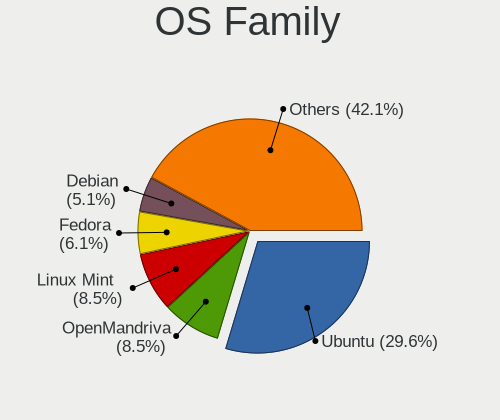

| Name          | Computers | Percent |
|---------------|-----------|---------|
| Ubuntu        | 496       | 32.04%  |
| Linux Mint    | 133       | 8.59%   |
| OpenMandriva  | 112       | 7.24%   |
| Fedora        | 80        | 5.17%   |
| Pop!_OS       | 70        | 4.52%   |
| Debian        | 70        | 4.52%   |
| Manjaro       | 62        | 4.01%   |
| Zorin         | 58        | 3.75%   |
| Arch          | 47        | 3.04%   |
| Ubuntu MATE   | 45        | 2.91%   |
| Xubuntu       | 36        | 2.33%   |
| KDE neon      | 34        | 2.2%    |
| Kubuntu       | 30        | 1.94%   |
| ROSA          | 23        | 1.49%   |
| openSUSE      | 23        | 1.49%   |
| MX            | 21        | 1.36%   |
| ArcoLinux     | 21        | 1.36%   |
| Gentoo        | 19        | 1.23%   |
| Endless       | 18        | 1.16%   |
| Elementary    | 16        | 1.03%   |
| Ubuntu Unity  | 13        | 0.84%   |
| Lubuntu       | 9         | 0.58%   |
| LMDE          | 9         | 0.58%   |
| BlackPanther  | 8         | 0.52%   |
| EndeavourOS   | 7         | 0.45%   |
| Ubuntu Budgie | 6         | 0.39%   |
| Kali          | 6         | 0.39%   |
| Garuda Linux  | 6         | 0.39%   |
| ALT Linux     | 6         | 0.39%   |
| Xero          | 5         | 0.32%   |
| Void Linux    | 5         | 0.32%   |
| Peppermint    | 4         | 0.26%   |
| BigLinux      | 4         | 0.26%   |
| Artix         | 4         | 0.26%   |
| Slackware     | 3         | 0.19%   |
| Nobara        | 3         | 0.19%   |
| LinuxFX       | 3         | 0.19%   |
| CentOS        | 3         | 0.19%   |
| SteamOS       | 2         | 0.13%   |
| Solus         | 2         | 0.13%   |

Kernel
------

Version of the Linux kernel

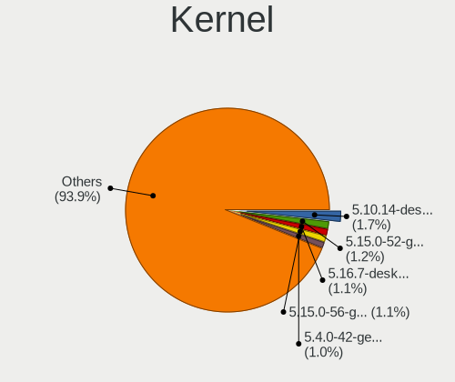

| Version                  | Computers | Percent |
|--------------------------|-----------|---------|
| 5.10.14-desktop-1omv4002 | 36        | 1.97%   |
| 5.15.0-52-generic        | 25        | 1.37%   |
| 5.16.7-desktop-1omv4003  | 22        | 1.2%    |
| 5.15.0-56-generic        | 22        | 1.2%    |
| 5.4.0-42-generic         | 20        | 1.09%   |
| 5.4.0-58-generic         | 19        | 1.04%   |
| 6.4.11-desktop-1omv2390  | 14        | 0.77%   |
| 5.4.0-29-generic         | 14        | 0.77%   |
| 4.15.0-163-generic       | 14        | 0.77%   |
| 5.4.0-94-generic         | 13        | 0.71%   |
| 5.15.0-58-generic        | 13        | 0.71%   |
| 6.2.6-desktop-1omv2390   | 12        | 0.66%   |
| 5.3.0-46-generic         | 12        | 0.66%   |
| 6.1.1-desktop-1omv2290   | 11        | 0.6%    |
| 5.4.0-54-generic         | 11        | 0.6%    |
| 5.4.0-48-generic         | 11        | 0.6%    |
| 5.15.0-53-generic        | 11        | 0.6%    |
| 5.11.0-40-generic        | 11        | 0.6%    |
| 5.4.0-65-generic         | 10        | 0.55%   |
| 4.15.0-47-generic        | 10        | 0.55%   |
| 6.1.0-9-amd64            | 9         | 0.49%   |
| 5.4.0-91-generic         | 9         | 0.49%   |
| 5.4.0-52-generic         | 9         | 0.49%   |
| 5.19.0-35-generic        | 9         | 0.49%   |
| 6.2.0-39-generic         | 8         | 0.44%   |
| 5.8.0-43-generic         | 8         | 0.44%   |
| 5.4.0-56-generic         | 8         | 0.44%   |
| 5.4.0-37-generic         | 8         | 0.44%   |
| 5.3.0-42-generic         | 8         | 0.44%   |
| 5.15.0-46-generic        | 8         | 0.44%   |
| 5.13.0-39-generic        | 8         | 0.44%   |
| 5.11.0-38-generic        | 8         | 0.44%   |
| 5.11.0-37-generic        | 8         | 0.44%   |
| 5.0.0-37-generic         | 8         | 0.44%   |
| 5.0.0-13-generic         | 8         | 0.44%   |
| 4.15.0-45-generic        | 8         | 0.44%   |
| 6.6.2-desktop-1omv2390   | 7         | 0.38%   |
| 6.2.0-26-generic         | 7         | 0.38%   |
| 6.0.6-76060006-generic   | 7         | 0.38%   |
| 5.8.0-55-generic         | 7         | 0.38%   |

Kernel Family
-------------

Linux kernel without a distro release

| Version | Computers | Percent |
|---------|-----------|---------|
| 5.4.0   | 256       | 14.81%  |
| 5.15.0  | 165       | 9.54%   |
| 4.15.0  | 108       | 6.25%   |
| 5.11.0  | 83        | 4.8%    |
| 5.8.0   | 66        | 3.82%   |
| 5.3.0   | 66        | 3.82%   |
| 5.13.0  | 64        | 3.7%    |
| 5.19.0  | 54        | 3.12%   |
| 6.5.0   | 44        | 2.54%   |
| 6.2.0   | 39        | 2.26%   |
| 5.0.0   | 38        | 2.2%    |
| 5.10.14 | 36        | 2.08%   |
| 6.1.0   | 32        | 1.85%   |
| 5.10.0  | 32        | 1.85%   |
| 4.18.0  | 30        | 1.74%   |
| 5.16.7  | 23        | 1.33%   |
| 6.4.11  | 16        | 0.93%   |
| 6.2.6   | 14        | 0.81%   |
| 4.19.0  | 14        | 0.81%   |
| 6.1.1   | 13        | 0.75%   |
| 6.8.0   | 11        | 0.64%   |
| 6.6.2   | 9         | 0.52%   |
| 6.6.0   | 7         | 0.4%    |
| 6.5.5   | 7         | 0.4%    |
| 6.0.6   | 7         | 0.4%    |
| 5.9.11  | 7         | 0.4%    |
| 5.14.21 | 7         | 0.4%    |
| 5.10.88 | 7         | 0.4%    |
| 4.9.60  | 7         | 0.4%    |
| 6.6.8   | 6         | 0.35%   |
| 6.5.6   | 6         | 0.35%   |
| 5.18.10 | 6         | 0.35%   |
| 5.17.5  | 6         | 0.35%   |
| 6.6.1   | 5         | 0.29%   |
| 6.4.8   | 5         | 0.29%   |
| 6.3.5   | 5         | 0.29%   |
| 6.0.12  | 5         | 0.29%   |
| 5.18.12 | 5         | 0.29%   |
| 5.14.14 | 5         | 0.29%   |
| 5.14.0  | 5         | 0.29%   |

Kernel Major Ver.
-----------------

Linux kernel major version

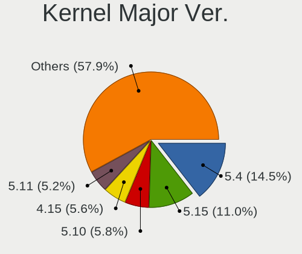

| Version | Computers | Percent |
|---------|-----------|---------|
| 5.4     | 277       | 16.2%   |
| 5.15    | 204       | 11.93%  |
| 4.15    | 108       | 6.32%   |
| 5.10    | 106       | 6.2%    |
| 5.11    | 101       | 5.91%   |
| 5.8     | 87        | 5.09%   |
| 5.3     | 72        | 4.21%   |
| 5.13    | 71        | 4.15%   |
| 6.1     | 70        | 4.09%   |
| 6.5     | 68        | 3.98%   |
| 6.2     | 63        | 3.68%   |
| 5.19    | 62        | 3.63%   |
| 6.6     | 43        | 2.51%   |
| 5.0     | 42        | 2.46%   |
| 5.16    | 36        | 2.11%   |
| 4.18    | 36        | 2.11%   |
| 6.4     | 33        | 1.93%   |
| 6.0     | 29        | 1.7%    |
| 5.14    | 26        | 1.52%   |
| 5.17    | 20        | 1.17%   |
| 5.9     | 19        | 1.11%   |
| 5.18    | 17        | 0.99%   |
| 4.19    | 15        | 0.88%   |
| 6.8     | 14        | 0.82%   |
| 5.6     | 14        | 0.82%   |
| 4.9     | 14        | 0.82%   |
| 6.3     | 13        | 0.76%   |
| 5.7     | 12        | 0.7%    |
| 5.12    | 11        | 0.64%   |
| 6.7     | 8         | 0.47%   |
| 5.5     | 6         | 0.35%   |
| 4.4     | 2         | 0.12%   |
| 4.10    | 2         | 0.12%   |
| 4.1     | 2         | 0.12%   |
| 5.2     | 1         | 0.06%   |
| 5.1     | 1         | 0.06%   |
| 4.20    | 1         | 0.06%   |
| 4.16    | 1         | 0.06%   |
| 4.14    | 1         | 0.06%   |
| 3.16    | 1         | 0.06%   |

Arch
----

OS architecture (x86_64, i586, etc.)

| Name    | Computers | Percent |
|---------|-----------|---------|
| x86_64  | 1415      | 95.48%  |
| i686    | 58        | 3.91%   |
| aarch64 | 7         | 0.47%   |
| armv7l  | 1         | 0.07%   |
| armv6l  | 1         | 0.07%   |

DE
--

Desktop Environment

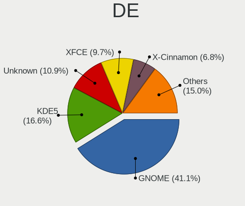

| Name                | Computers | Percent |
|---------------------|-----------|---------|
| GNOME               | 654       | 42.19%  |
| KDE5                | 269       | 17.35%  |
| Unknown             | 161       | 10.39%  |
| XFCE                | 147       | 9.48%   |
| X-Cinnamon          | 109       | 7.03%   |
| MATE                | 70        | 4.52%   |
| KDE                 | 39        | 2.52%   |
| Pantheon            | 16        | 1.03%   |
| LXQt                | 15        | 0.97%   |
| Unity               | 13        | 0.84%   |
| KDE4                | 12        | 0.77%   |
| Budgie              | 10        | 0.65%   |
| i3                  | 8         | 0.52%   |
| LXDE                | 5         | 0.32%   |
| Cinnamon            | 5         | 0.32%   |
| KDE6                | 3         | 0.19%   |
| Deepin              | 3         | 0.19%   |
| openbox             | 2         | 0.13%   |
| GNOME Classic       | 2         | 0.13%   |
| lightdm-xsession    | 1         | 0.06%   |
| ICEWM               | 1         | 0.06%   |
| hyprland            | 1         | 0.06%   |
| herbstluftwm        | 1         | 0.06%   |
| GNOME Flashback     | 1         | 0.06%   |
| awesome             | 1         | 0.06%   |
| /usr/bin/startxfce4 | 1         | 0.06%   |

Display Server
--------------

X11 or Wayland

| Name    | Computers | Percent |
|---------|-----------|---------|
| X11     | 1146      | 74.61%  |
| Wayland | 263       | 17.12%  |
| Unknown | 92        | 5.99%   |
| Tty     | 35        | 2.28%   |

Display Manager
---------------

SDDM, LightDM, etc.

| Name    | Computers | Percent |
|---------|-----------|---------|
| Unknown | 762       | 48.97%  |
| SDDM    | 231       | 14.85%  |
| LightDM | 197       | 12.66%  |
| GDM3    | 196       | 12.6%   |
| GDM     | 124       | 7.97%   |
| TDM     | 24        | 1.54%   |
| KDM     | 12        | 0.77%   |
| XDM     | 4         | 0.26%   |
| SLiM    | 2         | 0.13%   |
| LXDM    | 2         | 0.13%   |
| Ly      | 1         | 0.06%   |
| GREETD  | 1         | 0.06%   |

OS Lang
-------

Language

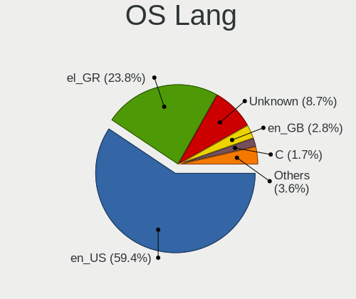

| Lang       | Computers | Percent |
|------------|-----------|---------|
| en_US      | 880       | 57.86%  |
| el_GR      | 384       | 25.25%  |
| Unknown    | 149       | 9.8%    |
| en_GB      | 36        | 2.37%   |
| C          | 24        | 1.58%   |
| de_DE      | 18        | 1.18%   |
| ru_RU      | 6         | 0.39%   |
| POSIX      | 3         | 0.2%    |
| en_CA      | 3         | 0.2%    |
| it_IT      | 2         | 0.13%   |
| fr_FR      | 2         | 0.13%   |
| es_ES      | 2         | 0.13%   |
| en_IE      | 2         | 0.13%   |
| el_GR@euro | 2         | 0.13%   |
| unm_US     | 1         | 0.07%   |
| pl_PL      | 1         | 0.07%   |
| hu_HU      | 1         | 0.07%   |
| en_AU      | 1         | 0.07%   |
| en_AG      | 1         | 0.07%   |
| C.UTF8     | 1         | 0.07%   |
| bg_BG      | 1         | 0.07%   |
| anp_IN     | 1         | 0.07%   |

Boot Mode
---------

EFI or BIOS

| Mode | Computers | Percent |
|------|-----------|---------|
| BIOS | 862       | 56.6%   |
| EFI  | 661       | 43.4%   |

Filesystem
----------

Type of filesystem

| Type    | Computers | Percent |
|---------|-----------|---------|
| Ext4    | 1098      | 71.16%  |
| Overlay | 158       | 10.24%  |
| Btrfs   | 144       | 9.33%   |
| Tmpfs   | 68        | 4.41%   |
| Unknown | 44        | 2.85%   |
| Zfs     | 12        | 0.78%   |
| Xfs     | 12        | 0.78%   |
| F2fs    | 3         | 0.19%   |
| Ext3    | 2         | 0.13%   |
| Ext2    | 2         | 0.13%   |

Part. scheme
------------

Scheme of partitioning

| Type    | Computers | Percent |
|---------|-----------|---------|
| Unknown | 815       | 52.96%  |
| GPT     | 528       | 34.31%  |
| MBR     | 196       | 12.74%  |

Dual Boot with Linux/BSD
------------------------

Hosting more than one Linux/BSD

| Dual boot | Computers | Percent |
|-----------|-----------|---------|
| No        | 1275      | 84.1%   |
| Yes       | 241       | 15.9%   |

Dual Boot (Win)
---------------

Hosting Linux and Windows

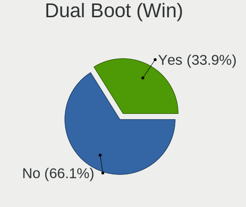

| Dual boot | Computers | Percent |
|-----------|-----------|---------|
| No        | 992       | 65.44%  |
| Yes       | 524       | 34.56%  |

Board
-----

Vendor
------

Motherboard manufacturer

| Name                    | Computers | Percent |
|-------------------------|-----------|---------|
| Hewlett-Packard         | 234       | 15.79%  |
| Lenovo                  | 226       | 15.25%  |
| ASUSTek Computer        | 219       | 14.78%  |
| Dell                    | 185       | 12.48%  |
| Gigabyte Technology     | 167       | 11.27%  |
| MSI                     | 69        | 4.66%   |
| ASRock                  | 68        | 4.59%   |
| Acer                    | 56        | 3.78%   |
| Toshiba                 | 32        | 2.16%   |
| Sony                    | 31        | 2.09%   |
| Apple                   | 19        | 1.28%   |
| Fujitsu                 | 14        | 0.94%   |
| Fujitsu Siemens         | 13        | 0.88%   |
| Intel                   | 12        | 0.81%   |
| HUAWEI                  | 9         | 0.61%   |
| Unknown                 | 9         | 0.61%   |
| Notebook                | 8         | 0.54%   |
| Pegatron                | 7         | 0.47%   |
| Raspberry Pi Foundation | 6         | 0.4%    |
| Clevo                   | 6         | 0.4%    |
| Foxconn                 | 5         | 0.34%   |
| Chuwi                   | 5         | 0.34%   |
| Samsung Electronics     | 4         | 0.27%   |
| IBM                     | 4         | 0.27%   |
| Teclast                 | 3         | 0.2%    |
| Insyde                  | 3         | 0.2%    |
| Hampoo                  | 3         | 0.2%    |
| Google                  | 3         | 0.2%    |
| FriendlyElec            | 3         | 0.2%    |
| ECS                     | 3         | 0.2%    |
| E-shop.gr               | 3         | 0.2%    |
| Biostar                 | 3         | 0.2%    |
| ZOTAC                   | 2         | 0.13%   |
| Valve                   | 2         | 0.13%   |
| TUXEDO                  | 2         | 0.13%   |
| Timi                    | 2         | 0.13%   |
| Medion                  | 2         | 0.13%   |
| Info Quest Technologies | 2         | 0.13%   |
| AZW                     | 2         | 0.13%   |
| AOpen                   | 2         | 0.13%   |

Model
-----

Motherboard model

| Name                                       | Computers | Percent |
|--------------------------------------------|-----------|---------|
| Unknown                                    | 15        | 1.01%   |
| ASUS All Series                            | 14        | 0.94%   |
| HP Pavilion g6                             | 11        | 0.74%   |
| HP Notebook                                | 9         | 0.61%   |
| HP ProDesk 600 G1 SFF                      | 7         | 0.47%   |
| HP 255 G7 Notebook PC                      | 7         | 0.47%   |
| Dell Inspiron 3542                         | 6         | 0.4%    |
| ASRock B450 Gaming K4                      | 6         | 0.4%    |
| MSI MS-7C02                                | 5         | 0.34%   |
| HP Pavilion 15                             | 5         | 0.34%   |
| HP G62                                     | 5         | 0.34%   |
| Gigabyte H61M-S2PV                         | 5         | 0.34%   |
| Gigabyte B450M DS3H                        | 5         | 0.34%   |
| Dell OptiPlex GX520                        | 5         | 0.34%   |
| Dell OptiPlex 790                          | 5         | 0.34%   |
| Dell OptiPlex 7010                         | 5         | 0.34%   |
| Dell Inspiron 3537                         | 5         | 0.34%   |
| ASUS Vivobook Go E1504FA_E1504FA           | 5         | 0.34%   |
| ASUS ROG STRIX B350-F GAMING               | 5         | 0.34%   |
| Pegatron A15                               | 4         | 0.27%   |
| Notebook W54_W94_W955TU,-T,-C              | 4         | 0.27%   |
| Lenovo IdeaPad 100-15IBD 80QQ              | 4         | 0.27%   |
| Lenovo G510 20238                          | 4         | 0.27%   |
| Lenovo G40-30 80FY                         | 4         | 0.27%   |
| HP Pavilion Notebook                       | 4         | 0.27%   |
| HP Pavilion dv7                            | 4         | 0.27%   |
| HP Pavilion dv6                            | 4         | 0.27%   |
| HP Compaq Pro 6300 SFF                     | 4         | 0.27%   |
| HP Compaq 8200 Elite SFF PC                | 4         | 0.27%   |
| Gigabyte B550 AORUS ELITE V2               | 4         | 0.27%   |
| Gigabyte B450 AORUS M                      | 4         | 0.27%   |
| Gigabyte A320M-S2H                         | 4         | 0.27%   |
| Dell Inspiron 5567                         | 4         | 0.27%   |
| ASUS VivoBook 15_ASUS Laptop X540MA_X543MA | 4         | 0.27%   |
| MSI MS-7C56                                | 3         | 0.2%    |
| MSI MS-7A38                                | 3         | 0.2%    |
| Lenovo V15-ADA 82C7                        | 3         | 0.2%    |
| Lenovo MIIX 320-10ICR 80XF                 | 3         | 0.2%    |
| Lenovo IdeaPad 5 Pro 14ACN6 82L7           | 3         | 0.2%    |
| Lenovo IdeaPad 320-15ISK 80XH              | 3         | 0.2%    |

Model Family
------------

Motherboard model prefix

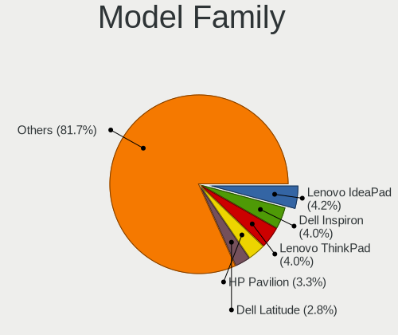

| Name                  | Computers | Percent |
|-----------------------|-----------|---------|
| Lenovo IdeaPad        | 63        | 4.25%   |
| Lenovo ThinkPad       | 58        | 3.91%   |
| Dell Inspiron         | 57        | 3.85%   |
| HP Pavilion           | 52        | 3.51%   |
| Acer Aspire           | 44        | 2.97%   |
| Dell Latitude         | 42        | 2.83%   |
| HP Compaq             | 38        | 2.56%   |
| Dell OptiPlex         | 35        | 2.36%   |
| Toshiba Satellite     | 28        | 1.89%   |
| ASUS PRIME            | 27        | 1.82%   |
| Lenovo ThinkCentre    | 25        | 1.69%   |
| ASUS VivoBook         | 24        | 1.62%   |
| Dell Precision        | 19        | 1.28%   |
| ASUS ROG              | 19        | 1.28%   |
| HP EliteBook          | 16        | 1.08%   |
| HP 255                | 16        | 1.08%   |
| HP ProBook            | 15        | 1.01%   |
| Unknown               | 15        | 1.01%   |
| ASUS All              | 14        | 0.94%   |
| HP Laptop             | 12        | 0.81%   |
| ASUS TUF              | 12        | 0.81%   |
| Dell XPS              | 11        | 0.74%   |
| Dell Vostro           | 11        | 0.74%   |
| Lenovo Legion         | 9         | 0.61%   |
| HP ProDesk            | 9         | 0.61%   |
| HP Notebook           | 9         | 0.61%   |
| HP 250                | 9         | 0.61%   |
| Fujitsu LIFEBOOK      | 9         | 0.61%   |
| Lenovo Yoga           | 8         | 0.54%   |
| HP ENVY               | 7         | 0.47%   |
| Gigabyte B550         | 7         | 0.47%   |
| Fujitsu Siemens AMILO | 7         | 0.47%   |
| RPi Raspberry         | 6         | 0.4%    |
| Gigabyte B450         | 6         | 0.4%    |
| ASRock B450           | 6         | 0.4%    |
| MSI MS-7C02           | 5         | 0.34%   |
| HP G62                | 5         | 0.34%   |
| HP EliteDesk          | 5         | 0.34%   |
| Gigabyte H61M-S2PV    | 5         | 0.34%   |
| Gigabyte B450M        | 5         | 0.34%   |

MFG Year
--------

Motherboard manufacture year

| Year    | Computers | Percent |
|---------|-----------|---------|
| 2019    | 116       | 7.83%   |
| 2018    | 116       | 7.83%   |
| 2013    | 114       | 7.69%   |
| 2020    | 102       | 6.88%   |
| 2012    | 102       | 6.88%   |
| 2017    | 99        | 6.68%   |
| 2008    | 98        | 6.61%   |
| 2011    | 95        | 6.41%   |
| 2009    | 91        | 6.14%   |
| 2014    | 90        | 6.07%   |
| 2015    | 77        | 5.2%    |
| 2021    | 68        | 4.59%   |
| 2010    | 63        | 4.25%   |
| 2007    | 63        | 4.25%   |
| 2016    | 62        | 4.18%   |
| 2022    | 43        | 2.9%    |
| 2006    | 22        | 1.48%   |
| 2005    | 22        | 1.48%   |
| 2023    | 21        | 1.42%   |
| Unknown | 8         | 0.54%   |
| 2004    | 5         | 0.34%   |
| 2003    | 5         | 0.34%   |

Form Factor
-----------

Physical design of the computer

| Name           | Computers | Percent |
|----------------|-----------|---------|
| Notebook       | 799       | 53.91%  |
| Desktop        | 617       | 41.63%  |
| Convertible    | 24        | 1.62%   |
| All in one     | 10        | 0.67%   |
| System on chip | 9         | 0.61%   |
| Tablet         | 9         | 0.61%   |
| Server         | 9         | 0.61%   |
| Mini pc        | 5         | 0.34%   |

Secure Boot
-----------

Enabled or disabled

| State    | Computers | Percent |
|----------|-----------|---------|
| Disabled | 1386      | 92.71%  |
| Enabled  | 109       | 7.29%   |

Coreboot
--------

Have coreboot on board

| Used | Computers | Percent |
|------|-----------|---------|
| No   | 1479      | 99.8%   |
| Yes  | 3         | 0.2%    |

RAM Size
--------

Total RAM memory

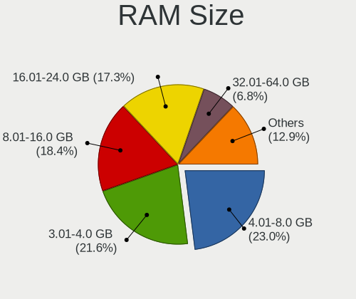

| Size in GB  | Computers | Percent |
|-------------|-----------|---------|
| 4.01-8.0    | 345       | 22.88%  |
| 3.01-4.0    | 345       | 22.88%  |
| 8.01-16.0   | 278       | 18.44%  |
| 16.01-24.0  | 249       | 16.51%  |
| 1.01-2.0    | 112       | 7.43%   |
| 32.01-64.0  | 91        | 6.03%   |
| 2.01-3.0    | 41        | 2.72%   |
| 24.01-32.0  | 16        | 1.06%   |
| 64.01-256.0 | 16        | 1.06%   |
| 0.51-1.0    | 14        | 0.93%   |
| 0.01-0.5    | 1         | 0.07%   |

RAM Used
--------

Used RAM memory

| Used GB    | Computers | Percent |
|------------|-----------|---------|
| 1.01-2.0   | 624       | 37.91%  |
| 2.01-3.0   | 396       | 24.06%  |
| 4.01-8.0   | 197       | 11.97%  |
| 3.01-4.0   | 190       | 11.54%  |
| 0.51-1.0   | 140       | 8.51%   |
| 8.01-16.0  | 61        | 3.71%   |
| 0.01-0.5   | 27        | 1.64%   |
| 16.01-24.0 | 9         | 0.55%   |
| 32.01-64.0 | 1         | 0.06%   |
| 24.01-32.0 | 1         | 0.06%   |

Total Drives
------------

Number of drives on board

| Drives | Computers | Percent |
|--------|-----------|---------|
| 1      | 890       | 58.32%  |
| 2      | 385       | 25.23%  |
| 3      | 119       | 7.8%    |
| 4      | 61        | 4%      |
| 5      | 28        | 1.83%   |
| 6      | 17        | 1.11%   |
| 0      | 14        | 0.92%   |
| 7      | 7         | 0.46%   |
| 18     | 1         | 0.07%   |
| 14     | 1         | 0.07%   |
| 13     | 1         | 0.07%   |
| 12     | 1         | 0.07%   |
| 8      | 1         | 0.07%   |

Has CD-ROM
----------

Has CD-ROM on board

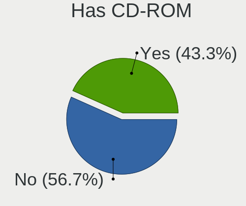

| Presented | Computers | Percent |
|-----------|-----------|---------|
| No        | 827       | 55.35%  |
| Yes       | 667       | 44.65%  |

Has Ethernet
------------

Has Ethernet on board

| Presented | Computers | Percent |
|-----------|-----------|---------|
| Yes       | 1303      | 87.8%   |
| No        | 181       | 12.2%   |

Has WiFi
--------

Has WiFi module

| Presented | Computers | Percent |
|-----------|-----------|---------|
| Yes       | 1059      | 70.84%  |
| No        | 436       | 29.16%  |

Has Bluetooth
-------------

Has Bluetooth module

| Presented | Computers | Percent |
|-----------|-----------|---------|
| Yes       | 799       | 53.27%  |
| No        | 701       | 46.73%  |

Location
--------

Country
-------

Geographic location (country)

| Country | Computers | Percent |
|---------|-----------|---------|
| Greece  | 1482      | 100%    |

City
----

Geographic location (city)

| City         | Computers | Percent |
|--------------|-----------|---------|
| Athens       | 733       | 45.36%  |
| Thessaloniki | 227       | 14.05%  |
| Heraklion    | 46        | 2.85%   |
| Ptrai      | 40        | 2.48%   |
| Volos        | 26        | 1.61%   |
| Piraeus      | 26        | 1.61%   |
| Larissa      | 25        | 1.55%   |
| Chalcis      | 23        | 1.42%   |
| Kavala       | 19        | 1.18%   |
| Trikala      | 16        | 0.99%   |
| Katerini     | 16        | 0.99%   |
| Ioannina     | 16        | 0.99%   |
| Chania       | 16        | 0.99%   |
| Kalamata     | 13        | 0.8%    |
| Rhodes       | 12        | 0.74%   |
| Chalandri    | 11        | 0.68%   |
| Serres       | 10        | 0.62%   |
| Drama        | 10        | 0.62%   |
| Lamia        | 9         | 0.56%   |
| Veroia       | 8         | 0.5%    |
| Corfu        | 8         | 0.5%    |
| Rethymno     | 7         | 0.43%   |
| Marousi      | 7         | 0.43%   |
| Kallithea    | 7         | 0.43%   |
| Acharnes     | 7         | 0.43%   |
| Xanthi       | 6         | 0.37%   |
| Samos        | 6         | 0.37%   |
| Kozani       | 6         | 0.37%   |
| Karditsa     | 6         | 0.37%   |
| Agrinio      | 6         | 0.37%   |
| Zakynthos    | 5         | 0.31%   |
| Salamina     | 5         | 0.31%   |
| Paros        | 5         | 0.31%   |
| Nea Smyrni   | 5         | 0.31%   |
| Mytilene     | 5         | 0.31%   |
| Komotini     | 5         | 0.31%   |
| Glyfada      | 5         | 0.31%   |
| Fira         | 5         | 0.31%   |
| Corinth      | 5         | 0.31%   |
| Aigaleo      | 5         | 0.31%   |

Drives
------

Drive Vendor
------------

Hard drive vendors

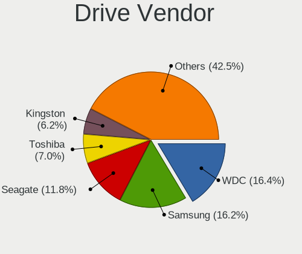

| Vendor                      | Computers | Drives | Percent |
|-----------------------------|-----------|--------|---------|
| WDC                         | 382       | 639    | 17.28%  |
| Samsung Electronics         | 336       | 522    | 15.2%   |
| Seagate                     | 280       | 431    | 12.66%  |
| Toshiba                     | 159       | 215    | 7.19%   |
| Kingston                    | 140       | 182    | 6.33%   |
| SanDisk                     | 127       | 174    | 5.74%   |
| Patriot                     | 94        | 119    | 4.25%   |
| Unknown                     | 70        | 116    | 3.17%   |
| Hitachi                     | 53        | 58     | 2.4%    |
| Crucial                     | 52        | 76     | 2.35%   |
| Intenso                     | 48        | 62     | 2.17%   |
| SK hynix                    | 47        | 60     | 2.13%   |
| Intel                       | 39        | 48     | 1.76%   |
| HGST                        | 31        | 45     | 1.4%    |
| Micron Technology           | 23        | 27     | 1.04%   |
| Team                        | 18        | 24     | 0.81%   |
| KIOXIA                      | 18        | 27     | 0.81%   |
| Fujitsu                     | 18        | 19     | 0.81%   |
| OCZ                         | 17        | 20     | 0.77%   |
| A-DATA Technology           | 15        | 23     | 0.68%   |
| Maxtor                      | 14        | 16     | 0.63%   |
| PNY                         | 13        | 13     | 0.59%   |
| SPCC                        | 12        | 15     | 0.54%   |
| Kingston Technology Company | 11        | 15     | 0.5%    |
| JMicron Technology          | 11        | 30     | 0.5%    |
| China                       | 10        | 10     | 0.45%   |
| Phison Electronics          | 9         | 12     | 0.41%   |
| Gigabyte Technology         | 9         | 12     | 0.41%   |
| Phison                      | 8         | 11     | 0.36%   |
| Corsair                     | 8         | 8      | 0.36%   |
| Micron/Crucial Technology   | 7         | 8      | 0.32%   |
| Unknown                     | 7         | 7      | 0.32%   |
| XPG                         | 6         | 8      | 0.27%   |
| Leven                       | 6         | 7      | 0.27%   |
| Apple                       | 6         | 7      | 0.27%   |
| ADATA Technology            | 6         | 10     | 0.27%   |
| Transcend                   | 5         | 5      | 0.23%   |
| Silicon Motion              | 5         | 5      | 0.23%   |
| LITEON                      | 5         | 7      | 0.23%   |
| Verbatim                    | 4         | 5      | 0.18%   |

Drive Model
-----------

Hard drive models

| Model                                              | Computers | Percent |
|----------------------------------------------------|-----------|---------|
| Samsung SSD 860 EVO 250GB                          | 30        | 1.22%   |
| Samsung SSD 860 EVO 500GB                          | 29        | 1.18%   |
| Unknown MMC Card  32GB                             | 26        | 1.06%   |
| Patriot Burst 240GB SSD                            | 24        | 0.97%   |
| Samsung SSD 850 EVO 250GB                          | 22        | 0.89%   |
| Patriot Burst 120GB SSD                            | 22        | 0.89%   |
| Kingston SA400S37240G 240GB SSD                    | 20        | 0.81%   |
| Seagate ST1000LM024 HN-M101MBB 1TB                 | 19        | 0.77%   |
| Kingston SA400S37120G 120GB SSD                    | 19        | 0.77%   |
| Toshiba MQ01ABF050 500GB                           | 18        | 0.73%   |
| Seagate ST500DM002-1BD142 500GB                    | 18        | 0.73%   |
| Toshiba DT01ACA100 1TB                             | 17        | 0.69%   |
| Samsung NVMe SSD Controller SM981/PM981/PM983 1TB  | 17        | 0.69%   |
| Seagate ST1000LM035-1RK172 1TB                     | 16        | 0.65%   |
| Kingston SA400S37480G 480GB SSD                    | 16        | 0.65%   |
| Unknown MMC Card  64GB                             | 15        | 0.61%   |
| Seagate ST1000DM010-2EP102 1TB                     | 15        | 0.61%   |
| WDC WDS240G2G0A-00JH30 240GB SSD                   | 14        | 0.57%   |
| Toshiba DT01ACA050 500GB                           | 14        | 0.57%   |
| Samsung SSD 850 EVO 500GB                          | 14        | 0.57%   |
| WDC WD10EZEX-08WN4A0 1TB                           | 12        | 0.49%   |
| SK hynix NVMe SSD Drive 256GB                      | 12        | 0.49%   |
| Seagate ST500LT012-1DG142 500GB                    | 11        | 0.45%   |
| Seagate ST500LM012 HN-M500MBB 500GB                | 11        | 0.45%   |
| Patriot Burst 480GB SSD                            | 11        | 0.45%   |
| Samsung SSD 850 EVO 120GB                          | 10        | 0.41%   |
| Kingston SV300S37A120G 120GB SSD                   | 10        | 0.41%   |
| Unknown MMC Card  128GB                            | 9         | 0.37%   |
| Toshiba MQ01ABD100 1TB                             | 9         | 0.37%   |
| SanDisk NVMe SSD Drive 512GB                       | 9         | 0.37%   |
| Samsung SSD 870 EVO 500GB                          | 9         | 0.37%   |
| Samsung NVMe SSD Drive 500GB                       | 9         | 0.37%   |
| Samsung NVMe SSD Controller PM9A1/PM9A3/980PRO 1TB | 9         | 0.37%   |
| Crucial CT250MX500SSD1 250GB                       | 9         | 0.37%   |
| Toshiba DT01ACA200 2TB                             | 8         | 0.32%   |
| Seagate ST3500418AS 500GB                          | 8         | 0.32%   |
| SanDisk SDSSDA120G 120GB                           | 8         | 0.32%   |
| SanDisk NVMe SSD Drive 256GB                       | 8         | 0.32%   |
| Samsung SSD 860 EVO 1TB                            | 8         | 0.32%   |
| HGST HTS545050A7E680 500GB                         | 8         | 0.32%   |

HDD Vendor
----------

Hard disk drive vendors

| Vendor              | Computers | Drives | Percent |
|---------------------|-----------|--------|---------|
| WDC                 | 320       | 522    | 36.16%  |
| Seagate             | 276       | 424    | 31.19%  |
| Toshiba             | 118       | 158    | 13.33%  |
| Hitachi             | 53        | 58     | 5.99%   |
| HGST                | 31        | 45     | 3.5%    |
| Samsung Electronics | 25        | 32     | 2.82%   |
| Fujitsu             | 18        | 19     | 2.03%   |
| Maxtor              | 14        | 16     | 1.58%   |
| JMicron Technology  | 8         | 24     | 0.9%    |
| Intenso             | 7         | 8      | 0.79%   |
| Apple               | 4         | 4      | 0.45%   |
| Hewlett-Packard     | 3         | 8      | 0.34%   |
| Unknown             | 2         | 2      | 0.23%   |
| Min Yi U            | 2         | 4      | 0.23%   |
| Quantum             | 1         | 1      | 0.11%   |
| Inateck             | 1         | 1      | 0.11%   |
| IBM/Hitachi         | 1         | 1      | 0.11%   |
| IBM-ESXS            | 1         | 3      | 0.11%   |

SSD Vendor
----------

Solid state drive vendors

| Vendor              | Computers | Drives | Percent |
|---------------------|-----------|--------|---------|
| Samsung Electronics | 193       | 267    | 22.47%  |
| Kingston            | 111       | 147    | 12.92%  |
| Patriot             | 92        | 117    | 10.71%  |
| SanDisk             | 85        | 119    | 9.9%    |
| WDC                 | 58        | 94     | 6.75%   |
| Crucial             | 49        | 73     | 5.7%    |
| Intenso             | 35        | 48     | 4.07%   |
| Toshiba             | 26        | 38     | 3.03%   |
| Intel               | 21        | 25     | 2.44%   |
| Team                | 18        | 24     | 2.1%    |
| OCZ                 | 16        | 19     | 1.86%   |
| A-DATA Technology   | 14        | 22     | 1.63%   |
| PNY                 | 13        | 13     | 1.51%   |
| SPCC                | 12        | 15     | 1.4%    |
| Micron Technology   | 12        | 14     | 1.4%    |
| China               | 10        | 10     | 1.16%   |
| Gigabyte Technology | 8         | 11     | 0.93%   |
| SK hynix            | 7         | 7      | 0.81%   |
| Leven               | 6         | 7      | 0.7%    |
| Corsair             | 5         | 5      | 0.58%   |
| Verbatim            | 4         | 5      | 0.47%   |
| Transcend           | 4         | 4      | 0.47%   |
| Mushkin             | 4         | 4      | 0.47%   |
| LITEONIT            | 4         | 4      | 0.47%   |
| LITEON              | 4         | 6      | 0.47%   |
| GOODRAM             | 4         | 6      | 0.47%   |
| Emtec               | 4         | 5      | 0.47%   |
| Teclast             | 3         | 3      | 0.35%   |
| Apple               | 3         | 3      | 0.35%   |
| Apacer              | 3         | 3      | 0.35%   |
| AGI                 | 3         | 4      | 0.35%   |
| Unknown             | 3         | 3      | 0.35%   |
| Plextor             | 2         | 2      | 0.23%   |
| Platinet            | 2         | 2      | 0.23%   |
| External            | 2         | 3      | 0.23%   |
| Drevo               | 2         | 2      | 0.23%   |
| WDC WDS             | 1         | 1      | 0.12%   |
| USB30               | 1         | 1      | 0.12%   |
| Unknown             | 1         | 4      | 0.12%   |
| TEAM T25            | 1         | 1      | 0.12%   |

Drive Kind
----------

HDD or SSD

| Kind    | Computers | Drives | Percent |
|---------|-----------|--------|---------|
| HDD     | 752       | 1330   | 38.11%  |
| SSD     | 741       | 1156   | 37.56%  |
| NVMe    | 394       | 580    | 19.97%  |
| MMC     | 70        | 117    | 3.55%   |
| Unknown | 16        | 25     | 0.81%   |

Drive Connector
---------------

SATA, SAS, NVMe, etc.

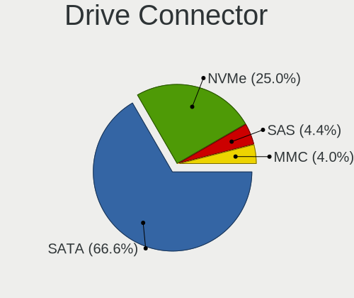

| Type | Computers | Drives | Percent |
|------|-----------|--------|---------|
| SATA | 1183      | 2402   | 69.02%  |
| NVMe | 394       | 579    | 22.99%  |
| MMC  | 70        | 117    | 4.08%   |
| SAS  | 67        | 110    | 3.91%   |

Drive Size
----------

Size of hard drive

| Size in TB | Computers | Drives | Percent |
|------------|-----------|--------|---------|
| 0.01-0.5   | 1003      | 1689   | 66.6%   |
| 0.51-1.0   | 344       | 532    | 22.84%  |
| 1.01-2.0   | 85        | 133    | 5.64%   |
| 3.01-4.0   | 31        | 45     | 2.06%   |
| 2.01-3.0   | 26        | 42     | 1.73%   |
| 4.01-10.0  | 13        | 40     | 0.86%   |
| 10.01-20.0 | 4         | 5      | 0.27%   |

Space Total
-----------

Amount of disk space available on the file system

| Size in GB     | Computers | Percent |
|----------------|-----------|---------|
| 101-250        | 458       | 28.81%  |
| 251-500        | 315       | 19.81%  |
| 501-1000       | 180       | 11.32%  |
| 1-20           | 134       | 8.43%   |
| 51-100         | 128       | 8.05%   |
| 1001-2000      | 121       | 7.61%   |
| 21-50          | 76        | 4.78%   |
| More than 3000 | 69        | 4.34%   |
| Unknown        | 67        | 4.21%   |
| 2001-3000      | 42        | 2.64%   |

Space Used
----------

Amount of used disk space

| Used GB        | Computers | Percent |
|----------------|-----------|---------|
| 1-20           | 607       | 37.22%  |
| 21-50          | 284       | 17.41%  |
| 51-100         | 193       | 11.83%  |
| 101-250        | 171       | 10.48%  |
| 251-500        | 125       | 7.66%   |
| 501-1000       | 86        | 5.27%   |
| Unknown        | 67        | 4.11%   |
| 1001-2000      | 56        | 3.43%   |
| More than 3000 | 29        | 1.78%   |
| 2001-3000      | 13        | 0.8%    |

Malfunc. Drives
---------------

Drive models with a malfunction

| Model                              | Computers | Drives | Percent |
|------------------------------------|-----------|--------|---------|
| HGST HTS545050A7E680 500GB         | 4         | 4      | 3.13%   |
| WDC WD2002FAEX-007BA0 2TB          | 2         | 3      | 1.56%   |
| Toshiba MQ01ABF050 500GB           | 2         | 2      | 1.56%   |
| Seagate ST500DM002-1BD142 500GB    | 2         | 3      | 1.56%   |
| Seagate ST3500320AS 500GB          | 2         | 2      | 1.56%   |
| Seagate ST3250318AS 250GB          | 2         | 2      | 1.56%   |
| Seagate ST1000LM024 HN-M101MBB 1TB | 2         | 8      | 1.56%   |
| SanDisk SSD PLUS 240GB             | 2         | 2      | 1.56%   |
| WDC WDS240G2G0A-00JH30 240GB SSD   | 1         | 1      | 0.78%   |
| WDC WDS120G2G0A-00JH30 120GB SSD   | 1         | 1      | 0.78%   |
| WDC WD800JD-23LSA0 80GB            | 1         | 1      | 0.78%   |
| WDC WD800JB-00JJC0 80GB            | 1         | 2      | 0.78%   |
| WDC WD6400AAKS-65A7B0 640GB        | 1         | 1      | 0.78%   |
| WDC WD5000LPVT-00FMCT0 500GB       | 1         | 1      | 0.78%   |
| WDC WD5000LPCX-24VHAT0 500GB       | 1         | 1      | 0.78%   |
| WDC WD5000BPVT-60HXZT1 500GB       | 1         | 1      | 0.78%   |
| WDC WD5000AAVS-22G9B1 500GB        | 1         | 1      | 0.78%   |
| WDC WD5000AAKX-60U6AA0 500GB       | 1         | 1      | 0.78%   |
| WDC WD5000AAKX-603CA0 500GB        | 1         | 1      | 0.78%   |
| WDC WD5000AAKB-00H8A0 500GB        | 1         | 1      | 0.78%   |
| WDC WD40EFRX-68WT0N0 4TB           | 1         | 1      | 0.78%   |
| WDC WD40EFRX-68N32N0 4TB           | 1         | 1      | 0.78%   |
| WDC WD3200BPVT-22ZEST0 320GB       | 1         | 1      | 0.78%   |
| WDC WD3200BEVT-26ZCT0 320GB        | 1         | 1      | 0.78%   |
| WDC WD3200BEVT-00A0RT0 320GB       | 1         | 1      | 0.78%   |
| WDC WD30EZRZ-00GXCB0 3TB           | 1         | 1      | 0.78%   |
| WDC WD2500YS-01SHB1 256GB          | 1         | 2      | 0.78%   |
| WDC WD2500BEVT-22A23T0 250GB       | 1         | 1      | 0.78%   |
| WDC WD2500AAKX-083CA1 250GB        | 1         | 1      | 0.78%   |
| WDC WD20PURX-64P6ZY0 2TB           | 1         | 1      | 0.78%   |
| WDC WD20EZRX-22D8PB0 2TB           | 1         | 1      | 0.78%   |
| WDC WD20EARS-00MVWB0 2TB           | 1         | 1      | 0.78%   |
| WDC WD1600BEVS-22RST0 160GB        | 1         | 1      | 0.78%   |
| WDC WD1600AAJS-22L7A0 160GB        | 1         | 1      | 0.78%   |
| WDC WD1200JD-00HBB0 120GB          | 1         | 2      | 0.78%   |
| WDC WD10JPVX-22JC3T0 1TB           | 1         | 1      | 0.78%   |
| WDC WD10EZEX-60WN4A1 1TB           | 1         | 3      | 0.78%   |
| WDC WD10EZEX-60WN4A0 1TB           | 1         | 1      | 0.78%   |
| WDC WD10EALX-009BA0 1TB            | 1         | 1      | 0.78%   |
| WDC WD10EADS-00M2B0 1TB            | 1         | 1      | 0.78%   |

Malfunc. Drive Vendor
---------------------

Vendors of faulty drives

| Vendor              | Computers | Drives | Percent |
|---------------------|-----------|--------|---------|
| WDC                 | 31        | 42     | 25.41%  |
| Seagate             | 30        | 38     | 24.59%  |
| Toshiba             | 11        | 14     | 9.02%   |
| Hitachi             | 8         | 8      | 6.56%   |
| HGST                | 6         | 12     | 4.92%   |
| Samsung Electronics | 5         | 5      | 4.1%    |
| SanDisk             | 4         | 4      | 3.28%   |
| Patriot             | 3         | 3      | 2.46%   |
| Micron Technology   | 3         | 3      | 2.46%   |
| Maxtor              | 3         | 3      | 2.46%   |
| Corsair             | 3         | 3      | 2.46%   |
| SK hynix            | 2         | 3      | 1.64%   |
| Kingston            | 2         | 2      | 1.64%   |
| Intel               | 2         | 2      | 1.64%   |
| Crucial             | 2         | 3      | 1.64%   |
| SPCC                | 1         | 1      | 0.82%   |
| OCZ-AGIL            | 1         | 1      | 0.82%   |
| OCZ                 | 1         | 1      | 0.82%   |
| Intenso             | 1         | 1      | 0.82%   |
| Fujitsu             | 1         | 1      | 0.82%   |
| China               | 1         | 1      | 0.82%   |
| A-DATA Technology   | 1         | 1      | 0.82%   |

Malfunc. HDD Vendor
-------------------

Vendors of faulty HDD drives

| Vendor              | Computers | Drives | Percent |
|---------------------|-----------|--------|---------|
| Seagate             | 30        | 38     | 34.09%  |
| WDC                 | 28        | 39     | 31.82%  |
| Toshiba             | 11        | 14     | 12.5%   |
| Hitachi             | 8         | 8      | 9.09%   |
| HGST                | 6         | 12     | 6.82%   |
| Maxtor              | 3         | 3      | 3.41%   |
| Samsung Electronics | 1         | 1      | 1.14%   |
| Fujitsu             | 1         | 1      | 1.14%   |

Malfunc. Drive Kind
-------------------

Kinds of faulty drives

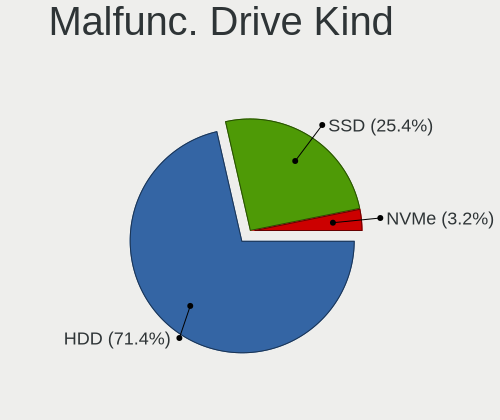

| Kind | Computers | Drives | Percent |
|------|-----------|--------|---------|
| HDD  | 79        | 116    | 70.54%  |
| SSD  | 29        | 31     | 25.89%  |
| NVMe | 4         | 5      | 3.57%   |

Failed Drives
-------------

Failed drive models

| Model                      | Computers | Drives | Percent |
|----------------------------|-----------|--------|---------|
| Seagate ST3500418ASQ 500GB | 1         | 1      | 33.33%  |
| Seagate ST3500418AS 500GB  | 1         | 1      | 33.33%  |
| Mushkin MKNSSDCR120GB-7    | 1         | 1      | 33.33%  |

Failed Drive Vendor
-------------------

Failed drive vendors

| Vendor  | Computers | Drives | Percent |
|---------|-----------|--------|---------|
| Seagate | 2         | 2      | 66.67%  |
| Mushkin | 1         | 1      | 33.33%  |

Drive Status
------------

Number of failed and malfunc. drives

| Status   | Computers | Drives | Percent |
|----------|-----------|--------|---------|
| Detected | 969       | 2031   | 60.26%  |
| Works    | 528       | 1022   | 32.84%  |
| Malfunc  | 108       | 152    | 6.72%   |
| Failed   | 3         | 3      | 0.19%   |

Storage controller
------------------

Storage Vendor
--------------

Storage controller vendors

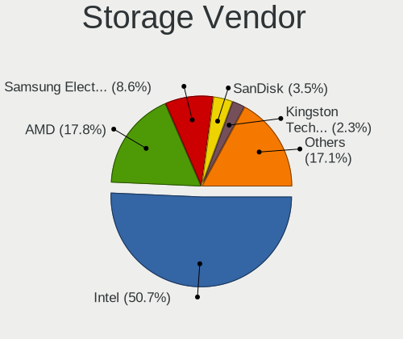

| Vendor                           | Computers | Percent |
|----------------------------------|-----------|---------|
| Intel                            | 959       | 52.09%  |
| AMD                              | 331       | 17.98%  |
| Samsung Electronics              | 143       | 7.77%   |
| SanDisk                          | 53        | 2.88%   |
| JMicron Technology               | 45        | 2.44%   |
| Kingston Technology Company      | 40        | 2.17%   |
| SK hynix                         | 39        | 2.12%   |
| Nvidia                           | 28        | 1.52%   |
| Marvell Technology Group         | 26        | 1.41%   |
| KIOXIA                           | 23        | 1.25%   |
| Phison Electronics               | 22        | 1.2%    |
| ASMedia Technology               | 22        | 1.2%    |
| Toshiba America Info Systems     | 16        | 0.87%   |
| ADATA Technology                 | 12        | 0.65%   |
| Micron Technology                | 11        | 0.6%    |
| VIA Technologies                 | 10        | 0.54%   |
| Micron/Crucial Technology        | 9         | 0.49%   |
| Silicon Image                    | 8         | 0.43%   |
| Silicon Motion                   | 7         | 0.38%   |
| Union Memory (Shenzhen)          | 6         | 0.33%   |
| Realtek Semiconductor            | 5         | 0.27%   |
| Seagate Technology               | 3         | 0.16%   |
| LSI Logic / Symbios Logic        | 3         | 0.16%   |
| Broadcom / LSI                   | 3         | 0.16%   |
| Solid State Storage Technology   | 2         | 0.11%   |
| Silicon Integrated Systems [SiS] | 2         | 0.11%   |
| O2 Micro                         | 2         | 0.11%   |
| MAXIO Technology (Hangzhou)      | 2         | 0.11%   |
| Hewlett-Packard                  | 2         | 0.11%   |
| Promise Technology               | 1         | 0.05%   |
| OCZ Technology Group             | 1         | 0.05%   |
| Netac Technology                 | 1         | 0.05%   |
| Lite-On Technology               | 1         | 0.05%   |
| Integrated Technology Express    | 1         | 0.05%   |
| INNOGRIT                         | 1         | 0.05%   |
| Hosin Global Electronics         | 1         | 0.05%   |

Storage Model
-------------

Storage controller models

| Model                                                                          | Computers | Percent |
|--------------------------------------------------------------------------------|-----------|---------|
| AMD FCH SATA Controller [AHCI mode]                                            | 228       | 10.29%  |
| Intel 8 Series/C220 Series Chipset Family 6-port SATA Controller 1 [AHCI mode] | 76        | 3.43%   |
| Samsung NVMe SSD Controller SM981/PM981/PM983                                  | 71        | 3.2%    |
| Intel NM10/ICH7 Family SATA Controller [IDE mode]                              | 59        | 2.66%   |
| Intel Sunrise Point-LP SATA Controller [AHCI mode]                             | 58        | 2.62%   |
| Intel 7 Series Chipset Family 6-port SATA Controller [AHCI mode]               | 56        | 2.53%   |
| Intel 82801G (ICH7 Family) IDE Controller                                      | 55        | 2.48%   |
| AMD 400 Series Chipset SATA Controller                                         | 50        | 2.26%   |
| Intel 82801IBM/IEM (ICH9M/ICH9M-E) 4 port SATA Controller [AHCI mode]          | 46        | 2.08%   |
| AMD SB7x0/SB8x0/SB9x0 IDE Controller                                           | 41        | 1.85%   |
| Intel 6 Series/C200 Series Chipset Family 6 port Mobile SATA AHCI Controller   | 40        | 1.81%   |
| Intel 8 Series SATA Controller 1 [AHCI mode]                                   | 35        | 1.58%   |
| Intel 6 Series/C200 Series Chipset Family 6 port Desktop SATA AHCI Controller  | 35        | 1.58%   |
| Intel Q170/Q150/B150/H170/H110/Z170/CM236 Chipset SATA Controller [AHCI Mode]  | 33        | 1.49%   |
| Samsung NVMe SSD Controller 980 (DRAM-less)                                    | 31        | 1.4%    |
| Intel 82801 Mobile SATA Controller [RAID mode]                                 | 31        | 1.4%    |
| AMD SB7x0/SB8x0/SB9x0 SATA Controller [AHCI mode]                              | 30        | 1.35%   |
| AMD SB7x0/SB8x0/SB9x0 SATA Controller [IDE mode]                               | 28        | 1.26%   |
| JMicron JMB363 SATA/IDE Controller                                             | 27        | 1.22%   |
| Intel 82801HM/HEM (ICH8M/ICH8M-E) IDE Controller                               | 27        | 1.22%   |
| Intel Volume Management Device NVMe RAID Controller                            | 26        | 1.17%   |
| Intel 7 Series/C210 Series Chipset Family 6-port SATA Controller [AHCI mode]   | 23        | 1.04%   |
| Intel 82801HM/HEM (ICH8M/ICH8M-E) SATA Controller [AHCI mode]                  | 22        | 0.99%   |
| ASMedia ASM1061/ASM1062 Serial ATA Controller                                  | 21        | 0.95%   |
| AMD 500 Series Chipset SATA Controller                                         | 21        | 0.95%   |
| Intel Atom Processor E3800 Series SATA AHCI Controller                         | 20        | 0.9%    |
| Intel Wildcat Point-LP SATA Controller [AHCI Mode]                             | 19        | 0.86%   |
| Intel 5 Series/3400 Series Chipset 4 port SATA AHCI Controller                 | 19        | 0.86%   |
| Intel 200 Series PCH SATA controller [AHCI mode]                               | 19        | 0.86%   |
| Intel 5 Series/3400 Series Chipset 6 port SATA AHCI Controller                 | 18        | 0.81%   |
| Samsung NVMe SSD Controller PM9A1/PM9A3/980PRO                                 | 17        | 0.77%   |
| KIOXIA NVMe SSD Controller BG4 (DRAM-less)                                     | 17        | 0.77%   |
| Intel SATA Controller [RAID mode]                                              | 17        | 0.77%   |
| AMD 300 Series Chipset SATA Controller                                         | 16        | 0.72%   |
| Intel Celeron N3350/Pentium N4200/Atom E3900 Series SATA AHCI Controller       | 14        | 0.63%   |
| Intel Cannon Lake Mobile PCH SATA AHCI Controller                              | 14        | 0.63%   |
| Intel 9 Series Chipset Family SATA Controller [AHCI Mode]                      | 14        | 0.63%   |
| Kingston Company A2000 NVMe SSD SM2263EN                                       | 13        | 0.59%   |
| JMicron JMB368 IDE controller                                                  | 13        | 0.59%   |
| Intel 82801JI (ICH10 Family) 4 port SATA IDE Controller #1                     | 13        | 0.59%   |

Storage Kind
------------

Kind of storage controller (IDE, SATA, NVMe, SAS, ...)

| Kind | Computers | Percent |
|------|-----------|---------|
| SATA | 1063      | 56.3%   |
| NVMe | 401       | 21.24%  |
| IDE  | 324       | 17.16%  |
| RAID | 92        | 4.87%   |
| SAS  | 6         | 0.32%   |
| SCSI | 2         | 0.11%   |

Processor
---------

CPU Vendor
----------

Processor vendors

| Vendor       | Computers | Percent |
|--------------|-----------|---------|
| Intel        | 1051      | 70.92%  |
| AMD          | 421       | 28.41%  |
| ARM          | 9         | 0.61%   |
| CentaurHauls | 1         | 0.07%   |

CPU Model
---------

Processor models

| Model                                         | Computers | Percent |
|-----------------------------------------------|-----------|---------|
| AMD Ryzen 5 3500U with Radeon Vega Mobile Gfx | 17        | 1.14%   |
| Intel Core i5-8250U CPU @ 1.60GHz             | 15        | 1.01%   |
| Intel Atom x5-Z8350 CPU @ 1.44GHz             | 14        | 0.94%   |
| Intel Celeron CPU N2840 @ 2.16GHz             | 13        | 0.87%   |
| Intel Core i7-7500U CPU @ 2.70GHz             | 12        | 0.81%   |
| AMD Ryzen 5 3400G with Radeon Vega Graphics   | 12        | 0.81%   |
| AMD Ryzen 5 2600 Six-Core Processor           | 12        | 0.81%   |
| AMD Ryzen 7 2700X Eight-Core Processor        | 10        | 0.67%   |
| Intel Celeron CPU N3350 @ 1.10GHz             | 9         | 0.61%   |
| Intel 11th Gen Core i5-1135G7 @ 2.40GHz       | 9         | 0.61%   |
| AMD Ryzen 3 2200G with Radeon Vega Graphics   | 9         | 0.61%   |
| AMD FX-6300 Six-Core Processor                | 9         | 0.61%   |
| Intel Pentium 4 CPU 3.00GHz                   | 8         | 0.54%   |
| Intel Core i7-8550U CPU @ 1.80GHz             | 8         | 0.54%   |
| Intel Core i5-6500 CPU @ 3.20GHz              | 8         | 0.54%   |
| Intel Core i5-4460 CPU @ 3.20GHz              | 8         | 0.54%   |
| Intel Core i5 CPU M 520 @ 2.40GHz             | 8         | 0.54%   |
| Intel Core i3-6006U CPU @ 2.00GHz             | 8         | 0.54%   |
| Intel Core i3-4005U CPU @ 1.70GHz             | 8         | 0.54%   |
| Intel Core i3-3220 CPU @ 3.30GHz              | 8         | 0.54%   |
| AMD Ryzen 5 3600 6-Core Processor             | 8         | 0.54%   |
| Intel Pentium 4 CPU 3.20GHz                   | 7         | 0.47%   |
| Intel Core i5-7200U CPU @ 2.50GHz             | 7         | 0.47%   |
| Intel Core i5-5200U CPU @ 2.20GHz             | 7         | 0.47%   |
| Intel Core i5-3320M CPU @ 2.60GHz             | 7         | 0.47%   |
| Intel Core i5-3230M CPU @ 2.60GHz             | 7         | 0.47%   |
| Intel Core i5-2410M CPU @ 2.30GHz             | 7         | 0.47%   |
| Intel Core i5-2400 CPU @ 3.10GHz              | 7         | 0.47%   |
| Intel Core 2 Quad CPU Q6600 @ 2.40GHz         | 7         | 0.47%   |
| Intel Core 2 Duo CPU E7500 @ 2.93GHz          | 7         | 0.47%   |
| Intel Atom CPU N270 @ 1.60GHz                 | 7         | 0.47%   |
| AMD Ryzen 5 5600G with Radeon Graphics        | 7         | 0.47%   |
| AMD Ryzen 5 1600 Six-Core Processor           | 7         | 0.47%   |
| Intel Core i7-9750H CPU @ 2.60GHz             | 6         | 0.4%    |
| Intel Core i7-1065G7 CPU @ 1.30GHz            | 6         | 0.4%    |
| Intel Core i5-4210U CPU @ 1.70GHz             | 6         | 0.4%    |
| Intel Core i5-4200U CPU @ 1.60GHz             | 6         | 0.4%    |
| Intel Core i5-3470 CPU @ 3.20GHz              | 6         | 0.4%    |
| Intel Core i5-1035G1 CPU @ 1.00GHz            | 6         | 0.4%    |
| Intel Core i3-3110M CPU @ 2.40GHz             | 6         | 0.4%    |

CPU Model Family
----------------

Processor model prefix

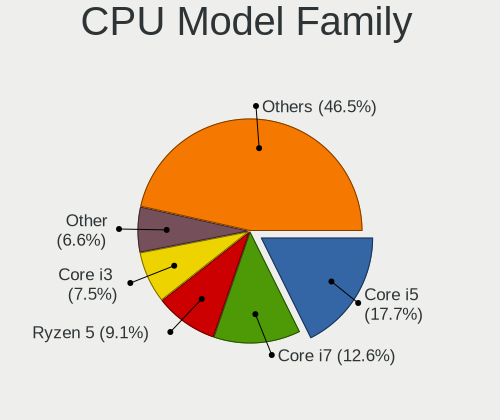

| Model                   | Computers | Percent |
|-------------------------|-----------|---------|
| Intel Core i5           | 255       | 17.19%  |
| Intel Core i7           | 186       | 12.54%  |
| AMD Ryzen 5             | 130       | 8.77%   |
| Intel Core i3           | 120       | 8.09%   |
| Intel Core 2 Duo        | 98        | 6.61%   |
| Other                   | 82        | 5.53%   |
| Intel Celeron           | 81        | 5.46%   |
| AMD Ryzen 7             | 66        | 4.45%   |
| Intel Pentium           | 48        | 3.24%   |
| Intel Atom              | 38        | 2.56%   |
| AMD Ryzen 3             | 31        | 2.09%   |
| Intel Core 2 Quad       | 28        | 1.89%   |
| Intel Xeon              | 24        | 1.62%   |
| Intel Pentium Dual-Core | 21        | 1.42%   |
| Intel Pentium 4         | 21        | 1.42%   |
| AMD FX                  | 21        | 1.42%   |
| Intel Core 2            | 19        | 1.28%   |
| AMD Ryzen 9             | 19        | 1.28%   |
| AMD Athlon 64 X2        | 17        | 1.15%   |
| AMD A8                  | 13        | 0.88%   |
| AMD A6                  | 13        | 0.88%   |
| AMD A10                 | 13        | 0.88%   |
| AMD Phenom II X4        | 11        | 0.74%   |
| AMD A4                  | 11        | 0.74%   |
| AMD E1                  | 9         | 0.61%   |
| Intel Pentium Dual      | 8         | 0.54%   |
| Intel Genuine           | 8         | 0.54%   |
| Intel Pentium D         | 6         | 0.4%    |
| AMD Athlon              | 6         | 0.4%    |
| Intel Pentium M         | 5         | 0.34%   |
| Intel Celeron M         | 5         | 0.34%   |
| AMD E                   | 5         | 0.34%   |
| Intel Celeron Dual-Core | 4         | 0.27%   |
| AMD Phenom II X6        | 4         | 0.27%   |
| AMD Phenom              | 4         | 0.27%   |
| ARM BCM                 | 3         | 0.2%    |
| AMD Sempron             | 3         | 0.2%    |
| AMD Ryzen Threadripper  | 3         | 0.2%    |
| AMD Ryzen 7 PRO         | 3         | 0.2%    |
| AMD Ryzen 5 PRO         | 3         | 0.2%    |

CPU Cores
---------

Number of processor cores

| Number  | Computers | Percent |
|---------|-----------|---------|
| 2       | 650       | 43.83%  |
| 4       | 487       | 32.84%  |
| 6       | 135       | 9.1%    |
| 8       | 82        | 5.53%   |
| 1       | 65        | 4.38%   |
| 12      | 17        | 1.15%   |
| 16      | 15        | 1.01%   |
| 3       | 12        | 0.81%   |
| 10      | 11        | 0.74%   |
| 14      | 6         | 0.4%    |
| 24      | 1         | 0.07%   |
| 20      | 1         | 0.07%   |
| Unknown | 1         | 0.07%   |

CPU Sockets
-----------

Number of sockets

| Number  | Computers | Percent |
|---------|-----------|---------|
| 1       | 1470      | 99.19%  |
| 2       | 10        | 0.67%   |
| 4       | 1         | 0.07%   |
| Unknown | 1         | 0.07%   |

CPU Threads
-----------

Threads per core (Hyper-Threading)

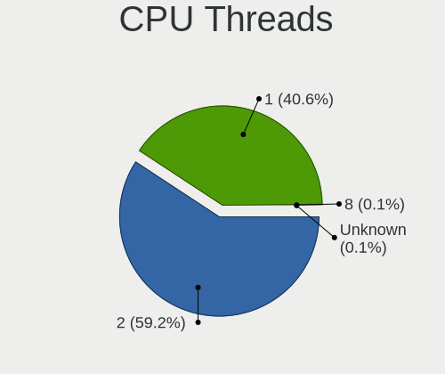

| Number  | Computers | Percent |
|---------|-----------|---------|
| 2       | 854       | 57.62%  |
| 1       | 625       | 42.17%  |
| 8       | 1         | 0.07%   |
| 4       | 1         | 0.07%   |
| Unknown | 1         | 0.07%   |

CPU Op-Modes
------------

CPU Operation Modes (32-bit, 64-bit)

| Op mode        | Computers | Percent |
|----------------|-----------|---------|
| 32-bit, 64-bit | 1429      | 96.16%  |
| 32-bit         | 35        | 2.36%   |
| Unknown        | 20        | 1.35%   |
| 64-bit         | 2         | 0.13%   |

CPU Microcode
-------------

Microcode number

| Number     | Computers | Percent |
|------------|-----------|---------|
| Unknown    | 455       | 29.39%  |
| 0x206a7    | 77        | 4.97%   |
| 0x306c3    | 73        | 4.72%   |
| 0x306a9    | 61        | 3.94%   |
| 0x1067a    | 56        | 3.62%   |
| 0x40651    | 29        | 1.87%   |
| 0x10676    | 26        | 1.68%   |
| 0x08108109 | 25        | 1.61%   |
| 0x6fd      | 24        | 1.55%   |
| 0x806ea    | 23        | 1.49%   |
| 0x506e3    | 21        | 1.36%   |
| 0x906ea    | 20        | 1.29%   |
| 0x30678    | 18        | 1.16%   |
| 0x08108102 | 18        | 1.16%   |
| 0x906e9    | 17        | 1.1%    |
| 0x806c1    | 17        | 1.1%    |
| 0x406c4    | 17        | 1.1%    |
| 0x0800820d | 17        | 1.1%    |
| 0x806e9    | 16        | 1.03%   |
| 0x306d4    | 16        | 1.03%   |
| 0x406e3    | 15        | 0.97%   |
| 0x506c9    | 14        | 0.9%    |
| 0x0a50000c | 14        | 0.9%    |
| 0x806ec    | 13        | 0.84%   |
| 0x6f6      | 13        | 0.84%   |
| 0x06000852 | 13        | 0.84%   |
| 0x0810100b | 12        | 0.78%   |
| 0x20655    | 11        | 0.71%   |
| 0x106c2    | 11        | 0.71%   |
| 0x906ed    | 10        | 0.65%   |
| 0x6fb      | 10        | 0.65%   |
| 0x406c3    | 10        | 0.65%   |
| 0x106e5    | 10        | 0.65%   |
| 0x08701021 | 10        | 0.65%   |
| 0xf43      | 9         | 0.58%   |
| 0x20652    | 9         | 0.58%   |
| 0x0a50000d | 9         | 0.58%   |
| 0x08600106 | 9         | 0.58%   |
| 0x05000119 | 9         | 0.58%   |
| 0x010000c8 | 9         | 0.58%   |

CPU Microarch
-------------

Microarchitecture

| Name             | Computers | Percent |
|------------------|-----------|---------|
| KabyLake         | 153       | 10.3%   |
| Haswell          | 131       | 8.82%   |
| Penryn           | 121       | 8.14%   |
| SandyBridge      | 101       | 6.8%    |
| IvyBridge        | 89        | 5.99%   |
| Zen+             | 83        | 5.59%   |
| Core             | 77        | 5.18%   |
| Zen 3            | 64        | 4.31%   |
| Silvermont       | 57        | 3.84%   |
| Unknown          | 56        | 3.77%   |
| Skylake          | 54        | 3.63%   |
| Zen 2            | 45        | 3.03%   |
| Zen              | 41        | 2.76%   |
| Westmere         | 34        | 2.29%   |
| K10              | 30        | 2.02%   |
| TigerLake        | 29        | 1.95%   |
| Piledriver       | 28        | 1.88%   |
| NetBurst         | 28        | 1.88%   |
| K8 Hammer        | 24        | 1.62%   |
| Broadwell        | 23        | 1.55%   |
| Excavator        | 22        | 1.48%   |
| Nehalem          | 21        | 1.41%   |
| CometLake        | 21        | 1.41%   |
| Alderlake Hybrid | 21        | 1.41%   |
| IceLake          | 17        | 1.14%   |
| P6               | 15        | 1.01%   |
| Goldmont         | 15        | 1.01%   |
| Bonnell          | 15        | 1.01%   |
| Goldmont plus    | 13        | 0.87%   |
| Bobcat           | 13        | 0.87%   |
| Puma             | 12        | 0.81%   |
| Steamroller      | 10        | 0.67%   |
| K8 & K10 hybrid  | 6         | 0.4%    |
| K10 Llano        | 6         | 0.4%    |
| Jaguar           | 4         | 0.27%   |
| K6               | 3         | 0.2%    |
| Gracemont        | 2         | 0.13%   |
| Tremont          | 1         | 0.07%   |
| Bulldozer        | 1         | 0.07%   |

Graphics
--------

GPU Vendor
----------

Vendors of graphics cards

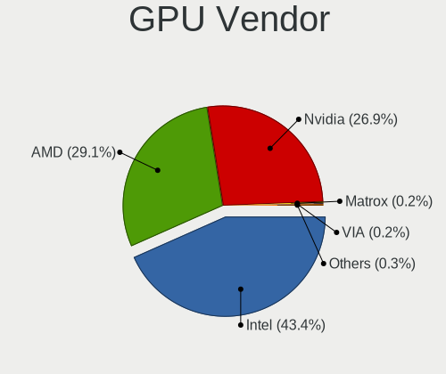

| Vendor                           | Computers | Percent |
|----------------------------------|-----------|---------|
| Intel                            | 738       | 43.49%  |
| AMD                              | 500       | 29.46%  |
| Nvidia                           | 448       | 26.4%   |
| Matrox Electronics Systems       | 4         | 0.24%   |
| VIA Technologies                 | 3         | 0.18%   |
| Silicon Integrated Systems [SiS] | 2         | 0.12%   |
| Conexant Systems                 | 1         | 0.06%   |
| ASPEED Technology                | 1         | 0.06%   |

GPU Model
---------

Graphics card models

| Model                                                                                    | Computers | Percent |
|------------------------------------------------------------------------------------------|-----------|---------|
| Intel 2nd Generation Core Processor Family Integrated Graphics Controller                | 78        | 4.39%   |
| AMD Picasso/Raven 2 [Radeon Vega Series / Radeon Vega Mobile Series]                     | 54        | 3.04%   |
| Intel 3rd Gen Core processor Graphics Controller                                         | 44        | 2.47%   |
| Intel Haswell-ULT Integrated Graphics Controller                                         | 35        | 1.97%   |
| Intel Atom/Celeron/Pentium Processor x5-E8000/J3xxx/N3xxx Integrated Graphics Controller | 34        | 1.91%   |
| Intel UHD Graphics 620                                                                   | 32        | 1.8%    |
| Intel Xeon E3-1200 v3/4th Gen Core Processor Integrated Graphics Controller              | 31        | 1.74%   |
| Nvidia GK208B [GeForce GT 710]                                                           | 27        | 1.52%   |
| Intel 4th Gen Core Processor Integrated Graphics Controller                              | 27        | 1.52%   |
| Intel TigerLake-LP GT2 [Iris Xe Graphics]                                                | 26        | 1.46%   |
| Intel Mobile 4 Series Chipset Integrated Graphics Controller                             | 25        | 1.41%   |
| Intel HD Graphics 620                                                                    | 25        | 1.41%   |
| AMD Renoir [Radeon RX Vega 6 (Ryzen 4000/5000 Mobile Series)]                            | 25        | 1.41%   |
| AMD Ellesmere [Radeon RX 470/480/570/570X/580/580X/590]                                  | 25        | 1.41%   |
| AMD Cezanne [Radeon Vega Series / Radeon Vega Mobile Series]                             | 25        | 1.41%   |
| Intel Atom Processor Z36xxx/Z37xxx Series Graphics & Display                             | 23        | 1.29%   |
| AMD Raven Ridge [Radeon Vega Series / Radeon Vega Mobile Series]                         | 22        | 1.24%   |
| Intel Core Processor Integrated Graphics Controller                                      | 20        | 1.12%   |
| Intel HD Graphics 5500                                                                   | 18        | 1.01%   |
| Intel HD Graphics 530                                                                    | 18        | 1.01%   |
| Intel Xeon E3-1200 v2/3rd Gen Core processor Graphics Controller                         | 17        | 0.96%   |
| Intel Skylake GT2 [HD Graphics 520]                                                      | 17        | 0.96%   |
| Intel Mobile 945GM/GMS/GME, 943/940GML Express Integrated Graphics Controller            | 17        | 0.96%   |
| Intel 4 Series Chipset Integrated Graphics Controller                                    | 17        | 0.96%   |
| Intel Mobile GM965/GL960 Integrated Graphics Controller (secondary)                      | 16        | 0.9%    |
| Intel Mobile GM965/GL960 Integrated Graphics Controller (primary)                        | 16        | 0.9%    |
| Nvidia GP107 [GeForce GTX 1050 Ti]                                                       | 15        | 0.84%   |
| AMD Sun XT [Radeon HD 8670A/8670M/8690M / R5 M330 / M430 / Radeon 520 Mobile]            | 15        | 0.84%   |
| Nvidia GT218 [GeForce 210]                                                               | 14        | 0.79%   |
| Intel HD Graphics 630                                                                    | 14        | 0.79%   |
| Intel HD Graphics 500                                                                    | 14        | 0.79%   |
| AMD Lucienne                                                                             | 14        | 0.79%   |
| Intel CometLake-U GT2 [UHD Graphics]                                                     | 13        | 0.73%   |
| AMD Stoney [Radeon R2/R3/R4/R5 Graphics]                                                 | 13        | 0.73%   |
| Intel WhiskeyLake-U GT2 [UHD Graphics 620]                                               | 12        | 0.67%   |
| Intel GeminiLake [UHD Graphics 600]                                                      | 12        | 0.67%   |
| Intel CoffeeLake-H GT2 [UHD Graphics 630]                                                | 12        | 0.67%   |
| AMD Topaz XT [Radeon R7 M260/M265 / M340/M360 / M440/M445 / 530/535 / 620/625 Mobile]    | 12        | 0.67%   |
| AMD Barcelo                                                                              | 12        | 0.67%   |
| Intel CoffeeLake-S GT2 [UHD Graphics 630]                                                | 11        | 0.62%   |

GPU Combo
---------

Combinations of graphics cards

| Name                           | Computers | Percent |
|--------------------------------|-----------|---------|
| 1 x Intel                      | 538       | 36.06%  |
| 1 x AMD                        | 394       | 26.41%  |
| 1 x Nvidia                     | 292       | 19.57%  |
| Intel + Nvidia                 | 132       | 8.85%   |
| Intel + AMD                    | 52        | 3.49%   |
| 2 x AMD                        | 34        | 2.28%   |
| AMD + Nvidia                   | 19        | 1.27%   |
| Other                          | 13        | 0.87%   |
| 2 x Intel                      | 4         | 0.27%   |
| 1 x Matrox                     | 4         | 0.27%   |
| 2 x Nvidia                     | 3         | 0.2%    |
| 1 x VIA                        | 3         | 0.2%    |
| 1 x SiS                        | 2         | 0.13%   |
| 2 x AMD + 1 x Conexant Systems | 1         | 0.07%   |
| Nvidia + ASPEED                | 1         | 0.07%   |

GPU Driver
----------

Free vs proprietary

| Driver      | Computers | Percent |
|-------------|-----------|---------|
| Free        | 1218      | 81.2%   |
| Proprietary | 223       | 14.87%  |
| Unknown     | 59        | 3.93%   |

GPU Memory
----------

Total video memory

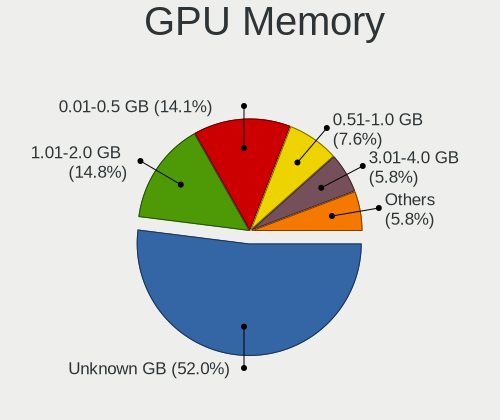

| Size in GB | Computers | Percent |
|------------|-----------|---------|
| Unknown    | 775       | 50.49%  |
| 1.01-2.0   | 238       | 15.5%   |
| 0.01-0.5   | 224       | 14.59%  |
| 0.51-1.0   | 124       | 8.08%   |
| 3.01-4.0   | 92        | 5.99%   |
| 7.01-8.0   | 40        | 2.61%   |
| 5.01-6.0   | 26        | 1.69%   |
| 8.01-16.0  | 9         | 0.59%   |
| 2.01-3.0   | 6         | 0.39%   |
| 16.01-24.0 | 1         | 0.07%   |

Monitor
-------

Monitor Vendor
--------------

Monitor vendors

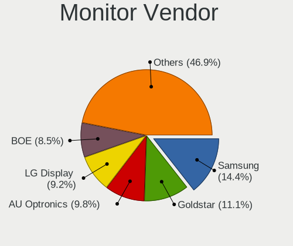

| Vendor                  | Computers | Percent |
|-------------------------|-----------|---------|
| Samsung Electronics     | 223       | 14.24%  |
| Goldstar                | 185       | 11.81%  |
| AU Optronics            | 152       | 9.71%   |
| LG Display              | 144       | 9.2%    |
| BOE                     | 127       | 8.11%   |
| Chimei Innolux          | 119       | 7.6%    |
| Dell                    | 93        | 5.94%   |
| Philips                 | 50        | 3.19%   |
| Hewlett-Packard         | 35        | 2.23%   |
| Chi Mei Optoelectronics | 27        | 1.72%   |
| LG Electronics          | 26        | 1.66%   |
| AOC                     | 26        | 1.66%   |
| ViewSonic               | 22        | 1.4%    |
| BenQ                    | 22        | 1.4%    |
| Sony                    | 21        | 1.34%   |
| Sharp                   | 19        | 1.21%   |
| Ancor Communications    | 18        | 1.15%   |
| LG Philips              | 17        | 1.09%   |
| Apple                   | 17        | 1.09%   |
| Lenovo                  | 16        | 1.02%   |
| InfoVision              | 14        | 0.89%   |
| Eizo                    | 14        | 0.89%   |
| Vestel Elektronik       | 12        | 0.77%   |
| Iiyama                  | 11        | 0.7%    |
| NEC Computers           | 10        | 0.64%   |
| PANDA                   | 9         | 0.57%   |
| ASUSTek Computer        | 9         | 0.57%   |
| Acer                    | 9         | 0.57%   |
| Unknown                 | 8         | 0.51%   |
| Mi                      | 8         | 0.51%   |
| JRY                     | 8         | 0.51%   |
| Fujitsu Siemens         | 8         | 0.51%   |
| CPT                     | 7         | 0.45%   |
| HannStar                | 6         | 0.38%   |
| Belinea                 | 6         | 0.38%   |
| CSO                     | 5         | 0.32%   |
| Medion                  | 4         | 0.26%   |
| Quanta Display          | 3         | 0.19%   |
| IBM                     | 3         | 0.19%   |
| DAO                     | 3         | 0.19%   |

Monitor Model
-------------

Monitor models

| Model                                                                | Computers | Percent |
|----------------------------------------------------------------------|-----------|---------|
| AU Optronics LCD Monitor AUO38ED 1920x1080 344x193mm 15.5-inch       | 15        | 0.93%   |
| Goldstar IPS FULLHD GSM5AB8 1920x1080 480x270mm 21.7-inch            | 14        | 0.87%   |
| Vestel Elektronik 22W_LCD_TV VES3700 1920x540                        | 12        | 0.75%   |
| Chimei Innolux LCD Monitor CMN15E7 1920x1080 344x193mm 15.5-inch     | 12        | 0.75%   |
| Chimei Innolux LCD Monitor CMN15F5 1920x1080 344x193mm 15.5-inch     | 11        | 0.68%   |
| Goldstar FULL HD GSM5B55 1920x1080 480x270mm 21.7-inch               | 8         | 0.5%    |
| AU Optronics LCD Monitor AUO45EC 1366x768 344x193mm 15.5-inch        | 8         | 0.5%    |
| Samsung Electronics C24F390 SAM0D2C 1920x1080 521x293mm 23.5-inch    | 7         | 0.44%   |
| LG Display LCD Monitor LGD02F2 1366x768 344x194mm 15.5-inch          | 7         | 0.44%   |
| LG Display LCD Monitor LGD02DC 1366x768 344x194mm 15.5-inch          | 7         | 0.44%   |
| Goldstar FULL HD GSM5ABB 1920x1080 480x270mm 21.7-inch               | 7         | 0.44%   |
| Chimei Innolux LCD Monitor CMN15C4 1920x1080 344x193mm 15.5-inch     | 7         | 0.44%   |
| Chimei Innolux LCD Monitor CMN14D4 1920x1080 309x173mm 13.9-inch     | 7         | 0.44%   |
| BOE LCD Monitor BOE0687 1920x1080 344x193mm 15.5-inch                | 7         | 0.44%   |
| Samsung Electronics S27F350 SAM0D22 1920x1080 600x340mm 27.2-inch    | 6         | 0.37%   |
| Goldstar 2D FHD TV GSM59C6 1920x1080 509x286mm 23.0-inch             | 6         | 0.37%   |
| Chimei Innolux LCD Monitor CMN15DB 1366x768 344x193mm 15.5-inch      | 6         | 0.37%   |
| ViewSonic VA703-4SERIES VSC6A1E 1280x1024 340x270mm 17.1-inch        | 5         | 0.31%   |
| Samsung Electronics T24E390 SAM0C20 1920x1080 521x293mm 23.5-inch    | 5         | 0.31%   |
| Samsung Electronics S24F350 SAM0D20 1920x1080 521x293mm 23.5-inch    | 5         | 0.31%   |
| Philips PHL 223V5 PHLC0CF 1920x1080 477x268mm 21.5-inch              | 5         | 0.31%   |
| LG Display LP156WH2-TLAA LGD0230 1366x768 344x194mm 15.5-inch        | 5         | 0.31%   |
| LG Display LCD Monitor LGD05E5 1920x1080 344x194mm 15.5-inch         | 5         | 0.31%   |
| LG Display LCD Monitor LGD039F 1366x768 345x194mm 15.6-inch          | 5         | 0.31%   |
| CPT LCD Monitor CPT1415 1280x800 331x207mm 15.4-inch                 | 5         | 0.31%   |
| Chimei Innolux LCD Monitor CMN15C6 1366x768 344x193mm 15.5-inch      | 5         | 0.31%   |
| Samsung Electronics T23B350 SAM093B 1920x1080 510x287mm 23.0-inch    | 4         | 0.25%   |
| Samsung Electronics LCD Monitor SEC3150 1366x768 344x193mm 15.5-inch | 4         | 0.25%   |
| Samsung Electronics LCD Monitor SDC4E51 1366x768 344x194mm 15.5-inch | 4         | 0.25%   |
| Samsung Electronics LCD Monitor SDC4347 1366x768 344x193mm 15.5-inch | 4         | 0.25%   |
| Samsung Electronics C27F390 SAM0D32 1920x1080 598x336mm 27.0-inch    | 4         | 0.25%   |
| Philips 226V4 PHLC0B1 1920x1080 477x268mm 21.5-inch                  | 4         | 0.25%   |
| Goldstar W1934 GSM4B7A 1440x900 410x256mm 19.0-inch                  | 4         | 0.25%   |
| Goldstar ULTRAWIDE GSM59F1 2560x1080 673x284mm 28.8-inch             | 4         | 0.25%   |
| Goldstar IPS FULLHD GSM5AB6 1920x1080 480x270mm 21.7-inch            | 4         | 0.25%   |
| Dell S2715H DEL40BB 1920x1080 598x336mm 27.0-inch                    | 4         | 0.25%   |
| BOE LCD Monitor BOE08E7 1920x1080 344x193mm 15.5-inch                | 4         | 0.25%   |
| BOE LCD Monitor BOE06A5 1366x768 344x194mm 15.5-inch                 | 4         | 0.25%   |
| BOE LCD Monitor BOE0675 1366x768 344x194mm 15.5-inch                 | 4         | 0.25%   |
| AU Optronics LCD Monitor AUO71EC 1366x768 344x193mm 15.5-inch        | 4         | 0.25%   |

Monitor Resolution
------------------

Monitor screen resolution

| Resolution         | Computers | Percent |
|--------------------|-----------|---------|
| 1920x1080 (FHD)    | 647       | 43.19%  |
| 1366x768 (WXGA)    | 289       | 19.29%  |
| 1280x1024 (SXGA)   | 86        | 5.74%   |
| 3840x2160 (4K)     | 68        | 4.54%   |
| 2560x1440 (QHD)    | 56        | 3.74%   |
| 1280x800 (WXGA)    | 56        | 3.74%   |
| 1680x1050 (WSXGA+) | 55        | 3.67%   |
| 1600x900 (HD+)     | 53        | 3.54%   |
| 1440x900 (WXGA+)   | 36        | 2.4%    |
| 1920x1200 (WUXGA)  | 29        | 1.94%   |
| 1360x768           | 14        | 0.93%   |
| 2560x1080          | 12        | 0.8%    |
| 1024x768 (XGA)     | 11        | 0.73%   |
| Unknown            | 11        | 0.73%   |
| 1600x1200          | 9         | 0.6%    |
| 1024x600           | 9         | 0.6%    |
| 3440x1440          | 7         | 0.47%   |
| 2560x1600          | 7         | 0.47%   |
| 3840x1080          | 6         | 0.4%    |
| 2880x1800          | 5         | 0.33%   |
| 2160x1440          | 5         | 0.33%   |
| 3840x2400          | 3         | 0.2%    |
| 2288x1287          | 3         | 0.2%    |
| 2048x1152          | 2         | 0.13%   |
| 1920x540           | 2         | 0.13%   |
| 800x1280           | 1         | 0.07%   |
| 5120x1440          | 1         | 0.07%   |
| 4864x2160          | 1         | 0.07%   |
| 4480x1080          | 1         | 0.07%   |
| 3600x1080          | 1         | 0.07%   |
| 3200x1800 (QHD+)   | 1         | 0.07%   |
| 3200x1080          | 1         | 0.07%   |
| 3072x1920          | 1         | 0.07%   |
| 3000x1920          | 1         | 0.07%   |
| 2960x1050          | 1         | 0.07%   |
| 2624x900           | 1         | 0.07%   |
| 2240x1400          | 1         | 0.07%   |
| 1920x1280          | 1         | 0.07%   |
| 1680x945           | 1         | 0.07%   |
| 1400x1050          | 1         | 0.07%   |

Monitor Diagonal
----------------

Diagonal size in inches

| Inches  | Computers | Percent |
|---------|-----------|---------|
| 15      | 444       | 28.3%   |
| 21      | 118       | 7.52%   |
| 23      | 110       | 7.01%   |
| 27      | 101       | 6.44%   |
| 13      | 100       | 6.37%   |
| 14      | 99        | 6.31%   |
| 17      | 94        | 5.99%   |
| 24      | 86        | 5.48%   |
| Unknown | 76        | 4.84%   |
| 19      | 65        | 4.14%   |
| 20      | 35        | 2.23%   |
| 18      | 31        | 1.98%   |
| 31      | 28        | 1.78%   |
| 22      | 24        | 1.53%   |
| 34      | 18        | 1.15%   |
| 12      | 18        | 1.15%   |
| 11      | 17        | 1.08%   |
| 84      | 16        | 1.02%   |
| 10      | 11        | 0.7%    |
| 72      | 10        | 0.64%   |
| 16      | 10        | 0.64%   |
| 54      | 8         | 0.51%   |
| 40      | 7         | 0.45%   |
| 32      | 6         | 0.38%   |
| 33      | 5         | 0.32%   |
| 25      | 4         | 0.25%   |
| 60      | 3         | 0.19%   |
| 42      | 3         | 0.19%   |
| 8       | 3         | 0.19%   |
| 142     | 2         | 0.13%   |
| 65      | 2         | 0.13%   |
| 49      | 2         | 0.13%   |
| 28      | 2         | 0.13%   |
| 55      | 1         | 0.06%   |
| 48      | 1         | 0.06%   |
| 46      | 1         | 0.06%   |
| 44      | 1         | 0.06%   |
| 39      | 1         | 0.06%   |
| 37      | 1         | 0.06%   |
| 36      | 1         | 0.06%   |

Monitor Width
-------------

Physical width

| Width in mm    | Computers | Percent |
|----------------|-----------|---------|
| 301-350        | 639       | 41.49%  |
| 501-600        | 267       | 17.34%  |
| 401-500        | 233       | 15.13%  |
| 351-400        | 102       | 6.62%   |
| 201-300        | 93        | 6.04%   |
| Unknown        | 76        | 4.94%   |
| 601-700        | 36        | 2.34%   |
| 701-800        | 30        | 1.95%   |
| 1501-2000      | 26        | 1.69%   |
| 1001-1500      | 18        | 1.17%   |
| 801-900        | 10        | 0.65%   |
| 901-1000       | 4         | 0.26%   |
| 101-200        | 3         | 0.19%   |
| More than 2000 | 2         | 0.13%   |
| 1-100          | 1         | 0.06%   |

Aspect Ratio
------------

Proportional relationship between the width and the height

| Ratio   | Computers | Percent |
|---------|-----------|---------|
| 16/9    | 1030      | 72.43%  |
| 16/10   | 182       | 12.8%   |
| 5/4     | 74        | 5.2%    |
| Unknown | 65        | 4.57%   |
| 4/3     | 26        | 1.83%   |
| 21/9    | 18        | 1.27%   |
| 3/2     | 13        | 0.91%   |
| 6/5     | 9         | 0.63%   |
| 32/9    | 2         | 0.14%   |
| 1.00    | 2         | 0.14%   |
| 0.67    | 1         | 0.07%   |

Monitor Area
------------

Area in inch

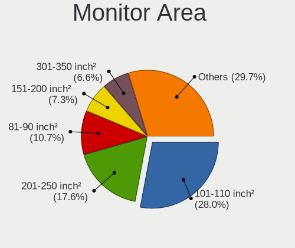

| Area in inch | Computers | Percent |
|----------------|-----------|---------|
| 101-110        | 442       | 28.52%  |
| 201-250        | 279       | 18%     |
| 81-90          | 161       | 10.39%  |
| 151-200        | 121       | 7.81%   |
| 301-350        | 102       | 6.58%   |
| Unknown        | 76        | 4.9%    |
| 141-150        | 64        | 4.13%   |
| 351-500        | 59        | 3.81%   |
| 121-130        | 44        | 2.84%   |
| More than 1000 | 43        | 2.77%   |
| 71-80          | 38        | 2.45%   |
| 251-300        | 32        | 2.06%   |
| 51-60          | 17        | 1.1%    |
| 501-1000       | 17        | 1.1%    |
| 61-70          | 16        | 1.03%   |
| 41-50          | 11        | 0.71%   |
| 131-140        | 11        | 0.71%   |
| 111-120        | 9         | 0.58%   |
| 1-40           | 4         | 0.26%   |
| 91-100         | 4         | 0.26%   |

Pixel Density
-------------

Pixels per inch

| Density       | Computers | Percent |
|---------------|-----------|---------|
| 51-100        | 547       | 36.54%  |
| 101-120       | 397       | 26.52%  |
| 121-160       | 365       | 24.38%  |
| Unknown       | 76        | 5.08%   |
| 161-240       | 56        | 3.74%   |
| 1-50          | 38        | 2.54%   |
| More than 240 | 18        | 1.2%    |

Multiple Monitors
-----------------

Total monitors connected

| Total | Computers | Percent |
|-------|-----------|---------|
| 1     | 1245      | 81.69%  |
| 2     | 186       | 12.2%   |
| 0     | 70        | 4.59%   |
| 3     | 21        | 1.38%   |
| 4     | 2         | 0.13%   |

Network
-------

Net Controller Vendor
---------------------

Controller vendors

| Vendor                                | Computers | Percent |
|---------------------------------------|-----------|---------|
| Realtek Semiconductor                 | 850       | 38.58%  |
| Intel                                 | 596       | 27.05%  |
| Qualcomm Atheros                      | 249       | 11.3%   |
| Broadcom                              | 125       | 5.67%   |
| TP-Link                               | 53        | 2.41%   |
| Marvell Technology Group              | 45        | 2.04%   |
| Ralink Technology                     | 40        | 1.82%   |
| MediaTek                              | 36        | 1.63%   |
| Broadcom Limited                      | 29        | 1.32%   |
| Ralink                                | 27        | 1.23%   |
| Nvidia                                | 23        | 1.04%   |
| Qualcomm Atheros Communications       | 13        | 0.59%   |
| Xiaomi                                | 12        | 0.54%   |
| VIA Technologies                      | 8         | 0.36%   |
| D-Link                                | 8         | 0.36%   |
| ASIX Electronics                      | 8         | 0.36%   |
| Ericsson Business Mobile Networks     | 5         | 0.23%   |
| Dell                                  | 5         | 0.23%   |
| Sierra Wireless                       | 4         | 0.18%   |
| NetGear                               | 4         | 0.18%   |
| Microsoft                             | 4         | 0.18%   |
| Huawei Technologies                   | 4         | 0.18%   |
| ASUSTek Computer                      | 4         | 0.18%   |
| Samsung Electronics                   | 3         | 0.14%   |
| JMicron Technology                    | 3         | 0.14%   |
| Hewlett-Packard                       | 3         | 0.14%   |
| DisplayLink                           | 3         | 0.14%   |
| Belkin Components                     | 3         | 0.14%   |
| Silicon Integrated Systems [SiS]      | 2         | 0.09%   |
| Motorola                              | 2         | 0.09%   |
| Lenovo                                | 2         | 0.09%   |
| IBM                                   | 2         | 0.09%   |
| Fujitsu Siemens Computers             | 2         | 0.09%   |
| Edimax Technology                     | 2         | 0.09%   |
| D-Link System                         | 2         | 0.09%   |
| 802.11g Adapter [Linksys WUSB54GC v3] | 2         | 0.09%   |
| ZyDAS                                 | 1         | 0.05%   |
| U-Blox                                | 1         | 0.05%   |
| Toshiba                               | 1         | 0.05%   |
| Sundance Technology Inc / IC Plus     | 1         | 0.05%   |

Net Controller Model
--------------------

Controller models

| Model                                                                   | Computers | Percent |
|-------------------------------------------------------------------------|-----------|---------|
| Realtek RTL8111/8168/8211/8411 PCI Express Gigabit Ethernet Controller  | 541       | 21.27%  |
| Realtek RTL810xE PCI Express Fast Ethernet controller                   | 143       | 5.62%   |
| Intel 82579LM Gigabit Network Connection (Lewisville)                   | 60        | 2.36%   |
| Intel I211 Gigabit Network Connection                                   | 43        | 1.69%   |
| Qualcomm Atheros QCA9377 802.11ac Wireless Network Adapter              | 40        | 1.57%   |
| Intel Wi-Fi 6 AX200                                                     | 38        | 1.49%   |
| Realtek RTL8822CE 802.11ac PCIe Wireless Network Adapter                | 37        | 1.45%   |
| Intel Wireless 8265 / 8275                                              | 37        | 1.45%   |
| Realtek RTL8821CE 802.11ac PCIe Wireless Network Adapter                | 36        | 1.42%   |
| Qualcomm Atheros QCA9565 / AR9565 Wireless Network Adapter              | 35        | 1.38%   |
| Qualcomm Atheros AR9485 Wireless Network Adapter                        | 34        | 1.34%   |
| Realtek RTL8125 2.5GbE Controller                                       | 33        | 1.3%    |
| Realtek RTL8723BE PCIe Wireless Network Adapter                         | 32        | 1.26%   |
| Intel Wi-Fi 6 AX201                                                     | 27        | 1.06%   |
| Intel Wireless 7260                                                     | 24        | 0.94%   |
| Intel Wireless 3165                                                     | 24        | 0.94%   |
| Broadcom BCM43142 802.11b/g/n                                           | 23        | 0.9%    |
| Intel Ethernet Connection I217-LM                                       | 22        | 0.87%   |
| Intel PRO/Wireless 3945ABG [Golan] Network Connection                   | 20        | 0.79%   |
| Realtek RTL8188EUS 802.11n Wireless Network Adapter                     | 19        | 0.75%   |
| Realtek RTL-8100/8101L/8139 PCI Fast Ethernet Adapter                   | 19        | 0.75%   |
| Qualcomm Atheros AR9285 Wireless Network Adapter (PCI-Express)          | 19        | 0.75%   |
| Intel Wireless 7265                                                     | 19        | 0.75%   |
| Realtek RTL8153 Gigabit Ethernet Adapter                                | 18        | 0.71%   |
| Qualcomm Atheros AR242x / AR542x Wireless Network Adapter (PCI-Express) | 17        | 0.67%   |
| Intel Centrino Advanced-N 6205 [Taylor Peak]                            | 16        | 0.63%   |
| Qualcomm Atheros QCA6174 802.11ac Wireless Network Adapter              | 15        | 0.59%   |
| Intel Wireless 3160                                                     | 15        | 0.59%   |
| Intel Ethernet Connection (2) I219-V                                    | 15        | 0.59%   |
| TP-Link TL-WN722N v2/v3 [Realtek RTL8188EUS]                            | 14        | 0.55%   |
| Ralink RT2870/RT3070 Wireless Adapter                                   | 13        | 0.51%   |
| Qualcomm Atheros AR8151 v2.0 Gigabit Ethernet                           | 13        | 0.51%   |
| MediaTek MT7921 802.11ax PCI Express Wireless Network Adapter           | 12        | 0.47%   |
| Intel Wireless 8260                                                     | 12        | 0.47%   |
| Intel Ethernet Controller I225-V                                        | 12        | 0.47%   |
| Intel Dual Band Wireless-AC 3168NGW [Stone Peak]                        | 12        | 0.47%   |
| Intel 82567LM-3 Gigabit Network Connection                              | 12        | 0.47%   |
| Broadcom BCM4312 802.11b/g LP-PHY                                       | 12        | 0.47%   |
| Xiaomi Mi/Redmi series (RNDIS)                                          | 11        | 0.43%   |
| Realtek RTL8822BE 802.11a/b/g/n/ac WiFi adapter                         | 11        | 0.43%   |

Wireless Vendor
---------------

Wireless vendors

| Vendor                                | Computers | Percent |
|---------------------------------------|-----------|---------|
| Intel                                 | 414       | 36.54%  |
| Realtek Semiconductor                 | 231       | 20.39%  |
| Qualcomm Atheros                      | 190       | 16.77%  |
| Broadcom                              | 78        | 6.88%   |
| TP-Link                               | 50        | 4.41%   |
| Ralink Technology                     | 40        | 3.53%   |
| MediaTek                              | 33        | 2.91%   |
| Ralink                                | 27        | 2.38%   |
| Qualcomm Atheros Communications       | 13        | 1.15%   |
| Broadcom Limited                      | 12        | 1.06%   |
| D-Link                                | 8         | 0.71%   |
| Sierra Wireless                       | 4         | 0.35%   |
| NetGear                               | 4         | 0.35%   |
| Microsoft                             | 4         | 0.35%   |
| ASUSTek Computer                      | 4         | 0.35%   |
| Belkin Components                     | 3         | 0.26%   |
| Hewlett-Packard                       | 2         | 0.18%   |
| Fujitsu Siemens Computers             | 2         | 0.18%   |
| Edimax Technology                     | 2         | 0.18%   |
| Dell                                  | 2         | 0.18%   |
| 802.11g Adapter [Linksys WUSB54GC v3] | 2         | 0.18%   |
| ZyDAS                                 | 1         | 0.09%   |
| Sitecom Europe                        | 1         | 0.09%   |
| Philips (or NXP)                      | 1         | 0.09%   |
| Ovislink                              | 1         | 0.09%   |
| Micro Star International              | 1         | 0.09%   |
| Linksys                               | 1         | 0.09%   |
| InProComm                             | 1         | 0.09%   |
| Accton Technology                     | 1         | 0.09%   |

Wireless Model
--------------

Wireless models

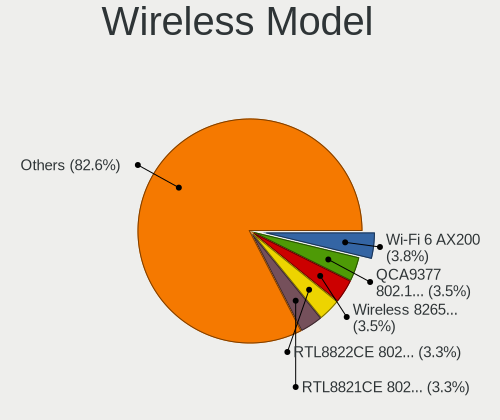

| Model                                                                   | Computers | Percent |
|-------------------------------------------------------------------------|-----------|---------|
| Qualcomm Atheros QCA9377 802.11ac Wireless Network Adapter              | 40        | 3.51%   |
| Intel Wi-Fi 6 AX200                                                     | 38        | 3.34%   |
| Realtek RTL8822CE 802.11ac PCIe Wireless Network Adapter                | 37        | 3.25%   |
| Intel Wireless 8265 / 8275                                              | 37        | 3.25%   |
| Realtek RTL8821CE 802.11ac PCIe Wireless Network Adapter                | 36        | 3.16%   |
| Qualcomm Atheros QCA9565 / AR9565 Wireless Network Adapter              | 35        | 3.07%   |
| Qualcomm Atheros AR9485 Wireless Network Adapter                        | 34        | 2.99%   |
| Realtek RTL8723BE PCIe Wireless Network Adapter                         | 32        | 2.81%   |
| Intel Wi-Fi 6 AX201                                                     | 27        | 2.37%   |
| Intel Wireless 7260                                                     | 24        | 2.11%   |
| Intel Wireless 3165                                                     | 24        | 2.11%   |
| Broadcom BCM43142 802.11b/g/n                                           | 23        | 2.02%   |
| Intel PRO/Wireless 3945ABG [Golan] Network Connection                   | 20        | 1.76%   |
| Realtek RTL8188EUS 802.11n Wireless Network Adapter                     | 19        | 1.67%   |
| Qualcomm Atheros AR9285 Wireless Network Adapter (PCI-Express)          | 19        | 1.67%   |
| Intel Wireless 7265                                                     | 19        | 1.67%   |
| Qualcomm Atheros AR242x / AR542x Wireless Network Adapter (PCI-Express) | 17        | 1.49%   |
| Intel Centrino Advanced-N 6205 [Taylor Peak]                            | 16        | 1.4%    |
| Qualcomm Atheros QCA6174 802.11ac Wireless Network Adapter              | 15        | 1.32%   |
| Intel Wireless 3160                                                     | 15        | 1.32%   |
| TP-Link TL-WN722N v2/v3 [Realtek RTL8188EUS]                            | 14        | 1.23%   |
| Ralink RT2870/RT3070 Wireless Adapter                                   | 13        | 1.14%   |
| MediaTek MT7921 802.11ax PCI Express Wireless Network Adapter           | 12        | 1.05%   |
| Intel Wireless 8260                                                     | 12        | 1.05%   |
| Intel Dual Band Wireless-AC 3168NGW [Stone Peak]                        | 12        | 1.05%   |
| Broadcom BCM4312 802.11b/g LP-PHY                                       | 12        | 1.05%   |
| Realtek RTL8822BE 802.11a/b/g/n/ac WiFi adapter                         | 11        | 0.97%   |
| Intel WiFi Link 5100                                                    | 11        | 0.97%   |
| Intel Wi-Fi 5(802.11ac) Wireless-AC 9x6x [Thunder Peak]                 | 11        | 0.97%   |
| Intel PRO/Wireless 4965 AG or AGN [Kedron] Network Connection           | 11        | 0.97%   |
| Intel Alder Lake-P PCH CNVi WiFi                                        | 11        | 0.97%   |
| TP-Link TL-WN823N v2/v3 [Realtek RTL8192EU]                             | 10        | 0.88%   |
| Realtek RTL8723AE PCIe Wireless Network Adapter                         | 10        | 0.88%   |
| Ralink MT7601U Wireless Adapter                                         | 10        | 0.88%   |
| Qualcomm Atheros AR9271 802.11n                                         | 10        | 0.88%   |
| Intel Comet Lake PCH-LP CNVi WiFi                                       | 10        | 0.88%   |
| Intel Centrino Wireless-N 2230                                          | 10        | 0.88%   |
| Intel Cannon Lake PCH CNVi WiFi                                         | 10        | 0.88%   |
| Realtek 802.11ac NIC                                                    | 9         | 0.79%   |
| Intel Ultimate N WiFi Link 5300                                         | 9         | 0.79%   |

Ethernet Vendor
---------------

Ethernet vendors

| Vendor                            | Computers | Percent |
|-----------------------------------|-----------|---------|
| Realtek Semiconductor             | 767       | 56.65%  |
| Intel                             | 308       | 22.75%  |
| Qualcomm Atheros                  | 78        | 5.76%   |
| Broadcom                          | 59        | 4.36%   |
| Marvell Technology Group          | 45        | 3.32%   |
| Nvidia                            | 23        | 1.7%    |
| Broadcom Limited                  | 20        | 1.48%   |
| Xiaomi                            | 12        | 0.89%   |
| ASIX Electronics                  | 8         | 0.59%   |
| VIA Technologies                  | 7         | 0.52%   |
| TP-Link                           | 3         | 0.22%   |
| Samsung Electronics               | 3         | 0.22%   |
| JMicron Technology                | 3         | 0.22%   |
| DisplayLink                       | 3         | 0.22%   |
| Silicon Integrated Systems [SiS]  | 2         | 0.15%   |
| MediaTek                          | 2         | 0.15%   |
| Lenovo                            | 2         | 0.15%   |
| Huawei Technologies               | 2         | 0.15%   |
| D-Link System                     | 2         | 0.15%   |
| Sundance Technology Inc / IC Plus | 1         | 0.07%   |
| Qualcomm                          | 1         | 0.07%   |
| IBM                               | 1         | 0.07%   |
| Attansic Technology               | 1         | 0.07%   |
| Aquantia                          | 1         | 0.07%   |

Ethernet Model
--------------

Ethernet models

| Model                                                                  | Computers | Percent |
|------------------------------------------------------------------------|-----------|---------|
| Realtek RTL8111/8168/8211/8411 PCI Express Gigabit Ethernet Controller | 541       | 39.35%  |
| Realtek RTL810xE PCI Express Fast Ethernet controller                  | 143       | 10.4%   |
| Intel 82579LM Gigabit Network Connection (Lewisville)                  | 60        | 4.36%   |
| Intel I211 Gigabit Network Connection                                  | 43        | 3.13%   |
| Realtek RTL8125 2.5GbE Controller                                      | 33        | 2.4%    |
| Intel Ethernet Connection I217-LM                                      | 22        | 1.6%    |
| Realtek RTL-8100/8101L/8139 PCI Fast Ethernet Adapter                  | 19        | 1.38%   |
| Realtek RTL8153 Gigabit Ethernet Adapter                               | 18        | 1.31%   |
| Intel Ethernet Connection (2) I219-V                                   | 15        | 1.09%   |
| Qualcomm Atheros AR8151 v2.0 Gigabit Ethernet                          | 13        | 0.95%   |
| Intel Ethernet Controller I225-V                                       | 12        | 0.87%   |
| Intel 82567LM-3 Gigabit Network Connection                             | 12        | 0.87%   |
| Xiaomi Mi/Redmi series (RNDIS)                                         | 11        | 0.8%    |
| Realtek RTL8169 PCI Gigabit Ethernet Controller                        | 11        | 0.8%    |
| Intel Ethernet Connection (4) I219-LM                                  | 11        | 0.8%    |
| Intel Ethernet Connection (2) I218-V                                   | 10        | 0.73%   |
| Qualcomm Atheros QCA8172 Fast Ethernet                                 | 9         | 0.65%   |
| Qualcomm Atheros AR8121/AR8113/AR8114 Gigabit or Fast Ethernet         | 8         | 0.58%   |
| Marvell Group 88E8056 PCI-E Gigabit Ethernet Controller                | 8         | 0.58%   |
| Intel Ethernet Connection I217-V                                       | 8         | 0.58%   |
| Intel Ethernet Connection (2) I219-LM                                  | 8         | 0.58%   |
| Broadcom NetXtreme BCM5751 Gigabit Ethernet PCI Express                | 8         | 0.58%   |
| Qualcomm Atheros Killer E220x Gigabit Ethernet Controller              | 7         | 0.51%   |
| Qualcomm Atheros AR8161 Gigabit Ethernet                               | 7         | 0.51%   |
| Intel Ethernet Connection I219-LM                                      | 7         | 0.51%   |
| Intel Ethernet Connection I218-LM                                      | 7         | 0.51%   |
| Broadcom NetLink BCM57785 Gigabit Ethernet PCIe                        | 7         | 0.51%   |
| ASIX AX88179 Gigabit Ethernet                                          | 7         | 0.51%   |
| Qualcomm Atheros AR8132 Fast Ethernet                                  | 6         | 0.44%   |
| Marvell Group 88E8055 PCI-E Gigabit Ethernet Controller                | 6         | 0.44%   |
| Marvell Group 88E8053 PCI-E Gigabit Ethernet Controller                | 6         | 0.44%   |
| Intel 82577LM Gigabit Network Connection                               | 6         | 0.44%   |
| Intel 82567LM Gigabit Network Connection                               | 6         | 0.44%   |
| Broadcom NetLink BCM5784M Gigabit Ethernet PCIe                        | 6         | 0.44%   |
| VIA VT6102/VT6103 [Rhine-II]                                           | 5         | 0.36%   |
| Realtek RTL8152 Fast Ethernet Adapter                                  | 5         | 0.36%   |
| Qualcomm Atheros QCA8171 Gigabit Ethernet                              | 5         | 0.36%   |
| Nvidia MCP79 Ethernet                                                  | 5         | 0.36%   |
| Nvidia MCP61 Ethernet                                                  | 5         | 0.36%   |
| Intel Ethernet Connection (3) I218-LM                                  | 5         | 0.36%   |

Net Controller Kind
-------------------

Ethernet, WiFi or modem

| Kind     | Computers | Percent |
|----------|-----------|---------|
| Ethernet | 1303      | 54.52%  |
| WiFi     | 1058      | 44.27%  |
| Modem    | 28        | 1.17%   |
| Unknown  | 1         | 0.04%   |

Used Controller
---------------

Currently used network controller

| Kind     | Computers | Percent |
|----------|-----------|---------|
| WiFi     | 830       | 54.28%  |
| Ethernet | 699       | 45.72%  |

NICs
----

Total network controllers on board

| Total | Computers | Percent |
|-------|-----------|---------|
| 2     | 750       | 50.4%   |
| 1     | 673       | 45.23%  |
| 0     | 32        | 2.15%   |
| 3     | 26        | 1.75%   |
| 4     | 7         | 0.47%   |

IPv6
----

IPv6 vs IPv4

| Used | Computers | Percent |
|------|-----------|---------|
| No   | 1075      | 70.03%  |
| Yes  | 460       | 29.97%  |

Bluetooth
---------

Bluetooth Vendor
----------------

Controller vendors

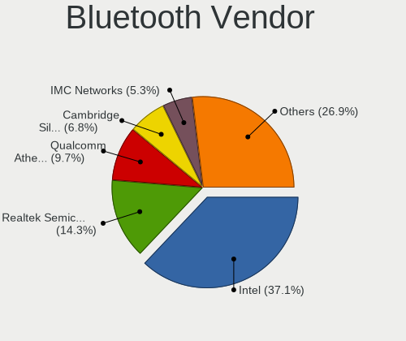

| Vendor                          | Computers | Percent |
|---------------------------------|-----------|---------|
| Intel                           | 293       | 36.22%  |
| Realtek Semiconductor           | 114       | 14.09%  |
| Qualcomm Atheros Communications | 81        | 10.01%  |
| Cambridge Silicon Radio         | 57        | 7.05%   |
| Broadcom                        | 45        | 5.56%   |
| IMC Networks                    | 40        | 4.94%   |
| Foxconn / Hon Hai               | 35        | 4.33%   |
| Toshiba                         | 19        | 2.35%   |
| Hewlett-Packard                 | 18        | 2.22%   |
| Apple                           | 18        | 2.22%   |
| Lite-On Technology              | 16        | 1.98%   |
| ASUSTek Computer                | 9         | 1.11%   |
| Realtek                         | 8         | 0.99%   |
| Ralink                          | 8         | 0.99%   |
| Alps Electric                   | 7         | 0.87%   |
| Foxconn International           | 6         | 0.74%   |
| Dell                            | 6         | 0.74%   |
| Ralink Technology               | 5         | 0.62%   |
| TP-Link                         | 4         | 0.49%   |
| Askey Computer                  | 4         | 0.49%   |
| Mobile Action Technology        | 2         | 0.25%   |
| Micro Star International        | 2         | 0.25%   |
| MediaTek                        | 2         | 0.25%   |
| Chicony Electronics             | 2         | 0.25%   |
| Unknown                         | 2         | 0.25%   |
| Syntek                          | 1         | 0.12%   |
| SiW                             | 1         | 0.12%   |
| Integrated System Solution      | 1         | 0.12%   |
| Edimax Technology               | 1         | 0.12%   |
| Belkin Components               | 1         | 0.12%   |
| Actions                         | 1         | 0.12%   |

Bluetooth Model
---------------

Controller models

| Model                                               | Computers | Percent |
|-----------------------------------------------------|-----------|---------|
| Intel Bluetooth wireless interface                  | 81        | 10.01%  |
| Realtek Bluetooth Radio                             | 59        | 7.29%   |
| Cambridge Silicon Radio Bluetooth Dongle (HCI mode) | 57        | 7.05%   |
| Intel AX201 Bluetooth                               | 46        | 5.69%   |
| Intel Bluetooth Device                              | 43        | 5.32%   |
| Intel Bluetooth 9460/9560 Jefferson Peak (JfP)      | 38        | 4.7%    |
| Qualcomm Atheros  Bluetooth Device                  | 36        | 4.45%   |
| Intel AX200 Bluetooth                               | 35        | 4.33%   |
| Realtek  Bluetooth 4.2 Adapter                      | 23        | 2.84%   |
| IMC Networks Wireless_Device                        | 13        | 1.61%   |
| Realtek RTL8723B Bluetooth                          | 12        | 1.48%   |
| Intel Wireless-AC 9260 Bluetooth Adapter            | 12        | 1.48%   |
| Intel Wireless-AC 3168 Bluetooth                    | 12        | 1.48%   |
| IMC Networks Bluetooth Radio                        | 12        | 1.48%   |
| Qualcomm Atheros AR3012 Bluetooth 4.0               | 11        | 1.36%   |
| Intel AX211 Bluetooth                               | 11        | 1.36%   |
| Realtek 802.11ac WLAN Adapter                       | 10        | 1.24%   |
| Qualcomm Atheros AR9462 Bluetooth                   | 10        | 1.24%   |
| Lite-On Qualcomm Atheros QCA9377 Bluetooth          | 10        | 1.24%   |
| Qualcomm Atheros QCA61x4 Bluetooth 4.0              | 9         | 1.11%   |
| Intel Centrino Bluetooth Wireless Transceiver       | 9         | 1.11%   |
| HP Bluetooth 2.0 Interface [Broadcom BCM2045]       | 9         | 1.11%   |
| Apple Bluetooth Host Controller                     | 9         | 1.11%   |
| Realtek Bluetooth Radio                             | 8         | 0.99%   |
| Ralink RT3290 Bluetooth                             | 8         | 0.99%   |
| Qualcomm Atheros AR3011 Bluetooth                   | 8         | 0.99%   |
| HP Broadcom 2070 Bluetooth Combo                    | 8         | 0.99%   |
| IMC Networks Bluetooth Device                       | 7         | 0.87%   |
| Broadcom BCM2045B (BDC-2.1)                         | 7         | 0.87%   |
| Toshiba Bluetooth Device                            | 6         | 0.74%   |
| Realtek RTL8822BE Bluetooth 4.2 Adapter             | 6         | 0.74%   |
| Foxconn International BCM43142A0 Bluetooth module   | 6         | 0.74%   |
| Foxconn / Hon Hai Bluetooth USB Host Controller     | 6         | 0.74%   |
| Broadcom BCM43142 Bluetooth 4.0                     | 6         | 0.74%   |
| Toshiba RT Bluetooth Radio                          | 5         | 0.62%   |
| Qualcomm Atheros Bluetooth                          | 5         | 0.62%   |
| Foxconn / Hon Hai MediaTek Bluetooth Adapter        | 5         | 0.62%   |
| Foxconn / Hon Hai Bluetooth Device                  | 5         | 0.62%   |
| TP-Link UB500 Adapter                               | 4         | 0.49%   |
| Toshiba Integrated Bluetooth HCI                    | 4         | 0.49%   |

Sound
-----

Sound Vendor
------------

Sound card vendors

| Vendor                           | Computers | Percent |
|----------------------------------|-----------|---------|
| Intel                            | 997       | 50.08%  |
| AMD                              | 503       | 25.26%  |
| Nvidia                           | 310       | 15.57%  |
| C-Media Electronics              | 32        | 1.61%   |
| Creative Labs                    | 15        | 0.75%   |
| Logitech                         | 11        | 0.55%   |
| Creative Technology              | 11        | 0.55%   |
| Razer USA                        | 9         | 0.45%   |
| GN Netcom                        | 7         | 0.35%   |
| Barco Display Systems            | 7         | 0.35%   |
| VIA Technologies                 | 6         | 0.3%    |
| Texas Instruments                | 5         | 0.25%   |
| Kingston Technology              | 5         | 0.25%   |
| Focusrite-Novation               | 5         | 0.25%   |
| BEHRINGER International          | 5         | 0.25%   |
| Yamaha                           | 3         | 0.15%   |
| Lenovo                           | 3         | 0.15%   |
| Cooler Master                    | 3         | 0.15%   |
| ASUSTek Computer                 | 3         | 0.15%   |
| Trust                            | 2         | 0.1%    |
| Silicon Integrated Systems [SiS] | 2         | 0.1%    |
| Realtek Semiconductor            | 2         | 0.1%    |
| Plantronics                      | 2         | 0.1%    |
| Nordic Semiconductor ASA         | 2         | 0.1%    |
| Native Instruments               | 2         | 0.1%    |
| JMTek                            | 2         | 0.1%    |
| Hewlett-Packard                  | 2         | 0.1%    |
| Guillemot                        | 2         | 0.1%    |
| Generalplus Technology           | 2         | 0.1%    |
| Ensoniq                          | 2         | 0.1%    |
| Edifier Technology               | 2         | 0.1%    |
| Dell                             | 2         | 0.1%    |
| AudioQuest                       | 2         | 0.1%    |
| Altec Lansing Technologies       | 2         | 0.1%    |
| TerraTec Electronic              | 1         | 0.05%   |
| Tenx Technology                  | 1         | 0.05%   |
| SteelSeries ApS                  | 1         | 0.05%   |
| Sony                             | 1         | 0.05%   |
| Shenzhen Riitek Technology       | 1         | 0.05%   |
| RODE Microphones                 | 1         | 0.05%   |

Sound Model
-----------

Sound card models

| Model                                                                      | Computers | Percent |
|----------------------------------------------------------------------------|-----------|---------|
| AMD Family 17h/19h HD Audio Controller                                     | 170       | 6.98%   |
| Intel 7 Series/C216 Chipset Family High Definition Audio Controller        | 91        | 3.74%   |
| Intel 6 Series/C200 Series Chipset Family High Definition Audio Controller | 89        | 3.65%   |
| Intel Sunrise Point-LP HD Audio                                            | 80        | 3.28%   |
| Intel 8 Series/C220 Series Chipset High Definition Audio Controller        | 77        | 3.16%   |
| Intel NM10/ICH7 Family High Definition Audio Controller                    | 75        | 3.08%   |
| AMD Raven/Raven2/Fenghuang HDMI/DP Audio Controller                        | 75        | 3.08%   |
| AMD Renoir Radeon High Definition Audio Controller                         | 74        | 3.04%   |
| Intel 82801I (ICH9 Family) HD Audio Controller                             | 66        | 2.71%   |
| AMD SBx00 Azalia (Intel HDA)                                               | 65        | 2.67%   |
| Intel Xeon E3-1200 v3/4th Gen Core Processor HD Audio Controller           | 61        | 2.5%    |
| AMD FCH Azalia Controller                                                  | 48        | 1.97%   |
| Nvidia GK208 HDMI/DP Audio Controller                                      | 45        | 1.85%   |
| AMD Family 17h (Models 00h-0fh) HD Audio Controller                        | 45        | 1.85%   |
| Intel 5 Series/3400 Series Chipset High Definition Audio                   | 44        | 1.81%   |
| Intel 82801H (ICH8 Family) HD Audio Controller                             | 42        | 1.72%   |
| AMD Starship/Matisse HD Audio Controller                                   | 41        | 1.68%   |
| Intel 100 Series/C230 Series Chipset Family HD Audio Controller            | 40        | 1.64%   |
| Intel Haswell-ULT HD Audio Controller                                      | 36        | 1.48%   |
| Intel 8 Series HD Audio Controller                                         | 36        | 1.48%   |
| Nvidia GP107GL High Definition Audio Controller                            | 32        | 1.31%   |
| Intel Cannon Lake PCH cAVS                                                 | 30        | 1.23%   |
| Intel Tiger Lake-LP Smart Sound Technology Audio Controller                | 29        | 1.19%   |
| Nvidia High Definition Audio Controller                                    | 25        | 1.03%   |
| AMD Ellesmere HDMI Audio [Radeon RX 470/480 / 570/580/590]                 | 25        | 1.03%   |
| AMD Kabini HDMI/DP Audio                                                   | 24        | 0.99%   |
| Intel Broadwell-U Audio Controller                                         | 23        | 0.94%   |
| Nvidia GF108 High Definition Audio Controller                              | 22        | 0.9%    |
| Intel Wildcat Point-LP High Definition Audio Controller                    | 22        | 0.9%    |
| AMD Family 15h (Models 60h-6fh) Audio Controller                           | 22        | 0.9%    |
| Intel Atom Processor Z36xxx/Z37xxx Series High Definition Audio Controller | 21        | 0.86%   |
| Intel 82801JI (ICH10 Family) HD Audio Controller                           | 21        | 0.86%   |
| AMD Oland/Hainan/Cape Verde/Pitcairn HDMI Audio [Radeon HD 7000 Series]    | 21        | 0.86%   |
| Intel 200 Series PCH HD Audio                                              | 20        | 0.82%   |
| AMD Navi 21/23 HDMI/DP Audio Controller                                    | 17        | 0.7%    |
| AMD RV710/730 HDMI Audio [Radeon HD 4000 series]                           | 16        | 0.66%   |
| AMD Rembrandt Radeon High Definition Audio Controller                      | 16        | 0.66%   |
| Nvidia TU107 GeForce GTX 1650 High Definition Audio Controller             | 15        | 0.62%   |
| Intel Comet Lake PCH-LP cAVS                                               | 15        | 0.62%   |
| Intel Celeron N3350/Pentium N4200/Atom E3900 Series Audio Cluster          | 15        | 0.62%   |

Memory
------

Memory Vendor
-------------

Memory module vendors

| Vendor              | Computers | Percent |
|---------------------|-----------|---------|
| Samsung Electronics | 158       | 19.29%  |
| SK hynix            | 132       | 16.12%  |
| Unknown             | 110       | 13.43%  |
| Kingston            | 97        | 11.84%  |
| Micron Technology   | 71        | 8.67%   |
| G.Skill             | 57        | 6.96%   |
| Corsair             | 56        | 6.84%   |
| Crucial             | 43        | 5.25%   |
| Ramaxel Technology  | 14        | 1.71%   |
| Elpida              | 11        | 1.34%   |
| Transcend           | 10        | 1.22%   |
| Team                | 9         | 1.1%    |
| Nanya Technology    | 8         | 0.98%   |
| Unknown (ABCD)      | 6         | 0.73%   |
| Patriot             | 6         | 0.73%   |
| A-DATA Technology   | 6         | 0.73%   |
| GOODRAM             | 4         | 0.49%   |
| Unknown             | 4         | 0.49%   |
| Apacer              | 3         | 0.37%   |
| Veineda             | 1         | 0.12%   |
| Unknown (0x8945)    | 1         | 0.12%   |
| Toshiba             | 1         | 0.12%   |
| Silicon Power       | 1         | 0.12%   |
| Qimonda             | 1         | 0.12%   |
| Patriot Memory      | 1         | 0.12%   |
| Lexar               | 1         | 0.12%   |
| Infineon            | 1         | 0.12%   |
| HMD                 | 1         | 0.12%   |
| Hikvision           | 1         | 0.12%   |
| H                   | 1         | 0.12%   |
| Goldkey             | 1         | 0.12%   |
| GeIL                | 1         | 0.12%   |
| Avant               | 1         | 0.12%   |

Memory Model
------------

Memory module models

| Model                                                            | Computers | Percent |
|------------------------------------------------------------------|-----------|---------|
| G.Skill RAM F4-3200C16-8GVKB 8GB DIMM DDR4 3866MT/s              | 12        | 1.34%   |
| SK hynix RAM HMT451S6BFR8A-PB 4GB SODIMM DDR3 1600MT/s           | 11        | 1.23%   |
| Samsung RAM M471A5244CB0-CTD 4GB SODIMM DDR4 3266MT/s            | 11        | 1.23%   |
| Samsung RAM M471B5173EB0-YK0 4GB SODIMM DDR3 1600MT/s            | 10        | 1.12%   |
| Samsung RAM M471A1G44AB0-CWE 8192MB SODIMM DDR4 3200MT/s         | 10        | 1.12%   |
| Samsung RAM M471B5173QH0-YK0 4GB SODIMM DDR3 1600MT/s            | 8         | 0.89%   |
| Unknown (ABCD) RAM 123456789012345678 2GB SODIMM LPDDR4 2400MT/s | 6         | 0.67%   |
| Samsung RAM M471B5273CH0-CH9 4GB SODIMM DDR3 1334MT/s            | 6         | 0.67%   |
| Unknown RAM Module 4GB SODIMM DDR3                               | 5         | 0.56%   |
| Unknown RAM Module 4GB DIMM 1333MT/s                             | 5         | 0.56%   |
| Unknown RAM Module 2GB SODIMM DDR2 667MT/s                       | 5         | 0.56%   |
| Unknown RAM Module 2GB DIMM 800MT/s                              | 5         | 0.56%   |
| Unknown RAM Module 2GB DIMM 1333MT/s                             | 5         | 0.56%   |
| Unknown RAM Module 1024MB DIMM SDRAM                             | 5         | 0.56%   |
| SK hynix RAM HMAA1GS6CJR6N-XN 8GB SODIMM DDR4 3200MT/s           | 5         | 0.56%   |
| SK hynix RAM HMA81GS6JJR8N-VK 8GB SODIMM DDR4 2667MT/s           | 5         | 0.56%   |
| Samsung RAM M471A1K43DB1-CTD 8GB SODIMM DDR4 2667MT/s            | 5         | 0.56%   |
| Samsung RAM M471A1G44BB0-CWE 8GB SODIMM DDR4 3200MT/s            | 5         | 0.56%   |
| Unknown RAM Module 2048MB DIMM DDR2 800MT/s                      | 4         | 0.45%   |
| Unknown RAM Module 2048MB DIMM DDR 533MT/s                       | 4         | 0.45%   |
| SK hynix RAM HMT451S6MFR8C-PB 4GB SODIMM DDR3 1600MT/s           | 4         | 0.45%   |
| SK hynix RAM HMT41GS6BFR8A-PB 8GB SODIMM DDR3 1600MT/s           | 4         | 0.45%   |
| SK hynix RAM HMAA2GS6CJR8N-XN 16GB SODIMM DDR4 3200MT/s          | 4         | 0.45%   |
| SK hynix RAM HMA81GS6CJR8N-VK 8GB SODIMM DDR4 2667MT/s           | 4         | 0.45%   |
| SK hynix RAM HMA81GS6AFR8N-UH 8GB SODIMM DDR4 2667MT/s           | 4         | 0.45%   |
| Samsung RAM M471B5173DB0-YK0 4GB SODIMM DDR3 1600MT/s            | 4         | 0.45%   |
| Micron RAM 4ATF51264HZ-3G2J1 4GB SODIMM DDR4 3200MT/s            | 4         | 0.45%   |
| Micron RAM 4ATF51264HZ-3G2J1 4096MB Row Of Chips DDR4 3200MT/s   | 4         | 0.45%   |
| Micron RAM 4ATF1G64HZ-3G2E1 8GB Row Of Chips DDR4 3200MT/s       | 4         | 0.45%   |
| G.Skill RAM F4-3000C16-8GISB 8192MB DIMM DDR4 3200MT/s           | 4         | 0.45%   |
| Corsair RAM CMZ8GX3M2A1600C9 4GB DIMM DDR3 1800MT/s              | 4         | 0.45%   |
| Unknown                                                          | 4         | 0.45%   |
| Unknown RAM Module 512MB DIMM SDRAM                              | 3         | 0.34%   |
| Unknown RAM Module 2048MB DIMM SDRAM                             | 3         | 0.34%   |
| Unknown RAM Module 1GB SODIMM DDR2                               | 3         | 0.34%   |
| Unknown RAM Module 1GB DIMM SDRAM                                | 3         | 0.34%   |
| Unknown RAM Module 1024MB DIMM DDR2 800MT/s                      | 3         | 0.34%   |
| Unknown RAM Module 1024MB DIMM 800MT/s                           | 3         | 0.34%   |
| SK hynix RAM HMT351S6EFR8A-PB 4096MB SODIMM DDR3 1600MT/s        | 3         | 0.34%   |
| SK hynix RAM HMT351S6CFR8C-PB 4GB SODIMM DDR3 1600MT/s           | 3         | 0.34%   |

Memory Kind
-----------

Memory module kinds

| Kind    | Computers | Percent |
|---------|-----------|---------|
| DDR4    | 291       | 40.99%  |
| DDR3    | 231       | 32.54%  |
| DDR2    | 49        | 6.9%    |
| Unknown | 37        | 5.21%   |
| SDRAM   | 28        | 3.94%   |
| LPDDR4  | 22        | 3.1%    |
| DDR     | 18        | 2.54%   |
| DDR5    | 13        | 1.83%   |
| LPDDR5  | 10        | 1.41%   |
| LPDDR3  | 8         | 1.13%   |
| DRAM    | 3         | 0.42%   |

Memory Form Factor
------------------

Physical design of the memory module

| Name         | Computers | Percent |
|--------------|-----------|---------|
| SODIMM       | 375       | 53.27%  |
| DIMM         | 282       | 40.06%  |
| Row Of Chips | 41        | 5.82%   |
| Chip         | 3         | 0.43%   |
| FB-DIMM      | 2         | 0.28%   |
| Unknown      | 1         | 0.14%   |

Memory Size
-----------

Memory module size

| Size  | Computers | Percent |
|-------|-----------|---------|
| 8192  | 286       | 36.81%  |
| 4096  | 220       | 28.31%  |
| 2048  | 128       | 16.47%  |
| 16384 | 71        | 9.14%   |
| 1024  | 47        | 6.05%   |
| 32768 | 12        | 1.54%   |
| 512   | 10        | 1.29%   |
| 3072  | 2         | 0.26%   |
| 256   | 1         | 0.13%   |

Memory Speed
------------

Memory module speed

| Speed   | Computers | Percent |
|---------|-----------|---------|
| 1600    | 151       | 19.41%  |
| 3200    | 104       | 13.37%  |
| 2667    | 85        | 10.93%  |
| 2400    | 51        | 6.56%   |
| 1333    | 50        | 6.43%   |
| Unknown | 30        | 3.86%   |
| 667     | 28        | 3.6%    |
| 800     | 25        | 3.21%   |
| 2133    | 24        | 3.08%   |
| 1334    | 22        | 2.83%   |
| 3600    | 20        | 2.57%   |
| 1066    | 13        | 1.67%   |
| 3866    | 12        | 1.54%   |
| 3266    | 11        | 1.41%   |
| 1067    | 11        | 1.41%   |
| 533     | 11        | 1.41%   |
| 6400    | 9         | 1.16%   |
| 2933    | 9         | 1.16%   |
| 4800    | 8         | 1.03%   |
| 1867    | 8         | 1.03%   |
| 4267    | 6         | 0.77%   |
| 3000    | 6         | 0.77%   |
| 1800    | 6         | 0.77%   |
| 3733    | 5         | 0.64%   |
| 3400    | 5         | 0.64%   |
| 2048    | 5         | 0.64%   |
| 1866    | 5         | 0.64%   |
| 400     | 5         | 0.64%   |
| 4266    | 4         | 0.51%   |
| 3800    | 4         | 0.51%   |
| 3007    | 4         | 0.51%   |
| 4199    | 3         | 0.39%   |
| 3666    | 3         | 0.39%   |
| 2800    | 3         | 0.39%   |
| 2733    | 3         | 0.39%   |
| 2666    | 3         | 0.39%   |
| 333     | 3         | 0.39%   |
| 49926   | 2         | 0.26%   |
| 6000    | 2         | 0.26%   |
| 5500    | 2         | 0.26%   |

Printers & scanners
-------------------

Printer Vendor
--------------

Printer device vendors

| Vendor                | Computers | Percent |
|-----------------------|-----------|---------|
| Hewlett-Packard       | 36        | 55.38%  |
| Samsung Electronics   | 10        | 15.38%  |
| Canon                 | 9         | 13.85%  |
| Seiko Epson           | 3         | 4.62%   |
| Lexmark International | 2         | 3.08%   |
| Ricoh                 | 1         | 1.54%   |
| QinHeng Electronics   | 1         | 1.54%   |
| Oki Data              | 1         | 1.54%   |
| Konica Minolta        | 1         | 1.54%   |
| Brother Industries    | 1         | 1.54%   |

Printer Model
-------------

Printer device models

| Model                                        | Computers | Percent |
|----------------------------------------------|-----------|---------|
| Samsung M2020 Series                         | 7         | 10.77%  |
| HP DeskJet 3830 series                       | 3         | 4.62%   |
| HP DeskJet 2600 series                       | 3         | 4.62%   |
| Canon TS3100 series                          | 3         | 4.62%   |
| Seiko Epson L312 Series                      | 2         | 3.08%   |
| HP Smart Tank 510 series                     | 2         | 3.08%   |
| HP LaserJet P1102                            | 2         | 3.08%   |
| Seiko Epson ME 320/330 Series [Stylus SX125] | 1         | 1.54%   |
| Samsung SCX-3400 Series                      | 1         | 1.54%   |
| Samsung M267x 287x Series                    | 1         | 1.54%   |
| Samsung M2070 Series                         | 1         | 1.54%   |
| Ricoh SP 112SU                               | 1         | 1.54%   |
| QinHeng CH340S                               | 1         | 1.54%   |
| Oki Data USB Device                          | 1         | 1.54%   |
| Lexmark International E350d                  | 1         | 1.54%   |
| Lexmark International E120                   | 1         | 1.54%   |
| Konica Minolta magicolor 1680MF scan         | 1         | 1.54%   |
| HP Smart Tank 580-590 series                 | 1         | 1.54%   |
| HP Officejet Pro L7400                       | 1         | 1.54%   |
| HP OfficeJet Pro 8020 series                 | 1         | 1.54%   |
| HP Officejet J4500 series                    | 1         | 1.54%   |
| HP OfficeJet 6200                            | 1         | 1.54%   |
| HP Officejet 4500 G510g-m                    | 1         | 1.54%   |
| HP LaserJet P1005                            | 1         | 1.54%   |
| HP LaserJet M109-M112                        | 1         | 1.54%   |
| HP LaserJet 1020                             | 1         | 1.54%   |
| HP LaserJet 1018                             | 1         | 1.54%   |
| HP LaserJet 1010                             | 1         | 1.54%   |
| HP Laser 107w                                | 1         | 1.54%   |
| HP DeskJet F300 series                       | 1         | 1.54%   |
| HP DeskJet F2492 All-in-One                  | 1         | 1.54%   |
| HP DeskJet D2300                             | 1         | 1.54%   |
| HP DeskJet 930c                              | 1         | 1.54%   |
| HP DeskJet 840c                              | 1         | 1.54%   |
| HP DeskJet 4670 series                       | 1         | 1.54%   |
| HP DeskJet 4530 series                       | 1         | 1.54%   |
| HP DeskJet 4100 series                       | 1         | 1.54%   |
| HP DeskJet 3700 series                       | 1         | 1.54%   |
| HP Deskjet 2640 series                       | 1         | 1.54%   |
| HP Deskjet 2510 series                       | 1         | 1.54%   |

Scanner Vendor
--------------

Scanner device vendors

| Vendor          | Computers | Percent |
|-----------------|-----------|---------|
| Canon           | 4         | 44.44%  |
| Hewlett-Packard | 3         | 33.33%  |
| Seiko Epson     | 1         | 11.11%  |
| Mustek Systems  | 1         | 11.11%  |

Scanner Model
-------------

Scanner device models

| Model                                       | Computers | Percent |
|---------------------------------------------|-----------|---------|
| Seiko Epson GT-X800 [Perfection 4990 PHOTO] | 1         | 11.11%  |
| Mustek Systems BearPaw 1200 CU Plus         | 1         | 11.11%  |
| HP Scanjet G2710                            | 1         | 11.11%  |
| HP ScanJet 5530C PhotoSmart                 | 1         | 11.11%  |
| HP ScanJet 4370                             | 1         | 11.11%  |
| Canon CanoScan LiDE 220                     | 1         | 11.11%  |
| Canon CanoScan LiDE 110                     | 1         | 11.11%  |
| Canon CanoScan LiDE 100                     | 1         | 11.11%  |
| Canon CanoScan 1220U                        | 1         | 11.11%  |

Camera
------

Camera Vendor
-------------

Camera device vendors

| Vendor                                 | Computers | Percent |
|----------------------------------------|-----------|---------|
| Chicony Electronics                    | 167       | 19%     |
| Microdia                               | 81        | 9.22%   |
| IMC Networks                           | 76        | 8.65%   |
| Realtek Semiconductor                  | 71        | 8.08%   |
| Logitech                               | 56        | 6.37%   |
| Suyin                                  | 39        | 4.44%   |
| Sunplus Innovation Technology          | 37        | 4.21%   |
| Bison Electronics                      | 37        | 4.21%   |
| Cheng Uei Precision Industry (Foxlink) | 36        | 4.1%    |
| Acer                                   | 30        | 3.41%   |
| Quanta                                 | 27        | 3.07%   |
| Syntek                                 | 22        | 2.5%    |
| Microsoft                              | 21        | 2.39%   |
| Lite-On Technology                     | 20        | 2.28%   |
| Alcor Micro                            | 17        | 1.93%   |
| Ricoh                                  | 16        | 1.82%   |
| Apple                                  | 15        | 1.71%   |
| Luxvisions Innotech Limited            | 11        | 1.25%   |
| Generalplus Technology                 | 10        | 1.14%   |
| Creative Technology                    | 10        | 1.14%   |
| Silicon Motion                         | 8         | 0.91%   |
| Z-Star Microelectronics                | 7         | 0.8%    |
| ShineTech                              | 5         | 0.57%   |
| Arkmicro Technologies                  | 5         | 0.57%   |
| Sonix Technology                       | 4         | 0.46%   |
| Samsung Electronics                    | 4         | 0.46%   |
| Philips (or NXP)                       | 4         | 0.46%   |
| Lenovo                                 | 4         | 0.46%   |
| Genesys Logic                          | 4         | 0.46%   |
| Aveo Technology                        | 4         | 0.46%   |
| Jieli Technology                       | 3         | 0.34%   |
| Importek                               | 3         | 0.34%   |
| Razer USA                              | 2         | 0.23%   |
| Primax Electronics                     | 2         | 0.23%   |
| Pixart Imaging                         | 2         | 0.23%   |
| Cubeternet                             | 2         | 0.23%   |
| ALi                                    | 2         | 0.23%   |
| Xiongmai                               | 1         | 0.11%   |
| Trust                                  | 1         | 0.11%   |
| Tripath Technology                     | 1         | 0.11%   |

Camera Model
------------

Camera device models

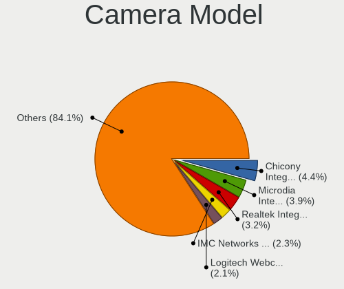

| Model                                               | Computers | Percent |
|-----------------------------------------------------|-----------|---------|
| Chicony Integrated Camera                           | 38        | 4.3%    |
| Microdia Integrated_Webcam_HD                       | 29        | 3.28%   |
| Realtek Integrated_Webcam_HD                        | 28        | 3.17%   |
| Logitech Webcam C270                                | 21        | 2.38%   |
| IMC Networks Integrated Camera                      | 21        | 2.38%   |
| IMC Networks USB2.0 HD UVC WebCam                   | 18        | 2.04%   |
| Syntek Integrated Camera                            | 14        | 1.59%   |
| Sunplus Integrated_Webcam_HD                        | 12        | 1.36%   |
| Chicony HP Truevision HD                            | 12        | 1.36%   |
| IMC Networks USB2.0 VGA UVC WebCam                  | 10        | 1.13%   |
| Realtek USB Camera                                  | 9         | 1.02%   |
| Acer Lenovo EasyCamera                              | 9         | 1.02%   |
| Realtek Lenovo EasyCamera                           | 8         | 0.91%   |
| Chicony TOSHIBA Web Camera - HD                     | 8         | 0.91%   |
| Chicony HP Webcam                                   | 8         | 0.91%   |
| Chicony HD WebCam                                   | 8         | 0.91%   |
| Cheng Uei Precision Industry (Foxlink) HP Webcam    | 8         | 0.91%   |
| Bison SunplusIT Integrated Camera                   | 8         | 0.91%   |
| Bison Integrated Camera                             | 8         | 0.91%   |
| Quanta VGA WebCam                                   | 7         | 0.79%   |
| Microsoft LifeCam HD-3000                           | 7         | 0.79%   |
| Microdia USB 2.0 Camera                             | 7         | 0.79%   |
| Chicony USB 2.0 Camera                              | 7         | 0.79%   |
| Apple Built-in iSight                               | 7         | 0.79%   |
| Suyin Acer/Lenovo Webcam [CN0316]                   | 6         | 0.68%   |
| Realtek Integrated Webcam                           | 6         | 0.68%   |
| IMC Networks Lenovo EasyCamera                      | 6         | 0.68%   |
| Chicony USB2.0 VGA UVC WebCam                       | 6         | 0.68%   |
| Acer Lenovo Integrated Webcam                       | 6         | 0.68%   |
| Suyin Integrated_Webcam_HD                          | 5         | 0.57%   |
| ShineTech USB2.0 HD UVC WebCam                      | 5         | 0.57%   |
| Quanta HP TrueVision HD Camera                      | 5         | 0.57%   |
| Microdia Laptop_Integrated_Webcam_HD                | 5         | 0.57%   |
| Microdia Integrated_Webcam_FHD                      | 5         | 0.57%   |
| Microdia Camera                                     | 5         | 0.57%   |
| Luxvisions Innotech Limited HP TrueVision HD Camera | 5         | 0.57%   |
| Logitech HD Pro Webcam C920                         | 5         | 0.57%   |
| Lite-On Integrated Camera                           | 5         | 0.57%   |
| Lite-On HP Webcam                                   | 5         | 0.57%   |
| Generalplus CAMERA - UVC                            | 5         | 0.57%   |

Security
--------

Fingerprint Vendor
------------------

Fingerprint sensor vendors

| Vendor                     | Computers | Percent |
|----------------------------|-----------|---------|
| Validity Sensors           | 35        | 29.91%  |
| Synaptics                  | 28        | 23.93%  |
| Shenzhen Goodix Technology | 18        | 15.38%  |
| AuthenTec                  | 15        | 12.82%  |
| Upek                       | 12        | 10.26%  |
| Elan Microelectronics      | 7         | 5.98%   |
| STMicroelectronics         | 1         | 0.85%   |
| LighTuning Technology      | 1         | 0.85%   |

Fingerprint Model
-----------------

Fingerprint sensor models

| Model                                                                      | Computers | Percent |
|----------------------------------------------------------------------------|-----------|---------|
| Shenzhen Goodix  Fingerprint Device                                        | 12        | 10.26%  |
| Upek Biometric Touchchip/Touchstrip Fingerprint Sensor                     | 11        | 9.4%    |
| Validity Sensors VFS495 Fingerprint Reader                                 | 10        | 8.55%   |
| AuthenTec AES2501 Fingerprint Sensor                                       | 7         | 5.98%   |
| Validity Sensors VFS471 Fingerprint Reader                                 | 6         | 5.13%   |
| Synaptics  WBDI                                                            | 6         | 5.13%   |
| Synaptics Prometheus MIS Touch Fingerprint Reader                          | 6         | 5.13%   |
| Synaptics Metallica MIS Touch Fingerprint Reader                           | 5         | 4.27%   |
| Shenzhen Goodix Fingerprint Reader                                         | 5         | 4.27%   |
| Elan ELAN:ARM-M4                                                           | 5         | 4.27%   |
| Synaptics WBDI                                                             | 4         | 3.42%   |
| Validity Sensors VFS491                                                    | 3         | 2.56%   |
| Validity Sensors VFS 5011 fingerprint sensor                               | 3         | 2.56%   |
| AuthenTec AES2810                                                          | 3         | 2.56%   |
| Validity Sensors VFS7500 Touch Fingerprint Sensor                          | 2         | 1.71%   |
| Validity Sensors VFS5011 Fingerprint Reader                                | 2         | 1.71%   |
| Validity Sensors VFS101 Fingerprint Reader                                 | 2         | 1.71%   |
| Validity Sensors Fingerprint scanner                                       | 2         | 1.71%   |
| Synaptics UWP WBDI Device                                                  | 2         | 1.71%   |
| Synaptics UWP WBDI                                                         | 2         | 1.71%   |
| Synaptics Metallica MOH Touch Fingerprint Reader                           | 2         | 1.71%   |
| Elan ELAN:Fingerprint                                                      | 2         | 1.71%   |
| AuthenTec AES2550 Fingerprint Sensor                                       | 2         | 1.71%   |
| AuthenTec AES1600                                                          | 2         | 1.71%   |
| Validity Sensors VFS451 Fingerprint Reader                                 | 1         | 0.85%   |
| Validity Sensors VFS301 Fingerprint Reader                                 | 1         | 0.85%   |
| Validity Sensors Synaptics WBDI                                            | 1         | 0.85%   |
| Validity Sensors Synaptics VFS7552 Touch Fingerprint Sensor with PurePrint | 1         | 0.85%   |
| Validity Sensors Swipe Fingerprint Sensor                                  | 1         | 0.85%   |
| Upek TCS5B Fingerprint sensor                                              | 1         | 0.85%   |
| Synaptics FS7604 Touch Fingerprint Sensor with PurePrint                   | 1         | 0.85%   |
| STMicroelectronics Fingerprint Reader                                      | 1         | 0.85%   |
| Shenzhen Goodix FingerPrint                                                | 1         | 0.85%   |
| LighTuning Fingerprint Reader                                              | 1         | 0.85%   |
| AuthenTec Fingerprint Sensor                                               | 1         | 0.85%   |

Chipcard Vendor
---------------

Chipcard module vendors

| Vendor      | Computers | Percent |
|-------------|-----------|---------|
| Broadcom    | 34        | 57.63%  |
| Alcor Micro | 15        | 25.42%  |
| O2 Micro    | 5         | 8.47%   |
| Upek        | 2         | 3.39%   |
| Lenovo      | 2         | 3.39%   |
| Yubico.com  | 1         | 1.69%   |

Chipcard Model
--------------

Chipcard module models

| Model                                                                        | Computers | Percent |
|------------------------------------------------------------------------------|-----------|---------|
| Broadcom 58200                                                               | 17        | 28.81%  |
| Alcor Micro AU9540 Smartcard Reader                                          | 15        | 25.42%  |
| Broadcom BCM5880 Secure Applications Processor                               | 9         | 15.25%  |
| Broadcom 5880                                                                | 6         | 10.17%  |
| O2 Micro OZ776 CCID Smartcard Reader                                         | 5         | 8.47%   |
| Upek TouchChip Fingerprint Coprocessor (WBF advanced mode)                   | 2         | 3.39%   |
| Lenovo Integrated Smart Card Reader                                          | 2         | 3.39%   |
| Broadcom BCM5880 Secure Applications Processor with fingerprint swipe sensor | 2         | 3.39%   |
| Yubico.com Yubikey 4/5 U2F+CCID                                              | 1         | 1.69%   |

Unsupported
-----------

Unsupported Devices
-------------------

Total unsupported devices on board

| Total | Computers | Percent |
|-------|-----------|---------|
| 0     | 1089      | 71.69%  |
| 1     | 348       | 22.91%  |
| 2     | 66        | 4.34%   |
| 3     | 11        | 0.72%   |
| 4     | 3         | 0.2%    |
| 7     | 1         | 0.07%   |
| 6     | 1         | 0.07%   |

Unsupported Device Types
------------------------

Types of unsupported devices

| Type                     | Computers | Percent |
|--------------------------|-----------|---------|
| Graphics card            | 119       | 23.38%  |
| Fingerprint reader       | 117       | 22.99%  |
| Net/wireless             | 82        | 16.11%  |
| Chipcard                 | 53        | 10.41%  |
| Multimedia controller    | 38        | 7.47%   |
| Bluetooth                | 20        | 3.93%   |
| Communication controller | 18        | 3.54%   |
| Sound                    | 11        | 2.16%   |
| Camera                   | 11        | 2.16%   |
| Modem                    | 7         | 1.38%   |
| Storage                  | 6         | 1.18%   |
| Dvb card                 | 5         | 0.98%   |
| Network                  | 4         | 0.79%   |
| Flash memory             | 4         | 0.79%   |
| Card reader              | 4         | 0.79%   |
| Unassigned class         | 3         | 0.59%   |
| Net/ethernet             | 3         | 0.59%   |
| Firewire controller      | 2         | 0.39%   |
| Tv card                  | 1         | 0.2%    |
| Storage/raid             | 1         | 0.2%    |

