Linux in Greece - Tested Hardware & Statistics (Desktops)
---------------------------------------------------------

A project to collect tested hardware configurations for Linux in Greece.

Anyone can contribute to this report by the [hw-probe](https://github.com/linuxhw/hw-probe) tool:

    sudo -E hw-probe -all -upload

Please contribute! Especially if your hardware is rare.

Contents
--------

* [ Test Cases ](#test-cases)

* [ System ](#system)
  - [ OS                       ](#os)
  - [ OS Family                ](#os-family)
  - [ Kernel                   ](#kernel)
  - [ Kernel Family            ](#kernel-family)
  - [ Kernel Major Ver.        ](#kernel-major-ver)
  - [ Arch                     ](#arch)
  - [ DE                       ](#de)
  - [ Display Server           ](#display-server)
  - [ Display Manager          ](#display-manager)
  - [ OS Lang                  ](#os-lang)
  - [ Boot Mode                ](#boot-mode)
  - [ Filesystem               ](#filesystem)
  - [ Part. scheme             ](#part-scheme)
  - [ Dual Boot with Linux/BSD ](#dual-boot-with-linuxbsd)
  - [ Dual Boot (Win)          ](#dual-boot-win)

* [ Board ](#board)
  - [ Vendor                   ](#vendor)
  - [ Model                    ](#model)
  - [ Model Family             ](#model-family)
  - [ MFG Year                 ](#mfg-year)
  - [ Form Factor              ](#form-factor)
  - [ Secure Boot              ](#secure-boot)
  - [ Coreboot                 ](#coreboot)
  - [ RAM Size                 ](#ram-size)
  - [ RAM Used                 ](#ram-used)
  - [ Total Drives             ](#total-drives)
  - [ Has CD-ROM               ](#has-cd-rom)
  - [ Has Ethernet             ](#has-ethernet)
  - [ Has WiFi                 ](#has-wifi)
  - [ Has Bluetooth            ](#has-bluetooth)

* [ Location ](#location)
  - [ Country                  ](#country)
  - [ City                     ](#city)

* [ Drives ](#drives)
  - [ Drive Vendor             ](#drive-vendor)
  - [ Drive Model              ](#drive-model)
  - [ HDD Vendor               ](#hdd-vendor)
  - [ SSD Vendor               ](#ssd-vendor)
  - [ Drive Kind               ](#drive-kind)
  - [ Drive Connector          ](#drive-connector)
  - [ Drive Size               ](#drive-size)
  - [ Space Total              ](#space-total)
  - [ Space Used               ](#space-used)
  - [ Malfunc. Drives          ](#malfunc-drives)
  - [ Malfunc. Drive Vendor    ](#malfunc-drive-vendor)
  - [ Malfunc. HDD Vendor      ](#malfunc-hdd-vendor)
  - [ Malfunc. Drive Kind      ](#malfunc-drive-kind)
  - [ Failed Drives            ](#failed-drives)
  - [ Failed Drive Vendor      ](#failed-drive-vendor)
  - [ Drive Status             ](#drive-status)

* [ Storage controller ](#storage-controller)
  - [ Storage Vendor           ](#storage-vendor)
  - [ Storage Model            ](#storage-model)
  - [ Storage Kind             ](#storage-kind)

* [ Processor ](#processor)
  - [ CPU Vendor               ](#cpu-vendor)
  - [ CPU Model                ](#cpu-model)
  - [ CPU Model Family         ](#cpu-model-family)
  - [ CPU Cores                ](#cpu-cores)
  - [ CPU Sockets              ](#cpu-sockets)
  - [ CPU Threads              ](#cpu-threads)
  - [ CPU Op-Modes             ](#cpu-op-modes)
  - [ CPU Microcode            ](#cpu-microcode)
  - [ CPU Microarch            ](#cpu-microarch)

* [ Graphics ](#graphics)
  - [ GPU Vendor               ](#gpu-vendor)
  - [ GPU Model                ](#gpu-model)
  - [ GPU Combo                ](#gpu-combo)
  - [ GPU Driver               ](#gpu-driver)
  - [ GPU Memory               ](#gpu-memory)

* [ Monitor ](#monitor)
  - [ Monitor Vendor           ](#monitor-vendor)
  - [ Monitor Model            ](#monitor-model)
  - [ Monitor Resolution       ](#monitor-resolution)
  - [ Monitor Diagonal         ](#monitor-diagonal)
  - [ Monitor Width            ](#monitor-width)
  - [ Aspect Ratio             ](#aspect-ratio)
  - [ Monitor Area             ](#monitor-area)
  - [ Pixel Density            ](#pixel-density)
  - [ Multiple Monitors        ](#multiple-monitors)

* [ Network ](#network)
  - [ Net Controller Vendor    ](#net-controller-vendor)
  - [ Net Controller Model     ](#net-controller-model)
  - [ Wireless Vendor          ](#wireless-vendor)
  - [ Wireless Model           ](#wireless-model)
  - [ Ethernet Vendor          ](#ethernet-vendor)
  - [ Ethernet Model           ](#ethernet-model)
  - [ Net Controller Kind      ](#net-controller-kind)
  - [ Used Controller          ](#used-controller)
  - [ NICs                     ](#nics)
  - [ IPv6                     ](#ipv6)

* [ Bluetooth ](#bluetooth)
  - [ Bluetooth Vendor         ](#bluetooth-vendor)
  - [ Bluetooth Model          ](#bluetooth-model)

* [ Sound ](#sound)
  - [ Sound Vendor             ](#sound-vendor)
  - [ Sound Model              ](#sound-model)

* [ Memory ](#memory)
  - [ Memory Vendor            ](#memory-vendor)
  - [ Memory Model             ](#memory-model)
  - [ Memory Kind              ](#memory-kind)
  - [ Memory Form Factor       ](#memory-form-factor)
  - [ Memory Size              ](#memory-size)
  - [ Memory Speed             ](#memory-speed)

* [ Printers & scanners ](#printers--scanners)
  - [ Printer Vendor           ](#printer-vendor)
  - [ Printer Model            ](#printer-model)
  - [ Scanner Vendor           ](#scanner-vendor)
  - [ Scanner Model            ](#scanner-model)

* [ Camera ](#camera)
  - [ Camera Vendor            ](#camera-vendor)
  - [ Camera Model             ](#camera-model)

* [ Security ](#security)
  - [ Fingerprint Vendor       ](#fingerprint-vendor)
  - [ Fingerprint Model        ](#fingerprint-model)
  - [ Chipcard Vendor          ](#chipcard-vendor)
  - [ Chipcard Model           ](#chipcard-model)

* [ Unsupported ](#unsupported)
  - [ Unsupported Devices      ](#unsupported-devices)
  - [ Unsupported Device Types ](#unsupported-device-types)

Test Cases
----------

Total: 1212

| Vendor        | Model                       | Probe                                                      | Date         |
|---------------|-----------------------------|------------------------------------------------------------|--------------|
| Lenovo        | ThinkCentre M90 5485WHG     | [f8da681374](https://linux-hardware.org/?probe=f8da681374) | Jan 03, 2026 |
| HP            | 83E9                        | [daed51befb](https://linux-hardware.org/?probe=daed51befb) | Dec 27, 2025 |
| ASUSTek       | PRIME B250-PLUS             | [7e050bab7a](https://linux-hardware.org/?probe=7e050bab7a) | Dec 25, 2025 |
| Gigabyte      | H97M-D3H                    | [1ab529f341](https://linux-hardware.org/?probe=1ab529f341) | Dec 23, 2025 |
| ASRock        | A520M-HVS                   | [8fb8ca5968](https://linux-hardware.org/?probe=8fb8ca5968) | Dec 23, 2025 |
| ASRock        | A520M-HVS                   | [c6b245496c](https://linux-hardware.org/?probe=c6b245496c) | Dec 22, 2025 |
| Gigabyte      | EP43T-S3L                   | [fa303b42ef](https://linux-hardware.org/?probe=fa303b42ef) | Dec 18, 2025 |
| Gigabyte      | EP43T-S3L                   | [9d787e7b8c](https://linux-hardware.org/?probe=9d787e7b8c) | Dec 15, 2025 |
| Lenovo        | 335A NOK                    | [74794406c0](https://linux-hardware.org/?probe=74794406c0) | Dec 15, 2025 |
| Gigabyte      | Z790 UD AX                  | [2cecbb7b53](https://linux-hardware.org/?probe=2cecbb7b53) | Dec 14, 2025 |
| MSI           | MAG X570 TOMAHAWK WIFI      | [e0da88cc6b](https://linux-hardware.org/?probe=e0da88cc6b) | Dec 14, 2025 |
| ASUSTek       | PRIME B250-PLUS             | [c4a9830a94](https://linux-hardware.org/?probe=c4a9830a94) | Dec 13, 2025 |
| Dell          | 09KPNV A00                  | [3e3cec6946](https://linux-hardware.org/?probe=3e3cec6946) | Dec 13, 2025 |
| Dell          | 09KPNV A00                  | [873590398b](https://linux-hardware.org/?probe=873590398b) | Dec 13, 2025 |
| ASUSTek       | TUF Gaming B650M-E WIFI     | [4f8401a5e2](https://linux-hardware.org/?probe=4f8401a5e2) | Dec 12, 2025 |
| Gigabyte      | B450 AORUS PRO-CF           | [7fcfc5e3c2](https://linux-hardware.org/?probe=7fcfc5e3c2) | Dec 10, 2025 |
| ASUSTek       | P8B75-M LX                  | [59dbd8a680](https://linux-hardware.org/?probe=59dbd8a680) | Dec 10, 2025 |
| AMI           | AMD                         | [535f8fb4e7](https://linux-hardware.org/?probe=535f8fb4e7) | Dec 09, 2025 |
| ASUSTek       | PRIME B550M-A WIFI II       | [79af089680](https://linux-hardware.org/?probe=79af089680) | Dec 08, 2025 |
| ASUSTek       | PRIME B550M-K ARGB          | [540db248e9](https://linux-hardware.org/?probe=540db248e9) | Dec 08, 2025 |
| ASUSTek       | PRIME B550M-K ARGB          | [5ddd1903fe](https://linux-hardware.org/?probe=5ddd1903fe) | Dec 08, 2025 |
| Gigabyte      | B550 AORUS ELITE            | [17136119cf](https://linux-hardware.org/?probe=17136119cf) | Dec 07, 2025 |
| ASRock        | Z690 PG Riptide             | [fe76314165](https://linux-hardware.org/?probe=fe76314165) | Dec 07, 2025 |
| ASRock        | B850M Steel Legend WiFi     | [a04cba6a53](https://linux-hardware.org/?probe=a04cba6a53) | Dec 07, 2025 |
| ASRock        | B850M Steel Legend WiFi     | [6996ced710](https://linux-hardware.org/?probe=6996ced710) | Dec 07, 2025 |
| ASRock        | A320M-HDV R4.0              | [966188d1b7](https://linux-hardware.org/?probe=966188d1b7) | Dec 06, 2025 |
| ASUSTek       | H110M-K                     | [c2430d1ead](https://linux-hardware.org/?probe=c2430d1ead) | Dec 06, 2025 |
| ASUSTek       | H110M-K                     | [0c3f148abd](https://linux-hardware.org/?probe=0c3f148abd) | Dec 05, 2025 |
| ASUSTek       | ProArt B550-CREATOR         | [cd3e84c16a](https://linux-hardware.org/?probe=cd3e84c16a) | Dec 04, 2025 |
| Gigabyte      | Z790 UD AX                  | [570fa5f9ee](https://linux-hardware.org/?probe=570fa5f9ee) | Dec 04, 2025 |
| Gigabyte      | Z790 UD AX                  | [3b57cefd72](https://linux-hardware.org/?probe=3b57cefd72) | Nov 30, 2025 |
| Dell          | 0F6X5P A00                  | [3dfc44fb16](https://linux-hardware.org/?probe=3dfc44fb16) | Nov 29, 2025 |
| ASUSTek       | M5A99X EVO R2.0             | [430f1fdbf7](https://linux-hardware.org/?probe=430f1fdbf7) | Nov 24, 2025 |
| ASUSTek       | M5A87                       | [c9af5522a8](https://linux-hardware.org/?probe=c9af5522a8) | Nov 19, 2025 |
| Fujitsu       | D3220-A1 S26361-D3220-A1    | [8afecd57c9](https://linux-hardware.org/?probe=8afecd57c9) | Nov 16, 2025 |
| ASRock        | P67 Professional            | [6b75aaa57a](https://linux-hardware.org/?probe=6b75aaa57a) | Nov 16, 2025 |
| ASRock        | P67 Professional            | [2065ab45ee](https://linux-hardware.org/?probe=2065ab45ee) | Nov 15, 2025 |
| ASUSTek       | M5A87                       | [3263043e7f](https://linux-hardware.org/?probe=3263043e7f) | Nov 14, 2025 |
| MSI           | B350 TOMAHAWK ARCTIC        | [2d5f1962c0](https://linux-hardware.org/?probe=2d5f1962c0) | Nov 06, 2025 |
| Gigabyte      | H55M-S2H                    | [4d56e46e47](https://linux-hardware.org/?probe=4d56e46e47) | Nov 05, 2025 |
| Gigabyte      | B760I AORUS PRO DDR4        | [2c2d58e066](https://linux-hardware.org/?probe=2c2d58e066) | Nov 03, 2025 |
| HP            | 3398                        | [555b8ac3b3](https://linux-hardware.org/?probe=555b8ac3b3) | Nov 02, 2025 |
| ASRock        | B450M Pro4-F                | [df6811c424](https://linux-hardware.org/?probe=df6811c424) | Oct 31, 2025 |
| ASRock        | FM2A55M-HD+                 | [e3c28e5f5a](https://linux-hardware.org/?probe=e3c28e5f5a) | Oct 27, 2025 |
| ASRock        | G31M-GS                     | [9dabe23099](https://linux-hardware.org/?probe=9dabe23099) | Oct 26, 2025 |
| ASRock        | G31M-GS                     | [f181062e64](https://linux-hardware.org/?probe=f181062e64) | Oct 26, 2025 |
| ASRock        | FM2A55M-HD+                 | [0cebc68002](https://linux-hardware.org/?probe=0cebc68002) | Oct 24, 2025 |
| Gigabyte      | H97-D3H-CF                  | [9a0ea37189](https://linux-hardware.org/?probe=9a0ea37189) | Oct 21, 2025 |
| ASUSTek       | TUF Gaming B550-PLUS        | [eaabbef900](https://linux-hardware.org/?probe=eaabbef900) | Oct 17, 2025 |
| Gigabyte      | MZBAYAB-00                  | [7002e87600](https://linux-hardware.org/?probe=7002e87600) | Oct 17, 2025 |
| ASRock        | A320M_HDVr4.0               | [9f2636bb84](https://linux-hardware.org/?probe=9f2636bb84) | Oct 12, 2025 |
| ASUSTek       | PRIME A520M-K               | [5ed3991e77](https://linux-hardware.org/?probe=5ed3991e77) | Oct 09, 2025 |
| American M... | K7S41GX                     | [53edf0f2d4](https://linux-hardware.org/?probe=53edf0f2d4) | Oct 05, 2025 |
| HP            | 18E5                        | [442c80266a](https://linux-hardware.org/?probe=442c80266a) | Oct 03, 2025 |
| ASRock        | B650M Pro RS                | [06ef2ef27a](https://linux-hardware.org/?probe=06ef2ef27a) | Oct 03, 2025 |
| ASUSTek       | M4A785TD-M EVO              | [d90bc80967](https://linux-hardware.org/?probe=d90bc80967) | Oct 03, 2025 |
| ASUSTek       | PRIME B450-PLUS             | [3d569f0f3f](https://linux-hardware.org/?probe=3d569f0f3f) | Sep 30, 2025 |
| ASUSTek       | PRIME X370-A                | [cb5d936b99](https://linux-hardware.org/?probe=cb5d936b99) | Sep 29, 2025 |
| Unknown       | V1.0                        | [66c6a924a4](https://linux-hardware.org/?probe=66c6a924a4) | Sep 29, 2025 |
| Dell          | 0WMJ54 A01                  | [acc96fbd92](https://linux-hardware.org/?probe=acc96fbd92) | Sep 27, 2025 |
| HP            | 8906 SMVB                   | [6c486af030](https://linux-hardware.org/?probe=6c486af030) | Sep 27, 2025 |
| Unknown       | K7VT6-C                     | [1ebf11a51e](https://linux-hardware.org/?probe=1ebf11a51e) | Sep 27, 2025 |
| Unknown       | K7VT6-C                     | [5acc199b06](https://linux-hardware.org/?probe=5acc199b06) | Sep 27, 2025 |
| Fujitsu Si... | D2841-A1 S26361-D2841-A1    | [c261ed1a7e](https://linux-hardware.org/?probe=c261ed1a7e) | Sep 24, 2025 |
| Gigabyte      | B450M DS3H-CF               | [9ce38e3856](https://linux-hardware.org/?probe=9ce38e3856) | Sep 19, 2025 |
| ASUSTek       | PRIME A520M-K               | [ab85390635](https://linux-hardware.org/?probe=ab85390635) | Sep 11, 2025 |
| ASUSTek       | TUF Gaming B650-PLUS WIF... | [c9280cf6ab](https://linux-hardware.org/?probe=c9280cf6ab) | Sep 06, 2025 |
| MSI           | H310M PRO-VH PLUS           | [ea74c47b0b](https://linux-hardware.org/?probe=ea74c47b0b) | Sep 05, 2025 |
| Gigabyte      | B250M-D3H-CF                | [9f902ea35e](https://linux-hardware.org/?probe=9f902ea35e) | Sep 02, 2025 |
| ASRock        | X370 Pro4                   | [5e26850b9a](https://linux-hardware.org/?probe=5e26850b9a) | Aug 27, 2025 |
| Gigabyte      | Z790 UD AX                  | [e1cb957b21](https://linux-hardware.org/?probe=e1cb957b21) | Aug 25, 2025 |
| ASUSTek       | ProArt B550-CREATOR         | [812d6074d1](https://linux-hardware.org/?probe=812d6074d1) | Aug 25, 2025 |
| ASUSTek       | TUF Gaming B650-PLUS        | [0b20d4d4e3](https://linux-hardware.org/?probe=0b20d4d4e3) | Aug 23, 2025 |
| ASUSTek       | A88XM-E                     | [b95a4f2227](https://linux-hardware.org/?probe=b95a4f2227) | Aug 15, 2025 |
| Gigabyte      | X570 AORUS PRO              | [75cc550836](https://linux-hardware.org/?probe=75cc550836) | Aug 13, 2025 |
| Gigabyte      | Z790 UD AX                  | [bbb0c8a7fd](https://linux-hardware.org/?probe=bbb0c8a7fd) | Aug 08, 2025 |
| Gigabyte      | B650 EAGLE AX               | [53703278e8](https://linux-hardware.org/?probe=53703278e8) | Jul 31, 2025 |
| ASRock        | B450M Pro4-F                | [dfe43994bc](https://linux-hardware.org/?probe=dfe43994bc) | Jul 28, 2025 |
| MSI           | B450M-A PRO MAX             | [da9678edeb](https://linux-hardware.org/?probe=da9678edeb) | Jul 27, 2025 |
| Biostar       | G41-M7                      | [1f6d011ff4](https://linux-hardware.org/?probe=1f6d011ff4) | Jul 26, 2025 |
| ASUSTek       | ProArt B550-CREATOR         | [929e673c42](https://linux-hardware.org/?probe=929e673c42) | Jul 24, 2025 |
| Gigabyte      | B850 AORUS ELITE WIFI7 I... | [a1181c4847](https://linux-hardware.org/?probe=a1181c4847) | Jul 23, 2025 |
| Gigabyte      | B850 AORUS ELITE WIFI7 I... | [d3d1a8c707](https://linux-hardware.org/?probe=d3d1a8c707) | Jul 22, 2025 |
| MSI           | G41M-P26                    | [d72733ae00](https://linux-hardware.org/?probe=d72733ae00) | Jul 21, 2025 |
| ASUSTek       | PRIME Z690-P D4             | [841622386a](https://linux-hardware.org/?probe=841622386a) | Jul 18, 2025 |
| ASUSTek       | A8V-VM                      | [f9283c323c](https://linux-hardware.org/?probe=f9283c323c) | Jul 18, 2025 |
| MSI           | A320M-A PRO                 | [11085a7148](https://linux-hardware.org/?probe=11085a7148) | Jun 30, 2025 |
| Dell          | 06FW8P A02                  | [b63d02c5c3](https://linux-hardware.org/?probe=b63d02c5c3) | Jun 28, 2025 |
| ASRock        | B450M Pro4                  | [d018f53fb1](https://linux-hardware.org/?probe=d018f53fb1) | Jun 25, 2025 |
| ASUSTek       | AM1I-A                      | [2a0358f217](https://linux-hardware.org/?probe=2a0358f217) | Jun 25, 2025 |
| ASUSTek       | TUF Gaming X570-PLUS        | [078be92988](https://linux-hardware.org/?probe=078be92988) | Jun 23, 2025 |
| MSI           | MPG B550 GAMING PLUS        | [9a8f3f9700](https://linux-hardware.org/?probe=9a8f3f9700) | Jun 18, 2025 |
| HP            | 81C6 MVB 0B                 | [6636fec7c8](https://linux-hardware.org/?probe=6636fec7c8) | Jun 14, 2025 |
| Gigabyte      | Z690 GAMING X DDR4          | [714c348a24](https://linux-hardware.org/?probe=714c348a24) | Jun 08, 2025 |
| HP            | 8954                        | [10ef5d8b94](https://linux-hardware.org/?probe=10ef5d8b94) | May 29, 2025 |
| ASRock        | H67M                        | [0b9dde9fa3](https://linux-hardware.org/?probe=0b9dde9fa3) | May 27, 2025 |
| ASRock        | H570 Phantom Gaming 4       | [c30da82877](https://linux-hardware.org/?probe=c30da82877) | May 25, 2025 |
| ASUSTek       | PRIME A320M-K               | [e3365ba6bf](https://linux-hardware.org/?probe=e3365ba6bf) | May 19, 2025 |
| Gigabyte      | B550 AORUS ELITE V2         | [7248c0a4e2](https://linux-hardware.org/?probe=7248c0a4e2) | May 18, 2025 |
| ASUSTek       | P8Z68-V PRO GEN3            | [9b050bd05b](https://linux-hardware.org/?probe=9b050bd05b) | May 16, 2025 |
| ASUSTek       | Rampage III Extreme         | [80d88e6967](https://linux-hardware.org/?probe=80d88e6967) | May 15, 2025 |
| Lenovo        | SHARKBAY SDK0E50510 PRO ... | [93bad22174](https://linux-hardware.org/?probe=93bad22174) | May 09, 2025 |
| ASUSTek       | PRIME X370-A                | [1def7f2f09](https://linux-hardware.org/?probe=1def7f2f09) | May 07, 2025 |
| ASUSTek       | H110M-K D3                  | [669ddd2596](https://linux-hardware.org/?probe=669ddd2596) | May 07, 2025 |
| Gigabyte      | X570 I AORUS PRO WIFI       | [00a63ca054](https://linux-hardware.org/?probe=00a63ca054) | May 06, 2025 |
| Dell          | 00V62H A01                  | [792c27256e](https://linux-hardware.org/?probe=792c27256e) | May 02, 2025 |
| Gigabyte      | GA-880GMA-USB3              | [98669950ce](https://linux-hardware.org/?probe=98669950ce) | May 01, 2025 |
| ASUSTek       | P8H61-M LX                  | [58a2a39f7e](https://linux-hardware.org/?probe=58a2a39f7e) | Apr 30, 2025 |
| ASUSTek       | P8H61-M LX                  | [bddb911632](https://linux-hardware.org/?probe=bddb911632) | Apr 30, 2025 |
| Gigabyte      | B550 AORUS ELITE V2         | [ff18683fcc](https://linux-hardware.org/?probe=ff18683fcc) | Apr 29, 2025 |
| Dell          | 0GY6Y8 A02                  | [c22b2bb0c3](https://linux-hardware.org/?probe=c22b2bb0c3) | Apr 28, 2025 |
| ASUSTek       | Z170-A                      | [ef88f098a6](https://linux-hardware.org/?probe=ef88f098a6) | Apr 28, 2025 |
| MSI           | B450-A PRO MAX              | [f78c728d4b](https://linux-hardware.org/?probe=f78c728d4b) | Apr 27, 2025 |
| ASUSTek       | A88XM-E                     | [c964baa4d7](https://linux-hardware.org/?probe=c964baa4d7) | Apr 27, 2025 |
| ASUSTek       | PRIME B450M-A II            | [6a315ead3a](https://linux-hardware.org/?probe=6a315ead3a) | Apr 26, 2025 |
| HP            | 3032h                       | [d3b67f6368](https://linux-hardware.org/?probe=d3b67f6368) | Apr 22, 2025 |
| ASUSTek       | 2A73h                       | [2112b37c45](https://linux-hardware.org/?probe=2112b37c45) | Apr 19, 2025 |
| Gigabyte      | G31M-S2L                    | [bd25685343](https://linux-hardware.org/?probe=bd25685343) | Apr 16, 2025 |
| ASRock        | B550 Pro4                   | [54a85d2c5e](https://linux-hardware.org/?probe=54a85d2c5e) | Apr 11, 2025 |
| Dell          | 00V62H A01                  | [b631de4e69](https://linux-hardware.org/?probe=b631de4e69) | Apr 10, 2025 |
| ASUSTek       | P8P67 LE                    | [c4abd7ed3c](https://linux-hardware.org/?probe=c4abd7ed3c) | Apr 09, 2025 |
| MSI           | PRO Z790-P WIFI             | [e66778b912](https://linux-hardware.org/?probe=e66778b912) | Apr 09, 2025 |
| MSI           | PRO Z790-P WIFI             | [072776868b](https://linux-hardware.org/?probe=072776868b) | Apr 08, 2025 |
| HP            | 212B                        | [bba8753f67](https://linux-hardware.org/?probe=bba8753f67) | Apr 08, 2025 |
| Gigabyte      | B85M-HD3                    | [350a5e0ed7](https://linux-hardware.org/?probe=350a5e0ed7) | Apr 05, 2025 |
| ASRock        | B450M Pro4-F                | [259f3d97da](https://linux-hardware.org/?probe=259f3d97da) | Apr 03, 2025 |
| ASUSTek       | PRIME B250-PLUS             | [7604787d2e](https://linux-hardware.org/?probe=7604787d2e) | Mar 30, 2025 |
| ASUSTek       | PRIME B250-PLUS             | [08153ea1de](https://linux-hardware.org/?probe=08153ea1de) | Mar 28, 2025 |
| Unknown       | SKYBAY                      | [3d76a7c414](https://linux-hardware.org/?probe=3d76a7c414) | Mar 27, 2025 |
| HP            | 18E7                        | [af0f0acb4a](https://linux-hardware.org/?probe=af0f0acb4a) | Mar 25, 2025 |
| MSI           | PRO Z790-P WIFI             | [ce4027f846](https://linux-hardware.org/?probe=ce4027f846) | Mar 23, 2025 |
| MSI           | PRO Z790-P WIFI             | [a8a4d3929f](https://linux-hardware.org/?probe=a8a4d3929f) | Mar 23, 2025 |
| ASRock        | B450M Pro4-F                | [51409297e6](https://linux-hardware.org/?probe=51409297e6) | Mar 20, 2025 |
| ASUSTek       | PRIME B350-PLUS             | [07af58692b](https://linux-hardware.org/?probe=07af58692b) | Mar 16, 2025 |
| Gigabyte      | Z390 UD                     | [2454ec4c18](https://linux-hardware.org/?probe=2454ec4c18) | Mar 15, 2025 |
| ASRock        | A320M_HDVr4.0               | [eacdb1c36f](https://linux-hardware.org/?probe=eacdb1c36f) | Mar 14, 2025 |
| Gigabyte      | B365M_DS3H                  | [d47a02e699](https://linux-hardware.org/?probe=d47a02e699) | Mar 13, 2025 |
| HP            | 1495                        | [8028cc1ca3](https://linux-hardware.org/?probe=8028cc1ca3) | Mar 13, 2025 |
| ASRock        | B360M-HDV                   | [0858fa0b98](https://linux-hardware.org/?probe=0858fa0b98) | Mar 10, 2025 |
| ASUSTek       | F2A85-M PRO                 | [910466ab50](https://linux-hardware.org/?probe=910466ab50) | Mar 09, 2025 |
| Gigabyte      | X570 I AORUS PRO WIFI       | [85a93c0236](https://linux-hardware.org/?probe=85a93c0236) | Mar 09, 2025 |
| Dell          | 0GY6Y8 A02                  | [9f80873123](https://linux-hardware.org/?probe=9f80873123) | Feb 26, 2025 |
| ASRock        | A320M-HDV R4.0              | [a16603c460](https://linux-hardware.org/?probe=a16603c460) | Feb 26, 2025 |
| ASRock        | B450M Pro4-F                | [db2c61ec90](https://linux-hardware.org/?probe=db2c61ec90) | Feb 24, 2025 |
| Gigabyte      | B450 AORUS M                | [77a78036c0](https://linux-hardware.org/?probe=77a78036c0) | Feb 23, 2025 |
| ASRock        | P45TS                       | [7811f9bf1c](https://linux-hardware.org/?probe=7811f9bf1c) | Feb 22, 2025 |
| Gigabyte      | B550 AORUS PRO AC           | [cb26270696](https://linux-hardware.org/?probe=cb26270696) | Feb 22, 2025 |
| HP            | 0A60h                       | [96b816631a](https://linux-hardware.org/?probe=96b816631a) | Feb 20, 2025 |
| Gigabyte      | X870E AORUS ELITE WIFI7     | [15bad1921c](https://linux-hardware.org/?probe=15bad1921c) | Feb 19, 2025 |
| Dell          | 06FW8P A02                  | [1a3e321d8f](https://linux-hardware.org/?probe=1a3e321d8f) | Feb 17, 2025 |
| MSI           | MPG X570 GAMING PLUS        | [3d5e89df6b](https://linux-hardware.org/?probe=3d5e89df6b) | Feb 16, 2025 |
| Gigabyte      | B650 GAMING X AX V2         | [1b21208ec1](https://linux-hardware.org/?probe=1b21208ec1) | Feb 13, 2025 |
| Gigabyte      | B650 GAMING X AX V2         | [7cb4a5bee8](https://linux-hardware.org/?probe=7cb4a5bee8) | Feb 12, 2025 |
| ASUSTek       | G15CK                       | [44e4634356](https://linux-hardware.org/?probe=44e4634356) | Feb 08, 2025 |
| Lenovo        | ThinkCentre M58 6258RD5     | [d7f57124c2](https://linux-hardware.org/?probe=d7f57124c2) | Feb 08, 2025 |
| Biostar       | B550MH                      | [29aa79bbda](https://linux-hardware.org/?probe=29aa79bbda) | Feb 06, 2025 |
| ASRock        | AB350 Pro4                  | [5fb037117e](https://linux-hardware.org/?probe=5fb037117e) | Feb 02, 2025 |
| Gigabyte      | P35C-DS3R                   | [71fee4b7c0](https://linux-hardware.org/?probe=71fee4b7c0) | Jan 30, 2025 |
| HP            | 82B4                        | [ba0950050a](https://linux-hardware.org/?probe=ba0950050a) | Jan 29, 2025 |
| Red Hat       | RHEL RHEL-9.4.0 PC          | [d5e1c03bd1](https://linux-hardware.org/?probe=d5e1c03bd1) | Jan 29, 2025 |
| MSI           | 970A-G43 PLUS               | [e5cf893d6f](https://linux-hardware.org/?probe=e5cf893d6f) | Jan 29, 2025 |
| Gigabyte      | B250M-DS3H-CF               | [02dbf93901](https://linux-hardware.org/?probe=02dbf93901) | Jan 25, 2025 |
| MSI           | 760GA-P43                   | [cdb4610924](https://linux-hardware.org/?probe=cdb4610924) | Jan 24, 2025 |
| Gigabyte      | P35-S3G                     | [e84c0677ae](https://linux-hardware.org/?probe=e84c0677ae) | Jan 24, 2025 |
| Gigabyte      | Z68MA-D2H-B3                | [f8f1ed7129](https://linux-hardware.org/?probe=f8f1ed7129) | Jan 20, 2025 |
| MSI           | B450M PRO-M2                | [8eb62be4b0](https://linux-hardware.org/?probe=8eb62be4b0) | Jan 18, 2025 |
| ASUSTek       | P5KPL-AM/PS                 | [d2f0faf6b5](https://linux-hardware.org/?probe=d2f0faf6b5) | Jan 17, 2025 |
| ASUSTek       | PRIME B350-PLUS             | [9637ceb838](https://linux-hardware.org/?probe=9637ceb838) | Jan 15, 2025 |
| HP            | 212A                        | [64f3e0e07d](https://linux-hardware.org/?probe=64f3e0e07d) | Jan 14, 2025 |
| HP            | 0AA8h                       | [188b9a473f](https://linux-hardware.org/?probe=188b9a473f) | Jan 14, 2025 |
| ASUSTek       | M3A76-CM                    | [65aaf9b2b4](https://linux-hardware.org/?probe=65aaf9b2b4) | Jan 13, 2025 |
| ASUSTek       | M3A76-CM                    | [a41e76857d](https://linux-hardware.org/?probe=a41e76857d) | Jan 13, 2025 |
| Gigabyte      | H310M H x.x                 | [9940687765](https://linux-hardware.org/?probe=9940687765) | Jan 11, 2025 |
| Gigabyte      | G41M-ES2L                   | [60cf453df6](https://linux-hardware.org/?probe=60cf453df6) | Jan 04, 2025 |
| AMI           | Intel                       | [a5d99b38fe](https://linux-hardware.org/?probe=a5d99b38fe) | Jan 03, 2025 |
| Dell          | 0F3KHR A01                  | [2a4ad29ef8](https://linux-hardware.org/?probe=2a4ad29ef8) | Dec 26, 2024 |
| Gigabyte      | B450M DS3H-CF               | [e3be4eb4bf](https://linux-hardware.org/?probe=e3be4eb4bf) | Dec 24, 2024 |
| MSI           | 990FXA-GD65                 | [f62a826f4d](https://linux-hardware.org/?probe=f62a826f4d) | Dec 24, 2024 |
| ASRock        | B550M Steel Legend          | [e843ef7f48](https://linux-hardware.org/?probe=e843ef7f48) | Dec 19, 2024 |
| HP            | 83F2                        | [d6f68a1e91](https://linux-hardware.org/?probe=d6f68a1e91) | Dec 16, 2024 |
| Gigabyte      | X570 I AORUS PRO WIFI       | [41ce41aa0b](https://linux-hardware.org/?probe=41ce41aa0b) | Dec 16, 2024 |
| EVGA          | 121-KS-E375                 | [f5844acfd1](https://linux-hardware.org/?probe=f5844acfd1) | Dec 15, 2024 |
| ASUSTek       | M3A76-CM                    | [1b5bbe8b9b](https://linux-hardware.org/?probe=1b5bbe8b9b) | Dec 10, 2024 |
| ASUSTek       | M3A76-CM                    | [fb83a1efd1](https://linux-hardware.org/?probe=fb83a1efd1) | Dec 08, 2024 |
| HP            | 1998                        | [924f8aa401](https://linux-hardware.org/?probe=924f8aa401) | Dec 02, 2024 |
| HP            | 1998                        | [96ed13c26f](https://linux-hardware.org/?probe=96ed13c26f) | Dec 02, 2024 |
| Gigabyte      | H97M-D3H                    | [f8e5244664](https://linux-hardware.org/?probe=f8e5244664) | Dec 02, 2024 |
| MSI           | B450 TOMAHAWK MAX II        | [00d4ce0f70](https://linux-hardware.org/?probe=00d4ce0f70) | Dec 01, 2024 |
| ASUSTek       | PRIME B250-PLUS             | [2e64c84332](https://linux-hardware.org/?probe=2e64c84332) | Nov 29, 2024 |
| ASUSTek       | M5A97 R2.0                  | [2ca4532a01](https://linux-hardware.org/?probe=2ca4532a01) | Nov 27, 2024 |
| Fujitsu       | D3061-A1 S26361-D3061-A1    | [2397b52715](https://linux-hardware.org/?probe=2397b52715) | Nov 27, 2024 |
| ASUSTek       | PRIME B250-PLUS             | [b83b69cfbe](https://linux-hardware.org/?probe=b83b69cfbe) | Nov 23, 2024 |
| Foxconn       | G31MXP FAB:1.1              | [e6250c0cfc](https://linux-hardware.org/?probe=e6250c0cfc) | Nov 16, 2024 |
| Gigabyte      | B450 AORUS ELITE            | [46c8f7928b](https://linux-hardware.org/?probe=46c8f7928b) | Nov 15, 2024 |
| ASRock        | X600M-STX                   | [c16fbb9c2c](https://linux-hardware.org/?probe=c16fbb9c2c) | Nov 13, 2024 |
| Gigabyte      | A320M-S2H-CF                | [b2ec371df1](https://linux-hardware.org/?probe=b2ec371df1) | Nov 08, 2024 |
| Dell          | 0PJDGF A02                  | [7d9db2e575](https://linux-hardware.org/?probe=7d9db2e575) | Nov 05, 2024 |
| Gigabyte      | A320M-H-CF                  | [6f0c41f989](https://linux-hardware.org/?probe=6f0c41f989) | Nov 05, 2024 |
| Gigabyte      | H310M H x.x                 | [50298be9fe](https://linux-hardware.org/?probe=50298be9fe) | Nov 04, 2024 |
| ASUSTek       | P5K SE                      | [3a9546eaaa](https://linux-hardware.org/?probe=3a9546eaaa) | Nov 02, 2024 |
| Dell          | 0MN1TX A02                  | [3b7b8ccbfe](https://linux-hardware.org/?probe=3b7b8ccbfe) | Oct 29, 2024 |
| Dell          | 0VTH9F A02                  | [dfee8a872a](https://linux-hardware.org/?probe=dfee8a872a) | Oct 29, 2024 |
| Gigabyte      | EP31-DS3L                   | [5e82737779](https://linux-hardware.org/?probe=5e82737779) | Oct 24, 2024 |
| Gigabyte      | EP31-DS3L                   | [ea94c74a3f](https://linux-hardware.org/?probe=ea94c74a3f) | Oct 24, 2024 |
| Gigabyte      | B450M S2H                   | [e9b1483206](https://linux-hardware.org/?probe=e9b1483206) | Oct 23, 2024 |
| Gigabyte      | H67A-UD3H-B3                | [7666cf6341](https://linux-hardware.org/?probe=7666cf6341) | Oct 23, 2024 |
| Gigabyte      | Z68MA-D2H-B3                | [edbea4a1b6](https://linux-hardware.org/?probe=edbea4a1b6) | Oct 23, 2024 |
| ASUSTek       | PRIME X570-P                | [c747936704](https://linux-hardware.org/?probe=c747936704) | Oct 20, 2024 |
| Gigabyte      | B450M DS3H-CF               | [4b8d9423fc](https://linux-hardware.org/?probe=4b8d9423fc) | Oct 19, 2024 |
| Gigabyte      | B450M DS3H-CF               | [88309143f0](https://linux-hardware.org/?probe=88309143f0) | Oct 18, 2024 |
| Lenovo        | 314F NO DPK                 | [ab8e224c72](https://linux-hardware.org/?probe=ab8e224c72) | Oct 18, 2024 |
| ASUSTek       | TUF Gaming X570-PLUS        | [3fc892bab8](https://linux-hardware.org/?probe=3fc892bab8) | Oct 14, 2024 |
| MSI           | B450-A PRO MAX              | [b09dbbecea](https://linux-hardware.org/?probe=b09dbbecea) | Oct 13, 2024 |
| MSI           | B450-A PRO MAX              | [a4588f5890](https://linux-hardware.org/?probe=a4588f5890) | Oct 08, 2024 |
| MSI           | B450-A PRO MAX              | [43af547870](https://linux-hardware.org/?probe=43af547870) | Oct 08, 2024 |
| Gigabyte      | 965P-S3                     | [278f1bb58c](https://linux-hardware.org/?probe=278f1bb58c) | Sep 27, 2024 |
| Dell          | 0HY9JP A02                  | [34ec1e561d](https://linux-hardware.org/?probe=34ec1e561d) | Sep 27, 2024 |
| Gigabyte      | Z87M-HD3                    | [9c562981a8](https://linux-hardware.org/?probe=9c562981a8) | Sep 22, 2024 |
| HP            | 82B4                        | [40361b82fa](https://linux-hardware.org/?probe=40361b82fa) | Sep 21, 2024 |
| Gigabyte      | Z87M-HD3                    | [4890beb64c](https://linux-hardware.org/?probe=4890beb64c) | Sep 21, 2024 |
| ASRock        | A320M-HDVr4.00              | [935e537005](https://linux-hardware.org/?probe=935e537005) | Sep 08, 2024 |
| Gigabyte      | X570 I AORUS PRO WIFI       | [9e5df6f5b7](https://linux-hardware.org/?probe=9e5df6f5b7) | Sep 08, 2024 |
| Lenovo        | 3106 SDK0J40697 WIN 3305... | [c69cdaba12](https://linux-hardware.org/?probe=c69cdaba12) | Sep 06, 2024 |
| ASRock        | Z490 Extreme4               | [3b2c0ab3e9](https://linux-hardware.org/?probe=3b2c0ab3e9) | Sep 04, 2024 |
| Dell          | 008PGD A00                  | [88de1510fd](https://linux-hardware.org/?probe=88de1510fd) | Sep 02, 2024 |
| ASUSTek       | TUF Gaming X570-PLUS        | [69acdcb6dd](https://linux-hardware.org/?probe=69acdcb6dd) | Aug 21, 2024 |
| HP            | 1495                        | [732805c466](https://linux-hardware.org/?probe=732805c466) | Aug 17, 2024 |
| ASRock        | H97 Pro4                    | [545b152052](https://linux-hardware.org/?probe=545b152052) | Aug 14, 2024 |
| Gigabyte      | Z68X-UD3P-B3                | [9a444b2f1a](https://linux-hardware.org/?probe=9a444b2f1a) | Aug 11, 2024 |
| Lenovo        | ThinkCentre M81 0267A38     | [88a07e7d3e](https://linux-hardware.org/?probe=88a07e7d3e) | Aug 03, 2024 |
| MSI           | PRO B650-S WIFI             | [6476fbfd85](https://linux-hardware.org/?probe=6476fbfd85) | Jul 27, 2024 |
| ASUSTek       | G15CK                       | [938bb988d9](https://linux-hardware.org/?probe=938bb988d9) | Jul 27, 2024 |
| Gigabyte      | B450 AORUS PRO-CF           | [8ab73f3496](https://linux-hardware.org/?probe=8ab73f3496) | Jul 25, 2024 |
| ASRock        | B360M-HDV                   | [94cbafc49e](https://linux-hardware.org/?probe=94cbafc49e) | Jul 24, 2024 |
| Gigabyte      | B450M DS3H-CF               | [0da31e8c61](https://linux-hardware.org/?probe=0da31e8c61) | Jul 22, 2024 |
| ASUSTek       | P8Z68-V LX                  | [cea2e41904](https://linux-hardware.org/?probe=cea2e41904) | Jul 15, 2024 |
| Gigabyte      | B550M DS3H                  | [3763510ee6](https://linux-hardware.org/?probe=3763510ee6) | Jul 13, 2024 |
| ASRock        | X370 Pro4                   | [f11e620b5b](https://linux-hardware.org/?probe=f11e620b5b) | Jul 11, 2024 |
| ASRock        | X370 Pro4                   | [755857b571](https://linux-hardware.org/?probe=755857b571) | Jul 11, 2024 |
| Gigabyte      | A520M DS3H                  | [d196225c2c](https://linux-hardware.org/?probe=d196225c2c) | Jul 09, 2024 |
| Gigabyte      | A520M DS3H                  | [edfc4cf0e5](https://linux-hardware.org/?probe=edfc4cf0e5) | Jul 09, 2024 |
| MSI           | 2A78h                       | [2e3e93ad88](https://linux-hardware.org/?probe=2e3e93ad88) | Jul 06, 2024 |
| ASUSTek       | P5KPL-AM/PS                 | [8abaff1afd](https://linux-hardware.org/?probe=8abaff1afd) | Jul 06, 2024 |
| ASUSTek       | P7H55-M LE                  | [84a42d41f7](https://linux-hardware.org/?probe=84a42d41f7) | Jul 04, 2024 |
| HP            | 8954                        | [e4a7684a2a](https://linux-hardware.org/?probe=e4a7684a2a) | Jul 03, 2024 |
| ASUSTek       | ROG CROSSHAIR VII HERO      | [2da254e332](https://linux-hardware.org/?probe=2da254e332) | Jul 03, 2024 |
| Gigabyte      | Z790 UD AX                  | [e0176f7f71](https://linux-hardware.org/?probe=e0176f7f71) | Jul 01, 2024 |
| Lenovo        | 3106 SDK0J40697 WIN 3305... | [369ee572d0](https://linux-hardware.org/?probe=369ee572d0) | Jun 29, 2024 |
| ASUSTek       | ROG Maximus Z690 HERO       | [c17442ac07](https://linux-hardware.org/?probe=c17442ac07) | Jun 23, 2024 |
| Gigabyte      | B365M D2V                   | [9a4ad817b1](https://linux-hardware.org/?probe=9a4ad817b1) | Jun 23, 2024 |
| ASUSTek       | ProArt B550-CREATOR         | [fb2d7227a4](https://linux-hardware.org/?probe=fb2d7227a4) | Jun 22, 2024 |
| Gigabyte      | Z77X-D3H                    | [82c23cabe2](https://linux-hardware.org/?probe=82c23cabe2) | Jun 20, 2024 |
| Gigabyte      | Z790 UD AX                  | [5de5d6223f](https://linux-hardware.org/?probe=5de5d6223f) | Jun 19, 2024 |
| ASUSTek       | PRIME B350-PLUS             | [f91ac672d7](https://linux-hardware.org/?probe=f91ac672d7) | Jun 19, 2024 |
| NU591         | 1.0                         | [c1efde8d4f](https://linux-hardware.org/?probe=c1efde8d4f) | Jun 15, 2024 |
| Gigabyte      | GB-BRR5H-4500               | [a5e0188d5f](https://linux-hardware.org/?probe=a5e0188d5f) | Jun 08, 2024 |
| Dell          | 0M3F6C A01                  | [d9355d53f8](https://linux-hardware.org/?probe=d9355d53f8) | Jun 07, 2024 |
| Gigabyte      | X570 I AORUS PRO WIFI       | [19dda078e9](https://linux-hardware.org/?probe=19dda078e9) | May 30, 2024 |
| Gigabyte      | Z170N-Gaming 5              | [a658adf1a2](https://linux-hardware.org/?probe=a658adf1a2) | May 26, 2024 |
| ASRock        | B550 Phantom Gaming-ITX/... | [6f5141fe52](https://linux-hardware.org/?probe=6f5141fe52) | May 25, 2024 |
| ASRock        | X370 Gaming X               | [4dbaba7984](https://linux-hardware.org/?probe=4dbaba7984) | May 24, 2024 |
| Lenovo        | 3106 SDK0J40697 WIN 3305... | [629ad3c466](https://linux-hardware.org/?probe=629ad3c466) | May 20, 2024 |
| Lenovo        | Bantry CRB NOK              | [a501c1214c](https://linux-hardware.org/?probe=a501c1214c) | May 19, 2024 |
| Lenovo        | Bantry CRB NOK              | [5c2dca5ac4](https://linux-hardware.org/?probe=5c2dca5ac4) | May 19, 2024 |
| Gigabyte      | Z170N-Gaming 5              | [a0f7ed76e9](https://linux-hardware.org/?probe=a0f7ed76e9) | May 17, 2024 |
| Gigabyte      | GB-BRR5H-4500               | [d99dadbc4b](https://linux-hardware.org/?probe=d99dadbc4b) | May 17, 2024 |
| ASRock        | X470 Master SLI             | [78d93088af](https://linux-hardware.org/?probe=78d93088af) | May 15, 2024 |
| Gigabyte      | Z790 UD AX                  | [38ae310bd0](https://linux-hardware.org/?probe=38ae310bd0) | May 08, 2024 |
| Gigabyte      | Z790 UD AX                  | [d1a276f0c5](https://linux-hardware.org/?probe=d1a276f0c5) | May 08, 2024 |
| Lenovo        | 36F7 SDK0J40700 WIN 3258... | [7380e71093](https://linux-hardware.org/?probe=7380e71093) | May 05, 2024 |
| ASUSTek       | ROG CROSSHAIR VII HERO      | [ad6a595fac](https://linux-hardware.org/?probe=ad6a595fac) | Apr 29, 2024 |
| MSI           | PRO Z690-A WIFI DDR4        | [803a7bb728](https://linux-hardware.org/?probe=803a7bb728) | Apr 29, 2024 |
| MSI           | PRO Z690-A WIFI DDR4        | [3e6502d337](https://linux-hardware.org/?probe=3e6502d337) | Apr 28, 2024 |
| HP            | 2AFB                        | [6173192c73](https://linux-hardware.org/?probe=6173192c73) | Apr 28, 2024 |
| ASUSTek       | Pro WS WRX80E-SAGE SE WI... | [9517bddd97](https://linux-hardware.org/?probe=9517bddd97) | Apr 25, 2024 |
| Techvision    | TVI7309X B0                 | [0bf8074cfc](https://linux-hardware.org/?probe=0bf8074cfc) | Apr 23, 2024 |
| ASRock        | B450M Pro4-F                | [e8d54dd61b](https://linux-hardware.org/?probe=e8d54dd61b) | Apr 23, 2024 |
| Lenovo        | Unknown                     | [8c44eea387](https://linux-hardware.org/?probe=8c44eea387) | Apr 23, 2024 |
| Gigabyte      | X570 I AORUS PRO WIFI       | [02420cbf38](https://linux-hardware.org/?probe=02420cbf38) | Apr 22, 2024 |
| ASRock        | G41M-VS3                    | [21ae4d4c1e](https://linux-hardware.org/?probe=21ae4d4c1e) | Apr 21, 2024 |
| MSI           | MPG B550 GAMING PLUS        | [42a4ba108a](https://linux-hardware.org/?probe=42a4ba108a) | Apr 21, 2024 |
| ASRock        | X370 Gaming X               | [db397e4511](https://linux-hardware.org/?probe=db397e4511) | Apr 15, 2024 |
| ASUSTek       | TUF Gaming B760M-PLUS       | [cb668da9ee](https://linux-hardware.org/?probe=cb668da9ee) | Apr 12, 2024 |
| ASRock        | B450M Pro4-F                | [72a3752add](https://linux-hardware.org/?probe=72a3752add) | Apr 11, 2024 |
| Dell          | 0NKW6Y A02                  | [fcd30b6392](https://linux-hardware.org/?probe=fcd30b6392) | Apr 11, 2024 |
| Lenovo        | 30D9 SDK0J40697 WIN 3305... | [2ad2ada69c](https://linux-hardware.org/?probe=2ad2ada69c) | Apr 11, 2024 |
| Gigabyte      | Z590I AORUS ULTRA           | [2a11ab4791](https://linux-hardware.org/?probe=2a11ab4791) | Apr 06, 2024 |
| Gigabyte      | Z590I AORUS ULTRA           | [e786bc1b13](https://linux-hardware.org/?probe=e786bc1b13) | Apr 06, 2024 |
| Gigabyte      | 945GME-DS2                  | [37085a5c3f](https://linux-hardware.org/?probe=37085a5c3f) | Apr 06, 2024 |
| ASUSTek       | ROG CROSSHAIR VII HERO      | [3b126a195a](https://linux-hardware.org/?probe=3b126a195a) | Apr 04, 2024 |
| ASUSTek       | PRIME B450M-K II            | [f8bc7da1fc](https://linux-hardware.org/?probe=f8bc7da1fc) | Apr 01, 2024 |
| Gigabyte      | B550I AORUS PRO AX          | [a3e56de041](https://linux-hardware.org/?probe=a3e56de041) | Apr 01, 2024 |
| Gigabyte      | Z97P-D3                     | [87ccc4d35d](https://linux-hardware.org/?probe=87ccc4d35d) | Mar 30, 2024 |
| ASRock        | Z77 Extreme6                | [72c7021b55](https://linux-hardware.org/?probe=72c7021b55) | Mar 22, 2024 |
| ASUSTek       | TUF Gaming B550M-PLUS WI... | [e4e9866823](https://linux-hardware.org/?probe=e4e9866823) | Mar 22, 2024 |
| AMI           | Intel                       | [4bb3934f7d](https://linux-hardware.org/?probe=4bb3934f7d) | Mar 21, 2024 |
| ASRock        | B560 Pro4                   | [a34877f66c](https://linux-hardware.org/?probe=a34877f66c) | Mar 21, 2024 |
| NU591         | 1.0                         | [46ad6dd364](https://linux-hardware.org/?probe=46ad6dd364) | Mar 16, 2024 |
| Gigabyte      | Z68MA-D2H-B3                | [708c2c7987](https://linux-hardware.org/?probe=708c2c7987) | Mar 15, 2024 |
| ASUSTek       | PRIME B450M-A II            | [b591cc5cfe](https://linux-hardware.org/?probe=b591cc5cfe) | Mar 09, 2024 |
| ASRock        | A300M-STX                   | [a92e2761aa](https://linux-hardware.org/?probe=a92e2761aa) | Mar 06, 2024 |
| MSI           | B450M MORTAR MAX            | [f9ed40afc2](https://linux-hardware.org/?probe=f9ed40afc2) | Mar 06, 2024 |
| MSI           | MAG B550M MORTAR            | [31da1b6dc5](https://linux-hardware.org/?probe=31da1b6dc5) | Mar 06, 2024 |
| Biostar       | H610MH D5                   | [d3ae388ebd](https://linux-hardware.org/?probe=d3ae388ebd) | Mar 05, 2024 |
| ASUSTek       | SABERTOOTH Z97 MARK 2       | [d658a7bd4f](https://linux-hardware.org/?probe=d658a7bd4f) | Mar 03, 2024 |
| Gigabyte      | B450M DS3H-CF               | [04eb7eabdf](https://linux-hardware.org/?probe=04eb7eabdf) | Feb 26, 2024 |
| Gigabyte      | H61M-S2PV                   | [62412b14af](https://linux-hardware.org/?probe=62412b14af) | Feb 26, 2024 |
| Gigabyte      | H55M-S2H                    | [c7a7e78042](https://linux-hardware.org/?probe=c7a7e78042) | Feb 25, 2024 |
| Biostar       | B450MHP                     | [5c5906ef27](https://linux-hardware.org/?probe=5c5906ef27) | Feb 21, 2024 |
| NU591         | 1.0                         | [488e067c84](https://linux-hardware.org/?probe=488e067c84) | Feb 21, 2024 |
| ASRock        | QC6000M                     | [c262bb8499](https://linux-hardware.org/?probe=c262bb8499) | Feb 20, 2024 |
| ASUSTek       | P8P67 LE                    | [d0258cca7f](https://linux-hardware.org/?probe=d0258cca7f) | Feb 20, 2024 |
| ASUSTek       | P8P67 LE                    | [b2cba004d5](https://linux-hardware.org/?probe=b2cba004d5) | Feb 20, 2024 |
| Biostar       | B450MHP                     | [81eca30554](https://linux-hardware.org/?probe=81eca30554) | Feb 18, 2024 |
| Biostar       | B450MHP                     | [1c50343bc4](https://linux-hardware.org/?probe=1c50343bc4) | Feb 17, 2024 |
| Biostar       | G41-M7                      | [eea33a47ac](https://linux-hardware.org/?probe=eea33a47ac) | Feb 03, 2024 |
| Dell          | 0D28YY A01                  | [21e722f277](https://linux-hardware.org/?probe=21e722f277) | Feb 02, 2024 |
| ASRock        | X370 Gaming X               | [54fa92de97](https://linux-hardware.org/?probe=54fa92de97) | Feb 01, 2024 |
| Gigabyte      | B365M DS3H                  | [bb6bab84d0](https://linux-hardware.org/?probe=bb6bab84d0) | Jan 31, 2024 |
| Gigabyte      | B365M DS3H                  | [8a8a84c18b](https://linux-hardware.org/?probe=8a8a84c18b) | Jan 31, 2024 |
| MSI           | MS-7345                     | [3453f85c21](https://linux-hardware.org/?probe=3453f85c21) | Jan 30, 2024 |
| ASUSTek       | P5K                         | [2596e1adb2](https://linux-hardware.org/?probe=2596e1adb2) | Jan 29, 2024 |
| ASUSTek       | ROG STRIX Z690-A GAMING ... | [37e7442cca](https://linux-hardware.org/?probe=37e7442cca) | Jan 27, 2024 |
| ASRock        | A320M-HDV R4.0              | [64c2e7a1f3](https://linux-hardware.org/?probe=64c2e7a1f3) | Jan 24, 2024 |
| Dell          | 0D28YY A00                  | [8d8d8005b1](https://linux-hardware.org/?probe=8d8d8005b1) | Jan 23, 2024 |
| ASRock        | B450M Pro4                  | [440bc94322](https://linux-hardware.org/?probe=440bc94322) | Jan 19, 2024 |
| ASUSTek       | M4A89GTD-PRO/USB3           | [c69281db28](https://linux-hardware.org/?probe=c69281db28) | Jan 15, 2024 |
| Gigabyte      | GA-78LMT-USB3 x.x           | [fda5ec8f8d](https://linux-hardware.org/?probe=fda5ec8f8d) | Jan 10, 2024 |
| MSI           | 2A78h                       | [dfa343a5d1](https://linux-hardware.org/?probe=dfa343a5d1) | Jan 08, 2024 |
| ASRock        | X370 Gaming X               | [b780de408a](https://linux-hardware.org/?probe=b780de408a) | Jan 05, 2024 |
| MSI           | Z170A PC MATE               | [9a11a14058](https://linux-hardware.org/?probe=9a11a14058) | Jan 04, 2024 |
| AZW           | MINI S 10                   | [3a1b0c6d91](https://linux-hardware.org/?probe=3a1b0c6d91) | Jan 02, 2024 |
| Gigabyte      | Z490 AORUS ELITE AC         | [4faca6dad4](https://linux-hardware.org/?probe=4faca6dad4) | Dec 31, 2023 |
| Dell          | 0PU052                      | [7da56e0b33](https://linux-hardware.org/?probe=7da56e0b33) | Dec 29, 2023 |
| Dell          | 0X7841                      | [3757ec7f5f](https://linux-hardware.org/?probe=3757ec7f5f) | Dec 22, 2023 |
| ASUSTek       | P7H55-M LE                  | [d15476594e](https://linux-hardware.org/?probe=d15476594e) | Dec 22, 2023 |
| ASRock        | G41C-GS                     | [cea8e45a31](https://linux-hardware.org/?probe=cea8e45a31) | Dec 17, 2023 |
| ASRock        | X370 Gaming X               | [3cba3acfa9](https://linux-hardware.org/?probe=3cba3acfa9) | Dec 10, 2023 |
| Lenovo        | ThinkCentre M81 0267A38     | [a9f041fc10](https://linux-hardware.org/?probe=a9f041fc10) | Dec 05, 2023 |
| ASUSTek       | PRIME B450M-A               | [23937a8b80](https://linux-hardware.org/?probe=23937a8b80) | Dec 04, 2023 |
| Gigabyte      | B550 AORUS ELITE AX V2      | [4d788fb96c](https://linux-hardware.org/?probe=4d788fb96c) | Dec 04, 2023 |
| ASUSTek       | TUF Gaming B550M-PLUS WI... | [980caec27f](https://linux-hardware.org/?probe=980caec27f) | Dec 03, 2023 |
| Dell          | 0PU052                      | [4a653cc26a](https://linux-hardware.org/?probe=4a653cc26a) | Dec 02, 2023 |
| Dell          | 0WK833                      | [f363206bab](https://linux-hardware.org/?probe=f363206bab) | Nov 30, 2023 |
| Gigabyte      | H270-HD3-CF                 | [b18e30be2d](https://linux-hardware.org/?probe=b18e30be2d) | Nov 30, 2023 |
| Gigabyte      | X570 I AORUS PRO WIFI       | [85217c44b9](https://linux-hardware.org/?probe=85217c44b9) | Nov 27, 2023 |
| Gigabyte      | P55-US3L                    | [fdb0f32546](https://linux-hardware.org/?probe=fdb0f32546) | Nov 26, 2023 |
| Gigabyte      | GA-MA74GMT-S2               | [440e7b6c7c](https://linux-hardware.org/?probe=440e7b6c7c) | Nov 23, 2023 |
| HC Technol... | HCAR5000-MI                 | [718e30ca5e](https://linux-hardware.org/?probe=718e30ca5e) | Nov 22, 2023 |
| ASUSTek       | PRIME B450M-A II            | [eda4b1d020](https://linux-hardware.org/?probe=eda4b1d020) | Nov 21, 2023 |
| ASRock        | A320M-DVS R4.0              | [34d3fcf76b](https://linux-hardware.org/?probe=34d3fcf76b) | Nov 18, 2023 |
| Lenovo        | NOK                         | [1126fee720](https://linux-hardware.org/?probe=1126fee720) | Nov 16, 2023 |
| ASRock        | 970M Pro3                   | [fe2966d899](https://linux-hardware.org/?probe=fe2966d899) | Nov 13, 2023 |
| ASRock        | QC5000-ITX/PH               | [983df9a44c](https://linux-hardware.org/?probe=983df9a44c) | Nov 13, 2023 |
| Gigabyte      | GA-880GMA-USB3              | [3c0f8e3cdd](https://linux-hardware.org/?probe=3c0f8e3cdd) | Nov 13, 2023 |
| Dell          | 0HY9JP A02                  | [d3d9b9a9ba](https://linux-hardware.org/?probe=d3d9b9a9ba) | Nov 12, 2023 |
| Gigabyte      | B460M D3H                   | [45ff3557a5](https://linux-hardware.org/?probe=45ff3557a5) | Nov 11, 2023 |
| HP            | 339A                        | [7be77c764f](https://linux-hardware.org/?probe=7be77c764f) | Nov 09, 2023 |
| ASUSTek       | P8Z68-V PRO GEN3            | [14438106c9](https://linux-hardware.org/?probe=14438106c9) | Nov 09, 2023 |
| ASUSTek       | ROG STRIX X570-F GAMING     | [d8ceb3854c](https://linux-hardware.org/?probe=d8ceb3854c) | Nov 03, 2023 |
| ASUSTek       | ROG CROSSHAIR VII HERO      | [fc0052213d](https://linux-hardware.org/?probe=fc0052213d) | Nov 02, 2023 |
| ASUSTek       | ROG STRIX X570-F GAMING     | [aec8690672](https://linux-hardware.org/?probe=aec8690672) | Nov 02, 2023 |
| Gigabyte      | 965P-S3                     | [ae3a4e206c](https://linux-hardware.org/?probe=ae3a4e206c) | Oct 26, 2023 |
| ASUSTek       | PRIME X670E-PRO WIFI        | [9a65857d3c](https://linux-hardware.org/?probe=9a65857d3c) | Oct 23, 2023 |
| ASUSTek       | PRIME X670E-PRO WIFI        | [001c668695](https://linux-hardware.org/?probe=001c668695) | Oct 23, 2023 |
| Gigabyte      | B550 AORUS ELITE V2         | [91318c1cf1](https://linux-hardware.org/?probe=91318c1cf1) | Oct 21, 2023 |
| ASUSTek       | PRIME X670E-PRO WIFI        | [62ae73f967](https://linux-hardware.org/?probe=62ae73f967) | Oct 21, 2023 |
| ASRock        | H170 Pro4S                  | [e3960f114d](https://linux-hardware.org/?probe=e3960f114d) | Oct 18, 2023 |
| Dell          | 09KPNV A00                  | [13db34ae64](https://linux-hardware.org/?probe=13db34ae64) | Oct 16, 2023 |
| Gigabyte      | A520M DS3H                  | [e79f4b834d](https://linux-hardware.org/?probe=e79f4b834d) | Oct 13, 2023 |
| ASUSTek       | M5A78L-M LX3                | [88f08528f7](https://linux-hardware.org/?probe=88f08528f7) | Oct 13, 2023 |
| Gigabyte      | X570 I AORUS PRO WIFI       | [1cf16b0a10](https://linux-hardware.org/?probe=1cf16b0a10) | Oct 12, 2023 |
| HP            | 212B                        | [7bd2a09958](https://linux-hardware.org/?probe=7bd2a09958) | Oct 11, 2023 |
| HP            | 198E                        | [2fa031a84b](https://linux-hardware.org/?probe=2fa031a84b) | Oct 10, 2023 |
| ASUSTek       | P5Q3                        | [5d51aca6b2](https://linux-hardware.org/?probe=5d51aca6b2) | Oct 08, 2023 |
| ASUSTek       | P5Q3                        | [9beb6f3b26](https://linux-hardware.org/?probe=9beb6f3b26) | Oct 08, 2023 |
| Gigabyte      | G31M-ES2L                   | [7912f11c78](https://linux-hardware.org/?probe=7912f11c78) | Oct 08, 2023 |
| Gigabyte      | B450M DS3H-CF               | [3473652871](https://linux-hardware.org/?probe=3473652871) | Sep 29, 2023 |
| ASRock        | X370 Gaming X               | [ee8f74ab5e](https://linux-hardware.org/?probe=ee8f74ab5e) | Sep 27, 2023 |
| Gigabyte      | MZGLKBP-00                  | [678c17756d](https://linux-hardware.org/?probe=678c17756d) | Sep 23, 2023 |
| Gigabyte      | X570 I AORUS PRO WIFI       | [0f28c5cddd](https://linux-hardware.org/?probe=0f28c5cddd) | Sep 20, 2023 |
| Unknown       | Unknown                     | [e4dc880c6f](https://linux-hardware.org/?probe=e4dc880c6f) | Sep 20, 2023 |
| Gigabyte      | X570 AORUS ELITE            | [0d52c010c8](https://linux-hardware.org/?probe=0d52c010c8) | Sep 20, 2023 |
| MSI           | B350 TOMAHAWK ARCTIC        | [31c6babc26](https://linux-hardware.org/?probe=31c6babc26) | Sep 16, 2023 |
| ASUSTek       | PRIME B660-PLUS D4          | [b4c93a8e2e](https://linux-hardware.org/?probe=b4c93a8e2e) | Sep 12, 2023 |
| Foxconn       | G41MXE/G41MXE-K             | [6e5224fa1d](https://linux-hardware.org/?probe=6e5224fa1d) | Sep 09, 2023 |
| Gigabyte      | B550 AORUS ELITE AX V2      | [bb02ef5cc7](https://linux-hardware.org/?probe=bb02ef5cc7) | Sep 08, 2023 |
| Gigabyte      | MZGLKBP-00                  | [e6c5ae208f](https://linux-hardware.org/?probe=e6c5ae208f) | Sep 02, 2023 |
| MSI           | B450 TOMAHAWK               | [0cfb9de0cf](https://linux-hardware.org/?probe=0cfb9de0cf) | Sep 01, 2023 |
| Gigabyte      | H110M-H-CF                  | [faf094d2ca](https://linux-hardware.org/?probe=faf094d2ca) | Aug 31, 2023 |
| MSI           | 2A78h                       | [78b5a663f2](https://linux-hardware.org/?probe=78b5a663f2) | Aug 31, 2023 |
| Gigabyte      | MZGLKBP-00                  | [2ed0efb0a0](https://linux-hardware.org/?probe=2ed0efb0a0) | Aug 31, 2023 |
| ASRock        | X370 Gaming X               | [d9efc054ab](https://linux-hardware.org/?probe=d9efc054ab) | Aug 28, 2023 |
| MSI           | X470 GAMING PRO CARBON      | [a89271bc7d](https://linux-hardware.org/?probe=a89271bc7d) | Aug 22, 2023 |
| ASUSTek       | ROG STRIX X470-F GAMING     | [63d06430e4](https://linux-hardware.org/?probe=63d06430e4) | Aug 18, 2023 |
| ASUSTek       | PRIME Z390-P                | [c8ed9b0cb2](https://linux-hardware.org/?probe=c8ed9b0cb2) | Aug 16, 2023 |
| HP            | 339A                        | [2ecbd957da](https://linux-hardware.org/?probe=2ecbd957da) | Aug 11, 2023 |
| HP            | 339A                        | [782fefbccd](https://linux-hardware.org/?probe=782fefbccd) | Aug 01, 2023 |
| Gigabyte      | B650 AORUS ELITE AX         | [88dd1326f2](https://linux-hardware.org/?probe=88dd1326f2) | Jul 26, 2023 |
| ASUSTek       | ROG STRIX X570-E GAMING     | [719e8b9ad3](https://linux-hardware.org/?probe=719e8b9ad3) | Jul 22, 2023 |
| HP            | ProLiant MicroServer Gen... | [a9214c4672](https://linux-hardware.org/?probe=a9214c4672) | Jul 21, 2023 |
| Gigabyte      | Z77X-D3H                    | [8464b9ef50](https://linux-hardware.org/?probe=8464b9ef50) | Jul 17, 2023 |
| MSI           | MAG B460 TOMAHAWK           | [a9f169ce16](https://linux-hardware.org/?probe=a9f169ce16) | Jul 05, 2023 |
| Gigabyte      | B150M-DS3H-CF               | [1a3056376b](https://linux-hardware.org/?probe=1a3056376b) | Jul 02, 2023 |
| Gigabyte      | B150M-DS3H-CF               | [648742f6d3](https://linux-hardware.org/?probe=648742f6d3) | Jul 02, 2023 |
| ASUSTek       | A88XM-E                     | [4557637b8a](https://linux-hardware.org/?probe=4557637b8a) | Jun 26, 2023 |
| MSI           | MAG Z690 TOMAHAWK WIFI D... | [5b780b9ebd](https://linux-hardware.org/?probe=5b780b9ebd) | Jun 24, 2023 |
| Gigabyte      | EP45C-DS3R                  | [655d9d950d](https://linux-hardware.org/?probe=655d9d950d) | Jun 24, 2023 |
| ASRock        | B450 Gaming K4              | [98c46aeea5](https://linux-hardware.org/?probe=98c46aeea5) | Jun 17, 2023 |
| Gigabyte      | Z490I AORUS ULTRA           | [c5cea5f197](https://linux-hardware.org/?probe=c5cea5f197) | Jun 16, 2023 |
| MSI           | MS-7176                     | [952dc4b788](https://linux-hardware.org/?probe=952dc4b788) | Jun 16, 2023 |
| Lenovo        | SHARKBAY 0B98401 PRO        | [ab92fe4791](https://linux-hardware.org/?probe=ab92fe4791) | Jun 13, 2023 |
| Dell          | 0K83V0 A00                  | [fc7fa0850a](https://linux-hardware.org/?probe=fc7fa0850a) | Jun 08, 2023 |
| ASUSTek       | PRIME H610M-E D4            | [827f6ecac2](https://linux-hardware.org/?probe=827f6ecac2) | Jun 07, 2023 |
| ASRock        | Z790 Taichi Carrara         | [bdea2092aa](https://linux-hardware.org/?probe=bdea2092aa) | Jun 06, 2023 |
| ASRock        | X370 Gaming X               | [558e181232](https://linux-hardware.org/?probe=558e181232) | Jun 05, 2023 |
| Unknown       | Intel X79                   | [0e2e65a79e](https://linux-hardware.org/?probe=0e2e65a79e) | Jun 04, 2023 |
| Fujitsu       | D3402-A1 S26361-D3402-A1    | [0ae3ea958a](https://linux-hardware.org/?probe=0ae3ea958a) | May 29, 2023 |
| Gigabyte      | X570 I AORUS PRO WIFI       | [bb842bc2d8](https://linux-hardware.org/?probe=bb842bc2d8) | May 28, 2023 |
| MSI           | B450M PRO-VDH MAX           | [cf10c1fb13](https://linux-hardware.org/?probe=cf10c1fb13) | May 21, 2023 |
| Gigabyte      | A320M-H-CF                  | [1c178d1658](https://linux-hardware.org/?probe=1c178d1658) | May 21, 2023 |
| Gigabyte      | Z790 GAMING X AX            | [09f9f2e231](https://linux-hardware.org/?probe=09f9f2e231) | May 17, 2023 |
| Gigabyte      | A320M-H-CF                  | [c8250719d9](https://linux-hardware.org/?probe=c8250719d9) | May 16, 2023 |
| ASUSTek       | PRIME H310-PLUS R2.0        | [4ef8752290](https://linux-hardware.org/?probe=4ef8752290) | May 15, 2023 |
| ASUSTek       | PRIME H310-PLUS R2.0        | [b5c9664f50](https://linux-hardware.org/?probe=b5c9664f50) | May 15, 2023 |
| ASUSTek       | PRIME H310-PLUS R2.0        | [bcb5863b0a](https://linux-hardware.org/?probe=bcb5863b0a) | May 09, 2023 |
| ASUSTek       | B85M-GAMER                  | [2f0a5430a3](https://linux-hardware.org/?probe=2f0a5430a3) | May 09, 2023 |
| ASRock        | X370 Gaming X               | [229861cf59](https://linux-hardware.org/?probe=229861cf59) | May 09, 2023 |
| Gigabyte      | Z690 AERO G                 | [7673380766](https://linux-hardware.org/?probe=7673380766) | May 07, 2023 |
| Gigabyte      | AB350-Gaming 3-CF           | [00794346db](https://linux-hardware.org/?probe=00794346db) | May 06, 2023 |
| ASRock        | G41C-GS                     | [03076cae9a](https://linux-hardware.org/?probe=03076cae9a) | May 06, 2023 |
| Gigabyte      | B550 AORUS ELITE V2         | [60c407b4e4](https://linux-hardware.org/?probe=60c407b4e4) | May 05, 2023 |
| ASUSTek       | P5KPL-AM/PS                 | [a5c1634444](https://linux-hardware.org/?probe=a5c1634444) | May 05, 2023 |
| Gigabyte      | X570 I AORUS PRO WIFI       | [169cbbf5a9](https://linux-hardware.org/?probe=169cbbf5a9) | May 03, 2023 |
| HP            | 8054                        | [81a57b4a2f](https://linux-hardware.org/?probe=81a57b4a2f) | Apr 29, 2023 |
| ASRock        | A320M-DVS R4.0              | [7e7da68aa3](https://linux-hardware.org/?probe=7e7da68aa3) | Apr 28, 2023 |
| Gigabyte      | EX58-EXTREME                | [3b263c29fc](https://linux-hardware.org/?probe=3b263c29fc) | Apr 26, 2023 |
| Lenovo        | MAHOBAY                     | [ef2dfc5068](https://linux-hardware.org/?probe=ef2dfc5068) | Apr 25, 2023 |
| MSI           | H81M PRO-VD                 | [00ade274cb](https://linux-hardware.org/?probe=00ade274cb) | Apr 24, 2023 |
| MSI           | MAG Z690 TOMAHAWK WIFI D... | [e4064abe78](https://linux-hardware.org/?probe=e4064abe78) | Apr 24, 2023 |
| MSI           | MS-7235                     | [efaeac524b](https://linux-hardware.org/?probe=efaeac524b) | Apr 18, 2023 |
| ASUSTek       | ROG STRIX X470-F GAMING     | [4abccb30eb](https://linux-hardware.org/?probe=4abccb30eb) | Apr 18, 2023 |
| Dell          | 0K83V0 A00                  | [9e0514e439](https://linux-hardware.org/?probe=9e0514e439) | Apr 17, 2023 |
| HP            | 3048h                       | [c771c0b0a7](https://linux-hardware.org/?probe=c771c0b0a7) | Apr 15, 2023 |
| Gigabyte      | H97M-D3H                    | [e48eeac368](https://linux-hardware.org/?probe=e48eeac368) | Apr 14, 2023 |
| Gigabyte      | Z68P-DS3                    | [6026c92eaa](https://linux-hardware.org/?probe=6026c92eaa) | Apr 11, 2023 |
| Gigabyte      | B450 AORUS PRO-CF           | [4a0aa9f6d0](https://linux-hardware.org/?probe=4a0aa9f6d0) | Apr 06, 2023 |
| ASUSTek       | H110M-C                     | [5995f1c96e](https://linux-hardware.org/?probe=5995f1c96e) | Apr 03, 2023 |
| ASUSTek       | H110M-C                     | [b9f944ed6e](https://linux-hardware.org/?probe=b9f944ed6e) | Apr 03, 2023 |
| ASUSTek       | M5A97 R2.0                  | [fe4d7e3bd0](https://linux-hardware.org/?probe=fe4d7e3bd0) | Apr 02, 2023 |
| MSI           | H81M-P33                    | [e2442d5cac](https://linux-hardware.org/?probe=e2442d5cac) | Mar 31, 2023 |
| ASUSTek       | P5KPL-AM/PS                 | [02d9269abc](https://linux-hardware.org/?probe=02d9269abc) | Mar 25, 2023 |
| Dell          | 040DDP A01                  | [0d62bf0ea8](https://linux-hardware.org/?probe=0d62bf0ea8) | Mar 24, 2023 |
| Gigabyte      | X570 I AORUS PRO WIFI       | [49bc505f3e](https://linux-hardware.org/?probe=49bc505f3e) | Mar 22, 2023 |
| Gigabyte      | Z690 AERO G                 | [5e8f9cafe8](https://linux-hardware.org/?probe=5e8f9cafe8) | Mar 20, 2023 |
| ASUSTek       | TUF Gaming X570-PLUS        | [e0a2f725e3](https://linux-hardware.org/?probe=e0a2f725e3) | Mar 19, 2023 |
| ASUSTek       | TUF Gaming X570-PLUS        | [a77ff93d75](https://linux-hardware.org/?probe=a77ff93d75) | Mar 19, 2023 |
| Gigabyte      | X570 I AORUS PRO WIFI       | [338ab5a12e](https://linux-hardware.org/?probe=338ab5a12e) | Mar 17, 2023 |
| HP            | 805A                        | [5401e12606](https://linux-hardware.org/?probe=5401e12606) | Mar 14, 2023 |
| HP            | 3397                        | [0b74e11cdd](https://linux-hardware.org/?probe=0b74e11cdd) | Mar 12, 2023 |
| MSI           | MS-7369                     | [7900c0d288](https://linux-hardware.org/?probe=7900c0d288) | Mar 11, 2023 |
| Gigabyte      | X570 I AORUS PRO WIFI       | [d49d17f980](https://linux-hardware.org/?probe=d49d17f980) | Mar 10, 2023 |
| ASUSTek       | P5QPL-AM                    | [52b68672fc](https://linux-hardware.org/?probe=52b68672fc) | Mar 03, 2023 |
| MSI           | MS-7250                     | [5127fbfef5](https://linux-hardware.org/?probe=5127fbfef5) | Mar 02, 2023 |
| Gigabyte      | H87M-D3H                    | [3c50af5218](https://linux-hardware.org/?probe=3c50af5218) | Feb 27, 2023 |
| Gigabyte      | X570 AORUS ELITE            | [82fd276e35](https://linux-hardware.org/?probe=82fd276e35) | Feb 19, 2023 |
| Gigabyte      | X570 AORUS ELITE            | [f8f6e2baea](https://linux-hardware.org/?probe=f8f6e2baea) | Feb 19, 2023 |
| Foxconn       | 2ABF                        | [2573ae3149](https://linux-hardware.org/?probe=2573ae3149) | Feb 13, 2023 |
| Gigabyte      | B550M AORUS ELITE           | [f6ed3beac1](https://linux-hardware.org/?probe=f6ed3beac1) | Feb 12, 2023 |
| ASUSTek       | ROG STRIX X570-E GAMING     | [f61d527ad8](https://linux-hardware.org/?probe=f61d527ad8) | Feb 12, 2023 |
| Gigabyte      | X570 I AORUS PRO WIFI       | [fdcac99f8d](https://linux-hardware.org/?probe=fdcac99f8d) | Feb 09, 2023 |
| Lenovo        | SHARKBAY SDK0E50510 WIN     | [cdfbd3e72a](https://linux-hardware.org/?probe=cdfbd3e72a) | Feb 09, 2023 |
| HP            | 09F8h                       | [19339c9512](https://linux-hardware.org/?probe=19339c9512) | Feb 02, 2023 |
| MSI           | H510M-A PRO                 | [609fc1e9bb](https://linux-hardware.org/?probe=609fc1e9bb) | Jan 31, 2023 |
| MSI           | 760GM-P23                   | [34fab6626e](https://linux-hardware.org/?probe=34fab6626e) | Jan 29, 2023 |
| Gigabyte      | X570 I AORUS PRO WIFI       | [e6fedcdbb0](https://linux-hardware.org/?probe=e6fedcdbb0) | Jan 29, 2023 |
| Gigabyte      | H81M-S2PV                   | [4910cfdfcd](https://linux-hardware.org/?probe=4910cfdfcd) | Jan 26, 2023 |
| Dell          | 0Y2K8N A00                  | [7f135346af](https://linux-hardware.org/?probe=7f135346af) | Jan 24, 2023 |
| MSI           | B350 TOMAHAWK ARCTIC        | [10f14c4cbd](https://linux-hardware.org/?probe=10f14c4cbd) | Jan 23, 2023 |
| Gigabyte      | A320M-S2H-CF                | [eb59dcb924](https://linux-hardware.org/?probe=eb59dcb924) | Jan 22, 2023 |
| ASUSTek       | H61M-E                      | [eec3fddef5](https://linux-hardware.org/?probe=eec3fddef5) | Jan 22, 2023 |
| ASUSTek       | SABERTOOTH Z97 MARK 2       | [f6b68c1767](https://linux-hardware.org/?probe=f6b68c1767) | Jan 19, 2023 |
| DFI           | LP UT X58                   | [e4545a522c](https://linux-hardware.org/?probe=e4545a522c) | Jan 18, 2023 |
| Gigabyte      | B550 AORUS ELITE V2         | [d95820725a](https://linux-hardware.org/?probe=d95820725a) | Jan 15, 2023 |
| Gigabyte      | P55-US3L                    | [49e7dc9b0b](https://linux-hardware.org/?probe=49e7dc9b0b) | Jan 12, 2023 |
| Dell          | 0X9M3X A01                  | [0dd66e3ec4](https://linux-hardware.org/?probe=0dd66e3ec4) | Jan 12, 2023 |
| ASUSTek       | H61M-E                      | [38691cf2cc](https://linux-hardware.org/?probe=38691cf2cc) | Jan 11, 2023 |
| ECS           | G31T-M7                     | [161442b256](https://linux-hardware.org/?probe=161442b256) | Jan 10, 2023 |
| ASUSTek       | ROG STRIX X670E-A GAMING... | [f0aa7955bf](https://linux-hardware.org/?probe=f0aa7955bf) | Jan 08, 2023 |
| ASUSTek       | ROG STRIX X670E-A GAMING... | [dc86d08ec3](https://linux-hardware.org/?probe=dc86d08ec3) | Jan 08, 2023 |
| MSI           | MS-7176                     | [809a107ec7](https://linux-hardware.org/?probe=809a107ec7) | Jan 08, 2023 |
| Gigabyte      | P55-USB3                    | [7c741c709a](https://linux-hardware.org/?probe=7c741c709a) | Jan 06, 2023 |
| ASUSTek       | M5A97 R2.0                  | [6da268e22f](https://linux-hardware.org/?probe=6da268e22f) | Jan 03, 2023 |
| ASRock        | A320M-HDV R4.0              | [d7e15d4cb9](https://linux-hardware.org/?probe=d7e15d4cb9) | Jan 01, 2023 |
| Gigabyte      | B365M DS3H                  | [0dc3c192fd](https://linux-hardware.org/?probe=0dc3c192fd) | Dec 28, 2022 |
| ASUSTek       | ROG STRIX B350-F GAMING     | [71bccea2dc](https://linux-hardware.org/?probe=71bccea2dc) | Dec 28, 2022 |
| Gigabyte      | B450 AORUS ELITE            | [5da7f2d3a9](https://linux-hardware.org/?probe=5da7f2d3a9) | Dec 27, 2022 |
| ASUSTek       | M5A97 R2.0                  | [be1ace7f20](https://linux-hardware.org/?probe=be1ace7f20) | Dec 26, 2022 |
| ASRock        | X570 Taichi                 | [e48882ad67](https://linux-hardware.org/?probe=e48882ad67) | Dec 22, 2022 |
| Dell          | 0J1C3P A00                  | [b65b20a073](https://linux-hardware.org/?probe=b65b20a073) | Dec 22, 2022 |
| ASUSTek       | M3A78-EM                    | [b1fb2ae232](https://linux-hardware.org/?probe=b1fb2ae232) | Dec 22, 2022 |
| MSI           | MPG B550 GAMING PLUS        | [07dc9b96c1](https://linux-hardware.org/?probe=07dc9b96c1) | Dec 21, 2022 |
| Dell          | 0Y2K8N A00                  | [840fbab6e4](https://linux-hardware.org/?probe=840fbab6e4) | Dec 20, 2022 |
| MSI           | MAG X570 TOMAHAWK WIFI      | [c168fe495f](https://linux-hardware.org/?probe=c168fe495f) | Dec 19, 2022 |
| ASUSTek       | SABERTOOTH Z97 MARK 2       | [c0b006673c](https://linux-hardware.org/?probe=c0b006673c) | Dec 18, 2022 |
| Gigabyte      | Z170-HD3P-CF                | [27fdfb657e](https://linux-hardware.org/?probe=27fdfb657e) | Dec 09, 2022 |
| ASUSTek       | H170 PRO GAMING             | [130d5ec0ea](https://linux-hardware.org/?probe=130d5ec0ea) | Dec 09, 2022 |
| MSI           | X470 GAMING PRO CARBON      | [947534b3be](https://linux-hardware.org/?probe=947534b3be) | Dec 09, 2022 |
| Gigabyte      | GA-MA78GM-UD2H              | [415844c745](https://linux-hardware.org/?probe=415844c745) | Dec 08, 2022 |
| Gigabyte      | Z690 AERO G                 | [1bd5929c16](https://linux-hardware.org/?probe=1bd5929c16) | Dec 07, 2022 |
| MSI           | K9A2 Platinum               | [3ce727deb7](https://linux-hardware.org/?probe=3ce727deb7) | Dec 06, 2022 |
| MSI           | MAG B460 TOMAHAWK           | [9289635a09](https://linux-hardware.org/?probe=9289635a09) | Dec 04, 2022 |
| Gigabyte      | X570 I AORUS PRO WIFI       | [b43b3227de](https://linux-hardware.org/?probe=b43b3227de) | Dec 04, 2022 |
| ASUSTek       | SABERTOOTH Z97 MARK 2       | [5326fede0a](https://linux-hardware.org/?probe=5326fede0a) | Dec 04, 2022 |
| MSI           | K9A2 Platinum               | [79c823558a](https://linux-hardware.org/?probe=79c823558a) | Dec 03, 2022 |
| ASUSTek       | ROG STRIX X470-F GAMING     | [dd1874248c](https://linux-hardware.org/?probe=dd1874248c) | Dec 02, 2022 |
| ASUSTek       | ROG STRIX X470-F GAMING     | [eaf129dcfe](https://linux-hardware.org/?probe=eaf129dcfe) | Dec 02, 2022 |
| Gigabyte      | B450 AORUS M                | [d20243efed](https://linux-hardware.org/?probe=d20243efed) | Nov 28, 2022 |
| MSI           | B450M PRO-VDH MAX           | [dee60b9f35](https://linux-hardware.org/?probe=dee60b9f35) | Nov 28, 2022 |
| MSI           | B450M PRO-VDH MAX           | [1651962e5a](https://linux-hardware.org/?probe=1651962e5a) | Nov 28, 2022 |
| MSI           | B450 TOMAHAWK MAX           | [fa5d6f5ca6](https://linux-hardware.org/?probe=fa5d6f5ca6) | Nov 28, 2022 |
| ASRock        | A88M-G                      | [323199813d](https://linux-hardware.org/?probe=323199813d) | Nov 27, 2022 |
| Lenovo        | ThinkCentre M58 6258AP4     | [54d4e3a0ae](https://linux-hardware.org/?probe=54d4e3a0ae) | Nov 26, 2022 |
| Gigabyte      | A320M-S2H-CF                | [452417fa68](https://linux-hardware.org/?probe=452417fa68) | Nov 21, 2022 |
| Gigabyte      | Z370 AORUS Ultra Gaming-... | [34e6521bc8](https://linux-hardware.org/?probe=34e6521bc8) | Nov 21, 2022 |
| MSI           | MPG B550 GAMING PLUS        | [a1b9357fc6](https://linux-hardware.org/?probe=a1b9357fc6) | Nov 20, 2022 |
| ASUSTek       | P8H67-M PRO                 | [55bd7957b4](https://linux-hardware.org/?probe=55bd7957b4) | Nov 20, 2022 |
| Lenovo        | SHARKBAY 0B98401 WIN        | [4e04b1a51f](https://linux-hardware.org/?probe=4e04b1a51f) | Nov 19, 2022 |
| Lenovo        | SHARKBAY 0B98401 WIN        | [c7fe31050b](https://linux-hardware.org/?probe=c7fe31050b) | Nov 19, 2022 |
| MSI           | H81M-P33                    | [a535339292](https://linux-hardware.org/?probe=a535339292) | Nov 17, 2022 |
| MSI           | H81M-P33                    | [246d594268](https://linux-hardware.org/?probe=246d594268) | Nov 16, 2022 |
| Acer          | Veriton N4630G              | [f4566a57a9](https://linux-hardware.org/?probe=f4566a57a9) | Nov 16, 2022 |
| HP            | 1495                        | [e29c423a17](https://linux-hardware.org/?probe=e29c423a17) | Nov 15, 2022 |
| ASUSTek       | ProArt B550-CREATOR         | [459c5879e6](https://linux-hardware.org/?probe=459c5879e6) | Nov 15, 2022 |
| Gigabyte      | Z690 AERO G                 | [311a20e88f](https://linux-hardware.org/?probe=311a20e88f) | Nov 13, 2022 |
| Fujitsu Si... | MS-7304VP-A13               | [69b1471202](https://linux-hardware.org/?probe=69b1471202) | Nov 12, 2022 |
| ASUSTek       | ROG STRIX B350-F GAMING     | [f49624457d](https://linux-hardware.org/?probe=f49624457d) | Nov 09, 2022 |
| ASRock        | B450 Gaming K4              | [7eca97a8ef](https://linux-hardware.org/?probe=7eca97a8ef) | Nov 08, 2022 |
| Gigabyte      | B450M DS3H-CF               | [605c859789](https://linux-hardware.org/?probe=605c859789) | Nov 06, 2022 |
| ASUSTek       | PRIME B365-PLUS             | [6dd41b1571](https://linux-hardware.org/?probe=6dd41b1571) | Nov 06, 2022 |
| MSI           | Z270 GAMING PRO CARBON      | [07e637210f](https://linux-hardware.org/?probe=07e637210f) | Nov 06, 2022 |
| ASUSTek       | M5A97 R2.0                  | [fecd8f06dd](https://linux-hardware.org/?probe=fecd8f06dd) | Nov 02, 2022 |
| HP            | 18E7                        | [c0d5c58895](https://linux-hardware.org/?probe=c0d5c58895) | Nov 02, 2022 |
| Lenovo        | ThinkCentre M55E 898578G    | [d025c115d8](https://linux-hardware.org/?probe=d025c115d8) | Nov 01, 2022 |
| ASUSTek       | H110M-D                     | [248b9533a3](https://linux-hardware.org/?probe=248b9533a3) | Nov 01, 2022 |
| MSI           | MS-7309                     | [a6b1a7d329](https://linux-hardware.org/?probe=a6b1a7d329) | Oct 31, 2022 |
| MSI           | MS-7309                     | [3c519589ad](https://linux-hardware.org/?probe=3c519589ad) | Oct 30, 2022 |
| Dell          | 0C27VV A01                  | [ed46beadef](https://linux-hardware.org/?probe=ed46beadef) | Oct 30, 2022 |
| Gigabyte      | Z390 AORUS PRO-CF           | [05b5af2e63](https://linux-hardware.org/?probe=05b5af2e63) | Oct 29, 2022 |
| ASRock        | FM2A88X-ITX+                | [00b65eaa83](https://linux-hardware.org/?probe=00b65eaa83) | Oct 29, 2022 |
| Gigabyte      | GA-MA790FX-DQ6              | [8ba31a020c](https://linux-hardware.org/?probe=8ba31a020c) | Oct 28, 2022 |
| Dell          | 0KRC95 A02                  | [8afc3da46d](https://linux-hardware.org/?probe=8afc3da46d) | Oct 28, 2022 |
| ASUSTek       | PRIME B450M-A               | [19c3c8e1f6](https://linux-hardware.org/?probe=19c3c8e1f6) | Oct 23, 2022 |
| ASUSTek       | PRIME B550M-A               | [d135b32e8b](https://linux-hardware.org/?probe=d135b32e8b) | Oct 21, 2022 |
| HP            | 339A                        | [bea86a9671](https://linux-hardware.org/?probe=bea86a9671) | Oct 19, 2022 |
| Gigabyte      | P55-USB3                    | [6f441865a9](https://linux-hardware.org/?probe=6f441865a9) | Oct 19, 2022 |
| Dell          | 0C27VV A01                  | [23c855f88b](https://linux-hardware.org/?probe=23c855f88b) | Oct 17, 2022 |
| Dell          | 0C27VV A01                  | [ebe65ec5fa](https://linux-hardware.org/?probe=ebe65ec5fa) | Oct 17, 2022 |
| MSI           | B550M PRO-VDH               | [c4e09cdf87](https://linux-hardware.org/?probe=c4e09cdf87) | Oct 09, 2022 |
| Gigabyte      | P55M-UD2                    | [e9627c4c34](https://linux-hardware.org/?probe=e9627c4c34) | Oct 07, 2022 |
| Gigabyte      | P55-USB3                    | [adf7389f06](https://linux-hardware.org/?probe=adf7389f06) | Sep 30, 2022 |
| NU591         | 1.0                         | [6be5a78c90](https://linux-hardware.org/?probe=6be5a78c90) | Sep 27, 2022 |
| MSI           | MPG B550 GAMING PLUS        | [59c4a7e761](https://linux-hardware.org/?probe=59c4a7e761) | Sep 23, 2022 |
| MSI           | H310M PRO-VH                | [c11e067cb5](https://linux-hardware.org/?probe=c11e067cb5) | Sep 22, 2022 |
| ASRock        | H81M-GL                     | [fe7e5bbc9c](https://linux-hardware.org/?probe=fe7e5bbc9c) | Sep 21, 2022 |
| NU591         | 1.0                         | [6e29ae977f](https://linux-hardware.org/?probe=6e29ae977f) | Sep 21, 2022 |
| ASUSTek       | PRIME X570-P                | [a1f237c86a](https://linux-hardware.org/?probe=a1f237c86a) | Sep 20, 2022 |
| Gigabyte      | H97M-D3H                    | [57db36ecc9](https://linux-hardware.org/?probe=57db36ecc9) | Sep 19, 2022 |
| ASUSTek       | H81M-K                      | [fe48912653](https://linux-hardware.org/?probe=fe48912653) | Sep 15, 2022 |
| MSI           | MAG B460 TOMAHAWK           | [29eaefa02d](https://linux-hardware.org/?probe=29eaefa02d) | Sep 06, 2022 |
| MSI           | MAG B460 TOMAHAWK           | [4ca1a490f8](https://linux-hardware.org/?probe=4ca1a490f8) | Sep 05, 2022 |
| Dell          | 0KWVT8 A03                  | [bd0c518002](https://linux-hardware.org/?probe=bd0c518002) | Sep 03, 2022 |
| ASUSTek       | M4A785TD-V EVO              | [ba1027940d](https://linux-hardware.org/?probe=ba1027940d) | Sep 03, 2022 |
| Gigabyte      | G31M-S2C                    | [61a4780992](https://linux-hardware.org/?probe=61a4780992) | Aug 30, 2022 |
| Gigabyte      | G31M-S2C                    | [8beed8e261](https://linux-hardware.org/?probe=8beed8e261) | Aug 30, 2022 |
| HP            | 339A                        | [961ac650aa](https://linux-hardware.org/?probe=961ac650aa) | Aug 24, 2022 |
| ASRock        | H310CM-DVS                  | [17f6682bf3](https://linux-hardware.org/?probe=17f6682bf3) | Aug 20, 2022 |
| ASUSTek       | ProArt B660-CREATOR D4      | [0b9e6d6ad9](https://linux-hardware.org/?probe=0b9e6d6ad9) | Aug 19, 2022 |
| Gigabyte      | B550 AORUS ELITE AX         | [49943f84c8](https://linux-hardware.org/?probe=49943f84c8) | Aug 18, 2022 |
| ASUSTek       | ProArt B660-CREATOR D4      | [f9f180ac3a](https://linux-hardware.org/?probe=f9f180ac3a) | Aug 18, 2022 |
| Gigabyte      | B450 AORUS PRO-CF           | [3ab7d6393c](https://linux-hardware.org/?probe=3ab7d6393c) | Aug 17, 2022 |
| ASUSTek       | P5K SE                      | [59168fc3cb](https://linux-hardware.org/?probe=59168fc3cb) | Aug 14, 2022 |
| ASRock        | J4125B-ITX                  | [6e4ca6823f](https://linux-hardware.org/?probe=6e4ca6823f) | Aug 14, 2022 |
| ASRock        | J4125B-ITX                  | [81a8491905](https://linux-hardware.org/?probe=81a8491905) | Aug 14, 2022 |
| Gigabyte      | B85-HD3                     | [1498e07a4b](https://linux-hardware.org/?probe=1498e07a4b) | Aug 04, 2022 |
| MSI           | H110M PRO-VH                | [8bdd8d91db](https://linux-hardware.org/?probe=8bdd8d91db) | Aug 04, 2022 |
| ASUSTek       | PRIME B250-PLUS             | [dcc08c0fa5](https://linux-hardware.org/?probe=dcc08c0fa5) | Aug 03, 2022 |
| Gigabyte      | B550 AORUS ELITE AX         | [eee9c60bec](https://linux-hardware.org/?probe=eee9c60bec) | Jul 29, 2022 |
| MSI           | H110M PRO-VH                | [2058561297](https://linux-hardware.org/?probe=2058561297) | Jul 28, 2022 |
| Gigabyte      | Z97X-UD5H                   | [9b3bb82b80](https://linux-hardware.org/?probe=9b3bb82b80) | Jul 28, 2022 |
| MSI           | B450 TOMAHAWK MAX           | [8b520883ad](https://linux-hardware.org/?probe=8b520883ad) | Jul 27, 2022 |
| Gigabyte      | Z68P-DS3                    | [a296eed968](https://linux-hardware.org/?probe=a296eed968) | Jul 27, 2022 |
| Gigabyte      | Z68P-DS3                    | [24ad5aed74](https://linux-hardware.org/?probe=24ad5aed74) | Jul 27, 2022 |
| Lenovo        | SHARKBAY SDK0E50510 WIN     | [52ca04ad6b](https://linux-hardware.org/?probe=52ca04ad6b) | Jul 20, 2022 |
| ASUSTek       | H81M-K                      | [1d2991137d](https://linux-hardware.org/?probe=1d2991137d) | Jul 15, 2022 |
| ASUSTek       | M5A97 R2.0                  | [8bdaa5b844](https://linux-hardware.org/?probe=8bdaa5b844) | Jul 13, 2022 |
| ASUSTek       | P5Q3                        | [5fb3e2b502](https://linux-hardware.org/?probe=5fb3e2b502) | Jul 10, 2022 |
| ASUSTek       | TUF Gaming X570-PLUS        | [987d9aa4d3](https://linux-hardware.org/?probe=987d9aa4d3) | Jul 01, 2022 |
| ASUSTek       | H81M-K                      | [08ed20d4da](https://linux-hardware.org/?probe=08ed20d4da) | Jul 01, 2022 |
| MSI           | MPG X570 GAMING PRO CARB... | [c6c59e12b6](https://linux-hardware.org/?probe=c6c59e12b6) | Jun 25, 2022 |
| Gigabyte      | B550 AORUS ELITE V2         | [eb61c79793](https://linux-hardware.org/?probe=eb61c79793) | Jun 21, 2022 |
| Gigabyte      | 965P-S3                     | [0beb9ce480](https://linux-hardware.org/?probe=0beb9ce480) | Jun 19, 2022 |
| ASRock        | X370 Gaming-ITX/ac          | [292cc4bcab](https://linux-hardware.org/?probe=292cc4bcab) | Jun 17, 2022 |
| Gigabyte      | X570S UD                    | [98f8907a6b](https://linux-hardware.org/?probe=98f8907a6b) | Jun 14, 2022 |
| Gigabyte      | H510M H                     | [75fd209e13](https://linux-hardware.org/?probe=75fd209e13) | Jun 14, 2022 |
| Gigabyte      | B550 AORUS ELITE V2         | [70254d6e4d](https://linux-hardware.org/?probe=70254d6e4d) | Jun 08, 2022 |
| Lenovo        | 3140 NOK                    | [03619a223f](https://linux-hardware.org/?probe=03619a223f) | Jun 07, 2022 |
| Gigabyte      | X570 I AORUS PRO WIFI       | [51e3142bae](https://linux-hardware.org/?probe=51e3142bae) | Jun 02, 2022 |
| ASUSTek       | H81M-K                      | [22fb59a94a](https://linux-hardware.org/?probe=22fb59a94a) | May 19, 2022 |
| ASUSTek       | P8H61 PRO                   | [87a148ac90](https://linux-hardware.org/?probe=87a148ac90) | May 18, 2022 |
| ASUSTek       | H61M-E                      | [1dc25cb237](https://linux-hardware.org/?probe=1dc25cb237) | May 17, 2022 |
| Gigabyte      | X58A-UD3R                   | [0e9a009c11](https://linux-hardware.org/?probe=0e9a009c11) | May 13, 2022 |
| Gigabyte      | X58A-UD3R                   | [ed659a9633](https://linux-hardware.org/?probe=ed659a9633) | May 13, 2022 |
| AOpen         | i67QMx-DV R1.00BC1 55MP6... | [151db99970](https://linux-hardware.org/?probe=151db99970) | May 11, 2022 |
| ASUSTek       | ROG STRIX B350-F GAMING     | [5d59ce5dd7](https://linux-hardware.org/?probe=5d59ce5dd7) | May 11, 2022 |
| ASUSTek       | Z97-PRO GAMER               | [173fac4f5b](https://linux-hardware.org/?probe=173fac4f5b) | May 11, 2022 |
| HP            | 3031h                       | [4a57ff5761](https://linux-hardware.org/?probe=4a57ff5761) | May 10, 2022 |
| Gigabyte      | Z87X-D3H-CF                 | [8caf6e2b66](https://linux-hardware.org/?probe=8caf6e2b66) | May 09, 2022 |
| Gigabyte      | Z87X-D3H-CF                 | [4242d236c5](https://linux-hardware.org/?probe=4242d236c5) | May 09, 2022 |
| ASUSTek       | Z170-A                      | [bdfe0722a7](https://linux-hardware.org/?probe=bdfe0722a7) | May 09, 2022 |
| Gigabyte      | 990FXA-UD3                  | [4fe934e84d](https://linux-hardware.org/?probe=4fe934e84d) | May 06, 2022 |
| ASRock        | AB350 Gaming-ITX/ac         | [9967806049](https://linux-hardware.org/?probe=9967806049) | May 02, 2022 |
| MSI           | B550-A PRO                  | [d2903d25c5](https://linux-hardware.org/?probe=d2903d25c5) | Apr 30, 2022 |
| Gigabyte      | B450 AORUS M                | [de4ae72708](https://linux-hardware.org/?probe=de4ae72708) | Apr 28, 2022 |
| Lenovo        | MAHOBAY 0B98401 PRO         | [c6bf48bfb3](https://linux-hardware.org/?probe=c6bf48bfb3) | Apr 27, 2022 |
| ASUSTek       | P5P43TD                     | [8c7c0bd289](https://linux-hardware.org/?probe=8c7c0bd289) | Apr 21, 2022 |
| ASUSTek       | TUF Z390-PLUS GAMING        | [dddd6b6edd](https://linux-hardware.org/?probe=dddd6b6edd) | Apr 18, 2022 |
| Dell          | 04PT3G A00                  | [a10754ebca](https://linux-hardware.org/?probe=a10754ebca) | Apr 14, 2022 |
| ASRock        | H97 Pro4                    | [0ad016db29](https://linux-hardware.org/?probe=0ad016db29) | Apr 13, 2022 |
| Gigabyte      | Z68MA-D2H-B3                | [5c247da651](https://linux-hardware.org/?probe=5c247da651) | Apr 10, 2022 |
| ASUSTek       | TUF Gaming X570-PLUS        | [761e954b86](https://linux-hardware.org/?probe=761e954b86) | Apr 07, 2022 |
| ASRock        | X399 Phantom Gaming 6       | [111167cacb](https://linux-hardware.org/?probe=111167cacb) | Apr 07, 2022 |
| Lenovo        | SHARKBAY SDK0J40705 WIN     | [374819f582](https://linux-hardware.org/?probe=374819f582) | Apr 04, 2022 |
| Gigabyte      | Z270-Gaming K3              | [492c2c7bf4](https://linux-hardware.org/?probe=492c2c7bf4) | Apr 03, 2022 |
| ASUSTek       | TUF Gaming X570-PLUS        | [8d251b1b2a](https://linux-hardware.org/?probe=8d251b1b2a) | Apr 03, 2022 |
| Gigabyte      | Z270-Gaming K3              | [97969b1325](https://linux-hardware.org/?probe=97969b1325) | Apr 03, 2022 |
| ASUSTek       | PRIME H310-PLUS R2.0        | [348af6c202](https://linux-hardware.org/?probe=348af6c202) | Apr 02, 2022 |
| ASUSTek       | PRIME X570-P                | [e237e56d72](https://linux-hardware.org/?probe=e237e56d72) | Apr 02, 2022 |
| ASUSTek       | P8Z77-V PRO                 | [3ac2dfc728](https://linux-hardware.org/?probe=3ac2dfc728) | Apr 01, 2022 |
| ASRock        | B75M R2.0                   | [ee7a1d8721](https://linux-hardware.org/?probe=ee7a1d8721) | Mar 30, 2022 |
| ASRock        | M3N78D FX                   | [66bb134c6c](https://linux-hardware.org/?probe=66bb134c6c) | Mar 29, 2022 |
| ASUSTek       | ROG STRIX B350-F GAMING     | [6335525127](https://linux-hardware.org/?probe=6335525127) | Mar 28, 2022 |
| ASRock        | N68-GS4 FX R2.0             | [d01df98d83](https://linux-hardware.org/?probe=d01df98d83) | Mar 28, 2022 |
| ASRock        | M3N78D FX                   | [3ebcef4241](https://linux-hardware.org/?probe=3ebcef4241) | Mar 28, 2022 |
| Gigabyte      | B450 AORUS M                | [789a97d437](https://linux-hardware.org/?probe=789a97d437) | Mar 20, 2022 |
| ASUSTek       | H81M-K                      | [9055c398c9](https://linux-hardware.org/?probe=9055c398c9) | Mar 18, 2022 |
| Gigabyte      | AB350M-Gaming 3-CF          | [4fa05350b7](https://linux-hardware.org/?probe=4fa05350b7) | Mar 17, 2022 |
| MSI           | B550-A PRO                  | [44e9c813e9](https://linux-hardware.org/?probe=44e9c813e9) | Mar 14, 2022 |
| HP            | 1850                        | [7e0b4230d4](https://linux-hardware.org/?probe=7e0b4230d4) | Mar 11, 2022 |
| MSI           | MS-7091                     | [6ff1d651e4](https://linux-hardware.org/?probe=6ff1d651e4) | Mar 11, 2022 |
| ASUSTek       | P5GC-MX/MEDION/SI           | [772e020316](https://linux-hardware.org/?probe=772e020316) | Mar 09, 2022 |
| ASUSTek       | P5GC-MX/MEDION/SI           | [2a7edc452e](https://linux-hardware.org/?probe=2a7edc452e) | Mar 09, 2022 |
| Gigabyte      | F2A85XM-D3H                 | [cf20f6e233](https://linux-hardware.org/?probe=cf20f6e233) | Mar 09, 2022 |
| MSI           | MS-7091                     | [71aaa6a920](https://linux-hardware.org/?probe=71aaa6a920) | Mar 09, 2022 |
| MSI           | MS-7091                     | [b08ddd1115](https://linux-hardware.org/?probe=b08ddd1115) | Mar 09, 2022 |
| Gigabyte      | X58A-UD3R                   | [f56996aab6](https://linux-hardware.org/?probe=f56996aab6) | Mar 07, 2022 |
| HP            | 3048h                       | [cb9a7b7f4f](https://linux-hardware.org/?probe=cb9a7b7f4f) | Mar 05, 2022 |
| Gigabyte      | X58A-UD3R                   | [3cc5bac970](https://linux-hardware.org/?probe=3cc5bac970) | Mar 02, 2022 |
| ASUSTek       | PRIME B350M-A               | [299a727e8a](https://linux-hardware.org/?probe=299a727e8a) | Mar 02, 2022 |
| ASUSTek       | H81M-K                      | [2789dc5384](https://linux-hardware.org/?probe=2789dc5384) | Mar 02, 2022 |
| ASUSTek       | PRIME H310-PLUS R2.0        | [3f6b2ab46e](https://linux-hardware.org/?probe=3f6b2ab46e) | Mar 01, 2022 |
| Gigabyte      | H410M S2H V3                | [e5da146c8e](https://linux-hardware.org/?probe=e5da146c8e) | Feb 27, 2022 |
| Dell          | 0N185P A01                  | [996f9f7805](https://linux-hardware.org/?probe=996f9f7805) | Feb 24, 2022 |
| Gigabyte      | MZBSWMP-00                  | [fc444df804](https://linux-hardware.org/?probe=fc444df804) | Feb 20, 2022 |
| Gigabyte      | H61M-S2PV                   | [9e10ad29c3](https://linux-hardware.org/?probe=9e10ad29c3) | Feb 19, 2022 |
| Gigabyte      | X58A-UD3R                   | [87774dacdd](https://linux-hardware.org/?probe=87774dacdd) | Feb 15, 2022 |
| Gigabyte      | X58A-UD3R                   | [3cf4dc7f97](https://linux-hardware.org/?probe=3cf4dc7f97) | Feb 15, 2022 |
| MSI           | MS-7176                     | [b54631ff57](https://linux-hardware.org/?probe=b54631ff57) | Feb 14, 2022 |
| Gigabyte      | B250M-DS3H-CF               | [57de891506](https://linux-hardware.org/?probe=57de891506) | Feb 12, 2022 |
| Gigabyte      | Z87N-WIFI                   | [e86fa9ee02](https://linux-hardware.org/?probe=e86fa9ee02) | Feb 09, 2022 |
| Gigabyte      | Z87N-WIFI                   | [1b6aa0ce08](https://linux-hardware.org/?probe=1b6aa0ce08) | Feb 09, 2022 |
| ASUSTek       | PRIME B350-PLUS             | [df711c6514](https://linux-hardware.org/?probe=df711c6514) | Feb 03, 2022 |
| Lenovo        | ThinkCentre M58 7373W43     | [4dc312f4f3](https://linux-hardware.org/?probe=4dc312f4f3) | Feb 02, 2022 |
| Lenovo        | SDK0E50510 WIN              | [f317005b0a](https://linux-hardware.org/?probe=f317005b0a) | Feb 02, 2022 |
| Lenovo        | NOK                         | [8905840b45](https://linux-hardware.org/?probe=8905840b45) | Feb 02, 2022 |
| ASUSTek       | H110M-D                     | [3dbf1d9544](https://linux-hardware.org/?probe=3dbf1d9544) | Jan 31, 2022 |
| HP            | 8434 11                     | [76a7851e7f](https://linux-hardware.org/?probe=76a7851e7f) | Jan 28, 2022 |
| VIA Techno... | VT8366-8233/5               | [e285c87c48](https://linux-hardware.org/?probe=e285c87c48) | Jan 27, 2022 |
| VIA Techno... | VT8366-8233/5               | [54ce61fa7e](https://linux-hardware.org/?probe=54ce61fa7e) | Jan 25, 2022 |
| MSI           | A88XM-E45                   | [6a25ca99d2](https://linux-hardware.org/?probe=6a25ca99d2) | Jan 24, 2022 |
| Gigabyte      | H410M H V3                  | [f6b7e2e2e6](https://linux-hardware.org/?probe=f6b7e2e2e6) | Jan 24, 2022 |
| Lenovo        | 314F NO DPK                 | [07bd238c48](https://linux-hardware.org/?probe=07bd238c48) | Jan 24, 2022 |
| ASRock        | A300M-STX                   | [13de9d767d](https://linux-hardware.org/?probe=13de9d767d) | Jan 21, 2022 |
| MSI           | H310M PRO-VH                | [68c71dac17](https://linux-hardware.org/?probe=68c71dac17) | Jan 21, 2022 |
| ASRock        | G41C-VS                     | [4dbb4b7fad](https://linux-hardware.org/?probe=4dbb4b7fad) | Jan 21, 2022 |
| Albatron      | PM73V                       | [7bd3956f1f](https://linux-hardware.org/?probe=7bd3956f1f) | Jan 21, 2022 |
| ASUSTek       | H81M-K                      | [e5d70436b2](https://linux-hardware.org/?probe=e5d70436b2) | Jan 21, 2022 |
| HP            | 8455                        | [fbf272366c](https://linux-hardware.org/?probe=fbf272366c) | Jan 20, 2022 |
| ASUSTek       | H110M-D                     | [b105d56395](https://linux-hardware.org/?probe=b105d56395) | Jan 19, 2022 |
| ASUSTek       | P5LD2                       | [00ec990ce2](https://linux-hardware.org/?probe=00ec990ce2) | Jan 19, 2022 |
| Dell          | 0KP561                      | [1b772786e5](https://linux-hardware.org/?probe=1b772786e5) | Jan 19, 2022 |
| Dell          | 0FH884                      | [5ffacf9f99](https://linux-hardware.org/?probe=5ffacf9f99) | Jan 19, 2022 |
| Dell          | 0UG982                      | [c85c923e97](https://linux-hardware.org/?probe=c85c923e97) | Jan 19, 2022 |
| Dell          | 0X7841                      | [40600195c8](https://linux-hardware.org/?probe=40600195c8) | Jan 19, 2022 |
| Lenovo        | SDK0E50510 WIN              | [597677191c](https://linux-hardware.org/?probe=597677191c) | Jan 19, 2022 |
| Dell          | 0UG982                      | [686f3558d2](https://linux-hardware.org/?probe=686f3558d2) | Jan 19, 2022 |
| Lenovo        | 314F NO DPK                 | [f4f3386726](https://linux-hardware.org/?probe=f4f3386726) | Jan 19, 2022 |
| Dell          | 0FH884                      | [f6e9bda3a9](https://linux-hardware.org/?probe=f6e9bda3a9) | Jan 19, 2022 |
| Lenovo        | 314F NO DPK                 | [b9153e0c28](https://linux-hardware.org/?probe=b9153e0c28) | Jan 19, 2022 |
| HP            | 18E7                        | [b68364ed90](https://linux-hardware.org/?probe=b68364ed90) | Jan 19, 2022 |
| Dell          | 0HY9JP A02                  | [8314cd9ba6](https://linux-hardware.org/?probe=8314cd9ba6) | Jan 19, 2022 |
| Dell          | 0UG982                      | [38c30e280b](https://linux-hardware.org/?probe=38c30e280b) | Jan 19, 2022 |
| Gigabyte      | H81M-S2PV                   | [f2d5dba7ff](https://linux-hardware.org/?probe=f2d5dba7ff) | Jan 19, 2022 |
| Dell          | 0FH884                      | [083697081f](https://linux-hardware.org/?probe=083697081f) | Jan 19, 2022 |
| MSI           | H310M PRO-VH                | [844791ed3e](https://linux-hardware.org/?probe=844791ed3e) | Jan 19, 2022 |
| ASRock        | B550M Steel Legend          | [0601abdfa6](https://linux-hardware.org/?probe=0601abdfa6) | Jan 18, 2022 |
| HP            | 18E7                        | [9fedcb7ff7](https://linux-hardware.org/?probe=9fedcb7ff7) | Jan 18, 2022 |
| HP            | 18E7                        | [48871270a2](https://linux-hardware.org/?probe=48871270a2) | Jan 18, 2022 |
| HP            | 18E7                        | [ca38c856e1](https://linux-hardware.org/?probe=ca38c856e1) | Jan 18, 2022 |
| HP            | 18E7                        | [a4df88b38f](https://linux-hardware.org/?probe=a4df88b38f) | Jan 18, 2022 |
| HP            | 18E7                        | [a745b9add0](https://linux-hardware.org/?probe=a745b9add0) | Jan 18, 2022 |
| HP            | 18E7                        | [b69abe6fd4](https://linux-hardware.org/?probe=b69abe6fd4) | Jan 18, 2022 |
| Lenovo        | SDK0E50510 WIN              | [9753f9164a](https://linux-hardware.org/?probe=9753f9164a) | Jan 18, 2022 |
| Lenovo        | ThinkCentre M58 7373W43     | [2d7a6e6cb6](https://linux-hardware.org/?probe=2d7a6e6cb6) | Jan 18, 2022 |
| Lenovo        | SDK0E50510 WIN              | [51484889f9](https://linux-hardware.org/?probe=51484889f9) | Jan 18, 2022 |
| Lenovo        | SDK0E50510 WIN              | [4ca462c89a](https://linux-hardware.org/?probe=4ca462c89a) | Jan 18, 2022 |
| Dell          | 0HY9JP A02                  | [c4c9f4b0a9](https://linux-hardware.org/?probe=c4c9f4b0a9) | Jan 18, 2022 |
| HP            | 8434 11                     | [4a128d2bb2](https://linux-hardware.org/?probe=4a128d2bb2) | Jan 18, 2022 |
| HP            | 18E7                        | [97d4bc7367](https://linux-hardware.org/?probe=97d4bc7367) | Jan 18, 2022 |
| Lenovo        | NOK                         | [7ae2819a6f](https://linux-hardware.org/?probe=7ae2819a6f) | Jan 18, 2022 |
| HP            | 18E7                        | [e86d0cc284](https://linux-hardware.org/?probe=e86d0cc284) | Jan 18, 2022 |
| Lenovo        | SDK0E50510 WIN              | [022f56a960](https://linux-hardware.org/?probe=022f56a960) | Jan 18, 2022 |
| HP            | 18E7                        | [0d2a09f683](https://linux-hardware.org/?probe=0d2a09f683) | Jan 18, 2022 |
| HP            | 8455                        | [639182896b](https://linux-hardware.org/?probe=639182896b) | Jan 18, 2022 |
| ASUSTek       | H81M-C                      | [f4bb742149](https://linux-hardware.org/?probe=f4bb742149) | Jan 17, 2022 |
| ASUSTek       | P5LD2                       | [b972c7929f](https://linux-hardware.org/?probe=b972c7929f) | Jan 17, 2022 |
| ASUSTek       | PRIME H310M-D R2.0          | [9a6c2f82f1](https://linux-hardware.org/?probe=9a6c2f82f1) | Jan 17, 2022 |
| Dell          | 0UG982                      | [684478b2fb](https://linux-hardware.org/?probe=684478b2fb) | Jan 17, 2022 |
| Gigabyte      | H410M H V3                  | [13b01fb40a](https://linux-hardware.org/?probe=13b01fb40a) | Jan 17, 2022 |
| ASUSTek       | PRIME H310M-D R2.0          | [385f76b996](https://linux-hardware.org/?probe=385f76b996) | Jan 17, 2022 |
| Gigabyte      | X58A-UD3R                   | [dc02dbb307](https://linux-hardware.org/?probe=dc02dbb307) | Jan 16, 2022 |
| ASUSTek       | H81M-C                      | [f21bf32c9a](https://linux-hardware.org/?probe=f21bf32c9a) | Jan 15, 2022 |
| ASUSTek       | H81M-K                      | [f1858e63f4](https://linux-hardware.org/?probe=f1858e63f4) | Jan 14, 2022 |
| Gigabyte      | P55-USB3                    | [07d50b5a0a](https://linux-hardware.org/?probe=07d50b5a0a) | Jan 14, 2022 |
| Lenovo        | SHARKBAY SDK0E50510 WIN     | [32b2cea437](https://linux-hardware.org/?probe=32b2cea437) | Jan 10, 2022 |
| Gigabyte      | A320M-H-CF                  | [c09f135f63](https://linux-hardware.org/?probe=c09f135f63) | Jan 09, 2022 |
| ASUSTek       | PRIME B350M-A               | [7887040435](https://linux-hardware.org/?probe=7887040435) | Jan 05, 2022 |
| ASRock        | H97M Pro4                   | [92a6f429b5](https://linux-hardware.org/?probe=92a6f429b5) | Jan 05, 2022 |
| ASUSTek       | ROG STRIX B550-E GAMING     | [f5f5eadcd4](https://linux-hardware.org/?probe=f5f5eadcd4) | Jan 04, 2022 |
| ECS           | G31T-M7                     | [8cd5d79924](https://linux-hardware.org/?probe=8cd5d79924) | Dec 31, 2021 |
| ECS           | G31T-M7                     | [9ebfb53472](https://linux-hardware.org/?probe=9ebfb53472) | Dec 31, 2021 |
| ASRock        | B75M R2.0                   | [8e4a08a77a](https://linux-hardware.org/?probe=8e4a08a77a) | Dec 26, 2021 |
| Gigabyte      | X570 I AORUS PRO WIFI       | [68ea35c97d](https://linux-hardware.org/?probe=68ea35c97d) | Dec 25, 2021 |
| Foxconn       | 2ABF                        | [fdc6aac853](https://linux-hardware.org/?probe=fdc6aac853) | Dec 25, 2021 |
| Gigabyte      | H170M-D3H DDR3-CF           | [537cb36279](https://linux-hardware.org/?probe=537cb36279) | Dec 25, 2021 |
| MSI           | H81M PRO-VD                 | [b0c70d78fd](https://linux-hardware.org/?probe=b0c70d78fd) | Dec 22, 2021 |
| Gigabyte      | Z390 GAMING X-CF            | [8962cfd1c6](https://linux-hardware.org/?probe=8962cfd1c6) | Dec 19, 2021 |
| Dell          | 0MN1TX A01                  | [312bd0bfd8](https://linux-hardware.org/?probe=312bd0bfd8) | Dec 18, 2021 |
| ASUSTek       | P5LD2-Deluxe                | [a2ee48eeb1](https://linux-hardware.org/?probe=a2ee48eeb1) | Dec 16, 2021 |
| Gigabyte      | B75M-D3H                    | [495d348f1e](https://linux-hardware.org/?probe=495d348f1e) | Dec 15, 2021 |
| Gigabyte      | 970A-DS3P                   | [da23db2916](https://linux-hardware.org/?probe=da23db2916) | Dec 13, 2021 |
| ASUSTek       | P8P67 LE                    | [b86c41a0a9](https://linux-hardware.org/?probe=b86c41a0a9) | Dec 13, 2021 |
| Gigabyte      | X570 I AORUS PRO WIFI       | [ac3e0f0271](https://linux-hardware.org/?probe=ac3e0f0271) | Dec 11, 2021 |
| Gigabyte      | X470 AORUS ULTRA GAMING-... | [1876329ada](https://linux-hardware.org/?probe=1876329ada) | Dec 10, 2021 |
| Gigabyte      | X570 I AORUS PRO WIFI       | [c97b5a008f](https://linux-hardware.org/?probe=c97b5a008f) | Dec 09, 2021 |
| MSI           | MAG B550M BAZOOKA           | [11f31cc288](https://linux-hardware.org/?probe=11f31cc288) | Dec 08, 2021 |
| Gigabyte      | Z97P-D3                     | [abc89c9b78](https://linux-hardware.org/?probe=abc89c9b78) | Dec 07, 2021 |
| Gateway       | DT55                        | [efc935f11c](https://linux-hardware.org/?probe=efc935f11c) | Dec 06, 2021 |
| Gigabyte      | G31M-S2C                    | [75933dd4ba](https://linux-hardware.org/?probe=75933dd4ba) | Dec 06, 2021 |
| Dell          | 0WK833                      | [59fed7d754](https://linux-hardware.org/?probe=59fed7d754) | Nov 30, 2021 |
| ASUSTek       | P5QPL-AM                    | [6e37f9cd8a](https://linux-hardware.org/?probe=6e37f9cd8a) | Nov 29, 2021 |
| Gigabyte      | B450M DS3H-CF               | [999b38ba1f](https://linux-hardware.org/?probe=999b38ba1f) | Nov 28, 2021 |
| Dell          | 042P49 A02                  | [f6d9c481bd](https://linux-hardware.org/?probe=f6d9c481bd) | Nov 27, 2021 |
| Gigabyte      | P35-S3G                     | [f8b94398df](https://linux-hardware.org/?probe=f8b94398df) | Nov 27, 2021 |
| ASRock        | B450 Gaming K4              | [ba4141a214](https://linux-hardware.org/?probe=ba4141a214) | Nov 26, 2021 |
| Gigabyte      | Z370 HD3-CF                 | [b6396cac2d](https://linux-hardware.org/?probe=b6396cac2d) | Nov 25, 2021 |
| Gigabyte      | B450M DS3H-CF               | [2c14d4d6ad](https://linux-hardware.org/?probe=2c14d4d6ad) | Nov 23, 2021 |
| ASRock        | B75M R2.0                   | [000f6b6f44](https://linux-hardware.org/?probe=000f6b6f44) | Nov 20, 2021 |
| HP            | 304Bh                       | [d6f490c0ea](https://linux-hardware.org/?probe=d6f490c0ea) | Nov 19, 2021 |
| Dell          | 0Y2K8N A00                  | [db79ad16d3](https://linux-hardware.org/?probe=db79ad16d3) | Nov 16, 2021 |
| MSI           | B350 TOMAHAWK ARCTIC        | [9cc745f754](https://linux-hardware.org/?probe=9cc745f754) | Nov 16, 2021 |
| Gigabyte      | 945P-S3                     | [770408fd3d](https://linux-hardware.org/?probe=770408fd3d) | Nov 14, 2021 |
| Gigabyte      | 945P-S3                     | [2cf9966c22](https://linux-hardware.org/?probe=2cf9966c22) | Nov 14, 2021 |
| Gigabyte      | G41M-Combo                  | [7a3d3a2f06](https://linux-hardware.org/?probe=7a3d3a2f06) | Nov 12, 2021 |
| Gigabyte      | Z370 HD3-CF                 | [867958b2cc](https://linux-hardware.org/?probe=867958b2cc) | Nov 11, 2021 |
| Dell          | 0DXJD9 A00                  | [e9abfeb7a2](https://linux-hardware.org/?probe=e9abfeb7a2) | Nov 11, 2021 |
| HP            | 339A                        | [702ccff1e4](https://linux-hardware.org/?probe=702ccff1e4) | Nov 09, 2021 |
| MSI           | B150M MORTAR                | [58d8ce0102](https://linux-hardware.org/?probe=58d8ce0102) | Nov 05, 2021 |
| ASUSTek       | P5LD2-Deluxe                | [d1dcf79c72](https://linux-hardware.org/?probe=d1dcf79c72) | Nov 05, 2021 |
| ASUSTek       | Z170-A                      | [02cc756dd4](https://linux-hardware.org/?probe=02cc756dd4) | Oct 26, 2021 |
| Lenovo        | ThinkCentre M71e 3167A46    | [afc98aba09](https://linux-hardware.org/?probe=afc98aba09) | Oct 20, 2021 |
| Gigabyte      | X570 I AORUS PRO WIFI       | [c76a2534a0](https://linux-hardware.org/?probe=c76a2534a0) | Oct 19, 2021 |
| HP            | 8717                        | [23f7ea44ce](https://linux-hardware.org/?probe=23f7ea44ce) | Oct 18, 2021 |
| HP            | 1496                        | [f438fdb757](https://linux-hardware.org/?probe=f438fdb757) | Oct 17, 2021 |
| MSI           | H110I PRO                   | [0aeac6b99e](https://linux-hardware.org/?probe=0aeac6b99e) | Oct 16, 2021 |
| HP            | 1495                        | [e7c0f59f92](https://linux-hardware.org/?probe=e7c0f59f92) | Oct 15, 2021 |
| Gigabyte      | Z370 HD3-CF                 | [a671b6ab07](https://linux-hardware.org/?probe=a671b6ab07) | Oct 11, 2021 |
| HP            | 1496                        | [f6ad468908](https://linux-hardware.org/?probe=f6ad468908) | Oct 10, 2021 |
| MSI           | H110I PRO                   | [33e1bf9b6c](https://linux-hardware.org/?probe=33e1bf9b6c) | Oct 09, 2021 |
| Gigabyte      | X570 I AORUS PRO WIFI       | [13ee121adc](https://linux-hardware.org/?probe=13ee121adc) | Oct 07, 2021 |
| MSI           | B150M MORTAR                | [fd3b108340](https://linux-hardware.org/?probe=fd3b108340) | Oct 07, 2021 |
| HP            | 1496                        | [3f369a5dd6](https://linux-hardware.org/?probe=3f369a5dd6) | Oct 06, 2021 |
| ASUSTek       | PRIME H310-PLUS R2.0        | [c627fc3c07](https://linux-hardware.org/?probe=c627fc3c07) | Oct 04, 2021 |
| MSI           | B150M MORTAR                | [224b713b5c](https://linux-hardware.org/?probe=224b713b5c) | Oct 03, 2021 |
| Gigabyte      | B250M-DS3H-CF               | [62558ba69c](https://linux-hardware.org/?probe=62558ba69c) | Sep 29, 2021 |
| ASRock        | X570 Phantom Gaming 4       | [68b6365968](https://linux-hardware.org/?probe=68b6365968) | Sep 28, 2021 |
| ASUSTek       | ROG STRIX X399-E GAMING     | [1c1bca9399](https://linux-hardware.org/?probe=1c1bca9399) | Sep 28, 2021 |
| ASRock        | M3A790GXH/128M              | [818ec10ec8](https://linux-hardware.org/?probe=818ec10ec8) | Sep 24, 2021 |
| ASUSTek       | ROG STRIX X399-E GAMING     | [b04783b7e1](https://linux-hardware.org/?probe=b04783b7e1) | Sep 20, 2021 |
| Apple         | Mac-F4208DC8 PVT            | [ad193a0b9c](https://linux-hardware.org/?probe=ad193a0b9c) | Sep 16, 2021 |
| Gigabyte      | Z370 HD3-CF                 | [d45a82c3c9](https://linux-hardware.org/?probe=d45a82c3c9) | Sep 06, 2021 |
| Foxconn       | 2ABF                        | [171462cc36](https://linux-hardware.org/?probe=171462cc36) | Aug 29, 2021 |
| MSI           | 970A SLI Krait Edition      | [862999e242](https://linux-hardware.org/?probe=862999e242) | Aug 27, 2021 |
| Gigabyte      | Z77-DS3H                    | [540c64bf79](https://linux-hardware.org/?probe=540c64bf79) | Aug 26, 2021 |
| Gigabyte      | F2A88XM-HD3P                | [dee9503ed0](https://linux-hardware.org/?probe=dee9503ed0) | Aug 24, 2021 |
| Pegatron      | 2A72h                       | [57575daae2](https://linux-hardware.org/?probe=57575daae2) | Aug 19, 2021 |
| Gigabyte      | GA-870A-UD3                 | [d436538e39](https://linux-hardware.org/?probe=d436538e39) | Aug 13, 2021 |
| Gigabyte      | X570 AORUS ULTRA            | [b937ce5e88](https://linux-hardware.org/?probe=b937ce5e88) | Aug 10, 2021 |
| Lenovo        | 36EE SDK0J40700 WIN 3258... | [a2c47444e8](https://linux-hardware.org/?probe=a2c47444e8) | Aug 09, 2021 |
| ASUSTek       | M5A78L-M/USB3               | [b5f6eb1dc0](https://linux-hardware.org/?probe=b5f6eb1dc0) | Aug 09, 2021 |
| MSI           | 970A SLI Krait Edition      | [08cf0272da](https://linux-hardware.org/?probe=08cf0272da) | Aug 05, 2021 |
| Gigabyte      | P35C-DS3R                   | [e8ffe8991b](https://linux-hardware.org/?probe=e8ffe8991b) | Jul 27, 2021 |
| MSI           | H81M PRO-VD                 | [190d4540e9](https://linux-hardware.org/?probe=190d4540e9) | Jul 20, 2021 |
| Gigabyte      | GA-790XT-USB3               | [72f5d673d9](https://linux-hardware.org/?probe=72f5d673d9) | Jul 11, 2021 |
| ASRock        | X370 Gaming X               | [df5a9e402e](https://linux-hardware.org/?probe=df5a9e402e) | Jul 07, 2021 |
| Gigabyte      | P35-DS3                     | [1756b98ff7](https://linux-hardware.org/?probe=1756b98ff7) | Jul 04, 2021 |
| ASRock        | B450 Gaming K4              | [ed31fd442f](https://linux-hardware.org/?probe=ed31fd442f) | Jul 01, 2021 |
| ASRock        | B450 Gaming K4              | [479f6c752d](https://linux-hardware.org/?probe=479f6c752d) | Jul 01, 2021 |
| Gigabyte      | Z68XP-UD3P                  | [259e2a4ac0](https://linux-hardware.org/?probe=259e2a4ac0) | Jun 24, 2021 |
| HP            | 339A                        | [88af8ec05f](https://linux-hardware.org/?probe=88af8ec05f) | Jun 16, 2021 |
| Gigabyte      | X570 I AORUS PRO WIFI       | [2989252679](https://linux-hardware.org/?probe=2989252679) | Jun 12, 2021 |
| MSI           | H97 GAMING 3                | [831ff65864](https://linux-hardware.org/?probe=831ff65864) | Jun 07, 2021 |
| Dell          | 0Y7WYT A00                  | [e7b9652dbd](https://linux-hardware.org/?probe=e7b9652dbd) | Jun 07, 2021 |
| MSI           | H97 GAMING 3                | [33dcfeee7b](https://linux-hardware.org/?probe=33dcfeee7b) | Jun 07, 2021 |
| HP            | 304Bh                       | [4f331fec6f](https://linux-hardware.org/?probe=4f331fec6f) | Jun 04, 2021 |
| HP            | 304Bh                       | [a41a097984](https://linux-hardware.org/?probe=a41a097984) | Jun 04, 2021 |
| Gigabyte      | GA-MA785GT-UD3H             | [6018f18645](https://linux-hardware.org/?probe=6018f18645) | Jun 02, 2021 |
| Gigabyte      | GA-MA785GT-UD3H             | [03b8f35b44](https://linux-hardware.org/?probe=03b8f35b44) | Jun 02, 2021 |
| MSI           | B365M PRO-VH                | [9a3529c8ae](https://linux-hardware.org/?probe=9a3529c8ae) | May 29, 2021 |
| Gigabyte      | X570 I AORUS PRO WIFI       | [e5a1aba629](https://linux-hardware.org/?probe=e5a1aba629) | May 26, 2021 |
| ASUSTek       | PRIME H310M-R R2.0          | [dd9596a6b0](https://linux-hardware.org/?probe=dd9596a6b0) | May 25, 2021 |
| Gigabyte      | A320M-H-CF                  | [79e354be47](https://linux-hardware.org/?probe=79e354be47) | May 24, 2021 |
| ASUSTek       | A8V Deluxe                  | [e739f2f0ba](https://linux-hardware.org/?probe=e739f2f0ba) | May 24, 2021 |
| MSI           | B350M GAMING PRO            | [c04e6666e7](https://linux-hardware.org/?probe=c04e6666e7) | May 20, 2021 |
| ASRock        | Z370 Professional Gaming... | [2c915c81d9](https://linux-hardware.org/?probe=2c915c81d9) | May 18, 2021 |
| ASUSTek       | Z170-K                      | [8f3fc4eeda](https://linux-hardware.org/?probe=8f3fc4eeda) | May 15, 2021 |
| ASUSTek       | H170 PRO GAMING             | [b1375145c3](https://linux-hardware.org/?probe=b1375145c3) | May 10, 2021 |
| ASUSTek       | P5LD2-Deluxe                | [46242d579f](https://linux-hardware.org/?probe=46242d579f) | May 09, 2021 |
| ASUSTek       | P5LD2-Deluxe                | [0b6b9eab78](https://linux-hardware.org/?probe=0b6b9eab78) | May 07, 2021 |
| ASRock        | 880GM-LE FX                 | [256c66503a](https://linux-hardware.org/?probe=256c66503a) | May 06, 2021 |
| ASUSTek       | P5LD2-Deluxe                | [70bb3aecd9](https://linux-hardware.org/?probe=70bb3aecd9) | May 05, 2021 |
| ASUSTek       | P5LD2-Deluxe                | [193ecc62cf](https://linux-hardware.org/?probe=193ecc62cf) | May 03, 2021 |
| QDI           | P4I865A                     | [a3df896b35](https://linux-hardware.org/?probe=a3df896b35) | May 03, 2021 |
| ASUSTek       | P5Q DELUXE                  | [34b91a88a8](https://linux-hardware.org/?probe=34b91a88a8) | Apr 28, 2021 |
| MSI           | MS-7235                     | [3d8c008ca3](https://linux-hardware.org/?probe=3d8c008ca3) | Apr 27, 2021 |
| HP            | 1494                        | [775b59a599](https://linux-hardware.org/?probe=775b59a599) | Apr 20, 2021 |
| MSI           | H81M PRO-VD                 | [4c7c9824db](https://linux-hardware.org/?probe=4c7c9824db) | Apr 19, 2021 |
| ASRock        | A320M-DVS R4.0              | [0a7e8b0fab](https://linux-hardware.org/?probe=0a7e8b0fab) | Apr 19, 2021 |
| MSI           | 970A SLI Krait Edition      | [8695142550](https://linux-hardware.org/?probe=8695142550) | Apr 13, 2021 |
| ASUSTek       | PRIME X370-PRO              | [fd3c6d01f7](https://linux-hardware.org/?probe=fd3c6d01f7) | Apr 11, 2021 |
| Gigabyte      | B550 VISION D               | [3246784665](https://linux-hardware.org/?probe=3246784665) | Apr 09, 2021 |
| Gigabyte      | P41T-D3                     | [2f9a494265](https://linux-hardware.org/?probe=2f9a494265) | Apr 09, 2021 |
| ASRock        | J3355B-ITX                  | [8f3bd77b70](https://linux-hardware.org/?probe=8f3bd77b70) | Apr 06, 2021 |
| ASUSTek       | P5Q DELUXE                  | [2d30481374](https://linux-hardware.org/?probe=2d30481374) | Apr 01, 2021 |
| ASUSTek       | M5A78L-M LX                 | [63df5a92c1](https://linux-hardware.org/?probe=63df5a92c1) | Apr 01, 2021 |
| ASUSTek       | M5A78L-M LX                 | [9312919fed](https://linux-hardware.org/?probe=9312919fed) | Apr 01, 2021 |
| Lenovo        | ThinkCentre M71e 3157H2U    | [6e0ad0f342](https://linux-hardware.org/?probe=6e0ad0f342) | Mar 31, 2021 |
| Gigabyte      | F2A88XM-HD3P                | [5bedab76df](https://linux-hardware.org/?probe=5bedab76df) | Mar 25, 2021 |
| Gigabyte      | B550 VISION D               | [5916c313e7](https://linux-hardware.org/?probe=5916c313e7) | Mar 25, 2021 |
| Gigabyte      | F2A88XM-HD3P                | [aab9ef0b36](https://linux-hardware.org/?probe=aab9ef0b36) | Mar 24, 2021 |
| HP            | 0984h                       | [20a29fe8b0](https://linux-hardware.org/?probe=20a29fe8b0) | Mar 20, 2021 |
| HP            | 18E4                        | [b5eec7a501](https://linux-hardware.org/?probe=b5eec7a501) | Mar 17, 2021 |
| ASRock        | Z97 Extreme4                | [6378d46f22](https://linux-hardware.org/?probe=6378d46f22) | Mar 17, 2021 |
| MSI           | Z97-G45 GAMING              | [5843e7b038](https://linux-hardware.org/?probe=5843e7b038) | Mar 14, 2021 |
| MSI           | Z97-G45 GAMING              | [fc76eddc08](https://linux-hardware.org/?probe=fc76eddc08) | Mar 14, 2021 |
| Gigabyte      | G31M-S2L                    | [9ff279ae01](https://linux-hardware.org/?probe=9ff279ae01) | Mar 11, 2021 |
| Gigabyte      | B75-D3V                     | [f4b8176eb4](https://linux-hardware.org/?probe=f4b8176eb4) | Mar 09, 2021 |
| Gigabyte      | G31M-S2L                    | [78933b8238](https://linux-hardware.org/?probe=78933b8238) | Mar 07, 2021 |
| MSI           | H81M PRO-VD                 | [efa82d3df7](https://linux-hardware.org/?probe=efa82d3df7) | Mar 02, 2021 |
| Gigabyte      | 8I915PL-G                   | [e9ed9c7fdf](https://linux-hardware.org/?probe=e9ed9c7fdf) | Feb 27, 2021 |
| Gigabyte      | G31M-S2L                    | [c0301ac11d](https://linux-hardware.org/?probe=c0301ac11d) | Feb 26, 2021 |
| ASUSTek       | P6T                         | [c2d58a2c68](https://linux-hardware.org/?probe=c2d58a2c68) | Feb 25, 2021 |
| MSI           | MS-7176                     | [f04765b1b9](https://linux-hardware.org/?probe=f04765b1b9) | Feb 24, 2021 |
| MSI           | MS-7176                     | [760a593d35](https://linux-hardware.org/?probe=760a593d35) | Feb 24, 2021 |
| ASUSTek       | Z170-A                      | [ec035af0d0](https://linux-hardware.org/?probe=ec035af0d0) | Feb 21, 2021 |
| Gigabyte      | G31M-S2L                    | [563f422327](https://linux-hardware.org/?probe=563f422327) | Feb 21, 2021 |
| Gigabyte      | Z97X-UD5H                   | [74869ab078](https://linux-hardware.org/?probe=74869ab078) | Feb 21, 2021 |
| Gigabyte      | G31M-S2L                    | [38e7b43029](https://linux-hardware.org/?probe=38e7b43029) | Feb 21, 2021 |
| Gigabyte      | G31M-S2L                    | [aac0643552](https://linux-hardware.org/?probe=aac0643552) | Feb 21, 2021 |
| Intel         | DP55WB AAE64798-204         | [6e9ac2a13d](https://linux-hardware.org/?probe=6e9ac2a13d) | Feb 20, 2021 |
| ASUSTek       | P8P67 LE                    | [492632cd6f](https://linux-hardware.org/?probe=492632cd6f) | Feb 19, 2021 |
| ASUSTek       | P8P67 LE                    | [2dae363129](https://linux-hardware.org/?probe=2dae363129) | Feb 19, 2021 |
| ABIT          | FP-IN9 SLI                  | [91f5f66c7c](https://linux-hardware.org/?probe=91f5f66c7c) | Feb 17, 2021 |
| Gigabyte      | GA-MA770T-UD3               | [209ecb3837](https://linux-hardware.org/?probe=209ecb3837) | Feb 16, 2021 |
| Gigabyte      | G31M-S2L                    | [6c898a20f1](https://linux-hardware.org/?probe=6c898a20f1) | Feb 15, 2021 |
| ASUSTek       | Rampage III GENE            | [3994b32fbb](https://linux-hardware.org/?probe=3994b32fbb) | Feb 14, 2021 |
| Gigabyte      | H61MA-D2V                   | [35291823d8](https://linux-hardware.org/?probe=35291823d8) | Feb 14, 2021 |
| Gigabyte      | Z370 HD3-CF                 | [de94ccbf1a](https://linux-hardware.org/?probe=de94ccbf1a) | Feb 14, 2021 |
| ASUSTek       | P8H77-V                     | [71b1c108c4](https://linux-hardware.org/?probe=71b1c108c4) | Feb 14, 2021 |
| ASRock        | B450 Gaming K4              | [2dd140ff3e](https://linux-hardware.org/?probe=2dd140ff3e) | Feb 14, 2021 |
| MSI           | B450 TOMAHAWK MAX           | [dfc223f07c](https://linux-hardware.org/?probe=dfc223f07c) | Feb 14, 2021 |
| MSI           | X470 GAMING PRO CARBON      | [e0ef54344d](https://linux-hardware.org/?probe=e0ef54344d) | Feb 14, 2021 |
| ASUSTek       | P5Q                         | [a9bc15b309](https://linux-hardware.org/?probe=a9bc15b309) | Feb 13, 2021 |
| ASUSTek       | P7P55D-E DELUXE             | [b0857a93ff](https://linux-hardware.org/?probe=b0857a93ff) | Feb 13, 2021 |
| Gigabyte      | GA-MA790XT-UD4P             | [0ebedefc78](https://linux-hardware.org/?probe=0ebedefc78) | Feb 13, 2021 |
| Gigabyte      | GA-MA770T-UD3               | [2ed0ae9569](https://linux-hardware.org/?probe=2ed0ae9569) | Feb 09, 2021 |
| Gigabyte      | H77M-D3H                    | [0a56b88fc8](https://linux-hardware.org/?probe=0a56b88fc8) | Feb 08, 2021 |
| Gigabyte      | B365M DS3H                  | [6b7db83192](https://linux-hardware.org/?probe=6b7db83192) | Feb 06, 2021 |
| Gigabyte      | B365M DS3H                  | [543b5a7398](https://linux-hardware.org/?probe=543b5a7398) | Feb 06, 2021 |
| ASUSTek       | Z97-A                       | [fc8c462cc7](https://linux-hardware.org/?probe=fc8c462cc7) | Feb 04, 2021 |
| Gigabyte      | GA-790XT-USB3               | [d14e71b6b4](https://linux-hardware.org/?probe=d14e71b6b4) | Feb 03, 2021 |
| HP            | 1494                        | [d3fbad0c50](https://linux-hardware.org/?probe=d3fbad0c50) | Feb 01, 2021 |
| Foxconn       | P43A01                      | [6ebcadfb23](https://linux-hardware.org/?probe=6ebcadfb23) | Jan 31, 2021 |
| ASUSTek       | Rampage III GENE            | [32605971fb](https://linux-hardware.org/?probe=32605971fb) | Jan 28, 2021 |
| ASUSTek       | Rampage III GENE            | [1ac6133a40](https://linux-hardware.org/?probe=1ac6133a40) | Jan 28, 2021 |
| Dell          | 06FW8P A01                  | [392c18a8d2](https://linux-hardware.org/?probe=392c18a8d2) | Jan 28, 2021 |
| Gigabyte      | G41M-Combo                  | [a85f6c4759](https://linux-hardware.org/?probe=a85f6c4759) | Jan 27, 2021 |
| Dell          | 0DFRFW A01                  | [7bcce8c99f](https://linux-hardware.org/?probe=7bcce8c99f) | Jan 22, 2021 |
| Gigabyte      | GA-890GPA-UD3H              | [ef38db344e](https://linux-hardware.org/?probe=ef38db344e) | Jan 20, 2021 |
| ASUSTek       | P8H61-M LX R2.0             | [0c61498134](https://linux-hardware.org/?probe=0c61498134) | Jan 19, 2021 |
| Lenovo        | ThinkCentre M55 880894G     | [3b766a7c24](https://linux-hardware.org/?probe=3b766a7c24) | Jan 17, 2021 |
| ASUSTek       | X99-DELUXE                  | [ca2c414b09](https://linux-hardware.org/?probe=ca2c414b09) | Jan 13, 2021 |
| HP            | 3648h                       | [21e48412d9](https://linux-hardware.org/?probe=21e48412d9) | Jan 12, 2021 |
| Gigabyte      | GA-790XT-USB3               | [637d6c6ea6](https://linux-hardware.org/?probe=637d6c6ea6) | Jan 11, 2021 |
| ASUSTek       | PRIME X570-P                | [9a71b52057](https://linux-hardware.org/?probe=9a71b52057) | Jan 11, 2021 |
| ASUSTek       | P5KPL-AM SE                 | [6164e26717](https://linux-hardware.org/?probe=6164e26717) | Jan 09, 2021 |
| ASUSTek       | PRIME X570-P                | [a2113ca536](https://linux-hardware.org/?probe=a2113ca536) | Jan 08, 2021 |
| ASRock        | A320M Pro4                  | [df605a19b9](https://linux-hardware.org/?probe=df605a19b9) | Jan 07, 2021 |
| ASRock        | 970M Pro3                   | [7e9042951e](https://linux-hardware.org/?probe=7e9042951e) | Jan 06, 2021 |
| ASUSTek       | P5G41C-M LX                 | [d6f76d5ca0](https://linux-hardware.org/?probe=d6f76d5ca0) | Jan 05, 2021 |
| ASRock        | J3455-ITX                   | [45519ff99d](https://linux-hardware.org/?probe=45519ff99d) | Jan 04, 2021 |
| ASUSTek       | H81M-K                      | [8708f0aa1a](https://linux-hardware.org/?probe=8708f0aa1a) | Jan 04, 2021 |
| ASUSTek       | P5E3 Deluxe                 | [6f3605f8a7](https://linux-hardware.org/?probe=6f3605f8a7) | Jan 04, 2021 |
| ASUSTek       | P5E3 Deluxe                 | [5939021d4c](https://linux-hardware.org/?probe=5939021d4c) | Jan 03, 2021 |
| ASRock        | J3455B-ITX                  | [188b19422f](https://linux-hardware.org/?probe=188b19422f) | Dec 28, 2020 |
| Dell          | 0WR7PY A03                  | [e9d1c14615](https://linux-hardware.org/?probe=e9d1c14615) | Dec 27, 2020 |
| ASRock        | J3455-ITX                   | [e530bd21e8](https://linux-hardware.org/?probe=e530bd21e8) | Dec 23, 2020 |
| Gigabyte      | Z490 AORUS ELITE AC         | [71036e26bf](https://linux-hardware.org/?probe=71036e26bf) | Dec 19, 2020 |
| Gigabyte      | Z490 AORUS ELITE AC         | [c58e872c12](https://linux-hardware.org/?probe=c58e872c12) | Dec 19, 2020 |
| ASRock        | B450 Gaming K4              | [6fcb38f3dc](https://linux-hardware.org/?probe=6fcb38f3dc) | Dec 15, 2020 |
| ASUSTek       | P8H61-M LX R2.0             | [de42fe0cb3](https://linux-hardware.org/?probe=de42fe0cb3) | Dec 14, 2020 |
| ECS           | GF7050VT-M5                 | [c29ca24015](https://linux-hardware.org/?probe=c29ca24015) | Dec 12, 2020 |
| ECS           | GF7050VT-M5                 | [657f63e3cb](https://linux-hardware.org/?probe=657f63e3cb) | Dec 12, 2020 |
| ASUSTek       | M4N78 PRO                   | [f25cf52f68](https://linux-hardware.org/?probe=f25cf52f68) | Dec 11, 2020 |
| Gigabyte      | G41M-Combo                  | [5866279b5d](https://linux-hardware.org/?probe=5866279b5d) | Dec 10, 2020 |
| Gigabyte      | 8IPE1000                    | [af54151e80](https://linux-hardware.org/?probe=af54151e80) | Dec 09, 2020 |
| HP            | 158B                        | [3a87a2e567](https://linux-hardware.org/?probe=3a87a2e567) | Dec 09, 2020 |
| ASUSTek       | P5G41T-M LX                 | [584da25316](https://linux-hardware.org/?probe=584da25316) | Dec 02, 2020 |
| ASUSTek       | P5G41T-M LX                 | [24658bc507](https://linux-hardware.org/?probe=24658bc507) | Dec 01, 2020 |
| Gigabyte      | F2A78M-DS2                  | [32f996990f](https://linux-hardware.org/?probe=32f996990f) | Dec 01, 2020 |
| Lenovo        | 36EE SDK0J40700 WIN 3258... | [a56d5a585c](https://linux-hardware.org/?probe=a56d5a585c) | Nov 30, 2020 |
| Lenovo        | 36EE SDK0J40700 WIN 3258... | [2810240912](https://linux-hardware.org/?probe=2810240912) | Nov 30, 2020 |
| HP            | 1998                        | [33515aa889](https://linux-hardware.org/?probe=33515aa889) | Nov 29, 2020 |
| ASUSTek       | P5QL-ASUS-SE                | [e2e1a617e3](https://linux-hardware.org/?probe=e2e1a617e3) | Nov 29, 2020 |
| ASUSTek       | M2A74-AM SE                 | [c95d6e0e82](https://linux-hardware.org/?probe=c95d6e0e82) | Nov 24, 2020 |
| ASRock        | X470 Gaming-ITX/ac          | [75644ed3b7](https://linux-hardware.org/?probe=75644ed3b7) | Nov 23, 2020 |
| Foxconn       | G31MVP FAB:1.0              | [1dc63b8e97](https://linux-hardware.org/?probe=1dc63b8e97) | Nov 23, 2020 |
| ASUSTek       | M2A74-AM SE                 | [08ba3f8354](https://linux-hardware.org/?probe=08ba3f8354) | Nov 22, 2020 |
| Foxconn       | G31MVP FAB:1.0              | [a1d0d6fdb7](https://linux-hardware.org/?probe=a1d0d6fdb7) | Nov 22, 2020 |
| ASRock        | ConRoeXFire-eSATA2          | [4818c2eae0](https://linux-hardware.org/?probe=4818c2eae0) | Nov 22, 2020 |
| ASRock        | ConRoeXFire-eSATA2          | [b0cee03629](https://linux-hardware.org/?probe=b0cee03629) | Nov 22, 2020 |
| Gigabyte      | GA-78LMT-S2                 | [6f38a56098](https://linux-hardware.org/?probe=6f38a56098) | Nov 20, 2020 |
| ASUSTek       | PRIME X370-PRO              | [c893b56f4b](https://linux-hardware.org/?probe=c893b56f4b) | Nov 19, 2020 |
| Gigabyte      | B450M DS3H-CF               | [e191bfb512](https://linux-hardware.org/?probe=e191bfb512) | Nov 19, 2020 |
| ASUSTek       | H81M-K                      | [44bf08a027](https://linux-hardware.org/?probe=44bf08a027) | Nov 19, 2020 |
| HP            | 158B                        | [048fb23518](https://linux-hardware.org/?probe=048fb23518) | Nov 19, 2020 |
| Gigabyte      | 990FXA-UD3 R5               | [42a67a5d5e](https://linux-hardware.org/?probe=42a67a5d5e) | Nov 18, 2020 |
| Gigabyte      | P35-DS3L                    | [2385da6b14](https://linux-hardware.org/?probe=2385da6b14) | Nov 18, 2020 |
| ASRock        | B450 Gaming K4              | [f900377694](https://linux-hardware.org/?probe=f900377694) | Nov 18, 2020 |
| Gigabyte      | A320M-S2H-CF                | [4a734aa939](https://linux-hardware.org/?probe=4a734aa939) | Nov 17, 2020 |
| MSI           | B365M PRO-VH                | [9edabdaf62](https://linux-hardware.org/?probe=9edabdaf62) | Nov 15, 2020 |
| ASUSTek       | PRIME X370-A                | [a4aae311b7](https://linux-hardware.org/?probe=a4aae311b7) | Nov 09, 2020 |
| ASUSTek       | PRIME A320M-K               | [6ed5d0f8ea](https://linux-hardware.org/?probe=6ed5d0f8ea) | Nov 07, 2020 |
| HP            | 3397                        | [583e0c49c2](https://linux-hardware.org/?probe=583e0c49c2) | Nov 05, 2020 |
| ASUSTek       | K5130                       | [893f38d333](https://linux-hardware.org/?probe=893f38d333) | Nov 04, 2020 |
| Gigabyte      | AM1M-S2H                    | [b087bebc1e](https://linux-hardware.org/?probe=b087bebc1e) | Nov 03, 2020 |
| HP            | 1998                        | [053d3aaa45](https://linux-hardware.org/?probe=053d3aaa45) | Nov 02, 2020 |
| ASUSTek       | M4A87TD EVO                 | [a104997cae](https://linux-hardware.org/?probe=a104997cae) | Oct 30, 2020 |
| ASUSTek       | M2V-MX SE                   | [ced2dcbac9](https://linux-hardware.org/?probe=ced2dcbac9) | Oct 29, 2020 |
| ASUSTek       | M2V-MX SE                   | [f34d071ba0](https://linux-hardware.org/?probe=f34d071ba0) | Oct 29, 2020 |
| Lenovo        | ThinkCentre M58 6258WCY     | [a1896b3549](https://linux-hardware.org/?probe=a1896b3549) | Oct 26, 2020 |
| ASUSTek       | M4A87TD EVO                 | [08fdefffc8](https://linux-hardware.org/?probe=08fdefffc8) | Oct 24, 2020 |
| Dell          | 0V6XGW A00                  | [1518ff90f9](https://linux-hardware.org/?probe=1518ff90f9) | Oct 24, 2020 |
| ASUSTek       | ROG STRIX X570-F GAMING     | [0f6b6ecd03](https://linux-hardware.org/?probe=0f6b6ecd03) | Oct 19, 2020 |
| ASUSTek       | ROG STRIX X570-F GAMING     | [f6626ce773](https://linux-hardware.org/?probe=f6626ce773) | Oct 19, 2020 |
| ASUSTek       | ROG STRIX X570-F GAMING     | [a921662ed8](https://linux-hardware.org/?probe=a921662ed8) | Oct 17, 2020 |
| ASUSTek       | ROG STRIX X570-F GAMING     | [456f1d4b3b](https://linux-hardware.org/?probe=456f1d4b3b) | Oct 16, 2020 |
| ASUSTek       | Rampage Formula             | [d015efaedd](https://linux-hardware.org/?probe=d015efaedd) | Oct 15, 2020 |
| MSI           | X470 GAMING PRO CARBON      | [5752a1dbb8](https://linux-hardware.org/?probe=5752a1dbb8) | Oct 14, 2020 |
| ASRock        | X370 Gaming X               | [1d2919768b](https://linux-hardware.org/?probe=1d2919768b) | Oct 13, 2020 |
| Gigabyte      | AX370-Gaming K7             | [65de3956e6](https://linux-hardware.org/?probe=65de3956e6) | Oct 12, 2020 |
| MSI           | B450M MORTAR MAX            | [03d4495b89](https://linux-hardware.org/?probe=03d4495b89) | Oct 10, 2020 |
| MSI           | B450M PRO-VDH MAX           | [1f401d3ab8](https://linux-hardware.org/?probe=1f401d3ab8) | Oct 04, 2020 |
| ASUSTek       | PRIME B450-PLUS             | [76406749f2](https://linux-hardware.org/?probe=76406749f2) | Oct 04, 2020 |
| ASUSTek       | Rampage Formula             | [aa6626f3b5](https://linux-hardware.org/?probe=aa6626f3b5) | Oct 04, 2020 |
| ASUSTek       | Crosshair IV Extreme        | [7a1cab9b57](https://linux-hardware.org/?probe=7a1cab9b57) | Oct 04, 2020 |
| MSI           | B450M PRO-VDH MAX           | [b88c0fed86](https://linux-hardware.org/?probe=b88c0fed86) | Oct 03, 2020 |
| Intel         | DH61HO AAG62445-102         | [df12d4ae9a](https://linux-hardware.org/?probe=df12d4ae9a) | Sep 30, 2020 |
| MSI           | H81M PRO-VD                 | [65d6038c79](https://linux-hardware.org/?probe=65d6038c79) | Sep 29, 2020 |
| MSI           | 970A SLI Krait Edition      | [000ee6620d](https://linux-hardware.org/?probe=000ee6620d) | Sep 26, 2020 |
| Intel         | DG31PR AAD97573-302         | [0362c81208](https://linux-hardware.org/?probe=0362c81208) | Sep 11, 2020 |
| MSI           | B150M MORTAR                | [3a6d780eff](https://linux-hardware.org/?probe=3a6d780eff) | Sep 11, 2020 |
| HP            | 1495                        | [02bb1f1448](https://linux-hardware.org/?probe=02bb1f1448) | Sep 11, 2020 |
| Lenovo        | ThinkCentre M58p 6209AP7    | [82306363c8](https://linux-hardware.org/?probe=82306363c8) | Sep 10, 2020 |
| Fujitsu Si... | 8P965UBH-RH-FS              | [8469018851](https://linux-hardware.org/?probe=8469018851) | Sep 09, 2020 |
| Fujitsu Si... | 8P965UBH-RH-FS              | [d3e1b20591](https://linux-hardware.org/?probe=d3e1b20591) | Sep 09, 2020 |
| Foxconn       | 2ABF                        | [dcdd010420](https://linux-hardware.org/?probe=dcdd010420) | Sep 08, 2020 |
| ASRock        | H81M-GL                     | [adca51da19](https://linux-hardware.org/?probe=adca51da19) | Sep 04, 2020 |
| Gigabyte      | 970A-DS3P                   | [ec5f49b3b8](https://linux-hardware.org/?probe=ec5f49b3b8) | Sep 03, 2020 |
| Gigabyte      | M68M-S2P                    | [acbf11a591](https://linux-hardware.org/?probe=acbf11a591) | Sep 02, 2020 |
| Gigabyte      | G31M-S2L                    | [ff5ef4f17a](https://linux-hardware.org/?probe=ff5ef4f17a) | Aug 31, 2020 |

...

See full list of test cases in the file [Test_Cases.md](</Location/Greece/Desktop/Test_Cases.md>).

System
------

OS
--

Installed operating systems

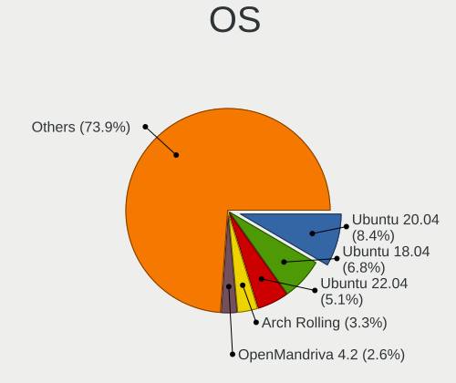

| Name                         | Desktops | Percent |
|------------------------------|----------|---------|
| Ubuntu 20.04                 | 75       | 8.45%   |
| Ubuntu 18.04                 | 60       | 6.76%   |
| Ubuntu 22.04                 | 45       | 5.07%   |
| Arch Rolling                 | 29       | 3.27%   |
| OpenMandriva 4.2             | 23       | 2.59%   |
| Ubuntu 24.04                 | 20       | 2.25%   |
| Pop!_OS 22.04                | 19       | 2.14%   |
| Ubuntu MATE 20.04            | 18       | 2.03%   |
| Manjaro                      | 16       | 1.8%    |
| Debian 12                    | 15       | 1.69%   |
| Ubuntu MATE 18.04            | 14       | 1.58%   |
| Zorin 16                     | 13       | 1.46%   |
| OpenMandriva 23.08           | 13       | 1.46%   |
| openSUSE Tumbleweed-XXXXXXXX | 12       | 1.35%   |
| Linux Mint 21.1              | 11       | 1.24%   |
| Fedora 40                    | 11       | 1.24%   |
| OpenMandriva 24.12           | 10       | 1.13%   |
| Linux Mint 20.3              | 10       | 1.13%   |
| KDE neon 20.04               | 10       | 1.13%   |
| Zorin 17                     | 8        | 0.9%    |
| Zorin 15                     | 8        | 0.9%    |
| Ubuntu 19.10                 | 8        | 0.9%    |
| OpenMandriva 4.3             | 8        | 0.9%    |
| OpenMandriva 25.90           | 8        | 0.9%    |
| Linux Mint 22.2              | 8        | 0.9%    |
| Linux Mint 22.1              | 8        | 0.9%    |
| ArcoLinux Rolling            | 8        | 0.9%    |
| Arch                         | 8        | 0.9%    |
| Ubuntu 19.04                 | 7        | 0.79%   |
| OpenMandriva 5.0             | 7        | 0.79%   |
| OpenMandriva 23.03           | 7        | 0.79%   |
| Kubuntu 20.04                | 7        | 0.79%   |
| Fedora 42                    | 7        | 0.79%   |
| Debian 11                    | 7        | 0.79%   |
| Xubuntu 18.04                | 6        | 0.68%   |
| Ubuntu 22.10                 | 6        | 0.68%   |
| Ubuntu 21.10                 | 6        | 0.68%   |
| Pop!_OS 20.04                | 6        | 0.68%   |
| Linux Mint 19.3              | 6        | 0.68%   |
| Fedora 36                    | 6        | 0.68%   |

OS Family
---------

OS without a version

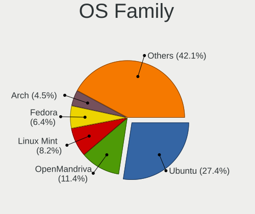

| Name             | Desktops | Percent |
|------------------|----------|---------|
| Ubuntu           | 227      | 27.42%  |
| OpenMandriva     | 94       | 11.35%  |
| Linux Mint       | 68       | 8.21%   |
| Fedora           | 53       | 6.4%    |
| Arch             | 37       | 4.47%   |
| Ubuntu MATE      | 34       | 4.11%   |
| Zorin            | 33       | 3.99%   |
| Pop!_OS          | 32       | 3.86%   |
| Debian           | 31       | 3.74%   |
| Manjaro          | 30       | 3.62%   |
| Kubuntu          | 19       | 2.29%   |
| KDE neon         | 18       | 2.17%   |
| Xubuntu          | 15       | 1.81%   |
| openSUSE         | 14       | 1.69%   |
| ROSA             | 11       | 1.33%   |
| Gentoo           | 9        | 1.09%   |
| ArcoLinux        | 9        | 1.09%   |
| Elementary       | 8        | 0.97%   |
| Ubuntu Unity     | 7        | 0.85%   |
| Lubuntu          | 7        | 0.85%   |
| CachyOS          | 7        | 0.85%   |
| Void Linux       | 4        | 0.48%   |
| Parrot           | 4        | 0.48%   |
| Nobara           | 4        | 0.48%   |
| MX               | 4        | 0.48%   |
| LMDE             | 4        | 0.48%   |
| BlackPanther     | 4        | 0.48%   |
| ALT Linux        | 4        | 0.48%   |
| org.kde.Platform | 3        | 0.36%   |
| Endless          | 3        | 0.36%   |
| EndeavourOS      | 3        | 0.36%   |
| Bazzite          | 3        | 0.36%   |
| Artix            | 3        | 0.36%   |
| Xero             | 2        | 0.24%   |
| Ubuntu Budgie    | 2        | 0.24%   |
| Reborn OS        | 2        | 0.24%   |
| Peppermint       | 2        | 0.24%   |
| Garuda Linux     | 2        | 0.24%   |
| Dts-distro       | 2        | 0.24%   |
| CentOS           | 2        | 0.24%   |

Kernel
------

Version of the Linux kernel

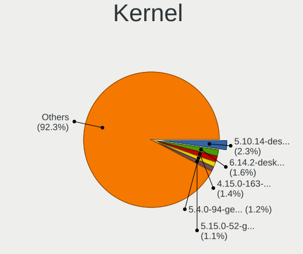

| Version                             | Desktops | Percent |
|-------------------------------------|----------|---------|
| 5.10.14-desktop-1omv4002            | 23       | 2.32%   |
| 6.14.2-desktop-3omv2590             | 16       | 1.61%   |
| 4.15.0-163-generic                  | 14       | 1.41%   |
| 5.4.0-94-generic                    | 12       | 1.21%   |
| 5.15.0-52-generic                   | 11       | 1.11%   |
| 6.4.11-desktop-1omv2390             | 9        | 0.91%   |
| 6.12.1-desktop-1omv2490             | 9        | 0.91%   |
| 5.16.7-desktop-1omv4003             | 8        | 0.81%   |
| 6.6.2-desktop-1omv2390              | 7        | 0.71%   |
| 6.2.6-desktop-1omv2390              | 7        | 0.71%   |
| 5.4.0-54-generic                    | 7        | 0.71%   |
| 5.4.0-40-generic                    | 7        | 0.71%   |
| 5.15.0-56-generic                   | 7        | 0.71%   |
| 6.8.0-51-generic                    | 6        | 0.61%   |
| 5.4.0-42-generic                    | 6        | 0.61%   |
| 5.4.0-29-generic                    | 6        | 0.61%   |
| 5.15.0-58-generic                   | 6        | 0.61%   |
| 5.11.0-40-generic                   | 6        | 0.61%   |
| 6.14.0-37-generic                   | 5        | 0.5%    |
| 5.4.0-91-generic                    | 5        | 0.5%    |
| 5.4.0-59-generic                    | 5        | 0.5%    |
| 5.4.0-58-generic                    | 5        | 0.5%    |
| 5.4.0-53-generic                    | 5        | 0.5%    |
| 5.4.0-52-generic                    | 5        | 0.5%    |
| 5.3.0-46-generic                    | 5        | 0.5%    |
| 5.19.0-35-generic                   | 5        | 0.5%    |
| 4.15.0-45-generic                   | 5        | 0.5%    |
| 6.8.0-76060800daily20240311-generic | 4        | 0.4%    |
| 6.8.0-57-generic                    | 4        | 0.4%    |
| 6.4.8-desktop-2omv2390              | 4        | 0.4%    |
| 6.17.9-arch1-1                      | 4        | 0.4%    |
| 6.1.1-desktop-1omv2290              | 4        | 0.4%    |
| 6.0.6-76060006-generic              | 4        | 0.4%    |
| 5.8.0-43-generic                    | 4        | 0.4%    |
| 5.4.0-65-generic                    | 4        | 0.4%    |
| 5.4.0-48-generic                    | 4        | 0.4%    |
| 5.4.0-47-generic                    | 4        | 0.4%    |
| 5.19.0-41-generic                   | 4        | 0.4%    |
| 5.15.0-91-generic                   | 4        | 0.4%    |
| 5.15.0-60-generic                   | 4        | 0.4%    |

Kernel Family
-------------

Linux kernel without a distro release

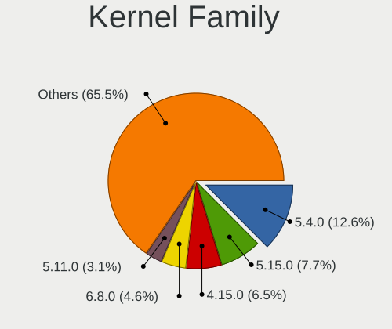

| Version | Desktops | Percent |
|---------|----------|---------|
| 5.4.0   | 117      | 12.55%  |
| 5.15.0  | 72       | 7.73%   |
| 4.15.0  | 61       | 6.55%   |
| 6.8.0   | 43       | 4.61%   |
| 5.11.0  | 29       | 3.11%   |
| 5.3.0   | 26       | 2.79%   |
| 5.10.14 | 23       | 2.47%   |
| 5.8.0   | 22       | 2.36%   |
| 5.19.0  | 22       | 2.36%   |
| 5.13.0  | 22       | 2.36%   |
| 6.14.0  | 20       | 2.15%   |
| 6.5.0   | 19       | 2.04%   |
| 4.18.0  | 17       | 1.82%   |
| 6.14.2  | 16       | 1.72%   |
| 6.1.0   | 16       | 1.72%   |
| 5.0.0   | 15       | 1.61%   |
| 6.4.11  | 10       | 1.07%   |
| 6.2.0   | 10       | 1.07%   |
| 6.2.6   | 9        | 0.97%   |
| 6.12.1  | 9        | 0.97%   |
| 5.10.0  | 9        | 0.97%   |
| 6.17.9  | 8        | 0.86%   |
| 6.11.0  | 8        | 0.86%   |
| 5.16.7  | 8        | 0.86%   |
| 6.6.2   | 7        | 0.75%   |
| 5.18.12 | 5        | 0.54%   |
| 6.9.7   | 4        | 0.43%   |
| 6.6.0   | 4        | 0.43%   |
| 6.4.8   | 4        | 0.43%   |
| 6.1.1   | 4        | 0.43%   |
| 6.0.6   | 4        | 0.43%   |
| 5.14.21 | 4        | 0.43%   |
| 5.14.0  | 4        | 0.43%   |
| 5.10.88 | 4        | 0.43%   |
| 4.9.60  | 4        | 0.43%   |
| 4.18.16 | 4        | 0.43%   |
| 6.16.8  | 3        | 0.32%   |
| 6.12.9  | 3        | 0.32%   |
| 6.10.0  | 3        | 0.32%   |
| 5.17.5  | 3        | 0.32%   |

Kernel Major Ver.
-----------------

Linux kernel major version

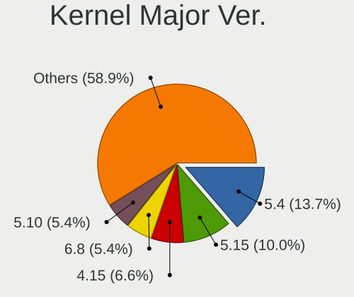

| Version | Desktops | Percent |
|---------|----------|---------|
| 5.4     | 126      | 13.67%  |
| 5.15    | 92       | 9.98%   |
| 4.15    | 61       | 6.62%   |
| 6.8     | 50       | 5.42%   |
| 5.10    | 50       | 5.42%   |
| 6.14    | 39       | 4.23%   |
| 5.11    | 36       | 3.9%    |
| 6.5     | 30       | 3.25%   |
| 6.12    | 28       | 3.04%   |
| 6.1     | 28       | 3.04%   |
| 5.8     | 28       | 3.04%   |
| 5.3     | 26       | 2.82%   |
| 5.19    | 26       | 2.82%   |
| 5.13    | 24       | 2.6%    |
| 6.2     | 23       | 2.49%   |
| 4.18    | 22       | 2.39%   |
| 6.6     | 20       | 2.17%   |
| 6.4     | 19       | 2.06%   |
| 5.0     | 18       | 1.95%   |
| 5.14    | 16       | 1.74%   |
| 6.0     | 15       | 1.63%   |
| 6.11    | 14       | 1.52%   |
| 5.16    | 14       | 1.52%   |
| 6.17    | 12       | 1.3%    |
| 6.10    | 12       | 1.3%    |
| 5.17    | 10       | 1.08%   |
| 6.16    | 9        | 0.98%   |
| 5.18    | 9        | 0.98%   |
| 6.9     | 8        | 0.87%   |
| 6.15    | 7        | 0.76%   |
| 6.13    | 6        | 0.65%   |
| 5.9     | 6        | 0.65%   |
| 5.6     | 6        | 0.65%   |
| 5.7     | 5        | 0.54%   |
| 4.9     | 5        | 0.54%   |
| 6.7     | 4        | 0.43%   |
| 5.12    | 4        | 0.43%   |
| 4.19    | 4        | 0.43%   |
| 6.3     | 3        | 0.33%   |
| 6.18    | 2        | 0.22%   |

Arch
----

OS architecture (x86_64, i586, etc.)

| Name   | Desktops | Percent |
|--------|----------|---------|
| x86_64 | 771      | 97.35%  |
| i686   | 21       | 2.65%   |

DE
--

Desktop Environment

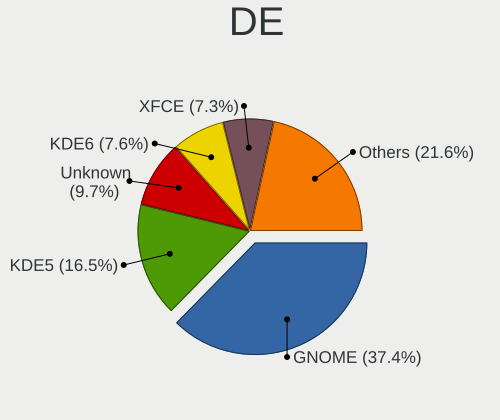

| Name            | Desktops | Percent |
|-----------------|----------|---------|
| GNOME           | 313      | 37.35%  |
| KDE5            | 138      | 16.47%  |
| Unknown         | 81       | 9.67%   |
| KDE6            | 64       | 7.64%   |
| XFCE            | 61       | 7.28%   |
| X-Cinnamon      | 60       | 7.16%   |
| MATE            | 46       | 5.49%   |
| KDE             | 22       | 2.63%   |
| LXQt            | 10       | 1.19%   |
| Unity           | 7        | 0.84%   |
| Pantheon        | 7        | 0.84%   |
| KDE4            | 6        | 0.72%   |
| i3              | 6        | 0.72%   |
| Budgie          | 4        | 0.48%   |
| Deepin          | 3        | 0.36%   |
| LXDE            | 2        | 0.24%   |
| Hyprland        | 2        | 0.24%   |
| Cinnamon        | 2        | 0.24%   |
| Openbox         | 1        | 0.12%   |
| herbstluftwm    | 1        | 0.12%   |
| GNOME Flashback | 1        | 0.12%   |
| GNOME Classic   | 1        | 0.12%   |

Display Server
--------------

X11 or Wayland

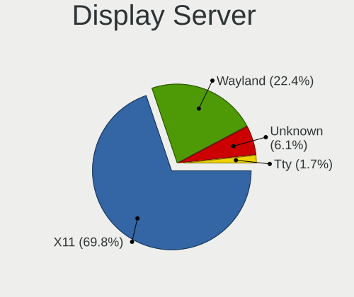

| Name    | Desktops | Percent |
|---------|----------|---------|
| X11     | 576      | 69.82%  |
| Wayland | 185      | 22.42%  |
| Unknown | 50       | 6.06%   |
| Tty     | 14       | 1.7%    |

Display Manager
---------------

SDDM, LightDM, etc.

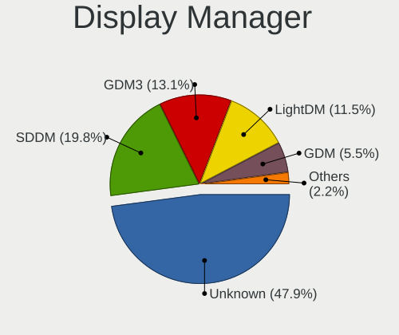

| Name    | Desktops | Percent |
|---------|----------|---------|
| Unknown | 399      | 47.9%   |
| SDDM    | 165      | 19.81%  |
| GDM3    | 109      | 13.09%  |
| LightDM | 96       | 11.52%  |
| GDM     | 46       | 5.52%   |
| TDM     | 8        | 0.96%   |
| KDM     | 6        | 0.72%   |
| LXDM    | 2        | 0.24%   |
| XDM     | 1        | 0.12%   |
| SLiM    | 1        | 0.12%   |

OS Lang
-------

Language

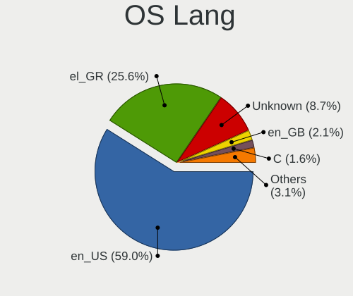

| Lang       | Desktops | Percent |
|------------|----------|---------|
| en_US      | 480      | 58.97%  |
| el_GR      | 208      | 25.55%  |
| Unknown    | 71       | 8.72%   |
| en_GB      | 17       | 2.09%   |
| C          | 13       | 1.6%    |
| de_DE      | 7        | 0.86%   |
| ru_RU      | 6        | 0.74%   |
| el_GR@euro | 3        | 0.37%   |
| en_IE      | 2        | 0.25%   |
| unm_US     | 1        | 0.12%   |
| POSIX      | 1        | 0.12%   |
| it_IT      | 1        | 0.12%   |
| fr_FR      | 1        | 0.12%   |
| es_ES      | 1        | 0.12%   |
| en_AU      | 1        | 0.12%   |
| C.UTF8     | 1        | 0.12%   |

Boot Mode
---------

EFI or BIOS

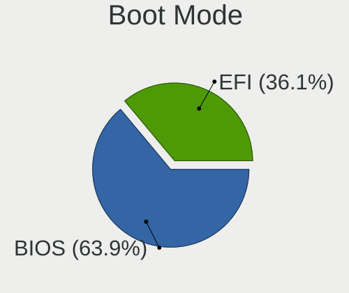

| Mode | Desktops | Percent |
|------|----------|---------|
| BIOS | 523      | 63.94%  |
| EFI  | 295      | 36.06%  |

Filesystem
----------

Type of filesystem

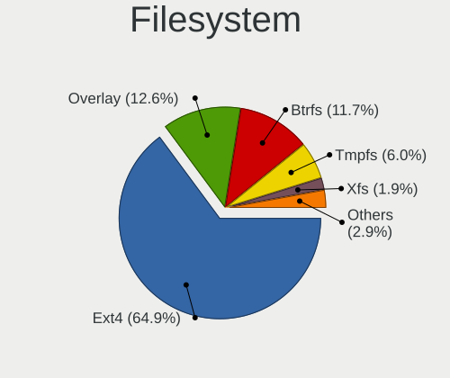

| Type    | Desktops | Percent |
|---------|----------|---------|
| Ext4    | 539      | 64.86%  |
| Overlay | 105      | 12.64%  |
| Btrfs   | 97       | 11.67%  |
| Tmpfs   | 50       | 6.02%   |
| Xfs     | 16       | 1.93%   |
| Unknown | 14       | 1.68%   |
| Zfs     | 5        | 0.6%    |
| Ext3    | 2        | 0.24%   |
| Ext2    | 2        | 0.24%   |
| F2fs    | 1        | 0.12%   |

Part. scheme
------------

Scheme of partitioning

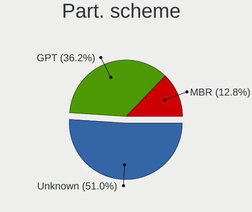

| Type    | Desktops | Percent |
|---------|----------|---------|
| Unknown | 419      | 51.04%  |
| GPT     | 297      | 36.18%  |
| MBR     | 105      | 12.79%  |

Dual Boot with Linux/BSD
------------------------

Hosting more than one Linux/BSD

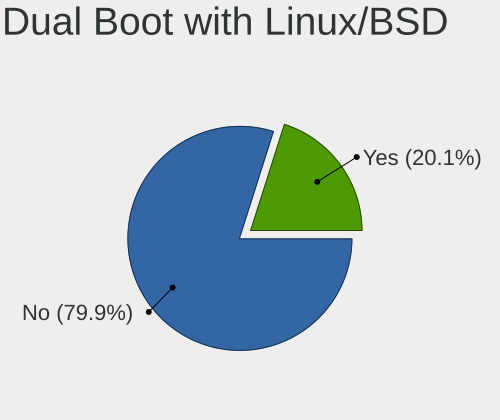

| Dual boot | Desktops | Percent |
|-----------|----------|---------|
| No        | 648      | 79.9%   |
| Yes       | 163      | 20.1%   |

Dual Boot (Win)
---------------

Hosting Linux and Windows

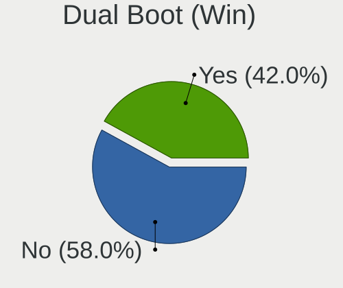

| Dual boot | Desktops | Percent |
|-----------|----------|---------|
| No        | 472      | 57.99%  |
| Yes       | 342      | 42.01%  |

Board
-----

Vendor
------

Motherboard manufacturer

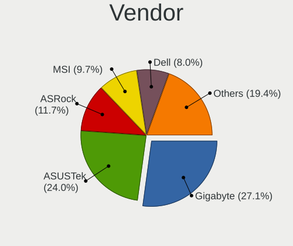

| Name                | Desktops | Percent |
|---------------------|----------|---------|
| Gigabyte Technology | 215      | 27.15%  |
| ASUSTek Computer    | 190      | 23.99%  |
| ASRock              | 93       | 11.74%  |
| MSI                 | 77       | 9.72%   |
| Dell                | 63       | 7.95%   |
| Hewlett-Packard     | 60       | 7.58%   |
| Lenovo              | 36       | 4.55%   |
| Intel               | 7        | 0.88%   |
| Foxconn             | 6        | 0.76%   |
| Unknown             | 6        | 0.76%   |
| Fujitsu Siemens     | 4        | 0.51%   |
| Biostar             | 4        | 0.51%   |
| Fujitsu             | 3        | 0.38%   |
| ECS                 | 3        | 0.38%   |
| AMI                 | 3        | 0.38%   |
| Pegatron            | 2        | 0.25%   |
| AOpen               | 2        | 0.25%   |
| ZOTAC               | 1        | 0.13%   |
| VIA Technologies    | 1        | 0.13%   |
| Techvision          | 1        | 0.13%   |
| Red Hat             | 1        | 0.13%   |
| QDI                 | 1        | 0.13%   |
| NU591               | 1        | 0.13%   |
| IBM                 | 1        | 0.13%   |
| HC Technology.      | 1        | 0.13%   |
| Gateway             | 1        | 0.13%   |
| EVGA                | 1        | 0.13%   |
| DFI                 | 1        | 0.13%   |
| AZW                 | 1        | 0.13%   |
| Apple               | 1        | 0.13%   |
| American Megatrends | 1        | 0.13%   |
| AMD                 | 1        | 0.13%   |
| Albatron            | 1        | 0.13%   |
| Acer                | 1        | 0.13%   |
| ABIT                | 1        | 0.13%   |

Model
-----

Motherboard model

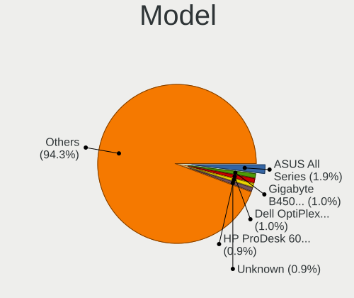

| Name                         | Desktops | Percent |
|------------------------------|----------|---------|
| ASUS All Series              | 15       | 1.89%   |
| Gigabyte B450M DS3H          | 8        | 1.01%   |
| Dell OptiPlex 7010           | 8        | 1.01%   |
| HP ProDesk 600 G1 SFF        | 7        | 0.88%   |
| Unknown                      | 7        | 0.88%   |
| MSI MS-7C02                  | 6        | 0.76%   |
| Dell OptiPlex 790            | 6        | 0.76%   |
| ASRock B450 Gaming K4        | 6        | 0.76%   |
| HP Compaq 8200 Elite SFF PC  | 5        | 0.63%   |
| Gigabyte H61M-S2PV           | 5        | 0.63%   |
| Gigabyte B550 AORUS ELITE V2 | 5        | 0.63%   |
| Gigabyte A320M-S2H           | 5        | 0.63%   |
| Dell OptiPlex GX520          | 5        | 0.63%   |
| ASUS ROG STRIX B350-F GAMING | 5        | 0.63%   |
| MSI MS-7C56                  | 4        | 0.51%   |
| HP Compaq Pro 6300 SFF       | 4        | 0.51%   |
| Gigabyte Z68MA-D2H-B3        | 4        | 0.51%   |
| Gigabyte G31M-S2L            | 4        | 0.51%   |
| Gigabyte B450 AORUS M        | 4        | 0.51%   |
| Gigabyte B250M-DS3H          | 4        | 0.51%   |
| Dell OptiPlex 3020           | 4        | 0.51%   |
| ASUS Z170-A                  | 4        | 0.51%   |
| ASUS PRIME X570-P            | 4        | 0.51%   |
| ASRock B450M Pro4            | 4        | 0.51%   |
| MSI MS-7A38                  | 3        | 0.38%   |
| HP EliteDesk 800 G1 SFF      | 3        | 0.38%   |
| Gigabyte Z170-HD3P           | 3        | 0.38%   |
| Gigabyte G41M-ES2L           | 3        | 0.38%   |
| Gigabyte G41M-Combo          | 3        | 0.38%   |
| Gigabyte G31M-ES2L           | 3        | 0.38%   |
| Gigabyte B75M-D3H            | 3        | 0.38%   |
| Gigabyte B450 AORUS PRO      | 3        | 0.38%   |
| Dell OptiPlex GX620          | 3        | 0.38%   |
| Dell OptiPlex 745            | 3        | 0.38%   |
| Dell OptiPlex 7040           | 3        | 0.38%   |
| ASUS TUF Gaming X570-PLUS    | 3        | 0.38%   |
| ASUS PRIME X370-A            | 3        | 0.38%   |
| ASUS PRIME B450M-A II        | 3        | 0.38%   |
| ASUS P6T                     | 3        | 0.38%   |
| ASUS M5A97 R2.0              | 3        | 0.38%   |

Model Family
------------

Motherboard model prefix

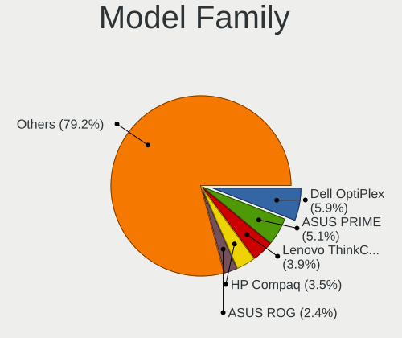

| Name                  | Desktops | Percent |
|-----------------------|----------|---------|
| Dell OptiPlex         | 47       | 5.93%   |
| ASUS PRIME            | 40       | 5.05%   |
| Lenovo ThinkCentre    | 31       | 3.91%   |
| HP Compaq             | 28       | 3.54%   |
| ASUS ROG              | 19       | 2.4%    |
| ASUS All              | 15       | 1.89%   |
| HP ProDesk            | 11       | 1.39%   |
| Gigabyte B550         | 10       | 1.26%   |
| Gigabyte B450         | 10       | 1.26%   |
| Dell Precision        | 10       | 1.26%   |
| ASUS TUF              | 10       | 1.26%   |
| Gigabyte B450M        | 9        | 1.14%   |
| HP EliteDesk          | 8        | 1.01%   |
| Unknown               | 7        | 0.88%   |
| MSI MS-7C02           | 6        | 0.76%   |
| ASRock B450           | 6        | 0.76%   |
| Gigabyte X570         | 5        | 0.63%   |
| Gigabyte H61M-S2PV    | 5        | 0.63%   |
| Gigabyte A320M-S2H    | 5        | 0.63%   |
| ASRock B450M          | 5        | 0.63%   |
| MSI MS-7C56           | 4        | 0.51%   |
| Gigabyte Z68MA-D2H-B3 | 4        | 0.51%   |
| Gigabyte Z370         | 4        | 0.51%   |
| Gigabyte G31M-S2L     | 4        | 0.51%   |
| Gigabyte B250M-DS3H   | 4        | 0.51%   |
| ASUS Z170-A           | 4        | 0.51%   |
| ASUS P5K              | 4        | 0.51%   |
| ASRock A320M-HDV      | 4        | 0.51%   |
| MSI MS-7A38           | 3        | 0.38%   |
| Gigabyte Z790         | 3        | 0.38%   |
| Gigabyte Z390         | 3        | 0.38%   |
| Gigabyte Z170-HD3P    | 3        | 0.38%   |
| Gigabyte G41M-ES2L    | 3        | 0.38%   |
| Gigabyte G41M-Combo   | 3        | 0.38%   |
| Gigabyte G31M-ES2L    | 3        | 0.38%   |
| Gigabyte B75M-D3H     | 3        | 0.38%   |
| Gigabyte B650         | 3        | 0.38%   |
| Gigabyte B365M        | 3        | 0.38%   |
| ASUS Rampage          | 3        | 0.38%   |
| ASUS P8Z68-V          | 3        | 0.38%   |

MFG Year
--------

Motherboard manufacture year

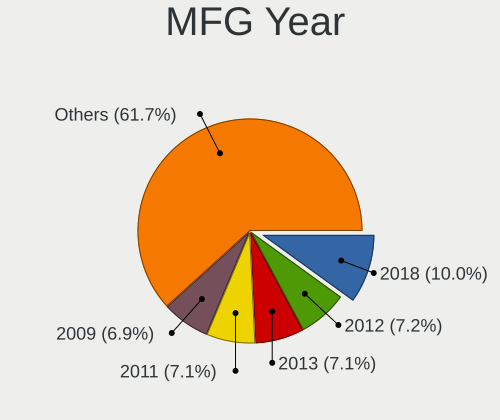

| Year | Desktops | Percent |
|------|----------|---------|
| 2018 | 79       | 9.97%   |
| 2012 | 57       | 7.2%    |
| 2013 | 56       | 7.07%   |
| 2011 | 56       | 7.07%   |
| 2009 | 55       | 6.94%   |
| 2020 | 52       | 6.57%   |
| 2014 | 52       | 6.57%   |
| 2019 | 51       | 6.44%   |
| 2008 | 51       | 6.44%   |
| 2017 | 42       | 5.3%    |
| 2015 | 37       | 4.67%   |
| 2007 | 34       | 4.29%   |
| 2010 | 31       | 3.91%   |
| 2016 | 26       | 3.28%   |
| 2022 | 22       | 2.78%   |
| 2021 | 22       | 2.78%   |
| 2006 | 18       | 2.27%   |
| 2023 | 16       | 2.02%   |
| 2005 | 16       | 2.02%   |
| 2024 | 8        | 1.01%   |
| 2003 | 5        | 0.63%   |
| 2004 | 4        | 0.51%   |
| 2025 | 2        | 0.25%   |

Form Factor
-----------

Physical design of the computer

| Name    | Desktops | Percent |
|---------|----------|---------|
| Desktop | 792      | 100%    |

Secure Boot
-----------

Enabled or disabled

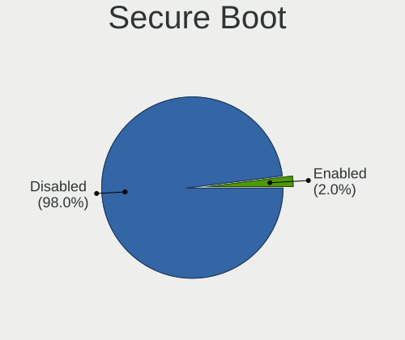

| State    | Desktops | Percent |
|----------|----------|---------|
| Disabled | 779      | 97.99%  |
| Enabled  | 16       | 2.01%   |

Coreboot
--------

Have coreboot on board

| Used | Desktops | Percent |
|------|----------|---------|
| No   | 792      | 100%    |

RAM Size
--------

Total RAM memory

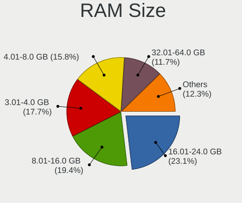

| Size in GB  | Desktops | Percent |
|-------------|----------|---------|
| 16.01-24.0  | 190      | 23.14%  |
| 8.01-16.0   | 159      | 19.37%  |
| 3.01-4.0    | 145      | 17.66%  |
| 4.01-8.0    | 130      | 15.83%  |
| 32.01-64.0  | 96       | 11.69%  |
| 1.01-2.0    | 40       | 4.87%   |
| 24.01-32.0  | 22       | 2.68%   |
| 2.01-3.0    | 18       | 2.19%   |
| 64.01-256.0 | 18       | 2.19%   |
| 0.51-1.0    | 3        | 0.37%   |

RAM Used
--------

Used RAM memory

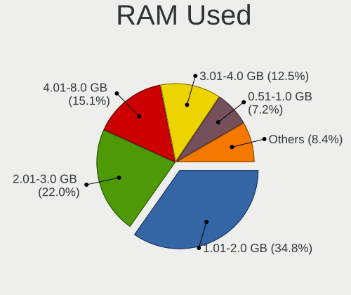

| Used GB    | Desktops | Percent |
|------------|----------|---------|
| 1.01-2.0   | 308      | 34.76%  |
| 2.01-3.0   | 195      | 22.01%  |
| 4.01-8.0   | 134      | 15.12%  |
| 3.01-4.0   | 111      | 12.53%  |
| 0.51-1.0   | 64       | 7.22%   |
| 8.01-16.0  | 50       | 5.64%   |
| 0.01-0.5   | 17       | 1.92%   |
| 16.01-24.0 | 5        | 0.56%   |
| 32.01-64.0 | 1        | 0.11%   |
| 24.01-32.0 | 1        | 0.11%   |

Total Drives
------------

Number of drives on board

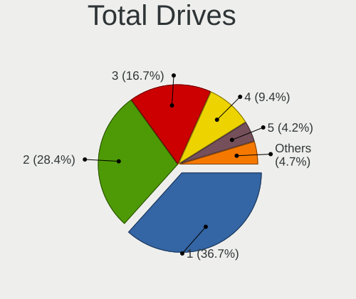

| Drives | Desktops | Percent |
|--------|----------|---------|
| 1      | 305      | 36.66%  |
| 2      | 236      | 28.37%  |
| 3      | 139      | 16.71%  |
| 4      | 78       | 9.38%   |
| 5      | 35       | 4.21%   |
| 6      | 20       | 2.4%    |
| 0      | 8        | 0.96%   |
| 7      | 6        | 0.72%   |
| 18     | 1        | 0.12%   |
| 14     | 1        | 0.12%   |
| 13     | 1        | 0.12%   |
| 12     | 1        | 0.12%   |
| 8      | 1        | 0.12%   |

Has CD-ROM
----------

Has CD-ROM on board

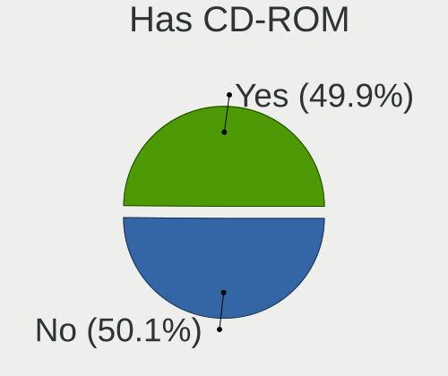

| Presented | Desktops | Percent |
|-----------|----------|---------|
| No        | 402      | 50.12%  |
| Yes       | 400      | 49.88%  |

Has Ethernet
------------

Has Ethernet on board

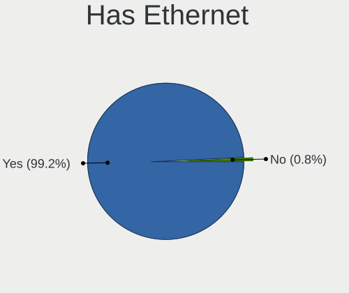

| Presented | Desktops | Percent |
|-----------|----------|---------|
| Yes       | 786      | 99.24%  |
| No        | 6        | 0.76%   |

Has WiFi
--------

Has WiFi module

| Presented | Desktops | Percent |
|-----------|----------|---------|
| No        | 510      | 62.81%  |
| Yes       | 302      | 37.19%  |

Has Bluetooth
-------------

Has Bluetooth module

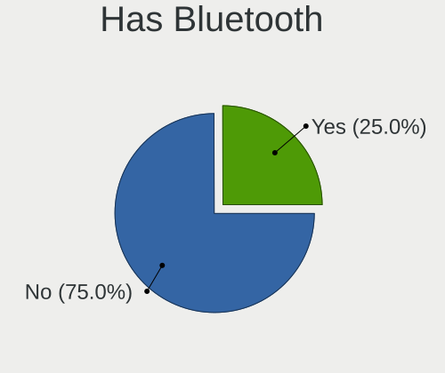

| Presented | Desktops | Percent |
|-----------|----------|---------|
| No        | 602      | 74.97%  |
| Yes       | 201      | 25.03%  |

Location
--------

Country
-------

Geographic location (country)

| Country | Desktops | Percent |
|---------|----------|---------|
| Greece  | 792      | 100%    |

City
----

Geographic location (city)

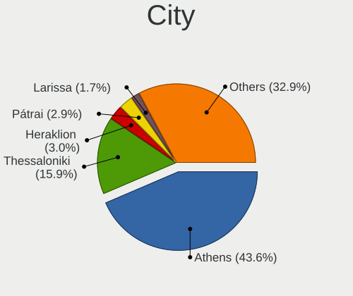

| City           | Desktops | Percent |
|----------------|----------|---------|
| Athens         | 375      | 43.55%  |
| Thessaloniki   | 137      | 15.91%  |
| Heraklion      | 26       | 3.02%   |
| Pátrai        | 25       | 2.9%    |
| Larissa        | 15       | 1.74%   |
| Volos          | 14       | 1.63%   |
| Piraeus        | 14       | 1.63%   |
| Ioannina       | 13       | 1.51%   |
| Lamia          | 9        | 1.05%   |
| Chania         | 8        | 0.93%   |
| Alexandroupoli | 8        | 0.93%   |
| Kalamata       | 7        | 0.81%   |
| Marousi        | 6        | 0.7%    |
| Kavala         | 6        | 0.7%    |
| Chalcis        | 6        | 0.7%    |
| Acharnes       | 6        | 0.7%    |
| Nea Smyrni     | 5        | 0.58%   |
| Mytilene       | 5        | 0.58%   |
| Kozani         | 5        | 0.58%   |
| Katerini       | 5        | 0.58%   |
| Karditsa       | 5        | 0.58%   |
| Glyfada        | 5        | 0.58%   |
| Xanthi         | 4        | 0.46%   |
| Veroia         | 4        | 0.46%   |
| Serres         | 4        | 0.46%   |
| Samos          | 4        | 0.46%   |
| Rhodes         | 4        | 0.46%   |
| Kallithea      | 4        | 0.46%   |
| Drama          | 4        | 0.46%   |
| Rethymno       | 3        | 0.35%   |
| Peristeri      | 3        | 0.35%   |
| Old Faliron    | 3        | 0.35%   |
| Nigrita        | 3        | 0.35%   |
| Magoula        | 3        | 0.35%   |
| Komotini       | 3        | 0.35%   |
| Corfu          | 3        | 0.35%   |
| Chalandri      | 3        | 0.35%   |
| Aigaleo        | 3        | 0.35%   |
| Agrinio        | 3        | 0.35%   |
| Aegina         | 3        | 0.35%   |

Drives
------

Drive Vendor
------------

Hard drive vendors

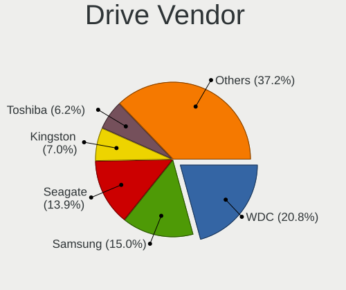

| Vendor                      | Desktops | Drives | Percent |
|-----------------------------|----------|--------|---------|
| WDC                         | 313      | 553    | 20.77%  |
| Samsung Electronics         | 226      | 397    | 15%     |
| Seagate                     | 210      | 364    | 13.93%  |
| Kingston                    | 105      | 143    | 6.97%   |
| Toshiba                     | 93       | 140    | 6.17%   |
| SanDisk                     | 77       | 116    | 5.11%   |
| Patriot                     | 68       | 91     | 4.51%   |
| Crucial                     | 38       | 58     | 2.52%   |
| Intenso                     | 37       | 55     | 2.46%   |
| Hitachi                     | 30       | 36     | 1.99%   |
| Kingston Technology Company | 21       | 34     | 1.39%   |
| A-DATA Technology           | 19       | 28     | 1.26%   |
| Intel                       | 17       | 20     | 1.13%   |
| Team                        | 16       | 18     | 1.06%   |
| Maxtor                      | 15       | 17     | 1%      |
| China                       | 15       | 16     | 1%      |
| OCZ                         | 14       | 17     | 0.93%   |
| PNY                         | 12       | 14     | 0.8%    |
| HGST                        | 11       | 21     | 0.73%   |
| Gigabyte Technology         | 11       | 15     | 0.73%   |
| SPCC                        | 10       | 12     | 0.66%   |
| Corsair                     | 10       | 10     | 0.66%   |
| Phison Electronics          | 9        | 12     | 0.6%    |
| SK hynix                    | 7        | 8      | 0.46%   |
| Silicon Motion              | 7        | 7      | 0.46%   |
| Leven                       | 7        | 8      | 0.46%   |
| Phison                      | 6        | 9      | 0.4%    |
| JMicron Technology          | 6        | 25     | 0.4%    |
| ADATA Technology            | 6        | 11     | 0.4%    |
| XPG                         | 5        | 10     | 0.33%   |
| Micron/Crucial Technology   | 5        | 6      | 0.33%   |
| LITEONIT                    | 5        | 5      | 0.33%   |
| KIOXIA                      | 5        | 13     | 0.33%   |
| Verbatim                    | 4        | 5      | 0.27%   |
| Unknown                     | 4        | 9      | 0.27%   |
| Micron Technology           | 4        | 4      | 0.27%   |
| GOODRAM                     | 4        | 5      | 0.27%   |
| Unknown                     | 4        | 4      | 0.27%   |
| Transcend                   | 3        | 3      | 0.2%    |
| Realtek Semiconductor       | 3        | 4      | 0.2%    |

Drive Model
-----------

Hard drive models

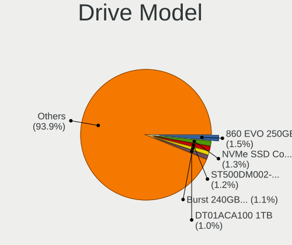

| Model                                                 | Desktops | Percent |
|-------------------------------------------------------|----------|---------|
| Samsung SSD 860 EVO 250GB                             | 26       | 1.49%   |
| Samsung NVMe SSD Controller SM981/PM981/PM983 1TB     | 23       | 1.32%   |
| Seagate ST500DM002-1BD142 500GB                       | 21       | 1.2%    |
| Patriot Burst 240GB SSD                               | 19       | 1.09%   |
| Toshiba DT01ACA100 1TB                                | 18       | 1.03%   |
| Seagate ST1000DM010-2EP102 1TB                        | 18       | 1.03%   |
| Samsung SSD 860 EVO 500GB                             | 18       | 1.03%   |
| Samsung SSD 850 EVO 250GB                             | 17       | 0.97%   |
| Toshiba DT01ACA050 500GB                              | 16       | 0.92%   |
| WDC WD10EZEX-08WN4A0 1TB                              | 15       | 0.86%   |
| Patriot Burst 120GB SSD                               | 15       | 0.86%   |
| Kingston SA400S37480G 480GB SSD                       | 15       | 0.86%   |
| Kingston SA400S37240G 240GB SSD                       | 13       | 0.74%   |
| Kingston SA400S37120G 120GB SSD                       | 13       | 0.74%   |
| Toshiba HDWD110 1TB                                   | 12       | 0.69%   |
| Samsung SSD 870 EVO 500GB                             | 11       | 0.63%   |
| Samsung SSD 850 EVO 500GB                             | 10       | 0.57%   |
| Kingston Company SNV2S1000G 1TB                       | 10       | 0.57%   |
| Toshiba DT01ACA200 2TB                                | 9        | 0.52%   |
| Seagate ST3500418AS 500GB                             | 9        | 0.52%   |
| WDC WDS240G2G0A-00JH30 240GB SSD                      | 8        | 0.46%   |
| Samsung SSD 980 500GB                                 | 8        | 0.46%   |
| Samsung NVMe SSD Drive 500GB                          | 8        | 0.46%   |
| Samsung NVMe SSD Controller PM9A1/PM9A3/980PRO 1TB    | 8        | 0.46%   |
| Kingston SV300S37A120G 120GB SSD                      | 8        | 0.46%   |
| WDC WD10EZEX-00BN5A0 1TB                              | 7        | 0.4%    |
| Samsung SSD 860 EVO 1TB                               | 7        | 0.4%    |
| Samsung SSD 840 Series 120GB                          | 7        | 0.4%    |
| Patriot Burst 480GB SSD                               | 7        | 0.4%    |
| WDC WD5000AAKX-08U6AA0 500GB                          | 6        | 0.34%   |
| WDC WD20EZBX-00AYRA0 2TB                              | 6        | 0.34%   |
| Toshiba MQ01ABF050 500GB                              | 6        | 0.34%   |
| Silicon Motion SM2263EN/SM2263XT SSD Controller 512GB | 6        | 0.34%   |
| Seagate ST3500630AS 500GB                             | 6        | 0.34%   |
| Seagate ST3320620AS 320GB                             | 6        | 0.34%   |
| Seagate ST3250410AS 250GB                             | 6        | 0.34%   |
| Seagate ST3160815AS 160GB                             | 6        | 0.34%   |
| SanDisk SDSSDA120G 120GB                              | 6        | 0.34%   |
| Samsung SSD 850 EVO 120GB                             | 6        | 0.34%   |
| Intenso SSD 240GB                                     | 6        | 0.34%   |

HDD Vendor
----------

Hard disk drive vendors

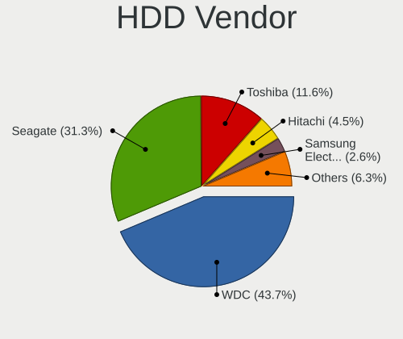

| Vendor              | Desktops | Drives | Percent |
|---------------------|----------|--------|---------|
| WDC                 | 289      | 493    | 43.66%  |
| Seagate             | 207      | 354    | 31.27%  |
| Toshiba             | 77       | 111    | 11.63%  |
| Hitachi             | 30       | 36     | 4.53%   |
| Samsung Electronics | 17       | 23     | 2.57%   |
| Maxtor              | 15       | 17     | 2.27%   |
| HGST                | 11       | 21     | 1.66%   |
| JMicron Technology  | 4        | 20     | 0.6%    |
| Intenso             | 3        | 7      | 0.45%   |
| Min Yi U            | 2        | 4      | 0.3%    |
| USB                 | 1        | 1      | 0.15%   |
| Quantum             | 1        | 1      | 0.15%   |
| Inateck             | 1        | 1      | 0.15%   |
| Hewlett-Packard     | 1        | 1      | 0.15%   |
| Fujitsu             | 1        | 1      | 0.15%   |
| ExcelStor           | 1        | 1      | 0.15%   |
| Apple               | 1        | 1      | 0.15%   |

SSD Vendor
----------

Solid state drive vendors

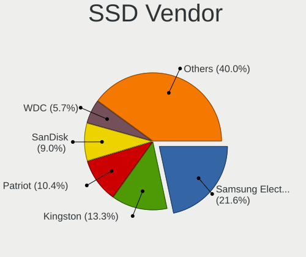

| Vendor              | Desktops | Drives | Percent |
|---------------------|----------|--------|---------|
| Samsung Electronics | 137      | 197    | 21.64%  |
| Kingston            | 84       | 117    | 13.27%  |
| Patriot             | 66       | 89     | 10.43%  |
| SanDisk             | 57       | 91     | 9%      |
| WDC                 | 36       | 55     | 5.69%   |
| Crucial             | 36       | 56     | 5.69%   |
| Intenso             | 31       | 45     | 4.9%    |
| A-DATA Technology   | 18       | 27     | 2.84%   |
| Team                | 16       | 18     | 2.53%   |
| Toshiba             | 15       | 26     | 2.37%   |
| Intel               | 14       | 16     | 2.21%   |
| OCZ                 | 13       | 16     | 2.05%   |
| China               | 13       | 14     | 2.05%   |
| PNY                 | 12       | 14     | 1.9%    |
| SPCC                | 10       | 12     | 1.58%   |
| Gigabyte Technology | 10       | 14     | 1.58%   |
| Corsair             | 8        | 8      | 1.26%   |
| Leven               | 7        | 8      | 1.11%   |
| LITEONIT            | 5        | 5      | 0.79%   |
| Verbatim            | 4        | 5      | 0.63%   |
| GOODRAM             | 4        | 5      | 0.63%   |
| Unknown             | 4        | 4      | 0.63%   |
| Micron Technology   | 3        | 3      | 0.47%   |
| Emtec               | 3        | 3      | 0.47%   |
| SK hynix            | 2        | 2      | 0.32%   |
| Plextor             | 2        | 2      | 0.32%   |
| Platinet            | 2        | 2      | 0.32%   |
| Mushkin             | 2        | 2      | 0.32%   |
| Lite-On             | 2        | 3      | 0.32%   |
| Apacer              | 2        | 2      | 0.32%   |
| AGI                 | 2        | 3      | 0.32%   |
| Unknown             | 1        | 4      | 0.16%   |
| Transcend           | 1        | 1      | 0.16%   |
| TEAM T25            | 1        | 1      | 0.16%   |
| Seagate             | 1        | 1      | 0.16%   |
| Radeon              | 1        | 1      | 0.16%   |
| Neo Forza           | 1        | 1      | 0.16%   |
| MicroFrom           | 1        | 1      | 0.16%   |
| LITEON              | 1        | 1      | 0.16%   |
| Lexar               | 1        | 1      | 0.16%   |

Drive Kind
----------

HDD or SSD

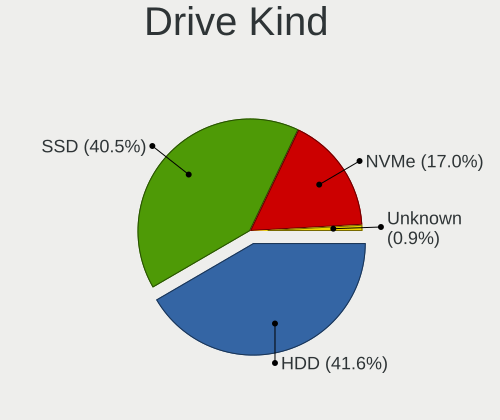

| Kind    | Desktops | Drives | Percent |
|---------|----------|--------|---------|
| HDD     | 518      | 1093   | 41.61%  |
| SSD     | 504      | 880    | 40.48%  |
| NVMe    | 212      | 384    | 17.03%  |
| Unknown | 11       | 16     | 0.88%   |

Drive Connector
---------------

SATA, SAS, NVMe, etc.

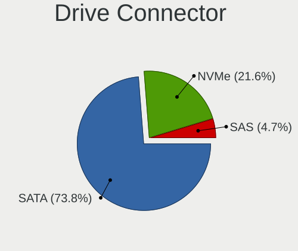

| Type | Desktops | Drives | Percent |
|------|----------|--------|---------|
| SATA | 725      | 1911   | 73.75%  |
| NVMe | 212      | 380    | 21.57%  |
| SAS  | 46       | 82     | 4.68%   |

Drive Size
----------

Size of hard drive

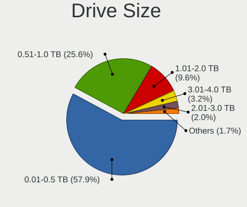

| Size in TB | Desktops | Drives | Percent |
|------------|----------|--------|---------|
| 0.01-0.5   | 610      | 1203   | 57.87%  |
| 0.51-1.0   | 270      | 462    | 25.62%  |
| 1.01-2.0   | 101      | 173    | 9.58%   |
| 3.01-4.0   | 34       | 57     | 3.23%   |
| 2.01-3.0   | 21       | 39     | 1.99%   |
| 4.01-10.0  | 15       | 32     | 1.42%   |
| 10.01-20.0 | 2        | 3      | 0.19%   |
| 20.01-50.0 | 1        | 4      | 0.09%   |

Space Total
-----------

Amount of disk space available on the file system

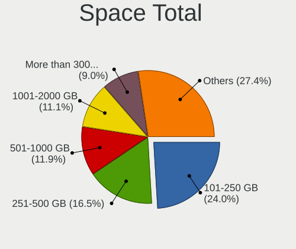

| Size in GB     | Desktops | Percent |
|----------------|----------|---------|
| 101-250        | 208      | 24.05%  |
| 251-500        | 143      | 16.53%  |
| 501-1000       | 103      | 11.91%  |
| 1001-2000      | 96       | 11.1%   |
| More than 3000 | 78       | 9.02%   |
| 1-20           | 66       | 7.63%   |
| Unknown        | 51       | 5.9%    |
| 51-100         | 50       | 5.78%   |
| 2001-3000      | 41       | 4.74%   |
| 21-50          | 29       | 3.35%   |

Space Used
----------

Amount of used disk space

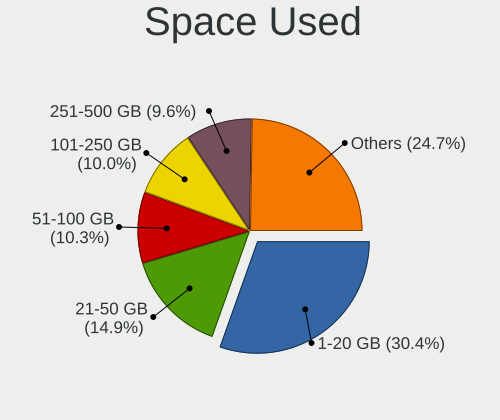

| Used GB        | Desktops | Percent |
|----------------|----------|---------|
| 1-20           | 273      | 30.43%  |
| 21-50          | 134      | 14.94%  |
| 51-100         | 92       | 10.26%  |
| 101-250        | 90       | 10.03%  |
| 251-500        | 86       | 9.59%   |
| 501-1000       | 72       | 8.03%   |
| 1001-2000      | 51       | 5.69%   |
| Unknown        | 51       | 5.69%   |
| More than 3000 | 31       | 3.46%   |
| 2001-3000      | 17       | 1.9%    |

Malfunc. Drives
---------------

Drive models with a malfunction

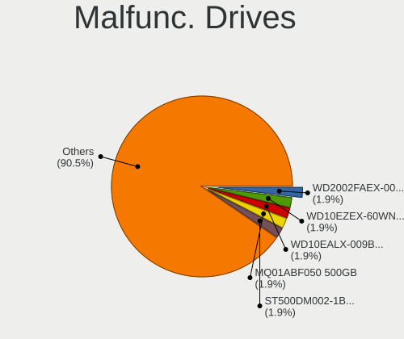

| Model                                 | Desktops | Drives | Percent |
|---------------------------------------|----------|--------|---------|
| WDC WD2002FAEX-007BA0 2TB             | 2        | 3      | 1.9%    |
| WDC WD10EZEX-60WN4A0 1TB              | 2        | 2      | 1.9%    |
| WDC WD10EALX-009BA0 1TB               | 2        | 2      | 1.9%    |
| Toshiba MQ01ABF050 500GB              | 2        | 2      | 1.9%    |
| Seagate ST500DM002-1BD142 500GB       | 2        | 3      | 1.9%    |
| Seagate ST3500320AS 500GB             | 2        | 2      | 1.9%    |
| Seagate ST3320620AS 320GB             | 2        | 2      | 1.9%    |
| Seagate ST3250318AS 250GB             | 2        | 2      | 1.9%    |
| Samsung Electronics SSD 870 EVO 500GB | 2        | 3      | 1.9%    |
| Hitachi HTS545050B9A300 500GB         | 2        | 2      | 1.9%    |
| WDC WD800JD-23LSA0 80GB               | 1        | 1      | 0.95%   |
| WDC WD800JB-00JJC0 80GB               | 1        | 2      | 0.95%   |
| WDC WD6400AAKS-65A7B0 640GB           | 1        | 1      | 0.95%   |
| WDC WD6002FRYZ-01WD5B0 6TB            | 1        | 1      | 0.95%   |
| WDC WD5000LPVT-00FMCT0 500GB          | 1        | 1      | 0.95%   |
| WDC WD5000AAVS-22G9B1 500GB           | 1        | 1      | 0.95%   |
| WDC WD5000AAKX-60U6AA0 500GB          | 1        | 1      | 0.95%   |
| WDC WD5000AAKX-603CA0 500GB           | 1        | 1      | 0.95%   |
| WDC WD5000AAKX-001CA0 500GB           | 1        | 1      | 0.95%   |
| WDC WD5000AAKB-00H8A0 500GB           | 1        | 1      | 0.95%   |
| WDC WD40EFRX-68WT0N0 4TB              | 1        | 1      | 0.95%   |
| WDC WD40EFRX-68N32N0 4TB              | 1        | 1      | 0.95%   |
| WDC WD3200BPVT-22ZEST0 320GB          | 1        | 2      | 0.95%   |
| WDC WD3200BEVT-00A0RT0 320GB          | 1        | 1      | 0.95%   |
| WDC WD30EZRZ-00GXCB0 3TB              | 1        | 1      | 0.95%   |
| WDC WD2500YS-01SHB1 256GB             | 1        | 2      | 0.95%   |
| WDC WD2500BEVS-22UST0 250GB           | 1        | 1      | 0.95%   |
| WDC WD2500AAKX-083CA1 250GB           | 1        | 1      | 0.95%   |
| WDC WD20PURX-64P6ZY0 2TB              | 1        | 1      | 0.95%   |
| WDC WD20EZRX-22D8PB0 2TB              | 1        | 1      | 0.95%   |
| WDC WD20EARS-00MVWB0 2TB              | 1        | 1      | 0.95%   |
| WDC WD1600AAJS-22L7A0 160GB           | 1        | 1      | 0.95%   |
| WDC WD1200JD-00HBB0 120GB             | 1        | 2      | 0.95%   |
| WDC WD10JPVX-22JC3T0 1TB              | 1        | 1      | 0.95%   |
| WDC WD10EZEX-60WN4A1 1TB              | 1        | 3      | 0.95%   |
| WDC WD10EZEX-00BN5A0 1TB              | 1        | 1      | 0.95%   |
| WDC WD10EALX-089BA0 1TB               | 1        | 1      | 0.95%   |
| WDC WD10EADS-00M2B0 1TB               | 1        | 1      | 0.95%   |
| WDC WD1002FAEX-00Z3A0 1TB             | 1        | 1      | 0.95%   |
| WDC WD Green 2.5 240GB                | 1        | 1      | 0.95%   |

Malfunc. Drive Vendor
---------------------

Vendors of faulty drives

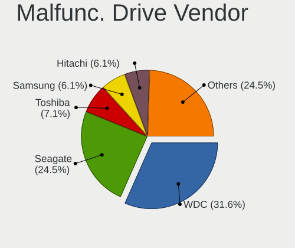

| Vendor              | Desktops | Drives | Percent |
|---------------------|----------|--------|---------|
| WDC                 | 31       | 44     | 31.63%  |
| Seagate             | 24       | 28     | 24.49%  |
| Toshiba             | 7        | 8      | 7.14%   |
| Samsung Electronics | 6        | 7      | 6.12%   |
| Hitachi             | 6        | 6      | 6.12%   |
| Maxtor              | 3        | 3      | 3.06%   |
| HGST                | 3        | 9      | 3.06%   |
| Corsair             | 3        | 3      | 3.06%   |
| SanDisk             | 2        | 2      | 2.04%   |
| Patriot             | 2        | 2      | 2.04%   |
| Intel               | 2        | 2      | 2.04%   |
| OCZ                 | 1        | 1      | 1.02%   |
| Micron Technology   | 1        | 1      | 1.02%   |
| Leven               | 1        | 1      | 1.02%   |
| Kingston            | 1        | 1      | 1.02%   |
| Intenso             | 1        | 1      | 1.02%   |
| ExcelStor           | 1        | 1      | 1.02%   |
| Crucial             | 1        | 1      | 1.02%   |
| China               | 1        | 1      | 1.02%   |
| A-DATA Technology   | 1        | 1      | 1.02%   |

Malfunc. HDD Vendor
-------------------

Vendors of faulty HDD drives

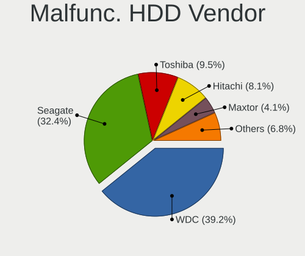

| Vendor              | Desktops | Drives | Percent |
|---------------------|----------|--------|---------|
| WDC                 | 29       | 42     | 39.19%  |
| Seagate             | 24       | 28     | 32.43%  |
| Toshiba             | 7        | 8      | 9.46%   |
| Hitachi             | 6        | 6      | 8.11%   |
| Maxtor              | 3        | 3      | 4.05%   |
| HGST                | 3        | 9      | 4.05%   |
| Samsung Electronics | 1        | 1      | 1.35%   |
| ExcelStor           | 1        | 1      | 1.35%   |

Malfunc. Drive Kind
-------------------

Kinds of faulty drives

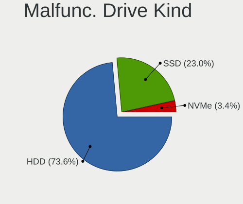

| Kind | Desktops | Drives | Percent |
|------|----------|--------|---------|
| HDD  | 64       | 98     | 73.56%  |
| SSD  | 20       | 22     | 22.99%  |
| NVMe | 3        | 3      | 3.45%   |

Failed Drives
-------------

Failed drive models

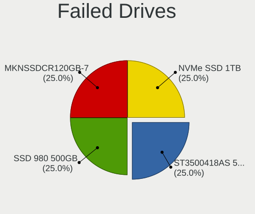

| Model                             | Desktops | Drives | Percent |
|-----------------------------------|----------|--------|---------|
| Seagate ST3500418AS 500GB         | 1        | 1      | 25%     |
| Samsung Electronics SSD 980 500GB | 1        | 1      | 25%     |
| Mushkin MKNSSDCR120GB-7           | 1        | 1      | 25%     |
| KIOXIA NVMe SSD 1TB               | 1        | 1      | 25%     |

Failed Drive Vendor
-------------------

Failed drive vendors

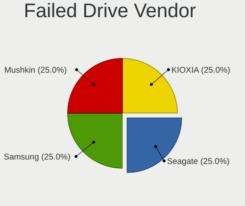

| Vendor              | Desktops | Drives | Percent |
|---------------------|----------|--------|---------|
| Seagate             | 1        | 1      | 25%     |
| Samsung Electronics | 1        | 1      | 25%     |
| Mushkin             | 1        | 1      | 25%     |
| KIOXIA              | 1        | 1      | 25%     |

Drive Status
------------

Number of failed and malfunc. drives

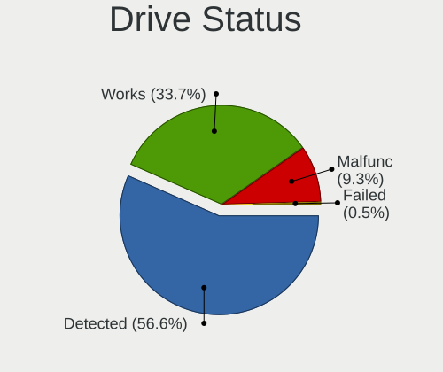

| Status   | Desktops | Drives | Percent |
|----------|----------|--------|---------|
| Detected | 501      | 1437   | 56.61%  |
| Works    | 298      | 809    | 33.67%  |
| Malfunc  | 82       | 123    | 9.27%   |
| Failed   | 4        | 4      | 0.45%   |

Storage controller
------------------

Storage Vendor
--------------

Storage controller vendors

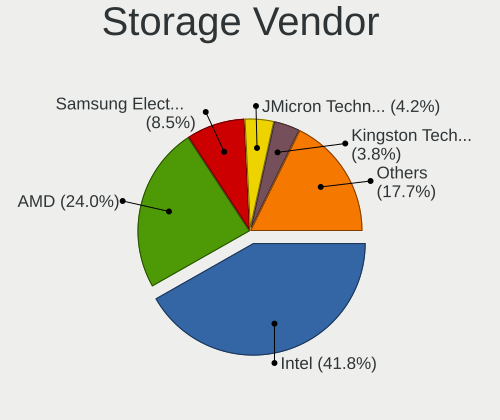

| Vendor                           | Desktops | Percent |
|----------------------------------|----------|---------|
| Intel                            | 483      | 41.78%  |
| AMD                              | 277      | 23.96%  |
| Samsung Electronics              | 98       | 8.48%   |
| JMicron Technology               | 49       | 4.24%   |
| Kingston Technology Company      | 44       | 3.81%   |
| Marvell Technology Group         | 30       | 2.6%    |
| ASMedia Technology               | 28       | 2.42%   |
| SanDisk                          | 25       | 2.16%   |
| Nvidia                           | 20       | 1.73%   |
| Phison Electronics               | 18       | 1.56%   |
| ADATA Technology                 | 11       | 0.95%   |
| VIA Technologies                 | 10       | 0.87%   |
| Silicon Motion                   | 9        | 0.78%   |
| Silicon Image                    | 7        | 0.61%   |
| KIOXIA                           | 7        | 0.61%   |
| Micron/Crucial Technology        | 6        | 0.52%   |
| SK hynix                         | 5        | 0.43%   |
| Realtek Semiconductor            | 4        | 0.35%   |
| Seagate Technology               | 3        | 0.26%   |
| Broadcom / LSI                   | 3        | 0.26%   |
| Toshiba America Info Systems     | 2        | 0.17%   |
| Shenzhen Longsys Electronics     | 2        | 0.17%   |
| Micron Technology                | 2        | 0.17%   |
| MAXIO Technology (Hangzhou)      | 2        | 0.17%   |
| LSI Logic / Symbios Logic        | 2        | 0.17%   |
| Transcend                        | 1        | 0.09%   |
| TenaFe                           | 1        | 0.09%   |
| Silicon Integrated Systems [SiS] | 1        | 0.09%   |
| Promise Technology               | 1        | 0.09%   |
| OCZ Technology Group             | 1        | 0.09%   |
| Integrated Technology Express    | 1        | 0.09%   |
| INNOGRIT                         | 1        | 0.09%   |
| Initio                           | 1        | 0.09%   |
| Hosin Global Electronics         | 1        | 0.09%   |

Storage Model
-------------

Storage controller models

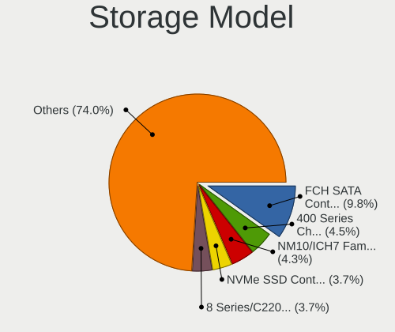

| Model                                                                                   | Desktops | Percent |
|-----------------------------------------------------------------------------------------|----------|---------|
| AMD FCH SATA Controller [AHCI mode]                                                     | 147      | 9.85%   |
| AMD 400 Series Chipset SATA Controller                                                  | 67       | 4.49%   |
| Intel NM10/ICH7 Family SATA Controller [IDE mode]                                       | 64       | 4.29%   |
| Samsung NVMe SSD Controller SM981/PM981/PM983                                           | 55       | 3.68%   |
| Intel 8 Series/C220 Series Chipset Family 6-port SATA Controller 1 [AHCI mode]          | 55       | 3.68%   |
| Intel 82801G (ICH7 Family) IDE Controller                                               | 45       | 3.01%   |
| AMD SB7x0/SB8x0/SB9x0 IDE Controller                                                    | 43       | 2.88%   |
| Intel 6 Series/C200 Series Chipset Family 6 port Desktop SATA AHCI Controller           | 40       | 2.68%   |
| AMD 500 Series Chipset SATA Controller                                                  | 37       | 2.48%   |
| Intel Q170/Q150/B150/H170/H110/Z170/CM236 Chipset SATA Controller [AHCI Mode]           | 34       | 2.28%   |
| AMD SB7x0/SB8x0/SB9x0 SATA Controller [IDE mode]                                        | 33       | 2.21%   |
| JMicron JMB363 SATA/IDE Controller                                                      | 29       | 1.94%   |
| Intel 200 Series PCH SATA controller [AHCI mode]                                        | 29       | 1.94%   |
| Intel 7 Series/C210 Series Chipset Family 6-port SATA Controller [AHCI mode]            | 28       | 1.88%   |
| ASMedia ASM1061/ASM1062 Serial ATA Controller                                           | 26       | 1.74%   |
| AMD SB7x0/SB8x0/SB9x0 SATA Controller [AHCI mode]                                       | 23       | 1.54%   |
| Intel SATA Controller [RAID mode]                                                       | 19       | 1.27%   |
| AMD A320 Chipset SATA Controller [AHCI mode]                                            | 19       | 1.27%   |
| Intel 6 Series/C200 Series Chipset Family Desktop SATA Controller (IDE mode, ports 0-3) | 18       | 1.21%   |
| AMD 300 Series Chipset SATA Controller                                                  | 18       | 1.21%   |
| Intel Alder Lake-S PCH SATA Controller [AHCI Mode]                                      | 17       | 1.14%   |
| Intel 9 Series Chipset Family SATA Controller [AHCI Mode]                               | 17       | 1.14%   |
| Intel 6 Series/C200 Series Chipset Family Desktop SATA Controller (IDE mode, ports 4-5) | 17       | 1.14%   |
| Samsung NVMe SSD Controller 980 (DRAM-less)                                             | 16       | 1.07%   |
| JMicron JMB368 IDE controller                                                           | 15       | 1%      |
| Intel Cannon Lake PCH SATA AHCI Controller                                              | 14       | 0.94%   |
| Samsung NVMe SSD Controller PM9A1/PM9A3/980PRO                                          | 13       | 0.87%   |
| Intel 82801JI (ICH10 Family) SATA AHCI Controller                                       | 13       | 0.87%   |
| Intel 82801JI (ICH10 Family) 4 port SATA IDE Controller #1                              | 13       | 0.87%   |
| Intel 82801I (ICH9 Family) 2 port SATA Controller [IDE mode]                            | 13       | 0.87%   |
| Intel 4 Series Chipset PT IDER Controller                                               | 13       | 0.87%   |
| AMD 600 Series Chipset SATA Controller                                                  | 13       | 0.87%   |
| Kingston Company A2000 NVMe SSD [SM2263EN]                                              | 12       | 0.8%    |
| Intel 82801JI (ICH10 Family) 2 port SATA IDE Controller #2                              | 12       | 0.8%    |
| Intel Volume Management Device NVMe RAID Controller                                     | 10       | 0.67%   |
| Intel 82801JD/DO (ICH10 Family) SATA AHCI Controller                                    | 10       | 0.67%   |
| Silicon Motion SM2263EN/SM2263XT (DRAM-less) NVMe SSD Controllers                       | 9        | 0.6%    |
| Marvell Group 88SE9172 SATA 6Gb/s Controller                                            | 9        | 0.6%    |
| Intel 82801IR/IO/IH (ICH9R/DO/DH) 4 port SATA Controller [IDE mode]                     | 9        | 0.6%    |
| Intel 82801HR/HO/HH (ICH8R/DO/DH) 2 port SATA Controller [IDE mode]                     | 9        | 0.6%    |

Storage Kind
------------

Kind of storage controller (IDE, SATA, NVMe, SAS, ...)

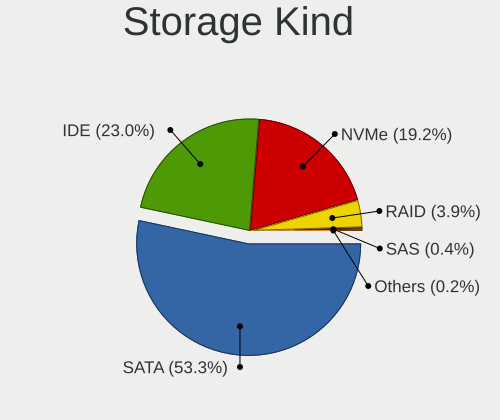

| Kind | Desktops | Percent |
|------|----------|---------|
| SATA | 599      | 53.34%  |
| IDE  | 258      | 22.97%  |
| NVMe | 216      | 19.23%  |
| RAID | 44       | 3.92%   |
| SAS  | 4        | 0.36%   |
| SCSI | 2        | 0.18%   |

Processor
---------

CPU Vendor
----------

Processor vendors

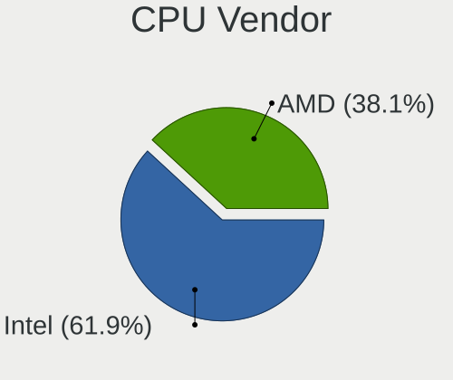

| Vendor | Desktops | Percent |
|--------|----------|---------|
| Intel  | 490      | 61.87%  |
| AMD    | 302      | 38.13%  |

CPU Model
---------

Processor models

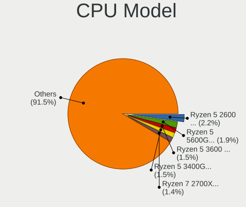

| Model                                       | Desktops | Percent |
|---------------------------------------------|----------|---------|
| AMD Ryzen 5 2600 Six-Core Processor         | 18       | 2.24%   |
| AMD Ryzen 5 5600G with Radeon Graphics      | 15       | 1.87%   |
| AMD Ryzen 5 3600 6-Core Processor           | 12       | 1.49%   |
| AMD Ryzen 5 3400G with Radeon Vega Graphics | 12       | 1.49%   |
| AMD Ryzen 7 2700X Eight-Core Processor      | 11       | 1.37%   |
| AMD Ryzen 3 2200G with Radeon Vega Graphics | 10       | 1.24%   |
| AMD FX-6300 Six-Core Processor              | 10       | 1.24%   |
| Intel Core i5-6500 CPU @ 3.20GHz            | 9        | 1.12%   |
| Intel Core i5-4460 CPU @ 3.20GHz            | 9        | 1.12%   |
| Intel Core i5-2400 CPU @ 3.10GHz            | 9        | 1.12%   |
| Intel Core 2 Duo CPU E7500 @ 2.93GHz        | 9        | 1.12%   |
| Intel Pentium 4 CPU 3.00GHz                 | 8        | 1%      |
| Intel Core i5-3470 CPU @ 3.20GHz            | 8        | 1%      |
| Intel Core i3-3220 CPU @ 3.30GHz            | 8        | 1%      |
| Intel Core 2 Duo CPU E8400 @ 3.00GHz        | 8        | 1%      |
| Intel Pentium 4 CPU 3.20GHz                 | 7        | 0.87%   |
| Intel Core 2 Quad CPU Q6600 @ 2.40GHz       | 7        | 0.87%   |
| Intel Core 2 Duo CPU E8500 @ 3.16GHz        | 7        | 0.87%   |
| AMD Ryzen 9 3900X 12-Core Processor         | 7        | 0.87%   |
| AMD Ryzen 7 5800X 8-Core Processor          | 7        | 0.87%   |
| AMD Ryzen 7 5700X 8-Core Processor          | 7        | 0.87%   |
| Intel Pentium Dual-Core CPU E5200 @ 2.50GHz | 6        | 0.75%   |
| Intel Core i7-3770 CPU @ 3.40GHz            | 6        | 0.75%   |
| Intel Core i3-2120 CPU @ 3.30GHz            | 6        | 0.75%   |
| Intel Core 2 Duo CPU E7400 @ 2.80GHz        | 6        | 0.75%   |
| Intel Celeron CPU G1840 @ 2.80GHz           | 6        | 0.75%   |
| AMD Ryzen 9 5950X 16-Core Processor         | 6        | 0.75%   |
| AMD Ryzen 9 5900X 12-Core Processor         | 6        | 0.75%   |
| AMD Ryzen 7 5700G with Radeon Graphics      | 6        | 0.75%   |
| AMD Ryzen 7 3700X 8-Core Processor          | 6        | 0.75%   |
| AMD Ryzen 5 5600X 6-Core Processor          | 6        | 0.75%   |
| AMD Ryzen 5 2600X Six-Core Processor        | 6        | 0.75%   |
| AMD Ryzen 5 1600 Six-Core Processor         | 6        | 0.75%   |
| AMD Phenom II X4 965 Processor              | 6        | 0.75%   |
| Intel Core i7-6700K CPU @ 4.00GHz           | 5        | 0.62%   |
| Intel Core i7-2600K CPU @ 3.40GHz           | 5        | 0.62%   |
| Intel Core i7 CPU 920 @ 2.67GHz             | 5        | 0.62%   |
| Intel Core i5-6600 CPU @ 3.30GHz            | 5        | 0.62%   |
| Intel Core i5-4590 CPU @ 3.30GHz            | 5        | 0.62%   |
| Intel Core i5-4570 CPU @ 3.20GHz            | 5        | 0.62%   |

CPU Model Family
----------------

Processor model prefix

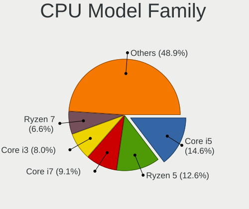

| Model                   | Desktops | Percent |
|-------------------------|----------|---------|
| Intel Core i5           | 117      | 14.64%  |
| AMD Ryzen 5             | 101      | 12.64%  |
| Intel Core i7           | 73       | 9.14%   |
| Intel Core i3           | 64       | 8.01%   |
| AMD Ryzen 7             | 53       | 6.63%   |
| Intel Core 2 Duo        | 45       | 5.63%   |
| Intel Core 2 Quad       | 34       | 4.26%   |
| Other                   | 30       | 3.75%   |
| AMD FX                  | 27       | 3.38%   |
| Intel Pentium           | 24       | 3%      |
| Intel Celeron           | 24       | 3%      |
| AMD Ryzen 9             | 23       | 2.88%   |
| Intel Xeon              | 22       | 2.75%   |
| Intel Pentium 4         | 20       | 2.5%    |
| AMD Ryzen 3             | 15       | 1.88%   |
| AMD Athlon 64 X2        | 15       | 1.88%   |
| Intel Pentium Dual-Core | 13       | 1.63%   |
| Intel Core 2            | 12       | 1.5%    |
| AMD Phenom II X4        | 11       | 1.38%   |
| AMD A8                  | 9        | 1.13%   |
| Intel Pentium D         | 6        | 0.75%   |
| AMD Phenom              | 5        | 0.63%   |
| AMD Athlon              | 5        | 0.63%   |
| AMD A10                 | 5        | 0.63%   |
| AMD Phenom II X6        | 4        | 0.5%    |
| Intel Pentium Gold      | 3        | 0.38%   |
| Intel Core i9           | 3        | 0.38%   |
| AMD Ryzen Threadripper  | 3        | 0.38%   |
| AMD Athlon XP           | 3        | 0.38%   |
| AMD Athlon II X4        | 3        | 0.38%   |
| AMD Athlon 64           | 3        | 0.38%   |
| Intel Pentium Dual      | 2        | 0.25%   |
| Intel Genuine           | 2        | 0.25%   |
| AMD Sempron             | 2        | 0.25%   |
| AMD Ryzen 5 PRO         | 2        | 0.25%   |
| AMD Athlon X4           | 2        | 0.25%   |
| AMD Athlon II X2        | 2        | 0.25%   |
| AMD A6                  | 2        | 0.25%   |
| AMD A4                  | 2        | 0.25%   |
| Intel Pentium Silver    | 1        | 0.13%   |

CPU Cores
---------

Number of processor cores

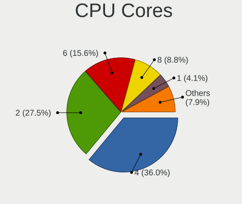

| Number | Desktops | Percent |
|--------|----------|---------|
| 4      | 288      | 36.05%  |
| 2      | 220      | 27.53%  |
| 6      | 125      | 15.64%  |
| 8      | 70       | 8.76%   |
| 1      | 33       | 4.13%   |
| 12     | 21       | 2.63%   |
| 16     | 18       | 2.25%   |
| 3      | 12       | 1.5%    |
| 10     | 7        | 0.88%   |
| 14     | 4        | 0.5%    |
| 24     | 1        | 0.13%   |

CPU Sockets
-----------

Number of sockets

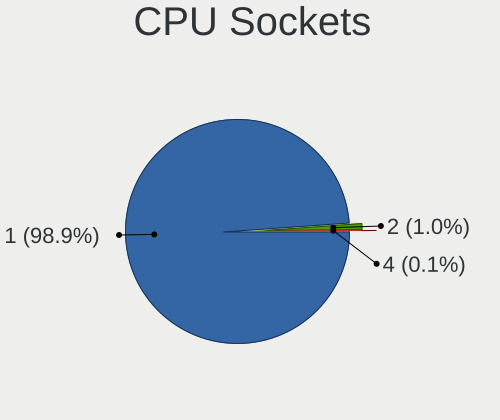

| Number | Desktops | Percent |
|--------|----------|---------|
| 1      | 784      | 98.87%  |
| 2      | 8        | 1.01%   |
| 4      | 1        | 0.13%   |

CPU Threads
-----------

Threads per core (Hyper-Threading)

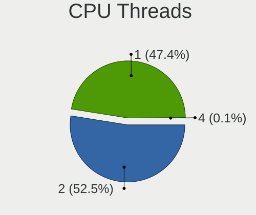

| Number | Desktops | Percent |
|--------|----------|---------|
| 2      | 417      | 52.52%  |
| 1      | 376      | 47.36%  |
| 4      | 1        | 0.13%   |

CPU Op-Modes
------------

CPU Operation Modes (32-bit, 64-bit)

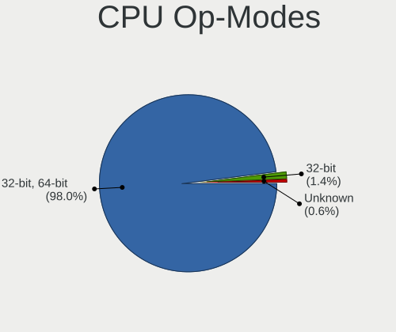

| Op mode        | Desktops | Percent |
|----------------|----------|---------|
| 32-bit, 64-bit | 777      | 97.98%  |
| 32-bit         | 11       | 1.39%   |
| Unknown        | 5        | 0.63%   |

CPU Microcode
-------------

Microcode number

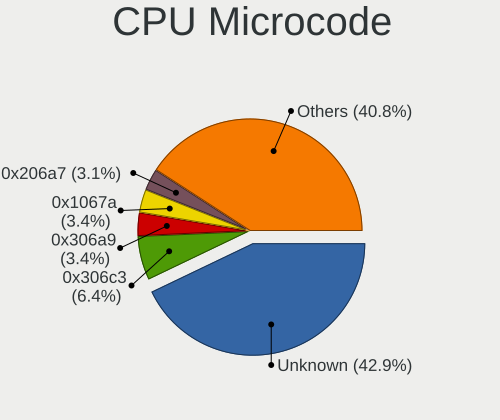

| Number     | Desktops | Percent |
|------------|----------|---------|
| Unknown    | 356      | 42.89%  |
| 0x306c3    | 53       | 6.39%   |
| 0x306a9    | 28       | 3.37%   |
| 0x1067a    | 28       | 3.37%   |
| 0x206a7    | 26       | 3.13%   |
| 0x0800820d | 17       | 2.05%   |
| 0x506e3    | 15       | 1.81%   |
| 0x906e9    | 13       | 1.57%   |
| 0x06000852 | 13       | 1.57%   |
| 0x10676    | 12       | 1.45%   |
| 0x906ea    | 11       | 1.33%   |
| 0x08701021 | 11       | 1.33%   |
| 0x906ed    | 9        | 1.08%   |
| 0xf43      | 8        | 0.96%   |
| 0xa0653    | 8        | 0.96%   |
| 0x6f6      | 8        | 0.96%   |
| 0x06003106 | 8        | 0.96%   |
| 0x906eb    | 7        | 0.84%   |
| 0x6fd      | 7        | 0.84%   |
| 0x106e5    | 7        | 0.84%   |
| 0x10677    | 7        | 0.84%   |
| 0x08108109 | 7        | 0.84%   |
| 0x08101016 | 7        | 0.84%   |
| 0x010000c8 | 7        | 0.84%   |
| 0xf41      | 6        | 0.72%   |
| 0x6fb      | 6        | 0.72%   |
| 0x106a5    | 5        | 0.6%    |
| 0x0a20120a | 5        | 0.6%    |
| 0x08701013 | 5        | 0.6%    |
| 0x0810100b | 5        | 0.6%    |
| 0x0800820b | 5        | 0.6%    |
| 0x08001138 | 5        | 0.6%    |
| 0xf29      | 4        | 0.48%   |
| 0x0a50000d | 4        | 0.48%   |
| 0x0a50000c | 4        | 0.48%   |
| 0x0a201016 | 4        | 0.48%   |
| 0x08001129 | 4        | 0.48%   |
| 0xf47      | 3        | 0.36%   |
| 0x6f2      | 3        | 0.36%   |
| 0x506c9    | 3        | 0.36%   |

CPU Microarch
-------------

Microarchitecture

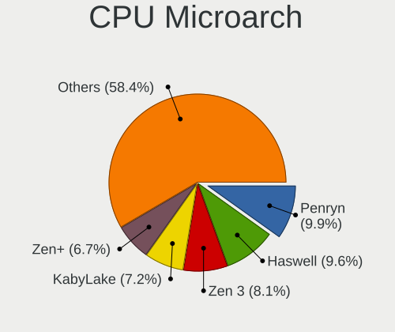

| Name             | Desktops | Percent |
|------------------|----------|---------|
| Penryn           | 79       | 9.86%   |
| Haswell          | 77       | 9.61%   |
| Zen 3            | 65       | 8.11%   |
| KabyLake         | 58       | 7.24%   |
| Zen+             | 54       | 6.74%   |
| SandyBridge      | 49       | 6.12%   |
| IvyBridge        | 49       | 6.12%   |
| Core             | 37       | 4.62%   |
| Zen 2            | 34       | 4.24%   |
| Unknown          | 32       | 4%      |
| Zen              | 31       | 3.87%   |
| Skylake          | 31       | 3.87%   |
| Piledriver       | 29       | 3.62%   |
| K10              | 28       | 3.5%    |
| NetBurst         | 27       | 3.37%   |
| K8 Hammer        | 20       | 2.5%    |
| Nehalem          | 18       | 2.25%   |
| CometLake        | 17       | 2.12%   |
| Alderlake Hybrid | 14       | 1.75%   |
| Steamroller      | 12       | 1.5%    |
| Westmere         | 8        | 1%      |
| K6               | 5        | 0.62%   |
| Silvermont       | 4        | 0.5%    |
| Jaguar           | 4        | 0.5%    |
| Excavator        | 4        | 0.5%    |
| Goldmont         | 3        | 0.37%   |
| Goldmont plus    | 2        | 0.25%   |
| Bulldozer        | 2        | 0.25%   |
| Tremont          | 1        | 0.12%   |
| TigerLake        | 1        | 0.12%   |
| Puma             | 1        | 0.12%   |
| Icelake          | 1        | 0.12%   |
| Gracemont        | 1        | 0.12%   |
| Broadwell        | 1        | 0.12%   |
| Bonnell          | 1        | 0.12%   |
| Bobcat           | 1        | 0.12%   |

Graphics
--------

GPU Vendor
----------

Vendors of graphics cards

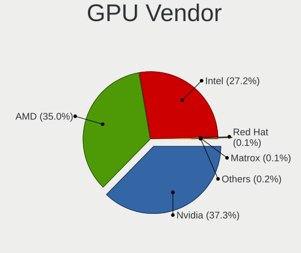

| Vendor                     | Desktops | Percent |
|----------------------------|----------|---------|
| Nvidia                     | 318      | 37.32%  |
| AMD                        | 298      | 34.98%  |
| Intel                      | 232      | 27.23%  |
| Red Hat                    | 1        | 0.12%   |
| Matrox Electronics Systems | 1        | 0.12%   |
| Conexant Systems           | 1        | 0.12%   |
| ASPEED Technology          | 1        | 0.12%   |

GPU Model
---------

Graphics card models

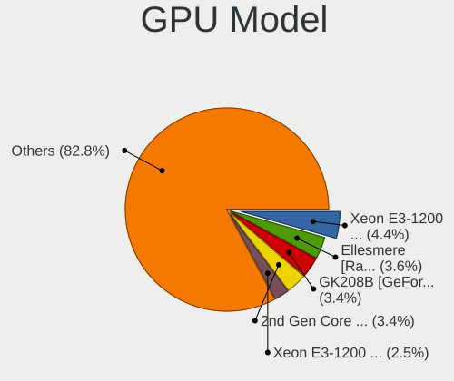

| Model                                                                       | Desktops | Percent |
|-----------------------------------------------------------------------------|----------|---------|
| Intel Xeon E3-1200 v3/4th Gen Core Processor Integrated Graphics Controller | 39       | 4.38%   |
| AMD Ellesmere [Radeon RX 470/480/570/570X/580/580X/590]                     | 32       | 3.6%    |
| Nvidia GK208B [GeForce GT 710]                                              | 30       | 3.37%   |
| Intel 2nd Generation Core Processor Family Integrated Graphics Controller   | 30       | 3.37%   |
| Intel Xeon E3-1200 v2/3rd Gen Core processor Graphics Controller            | 22       | 2.47%   |
| Intel 4 Series Chipset Integrated Graphics Controller                       | 19       | 2.13%   |
| Nvidia GT218 [GeForce 210]                                                  | 17       | 1.91%   |
| Nvidia GP107 [GeForce GTX 1050 Ti]                                          | 17       | 1.91%   |
| AMD Cezanne [Radeon Vega Series / Radeon Vega Mobile Series]                | 17       | 1.91%   |
| AMD Raven Ridge [Radeon Vega Series / Radeon Vega Mobile Series]            | 16       | 1.8%    |
| Nvidia GP108 [GeForce GT 1030]                                              | 14       | 1.57%   |
| AMD Picasso/Raven 2 [Radeon Vega Series / Radeon Vega Mobile Series]        | 14       | 1.57%   |
| AMD Navi 23 [Radeon RX 6600/6600 XT/6600M]                                  | 14       | 1.57%   |
| Intel Skylake-S GT2 [HD Graphics 530]                                       | 13       | 1.46%   |
| Intel CoffeeLake-S GT2 [UHD Graphics 630]                                   | 13       | 1.46%   |
| Nvidia GK208B [GeForce GT 730]                                              | 11       | 1.24%   |
| Nvidia TU117 [GeForce GTX 1650]                                             | 10       | 1.12%   |
| Nvidia GP106 [GeForce GTX 1060 6GB]                                         | 10       | 1.12%   |
| Intel 82945G/GZ Integrated Graphics Controller                              | 10       | 1.12%   |
| AMD Raphael                                                                 | 10       | 1.12%   |
| Intel Alder Lake-S GT1 [UHD Graphics 770]                                   | 9        | 1.01%   |
| Intel 4th Generation Core Processor Family Integrated Graphics Controller   | 9        | 1.01%   |
| Intel Kaby Lake-S GT2 [HD Graphics 630]                                     | 8        | 0.9%    |
| AMD Navi 10 [Radeon RX 5600 OEM/5600 XT / 5700/5700 XT]                     | 8        | 0.9%    |
| AMD Kaveri [Radeon R7 Graphics]                                             | 8        | 0.9%    |
| AMD Cedar [Radeon HD 5000/6000/7350/8350 Series]                            | 8        | 0.9%    |
| AMD Caicos [Radeon HD 6450/7450/8450 / R5 230 OEM]                          | 8        | 0.9%    |
| AMD Baffin [Radeon RX 550 640SP / RX 560/560X]                              | 8        | 0.9%    |
| Intel IvyBridge GT2 [HD Graphics 4000]                                      | 7        | 0.79%   |
| Intel CometLake-S GT2 [UHD Graphics 630]                                    | 7        | 0.79%   |
| AMD Navi 22 [Radeon RX 6700/6700 XT/6750 XT / 6800M/6850M XT]               | 7        | 0.79%   |
| AMD Lexa PRO [Radeon 540/540X/550/550X / RX 540X/550/550X]                  | 7        | 0.79%   |
| AMD Curacao PRO [Radeon R7 370 / R9 270/370 OEM]                            | 7        | 0.79%   |
| Nvidia TU116 [GeForce GTX 1660 SUPER]                                       | 6        | 0.67%   |
| Nvidia GP107 [GeForce GTX 1050]                                             | 6        | 0.67%   |
| Nvidia GF119 [GeForce GT 610]                                               | 6        | 0.67%   |
| Nvidia GF108 [GeForce GT 730]                                               | 6        | 0.67%   |
| AMD Turks PRO [Radeon HD 6570/7570/8550 / R5 230]                           | 6        | 0.67%   |
| AMD Oland PRO [Radeon R7 240/340 / Radeon 520]                              | 6        | 0.67%   |
| Nvidia TU116 [GeForce GTX 1660 Ti]                                          | 5        | 0.56%   |

GPU Combo
---------

Combinations of graphics cards

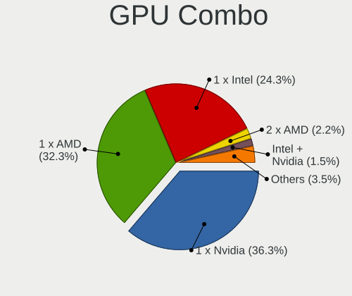

| Name                           | Desktops | Percent |
|--------------------------------|----------|---------|
| 1 x Nvidia                     | 293      | 36.26%  |
| 1 x AMD                        | 261      | 32.3%   |
| 1 x Intel                      | 196      | 24.26%  |
| 2 x AMD                        | 18       | 2.23%   |
| Intel + Nvidia                 | 12       | 1.49%   |
| AMD + Nvidia                   | 10       | 1.24%   |
| Intel + AMD                    | 8        | 0.99%   |
| Other                          | 2        | 0.25%   |
| 2 x Nvidia                     | 2        | 0.25%   |
| 2 x Intel                      | 2        | 0.25%   |
| 2 x AMD + 1 x Conexant Systems | 1        | 0.12%   |
| 1 x Red Hat                    | 1        | 0.12%   |
| Nvidia + ASPEED                | 1        | 0.12%   |
| 1 x Matrox                     | 1        | 0.12%   |

GPU Driver
----------

Free vs proprietary

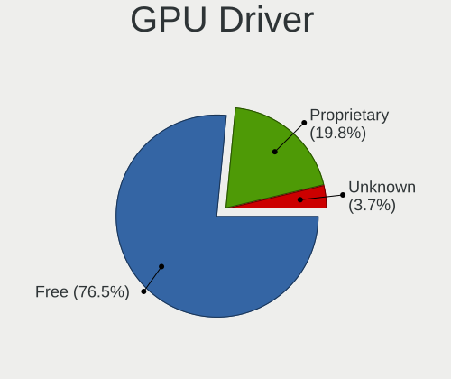

| Driver      | Desktops | Percent |
|-------------|----------|---------|
| Free        | 619      | 76.51%  |
| Proprietary | 160      | 19.78%  |
| Unknown     | 30       | 3.71%   |

GPU Memory
----------

Total video memory

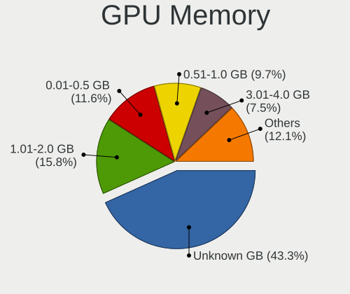

| Size in GB | Desktops | Percent |
|------------|----------|---------|
| Unknown    | 362      | 43.3%   |
| 1.01-2.0   | 132      | 15.79%  |
| 0.01-0.5   | 97       | 11.6%   |
| 0.51-1.0   | 81       | 9.69%   |
| 3.01-4.0   | 63       | 7.54%   |
| 7.01-8.0   | 48       | 5.74%   |
| 5.01-6.0   | 23       | 2.75%   |
| 8.01-16.0  | 20       | 2.39%   |
| 2.01-3.0   | 6        | 0.72%   |
| 16.01-24.0 | 4        | 0.48%   |

Monitor
-------

Monitor Vendor
--------------

Monitor vendors

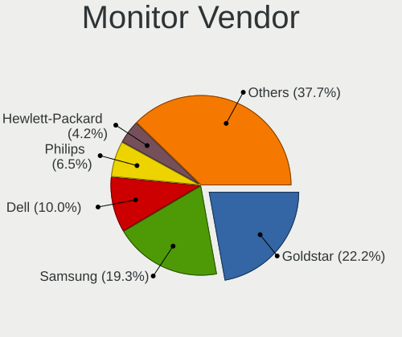

| Vendor               | Desktops | Percent |
|----------------------|----------|---------|
| Goldstar             | 188      | 22.17%  |
| Samsung Electronics  | 164      | 19.34%  |
| Dell                 | 85       | 10.02%  |
| Philips              | 55       | 6.49%   |
| Hewlett-Packard      | 36       | 4.25%   |
| LG Electronics       | 26       | 3.07%   |
| AOC                  | 26       | 3.07%   |
| BenQ                 | 24       | 2.83%   |
| ViewSonic            | 23       | 2.71%   |
| Ancor Communications | 18       | 2.12%   |
| Sony                 | 17       | 2%      |
| Eizo                 | 17       | 2%      |
| Acer                 | 12       | 1.42%   |
| NEC Computers        | 11       | 1.3%    |
| ASUSTek Computer     | 11       | 1.3%    |
| Vestel Elektronik    | 9        | 1.06%   |
| Unknown              | 9        | 1.06%   |
| Mi                   | 9        | 1.06%   |
| Iiyama               | 9        | 1.06%   |
| JRY                  | 8        | 0.94%   |
| Fujitsu Siemens      | 8        | 0.94%   |
| Lenovo               | 6        | 0.71%   |
| Belinea              | 6        | 0.71%   |
| MSI                  | 4        | 0.47%   |
| Medion               | 4        | 0.47%   |
| Gigabyte Technology  | 4        | 0.47%   |
| Hitachi              | 3        | 0.35%   |
| DAO                  | 3        | 0.35%   |
| AGO                  | 3        | 0.35%   |
| Unknown              | 3        | 0.35%   |
| Sharp                | 2        | 0.24%   |
| RTK                  | 2        | 0.24%   |
| Panasonic            | 2        | 0.24%   |
| NCS                  | 2        | 0.24%   |
| MStar                | 2        | 0.24%   |
| LLL                  | 2        | 0.24%   |
| IBM                  | 2        | 0.24%   |
| FUS                  | 2        | 0.24%   |
| YM                   | 1        | 0.12%   |
| Toshiba              | 1        | 0.12%   |

Monitor Model
-------------

Monitor models

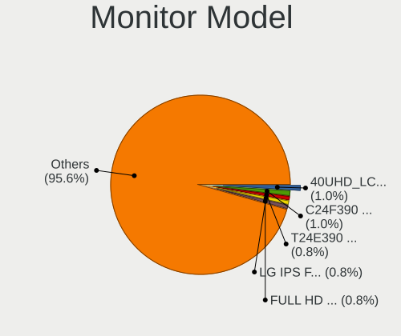

| Model                                                                 | Desktops | Percent |
|-----------------------------------------------------------------------|----------|---------|
| Vestel Elektronik 40UHD_LCD_TV VES3700 3840x2160 880x500mm 39.8-inch  | 9        | 1.01%   |
| Samsung Electronics C24F390 SAM0D2C 1920x1080 521x293mm 23.5-inch     | 9        | 1.01%   |
| Samsung Electronics T24E390 SAM0C20 1920x1080 521x293mm 23.5-inch     | 7        | 0.78%   |
| Goldstar LG IPS FULLHD GSM5AB8 1920x1080 480x270mm 21.7-inch          | 7        | 0.78%   |
| Goldstar FULL HD GSM5B55 1920x1080 480x270mm 21.7-inch                | 7        | 0.78%   |
| Philips PHL 223V5 PHLC0CF 1920x1080 477x268mm 21.5-inch               | 6        | 0.67%   |
| ViewSonic VA703-4Series VSC6A1E 1280x1024 341x274mm 17.2-inch         | 5        | 0.56%   |
| Samsung Electronics S24F350 SAM0D20 1920x1080 521x293mm 23.5-inch     | 5        | 0.56%   |
| Goldstar 2D FHD TV GSM59C6 1920x1080 509x286mm 23.0-inch              | 5        | 0.56%   |
| Dell P3223DE DEL4294 2560x1440 698x393mm 31.5-inch                    | 5        | 0.56%   |
| Ancor Communications ASUS VS247 ACI249A 1920x1080 521x293mm 23.5-inch | 5        | 0.56%   |
| Samsung Electronics T23B350 SAM093B 1920x1080 510x287mm 23.0-inch     | 4        | 0.45%   |
| Samsung Electronics LCD Monitor SAM0C39 1920x1080 885x498mm 40.0-inch | 4        | 0.45%   |
| Philips 226V4 PHLC0B1 1920x1080 477x268mm 21.5-inch                   | 4        | 0.45%   |
| Goldstar LG ULTRAWIDE GSM59F1 2560x1080 670x280mm 28.6-inch           | 4        | 0.45%   |
| Goldstar L1760TR GSM445D 1280x1024 338x270mm 17.0-inch                | 4        | 0.45%   |
| Goldstar IPS FULLHD GSM5AB6 1920x1080 480x270mm 21.7-inch             | 4        | 0.45%   |
| Unknown LCD Monitor FFFF 2288x1287 2550x2550mm 142.0-inch             | 3        | 0.34%   |
| Samsung Electronics S22F350 SAM0D1A 1920x1080 477x268mm 21.5-inch     | 3        | 0.34%   |
| Philips PHL 243V5 PHLC0D1 1920x1080 521x293mm 23.5-inch               | 3        | 0.34%   |
| NEC Computers LCD72VM NEC6659 1280x1024 338x270mm 17.0-inch           | 3        | 0.34%   |
| Mi Monitor XMI23C3 1920x1080 527x293mm 23.7-inch                      | 3        | 0.34%   |
| LG Electronics LCD Monitor LG FULL HD 1920x1080                       | 3        | 0.34%   |
| Hewlett-Packard LP2465 HWP2676 1920x1200 519x324mm 24.1-inch          | 3        | 0.34%   |
| Goldstar W2234 GSM56B8 1680x1050 474x296mm 22.0-inch                  | 3        | 0.34%   |
| Goldstar W1934 GSM4B7A 1440x900 410x256mm 19.0-inch                   | 3        | 0.34%   |
| Goldstar M208WA GSM4E62 1680x1050 434x270mm 20.1-inch                 | 3        | 0.34%   |
| Goldstar HDR WFHD GSM7714 2560x1080 798x334mm 34.1-inch               | 3        | 0.34%   |
| Goldstar FULL HD GSM5ABB 1920x1080 480x270mm 21.7-inch                | 3        | 0.34%   |
| Goldstar 20M35 GSM4EED 1600x900 433x236mm 19.4-inch                   | 3        | 0.34%   |
| Dell U2412M DELA07A 1920x1200 518x324mm 24.1-inch                     | 3        | 0.34%   |
| Dell S2715H DEL40BB 1920x1080 598x336mm 27.0-inch                     | 3        | 0.34%   |
| BenQ GW2480 BNQ78E7 1920x1080 527x296mm 23.8-inch                     | 3        | 0.34%   |
| AOC 27G2G4 AOC2702 1920x1080 598x336mm 27.0-inch                      | 3        | 0.34%   |
| AOC 24G2W1G3 AOC2402 1920x1080 527x296mm 23.8-inch                    | 3        | 0.34%   |
| Unknown                                                               | 3        | 0.34%   |
| Sony TV SNYEE01 1920x1080                                             | 2        | 0.22%   |
| Samsung Electronics U28E590 SAM0C4D 3840x2160 607x345mm 27.5-inch     | 2        | 0.22%   |
| Samsung Electronics SyncMaster SAM05C7 1920x1080 521x293mm 23.5-inch  | 2        | 0.22%   |
| Samsung Electronics SyncMaster SAM0593 1920x1080 477x268mm 21.5-inch  | 2        | 0.22%   |

Monitor Resolution
------------------

Monitor screen resolution

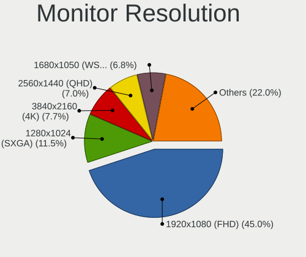

| Resolution         | Desktops | Percent |
|--------------------|----------|---------|
| 1920x1080 (FHD)    | 366      | 44.96%  |
| 1280x1024 (SXGA)   | 94       | 11.55%  |
| 3840x2160 (4K)     | 63       | 7.74%   |
| 2560x1440 (QHD)    | 57       | 7%      |
| 1680x1050 (WSXGA+) | 55       | 6.76%   |
| 1366x768 (WXGA)    | 30       | 3.69%   |
| 1440x900 (WXGA+)   | 26       | 3.19%   |
| 1920x1200 (WUXGA)  | 20       | 2.46%   |
| 1600x900 (HD+)     | 15       | 1.84%   |
| 1360x768           | 13       | 1.6%    |
| 3440x1440          | 11       | 1.35%   |
| Unknown            | 11       | 1.35%   |
| 2560x1080          | 10       | 1.23%   |
| 1024x768 (XGA)     | 8        | 0.98%   |
| 3840x1080          | 6        | 0.74%   |
| 1600x1200          | 6        | 0.74%   |
| 2288x1287          | 4        | 0.49%   |
| 1920x540           | 3        | 0.37%   |
| 2560x1600          | 2        | 0.25%   |
| 2048x1152          | 2        | 0.25%   |
| 5120x1440          | 1        | 0.12%   |
| 4864x2160          | 1        | 0.12%   |
| 4480x1080          | 1        | 0.12%   |
| 3600x1080          | 1        | 0.12%   |
| 3200x1080          | 1        | 0.12%   |
| 3000x1920          | 1        | 0.12%   |
| 2960x1050          | 1        | 0.12%   |
| 2560x1397          | 1        | 0.12%   |
| 2048x1536          | 1        | 0.12%   |
| 1400x1050          | 1        | 0.12%   |
| 1280x768           | 1        | 0.12%   |
| 1280x720 (HD)      | 1        | 0.12%   |

Monitor Diagonal
----------------

Diagonal size in inches

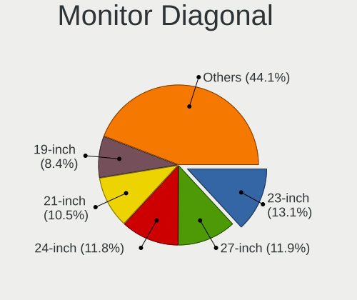

| Inches  | Desktops | Percent |
|---------|----------|---------|
| 23      | 112      | 13.11%  |
| 27      | 102      | 11.94%  |
| 24      | 101      | 11.83%  |
| 21      | 90       | 10.54%  |
| 19      | 72       | 8.43%   |
| Unknown | 69       | 8.08%   |
| 17      | 48       | 5.62%   |
| 31      | 43       | 5.04%   |
| 18      | 33       | 3.86%   |
| 20      | 32       | 3.75%   |
| 22      | 27       | 3.16%   |
| 84      | 18       | 2.11%   |
| 34      | 18       | 2.11%   |
| 15      | 11       | 1.29%   |
| 72      | 8        | 0.94%   |
| 54      | 7        | 0.82%   |
| 32      | 7        | 0.82%   |
| 40      | 6        | 0.7%    |
| 63      | 4        | 0.47%   |
| 25      | 4        | 0.47%   |
| 142     | 3        | 0.35%   |
| 60      | 3        | 0.35%   |
| 42      | 3        | 0.35%   |
| 33      | 3        | 0.35%   |
| 29      | 3        | 0.35%   |
| 28      | 3        | 0.35%   |
| 26      | 3        | 0.35%   |
| 16      | 3        | 0.35%   |
| 12      | 3        | 0.35%   |
| 55      | 2        | 0.23%   |
| 52      | 2        | 0.23%   |
| 46      | 2        | 0.23%   |
| 36      | 2        | 0.23%   |
| 14      | 2        | 0.23%   |
| 65      | 1        | 0.12%   |
| 49      | 1        | 0.12%   |
| 48      | 1        | 0.12%   |
| 44      | 1        | 0.12%   |
| 39      | 1        | 0.12%   |

Monitor Width
-------------

Physical width

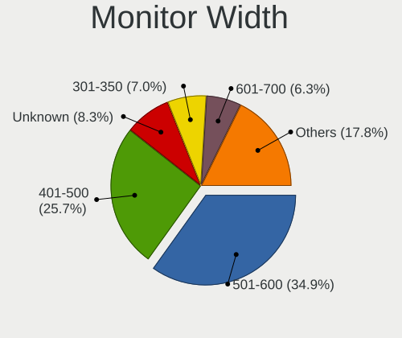

| Width in mm    | Desktops | Percent |
|----------------|----------|---------|
| 501-600        | 289      | 34.9%   |
| 401-500        | 213      | 25.72%  |
| Unknown        | 69       | 8.33%   |
| 301-350        | 58       | 7%      |
| 601-700        | 52       | 6.28%   |
| 351-400        | 49       | 5.92%   |
| 701-800        | 30       | 3.62%   |
| 1501-2000      | 26       | 3.14%   |
| 1001-1500      | 23       | 2.78%   |
| 801-900        | 7        | 0.85%   |
| 201-300        | 5        | 0.6%    |
| 901-1000       | 4        | 0.48%   |
| More than 2000 | 3        | 0.36%   |

Aspect Ratio
------------

Proportional relationship between the width and the height

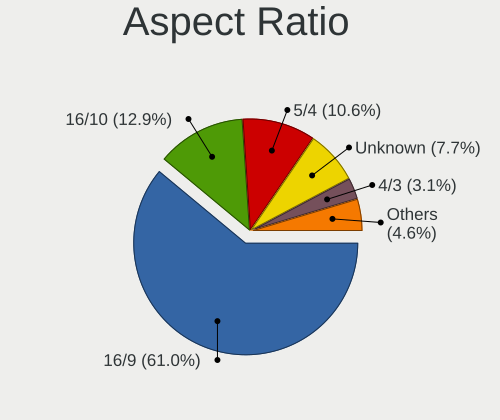

| Ratio   | Desktops | Percent |
|---------|----------|---------|
| 16/9    | 473      | 61.03%  |
| 16/10   | 100      | 12.9%   |
| 5/4     | 82       | 10.58%  |
| Unknown | 60       | 7.74%   |
| 4/3     | 24       | 3.1%    |
| 21/9    | 17       | 2.19%   |
| 6/5     | 9        | 1.16%   |
| 3/2     | 5        | 0.65%   |
| 1.00    | 3        | 0.39%   |
| 32/9    | 2        | 0.26%   |

Monitor Area
------------

Area in inch²

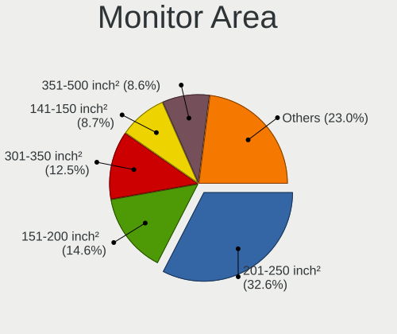

| Area in inch² | Desktops | Percent |
|----------------|----------|---------|
| 201-250        | 272      | 32.57%  |
| 151-200        | 122      | 14.61%  |
| 301-350        | 104      | 12.46%  |
| 141-150        | 73       | 8.74%   |
| 351-500        | 72       | 8.62%   |
| Unknown        | 69       | 8.26%   |
| More than 1000 | 48       | 5.75%   |
| 251-300        | 39       | 4.67%   |
| 501-1000       | 17       | 2.04%   |
| 101-110        | 13       | 1.56%   |
| 71-80          | 3        | 0.36%   |
| 131-140        | 1        | 0.12%   |
| 121-130        | 1        | 0.12%   |
| 111-120        | 1        | 0.12%   |

Pixel Density
-------------

Pixels per inch

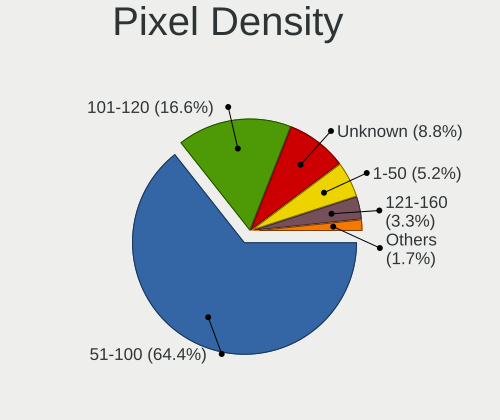

| Density | Desktops | Percent |
|---------|----------|---------|
| 51-100  | 504      | 64.37%  |
| 101-120 | 130      | 16.6%   |
| Unknown | 69       | 8.81%   |
| 1-50    | 41       | 5.24%   |
| 121-160 | 26       | 3.32%   |
| 161-240 | 13       | 1.66%   |

Multiple Monitors
-----------------

Total monitors connected

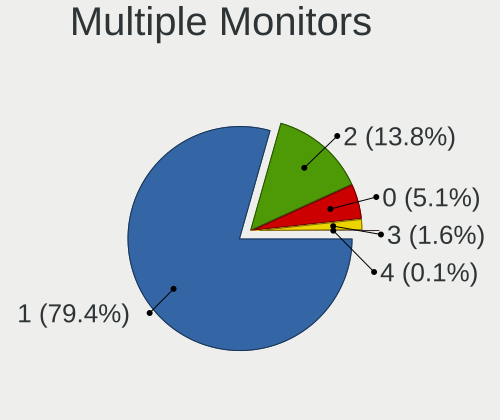

| Total | Desktops | Percent |
|-------|----------|---------|
| 1     | 643      | 79.38%  |
| 2     | 112      | 13.83%  |
| 0     | 41       | 5.06%   |
| 3     | 13       | 1.6%    |
| 4     | 1        | 0.12%   |

Network
-------

Net Controller Vendor
---------------------

Controller vendors

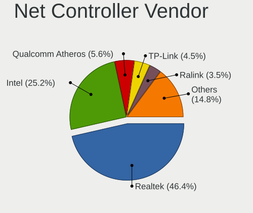

| Vendor                            | Desktops | Percent |
|-----------------------------------|----------|---------|
| Realtek Semiconductor             | 496      | 46.44%  |
| Intel                             | 269      | 25.19%  |
| Qualcomm Atheros                  | 60       | 5.62%   |
| TP-Link                           | 48       | 4.49%   |
| Ralink Technology                 | 37       | 3.46%   |
| Broadcom                          | 29       | 2.72%   |
| Marvell Technology Group          | 18       | 1.69%   |
| Nvidia                            | 16       | 1.5%    |
| MediaTek                          | 12       | 1.12%   |
| Ralink                            | 9        | 0.84%   |
| VIA Technologies                  | 8        | 0.75%   |
| Qualcomm Atheros Communications   | 7        | 0.66%   |
| D-Link                            | 7        | 0.66%   |
| Broadcom Limited                  | 6        | 0.56%   |
| Xiaomi                            | 5        | 0.47%   |
| Microsoft                         | 5        | 0.47%   |
| ASUSTek Computer                  | 5        | 0.47%   |
| NetGear                           | 3        | 0.28%   |
| D-Link System                     | 3        | 0.28%   |
| Samsung Electronics               | 2        | 0.19%   |
| Motorola                          | 2        | 0.19%   |
| Belkin Components                 | 2        | 0.19%   |
| ZyDAS                             | 1        | 0.09%   |
| Sundance Technology Inc / IC Plus | 1        | 0.09%   |
| Silicon Integrated Systems [SiS]  | 1        | 0.09%   |
| Realtek                           | 1        | 0.09%   |
| Raspberry Pi                      | 1        | 0.09%   |
| QinHeng Electronics               | 1        | 0.09%   |
| Philips (or NXP)                  | 1        | 0.09%   |
| PCTel                             | 1        | 0.09%   |
| Ovislink                          | 1        | 0.09%   |
| Micro Star International          | 1        | 0.09%   |
| Mercucys                          | 1        | 0.09%   |
| IBM                               | 1        | 0.09%   |
| Huawei Technologies               | 1        | 0.09%   |
| Google                            | 1        | 0.09%   |
| Fujitsu Siemens Computers         | 1        | 0.09%   |
| Dresden Elektronik                | 1        | 0.09%   |
| ASIX Electronics                  | 1        | 0.09%   |
| Aquantia                          | 1        | 0.09%   |

Net Controller Model
--------------------

Controller models

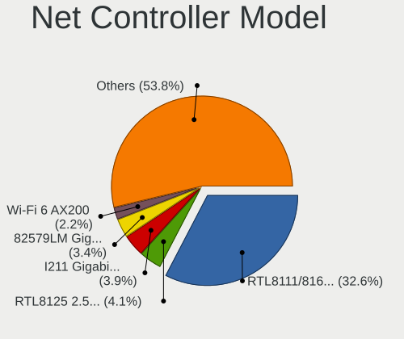

| Model                                                                  | Desktops | Percent |
|------------------------------------------------------------------------|----------|---------|
| Realtek RTL8111/8168/8211/8411 PCI Express Gigabit Ethernet Controller | 391      | 32.64%  |
| Realtek RTL8125 2.5GbE Controller                                      | 49       | 4.09%   |
| Intel I211 Gigabit Network Connection                                  | 47       | 3.92%   |
| Intel 82579LM Gigabit Network Connection (Lewisville)                  | 41       | 3.42%   |
| Intel Wi-Fi 6 AX200                                                    | 26       | 2.17%   |
| Realtek RTL8188EUS 802.11n Wireless Network Adapter                    | 23       | 1.92%   |
| Intel Ethernet Connection I217-LM                                      | 18       | 1.5%    |
| Intel Ethernet Connection (2) I219-V                                   | 18       | 1.5%    |
| Ralink RT2870/RT3070 Wireless Adapter                                  | 16       | 1.34%   |
| Intel Ethernet Controller I225-V                                       | 14       | 1.17%   |
| Intel 82567LM-3 Gigabit Network Connection                             | 14       | 1.17%   |
| TP-Link TL-WN823N v2/v3 [Realtek RTL8192EU]                            | 11       | 0.92%   |
| TP-Link TL-WN722N v2/v3 [Realtek RTL8188EUS]                           | 11       | 0.92%   |
| Intel Ethernet Connection (2) I218-V                                   | 11       | 0.92%   |
| Realtek RTL-8100/8101L/8139 PCI Fast Ethernet Adapter                  | 10       | 0.83%   |
| Intel Ethernet Connection I217-V                                       | 10       | 0.83%   |
| Realtek RTL8169 PCI Gigabit Ethernet Controller                        | 9        | 0.75%   |
| Realtek 802.11ac NIC                                                   | 9        | 0.75%   |
| Intel Wi-Fi 5(802.11ac) Wireless-AC 9x6x [Thunder Peak]                | 9        | 0.75%   |
| Realtek RTL8852BE PCIe 802.11ax Wireless Network Controller            | 8        | 0.67%   |
| Realtek RTL810xE PCI Express Fast Ethernet controller                  | 8        | 0.67%   |
| Broadcom NetXtreme BCM5751 Gigabit Ethernet PCI Express                | 8        | 0.67%   |
| Ralink MT7601U Wireless Adapter                                        | 7        | 0.58%   |
| Qualcomm Atheros AR8151 v2.0 Gigabit Ethernet                          | 7        | 0.58%   |
| Qualcomm Atheros AR8121/AR8113/AR8114 Gigabit or Fast Ethernet         | 7        | 0.58%   |
| Marvell Group 88E8056 PCI-E Gigabit Ethernet Controller                | 7        | 0.58%   |
| Realtek RTL8192CU 802.11n WLAN Adapter                                 | 6        | 0.5%    |
| Ralink RT5370 Wireless Adapter                                         | 6        | 0.5%    |
| Qualcomm Atheros AR8161 Gigabit Ethernet                               | 6        | 0.5%    |
| Qualcomm Atheros AR5212/5213/2414 Wireless Network Adapter             | 6        | 0.5%    |
| Intel Wi-Fi 6E(802.11ax) AX210/AX1675* 2x2 [Typhoon Peak]              | 6        | 0.5%    |
| Intel Ethernet Connection (2) I219-LM                                  | 6        | 0.5%    |
| Broadcom BCM4360 802.11ac Dual Band Wireless Network Adapter           | 6        | 0.5%    |
| VIA VT6102/VT6103 [Rhine-II]                                           | 5        | 0.42%   |
| TP-Link Archer T2U PLUS [RTL8821AU]                                    | 5        | 0.42%   |
| TP-Link AC600 wireless Realtek RTL8811AU [Archer T2U Nano]             | 5        | 0.42%   |
| Realtek RTL8188CUS 802.11n WLAN Adapter                                | 5        | 0.42%   |
| Realtek RTL8187 Wireless Adapter                                       | 5        | 0.42%   |
| Qualcomm Atheros AR9271 802.11n                                        | 5        | 0.42%   |
| Qualcomm Atheros Attansic L1 Gigabit Ethernet                          | 5        | 0.42%   |

Wireless Vendor
---------------

Wireless vendors

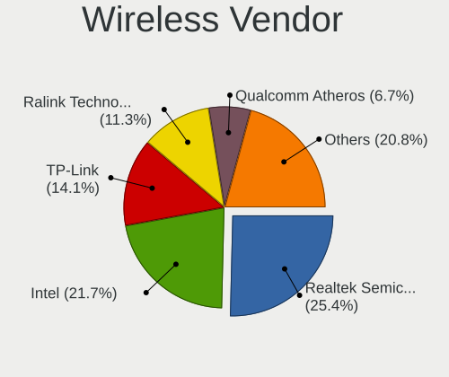

| Vendor                                | Desktops | Percent |
|---------------------------------------|----------|---------|
| Realtek Semiconductor                 | 83       | 25.38%  |
| Intel                                 | 71       | 21.71%  |
| TP-Link                               | 46       | 14.07%  |
| Ralink Technology                     | 37       | 11.31%  |
| Qualcomm Atheros                      | 22       | 6.73%   |
| MediaTek                              | 10       | 3.06%   |
| Ralink                                | 9        | 2.75%   |
| Broadcom                              | 8        | 2.45%   |
| Qualcomm Atheros Communications       | 7        | 2.14%   |
| D-Link                                | 7        | 2.14%   |
| Microsoft                             | 5        | 1.53%   |
| ASUSTek Computer                      | 5        | 1.53%   |
| NetGear                               | 3        | 0.92%   |
| Marvell Technology Group              | 2        | 0.61%   |
| Belkin Components                     | 2        | 0.61%   |
| ZyDAS                                 | 1        | 0.31%   |
| Realtek                               | 1        | 0.31%   |
| Philips (or NXP)                      | 1        | 0.31%   |
| Ovislink                              | 1        | 0.31%   |
| Micro Star International              | 1        | 0.31%   |
| Mercucys                              | 1        | 0.31%   |
| Fujitsu Siemens Computers             | 1        | 0.31%   |
| D-Link System                         | 1        | 0.31%   |
| Broadcom Limited                      | 1        | 0.31%   |
| 802.11g Adapter [Linksys WUSB54GC v3] | 1        | 0.31%   |

Wireless Model
--------------

Wireless models

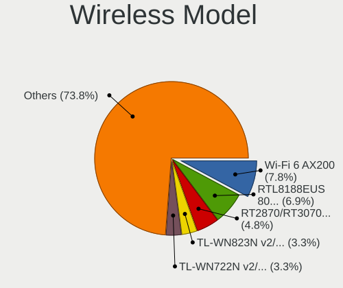

| Model                                                                                         | Desktops | Percent |
|-----------------------------------------------------------------------------------------------|----------|---------|
| Intel Wi-Fi 6 AX200                                                                           | 26       | 7.83%   |
| Realtek RTL8188EUS 802.11n Wireless Network Adapter                                           | 23       | 6.93%   |
| Ralink RT2870/RT3070 Wireless Adapter                                                         | 16       | 4.82%   |
| TP-Link TL-WN823N v2/v3 [Realtek RTL8192EU]                                                   | 11       | 3.31%   |
| TP-Link TL-WN722N v2/v3 [Realtek RTL8188EUS]                                                  | 11       | 3.31%   |
| Realtek 802.11ac NIC                                                                          | 9        | 2.71%   |
| Intel Wi-Fi 5(802.11ac) Wireless-AC 9x6x [Thunder Peak]                                       | 9        | 2.71%   |
| Ralink MT7601U Wireless Adapter                                                               | 7        | 2.11%   |
| Realtek RTL8192CU 802.11n WLAN Adapter                                                        | 6        | 1.81%   |
| Ralink RT5370 Wireless Adapter                                                                | 6        | 1.81%   |
| Qualcomm Atheros AR5212/5213/2414 Wireless Network Adapter                                    | 6        | 1.81%   |
| Intel Wi-Fi 6E(802.11ax) AX210/AX1675* 2x2 [Typhoon Peak]                                     | 6        | 1.81%   |
| Broadcom BCM4360 802.11ac Dual Band Wireless Network Adapter                                  | 6        | 1.81%   |
| TP-Link Archer T2U PLUS [RTL8821AU]                                                           | 5        | 1.51%   |
| TP-Link AC600 wireless Realtek RTL8811AU [Archer T2U Nano]                                    | 5        | 1.51%   |
| Realtek RTL8188CUS 802.11n WLAN Adapter                                                       | 5        | 1.51%   |
| Realtek RTL8187 Wireless Adapter                                                              | 5        | 1.51%   |
| Qualcomm Atheros AR9271 802.11n                                                               | 5        | 1.51%   |
| Qualcomm Atheros AR9485 Wireless Network Adapter                                              | 5        | 1.51%   |
| Intel 700 Series Chipset CNVi WiFi                                                            | 5        | 1.51%   |
| TP-Link TL-WN822N Version 4 RTL8192EU                                                         | 4        | 1.2%    |
| Ralink RT2561/RT61 802.11g PCI                                                                | 4        | 1.2%    |
| Qualcomm Atheros AR9227 Wireless Network Adapter                                              | 4        | 1.2%    |
| Intel Dual Band Wireless-AC 3168NGW [Stone Peak]                                              | 4        | 1.2%    |
| Intel Alder Lake-S PCH CNVi WiFi                                                              | 4        | 1.2%    |
| TP-Link Archer T4U ver.3                                                                      | 3        | 0.9%    |
| Realtek RTL8852BE PCIe 802.11ax Wireless Network Controller                                   | 3        | 0.9%    |
| Realtek RTL8821CE 802.11ac PCIe Wireless Network Adapter                                      | 3        | 0.9%    |
| Realtek RTL8723BU 802.11b/g/n WLAN Adapter                                                    | 3        | 0.9%    |
| Realtek RTL8192EE PCIe Wireless Network Adapter                                               | 3        | 0.9%    |
| Realtek Realtek 8812AU/8821AU 802.11ac WLAN Adapter [USB Wireless Dual-Band Adapter 2.4/5Ghz] | 3        | 0.9%    |
| Ralink RT3072 Wireless Adapter                                                                | 3        | 0.9%    |
| Microsoft Xbox Wireless Adapter for Windows                                                   | 3        | 0.9%    |
| MediaTek MT7922 802.11ax PCI Express Wireless Network Adapter                                 | 3        | 0.9%    |
| Intel PRO/Wireless 2200BG [Calexico2] Network Connection                                      | 3        | 0.9%    |
| Intel Comet Lake PCH CNVi WiFi                                                                | 3        | 0.9%    |
| TP-Link TL-WN821N v5/v6 [RTL8192EU]                                                           | 2        | 0.6%    |
| TP-Link Archer T9UH v1 [Realtek RTL8814AU]                                                    | 2        | 0.6%    |
| TP-Link 802.11n NIC                                                                           | 2        | 0.6%    |
| Realtek RTL8852CE PCIe 802.11ax Wireless Network Controller                                   | 2        | 0.6%    |

Ethernet Vendor
---------------

Ethernet vendors

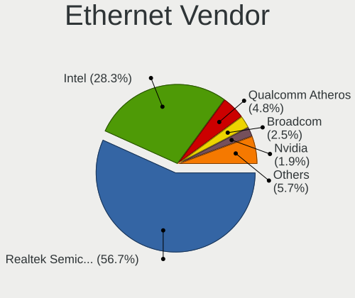

| Vendor                            | Desktops | Percent |
|-----------------------------------|----------|---------|
| Realtek Semiconductor             | 471      | 56.75%  |
| Intel                             | 235      | 28.31%  |
| Qualcomm Atheros                  | 40       | 4.82%   |
| Broadcom                          | 21       | 2.53%   |
| Nvidia                            | 16       | 1.93%   |
| Marvell Technology Group          | 16       | 1.93%   |
| VIA Technologies                  | 7        | 0.84%   |
| Xiaomi                            | 5        | 0.6%    |
| Broadcom Limited                  | 5        | 0.6%    |
| TP-Link                           | 2        | 0.24%   |
| Samsung Electronics               | 2        | 0.24%   |
| MediaTek                          | 2        | 0.24%   |
| D-Link System                     | 2        | 0.24%   |
| Sundance Technology Inc / IC Plus | 1        | 0.12%   |
| Silicon Integrated Systems [SiS]  | 1        | 0.12%   |
| Huawei Technologies               | 1        | 0.12%   |
| Google                            | 1        | 0.12%   |
| ASIX Electronics                  | 1        | 0.12%   |
| Aquantia                          | 1        | 0.12%   |

Ethernet Model
--------------

Ethernet models

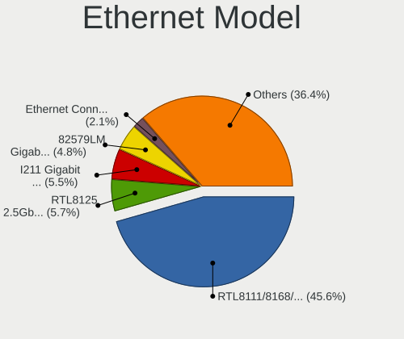

| Model                                                                  | Desktops | Percent |
|------------------------------------------------------------------------|----------|---------|
| Realtek RTL8111/8168/8211/8411 PCI Express Gigabit Ethernet Controller | 391      | 45.57%  |
| Realtek RTL8125 2.5GbE Controller                                      | 49       | 5.71%   |
| Intel I211 Gigabit Network Connection                                  | 47       | 5.48%   |
| Intel 82579LM Gigabit Network Connection (Lewisville)                  | 41       | 4.78%   |
| Intel Ethernet Connection I217-LM                                      | 18       | 2.1%    |
| Intel Ethernet Connection (2) I219-V                                   | 18       | 2.1%    |
| Intel Ethernet Controller I225-V                                       | 14       | 1.63%   |
| Intel 82567LM-3 Gigabit Network Connection                             | 14       | 1.63%   |
| Intel Ethernet Connection (2) I218-V                                   | 11       | 1.28%   |
| Realtek RTL-8100/8101L/8139 PCI Fast Ethernet Adapter                  | 10       | 1.17%   |
| Intel Ethernet Connection I217-V                                       | 10       | 1.17%   |
| Realtek RTL8169 PCI Gigabit Ethernet Controller                        | 9        | 1.05%   |
| Realtek RTL810xE PCI Express Fast Ethernet controller                  | 8        | 0.93%   |
| Broadcom NetXtreme BCM5751 Gigabit Ethernet PCI Express                | 8        | 0.93%   |
| Qualcomm Atheros AR8151 v2.0 Gigabit Ethernet                          | 7        | 0.82%   |
| Qualcomm Atheros AR8121/AR8113/AR8114 Gigabit or Fast Ethernet         | 7        | 0.82%   |
| Marvell Group 88E8056 PCI-E Gigabit Ethernet Controller                | 7        | 0.82%   |
| Qualcomm Atheros AR8161 Gigabit Ethernet                               | 6        | 0.7%    |
| Intel Ethernet Connection (2) I219-LM                                  | 6        | 0.7%    |
| VIA VT6102/VT6103 [Rhine-II]                                           | 5        | 0.58%   |
| Realtek RTL8852BE PCIe 802.11ax Wireless Network Controller            | 5        | 0.58%   |
| Qualcomm Atheros Attansic L1 Gigabit Ethernet                          | 5        | 0.58%   |
| Nvidia MCP61 Ethernet                                                  | 5        | 0.58%   |
| Marvell Group 88E8053 PCI-E Gigabit Ethernet Controller                | 5        | 0.58%   |
| Intel Ethernet Connection (7) I219-V                                   | 5        | 0.58%   |
| Intel Ethernet Connection (17) I219-LM                                 | 5        | 0.58%   |
| Xiaomi Mi/Redmi series (RNDIS)                                         | 4        | 0.47%   |
| Realtek RTL8153 Gigabit Ethernet Adapter                               | 4        | 0.47%   |
| Marvell Group 88E8001 Gigabit Ethernet Controller                      | 4        | 0.47%   |
| Intel Ethernet Connection (7) I219-LM                                  | 4        | 0.47%   |
| Intel 82579V Gigabit Network Connection                                | 4        | 0.47%   |
| Intel 82578DM Gigabit Network Connection                               | 4        | 0.47%   |
| Broadcom NetXtreme BCM5761 Gigabit Ethernet PCIe                       | 4        | 0.47%   |
| Qualcomm Atheros Killer E220x Gigabit Ethernet Controller              | 3        | 0.35%   |
| Nvidia MCP77 Ethernet                                                  | 3        | 0.35%   |
| Nvidia MCP55 Ethernet                                                  | 3        | 0.35%   |
| Intel I210 Gigabit Network Connection                                  | 3        | 0.35%   |
| Intel Ethernet Controller I226-V                                       | 3        | 0.35%   |
| Intel Ethernet Connection (17) I219-V                                  | 3        | 0.35%   |
| Intel Ethernet Connection (14) I219-V                                  | 3        | 0.35%   |

Net Controller Kind
-------------------

Ethernet, WiFi or modem

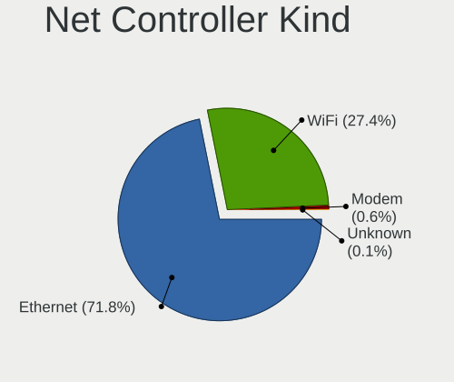

| Kind     | Desktops | Percent |
|----------|----------|---------|
| Ethernet | 786      | 71.85%  |
| WiFi     | 300      | 27.42%  |
| Modem    | 7        | 0.64%   |
| Unknown  | 1        | 0.09%   |

Used Controller
---------------

Currently used network controller

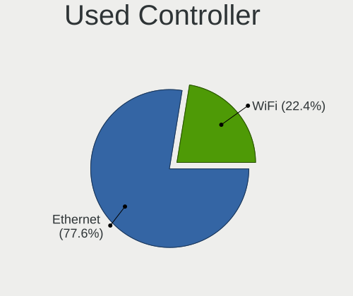

| Kind     | Desktops | Percent |
|----------|----------|---------|
| Ethernet | 636      | 77.56%  |
| WiFi     | 184      | 22.44%  |

NICs
----

Total network controllers on board

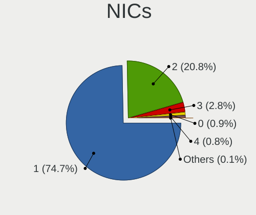

| Total | Desktops | Percent |
|-------|----------|---------|
| 1     | 596      | 74.69%  |
| 2     | 166      | 20.8%   |
| 3     | 22       | 2.76%   |
| 0     | 7        | 0.88%   |
| 4     | 6        | 0.75%   |
| 5     | 1        | 0.13%   |

IPv6
----

IPv6 vs IPv4

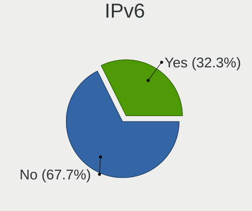

| Used | Desktops | Percent |
|------|----------|---------|
| No   | 555      | 67.68%  |
| Yes  | 265      | 32.32%  |

Bluetooth
---------

Bluetooth Vendor
----------------

Controller vendors

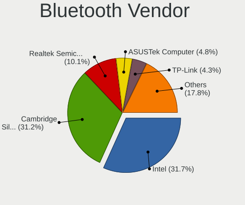

| Vendor                          | Desktops | Percent |
|---------------------------------|----------|---------|
| Intel                           | 66       | 31.73%  |
| Cambridge Silicon Radio         | 65       | 31.25%  |
| Realtek Semiconductor           | 21       | 10.1%   |
| ASUSTek Computer                | 10       | 4.81%   |
| TP-Link                         | 9        | 4.33%   |
| Broadcom                        | 8        | 3.85%   |
| IMC Networks                    | 6        | 2.88%   |
| MediaTek                        | 4        | 1.92%   |
| Qualcomm Atheros Communications | 3        | 1.44%   |
| Mobile Action Technology        | 2        | 0.96%   |
| Micro Star International        | 2        | 0.96%   |
| Actions                         | 2        | 0.96%   |
| Unknown                         | 2        | 0.96%   |
| SiW                             | 1        | 0.48%   |
| Primax Electronics              | 1        | 0.48%   |
| Integrated System Solution      | 1        | 0.48%   |
| Hewlett-Packard                 | 1        | 0.48%   |
| Foxconn / Hon Hai               | 1        | 0.48%   |
| Edimax Technology               | 1        | 0.48%   |
| Belkin Components               | 1        | 0.48%   |
| Apple                           | 1        | 0.48%   |

Bluetooth Model
---------------

Controller models

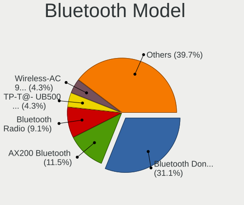

| Model                                                 | Desktops | Percent |
|-------------------------------------------------------|----------|---------|
| Cambridge Silicon Radio Bluetooth Dongle (HCI mode)   | 65       | 31.1%   |
| Intel AX200 Bluetooth                                 | 24       | 11.48%  |
| Realtek Bluetooth Radio                               | 19       | 9.09%   |
| TP-Link TP-T@- UB500 Adapter                          | 9        | 4.31%   |
| Intel Wireless-AC 9260 Bluetooth Adapter              | 9        | 4.31%   |
| Intel Bluetooth wireless interface                    | 7        | 3.35%   |
| Intel AX201 Bluetooth                                 | 7        | 3.35%   |
| Intel AX210 Bluetooth                                 | 6        | 2.87%   |
| Intel Bluetooth Device                                | 5        | 2.39%   |
| MediaTek Wireless_Device                              | 4        | 1.91%   |
| Intel Wireless-AC 3168 Bluetooth                      | 4        | 1.91%   |
| IMC Networks Bluetooth Radio                          | 4        | 1.91%   |
| Broadcom BCM20702A0 Bluetooth 4.0                     | 3        | 1.44%   |
| ASUS Broadcom BCM20702A0 Bluetooth                    | 3        | 1.44%   |
| Realtek Bluetooth 5.3 Radio                           | 2        | 0.96%   |
| Qualcomm Atheros  Bluetooth Device                    | 2        | 0.96%   |
| Intel Centrino Bluetooth Wireless Transceiver         | 2        | 0.96%   |
| Intel Bluetooth 9460/9560 Jefferson Peak (JfP)        | 2        | 0.96%   |
| Broadcom BCM2045 Bluetooth                            | 2        | 0.96%   |
| ASUS Broadcom BCM20702 Single-Chip Bluetooth 4.0 + LE | 2        | 0.96%   |
| ASUS Bluetooth Radio                                  | 2        | 0.96%   |
| Actions general adapter                               | 2        | 0.96%   |
| Unknown                                               | 2        | 0.96%   |
| SiW SiW                                               | 1        | 0.48%   |
| Realtek RTL8821A Bluetooth                            | 1        | 0.48%   |
| Qualcomm Atheros AR3011 Bluetooth                     | 1        | 0.48%   |
| Primax Generic Bluetooth Adaptor                      | 1        | 0.48%   |
| Mobile Action MA-730/MA-730G Bluetooth Adapter        | 1        | 0.48%   |
| Mobile Action MA-700 Bluetooth Adapter                | 1        | 0.48%   |
| Micro Star International Bluetooth EDR Device         | 1        | 0.48%   |
| Micro Star International Bluetooth Device             | 1        | 0.48%   |
| Integrated System Solution Bluetooth Device           | 1        | 0.48%   |
| IMC Networks Wireless_Device                          | 1        | 0.48%   |
| IMC Networks Bluetooth Device                         | 1        | 0.48%   |
| HP Bluetooth 2.0 Interface [Broadcom BCM2045]         | 1        | 0.48%   |
| Foxconn / Hon Hai Wireless_Device                     | 1        | 0.48%   |
| Edimax Bluetooth Device                               | 1        | 0.48%   |
| Broadcom Bluetooth 3.0 Device                         | 1        | 0.48%   |
| Broadcom BCM43142 Bluetooth 4.0                       | 1        | 0.48%   |
| Broadcom BCM2035 Bluetooth dongle                     | 1        | 0.48%   |

Sound
-----

Sound Vendor
------------

Sound card vendors

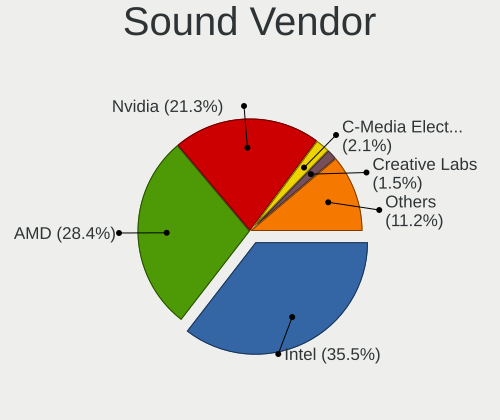

| Vendor                           | Desktops | Percent |
|----------------------------------|----------|---------|
| Intel                            | 469      | 35.48%  |
| AMD                              | 375      | 28.37%  |
| Nvidia                           | 282      | 21.33%  |
| C-Media Electronics              | 28       | 2.12%   |
| Creative Labs                    | 20       | 1.51%   |
| Creative Technology              | 16       | 1.21%   |
| Razer USA                        | 12       | 0.91%   |
| Logitech                         | 11       | 0.83%   |
| Texas Instruments                | 7        | 0.53%   |
| Focusrite-Novation               | 6        | 0.45%   |
| Dell                             | 6        | 0.45%   |
| VIA Technologies                 | 5        | 0.38%   |
| Kingston Technology              | 5        | 0.38%   |
| GN Netcom                        | 5        | 0.38%   |
| Barco Display Systems            | 5        | 0.38%   |
| Tenx Technology                  | 4        | 0.3%    |
| ASUSTek Computer                 | 4        | 0.3%    |
| SteelSeries ApS                  | 3        | 0.23%   |
| Nordic Semiconductor ASA         | 3        | 0.23%   |
| Cooler Master                    | 3        | 0.23%   |
| BEHRINGER International          | 3        | 0.23%   |
| Yamaha                           | 2        | 0.15%   |
| Native Instruments               | 2        | 0.15%   |
| KTMicro                          | 2        | 0.15%   |
| JMTek                            | 2        | 0.15%   |
| Hewlett-Packard                  | 2        | 0.15%   |
| Guillemot                        | 2        | 0.15%   |
| Generalplus Technology           | 2        | 0.15%   |
| Ensoniq                          | 2        | 0.15%   |
| Edifier Technology               | 2        | 0.15%   |
| AudioQuest                       | 2        | 0.15%   |
| Altec Lansing Technologies       | 2        | 0.15%   |
| Zeroplus                         | 1        | 0.08%   |
| Trust                            | 1        | 0.08%   |
| TerraTec Electronic              | 1        | 0.08%   |
| Silicon Integrated Systems [SiS] | 1        | 0.08%   |
| Shenzhen Riitek Technology       | 1        | 0.08%   |
| RODE Microphones                 | 1        | 0.08%   |
| Realtek Semiconductor            | 1        | 0.08%   |
| Plantronics                      | 1        | 0.08%   |

Sound Model
-----------

Sound card models

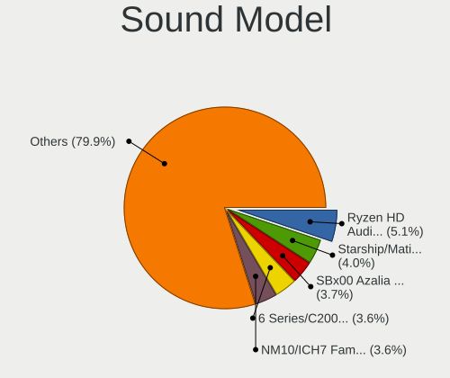

| Model                                                                      | Desktops | Percent |
|----------------------------------------------------------------------------|----------|---------|
| AMD Ryzen HD Audio Controller                                              | 82       | 5.15%   |
| AMD Starship/Matisse HD Audio Controller                                   | 64       | 4.02%   |
| AMD SBx00 Azalia (Intel HDA)                                               | 59       | 3.7%    |
| Intel 6 Series/C200 Series Chipset Family High Definition Audio Controller | 58       | 3.64%   |
| Intel NM10/ICH7 Family High Definition Audio Controller                    | 57       | 3.58%   |
| Intel 8 Series/C220 Series Chipset High Definition Audio Controller        | 54       | 3.39%   |
| AMD Family 17h (Models 00h-0fh) HD Audio Controller                        | 50       | 3.14%   |
| Intel Xeon E3-1200 v3/4th Gen Core Processor HD Audio Controller           | 45       | 2.82%   |
| Nvidia GK208 HDMI/DP Audio Controller                                      | 42       | 2.64%   |
| Intel 100 Series/C230 Series Chipset Family HD Audio Controller            | 36       | 2.26%   |
| Intel 7 Series/C216 Chipset Family High Definition Audio Controller        | 34       | 2.13%   |
| AMD Renoir/Cezanne HDMI/DP Audio Controller                                | 34       | 2.13%   |
| AMD Ellesmere HDMI Audio [Radeon RX 470/480 / 570/580/590]                 | 34       | 2.13%   |
| Intel 200 Series PCH HD Audio                                              | 31       | 1.95%   |
| AMD Raven/Raven2/Fenghuang HDMI/DP Audio Controller                        | 30       | 1.88%   |
| AMD Navi 21/23 HDMI/DP Audio Controller                                    | 30       | 1.88%   |
| Intel 82801JI (ICH10 Family) HD Audio Controller                           | 25       | 1.57%   |
| Nvidia GP107GL High Definition Audio Controller                            | 24       | 1.51%   |
| AMD Oland/Hainan/Cape Verde/Pitcairn HDMI Audio [Radeon HD 7000 Series]    | 24       | 1.51%   |
| Nvidia High Definition Audio Controller                                    | 23       | 1.44%   |
| Nvidia TU116 High Definition Audio Controller                              | 20       | 1.26%   |
| Intel 82801I (ICH9 Family) HD Audio Controller                             | 20       | 1.26%   |
| AMD FCH Azalia Controller                                                  | 20       | 1.26%   |
| AMD Baffin HDMI/DP Audio [Radeon RX 550 640SP / RX 560/560X]               | 20       | 1.26%   |
| Intel 9 Series Chipset Family HD Audio Controller                          | 18       | 1.13%   |
| Intel Cannon Lake PCH cAVS                                                 | 17       | 1.07%   |
| Intel Alder Lake-S HD Audio Controller                                     | 16       | 1%      |
| AMD Radeon High Definition Audio Controller                                | 16       | 1%      |
| Nvidia GF108 High Definition Audio Controller                              | 15       | 0.94%   |
| Nvidia GP108 High Definition Audio Controller                              | 14       | 0.88%   |
| Intel 82801JD/DO (ICH10 Family) HD Audio Controller                        | 14       | 0.88%   |
| Intel 5 Series/3400 Series Chipset High Definition Audio                   | 13       | 0.82%   |
| AMD Navi 31 HDMI/DP Audio                                                  | 13       | 0.82%   |
| Nvidia GP106 High Definition Audio Controller                              | 12       | 0.75%   |
| Nvidia TU107 GeForce GTX 1650 High Definition Audio Controller             | 11       | 0.69%   |
| Nvidia GF119 HDMI Audio Controller                                         | 11       | 0.69%   |
| Intel 82801H (ICH8 Family) HD Audio Controller                             | 11       | 0.69%   |
| AMD Navi 10 HDMI Audio                                                     | 10       | 0.63%   |
| AMD Cedar HDMI Audio [Radeon HD 5400/6300/7300 Series]                     | 10       | 0.63%   |
| AMD Turks HDMI Audio [Radeon HD 6500/6600 / 6700M Series]                  | 9        | 0.56%   |

Memory
------

Memory Vendor
-------------

Memory module vendors

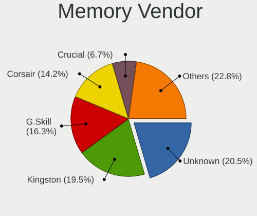

| Vendor                       | Desktops | Percent |
|------------------------------|----------|---------|
| Unknown                      | 88       | 20.47%  |
| Kingston                     | 84       | 19.53%  |
| G.Skill                      | 70       | 16.28%  |
| Corsair                      | 61       | 14.19%  |
| Crucial                      | 29       | 6.74%   |
| Samsung Electronics          | 25       | 5.81%   |
| SK hynix                     | 17       | 3.95%   |
| Micron Technology            | 11       | 2.56%   |
| Patriot                      | 7        | 1.63%   |
| Team                         | 6        | 1.4%    |
| Transcend                    | 4        | 0.93%   |
| Nanya Technology             | 4        | 0.93%   |
| Unknown                      | 4        | 0.93%   |
| Ramaxel Technology           | 2        | 0.47%   |
| GOODRAM                      | 2        | 0.47%   |
| GeIL                         | 2        | 0.47%   |
| Elpida                       | 2        | 0.47%   |
| Apacer                       | 2        | 0.47%   |
| Veineda                      | 1        | 0.23%   |
| Silicon Power                | 1        | 0.23%   |
| Red Hat                      | 1        | 0.23%   |
| Qimonda                      | 1        | 0.23%   |
| Patriot Memory (PDP Systems) | 1        | 0.23%   |
| Patriot Memory               | 1        | 0.23%   |
| Lexar                        | 1        | 0.23%   |
| H                            | 1        | 0.23%   |
| Goldkey                      | 1        | 0.23%   |
| Avant                        | 1        | 0.23%   |

Memory Model
------------

Memory module models

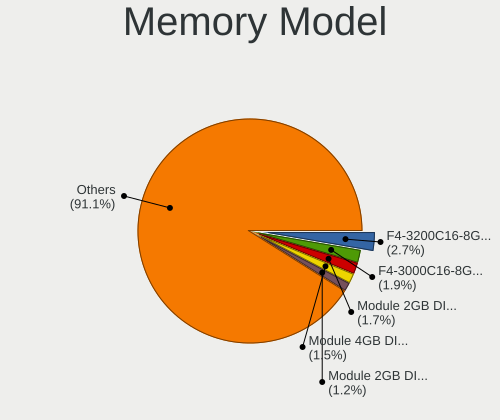

| Model                                                  | Desktops | Percent |
|--------------------------------------------------------|----------|---------|
| G.Skill RAM F4-3200C16-8GVKB 8GB DIMM DDR4 4000MT/s    | 13       | 2.7%    |
| G.Skill RAM F4-3000C16-8GISB 8GB DIMM DDR4 3200MT/s    | 9        | 1.87%   |
| Unknown RAM Module 2GB DIMM 800MT/s                    | 8        | 1.66%   |
| Unknown RAM Module 4GB DIMM 1333MT/s                   | 7        | 1.46%   |
| Unknown RAM Module 2GB DIMM 1333MT/s                   | 6        | 1.25%   |
| Unknown RAM Module 1024MB DIMM SDRAM                   | 5        | 1.04%   |
| Kingston RAM KF3200C16D4/8GX 8GiB DIMM DDR4 3600MT/s   | 5        | 1.04%   |
| Unknown RAM Module 2048MB DIMM DDR2 800MT/s            | 4        | 0.83%   |
| Unknown RAM Module 2048MB DIMM DDR 533MT/s             | 4        | 0.83%   |
| Kingston RAM KHX3200C16D4/8GX 8GB DIMM DDR4 3733MT/s   | 4        | 0.83%   |
| G.Skill RAM F4-3200C16-8GIS 8GB DIMM DDR4 3600MT/s     | 4        | 0.83%   |
| G.Skill RAM F4-3200C16-16GVK 16GB DIMM DDR4 3600MT/s   | 4        | 0.83%   |
| Corsair RAM CMZ8GX3M2A1600C9 4GB DIMM SDRAM 1800MT/s   | 4        | 0.83%   |
| Corsair RAM CMZ4GX3M1A1600C9 4GB DIMM DDR3 1600MT/s    | 4        | 0.83%   |
| Corsair RAM CMK16GX4M2B3200C16 8GB DIMM DDR4 3600MT/s  | 4        | 0.83%   |
| Unknown                                                | 4        | 0.83%   |
| Unknown RAM Module 512MB DIMM SDRAM                    | 3        | 0.62%   |
| Unknown RAM Module 2048MB DIMM SDRAM                   | 3        | 0.62%   |
| Unknown RAM Module 1GB DIMM SDRAM                      | 3        | 0.62%   |
| Unknown RAM Module 1024MB DIMM DDR2 800MT/s            | 3        | 0.62%   |
| Unknown RAM Module 1024MB DIMM 800MT/s                 | 3        | 0.62%   |
| Samsung RAM Module 2GB DIMM DDR3 1333MT/s              | 3        | 0.62%   |
| G.Skill RAM F4-3200C16-8GTZR 8GB DIMM DDR4 3200MT/s    | 3        | 0.62%   |
| G.Skill RAM F4-3200C14-8GFX 8GB DIMM DDR4 3800MT/s     | 3        | 0.62%   |
| Crucial RAM CT8G4DFS8266.M8FJ 8GB DIMM DDR4 2667MT/s   | 3        | 0.62%   |
| Crucial RAM CT8G4DFS8266.M8FD 8GB DIMM DDR4 3600MT/s   | 3        | 0.62%   |
| Corsair RAM CMK4GX4M1A2400C14 4GB DIMM DDR4 3007MT/s   | 3        | 0.62%   |
| Corsair RAM CMK32GX4M2B3200C16 16GB DIMM DDR4 3800MT/s | 3        | 0.62%   |
| Corsair RAM CMK16GX4M2A2400C16 8GB DIMM DDR4 2933MT/s  | 3        | 0.62%   |
| Unknown RAM Module 4GB DIMM DDR 1333MT/s               | 2        | 0.42%   |
| Unknown RAM Module 4096MB DIMM 1333MT/s                | 2        | 0.42%   |
| Unknown RAM Module 2GB DIMM SDRAM                      | 2        | 0.42%   |
| Unknown RAM Module 2GB DIMM DDR2 800MT/s               | 2        | 0.42%   |
| Unknown RAM Module 2GB DIMM 400MT/s                    | 2        | 0.42%   |
| Unknown RAM Module 2048MB DIMM 800MT/s                 | 2        | 0.42%   |
| Unknown RAM Module 2048MB DIMM 1333MT/s                | 2        | 0.42%   |
| Unknown RAM Module 1GB DIMM                            | 2        | 0.42%   |
| Unknown RAM Module 1024MB DIMM DDR 533MT/s             | 2        | 0.42%   |
| Unknown RAM 4400 C19 Series 8GB DIMM DDR4 2133MT/s     | 2        | 0.42%   |
| Unknown RAM 3600 C18 Series 16GB DIMM DDR4 2933MT/s    | 2        | 0.42%   |

Memory Kind
-----------

Memory module kinds

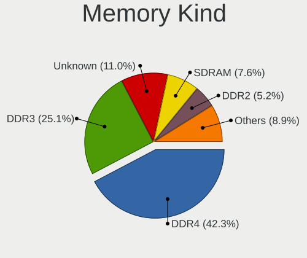

| Kind    | Desktops | Percent |
|---------|----------|---------|
| DDR4    | 162      | 42.3%   |
| DDR3    | 96       | 25.07%  |
| Unknown | 42       | 10.97%  |
| SDRAM   | 29       | 7.57%   |
| DDR2    | 20       | 5.22%   |
| DDR5    | 15       | 3.92%   |
| DDR     | 15       | 3.92%   |
| DRAM    | 2        | 0.52%   |
| RAM     | 1        | 0.26%   |
| LPDDR5  | 1        | 0.26%   |

Memory Form Factor
------------------

Physical design of the memory module

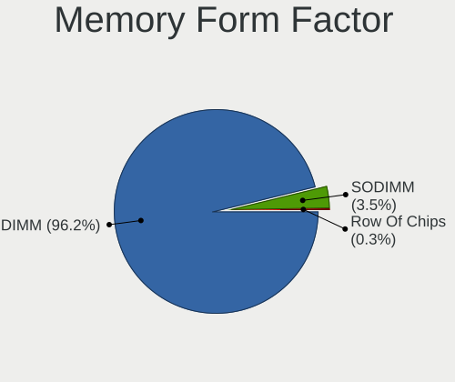

| Name         | Desktops | Percent |
|--------------|----------|---------|
| DIMM         | 353      | 96.19%  |
| SODIMM       | 13       | 3.54%   |
| Row Of Chips | 1        | 0.27%   |

Memory Size
-----------

Memory module size

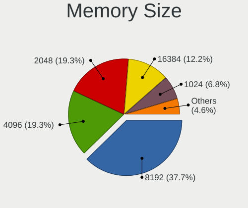

| Size  | Desktops | Percent |
|-------|----------|---------|
| 8192  | 154      | 37.65%  |
| 4096  | 79       | 19.32%  |
| 2048  | 79       | 19.32%  |
| 16384 | 50       | 12.22%  |
| 1024  | 28       | 6.85%   |
| 32768 | 12       | 2.93%   |
| 512   | 5        | 1.22%   |
| 24576 | 1        | 0.24%   |
| 3072  | 1        | 0.24%   |

Memory Speed
------------

Memory module speed

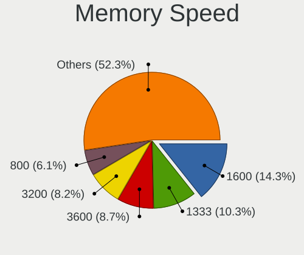

| Speed   | Desktops | Percent |
|---------|----------|---------|
| 1600    | 61       | 14.32%  |
| 1333    | 44       | 10.33%  |
| 3600    | 37       | 8.69%   |
| 3200    | 35       | 8.22%   |
| 800     | 26       | 6.1%    |
| 2667    | 16       | 3.76%   |
| 2400    | 16       | 3.76%   |
| 4000    | 15       | 3.52%   |
| Unknown | 14       | 3.29%   |
| 2133    | 13       | 3.05%   |
| 667     | 12       | 2.82%   |
| 3000    | 10       | 2.35%   |
| 3733    | 9        | 2.11%   |
| 6000    | 8        | 1.88%   |
| 3800    | 8        | 1.88%   |
| 1800    | 8        | 1.88%   |
| 3400    | 7        | 1.64%   |
| 2933    | 7        | 1.64%   |
| 1066    | 7        | 1.64%   |
| 533     | 7        | 1.64%   |
| 1867    | 5        | 1.17%   |
| 1866    | 5        | 1.17%   |
| 3007    | 4        | 0.94%   |
| 400     | 4        | 0.94%   |
| 3866    | 3        | 0.7%    |
| 2800    | 3        | 0.7%    |
| 2733    | 3        | 0.7%    |
| 2048    | 3        | 0.7%    |
| 333     | 3        | 0.7%    |
| 49926   | 2        | 0.47%   |
| 5600    | 2        | 0.47%   |
| 4800    | 2        | 0.47%   |
| 4266    | 2        | 0.47%   |
| 3466    | 2        | 0.47%   |
| 3333    | 2        | 0.47%   |
| 3066    | 2        | 0.47%   |
| 2934    | 2        | 0.47%   |
| 2666    | 2        | 0.47%   |
| 12800   | 1        | 0.23%   |
| 6400    | 1        | 0.23%   |

Printers & scanners
-------------------

Printer Vendor
--------------

Printer device vendors

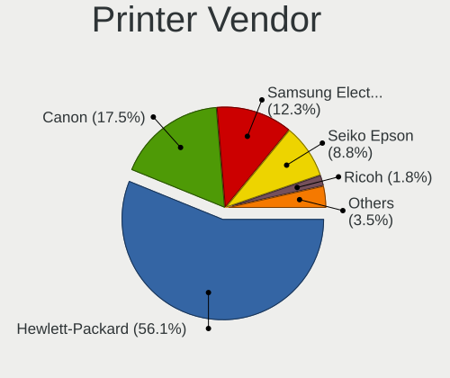

| Vendor                | Desktops | Percent |
|-----------------------|----------|---------|
| Hewlett-Packard       | 32       | 56.14%  |
| Canon                 | 10       | 17.54%  |
| Samsung Electronics   | 7        | 12.28%  |
| Seiko Epson           | 5        | 8.77%   |
| Ricoh                 | 1        | 1.75%   |
| QinHeng Electronics   | 1        | 1.75%   |
| Lexmark International | 1        | 1.75%   |

Printer Model
-------------

Printer device models

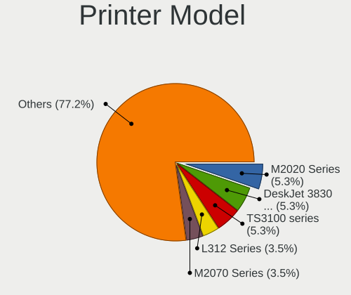

| Model                                        | Desktops | Percent |
|----------------------------------------------|----------|---------|
| Samsung M2020 Series                         | 3        | 5.26%   |
| HP DeskJet 3830 series                       | 3        | 5.26%   |
| Canon TS3100 series                          | 3        | 5.26%   |
| Seiko Epson L312 Series                      | 2        | 3.51%   |
| Samsung M2070 Series                         | 2        | 3.51%   |
| HP LaserJet P1005                            | 2        | 3.51%   |
| Seiko Epson ME 320/330 Series [Stylus SX125] | 1        | 1.75%   |
| Seiko Epson L1250 Series                     | 1        | 1.75%   |
| Seiko Epson ET-2810 Series                   | 1        | 1.75%   |
| Samsung SCX-3400 Series                      | 1        | 1.75%   |
| Samsung M267x 287x Series                    | 1        | 1.75%   |
| Ricoh SP 111SU                               | 1        | 1.75%   |
| QinHeng CH340S                               | 1        | 1.75%   |
| Lexmark International E120                   | 1        | 1.75%   |
| HP Smart Tank 750 series                     | 1        | 1.75%   |
| HP Smart Tank 580-590 series                 | 1        | 1.75%   |
| HP Smart Tank 510 series                     | 1        | 1.75%   |
| HP Officejet Pro L7400                       | 1        | 1.75%   |
| HP Officejet J4500 series                    | 1        | 1.75%   |
| HP Officejet 4500 G510g-m                    | 1        | 1.75%   |
| HP LaserJet P1102                            | 1        | 1.75%   |
| HP LaserJet 1022                             | 1        | 1.75%   |
| HP LaserJet 1020                             | 1        | 1.75%   |
| HP LaserJet 1018                             | 1        | 1.75%   |
| HP LaserJet 1010                             | 1        | 1.75%   |
| HP HP OfficeJet Pro 8020 series              | 1        | 1.75%   |
| HP DeskJet F300 series                       | 1        | 1.75%   |
| HP DeskJet F2492 All-in-One                  | 1        | 1.75%   |
| HP DeskJet D2300                             | 1        | 1.75%   |
| HP DeskJet 930c                              | 1        | 1.75%   |
| HP DeskJet 840c                              | 1        | 1.75%   |
| HP DeskJet 4670 series                       | 1        | 1.75%   |
| HP DeskJet 4530 series                       | 1        | 1.75%   |
| HP DeskJet 4100 series                       | 1        | 1.75%   |
| HP DeskJet 3700 series                       | 1        | 1.75%   |
| HP DeskJet 2700 series                       | 1        | 1.75%   |
| HP Deskjet 2640 series                       | 1        | 1.75%   |
| HP DeskJet 2600 series                       | 1        | 1.75%   |
| HP Deskjet 2510 series                       | 1        | 1.75%   |
| HP DeskJet 2300 series                       | 1        | 1.75%   |

Scanner Vendor
--------------

Scanner device vendors

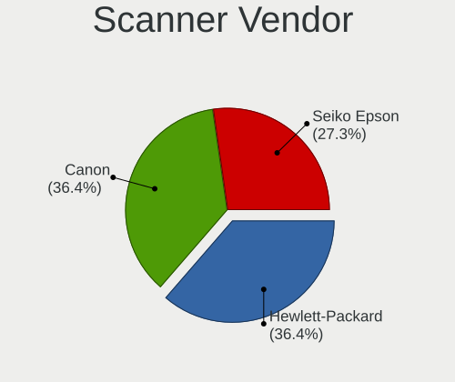

| Vendor          | Desktops | Percent |
|-----------------|----------|---------|
| Hewlett-Packard | 4        | 36.36%  |
| Canon           | 4        | 36.36%  |
| Seiko Epson     | 3        | 27.27%  |

Scanner Model
-------------

Scanner device models

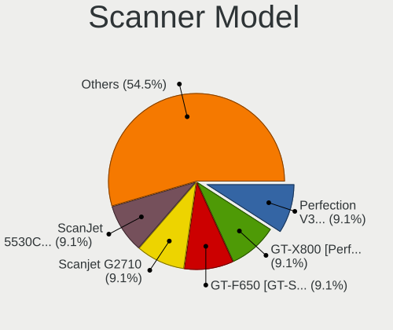

| Model                                             | Desktops | Percent |
|---------------------------------------------------|----------|---------|
| Seiko Epson Perfection V37/V370                   | 1        | 9.09%   |
| Seiko Epson GT-X800 [Perfection 4990 PHOTO]       | 1        | 9.09%   |
| Seiko Epson GT-F650 [GT-S600/Perfection V10/V100] | 1        | 9.09%   |
| HP Scanjet G2710                                  | 1        | 9.09%   |
| HP ScanJet 5530C PhotoSmart                       | 1        | 9.09%   |
| HP ScanJet 4370                                   | 1        | 9.09%   |
| HP ScanJet 3400cse                                | 1        | 9.09%   |
| Canon CanoScan LiDE 220                           | 1        | 9.09%   |
| Canon CanoScan LiDE 110                           | 1        | 9.09%   |
| Canon CanoScan LiDE 100                           | 1        | 9.09%   |
| Canon CanoScan 1220U                              | 1        | 9.09%   |

Camera
------

Camera Vendor
-------------

Camera device vendors

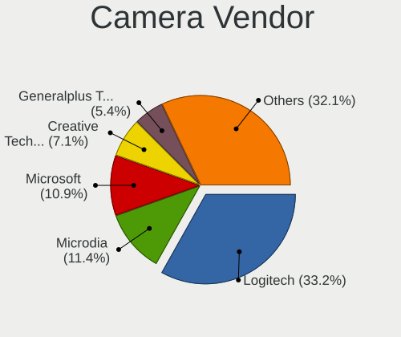

| Vendor                        | Desktops | Percent |
|-------------------------------|----------|---------|
| Logitech                      | 61       | 33.15%  |
| Microdia                      | 21       | 11.41%  |
| Microsoft                     | 20       | 10.87%  |
| Creative Technology           | 13       | 7.07%   |
| Generalplus Technology        | 10       | 5.43%   |
| Z-Star Microelectronics       | 5        | 2.72%   |
| Sunplus Innovation Technology | 5        | 2.72%   |
| Philips (or NXP)              | 4        | 2.17%   |
| Aveo Technology               | 4        | 2.17%   |
| Arkmicro Technologies         | 4        | 2.17%   |
| Xiongmai                      | 3        | 1.63%   |
| Samsung Electronics           | 3        | 1.63%   |
| Realtek Semiconductor         | 3        | 1.63%   |
| Razer USA                     | 3        | 1.63%   |
| Jieli Technology              | 3        | 1.63%   |
| Alcor Micro                   | 3        | 1.63%   |
| Genesys Logic                 | 2        | 1.09%   |
| Cubeternet                    | 2        | 1.09%   |
| Chicony Electronics           | 2        | 1.09%   |
| webcam                        | 1        | 0.54%   |
| WCM_USB                       | 1        | 0.54%   |
| Trust                         | 1        | 0.54%   |
| Sweex                         | 1        | 0.54%   |
| Quanta                        | 1        | 0.54%   |
| Pixart Imaging                | 1        | 0.54%   |
| Nokia Mobile Phones           | 1        | 0.54%   |
| MacroSilicon                  | 1        | 0.54%   |
| Lite-On Technology            | 1        | 0.54%   |
| IMC Networks                  | 1        | 0.54%   |
| Guillemot                     | 1        | 0.54%   |
| Apple                         | 1        | 0.54%   |
| Alcorlink                     | 1        | 0.54%   |

Camera Model
------------

Camera device models

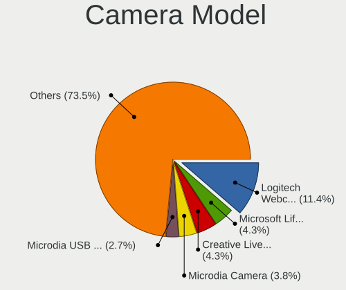

| Model                                    | Desktops | Percent |
|------------------------------------------|----------|---------|
| Logitech Webcam C270                     | 21       | 11.35%  |
| Microsoft LifeCam HD-3000                | 8        | 4.32%   |
| Creative Live! Cam Sync 1080p V2         | 8        | 4.32%   |
| Microdia Camera                          | 7        | 3.78%   |
| Microdia USB 2.0 Camera                  | 5        | 2.7%    |
| Logitech Webcam C310                     | 5        | 2.7%    |
| Generalplus GENERAL WEBCAM               | 5        | 2.7%    |
| Generalplus 808 Camera #9 (web-cam mode) | 5        | 2.7%    |
| Z-Star Venus USB2.0 Camera               | 4        | 2.16%   |
| Sunplus Full HD webcam                   | 4        | 2.16%   |
| Logitech Webcam C300                     | 4        | 2.16%   |
| Logitech Webcam C170                     | 4        | 2.16%   |
| Logitech C922 Pro Stream Webcam          | 4        | 2.16%   |
| Logitech C920 PRO HD Webcam              | 4        | 2.16%   |
| Aveo USB2.0 Camera                       | 4        | 2.16%   |
| Arkmicro USB2.0 PC CAMERA                | 4        | 2.16%   |
| Xiongmai web camera                      | 3        | 1.62%   |
| Philips (or NXP) SPC 520/525NC PC Camera | 3        | 1.62%   |
| Microdia Sonix USB 2.0 Camera            | 3        | 1.62%   |
| Logitech HD Pro Webcam C920              | 3        | 1.62%   |
| Jieli USB PHY 2.0                        | 3        | 1.62%   |
| Alcor Micro USB 2.0 PC Camera            | 3        | 1.62%   |
| Samsung Galaxy series, misc. (MTP mode)  | 2        | 1.08%   |
| Realtek HD 720P Webcam                   | 2        | 1.08%   |
| Razer USA Gaming Webcam [Kiyo]           | 2        | 1.08%   |
| Microsoft LifeCam VX-800                 | 2        | 1.08%   |
| Microsoft LifeCam VX-500 [1357]          | 2        | 1.08%   |
| Microsoft LifeCam VX-2000                | 2        | 1.08%   |
| Microsoft LifeCam Cinema                 | 2        | 1.08%   |
| Microdia Integrated Camera               | 2        | 1.08%   |
| Microdia CyberTrack H7                   | 2        | 1.08%   |
| Logitech Webcam C110                     | 2        | 1.08%   |
| Logitech StreamCam                       | 2        | 1.08%   |
| Logitech HD Webcam C910                  | 2        | 1.08%   |
| Logitech HD Webcam C615                  | 2        | 1.08%   |
| Cubeternet USB2.0 Camera                 | 2        | 1.08%   |
| Creative Live! Cam Sync V3               | 2        | 1.08%   |
| Creative Live! Cam Sync 1080p            | 2        | 1.08%   |
| Z-Star Vega USB 2.0 Camera               | 1        | 0.54%   |
| webcam webcam                            | 1        | 0.54%   |

Security
--------

Fingerprint Vendor
------------------

Fingerprint sensor vendors

Zero info for selected period =(

Fingerprint Model
-----------------

Fingerprint sensor models

Zero info for selected period =(

Chipcard Vendor
---------------

Chipcard module vendors

| Vendor   | Desktops | Percent |
|----------|----------|---------|
| ASK-RFID | 1        | 100%    |

Chipcard Model
--------------

Chipcard module models

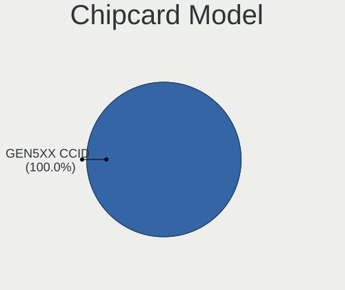

| Model                | Desktops | Percent |
|----------------------|----------|---------|
| ASK-RFID GEN5XX CCID | 1        | 100%    |

Unsupported
-----------

Unsupported Devices
-------------------

Total unsupported devices on board

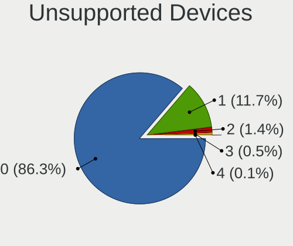

| Total | Desktops | Percent |
|-------|----------|---------|
| 0     | 692      | 86.28%  |
| 1     | 94       | 11.72%  |
| 2     | 11       | 1.37%   |
| 3     | 4        | 0.5%    |
| 4     | 1        | 0.12%   |

Unsupported Device Types
------------------------

Types of unsupported devices

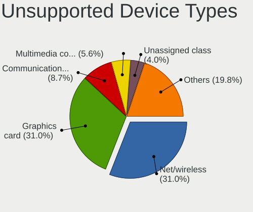

| Type                     | Desktops | Percent |
|--------------------------|----------|---------|
| Net/wireless             | 39       | 30.95%  |
| Graphics card            | 39       | 30.95%  |
| Communication controller | 11       | 8.73%   |
| Multimedia controller    | 7        | 5.56%   |
| Unassigned class         | 5        | 3.97%   |
| Sound                    | 4        | 3.17%   |
| Dvb card                 | 4        | 3.17%   |
| Network                  | 3        | 2.38%   |
| Storage/raid             | 2        | 1.59%   |
| Net/ethernet             | 2        | 1.59%   |
| Modem                    | 2        | 1.59%   |
| Bluetooth                | 2        | 1.59%   |
| Storage/ide              | 1        | 0.79%   |
| Storage/ata              | 1        | 0.79%   |
| Firewire controller      | 1        | 0.79%   |
| Chipcard                 | 1        | 0.79%   |
| Card reader              | 1        | 0.79%   |
| Camera                   | 1        | 0.79%   |

