Linux in Greece - Tested Hardware & Statistics (Desktops)
---------------------------------------------------------

A project to collect tested hardware configurations for Linux in Greece.

Anyone can contribute to this report by the [hw-probe](https://github.com/linuxhw/hw-probe) tool:

    sudo -E hw-probe -all -upload

Please contribute! Especially if your hardware is rare.

Contents
--------

* [ Test Cases ](#test-cases)

* [ System ](#system)
  - [ OS                       ](#os)
  - [ OS Family                ](#os-family)
  - [ Kernel                   ](#kernel)
  - [ Kernel Family            ](#kernel-family)
  - [ Kernel Major Ver.        ](#kernel-major-ver)
  - [ Arch                     ](#arch)
  - [ DE                       ](#de)
  - [ Display Server           ](#display-server)
  - [ Display Manager          ](#display-manager)
  - [ OS Lang                  ](#os-lang)
  - [ Boot Mode                ](#boot-mode)
  - [ Filesystem               ](#filesystem)
  - [ Part. scheme             ](#part-scheme)
  - [ Dual Boot with Linux/BSD ](#dual-boot-with-linuxbsd)
  - [ Dual Boot (Win)          ](#dual-boot-win)

* [ Board ](#board)
  - [ Vendor                   ](#vendor)
  - [ Model                    ](#model)
  - [ Model Family             ](#model-family)
  - [ MFG Year                 ](#mfg-year)
  - [ Form Factor              ](#form-factor)
  - [ Secure Boot              ](#secure-boot)
  - [ Coreboot                 ](#coreboot)
  - [ RAM Size                 ](#ram-size)
  - [ RAM Used                 ](#ram-used)
  - [ Total Drives             ](#total-drives)
  - [ Has CD-ROM               ](#has-cd-rom)
  - [ Has Ethernet             ](#has-ethernet)
  - [ Has WiFi                 ](#has-wifi)
  - [ Has Bluetooth            ](#has-bluetooth)

* [ Location ](#location)
  - [ Country                  ](#country)
  - [ City                     ](#city)

* [ Drives ](#drives)
  - [ Drive Vendor             ](#drive-vendor)
  - [ Drive Model              ](#drive-model)
  - [ HDD Vendor               ](#hdd-vendor)
  - [ SSD Vendor               ](#ssd-vendor)
  - [ Drive Kind               ](#drive-kind)
  - [ Drive Connector          ](#drive-connector)
  - [ Drive Size               ](#drive-size)
  - [ Space Total              ](#space-total)
  - [ Space Used               ](#space-used)
  - [ Malfunc. Drives          ](#malfunc-drives)
  - [ Malfunc. Drive Vendor    ](#malfunc-drive-vendor)
  - [ Malfunc. HDD Vendor      ](#malfunc-hdd-vendor)
  - [ Malfunc. Drive Kind      ](#malfunc-drive-kind)
  - [ Failed Drives            ](#failed-drives)
  - [ Failed Drive Vendor      ](#failed-drive-vendor)
  - [ Drive Status             ](#drive-status)

* [ Storage controller ](#storage-controller)
  - [ Storage Vendor           ](#storage-vendor)
  - [ Storage Model            ](#storage-model)
  - [ Storage Kind             ](#storage-kind)

* [ Processor ](#processor)
  - [ CPU Vendor               ](#cpu-vendor)
  - [ CPU Model                ](#cpu-model)
  - [ CPU Model Family         ](#cpu-model-family)
  - [ CPU Cores                ](#cpu-cores)
  - [ CPU Sockets              ](#cpu-sockets)
  - [ CPU Threads              ](#cpu-threads)
  - [ CPU Op-Modes             ](#cpu-op-modes)
  - [ CPU Microcode            ](#cpu-microcode)
  - [ CPU Microarch            ](#cpu-microarch)

* [ Graphics ](#graphics)
  - [ GPU Vendor               ](#gpu-vendor)
  - [ GPU Model                ](#gpu-model)
  - [ GPU Combo                ](#gpu-combo)
  - [ GPU Driver               ](#gpu-driver)
  - [ GPU Memory               ](#gpu-memory)

* [ Monitor ](#monitor)
  - [ Monitor Vendor           ](#monitor-vendor)
  - [ Monitor Model            ](#monitor-model)
  - [ Monitor Resolution       ](#monitor-resolution)
  - [ Monitor Diagonal         ](#monitor-diagonal)
  - [ Monitor Width            ](#monitor-width)
  - [ Aspect Ratio             ](#aspect-ratio)
  - [ Monitor Area             ](#monitor-area)
  - [ Pixel Density            ](#pixel-density)
  - [ Multiple Monitors        ](#multiple-monitors)

* [ Network ](#network)
  - [ Net Controller Vendor    ](#net-controller-vendor)
  - [ Net Controller Model     ](#net-controller-model)
  - [ Wireless Vendor          ](#wireless-vendor)
  - [ Wireless Model           ](#wireless-model)
  - [ Ethernet Vendor          ](#ethernet-vendor)
  - [ Ethernet Model           ](#ethernet-model)
  - [ Net Controller Kind      ](#net-controller-kind)
  - [ Used Controller          ](#used-controller)
  - [ NICs                     ](#nics)
  - [ IPv6                     ](#ipv6)

* [ Bluetooth ](#bluetooth)
  - [ Bluetooth Vendor         ](#bluetooth-vendor)
  - [ Bluetooth Model          ](#bluetooth-model)

* [ Sound ](#sound)
  - [ Sound Vendor             ](#sound-vendor)
  - [ Sound Model              ](#sound-model)

* [ Memory ](#memory)
  - [ Memory Vendor            ](#memory-vendor)
  - [ Memory Model             ](#memory-model)
  - [ Memory Kind              ](#memory-kind)
  - [ Memory Form Factor       ](#memory-form-factor)
  - [ Memory Size              ](#memory-size)
  - [ Memory Speed             ](#memory-speed)

* [ Printers & scanners ](#printers--scanners)
  - [ Printer Vendor           ](#printer-vendor)
  - [ Printer Model            ](#printer-model)
  - [ Scanner Vendor           ](#scanner-vendor)
  - [ Scanner Model            ](#scanner-model)

* [ Camera ](#camera)
  - [ Camera Vendor            ](#camera-vendor)
  - [ Camera Model             ](#camera-model)

* [ Security ](#security)
  - [ Fingerprint Vendor       ](#fingerprint-vendor)
  - [ Fingerprint Model        ](#fingerprint-model)
  - [ Chipcard Vendor          ](#chipcard-vendor)
  - [ Chipcard Model           ](#chipcard-model)

* [ Unsupported ](#unsupported)
  - [ Unsupported Devices      ](#unsupported-devices)
  - [ Unsupported Device Types ](#unsupported-device-types)

Test Cases
----------

Total: 652

| Vendor        | Model                       | Probe                                                      | Date         |
|---------------|-----------------------------|------------------------------------------------------------|--------------|
| Gigabyte      | P55-USB3                    | [adf7389f06](https://linux-hardware.org/?probe=adf7389f06) | Sep 30, 2022 |
| NU591         | 1.0                         | [6be5a78c90](https://linux-hardware.org/?probe=6be5a78c90) | Sep 27, 2022 |
| MSI           | MPG B550 GAMING PLUS        | [59c4a7e761](https://linux-hardware.org/?probe=59c4a7e761) | Sep 23, 2022 |
| MSI           | H310M PRO-VH                | [c11e067cb5](https://linux-hardware.org/?probe=c11e067cb5) | Sep 22, 2022 |
| ASRock        | H81M-GL                     | [fe7e5bbc9c](https://linux-hardware.org/?probe=fe7e5bbc9c) | Sep 21, 2022 |
| NU591         | 1.0                         | [6e29ae977f](https://linux-hardware.org/?probe=6e29ae977f) | Sep 21, 2022 |
| ASUSTek       | PRIME X570-P                | [a1f237c86a](https://linux-hardware.org/?probe=a1f237c86a) | Sep 20, 2022 |
| Gigabyte      | H97M-D3H                    | [57db36ecc9](https://linux-hardware.org/?probe=57db36ecc9) | Sep 19, 2022 |
| ASUSTek       | H81M-K                      | [fe48912653](https://linux-hardware.org/?probe=fe48912653) | Sep 15, 2022 |
| MSI           | MAG B460 TOMAHAWK           | [29eaefa02d](https://linux-hardware.org/?probe=29eaefa02d) | Sep 06, 2022 |
| MSI           | MAG B460 TOMAHAWK           | [4ca1a490f8](https://linux-hardware.org/?probe=4ca1a490f8) | Sep 05, 2022 |
| Dell          | 0KWVT8 A03                  | [bd0c518002](https://linux-hardware.org/?probe=bd0c518002) | Sep 03, 2022 |
| ASUSTek       | M4A785TD-V EVO              | [ba1027940d](https://linux-hardware.org/?probe=ba1027940d) | Sep 03, 2022 |
| Gigabyte      | G31M-S2C                    | [61a4780992](https://linux-hardware.org/?probe=61a4780992) | Aug 30, 2022 |
| Gigabyte      | G31M-S2C                    | [8beed8e261](https://linux-hardware.org/?probe=8beed8e261) | Aug 30, 2022 |
| HP            | 339A                        | [961ac650aa](https://linux-hardware.org/?probe=961ac650aa) | Aug 24, 2022 |
| ASRock        | H310CM-DVS                  | [17f6682bf3](https://linux-hardware.org/?probe=17f6682bf3) | Aug 20, 2022 |
| ASUSTek       | ProArt B660-CREATOR D4      | [0b9e6d6ad9](https://linux-hardware.org/?probe=0b9e6d6ad9) | Aug 19, 2022 |
| Gigabyte      | B550 AORUS ELITE AX         | [49943f84c8](https://linux-hardware.org/?probe=49943f84c8) | Aug 18, 2022 |
| ASUSTek       | ProArt B660-CREATOR D4      | [f9f180ac3a](https://linux-hardware.org/?probe=f9f180ac3a) | Aug 18, 2022 |
| Gigabyte      | B450 AORUS PRO-CF           | [3ab7d6393c](https://linux-hardware.org/?probe=3ab7d6393c) | Aug 17, 2022 |
| ASUSTek       | P5K SE                      | [59168fc3cb](https://linux-hardware.org/?probe=59168fc3cb) | Aug 14, 2022 |
| ASRock        | J4125B-ITX                  | [6e4ca6823f](https://linux-hardware.org/?probe=6e4ca6823f) | Aug 14, 2022 |
| ASRock        | J4125B-ITX                  | [81a8491905](https://linux-hardware.org/?probe=81a8491905) | Aug 14, 2022 |
| Gigabyte      | B85-HD3                     | [1498e07a4b](https://linux-hardware.org/?probe=1498e07a4b) | Aug 04, 2022 |
| MSI           | H110M PRO-VH                | [8bdd8d91db](https://linux-hardware.org/?probe=8bdd8d91db) | Aug 04, 2022 |
| ASUSTek       | PRIME B250-PLUS             | [dcc08c0fa5](https://linux-hardware.org/?probe=dcc08c0fa5) | Aug 03, 2022 |
| Gigabyte      | B550 AORUS ELITE AX         | [eee9c60bec](https://linux-hardware.org/?probe=eee9c60bec) | Jul 29, 2022 |
| MSI           | H110M PRO-VH                | [2058561297](https://linux-hardware.org/?probe=2058561297) | Jul 28, 2022 |
| Gigabyte      | Z97X-UD5H                   | [9b3bb82b80](https://linux-hardware.org/?probe=9b3bb82b80) | Jul 28, 2022 |
| MSI           | B450 TOMAHAWK MAX           | [8b520883ad](https://linux-hardware.org/?probe=8b520883ad) | Jul 27, 2022 |
| Gigabyte      | Z68P-DS3                    | [a296eed968](https://linux-hardware.org/?probe=a296eed968) | Jul 27, 2022 |
| Gigabyte      | Z68P-DS3                    | [24ad5aed74](https://linux-hardware.org/?probe=24ad5aed74) | Jul 27, 2022 |
| Lenovo        | SHARKBAY SDK0E50510 WIN     | [52ca04ad6b](https://linux-hardware.org/?probe=52ca04ad6b) | Jul 20, 2022 |
| ASUSTek       | H81M-K                      | [1d2991137d](https://linux-hardware.org/?probe=1d2991137d) | Jul 15, 2022 |
| ASUSTek       | M5A97 R2.0                  | [8bdaa5b844](https://linux-hardware.org/?probe=8bdaa5b844) | Jul 13, 2022 |
| ASUSTek       | P5Q3                        | [5fb3e2b502](https://linux-hardware.org/?probe=5fb3e2b502) | Jul 10, 2022 |
| ASUSTek       | TUF Gaming X570-PLUS        | [987d9aa4d3](https://linux-hardware.org/?probe=987d9aa4d3) | Jul 01, 2022 |
| ASUSTek       | H81M-K                      | [08ed20d4da](https://linux-hardware.org/?probe=08ed20d4da) | Jul 01, 2022 |
| MSI           | MPG X570 GAMING PRO CARB... | [c6c59e12b6](https://linux-hardware.org/?probe=c6c59e12b6) | Jun 25, 2022 |
| Gigabyte      | B550 AORUS ELITE V2         | [eb61c79793](https://linux-hardware.org/?probe=eb61c79793) | Jun 21, 2022 |
| Gigabyte      | 965P-S3                     | [0beb9ce480](https://linux-hardware.org/?probe=0beb9ce480) | Jun 19, 2022 |
| ASRock        | X370 Gaming-ITX/ac          | [292cc4bcab](https://linux-hardware.org/?probe=292cc4bcab) | Jun 17, 2022 |
| Gigabyte      | X570S UD                    | [98f8907a6b](https://linux-hardware.org/?probe=98f8907a6b) | Jun 14, 2022 |
| Gigabyte      | H510M H                     | [75fd209e13](https://linux-hardware.org/?probe=75fd209e13) | Jun 14, 2022 |
| Gigabyte      | B550 AORUS ELITE V2         | [70254d6e4d](https://linux-hardware.org/?probe=70254d6e4d) | Jun 08, 2022 |
| Lenovo        | 3140 NOK                    | [03619a223f](https://linux-hardware.org/?probe=03619a223f) | Jun 07, 2022 |
| Gigabyte      | X570 I AORUS PRO WIFI       | [51e3142bae](https://linux-hardware.org/?probe=51e3142bae) | Jun 02, 2022 |
| ASUSTek       | H81M-K                      | [22fb59a94a](https://linux-hardware.org/?probe=22fb59a94a) | May 19, 2022 |
| ASUSTek       | P8H61 PRO                   | [87a148ac90](https://linux-hardware.org/?probe=87a148ac90) | May 18, 2022 |
| ASUSTek       | H61M-E                      | [1dc25cb237](https://linux-hardware.org/?probe=1dc25cb237) | May 17, 2022 |
| Gigabyte      | X58A-UD3R                   | [0e9a009c11](https://linux-hardware.org/?probe=0e9a009c11) | May 13, 2022 |
| Gigabyte      | X58A-UD3R                   | [ed659a9633](https://linux-hardware.org/?probe=ed659a9633) | May 13, 2022 |
| AOpen         | i67QMx-DV R1.00BC1 55MP6... | [151db99970](https://linux-hardware.org/?probe=151db99970) | May 11, 2022 |
| ASUSTek       | ROG STRIX B350-F GAMING     | [5d59ce5dd7](https://linux-hardware.org/?probe=5d59ce5dd7) | May 11, 2022 |
| ASUSTek       | Z97-PRO GAMER               | [173fac4f5b](https://linux-hardware.org/?probe=173fac4f5b) | May 11, 2022 |
| HP            | 3031h                       | [4a57ff5761](https://linux-hardware.org/?probe=4a57ff5761) | May 10, 2022 |
| Gigabyte      | Z87X-D3H-CF                 | [8caf6e2b66](https://linux-hardware.org/?probe=8caf6e2b66) | May 09, 2022 |
| Gigabyte      | Z87X-D3H-CF                 | [4242d236c5](https://linux-hardware.org/?probe=4242d236c5) | May 09, 2022 |
| ASUSTek       | Z170-A                      | [bdfe0722a7](https://linux-hardware.org/?probe=bdfe0722a7) | May 09, 2022 |
| Gigabyte      | 990FXA-UD3                  | [4fe934e84d](https://linux-hardware.org/?probe=4fe934e84d) | May 06, 2022 |
| ASRock        | AB350 Gaming-ITX/ac         | [9967806049](https://linux-hardware.org/?probe=9967806049) | May 02, 2022 |
| MSI           | B550-A PRO                  | [d2903d25c5](https://linux-hardware.org/?probe=d2903d25c5) | Apr 30, 2022 |
| Gigabyte      | B450 AORUS M                | [de4ae72708](https://linux-hardware.org/?probe=de4ae72708) | Apr 28, 2022 |
| Lenovo        | MAHOBAY 0B98401 PRO         | [c6bf48bfb3](https://linux-hardware.org/?probe=c6bf48bfb3) | Apr 27, 2022 |
| ASUSTek       | P5P43TD                     | [8c7c0bd289](https://linux-hardware.org/?probe=8c7c0bd289) | Apr 21, 2022 |
| ASUSTek       | TUF Z390-PLUS GAMING        | [dddd6b6edd](https://linux-hardware.org/?probe=dddd6b6edd) | Apr 18, 2022 |
| Dell          | 04PT3G A00                  | [a10754ebca](https://linux-hardware.org/?probe=a10754ebca) | Apr 14, 2022 |
| ASRock        | H97 Pro4                    | [0ad016db29](https://linux-hardware.org/?probe=0ad016db29) | Apr 13, 2022 |
| Gigabyte      | Z68MA-D2H-B3                | [5c247da651](https://linux-hardware.org/?probe=5c247da651) | Apr 10, 2022 |
| ASUSTek       | TUF Gaming X570-PLUS        | [761e954b86](https://linux-hardware.org/?probe=761e954b86) | Apr 07, 2022 |
| ASRock        | X399 Phantom Gaming 6       | [111167cacb](https://linux-hardware.org/?probe=111167cacb) | Apr 07, 2022 |
| Lenovo        | SHARKBAY SDK0J40705 WIN     | [374819f582](https://linux-hardware.org/?probe=374819f582) | Apr 04, 2022 |
| Gigabyte      | Z270-Gaming K3              | [492c2c7bf4](https://linux-hardware.org/?probe=492c2c7bf4) | Apr 03, 2022 |
| ASUSTek       | TUF Gaming X570-PLUS        | [8d251b1b2a](https://linux-hardware.org/?probe=8d251b1b2a) | Apr 03, 2022 |
| Gigabyte      | Z270-Gaming K3              | [97969b1325](https://linux-hardware.org/?probe=97969b1325) | Apr 03, 2022 |
| ASUSTek       | PRIME H310-PLUS R2.0        | [348af6c202](https://linux-hardware.org/?probe=348af6c202) | Apr 02, 2022 |
| ASUSTek       | PRIME X570-P                | [e237e56d72](https://linux-hardware.org/?probe=e237e56d72) | Apr 02, 2022 |
| ASUSTek       | P8Z77-V PRO                 | [3ac2dfc728](https://linux-hardware.org/?probe=3ac2dfc728) | Apr 01, 2022 |
| ASRock        | B75M R2.0                   | [ee7a1d8721](https://linux-hardware.org/?probe=ee7a1d8721) | Mar 30, 2022 |
| ASRock        | M3N78D FX                   | [66bb134c6c](https://linux-hardware.org/?probe=66bb134c6c) | Mar 29, 2022 |
| ASUSTek       | ROG STRIX B350-F GAMING     | [6335525127](https://linux-hardware.org/?probe=6335525127) | Mar 28, 2022 |
| ASRock        | N68-GS4 FX R2.0             | [d01df98d83](https://linux-hardware.org/?probe=d01df98d83) | Mar 28, 2022 |
| ASRock        | M3N78D FX                   | [3ebcef4241](https://linux-hardware.org/?probe=3ebcef4241) | Mar 28, 2022 |
| Gigabyte      | B450 AORUS M                | [789a97d437](https://linux-hardware.org/?probe=789a97d437) | Mar 20, 2022 |
| ASUSTek       | H81M-K                      | [9055c398c9](https://linux-hardware.org/?probe=9055c398c9) | Mar 18, 2022 |
| Gigabyte      | AB350M-Gaming 3-CF          | [4fa05350b7](https://linux-hardware.org/?probe=4fa05350b7) | Mar 17, 2022 |
| MSI           | B550-A PRO                  | [44e9c813e9](https://linux-hardware.org/?probe=44e9c813e9) | Mar 14, 2022 |
| HP            | 1850                        | [7e0b4230d4](https://linux-hardware.org/?probe=7e0b4230d4) | Mar 11, 2022 |
| MSI           | MS-7091                     | [6ff1d651e4](https://linux-hardware.org/?probe=6ff1d651e4) | Mar 11, 2022 |
| ASUSTek       | P5GC-MX/MEDION/SI           | [772e020316](https://linux-hardware.org/?probe=772e020316) | Mar 09, 2022 |
| ASUSTek       | P5GC-MX/MEDION/SI           | [2a7edc452e](https://linux-hardware.org/?probe=2a7edc452e) | Mar 09, 2022 |
| Gigabyte      | F2A85XM-D3H                 | [cf20f6e233](https://linux-hardware.org/?probe=cf20f6e233) | Mar 09, 2022 |
| MSI           | MS-7091                     | [71aaa6a920](https://linux-hardware.org/?probe=71aaa6a920) | Mar 09, 2022 |
| MSI           | MS-7091                     | [b08ddd1115](https://linux-hardware.org/?probe=b08ddd1115) | Mar 09, 2022 |
| Gigabyte      | X58A-UD3R                   | [f56996aab6](https://linux-hardware.org/?probe=f56996aab6) | Mar 07, 2022 |
| HP            | 3048h                       | [cb9a7b7f4f](https://linux-hardware.org/?probe=cb9a7b7f4f) | Mar 05, 2022 |
| Gigabyte      | X58A-UD3R                   | [3cc5bac970](https://linux-hardware.org/?probe=3cc5bac970) | Mar 02, 2022 |
| ASUSTek       | PRIME B350M-A               | [299a727e8a](https://linux-hardware.org/?probe=299a727e8a) | Mar 02, 2022 |
| ASUSTek       | H81M-K                      | [2789dc5384](https://linux-hardware.org/?probe=2789dc5384) | Mar 02, 2022 |
| ASUSTek       | PRIME H310-PLUS R2.0        | [3f6b2ab46e](https://linux-hardware.org/?probe=3f6b2ab46e) | Mar 01, 2022 |
| Gigabyte      | H410M S2H V3                | [e5da146c8e](https://linux-hardware.org/?probe=e5da146c8e) | Feb 27, 2022 |
| Dell          | 0N185P A01                  | [996f9f7805](https://linux-hardware.org/?probe=996f9f7805) | Feb 24, 2022 |
| Gigabyte      | MZBSWMP-00                  | [fc444df804](https://linux-hardware.org/?probe=fc444df804) | Feb 20, 2022 |
| Gigabyte      | H61M-S2PV                   | [9e10ad29c3](https://linux-hardware.org/?probe=9e10ad29c3) | Feb 19, 2022 |
| Gigabyte      | X58A-UD3R                   | [87774dacdd](https://linux-hardware.org/?probe=87774dacdd) | Feb 15, 2022 |
| Gigabyte      | X58A-UD3R                   | [3cf4dc7f97](https://linux-hardware.org/?probe=3cf4dc7f97) | Feb 15, 2022 |
| MSI           | MS-7176                     | [b54631ff57](https://linux-hardware.org/?probe=b54631ff57) | Feb 14, 2022 |
| Gigabyte      | B250M-DS3H-CF               | [57de891506](https://linux-hardware.org/?probe=57de891506) | Feb 12, 2022 |
| Gigabyte      | Z87N-WIFI                   | [e86fa9ee02](https://linux-hardware.org/?probe=e86fa9ee02) | Feb 09, 2022 |
| Gigabyte      | Z87N-WIFI                   | [1b6aa0ce08](https://linux-hardware.org/?probe=1b6aa0ce08) | Feb 09, 2022 |
| ASUSTek       | PRIME B350-PLUS             | [df711c6514](https://linux-hardware.org/?probe=df711c6514) | Feb 03, 2022 |
| Lenovo        | ThinkCentre M58 7373W43     | [4dc312f4f3](https://linux-hardware.org/?probe=4dc312f4f3) | Feb 02, 2022 |
| Lenovo        | SDK0E50510 WIN              | [f317005b0a](https://linux-hardware.org/?probe=f317005b0a) | Feb 02, 2022 |
| Lenovo        | NOK                         | [8905840b45](https://linux-hardware.org/?probe=8905840b45) | Feb 02, 2022 |
| ASUSTek       | H110M-D                     | [3dbf1d9544](https://linux-hardware.org/?probe=3dbf1d9544) | Jan 31, 2022 |
| HP            | 8434 11                     | [76a7851e7f](https://linux-hardware.org/?probe=76a7851e7f) | Jan 28, 2022 |
| VIA Techno... | VT8366-8233/5               | [e285c87c48](https://linux-hardware.org/?probe=e285c87c48) | Jan 27, 2022 |
| VIA Techno... | VT8366-8233/5               | [54ce61fa7e](https://linux-hardware.org/?probe=54ce61fa7e) | Jan 25, 2022 |
| MSI           | A88XM-E45                   | [6a25ca99d2](https://linux-hardware.org/?probe=6a25ca99d2) | Jan 24, 2022 |
| Gigabyte      | H410M H V3                  | [f6b7e2e2e6](https://linux-hardware.org/?probe=f6b7e2e2e6) | Jan 24, 2022 |
| Lenovo        | 314F NO DPK                 | [07bd238c48](https://linux-hardware.org/?probe=07bd238c48) | Jan 24, 2022 |
| ASRock        | A300M-STX                   | [13de9d767d](https://linux-hardware.org/?probe=13de9d767d) | Jan 21, 2022 |
| MSI           | H310M PRO-VH                | [68c71dac17](https://linux-hardware.org/?probe=68c71dac17) | Jan 21, 2022 |
| ASRock        | G41C-VS                     | [4dbb4b7fad](https://linux-hardware.org/?probe=4dbb4b7fad) | Jan 21, 2022 |
| Albatron      | PM73V                       | [7bd3956f1f](https://linux-hardware.org/?probe=7bd3956f1f) | Jan 21, 2022 |
| ASUSTek       | H81M-K                      | [e5d70436b2](https://linux-hardware.org/?probe=e5d70436b2) | Jan 21, 2022 |
| HP            | 8455                        | [fbf272366c](https://linux-hardware.org/?probe=fbf272366c) | Jan 20, 2022 |
| ASUSTek       | H110M-D                     | [b105d56395](https://linux-hardware.org/?probe=b105d56395) | Jan 19, 2022 |
| ASUSTek       | P5LD2                       | [00ec990ce2](https://linux-hardware.org/?probe=00ec990ce2) | Jan 19, 2022 |
| Dell          | 0KP561                      | [1b772786e5](https://linux-hardware.org/?probe=1b772786e5) | Jan 19, 2022 |
| Dell          | 0FH884                      | [5ffacf9f99](https://linux-hardware.org/?probe=5ffacf9f99) | Jan 19, 2022 |
| Dell          | 0UG982                      | [c85c923e97](https://linux-hardware.org/?probe=c85c923e97) | Jan 19, 2022 |
| Dell          | 0X7841                      | [40600195c8](https://linux-hardware.org/?probe=40600195c8) | Jan 19, 2022 |
| Lenovo        | SDK0E50510 WIN              | [597677191c](https://linux-hardware.org/?probe=597677191c) | Jan 19, 2022 |
| Dell          | 0UG982                      | [686f3558d2](https://linux-hardware.org/?probe=686f3558d2) | Jan 19, 2022 |
| Lenovo        | 314F NO DPK                 | [f4f3386726](https://linux-hardware.org/?probe=f4f3386726) | Jan 19, 2022 |
| Dell          | 0FH884                      | [f6e9bda3a9](https://linux-hardware.org/?probe=f6e9bda3a9) | Jan 19, 2022 |
| Lenovo        | 314F NO DPK                 | [b9153e0c28](https://linux-hardware.org/?probe=b9153e0c28) | Jan 19, 2022 |
| HP            | 18E7                        | [b68364ed90](https://linux-hardware.org/?probe=b68364ed90) | Jan 19, 2022 |
| Dell          | 0HY9JP A02                  | [8314cd9ba6](https://linux-hardware.org/?probe=8314cd9ba6) | Jan 19, 2022 |
| Dell          | 0UG982                      | [38c30e280b](https://linux-hardware.org/?probe=38c30e280b) | Jan 19, 2022 |
| Gigabyte      | H81M-S2PV                   | [f2d5dba7ff](https://linux-hardware.org/?probe=f2d5dba7ff) | Jan 19, 2022 |
| Dell          | 0FH884                      | [083697081f](https://linux-hardware.org/?probe=083697081f) | Jan 19, 2022 |
| MSI           | H310M PRO-VH                | [844791ed3e](https://linux-hardware.org/?probe=844791ed3e) | Jan 19, 2022 |
| ASRock        | B550M Steel Legend          | [0601abdfa6](https://linux-hardware.org/?probe=0601abdfa6) | Jan 18, 2022 |
| HP            | 18E7                        | [9fedcb7ff7](https://linux-hardware.org/?probe=9fedcb7ff7) | Jan 18, 2022 |
| HP            | 18E7                        | [48871270a2](https://linux-hardware.org/?probe=48871270a2) | Jan 18, 2022 |
| HP            | 18E7                        | [ca38c856e1](https://linux-hardware.org/?probe=ca38c856e1) | Jan 18, 2022 |
| HP            | 18E7                        | [a4df88b38f](https://linux-hardware.org/?probe=a4df88b38f) | Jan 18, 2022 |
| HP            | 18E7                        | [a745b9add0](https://linux-hardware.org/?probe=a745b9add0) | Jan 18, 2022 |
| HP            | 18E7                        | [b69abe6fd4](https://linux-hardware.org/?probe=b69abe6fd4) | Jan 18, 2022 |
| Lenovo        | SDK0E50510 WIN              | [9753f9164a](https://linux-hardware.org/?probe=9753f9164a) | Jan 18, 2022 |
| Lenovo        | ThinkCentre M58 7373W43     | [2d7a6e6cb6](https://linux-hardware.org/?probe=2d7a6e6cb6) | Jan 18, 2022 |
| Lenovo        | SDK0E50510 WIN              | [51484889f9](https://linux-hardware.org/?probe=51484889f9) | Jan 18, 2022 |
| Lenovo        | SDK0E50510 WIN              | [4ca462c89a](https://linux-hardware.org/?probe=4ca462c89a) | Jan 18, 2022 |
| Dell          | 0HY9JP A02                  | [c4c9f4b0a9](https://linux-hardware.org/?probe=c4c9f4b0a9) | Jan 18, 2022 |
| HP            | 8434 11                     | [4a128d2bb2](https://linux-hardware.org/?probe=4a128d2bb2) | Jan 18, 2022 |
| HP            | 18E7                        | [97d4bc7367](https://linux-hardware.org/?probe=97d4bc7367) | Jan 18, 2022 |
| Lenovo        | NOK                         | [7ae2819a6f](https://linux-hardware.org/?probe=7ae2819a6f) | Jan 18, 2022 |
| HP            | 18E7                        | [e86d0cc284](https://linux-hardware.org/?probe=e86d0cc284) | Jan 18, 2022 |
| Lenovo        | SDK0E50510 WIN              | [022f56a960](https://linux-hardware.org/?probe=022f56a960) | Jan 18, 2022 |
| HP            | 18E7                        | [0d2a09f683](https://linux-hardware.org/?probe=0d2a09f683) | Jan 18, 2022 |
| HP            | 8455                        | [639182896b](https://linux-hardware.org/?probe=639182896b) | Jan 18, 2022 |
| ASUSTek       | H81M-C                      | [f4bb742149](https://linux-hardware.org/?probe=f4bb742149) | Jan 17, 2022 |
| ASUSTek       | P5LD2                       | [b972c7929f](https://linux-hardware.org/?probe=b972c7929f) | Jan 17, 2022 |
| ASUSTek       | PRIME H310M-D R2.0          | [9a6c2f82f1](https://linux-hardware.org/?probe=9a6c2f82f1) | Jan 17, 2022 |
| Dell          | 0UG982                      | [684478b2fb](https://linux-hardware.org/?probe=684478b2fb) | Jan 17, 2022 |
| Gigabyte      | H410M H V3                  | [13b01fb40a](https://linux-hardware.org/?probe=13b01fb40a) | Jan 17, 2022 |
| ASUSTek       | PRIME H310M-D R2.0          | [385f76b996](https://linux-hardware.org/?probe=385f76b996) | Jan 17, 2022 |
| Gigabyte      | X58A-UD3R                   | [dc02dbb307](https://linux-hardware.org/?probe=dc02dbb307) | Jan 16, 2022 |
| ASUSTek       | H81M-C                      | [f21bf32c9a](https://linux-hardware.org/?probe=f21bf32c9a) | Jan 15, 2022 |
| ASUSTek       | H81M-K                      | [f1858e63f4](https://linux-hardware.org/?probe=f1858e63f4) | Jan 14, 2022 |
| Gigabyte      | P55-USB3                    | [07d50b5a0a](https://linux-hardware.org/?probe=07d50b5a0a) | Jan 14, 2022 |
| Lenovo        | SHARKBAY SDK0E50510 WIN     | [32b2cea437](https://linux-hardware.org/?probe=32b2cea437) | Jan 10, 2022 |
| Gigabyte      | A320M-H-CF                  | [c09f135f63](https://linux-hardware.org/?probe=c09f135f63) | Jan 09, 2022 |
| ASUSTek       | PRIME B350M-A               | [7887040435](https://linux-hardware.org/?probe=7887040435) | Jan 05, 2022 |
| ASRock        | H97M Pro4                   | [92a6f429b5](https://linux-hardware.org/?probe=92a6f429b5) | Jan 05, 2022 |
| ASUSTek       | ROG STRIX B550-E GAMING     | [f5f5eadcd4](https://linux-hardware.org/?probe=f5f5eadcd4) | Jan 04, 2022 |
| ECS           | G31T-M7                     | [8cd5d79924](https://linux-hardware.org/?probe=8cd5d79924) | Dec 31, 2021 |
| ECS           | G31T-M7                     | [9ebfb53472](https://linux-hardware.org/?probe=9ebfb53472) | Dec 31, 2021 |
| ASRock        | B75M R2.0                   | [8e4a08a77a](https://linux-hardware.org/?probe=8e4a08a77a) | Dec 26, 2021 |
| Gigabyte      | X570 I AORUS PRO WIFI       | [68ea35c97d](https://linux-hardware.org/?probe=68ea35c97d) | Dec 25, 2021 |
| Foxconn       | 2ABF                        | [fdc6aac853](https://linux-hardware.org/?probe=fdc6aac853) | Dec 25, 2021 |
| Gigabyte      | H170M-D3H DDR3-CF           | [537cb36279](https://linux-hardware.org/?probe=537cb36279) | Dec 25, 2021 |
| MSI           | H81M PRO-VD                 | [b0c70d78fd](https://linux-hardware.org/?probe=b0c70d78fd) | Dec 22, 2021 |
| Gigabyte      | Z390 GAMING X-CF            | [8962cfd1c6](https://linux-hardware.org/?probe=8962cfd1c6) | Dec 19, 2021 |
| Dell          | 0MN1TX A01                  | [312bd0bfd8](https://linux-hardware.org/?probe=312bd0bfd8) | Dec 18, 2021 |
| ASUSTek       | P5LD2-Deluxe                | [a2ee48eeb1](https://linux-hardware.org/?probe=a2ee48eeb1) | Dec 16, 2021 |
| Gigabyte      | B75M-D3H                    | [495d348f1e](https://linux-hardware.org/?probe=495d348f1e) | Dec 15, 2021 |
| Gigabyte      | 970A-DS3P                   | [da23db2916](https://linux-hardware.org/?probe=da23db2916) | Dec 13, 2021 |
| ASUSTek       | P8P67 LE                    | [b86c41a0a9](https://linux-hardware.org/?probe=b86c41a0a9) | Dec 13, 2021 |
| Gigabyte      | X570 I AORUS PRO WIFI       | [ac3e0f0271](https://linux-hardware.org/?probe=ac3e0f0271) | Dec 11, 2021 |
| Gigabyte      | X470 AORUS ULTRA GAMING-... | [1876329ada](https://linux-hardware.org/?probe=1876329ada) | Dec 10, 2021 |
| Gigabyte      | X570 I AORUS PRO WIFI       | [c97b5a008f](https://linux-hardware.org/?probe=c97b5a008f) | Dec 09, 2021 |
| MSI           | MAG B550M BAZOOKA           | [11f31cc288](https://linux-hardware.org/?probe=11f31cc288) | Dec 08, 2021 |
| Gigabyte      | Z97P-D3                     | [abc89c9b78](https://linux-hardware.org/?probe=abc89c9b78) | Dec 07, 2021 |
| Gateway       | DT55                        | [efc935f11c](https://linux-hardware.org/?probe=efc935f11c) | Dec 06, 2021 |
| Gigabyte      | G31M-S2C                    | [75933dd4ba](https://linux-hardware.org/?probe=75933dd4ba) | Dec 06, 2021 |
| Dell          | 0WK833                      | [59fed7d754](https://linux-hardware.org/?probe=59fed7d754) | Nov 30, 2021 |
| ASUSTek       | P5QPL-AM                    | [6e37f9cd8a](https://linux-hardware.org/?probe=6e37f9cd8a) | Nov 29, 2021 |
| Gigabyte      | B450M DS3H-CF               | [999b38ba1f](https://linux-hardware.org/?probe=999b38ba1f) | Nov 28, 2021 |
| Dell          | 042P49 A02                  | [f6d9c481bd](https://linux-hardware.org/?probe=f6d9c481bd) | Nov 27, 2021 |
| Gigabyte      | P35-S3G                     | [f8b94398df](https://linux-hardware.org/?probe=f8b94398df) | Nov 27, 2021 |
| ASRock        | B450 Gaming K4              | [ba4141a214](https://linux-hardware.org/?probe=ba4141a214) | Nov 26, 2021 |
| Gigabyte      | Z370 HD3-CF                 | [b6396cac2d](https://linux-hardware.org/?probe=b6396cac2d) | Nov 25, 2021 |
| Gigabyte      | B450M DS3H-CF               | [2c14d4d6ad](https://linux-hardware.org/?probe=2c14d4d6ad) | Nov 23, 2021 |
| ASRock        | B75M R2.0                   | [000f6b6f44](https://linux-hardware.org/?probe=000f6b6f44) | Nov 20, 2021 |
| HP            | 304Bh                       | [d6f490c0ea](https://linux-hardware.org/?probe=d6f490c0ea) | Nov 19, 2021 |
| Dell          | 0Y2K8N A00                  | [db79ad16d3](https://linux-hardware.org/?probe=db79ad16d3) | Nov 16, 2021 |
| MSI           | B350 TOMAHAWK ARCTIC        | [9cc745f754](https://linux-hardware.org/?probe=9cc745f754) | Nov 16, 2021 |
| Gigabyte      | 945P-S3                     | [770408fd3d](https://linux-hardware.org/?probe=770408fd3d) | Nov 14, 2021 |
| Gigabyte      | 945P-S3                     | [2cf9966c22](https://linux-hardware.org/?probe=2cf9966c22) | Nov 14, 2021 |
| Gigabyte      | G41M-Combo                  | [7a3d3a2f06](https://linux-hardware.org/?probe=7a3d3a2f06) | Nov 12, 2021 |
| Gigabyte      | Z370 HD3-CF                 | [867958b2cc](https://linux-hardware.org/?probe=867958b2cc) | Nov 11, 2021 |
| Dell          | 0DXJD9 A00                  | [e9abfeb7a2](https://linux-hardware.org/?probe=e9abfeb7a2) | Nov 11, 2021 |
| HP            | 339A                        | [702ccff1e4](https://linux-hardware.org/?probe=702ccff1e4) | Nov 09, 2021 |
| MSI           | B150M MORTAR                | [58d8ce0102](https://linux-hardware.org/?probe=58d8ce0102) | Nov 05, 2021 |
| ASUSTek       | P5LD2-Deluxe                | [d1dcf79c72](https://linux-hardware.org/?probe=d1dcf79c72) | Nov 05, 2021 |
| ASUSTek       | Z170-A                      | [02cc756dd4](https://linux-hardware.org/?probe=02cc756dd4) | Oct 26, 2021 |
| Lenovo        | ThinkCentre M71e 3167A46    | [afc98aba09](https://linux-hardware.org/?probe=afc98aba09) | Oct 20, 2021 |
| Gigabyte      | X570 I AORUS PRO WIFI       | [c76a2534a0](https://linux-hardware.org/?probe=c76a2534a0) | Oct 19, 2021 |
| HP            | 8717                        | [23f7ea44ce](https://linux-hardware.org/?probe=23f7ea44ce) | Oct 18, 2021 |
| HP            | 1496                        | [f438fdb757](https://linux-hardware.org/?probe=f438fdb757) | Oct 17, 2021 |
| MSI           | H110I PRO                   | [0aeac6b99e](https://linux-hardware.org/?probe=0aeac6b99e) | Oct 16, 2021 |
| HP            | 1495                        | [e7c0f59f92](https://linux-hardware.org/?probe=e7c0f59f92) | Oct 15, 2021 |
| Gigabyte      | Z370 HD3-CF                 | [a671b6ab07](https://linux-hardware.org/?probe=a671b6ab07) | Oct 11, 2021 |
| HP            | 1496                        | [f6ad468908](https://linux-hardware.org/?probe=f6ad468908) | Oct 10, 2021 |
| MSI           | H110I PRO                   | [33e1bf9b6c](https://linux-hardware.org/?probe=33e1bf9b6c) | Oct 09, 2021 |
| Gigabyte      | X570 I AORUS PRO WIFI       | [13ee121adc](https://linux-hardware.org/?probe=13ee121adc) | Oct 07, 2021 |
| MSI           | B150M MORTAR                | [fd3b108340](https://linux-hardware.org/?probe=fd3b108340) | Oct 07, 2021 |
| HP            | 1496                        | [3f369a5dd6](https://linux-hardware.org/?probe=3f369a5dd6) | Oct 06, 2021 |
| ASUSTek       | PRIME H310-PLUS R2.0        | [c627fc3c07](https://linux-hardware.org/?probe=c627fc3c07) | Oct 04, 2021 |
| MSI           | B150M MORTAR                | [224b713b5c](https://linux-hardware.org/?probe=224b713b5c) | Oct 03, 2021 |
| Gigabyte      | B250M-DS3H-CF               | [62558ba69c](https://linux-hardware.org/?probe=62558ba69c) | Sep 29, 2021 |
| ASRock        | X570 Phantom Gaming 4       | [68b6365968](https://linux-hardware.org/?probe=68b6365968) | Sep 28, 2021 |
| ASUSTek       | ROG STRIX X399-E GAMING     | [1c1bca9399](https://linux-hardware.org/?probe=1c1bca9399) | Sep 28, 2021 |
| ASRock        | M3A790GXH/128M              | [818ec10ec8](https://linux-hardware.org/?probe=818ec10ec8) | Sep 24, 2021 |
| ASUSTek       | ROG STRIX X399-E GAMING     | [b04783b7e1](https://linux-hardware.org/?probe=b04783b7e1) | Sep 20, 2021 |
| Apple         | Mac-F4208DC8 PVT            | [ad193a0b9c](https://linux-hardware.org/?probe=ad193a0b9c) | Sep 16, 2021 |
| Gigabyte      | Z370 HD3-CF                 | [d45a82c3c9](https://linux-hardware.org/?probe=d45a82c3c9) | Sep 06, 2021 |
| Foxconn       | 2ABF                        | [171462cc36](https://linux-hardware.org/?probe=171462cc36) | Aug 29, 2021 |
| MSI           | 970A SLI Krait Edition      | [862999e242](https://linux-hardware.org/?probe=862999e242) | Aug 27, 2021 |
| Gigabyte      | Z77-DS3H                    | [540c64bf79](https://linux-hardware.org/?probe=540c64bf79) | Aug 26, 2021 |
| Gigabyte      | F2A88XM-HD3P                | [dee9503ed0](https://linux-hardware.org/?probe=dee9503ed0) | Aug 24, 2021 |
| Pegatron      | 2A72h                       | [57575daae2](https://linux-hardware.org/?probe=57575daae2) | Aug 19, 2021 |
| Gigabyte      | GA-870A-UD3                 | [d436538e39](https://linux-hardware.org/?probe=d436538e39) | Aug 13, 2021 |
| Gigabyte      | X570 AORUS ULTRA            | [b937ce5e88](https://linux-hardware.org/?probe=b937ce5e88) | Aug 10, 2021 |
| Lenovo        | 36EE SDK0J40700 WIN 3258... | [a2c47444e8](https://linux-hardware.org/?probe=a2c47444e8) | Aug 09, 2021 |
| ASUSTek       | M5A78L-M/USB3               | [b5f6eb1dc0](https://linux-hardware.org/?probe=b5f6eb1dc0) | Aug 09, 2021 |
| MSI           | 970A SLI Krait Edition      | [08cf0272da](https://linux-hardware.org/?probe=08cf0272da) | Aug 05, 2021 |
| Gigabyte      | P35C-DS3R                   | [e8ffe8991b](https://linux-hardware.org/?probe=e8ffe8991b) | Jul 27, 2021 |
| MSI           | H81M PRO-VD                 | [190d4540e9](https://linux-hardware.org/?probe=190d4540e9) | Jul 20, 2021 |
| Gigabyte      | GA-790XT-USB3               | [72f5d673d9](https://linux-hardware.org/?probe=72f5d673d9) | Jul 11, 2021 |
| ASRock        | X370 Gaming X               | [df5a9e402e](https://linux-hardware.org/?probe=df5a9e402e) | Jul 07, 2021 |
| Gigabyte      | P35-DS3                     | [1756b98ff7](https://linux-hardware.org/?probe=1756b98ff7) | Jul 04, 2021 |
| ASRock        | B450 Gaming K4              | [ed31fd442f](https://linux-hardware.org/?probe=ed31fd442f) | Jul 01, 2021 |
| ASRock        | B450 Gaming K4              | [479f6c752d](https://linux-hardware.org/?probe=479f6c752d) | Jul 01, 2021 |
| Gigabyte      | Z68XP-UD3P                  | [259e2a4ac0](https://linux-hardware.org/?probe=259e2a4ac0) | Jun 24, 2021 |
| HP            | 339A                        | [88af8ec05f](https://linux-hardware.org/?probe=88af8ec05f) | Jun 16, 2021 |
| Gigabyte      | X570 I AORUS PRO WIFI       | [2989252679](https://linux-hardware.org/?probe=2989252679) | Jun 12, 2021 |
| MSI           | H97 GAMING 3                | [831ff65864](https://linux-hardware.org/?probe=831ff65864) | Jun 07, 2021 |
| Dell          | 0Y7WYT A00                  | [e7b9652dbd](https://linux-hardware.org/?probe=e7b9652dbd) | Jun 07, 2021 |
| MSI           | H97 GAMING 3                | [33dcfeee7b](https://linux-hardware.org/?probe=33dcfeee7b) | Jun 07, 2021 |
| HP            | 304Bh                       | [4f331fec6f](https://linux-hardware.org/?probe=4f331fec6f) | Jun 04, 2021 |
| HP            | 304Bh                       | [a41a097984](https://linux-hardware.org/?probe=a41a097984) | Jun 04, 2021 |
| Gigabyte      | GA-MA785GT-UD3H             | [6018f18645](https://linux-hardware.org/?probe=6018f18645) | Jun 02, 2021 |
| Gigabyte      | GA-MA785GT-UD3H             | [03b8f35b44](https://linux-hardware.org/?probe=03b8f35b44) | Jun 02, 2021 |
| MSI           | B365M PRO-VH                | [9a3529c8ae](https://linux-hardware.org/?probe=9a3529c8ae) | May 29, 2021 |
| Gigabyte      | X570 I AORUS PRO WIFI       | [e5a1aba629](https://linux-hardware.org/?probe=e5a1aba629) | May 26, 2021 |
| ASUSTek       | PRIME H310M-R R2.0          | [dd9596a6b0](https://linux-hardware.org/?probe=dd9596a6b0) | May 25, 2021 |
| Gigabyte      | A320M-H-CF                  | [79e354be47](https://linux-hardware.org/?probe=79e354be47) | May 24, 2021 |
| ASUSTek       | A8V Deluxe                  | [e739f2f0ba](https://linux-hardware.org/?probe=e739f2f0ba) | May 24, 2021 |
| MSI           | B350M GAMING PRO            | [c04e6666e7](https://linux-hardware.org/?probe=c04e6666e7) | May 20, 2021 |
| ASRock        | Z370 Professional Gaming... | [2c915c81d9](https://linux-hardware.org/?probe=2c915c81d9) | May 18, 2021 |
| ASUSTek       | Z170-K                      | [8f3fc4eeda](https://linux-hardware.org/?probe=8f3fc4eeda) | May 15, 2021 |
| ASUSTek       | H170 PRO GAMING             | [b1375145c3](https://linux-hardware.org/?probe=b1375145c3) | May 10, 2021 |
| ASUSTek       | P5LD2-Deluxe                | [46242d579f](https://linux-hardware.org/?probe=46242d579f) | May 09, 2021 |
| ASUSTek       | P5LD2-Deluxe                | [0b6b9eab78](https://linux-hardware.org/?probe=0b6b9eab78) | May 07, 2021 |
| ASRock        | 880GM-LE FX                 | [256c66503a](https://linux-hardware.org/?probe=256c66503a) | May 06, 2021 |
| ASUSTek       | P5LD2-Deluxe                | [70bb3aecd9](https://linux-hardware.org/?probe=70bb3aecd9) | May 05, 2021 |
| ASUSTek       | P5LD2-Deluxe                | [193ecc62cf](https://linux-hardware.org/?probe=193ecc62cf) | May 03, 2021 |
| QDI           | P4I865A                     | [a3df896b35](https://linux-hardware.org/?probe=a3df896b35) | May 03, 2021 |
| ASUSTek       | P5Q DELUXE                  | [34b91a88a8](https://linux-hardware.org/?probe=34b91a88a8) | Apr 28, 2021 |
| MSI           | MS-7235                     | [3d8c008ca3](https://linux-hardware.org/?probe=3d8c008ca3) | Apr 27, 2021 |
| HP            | 1494                        | [775b59a599](https://linux-hardware.org/?probe=775b59a599) | Apr 20, 2021 |
| MSI           | H81M PRO-VD                 | [4c7c9824db](https://linux-hardware.org/?probe=4c7c9824db) | Apr 19, 2021 |
| ASRock        | A320M-DVS R4.0              | [0a7e8b0fab](https://linux-hardware.org/?probe=0a7e8b0fab) | Apr 19, 2021 |
| MSI           | 970A SLI Krait Edition      | [8695142550](https://linux-hardware.org/?probe=8695142550) | Apr 13, 2021 |
| ASUSTek       | PRIME X370-PRO              | [fd3c6d01f7](https://linux-hardware.org/?probe=fd3c6d01f7) | Apr 11, 2021 |
| Gigabyte      | B550 VISION D               | [3246784665](https://linux-hardware.org/?probe=3246784665) | Apr 09, 2021 |
| Gigabyte      | P41T-D3                     | [2f9a494265](https://linux-hardware.org/?probe=2f9a494265) | Apr 09, 2021 |
| ASRock        | J3355B-ITX                  | [8f3bd77b70](https://linux-hardware.org/?probe=8f3bd77b70) | Apr 06, 2021 |
| ASUSTek       | P5Q DELUXE                  | [2d30481374](https://linux-hardware.org/?probe=2d30481374) | Apr 01, 2021 |
| ASUSTek       | M5A78L-M LX                 | [63df5a92c1](https://linux-hardware.org/?probe=63df5a92c1) | Apr 01, 2021 |
| ASUSTek       | M5A78L-M LX                 | [9312919fed](https://linux-hardware.org/?probe=9312919fed) | Apr 01, 2021 |
| Lenovo        | ThinkCentre M71e 3157H2U    | [6e0ad0f342](https://linux-hardware.org/?probe=6e0ad0f342) | Mar 31, 2021 |
| Gigabyte      | F2A88XM-HD3P                | [5bedab76df](https://linux-hardware.org/?probe=5bedab76df) | Mar 25, 2021 |
| Gigabyte      | B550 VISION D               | [5916c313e7](https://linux-hardware.org/?probe=5916c313e7) | Mar 25, 2021 |
| Gigabyte      | F2A88XM-HD3P                | [aab9ef0b36](https://linux-hardware.org/?probe=aab9ef0b36) | Mar 24, 2021 |
| HP            | 0984h                       | [20a29fe8b0](https://linux-hardware.org/?probe=20a29fe8b0) | Mar 20, 2021 |
| HP            | 18E4                        | [b5eec7a501](https://linux-hardware.org/?probe=b5eec7a501) | Mar 17, 2021 |
| ASRock        | Z97 Extreme4                | [6378d46f22](https://linux-hardware.org/?probe=6378d46f22) | Mar 17, 2021 |
| MSI           | Z97-G45 GAMING              | [5843e7b038](https://linux-hardware.org/?probe=5843e7b038) | Mar 14, 2021 |
| MSI           | Z97-G45 GAMING              | [fc76eddc08](https://linux-hardware.org/?probe=fc76eddc08) | Mar 14, 2021 |
| Gigabyte      | G31M-S2L                    | [9ff279ae01](https://linux-hardware.org/?probe=9ff279ae01) | Mar 11, 2021 |
| Gigabyte      | B75-D3V                     | [f4b8176eb4](https://linux-hardware.org/?probe=f4b8176eb4) | Mar 09, 2021 |
| Gigabyte      | G31M-S2L                    | [78933b8238](https://linux-hardware.org/?probe=78933b8238) | Mar 07, 2021 |
| MSI           | H81M PRO-VD                 | [efa82d3df7](https://linux-hardware.org/?probe=efa82d3df7) | Mar 02, 2021 |
| Gigabyte      | 8I915PL-G                   | [e9ed9c7fdf](https://linux-hardware.org/?probe=e9ed9c7fdf) | Feb 27, 2021 |
| Gigabyte      | G31M-S2L                    | [c0301ac11d](https://linux-hardware.org/?probe=c0301ac11d) | Feb 26, 2021 |
| ASUSTek       | P6T                         | [c2d58a2c68](https://linux-hardware.org/?probe=c2d58a2c68) | Feb 25, 2021 |
| MSI           | MS-7176                     | [f04765b1b9](https://linux-hardware.org/?probe=f04765b1b9) | Feb 24, 2021 |
| MSI           | MS-7176                     | [760a593d35](https://linux-hardware.org/?probe=760a593d35) | Feb 24, 2021 |
| ASUSTek       | Z170-A                      | [ec035af0d0](https://linux-hardware.org/?probe=ec035af0d0) | Feb 21, 2021 |
| Gigabyte      | G31M-S2L                    | [563f422327](https://linux-hardware.org/?probe=563f422327) | Feb 21, 2021 |
| Gigabyte      | Z97X-UD5H                   | [74869ab078](https://linux-hardware.org/?probe=74869ab078) | Feb 21, 2021 |
| Gigabyte      | G31M-S2L                    | [38e7b43029](https://linux-hardware.org/?probe=38e7b43029) | Feb 21, 2021 |
| Gigabyte      | G31M-S2L                    | [aac0643552](https://linux-hardware.org/?probe=aac0643552) | Feb 21, 2021 |
| Intel         | DP55WB AAE64798-204         | [6e9ac2a13d](https://linux-hardware.org/?probe=6e9ac2a13d) | Feb 20, 2021 |
| ASUSTek       | P8P67 LE                    | [492632cd6f](https://linux-hardware.org/?probe=492632cd6f) | Feb 19, 2021 |
| ASUSTek       | P8P67 LE                    | [2dae363129](https://linux-hardware.org/?probe=2dae363129) | Feb 19, 2021 |
| ABIT          | FP-IN9 SLI                  | [91f5f66c7c](https://linux-hardware.org/?probe=91f5f66c7c) | Feb 17, 2021 |
| Gigabyte      | GA-MA770T-UD3               | [209ecb3837](https://linux-hardware.org/?probe=209ecb3837) | Feb 16, 2021 |
| Gigabyte      | G31M-S2L                    | [6c898a20f1](https://linux-hardware.org/?probe=6c898a20f1) | Feb 15, 2021 |
| ASUSTek       | Rampage III GENE            | [3994b32fbb](https://linux-hardware.org/?probe=3994b32fbb) | Feb 14, 2021 |
| Gigabyte      | H61MA-D2V                   | [35291823d8](https://linux-hardware.org/?probe=35291823d8) | Feb 14, 2021 |
| Gigabyte      | Z370 HD3-CF                 | [de94ccbf1a](https://linux-hardware.org/?probe=de94ccbf1a) | Feb 14, 2021 |
| ASUSTek       | P8H77-V                     | [71b1c108c4](https://linux-hardware.org/?probe=71b1c108c4) | Feb 14, 2021 |
| ASRock        | B450 Gaming K4              | [2dd140ff3e](https://linux-hardware.org/?probe=2dd140ff3e) | Feb 14, 2021 |
| MSI           | B450 TOMAHAWK MAX           | [dfc223f07c](https://linux-hardware.org/?probe=dfc223f07c) | Feb 14, 2021 |
| MSI           | X470 GAMING PRO CARBON      | [e0ef54344d](https://linux-hardware.org/?probe=e0ef54344d) | Feb 14, 2021 |
| ASUSTek       | P5Q                         | [a9bc15b309](https://linux-hardware.org/?probe=a9bc15b309) | Feb 13, 2021 |
| ASUSTek       | P7P55D-E DELUXE             | [b0857a93ff](https://linux-hardware.org/?probe=b0857a93ff) | Feb 13, 2021 |
| Gigabyte      | GA-MA790XT-UD4P             | [0ebedefc78](https://linux-hardware.org/?probe=0ebedefc78) | Feb 13, 2021 |
| Gigabyte      | GA-MA770T-UD3               | [2ed0ae9569](https://linux-hardware.org/?probe=2ed0ae9569) | Feb 09, 2021 |
| Gigabyte      | H77M-D3H                    | [0a56b88fc8](https://linux-hardware.org/?probe=0a56b88fc8) | Feb 08, 2021 |
| Gigabyte      | B365M DS3H                  | [6b7db83192](https://linux-hardware.org/?probe=6b7db83192) | Feb 06, 2021 |
| Gigabyte      | B365M DS3H                  | [543b5a7398](https://linux-hardware.org/?probe=543b5a7398) | Feb 06, 2021 |
| ASUSTek       | Z97-A                       | [fc8c462cc7](https://linux-hardware.org/?probe=fc8c462cc7) | Feb 04, 2021 |
| Gigabyte      | GA-790XT-USB3               | [d14e71b6b4](https://linux-hardware.org/?probe=d14e71b6b4) | Feb 03, 2021 |
| HP            | 1494                        | [d3fbad0c50](https://linux-hardware.org/?probe=d3fbad0c50) | Feb 01, 2021 |
| Foxconn       | P43A01                      | [6ebcadfb23](https://linux-hardware.org/?probe=6ebcadfb23) | Jan 31, 2021 |
| ASUSTek       | Rampage III GENE            | [32605971fb](https://linux-hardware.org/?probe=32605971fb) | Jan 28, 2021 |
| ASUSTek       | Rampage III GENE            | [1ac6133a40](https://linux-hardware.org/?probe=1ac6133a40) | Jan 28, 2021 |
| Dell          | 06FW8P A01                  | [392c18a8d2](https://linux-hardware.org/?probe=392c18a8d2) | Jan 28, 2021 |
| Gigabyte      | G41M-Combo                  | [a85f6c4759](https://linux-hardware.org/?probe=a85f6c4759) | Jan 27, 2021 |
| Dell          | 0DFRFW A01                  | [7bcce8c99f](https://linux-hardware.org/?probe=7bcce8c99f) | Jan 22, 2021 |
| Gigabyte      | GA-890GPA-UD3H              | [ef38db344e](https://linux-hardware.org/?probe=ef38db344e) | Jan 20, 2021 |
| ASUSTek       | P8H61-M LX R2.0             | [0c61498134](https://linux-hardware.org/?probe=0c61498134) | Jan 19, 2021 |
| Lenovo        | ThinkCentre M55 880894G     | [3b766a7c24](https://linux-hardware.org/?probe=3b766a7c24) | Jan 17, 2021 |
| ASUSTek       | X99-DELUXE                  | [ca2c414b09](https://linux-hardware.org/?probe=ca2c414b09) | Jan 13, 2021 |
| HP            | 3648h                       | [21e48412d9](https://linux-hardware.org/?probe=21e48412d9) | Jan 12, 2021 |
| Gigabyte      | GA-790XT-USB3               | [637d6c6ea6](https://linux-hardware.org/?probe=637d6c6ea6) | Jan 11, 2021 |
| ASUSTek       | PRIME X570-P                | [9a71b52057](https://linux-hardware.org/?probe=9a71b52057) | Jan 11, 2021 |
| ASUSTek       | P5KPL-AM SE                 | [6164e26717](https://linux-hardware.org/?probe=6164e26717) | Jan 09, 2021 |
| ASUSTek       | PRIME X570-P                | [a2113ca536](https://linux-hardware.org/?probe=a2113ca536) | Jan 08, 2021 |
| ASRock        | A320M Pro4                  | [df605a19b9](https://linux-hardware.org/?probe=df605a19b9) | Jan 07, 2021 |
| ASRock        | 970M Pro3                   | [7e9042951e](https://linux-hardware.org/?probe=7e9042951e) | Jan 06, 2021 |
| ASUSTek       | P5G41C-M LX                 | [d6f76d5ca0](https://linux-hardware.org/?probe=d6f76d5ca0) | Jan 05, 2021 |
| ASRock        | J3455-ITX                   | [45519ff99d](https://linux-hardware.org/?probe=45519ff99d) | Jan 04, 2021 |
| ASUSTek       | H81M-K                      | [8708f0aa1a](https://linux-hardware.org/?probe=8708f0aa1a) | Jan 04, 2021 |
| ASUSTek       | P5E3 Deluxe                 | [6f3605f8a7](https://linux-hardware.org/?probe=6f3605f8a7) | Jan 04, 2021 |
| ASUSTek       | P5E3 Deluxe                 | [5939021d4c](https://linux-hardware.org/?probe=5939021d4c) | Jan 03, 2021 |
| ASRock        | J3455B-ITX                  | [188b19422f](https://linux-hardware.org/?probe=188b19422f) | Dec 28, 2020 |
| Dell          | 0WR7PY A03                  | [e9d1c14615](https://linux-hardware.org/?probe=e9d1c14615) | Dec 27, 2020 |
| ASRock        | J3455-ITX                   | [e530bd21e8](https://linux-hardware.org/?probe=e530bd21e8) | Dec 23, 2020 |
| Gigabyte      | Z490 AORUS ELITE AC         | [71036e26bf](https://linux-hardware.org/?probe=71036e26bf) | Dec 19, 2020 |
| Gigabyte      | Z490 AORUS ELITE AC         | [c58e872c12](https://linux-hardware.org/?probe=c58e872c12) | Dec 19, 2020 |
| ASRock        | B450 Gaming K4              | [6fcb38f3dc](https://linux-hardware.org/?probe=6fcb38f3dc) | Dec 15, 2020 |
| ASUSTek       | P8H61-M LX R2.0             | [de42fe0cb3](https://linux-hardware.org/?probe=de42fe0cb3) | Dec 14, 2020 |
| ECS           | GF7050VT-M5                 | [c29ca24015](https://linux-hardware.org/?probe=c29ca24015) | Dec 12, 2020 |
| ECS           | GF7050VT-M5                 | [657f63e3cb](https://linux-hardware.org/?probe=657f63e3cb) | Dec 12, 2020 |
| ASUSTek       | M4N78 PRO                   | [f25cf52f68](https://linux-hardware.org/?probe=f25cf52f68) | Dec 11, 2020 |
| Gigabyte      | G41M-Combo                  | [5866279b5d](https://linux-hardware.org/?probe=5866279b5d) | Dec 10, 2020 |
| Gigabyte      | 8IPE1000                    | [af54151e80](https://linux-hardware.org/?probe=af54151e80) | Dec 09, 2020 |
| HP            | 158B                        | [3a87a2e567](https://linux-hardware.org/?probe=3a87a2e567) | Dec 09, 2020 |
| ASUSTek       | P5G41T-M LX                 | [584da25316](https://linux-hardware.org/?probe=584da25316) | Dec 02, 2020 |
| ASUSTek       | P5G41T-M LX                 | [24658bc507](https://linux-hardware.org/?probe=24658bc507) | Dec 01, 2020 |
| Gigabyte      | F2A78M-DS2                  | [32f996990f](https://linux-hardware.org/?probe=32f996990f) | Dec 01, 2020 |
| Lenovo        | 36EE SDK0J40700 WIN 3258... | [a56d5a585c](https://linux-hardware.org/?probe=a56d5a585c) | Nov 30, 2020 |
| Lenovo        | 36EE SDK0J40700 WIN 3258... | [2810240912](https://linux-hardware.org/?probe=2810240912) | Nov 30, 2020 |
| HP            | 1998                        | [33515aa889](https://linux-hardware.org/?probe=33515aa889) | Nov 29, 2020 |
| ASUSTek       | P5QL-ASUS-SE                | [e2e1a617e3](https://linux-hardware.org/?probe=e2e1a617e3) | Nov 29, 2020 |
| ASUSTek       | M2A74-AM SE                 | [c95d6e0e82](https://linux-hardware.org/?probe=c95d6e0e82) | Nov 24, 2020 |
| ASRock        | X470 Gaming-ITX/ac          | [75644ed3b7](https://linux-hardware.org/?probe=75644ed3b7) | Nov 23, 2020 |
| Foxconn       | G31MVP FAB:1.0              | [1dc63b8e97](https://linux-hardware.org/?probe=1dc63b8e97) | Nov 23, 2020 |
| ASUSTek       | M2A74-AM SE                 | [08ba3f8354](https://linux-hardware.org/?probe=08ba3f8354) | Nov 22, 2020 |
| Foxconn       | G31MVP FAB:1.0              | [a1d0d6fdb7](https://linux-hardware.org/?probe=a1d0d6fdb7) | Nov 22, 2020 |
| ASRock        | ConRoeXFire-eSATA2          | [4818c2eae0](https://linux-hardware.org/?probe=4818c2eae0) | Nov 22, 2020 |
| ASRock        | ConRoeXFire-eSATA2          | [b0cee03629](https://linux-hardware.org/?probe=b0cee03629) | Nov 22, 2020 |
| Gigabyte      | GA-78LMT-S2                 | [6f38a56098](https://linux-hardware.org/?probe=6f38a56098) | Nov 20, 2020 |
| ASUSTek       | PRIME X370-PRO              | [c893b56f4b](https://linux-hardware.org/?probe=c893b56f4b) | Nov 19, 2020 |
| Gigabyte      | B450M DS3H-CF               | [e191bfb512](https://linux-hardware.org/?probe=e191bfb512) | Nov 19, 2020 |
| ASUSTek       | H81M-K                      | [44bf08a027](https://linux-hardware.org/?probe=44bf08a027) | Nov 19, 2020 |
| HP            | 158B                        | [048fb23518](https://linux-hardware.org/?probe=048fb23518) | Nov 19, 2020 |
| Gigabyte      | 990FXA-UD3 R5               | [42a67a5d5e](https://linux-hardware.org/?probe=42a67a5d5e) | Nov 18, 2020 |
| Gigabyte      | P35-DS3L                    | [2385da6b14](https://linux-hardware.org/?probe=2385da6b14) | Nov 18, 2020 |
| ASRock        | B450 Gaming K4              | [f900377694](https://linux-hardware.org/?probe=f900377694) | Nov 18, 2020 |
| Gigabyte      | A320M-S2H-CF                | [4a734aa939](https://linux-hardware.org/?probe=4a734aa939) | Nov 17, 2020 |
| MSI           | B365M PRO-VH                | [9edabdaf62](https://linux-hardware.org/?probe=9edabdaf62) | Nov 15, 2020 |
| ASUSTek       | PRIME X370-A                | [a4aae311b7](https://linux-hardware.org/?probe=a4aae311b7) | Nov 09, 2020 |
| ASUSTek       | PRIME A320M-K               | [6ed5d0f8ea](https://linux-hardware.org/?probe=6ed5d0f8ea) | Nov 07, 2020 |
| HP            | 3397                        | [583e0c49c2](https://linux-hardware.org/?probe=583e0c49c2) | Nov 05, 2020 |
| ASUSTek       | K5130                       | [893f38d333](https://linux-hardware.org/?probe=893f38d333) | Nov 04, 2020 |
| Gigabyte      | AM1M-S2H                    | [b087bebc1e](https://linux-hardware.org/?probe=b087bebc1e) | Nov 03, 2020 |
| HP            | 1998                        | [053d3aaa45](https://linux-hardware.org/?probe=053d3aaa45) | Nov 02, 2020 |
| ASUSTek       | M4A87TD EVO                 | [a104997cae](https://linux-hardware.org/?probe=a104997cae) | Oct 30, 2020 |
| ASUSTek       | M2V-MX SE                   | [ced2dcbac9](https://linux-hardware.org/?probe=ced2dcbac9) | Oct 29, 2020 |
| ASUSTek       | M2V-MX SE                   | [f34d071ba0](https://linux-hardware.org/?probe=f34d071ba0) | Oct 29, 2020 |
| Lenovo        | ThinkCentre M58 6258WCY     | [a1896b3549](https://linux-hardware.org/?probe=a1896b3549) | Oct 26, 2020 |
| ASUSTek       | M4A87TD EVO                 | [08fdefffc8](https://linux-hardware.org/?probe=08fdefffc8) | Oct 24, 2020 |
| Dell          | 0V6XGW A00                  | [1518ff90f9](https://linux-hardware.org/?probe=1518ff90f9) | Oct 24, 2020 |
| ASUSTek       | ROG STRIX X570-F GAMING     | [0f6b6ecd03](https://linux-hardware.org/?probe=0f6b6ecd03) | Oct 19, 2020 |
| ASUSTek       | ROG STRIX X570-F GAMING     | [f6626ce773](https://linux-hardware.org/?probe=f6626ce773) | Oct 19, 2020 |
| ASUSTek       | ROG STRIX X570-F GAMING     | [a921662ed8](https://linux-hardware.org/?probe=a921662ed8) | Oct 17, 2020 |
| ASUSTek       | ROG STRIX X570-F GAMING     | [456f1d4b3b](https://linux-hardware.org/?probe=456f1d4b3b) | Oct 16, 2020 |
| ASUSTek       | Rampage Formula             | [d015efaedd](https://linux-hardware.org/?probe=d015efaedd) | Oct 15, 2020 |
| MSI           | X470 GAMING PRO CARBON      | [5752a1dbb8](https://linux-hardware.org/?probe=5752a1dbb8) | Oct 14, 2020 |
| ASRock        | X370 Gaming X               | [1d2919768b](https://linux-hardware.org/?probe=1d2919768b) | Oct 13, 2020 |
| Gigabyte      | AX370-Gaming K7             | [65de3956e6](https://linux-hardware.org/?probe=65de3956e6) | Oct 12, 2020 |
| MSI           | B450M MORTAR MAX            | [03d4495b89](https://linux-hardware.org/?probe=03d4495b89) | Oct 10, 2020 |
| MSI           | B450M PRO-VDH MAX           | [1f401d3ab8](https://linux-hardware.org/?probe=1f401d3ab8) | Oct 04, 2020 |
| ASUSTek       | PRIME B450-PLUS             | [76406749f2](https://linux-hardware.org/?probe=76406749f2) | Oct 04, 2020 |
| ASUSTek       | Rampage Formula             | [aa6626f3b5](https://linux-hardware.org/?probe=aa6626f3b5) | Oct 04, 2020 |
| ASUSTek       | Crosshair IV Extreme        | [7a1cab9b57](https://linux-hardware.org/?probe=7a1cab9b57) | Oct 04, 2020 |
| MSI           | B450M PRO-VDH MAX           | [b88c0fed86](https://linux-hardware.org/?probe=b88c0fed86) | Oct 03, 2020 |
| Intel         | DH61HO AAG62445-102         | [df12d4ae9a](https://linux-hardware.org/?probe=df12d4ae9a) | Sep 30, 2020 |
| MSI           | H81M PRO-VD                 | [65d6038c79](https://linux-hardware.org/?probe=65d6038c79) | Sep 29, 2020 |
| MSI           | 970A SLI Krait Edition      | [000ee6620d](https://linux-hardware.org/?probe=000ee6620d) | Sep 26, 2020 |
| Intel         | DG31PR AAD97573-302         | [0362c81208](https://linux-hardware.org/?probe=0362c81208) | Sep 11, 2020 |
| MSI           | B150M MORTAR                | [3a6d780eff](https://linux-hardware.org/?probe=3a6d780eff) | Sep 11, 2020 |
| HP            | 1495                        | [02bb1f1448](https://linux-hardware.org/?probe=02bb1f1448) | Sep 11, 2020 |
| Lenovo        | ThinkCentre M58p 6209AP7    | [82306363c8](https://linux-hardware.org/?probe=82306363c8) | Sep 10, 2020 |
| Fujitsu Si... | 8P965UBH-RH-FS              | [8469018851](https://linux-hardware.org/?probe=8469018851) | Sep 09, 2020 |
| Fujitsu Si... | 8P965UBH-RH-FS              | [d3e1b20591](https://linux-hardware.org/?probe=d3e1b20591) | Sep 09, 2020 |
| Foxconn       | 2ABF                        | [dcdd010420](https://linux-hardware.org/?probe=dcdd010420) | Sep 08, 2020 |
| ASRock        | H81M-GL                     | [adca51da19](https://linux-hardware.org/?probe=adca51da19) | Sep 04, 2020 |
| Gigabyte      | 970A-DS3P                   | [ec5f49b3b8](https://linux-hardware.org/?probe=ec5f49b3b8) | Sep 03, 2020 |
| Gigabyte      | M68M-S2P                    | [acbf11a591](https://linux-hardware.org/?probe=acbf11a591) | Sep 02, 2020 |
| Gigabyte      | G31M-S2L                    | [ff5ef4f17a](https://linux-hardware.org/?probe=ff5ef4f17a) | Aug 31, 2020 |
| Apple         | Mac-F4208DC8 PVT            | [9f0b4888f9](https://linux-hardware.org/?probe=9f0b4888f9) | Aug 22, 2020 |
| Apple         | Mac-F4208DC8 PVT            | [23932dee06](https://linux-hardware.org/?probe=23932dee06) | Aug 08, 2020 |
| Apple         | Mac-F4208DC8 PVT            | [b2bb2e091d](https://linux-hardware.org/?probe=b2bb2e091d) | Aug 08, 2020 |
| Lenovo        | ThinkCentre M58p 7220W21    | [aa37671480](https://linux-hardware.org/?probe=aa37671480) | Aug 05, 2020 |
| Gigabyte      | GA-78LMT-S2                 | [ce7d3839c2](https://linux-hardware.org/?probe=ce7d3839c2) | Aug 04, 2020 |
| Gigabyte      | GA-MA78LM-S2                | [6b6a4fb2a4](https://linux-hardware.org/?probe=6b6a4fb2a4) | Jul 27, 2020 |
| ASRock        | B450M-HDV R4.0              | [ab12b8b821](https://linux-hardware.org/?probe=ab12b8b821) | Jul 21, 2020 |
| ASRock        | A300M-STX                   | [a026a886dc](https://linux-hardware.org/?probe=a026a886dc) | Jul 18, 2020 |
| ASRock        | A300M-STX                   | [41dd1d4d2f](https://linux-hardware.org/?probe=41dd1d4d2f) | Jul 18, 2020 |
| Gigabyte      | H67MA-USB3-B3               | [9807c6ea02](https://linux-hardware.org/?probe=9807c6ea02) | Jul 18, 2020 |
| HP            | 339A                        | [1c3706f5bb](https://linux-hardware.org/?probe=1c3706f5bb) | Jul 17, 2020 |
| ASUSTek       | X99-DELUXE                  | [6bcb4b0e88](https://linux-hardware.org/?probe=6bcb4b0e88) | Jul 13, 2020 |
| ASUSTek       | PRIME X370-PRO              | [bb4aee1ce5](https://linux-hardware.org/?probe=bb4aee1ce5) | Jul 09, 2020 |
| Dell          | 040DDP A01                  | [f45d9ec3af](https://linux-hardware.org/?probe=f45d9ec3af) | Jul 09, 2020 |
| ASRock        | B450M-HDV                   | [a74dc966e4](https://linux-hardware.org/?probe=a74dc966e4) | Jul 08, 2020 |
| Dell          | 0Y5FXV A00                  | [9e489ee5d4](https://linux-hardware.org/?probe=9e489ee5d4) | Jul 08, 2020 |
| MSI           | AM1I                        | [27e3770f9f](https://linux-hardware.org/?probe=27e3770f9f) | Jul 08, 2020 |
| ASUSTek       | PRIME X370-PRO              | [f0a928112b](https://linux-hardware.org/?probe=f0a928112b) | Jul 07, 2020 |
| ASUSTek       | PRIME X370-PRO              | [3fa02437d2](https://linux-hardware.org/?probe=3fa02437d2) | Jul 07, 2020 |
| Gigabyte      | Z68P-DS3                    | [0488222130](https://linux-hardware.org/?probe=0488222130) | Jul 05, 2020 |
| Gigabyte      | 990XA-UD3                   | [eadf2910c1](https://linux-hardware.org/?probe=eadf2910c1) | Jun 26, 2020 |
| Gigabyte      | B250M-DS3H-CF               | [ad9f19123a](https://linux-hardware.org/?probe=ad9f19123a) | Jun 24, 2020 |
| Gigabyte      | B360M D2V                   | [d5c81912f3](https://linux-hardware.org/?probe=d5c81912f3) | Jun 22, 2020 |
| ASUSTek       | P10S-I Series               | [9ef15f5d63](https://linux-hardware.org/?probe=9ef15f5d63) | Jun 21, 2020 |
| ASUSTek       | P10S-I Series               | [a732fadebf](https://linux-hardware.org/?probe=a732fadebf) | Jun 21, 2020 |
| HP            | 18E4                        | [de1ec6cf05](https://linux-hardware.org/?probe=de1ec6cf05) | Jun 18, 2020 |
| ASUSTek       | ROG Maximus X HERO          | [5eec140218](https://linux-hardware.org/?probe=5eec140218) | Jun 18, 2020 |
| Dell          | 0HD5W2 A00                  | [5c2c44732b](https://linux-hardware.org/?probe=5c2c44732b) | Jun 17, 2020 |
| Gigabyte      | 990XA-UD3                   | [750c6c3f47](https://linux-hardware.org/?probe=750c6c3f47) | Jun 15, 2020 |
| HP            | 1495                        | [b5eb32227c](https://linux-hardware.org/?probe=b5eb32227c) | Jun 14, 2020 |
| Gigabyte      | B75M-D3H                    | [a798cb0891](https://linux-hardware.org/?probe=a798cb0891) | Jun 12, 2020 |
| Intel         | DN2820FYK H24582-202        | [58e20d2f89](https://linux-hardware.org/?probe=58e20d2f89) | Jun 08, 2020 |
| ASRock        | B450M Pro4                  | [45a4b1598d](https://linux-hardware.org/?probe=45a4b1598d) | Jun 07, 2020 |
| ASUSTek       | PRIME X470-PRO              | [b43ad5a6b1](https://linux-hardware.org/?probe=b43ad5a6b1) | Jun 07, 2020 |
| Gigabyte      | Z170-HD3P-CF                | [a594975388](https://linux-hardware.org/?probe=a594975388) | Jun 06, 2020 |
| ASUSTek       | H97M-E                      | [62134f37df](https://linux-hardware.org/?probe=62134f37df) | Jun 06, 2020 |
| Gigabyte      | B450 AORUS M                | [cd81341297](https://linux-hardware.org/?probe=cd81341297) | Jun 03, 2020 |
| Gigabyte      | B450 AORUS M                | [71b460bd76](https://linux-hardware.org/?probe=71b460bd76) | Jun 02, 2020 |
| MSI           | B450M MORTAR MAX            | [99a79f4889](https://linux-hardware.org/?probe=99a79f4889) | May 30, 2020 |
| Dell          | 040DDP A01                  | [da5657c3c9](https://linux-hardware.org/?probe=da5657c3c9) | May 28, 2020 |
| MSI           | B450M MORTAR MAX            | [14e6ced790](https://linux-hardware.org/?probe=14e6ced790) | May 27, 2020 |
| Lenovo        | ThinkCentre M71e 3167A46    | [dc3403470e](https://linux-hardware.org/?probe=dc3403470e) | May 27, 2020 |
| Dell          | 0HD5W2 A00                  | [33cbff4154](https://linux-hardware.org/?probe=33cbff4154) | May 23, 2020 |
| Dell          | 0HD5W2 A00                  | [ed61c260f3](https://linux-hardware.org/?probe=ed61c260f3) | May 23, 2020 |
| HP            | 304Ah                       | [1634c5ba40](https://linux-hardware.org/?probe=1634c5ba40) | May 23, 2020 |
| ASRock        | H81M-GL                     | [40f0375a69](https://linux-hardware.org/?probe=40f0375a69) | May 23, 2020 |
| Gigabyte      | 8I865G775-G                 | [f7d448edb4](https://linux-hardware.org/?probe=f7d448edb4) | May 18, 2020 |
| HP            | 1998                        | [9ccf5438f1](https://linux-hardware.org/?probe=9ccf5438f1) | May 16, 2020 |
| HP            | 1998                        | [62c2c8d350](https://linux-hardware.org/?probe=62c2c8d350) | May 16, 2020 |
| Gigabyte      | GA-78LMT-USB3 x.x           | [9f89d95532](https://linux-hardware.org/?probe=9f89d95532) | May 16, 2020 |
| Gigabyte      | GA-78LMT-USB3 x.x           | [d9884d1dfd](https://linux-hardware.org/?probe=d9884d1dfd) | May 14, 2020 |
| ASUSTek       | M3A78-T                     | [3d44016f99](https://linux-hardware.org/?probe=3d44016f99) | May 14, 2020 |
| ASUSTek       | H110M-D                     | [65825e0bec](https://linux-hardware.org/?probe=65825e0bec) | May 13, 2020 |
| Gigabyte      | G31M-ES2L                   | [86a0177aac](https://linux-hardware.org/?probe=86a0177aac) | May 11, 2020 |
| Gigabyte      | G31M-ES2L                   | [8bca8a21eb](https://linux-hardware.org/?probe=8bca8a21eb) | May 11, 2020 |
| ASRock        | B75M R2.0                   | [efd3354b61](https://linux-hardware.org/?probe=efd3354b61) | May 10, 2020 |
| Gigabyte      | Z170-HD3P-CF                | [3cef46e3b5](https://linux-hardware.org/?probe=3cef46e3b5) | May 10, 2020 |
| Gigabyte      | Z170-HD3P-CF                | [425ab8fa42](https://linux-hardware.org/?probe=425ab8fa42) | May 10, 2020 |
| Gigabyte      | Z170-HD3P-CF                | [326dfdd03c](https://linux-hardware.org/?probe=326dfdd03c) | May 09, 2020 |
| Gigabyte      | GA-970A-UD3                 | [567162aae3](https://linux-hardware.org/?probe=567162aae3) | May 09, 2020 |
| ASUSTek       | P5E-VM DO                   | [6b9367fb7d](https://linux-hardware.org/?probe=6b9367fb7d) | May 07, 2020 |
| Gigabyte      | A320M-S2H-CF                | [929c938534](https://linux-hardware.org/?probe=929c938534) | May 07, 2020 |
| ASUSTek       | P5G41T-M LX2/GB/LPT         | [419ece7416](https://linux-hardware.org/?probe=419ece7416) | May 06, 2020 |
| ASRock        | X370 Gaming X               | [061da7844f](https://linux-hardware.org/?probe=061da7844f) | May 05, 2020 |
| Lenovo        | SHARKBAY SDK0E50510 WIN     | [097d9e6627](https://linux-hardware.org/?probe=097d9e6627) | May 03, 2020 |
| Lenovo        | SHARKBAY SDK0E50510 WIN     | [0b92e38d49](https://linux-hardware.org/?probe=0b92e38d49) | May 03, 2020 |
| ASUSTek       | M4A87TD EVO                 | [a260c9daa7](https://linux-hardware.org/?probe=a260c9daa7) | May 01, 2020 |
| ASUSTek       | M4A87TD EVO                 | [206baf206d](https://linux-hardware.org/?probe=206baf206d) | May 01, 2020 |
| Dell          | 0PC5F7 A01                  | [541846e7d7](https://linux-hardware.org/?probe=541846e7d7) | May 01, 2020 |
| ASUSTek       | A7N8X-X                     | [e975d79594](https://linux-hardware.org/?probe=e975d79594) | May 01, 2020 |
| ASUSTek       | A7N8X-X                     | [75dea3bce3](https://linux-hardware.org/?probe=75dea3bce3) | May 01, 2020 |
| ASRock        | M3A785GXH/128M              | [2c2e4ffd37](https://linux-hardware.org/?probe=2c2e4ffd37) | May 01, 2020 |
| Gigabyte      | GA-MA78LM-S2                | [81517bd66d](https://linux-hardware.org/?probe=81517bd66d) | May 01, 2020 |
| ASUSTek       | P5K SE/EPU                  | [ae1bdb128c](https://linux-hardware.org/?probe=ae1bdb128c) | Apr 30, 2020 |
| ASUSTek       | P5K SE/EPU                  | [c59ce96e89](https://linux-hardware.org/?probe=c59ce96e89) | Apr 30, 2020 |
| ASUSTek       | A8V-MX                      | [48bf426b83](https://linux-hardware.org/?probe=48bf426b83) | Apr 30, 2020 |
| Gigabyte      | GA-MA78LM-S2                | [b4516c2c86](https://linux-hardware.org/?probe=b4516c2c86) | Apr 28, 2020 |
| Gigabyte      | GA-MA78LM-S2                | [222a066411](https://linux-hardware.org/?probe=222a066411) | Apr 24, 2020 |
| ASRock        | G31M-S                      | [68a7deee55](https://linux-hardware.org/?probe=68a7deee55) | Apr 24, 2020 |
| Dell          | 0WF810                      | [1b9697ff31](https://linux-hardware.org/?probe=1b9697ff31) | Apr 23, 2020 |
| ASUSTek       | A8V-MX                      | [b881fd6abb](https://linux-hardware.org/?probe=b881fd6abb) | Apr 23, 2020 |
| Dell          | 0W2563                      | [d83c8ddedf](https://linux-hardware.org/?probe=d83c8ddedf) | Apr 22, 2020 |
| Dell          | 0W2563                      | [696b47564f](https://linux-hardware.org/?probe=696b47564f) | Apr 22, 2020 |
| Gigabyte      | G31M-S2L                    | [0b48cefe24](https://linux-hardware.org/?probe=0b48cefe24) | Apr 22, 2020 |
| ASUSTek       | M4A87TD EVO                 | [b039afa67d](https://linux-hardware.org/?probe=b039afa67d) | Apr 20, 2020 |
| ASUSTek       | M4A87TD EVO                 | [1696d2d9ce](https://linux-hardware.org/?probe=1696d2d9ce) | Apr 20, 2020 |
| Gigabyte      | B75M-D3H                    | [9b01bf2a08](https://linux-hardware.org/?probe=9b01bf2a08) | Apr 20, 2020 |
| Gigabyte      | B75M-D3H                    | [ee54fa2ed4](https://linux-hardware.org/?probe=ee54fa2ed4) | Apr 20, 2020 |
| ASRock        | B450M Pro4                  | [e08a09dd83](https://linux-hardware.org/?probe=e08a09dd83) | Apr 20, 2020 |
| ASUSTek       | M3N78-EM                    | [9c8c19f179](https://linux-hardware.org/?probe=9c8c19f179) | Apr 18, 2020 |
| ZOTAC         | AMD HUDSON-M1               | [e312729536](https://linux-hardware.org/?probe=e312729536) | Apr 17, 2020 |
| ZOTAC         | AMD HUDSON-M1               | [de7fd27b31](https://linux-hardware.org/?probe=de7fd27b31) | Apr 17, 2020 |
| ASUSTek       | M2A-VM                      | [88101e3d2f](https://linux-hardware.org/?probe=88101e3d2f) | Apr 16, 2020 |
| ASRock        | A320M-HDV R3.0              | [6095aae488](https://linux-hardware.org/?probe=6095aae488) | Apr 14, 2020 |
| ASRock        | A320M-HDV R3.0              | [41f0f05e33](https://linux-hardware.org/?probe=41f0f05e33) | Apr 13, 2020 |
| ASUSTek       | ROG STRIX B350-F GAMING     | [eb57124022](https://linux-hardware.org/?probe=eb57124022) | Apr 13, 2020 |
| Dell          | 0HD5W2 A00                  | [63ce7e4135](https://linux-hardware.org/?probe=63ce7e4135) | Apr 12, 2020 |
| Dell          | 0F5C5X A00                  | [ee0a362506](https://linux-hardware.org/?probe=ee0a362506) | Apr 06, 2020 |
| Lenovo        | ThinkCentre M81 0385AW4     | [943d4d3c19](https://linux-hardware.org/?probe=943d4d3c19) | Apr 04, 2020 |
| Gigabyte      | 946GMX-S2                   | [9b4c3e822f](https://linux-hardware.org/?probe=9b4c3e822f) | Mar 29, 2020 |
| HP            | 3397                        | [f72e7a317a](https://linux-hardware.org/?probe=f72e7a317a) | Mar 28, 2020 |
| ASUSTek       | ROG STRIX B350-F GAMING     | [55f19a4f35](https://linux-hardware.org/?probe=55f19a4f35) | Mar 26, 2020 |
| ASUSTek       | P6T                         | [dbf0c0687f](https://linux-hardware.org/?probe=dbf0c0687f) | Mar 15, 2020 |
| ASUSTek       | P5G41T-M LX                 | [ef194ecc3b](https://linux-hardware.org/?probe=ef194ecc3b) | Mar 03, 2020 |
| ASUSTek       | P5G41T-M LX                 | [2e61fd9e0b](https://linux-hardware.org/?probe=2e61fd9e0b) | Mar 03, 2020 |
| IBM           | 819421G                     | [60a7f83f19](https://linux-hardware.org/?probe=60a7f83f19) | Mar 03, 2020 |
| HP            | 3397                        | [e342a631c6](https://linux-hardware.org/?probe=e342a631c6) | Mar 02, 2020 |
| Dell          | 0HD5W2 A00                  | [7a0b3876ca](https://linux-hardware.org/?probe=7a0b3876ca) | Feb 26, 2020 |
| Dell          | 0HD5W2 A00                  | [5e4dcd1b24](https://linux-hardware.org/?probe=5e4dcd1b24) | Feb 26, 2020 |
| ASRock        | H97 Pro4                    | [06a946b189](https://linux-hardware.org/?probe=06a946b189) | Feb 24, 2020 |
| Gigabyte      | H61M-S2PV                   | [f8b4191082](https://linux-hardware.org/?probe=f8b4191082) | Feb 23, 2020 |
| ASUSTek       | B85M-G                      | [542abc0408](https://linux-hardware.org/?probe=542abc0408) | Feb 18, 2020 |
| ASUSTek       | B85M-G                      | [612bf8e23e](https://linux-hardware.org/?probe=612bf8e23e) | Feb 17, 2020 |
| Gigabyte      | A320M-S2H-CF                | [3995d0575b](https://linux-hardware.org/?probe=3995d0575b) | Feb 13, 2020 |
| ASRock        | X370 Gaming X               | [05ae411d1f](https://linux-hardware.org/?probe=05ae411d1f) | Feb 10, 2020 |
| ASUSTek       | PRIME X470-PRO              | [da709d9bae](https://linux-hardware.org/?probe=da709d9bae) | Feb 09, 2020 |
| ASUSTek       | P5KPL-C/1600                | [3054120eee](https://linux-hardware.org/?probe=3054120eee) | Feb 06, 2020 |
| ASUSTek       | P5KPL-C/1600                | [733547325a](https://linux-hardware.org/?probe=733547325a) | Feb 06, 2020 |
| Gigabyte      | 965P-S3                     | [9a3a48c621](https://linux-hardware.org/?probe=9a3a48c621) | Feb 01, 2020 |
| ASUSTek       | P5QL-ASUS-SE                | [6fc14bf3ff](https://linux-hardware.org/?probe=6fc14bf3ff) | Jan 26, 2020 |
| ASUSTek       | PRIME X470-PRO              | [eec3f4a665](https://linux-hardware.org/?probe=eec3f4a665) | Jan 19, 2020 |
| AOpen         | i945GMm-HL 918EM10I4F0      | [8b319cd8a8](https://linux-hardware.org/?probe=8b319cd8a8) | Jan 18, 2020 |
| Gigabyte      | GA-78LMT-S2                 | [ae993b5ad5](https://linux-hardware.org/?probe=ae993b5ad5) | Jan 13, 2020 |
| Gigabyte      | B450 I AORUS PRO WIFI-CF    | [56d01c2d20](https://linux-hardware.org/?probe=56d01c2d20) | Jan 12, 2020 |
| AMD           | 970A-UD3                    | [d1e093d616](https://linux-hardware.org/?probe=d1e093d616) | Jan 02, 2020 |
| MSI           | B150M BAZOOKA               | [3c0ca553e1](https://linux-hardware.org/?probe=3c0ca553e1) | Dec 30, 2019 |
| ASRock        | X370 Gaming X               | [035469bb6f](https://linux-hardware.org/?probe=035469bb6f) | Dec 29, 2019 |
| ASRock        | X370 Gaming X               | [5e8a739106](https://linux-hardware.org/?probe=5e8a739106) | Dec 26, 2019 |
| ASUSTek       | M2A-MX                      | [487090e1b2](https://linux-hardware.org/?probe=487090e1b2) | Dec 17, 2019 |
| MSI           | B150M BAZOOKA               | [3afe42946d](https://linux-hardware.org/?probe=3afe42946d) | Dec 12, 2019 |
| HP            | 158B                        | [7a65e2f97f](https://linux-hardware.org/?probe=7a65e2f97f) | Dec 11, 2019 |
| ASUSTek       | AT3N7A-I                    | [d4897620b7](https://linux-hardware.org/?probe=d4897620b7) | Nov 22, 2019 |
| ASUSTek       | AT3N7A-I                    | [68e4b5b760](https://linux-hardware.org/?probe=68e4b5b760) | Nov 22, 2019 |
| MSI           | B450 TOMAHAWK               | [5ac9ac64f7](https://linux-hardware.org/?probe=5ac9ac64f7) | Nov 05, 2019 |
| Gigabyte      | H57M-USB3                   | [6929a58c82](https://linux-hardware.org/?probe=6929a58c82) | Oct 26, 2019 |
| Gigabyte      | H57M-USB3                   | [2b6c5d66f8](https://linux-hardware.org/?probe=2b6c5d66f8) | Oct 26, 2019 |
| Gigabyte      | nVidia-nForce2              | [38f4bb47c3](https://linux-hardware.org/?probe=38f4bb47c3) | Oct 26, 2019 |
| ASUSTek       | M3A78 PRO                   | [b6fa3d93af](https://linux-hardware.org/?probe=b6fa3d93af) | Oct 24, 2019 |
| HP            | 3032h                       | [670f34074b](https://linux-hardware.org/?probe=670f34074b) | Oct 13, 2019 |
| HP            | 3032h                       | [61a5b05c99](https://linux-hardware.org/?probe=61a5b05c99) | Oct 06, 2019 |
| Fujitsu Si... | D2824-A1 S26361-D2824-A1    | [44c4d203a8](https://linux-hardware.org/?probe=44c4d203a8) | Oct 05, 2019 |
| Gigabyte      | GA-990FXA-UD3               | [7a646cb519](https://linux-hardware.org/?probe=7a646cb519) | Sep 20, 2019 |
| ASRock        | ConRoe1333-DVI/H            | [b7a267e0d3](https://linux-hardware.org/?probe=b7a267e0d3) | Sep 14, 2019 |
| ASUSTek       | P5N32-E SLI                 | [16ac788014](https://linux-hardware.org/?probe=16ac788014) | Sep 11, 2019 |
| ASRock        | H97M Pro4                   | [168644ddd0](https://linux-hardware.org/?probe=168644ddd0) | Sep 04, 2019 |
| ASUSTek       | M2A-VM                      | [fd2fe6e6aa](https://linux-hardware.org/?probe=fd2fe6e6aa) | Aug 31, 2019 |
| Gigabyte      | Z68P-DS3                    | [d266d501ce](https://linux-hardware.org/?probe=d266d501ce) | Aug 27, 2019 |
| MSI           | 760GMA-P34                  | [e1cae3d6ee](https://linux-hardware.org/?probe=e1cae3d6ee) | Aug 24, 2019 |
| Gigabyte      | Z68P-DS3                    | [bd54ee5e91](https://linux-hardware.org/?probe=bd54ee5e91) | Aug 20, 2019 |
| Gigabyte      | Z170-HD3P-CF                | [2b457352c9](https://linux-hardware.org/?probe=2b457352c9) | Aug 17, 2019 |
| Gigabyte      | Z97X-Gaming 5               | [5a16d7bc77](https://linux-hardware.org/?probe=5a16d7bc77) | Aug 14, 2019 |
| MSI           | MS-7309                     | [11d0376265](https://linux-hardware.org/?probe=11d0376265) | Jul 23, 2019 |
| Gigabyte      | Z68P-DS3                    | [cdabcf84b6](https://linux-hardware.org/?probe=cdabcf84b6) | Jul 23, 2019 |
| ASRock        | 4Core1600P35-WiFi           | [878d54b863](https://linux-hardware.org/?probe=878d54b863) | Jul 21, 2019 |
| ASRock        | 4Core1600P35-WiFi           | [d3d4f6ec9a](https://linux-hardware.org/?probe=d3d4f6ec9a) | Jul 21, 2019 |
| ASUSTek       | P6T                         | [42cc2f59e6](https://linux-hardware.org/?probe=42cc2f59e6) | Jul 17, 2019 |
| ASUSTek       | P6T                         | [6d2ab78f42](https://linux-hardware.org/?probe=6d2ab78f42) | Jul 16, 2019 |
| MSI           | H61M-P21                    | [cbe52d9e29](https://linux-hardware.org/?probe=cbe52d9e29) | Jul 02, 2019 |
| ASUSTek       | P8Z77-V LE PLUS             | [9ec349ffc5](https://linux-hardware.org/?probe=9ec349ffc5) | Jun 02, 2019 |
| Gigabyte      | H110M-S2PV-CF               | [7afdd3951c](https://linux-hardware.org/?probe=7afdd3951c) | Jun 01, 2019 |
| ASUSTek       | M3A78 PRO                   | [f2dffd30f5](https://linux-hardware.org/?probe=f2dffd30f5) | May 26, 2019 |
| ASUSTek       | STRIKER II NSE              | [13d6ead175](https://linux-hardware.org/?probe=13d6ead175) | May 22, 2019 |
| ASRock        | H97M Pro4                   | [410a594809](https://linux-hardware.org/?probe=410a594809) | May 21, 2019 |
| Gigabyte      | H61M-S2PV                   | [b823e3b7d6](https://linux-hardware.org/?probe=b823e3b7d6) | May 16, 2019 |
| HP            | 3032h                       | [68675fa918](https://linux-hardware.org/?probe=68675fa918) | May 16, 2019 |
| Unknown       | Unknown                     | [03322637f9](https://linux-hardware.org/?probe=03322637f9) | May 07, 2019 |
| Dell          | 0GXM1W A02                  | [1845f7e294](https://linux-hardware.org/?probe=1845f7e294) | May 05, 2019 |
| ASRock        | 970 Extreme4                | [6d8f048eff](https://linux-hardware.org/?probe=6d8f048eff) | Apr 29, 2019 |
| Pegatron      | Maureen                     | [ef835695b4](https://linux-hardware.org/?probe=ef835695b4) | Apr 25, 2019 |
| Dell          | 0F8096                      | [16ed8f93ee](https://linux-hardware.org/?probe=16ed8f93ee) | Apr 21, 2019 |
| Gigabyte      | GA-890GPA-UD3H              | [6881cfb846](https://linux-hardware.org/?probe=6881cfb846) | Apr 20, 2019 |
| Gigabyte      | H61M-S2PV                   | [6ef1bc0546](https://linux-hardware.org/?probe=6ef1bc0546) | Apr 19, 2019 |
| HP            | 3032h                       | [b9ec07b051](https://linux-hardware.org/?probe=b9ec07b051) | Apr 18, 2019 |
| Dell          | 0WMJ54 A01                  | [427e22d196](https://linux-hardware.org/?probe=427e22d196) | Apr 17, 2019 |
| Gigabyte      | G41M-ES2L                   | [20df40c66d](https://linux-hardware.org/?probe=20df40c66d) | Apr 11, 2019 |
| Intel         | DQ67EP AAG12529-308         | [93a39661ec](https://linux-hardware.org/?probe=93a39661ec) | Apr 10, 2019 |
| Gigabyte      | X48-DS5                     | [79a097bf6f](https://linux-hardware.org/?probe=79a097bf6f) | Apr 07, 2019 |
| Gigabyte      | H170-HD3-CF                 | [648c433823](https://linux-hardware.org/?probe=648c433823) | Apr 04, 2019 |
| ASUSTek       | M2N-SLI DELUXE              | [2a14e96053](https://linux-hardware.org/?probe=2a14e96053) | Mar 30, 2019 |
| ASUSTek       | M2N-SLI DELUXE              | [cba4a3e3be](https://linux-hardware.org/?probe=cba4a3e3be) | Mar 30, 2019 |
| ASUSTek       | P5QL-E                      | [d4c43a54e2](https://linux-hardware.org/?probe=d4c43a54e2) | Mar 29, 2019 |
| ASUSTek       | A88XM-A                     | [0f01674bb9](https://linux-hardware.org/?probe=0f01674bb9) | Mar 28, 2019 |
| ASUSTek       | P5QL-E                      | [feee6b6b4b](https://linux-hardware.org/?probe=feee6b6b4b) | Mar 26, 2019 |
| ASUSTek       | P5QL-E                      | [4fc067190a](https://linux-hardware.org/?probe=4fc067190a) | Mar 26, 2019 |
| Gigabyte      | B85M-D3H                    | [a660f1deba](https://linux-hardware.org/?probe=a660f1deba) | Mar 23, 2019 |
| Dell          | 0YXT71 A02                  | [bd2634142d](https://linux-hardware.org/?probe=bd2634142d) | Mar 21, 2019 |
| ASUSTek       | Rampage III GENE            | [a3dc9e143a](https://linux-hardware.org/?probe=a3dc9e143a) | Mar 17, 2019 |
| Intel         | D875PBZ AAC26680-303        | [399fe679ce](https://linux-hardware.org/?probe=399fe679ce) | Mar 16, 2019 |
| Gigabyte      | B75-D3V                     | [e8b0d211d6](https://linux-hardware.org/?probe=e8b0d211d6) | Mar 08, 2019 |
| Gigabyte      | G41M-ES2L                   | [f494cc6bb9](https://linux-hardware.org/?probe=f494cc6bb9) | Mar 03, 2019 |
| ASRock        | FM2A68M-HD+                 | [f1426dc86a](https://linux-hardware.org/?probe=f1426dc86a) | Feb 19, 2019 |
| Gigabyte      | Z97X-Gaming 5               | [bd5ed31e84](https://linux-hardware.org/?probe=bd5ed31e84) | Feb 10, 2019 |
| Gigabyte      | G33M-DS2R                   | [a60a6e48c0](https://linux-hardware.org/?probe=a60a6e48c0) | Feb 09, 2019 |
| MSI           | MS-7329                     | [0e8628d300](https://linux-hardware.org/?probe=0e8628d300) | Jan 15, 2019 |
| Gigabyte      | G33M-DS2R                   | [b559521683](https://linux-hardware.org/?probe=b559521683) | Jan 11, 2019 |
| ASRock        | G31M-GS                     | [bf12881f79](https://linux-hardware.org/?probe=bf12881f79) | Jan 07, 2019 |
| ASRock        | X470 Master SLI             | [061e4b9d1e](https://linux-hardware.org/?probe=061e4b9d1e) | Jan 01, 2019 |
| ASRock        | X470 Master SLI             | [3c27217608](https://linux-hardware.org/?probe=3c27217608) | Jan 01, 2019 |
| ASRock        | B450 Gaming K4              | [1a8e50aa1b](https://linux-hardware.org/?probe=1a8e50aa1b) | Dec 01, 2018 |
| ASRock        | B450 Gaming K4              | [8dc4fad051](https://linux-hardware.org/?probe=8dc4fad051) | Dec 01, 2018 |
| MSI           | B350 GAMING PRO CARBON      | [123db2c68f](https://linux-hardware.org/?probe=123db2c68f) | Nov 27, 2018 |
| ASRock        | H97M Pro4                   | [2e4984a12a](https://linux-hardware.org/?probe=2e4984a12a) | Nov 27, 2018 |
| Gigabyte      | Z370 HD3P-CF                | [6474c9c0b3](https://linux-hardware.org/?probe=6474c9c0b3) | Nov 13, 2018 |
| Gigabyte      | Z370 HD3P-CF                | [6995918cdc](https://linux-hardware.org/?probe=6995918cdc) | Nov 06, 2018 |
| Gigabyte      | 965P-DQ6                    | [781abca00d](https://linux-hardware.org/?probe=781abca00d) | Oct 29, 2018 |
| MSI           | B150M MORTAR                | [889ed60d6d](https://linux-hardware.org/?probe=889ed60d6d) | Oct 11, 2018 |
| ASUSTek       | H81M-K                      | [5bb8093b50](https://linux-hardware.org/?probe=5bb8093b50) | May 30, 2018 |
| ASUSTek       | M3A79-T DELUXE              | [409b3d680a](https://linux-hardware.org/?probe=409b3d680a) | Dec 15, 2017 |
| ASUSTek       | Rampage III GENE            | [e674cb2a2f](https://linux-hardware.org/?probe=e674cb2a2f) | Dec 07, 2017 |
| Intel         | DG965WH AAD41692-304        | [fcb3be90ef](https://linux-hardware.org/?probe=fcb3be90ef) | Apr 22, 2017 |
| ASUSTek       | Rampage III GENE            | [4863310b3c](https://linux-hardware.org/?probe=4863310b3c) | Mar 09, 2017 |

...

See full list of test cases in the file [Test_Cases.md](</Location/Greece/Desktop/Test_Cases.md>).

System
------

OS
--

Installed operating systems

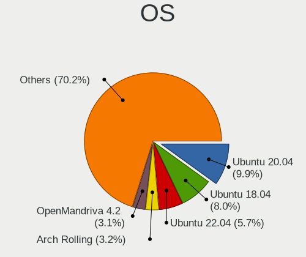

| Name                         | Desktops | Percent |
|------------------------------|----------|---------|
| Ubuntu 20.04                 | 72       | 15.55%  |
| Ubuntu 18.04                 | 58       | 12.53%  |
| OpenMandriva 4.2             | 22       | 4.75%   |
| Ubuntu MATE 20.04            | 18       | 3.89%   |
| Ubuntu MATE 18.04            | 14       | 3.02%   |
| Arch Rolling                 | 11       | 2.38%   |
| KDE neon 20.04               | 10       | 2.16%   |
| Ubuntu 22.04                 | 8        | 1.73%   |
| Ubuntu 19.10                 | 8        | 1.73%   |
| Arch                         | 8        | 1.73%   |
| Ubuntu 19.04                 | 7        | 1.51%   |
| Manjaro                      | 7        | 1.51%   |
| Linux Mint 20.3              | 7        | 1.51%   |
| Zorin 15                     | 6        | 1.3%    |
| Xubuntu 18.04                | 6        | 1.3%    |
| Ubuntu 21.10                 | 6        | 1.3%    |
| Pop!_OS 20.04                | 6        | 1.3%    |
| openSUSE Tumbleweed-XXXXXXXX | 6        | 1.3%    |
| Linux Mint 19.3              | 6        | 1.3%    |
| Kubuntu 20.04                | 6        | 1.3%    |
| Zorin 16                     | 5        | 1.08%   |
| Ubuntu 21.04                 | 5        | 1.08%   |
| OpenMandriva 4.3             | 5        | 1.08%   |
| ArcoLinux Rolling            | 5        | 1.08%   |
| Ubuntu Unity 16.04           | 4        | 0.86%   |
| ROSA R10                     | 4        | 0.86%   |
| Pop!_OS 22.04                | 4        | 0.86%   |
| Pop!_OS 21.10                | 4        | 0.86%   |
| Linux Mint 20.2              | 4        | 0.86%   |
| Gentoo 2.7                   | 4        | 0.86%   |
| Fedora 36                    | 4        | 0.86%   |
| Fedora 35                    | 4        | 0.86%   |
| Debian 11                    | 4        | 0.86%   |
| BlackPanther 18.1            | 4        | 0.86%   |
| Xubuntu 20.04                | 3        | 0.65%   |
| Ubuntu 18.10                 | 3        | 0.65%   |
| OpenMandriva 4.90            | 3        | 0.65%   |
| Linux Mint 20.1              | 3        | 0.65%   |
| Linux Mint 20                | 3        | 0.65%   |
| Fedora 32                    | 3        | 0.65%   |

OS Family
---------

OS without a version

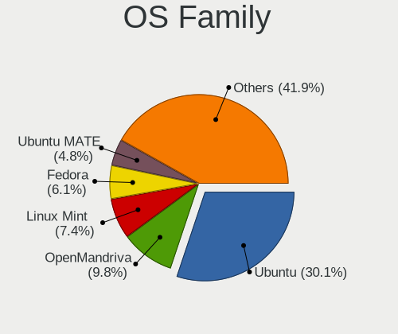

| Name         | Desktops | Percent |
|--------------|----------|---------|
| Ubuntu       | 160      | 36.36%  |
| Ubuntu MATE  | 32       | 7.27%   |
| OpenMandriva | 32       | 7.27%   |
| Linux Mint   | 25       | 5.68%   |
| Arch         | 19       | 4.32%   |
| Manjaro      | 18       | 4.09%   |
| Pop!_OS      | 17       | 3.86%   |
| Fedora       | 17       | 3.86%   |
| Zorin        | 12       | 2.73%   |
| KDE neon     | 12       | 2.73%   |
| Xubuntu      | 11       | 2.5%    |
| ROSA         | 10       | 2.27%   |
| Kubuntu      | 10       | 2.27%   |
| Debian       | 9        | 2.05%   |
| Ubuntu Unity | 6        | 1.36%   |
| openSUSE     | 6        | 1.36%   |
| ArcoLinux    | 6        | 1.36%   |
| Gentoo       | 5        | 1.14%   |
| Lubuntu      | 4        | 0.91%   |
| BlackPanther | 4        | 0.91%   |
| Elementary   | 3        | 0.68%   |
| Artix        | 3        | 0.68%   |
| Reborn OS    | 2        | 0.45%   |
| Peppermint   | 2        | 0.45%   |
| LMDE         | 2        | 0.45%   |
| Endless      | 2        | 0.45%   |
| ALT Linux    | 2        | 0.45%   |
| Xero         | 1        | 0.23%   |
| Void Linux   | 1        | 0.23%   |
| Solus        | 1        | 0.23%   |
| MX           | 1        | 0.23%   |
| Mageia       | 1        | 0.23%   |
| Garuda Linux | 1        | 0.23%   |
| EndeavourOS  | 1        | 0.23%   |
| CentOS       | 1        | 0.23%   |
| antiX        | 1        | 0.23%   |

Kernel
------

Version of the Linux kernel

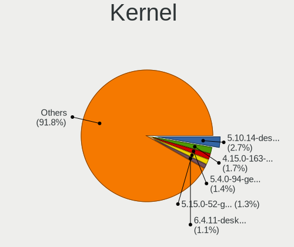

| Version                         | Desktops | Percent |
|---------------------------------|----------|---------|
| 5.10.14-desktop-1omv4002        | 22       | 4.27%   |
| 4.15.0-163-generic              | 14       | 2.72%   |
| 5.4.0-94-generic                | 12       | 2.33%   |
| 5.4.0-54-generic                | 7        | 1.36%   |
| 5.4.0-40-generic                | 7        | 1.36%   |
| 5.4.0-91-generic                | 6        | 1.17%   |
| 5.4.0-42-generic                | 6        | 1.17%   |
| 5.4.0-29-generic                | 6        | 1.17%   |
| 5.11.0-40-generic               | 6        | 1.17%   |
| 5.4.0-59-generic                | 5        | 0.97%   |
| 5.4.0-58-generic                | 5        | 0.97%   |
| 5.4.0-53-generic                | 5        | 0.97%   |
| 5.4.0-52-generic                | 5        | 0.97%   |
| 5.3.0-46-generic                | 5        | 0.97%   |
| 5.16.7-desktop-1omv4003         | 5        | 0.97%   |
| 4.15.0-45-generic               | 5        | 0.97%   |
| 5.4.0-65-generic                | 4        | 0.78%   |
| 5.4.0-48-generic                | 4        | 0.78%   |
| 5.4.0-47-generic                | 4        | 0.78%   |
| 5.0.0-25-generic                | 4        | 0.78%   |
| 4.9.60-nrj-desktop-1rosa-x86_64 | 4        | 0.78%   |
| 4.18.16-desktop-1bP             | 4        | 0.78%   |
| 4.18.0-25-generic               | 4        | 0.78%   |
| 4.18.0-17-generic               | 4        | 0.78%   |
| 4.15.0-96-generic               | 4        | 0.78%   |
| 4.15.0-47-generic               | 4        | 0.78%   |
| 5.8.0-53-generic                | 3        | 0.58%   |
| 5.8.0-50-generic                | 3        | 0.58%   |
| 5.8.0-43-generic                | 3        | 0.58%   |
| 5.4.0-56-generic                | 3        | 0.58%   |
| 5.4.0-37-generic                | 3        | 0.58%   |
| 5.4.0-31-generic                | 3        | 0.58%   |
| 5.4.0-26-generic                | 3        | 0.58%   |
| 5.4.0-100-generic               | 3        | 0.58%   |
| 5.3.0-51-generic                | 3        | 0.58%   |
| 5.3.0-28-generic                | 3        | 0.58%   |
| 5.18.12-desktop-3omv4090        | 3        | 0.58%   |
| 5.15.0-46-generic               | 3        | 0.58%   |
| 5.13.0-41-generic               | 3        | 0.58%   |
| 5.13.0-40-generic               | 3        | 0.58%   |

Kernel Family
-------------

Linux kernel without a distro release

| Version | Desktops | Percent |
|---------|----------|---------|
| 5.4.0   | 107      | 22.34%  |
| 4.15.0  | 61       | 12.73%  |
| 5.11.0  | 28       | 5.85%   |
| 5.3.0   | 26       | 5.43%   |
| 5.13.0  | 22       | 4.59%   |
| 5.10.14 | 22       | 4.59%   |
| 5.8.0   | 21       | 4.38%   |
| 4.18.0  | 17       | 3.55%   |
| 5.15.0  | 15       | 3.13%   |
| 5.0.0   | 15       | 3.13%   |
| 5.10.0  | 6        | 1.25%   |
| 5.18.12 | 5        | 1.04%   |
| 5.16.7  | 5        | 1.04%   |
| 4.9.60  | 4        | 0.84%   |
| 4.18.16 | 4        | 0.84%   |
| 5.17.5  | 3        | 0.63%   |
| 5.17.4  | 3        | 0.63%   |
| 5.12.4  | 3        | 0.63%   |
| 4.19.0  | 3        | 0.63%   |
| 5.9.11  | 2        | 0.42%   |
| 5.8.11  | 2        | 0.42%   |
| 5.7.0   | 2        | 0.42%   |
| 5.4.18  | 2        | 0.42%   |
| 5.19.0  | 2        | 0.42%   |
| 5.17.1  | 2        | 0.42%   |
| 5.16.0  | 2        | 0.42%   |
| 5.15.7  | 2        | 0.42%   |
| 5.15.32 | 2        | 0.42%   |
| 5.14.16 | 2        | 0.42%   |
| 5.14.14 | 2        | 0.42%   |
| 5.11.2  | 2        | 0.42%   |
| 5.11.11 | 2        | 0.42%   |
| 5.10.88 | 2        | 0.42%   |
| 5.10.71 | 2        | 0.42%   |
| 5.10.33 | 2        | 0.42%   |
| 4.4.0   | 2        | 0.42%   |
| 6.0.0   | 1        | 0.21%   |
| 5.9.8   | 1        | 0.21%   |
| 5.9.14  | 1        | 0.21%   |
| 5.9.1   | 1        | 0.21%   |

Kernel Major Ver.
-----------------

Linux kernel major version

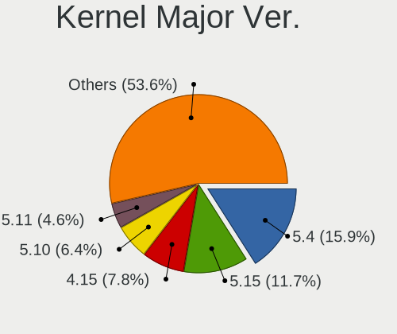

| Version | Desktops | Percent |
|---------|----------|---------|
| 5.4     | 116      | 24.47%  |
| 4.15    | 61       | 12.87%  |
| 5.10    | 44       | 9.28%   |
| 5.11    | 34       | 7.17%   |
| 5.8     | 27       | 5.7%    |
| 5.15    | 27       | 5.7%    |
| 5.3     | 26       | 5.49%   |
| 5.13    | 24       | 5.06%   |
| 4.18    | 22       | 4.64%   |
| 5.0     | 18       | 3.8%    |
| 5.16    | 11       | 2.32%   |
| 5.17    | 10       | 2.11%   |
| 5.18    | 8        | 1.69%   |
| 5.14    | 7        | 1.48%   |
| 5.9     | 6        | 1.27%   |
| 5.6     | 6        | 1.27%   |
| 5.7     | 5        | 1.05%   |
| 4.9     | 5        | 1.05%   |
| 5.19    | 4        | 0.84%   |
| 5.12    | 4        | 0.84%   |
| 4.19    | 4        | 0.84%   |
| 4.4     | 2        | 0.42%   |
| 6.0     | 1        | 0.21%   |
| 5.1     | 1        | 0.21%   |
| 4.14    | 1        | 0.21%   |

Arch
----

OS architecture (x86_64, i586, etc.)

| Name   | Desktops | Percent |
|--------|----------|---------|
| x86_64 | 409      | 95.78%  |
| i686   | 18       | 4.22%   |

DE
--

Desktop Environment

| Name            | Desktops | Percent |
|-----------------|----------|---------|
| GNOME           | 167      | 37.36%  |
| KDE5            | 74       | 16.55%  |
| Unknown         | 67       | 14.99%  |
| XFCE            | 36       | 8.05%   |
| MATE            | 33       | 7.38%   |
| X-Cinnamon      | 23       | 5.15%   |
| KDE             | 18       | 4.03%   |
| Unity           | 6        | 1.34%   |
| KDE4            | 6        | 1.34%   |
| LXQt            | 5        | 1.12%   |
| i3              | 3        | 0.67%   |
| Pantheon        | 2        | 0.45%   |
| Cinnamon        | 2        | 0.45%   |
| Openbox         | 1        | 0.22%   |
| LXDE            | 1        | 0.22%   |
| herbstluftwm    | 1        | 0.22%   |
| GNOME Flashback | 1        | 0.22%   |
| Budgie          | 1        | 0.22%   |

Display Server
--------------

X11 or Wayland

| Name    | Desktops | Percent |
|---------|----------|---------|
| X11     | 363      | 83.45%  |
| Unknown | 40       | 9.2%    |
| Wayland | 25       | 5.75%   |
| Tty     | 7        | 1.61%   |

Display Manager
---------------

SDDM, LightDM, etc.

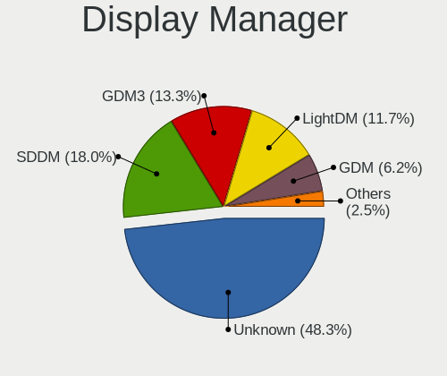

| Name    | Desktops | Percent |
|---------|----------|---------|
| Unknown | 245      | 55.3%   |
| SDDM    | 66       | 14.9%   |
| LightDM | 53       | 11.96%  |
| GDM3    | 35       | 7.9%    |
| GDM     | 28       | 6.32%   |
| TDM     | 8        | 1.81%   |
| KDM     | 6        | 1.35%   |
| XDM     | 1        | 0.23%   |
| SLiM    | 1        | 0.23%   |

OS Lang
-------

Language

| Lang    | Desktops | Percent |
|---------|----------|---------|
| en_US   | 212      | 48.29%  |
| el_GR   | 136      | 30.98%  |
| Unknown | 67       | 15.26%  |
| en_GB   | 7        | 1.59%   |
| C       | 6        | 1.37%   |
| ru_RU   | 3        | 0.68%   |
| de_DE   | 3        | 0.68%   |
| unm_US  | 1        | 0.23%   |
| POSIX   | 1        | 0.23%   |
| es_ES   | 1        | 0.23%   |
| en_IE   | 1        | 0.23%   |
| en_AU   | 1        | 0.23%   |

Boot Mode
---------

EFI or BIOS

| Mode | Desktops | Percent |
|------|----------|---------|
| BIOS | 287      | 65.38%  |
| EFI  | 152      | 34.62%  |

Filesystem
----------

Type of filesystem

| Type    | Desktops | Percent |
|---------|----------|---------|
| Ext4    | 324      | 73.97%  |
| Overlay | 61       | 13.93%  |
| Btrfs   | 27       | 6.16%   |
| Unknown | 14       | 3.2%    |
| Xfs     | 8        | 1.83%   |
| Ext3    | 2        | 0.46%   |
| F2fs    | 1        | 0.23%   |
| Ext2    | 1        | 0.23%   |

Part. scheme
------------

Scheme of partitioning

| Type    | Desktops | Percent |
|---------|----------|---------|
| Unknown | 278      | 64.5%   |
| GPT     | 101      | 23.43%  |
| MBR     | 52       | 12.06%  |

Dual Boot with Linux/BSD
------------------------

Hosting more than one Linux/BSD

| Dual boot | Desktops | Percent |
|-----------|----------|---------|
| No        | 348      | 79.63%  |
| Yes       | 89       | 20.37%  |

Dual Boot (Win)
---------------

Hosting Linux and Windows

| Dual boot | Desktops | Percent |
|-----------|----------|---------|
| No        | 233      | 53.32%  |
| Yes       | 204      | 46.68%  |

Board
-----

Vendor
------

Motherboard manufacturer

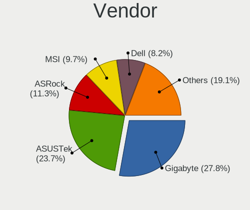

| Name                | Desktops | Percent |
|---------------------|----------|---------|
| Gigabyte Technology | 117      | 27.4%   |
| ASUSTek Computer    | 110      | 25.76%  |
| ASRock              | 48       | 11.24%  |
| MSI                 | 37       | 8.67%   |
| Dell                | 33       | 7.73%   |
| Hewlett-Packard     | 32       | 7.49%   |
| Lenovo              | 20       | 4.68%   |
| Intel               | 7        | 1.64%   |
| Foxconn             | 4        | 0.94%   |
| Pegatron            | 2        | 0.47%   |
| Fujitsu Siemens     | 2        | 0.47%   |
| ECS                 | 2        | 0.47%   |
| AOpen               | 2        | 0.47%   |
| ZOTAC               | 1        | 0.23%   |
| VIA Technologies    | 1        | 0.23%   |
| QDI                 | 1        | 0.23%   |
| NU591               | 1        | 0.23%   |
| IBM                 | 1        | 0.23%   |
| Gateway             | 1        | 0.23%   |
| Apple               | 1        | 0.23%   |
| AMD                 | 1        | 0.23%   |
| Albatron            | 1        | 0.23%   |
| ABIT                | 1        | 0.23%   |
| Unknown             | 1        | 0.23%   |

Model
-----

Motherboard model

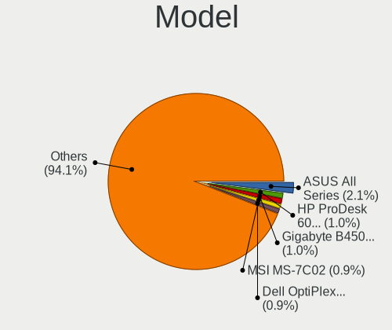

| Name                              | Desktops | Percent |
|-----------------------------------|----------|---------|
| ASUS All Series                   | 12       | 2.81%   |
| HP ProDesk 600 G1 SFF             | 6        | 1.41%   |
| ASRock B450 Gaming K4             | 5        | 1.17%   |
| Gigabyte H61M-S2PV                | 4        | 0.94%   |
| Dell OptiPlex GX520               | 4        | 0.94%   |
| Dell OptiPlex 7010                | 4        | 0.94%   |
| ASUS ROG STRIX B350-F GAMING      | 4        | 0.94%   |
| MSI MS-7C02                       | 3        | 0.7%    |
| HP Compaq Pro 6300 SFF            | 3        | 0.7%    |
| HP Compaq 8200 Elite SFF PC       | 3        | 0.7%    |
| Gigabyte G41M-Combo               | 3        | 0.7%    |
| Gigabyte G31M-S2L                 | 3        | 0.7%    |
| Gigabyte B75M-D3H                 | 3        | 0.7%    |
| Gigabyte B450 AORUS M             | 3        | 0.7%    |
| Gigabyte B250M-DS3H               | 3        | 0.7%    |
| Dell OptiPlex GX620               | 3        | 0.7%    |
| Dell OptiPlex 7040                | 3        | 0.7%    |
| ASUS Z170-A                       | 3        | 0.7%    |
| ASUS PRIME X570-P                 | 3        | 0.7%    |
| ASUS P6T                          | 3        | 0.7%    |
| MSI MS-7C56                       | 2        | 0.47%   |
| MSI MS-7C31                       | 2        | 0.47%   |
| MSI MS-7B78                       | 2        | 0.47%   |
| MSI MS-7996                       | 2        | 0.47%   |
| MSI MS-7972                       | 2        | 0.47%   |
| Lenovo ThinkCentre M71e 3167A46   | 2        | 0.47%   |
| Lenovo ThinkCentre E73 10AW008MMX | 2        | 0.47%   |
| HP Z820 Workstation               | 2        | 0.47%   |
| HP EliteDesk 800 G1 SFF           | 2        | 0.47%   |
| HP Compaq 8100 Elite CMT PC       | 2        | 0.47%   |
| Gigabyte Z68P-DS3                 | 2        | 0.47%   |
| Gigabyte Z370 HD3                 | 2        | 0.47%   |
| Gigabyte Z170-HD3P                | 2        | 0.47%   |
| Gigabyte G41M-ES2L                | 2        | 0.47%   |
| Gigabyte G31M-ES2L                | 2        | 0.47%   |
| Gigabyte F2A88XM-HD3P             | 2        | 0.47%   |
| Gigabyte B450M DS3H               | 2        | 0.47%   |
| Gigabyte A320M-S2H                | 2        | 0.47%   |
| Gigabyte 970A-DS3P                | 2        | 0.47%   |
| Gigabyte 965P-S3                  | 2        | 0.47%   |

Model Family
------------

Motherboard model prefix

| Name                  | Desktops | Percent |
|-----------------------|----------|---------|
| Dell OptiPlex         | 25       | 5.85%   |
| Lenovo ThinkCentre    | 17       | 3.98%   |
| HP Compaq             | 17       | 3.98%   |
| ASUS PRIME            | 16       | 3.75%   |
| ASUS All              | 12       | 2.81%   |
| ASUS ROG              | 8        | 1.87%   |
| HP ProDesk            | 7        | 1.64%   |
| Gigabyte B450         | 5        | 1.17%   |
| ASRock B450           | 5        | 1.17%   |
| Gigabyte H61M-S2PV    | 4        | 0.94%   |
| Dell Precision        | 4        | 0.94%   |
| MSI MS-7C02           | 3        | 0.7%    |
| HP EliteDesk          | 3        | 0.7%    |
| Gigabyte Z370         | 3        | 0.7%    |
| Gigabyte G41M-Combo   | 3        | 0.7%    |
| Gigabyte G31M-S2L     | 3        | 0.7%    |
| Gigabyte B75M-D3H     | 3        | 0.7%    |
| Gigabyte B550         | 3        | 0.7%    |
| Gigabyte B250M-DS3H   | 3        | 0.7%    |
| ASUS Z170-A           | 3        | 0.7%    |
| ASUS TUF              | 3        | 0.7%    |
| ASUS P6T              | 3        | 0.7%    |
| ASUS P5Q              | 3        | 0.7%    |
| ASUS P5G41T-M         | 3        | 0.7%    |
| MSI MS-7C56           | 2        | 0.47%   |
| MSI MS-7C31           | 2        | 0.47%   |
| MSI MS-7B78           | 2        | 0.47%   |
| MSI MS-7996           | 2        | 0.47%   |
| MSI MS-7972           | 2        | 0.47%   |
| HP Z820               | 2        | 0.47%   |
| Gigabyte Z68P-DS3     | 2        | 0.47%   |
| Gigabyte Z170-HD3P    | 2        | 0.47%   |
| Gigabyte X570         | 2        | 0.47%   |
| Gigabyte H410M        | 2        | 0.47%   |
| Gigabyte G41M-ES2L    | 2        | 0.47%   |
| Gigabyte G31M-ES2L    | 2        | 0.47%   |
| Gigabyte F2A88XM-HD3P | 2        | 0.47%   |
| Gigabyte B450M        | 2        | 0.47%   |
| Gigabyte A320M-S2H    | 2        | 0.47%   |
| Gigabyte 990FXA-UD3   | 2        | 0.47%   |

MFG Year
--------

Motherboard manufacture year

| Year | Desktops | Percent |
|------|----------|---------|
| 2018 | 41       | 9.6%    |
| 2013 | 38       | 8.9%    |
| 2008 | 37       | 8.67%   |
| 2012 | 34       | 7.96%   |
| 2009 | 32       | 7.49%   |
| 2014 | 30       | 7.03%   |
| 2011 | 29       | 6.79%   |
| 2017 | 28       | 6.56%   |
| 2007 | 26       | 6.09%   |
| 2015 | 24       | 5.62%   |
| 2019 | 22       | 5.15%   |
| 2010 | 19       | 4.45%   |
| 2020 | 16       | 3.75%   |
| 2005 | 14       | 3.28%   |
| 2016 | 12       | 2.81%   |
| 2006 | 10       | 2.34%   |
| 2021 | 6        | 1.41%   |
| 2003 | 4        | 0.94%   |
| 2004 | 3        | 0.7%    |
| 2022 | 2        | 0.47%   |

Form Factor
-----------

Physical design of the computer

| Name    | Desktops | Percent |
|---------|----------|---------|
| Desktop | 427      | 100%    |

Secure Boot
-----------

Enabled or disabled

| State    | Desktops | Percent |
|----------|----------|---------|
| Disabled | 426      | 99.3%   |
| Enabled  | 3        | 0.7%    |

Coreboot
--------

Have coreboot on board

| Used | Desktops | Percent |
|------|----------|---------|
| No   | 427      | 100%    |

RAM Size
--------

Total RAM memory

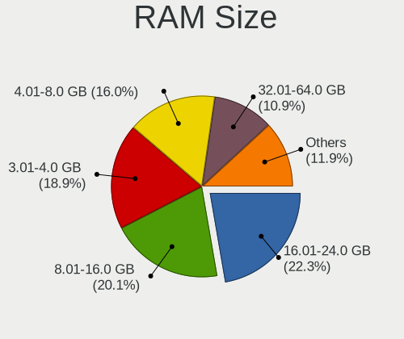

| Size in GB  | Desktops | Percent |
|-------------|----------|---------|
| 3.01-4.0    | 101      | 23.06%  |
| 8.01-16.0   | 96       | 21.92%  |
| 16.01-24.0  | 90       | 20.55%  |
| 4.01-8.0    | 69       | 15.75%  |
| 1.01-2.0    | 33       | 7.53%   |
| 32.01-64.0  | 25       | 5.71%   |
| 2.01-3.0    | 14       | 3.2%    |
| 64.01-256.0 | 6        | 1.37%   |
| 24.01-32.0  | 2        | 0.46%   |
| 0.51-1.0    | 2        | 0.46%   |

RAM Used
--------

Used RAM memory

| Used GB    | Desktops | Percent |
|------------|----------|---------|
| 1.01-2.0   | 190      | 40.34%  |
| 2.01-3.0   | 94       | 19.96%  |
| 0.51-1.0   | 53       | 11.25%  |
| 3.01-4.0   | 49       | 10.4%   |
| 4.01-8.0   | 48       | 10.19%  |
| 8.01-16.0  | 20       | 4.25%   |
| 0.01-0.5   | 14       | 2.97%   |
| 16.01-24.0 | 3        | 0.64%   |

Total Drives
------------

Number of drives on board

| Drives | Desktops | Percent |
|--------|----------|---------|
| 1      | 167      | 38.04%  |
| 2      | 136      | 30.98%  |
| 3      | 64       | 14.58%  |
| 4      | 39       | 8.88%   |
| 5      | 18       | 4.1%    |
| 6      | 9        | 2.05%   |
| 7      | 3        | 0.68%   |
| 0      | 2        | 0.46%   |
| 12     | 1        | 0.23%   |

Has CD-ROM
----------

Has CD-ROM on board

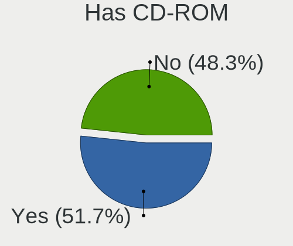

| Presented | Desktops | Percent |
|-----------|----------|---------|
| Yes       | 245      | 56.84%  |
| No        | 186      | 43.16%  |

Has Ethernet
------------

Has Ethernet on board

| Presented | Desktops | Percent |
|-----------|----------|---------|
| Yes       | 424      | 99.3%   |
| No        | 3        | 0.7%    |

Has WiFi
--------

Has WiFi module

| Presented | Desktops | Percent |
|-----------|----------|---------|
| No        | 295      | 67.66%  |
| Yes       | 141      | 32.34%  |

Has Bluetooth
-------------

Has Bluetooth module

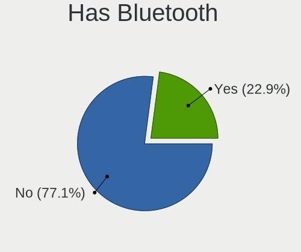

| Presented | Desktops | Percent |
|-----------|----------|---------|
| No        | 359      | 83.29%  |
| Yes       | 72       | 16.71%  |

Location
--------

Country
-------

Geographic location (country)

| Country | Desktops | Percent |
|---------|----------|---------|
| Greece  | 427      | 100%    |

City
----

Geographic location (city)

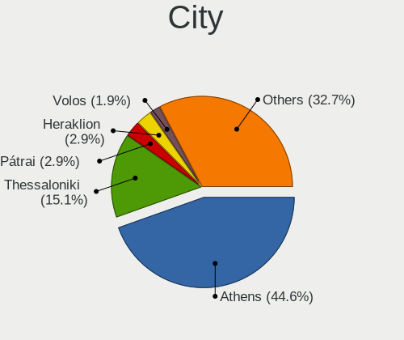

| City         | Desktops | Percent |
|--------------|----------|---------|
| Athens       | 223      | 48.27%  |
| Thessaloniki | 78       | 16.88%  |
| Ptrai      | 13       | 2.81%   |
| Heraklion    | 12       | 2.6%    |
| Larissa      | 6        | 1.3%    |
| Kavala       | 6        | 1.3%    |
| Ioannina     | 6        | 1.3%    |
| Lamia        | 5        | 1.08%   |
| Kalamata     | 5        | 1.08%   |
| Volos        | 4        | 0.87%   |
| Katerini     | 4        | 0.87%   |
| Chalcis      | 4        | 0.87%   |
| Veroia       | 3        | 0.65%   |
| Serres       | 3        | 0.65%   |
| Samos        | 3        | 0.65%   |
| Rhodes       | 3        | 0.65%   |
| Kozani       | 3        | 0.65%   |
| Karditsa     | 3        | 0.65%   |
| Glyfada      | 3        | 0.65%   |
| Chania       | 3        | 0.65%   |
| Aigaleo      | 3        | 0.65%   |
| Zakynthos    | 2        | 0.43%   |
| Xanthi       | 2        | 0.43%   |
| Rethymno     | 2        | 0.43%   |
| Ptrai    | 2        | 0.43%   |
| Piraeus      | 2        | 0.43%   |
| Nafplion     | 2        | 0.43%   |
| Ithaki       | 2        | 0.43%   |
| Florina      | 2        | 0.43%   |
| Farsala      | 2        | 0.43%   |
| Drama        | 2        | 0.43%   |
| Chalandri    | 2        | 0.43%   |
| Argostoli    | 2        | 0.43%   |
| Acharnes     | 2        | 0.43%   |
| Vouliagmeni  | 1        | 0.22%   |
| Vergina      | 1        | 0.22%   |
| Tripoli      | 1        | 0.22%   |
| Trikala      | 1        | 0.22%   |
| Thebes       | 1        | 0.22%   |
| Sparti       | 1        | 0.22%   |

Drives
------

Drive Vendor
------------

Hard drive vendors

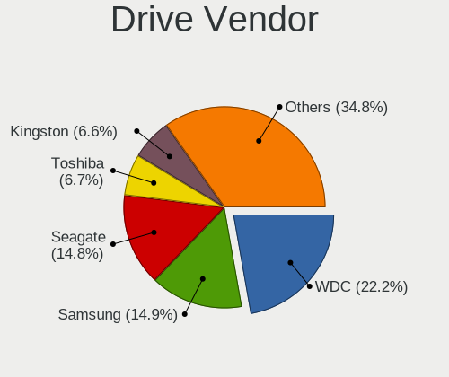

| Vendor                    | Desktops | Drives | Percent |
|---------------------------|----------|--------|---------|
| WDC                       | 194      | 328    | 24.81%  |
| Seagate                   | 132      | 206    | 16.88%  |
| Samsung Electronics       | 103      | 156    | 13.17%  |
| Toshiba                   | 55       | 76     | 7.03%   |
| Kingston                  | 46       | 55     | 5.88%   |
| SanDisk                   | 38       | 54     | 4.86%   |
| Patriot                   | 35       | 44     | 4.48%   |
| Hitachi                   | 19       | 21     | 2.43%   |
| Intenso                   | 17       | 21     | 2.17%   |
| Intel                     | 12       | 14     | 1.53%   |
| Crucial                   | 12       | 18     | 1.53%   |
| OCZ                       | 11       | 14     | 1.41%   |
| Maxtor                    | 11       | 13     | 1.41%   |
| A-DATA Technology         | 10       | 16     | 1.28%   |
| Team                      | 9        | 9      | 1.15%   |
| PNY                       | 7        | 7      | 0.9%    |
| Phison                    | 6        | 9      | 0.77%   |
| SPCC                      | 5        | 6      | 0.64%   |
| Corsair                   | 5        | 5      | 0.64%   |
| Leven                     | 4        | 4      | 0.51%   |
| HGST                      | 4        | 7      | 0.51%   |
| China                     | 4        | 4      | 0.51%   |
| XPG                       | 3        | 4      | 0.38%   |
| Unknown                   | 3        | 7      | 0.38%   |
| SK hynix                  | 3        | 4      | 0.38%   |
| JMicron Technology        | 3        | 6      | 0.38%   |
| Gigabyte Technology       | 3        | 5      | 0.38%   |
| Transcend                 | 2        | 2      | 0.26%   |
| Platinet                  | 2        | 2      | 0.26%   |
| Mushkin                   | 2        | 2      | 0.26%   |
| LITEONIT                  | 2        | 2      | 0.26%   |
| GOODRAM                   | 2        | 3      | 0.26%   |
| Emtec                     | 2        | 2      | 0.26%   |
| Unknown                   | 2        | 2      | 0.26%   |
| Verbatim                  | 1        | 2      | 0.13%   |
| Silicon Motion            | 1        | 1      | 0.13%   |
| Realtek Semiconductor     | 1        | 2      | 0.13%   |
| Quantum                   | 1        | 1      | 0.13%   |
| Plextor                   | 1        | 1      | 0.13%   |
| Micron/Crucial Technology | 1        | 1      | 0.13%   |

Drive Model
-----------

Hard drive models

| Model                            | Desktops | Percent |
|----------------------------------|----------|---------|
| Samsung SSD 860 EVO 250GB        | 17       | 1.89%   |
| Seagate ST500DM002-1BD142 500GB  | 15       | 1.67%   |
| Toshiba DT01ACA100 1TB           | 14       | 1.56%   |
| Seagate ST1000DM010-2EP102 1TB   | 11       | 1.22%   |
| Samsung SSD 850 EVO 250GB        | 10       | 1.11%   |
| Patriot Burst 240GB SSD          | 10       | 1.11%   |
| Kingston SA400S37120G 120GB SSD  | 10       | 1.11%   |
| Patriot Burst 120GB SSD          | 9        | 1%      |
| WDC WD10EZEX-08WN4A0 1TB         | 8        | 0.89%   |
| Toshiba DT01ACA200 2TB           | 8        | 0.89%   |
| Toshiba DT01ACA050 500GB         | 8        | 0.89%   |
| Samsung SSD 860 EVO 500GB        | 8        | 0.89%   |
| Samsung NVMe SSD Drive 500GB     | 8        | 0.89%   |
| WDC WDS240G2G0A-00JH30 240GB SSD | 7        | 0.78%   |
| WDC WD5000AAKX-08U6AA0 500GB     | 6        | 0.67%   |
| Patriot Burst 480GB SSD          | 6        | 0.67%   |
| Kingston SA400S37240G 240GB SSD  | 6        | 0.67%   |
| WDC WD10EZEX-00BN5A0 1TB         | 5        | 0.56%   |
| Seagate ST3500418AS 500GB        | 5        | 0.56%   |
| Seagate ST3160815AS 160GB        | 5        | 0.56%   |
| Samsung SSD 850 EVO 500GB        | 5        | 0.56%   |
| Samsung SSD 850 EVO 120GB        | 5        | 0.56%   |
| Samsung SSD 840 Series 120GB     | 5        | 0.56%   |
| PNY CS900 120GB SSD              | 5        | 0.56%   |
| Kingston SV300S37A120G 120GB SSD | 5        | 0.56%   |
| Intel SSDSA2BW120G3H 120GB       | 5        | 0.56%   |
| WDC WD5000AAKX-00ERMA0 500GB     | 4        | 0.44%   |
| WDC WD20EZRX-00D8PB0 2TB         | 4        | 0.44%   |
| WDC WD1003FZEX-00MK2A0 1TB       | 4        | 0.44%   |
| Toshiba HDWD110 1TB              | 4        | 0.44%   |
| Seagate ST3500630AS 500GB        | 4        | 0.44%   |
| Seagate ST3500320AS 500GB        | 4        | 0.44%   |
| Seagate ST3250410AS 250GB        | 4        | 0.44%   |
| SanDisk SDSSDA120G 120GB         | 4        | 0.44%   |
| Samsung SSD 970 EVO Plus 500GB   | 4        | 0.44%   |
| Samsung NVMe SSD Drive 1TB       | 4        | 0.44%   |
| WDC WDS250G2B0A-00SM50 250GB SSD | 3        | 0.33%   |
| WDC WDS240G2G0B-00EPW0 240GB SSD | 3        | 0.33%   |
| WDC WD800JB-00JJC0 80GB          | 3        | 0.33%   |
| WDC WD40EFRX-68N32N0 4TB         | 3        | 0.33%   |

HDD Vendor
----------

Hard disk drive vendors

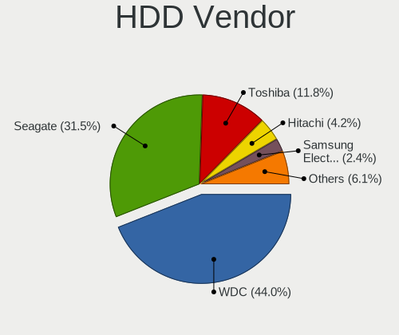

| Vendor              | Desktops | Drives | Percent |
|---------------------|----------|--------|---------|
| WDC                 | 178      | 293    | 43.84%  |
| Seagate             | 132      | 205    | 32.51%  |
| Toshiba             | 45       | 56     | 11.08%  |
| Hitachi             | 19       | 21     | 4.68%   |
| Samsung Electronics | 11       | 15     | 2.71%   |
| Maxtor              | 11       | 13     | 2.71%   |
| HGST                | 4        | 7      | 0.99%   |
| Quantum             | 1        | 1      | 0.25%   |
| JMicron Technology  | 1        | 1      | 0.25%   |
| Intenso             | 1        | 1      | 0.25%   |
| Hewlett-Packard     | 1        | 1      | 0.25%   |
| Fujitsu             | 1        | 1      | 0.25%   |
| Apple               | 1        | 1      | 0.25%   |

SSD Vendor
----------

Solid state drive vendors

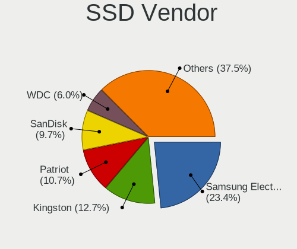

| Vendor              | Desktops | Drives | Percent |
|---------------------|----------|--------|---------|
| Samsung Electronics | 67       | 90     | 21%     |
| Kingston            | 39       | 48     | 12.23%  |
| SanDisk             | 36       | 52     | 11.29%  |
| Patriot             | 34       | 43     | 10.66%  |
| WDC                 | 19       | 32     | 5.96%   |
| Intenso             | 14       | 18     | 4.39%   |
| Intel               | 12       | 14     | 3.76%   |
| Crucial             | 12       | 18     | 3.76%   |
| OCZ                 | 10       | 13     | 3.13%   |
| Toshiba             | 9        | 17     | 2.82%   |
| Team                | 9        | 9      | 2.82%   |
| A-DATA Technology   | 9        | 15     | 2.82%   |
| PNY                 | 7        | 7      | 2.19%   |
| SPCC                | 5        | 6      | 1.57%   |
| Leven               | 4        | 4      | 1.25%   |
| Corsair             | 4        | 4      | 1.25%   |
| China               | 4        | 4      | 1.25%   |
| Gigabyte Technology | 3        | 5      | 0.94%   |
| Platinet            | 2        | 2      | 0.63%   |
| Mushkin             | 2        | 2      | 0.63%   |
| LITEONIT            | 2        | 2      | 0.63%   |
| GOODRAM             | 2        | 3      | 0.63%   |
| Emtec               | 2        | 2      | 0.63%   |
| Unknown             | 2        | 2      | 0.63%   |
| Verbatim            | 1        | 2      | 0.31%   |
| Unknown             | 1        | 4      | 0.31%   |
| Transcend           | 1        | 1      | 0.31%   |
| SK hynix            | 1        | 1      | 0.31%   |
| Seagate             | 1        | 1      | 0.31%   |
| Plextor             | 1        | 1      | 0.31%   |
| LITEON              | 1        | 1      | 0.31%   |
| Lite-On             | 1        | 2      | 0.31%   |
| InnoLite            | 1        | 1      | 0.31%   |
| Drevo               | 1        | 1      | 0.31%   |

Drive Kind
----------

HDD or SSD

| Kind    | Desktops | Drives | Percent |
|---------|----------|--------|---------|
| HDD     | 319      | 616    | 49.08%  |
| SSD     | 256      | 427    | 39.38%  |
| NVMe    | 71       | 94     | 10.92%  |
| Unknown | 4        | 8      | 0.62%   |

Drive Connector
---------------

SATA, SAS, NVMe, etc.

| Type | Desktops | Drives | Percent |
|------|----------|--------|---------|
| SATA | 412      | 1031   | 82.9%   |
| NVMe | 70       | 93     | 14.08%  |
| SAS  | 15       | 21     | 3.02%   |

Drive Size
----------

Size of hard drive

| Size in TB | Desktops | Drives | Percent |
|------------|----------|--------|---------|
| 0.01-0.5   | 356      | 699    | 61.49%  |
| 0.51-1.0   | 140      | 220    | 24.18%  |
| 1.01-2.0   | 45       | 62     | 7.77%   |
| 3.01-4.0   | 18       | 22     | 3.11%   |
| 2.01-3.0   | 14       | 25     | 2.42%   |
| 4.01-10.0  | 5        | 13     | 0.86%   |
| 10.01-20.0 | 1        | 2      | 0.17%   |

Space Total
-----------

Amount of disk space available on the file system

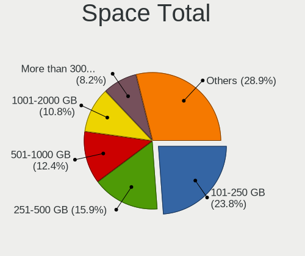

| Size in GB     | Desktops | Percent |
|----------------|----------|---------|
| 101-250        | 117      | 25.71%  |
| 251-500        | 66       | 14.51%  |
| 1001-2000      | 54       | 11.87%  |
| 501-1000       | 50       | 10.99%  |
| Unknown        | 37       | 8.13%   |
| 51-100         | 33       | 7.25%   |
| More than 3000 | 31       | 6.81%   |
| 1-20           | 31       | 6.81%   |
| 21-50          | 19       | 4.18%   |
| 2001-3000      | 17       | 3.74%   |

Space Used
----------

Amount of used disk space

| Used GB        | Desktops | Percent |
|----------------|----------|---------|
| 1-20           | 157      | 33.26%  |
| 21-50          | 60       | 12.71%  |
| 51-100         | 52       | 11.02%  |
| 101-250        | 44       | 9.32%   |
| 251-500        | 42       | 8.9%    |
| 501-1000       | 37       | 7.84%   |
| Unknown        | 37       | 7.84%   |
| 1001-2000      | 22       | 4.66%   |
| More than 3000 | 14       | 2.97%   |
| 2001-3000      | 7        | 1.48%   |

Malfunc. Drives
---------------

Drive models with a malfunction

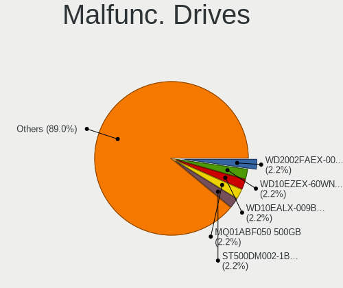

| Model                                 | Desktops | Drives | Percent |
|---------------------------------------|----------|--------|---------|
| Seagate ST500DM002-1BD142 500GB       | 2        | 2      | 4.26%   |
| Seagate ST3500320AS 500GB             | 2        | 2      | 4.26%   |
| WDC WD800JB-00JJC0 80GB               | 1        | 1      | 2.13%   |
| WDC WD5000AAVS-22G9B1 500GB           | 1        | 1      | 2.13%   |
| WDC WD5000AAKB-00H8A0 500GB           | 1        | 1      | 2.13%   |
| WDC WD3200BEVT-00A0RT0 320GB          | 1        | 1      | 2.13%   |
| WDC WD30EZRZ-00GXCB0 3TB              | 1        | 1      | 2.13%   |
| WDC WD2500YS-01SHB1 256GB             | 1        | 2      | 2.13%   |
| WDC WD2500AAKX-083CA1 250GB           | 1        | 1      | 2.13%   |
| WDC WD20PURX-64P6ZY0 2TB              | 1        | 1      | 2.13%   |
| WDC WD20EZRX-00D8PB0 2TB              | 1        | 1      | 2.13%   |
| WDC WD2002FAEX-007BA0 2TB             | 1        | 2      | 2.13%   |
| WDC WD1600AAJS-22L7A0 160GB           | 1        | 1      | 2.13%   |
| WDC WD1200JD-00HBB0 120GB             | 1        | 2      | 2.13%   |
| WDC WD10EZEX-60WN4A1 1TB              | 1        | 2      | 2.13%   |
| WDC WD10EZEX-60WN4A0 1TB              | 1        | 1      | 2.13%   |
| WDC WD10EADS-00M2B0 1TB               | 1        | 1      | 2.13%   |
| Toshiba MK1665GSX H 160GB             | 1        | 1      | 2.13%   |
| Toshiba DT01ACA100 1TB                | 1        | 1      | 2.13%   |
| Seagate ST500LT012-1DG142 500GB       | 1        | 1      | 2.13%   |
| Seagate ST500LM021-1KJ152 500GB       | 1        | 1      | 2.13%   |
| Seagate ST3402111AS 40GB              | 1        | 1      | 2.13%   |
| Seagate ST3360320AS 360GB             | 1        | 1      | 2.13%   |
| Seagate ST3320620AS 320GB             | 1        | 1      | 2.13%   |
| Seagate ST3320613AS 320GB             | 1        | 1      | 2.13%   |
| Seagate ST3250410AS 250GB             | 1        | 2      | 2.13%   |
| Seagate ST3250318AS 250GB             | 1        | 1      | 2.13%   |
| Seagate ST3160815AS 160GB             | 1        | 1      | 2.13%   |
| Seagate ST3000DM001-1ER166 3TB        | 1        | 1      | 2.13%   |
| SanDisk SSD PLUS 240GB                | 1        | 1      | 2.13%   |
| SanDisk SDSSDXPS480G 480GB            | 1        | 1      | 2.13%   |
| Samsung Electronics SSD 860 EVO 500GB | 1        | 1      | 2.13%   |
| Samsung Electronics HD501LJ 500GB     | 1        | 1      | 2.13%   |
| Patriot Burst Elite 240GB SSD         | 1        | 1      | 2.13%   |
| Maxtor 6Y060L0 64GB                   | 1        | 1      | 2.13%   |
| Maxtor 4K040H2 40GB                   | 1        | 1      | 2.13%   |
| Kingston SA400S37120G 120GB SSD       | 1        | 1      | 2.13%   |
| Intel SSDSC2BW240H6 240GB             | 1        | 1      | 2.13%   |
| Hitachi HTS541612J9SA00 120GB         | 1        | 1      | 2.13%   |
| Hitachi HDT722516DLA380 165GB         | 1        | 1      | 2.13%   |

Malfunc. Drive Vendor
---------------------

Vendors of faulty drives

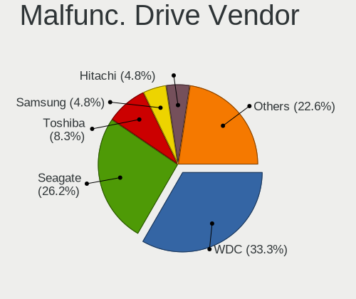

| Vendor              | Desktops | Drives | Percent |
|---------------------|----------|--------|---------|
| WDC                 | 14       | 19     | 30.43%  |
| Seagate             | 14       | 15     | 30.43%  |
| Hitachi             | 3        | 3      | 6.52%   |
| Toshiba             | 2        | 2      | 4.35%   |
| SanDisk             | 2        | 2      | 4.35%   |
| Samsung Electronics | 2        | 2      | 4.35%   |
| Maxtor              | 2        | 2      | 4.35%   |
| Corsair             | 2        | 2      | 4.35%   |
| Patriot             | 1        | 1      | 2.17%   |
| Kingston            | 1        | 1      | 2.17%   |
| Intel               | 1        | 1      | 2.17%   |
| HGST                | 1        | 1      | 2.17%   |
| A-DATA Technology   | 1        | 1      | 2.17%   |

Malfunc. HDD Vendor
-------------------

Vendors of faulty HDD drives

| Vendor              | Desktops | Drives | Percent |
|---------------------|----------|--------|---------|
| WDC                 | 14       | 19     | 37.84%  |
| Seagate             | 14       | 15     | 37.84%  |
| Hitachi             | 3        | 3      | 8.11%   |
| Toshiba             | 2        | 2      | 5.41%   |
| Maxtor              | 2        | 2      | 5.41%   |
| Samsung Electronics | 1        | 1      | 2.7%    |
| HGST                | 1        | 1      | 2.7%    |

Malfunc. Drive Kind
-------------------

Kinds of faulty drives

| Kind | Desktops | Drives | Percent |
|------|----------|--------|---------|
| HDD  | 33       | 43     | 78.57%  |
| SSD  | 8        | 8      | 19.05%  |
| NVMe | 1        | 1      | 2.38%   |

Failed Drives
-------------

Failed drive models

| Model                     | Desktops | Drives | Percent |
|---------------------------|----------|--------|---------|
| Seagate ST3500418AS 500GB | 1        | 1      | 50%     |
| Mushkin MKNSSDCR120GB-7   | 1        | 1      | 50%     |

Failed Drive Vendor
-------------------

Failed drive vendors

| Vendor  | Desktops | Drives | Percent |
|---------|----------|--------|---------|
| Seagate | 1        | 1      | 50%     |
| Mushkin | 1        | 1      | 50%     |

Drive Status
------------

Number of failed and malfunc. drives

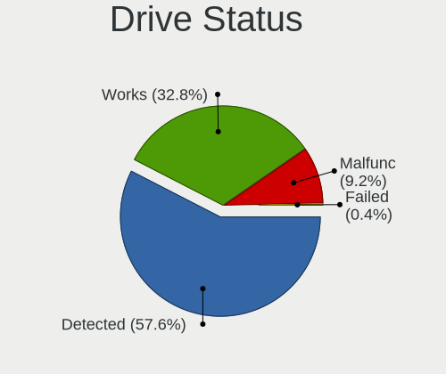

| Status   | Desktops | Drives | Percent |
|----------|----------|--------|---------|
| Detected | 294      | 747    | 62.69%  |
| Works    | 133      | 344    | 28.36%  |
| Malfunc  | 40       | 52     | 8.53%   |
| Failed   | 2        | 2      | 0.43%   |

Storage controller
------------------

Storage Vendor
--------------

Storage controller vendors

| Vendor                        | Desktops | Percent |
|-------------------------------|----------|---------|
| Intel                         | 277      | 47.51%  |
| AMD                           | 128      | 21.96%  |
| Samsung Electronics           | 41       | 7.03%   |
| JMicron Technology            | 32       | 5.49%   |
| Marvell Technology Group      | 18       | 3.09%   |
| Nvidia                        | 17       | 2.92%   |
| ASMedia Technology            | 16       | 2.74%   |
| Kingston Technology Company   | 8        | 1.37%   |
| Phison Electronics            | 7        | 1.2%    |
| VIA Technologies              | 6        | 1.03%   |
| Silicon Image                 | 5        | 0.86%   |
| SanDisk                       | 5        | 0.86%   |
| ADATA Technology              | 4        | 0.69%   |
| Silicon Motion                | 3        | 0.51%   |
| Broadcom / LSI                | 3        | 0.51%   |
| Toshiba America Info Systems  | 2        | 0.34%   |
| SK hynix                      | 2        | 0.34%   |
| Realtek Semiconductor         | 2        | 0.34%   |
| KIOXIA                        | 2        | 0.34%   |
| Promise Technology            | 1        | 0.17%   |
| OCZ Technology Group          | 1        | 0.17%   |
| Micron/Crucial Technology     | 1        | 0.17%   |
| LSI Logic / Symbios Logic     | 1        | 0.17%   |
| Integrated Technology Express | 1        | 0.17%   |

Storage Model
-------------

Storage controller models

| Model                                                                                   | Desktops | Percent |
|-----------------------------------------------------------------------------------------|----------|---------|
| AMD FCH SATA Controller [AHCI mode]                                                     | 77       | 9.69%   |
| Intel NM10/ICH7 Family SATA Controller [IDE mode]                                       | 43       | 5.41%   |
| Intel 8 Series/C220 Series Chipset Family 6-port SATA Controller 1 [AHCI mode]          | 35       | 4.4%    |
| Intel 82801G (ICH7 Family) IDE Controller                                               | 33       | 4.15%   |
| AMD SB7x0/SB8x0/SB9x0 IDE Controller                                                    | 30       | 3.77%   |
| Samsung NVMe SSD Controller SM981/PM981/PM983                                           | 29       | 3.65%   |
| AMD 400 Series Chipset SATA Controller                                                  | 29       | 3.65%   |
| AMD SB7x0/SB8x0/SB9x0 SATA Controller [IDE mode]                                        | 22       | 2.77%   |
| JMicron JMB363 SATA/IDE Controller                                                      | 21       | 2.64%   |
| Intel 6 Series/C200 Series Chipset Family 6 port Desktop SATA AHCI Controller           | 20       | 2.52%   |
| Intel Q170/Q150/B150/H170/H110/Z170/CM236 Chipset SATA Controller [AHCI Mode]           | 18       | 2.26%   |
| Intel 200 Series PCH SATA controller [AHCI mode]                                        | 15       | 1.89%   |
| ASMedia ASM1062 Serial ATA Controller                                                   | 15       | 1.89%   |
| Intel 7 Series/C210 Series Chipset Family 6-port SATA Controller [AHCI mode]            | 14       | 1.76%   |
| AMD SB7x0/SB8x0/SB9x0 SATA Controller [AHCI mode]                                       | 14       | 1.76%   |
| Intel 9 Series Chipset Family SATA Controller [AHCI Mode]                               | 13       | 1.64%   |
| AMD 300 Series Chipset SATA Controller                                                  | 13       | 1.64%   |
| Intel SATA Controller [RAID mode]                                                       | 11       | 1.38%   |
| Intel 6 Series/C200 Series Chipset Family Desktop SATA Controller (IDE mode, ports 0-3) | 11       | 1.38%   |
| Intel 6 Series/C200 Series Chipset Family Desktop SATA Controller (IDE mode, ports 4-5) | 10       | 1.26%   |
| JMicron JMB368 IDE controller                                                           | 9        | 1.13%   |
| Intel 82801JI (ICH10 Family) 4 port SATA IDE Controller #1                              | 9        | 1.13%   |
| Intel 82801JI (ICH10 Family) 2 port SATA IDE Controller #2                              | 9        | 1.13%   |
| Intel 4 Series Chipset PT IDER Controller                                               | 9        | 1.13%   |
| Intel Cannon Lake PCH SATA AHCI Controller                                              | 8        | 1.01%   |
| Intel 82801I (ICH9 Family) 2 port SATA Controller [IDE mode]                            | 8        | 1.01%   |
| AMD 500 Series Chipset SATA Controller                                                  | 8        | 1.01%   |
| Intel 82801JI (ICH10 Family) SATA AHCI Controller                                       | 7        | 0.88%   |
| Intel 82801HR/HO/HH (ICH8R/DO/DH) 2 port SATA Controller [IDE mode]                     | 7        | 0.88%   |
| Intel 82801H (ICH8 Family) 4 port SATA Controller [IDE mode]                            | 7        | 0.88%   |
| AMD FCH SATA Controller D                                                               | 7        | 0.88%   |
| Samsung NVMe SSD Controller 980                                                         | 6        | 0.75%   |
| Marvell Group 88SE6111/6121 SATA II / PATA Controller                                   | 6        | 0.75%   |
| Kingston Company A2000 NVMe SSD                                                         | 6        | 0.75%   |
| Intel 82801JD/DO (ICH10 Family) SATA AHCI Controller                                    | 6        | 0.75%   |
| Intel 82801IR/IO/IH (ICH9R/DO/DH) 4 port SATA Controller [IDE mode]                     | 6        | 0.75%   |
| AMD X370 Series Chipset SATA Controller                                                 | 6        | 0.75%   |
| Intel 82801EB (ICH5) SATA Controller                                                    | 5        | 0.63%   |
| Intel 7 Series/C210 Series Chipset Family 4-port SATA Controller [IDE mode]             | 5        | 0.63%   |
| Intel 7 Series/C210 Series Chipset Family 2-port SATA Controller [IDE mode]             | 5        | 0.63%   |

Storage Kind
------------

Kind of storage controller (IDE, SATA, NVMe, SAS, ...)

| Kind | Desktops | Percent |
|------|----------|---------|
| SATA | 296      | 51.3%   |
| IDE  | 180      | 31.2%   |
| NVMe | 74       | 12.82%  |
| RAID | 22       | 3.81%   |
| SAS  | 4        | 0.69%   |
| SCSI | 1        | 0.17%   |

Processor
---------

CPU Vendor
----------

Processor vendors

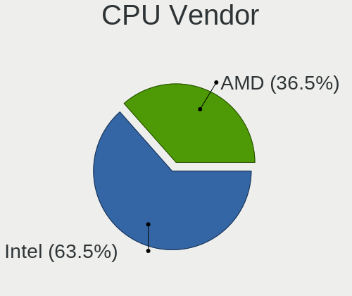

| Vendor | Desktops | Percent |
|--------|----------|---------|
| Intel  | 284      | 66.51%  |
| AMD    | 143      | 33.49%  |

CPU Model
---------

Processor models

| Model                                         | Desktops | Percent |
|-----------------------------------------------|----------|---------|
| AMD Ryzen 5 2600 Six-Core Processor           | 10       | 2.34%   |
| Intel Core i3-3220 CPU @ 3.30GHz              | 8        | 1.87%   |
| AMD Ryzen 7 2700X Eight-Core Processor        | 8        | 1.87%   |
| AMD Ryzen 3 2200G with Radeon Vega Graphics   | 8        | 1.87%   |
| Intel Pentium 4 CPU 3.20GHz                   | 7        | 1.64%   |
| Intel Pentium 4 CPU 3.00GHz                   | 7        | 1.64%   |
| Intel Core i5-6500 CPU @ 3.20GHz              | 7        | 1.64%   |
| AMD FX-6300 Six-Core Processor                | 7        | 1.64%   |
| Intel Core i5-4460 CPU @ 3.20GHz              | 6        | 1.4%    |
| Intel Core 2 Quad CPU Q6600 @ 2.40GHz         | 6        | 1.4%    |
| Intel Core 2 Duo CPU E8500 @ 3.16GHz          | 6        | 1.4%    |
| Intel Celeron CPU G1840 @ 2.80GHz             | 6        | 1.4%    |
| AMD Ryzen 5 3400G with Radeon Vega Graphics   | 6        | 1.4%    |
| Intel Core i5-2400 CPU @ 3.10GHz              | 5        | 1.17%   |
| AMD Ryzen 5 2600X Six-Core Processor          | 5        | 1.17%   |
| AMD Ryzen 5 1600 Six-Core Processor           | 5        | 1.17%   |
| AMD Phenom II X4 965 Processor                | 5        | 1.17%   |
| Intel Pentium D CPU 2.80GHz                   | 4        | 0.93%   |
| Intel Pentium CPU G3240 @ 3.10GHz             | 4        | 0.93%   |
| Intel Core i7-4790 CPU @ 3.60GHz              | 4        | 0.93%   |
| Intel Core i5-4690K CPU @ 3.50GHz             | 4        | 0.93%   |
| Intel Core i5-4590 CPU @ 3.30GHz              | 4        | 0.93%   |
| Intel Core i5-3470 CPU @ 3.20GHz              | 4        | 0.93%   |
| Intel Core i3-9100 CPU @ 3.60GHz              | 4        | 0.93%   |
| Intel Core i3-8100 CPU @ 3.60GHz              | 4        | 0.93%   |
| Intel Core 2 Duo CPU E8400 @ 3.00GHz          | 4        | 0.93%   |
| Intel Core 2 Duo CPU E7500 @ 2.93GHz          | 4        | 0.93%   |
| Intel Core 2 CPU 6400 @ 2.13GHz               | 4        | 0.93%   |
| AMD Ryzen 5 3600 6-Core Processor             | 4        | 0.93%   |
| AMD Phenom II X4 955 Processor                | 4        | 0.93%   |
| AMD Athlon 64 X2 Dual Core Processor 4200+    | 4        | 0.93%   |
| AMD A8-7600 Radeon R7, 10 Compute Cores 4C+6G | 4        | 0.93%   |
| Intel Pentium Dual-Core CPU E5200 @ 2.50GHz   | 3        | 0.7%    |
| Intel Pentium CPU G630 @ 2.70GHz              | 3        | 0.7%    |
| Intel Core i7-6700K CPU @ 4.00GHz             | 3        | 0.7%    |
| Intel Core i7 CPU 920 @ 2.67GHz               | 3        | 0.7%    |
| Intel Core i5-3570 CPU @ 3.40GHz              | 3        | 0.7%    |
| Intel Core i3-7100 CPU @ 3.90GHz              | 3        | 0.7%    |
| Intel Core i3-3240 CPU @ 3.40GHz              | 3        | 0.7%    |
| Intel Core 2 Quad CPU Q9550 @ 2.83GHz         | 3        | 0.7%    |

CPU Model Family
----------------

Processor model prefix

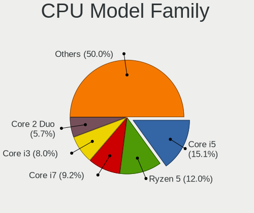

| Model                   | Desktops | Percent |
|-------------------------|----------|---------|
| Intel Core i5           | 69       | 16.12%  |
| AMD Ryzen 5             | 40       | 9.35%   |
| Intel Core i3           | 38       | 8.88%   |
| Intel Core i7           | 34       | 7.94%   |
| Intel Core 2 Duo        | 28       | 6.54%   |
| Intel Core 2 Quad       | 21       | 4.91%   |
| AMD Ryzen 7             | 20       | 4.67%   |
| Intel Celeron           | 19       | 4.44%   |
| Intel Pentium 4         | 18       | 4.21%   |
| Intel Pentium           | 16       | 3.74%   |
| AMD FX                  | 16       | 3.74%   |
| Intel Xeon              | 11       | 2.57%   |
| Intel Core 2            | 10       | 2.34%   |
| AMD Ryzen 3             | 10       | 2.34%   |
| AMD Phenom II X4        | 10       | 2.34%   |
| AMD Athlon 64 X2        | 10       | 2.34%   |
| Intel Pentium Dual-Core | 8        | 1.87%   |
| AMD Ryzen 9             | 7        | 1.64%   |
| Intel Pentium D         | 6        | 1.4%    |
| AMD A8                  | 6        | 1.4%    |
| AMD Phenom II X6        | 4        | 0.93%   |
| Intel Pentium Dual      | 2        | 0.47%   |
| AMD Ryzen Threadripper  | 2        | 0.47%   |
| AMD Phenom              | 2        | 0.47%   |
| AMD Athlon XP           | 2        | 0.47%   |
| AMD Athlon 64           | 2        | 0.47%   |
| AMD Athlon              | 2        | 0.47%   |
| AMD A10                 | 2        | 0.47%   |
| Other                   | 1        | 0.23%   |
| Intel Pentium Gold      | 1        | 0.23%   |
| Intel Genuine           | 1        | 0.23%   |
| Intel Atom              | 1        | 0.23%   |
| AMD Sempron             | 1        | 0.23%   |
| AMD Phenom II X2        | 1        | 0.23%   |
| AMD E                   | 1        | 0.23%   |
| AMD Dual Core Opteron   | 1        | 0.23%   |
| AMD Athlon II X4        | 1        | 0.23%   |
| AMD Athlon II X3        | 1        | 0.23%   |
| AMD Athlon II X2        | 1        | 0.23%   |
| AMD Athlon Dual Core    | 1        | 0.23%   |

CPU Cores
---------

Number of processor cores

| Number | Desktops | Percent |
|--------|----------|---------|
| 4      | 160      | 37.38%  |
| 2      | 143      | 33.41%  |
| 6      | 52       | 12.15%  |
| 8      | 27       | 6.31%   |
| 1      | 26       | 6.07%   |
| 3      | 9        | 2.1%    |
| 12     | 8        | 1.87%   |
| 16     | 3        | 0.7%    |

CPU Sockets
-----------

Number of sockets

| Number | Desktops | Percent |
|--------|----------|---------|
| 1      | 422      | 98.83%  |
| 2      | 5        | 1.17%   |

CPU Threads
-----------

Threads per core (Hyper-Threading)

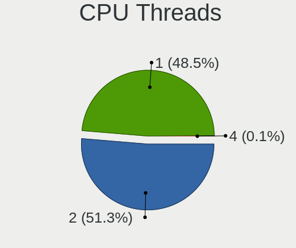

| Number | Desktops | Percent |
|--------|----------|---------|
| 1      | 238      | 55.74%  |
| 2      | 188      | 44.03%  |
| 4      | 1        | 0.23%   |

CPU Op-Modes
------------

CPU Operation Modes (32-bit, 64-bit)

| Op mode        | Desktops | Percent |
|----------------|----------|---------|
| 32-bit, 64-bit | 414      | 96.73%  |
| 32-bit         | 9        | 2.1%    |
| Unknown        | 5        | 1.17%   |

CPU Microcode
-------------

Microcode number

| Number     | Desktops | Percent |
|------------|----------|---------|
| Unknown    | 81       | 18.45%  |
| 0x306c3    | 45       | 10.25%  |
| 0x1067a    | 24       | 5.47%   |
| 0x206a7    | 23       | 5.24%   |
| 0x306a9    | 22       | 5.01%   |
| 0x0800820d | 16       | 3.64%   |
| 0x506e3    | 13       | 2.96%   |
| 0x10676    | 10       | 2.28%   |
| 0x06000852 | 10       | 2.28%   |
| 0x906e9    | 9        | 2.05%   |
| 0x906ed    | 8        | 1.82%   |
| 0x6f6      | 8        | 1.82%   |
| 0xf43      | 7        | 1.59%   |
| 0x906eb    | 7        | 1.59%   |
| 0xf41      | 6        | 1.37%   |
| 0x6fd      | 6        | 1.37%   |
| 0x08701021 | 6        | 1.37%   |
| 0xa0653    | 5        | 1.14%   |
| 0x906ea    | 5        | 1.14%   |
| 0x106e5    | 5        | 1.14%   |
| 0x10677    | 5        | 1.14%   |
| 0x0810100b | 5        | 1.14%   |
| 0x06003106 | 5        | 1.14%   |
| 0x010000c8 | 5        | 1.14%   |
| 0xf29      | 4        | 0.91%   |
| 0x6fb      | 4        | 0.91%   |
| 0x08701013 | 4        | 0.91%   |
| 0x08108109 | 4        | 0.91%   |
| 0x08101016 | 4        | 0.91%   |
| 0x0800820b | 4        | 0.91%   |
| 0x08001129 | 4        | 0.91%   |
| 0xf47      | 3        | 0.68%   |
| 0x6f2      | 3        | 0.68%   |
| 0x506c9    | 3        | 0.68%   |
| 0x106a5    | 3        | 0.68%   |
| 0x0a201016 | 3        | 0.68%   |
| 0x08001138 | 3        | 0.68%   |
| 0xf64      | 2        | 0.46%   |
| 0x6f7      | 2        | 0.46%   |
| 0x306f2    | 2        | 0.46%   |

CPU Microarch
-------------

Microarchitecture

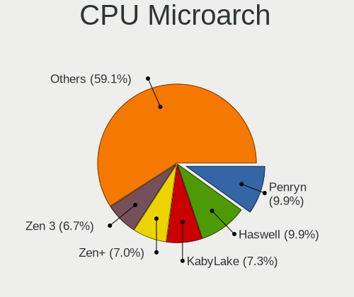

| Name             | Desktops | Percent |
|------------------|----------|---------|
| Haswell          | 50       | 11.68%  |
| Penryn           | 47       | 10.98%  |
| Zen+             | 33       | 7.71%   |
| KabyLake         | 32       | 7.48%   |
| Core             | 30       | 7.01%   |
| SandyBridge      | 27       | 6.31%   |
| IvyBridge        | 27       | 6.31%   |
| NetBurst         | 25       | 5.84%   |
| Zen              | 22       | 5.14%   |
| K10              | 20       | 4.67%   |
| Skylake          | 17       | 3.97%   |
| Piledriver       | 17       | 3.97%   |
| K8 Hammer        | 14       | 3.27%   |
| Zen 3            | 13       | 3.04%   |
| Zen 2            | 11       | 2.57%   |
| Nehalem          | 10       | 2.34%   |
| CometLake        | 7        | 1.64%   |
| Steamroller      | 6        | 1.4%    |
| Westmere         | 3        | 0.7%    |
| Silvermont       | 3        | 0.7%    |
| K6               | 3        | 0.7%    |
| Goldmont         | 3        | 0.7%    |
| Jaguar           | 2        | 0.47%   |
| Goldmont plus    | 1        | 0.23%   |
| Excavator        | 1        | 0.23%   |
| Bulldozer        | 1        | 0.23%   |
| Bonnell          | 1        | 0.23%   |
| Bobcat           | 1        | 0.23%   |
| Alderlake Hybrid | 1        | 0.23%   |

Graphics
--------

GPU Vendor
----------

Vendors of graphics cards

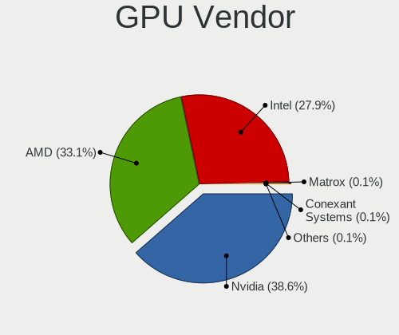

| Vendor           | Desktops | Percent |
|------------------|----------|---------|
| Nvidia           | 176      | 39.55%  |
| AMD              | 145      | 32.58%  |
| Intel            | 123      | 27.64%  |
| Conexant Systems | 1        | 0.22%   |

GPU Model
---------

Graphics card models

| Model                                                                       | Desktops | Percent |
|-----------------------------------------------------------------------------|----------|---------|
| Intel Xeon E3-1200 v3/4th Gen Core Processor Integrated Graphics Controller | 25       | 5.46%   |
| Nvidia GK208B [GeForce GT 710]                                              | 20       | 4.37%   |
| Intel 2nd Generation Core Processor Family Integrated Graphics Controller   | 17       | 3.71%   |
| AMD Ellesmere [Radeon RX 470/480/570/570X/580/580X/590]                     | 17       | 3.71%   |
| Intel 4 Series Chipset Integrated Graphics Controller                       | 13       | 2.84%   |
| Intel Xeon E3-1200 v2/3rd Gen Core processor Graphics Controller            | 11       | 2.4%    |
| Nvidia GT218 [GeForce 210]                                                  | 9        | 1.97%   |
| Nvidia GP107 [GeForce GTX 1050 Ti]                                          | 9        | 1.97%   |
| Nvidia GP106 [GeForce GTX 1060 6GB]                                         | 9        | 1.97%   |
| Intel CoffeeLake-S GT2 [UHD Graphics 630]                                   | 9        | 1.97%   |
| AMD Raven Ridge [Radeon Vega Series / Radeon Vega Mobile Series]            | 9        | 1.97%   |
| Intel 82945G/GZ Integrated Graphics Controller                              | 8        | 1.75%   |
| Intel HD Graphics 530                                                       | 6        | 1.31%   |
| AMD Picasso/Raven 2 [Radeon Vega Series / Radeon Vega Mobile Series]        | 6        | 1.31%   |
| AMD Oland PRO [Radeon R7 240/340 / Radeon 520]                              | 6        | 1.31%   |
| AMD Navi 10 [Radeon RX 5600 OEM/5600 XT / 5700/5700 XT]                     | 6        | 1.31%   |
| AMD Kaveri [Radeon R7 Graphics]                                             | 6        | 1.31%   |
| AMD Curacao PRO [Radeon R7 370 / R9 270/370 OEM]                            | 6        | 1.31%   |
| AMD Cedar [Radeon HD 5000/6000/7350/8350 Series]                            | 6        | 1.31%   |
| Nvidia GP108 [GeForce GT 1030]                                              | 5        | 1.09%   |
| AMD Baffin [Radeon RX 550 640SP / RX 560/560X]                              | 5        | 1.09%   |
| Nvidia GP107 [GeForce GTX 1050]                                             | 4        | 0.87%   |
| Nvidia GM206 [GeForce GTX 960]                                              | 4        | 0.87%   |
| Nvidia GF119 [GeForce GT 610]                                               | 4        | 0.87%   |
| Intel HD Graphics 630                                                       | 4        | 0.87%   |
| Intel 4th Generation Core Processor Family Integrated Graphics Controller   | 4        | 0.87%   |
| AMD Turks PRO [Radeon HD 6570/7570/8550 / R5 230]                           | 4        | 0.87%   |
| AMD Lexa PRO [Radeon 540/540X/550/550X / RX 540X/550/550X]                  | 4        | 0.87%   |
| AMD Cezanne                                                                 | 4        | 0.87%   |
| Nvidia TU117 [GeForce GTX 1650]                                             | 3        | 0.66%   |
| Nvidia GT216 [GeForce GT 220]                                               | 3        | 0.66%   |
| Nvidia GP104 [GeForce GTX 1070]                                             | 3        | 0.66%   |
| Nvidia GM204 [GeForce GTX 970]                                              | 3        | 0.66%   |
| Nvidia GK208B [GeForce GT 730]                                              | 3        | 0.66%   |
| Nvidia GK107 [GeForce GTX 650]                                              | 3        | 0.66%   |
| Nvidia GF108 [GeForce GT 630]                                               | 3        | 0.66%   |
| Nvidia GF108 [GeForce GT 430]                                               | 3        | 0.66%   |
| Nvidia G96C [GeForce 9500 GT]                                               | 3        | 0.66%   |
| Nvidia G96C [GeForce 9400 GT]                                               | 3        | 0.66%   |
| Nvidia G86 [GeForce 8500 GT]                                                | 3        | 0.66%   |

GPU Combo
---------

Combinations of graphics cards

| Name                           | Desktops | Percent |
|--------------------------------|----------|---------|
| 1 x Nvidia                     | 170      | 39.26%  |
| 1 x AMD                        | 135      | 31.18%  |
| 1 x Intel                      | 111      | 25.64%  |
| 2 x AMD                        | 7        | 1.62%   |
| Intel + Nvidia                 | 4        | 0.92%   |
| Other                          | 2        | 0.46%   |
| Intel + AMD                    | 2        | 0.46%   |
| 2 x Nvidia                     | 1        | 0.23%   |
| 2 x AMD + 1 x Conexant Systems | 1        | 0.23%   |

GPU Driver
----------

Free vs proprietary

| Driver      | Desktops | Percent |
|-------------|----------|---------|
| Free        | 323      | 74.42%  |
| Proprietary | 95       | 21.89%  |
| Unknown     | 16       | 3.69%   |

GPU Memory
----------

Total video memory

| Size in GB | Desktops | Percent |
|------------|----------|---------|
| Unknown    | 145      | 32.88%  |
| 1.01-2.0   | 90       | 20.41%  |
| 0.01-0.5   | 65       | 14.74%  |
| 0.51-1.0   | 61       | 13.83%  |
| 3.01-4.0   | 34       | 7.71%   |
| 7.01-8.0   | 25       | 5.67%   |
| 5.01-6.0   | 14       | 3.17%   |
| 2.01-3.0   | 5        | 1.13%   |
| 8.01-16.0  | 2        | 0.45%   |

Monitor
-------

Monitor Vendor
--------------

Monitor vendors

| Vendor               | Desktops | Percent |
|----------------------|----------|---------|
| Goldstar             | 100      | 22.32%  |
| Samsung Electronics  | 82       | 18.3%   |
| Dell                 | 42       | 9.38%   |
| Philips              | 25       | 5.58%   |
| LG Electronics       | 23       | 5.13%   |
| Hewlett-Packard      | 21       | 4.69%   |
| ViewSonic            | 17       | 3.79%   |
| BenQ                 | 14       | 3.13%   |
| Ancor Communications | 13       | 2.9%    |
| AOC                  | 12       | 2.68%   |
| Eizo                 | 9        | 2.01%   |
| Vestel Elektronik    | 6        | 1.34%   |
| Unknown              | 6        | 1.34%   |
| Sony                 | 6        | 1.34%   |
| NEC Computers        | 6        | 1.34%   |
| Iiyama               | 6        | 1.34%   |
| Acer                 | 5        | 1.12%   |
| Medion               | 4        | 0.89%   |
| JRY                  | 4        | 0.89%   |
| Fujitsu Siemens      | 4        | 0.89%   |
| Belinea              | 4        | 0.89%   |
| Lenovo               | 3        | 0.67%   |
| Sharp                | 2        | 0.45%   |
| Mi                   | 2        | 0.45%   |
| LLL                  | 2        | 0.45%   |
| IBM                  | 2        | 0.45%   |
| FUS                  | 2        | 0.45%   |
| DAO                  | 2        | 0.45%   |
| ASUSTek Computer     | 2        | 0.45%   |
| YM                   | 1        | 0.22%   |
| SKY                  | 1        | 0.22%   |
| RTK                  | 1        | 0.22%   |
| PER                  | 1        | 0.22%   |
| OUT                  | 1        | 0.22%   |
| Nvidia               | 1        | 0.22%   |
| NCS                  | 1        | 0.22%   |
| Marantz              | 1        | 0.22%   |
| Lite-On              | 1        | 0.22%   |
| KET                  | 1        | 0.22%   |
| ITR INFOTRONIC       | 1        | 0.22%   |

Monitor Model
-------------

Monitor models

| Model                                                                 | Desktops | Percent |
|-----------------------------------------------------------------------|----------|---------|
| Vestel Elektronik 24W_LCD_TV VES3700 1920x1080 706x398mm 31.9-inch    | 6        | 1.28%   |
| ViewSonic VA703-4Series VSC6A1E 1280x1024 341x274mm 17.2-inch         | 4        | 0.85%   |
| Goldstar IPS FULLHD GSM5AB8 1920x1080 480x270mm 21.7-inch             | 4        | 0.85%   |
| Ancor Communications ASUS VS247 ACI249A 1920x1080 521x293mm 23.5-inch | 4        | 0.85%   |
| Samsung Electronics T24E390 SAM0C20 1920x1080 521x293mm 23.5-inch     | 3        | 0.64%   |
| Samsung Electronics T23B350 SAM093B 1920x1080 510x287mm 23.0-inch     | 3        | 0.64%   |
| Samsung Electronics S24F350 SAM0D20 1920x1080 521x293mm 23.5-inch     | 3        | 0.64%   |
| Samsung Electronics S22F350 SAM0D1A 1920x1080 477x268mm 21.5-inch     | 3        | 0.64%   |
| Samsung Electronics C24F390 SAM0D2C 1920x1080 521x293mm 23.5-inch     | 3        | 0.64%   |
| Philips PHL 223V5 PHLC0CF 1920x1080 477x268mm 21.5-inch               | 3        | 0.64%   |
| Philips 226V4 PHLC0B1 1920x1080 477x268mm 21.5-inch                   | 3        | 0.64%   |
| LG Electronics LCD Monitor LG FULL HD 1920x1080                       | 3        | 0.64%   |
| Goldstar IPS FULLHD GSM5AB6 1920x1080 480x270mm 21.7-inch             | 3        | 0.64%   |
| Goldstar 2D FHD TV GSM59C6 1920x1080 509x286mm 23.0-inch              | 3        | 0.64%   |
| Goldstar 20M35 GSM4EED 1600x900 433x236mm 19.4-inch                   | 3        | 0.64%   |
| Dell S2715H DEL40BB 1920x1080 598x336mm 27.0-inch                     | 3        | 0.64%   |
| BenQ GW2480 BNQ78E7 1920x1080 527x296mm 23.8-inch                     | 3        | 0.64%   |
| Samsung Electronics SyncMaster SAM05C7 1920x1080 521x293mm 23.5-inch  | 2        | 0.43%   |
| Samsung Electronics SyncMaster SAM0522 1600x900 443x249mm 20.0-inch   | 2        | 0.43%   |
| Samsung Electronics SyncMaster SAM03C2 1680x1050 459x296mm 21.5-inch  | 2        | 0.43%   |
| Samsung Electronics SyncMaster SAM0218 1280x1024 376x301mm 19.0-inch  | 2        | 0.43%   |
| Samsung Electronics S27E390 SAM0C1C 1920x1080 598x336mm 27.0-inch     | 2        | 0.43%   |
| Samsung Electronics LCD Monitor SAM0C39 1920x1080 885x498mm 40.0-inch | 2        | 0.43%   |
| Samsung Electronics LCD Monitor SAM0B30 1920x1080 885x498mm 40.0-inch | 2        | 0.43%   |
| Philips PHL 223V7 PHLC154 1920x1080 476x268mm 21.5-inch               | 2        | 0.43%   |
| NEC Computers LCD72VM NEC6659 1280x1024 338x270mm 17.0-inch           | 2        | 0.43%   |
| LG Electronics LCD Monitor LG TV 1920x1080                            | 2        | 0.43%   |
| LG Electronics LCD Monitor L207W 1680x1050                            | 2        | 0.43%   |
| LG Electronics LCD Monitor L1919S 1280x1024                           | 2        | 0.43%   |
| Hewlett-Packard LP2465 HWP2676 1920x1200 519x324mm 24.1-inch          | 2        | 0.43%   |
| Hewlett-Packard L2035 HWP2612 1600x1200 408x306mm 20.1-inch           | 2        | 0.43%   |
| Hewlett-Packard L1908w HWP26F0 1440x900 410x256mm 19.0-inch           | 2        | 0.43%   |
| Hewlett-Packard L1740 HWP2648 1280x1024 338x270mm 17.0-inch           | 2        | 0.43%   |
| Goldstar W2241 GSM56B3 1680x1050 474x296mm 22.0-inch                  | 2        | 0.43%   |
| Goldstar W2234 GSM56B8 1680x1050 474x296mm 22.0-inch                  | 2        | 0.43%   |
| Goldstar W1946 GSM4BCD 1360x768 406x229mm 18.4-inch                   | 2        | 0.43%   |
| Goldstar W1943 GSM4BAD 1360x768 406x229mm 18.4-inch                   | 2        | 0.43%   |
| Goldstar W1934 GSM4B7A 1440x900 410x260mm 19.1-inch                   | 2        | 0.43%   |
| Goldstar TV GSM2412 1920x1080 940x530mm 42.5-inch                     | 2        | 0.43%   |
| Goldstar MP59G GSM5B35 1920x1080 480x270mm 21.7-inch                  | 2        | 0.43%   |

Monitor Resolution
------------------

Monitor screen resolution

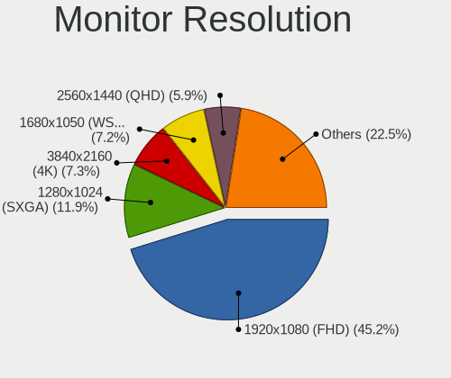

| Resolution         | Desktops | Percent |
|--------------------|----------|---------|
| 1920x1080 (FHD)    | 201      | 46.53%  |
| 1280x1024 (SXGA)   | 57       | 13.19%  |
| 1680x1050 (WSXGA+) | 35       | 8.1%    |
| 3840x2160 (4K)     | 20       | 4.63%   |
| 1440x900 (WXGA+)   | 19       | 4.4%    |
| 2560x1440 (QHD)    | 14       | 3.24%   |
| 1366x768 (WXGA)    | 13       | 3.01%   |
| 1920x1200 (WUXGA)  | 12       | 2.78%   |
| 1600x900 (HD+)     | 9        | 2.08%   |
| Unknown            | 9        | 2.08%   |
| 1360x768           | 8        | 1.85%   |
| 1024x768 (XGA)     | 6        | 1.39%   |
| 3840x1080          | 5        | 1.16%   |
| 3440x1440          | 4        | 0.93%   |
| 2560x1080          | 4        | 0.93%   |
| 1600x1200          | 4        | 0.93%   |
| 2048x1152          | 2        | 0.46%   |
| 1920x540           | 2        | 0.46%   |
| 5120x1440          | 1        | 0.23%   |
| 4864x2160          | 1        | 0.23%   |
| 4480x1080          | 1        | 0.23%   |
| 3600x1080          | 1        | 0.23%   |
| 3000x1920          | 1        | 0.23%   |
| 2960x1050          | 1        | 0.23%   |
| 2560x1600          | 1        | 0.23%   |
| 1280x768           | 1        | 0.23%   |

Monitor Diagonal
----------------

Diagonal size in inches

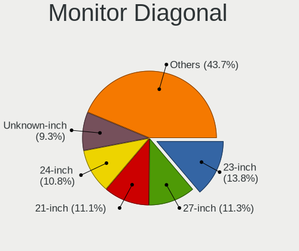

| Inches  | Desktops | Percent |
|---------|----------|---------|
| 23      | 65       | 14.61%  |
| Unknown | 55       | 12.36%  |
| 21      | 53       | 11.91%  |
| 27      | 45       | 10.11%  |
| 19      | 42       | 9.44%   |
| 24      | 40       | 8.99%   |
| 17      | 28       | 6.29%   |
| 18      | 22       | 4.94%   |
| 20      | 19       | 4.27%   |
| 22      | 16       | 3.6%    |
| 34      | 8        | 1.8%    |
| 31      | 7        | 1.57%   |
| 15      | 7        | 1.57%   |
| 84      | 6        | 1.35%   |
| 72      | 3        | 0.67%   |
| 42      | 3        | 0.67%   |
| 33      | 3        | 0.67%   |
| 25      | 3        | 0.67%   |
| 54      | 2        | 0.45%   |
| 47      | 2        | 0.45%   |
| 32      | 2        | 0.45%   |
| 16      | 2        | 0.45%   |
| 65      | 1        | 0.22%   |
| 60      | 1        | 0.22%   |
| 49      | 1        | 0.22%   |
| 48      | 1        | 0.22%   |
| 46      | 1        | 0.22%   |
| 44      | 1        | 0.22%   |
| 40      | 1        | 0.22%   |
| 39      | 1        | 0.22%   |
| 29      | 1        | 0.22%   |
| 28      | 1        | 0.22%   |
| 14      | 1        | 0.22%   |
| 12      | 1        | 0.22%   |

Monitor Width
-------------

Physical width

| Width in mm | Desktops | Percent |
|-------------|----------|---------|
| 501-600     | 135      | 31.18%  |
| 401-500     | 128      | 29.56%  |
| Unknown     | 55       | 12.7%   |
| 301-350     | 35       | 8.08%   |
| 351-400     | 29       | 6.7%    |
| 701-800     | 13       | 3%      |
| 601-700     | 12       | 2.77%   |
| 1501-2000   | 9        | 2.08%   |
| 1001-1500   | 9        | 2.08%   |
| 901-1000    | 4        | 0.92%   |
| 801-900     | 2        | 0.46%   |
| 201-300     | 2        | 0.46%   |

Aspect Ratio
------------

Proportional relationship between the width and the height

| Ratio   | Desktops | Percent |
|---------|----------|---------|
| 16/9    | 228      | 54.68%  |
| 16/10   | 60       | 14.39%  |
| Unknown | 49       | 11.75%  |
| 5/4     | 46       | 11.03%  |
| 4/3     | 13       | 3.12%   |
| 6/5     | 8        | 1.92%   |
| 21/9    | 7        | 1.68%   |
| 3/2     | 4        | 0.96%   |
| 32/9    | 2        | 0.48%   |

Monitor Area
------------

Area in inch

| Area in inch | Desktops | Percent |
|----------------|----------|---------|
| 201-250        | 144      | 32.73%  |
| 151-200        | 74       | 16.82%  |
| Unknown        | 55       | 12.5%   |
| 301-350        | 45       | 10.23%  |
| 141-150        | 44       | 10%     |
| 351-500        | 21       | 4.77%   |
| 251-300        | 20       | 4.55%   |
| More than 1000 | 14       | 3.18%   |
| 501-1000       | 11       | 2.5%    |
| 101-110        | 8        | 1.82%   |
| 131-140        | 2        | 0.45%   |
| 71-80          | 1        | 0.23%   |
| 111-120        | 1        | 0.23%   |

Pixel Density
-------------

Pixels per inch

| Density | Desktops | Percent |
|---------|----------|---------|
| 51-100  | 267      | 64.03%  |
| 101-120 | 66       | 15.83%  |
| Unknown | 55       | 13.19%  |
| 1-50    | 16       | 3.84%   |
| 121-160 | 10       | 2.4%    |
| 161-240 | 3        | 0.72%   |

Multiple Monitors
-----------------

Total monitors connected

| Total | Desktops | Percent |
|-------|----------|---------|
| 1     | 354      | 81.19%  |
| 2     | 55       | 12.61%  |
| 0     | 23       | 5.28%   |
| 3     | 4        | 0.92%   |

Network
-------

Net Controller Vendor
---------------------

Controller vendors

| Vendor                                | Desktops | Percent |
|---------------------------------------|----------|---------|
| Realtek Semiconductor                 | 248      | 44.05%  |
| Intel                                 | 135      | 23.98%  |
| Qualcomm Atheros                      | 43       | 7.64%   |
| Ralink Technology                     | 21       | 3.73%   |
| TP-Link                               | 19       | 3.37%   |
| Broadcom                              | 17       | 3.02%   |
| Nvidia                                | 14       | 2.49%   |
| Marvell Technology Group              | 14       | 2.49%   |
| VIA Technologies                      | 6        | 1.07%   |
| Ralink                                | 6        | 1.07%   |
| Qualcomm Atheros Communications       | 6        | 1.07%   |
| D-Link                                | 5        | 0.89%   |
| MediaTek                              | 3        | 0.53%   |
| Broadcom Limited                      | 3        | 0.53%   |
| ASUSTek Computer                      | 3        | 0.53%   |
| Xiaomi                                | 2        | 0.36%   |
| NetGear                               | 2        | 0.36%   |
| Motorola                              | 2        | 0.36%   |
| D-Link System                         | 2        | 0.36%   |
| ZyDAS                                 | 1        | 0.18%   |
| Sundance Technology Inc / IC Plus     | 1        | 0.18%   |
| PCTel                                 | 1        | 0.18%   |
| Microsoft                             | 1        | 0.18%   |
| Micro Star International              | 1        | 0.18%   |
| Huawei Technologies                   | 1        | 0.18%   |
| Fujitsu Siemens Computers             | 1        | 0.18%   |
| Dresden Elektronik                    | 1        | 0.18%   |
| Belkin Components                     | 1        | 0.18%   |
| ASIX Electronics                      | 1        | 0.18%   |
| Aquantia                              | 1        | 0.18%   |
| 802.11g Adapter [Linksys WUSB54GC v3] | 1        | 0.18%   |

Net Controller Model
--------------------

Controller models

| Model                                                             | Desktops | Percent |
|-------------------------------------------------------------------|----------|---------|
| Realtek RTL8111/8168/8411 PCI Express Gigabit Ethernet Controller | 209      | 33.76%  |
| Intel I211 Gigabit Network Connection                             | 32       | 5.17%   |
| Intel 82579LM Gigabit Network Connection (Lewisville)             | 21       | 3.39%   |
| Realtek RTL8188EUS 802.11n Wireless Network Adapter               | 13       | 2.1%    |
| Intel Ethernet Connection I217-LM                                 | 12       | 1.94%   |
| Ralink RT2870/RT3070 Wireless Adapter                             | 10       | 1.62%   |
| Intel Ethernet Connection (2) I219-V                              | 10       | 1.62%   |
| Intel Wi-Fi 6 AX200                                               | 9        | 1.45%   |
| Intel 82567LM-3 Gigabit Network Connection                        | 9        | 1.45%   |
| TP-Link TL-WN722N v2/v3 [Realtek RTL8188EUS]                      | 8        | 1.29%   |
| Realtek RTL8125 2.5GbE Controller                                 | 8        | 1.29%   |
| Realtek RTL-8100/8101L/8139 PCI Fast Ethernet Adapter             | 8        | 1.29%   |
| Intel Ethernet Connection (2) I218-V                              | 8        | 1.29%   |
| Realtek RTL8169 PCI Gigabit Ethernet Controller                   | 7        | 1.13%   |
| Marvell Group 88E8056 PCI-E Gigabit Ethernet Controller           | 7        | 1.13%   |
| Broadcom NetXtreme BCM5751 Gigabit Ethernet PCI Express           | 7        | 1.13%   |
| Realtek RTL8192CU 802.11n WLAN Adapter                            | 5        | 0.81%   |
| Realtek RTL810xE PCI Express Fast Ethernet controller             | 5        | 0.81%   |
| Ralink RT5370 Wireless Adapter                                    | 5        | 0.81%   |
| Qualcomm Atheros AR9271 802.11n                                   | 5        | 0.81%   |
| Qualcomm Atheros AR8161 Gigabit Ethernet                          | 5        | 0.81%   |
| Qualcomm Atheros AR8151 v2.0 Gigabit Ethernet                     | 5        | 0.81%   |
| Qualcomm Atheros AR8121/AR8113/AR8114 Gigabit or Fast Ethernet    | 5        | 0.81%   |
| Qualcomm Atheros AR5212/5213/2414 Wireless Network Adapter        | 5        | 0.81%   |
| Intel Ethernet Connection I217-V                                  | 5        | 0.81%   |
| Realtek RTL8188CUS 802.11n WLAN Adapter                           | 4        | 0.65%   |
| Realtek RTL8187 Wireless Adapter                                  | 4        | 0.65%   |
| Ralink MT7601U Wireless Adapter                                   | 4        | 0.65%   |
| Qualcomm Atheros AR9485 Wireless Network Adapter                  | 4        | 0.65%   |
| Qualcomm Atheros AR9227 Wireless Network Adapter                  | 4        | 0.65%   |
| Nvidia MCP61 Ethernet                                             | 4        | 0.65%   |
| Marvell Group 88E8053 PCI-E Gigabit Ethernet Controller           | 4        | 0.65%   |
| Intel Wireless-AC 9260                                            | 4        | 0.65%   |
| Broadcom BCM4360 802.11ac Wireless Network Adapter                | 4        | 0.65%   |
| VIA VT6102/VT6103 [Rhine-II]                                      | 3        | 0.48%   |
| TP-Link TL-WN823N v2/v3 [Realtek RTL8192EU]                       | 3        | 0.48%   |
| Realtek 802.11ac NIC                                              | 3        | 0.48%   |
| Ralink RT2561/RT61 802.11g PCI                                    | 3        | 0.48%   |
| Qualcomm Atheros Killer E220x Gigabit Ethernet Controller         | 3        | 0.48%   |
| Qualcomm Atheros Attansic L1 Gigabit Ethernet                     | 3        | 0.48%   |

Wireless Vendor
---------------

Wireless vendors

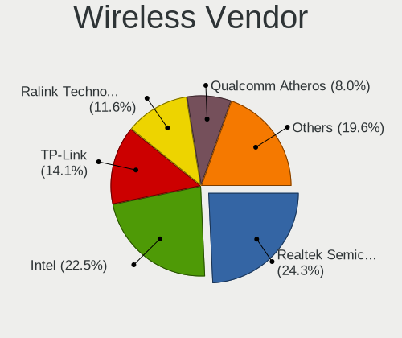

| Vendor                                | Desktops | Percent |
|---------------------------------------|----------|---------|
| Realtek Semiconductor                 | 38       | 24.68%  |
| Intel                                 | 24       | 15.58%  |
| Ralink Technology                     | 21       | 13.64%  |
| TP-Link                               | 19       | 12.34%  |
| Qualcomm Atheros                      | 17       | 11.04%  |
| Ralink                                | 6        | 3.9%    |
| Qualcomm Atheros Communications       | 6        | 3.9%    |
| Broadcom                              | 6        | 3.9%    |
| D-Link                                | 5        | 3.25%   |
| ASUSTek Computer                      | 3        | 1.95%   |
| NetGear                               | 2        | 1.3%    |
| ZyDAS                                 | 1        | 0.65%   |
| Microsoft                             | 1        | 0.65%   |
| Micro Star International              | 1        | 0.65%   |
| MediaTek                              | 1        | 0.65%   |
| Fujitsu Siemens Computers             | 1        | 0.65%   |
| Belkin Components                     | 1        | 0.65%   |
| 802.11g Adapter [Linksys WUSB54GC v3] | 1        | 0.65%   |

Wireless Model
--------------

Wireless models

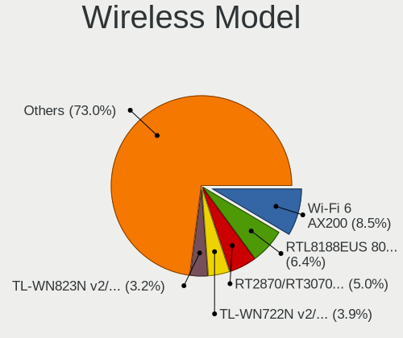

| Model                                                                                         | Desktops | Percent |
|-----------------------------------------------------------------------------------------------|----------|---------|
| Realtek RTL8188EUS 802.11n Wireless Network Adapter                                           | 13       | 8.23%   |
| Ralink RT2870/RT3070 Wireless Adapter                                                         | 10       | 6.33%   |
| Intel Wi-Fi 6 AX200                                                                           | 9        | 5.7%    |
| TP-Link TL-WN722N v2/v3 [Realtek RTL8188EUS]                                                  | 8        | 5.06%   |
| Realtek RTL8192CU 802.11n WLAN Adapter                                                        | 5        | 3.16%   |
| Ralink RT5370 Wireless Adapter                                                                | 5        | 3.16%   |
| Qualcomm Atheros AR9271 802.11n                                                               | 5        | 3.16%   |
| Qualcomm Atheros AR5212/5213/2414 Wireless Network Adapter                                    | 5        | 3.16%   |
| Realtek RTL8188CUS 802.11n WLAN Adapter                                                       | 4        | 2.53%   |
| Realtek RTL8187 Wireless Adapter                                                              | 4        | 2.53%   |
| Ralink MT7601U Wireless Adapter                                                               | 4        | 2.53%   |
| Qualcomm Atheros AR9485 Wireless Network Adapter                                              | 4        | 2.53%   |
| Qualcomm Atheros AR9227 Wireless Network Adapter                                              | 4        | 2.53%   |
| Intel Wireless-AC 9260                                                                        | 4        | 2.53%   |
| Broadcom BCM4360 802.11ac Wireless Network Adapter                                            | 4        | 2.53%   |
| TP-Link TL-WN823N v2/v3 [Realtek RTL8192EU]                                                   | 3        | 1.9%    |
| Realtek 802.11ac NIC                                                                          | 3        | 1.9%    |
| Ralink RT2561/RT61 802.11g PCI                                                                | 3        | 1.9%    |
| Intel PRO/Wireless 2200BG [Calexico2] Network Connection                                      | 3        | 1.9%    |
| TP-Link TL-WN822N Version 4 RTL8192EU                                                         | 2        | 1.27%   |
| TP-Link Archer T2U PLUS [RTL8821AU]                                                           | 2        | 1.27%   |
| TP-Link AC600 wireless Realtek RTL8811AU [Archer T2U Nano]                                    | 2        | 1.27%   |
| Realtek RTL8192EE PCIe Wireless Network Adapter                                               | 2        | 1.27%   |
| Realtek RTL8188SU 802.11n WLAN Adapter                                                        | 2        | 1.27%   |
| Ralink RT2790 Wireless 802.11n 1T/2R PCIe                                                     | 2        | 1.27%   |
| Intel Dual Band Wireless-AC 3168NGW [Stone Peak]                                              | 2        | 1.27%   |
| D-Link DWA-131 Wireless N Nano Adapter (Rev. E1) [Realtek RTL8192EU]                          | 2        | 1.27%   |
| D-Link 802.11ac NIC                                                                           | 2        | 1.27%   |
| ASUS USB-AC56 802.11a/b/g/n/ac Wireless Adapter [Realtek RTL8812AU]                           | 2        | 1.27%   |
| ZyDAS ZD1211B 802.11g                                                                         | 1        | 0.63%   |
| TP-Link Archer T9UH v1 [Realtek RTL8814AU]                                                    | 1        | 0.63%   |
| TP-Link Archer T4U ver.3                                                                      | 1        | 0.63%   |
| Realtek RTL8822BE 802.11a/b/g/n/ac WiFi adapter                                               | 1        | 0.63%   |
| Realtek RTL8821CE 802.11ac PCIe Wireless Network Adapter                                      | 1        | 0.63%   |
| Realtek RTL8812AU 802.11a/b/g/n/ac 2T2R DB WLAN Adapter                                       | 1        | 0.63%   |
| Realtek RTL8723BU 802.11b/g/n WLAN Adapter                                                    | 1        | 0.63%   |
| Realtek RTL-8185 IEEE 802.11a/b/g Wireless LAN Controller                                     | 1        | 0.63%   |
| Realtek Realtek 8812AU/8821AU 802.11ac WLAN Adapter [USB Wireless Dual-Band Adapter 2.4/5Ghz] | 1        | 0.63%   |
| Ralink RT5372 Wireless Adapter                                                                | 1        | 0.63%   |
| Ralink RT2770 Wireless Adapter                                                                | 1        | 0.63%   |

Ethernet Vendor
---------------

Ethernet vendors

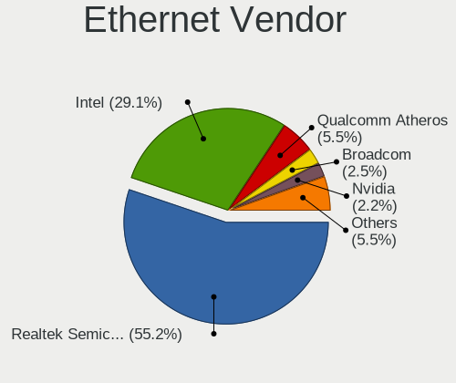

| Vendor                            | Desktops | Percent |
|-----------------------------------|----------|---------|
| Realtek Semiconductor             | 239      | 53.35%  |
| Intel                             | 125      | 27.9%   |
| Qualcomm Atheros                  | 27       | 6.03%   |
| Nvidia                            | 14       | 3.13%   |
| Marvell Technology Group          | 14       | 3.13%   |
| Broadcom                          | 11       | 2.46%   |
| VIA Technologies                  | 5        | 1.12%   |
| Broadcom Limited                  | 3        | 0.67%   |
| Xiaomi                            | 2        | 0.45%   |
| MediaTek                          | 2        | 0.45%   |
| D-Link System                     | 2        | 0.45%   |
| Sundance Technology Inc / IC Plus | 1        | 0.22%   |
| Huawei Technologies               | 1        | 0.22%   |
| ASIX Electronics                  | 1        | 0.22%   |
| Aquantia                          | 1        | 0.22%   |

Ethernet Model
--------------

Ethernet models

| Model                                                             | Desktops | Percent |
|-------------------------------------------------------------------|----------|---------|
| Realtek RTL8111/8168/8411 PCI Express Gigabit Ethernet Controller | 209      | 45.83%  |
| Intel I211 Gigabit Network Connection                             | 32       | 7.02%   |
| Intel 82579LM Gigabit Network Connection (Lewisville)             | 21       | 4.61%   |
| Intel Ethernet Connection I217-LM                                 | 12       | 2.63%   |
| Intel Ethernet Connection (2) I219-V                              | 10       | 2.19%   |
| Intel 82567LM-3 Gigabit Network Connection                        | 9        | 1.97%   |
| Realtek RTL8125 2.5GbE Controller                                 | 8        | 1.75%   |
| Realtek RTL-8100/8101L/8139 PCI Fast Ethernet Adapter             | 8        | 1.75%   |
| Intel Ethernet Connection (2) I218-V                              | 8        | 1.75%   |
| Realtek RTL8169 PCI Gigabit Ethernet Controller                   | 7        | 1.54%   |
| Marvell Group 88E8056 PCI-E Gigabit Ethernet Controller           | 7        | 1.54%   |
| Broadcom NetXtreme BCM5751 Gigabit Ethernet PCI Express           | 7        | 1.54%   |
| Realtek RTL810xE PCI Express Fast Ethernet controller             | 5        | 1.1%    |
| Qualcomm Atheros AR8161 Gigabit Ethernet                          | 5        | 1.1%    |
| Qualcomm Atheros AR8151 v2.0 Gigabit Ethernet                     | 5        | 1.1%    |
| Qualcomm Atheros AR8121/AR8113/AR8114 Gigabit or Fast Ethernet    | 5        | 1.1%    |
| Intel Ethernet Connection I217-V                                  | 5        | 1.1%    |
| Nvidia MCP61 Ethernet                                             | 4        | 0.88%   |
| Marvell Group 88E8053 PCI-E Gigabit Ethernet Controller           | 4        | 0.88%   |
| VIA VT6102/VT6103 [Rhine-II]                                      | 3        | 0.66%   |
| Qualcomm Atheros Killer E220x Gigabit Ethernet Controller         | 3        | 0.66%   |
| Qualcomm Atheros Attansic L1 Gigabit Ethernet                     | 3        | 0.66%   |
| Nvidia MCP77 Ethernet                                             | 3        | 0.66%   |
| Marvell Group 88E8001 Gigabit Ethernet Controller                 | 3        | 0.66%   |
| Intel Ethernet Connection (7) I219-LM                             | 3        | 0.66%   |
| Intel Ethernet Connection (2) I219-LM                             | 3        | 0.66%   |
| Intel 82578DM Gigabit Network Connection                          | 3        | 0.66%   |
| Xiaomi Mi/Redmi series (RNDIS)                                    | 2        | 0.44%   |
| VIA VT6105/VT6106S [Rhine-III]                                    | 2        | 0.44%   |
| Realtek RTL-8110SC/8169SC Gigabit Ethernet                        | 2        | 0.44%   |
| Qualcomm Atheros Killer E2500 Gigabit Ethernet Controller         | 2        | 0.44%   |
| Qualcomm Atheros Attansic L2 Fast Ethernet                        | 2        | 0.44%   |
| Nvidia MCP73 Ethernet                                             | 2        | 0.44%   |
| Nvidia MCP55 Ethernet                                             | 2        | 0.44%   |
| Nvidia MCP51 Ethernet Controller                                  | 2        | 0.44%   |
| MediaTek Nokia 5.1 Plus                                           | 2        | 0.44%   |
| Intel I210 Gigabit Network Connection                             | 2        | 0.44%   |
| Intel Ethernet Connection (7) I219-V                              | 2        | 0.44%   |
| Intel 82574L Gigabit Network Connection                           | 2        | 0.44%   |
| Intel 82566DC Gigabit Network Connection                          | 2        | 0.44%   |

Net Controller Kind
-------------------

Ethernet, WiFi or modem

| Kind     | Desktops | Percent |
|----------|----------|---------|
| Ethernet | 424      | 74.39%  |
| WiFi     | 141      | 24.74%  |
| Modem    | 5        | 0.88%   |

Used Controller
---------------

Currently used network controller

| Kind     | Desktops | Percent |
|----------|----------|---------|
| Ethernet | 347      | 79.22%  |
| WiFi     | 91       | 20.78%  |

NICs
----

Total network controllers on board

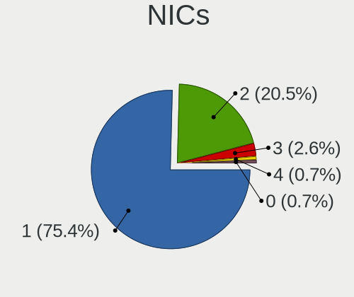

| Total | Desktops | Percent |
|-------|----------|---------|
| 1     | 341      | 79.67%  |
| 2     | 72       | 16.82%  |
| 3     | 9        | 2.1%    |
| 0     | 4        | 0.93%   |
| 4     | 2        | 0.47%   |

IPv6
----

IPv6 vs IPv4

| Used | Desktops | Percent |
|------|----------|---------|
| No   | 362      | 82.65%  |
| Yes  | 76       | 17.35%  |

Bluetooth
---------

Bluetooth Vendor
----------------

Controller vendors

| Vendor                          | Desktops | Percent |
|---------------------------------|----------|---------|
| Cambridge Silicon Radio         | 37       | 48.68%  |
| Intel                           | 19       | 25%     |
| Broadcom                        | 7        | 9.21%   |
| ASUSTek Computer                | 4        | 5.26%   |
| Realtek Semiconductor           | 2        | 2.63%   |
| Qualcomm Atheros Communications | 2        | 2.63%   |
| Micro Star International        | 2        | 2.63%   |
| Mobile Action Technology        | 1        | 1.32%   |
| Hewlett-Packard                 | 1        | 1.32%   |
| Edimax Technology               | 1        | 1.32%   |

Bluetooth Model
---------------

Controller models

| Model                                                 | Desktops | Percent |
|-------------------------------------------------------|----------|---------|
| Cambridge Silicon Radio Bluetooth Dongle (HCI mode)   | 37       | 48.68%  |
| Intel AX200 Bluetooth                                 | 8        | 10.53%  |
| Intel Wireless-AC 9260 Bluetooth Adapter              | 4        | 5.26%   |
| Intel Bluetooth wireless interface                    | 3        | 3.95%   |
| Broadcom BCM20702A0 Bluetooth 4.0                     | 3        | 3.95%   |
| Realtek Bluetooth Radio                               | 2        | 2.63%   |
| Qualcomm Atheros  Bluetooth Device                    | 2        | 2.63%   |
| Intel Wireless-AC 3168 Bluetooth                      | 2        | 2.63%   |
| ASUS Broadcom BCM20702 Single-Chip Bluetooth 4.0 + LE | 2        | 2.63%   |
| Mobile Action MA-730/MA-730G Bluetooth Adapter        | 1        | 1.32%   |
| Micro Star International Bluetooth EDR Device         | 1        | 1.32%   |
| Micro Star International Bluetooth Device             | 1        | 1.32%   |
| Intel Centrino Bluetooth Wireless Transceiver         | 1        | 1.32%   |
| Intel Bluetooth 9460/9560 Jefferson Peak (JfP)        | 1        | 1.32%   |
| HP Bluetooth 2.0 Interface [Broadcom BCM2045]         | 1        | 1.32%   |
| Edimax Bluetooth Adapter                              | 1        | 1.32%   |
| Broadcom Bluetooth 3.0 Device                         | 1        | 1.32%   |
| Broadcom BCM43142 Bluetooth 4.0                       | 1        | 1.32%   |
| Broadcom BCM2045 Bluetooth                            | 1        | 1.32%   |
| Broadcom BCM2035 Bluetooth dongle                     | 1        | 1.32%   |
| ASUS Broadcom BCM20702A0 Bluetooth                    | 1        | 1.32%   |
| ASUS Bluetooth Radio                                  | 1        | 1.32%   |

Sound
-----

Sound Vendor
------------

Sound card vendors

| Vendor                                          | Desktops | Percent |
|-------------------------------------------------|----------|---------|
| Intel                                           | 268      | 38.62%  |
| AMD                                             | 183      | 26.37%  |
| Nvidia                                          | 151      | 21.76%  |
| C-Media Electronics                             | 18       | 2.59%   |
| Creative Labs                                   | 11       | 1.59%   |
| Logitech                                        | 5        | 0.72%   |
| Creative Technology                             | 5        | 0.72%   |
| Razer USA                                       | 4        | 0.58%   |
| Focusrite-Novation                              | 4        | 0.58%   |
| VIA Technologies                                | 3        | 0.43%   |
| Kingston Technology                             | 3        | 0.43%   |
| BEHRINGER International                         | 3        | 0.43%   |
| Barco Display Systems                           | 3        | 0.43%   |
| Texas Instruments                               | 2        | 0.29%   |
| Hewlett-Packard                                 | 2        | 0.29%   |
| Ensoniq                                         | 2        | 0.29%   |
| Edifier Technology                              | 2        | 0.29%   |
| Cooler Master                                   | 2        | 0.29%   |
| AudioQuest                                      | 2        | 0.29%   |
| Altec Lansing Technologies                      | 2        | 0.29%   |
| Yamaha                                          | 1        | 0.14%   |
| Trust                                           | 1        | 0.14%   |
| Tenx Technology                                 | 1        | 0.14%   |
| SteelSeries ApS                                 | 1        | 0.14%   |
| Shenzhen Riitek Technology                      | 1        | 0.14%   |
| Plantronics                                     | 1        | 0.14%   |
| Numark                                          | 1        | 0.14%   |
| Nordic Semiconductor ASA                        | 1        | 0.14%   |
| Native Instruments                              | 1        | 0.14%   |
| Mark of the Unicorn                             | 1        | 0.14%   |
| M-Audio                                         | 1        | 0.14%   |
| Licensed by Sony Computer Entertainment America | 1        | 0.14%   |
| JMTek                                           | 1        | 0.14%   |
| Guillemot                                       | 1        | 0.14%   |
| Generalplus Technology                          | 1        | 0.14%   |
| Dell                                            | 1        | 0.14%   |
| ClearOne Communications                         | 1        | 0.14%   |
| Asahi Kasei Microsystems                        | 1        | 0.14%   |
| AKAI Professional M.I.                          | 1        | 0.14%   |

Sound Model
-----------

Sound card models

| Model                                                                      | Desktops | Percent |
|----------------------------------------------------------------------------|----------|---------|
| AMD SBx00 Azalia (Intel HDA)                                               | 39       | 4.83%   |
| Intel NM10/ICH7 Family High Definition Audio Controller                    | 37       | 4.58%   |
| AMD Family 17h (Models 00h-0fh) HD Audio Controller                        | 37       | 4.58%   |
| Intel 8 Series/C220 Series Chipset High Definition Audio Controller        | 34       | 4.21%   |
| Intel 6 Series/C200 Series Chipset Family High Definition Audio Controller | 31       | 3.84%   |
| Intel Xeon E3-1200 v3/4th Gen Core Processor HD Audio Controller           | 28       | 3.47%   |
| Nvidia GK208 HDMI/DP Audio Controller                                      | 24       | 2.97%   |
| AMD Family 17h/19h HD Audio Controller                                     | 22       | 2.73%   |
| Intel 100 Series/C230 Series Chipset Family HD Audio Controller            | 21       | 2.6%    |
| Intel 7 Series/C216 Chipset Family High Definition Audio Controller        | 18       | 2.23%   |
| AMD Starship/Matisse HD Audio Controller                                   | 18       | 2.23%   |
| AMD Oland/Hainan/Cape Verde/Pitcairn HDMI Audio [Radeon HD 7000 Series]    | 17       | 2.11%   |
| AMD Ellesmere HDMI Audio [Radeon RX 470/480 / 570/580/590]                 | 17       | 2.11%   |
| Intel 200 Series PCH HD Audio                                              | 16       | 1.98%   |
| Intel 82801JI (ICH10 Family) HD Audio Controller                           | 15       | 1.86%   |
| AMD Raven/Raven2/Fenghuang HDMI/DP Audio Controller                        | 15       | 1.86%   |
| Nvidia GP107GL High Definition Audio Controller                            | 14       | 1.73%   |
| Intel 9 Series Chipset Family HD Audio Controller                          | 13       | 1.61%   |
| Intel 82801I (ICH9 Family) HD Audio Controller                             | 13       | 1.61%   |
| Nvidia High Definition Audio Controller                                    | 12       | 1.49%   |
| Nvidia GF108 High Definition Audio Controller                              | 10       | 1.24%   |
| Intel Cannon Lake PCH cAVS                                                 | 10       | 1.24%   |
| Intel 82801JD/DO (ICH10 Family) HD Audio Controller                        | 10       | 1.24%   |
| Nvidia GP106 High Definition Audio Controller                              | 9        | 1.12%   |
| AMD FCH Azalia Controller                                                  | 9        | 1.12%   |
| AMD Baffin HDMI/DP Audio [Radeon RX 550 640SP / RX 560/560X]               | 9        | 1.12%   |
| Intel 82801H (ICH8 Family) HD Audio Controller                             | 8        | 0.99%   |
| AMD Navi 10 HDMI Audio                                                     | 8        | 0.99%   |
| Intel 82801G (ICH7 Family) AC'97 Audio Controller                          | 7        | 0.87%   |
| Intel 5 Series/3400 Series Chipset High Definition Audio                   | 7        | 0.87%   |
| AMD Cedar HDMI Audio [Radeon HD 5400/6300/7300 Series]                     | 7        | 0.87%   |
| Nvidia TU116 High Definition Audio Controller                              | 6        | 0.74%   |
| Nvidia GM206 High Definition Audio Controller                              | 6        | 0.74%   |
| Nvidia GK107 HDMI Audio Controller                                         | 6        | 0.74%   |
| Nvidia GF119 HDMI Audio Controller                                         | 6        | 0.74%   |
| AMD RV710/730 HDMI Audio [Radeon HD 4000 series]                           | 6        | 0.74%   |
| Nvidia GT216 HDMI Audio Controller                                         | 5        | 0.62%   |
| Nvidia GP108 High Definition Audio Controller                              | 5        | 0.62%   |
| AMD Turks HDMI Audio [Radeon HD 6500/6600 / 6700M Series]                  | 5        | 0.62%   |
| AMD Kaveri HDMI/DP Audio Controller                                        | 5        | 0.62%   |

Memory
------

Memory Vendor
-------------

Memory module vendors

| Vendor              | Desktops | Percent |
|---------------------|----------|---------|
| Unknown             | 57       | 27.4%   |
| Kingston            | 40       | 19.23%  |
| G.Skill             | 28       | 13.46%  |
| Corsair             | 28       | 13.46%  |
| Crucial             | 14       | 6.73%   |
| Samsung Electronics | 12       | 5.77%   |
| SK hynix            | 8        | 3.85%   |
| Micron Technology   | 6        | 2.88%   |
| Team                | 3        | 1.44%   |
| Patriot             | 2        | 0.96%   |
| Apacer              | 2        | 0.96%   |
| Unknown             | 2        | 0.96%   |
| Ramaxel Technology  | 1        | 0.48%   |
| Qimonda             | 1        | 0.48%   |
| Nanya Technology    | 1        | 0.48%   |
| H                   | 1        | 0.48%   |
| GOODRAM             | 1        | 0.48%   |
| Goldkey             | 1        | 0.48%   |

Memory Model
------------

Memory module models

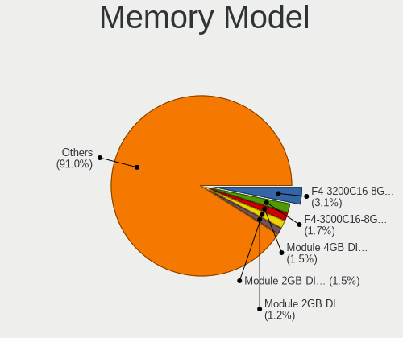

| Model                                                    | Desktops | Percent |
|----------------------------------------------------------|----------|---------|
| G.Skill RAM F4-3200C16-8GVKB 8GB DIMM DDR4 3200MT/s      | 7        | 2.92%   |
| Unknown RAM Module 1024MB DIMM SDRAM                     | 5        | 2.08%   |
| Unknown RAM Module 2GB DIMM 1333MT/s                     | 4        | 1.67%   |
| Unknown RAM Module 2048MB DIMM DDR2 800MT/s              | 4        | 1.67%   |
| Unknown RAM Module 2048MB DIMM DDR 533MT/s               | 4        | 1.67%   |
| G.Skill RAM F4-3000C16-8GISB 8GB DIMM DDR4 3200MT/s      | 4        | 1.67%   |
| Unknown RAM Module 512MB DIMM SDRAM                      | 3        | 1.25%   |
| Unknown RAM Module 4GB DIMM 1333MT/s                     | 3        | 1.25%   |
| Unknown RAM Module 2GB DIMM 800MT/s                      | 3        | 1.25%   |
| Unknown RAM Module 2048MB DIMM SDRAM                     | 3        | 1.25%   |
| Unknown RAM Module 1024MB DIMM 800MT/s                   | 3        | 1.25%   |
| G.Skill RAM F4-3200C14-8GFX 8GB DIMM DDR4 3733MT/s       | 3        | 1.25%   |
| Corsair RAM CMZ8GX3M2A1600C9 4096MB DIMM DDR3 1600MT/s   | 3        | 1.25%   |
| Corsair RAM CMZ4GX3M1A1600C9 4GB DIMM DDR3 1600MT/s      | 3        | 1.25%   |
| Unknown RAM Module 4096MB DIMM 1333MT/s                  | 2        | 0.83%   |
| Unknown RAM Module 2GB DIMM 400MT/s                      | 2        | 0.83%   |
| Unknown RAM Module 2048MB DIMM 800MT/s                   | 2        | 0.83%   |
| Unknown RAM Module 1GB DIMM                              | 2        | 0.83%   |
| Unknown RAM Module 1024MB DIMM DDR2 800MT/s              | 2        | 0.83%   |
| Unknown RAM Module 1024MB DIMM DDR 533MT/s               | 2        | 0.83%   |
| Kingston RAM Module 2048MB DIMM DDR2 667MT/s             | 2        | 0.83%   |
| Kingston RAM KHX1600C9D3/4GX 4GB DIMM DDR3 2400MT/s      | 2        | 0.83%   |
| G.Skill RAM F4-3200C16-8GTZR 8GB DIMM DDR4 3200MT/s      | 2        | 0.83%   |
| G.Skill RAM F4-2666C19-8GIS 8GB DIMM DDR4 2667MT/s       | 2        | 0.83%   |
| Crucial RAM CT8G4DFS8266.M8FD 8192MB DIMM DDR4 2667MT/s  | 2        | 0.83%   |
| Crucial RAM CT4G4DFS824A.C8FHP 4096MB DIMM DDR4 2400MT/s | 2        | 0.83%   |
| Corsair RAM CMK32GX4M2B3200C16 16GB DIMM DDR4 3400MT/s   | 2        | 0.83%   |
| Corsair RAM CMK16GX4M2A2400C16 8GB DIMM DDR4 2933MT/s    | 2        | 0.83%   |
| Unknown                                                  | 2        | 0.83%   |
| Unknown RAM Module 8GB DIMM 1333MT/s                     | 1        | 0.42%   |
| Unknown RAM Module 8192MB DIMM 667MT/s                   | 1        | 0.42%   |
| Unknown RAM Module 512MB DIMM SDRAM 333MT/s              | 1        | 0.42%   |
| Unknown RAM Module 4GB DIMM DDR3 1600MT/s                | 1        | 0.42%   |
| Unknown RAM Module 4GB DIMM DDR 1333MT/s                 | 1        | 0.42%   |
| Unknown RAM Module 4GB DIMM 400MT/s                      | 1        | 0.42%   |
| Unknown RAM Module 4096MB DIMM 333MT/s                   | 1        | 0.42%   |
| Unknown RAM Module 4096MB DIMM 1600MT/s                  | 1        | 0.42%   |
| Unknown RAM Module 2GB DIMM SDRAM                        | 1        | 0.42%   |
| Unknown RAM Module 2GB DIMM DDR2 800MT/s                 | 1        | 0.42%   |
| Unknown RAM Module 2GB DIMM DDR2 667MT/s                 | 1        | 0.42%   |

Memory Kind
-----------

Memory module kinds

| Kind    | Desktops | Percent |
|---------|----------|---------|
| DDR4    | 70       | 36.84%  |
| DDR3    | 51       | 26.84%  |
| Unknown | 27       | 14.21%  |
| DDR2    | 15       | 7.89%   |
| SDRAM   | 14       | 7.37%   |
| DDR     | 12       | 6.32%   |
| DRAM    | 1        | 0.53%   |

Memory Form Factor
------------------

Physical design of the memory module

| Name   | Desktops | Percent |
|--------|----------|---------|
| DIMM   | 179      | 97.81%  |
| SODIMM | 4        | 2.19%   |

Memory Size
-----------

Memory module size

| Size  | Desktops | Percent |
|-------|----------|---------|
| 8192  | 68       | 32.85%  |
| 4096  | 51       | 24.64%  |
| 2048  | 48       | 23.19%  |
| 1024  | 21       | 10.14%  |
| 16384 | 13       | 6.28%   |
| 512   | 5        | 2.42%   |
| 32768 | 1        | 0.48%   |

Memory Speed
------------

Memory module speed

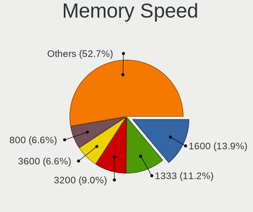

| Speed   | Desktops | Percent |
|---------|----------|---------|
| 1600    | 29       | 13.81%  |
| 1333    | 21       | 10%     |
| 800     | 18       | 8.57%   |
| 3200    | 13       | 6.19%   |
| 2400    | 13       | 6.19%   |
| 667     | 12       | 5.71%   |
| 3600    | 11       | 5.24%   |
| 2667    | 10       | 4.76%   |
| Unknown | 10       | 4.76%   |
| 3466    | 8        | 3.81%   |
| 2933    | 8        | 3.81%   |
| 2133    | 6        | 2.86%   |
| 533     | 6        | 2.86%   |
| 1066    | 5        | 2.38%   |
| 3400    | 4        | 1.9%    |
| 3000    | 4        | 1.9%    |
| 1866    | 4        | 1.9%    |
| 400     | 4        | 1.9%    |
| 3733    | 3        | 1.43%   |
| 333     | 3        | 1.43%   |
| 3007    | 2        | 0.95%   |
| 2733    | 2        | 0.95%   |
| 2666    | 2        | 0.95%   |
| 1867    | 2        | 0.95%   |
| 1800    | 2        | 0.95%   |
| 1067    | 2        | 0.95%   |
| 49926   | 1        | 0.48%   |
| 3334    | 1        | 0.48%   |
| 3333    | 1        | 0.48%   |
| 2800    | 1        | 0.48%   |
| 2048    | 1        | 0.48%   |
| 200     | 1        | 0.48%   |

Printers & scanners
-------------------

Printer Vendor
--------------

Printer device vendors

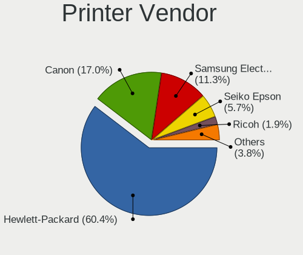

| Vendor              | Desktops | Percent |
|---------------------|----------|---------|
| Hewlett-Packard     | 19       | 65.52%  |
| Canon               | 6        | 20.69%  |
| Samsung Electronics | 3        | 10.34%  |
| Seiko Epson         | 1        | 3.45%   |

Printer Model
-------------

Printer device models

| Model                        | Desktops | Percent |
|------------------------------|----------|---------|
| Canon TS3100 series          | 3        | 10.34%  |
| HP DeskJet 3830 series       | 2        | 6.9%    |
| Seiko Epson L312 Series      | 1        | 3.45%   |
| Samsung SCX-3400 Series      | 1        | 3.45%   |
| Samsung M2070 Series         | 1        | 3.45%   |
| Samsung M2020 Series         | 1        | 3.45%   |
| HP Smart Tank 510 series     | 1        | 3.45%   |
| HP Officejet Pro L7400       | 1        | 3.45%   |
| HP OfficeJet Pro 8020 series | 1        | 3.45%   |
| HP Officejet J4500 series    | 1        | 3.45%   |
| HP Officejet 4500 G510g-m    | 1        | 3.45%   |
| HP LaserJet P1102            | 1        | 3.45%   |
| HP LaserJet 1020             | 1        | 3.45%   |
| HP LaserJet 1018             | 1        | 3.45%   |
| HP DeskJet F300 series       | 1        | 3.45%   |
| HP DeskJet F2492 All-in-One  | 1        | 3.45%   |
| HP DeskJet D2300             | 1        | 3.45%   |
| HP DeskJet 930c              | 1        | 3.45%   |
| HP DeskJet 840c              | 1        | 3.45%   |
| HP DeskJet 4670 series       | 1        | 3.45%   |
| HP DeskJet 4530 series       | 1        | 3.45%   |
| HP DeskJet 3700 series       | 1        | 3.45%   |
| HP Deskjet 2640 series       | 1        | 3.45%   |
| Canon TR4500 series          | 1        | 3.45%   |
| Canon PIXMA MX390 Series     | 1        | 3.45%   |
| Canon MG5600 series          | 1        | 3.45%   |

Scanner Vendor
--------------

Scanner device vendors

| Vendor          | Desktops | Percent |
|-----------------|----------|---------|
| Canon           | 2        | 50%     |
| Seiko Epson     | 1        | 25%     |
| Hewlett-Packard | 1        | 25%     |

Scanner Model
-------------

Scanner device models

| Model                                       | Desktops | Percent |
|---------------------------------------------|----------|---------|
| Seiko Epson GT-X800 [Perfection 4990 PHOTO] | 1        | 25%     |
| HP ScanJet 4370                             | 1        | 25%     |
| Canon CanoScan LiDE 110                     | 1        | 25%     |
| Canon CanoScan LiDE 100                     | 1        | 25%     |

Camera
------

Camera Vendor
-------------

Camera device vendors

| Vendor                        | Desktops | Percent |
|-------------------------------|----------|---------|
| Logitech                      | 37       | 37%     |
| Microsoft                     | 13       | 13%     |
| Microdia                      | 8        | 8%      |
| Generalplus Technology        | 6        | 6%      |
| Z-Star Microelectronics       | 4        | 4%      |
| Creative Technology           | 4        | 4%      |
| Aveo Technology               | 4        | 4%      |
| Arkmicro Technologies         | 3        | 3%      |
| Sunplus Innovation Technology | 2        | 2%      |
| Realtek Semiconductor         | 2        | 2%      |
| Razer USA                     | 2        | 2%      |
| Philips (or NXP)              | 2        | 2%      |
| Chicony Electronics           | 2        | 2%      |
| Xiongmai                      | 1        | 1%      |
| Sweex                         | 1        | 1%      |
| Samsung Electronics           | 1        | 1%      |
| Pixart Imaging                | 1        | 1%      |
| Nokia Mobile Phones           | 1        | 1%      |
| MacroSilicon                  | 1        | 1%      |
| Jieli Technology              | 1        | 1%      |
| IMC Networks                  | 1        | 1%      |
| Guillemot                     | 1        | 1%      |
| Cubeternet                    | 1        | 1%      |
| Alcor Micro                   | 1        | 1%      |

Camera Model
------------

Camera device models

| Model                                               | Desktops | Percent |
|-----------------------------------------------------|----------|---------|
| Logitech Webcam C270                                | 15       | 14.85%  |
| Microsoft LifeCam HD-3000                           | 4        | 3.96%   |
| Logitech Webcam C310                                | 4        | 3.96%   |
| Aveo USB2.0 Camera                                  | 4        | 3.96%   |
| Z-Star Venus USB2.0 Camera                          | 3        | 2.97%   |
| Microdia CameraA                                    | 3        | 2.97%   |
| Microdia Camera                                     | 3        | 2.97%   |
| Logitech Webcam C300                                | 3        | 2.97%   |
| Logitech Webcam C170                                | 3        | 2.97%   |
| Generalplus GENERAL WEBCAM                          | 3        | 2.97%   |
| Generalplus 808 Camera #9 (web-cam mode)            | 3        | 2.97%   |
| Arkmicro USB2.0 PC CAMERA                           | 3        | 2.97%   |
| Realtek USB CAMERA                                  | 2        | 1.98%   |
| Razer USA Gaming Webcam [Kiyo]                      | 2        | 1.98%   |
| Philips (or NXP) SPC 520/525NC PC Camera            | 2        | 1.98%   |
| Microsoft LifeCam VX-500 [1357]                     | 2        | 1.98%   |
| Microsoft LifeCam Cinema                            | 2        | 1.98%   |
| Logitech Webcam C110                                | 2        | 1.98%   |
| Logitech HD Webcam C910                             | 2        | 1.98%   |
| Logitech HD Pro Webcam C920                         | 2        | 1.98%   |
| Creative Live! Cam Sync 1080p V2                    | 2        | 1.98%   |
| Creative Live! Cam Sync 1080p                       | 2        | 1.98%   |
| Z-Star Vega USB 2.0 Camera                          | 1        | 0.99%   |
| Xiongmai web camera                                 | 1        | 0.99%   |
| Sweex WC060 Series HD Webcam                        | 1        | 0.99%   |
| Sunplus PAPALOOK_229AF                              | 1        | 0.99%   |
| Sunplus HD 720P webcam                              | 1        | 0.99%   |
| Samsung Galaxy A5 (MTP)                             | 1        | 0.99%   |
| Pixart Imaging GE 1.3 MP MiniCam Pro                | 1        | 0.99%   |
| Nokia Mobile Phones Lumia 640 Phone                 | 1        | 0.99%   |
| Microsoft Microsoft LifeCam Studio                | 1        | 0.99%   |
| Microsoft Microsoft LifeCam HD-6000 for Notebooks | 1        | 0.99%   |
| Microsoft LifeCam VX-800                            | 1        | 0.99%   |
| Microsoft LifeCam VX-5000                           | 1        | 0.99%   |
| Microsoft LifeCam VX-2000                           | 1        | 0.99%   |
| Microdia Sonix USB 2.0 Camera                       | 1        | 0.99%   |
| Microdia CyberTrack H7                              | 1        | 0.99%   |
| MacroSilicon USB Video                              | 1        | 0.99%   |
| Logitech Webcam C250                                | 1        | 0.99%   |
| Logitech StreamCam                                  | 1        | 0.99%   |

Security
--------

Fingerprint Vendor
------------------

Fingerprint sensor vendors

Zero info for selected period =(

Fingerprint Model
-----------------

Fingerprint sensor models

Zero info for selected period =(

Chipcard Vendor
---------------

Chipcard module vendors

Zero info for selected period =(

Chipcard Model
--------------

Chipcard module models

Zero info for selected period =(

Unsupported
-----------

Unsupported Devices
-------------------

Total unsupported devices on board

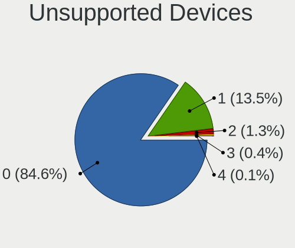

| Total | Desktops | Percent |
|-------|----------|---------|
| 0     | 378      | 87.1%   |
| 1     | 47       | 10.83%  |
| 2     | 6        | 1.38%   |
| 3     | 2        | 0.46%   |
| 4     | 1        | 0.23%   |

Unsupported Device Types
------------------------

Types of unsupported devices

| Type                     | Desktops | Percent |
|--------------------------|----------|---------|
| Graphics card            | 19       | 28.36%  |
| Net/wireless             | 18       | 26.87%  |
| Communication controller | 8        | 11.94%  |
| Multimedia controller    | 5        | 7.46%   |
| Sound                    | 4        | 5.97%   |
| Dvb card                 | 3        | 4.48%   |
| Unassigned class         | 2        | 2.99%   |
| Modem                    | 2        | 2.99%   |
| Storage/raid             | 1        | 1.49%   |
| Network                  | 1        | 1.49%   |
| Net/ethernet             | 1        | 1.49%   |
| Firewire controller      | 1        | 1.49%   |
| Card reader              | 1        | 1.49%   |
| Camera                   | 1        | 1.49%   |

