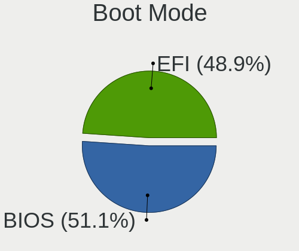
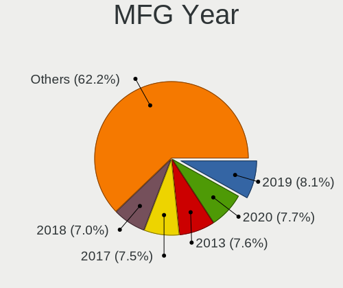
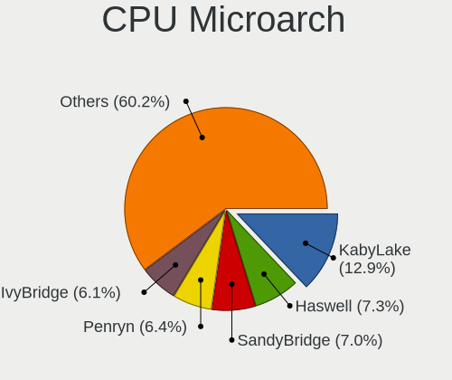
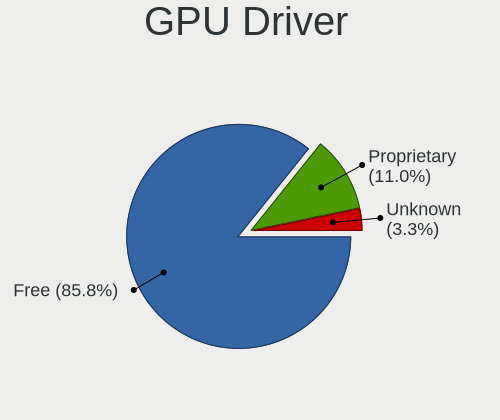
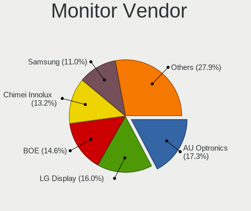
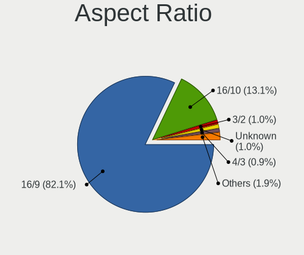
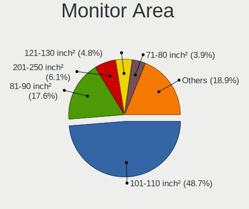
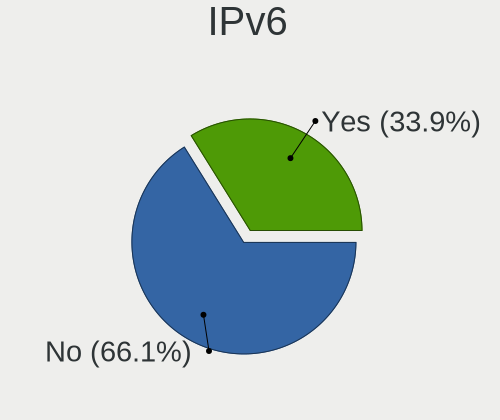
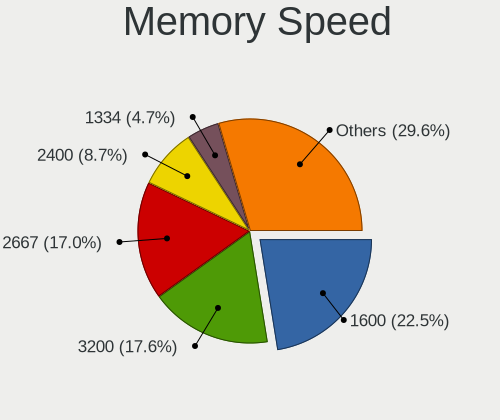

Linux in Greece - Tested Hardware & Statistics (Notebooks)
----------------------------------------------------------

A project to collect tested hardware configurations for Linux in Greece.

Anyone can contribute to this report by the [hw-probe](https://github.com/linuxhw/hw-probe) tool:

    sudo -E hw-probe -all -upload

Please contribute! Especially if your hardware is rare.

Contents
--------

* [ Test Cases ](#test-cases)

* [ System ](#system)
  - [ OS                       ](#os)
  - [ OS Family                ](#os-family)
  - [ Kernel                   ](#kernel)
  - [ Kernel Family            ](#kernel-family)
  - [ Kernel Major Ver.        ](#kernel-major-ver)
  - [ Arch                     ](#arch)
  - [ DE                       ](#de)
  - [ Display Server           ](#display-server)
  - [ Display Manager          ](#display-manager)
  - [ OS Lang                  ](#os-lang)
  - [ Boot Mode                ](#boot-mode)
  - [ Filesystem               ](#filesystem)
  - [ Part. scheme             ](#part-scheme)
  - [ Dual Boot with Linux/BSD ](#dual-boot-with-linuxbsd)
  - [ Dual Boot (Win)          ](#dual-boot-win)

* [ Board ](#board)
  - [ Vendor                   ](#vendor)
  - [ Model                    ](#model)
  - [ Model Family             ](#model-family)
  - [ MFG Year                 ](#mfg-year)
  - [ Form Factor              ](#form-factor)
  - [ Secure Boot              ](#secure-boot)
  - [ Coreboot                 ](#coreboot)
  - [ RAM Size                 ](#ram-size)
  - [ RAM Used                 ](#ram-used)
  - [ Total Drives             ](#total-drives)
  - [ Has CD-ROM               ](#has-cd-rom)
  - [ Has Ethernet             ](#has-ethernet)
  - [ Has WiFi                 ](#has-wifi)
  - [ Has Bluetooth            ](#has-bluetooth)

* [ Location ](#location)
  - [ Country                  ](#country)
  - [ City                     ](#city)

* [ Drives ](#drives)
  - [ Drive Vendor             ](#drive-vendor)
  - [ Drive Model              ](#drive-model)
  - [ HDD Vendor               ](#hdd-vendor)
  - [ SSD Vendor               ](#ssd-vendor)
  - [ Drive Kind               ](#drive-kind)
  - [ Drive Connector          ](#drive-connector)
  - [ Drive Size               ](#drive-size)
  - [ Space Total              ](#space-total)
  - [ Space Used               ](#space-used)
  - [ Malfunc. Drives          ](#malfunc-drives)
  - [ Malfunc. Drive Vendor    ](#malfunc-drive-vendor)
  - [ Malfunc. HDD Vendor      ](#malfunc-hdd-vendor)
  - [ Malfunc. Drive Kind      ](#malfunc-drive-kind)
  - [ Failed Drives            ](#failed-drives)
  - [ Failed Drive Vendor      ](#failed-drive-vendor)
  - [ Drive Status             ](#drive-status)

* [ Storage controller ](#storage-controller)
  - [ Storage Vendor           ](#storage-vendor)
  - [ Storage Model            ](#storage-model)
  - [ Storage Kind             ](#storage-kind)

* [ Processor ](#processor)
  - [ CPU Vendor               ](#cpu-vendor)
  - [ CPU Model                ](#cpu-model)
  - [ CPU Model Family         ](#cpu-model-family)
  - [ CPU Cores                ](#cpu-cores)
  - [ CPU Sockets              ](#cpu-sockets)
  - [ CPU Threads              ](#cpu-threads)
  - [ CPU Op-Modes             ](#cpu-op-modes)
  - [ CPU Microcode            ](#cpu-microcode)
  - [ CPU Microarch            ](#cpu-microarch)

* [ Graphics ](#graphics)
  - [ GPU Vendor               ](#gpu-vendor)
  - [ GPU Model                ](#gpu-model)
  - [ GPU Combo                ](#gpu-combo)
  - [ GPU Driver               ](#gpu-driver)
  - [ GPU Memory               ](#gpu-memory)

* [ Monitor ](#monitor)
  - [ Monitor Vendor           ](#monitor-vendor)
  - [ Monitor Model            ](#monitor-model)
  - [ Monitor Resolution       ](#monitor-resolution)
  - [ Monitor Diagonal         ](#monitor-diagonal)
  - [ Monitor Width            ](#monitor-width)
  - [ Aspect Ratio             ](#aspect-ratio)
  - [ Monitor Area             ](#monitor-area)
  - [ Pixel Density            ](#pixel-density)
  - [ Multiple Monitors        ](#multiple-monitors)

* [ Network ](#network)
  - [ Net Controller Vendor    ](#net-controller-vendor)
  - [ Net Controller Model     ](#net-controller-model)
  - [ Wireless Vendor          ](#wireless-vendor)
  - [ Wireless Model           ](#wireless-model)
  - [ Ethernet Vendor          ](#ethernet-vendor)
  - [ Ethernet Model           ](#ethernet-model)
  - [ Net Controller Kind      ](#net-controller-kind)
  - [ Used Controller          ](#used-controller)
  - [ NICs                     ](#nics)
  - [ IPv6                     ](#ipv6)

* [ Bluetooth ](#bluetooth)
  - [ Bluetooth Vendor         ](#bluetooth-vendor)
  - [ Bluetooth Model          ](#bluetooth-model)

* [ Sound ](#sound)
  - [ Sound Vendor             ](#sound-vendor)
  - [ Sound Model              ](#sound-model)

* [ Memory ](#memory)
  - [ Memory Vendor            ](#memory-vendor)
  - [ Memory Model             ](#memory-model)
  - [ Memory Kind              ](#memory-kind)
  - [ Memory Form Factor       ](#memory-form-factor)
  - [ Memory Size              ](#memory-size)
  - [ Memory Speed             ](#memory-speed)

* [ Printers & scanners ](#printers--scanners)
  - [ Printer Vendor           ](#printer-vendor)
  - [ Printer Model            ](#printer-model)
  - [ Scanner Vendor           ](#scanner-vendor)
  - [ Scanner Model            ](#scanner-model)

* [ Camera ](#camera)
  - [ Camera Vendor            ](#camera-vendor)
  - [ Camera Model             ](#camera-model)

* [ Security ](#security)
  - [ Fingerprint Vendor       ](#fingerprint-vendor)
  - [ Fingerprint Model        ](#fingerprint-model)
  - [ Chipcard Vendor          ](#chipcard-vendor)
  - [ Chipcard Model           ](#chipcard-model)

* [ Unsupported ](#unsupported)
  - [ Unsupported Devices      ](#unsupported-devices)
  - [ Unsupported Device Types ](#unsupported-device-types)

Test Cases
----------

Total: 772

| Vendor        | Model                       | Probe                                                      | Date         |
|---------------|-----------------------------|------------------------------------------------------------|--------------|
| HP            | Compaq 6730s                | [5d805b2f5e](https://linux-hardware.org/?probe=5d805b2f5e) | Jul 31, 2022 |
| Notebook      | W54_W94_W955TU,-T,-C        | [7b0b52e138](https://linux-hardware.org/?probe=7b0b52e138) | Jul 31, 2022 |
| HP            | Laptop 15s-eq1xxx           | [ee5c151c3a](https://linux-hardware.org/?probe=ee5c151c3a) | Jul 30, 2022 |
| HP            | 255 G8 Notebook PC          | [e271ff9bf8](https://linux-hardware.org/?probe=e271ff9bf8) | Jul 29, 2022 |
| Lenovo        | IdeaPad L340-17API 81LY     | [398fb75cec](https://linux-hardware.org/?probe=398fb75cec) | Jul 29, 2022 |
| HP            | 255 G8 Notebook PC          | [ceb1b7da41](https://linux-hardware.org/?probe=ceb1b7da41) | Jul 28, 2022 |
| Apple         | MacBookPro8,1               | [cf1f919243](https://linux-hardware.org/?probe=cf1f919243) | Jul 27, 2022 |
| HP            | Pavilion g6                 | [a57cf84361](https://linux-hardware.org/?probe=a57cf84361) | Jul 27, 2022 |
| Sony          | VPCF11M1E                   | [97a18303ee](https://linux-hardware.org/?probe=97a18303ee) | Jul 26, 2022 |
| Dynabook      | Satellite Pro C50D-B        | [bd7ef0af73](https://linux-hardware.org/?probe=bd7ef0af73) | Jul 25, 2022 |
| Dell          | Latitude 5420               | [eecbd6aeec](https://linux-hardware.org/?probe=eecbd6aeec) | Jul 22, 2022 |
| HP            | 255 G8 Notebook PC          | [59e9017400](https://linux-hardware.org/?probe=59e9017400) | Jul 19, 2022 |
| Dell          | Inspiron 15 3511            | [257823caa8](https://linux-hardware.org/?probe=257823caa8) | Jul 17, 2022 |
| Lenovo        | IdeaPad Gaming 3 15IHU6 ... | [3884be1bc0](https://linux-hardware.org/?probe=3884be1bc0) | Jul 15, 2022 |
| Acer          | Extensa 215-32              | [bd34d99acc](https://linux-hardware.org/?probe=bd34d99acc) | Jul 15, 2022 |
| Lenovo        | IdeaPad Gaming 3 15IHU6 ... | [e992a45818](https://linux-hardware.org/?probe=e992a45818) | Jul 15, 2022 |
| Toshiba       | Satellite L550              | [cb3f0e6381](https://linux-hardware.org/?probe=cb3f0e6381) | Jul 13, 2022 |
| Samsung       | 300E4A/300E5A/300E7A        | [f52d09ef30](https://linux-hardware.org/?probe=f52d09ef30) | Jul 07, 2022 |
| HP            | Compaq CQ58                 | [d46da7be57](https://linux-hardware.org/?probe=d46da7be57) | Jul 05, 2022 |
| Unknown       | Unknown                     | [df0722af87](https://linux-hardware.org/?probe=df0722af87) | Jul 04, 2022 |
| HP            | 255 G8 Notebook PC          | [af74b651d5](https://linux-hardware.org/?probe=af74b651d5) | Jul 04, 2022 |
| Toshiba       | Satellite A200              | [d030e357db](https://linux-hardware.org/?probe=d030e357db) | Jul 02, 2022 |
| HP            | Laptop 17-ca1xxx            | [10620fe30b](https://linux-hardware.org/?probe=10620fe30b) | Jun 29, 2022 |
| Valve         | Jupiter                     | [65e5ab29fd](https://linux-hardware.org/?probe=65e5ab29fd) | Jun 26, 2022 |
| Samsung       | 300E4A/300E5A/300E7A        | [bb4f0d2bce](https://linux-hardware.org/?probe=bb4f0d2bce) | Jun 25, 2022 |
| Lenovo        | IdeaPad 5 Pro 16IHU6 82L... | [a2a6f48fe2](https://linux-hardware.org/?probe=a2a6f48fe2) | Jun 22, 2022 |
| ASUSTek       | X550JX                      | [999d6e4735](https://linux-hardware.org/?probe=999d6e4735) | Jun 20, 2022 |
| HP            | EliteBook 840 G4            | [d42c64a985](https://linux-hardware.org/?probe=d42c64a985) | Jun 18, 2022 |
| Lenovo        | IdeaPad 100-14IBY 80MH      | [ee0b4c4389](https://linux-hardware.org/?probe=ee0b4c4389) | Jun 14, 2022 |
| Dell          | XPS 13 9380                 | [af2362a1e4](https://linux-hardware.org/?probe=af2362a1e4) | Jun 12, 2022 |
| HP            | ProBook 4530s               | [8162a82eba](https://linux-hardware.org/?probe=8162a82eba) | Jun 11, 2022 |
| Lenovo        | IdeaPad 330-15IKB 81DE      | [039d0b1cdc](https://linux-hardware.org/?probe=039d0b1cdc) | Jun 07, 2022 |
| Dell          | Precision M4800             | [2607169dfe](https://linux-hardware.org/?probe=2607169dfe) | Jun 06, 2022 |
| Dell          | Inspiron 5567               | [3ede7ad313](https://linux-hardware.org/?probe=3ede7ad313) | Jun 02, 2022 |
| Dell          | Inspiron 5567               | [e8e9948f71](https://linux-hardware.org/?probe=e8e9948f71) | Jun 02, 2022 |
| HP            | Unknown                     | [521124e0e2](https://linux-hardware.org/?probe=521124e0e2) | May 28, 2022 |
| Lenovo        | ThinkPad X230 2324FV6       | [6386696f31](https://linux-hardware.org/?probe=6386696f31) | May 25, 2022 |
| Dell          | Vostro 5625                 | [2ae97190b6](https://linux-hardware.org/?probe=2ae97190b6) | May 24, 2022 |
| Dell          | Latitude 5420               | [28c0f1ba96](https://linux-hardware.org/?probe=28c0f1ba96) | May 24, 2022 |
| ASUSTek       | X505BA                      | [685c1f7378](https://linux-hardware.org/?probe=685c1f7378) | May 22, 2022 |
| Pegatron      | A15                         | [335d6a014c](https://linux-hardware.org/?probe=335d6a014c) | May 18, 2022 |
| HP            | Mini 110-1100               | [b93ac7c302](https://linux-hardware.org/?probe=b93ac7c302) | May 16, 2022 |
| HP            | Mini 110-1100               | [4a5f85e53d](https://linux-hardware.org/?probe=4a5f85e53d) | May 16, 2022 |
| HP            | ProBook 645 G1              | [771f25ecc9](https://linux-hardware.org/?probe=771f25ecc9) | May 14, 2022 |
| HP            | EliteBook 8470p             | [2c8d1eec1e](https://linux-hardware.org/?probe=2c8d1eec1e) | May 13, 2022 |
| HP            | EliteBook 8470p             | [074043a5ca](https://linux-hardware.org/?probe=074043a5ca) | May 13, 2022 |
| ASUSTek       | TUF Gaming FX505GE_FX505... | [ec5dbcb034](https://linux-hardware.org/?probe=ec5dbcb034) | May 02, 2022 |
| Dell          | Latitude E6500              | [bbd302d9ba](https://linux-hardware.org/?probe=bbd302d9ba) | May 02, 2022 |
| Dell          | Latitude E6500              | [8eb92ca472](https://linux-hardware.org/?probe=8eb92ca472) | May 02, 2022 |
| Lenovo        | ThinkPad T495 20NJ0012GM    | [81f7a796be](https://linux-hardware.org/?probe=81f7a796be) | Apr 28, 2022 |
| Dell          | Inspiron 5567               | [9da2289998](https://linux-hardware.org/?probe=9da2289998) | Apr 24, 2022 |
| Dell          | Inspiron 5559               | [e9676d63f9](https://linux-hardware.org/?probe=e9676d63f9) | Apr 24, 2022 |
| HP            | Notebook                    | [4772a69956](https://linux-hardware.org/?probe=4772a69956) | Apr 23, 2022 |
| HP            | Notebook                    | [e6099e9fd5](https://linux-hardware.org/?probe=e6099e9fd5) | Apr 22, 2022 |
| HP            | Pavilion g7                 | [6bfdb0c3c9](https://linux-hardware.org/?probe=6bfdb0c3c9) | Apr 19, 2022 |
| HP            | Pavilion g7                 | [97e00013eb](https://linux-hardware.org/?probe=97e00013eb) | Apr 19, 2022 |
| Dell          | XPS 15 7590                 | [ee7354dd8d](https://linux-hardware.org/?probe=ee7354dd8d) | Apr 19, 2022 |
| Alienware     | M11x                        | [df72ecbe58](https://linux-hardware.org/?probe=df72ecbe58) | Apr 18, 2022 |
| Acer          | Aspire A315-51              | [a6ae41a1c9](https://linux-hardware.org/?probe=a6ae41a1c9) | Apr 18, 2022 |
| Toshiba       | Satellite L50D-B            | [c5d02ba256](https://linux-hardware.org/?probe=c5d02ba256) | Apr 17, 2022 |
| HP            | Pavilion Notebook           | [217905d42a](https://linux-hardware.org/?probe=217905d42a) | Apr 17, 2022 |
| Toshiba       | Satellite L50D-B            | [912c61bb9b](https://linux-hardware.org/?probe=912c61bb9b) | Apr 15, 2022 |
| Lenovo        | IdeaPad 5 Pro 16IHU6 82L... | [4838334e73](https://linux-hardware.org/?probe=4838334e73) | Apr 14, 2022 |
| Dell          | Latitude D630               | [dbee98e342](https://linux-hardware.org/?probe=dbee98e342) | Apr 13, 2022 |
| HP            | 250 G5 Notebook PC          | [92b78eaf1b](https://linux-hardware.org/?probe=92b78eaf1b) | Apr 13, 2022 |
| Dell          | Inspiron 3542               | [b41fc0fac0](https://linux-hardware.org/?probe=b41fc0fac0) | Apr 13, 2022 |
| Unknown       | Z37S                        | [25d5118843](https://linux-hardware.org/?probe=25d5118843) | Apr 13, 2022 |
| Schenker      | XMG NEO (TGL/M21)           | [eeb87dca9a](https://linux-hardware.org/?probe=eeb87dca9a) | Apr 13, 2022 |
| HP            | G7000                       | [11280d88c6](https://linux-hardware.org/?probe=11280d88c6) | Apr 10, 2022 |
| ASUSTek       | TUF Gaming FX705GD_FX705... | [091e8b72d9](https://linux-hardware.org/?probe=091e8b72d9) | Apr 05, 2022 |
| TUXEDO        | Aura 15 Gen1                | [cda73dafa0](https://linux-hardware.org/?probe=cda73dafa0) | Apr 04, 2022 |
| Acer          | Aspire 5745G                | [4a6e981204](https://linux-hardware.org/?probe=4a6e981204) | Apr 04, 2022 |
| Acer          | Aspire 5750G                | [8aeaa381e8](https://linux-hardware.org/?probe=8aeaa381e8) | Apr 03, 2022 |
| Acer          | Aspire 5750G                | [722346a184](https://linux-hardware.org/?probe=722346a184) | Apr 03, 2022 |
| Sony          | VGN-AW11XU_Q                | [b3f2270d5f](https://linux-hardware.org/?probe=b3f2270d5f) | Apr 02, 2022 |
| ASUSTek       | TUF Gaming FX705GD_FX705... | [6b00b2928a](https://linux-hardware.org/?probe=6b00b2928a) | Apr 01, 2022 |
| HP            | Unknown                     | [e989736b06](https://linux-hardware.org/?probe=e989736b06) | Mar 30, 2022 |
| HP            | Unknown                     | [672d3c8b62](https://linux-hardware.org/?probe=672d3c8b62) | Mar 29, 2022 |
| HP            | 250 G3                      | [22f691edac](https://linux-hardware.org/?probe=22f691edac) | Mar 29, 2022 |
| Dell          | Latitude 7420               | [9ef752b49a](https://linux-hardware.org/?probe=9ef752b49a) | Mar 27, 2022 |
| HP            | ProBook 4530s               | [f4d3c7fddf](https://linux-hardware.org/?probe=f4d3c7fddf) | Mar 25, 2022 |
| HP            | Laptop 15s-eq0xxx           | [22d9e9ead2](https://linux-hardware.org/?probe=22d9e9ead2) | Mar 25, 2022 |
| Lenovo        | IdeaPad Y550 20017          | [09576b4897](https://linux-hardware.org/?probe=09576b4897) | Mar 25, 2022 |
| Lenovo        | IdeaPad Y550 20017          | [610b3ad535](https://linux-hardware.org/?probe=610b3ad535) | Mar 25, 2022 |
| Dell          | Latitude E6220              | [b006a7da3b](https://linux-hardware.org/?probe=b006a7da3b) | Mar 23, 2022 |
| Acer          | Aspire 5930                 | [ac66ce376e](https://linux-hardware.org/?probe=ac66ce376e) | Mar 23, 2022 |
| ASUSTek       | N752VX                      | [9eb7fe04cf](https://linux-hardware.org/?probe=9eb7fe04cf) | Mar 21, 2022 |
| Dell          | Latitude E7470              | [db5eecff9e](https://linux-hardware.org/?probe=db5eecff9e) | Mar 16, 2022 |
| HP            | Laptop 15s-eq0xxx           | [321ad64376](https://linux-hardware.org/?probe=321ad64376) | Mar 13, 2022 |
| HP            | Laptop 15s-eq0xxx           | [d5bc8e4202](https://linux-hardware.org/?probe=d5bc8e4202) | Mar 13, 2022 |
| Lenovo        | IdeaPad S145-15IIL 81W8     | [e251c9f079](https://linux-hardware.org/?probe=e251c9f079) | Mar 11, 2022 |
| Toshiba       | Satellite C50-B             | [6bffc83185](https://linux-hardware.org/?probe=6bffc83185) | Mar 08, 2022 |
| Dell          | Latitude E6430              | [e32f5b40a1](https://linux-hardware.org/?probe=e32f5b40a1) | Mar 07, 2022 |
| ASUSTek       | X101CH                      | [486f5c28ad](https://linux-hardware.org/?probe=486f5c28ad) | Mar 07, 2022 |
| Acer          | Aspire A515-44G             | [7f95a3373c](https://linux-hardware.org/?probe=7f95a3373c) | Mar 06, 2022 |
| Acer          | Aspire A515-44G             | [ea17b9cff2](https://linux-hardware.org/?probe=ea17b9cff2) | Mar 06, 2022 |
| Dell          | Inspiron 3593               | [9e9718070f](https://linux-hardware.org/?probe=9e9718070f) | Mar 02, 2022 |
| Toshiba       | Satellite C50-A-19T         | [daa7733b2d](https://linux-hardware.org/?probe=daa7733b2d) | Feb 28, 2022 |
| ASUSTek       | X550CA                      | [926781b691](https://linux-hardware.org/?probe=926781b691) | Feb 27, 2022 |
| Fujitsu       | LIFEBOOK S752               | [abb12adccc](https://linux-hardware.org/?probe=abb12adccc) | Feb 26, 2022 |
| HP            | 2000                        | [53d7131a3d](https://linux-hardware.org/?probe=53d7131a3d) | Feb 26, 2022 |
| Clevo         | M740TU(N)/M760TU(N)/W7X0... | [810f5ad6fa](https://linux-hardware.org/?probe=810f5ad6fa) | Feb 25, 2022 |
| Fujitsu       | LIFEBOOK AH512              | [d7889a52d1](https://linux-hardware.org/?probe=d7889a52d1) | Feb 24, 2022 |
| ASUSTek       | X550CA                      | [ad54ee0dbe](https://linux-hardware.org/?probe=ad54ee0dbe) | Feb 20, 2022 |
| Dell          | Inspiron 5567               | [1ba170be6a](https://linux-hardware.org/?probe=1ba170be6a) | Feb 20, 2022 |
| ASUSTek       | X550CA                      | [c036f1a977](https://linux-hardware.org/?probe=c036f1a977) | Feb 20, 2022 |
| Teclast       | F7                          | [fccda8fbdc](https://linux-hardware.org/?probe=fccda8fbdc) | Feb 20, 2022 |
| HP            | Pavilion Aero Laptop 13-... | [b8e767511b](https://linux-hardware.org/?probe=b8e767511b) | Feb 19, 2022 |
| Lenovo        | G700 20251                  | [2e68ddfdd3](https://linux-hardware.org/?probe=2e68ddfdd3) | Feb 18, 2022 |
| TUXEDO        | Aura 15 Gen1                | [536a1e49b0](https://linux-hardware.org/?probe=536a1e49b0) | Feb 17, 2022 |
| E-shop.gr     | V113                        | [e9a1ae2e96](https://linux-hardware.org/?probe=e9a1ae2e96) | Feb 14, 2022 |
| HP            | ProBook 640 G1              | [640d06ac28](https://linux-hardware.org/?probe=640d06ac28) | Feb 12, 2022 |
| E-shop.gr     | V113                        | [6d015f399b](https://linux-hardware.org/?probe=6d015f399b) | Feb 12, 2022 |
| HP            | Pavilion 11 x360 PC         | [dcd0177f71](https://linux-hardware.org/?probe=dcd0177f71) | Feb 07, 2022 |
| ASUSTek       | 900                         | [88ce413793](https://linux-hardware.org/?probe=88ce413793) | Feb 06, 2022 |
| HP            | Pavilion Notebook           | [8f79e4d763](https://linux-hardware.org/?probe=8f79e4d763) | Feb 06, 2022 |
| Notebook      | W54_W94_W955TU,-T,-C        | [5a3fcd1230](https://linux-hardware.org/?probe=5a3fcd1230) | Feb 05, 2022 |
| Lenovo        | IdeaPad S540-14API 81NH     | [e32abec202](https://linux-hardware.org/?probe=e32abec202) | Feb 03, 2022 |
| Lenovo        | ThinkPad Edge 0301GBG       | [2227d37e2f](https://linux-hardware.org/?probe=2227d37e2f) | Jan 30, 2022 |
| Sony          | SVE1113M1EB                 | [83220eef23](https://linux-hardware.org/?probe=83220eef23) | Jan 30, 2022 |
| HP            | Pavilion dv3                | [c1abcb66ee](https://linux-hardware.org/?probe=c1abcb66ee) | Jan 29, 2022 |
| ASUSTek       | VivoBook 15_ASUS Laptop ... | [48ad956cc2](https://linux-hardware.org/?probe=48ad956cc2) | Jan 28, 2022 |
| HP            | Pavilion Gaming Laptop 1... | [f7633506c3](https://linux-hardware.org/?probe=f7633506c3) | Jan 26, 2022 |
| HP            | EliteBook 8570p             | [5716cdab2a](https://linux-hardware.org/?probe=5716cdab2a) | Jan 21, 2022 |
| HP            | ProBook 640 G1              | [6261e290d6](https://linux-hardware.org/?probe=6261e290d6) | Jan 13, 2022 |
| Dell          | Latitude E5440              | [e4ec245baf](https://linux-hardware.org/?probe=e4ec245baf) | Jan 12, 2022 |
| Lenovo        | ThinkPad Edge 0301GBG       | [41205188c5](https://linux-hardware.org/?probe=41205188c5) | Jan 12, 2022 |
| Unknown       | Unknown                     | [5557e91853](https://linux-hardware.org/?probe=5557e91853) | Jan 09, 2022 |
| HP            | Notebook                    | [97eb40cec9](https://linux-hardware.org/?probe=97eb40cec9) | Jan 07, 2022 |
| Dell          | Inspiron 3585               | [bd035d052c](https://linux-hardware.org/?probe=bd035d052c) | Jan 07, 2022 |
| Lenovo        | G50-70 20351                | [5467cc6a24](https://linux-hardware.org/?probe=5467cc6a24) | Jan 06, 2022 |
| Apple         | MacBookPro5,5               | [a03baba93d](https://linux-hardware.org/?probe=a03baba93d) | Jan 05, 2022 |
| HP            | Compaq 6730s                | [bd8962f904](https://linux-hardware.org/?probe=bd8962f904) | Dec 30, 2021 |
| Acer          | AOA110                      | [1670ad4a71](https://linux-hardware.org/?probe=1670ad4a71) | Dec 29, 2021 |
| HP            | EliteBook 8570p             | [261883bf38](https://linux-hardware.org/?probe=261883bf38) | Dec 23, 2021 |
| HP            | Notebook                    | [c14ea64659](https://linux-hardware.org/?probe=c14ea64659) | Dec 23, 2021 |
| TUXEDO        | Aura 15 Gen1                | [c860a1c3c5](https://linux-hardware.org/?probe=c860a1c3c5) | Dec 22, 2021 |
| Dell          | Vostro 3580                 | [a57edf2ddc](https://linux-hardware.org/?probe=a57edf2ddc) | Dec 22, 2021 |
| Sony          | SVE1113M1EB                 | [09619ba678](https://linux-hardware.org/?probe=09619ba678) | Dec 19, 2021 |
| Dell          | Inspiron 3585               | [e12da201c3](https://linux-hardware.org/?probe=e12da201c3) | Dec 16, 2021 |
| Dell          | Inspiron 3585               | [f8e1e0ea63](https://linux-hardware.org/?probe=f8e1e0ea63) | Dec 16, 2021 |
| Sony          | SVE1113M1EB                 | [a91f9c891f](https://linux-hardware.org/?probe=a91f9c891f) | Dec 15, 2021 |
| HP            | G62                         | [80ca0b53f0](https://linux-hardware.org/?probe=80ca0b53f0) | Dec 14, 2021 |
| Lenovo        | ThinkPad T14 Gen 1 20UES... | [ecc22ad350](https://linux-hardware.org/?probe=ecc22ad350) | Dec 12, 2021 |
| Sony          | SVF1521A1EW                 | [3ffae5f3ba](https://linux-hardware.org/?probe=3ffae5f3ba) | Dec 12, 2021 |
| HUAWEI        | BOHK-WAX9X                  | [b049c5de44](https://linux-hardware.org/?probe=b049c5de44) | Dec 12, 2021 |
| ASUSTek       | VivoBook 15_ASUS Laptop ... | [191c3b9c7e](https://linux-hardware.org/?probe=191c3b9c7e) | Dec 10, 2021 |
| ASUSTek       | VivoBook 15_ASUS Laptop ... | [c7efd05b73](https://linux-hardware.org/?probe=c7efd05b73) | Dec 10, 2021 |
| Toshiba       | Satellite C850D-118         | [b15f2e2c92](https://linux-hardware.org/?probe=b15f2e2c92) | Dec 09, 2021 |
| Lenovo        | Legion Y530-15ICH 81FV      | [f0a11b91f5](https://linux-hardware.org/?probe=f0a11b91f5) | Dec 09, 2021 |
| Dell          | Inspiron 3585               | [eea11725bb](https://linux-hardware.org/?probe=eea11725bb) | Dec 06, 2021 |
| Dell          | Inspiron 3585               | [d614f524af](https://linux-hardware.org/?probe=d614f524af) | Dec 05, 2021 |
| Fujitsu Si... | ESPRIMO Mobile V6535        | [e2d660554f](https://linux-hardware.org/?probe=e2d660554f) | Dec 05, 2021 |
| Acer          | Aspire 7540                 | [ebaf96fd07](https://linux-hardware.org/?probe=ebaf96fd07) | Dec 04, 2021 |
| Dell          | Inspiron 3541               | [6b187612d2](https://linux-hardware.org/?probe=6b187612d2) | Dec 04, 2021 |
| Sony          | SVE1711Q1EB                 | [a4e4d21671](https://linux-hardware.org/?probe=a4e4d21671) | Dec 04, 2021 |
| HP            | Compaq 6910p (GC021ET#AB... | [677180a63e](https://linux-hardware.org/?probe=677180a63e) | Dec 03, 2021 |
| Lenovo        | V15-ADA 82C7                | [5ade9a0569](https://linux-hardware.org/?probe=5ade9a0569) | Dec 02, 2021 |
| Lenovo        | G70-35 80Q5                 | [a53168ca9d](https://linux-hardware.org/?probe=a53168ca9d) | Nov 30, 2021 |
| Fujitsu Si... | ESPRIMO Mobile V6535        | [d860ff9858](https://linux-hardware.org/?probe=d860ff9858) | Nov 30, 2021 |
| HP            | Pavilion g7                 | [da6e298046](https://linux-hardware.org/?probe=da6e298046) | Nov 29, 2021 |
| Sony          | SVE1113M1EB                 | [e2df3c29e6](https://linux-hardware.org/?probe=e2df3c29e6) | Nov 29, 2021 |
| Dell          | Latitude 7490               | [c12e537d05](https://linux-hardware.org/?probe=c12e537d05) | Nov 29, 2021 |
| Toshiba       | Satellite C855-27U          | [5974840aa7](https://linux-hardware.org/?probe=5974840aa7) | Nov 27, 2021 |
| Lenovo        | IdeaPad Gaming 3 15ARH05... | [82a3d5c144](https://linux-hardware.org/?probe=82a3d5c144) | Nov 27, 2021 |
| Unknown       | Unknown                     | [72b623d149](https://linux-hardware.org/?probe=72b623d149) | Nov 27, 2021 |
| Toshiba       | Satellite C850D-118         | [db07af607f](https://linux-hardware.org/?probe=db07af607f) | Nov 26, 2021 |
| Sony          | SVF1521A1EW                 | [52bd968f68](https://linux-hardware.org/?probe=52bd968f68) | Nov 25, 2021 |
| Unknown       | Unknown                     | [b6800c14dc](https://linux-hardware.org/?probe=b6800c14dc) | Nov 21, 2021 |
| Unknown       | Unknown                     | [65b01d9a8a](https://linux-hardware.org/?probe=65b01d9a8a) | Nov 21, 2021 |
| ASUSTek       | X550CC                      | [9915f9e908](https://linux-hardware.org/?probe=9915f9e908) | Nov 20, 2021 |
| Lenovo        | ThinkPad X13 Gen 1 20UF0... | [709cd419bc](https://linux-hardware.org/?probe=709cd419bc) | Nov 19, 2021 |
| Acer          | TravelMate 5720             | [77b5cad080](https://linux-hardware.org/?probe=77b5cad080) | Nov 18, 2021 |
| Acer          | Aspire 5735                 | [9b2574c5be](https://linux-hardware.org/?probe=9b2574c5be) | Nov 17, 2021 |
| ASUSTek       | X550CC                      | [e39729aec8](https://linux-hardware.org/?probe=e39729aec8) | Nov 14, 2021 |
| Acer          | Aspire E5-553G              | [b22df8f53d](https://linux-hardware.org/?probe=b22df8f53d) | Nov 14, 2021 |
| Acer          | Aspire E5-553G              | [93d20530a1](https://linux-hardware.org/?probe=93d20530a1) | Nov 14, 2021 |
| Acer          | Aspire 5742                 | [4c0a93b88d](https://linux-hardware.org/?probe=4c0a93b88d) | Nov 12, 2021 |
| Lenovo        | IdeaPad 5 Pro 16IHU6 82L... | [a7998fa53a](https://linux-hardware.org/?probe=a7998fa53a) | Nov 11, 2021 |
| HP            | Pavilion Laptop 15-eh0xx... | [9dc24197f3](https://linux-hardware.org/?probe=9dc24197f3) | Nov 09, 2021 |
| HUAWEI        | NBLB-WAX9N                  | [dc9fcc92be](https://linux-hardware.org/?probe=dc9fcc92be) | Nov 08, 2021 |
| ASUSTek       | 900                         | [b3f1475dcf](https://linux-hardware.org/?probe=b3f1475dcf) | Nov 08, 2021 |
| HP            | 255 G1                      | [3676d15104](https://linux-hardware.org/?probe=3676d15104) | Nov 06, 2021 |
| Sony          | SVE1513Y1ESI                | [fc86d071c2](https://linux-hardware.org/?probe=fc86d071c2) | Nov 02, 2021 |
| Fujitsu Si... | AMILO Xi 2428               | [3332a4c510](https://linux-hardware.org/?probe=3332a4c510) | Oct 30, 2021 |
| Dell          | Latitude 5520               | [370dda1922](https://linux-hardware.org/?probe=370dda1922) | Oct 28, 2021 |
| HP            | Pavilion dv7                | [d4b81612a8](https://linux-hardware.org/?probe=d4b81612a8) | Oct 28, 2021 |
| Dell          | Latitude 5520               | [2a08ef4aeb](https://linux-hardware.org/?probe=2a08ef4aeb) | Oct 27, 2021 |
| Lenovo        | ThinkPad E595 20NF0002BM    | [52ba950565](https://linux-hardware.org/?probe=52ba950565) | Oct 25, 2021 |
| HP            | EliteBook 840 G1            | [cecd552e89](https://linux-hardware.org/?probe=cecd552e89) | Oct 25, 2021 |
| Lenovo        | G50-30 80G0                 | [4e11b29d08](https://linux-hardware.org/?probe=4e11b29d08) | Oct 23, 2021 |
| Lenovo        | IdeaPad 5 15ITL05 82FG      | [16268db25b](https://linux-hardware.org/?probe=16268db25b) | Oct 22, 2021 |
| Lenovo        | IdeaPad S540-14API 81NH     | [963b34aa8b](https://linux-hardware.org/?probe=963b34aa8b) | Oct 22, 2021 |
| Toshiba       | Satellite L50-A-1D9         | [cd55b73689](https://linux-hardware.org/?probe=cd55b73689) | Oct 20, 2021 |
| HP            | Notebook                    | [ff690977bf](https://linux-hardware.org/?probe=ff690977bf) | Oct 19, 2021 |
| Dell          | Inspiron 3537               | [255aca010b](https://linux-hardware.org/?probe=255aca010b) | Oct 18, 2021 |
| Dell          | Precision M4800             | [87034ed159](https://linux-hardware.org/?probe=87034ed159) | Oct 16, 2021 |
| HUAWEI        | NBLB-WAX9N                  | [7ba2477e56](https://linux-hardware.org/?probe=7ba2477e56) | Oct 13, 2021 |
| HP            | Laptop 17-ca1xxx            | [ae1811a242](https://linux-hardware.org/?probe=ae1811a242) | Oct 13, 2021 |
| ARIMA         | W651UI                      | [287379af9f](https://linux-hardware.org/?probe=287379af9f) | Oct 10, 2021 |
| MSI           | Alpha 17 A4DEK              | [eca8493d4b](https://linux-hardware.org/?probe=eca8493d4b) | Oct 07, 2021 |
| Lenovo        | IdeaPad L340-17API 81LY     | [415ce3638d](https://linux-hardware.org/?probe=415ce3638d) | Oct 06, 2021 |
| Lenovo        | IdeaPad L340-17API 81LY     | [74e6b1bc07](https://linux-hardware.org/?probe=74e6b1bc07) | Oct 06, 2021 |
| Lenovo        | IdeaPad L340-17API 81LY     | [9e35238cd2](https://linux-hardware.org/?probe=9e35238cd2) | Oct 05, 2021 |
| HP            | 255 G6 Notebook PC          | [6ae274321c](https://linux-hardware.org/?probe=6ae274321c) | Oct 03, 2021 |
| Lenovo        | ThinkPad T420 4236A22       | [e92d8556e9](https://linux-hardware.org/?probe=e92d8556e9) | Sep 29, 2021 |
| PC Special... | N85_N87,HJ,HJ1,HK1          | [c5a7069c64](https://linux-hardware.org/?probe=c5a7069c64) | Sep 26, 2021 |
| Apple         | MacBookAir3,1               | [2b14368aed](https://linux-hardware.org/?probe=2b14368aed) | Sep 25, 2021 |
| HP            | Pavilion g6                 | [43a34f4589](https://linux-hardware.org/?probe=43a34f4589) | Sep 23, 2021 |
| Sony          | VGN-FW510F                  | [8f2f403347](https://linux-hardware.org/?probe=8f2f403347) | Sep 19, 2021 |
| Fujitsu Si... | AMILO M7440D                | [e23f21b9b4](https://linux-hardware.org/?probe=e23f21b9b4) | Sep 19, 2021 |
| Fujitsu Si... | AMILO M7440D                | [bce3e66350](https://linux-hardware.org/?probe=bce3e66350) | Sep 19, 2021 |
| Apple         | MacBookPro8,2               | [64a2bd261a](https://linux-hardware.org/?probe=64a2bd261a) | Sep 12, 2021 |
| Acer          | Aspire 5020                 | [54ddef7aa7](https://linux-hardware.org/?probe=54ddef7aa7) | Sep 11, 2021 |
| Acer          | Aspire 5020                 | [8c00427976](https://linux-hardware.org/?probe=8c00427976) | Sep 11, 2021 |
| Acer          | Aspire 3610                 | [fc6953a3f9](https://linux-hardware.org/?probe=fc6953a3f9) | Sep 10, 2021 |
| Acer          | Aspire 3610                 | [3ab0387498](https://linux-hardware.org/?probe=3ab0387498) | Sep 08, 2021 |
| ASUSTek       | VivoBook_ASUSLaptop X512... | [0bfdb154b9](https://linux-hardware.org/?probe=0bfdb154b9) | Sep 08, 2021 |
| HP            | 255 G3                      | [bd1a8b58da](https://linux-hardware.org/?probe=bd1a8b58da) | Sep 03, 2021 |
| HP            | 255 G3                      | [b5f1c73339](https://linux-hardware.org/?probe=b5f1c73339) | Sep 03, 2021 |
| Lenovo        | IdeaPad 720S-13ARR 81BR     | [d3f86f70ae](https://linux-hardware.org/?probe=d3f86f70ae) | Sep 03, 2021 |
| HP            | Presario CQ58               | [313af01ef8](https://linux-hardware.org/?probe=313af01ef8) | Sep 01, 2021 |
| Dell          | Inspiron 15 5510            | [cbc1dd6499](https://linux-hardware.org/?probe=cbc1dd6499) | Aug 27, 2021 |
| Sony          | SVT1122B2EW                 | [cb166ff02b](https://linux-hardware.org/?probe=cb166ff02b) | Aug 24, 2021 |
| Sony          | SVT1122B2EW                 | [7ef0a9c54a](https://linux-hardware.org/?probe=7ef0a9c54a) | Aug 21, 2021 |
| Lenovo        | IdeaPad 5 Pro 14ACN6 82L... | [80dfc52333](https://linux-hardware.org/?probe=80dfc52333) | Aug 21, 2021 |
| HP            | 255 G7 Notebook PC          | [1639c4e352](https://linux-hardware.org/?probe=1639c4e352) | Aug 20, 2021 |
| HP            | 255 G7 Notebook PC          | [a7c72d0be5](https://linux-hardware.org/?probe=a7c72d0be5) | Aug 20, 2021 |
| Lenovo        | IdeaPad 320-15ISK 80XH      | [301da897a6](https://linux-hardware.org/?probe=301da897a6) | Aug 19, 2021 |
| Lenovo        | IdeaPad 5 15ITL05 82FG      | [e1467bfa3e](https://linux-hardware.org/?probe=e1467bfa3e) | Aug 18, 2021 |
| HP            | Laptop 14s-fq0xxx           | [0cdcd7cac9](https://linux-hardware.org/?probe=0cdcd7cac9) | Aug 17, 2021 |
| Acer          | Aspire A517-51G             | [6387ddee62](https://linux-hardware.org/?probe=6387ddee62) | Aug 13, 2021 |
| Dell          | Latitude 7420               | [67165b9d66](https://linux-hardware.org/?probe=67165b9d66) | Aug 12, 2021 |
| HP            | Pavilion g6                 | [d4523e209b](https://linux-hardware.org/?probe=d4523e209b) | Aug 09, 2021 |
| HP            | Pavilion g6                 | [4116e486f5](https://linux-hardware.org/?probe=4116e486f5) | Aug 07, 2021 |
| Samsung       | R780                        | [f59b3d2a3f](https://linux-hardware.org/?probe=f59b3d2a3f) | Aug 05, 2021 |
| Dell          | Latitude 5410               | [5f861ac987](https://linux-hardware.org/?probe=5f861ac987) | Aug 04, 2021 |
| Dell          | Latitude 5410               | [aed58623e2](https://linux-hardware.org/?probe=aed58623e2) | Aug 04, 2021 |
| HP            | EliteBook 8460p             | [7243281e28](https://linux-hardware.org/?probe=7243281e28) | Aug 01, 2021 |
| Dell          | Latitude 7390               | [ee6d9cb25f](https://linux-hardware.org/?probe=ee6d9cb25f) | Aug 01, 2021 |
| Dell          | Vostro 5502                 | [f1e6f11078](https://linux-hardware.org/?probe=f1e6f11078) | Jul 31, 2021 |
| HP            | 255 G7 Notebook PC          | [49e2ef564c](https://linux-hardware.org/?probe=49e2ef564c) | Jul 31, 2021 |
| Lenovo        | IdeaPad 120S-14IAP 81A5     | [4c6cb12482](https://linux-hardware.org/?probe=4c6cb12482) | Jul 30, 2021 |
| Lenovo        | ThinkPad T480 20L5CTO1WW    | [1cd2de69ff](https://linux-hardware.org/?probe=1cd2de69ff) | Jul 29, 2021 |
| Toshiba       | Satellite C850D-119         | [bb3f1b4afa](https://linux-hardware.org/?probe=bb3f1b4afa) | Jul 29, 2021 |
| Dell          | Latitude E7470              | [9d580f1809](https://linux-hardware.org/?probe=9d580f1809) | Jul 28, 2021 |
| Lenovo        | ThinkPad E14 Gen 2 20T60... | [e2877b1692](https://linux-hardware.org/?probe=e2877b1692) | Jul 27, 2021 |
| Dell          | Studio 1555                 | [30b17f2421](https://linux-hardware.org/?probe=30b17f2421) | Jul 26, 2021 |
| Acer          | Aspire 5735                 | [60451d6f55](https://linux-hardware.org/?probe=60451d6f55) | Jul 25, 2021 |
| Fujitsu       | LIFEBOOK AH532/G52          | [4e8d8d9253](https://linux-hardware.org/?probe=4e8d8d9253) | Jul 25, 2021 |
| HP            | 250 G3                      | [b1a0952727](https://linux-hardware.org/?probe=b1a0952727) | Jul 19, 2021 |
| HP            | ProBook 470 G0              | [0ac8121d51](https://linux-hardware.org/?probe=0ac8121d51) | Jul 14, 2021 |
| Lenovo        | ThinkPad E490 20N8005JMH    | [4ffde7a90a](https://linux-hardware.org/?probe=4ffde7a90a) | Jul 13, 2021 |
| PC Special... | N85_N87,HJ,HJ1,HK1          | [515b7e11d1](https://linux-hardware.org/?probe=515b7e11d1) | Jul 11, 2021 |
| HP            | Laptop 15s-eq1xxx           | [89a5013659](https://linux-hardware.org/?probe=89a5013659) | Jul 09, 2021 |
| Lenovo        | QIQY2                       | [7f8f82feb5](https://linux-hardware.org/?probe=7f8f82feb5) | Jul 07, 2021 |
| Dell          | Latitude D531               | [5a671e0dc0](https://linux-hardware.org/?probe=5a671e0dc0) | Jul 06, 2021 |
| Dell          | Latitude D531               | [bc3e80d306](https://linux-hardware.org/?probe=bc3e80d306) | Jul 06, 2021 |
| ASUSTek       | X540UA                      | [b9169c0ae3](https://linux-hardware.org/?probe=b9169c0ae3) | Jul 05, 2021 |
| HP            | Laptop 15-bs1xx             | [f57bd1d1d8](https://linux-hardware.org/?probe=f57bd1d1d8) | Jul 04, 2021 |
| Chuwi         | GemiBook Pro                | [03f12de5a1](https://linux-hardware.org/?probe=03f12de5a1) | Jun 17, 2021 |
| HP            | 255 G7 Notebook PC          | [22c9d6c7de](https://linux-hardware.org/?probe=22c9d6c7de) | Jun 16, 2021 |
| Dell          | Latitude 7400               | [c58ebb3bf8](https://linux-hardware.org/?probe=c58ebb3bf8) | Jun 15, 2021 |
| HP            | Notebook                    | [611efdde0d](https://linux-hardware.org/?probe=611efdde0d) | Jun 15, 2021 |
| HP            | Pavilion Notebook           | [8d612e77f2](https://linux-hardware.org/?probe=8d612e77f2) | Jun 14, 2021 |
| Chuwi         | GemiBook Pro                | [7a4b730903](https://linux-hardware.org/?probe=7a4b730903) | Jun 13, 2021 |
| Dell          | Vostro 3500                 | [128de02660](https://linux-hardware.org/?probe=128de02660) | Jun 12, 2021 |
| Dell          | Vostro 3500                 | [e8a90de6cd](https://linux-hardware.org/?probe=e8a90de6cd) | Jun 12, 2021 |
| ASUSTek       | VivoBook_ASUS Laptop E21... | [676f8cfa11](https://linux-hardware.org/?probe=676f8cfa11) | Jun 12, 2021 |
| Sony          | VGN-FW510F                  | [88362a4659](https://linux-hardware.org/?probe=88362a4659) | Jun 10, 2021 |
| Sony          | VGN-FW510F                  | [d87f3ea107](https://linux-hardware.org/?probe=d87f3ea107) | Jun 10, 2021 |
| HP            | Compaq 6910p                | [5b4d256824](https://linux-hardware.org/?probe=5b4d256824) | Jun 10, 2021 |
| Dell          | Inspiron 5559               | [356b7fd3c6](https://linux-hardware.org/?probe=356b7fd3c6) | Jun 09, 2021 |
| ASUSTek       | N550JV                      | [7973dc9123](https://linux-hardware.org/?probe=7973dc9123) | Jun 08, 2021 |
| PLAISIO CO... | TURBO-X                     | [44f5d57c9d](https://linux-hardware.org/?probe=44f5d57c9d) | Jun 06, 2021 |
| PLAISIO CO... | TURBO-X                     | [47473943ab](https://linux-hardware.org/?probe=47473943ab) | Jun 06, 2021 |
| Lenovo        | IdeaPad 3 15IIL05 81WE      | [ef4e2ca66f](https://linux-hardware.org/?probe=ef4e2ca66f) | Jun 03, 2021 |
| Dell          | Inspiron 15 7000 Gaming     | [2ff583b918](https://linux-hardware.org/?probe=2ff583b918) | Jun 02, 2021 |
| HUAWEI        | NBLK-WAX9X                  | [b7f26cced7](https://linux-hardware.org/?probe=b7f26cced7) | Jun 01, 2021 |
| HUAWEI        | NBLK-WAX9X                  | [36f36a1183](https://linux-hardware.org/?probe=36f36a1183) | Jun 01, 2021 |
| Lenovo        | IdeaPad 3 15IIL05 81WE      | [bd16a61719](https://linux-hardware.org/?probe=bd16a61719) | May 31, 2021 |
| Lenovo        | IdeaPad 3 15IIL05 81WE      | [da0e32387a](https://linux-hardware.org/?probe=da0e32387a) | May 31, 2021 |
| Fujitsu Si... | LIFEBOOK S7220              | [b9c73baf1d](https://linux-hardware.org/?probe=b9c73baf1d) | May 25, 2021 |
| Lenovo        | G500 20236                  | [91cf490677](https://linux-hardware.org/?probe=91cf490677) | May 24, 2021 |
| Toshiba       | Satellite A200              | [455915e23a](https://linux-hardware.org/?probe=455915e23a) | May 21, 2021 |
| HP            | G62                         | [72f8505e51](https://linux-hardware.org/?probe=72f8505e51) | May 20, 2021 |
| Lenovo        | ThinkPad T440p 20AWS4PN0... | [f8b2c84bc1](https://linux-hardware.org/?probe=f8b2c84bc1) | May 19, 2021 |
| HP            | Pavilion Laptop 13-an1xx... | [ead418c0a3](https://linux-hardware.org/?probe=ead418c0a3) | May 17, 2021 |
| HP            | Pavilion Laptop 13-an1xx... | [8312f6899d](https://linux-hardware.org/?probe=8312f6899d) | May 17, 2021 |
| Dell          | Precision 3551              | [a080388baa](https://linux-hardware.org/?probe=a080388baa) | May 16, 2021 |
| Dell          | Precision 3551              | [f9f9852b96](https://linux-hardware.org/?probe=f9f9852b96) | May 16, 2021 |
| HP            | Unknown                     | [554d7cd528](https://linux-hardware.org/?probe=554d7cd528) | May 14, 2021 |
| Dell          | Inspiron 3537               | [3038e4027b](https://linux-hardware.org/?probe=3038e4027b) | May 14, 2021 |
| HP            | Compaq 6735s                | [b3d6b7770a](https://linux-hardware.org/?probe=b3d6b7770a) | May 13, 2021 |
| Fujitsu Si... | ESPRIMO Mobile V6535        | [e6848fb30e](https://linux-hardware.org/?probe=e6848fb30e) | May 13, 2021 |
| Notebook      | W65_67SF                    | [342074c2e1](https://linux-hardware.org/?probe=342074c2e1) | May 13, 2021 |
| Notebook      | W65_67SF                    | [54aedd8090](https://linux-hardware.org/?probe=54aedd8090) | May 13, 2021 |
| Lenovo        | Legion Y530-15ICH 81FV      | [643481b28f](https://linux-hardware.org/?probe=643481b28f) | May 10, 2021 |
| MSI           | GF75 Thin 10SCSR            | [d88c558cda](https://linux-hardware.org/?probe=d88c558cda) | May 09, 2021 |
| Notebook      | W65_67SF                    | [89628bc0a5](https://linux-hardware.org/?probe=89628bc0a5) | May 07, 2021 |
| Sony          | SVE1513R1EB                 | [e87dd3a1c3](https://linux-hardware.org/?probe=e87dd3a1c3) | May 07, 2021 |
| Fujitsu Si... | ESPRIMO Mobile V6535        | [0b34a1f92d](https://linux-hardware.org/?probe=0b34a1f92d) | May 04, 2021 |
| Lenovo        | B590 20208                  | [f483fd5a3b](https://linux-hardware.org/?probe=f483fd5a3b) | May 04, 2021 |
| HP            | Compaq 6735s                | [f50dd52975](https://linux-hardware.org/?probe=f50dd52975) | May 03, 2021 |
| Unknown       | Unknown                     | [6f9d6686f3](https://linux-hardware.org/?probe=6f9d6686f3) | May 03, 2021 |
| Apple         | MacBookPro8,1               | [ad00f41e81](https://linux-hardware.org/?probe=ad00f41e81) | May 02, 2021 |
| Toshiba       | NB100                       | [9540e0d0d5](https://linux-hardware.org/?probe=9540e0d0d5) | May 02, 2021 |
| HP            | G62                         | [327a8383cf](https://linux-hardware.org/?probe=327a8383cf) | Apr 30, 2021 |
| Acer          | AO756                       | [f398615a01](https://linux-hardware.org/?probe=f398615a01) | Apr 22, 2021 |
| Lenovo        | IdeaPad 320-15IKB 81BG      | [eb3e5cf436](https://linux-hardware.org/?probe=eb3e5cf436) | Apr 22, 2021 |
| Lenovo        | ThinkPad T430 2349CV2       | [98063e03b9](https://linux-hardware.org/?probe=98063e03b9) | Apr 21, 2021 |
| Dell          | G3 3590                     | [5fe47837ac](https://linux-hardware.org/?probe=5fe47837ac) | Apr 19, 2021 |
| Toshiba       | Satellite C850D-119         | [7c519e9719](https://linux-hardware.org/?probe=7c519e9719) | Apr 17, 2021 |
| Google        | Coral                       | [d0fef96a1b](https://linux-hardware.org/?probe=d0fef96a1b) | Apr 15, 2021 |
| Toshiba       | Satellite C55-A-1F5         | [d7b4bf2642](https://linux-hardware.org/?probe=d7b4bf2642) | Apr 15, 2021 |
| Toshiba       | Satellite C55-A-1F5         | [aa32e3693a](https://linux-hardware.org/?probe=aa32e3693a) | Apr 14, 2021 |
| Acer          | Predator G3-571             | [2db50fb736](https://linux-hardware.org/?probe=2db50fb736) | Apr 12, 2021 |
| HP            | 255 G1                      | [0244337bdd](https://linux-hardware.org/?probe=0244337bdd) | Apr 12, 2021 |
| HP            | 255 G1                      | [df0d528c9c](https://linux-hardware.org/?probe=df0d528c9c) | Apr 12, 2021 |
| HP            | 255 G8 Notebook PC          | [fd8afa6f02](https://linux-hardware.org/?probe=fd8afa6f02) | Apr 11, 2021 |
| HP            | 255 G8 Notebook PC          | [166de8c643](https://linux-hardware.org/?probe=166de8c643) | Apr 11, 2021 |
| Hampoo        | Cherry Trail CR V200        | [fcbaa285ef](https://linux-hardware.org/?probe=fcbaa285ef) | Apr 07, 2021 |
| HP            | Pavilion Laptop 15-cw1xx... | [f1c3f62a55](https://linux-hardware.org/?probe=f1c3f62a55) | Apr 04, 2021 |
| MSI           | GF75 Thin 10SCSR            | [4c5b57df0f](https://linux-hardware.org/?probe=4c5b57df0f) | Apr 03, 2021 |
| Acer          | Aspire A315-51              | [a6ad1251de](https://linux-hardware.org/?probe=a6ad1251de) | Mar 30, 2021 |
| Toshiba       | Satellite L500              | [d11d1f9916](https://linux-hardware.org/?probe=d11d1f9916) | Mar 28, 2021 |
| Quest         | GTN1408                     | [e0a15c69a8](https://linux-hardware.org/?probe=e0a15c69a8) | Mar 25, 2021 |
| ASUSTek       | X555QG                      | [9e2fba943d](https://linux-hardware.org/?probe=9e2fba943d) | Mar 25, 2021 |
| Dell          | Latitude D530               | [bd67bc09cd](https://linux-hardware.org/?probe=bd67bc09cd) | Mar 22, 2021 |
| Acer          | Aspire 5750G                | [82fb28dfec](https://linux-hardware.org/?probe=82fb28dfec) | Mar 19, 2021 |
| ASUSTek       | X556UQK                     | [67d33fc829](https://linux-hardware.org/?probe=67d33fc829) | Mar 19, 2021 |
| ASUSTek       | N552VX                      | [79120776d5](https://linux-hardware.org/?probe=79120776d5) | Mar 14, 2021 |
| ASUSTek       | N552VX                      | [2bb101d8ca](https://linux-hardware.org/?probe=2bb101d8ca) | Mar 14, 2021 |
| HP            | G62                         | [f586fad981](https://linux-hardware.org/?probe=f586fad981) | Mar 14, 2021 |
| Teclast       | F15                         | [2a9e97f18c](https://linux-hardware.org/?probe=2a9e97f18c) | Mar 10, 2021 |
| HP            | Notebook                    | [26fdd1f108](https://linux-hardware.org/?probe=26fdd1f108) | Mar 09, 2021 |
| Dell          | Latitude E7250              | [551399bf55](https://linux-hardware.org/?probe=551399bf55) | Mar 08, 2021 |
| Acer          | Aspire E5-771G              | [693347465d](https://linux-hardware.org/?probe=693347465d) | Mar 06, 2021 |
| Info Quest... | GTN1408                     | [571eedb776](https://linux-hardware.org/?probe=571eedb776) | Mar 03, 2021 |
| Toshiba       | NB100                       | [7876cca0bb](https://linux-hardware.org/?probe=7876cca0bb) | Mar 03, 2021 |
| Dell          | Latitude E6400              | [ebe53e8b99](https://linux-hardware.org/?probe=ebe53e8b99) | Feb 28, 2021 |
| Dell          | Inspiron 5567               | [e2ede83088](https://linux-hardware.org/?probe=e2ede83088) | Feb 27, 2021 |
| Dell          | Inspiron 5567               | [951acd6af9](https://linux-hardware.org/?probe=951acd6af9) | Feb 27, 2021 |
| HP            | ProBook 430 G7              | [b4b70424b9](https://linux-hardware.org/?probe=b4b70424b9) | Feb 27, 2021 |
| Notebook      | W54_W94_W955TU,-T,-C        | [1ecf28a1c8](https://linux-hardware.org/?probe=1ecf28a1c8) | Feb 27, 2021 |
| Notebook      | W54_W94_W955TU,-T,-C        | [cada48fb79](https://linux-hardware.org/?probe=cada48fb79) | Feb 27, 2021 |
| ASUSTek       | UX305CA                     | [65b536ca2f](https://linux-hardware.org/?probe=65b536ca2f) | Feb 26, 2021 |
| ASUSTek       | VivoBook_ASUSLaptop X512... | [c501aa1f72](https://linux-hardware.org/?probe=c501aa1f72) | Feb 26, 2021 |
| HP            | Pavilion dv6                | [ffde1aad10](https://linux-hardware.org/?probe=ffde1aad10) | Feb 25, 2021 |
| Dell          | Latitude E6400              | [256426a815](https://linux-hardware.org/?probe=256426a815) | Feb 22, 2021 |
| HP            | Pavilion Notebook           | [e6ea03de75](https://linux-hardware.org/?probe=e6ea03de75) | Feb 21, 2021 |
| HP            | Pavilion AB7                | [410cf90e15](https://linux-hardware.org/?probe=410cf90e15) | Feb 20, 2021 |
| Fujitsu       | LIFEBOOK NH570              | [9b2fc1e55f](https://linux-hardware.org/?probe=9b2fc1e55f) | Feb 19, 2021 |
| Lenovo        | IdeaPad C340-14API 81N6     | [6e91e6e551](https://linux-hardware.org/?probe=6e91e6e551) | Feb 18, 2021 |
| HP            | Laptop 15-db0xxx            | [9e831f773a](https://linux-hardware.org/?probe=9e831f773a) | Feb 17, 2021 |
| Dell          | Studio 1557                 | [bf361a7ed3](https://linux-hardware.org/?probe=bf361a7ed3) | Feb 16, 2021 |
| Lenovo        | IdeaPad L340-15IRH Gamin... | [38a0ac2efa](https://linux-hardware.org/?probe=38a0ac2efa) | Feb 16, 2021 |
| Dell          | Precision M6400             | [2bd1a24330](https://linux-hardware.org/?probe=2bd1a24330) | Feb 14, 2021 |
| HP            | ProBook 450 G5              | [3e6fa8f362](https://linux-hardware.org/?probe=3e6fa8f362) | Feb 13, 2021 |
| HP            | Pavilion dv6000 (RR398EA... | [2b5732689b](https://linux-hardware.org/?probe=2b5732689b) | Feb 13, 2021 |
| HP            | Pavilion dv6000 (RR398EA... | [0005b66219](https://linux-hardware.org/?probe=0005b66219) | Feb 13, 2021 |
| Teclast       | F15                         | [1c7d49b0b0](https://linux-hardware.org/?probe=1c7d49b0b0) | Feb 13, 2021 |
| Lenovo        | ThinkBook 14-IML 20RV       | [654141e59d](https://linux-hardware.org/?probe=654141e59d) | Feb 13, 2021 |
| Fujitsu Si... | AMILO Li 1818               | [68c7aa1fa1](https://linux-hardware.org/?probe=68c7aa1fa1) | Feb 09, 2021 |
| Lenovo        | G510 20238                  | [0022cd41e5](https://linux-hardware.org/?probe=0022cd41e5) | Feb 06, 2021 |
| Lenovo        | Y50-70 20378                | [a95bc37d1f](https://linux-hardware.org/?probe=a95bc37d1f) | Feb 03, 2021 |
| HP            | G62                         | [273bf04457](https://linux-hardware.org/?probe=273bf04457) | Feb 03, 2021 |
| HP            | G62                         | [a74ecdb45c](https://linux-hardware.org/?probe=a74ecdb45c) | Feb 03, 2021 |
| ASUSTek       | VivoBook_ASUSLaptop X412... | [4f64a771ff](https://linux-hardware.org/?probe=4f64a771ff) | Feb 01, 2021 |
| HP            | Pavilion Sleekbook 15       | [bf72f555cb](https://linux-hardware.org/?probe=bf72f555cb) | Jan 31, 2021 |
| ASUSTek       | VivoBook_ASUSLaptop X412... | [4d8f4f66c7](https://linux-hardware.org/?probe=4d8f4f66c7) | Jan 31, 2021 |
| Acer          | Aspire A517-51G             | [7b7f7244e6](https://linux-hardware.org/?probe=7b7f7244e6) | Jan 28, 2021 |
| Lenovo        | G510 20238                  | [c53a37fb5a](https://linux-hardware.org/?probe=c53a37fb5a) | Jan 28, 2021 |
| HP            | Unknown                     | [437cd35d62](https://linux-hardware.org/?probe=437cd35d62) | Jan 28, 2021 |
| IBM           | ThinkPad T41 2373271        | [71daf2c5b4](https://linux-hardware.org/?probe=71daf2c5b4) | Jan 26, 2021 |
| Fujitsu       | AMILO Pi 3560               | [a54f523eae](https://linux-hardware.org/?probe=a54f523eae) | Jan 26, 2021 |
| HP            | 255 G7 Notebook PC          | [54bfedf54f](https://linux-hardware.org/?probe=54bfedf54f) | Jan 24, 2021 |
| Lenovo        | G40-30 80FY                 | [2ade08670a](https://linux-hardware.org/?probe=2ade08670a) | Jan 22, 2021 |
| HP            | Unknown                     | [db1b52d959](https://linux-hardware.org/?probe=db1b52d959) | Jan 19, 2021 |
| Toshiba       | Satellite L50-B             | [6e7fe8b488](https://linux-hardware.org/?probe=6e7fe8b488) | Jan 18, 2021 |
| Toshiba       | Satellite L50-B             | [df23913572](https://linux-hardware.org/?probe=df23913572) | Jan 18, 2021 |
| HP            | 550                         | [384b3f65ed](https://linux-hardware.org/?probe=384b3f65ed) | Jan 18, 2021 |
| Acer          | Aspire 1410                 | [c7045484b1](https://linux-hardware.org/?probe=c7045484b1) | Jan 16, 2021 |
| Sony          | VPCS11X9E                   | [279fb61afa](https://linux-hardware.org/?probe=279fb61afa) | Jan 16, 2021 |
| Acer          | Aspire E1-571G              | [051b3d5b1b](https://linux-hardware.org/?probe=051b3d5b1b) | Jan 16, 2021 |
| Lenovo        | IdeaPad 320-17IKB 81BJ      | [a137e1b57f](https://linux-hardware.org/?probe=a137e1b57f) | Jan 11, 2021 |
| Medion        | P6612                       | [5e83afdaae](https://linux-hardware.org/?probe=5e83afdaae) | Jan 11, 2021 |
| Dell          | G3 3579                     | [d48d0d6f85](https://linux-hardware.org/?probe=d48d0d6f85) | Jan 11, 2021 |
| HP            | 550                         | [10da4607b5](https://linux-hardware.org/?probe=10da4607b5) | Jan 11, 2021 |
| Lenovo        | ThinkPad T430 2347AG4       | [01c5b6209d](https://linux-hardware.org/?probe=01c5b6209d) | Jan 11, 2021 |
| Dell          | Precision 3551              | [1f3d433e7b](https://linux-hardware.org/?probe=1f3d433e7b) | Jan 07, 2021 |
| Dell          | Precision 3551              | [b9869afb9a](https://linux-hardware.org/?probe=b9869afb9a) | Jan 07, 2021 |
| HP            | ENVY Laptop 13-ad0xx        | [2040f17b4e](https://linux-hardware.org/?probe=2040f17b4e) | Jan 07, 2021 |
| HP            | ENVY Laptop 13-ad0xx        | [7758717ed0](https://linux-hardware.org/?probe=7758717ed0) | Jan 07, 2021 |
| Unknown       | Unknown                     | [394c90d235](https://linux-hardware.org/?probe=394c90d235) | Jan 06, 2021 |
| Lenovo        | ThinkPad X1 Carbon Gen 8... | [7fa2f92090](https://linux-hardware.org/?probe=7fa2f92090) | Jan 05, 2021 |
| Lenovo        | IdeaPad 100-15IBD 80QQ      | [1bf71bd97d](https://linux-hardware.org/?probe=1bf71bd97d) | Jan 04, 2021 |
| Lenovo        | IdeaPad 720S-13IKB 81BV     | [010507185c](https://linux-hardware.org/?probe=010507185c) | Jan 03, 2021 |
| HP            | G62                         | [26fedb2989](https://linux-hardware.org/?probe=26fedb2989) | Jan 03, 2021 |
| Sony          | VGN-CR11S_W                 | [e7b02a15dc](https://linux-hardware.org/?probe=e7b02a15dc) | Dec 30, 2020 |
| Fujitsu Si... | AMILO Pi 2530               | [33e1b7b962](https://linux-hardware.org/?probe=33e1b7b962) | Dec 28, 2020 |
| Fujitsu Si... | AMILO Pi 2530               | [7463092751](https://linux-hardware.org/?probe=7463092751) | Dec 28, 2020 |
| Lenovo        | ThinkPad T495s 20QJCTO1W... | [cb411462ef](https://linux-hardware.org/?probe=cb411462ef) | Dec 28, 2020 |
| Acer          | Aspire 9410                 | [502b2847a6](https://linux-hardware.org/?probe=502b2847a6) | Dec 28, 2020 |
| Acer          | Aspire 9410                 | [29cadd906c](https://linux-hardware.org/?probe=29cadd906c) | Dec 28, 2020 |
| HP            | Pavilion Notebook           | [4301611dfb](https://linux-hardware.org/?probe=4301611dfb) | Dec 28, 2020 |
| Dell          | Inspiron 5567               | [4bed00686e](https://linux-hardware.org/?probe=4bed00686e) | Dec 27, 2020 |
| Lenovo        | 3000 G530 444624G           | [34e6d98329](https://linux-hardware.org/?probe=34e6d98329) | Dec 27, 2020 |
| Insyde        | CherryTrail                 | [3d9eb0babd](https://linux-hardware.org/?probe=3d9eb0babd) | Dec 26, 2020 |
| HP            | Pavilion dv7                | [cc13d41ddd](https://linux-hardware.org/?probe=cc13d41ddd) | Dec 25, 2020 |
| Dell          | XPS 15 7590                 | [2974690eda](https://linux-hardware.org/?probe=2974690eda) | Dec 25, 2020 |
| Lenovo        | IdeaPad 100-15IBD 80QQ      | [752fb8d0c7](https://linux-hardware.org/?probe=752fb8d0c7) | Dec 25, 2020 |
| HP            | Laptop 15-db0xxx            | [08f4092908](https://linux-hardware.org/?probe=08f4092908) | Dec 21, 2020 |
| Lenovo        | ThinkPad X200 7458Y28       | [508111c39d](https://linux-hardware.org/?probe=508111c39d) | Dec 20, 2020 |
| HP            | Laptop 15-db1xxx            | [c7807b04ff](https://linux-hardware.org/?probe=c7807b04ff) | Dec 20, 2020 |
| Lenovo        | IdeaPad S210 Touch 20257    | [faacb1a39b](https://linux-hardware.org/?probe=faacb1a39b) | Dec 19, 2020 |
| Lenovo        | ThinkPad X220 4291W3B       | [0cb7ed54d1](https://linux-hardware.org/?probe=0cb7ed54d1) | Dec 19, 2020 |
| Lenovo        | IdeaPad Y560                | [c5c8b0a320](https://linux-hardware.org/?probe=c5c8b0a320) | Dec 19, 2020 |
| Lenovo        | IdeaPad Y560                | [1a68fc4e19](https://linux-hardware.org/?probe=1a68fc4e19) | Dec 19, 2020 |
| Toshiba       | NB100                       | [01daa00e87](https://linux-hardware.org/?probe=01daa00e87) | Dec 19, 2020 |
| Dell          | Latitude D520               | [7f5d3e9a40](https://linux-hardware.org/?probe=7f5d3e9a40) | Dec 19, 2020 |
| Lenovo        | 3000 G530 444624G           | [fb187878c5](https://linux-hardware.org/?probe=fb187878c5) | Dec 16, 2020 |
| ASUSTek       | X550CC                      | [d8723f48ef](https://linux-hardware.org/?probe=d8723f48ef) | Dec 15, 2020 |
| Sony          | VPCCB2S1E                   | [dadaeb0257](https://linux-hardware.org/?probe=dadaeb0257) | Dec 14, 2020 |
| Sony          | VPCCB2S1E                   | [b08942a95c](https://linux-hardware.org/?probe=b08942a95c) | Dec 14, 2020 |
| Lenovo        | G50-80 80L0                 | [951a5a280f](https://linux-hardware.org/?probe=951a5a280f) | Dec 11, 2020 |
| Sony          | VGN-CR11S_W                 | [9f07e6181c](https://linux-hardware.org/?probe=9f07e6181c) | Dec 10, 2020 |
| HP            | OMEN by Laptop              | [ae88c5398f](https://linux-hardware.org/?probe=ae88c5398f) | Dec 10, 2020 |
| ASUSTek       | VivoBook_ASUSLaptop X512... | [b7becb585e](https://linux-hardware.org/?probe=b7becb585e) | Dec 08, 2020 |
| Intel         | CAPELL VALLEY CRB           | [59d2069d40](https://linux-hardware.org/?probe=59d2069d40) | Dec 07, 2020 |
| Intel         | CAPELL VALLEY CRB           | [ce350750e3](https://linux-hardware.org/?probe=ce350750e3) | Dec 05, 2020 |
| Toshiba       | Satellite C850D-119         | [4a0f2ef22e](https://linux-hardware.org/?probe=4a0f2ef22e) | Dec 05, 2020 |
| HP            | Pavilion dv7                | [ea3cf2d030](https://linux-hardware.org/?probe=ea3cf2d030) | Dec 04, 2020 |
| Lenovo        | G70-35 80Q5                 | [455f011c08](https://linux-hardware.org/?probe=455f011c08) | Dec 03, 2020 |
| ASUSTek       | X556UQK                     | [529e0c244d](https://linux-hardware.org/?probe=529e0c244d) | Dec 02, 2020 |
| ASUSTek       | ZenBook UX433FA_UX433FA     | [09b180815e](https://linux-hardware.org/?probe=09b180815e) | Dec 01, 2020 |
| Fujitsu       | CELSIUS H710                | [03fea3325c](https://linux-hardware.org/?probe=03fea3325c) | Dec 01, 2020 |
| Lenovo        | G70-35 80Q5                 | [23ee81bd5e](https://linux-hardware.org/?probe=23ee81bd5e) | Dec 01, 2020 |
| HP            | Pavilion Notebook           | [193e7f8bf4](https://linux-hardware.org/?probe=193e7f8bf4) | Dec 01, 2020 |
| Toshiba       | NB100                       | [73e92718a9](https://linux-hardware.org/?probe=73e92718a9) | Dec 01, 2020 |
| HP            | Unknown                     | [6ecc666f9f](https://linux-hardware.org/?probe=6ecc666f9f) | Dec 01, 2020 |
| Sony          | VPCW12J1E                   | [7f54f3a6f0](https://linux-hardware.org/?probe=7f54f3a6f0) | Dec 01, 2020 |
| Fujitsu       | CELSIUS H710                | [1214e804ff](https://linux-hardware.org/?probe=1214e804ff) | Dec 01, 2020 |
| Acer          | Predator G5-793             | [ae170a3127](https://linux-hardware.org/?probe=ae170a3127) | Nov 30, 2020 |
| Acer          | Aspire 5738                 | [c34c324fc5](https://linux-hardware.org/?probe=c34c324fc5) | Nov 28, 2020 |
| HP            | EliteBook 850 G5            | [e261ebbf0e](https://linux-hardware.org/?probe=e261ebbf0e) | Nov 26, 2020 |
| Toshiba       | Satellite P500              | [25e5577463](https://linux-hardware.org/?probe=25e5577463) | Nov 24, 2020 |
| Dell          | Inspiron 5570               | [2074f71e04](https://linux-hardware.org/?probe=2074f71e04) | Nov 24, 2020 |
| Dell          | Inspiron 3537               | [0bc23c46e1](https://linux-hardware.org/?probe=0bc23c46e1) | Nov 23, 2020 |
| Acer          | Aspire 9500                 | [14c016a2f9](https://linux-hardware.org/?probe=14c016a2f9) | Nov 22, 2020 |
| HP            | EliteBook 840 G3            | [4dd618cb59](https://linux-hardware.org/?probe=4dd618cb59) | Nov 21, 2020 |
| HP            | EliteBook 840 G3            | [2543664b54](https://linux-hardware.org/?probe=2543664b54) | Nov 21, 2020 |
| Lenovo        | IdeaPad Z570 HuronRiver ... | [00c9bbbec5](https://linux-hardware.org/?probe=00c9bbbec5) | Nov 20, 2020 |
| Lenovo        | ThinkPad X1 Carbon Gen 8... | [baae1bd1ef](https://linux-hardware.org/?probe=baae1bd1ef) | Nov 20, 2020 |
| HP            | 14                          | [99583d854a](https://linux-hardware.org/?probe=99583d854a) | Nov 20, 2020 |
| Dell          | Inspiron 3542               | [6647cfca50](https://linux-hardware.org/?probe=6647cfca50) | Nov 18, 2020 |
| HP            | Pavilion g6                 | [4a521aad50](https://linux-hardware.org/?probe=4a521aad50) | Nov 16, 2020 |
| Clevo         | W55xEU                      | [932e7d8f27](https://linux-hardware.org/?probe=932e7d8f27) | Nov 16, 2020 |
| HP            | Laptop 17-ca1xxx            | [43e0f99b97](https://linux-hardware.org/?probe=43e0f99b97) | Nov 14, 2020 |
| HUAWEI        | KLVL-WXX9                   | [bd2dcac2ac](https://linux-hardware.org/?probe=bd2dcac2ac) | Nov 12, 2020 |
| Fujitsu Si... | AMILO Li1705                | [3233bbc0ec](https://linux-hardware.org/?probe=3233bbc0ec) | Nov 12, 2020 |
| MSI           | GE70 2OC\2OE                | [ba1376cdb9](https://linux-hardware.org/?probe=ba1376cdb9) | Nov 11, 2020 |
| HUAWEI        | KLVL-WXX9                   | [0c0bf4e794](https://linux-hardware.org/?probe=0c0bf4e794) | Nov 11, 2020 |
| Dell          | Inspiron 3593               | [005da6030a](https://linux-hardware.org/?probe=005da6030a) | Nov 11, 2020 |
| ASUSTek       | X540LJ                      | [3a7e7932f2](https://linux-hardware.org/?probe=3a7e7932f2) | Nov 10, 2020 |
| Dell          | Latitude 7400               | [95aa8c5f82](https://linux-hardware.org/?probe=95aa8c5f82) | Nov 04, 2020 |
| Dell          | Inspiron 3542               | [b30631ff4c](https://linux-hardware.org/?probe=b30631ff4c) | Nov 03, 2020 |
| ASUSTek       | VivoBook_ASUSLaptop X412... | [5a78c67deb](https://linux-hardware.org/?probe=5a78c67deb) | Oct 30, 2020 |
| HP            | 15                          | [8ebe037b8f](https://linux-hardware.org/?probe=8ebe037b8f) | Oct 29, 2020 |
| Toshiba       | Satellite C850D-119         | [493e216eea](https://linux-hardware.org/?probe=493e216eea) | Oct 25, 2020 |
| HP            | 255 G1                      | [bfd456834c](https://linux-hardware.org/?probe=bfd456834c) | Oct 24, 2020 |
| Toshiba       | Satellite P200              | [84d2d0d8cf](https://linux-hardware.org/?probe=84d2d0d8cf) | Oct 21, 2020 |
| Toshiba       | Satellite P200              | [932b71224c](https://linux-hardware.org/?probe=932b71224c) | Oct 21, 2020 |
| HP            | Pavilion x2 Detachable      | [b7f2a6ef39](https://linux-hardware.org/?probe=b7f2a6ef39) | Oct 21, 2020 |
| Dell          | System XPS L502X            | [dc6eea4b63](https://linux-hardware.org/?probe=dc6eea4b63) | Oct 17, 2020 |
| Clevo         | M550SE/M660SE VT6363A       | [01a8ac7cd9](https://linux-hardware.org/?probe=01a8ac7cd9) | Oct 14, 2020 |
| Lenovo        | IdeaPad L340-15IRH Gamin... | [4974ae8ad2](https://linux-hardware.org/?probe=4974ae8ad2) | Oct 13, 2020 |
| Sony          | VPCCB2S1E                   | [8a80ad4971](https://linux-hardware.org/?probe=8a80ad4971) | Oct 13, 2020 |
| Clevo         | M550SE/M660SE VT6363A       | [9bd883acaa](https://linux-hardware.org/?probe=9bd883acaa) | Oct 12, 2020 |
| Dell          | G3 3590                     | [e710fb7efe](https://linux-hardware.org/?probe=e710fb7efe) | Oct 12, 2020 |
| ASUSTek       | GL702ZC                     | [c90edc1b80](https://linux-hardware.org/?probe=c90edc1b80) | Oct 12, 2020 |
| Lenovo        | IdeaPad L340-15IRH Gamin... | [33f4f77db5](https://linux-hardware.org/?probe=33f4f77db5) | Oct 10, 2020 |
| Lenovo        | ThinkPad Edge 0301GBG       | [8700c3217b](https://linux-hardware.org/?probe=8700c3217b) | Oct 10, 2020 |
| HP            | Notebook                    | [1e6bba57b7](https://linux-hardware.org/?probe=1e6bba57b7) | Oct 09, 2020 |
| Acer          | AO531h                      | [af1d7d28cc](https://linux-hardware.org/?probe=af1d7d28cc) | Oct 07, 2020 |
| Acer          | Aspire 5738                 | [f814a33c4c](https://linux-hardware.org/?probe=f814a33c4c) | Oct 07, 2020 |
| HP            | Pavilion g6                 | [c1ff9eb372](https://linux-hardware.org/?probe=c1ff9eb372) | Oct 06, 2020 |
| Lenovo        | Legion Y540-15IRH-PG0 81... | [2436dcb42a](https://linux-hardware.org/?probe=2436dcb42a) | Oct 02, 2020 |
| Lenovo        | Legion Y540-15IRH-PG0 81... | [815070f834](https://linux-hardware.org/?probe=815070f834) | Oct 02, 2020 |
| Lenovo        | ThinkPad E580 20KS006GUK    | [43cd14b799](https://linux-hardware.org/?probe=43cd14b799) | Oct 01, 2020 |
| HP            | Pavilion Notebook           | [85a733886a](https://linux-hardware.org/?probe=85a733886a) | Sep 29, 2020 |
| Dell          | XPS M1530                   | [dc08069215](https://linux-hardware.org/?probe=dc08069215) | Sep 29, 2020 |
| Sony          | VPCM13M1E                   | [139119fce3](https://linux-hardware.org/?probe=139119fce3) | Sep 28, 2020 |
| Sony          | VPCM13M1E                   | [40da79e9dc](https://linux-hardware.org/?probe=40da79e9dc) | Sep 28, 2020 |
| Lenovo        | ThinkBook 14-IML 20RV       | [f6809ca4e3](https://linux-hardware.org/?probe=f6809ca4e3) | Sep 26, 2020 |
| HP            | Pavilion Laptop 15-cw1xx... | [135cb18944](https://linux-hardware.org/?probe=135cb18944) | Sep 26, 2020 |
| Toshiba       | Satellite L750              | [74a0ca3614](https://linux-hardware.org/?probe=74a0ca3614) | Sep 25, 2020 |
| HP            | Pavilion g6                 | [7ed6ea1d8e](https://linux-hardware.org/?probe=7ed6ea1d8e) | Sep 24, 2020 |
| Lenovo        | Yoga Slim 7 14ARE05 82A2    | [301fab4ca7](https://linux-hardware.org/?probe=301fab4ca7) | Sep 17, 2020 |
| HP            | Pavilion Notebook           | [a1e9bd74fd](https://linux-hardware.org/?probe=a1e9bd74fd) | Sep 17, 2020 |
| Toshiba       | Satellite L750              | [091facc59a](https://linux-hardware.org/?probe=091facc59a) | Sep 12, 2020 |
| ASUSTek       | TUF Gaming FX505DY          | [9149c8b59c](https://linux-hardware.org/?probe=9149c8b59c) | Sep 11, 2020 |
| ASUSTek       | TUF Gaming FX505DY          | [d549f8665d](https://linux-hardware.org/?probe=d549f8665d) | Sep 11, 2020 |
| ASUSTek       | TUF Gaming FX505DY          | [41a8975f07](https://linux-hardware.org/?probe=41a8975f07) | Sep 09, 2020 |
| ASUSTek       | VivoBook_ASUSLaptop X512... | [1f9434f4c9](https://linux-hardware.org/?probe=1f9434f4c9) | Sep 06, 2020 |
| Acer          | Aspire A315-31              | [118b474cc3](https://linux-hardware.org/?probe=118b474cc3) | Sep 06, 2020 |
| Dell          | Latitude 5400               | [1ae84c03c5](https://linux-hardware.org/?probe=1ae84c03c5) | Sep 02, 2020 |
| HP            | 15                          | [5b582297ed](https://linux-hardware.org/?probe=5b582297ed) | Sep 02, 2020 |
| Dell          | Inspiron 7720               | [9f2a48a228](https://linux-hardware.org/?probe=9f2a48a228) | Aug 25, 2020 |
| HP            | Compaq 6735s                | [529e1a4543](https://linux-hardware.org/?probe=529e1a4543) | Aug 21, 2020 |
| HP            | Pavilion Notebook           | [2afa749d39](https://linux-hardware.org/?probe=2afa749d39) | Aug 19, 2020 |
| HP            | Stream Laptop 14-ax0XX      | [5faf279c4f](https://linux-hardware.org/?probe=5faf279c4f) | Aug 17, 2020 |
| Dell          | Inspiron 7559               | [85dd645b39](https://linux-hardware.org/?probe=85dd645b39) | Aug 16, 2020 |
| Lenovo        | V145-15AST 81MT             | [8b03ada262](https://linux-hardware.org/?probe=8b03ada262) | Aug 15, 2020 |
| Lenovo        | V145-15AST 81MT             | [a9262f65c0](https://linux-hardware.org/?probe=a9262f65c0) | Aug 15, 2020 |
| Dell          | Vostro 5481                 | [fc1a36f64d](https://linux-hardware.org/?probe=fc1a36f64d) | Aug 13, 2020 |
| Toshiba       | Satellite P200D             | [9bb94d56ed](https://linux-hardware.org/?probe=9bb94d56ed) | Aug 06, 2020 |
| HP            | ENVY Laptop 13-aq0xxx       | [20185e7b49](https://linux-hardware.org/?probe=20185e7b49) | Aug 04, 2020 |
| Hampoo        | Cherry Trail CR V200        | [62925bc138](https://linux-hardware.org/?probe=62925bc138) | Aug 01, 2020 |
| Samsung       | 350V5C/351V5C/3540VC/344... | [50226c4586](https://linux-hardware.org/?probe=50226c4586) | Jul 30, 2020 |
| Dell          | Inspiron 5567               | [25489b5aa4](https://linux-hardware.org/?probe=25489b5aa4) | Jul 29, 2020 |
| Dell          | Inspiron 5567               | [d690a1848c](https://linux-hardware.org/?probe=d690a1848c) | Jul 29, 2020 |
| HP            | 250 G6 Notebook PC          | [7b6b423b68](https://linux-hardware.org/?probe=7b6b423b68) | Jul 23, 2020 |
| HP            | ENVY 17 Leap Motion SE N... | [192dd297bd](https://linux-hardware.org/?probe=192dd297bd) | Jul 22, 2020 |
| Dell          | G3 3590                     | [0bfa0fdeb2](https://linux-hardware.org/?probe=0bfa0fdeb2) | Jul 22, 2020 |
| HP            | ENVY 17 Leap Motion SE N... | [b73a34930b](https://linux-hardware.org/?probe=b73a34930b) | Jul 21, 2020 |
| HP            | ElitePad 1000 G2            | [b2c793bfb4](https://linux-hardware.org/?probe=b2c793bfb4) | Jul 09, 2020 |
| Dell          | Inspiron 3543               | [39df7edbea](https://linux-hardware.org/?probe=39df7edbea) | Jul 09, 2020 |
| HP            | ElitePad 1000 G2            | [152f8e9ebd](https://linux-hardware.org/?probe=152f8e9ebd) | Jul 09, 2020 |
| HP            | ElitePad 1000 G2            | [5054174795](https://linux-hardware.org/?probe=5054174795) | Jul 08, 2020 |
| Lenovo        | ThinkBook 14-IML 20RV       | [717049c98f](https://linux-hardware.org/?probe=717049c98f) | Jul 07, 2020 |
| Acer          | Aspire A315-53G             | [b6506c9a23](https://linux-hardware.org/?probe=b6506c9a23) | Jul 07, 2020 |
| Fujitsu       | LIFEBOOK E751               | [6f4a149255](https://linux-hardware.org/?probe=6f4a149255) | Jul 02, 2020 |
| Lenovo        | G40-30 80FY                 | [2e7c3657fb](https://linux-hardware.org/?probe=2e7c3657fb) | Jun 30, 2020 |
| Notebook      | NJ50_70CU                   | [5c9684cdab](https://linux-hardware.org/?probe=5c9684cdab) | Jun 29, 2020 |
| Lenovo        | G40-30 80FY                 | [5cfcbbb4a4](https://linux-hardware.org/?probe=5cfcbbb4a4) | Jun 28, 2020 |
| Notebook      | NJ50_70CU                   | [427a02d3bc](https://linux-hardware.org/?probe=427a02d3bc) | Jun 27, 2020 |
| Dell          | Inspiron 15-3552            | [9b7f2ae65e](https://linux-hardware.org/?probe=9b7f2ae65e) | Jun 25, 2020 |
| HP            | ZBook 15                    | [ac608e1d37](https://linux-hardware.org/?probe=ac608e1d37) | Jun 25, 2020 |
| HP            | ProBook 6560b               | [5db87fcc49](https://linux-hardware.org/?probe=5db87fcc49) | Jun 24, 2020 |
| HP            | ProBook 6560b               | [9a78de8ed6](https://linux-hardware.org/?probe=9a78de8ed6) | Jun 24, 2020 |
| ASUSTek       | VivoBook 15_ASUS Laptop ... | [31b59ae094](https://linux-hardware.org/?probe=31b59ae094) | Jun 24, 2020 |
| Lenovo        | ThinkPad P50 20EQS2CY01     | [68f2706e1c](https://linux-hardware.org/?probe=68f2706e1c) | Jun 22, 2020 |
| Sony          | VGN-N31Z_W                  | [9dbeef64ee](https://linux-hardware.org/?probe=9dbeef64ee) | Jun 22, 2020 |
| ASUSTek       | K52JU                       | [38a9288b85](https://linux-hardware.org/?probe=38a9288b85) | Jun 21, 2020 |
| ASUSTek       | K52JU                       | [a07e2655ec](https://linux-hardware.org/?probe=a07e2655ec) | Jun 21, 2020 |
| HP            | Stream Laptop 14-ax0XX      | [c2f7f39a83](https://linux-hardware.org/?probe=c2f7f39a83) | Jun 20, 2020 |
| Dell          | Inspiron 15 7000 Gaming     | [b388cd0a96](https://linux-hardware.org/?probe=b388cd0a96) | Jun 20, 2020 |
| ASUSTek       | X556UQK                     | [c6c57358a6](https://linux-hardware.org/?probe=c6c57358a6) | Jun 18, 2020 |
| Toshiba       | Satellite A300D             | [872199f2c5](https://linux-hardware.org/?probe=872199f2c5) | Jun 17, 2020 |
| Dell          | Inspiron 15 7000 Gaming     | [eaccc0249f](https://linux-hardware.org/?probe=eaccc0249f) | Jun 17, 2020 |
| Toshiba       | Satellite A300D             | [8e0f23dc31](https://linux-hardware.org/?probe=8e0f23dc31) | Jun 16, 2020 |
| HP            | 15                          | [7644a7713f](https://linux-hardware.org/?probe=7644a7713f) | Jun 16, 2020 |
| Acer          | Aspire 3935                 | [3957942dc1](https://linux-hardware.org/?probe=3957942dc1) | Jun 10, 2020 |
| HP            | Pavilion dv7                | [27d5196b74](https://linux-hardware.org/?probe=27d5196b74) | May 30, 2020 |
| Lenovo        | V330-14ARR 81B1             | [659d266fe7](https://linux-hardware.org/?probe=659d266fe7) | May 30, 2020 |
| HP            | 255 G7 Notebook PC          | [e4bba31386](https://linux-hardware.org/?probe=e4bba31386) | May 29, 2020 |
| HP            | 255 G7 Notebook PC          | [bd6ea57435](https://linux-hardware.org/?probe=bd6ea57435) | May 29, 2020 |
| Toshiba       | Satellite S855D             | [2b4ff1e9b6](https://linux-hardware.org/?probe=2b4ff1e9b6) | May 29, 2020 |
| Toshiba       | Satellite S855D             | [8e54bbb3e2](https://linux-hardware.org/?probe=8e54bbb3e2) | May 29, 2020 |
| Lenovo        | ThinkPad P50 20EQS2CY01     | [9975194681](https://linux-hardware.org/?probe=9975194681) | May 28, 2020 |
| HP            | Pavilion g6                 | [1fd4402991](https://linux-hardware.org/?probe=1fd4402991) | May 28, 2020 |
| Lenovo        | ThinkPad Edge 0301GBG       | [15696a9c46](https://linux-hardware.org/?probe=15696a9c46) | May 28, 2020 |
| HP            | Stream Laptop 14-ax0XX      | [0508854129](https://linux-hardware.org/?probe=0508854129) | May 27, 2020 |
| ASUSTek       | TUF Gaming FX504GD_FX80G... | [0d35855885](https://linux-hardware.org/?probe=0d35855885) | May 25, 2020 |
| Lenovo        | ThinkPad T580 20L90023RT    | [a7b6c79ac0](https://linux-hardware.org/?probe=a7b6c79ac0) | May 24, 2020 |
| HP            | Pavilion dv7                | [9d4e0753f6](https://linux-hardware.org/?probe=9d4e0753f6) | May 23, 2020 |
| HP            | Unknown                     | [f8fa416688](https://linux-hardware.org/?probe=f8fa416688) | May 22, 2020 |
| Dell          | Latitude E6410              | [7c8e49e14c](https://linux-hardware.org/?probe=7c8e49e14c) | May 22, 2020 |
| HP            | Compaq Presario C700        | [32ab884c0f](https://linux-hardware.org/?probe=32ab884c0f) | May 21, 2020 |
| HP            | Pavilion g6                 | [31a778de5b](https://linux-hardware.org/?probe=31a778de5b) | May 18, 2020 |
| HP            | Pavilion g6                 | [619ed13a7f](https://linux-hardware.org/?probe=619ed13a7f) | May 18, 2020 |
| HUAWEI        | NBLK-WAX9X                  | [fa51e14d38](https://linux-hardware.org/?probe=fa51e14d38) | May 17, 2020 |
| Intel         | CAPELL VALLEY CRB           | [67b7ec6a84](https://linux-hardware.org/?probe=67b7ec6a84) | May 17, 2020 |
| HP            | Pavilion g6                 | [f5334be644](https://linux-hardware.org/?probe=f5334be644) | May 17, 2020 |
| Notebook      | W65_67SH                    | [497422c9fc](https://linux-hardware.org/?probe=497422c9fc) | May 16, 2020 |
| Notebook      | W65_67SH                    | [9559aff349](https://linux-hardware.org/?probe=9559aff349) | May 16, 2020 |
| Dell          | Latitude E5410              | [b51e124387](https://linux-hardware.org/?probe=b51e124387) | May 13, 2020 |
| ASUSTek       | TUF Gaming FX505DY_FX505... | [d225d411f9](https://linux-hardware.org/?probe=d225d411f9) | May 13, 2020 |
| HP            | 250 G4                      | [adc4529aff](https://linux-hardware.org/?probe=adc4529aff) | May 12, 2020 |
| Lenovo        | ThinkPad X230 23245D4       | [740b68266b](https://linux-hardware.org/?probe=740b68266b) | May 12, 2020 |
| Dell          | G3 3590                     | [85e10bcd60](https://linux-hardware.org/?probe=85e10bcd60) | May 11, 2020 |
| Toshiba       | NB100                       | [3459eb4984](https://linux-hardware.org/?probe=3459eb4984) | May 11, 2020 |
| HP            | Unknown                     | [b52569877b](https://linux-hardware.org/?probe=b52569877b) | May 11, 2020 |
| HP            | Pavilion Notebook           | [57203b3010](https://linux-hardware.org/?probe=57203b3010) | May 11, 2020 |
| HP            | G5000 (GF767EA#B1A)         | [39fd61954e](https://linux-hardware.org/?probe=39fd61954e) | May 10, 2020 |
| Dell          | Inspiron 3542               | [231fda4e89](https://linux-hardware.org/?probe=231fda4e89) | May 09, 2020 |
| Lenovo        | ThinkPad X250 20CLS0110B    | [9da7641ead](https://linux-hardware.org/?probe=9da7641ead) | May 07, 2020 |
| Pegatron      | D15R                        | [9b128d4d23](https://linux-hardware.org/?probe=9b128d4d23) | May 05, 2020 |
| Pegatron      | D15R                        | [25cf2e91d8](https://linux-hardware.org/?probe=25cf2e91d8) | May 05, 2020 |
| Sony          | VGN-CR590E                  | [cb2c7466cc](https://linux-hardware.org/?probe=cb2c7466cc) | May 04, 2020 |
| Acer          | Aspire 5100                 | [0b4ce05d4b](https://linux-hardware.org/?probe=0b4ce05d4b) | May 03, 2020 |
| Fujitsu Si... | AMILO M1451G Series         | [f77cb5d716](https://linux-hardware.org/?probe=f77cb5d716) | Apr 30, 2020 |
| Lenovo        | G580 20150                  | [158ef386df](https://linux-hardware.org/?probe=158ef386df) | Apr 29, 2020 |
| Lenovo        | IdeaPad Y700-15ISK 80NV     | [7deee5c6f4](https://linux-hardware.org/?probe=7deee5c6f4) | Apr 28, 2020 |
| HP            | ProBook 6560b               | [f7e0abeaf2](https://linux-hardware.org/?probe=f7e0abeaf2) | Apr 27, 2020 |
| HP            | Pavilion g6                 | [166222e5c9](https://linux-hardware.org/?probe=166222e5c9) | Apr 26, 2020 |
| HP            | Pavilion g6                 | [e5e0d5140e](https://linux-hardware.org/?probe=e5e0d5140e) | Apr 25, 2020 |
| Lenovo        | IdeaPad S540-14API 81NH     | [6770cf29bb](https://linux-hardware.org/?probe=6770cf29bb) | Apr 25, 2020 |
| Sony          | VGN-FE41E                   | [1d8645be3f](https://linux-hardware.org/?probe=1d8645be3f) | Apr 24, 2020 |
| Apple         | MacBook5,2                  | [33530c3091](https://linux-hardware.org/?probe=33530c3091) | Apr 21, 2020 |
| Apple         | MacBook5,2                  | [fbb9346ad4](https://linux-hardware.org/?probe=fbb9346ad4) | Apr 21, 2020 |
| Toshiba       | Satellite L450D             | [7f26f2d180](https://linux-hardware.org/?probe=7f26f2d180) | Apr 20, 2020 |
| HP            | Unknown                     | [6cd3c0a036](https://linux-hardware.org/?probe=6cd3c0a036) | Apr 19, 2020 |
| HP            | Unknown                     | [7a5b60f20c](https://linux-hardware.org/?probe=7a5b60f20c) | Apr 19, 2020 |
| HP            | Unknown                     | [97ca26d3d7](https://linux-hardware.org/?probe=97ca26d3d7) | Apr 19, 2020 |
| Toshiba       | Satellite L450D             | [f541e27fef](https://linux-hardware.org/?probe=f541e27fef) | Apr 14, 2020 |
| Toshiba       | Satellite L450D             | [dd6245c9f1](https://linux-hardware.org/?probe=dd6245c9f1) | Apr 14, 2020 |
| HP            | Compaq 6710b (GR680EA#B1... | [fb9d604f9d](https://linux-hardware.org/?probe=fb9d604f9d) | Apr 13, 2020 |
| HP            | Stream Laptop 14-ax0XX      | [20eeb3f580](https://linux-hardware.org/?probe=20eeb3f580) | Apr 12, 2020 |
| Lenovo        | G510 20238                  | [72f97922cc](https://linux-hardware.org/?probe=72f97922cc) | Apr 09, 2020 |
| Lenovo        | G510 20238                  | [126766dead](https://linux-hardware.org/?probe=126766dead) | Apr 09, 2020 |
| Dell          | Inspiron 5558               | [9ecfa320c9](https://linux-hardware.org/?probe=9ecfa320c9) | Apr 08, 2020 |
| Dell          | G3 3590                     | [9466a720ff](https://linux-hardware.org/?probe=9466a720ff) | Apr 07, 2020 |
| HP            | Pavilion dv7                | [88ff5b44b7](https://linux-hardware.org/?probe=88ff5b44b7) | Apr 07, 2020 |
| Dell          | Latitude E6510              | [5f62bf8564](https://linux-hardware.org/?probe=5f62bf8564) | Apr 07, 2020 |
| HP            | Presario CQ62               | [3821156090](https://linux-hardware.org/?probe=3821156090) | Apr 06, 2020 |
| ASUSTek       | X540LJ                      | [3818f5dd9e](https://linux-hardware.org/?probe=3818f5dd9e) | Apr 05, 2020 |
| Dell          | Inspiron 1750               | [3b7ede7bc6](https://linux-hardware.org/?probe=3b7ede7bc6) | Apr 05, 2020 |
| HP            | Pavilion dv7                | [88debf96e8](https://linux-hardware.org/?probe=88debf96e8) | Apr 04, 2020 |
| HP            | Pavilion dv7                | [d64ce74086](https://linux-hardware.org/?probe=d64ce74086) | Apr 04, 2020 |
| Sony          | VGN-CR590E                  | [121394a15c](https://linux-hardware.org/?probe=121394a15c) | Apr 03, 2020 |
| E-shop.gr     | Innovator M1589             | [be146dfa67](https://linux-hardware.org/?probe=be146dfa67) | Mar 31, 2020 |
| Fujitsu       | LIFEBOOK AH531              | [9c2eef7d10](https://linux-hardware.org/?probe=9c2eef7d10) | Mar 31, 2020 |
| Lenovo        | G50-70 20351                | [199d2287e2](https://linux-hardware.org/?probe=199d2287e2) | Mar 30, 2020 |
| Sony          | VPCM13M1E                   | [eb20399d8b](https://linux-hardware.org/?probe=eb20399d8b) | Mar 30, 2020 |
| Apple         | MacBook1,1                  | [27d210b0e2](https://linux-hardware.org/?probe=27d210b0e2) | Mar 30, 2020 |
| Lenovo        | IdeaPad S145-15AST 81N3     | [b9f6bf0ad4](https://linux-hardware.org/?probe=b9f6bf0ad4) | Mar 29, 2020 |
| ASUSTek       | 1101HAGG                    | [1ecc8fa4d3](https://linux-hardware.org/?probe=1ecc8fa4d3) | Mar 29, 2020 |
| ASUSTek       | 1101HAGG                    | [8d2c258ed7](https://linux-hardware.org/?probe=8d2c258ed7) | Mar 29, 2020 |
| Lenovo        | ThinkPad X1 Carbon 7th 2... | [220c3c60b0](https://linux-hardware.org/?probe=220c3c60b0) | Mar 28, 2020 |
| Dell          | Inspiron 3543               | [5d80035b8d](https://linux-hardware.org/?probe=5d80035b8d) | Mar 27, 2020 |
| HP            | Compaq Mini 110c-1000       | [ba8efb8d78](https://linux-hardware.org/?probe=ba8efb8d78) | Mar 26, 2020 |
| Lenovo        | G50-70 20351                | [d361a95cae](https://linux-hardware.org/?probe=d361a95cae) | Mar 24, 2020 |
| Dell          | G3 3590                     | [ff14d5222d](https://linux-hardware.org/?probe=ff14d5222d) | Mar 24, 2020 |
| Sony          | VGN-NR11Z_S                 | [69fb7aa4d4](https://linux-hardware.org/?probe=69fb7aa4d4) | Mar 23, 2020 |
| HP            | ProBook 6560b               | [40d00a5fb1](https://linux-hardware.org/?probe=40d00a5fb1) | Mar 16, 2020 |
| Lenovo        | ThinkPad T490 20N2000BRT    | [a6b3d80476](https://linux-hardware.org/?probe=a6b3d80476) | Mar 11, 2020 |
| Lenovo        | ThinkPad T470 20HD000LUK    | [9c47172207](https://linux-hardware.org/?probe=9c47172207) | Mar 08, 2020 |
| Lenovo        | ThinkPad T420 4236Q23       | [65d50c61eb](https://linux-hardware.org/?probe=65d50c61eb) | Mar 05, 2020 |
| Acer          | Aspire A315-53G             | [150b9c6b6d](https://linux-hardware.org/?probe=150b9c6b6d) | Feb 25, 2020 |
| Compal        | JHL90 REFERENCE             | [56b05900a0](https://linux-hardware.org/?probe=56b05900a0) | Feb 24, 2020 |
| Dell          | Inspiron 15-3567            | [270e63cceb](https://linux-hardware.org/?probe=270e63cceb) | Feb 23, 2020 |
| Acer          | Aspire A315-51              | [77543de863](https://linux-hardware.org/?probe=77543de863) | Feb 19, 2020 |
| Lenovo        | ThinkPad X1 Carbon 7th 2... | [f3fe28b459](https://linux-hardware.org/?probe=f3fe28b459) | Feb 19, 2020 |
| Lenovo        | ThinkPad T450s 20BXCTO1W... | [6beff5886c](https://linux-hardware.org/?probe=6beff5886c) | Feb 19, 2020 |
| HP            | EliteBook 6930p (KK082AV... | [55a53b12ce](https://linux-hardware.org/?probe=55a53b12ce) | Feb 15, 2020 |
| HP            | EliteBook 6930p (KK082AV... | [745a30749e](https://linux-hardware.org/?probe=745a30749e) | Feb 15, 2020 |
| HP            | EliteBook 8460p             | [b57c6ec496](https://linux-hardware.org/?probe=b57c6ec496) | Feb 12, 2020 |
| Chuwi         | HeroBook                    | [c63663b03e](https://linux-hardware.org/?probe=c63663b03e) | Feb 09, 2020 |
| Lenovo        | IdeaPad S540-14API 81NH     | [7b350a4e79](https://linux-hardware.org/?probe=7b350a4e79) | Feb 07, 2020 |
| HP            | 15                          | [16b52341f5](https://linux-hardware.org/?probe=16b52341f5) | Feb 04, 2020 |
| Acer          | TravelMate 2490             | [a93e1d86a8](https://linux-hardware.org/?probe=a93e1d86a8) | Jan 27, 2020 |
| VERO          | K147                        | [9f10ca8308](https://linux-hardware.org/?probe=9f10ca8308) | Jan 26, 2020 |
| Lenovo        | ThinkPad E495 20NE001GMH    | [3a02dced23](https://linux-hardware.org/?probe=3a02dced23) | Jan 14, 2020 |
| Lenovo        | ThinkPad L412 0585W28       | [8ba74bb2b0](https://linux-hardware.org/?probe=8ba74bb2b0) | Jan 13, 2020 |
| Sony          | VGN-FW21M                   | [cda530b21f](https://linux-hardware.org/?probe=cda530b21f) | Jan 12, 2020 |
| HP            | 650                         | [41d463f623](https://linux-hardware.org/?probe=41d463f623) | Jan 09, 2020 |
| Acer          | TravelMate 2490             | [b883b5c1af](https://linux-hardware.org/?probe=b883b5c1af) | Jan 09, 2020 |
| Acer          | TravelMate 2490             | [76920bc1b7](https://linux-hardware.org/?probe=76920bc1b7) | Jan 03, 2020 |
| Acer          | Aspire 5755G                | [99f3d96106](https://linux-hardware.org/?probe=99f3d96106) | Dec 31, 2019 |
| HP            | 255 G6 Notebook PC          | [4d572c7a12](https://linux-hardware.org/?probe=4d572c7a12) | Dec 31, 2019 |
| Lenovo        | ThinkPad T400 6475R1G       | [1a90ac4588](https://linux-hardware.org/?probe=1a90ac4588) | Dec 26, 2019 |
| Lenovo        | ThinkPad T400 6475R1G       | [966b8a2a9a](https://linux-hardware.org/?probe=966b8a2a9a) | Dec 23, 2019 |
| ASUSTek       | X551MA                      | [cc9b263062](https://linux-hardware.org/?probe=cc9b263062) | Dec 23, 2019 |
| HP            | EliteBook 8440p             | [d1c32bf428](https://linux-hardware.org/?probe=d1c32bf428) | Dec 21, 2019 |
| HP            | EliteBook 8460p             | [00c6afae23](https://linux-hardware.org/?probe=00c6afae23) | Dec 19, 2019 |
| Acer          | Aspire A315-31              | [702d379dd6](https://linux-hardware.org/?probe=702d379dd6) | Dec 17, 2019 |
| Lenovo        | ThinkPad T400 6475R1G       | [6498ff99ee](https://linux-hardware.org/?probe=6498ff99ee) | Dec 15, 2019 |
| Lenovo        | ThinkPad T400 6475R1G       | [b27320fd81](https://linux-hardware.org/?probe=b27320fd81) | Dec 15, 2019 |
| Insyde        | CherryTrail                 | [deeda709d2](https://linux-hardware.org/?probe=deeda709d2) | Dec 07, 2019 |
| Insyde        | CherryTrail                 | [81201a03c1](https://linux-hardware.org/?probe=81201a03c1) | Dec 07, 2019 |
| HP            | 650                         | [2a96c9ca75](https://linux-hardware.org/?probe=2a96c9ca75) | Dec 03, 2019 |
| HP            | 650                         | [4a1d85a63b](https://linux-hardware.org/?probe=4a1d85a63b) | Dec 03, 2019 |
| Lenovo        | IdeaPad 100-15IBD 80QQ      | [4db92d49fe](https://linux-hardware.org/?probe=4db92d49fe) | Nov 30, 2019 |
| Lenovo        | IdeaPad 100-15IBD 80QQ      | [495e998bda](https://linux-hardware.org/?probe=495e998bda) | Nov 28, 2019 |
| HP            | 255 G7 Notebook PC          | [d73b2ac7d1](https://linux-hardware.org/?probe=d73b2ac7d1) | Nov 28, 2019 |
| HP            | 255 G7 Notebook PC          | [5fd6ae6ef8](https://linux-hardware.org/?probe=5fd6ae6ef8) | Nov 28, 2019 |
| Lenovo        | IdeaPad S210 Touch 20257    | [bf342390e8](https://linux-hardware.org/?probe=bf342390e8) | Nov 24, 2019 |
| Lenovo        | ThinkPad L412 0585W28       | [73073ac3f3](https://linux-hardware.org/?probe=73073ac3f3) | Nov 17, 2019 |
| Dell          | Precision M3800             | [b133f93faa](https://linux-hardware.org/?probe=b133f93faa) | Nov 10, 2019 |
| Toshiba       | Satellite P755              | [673d423adc](https://linux-hardware.org/?probe=673d423adc) | Nov 10, 2019 |
| Toshiba       | Satellite L50D-B            | [eb4b70f853](https://linux-hardware.org/?probe=eb4b70f853) | Nov 03, 2019 |
| Toshiba       | Satellite L50D-B            | [3b759734b2](https://linux-hardware.org/?probe=3b759734b2) | Nov 03, 2019 |
| Toshiba       | Satellite L50D-B            | [fe505beff6](https://linux-hardware.org/?probe=fe505beff6) | Nov 03, 2019 |
| Pegatron      | A15                         | [291f1aae6d](https://linux-hardware.org/?probe=291f1aae6d) | Oct 29, 2019 |
| HP            | Pavilion Notebook           | [87a279150a](https://linux-hardware.org/?probe=87a279150a) | Oct 26, 2019 |
| HP            | 630                         | [99ab4364d4](https://linux-hardware.org/?probe=99ab4364d4) | Oct 26, 2019 |
| Acer          | AOD270                      | [fbe9c7eee3](https://linux-hardware.org/?probe=fbe9c7eee3) | Oct 25, 2019 |
| Acer          | AOD270                      | [cfabf3084a](https://linux-hardware.org/?probe=cfabf3084a) | Oct 25, 2019 |
| HP            | Presario CQ57               | [758c395c78](https://linux-hardware.org/?probe=758c395c78) | Oct 23, 2019 |
| Acer          | AOD270                      | [1ae1144336](https://linux-hardware.org/?probe=1ae1144336) | Oct 19, 2019 |
| Sony          | SVE1512C6EW                 | [cc73d5214f](https://linux-hardware.org/?probe=cc73d5214f) | Sep 23, 2019 |
| Lenovo        | N22 80S6                    | [5850aa007f](https://linux-hardware.org/?probe=5850aa007f) | Sep 09, 2019 |
| Toshiba       | Satellite S855D             | [b0e8c02a13](https://linux-hardware.org/?probe=b0e8c02a13) | Sep 07, 2019 |
| ASUSTek       | X541NA                      | [dad09e76f4](https://linux-hardware.org/?probe=dad09e76f4) | Sep 05, 2019 |
| HP            | Compaq Presario C700        | [f05eb74bea](https://linux-hardware.org/?probe=f05eb74bea) | Aug 31, 2019 |
| HP            | Pavilion 15                 | [2f3cb20593](https://linux-hardware.org/?probe=2f3cb20593) | Aug 30, 2019 |
| Lenovo        | G550 20023                  | [d6126ff072](https://linux-hardware.org/?probe=d6126ff072) | Aug 30, 2019 |
| HP            | Pavilion 15                 | [61616fc1bf](https://linux-hardware.org/?probe=61616fc1bf) | Aug 10, 2019 |
| HP            | Pavilion 15                 | [dc6c804e81](https://linux-hardware.org/?probe=dc6c804e81) | Jul 26, 2019 |
| HP            | Pavilion 15                 | [3652e8f3c6](https://linux-hardware.org/?probe=3652e8f3c6) | Jul 26, 2019 |
| Pegatron      | A15                         | [1b6dcb6a34](https://linux-hardware.org/?probe=1b6dcb6a34) | Jul 20, 2019 |
| Lenovo        | N22 80S6                    | [97f993a2ca](https://linux-hardware.org/?probe=97f993a2ca) | Jul 19, 2019 |
| Packard Be... | EasyNote MH35               | [eb538975bd](https://linux-hardware.org/?probe=eb538975bd) | Jul 13, 2019 |
| HP            | Pavilion zd8000 (EL033EA... | [91c7ae2180](https://linux-hardware.org/?probe=91c7ae2180) | Jul 12, 2019 |
| HP            | Compaq Presario CQ60        | [265a212fdc](https://linux-hardware.org/?probe=265a212fdc) | Jun 02, 2019 |
| Lenovo        | IdeaPad S210 Touch 20257    | [5834730131](https://linux-hardware.org/?probe=5834730131) | May 31, 2019 |
| HP            | Compaq Presario CQ60        | [4e935854b3](https://linux-hardware.org/?probe=4e935854b3) | May 26, 2019 |
| Lenovo        | V510-15IKB 80WQ             | [a8db92bb48](https://linux-hardware.org/?probe=a8db92bb48) | May 23, 2019 |
| MSI           | GE70 2PC                    | [347632684e](https://linux-hardware.org/?probe=347632684e) | May 10, 2019 |
| Dell          | Inspiron 3537               | [b57530d6a4](https://linux-hardware.org/?probe=b57530d6a4) | May 07, 2019 |
| Clevo         | M740TU(N)/M760TU(N)/W7X0... | [bf6bd6c60d](https://linux-hardware.org/?probe=bf6bd6c60d) | May 06, 2019 |
| Fujitsu Si... | AMILO Xi 2428               | [7f4acc9070](https://linux-hardware.org/?probe=7f4acc9070) | May 03, 2019 |
| Dell          | Inspiron 3521               | [5913b022e4](https://linux-hardware.org/?probe=5913b022e4) | May 01, 2019 |
| Toshiba       | Satellite S855D             | [b1213b7b31](https://linux-hardware.org/?probe=b1213b7b31) | Apr 28, 2019 |
| Lenovo        | ThinkPad T400 2768WR2       | [90cf61c66f](https://linux-hardware.org/?probe=90cf61c66f) | Apr 28, 2019 |
| Lenovo        | ThinkPad T400 2768WR2       | [820530546d](https://linux-hardware.org/?probe=820530546d) | Apr 28, 2019 |
| HP            | Pavilion g6                 | [50125f8815](https://linux-hardware.org/?probe=50125f8815) | Apr 25, 2019 |
| Dell          | Inspiron 5323               | [d25db8c5f1](https://linux-hardware.org/?probe=d25db8c5f1) | Apr 24, 2019 |
| Dell          | Inspiron 3543               | [b028e3e4f9](https://linux-hardware.org/?probe=b028e3e4f9) | Apr 18, 2019 |
| Intel         | Calistoga & ICH7M Chipse... | [146663e5c0](https://linux-hardware.org/?probe=146663e5c0) | Apr 17, 2019 |
| Info Quest... | GTN1408                     | [968a29d212](https://linux-hardware.org/?probe=968a29d212) | Apr 06, 2019 |
| HP            | Pavilion x2 Detachable      | [f91e0fbe6b](https://linux-hardware.org/?probe=f91e0fbe6b) | Apr 05, 2019 |
| HP            | Pavilion x2 Detachable      | [7dfc4ddd35](https://linux-hardware.org/?probe=7dfc4ddd35) | Apr 05, 2019 |
| Info Quest... | GTN1408                     | [bfc5bebd38](https://linux-hardware.org/?probe=bfc5bebd38) | Apr 05, 2019 |
| Info Quest... | GTN1408                     | [b0a5ef56cb](https://linux-hardware.org/?probe=b0a5ef56cb) | Apr 05, 2019 |
| ASUSTek       | X551MA                      | [4d7df702b8](https://linux-hardware.org/?probe=4d7df702b8) | Apr 05, 2019 |
| ASUSTek       | X551MA                      | [1b08ea07c0](https://linux-hardware.org/?probe=1b08ea07c0) | Apr 05, 2019 |
| Dell          | Inspiron 3576               | [132c5c22bb](https://linux-hardware.org/?probe=132c5c22bb) | Mar 24, 2019 |
| Dell          | Inspiron 3576               | [df5ad730b4](https://linux-hardware.org/?probe=df5ad730b4) | Mar 18, 2019 |
| Dell          | Inspiron 3576               | [a88f966e70](https://linux-hardware.org/?probe=a88f966e70) | Mar 18, 2019 |
| Toshiba       | Satellite C660D             | [884f236bc9](https://linux-hardware.org/?probe=884f236bc9) | Mar 14, 2019 |
| Toshiba       | Satellite C660D             | [ec10f22ef4](https://linux-hardware.org/?probe=ec10f22ef4) | Mar 12, 2019 |
| Sony          | VGN-SZ71XN_C                | [afbc222743](https://linux-hardware.org/?probe=afbc222743) | Mar 10, 2019 |
| Sony          | VGN-SZ71XN_C                | [75a71aa3ec](https://linux-hardware.org/?probe=75a71aa3ec) | Mar 10, 2019 |
| ASUSTek       | X555BA                      | [79a6f78b23](https://linux-hardware.org/?probe=79a6f78b23) | Mar 07, 2019 |
| Acer          | Aspire 5935                 | [454098b840](https://linux-hardware.org/?probe=454098b840) | Mar 04, 2019 |
| HP            | Pavilion dv5                | [cfd60bad2b](https://linux-hardware.org/?probe=cfd60bad2b) | Feb 23, 2019 |
| Dell          | Inspiron 3543               | [bf3ef7e629](https://linux-hardware.org/?probe=bf3ef7e629) | Feb 17, 2019 |
| Dell          | Inspiron 5555               | [65100107dc](https://linux-hardware.org/?probe=65100107dc) | Feb 16, 2019 |
| HP            | 15                          | [30a42ae5dc](https://linux-hardware.org/?probe=30a42ae5dc) | Feb 13, 2019 |
| Lenovo        | ThinkPad T440p 20AW0000U... | [5a68cab2c0](https://linux-hardware.org/?probe=5a68cab2c0) | Jan 24, 2019 |
| Lenovo        | ThinkPad T440p 20AW0000U... | [103dc16b24](https://linux-hardware.org/?probe=103dc16b24) | Jan 24, 2019 |
| Samsung       | 300E4C/300E5C/300E7C        | [e7121f92f8](https://linux-hardware.org/?probe=e7121f92f8) | Jan 20, 2019 |
| Lenovo        | ThinkPad T420 4236NGG       | [5b72be1d6f](https://linux-hardware.org/?probe=5b72be1d6f) | Jan 01, 2019 |
| Lenovo        | ThinkPad T420 4236NGG       | [ac9ae784ed](https://linux-hardware.org/?probe=ac9ae784ed) | Dec 30, 2018 |
| Lenovo        | ThinkPad T420 4236NGG       | [9947b5b177](https://linux-hardware.org/?probe=9947b5b177) | Dec 28, 2018 |
| Lenovo        | ThinkPad T420 4236NGG       | [3cc96f096e](https://linux-hardware.org/?probe=3cc96f096e) | Dec 28, 2018 |
| Dell          | Inspiron 3542               | [a630fe7049](https://linux-hardware.org/?probe=a630fe7049) | Dec 25, 2018 |
| Dell          | Inspiron 3542               | [cd0695d1aa](https://linux-hardware.org/?probe=cd0695d1aa) | Dec 25, 2018 |
| Dell          | Inspiron 3521               | [f56872fdba](https://linux-hardware.org/?probe=f56872fdba) | Dec 15, 2018 |
| Dell          | Inspiron 3521               | [a3e64442a6](https://linux-hardware.org/?probe=a3e64442a6) | Dec 15, 2018 |
| Acer          | Aspire A315-31              | [03420d4e05](https://linux-hardware.org/?probe=03420d4e05) | Dec 03, 2018 |
| Acer          | Aspire A315-31              | [5afd838dfc](https://linux-hardware.org/?probe=5afd838dfc) | Dec 03, 2018 |
| Sony          | VGN-AR41L                   | [e80a4c81ba](https://linux-hardware.org/?probe=e80a4c81ba) | Nov 17, 2018 |
| Sony          | VGN-AR41L                   | [33c85bd949](https://linux-hardware.org/?probe=33c85bd949) | Nov 17, 2018 |
| HP            | 630                         | [375f1ecc8e](https://linux-hardware.org/?probe=375f1ecc8e) | Nov 11, 2018 |
| Fujitsu       | LIFEBOOK S760               | [e5a9a2740a](https://linux-hardware.org/?probe=e5a9a2740a) | Nov 03, 2018 |
| Lenovo        | ThinkPad X201 3680BW9       | [b2ac9f5577](https://linux-hardware.org/?probe=b2ac9f5577) | Nov 03, 2018 |
| HP            | Notebook                    | [643f8c70bb](https://linux-hardware.org/?probe=643f8c70bb) | Oct 30, 2018 |
| Lenovo        | G700 20251                  | [25cef818bf](https://linux-hardware.org/?probe=25cef818bf) | Oct 22, 2018 |
| HP            | Notebook                    | [8be002c789](https://linux-hardware.org/?probe=8be002c789) | Oct 21, 2018 |
| HP            | EliteBook 820 G1            | [5ffb2eac69](https://linux-hardware.org/?probe=5ffb2eac69) | Jun 12, 2018 |
| Dell          | Latitude D530               | [37fd80baa9](https://linux-hardware.org/?probe=37fd80baa9) | May 18, 2018 |
| Dell          | Latitude D530               | [4a84b665e6](https://linux-hardware.org/?probe=4a84b665e6) | May 18, 2018 |
| Lenovo        | G510 20238                  | [f39685a972](https://linux-hardware.org/?probe=f39685a972) | Apr 22, 2018 |
| HP            | G62                         | [4fd190da5e](https://linux-hardware.org/?probe=4fd190da5e) | Apr 18, 2018 |
| Clevo         | W251ESQ/W270ESQ             | [a9eccff022](https://linux-hardware.org/?probe=a9eccff022) | Aug 01, 2017 |
| ASUSTek       | UX31E                       | [6be30c42a9](https://linux-hardware.org/?probe=6be30c42a9) | Jun 28, 2017 |
| Dell          | Inspiron 5558               | [ffc88e7749](https://linux-hardware.org/?probe=ffc88e7749) | Apr 23, 2017 |
| Toshiba       | TECRA R850                  | [6f44cbe917](https://linux-hardware.org/?probe=6f44cbe917) | Mar 14, 2017 |

System
------

OS
--

Installed operating systems

| Name               | Notebooks | Percent |
|--------------------|-----------|---------|
| Ubuntu 20.04       | 88        | 15.63%  |
| Ubuntu 18.04       | 62        | 11.01%  |
| OpenMandriva 4.2   | 14        | 2.49%   |
| KDE neon 20.04     | 14        | 2.49%   |
| Linux Mint 19.3    | 13        | 2.31%   |
| Zorin 15           | 11        | 1.95%   |
| OpenMandriva 4.3   | 11        | 1.95%   |
| Ubuntu 19.10       | 10        | 1.78%   |
| Debian 11          | 10        | 1.78%   |
| Debian 10          | 10        | 1.78%   |
| Arch Rolling       | 10        | 1.78%   |
| Xubuntu 20.04      | 9         | 1.6%    |
| Pop!_OS 20.04      | 9         | 1.6%    |
| Linux Mint 20.1    | 9         | 1.6%    |
| Fedora 35          | 9         | 1.6%    |
| Xubuntu 18.04      | 8         | 1.42%   |
| Ubuntu 22.04       | 8         | 1.42%   |
| Pop!_OS 21.04      | 8         | 1.42%   |
| Manjaro            | 8         | 1.42%   |
| Linux Mint 20.2    | 8         | 1.42%   |
| Arch               | 8         | 1.42%   |
| Zorin 16           | 7         | 1.24%   |
| Ubuntu 21.10       | 7         | 1.24%   |
| Pop!_OS 20.10      | 7         | 1.24%   |
| Gentoo 2.7         | 7         | 1.24%   |
| Ubuntu 21.04       | 6         | 1.07%   |
| Ubuntu 19.04       | 6         | 1.07%   |
| ROSA R10           | 6         | 1.07%   |
| Linux Mint 20.3    | 6         | 1.07%   |
| Kubuntu 20.04      | 6         | 1.07%   |
| ArcoLinux Rolling  | 6         | 1.07%   |
| Ubuntu 20.10       | 5         | 0.89%   |
| Linux Mint 20      | 5         | 0.89%   |
| Fedora 33          | 5         | 0.89%   |
| Fedora 32          | 5         | 0.89%   |
| Ubuntu 18.10       | 4         | 0.71%   |
| Pop!_OS 22.04      | 4         | 0.71%   |
| Pop!_OS 21.10      | 4         | 0.71%   |
| Gentoo 2.6         | 4         | 0.71%   |
| Fedora 34          | 4         | 0.71%   |
| Ubuntu MATE 20.04  | 3         | 0.53%   |
| Ubuntu 16.04       | 3         | 0.53%   |
| ROSA R8.1          | 3         | 0.53%   |
| Manjaro 20.0.3     | 3         | 0.53%   |
| LMDE 4             | 3         | 0.53%   |
| LinuxFX 11         | 3         | 0.53%   |
| Linux Mint 19.1    | 3         | 0.53%   |
| ALT Linux 10.0     | 3         | 0.53%   |
| Xero Rolling       | 2         | 0.36%   |
| ROSA R9            | 2         | 0.36%   |
| ROSA R11           | 2         | 0.36%   |
| openSUSE Leap-15.3 | 2         | 0.36%   |
| OpenMandriva 4.50  | 2         | 0.36%   |
| Manjaro 21.1.6     | 2         | 0.36%   |
| Manjaro 20.2       | 2         | 0.36%   |
| Manjaro 20.1       | 2         | 0.36%   |
| Linux Mint 19.2    | 2         | 0.36%   |
| Kubuntu 20.10      | 2         | 0.36%   |
| Gentoo 2.8         | 2         | 0.36%   |
| Fedora 31          | 2         | 0.36%   |

OS Family
---------

OS without a version

| Name          | Notebooks | Percent |
|---------------|-----------|---------|
| Ubuntu        | 190       | 35.51%  |
| Linux Mint    | 46        | 8.6%    |
| Pop!_OS       | 30        | 5.61%   |
| OpenMandriva  | 28        | 5.23%   |
| Fedora        | 26        | 4.86%   |
| Debian        | 23        | 4.3%    |
| Manjaro       | 20        | 3.74%   |
| Zorin         | 19        | 3.55%   |
| Xubuntu       | 18        | 3.36%   |
| Arch          | 17        | 3.18%   |
| KDE neon      | 14        | 2.62%   |
| Endless       | 14        | 2.62%   |
| ROSA          | 12        | 2.24%   |
| Kubuntu       | 10        | 1.87%   |
| Gentoo        | 8         | 1.5%    |
| ArcoLinux     | 7         | 1.31%   |
| Ubuntu MATE   | 5         | 0.93%   |
| Ubuntu Budgie | 3         | 0.56%   |
| LMDE          | 3         | 0.56%   |
| LinuxFX       | 3         | 0.56%   |
| Kali          | 3         | 0.56%   |
| EndeavourOS   | 3         | 0.56%   |
| Elementary    | 3         | 0.56%   |
| BlackPanther  | 3         | 0.56%   |
| ALT Linux     | 3         | 0.56%   |
| Xero          | 2         | 0.37%   |
| Peppermint    | 2         | 0.37%   |
| openSUSE      | 2         | 0.37%   |
| Lubuntu       | 2         | 0.37%   |
| CentOS        | 2         | 0.37%   |
| Void Linux    | 1         | 0.19%   |
| SteamOS       | 1         | 0.19%   |
| Solus         | 1         | 0.19%   |
| Parrot        | 1         | 0.19%   |
| MX            | 1         | 0.19%   |
| Mageia        | 1         | 0.19%   |
| GNOME OS      | 1         | 0.19%   |
| GalliumOS     | 1         | 0.19%   |
| Feren OS      | 1         | 0.19%   |
| Devuan        | 1         | 0.19%   |
| Deepin        | 1         | 0.19%   |
| Chrome OS     | 1         | 0.19%   |
| BlackArch     | 1         | 0.19%   |
| Artix         | 1         | 0.19%   |

Kernel
------

Version of the Linux kernel

| Version                         | Notebooks | Percent |
|---------------------------------|-----------|---------|
| 5.4.0-58-generic                | 14        | 2.3%    |
| 5.4.0-42-generic                | 13        | 2.13%   |
| 5.10.14-desktop-1omv4002        | 13        | 2.13%   |
| 5.16.7-desktop-1omv4003         | 11        | 1.81%   |
| 5.4.0-29-generic                | 8         | 1.31%   |
| 5.4.0-48-generic                | 7         | 1.15%   |
| 5.4.0-65-generic                | 6         | 0.99%   |
| 5.3.0-46-generic                | 6         | 0.99%   |
| 5.11.0-38-generic               | 6         | 0.99%   |
| 5.8.0-55-generic                | 5         | 0.82%   |
| 5.4.0-37-generic                | 5         | 0.82%   |
| 5.3.0-45-generic                | 5         | 0.82%   |
| 5.3.0-42-generic                | 5         | 0.82%   |
| 5.13.0-39-generic               | 5         | 0.82%   |
| 5.11.0-7620-generic             | 5         | 0.82%   |
| 5.11.0-7614-generic             | 5         | 0.82%   |
| 5.0.0-37-generic                | 5         | 0.82%   |
| 4.15.0-47-generic               | 5         | 0.82%   |
| 5.8.0-7630-generic              | 4         | 0.66%   |
| 5.8.0-48-generic                | 4         | 0.66%   |
| 5.8.0-43-generic                | 4         | 0.66%   |
| 5.4.0-91-generic                | 4         | 0.66%   |
| 5.4.0-72-generic                | 4         | 0.66%   |
| 5.4.0-66-generic                | 4         | 0.66%   |
| 5.4.0-56-generic                | 4         | 0.66%   |
| 5.4.0-54-generic                | 4         | 0.66%   |
| 5.4.0-52-generic                | 4         | 0.66%   |
| 5.15.0-41-generic               | 4         | 0.66%   |
| 5.13.0-30-generic               | 4         | 0.66%   |
| 5.11.0-40-generic               | 4         | 0.66%   |
| 5.11.0-37-generic               | 4         | 0.66%   |
| 5.11.0-35-generic               | 4         | 0.66%   |
| 5.0.0-23-generic                | 4         | 0.66%   |
| 5.0.0-13-generic                | 4         | 0.66%   |
| 5.4.0-81-generic                | 3         | 0.49%   |
| 5.4.0-47-generic                | 3         | 0.49%   |
| 5.4.0-33-generic                | 3         | 0.49%   |
| 5.4.0-26-generic                | 3         | 0.49%   |
| 5.4.0-122-generic               | 3         | 0.49%   |
| 5.3.0-62-generic                | 3         | 0.49%   |
| 5.3.0-51-generic                | 3         | 0.49%   |
| 5.3.0-28-generic                | 3         | 0.49%   |
| 5.3.0-26-generic                | 3         | 0.49%   |
| 5.13.0-28-generic               | 3         | 0.49%   |
| 5.11.0-46-generic               | 3         | 0.49%   |
| 5.11.0-41-generic               | 3         | 0.49%   |
| 5.11.0-27-generic               | 3         | 0.49%   |
| 5.11.0-17-generic               | 3         | 0.49%   |
| 5.10.88-std-def-alt1            | 3         | 0.49%   |
| 5.10.0-13-amd64                 | 3         | 0.49%   |
| 4.9.20-nrj-desktop-1rosa-x86_64 | 3         | 0.49%   |
| 4.18.0-10-generic               | 3         | 0.49%   |
| 4.15.0-91-generic               | 3         | 0.49%   |
| 4.15.0-54-generic               | 3         | 0.49%   |
| 4.15.0-45-generic               | 3         | 0.49%   |
| 5.9.16-1-MANJARO                | 2         | 0.33%   |
| 5.9.11-200.fc33.x86_64          | 2         | 0.33%   |
| 5.8.6-1-MANJARO                 | 2         | 0.33%   |
| 5.8.18-1-MANJARO                | 2         | 0.33%   |
| 5.8.0-7642-generic              | 2         | 0.33%   |

Kernel Family
-------------

Linux kernel without a distro release

| Version | Notebooks | Percent |
|---------|-----------|---------|
| 5.4.0   | 125       | 21.51%  |
| 5.11.0  | 50        | 8.61%   |
| 4.15.0  | 43        | 7.4%    |
| 5.8.0   | 40        | 6.88%   |
| 5.3.0   | 37        | 6.37%   |
| 5.13.0  | 32        | 5.51%   |
| 5.0.0   | 21        | 3.61%   |
| 5.10.14 | 13        | 2.24%   |
| 4.18.0  | 13        | 2.24%   |
| 5.15.0  | 12        | 2.07%   |
| 5.16.7  | 11        | 1.89%   |
| 4.19.0  | 11        | 1.89%   |
| 5.10.0  | 10        | 1.72%   |
| 5.9.11  | 5         | 0.86%   |
| 5.11.12 | 4         | 0.69%   |
| 5.10.88 | 4         | 0.69%   |
| 4.9.20  | 4         | 0.69%   |
| 5.8.18  | 3         | 0.52%   |
| 5.7.2   | 3         | 0.52%   |
| 5.3.18  | 3         | 0.52%   |
| 5.15.5  | 3         | 0.52%   |
| 4.9.60  | 3         | 0.52%   |
| 5.9.16  | 2         | 0.34%   |
| 5.8.6   | 2         | 0.34%   |
| 5.8.16  | 2         | 0.34%   |
| 5.5.13  | 2         | 0.34%   |
| 5.4.77  | 2         | 0.34%   |
| 5.18.10 | 2         | 0.34%   |
| 5.17.5  | 2         | 0.34%   |
| 5.17.1  | 2         | 0.34%   |
| 5.15.32 | 2         | 0.34%   |
| 5.15.19 | 2         | 0.34%   |
| 5.15.16 | 2         | 0.34%   |
| 5.14.14 | 2         | 0.34%   |
| 5.14.10 | 2         | 0.34%   |
| 5.14.0  | 2         | 0.34%   |
| 5.12.4  | 2         | 0.34%   |
| 5.12.14 | 2         | 0.34%   |
| 5.10.70 | 2         | 0.34%   |
| 4.1.38  | 2         | 0.34%   |
| 5.9.7   | 1         | 0.17%   |
| 5.9.6   | 1         | 0.17%   |
| 5.9.14  | 1         | 0.17%   |
| 5.9.13  | 1         | 0.17%   |
| 5.9.1   | 1         | 0.17%   |
| 5.8.9   | 1         | 0.17%   |
| 5.8.7   | 1         | 0.17%   |
| 5.8.5   | 1         | 0.17%   |
| 5.8.15  | 1         | 0.17%   |
| 5.8.14  | 1         | 0.17%   |
| 5.8.12  | 1         | 0.17%   |
| 5.8.10  | 1         | 0.17%   |
| 5.8.1   | 1         | 0.17%   |
| 5.7.5   | 1         | 0.17%   |
| 5.7.19  | 1         | 0.17%   |
| 5.7.0   | 1         | 0.17%   |
| 5.6.8   | 1         | 0.17%   |
| 5.6.6   | 1         | 0.17%   |
| 5.6.16  | 1         | 0.17%   |
| 5.6.14  | 1         | 0.17%   |

Kernel Major Ver.
-----------------

Linux kernel major version

| Version | Notebooks | Percent |
|---------|-----------|---------|
| 5.4     | 136       | 23.57%  |
| 5.11    | 61        | 10.57%  |
| 5.8     | 54        | 9.36%   |
| 5.3     | 43        | 7.45%   |
| 4.15    | 43        | 7.45%   |
| 5.10    | 41        | 7.11%   |
| 5.13    | 37        | 6.41%   |
| 5.15    | 25        | 4.33%   |
| 5.0     | 22        | 3.81%   |
| 5.16    | 17        | 2.95%   |
| 4.18    | 14        | 2.43%   |
| 5.9     | 12        | 2.08%   |
| 4.19    | 11        | 1.91%   |
| 4.9     | 9         | 1.56%   |
| 5.14    | 8         | 1.39%   |
| 5.17    | 7         | 1.21%   |
| 5.12    | 7         | 1.21%   |
| 5.7     | 6         | 1.04%   |
| 5.6     | 6         | 1.04%   |
| 5.5     | 5         | 0.87%   |
| 5.18    | 5         | 0.87%   |
| 4.1     | 2         | 0.35%   |
| 5.2     | 1         | 0.17%   |
| 4.20    | 1         | 0.17%   |
| 4.16    | 1         | 0.17%   |
| 4.10    | 1         | 0.17%   |
| 3.16    | 1         | 0.17%   |
| 3.10    | 1         | 0.17%   |

Arch
----

OS architecture (x86_64, i586, etc.)

| Name   | Notebooks | Percent |
|--------|-----------|---------|
| x86_64 | 481       | 93.04%  |
| i686   | 36        | 6.96%   |

DE
--

Desktop Environment

| Name                | Notebooks | Percent |
|---------------------|-----------|---------|
| GNOME               | 236       | 43.54%  |
| KDE5                | 76        | 14.02%  |
| Unknown             | 74        | 13.65%  |
| XFCE                | 51        | 9.41%   |
| X-Cinnamon          | 38        | 7.01%   |
| KDE                 | 19        | 3.51%   |
| MATE                | 17        | 3.14%   |
| KDE4                | 6         | 1.11%   |
| Budgie              | 4         | 0.74%   |
| Unity               | 3         | 0.55%   |
| Pantheon            | 3         | 0.55%   |
| Cinnamon            | 3         | 0.55%   |
| LXQt                | 2         | 0.37%   |
| LXDE                | 2         | 0.37%   |
| i3                  | 2         | 0.37%   |
| GNOME Classic       | 2         | 0.37%   |
| openbox             | 1         | 0.18%   |
| Deepin              | 1         | 0.18%   |
| awesome             | 1         | 0.18%   |
| /usr/bin/startxfce4 | 1         | 0.18%   |

Display Server
--------------

X11 or Wayland

| Name    | Notebooks | Percent |
|---------|-----------|---------|
| X11     | 433       | 81.24%  |
| Wayland | 51        | 9.57%   |
| Unknown | 40        | 7.5%    |
| Tty     | 9         | 1.69%   |

Display Manager
---------------

SDDM, LightDM, etc.

| Name    | Notebooks | Percent |
|---------|-----------|---------|
| Unknown | 322       | 59.96%  |
| SDDM    | 65        | 12.1%   |
| GDM     | 54        | 10.06%  |
| LightDM | 38        | 7.08%   |
| GDM3    | 32        | 5.96%   |
| TDM     | 16        | 2.98%   |
| KDM     | 6         | 1.12%   |
| XDM     | 2         | 0.37%   |
| SLiM    | 1         | 0.19%   |
| Ly      | 1         | 0.19%   |

OS Lang
-------

Language

| Lang    | Notebooks | Percent |
|---------|-----------|---------|
| en_US   | 286       | 53.76%  |
| el_GR   | 143       | 26.88%  |
| Unknown | 72        | 13.53%  |
| en_GB   | 11        | 2.07%   |
| de_DE   | 5         | 0.94%   |
| C       | 5         | 0.94%   |
| POSIX   | 2         | 0.38%   |
| fr_FR   | 2         | 0.38%   |
| ru_RU   | 1         | 0.19%   |
| pl_PL   | 1         | 0.19%   |
| it_IT   | 1         | 0.19%   |
| hu_HU   | 1         | 0.19%   |
| C.UTF8  | 1         | 0.19%   |
| anp_IN  | 1         | 0.19%   |

Boot Mode
---------

EFI or BIOS

| Mode | Notebooks | Percent |
|------|-----------|---------|
| BIOS | 289       | 54.63%  |
| EFI  | 240       | 45.37%  |

Filesystem
----------

Type of filesystem

| Type    | Notebooks | Percent |
|---------|-----------|---------|
| Ext4    | 424       | 80.15%  |
| Btrfs   | 38        | 7.18%   |
| Overlay | 35        | 6.62%   |
| Unknown | 28        | 5.29%   |
| Zfs     | 3         | 0.57%   |
| Tmpfs   | 1         | 0.19%   |

Part. scheme
------------

Scheme of partitioning

| Type    | Notebooks | Percent |
|---------|-----------|---------|
| Unknown | 350       | 66.41%  |
| GPT     | 119       | 22.58%  |
| MBR     | 58        | 11.01%  |

Dual Boot with Linux/BSD
------------------------

Hosting more than one Linux/BSD

| Dual boot | Notebooks | Percent |
|-----------|-----------|---------|
| No        | 452       | 85.77%  |
| Yes       | 75        | 14.23%  |

Dual Boot (Win)
---------------

Hosting Linux and Windows

| Dual boot | Notebooks | Percent |
|-----------|-----------|---------|
| No        | 371       | 71.21%  |
| Yes       | 150       | 28.79%  |

Board
-----

Vendor
------

Motherboard manufacturer

| Name                    | Notebooks | Percent |
|-------------------------|-----------|---------|
| Hewlett-Packard         | 122       | 23.6%   |
| Lenovo                  | 93        | 17.99%  |
| Dell                    | 85        | 16.44%  |
| Acer                    | 41        | 7.93%   |
| ASUSTek Computer        | 39        | 7.54%   |
| Toshiba                 | 25        | 4.84%   |
| Sony                    | 24        | 4.64%   |
| Fujitsu Siemens         | 9         | 1.74%   |
| Fujitsu                 | 9         | 1.74%   |
| Apple                   | 7         | 1.35%   |
| Notebook                | 6         | 1.16%   |
| Unknown                 | 6         | 1.16%   |
| HUAWEI                  | 5         | 0.97%   |
| Clevo                   | 5         | 0.97%   |
| Samsung Electronics     | 4         | 0.77%   |
| MSI                     | 4         | 0.77%   |
| Teclast                 | 3         | 0.58%   |
| Pegatron                | 3         | 0.58%   |
| Intel                   | 2         | 0.39%   |
| Insyde                  | 2         | 0.39%   |
| Info Quest Technologies | 2         | 0.39%   |
| Hampoo                  | 2         | 0.39%   |
| E-shop.gr               | 2         | 0.39%   |
| Chuwi                   | 2         | 0.39%   |
| VERO                    | 1         | 0.19%   |
| Valve                   | 1         | 0.19%   |
| TUXEDO                  | 1         | 0.19%   |
| Schenker                | 1         | 0.19%   |
| Quest                   | 1         | 0.19%   |
| PLAISIO COMPUTERS SA    | 1         | 0.19%   |
| PC Specialist           | 1         | 0.19%   |
| Packard Bell            | 1         | 0.19%   |
| Medion                  | 1         | 0.19%   |
| IBM                     | 1         | 0.19%   |
| Google                  | 1         | 0.19%   |
| Dynabook                | 1         | 0.19%   |
| Compal                  | 1         | 0.19%   |
| ARIMA                   | 1         | 0.19%   |
| Alienware               | 1         | 0.19%   |

Model
-----

Motherboard model

| Name                                   | Notebooks | Percent |
|----------------------------------------|-----------|---------|
| Unknown                                | 11        | 2.13%   |
| HP Pavilion g6                         | 7         | 1.35%   |
| HP Notebook                            | 6         | 1.16%   |
| Dell Inspiron 3542                     | 5         | 0.97%   |
| HP G62                                 | 4         | 0.77%   |
| HP 255 G7 Notebook PC                  | 4         | 0.77%   |
| Dell Inspiron 5567                     | 4         | 0.77%   |
| Dell Inspiron 3537                     | 4         | 0.77%   |
| Notebook W54_W94_W955TU,-T,-C          | 3         | 0.58%   |
| Lenovo G510 20238                      | 3         | 0.58%   |
| HP Pavilion dv7                        | 3         | 0.58%   |
| HP 255 G8 Notebook PC                  | 3         | 0.58%   |
| ASUS VivoBook_ASUSLaptop X512DA_X512DA | 3         | 0.58%   |
| Acer Aspire A315-51                    | 3         | 0.58%   |
| Acer Aspire A315-31                    | 3         | 0.58%   |
| Toshiba Satellite C850D-119            | 2         | 0.39%   |
| Toshiba NB100                          | 2         | 0.39%   |
| Teclast F15                            | 2         | 0.39%   |
| Sony VPCM13M1E                         | 2         | 0.39%   |
| Sony VPCCB2S1E                         | 2         | 0.39%   |
| Pegatron A15                           | 2         | 0.39%   |
| Lenovo Legion Y530-15ICH 81FV          | 2         | 0.39%   |
| Lenovo IdeaPad S540-14API 81NH         | 2         | 0.39%   |
| Lenovo IdeaPad L340-17API 81LY         | 2         | 0.39%   |
| Lenovo IdeaPad L340-15IRH Gaming 81LK  | 2         | 0.39%   |
| Lenovo IdeaPad 100-15IBD 80QQ          | 2         | 0.39%   |
| Lenovo G700 20251                      | 2         | 0.39%   |
| Lenovo G70-35 80Q5                     | 2         | 0.39%   |
| Lenovo G50-70 20351                    | 2         | 0.39%   |
| Lenovo G40-30 80FY                     | 2         | 0.39%   |
| Intel Calistoga & ICH7M Chipset        | 2         | 0.39%   |
| Insyde CherryTrail                     | 2         | 0.39%   |
| HUAWEI NBLK-WAX9X                      | 2         | 0.39%   |
| HP ProBook 6560b                       | 2         | 0.39%   |
| HP ProBook 4530s                       | 2         | 0.39%   |
| HP Pavilion x2 Detachable              | 2         | 0.39%   |
| HP Pavilion Notebook                   | 2         | 0.39%   |
| HP Pavilion 15                         | 2         | 0.39%   |
| HP Laptop 17-ca1xxx                    | 2         | 0.39%   |
| HP Laptop 15s-eq1xxx                   | 2         | 0.39%   |
| HP EliteBook 8460p                     | 2         | 0.39%   |
| HP Compaq Presario C700                | 2         | 0.39%   |
| HP Compaq 6735s                        | 2         | 0.39%   |
| HP Compaq 6730s                        | 2         | 0.39%   |
| HP 255 G6 Notebook PC                  | 2         | 0.39%   |
| HP 255 G1                              | 2         | 0.39%   |
| HP 250 G3                              | 2         | 0.39%   |
| Hampoo Magic 11.6                      | 2         | 0.39%   |
| Fujitsu Siemens AMILO Xi 2428          | 2         | 0.39%   |
| Dell XPS 15 7590                       | 2         | 0.39%   |
| Dell Precision M4800                   | 2         | 0.39%   |
| Dell Precision 3551                    | 2         | 0.39%   |
| Dell Latitude E7470                    | 2         | 0.39%   |
| Dell Latitude D530                     | 2         | 0.39%   |
| Dell Latitude 7420                     | 2         | 0.39%   |
| Dell Latitude 7400                     | 2         | 0.39%   |
| Dell Latitude 5420                     | 2         | 0.39%   |
| Dell Inspiron 5559                     | 2         | 0.39%   |
| Dell Inspiron 5558                     | 2         | 0.39%   |
| Dell Inspiron 3593                     | 2         | 0.39%   |

Model Family
------------

Motherboard model prefix

| Name                  | Notebooks | Percent |
|-----------------------|-----------|---------|
| Dell Inspiron         | 38        | 7.35%   |
| Lenovo ThinkPad       | 33        | 6.38%   |
| Acer Aspire           | 32        | 6.19%   |
| Lenovo IdeaPad        | 30        | 5.8%    |
| HP Pavilion           | 30        | 5.8%    |
| Dell Latitude         | 27        | 5.22%   |
| Toshiba Satellite     | 22        | 4.26%   |
| HP Compaq             | 12        | 2.32%   |
| HP 255                | 12        | 2.32%   |
| HP EliteBook          | 11        | 2.13%   |
| Unknown               | 11        | 2.13%   |
| HP ProBook            | 9         | 1.74%   |
| HP Laptop             | 9         | 1.74%   |
| ASUS VivoBook         | 9         | 1.74%   |
| Fujitsu Siemens AMILO | 7         | 1.35%   |
| Fujitsu LIFEBOOK      | 7         | 1.35%   |
| HP Notebook           | 6         | 1.16%   |
| Dell Precision        | 6         | 1.16%   |
| HP 250                | 5         | 0.97%   |
| Dell Vostro           | 5         | 0.97%   |
| ASUS TUF              | 5         | 0.97%   |
| HP G62                | 4         | 0.77%   |
| Dell XPS              | 4         | 0.77%   |
| Notebook W54          | 3         | 0.58%   |
| Lenovo Legion         | 3         | 0.58%   |
| Lenovo G510           | 3         | 0.58%   |
| HP Presario           | 3         | 0.58%   |
| HP ENVY               | 3         | 0.58%   |
| Apple MacBookPro8     | 3         | 0.58%   |
| Toshiba NB100         | 2         | 0.39%   |
| Teclast F15           | 2         | 0.39%   |
| Sony VPCM13M1E        | 2         | 0.39%   |
| Sony VPCCB2S1E        | 2         | 0.39%   |
| Pegatron A15          | 2         | 0.39%   |
| Notebook W65          | 2         | 0.39%   |
| MSI GE70              | 2         | 0.39%   |
| Lenovo G700           | 2         | 0.39%   |
| Lenovo G70-35         | 2         | 0.39%   |
| Lenovo G50-70         | 2         | 0.39%   |
| Lenovo G40-30         | 2         | 0.39%   |
| Intel Calistoga       | 2         | 0.39%   |
| Insyde CherryTrail    | 2         | 0.39%   |
| HUAWEI NBLK-WAX9X     | 2         | 0.39%   |
| Hampoo Magic          | 2         | 0.39%   |
| Dell Studio           | 2         | 0.39%   |
| Dell G3               | 2         | 0.39%   |
| Clevo M740TU(N)       | 2         | 0.39%   |
| ASUS X556UQK          | 2         | 0.39%   |
| ASUS X550CC           | 2         | 0.39%   |
| ASUS X540LJ           | 2         | 0.39%   |
| Acer TravelMate       | 2         | 0.39%   |
| Acer Predator         | 2         | 0.39%   |
| VERO K147             | 1         | 0.19%   |
| Valve Jupiter         | 1         | 0.19%   |
| TUXEDO Aura           | 1         | 0.19%   |
| Toshiba TECRA         | 1         | 0.19%   |
| Teclast F7            | 1         | 0.19%   |
| Sony VPCW12J1E        | 1         | 0.19%   |
| Sony VPCS11X9E        | 1         | 0.19%   |
| Sony VPCF11M1E        | 1         | 0.19%   |

MFG Year
--------

Motherboard manufacture year

| Year | Notebooks | Percent |
|------|-----------|---------|
| 2019 | 53        | 10.25%  |
| 2013 | 43        | 8.32%   |
| 2011 | 43        | 8.32%   |
| 2017 | 40        | 7.74%   |
| 2008 | 38        | 7.35%   |
| 2020 | 35        | 6.77%   |
| 2012 | 35        | 6.77%   |
| 2018 | 34        | 6.58%   |
| 2009 | 31        | 6%      |
| 2014 | 30        | 5.8%    |
| 2015 | 28        | 5.42%   |
| 2010 | 27        | 5.22%   |
| 2016 | 25        | 4.84%   |
| 2007 | 25        | 4.84%   |
| 2021 | 12        | 2.32%   |
| 2006 | 8         | 1.55%   |
| 2005 | 6         | 1.16%   |
| 2022 | 2         | 0.39%   |
| 2004 | 2         | 0.39%   |

Form Factor
-----------

Physical design of the computer

| Name     | Notebooks | Percent |
|----------|-----------|---------|
| Notebook | 517       | 100%    |

Secure Boot
-----------

Enabled or disabled

| State    | Notebooks | Percent |
|----------|-----------|---------|
| Disabled | 464       | 89.06%  |
| Enabled  | 57        | 10.94%  |

Coreboot
--------

Have coreboot on board

| Used | Notebooks | Percent |
|------|-----------|---------|
| No   | 516       | 99.81%  |
| Yes  | 1         | 0.19%   |

RAM Size
--------

Total RAM memory

| Size in GB  | Notebooks | Percent |
|-------------|-----------|---------|
| 3.01-4.0    | 159       | 30.4%   |
| 4.01-8.0    | 134       | 25.62%  |
| 8.01-16.0   | 84        | 16.06%  |
| 1.01-2.0    | 54        | 10.33%  |
| 16.01-24.0  | 48        | 9.18%   |
| 2.01-3.0    | 19        | 3.63%   |
| 0.51-1.0    | 12        | 2.29%   |
| 32.01-64.0  | 11        | 2.1%    |
| 24.01-32.0  | 1         | 0.19%   |
| 64.01-256.0 | 1         | 0.19%   |

RAM Used
--------

Used RAM memory

| Used GB    | Notebooks | Percent |
|------------|-----------|---------|
| 1.01-2.0   | 245       | 43.21%  |
| 2.01-3.0   | 142       | 25.04%  |
| 0.51-1.0   | 60        | 10.58%  |
| 3.01-4.0   | 55        | 9.7%    |
| 4.01-8.0   | 45        | 7.94%   |
| 8.01-16.0  | 9         | 1.59%   |
| 0.01-0.5   | 9         | 1.59%   |
| 24.01-32.0 | 1         | 0.18%   |
| 16.01-24.0 | 1         | 0.18%   |

Total Drives
------------

Number of drives on board

| Drives | Notebooks | Percent |
|--------|-----------|---------|
| 1      | 385       | 73.06%  |
| 2      | 126       | 23.91%  |
| 3      | 8         | 1.52%   |
| 0      | 6         | 1.14%   |
| 6      | 1         | 0.19%   |
| 4      | 1         | 0.19%   |

Has CD-ROM
----------

Has CD-ROM on board

| Presented | Notebooks | Percent |
|-----------|-----------|---------|
| No        | 278       | 53.56%  |
| Yes       | 241       | 46.44%  |

Has Ethernet
------------

Has Ethernet on board

| Presented | Notebooks | Percent |
|-----------|-----------|---------|
| Yes       | 446       | 86.1%   |
| No        | 72        | 13.9%   |

Has WiFi
--------

Has WiFi module

| Presented | Notebooks | Percent |
|-----------|-----------|---------|
| Yes       | 510       | 98.46%  |
| No        | 8         | 1.54%   |

Has Bluetooth
-------------

Has Bluetooth module

| Presented | Notebooks | Percent |
|-----------|-----------|---------|
| Yes       | 386       | 73.8%   |
| No        | 137       | 26.2%   |

Location
--------

Country
-------

Geographic location (country)

| Country | Notebooks | Percent |
|---------|-----------|---------|
| Greece  | 517       | 100%    |

City
----

Geographic location (city)

| City            | Notebooks | Percent |
|-----------------|-----------|---------|
| Athens          | 270       | 49.09%  |
| Thessaloniki    | 85        | 15.45%  |
| Heraklion       | 14        | 2.55%   |
| Chalcis         | 13        | 2.36%   |
| Ptrai         | 12        | 2.18%   |
| Kavala          | 9         | 1.64%   |
| Volos           | 7         | 1.27%   |
| Trikala         | 6         | 1.09%   |
| Katerini        | 6         | 1.09%   |
| Rhodes          | 4         | 0.73%   |
| Piraeus         | 4         | 0.73%   |
| Ioannina        | 4         | 0.73%   |
| Corinth         | 4         | 0.73%   |
| Corfu           | 4         | 0.73%   |
| Chalandri       | 4         | 0.73%   |
| Larissa         | 3         | 0.55%   |
| Lamia           | 3         | 0.55%   |
| Koropi          | 3         | 0.55%   |
| Kilkis          | 3         | 0.55%   |
| Kalamata        | 3         | 0.55%   |
| Fira            | 3         | 0.55%   |
| Drama           | 3         | 0.55%   |
| Chania          | 3         | 0.55%   |
| Ano Liosia      | 3         | 0.55%   |
| Agrinio         | 3         | 0.55%   |
| Xanthi          | 2         | 0.36%   |
| Serres          | 2         | 0.36%   |
| Poros           | 2         | 0.36%   |
| Lefkada         | 2         | 0.36%   |
| Komotini        | 2         | 0.36%   |
| Kallithea       | 2         | 0.36%   |
| Grevena         | 2         | 0.36%   |
| Elateia         | 2         | 0.36%   |
| Zografou        | 1         | 0.18%   |
| Zografos        | 1         | 0.18%   |
| Zaros           | 1         | 0.18%   |
| Zakynthos       | 1         | 0.18%   |
| Xylokastro      | 1         | 0.18%   |
| Vrilissia       | 1         | 0.18%   |
| Veroia          | 1         | 0.18%   |
| Vergina         | 1         | 0.18%   |
| Vathylakkos     | 1         | 0.18%   |
| Tripoli         | 1         | 0.18%   |
| Thrakomakedones | 1         | 0.18%   |
| Thebes          | 1         | 0.18%   |
| Skydra          | 1         | 0.18%   |
| Samothraki      | 1         | 0.18%   |
| Samos           | 1         | 0.18%   |
| Salamina        | 1         | 0.18%   |
| Rethymno        | 1         | 0.18%   |
| Ptrai       | 1         | 0.18%   |
| Pyrgos          | 1         | 0.18%   |
| Ptolemaida      | 1         | 0.18%   |
| Preveza         | 1         | 0.18%   |
| Paros           | 1         | 0.18%   |
| Nea Smyrni      | 1         | 0.18%   |
| Nea Liosia      | 1         | 0.18%   |
| Nea Filadelfeia | 1         | 0.18%   |
| Nea Chalkidona  | 1         | 0.18%   |
| Nafplion        | 1         | 0.18%   |

Drives
------

Drive Vendor
------------

Hard drive vendors

| Vendor                         | Notebooks | Drives | Percent |
|--------------------------------|-----------|--------|---------|
| WDC                            | 85        | 110    | 13.34%  |
| Seagate                        | 78        | 95     | 12.24%  |
| Samsung Electronics            | 74        | 87     | 11.62%  |
| Toshiba                        | 62        | 76     | 9.73%   |
| SanDisk                        | 46        | 53     | 7.22%   |
| Kingston                       | 42        | 53     | 6.59%   |
| Unknown                        | 35        | 52     | 5.49%   |
| SK hynix                       | 27        | 37     | 4.24%   |
| Hitachi                        | 23        | 23     | 3.61%   |
| Patriot                        | 21        | 22     | 3.3%    |
| HGST                           | 18        | 21     | 2.83%   |
| Fujitsu                        | 16        | 17     | 2.51%   |
| Micron Technology              | 15        | 18     | 2.35%   |
| Intenso                        | 11        | 13     | 1.73%   |
| Crucial                        | 11        | 12     | 1.73%   |
| Intel                          | 10        | 12     | 1.57%   |
| Team                           | 7         | 12     | 1.1%    |
| KIOXIA                         | 5         | 5      | 0.78%   |
| JMicron Technology             | 5         | 5      | 0.78%   |
| OCZ                            | 4         | 4      | 0.63%   |
| Transcend                      | 3         | 3      | 0.47%   |
| Teclast                        | 3         | 3      | 0.47%   |
| Phison                         | 2         | 2      | 0.31%   |
| Micron/Crucial Technology      | 2         | 2      | 0.31%   |
| Gigabyte Technology            | 2         | 2      | 0.31%   |
| Apple                          | 2         | 2      | 0.31%   |
| Unknown                        | 2         | 2      | 0.31%   |
| XPG                            | 1         | 1      | 0.16%   |
| WDC WDS                        | 1         | 1      | 0.16%   |
| Verbatim                       | 1         | 1      | 0.16%   |
| Union Memory (Shenzhen)        | 1         | 1      | 0.16%   |
| SSSTC                          | 1         | 1      | 0.16%   |
| Solid State Storage Technology | 1         | 1      | 0.16%   |
| SMI                            | 1         | 1      | 0.16%   |
| PNY                            | 1         | 1      | 0.16%   |
| Plextor                        | 1         | 1      | 0.16%   |
| OCZ-AGIL                       | 1         | 1      | 0.16%   |
| O2 Micro                       | 1         | 1      | 0.16%   |
| Netac                          | 1         | 1      | 0.16%   |
| Mushkin                        | 1         | 1      | 0.16%   |
| LITEON                         | 1         | 1      | 0.16%   |
| Leven                          | 1         | 1      | 0.16%   |
| KIOXIA-EXCERIA                 | 1         | 1      | 0.16%   |
| KingSpec                       | 1         | 1      | 0.16%   |
| IBM/Hitachi                    | 1         | 1      | 0.16%   |
| HGST HUS                       | 1         | 2      | 0.16%   |
| Hewlett-Packard                | 1         | 1      | 0.16%   |
| EMTEC                          | 1         | 2      | 0.16%   |
| Drevo                          | 1         | 1      | 0.16%   |
| ASUS-PHISON                    | 1         | 2      | 0.16%   |
| ASMT                           | 1         | 1      | 0.16%   |
| Apacer                         | 1         | 1      | 0.16%   |
| A-DATA Technology              | 1         | 1      | 0.16%   |

Drive Model
-----------

Hard drive models

| Model                                | Notebooks | Percent |
|--------------------------------------|-----------|---------|
| Unknown MMC Card  32GB               | 14        | 2.14%   |
| Seagate ST1000LM024 HN-M101MBB 1TB   | 13        | 1.99%   |
| SK hynix NVMe SSD Drive 256GB        | 11        | 1.68%   |
| Toshiba MQ01ABF050 500GB             | 9         | 1.38%   |
| Samsung SSD 860 EVO 500GB            | 9         | 1.38%   |
| Seagate ST500LT012-1DG142 500GB      | 8         | 1.23%   |
| Seagate ST500LM012 HN-M500MBB 500GB  | 8         | 1.23%   |
| Seagate ST1000LM035-1RK172 1TB       | 8         | 1.23%   |
| Samsung SSD 860 EVO 250GB            | 8         | 1.23%   |
| Unknown MMC Card  64GB               | 7         | 1.07%   |
| Toshiba MQ01ABD100 1TB               | 7         | 1.07%   |
| SanDisk NVMe SSD Drive 256GB         | 7         | 1.07%   |
| Patriot Burst 120GB SSD              | 7         | 1.07%   |
| Kingston SA400S37240G 240GB SSD      | 7         | 1.07%   |
| Unknown MMC Card  128GB              | 6         | 0.92%   |
| HGST HTS545050A7E680 500GB           | 6         | 0.92%   |
| SanDisk NVMe SSD Drive 512GB         | 5         | 0.77%   |
| Samsung SSD 850 EVO 250GB            | 5         | 0.77%   |
| Kingston SA400S37120G 120GB SSD      | 5         | 0.77%   |
| HGST HTS721010A9E630 1TB             | 5         | 0.77%   |
| Fujitsu MHY2200BH 200GB              | 5         | 0.77%   |
| WDC WDS500G2B0A-00SM50 500GB SSD     | 4         | 0.61%   |
| Toshiba MQ04ABF100 1TB               | 4         | 0.61%   |
| Samsung SSD 850 EVO 500GB            | 4         | 0.61%   |
| Patriot Burst 480GB SSD              | 4         | 0.61%   |
| Kingston SA400S37480G 480GB SSD      | 4         | 0.61%   |
| JMicron Generic 2TB                  | 4         | 0.61%   |
| WDC WDS120G2G0A-00JH30 120GB SSD     | 3         | 0.46%   |
| WDC WD10SPZX-60Z10T0 1TB             | 3         | 0.46%   |
| Unknown MMC Card  2GB                | 3         | 0.46%   |
| Unknown MMC Card  16GB               | 3         | 0.46%   |
| Toshiba MQ01ABD050 500GB             | 3         | 0.46%   |
| Seagate ST9500420AS 500GB            | 3         | 0.46%   |
| Seagate ST1000LM048-2E7172 1TB       | 3         | 0.46%   |
| SanDisk SDSSDA120G 120GB             | 3         | 0.46%   |
| SanDisk DF4032  32GB                 | 3         | 0.46%   |
| Samsung NVMe SSD Drive 512GB         | 3         | 0.46%   |
| Samsung NVMe SSD Drive 256GB         | 3         | 0.46%   |
| Patriot Burst 240GB SSD              | 3         | 0.46%   |
| Kingston RBUSC180DS37256GJ 256GB SSD | 3         | 0.46%   |
| Intenso SSD Sata III 240GB           | 3         | 0.46%   |
| Intenso External USB 3.0 1TB         | 3         | 0.46%   |
| Hitachi HTS545032B9A300 320GB        | 3         | 0.46%   |
| WDC WDS240G2G0A-00JH30 240GB SSD     | 2         | 0.31%   |
| WDC WD800BEVE-00UYT0 80GB            | 2         | 0.31%   |
| WDC WD5000LPCX-24VHAT0 500GB         | 2         | 0.31%   |
| WDC WD5000BPKT-00PK4T0 500GB         | 2         | 0.31%   |
| WDC WD3200BEVT-22ZCT0 320GB          | 2         | 0.31%   |
| WDC WD2500BEVT-60ZCT1 250GB          | 2         | 0.31%   |
| WDC WD1600BEVT-22ZCT0 160GB          | 2         | 0.31%   |
| WDC WD1600BEVS-22RST0 160GB          | 2         | 0.31%   |
| WDC WD10SPZX-24Z10 1TB               | 2         | 0.31%   |
| WDC WD10SPZX-21Z10T0 1TB             | 2         | 0.31%   |
| WDC WD10SPSX-75A6WT0 1TB             | 2         | 0.31%   |
| WDC WD10JPVX-75JC3T0 1TB             | 2         | 0.31%   |
| WDC WD10JPVX-22JC3T0 1TB             | 2         | 0.31%   |
| Unknown MMC Card  7GB                | 2         | 0.31%   |
| Transcend TS120GSSD220S 120GB        | 2         | 0.31%   |
| Toshiba NVMe SSD Drive 512GB         | 2         | 0.31%   |
| Toshiba NVMe SSD Drive 256GB         | 2         | 0.31%   |

HDD Vendor
----------

Hard disk drive vendors

| Vendor              | Notebooks | Drives | Percent |
|---------------------|-----------|--------|---------|
| Seagate             | 76        | 92     | 30.04%  |
| WDC                 | 61        | 75     | 24.11%  |
| Toshiba             | 45        | 57     | 17.79%  |
| Hitachi             | 23        | 23     | 9.09%   |
| HGST                | 18        | 21     | 7.11%   |
| Fujitsu             | 16        | 17     | 6.32%   |
| Samsung Electronics | 9         | 10     | 3.56%   |
| Intenso             | 3         | 4      | 1.19%   |
| IBM/Hitachi         | 1         | 1      | 0.4%    |
| Apple               | 1         | 1      | 0.4%    |

SSD Vendor
----------

Solid state drive vendors

| Vendor              | Notebooks | Drives | Percent |
|---------------------|-----------|--------|---------|
| Samsung Electronics | 48        | 55     | 21.15%  |
| Kingston            | 35        | 45     | 15.42%  |
| SanDisk             | 30        | 35     | 13.22%  |
| Patriot             | 21        | 22     | 9.25%   |
| WDC                 | 15        | 23     | 6.61%   |
| Micron Technology   | 9         | 10     | 3.96%   |
| Crucial             | 9         | 10     | 3.96%   |
| Toshiba             | 8         | 9      | 3.52%   |
| Team                | 7         | 12     | 3.08%   |
| Intenso             | 7         | 8      | 3.08%   |
| Intel               | 5         | 5      | 2.2%    |
| OCZ                 | 4         | 4      | 1.76%   |
| Transcend           | 3         | 3      | 1.32%   |
| Teclast             | 3         | 3      | 1.32%   |
| SK hynix            | 3         | 3      | 1.32%   |
| Gigabyte Technology | 2         | 2      | 0.88%   |
| WDC WDS             | 1         | 1      | 0.44%   |
| Verbatim            | 1         | 1      | 0.44%   |
| PNY                 | 1         | 1      | 0.44%   |
| Plextor             | 1         | 1      | 0.44%   |
| OCZ-AGIL            | 1         | 1      | 0.44%   |
| Netac               | 1         | 1      | 0.44%   |
| Mushkin             | 1         | 1      | 0.44%   |
| Leven               | 1         | 1      | 0.44%   |
| KIOXIA-EXCERIA      | 1         | 1      | 0.44%   |
| KingSpec            | 1         | 1      | 0.44%   |
| Hewlett-Packard     | 1         | 1      | 0.44%   |
| EMTEC               | 1         | 2      | 0.44%   |
| Drevo               | 1         | 1      | 0.44%   |
| ASUS-PHISON         | 1         | 2      | 0.44%   |
| Apple               | 1         | 1      | 0.44%   |
| Apacer              | 1         | 1      | 0.44%   |
| A-DATA Technology   | 1         | 1      | 0.44%   |
| Unknown             | 1         | 1      | 0.44%   |

Drive Kind
----------

HDD or SSD

| Kind    | Notebooks | Drives | Percent |
|---------|-----------|--------|---------|
| HDD     | 247       | 301    | 40.49%  |
| SSD     | 216       | 269    | 35.41%  |
| NVMe    | 103       | 135    | 16.89%  |
| MMC     | 38        | 60     | 6.23%   |
| Unknown | 6         | 7      | 0.98%   |

Drive Connector
---------------

SATA, SAS, NVMe, etc.

| Type | Notebooks | Drives | Percent |
|------|-----------|--------|---------|
| SATA | 415       | 555    | 72.3%   |
| NVMe | 101       | 131    | 17.6%   |
| MMC  | 38        | 60     | 6.62%   |
| SAS  | 20        | 26     | 3.48%   |

Drive Size
----------

Size of hard drive

| Size in TB | Notebooks | Drives | Percent |
|------------|-----------|--------|---------|
| 0.01-0.5   | 350       | 444    | 77.61%  |
| 0.51-1.0   | 94        | 118    | 20.84%  |
| 1.01-2.0   | 6         | 7      | 1.33%   |
| 3.01-4.0   | 1         | 1      | 0.22%   |

Space Total
-----------

Amount of disk space available on the file system

| Size in GB     | Notebooks | Percent |
|----------------|-----------|---------|
| 101-250        | 181       | 33.33%  |
| 251-500        | 125       | 23.02%  |
| 501-1000       | 63        | 11.6%   |
| 51-100         | 53        | 9.76%   |
| 1-20           | 40        | 7.37%   |
| 21-50          | 36        | 6.63%   |
| 1001-2000      | 25        | 4.6%    |
| Unknown        | 10        | 1.84%   |
| More than 3000 | 5         | 0.92%   |
| 2001-3000      | 5         | 0.92%   |

Space Used
----------

Amount of used disk space

| Used GB        | Notebooks | Percent |
|----------------|-----------|---------|
| 1-20           | 245       | 44.06%  |
| 21-50          | 104       | 18.71%  |
| 51-100         | 65        | 11.69%  |
| 101-250        | 63        | 11.33%  |
| 251-500        | 38        | 6.83%   |
| 501-1000       | 15        | 2.7%    |
| 1001-2000      | 13        | 2.34%   |
| Unknown        | 10        | 1.8%    |
| More than 3000 | 3         | 0.54%   |

Malfunc. Drives
---------------

Drive models with a malfunction

| Model                                               | Notebooks | Drives | Percent |
|-----------------------------------------------------|-----------|--------|---------|
| HGST HTS545050A7E680 500GB                          | 3         | 3      | 10%     |
| WDC WD5000LPCX-24VHAT0 500GB                        | 1         | 1      | 3.33%   |
| WDC WD5000BPVT-60HXZT1 500GB                        | 1         | 1      | 3.33%   |
| WDC WD3200BEVT-26ZCT0 320GB                         | 1         | 1      | 3.33%   |
| WDC WD2500BEVT-22A23T0 250GB                        | 1         | 1      | 3.33%   |
| Toshiba MQ01ACF050 500GB                            | 1         | 1      | 3.33%   |
| Toshiba MQ01ABD100M 1TB                             | 1         | 1      | 3.33%   |
| Toshiba MQ01ABD050 500GB                            | 1         | 3      | 3.33%   |
| SK hynix SC210 mSATA 256GB SSD                      | 1         | 1      | 3.33%   |
| SK hynix BC711 HFM256GD3JX013N 256GB                | 1         | 1      | 3.33%   |
| Seagate ST980811AS 80GB                             | 1         | 1      | 3.33%   |
| Seagate ST9320325AS 320GB                           | 1         | 1      | 3.33%   |
| Seagate ST9160310AS 160GB                           | 1         | 1      | 3.33%   |
| Seagate ST500LT012-9WS142 500GB                     | 1         | 1      | 3.33%   |
| Seagate ST320LT020-9YG142 320GB                     | 1         | 1      | 3.33%   |
| Seagate ST1000LM049-2GH172 1TB                      | 1         | 1      | 3.33%   |
| Seagate ST1000LM024 HN-M101MBB 1TB                  | 1         | 2      | 3.33%   |
| SanDisk SSD U100 128GB                              | 1         | 1      | 3.33%   |
| SanDisk SSD PLUS 240GB                              | 1         | 1      | 3.33%   |
| Samsung Electronics SSD 970 EVO 500GB               | 1         | 1      | 3.33%   |
| OCZ-AGIL ITY3 120GB SSD                             | 1         | 1      | 3.33%   |
| Micron Technology MTFDDAV256TBN-1AR15ABHA 256GB SSD | 1         | 1      | 3.33%   |
| Kingston RBUSNS8180DS3128GJ 128GB SSD               | 1         | 1      | 3.33%   |
| Hitachi HTS723232A7A364 320GB                       | 1         | 1      | 3.33%   |
| Hitachi HTS723216L9A360 160GB                       | 1         | 1      | 3.33%   |
| Hitachi HTS543232A7A384 320GB                       | 1         | 1      | 3.33%   |
| Fujitsu MHT2080BH 80GB                              | 1         | 1      | 3.33%   |
| Crucial CT480M500SSD1 480GB                         | 1         | 1      | 3.33%   |

Malfunc. Drive Vendor
---------------------

Vendors of faulty drives

| Vendor              | Notebooks | Drives | Percent |
|---------------------|-----------|--------|---------|
| Seagate             | 7         | 8      | 23.33%  |
| WDC                 | 4         | 4      | 13.33%  |
| Toshiba             | 3         | 5      | 10%     |
| Hitachi             | 3         | 3      | 10%     |
| HGST                | 3         | 3      | 10%     |
| SK hynix            | 2         | 2      | 6.67%   |
| SanDisk             | 2         | 2      | 6.67%   |
| Samsung Electronics | 1         | 1      | 3.33%   |
| OCZ-AGIL            | 1         | 1      | 3.33%   |
| Micron Technology   | 1         | 1      | 3.33%   |
| Kingston            | 1         | 1      | 3.33%   |
| Fujitsu             | 1         | 1      | 3.33%   |
| Crucial             | 1         | 1      | 3.33%   |

Malfunc. HDD Vendor
-------------------

Vendors of faulty HDD drives

| Vendor  | Notebooks | Drives | Percent |
|---------|-----------|--------|---------|
| Seagate | 7         | 8      | 33.33%  |
| WDC     | 4         | 4      | 19.05%  |
| Toshiba | 3         | 5      | 14.29%  |
| Hitachi | 3         | 3      | 14.29%  |
| HGST    | 3         | 3      | 14.29%  |
| Fujitsu | 1         | 1      | 4.76%   |

Malfunc. Drive Kind
-------------------

Kinds of faulty drives

| Kind | Notebooks | Drives | Percent |
|------|-----------|--------|---------|
| HDD  | 21        | 24     | 70%     |
| SSD  | 7         | 7      | 23.33%  |
| NVMe | 2         | 2      | 6.67%   |

Failed Drives
-------------

Failed drive models

Zero info for selected period =(

Failed Drive Vendor
-------------------

Failed drive vendors

Zero info for selected period =(

Drive Status
------------

Number of failed and malfunc. drives

| Status   | Notebooks | Drives | Percent |
|----------|-----------|--------|---------|
| Detected | 367       | 536    | 67.71%  |
| Works    | 145       | 203    | 26.75%  |
| Malfunc  | 30        | 33     | 5.54%   |

Storage controller
------------------

Storage Vendor
--------------

Storage controller vendors

| Vendor                           | Notebooks | Percent |
|----------------------------------|-----------|---------|
| Intel                            | 376       | 66.55%  |
| AMD                              | 75        | 13.27%  |
| SK hynix                         | 23        | 4.07%   |
| SanDisk                          | 20        | 3.54%   |
| Samsung Electronics              | 18        | 3.19%   |
| Toshiba America Info Systems     | 9         | 1.59%   |
| Kingston Technology Company      | 7         | 1.24%   |
| Micron Technology                | 6         | 1.06%   |
| KIOXIA                           | 6         | 1.06%   |
| Nvidia                           | 4         | 0.71%   |
| VIA Technologies                 | 3         | 0.53%   |
| Micron/Crucial Technology        | 3         | 0.53%   |
| Union Memory (Shenzhen)          | 2         | 0.35%   |
| Silicon Image                    | 2         | 0.35%   |
| Phison Electronics               | 2         | 0.35%   |
| JMicron Technology               | 2         | 0.35%   |
| Solid State Storage Technology   | 1         | 0.18%   |
| Silicon Integrated Systems [SiS] | 1         | 0.18%   |
| Seagate Technology               | 1         | 0.18%   |
| O2 Micro                         | 1         | 0.18%   |
| Lite-On Technology               | 1         | 0.18%   |
| ASMedia Technology               | 1         | 0.18%   |
| ADATA Technology                 | 1         | 0.18%   |

Storage Model
-------------

Storage controller models

| Model                                                                            | Notebooks | Percent |
|----------------------------------------------------------------------------------|-----------|---------|
| AMD FCH SATA Controller [AHCI mode]                                              | 62        | 9.89%   |
| Intel 7 Series Chipset Family 6-port SATA Controller [AHCI mode]                 | 37        | 5.9%    |
| Intel Sunrise Point-LP SATA Controller [AHCI mode]                               | 35        | 5.58%   |
| Intel 82801IBM/IEM (ICH9M/ICH9M-E) 4 port SATA Controller [AHCI mode]            | 34        | 5.42%   |
| Intel 6 Series/C200 Series Chipset Family 6 port Mobile SATA AHCI Controller     | 34        | 5.42%   |
| Intel 8 Series SATA Controller 1 [AHCI mode]                                     | 23        | 3.67%   |
| Intel 82801HM/HEM (ICH8M/ICH8M-E) IDE Controller                                 | 22        | 3.51%   |
| Intel 82801 Mobile SATA Controller [RAID mode]                                   | 19        | 3.03%   |
| Intel 8 Series/C220 Series Chipset Family 6-port SATA Controller 1 [AHCI mode]   | 18        | 2.87%   |
| Intel 82801HM/HEM (ICH8M/ICH8M-E) SATA Controller [AHCI mode]                    | 17        | 2.71%   |
| Intel 5 Series/3400 Series Chipset 4 port SATA AHCI Controller                   | 13        | 2.07%   |
| Intel Atom Processor E3800 Series SATA AHCI Controller                           | 12        | 1.91%   |
| Intel 82801GBM/GHM (ICH7-M Family) SATA Controller [IDE mode]                    | 12        | 1.91%   |
| Samsung NVMe SSD Controller SM981/PM981/PM983                                    | 11        | 1.75%   |
| Intel Wildcat Point-LP SATA Controller [AHCI Mode]                               | 11        | 1.75%   |
| Intel Cannon Lake Mobile PCH SATA AHCI Controller                                | 11        | 1.75%   |
| Intel 82801G (ICH7 Family) IDE Controller                                        | 11        | 1.75%   |
| Intel Celeron N3350/Pentium N4200/Atom E3900 Series SATA AHCI Controller         | 9         | 1.44%   |
| Intel 82801HM/HEM (ICH8M/ICH8M-E) SATA Controller [IDE mode]                     | 9         | 1.44%   |
| Intel 82801GBM/GHM (ICH7-M Family) SATA Controller [AHCI mode]                   | 8         | 1.28%   |
| Intel HM170/QM170 Chipset SATA Controller [AHCI Mode]                            | 7         | 1.12%   |
| Intel 5 Series/3400 Series Chipset 6 port SATA AHCI Controller                   | 7         | 1.12%   |
| AMD SB7x0/SB8x0/SB9x0 SATA Controller [AHCI mode]                                | 7         | 1.12%   |
| SK hynix BC511                                                                   | 6         | 0.96%   |
| SK hynix BC501 NVMe Solid State Drive                                            | 6         | 0.96%   |
| Micron Non-Volatile memory controller                                            | 6         | 0.96%   |
| KIOXIA NVMe SSD Controller BG4                                                   | 6         | 0.96%   |
| Intel Volume Management Device NVMe RAID Controller                              | 6         | 0.96%   |
| Intel Celeron/Pentium Silver Processor SATA Controller                           | 6         | 0.96%   |
| Intel Atom/Celeron/Pentium Processor x5-E8000/J3xxx/N3xxx Series SATA Controller | 6         | 0.96%   |
| SK hynix Non-Volatile memory controller                                          | 5         | 0.8%    |
| SanDisk WD Black SN750 / PC SN730 NVMe SSD                                       | 5         | 0.8%    |
| SanDisk PC SN520 NVMe SSD                                                        | 5         | 0.8%    |
| Intel Tiger Lake-LP SATA Controller                                              | 5         | 0.8%    |
| Intel Comet Lake SATA AHCI Controller                                            | 5         | 0.8%    |
| Toshiba America Info Systems XG6 NVMe SSD Controller                             | 4         | 0.64%   |
| SK hynix Gold P31 SSD                                                            | 4         | 0.64%   |
| SanDisk WD Blue SN500 / PC SN520 NVMe SSD                                        | 4         | 0.64%   |
| Samsung NVMe SSD Controller 980                                                  | 4         | 0.64%   |
| Intel Ice Lake-LP SATA Controller [AHCI mode]                                    | 4         | 0.64%   |
| Intel Cannon Point-LP SATA Controller [AHCI Mode]                                | 4         | 0.64%   |
| Intel 82801FB/FBM/FR/FW/FRW (ICH6 Family) IDE Controller                         | 4         | 0.64%   |
| Toshiba America Info Systems BG3 NVMe SSD Controller                             | 3         | 0.48%   |
| SanDisk WD Blue SN550 NVMe SSD                                                   | 3         | 0.48%   |
| Intel SSD Pro 7600p/760p/E 6100p Series                                          | 3         | 0.48%   |
| Intel Mobile 4 Series Chipset PT IDER Controller                                 | 3         | 0.48%   |
| Intel 82801FBM (ICH6M) SATA Controller                                           | 3         | 0.48%   |
| Intel 400 Series Chipset Family SATA AHCI Controller                             | 3         | 0.48%   |
| AMD SB600 Non-Raid-5 SATA                                                        | 3         | 0.48%   |
| AMD SB600 IDE                                                                    | 3         | 0.48%   |
| VIA VT82C586A/B/VT82C686/A/B/VT823x/A/C PIPC Bus Master IDE                      | 2         | 0.32%   |
| VIA VT8237A SATA 2-Port Controller                                               | 2         | 0.32%   |
| Union Memory (Shenzhen) Non-Volatile memory controller                           | 2         | 0.32%   |
| SK hynix PC401 NVMe Solid State Drive 256GB                                      | 2         | 0.32%   |
| Silicon Image SiI 3531 [SATALink/SATARaid] Serial ATA Controller                 | 2         | 0.32%   |
| SanDisk Non-Volatile memory controller                                           | 2         | 0.32%   |
| Samsung NVMe SSD Controller PM9A1/PM9A3/980PRO                                   | 2         | 0.32%   |
| Nvidia MCP79 AHCI Controller                                                     | 2         | 0.32%   |
| Micron/Crucial P1 NVMe PCIe SSD                                                  | 2         | 0.32%   |
| Kingston Company OM3PDP3 NVMe SSD                                                | 2         | 0.32%   |

Storage Kind
------------

Kind of storage controller (IDE, SATA, NVMe, SAS, ...)

| Kind | Notebooks | Percent |
|------|-----------|---------|
| SATA | 392       | 65.12%  |
| NVMe | 104       | 17.28%  |
| IDE  | 79        | 13.12%  |
| RAID | 27        | 4.49%   |

Processor
---------

CPU Vendor
----------

Processor vendors

| Vendor       | Notebooks | Percent |
|--------------|-----------|---------|
| Intel        | 410       | 79.3%   |
| AMD          | 106       | 20.5%   |
| CentaurHauls | 1         | 0.19%   |

CPU Model
---------

Processor models

| Model                                           | Notebooks | Percent |
|-------------------------------------------------|-----------|---------|
| AMD Ryzen 5 3500U with Radeon Vega Mobile Gfx   | 13        | 2.51%   |
| Intel Core i5-8250U CPU @ 1.60GHz               | 10        | 1.93%   |
| Intel Core i7-7500U CPU @ 2.70GHz               | 8         | 1.55%   |
| Intel Core i5-2410M CPU @ 2.30GHz               | 7         | 1.35%   |
| Intel Celeron CPU N3350 @ 1.10GHz               | 7         | 1.35%   |
| Intel Celeron CPU N2840 @ 2.16GHz               | 7         | 1.35%   |
| Intel Atom CPU N270 @ 1.60GHz                   | 7         | 1.35%   |
| Intel Core i3-4005U CPU @ 1.70GHz               | 6         | 1.16%   |
| Intel Core 2 Duo CPU T7250 @ 2.00GHz            | 6         | 1.16%   |
| Intel Atom x5-Z8350 CPU @ 1.44GHz               | 6         | 1.16%   |
| Intel Pentium Dual CPU T3400 @ 2.16GHz          | 5         | 0.97%   |
| Intel Core i5-7200U CPU @ 2.50GHz               | 5         | 0.97%   |
| Intel Core i5-3320M CPU @ 2.60GHz               | 5         | 0.97%   |
| Intel Core i5 CPU M 520 @ 2.40GHz               | 5         | 0.97%   |
| Intel Core 2 Duo CPU T7500 @ 2.20GHz            | 5         | 0.97%   |
| Intel Atom x5-Z8300 CPU @ 1.44GHz               | 5         | 0.97%   |
| AMD Ryzen 7 3700U with Radeon Vega Mobile Gfx   | 5         | 0.97%   |
| AMD Ryzen 3 3200U with Radeon Vega Mobile Gfx   | 5         | 0.97%   |
| Intel Pentium CPU N3540 @ 2.16GHz               | 4         | 0.77%   |
| Intel Core i7-9750H CPU @ 2.60GHz               | 4         | 0.77%   |
| Intel Core i7-8750H CPU @ 2.20GHz               | 4         | 0.77%   |
| Intel Core i7-6700HQ CPU @ 2.60GHz              | 4         | 0.77%   |
| Intel Core i7-2670QM CPU @ 2.20GHz              | 4         | 0.77%   |
| Intel Core i5-5200U CPU @ 2.20GHz               | 4         | 0.77%   |
| Intel Core i5-4210U CPU @ 1.70GHz               | 4         | 0.77%   |
| Intel Core i5-4200M CPU @ 2.50GHz               | 4         | 0.77%   |
| Intel Core i5-3230M CPU @ 2.60GHz               | 4         | 0.77%   |
| Intel Core i5-2520M CPU @ 2.50GHz               | 4         | 0.77%   |
| Intel Core i3-3110M CPU @ 2.40GHz               | 4         | 0.77%   |
| Intel Core i3 CPU M 330 @ 2.13GHz               | 4         | 0.77%   |
| Intel Core 2 Duo CPU T7100 @ 1.80GHz            | 4         | 0.77%   |
| Intel Core 2 Duo CPU P8600 @ 2.40GHz            | 4         | 0.77%   |
| Intel Celeron CPU N3050 @ 1.60GHz               | 4         | 0.77%   |
| AMD E1-1200 APU with Radeon HD Graphics         | 4         | 0.77%   |
| Intel Pentium CPU P6100 @ 2.00GHz               | 3         | 0.58%   |
| Intel Pentium CPU B960 @ 2.20GHz                | 3         | 0.58%   |
| Intel Core i7-8550U CPU @ 1.80GHz               | 3         | 0.58%   |
| Intel Core i7-7700HQ CPU @ 2.80GHz              | 3         | 0.58%   |
| Intel Core i7-4510U CPU @ 2.00GHz               | 3         | 0.58%   |
| Intel Core i7-4500U CPU @ 1.80GHz               | 3         | 0.58%   |
| Intel Core i5-8300H CPU @ 2.30GHz               | 3         | 0.58%   |
| Intel Core i5-8265U CPU @ 1.60GHz               | 3         | 0.58%   |
| Intel Core i5-6300U CPU @ 2.40GHz               | 3         | 0.58%   |
| Intel Core i5-4200U CPU @ 1.60GHz               | 3         | 0.58%   |
| Intel Core i5-2450M CPU @ 2.50GHz               | 3         | 0.58%   |
| Intel Core i3-7020U CPU @ 2.30GHz               | 3         | 0.58%   |
| Intel Core i3-6006U CPU @ 2.00GHz               | 3         | 0.58%   |
| Intel Core i3-5005U CPU @ 2.00GHz               | 3         | 0.58%   |
| Intel Core 2 Duo CPU T9600 @ 2.80GHz            | 3         | 0.58%   |
| Intel Core 2 Duo CPU P7350 @ 2.00GHz            | 3         | 0.58%   |
| Intel Core 2 CPU T5500 @ 1.66GHz                | 3         | 0.58%   |
| Intel 11th Gen Core i7-11370H @ 3.30GHz         | 3         | 0.58%   |
| Intel 11th Gen Core i5-1145G7 @ 2.60GHz         | 3         | 0.58%   |
| AMD Ryzen 5 4500U with Radeon Graphics          | 3         | 0.58%   |
| AMD Ryzen 5 3550H with Radeon Vega Mobile Gfx   | 3         | 0.58%   |
| AMD Ryzen 5 2500U with Radeon Vega Mobile Gfx   | 3         | 0.58%   |
| AMD A4-9125 RADEON R3, 4 COMPUTE CORES 2C+2G    | 3         | 0.58%   |
| AMD A10-9600P RADEON R5, 10 COMPUTE CORES 4C+6G | 3         | 0.58%   |
| Intel Pentium Dual-Core CPU T4300 @ 2.10GHz     | 2         | 0.39%   |
| Intel Pentium Dual-Core CPU T4200 @ 2.00GHz     | 2         | 0.39%   |

CPU Model Family
----------------

Processor model prefix

| Model                          | Notebooks | Percent |
|--------------------------------|-----------|---------|
| Intel Core i5                  | 98        | 18.96%  |
| Intel Core i7                  | 83        | 16.05%  |
| Intel Core 2 Duo               | 50        | 9.67%   |
| Intel Core i3                  | 44        | 8.51%   |
| Intel Celeron                  | 36        | 6.96%   |
| Intel Atom                     | 27        | 5.22%   |
| AMD Ryzen 5                    | 26        | 5.03%   |
| Intel Pentium                  | 20        | 3.87%   |
| Other                          | 17        | 3.29%   |
| AMD Ryzen 7                    | 12        | 2.32%   |
| AMD Ryzen 3                    | 8         | 1.55%   |
| AMD E1                         | 8         | 1.55%   |
| AMD A4                         | 8         | 1.55%   |
| Intel Core 2                   | 7         | 1.35%   |
| AMD A6                         | 7         | 1.35%   |
| AMD A10                        | 7         | 1.35%   |
| Intel Pentium Dual-Core        | 6         | 1.16%   |
| Intel Pentium Dual             | 6         | 1.16%   |
| Intel Celeron M                | 5         | 0.97%   |
| Intel Pentium M                | 4         | 0.77%   |
| Intel Genuine                  | 4         | 0.77%   |
| AMD A8                         | 4         | 0.77%   |
| Intel Celeron Dual-Core        | 3         | 0.58%   |
| AMD Ryzen 7 PRO                | 3         | 0.58%   |
| AMD Athlon                     | 3         | 0.58%   |
| AMD Turion 64 X2 Mobile        | 2         | 0.39%   |
| AMD Turion                     | 2         | 0.39%   |
| AMD Sempron                    | 2         | 0.39%   |
| AMD E                          | 2         | 0.39%   |
| AMD Athlon 64 X2               | 2         | 0.39%   |
| Intel Pentium 4                | 1         | 0.19%   |
| Intel Core m3                  | 1         | 0.19%   |
| Intel Core Duo                 | 1         | 0.19%   |
| Intel Core 2 Extreme           | 1         | 0.19%   |
| CentaurHauls VIA C7            | 1         | 0.19%   |
| AMD V140                       | 1         | 0.19%   |
| AMD Turion X2 Dual-Core Mobile | 1         | 0.19%   |
| AMD Turion 64 Mobile           | 1         | 0.19%   |
| AMD Ryzen 5 PRO                | 1         | 0.19%   |
| AMD E2                         | 1         | 0.19%   |
| AMD Athlon II Dual-Core        | 1         | 0.19%   |

CPU Cores
---------

Number of processor cores

| Number | Notebooks | Percent |
|--------|-----------|---------|
| 2      | 310       | 59.96%  |
| 4      | 146       | 28.24%  |
| 1      | 32        | 6.19%   |
| 6      | 19        | 3.68%   |
| 8      | 10        | 1.93%   |

CPU Sockets
-----------

Number of sockets

| Number | Notebooks | Percent |
|--------|-----------|---------|
| 1      | 517       | 100%    |

CPU Threads
-----------

Threads per core (Hyper-Threading)

| Number | Notebooks | Percent |
|--------|-----------|---------|
| 2      | 307       | 59.38%  |
| 1      | 209       | 40.43%  |
| 8      | 1         | 0.19%   |

CPU Op-Modes
------------

CPU Operation Modes (32-bit, 64-bit)

| Op mode        | Notebooks | Percent |
|----------------|-----------|---------|
| 32-bit, 64-bit | 484       | 93.08%  |
| 32-bit         | 24        | 4.62%   |
| Unknown        | 12        | 2.31%   |

CPU Microcode
-------------

Microcode number

| Number     | Notebooks | Percent |
|------------|-----------|---------|
| Unknown    | 100       | 18.69%  |
| 0x206a7    | 40        | 7.48%   |
| 0x306a9    | 24        | 4.49%   |
| 0x40651    | 22        | 4.11%   |
| 0x1067a    | 20        | 3.74%   |
| 0x806ea    | 16        | 2.99%   |
| 0x6fd      | 16        | 2.99%   |
| 0x306c3    | 16        | 2.99%   |
| 0x08108102 | 15        | 2.8%    |
| 0x806e9    | 13        | 2.43%   |
| 0x10676    | 13        | 2.43%   |
| 0x30678    | 12        | 2.24%   |
| 0x906ea    | 11        | 2.06%   |
| 0x306d4    | 11        | 2.06%   |
| 0x08108109 | 11        | 2.06%   |
| 0x806c1    | 10        | 1.87%   |
| 0x506c9    | 10        | 1.87%   |
| 0x106c2    | 10        | 1.87%   |
| 0x806ec    | 9         | 1.68%   |
| 0x406c4    | 9         | 1.68%   |
| 0x406c3    | 9         | 1.68%   |
| 0x20655    | 8         | 1.5%    |
| 0x406e3    | 7         | 1.31%   |
| 0x20652    | 7         | 1.31%   |
| 0x6d8      | 6         | 1.12%   |
| 0x05000119 | 6         | 1.12%   |
| 0x06006705 | 5         | 0.93%   |
| 0x906e9    | 4         | 0.75%   |
| 0x706e5    | 4         | 0.75%   |
| 0x706a1    | 4         | 0.75%   |
| 0x6fb      | 4         | 0.75%   |
| 0x6f6      | 4         | 0.75%   |
| 0x6ec      | 4         | 0.75%   |
| 0x08600106 | 4         | 0.75%   |
| 0x0810100b | 4         | 0.75%   |
| 0x806eb    | 3         | 0.56%   |
| 0x506e3    | 3         | 0.56%   |
| 0x106e5    | 3         | 0.56%   |
| 0x08600104 | 3         | 0.56%   |
| 0x07030105 | 3         | 0.56%   |
| 0x0600611a | 3         | 0.56%   |
| 0x03000027 | 3         | 0.56%   |
| 0x02000032 | 3         | 0.56%   |
| 0xa0652    | 2         | 0.37%   |
| 0x706a8    | 2         | 0.37%   |
| 0x6f2      | 2         | 0.37%   |
| 0x6e8      | 2         | 0.37%   |
| 0x30661    | 2         | 0.37%   |
| 0x106ca    | 2         | 0.37%   |
| 0x10661    | 2         | 0.37%   |
| 0x07030106 | 2         | 0.37%   |
| 0x06006704 | 2         | 0.37%   |
| 0x06001119 | 2         | 0.37%   |
| 0x0500010d | 2         | 0.37%   |
| 0x02000057 | 2         | 0.37%   |
| 0xf43      | 1         | 0.19%   |
| 0xa0660    | 1         | 0.19%   |
| 0x906ed    | 1         | 0.19%   |
| 0x906c0    | 1         | 0.19%   |
| 0x806d1    | 1         | 0.19%   |

CPU Microarch
-------------

Microarchitecture

| Name            | Notebooks | Percent |
|-----------------|-----------|---------|
| KabyLake        | 68        | 13.15%  |
| SandyBridge     | 45        | 8.7%    |
| Haswell         | 43        | 8.32%   |
| Penryn          | 41        | 7.93%   |
| Core            | 35        | 6.77%   |
| Silvermont      | 32        | 6.19%   |
| Zen+            | 31        | 6%      |
| IvyBridge       | 31        | 6%      |
| Westmere        | 19        | 3.68%   |
| Skylake         | 14        | 2.71%   |
| Bonnell         | 14        | 2.71%   |
| P6              | 13        | 2.51%   |
| Excavator       | 13        | 2.51%   |
| TigerLake       | 12        | 2.32%   |
| Broadwell       | 12        | 2.32%   |
| Zen 2           | 11        | 2.13%   |
| Goldmont        | 10        | 1.93%   |
| Bobcat          | 9         | 1.74%   |
| Zen             | 8         | 1.55%   |
| Puma            | 7         | 1.35%   |
| IceLake         | 6         | 1.16%   |
| Goldmont plus   | 6         | 1.16%   |
| Piledriver      | 5         | 0.97%   |
| K8 Hammer       | 5         | 0.97%   |
| K8 & K10 hybrid | 5         | 0.97%   |
| Zen 3           | 4         | 0.77%   |
| K10 Llano       | 4         | 0.77%   |
| CometLake       | 4         | 0.77%   |
| Nehalem         | 3         | 0.58%   |
| Unknown         | 3         | 0.58%   |
| K10             | 2         | 0.39%   |
| NetBurst        | 1         | 0.19%   |
| Jaguar          | 1         | 0.19%   |

Graphics
--------

GPU Vendor
----------

Vendors of graphics cards

| Vendor                           | Notebooks | Percent |
|----------------------------------|-----------|---------|
| Intel                            | 341       | 53.87%  |
| AMD                              | 162       | 25.59%  |
| Nvidia                           | 126       | 19.91%  |
| VIA Technologies                 | 3         | 0.47%   |
| Silicon Integrated Systems [SiS] | 1         | 0.16%   |

GPU Model
---------

Graphics card models

| Model                                                                                    | Notebooks | Percent |
|------------------------------------------------------------------------------------------|-----------|---------|
| Intel 2nd Generation Core Processor Family Integrated Graphics Controller                | 39        | 5.74%   |
| AMD Picasso/Raven 2 [Radeon Vega Series / Radeon Vega Mobile Series]                     | 32        | 4.71%   |
| Intel 3rd Gen Core processor Graphics Controller                                         | 27        | 3.97%   |
| Intel Haswell-ULT Integrated Graphics Controller                                         | 23        | 3.38%   |
| Intel Atom/Celeron/Pentium Processor x5-E8000/J3xxx/N3xxx Integrated Graphics Controller | 19        | 2.79%   |
| Intel Mobile 4 Series Chipset Integrated Graphics Controller                             | 18        | 2.65%   |
| Intel 4th Gen Core Processor Integrated Graphics Controller                              | 17        | 2.5%    |
| Intel UHD Graphics 620                                                                   | 16        | 2.35%   |
| Intel Mobile 945GM/GMS/GME, 943/940GML Express Integrated Graphics Controller            | 16        | 2.35%   |
| Intel HD Graphics 620                                                                    | 16        | 2.35%   |
| Intel Mobile GM965/GL960 Integrated Graphics Controller (secondary)                      | 15        | 2.21%   |
| Intel Mobile GM965/GL960 Integrated Graphics Controller (primary)                        | 15        | 2.21%   |
| Intel Atom Processor Z36xxx/Z37xxx Series Graphics & Display                             | 13        | 1.91%   |
| Intel Core Processor Integrated Graphics Controller                                      | 12        | 1.76%   |
| Intel CoffeeLake-H GT2 [UHD Graphics 630]                                                | 12        | 1.76%   |
| Intel TigerLake-LP GT2 [Iris Xe Graphics]                                                | 11        | 1.62%   |
| Intel HD Graphics 5500                                                                   | 11        | 1.62%   |
| AMD Renoir                                                                               | 11        | 1.62%   |
| Intel WhiskeyLake-U GT2 [UHD Graphics 620]                                               | 9         | 1.32%   |
| Intel Mobile 945GSE Express Integrated Graphics Controller                               | 9         | 1.32%   |
| Intel HD Graphics 500                                                                    | 9         | 1.32%   |
| AMD Topaz XT [Radeon R7 M260/M265 / M340/M360 / M440/M445 / 530/535 / 620/625 Mobile]    | 9         | 1.32%   |
| AMD Stoney [Radeon R2/R3/R4/R5 Graphics]                                                 | 8         | 1.18%   |
| Intel Skylake GT2 [HD Graphics 520]                                                      | 7         | 1.03%   |
| Intel Mobile 945GM/GMS, 943/940GML Express Integrated Graphics Controller                | 7         | 1.03%   |
| AMD Sun XT [Radeon HD 8670A/8670M/8690M / R5 M330 / M430 / Radeon 520 Mobile]            | 7         | 1.03%   |
| AMD Seymour [Radeon HD 6400M/7400M Series]                                               | 7         | 1.03%   |
| Intel GeminiLake [UHD Graphics 600]                                                      | 6         | 0.88%   |
| Intel CometLake-U GT2 [UHD Graphics]                                                     | 6         | 0.88%   |
| AMD Wrestler [Radeon HD 7310]                                                            | 6         | 0.88%   |
| AMD RV710/M92 [Mobility Radeon HD 4530/4570/545v]                                        | 6         | 0.88%   |
| Nvidia GP107M [GeForce GTX 1050 Mobile]                                                  | 5         | 0.74%   |
| Nvidia GM108M [GeForce 840M]                                                             | 5         | 0.74%   |
| Nvidia GK208BM [GeForce 920M]                                                            | 5         | 0.74%   |
| Nvidia GF117M [GeForce 610M/710M/810M/820M / GT 620M/625M/630M/720M]                     | 5         | 0.74%   |
| Nvidia GF108M [GeForce GT 540M]                                                          | 5         | 0.74%   |
| Intel HD Graphics 530                                                                    | 5         | 0.74%   |
| AMD Wani [Radeon R5/R6/R7 Graphics]                                                      | 5         | 0.74%   |
| AMD Thames [Radeon HD 7500M/7600M Series]                                                | 5         | 0.74%   |
| AMD Raven Ridge [Radeon Vega Series / Radeon Vega Mobile Series]                         | 5         | 0.74%   |
| Nvidia TU117M [GeForce GTX 1650 Mobile / Max-Q]                                          | 4         | 0.59%   |
| Nvidia GT216M [GeForce GT 330M]                                                          | 4         | 0.59%   |
| Nvidia GP108M [GeForce MX150]                                                            | 4         | 0.59%   |
| Nvidia GP107M [GeForce GTX 1050 Ti Mobile]                                               | 4         | 0.59%   |
| Nvidia GM108M [GeForce MX130]                                                            | 4         | 0.59%   |
| Nvidia G96CM [GeForce 9600M GT]                                                          | 4         | 0.59%   |
| Intel HD Graphics 630                                                                    | 4         | 0.59%   |
| AMD Mullins [Radeon R4/R5 Graphics]                                                      | 4         | 0.59%   |
| VIA Technologies CN896/VN896/P4M900 [Chrome 9 HC]                                        | 3         | 0.44%   |
| Nvidia TU117M [GeForce MX450]                                                            | 3         | 0.44%   |
| Nvidia GM108M [GeForce 940MX]                                                            | 3         | 0.44%   |
| Nvidia GM107M [GeForce GTX 950M]                                                         | 3         | 0.44%   |
| Nvidia GK107GLM [Quadro K1100M]                                                          | 3         | 0.44%   |
| Intel Mobile 915GM/GMS/910GML Express Graphics Controller                                | 3         | 0.44%   |
| Intel Iris Plus Graphics G1 (Ice Lake)                                                   | 3         | 0.44%   |
| Intel CometLake-H GT2 [UHD Graphics]                                                     | 3         | 0.44%   |
| AMD Whistler [Radeon HD 6630M/6650M/6750M/7670M/7690M]                                   | 3         | 0.44%   |
| AMD Venus PRO [Radeon HD 8850M / R9 M265X]                                               | 3         | 0.44%   |
| AMD Thames [Radeon HD 7550M/7570M/7650M]                                                 | 3         | 0.44%   |
| AMD RS780M [Mobility Radeon HD 3200]                                                     | 3         | 0.44%   |

GPU Combo
---------

Combinations of graphics cards

| Name           | Notebooks | Percent |
|----------------|-----------|---------|
| 1 x Intel      | 228       | 44.02%  |
| 1 x AMD        | 114       | 22.01%  |
| Intel + Nvidia | 84        | 16.22%  |
| 1 x Nvidia     | 39        | 7.53%   |
| Intel + AMD    | 29        | 5.6%    |
| 2 x AMD        | 16        | 3.09%   |
| 1 x VIA        | 3         | 0.58%   |
| AMD + Nvidia   | 3         | 0.58%   |
| Other          | 1         | 0.19%   |
| 1 x SiS        | 1         | 0.19%   |

GPU Driver
----------

Free vs proprietary

| Driver      | Notebooks | Percent |
|-------------|-----------|---------|
| Free        | 458       | 87.91%  |
| Proprietary | 47        | 9.02%   |
| Unknown     | 16        | 3.07%   |

GPU Memory
----------

Total video memory

| Size in GB | Notebooks | Percent |
|------------|-----------|---------|
| Unknown    | 284       | 53.38%  |
| 0.01-0.5   | 92        | 17.29%  |
| 1.01-2.0   | 77        | 14.47%  |
| 0.51-1.0   | 40        | 7.52%   |
| 3.01-4.0   | 33        | 6.2%    |
| 5.01-6.0   | 5         | 0.94%   |
| 2.01-3.0   | 1         | 0.19%   |

Monitor
-------

Monitor Vendor
--------------

Monitor vendors

| Vendor                  | Notebooks | Percent |
|-------------------------|-----------|---------|
| LG Display              | 97        | 17.93%  |
| AU Optronics            | 96        | 17.74%  |
| BOE                     | 73        | 13.49%  |
| Chimei Innolux          | 68        | 12.57%  |
| Samsung Electronics     | 64        | 11.83%  |
| Chi Mei Optoelectronics | 20        | 3.7%    |
| Goldstar                | 17        | 3.14%   |
| LG Philips              | 15        | 2.77%   |
| Dell                    | 13        | 2.4%    |
| Lenovo                  | 11        | 2.03%   |
| Apple                   | 8         | 1.48%   |
| CPT                     | 7         | 1.29%   |
| Sharp                   | 5         | 0.92%   |
| HannStar                | 5         | 0.92%   |
| Sony                    | 4         | 0.74%   |
| PANDA                   | 4         | 0.74%   |
| InfoVision              | 4         | 0.74%   |
| AOC                     | 4         | 0.74%   |
| Vestel Elektronik       | 3         | 0.55%   |
| Quanta Display          | 3         | 0.55%   |
| Philips                 | 2         | 0.37%   |
| Iiyama                  | 2         | 0.37%   |
| CSO                     | 2         | 0.37%   |
| ZLX                     | 1         | 0.18%   |
| TSL                     | 1         | 0.18%   |
| Toshiba                 | 1         | 0.18%   |
| Panasonic               | 1         | 0.18%   |
| Nvidia                  | 1         | 0.18%   |
| LPL                     | 1         | 0.18%   |
| LGD                     | 1         | 0.18%   |
| JRY                     | 1         | 0.18%   |
| InnoLux Display         | 1         | 0.18%   |
| Hewlett-Packard         | 1         | 0.18%   |
| Eizo                    | 1         | 0.18%   |
| BenQ                    | 1         | 0.18%   |
| ASUSTek Computer        | 1         | 0.18%   |
| ANX                     | 1         | 0.18%   |

Monitor Model
-------------

Monitor models

| Model                                                                    | Notebooks | Percent |
|--------------------------------------------------------------------------|-----------|---------|
| AU Optronics LCD Monitor AUO38ED 1920x1080 344x193mm 15.5-inch           | 10        | 1.83%   |
| Chimei Innolux LCD Monitor CMN15F5 1920x1080 344x193mm 15.5-inch         | 7         | 1.28%   |
| Chimei Innolux LCD Monitor CMN15C4 1920x1080 344x193mm 15.5-inch         | 7         | 1.28%   |
| AU Optronics LCD Monitor AUO45EC 1366x768 344x193mm 15.5-inch            | 6         | 1.1%    |
| Goldstar IPS FULLHD GSM5AB8 1920x1080 480x270mm 21.7-inch                | 5         | 0.92%   |
| CPT LCD Monitor CPT1415 1280x800 331x207mm 15.4-inch                     | 5         | 0.92%   |
| BOE LCD Monitor BOE0687 1920x1080 344x193mm 15.5-inch                    | 5         | 0.92%   |
| Samsung Electronics LCD Monitor SDC4E51 1366x768 344x194mm 15.5-inch     | 4         | 0.73%   |
| LG Display LP156WH2-TLAA LGD0230 1366x768 344x194mm 15.5-inch            | 4         | 0.73%   |
| LG Display LCD Monitor LGD039F 1366x768 345x194mm 15.6-inch              | 4         | 0.73%   |
| LG Display LCD Monitor LGD02F2 1366x768 344x194mm 15.5-inch              | 4         | 0.73%   |
| Chimei Innolux LCD Monitor CMN15E7 1920x1080 344x193mm 15.5-inch         | 4         | 0.73%   |
| Chimei Innolux LCD Monitor CMN15DB 1366x768 344x193mm 15.5-inch          | 4         | 0.73%   |
| Chimei Innolux LCD Monitor CMN15C6 1366x768 344x193mm 15.5-inch          | 4         | 0.73%   |
| AU Optronics LCD Monitor AUO71EC 1366x768 344x193mm 15.5-inch            | 4         | 0.73%   |
| Vestel Elektronik 39FHD_LCD_TV VES3700 1920x1080 1280x720mm 57.8-inch    | 3         | 0.55%   |
| Samsung Electronics LCD Monitor SEC3150 1366x768 344x193mm 15.5-inch     | 3         | 0.55%   |
| Samsung Electronics LCD Monitor SAM090B 1920x1080 700x390mm 31.5-inch    | 3         | 0.55%   |
| LG Display LCD Monitor LGD0484 1366x768 344x194mm 15.5-inch              | 3         | 0.55%   |
| LG Display LCD Monitor LGD0456 1366x768 344x194mm 15.5-inch              | 3         | 0.55%   |
| LG Display LCD Monitor LGD02DC 1366x768 344x194mm 15.5-inch              | 3         | 0.55%   |
| LG Display LCD Monitor LGD02AC 1366x768 344x194mm 15.5-inch              | 3         | 0.55%   |
| HannStar HSD101PFW2 HSD03E9 1024x600 222x125mm 10.0-inch                 | 3         | 0.55%   |
| Chimei Innolux LCD Monitor CMN1738 1920x1080 381x214mm 17.2-inch         | 3         | 0.55%   |
| Chimei Innolux LCD Monitor CMN15CA 1366x768 344x193mm 15.5-inch          | 3         | 0.55%   |
| Chi Mei Optoelectronics LCD Monitor CMO15A7 1366x768 344x193mm 15.5-inch | 3         | 0.55%   |
| Chi Mei Optoelectronics LCD Monitor CMO15A1 1366x768 344x193mm 15.5-inch | 3         | 0.55%   |
| BOE LCD Monitor BOE0877 1920x1080 309x173mm 13.9-inch                    | 3         | 0.55%   |
| BOE LCD Monitor BOE0802 1920x1080 344x193mm 15.5-inch                    | 3         | 0.55%   |
| BOE LCD Monitor BOE06A5 1366x768 344x194mm 15.5-inch                     | 3         | 0.55%   |
| BOE LCD Monitor BOE0675 1366x768 344x194mm 15.5-inch                     | 3         | 0.55%   |
| AU Optronics LCD Monitor AUO333C 1366x768 309x173mm 13.9-inch            | 3         | 0.55%   |
| AU Optronics LCD Monitor AUO21ED 1920x1080 344x194mm 15.5-inch           | 3         | 0.55%   |
| AU Optronics LCD Monitor AUO213E 1600x900 309x174mm 14.0-inch            | 3         | 0.55%   |
| Sony TV SNY7001 1920x1080                                                | 2         | 0.37%   |
| Samsung Electronics S27F350 SAM0D22 1920x1080 598x336mm 27.0-inch        | 2         | 0.37%   |
| Samsung Electronics LCD Monitor SEC5641 1366x768 344x193mm 15.5-inch     | 2         | 0.37%   |
| Samsung Electronics LCD Monitor SEC5441 1366x768 344x194mm 15.5-inch     | 2         | 0.37%   |
| Samsung Electronics LCD Monitor SEC4545 1280x800 331x207mm 15.4-inch     | 2         | 0.37%   |
| Samsung Electronics LCD Monitor SEC4256 1600x900 382x215mm 17.3-inch     | 2         | 0.37%   |
| Samsung Electronics LCD Monitor SEC3645 1280x800 331x207mm 15.4-inch     | 2         | 0.37%   |
| Samsung Electronics LCD Monitor SEC3345 1280x800 331x207mm 15.4-inch     | 2         | 0.37%   |
| Samsung Electronics LCD Monitor SDC5441 1366x768 344x193mm 15.5-inch     | 2         | 0.37%   |
| Samsung Electronics LCD Monitor SDC4347 1366x768 344x193mm 15.5-inch     | 2         | 0.37%   |
| PANDA LCD Monitor NCP0036 1920x1080 344x194mm 15.5-inch                  | 2         | 0.37%   |
| LG Philips LP154WX4-TLCB LPL3101 1280x800 331x207mm 15.4-inch            | 2         | 0.37%   |
| LG Philips LP154WX4-TLAB LPL3D01 1280x800 331x207mm 15.4-inch            | 2         | 0.37%   |
| LG Philips LCD Monitor LPLD600 1280x800 331x207mm 15.4-inch              | 2         | 0.37%   |
| LG Display LP156WH2-TLE1 LGDCF01 1366x768 344x194mm 15.5-inch            | 2         | 0.37%   |
| LG Display LP156WH1-TLA1 LGD6301 1366x768 344x194mm 15.5-inch            | 2         | 0.37%   |
| LG Display LCD Monitor LGD05EC 1920x1080 309x174mm 14.0-inch             | 2         | 0.37%   |
| LG Display LCD Monitor LGD05E5 1920x1080 344x194mm 15.5-inch             | 2         | 0.37%   |
| LG Display LCD Monitor LGD0533 1920x1080 344x194mm 15.5-inch             | 2         | 0.37%   |
| LG Display LCD Monitor LGD04E8 1920x1080 382x215mm 17.3-inch             | 2         | 0.37%   |
| LG Display LCD Monitor LGD04A7 1920x1080 344x194mm 15.5-inch             | 2         | 0.37%   |
| LG Display LCD Monitor LGD046F 1920x1080 345x194mm 15.6-inch             | 2         | 0.37%   |
| LG Display LCD Monitor LGD046B 1366x768 344x194mm 15.5-inch              | 2         | 0.37%   |
| LG Display LCD Monitor LGD0468 1366x768 344x194mm 15.5-inch              | 2         | 0.37%   |
| LG Display LCD Monitor LGD03AB 1366x768 344x194mm 15.5-inch              | 2         | 0.37%   |
| LG Display LCD Monitor LGD0395 1366x768 344x194mm 15.5-inch              | 2         | 0.37%   |

Monitor Resolution
------------------

Monitor screen resolution

| Resolution         | Notebooks | Percent |
|--------------------|-----------|---------|
| 1920x1080 (FHD)    | 188       | 36.43%  |
| 1366x768 (WXGA)    | 185       | 35.85%  |
| 1280x800 (WXGA)    | 48        | 9.3%    |
| 1600x900 (HD+)     | 23        | 4.46%   |
| 1440x900 (WXGA+)   | 12        | 2.33%   |
| 3840x2160 (4K)     | 10        | 1.94%   |
| 1024x600           | 9         | 1.74%   |
| 2560x1440 (QHD)    | 8         | 1.55%   |
| 1920x1200 (WUXGA)  | 6         | 1.16%   |
| 1280x1024 (SXGA)   | 5         | 0.97%   |
| 1024x768 (XGA)     | 5         | 0.97%   |
| 1360x768           | 3         | 0.58%   |
| 2160x1440          | 2         | 0.39%   |
| 1680x1050 (WSXGA+) | 2         | 0.39%   |
| 1600x1200          | 2         | 0.39%   |
| 800x1280           | 1         | 0.19%   |
| 3200x1800 (QHD+)   | 1         | 0.19%   |
| 2880x1800          | 1         | 0.19%   |
| 2624x900           | 1         | 0.19%   |
| 2560x1600          | 1         | 0.19%   |
| 2560x1080          | 1         | 0.19%   |
| 1680x945           | 1         | 0.19%   |
| 1024x576           | 1         | 0.19%   |

Monitor Diagonal
----------------

Diagonal size in inches

| Inches  | Notebooks | Percent |
|---------|-----------|---------|
| 15      | 285       | 52.58%  |
| 13      | 57        | 10.52%  |
| 14      | 49        | 9.04%   |
| 17      | 40        | 7.38%   |
| 27      | 15        | 2.77%   |
| 21      | 13        | 2.4%    |
| 11      | 11        | 2.03%   |
| 23      | 10        | 1.85%   |
| 10      | 10        | 1.85%   |
| 12      | 9         | 1.66%   |
| Unknown | 7         | 1.29%   |
| 24      | 6         | 1.11%   |
| 84      | 4         | 0.74%   |
| 18      | 4         | 0.74%   |
| 54      | 3         | 0.55%   |
| 8       | 3         | 0.55%   |
| 72      | 2         | 0.37%   |
| 33      | 2         | 0.37%   |
| 31      | 2         | 0.37%   |
| 22      | 2         | 0.37%   |
| 20      | 2         | 0.37%   |
| 16      | 2         | 0.37%   |
| 49      | 1         | 0.18%   |
| 34      | 1         | 0.18%   |
| 25      | 1         | 0.18%   |
| 19      | 1         | 0.18%   |

Monitor Width
-------------

Physical width

| Width in mm | Notebooks | Percent |
|-------------|-----------|---------|
| 301-350     | 367       | 68.22%  |
| 201-300     | 55        | 10.22%  |
| 351-400     | 41        | 7.62%   |
| 501-600     | 29        | 5.39%   |
| 401-500     | 20        | 3.72%   |
| Unknown     | 7         | 1.3%    |
| 1501-2000   | 6         | 1.12%   |
| 1001-1500   | 4         | 0.74%   |
| 701-800     | 3         | 0.56%   |
| 601-700     | 3         | 0.56%   |
| 101-200     | 3         | 0.56%   |

Aspect Ratio
------------

Proportional relationship between the width and the height

| Ratio   | Notebooks | Percent |
|---------|-----------|---------|
| 16/9    | 402       | 82.04%  |
| 16/10   | 67        | 13.67%  |
| 4/3     | 7         | 1.43%   |
| 5/4     | 5         | 1.02%   |
| Unknown | 4         | 0.82%   |
| 3/2     | 3         | 0.61%   |
| 21/9    | 1         | 0.2%    |
| 0.62    | 1         | 0.2%    |

Monitor Area
------------

Area in inch

| Area in inch | Notebooks | Percent |
|----------------|-----------|---------|
| 101-110        | 284       | 52.5%   |
| 81-90          | 87        | 16.08%  |
| 201-250        | 28        | 5.18%   |
| 121-130        | 28        | 5.18%   |
| 71-80          | 19        | 3.51%   |
| 301-350        | 15        | 2.77%   |
| 51-60          | 11        | 2.03%   |
| More than 1000 | 10        | 1.85%   |
| 41-50          | 10        | 1.85%   |
| 61-70          | 9         | 1.66%   |
| 131-140        | 9         | 1.66%   |
| Unknown        | 7         | 1.29%   |
| 151-200        | 6         | 1.11%   |
| 141-150        | 6         | 1.11%   |
| 351-500        | 5         | 0.92%   |
| 1-40           | 3         | 0.55%   |
| 111-120        | 2         | 0.37%   |
| 251-300        | 1         | 0.18%   |
| 91-100         | 1         | 0.18%   |

Pixel Density
-------------

Pixels per inch

| Density       | Notebooks | Percent |
|---------------|-----------|---------|
| 101-120       | 193       | 36.14%  |
| 121-160       | 189       | 35.39%  |
| 51-100        | 112       | 20.97%  |
| 161-240       | 19        | 3.56%   |
| More than 240 | 7         | 1.31%   |
| 1-50          | 7         | 1.31%   |
| Unknown       | 7         | 1.31%   |

Multiple Monitors
-----------------

Total monitors connected

| Total | Notebooks | Percent |
|-------|-----------|---------|
| 1     | 449       | 84.56%  |
| 2     | 60        | 11.3%   |
| 0     | 16        | 3.01%   |
| 3     | 6         | 1.13%   |

Network
-------

Net Controller Vendor
---------------------

Controller vendors

| Vendor                                | Notebooks | Percent |
|---------------------------------------|-----------|---------|
| Realtek Semiconductor                 | 308       | 35.81%  |
| Intel                                 | 230       | 26.74%  |
| Qualcomm Atheros                      | 131       | 15.23%  |
| Broadcom                              | 68        | 7.91%   |
| Marvell Technology Group              | 22        | 2.56%   |
| Broadcom Limited                      | 18        | 2.09%   |
| Ralink                                | 14        | 1.63%   |
| TP-Link                               | 9         | 1.05%   |
| Ralink Technology                     | 6         | 0.7%    |
| Qualcomm Atheros Communications       | 4         | 0.47%   |
| MediaTek                              | 4         | 0.47%   |
| Ericsson Business Mobile Networks     | 4         | 0.47%   |
| Sierra Wireless                       | 3         | 0.35%   |
| Nvidia                                | 3         | 0.35%   |
| JMicron Technology                    | 3         | 0.35%   |
| Huawei Technologies                   | 3         | 0.35%   |
| Hewlett-Packard                       | 3         | 0.35%   |
| Dell                                  | 3         | 0.35%   |
| VIA Technologies                      | 2         | 0.23%   |
| NetGear                               | 2         | 0.23%   |
| Edimax Technology                     | 2         | 0.23%   |
| D-Link                                | 2         | 0.23%   |
| Xiaomi                                | 1         | 0.12%   |
| Toshiba                               | 1         | 0.12%   |
| Sitecom Europe                        | 1         | 0.12%   |
| Silicon Integrated Systems [SiS]      | 1         | 0.12%   |
| Samsung Electronics                   | 1         | 0.12%   |
| Linksys                               | 1         | 0.12%   |
| InProComm                             | 1         | 0.12%   |
| Google                                | 1         | 0.12%   |
| Fujitsu Siemens Computers             | 1         | 0.12%   |
| Belkin Components                     | 1         | 0.12%   |
| Attansic Technology                   | 1         | 0.12%   |
| ASUSTek Computer                      | 1         | 0.12%   |
| ASIX Electronics                      | 1         | 0.12%   |
| AMD                                   | 1         | 0.12%   |
| Accton Technology                     | 1         | 0.12%   |
| 802.11g Adapter [Linksys WUSB54GC v3] | 1         | 0.12%   |

Net Controller Model
--------------------

Controller models

| Model                                                                   | Notebooks | Percent |
|-------------------------------------------------------------------------|-----------|---------|
| Realtek RTL8111/8168/8411 PCI Express Gigabit Ethernet Controller       | 155       | 15.18%  |
| Realtek RTL810xE PCI Express Fast Ethernet controller                   | 99        | 9.7%    |
| Realtek RTL8821CE 802.11ac PCIe Wireless Network Adapter                | 25        | 2.45%   |
| Qualcomm Atheros QCA9565 / AR9565 Wireless Network Adapter              | 25        | 2.45%   |
| Qualcomm Atheros QCA9377 802.11ac Wireless Network Adapter              | 22        | 2.15%   |
| Qualcomm Atheros AR9485 Wireless Network Adapter                        | 22        | 2.15%   |
| Intel Wireless 8265 / 8275                                              | 22        | 2.15%   |
| Realtek RTL8723BE PCIe Wireless Network Adapter                         | 21        | 2.06%   |
| Intel 82579LM Gigabit Network Connection (Lewisville)                   | 18        | 1.76%   |
| Intel PRO/Wireless 3945ABG [Golan] Network Connection                   | 17        | 1.67%   |
| Qualcomm Atheros AR9285 Wireless Network Adapter (PCI-Express)          | 16        | 1.57%   |
| Intel Wireless 3165                                                     | 16        | 1.57%   |
| Broadcom BCM43142 802.11b/g/n                                           | 16        | 1.57%   |
| Realtek RTL8822CE 802.11ac PCIe Wireless Network Adapter                | 13        | 1.27%   |
| Qualcomm Atheros AR242x / AR542x Wireless Network Adapter (PCI-Express) | 13        | 1.27%   |
| Intel Wireless 7260                                                     | 13        | 1.27%   |
| Realtek RTL8153 Gigabit Ethernet Adapter                                | 11        | 1.08%   |
| Intel Centrino Advanced-N 6205 [Taylor Peak]                            | 11        | 1.08%   |
| Intel WiFi Link 5100                                                    | 10        | 0.98%   |
| Intel Wi-Fi 6 AX201                                                     | 10        | 0.98%   |
| Intel PRO/Wireless 4965 AG or AGN [Kedron] Network Connection           | 10        | 0.98%   |
| Broadcom BCM4312 802.11b/g LP-PHY                                       | 10        | 0.98%   |
| Realtek RTL-8100/8101L/8139 PCI Fast Ethernet Adapter                   | 9         | 0.88%   |
| Intel Wireless 7265                                                     | 9         | 0.88%   |
| Intel Wi-Fi 6 AX200                                                     | 9         | 0.88%   |
| Intel Ultimate N WiFi Link 5300                                         | 9         | 0.88%   |
| Realtek RTL8723AE PCIe Wireless Network Adapter                         | 8         | 0.78%   |
| Ralink RT3290 Wireless 802.11n 1T/1R PCIe                               | 8         | 0.78%   |
| Qualcomm Atheros QCA8172 Fast Ethernet                                  | 7         | 0.69%   |
| Intel Wireless 3160                                                     | 7         | 0.69%   |
| Intel Centrino Wireless-N 2230                                          | 7         | 0.69%   |
| Intel Centrino Advanced-N 6200                                          | 7         | 0.69%   |
| Intel Cannon Point-LP CNVi [Wireless-AC]                                | 7         | 0.69%   |
| Intel Cannon Lake PCH CNVi WiFi                                         | 7         | 0.69%   |
| Realtek RTL8822BE 802.11a/b/g/n/ac WiFi adapter                         | 6         | 0.59%   |
| Marvell Group 88E8055 PCI-E Gigabit Ethernet Controller                 | 6         | 0.59%   |
| Intel Ethernet Connection I217-LM                                       | 6         | 0.59%   |
| Intel 82567LM Gigabit Network Connection                                | 6         | 0.59%   |
| Qualcomm Atheros AR8132 Fast Ethernet                                   | 5         | 0.49%   |
| Intel Wireless 8260                                                     | 5         | 0.49%   |
| Intel Ethernet Connection (4) I219-LM                                   | 5         | 0.49%   |
| Intel Dual Band Wireless-AC 3168NGW [Stone Peak]                        | 5         | 0.49%   |
| Intel Dual Band Wireless-AC 3165 Plus Bluetooth                         | 5         | 0.49%   |
| Intel Comet Lake PCH-LP CNVi WiFi                                       | 5         | 0.49%   |
| Intel 82577LM Gigabit Network Connection                                | 5         | 0.49%   |
| Broadcom NetLink BCM5784M Gigabit Ethernet PCIe                         | 5         | 0.49%   |
| Broadcom NetLink BCM57785 Gigabit Ethernet PCIe                         | 5         | 0.49%   |
| TP-Link TL-WN722N v2/v3 [Realtek RTL8188EUS]                            | 4         | 0.39%   |
| Realtek RTL8191SEvB Wireless LAN Controller                             | 4         | 0.39%   |
| Realtek RTL8188CE 802.11b/g/n WiFi Adapter                              | 4         | 0.39%   |
| Qualcomm Atheros QCA6174 802.11ac Wireless Network Adapter              | 4         | 0.39%   |
| Qualcomm Atheros AR9271 802.11n                                         | 4         | 0.39%   |
| Qualcomm Atheros AR9287 Wireless Network Adapter (PCI-Express)          | 4         | 0.39%   |
| Qualcomm Atheros AR8162 Fast Ethernet                                   | 4         | 0.39%   |
| Qualcomm Atheros AR8151 v2.0 Gigabit Ethernet                           | 4         | 0.39%   |
| Marvell Group 88E8042 PCI-E Fast Ethernet Controller                    | 4         | 0.39%   |
| Intel Centrino Ultimate-N 6300                                          | 4         | 0.39%   |
| Broadcom Limited NetLink BCM5787M Gigabit Ethernet PCI Express          | 4         | 0.39%   |
| Broadcom BCM4313 802.11bgn Wireless Network Adapter                     | 4         | 0.39%   |
| Ralink RT3090 Wireless 802.11n 1T/1R PCIe                               | 3         | 0.29%   |

Wireless Vendor
---------------

Wireless vendors

| Vendor                                | Notebooks | Percent |
|---------------------------------------|-----------|---------|
| Intel                                 | 219       | 39.89%  |
| Qualcomm Atheros                      | 113       | 20.58%  |
| Realtek Semiconductor                 | 105       | 19.13%  |
| Broadcom                              | 49        | 8.93%   |
| Ralink                                | 14        | 2.55%   |
| TP-Link                               | 8         | 1.46%   |
| Broadcom Limited                      | 8         | 1.46%   |
| Ralink Technology                     | 6         | 1.09%   |
| Qualcomm Atheros Communications       | 4         | 0.73%   |
| Sierra Wireless                       | 3         | 0.55%   |
| MediaTek                              | 3         | 0.55%   |
| NetGear                               | 2         | 0.36%   |
| Hewlett-Packard                       | 2         | 0.36%   |
| Edimax Technology                     | 2         | 0.36%   |
| D-Link                                | 2         | 0.36%   |
| Sitecom Europe                        | 1         | 0.18%   |
| Linksys                               | 1         | 0.18%   |
| InProComm                             | 1         | 0.18%   |
| Fujitsu Siemens Computers             | 1         | 0.18%   |
| Dell                                  | 1         | 0.18%   |
| Belkin Components                     | 1         | 0.18%   |
| ASUSTek Computer                      | 1         | 0.18%   |
| Accton Technology                     | 1         | 0.18%   |
| 802.11g Adapter [Linksys WUSB54GC v3] | 1         | 0.18%   |

Wireless Model
--------------

Wireless models

| Model                                                                   | Notebooks | Percent |
|-------------------------------------------------------------------------|-----------|---------|
| Realtek RTL8821CE 802.11ac PCIe Wireless Network Adapter                | 25        | 4.55%   |
| Qualcomm Atheros QCA9565 / AR9565 Wireless Network Adapter              | 25        | 4.55%   |
| Qualcomm Atheros QCA9377 802.11ac Wireless Network Adapter              | 22        | 4%      |
| Qualcomm Atheros AR9485 Wireless Network Adapter                        | 22        | 4%      |
| Intel Wireless 8265 / 8275                                              | 22        | 4%      |
| Realtek RTL8723BE PCIe Wireless Network Adapter                         | 21        | 3.82%   |
| Intel PRO/Wireless 3945ABG [Golan] Network Connection                   | 17        | 3.09%   |
| Qualcomm Atheros AR9285 Wireless Network Adapter (PCI-Express)          | 16        | 2.91%   |
| Intel Wireless 3165                                                     | 16        | 2.91%   |
| Broadcom BCM43142 802.11b/g/n                                           | 16        | 2.91%   |
| Realtek RTL8822CE 802.11ac PCIe Wireless Network Adapter                | 13        | 2.36%   |
| Qualcomm Atheros AR242x / AR542x Wireless Network Adapter (PCI-Express) | 13        | 2.36%   |
| Intel Wireless 7260                                                     | 13        | 2.36%   |
| Intel Centrino Advanced-N 6205 [Taylor Peak]                            | 11        | 2%      |
| Intel WiFi Link 5100                                                    | 10        | 1.82%   |
| Intel Wi-Fi 6 AX201                                                     | 10        | 1.82%   |
| Intel PRO/Wireless 4965 AG or AGN [Kedron] Network Connection           | 10        | 1.82%   |
| Broadcom BCM4312 802.11b/g LP-PHY                                       | 10        | 1.82%   |
| Intel Wireless 7265                                                     | 9         | 1.64%   |
| Intel Wi-Fi 6 AX200                                                     | 9         | 1.64%   |
| Intel Ultimate N WiFi Link 5300                                         | 9         | 1.64%   |
| Realtek RTL8723AE PCIe Wireless Network Adapter                         | 8         | 1.45%   |
| Ralink RT3290 Wireless 802.11n 1T/1R PCIe                               | 8         | 1.45%   |
| Intel Wireless 3160                                                     | 7         | 1.27%   |
| Intel Centrino Wireless-N 2230                                          | 7         | 1.27%   |
| Intel Centrino Advanced-N 6200                                          | 7         | 1.27%   |
| Intel Cannon Point-LP CNVi [Wireless-AC]                                | 7         | 1.27%   |
| Intel Cannon Lake PCH CNVi WiFi                                         | 7         | 1.27%   |
| Realtek RTL8822BE 802.11a/b/g/n/ac WiFi adapter                         | 6         | 1.09%   |
| Intel Wireless 8260                                                     | 5         | 0.91%   |
| Intel Dual Band Wireless-AC 3168NGW [Stone Peak]                        | 5         | 0.91%   |
| Intel Dual Band Wireless-AC 3165 Plus Bluetooth                         | 5         | 0.91%   |
| Intel Comet Lake PCH-LP CNVi WiFi                                       | 5         | 0.91%   |
| TP-Link TL-WN722N v2/v3 [Realtek RTL8188EUS]                            | 4         | 0.73%   |
| Realtek RTL8191SEvB Wireless LAN Controller                             | 4         | 0.73%   |
| Realtek RTL8188CE 802.11b/g/n WiFi Adapter                              | 4         | 0.73%   |
| Qualcomm Atheros QCA6174 802.11ac Wireless Network Adapter              | 4         | 0.73%   |
| Qualcomm Atheros AR9271 802.11n                                         | 4         | 0.73%   |
| Qualcomm Atheros AR9287 Wireless Network Adapter (PCI-Express)          | 4         | 0.73%   |
| Intel Centrino Ultimate-N 6300                                          | 4         | 0.73%   |
| Broadcom BCM4313 802.11bgn Wireless Network Adapter                     | 4         | 0.73%   |
| Ralink RT3090 Wireless 802.11n 1T/1R PCIe                               | 3         | 0.55%   |
| Qualcomm Atheros AR928X Wireless Network Adapter (PCI-Express)          | 3         | 0.55%   |
| Intel Wireless-AC 9260                                                  | 3         | 0.55%   |
| Intel PRO/Wireless 5100 AGN [Shiloh] Network Connection                 | 3         | 0.55%   |
| Intel PRO/Wireless 2200BG [Calexico2] Network Connection                | 3         | 0.55%   |
| Intel Comet Lake PCH CNVi WiFi                                          | 3         | 0.55%   |
| Broadcom BCM4331 802.11a/b/g/n                                          | 3         | 0.55%   |
| Broadcom BCM43224 802.11a/b/g/n                                         | 3         | 0.55%   |
| Broadcom BCM4318 [AirForce One 54g] 802.11g Wireless LAN Controller     | 3         | 0.55%   |
| Broadcom BCM4311 802.11b/g WLAN                                         | 3         | 0.55%   |
| TP-Link TL-WN822N Version 4 RTL8192EU                                   | 2         | 0.36%   |
| Sierra Wireless MC8305 Modem                                            | 2         | 0.36%   |
| Realtek RTL8852AE 802.11ax PCIe Wireless Network Adapter                | 2         | 0.36%   |
| Realtek RTL8821AE 802.11ac PCIe Wireless Network Adapter                | 2         | 0.36%   |
| Realtek RTL8723BU 802.11b/g/n WLAN Adapter                              | 2         | 0.36%   |
| Realtek RTL8191SU 802.11n WLAN Adapter                                  | 2         | 0.36%   |
| Realtek RTL8188EUS 802.11n Wireless Network Adapter                     | 2         | 0.36%   |
| Realtek RTL8188CUS 802.11n WLAN Adapter                                 | 2         | 0.36%   |
| Realtek RTL8187B Wireless 802.11g 54Mbps Network Adapter                | 2         | 0.36%   |

Ethernet Vendor
---------------

Ethernet vendors

| Vendor                           | Notebooks | Percent |
|----------------------------------|-----------|---------|
| Realtek Semiconductor            | 276       | 61.33%  |
| Intel                            | 70        | 15.56%  |
| Qualcomm Atheros                 | 30        | 6.67%   |
| Broadcom                         | 24        | 5.33%   |
| Marvell Technology Group         | 22        | 4.89%   |
| Broadcom Limited                 | 13        | 2.89%   |
| Nvidia                           | 3         | 0.67%   |
| JMicron Technology               | 3         | 0.67%   |
| VIA Technologies                 | 2         | 0.44%   |
| Xiaomi                           | 1         | 0.22%   |
| TP-Link                          | 1         | 0.22%   |
| Silicon Integrated Systems [SiS] | 1         | 0.22%   |
| Samsung Electronics              | 1         | 0.22%   |
| Huawei Technologies              | 1         | 0.22%   |
| Attansic Technology              | 1         | 0.22%   |
| ASIX Electronics                 | 1         | 0.22%   |

Ethernet Model
--------------

Ethernet models

| Model                                                                          | Notebooks | Percent |
|--------------------------------------------------------------------------------|-----------|---------|
| Realtek RTL8111/8168/8411 PCI Express Gigabit Ethernet Controller              | 155       | 34.22%  |
| Realtek RTL810xE PCI Express Fast Ethernet controller                          | 99        | 21.85%  |
| Intel 82579LM Gigabit Network Connection (Lewisville)                          | 18        | 3.97%   |
| Realtek RTL8153 Gigabit Ethernet Adapter                                       | 11        | 2.43%   |
| Realtek RTL-8100/8101L/8139 PCI Fast Ethernet Adapter                          | 9         | 1.99%   |
| Qualcomm Atheros QCA8172 Fast Ethernet                                         | 7         | 1.55%   |
| Marvell Group 88E8055 PCI-E Gigabit Ethernet Controller                        | 6         | 1.32%   |
| Intel Ethernet Connection I217-LM                                              | 6         | 1.32%   |
| Intel 82567LM Gigabit Network Connection                                       | 6         | 1.32%   |
| Qualcomm Atheros AR8132 Fast Ethernet                                          | 5         | 1.1%    |
| Intel Ethernet Connection (4) I219-LM                                          | 5         | 1.1%    |
| Intel 82577LM Gigabit Network Connection                                       | 5         | 1.1%    |
| Broadcom NetLink BCM5784M Gigabit Ethernet PCIe                                | 5         | 1.1%    |
| Broadcom NetLink BCM57785 Gigabit Ethernet PCIe                                | 5         | 1.1%    |
| Qualcomm Atheros AR8162 Fast Ethernet                                          | 4         | 0.88%   |
| Qualcomm Atheros AR8151 v2.0 Gigabit Ethernet                                  | 4         | 0.88%   |
| Marvell Group 88E8042 PCI-E Fast Ethernet Controller                           | 4         | 0.88%   |
| Broadcom Limited NetLink BCM5787M Gigabit Ethernet PCI Express                 | 4         | 0.88%   |
| Marvell Group 88E8071 PCI-E Gigabit Ethernet Controller                        | 3         | 0.66%   |
| Intel Ethernet Connection I219-LM                                              | 3         | 0.66%   |
| Intel Ethernet Connection I218-LM                                              | 3         | 0.66%   |
| Intel Ethernet Connection (3) I218-LM                                          | 3         | 0.66%   |
| Intel Ethernet Connection (13) I219-LM                                         | 3         | 0.66%   |
| Broadcom NetXtreme BCM57765 Gigabit Ethernet PCIe                              | 3         | 0.66%   |
| Broadcom Limited NetXtreme BCM5755M Gigabit Ethernet PCI Express               | 3         | 0.66%   |
| VIA VT6102/VT6103 [Rhine-II]                                                   | 2         | 0.44%   |
| Realtek RTL8169 PCI Gigabit Ethernet Controller                                | 2         | 0.44%   |
| Realtek RTL8152 Fast Ethernet Adapter                                          | 2         | 0.44%   |
| Qualcomm Atheros Killer E220x Gigabit Ethernet Controller                      | 2         | 0.44%   |
| Qualcomm Atheros AR8131 Gigabit Ethernet                                       | 2         | 0.44%   |
| Nvidia MCP79 Ethernet                                                          | 2         | 0.44%   |
| Marvell Group 88E8040 PCI-E Fast Ethernet Controller                           | 2         | 0.44%   |
| JMicron JMC260 PCI Express Fast Ethernet Controller                            | 2         | 0.44%   |
| Intel Ethernet Connection (4) I219-V                                           | 2         | 0.44%   |
| Intel Ethernet Connection (11) I219-V                                          | 2         | 0.44%   |
| Intel Ethernet Connection (10) I219-V                                          | 2         | 0.44%   |
| Intel 82579V Gigabit Network Connection                                        | 2         | 0.44%   |
| Intel 82566MM Gigabit Network Connection                                       | 2         | 0.44%   |
| Broadcom NetLink BCM57780 Gigabit Ethernet PCIe                                | 2         | 0.44%   |
| Broadcom Limited NetXtreme BCM5788 Gigabit Ethernet                            | 2         | 0.44%   |
| Broadcom BCM4401-B0 100Base-TX                                                 | 2         | 0.44%   |
| Broadcom BCM4401 100Base-T                                                     | 2         | 0.44%   |
| Xiaomi Mi/Redmi series (RNDIS)                                                 | 1         | 0.22%   |
| TP-Link UE300 10/100/1000 LAN (ethernet mode) [Realtek RTL8153]                | 1         | 0.22%   |
| Silicon Integrated Systems [SiS] 191 Gigabit Ethernet Adapter                  | 1         | 0.22%   |
| Samsung GT-I9070 (network tethering, USB debugging enabled)                    | 1         | 0.22%   |
| Realtek RTL8125 2.5GbE Controller                                              | 1         | 0.22%   |
| Qualcomm Atheros QCA8171 Gigabit Ethernet                                      | 1         | 0.22%   |
| Qualcomm Atheros Killer E2400 Gigabit Ethernet Controller                      | 1         | 0.22%   |
| Qualcomm Atheros Attansic L2 Fast Ethernet                                     | 1         | 0.22%   |
| Qualcomm Atheros AR8152 v2.0 Fast Ethernet                                     | 1         | 0.22%   |
| Qualcomm Atheros AR8151 v1.0 Gigabit Ethernet                                  | 1         | 0.22%   |
| Qualcomm Atheros AR8121/AR8113/AR8114 Gigabit or Fast Ethernet                 | 1         | 0.22%   |
| Nvidia MCP77 Ethernet                                                          | 1         | 0.22%   |
| Marvell Group Yukon Optima 88E8059 [PCIe Gigabit Ethernet Controller with AVB] | 1         | 0.22%   |
| Marvell Group 88E8057 PCI-E Gigabit Ethernet Controller                        | 1         | 0.22%   |
| Marvell Group 88E8056 PCI-E Gigabit Ethernet Controller                        | 1         | 0.22%   |
| Marvell Group 88E8053 PCI-E Gigabit Ethernet Controller                        | 1         | 0.22%   |
| Marvell Group 88E8040T PCI-E Fast Ethernet Controller                          | 1         | 0.22%   |
| Marvell Group 88E8039 PCI-E Fast Ethernet Controller                           | 1         | 0.22%   |

Net Controller Kind
-------------------

Ethernet, WiFi or modem

| Kind     | Notebooks | Percent |
|----------|-----------|---------|
| WiFi     | 510       | 52.36%  |
| Ethernet | 446       | 45.79%  |
| Modem    | 18        | 1.85%   |

Used Controller
---------------

Currently used network controller

| Kind     | Notebooks | Percent |
|----------|-----------|---------|
| WiFi     | 417       | 77.22%  |
| Ethernet | 123       | 22.78%  |

NICs
----

Total network controllers on board

| Total | Notebooks | Percent |
|-------|-----------|---------|
| 2     | 421       | 80.96%  |
| 1     | 83        | 15.96%  |
| 0     | 12        | 2.31%   |
| 3     | 4         | 0.77%   |

IPv6
----

IPv6 vs IPv4

| Used | Notebooks | Percent |
|------|-----------|---------|
| No   | 414       | 77.82%  |
| Yes  | 118       | 22.18%  |

Bluetooth
---------

Bluetooth Vendor
----------------

Controller vendors

| Vendor                          | Notebooks | Percent |
|---------------------------------|-----------|---------|
| Intel                           | 130       | 33.51%  |
| Realtek Semiconductor           | 59        | 15.21%  |
| Qualcomm Atheros Communications | 46        | 11.86%  |
| Broadcom                        | 26        | 6.7%    |
| IMC Networks                    | 18        | 4.64%   |
| Foxconn / Hon Hai               | 17        | 4.38%   |
| Toshiba                         | 14        | 3.61%   |
| Hewlett-Packard                 | 13        | 3.35%   |
| Lite-On Technology              | 12        | 3.09%   |
| Cambridge Silicon Radio         | 9         | 2.32%   |
| Ralink                          | 8         | 2.06%   |
| Apple                           | 7         | 1.8%    |
| Foxconn International           | 6         | 1.55%   |
| Alps Electric                   | 5         | 1.29%   |
| Realtek                         | 4         | 1.03%   |
| Dell                            | 4         | 1.03%   |
| Ralink Technology               | 3         | 0.77%   |
| Askey Computer                  | 3         | 0.77%   |
| ASUSTek Computer                | 2         | 0.52%   |
| Syntek                          | 1         | 0.26%   |
| Chicony Electronics             | 1         | 0.26%   |

Bluetooth Model
---------------

Controller models

| Model                                                                               | Notebooks | Percent |
|-------------------------------------------------------------------------------------|-----------|---------|
| Intel Bluetooth wireless interface                                                  | 68        | 17.53%  |
| Realtek Bluetooth Radio                                                             | 28        | 7.22%   |
| Qualcomm Atheros  Bluetooth Device                                                  | 21        | 5.41%   |
| Intel Bluetooth 9460/9560 Jefferson Peak (JfP)                                      | 21        | 5.41%   |
| Realtek  Bluetooth 4.2 Adapter                                                      | 16        | 4.12%   |
| Intel AX201 Bluetooth                                                               | 15        | 3.87%   |
| Qualcomm Atheros AR9462 Bluetooth                                                   | 9         | 2.32%   |
| Cambridge Silicon Radio Bluetooth Dongle (HCI mode)                                 | 9         | 2.32%   |
| Ralink RT3290 Bluetooth                                                             | 8         | 2.06%   |
| Lite-On Qualcomm Atheros QCA9377 Bluetooth                                          | 8         | 2.06%   |
| Intel AX200 Bluetooth                                                               | 8         | 2.06%   |
| IMC Networks Bluetooth Radio                                                        | 8         | 2.06%   |
| HP Bluetooth 2.0 Interface [Broadcom BCM2045]                                       | 8         | 2.06%   |
| Realtek RTL8723B Bluetooth                                                          | 7         | 1.8%    |
| Qualcomm Atheros AR3011 Bluetooth                                                   | 7         | 1.8%    |
| Intel Centrino Bluetooth Wireless Transceiver                                       | 7         | 1.8%    |
| Intel Bluetooth Device                                                              | 6         | 1.55%   |
| Foxconn International BCM43142A0 Bluetooth module                                   | 6         | 1.55%   |
| Foxconn / Hon Hai Bluetooth USB Host Controller                                     | 6         | 1.55%   |
| Realtek RTL8822BE Bluetooth 4.2 Adapter                                             | 5         | 1.29%   |
| Qualcomm Atheros AR3012 Bluetooth 4.0                                               | 5         | 1.29%   |
| Intel Wireless-AC 3168 Bluetooth                                                    | 5         | 1.29%   |
| Toshiba RT Bluetooth Radio                                                          | 4         | 1.03%   |
| Toshiba Bluetooth Device                                                            | 4         | 1.03%   |
| Realtek Bluetooth Radio                                                             | 4         | 1.03%   |
| Qualcomm Atheros Bluetooth                                                          | 4         | 1.03%   |
| HP Broadcom 2070 Bluetooth Combo                                                    | 4         | 1.03%   |
| Broadcom BCM43142 Bluetooth 4.0                                                     | 4         | 1.03%   |
| Broadcom BCM2045B (BDC-2.1)                                                         | 4         | 1.03%   |
| Apple Bluetooth Host Controller                                                     | 4         | 1.03%   |
| Realtek RTL8723A Bluetooth                                                          | 3         | 0.77%   |
| Lite-On Bluetooth Device                                                            | 3         | 0.77%   |
| IMC Networks Bluetooth Device                                                       | 3         | 0.77%   |
| IMC Networks Atheros AR3012 Bluetooth 4.0 Adapter                                   | 3         | 0.77%   |
| Foxconn / Hon Hai Bluetooth Device                                                  | 3         | 0.77%   |
| Dell DW375 Bluetooth Module                                                         | 3         | 0.77%   |
| Broadcom BCM20702 Bluetooth 4.0 [ThinkPad]                                          | 3         | 0.77%   |
| Askey Bluetooth Device                                                              | 3         | 0.77%   |
| Toshiba Integrated Bluetooth HCI                                                    | 2         | 0.52%   |
| Toshiba Integrated Bluetooth (Taiyo Yuden)                                          | 2         | 0.52%   |
| Ralink Motorola BC4 Bluetooth 3.0+HS Adapter                                        | 2         | 0.52%   |
| Foxconn / Hon Hai Foxconn T77H114 BCM2070 [Single-Chip Bluetooth 2.1 + EDR Adapter] | 2         | 0.52%   |
| Foxconn / Hon Hai Broadcom Bluetooth 2.1 Device                                     | 2         | 0.52%   |
| Broadcom HP Portable SoftSailing                                                    | 2         | 0.52%   |
| Broadcom HP Portable Bumble Bee                                                     | 2         | 0.52%   |
| Broadcom Bluetooth 2.1 Device                                                       | 2         | 0.52%   |
| Broadcom BCM43142A0 Bluetooth 4.0                                                   | 2         | 0.52%   |
| Broadcom BCM2045B (BDC-2.1) [Bluetooth Controller]                                  | 2         | 0.52%   |
| Broadcom BCM2045 Bluetooth                                                          | 2         | 0.52%   |
| Alps Electric Bluetooth Adapter                                                     | 2         | 0.52%   |
| Alps Electric BCM2046 Bluetooth Device                                              | 2         | 0.52%   |
| Toshiba BCM43142A0                                                                  | 1         | 0.26%   |
| Toshiba Askey for                                                                   | 1         | 0.26%   |
| Syntek 802.11g + Bluetooth Wireless Adapter                                         | 1         | 0.26%   |
| Ralink CSR BS8510                                                                   | 1         | 0.26%   |
| Lite-On Broadcom BCM43142A0 Bluetooth Device                                        | 1         | 0.26%   |
| IMC Networks Broadcom Bluetooth 2.1                                                 | 1         | 0.26%   |
| IMC Networks Bluetooth USB Host Controller                                          | 1         | 0.26%   |
| IMC Networks Bluetooth Module                                                       | 1         | 0.26%   |
| IMC Networks Bluetooth                                                              | 1         | 0.26%   |

Sound
-----

Sound Vendor
------------

Sound card vendors

| Vendor                           | Notebooks | Percent |
|----------------------------------|-----------|---------|
| Intel                            | 393       | 66.05%  |
| AMD                              | 127       | 21.34%  |
| Nvidia                           | 51        | 8.57%   |
| C-Media Electronics              | 4         | 0.67%   |
| VIA Technologies                 | 3         | 0.5%    |
| Creative Technology              | 3         | 0.5%    |
| Barco Display Systems            | 3         | 0.5%    |
| Logitech                         | 2         | 0.34%   |
| GN Netcom                        | 2         | 0.34%   |
| Texas Instruments                | 1         | 0.17%   |
| Silicon Integrated Systems [SiS] | 1         | 0.17%   |
| Lenovo                           | 1         | 0.17%   |
| Guillemot                        | 1         | 0.17%   |
| C&T                              | 1         | 0.17%   |
| bestechnic                       | 1         | 0.17%   |
| BEHRINGER International          | 1         | 0.17%   |

Sound Model
-----------

Sound card models

| Model                                                                                             | Notebooks | Percent |
|---------------------------------------------------------------------------------------------------|-----------|---------|
| AMD Family 17h/19h HD Audio Controller                                                            | 52        | 7%      |
| Intel Sunrise Point-LP HD Audio                                                                   | 43        | 5.79%   |
| Intel 7 Series/C216 Chipset Family High Definition Audio Controller                               | 41        | 5.52%   |
| Intel 82801I (ICH9 Family) HD Audio Controller                                                    | 39        | 5.25%   |
| AMD Raven/Raven2/Fenghuang HDMI/DP Audio Controller                                               | 36        | 4.85%   |
| Intel 6 Series/C200 Series Chipset Family High Definition Audio Controller                        | 35        | 4.71%   |
| Intel 82801H (ICH8 Family) HD Audio Controller                                                    | 26        | 3.5%    |
| AMD FCH Azalia Controller                                                                         | 25        | 3.36%   |
| Intel NM10/ICH7 Family High Definition Audio Controller                                           | 24        | 3.23%   |
| Intel Haswell-ULT HD Audio Controller                                                             | 24        | 3.23%   |
| Intel 8 Series HD Audio Controller                                                                | 24        | 3.23%   |
| Intel 5 Series/3400 Series Chipset High Definition Audio                                          | 22        | 2.96%   |
| Intel 8 Series/C220 Series Chipset High Definition Audio Controller                               | 19        | 2.56%   |
| Intel Xeon E3-1200 v3/4th Gen Core Processor HD Audio Controller                                  | 17        | 2.29%   |
| Intel Cannon Lake PCH cAVS                                                                        | 13        | 1.75%   |
| AMD Renoir Radeon High Definition Audio Controller                                                | 13        | 1.75%   |
| AMD Kabini HDMI/DP Audio                                                                          | 13        | 1.75%   |
| AMD Family 15h (Models 60h-6fh) Audio Controller                                                  | 13        | 1.75%   |
| Intel Wildcat Point-LP High Definition Audio Controller                                           | 12        | 1.62%   |
| Intel Tiger Lake-LP Smart Sound Technology Audio Controller                                       | 12        | 1.62%   |
| Intel Broadwell-U Audio Controller                                                                | 12        | 1.62%   |
| Intel Atom Processor Z36xxx/Z37xxx Series High Definition Audio Controller                        | 12        | 1.62%   |
| Nvidia GP107GL High Definition Audio Controller                                                   | 10        | 1.35%   |
| Intel Celeron N3350/Pentium N4200/Atom E3900 Series Audio Cluster                                 | 10        | 1.35%   |
| Intel Cannon Point-LP High Definition Audio Controller                                            | 10        | 1.35%   |
| AMD SBx00 Azalia (Intel HDA)                                                                      | 10        | 1.35%   |
| Nvidia GF108 High Definition Audio Controller                                                     | 8         | 1.08%   |
| Intel Atom/Celeron/Pentium Processor x5-E8000/J3xxx/N3xxx Series High Definition Audio Controller | 8         | 1.08%   |
| AMD Wrestler HDMI Audio                                                                           | 8         | 1.08%   |
| AMD RV710/730 HDMI Audio [Radeon HD 4000 series]                                                  | 8         | 1.08%   |
| AMD High Definition Audio Controller                                                              | 8         | 1.08%   |
| Intel Comet Lake PCH-LP cAVS                                                                      | 7         | 0.94%   |
| Nvidia High Definition Audio Controller                                                           | 6         | 0.81%   |
| Nvidia GT216 HDMI Audio Controller                                                                | 6         | 0.81%   |
| Intel Celeron/Pentium Silver Processor High Definition Audio                                      | 6         | 0.81%   |
| AMD Turks HDMI Audio [Radeon HD 6500/6600 / 6700M Series]                                         | 6         | 0.81%   |
| Nvidia GK208 HDMI/DP Audio Controller                                                             | 5         | 0.67%   |
| Intel Ice Lake-LP Smart Sound Technology Audio Controller                                         | 5         | 0.67%   |
| Intel CM238 HD Audio Controller                                                                   | 5         | 0.67%   |
| Intel 100 Series/C230 Series Chipset Family HD Audio Controller                                   | 5         | 0.67%   |
| AMD Trinity HDMI Audio Controller                                                                 | 5         | 0.67%   |
| AMD BeaverCreek HDMI Audio [Radeon HD 6500D and 6400G-6600G series]                               | 4         | 0.54%   |
| VIA Technologies VX900/VT8xxx High Definition Audio Controller                                    | 3         | 0.4%    |
| Nvidia TU107 GeForce GTX 1650 High Definition Audio Controller                                    | 3         | 0.4%    |
| Nvidia GP106 High Definition Audio Controller                                                     | 3         | 0.4%    |
| Intel Comet Lake PCH cAVS                                                                         | 3         | 0.4%    |
| Intel 82801FB/FBM/FR/FW/FRW (ICH6 Family) High Definition Audio Controller                        | 3         | 0.4%    |
| Intel 82801FB/FBM/FR/FW/FRW (ICH6 Family) AC'97 Audio Controller                                  | 3         | 0.4%    |
| AMD Cedar HDMI Audio [Radeon HD 5400/6300/7300 Series]                                            | 3         | 0.4%    |
| Nvidia MCP79 High Definition Audio                                                                | 2         | 0.27%   |
| Nvidia GM107 High Definition Audio Controller [GeForce 940MX]                                     | 2         | 0.27%   |
| Nvidia GK107 HDMI Audio Controller                                                                | 2         | 0.27%   |
| Intel 82801DB/DBL/DBM (ICH4/ICH4-L/ICH4-M) AC'97 Audio Controller                                 | 2         | 0.27%   |
| Barco Display Systems USBGH1XK                                                                    | 2         | 0.27%   |
| AMD RV630 HDMI Audio [Radeon HD 2600 PRO/XT / HD 3610]                                            | 2         | 0.27%   |
| AMD Redwood HDMI Audio [Radeon HD 5000 Series]                                                    | 2         | 0.27%   |
| AMD Family 17h (Models 00h-0fh) HD Audio Controller                                               | 2         | 0.27%   |
| AMD Ellesmere HDMI Audio [Radeon RX 470/480 / 570/580/590]                                        | 2         | 0.27%   |
| AMD Caicos HDMI Audio [Radeon HD 6450 / 7450/8450/8490 OEM / R5 230/235/235X OEM]                 | 2         | 0.27%   |
| Texas Instruments PCM2900C Audio CODEC                                                            | 1         | 0.13%   |

Memory
------

Memory Vendor
-------------

Memory module vendors

| Vendor              | Notebooks | Percent |
|---------------------|-----------|---------|
| SK hynix            | 70        | 27.24%  |
| Samsung Electronics | 67        | 26.07%  |
| Micron Technology   | 29        | 11.28%  |
| Unknown             | 20        | 7.78%   |
| Kingston            | 18        | 7%      |
| Crucial             | 10        | 3.89%   |
| Ramaxel Technology  | 9         | 3.5%    |
| Elpida              | 6         | 2.33%   |
| Transcend           | 5         | 1.95%   |
| Corsair             | 5         | 1.95%   |
| Unknown (ABCD)      | 4         | 1.56%   |
| Nanya Technology    | 4         | 1.56%   |
| A-DATA Technology   | 4         | 1.56%   |
| Team                | 2         | 0.78%   |
| Toshiba             | 1         | 0.39%   |
| Infineon            | 1         | 0.39%   |
| G.Skill             | 1         | 0.39%   |
| Apacer              | 1         | 0.39%   |

Memory Model
------------

Memory module models

| Model                                                            | Notebooks | Percent |
|------------------------------------------------------------------|-----------|---------|
| SK hynix RAM HMT451S6BFR8A-PB 4GB SODIMM DDR3 1600MT/s           | 7         | 2.53%   |
| SK hynix RAM HMA81GS6JJR8N-VK 8GB SODIMM DDR4 2667MT/s           | 5         | 1.81%   |
| Samsung RAM M471A5244CB0-CTD 4096MB SODIMM DDR4 3266MT/s         | 5         | 1.81%   |
| Samsung RAM M471A1G44AB0-CWE 8192MB SODIMM DDR4 3200MT/s         | 5         | 1.81%   |
| Unknown (ABCD) RAM 123456789012345678 4GB SODIMM LPDDR4 2400MT/s | 4         | 1.44%   |
| SK hynix RAM HMA81GS6AFR8N-UH 8GB SODIMM DDR4 2667MT/s           | 4         | 1.44%   |
| Samsung RAM M471B5273CH0-CH9 4GB SODIMM DDR3 1334MT/s            | 4         | 1.44%   |
| Samsung RAM M471B5173QH0-YK0 4GB SODIMM DDR3 1600MT/s            | 4         | 1.44%   |
| Samsung RAM M471B5173EB0-YK0 4GB SODIMM DDR3 1600MT/s            | 4         | 1.44%   |
| Unknown RAM Module 2GB SODIMM DDR2 667MT/s                       | 3         | 1.08%   |
| SK hynix RAM HMT41GS6BFR8A-PB 8GB SODIMM DDR3 1600MT/s           | 3         | 1.08%   |
| SK hynix RAM HMAA2GS6CJR8N-XN 16GB SODIMM DDR4 3200MT/s          | 3         | 1.08%   |
| SK hynix RAM HMA81GS6CJR8N-VK 8GB SODIMM DDR4 2667MT/s           | 3         | 1.08%   |
| Samsung RAM M471B5273CH0-CK0 4GB SODIMM DDR3 1600MT/s            | 3         | 1.08%   |
| Samsung RAM M471A5244CB0-CRC 4GB SODIMM DDR4 2667MT/s            | 3         | 1.08%   |
| Samsung RAM M471A1K43DB1-CTD 8192MB SODIMM DDR4 2667MT/s         | 3         | 1.08%   |
| Unknown RAM Module 4GB SODIMM DDR3                               | 2         | 0.72%   |
| Unknown RAM Module 1GB SODIMM DDR2                               | 2         | 0.72%   |
| Unknown RAM Module 1024MB SODIMM DDR                             | 2         | 0.72%   |
| Transcend RAM JM667QSU-2G 2GB SODIMM DDR2 667MT/s                | 2         | 0.72%   |
| SK hynix RAM HYMP125S64CP8-Y5 2GB SODIMM DDR2 667MT/s            | 2         | 0.72%   |
| SK hynix RAM HMT351S6EFR8A-PB 4GB SODIMM DDR3 1600MT/s           | 2         | 0.72%   |
| SK hynix RAM HMAA1GS6CMR6N-VK 8GB SODIMM DDR4 2667MT/s           | 2         | 0.72%   |
| SK hynix RAM HMA851S6CJR6N-VK 4GB SODIMM DDR4 2667MT/s           | 2         | 0.72%   |
| SK hynix RAM HMA82GS6JJR8N-VK 16GB SODIMM DDR4 2667MT/s          | 2         | 0.72%   |
| SK hynix RAM HMA82GS6AFR8N-UH 16GB SODIMM DDR4 2667MT/s          | 2         | 0.72%   |
| SK hynix RAM HMA81GS6DJR8N-XN 8GB SODIMM DDR4 3200MT/s           | 2         | 0.72%   |
| SK hynix RAM HMA81GS6CJR8N-XN 8GB SODIMM DDR4 3200MT/s           | 2         | 0.72%   |
| Samsung RAM Module 2048MB SODIMM DDR2 533MT/s                    | 2         | 0.72%   |
| Samsung RAM M471B5773CHS-CH9 2GB SODIMM DDR3 4199MT/s            | 2         | 0.72%   |
| Samsung RAM M471B5173DB0-YK0 4GB SODIMM DDR3 1600MT/s            | 2         | 0.72%   |
| Samsung RAM M471B1G73DB0-YK0 8GB SODIMM DDR3 1600MT/s            | 2         | 0.72%   |
| Samsung RAM M471A2K43DB1-CWE 16GB SODIMM DDR4 3200MT/s           | 2         | 0.72%   |
| Samsung RAM M471A1K43BB0-CPB 8GB SODIMM DDR4 2133MT/s            | 2         | 0.72%   |
| Ramaxel RAM RMT3170ME68F9F1600 4GB SODIMM DDR3 1600MT/s          | 2         | 0.72%   |
| Ramaxel RAM RMSA3260ME78HAF-2666 8GB SODIMM DDR4 2667MT/s        | 2         | 0.72%   |
| Nanya RAM NT2GT64U8HD0BN-3C 2GB SODIMM DDR 667MT/s               | 2         | 0.72%   |
| Nanya RAM NT2GC64B88B0NS-CG 2GB SODIMM DDR3 1334MT/s             | 2         | 0.72%   |
| Micron RAM 8JSF25664HZ-1G4D1 2048MB SODIMM DDR3 1334MT/s         | 2         | 0.72%   |
| Micron RAM 8ATF1G64HZ-2G3B1 8GB SODIMM DDR4 2400MT/s             | 2         | 0.72%   |
| Micron RAM 53E2G32D4NQ-046 4GB Row Of Chips LPDDR4 4267MT/s      | 2         | 0.72%   |
| Micron RAM 4ATF51264HZ-3G2J1 4GB Row Of Chips DDR4 3200MT/s      | 2         | 0.72%   |
| Micron RAM 16KTF51264HZ-1G6M1 4GB SODIMM DDR3 1600MT/s           | 2         | 0.72%   |
| Micron RAM 16JSF25664HZ-1G1F1 2GB SODIMM DDR3 1067MT/s           | 2         | 0.72%   |
| Kingston RAM 99U5428-018.A00LF 8GB SODIMM DDR3 1600MT/s          | 2         | 0.72%   |
| Elpida RAM EBJ41UF8BCS0-DJ-F 4GB SODIMM DDR3 1334MT/s            | 2         | 0.72%   |
| Crucial RAM CT8G4SFS824A.C8FDD1 8GB SODIMM DDR4 2400MT/s         | 2         | 0.72%   |
| Crucial RAM CT51264BF160B.C16F 4GB SODIMM DDR3 1600MT/s          | 2         | 0.72%   |
| Corsair RAM CMSO4GX3M1C1600C11 4096MB SODIMM DDR3 1600MT/s       | 2         | 0.72%   |
| Unknown RAM Module 8GB SODIMM DDR3 667MT/s                       | 1         | 0.36%   |
| Unknown RAM Module 8192MB SODIMM DDR3 667MT/s                    | 1         | 0.36%   |
| Unknown RAM Module 512MB SODIMM DDR2 667MT/s                     | 1         | 0.36%   |
| Unknown RAM Module 512MB SODIMM DDR2                             | 1         | 0.36%   |
| Unknown RAM Module 512MB SODIMM DDR                              | 1         | 0.36%   |
| Unknown RAM Module 4GB SODIMM DDR4 2133MT/s                      | 1         | 0.36%   |
| Unknown RAM Module 4096MB SODIMM DDR2                            | 1         | 0.36%   |
| Unknown RAM Module 2GB SODIMM DDR3 1600MT/s                      | 1         | 0.36%   |
| Unknown RAM Module 2GB SODIMM DDR2 400MT/s                       | 1         | 0.36%   |
| Unknown RAM Module 2GB SODIMM DDR2                               | 1         | 0.36%   |
| Unknown RAM Module 2GB SODIMM DDR                                | 1         | 0.36%   |

Memory Kind
-----------

Memory module kinds

| Kind    | Notebooks | Percent |
|---------|-----------|---------|
| DDR4    | 90        | 40.54%  |
| DDR3    | 86        | 38.74%  |
| DDR2    | 24        | 10.81%  |
| LPDDR4  | 10        | 4.5%    |
| SDRAM   | 5         | 2.25%   |
| LPDDR3  | 3         | 1.35%   |
| DDR     | 2         | 0.9%    |
| DRAM    | 1         | 0.45%   |
| Unknown | 1         | 0.45%   |

Memory Form Factor
------------------

Physical design of the memory module

| Name         | Notebooks | Percent |
|--------------|-----------|---------|
| SODIMM       | 205       | 93.18%  |
| Row Of Chips | 11        | 5%      |
| DIMM         | 3         | 1.36%   |
| Unknown      | 1         | 0.45%   |

Memory Size
-----------

Memory module size

| Size  | Notebooks | Percent |
|-------|-----------|---------|
| 4096  | 86        | 35.54%  |
| 8192  | 76        | 31.4%   |
| 2048  | 43        | 17.77%  |
| 16384 | 20        | 8.26%   |
| 1024  | 12        | 4.96%   |
| 512   | 4         | 1.65%   |
| 256   | 1         | 0.41%   |

Memory Speed
------------

Memory module speed

| Speed   | Notebooks | Percent |
|---------|-----------|---------|
| 1600    | 61        | 25.42%  |
| 2667    | 46        | 19.17%  |
| 3200    | 25        | 10.42%  |
| 2400    | 22        | 9.17%   |
| 1334    | 13        | 5.42%   |
| 667     | 11        | 4.58%   |
| Unknown | 11        | 4.58%   |
| 2133    | 9         | 3.75%   |
| 1333    | 9         | 3.75%   |
| 1067    | 6         | 2.5%    |
| 3266    | 5         | 2.08%   |
| 1066    | 5         | 2.08%   |
| 533     | 4         | 1.67%   |
| 4267    | 3         | 1.25%   |
| 4199    | 3         | 1.25%   |
| 800     | 2         | 0.83%   |
| 2048    | 1         | 0.42%   |
| 1867    | 1         | 0.42%   |
| 1639    | 1         | 0.42%   |
| 975     | 1         | 0.42%   |
| 400     | 1         | 0.42%   |

Printers & scanners
-------------------

Printer Vendor
--------------

Printer device vendors

| Vendor              | Notebooks | Percent |
|---------------------|-----------|---------|
| Hewlett-Packard     | 5         | 50%     |
| Samsung Electronics | 3         | 30%     |
| Konica Minolta      | 1         | 10%     |
| Brother Industries  | 1         | 10%     |

Printer Model
-------------

Printer device models

| Model                                | Notebooks | Percent |
|--------------------------------------|-----------|---------|
| Samsung M2020 Series                 | 3         | 30%     |
| Konica Minolta magicolor 1680MF scan | 1         | 10%     |
| HP OfficeJet 6200                    | 1         | 10%     |
| HP LaserJet P1102                    | 1         | 10%     |
| HP Laser 107w                        | 1         | 10%     |
| HP DeskJet 2620 All-in-One Printer   | 1         | 10%     |
| HP Color Laser 150nw                 | 1         | 10%     |
| Brother HL-2030 Laser Printer        | 1         | 10%     |

Scanner Vendor
--------------

Scanner device vendors

| Vendor         | Notebooks | Percent |
|----------------|-----------|---------|
| Mustek Systems | 1         | 100%    |

Scanner Model
-------------

Scanner device models

| Model                               | Notebooks | Percent |
|-------------------------------------|-----------|---------|
| Mustek Systems BearPaw 1200 CU Plus | 1         | 100%    |

Camera
------

Camera Vendor
-------------

Camera device vendors

| Vendor                                 | Notebooks | Percent |
|----------------------------------------|-----------|---------|
| Chicony Electronics                    | 108       | 24.32%  |
| IMC Networks                           | 47        | 10.59%  |
| Realtek Semiconductor                  | 43        | 9.68%   |
| Microdia                               | 37        | 8.33%   |
| Acer                                   | 36        | 8.11%   |
| Suyin                                  | 30        | 6.76%   |
| Cheng Uei Precision Industry (Foxlink) | 20        | 4.5%    |
| Sunplus Innovation Technology          | 19        | 4.28%   |
| Ricoh                                  | 14        | 3.15%   |
| Quanta                                 | 14        | 3.15%   |
| Syntek                                 | 11        | 2.48%   |
| Lite-On Technology                     | 11        | 2.48%   |
| Alcor Micro                            | 10        | 2.25%   |
| Silicon Motion                         | 5         | 1.13%   |
| Luxvisions Innotech Limited            | 5         | 1.13%   |
| Apple                                  | 5         | 1.13%   |
| Logitech                               | 4         | 0.9%    |
| Lenovo                                 | 4         | 0.9%    |
| Z-Star Microelectronics                | 3         | 0.68%   |
| Samsung Electronics                    | 3         | 0.68%   |
| Genesys Logic                          | 2         | 0.45%   |
| ALi                                    | 2         | 0.45%   |
| Sonix Technology                       | 1         | 0.23%   |
| Primax Electronics                     | 1         | 0.23%   |
| Pixart Imaging                         | 1         | 0.23%   |
| OmniVision Technologies                | 1         | 0.23%   |
| Leap Motion                            | 1         | 0.23%   |
| Intel                                  | 1         | 0.23%   |
| Importek                               | 1         | 0.23%   |
| Generalplus Technology                 | 1         | 0.23%   |
| GEMBIRD                                | 1         | 0.23%   |
| eMPIA Technology                       | 1         | 0.23%   |
| Arkmicro Technologies                  | 1         | 0.23%   |

Camera Model
------------

Camera device models

| Model                                                   | Notebooks | Percent |
|---------------------------------------------------------|-----------|---------|
| Realtek Integrated_Webcam_HD                            | 17        | 3.83%   |
| Microdia Integrated_Webcam_HD                           | 15        | 3.38%   |
| IMC Networks Integrated Camera                          | 14        | 3.15%   |
| Chicony Integrated Camera                               | 13        | 2.93%   |
| IMC Networks USB2.0 HD UVC WebCam                       | 11        | 2.48%   |
| Chicony HP Truevision HD                                | 11        | 2.48%   |
| Sunplus Integrated_Webcam_HD                            | 10        | 2.25%   |
| Cheng Uei Precision Industry (Foxlink) HP Webcam        | 7         | 1.58%   |
| Acer Lenovo EasyCamera                                  | 7         | 1.58%   |
| Realtek HP Webcam-101                                   | 6         | 1.35%   |
| IMC Networks USB2.0 VGA UVC WebCam                      | 6         | 1.35%   |
| Chicony USB 2.0 Camera                                  | 6         | 1.35%   |
| Chicony TOSHIBA Web Camera - HD                         | 6         | 1.35%   |
| Chicony HP Webcam                                       | 6         | 1.35%   |
| Acer BisonCam, NB Pro                                   | 6         | 1.35%   |
| Syntek Integrated Camera                                | 5         | 1.13%   |
| Quanta VGA WebCam                                       | 5         | 1.13%   |
| Chicony USB2.0 VGA UVC WebCam                           | 5         | 1.13%   |
| Suyin Integrated_Webcam_HD                              | 4         | 0.9%    |
| Realtek Lenovo EasyCamera                               | 4         | 0.9%    |
| Realtek Integrated Webcam                               | 4         | 0.9%    |
| Microdia Laptop_Integrated_Webcam_HD                    | 4         | 0.9%    |
| Luxvisions Innotech Limited HP TrueVision HD Camera     | 4         | 0.9%    |
| IMC Networks ov9734_azurewave_camera                    | 4         | 0.9%    |
| Chicony Lenovo EasyCamera                               | 4         | 0.9%    |
| Chicony Integrated Camera (1280x720@30)                 | 4         | 0.9%    |
| Chicony HD Webcam                                       | 4         | 0.9%    |
| Chicony CKF7063 Webcam (HP)                             | 4         | 0.9%    |
| Syntek Lenovo EasyCamera                                | 3         | 0.68%   |
| Suyin Laptop_Integrated_Webcam_HD                       | 3         | 0.68%   |
| Suyin HP Truevision HD                                  | 3         | 0.68%   |
| Suyin Acer/Lenovo Webcam [CN0316]                       | 3         | 0.68%   |
| Suyin Acer/HP Integrated Webcam [CN0314]                | 3         | 0.68%   |
| Samsung Galaxy A5 (MTP)                                 | 3         | 0.68%   |
| Ricoh Visual Communication Camera VGP-VCC6 [R5U870]     | 3         | 0.68%   |
| Ricoh USB2.0 Camera                                     | 3         | 0.68%   |
| Realtek USB2.0 HD UVC WebCam                            | 3         | 0.68%   |
| Quanta HP TrueVision HD Camera                          | 3         | 0.68%   |
| Microdia Integrated Webcam                              | 3         | 0.68%   |
| Logitech HD Pro Webcam C920                             | 3         | 0.68%   |
| Lite-On Integrated Camera                               | 3         | 0.68%   |
| Chicony VGA WebCam                                      | 3         | 0.68%   |
| Chicony USB2.0 Camera                                   | 3         | 0.68%   |
| Chicony HP Integrated Webcam                            | 3         | 0.68%   |
| Chicony HP HD Webcam                                    | 3         | 0.68%   |
| Chicony EasyCamera                                      | 3         | 0.68%   |
| Cheng Uei Precision Industry (Foxlink) HP Truevision HD | 3         | 0.68%   |
| Apple FaceTime HD Camera                                | 3         | 0.68%   |
| Alcor Micro USB 2.0 PC cam                              | 3         | 0.68%   |
| Alcor Micro HP Webcam-101                               | 3         | 0.68%   |
| Acer USB2.0 Camera                                      | 3         | 0.68%   |
| Acer SunplusIT Integrated Camera                        | 3         | 0.68%   |
| Acer Lenovo Integrated Webcam                           | 3         | 0.68%   |
| Syntek EasyCamera                                       | 2         | 0.45%   |
| Suyin USB 2.0 Camera                                    | 2         | 0.45%   |
| Suyin HD Video WebCam                                   | 2         | 0.45%   |
| Sunplus Integrated_Webcam_FHD                           | 2         | 0.45%   |
| Sunplus HP HD Webcam [Fixed]                            | 2         | 0.45%   |
| Silicon Motion Lenovo EasyCamera                        | 2         | 0.45%   |
| Ricoh Sony Vaio Integrated Webcam                       | 2         | 0.45%   |

Security
--------

Fingerprint Vendor
------------------

Fingerprint sensor vendors

| Vendor                     | Notebooks | Percent |
|----------------------------|-----------|---------|
| Validity Sensors           | 22        | 30.99%  |
| Synaptics                  | 13        | 18.31%  |
| AuthenTec                  | 13        | 18.31%  |
| Upek                       | 10        | 14.08%  |
| Shenzhen Goodix Technology | 9         | 12.68%  |
| Elan Microelectronics      | 2         | 2.82%   |
| STMicroelectronics         | 1         | 1.41%   |
| LighTuning Technology      | 1         | 1.41%   |

Fingerprint Model
-----------------

Fingerprint sensor models

| Model                                                                      | Notebooks | Percent |
|----------------------------------------------------------------------------|-----------|---------|
| Upek Biometric Touchchip/Touchstrip Fingerprint Sensor                     | 9         | 12.68%  |
| AuthenTec AES2501 Fingerprint Sensor                                       | 7         | 9.86%   |
| Shenzhen Goodix  Fingerprint Device                                        | 6         | 8.45%   |
| Validity Sensors VFS495 Fingerprint Reader                                 | 5         | 7.04%   |
| Validity Sensors VFS471 Fingerprint Reader                                 | 5         | 7.04%   |
| Synaptics Prometheus MIS Touch Fingerprint Reader                          | 5         | 7.04%   |
| Synaptics  WBDI                                                            | 3         | 4.23%   |
| Shenzhen Goodix Fingerprint Reader                                         | 3         | 4.23%   |
| AuthenTec AES2810                                                          | 3         | 4.23%   |
| Validity Sensors VFS491                                                    | 2         | 2.82%   |
| Validity Sensors VFS101 Fingerprint Reader                                 | 2         | 2.82%   |
| Validity Sensors VFS 5011 fingerprint sensor                               | 2         | 2.82%   |
| Synaptics Metallica MOH Touch Fingerprint Reader                           | 2         | 2.82%   |
| Elan ELAN:ARM-M4                                                           | 2         | 2.82%   |
| AuthenTec AES2550 Fingerprint Sensor                                       | 2         | 2.82%   |
| Unknown                                                                    | 2         | 2.82%   |
| Validity Sensors VFS7500 Touch Fingerprint Sensor                          | 1         | 1.41%   |
| Validity Sensors VFS5011 Fingerprint Reader                                | 1         | 1.41%   |
| Validity Sensors VFS451 Fingerprint Reader                                 | 1         | 1.41%   |
| Validity Sensors VFS301 Fingerprint Reader                                 | 1         | 1.41%   |
| Validity Sensors Synaptics VFS7552 Touch Fingerprint Sensor with PurePrint | 1         | 1.41%   |
| Validity Sensors Swipe Fingerprint Sensor                                  | 1         | 1.41%   |
| Upek TCS5B Fingerprint sensor                                              | 1         | 1.41%   |
| Synaptics Metallica MIS Touch Fingerprint Reader                           | 1         | 1.41%   |
| STMicroelectronics Fingerprint Reader                                      | 1         | 1.41%   |
| LighTuning Fingerprint Reader                                              | 1         | 1.41%   |
| AuthenTec AES1600                                                          | 1         | 1.41%   |

Chipcard Vendor
---------------

Chipcard module vendors

| Vendor      | Notebooks | Percent |
|-------------|-----------|---------|
| Broadcom    | 23        | 60.53%  |
| Alcor Micro | 6         | 15.79%  |
| O2 Micro    | 4         | 10.53%  |
| Upek        | 2         | 5.26%   |
| Lenovo      | 2         | 5.26%   |
| Yubico.com  | 1         | 2.63%   |

Chipcard Model
--------------

Chipcard module models

| Model                                                                        | Notebooks | Percent |
|------------------------------------------------------------------------------|-----------|---------|
| Broadcom 58200                                                               | 10        | 26.32%  |
| Broadcom BCM5880 Secure Applications Processor                               | 8         | 21.05%  |
| Alcor Micro AU9540 Smartcard Reader                                          | 6         | 15.79%  |
| O2 Micro OZ776 CCID Smartcard Reader                                         | 4         | 10.53%  |
| Broadcom 5880                                                                | 3         | 7.89%   |
| Upek TouchChip Fingerprint Coprocessor (WBF advanced mode)                   | 2         | 5.26%   |
| Lenovo Integrated Smart Card Reader                                          | 2         | 5.26%   |
| Broadcom BCM5880 Secure Applications Processor with fingerprint swipe sensor | 2         | 5.26%   |
| Yubico.com Yubikey 4/5 U2F+CCID                                              | 1         | 2.63%   |

Unsupported
-----------

Unsupported Devices
-------------------

Total unsupported devices on board

| Total | Notebooks | Percent |
|-------|-----------|---------|
| 0     | 335       | 62.97%  |
| 1     | 160       | 30.08%  |
| 2     | 31        | 5.83%   |
| 3     | 4         | 0.75%   |
| 6     | 1         | 0.19%   |
| 4     | 1         | 0.19%   |

Unsupported Device Types
------------------------

Types of unsupported devices

| Type                     | Notebooks | Percent |
|--------------------------|-----------|---------|
| Fingerprint reader       | 71        | 30.47%  |
| Graphics card            | 36        | 15.45%  |
| Chipcard                 | 34        | 14.59%  |
| Net/wireless             | 28        | 12.02%  |
| Bluetooth                | 17        | 7.3%    |
| Multimedia controller    | 13        | 5.58%   |
| Camera                   | 6         | 2.58%   |
| Storage                  | 5         | 2.15%   |
| Modem                    | 5         | 2.15%   |
| Flash memory             | 4         | 1.72%   |
| Communication controller | 4         | 1.72%   |
| Card reader              | 3         | 1.29%   |
| Sound                    | 2         | 0.86%   |
| Net/ethernet             | 2         | 0.86%   |
| Tv card                  | 1         | 0.43%   |
| Network                  | 1         | 0.43%   |
| Firewire controller      | 1         | 0.43%   |

