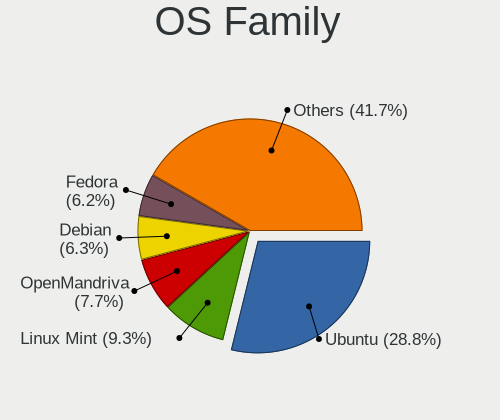
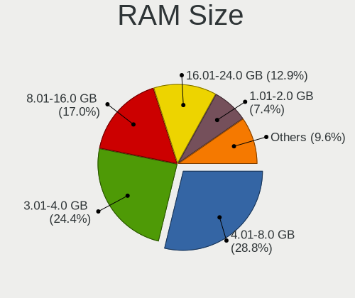
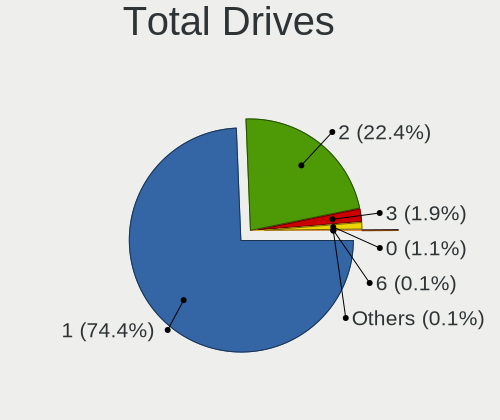
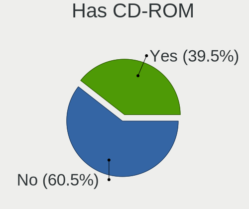
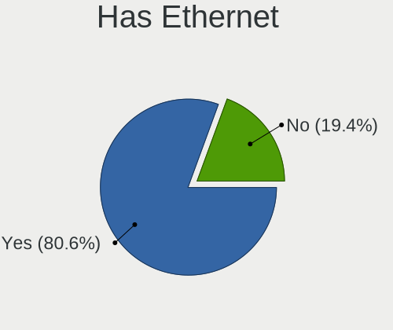
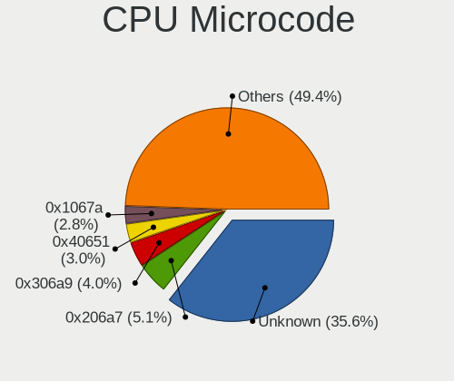
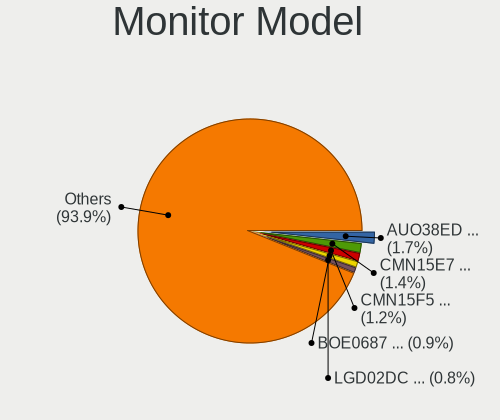
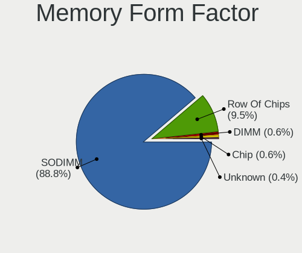
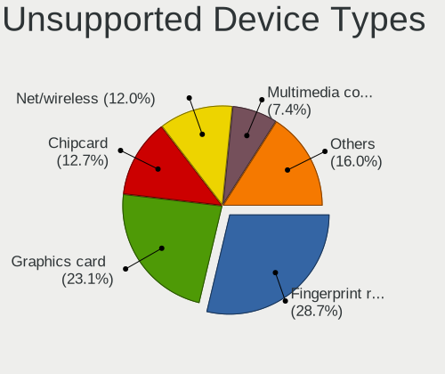

Linux in Greece - Tested Hardware & Statistics (Notebooks)
----------------------------------------------------------

A project to collect tested hardware configurations for Linux in Greece.

Anyone can contribute to this report by the [hw-probe](https://github.com/linuxhw/hw-probe) tool:

    sudo -E hw-probe -all -upload

Please contribute! Especially if your hardware is rare.

Contents
--------

* [ Test Cases ](#test-cases)

* [ System ](#system)
  - [ OS                       ](#os)
  - [ OS Family                ](#os-family)
  - [ Kernel                   ](#kernel)
  - [ Kernel Family            ](#kernel-family)
  - [ Kernel Major Ver.        ](#kernel-major-ver)
  - [ Arch                     ](#arch)
  - [ DE                       ](#de)
  - [ Display Server           ](#display-server)
  - [ Display Manager          ](#display-manager)
  - [ OS Lang                  ](#os-lang)
  - [ Boot Mode                ](#boot-mode)
  - [ Filesystem               ](#filesystem)
  - [ Part. scheme             ](#part-scheme)
  - [ Dual Boot with Linux/BSD ](#dual-boot-with-linuxbsd)
  - [ Dual Boot (Win)          ](#dual-boot-win)

* [ Board ](#board)
  - [ Vendor                   ](#vendor)
  - [ Model                    ](#model)
  - [ Model Family             ](#model-family)
  - [ MFG Year                 ](#mfg-year)
  - [ Form Factor              ](#form-factor)
  - [ Secure Boot              ](#secure-boot)
  - [ Coreboot                 ](#coreboot)
  - [ RAM Size                 ](#ram-size)
  - [ RAM Used                 ](#ram-used)
  - [ Total Drives             ](#total-drives)
  - [ Has CD-ROM               ](#has-cd-rom)
  - [ Has Ethernet             ](#has-ethernet)
  - [ Has WiFi                 ](#has-wifi)
  - [ Has Bluetooth            ](#has-bluetooth)

* [ Location ](#location)
  - [ Country                  ](#country)
  - [ City                     ](#city)

* [ Drives ](#drives)
  - [ Drive Vendor             ](#drive-vendor)
  - [ Drive Model              ](#drive-model)
  - [ HDD Vendor               ](#hdd-vendor)
  - [ SSD Vendor               ](#ssd-vendor)
  - [ Drive Kind               ](#drive-kind)
  - [ Drive Connector          ](#drive-connector)
  - [ Drive Size               ](#drive-size)
  - [ Space Total              ](#space-total)
  - [ Space Used               ](#space-used)
  - [ Malfunc. Drives          ](#malfunc-drives)
  - [ Malfunc. Drive Vendor    ](#malfunc-drive-vendor)
  - [ Malfunc. HDD Vendor      ](#malfunc-hdd-vendor)
  - [ Malfunc. Drive Kind      ](#malfunc-drive-kind)
  - [ Failed Drives            ](#failed-drives)
  - [ Failed Drive Vendor      ](#failed-drive-vendor)
  - [ Drive Status             ](#drive-status)

* [ Storage controller ](#storage-controller)
  - [ Storage Vendor           ](#storage-vendor)
  - [ Storage Model            ](#storage-model)
  - [ Storage Kind             ](#storage-kind)

* [ Processor ](#processor)
  - [ CPU Vendor               ](#cpu-vendor)
  - [ CPU Model                ](#cpu-model)
  - [ CPU Model Family         ](#cpu-model-family)
  - [ CPU Cores                ](#cpu-cores)
  - [ CPU Sockets              ](#cpu-sockets)
  - [ CPU Threads              ](#cpu-threads)
  - [ CPU Op-Modes             ](#cpu-op-modes)
  - [ CPU Microcode            ](#cpu-microcode)
  - [ CPU Microarch            ](#cpu-microarch)

* [ Graphics ](#graphics)
  - [ GPU Vendor               ](#gpu-vendor)
  - [ GPU Model                ](#gpu-model)
  - [ GPU Combo                ](#gpu-combo)
  - [ GPU Driver               ](#gpu-driver)
  - [ GPU Memory               ](#gpu-memory)

* [ Monitor ](#monitor)
  - [ Monitor Vendor           ](#monitor-vendor)
  - [ Monitor Model            ](#monitor-model)
  - [ Monitor Resolution       ](#monitor-resolution)
  - [ Monitor Diagonal         ](#monitor-diagonal)
  - [ Monitor Width            ](#monitor-width)
  - [ Aspect Ratio             ](#aspect-ratio)
  - [ Monitor Area             ](#monitor-area)
  - [ Pixel Density            ](#pixel-density)
  - [ Multiple Monitors        ](#multiple-monitors)

* [ Network ](#network)
  - [ Net Controller Vendor    ](#net-controller-vendor)
  - [ Net Controller Model     ](#net-controller-model)
  - [ Wireless Vendor          ](#wireless-vendor)
  - [ Wireless Model           ](#wireless-model)
  - [ Ethernet Vendor          ](#ethernet-vendor)
  - [ Ethernet Model           ](#ethernet-model)
  - [ Net Controller Kind      ](#net-controller-kind)
  - [ Used Controller          ](#used-controller)
  - [ NICs                     ](#nics)
  - [ IPv6                     ](#ipv6)

* [ Bluetooth ](#bluetooth)
  - [ Bluetooth Vendor         ](#bluetooth-vendor)
  - [ Bluetooth Model          ](#bluetooth-model)

* [ Sound ](#sound)
  - [ Sound Vendor             ](#sound-vendor)
  - [ Sound Model              ](#sound-model)

* [ Memory ](#memory)
  - [ Memory Vendor            ](#memory-vendor)
  - [ Memory Model             ](#memory-model)
  - [ Memory Kind              ](#memory-kind)
  - [ Memory Form Factor       ](#memory-form-factor)
  - [ Memory Size              ](#memory-size)
  - [ Memory Speed             ](#memory-speed)

* [ Printers & scanners ](#printers--scanners)
  - [ Printer Vendor           ](#printer-vendor)
  - [ Printer Model            ](#printer-model)
  - [ Scanner Vendor           ](#scanner-vendor)
  - [ Scanner Model            ](#scanner-model)

* [ Camera ](#camera)
  - [ Camera Vendor            ](#camera-vendor)
  - [ Camera Model             ](#camera-model)

* [ Security ](#security)
  - [ Fingerprint Vendor       ](#fingerprint-vendor)
  - [ Fingerprint Model        ](#fingerprint-model)
  - [ Chipcard Vendor          ](#chipcard-vendor)
  - [ Chipcard Model           ](#chipcard-model)

* [ Unsupported ](#unsupported)
  - [ Unsupported Devices      ](#unsupported-devices)
  - [ Unsupported Device Types ](#unsupported-device-types)

Test Cases
----------

Total: 1415

| Vendor        | Model                       | Probe                                                      | Date         |
|---------------|-----------------------------|------------------------------------------------------------|--------------|
| Dell          | Precision 5570              | [f2f2ed487a](https://linux-hardware.org/?probe=f2f2ed487a) | Jan 05, 2025 |
| Dell          | Precision 5570              | [ac97f0b0c6](https://linux-hardware.org/?probe=ac97f0b0c6) | Jan 05, 2025 |
| HP            | 635                         | [021402dc32](https://linux-hardware.org/?probe=021402dc32) | Jan 04, 2025 |
| Lenovo        | Legion Pro 7 16IRX8H 82W... | [7d04e69f0f](https://linux-hardware.org/?probe=7d04e69f0f) | Dec 30, 2024 |
| Lenovo        | ThinkPad P14s Gen 1 20S5... | [e5bf005a5f](https://linux-hardware.org/?probe=e5bf005a5f) | Dec 26, 2024 |
| HP            | 2000                        | [178dbdf355](https://linux-hardware.org/?probe=178dbdf355) | Dec 24, 2024 |
| Toshiba       | Satellite P870              | [a0e62c769c](https://linux-hardware.org/?probe=a0e62c769c) | Dec 24, 2024 |
| Toshiba       | Satellite P870              | [17c3c89a60](https://linux-hardware.org/?probe=17c3c89a60) | Dec 23, 2024 |
| HP            | Laptop 15s-eq0xxx           | [abde21108d](https://linux-hardware.org/?probe=abde21108d) | Dec 22, 2024 |
| ASUSTek       | ASUS TUF Gaming A15 FA50... | [8ab0fc807b](https://linux-hardware.org/?probe=8ab0fc807b) | Dec 22, 2024 |
| Lenovo        | ThinkPad T470s W10DG 20J... | [6abe074048](https://linux-hardware.org/?probe=6abe074048) | Dec 21, 2024 |
| HP            | Notebook                    | [0e1d6a3365](https://linux-hardware.org/?probe=0e1d6a3365) | Dec 21, 2024 |
| Lenovo        | G550 20023                  | [ae390615a1](https://linux-hardware.org/?probe=ae390615a1) | Dec 21, 2024 |
| Lenovo        | G500 20236                  | [f41f8ad808](https://linux-hardware.org/?probe=f41f8ad808) | Dec 20, 2024 |
| Dell          | Vostro 5625                 | [c081eaa179](https://linux-hardware.org/?probe=c081eaa179) | Dec 20, 2024 |
| Lenovo        | Legion Pro 7 16IRX8H 82W... | [0b19989780](https://linux-hardware.org/?probe=0b19989780) | Dec 19, 2024 |
| HP            | ProBook 4330s               | [e113fb9fd9](https://linux-hardware.org/?probe=e113fb9fd9) | Dec 18, 2024 |
| Acer          | Aspire 5560                 | [8765d80e65](https://linux-hardware.org/?probe=8765d80e65) | Dec 18, 2024 |
| ASUSTek       | VivoBook_ASUSLaptop X509... | [ec283efd6e](https://linux-hardware.org/?probe=ec283efd6e) | Dec 15, 2024 |
| HP            | Laptop 15-bw0xx             | [821c2b9cb8](https://linux-hardware.org/?probe=821c2b9cb8) | Dec 15, 2024 |
| HP            | Pavilion Notebook           | [29c7464484](https://linux-hardware.org/?probe=29c7464484) | Dec 15, 2024 |
| Timi          | RedmiBook 16                | [0d74278d32](https://linux-hardware.org/?probe=0d74278d32) | Dec 15, 2024 |
| Lenovo        | IdeaPad 330-15IKB 81DC      | [cdd64fe0e0](https://linux-hardware.org/?probe=cdd64fe0e0) | Dec 14, 2024 |
| HUAWEI        | NBLK-WAX9X                  | [287c370d01](https://linux-hardware.org/?probe=287c370d01) | Dec 14, 2024 |
| Lenovo        | IdeaPad 100-15IBD 80QQ      | [eb28eff5f8](https://linux-hardware.org/?probe=eb28eff5f8) | Dec 13, 2024 |
| Google        | Vortininja                  | [d144b6b4fa](https://linux-hardware.org/?probe=d144b6b4fa) | Dec 12, 2024 |
| HP            | Pavilion Notebook           | [f654786871](https://linux-hardware.org/?probe=f654786871) | Dec 10, 2024 |
| Dell          | XPS 16 9640                 | [abc56657dd](https://linux-hardware.org/?probe=abc56657dd) | Dec 09, 2024 |
| Dell          | XPS 16 9640                 | [b72bcc523e](https://linux-hardware.org/?probe=b72bcc523e) | Dec 09, 2024 |
| Lenovo        | V15 G4 AMN 82YU             | [152aa1b4ca](https://linux-hardware.org/?probe=152aa1b4ca) | Dec 09, 2024 |
| Lenovo        | ThinkPad L15 Gen 2 20X30... | [db6679efb6](https://linux-hardware.org/?probe=db6679efb6) | Dec 08, 2024 |
| Lenovo        | V15 G4 AMN 82YU             | [5b795c5c2c](https://linux-hardware.org/?probe=5b795c5c2c) | Dec 08, 2024 |
| Timi          | RedmiBook 16                | [f88c0150a1](https://linux-hardware.org/?probe=f88c0150a1) | Dec 05, 2024 |
| ASUSTek       | VivoBook_ASUSLaptop X570... | [cfdba4136a](https://linux-hardware.org/?probe=cfdba4136a) | Dec 04, 2024 |
| Lenovo        | IdeaPad 3 15ALC6 82KU       | [29e95f13ac](https://linux-hardware.org/?probe=29e95f13ac) | Dec 04, 2024 |
| HP            | Laptop 15-bw0xx             | [4809801b37](https://linux-hardware.org/?probe=4809801b37) | Dec 01, 2024 |
| ASUSTek       | ROG Zephyrus G14 GA401QM... | [1cabb4b7bd](https://linux-hardware.org/?probe=1cabb4b7bd) | Dec 01, 2024 |
| Lenovo        | ThinkPad L15 Gen 2 20X30... | [4465a33023](https://linux-hardware.org/?probe=4465a33023) | Nov 30, 2024 |
| HP            | EliteBook 8540w             | [791b33a243](https://linux-hardware.org/?probe=791b33a243) | Nov 29, 2024 |
| ASUSTek       | ROG Strix G513IH_G513IH     | [00247be989](https://linux-hardware.org/?probe=00247be989) | Nov 27, 2024 |
| Google        | Lillipup rev2               | [d770b59a72](https://linux-hardware.org/?probe=d770b59a72) | Nov 23, 2024 |
| Fujitsu       | LIFEBOOK AH532/G21          | [51cbd9f492](https://linux-hardware.org/?probe=51cbd9f492) | Nov 20, 2024 |
| Lenovo        | IdeaPad 330-15IKB 81DC      | [3fd82c3ca3](https://linux-hardware.org/?probe=3fd82c3ca3) | Nov 20, 2024 |
| HP            | Pavilion Notebook           | [8fe35fac83](https://linux-hardware.org/?probe=8fe35fac83) | Nov 20, 2024 |
| HP            | ProBook 650 G8 Notebook ... | [b127afd574](https://linux-hardware.org/?probe=b127afd574) | Nov 18, 2024 |
| Toshiba       | Satellite C55-A-1H9         | [936476ea78](https://linux-hardware.org/?probe=936476ea78) | Nov 17, 2024 |
| Dell          | Precision 5680              | [99d9b32657](https://linux-hardware.org/?probe=99d9b32657) | Nov 17, 2024 |
| Chuwi         | GemiBook Plus               | [10be58e89f](https://linux-hardware.org/?probe=10be58e89f) | Nov 16, 2024 |
| Lenovo        | IdeaPad 320-17IKB 80XM      | [0db94ed770](https://linux-hardware.org/?probe=0db94ed770) | Nov 14, 2024 |
| Dell          | Latitude 7390               | [caea874a2f](https://linux-hardware.org/?probe=caea874a2f) | Nov 14, 2024 |
| MSI           | Thin GF63 12VE              | [dba5f78212](https://linux-hardware.org/?probe=dba5f78212) | Nov 10, 2024 |
| Lenovo        | Legion Pro 5 16ARX8 82WM    | [42efcfaea3](https://linux-hardware.org/?probe=42efcfaea3) | Nov 06, 2024 |
| HP            | Pavilion Sleekbook 15 PC    | [06aea2ac21](https://linux-hardware.org/?probe=06aea2ac21) | Nov 05, 2024 |
| Valve         | Galileo                     | [9a91afe08a](https://linux-hardware.org/?probe=9a91afe08a) | Nov 05, 2024 |
| Apple         | MacBookPro8,1               | [5c2dacf3d8](https://linux-hardware.org/?probe=5c2dacf3d8) | Nov 01, 2024 |
| Lenovo        | ThinkPad X280 20KESEYC00    | [bc3e6aa2dc](https://linux-hardware.org/?probe=bc3e6aa2dc) | Oct 30, 2024 |
| Lenovo        | IdeaPad 5 Pro 14ACN6 82L... | [e2b4f362a6](https://linux-hardware.org/?probe=e2b4f362a6) | Oct 30, 2024 |
| Sony          | VPCF12Z1E                   | [419e054c06](https://linux-hardware.org/?probe=419e054c06) | Oct 27, 2024 |
| Sony          | VPCF12Z1E                   | [f68f55bfd6](https://linux-hardware.org/?probe=f68f55bfd6) | Oct 27, 2024 |
| HP            | ProBook 650 G8 Notebook ... | [95f5649f6f](https://linux-hardware.org/?probe=95f5649f6f) | Oct 26, 2024 |
| Dell          | Latitude E6430              | [7aa1bdef3c](https://linux-hardware.org/?probe=7aa1bdef3c) | Oct 25, 2024 |
| Dell          | Latitude 5320               | [7302e97437](https://linux-hardware.org/?probe=7302e97437) | Oct 25, 2024 |
| Dell          | Inspiron 3551               | [9a94d5f1a3](https://linux-hardware.org/?probe=9a94d5f1a3) | Oct 24, 2024 |
| Lenovo        | ThinkPad X250 20CLS3320C    | [66c0507882](https://linux-hardware.org/?probe=66c0507882) | Oct 23, 2024 |
| Dell          | G15 5530                    | [4126a139a6](https://linux-hardware.org/?probe=4126a139a6) | Oct 18, 2024 |
| Clevo         | M7x0S                       | [167af55baf](https://linux-hardware.org/?probe=167af55baf) | Oct 15, 2024 |
| HP            | ProBook 4540s               | [38d30c1f16](https://linux-hardware.org/?probe=38d30c1f16) | Oct 13, 2024 |
| SLIMBOOK      | EXCALIBUR-16-AMD8           | [a410299e44](https://linux-hardware.org/?probe=a410299e44) | Oct 11, 2024 |
| Lenovo        | ThinkPad T470s W10DG 20J... | [f108ee0d16](https://linux-hardware.org/?probe=f108ee0d16) | Oct 10, 2024 |
| Dell          | Latitude 5420               | [984b4c62dc](https://linux-hardware.org/?probe=984b4c62dc) | Oct 06, 2024 |
| Dell          | Inspiron 3580               | [e71d6571fb](https://linux-hardware.org/?probe=e71d6571fb) | Oct 06, 2024 |
| HP            | Pavilion 11 x360 PC         | [fe5bb258a3](https://linux-hardware.org/?probe=fe5bb258a3) | Oct 05, 2024 |
| HP            | Pavilion 11 x360 PC         | [1856abb0a4](https://linux-hardware.org/?probe=1856abb0a4) | Oct 05, 2024 |
| Lenovo        | Legion Pro 7 16ARX8H 82W... | [33416938d4](https://linux-hardware.org/?probe=33416938d4) | Oct 05, 2024 |
| MSI           | Thin GF63 12VE              | [f7be3a7069](https://linux-hardware.org/?probe=f7be3a7069) | Oct 05, 2024 |
| Dell          | XPS 13 9300                 | [e5e96718fa](https://linux-hardware.org/?probe=e5e96718fa) | Sep 29, 2024 |
| TUXEDO        | InfinityBook Pro AMD Gen... | [d51b3c150f](https://linux-hardware.org/?probe=d51b3c150f) | Sep 28, 2024 |
| ViewSonic     | VNB120                      | [ded53d2f1e](https://linux-hardware.org/?probe=ded53d2f1e) | Sep 26, 2024 |
| ASUSTek       | VivoBook_ASUSLaptop X509... | [0e0ec9b83b](https://linux-hardware.org/?probe=0e0ec9b83b) | Sep 25, 2024 |
| Dell          | Inspiron 5770               | [9ea257bf1a](https://linux-hardware.org/?probe=9ea257bf1a) | Sep 24, 2024 |
| Dell          | Precision 5550              | [bf5c196e01](https://linux-hardware.org/?probe=bf5c196e01) | Sep 24, 2024 |
| HP            | Pavilion Aero Laptop 13-... | [ab0a67408a](https://linux-hardware.org/?probe=ab0a67408a) | Sep 24, 2024 |
| ASUSTek       | VivoBook_ASUSLaptop X509... | [28d162298f](https://linux-hardware.org/?probe=28d162298f) | Sep 22, 2024 |
| Dell          | Inspiron 5770               | [8fd2420469](https://linux-hardware.org/?probe=8fd2420469) | Sep 21, 2024 |
| ASUSTek       | VivoBook_ASUSLaptop X515... | [f6b6091065](https://linux-hardware.org/?probe=f6b6091065) | Sep 18, 2024 |
| HP            | G62                         | [ef53abac2a](https://linux-hardware.org/?probe=ef53abac2a) | Sep 16, 2024 |
| ASUSTek       | N55SF                       | [f49d65bd76](https://linux-hardware.org/?probe=f49d65bd76) | Sep 16, 2024 |
| ASUSTek       | Vivobook Go E1504FA_E150... | [a924d657ed](https://linux-hardware.org/?probe=a924d657ed) | Sep 15, 2024 |
| Lenovo        | ThinkPad T480 20L6SJPJ00    | [ac38116df7](https://linux-hardware.org/?probe=ac38116df7) | Sep 15, 2024 |
| Fujitsu       | LIFEBOOK AH532/G52          | [6055f6f61a](https://linux-hardware.org/?probe=6055f6f61a) | Sep 14, 2024 |
| ASUSTek       | VivoBook_ASUSLaptop X515... | [eed963830f](https://linux-hardware.org/?probe=eed963830f) | Sep 12, 2024 |
| Dell          | Vostro 5625                 | [0ba2c3fbfa](https://linux-hardware.org/?probe=0ba2c3fbfa) | Sep 11, 2024 |
| ASUSTek       | N501VW                      | [c80d222867](https://linux-hardware.org/?probe=c80d222867) | Sep 07, 2024 |
| Dell          | Vostro 5625                 | [77ba1698f0](https://linux-hardware.org/?probe=77ba1698f0) | Sep 07, 2024 |
| ASUSTek       | X542UAR                     | [e77501a0d8](https://linux-hardware.org/?probe=e77501a0d8) | Sep 05, 2024 |
| HP            | ProBook 645 G3              | [49013f7886](https://linux-hardware.org/?probe=49013f7886) | Sep 03, 2024 |
| HP            | ProBook 4540s               | [7516cf33af](https://linux-hardware.org/?probe=7516cf33af) | Sep 03, 2024 |
| Lenovo        | IdeaPad 3 15ALC6 82KU       | [500e0af968](https://linux-hardware.org/?probe=500e0af968) | Sep 03, 2024 |
| VERO          | K147                        | [fa6457d35f](https://linux-hardware.org/?probe=fa6457d35f) | Sep 02, 2024 |
| Toshiba       | PORTEGE Z20T-B              | [0e4218c20f](https://linux-hardware.org/?probe=0e4218c20f) | Sep 01, 2024 |
| Lenovo        | V17 G2 ITL 82NX             | [ce81460fc8](https://linux-hardware.org/?probe=ce81460fc8) | Aug 31, 2024 |
| HUAWEI        | KLVD-WXX9                   | [c74d967cf0](https://linux-hardware.org/?probe=c74d967cf0) | Aug 29, 2024 |
| Notebook      | W65_67SH                    | [5fcbc7f537](https://linux-hardware.org/?probe=5fcbc7f537) | Aug 21, 2024 |
| HUAWEI        | BOHB-WAX9                   | [1f84172e15](https://linux-hardware.org/?probe=1f84172e15) | Aug 19, 2024 |
| ASUSTek       | X556UV                      | [8ffcded5f7](https://linux-hardware.org/?probe=8ffcded5f7) | Aug 19, 2024 |
| ASUSTek       | X556UV                      | [0e12f5e5e2](https://linux-hardware.org/?probe=0e12f5e5e2) | Aug 19, 2024 |
| ASUSTek       | Vivobook Go E1504FA_E150... | [16b9778317](https://linux-hardware.org/?probe=16b9778317) | Aug 18, 2024 |
| Notebook      | W65_67SH                    | [b80ca179b5](https://linux-hardware.org/?probe=b80ca179b5) | Aug 17, 2024 |
| HP            | EliteBook 8470p             | [82c857ca2e](https://linux-hardware.org/?probe=82c857ca2e) | Aug 17, 2024 |
| Sony          | VGN-AR51J                   | [68abb3faf1](https://linux-hardware.org/?probe=68abb3faf1) | Aug 15, 2024 |
| HP            | ProBook 6470b               | [01aa420cc9](https://linux-hardware.org/?probe=01aa420cc9) | Aug 13, 2024 |
| HP            | ProBook 6470b               | [58080f1221](https://linux-hardware.org/?probe=58080f1221) | Aug 13, 2024 |
| HUAWEI        | BOHK-WAX9X                  | [0f74198db8](https://linux-hardware.org/?probe=0f74198db8) | Aug 11, 2024 |
| Dell          | Inspiron 5770               | [b1036a3c27](https://linux-hardware.org/?probe=b1036a3c27) | Aug 10, 2024 |
| Unknown       | Unknown                     | [1d6978a562](https://linux-hardware.org/?probe=1d6978a562) | Aug 09, 2024 |
| ASUSTek       | VivoBook_ASUSLaptop X515... | [47629a128e](https://linux-hardware.org/?probe=47629a128e) | Aug 06, 2024 |
| Dell          | Precision 5570              | [0bb62cf06c](https://linux-hardware.org/?probe=0bb62cf06c) | Aug 05, 2024 |
| HP            | ZBook Firefly 16 inch G1... | [d67b7a8159](https://linux-hardware.org/?probe=d67b7a8159) | Aug 04, 2024 |
| HP            | ZBook Firefly 16 inch G1... | [4f7505fae7](https://linux-hardware.org/?probe=4f7505fae7) | Aug 04, 2024 |
| Lenovo        | ThinkPad X1 Carbon 5th 2... | [f683a72991](https://linux-hardware.org/?probe=f683a72991) | Jul 28, 2024 |
| ASUSTek       | ASUS TUF Gaming A16 FA60... | [0adfab33d3](https://linux-hardware.org/?probe=0adfab33d3) | Jul 26, 2024 |
| HP            | 255 G7 Notebook PC          | [19a51f93c3](https://linux-hardware.org/?probe=19a51f93c3) | Jul 24, 2024 |
| Toshiba       | Satellite L40               | [dac6bed959](https://linux-hardware.org/?probe=dac6bed959) | Jul 23, 2024 |
| Toshiba       | Satellite L40               | [be27198d96](https://linux-hardware.org/?probe=be27198d96) | Jul 23, 2024 |
| ASUSTek       | ASUS TUF Gaming A16 FA60... | [13726eb99d](https://linux-hardware.org/?probe=13726eb99d) | Jul 22, 2024 |
| Lenovo        | ThinkBook 16p Gen 4 21J8    | [7a3b21946e](https://linux-hardware.org/?probe=7a3b21946e) | Jul 21, 2024 |
| Lenovo        | ThinkPad L450 20DSS1DT00    | [13a4bd8ef8](https://linux-hardware.org/?probe=13a4bd8ef8) | Jul 21, 2024 |
| Lenovo        | IdeaPad 3 15ABA7 82RN       | [be16ffa7bd](https://linux-hardware.org/?probe=be16ffa7bd) | Jul 16, 2024 |
| HP            | 255 15.6 inch G9 Noteboo... | [524616cba4](https://linux-hardware.org/?probe=524616cba4) | Jul 16, 2024 |
| Sony          | VPCF13E8E                   | [1529d3e692](https://linux-hardware.org/?probe=1529d3e692) | Jul 15, 2024 |
| TUXEDO        | Polaris AMD Gen5            | [c587060103](https://linux-hardware.org/?probe=c587060103) | Jul 11, 2024 |
| Jumper        | EZbook                      | [ba10a989a5](https://linux-hardware.org/?probe=ba10a989a5) | Jul 09, 2024 |
| Dell          | Latitude 7480               | [397c8634c6](https://linux-hardware.org/?probe=397c8634c6) | Jul 07, 2024 |
| Unknown       | N10(M1N1)                   | [fc2ca6d762](https://linux-hardware.org/?probe=fc2ca6d762) | Jul 04, 2024 |
| Dell          | Inspiron 15-3567            | [89266f618e](https://linux-hardware.org/?probe=89266f618e) | Jul 03, 2024 |
| Dell          | Precision 5570              | [f9ee92b9fd](https://linux-hardware.org/?probe=f9ee92b9fd) | Jun 30, 2024 |
| Dell          | Latitude 5420               | [8d6876fbcb](https://linux-hardware.org/?probe=8d6876fbcb) | Jun 30, 2024 |
| ASUSTek       | ASUS Vivobook Pro 15 N65... | [60ca4af7d3](https://linux-hardware.org/?probe=60ca4af7d3) | Jun 29, 2024 |
| Clevo         | P150HMx                     | [b10d38706f](https://linux-hardware.org/?probe=b10d38706f) | Jun 29, 2024 |
| Dell          | XPS 13 7390                 | [e9cd898e8e](https://linux-hardware.org/?probe=e9cd898e8e) | Jun 27, 2024 |
| Dell          | Inspiron 15-3567            | [31f20bd3dc](https://linux-hardware.org/?probe=31f20bd3dc) | Jun 23, 2024 |
| Dell          | Inspiron 15-3567            | [ab622d7142](https://linux-hardware.org/?probe=ab622d7142) | Jun 22, 2024 |
| ASUSTek       | ROG Zephyrus G14 GA401IU... | [b3c4746d73](https://linux-hardware.org/?probe=b3c4746d73) | Jun 19, 2024 |
| Lenovo        | G50-45 80E3                 | [52195a1b7d](https://linux-hardware.org/?probe=52195a1b7d) | Jun 18, 2024 |
| HP            | 255 G7 Notebook PC          | [e7e02b5c94](https://linux-hardware.org/?probe=e7e02b5c94) | Jun 18, 2024 |
| Dell          | G15 5515                    | [c7ed207c3d](https://linux-hardware.org/?probe=c7ed207c3d) | Jun 15, 2024 |
| Dell          | XPS 13 7390                 | [c46ecb0517](https://linux-hardware.org/?probe=c46ecb0517) | Jun 14, 2024 |
| Acer          | Aspire 7745G                | [c155ee3313](https://linux-hardware.org/?probe=c155ee3313) | Jun 08, 2024 |
| Acer          | Aspire 7745G                | [b7ca47a62c](https://linux-hardware.org/?probe=b7ca47a62c) | Jun 08, 2024 |
| Apple         | MacBookPro16,1              | [fe2220a383](https://linux-hardware.org/?probe=fe2220a383) | Jun 08, 2024 |
| Apple         | MacBookPro16,1              | [d288e32434](https://linux-hardware.org/?probe=d288e32434) | Jun 07, 2024 |
| Lenovo        | ThinkPad X250 20CLS3320C    | [ba79b0d8a5](https://linux-hardware.org/?probe=ba79b0d8a5) | Jun 04, 2024 |
| Dell          | Inspiron 3537               | [6da543e575](https://linux-hardware.org/?probe=6da543e575) | Jun 03, 2024 |
| HP            | Pavilion Notebook           | [8a87530eb6](https://linux-hardware.org/?probe=8a87530eb6) | Jun 03, 2024 |
| ASUSTek       | X205TA                      | [e39012d26d](https://linux-hardware.org/?probe=e39012d26d) | Jun 02, 2024 |
| Lenovo        | Legion 5 15ACH6H 82JU       | [a60f14fa91](https://linux-hardware.org/?probe=a60f14fa91) | May 28, 2024 |
| HP            | OMEN by Laptop 16-b1xxx     | [63bafff3a1](https://linux-hardware.org/?probe=63bafff3a1) | May 25, 2024 |
| HP            | Notebook                    | [6681b8a10c](https://linux-hardware.org/?probe=6681b8a10c) | May 21, 2024 |
| Lenovo        | ThinkPad T420 4236RN1       | [b8307144df](https://linux-hardware.org/?probe=b8307144df) | May 21, 2024 |
| ASUSTek       | ROG Strix G513IH_G513IH     | [4ca08b4a41](https://linux-hardware.org/?probe=4ca08b4a41) | May 20, 2024 |
| HP            | Stream Laptop 14-ds0xxx     | [0ca5fbf86f](https://linux-hardware.org/?probe=0ca5fbf86f) | May 20, 2024 |
| Lenovo        | IdeaPad 5 14ALC05 82LM      | [8a843d5cfd](https://linux-hardware.org/?probe=8a843d5cfd) | May 19, 2024 |
| Toshiba       | Satellite C660D             | [b5c4ff6e0a](https://linux-hardware.org/?probe=b5c4ff6e0a) | May 19, 2024 |
| Dell          | XPS 13 7390                 | [a68eeebb7a](https://linux-hardware.org/?probe=a68eeebb7a) | May 17, 2024 |
| ASUSTek       | VivoBook_ASUSLaptop X150... | [eb5522a04d](https://linux-hardware.org/?probe=eb5522a04d) | May 16, 2024 |
| HP            | Pavilion Laptop 15-cs0xx... | [a6d1ac5090](https://linux-hardware.org/?probe=a6d1ac5090) | May 15, 2024 |
| HP            | EliteBook 8470p             | [11104fdba5](https://linux-hardware.org/?probe=11104fdba5) | May 15, 2024 |
| Lenovo        | ThinkPad X1 Carbon 5th 2... | [b1bd8211bc](https://linux-hardware.org/?probe=b1bd8211bc) | May 13, 2024 |
| Lenovo        | ThinkPad X1 Carbon 5th 2... | [957fab5954](https://linux-hardware.org/?probe=957fab5954) | May 13, 2024 |
| Toshiba       | Satellite A200              | [6096de9c72](https://linux-hardware.org/?probe=6096de9c72) | May 11, 2024 |
| Compal        | JHL90 REFERENCE             | [c477434d4e](https://linux-hardware.org/?probe=c477434d4e) | May 09, 2024 |
| Sony          | VPCEB1S1E                   | [551a1d2f64](https://linux-hardware.org/?probe=551a1d2f64) | May 08, 2024 |
| Toshiba       | Satellite C50-B             | [4037de5266](https://linux-hardware.org/?probe=4037de5266) | May 06, 2024 |
| Toshiba       | Satellite A200              | [633754915c](https://linux-hardware.org/?probe=633754915c) | May 05, 2024 |
| Toshiba       | Satellite A200              | [ba705e9e1b](https://linux-hardware.org/?probe=ba705e9e1b) | May 05, 2024 |
| ASUSTek       | ROG Strix G513IH_G513IH     | [5a6ae63a80](https://linux-hardware.org/?probe=5a6ae63a80) | May 05, 2024 |
| HP            | ProBook 6470b               | [3865a636e2](https://linux-hardware.org/?probe=3865a636e2) | May 04, 2024 |
| Notebook      | W54_W94_W955TU,-T,-C        | [c327d5c1a6](https://linux-hardware.org/?probe=c327d5c1a6) | May 01, 2024 |
| Lenovo        | ThinkPad L13 Gen 3 21B90... | [372c9b4a75](https://linux-hardware.org/?probe=372c9b4a75) | Apr 28, 2024 |
| Lenovo        | IdeaPad 5 14ALC05 82LM      | [5560070361](https://linux-hardware.org/?probe=5560070361) | Apr 25, 2024 |
| Lenovo        | IdeaPad 5 14ALC05 82LM      | [6ec3950131](https://linux-hardware.org/?probe=6ec3950131) | Apr 25, 2024 |
| Dell          | Latitude 5420               | [604846386f](https://linux-hardware.org/?probe=604846386f) | Apr 24, 2024 |
| HP            | EliteBook 745 G4            | [f38a6451f0](https://linux-hardware.org/?probe=f38a6451f0) | Apr 24, 2024 |
| Lenovo        | ThinkPad T420 4236RN1       | [4ad39fcdb5](https://linux-hardware.org/?probe=4ad39fcdb5) | Apr 23, 2024 |
| Dell          | Latitude 5420               | [f3182ce0c2](https://linux-hardware.org/?probe=f3182ce0c2) | Apr 23, 2024 |
| HP            | Pavilion dv7                | [c7af52e729](https://linux-hardware.org/?probe=c7af52e729) | Apr 21, 2024 |
| Acer          | AO756                       | [2f4e22ef7f](https://linux-hardware.org/?probe=2f4e22ef7f) | Apr 21, 2024 |
| Lenovo        | IdeaPad U350                | [148c50f66b](https://linux-hardware.org/?probe=148c50f66b) | Apr 16, 2024 |
| Lenovo        | G40-30 80FY                 | [d1d8e1d51f](https://linux-hardware.org/?probe=d1d8e1d51f) | Apr 11, 2024 |
| Acer          | Aspire A514-52              | [7019dcf4ea](https://linux-hardware.org/?probe=7019dcf4ea) | Apr 10, 2024 |
| Lenovo        | ThinkPad T480 20L6S5QH00    | [5068f44f3b](https://linux-hardware.org/?probe=5068f44f3b) | Apr 10, 2024 |
| Lenovo        | IdeaPad 3 15IAU7 82RK       | [62a1298341](https://linux-hardware.org/?probe=62a1298341) | Apr 10, 2024 |
| Acer          | Aspire A515-45              | [d62d670bd4](https://linux-hardware.org/?probe=d62d670bd4) | Apr 09, 2024 |
| HP            | EliteBook 745 G4            | [0d92302707](https://linux-hardware.org/?probe=0d92302707) | Apr 09, 2024 |
| Toshiba       | Satellite C50-B             | [f5e88caf50](https://linux-hardware.org/?probe=f5e88caf50) | Apr 06, 2024 |
| Lenovo        | G40-30 80FY                 | [216b899f97](https://linux-hardware.org/?probe=216b899f97) | Apr 04, 2024 |
| Toshiba       | Satellite C50-B             | [065f34b713](https://linux-hardware.org/?probe=065f34b713) | Apr 04, 2024 |
| Fujitsu       | STYLISTIC Q702              | [1abe698880](https://linux-hardware.org/?probe=1abe698880) | Apr 02, 2024 |
| Dell          | Inspiron 5770               | [3a6a7880c9](https://linux-hardware.org/?probe=3a6a7880c9) | Apr 01, 2024 |
| Lenovo        | IdeaPad 3 15ABA7 82RN       | [4fc00ab41f](https://linux-hardware.org/?probe=4fc00ab41f) | Apr 01, 2024 |
| Timi          | TM1604                      | [9ef2ec37c2](https://linux-hardware.org/?probe=9ef2ec37c2) | Mar 29, 2024 |
| Timi          | TM1604                      | [ec2ab8fb5f](https://linux-hardware.org/?probe=ec2ab8fb5f) | Mar 29, 2024 |
| HP            | 250 15.6 inch G9 Noteboo... | [90fc1c5336](https://linux-hardware.org/?probe=90fc1c5336) | Mar 26, 2024 |
| Medion        | WIM2170                     | [190b555e0c](https://linux-hardware.org/?probe=190b555e0c) | Mar 23, 2024 |
| Dell          | Latitude 7490               | [869b39d5bd](https://linux-hardware.org/?probe=869b39d5bd) | Mar 22, 2024 |
| Lenovo        | ThinkPad P14s Gen 2i 20V... | [1c71f92a5b](https://linux-hardware.org/?probe=1c71f92a5b) | Mar 22, 2024 |
| Lenovo        | Legion Y540-15IRH 81SX      | [fab517699b](https://linux-hardware.org/?probe=fab517699b) | Mar 17, 2024 |
| Dell          | Inspiron 5770               | [9b23f75048](https://linux-hardware.org/?probe=9b23f75048) | Mar 15, 2024 |
| Lenovo        | IdeaPad 5 Pro 16ACH6 82L... | [78ad2387d5](https://linux-hardware.org/?probe=78ad2387d5) | Mar 15, 2024 |
| Lenovo        | IdeaPad C340-14API 81N6     | [08ca6f8423](https://linux-hardware.org/?probe=08ca6f8423) | Mar 14, 2024 |
| Lenovo        | IdeaPad 5 Pro 16ACH6 82L... | [0fbeb0332d](https://linux-hardware.org/?probe=0fbeb0332d) | Mar 14, 2024 |
| HP            | Pavilion Notebook           | [b2e7f143bc](https://linux-hardware.org/?probe=b2e7f143bc) | Mar 13, 2024 |
| Lenovo        | IdeaPad 5 Pro 16ACH6 82L... | [ad2e487982](https://linux-hardware.org/?probe=ad2e487982) | Mar 12, 2024 |
| Dell          | Inspiron 3542               | [f850f2ab1d](https://linux-hardware.org/?probe=f850f2ab1d) | Mar 11, 2024 |
| HP            | Pavilion Notebook           | [76431ddf1c](https://linux-hardware.org/?probe=76431ddf1c) | Mar 10, 2024 |
| ASUSTek       | VivoBook_ASUSLaptop M150... | [3529da3bcf](https://linux-hardware.org/?probe=3529da3bcf) | Mar 10, 2024 |
| Acer          | Aspire E5-575G              | [ff379abc68](https://linux-hardware.org/?probe=ff379abc68) | Mar 08, 2024 |
| Lenovo        | G50-30 80G0                 | [be5e190ea5](https://linux-hardware.org/?probe=be5e190ea5) | Mar 08, 2024 |
| ASUSTek       | Vivobook Go E1504FA_E150... | [386945e586](https://linux-hardware.org/?probe=386945e586) | Mar 07, 2024 |
| Lenovo        | IdeaPad S340-15IIL 81VW     | [66f2f3a361](https://linux-hardware.org/?probe=66f2f3a361) | Mar 04, 2024 |
| Lenovo        | IdeaPad S340-15IIL 81VW     | [3ab9b49b3e](https://linux-hardware.org/?probe=3ab9b49b3e) | Mar 04, 2024 |
| HP            | Pavilion g6                 | [fd797ba3af](https://linux-hardware.org/?probe=fd797ba3af) | Mar 04, 2024 |
| HP            | Pavilion g6                 | [7e4412a097](https://linux-hardware.org/?probe=7e4412a097) | Mar 03, 2024 |
| System76      | Galago Pro                  | [c7cb94f475](https://linux-hardware.org/?probe=c7cb94f475) | Mar 01, 2024 |
| HUAWEI        | BOM-WXX9                    | [94a4405784](https://linux-hardware.org/?probe=94a4405784) | Feb 29, 2024 |
| HP            | Pavilion Gaming Laptop 1... | [f9c04cc616](https://linux-hardware.org/?probe=f9c04cc616) | Feb 29, 2024 |
| ASUSTek       | VivoBook 15_ASUS Laptop ... | [b4370c5953](https://linux-hardware.org/?probe=b4370c5953) | Feb 17, 2024 |
| Apple         | MacBookPro5,5               | [6ea4dd15da](https://linux-hardware.org/?probe=6ea4dd15da) | Feb 15, 2024 |
| Apple         | MacBookPro5,5               | [e23c7132d2](https://linux-hardware.org/?probe=e23c7132d2) | Feb 15, 2024 |
| HP            | Laptop 15s-eq2xxx           | [f2321427cf](https://linux-hardware.org/?probe=f2321427cf) | Feb 15, 2024 |
| HP            | ProBook 450 15.6 inch G9... | [00a2d1b052](https://linux-hardware.org/?probe=00a2d1b052) | Feb 09, 2024 |
| HP            | Pavilion Notebook           | [075e2f410b](https://linux-hardware.org/?probe=075e2f410b) | Feb 05, 2024 |
| HP            | Pavilion Notebook           | [f6f5d83216](https://linux-hardware.org/?probe=f6f5d83216) | Feb 04, 2024 |
| nJoy Roman... | Ediam                       | [913590be87](https://linux-hardware.org/?probe=913590be87) | Feb 02, 2024 |
| ASUSTek       | Zenbook UM3402YAR_UM3402... | [04c6362187](https://linux-hardware.org/?probe=04c6362187) | Feb 01, 2024 |
| Lenovo        | IdeaPad 320-15ISK 80XH      | [a3932a77fb](https://linux-hardware.org/?probe=a3932a77fb) | Feb 01, 2024 |
| ASUSTek       | Zenbook UM3402YAR_UM3402... | [ee59cf62cb](https://linux-hardware.org/?probe=ee59cf62cb) | Jan 27, 2024 |
| ASUSTek       | Zenbook UM3402YAR_UM3402... | [dfb6b2a1c8](https://linux-hardware.org/?probe=dfb6b2a1c8) | Jan 27, 2024 |
| Toshiba       | Satellite P70-B             | [3e21232f45](https://linux-hardware.org/?probe=3e21232f45) | Jan 25, 2024 |
| Lenovo        | ThinkPad X201 36805B8       | [cf0a1641da](https://linux-hardware.org/?probe=cf0a1641da) | Jan 25, 2024 |
| Dell          | Inspiron 5770               | [6cf464989f](https://linux-hardware.org/?probe=6cf464989f) | Jan 24, 2024 |
| Dell          | Inspiron 5770               | [8d01c56fca](https://linux-hardware.org/?probe=8d01c56fca) | Jan 22, 2024 |
| Sony          | SVF1521A1EW                 | [034a736927](https://linux-hardware.org/?probe=034a736927) | Jan 20, 2024 |
| Dell          | Latitude 5490               | [06fca2f5b2](https://linux-hardware.org/?probe=06fca2f5b2) | Jan 20, 2024 |
| Lenovo        | IdeaPad 5 14ALC05 82LM      | [a13a3a85d9](https://linux-hardware.org/?probe=a13a3a85d9) | Jan 19, 2024 |
| HP            | Pavilion 15                 | [8e7f087158](https://linux-hardware.org/?probe=8e7f087158) | Jan 17, 2024 |
| Lenovo        | IdeaPad 5 Pro 14ACN6 82L... | [3c194e897a](https://linux-hardware.org/?probe=3c194e897a) | Jan 17, 2024 |
| HP            | Pavilion 15                 | [0d78ac3518](https://linux-hardware.org/?probe=0d78ac3518) | Jan 16, 2024 |
| Lenovo        | IdeaPad 5 14ALC05 82LM      | [2c9fe1dad7](https://linux-hardware.org/?probe=2c9fe1dad7) | Jan 15, 2024 |
| HP            | Compaq Presario CQ60        | [fd48d4e0d2](https://linux-hardware.org/?probe=fd48d4e0d2) | Jan 15, 2024 |
| Lenovo        | ThinkPad T520 42406AG       | [df565d9a02](https://linux-hardware.org/?probe=df565d9a02) | Jan 14, 2024 |
| Dell          | XPS 13 9310                 | [5c6de2d4a2](https://linux-hardware.org/?probe=5c6de2d4a2) | Jan 11, 2024 |
| Lenovo        | IdeaPad 3 15ABA7 82RN       | [12b7a5f613](https://linux-hardware.org/?probe=12b7a5f613) | Jan 10, 2024 |
| Sony          | SVF1521A6EW                 | [37c4dd98f1](https://linux-hardware.org/?probe=37c4dd98f1) | Jan 09, 2024 |
| ASUSTek       | Vivobook Go E1504FA_E150... | [1e21573b13](https://linux-hardware.org/?probe=1e21573b13) | Jan 05, 2024 |
| Lenovo        | Yoga Pro 7 14APH8 82Y8      | [761431c40c](https://linux-hardware.org/?probe=761431c40c) | Jan 04, 2024 |
| Lenovo        | ThinkPad Edge 0301GBG       | [2c26de7dfa](https://linux-hardware.org/?probe=2c26de7dfa) | Jan 03, 2024 |
| ASUSTek       | Vivobook Go E1504FA_E150... | [83ae2c858c](https://linux-hardware.org/?probe=83ae2c858c) | Jan 01, 2024 |
| ASUSTek       | Vivobook Go E1504FA_E150... | [4ec973722a](https://linux-hardware.org/?probe=4ec973722a) | Jan 01, 2024 |
| ASUSTek       | Vivobook Go E1504FA_E150... | [5cde8dcd78](https://linux-hardware.org/?probe=5cde8dcd78) | Jan 01, 2024 |
| HP            | Laptop 17-ca1xxx            | [b569c39f5a](https://linux-hardware.org/?probe=b569c39f5a) | Dec 31, 2023 |
| Dell          | Precision 3551              | [38a733d0c4](https://linux-hardware.org/?probe=38a733d0c4) | Dec 30, 2023 |
| HP            | Laptop 15-db0xxx            | [bacd120c51](https://linux-hardware.org/?probe=bacd120c51) | Dec 30, 2023 |
| TUXEDO        | InfinityBook Pro Gen8 (M... | [5cfb3467bc](https://linux-hardware.org/?probe=5cfb3467bc) | Dec 29, 2023 |
| Toshiba       | Satellite P70-B             | [2a5acedd16](https://linux-hardware.org/?probe=2a5acedd16) | Dec 29, 2023 |
| HP            | 250 15.6 inch G9 Noteboo... | [ab0b99f2f2](https://linux-hardware.org/?probe=ab0b99f2f2) | Dec 25, 2023 |
| HP            | 250 15.6 inch G9 Noteboo... | [0da41c3e3b](https://linux-hardware.org/?probe=0da41c3e3b) | Dec 25, 2023 |
| Lenovo        | ThinkPad 13 2nd Gen 20J2... | [30446f4198](https://linux-hardware.org/?probe=30446f4198) | Dec 23, 2023 |
| Lenovo        | ThinkPad X131e 33691K7      | [360dc0f244](https://linux-hardware.org/?probe=360dc0f244) | Dec 21, 2023 |
| HP            | Notebook                    | [86266f15e7](https://linux-hardware.org/?probe=86266f15e7) | Dec 16, 2023 |
| Lenovo        | ThinkPad 13 2nd Gen 20J2... | [de6ccbb0bc](https://linux-hardware.org/?probe=de6ccbb0bc) | Dec 15, 2023 |
| Lenovo        | IdeaPad Slim 3 14AMN8 82... | [e4542af709](https://linux-hardware.org/?probe=e4542af709) | Dec 15, 2023 |
| ASUSTek       | VivoBook_ASUSLaptop M160... | [abc0a9283d](https://linux-hardware.org/?probe=abc0a9283d) | Dec 14, 2023 |
| Lenovo        | IdeaPad Slim 3 14AMN8 82... | [2b589c71b3](https://linux-hardware.org/?probe=2b589c71b3) | Dec 12, 2023 |
| Sony          | VPCCW1S1E                   | [361d9573dd](https://linux-hardware.org/?probe=361d9573dd) | Dec 12, 2023 |
| HP            | EliteBook 840 14 inch G9... | [2bc28bf202](https://linux-hardware.org/?probe=2bc28bf202) | Dec 12, 2023 |
| HP            | Pavilion dv7                | [1c31a8cd6f](https://linux-hardware.org/?probe=1c31a8cd6f) | Dec 12, 2023 |
| Dell          | Latitude 7410               | [5d528f2b74](https://linux-hardware.org/?probe=5d528f2b74) | Dec 08, 2023 |
| Lenovo        | ThinkBook 15 G2 ARE 20VG    | [de12499622](https://linux-hardware.org/?probe=de12499622) | Dec 05, 2023 |
| Dell          | Inspiron 15-3552            | [8ca2d01e7c](https://linux-hardware.org/?probe=8ca2d01e7c) | Dec 05, 2023 |
| Lenovo        | ThinkPad 13 2nd Gen 20J2... | [c0cd3f5ac1](https://linux-hardware.org/?probe=c0cd3f5ac1) | Dec 05, 2023 |
| Dell          | Inspiron 17-7779            | [16c9e2b55c](https://linux-hardware.org/?probe=16c9e2b55c) | Dec 04, 2023 |
| Acer          | Aspire A515-44G             | [7e41d52591](https://linux-hardware.org/?probe=7e41d52591) | Dec 03, 2023 |
| Lenovo        | IdeaPad 5 14ALC05 82LM      | [8d214d7977](https://linux-hardware.org/?probe=8d214d7977) | Dec 03, 2023 |
| ASUSTek       | VivoBook_ASUSLaptop M150... | [e3255e030f](https://linux-hardware.org/?probe=e3255e030f) | Dec 03, 2023 |
| Lenovo        | ThinkPad L470 W10DG 20JV... | [1462381824](https://linux-hardware.org/?probe=1462381824) | Dec 02, 2023 |
| Lenovo        | IdeaPad 5 15ITL05 82FG      | [77e37462eb](https://linux-hardware.org/?probe=77e37462eb) | Nov 29, 2023 |
| ASUSTek       | Zenbook UM3402YAR_UM3402... | [f5c438ff75](https://linux-hardware.org/?probe=f5c438ff75) | Nov 26, 2023 |
| Lenovo        | G40-30 80FY                 | [6c102c1e42](https://linux-hardware.org/?probe=6c102c1e42) | Nov 26, 2023 |
| HP            | 255 G8 Notebook PC          | [f889c15ce7](https://linux-hardware.org/?probe=f889c15ce7) | Nov 26, 2023 |
| Shenzhen W... | Alder Lake N                | [0cd16ad752](https://linux-hardware.org/?probe=0cd16ad752) | Nov 25, 2023 |
| HP            | G5000 (GF767EA#B1A)         | [5239511cca](https://linux-hardware.org/?probe=5239511cca) | Nov 24, 2023 |
| SLIMBOOK      | PROX14-AMD                  | [cbd8cb44fe](https://linux-hardware.org/?probe=cbd8cb44fe) | Nov 23, 2023 |
| HP            | Pavilion dv6                | [964efd4752](https://linux-hardware.org/?probe=964efd4752) | Nov 23, 2023 |
| Lenovo        | IdeaPad 5 15ITL05 82FG      | [ac1c1063ba](https://linux-hardware.org/?probe=ac1c1063ba) | Nov 22, 2023 |
| Lenovo        | IdeaPad 5 Pro 14ACN6 82L... | [58af364f54](https://linux-hardware.org/?probe=58af364f54) | Nov 20, 2023 |
| HP            | Notebook                    | [bdb0e2841f](https://linux-hardware.org/?probe=bdb0e2841f) | Nov 20, 2023 |
| Acer          | Aspire A515-55              | [3ce3a10b05](https://linux-hardware.org/?probe=3ce3a10b05) | Nov 18, 2023 |
| HP            | Pavilion Notebook           | [85f5d912da](https://linux-hardware.org/?probe=85f5d912da) | Nov 18, 2023 |
| Lenovo        | ThinkPad T460s 20F9CTO1W... | [51e880c4fd](https://linux-hardware.org/?probe=51e880c4fd) | Nov 17, 2023 |
| Dell          | Precision 5570              | [7cb435d2dc](https://linux-hardware.org/?probe=7cb435d2dc) | Nov 16, 2023 |
| Lenovo        | IdeaPad 5 14ALC05 82LM      | [d95de7fccb](https://linux-hardware.org/?probe=d95de7fccb) | Nov 13, 2023 |
| HP            | Presario CQ57               | [0d4999d483](https://linux-hardware.org/?probe=0d4999d483) | Nov 13, 2023 |
| Toshiba       | Satellite A300              | [3845af142b](https://linux-hardware.org/?probe=3845af142b) | Nov 08, 2023 |
| HP            | Pavilion Laptop 14-bf0xx    | [01884ea8de](https://linux-hardware.org/?probe=01884ea8de) | Nov 07, 2023 |
| Lenovo        | IdeaPad 5 14ALC05 82LM      | [c2ae66ef2b](https://linux-hardware.org/?probe=c2ae66ef2b) | Nov 06, 2023 |
| HP            | 255 G7 Notebook PC          | [216faa6f5d](https://linux-hardware.org/?probe=216faa6f5d) | Nov 06, 2023 |
| Apple         | MacBookPro6,2               | [8ee912a147](https://linux-hardware.org/?probe=8ee912a147) | Nov 02, 2023 |
| Lenovo        | ThinkPad X250 20CLS45J00    | [c03ae6e6b0](https://linux-hardware.org/?probe=c03ae6e6b0) | Nov 02, 2023 |
| ASUSTek       | VivoBook 15_ASUS Laptop ... | [e5b852ff3e](https://linux-hardware.org/?probe=e5b852ff3e) | Nov 02, 2023 |
| Lenovo        | V17 G2 ITL 82NX             | [d267711f7e](https://linux-hardware.org/?probe=d267711f7e) | Nov 01, 2023 |
| Lenovo        | IdeaPad 5 14ALC05 82LM      | [f08e4e21a0](https://linux-hardware.org/?probe=f08e4e21a0) | Nov 01, 2023 |
| Acer          | Aspire E5-553G              | [7c76f143a4](https://linux-hardware.org/?probe=7c76f143a4) | Oct 31, 2023 |
| Toshiba       | Satellite A300              | [e4c2011e59](https://linux-hardware.org/?probe=e4c2011e59) | Oct 30, 2023 |
| HP            | Pavilion g7                 | [aca57140b6](https://linux-hardware.org/?probe=aca57140b6) | Oct 26, 2023 |
| Lenovo        | IdeaPad 5 14ALC05 82LM      | [8ceed23497](https://linux-hardware.org/?probe=8ceed23497) | Oct 21, 2023 |
| MSI           | GL62VR 7RFX                 | [0d88fb381c](https://linux-hardware.org/?probe=0d88fb381c) | Oct 21, 2023 |
| Sony          | SVF1521A6EW                 | [dada2b85e8](https://linux-hardware.org/?probe=dada2b85e8) | Oct 17, 2023 |
| HP            | G62                         | [7b4645719a](https://linux-hardware.org/?probe=7b4645719a) | Oct 17, 2023 |
| Lenovo        | ThinkPad T440 20B7S1D200    | [43185c1e5b](https://linux-hardware.org/?probe=43185c1e5b) | Oct 16, 2023 |
| HP            | 250 G6 Notebook PC          | [66cb1cf832](https://linux-hardware.org/?probe=66cb1cf832) | Oct 16, 2023 |
| Dell          | Inspiron 5567               | [d632a645e1](https://linux-hardware.org/?probe=d632a645e1) | Oct 16, 2023 |
| Lenovo        | ThinkBook 15 G2 ARE 20VG    | [5651db5e36](https://linux-hardware.org/?probe=5651db5e36) | Oct 16, 2023 |
| Alienware     | 14                          | [50c4d04d8b](https://linux-hardware.org/?probe=50c4d04d8b) | Oct 13, 2023 |
| HP            | OMEN by Laptop 16-b1xxx     | [aafdab7043](https://linux-hardware.org/?probe=aafdab7043) | Oct 13, 2023 |
| Alienware     | 14                          | [62837bd175](https://linux-hardware.org/?probe=62837bd175) | Oct 13, 2023 |
| Acer          | Aspire A315-41              | [85d999063f](https://linux-hardware.org/?probe=85d999063f) | Oct 09, 2023 |
| Lenovo        | IdeaPad 3 14ALC6 82KT       | [3dd894caee](https://linux-hardware.org/?probe=3dd894caee) | Oct 08, 2023 |
| Lenovo        | ThinkPad T420s 4171CTO      | [334da57291](https://linux-hardware.org/?probe=334da57291) | Oct 08, 2023 |
| Dell          | Latitude 5480               | [d3ca182481](https://linux-hardware.org/?probe=d3ca182481) | Oct 08, 2023 |
| HP            | OMEN by Laptop 16-b1xxx     | [a1a64b6621](https://linux-hardware.org/?probe=a1a64b6621) | Oct 05, 2023 |
| HP            | Laptop 15-db1xxx            | [d4ef6588b3](https://linux-hardware.org/?probe=d4ef6588b3) | Oct 04, 2023 |
| HP            | Pavilion g7                 | [ec5cf4fb00](https://linux-hardware.org/?probe=ec5cf4fb00) | Oct 03, 2023 |
| ASUSTek       | VivoBook_ASUSLaptop X415... | [657482458f](https://linux-hardware.org/?probe=657482458f) | Oct 02, 2023 |
| Lenovo        | Legion 5 15ARH05 82B5       | [3746a1b69b](https://linux-hardware.org/?probe=3746a1b69b) | Sep 28, 2023 |
| Chuwi         | CoreBook X                  | [0c31a47880](https://linux-hardware.org/?probe=0c31a47880) | Sep 27, 2023 |
| Lenovo        | ThinkBook 15 G2 ARE 20VG    | [37fdb062e1](https://linux-hardware.org/?probe=37fdb062e1) | Sep 26, 2023 |
| Lenovo        | G710 20252                  | [d7926809d7](https://linux-hardware.org/?probe=d7926809d7) | Sep 25, 2023 |
| Turbo-X       | III_IPS64gb                 | [82a144fc1a](https://linux-hardware.org/?probe=82a144fc1a) | Sep 22, 2023 |
| Dell          | Precision 5570              | [27b003d343](https://linux-hardware.org/?probe=27b003d343) | Sep 22, 2023 |
| Lenovo        | ThinkPad W500 40624DG       | [9bdd448e89](https://linux-hardware.org/?probe=9bdd448e89) | Sep 22, 2023 |
| Lenovo        | G550 20023                  | [a79d31d050](https://linux-hardware.org/?probe=a79d31d050) | Sep 19, 2023 |
| Dell          | XPS 13 9360                 | [149f246bd7](https://linux-hardware.org/?probe=149f246bd7) | Sep 19, 2023 |
| Lenovo        | ThinkPad X240 20AMS1WN0A    | [858aed6617](https://linux-hardware.org/?probe=858aed6617) | Sep 19, 2023 |
| Dell          | Latitude 3520               | [c74d2293dd](https://linux-hardware.org/?probe=c74d2293dd) | Sep 18, 2023 |
| Lenovo        | IdeaPad 5 14ALC05 82LM      | [10e74a88da](https://linux-hardware.org/?probe=10e74a88da) | Sep 16, 2023 |
| Lenovo        | IdeaPad 5 14ALC05 82LM      | [bdfc48de30](https://linux-hardware.org/?probe=bdfc48de30) | Sep 16, 2023 |
| Dell          | Latitude 7410               | [59abc2d869](https://linux-hardware.org/?probe=59abc2d869) | Sep 12, 2023 |
| Lenovo        | Z710 20250                  | [9f1aed2560](https://linux-hardware.org/?probe=9f1aed2560) | Sep 10, 2023 |
| HUAWEI        | BOHK-WAX9X                  | [64ea9bc56d](https://linux-hardware.org/?probe=64ea9bc56d) | Sep 09, 2023 |
| HP            | ProBook 640 G2              | [318f1010b6](https://linux-hardware.org/?probe=318f1010b6) | Sep 08, 2023 |
| Dell          | Inspiron 3585               | [89a0e93fd5](https://linux-hardware.org/?probe=89a0e93fd5) | Sep 05, 2023 |
| Dell          | Vostro 5590                 | [24ee101fee](https://linux-hardware.org/?probe=24ee101fee) | Sep 04, 2023 |
| ASUSTek       | ROG Zephyrus G14 GA401QE... | [da42098f81](https://linux-hardware.org/?probe=da42098f81) | Sep 04, 2023 |
| ALLDOCUBE     | i1402A                      | [d5d2c60681](https://linux-hardware.org/?probe=d5d2c60681) | Sep 03, 2023 |
| Lenovo        | IdeaPad 330S-15ARR 81FB     | [aaaa8da0a3](https://linux-hardware.org/?probe=aaaa8da0a3) | Sep 02, 2023 |
| Lenovo        | ThinkPad L450 20DSS1DT00    | [89ca82b3af](https://linux-hardware.org/?probe=89ca82b3af) | Sep 01, 2023 |
| Acer          | Aspire One 753              | [6070c05860](https://linux-hardware.org/?probe=6070c05860) | Aug 27, 2023 |
| Acer          | Aspire One 753              | [f8ae4bfb92](https://linux-hardware.org/?probe=f8ae4bfb92) | Aug 27, 2023 |
| Lenovo        | IdeaPad 100-15IBD 80QQ      | [f790775637](https://linux-hardware.org/?probe=f790775637) | Aug 26, 2023 |
| Lenovo        | ThinkPad T440s 20AQ005TU... | [28c491dd90](https://linux-hardware.org/?probe=28c491dd90) | Aug 23, 2023 |
| Lenovo        | IdeaPad 3 15ABA7 82RN       | [e8ac7d1737](https://linux-hardware.org/?probe=e8ac7d1737) | Aug 22, 2023 |
| HP            | Pavilion 15                 | [383fdac352](https://linux-hardware.org/?probe=383fdac352) | Aug 21, 2023 |
| HP            | Pavilion Laptop 14-bf0xx    | [aee37b4a93](https://linux-hardware.org/?probe=aee37b4a93) | Aug 21, 2023 |
| HP            | 255 15.6 inch G9 Noteboo... | [2322edb05f](https://linux-hardware.org/?probe=2322edb05f) | Aug 20, 2023 |
| Dell          | Latitude 7490               | [e28046c842](https://linux-hardware.org/?probe=e28046c842) | Aug 20, 2023 |
| HP            | 250 G8 Notebook PC          | [41462b9338](https://linux-hardware.org/?probe=41462b9338) | Aug 20, 2023 |
| HP            | Laptop 15s-eq1xxx           | [140af1f27b](https://linux-hardware.org/?probe=140af1f27b) | Aug 15, 2023 |
| Dell          | Inspiron 3593               | [2b41347ea6](https://linux-hardware.org/?probe=2b41347ea6) | Aug 13, 2023 |
| HP            | Pavilion Laptop 14-bf0xx    | [ba03034ac5](https://linux-hardware.org/?probe=ba03034ac5) | Aug 10, 2023 |
| Dell          | XPS L421X                   | [ba412a439b](https://linux-hardware.org/?probe=ba412a439b) | Aug 10, 2023 |
| Lenovo        | ThinkPad T440s 20AQ005TU... | [55e9e43f37](https://linux-hardware.org/?probe=55e9e43f37) | Aug 06, 2023 |
| Notebook      | W54_W94_W955TU,-T,-C        | [9db6bfdcfa](https://linux-hardware.org/?probe=9db6bfdcfa) | Aug 05, 2023 |
| HP            | ProBook 6540b               | [6ae3405ec5](https://linux-hardware.org/?probe=6ae3405ec5) | Aug 03, 2023 |
| HP            | Pavilion g7                 | [882d2d9a16](https://linux-hardware.org/?probe=882d2d9a16) | Aug 02, 2023 |
| Lenovo        | V15-ADA 82C7                | [e3999da810](https://linux-hardware.org/?probe=e3999da810) | Jul 31, 2023 |
| Dell          | Latitude 5340               | [5ab5c25167](https://linux-hardware.org/?probe=5ab5c25167) | Jul 28, 2023 |
| HUAWEI        | BOHK-WAX9X                  | [2c2dfaa670](https://linux-hardware.org/?probe=2c2dfaa670) | Jul 27, 2023 |
| HP            | Pavilion dv6                | [1ed1c25f7e](https://linux-hardware.org/?probe=1ed1c25f7e) | Jul 26, 2023 |
| Lenovo        | IdeaPad 5 15ITL05 82FG      | [295d363d3e](https://linux-hardware.org/?probe=295d363d3e) | Jul 24, 2023 |
| HP            | 255 G8 Notebook PC          | [c2e02d1490](https://linux-hardware.org/?probe=c2e02d1490) | Jul 24, 2023 |
| Dell          | Vostro 3578                 | [bd32828bf5](https://linux-hardware.org/?probe=bd32828bf5) | Jul 22, 2023 |
| HP            | Presario CQ57               | [2c1bcfe898](https://linux-hardware.org/?probe=2c1bcfe898) | Jul 22, 2023 |
| Dell          | Latitude 3510               | [e1eb8b885c](https://linux-hardware.org/?probe=e1eb8b885c) | Jul 21, 2023 |
| Dell          | Latitude 5530               | [235731a6f1](https://linux-hardware.org/?probe=235731a6f1) | Jul 20, 2023 |
| HP            | ProBook 6540b               | [ec232bc3fa](https://linux-hardware.org/?probe=ec232bc3fa) | Jul 20, 2023 |
| Dell          | Latitude 5310               | [5b81040709](https://linux-hardware.org/?probe=5b81040709) | Jul 20, 2023 |
| HP            | Pavilion 17                 | [bf76e4c333](https://linux-hardware.org/?probe=bf76e4c333) | Jul 19, 2023 |
| Acer          | Aspire One 753              | [f2b71747bc](https://linux-hardware.org/?probe=f2b71747bc) | Jul 18, 2023 |
| Acer          | Aspire One 753              | [53d0821b75](https://linux-hardware.org/?probe=53d0821b75) | Jul 18, 2023 |
| Google        | Lick                        | [be8f8d1fd5](https://linux-hardware.org/?probe=be8f8d1fd5) | Jul 17, 2023 |
| Dell          | Precision 5510              | [ff4ea6ba94](https://linux-hardware.org/?probe=ff4ea6ba94) | Jul 17, 2023 |
| Dell          | Latitude 5530               | [37681b3327](https://linux-hardware.org/?probe=37681b3327) | Jul 17, 2023 |
| Google        | Lick                        | [177ed7483f](https://linux-hardware.org/?probe=177ed7483f) | Jul 16, 2023 |
| Dell          | Precision 3571              | [2123567cb0](https://linux-hardware.org/?probe=2123567cb0) | Jul 16, 2023 |
| ASUSTek       | VivoBook_ASUSLaptop X515... | [9287464155](https://linux-hardware.org/?probe=9287464155) | Jul 16, 2023 |
| ASUSTek       | X502CA                      | [a2f77869ad](https://linux-hardware.org/?probe=a2f77869ad) | Jul 14, 2023 |
| Dell          | Inspiron 5737               | [fa1cb6ffb8](https://linux-hardware.org/?probe=fa1cb6ffb8) | Jul 12, 2023 |
| Sony          | VPCEB1S1E                   | [4866baed77](https://linux-hardware.org/?probe=4866baed77) | Jul 10, 2023 |
| Fujitsu       | LIFEBOOK U727               | [ce095d85c9](https://linux-hardware.org/?probe=ce095d85c9) | Jul 09, 2023 |
| Lenovo        | IdeaPad 3 15ADA05 81W1      | [de87cf7e95](https://linux-hardware.org/?probe=de87cf7e95) | Jul 07, 2023 |
| HP            | ZBook 15 G2                 | [c85bb607d4](https://linux-hardware.org/?probe=c85bb607d4) | Jul 02, 2023 |
| HP            | Pavilion 15                 | [2febd058ee](https://linux-hardware.org/?probe=2febd058ee) | Jul 02, 2023 |
| ASUSTek       | N752VX                      | [d4fd40a9f3](https://linux-hardware.org/?probe=d4fd40a9f3) | Jul 01, 2023 |
| Dell          | Inspiron 5567               | [1a5d46559c](https://linux-hardware.org/?probe=1a5d46559c) | Jun 25, 2023 |
| Lenovo        | V15 G4 AMN 82YU             | [338b2e7db3](https://linux-hardware.org/?probe=338b2e7db3) | Jun 25, 2023 |
| HP            | Pavilion Laptop 14-bf0xx    | [589dd91af9](https://linux-hardware.org/?probe=589dd91af9) | Jun 25, 2023 |
| Dell          | Latitude E5570              | [9f935b7571](https://linux-hardware.org/?probe=9f935b7571) | Jun 20, 2023 |
| Hampoo        | Cherry Trail CR Hampoo_r... | [e4a3b14c4c](https://linux-hardware.org/?probe=e4a3b14c4c) | Jun 18, 2023 |
| HP            | Pavilion dv6                | [f47b055767](https://linux-hardware.org/?probe=f47b055767) | Jun 18, 2023 |
| Hampoo        | Cherry Trail CR Hampoo_r... | [68f03108e5](https://linux-hardware.org/?probe=68f03108e5) | Jun 18, 2023 |
| Lenovo        | IdeaPad N580 20182          | [93cb5afc77](https://linux-hardware.org/?probe=93cb5afc77) | Jun 15, 2023 |
| Lenovo        | ThinkPad X250 20CLS45J00    | [64bbeab44d](https://linux-hardware.org/?probe=64bbeab44d) | Jun 12, 2023 |
| Lenovo        | ThinkPad X250 20CLS45J00    | [a08326363f](https://linux-hardware.org/?probe=a08326363f) | Jun 12, 2023 |
| Lenovo        | IdeaPad N580 20182          | [8990fd0b51](https://linux-hardware.org/?probe=8990fd0b51) | Jun 10, 2023 |
| Dell          | Inspiron 5565               | [91fc26029a](https://linux-hardware.org/?probe=91fc26029a) | Jun 07, 2023 |
| Lenovo        | IdeaPad 5 Pro 14ACN6 82L... | [91d11f8da1](https://linux-hardware.org/?probe=91d11f8da1) | Jun 04, 2023 |
| Dell          | Vostro 3520                 | [473145db98](https://linux-hardware.org/?probe=473145db98) | Jun 01, 2023 |
| Dell          | Vostro 3520                 | [088f4d3536](https://linux-hardware.org/?probe=088f4d3536) | Jun 01, 2023 |
| Lenovo        | V15 G2 ALC 82KD             | [f168bc9d53](https://linux-hardware.org/?probe=f168bc9d53) | May 31, 2023 |
| Dell          | G15 5525                    | [f7e5d0ae57](https://linux-hardware.org/?probe=f7e5d0ae57) | May 30, 2023 |
| Dell          | Vostro 3520                 | [4c50880385](https://linux-hardware.org/?probe=4c50880385) | May 30, 2023 |
| Lenovo        | G700 20251                  | [8ba2c6e5ed](https://linux-hardware.org/?probe=8ba2c6e5ed) | May 26, 2023 |
| HP            | Pavilion Notebook           | [1c67718bdb](https://linux-hardware.org/?probe=1c67718bdb) | May 26, 2023 |
| HP            | Pavilion Notebook           | [08eec5e6ca](https://linux-hardware.org/?probe=08eec5e6ca) | May 26, 2023 |
| Acer          | Aspire E5-573G              | [4c22ef876f](https://linux-hardware.org/?probe=4c22ef876f) | May 26, 2023 |
| HP            | ZBook 15 G2                 | [b6d4eff333](https://linux-hardware.org/?probe=b6d4eff333) | May 26, 2023 |
| HP            | ZBook 15 G2                 | [baae1e4c8b](https://linux-hardware.org/?probe=baae1e4c8b) | May 25, 2023 |
| HP            | Pavilion Notebook           | [945b06d022](https://linux-hardware.org/?probe=945b06d022) | May 25, 2023 |
| Compal        | JHL90 REFERENCE             | [0c115d29f3](https://linux-hardware.org/?probe=0c115d29f3) | May 25, 2023 |
| HUAWEI        | BOHK-WAX9X                  | [eaa5b878d3](https://linux-hardware.org/?probe=eaa5b878d3) | May 23, 2023 |
| HP            | EliteBook 840 G2            | [f0eaf024c8](https://linux-hardware.org/?probe=f0eaf024c8) | May 20, 2023 |
| NEC Comput... | PC-VK26TXZCM                | [064b725160](https://linux-hardware.org/?probe=064b725160) | May 19, 2023 |
| Lenovo        | IdeaPad 3 15IAU7 82RK       | [82dca1cbb8](https://linux-hardware.org/?probe=82dca1cbb8) | May 18, 2023 |
| HP            | Pavilion g6                 | [c94e96b76a](https://linux-hardware.org/?probe=c94e96b76a) | May 15, 2023 |
| HUAWEI        | BOHK-WAX9X                  | [e9ce1757ae](https://linux-hardware.org/?probe=e9ce1757ae) | May 14, 2023 |
| Dell          | Latitude 7410               | [542e1d7f7b](https://linux-hardware.org/?probe=542e1d7f7b) | May 14, 2023 |
| Chuwi         | GemiBook XPro               | [53b6692944](https://linux-hardware.org/?probe=53b6692944) | May 13, 2023 |
| Chuwi         | GemiBook XPro               | [297921aabf](https://linux-hardware.org/?probe=297921aabf) | May 13, 2023 |
| Chuwi         | GemiBook XPro               | [e13fe43842](https://linux-hardware.org/?probe=e13fe43842) | May 12, 2023 |
| Acer          | Aspire 3935                 | [39cbd19b39](https://linux-hardware.org/?probe=39cbd19b39) | May 10, 2023 |
| HP            | Pavilion dv6                | [735f9b7ee4](https://linux-hardware.org/?probe=735f9b7ee4) | May 10, 2023 |
| HP            | Pavilion dv7                | [1d9699c86f](https://linux-hardware.org/?probe=1d9699c86f) | May 09, 2023 |
| HP            | Compaq Presario CQ60        | [c8347acd5d](https://linux-hardware.org/?probe=c8347acd5d) | May 05, 2023 |
| Dell          | Inspiron 5567               | [910f08075b](https://linux-hardware.org/?probe=910f08075b) | Apr 30, 2023 |
| Lenovo        | Legion 5 17ACH6H 82JY       | [32f6248b20](https://linux-hardware.org/?probe=32f6248b20) | Apr 29, 2023 |
| Lenovo        | Legion 5 17ACH6H 82JY       | [9f604fc816](https://linux-hardware.org/?probe=9f604fc816) | Apr 29, 2023 |
| Apple         | MacBookAir7,2               | [c1e0f0fa03](https://linux-hardware.org/?probe=c1e0f0fa03) | Apr 29, 2023 |
| HUAWEI        | BOHK-WAX9X                  | [4de963cbc6](https://linux-hardware.org/?probe=4de963cbc6) | Apr 28, 2023 |
| Pegatron      | A15                         | [e9de945dce](https://linux-hardware.org/?probe=e9de945dce) | Apr 28, 2023 |
| Dell          | Inspiron 5567               | [012329ee1f](https://linux-hardware.org/?probe=012329ee1f) | Apr 27, 2023 |
| Lenovo        | IdeaPad 5 14ALC05 82LM      | [f428173506](https://linux-hardware.org/?probe=f428173506) | Apr 27, 2023 |
| Dell          | Latitude 5490               | [32ddaf898c](https://linux-hardware.org/?probe=32ddaf898c) | Apr 25, 2023 |
| Apple         | MacBookAir7,2               | [17ae2e245a](https://linux-hardware.org/?probe=17ae2e245a) | Apr 22, 2023 |
| Lenovo        | Legion Y540-15IRH-PG0 81... | [5b14b21a19](https://linux-hardware.org/?probe=5b14b21a19) | Apr 21, 2023 |
| HP            | ProBook 440 G5              | [329811ff90](https://linux-hardware.org/?probe=329811ff90) | Apr 18, 2023 |
| Sony          | VPCCW1S1E                   | [49dc80d94c](https://linux-hardware.org/?probe=49dc80d94c) | Apr 18, 2023 |
| Pegatron      | A15                         | [7532cb82f5](https://linux-hardware.org/?probe=7532cb82f5) | Apr 16, 2023 |
| HP            | ProBook 440 G5              | [ff2ad3337b](https://linux-hardware.org/?probe=ff2ad3337b) | Apr 15, 2023 |
| Lenovo        | V15-ADA 82C7                | [f604f6e212](https://linux-hardware.org/?probe=f604f6e212) | Apr 14, 2023 |
| Dell          | Inspiron 5567               | [220e98667f](https://linux-hardware.org/?probe=220e98667f) | Apr 13, 2023 |
| Compal        | JHL90 REFERENCE             | [6d4660e720](https://linux-hardware.org/?probe=6d4660e720) | Apr 13, 2023 |
| Apple         | MacBookAir7,2               | [47f2ba894b](https://linux-hardware.org/?probe=47f2ba894b) | Apr 12, 2023 |
| Dell          | Inspiron 5567               | [f12e2a4eb4](https://linux-hardware.org/?probe=f12e2a4eb4) | Apr 11, 2023 |
| Dell          | Latitude 3190               | [c2a70674ac](https://linux-hardware.org/?probe=c2a70674ac) | Apr 10, 2023 |
| Dell          | Inspiron 5567               | [59e664cdc6](https://linux-hardware.org/?probe=59e664cdc6) | Apr 05, 2023 |
| Dell          | Inspiron 5567               | [2e9904d939](https://linux-hardware.org/?probe=2e9904d939) | Apr 05, 2023 |
| Sony          | SVF1521A6EW                 | [af908681c7](https://linux-hardware.org/?probe=af908681c7) | Apr 04, 2023 |
| Lenovo        | G50-45 80E3                 | [059e2e5858](https://linux-hardware.org/?probe=059e2e5858) | Apr 01, 2023 |
| Notebook      | N150CU                      | [5da0df2cf0](https://linux-hardware.org/?probe=5da0df2cf0) | Mar 30, 2023 |
| Lenovo        | IdeaPadFlex 10 20324        | [40b3e68058](https://linux-hardware.org/?probe=40b3e68058) | Mar 29, 2023 |
| HP            | 255 G7 Notebook PC          | [a9a8004509](https://linux-hardware.org/?probe=a9a8004509) | Mar 29, 2023 |
| HP            | 255 G7 Notebook PC          | [1dccfbe9f4](https://linux-hardware.org/?probe=1dccfbe9f4) | Mar 29, 2023 |
| Lenovo        | IdeaPad S340-15API 81NC     | [01a09bc2c7](https://linux-hardware.org/?probe=01a09bc2c7) | Mar 27, 2023 |
| Lenovo        | IdeaPadFlex 10 20324        | [629579e7f2](https://linux-hardware.org/?probe=629579e7f2) | Mar 27, 2023 |
| Dell          | Latitude D530               | [92cf04edba](https://linux-hardware.org/?probe=92cf04edba) | Mar 21, 2023 |
| Lenovo        | IdeaPad Gaming 3 15ACH6 ... | [6247a0887f](https://linux-hardware.org/?probe=6247a0887f) | Mar 19, 2023 |
| Dell          | Latitude D530               | [c02081557b](https://linux-hardware.org/?probe=c02081557b) | Mar 18, 2023 |
| HUAWEI        | KLVL-WXX9                   | [7630033ffb](https://linux-hardware.org/?probe=7630033ffb) | Mar 15, 2023 |
| Lenovo        | G50-45 80E3                 | [e0cde77238](https://linux-hardware.org/?probe=e0cde77238) | Mar 14, 2023 |
| Lenovo        | Legion 5 15ARH7H 82RD       | [8dc295e39b](https://linux-hardware.org/?probe=8dc295e39b) | Mar 13, 2023 |
| HP            | Pavilion dv6                | [9d5d0051ea](https://linux-hardware.org/?probe=9d5d0051ea) | Mar 13, 2023 |
| Lenovo        | ThinkPad X131e 3367AG9      | [0ff86711d1](https://linux-hardware.org/?probe=0ff86711d1) | Mar 12, 2023 |
| Compal        | JHL90 REFERENCE             | [702a5939d3](https://linux-hardware.org/?probe=702a5939d3) | Mar 12, 2023 |
| HP            | Pavilion dv6                | [fca49aa86c](https://linux-hardware.org/?probe=fca49aa86c) | Mar 11, 2023 |
| HP            | Notebook                    | [a51df23e13](https://linux-hardware.org/?probe=a51df23e13) | Mar 10, 2023 |
| HP            | Notebook                    | [6065109591](https://linux-hardware.org/?probe=6065109591) | Mar 10, 2023 |
| Dell          | Inspiron 16 7610            | [625691c490](https://linux-hardware.org/?probe=625691c490) | Mar 06, 2023 |
| Dell          | Inspiron 16 7610            | [66b4f88fb7](https://linux-hardware.org/?probe=66b4f88fb7) | Mar 06, 2023 |
| Dell          | Inspiron 3537               | [78f270b35a](https://linux-hardware.org/?probe=78f270b35a) | Feb 27, 2023 |
| Dell          | Inspiron 3537               | [bb1ffc3498](https://linux-hardware.org/?probe=bb1ffc3498) | Feb 27, 2023 |
| Lenovo        | ThinkPad P70 20ESS2J700     | [5a94dfa289](https://linux-hardware.org/?probe=5a94dfa289) | Feb 23, 2023 |
| Lenovo        | ThinkPad P70 20ESS2J700     | [869614f52a](https://linux-hardware.org/?probe=869614f52a) | Feb 23, 2023 |
| Lenovo        | ThinkBook 15 G2 ARE 20VG    | [becb5b0ba1](https://linux-hardware.org/?probe=becb5b0ba1) | Feb 22, 2023 |
| HP            | Pavilion Notebook           | [da640089bd](https://linux-hardware.org/?probe=da640089bd) | Feb 21, 2023 |
| HP            | Pavilion Notebook           | [94ca7f3e34](https://linux-hardware.org/?probe=94ca7f3e34) | Feb 13, 2023 |
| Dell          | Inspiron 5559               | [dcb95dba09](https://linux-hardware.org/?probe=dcb95dba09) | Feb 12, 2023 |
| Lenovo        | IdeaPad Gaming 3 15IMH05... | [4c191fe9c2](https://linux-hardware.org/?probe=4c191fe9c2) | Feb 12, 2023 |
| Lenovo        | IdeaPad Gaming 3 15IMH05... | [70643a8be9](https://linux-hardware.org/?probe=70643a8be9) | Feb 11, 2023 |
| IBM           | ThinkPad T43 18714AG        | [0730c9228d](https://linux-hardware.org/?probe=0730c9228d) | Feb 10, 2023 |
| Dell          | Inspiron 14 Plus 7440       | [d1656ace32](https://linux-hardware.org/?probe=d1656ace32) | Feb 07, 2023 |
| Dell          | Inspiron 14 Plus 7440       | [b3d00219b0](https://linux-hardware.org/?probe=b3d00219b0) | Feb 07, 2023 |
| HUAWEI        | KLVL-WXX9                   | [c222b31f37](https://linux-hardware.org/?probe=c222b31f37) | Feb 05, 2023 |
| HP            | 255 G7 Notebook PC          | [cbec062cd5](https://linux-hardware.org/?probe=cbec062cd5) | Feb 04, 2023 |
| Dell          | Inspiron 15 5510            | [4af8568b93](https://linux-hardware.org/?probe=4af8568b93) | Feb 03, 2023 |
| MSI           | Modern 14 B11MOU            | [542173e9a2](https://linux-hardware.org/?probe=542173e9a2) | Feb 01, 2023 |
| Lenovo        | IdeaPad 320-15ISK 80XH      | [7bc88d72f0](https://linux-hardware.org/?probe=7bc88d72f0) | Jan 29, 2023 |
| Dell          | Inspiron 3501               | [7bb7fe1a4f](https://linux-hardware.org/?probe=7bb7fe1a4f) | Jan 29, 2023 |
| Dell          | Inspiron 3501               | [725c2a80f8](https://linux-hardware.org/?probe=725c2a80f8) | Jan 29, 2023 |
| Timi          | TM1703                      | [6bb85263a7](https://linux-hardware.org/?probe=6bb85263a7) | Jan 29, 2023 |
| Acer          | Aspire 5738                 | [2aa7e026c4](https://linux-hardware.org/?probe=2aa7e026c4) | Jan 28, 2023 |
| Lenovo        | IdeaPad 100-15IBY 80MJ      | [25ea296433](https://linux-hardware.org/?probe=25ea296433) | Jan 28, 2023 |
| Dell          | Inspiron 15 5510            | [babedb5bbc](https://linux-hardware.org/?probe=babedb5bbc) | Jan 26, 2023 |
| HP            | EliteBook 2560p             | [d5eae98224](https://linux-hardware.org/?probe=d5eae98224) | Jan 25, 2023 |
| HP            | Pavilion Laptop 14-dv0xx... | [821e7b4330](https://linux-hardware.org/?probe=821e7b4330) | Jan 22, 2023 |
| Lenovo        | IdeaPad 320-15AST 80XV      | [dcc2324c10](https://linux-hardware.org/?probe=dcc2324c10) | Jan 22, 2023 |
| Dell          | Latitude E5430 non-vPro     | [4ff88ad220](https://linux-hardware.org/?probe=4ff88ad220) | Jan 22, 2023 |
| HP            | Pavilion Laptop 14-dv0xx... | [22d9f43ef5](https://linux-hardware.org/?probe=22d9f43ef5) | Jan 21, 2023 |
| Valve         | Jupiter                     | [c87d98cab1](https://linux-hardware.org/?probe=c87d98cab1) | Jan 21, 2023 |
| Sony          | VPCF13Z1E                   | [3eaeffde09](https://linux-hardware.org/?probe=3eaeffde09) | Jan 21, 2023 |
| Acer          | Aspire A517-51G             | [80712a04ec](https://linux-hardware.org/?probe=80712a04ec) | Jan 18, 2023 |
| Sony          | VPCF13Z1E                   | [aa93abde02](https://linux-hardware.org/?probe=aa93abde02) | Jan 17, 2023 |
| Lenovo        | IdeaPad 5 15ITL05 82FG      | [fb0b3500da](https://linux-hardware.org/?probe=fb0b3500da) | Jan 15, 2023 |
| Lenovo        | G50-80 80L0                 | [08a00eef73](https://linux-hardware.org/?probe=08a00eef73) | Jan 14, 2023 |
| Lenovo        | B50-70 20384                | [0153a9926a](https://linux-hardware.org/?probe=0153a9926a) | Jan 13, 2023 |
| Lenovo        | IdeaPad 5 Pro 14ITL6 82L... | [0536f685a0](https://linux-hardware.org/?probe=0536f685a0) | Jan 13, 2023 |
| Lenovo        | G50-70 20351                | [239e9a9620](https://linux-hardware.org/?probe=239e9a9620) | Jan 12, 2023 |
| HP            | 255 G7 Notebook PC          | [b1a7adefab](https://linux-hardware.org/?probe=b1a7adefab) | Jan 09, 2023 |
| HP            | 255 G7 Notebook PC          | [45e96fb346](https://linux-hardware.org/?probe=45e96fb346) | Jan 09, 2023 |
| ASUSTek       | VivoBook_ASUSLaptop X513... | [90dea18a86](https://linux-hardware.org/?probe=90dea18a86) | Jan 07, 2023 |
| Lenovo        | 3000 G530 444622G           | [7f1a67e904](https://linux-hardware.org/?probe=7f1a67e904) | Jan 07, 2023 |
| Lenovo        | IdeaPad 100-15IBD 80QQ      | [d069cbd46b](https://linux-hardware.org/?probe=d069cbd46b) | Jan 06, 2023 |
| Lenovo        | IdeaPad 3 15ABA7 82RN       | [a2ec6616aa](https://linux-hardware.org/?probe=a2ec6616aa) | Jan 05, 2023 |
| MSI           | Modern 14 B11MOU            | [036ae164e8](https://linux-hardware.org/?probe=036ae164e8) | Jan 04, 2023 |
| Lenovo        | IdeaPad 3 15ABA7 82RN       | [40af3a30ca](https://linux-hardware.org/?probe=40af3a30ca) | Jan 03, 2023 |
| Lenovo        | IdeaPad 5 15ITL05 82FG      | [66538edc62](https://linux-hardware.org/?probe=66538edc62) | Jan 02, 2023 |
| Lenovo        | Legion Y540-15IRH 81SX      | [5e52308407](https://linux-hardware.org/?probe=5e52308407) | Jan 02, 2023 |
| Sony          | VPCEL3S1E                   | [b57b0db39c](https://linux-hardware.org/?probe=b57b0db39c) | Jan 01, 2023 |
| Lenovo        | G40-30 80FY                 | [49bb82ca4b](https://linux-hardware.org/?probe=49bb82ca4b) | Dec 29, 2022 |
| ASUSTek       | Zenbook UX3402ZA_UX3402Z... | [250104c525](https://linux-hardware.org/?probe=250104c525) | Dec 29, 2022 |
| HP            | Pavilion Laptop 15-cs3xx... | [7f33845279](https://linux-hardware.org/?probe=7f33845279) | Dec 28, 2022 |
| Acer          | Aspire E1-571               | [82b72a9059](https://linux-hardware.org/?probe=82b72a9059) | Dec 27, 2022 |
| Lenovo        | G50-30 80G0                 | [f497db99b3](https://linux-hardware.org/?probe=f497db99b3) | Dec 22, 2022 |
| HP            | Compaq Presario CQ61        | [a85b255853](https://linux-hardware.org/?probe=a85b255853) | Dec 22, 2022 |
| Lenovo        | G510 20238                  | [b5fcbb8663](https://linux-hardware.org/?probe=b5fcbb8663) | Dec 22, 2022 |
| Lenovo        | G510 20238                  | [2489f01426](https://linux-hardware.org/?probe=2489f01426) | Dec 22, 2022 |
| Dell          | Vostro 3500                 | [a50ec1e677](https://linux-hardware.org/?probe=a50ec1e677) | Dec 22, 2022 |
| Lenovo        | G50-30 80G0                 | [c0f831d7a4](https://linux-hardware.org/?probe=c0f831d7a4) | Dec 22, 2022 |
| HP            | Unknown                     | [84f5cfd0cf](https://linux-hardware.org/?probe=84f5cfd0cf) | Dec 20, 2022 |
| Lenovo        | ThinkPad T480s 20L8S1QX0... | [76771fa0aa](https://linux-hardware.org/?probe=76771fa0aa) | Dec 19, 2022 |
| Acer          | AOA110                      | [560aa745c1](https://linux-hardware.org/?probe=560aa745c1) | Dec 14, 2022 |
| Lenovo        | ThinkPad Edge 0301GBG       | [a48e9c810c](https://linux-hardware.org/?probe=a48e9c810c) | Dec 14, 2022 |
| Lenovo        | IdeaPadFlex 10 20324        | [2499d7057e](https://linux-hardware.org/?probe=2499d7057e) | Dec 14, 2022 |
| HP            | Stream Laptop 14-ax0XX      | [76e4dff90a](https://linux-hardware.org/?probe=76e4dff90a) | Dec 13, 2022 |
| Acer          | Aspire A515-44G             | [b85a211b25](https://linux-hardware.org/?probe=b85a211b25) | Dec 11, 2022 |
| HP            | Stream Laptop 14-ax0XX      | [6e40fd6fd3](https://linux-hardware.org/?probe=6e40fd6fd3) | Dec 08, 2022 |
| HP            | OMEN by Laptop 16-b1xxx     | [799470f1aa](https://linux-hardware.org/?probe=799470f1aa) | Dec 05, 2022 |
| HP            | Stream Laptop 14-ax0XX      | [bb589ef99d](https://linux-hardware.org/?probe=bb589ef99d) | Dec 04, 2022 |
| Fujitsu Si... | ESPRIMO Mobile V5515        | [8d5c8e8f4d](https://linux-hardware.org/?probe=8d5c8e8f4d) | Dec 04, 2022 |
| ASUSTek       | ASUS TUF Gaming A15 FA50... | [b475911aaf](https://linux-hardware.org/?probe=b475911aaf) | Dec 03, 2022 |
| HP            | OMEN by Laptop 16-b1xxx     | [0cd3005f69](https://linux-hardware.org/?probe=0cd3005f69) | Dec 01, 2022 |
| HP            | OMEN by Laptop 16-b1xxx     | [32b68762df](https://linux-hardware.org/?probe=32b68762df) | Nov 30, 2022 |
| Lenovo        | IdeaPad 3 15ADA05 81W1      | [1a742c23df](https://linux-hardware.org/?probe=1a742c23df) | Nov 29, 2022 |
| HP            | Pavilion g6                 | [fefac15f4c](https://linux-hardware.org/?probe=fefac15f4c) | Nov 29, 2022 |
| Clevo         | W55xEU                      | [5ed799ba64](https://linux-hardware.org/?probe=5ed799ba64) | Nov 28, 2022 |
| Acer          | Aspire A315-58              | [df3e0f4b6c](https://linux-hardware.org/?probe=df3e0f4b6c) | Nov 26, 2022 |
| Acer          | Aspire A315-58              | [82ee1f1740](https://linux-hardware.org/?probe=82ee1f1740) | Nov 26, 2022 |
| MSI           | GE62 2QC                    | [6bdf66b3b6](https://linux-hardware.org/?probe=6bdf66b3b6) | Nov 26, 2022 |
| HP            | Pavilion Laptop 15-eh1xx... | [9e22e08aa1](https://linux-hardware.org/?probe=9e22e08aa1) | Nov 25, 2022 |
| Dell          | Inspiron 3585               | [33485dee6d](https://linux-hardware.org/?probe=33485dee6d) | Nov 24, 2022 |
| Lenovo        | ThinkPad T580 20LAS01H00    | [3714ee0985](https://linux-hardware.org/?probe=3714ee0985) | Nov 24, 2022 |
| Lenovo        | IdeaPad S340-15IWL 81N8     | [f442c854fc](https://linux-hardware.org/?probe=f442c854fc) | Nov 23, 2022 |
| Lenovo        | IdeaPad 5 15ITL05 82FG      | [a7f0189359](https://linux-hardware.org/?probe=a7f0189359) | Nov 23, 2022 |
| Dell          | Latitude D530               | [1403a8c938](https://linux-hardware.org/?probe=1403a8c938) | Nov 23, 2022 |
| HP            | Pavilion dv5                | [2a497ff54f](https://linux-hardware.org/?probe=2a497ff54f) | Nov 22, 2022 |
| HUAWEI        | KLVL-WXX9                   | [f7ebd3f633](https://linux-hardware.org/?probe=f7ebd3f633) | Nov 20, 2022 |
| Purism        | Librem 14                   | [cbc8bf9c96](https://linux-hardware.org/?probe=cbc8bf9c96) | Nov 19, 2022 |
| ASUSTek       | ASUS TUF Gaming A15 FA50... | [814b5d3d2e](https://linux-hardware.org/?probe=814b5d3d2e) | Nov 17, 2022 |
| Lenovo        | IdeaPad 5 15ITL05 82FG      | [49ac6f08f9](https://linux-hardware.org/?probe=49ac6f08f9) | Nov 15, 2022 |
| Lenovo        | IdeaPad 5 15ITL05 82FG      | [0007401910](https://linux-hardware.org/?probe=0007401910) | Nov 15, 2022 |
| Acer          | Aspire A315-58              | [961b736faa](https://linux-hardware.org/?probe=961b736faa) | Nov 13, 2022 |
| Sony          | VGN-CR31S_P                 | [ce99a279ca](https://linux-hardware.org/?probe=ce99a279ca) | Nov 11, 2022 |
| Lenovo        | ThinkPad T580 20LAS01H00    | [4d41c7236e](https://linux-hardware.org/?probe=4d41c7236e) | Nov 10, 2022 |
| Lenovo        | IdeaPad 100S-11IBY 80R2     | [1cee1a7bd4](https://linux-hardware.org/?probe=1cee1a7bd4) | Nov 09, 2022 |
| MSI           | GE62 2QC                    | [513a929878](https://linux-hardware.org/?probe=513a929878) | Nov 08, 2022 |
| MSI           | GF65 Thin 10UE              | [ec09d9e22e](https://linux-hardware.org/?probe=ec09d9e22e) | Nov 06, 2022 |
| Insyde        | CherryTrail                 | [72fdd6a414](https://linux-hardware.org/?probe=72fdd6a414) | Nov 06, 2022 |
| Insyde        | CherryTrail                 | [1a65afa04d](https://linux-hardware.org/?probe=1a65afa04d) | Nov 06, 2022 |
| Lenovo        | ThinkPad Edge 0301GBG       | [8b50396928](https://linux-hardware.org/?probe=8b50396928) | Nov 04, 2022 |
| HP            | Laptop 15-db0xxx            | [aad6abb936](https://linux-hardware.org/?probe=aad6abb936) | Nov 01, 2022 |
| HP            | Pavilion Sleekbook 15 PC    | [9dea1bfedb](https://linux-hardware.org/?probe=9dea1bfedb) | Nov 01, 2022 |
| Acer          | Aspire A315-58              | [7870d9b047](https://linux-hardware.org/?probe=7870d9b047) | Oct 28, 2022 |
| HP            | Laptop 15s-eq2xxx           | [0e69671817](https://linux-hardware.org/?probe=0e69671817) | Oct 27, 2022 |
| Fujitsu       | LIFEBOOK AH530              | [a3f55b1301](https://linux-hardware.org/?probe=a3f55b1301) | Oct 27, 2022 |
| Fujitsu       | LIFEBOOK AH530              | [285a7d17e3](https://linux-hardware.org/?probe=285a7d17e3) | Oct 27, 2022 |
| HP            | Pavilion Sleekbook 15 PC    | [26e7b206ef](https://linux-hardware.org/?probe=26e7b206ef) | Oct 24, 2022 |
| ASUSTek       | VivoBook_ASUSLaptop X421... | [c9393d50b5](https://linux-hardware.org/?probe=c9393d50b5) | Oct 24, 2022 |
| ASUSTek       | VivoBook_ASUSLaptop X421... | [5199be5418](https://linux-hardware.org/?probe=5199be5418) | Oct 24, 2022 |
| Apple         | MacBookPro8,1               | [aaad9f52d4](https://linux-hardware.org/?probe=aaad9f52d4) | Oct 24, 2022 |
| Toshiba       | dynabook Satellite T87/8... | [10f344a2b3](https://linux-hardware.org/?probe=10f344a2b3) | Oct 24, 2022 |
| Samsung       | 300E4A/300E5A/300E7A        | [ade038c388](https://linux-hardware.org/?probe=ade038c388) | Oct 24, 2022 |
| Toshiba       | Satellite C50-B             | [a9041efc75](https://linux-hardware.org/?probe=a9041efc75) | Oct 23, 2022 |
| Acer          | Aspire A315-58              | [e5b07599e3](https://linux-hardware.org/?probe=e5b07599e3) | Oct 22, 2022 |
| HP            | EliteBook 820 G1            | [7abef2546e](https://linux-hardware.org/?probe=7abef2546e) | Oct 21, 2022 |
| Apple         | MacBookPro8,1               | [f3890a4db1](https://linux-hardware.org/?probe=f3890a4db1) | Oct 21, 2022 |
| Dell          | Latitude E5530 non-vPro     | [de5adb6775](https://linux-hardware.org/?probe=de5adb6775) | Oct 21, 2022 |
| HP            | Pavilion g7                 | [19048aa8f0](https://linux-hardware.org/?probe=19048aa8f0) | Oct 19, 2022 |
| Acer          | Aspire V3-771               | [91e4682f34](https://linux-hardware.org/?probe=91e4682f34) | Oct 17, 2022 |
| Lenovo        | B590 20208                  | [6a3309f753](https://linux-hardware.org/?probe=6a3309f753) | Oct 14, 2022 |
| HP            | Pavilion g6                 | [943ee204e0](https://linux-hardware.org/?probe=943ee204e0) | Oct 10, 2022 |
| Samsung       | 300E4A/300E5A/300E7A        | [a281cc47e5](https://linux-hardware.org/?probe=a281cc47e5) | Oct 10, 2022 |
| Lenovo        | IdeaPad 3 15ALC6 82KU       | [d1c01a07a2](https://linux-hardware.org/?probe=d1c01a07a2) | Oct 08, 2022 |
| Dell          | Precision M6800             | [802d1dbfcd](https://linux-hardware.org/?probe=802d1dbfcd) | Oct 06, 2022 |
| Apple         | MacBookPro5,2               | [b0a6dc4162](https://linux-hardware.org/?probe=b0a6dc4162) | Oct 02, 2022 |
| Dell          | XPS 13 9370                 | [4e0be93d26](https://linux-hardware.org/?probe=4e0be93d26) | Sep 29, 2022 |
| Purism        | Librem 14                   | [213731b934](https://linux-hardware.org/?probe=213731b934) | Sep 24, 2022 |
| HP            | Notebook                    | [18b9221add](https://linux-hardware.org/?probe=18b9221add) | Sep 22, 2022 |
| Lenovo        | G50-45 80E3                 | [5c9688dac8](https://linux-hardware.org/?probe=5c9688dac8) | Sep 19, 2022 |
| Lenovo        | ThinkPad X230 23252QG       | [4146ff55f9](https://linux-hardware.org/?probe=4146ff55f9) | Sep 10, 2022 |
| Toshiba       | Satellite C55-A-1JL         | [906f27f221](https://linux-hardware.org/?probe=906f27f221) | Sep 10, 2022 |
| Toshiba       | Satellite C55-A-1JL         | [d229fa96f3](https://linux-hardware.org/?probe=d229fa96f3) | Sep 08, 2022 |
| Lenovo        | B5400 20278                 | [1c9d752f91](https://linux-hardware.org/?probe=1c9d752f91) | Sep 07, 2022 |
| ASUSTek       | ASUS EXPERTBOOK P2451FA_... | [ea93dfd855](https://linux-hardware.org/?probe=ea93dfd855) | Sep 04, 2022 |
| HP            | EliteBook 8470p             | [109d233976](https://linux-hardware.org/?probe=109d233976) | Sep 03, 2022 |
| HP            | 620                         | [34002dc814](https://linux-hardware.org/?probe=34002dc814) | Sep 02, 2022 |
| Lenovo        | V14-ADA 82C6                | [5e98ea70fb](https://linux-hardware.org/?probe=5e98ea70fb) | Sep 02, 2022 |
| Lenovo        | ThinkBook 14 G2 ARE 20VF    | [4aa935356c](https://linux-hardware.org/?probe=4aa935356c) | Sep 02, 2022 |
| Toshiba       | Satellite C850D-118         | [1950f0aeac](https://linux-hardware.org/?probe=1950f0aeac) | Aug 31, 2022 |
| Toshiba       | Satellite C850D-118         | [07000e4194](https://linux-hardware.org/?probe=07000e4194) | Aug 30, 2022 |
| Dell          | G15 5515                    | [708ef41c02](https://linux-hardware.org/?probe=708ef41c02) | Aug 29, 2022 |
| Plaisio       | Turbo X                     | [ae92ead1ca](https://linux-hardware.org/?probe=ae92ead1ca) | Aug 29, 2022 |
| Lenovo        | B590 20208                  | [7eaabdb9ca](https://linux-hardware.org/?probe=7eaabdb9ca) | Aug 27, 2022 |
| Sony          | VPCEB1S1E                   | [45dbb67d02](https://linux-hardware.org/?probe=45dbb67d02) | Aug 18, 2022 |
| Dell          | G15 5515                    | [3a7c8ea452](https://linux-hardware.org/?probe=3a7c8ea452) | Aug 17, 2022 |
| ASUSTek       | UX310UQ                     | [f058aa0bf2](https://linux-hardware.org/?probe=f058aa0bf2) | Aug 15, 2022 |
| Lenovo        | IdeaPad 330-15IKB 81DC      | [ca96da9d08](https://linux-hardware.org/?probe=ca96da9d08) | Aug 12, 2022 |
| HP            | Laptop 15-db1xxx            | [0644c9f46c](https://linux-hardware.org/?probe=0644c9f46c) | Aug 12, 2022 |
| Lenovo        | V3000 80KV                  | [32c1aa64cf](https://linux-hardware.org/?probe=32c1aa64cf) | Aug 09, 2022 |
| HP            | Laptop 15-db1xxx            | [9e849a1708](https://linux-hardware.org/?probe=9e849a1708) | Aug 07, 2022 |
| Toshiba       | NB100                       | [b91ee9b36b](https://linux-hardware.org/?probe=b91ee9b36b) | Aug 05, 2022 |
| ASUSTek       | VivoBook_ASUSLaptop X513... | [e74155922c](https://linux-hardware.org/?probe=e74155922c) | Aug 04, 2022 |
| HP            | Compaq 6730s                | [5d805b2f5e](https://linux-hardware.org/?probe=5d805b2f5e) | Jul 31, 2022 |
| Notebook      | W54_W94_W955TU,-T,-C        | [7b0b52e138](https://linux-hardware.org/?probe=7b0b52e138) | Jul 31, 2022 |
| HP            | Laptop 15s-eq1xxx           | [ee5c151c3a](https://linux-hardware.org/?probe=ee5c151c3a) | Jul 30, 2022 |
| HP            | 255 G8 Notebook PC          | [e271ff9bf8](https://linux-hardware.org/?probe=e271ff9bf8) | Jul 29, 2022 |
| Lenovo        | IdeaPad L340-17API 81LY     | [398fb75cec](https://linux-hardware.org/?probe=398fb75cec) | Jul 29, 2022 |
| HP            | 255 G8 Notebook PC          | [ceb1b7da41](https://linux-hardware.org/?probe=ceb1b7da41) | Jul 28, 2022 |
| Apple         | MacBookPro8,1               | [cf1f919243](https://linux-hardware.org/?probe=cf1f919243) | Jul 27, 2022 |
| HP            | Pavilion g6                 | [a57cf84361](https://linux-hardware.org/?probe=a57cf84361) | Jul 27, 2022 |
| Sony          | VPCF11M1E                   | [97a18303ee](https://linux-hardware.org/?probe=97a18303ee) | Jul 26, 2022 |
| Dynabook      | Satellite Pro C50D-B        | [bd7ef0af73](https://linux-hardware.org/?probe=bd7ef0af73) | Jul 25, 2022 |
| Dell          | Latitude 5420               | [eecbd6aeec](https://linux-hardware.org/?probe=eecbd6aeec) | Jul 22, 2022 |
| HP            | 255 G8 Notebook PC          | [59e9017400](https://linux-hardware.org/?probe=59e9017400) | Jul 19, 2022 |
| Dell          | Inspiron 15 3511            | [257823caa8](https://linux-hardware.org/?probe=257823caa8) | Jul 17, 2022 |
| ASUSTek       | Zenbook UX3402ZA_UX3402Z... | [0f1dd0317a](https://linux-hardware.org/?probe=0f1dd0317a) | Jul 17, 2022 |
| Lenovo        | IdeaPad Gaming 3 15IHU6 ... | [3884be1bc0](https://linux-hardware.org/?probe=3884be1bc0) | Jul 15, 2022 |
| Acer          | Extensa 215-32              | [bd34d99acc](https://linux-hardware.org/?probe=bd34d99acc) | Jul 15, 2022 |
| Lenovo        | IdeaPad Gaming 3 15IHU6 ... | [e992a45818](https://linux-hardware.org/?probe=e992a45818) | Jul 15, 2022 |
| ASUSTek       | Zenbook UX3402ZA_UX3402Z... | [95b0d6d487](https://linux-hardware.org/?probe=95b0d6d487) | Jul 14, 2022 |
| Toshiba       | Satellite L550              | [cb3f0e6381](https://linux-hardware.org/?probe=cb3f0e6381) | Jul 13, 2022 |
| Samsung       | 300E4A/300E5A/300E7A        | [f52d09ef30](https://linux-hardware.org/?probe=f52d09ef30) | Jul 07, 2022 |
| HP            | Compaq CQ58                 | [d46da7be57](https://linux-hardware.org/?probe=d46da7be57) | Jul 05, 2022 |
| Unknown       | Unknown                     | [df0722af87](https://linux-hardware.org/?probe=df0722af87) | Jul 04, 2022 |
| HP            | 255 G8 Notebook PC          | [af74b651d5](https://linux-hardware.org/?probe=af74b651d5) | Jul 04, 2022 |
| Toshiba       | Satellite A200              | [d030e357db](https://linux-hardware.org/?probe=d030e357db) | Jul 02, 2022 |
| HP            | Laptop 17-ca1xxx            | [10620fe30b](https://linux-hardware.org/?probe=10620fe30b) | Jun 29, 2022 |
| Valve         | Jupiter                     | [65e5ab29fd](https://linux-hardware.org/?probe=65e5ab29fd) | Jun 26, 2022 |
| Samsung       | 300E4A/300E5A/300E7A        | [bb4f0d2bce](https://linux-hardware.org/?probe=bb4f0d2bce) | Jun 25, 2022 |
| Lenovo        | IdeaPad 5 Pro 16IHU6 82L... | [a2a6f48fe2](https://linux-hardware.org/?probe=a2a6f48fe2) | Jun 22, 2022 |
| ASUSTek       | X550JX                      | [999d6e4735](https://linux-hardware.org/?probe=999d6e4735) | Jun 20, 2022 |
| HP            | EliteBook 840 G4            | [d42c64a985](https://linux-hardware.org/?probe=d42c64a985) | Jun 18, 2022 |
| Lenovo        | IdeaPad 100-14IBY 80MH      | [ee0b4c4389](https://linux-hardware.org/?probe=ee0b4c4389) | Jun 14, 2022 |
| Dell          | XPS 13 9380                 | [af2362a1e4](https://linux-hardware.org/?probe=af2362a1e4) | Jun 12, 2022 |
| HP            | ProBook 4530s               | [8162a82eba](https://linux-hardware.org/?probe=8162a82eba) | Jun 11, 2022 |
| Lenovo        | IdeaPad 330-15IKB 81DE      | [039d0b1cdc](https://linux-hardware.org/?probe=039d0b1cdc) | Jun 07, 2022 |
| Dell          | Precision M4800             | [2607169dfe](https://linux-hardware.org/?probe=2607169dfe) | Jun 06, 2022 |
| Dell          | Inspiron 5567               | [3ede7ad313](https://linux-hardware.org/?probe=3ede7ad313) | Jun 02, 2022 |
| Dell          | Inspiron 5567               | [e8e9948f71](https://linux-hardware.org/?probe=e8e9948f71) | Jun 02, 2022 |
| HP            | Unknown                     | [521124e0e2](https://linux-hardware.org/?probe=521124e0e2) | May 28, 2022 |
| Lenovo        | ThinkPad X230 2324FV6       | [6386696f31](https://linux-hardware.org/?probe=6386696f31) | May 25, 2022 |
| Dell          | Vostro 5625                 | [2ae97190b6](https://linux-hardware.org/?probe=2ae97190b6) | May 24, 2022 |
| Dell          | Latitude 5420               | [28c0f1ba96](https://linux-hardware.org/?probe=28c0f1ba96) | May 24, 2022 |
| ASUSTek       | X505BA                      | [685c1f7378](https://linux-hardware.org/?probe=685c1f7378) | May 22, 2022 |
| Pegatron      | A15                         | [335d6a014c](https://linux-hardware.org/?probe=335d6a014c) | May 18, 2022 |
| HP            | Mini 110-1100               | [b93ac7c302](https://linux-hardware.org/?probe=b93ac7c302) | May 16, 2022 |
| HP            | Mini 110-1100               | [4a5f85e53d](https://linux-hardware.org/?probe=4a5f85e53d) | May 16, 2022 |
| HP            | ProBook 645 G1              | [771f25ecc9](https://linux-hardware.org/?probe=771f25ecc9) | May 14, 2022 |
| HP            | EliteBook 8470p             | [2c8d1eec1e](https://linux-hardware.org/?probe=2c8d1eec1e) | May 13, 2022 |
| HP            | EliteBook 8470p             | [074043a5ca](https://linux-hardware.org/?probe=074043a5ca) | May 13, 2022 |
| ASUSTek       | TUF Gaming FX505GE_FX505... | [ec5dbcb034](https://linux-hardware.org/?probe=ec5dbcb034) | May 02, 2022 |
| Dell          | Latitude E6500              | [bbd302d9ba](https://linux-hardware.org/?probe=bbd302d9ba) | May 02, 2022 |
| Dell          | Latitude E6500              | [8eb92ca472](https://linux-hardware.org/?probe=8eb92ca472) | May 02, 2022 |
| Lenovo        | ThinkPad T495 20NJ0012GM    | [81f7a796be](https://linux-hardware.org/?probe=81f7a796be) | Apr 28, 2022 |
| Dell          | Inspiron 5567               | [9da2289998](https://linux-hardware.org/?probe=9da2289998) | Apr 24, 2022 |
| Dell          | Inspiron 5559               | [e9676d63f9](https://linux-hardware.org/?probe=e9676d63f9) | Apr 24, 2022 |
| HP            | Notebook                    | [4772a69956](https://linux-hardware.org/?probe=4772a69956) | Apr 23, 2022 |
| HP            | Notebook                    | [e6099e9fd5](https://linux-hardware.org/?probe=e6099e9fd5) | Apr 22, 2022 |
| HP            | Pavilion g7                 | [6bfdb0c3c9](https://linux-hardware.org/?probe=6bfdb0c3c9) | Apr 19, 2022 |
| HP            | Pavilion g7                 | [97e00013eb](https://linux-hardware.org/?probe=97e00013eb) | Apr 19, 2022 |
| Dell          | XPS 15 7590                 | [ee7354dd8d](https://linux-hardware.org/?probe=ee7354dd8d) | Apr 19, 2022 |
| Alienware     | M11x                        | [df72ecbe58](https://linux-hardware.org/?probe=df72ecbe58) | Apr 18, 2022 |
| Acer          | Aspire A315-51              | [a6ae41a1c9](https://linux-hardware.org/?probe=a6ae41a1c9) | Apr 18, 2022 |
| Toshiba       | Satellite L50D-B            | [c5d02ba256](https://linux-hardware.org/?probe=c5d02ba256) | Apr 17, 2022 |
| HP            | Pavilion Notebook           | [217905d42a](https://linux-hardware.org/?probe=217905d42a) | Apr 17, 2022 |
| Toshiba       | Satellite L50D-B            | [912c61bb9b](https://linux-hardware.org/?probe=912c61bb9b) | Apr 15, 2022 |
| Lenovo        | IdeaPad 5 Pro 16IHU6 82L... | [4838334e73](https://linux-hardware.org/?probe=4838334e73) | Apr 14, 2022 |
| Dell          | Latitude D630               | [dbee98e342](https://linux-hardware.org/?probe=dbee98e342) | Apr 13, 2022 |
| HP            | 250 G5 Notebook PC          | [92b78eaf1b](https://linux-hardware.org/?probe=92b78eaf1b) | Apr 13, 2022 |
| Dell          | Inspiron 3542               | [b41fc0fac0](https://linux-hardware.org/?probe=b41fc0fac0) | Apr 13, 2022 |
| Unknown       | Z37S                        | [25d5118843](https://linux-hardware.org/?probe=25d5118843) | Apr 13, 2022 |
| Schenker      | XMG NEO (TGL/M21)           | [eeb87dca9a](https://linux-hardware.org/?probe=eeb87dca9a) | Apr 13, 2022 |
| HP            | G7000                       | [11280d88c6](https://linux-hardware.org/?probe=11280d88c6) | Apr 10, 2022 |
| ASUSTek       | TUF Gaming FX705GD_FX705... | [091e8b72d9](https://linux-hardware.org/?probe=091e8b72d9) | Apr 05, 2022 |
| TUXEDO        | Aura 15 Gen1                | [cda73dafa0](https://linux-hardware.org/?probe=cda73dafa0) | Apr 04, 2022 |
| Acer          | Aspire 5745G                | [4a6e981204](https://linux-hardware.org/?probe=4a6e981204) | Apr 04, 2022 |
| Acer          | Aspire 5750G                | [8aeaa381e8](https://linux-hardware.org/?probe=8aeaa381e8) | Apr 03, 2022 |
| Acer          | Aspire 5750G                | [722346a184](https://linux-hardware.org/?probe=722346a184) | Apr 03, 2022 |
| Sony          | VGN-AW11XU_Q                | [b3f2270d5f](https://linux-hardware.org/?probe=b3f2270d5f) | Apr 02, 2022 |
| ASUSTek       | TUF Gaming FX705GD_FX705... | [6b00b2928a](https://linux-hardware.org/?probe=6b00b2928a) | Apr 01, 2022 |
| HP            | Unknown                     | [e989736b06](https://linux-hardware.org/?probe=e989736b06) | Mar 30, 2022 |
| HP            | Unknown                     | [672d3c8b62](https://linux-hardware.org/?probe=672d3c8b62) | Mar 29, 2022 |
| HP            | 250 G3                      | [22f691edac](https://linux-hardware.org/?probe=22f691edac) | Mar 29, 2022 |
| Dell          | Latitude 7420               | [9ef752b49a](https://linux-hardware.org/?probe=9ef752b49a) | Mar 27, 2022 |
| HP            | ProBook 4530s               | [f4d3c7fddf](https://linux-hardware.org/?probe=f4d3c7fddf) | Mar 25, 2022 |
| HP            | Laptop 15s-eq0xxx           | [22d9e9ead2](https://linux-hardware.org/?probe=22d9e9ead2) | Mar 25, 2022 |
| Lenovo        | IdeaPad Y550 20017          | [09576b4897](https://linux-hardware.org/?probe=09576b4897) | Mar 25, 2022 |
| Lenovo        | IdeaPad Y550 20017          | [610b3ad535](https://linux-hardware.org/?probe=610b3ad535) | Mar 25, 2022 |
| Dell          | Latitude E6220              | [b006a7da3b](https://linux-hardware.org/?probe=b006a7da3b) | Mar 23, 2022 |
| Acer          | Aspire 5930                 | [ac66ce376e](https://linux-hardware.org/?probe=ac66ce376e) | Mar 23, 2022 |
| ASUSTek       | N752VX                      | [9eb7fe04cf](https://linux-hardware.org/?probe=9eb7fe04cf) | Mar 21, 2022 |
| Dell          | Latitude E7470              | [db5eecff9e](https://linux-hardware.org/?probe=db5eecff9e) | Mar 16, 2022 |
| HP            | Laptop 15s-eq0xxx           | [321ad64376](https://linux-hardware.org/?probe=321ad64376) | Mar 13, 2022 |
| HP            | Laptop 15s-eq0xxx           | [d5bc8e4202](https://linux-hardware.org/?probe=d5bc8e4202) | Mar 13, 2022 |
| Lenovo        | IdeaPad S145-15IIL 81W8     | [e251c9f079](https://linux-hardware.org/?probe=e251c9f079) | Mar 11, 2022 |
| Toshiba       | Satellite C50-B             | [6bffc83185](https://linux-hardware.org/?probe=6bffc83185) | Mar 08, 2022 |
| Dell          | Latitude E6430              | [e32f5b40a1](https://linux-hardware.org/?probe=e32f5b40a1) | Mar 07, 2022 |
| ASUSTek       | X101CH                      | [486f5c28ad](https://linux-hardware.org/?probe=486f5c28ad) | Mar 07, 2022 |
| Acer          | Aspire A515-44G             | [7f95a3373c](https://linux-hardware.org/?probe=7f95a3373c) | Mar 06, 2022 |
| Acer          | Aspire A515-44G             | [ea17b9cff2](https://linux-hardware.org/?probe=ea17b9cff2) | Mar 06, 2022 |
| Dell          | Inspiron 3593               | [9e9718070f](https://linux-hardware.org/?probe=9e9718070f) | Mar 02, 2022 |
| Toshiba       | Satellite C50-A-19T         | [daa7733b2d](https://linux-hardware.org/?probe=daa7733b2d) | Feb 28, 2022 |
| ASUSTek       | X550CA                      | [926781b691](https://linux-hardware.org/?probe=926781b691) | Feb 27, 2022 |
| Fujitsu       | LIFEBOOK S752               | [abb12adccc](https://linux-hardware.org/?probe=abb12adccc) | Feb 26, 2022 |
| HP            | 2000                        | [53d7131a3d](https://linux-hardware.org/?probe=53d7131a3d) | Feb 26, 2022 |
| Clevo         | M740TU(N)/M760TU(N)/W7X0... | [810f5ad6fa](https://linux-hardware.org/?probe=810f5ad6fa) | Feb 25, 2022 |
| Fujitsu       | LIFEBOOK AH512              | [d7889a52d1](https://linux-hardware.org/?probe=d7889a52d1) | Feb 24, 2022 |
| ASUSTek       | X550CA                      | [ad54ee0dbe](https://linux-hardware.org/?probe=ad54ee0dbe) | Feb 20, 2022 |
| Dell          | Inspiron 5567               | [1ba170be6a](https://linux-hardware.org/?probe=1ba170be6a) | Feb 20, 2022 |
| ASUSTek       | X550CA                      | [c036f1a977](https://linux-hardware.org/?probe=c036f1a977) | Feb 20, 2022 |
| Teclast       | F7                          | [fccda8fbdc](https://linux-hardware.org/?probe=fccda8fbdc) | Feb 20, 2022 |
| HP            | Pavilion Aero Laptop 13-... | [b8e767511b](https://linux-hardware.org/?probe=b8e767511b) | Feb 19, 2022 |
| Lenovo        | G700 20251                  | [2e68ddfdd3](https://linux-hardware.org/?probe=2e68ddfdd3) | Feb 18, 2022 |
| TUXEDO        | Aura 15 Gen1                | [536a1e49b0](https://linux-hardware.org/?probe=536a1e49b0) | Feb 17, 2022 |
| E-shop.gr     | V113                        | [e9a1ae2e96](https://linux-hardware.org/?probe=e9a1ae2e96) | Feb 14, 2022 |
| HP            | ProBook 640 G1              | [640d06ac28](https://linux-hardware.org/?probe=640d06ac28) | Feb 12, 2022 |
| E-shop.gr     | V113                        | [6d015f399b](https://linux-hardware.org/?probe=6d015f399b) | Feb 12, 2022 |
| HP            | Pavilion 11 x360 PC         | [dcd0177f71](https://linux-hardware.org/?probe=dcd0177f71) | Feb 07, 2022 |
| ASUSTek       | 900                         | [88ce413793](https://linux-hardware.org/?probe=88ce413793) | Feb 06, 2022 |
| HP            | Pavilion Notebook           | [8f79e4d763](https://linux-hardware.org/?probe=8f79e4d763) | Feb 06, 2022 |
| Notebook      | W54_W94_W955TU,-T,-C        | [5a3fcd1230](https://linux-hardware.org/?probe=5a3fcd1230) | Feb 05, 2022 |
| Lenovo        | IdeaPad S540-14API 81NH     | [e32abec202](https://linux-hardware.org/?probe=e32abec202) | Feb 03, 2022 |
| Lenovo        | ThinkPad Edge 0301GBG       | [2227d37e2f](https://linux-hardware.org/?probe=2227d37e2f) | Jan 30, 2022 |
| Sony          | SVE1113M1EB                 | [83220eef23](https://linux-hardware.org/?probe=83220eef23) | Jan 30, 2022 |
| HP            | Pavilion dv3                | [c1abcb66ee](https://linux-hardware.org/?probe=c1abcb66ee) | Jan 29, 2022 |
| ASUSTek       | VivoBook 15_ASUS Laptop ... | [48ad956cc2](https://linux-hardware.org/?probe=48ad956cc2) | Jan 28, 2022 |
| HP            | Pavilion Gaming Laptop 1... | [f7633506c3](https://linux-hardware.org/?probe=f7633506c3) | Jan 26, 2022 |
| HP            | EliteBook 8570p             | [5716cdab2a](https://linux-hardware.org/?probe=5716cdab2a) | Jan 21, 2022 |
| HP            | ProBook 640 G1              | [6261e290d6](https://linux-hardware.org/?probe=6261e290d6) | Jan 13, 2022 |
| Dell          | Latitude E5440              | [e4ec245baf](https://linux-hardware.org/?probe=e4ec245baf) | Jan 12, 2022 |
| Lenovo        | ThinkPad Edge 0301GBG       | [41205188c5](https://linux-hardware.org/?probe=41205188c5) | Jan 12, 2022 |
| Unknown       | Unknown                     | [5557e91853](https://linux-hardware.org/?probe=5557e91853) | Jan 09, 2022 |
| HP            | Notebook                    | [97eb40cec9](https://linux-hardware.org/?probe=97eb40cec9) | Jan 07, 2022 |
| Dell          | Inspiron 3585               | [bd035d052c](https://linux-hardware.org/?probe=bd035d052c) | Jan 07, 2022 |
| Lenovo        | G50-70 20351                | [5467cc6a24](https://linux-hardware.org/?probe=5467cc6a24) | Jan 06, 2022 |
| Apple         | MacBookPro5,5               | [a03baba93d](https://linux-hardware.org/?probe=a03baba93d) | Jan 05, 2022 |
| HP            | Compaq 6730s                | [bd8962f904](https://linux-hardware.org/?probe=bd8962f904) | Dec 30, 2021 |
| Acer          | AOA110                      | [1670ad4a71](https://linux-hardware.org/?probe=1670ad4a71) | Dec 29, 2021 |
| HP            | EliteBook 8570p             | [261883bf38](https://linux-hardware.org/?probe=261883bf38) | Dec 23, 2021 |
| HP            | Notebook                    | [c14ea64659](https://linux-hardware.org/?probe=c14ea64659) | Dec 23, 2021 |
| TUXEDO        | Aura 15 Gen1                | [c860a1c3c5](https://linux-hardware.org/?probe=c860a1c3c5) | Dec 22, 2021 |
| Dell          | Vostro 3580                 | [a57edf2ddc](https://linux-hardware.org/?probe=a57edf2ddc) | Dec 22, 2021 |
| Sony          | SVE1113M1EB                 | [09619ba678](https://linux-hardware.org/?probe=09619ba678) | Dec 19, 2021 |
| Dell          | Inspiron 3585               | [e12da201c3](https://linux-hardware.org/?probe=e12da201c3) | Dec 16, 2021 |
| Dell          | Inspiron 3585               | [f8e1e0ea63](https://linux-hardware.org/?probe=f8e1e0ea63) | Dec 16, 2021 |
| Sony          | SVE1113M1EB                 | [a91f9c891f](https://linux-hardware.org/?probe=a91f9c891f) | Dec 15, 2021 |
| HP            | G62                         | [80ca0b53f0](https://linux-hardware.org/?probe=80ca0b53f0) | Dec 14, 2021 |
| Lenovo        | ThinkPad T14 Gen 1 20UES... | [ecc22ad350](https://linux-hardware.org/?probe=ecc22ad350) | Dec 12, 2021 |
| Sony          | SVF1521A1EW                 | [3ffae5f3ba](https://linux-hardware.org/?probe=3ffae5f3ba) | Dec 12, 2021 |
| HUAWEI        | BOHK-WAX9X                  | [b049c5de44](https://linux-hardware.org/?probe=b049c5de44) | Dec 12, 2021 |
| ASUSTek       | VivoBook 15_ASUS Laptop ... | [191c3b9c7e](https://linux-hardware.org/?probe=191c3b9c7e) | Dec 10, 2021 |
| ASUSTek       | VivoBook 15_ASUS Laptop ... | [c7efd05b73](https://linux-hardware.org/?probe=c7efd05b73) | Dec 10, 2021 |
| Toshiba       | Satellite C850D-118         | [b15f2e2c92](https://linux-hardware.org/?probe=b15f2e2c92) | Dec 09, 2021 |
| Lenovo        | Legion Y530-15ICH 81FV      | [f0a11b91f5](https://linux-hardware.org/?probe=f0a11b91f5) | Dec 09, 2021 |
| Dell          | Inspiron 3585               | [eea11725bb](https://linux-hardware.org/?probe=eea11725bb) | Dec 06, 2021 |
| Dell          | Inspiron 3585               | [d614f524af](https://linux-hardware.org/?probe=d614f524af) | Dec 05, 2021 |
| Fujitsu Si... | ESPRIMO Mobile V6535        | [e2d660554f](https://linux-hardware.org/?probe=e2d660554f) | Dec 05, 2021 |
| Acer          | Aspire 7540                 | [ebaf96fd07](https://linux-hardware.org/?probe=ebaf96fd07) | Dec 04, 2021 |
| Dell          | Inspiron 3541               | [6b187612d2](https://linux-hardware.org/?probe=6b187612d2) | Dec 04, 2021 |
| Sony          | SVE1711Q1EB                 | [a4e4d21671](https://linux-hardware.org/?probe=a4e4d21671) | Dec 04, 2021 |
| HP            | Compaq 6910p (GC021ET#AB... | [677180a63e](https://linux-hardware.org/?probe=677180a63e) | Dec 03, 2021 |
| Lenovo        | V15-ADA 82C7                | [5ade9a0569](https://linux-hardware.org/?probe=5ade9a0569) | Dec 02, 2021 |
| Lenovo        | G70-35 80Q5                 | [a53168ca9d](https://linux-hardware.org/?probe=a53168ca9d) | Nov 30, 2021 |
| Fujitsu Si... | ESPRIMO Mobile V6535        | [d860ff9858](https://linux-hardware.org/?probe=d860ff9858) | Nov 30, 2021 |
| HP            | Pavilion g7                 | [da6e298046](https://linux-hardware.org/?probe=da6e298046) | Nov 29, 2021 |
| Sony          | SVE1113M1EB                 | [e2df3c29e6](https://linux-hardware.org/?probe=e2df3c29e6) | Nov 29, 2021 |
| Dell          | Latitude 7490               | [c12e537d05](https://linux-hardware.org/?probe=c12e537d05) | Nov 29, 2021 |
| Toshiba       | Satellite C855-27U          | [5974840aa7](https://linux-hardware.org/?probe=5974840aa7) | Nov 27, 2021 |
| Lenovo        | IdeaPad Gaming 3 15ARH05... | [82a3d5c144](https://linux-hardware.org/?probe=82a3d5c144) | Nov 27, 2021 |
| Unknown       | Unknown                     | [72b623d149](https://linux-hardware.org/?probe=72b623d149) | Nov 27, 2021 |
| Toshiba       | Satellite C850D-118         | [db07af607f](https://linux-hardware.org/?probe=db07af607f) | Nov 26, 2021 |
| Sony          | SVF1521A1EW                 | [52bd968f68](https://linux-hardware.org/?probe=52bd968f68) | Nov 25, 2021 |
| Unknown       | Unknown                     | [b6800c14dc](https://linux-hardware.org/?probe=b6800c14dc) | Nov 21, 2021 |
| Unknown       | Unknown                     | [65b01d9a8a](https://linux-hardware.org/?probe=65b01d9a8a) | Nov 21, 2021 |
| ASUSTek       | X550CC                      | [9915f9e908](https://linux-hardware.org/?probe=9915f9e908) | Nov 20, 2021 |
| Lenovo        | ThinkPad X13 Gen 1 20UF0... | [709cd419bc](https://linux-hardware.org/?probe=709cd419bc) | Nov 19, 2021 |
| Acer          | TravelMate 5720             | [77b5cad080](https://linux-hardware.org/?probe=77b5cad080) | Nov 18, 2021 |
| Acer          | Aspire 5735                 | [9b2574c5be](https://linux-hardware.org/?probe=9b2574c5be) | Nov 17, 2021 |
| ASUSTek       | X550CC                      | [e39729aec8](https://linux-hardware.org/?probe=e39729aec8) | Nov 14, 2021 |
| Acer          | Aspire E5-553G              | [b22df8f53d](https://linux-hardware.org/?probe=b22df8f53d) | Nov 14, 2021 |
| Acer          | Aspire E5-553G              | [93d20530a1](https://linux-hardware.org/?probe=93d20530a1) | Nov 14, 2021 |
| Acer          | Aspire 5742                 | [4c0a93b88d](https://linux-hardware.org/?probe=4c0a93b88d) | Nov 12, 2021 |
| Lenovo        | IdeaPad 5 Pro 16IHU6 82L... | [a7998fa53a](https://linux-hardware.org/?probe=a7998fa53a) | Nov 11, 2021 |
| HP            | Pavilion Laptop 15-eh0xx... | [9dc24197f3](https://linux-hardware.org/?probe=9dc24197f3) | Nov 09, 2021 |
| HUAWEI        | NBLB-WAX9N                  | [dc9fcc92be](https://linux-hardware.org/?probe=dc9fcc92be) | Nov 08, 2021 |
| ASUSTek       | 900                         | [b3f1475dcf](https://linux-hardware.org/?probe=b3f1475dcf) | Nov 08, 2021 |
| HP            | 255 G1                      | [3676d15104](https://linux-hardware.org/?probe=3676d15104) | Nov 06, 2021 |
| Sony          | SVE1513Y1ESI                | [fc86d071c2](https://linux-hardware.org/?probe=fc86d071c2) | Nov 02, 2021 |
| Fujitsu Si... | AMILO Xi 2428               | [3332a4c510](https://linux-hardware.org/?probe=3332a4c510) | Oct 30, 2021 |
| Dell          | Latitude 5520               | [370dda1922](https://linux-hardware.org/?probe=370dda1922) | Oct 28, 2021 |
| HP            | Pavilion dv7                | [d4b81612a8](https://linux-hardware.org/?probe=d4b81612a8) | Oct 28, 2021 |
| Dell          | Latitude 5520               | [2a08ef4aeb](https://linux-hardware.org/?probe=2a08ef4aeb) | Oct 27, 2021 |
| Lenovo        | ThinkPad E595 20NF0002BM    | [52ba950565](https://linux-hardware.org/?probe=52ba950565) | Oct 25, 2021 |
| HP            | EliteBook 840 G1            | [cecd552e89](https://linux-hardware.org/?probe=cecd552e89) | Oct 25, 2021 |
| Lenovo        | G50-30 80G0                 | [4e11b29d08](https://linux-hardware.org/?probe=4e11b29d08) | Oct 23, 2021 |
| Lenovo        | IdeaPad 5 15ITL05 82FG      | [16268db25b](https://linux-hardware.org/?probe=16268db25b) | Oct 22, 2021 |
| Lenovo        | IdeaPad S540-14API 81NH     | [963b34aa8b](https://linux-hardware.org/?probe=963b34aa8b) | Oct 22, 2021 |
| Toshiba       | Satellite L50-A-1D9         | [cd55b73689](https://linux-hardware.org/?probe=cd55b73689) | Oct 20, 2021 |
| HP            | Notebook                    | [ff690977bf](https://linux-hardware.org/?probe=ff690977bf) | Oct 19, 2021 |
| Dell          | Inspiron 3537               | [255aca010b](https://linux-hardware.org/?probe=255aca010b) | Oct 18, 2021 |
| Dell          | Precision M4800             | [87034ed159](https://linux-hardware.org/?probe=87034ed159) | Oct 16, 2021 |
| HUAWEI        | NBLB-WAX9N                  | [7ba2477e56](https://linux-hardware.org/?probe=7ba2477e56) | Oct 13, 2021 |
| HP            | Laptop 17-ca1xxx            | [ae1811a242](https://linux-hardware.org/?probe=ae1811a242) | Oct 13, 2021 |
| ARIMA         | W651UI                      | [287379af9f](https://linux-hardware.org/?probe=287379af9f) | Oct 10, 2021 |
| MSI           | Alpha 17 A4DEK              | [eca8493d4b](https://linux-hardware.org/?probe=eca8493d4b) | Oct 07, 2021 |
| Lenovo        | IdeaPad L340-17API 81LY     | [415ce3638d](https://linux-hardware.org/?probe=415ce3638d) | Oct 06, 2021 |
| Lenovo        | IdeaPad L340-17API 81LY     | [74e6b1bc07](https://linux-hardware.org/?probe=74e6b1bc07) | Oct 06, 2021 |
| Lenovo        | IdeaPad L340-17API 81LY     | [9e35238cd2](https://linux-hardware.org/?probe=9e35238cd2) | Oct 05, 2021 |
| HP            | 255 G6 Notebook PC          | [6ae274321c](https://linux-hardware.org/?probe=6ae274321c) | Oct 03, 2021 |
| Lenovo        | ThinkPad T420 4236A22       | [e92d8556e9](https://linux-hardware.org/?probe=e92d8556e9) | Sep 29, 2021 |
| PC Special... | N85_N87,HJ,HJ1,HK1          | [c5a7069c64](https://linux-hardware.org/?probe=c5a7069c64) | Sep 26, 2021 |
| Apple         | MacBookAir3,1               | [2b14368aed](https://linux-hardware.org/?probe=2b14368aed) | Sep 25, 2021 |
| HP            | Pavilion g6                 | [43a34f4589](https://linux-hardware.org/?probe=43a34f4589) | Sep 23, 2021 |
| Sony          | VGN-FW510F                  | [8f2f403347](https://linux-hardware.org/?probe=8f2f403347) | Sep 19, 2021 |
| Fujitsu Si... | AMILO M7440D                | [e23f21b9b4](https://linux-hardware.org/?probe=e23f21b9b4) | Sep 19, 2021 |
| Fujitsu Si... | AMILO M7440D                | [bce3e66350](https://linux-hardware.org/?probe=bce3e66350) | Sep 19, 2021 |
| Apple         | MacBookPro8,2               | [64a2bd261a](https://linux-hardware.org/?probe=64a2bd261a) | Sep 12, 2021 |
| Acer          | Aspire 5020                 | [54ddef7aa7](https://linux-hardware.org/?probe=54ddef7aa7) | Sep 11, 2021 |
| Acer          | Aspire 5020                 | [8c00427976](https://linux-hardware.org/?probe=8c00427976) | Sep 11, 2021 |
| Acer          | Aspire 3610                 | [fc6953a3f9](https://linux-hardware.org/?probe=fc6953a3f9) | Sep 10, 2021 |
| Acer          | Aspire 3610                 | [3ab0387498](https://linux-hardware.org/?probe=3ab0387498) | Sep 08, 2021 |
| ASUSTek       | VivoBook_ASUSLaptop X512... | [0bfdb154b9](https://linux-hardware.org/?probe=0bfdb154b9) | Sep 08, 2021 |
| HP            | 255 G3                      | [bd1a8b58da](https://linux-hardware.org/?probe=bd1a8b58da) | Sep 03, 2021 |
| HP            | 255 G3                      | [b5f1c73339](https://linux-hardware.org/?probe=b5f1c73339) | Sep 03, 2021 |
| Lenovo        | IdeaPad 720S-13ARR 81BR     | [d3f86f70ae](https://linux-hardware.org/?probe=d3f86f70ae) | Sep 03, 2021 |
| HP            | Presario CQ58               | [313af01ef8](https://linux-hardware.org/?probe=313af01ef8) | Sep 01, 2021 |
| Dell          | Inspiron 15 5510            | [cbc1dd6499](https://linux-hardware.org/?probe=cbc1dd6499) | Aug 27, 2021 |
| Sony          | SVT1122B2EW                 | [cb166ff02b](https://linux-hardware.org/?probe=cb166ff02b) | Aug 24, 2021 |
| Sony          | SVT1122B2EW                 | [7ef0a9c54a](https://linux-hardware.org/?probe=7ef0a9c54a) | Aug 21, 2021 |
| Lenovo        | IdeaPad 5 Pro 14ACN6 82L... | [80dfc52333](https://linux-hardware.org/?probe=80dfc52333) | Aug 21, 2021 |
| HP            | 255 G7 Notebook PC          | [1639c4e352](https://linux-hardware.org/?probe=1639c4e352) | Aug 20, 2021 |
| HP            | 255 G7 Notebook PC          | [a7c72d0be5](https://linux-hardware.org/?probe=a7c72d0be5) | Aug 20, 2021 |
| Lenovo        | IdeaPad 320-15ISK 80XH      | [301da897a6](https://linux-hardware.org/?probe=301da897a6) | Aug 19, 2021 |
| Lenovo        | IdeaPad 5 15ITL05 82FG      | [e1467bfa3e](https://linux-hardware.org/?probe=e1467bfa3e) | Aug 18, 2021 |
| HP            | Laptop 14s-fq0xxx           | [0cdcd7cac9](https://linux-hardware.org/?probe=0cdcd7cac9) | Aug 17, 2021 |
| Acer          | Aspire A517-51G             | [6387ddee62](https://linux-hardware.org/?probe=6387ddee62) | Aug 13, 2021 |
| Dell          | Latitude 7420               | [67165b9d66](https://linux-hardware.org/?probe=67165b9d66) | Aug 12, 2021 |
| HP            | Pavilion g6                 | [d4523e209b](https://linux-hardware.org/?probe=d4523e209b) | Aug 09, 2021 |
| HP            | Pavilion g6                 | [4116e486f5](https://linux-hardware.org/?probe=4116e486f5) | Aug 07, 2021 |
| Samsung       | R780                        | [f59b3d2a3f](https://linux-hardware.org/?probe=f59b3d2a3f) | Aug 05, 2021 |
| Dell          | Latitude 5410               | [5f861ac987](https://linux-hardware.org/?probe=5f861ac987) | Aug 04, 2021 |
| Dell          | Latitude 5410               | [aed58623e2](https://linux-hardware.org/?probe=aed58623e2) | Aug 04, 2021 |
| HP            | EliteBook 8460p             | [7243281e28](https://linux-hardware.org/?probe=7243281e28) | Aug 01, 2021 |
| Dell          | Latitude 7390               | [ee6d9cb25f](https://linux-hardware.org/?probe=ee6d9cb25f) | Aug 01, 2021 |
| Dell          | Vostro 5502                 | [f1e6f11078](https://linux-hardware.org/?probe=f1e6f11078) | Jul 31, 2021 |
| HP            | 255 G7 Notebook PC          | [49e2ef564c](https://linux-hardware.org/?probe=49e2ef564c) | Jul 31, 2021 |
| Lenovo        | IdeaPad 120S-14IAP 81A5     | [4c6cb12482](https://linux-hardware.org/?probe=4c6cb12482) | Jul 30, 2021 |
| Lenovo        | ThinkPad T480 20L5CTO1WW    | [1cd2de69ff](https://linux-hardware.org/?probe=1cd2de69ff) | Jul 29, 2021 |
| Toshiba       | Satellite C850D-119         | [bb3f1b4afa](https://linux-hardware.org/?probe=bb3f1b4afa) | Jul 29, 2021 |
| Dell          | Latitude E7470              | [9d580f1809](https://linux-hardware.org/?probe=9d580f1809) | Jul 28, 2021 |
| Lenovo        | ThinkPad E14 Gen 2 20T60... | [e2877b1692](https://linux-hardware.org/?probe=e2877b1692) | Jul 27, 2021 |
| Dell          | Studio 1555                 | [30b17f2421](https://linux-hardware.org/?probe=30b17f2421) | Jul 26, 2021 |
| Acer          | Aspire 5735                 | [60451d6f55](https://linux-hardware.org/?probe=60451d6f55) | Jul 25, 2021 |
| Fujitsu       | LIFEBOOK AH532/G52          | [4e8d8d9253](https://linux-hardware.org/?probe=4e8d8d9253) | Jul 25, 2021 |
| HP            | 250 G3                      | [b1a0952727](https://linux-hardware.org/?probe=b1a0952727) | Jul 19, 2021 |
| HP            | ProBook 470 G0              | [0ac8121d51](https://linux-hardware.org/?probe=0ac8121d51) | Jul 14, 2021 |
| Lenovo        | ThinkPad E490 20N8005JMH    | [4ffde7a90a](https://linux-hardware.org/?probe=4ffde7a90a) | Jul 13, 2021 |
| PC Special... | N85_N87,HJ,HJ1,HK1          | [515b7e11d1](https://linux-hardware.org/?probe=515b7e11d1) | Jul 11, 2021 |
| HP            | Laptop 15s-eq1xxx           | [89a5013659](https://linux-hardware.org/?probe=89a5013659) | Jul 09, 2021 |
| Lenovo        | QIQY2                       | [7f8f82feb5](https://linux-hardware.org/?probe=7f8f82feb5) | Jul 07, 2021 |
| Dell          | Latitude D531               | [5a671e0dc0](https://linux-hardware.org/?probe=5a671e0dc0) | Jul 06, 2021 |
| Dell          | Latitude D531               | [bc3e80d306](https://linux-hardware.org/?probe=bc3e80d306) | Jul 06, 2021 |
| ASUSTek       | X540UA                      | [b9169c0ae3](https://linux-hardware.org/?probe=b9169c0ae3) | Jul 05, 2021 |
| HP            | Laptop 15-bs1xx             | [f57bd1d1d8](https://linux-hardware.org/?probe=f57bd1d1d8) | Jul 04, 2021 |
| Chuwi         | GemiBook Pro                | [03f12de5a1](https://linux-hardware.org/?probe=03f12de5a1) | Jun 17, 2021 |
| HP            | 255 G7 Notebook PC          | [22c9d6c7de](https://linux-hardware.org/?probe=22c9d6c7de) | Jun 16, 2021 |
| Dell          | Latitude 7400               | [c58ebb3bf8](https://linux-hardware.org/?probe=c58ebb3bf8) | Jun 15, 2021 |
| HP            | Notebook                    | [611efdde0d](https://linux-hardware.org/?probe=611efdde0d) | Jun 15, 2021 |
| HP            | Pavilion Notebook           | [8d612e77f2](https://linux-hardware.org/?probe=8d612e77f2) | Jun 14, 2021 |
| Chuwi         | GemiBook Pro                | [7a4b730903](https://linux-hardware.org/?probe=7a4b730903) | Jun 13, 2021 |
| Dell          | Vostro 3500                 | [128de02660](https://linux-hardware.org/?probe=128de02660) | Jun 12, 2021 |
| Dell          | Vostro 3500                 | [e8a90de6cd](https://linux-hardware.org/?probe=e8a90de6cd) | Jun 12, 2021 |
| ASUSTek       | VivoBook_ASUS Laptop E21... | [676f8cfa11](https://linux-hardware.org/?probe=676f8cfa11) | Jun 12, 2021 |
| Sony          | VGN-FW510F                  | [88362a4659](https://linux-hardware.org/?probe=88362a4659) | Jun 10, 2021 |
| Sony          | VGN-FW510F                  | [d87f3ea107](https://linux-hardware.org/?probe=d87f3ea107) | Jun 10, 2021 |
| HP            | Compaq 6910p                | [5b4d256824](https://linux-hardware.org/?probe=5b4d256824) | Jun 10, 2021 |
| Dell          | Inspiron 5559               | [356b7fd3c6](https://linux-hardware.org/?probe=356b7fd3c6) | Jun 09, 2021 |
| ASUSTek       | N550JV                      | [7973dc9123](https://linux-hardware.org/?probe=7973dc9123) | Jun 08, 2021 |
| PLAISIO CO... | TURBO-X                     | [44f5d57c9d](https://linux-hardware.org/?probe=44f5d57c9d) | Jun 06, 2021 |
| PLAISIO CO... | TURBO-X                     | [47473943ab](https://linux-hardware.org/?probe=47473943ab) | Jun 06, 2021 |
| Lenovo        | IdeaPad 3 15IIL05 81WE      | [ef4e2ca66f](https://linux-hardware.org/?probe=ef4e2ca66f) | Jun 03, 2021 |
| Dell          | Inspiron 15 7000 Gaming     | [2ff583b918](https://linux-hardware.org/?probe=2ff583b918) | Jun 02, 2021 |
| HUAWEI        | NBLK-WAX9X                  | [b7f26cced7](https://linux-hardware.org/?probe=b7f26cced7) | Jun 01, 2021 |
| HUAWEI        | NBLK-WAX9X                  | [36f36a1183](https://linux-hardware.org/?probe=36f36a1183) | Jun 01, 2021 |
| Lenovo        | IdeaPad 3 15IIL05 81WE      | [bd16a61719](https://linux-hardware.org/?probe=bd16a61719) | May 31, 2021 |
| Lenovo        | IdeaPad 3 15IIL05 81WE      | [da0e32387a](https://linux-hardware.org/?probe=da0e32387a) | May 31, 2021 |
| Fujitsu Si... | LIFEBOOK S7220              | [b9c73baf1d](https://linux-hardware.org/?probe=b9c73baf1d) | May 25, 2021 |
| Lenovo        | G500 20236                  | [91cf490677](https://linux-hardware.org/?probe=91cf490677) | May 24, 2021 |
| Toshiba       | Satellite A200              | [455915e23a](https://linux-hardware.org/?probe=455915e23a) | May 21, 2021 |
| HP            | G62                         | [72f8505e51](https://linux-hardware.org/?probe=72f8505e51) | May 20, 2021 |
| Lenovo        | ThinkPad T440p 20AWS4PN0... | [f8b2c84bc1](https://linux-hardware.org/?probe=f8b2c84bc1) | May 19, 2021 |
| HP            | Pavilion Laptop 13-an1xx... | [ead418c0a3](https://linux-hardware.org/?probe=ead418c0a3) | May 17, 2021 |
| HP            | Pavilion Laptop 13-an1xx... | [8312f6899d](https://linux-hardware.org/?probe=8312f6899d) | May 17, 2021 |
| Dell          | Precision 3551              | [a080388baa](https://linux-hardware.org/?probe=a080388baa) | May 16, 2021 |
| Dell          | Precision 3551              | [f9f9852b96](https://linux-hardware.org/?probe=f9f9852b96) | May 16, 2021 |
| HP            | Unknown                     | [554d7cd528](https://linux-hardware.org/?probe=554d7cd528) | May 14, 2021 |
| Dell          | Inspiron 3537               | [3038e4027b](https://linux-hardware.org/?probe=3038e4027b) | May 14, 2021 |
| HP            | Compaq 6735s                | [b3d6b7770a](https://linux-hardware.org/?probe=b3d6b7770a) | May 13, 2021 |
| Fujitsu Si... | ESPRIMO Mobile V6535        | [e6848fb30e](https://linux-hardware.org/?probe=e6848fb30e) | May 13, 2021 |
| Notebook      | W65_67SF                    | [342074c2e1](https://linux-hardware.org/?probe=342074c2e1) | May 13, 2021 |
| Notebook      | W65_67SF                    | [54aedd8090](https://linux-hardware.org/?probe=54aedd8090) | May 13, 2021 |
| Lenovo        | Legion Y530-15ICH 81FV      | [643481b28f](https://linux-hardware.org/?probe=643481b28f) | May 10, 2021 |
| MSI           | GF75 Thin 10SCSR            | [d88c558cda](https://linux-hardware.org/?probe=d88c558cda) | May 09, 2021 |
| Notebook      | W65_67SF                    | [89628bc0a5](https://linux-hardware.org/?probe=89628bc0a5) | May 07, 2021 |
| Sony          | SVE1513R1EB                 | [e87dd3a1c3](https://linux-hardware.org/?probe=e87dd3a1c3) | May 07, 2021 |
| Fujitsu Si... | ESPRIMO Mobile V6535        | [0b34a1f92d](https://linux-hardware.org/?probe=0b34a1f92d) | May 04, 2021 |
| Lenovo        | B590 20208                  | [f483fd5a3b](https://linux-hardware.org/?probe=f483fd5a3b) | May 04, 2021 |
| HP            | Compaq 6735s                | [f50dd52975](https://linux-hardware.org/?probe=f50dd52975) | May 03, 2021 |
| Unknown       | Unknown                     | [6f9d6686f3](https://linux-hardware.org/?probe=6f9d6686f3) | May 03, 2021 |
| Apple         | MacBookPro8,1               | [ad00f41e81](https://linux-hardware.org/?probe=ad00f41e81) | May 02, 2021 |
| Toshiba       | NB100                       | [9540e0d0d5](https://linux-hardware.org/?probe=9540e0d0d5) | May 02, 2021 |
| HP            | G62                         | [327a8383cf](https://linux-hardware.org/?probe=327a8383cf) | Apr 30, 2021 |
| Acer          | AO756                       | [f398615a01](https://linux-hardware.org/?probe=f398615a01) | Apr 22, 2021 |
| Lenovo        | IdeaPad 320-15IKB 81BG      | [eb3e5cf436](https://linux-hardware.org/?probe=eb3e5cf436) | Apr 22, 2021 |
| Lenovo        | ThinkPad T430 2349CV2       | [98063e03b9](https://linux-hardware.org/?probe=98063e03b9) | Apr 21, 2021 |
| Dell          | G3 3590                     | [5fe47837ac](https://linux-hardware.org/?probe=5fe47837ac) | Apr 19, 2021 |
| Toshiba       | Satellite C850D-119         | [7c519e9719](https://linux-hardware.org/?probe=7c519e9719) | Apr 17, 2021 |
| Google        | Coral                       | [d0fef96a1b](https://linux-hardware.org/?probe=d0fef96a1b) | Apr 15, 2021 |
| Toshiba       | Satellite C55-A-1F5         | [d7b4bf2642](https://linux-hardware.org/?probe=d7b4bf2642) | Apr 15, 2021 |
| Toshiba       | Satellite C55-A-1F5         | [aa32e3693a](https://linux-hardware.org/?probe=aa32e3693a) | Apr 14, 2021 |
| Acer          | Predator G3-571             | [2db50fb736](https://linux-hardware.org/?probe=2db50fb736) | Apr 12, 2021 |
| HP            | 255 G1                      | [0244337bdd](https://linux-hardware.org/?probe=0244337bdd) | Apr 12, 2021 |
| HP            | 255 G1                      | [df0d528c9c](https://linux-hardware.org/?probe=df0d528c9c) | Apr 12, 2021 |
| HP            | 255 G8 Notebook PC          | [fd8afa6f02](https://linux-hardware.org/?probe=fd8afa6f02) | Apr 11, 2021 |
| HP            | 255 G8 Notebook PC          | [166de8c643](https://linux-hardware.org/?probe=166de8c643) | Apr 11, 2021 |
| Hampoo        | Cherry Trail CR V200        | [fcbaa285ef](https://linux-hardware.org/?probe=fcbaa285ef) | Apr 07, 2021 |
| HP            | Pavilion Laptop 15-cw1xx... | [f1c3f62a55](https://linux-hardware.org/?probe=f1c3f62a55) | Apr 04, 2021 |
| MSI           | GF75 Thin 10SCSR            | [4c5b57df0f](https://linux-hardware.org/?probe=4c5b57df0f) | Apr 03, 2021 |
| Acer          | Aspire A315-51              | [a6ad1251de](https://linux-hardware.org/?probe=a6ad1251de) | Mar 30, 2021 |
| Toshiba       | Satellite L500              | [d11d1f9916](https://linux-hardware.org/?probe=d11d1f9916) | Mar 28, 2021 |
| Quest         | GTN1408                     | [e0a15c69a8](https://linux-hardware.org/?probe=e0a15c69a8) | Mar 25, 2021 |
| ASUSTek       | X555QG                      | [9e2fba943d](https://linux-hardware.org/?probe=9e2fba943d) | Mar 25, 2021 |
| Dell          | Latitude D530               | [bd67bc09cd](https://linux-hardware.org/?probe=bd67bc09cd) | Mar 22, 2021 |
| Acer          | Aspire 5750G                | [82fb28dfec](https://linux-hardware.org/?probe=82fb28dfec) | Mar 19, 2021 |
| ASUSTek       | X556UQK                     | [67d33fc829](https://linux-hardware.org/?probe=67d33fc829) | Mar 19, 2021 |
| ASUSTek       | N552VX                      | [79120776d5](https://linux-hardware.org/?probe=79120776d5) | Mar 14, 2021 |
| ASUSTek       | N552VX                      | [2bb101d8ca](https://linux-hardware.org/?probe=2bb101d8ca) | Mar 14, 2021 |
| HP            | G62                         | [f586fad981](https://linux-hardware.org/?probe=f586fad981) | Mar 14, 2021 |
| Teclast       | F15                         | [2a9e97f18c](https://linux-hardware.org/?probe=2a9e97f18c) | Mar 10, 2021 |
| HP            | Notebook                    | [26fdd1f108](https://linux-hardware.org/?probe=26fdd1f108) | Mar 09, 2021 |
| Dell          | Latitude E7250              | [551399bf55](https://linux-hardware.org/?probe=551399bf55) | Mar 08, 2021 |
| Acer          | Aspire E5-771G              | [693347465d](https://linux-hardware.org/?probe=693347465d) | Mar 06, 2021 |
| Info Quest... | GTN1408                     | [571eedb776](https://linux-hardware.org/?probe=571eedb776) | Mar 03, 2021 |
| Toshiba       | NB100                       | [7876cca0bb](https://linux-hardware.org/?probe=7876cca0bb) | Mar 03, 2021 |
| Dell          | Latitude E6400              | [ebe53e8b99](https://linux-hardware.org/?probe=ebe53e8b99) | Feb 28, 2021 |
| Dell          | Inspiron 5567               | [e2ede83088](https://linux-hardware.org/?probe=e2ede83088) | Feb 27, 2021 |
| Dell          | Inspiron 5567               | [951acd6af9](https://linux-hardware.org/?probe=951acd6af9) | Feb 27, 2021 |
| HP            | ProBook 430 G7              | [b4b70424b9](https://linux-hardware.org/?probe=b4b70424b9) | Feb 27, 2021 |
| Notebook      | W54_W94_W955TU,-T,-C        | [1ecf28a1c8](https://linux-hardware.org/?probe=1ecf28a1c8) | Feb 27, 2021 |
| Notebook      | W54_W94_W955TU,-T,-C        | [cada48fb79](https://linux-hardware.org/?probe=cada48fb79) | Feb 27, 2021 |
| ASUSTek       | UX305CA                     | [65b536ca2f](https://linux-hardware.org/?probe=65b536ca2f) | Feb 26, 2021 |
| ASUSTek       | VivoBook_ASUSLaptop X512... | [c501aa1f72](https://linux-hardware.org/?probe=c501aa1f72) | Feb 26, 2021 |
| HP            | Pavilion dv6                | [ffde1aad10](https://linux-hardware.org/?probe=ffde1aad10) | Feb 25, 2021 |
| Dell          | Latitude E6400              | [256426a815](https://linux-hardware.org/?probe=256426a815) | Feb 22, 2021 |
| HP            | Pavilion Notebook           | [e6ea03de75](https://linux-hardware.org/?probe=e6ea03de75) | Feb 21, 2021 |
| HP            | Pavilion AB7                | [410cf90e15](https://linux-hardware.org/?probe=410cf90e15) | Feb 20, 2021 |
| Fujitsu       | LIFEBOOK NH570              | [9b2fc1e55f](https://linux-hardware.org/?probe=9b2fc1e55f) | Feb 19, 2021 |
| Lenovo        | IdeaPad C340-14API 81N6     | [6e91e6e551](https://linux-hardware.org/?probe=6e91e6e551) | Feb 18, 2021 |
| HP            | Laptop 15-db0xxx            | [9e831f773a](https://linux-hardware.org/?probe=9e831f773a) | Feb 17, 2021 |
| Dell          | Studio 1557                 | [bf361a7ed3](https://linux-hardware.org/?probe=bf361a7ed3) | Feb 16, 2021 |
| Lenovo        | IdeaPad L340-15IRH Gamin... | [38a0ac2efa](https://linux-hardware.org/?probe=38a0ac2efa) | Feb 16, 2021 |
| Dell          | Precision M6400             | [2bd1a24330](https://linux-hardware.org/?probe=2bd1a24330) | Feb 14, 2021 |

...

See full list of test cases in the file [Test_Cases.md](</Location/Greece/Notebook/Test_Cases.md>).

System
------

OS
--

Installed operating systems

| Name                         | Notebooks | Percent |
|------------------------------|-----------|---------|
| Ubuntu 20.04                 | 98        | 9.6%    |
| Ubuntu 22.04                 | 69        | 6.76%   |
| Ubuntu 18.04                 | 63        | 6.17%   |
| Arch Rolling                 | 21        | 2.06%   |
| Pop!_OS 22.04                | 19        | 1.86%   |
| Debian 12                    | 19        | 1.86%   |
| Debian 11                    | 19        | 1.86%   |
| Manjaro                      | 16        | 1.57%   |
| Zorin 16                     | 15        | 1.47%   |
| MX 23                        | 15        | 1.47%   |
| KDE neon 20.04               | 15        | 1.47%   |
| OpenMandriva 4.3             | 14        | 1.37%   |
| OpenMandriva 4.2             | 14        | 1.37%   |
| Linux Mint 19.3              | 14        | 1.37%   |
| ArcoLinux Rolling            | 14        | 1.37%   |
| Zorin 15                     | 12        | 1.18%   |
| Zorin 17                     | 11        | 1.08%   |
| Linux Mint 21.1              | 11        | 1.08%   |
| Ubuntu 24.04                 | 10        | 0.98%   |
| Ubuntu 19.10                 | 10        | 0.98%   |
| OpenMandriva 23.08           | 10        | 0.98%   |
| Linux Mint 21                | 10        | 0.98%   |
| Linux Mint 20.1              | 10        | 0.98%   |
| Debian 10                    | 10        | 0.98%   |
| Xubuntu 20.04                | 9         | 0.88%   |
| Pop!_OS 20.04                | 9         | 0.88%   |
| OpenMandriva 24.12           | 9         | 0.88%   |
| Linux Mint 20.2              | 9         | 0.88%   |
| Fedora 39                    | 9         | 0.88%   |
| Fedora 35                    | 9         | 0.88%   |
| Debian                       | 9         | 0.88%   |
| Xubuntu 18.04                | 8         | 0.78%   |
| Pop!_OS 21.04                | 8         | 0.78%   |
| openSUSE Tumbleweed-XXXXXXXX | 8         | 0.78%   |
| Arch                         | 8         | 0.78%   |
| Ubuntu 23.04                 | 7         | 0.69%   |
| Pop!_OS 20.10                | 7         | 0.69%   |
| OpenMandriva 23.01           | 7         | 0.69%   |
| Linux Mint 21.2              | 7         | 0.69%   |
| Linux Mint 20.3              | 7         | 0.69%   |

OS Family
---------

OS without a version

| Name          | Notebooks | Percent |
|---------------|-----------|---------|
| Ubuntu        | 276       | 28.84%  |
| Linux Mint    | 89        | 9.3%    |
| OpenMandriva  | 74        | 7.73%   |
| Debian        | 60        | 6.27%   |
| Fedora        | 59        | 6.17%   |
| Pop!_OS       | 44        | 4.6%    |
| Zorin         | 39        | 4.08%   |
| Manjaro       | 36        | 3.76%   |
| Arch          | 28        | 2.93%   |
| Xubuntu       | 23        | 2.4%    |
| MX            | 19        | 1.99%   |
| KDE neon      | 19        | 1.99%   |
| Kubuntu       | 17        | 1.78%   |
| ArcoLinux     | 15        | 1.57%   |
| Endless       | 14        | 1.46%   |
| openSUSE      | 13        | 1.36%   |
| ROSA          | 12        | 1.25%   |
| Gentoo        | 10        | 1.04%   |
| Ubuntu MATE   | 9         | 0.94%   |
| Elementary    | 9         | 0.94%   |
| LMDE          | 7         | 0.73%   |
| Kali          | 7         | 0.73%   |
| EndeavourOS   | 6         | 0.63%   |
| ALT Linux     | 6         | 0.63%   |
| Ubuntu Unity  | 5         | 0.52%   |
| Lubuntu       | 5         | 0.52%   |
| Garuda Linux  | 5         | 0.52%   |
| Ubuntu Budgie | 4         | 0.42%   |
| BlackPanther  | 4         | 0.42%   |
| Xero          | 3         | 0.31%   |
| SteamOS       | 3         | 0.31%   |
| Nobara        | 3         | 0.31%   |
| LinuxFX       | 3         | 0.31%   |
| BigLinux      | 3         | 0.31%   |
| Void Linux    | 2         | 0.21%   |
| TUXEDO OS     | 2         | 0.21%   |
| Peppermint    | 2         | 0.21%   |
| Linux Lite    | 2         | 0.21%   |
| Devuan        | 2         | 0.21%   |
| CentOS        | 2         | 0.21%   |

Kernel
------

Version of the Linux kernel

| Version                  | Notebooks | Percent |
|--------------------------|-----------|---------|
| 5.4.0-58-generic         | 14        | 1.25%   |
| 5.16.7-desktop-1omv4003  | 14        | 1.25%   |
| 5.4.0-42-generic         | 13        | 1.16%   |
| 5.15.0-56-generic        | 13        | 1.16%   |
| 5.15.0-52-generic        | 13        | 1.16%   |
| 5.10.14-desktop-1omv4002 | 13        | 1.16%   |
| 6.12.1-desktop-1omv2490  | 9         | 0.81%   |
| 6.1.0-9-amd64            | 8         | 0.72%   |
| 5.4.0-29-generic         | 8         | 0.72%   |
| 6.6.2-desktop-1omv2390   | 7         | 0.63%   |
| 6.4.11-desktop-1omv2390  | 7         | 0.63%   |
| 6.1.1-desktop-1omv2290   | 7         | 0.63%   |
| 5.4.0-48-generic         | 7         | 0.63%   |
| 5.15.0-58-generic        | 7         | 0.63%   |
| 5.15.0-53-generic        | 7         | 0.63%   |
| 6.5.0-14-generic         | 6         | 0.54%   |
| 6.2.0-39-generic         | 6         | 0.54%   |
| 6.2.0-26-generic         | 6         | 0.54%   |
| 5.8.0-55-generic         | 6         | 0.54%   |
| 5.4.0-65-generic         | 6         | 0.54%   |
| 5.3.0-46-generic         | 6         | 0.54%   |
| 5.15.0-41-generic        | 6         | 0.54%   |
| 5.11.0-38-generic        | 6         | 0.54%   |
| 5.10.88-std-def-alt1     | 6         | 0.54%   |
| 6.8.0-49-generic         | 5         | 0.45%   |
| 6.2.6-desktop-1omv2390   | 5         | 0.45%   |
| 6.10.0-desktop-1omv2490  | 5         | 0.45%   |
| 5.4.0-37-generic         | 5         | 0.45%   |
| 5.3.0-45-generic         | 5         | 0.45%   |
| 5.3.0-42-generic         | 5         | 0.45%   |
| 5.15.0-72-generic        | 5         | 0.45%   |
| 5.15.0-46-generic        | 5         | 0.45%   |
| 5.13.0-39-generic        | 5         | 0.45%   |
| 5.11.0-7620-generic      | 5         | 0.45%   |
| 5.11.0-7614-generic      | 5         | 0.45%   |
| 5.0.0-37-generic         | 5         | 0.45%   |
| 4.15.0-47-generic        | 5         | 0.45%   |
| 6.8.0-41-generic         | 4         | 0.36%   |
| 6.8.0-40-generic         | 4         | 0.36%   |
| 6.5.0-35-generic         | 4         | 0.36%   |

Kernel Family
-------------

Linux kernel without a distro release

| Version | Notebooks | Percent |
|---------|-----------|---------|
| 5.4.0   | 133       | 12.44%  |
| 5.15.0  | 94        | 8.79%   |
| 5.11.0  | 50        | 4.68%   |
| 4.15.0  | 46        | 4.3%    |
| 5.8.0   | 40        | 3.74%   |
| 5.3.0   | 37        | 3.46%   |
| 5.13.0  | 35        | 3.27%   |
| 6.8.0   | 34        | 3.18%   |
| 6.5.0   | 34        | 3.18%   |
| 6.1.0   | 34        | 3.18%   |
| 5.19.0  | 29        | 2.71%   |
| 6.2.0   | 27        | 2.53%   |
| 5.10.0  | 24        | 2.25%   |
| 5.0.0   | 21        | 1.96%   |
| 5.16.7  | 14        | 1.31%   |
| 5.10.14 | 13        | 1.22%   |
| 4.18.0  | 13        | 1.22%   |
| 4.19.0  | 11        | 1.03%   |
| 6.6.2   | 9         | 0.84%   |
| 6.12.1  | 9         | 0.84%   |
| 6.1.1   | 9         | 0.84%   |
| 6.4.11  | 8         | 0.75%   |
| 5.10.88 | 7         | 0.65%   |
| 6.11.5  | 6         | 0.56%   |
| 6.6.1   | 5         | 0.47%   |
| 6.5.5   | 5         | 0.47%   |
| 6.3.5   | 5         | 0.47%   |
| 6.2.6   | 5         | 0.47%   |
| 6.10.0  | 5         | 0.47%   |
| 5.9.11  | 5         | 0.47%   |
| 6.6.8   | 4         | 0.37%   |
| 6.5.6   | 4         | 0.37%   |
| 6.11.0  | 4         | 0.37%   |
| 5.18.10 | 4         | 0.37%   |
| 5.17.5  | 4         | 0.37%   |
| 5.11.12 | 4         | 0.37%   |
| 4.9.20  | 4         | 0.37%   |
| 6.4.8   | 3         | 0.28%   |
| 6.11.10 | 3         | 0.28%   |
| 6.10.11 | 3         | 0.28%   |

Kernel Major Ver.
-----------------

Linux kernel major version

| Version | Notebooks | Percent |
|---------|-----------|---------|
| 5.4     | 144       | 13.66%  |
| 5.15    | 112       | 10.63%  |
| 5.11    | 61        | 5.79%   |
| 5.10    | 58        | 5.5%    |
| 6.1     | 55        | 5.22%   |
| 5.8     | 54        | 5.12%   |
| 6.5     | 48        | 4.55%   |
| 4.15    | 46        | 4.36%   |
| 5.3     | 43        | 4.08%   |
| 6.8     | 40        | 3.8%    |
| 5.13    | 40        | 3.8%    |
| 6.2     | 37        | 3.51%   |
| 5.19    | 33        | 3.13%   |
| 6.6     | 32        | 3.04%   |
| 5.0     | 22        | 2.09%   |
| 5.16    | 20        | 1.9%    |
| 6.11    | 19        | 1.8%    |
| 6.10    | 19        | 1.8%    |
| 6.4     | 18        | 1.71%   |
| 6.12    | 15        | 1.42%   |
| 4.18    | 14        | 1.33%   |
| 6.0     | 13        | 1.23%   |
| 5.9     | 12        | 1.14%   |
| 5.14    | 12        | 1.14%   |
| 4.19    | 11        | 1.04%   |
| 6.3     | 9         | 0.85%   |
| 5.17    | 9         | 0.85%   |
| 4.9     | 9         | 0.85%   |
| 5.18    | 8         | 0.76%   |
| 5.12    | 7         | 0.66%   |
| 5.7     | 6         | 0.57%   |
| 5.6     | 6         | 0.57%   |
| 6.9     | 5         | 0.47%   |
| 5.5     | 5         | 0.47%   |
| 6.7     | 4         | 0.38%   |
| 4.1     | 2         | 0.19%   |
| 5.2     | 1         | 0.09%   |
| 4.20    | 1         | 0.09%   |
| 4.16    | 1         | 0.09%   |
| 4.10    | 1         | 0.09%   |

Arch
----

OS architecture (x86_64, i586, etc.)

| Name   | Notebooks | Percent |
|--------|-----------|---------|
| x86_64 | 871       | 95.5%   |
| i686   | 41        | 4.5%    |

DE
--

Desktop Environment

| Name                | Notebooks | Percent |
|---------------------|-----------|---------|
| GNOME               | 409       | 42.65%  |
| KDE5                | 151       | 15.75%  |
| XFCE                | 104       | 10.84%  |
| Unknown             | 96        | 10.01%  |
| X-Cinnamon          | 71        | 7.4%    |
| MATE                | 31        | 3.23%   |
| KDE                 | 21        | 2.19%   |
| LXQt                | 16        | 1.67%   |
| KDE6                | 12        | 1.25%   |
| Pantheon            | 10        | 1.04%   |
| KDE4                | 6         | 0.63%   |
| Budgie              | 6         | 0.63%   |
| Unity               | 5         | 0.52%   |
| i3                  | 4         | 0.42%   |
| LXDE                | 3         | 0.31%   |
| Cinnamon            | 3         | 0.31%   |
| openbox             | 2         | 0.21%   |
| GNOME Classic       | 2         | 0.21%   |
| lightdm-xsession    | 1         | 0.1%    |
| ICEWM               | 1         | 0.1%    |
| hyprland            | 1         | 0.1%    |
| Deepin              | 1         | 0.1%    |
| BunsenLabs          | 1         | 0.1%    |
| awesome             | 1         | 0.1%    |
| /usr/bin/startxfce4 | 1         | 0.1%    |

Display Server
--------------

X11 or Wayland

| Name    | Notebooks | Percent |
|---------|-----------|---------|
| X11     | 676       | 71.31%  |
| Wayland | 212       | 22.36%  |
| Unknown | 42        | 4.43%   |
| Tty     | 18        | 1.9%    |

Display Manager
---------------

SDDM, LightDM, etc.

| Name    | Notebooks | Percent |
|---------|-----------|---------|
| Unknown | 449       | 46.97%  |
| SDDM    | 154       | 16.11%  |
| LightDM | 130       | 13.6%   |
| GDM3    | 116       | 12.13%  |
| GDM     | 79        | 8.26%   |
| TDM     | 16        | 1.67%   |
| KDM     | 6         | 0.63%   |
| XDM     | 3         | 0.31%   |
| SLiM    | 1         | 0.1%    |
| Ly      | 1         | 0.1%    |
| GREETD  | 1         | 0.1%    |

OS Lang
-------

Language

| Lang       | Notebooks | Percent |
|------------|-----------|---------|
| en_US      | 575       | 61.3%   |
| el_GR      | 209       | 22.28%  |
| Unknown    | 74        | 7.89%   |
| en_GB      | 29        | 3.09%   |
| C          | 15        | 1.6%    |
| de_DE      | 11        | 1.17%   |
| POSIX      | 3         | 0.32%   |
| fr_FR      | 3         | 0.32%   |
| en_IE      | 3         | 0.32%   |
| en_CA      | 3         | 0.32%   |
| it_IT      | 2         | 0.21%   |
| en_AG      | 2         | 0.21%   |
| ru_RU      | 1         | 0.11%   |
| pl_PL      | 1         | 0.11%   |
| hu_HU      | 1         | 0.11%   |
| es_ES      | 1         | 0.11%   |
| en_US.UTF8 | 1         | 0.11%   |
| cs_CZ      | 1         | 0.11%   |
| C.UTF8     | 1         | 0.11%   |
| bg_BG      | 1         | 0.11%   |
| anp_IN     | 1         | 0.11%   |

Boot Mode
---------

EFI or BIOS

| Mode | Notebooks | Percent |
|------|-----------|---------|
| BIOS | 479       | 51.07%  |
| EFI  | 459       | 48.93%  |

Filesystem
----------

Type of filesystem

| Type    | Notebooks | Percent |
|---------|-----------|---------|
| Ext4    | 654       | 68.7%   |
| Btrfs   | 108       | 11.34%  |
| Overlay | 94        | 9.87%   |
| Tmpfs   | 55        | 5.78%   |
| Unknown | 28        | 2.94%   |
| Zfs     | 9         | 0.95%   |
| Xfs     | 3         | 0.32%   |
| F2fs    | 1         | 0.11%   |

Part. scheme
------------

Scheme of partitioning

| Type    | Notebooks | Percent |
|---------|-----------|---------|
| Unknown | 478       | 50.37%  |
| GPT     | 359       | 37.83%  |
| MBR     | 112       | 11.8%   |

Dual Boot with Linux/BSD
------------------------

Hosting more than one Linux/BSD

| Dual boot | Notebooks | Percent |
|-----------|-----------|---------|
| No        | 815       | 87.63%  |
| Yes       | 115       | 12.37%  |

Dual Boot (Win)
---------------

Hosting Linux and Windows

| Dual boot | Notebooks | Percent |
|-----------|-----------|---------|
| No        | 675       | 72.82%  |
| Yes       | 252       | 27.18%  |

Board
-----

Vendor
------

Motherboard manufacturer

| Name                       | Notebooks | Percent |
|----------------------------|-----------|---------|
| Lenovo                     | 203       | 22.26%  |
| Hewlett-Packard            | 197       | 21.6%   |
| Dell                       | 150       | 16.45%  |
| ASUSTek Computer           | 79        | 8.66%   |
| Acer                       | 56        | 6.14%   |
| Toshiba                    | 37        | 4.06%   |
| Sony                       | 34        | 3.73%   |
| Fujitsu                    | 14        | 1.54%   |
| Apple                      | 14        | 1.54%   |
| HUAWEI                     | 12        | 1.32%   |
| Fujitsu Siemens            | 10        | 1.1%    |
| Notebook                   | 9         | 0.99%   |
| MSI                        | 9         | 0.99%   |
| Clevo                      | 8         | 0.88%   |
| Unknown                    | 8         | 0.88%   |
| Pegatron                   | 5         | 0.55%   |
| Chuwi                      | 5         | 0.55%   |
| TUXEDO                     | 4         | 0.44%   |
| Samsung Electronics        | 4         | 0.44%   |
| Google                     | 4         | 0.44%   |
| Valve                      | 3         | 0.33%   |
| Timi                       | 3         | 0.33%   |
| Teclast                    | 3         | 0.33%   |
| Insyde                     | 3         | 0.33%   |
| Hampoo                     | 3         | 0.33%   |
| VERO                       | 2         | 0.22%   |
| SLIMBOOK                   | 2         | 0.22%   |
| Medion                     | 2         | 0.22%   |
| Intel                      | 2         | 0.22%   |
| Info Quest Technologies    | 2         | 0.22%   |
| IBM                        | 2         | 0.22%   |
| E-shop.gr                  | 2         | 0.22%   |
| Compal                     | 2         | 0.22%   |
| Alienware                  | 2         | 0.22%   |
| ViewSonic                  | 1         | 0.11%   |
| Turbo-X                    | 1         | 0.11%   |
| System76                   | 1         | 0.11%   |
| Shenzhen WEIBU Information | 1         | 0.11%   |
| Schenker                   | 1         | 0.11%   |
| Quest                      | 1         | 0.11%   |

Model
-----

Motherboard model

| Name                                       | Notebooks | Percent |
|--------------------------------------------|-----------|---------|
| Unknown                                    | 13        | 1.43%   |
| HP Pavilion g6                             | 11        | 1.21%   |
| HP Notebook                                | 10        | 1.1%    |
| HP 255 G7 Notebook PC                      | 8         | 0.88%   |
| ASUS Vivobook Go E1504FA_E1504FA           | 7         | 0.77%   |
| HP G62                                     | 6         | 0.66%   |
| Dell Inspiron 3542                         | 6         | 0.66%   |
| Dell Inspiron 3537                         | 6         | 0.66%   |
| Lenovo IdeaPad 100-15IBD 80QQ              | 5         | 0.55%   |
| HP Pavilion 15                             | 5         | 0.55%   |
| Pegatron A15                               | 4         | 0.44%   |
| Notebook W54_W94_W955TU,-T,-C              | 4         | 0.44%   |
| Lenovo IdeaPad 5 Pro 14ACN6 82L7           | 4         | 0.44%   |
| Lenovo IdeaPad 3 15ABA7 82RN               | 4         | 0.44%   |
| Lenovo G510 20238                          | 4         | 0.44%   |
| Lenovo G40-30 80FY                         | 4         | 0.44%   |
| HP Pavilion Notebook                       | 4         | 0.44%   |
| HP Pavilion dv7                            | 4         | 0.44%   |
| HP Pavilion dv6                            | 4         | 0.44%   |
| Dell Latitude 5420                         | 4         | 0.44%   |
| Dell Inspiron 5567                         | 4         | 0.44%   |
| ASUS VivoBook 15_ASUS Laptop X540MA_X543MA | 4         | 0.44%   |
| Apple MacBookPro8,1                        | 4         | 0.44%   |
| Lenovo V15-ADA 82C7                        | 3         | 0.33%   |
| Lenovo IdeaPad 320-15ISK 80XH              | 3         | 0.33%   |
| Lenovo IdeaPad 3 15ALC6 82KU               | 3         | 0.33%   |
| Lenovo G550 20023                          | 3         | 0.33%   |
| Lenovo G50-70 20351                        | 3         | 0.33%   |
| Lenovo G50-45 80E3                         | 3         | 0.33%   |
| Insyde CherryTrail                         | 3         | 0.33%   |
| HUAWEI NBLK-WAX9X                          | 3         | 0.33%   |
| HUAWEI KLVL-WXX9                           | 3         | 0.33%   |
| HP EliteBook 8470p                         | 3         | 0.33%   |
| HP Compaq Presario CQ60                    | 3         | 0.33%   |
| HP 255 G8 Notebook PC                      | 3         | 0.33%   |
| Dell Precision 3551                        | 3         | 0.33%   |
| Dell Inspiron 5559                         | 3         | 0.33%   |
| Dell Inspiron 3593                         | 3         | 0.33%   |
| Dell Inspiron 15-3567                      | 3         | 0.33%   |
| Dell G15 5515                              | 3         | 0.33%   |

Model Family
------------

Motherboard model prefix

| Name                  | Notebooks | Percent |
|-----------------------|-----------|---------|
| Lenovo IdeaPad        | 69        | 7.57%   |
| Lenovo ThinkPad       | 63        | 6.91%   |
| Dell Inspiron         | 58        | 6.36%   |
| HP Pavilion           | 54        | 5.92%   |
| Dell Latitude         | 47        | 5.15%   |
| Acer Aspire           | 46        | 5.04%   |
| Toshiba Satellite     | 32        | 3.51%   |
| ASUS VivoBook         | 30        | 3.29%   |
| HP ProBook            | 19        | 2.08%   |
| HP EliteBook          | 19        | 2.08%   |
| HP 255                | 17        | 1.86%   |
| HP Compaq             | 15        | 1.64%   |
| HP Laptop             | 14        | 1.54%   |
| Dell Precision        | 14        | 1.54%   |
| Lenovo Legion         | 13        | 1.43%   |
| Unknown               | 13        | 1.43%   |
| Dell XPS              | 12        | 1.32%   |
| Fujitsu LIFEBOOK      | 11        | 1.21%   |
| HP Notebook           | 10        | 1.1%    |
| HP 250                | 9         | 0.99%   |
| Dell Vostro           | 9         | 0.99%   |
| Fujitsu Siemens AMILO | 7         | 0.77%   |
| HP G62                | 6         | 0.66%   |
| Dell G15              | 5         | 0.55%   |
| ASUS TUF              | 5         | 0.55%   |
| ASUS ASUS             | 5         | 0.55%   |
| Apple MacBookPro8     | 5         | 0.55%   |
| Pegatron A15          | 4         | 0.44%   |
| Notebook W54          | 4         | 0.44%   |
| Lenovo ThinkBook      | 4         | 0.44%   |
| Lenovo G510           | 4         | 0.44%   |
| Lenovo G40-30         | 4         | 0.44%   |
| HP Presario           | 4         | 0.44%   |
| ASUS Zenbook          | 4         | 0.44%   |
| ASUS ROG              | 4         | 0.44%   |
| Notebook W65          | 3         | 0.33%   |
| Lenovo V15-ADA        | 3         | 0.33%   |
| Lenovo V15            | 3         | 0.33%   |
| Lenovo G550           | 3         | 0.33%   |
| Lenovo G50-70         | 3         | 0.33%   |

MFG Year
--------

Motherboard manufacture year

| Year    | Notebooks | Percent |
|---------|-----------|---------|
| 2019    | 74        | 8.11%   |
| 2020    | 70        | 7.68%   |
| 2013    | 69        | 7.57%   |
| 2017    | 68        | 7.46%   |
| 2018    | 64        | 7.02%   |
| 2011    | 64        | 7.02%   |
| 2012    | 57        | 6.25%   |
| 2021    | 56        | 6.14%   |
| 2008    | 51        | 5.59%   |
| 2014    | 49        | 5.37%   |
| 2015    | 46        | 5.04%   |
| 2010    | 43        | 4.71%   |
| 2009    | 43        | 4.71%   |
| 2016    | 39        | 4.28%   |
| 2022    | 32        | 3.51%   |
| 2007    | 32        | 3.51%   |
| 2023    | 26        | 2.85%   |
| 2024    | 11        | 1.21%   |
| 2006    | 8         | 0.88%   |
| 2005    | 7         | 0.77%   |
| 2004    | 2         | 0.22%   |
| Unknown | 1         | 0.11%   |

Form Factor
-----------

Physical design of the computer

| Name     | Notebooks | Percent |
|----------|-----------|---------|
| Notebook | 912       | 100%    |

Secure Boot
-----------

Enabled or disabled

| State    | Notebooks | Percent |
|----------|-----------|---------|
| Disabled | 818       | 88.91%  |
| Enabled  | 102       | 11.09%  |

Coreboot
--------

Have coreboot on board

| Used | Notebooks | Percent |
|------|-----------|---------|
| No   | 907       | 99.45%  |
| Yes  | 5         | 0.55%   |

RAM Size
--------

Total RAM memory

| Size in GB  | Notebooks | Percent |
|-------------|-----------|---------|
| 4.01-8.0    | 266       | 28.79%  |
| 3.01-4.0    | 225       | 24.35%  |
| 8.01-16.0   | 157       | 16.99%  |
| 16.01-24.0  | 119       | 12.88%  |
| 1.01-2.0    | 68        | 7.36%   |
| 32.01-64.0  | 35        | 3.79%   |
| 2.01-3.0    | 25        | 2.71%   |
| 0.51-1.0    | 12        | 1.3%    |
| 24.01-32.0  | 10        | 1.08%   |
| 64.01-256.0 | 7         | 0.76%   |

RAM Used
--------

Used RAM memory

| Used GB    | Notebooks | Percent |
|------------|-----------|---------|
| 1.01-2.0   | 385       | 37.93%  |
| 2.01-3.0   | 270       | 26.6%   |
| 3.01-4.0   | 123       | 12.12%  |
| 4.01-8.0   | 122       | 12.02%  |
| 0.51-1.0   | 80        | 7.88%   |
| 8.01-16.0  | 21        | 2.07%   |
| 0.01-0.5   | 10        | 0.99%   |
| 16.01-24.0 | 3         | 0.3%    |
| 24.01-32.0 | 1         | 0.1%    |

Total Drives
------------

Number of drives on board

| Drives | Notebooks | Percent |
|--------|-----------|---------|
| 1      | 693       | 74.36%  |
| 2      | 209       | 22.42%  |
| 3      | 18        | 1.93%   |
| 0      | 10        | 1.07%   |
| 6      | 1         | 0.11%   |
| 4      | 1         | 0.11%   |

Has CD-ROM
----------

Has CD-ROM on board

| Presented | Notebooks | Percent |
|-----------|-----------|---------|
| No        | 554       | 60.55%  |
| Yes       | 361       | 39.45%  |

Has Ethernet
------------

Has Ethernet on board

| Presented | Notebooks | Percent |
|-----------|-----------|---------|
| Yes       | 739       | 80.59%  |
| No        | 178       | 19.41%  |

Has WiFi
--------

Has WiFi module

| Presented | Notebooks | Percent |
|-----------|-----------|---------|
| Yes       | 888       | 97.26%  |
| No        | 25        | 2.74%   |

Has Bluetooth
-------------

Has Bluetooth module

| Presented | Notebooks | Percent |
|-----------|-----------|---------|
| Yes       | 720       | 77.92%  |
| No        | 204       | 22.08%  |

Location
--------

Country
-------

Geographic location (country)

| Country | Notebooks | Percent |
|---------|-----------|---------|
| Greece  | 912       | 100%    |

City
----

Geographic location (city)

| City         | Notebooks | Percent |
|--------------|-----------|---------|
| Athens       | 447       | 44.52%  |
| Thessaloniki | 151       | 15.04%  |
| Heraklion    | 29        | 2.89%   |
| Ptrai      | 24        | 2.39%   |
| Piraeus      | 20        | 1.99%   |
| Chalcis      | 19        | 1.89%   |
| Trikala      | 15        | 1.49%   |
| Larissa      | 15        | 1.49%   |
| Kavala       | 13        | 1.29%   |
| Volos        | 12        | 1.2%    |
| Katerini     | 10        | 1%      |
| Chalandri    | 8         | 0.8%    |
| Rhodes       | 7         | 0.7%    |
| Kalamata     | 7         | 0.7%    |
| Ioannina     | 7         | 0.7%    |
| Corinth      | 7         | 0.7%    |
| Serres       | 6         | 0.6%    |
| Corfu        | 6         | 0.6%    |
| Salamina     | 5         | 0.5%    |
| Rethymno     | 5         | 0.5%    |
| Kallithea    | 5         | 0.5%    |
| Drama        | 5         | 0.5%    |
| Chania       | 5         | 0.5%    |
| Xanthi       | 4         | 0.4%    |
| Veroia       | 4         | 0.4%    |
| Paros        | 4         | 0.4%    |
| Nea Palatia  | 4         | 0.4%    |
| Lamia        | 4         | 0.4%    |
| Kilkis       | 4         | 0.4%    |
| Fira         | 4         | 0.4%    |
| Agrinio      | 4         | 0.4%    |
| Zakynthos    | 3         | 0.3%    |
| Vari         | 3         | 0.3%    |
| Tripoli      | 3         | 0.3%    |
| Sparti       | 3         | 0.3%    |
| Nikaia       | 3         | 0.3%    |
| Nea Smyrni   | 3         | 0.3%    |
| Nea Liosia   | 3         | 0.3%    |
| Marousi      | 3         | 0.3%    |
| Koropi       | 3         | 0.3%    |

Drives
------

Drive Vendor
------------

Hard drive vendors

| Vendor                      | Notebooks | Drives | Percent |
|-----------------------------|-----------|--------|---------|
| Samsung Electronics         | 192       | 255    | 17.16%  |
| WDC                         | 118       | 165    | 10.55%  |
| Seagate                     | 99        | 133    | 8.85%   |
| Toshiba                     | 85        | 104    | 7.6%    |
| SanDisk                     | 82        | 103    | 7.33%   |
| Kingston                    | 67        | 85     | 5.99%   |
| Unknown                     | 57        | 84     | 5.09%   |
| SK hynix                    | 49        | 63     | 4.38%   |
| Patriot                     | 37        | 41     | 3.31%   |
| Intenso                     | 31        | 37     | 2.77%   |
| Hitachi                     | 31        | 32     | 2.77%   |
| Micron Technology           | 28        | 34     | 2.5%    |
| Intel                       | 27        | 37     | 2.41%   |
| Crucial                     | 24        | 30     | 2.14%   |
| HGST                        | 22        | 25     | 1.97%   |
| Fujitsu                     | 17        | 18     | 1.52%   |
| KIOXIA                      | 15        | 19     | 1.34%   |
| Team                        | 8         | 13     | 0.71%   |
| JMicron Technology          | 7         | 7      | 0.63%   |
| OCZ                         | 6         | 6      | 0.54%   |
| A-DATA Technology           | 6         | 7      | 0.54%   |
| Kingston Technology Company | 5         | 7      | 0.45%   |
| Gigabyte Technology         | 5         | 5      | 0.45%   |
| SPCC                        | 4         | 6      | 0.36%   |
| PNY                         | 4         | 4      | 0.36%   |
| Micron/Crucial Technology   | 4         | 5      | 0.36%   |
| LITEON                      | 4         | 6      | 0.36%   |
| China                       | 4         | 4      | 0.36%   |
| Apple                       | 4         | 4      | 0.36%   |
| Verbatim                    | 3         | 3      | 0.27%   |
| Transcend                   | 3         | 3      | 0.27%   |
| Teclast                     | 3         | 3      | 0.27%   |
| Phison Electronics          | 3         | 3      | 0.27%   |
| Phison                      | 3         | 3      | 0.27%   |
| MAXIO Technology (Hangzhou) | 3         | 4      | 0.27%   |
| ADATA Technology            | 3         | 4      | 0.27%   |
| WDC WDS                     | 2         | 2      | 0.18%   |
| Union Memory (Shenzhen)     | 2         | 2      | 0.18%   |
| Union Memory                | 2         | 8      | 0.18%   |
| UMIS                        | 2         | 3      | 0.18%   |

Drive Model
-----------

Hard drive models

| Model                                                | Notebooks | Percent |
|------------------------------------------------------|-----------|---------|
| Unknown MMC Card  32GB                               | 21        | 1.8%    |
| Seagate ST1000LM024 HN-M101MBB 1TB                   | 18        | 1.54%   |
| Samsung NVMe SSD Controller SM981/PM981/PM983 512GB  | 15        | 1.29%   |
| Seagate ST1000LM035-1RK172 1TB                       | 14        | 1.2%    |
| Samsung SSD 860 EVO 500GB                            | 14        | 1.2%    |
| Unknown MMC Card  64GB                               | 12        | 1.03%   |
| Toshiba MQ01ABF050 500GB                             | 12        | 1.03%   |
| SK hynix NVMe SSD Drive 256GB                        | 11        | 0.94%   |
| Seagate ST500LT012-1DG142 500GB                      | 10        | 0.86%   |
| Kingston SA400S37480G 480GB SSD                      | 10        | 0.86%   |
| Kingston SA400S37120G 120GB SSD                      | 10        | 0.86%   |
| Seagate ST500LM012 HN-M500MBB 500GB                  | 9         | 0.77%   |
| Samsung SSD 860 EVO 250GB                            | 9         | 0.77%   |
| Patriot Burst 120GB SSD                              | 9         | 0.77%   |
| Kingston SA400S37240G 240GB SSD                      | 9         | 0.77%   |
| Unknown MMC Card  128GB                              | 8         | 0.69%   |
| Toshiba MQ01ABD100 1TB                               | 8         | 0.69%   |
| SanDisk NVMe SSD Drive 512GB                         | 8         | 0.69%   |
| SanDisk NVMe SSD Drive 256GB                         | 8         | 0.69%   |
| Samsung SSD 850 EVO 250GB                            | 7         | 0.6%    |
| Samsung NVMe SSD Controller PM9A1/PM9A3/980PRO 512GB | 7         | 0.6%    |
| Patriot Burst 240GB SSD                              | 7         | 0.6%    |
| HGST HTS721010A9E630 1TB                             | 7         | 0.6%    |
| HGST HTS545050A7E680 500GB                           | 7         | 0.6%    |
| WDC WDS240G2G0A-00JH30 240GB SSD                     | 6         | 0.51%   |
| Toshiba MQ04ABF100 1TB                               | 6         | 0.51%   |
| WDC WDS500G2B0A-00SM50 500GB SSD                     | 5         | 0.43%   |
| Toshiba MQ01ABD050 500GB                             | 5         | 0.43%   |
| Samsung SSD 870 EVO 1TB                              | 5         | 0.43%   |
| Samsung SSD 850 EVO 500GB                            | 5         | 0.43%   |
| Samsung MZALQ256HBJD-00BL2 256GB                     | 5         | 0.43%   |
| JMicron Generic 500GB                                | 5         | 0.43%   |
| Intenso External USB 3.0 1TB                         | 5         | 0.43%   |
| Fujitsu MHY2200BH 200GB                              | 5         | 0.43%   |
| Crucial CT500MX500SSD1 500GB                         | 5         | 0.43%   |
| WDC WDS120G2G0A-00JH30 120GB SSD                     | 4         | 0.34%   |
| WDC WD10SPZX-60Z10T0 1TB                             | 4         | 0.34%   |
| Unknown MMC Card  2GB                                | 4         | 0.34%   |
| Unknown MMC Card  16GB                               | 4         | 0.34%   |
| Toshiba KSG60ZMV256G M.2 2280 256GB SSD              | 4         | 0.34%   |

HDD Vendor
----------

Hard disk drive vendors

| Vendor              | Notebooks | Drives | Percent |
|---------------------|-----------|--------|---------|
| Seagate             | 97        | 130    | 29.85%  |
| WDC                 | 76        | 98     | 23.38%  |
| Toshiba             | 57        | 72     | 17.54%  |
| Hitachi             | 31        | 32     | 9.54%   |
| HGST                | 22        | 25     | 6.77%   |
| Fujitsu             | 17        | 18     | 5.23%   |
| Samsung Electronics | 10        | 11     | 3.08%   |
| JMicron Technology  | 5         | 5      | 1.54%   |
| Intenso             | 5         | 6      | 1.54%   |
| Unknown             | 1         | 1      | 0.31%   |
| IBM/Hitachi         | 1         | 1      | 0.31%   |
| External            | 1         | 1      | 0.31%   |
| ASMT                | 1         | 1      | 0.31%   |
| Apple               | 1         | 1      | 0.31%   |

SSD Vendor
----------

Solid state drive vendors

| Vendor              | Notebooks | Drives | Percent |
|---------------------|-----------|--------|---------|
| Samsung Electronics | 96        | 125    | 22.8%   |
| Kingston            | 53        | 69     | 12.59%  |
| SanDisk             | 41        | 52     | 9.74%   |
| Patriot             | 37        | 41     | 8.79%   |
| WDC                 | 26        | 45     | 6.18%   |
| Intenso             | 21        | 26     | 4.99%   |
| Crucial             | 21        | 27     | 4.99%   |
| Toshiba             | 15        | 17     | 3.56%   |
| Micron Technology   | 14        | 16     | 3.33%   |
| Team                | 8         | 13     | 1.9%    |
| SK hynix            | 7         | 8      | 1.66%   |
| Intel               | 7         | 9      | 1.66%   |
| OCZ                 | 6         | 6      | 1.43%   |
| A-DATA Technology   | 6         | 7      | 1.43%   |
| Gigabyte Technology | 5         | 5      | 1.19%   |
| SPCC                | 4         | 6      | 0.95%   |
| PNY                 | 4         | 4      | 0.95%   |
| China               | 4         | 4      | 0.95%   |
| Verbatim            | 3         | 3      | 0.71%   |
| Transcend           | 3         | 3      | 0.71%   |
| Teclast             | 3         | 3      | 0.71%   |
| LITEON              | 3         | 5      | 0.71%   |
| WDC WDS             | 2         | 2      | 0.48%   |
| Mushkin             | 2         | 2      | 0.48%   |
| Hewlett-Packard     | 2         | 2      | 0.48%   |
| GOODRAM             | 2         | 2      | 0.48%   |
| Corsair             | 2         | 2      | 0.48%   |
| Apple               | 2         | 2      | 0.48%   |
| Apacer              | 2         | 2      | 0.48%   |
| Unknown             | 1         | 1      | 0.24%   |
| Plextor             | 1         | 1      | 0.24%   |
| OCZ-AGIL            | 1         | 1      | 0.24%   |
| Netac               | 1         | 1      | 0.24%   |
| Neo Forza           | 1         | 1      | 0.24%   |
| LITEONIT            | 1         | 1      | 0.24%   |
| Leven               | 1         | 1      | 0.24%   |
| KIOXIA-EXCERIA      | 1         | 1      | 0.24%   |
| KingSpec            | 1         | 1      | 0.24%   |
| GOFATOO             | 1         | 1      | 0.24%   |
| FORESEE             | 1         | 1      | 0.24%   |

Drive Kind
----------

HDD or SSD

| Kind    | Notebooks | Drives | Percent |
|---------|-----------|--------|---------|
| SSD     | 398       | 530    | 37.02%  |
| HDD     | 318       | 402    | 29.58%  |
| NVMe    | 290       | 392    | 26.98%  |
| MMC     | 56        | 90     | 5.21%   |
| Unknown | 13        | 17     | 1.21%   |

Drive Connector
---------------

SATA, SAS, NVMe, etc.

| Type | Notebooks | Drives | Percent |
|------|-----------|--------|---------|
| SATA | 637       | 895    | 62.21%  |
| NVMe | 289       | 391    | 28.22%  |
| MMC  | 56        | 90     | 5.47%   |
| SAS  | 42        | 55     | 4.1%    |

Drive Size
----------

Size of hard drive

| Size in TB | Notebooks | Drives | Percent |
|------------|-----------|--------|---------|
| 0.01-0.5   | 530       | 710    | 75.61%  |
| 0.51-1.0   | 151       | 198    | 21.54%  |
| 1.01-2.0   | 16        | 20     | 2.28%   |
| 4.01-10.0  | 2         | 2      | 0.29%   |
| 3.01-4.0   | 1         | 1      | 0.14%   |
| 10.01-20.0 | 1         | 1      | 0.14%   |

Space Total
-----------

Amount of disk space available on the file system

| Size in GB     | Notebooks | Percent |
|----------------|-----------|---------|
| 101-250        | 314       | 32.11%  |
| 251-500        | 216       | 22.09%  |
| 501-1000       | 113       | 11.55%  |
| 1-20           | 100       | 10.22%  |
| 51-100         | 82        | 8.38%   |
| 1001-2000      | 52        | 5.32%   |
| 21-50          | 48        | 4.91%   |
| Unknown        | 23        | 2.35%   |
| More than 3000 | 17        | 1.74%   |
| 2001-3000      | 13        | 1.33%   |

Space Used
----------

Amount of used disk space

| Used GB        | Notebooks | Percent |
|----------------|-----------|---------|
| 1-20           | 402       | 39.96%  |
| 21-50          | 202       | 20.08%  |
| 51-100         | 129       | 12.82%  |
| 101-250        | 119       | 11.83%  |
| 251-500        | 68        | 6.76%   |
| 501-1000       | 35        | 3.48%   |
| Unknown        | 23        | 2.29%   |
| 1001-2000      | 18        | 1.79%   |
| More than 3000 | 6         | 0.6%    |
| 2001-3000      | 3         | 0.3%    |
| 0              | 1         | 0.1%    |

Malfunc. Drives
---------------

Drive models with a malfunction

| Model                                               | Notebooks | Drives | Percent |
|-----------------------------------------------------|-----------|--------|---------|
| HGST HTS545050A7E680 500GB                          | 4         | 4      | 8%      |
| Toshiba MQ01ABD050 500GB                            | 2         | 4      | 4%      |
| Seagate ST1000LM024 HN-M101MBB 1TB                  | 2         | 10     | 4%      |
| Hitachi HTS723232A7A364 320GB                       | 2         | 2      | 4%      |
| WDC WDS240G2G0A-00JH30 240GB SSD                    | 1         | 1      | 2%      |
| WDC WDS120G2G0A-00JH30 120GB SSD                    | 1         | 1      | 2%      |
| WDC WD5000LPCX-24VHAT0 500GB                        | 1         | 1      | 2%      |
| WDC WD5000BPVT-60HXZT1 500GB                        | 1         | 1      | 2%      |
| WDC WD3200BEVT-26ZCT0 320GB                         | 1         | 1      | 2%      |
| WDC WD2500BEVT-22A23T0 250GB                        | 1         | 1      | 2%      |
| WDC WD1600BEVS-22RST0 160GB                         | 1         | 1      | 2%      |
| Toshiba MQ02ABF050H 500GB                           | 1         | 1      | 2%      |
| Toshiba MQ01ACF050 500GB                            | 1         | 1      | 2%      |
| Toshiba MQ01ABD100M 1TB                             | 1         | 1      | 2%      |
| Toshiba MQ01ABD100 1TB                              | 1         | 1      | 2%      |
| SPCC Solid State Disk 120GB                         | 1         | 1      | 2%      |
| SK hynix SC210 mSATA 256GB SSD                      | 1         | 1      | 2%      |
| SK hynix BC711 HFM256GD3JX013N 256GB                | 1         | 2      | 2%      |
| Seagate ST980811AS 80GB                             | 1         | 1      | 2%      |
| Seagate ST9320325AS 320GB                           | 1         | 1      | 2%      |
| Seagate ST9160412AS 160GB                           | 1         | 1      | 2%      |
| Seagate ST9160310AS 160GB                           | 1         | 1      | 2%      |
| Seagate ST500LT012-9WS142 500GB                     | 1         | 1      | 2%      |
| Seagate ST320LT020-9YG142 320GB                     | 1         | 1      | 2%      |
| Seagate ST1000LM049-2GH172 1TB                      | 1         | 1      | 2%      |
| Seagate ST1000LM014-1EJ164 1TB                      | 1         | 1      | 2%      |
| SanDisk SSD U100 128GB                              | 1         | 1      | 2%      |
| SanDisk SSD PLUS 240GB                              | 1         | 1      | 2%      |
| Samsung Electronics SSD 970 EVO 500GB               | 1         | 1      | 2%      |
| Samsung Electronics SSD 870 EVO 1TB                 | 1         | 2      | 2%      |
| Samsung Electronics MZVLQ512HBLU-00BH1 512GB        | 1         | 1      | 2%      |
| OCZ-AGIL ITY3 64GB SSD                              | 1         | 1      | 2%      |
| Micron Technology MTFDDAV256TDL-1AW1ZABHA 256GB SSD | 1         | 1      | 2%      |
| Micron Technology MTFDDAV256TBN-1AR15ABHA 256GB SSD | 1         | 1      | 2%      |
| Kingston RBUSNS8180DS3128GJ 128GB SSD               | 1         | 1      | 2%      |
| Intenso SSD 480GB                                   | 1         | 1      | 2%      |
| Hitachi HTS723216L9A360 160GB                       | 1         | 1      | 2%      |
| Hitachi HTS545032B9A300 320GB                       | 1         | 1      | 2%      |
| Hitachi HTS545025B9A300 250GB                       | 1         | 1      | 2%      |
| Hitachi HTS543232A7A384 320GB                       | 1         | 1      | 2%      |

Malfunc. Drive Vendor
---------------------

Vendors of faulty drives

| Vendor              | Notebooks | Drives | Percent |
|---------------------|-----------|--------|---------|
| Seagate             | 10        | 18     | 20%     |
| WDC                 | 7         | 7      | 14%     |
| Toshiba             | 6         | 8      | 12%     |
| Hitachi             | 6         | 6      | 12%     |
| HGST                | 5         | 5      | 10%     |
| Samsung Electronics | 3         | 4      | 6%      |
| SK hynix            | 2         | 3      | 4%      |
| SanDisk             | 2         | 2      | 4%      |
| Micron Technology   | 2         | 2      | 4%      |
| Fujitsu             | 2         | 2      | 4%      |
| SPCC                | 1         | 1      | 2%      |
| OCZ-AGIL            | 1         | 1      | 2%      |
| Kingston            | 1         | 1      | 2%      |
| Intenso             | 1         | 1      | 2%      |
| Crucial             | 1         | 1      | 2%      |

Malfunc. HDD Vendor
-------------------

Vendors of faulty HDD drives

| Vendor  | Notebooks | Drives | Percent |
|---------|-----------|--------|---------|
| Seagate | 10        | 18     | 29.41%  |
| Toshiba | 6         | 8      | 17.65%  |
| Hitachi | 6         | 6      | 17.65%  |
| WDC     | 5         | 5      | 14.71%  |
| HGST    | 5         | 5      | 14.71%  |
| Fujitsu | 2         | 2      | 5.88%   |

Malfunc. Drive Kind
-------------------

Kinds of faulty drives

| Kind | Notebooks | Drives | Percent |
|------|-----------|--------|---------|
| HDD  | 33        | 44     | 67.35%  |
| SSD  | 13        | 14     | 26.53%  |
| NVMe | 3         | 4      | 6.12%   |

Failed Drives
-------------

Failed drive models

Zero info for selected period =(

Failed Drive Vendor
-------------------

Failed drive vendors

Zero info for selected period =(

Drive Status
------------

Number of failed and malfunc. drives

| Status   | Notebooks | Drives | Percent |
|----------|-----------|--------|---------|
| Detected | 576       | 898    | 59.81%  |
| Works    | 338       | 471    | 35.1%   |
| Malfunc  | 49        | 62     | 5.09%   |

Storage controller
------------------

Storage Vendor
--------------

Storage controller vendors

| Vendor                                  | Notebooks | Percent |
|-----------------------------------------|-----------|---------|
| Intel                                   | 604       | 57.8%   |
| AMD                                     | 141       | 13.49%  |
| Samsung Electronics                     | 93        | 8.9%    |
| SanDisk                                 | 50        | 4.78%   |
| SK hynix                                | 40        | 3.83%   |
| Kingston Technology Company             | 18        | 1.72%   |
| KIOXIA                                  | 15        | 1.44%   |
| Toshiba America Info Systems            | 14        | 1.34%   |
| Micron Technology                       | 14        | 1.34%   |
| Phison Electronics                      | 7         | 0.67%   |
| Nvidia                                  | 6         | 0.57%   |
| Micron/Crucial Technology               | 6         | 0.57%   |
| Union Memory (Shenzhen)                 | 5         | 0.48%   |
| ADATA Technology                        | 4         | 0.38%   |
| VIA Technologies                        | 3         | 0.29%   |
| Solid State Storage Technology          | 3         | 0.29%   |
| Silicon Integrated Systems [SiS]        | 3         | 0.29%   |
| Silicon Image                           | 3         | 0.29%   |
| MAXIO Technology (Hangzhou)             | 3         | 0.29%   |
| O2 Micro                                | 2         | 0.19%   |
| JMicron Technology                      | 2         | 0.19%   |
| Solidigm                                | 1         | 0.1%    |
| Shenzhen Unionmemory Information System | 1         | 0.1%    |
| Seagate Technology                      | 1         | 0.1%    |
| Realtek Semiconductor                   | 1         | 0.1%    |
| Netac Technology                        | 1         | 0.1%    |
| Lite-On Technology                      | 1         | 0.1%    |
| Lenovo                                  | 1         | 0.1%    |
| ASMedia Technology                      | 1         | 0.1%    |
| Apple                                   | 1         | 0.1%    |

Storage Model
-------------

Storage controller models

| Model                                                                            | Notebooks | Percent |
|----------------------------------------------------------------------------------|-----------|---------|
| AMD FCH SATA Controller [AHCI mode]                                              | 121       | 10.65%  |
| Intel 7 Series Chipset Family 6-port SATA Controller [AHCI mode]                 | 65        | 5.72%   |
| Intel Sunrise Point-LP SATA Controller [AHCI mode]                               | 63        | 5.55%   |
| Intel 82801IBM/IEM (ICH9M/ICH9M-E) 4 port SATA Controller [AHCI mode]            | 47        | 4.14%   |
| Intel 6 Series/C200 Series Chipset Family 6 port Mobile SATA AHCI Controller     | 43        | 3.79%   |
| Intel 8 Series SATA Controller 1 [AHCI mode]                                     | 36        | 3.17%   |
| Samsung NVMe SSD Controller SM981/PM981/PM983                                    | 33        | 2.9%    |
| Intel 82801 Mobile SATA Controller [RAID mode]                                   | 33        | 2.9%    |
| Intel 8 Series/C220 Series Chipset Family 6-port SATA Controller 1 [AHCI mode]   | 29        | 2.55%   |
| Samsung NVMe SSD Controller 980 (DRAM-less)                                      | 28        | 2.46%   |
| Intel 82801HM/HEM (ICH8M/ICH8M-E) IDE Controller                                 | 27        | 2.38%   |
| Intel 82801HM/HEM (ICH8M/ICH8M-E) SATA Controller [AHCI mode]                    | 22        | 1.94%   |
| Intel Wildcat Point-LP SATA Controller [AHCI Mode]                               | 21        | 1.85%   |
| Intel Atom Processor E3800 Series SATA AHCI Controller                           | 21        | 1.85%   |
| Intel 5 Series/3400 Series Chipset 4 port SATA AHCI Controller                   | 21        | 1.85%   |
| Intel Volume Management Device NVMe RAID Controller                              | 19        | 1.67%   |
| Intel 5 Series/3400 Series Chipset 6 port SATA AHCI Controller                   | 15        | 1.32%   |
| Samsung NVMe SSD Controller PM9A1/PM9A3/980PRO                                   | 14        | 1.23%   |
| Intel Cannon Lake Mobile PCH SATA AHCI Controller                                | 14        | 1.23%   |
| Intel Tiger Lake-LP SATA Controller                                              | 13        | 1.14%   |
| AMD SB7x0/SB8x0/SB9x0 SATA Controller [AHCI mode]                                | 13        | 1.14%   |
| SK hynix Gold P31/BC711/PC711 NVMe Solid State Drive                             | 12        | 1.06%   |
| Intel Celeron N3350/Pentium N4200/Atom E3900 Series SATA AHCI Controller         | 12        | 1.06%   |
| Intel 82801GBM/GHM (ICH7-M Family) SATA Controller [IDE mode]                    | 12        | 1.06%   |
| Intel 82801G (ICH7 Family) IDE Controller                                        | 12        | 1.06%   |
| KIOXIA NVMe SSD Controller BG4 (DRAM-less)                                       | 11        | 0.97%   |
| SanDisk Ultra 3D / WD PC SN530, IX SN530, Blue SN550 NVMe SSD (DRAM-less)        | 10        | 0.88%   |
| SanDisk Extreme Pro / WD Black SN750 / PC SN730 / Red SN700 NVMe SSD             | 10        | 0.88%   |
| Samsung NVMe SSD Controller PM9B1 (DRAM-less)                                    | 10        | 0.88%   |
| Intel Celeron/Pentium Silver Processor SATA Controller                           | 10        | 0.88%   |
| Intel 82801HM/HEM (ICH8M/ICH8M-E) SATA Controller [IDE mode]                     | 10        | 0.88%   |
| Intel HM170/QM170 Chipset SATA Controller [AHCI Mode]                            | 9         | 0.79%   |
| Intel Comet Lake SATA AHCI Controller                                            | 9         | 0.79%   |
| Intel 82801GBM/GHM (ICH7-M Family) SATA Controller [AHCI mode]                   | 9         | 0.79%   |
| SK hynix BC511 NVMe SSD                                                          | 8         | 0.7%    |
| Intel SSD 670p Series [Keystone Harbor]                                          | 8         | 0.7%    |
| Intel Cannon Point-LP SATA Controller [AHCI Mode]                                | 8         | 0.7%    |
| SanDisk WD Black SN770 / PC SN740 256GB / PC SN560 (DRAM-less) NVMe SSD          | 7         | 0.62%   |
| Intel Ice Lake-LP SATA Controller [AHCI mode]                                    | 7         | 0.62%   |
| Intel Atom/Celeron/Pentium Processor x5-E8000/J3xxx/N3xxx Series SATA Controller | 7         | 0.62%   |

Storage Kind
------------

Kind of storage controller (IDE, SATA, NVMe, SAS, ...)

| Kind | Notebooks | Percent |
|------|-----------|---------|
| SATA | 651       | 59.29%  |
| NVMe | 292       | 26.59%  |
| IDE  | 96        | 8.74%   |
| RAID | 59        | 5.37%   |

Processor
---------

CPU Vendor
----------

Processor vendors

| Vendor       | Notebooks | Percent |
|--------------|-----------|---------|
| Intel        | 690       | 75.66%  |
| AMD          | 221       | 24.23%  |
| CentaurHauls | 1         | 0.11%   |

CPU Model
---------

Processor models

| Model                                         | Notebooks | Percent |
|-----------------------------------------------|-----------|---------|
| Intel Core i5-8250U CPU @ 1.60GHz             | 18        | 1.97%   |
| AMD Ryzen 5 3500U with Radeon Vega Mobile Gfx | 18        | 1.97%   |
| Intel Core i7-7500U CPU @ 2.70GHz             | 14        | 1.54%   |
| Intel Celeron CPU N2840 @ 2.16GHz             | 13        | 1.43%   |
| Intel 11th Gen Core i5-1135G7 @ 2.40GHz       | 11        | 1.21%   |
| Intel Core i5-7200U CPU @ 2.50GHz             | 9         | 0.99%   |
| Intel Core i5-3320M CPU @ 2.60GHz             | 9         | 0.99%   |
| Intel Core i3-6006U CPU @ 2.00GHz             | 9         | 0.99%   |
| Intel Celeron CPU N3350 @ 1.10GHz             | 9         | 0.99%   |
| Intel Core i5-5200U CPU @ 2.20GHz             | 8         | 0.88%   |
| Intel Core i5 CPU M 520 @ 2.40GHz             | 8         | 0.88%   |
| Intel Core i3-4005U CPU @ 1.70GHz             | 8         | 0.88%   |
| Intel Core i3-3110M CPU @ 2.40GHz             | 8         | 0.88%   |
| AMD Ryzen 5 7520U with Radeon Graphics        | 8         | 0.88%   |
| Intel Core i5-8265U CPU @ 1.60GHz             | 7         | 0.77%   |
| Intel Core i5-4200U CPU @ 1.60GHz             | 7         | 0.77%   |
| Intel Core i5-2410M CPU @ 2.30GHz             | 7         | 0.77%   |
| Intel Core i5-10210U CPU @ 1.60GHz            | 7         | 0.77%   |
| Intel Core 2 Duo CPU T7250 @ 2.00GHz          | 7         | 0.77%   |
| Intel Atom x5-Z8350 CPU @ 1.44GHz             | 7         | 0.77%   |
| Intel Atom CPU N270 @ 1.60GHz                 | 7         | 0.77%   |
| AMD Ryzen 7 3700U with Radeon Vega Mobile Gfx | 7         | 0.77%   |
| AMD Ryzen 5 5600H with Radeon Graphics        | 7         | 0.77%   |
| AMD Ryzen 5 4500U with Radeon Graphics        | 7         | 0.77%   |
| Intel Core i7-9750H CPU @ 2.60GHz             | 6         | 0.66%   |
| Intel Core i7-8550U CPU @ 1.80GHz             | 6         | 0.66%   |
| Intel Core i7-2670QM CPU @ 2.20GHz            | 6         | 0.66%   |
| Intel Core i5-6200U CPU @ 2.30GHz             | 6         | 0.66%   |
| Intel Core i5-4210U CPU @ 1.70GHz             | 6         | 0.66%   |
| Intel Core i5-3230M CPU @ 2.60GHz             | 6         | 0.66%   |
| Intel Core i5-1035G1 CPU @ 1.00GHz            | 6         | 0.66%   |
| Intel Celeron N4000 CPU @ 1.10GHz             | 6         | 0.66%   |
| Intel Atom x5-Z8300 CPU @ 1.44GHz             | 6         | 0.66%   |
| AMD Ryzen 3 3200U with Radeon Vega Mobile Gfx | 6         | 0.66%   |
| AMD Ryzen 3 2200U with Radeon Vega Mobile Gfx | 6         | 0.66%   |
| AMD A6-6310 APU with AMD Radeon R4 Graphics   | 6         | 0.66%   |
| Intel Pentium Dual CPU T3400 @ 2.16GHz        | 5         | 0.55%   |
| Intel Pentium CPU P6100 @ 2.00GHz             | 5         | 0.55%   |
| Intel Pentium CPU N3540 @ 2.16GHz             | 5         | 0.55%   |
| Intel Pentium CPU B960 @ 2.20GHz              | 5         | 0.55%   |

CPU Model Family
----------------

Processor model prefix

| Model                          | Notebooks | Percent |
|--------------------------------|-----------|---------|
| Intel Core i5                  | 184       | 20.18%  |
| Intel Core i7                  | 136       | 14.91%  |
| Other                          | 73        | 8%      |
| Intel Core i3                  | 70        | 7.68%   |
| AMD Ryzen 5                    | 68        | 7.46%   |
| Intel Core 2 Duo               | 63        | 6.91%   |
| Intel Celeron                  | 61        | 6.69%   |
| AMD Ryzen 7                    | 34        | 3.73%   |
| Intel Atom                     | 31        | 3.4%    |
| Intel Pentium                  | 27        | 2.96%   |
| AMD Ryzen 3                    | 22        | 2.41%   |
| AMD A6                         | 12        | 1.32%   |
| AMD A4                         | 12        | 1.32%   |
| Intel Pentium Dual-Core        | 10        | 1.1%    |
| AMD A10                        | 10        | 1.1%    |
| AMD E1                         | 9         | 0.99%   |
| Intel Core 2                   | 8         | 0.88%   |
| Intel Pentium Dual             | 7         | 0.77%   |
| Intel Genuine                  | 7         | 0.77%   |
| AMD A8                         | 6         | 0.66%   |
| Intel Pentium M                | 5         | 0.55%   |
| Intel Celeron M                | 5         | 0.55%   |
| AMD Ryzen 9                    | 5         | 0.55%   |
| AMD E                          | 5         | 0.55%   |
| Intel Celeron Dual-Core        | 4         | 0.44%   |
| AMD Athlon                     | 4         | 0.44%   |
| AMD Ryzen 7 PRO                | 3         | 0.33%   |
| AMD E2                         | 3         | 0.33%   |
| Intel Core 2 Extreme           | 2         | 0.22%   |
| Intel Core                     | 2         | 0.22%   |
| AMD Turion X2 Dual-Core Mobile | 2         | 0.22%   |
| AMD Turion 64 X2 Mobile        | 2         | 0.22%   |
| AMD Turion                     | 2         | 0.22%   |
| AMD Sempron                    | 2         | 0.22%   |
| AMD Ryzen 5 PRO                | 2         | 0.22%   |
| AMD Phenom II                  | 2         | 0.22%   |
| AMD Athlon 64 X2               | 2         | 0.22%   |
| Intel Pentium 4                | 1         | 0.11%   |
| Intel Core m3                  | 1         | 0.11%   |
| Intel Core M                   | 1         | 0.11%   |

CPU Cores
---------

Number of processor cores

| Number | Notebooks | Percent |
|--------|-----------|---------|
| 2      | 487       | 53.4%   |
| 4      | 269       | 29.5%   |
| 6      | 58        | 6.36%   |
| 1      | 36        | 3.95%   |
| 8      | 35        | 3.84%   |
| 14     | 9         | 0.99%   |
| 10     | 9         | 0.99%   |
| 16     | 4         | 0.44%   |
| 12     | 3         | 0.33%   |
| 24     | 1         | 0.11%   |
| 3      | 1         | 0.11%   |

CPU Sockets
-----------

Number of sockets

| Number | Notebooks | Percent |
|--------|-----------|---------|
| 1      | 912       | 100%    |

CPU Threads
-----------

Threads per core (Hyper-Threading)

| Number | Notebooks | Percent |
|--------|-----------|---------|
| 2      | 605       | 66.34%  |
| 1      | 306       | 33.55%  |
| 8      | 1         | 0.11%   |

CPU Op-Modes
------------

CPU Operation Modes (32-bit, 64-bit)

| Op mode        | Notebooks | Percent |
|----------------|-----------|---------|
| 32-bit, 64-bit | 877       | 95.85%  |
| 32-bit         | 26        | 2.84%   |
| Unknown        | 12        | 1.31%   |

CPU Microcode
-------------

Microcode number

| Number     | Notebooks | Percent |
|------------|-----------|---------|
| Unknown    | 341       | 35.63%  |
| 0x206a7    | 49        | 5.12%   |
| 0x306a9    | 38        | 3.97%   |
| 0x40651    | 29        | 3.03%   |
| 0x1067a    | 27        | 2.82%   |
| 0x806ea    | 21        | 2.19%   |
| 0x306c3    | 20        | 2.09%   |
| 0x6fd      | 19        | 1.99%   |
| 0x30678    | 19        | 1.99%   |
| 0x806e9    | 17        | 1.78%   |
| 0x08108109 | 17        | 1.78%   |
| 0x306d4    | 15        | 1.57%   |
| 0x10676    | 15        | 1.57%   |
| 0x08108102 | 15        | 1.57%   |
| 0x806ec    | 14        | 1.46%   |
| 0x806c1    | 14        | 1.46%   |
| 0x406e3    | 14        | 1.46%   |
| 0x906ea    | 12        | 1.25%   |
| 0x20655    | 12        | 1.25%   |
| 0x506c9    | 11        | 1.15%   |
| 0x406c4    | 10        | 1.04%   |
| 0x106c2    | 10        | 1.04%   |
| 0x406c3    | 9         | 0.94%   |
| 0x0a50000c | 9         | 0.94%   |
| 0x05000119 | 9         | 0.94%   |
| 0x20652    | 8         | 0.84%   |
| 0x06006705 | 8         | 0.84%   |
| 0x706e5    | 7         | 0.73%   |
| 0x6d8      | 7         | 0.73%   |
| 0x08600106 | 7         | 0.73%   |
| 0x0810100b | 7         | 0.73%   |
| 0x506e3    | 6         | 0.63%   |
| 0x08600104 | 6         | 0.63%   |
| 0x03000027 | 6         | 0.63%   |
| 0x906a4    | 5         | 0.52%   |
| 0x906a3    | 5         | 0.52%   |
| 0x6f6      | 5         | 0.52%   |
| 0x6ec      | 5         | 0.52%   |
| 0x0a50000d | 5         | 0.52%   |
| 0x906e9    | 4         | 0.42%   |

CPU Microarch
-------------

Microarchitecture

| Name             | Notebooks | Percent |
|------------------|-----------|---------|
| KabyLake         | 118       | 12.92%  |
| Haswell          | 67        | 7.34%   |
| SandyBridge      | 64        | 7.01%   |
| Penryn           | 58        | 6.35%   |
| IvyBridge        | 56        | 6.13%   |
| Silvermont       | 48        | 5.26%   |
| Unknown          | 47        | 5.15%   |
| Core             | 42        | 4.6%    |
| Zen+             | 41        | 4.49%   |
| TigerLake        | 33        | 3.61%   |
| Westmere         | 32        | 3.5%    |
| Skylake          | 32        | 3.5%    |
| Zen 3            | 29        | 3.18%   |
| Broadwell        | 24        | 2.63%   |
| Zen 2            | 23        | 2.52%   |
| Excavator        | 23        | 2.52%   |
| Alderlake Hybrid | 19        | 2.08%   |
| Zen              | 15        | 1.64%   |
| P6               | 15        | 1.64%   |
| IceLake          | 14        | 1.53%   |
| Bonnell          | 14        | 1.53%   |
| Puma             | 13        | 1.42%   |
| Goldmont         | 13        | 1.42%   |
| Bobcat           | 13        | 1.42%   |
| Goldmont plus    | 12        | 1.31%   |
| CometLake        | 10        | 1.1%    |
| K10 Llano        | 7         | 0.77%   |
| Piledriver       | 6         | 0.66%   |
| Nehalem          | 6         | 0.66%   |
| K8 & K10 hybrid  | 6         | 0.66%   |
| K8 Hammer        | 5         | 0.55%   |
| K10              | 4         | 0.44%   |
| Gracemont        | 2         | 0.22%   |
| NetBurst         | 1         | 0.11%   |
| Jaguar           | 1         | 0.11%   |

Graphics
--------

GPU Vendor
----------

Vendors of graphics cards

| Vendor                           | Notebooks | Percent |
|----------------------------------|-----------|---------|
| Intel                            | 595       | 52.65%  |
| AMD                              | 303       | 26.81%  |
| Nvidia                           | 226       | 20%     |
| VIA Technologies                 | 3         | 0.27%   |
| Silicon Integrated Systems [SiS] | 3         | 0.27%   |

GPU Model
---------

Graphics card models

| Model                                                                                    | Notebooks | Percent |
|------------------------------------------------------------------------------------------|-----------|---------|
| Intel 2nd Generation Core Processor Family Integrated Graphics Controller                | 57        | 4.79%   |
| Intel 3rd Gen Core processor Graphics Controller                                         | 52        | 4.37%   |
| AMD Picasso/Raven 2 [Radeon Vega Series / Radeon Vega Mobile Series]                     | 43        | 3.61%   |
| Intel Haswell-ULT Integrated Graphics Controller                                         | 36        | 3.03%   |
| Intel UHD Graphics 620                                                                   | 34        | 2.86%   |
| Intel HD Graphics 620                                                                    | 30        | 2.52%   |
| Intel TigerLake-LP GT2 [Iris Xe Graphics]                                                | 29        | 2.44%   |
| Intel 4th Gen Core Processor Integrated Graphics Controller                              | 28        | 2.35%   |
| Intel Mobile 4 Series Chipset Integrated Graphics Controller                             | 27        | 2.27%   |
| Intel Atom Processor Z36xxx/Z37xxx Series Graphics & Display                             | 25        | 2.1%    |
| Intel Atom/Celeron/Pentium Processor x5-E8000/J3xxx/N3xxx Integrated Graphics Controller | 23        | 1.93%   |
| AMD Renoir [Radeon Vega Series / Radeon Vega Mobile Series]                              | 22        | 1.85%   |
| Intel Core Processor Integrated Graphics Controller                                      | 21        | 1.76%   |
| Intel HD Graphics 5500                                                                   | 20        | 1.68%   |
| AMD Sun XT [Radeon HD 8670A/8670M/8690M / R5 M330 / M430 / Radeon 520 Mobile]            | 19        | 1.6%    |
| Intel Skylake GT2 [HD Graphics 520]                                                      | 18        | 1.51%   |
| Intel Mobile GM965/GL960 Integrated Graphics Controller (secondary)                      | 17        | 1.43%   |
| Intel Mobile GM965/GL960 Integrated Graphics Controller (primary)                        | 17        | 1.43%   |
| Intel Mobile 945GM/GMS/GME, 943/940GML Express Integrated Graphics Controller            | 17        | 1.43%   |
| Intel CometLake-U GT2 [UHD Graphics]                                                     | 16        | 1.34%   |
| AMD Cezanne [Radeon Vega Series / Radeon Vega Mobile Series]                             | 16        | 1.34%   |
| AMD Stoney [Radeon R2/R3/R4/R5 Graphics]                                                 | 14        | 1.18%   |
| Intel WhiskeyLake-U GT2 [UHD Graphics 620]                                               | 13        | 1.09%   |
| AMD Topaz XT [Radeon R7 M260/M265 / M340/M360 / M440/M445 / 530/535 / 620/625 Mobile]    | 13        | 1.09%   |
| Intel HD Graphics 500                                                                    | 12        | 1.01%   |
| Intel GeminiLake [UHD Graphics 600]                                                      | 12        | 1.01%   |
| Intel CoffeeLake-H GT2 [UHD Graphics 630]                                                | 12        | 1.01%   |
| AMD Barcelo                                                                              | 12        | 1.01%   |
| AMD Raven Ridge [Radeon Vega Series / Radeon Vega Mobile Series]                         | 11        | 0.92%   |
| AMD Lucienne                                                                             | 11        | 0.92%   |
| Nvidia TU117M [GeForce GTX 1650 Mobile / Max-Q]                                          | 10        | 0.84%   |
| AMD Seymour [Radeon HD 6400M/7400M Series]                                               | 10        | 0.84%   |
| AMD Mendocino                                                                            | 10        | 0.84%   |
| Nvidia GK208BM [GeForce 920M]                                                            | 9         | 0.76%   |
| Intel Mobile 945GSE Express Integrated Graphics Controller                               | 9         | 0.76%   |
| AMD Wani [Radeon R5/R6/R7 Graphics]                                                      | 9         | 0.76%   |
| AMD Mullins [Radeon R4/R5 Graphics]                                                      | 9         | 0.76%   |
| Intel Mobile 945GM/GMS, 943/940GML Express Integrated Graphics Controller                | 8         | 0.67%   |
| Intel Iris Plus Graphics G1 (Ice Lake)                                                   | 8         | 0.67%   |
| Intel HD Graphics 530                                                                    | 8         | 0.67%   |

GPU Combo
---------

Combinations of graphics cards

| Name           | Notebooks | Percent |
|----------------|-----------|---------|
| 1 x Intel      | 397       | 43.44%  |
| 1 x AMD        | 202       | 22.1%   |
| Intel + Nvidia | 142       | 15.54%  |
| 1 x Nvidia     | 59        | 6.46%   |
| Intel + AMD    | 52        | 5.69%   |
| 2 x AMD        | 25        | 2.74%   |
| AMD + Nvidia   | 24        | 2.63%   |
| 2 x Intel      | 4         | 0.44%   |
| 1 x VIA        | 3         | 0.33%   |
| 1 x SiS        | 3         | 0.33%   |
| Other          | 2         | 0.22%   |
| 2 x Nvidia     | 1         | 0.11%   |

GPU Driver
----------

Free vs proprietary

| Driver      | Notebooks | Percent |
|-------------|-----------|---------|
| Free        | 789       | 85.76%  |
| Proprietary | 101       | 10.98%  |
| Unknown     | 30        | 3.26%   |

GPU Memory
----------

Total video memory

| Size in GB | Notebooks | Percent |
|------------|-----------|---------|
| Unknown    | 561       | 59.55%  |
| 0.01-0.5   | 144       | 15.29%  |
| 1.01-2.0   | 124       | 13.16%  |
| 0.51-1.0   | 52        | 5.52%   |
| 3.01-4.0   | 44        | 4.67%   |
| 5.01-6.0   | 9         | 0.96%   |
| 7.01-8.0   | 5         | 0.53%   |
| 8.01-16.0  | 2         | 0.21%   |
| 2.01-3.0   | 1         | 0.11%   |

Monitor
-------

Monitor Vendor
--------------

Monitor vendors

| Vendor                  | Notebooks | Percent |
|-------------------------|-----------|---------|
| AU Optronics            | 169       | 17.28%  |
| LG Display              | 156       | 15.95%  |
| BOE                     | 143       | 14.62%  |
| Chimei Innolux          | 129       | 13.19%  |
| Samsung Electronics     | 108       | 11.04%  |
| Dell                    | 31        | 3.17%   |
| Goldstar                | 30        | 3.07%   |
| Chi Mei Optoelectronics | 30        | 3.07%   |
| LG Philips              | 18        | 1.84%   |
| InfoVision              | 17        | 1.74%   |
| Sharp                   | 16        | 1.64%   |
| Lenovo                  | 13        | 1.33%   |
| Apple                   | 13        | 1.33%   |
| Sony                    | 11        | 1.12%   |
| PANDA                   | 11        | 1.12%   |
| CSO                     | 9         | 0.92%   |
| AOC                     | 8         | 0.82%   |
| CPT                     | 7         | 0.72%   |
| Philips                 | 5         | 0.51%   |
| Hewlett-Packard         | 5         | 0.51%   |
| HannStar                | 5         | 0.51%   |
| Vestel Elektronik       | 3         | 0.31%   |
| Quanta Display          | 3         | 0.31%   |
| Iiyama                  | 3         | 0.31%   |
| Valve                   | 2         | 0.2%    |
| TMX                     | 2         | 0.2%    |
| JRY                     | 2         | 0.2%    |
| Eizo                    | 2         | 0.2%    |
| CSW                     | 2         | 0.2%    |
| BOE Technology Group    | 2         | 0.2%    |
| BenQ                    | 2         | 0.2%    |
| ASUSTek Computer        | 2         | 0.2%    |
| Ancor Communications    | 2         | 0.2%    |
| Acer                    | 2         | 0.2%    |
| ZLX                     | 1         | 0.1%    |
| ViewSonic               | 1         | 0.1%    |
| TSL                     | 1         | 0.1%    |
| Toshiba                 | 1         | 0.1%    |
| Panasonic               | 1         | 0.1%    |
| Nvidia                  | 1         | 0.1%    |

Monitor Model
-------------

Monitor models

| Model                                                                 | Notebooks | Percent |
|-----------------------------------------------------------------------|-----------|---------|
| AU Optronics LCD Monitor AUO38ED 1920x1080 344x193mm 15.5-inch        | 17        | 1.72%   |
| Chimei Innolux LCD Monitor CMN15E7 1920x1080 344x193mm 15.5-inch      | 14        | 1.42%   |
| Chimei Innolux LCD Monitor CMN15F5 1920x1080 344x193mm 15.5-inch      | 12        | 1.22%   |
| BOE LCD Monitor BOE0687 1920x1080 344x193mm 15.5-inch                 | 9         | 0.91%   |
| LG Display LCD Monitor LGD02DC 1366x768 344x194mm 15.5-inch           | 8         | 0.81%   |
| AU Optronics LCD Monitor AUO45EC 1366x768 344x193mm 15.5-inch         | 8         | 0.81%   |
| LG Display LP156WH2-TLAA LGD0230 1366x768 344x194mm 15.5-inch         | 7         | 0.71%   |
| LG Display LCD Monitor LGD02F2 1366x768 344x194mm 15.5-inch           | 7         | 0.71%   |
| Goldstar IPS FULLHD GSM5AB8 1920x1080 480x270mm 21.7-inch             | 7         | 0.71%   |
| Chimei Innolux LCD Monitor CMN15C4 1920x1080 344x193mm 15.5-inch      | 7         | 0.71%   |
| Chimei Innolux LCD Monitor CMN14D4 1920x1080 309x173mm 13.9-inch      | 7         | 0.71%   |
| LG Display LCD Monitor LGD039F 1366x768 345x194mm 15.6-inch           | 6         | 0.61%   |
| Chimei Innolux LCD Monitor CMN15DB 1366x768 344x193mm 15.5-inch       | 6         | 0.61%   |
| Chimei Innolux LCD Monitor CMN15C6 1366x768 344x193mm 15.5-inch       | 6         | 0.61%   |
| Samsung Electronics LCD Monitor SDC4347 1366x768 344x193mm 15.5-inch  | 5         | 0.51%   |
| LG Display LCD Monitor LGD05E5 1920x1080 344x194mm 15.5-inch          | 5         | 0.51%   |
| CPT LCD Monitor CPT1415 1280x800 331x207mm 15.4-inch                  | 5         | 0.51%   |
| AU Optronics LCD Monitor AUOE48D 1920x1080 344x194mm 15.5-inch        | 5         | 0.51%   |
| Samsung Electronics S27F350 SAM0D22 1920x1080 598x336mm 27.0-inch     | 4         | 0.41%   |
| Samsung Electronics LCD Monitor SEC3150 1366x768 344x193mm 15.5-inch  | 4         | 0.41%   |
| Samsung Electronics LCD Monitor SDC4E51 1366x768 344x194mm 15.5-inch  | 4         | 0.41%   |
| Samsung Electronics LCD Monitor SDC4161 1920x1080 344x194mm 15.5-inch | 4         | 0.41%   |
| LG Display LCD Monitor LGD0468 1366x768 344x194mm 15.5-inch           | 4         | 0.41%   |
| LG Display LCD Monitor LGD033E 1366x768 309x174mm 14.0-inch           | 4         | 0.41%   |
| InfoVision LCD Monitor IVO057D 1920x1080 309x174mm 14.0-inch          | 4         | 0.41%   |
| Chimei Innolux LCD Monitor CMN15CA 1366x768 344x193mm 15.5-inch       | 4         | 0.41%   |
| BOE LCD Monitor BOE08E7 1920x1080 344x193mm 15.5-inch                 | 4         | 0.41%   |
| BOE LCD Monitor BOE0893 2160x1440 296x197mm 14.0-inch                 | 4         | 0.41%   |
| BOE LCD Monitor BOE0877 1920x1080 309x173mm 13.9-inch                 | 4         | 0.41%   |
| BOE LCD Monitor BOE0802 1920x1080 344x193mm 15.5-inch                 | 4         | 0.41%   |
| BOE LCD Monitor BOE06A5 1366x768 344x194mm 15.5-inch                  | 4         | 0.41%   |
| BOE LCD Monitor BOE0675 1366x768 344x194mm 15.5-inch                  | 4         | 0.41%   |
| AU Optronics LCD Monitor AUO71EC 1366x768 344x193mm 15.5-inch         | 4         | 0.41%   |
| AU Optronics LCD Monitor AUO213E 1600x900 309x174mm 14.0-inch         | 4         | 0.41%   |
| Vestel Elektronik 49FHD_LCD_TV VES3700 1920x1080 1280x720mm 57.8-inch | 3         | 0.3%    |
| Samsung Electronics LCD Monitor SEC5441 1280x800 286x179mm 13.3-inch  | 3         | 0.3%    |
| Samsung Electronics LCD Monitor SEC4545 1280x800 331x207mm 15.4-inch  | 3         | 0.3%    |
| Samsung Electronics LCD Monitor SDC5441 1366x768 309x174mm 14.0-inch  | 3         | 0.3%    |
| Samsung Electronics LCD Monitor SAM090B 1920x1080 700x390mm 31.5-inch | 3         | 0.3%    |
| PANDA LCD Monitor NCP0040 1920x1080 344x194mm 15.5-inch               | 3         | 0.3%    |

Monitor Resolution
------------------

Monitor screen resolution

| Resolution         | Notebooks | Percent |
|--------------------|-----------|---------|
| 1920x1080 (FHD)    | 390       | 41.45%  |
| 1366x768 (WXGA)    | 290       | 30.82%  |
| 1280x800 (WXGA)    | 60        | 6.38%   |
| 1600x900 (HD+)     | 44        | 4.68%   |
| 2560x1440 (QHD)    | 22        | 2.34%   |
| 3840x2160 (4K)     | 20        | 2.13%   |
| 1920x1200 (WUXGA)  | 19        | 2.02%   |
| 1440x900 (WXGA+)   | 14        | 1.49%   |
| 2560x1600          | 11        | 1.17%   |
| 1024x600           | 9         | 0.96%   |
| 1680x1050 (WSXGA+) | 7         | 0.74%   |
| 2880x1800          | 6         | 0.64%   |
| 2160x1440          | 6         | 0.64%   |
| 1280x1024 (SXGA)   | 6         | 0.64%   |
| 1024x768 (XGA)     | 5         | 0.53%   |
| 3440x1440          | 4         | 0.43%   |
| 2560x1080          | 4         | 0.43%   |
| 1360x768           | 4         | 0.43%   |
| 1600x1200          | 3         | 0.32%   |
| 800x1280           | 2         | 0.21%   |
| 3072x1920          | 2         | 0.21%   |
| 2240x1400          | 2         | 0.21%   |
| Unknown            | 2         | 0.21%   |
| 4480x1600          | 1         | 0.11%   |
| 3840x2400          | 1         | 0.11%   |
| 3200x2000          | 1         | 0.11%   |
| 3200x1800 (QHD+)   | 1         | 0.11%   |
| 2880x1620          | 1         | 0.11%   |
| 2624x900           | 1         | 0.11%   |
| 2288x1287          | 1         | 0.11%   |
| 1680x945           | 1         | 0.11%   |
| 1024x576           | 1         | 0.11%   |

Monitor Diagonal
----------------

Diagonal size in inches

| Inches  | Notebooks | Percent |
|---------|-----------|---------|
| 15      | 482       | 49.13%  |
| 13      | 110       | 11.21%  |
| 14      | 101       | 10.3%   |
| 17      | 60        | 6.12%   |
| 21      | 30        | 3.06%   |
| 27      | 24        | 2.45%   |
| 24      | 23        | 2.34%   |
| 16      | 19        | 1.94%   |
| 12      | 19        | 1.94%   |
| 11      | 18        | 1.83%   |
| 23      | 14        | 1.43%   |
| Unknown | 12        | 1.22%   |
| 10      | 11        | 1.12%   |
| 31      | 8         | 0.82%   |
| 34      | 7         | 0.71%   |
| 84      | 5         | 0.51%   |
| 18      | 5         | 0.51%   |
| 72      | 4         | 0.41%   |
| 22      | 4         | 0.41%   |
| 20      | 4         | 0.41%   |
| 19      | 4         | 0.41%   |
| 54      | 3         | 0.31%   |
| 8       | 3         | 0.31%   |
| 33      | 2         | 0.2%    |
| 7       | 2         | 0.2%    |
| 65      | 1         | 0.1%    |
| 49      | 1         | 0.1%    |
| 42      | 1         | 0.1%    |
| 40      | 1         | 0.1%    |
| 35      | 1         | 0.1%    |
| 26      | 1         | 0.1%    |
| 25      | 1         | 0.1%    |

Monitor Width
-------------

Physical width

| Width in mm | Notebooks | Percent |
|-------------|-----------|---------|
| 301-350     | 656       | 67.35%  |
| 201-300     | 99        | 10.16%  |
| 351-400     | 68        | 6.98%   |
| 501-600     | 58        | 5.95%   |
| 401-500     | 41        | 4.21%   |
| Unknown     | 12        | 1.23%   |
| 701-800     | 9         | 0.92%   |
| 601-700     | 9         | 0.92%   |
| 1501-2000   | 9         | 0.92%   |
| 1001-1500   | 5         | 0.51%   |
| 101-200     | 3         | 0.31%   |
| 801-900     | 2         | 0.21%   |
| 1-100       | 2         | 0.21%   |
| 901-1000    | 1         | 0.1%    |

Aspect Ratio
------------

Proportional relationship between the width and the height

| Ratio   | Notebooks | Percent |
|---------|-----------|---------|
| 16/9    | 728       | 82.07%  |
| 16/10   | 116       | 13.08%  |
| 3/2     | 9         | 1.01%   |
| Unknown | 9         | 1.01%   |
| 4/3     | 8         | 0.9%    |
| 21/9    | 8         | 0.9%    |
| 5/4     | 7         | 0.79%   |
| 0.67    | 1         | 0.11%   |
| 0.62    | 1         | 0.11%   |

Monitor Area
------------

Area in inch

| Area in inch | Notebooks | Percent |
|----------------|-----------|---------|
| 101-110        | 477       | 48.72%  |
| 81-90          | 172       | 17.57%  |
| 201-250        | 60        | 6.13%   |
| 121-130        | 47        | 4.8%    |
| 71-80          | 38        | 3.88%   |
| 301-350        | 25        | 2.55%   |
| 111-120        | 20        | 2.04%   |
| 61-70          | 19        | 1.94%   |
| 51-60          | 18        | 1.84%   |
| 351-500        | 18        | 1.84%   |
| More than 1000 | 14        | 1.43%   |
| 151-200        | 14        | 1.43%   |
| Unknown        | 12        | 1.23%   |
| 41-50          | 11        | 1.12%   |
| 131-140        | 11        | 1.12%   |
| 141-150        | 7         | 0.72%   |
| 1-40           | 5         | 0.51%   |
| 251-300        | 5         | 0.51%   |
| 91-100         | 4         | 0.41%   |
| 501-1000       | 2         | 0.2%    |

Pixel Density
-------------

Pixels per inch

| Density       | Notebooks | Percent |
|---------------|-----------|---------|
| 121-160       | 381       | 39.73%  |
| 101-120       | 311       | 32.43%  |
| 51-100        | 166       | 17.31%  |
| 161-240       | 64        | 6.67%   |
| More than 240 | 15        | 1.56%   |
| Unknown       | 12        | 1.25%   |
| 1-50          | 10        | 1.04%   |

Multiple Monitors
-----------------

Total monitors connected

| Total | Notebooks | Percent |
|-------|-----------|---------|
| 1     | 791       | 83.79%  |
| 2     | 112       | 11.86%  |
| 0     | 29        | 3.07%   |
| 3     | 11        | 1.17%   |
| 4     | 1         | 0.11%   |

Network
-------

Net Controller Vendor
---------------------

Controller vendors

| Vendor                                 | Notebooks | Percent |
|----------------------------------------|-----------|---------|
| Realtek Semiconductor                  | 523       | 35.6%   |
| Intel                                  | 411       | 27.98%  |
| Qualcomm Atheros                       | 208       | 14.16%  |
| Broadcom                               | 100       | 6.81%   |
| MediaTek                               | 34        | 2.31%   |
| Marvell Technology Group               | 30        | 2.04%   |
| Broadcom Limited                       | 24        | 1.63%   |
| TP-Link                                | 19        | 1.29%   |
| Ralink                                 | 19        | 1.29%   |
| Ralink Technology                      | 13        | 0.88%   |
| Xiaomi                                 | 8         | 0.54%   |
| ASIX Electronics                       | 8         | 0.54%   |
| Sierra Wireless                        | 7         | 0.48%   |
| Qualcomm Atheros Communications        | 6         | 0.41%   |
| Nvidia                                 | 5         | 0.34%   |
| Ericsson Business Mobile Networks      | 5         | 0.34%   |
| Dell                                   | 5         | 0.34%   |
| JMicron Technology                     | 4         | 0.27%   |
| Silicon Integrated Systems [SiS]       | 3         | 0.2%    |
| Samsung Electronics                    | 3         | 0.2%    |
| Huawei Technologies                    | 3         | 0.2%    |
| Hewlett-Packard                        | 3         | 0.2%    |
| DisplayLink                            | 3         | 0.2%    |
| VIA Technologies                       | 2         | 0.14%   |
| Qualcomm                               | 2         | 0.14%   |
| NetGear                                | 2         | 0.14%   |
| Edimax Technology                      | 2         | 0.14%   |
| D-Link                                 | 2         | 0.14%   |
| Apple                                  | 2         | 0.14%   |
| Toshiba                                | 1         | 0.07%   |
| Suzhou Motorcomm Electronic Technology | 1         | 0.07%   |
| Sitecom Europe                         | 1         | 0.07%   |
| Linksys                                | 1         | 0.07%   |
| InProComm                              | 1         | 0.07%   |
| Google                                 | 1         | 0.07%   |
| Fujitsu Siemens Computers              | 1         | 0.07%   |
| Belkin Components                      | 1         | 0.07%   |
| Attansic Technology                    | 1         | 0.07%   |
| ASUSTek Computer                       | 1         | 0.07%   |
| AMD                                    | 1         | 0.07%   |

Net Controller Model
--------------------

Controller models

| Model                                                                   | Notebooks | Percent |
|-------------------------------------------------------------------------|-----------|---------|
| Realtek RTL8111/8168/8211/8411 PCI Express Gigabit Ethernet Controller  | 266       | 15.27%  |
| Realtek RTL810xE PCI Express Fast Ethernet controller                   | 149       | 8.55%   |
| Qualcomm Atheros QCA9377 802.11ac Wireless Network Adapter              | 44        | 2.53%   |
| Realtek RTL8821CE 802.11ac PCIe Wireless Network Adapter                | 40        | 2.3%    |
| Intel Wireless 8265 / 8275                                              | 39        | 2.24%   |
| Qualcomm Atheros QCA9565 / AR9565 Wireless Network Adapter              | 37        | 2.12%   |
| Realtek RTL8723BE PCIe Wireless Network Adapter                         | 35        | 2.01%   |
| Realtek RTL8822CE 802.11ac PCIe Wireless Network Adapter                | 34        | 1.95%   |
| Qualcomm Atheros AR9485 Wireless Network Adapter                        | 30        | 1.72%   |
| Intel Wi-Fi 6 AX201                                                     | 29        | 1.66%   |
| Intel 82579LM Gigabit Network Connection (Lewisville)                   | 28        | 1.61%   |
| Intel Wireless 7260                                                     | 24        | 1.38%   |
| Intel Wi-Fi 6 AX200                                                     | 24        | 1.38%   |
| Realtek RTL8153 Gigabit Ethernet Adapter                                | 23        | 1.32%   |
| Broadcom BCM43142 802.11b/g/n                                           | 23        | 1.32%   |
| Qualcomm Atheros AR9285 Wireless Network Adapter (PCI-Express)          | 22        | 1.26%   |
| Intel Wireless 3165                                                     | 21        | 1.21%   |
| Intel PRO/Wireless 3945ABG [Golan] Network Connection                   | 20        | 1.15%   |
| Intel Wireless 7265                                                     | 19        | 1.09%   |
| Intel Centrino Advanced-N 6205 [Taylor Peak]                            | 18        | 1.03%   |
| Qualcomm Atheros AR242x / AR542x Wireless Network Adapter (PCI-Express) | 17        | 0.98%   |
| Qualcomm Atheros QCA6174 802.11ac Wireless Network Adapter              | 15        | 0.86%   |
| Intel Ethernet Connection (4) I219-LM                                   | 14        | 0.8%    |
| Intel Wireless 3160                                                     | 13        | 0.75%   |
| Broadcom BCM4312 802.11b/g LP-PHY                                       | 13        | 0.75%   |
| Realtek RTL8723AE PCIe Wireless Network Adapter                         | 12        | 0.69%   |
| MediaTek MT7921 802.11ax PCI Express Wireless Network Adapter           | 12        | 0.69%   |
| Intel PRO/Wireless 4965 AG or AGN [Kedron] Network Connection           | 12        | 0.69%   |
| Intel Comet Lake PCH-LP CNVi WiFi                                       | 12        | 0.69%   |
| Intel Alder Lake-P PCH CNVi WiFi                                        | 12        | 0.69%   |
| Realtek RTL-8100/8101L/8139 PCI Fast Ethernet Adapter                   | 11        | 0.63%   |
| MediaTek Wi-Fi 6E MT7902 Wireless Network Adapter                       | 11        | 0.63%   |
| Intel WiFi Link 5100                                                    | 11        | 0.63%   |
| Intel Centrino Advanced-N 6200                                          | 11        | 0.63%   |
| Qualcomm Atheros QCA8172 Fast Ethernet                                  | 10        | 0.57%   |
| Intel Wireless 8260                                                     | 10        | 0.57%   |
| Intel Ultimate N WiFi Link 5300                                         | 10        | 0.57%   |
| Intel Centrino Wireless-N 2230                                          | 10        | 0.57%   |
| Intel Cannon Lake PCH CNVi WiFi                                         | 10        | 0.57%   |
| Ralink RT3290 Wireless 802.11n 1T/1R PCIe                               | 9         | 0.52%   |

Wireless Vendor
---------------

Wireless vendors

| Vendor                                | Notebooks | Percent |
|---------------------------------------|-----------|---------|
| Intel                                 | 391       | 41.2%   |
| Realtek Semiconductor                 | 181       | 19.07%  |
| Qualcomm Atheros                      | 181       | 19.07%  |
| Broadcom                              | 75        | 7.9%    |
| MediaTek                              | 28        | 2.95%   |
| Ralink                                | 19        | 2%      |
| TP-Link                               | 17        | 1.79%   |
| Ralink Technology                     | 13        | 1.37%   |
| Broadcom Limited                      | 12        | 1.26%   |
| Sierra Wireless                       | 7         | 0.74%   |
| Qualcomm Atheros Communications       | 6         | 0.63%   |
| NetGear                               | 2         | 0.21%   |
| Hewlett-Packard                       | 2         | 0.21%   |
| Edimax Technology                     | 2         | 0.21%   |
| Dell                                  | 2         | 0.21%   |
| D-Link                                | 2         | 0.21%   |
| Sitecom Europe                        | 1         | 0.11%   |
| Qualcomm                              | 1         | 0.11%   |
| Linksys                               | 1         | 0.11%   |
| InProComm                             | 1         | 0.11%   |
| Fujitsu Siemens Computers             | 1         | 0.11%   |
| Belkin Components                     | 1         | 0.11%   |
| ASUSTek Computer                      | 1         | 0.11%   |
| Accton Technology                     | 1         | 0.11%   |
| 802.11g Adapter [Linksys WUSB54GC v3] | 1         | 0.11%   |

Wireless Model
--------------

Wireless models

| Model                                                                   | Notebooks | Percent |
|-------------------------------------------------------------------------|-----------|---------|
| Qualcomm Atheros QCA9377 802.11ac Wireless Network Adapter              | 44        | 4.62%   |
| Realtek RTL8821CE 802.11ac PCIe Wireless Network Adapter                | 40        | 4.2%    |
| Intel Wireless 8265 / 8275                                              | 39        | 4.09%   |
| Qualcomm Atheros QCA9565 / AR9565 Wireless Network Adapter              | 37        | 3.88%   |
| Realtek RTL8723BE PCIe Wireless Network Adapter                         | 35        | 3.67%   |
| Realtek RTL8822CE 802.11ac PCIe Wireless Network Adapter                | 34        | 3.57%   |
| Qualcomm Atheros AR9485 Wireless Network Adapter                        | 30        | 3.15%   |
| Intel Wi-Fi 6 AX201                                                     | 29        | 3.04%   |
| Intel Wireless 7260                                                     | 24        | 2.52%   |
| Intel Wi-Fi 6 AX200                                                     | 24        | 2.52%   |
| Broadcom BCM43142 802.11b/g/n                                           | 23        | 2.41%   |
| Qualcomm Atheros AR9285 Wireless Network Adapter (PCI-Express)          | 22        | 2.31%   |
| Intel Wireless 3165                                                     | 21        | 2.2%    |
| Intel PRO/Wireless 3945ABG [Golan] Network Connection                   | 20        | 2.1%    |
| Intel Wireless 7265                                                     | 19        | 1.99%   |
| Intel Centrino Advanced-N 6205 [Taylor Peak]                            | 18        | 1.89%   |
| Qualcomm Atheros AR242x / AR542x Wireless Network Adapter (PCI-Express) | 17        | 1.78%   |
| Qualcomm Atheros QCA6174 802.11ac Wireless Network Adapter              | 15        | 1.57%   |
| Intel Wireless 3160                                                     | 13        | 1.36%   |
| Broadcom BCM4312 802.11b/g LP-PHY                                       | 13        | 1.36%   |
| Realtek RTL8723AE PCIe Wireless Network Adapter                         | 12        | 1.26%   |
| MediaTek MT7921 802.11ax PCI Express Wireless Network Adapter           | 12        | 1.26%   |
| Intel PRO/Wireless 4965 AG or AGN [Kedron] Network Connection           | 12        | 1.26%   |
| Intel Comet Lake PCH-LP CNVi WiFi                                       | 12        | 1.26%   |
| Intel Alder Lake-P PCH CNVi WiFi                                        | 12        | 1.26%   |
| MediaTek Wi-Fi 6E MT7902 Wireless Network Adapter                       | 11        | 1.15%   |
| Intel WiFi Link 5100                                                    | 11        | 1.15%   |
| Intel Centrino Advanced-N 6200                                          | 11        | 1.15%   |
| Intel Wireless 8260                                                     | 10        | 1.05%   |
| Intel Ultimate N WiFi Link 5300                                         | 10        | 1.05%   |
| Intel Centrino Wireless-N 2230                                          | 10        | 1.05%   |
| Intel Cannon Lake PCH CNVi WiFi                                         | 10        | 1.05%   |
| Ralink RT3290 Wireless 802.11n 1T/1R PCIe                               | 9         | 0.94%   |
| Intel Dual Band Wireless-AC 3168NGW [Stone Peak]                        | 9         | 0.94%   |
| Broadcom BCM4313 802.11bgn Wireless Network Adapter                     | 9         | 0.94%   |
| Intel Cannon Point-LP CNVi [Wireless-AC]                                | 8         | 0.84%   |
| Realtek RTL8822BE 802.11a/b/g/n/ac WiFi adapter                         | 7         | 0.73%   |
| Intel Comet Lake PCH CNVi WiFi                                          | 7         | 0.73%   |
| Intel Centrino Wireless-N 1000 [Condor Peak]                            | 7         | 0.73%   |
| Qualcomm Atheros AR9287 Wireless Network Adapter (PCI-Express)          | 6         | 0.63%   |

Ethernet Vendor
---------------

Ethernet vendors

| Vendor                                 | Notebooks | Percent |
|----------------------------------------|-----------|---------|
| Realtek Semiconductor                  | 455       | 59.95%  |
| Intel                                  | 128       | 16.86%  |
| Qualcomm Atheros                       | 47        | 6.19%   |
| Broadcom                               | 36        | 4.74%   |
| Marvell Technology Group               | 30        | 3.95%   |
| Broadcom Limited                       | 15        | 1.98%   |
| Xiaomi                                 | 8         | 1.05%   |
| ASIX Electronics                       | 8         | 1.05%   |
| Nvidia                                 | 5         | 0.66%   |
| MediaTek                               | 5         | 0.66%   |
| JMicron Technology                     | 4         | 0.53%   |
| Silicon Integrated Systems [SiS]       | 3         | 0.4%    |
| DisplayLink                            | 3         | 0.4%    |
| VIA Technologies                       | 2         | 0.26%   |
| TP-Link                                | 2         | 0.26%   |
| Samsung Electronics                    | 2         | 0.26%   |
| Apple                                  | 2         | 0.26%   |
| Suzhou Motorcomm Electronic Technology | 1         | 0.13%   |
| Qualcomm                               | 1         | 0.13%   |
| Huawei Technologies                    | 1         | 0.13%   |
| Attansic Technology                    | 1         | 0.13%   |

Ethernet Model
--------------

Ethernet models

| Model                                                                  | Notebooks | Percent |
|------------------------------------------------------------------------|-----------|---------|
| Realtek RTL8111/8168/8211/8411 PCI Express Gigabit Ethernet Controller | 266       | 34.64%  |
| Realtek RTL810xE PCI Express Fast Ethernet controller                  | 149       | 19.4%   |
| Intel 82579LM Gigabit Network Connection (Lewisville)                  | 28        | 3.65%   |
| Realtek RTL8153 Gigabit Ethernet Adapter                               | 23        | 2.99%   |
| Intel Ethernet Connection (4) I219-LM                                  | 14        | 1.82%   |
| Realtek RTL-8100/8101L/8139 PCI Fast Ethernet Adapter                  | 11        | 1.43%   |
| Qualcomm Atheros QCA8172 Fast Ethernet                                 | 10        | 1.3%    |
| Xiaomi Mi/Redmi series (RNDIS)                                         | 8         | 1.04%   |
| Intel Ethernet Connection I219-LM                                      | 8         | 1.04%   |
| Intel Ethernet Connection I217-LM                                      | 8         | 1.04%   |
| Qualcomm Atheros AR8151 v2.0 Gigabit Ethernet                          | 7         | 0.91%   |
| Marvell Group 88E8055 PCI-E Gigabit Ethernet Controller                | 7         | 0.91%   |
| Intel Ethernet Connection I218-LM                                      | 7         | 0.91%   |
| Intel 82577LM Gigabit Network Connection                               | 7         | 0.91%   |
| Broadcom NetLink BCM57785 Gigabit Ethernet PCIe                        | 7         | 0.91%   |
| ASIX AX88179 Gigabit Ethernet                                          | 7         | 0.91%   |
| Intel Ethernet Connection (3) I218-LM                                  | 6         | 0.78%   |
| Intel Ethernet Connection (13) I219-LM                                 | 6         | 0.78%   |
| Intel 82567LM Gigabit Network Connection                               | 6         | 0.78%   |
| Broadcom NetLink BCM5784M Gigabit Ethernet PCIe                        | 6         | 0.78%   |
| Realtek RTL8152 Fast Ethernet Adapter                                  | 5         | 0.65%   |
| Qualcomm Atheros AR8132 Fast Ethernet                                  | 5         | 0.65%   |
| MediaTek MT7922 802.11ax PCI Express Wireless Network Adapter          | 5         | 0.65%   |
| Marvell Group 88E8057 PCI-E Gigabit Ethernet Controller                | 5         | 0.65%   |
| Intel Ethernet Connection (4) I219-V                                   | 5         | 0.65%   |
| Broadcom NetXtreme BCM57765 Gigabit Ethernet PCIe                      | 5         | 0.65%   |
| Realtek RTL8125 2.5GbE Controller                                      | 4         | 0.52%   |
| Qualcomm Atheros QCA8171 Gigabit Ethernet                              | 4         | 0.52%   |
| Qualcomm Atheros Killer E220x Gigabit Ethernet Controller              | 4         | 0.52%   |
| Qualcomm Atheros AR8162 Fast Ethernet                                  | 4         | 0.52%   |
| Nvidia MCP79 Ethernet                                                  | 4         | 0.52%   |
| Marvell Group 88E8042 PCI-E Fast Ethernet Controller                   | 4         | 0.52%   |
| Intel Ethernet Connection (10) I219-V                                  | 4         | 0.52%   |
| Broadcom Limited NetLink BCM5787M Gigabit Ethernet PCI Express         | 4         | 0.52%   |
| Silicon Integrated Systems [SiS] 191 Gigabit Ethernet Adapter          | 3         | 0.39%   |
| Qualcomm Atheros AR8161 Gigabit Ethernet                               | 3         | 0.39%   |
| Qualcomm Atheros AR8151 v1.0 Gigabit Ethernet                          | 3         | 0.39%   |
| Marvell Group 88E8071 PCI-E Gigabit Ethernet Controller                | 3         | 0.39%   |
| Intel Ethernet Connection (16) I219-LM                                 | 3         | 0.39%   |
| Intel Ethernet Connection (11) I219-V                                  | 3         | 0.39%   |

Net Controller Kind
-------------------

Ethernet, WiFi or modem

| Kind     | Notebooks | Percent |
|----------|-----------|---------|
| WiFi     | 888       | 53.88%  |
| Ethernet | 739       | 44.84%  |
| Modem    | 21        | 1.27%   |

Used Controller
---------------

Currently used network controller

| Kind     | Notebooks | Percent |
|----------|-----------|---------|
| WiFi     | 747       | 78.14%  |
| Ethernet | 209       | 21.86%  |

NICs
----

Total network controllers on board

| Total | Notebooks | Percent |
|-------|-----------|---------|
| 2     | 679       | 74.13%  |
| 1     | 211       | 23.03%  |
| 0     | 20        | 2.18%   |
| 3     | 6         | 0.66%   |

IPv6
----

IPv6 vs IPv4

| Used | Notebooks | Percent |
|------|-----------|---------|
| No   | 627       | 66.14%  |
| Yes  | 321       | 33.86%  |

Bluetooth
---------

Bluetooth Vendor
----------------

Controller vendors

| Vendor                          | Notebooks | Percent |
|---------------------------------|-----------|---------|
| Intel                           | 266       | 36.64%  |
| Realtek Semiconductor           | 110       | 15.15%  |
| Qualcomm Atheros Communications | 88        | 12.12%  |
| IMC Networks                    | 47        | 6.47%   |
| Broadcom                        | 42        | 5.79%   |
| Foxconn / Hon Hai               | 38        | 5.23%   |
| Toshiba                         | 21        | 2.89%   |
| Hewlett-Packard                 | 18        | 2.48%   |
| Lite-On Technology              | 17        | 2.34%   |
| Apple                           | 13        | 1.79%   |
| Cambridge Silicon Radio         | 11        | 1.52%   |
| Realtek                         | 9         | 1.24%   |
| Ralink                          | 9         | 1.24%   |
| Alps Electric                   | 7         | 0.96%   |
| Foxconn International           | 6         | 0.83%   |
| Dell                            | 6         | 0.83%   |
| Ralink Technology               | 5         | 0.69%   |
| Askey Computer                  | 4         | 0.55%   |
| ASUSTek Computer                | 3         | 0.41%   |
| TP-Link                         | 2         | 0.28%   |
| Chicony Electronics             | 2         | 0.28%   |
| Syntek                          | 1         | 0.14%   |
| MediaTek                        | 1         | 0.14%   |

Bluetooth Model
---------------

Controller models

| Model                                                                               | Notebooks | Percent |
|-------------------------------------------------------------------------------------|-----------|---------|
| Intel Bluetooth wireless interface                                                  | 117       | 16.12%  |
| Intel AX201 Bluetooth                                                               | 46        | 6.34%   |
| Realtek Bluetooth Radio                                                             | 45        | 6.2%    |
| Qualcomm Atheros  Bluetooth Device                                                  | 40        | 5.51%   |
| Intel Bluetooth 9460/9560 Jefferson Peak (JfP)                                      | 36        | 4.96%   |
| Realtek  Bluetooth 4.2 Adapter                                                      | 27        | 3.72%   |
| Intel AX200 Bluetooth                                                               | 23        | 3.17%   |
| IMC Networks Wireless_Device                                                        | 17        | 2.34%   |
| IMC Networks Bluetooth Radio                                                        | 16        | 2.2%    |
| Realtek RTL8723B Bluetooth                                                          | 14        | 1.93%   |
| Realtek 802.11ac WLAN Adapter                                                       | 14        | 1.93%   |
| Intel AX211 Bluetooth                                                               | 14        | 1.93%   |
| Qualcomm Atheros AR9462 Bluetooth                                                   | 11        | 1.52%   |
| Qualcomm Atheros AR3012 Bluetooth 4.0                                               | 11        | 1.52%   |
| Qualcomm Atheros AR3011 Bluetooth                                                   | 11        | 1.52%   |
| Cambridge Silicon Radio Bluetooth Dongle (HCI mode)                                 | 11        | 1.52%   |
| Lite-On Qualcomm Atheros QCA9377 Bluetooth                                          | 10        | 1.38%   |
| Intel Centrino Bluetooth Wireless Transceiver                                       | 10        | 1.38%   |
| Realtek Bluetooth Radio                                                             | 9         | 1.24%   |
| Ralink RT3290 Bluetooth                                                             | 9         | 1.24%   |
| Intel Wireless-AC 3168 Bluetooth                                                    | 9         | 1.24%   |
| HP Broadcom 2070 Bluetooth Combo                                                    | 9         | 1.24%   |
| Qualcomm Atheros QCA61x4 Bluetooth 4.0                                              | 8         | 1.1%    |
| HP Bluetooth 2.0 Interface [Broadcom BCM2045]                                       | 8         | 1.1%    |
| Apple Bluetooth Host Controller                                                     | 8         | 1.1%    |
| Broadcom BCM2045B (BDC-2.1)                                                         | 7         | 0.96%   |
| Toshiba RT Bluetooth Radio                                                          | 6         | 0.83%   |
| Toshiba Bluetooth Device                                                            | 6         | 0.83%   |
| IMC Networks Bluetooth Device                                                       | 6         | 0.83%   |
| Foxconn International BCM43142A0 Bluetooth module                                   | 6         | 0.83%   |
| Foxconn / Hon Hai MediaTek Bluetooth Adapter                                        | 6         | 0.83%   |
| Foxconn / Hon Hai Bluetooth USB Host Controller                                     | 6         | 0.83%   |
| Realtek RTL8822BE Bluetooth 4.2 Adapter                                             | 5         | 0.69%   |
| Qualcomm Atheros Bluetooth                                                          | 5         | 0.69%   |
| Lite-On Bluetooth Device                                                            | 5         | 0.69%   |
| Intel Wireless-AC 9260 Bluetooth Adapter                                            | 5         | 0.69%   |
| Foxconn / Hon Hai Wireless_Device                                                   | 5         | 0.69%   |
| Foxconn / Hon Hai Foxconn T77H114 BCM2070 [Single-Chip Bluetooth 2.1 + EDR Adapter] | 5         | 0.69%   |
| Foxconn / Hon Hai Bluetooth Device                                                  | 5         | 0.69%   |
| Broadcom HP Portable SoftSailing                                                    | 5         | 0.69%   |

Sound
-----

Sound Vendor
------------

Sound card vendors

| Vendor                                       | Notebooks | Percent |
|----------------------------------------------|-----------|---------|
| Intel                                        | 665       | 62.44%  |
| AMD                                          | 247       | 23.19%  |
| Nvidia                                       | 107       | 10.05%  |
| C-Media Electronics                          | 6         | 0.56%   |
| GN Netcom                                    | 4         | 0.38%   |
| VIA Technologies                             | 3         | 0.28%   |
| Silicon Integrated Systems [SiS]             | 3         | 0.28%   |
| Logitech                                     | 3         | 0.28%   |
| Creative Technology                          | 3         | 0.28%   |
| Barco Display Systems                        | 3         | 0.28%   |
| Lenovo                                       | 2         | 0.19%   |
| BEHRINGER International                      | 2         | 0.19%   |
| Zoran Co. Personal Media Division (Nogatech) | 1         | 0.09%   |
| Yamaha                                       | 1         | 0.09%   |
| Trust                                        | 1         | 0.09%   |
| Texas Instruments                            | 1         | 0.09%   |
| Sony                                         | 1         | 0.09%   |
| Realtek Semiconductor                        | 1         | 0.09%   |
| Razer USA                                    | 1         | 0.09%   |
| Kingston Technology                          | 1         | 0.09%   |
| Hewlett-Packard                              | 1         | 0.09%   |
| Guillemot                                    | 1         | 0.09%   |
| Generalplus Technology                       | 1         | 0.09%   |
| Fujitsu                                      | 1         | 0.09%   |
| CMX Systems                                  | 1         | 0.09%   |
| bestechnic                                   | 1         | 0.09%   |
| ASUSTek Computer                             | 1         | 0.09%   |
| Apple                                        | 1         | 0.09%   |
| AlfaPlus Semiconductor                       | 1         | 0.09%   |

Sound Model
-----------

Sound card models

| Model                                                                                             | Notebooks | Percent |
|---------------------------------------------------------------------------------------------------|-----------|---------|
| AMD Family 17h/19h/1ah HD Audio Controller                                                        | 135       | 10.03%  |
| Intel Sunrise Point-LP HD Audio                                                                   | 88        | 6.54%   |
| Intel 7 Series/C216 Chipset Family High Definition Audio Controller                               | 74        | 5.5%    |
| AMD Renoir Radeon High Definition Audio Controller                                                | 56        | 4.16%   |
| Intel 82801I (ICH9 Family) HD Audio Controller                                                    | 53        | 3.94%   |
| AMD Raven/Raven2/Fenghuang HDMI/DP Audio Controller                                               | 53        | 3.94%   |
| Intel 6 Series/C200 Series Chipset Family High Definition Audio Controller                        | 46        | 3.42%   |
| Intel 5 Series/3400 Series Chipset High Definition Audio                                          | 38        | 2.82%   |
| Intel Haswell-ULT HD Audio Controller                                                             | 37        | 2.75%   |
| Intel 8 Series HD Audio Controller                                                                | 37        | 2.75%   |
| AMD FCH Azalia Controller                                                                         | 36        | 2.67%   |
| Intel Tiger Lake-LP Smart Sound Technology Audio Controller                                       | 33        | 2.45%   |
| Intel 82801H (ICH8 Family) HD Audio Controller                                                    | 32        | 2.38%   |
| Intel 8 Series/C220 Series Chipset High Definition Audio Controller                               | 31        | 2.3%    |
| Intel Xeon E3-1200 v3/4th Gen Core Processor HD Audio Controller                                  | 27        | 2.01%   |
| Intel NM10/ICH7 Family High Definition Audio Controller                                           | 25        | 1.86%   |
| Intel Broadwell-U Audio Controller                                                                | 24        | 1.78%   |
| Intel Wildcat Point-LP High Definition Audio Controller                                           | 23        | 1.71%   |
| AMD Kabini HDMI/DP Audio                                                                          | 23        | 1.71%   |
| AMD Family 15h (Models 60h-6fh) Audio Controller                                                  | 23        | 1.71%   |
| Intel Atom Processor Z36xxx/Z37xxx Series High Definition Audio Controller                        | 22        | 1.63%   |
| Intel Comet Lake PCH-LP cAVS                                                                      | 19        | 1.41%   |
| AMD Rembrandt Radeon High Definition Audio Controller                                             | 18        | 1.34%   |
| Intel Cannon Lake PCH cAVS                                                                        | 16        | 1.19%   |
| Intel Alder Lake PCH-P High Definition Audio Controller                                           | 16        | 1.19%   |
| AMD SBx00 Azalia (Intel HDA)                                                                      | 16        | 1.19%   |
| Intel Cannon Point-LP High Definition Audio Controller                                            | 14        | 1.04%   |
| AMD High Definition Audio Controller                                                              | 14        | 1.04%   |
| Intel Celeron N3350/Pentium N4200/Atom E3900 Series Audio Cluster                                 | 13        | 0.97%   |
| Intel Ice Lake-LP Smart Sound Technology Audio Controller                                         | 12        | 0.89%   |
| Intel Celeron/Pentium Silver Processor High Definition Audio                                      | 12        | 0.89%   |
| Nvidia GT216 HDMI Audio Controller                                                                | 11        | 0.82%   |
| Nvidia GP107GL High Definition Audio Controller                                                   | 11        | 0.82%   |
| Nvidia GF108 High Definition Audio Controller                                                     | 11        | 0.82%   |
| AMD Wrestler HDMI Audio                                                                           | 11        | 0.82%   |
| Intel Atom/Celeron/Pentium Processor x5-E8000/J3xxx/N3xxx Series High Definition Audio Controller | 10        | 0.74%   |
| AMD RV710/730 HDMI Audio [Radeon HD 4000 series]                                                  | 10        | 0.74%   |
| Nvidia GK208 HDMI/DP Audio Controller                                                             | 9         | 0.67%   |
| Intel 100 Series/C230 Series Chipset Family HD Audio Controller                                   | 8         | 0.59%   |
| Nvidia TU107 GeForce GTX 1650 High Definition Audio Controller                                    | 7         | 0.52%   |

Memory
------

Memory Vendor
-------------

Memory module vendors

| Vendor              | Notebooks | Percent |
|---------------------|-----------|---------|
| Samsung Electronics | 149       | 27.9%   |
| SK hynix            | 123       | 23.03%  |
| Micron Technology   | 70        | 13.11%  |
| Kingston            | 38        | 7.12%   |
| Unknown             | 37        | 6.93%   |
| Crucial             | 24        | 4.49%   |
| Ramaxel Technology  | 12        | 2.25%   |
| Corsair             | 12        | 2.25%   |
| Transcend           | 10        | 1.87%   |
| Elpida              | 10        | 1.87%   |
| G.Skill             | 7         | 1.31%   |
| Unknown (ABCD)      | 6         | 1.12%   |
| A-DATA Technology   | 6         | 1.12%   |
| Unknown             | 6         | 1.12%   |
| Team                | 5         | 0.94%   |
| Patriot             | 4         | 0.75%   |
| Nanya Technology    | 4         | 0.75%   |
| Apacer              | 2         | 0.37%   |
| Unknown (0x0E9D)    | 1         | 0.19%   |
| Toshiba             | 1         | 0.19%   |
| SHARETRONIC         | 1         | 0.19%   |
| Infineon            | 1         | 0.19%   |
| Hikvision           | 1         | 0.19%   |
| GOODRAM             | 1         | 0.19%   |
| ff                  | 1         | 0.19%   |
| Avant               | 1         | 0.19%   |
| 4ea5                | 1         | 0.19%   |

Memory Model
------------

Memory module models

| Model                                                            | Notebooks | Percent |
|------------------------------------------------------------------|-----------|---------|
| Samsung RAM M471A5244CB0-CTD 4GB SODIMM DDR4 3266MT/s            | 12        | 2.09%   |
| Samsung RAM M471B5173EB0-YK0 4GB SODIMM DDR3 1600MT/s            | 11        | 1.92%   |
| Samsung RAM M471A1G44AB0-CWE 8GB SODIMM DDR4 3200MT/s            | 11        | 1.92%   |
| Samsung RAM M471B5173QH0-YK0 4GB SODIMM DDR3 1600MT/s            | 8         | 1.4%    |
| SK hynix RAM HMT451S6BFR8A-PB 4GB SODIMM DDR3 1600MT/s           | 7         | 1.22%   |
| Unknown RAM Module 4GB SODIMM DDR3                               | 6         | 1.05%   |
| Unknown (ABCD) RAM 123456789012345678 2GB SODIMM LPDDR3 2400MT/s | 6         | 1.05%   |
| SK hynix RAM HMAA1GS6CJR6N-XN 8GB SODIMM DDR4 3200MT/s           | 6         | 1.05%   |
| Samsung RAM M471B5273CH0-CH9 4GB SODIMM DDR3 1334MT/s            | 6         | 1.05%   |
| Samsung RAM M471A1G44BB0-CWE 8GB SODIMM DDR4 3200MT/s            | 6         | 1.05%   |
| Unknown                                                          | 6         | 1.05%   |
| Unknown RAM Module 2GB SODIMM DDR2 667MT/s                       | 5         | 0.87%   |
| SK hynix RAM HMT451S6BFR8A-PB 4096MB SODIMM DDR3 1600MT/s        | 5         | 0.87%   |
| SK hynix RAM HMA81GS6JJR8N-VK 8GB SODIMM DDR4 2667MT/s           | 5         | 0.87%   |
| SK hynix RAM HMA81GS6AFR8N-UH 8GB SODIMM DDR4 2667MT/s           | 5         | 0.87%   |
| Samsung RAM M471A1K43DB1-CTD 8GB SODIMM DDR4 2667MT/s            | 5         | 0.87%   |
| Micron RAM 4ATF51264HZ-3G2J1 4GB SODIMM DDR4 3200MT/s            | 5         | 0.87%   |
| Unknown RAM Module 1GB SODIMM DDR2                               | 4         | 0.7%    |
| SK hynix RAM HMT451S6MFR8C-PB 4GB SODIMM DDR3 1600MT/s           | 4         | 0.7%    |
| SK hynix RAM HMT41GS6BFR8A-PB 8GB SODIMM DDR3 1600MT/s           | 4         | 0.7%    |
| SK hynix RAM HMAA2GS6CJR8N-XN 16GB SODIMM DDR4 3200MT/s          | 4         | 0.7%    |
| SK hynix RAM HMA81GS6DJR8N-XN 8GB SODIMM DDR4 3200MT/s           | 4         | 0.7%    |
| SK hynix RAM HMA81GS6CJR8N-VK 8GB SODIMM DDR4 2667MT/s           | 4         | 0.7%    |
| Samsung RAM M471B5273CH0-CK0 4GB SODIMM DDR3 1600MT/s            | 4         | 0.7%    |
| Samsung RAM M471A5244CB0-CRC 4GB SODIMM DDR4 2667MT/s            | 4         | 0.7%    |
| Samsung RAM M471A1K43EB1-CWE 8GB SODIMM DDR4 3200MT/s            | 4         | 0.7%    |
| Micron RAM 4ATF51264HZ-3G2J1 4GB Row Of Chips DDR4 3200MT/s      | 4         | 0.7%    |
| Micron RAM 4ATF1G64HZ-3G2E1 8GB Row Of Chips DDR4 3200MT/s       | 4         | 0.7%    |
| SK hynix RAM HMT351S6EFR8A-PB 4GB SODIMM DDR3 1600MT/s           | 3         | 0.52%   |
| SK hynix RAM HMT351S6CFR8C-PB 4GB SODIMM DDR3 1600MT/s           | 3         | 0.52%   |
| SK hynix RAM HMCG78MEBSA092N 16GB SODIMM DDR5 4800MT/s           | 3         | 0.52%   |
| SK hynix RAM HMA851S6DJR6N-XN 4GB SODIMM DDR4 3200MT/s           | 3         | 0.52%   |
| SK hynix RAM HMA851S6CJR6N-VK 4GB SODIMM DDR4 2667MT/s           | 3         | 0.52%   |
| SK hynix RAM HMA81GS6CJR8N-XN 8GB SODIMM DDR4 3200MT/s           | 3         | 0.52%   |
| SK hynix RAM HMA41GS6AFR8N-TF 8GB SODIMM DDR4 2667MT/s           | 3         | 0.52%   |
| SK hynix RAM H9JCNNNCP3MLYR-N6E 4GB SODIMM LPDDR5 6400MT/s       | 3         | 0.52%   |
| Samsung RAM M471B5773CHS-CH9 2GB SODIMM DDR3 4199MT/s            | 3         | 0.52%   |
| Samsung RAM M471B5273DH0-CH9 4GB SODIMM DDR3 1334MT/s            | 3         | 0.52%   |
| Samsung RAM M471B5173DB0-YK0 4GB SODIMM DDR3 1600MT/s            | 3         | 0.52%   |
| Samsung RAM M471B1G73DB0-YK0 8GB SODIMM DDR3 1600MT/s            | 3         | 0.52%   |

Memory Kind
-----------

Memory module kinds

| Kind    | Notebooks | Percent |
|---------|-----------|---------|
| DDR4    | 194       | 42.45%  |
| DDR3    | 163       | 35.67%  |
| DDR2    | 28        | 6.13%   |
| LPDDR4  | 20        | 4.38%   |
| DDR5    | 17        | 3.72%   |
| LPDDR5  | 12        | 2.63%   |
| LPDDR3  | 9         | 1.97%   |
| SDRAM   | 7         | 1.53%   |
| DDR     | 3         | 0.66%   |
| DRAM    | 2         | 0.44%   |
| Unknown | 2         | 0.44%   |

Memory Form Factor
------------------

Physical design of the memory module

| Name         | Notebooks | Percent |
|--------------|-----------|---------|
| SODIMM       | 411       | 88.77%  |
| Row Of Chips | 44        | 9.5%    |
| DIMM         | 3         | 0.65%   |
| Chip         | 3         | 0.65%   |
| Unknown      | 2         | 0.43%   |

Memory Size
-----------

Memory module size

| Size  | Notebooks | Percent |
|-------|-----------|---------|
| 8192  | 185       | 36.93%  |
| 4096  | 167       | 33.33%  |
| 2048  | 60        | 11.98%  |
| 16384 | 49        | 9.78%   |
| 1024  | 21        | 4.19%   |
| 32768 | 12        | 2.4%    |
| 512   | 5         | 1%      |
| 3072  | 1         | 0.2%    |
| 256   | 1         | 0.2%    |

Memory Speed
------------

Memory module speed

| Speed   | Notebooks | Percent |
|---------|-----------|---------|
| 1600    | 111       | 22.47%  |
| 3200    | 87        | 17.61%  |
| 2667    | 84        | 17%     |
| 2400    | 43        | 8.7%    |
| 1334    | 23        | 4.66%   |
| 1333    | 20        | 4.05%   |
| Unknown | 19        | 3.85%   |
| 2133    | 14        | 2.83%   |
| 667     | 13        | 2.63%   |
| 3266    | 12        | 2.43%   |
| 6400    | 9         | 1.82%   |
| 5600    | 9         | 1.82%   |
| 4800    | 9         | 1.82%   |
| 1067    | 8         | 1.62%   |
| 1066    | 5         | 1.01%   |
| 4267    | 4         | 0.81%   |
| 4199    | 4         | 0.81%   |
| 1867    | 4         | 0.81%   |
| 533     | 3         | 0.61%   |
| 7500    | 2         | 0.4%    |
| 5500    | 2         | 0.4%    |
| 4266    | 2         | 0.4%    |
| 2048    | 2         | 0.4%    |
| 800     | 2         | 0.4%    |
| 1639    | 1         | 0.2%    |
| 975     | 1         | 0.2%    |
| 400     | 1         | 0.2%    |

Printers & scanners
-------------------

Printer Vendor
--------------

Printer device vendors

| Vendor                | Notebooks | Percent |
|-----------------------|-----------|---------|
| Hewlett-Packard       | 7         | 50%     |
| Samsung Electronics   | 4         | 28.57%  |
| Lexmark International | 1         | 7.14%   |
| Konica Minolta        | 1         | 7.14%   |
| Brother Industries    | 1         | 7.14%   |

Printer Model
-------------

Printer device models

| Model                                | Notebooks | Percent |
|--------------------------------------|-----------|---------|
| Samsung M2020 Series                 | 4         | 28.57%  |
| HP DeskJet 2620 All-in-One Printer   | 2         | 14.29%  |
| Lexmark International E350d          | 1         | 7.14%   |
| Konica Minolta magicolor 1680MF scan | 1         | 7.14%   |
| HP Smart Tank 510 series             | 1         | 7.14%   |
| HP OfficeJet 6200                    | 1         | 7.14%   |
| HP LaserJet P1102                    | 1         | 7.14%   |
| HP HP Laser 107w                     | 1         | 7.14%   |
| HP Color Laser 150nw                 | 1         | 7.14%   |
| Brother HL-2030 Laser Printer        | 1         | 7.14%   |

Scanner Vendor
--------------

Scanner device vendors

| Vendor         | Notebooks | Percent |
|----------------|-----------|---------|
| Mustek Systems | 1         | 100%    |

Scanner Model
-------------

Scanner device models

| Model                               | Notebooks | Percent |
|-------------------------------------|-----------|---------|
| Mustek Systems BearPaw 1200 CU Plus | 1         | 100%    |

Camera
------

Camera Vendor
-------------

Camera device vendors

| Vendor                                 | Notebooks | Percent |
|----------------------------------------|-----------|---------|
| Chicony Electronics                    | 188       | 23.62%  |
| IMC Networks                           | 83        | 10.43%  |
| Microdia                               | 74        | 9.3%    |
| Realtek Semiconductor                  | 72        | 9.05%   |
| Bison Electronics                      | 64        | 8.04%   |
| Suyin                                  | 40        | 5.03%   |
| Cheng Uei Precision Industry (Foxlink) | 39        | 4.9%    |
| Sunplus Innovation Technology          | 35        | 4.4%    |
| Quanta                                 | 26        | 3.27%   |
| Syntek                                 | 24        | 3.02%   |
| Lite-On Technology                     | 20        | 2.51%   |
| Ricoh                                  | 18        | 2.26%   |
| Alcor Micro                            | 14        | 1.76%   |
| Luxvisions Innotech Limited            | 13        | 1.63%   |
| Apple                                  | 11        | 1.38%   |
| Silicon Motion                         | 9         | 1.13%   |
| Acer                                   | 9         | 1.13%   |
| Sonix Technology                       | 6         | 0.75%   |
| ShineTech                              | 6         | 0.75%   |
| Logitech                               | 6         | 0.75%   |
| Lenovo                                 | 4         | 0.5%    |
| Importek                               | 4         | 0.5%    |
| ALi                                    | 4         | 0.5%    |
| Z-Star Microelectronics                | 3         | 0.38%   |
| Samsung Electronics                    | 3         | 0.38%   |
| Primax Electronics                     | 2         | 0.25%   |
| Genesys Logic                          | 2         | 0.25%   |
| Tripath Technology                     | 1         | 0.13%   |
| SunplusIT                              | 1         | 0.13%   |
| Shine-optics                           | 1         | 0.13%   |
| Pixart Imaging                         | 1         | 0.13%   |
| OmniVision Technologies                | 1         | 0.13%   |
| Microsoft                              | 1         | 0.13%   |
| Leap Motion                            | 1         | 0.13%   |
| kingcome                               | 1         | 0.13%   |
| Intel                                  | 1         | 0.13%   |
| icSpring                               | 1         | 0.13%   |
| Generalplus Technology                 | 1         | 0.13%   |
| GEMBIRD                                | 1         | 0.13%   |
| eMPIA Technology                       | 1         | 0.13%   |

Camera Model
------------

Camera device models

| Model                                                           | Notebooks | Percent |
|-----------------------------------------------------------------|-----------|---------|
| Chicony Integrated Camera                                       | 43        | 5.4%    |
| Microdia Integrated_Webcam_HD                                   | 36        | 4.52%   |
| Realtek Integrated_Webcam_HD                                    | 30        | 3.76%   |
| IMC Networks Integrated Camera                                  | 21        | 2.63%   |
| IMC Networks USB2.0 HD UVC WebCam                               | 20        | 2.51%   |
| Syntek Integrated Camera                                        | 15        | 1.88%   |
| Chicony HP Truevision HD                                        | 14        | 1.76%   |
| Sunplus Integrated_Webcam_HD                                    | 12        | 1.51%   |
| Bison Lenovo EasyCamera                                         | 12        | 1.51%   |
| IMC Networks USB2.0 VGA UVC WebCam                              | 11        | 1.38%   |
| Chicony USB 2.0 Camera                                          | 10        | 1.25%   |
| Bison SunplusIT Integrated Camera                               | 10        | 1.25%   |
| Realtek Lenovo EasyCamera                                       | 9         | 1.13%   |
| Chicony TOSHIBA Web Camera - HD                                 | 9         | 1.13%   |
| Chicony HP Webcam                                               | 9         | 1.13%   |
| Chicony USB2.0 VGA UVC WebCam                                   | 8         | 1%      |
| Chicony HD Webcam                                               | 8         | 1%      |
| Cheng Uei Precision Industry (Foxlink) HP Webcam                | 8         | 1%      |
| Bison Integrated Camera                                         | 8         | 1%      |
| Realtek Integrated Webcam                                       | 7         | 0.88%   |
| Bison BisonCam, NB Pro                                          | 7         | 0.88%   |
| Suyin Integrated_Webcam_HD                                      | 6         | 0.75%   |
| Suyin Acer/Lenovo Webcam [CN0316]                               | 6         | 0.75%   |
| Realtek 2SF022                                                  | 6         | 0.75%   |
| Quanta VGA WebCam                                               | 6         | 0.75%   |
| Quanta HP TrueVision HD Camera                                  | 6         | 0.75%   |
| IMC Networks Lenovo EasyCamera                                  | 6         | 0.75%   |
| IMC Networks HD Camera                                          | 6         | 0.75%   |
| Cheng Uei Precision Industry (Foxlink) HP Wide Vision HD Camera | 6         | 0.75%   |
| Bison Lenovo Integrated Webcam                                  | 6         | 0.75%   |
| Syntek Lenovo EasyCamera                                        | 5         | 0.63%   |
| Suyin HP Truevision HD                                          | 5         | 0.63%   |
| Sunplus HD WebCam                                               | 5         | 0.63%   |
| Silicon Motion Lenovo EasyCamera                                | 5         | 0.63%   |
| ShineTech USB2.0 HD UVC WebCam                                  | 5         | 0.63%   |
| Microdia Laptop_Integrated_Webcam_HD                            | 5         | 0.63%   |
| Luxvisions Innotech Limited HP TrueVision HD Camera             | 5         | 0.63%   |
| Lite-On Integrated Camera                                       | 5         | 0.63%   |
| Lite-On HP Webcam                                               | 5         | 0.63%   |
| IMC Networks ov9734_azurewave_camera                            | 5         | 0.63%   |

Security
--------

Fingerprint Vendor
------------------

Fingerprint sensor vendors

| Vendor                     | Notebooks | Percent |
|----------------------------|-----------|---------|
| Validity Sensors           | 42        | 33.87%  |
| Synaptics                  | 23        | 18.55%  |
| Shenzhen Goodix Technology | 20        | 16.13%  |
| AuthenTec                  | 15        | 12.1%   |
| Upek                       | 14        | 11.29%  |
| Elan Microelectronics      | 8         | 6.45%   |
| STMicroelectronics         | 1         | 0.81%   |
| LighTuning Technology      | 1         | 0.81%   |

Fingerprint Model
-----------------

Fingerprint sensor models

| Model                                                                      | Notebooks | Percent |
|----------------------------------------------------------------------------|-----------|---------|
| Shenzhen Goodix  Fingerprint Device                                        | 14        | 11.29%  |
| Upek Biometric Touchchip/Touchstrip Fingerprint Sensor                     | 12        | 9.68%   |
| Validity Sensors VFS495 Fingerprint Reader                                 | 10        | 8.06%   |
| Synaptics Prometheus MIS Touch Fingerprint Reader                          | 8         | 6.45%   |
| Validity Sensors VFS471 Fingerprint Reader                                 | 7         | 5.65%   |
| AuthenTec AES2501 Fingerprint Sensor                                       | 7         | 5.65%   |
| Validity Sensors VFS491                                                    | 6         | 4.84%   |
| Elan ELAN:ARM-M4                                                           | 6         | 4.84%   |
| Synaptics Metallica MIS Touch Fingerprint Reader                           | 4         | 3.23%   |
| Validity Sensors VFS 5011 fingerprint sensor                               | 3         | 2.42%   |
| Validity Sensors Synaptics WBDI                                            | 3         | 2.42%   |
| Synaptics  WBDI                                                            | 3         | 2.42%   |
| Synaptics FS7604 Touch Fingerprint Sensor with PurePrint                   | 3         | 2.42%   |
| Shenzhen Goodix Fingerprint Reader                                         | 3         | 2.42%   |
| Shenzhen Goodix FingerPrint                                                | 3         | 2.42%   |
| AuthenTec AES2810                                                          | 3         | 2.42%   |
| Validity Sensors VFS7500 Touch Fingerprint Sensor                          | 2         | 1.61%   |
| Validity Sensors VFS5011 Fingerprint Reader                                | 2         | 1.61%   |
| Validity Sensors VFS451 Fingerprint Reader                                 | 2         | 1.61%   |
| Validity Sensors VFS101 Fingerprint Reader                                 | 2         | 1.61%   |
| Validity Sensors Fingerprint scanner                                       | 2         | 1.61%   |
| Upek TCS5B Fingerprint sensor                                              | 2         | 1.61%   |
| Synaptics Metallica MOH Touch Fingerprint Reader                           | 2         | 1.61%   |
| Elan ELAN:Fingerprint                                                      | 2         | 1.61%   |
| AuthenTec AES2550 Fingerprint Sensor                                       | 2         | 1.61%   |
| AuthenTec AES1600                                                          | 2         | 1.61%   |
| Validity Sensors VFS301 Fingerprint Reader                                 | 1         | 0.81%   |
| Validity Sensors Synaptics VFS7552 Touch Fingerprint Sensor with PurePrint | 1         | 0.81%   |
| Validity Sensors Swipe Fingerprint Sensor                                  | 1         | 0.81%   |
| Synaptics WBDI                                                             | 1         | 0.81%   |
| Synaptics UWP WBDI Device                                                  | 1         | 0.81%   |
| Synaptics UWP WBDI                                                         | 1         | 0.81%   |
| STMicroelectronics Fingerprint Reader                                      | 1         | 0.81%   |
| LighTuning Fingerprint Reader                                              | 1         | 0.81%   |
| AuthenTec Fingerprint Sensor                                               | 1         | 0.81%   |

Chipcard Vendor
---------------

Chipcard module vendors

| Vendor      | Notebooks | Percent |
|-------------|-----------|---------|
| Broadcom    | 36        | 59.02%  |
| Alcor Micro | 15        | 24.59%  |
| O2 Micro    | 5         | 8.2%    |
| Upek        | 2         | 3.28%   |
| Lenovo      | 2         | 3.28%   |
| Yubico.com  | 1         | 1.64%   |

Chipcard Model
--------------

Chipcard module models

| Model                                                                        | Notebooks | Percent |
|------------------------------------------------------------------------------|-----------|---------|
| Broadcom 58200                                                               | 17        | 27.87%  |
| Alcor Micro AU9540 Smartcard Reader                                          | 15        | 24.59%  |
| Broadcom BCM5880 Secure Applications Processor                               | 9         | 14.75%  |
| Broadcom 5880                                                                | 8         | 13.11%  |
| O2 Micro OZ776 CCID Smartcard Reader                                         | 5         | 8.2%    |
| Upek TouchChip Fingerprint Coprocessor (WBF advanced mode)                   | 2         | 3.28%   |
| Lenovo Integrated Smart Card Reader                                          | 2         | 3.28%   |
| Broadcom BCM5880 Secure Applications Processor with fingerprint swipe sensor | 2         | 3.28%   |
| Yubico.com Yubikey 4/5 U2F+CCID                                              | 1         | 1.64%   |

Unsupported
-----------

Unsupported Devices
-------------------

Total unsupported devices on board

| Total | Notebooks | Percent |
|-------|-----------|---------|
| 0     | 578       | 61.49%  |
| 1     | 291       | 30.96%  |
| 2     | 60        | 6.38%   |
| 3     | 7         | 0.74%   |
| 4     | 2         | 0.21%   |
| 7     | 1         | 0.11%   |
| 6     | 1         | 0.11%   |

Unsupported Device Types
------------------------

Types of unsupported devices

| Type                     | Notebooks | Percent |
|--------------------------|-----------|---------|
| Fingerprint reader       | 124       | 28.7%   |
| Graphics card            | 100       | 23.15%  |
| Chipcard                 | 55        | 12.73%  |
| Net/wireless             | 52        | 12.04%  |
| Multimedia controller    | 32        | 7.41%   |
| Bluetooth                | 20        | 4.63%   |
| Camera                   | 10        | 2.31%   |
| Storage                  | 6         | 1.39%   |
| Sound                    | 6         | 1.39%   |
| Communication controller | 6         | 1.39%   |
| Modem                    | 5         | 1.16%   |
| Flash memory             | 5         | 1.16%   |
| Card reader              | 4         | 0.93%   |
| Network                  | 2         | 0.46%   |
| Net/ethernet             | 2         | 0.46%   |
| Tv card                  | 1         | 0.23%   |
| Firewire controller      | 1         | 0.23%   |
| Dvb card                 | 1         | 0.23%   |

