Linux in Greece - Tested Hardware & Statistics (Notebooks)
----------------------------------------------------------

A project to collect tested hardware configurations for Linux in Greece.

Anyone can contribute to this report by the [hw-probe](https://github.com/linuxhw/hw-probe) tool:

    sudo -E hw-probe -all -upload

Please contribute! Especially if your hardware is rare.

Contents
--------

* [ Test Cases ](#test-cases)

* [ System ](#system)
  - [ OS                       ](#os)
  - [ OS Family                ](#os-family)
  - [ Kernel                   ](#kernel)
  - [ Kernel Family            ](#kernel-family)
  - [ Kernel Major Ver.        ](#kernel-major-ver)
  - [ Arch                     ](#arch)
  - [ DE                       ](#de)
  - [ Display Server           ](#display-server)
  - [ Display Manager          ](#display-manager)
  - [ OS Lang                  ](#os-lang)
  - [ Boot Mode                ](#boot-mode)
  - [ Filesystem               ](#filesystem)
  - [ Part. scheme             ](#part-scheme)
  - [ Dual Boot with Linux/BSD ](#dual-boot-with-linuxbsd)
  - [ Dual Boot (Win)          ](#dual-boot-win)

* [ Board ](#board)
  - [ Vendor                   ](#vendor)
  - [ Model                    ](#model)
  - [ Model Family             ](#model-family)
  - [ MFG Year                 ](#mfg-year)
  - [ Form Factor              ](#form-factor)
  - [ Secure Boot              ](#secure-boot)
  - [ Coreboot                 ](#coreboot)
  - [ RAM Size                 ](#ram-size)
  - [ RAM Used                 ](#ram-used)
  - [ Total Drives             ](#total-drives)
  - [ Has CD-ROM               ](#has-cd-rom)
  - [ Has Ethernet             ](#has-ethernet)
  - [ Has WiFi                 ](#has-wifi)
  - [ Has Bluetooth            ](#has-bluetooth)

* [ Location ](#location)
  - [ Country                  ](#country)
  - [ City                     ](#city)

* [ Drives ](#drives)
  - [ Drive Vendor             ](#drive-vendor)
  - [ Drive Model              ](#drive-model)
  - [ HDD Vendor               ](#hdd-vendor)
  - [ SSD Vendor               ](#ssd-vendor)
  - [ Drive Kind               ](#drive-kind)
  - [ Drive Connector          ](#drive-connector)
  - [ Drive Size               ](#drive-size)
  - [ Space Total              ](#space-total)
  - [ Space Used               ](#space-used)
  - [ Malfunc. Drives          ](#malfunc-drives)
  - [ Malfunc. Drive Vendor    ](#malfunc-drive-vendor)
  - [ Malfunc. HDD Vendor      ](#malfunc-hdd-vendor)
  - [ Malfunc. Drive Kind      ](#malfunc-drive-kind)
  - [ Failed Drives            ](#failed-drives)
  - [ Failed Drive Vendor      ](#failed-drive-vendor)
  - [ Drive Status             ](#drive-status)

* [ Storage controller ](#storage-controller)
  - [ Storage Vendor           ](#storage-vendor)
  - [ Storage Model            ](#storage-model)
  - [ Storage Kind             ](#storage-kind)

* [ Processor ](#processor)
  - [ CPU Vendor               ](#cpu-vendor)
  - [ CPU Model                ](#cpu-model)
  - [ CPU Model Family         ](#cpu-model-family)
  - [ CPU Cores                ](#cpu-cores)
  - [ CPU Sockets              ](#cpu-sockets)
  - [ CPU Threads              ](#cpu-threads)
  - [ CPU Op-Modes             ](#cpu-op-modes)
  - [ CPU Microcode            ](#cpu-microcode)
  - [ CPU Microarch            ](#cpu-microarch)

* [ Graphics ](#graphics)
  - [ GPU Vendor               ](#gpu-vendor)
  - [ GPU Model                ](#gpu-model)
  - [ GPU Combo                ](#gpu-combo)
  - [ GPU Driver               ](#gpu-driver)
  - [ GPU Memory               ](#gpu-memory)

* [ Monitor ](#monitor)
  - [ Monitor Vendor           ](#monitor-vendor)
  - [ Monitor Model            ](#monitor-model)
  - [ Monitor Resolution       ](#monitor-resolution)
  - [ Monitor Diagonal         ](#monitor-diagonal)
  - [ Monitor Width            ](#monitor-width)
  - [ Aspect Ratio             ](#aspect-ratio)
  - [ Monitor Area             ](#monitor-area)
  - [ Pixel Density            ](#pixel-density)
  - [ Multiple Monitors        ](#multiple-monitors)

* [ Network ](#network)
  - [ Net Controller Vendor    ](#net-controller-vendor)
  - [ Net Controller Model     ](#net-controller-model)
  - [ Wireless Vendor          ](#wireless-vendor)
  - [ Wireless Model           ](#wireless-model)
  - [ Ethernet Vendor          ](#ethernet-vendor)
  - [ Ethernet Model           ](#ethernet-model)
  - [ Net Controller Kind      ](#net-controller-kind)
  - [ Used Controller          ](#used-controller)
  - [ NICs                     ](#nics)
  - [ IPv6                     ](#ipv6)

* [ Bluetooth ](#bluetooth)
  - [ Bluetooth Vendor         ](#bluetooth-vendor)
  - [ Bluetooth Model          ](#bluetooth-model)

* [ Sound ](#sound)
  - [ Sound Vendor             ](#sound-vendor)
  - [ Sound Model              ](#sound-model)

* [ Memory ](#memory)
  - [ Memory Vendor            ](#memory-vendor)
  - [ Memory Model             ](#memory-model)
  - [ Memory Kind              ](#memory-kind)
  - [ Memory Form Factor       ](#memory-form-factor)
  - [ Memory Size              ](#memory-size)
  - [ Memory Speed             ](#memory-speed)

* [ Printers & scanners ](#printers--scanners)
  - [ Printer Vendor           ](#printer-vendor)
  - [ Printer Model            ](#printer-model)
  - [ Scanner Vendor           ](#scanner-vendor)
  - [ Scanner Model            ](#scanner-model)

* [ Camera ](#camera)
  - [ Camera Vendor            ](#camera-vendor)
  - [ Camera Model             ](#camera-model)

* [ Security ](#security)
  - [ Fingerprint Vendor       ](#fingerprint-vendor)
  - [ Fingerprint Model        ](#fingerprint-model)
  - [ Chipcard Vendor          ](#chipcard-vendor)
  - [ Chipcard Model           ](#chipcard-model)

* [ Unsupported ](#unsupported)
  - [ Unsupported Devices      ](#unsupported-devices)
  - [ Unsupported Device Types ](#unsupported-device-types)

Test Cases
----------

Total: 1245

| Vendor        | Model                       | Probe                                                      | Date         |
|---------------|-----------------------------|------------------------------------------------------------|--------------|
| Sony          | VPCEB1S1E                   | [551a1d2f64](https://linux-hardware.org/?probe=551a1d2f64) | May 08, 2024 |
| Toshiba       | Satellite C50-B             | [4037de5266](https://linux-hardware.org/?probe=4037de5266) | May 06, 2024 |
| Toshiba       | Satellite A200              | [633754915c](https://linux-hardware.org/?probe=633754915c) | May 05, 2024 |
| Toshiba       | Satellite A200              | [ba705e9e1b](https://linux-hardware.org/?probe=ba705e9e1b) | May 05, 2024 |
| ASUSTek       | ROG Strix G513IH_G513IH     | [5a6ae63a80](https://linux-hardware.org/?probe=5a6ae63a80) | May 05, 2024 |
| HP            | ProBook 6470b               | [3865a636e2](https://linux-hardware.org/?probe=3865a636e2) | May 04, 2024 |
| Notebook      | W54_W94_W955TU,-T,-C        | [c327d5c1a6](https://linux-hardware.org/?probe=c327d5c1a6) | May 01, 2024 |
| Lenovo        | ThinkPad L13 Gen 3 21B90... | [372c9b4a75](https://linux-hardware.org/?probe=372c9b4a75) | Apr 28, 2024 |
| Lenovo        | IdeaPad 5 14ALC05 82LM      | [5560070361](https://linux-hardware.org/?probe=5560070361) | Apr 25, 2024 |
| Lenovo        | IdeaPad 5 14ALC05 82LM      | [6ec3950131](https://linux-hardware.org/?probe=6ec3950131) | Apr 25, 2024 |
| Dell          | Latitude 5420               | [604846386f](https://linux-hardware.org/?probe=604846386f) | Apr 24, 2024 |
| HP            | EliteBook 745 G4            | [f38a6451f0](https://linux-hardware.org/?probe=f38a6451f0) | Apr 24, 2024 |
| Lenovo        | ThinkPad T420 4236RN1       | [4ad39fcdb5](https://linux-hardware.org/?probe=4ad39fcdb5) | Apr 23, 2024 |
| Dell          | Latitude 5420               | [f3182ce0c2](https://linux-hardware.org/?probe=f3182ce0c2) | Apr 23, 2024 |
| HP            | Pavilion dv7                | [c7af52e729](https://linux-hardware.org/?probe=c7af52e729) | Apr 21, 2024 |
| Acer          | AO756                       | [2f4e22ef7f](https://linux-hardware.org/?probe=2f4e22ef7f) | Apr 21, 2024 |
| Lenovo        | IdeaPad U350                | [148c50f66b](https://linux-hardware.org/?probe=148c50f66b) | Apr 16, 2024 |
| Lenovo        | G40-30 80FY                 | [d1d8e1d51f](https://linux-hardware.org/?probe=d1d8e1d51f) | Apr 11, 2024 |
| Acer          | Aspire A514-52              | [7019dcf4ea](https://linux-hardware.org/?probe=7019dcf4ea) | Apr 10, 2024 |
| Lenovo        | ThinkPad T480 20L6S5QH00    | [5068f44f3b](https://linux-hardware.org/?probe=5068f44f3b) | Apr 10, 2024 |
| Lenovo        | IdeaPad 3 15IAU7 82RK       | [62a1298341](https://linux-hardware.org/?probe=62a1298341) | Apr 10, 2024 |
| Acer          | Aspire A515-45              | [d62d670bd4](https://linux-hardware.org/?probe=d62d670bd4) | Apr 09, 2024 |
| HP            | EliteBook 745 G4            | [0d92302707](https://linux-hardware.org/?probe=0d92302707) | Apr 09, 2024 |
| Toshiba       | Satellite C50-B             | [f5e88caf50](https://linux-hardware.org/?probe=f5e88caf50) | Apr 06, 2024 |
| Lenovo        | G40-30 80FY                 | [216b899f97](https://linux-hardware.org/?probe=216b899f97) | Apr 04, 2024 |
| Toshiba       | Satellite C50-B             | [065f34b713](https://linux-hardware.org/?probe=065f34b713) | Apr 04, 2024 |
| Fujitsu       | STYLISTIC Q702              | [1abe698880](https://linux-hardware.org/?probe=1abe698880) | Apr 02, 2024 |
| Dell          | Inspiron 5770               | [3a6a7880c9](https://linux-hardware.org/?probe=3a6a7880c9) | Apr 01, 2024 |
| Lenovo        | IdeaPad 3 15ABA7 82RN       | [4fc00ab41f](https://linux-hardware.org/?probe=4fc00ab41f) | Apr 01, 2024 |
| Timi          | TM1604                      | [9ef2ec37c2](https://linux-hardware.org/?probe=9ef2ec37c2) | Mar 29, 2024 |
| Timi          | TM1604                      | [ec2ab8fb5f](https://linux-hardware.org/?probe=ec2ab8fb5f) | Mar 29, 2024 |
| HP            | 250 15.6 inch G9 Noteboo... | [90fc1c5336](https://linux-hardware.org/?probe=90fc1c5336) | Mar 26, 2024 |
| Medion        | WIM2170                     | [190b555e0c](https://linux-hardware.org/?probe=190b555e0c) | Mar 23, 2024 |
| Dell          | Latitude 7490               | [869b39d5bd](https://linux-hardware.org/?probe=869b39d5bd) | Mar 22, 2024 |
| Lenovo        | ThinkPad P14s Gen 2i 20V... | [1c71f92a5b](https://linux-hardware.org/?probe=1c71f92a5b) | Mar 22, 2024 |
| Lenovo        | Legion Y540-15IRH 81SX      | [fab517699b](https://linux-hardware.org/?probe=fab517699b) | Mar 17, 2024 |
| Dell          | Inspiron 5770               | [9b23f75048](https://linux-hardware.org/?probe=9b23f75048) | Mar 15, 2024 |
| Lenovo        | IdeaPad 5 Pro 16ACH6 82L... | [78ad2387d5](https://linux-hardware.org/?probe=78ad2387d5) | Mar 15, 2024 |
| Lenovo        | IdeaPad C340-14API 81N6     | [08ca6f8423](https://linux-hardware.org/?probe=08ca6f8423) | Mar 14, 2024 |
| Lenovo        | IdeaPad 5 Pro 16ACH6 82L... | [0fbeb0332d](https://linux-hardware.org/?probe=0fbeb0332d) | Mar 14, 2024 |
| HP            | Pavilion Notebook           | [b2e7f143bc](https://linux-hardware.org/?probe=b2e7f143bc) | Mar 13, 2024 |
| Lenovo        | IdeaPad 5 Pro 16ACH6 82L... | [ad2e487982](https://linux-hardware.org/?probe=ad2e487982) | Mar 12, 2024 |
| Dell          | Inspiron 3542               | [f850f2ab1d](https://linux-hardware.org/?probe=f850f2ab1d) | Mar 11, 2024 |
| HP            | Pavilion Notebook           | [76431ddf1c](https://linux-hardware.org/?probe=76431ddf1c) | Mar 10, 2024 |
| ASUSTek       | VivoBook_ASUSLaptop M150... | [3529da3bcf](https://linux-hardware.org/?probe=3529da3bcf) | Mar 10, 2024 |
| Acer          | Aspire E5-575G              | [ff379abc68](https://linux-hardware.org/?probe=ff379abc68) | Mar 08, 2024 |
| Lenovo        | G50-30 80G0                 | [be5e190ea5](https://linux-hardware.org/?probe=be5e190ea5) | Mar 08, 2024 |
| ASUSTek       | Vivobook Go E1504FA_E150... | [386945e586](https://linux-hardware.org/?probe=386945e586) | Mar 07, 2024 |
| Lenovo        | IdeaPad S340-15IIL 81VW     | [66f2f3a361](https://linux-hardware.org/?probe=66f2f3a361) | Mar 04, 2024 |
| Lenovo        | IdeaPad S340-15IIL 81VW     | [3ab9b49b3e](https://linux-hardware.org/?probe=3ab9b49b3e) | Mar 04, 2024 |
| HP            | Pavilion g6                 | [fd797ba3af](https://linux-hardware.org/?probe=fd797ba3af) | Mar 04, 2024 |
| HP            | Pavilion g6                 | [7e4412a097](https://linux-hardware.org/?probe=7e4412a097) | Mar 03, 2024 |
| System76      | Galago Pro                  | [c7cb94f475](https://linux-hardware.org/?probe=c7cb94f475) | Mar 01, 2024 |
| HUAWEI        | BOM-WXX9                    | [94a4405784](https://linux-hardware.org/?probe=94a4405784) | Feb 29, 2024 |
| HP            | Pavilion Gaming Laptop 1... | [f9c04cc616](https://linux-hardware.org/?probe=f9c04cc616) | Feb 29, 2024 |
| ASUSTek       | VivoBook 15_ASUS Laptop ... | [b4370c5953](https://linux-hardware.org/?probe=b4370c5953) | Feb 17, 2024 |
| Apple         | MacBookPro5,5               | [6ea4dd15da](https://linux-hardware.org/?probe=6ea4dd15da) | Feb 15, 2024 |
| Apple         | MacBookPro5,5               | [e23c7132d2](https://linux-hardware.org/?probe=e23c7132d2) | Feb 15, 2024 |
| HP            | Laptop 15s-eq2xxx           | [f2321427cf](https://linux-hardware.org/?probe=f2321427cf) | Feb 15, 2024 |
| HP            | ProBook 450 15.6 inch G9... | [00a2d1b052](https://linux-hardware.org/?probe=00a2d1b052) | Feb 09, 2024 |
| HP            | Pavilion Notebook           | [075e2f410b](https://linux-hardware.org/?probe=075e2f410b) | Feb 05, 2024 |
| HP            | Pavilion Notebook           | [f6f5d83216](https://linux-hardware.org/?probe=f6f5d83216) | Feb 04, 2024 |
| nJoy Roman... | Ediam                       | [913590be87](https://linux-hardware.org/?probe=913590be87) | Feb 02, 2024 |
| ASUSTek       | Zenbook UM3402YAR_UM3402... | [04c6362187](https://linux-hardware.org/?probe=04c6362187) | Feb 01, 2024 |
| Lenovo        | IdeaPad 320-15ISK 80XH      | [a3932a77fb](https://linux-hardware.org/?probe=a3932a77fb) | Feb 01, 2024 |
| ASUSTek       | Zenbook UM3402YAR_UM3402... | [ee59cf62cb](https://linux-hardware.org/?probe=ee59cf62cb) | Jan 27, 2024 |
| ASUSTek       | Zenbook UM3402YAR_UM3402... | [dfb6b2a1c8](https://linux-hardware.org/?probe=dfb6b2a1c8) | Jan 27, 2024 |
| Toshiba       | Satellite P70-B             | [3e21232f45](https://linux-hardware.org/?probe=3e21232f45) | Jan 25, 2024 |
| Lenovo        | ThinkPad X201 36805B8       | [cf0a1641da](https://linux-hardware.org/?probe=cf0a1641da) | Jan 25, 2024 |
| Dell          | Inspiron 5770               | [6cf464989f](https://linux-hardware.org/?probe=6cf464989f) | Jan 24, 2024 |
| Dell          | Inspiron 5770               | [8d01c56fca](https://linux-hardware.org/?probe=8d01c56fca) | Jan 22, 2024 |
| Sony          | SVF1521A1EW                 | [034a736927](https://linux-hardware.org/?probe=034a736927) | Jan 20, 2024 |
| Dell          | Latitude 5490               | [06fca2f5b2](https://linux-hardware.org/?probe=06fca2f5b2) | Jan 20, 2024 |
| Lenovo        | IdeaPad 5 14ALC05 82LM      | [a13a3a85d9](https://linux-hardware.org/?probe=a13a3a85d9) | Jan 19, 2024 |
| HP            | Pavilion 15                 | [8e7f087158](https://linux-hardware.org/?probe=8e7f087158) | Jan 17, 2024 |
| Lenovo        | IdeaPad 5 Pro 14ACN6 82L... | [3c194e897a](https://linux-hardware.org/?probe=3c194e897a) | Jan 17, 2024 |
| HP            | Pavilion 15                 | [0d78ac3518](https://linux-hardware.org/?probe=0d78ac3518) | Jan 16, 2024 |
| Lenovo        | IdeaPad 5 14ALC05 82LM      | [2c9fe1dad7](https://linux-hardware.org/?probe=2c9fe1dad7) | Jan 15, 2024 |
| HP            | Compaq Presario CQ60        | [fd48d4e0d2](https://linux-hardware.org/?probe=fd48d4e0d2) | Jan 15, 2024 |
| Lenovo        | ThinkPad T520 42406AG       | [df565d9a02](https://linux-hardware.org/?probe=df565d9a02) | Jan 14, 2024 |
| Dell          | XPS 13 9310                 | [5c6de2d4a2](https://linux-hardware.org/?probe=5c6de2d4a2) | Jan 11, 2024 |
| Lenovo        | IdeaPad 3 15ABA7 82RN       | [12b7a5f613](https://linux-hardware.org/?probe=12b7a5f613) | Jan 10, 2024 |
| Sony          | SVF1521A6EW                 | [37c4dd98f1](https://linux-hardware.org/?probe=37c4dd98f1) | Jan 09, 2024 |
| ASUSTek       | Vivobook Go E1504FA_E150... | [1e21573b13](https://linux-hardware.org/?probe=1e21573b13) | Jan 05, 2024 |
| Lenovo        | Yoga Pro 7 14APH8 82Y8      | [761431c40c](https://linux-hardware.org/?probe=761431c40c) | Jan 04, 2024 |
| Lenovo        | ThinkPad Edge 0301GBG       | [2c26de7dfa](https://linux-hardware.org/?probe=2c26de7dfa) | Jan 03, 2024 |
| ASUSTek       | Vivobook Go E1504FA_E150... | [83ae2c858c](https://linux-hardware.org/?probe=83ae2c858c) | Jan 01, 2024 |
| ASUSTek       | Vivobook Go E1504FA_E150... | [4ec973722a](https://linux-hardware.org/?probe=4ec973722a) | Jan 01, 2024 |
| ASUSTek       | Vivobook Go E1504FA_E150... | [5cde8dcd78](https://linux-hardware.org/?probe=5cde8dcd78) | Jan 01, 2024 |
| HP            | Laptop 17-ca1xxx            | [b569c39f5a](https://linux-hardware.org/?probe=b569c39f5a) | Dec 31, 2023 |
| Dell          | Precision 3551              | [38a733d0c4](https://linux-hardware.org/?probe=38a733d0c4) | Dec 30, 2023 |
| HP            | Laptop 15-db0xxx            | [bacd120c51](https://linux-hardware.org/?probe=bacd120c51) | Dec 30, 2023 |
| TUXEDO        | InfinityBook Pro Gen8 (M... | [5cfb3467bc](https://linux-hardware.org/?probe=5cfb3467bc) | Dec 29, 2023 |
| Toshiba       | Satellite P70-B             | [2a5acedd16](https://linux-hardware.org/?probe=2a5acedd16) | Dec 29, 2023 |
| HP            | 250 15.6 inch G9 Noteboo... | [ab0b99f2f2](https://linux-hardware.org/?probe=ab0b99f2f2) | Dec 25, 2023 |
| HP            | 250 15.6 inch G9 Noteboo... | [0da41c3e3b](https://linux-hardware.org/?probe=0da41c3e3b) | Dec 25, 2023 |
| Lenovo        | ThinkPad 13 2nd Gen 20J2... | [30446f4198](https://linux-hardware.org/?probe=30446f4198) | Dec 23, 2023 |
| Lenovo        | ThinkPad X131e 33691K7      | [360dc0f244](https://linux-hardware.org/?probe=360dc0f244) | Dec 21, 2023 |
| HP            | Notebook                    | [86266f15e7](https://linux-hardware.org/?probe=86266f15e7) | Dec 16, 2023 |
| Lenovo        | ThinkPad 13 2nd Gen 20J2... | [de6ccbb0bc](https://linux-hardware.org/?probe=de6ccbb0bc) | Dec 15, 2023 |
| Lenovo        | IdeaPad Slim 3 14AMN8 82... | [e4542af709](https://linux-hardware.org/?probe=e4542af709) | Dec 15, 2023 |
| ASUSTek       | VivoBook_ASUSLaptop M160... | [abc0a9283d](https://linux-hardware.org/?probe=abc0a9283d) | Dec 14, 2023 |
| Lenovo        | IdeaPad Slim 3 14AMN8 82... | [2b589c71b3](https://linux-hardware.org/?probe=2b589c71b3) | Dec 12, 2023 |
| Sony          | VPCCW1S1E                   | [361d9573dd](https://linux-hardware.org/?probe=361d9573dd) | Dec 12, 2023 |
| HP            | EliteBook 840 14 inch G9... | [2bc28bf202](https://linux-hardware.org/?probe=2bc28bf202) | Dec 12, 2023 |
| HP            | Pavilion dv7                | [1c31a8cd6f](https://linux-hardware.org/?probe=1c31a8cd6f) | Dec 12, 2023 |
| Dell          | Latitude 7410               | [5d528f2b74](https://linux-hardware.org/?probe=5d528f2b74) | Dec 08, 2023 |
| Lenovo        | ThinkBook 15 G2 ARE 20VG    | [de12499622](https://linux-hardware.org/?probe=de12499622) | Dec 05, 2023 |
| Dell          | Inspiron 15-3552            | [8ca2d01e7c](https://linux-hardware.org/?probe=8ca2d01e7c) | Dec 05, 2023 |
| Lenovo        | ThinkPad 13 2nd Gen 20J2... | [c0cd3f5ac1](https://linux-hardware.org/?probe=c0cd3f5ac1) | Dec 05, 2023 |
| Dell          | Inspiron 17-7779            | [16c9e2b55c](https://linux-hardware.org/?probe=16c9e2b55c) | Dec 04, 2023 |
| Acer          | Aspire A515-44G             | [7e41d52591](https://linux-hardware.org/?probe=7e41d52591) | Dec 03, 2023 |
| Lenovo        | IdeaPad 5 14ALC05 82LM      | [8d214d7977](https://linux-hardware.org/?probe=8d214d7977) | Dec 03, 2023 |
| ASUSTek       | VivoBook_ASUSLaptop M150... | [e3255e030f](https://linux-hardware.org/?probe=e3255e030f) | Dec 03, 2023 |
| Lenovo        | ThinkPad L470 W10DG 20JV... | [1462381824](https://linux-hardware.org/?probe=1462381824) | Dec 02, 2023 |
| Lenovo        | IdeaPad 5 15ITL05 82FG      | [77e37462eb](https://linux-hardware.org/?probe=77e37462eb) | Nov 29, 2023 |
| ASUSTek       | Zenbook UM3402YAR_UM3402... | [f5c438ff75](https://linux-hardware.org/?probe=f5c438ff75) | Nov 26, 2023 |
| Lenovo        | G40-30 80FY                 | [6c102c1e42](https://linux-hardware.org/?probe=6c102c1e42) | Nov 26, 2023 |
| HP            | 255 G8 Notebook PC          | [f889c15ce7](https://linux-hardware.org/?probe=f889c15ce7) | Nov 26, 2023 |
| Shenzhen W... | Alder Lake N                | [0cd16ad752](https://linux-hardware.org/?probe=0cd16ad752) | Nov 25, 2023 |
| HP            | G5000 (GF767EA#B1A)         | [5239511cca](https://linux-hardware.org/?probe=5239511cca) | Nov 24, 2023 |
| SLIMBOOK      | PROX14-AMD                  | [cbd8cb44fe](https://linux-hardware.org/?probe=cbd8cb44fe) | Nov 23, 2023 |
| HP            | Pavilion dv6                | [964efd4752](https://linux-hardware.org/?probe=964efd4752) | Nov 23, 2023 |
| Lenovo        | IdeaPad 5 15ITL05 82FG      | [ac1c1063ba](https://linux-hardware.org/?probe=ac1c1063ba) | Nov 22, 2023 |
| Lenovo        | IdeaPad 5 Pro 14ACN6 82L... | [58af364f54](https://linux-hardware.org/?probe=58af364f54) | Nov 20, 2023 |
| HP            | Notebook                    | [bdb0e2841f](https://linux-hardware.org/?probe=bdb0e2841f) | Nov 20, 2023 |
| Acer          | Aspire A515-55              | [3ce3a10b05](https://linux-hardware.org/?probe=3ce3a10b05) | Nov 18, 2023 |
| HP            | Pavilion Notebook           | [85f5d912da](https://linux-hardware.org/?probe=85f5d912da) | Nov 18, 2023 |
| Lenovo        | ThinkPad T460s 20F9CTO1W... | [51e880c4fd](https://linux-hardware.org/?probe=51e880c4fd) | Nov 17, 2023 |
| Dell          | Precision 5570              | [7cb435d2dc](https://linux-hardware.org/?probe=7cb435d2dc) | Nov 16, 2023 |
| Lenovo        | IdeaPad 5 14ALC05 82LM      | [d95de7fccb](https://linux-hardware.org/?probe=d95de7fccb) | Nov 13, 2023 |
| HP            | Presario CQ57               | [0d4999d483](https://linux-hardware.org/?probe=0d4999d483) | Nov 13, 2023 |
| Toshiba       | Satellite A300              | [3845af142b](https://linux-hardware.org/?probe=3845af142b) | Nov 08, 2023 |
| HP            | Pavilion Laptop 14-bf0xx    | [01884ea8de](https://linux-hardware.org/?probe=01884ea8de) | Nov 07, 2023 |
| Lenovo        | IdeaPad 5 14ALC05 82LM      | [c2ae66ef2b](https://linux-hardware.org/?probe=c2ae66ef2b) | Nov 06, 2023 |
| HP            | 255 G7 Notebook PC          | [216faa6f5d](https://linux-hardware.org/?probe=216faa6f5d) | Nov 06, 2023 |
| Apple         | MacBookPro6,2               | [8ee912a147](https://linux-hardware.org/?probe=8ee912a147) | Nov 02, 2023 |
| Lenovo        | ThinkPad X250 20CLS45J00    | [c03ae6e6b0](https://linux-hardware.org/?probe=c03ae6e6b0) | Nov 02, 2023 |
| ASUSTek       | VivoBook 15_ASUS Laptop ... | [e5b852ff3e](https://linux-hardware.org/?probe=e5b852ff3e) | Nov 02, 2023 |
| Lenovo        | V17 G2 ITL 82NX             | [d267711f7e](https://linux-hardware.org/?probe=d267711f7e) | Nov 01, 2023 |
| Lenovo        | IdeaPad 5 14ALC05 82LM      | [f08e4e21a0](https://linux-hardware.org/?probe=f08e4e21a0) | Nov 01, 2023 |
| Acer          | Aspire E5-553G              | [7c76f143a4](https://linux-hardware.org/?probe=7c76f143a4) | Oct 31, 2023 |
| Toshiba       | Satellite A300              | [e4c2011e59](https://linux-hardware.org/?probe=e4c2011e59) | Oct 30, 2023 |
| HP            | Pavilion g7                 | [aca57140b6](https://linux-hardware.org/?probe=aca57140b6) | Oct 26, 2023 |
| Lenovo        | IdeaPad 5 14ALC05 82LM      | [8ceed23497](https://linux-hardware.org/?probe=8ceed23497) | Oct 21, 2023 |
| MSI           | GL62VR 7RFX                 | [0d88fb381c](https://linux-hardware.org/?probe=0d88fb381c) | Oct 21, 2023 |
| Sony          | SVF1521A6EW                 | [dada2b85e8](https://linux-hardware.org/?probe=dada2b85e8) | Oct 17, 2023 |
| HP            | G62                         | [7b4645719a](https://linux-hardware.org/?probe=7b4645719a) | Oct 17, 2023 |
| Lenovo        | ThinkPad T440 20B7S1D200    | [43185c1e5b](https://linux-hardware.org/?probe=43185c1e5b) | Oct 16, 2023 |
| HP            | 250 G6 Notebook PC          | [66cb1cf832](https://linux-hardware.org/?probe=66cb1cf832) | Oct 16, 2023 |
| Dell          | Inspiron 5567               | [d632a645e1](https://linux-hardware.org/?probe=d632a645e1) | Oct 16, 2023 |
| Lenovo        | ThinkBook 15 G2 ARE 20VG    | [5651db5e36](https://linux-hardware.org/?probe=5651db5e36) | Oct 16, 2023 |
| Alienware     | 14                          | [50c4d04d8b](https://linux-hardware.org/?probe=50c4d04d8b) | Oct 13, 2023 |
| HP            | OMEN by Laptop 16-b1xxx     | [aafdab7043](https://linux-hardware.org/?probe=aafdab7043) | Oct 13, 2023 |
| Alienware     | 14                          | [62837bd175](https://linux-hardware.org/?probe=62837bd175) | Oct 13, 2023 |
| Acer          | Aspire A315-41              | [85d999063f](https://linux-hardware.org/?probe=85d999063f) | Oct 09, 2023 |
| Lenovo        | IdeaPad 3 14ALC6 82KT       | [3dd894caee](https://linux-hardware.org/?probe=3dd894caee) | Oct 08, 2023 |
| Lenovo        | ThinkPad T420s 4171CTO      | [334da57291](https://linux-hardware.org/?probe=334da57291) | Oct 08, 2023 |
| Dell          | Latitude 5480               | [d3ca182481](https://linux-hardware.org/?probe=d3ca182481) | Oct 08, 2023 |
| HP            | OMEN by Laptop 16-b1xxx     | [a1a64b6621](https://linux-hardware.org/?probe=a1a64b6621) | Oct 05, 2023 |
| HP            | Laptop 15-db1xxx            | [d4ef6588b3](https://linux-hardware.org/?probe=d4ef6588b3) | Oct 04, 2023 |
| HP            | Pavilion g7                 | [ec5cf4fb00](https://linux-hardware.org/?probe=ec5cf4fb00) | Oct 03, 2023 |
| ASUSTek       | VivoBook_ASUSLaptop X415... | [657482458f](https://linux-hardware.org/?probe=657482458f) | Oct 02, 2023 |
| Lenovo        | Legion 5 15ARH05 82B5       | [3746a1b69b](https://linux-hardware.org/?probe=3746a1b69b) | Sep 28, 2023 |
| Chuwi         | CoreBook X                  | [0c31a47880](https://linux-hardware.org/?probe=0c31a47880) | Sep 27, 2023 |
| Lenovo        | ThinkBook 15 G2 ARE 20VG    | [37fdb062e1](https://linux-hardware.org/?probe=37fdb062e1) | Sep 26, 2023 |
| Lenovo        | G710 20252                  | [d7926809d7](https://linux-hardware.org/?probe=d7926809d7) | Sep 25, 2023 |
| Turbo-X       | III_IPS64gb                 | [82a144fc1a](https://linux-hardware.org/?probe=82a144fc1a) | Sep 22, 2023 |
| Dell          | Precision 5570              | [27b003d343](https://linux-hardware.org/?probe=27b003d343) | Sep 22, 2023 |
| Lenovo        | ThinkPad W500 40624DG       | [9bdd448e89](https://linux-hardware.org/?probe=9bdd448e89) | Sep 22, 2023 |
| Lenovo        | G550 20023                  | [a79d31d050](https://linux-hardware.org/?probe=a79d31d050) | Sep 19, 2023 |
| Dell          | XPS 13 9360                 | [149f246bd7](https://linux-hardware.org/?probe=149f246bd7) | Sep 19, 2023 |
| Lenovo        | ThinkPad X240 20AMS1WN0A    | [858aed6617](https://linux-hardware.org/?probe=858aed6617) | Sep 19, 2023 |
| Dell          | Latitude 3520               | [c74d2293dd](https://linux-hardware.org/?probe=c74d2293dd) | Sep 18, 2023 |
| Lenovo        | IdeaPad 5 14ALC05 82LM      | [10e74a88da](https://linux-hardware.org/?probe=10e74a88da) | Sep 16, 2023 |
| Lenovo        | IdeaPad 5 14ALC05 82LM      | [bdfc48de30](https://linux-hardware.org/?probe=bdfc48de30) | Sep 16, 2023 |
| Dell          | Latitude 7410               | [59abc2d869](https://linux-hardware.org/?probe=59abc2d869) | Sep 12, 2023 |
| Lenovo        | Z710 20250                  | [9f1aed2560](https://linux-hardware.org/?probe=9f1aed2560) | Sep 10, 2023 |
| HUAWEI        | BOHK-WAX9X                  | [64ea9bc56d](https://linux-hardware.org/?probe=64ea9bc56d) | Sep 09, 2023 |
| HP            | ProBook 640 G2              | [318f1010b6](https://linux-hardware.org/?probe=318f1010b6) | Sep 08, 2023 |
| Dell          | Inspiron 3585               | [89a0e93fd5](https://linux-hardware.org/?probe=89a0e93fd5) | Sep 05, 2023 |
| Dell          | Vostro 5590                 | [24ee101fee](https://linux-hardware.org/?probe=24ee101fee) | Sep 04, 2023 |
| ASUSTek       | ROG Zephyrus G14 GA401QE... | [da42098f81](https://linux-hardware.org/?probe=da42098f81) | Sep 04, 2023 |
| ALLDOCUBE     | i1402A                      | [d5d2c60681](https://linux-hardware.org/?probe=d5d2c60681) | Sep 03, 2023 |
| Lenovo        | IdeaPad 330S-15ARR 81FB     | [aaaa8da0a3](https://linux-hardware.org/?probe=aaaa8da0a3) | Sep 02, 2023 |
| Lenovo        | ThinkPad L450 20DSS1DT00    | [89ca82b3af](https://linux-hardware.org/?probe=89ca82b3af) | Sep 01, 2023 |
| Acer          | Aspire One 753              | [6070c05860](https://linux-hardware.org/?probe=6070c05860) | Aug 27, 2023 |
| Acer          | Aspire One 753              | [f8ae4bfb92](https://linux-hardware.org/?probe=f8ae4bfb92) | Aug 27, 2023 |
| Lenovo        | IdeaPad 100-15IBD 80QQ      | [f790775637](https://linux-hardware.org/?probe=f790775637) | Aug 26, 2023 |
| Lenovo        | ThinkPad T440s 20AQ005TU... | [28c491dd90](https://linux-hardware.org/?probe=28c491dd90) | Aug 23, 2023 |
| Lenovo        | IdeaPad 3 15ABA7 82RN       | [e8ac7d1737](https://linux-hardware.org/?probe=e8ac7d1737) | Aug 22, 2023 |
| HP            | Pavilion 15                 | [383fdac352](https://linux-hardware.org/?probe=383fdac352) | Aug 21, 2023 |
| HP            | Pavilion Laptop 14-bf0xx    | [aee37b4a93](https://linux-hardware.org/?probe=aee37b4a93) | Aug 21, 2023 |
| HP            | 255 15.6 inch G9 Noteboo... | [2322edb05f](https://linux-hardware.org/?probe=2322edb05f) | Aug 20, 2023 |
| Dell          | Latitude 7490               | [e28046c842](https://linux-hardware.org/?probe=e28046c842) | Aug 20, 2023 |
| HP            | 250 G8 Notebook PC          | [41462b9338](https://linux-hardware.org/?probe=41462b9338) | Aug 20, 2023 |
| HP            | Laptop 15s-eq1xxx           | [140af1f27b](https://linux-hardware.org/?probe=140af1f27b) | Aug 15, 2023 |
| Dell          | Inspiron 3593               | [2b41347ea6](https://linux-hardware.org/?probe=2b41347ea6) | Aug 13, 2023 |
| HP            | Pavilion Laptop 14-bf0xx    | [ba03034ac5](https://linux-hardware.org/?probe=ba03034ac5) | Aug 10, 2023 |
| Dell          | XPS L421X                   | [ba412a439b](https://linux-hardware.org/?probe=ba412a439b) | Aug 10, 2023 |
| Lenovo        | ThinkPad T440s 20AQ005TU... | [55e9e43f37](https://linux-hardware.org/?probe=55e9e43f37) | Aug 06, 2023 |
| Notebook      | W54_W94_W955TU,-T,-C        | [9db6bfdcfa](https://linux-hardware.org/?probe=9db6bfdcfa) | Aug 05, 2023 |
| HP            | ProBook 6540b               | [6ae3405ec5](https://linux-hardware.org/?probe=6ae3405ec5) | Aug 03, 2023 |
| HP            | Pavilion g7                 | [882d2d9a16](https://linux-hardware.org/?probe=882d2d9a16) | Aug 02, 2023 |
| Lenovo        | V15-ADA 82C7                | [e3999da810](https://linux-hardware.org/?probe=e3999da810) | Jul 31, 2023 |
| Dell          | Latitude 5340               | [5ab5c25167](https://linux-hardware.org/?probe=5ab5c25167) | Jul 28, 2023 |
| HUAWEI        | BOHK-WAX9X                  | [2c2dfaa670](https://linux-hardware.org/?probe=2c2dfaa670) | Jul 27, 2023 |
| HP            | Pavilion dv6                | [1ed1c25f7e](https://linux-hardware.org/?probe=1ed1c25f7e) | Jul 26, 2023 |
| Lenovo        | IdeaPad 5 15ITL05 82FG      | [295d363d3e](https://linux-hardware.org/?probe=295d363d3e) | Jul 24, 2023 |
| HP            | 255 G8 Notebook PC          | [c2e02d1490](https://linux-hardware.org/?probe=c2e02d1490) | Jul 24, 2023 |
| Dell          | Vostro 3578                 | [bd32828bf5](https://linux-hardware.org/?probe=bd32828bf5) | Jul 22, 2023 |
| HP            | Presario CQ57               | [2c1bcfe898](https://linux-hardware.org/?probe=2c1bcfe898) | Jul 22, 2023 |
| Dell          | Latitude 3510               | [e1eb8b885c](https://linux-hardware.org/?probe=e1eb8b885c) | Jul 21, 2023 |
| Dell          | Latitude 5530               | [235731a6f1](https://linux-hardware.org/?probe=235731a6f1) | Jul 20, 2023 |
| HP            | ProBook 6540b               | [ec232bc3fa](https://linux-hardware.org/?probe=ec232bc3fa) | Jul 20, 2023 |
| Dell          | Latitude 5310               | [5b81040709](https://linux-hardware.org/?probe=5b81040709) | Jul 20, 2023 |
| HP            | Pavilion 17                 | [bf76e4c333](https://linux-hardware.org/?probe=bf76e4c333) | Jul 19, 2023 |
| Acer          | Aspire One 753              | [f2b71747bc](https://linux-hardware.org/?probe=f2b71747bc) | Jul 18, 2023 |
| Acer          | Aspire One 753              | [53d0821b75](https://linux-hardware.org/?probe=53d0821b75) | Jul 18, 2023 |
| Google        | Lick                        | [be8f8d1fd5](https://linux-hardware.org/?probe=be8f8d1fd5) | Jul 17, 2023 |
| Dell          | Precision 5510              | [ff4ea6ba94](https://linux-hardware.org/?probe=ff4ea6ba94) | Jul 17, 2023 |
| Dell          | Latitude 5530               | [37681b3327](https://linux-hardware.org/?probe=37681b3327) | Jul 17, 2023 |
| Google        | Lick                        | [177ed7483f](https://linux-hardware.org/?probe=177ed7483f) | Jul 16, 2023 |
| Dell          | Precision 3571              | [2123567cb0](https://linux-hardware.org/?probe=2123567cb0) | Jul 16, 2023 |
| ASUSTek       | VivoBook_ASUSLaptop X515... | [9287464155](https://linux-hardware.org/?probe=9287464155) | Jul 16, 2023 |
| ASUSTek       | X502CA                      | [a2f77869ad](https://linux-hardware.org/?probe=a2f77869ad) | Jul 14, 2023 |
| Dell          | Inspiron 5737               | [fa1cb6ffb8](https://linux-hardware.org/?probe=fa1cb6ffb8) | Jul 12, 2023 |
| Sony          | VPCEB1S1E                   | [4866baed77](https://linux-hardware.org/?probe=4866baed77) | Jul 10, 2023 |
| Fujitsu       | LIFEBOOK U727               | [ce095d85c9](https://linux-hardware.org/?probe=ce095d85c9) | Jul 09, 2023 |
| Lenovo        | IdeaPad 3 15ADA05 81W1      | [de87cf7e95](https://linux-hardware.org/?probe=de87cf7e95) | Jul 07, 2023 |
| HP            | ZBook 15 G2                 | [c85bb607d4](https://linux-hardware.org/?probe=c85bb607d4) | Jul 02, 2023 |
| HP            | Pavilion 15                 | [2febd058ee](https://linux-hardware.org/?probe=2febd058ee) | Jul 02, 2023 |
| ASUSTek       | N752VX                      | [d4fd40a9f3](https://linux-hardware.org/?probe=d4fd40a9f3) | Jul 01, 2023 |
| Dell          | Inspiron 5567               | [1a5d46559c](https://linux-hardware.org/?probe=1a5d46559c) | Jun 25, 2023 |
| Lenovo        | V15 G4 AMN 82YU             | [338b2e7db3](https://linux-hardware.org/?probe=338b2e7db3) | Jun 25, 2023 |
| HP            | Pavilion Laptop 14-bf0xx    | [589dd91af9](https://linux-hardware.org/?probe=589dd91af9) | Jun 25, 2023 |
| Dell          | Latitude E5570              | [9f935b7571](https://linux-hardware.org/?probe=9f935b7571) | Jun 20, 2023 |
| Hampoo        | Cherry Trail CR Hampoo_r... | [e4a3b14c4c](https://linux-hardware.org/?probe=e4a3b14c4c) | Jun 18, 2023 |
| HP            | Pavilion dv6                | [f47b055767](https://linux-hardware.org/?probe=f47b055767) | Jun 18, 2023 |
| Hampoo        | Cherry Trail CR Hampoo_r... | [68f03108e5](https://linux-hardware.org/?probe=68f03108e5) | Jun 18, 2023 |
| Lenovo        | IdeaPad N580 20182          | [93cb5afc77](https://linux-hardware.org/?probe=93cb5afc77) | Jun 15, 2023 |
| Lenovo        | ThinkPad X250 20CLS45J00    | [64bbeab44d](https://linux-hardware.org/?probe=64bbeab44d) | Jun 12, 2023 |
| Lenovo        | ThinkPad X250 20CLS45J00    | [a08326363f](https://linux-hardware.org/?probe=a08326363f) | Jun 12, 2023 |
| Lenovo        | IdeaPad N580 20182          | [8990fd0b51](https://linux-hardware.org/?probe=8990fd0b51) | Jun 10, 2023 |
| Dell          | Inspiron 5565               | [91fc26029a](https://linux-hardware.org/?probe=91fc26029a) | Jun 07, 2023 |
| Lenovo        | IdeaPad 5 Pro 14ACN6 82L... | [91d11f8da1](https://linux-hardware.org/?probe=91d11f8da1) | Jun 04, 2023 |
| Dell          | Vostro 3520                 | [473145db98](https://linux-hardware.org/?probe=473145db98) | Jun 01, 2023 |
| Dell          | Vostro 3520                 | [088f4d3536](https://linux-hardware.org/?probe=088f4d3536) | Jun 01, 2023 |
| Lenovo        | V15 G2 ALC 82KD             | [f168bc9d53](https://linux-hardware.org/?probe=f168bc9d53) | May 31, 2023 |
| Dell          | G15 5525                    | [f7e5d0ae57](https://linux-hardware.org/?probe=f7e5d0ae57) | May 30, 2023 |
| Dell          | Vostro 3520                 | [4c50880385](https://linux-hardware.org/?probe=4c50880385) | May 30, 2023 |
| Lenovo        | G700 20251                  | [8ba2c6e5ed](https://linux-hardware.org/?probe=8ba2c6e5ed) | May 26, 2023 |
| HP            | Pavilion Notebook           | [1c67718bdb](https://linux-hardware.org/?probe=1c67718bdb) | May 26, 2023 |
| HP            | Pavilion Notebook           | [08eec5e6ca](https://linux-hardware.org/?probe=08eec5e6ca) | May 26, 2023 |
| Acer          | Aspire E5-573G              | [4c22ef876f](https://linux-hardware.org/?probe=4c22ef876f) | May 26, 2023 |
| HP            | ZBook 15 G2                 | [b6d4eff333](https://linux-hardware.org/?probe=b6d4eff333) | May 26, 2023 |
| HP            | ZBook 15 G2                 | [baae1e4c8b](https://linux-hardware.org/?probe=baae1e4c8b) | May 25, 2023 |
| HP            | Pavilion Notebook           | [945b06d022](https://linux-hardware.org/?probe=945b06d022) | May 25, 2023 |
| Compal        | JHL90 REFERENCE             | [0c115d29f3](https://linux-hardware.org/?probe=0c115d29f3) | May 25, 2023 |
| HUAWEI        | BOHK-WAX9X                  | [eaa5b878d3](https://linux-hardware.org/?probe=eaa5b878d3) | May 23, 2023 |
| HP            | EliteBook 840 G2            | [f0eaf024c8](https://linux-hardware.org/?probe=f0eaf024c8) | May 20, 2023 |
| NEC Comput... | PC-VK26TXZCM                | [064b725160](https://linux-hardware.org/?probe=064b725160) | May 19, 2023 |
| Lenovo        | IdeaPad 3 15IAU7 82RK       | [82dca1cbb8](https://linux-hardware.org/?probe=82dca1cbb8) | May 18, 2023 |
| HP            | Pavilion g6                 | [c94e96b76a](https://linux-hardware.org/?probe=c94e96b76a) | May 15, 2023 |
| HUAWEI        | BOHK-WAX9X                  | [e9ce1757ae](https://linux-hardware.org/?probe=e9ce1757ae) | May 14, 2023 |
| Dell          | Latitude 7410               | [542e1d7f7b](https://linux-hardware.org/?probe=542e1d7f7b) | May 14, 2023 |
| Chuwi         | GemiBook XPro               | [53b6692944](https://linux-hardware.org/?probe=53b6692944) | May 13, 2023 |
| Chuwi         | GemiBook XPro               | [297921aabf](https://linux-hardware.org/?probe=297921aabf) | May 13, 2023 |
| Chuwi         | GemiBook XPro               | [e13fe43842](https://linux-hardware.org/?probe=e13fe43842) | May 12, 2023 |
| Acer          | Aspire 3935                 | [39cbd19b39](https://linux-hardware.org/?probe=39cbd19b39) | May 10, 2023 |
| HP            | Pavilion dv6                | [735f9b7ee4](https://linux-hardware.org/?probe=735f9b7ee4) | May 10, 2023 |
| HP            | Pavilion dv7                | [1d9699c86f](https://linux-hardware.org/?probe=1d9699c86f) | May 09, 2023 |
| HP            | Compaq Presario CQ60        | [c8347acd5d](https://linux-hardware.org/?probe=c8347acd5d) | May 05, 2023 |
| Dell          | Inspiron 5567               | [910f08075b](https://linux-hardware.org/?probe=910f08075b) | Apr 30, 2023 |
| Lenovo        | Legion 5 17ACH6H 82JY       | [32f6248b20](https://linux-hardware.org/?probe=32f6248b20) | Apr 29, 2023 |
| Lenovo        | Legion 5 17ACH6H 82JY       | [9f604fc816](https://linux-hardware.org/?probe=9f604fc816) | Apr 29, 2023 |
| Apple         | MacBookAir7,2               | [c1e0f0fa03](https://linux-hardware.org/?probe=c1e0f0fa03) | Apr 29, 2023 |
| HUAWEI        | BOHK-WAX9X                  | [4de963cbc6](https://linux-hardware.org/?probe=4de963cbc6) | Apr 28, 2023 |
| Pegatron      | A15                         | [e9de945dce](https://linux-hardware.org/?probe=e9de945dce) | Apr 28, 2023 |
| Dell          | Inspiron 5567               | [012329ee1f](https://linux-hardware.org/?probe=012329ee1f) | Apr 27, 2023 |
| Lenovo        | IdeaPad 5 14ALC05 82LM      | [f428173506](https://linux-hardware.org/?probe=f428173506) | Apr 27, 2023 |
| Dell          | Latitude 5490               | [32ddaf898c](https://linux-hardware.org/?probe=32ddaf898c) | Apr 25, 2023 |
| Apple         | MacBookAir7,2               | [17ae2e245a](https://linux-hardware.org/?probe=17ae2e245a) | Apr 22, 2023 |
| Lenovo        | Legion Y540-15IRH-PG0 81... | [5b14b21a19](https://linux-hardware.org/?probe=5b14b21a19) | Apr 21, 2023 |
| HP            | ProBook 440 G5              | [329811ff90](https://linux-hardware.org/?probe=329811ff90) | Apr 18, 2023 |
| Sony          | VPCCW1S1E                   | [49dc80d94c](https://linux-hardware.org/?probe=49dc80d94c) | Apr 18, 2023 |
| Pegatron      | A15                         | [7532cb82f5](https://linux-hardware.org/?probe=7532cb82f5) | Apr 16, 2023 |
| HP            | ProBook 440 G5              | [ff2ad3337b](https://linux-hardware.org/?probe=ff2ad3337b) | Apr 15, 2023 |
| Lenovo        | V15-ADA 82C7                | [f604f6e212](https://linux-hardware.org/?probe=f604f6e212) | Apr 14, 2023 |
| Dell          | Inspiron 5567               | [220e98667f](https://linux-hardware.org/?probe=220e98667f) | Apr 13, 2023 |
| Compal        | JHL90 REFERENCE             | [6d4660e720](https://linux-hardware.org/?probe=6d4660e720) | Apr 13, 2023 |
| Apple         | MacBookAir7,2               | [47f2ba894b](https://linux-hardware.org/?probe=47f2ba894b) | Apr 12, 2023 |
| Dell          | Inspiron 5567               | [f12e2a4eb4](https://linux-hardware.org/?probe=f12e2a4eb4) | Apr 11, 2023 |
| Dell          | Latitude 3190               | [c2a70674ac](https://linux-hardware.org/?probe=c2a70674ac) | Apr 10, 2023 |
| Dell          | Inspiron 5567               | [59e664cdc6](https://linux-hardware.org/?probe=59e664cdc6) | Apr 05, 2023 |
| Dell          | Inspiron 5567               | [2e9904d939](https://linux-hardware.org/?probe=2e9904d939) | Apr 05, 2023 |
| Sony          | SVF1521A6EW                 | [af908681c7](https://linux-hardware.org/?probe=af908681c7) | Apr 04, 2023 |
| Lenovo        | G50-45 80E3                 | [059e2e5858](https://linux-hardware.org/?probe=059e2e5858) | Apr 01, 2023 |
| Notebook      | N150CU                      | [5da0df2cf0](https://linux-hardware.org/?probe=5da0df2cf0) | Mar 30, 2023 |
| Lenovo        | IdeaPadFlex 10 20324        | [40b3e68058](https://linux-hardware.org/?probe=40b3e68058) | Mar 29, 2023 |
| HP            | 255 G7 Notebook PC          | [a9a8004509](https://linux-hardware.org/?probe=a9a8004509) | Mar 29, 2023 |
| HP            | 255 G7 Notebook PC          | [1dccfbe9f4](https://linux-hardware.org/?probe=1dccfbe9f4) | Mar 29, 2023 |
| Lenovo        | IdeaPad S340-15API 81NC     | [01a09bc2c7](https://linux-hardware.org/?probe=01a09bc2c7) | Mar 27, 2023 |
| Lenovo        | IdeaPadFlex 10 20324        | [629579e7f2](https://linux-hardware.org/?probe=629579e7f2) | Mar 27, 2023 |
| Dell          | Latitude D530               | [92cf04edba](https://linux-hardware.org/?probe=92cf04edba) | Mar 21, 2023 |
| Lenovo        | IdeaPad Gaming 3 15ACH6 ... | [6247a0887f](https://linux-hardware.org/?probe=6247a0887f) | Mar 19, 2023 |
| Dell          | Latitude D530               | [c02081557b](https://linux-hardware.org/?probe=c02081557b) | Mar 18, 2023 |
| HUAWEI        | KLVL-WXX9                   | [7630033ffb](https://linux-hardware.org/?probe=7630033ffb) | Mar 15, 2023 |
| Lenovo        | G50-45 80E3                 | [e0cde77238](https://linux-hardware.org/?probe=e0cde77238) | Mar 14, 2023 |
| Lenovo        | Legion 5 15ARH7H 82RD       | [8dc295e39b](https://linux-hardware.org/?probe=8dc295e39b) | Mar 13, 2023 |
| HP            | Pavilion dv6                | [9d5d0051ea](https://linux-hardware.org/?probe=9d5d0051ea) | Mar 13, 2023 |
| Lenovo        | ThinkPad X131e 3367AG9      | [0ff86711d1](https://linux-hardware.org/?probe=0ff86711d1) | Mar 12, 2023 |
| Compal        | JHL90 REFERENCE             | [702a5939d3](https://linux-hardware.org/?probe=702a5939d3) | Mar 12, 2023 |
| HP            | Pavilion dv6                | [fca49aa86c](https://linux-hardware.org/?probe=fca49aa86c) | Mar 11, 2023 |
| HP            | Notebook                    | [a51df23e13](https://linux-hardware.org/?probe=a51df23e13) | Mar 10, 2023 |
| HP            | Notebook                    | [6065109591](https://linux-hardware.org/?probe=6065109591) | Mar 10, 2023 |
| Dell          | Inspiron 16 7610            | [625691c490](https://linux-hardware.org/?probe=625691c490) | Mar 06, 2023 |
| Dell          | Inspiron 16 7610            | [66b4f88fb7](https://linux-hardware.org/?probe=66b4f88fb7) | Mar 06, 2023 |
| Dell          | Inspiron 3537               | [78f270b35a](https://linux-hardware.org/?probe=78f270b35a) | Feb 27, 2023 |
| Dell          | Inspiron 3537               | [bb1ffc3498](https://linux-hardware.org/?probe=bb1ffc3498) | Feb 27, 2023 |
| Lenovo        | ThinkPad P70 20ESS2J700     | [5a94dfa289](https://linux-hardware.org/?probe=5a94dfa289) | Feb 23, 2023 |
| Lenovo        | ThinkPad P70 20ESS2J700     | [869614f52a](https://linux-hardware.org/?probe=869614f52a) | Feb 23, 2023 |
| Lenovo        | ThinkBook 15 G2 ARE 20VG    | [becb5b0ba1](https://linux-hardware.org/?probe=becb5b0ba1) | Feb 22, 2023 |
| HP            | Pavilion Notebook           | [da640089bd](https://linux-hardware.org/?probe=da640089bd) | Feb 21, 2023 |
| HP            | Pavilion Notebook           | [94ca7f3e34](https://linux-hardware.org/?probe=94ca7f3e34) | Feb 13, 2023 |
| Dell          | Inspiron 5559               | [dcb95dba09](https://linux-hardware.org/?probe=dcb95dba09) | Feb 12, 2023 |
| Lenovo        | IdeaPad Gaming 3 15IMH05... | [4c191fe9c2](https://linux-hardware.org/?probe=4c191fe9c2) | Feb 12, 2023 |
| Lenovo        | IdeaPad Gaming 3 15IMH05... | [70643a8be9](https://linux-hardware.org/?probe=70643a8be9) | Feb 11, 2023 |
| IBM           | ThinkPad T43 18714AG        | [0730c9228d](https://linux-hardware.org/?probe=0730c9228d) | Feb 10, 2023 |
| Acer          | Nitro AN515-55              | [d1656ace32](https://linux-hardware.org/?probe=d1656ace32) | Feb 07, 2023 |
| Acer          | Nitro AN515-55              | [b3d00219b0](https://linux-hardware.org/?probe=b3d00219b0) | Feb 07, 2023 |
| HUAWEI        | KLVL-WXX9                   | [c222b31f37](https://linux-hardware.org/?probe=c222b31f37) | Feb 05, 2023 |
| HP            | 255 G7 Notebook PC          | [cbec062cd5](https://linux-hardware.org/?probe=cbec062cd5) | Feb 04, 2023 |
| Dell          | Inspiron 15 5510            | [4af8568b93](https://linux-hardware.org/?probe=4af8568b93) | Feb 03, 2023 |
| MSI           | Modern 14 B11MOU            | [542173e9a2](https://linux-hardware.org/?probe=542173e9a2) | Feb 01, 2023 |
| Lenovo        | IdeaPad 320-15ISK 80XH      | [7bc88d72f0](https://linux-hardware.org/?probe=7bc88d72f0) | Jan 29, 2023 |
| Dell          | Inspiron 3501               | [7bb7fe1a4f](https://linux-hardware.org/?probe=7bb7fe1a4f) | Jan 29, 2023 |
| Dell          | Inspiron 3501               | [725c2a80f8](https://linux-hardware.org/?probe=725c2a80f8) | Jan 29, 2023 |
| Timi          | TM1703                      | [6bb85263a7](https://linux-hardware.org/?probe=6bb85263a7) | Jan 29, 2023 |
| Acer          | Aspire 5738                 | [2aa7e026c4](https://linux-hardware.org/?probe=2aa7e026c4) | Jan 28, 2023 |
| Lenovo        | IdeaPad 100-15IBY 80MJ      | [25ea296433](https://linux-hardware.org/?probe=25ea296433) | Jan 28, 2023 |
| Dell          | Inspiron 15 5510            | [babedb5bbc](https://linux-hardware.org/?probe=babedb5bbc) | Jan 26, 2023 |
| HP            | EliteBook 2560p             | [d5eae98224](https://linux-hardware.org/?probe=d5eae98224) | Jan 25, 2023 |
| HP            | Pavilion Laptop 14-dv0xx... | [821e7b4330](https://linux-hardware.org/?probe=821e7b4330) | Jan 22, 2023 |
| Lenovo        | IdeaPad 320-15AST 80XV      | [dcc2324c10](https://linux-hardware.org/?probe=dcc2324c10) | Jan 22, 2023 |
| Dell          | Latitude E5430 non-vPro     | [4ff88ad220](https://linux-hardware.org/?probe=4ff88ad220) | Jan 22, 2023 |
| HP            | Pavilion Laptop 14-dv0xx... | [22d9f43ef5](https://linux-hardware.org/?probe=22d9f43ef5) | Jan 21, 2023 |
| Valve         | Jupiter                     | [c87d98cab1](https://linux-hardware.org/?probe=c87d98cab1) | Jan 21, 2023 |
| Sony          | VPCF13Z1E                   | [3eaeffde09](https://linux-hardware.org/?probe=3eaeffde09) | Jan 21, 2023 |
| Acer          | Aspire A517-51G             | [80712a04ec](https://linux-hardware.org/?probe=80712a04ec) | Jan 18, 2023 |
| Sony          | VPCF13Z1E                   | [aa93abde02](https://linux-hardware.org/?probe=aa93abde02) | Jan 17, 2023 |
| Lenovo        | IdeaPad 5 15ITL05 82FG      | [fb0b3500da](https://linux-hardware.org/?probe=fb0b3500da) | Jan 15, 2023 |
| Lenovo        | G50-80 80L0                 | [08a00eef73](https://linux-hardware.org/?probe=08a00eef73) | Jan 14, 2023 |
| Lenovo        | B50-70 20384                | [0153a9926a](https://linux-hardware.org/?probe=0153a9926a) | Jan 13, 2023 |
| Lenovo        | IdeaPad 5 Pro 14ITL6 82L... | [0536f685a0](https://linux-hardware.org/?probe=0536f685a0) | Jan 13, 2023 |
| Lenovo        | G50-70 20351                | [239e9a9620](https://linux-hardware.org/?probe=239e9a9620) | Jan 12, 2023 |
| HP            | 255 G7 Notebook PC          | [b1a7adefab](https://linux-hardware.org/?probe=b1a7adefab) | Jan 09, 2023 |
| HP            | 255 G7 Notebook PC          | [45e96fb346](https://linux-hardware.org/?probe=45e96fb346) | Jan 09, 2023 |
| ASUSTek       | VivoBook_ASUSLaptop X513... | [90dea18a86](https://linux-hardware.org/?probe=90dea18a86) | Jan 07, 2023 |
| Lenovo        | 3000 G530 444622G           | [7f1a67e904](https://linux-hardware.org/?probe=7f1a67e904) | Jan 07, 2023 |
| Lenovo        | IdeaPad 100-15IBD 80QQ      | [d069cbd46b](https://linux-hardware.org/?probe=d069cbd46b) | Jan 06, 2023 |
| Lenovo        | IdeaPad 3 15ABA7 82RN       | [a2ec6616aa](https://linux-hardware.org/?probe=a2ec6616aa) | Jan 05, 2023 |
| MSI           | Modern 14 B11MOU            | [036ae164e8](https://linux-hardware.org/?probe=036ae164e8) | Jan 04, 2023 |
| Lenovo        | IdeaPad 3 15ABA7 82RN       | [40af3a30ca](https://linux-hardware.org/?probe=40af3a30ca) | Jan 03, 2023 |
| Lenovo        | IdeaPad 5 15ITL05 82FG      | [66538edc62](https://linux-hardware.org/?probe=66538edc62) | Jan 02, 2023 |
| Lenovo        | Legion Y540-15IRH 81SX      | [5e52308407](https://linux-hardware.org/?probe=5e52308407) | Jan 02, 2023 |
| Sony          | VPCEL3S1E                   | [b57b0db39c](https://linux-hardware.org/?probe=b57b0db39c) | Jan 01, 2023 |
| Lenovo        | G40-30 80FY                 | [49bb82ca4b](https://linux-hardware.org/?probe=49bb82ca4b) | Dec 29, 2022 |
| ASUSTek       | Zenbook UX3402ZA_UX3402Z... | [250104c525](https://linux-hardware.org/?probe=250104c525) | Dec 29, 2022 |
| HP            | Pavilion Laptop 15-cs3xx... | [7f33845279](https://linux-hardware.org/?probe=7f33845279) | Dec 28, 2022 |
| Acer          | Aspire E1-571               | [82b72a9059](https://linux-hardware.org/?probe=82b72a9059) | Dec 27, 2022 |
| ASUSTek       | TUF Gaming FX505DD_FX505... | [5da7f2d3a9](https://linux-hardware.org/?probe=5da7f2d3a9) | Dec 27, 2022 |
| Lenovo        | G50-30 80G0                 | [f497db99b3](https://linux-hardware.org/?probe=f497db99b3) | Dec 22, 2022 |
| HP            | Compaq Presario CQ61        | [a85b255853](https://linux-hardware.org/?probe=a85b255853) | Dec 22, 2022 |
| Lenovo        | G510 20238                  | [b5fcbb8663](https://linux-hardware.org/?probe=b5fcbb8663) | Dec 22, 2022 |
| Lenovo        | G510 20238                  | [2489f01426](https://linux-hardware.org/?probe=2489f01426) | Dec 22, 2022 |
| Dell          | Vostro 3500                 | [a50ec1e677](https://linux-hardware.org/?probe=a50ec1e677) | Dec 22, 2022 |
| Lenovo        | G50-30 80G0                 | [c0f831d7a4](https://linux-hardware.org/?probe=c0f831d7a4) | Dec 22, 2022 |
| HP            | Unknown                     | [84f5cfd0cf](https://linux-hardware.org/?probe=84f5cfd0cf) | Dec 20, 2022 |
| Lenovo        | ThinkPad T480s 20L8S1QX0... | [76771fa0aa](https://linux-hardware.org/?probe=76771fa0aa) | Dec 19, 2022 |
| Acer          | AOA110                      | [560aa745c1](https://linux-hardware.org/?probe=560aa745c1) | Dec 14, 2022 |
| Lenovo        | ThinkPad Edge 0301GBG       | [a48e9c810c](https://linux-hardware.org/?probe=a48e9c810c) | Dec 14, 2022 |
| Lenovo        | IdeaPadFlex 10 20324        | [2499d7057e](https://linux-hardware.org/?probe=2499d7057e) | Dec 14, 2022 |
| HP            | Stream Laptop 14-ax0XX      | [76e4dff90a](https://linux-hardware.org/?probe=76e4dff90a) | Dec 13, 2022 |
| Acer          | Aspire A515-44G             | [b85a211b25](https://linux-hardware.org/?probe=b85a211b25) | Dec 11, 2022 |
| HP            | Stream Laptop 14-ax0XX      | [6e40fd6fd3](https://linux-hardware.org/?probe=6e40fd6fd3) | Dec 08, 2022 |
| HP            | OMEN by Laptop 16-b1xxx     | [799470f1aa](https://linux-hardware.org/?probe=799470f1aa) | Dec 05, 2022 |
| HP            | Stream Laptop 14-ax0XX      | [bb589ef99d](https://linux-hardware.org/?probe=bb589ef99d) | Dec 04, 2022 |
| Fujitsu Si... | ESPRIMO Mobile V5515        | [8d5c8e8f4d](https://linux-hardware.org/?probe=8d5c8e8f4d) | Dec 04, 2022 |
| ASUSTek       | ASUS TUF Gaming A15 FA50... | [b475911aaf](https://linux-hardware.org/?probe=b475911aaf) | Dec 03, 2022 |
| HP            | OMEN by Laptop 16-b1xxx     | [0cd3005f69](https://linux-hardware.org/?probe=0cd3005f69) | Dec 01, 2022 |
| HP            | OMEN by Laptop 16-b1xxx     | [32b68762df](https://linux-hardware.org/?probe=32b68762df) | Nov 30, 2022 |
| Lenovo        | IdeaPad 3 15ADA05 81W1      | [1a742c23df](https://linux-hardware.org/?probe=1a742c23df) | Nov 29, 2022 |
| HP            | Pavilion g6                 | [fefac15f4c](https://linux-hardware.org/?probe=fefac15f4c) | Nov 29, 2022 |
| Clevo         | W55xEU                      | [5ed799ba64](https://linux-hardware.org/?probe=5ed799ba64) | Nov 28, 2022 |
| Acer          | Aspire A315-58              | [df3e0f4b6c](https://linux-hardware.org/?probe=df3e0f4b6c) | Nov 26, 2022 |
| Acer          | Aspire A315-58              | [82ee1f1740](https://linux-hardware.org/?probe=82ee1f1740) | Nov 26, 2022 |
| MSI           | GE62 2QC                    | [6bdf66b3b6](https://linux-hardware.org/?probe=6bdf66b3b6) | Nov 26, 2022 |
| HP            | Pavilion Laptop 15-eh1xx... | [9e22e08aa1](https://linux-hardware.org/?probe=9e22e08aa1) | Nov 25, 2022 |
| Dell          | Inspiron 3585               | [33485dee6d](https://linux-hardware.org/?probe=33485dee6d) | Nov 24, 2022 |
| Lenovo        | ThinkPad T580 20LAS01H00    | [3714ee0985](https://linux-hardware.org/?probe=3714ee0985) | Nov 24, 2022 |
| Lenovo        | IdeaPad S340-15IWL 81N8     | [f442c854fc](https://linux-hardware.org/?probe=f442c854fc) | Nov 23, 2022 |
| Lenovo        | IdeaPad 5 15ITL05 82FG      | [a7f0189359](https://linux-hardware.org/?probe=a7f0189359) | Nov 23, 2022 |
| Dell          | Latitude D530               | [1403a8c938](https://linux-hardware.org/?probe=1403a8c938) | Nov 23, 2022 |
| HP            | Pavilion dv5                | [2a497ff54f](https://linux-hardware.org/?probe=2a497ff54f) | Nov 22, 2022 |
| HUAWEI        | KLVL-WXX9                   | [f7ebd3f633](https://linux-hardware.org/?probe=f7ebd3f633) | Nov 20, 2022 |
| Purism        | Librem 14                   | [cbc8bf9c96](https://linux-hardware.org/?probe=cbc8bf9c96) | Nov 19, 2022 |
| ASUSTek       | ASUS TUF Gaming A15 FA50... | [814b5d3d2e](https://linux-hardware.org/?probe=814b5d3d2e) | Nov 17, 2022 |
| Lenovo        | IdeaPad 5 15ITL05 82FG      | [49ac6f08f9](https://linux-hardware.org/?probe=49ac6f08f9) | Nov 15, 2022 |
| Lenovo        | IdeaPad 5 15ITL05 82FG      | [0007401910](https://linux-hardware.org/?probe=0007401910) | Nov 15, 2022 |
| Acer          | Aspire A315-58              | [961b736faa](https://linux-hardware.org/?probe=961b736faa) | Nov 13, 2022 |
| Sony          | VGN-CR31S_P                 | [ce99a279ca](https://linux-hardware.org/?probe=ce99a279ca) | Nov 11, 2022 |
| Lenovo        | ThinkPad T580 20LAS01H00    | [4d41c7236e](https://linux-hardware.org/?probe=4d41c7236e) | Nov 10, 2022 |
| Lenovo        | IdeaPad 100S-11IBY 80R2     | [1cee1a7bd4](https://linux-hardware.org/?probe=1cee1a7bd4) | Nov 09, 2022 |
| MSI           | GE62 2QC                    | [513a929878](https://linux-hardware.org/?probe=513a929878) | Nov 08, 2022 |
| MSI           | GF65 Thin 10UE              | [ec09d9e22e](https://linux-hardware.org/?probe=ec09d9e22e) | Nov 06, 2022 |
| Insyde        | CherryTrail                 | [72fdd6a414](https://linux-hardware.org/?probe=72fdd6a414) | Nov 06, 2022 |
| Insyde        | CherryTrail                 | [1a65afa04d](https://linux-hardware.org/?probe=1a65afa04d) | Nov 06, 2022 |
| Lenovo        | ThinkPad Edge 0301GBG       | [8b50396928](https://linux-hardware.org/?probe=8b50396928) | Nov 04, 2022 |
| HP            | Laptop 15-db0xxx            | [aad6abb936](https://linux-hardware.org/?probe=aad6abb936) | Nov 01, 2022 |
| HP            | Pavilion Sleekbook 15 PC    | [9dea1bfedb](https://linux-hardware.org/?probe=9dea1bfedb) | Nov 01, 2022 |
| Acer          | Aspire A315-58              | [7870d9b047](https://linux-hardware.org/?probe=7870d9b047) | Oct 28, 2022 |
| HP            | Laptop 15s-eq2xxx           | [0e69671817](https://linux-hardware.org/?probe=0e69671817) | Oct 27, 2022 |
| Fujitsu       | LIFEBOOK AH530              | [a3f55b1301](https://linux-hardware.org/?probe=a3f55b1301) | Oct 27, 2022 |
| Fujitsu       | LIFEBOOK AH530              | [285a7d17e3](https://linux-hardware.org/?probe=285a7d17e3) | Oct 27, 2022 |
| HP            | Pavilion Sleekbook 15 PC    | [26e7b206ef](https://linux-hardware.org/?probe=26e7b206ef) | Oct 24, 2022 |
| ASUSTek       | VivoBook_ASUSLaptop X421... | [c9393d50b5](https://linux-hardware.org/?probe=c9393d50b5) | Oct 24, 2022 |
| ASUSTek       | VivoBook_ASUSLaptop X421... | [5199be5418](https://linux-hardware.org/?probe=5199be5418) | Oct 24, 2022 |
| Apple         | MacBookPro8,1               | [aaad9f52d4](https://linux-hardware.org/?probe=aaad9f52d4) | Oct 24, 2022 |
| Toshiba       | dynabook Satellite T87/8... | [10f344a2b3](https://linux-hardware.org/?probe=10f344a2b3) | Oct 24, 2022 |
| Samsung       | 300E4A/300E5A/300E7A        | [ade038c388](https://linux-hardware.org/?probe=ade038c388) | Oct 24, 2022 |
| Toshiba       | Satellite C50-B             | [a9041efc75](https://linux-hardware.org/?probe=a9041efc75) | Oct 23, 2022 |
| Acer          | Aspire A315-58              | [e5b07599e3](https://linux-hardware.org/?probe=e5b07599e3) | Oct 22, 2022 |
| HP            | EliteBook 820 G1            | [7abef2546e](https://linux-hardware.org/?probe=7abef2546e) | Oct 21, 2022 |
| Apple         | MacBookPro8,1               | [f3890a4db1](https://linux-hardware.org/?probe=f3890a4db1) | Oct 21, 2022 |
| Dell          | Latitude E5530 non-vPro     | [de5adb6775](https://linux-hardware.org/?probe=de5adb6775) | Oct 21, 2022 |
| HP            | Pavilion g7                 | [19048aa8f0](https://linux-hardware.org/?probe=19048aa8f0) | Oct 19, 2022 |
| Acer          | Aspire V3-771               | [91e4682f34](https://linux-hardware.org/?probe=91e4682f34) | Oct 17, 2022 |
| Lenovo        | B590 20208                  | [6a3309f753](https://linux-hardware.org/?probe=6a3309f753) | Oct 14, 2022 |
| HP            | Pavilion g6                 | [943ee204e0](https://linux-hardware.org/?probe=943ee204e0) | Oct 10, 2022 |
| Samsung       | 300E4A/300E5A/300E7A        | [a281cc47e5](https://linux-hardware.org/?probe=a281cc47e5) | Oct 10, 2022 |
| Lenovo        | IdeaPad 3 15ALC6 82KU       | [d1c01a07a2](https://linux-hardware.org/?probe=d1c01a07a2) | Oct 08, 2022 |
| Dell          | Precision M6800             | [802d1dbfcd](https://linux-hardware.org/?probe=802d1dbfcd) | Oct 06, 2022 |
| Apple         | MacBookPro5,2               | [b0a6dc4162](https://linux-hardware.org/?probe=b0a6dc4162) | Oct 02, 2022 |
| Dell          | XPS 13 9370                 | [4e0be93d26](https://linux-hardware.org/?probe=4e0be93d26) | Sep 29, 2022 |
| Purism        | Librem 14                   | [213731b934](https://linux-hardware.org/?probe=213731b934) | Sep 24, 2022 |
| HP            | Notebook                    | [18b9221add](https://linux-hardware.org/?probe=18b9221add) | Sep 22, 2022 |
| Lenovo        | G50-45 80E3                 | [5c9688dac8](https://linux-hardware.org/?probe=5c9688dac8) | Sep 19, 2022 |
| Lenovo        | ThinkPad X230 23252QG       | [4146ff55f9](https://linux-hardware.org/?probe=4146ff55f9) | Sep 10, 2022 |
| Toshiba       | Satellite C55-A-1JL         | [906f27f221](https://linux-hardware.org/?probe=906f27f221) | Sep 10, 2022 |
| Toshiba       | Satellite C55-A-1JL         | [d229fa96f3](https://linux-hardware.org/?probe=d229fa96f3) | Sep 08, 2022 |
| Lenovo        | B5400 20278                 | [1c9d752f91](https://linux-hardware.org/?probe=1c9d752f91) | Sep 07, 2022 |
| ASUSTek       | ASUS EXPERTBOOK P2451FA_... | [ea93dfd855](https://linux-hardware.org/?probe=ea93dfd855) | Sep 04, 2022 |
| HP            | EliteBook 8470p             | [109d233976](https://linux-hardware.org/?probe=109d233976) | Sep 03, 2022 |
| HP            | 620                         | [34002dc814](https://linux-hardware.org/?probe=34002dc814) | Sep 02, 2022 |
| Lenovo        | V14-ADA 82C6                | [5e98ea70fb](https://linux-hardware.org/?probe=5e98ea70fb) | Sep 02, 2022 |
| Lenovo        | ThinkBook 14 G2 ARE 20VF    | [4aa935356c](https://linux-hardware.org/?probe=4aa935356c) | Sep 02, 2022 |
| Toshiba       | Satellite C850D-118         | [1950f0aeac](https://linux-hardware.org/?probe=1950f0aeac) | Aug 31, 2022 |
| Toshiba       | Satellite C850D-118         | [07000e4194](https://linux-hardware.org/?probe=07000e4194) | Aug 30, 2022 |
| Dell          | G15 5515                    | [708ef41c02](https://linux-hardware.org/?probe=708ef41c02) | Aug 29, 2022 |
| Plaisio       | Turbo X                     | [ae92ead1ca](https://linux-hardware.org/?probe=ae92ead1ca) | Aug 29, 2022 |
| Lenovo        | B590 20208                  | [7eaabdb9ca](https://linux-hardware.org/?probe=7eaabdb9ca) | Aug 27, 2022 |
| Sony          | VPCEB1S1E                   | [45dbb67d02](https://linux-hardware.org/?probe=45dbb67d02) | Aug 18, 2022 |
| Dell          | G15 5515                    | [3a7c8ea452](https://linux-hardware.org/?probe=3a7c8ea452) | Aug 17, 2022 |
| ASUSTek       | UX310UQ                     | [f058aa0bf2](https://linux-hardware.org/?probe=f058aa0bf2) | Aug 15, 2022 |
| Lenovo        | IdeaPad 330-15IKB 81DC      | [ca96da9d08](https://linux-hardware.org/?probe=ca96da9d08) | Aug 12, 2022 |
| HP            | Laptop 15-db1xxx            | [0644c9f46c](https://linux-hardware.org/?probe=0644c9f46c) | Aug 12, 2022 |
| Lenovo        | V3000 80KV                  | [32c1aa64cf](https://linux-hardware.org/?probe=32c1aa64cf) | Aug 09, 2022 |
| HP            | Laptop 15-db1xxx            | [9e849a1708](https://linux-hardware.org/?probe=9e849a1708) | Aug 07, 2022 |
| Toshiba       | NB100                       | [b91ee9b36b](https://linux-hardware.org/?probe=b91ee9b36b) | Aug 05, 2022 |
| ASUSTek       | VivoBook_ASUSLaptop X513... | [e74155922c](https://linux-hardware.org/?probe=e74155922c) | Aug 04, 2022 |
| HP            | Compaq 6730s                | [5d805b2f5e](https://linux-hardware.org/?probe=5d805b2f5e) | Jul 31, 2022 |
| Notebook      | W54_W94_W955TU,-T,-C        | [7b0b52e138](https://linux-hardware.org/?probe=7b0b52e138) | Jul 31, 2022 |
| HP            | Laptop 15s-eq1xxx           | [ee5c151c3a](https://linux-hardware.org/?probe=ee5c151c3a) | Jul 30, 2022 |
| HP            | 255 G8 Notebook PC          | [e271ff9bf8](https://linux-hardware.org/?probe=e271ff9bf8) | Jul 29, 2022 |
| Lenovo        | IdeaPad L340-17API 81LY     | [398fb75cec](https://linux-hardware.org/?probe=398fb75cec) | Jul 29, 2022 |
| HP            | 255 G8 Notebook PC          | [ceb1b7da41](https://linux-hardware.org/?probe=ceb1b7da41) | Jul 28, 2022 |
| Apple         | MacBookPro8,1               | [cf1f919243](https://linux-hardware.org/?probe=cf1f919243) | Jul 27, 2022 |
| HP            | Pavilion g6                 | [a57cf84361](https://linux-hardware.org/?probe=a57cf84361) | Jul 27, 2022 |
| Sony          | VPCF11M1E                   | [97a18303ee](https://linux-hardware.org/?probe=97a18303ee) | Jul 26, 2022 |
| Dynabook      | Satellite Pro C50D-B        | [bd7ef0af73](https://linux-hardware.org/?probe=bd7ef0af73) | Jul 25, 2022 |
| Dell          | Latitude 5420               | [eecbd6aeec](https://linux-hardware.org/?probe=eecbd6aeec) | Jul 22, 2022 |
| HP            | 255 G8 Notebook PC          | [59e9017400](https://linux-hardware.org/?probe=59e9017400) | Jul 19, 2022 |
| Dell          | Inspiron 15 3511            | [257823caa8](https://linux-hardware.org/?probe=257823caa8) | Jul 17, 2022 |
| ASUSTek       | Zenbook UX3402ZA_UX3402Z... | [0f1dd0317a](https://linux-hardware.org/?probe=0f1dd0317a) | Jul 17, 2022 |
| Lenovo        | IdeaPad Gaming 3 15IHU6 ... | [3884be1bc0](https://linux-hardware.org/?probe=3884be1bc0) | Jul 15, 2022 |
| Acer          | Extensa 215-32              | [bd34d99acc](https://linux-hardware.org/?probe=bd34d99acc) | Jul 15, 2022 |
| Lenovo        | IdeaPad Gaming 3 15IHU6 ... | [e992a45818](https://linux-hardware.org/?probe=e992a45818) | Jul 15, 2022 |
| ASUSTek       | Zenbook UX3402ZA_UX3402Z... | [95b0d6d487](https://linux-hardware.org/?probe=95b0d6d487) | Jul 14, 2022 |
| Toshiba       | Satellite L550              | [cb3f0e6381](https://linux-hardware.org/?probe=cb3f0e6381) | Jul 13, 2022 |
| Samsung       | 300E4A/300E5A/300E7A        | [f52d09ef30](https://linux-hardware.org/?probe=f52d09ef30) | Jul 07, 2022 |
| HP            | Compaq CQ58                 | [d46da7be57](https://linux-hardware.org/?probe=d46da7be57) | Jul 05, 2022 |
| Unknown       | Unknown                     | [df0722af87](https://linux-hardware.org/?probe=df0722af87) | Jul 04, 2022 |
| HP            | 255 G8 Notebook PC          | [af74b651d5](https://linux-hardware.org/?probe=af74b651d5) | Jul 04, 2022 |
| Toshiba       | Satellite A200              | [d030e357db](https://linux-hardware.org/?probe=d030e357db) | Jul 02, 2022 |
| HP            | Laptop 17-ca1xxx            | [10620fe30b](https://linux-hardware.org/?probe=10620fe30b) | Jun 29, 2022 |
| Valve         | Jupiter                     | [65e5ab29fd](https://linux-hardware.org/?probe=65e5ab29fd) | Jun 26, 2022 |
| Samsung       | 300E4A/300E5A/300E7A        | [bb4f0d2bce](https://linux-hardware.org/?probe=bb4f0d2bce) | Jun 25, 2022 |
| Lenovo        | IdeaPad 5 Pro 16IHU6 82L... | [a2a6f48fe2](https://linux-hardware.org/?probe=a2a6f48fe2) | Jun 22, 2022 |
| ASUSTek       | X550JX                      | [999d6e4735](https://linux-hardware.org/?probe=999d6e4735) | Jun 20, 2022 |
| HP            | EliteBook 840 G4            | [d42c64a985](https://linux-hardware.org/?probe=d42c64a985) | Jun 18, 2022 |
| Lenovo        | IdeaPad 100-14IBY 80MH      | [ee0b4c4389](https://linux-hardware.org/?probe=ee0b4c4389) | Jun 14, 2022 |
| Dell          | XPS 13 9380                 | [af2362a1e4](https://linux-hardware.org/?probe=af2362a1e4) | Jun 12, 2022 |
| HP            | ProBook 4530s               | [8162a82eba](https://linux-hardware.org/?probe=8162a82eba) | Jun 11, 2022 |
| Lenovo        | IdeaPad 330-15IKB 81DE      | [039d0b1cdc](https://linux-hardware.org/?probe=039d0b1cdc) | Jun 07, 2022 |
| Dell          | Precision M4800             | [2607169dfe](https://linux-hardware.org/?probe=2607169dfe) | Jun 06, 2022 |
| Dell          | Inspiron 5567               | [3ede7ad313](https://linux-hardware.org/?probe=3ede7ad313) | Jun 02, 2022 |
| Dell          | Inspiron 5567               | [e8e9948f71](https://linux-hardware.org/?probe=e8e9948f71) | Jun 02, 2022 |
| HP            | Unknown                     | [521124e0e2](https://linux-hardware.org/?probe=521124e0e2) | May 28, 2022 |
| Lenovo        | ThinkPad X230 2324FV6       | [6386696f31](https://linux-hardware.org/?probe=6386696f31) | May 25, 2022 |
| Dell          | Vostro 5625                 | [2ae97190b6](https://linux-hardware.org/?probe=2ae97190b6) | May 24, 2022 |
| Dell          | Latitude 5420               | [28c0f1ba96](https://linux-hardware.org/?probe=28c0f1ba96) | May 24, 2022 |
| ASUSTek       | X505BA                      | [685c1f7378](https://linux-hardware.org/?probe=685c1f7378) | May 22, 2022 |
| Pegatron      | A15                         | [335d6a014c](https://linux-hardware.org/?probe=335d6a014c) | May 18, 2022 |
| HP            | Mini 110-1100               | [b93ac7c302](https://linux-hardware.org/?probe=b93ac7c302) | May 16, 2022 |
| HP            | Mini 110-1100               | [4a5f85e53d](https://linux-hardware.org/?probe=4a5f85e53d) | May 16, 2022 |
| HP            | ProBook 645 G1              | [771f25ecc9](https://linux-hardware.org/?probe=771f25ecc9) | May 14, 2022 |
| HP            | EliteBook 8470p             | [2c8d1eec1e](https://linux-hardware.org/?probe=2c8d1eec1e) | May 13, 2022 |
| HP            | EliteBook 8470p             | [074043a5ca](https://linux-hardware.org/?probe=074043a5ca) | May 13, 2022 |
| ASUSTek       | TUF Gaming FX505GE_FX505... | [ec5dbcb034](https://linux-hardware.org/?probe=ec5dbcb034) | May 02, 2022 |
| Dell          | Latitude E6500              | [bbd302d9ba](https://linux-hardware.org/?probe=bbd302d9ba) | May 02, 2022 |
| Dell          | Latitude E6500              | [8eb92ca472](https://linux-hardware.org/?probe=8eb92ca472) | May 02, 2022 |
| Lenovo        | ThinkPad T495 20NJ0012GM    | [81f7a796be](https://linux-hardware.org/?probe=81f7a796be) | Apr 28, 2022 |
| Dell          | Inspiron 5567               | [9da2289998](https://linux-hardware.org/?probe=9da2289998) | Apr 24, 2022 |
| Dell          | Inspiron 5559               | [e9676d63f9](https://linux-hardware.org/?probe=e9676d63f9) | Apr 24, 2022 |
| HP            | Notebook                    | [4772a69956](https://linux-hardware.org/?probe=4772a69956) | Apr 23, 2022 |
| HP            | Notebook                    | [e6099e9fd5](https://linux-hardware.org/?probe=e6099e9fd5) | Apr 22, 2022 |
| HP            | Pavilion g7                 | [6bfdb0c3c9](https://linux-hardware.org/?probe=6bfdb0c3c9) | Apr 19, 2022 |
| HP            | Pavilion g7                 | [97e00013eb](https://linux-hardware.org/?probe=97e00013eb) | Apr 19, 2022 |
| Dell          | XPS 15 7590                 | [ee7354dd8d](https://linux-hardware.org/?probe=ee7354dd8d) | Apr 19, 2022 |
| Alienware     | M11x                        | [df72ecbe58](https://linux-hardware.org/?probe=df72ecbe58) | Apr 18, 2022 |
| Acer          | Aspire A315-51              | [a6ae41a1c9](https://linux-hardware.org/?probe=a6ae41a1c9) | Apr 18, 2022 |
| Toshiba       | Satellite L50D-B            | [c5d02ba256](https://linux-hardware.org/?probe=c5d02ba256) | Apr 17, 2022 |
| HP            | Pavilion Notebook           | [217905d42a](https://linux-hardware.org/?probe=217905d42a) | Apr 17, 2022 |
| Toshiba       | Satellite L50D-B            | [912c61bb9b](https://linux-hardware.org/?probe=912c61bb9b) | Apr 15, 2022 |
| Lenovo        | IdeaPad 5 Pro 16IHU6 82L... | [4838334e73](https://linux-hardware.org/?probe=4838334e73) | Apr 14, 2022 |
| Dell          | Latitude D630               | [dbee98e342](https://linux-hardware.org/?probe=dbee98e342) | Apr 13, 2022 |
| HP            | 250 G5 Notebook PC          | [92b78eaf1b](https://linux-hardware.org/?probe=92b78eaf1b) | Apr 13, 2022 |
| Dell          | Inspiron 3542               | [b41fc0fac0](https://linux-hardware.org/?probe=b41fc0fac0) | Apr 13, 2022 |
| Unknown       | Z37S                        | [25d5118843](https://linux-hardware.org/?probe=25d5118843) | Apr 13, 2022 |
| Schenker      | XMG NEO (TGL/M21)           | [eeb87dca9a](https://linux-hardware.org/?probe=eeb87dca9a) | Apr 13, 2022 |
| HP            | G7000                       | [11280d88c6](https://linux-hardware.org/?probe=11280d88c6) | Apr 10, 2022 |
| ASUSTek       | TUF Gaming FX705GD_FX705... | [091e8b72d9](https://linux-hardware.org/?probe=091e8b72d9) | Apr 05, 2022 |
| TUXEDO        | Aura 15 Gen1                | [cda73dafa0](https://linux-hardware.org/?probe=cda73dafa0) | Apr 04, 2022 |
| Acer          | Aspire 5745G                | [4a6e981204](https://linux-hardware.org/?probe=4a6e981204) | Apr 04, 2022 |
| Acer          | Aspire 5750G                | [8aeaa381e8](https://linux-hardware.org/?probe=8aeaa381e8) | Apr 03, 2022 |
| Acer          | Aspire 5750G                | [722346a184](https://linux-hardware.org/?probe=722346a184) | Apr 03, 2022 |
| Sony          | VGN-AW11XU_Q                | [b3f2270d5f](https://linux-hardware.org/?probe=b3f2270d5f) | Apr 02, 2022 |
| ASUSTek       | TUF Gaming FX705GD_FX705... | [6b00b2928a](https://linux-hardware.org/?probe=6b00b2928a) | Apr 01, 2022 |
| HP            | Unknown                     | [e989736b06](https://linux-hardware.org/?probe=e989736b06) | Mar 30, 2022 |
| HP            | Unknown                     | [672d3c8b62](https://linux-hardware.org/?probe=672d3c8b62) | Mar 29, 2022 |
| HP            | 250 G3                      | [22f691edac](https://linux-hardware.org/?probe=22f691edac) | Mar 29, 2022 |
| Dell          | Latitude 7420               | [9ef752b49a](https://linux-hardware.org/?probe=9ef752b49a) | Mar 27, 2022 |
| HP            | ProBook 4530s               | [f4d3c7fddf](https://linux-hardware.org/?probe=f4d3c7fddf) | Mar 25, 2022 |
| HP            | Laptop 15s-eq0xxx           | [22d9e9ead2](https://linux-hardware.org/?probe=22d9e9ead2) | Mar 25, 2022 |
| Lenovo        | IdeaPad Y550 20017          | [09576b4897](https://linux-hardware.org/?probe=09576b4897) | Mar 25, 2022 |
| Lenovo        | IdeaPad Y550 20017          | [610b3ad535](https://linux-hardware.org/?probe=610b3ad535) | Mar 25, 2022 |
| Dell          | Latitude E6220              | [b006a7da3b](https://linux-hardware.org/?probe=b006a7da3b) | Mar 23, 2022 |
| Acer          | Aspire 5930                 | [ac66ce376e](https://linux-hardware.org/?probe=ac66ce376e) | Mar 23, 2022 |
| ASUSTek       | N752VX                      | [9eb7fe04cf](https://linux-hardware.org/?probe=9eb7fe04cf) | Mar 21, 2022 |
| Dell          | Latitude E7470              | [db5eecff9e](https://linux-hardware.org/?probe=db5eecff9e) | Mar 16, 2022 |
| HP            | Laptop 15s-eq0xxx           | [321ad64376](https://linux-hardware.org/?probe=321ad64376) | Mar 13, 2022 |
| HP            | Laptop 15s-eq0xxx           | [d5bc8e4202](https://linux-hardware.org/?probe=d5bc8e4202) | Mar 13, 2022 |
| Lenovo        | IdeaPad S145-15IIL 81W8     | [e251c9f079](https://linux-hardware.org/?probe=e251c9f079) | Mar 11, 2022 |
| Toshiba       | Satellite C50-B             | [6bffc83185](https://linux-hardware.org/?probe=6bffc83185) | Mar 08, 2022 |
| Dell          | Latitude E6430              | [e32f5b40a1](https://linux-hardware.org/?probe=e32f5b40a1) | Mar 07, 2022 |
| ASUSTek       | X101CH                      | [486f5c28ad](https://linux-hardware.org/?probe=486f5c28ad) | Mar 07, 2022 |
| Acer          | Aspire A515-44G             | [7f95a3373c](https://linux-hardware.org/?probe=7f95a3373c) | Mar 06, 2022 |
| Acer          | Aspire A515-44G             | [ea17b9cff2](https://linux-hardware.org/?probe=ea17b9cff2) | Mar 06, 2022 |
| Dell          | Inspiron 3593               | [9e9718070f](https://linux-hardware.org/?probe=9e9718070f) | Mar 02, 2022 |
| Toshiba       | Satellite C50-A-19T         | [daa7733b2d](https://linux-hardware.org/?probe=daa7733b2d) | Feb 28, 2022 |
| ASUSTek       | X550CA                      | [926781b691](https://linux-hardware.org/?probe=926781b691) | Feb 27, 2022 |
| Fujitsu       | LIFEBOOK S752               | [abb12adccc](https://linux-hardware.org/?probe=abb12adccc) | Feb 26, 2022 |
| HP            | 2000                        | [53d7131a3d](https://linux-hardware.org/?probe=53d7131a3d) | Feb 26, 2022 |
| Clevo         | M740TU(N)/M760TU(N)/W7X0... | [810f5ad6fa](https://linux-hardware.org/?probe=810f5ad6fa) | Feb 25, 2022 |
| Fujitsu       | LIFEBOOK AH512              | [d7889a52d1](https://linux-hardware.org/?probe=d7889a52d1) | Feb 24, 2022 |
| ASUSTek       | X550CA                      | [ad54ee0dbe](https://linux-hardware.org/?probe=ad54ee0dbe) | Feb 20, 2022 |
| Dell          | Inspiron 5567               | [1ba170be6a](https://linux-hardware.org/?probe=1ba170be6a) | Feb 20, 2022 |
| ASUSTek       | X550CA                      | [c036f1a977](https://linux-hardware.org/?probe=c036f1a977) | Feb 20, 2022 |
| Teclast       | F7                          | [fccda8fbdc](https://linux-hardware.org/?probe=fccda8fbdc) | Feb 20, 2022 |
| HP            | Pavilion Aero Laptop 13-... | [b8e767511b](https://linux-hardware.org/?probe=b8e767511b) | Feb 19, 2022 |
| Lenovo        | G700 20251                  | [2e68ddfdd3](https://linux-hardware.org/?probe=2e68ddfdd3) | Feb 18, 2022 |
| TUXEDO        | Aura 15 Gen1                | [536a1e49b0](https://linux-hardware.org/?probe=536a1e49b0) | Feb 17, 2022 |
| E-shop.gr     | V113                        | [e9a1ae2e96](https://linux-hardware.org/?probe=e9a1ae2e96) | Feb 14, 2022 |
| HP            | ProBook 640 G1              | [640d06ac28](https://linux-hardware.org/?probe=640d06ac28) | Feb 12, 2022 |
| E-shop.gr     | V113                        | [6d015f399b](https://linux-hardware.org/?probe=6d015f399b) | Feb 12, 2022 |
| HP            | Pavilion 11 x360 PC         | [dcd0177f71](https://linux-hardware.org/?probe=dcd0177f71) | Feb 07, 2022 |
| ASUSTek       | 900                         | [88ce413793](https://linux-hardware.org/?probe=88ce413793) | Feb 06, 2022 |
| HP            | Pavilion Notebook           | [8f79e4d763](https://linux-hardware.org/?probe=8f79e4d763) | Feb 06, 2022 |
| Notebook      | W54_W94_W955TU,-T,-C        | [5a3fcd1230](https://linux-hardware.org/?probe=5a3fcd1230) | Feb 05, 2022 |
| Lenovo        | IdeaPad S540-14API 81NH     | [e32abec202](https://linux-hardware.org/?probe=e32abec202) | Feb 03, 2022 |
| Lenovo        | ThinkPad Edge 0301GBG       | [2227d37e2f](https://linux-hardware.org/?probe=2227d37e2f) | Jan 30, 2022 |
| Sony          | SVE1113M1EB                 | [83220eef23](https://linux-hardware.org/?probe=83220eef23) | Jan 30, 2022 |
| HP            | Pavilion dv3                | [c1abcb66ee](https://linux-hardware.org/?probe=c1abcb66ee) | Jan 29, 2022 |
| ASUSTek       | VivoBook 15_ASUS Laptop ... | [48ad956cc2](https://linux-hardware.org/?probe=48ad956cc2) | Jan 28, 2022 |
| HP            | Pavilion Gaming Laptop 1... | [f7633506c3](https://linux-hardware.org/?probe=f7633506c3) | Jan 26, 2022 |
| HP            | EliteBook 8570p             | [5716cdab2a](https://linux-hardware.org/?probe=5716cdab2a) | Jan 21, 2022 |
| HP            | ProBook 640 G1              | [6261e290d6](https://linux-hardware.org/?probe=6261e290d6) | Jan 13, 2022 |
| Dell          | Latitude E5440              | [e4ec245baf](https://linux-hardware.org/?probe=e4ec245baf) | Jan 12, 2022 |
| Lenovo        | ThinkPad Edge 0301GBG       | [41205188c5](https://linux-hardware.org/?probe=41205188c5) | Jan 12, 2022 |
| Unknown       | Unknown                     | [5557e91853](https://linux-hardware.org/?probe=5557e91853) | Jan 09, 2022 |
| HP            | Notebook                    | [97eb40cec9](https://linux-hardware.org/?probe=97eb40cec9) | Jan 07, 2022 |
| Dell          | Inspiron 3585               | [bd035d052c](https://linux-hardware.org/?probe=bd035d052c) | Jan 07, 2022 |
| Lenovo        | G50-70 20351                | [5467cc6a24](https://linux-hardware.org/?probe=5467cc6a24) | Jan 06, 2022 |
| Apple         | MacBookPro5,5               | [a03baba93d](https://linux-hardware.org/?probe=a03baba93d) | Jan 05, 2022 |
| HP            | Compaq 6730s                | [bd8962f904](https://linux-hardware.org/?probe=bd8962f904) | Dec 30, 2021 |
| Acer          | AOA110                      | [1670ad4a71](https://linux-hardware.org/?probe=1670ad4a71) | Dec 29, 2021 |
| HP            | EliteBook 8570p             | [261883bf38](https://linux-hardware.org/?probe=261883bf38) | Dec 23, 2021 |
| HP            | Notebook                    | [c14ea64659](https://linux-hardware.org/?probe=c14ea64659) | Dec 23, 2021 |
| TUXEDO        | Aura 15 Gen1                | [c860a1c3c5](https://linux-hardware.org/?probe=c860a1c3c5) | Dec 22, 2021 |
| Dell          | Vostro 3580                 | [a57edf2ddc](https://linux-hardware.org/?probe=a57edf2ddc) | Dec 22, 2021 |
| Sony          | SVE1113M1EB                 | [09619ba678](https://linux-hardware.org/?probe=09619ba678) | Dec 19, 2021 |
| Dell          | Inspiron 3585               | [e12da201c3](https://linux-hardware.org/?probe=e12da201c3) | Dec 16, 2021 |
| Dell          | Inspiron 3585               | [f8e1e0ea63](https://linux-hardware.org/?probe=f8e1e0ea63) | Dec 16, 2021 |
| Sony          | SVE1113M1EB                 | [a91f9c891f](https://linux-hardware.org/?probe=a91f9c891f) | Dec 15, 2021 |
| HP            | G62                         | [80ca0b53f0](https://linux-hardware.org/?probe=80ca0b53f0) | Dec 14, 2021 |
| Lenovo        | ThinkPad T14 Gen 1 20UES... | [ecc22ad350](https://linux-hardware.org/?probe=ecc22ad350) | Dec 12, 2021 |
| Sony          | SVF1521A1EW                 | [3ffae5f3ba](https://linux-hardware.org/?probe=3ffae5f3ba) | Dec 12, 2021 |
| HUAWEI        | BOHK-WAX9X                  | [b049c5de44](https://linux-hardware.org/?probe=b049c5de44) | Dec 12, 2021 |
| ASUSTek       | VivoBook 15_ASUS Laptop ... | [191c3b9c7e](https://linux-hardware.org/?probe=191c3b9c7e) | Dec 10, 2021 |
| ASUSTek       | VivoBook 15_ASUS Laptop ... | [c7efd05b73](https://linux-hardware.org/?probe=c7efd05b73) | Dec 10, 2021 |
| Toshiba       | Satellite C850D-118         | [b15f2e2c92](https://linux-hardware.org/?probe=b15f2e2c92) | Dec 09, 2021 |
| Lenovo        | Legion Y530-15ICH 81FV      | [f0a11b91f5](https://linux-hardware.org/?probe=f0a11b91f5) | Dec 09, 2021 |
| Dell          | Inspiron 3585               | [eea11725bb](https://linux-hardware.org/?probe=eea11725bb) | Dec 06, 2021 |
| Dell          | Inspiron 3585               | [d614f524af](https://linux-hardware.org/?probe=d614f524af) | Dec 05, 2021 |
| Fujitsu Si... | ESPRIMO Mobile V6535        | [e2d660554f](https://linux-hardware.org/?probe=e2d660554f) | Dec 05, 2021 |
| Acer          | Aspire 7540                 | [ebaf96fd07](https://linux-hardware.org/?probe=ebaf96fd07) | Dec 04, 2021 |
| Dell          | Inspiron 3541               | [6b187612d2](https://linux-hardware.org/?probe=6b187612d2) | Dec 04, 2021 |
| Sony          | SVE1711Q1EB                 | [a4e4d21671](https://linux-hardware.org/?probe=a4e4d21671) | Dec 04, 2021 |
| HP            | Compaq 6910p (GC021ET#AB... | [677180a63e](https://linux-hardware.org/?probe=677180a63e) | Dec 03, 2021 |
| Lenovo        | V15-ADA 82C7                | [5ade9a0569](https://linux-hardware.org/?probe=5ade9a0569) | Dec 02, 2021 |
| Lenovo        | G70-35 80Q5                 | [a53168ca9d](https://linux-hardware.org/?probe=a53168ca9d) | Nov 30, 2021 |
| Fujitsu Si... | ESPRIMO Mobile V6535        | [d860ff9858](https://linux-hardware.org/?probe=d860ff9858) | Nov 30, 2021 |
| HP            | Pavilion g7                 | [da6e298046](https://linux-hardware.org/?probe=da6e298046) | Nov 29, 2021 |
| Sony          | SVE1113M1EB                 | [e2df3c29e6](https://linux-hardware.org/?probe=e2df3c29e6) | Nov 29, 2021 |
| Dell          | Latitude 7490               | [c12e537d05](https://linux-hardware.org/?probe=c12e537d05) | Nov 29, 2021 |
| Toshiba       | Satellite C855-27U          | [5974840aa7](https://linux-hardware.org/?probe=5974840aa7) | Nov 27, 2021 |
| Lenovo        | IdeaPad Gaming 3 15ARH05... | [82a3d5c144](https://linux-hardware.org/?probe=82a3d5c144) | Nov 27, 2021 |
| Unknown       | Unknown                     | [72b623d149](https://linux-hardware.org/?probe=72b623d149) | Nov 27, 2021 |
| Toshiba       | Satellite C850D-118         | [db07af607f](https://linux-hardware.org/?probe=db07af607f) | Nov 26, 2021 |
| Sony          | SVF1521A1EW                 | [52bd968f68](https://linux-hardware.org/?probe=52bd968f68) | Nov 25, 2021 |
| Unknown       | Unknown                     | [b6800c14dc](https://linux-hardware.org/?probe=b6800c14dc) | Nov 21, 2021 |
| Unknown       | Unknown                     | [65b01d9a8a](https://linux-hardware.org/?probe=65b01d9a8a) | Nov 21, 2021 |
| ASUSTek       | X550CC                      | [9915f9e908](https://linux-hardware.org/?probe=9915f9e908) | Nov 20, 2021 |
| Lenovo        | ThinkPad X13 Gen 1 20UF0... | [709cd419bc](https://linux-hardware.org/?probe=709cd419bc) | Nov 19, 2021 |
| Acer          | TravelMate 5720             | [77b5cad080](https://linux-hardware.org/?probe=77b5cad080) | Nov 18, 2021 |
| Acer          | Aspire 5735                 | [9b2574c5be](https://linux-hardware.org/?probe=9b2574c5be) | Nov 17, 2021 |
| ASUSTek       | X550CC                      | [e39729aec8](https://linux-hardware.org/?probe=e39729aec8) | Nov 14, 2021 |
| Acer          | Aspire E5-553G              | [b22df8f53d](https://linux-hardware.org/?probe=b22df8f53d) | Nov 14, 2021 |
| Acer          | Aspire E5-553G              | [93d20530a1](https://linux-hardware.org/?probe=93d20530a1) | Nov 14, 2021 |
| Acer          | Aspire 5742                 | [4c0a93b88d](https://linux-hardware.org/?probe=4c0a93b88d) | Nov 12, 2021 |
| Lenovo        | IdeaPad 5 Pro 16IHU6 82L... | [a7998fa53a](https://linux-hardware.org/?probe=a7998fa53a) | Nov 11, 2021 |
| HP            | Pavilion Laptop 15-eh0xx... | [9dc24197f3](https://linux-hardware.org/?probe=9dc24197f3) | Nov 09, 2021 |
| HUAWEI        | NBLB-WAX9N                  | [dc9fcc92be](https://linux-hardware.org/?probe=dc9fcc92be) | Nov 08, 2021 |
| ASUSTek       | 900                         | [b3f1475dcf](https://linux-hardware.org/?probe=b3f1475dcf) | Nov 08, 2021 |
| HP            | 255 G1                      | [3676d15104](https://linux-hardware.org/?probe=3676d15104) | Nov 06, 2021 |
| Sony          | SVE1513Y1ESI                | [fc86d071c2](https://linux-hardware.org/?probe=fc86d071c2) | Nov 02, 2021 |
| Fujitsu Si... | AMILO Xi 2428               | [3332a4c510](https://linux-hardware.org/?probe=3332a4c510) | Oct 30, 2021 |
| Dell          | Latitude 5520               | [370dda1922](https://linux-hardware.org/?probe=370dda1922) | Oct 28, 2021 |
| HP            | Pavilion dv7                | [d4b81612a8](https://linux-hardware.org/?probe=d4b81612a8) | Oct 28, 2021 |
| Dell          | Latitude 5520               | [2a08ef4aeb](https://linux-hardware.org/?probe=2a08ef4aeb) | Oct 27, 2021 |
| Lenovo        | ThinkPad E595 20NF0002BM    | [52ba950565](https://linux-hardware.org/?probe=52ba950565) | Oct 25, 2021 |
| HP            | EliteBook 840 G1            | [cecd552e89](https://linux-hardware.org/?probe=cecd552e89) | Oct 25, 2021 |
| Lenovo        | G50-30 80G0                 | [4e11b29d08](https://linux-hardware.org/?probe=4e11b29d08) | Oct 23, 2021 |
| Lenovo        | IdeaPad 5 15ITL05 82FG      | [16268db25b](https://linux-hardware.org/?probe=16268db25b) | Oct 22, 2021 |
| Lenovo        | IdeaPad S540-14API 81NH     | [963b34aa8b](https://linux-hardware.org/?probe=963b34aa8b) | Oct 22, 2021 |
| Toshiba       | Satellite L50-A-1D9         | [cd55b73689](https://linux-hardware.org/?probe=cd55b73689) | Oct 20, 2021 |
| HP            | Notebook                    | [ff690977bf](https://linux-hardware.org/?probe=ff690977bf) | Oct 19, 2021 |
| Dell          | Inspiron 3537               | [255aca010b](https://linux-hardware.org/?probe=255aca010b) | Oct 18, 2021 |
| Dell          | Precision M4800             | [87034ed159](https://linux-hardware.org/?probe=87034ed159) | Oct 16, 2021 |
| HUAWEI        | NBLB-WAX9N                  | [7ba2477e56](https://linux-hardware.org/?probe=7ba2477e56) | Oct 13, 2021 |
| HP            | Laptop 17-ca1xxx            | [ae1811a242](https://linux-hardware.org/?probe=ae1811a242) | Oct 13, 2021 |
| ARIMA         | W651UI                      | [287379af9f](https://linux-hardware.org/?probe=287379af9f) | Oct 10, 2021 |
| MSI           | Alpha 17 A4DEK              | [eca8493d4b](https://linux-hardware.org/?probe=eca8493d4b) | Oct 07, 2021 |
| Lenovo        | IdeaPad L340-17API 81LY     | [415ce3638d](https://linux-hardware.org/?probe=415ce3638d) | Oct 06, 2021 |
| Lenovo        | IdeaPad L340-17API 81LY     | [74e6b1bc07](https://linux-hardware.org/?probe=74e6b1bc07) | Oct 06, 2021 |
| Lenovo        | IdeaPad L340-17API 81LY     | [9e35238cd2](https://linux-hardware.org/?probe=9e35238cd2) | Oct 05, 2021 |
| HP            | 255 G6 Notebook PC          | [6ae274321c](https://linux-hardware.org/?probe=6ae274321c) | Oct 03, 2021 |
| Lenovo        | ThinkPad T420 4236A22       | [e92d8556e9](https://linux-hardware.org/?probe=e92d8556e9) | Sep 29, 2021 |
| PC Special... | N85_N87,HJ,HJ1,HK1          | [c5a7069c64](https://linux-hardware.org/?probe=c5a7069c64) | Sep 26, 2021 |
| Apple         | MacBookAir3,1               | [2b14368aed](https://linux-hardware.org/?probe=2b14368aed) | Sep 25, 2021 |
| HP            | Pavilion g6                 | [43a34f4589](https://linux-hardware.org/?probe=43a34f4589) | Sep 23, 2021 |
| Sony          | VGN-FW510F                  | [8f2f403347](https://linux-hardware.org/?probe=8f2f403347) | Sep 19, 2021 |
| Fujitsu Si... | AMILO M7440D                | [e23f21b9b4](https://linux-hardware.org/?probe=e23f21b9b4) | Sep 19, 2021 |
| Fujitsu Si... | AMILO M7440D                | [bce3e66350](https://linux-hardware.org/?probe=bce3e66350) | Sep 19, 2021 |
| Apple         | MacBookPro8,2               | [64a2bd261a](https://linux-hardware.org/?probe=64a2bd261a) | Sep 12, 2021 |
| Acer          | Aspire 5020                 | [54ddef7aa7](https://linux-hardware.org/?probe=54ddef7aa7) | Sep 11, 2021 |
| Acer          | Aspire 5020                 | [8c00427976](https://linux-hardware.org/?probe=8c00427976) | Sep 11, 2021 |
| Acer          | Aspire 3610                 | [fc6953a3f9](https://linux-hardware.org/?probe=fc6953a3f9) | Sep 10, 2021 |
| Acer          | Aspire 3610                 | [3ab0387498](https://linux-hardware.org/?probe=3ab0387498) | Sep 08, 2021 |
| ASUSTek       | VivoBook_ASUSLaptop X512... | [0bfdb154b9](https://linux-hardware.org/?probe=0bfdb154b9) | Sep 08, 2021 |
| HP            | 255 G3                      | [bd1a8b58da](https://linux-hardware.org/?probe=bd1a8b58da) | Sep 03, 2021 |
| HP            | 255 G3                      | [b5f1c73339](https://linux-hardware.org/?probe=b5f1c73339) | Sep 03, 2021 |
| Lenovo        | IdeaPad 720S-13ARR 81BR     | [d3f86f70ae](https://linux-hardware.org/?probe=d3f86f70ae) | Sep 03, 2021 |
| HP            | Presario CQ58               | [313af01ef8](https://linux-hardware.org/?probe=313af01ef8) | Sep 01, 2021 |
| Dell          | Inspiron 15 5510            | [cbc1dd6499](https://linux-hardware.org/?probe=cbc1dd6499) | Aug 27, 2021 |
| Sony          | SVT1122B2EW                 | [cb166ff02b](https://linux-hardware.org/?probe=cb166ff02b) | Aug 24, 2021 |
| Sony          | SVT1122B2EW                 | [7ef0a9c54a](https://linux-hardware.org/?probe=7ef0a9c54a) | Aug 21, 2021 |
| Lenovo        | IdeaPad 5 Pro 14ACN6 82L... | [80dfc52333](https://linux-hardware.org/?probe=80dfc52333) | Aug 21, 2021 |
| HP            | 255 G7 Notebook PC          | [1639c4e352](https://linux-hardware.org/?probe=1639c4e352) | Aug 20, 2021 |
| HP            | 255 G7 Notebook PC          | [a7c72d0be5](https://linux-hardware.org/?probe=a7c72d0be5) | Aug 20, 2021 |
| Lenovo        | IdeaPad 320-15ISK 80XH      | [301da897a6](https://linux-hardware.org/?probe=301da897a6) | Aug 19, 2021 |
| Lenovo        | IdeaPad 5 15ITL05 82FG      | [e1467bfa3e](https://linux-hardware.org/?probe=e1467bfa3e) | Aug 18, 2021 |
| HP            | Laptop 14s-fq0xxx           | [0cdcd7cac9](https://linux-hardware.org/?probe=0cdcd7cac9) | Aug 17, 2021 |
| Acer          | Aspire A517-51G             | [6387ddee62](https://linux-hardware.org/?probe=6387ddee62) | Aug 13, 2021 |
| Dell          | Latitude 7420               | [67165b9d66](https://linux-hardware.org/?probe=67165b9d66) | Aug 12, 2021 |
| HP            | Pavilion g6                 | [d4523e209b](https://linux-hardware.org/?probe=d4523e209b) | Aug 09, 2021 |
| HP            | Pavilion g6                 | [4116e486f5](https://linux-hardware.org/?probe=4116e486f5) | Aug 07, 2021 |
| Samsung       | R780                        | [f59b3d2a3f](https://linux-hardware.org/?probe=f59b3d2a3f) | Aug 05, 2021 |
| Dell          | Latitude 5410               | [5f861ac987](https://linux-hardware.org/?probe=5f861ac987) | Aug 04, 2021 |
| Dell          | Latitude 5410               | [aed58623e2](https://linux-hardware.org/?probe=aed58623e2) | Aug 04, 2021 |
| HP            | EliteBook 8460p             | [7243281e28](https://linux-hardware.org/?probe=7243281e28) | Aug 01, 2021 |
| Dell          | Latitude 7390               | [ee6d9cb25f](https://linux-hardware.org/?probe=ee6d9cb25f) | Aug 01, 2021 |
| Dell          | Vostro 5502                 | [f1e6f11078](https://linux-hardware.org/?probe=f1e6f11078) | Jul 31, 2021 |
| HP            | 255 G7 Notebook PC          | [49e2ef564c](https://linux-hardware.org/?probe=49e2ef564c) | Jul 31, 2021 |
| Lenovo        | IdeaPad 120S-14IAP 81A5     | [4c6cb12482](https://linux-hardware.org/?probe=4c6cb12482) | Jul 30, 2021 |
| Lenovo        | ThinkPad T480 20L5CTO1WW    | [1cd2de69ff](https://linux-hardware.org/?probe=1cd2de69ff) | Jul 29, 2021 |
| Toshiba       | Satellite C850D-119         | [bb3f1b4afa](https://linux-hardware.org/?probe=bb3f1b4afa) | Jul 29, 2021 |
| Dell          | Latitude E7470              | [9d580f1809](https://linux-hardware.org/?probe=9d580f1809) | Jul 28, 2021 |
| Lenovo        | ThinkPad E14 Gen 2 20T60... | [e2877b1692](https://linux-hardware.org/?probe=e2877b1692) | Jul 27, 2021 |
| Dell          | Studio 1555                 | [30b17f2421](https://linux-hardware.org/?probe=30b17f2421) | Jul 26, 2021 |
| Acer          | Aspire 5735                 | [60451d6f55](https://linux-hardware.org/?probe=60451d6f55) | Jul 25, 2021 |
| Fujitsu       | LIFEBOOK AH532/G52          | [4e8d8d9253](https://linux-hardware.org/?probe=4e8d8d9253) | Jul 25, 2021 |
| HP            | 250 G3                      | [b1a0952727](https://linux-hardware.org/?probe=b1a0952727) | Jul 19, 2021 |
| HP            | ProBook 470 G0              | [0ac8121d51](https://linux-hardware.org/?probe=0ac8121d51) | Jul 14, 2021 |
| Lenovo        | ThinkPad E490 20N8005JMH    | [4ffde7a90a](https://linux-hardware.org/?probe=4ffde7a90a) | Jul 13, 2021 |
| PC Special... | N85_N87,HJ,HJ1,HK1          | [515b7e11d1](https://linux-hardware.org/?probe=515b7e11d1) | Jul 11, 2021 |
| HP            | Laptop 15s-eq1xxx           | [89a5013659](https://linux-hardware.org/?probe=89a5013659) | Jul 09, 2021 |
| Lenovo        | QIQY2                       | [7f8f82feb5](https://linux-hardware.org/?probe=7f8f82feb5) | Jul 07, 2021 |
| Dell          | Latitude D531               | [5a671e0dc0](https://linux-hardware.org/?probe=5a671e0dc0) | Jul 06, 2021 |
| Dell          | Latitude D531               | [bc3e80d306](https://linux-hardware.org/?probe=bc3e80d306) | Jul 06, 2021 |
| ASUSTek       | X540UA                      | [b9169c0ae3](https://linux-hardware.org/?probe=b9169c0ae3) | Jul 05, 2021 |
| HP            | Laptop 15-bs1xx             | [f57bd1d1d8](https://linux-hardware.org/?probe=f57bd1d1d8) | Jul 04, 2021 |
| Chuwi         | GemiBook Pro                | [03f12de5a1](https://linux-hardware.org/?probe=03f12de5a1) | Jun 17, 2021 |
| HP            | 255 G7 Notebook PC          | [22c9d6c7de](https://linux-hardware.org/?probe=22c9d6c7de) | Jun 16, 2021 |
| Dell          | Latitude 7400               | [c58ebb3bf8](https://linux-hardware.org/?probe=c58ebb3bf8) | Jun 15, 2021 |
| HP            | Notebook                    | [611efdde0d](https://linux-hardware.org/?probe=611efdde0d) | Jun 15, 2021 |
| HP            | Pavilion Notebook           | [8d612e77f2](https://linux-hardware.org/?probe=8d612e77f2) | Jun 14, 2021 |
| Chuwi         | GemiBook Pro                | [7a4b730903](https://linux-hardware.org/?probe=7a4b730903) | Jun 13, 2021 |
| Dell          | Vostro 3500                 | [128de02660](https://linux-hardware.org/?probe=128de02660) | Jun 12, 2021 |
| Dell          | Vostro 3500                 | [e8a90de6cd](https://linux-hardware.org/?probe=e8a90de6cd) | Jun 12, 2021 |
| ASUSTek       | VivoBook_ASUS Laptop E21... | [676f8cfa11](https://linux-hardware.org/?probe=676f8cfa11) | Jun 12, 2021 |
| Sony          | VGN-FW510F                  | [88362a4659](https://linux-hardware.org/?probe=88362a4659) | Jun 10, 2021 |
| Sony          | VGN-FW510F                  | [d87f3ea107](https://linux-hardware.org/?probe=d87f3ea107) | Jun 10, 2021 |
| HP            | Compaq 6910p                | [5b4d256824](https://linux-hardware.org/?probe=5b4d256824) | Jun 10, 2021 |
| Dell          | Inspiron 5559               | [356b7fd3c6](https://linux-hardware.org/?probe=356b7fd3c6) | Jun 09, 2021 |
| ASUSTek       | N550JV                      | [7973dc9123](https://linux-hardware.org/?probe=7973dc9123) | Jun 08, 2021 |
| PLAISIO CO... | TURBO-X                     | [44f5d57c9d](https://linux-hardware.org/?probe=44f5d57c9d) | Jun 06, 2021 |
| PLAISIO CO... | TURBO-X                     | [47473943ab](https://linux-hardware.org/?probe=47473943ab) | Jun 06, 2021 |
| Lenovo        | IdeaPad 3 15IIL05 81WE      | [ef4e2ca66f](https://linux-hardware.org/?probe=ef4e2ca66f) | Jun 03, 2021 |
| Dell          | Inspiron 15 7000 Gaming     | [2ff583b918](https://linux-hardware.org/?probe=2ff583b918) | Jun 02, 2021 |
| HUAWEI        | NBLK-WAX9X                  | [b7f26cced7](https://linux-hardware.org/?probe=b7f26cced7) | Jun 01, 2021 |
| HUAWEI        | NBLK-WAX9X                  | [36f36a1183](https://linux-hardware.org/?probe=36f36a1183) | Jun 01, 2021 |
| Lenovo        | IdeaPad 3 15IIL05 81WE      | [bd16a61719](https://linux-hardware.org/?probe=bd16a61719) | May 31, 2021 |
| Lenovo        | IdeaPad 3 15IIL05 81WE      | [da0e32387a](https://linux-hardware.org/?probe=da0e32387a) | May 31, 2021 |
| Fujitsu Si... | LIFEBOOK S7220              | [b9c73baf1d](https://linux-hardware.org/?probe=b9c73baf1d) | May 25, 2021 |
| Lenovo        | G500 20236                  | [91cf490677](https://linux-hardware.org/?probe=91cf490677) | May 24, 2021 |
| Toshiba       | Satellite A200              | [455915e23a](https://linux-hardware.org/?probe=455915e23a) | May 21, 2021 |
| HP            | G62                         | [72f8505e51](https://linux-hardware.org/?probe=72f8505e51) | May 20, 2021 |
| Lenovo        | ThinkPad T440p 20AWS4PN0... | [f8b2c84bc1](https://linux-hardware.org/?probe=f8b2c84bc1) | May 19, 2021 |
| HP            | Pavilion Laptop 13-an1xx... | [ead418c0a3](https://linux-hardware.org/?probe=ead418c0a3) | May 17, 2021 |
| HP            | Pavilion Laptop 13-an1xx... | [8312f6899d](https://linux-hardware.org/?probe=8312f6899d) | May 17, 2021 |
| Dell          | Precision 3551              | [a080388baa](https://linux-hardware.org/?probe=a080388baa) | May 16, 2021 |
| Dell          | Precision 3551              | [f9f9852b96](https://linux-hardware.org/?probe=f9f9852b96) | May 16, 2021 |
| HP            | Unknown                     | [554d7cd528](https://linux-hardware.org/?probe=554d7cd528) | May 14, 2021 |
| Dell          | Inspiron 3537               | [3038e4027b](https://linux-hardware.org/?probe=3038e4027b) | May 14, 2021 |
| HP            | Compaq 6735s                | [b3d6b7770a](https://linux-hardware.org/?probe=b3d6b7770a) | May 13, 2021 |
| Fujitsu Si... | ESPRIMO Mobile V6535        | [e6848fb30e](https://linux-hardware.org/?probe=e6848fb30e) | May 13, 2021 |
| Notebook      | W65_67SF                    | [342074c2e1](https://linux-hardware.org/?probe=342074c2e1) | May 13, 2021 |
| Notebook      | W65_67SF                    | [54aedd8090](https://linux-hardware.org/?probe=54aedd8090) | May 13, 2021 |
| Lenovo        | Legion Y530-15ICH 81FV      | [643481b28f](https://linux-hardware.org/?probe=643481b28f) | May 10, 2021 |
| MSI           | GF75 Thin 10SCSR            | [d88c558cda](https://linux-hardware.org/?probe=d88c558cda) | May 09, 2021 |
| Notebook      | W65_67SF                    | [89628bc0a5](https://linux-hardware.org/?probe=89628bc0a5) | May 07, 2021 |
| Sony          | SVE1513R1EB                 | [e87dd3a1c3](https://linux-hardware.org/?probe=e87dd3a1c3) | May 07, 2021 |
| Fujitsu Si... | ESPRIMO Mobile V6535        | [0b34a1f92d](https://linux-hardware.org/?probe=0b34a1f92d) | May 04, 2021 |
| Lenovo        | B590 20208                  | [f483fd5a3b](https://linux-hardware.org/?probe=f483fd5a3b) | May 04, 2021 |
| HP            | Compaq 6735s                | [f50dd52975](https://linux-hardware.org/?probe=f50dd52975) | May 03, 2021 |
| Unknown       | Unknown                     | [6f9d6686f3](https://linux-hardware.org/?probe=6f9d6686f3) | May 03, 2021 |
| Apple         | MacBookPro8,1               | [ad00f41e81](https://linux-hardware.org/?probe=ad00f41e81) | May 02, 2021 |
| Toshiba       | NB100                       | [9540e0d0d5](https://linux-hardware.org/?probe=9540e0d0d5) | May 02, 2021 |
| HP            | G62                         | [327a8383cf](https://linux-hardware.org/?probe=327a8383cf) | Apr 30, 2021 |
| Acer          | AO756                       | [f398615a01](https://linux-hardware.org/?probe=f398615a01) | Apr 22, 2021 |
| Lenovo        | IdeaPad 320-15IKB 81BG      | [eb3e5cf436](https://linux-hardware.org/?probe=eb3e5cf436) | Apr 22, 2021 |
| Lenovo        | ThinkPad T430 2349CV2       | [98063e03b9](https://linux-hardware.org/?probe=98063e03b9) | Apr 21, 2021 |
| Dell          | G3 3590                     | [5fe47837ac](https://linux-hardware.org/?probe=5fe47837ac) | Apr 19, 2021 |
| Toshiba       | Satellite C850D-119         | [7c519e9719](https://linux-hardware.org/?probe=7c519e9719) | Apr 17, 2021 |
| Google        | Coral                       | [d0fef96a1b](https://linux-hardware.org/?probe=d0fef96a1b) | Apr 15, 2021 |
| Toshiba       | Satellite C55-A-1F5         | [d7b4bf2642](https://linux-hardware.org/?probe=d7b4bf2642) | Apr 15, 2021 |
| Toshiba       | Satellite C55-A-1F5         | [aa32e3693a](https://linux-hardware.org/?probe=aa32e3693a) | Apr 14, 2021 |
| Acer          | Predator G3-571             | [2db50fb736](https://linux-hardware.org/?probe=2db50fb736) | Apr 12, 2021 |
| HP            | 255 G1                      | [0244337bdd](https://linux-hardware.org/?probe=0244337bdd) | Apr 12, 2021 |
| HP            | 255 G1                      | [df0d528c9c](https://linux-hardware.org/?probe=df0d528c9c) | Apr 12, 2021 |
| HP            | 255 G8 Notebook PC          | [fd8afa6f02](https://linux-hardware.org/?probe=fd8afa6f02) | Apr 11, 2021 |
| HP            | 255 G8 Notebook PC          | [166de8c643](https://linux-hardware.org/?probe=166de8c643) | Apr 11, 2021 |
| Hampoo        | Cherry Trail CR V200        | [fcbaa285ef](https://linux-hardware.org/?probe=fcbaa285ef) | Apr 07, 2021 |
| HP            | Pavilion Laptop 15-cw1xx... | [f1c3f62a55](https://linux-hardware.org/?probe=f1c3f62a55) | Apr 04, 2021 |
| MSI           | GF75 Thin 10SCSR            | [4c5b57df0f](https://linux-hardware.org/?probe=4c5b57df0f) | Apr 03, 2021 |
| Acer          | Aspire A315-51              | [a6ad1251de](https://linux-hardware.org/?probe=a6ad1251de) | Mar 30, 2021 |
| Toshiba       | Satellite L500              | [d11d1f9916](https://linux-hardware.org/?probe=d11d1f9916) | Mar 28, 2021 |
| Quest         | GTN1408                     | [e0a15c69a8](https://linux-hardware.org/?probe=e0a15c69a8) | Mar 25, 2021 |
| ASUSTek       | X555QG                      | [9e2fba943d](https://linux-hardware.org/?probe=9e2fba943d) | Mar 25, 2021 |
| Dell          | Latitude D530               | [bd67bc09cd](https://linux-hardware.org/?probe=bd67bc09cd) | Mar 22, 2021 |
| Acer          | Aspire 5750G                | [82fb28dfec](https://linux-hardware.org/?probe=82fb28dfec) | Mar 19, 2021 |
| ASUSTek       | X556UQK                     | [67d33fc829](https://linux-hardware.org/?probe=67d33fc829) | Mar 19, 2021 |
| ASUSTek       | N552VX                      | [79120776d5](https://linux-hardware.org/?probe=79120776d5) | Mar 14, 2021 |
| ASUSTek       | N552VX                      | [2bb101d8ca](https://linux-hardware.org/?probe=2bb101d8ca) | Mar 14, 2021 |
| HP            | G62                         | [f586fad981](https://linux-hardware.org/?probe=f586fad981) | Mar 14, 2021 |
| Teclast       | F15                         | [2a9e97f18c](https://linux-hardware.org/?probe=2a9e97f18c) | Mar 10, 2021 |
| HP            | Notebook                    | [26fdd1f108](https://linux-hardware.org/?probe=26fdd1f108) | Mar 09, 2021 |
| Dell          | Latitude E7250              | [551399bf55](https://linux-hardware.org/?probe=551399bf55) | Mar 08, 2021 |
| Acer          | Aspire E5-771G              | [693347465d](https://linux-hardware.org/?probe=693347465d) | Mar 06, 2021 |
| Info Quest... | GTN1408                     | [571eedb776](https://linux-hardware.org/?probe=571eedb776) | Mar 03, 2021 |
| Toshiba       | NB100                       | [7876cca0bb](https://linux-hardware.org/?probe=7876cca0bb) | Mar 03, 2021 |
| Dell          | Latitude E6400              | [ebe53e8b99](https://linux-hardware.org/?probe=ebe53e8b99) | Feb 28, 2021 |
| Dell          | Inspiron 5567               | [e2ede83088](https://linux-hardware.org/?probe=e2ede83088) | Feb 27, 2021 |
| Dell          | Inspiron 5567               | [951acd6af9](https://linux-hardware.org/?probe=951acd6af9) | Feb 27, 2021 |
| HP            | ProBook 430 G7              | [b4b70424b9](https://linux-hardware.org/?probe=b4b70424b9) | Feb 27, 2021 |
| Notebook      | W54_W94_W955TU,-T,-C        | [1ecf28a1c8](https://linux-hardware.org/?probe=1ecf28a1c8) | Feb 27, 2021 |
| Notebook      | W54_W94_W955TU,-T,-C        | [cada48fb79](https://linux-hardware.org/?probe=cada48fb79) | Feb 27, 2021 |
| ASUSTek       | UX305CA                     | [65b536ca2f](https://linux-hardware.org/?probe=65b536ca2f) | Feb 26, 2021 |
| ASUSTek       | VivoBook_ASUSLaptop X512... | [c501aa1f72](https://linux-hardware.org/?probe=c501aa1f72) | Feb 26, 2021 |
| HP            | Pavilion dv6                | [ffde1aad10](https://linux-hardware.org/?probe=ffde1aad10) | Feb 25, 2021 |
| Dell          | Latitude E6400              | [256426a815](https://linux-hardware.org/?probe=256426a815) | Feb 22, 2021 |
| HP            | Pavilion Notebook           | [e6ea03de75](https://linux-hardware.org/?probe=e6ea03de75) | Feb 21, 2021 |
| HP            | Pavilion AB7                | [410cf90e15](https://linux-hardware.org/?probe=410cf90e15) | Feb 20, 2021 |
| Fujitsu       | LIFEBOOK NH570              | [9b2fc1e55f](https://linux-hardware.org/?probe=9b2fc1e55f) | Feb 19, 2021 |
| Lenovo        | IdeaPad C340-14API 81N6     | [6e91e6e551](https://linux-hardware.org/?probe=6e91e6e551) | Feb 18, 2021 |
| HP            | Laptop 15-db0xxx            | [9e831f773a](https://linux-hardware.org/?probe=9e831f773a) | Feb 17, 2021 |
| Dell          | Studio 1557                 | [bf361a7ed3](https://linux-hardware.org/?probe=bf361a7ed3) | Feb 16, 2021 |
| Lenovo        | IdeaPad L340-15IRH Gamin... | [38a0ac2efa](https://linux-hardware.org/?probe=38a0ac2efa) | Feb 16, 2021 |
| Dell          | Precision M6400             | [2bd1a24330](https://linux-hardware.org/?probe=2bd1a24330) | Feb 14, 2021 |
| HP            | ProBook 450 G5              | [3e6fa8f362](https://linux-hardware.org/?probe=3e6fa8f362) | Feb 13, 2021 |
| HP            | Pavilion dv6000 (RR398EA... | [2b5732689b](https://linux-hardware.org/?probe=2b5732689b) | Feb 13, 2021 |
| HP            | Pavilion dv6000 (RR398EA... | [0005b66219](https://linux-hardware.org/?probe=0005b66219) | Feb 13, 2021 |
| Teclast       | F15                         | [1c7d49b0b0](https://linux-hardware.org/?probe=1c7d49b0b0) | Feb 13, 2021 |
| Lenovo        | ThinkBook 14-IML 20RV       | [654141e59d](https://linux-hardware.org/?probe=654141e59d) | Feb 13, 2021 |
| Fujitsu Si... | AMILO Li 1818               | [68c7aa1fa1](https://linux-hardware.org/?probe=68c7aa1fa1) | Feb 09, 2021 |
| Lenovo        | G510 20238                  | [0022cd41e5](https://linux-hardware.org/?probe=0022cd41e5) | Feb 06, 2021 |
| Lenovo        | Y50-70 20378                | [a95bc37d1f](https://linux-hardware.org/?probe=a95bc37d1f) | Feb 03, 2021 |
| HP            | G62                         | [273bf04457](https://linux-hardware.org/?probe=273bf04457) | Feb 03, 2021 |
| HP            | G62                         | [a74ecdb45c](https://linux-hardware.org/?probe=a74ecdb45c) | Feb 03, 2021 |
| ASUSTek       | VivoBook_ASUSLaptop X412... | [4f64a771ff](https://linux-hardware.org/?probe=4f64a771ff) | Feb 01, 2021 |
| HP            | Pavilion Sleekbook 15       | [bf72f555cb](https://linux-hardware.org/?probe=bf72f555cb) | Jan 31, 2021 |
| ASUSTek       | VivoBook_ASUSLaptop X412... | [4d8f4f66c7](https://linux-hardware.org/?probe=4d8f4f66c7) | Jan 31, 2021 |
| Acer          | Aspire A517-51G             | [7b7f7244e6](https://linux-hardware.org/?probe=7b7f7244e6) | Jan 28, 2021 |
| Lenovo        | G510 20238                  | [c53a37fb5a](https://linux-hardware.org/?probe=c53a37fb5a) | Jan 28, 2021 |
| HP            | Unknown                     | [437cd35d62](https://linux-hardware.org/?probe=437cd35d62) | Jan 28, 2021 |
| IBM           | ThinkPad T41 2373271        | [71daf2c5b4](https://linux-hardware.org/?probe=71daf2c5b4) | Jan 26, 2021 |
| Fujitsu       | AMILO Pi 3560               | [a54f523eae](https://linux-hardware.org/?probe=a54f523eae) | Jan 26, 2021 |
| HP            | 255 G7 Notebook PC          | [54bfedf54f](https://linux-hardware.org/?probe=54bfedf54f) | Jan 24, 2021 |
| Lenovo        | G40-30 80FY                 | [2ade08670a](https://linux-hardware.org/?probe=2ade08670a) | Jan 22, 2021 |
| HP            | Unknown                     | [db1b52d959](https://linux-hardware.org/?probe=db1b52d959) | Jan 19, 2021 |
| Toshiba       | Satellite L50-B             | [6e7fe8b488](https://linux-hardware.org/?probe=6e7fe8b488) | Jan 18, 2021 |
| Toshiba       | Satellite L50-B             | [df23913572](https://linux-hardware.org/?probe=df23913572) | Jan 18, 2021 |
| HP            | 550                         | [384b3f65ed](https://linux-hardware.org/?probe=384b3f65ed) | Jan 18, 2021 |
| Acer          | Aspire 1410                 | [c7045484b1](https://linux-hardware.org/?probe=c7045484b1) | Jan 16, 2021 |
| Sony          | VPCS11X9E                   | [279fb61afa](https://linux-hardware.org/?probe=279fb61afa) | Jan 16, 2021 |
| Acer          | Aspire E1-571G              | [051b3d5b1b](https://linux-hardware.org/?probe=051b3d5b1b) | Jan 16, 2021 |
| Lenovo        | IdeaPad 320-17IKB 81BJ      | [a137e1b57f](https://linux-hardware.org/?probe=a137e1b57f) | Jan 11, 2021 |
| Medion        | P6612                       | [5e83afdaae](https://linux-hardware.org/?probe=5e83afdaae) | Jan 11, 2021 |
| Dell          | G3 3579                     | [d48d0d6f85](https://linux-hardware.org/?probe=d48d0d6f85) | Jan 11, 2021 |
| HP            | 550                         | [10da4607b5](https://linux-hardware.org/?probe=10da4607b5) | Jan 11, 2021 |
| Lenovo        | ThinkPad T430 2347AG4       | [01c5b6209d](https://linux-hardware.org/?probe=01c5b6209d) | Jan 11, 2021 |
| Dell          | Precision 3551              | [1f3d433e7b](https://linux-hardware.org/?probe=1f3d433e7b) | Jan 07, 2021 |
| Dell          | Precision 3551              | [b9869afb9a](https://linux-hardware.org/?probe=b9869afb9a) | Jan 07, 2021 |
| HP            | ENVY Laptop 13-ad0xx        | [2040f17b4e](https://linux-hardware.org/?probe=2040f17b4e) | Jan 07, 2021 |
| HP            | ENVY Laptop 13-ad0xx        | [7758717ed0](https://linux-hardware.org/?probe=7758717ed0) | Jan 07, 2021 |
| Unknown       | Unknown                     | [394c90d235](https://linux-hardware.org/?probe=394c90d235) | Jan 06, 2021 |
| Lenovo        | ThinkPad X1 Carbon Gen 8... | [7fa2f92090](https://linux-hardware.org/?probe=7fa2f92090) | Jan 05, 2021 |
| Lenovo        | IdeaPad 100-15IBD 80QQ      | [1bf71bd97d](https://linux-hardware.org/?probe=1bf71bd97d) | Jan 04, 2021 |
| Lenovo        | IdeaPad 720S-13IKB 81BV     | [010507185c](https://linux-hardware.org/?probe=010507185c) | Jan 03, 2021 |
| HP            | G62                         | [26fedb2989](https://linux-hardware.org/?probe=26fedb2989) | Jan 03, 2021 |
| Sony          | VGN-CR11S_W                 | [e7b02a15dc](https://linux-hardware.org/?probe=e7b02a15dc) | Dec 30, 2020 |
| Fujitsu Si... | AMILO Pi 2530               | [33e1b7b962](https://linux-hardware.org/?probe=33e1b7b962) | Dec 28, 2020 |
| Fujitsu Si... | AMILO Pi 2530               | [7463092751](https://linux-hardware.org/?probe=7463092751) | Dec 28, 2020 |
| Lenovo        | ThinkPad T495s 20QJCTO1W... | [cb411462ef](https://linux-hardware.org/?probe=cb411462ef) | Dec 28, 2020 |
| Acer          | Aspire 9410                 | [502b2847a6](https://linux-hardware.org/?probe=502b2847a6) | Dec 28, 2020 |
| Acer          | Aspire 9410                 | [29cadd906c](https://linux-hardware.org/?probe=29cadd906c) | Dec 28, 2020 |
| HP            | Pavilion Notebook           | [4301611dfb](https://linux-hardware.org/?probe=4301611dfb) | Dec 28, 2020 |
| Dell          | Inspiron 5567               | [4bed00686e](https://linux-hardware.org/?probe=4bed00686e) | Dec 27, 2020 |
| Lenovo        | 3000 G530 444624G           | [34e6d98329](https://linux-hardware.org/?probe=34e6d98329) | Dec 27, 2020 |
| Insyde        | CherryTrail                 | [3d9eb0babd](https://linux-hardware.org/?probe=3d9eb0babd) | Dec 26, 2020 |
| HP            | Pavilion dv7                | [cc13d41ddd](https://linux-hardware.org/?probe=cc13d41ddd) | Dec 25, 2020 |
| Dell          | XPS 15 7590                 | [2974690eda](https://linux-hardware.org/?probe=2974690eda) | Dec 25, 2020 |
| Lenovo        | IdeaPad 100-15IBD 80QQ      | [752fb8d0c7](https://linux-hardware.org/?probe=752fb8d0c7) | Dec 25, 2020 |
| HP            | Laptop 15-db0xxx            | [08f4092908](https://linux-hardware.org/?probe=08f4092908) | Dec 21, 2020 |
| Lenovo        | ThinkPad X200 7458Y28       | [508111c39d](https://linux-hardware.org/?probe=508111c39d) | Dec 20, 2020 |
| HP            | Laptop 15-db1xxx            | [c7807b04ff](https://linux-hardware.org/?probe=c7807b04ff) | Dec 20, 2020 |
| Lenovo        | IdeaPad S210 Touch 20257    | [faacb1a39b](https://linux-hardware.org/?probe=faacb1a39b) | Dec 19, 2020 |
| Lenovo        | ThinkPad X220 4291W3B       | [0cb7ed54d1](https://linux-hardware.org/?probe=0cb7ed54d1) | Dec 19, 2020 |
| Lenovo        | IdeaPad Y560                | [c5c8b0a320](https://linux-hardware.org/?probe=c5c8b0a320) | Dec 19, 2020 |
| Lenovo        | IdeaPad Y560                | [1a68fc4e19](https://linux-hardware.org/?probe=1a68fc4e19) | Dec 19, 2020 |
| Toshiba       | NB100                       | [01daa00e87](https://linux-hardware.org/?probe=01daa00e87) | Dec 19, 2020 |
| Dell          | Latitude D520               | [7f5d3e9a40](https://linux-hardware.org/?probe=7f5d3e9a40) | Dec 19, 2020 |
| Lenovo        | 3000 G530 444624G           | [fb187878c5](https://linux-hardware.org/?probe=fb187878c5) | Dec 16, 2020 |
| ASUSTek       | X550CC                      | [d8723f48ef](https://linux-hardware.org/?probe=d8723f48ef) | Dec 15, 2020 |
| Sony          | VPCCB2S1E                   | [dadaeb0257](https://linux-hardware.org/?probe=dadaeb0257) | Dec 14, 2020 |
| Sony          | VPCCB2S1E                   | [b08942a95c](https://linux-hardware.org/?probe=b08942a95c) | Dec 14, 2020 |
| Lenovo        | G50-80 80L0                 | [951a5a280f](https://linux-hardware.org/?probe=951a5a280f) | Dec 11, 2020 |
| Sony          | VGN-CR11S_W                 | [9f07e6181c](https://linux-hardware.org/?probe=9f07e6181c) | Dec 10, 2020 |
| HP            | OMEN by Laptop              | [ae88c5398f](https://linux-hardware.org/?probe=ae88c5398f) | Dec 10, 2020 |
| ASUSTek       | VivoBook_ASUSLaptop X512... | [b7becb585e](https://linux-hardware.org/?probe=b7becb585e) | Dec 08, 2020 |
| Intel         | CAPELL VALLEY CRB           | [59d2069d40](https://linux-hardware.org/?probe=59d2069d40) | Dec 07, 2020 |
| Intel         | CAPELL VALLEY CRB           | [ce350750e3](https://linux-hardware.org/?probe=ce350750e3) | Dec 05, 2020 |
| Toshiba       | Satellite C850D-119         | [4a0f2ef22e](https://linux-hardware.org/?probe=4a0f2ef22e) | Dec 05, 2020 |
| HP            | Pavilion dv7                | [ea3cf2d030](https://linux-hardware.org/?probe=ea3cf2d030) | Dec 04, 2020 |
| Lenovo        | G70-35 80Q5                 | [455f011c08](https://linux-hardware.org/?probe=455f011c08) | Dec 03, 2020 |
| ASUSTek       | X556UQK                     | [529e0c244d](https://linux-hardware.org/?probe=529e0c244d) | Dec 02, 2020 |
| ASUSTek       | ZenBook UX433FA_UX433FA     | [09b180815e](https://linux-hardware.org/?probe=09b180815e) | Dec 01, 2020 |
| Fujitsu       | CELSIUS H710                | [03fea3325c](https://linux-hardware.org/?probe=03fea3325c) | Dec 01, 2020 |
| Lenovo        | G70-35 80Q5                 | [23ee81bd5e](https://linux-hardware.org/?probe=23ee81bd5e) | Dec 01, 2020 |
| HP            | Pavilion Notebook           | [193e7f8bf4](https://linux-hardware.org/?probe=193e7f8bf4) | Dec 01, 2020 |
| Toshiba       | NB100                       | [73e92718a9](https://linux-hardware.org/?probe=73e92718a9) | Dec 01, 2020 |
| HP            | Unknown                     | [6ecc666f9f](https://linux-hardware.org/?probe=6ecc666f9f) | Dec 01, 2020 |
| Sony          | VPCW12J1E                   | [7f54f3a6f0](https://linux-hardware.org/?probe=7f54f3a6f0) | Dec 01, 2020 |
| Fujitsu       | CELSIUS H710                | [1214e804ff](https://linux-hardware.org/?probe=1214e804ff) | Dec 01, 2020 |
| Acer          | Predator G5-793             | [ae170a3127](https://linux-hardware.org/?probe=ae170a3127) | Nov 30, 2020 |
| Acer          | Aspire 5738                 | [c34c324fc5](https://linux-hardware.org/?probe=c34c324fc5) | Nov 28, 2020 |
| HP            | EliteBook 850 G5            | [e261ebbf0e](https://linux-hardware.org/?probe=e261ebbf0e) | Nov 26, 2020 |
| Toshiba       | Satellite P500              | [25e5577463](https://linux-hardware.org/?probe=25e5577463) | Nov 24, 2020 |
| Dell          | Inspiron 5570               | [2074f71e04](https://linux-hardware.org/?probe=2074f71e04) | Nov 24, 2020 |
| Dell          | Inspiron 3537               | [0bc23c46e1](https://linux-hardware.org/?probe=0bc23c46e1) | Nov 23, 2020 |
| Acer          | Aspire 9500                 | [14c016a2f9](https://linux-hardware.org/?probe=14c016a2f9) | Nov 22, 2020 |
| HP            | EliteBook 840 G3            | [4dd618cb59](https://linux-hardware.org/?probe=4dd618cb59) | Nov 21, 2020 |
| HP            | EliteBook 840 G3            | [2543664b54](https://linux-hardware.org/?probe=2543664b54) | Nov 21, 2020 |
| Lenovo        | IdeaPad Z570 HuronRiver ... | [00c9bbbec5](https://linux-hardware.org/?probe=00c9bbbec5) | Nov 20, 2020 |
| Lenovo        | ThinkPad X1 Carbon Gen 8... | [baae1bd1ef](https://linux-hardware.org/?probe=baae1bd1ef) | Nov 20, 2020 |
| HP            | 14                          | [99583d854a](https://linux-hardware.org/?probe=99583d854a) | Nov 20, 2020 |
| Dell          | Inspiron 3542               | [6647cfca50](https://linux-hardware.org/?probe=6647cfca50) | Nov 18, 2020 |
| HP            | Pavilion g6                 | [4a521aad50](https://linux-hardware.org/?probe=4a521aad50) | Nov 16, 2020 |
| Clevo         | W55xEU                      | [932e7d8f27](https://linux-hardware.org/?probe=932e7d8f27) | Nov 16, 2020 |
| HP            | Laptop 17-ca1xxx            | [43e0f99b97](https://linux-hardware.org/?probe=43e0f99b97) | Nov 14, 2020 |
| HUAWEI        | KLVL-WXX9                   | [bd2dcac2ac](https://linux-hardware.org/?probe=bd2dcac2ac) | Nov 12, 2020 |
| Fujitsu Si... | AMILO Li1705                | [3233bbc0ec](https://linux-hardware.org/?probe=3233bbc0ec) | Nov 12, 2020 |
| MSI           | GE70 2OC\2OE                | [ba1376cdb9](https://linux-hardware.org/?probe=ba1376cdb9) | Nov 11, 2020 |
| HUAWEI        | KLVL-WXX9                   | [0c0bf4e794](https://linux-hardware.org/?probe=0c0bf4e794) | Nov 11, 2020 |
| Dell          | Inspiron 3593               | [005da6030a](https://linux-hardware.org/?probe=005da6030a) | Nov 11, 2020 |
| ASUSTek       | X540LJ                      | [3a7e7932f2](https://linux-hardware.org/?probe=3a7e7932f2) | Nov 10, 2020 |
| Dell          | Latitude 7400               | [95aa8c5f82](https://linux-hardware.org/?probe=95aa8c5f82) | Nov 04, 2020 |
| Dell          | Inspiron 3542               | [b30631ff4c](https://linux-hardware.org/?probe=b30631ff4c) | Nov 03, 2020 |
| ASUSTek       | VivoBook_ASUSLaptop X412... | [5a78c67deb](https://linux-hardware.org/?probe=5a78c67deb) | Oct 30, 2020 |
| HP            | 15                          | [8ebe037b8f](https://linux-hardware.org/?probe=8ebe037b8f) | Oct 29, 2020 |
| Toshiba       | Satellite C850D-119         | [493e216eea](https://linux-hardware.org/?probe=493e216eea) | Oct 25, 2020 |
| HP            | 255 G1                      | [bfd456834c](https://linux-hardware.org/?probe=bfd456834c) | Oct 24, 2020 |
| Toshiba       | Satellite P200              | [84d2d0d8cf](https://linux-hardware.org/?probe=84d2d0d8cf) | Oct 21, 2020 |
| Toshiba       | Satellite P200              | [932b71224c](https://linux-hardware.org/?probe=932b71224c) | Oct 21, 2020 |
| HP            | Pavilion x2 Detachable      | [b7f2a6ef39](https://linux-hardware.org/?probe=b7f2a6ef39) | Oct 21, 2020 |
| Dell          | System XPS L502X            | [dc6eea4b63](https://linux-hardware.org/?probe=dc6eea4b63) | Oct 17, 2020 |
| Clevo         | M550SE/M660SE VT6363A       | [01a8ac7cd9](https://linux-hardware.org/?probe=01a8ac7cd9) | Oct 14, 2020 |
| Lenovo        | IdeaPad L340-15IRH Gamin... | [4974ae8ad2](https://linux-hardware.org/?probe=4974ae8ad2) | Oct 13, 2020 |
| Sony          | VPCCB2S1E                   | [8a80ad4971](https://linux-hardware.org/?probe=8a80ad4971) | Oct 13, 2020 |
| Clevo         | M550SE/M660SE VT6363A       | [9bd883acaa](https://linux-hardware.org/?probe=9bd883acaa) | Oct 12, 2020 |
| Dell          | G3 3590                     | [e710fb7efe](https://linux-hardware.org/?probe=e710fb7efe) | Oct 12, 2020 |
| ASUSTek       | GL702ZC                     | [c90edc1b80](https://linux-hardware.org/?probe=c90edc1b80) | Oct 12, 2020 |
| Lenovo        | IdeaPad L340-15IRH Gamin... | [33f4f77db5](https://linux-hardware.org/?probe=33f4f77db5) | Oct 10, 2020 |
| Lenovo        | ThinkPad Edge 0301GBG       | [8700c3217b](https://linux-hardware.org/?probe=8700c3217b) | Oct 10, 2020 |
| HP            | Notebook                    | [1e6bba57b7](https://linux-hardware.org/?probe=1e6bba57b7) | Oct 09, 2020 |
| Acer          | AO531h                      | [af1d7d28cc](https://linux-hardware.org/?probe=af1d7d28cc) | Oct 07, 2020 |
| Acer          | Aspire 5738                 | [f814a33c4c](https://linux-hardware.org/?probe=f814a33c4c) | Oct 07, 2020 |
| HP            | Pavilion g6                 | [c1ff9eb372](https://linux-hardware.org/?probe=c1ff9eb372) | Oct 06, 2020 |
| Lenovo        | Legion Y540-15IRH-PG0 81... | [2436dcb42a](https://linux-hardware.org/?probe=2436dcb42a) | Oct 02, 2020 |
| Lenovo        | Legion Y540-15IRH-PG0 81... | [815070f834](https://linux-hardware.org/?probe=815070f834) | Oct 02, 2020 |
| Lenovo        | ThinkPad E580 20KS006GUK    | [43cd14b799](https://linux-hardware.org/?probe=43cd14b799) | Oct 01, 2020 |
| HP            | Pavilion Notebook           | [85a733886a](https://linux-hardware.org/?probe=85a733886a) | Sep 29, 2020 |
| Dell          | XPS M1530                   | [dc08069215](https://linux-hardware.org/?probe=dc08069215) | Sep 29, 2020 |
| Sony          | VPCM13M1E                   | [139119fce3](https://linux-hardware.org/?probe=139119fce3) | Sep 28, 2020 |
| Sony          | VPCM13M1E                   | [40da79e9dc](https://linux-hardware.org/?probe=40da79e9dc) | Sep 28, 2020 |
| Lenovo        | ThinkBook 14-IML 20RV       | [f6809ca4e3](https://linux-hardware.org/?probe=f6809ca4e3) | Sep 26, 2020 |
| HP            | Pavilion Laptop 15-cw1xx... | [135cb18944](https://linux-hardware.org/?probe=135cb18944) | Sep 26, 2020 |
| Toshiba       | Satellite L750              | [74a0ca3614](https://linux-hardware.org/?probe=74a0ca3614) | Sep 25, 2020 |
| HP            | Pavilion g6                 | [7ed6ea1d8e](https://linux-hardware.org/?probe=7ed6ea1d8e) | Sep 24, 2020 |
| Lenovo        | Yoga Slim 7 14ARE05 82A2    | [301fab4ca7](https://linux-hardware.org/?probe=301fab4ca7) | Sep 17, 2020 |
| HP            | Pavilion Notebook           | [a1e9bd74fd](https://linux-hardware.org/?probe=a1e9bd74fd) | Sep 17, 2020 |
| Toshiba       | Satellite L750              | [091facc59a](https://linux-hardware.org/?probe=091facc59a) | Sep 12, 2020 |
| ASUSTek       | TUF Gaming FX505DY          | [9149c8b59c](https://linux-hardware.org/?probe=9149c8b59c) | Sep 11, 2020 |
| ASUSTek       | TUF Gaming FX505DY          | [d549f8665d](https://linux-hardware.org/?probe=d549f8665d) | Sep 11, 2020 |
| ASUSTek       | TUF Gaming FX505DY          | [41a8975f07](https://linux-hardware.org/?probe=41a8975f07) | Sep 09, 2020 |
| ASUSTek       | VivoBook_ASUSLaptop X512... | [1f9434f4c9](https://linux-hardware.org/?probe=1f9434f4c9) | Sep 06, 2020 |
| Acer          | Aspire A315-31              | [118b474cc3](https://linux-hardware.org/?probe=118b474cc3) | Sep 06, 2020 |
| Dell          | Latitude 5400               | [1ae84c03c5](https://linux-hardware.org/?probe=1ae84c03c5) | Sep 02, 2020 |
| HP            | 15                          | [5b582297ed](https://linux-hardware.org/?probe=5b582297ed) | Sep 02, 2020 |
| Dell          | Inspiron 7720               | [9f2a48a228](https://linux-hardware.org/?probe=9f2a48a228) | Aug 25, 2020 |
| HP            | Compaq 6735s                | [529e1a4543](https://linux-hardware.org/?probe=529e1a4543) | Aug 21, 2020 |
| HP            | Pavilion Notebook           | [2afa749d39](https://linux-hardware.org/?probe=2afa749d39) | Aug 19, 2020 |
| HP            | Stream Laptop 14-ax0XX      | [5faf279c4f](https://linux-hardware.org/?probe=5faf279c4f) | Aug 17, 2020 |
| Dell          | Inspiron 7559               | [85dd645b39](https://linux-hardware.org/?probe=85dd645b39) | Aug 16, 2020 |
| Lenovo        | V145-15AST 81MT             | [8b03ada262](https://linux-hardware.org/?probe=8b03ada262) | Aug 15, 2020 |
| Lenovo        | V145-15AST 81MT             | [a9262f65c0](https://linux-hardware.org/?probe=a9262f65c0) | Aug 15, 2020 |
| Dell          | Vostro 5481                 | [fc1a36f64d](https://linux-hardware.org/?probe=fc1a36f64d) | Aug 13, 2020 |
| Toshiba       | Satellite P200D             | [9bb94d56ed](https://linux-hardware.org/?probe=9bb94d56ed) | Aug 06, 2020 |
| HP            | ENVY Laptop 13-aq0xxx       | [20185e7b49](https://linux-hardware.org/?probe=20185e7b49) | Aug 04, 2020 |
| Hampoo        | Cherry Trail CR V200        | [62925bc138](https://linux-hardware.org/?probe=62925bc138) | Aug 01, 2020 |
| Samsung       | 350V5C/351V5C/3540VC/344... | [50226c4586](https://linux-hardware.org/?probe=50226c4586) | Jul 30, 2020 |
| Dell          | Inspiron 5567               | [25489b5aa4](https://linux-hardware.org/?probe=25489b5aa4) | Jul 29, 2020 |
| Dell          | Inspiron 5567               | [d690a1848c](https://linux-hardware.org/?probe=d690a1848c) | Jul 29, 2020 |
| HP            | 250 G6 Notebook PC          | [7b6b423b68](https://linux-hardware.org/?probe=7b6b423b68) | Jul 23, 2020 |
| HP            | ENVY 17 Leap Motion SE N... | [192dd297bd](https://linux-hardware.org/?probe=192dd297bd) | Jul 22, 2020 |
| Dell          | G3 3590                     | [0bfa0fdeb2](https://linux-hardware.org/?probe=0bfa0fdeb2) | Jul 22, 2020 |
| HP            | ENVY 17 Leap Motion SE N... | [b73a34930b](https://linux-hardware.org/?probe=b73a34930b) | Jul 21, 2020 |
| HP            | ElitePad 1000 G2            | [b2c793bfb4](https://linux-hardware.org/?probe=b2c793bfb4) | Jul 09, 2020 |
| Dell          | Inspiron 3543               | [39df7edbea](https://linux-hardware.org/?probe=39df7edbea) | Jul 09, 2020 |

...

See full list of test cases in the file [Test_Cases.md](</Location/Greece/Notebook/Test_Cases.md>).

System
------

OS
--

Installed operating systems

| Name                         | Notebooks | Percent |
|------------------------------|-----------|---------|
| Ubuntu 20.04                 | 97        | 10.83%  |
| Ubuntu 22.04                 | 63        | 7.03%   |
| Ubuntu 18.04                 | 63        | 7.03%   |
| Debian 11                    | 19        | 2.12%   |
| Manjaro                      | 16        | 1.79%   |
| Zorin 16                     | 15        | 1.67%   |
| Pop!_OS 22.04                | 15        | 1.67%   |
| KDE neon 20.04               | 15        | 1.67%   |
| OpenMandriva 4.3             | 14        | 1.56%   |
| OpenMandriva 4.2             | 14        | 1.56%   |
| MX 23                        | 14        | 1.56%   |
| Linux Mint 19.3              | 14        | 1.56%   |
| Arch Rolling                 | 14        | 1.56%   |
| ArcoLinux Rolling            | 12        | 1.34%   |
| Zorin 15                     | 11        | 1.23%   |
| Linux Mint 21.1              | 11        | 1.23%   |
| Ubuntu 19.10                 | 10        | 1.12%   |
| Linux Mint 21                | 10        | 1.12%   |
| Linux Mint 20.1              | 10        | 1.12%   |
| Debian 10                    | 10        | 1.12%   |
| Xubuntu 20.04                | 9         | 1%      |
| Pop!_OS 20.04                | 9         | 1%      |
| OpenMandriva 23.08           | 9         | 1%      |
| Linux Mint 20.2              | 9         | 1%      |
| Fedora 39                    | 9         | 1%      |
| Fedora 35                    | 9         | 1%      |
| Debian 12                    | 9         | 1%      |
| Xubuntu 18.04                | 8         | 0.89%   |
| Pop!_OS 21.04                | 8         | 0.89%   |
| Arch                         | 8         | 0.89%   |
| Ubuntu 23.04                 | 7         | 0.78%   |
| Pop!_OS 20.10                | 7         | 0.78%   |
| OpenMandriva 23.01           | 7         | 0.78%   |
| Linux Mint 20.3              | 7         | 0.78%   |
| Gentoo 2.7                   | 7         | 0.78%   |
| Ubuntu 21.10                 | 6         | 0.67%   |
| Ubuntu 21.04                 | 6         | 0.67%   |
| Ubuntu 19.04                 | 6         | 0.67%   |
| ROSA R10                     | 6         | 0.67%   |
| openSUSE Tumbleweed-XXXXXXXX | 6         | 0.67%   |

OS Family
---------

OS without a version

| Name          | Notebooks | Percent |
|---------------|-----------|---------|
| Ubuntu        | 261       | 31.11%  |
| Linux Mint    | 81        | 9.65%   |
| OpenMandriva  | 53        | 6.32%   |
| Fedora        | 46        | 5.48%   |
| Debian        | 44        | 5.24%   |
| Pop!_OS       | 40        | 4.77%   |
| Manjaro       | 36        | 4.29%   |
| Zorin         | 29        | 3.46%   |
| Xubuntu       | 22        | 2.62%   |
| Arch          | 21        | 2.5%    |
| KDE neon      | 19        | 2.26%   |
| MX            | 17        | 2.03%   |
| Kubuntu       | 14        | 1.67%   |
| Endless       | 14        | 1.67%   |
| ArcoLinux     | 13        | 1.55%   |
| ROSA          | 12        | 1.43%   |
| openSUSE      | 11        | 1.31%   |
| Gentoo        | 10        | 1.19%   |
| Ubuntu MATE   | 9         | 1.07%   |
| Elementary    | 9         | 1.07%   |
| LMDE          | 6         | 0.72%   |
| Ubuntu Unity  | 5         | 0.6%    |
| Kali          | 5         | 0.6%    |
| EndeavourOS   | 5         | 0.6%    |
| Ubuntu Budgie | 4         | 0.48%   |
| Lubuntu       | 4         | 0.48%   |
| Garuda Linux  | 4         | 0.48%   |
| BlackPanther  | 4         | 0.48%   |
| ALT Linux     | 4         | 0.48%   |
| Xero          | 3         | 0.36%   |
| LinuxFX       | 3         | 0.36%   |
| BigLinux      | 3         | 0.36%   |
| Void Linux    | 2         | 0.24%   |
| SteamOS       | 2         | 0.24%   |
| Peppermint    | 2         | 0.24%   |
| Nobara        | 2         | 0.24%   |
| Devuan        | 2         | 0.24%   |
| CentOS        | 2         | 0.24%   |
| Solus         | 1         | 0.12%   |
| Slackware     | 1         | 0.12%   |

Kernel
------

Version of the Linux kernel

| Version                  | Notebooks | Percent |
|--------------------------|-----------|---------|
| 5.4.0-58-generic         | 14        | 1.43%   |
| 5.16.7-desktop-1omv4003  | 14        | 1.43%   |
| 5.4.0-42-generic         | 13        | 1.33%   |
| 5.15.0-56-generic        | 13        | 1.33%   |
| 5.15.0-52-generic        | 13        | 1.33%   |
| 5.10.14-desktop-1omv4002 | 13        | 1.33%   |
| 6.1.0-9-amd64            | 8         | 0.82%   |
| 5.4.0-29-generic         | 8         | 0.82%   |
| 6.4.11-desktop-1omv2390  | 7         | 0.71%   |
| 6.1.1-desktop-1omv2290   | 7         | 0.71%   |
| 5.4.0-48-generic         | 7         | 0.71%   |
| 5.15.0-58-generic        | 7         | 0.71%   |
| 5.15.0-53-generic        | 7         | 0.71%   |
| 6.5.0-14-generic         | 6         | 0.61%   |
| 6.2.0-39-generic         | 6         | 0.61%   |
| 6.2.0-26-generic         | 6         | 0.61%   |
| 5.8.0-55-generic         | 6         | 0.61%   |
| 5.4.0-65-generic         | 6         | 0.61%   |
| 5.3.0-46-generic         | 6         | 0.61%   |
| 5.15.0-41-generic        | 6         | 0.61%   |
| 5.11.0-38-generic        | 6         | 0.61%   |
| 6.2.6-desktop-1omv2390   | 5         | 0.51%   |
| 5.4.0-37-generic         | 5         | 0.51%   |
| 5.3.0-45-generic         | 5         | 0.51%   |
| 5.3.0-42-generic         | 5         | 0.51%   |
| 5.15.0-46-generic        | 5         | 0.51%   |
| 5.13.0-39-generic        | 5         | 0.51%   |
| 5.11.0-7620-generic      | 5         | 0.51%   |
| 5.11.0-7614-generic      | 5         | 0.51%   |
| 5.0.0-37-generic         | 5         | 0.51%   |
| 4.15.0-47-generic        | 5         | 0.51%   |
| 6.5.0-25-generic         | 4         | 0.41%   |
| 6.2.0-34-generic         | 4         | 0.41%   |
| 6.1.0-17-amd64           | 4         | 0.41%   |
| 5.8.0-7630-generic       | 4         | 0.41%   |
| 5.8.0-48-generic         | 4         | 0.41%   |
| 5.8.0-43-generic         | 4         | 0.41%   |
| 5.4.0-91-generic         | 4         | 0.41%   |
| 5.4.0-72-generic         | 4         | 0.41%   |
| 5.4.0-66-generic         | 4         | 0.41%   |

Kernel Family
-------------

Linux kernel without a distro release

| Version | Notebooks | Percent |
|---------|-----------|---------|
| 5.4.0   | 132       | 14.09%  |
| 5.15.0  | 90        | 9.61%   |
| 5.11.0  | 50        | 5.34%   |
| 4.15.0  | 46        | 4.91%   |
| 5.8.0   | 40        | 4.27%   |
| 5.3.0   | 37        | 3.95%   |
| 5.13.0  | 35        | 3.74%   |
| 5.19.0  | 29        | 3.09%   |
| 6.2.0   | 27        | 2.88%   |
| 6.5.0   | 24        | 2.56%   |
| 5.10.0  | 23        | 2.45%   |
| 6.1.0   | 22        | 2.35%   |
| 5.0.0   | 21        | 2.24%   |
| 5.16.7  | 14        | 1.49%   |
| 5.10.14 | 13        | 1.39%   |
| 4.18.0  | 13        | 1.39%   |
| 4.19.0  | 11        | 1.17%   |
| 6.1.1   | 9         | 0.96%   |
| 6.4.11  | 8         | 0.85%   |
| 6.8.0   | 6         | 0.64%   |
| 6.6.2   | 5         | 0.53%   |
| 6.6.1   | 5         | 0.53%   |
| 6.5.5   | 5         | 0.53%   |
| 6.3.5   | 5         | 0.53%   |
| 6.2.6   | 5         | 0.53%   |
| 5.9.11  | 5         | 0.53%   |
| 5.10.88 | 5         | 0.53%   |
| 6.6.8   | 4         | 0.43%   |
| 6.5.6   | 4         | 0.43%   |
| 5.18.10 | 4         | 0.43%   |
| 5.14.0  | 4         | 0.43%   |
| 5.11.12 | 4         | 0.43%   |
| 4.9.20  | 4         | 0.43%   |
| 6.0.6   | 3         | 0.32%   |
| 6.0.12  | 3         | 0.32%   |
| 5.8.18  | 3         | 0.32%   |
| 5.7.2   | 3         | 0.32%   |
| 5.3.18  | 3         | 0.32%   |
| 5.17.5  | 3         | 0.32%   |
| 5.15.5  | 3         | 0.32%   |

Kernel Major Ver.
-----------------

Linux kernel major version

| Version | Notebooks | Percent |
|---------|-----------|---------|
| 5.4     | 143       | 15.44%  |
| 5.15    | 108       | 11.66%  |
| 5.11    | 61        | 6.59%   |
| 5.10    | 55        | 5.94%   |
| 5.8     | 54        | 5.83%   |
| 4.15    | 46        | 4.97%   |
| 6.1     | 43        | 4.64%   |
| 5.3     | 43        | 4.64%   |
| 5.13    | 40        | 4.32%   |
| 6.5     | 38        | 4.1%    |
| 6.2     | 37        | 4%      |
| 5.19    | 33        | 3.56%   |
| 6.6     | 26        | 2.81%   |
| 5.0     | 22        | 2.38%   |
| 5.16    | 20        | 2.16%   |
| 6.4     | 17        | 1.84%   |
| 4.18    | 14        | 1.51%   |
| 6.0     | 13        | 1.4%    |
| 5.14    | 13        | 1.4%    |
| 5.9     | 12        | 1.3%    |
| 4.19    | 11        | 1.19%   |
| 6.3     | 9         | 0.97%   |
| 4.9     | 9         | 0.97%   |
| 5.18    | 8         | 0.86%   |
| 5.17    | 8         | 0.86%   |
| 6.8     | 7         | 0.76%   |
| 5.12    | 7         | 0.76%   |
| 5.7     | 6         | 0.65%   |
| 5.6     | 6         | 0.65%   |
| 5.5     | 5         | 0.54%   |
| 6.7     | 4         | 0.43%   |
| 4.1     | 2         | 0.22%   |
| 5.2     | 1         | 0.11%   |
| 4.20    | 1         | 0.11%   |
| 4.16    | 1         | 0.11%   |
| 4.10    | 1         | 0.11%   |
| 3.16    | 1         | 0.11%   |
| 3.10    | 1         | 0.11%   |

Arch
----

OS architecture (x86_64, i586, etc.)

| Name   | Notebooks | Percent |
|--------|-----------|---------|
| x86_64 | 760       | 95.12%  |
| i686   | 39        | 4.88%   |

DE
--

Desktop Environment

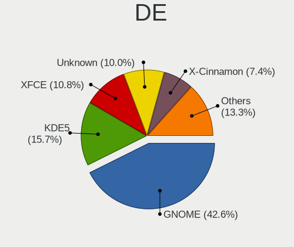

| Name                | Notebooks | Percent |
|---------------------|-----------|---------|
| GNOME               | 365       | 43.5%   |
| KDE5                | 139       | 16.57%  |
| XFCE                | 87        | 10.37%  |
| Unknown             | 78        | 9.3%    |
| X-Cinnamon          | 66        | 7.87%   |
| MATE                | 28        | 3.34%   |
| KDE                 | 20        | 2.38%   |
| Pantheon            | 10        | 1.19%   |
| LXQt                | 9         | 1.07%   |
| KDE4                | 6         | 0.72%   |
| Budgie              | 6         | 0.72%   |
| Unity               | 5         | 0.6%    |
| LXDE                | 3         | 0.36%   |
| i3                  | 3         | 0.36%   |
| Cinnamon            | 3         | 0.36%   |
| KDE6                | 2         | 0.24%   |
| GNOME Classic       | 2         | 0.24%   |
| openbox             | 1         | 0.12%   |
| lightdm-xsession    | 1         | 0.12%   |
| ICEWM               | 1         | 0.12%   |
| hyprland            | 1         | 0.12%   |
| Deepin              | 1         | 0.12%   |
| awesome             | 1         | 0.12%   |
| /usr/bin/startxfce4 | 1         | 0.12%   |

Display Server
--------------

X11 or Wayland

| Name    | Notebooks | Percent |
|---------|-----------|---------|
| X11     | 621       | 74.73%  |
| Wayland | 153       | 18.41%  |
| Unknown | 42        | 5.05%   |
| Tty     | 15        | 1.81%   |

Display Manager
---------------

SDDM, LightDM, etc.

| Name    | Notebooks | Percent |
|---------|-----------|---------|
| Unknown | 416       | 49.58%  |
| SDDM    | 116       | 13.83%  |
| LightDM | 106       | 12.63%  |
| GDM3    | 96        | 11.44%  |
| GDM     | 77        | 9.18%   |
| TDM     | 16        | 1.91%   |
| KDM     | 6         | 0.72%   |
| XDM     | 3         | 0.36%   |
| SLiM    | 1         | 0.12%   |
| Ly      | 1         | 0.12%   |
| GREETD  | 1         | 0.12%   |

OS Lang
-------

Language

| Lang    | Notebooks | Percent |
|---------|-----------|---------|
| en_US   | 491       | 59.73%  |
| el_GR   | 194       | 23.6%   |
| Unknown | 74        | 9%      |
| en_GB   | 21        | 2.55%   |
| C       | 13        | 1.58%   |
| de_DE   | 11        | 1.34%   |
| en_CA   | 3         | 0.36%   |
| POSIX   | 2         | 0.24%   |
| it_IT   | 2         | 0.24%   |
| fr_FR   | 2         | 0.24%   |
| ru_RU   | 1         | 0.12%   |
| pl_PL   | 1         | 0.12%   |
| hu_HU   | 1         | 0.12%   |
| es_ES   | 1         | 0.12%   |
| en_IE   | 1         | 0.12%   |
| en_AG   | 1         | 0.12%   |
| C.UTF8  | 1         | 0.12%   |
| bg_BG   | 1         | 0.12%   |
| anp_IN  | 1         | 0.12%   |

Boot Mode
---------

EFI or BIOS

| Mode | Notebooks | Percent |
|------|-----------|---------|
| BIOS | 428       | 52.2%   |
| EFI  | 392       | 47.8%   |

Filesystem
----------

Type of filesystem

| Type    | Notebooks | Percent |
|---------|-----------|---------|
| Ext4    | 599       | 71.91%  |
| Btrfs   | 89        | 10.68%  |
| Overlay | 72        | 8.64%   |
| Tmpfs   | 36        | 4.32%   |
| Unknown | 28        | 3.36%   |
| Zfs     | 6         | 0.72%   |
| Xfs     | 2         | 0.24%   |
| F2fs    | 1         | 0.12%   |

Part. scheme
------------

Scheme of partitioning

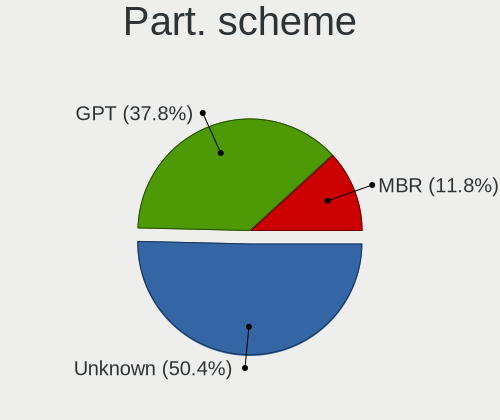

| Type    | Notebooks | Percent |
|---------|-----------|---------|
| Unknown | 445       | 53.49%  |
| GPT     | 286       | 34.38%  |
| MBR     | 101       | 12.14%  |

Dual Boot with Linux/BSD
------------------------

Hosting more than one Linux/BSD

| Dual boot | Notebooks | Percent |
|-----------|-----------|---------|
| No        | 714       | 87.5%   |
| Yes       | 102       | 12.5%   |

Dual Boot (Win)
---------------

Hosting Linux and Windows

| Dual boot | Notebooks | Percent |
|-----------|-----------|---------|
| No        | 589       | 72.36%  |
| Yes       | 225       | 27.64%  |

Board
-----

Vendor
------

Motherboard manufacturer

| Name                       | Notebooks | Percent |
|----------------------------|-----------|---------|
| Lenovo                     | 179       | 22.4%   |
| Hewlett-Packard            | 178       | 22.28%  |
| Dell                       | 129       | 16.15%  |
| ASUSTek Computer           | 64        | 8.01%   |
| Acer                       | 55        | 6.88%   |
| Toshiba                    | 32        | 4.01%   |
| Sony                       | 31        | 3.88%   |
| Fujitsu                    | 12        | 1.5%    |
| Apple                      | 12        | 1.5%    |
| Fujitsu Siemens            | 10        | 1.25%   |
| HUAWEI                     | 9         | 1.13%   |
| Notebook                   | 8         | 1%      |
| MSI                        | 8         | 1%      |
| Clevo                      | 6         | 0.75%   |
| Unknown                    | 6         | 0.75%   |
| Pegatron                   | 5         | 0.63%   |
| Samsung Electronics        | 4         | 0.5%    |
| Chuwi                      | 4         | 0.5%    |
| Teclast                    | 3         | 0.38%   |
| Insyde                     | 3         | 0.38%   |
| Hampoo                     | 3         | 0.38%   |
| Valve                      | 2         | 0.25%   |
| TUXEDO                     | 2         | 0.25%   |
| Timi                       | 2         | 0.25%   |
| Medion                     | 2         | 0.25%   |
| Intel                      | 2         | 0.25%   |
| Info Quest Technologies    | 2         | 0.25%   |
| IBM                        | 2         | 0.25%   |
| Google                     | 2         | 0.25%   |
| E-shop.gr                  | 2         | 0.25%   |
| Alienware                  | 2         | 0.25%   |
| VERO                       | 1         | 0.13%   |
| Turbo-X                    | 1         | 0.13%   |
| System76                   | 1         | 0.13%   |
| SLIMBOOK                   | 1         | 0.13%   |
| Shenzhen WEIBU Information | 1         | 0.13%   |
| Schenker                   | 1         | 0.13%   |
| Quest                      | 1         | 0.13%   |
| Purism                     | 1         | 0.13%   |
| PLAISIO COMPUTERS SA       | 1         | 0.13%   |

Model
-----

Motherboard model

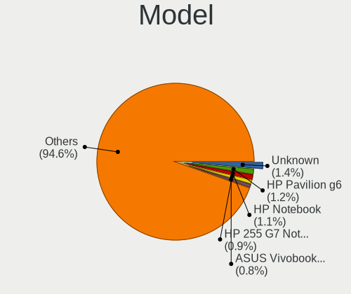

| Name                                       | Notebooks | Percent |
|--------------------------------------------|-----------|---------|
| HP Pavilion g6                             | 11        | 1.38%   |
| Unknown                                    | 11        | 1.38%   |
| HP Notebook                                | 9         | 1.13%   |
| HP 255 G7 Notebook PC                      | 7         | 0.88%   |
| Dell Inspiron 3542                         | 6         | 0.75%   |
| HP Pavilion 15                             | 5         | 0.63%   |
| HP G62                                     | 5         | 0.63%   |
| Dell Inspiron 3537                         | 5         | 0.63%   |
| ASUS Vivobook Go E1504FA_E1504FA           | 5         | 0.63%   |
| Pegatron A15                               | 4         | 0.5%    |
| Notebook W54_W94_W955TU,-T,-C              | 4         | 0.5%    |
| Lenovo IdeaPad 100-15IBD 80QQ              | 4         | 0.5%    |
| Lenovo G510 20238                          | 4         | 0.5%    |
| Lenovo G40-30 80FY                         | 4         | 0.5%    |
| HP Pavilion Notebook                       | 4         | 0.5%    |
| HP Pavilion dv7                            | 4         | 0.5%    |
| HP Pavilion dv6                            | 4         | 0.5%    |
| Dell Inspiron 5567                         | 4         | 0.5%    |
| ASUS VivoBook 15_ASUS Laptop X540MA_X543MA | 4         | 0.5%    |
| Lenovo V15-ADA 82C7                        | 3         | 0.38%   |
| Lenovo IdeaPad 5 Pro 14ACN6 82L7           | 3         | 0.38%   |
| Lenovo IdeaPad 320-15ISK 80XH              | 3         | 0.38%   |
| Lenovo IdeaPad 3 15ABA7 82RN               | 3         | 0.38%   |
| Lenovo G50-70 20351                        | 3         | 0.38%   |
| Insyde CherryTrail                         | 3         | 0.38%   |
| HUAWEI KLVL-WXX9                           | 3         | 0.38%   |
| HP Compaq Presario CQ60                    | 3         | 0.38%   |
| HP 255 G8 Notebook PC                      | 3         | 0.38%   |
| Dell Precision 3551                        | 3         | 0.38%   |
| Dell Latitude 5420                         | 3         | 0.38%   |
| Dell Inspiron 5559                         | 3         | 0.38%   |
| Dell Inspiron 3593                         | 3         | 0.38%   |
| ASUS VivoBook_ASUSLaptop X512DA_X512DA     | 3         | 0.38%   |
| Apple MacBookPro8,1                        | 3         | 0.38%   |
| Acer Aspire A315-51                        | 3         | 0.38%   |
| Acer Aspire A315-31                        | 3         | 0.38%   |
| Acer Aspire 5738                           | 3         | 0.38%   |
| Valve Jupiter                              | 2         | 0.25%   |
| Toshiba Satellite C850D-119                | 2         | 0.25%   |
| Toshiba Satellite C850D-118                | 2         | 0.25%   |

Model Family
------------

Motherboard model prefix

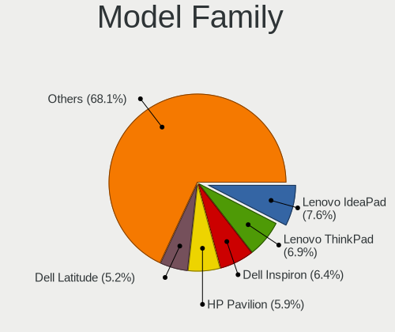

| Name                  | Notebooks | Percent |
|-----------------------|-----------|---------|
| Lenovo IdeaPad        | 62        | 7.76%   |
| Lenovo ThinkPad       | 55        | 6.88%   |
| HP Pavilion           | 51        | 6.38%   |
| Dell Inspiron         | 51        | 6.38%   |
| Acer Aspire           | 44        | 5.51%   |
| Dell Latitude         | 42        | 5.26%   |
| Toshiba Satellite     | 28        | 3.5%    |
| ASUS VivoBook         | 24        | 3%      |
| HP EliteBook          | 16        | 2%      |
| HP 255                | 16        | 2%      |
| HP ProBook            | 15        | 1.88%   |
| HP Compaq             | 15        | 1.88%   |
| HP Laptop             | 12        | 1.5%    |
| Dell Precision        | 11        | 1.38%   |
| Unknown               | 11        | 1.38%   |
| Lenovo Legion         | 9         | 1.13%   |
| HP Notebook           | 9         | 1.13%   |
| HP 250                | 9         | 1.13%   |
| Fujitsu LIFEBOOK      | 9         | 1.13%   |
| Dell Vostro           | 9         | 1.13%   |
| Dell XPS              | 8         | 1%      |
| Fujitsu Siemens AMILO | 7         | 0.88%   |
| ASUS TUF              | 6         | 0.75%   |
| HP G62                | 5         | 0.63%   |
| Pegatron A15          | 4         | 0.5%    |
| Notebook W54          | 4         | 0.5%    |
| Lenovo G510           | 4         | 0.5%    |
| Lenovo G40-30         | 4         | 0.5%    |
| HP Presario           | 4         | 0.5%    |
| ASUS Zenbook          | 4         | 0.5%    |
| Apple MacBookPro8     | 4         | 0.5%    |
| Lenovo V15-ADA        | 3         | 0.38%   |
| Lenovo ThinkBook      | 3         | 0.38%   |
| Lenovo G50-70         | 3         | 0.38%   |
| Insyde CherryTrail    | 3         | 0.38%   |
| HUAWEI KLVL-WXX9      | 3         | 0.38%   |
| HP ENVY               | 3         | 0.38%   |
| Dell G15              | 3         | 0.38%   |
| Apple MacBookPro5     | 3         | 0.38%   |
| Valve Jupiter         | 2         | 0.25%   |

MFG Year
--------

Motherboard manufacture year

| Year | Notebooks | Percent |
|------|-----------|---------|
| 2019 | 69        | 8.64%   |
| 2013 | 65        | 8.14%   |
| 2020 | 62        | 7.76%   |
| 2017 | 58        | 7.26%   |
| 2011 | 55        | 6.88%   |
| 2018 | 54        | 6.76%   |
| 2012 | 53        | 6.63%   |
| 2008 | 50        | 6.26%   |
| 2014 | 45        | 5.63%   |
| 2021 | 44        | 5.51%   |
| 2015 | 41        | 5.13%   |
| 2009 | 41        | 5.13%   |
| 2010 | 37        | 4.63%   |
| 2016 | 36        | 4.51%   |
| 2007 | 30        | 3.75%   |
| 2022 | 28        | 3.5%    |
| 2023 | 14        | 1.75%   |
| 2006 | 8         | 1%      |
| 2005 | 7         | 0.88%   |
| 2004 | 2         | 0.25%   |

Form Factor
-----------

Physical design of the computer

| Name     | Notebooks | Percent |
|----------|-----------|---------|
| Notebook | 799       | 100%    |

Secure Boot
-----------

Enabled or disabled

| State    | Notebooks | Percent |
|----------|-----------|---------|
| Disabled | 716       | 88.72%  |
| Enabled  | 91        | 11.28%  |

Coreboot
--------

Have coreboot on board

| Used | Notebooks | Percent |
|------|-----------|---------|
| No   | 796       | 99.62%  |
| Yes  | 3         | 0.38%   |

RAM Size
--------

Total RAM memory

| Size in GB  | Notebooks | Percent |
|-------------|-----------|---------|
| 4.01-8.0    | 235       | 29.08%  |
| 3.01-4.0    | 208       | 25.74%  |
| 8.01-16.0   | 133       | 16.46%  |
| 16.01-24.0  | 96        | 11.88%  |
| 1.01-2.0    | 65        | 8.04%   |
| 32.01-64.0  | 25        | 3.09%   |
| 2.01-3.0    | 24        | 2.97%   |
| 0.51-1.0    | 12        | 1.49%   |
| 24.01-32.0  | 6         | 0.74%   |
| 64.01-256.0 | 4         | 0.5%    |

RAM Used
--------

Used RAM memory

| Used GB    | Notebooks | Percent |
|------------|-----------|---------|
| 1.01-2.0   | 345       | 38.9%   |
| 2.01-3.0   | 232       | 26.16%  |
| 3.01-4.0   | 104       | 11.72%  |
| 4.01-8.0   | 98        | 11.05%  |
| 0.51-1.0   | 76        | 8.57%   |
| 8.01-16.0  | 19        | 2.14%   |
| 0.01-0.5   | 10        | 1.13%   |
| 16.01-24.0 | 2         | 0.23%   |
| 24.01-32.0 | 1         | 0.11%   |

Total Drives
------------

Number of drives on board

| Drives | Notebooks | Percent |
|--------|-----------|---------|
| 1      | 607       | 74.48%  |
| 2      | 181       | 22.21%  |
| 3      | 17        | 2.09%   |
| 0      | 8         | 0.98%   |
| 6      | 1         | 0.12%   |
| 4      | 1         | 0.12%   |

Has CD-ROM
----------

Has CD-ROM on board

| Presented | Notebooks | Percent |
|-----------|-----------|---------|
| No        | 476       | 59.28%  |
| Yes       | 327       | 40.72%  |

Has Ethernet
------------

Has Ethernet on board

| Presented | Notebooks | Percent |
|-----------|-----------|---------|
| Yes       | 655       | 81.77%  |
| No        | 146       | 18.23%  |

Has WiFi
--------

Has WiFi module

| Presented | Notebooks | Percent |
|-----------|-----------|---------|
| Yes       | 785       | 98.13%  |
| No        | 15        | 1.88%   |

Has Bluetooth
-------------

Has Bluetooth module

| Presented | Notebooks | Percent |
|-----------|-----------|---------|
| Yes       | 626       | 77.38%  |
| No        | 183       | 22.62%  |

Location
--------

Country
-------

Geographic location (country)

| Country | Notebooks | Percent |
|---------|-----------|---------|
| Greece  | 799       | 100%    |

City
----

Geographic location (city)

| City                 | Notebooks | Percent |
|----------------------|-----------|---------|
| Athens               | 397       | 45.48%  |
| Thessaloniki         | 120       | 13.75%  |
| Heraklion            | 27        | 3.09%   |
| Ptrai              | 22        | 2.52%   |
| Piraeus              | 17        | 1.95%   |
| Chalcis              | 17        | 1.95%   |
| Trikala              | 15        | 1.72%   |
| Larissa              | 13        | 1.49%   |
| Volos                | 12        | 1.37%   |
| Kavala               | 11        | 1.26%   |
| Katerini             | 10        | 1.15%   |
| Chalandri            | 8         | 0.92%   |
| Rhodes               | 7         | 0.8%    |
| Ioannina             | 7         | 0.8%    |
| Kalamata             | 6         | 0.69%   |
| Corfu                | 6         | 0.69%   |
| Serres               | 5         | 0.57%   |
| Salamina             | 5         | 0.57%   |
| Drama                | 5         | 0.57%   |
| Chania               | 5         | 0.57%   |
| Veroia               | 4         | 0.46%   |
| Rethymno             | 4         | 0.46%   |
| Paros                | 4         | 0.46%   |
| Kallithea            | 4         | 0.46%   |
| Fira                 | 4         | 0.46%   |
| Corinth              | 4         | 0.46%   |
| Agrinio              | 4         | 0.46%   |
| Zakynthos            | 3         | 0.34%   |
| Tripoli              | 3         | 0.34%   |
| Sparti               | 3         | 0.34%   |
| Lamia                | 3         | 0.34%   |
| Koropi               | 3         | 0.34%   |
| Kilkis               | 3         | 0.34%   |
| Ilioupoli            | 3         | 0.34%   |
| Ano Liosia           | 3         | 0.34%   |
| Acharnes             | 3         | 0.34%   |
| Xanthi               | 2         | 0.23%   |
| Vari                 | 2         | 0.23%   |
| Sykies, Thessaloniki | 2         | 0.23%   |
| Poros                | 2         | 0.23%   |

Drives
------

Drive Vendor
------------

Hard drive vendors

| Vendor                      | Notebooks | Drives | Percent |
|-----------------------------|-----------|--------|---------|
| Samsung Electronics         | 158       | 212    | 16.14%  |
| WDC                         | 114       | 157    | 11.64%  |
| Seagate                     | 96        | 126    | 9.81%   |
| Toshiba                     | 77        | 95     | 7.87%   |
| SanDisk                     | 70        | 86     | 7.15%   |
| Kingston                    | 62        | 80     | 6.33%   |
| Unknown                     | 50        | 75     | 5.11%   |
| SK hynix                    | 43        | 55     | 4.39%   |
| Patriot                     | 35        | 39     | 3.58%   |
| Hitachi                     | 28        | 28     | 2.86%   |
| Intenso                     | 23        | 29     | 2.35%   |
| Micron Technology           | 22        | 26     | 2.25%   |
| Intel                       | 22        | 28     | 2.25%   |
| Crucial                     | 22        | 27     | 2.25%   |
| HGST                        | 21        | 24     | 2.15%   |
| Fujitsu                     | 16        | 17     | 1.63%   |
| KIOXIA                      | 13        | 15     | 1.33%   |
| Team                        | 8         | 13     | 0.82%   |
| JMicron Technology          | 6         | 6      | 0.61%   |
| OCZ                         | 5         | 5      | 0.51%   |
| SPCC                        | 4         | 6      | 0.41%   |
| Micron/Crucial Technology   | 4         | 5      | 0.41%   |
| LITEON                      | 4         | 6      | 0.41%   |
| Gigabyte Technology         | 4         | 4      | 0.41%   |
| Transcend                   | 3         | 3      | 0.31%   |
| Teclast                     | 3         | 3      | 0.31%   |
| PNY                         | 3         | 3      | 0.31%   |
| Kingston Technology Company | 3         | 4      | 0.31%   |
| China                       | 3         | 3      | 0.31%   |
| Apple                       | 3         | 3      | 0.31%   |
| A-DATA Technology           | 3         | 3      | 0.31%   |
| Verbatim                    | 2         | 2      | 0.2%    |
| Union Memory                | 2         | 7      | 0.2%    |
| SSSTC                       | 2         | 2      | 0.2%    |
| Phison Electronics          | 2         | 2      | 0.2%    |
| Phison                      | 2         | 2      | 0.2%    |
| O2 Micro                    | 2         | 2      | 0.2%    |
| Mushkin                     | 2         | 2      | 0.2%    |
| MAXIO Technology (Hangzhou) | 2         | 3      | 0.2%    |
| Apacer                      | 2         | 2      | 0.2%    |

Drive Model
-----------

Hard drive models

| Model                                              | Notebooks | Percent |
|----------------------------------------------------|-----------|---------|
| Unknown MMC Card  32GB                             | 19        | 1.86%   |
| Seagate ST1000LM024 HN-M101MBB 1TB                 | 18        | 1.76%   |
| Seagate ST1000LM035-1RK172 1TB                     | 13        | 1.27%   |
| Samsung SSD 860 EVO 500GB                          | 13        | 1.27%   |
| Unknown MMC Card  64GB                             | 12        | 1.18%   |
| Toshiba MQ01ABF050 500GB                           | 12        | 1.18%   |
| SK hynix NVMe SSD Drive 256GB                      | 11        | 1.08%   |
| Seagate ST500LT012-1DG142 500GB                    | 10        | 0.98%   |
| Kingston SA400S37480G 480GB SSD                    | 10        | 0.98%   |
| Seagate ST500LM012 HN-M500MBB 500GB                | 9         | 0.88%   |
| Samsung SSD 860 EVO 250GB                          | 9         | 0.88%   |
| Samsung NVMe SSD Controller SM981/PM981/PM983 1TB  | 9         | 0.88%   |
| Patriot Burst 120GB SSD                            | 9         | 0.88%   |
| Kingston SA400S37240G 240GB SSD                    | 9         | 0.88%   |
| Kingston SA400S37120G 120GB SSD                    | 9         | 0.88%   |
| SanDisk NVMe SSD Drive 256GB                       | 8         | 0.78%   |
| Unknown MMC Card  128GB                            | 7         | 0.69%   |
| Toshiba MQ01ABD100 1TB                             | 7         | 0.69%   |
| SanDisk NVMe SSD Drive 512GB                       | 7         | 0.69%   |
| HGST HTS545050A7E680 500GB                         | 7         | 0.69%   |
| WDC WDS240G2G0A-00JH30 240GB SSD                   | 6         | 0.59%   |
| Samsung SSD 850 EVO 250GB                          | 6         | 0.59%   |
| Patriot Burst 240GB SSD                            | 6         | 0.59%   |
| HGST HTS721010A9E630 1TB                           | 6         | 0.59%   |
| WDC WDS500G2B0A-00SM50 500GB SSD                   | 5         | 0.49%   |
| Toshiba MQ04ABF100 1TB                             | 5         | 0.49%   |
| Samsung SSD 850 EVO 500GB                          | 5         | 0.49%   |
| Samsung NVMe SSD Controller PM9A1/PM9A3/980PRO 1TB | 5         | 0.49%   |
| Intenso External USB 3.0 3TB                       | 5         | 0.49%   |
| Fujitsu MHY2200BH 200GB                            | 5         | 0.49%   |
| Crucial CT500MX500SSD1 500GB                       | 5         | 0.49%   |
| WDC WDS120G2G0A-00JH30 120GB SSD                   | 4         | 0.39%   |
| WDC WD10SPZX-60Z10T0 1TB                           | 4         | 0.39%   |
| Unknown MMC Card  2GB                              | 4         | 0.39%   |
| Toshiba MQ01ABD050 500GB                           | 4         | 0.39%   |
| Toshiba KSG60ZMV256G M.2 2280 256GB SSD            | 4         | 0.39%   |
| SanDisk DF4032  32GB                               | 4         | 0.39%   |
| Samsung SSD 870 EVO 1TB                            | 4         | 0.39%   |
| Samsung SSD 860 EVO 1TB                            | 4         | 0.39%   |
| Samsung NVMe SSD Drive 512GB                       | 4         | 0.39%   |

HDD Vendor
----------

Hard disk drive vendors

| Vendor              | Notebooks | Drives | Percent |
|---------------------|-----------|--------|---------|
| Seagate             | 94        | 123    | 30.42%  |
| WDC                 | 75        | 97     | 24.27%  |
| Toshiba             | 52        | 67     | 16.83%  |
| Hitachi             | 28        | 28     | 9.06%   |
| HGST                | 21        | 24     | 6.8%    |
| Fujitsu             | 16        | 17     | 5.18%   |
| Samsung Electronics | 10        | 11     | 3.24%   |
| Intenso             | 5         | 6      | 1.62%   |
| JMicron Technology  | 4         | 4      | 1.29%   |
| Unknown             | 2         | 2      | 0.65%   |
| IBM/Hitachi         | 1         | 1      | 0.32%   |
| Apple               | 1         | 1      | 0.32%   |

SSD Vendor
----------

Solid state drive vendors

| Vendor              | Notebooks | Drives | Percent |
|---------------------|-----------|--------|---------|
| Samsung Electronics | 82        | 108    | 22.1%   |
| Kingston            | 50        | 66     | 13.48%  |
| SanDisk             | 39        | 46     | 10.51%  |
| Patriot             | 35        | 39     | 9.43%   |
| WDC                 | 26        | 43     | 7.01%   |
| Crucial             | 20        | 25     | 5.39%   |
| Intenso             | 15        | 20     | 4.04%   |
| Toshiba             | 14        | 16     | 3.77%   |
| Micron Technology   | 11        | 13     | 2.96%   |
| Team                | 8         | 13     | 2.16%   |
| Intel               | 7         | 9      | 1.89%   |
| SK hynix            | 6         | 6      | 1.62%   |
| OCZ                 | 5         | 5      | 1.35%   |
| SPCC                | 4         | 6      | 1.08%   |
| Gigabyte Technology | 4         | 4      | 1.08%   |
| Transcend           | 3         | 3      | 0.81%   |
| Teclast             | 3         | 3      | 0.81%   |
| PNY                 | 3         | 3      | 0.81%   |
| LITEON              | 3         | 5      | 0.81%   |
| China               | 3         | 3      | 0.81%   |
| A-DATA Technology   | 3         | 3      | 0.81%   |
| Verbatim            | 2         | 2      | 0.54%   |
| Mushkin             | 2         | 2      | 0.54%   |
| Apple               | 2         | 2      | 0.54%   |
| Apacer              | 2         | 2      | 0.54%   |
| WDC WDS             | 1         | 1      | 0.27%   |
| Plextor             | 1         | 1      | 0.27%   |
| OCZ-AGIL            | 1         | 1      | 0.27%   |
| Netac               | 1         | 1      | 0.27%   |
| Neo Forza           | 1         | 1      | 0.27%   |
| LITEONIT            | 1         | 1      | 0.27%   |
| Leven               | 1         | 1      | 0.27%   |
| KIOXIA-EXCERIA      | 1         | 1      | 0.27%   |
| KingSpec            | 1         | 1      | 0.27%   |
| Hewlett-Packard     | 1         | 1      | 0.27%   |
| GOODRAM             | 1         | 1      | 0.27%   |
| External            | 1         | 1      | 0.27%   |
| Emtec               | 1         | 2      | 0.27%   |
| Drevo               | 1         | 1      | 0.27%   |
| DQR                 | 1         | 1      | 0.27%   |

Drive Kind
----------

HDD or SSD

| Kind    | Notebooks | Drives | Percent |
|---------|-----------|--------|---------|
| SSD     | 349       | 468    | 37.09%  |
| HDD     | 302       | 381    | 32.09%  |
| NVMe    | 230       | 307    | 24.44%  |
| MMC     | 50        | 81     | 5.31%   |
| Unknown | 10        | 14     | 1.06%   |

Drive Connector
---------------

SATA, SAS, NVMe, etc.

| Type | Notebooks | Drives | Percent |
|------|-----------|--------|---------|
| SATA | 581       | 819    | 65.06%  |
| NVMe | 230       | 307    | 25.76%  |
| MMC  | 50        | 81     | 5.6%    |
| SAS  | 32        | 44     | 3.58%   |

Drive Size
----------

Size of hard drive

| Size in TB | Notebooks | Drives | Percent |
|------------|-----------|--------|---------|
| 0.01-0.5   | 489       | 658    | 76.77%  |
| 0.51-1.0   | 128       | 166    | 20.09%  |
| 1.01-2.0   | 12        | 16     | 1.88%   |
| 2.01-3.0   | 5         | 6      | 0.78%   |
| 3.01-4.0   | 1         | 1      | 0.16%   |
| 10.01-20.0 | 1         | 1      | 0.16%   |
| 4.01-10.0  | 1         | 1      | 0.16%   |

Space Total
-----------

Amount of disk space available on the file system

| Size in GB     | Notebooks | Percent |
|----------------|-----------|---------|
| 101-250        | 284       | 33.1%   |
| 251-500        | 191       | 22.26%  |
| 501-1000       | 99        | 11.54%  |
| 1-20           | 77        | 8.97%   |
| 51-100         | 76        | 8.86%   |
| 21-50          | 45        | 5.24%   |
| 1001-2000      | 44        | 5.13%   |
| Unknown        | 17        | 1.98%   |
| More than 3000 | 13        | 1.52%   |
| 2001-3000      | 12        | 1.4%    |

Space Used
----------

Amount of used disk space

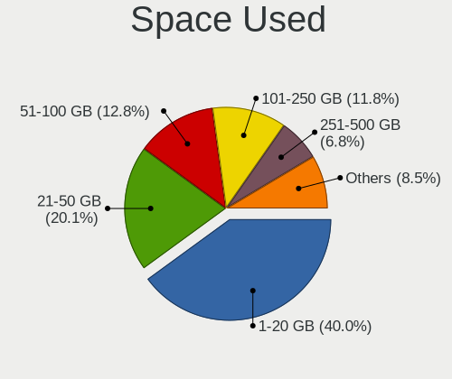

| Used GB        | Notebooks | Percent |
|----------------|-----------|---------|
| 1-20           | 355       | 40.53%  |
| 21-50          | 173       | 19.75%  |
| 51-100         | 118       | 13.47%  |
| 101-250        | 100       | 11.42%  |
| 251-500        | 61        | 6.96%   |
| 501-1000       | 29        | 3.31%   |
| 1001-2000      | 17        | 1.94%   |
| Unknown        | 17        | 1.94%   |
| More than 3000 | 4         | 0.46%   |
| 2001-3000      | 2         | 0.23%   |

Malfunc. Drives
---------------

Drive models with a malfunction

| Model                                               | Notebooks | Drives | Percent |
|-----------------------------------------------------|-----------|--------|---------|
| HGST HTS545050A7E680 500GB                          | 4         | 4      | 9.76%   |
| Seagate ST1000LM024 HN-M101MBB 1TB                  | 2         | 8      | 4.88%   |
| WDC WDS240G2G0A-00JH30 240GB SSD                    | 1         | 1      | 2.44%   |
| WDC WDS120G2G0A-00JH30 120GB SSD                    | 1         | 1      | 2.44%   |
| WDC WD5000LPCX-24VHAT0 500GB                        | 1         | 1      | 2.44%   |
| WDC WD5000BPVT-60HXZT1 500GB                        | 1         | 1      | 2.44%   |
| WDC WD3200BEVT-26ZCT0 320GB                         | 1         | 1      | 2.44%   |
| WDC WD2500BEVT-22A23T0 250GB                        | 1         | 1      | 2.44%   |
| WDC WD1600BEVS-22RST0 160GB                         | 1         | 1      | 2.44%   |
| Toshiba MQ02ABF050H 500GB                           | 1         | 1      | 2.44%   |
| Toshiba MQ01ACF050 500GB                            | 1         | 1      | 2.44%   |
| Toshiba MQ01ABD100M 1TB                             | 1         | 1      | 2.44%   |
| Toshiba MQ01ABD050 500GB                            | 1         | 3      | 2.44%   |
| SPCC Solid State Disk 120GB                         | 1         | 1      | 2.44%   |
| SK hynix SC210 mSATA 256GB SSD                      | 1         | 1      | 2.44%   |
| SK hynix BC711 HFM256GD3JX013N 256GB                | 1         | 2      | 2.44%   |
| Seagate ST980811AS 80GB                             | 1         | 1      | 2.44%   |
| Seagate ST9320325AS 320GB                           | 1         | 1      | 2.44%   |
| Seagate ST9160412AS 160GB                           | 1         | 1      | 2.44%   |
| Seagate ST9160310AS 160GB                           | 1         | 1      | 2.44%   |
| Seagate ST500LT012-9WS142 500GB                     | 1         | 1      | 2.44%   |
| Seagate ST320LT020-9YG142 320GB                     | 1         | 1      | 2.44%   |
| Seagate ST1000LM049-2GH172 1TB                      | 1         | 1      | 2.44%   |
| SanDisk SSD U100 128GB                              | 1         | 1      | 2.44%   |
| SanDisk SSD PLUS 240GB                              | 1         | 1      | 2.44%   |
| Samsung Electronics SSD 970 EVO 500GB               | 1         | 1      | 2.44%   |
| Samsung Electronics MZVLQ512HBLU-00BH1 512GB        | 1         | 1      | 2.44%   |
| OCZ-AGIL ITY3 64GB SSD                              | 1         | 1      | 2.44%   |
| Micron Technology MTFDDAV256TDL-1AW1ZABHA 256GB SSD | 1         | 1      | 2.44%   |
| Micron Technology MTFDDAV256TBN-1AR15ABHA 256GB SSD | 1         | 1      | 2.44%   |
| Kingston RBUSNS8180DS3128GJ 128GB SSD               | 1         | 1      | 2.44%   |
| Hitachi HTS723232A7A364 320GB                       | 1         | 1      | 2.44%   |
| Hitachi HTS723216L9A360 160GB                       | 1         | 1      | 2.44%   |
| Hitachi HTS545032B9A300 320GB                       | 1         | 1      | 2.44%   |
| Hitachi HTS543232A7A384 320GB                       | 1         | 1      | 2.44%   |
| Fujitsu MHT2080BH 80GB                              | 1         | 1      | 2.44%   |
| Crucial CT480M500SSD1 480GB                         | 1         | 1      | 2.44%   |

Malfunc. Drive Vendor
---------------------

Vendors of faulty drives

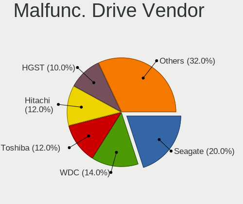

| Vendor              | Notebooks | Drives | Percent |
|---------------------|-----------|--------|---------|
| Seagate             | 9         | 15     | 21.95%  |
| WDC                 | 7         | 7      | 17.07%  |
| Toshiba             | 4         | 6      | 9.76%   |
| Hitachi             | 4         | 4      | 9.76%   |
| HGST                | 4         | 4      | 9.76%   |
| SK hynix            | 2         | 3      | 4.88%   |
| SanDisk             | 2         | 2      | 4.88%   |
| Samsung Electronics | 2         | 2      | 4.88%   |
| Micron Technology   | 2         | 2      | 4.88%   |
| SPCC                | 1         | 1      | 2.44%   |
| OCZ-AGIL            | 1         | 1      | 2.44%   |
| Kingston            | 1         | 1      | 2.44%   |
| Fujitsu             | 1         | 1      | 2.44%   |
| Crucial             | 1         | 1      | 2.44%   |

Malfunc. HDD Vendor
-------------------

Vendors of faulty HDD drives

| Vendor  | Notebooks | Drives | Percent |
|---------|-----------|--------|---------|
| Seagate | 9         | 15     | 33.33%  |
| WDC     | 5         | 5      | 18.52%  |
| Toshiba | 4         | 6      | 14.81%  |
| Hitachi | 4         | 4      | 14.81%  |
| HGST    | 4         | 4      | 14.81%  |
| Fujitsu | 1         | 1      | 3.7%    |

Malfunc. Drive Kind
-------------------

Kinds of faulty drives

| Kind | Notebooks | Drives | Percent |
|------|-----------|--------|---------|
| HDD  | 27        | 35     | 65.85%  |
| SSD  | 11        | 11     | 26.83%  |
| NVMe | 3         | 4      | 7.32%   |

Failed Drives
-------------

Failed drive models

Zero info for selected period =(

Failed Drive Vendor
-------------------

Failed drive vendors

Zero info for selected period =(

Drive Status
------------

Number of failed and malfunc. drives

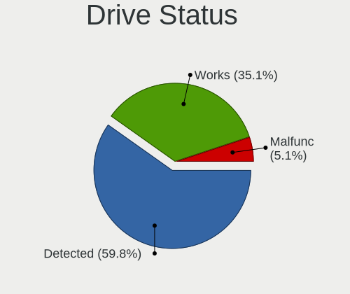

| Status   | Notebooks | Drives | Percent |
|----------|-----------|--------|---------|
| Detected | 519       | 806    | 61.49%  |
| Works    | 284       | 395    | 33.65%  |
| Malfunc  | 41        | 50     | 4.86%   |

Storage controller
------------------

Storage Vendor
--------------

Storage controller vendors

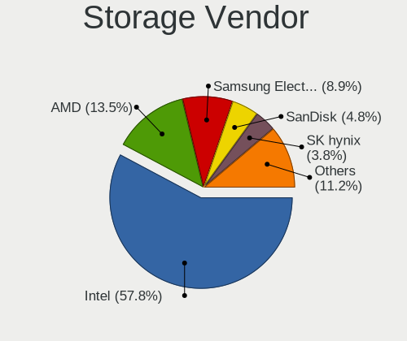

| Vendor                           | Notebooks | Percent |
|----------------------------------|-----------|---------|
| Intel                            | 545       | 59.89%  |
| AMD                              | 124       | 13.63%  |
| Samsung Electronics              | 72        | 7.91%   |
| SanDisk                          | 37        | 4.07%   |
| SK hynix                         | 36        | 3.96%   |
| Kingston Technology Company      | 15        | 1.65%   |
| KIOXIA                           | 13        | 1.43%   |
| Toshiba America Info Systems     | 12        | 1.32%   |
| Micron Technology                | 11        | 1.21%   |
| Nvidia                           | 6         | 0.66%   |
| Union Memory (Shenzhen)          | 5         | 0.55%   |
| Phison Electronics               | 5         | 0.55%   |
| Micron/Crucial Technology        | 5         | 0.55%   |
| VIA Technologies                 | 3         | 0.33%   |
| Silicon Image                    | 3         | 0.33%   |
| ADATA Technology                 | 3         | 0.33%   |
| Solid State Storage Technology   | 2         | 0.22%   |
| Silicon Integrated Systems [SiS] | 2         | 0.22%   |
| O2 Micro                         | 2         | 0.22%   |
| MAXIO Technology (Hangzhou)      | 2         | 0.22%   |
| JMicron Technology               | 2         | 0.22%   |
| Seagate Technology               | 1         | 0.11%   |
| Realtek Semiconductor            | 1         | 0.11%   |
| Netac Technology                 | 1         | 0.11%   |
| Lite-On Technology               | 1         | 0.11%   |
| ASMedia Technology               | 1         | 0.11%   |

Storage Model
-------------

Storage controller models

| Model                                                                            | Notebooks | Percent |
|----------------------------------------------------------------------------------|-----------|---------|
| AMD FCH SATA Controller [AHCI mode]                                              | 107       | 10.74%  |
| Intel 7 Series Chipset Family 6-port SATA Controller [AHCI mode]                 | 56        | 5.62%   |
| Intel Sunrise Point-LP SATA Controller [AHCI mode]                               | 55        | 5.52%   |
| Intel 82801IBM/IEM (ICH9M/ICH9M-E) 4 port SATA Controller [AHCI mode]            | 45        | 4.52%   |
| Intel 6 Series/C200 Series Chipset Family 6 port Mobile SATA AHCI Controller     | 39        | 3.92%   |
| Intel 8 Series SATA Controller 1 [AHCI mode]                                     | 35        | 3.51%   |
| Intel 82801 Mobile SATA Controller [RAID mode]                                   | 30        | 3.01%   |
| Intel 8 Series/C220 Series Chipset Family 6-port SATA Controller 1 [AHCI mode]   | 28        | 2.81%   |
| Samsung NVMe SSD Controller SM981/PM981/PM983                                    | 27        | 2.71%   |
| Intel 82801HM/HEM (ICH8M/ICH8M-E) IDE Controller                                 | 25        | 2.51%   |
| Samsung NVMe SSD Controller 980 (DRAM-less)                                      | 22        | 2.21%   |
| Intel 82801HM/HEM (ICH8M/ICH8M-E) SATA Controller [AHCI mode]                    | 20        | 2.01%   |
| Intel Atom Processor E3800 Series SATA AHCI Controller                           | 19        | 1.91%   |
| Intel 5 Series/3400 Series Chipset 4 port SATA AHCI Controller                   | 19        | 1.91%   |
| Intel Wildcat Point-LP SATA Controller [AHCI Mode]                               | 18        | 1.81%   |
| Intel Volume Management Device NVMe RAID Controller                              | 18        | 1.81%   |
| Intel Cannon Lake Mobile PCH SATA AHCI Controller                                | 14        | 1.41%   |
| Intel Tiger Lake-LP SATA Controller                                              | 12        | 1.2%    |
| Intel 82801GBM/GHM (ICH7-M Family) SATA Controller [IDE mode]                    | 12        | 1.2%    |
| Intel 82801G (ICH7 Family) IDE Controller                                        | 12        | 1.2%    |
| Intel 5 Series/3400 Series Chipset 6 port SATA AHCI Controller                   | 12        | 1.2%    |
| SK hynix Gold P31/BC711/PC711 NVMe Solid State Drive                             | 11        | 1.1%    |
| KIOXIA NVMe SSD Controller BG4 (DRAM-less)                                       | 11        | 1.1%    |
| AMD SB7x0/SB8x0/SB9x0 SATA Controller [AHCI mode]                                | 11        | 1.1%    |
| Intel Celeron N3350/Pentium N4200/Atom E3900 Series SATA AHCI Controller         | 10        | 1%      |
| Intel 82801HM/HEM (ICH8M/ICH8M-E) SATA Controller [IDE mode]                     | 10        | 1%      |
| Samsung NVMe SSD Controller PM9A1/PM9A3/980PRO                                   | 9         | 0.9%    |
| Intel Celeron/Pentium Silver Processor SATA Controller                           | 9         | 0.9%    |
| Intel 82801GBM/GHM (ICH7-M Family) SATA Controller [AHCI mode]                   | 9         | 0.9%    |
| SK hynix BC511 NVMe SSD                                                          | 8         | 0.8%    |
| SanDisk Ultra 3D / WD Blue SN550 NVMe SSD                                        | 8         | 0.8%    |
| Samsung NVMe SSD Controller PM9B1 (DRAM-less)                                    | 8         | 0.8%    |
| Intel HM170/QM170 Chipset SATA Controller [AHCI Mode]                            | 8         | 0.8%    |
| Intel Comet Lake SATA AHCI Controller                                            | 8         | 0.8%    |
| Intel Ice Lake-LP SATA Controller [AHCI mode]                                    | 7         | 0.7%    |
| Intel Atom/Celeron/Pentium Processor x5-E8000/J3xxx/N3xxx Series SATA Controller | 7         | 0.7%    |
| Toshiba America Info Systems XG6 NVMe SSD Controller                             | 6         | 0.6%    |
| SK hynix BC501 NVMe Solid State Drive                                            | 6         | 0.6%    |
| SanDisk Extreme Pro / WD Black SN750 / PC SN730 / Red SN700 NVMe SSD             | 6         | 0.6%    |
| Intel SSD 670p Series [Keystone Harbor]                                          | 6         | 0.6%    |

Storage Kind
------------

Kind of storage controller (IDE, SATA, NVMe, SAS, ...)

| Kind | Notebooks | Percent |
|------|-----------|---------|
| SATA | 587       | 60.89%  |
| NVMe | 233       | 24.17%  |
| IDE  | 92        | 9.54%   |
| RAID | 52        | 5.39%   |

Processor
---------

CPU Vendor
----------

Processor vendors

| Vendor       | Notebooks | Percent |
|--------------|-----------|---------|
| Intel        | 610       | 76.35%  |
| AMD          | 188       | 23.53%  |
| CentaurHauls | 1         | 0.13%   |

CPU Model
---------

Processor models

| Model                                         | Notebooks | Percent |
|-----------------------------------------------|-----------|---------|
| AMD Ryzen 5 3500U with Radeon Vega Mobile Gfx | 17        | 2.13%   |
| Intel Core i5-8250U CPU @ 1.60GHz             | 15        | 1.88%   |
| Intel Celeron CPU N2840 @ 2.16GHz             | 13        | 1.63%   |
| Intel Core i7-7500U CPU @ 2.70GHz             | 11        | 1.38%   |
| Intel Core i5 CPU M 520 @ 2.40GHz             | 8         | 1%      |
| Intel Core i3-6006U CPU @ 2.00GHz             | 8         | 1%      |
| Intel Core i3-4005U CPU @ 1.70GHz             | 8         | 1%      |
| Intel Celeron CPU N3350 @ 1.10GHz             | 8         | 1%      |
| Intel 11th Gen Core i5-1135G7 @ 2.40GHz       | 8         | 1%      |
| Intel Core i5-7200U CPU @ 2.50GHz             | 7         | 0.88%   |
| Intel Core i5-5200U CPU @ 2.20GHz             | 7         | 0.88%   |
| Intel Core i5-3320M CPU @ 2.60GHz             | 7         | 0.88%   |
| Intel Core i5-2410M CPU @ 2.30GHz             | 7         | 0.88%   |
| Intel Atom x5-Z8350 CPU @ 1.44GHz             | 7         | 0.88%   |
| Intel Atom CPU N270 @ 1.60GHz                 | 7         | 0.88%   |
| Intel Core i7-9750H CPU @ 2.60GHz             | 6         | 0.75%   |
| Intel Core i5-4210U CPU @ 1.70GHz             | 6         | 0.75%   |
| Intel Core i5-4200U CPU @ 1.60GHz             | 6         | 0.75%   |
| Intel Core i5-3230M CPU @ 2.60GHz             | 6         | 0.75%   |
| Intel Core i5-1035G1 CPU @ 1.00GHz            | 6         | 0.75%   |
| Intel Core i3-3110M CPU @ 2.40GHz             | 6         | 0.75%   |
| Intel Core 2 Duo CPU T7250 @ 2.00GHz          | 6         | 0.75%   |
| Intel Atom x5-Z8300 CPU @ 1.44GHz             | 6         | 0.75%   |
| AMD Ryzen 7 3700U with Radeon Vega Mobile Gfx | 6         | 0.75%   |
| AMD Ryzen 5 7520U with Radeon Graphics        | 6         | 0.75%   |
| AMD Ryzen 5 4500U with Radeon Graphics        | 6         | 0.75%   |
| AMD Ryzen 3 3200U with Radeon Vega Mobile Gfx | 6         | 0.75%   |
| AMD Ryzen 3 2200U with Radeon Vega Mobile Gfx | 6         | 0.75%   |
| Intel Pentium Dual CPU T3400 @ 2.16GHz        | 5         | 0.63%   |
| Intel Pentium CPU B960 @ 2.20GHz              | 5         | 0.63%   |
| Intel Core i7-8550U CPU @ 1.80GHz             | 5         | 0.63%   |
| Intel Core i7-2670QM CPU @ 2.20GHz            | 5         | 0.63%   |
| Intel Core i7-10750H CPU @ 2.60GHz            | 5         | 0.63%   |
| Intel Core i5-8265U CPU @ 1.60GHz             | 5         | 0.63%   |
| Intel Core i5-6200U CPU @ 2.30GHz             | 5         | 0.63%   |
| Intel Core i5-4200M CPU @ 2.50GHz             | 5         | 0.63%   |
| Intel Core i5-2520M CPU @ 2.50GHz             | 5         | 0.63%   |
| Intel Core i5-2450M CPU @ 2.50GHz             | 5         | 0.63%   |
| Intel Core i5-10210U CPU @ 1.60GHz            | 5         | 0.63%   |
| Intel Core i3-5005U CPU @ 2.00GHz             | 5         | 0.63%   |

CPU Model Family
----------------

Processor model prefix

| Model                          | Notebooks | Percent |
|--------------------------------|-----------|---------|
| Intel Core i5                  | 158       | 19.77%  |
| Intel Core i7                  | 121       | 15.14%  |
| Intel Core i3                  | 66        | 8.26%   |
| Intel Core 2 Duo               | 60        | 7.51%   |
| AMD Ryzen 5                    | 59        | 7.38%   |
| Intel Celeron                  | 55        | 6.88%   |
| Other                          | 54        | 6.76%   |
| Intel Atom                     | 30        | 3.75%   |
| AMD Ryzen 7                    | 27        | 3.38%   |
| Intel Pentium                  | 25        | 3.13%   |
| AMD Ryzen 3                    | 19        | 2.38%   |
| AMD A6                         | 11        | 1.38%   |
| AMD A4                         | 10        | 1.25%   |
| AMD A10                        | 10        | 1.25%   |
| Intel Pentium Dual-Core        | 9         | 1.13%   |
| AMD E1                         | 9         | 1.13%   |
| Intel Core 2                   | 8         | 1%      |
| Intel Pentium Dual             | 6         | 0.75%   |
| Intel Genuine                  | 6         | 0.75%   |
| AMD A8                         | 6         | 0.75%   |
| Intel Pentium M                | 5         | 0.63%   |
| Intel Celeron M                | 5         | 0.63%   |
| Intel Celeron Dual-Core        | 4         | 0.5%    |
| AMD E                          | 4         | 0.5%    |
| AMD Ryzen 7 PRO                | 3         | 0.38%   |
| AMD Athlon                     | 3         | 0.38%   |
| Intel Core 2 Extreme           | 2         | 0.25%   |
| AMD Turion X2 Dual-Core Mobile | 2         | 0.25%   |
| AMD Turion 64 X2 Mobile        | 2         | 0.25%   |
| AMD Turion                     | 2         | 0.25%   |
| AMD Sempron                    | 2         | 0.25%   |
| AMD Ryzen 5 PRO                | 2         | 0.25%   |
| AMD E2                         | 2         | 0.25%   |
| AMD Athlon 64 X2               | 2         | 0.25%   |
| Intel Pentium 4                | 1         | 0.13%   |
| Intel Core m3                  | 1         | 0.13%   |
| Intel Core Duo                 | 1         | 0.13%   |
| CentaurHauls VIA C7            | 1         | 0.13%   |
| AMD V140                       | 1         | 0.13%   |
| AMD Turion 64 Mobile           | 1         | 0.13%   |

CPU Cores
---------

Number of processor cores

| Number | Notebooks | Percent |
|--------|-----------|---------|
| 2      | 445       | 55.69%  |
| 4      | 229       | 28.66%  |
| 6      | 51        | 6.38%   |
| 1      | 34        | 4.26%   |
| 8      | 26        | 3.25%   |
| 10     | 7         | 0.88%   |
| 14     | 4         | 0.5%    |
| 16     | 2         | 0.25%   |
| 12     | 1         | 0.13%   |

CPU Sockets
-----------

Number of sockets

| Number | Notebooks | Percent |
|--------|-----------|---------|
| 1      | 799       | 100%    |

CPU Threads
-----------

Threads per core (Hyper-Threading)

| Number | Notebooks | Percent |
|--------|-----------|---------|
| 2      | 517       | 64.71%  |
| 1      | 281       | 35.17%  |
| 8      | 1         | 0.13%   |

CPU Op-Modes
------------

CPU Operation Modes (32-bit, 64-bit)

| Op mode        | Notebooks | Percent |
|----------------|-----------|---------|
| 32-bit, 64-bit | 764       | 95.26%  |
| 32-bit         | 26        | 3.24%   |
| Unknown        | 12        | 1.5%    |

CPU Microcode
-------------

Microcode number

| Number     | Notebooks | Percent |
|------------|-----------|---------|
| Unknown    | 242       | 28.88%  |
| 0x206a7    | 49        | 5.85%   |
| 0x306a9    | 33        | 3.94%   |
| 0x40651    | 29        | 3.46%   |
| 0x1067a    | 27        | 3.22%   |
| 0x806ea    | 20        | 2.39%   |
| 0x306c3    | 20        | 2.39%   |
| 0x30678    | 18        | 2.15%   |
| 0x6fd      | 17        | 2.03%   |
| 0x08108109 | 17        | 2.03%   |
| 0x806e9    | 15        | 1.79%   |
| 0x306d4    | 15        | 1.79%   |
| 0x10676    | 15        | 1.79%   |
| 0x08108102 | 15        | 1.79%   |
| 0x806c1    | 14        | 1.67%   |
| 0x406e3    | 14        | 1.67%   |
| 0x806ec    | 13        | 1.55%   |
| 0x906ea    | 12        | 1.43%   |
| 0x506c9    | 11        | 1.31%   |
| 0x20655    | 11        | 1.31%   |
| 0x406c4    | 10        | 1.19%   |
| 0x106c2    | 10        | 1.19%   |
| 0x406c3    | 9         | 1.07%   |
| 0x05000119 | 9         | 1.07%   |
| 0x20652    | 8         | 0.95%   |
| 0x0a50000c | 8         | 0.95%   |
| 0x706e5    | 7         | 0.84%   |
| 0x6d8      | 7         | 0.84%   |
| 0x08600106 | 7         | 0.84%   |
| 0x0810100b | 7         | 0.84%   |
| 0x06006705 | 7         | 0.84%   |
| 0x08600104 | 6         | 0.72%   |
| 0x906a4    | 5         | 0.6%    |
| 0x6f6      | 5         | 0.6%    |
| 0x6ec      | 5         | 0.6%    |
| 0x506e3    | 5         | 0.6%    |
| 0x0a50000d | 5         | 0.6%    |
| 0x03000027 | 5         | 0.6%    |
| 0x906e9    | 4         | 0.48%   |
| 0x906a3    | 4         | 0.48%   |

CPU Microarch
-------------

Microarchitecture

| Name             | Notebooks | Percent |
|------------------|-----------|---------|
| KabyLake         | 100       | 12.5%   |
| Haswell          | 65        | 8.13%   |
| SandyBridge      | 59        | 7.38%   |
| Penryn           | 55        | 6.88%   |
| IvyBridge        | 47        | 5.88%   |
| Silvermont       | 45        | 5.63%   |
| Core             | 39        | 4.88%   |
| Zen+             | 38        | 4.75%   |
| Unknown          | 31        | 3.88%   |
| Westmere         | 28        | 3.5%    |
| Skylake          | 28        | 3.5%    |
| TigerLake        | 26        | 3.25%   |
| Zen 3            | 23        | 2.88%   |
| Zen 2            | 21        | 2.63%   |
| Broadwell        | 21        | 2.63%   |
| Excavator        | 20        | 2.5%    |
| P6               | 15        | 1.88%   |
| Zen              | 14        | 1.75%   |
| Bonnell          | 14        | 1.75%   |
| IceLake          | 13        | 1.63%   |
| Bobcat           | 12        | 1.5%    |
| Alderlake Hybrid | 12        | 1.5%    |
| Puma             | 11        | 1.38%   |
| Goldmont         | 11        | 1.38%   |
| Goldmont plus    | 10        | 1.25%   |
| CometLake        | 8         | 1%      |
| Piledriver       | 6         | 0.75%   |
| K8 & K10 hybrid  | 6         | 0.75%   |
| K10 Llano        | 6         | 0.75%   |
| Nehalem          | 5         | 0.63%   |
| K8 Hammer        | 5         | 0.63%   |
| K10              | 3         | 0.38%   |
| NetBurst         | 1         | 0.13%   |
| Jaguar           | 1         | 0.13%   |
| Gracemont        | 1         | 0.13%   |

Graphics
--------

GPU Vendor
----------

Vendors of graphics cards

| Vendor                           | Notebooks | Percent |
|----------------------------------|-----------|---------|
| Intel                            | 524       | 53.25%  |
| AMD                              | 265       | 26.93%  |
| Nvidia                           | 190       | 19.31%  |
| VIA Technologies                 | 3         | 0.3%    |
| Silicon Integrated Systems [SiS] | 2         | 0.2%    |

GPU Model
---------

Graphics card models

| Model                                                                                    | Notebooks | Percent |
|------------------------------------------------------------------------------------------|-----------|---------|
| Intel 2nd Generation Core Processor Family Integrated Graphics Controller                | 53        | 5.09%   |
| Intel 3rd Gen Core processor Graphics Controller                                         | 43        | 4.13%   |
| AMD Picasso/Raven 2 [Radeon Vega Series / Radeon Vega Mobile Series]                     | 40        | 3.84%   |
| Intel Haswell-ULT Integrated Graphics Controller                                         | 35        | 3.36%   |
| Intel UHD Graphics 620                                                                   | 28        | 2.69%   |
| Intel 4th Gen Core Processor Integrated Graphics Controller                              | 27        | 2.59%   |
| Intel Mobile 4 Series Chipset Integrated Graphics Controller                             | 25        | 2.4%    |
| Intel HD Graphics 620                                                                    | 24        | 2.31%   |
| Intel TigerLake-LP GT2 [Iris Xe Graphics]                                                | 23        | 2.21%   |
| Intel Atom/Celeron/Pentium Processor x5-E8000/J3xxx/N3xxx Integrated Graphics Controller | 23        | 2.21%   |
| Intel Atom Processor Z36xxx/Z37xxx Series Graphics & Display                             | 22        | 2.11%   |
| AMD Renoir [Radeon RX Vega 6 (Ryzen 4000/5000 Mobile Series)]                            | 20        | 1.92%   |
| Intel Core Processor Integrated Graphics Controller                                      | 19        | 1.83%   |
| Intel HD Graphics 5500                                                                   | 18        | 1.73%   |
| Intel Mobile 945GM/GMS/GME, 943/940GML Express Integrated Graphics Controller            | 17        | 1.63%   |
| Intel Skylake GT2 [HD Graphics 520]                                                      | 16        | 1.54%   |
| Intel Mobile GM965/GL960 Integrated Graphics Controller (secondary)                      | 16        | 1.54%   |
| Intel Mobile GM965/GL960 Integrated Graphics Controller (primary)                        | 16        | 1.54%   |
| AMD Sun XT [Radeon HD 8670A/8670M/8690M / R5 M330 / M430 / Radeon 520 Mobile]            | 15        | 1.44%   |
| Intel CometLake-U GT2 [UHD Graphics]                                                     | 13        | 1.25%   |
| Intel CoffeeLake-H GT2 [UHD Graphics 630]                                                | 12        | 1.15%   |
| AMD Topaz XT [Radeon R7 M260/M265 / M340/M360 / M440/M445 / 530/535 / 620/625 Mobile]    | 12        | 1.15%   |
| AMD Stoney [Radeon R2/R3/R4/R5 Graphics]                                                 | 12        | 1.15%   |
| AMD Cezanne [Radeon Vega Series / Radeon Vega Mobile Series]                             | 12        | 1.15%   |
| Intel WhiskeyLake-U GT2 [UHD Graphics 620]                                               | 11        | 1.06%   |
| AMD Barcelo                                                                              | 11        | 1.06%   |
| Nvidia TU117M [GeForce GTX 1650 Mobile / Max-Q]                                          | 10        | 0.96%   |
| Intel HD Graphics 500                                                                    | 10        | 0.96%   |
| Intel GeminiLake [UHD Graphics 600]                                                      | 10        | 0.96%   |
| AMD Seymour [Radeon HD 6400M/7400M Series]                                               | 10        | 0.96%   |
| AMD Raven Ridge [Radeon Vega Series / Radeon Vega Mobile Series]                         | 10        | 0.96%   |
| Nvidia GK208BM [GeForce 920M]                                                            | 9         | 0.86%   |
| Intel Mobile 945GSE Express Integrated Graphics Controller                               | 9         | 0.86%   |
| AMD Lucienne                                                                             | 9         | 0.86%   |
| Intel Mobile 945GM/GMS, 943/940GML Express Integrated Graphics Controller                | 8         | 0.77%   |
| Intel Iris Plus Graphics G1 (Ice Lake)                                                   | 8         | 0.77%   |
| AMD Wani [Radeon R5/R6/R7 Graphics]                                                      | 8         | 0.77%   |
| AMD Mullins [Radeon R4/R5 Graphics]                                                      | 8         | 0.77%   |
| Nvidia GP108M [GeForce MX150]                                                            | 7         | 0.67%   |
| Nvidia GF117M [GeForce 610M/710M/810M/820M / GT 620M/625M/630M/720M]                     | 7         | 0.67%   |

GPU Combo
---------

Combinations of graphics cards

| Name           | Notebooks | Percent |
|----------------|-----------|---------|
| 1 x Intel      | 353       | 44.07%  |
| 1 x AMD        | 180       | 22.47%  |
| Intel + Nvidia | 123       | 15.36%  |
| 1 x Nvidia     | 50        | 6.24%   |
| Intel + AMD    | 46        | 5.74%   |
| 2 x AMD        | 23        | 2.87%   |
| AMD + Nvidia   | 16        | 2%      |
| 1 x VIA        | 3         | 0.37%   |
| Other          | 2         | 0.25%   |
| 2 x Intel      | 2         | 0.25%   |
| 1 x SiS        | 2         | 0.25%   |
| 2 x Nvidia     | 1         | 0.12%   |

GPU Driver
----------

Free vs proprietary

| Driver      | Notebooks | Percent |
|-------------|-----------|---------|
| Free        | 698       | 86.71%  |
| Proprietary | 83        | 10.31%  |
| Unknown     | 24        | 2.98%   |

GPU Memory
----------

Total video memory

| Size in GB | Notebooks | Percent |
|------------|-----------|---------|
| Unknown    | 479       | 58.13%  |
| 0.01-0.5   | 132       | 16.02%  |
| 1.01-2.0   | 113       | 13.71%  |
| 0.51-1.0   | 49        | 5.95%   |
| 3.01-4.0   | 41        | 4.98%   |
| 5.01-6.0   | 7         | 0.85%   |
| 7.01-8.0   | 2         | 0.24%   |
| 2.01-3.0   | 1         | 0.12%   |

Monitor
-------

Monitor Vendor
--------------

Monitor vendors

| Vendor                  | Notebooks | Percent |
|-------------------------|-----------|---------|
| AU Optronics            | 147       | 17.38%  |
| LG Display              | 139       | 16.43%  |
| BOE                     | 120       | 14.18%  |
| Chimei Innolux          | 117       | 13.83%  |
| Samsung Electronics     | 94        | 11.11%  |
| Goldstar                | 28        | 3.31%   |
| Chi Mei Optoelectronics | 27        | 3.19%   |
| Dell                    | 22        | 2.6%    |
| LG Philips              | 17        | 2.01%   |
| Sharp                   | 14        | 1.65%   |
| Lenovo                  | 13        | 1.54%   |
| InfoVision              | 13        | 1.54%   |
| Apple                   | 11        | 1.3%    |
| Sony                    | 10        | 1.18%   |
| PANDA                   | 9         | 1.06%   |
| CPT                     | 7         | 0.83%   |
| AOC                     | 6         | 0.71%   |
| HannStar                | 5         | 0.59%   |
| CSO                     | 5         | 0.59%   |
| Philips                 | 4         | 0.47%   |
| Vestel Elektronik       | 3         | 0.35%   |
| Quanta Display          | 3         | 0.35%   |
| Iiyama                  | 3         | 0.35%   |
| Hewlett-Packard         | 3         | 0.35%   |
| JRY                     | 2         | 0.24%   |
| Eizo                    | 2         | 0.24%   |
| BenQ                    | 2         | 0.24%   |
| ASUSTek Computer        | 2         | 0.24%   |
| Ancor Communications    | 2         | 0.24%   |
| ZLX                     | 1         | 0.12%   |
| ViewSonic               | 1         | 0.12%   |
| Valve                   | 1         | 0.12%   |
| TSL                     | 1         | 0.12%   |
| Toshiba                 | 1         | 0.12%   |
| TMX                     | 1         | 0.12%   |
| Panasonic               | 1         | 0.12%   |
| Nvidia                  | 1         | 0.12%   |
| Mi                      | 1         | 0.12%   |
| LPL                     | 1         | 0.12%   |
| LGD                     | 1         | 0.12%   |

Monitor Model
-------------

Monitor models

| Model                                                                  | Notebooks | Percent |
|------------------------------------------------------------------------|-----------|---------|
| AU Optronics LCD Monitor AUO38ED 1920x1080 344x193mm 15.5-inch         | 15        | 1.76%   |
| Chimei Innolux LCD Monitor CMN15E7 1920x1080 344x193mm 15.5-inch       | 12        | 1.41%   |
| Chimei Innolux LCD Monitor CMN15F5 1920x1080 344x193mm 15.5-inch       | 11        | 1.29%   |
| AU Optronics LCD Monitor AUO45EC 1366x768 344x193mm 15.5-inch          | 8         | 0.94%   |
| LG Display LCD Monitor LGD02F2 1366x768 344x194mm 15.5-inch            | 7         | 0.82%   |
| LG Display LCD Monitor LGD02DC 1366x768 344x194mm 15.5-inch            | 7         | 0.82%   |
| Goldstar IPS FULLHD GSM5AB8 1920x1080 480x270mm 21.7-inch              | 7         | 0.82%   |
| Chimei Innolux LCD Monitor CMN15C4 1920x1080 344x193mm 15.5-inch       | 7         | 0.82%   |
| Chimei Innolux LCD Monitor CMN14D4 1920x1080 309x173mm 13.9-inch       | 7         | 0.82%   |
| BOE LCD Monitor BOE0687 1920x1080 344x193mm 15.5-inch                  | 7         | 0.82%   |
| Chimei Innolux LCD Monitor CMN15DB 1366x768 344x193mm 15.5-inch        | 6         | 0.7%    |
| LG Display LP156WH2-TLAA LGD0230 1366x768 344x194mm 15.5-inch          | 5         | 0.59%   |
| LG Display LCD Monitor LGD05E5 1920x1080 344x194mm 15.5-inch           | 5         | 0.59%   |
| LG Display LCD Monitor LGD039F 1366x768 345x194mm 15.6-inch            | 5         | 0.59%   |
| CPT LCD Monitor CPT1415 1280x800 331x207mm 15.4-inch                   | 5         | 0.59%   |
| Chimei Innolux LCD Monitor CMN15C6 1366x768 344x193mm 15.5-inch        | 5         | 0.59%   |
| Samsung Electronics S27F350 SAM0D22 1920x1080 600x340mm 27.2-inch      | 4         | 0.47%   |
| Samsung Electronics LCD Monitor SEC3150 1366x768 344x193mm 15.5-inch   | 4         | 0.47%   |
| Samsung Electronics LCD Monitor SDC4E51 1366x768 344x194mm 15.5-inch   | 4         | 0.47%   |
| Samsung Electronics LCD Monitor SDC4347 1366x768 344x193mm 15.5-inch   | 4         | 0.47%   |
| BOE LCD Monitor BOE08E7 1920x1080 344x193mm 15.5-inch                  | 4         | 0.47%   |
| BOE LCD Monitor BOE06A5 1366x768 344x194mm 15.5-inch                   | 4         | 0.47%   |
| BOE LCD Monitor BOE0675 1366x768 344x194mm 15.5-inch                   | 4         | 0.47%   |
| AU Optronics LCD Monitor AUO71EC 1366x768 344x193mm 15.5-inch          | 4         | 0.47%   |
| AU Optronics LCD Monitor AUO213E 1600x900 309x174mm 14.0-inch          | 4         | 0.47%   |
| Vestel Elektronik 22W_LCD_TV VES3700 1920x540                          | 3         | 0.35%   |
| Samsung Electronics LCD Monitor SEC5441 1366x768 344x194mm 15.5-inch   | 3         | 0.35%   |
| Samsung Electronics LCD Monitor SEC4545 1280x800 331x207mm 15.4-inch   | 3         | 0.35%   |
| Samsung Electronics LCD Monitor SDC5441 1366x768 293x165mm 13.2-inch   | 3         | 0.35%   |
| Samsung Electronics LCD Monitor SDC4161 1920x1080 344x194mm 15.5-inch  | 3         | 0.35%   |
| Samsung Electronics LCD Monitor SAM090B 1920x1080 1020x570mm 46.0-inch | 3         | 0.35%   |
| PANDA LCD Monitor NCP0040 1920x1080 344x194mm 15.5-inch                | 3         | 0.35%   |
| LG Display LCD Monitor LGD0484 1366x768 344x194mm 15.5-inch            | 3         | 0.35%   |
| LG Display LCD Monitor LGD0468 1366x768 344x194mm 15.5-inch            | 3         | 0.35%   |
| LG Display LCD Monitor LGD0456 1366x768 344x194mm 15.5-inch            | 3         | 0.35%   |
| LG Display LCD Monitor LGD034D 1366x768 344x194mm 15.5-inch            | 3         | 0.35%   |
| LG Display LCD Monitor LGD033E 1366x768 309x174mm 14.0-inch            | 3         | 0.35%   |
| LG Display LCD Monitor LGD033A 1366x768 344x194mm 15.5-inch            | 3         | 0.35%   |
| LG Display LCD Monitor LGD02AC 1366x768 344x194mm 15.5-inch            | 3         | 0.35%   |
| HannStar LCD Monitor HSD03E9 1024x600 220x129mm 10.0-inch              | 3         | 0.35%   |

Monitor Resolution
------------------

Monitor screen resolution

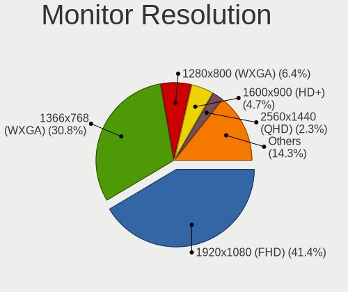

| Resolution         | Notebooks | Percent |
|--------------------|-----------|---------|
| 1920x1080 (FHD)    | 333       | 41.06%  |
| 1366x768 (WXGA)    | 265       | 32.68%  |
| 1280x800 (WXGA)    | 56        | 6.91%   |
| 1600x900 (HD+)     | 38        | 4.69%   |
| 3840x2160 (4K)     | 16        | 1.97%   |
| 2560x1440 (QHD)    | 16        | 1.97%   |
| 1440x900 (WXGA+)   | 14        | 1.73%   |
| 1920x1200 (WUXGA)  | 11        | 1.36%   |
| 1024x600           | 9         | 1.11%   |
| 1680x1050 (WSXGA+) | 7         | 0.86%   |
| 2560x1600          | 6         | 0.74%   |
| 2880x1800          | 5         | 0.62%   |
| 2160x1440          | 5         | 0.62%   |
| 1280x1024 (SXGA)   | 5         | 0.62%   |
| 1024x768 (XGA)     | 5         | 0.62%   |
| 1360x768           | 4         | 0.49%   |
| 2560x1080          | 3         | 0.37%   |
| 1600x1200          | 3         | 0.37%   |
| 800x1280           | 1         | 0.12%   |
| 3840x2400          | 1         | 0.12%   |
| 3440x1440          | 1         | 0.12%   |
| 3200x1800 (QHD+)   | 1         | 0.12%   |
| 3072x1920          | 1         | 0.12%   |
| 2624x900           | 1         | 0.12%   |
| 2288x1287          | 1         | 0.12%   |
| 2240x1400          | 1         | 0.12%   |
| 1680x945           | 1         | 0.12%   |
| 1024x576           | 1         | 0.12%   |

Monitor Diagonal
----------------

Diagonal size in inches

| Inches  | Notebooks | Percent |
|---------|-----------|---------|
| 15      | 433       | 51.06%  |
| 13      | 92        | 10.85%  |
| 14      | 90        | 10.61%  |
| 17      | 56        | 6.6%    |
| 21      | 27        | 3.18%   |
| 27      | 22        | 2.59%   |
| 24      | 16        | 1.89%   |
| 12      | 15        | 1.77%   |
| 11      | 15        | 1.77%   |
| 23      | 13        | 1.53%   |
| 10      | 11        | 1.3%    |
| 16      | 8         | 0.94%   |
| Unknown | 8         | 0.94%   |
| 84      | 4         | 0.47%   |
| 72      | 4         | 0.47%   |
| 20      | 4         | 0.47%   |
| 18      | 4         | 0.47%   |
| 54      | 3         | 0.35%   |
| 34      | 3         | 0.35%   |
| 31      | 3         | 0.35%   |
| 22      | 3         | 0.35%   |
| 19      | 3         | 0.35%   |
| 8       | 3         | 0.35%   |
| 33      | 2         | 0.24%   |
| 65      | 1         | 0.12%   |
| 49      | 1         | 0.12%   |
| 40      | 1         | 0.12%   |
| 35      | 1         | 0.12%   |
| 25      | 1         | 0.12%   |
| 7       | 1         | 0.12%   |

Monitor Width
-------------

Physical width

| Width in mm | Notebooks | Percent |
|-------------|-----------|---------|
| 301-350     | 579       | 68.85%  |
| 201-300     | 82        | 9.75%   |
| 351-400     | 60        | 7.13%   |
| 501-600     | 47        | 5.59%   |
| 401-500     | 37        | 4.4%    |
| 1501-2000   | 8         | 0.95%   |
| Unknown     | 8         | 0.95%   |
| 701-800     | 5         | 0.59%   |
| 1001-1500   | 5         | 0.59%   |
| 601-700     | 4         | 0.48%   |
| 101-200     | 3         | 0.36%   |
| 801-900     | 2         | 0.24%   |
| 1-100       | 1         | 0.12%   |

Aspect Ratio
------------

Proportional relationship between the width and the height

| Ratio   | Notebooks | Percent |
|---------|-----------|---------|
| 16/9    | 637       | 83.27%  |
| 16/10   | 97        | 12.68%  |
| 4/3     | 8         | 1.05%   |
| 3/2     | 7         | 0.92%   |
| 5/4     | 6         | 0.78%   |
| Unknown | 5         | 0.65%   |
| 21/9    | 4         | 0.52%   |
| 0.67    | 1         | 0.13%   |

Monitor Area
------------

Area in inch

| Area in inch | Notebooks | Percent |
|----------------|-----------|---------|
| 101-110        | 430       | 50.83%  |
| 81-90          | 150       | 17.73%  |
| 201-250        | 50        | 5.91%   |
| 121-130        | 43        | 5.08%   |
| 71-80          | 31        | 3.66%   |
| 301-350        | 22        | 2.6%    |
| 61-70          | 15        | 1.77%   |
| 51-60          | 15        | 1.77%   |
| More than 1000 | 13        | 1.54%   |
| 151-200        | 12        | 1.42%   |
| 41-50          | 11        | 1.3%    |
| 131-140        | 10        | 1.18%   |
| 351-500        | 9         | 1.06%   |
| 111-120        | 8         | 0.95%   |
| Unknown        | 8         | 0.95%   |
| 141-150        | 6         | 0.71%   |
| 1-40           | 4         | 0.47%   |
| 251-300        | 4         | 0.47%   |
| 91-100         | 4         | 0.47%   |
| 501-1000       | 1         | 0.12%   |

Pixel Density
-------------

Pixels per inch

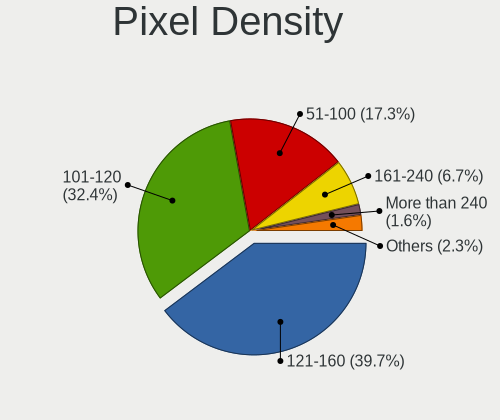

| Density       | Notebooks | Percent |
|---------------|-----------|---------|
| 121-160       | 330       | 39.76%  |
| 101-120       | 282       | 33.98%  |
| 51-100        | 145       | 17.47%  |
| 161-240       | 42        | 5.06%   |
| More than 240 | 13        | 1.57%   |
| 1-50          | 10        | 1.2%    |
| Unknown       | 8         | 0.96%   |

Multiple Monitors
-----------------

Total monitors connected

| Total | Notebooks | Percent |
|-------|-----------|---------|
| 1     | 694       | 84.22%  |
| 2     | 92        | 11.17%  |
| 0     | 28        | 3.4%    |
| 3     | 9         | 1.09%   |
| 4     | 1         | 0.12%   |

Network
-------

Net Controller Vendor
---------------------

Controller vendors

| Vendor                                | Notebooks | Percent |
|---------------------------------------|-----------|---------|
| Realtek Semiconductor                 | 456       | 35.21%  |
| Intel                                 | 360       | 27.8%   |
| Qualcomm Atheros                      | 189       | 14.59%  |
| Broadcom                              | 93        | 7.18%   |
| Marvell Technology Group              | 27        | 2.08%   |
| MediaTek                              | 25        | 1.93%   |
| Broadcom Limited                      | 23        | 1.78%   |
| Ralink                                | 18        | 1.39%   |
| TP-Link                               | 16        | 1.24%   |
| Ralink Technology                     | 11        | 0.85%   |
| Xiaomi                                | 8         | 0.62%   |
| Qualcomm Atheros Communications       | 6         | 0.46%   |
| ASIX Electronics                      | 6         | 0.46%   |
| Nvidia                                | 5         | 0.39%   |
| Ericsson Business Mobile Networks     | 5         | 0.39%   |
| Dell                                  | 5         | 0.39%   |
| Sierra Wireless                       | 4         | 0.31%   |
| Samsung Electronics                   | 3         | 0.23%   |
| JMicron Technology                    | 3         | 0.23%   |
| Huawei Technologies                   | 3         | 0.23%   |
| Hewlett-Packard                       | 3         | 0.23%   |
| DisplayLink                           | 3         | 0.23%   |
| VIA Technologies                      | 2         | 0.15%   |
| Silicon Integrated Systems [SiS]      | 2         | 0.15%   |
| NetGear                               | 2         | 0.15%   |
| Edimax Technology                     | 2         | 0.15%   |
| D-Link                                | 2         | 0.15%   |
| Toshiba                               | 1         | 0.08%   |
| Sitecom Europe                        | 1         | 0.08%   |
| Qualcomm                              | 1         | 0.08%   |
| Linksys                               | 1         | 0.08%   |
| InProComm                             | 1         | 0.08%   |
| Google                                | 1         | 0.08%   |
| Fujitsu Siemens Computers             | 1         | 0.08%   |
| Belkin Components                     | 1         | 0.08%   |
| Attansic Technology                   | 1         | 0.08%   |
| ASUSTek Computer                      | 1         | 0.08%   |
| AMD                                   | 1         | 0.08%   |
| Accton Technology                     | 1         | 0.08%   |
| 802.11g Adapter [Linksys WUSB54GC v3] | 1         | 0.08%   |

Net Controller Model
--------------------

Controller models

| Model                                                                   | Notebooks | Percent |
|-------------------------------------------------------------------------|-----------|---------|
| Realtek RTL8111/8168/8211/8411 PCI Express Gigabit Ethernet Controller  | 237       | 15.46%  |
| Realtek RTL810xE PCI Express Fast Ethernet controller                   | 135       | 8.81%   |
| Qualcomm Atheros QCA9377 802.11ac Wireless Network Adapter              | 38        | 2.48%   |
| Qualcomm Atheros QCA9565 / AR9565 Wireless Network Adapter              | 34        | 2.22%   |
| Realtek RTL8821CE 802.11ac PCIe Wireless Network Adapter                | 33        | 2.15%   |
| Intel Wireless 8265 / 8275                                              | 33        | 2.15%   |
| Realtek RTL8723BE PCIe Wireless Network Adapter                         | 32        | 2.09%   |
| Realtek RTL8822CE 802.11ac PCIe Wireless Network Adapter                | 30        | 1.96%   |
| Qualcomm Atheros AR9485 Wireless Network Adapter                        | 29        | 1.89%   |
| Intel 82579LM Gigabit Network Connection (Lewisville)                   | 25        | 1.63%   |
| Intel Wi-Fi 6 AX201                                                     | 24        | 1.57%   |
| Intel Wireless 7260                                                     | 23        | 1.5%    |
| Broadcom BCM43142 802.11b/g/n                                           | 22        | 1.44%   |
| Intel PRO/Wireless 3945ABG [Golan] Network Connection                   | 20        | 1.3%    |
| Qualcomm Atheros AR9285 Wireless Network Adapter (PCI-Express)          | 19        | 1.24%   |
| Intel Wireless 3165                                                     | 19        | 1.24%   |
| Intel Wi-Fi 6 AX200                                                     | 19        | 1.24%   |
| Qualcomm Atheros AR242x / AR542x Wireless Network Adapter (PCI-Express) | 17        | 1.11%   |
| Realtek RTL8153 Gigabit Ethernet Adapter                                | 16        | 1.04%   |
| Intel Centrino Advanced-N 6205 [Taylor Peak]                            | 16        | 1.04%   |
| Intel Wireless 7265                                                     | 15        | 0.98%   |
| Qualcomm Atheros QCA6174 802.11ac Wireless Network Adapter              | 13        | 0.85%   |
| Intel Wireless 3160                                                     | 13        | 0.85%   |
| Broadcom BCM4312 802.11b/g LP-PHY                                       | 12        | 0.78%   |
| Intel WiFi Link 5100                                                    | 11        | 0.72%   |
| Intel PRO/Wireless 4965 AG or AGN [Kedron] Network Connection           | 11        | 0.72%   |
| Realtek RTL8723AE PCIe Wireless Network Adapter                         | 10        | 0.65%   |
| Realtek RTL-8100/8101L/8139 PCI Fast Ethernet Adapter                   | 10        | 0.65%   |
| Intel Ethernet Connection (4) I219-LM                                   | 10        | 0.65%   |
| Intel Comet Lake PCH-LP CNVi WiFi                                       | 10        | 0.65%   |
| Intel Cannon Lake PCH CNVi WiFi                                         | 10        | 0.65%   |
| Intel Alder Lake-P PCH CNVi WiFi                                        | 10        | 0.65%   |
| Qualcomm Atheros QCA8172 Fast Ethernet                                  | 9         | 0.59%   |
| MediaTek MT7921 802.11ax PCI Express Wireless Network Adapter           | 9         | 0.59%   |
| Intel Wireless 8260                                                     | 9         | 0.59%   |
| Intel Ultimate N WiFi Link 5300                                         | 9         | 0.59%   |
| Intel Dual Band Wireless-AC 3168NGW [Stone Peak]                        | 9         | 0.59%   |
| Intel Centrino Advanced-N 6200                                          | 9         | 0.59%   |
| Xiaomi Mi/Redmi series (RNDIS)                                          | 8         | 0.52%   |
| Ralink RT3290 Wireless 802.11n 1T/1R PCIe                               | 8         | 0.52%   |

Wireless Vendor
---------------

Wireless vendors

| Vendor                                | Notebooks | Percent |
|---------------------------------------|-----------|---------|
| Intel                                 | 342       | 40.91%  |
| Qualcomm Atheros                      | 164       | 19.62%  |
| Realtek Semiconductor                 | 155       | 18.54%  |
| Broadcom                              | 68        | 8.13%   |
| MediaTek                              | 24        | 2.87%   |
| Ralink                                | 18        | 2.15%   |
| TP-Link                               | 14        | 1.67%   |
| Broadcom Limited                      | 12        | 1.44%   |
| Ralink Technology                     | 11        | 1.32%   |
| Qualcomm Atheros Communications       | 6         | 0.72%   |
| Sierra Wireless                       | 4         | 0.48%   |
| NetGear                               | 2         | 0.24%   |
| Hewlett-Packard                       | 2         | 0.24%   |
| Edimax Technology                     | 2         | 0.24%   |
| Dell                                  | 2         | 0.24%   |
| D-Link                                | 2         | 0.24%   |
| Sitecom Europe                        | 1         | 0.12%   |
| Linksys                               | 1         | 0.12%   |
| InProComm                             | 1         | 0.12%   |
| Fujitsu Siemens Computers             | 1         | 0.12%   |
| Belkin Components                     | 1         | 0.12%   |
| ASUSTek Computer                      | 1         | 0.12%   |
| Accton Technology                     | 1         | 0.12%   |
| 802.11g Adapter [Linksys WUSB54GC v3] | 1         | 0.12%   |

Wireless Model
--------------

Wireless models

| Model                                                                   | Notebooks | Percent |
|-------------------------------------------------------------------------|-----------|---------|
| Qualcomm Atheros QCA9377 802.11ac Wireless Network Adapter              | 38        | 4.53%   |
| Qualcomm Atheros QCA9565 / AR9565 Wireless Network Adapter              | 34        | 4.06%   |
| Realtek RTL8821CE 802.11ac PCIe Wireless Network Adapter                | 33        | 3.94%   |
| Intel Wireless 8265 / 8275                                              | 33        | 3.94%   |
| Realtek RTL8723BE PCIe Wireless Network Adapter                         | 32        | 3.82%   |
| Realtek RTL8822CE 802.11ac PCIe Wireless Network Adapter                | 30        | 3.58%   |
| Qualcomm Atheros AR9485 Wireless Network Adapter                        | 29        | 3.46%   |
| Intel Wi-Fi 6 AX201                                                     | 24        | 2.86%   |
| Intel Wireless 7260                                                     | 23        | 2.74%   |
| Broadcom BCM43142 802.11b/g/n                                           | 22        | 2.63%   |
| Intel PRO/Wireless 3945ABG [Golan] Network Connection                   | 20        | 2.39%   |
| Qualcomm Atheros AR9285 Wireless Network Adapter (PCI-Express)          | 19        | 2.27%   |
| Intel Wireless 3165                                                     | 19        | 2.27%   |
| Intel Wi-Fi 6 AX200                                                     | 19        | 2.27%   |
| Qualcomm Atheros AR242x / AR542x Wireless Network Adapter (PCI-Express) | 17        | 2.03%   |
| Intel Centrino Advanced-N 6205 [Taylor Peak]                            | 16        | 1.91%   |
| Intel Wireless 7265                                                     | 15        | 1.79%   |
| Qualcomm Atheros QCA6174 802.11ac Wireless Network Adapter              | 13        | 1.55%   |
| Intel Wireless 3160                                                     | 13        | 1.55%   |
| Broadcom BCM4312 802.11b/g LP-PHY                                       | 12        | 1.43%   |
| Intel WiFi Link 5100                                                    | 11        | 1.31%   |
| Intel PRO/Wireless 4965 AG or AGN [Kedron] Network Connection           | 11        | 1.31%   |
| Realtek RTL8723AE PCIe Wireless Network Adapter                         | 10        | 1.19%   |
| Intel Comet Lake PCH-LP CNVi WiFi                                       | 10        | 1.19%   |
| Intel Cannon Lake PCH CNVi WiFi                                         | 10        | 1.19%   |
| Intel Alder Lake-P PCH CNVi WiFi                                        | 10        | 1.19%   |
| MediaTek MT7921 802.11ax PCI Express Wireless Network Adapter           | 9         | 1.07%   |
| Intel Wireless 8260                                                     | 9         | 1.07%   |
| Intel Ultimate N WiFi Link 5300                                         | 9         | 1.07%   |
| Intel Dual Band Wireless-AC 3168NGW [Stone Peak]                        | 9         | 1.07%   |
| Intel Centrino Advanced-N 6200                                          | 9         | 1.07%   |
| Ralink RT3290 Wireless 802.11n 1T/1R PCIe                               | 8         | 0.95%   |
| MediaTek Wi-Fi 6E MT7902 Wireless Network Adapter                       | 8         | 0.95%   |
| Intel Centrino Wireless-N 2230                                          | 8         | 0.95%   |
| Intel Cannon Point-LP CNVi [Wireless-AC]                                | 8         | 0.95%   |
| Realtek RTL8822BE 802.11a/b/g/n/ac WiFi adapter                         | 7         | 0.84%   |
| Intel Centrino Wireless-N 1000 [Condor Peak]                            | 7         | 0.84%   |
| Broadcom BCM4313 802.11bgn Wireless Network Adapter                     | 7         | 0.84%   |
| Intel Dual Band Wireless-AC 3165 Plus Bluetooth                         | 6         | 0.72%   |
| Intel Comet Lake PCH CNVi WiFi                                          | 6         | 0.72%   |

Ethernet Vendor
---------------

Ethernet vendors

| Vendor                           | Notebooks | Percent |
|----------------------------------|-----------|---------|
| Realtek Semiconductor            | 402       | 60.18%  |
| Intel                            | 111       | 16.62%  |
| Qualcomm Atheros                 | 42        | 6.29%   |
| Broadcom                         | 35        | 5.24%   |
| Marvell Technology Group         | 27        | 4.04%   |
| Broadcom Limited                 | 14        | 2.1%    |
| Xiaomi                           | 8         | 1.2%    |
| ASIX Electronics                 | 6         | 0.9%    |
| Nvidia                           | 5         | 0.75%   |
| Samsung Electronics              | 3         | 0.45%   |
| JMicron Technology               | 3         | 0.45%   |
| DisplayLink                      | 3         | 0.45%   |
| VIA Technologies                 | 2         | 0.3%    |
| TP-Link                          | 2         | 0.3%    |
| Silicon Integrated Systems [SiS] | 2         | 0.3%    |
| Qualcomm                         | 1         | 0.15%   |
| Huawei Technologies              | 1         | 0.15%   |
| Attansic Technology              | 1         | 0.15%   |

Ethernet Model
--------------

Ethernet models

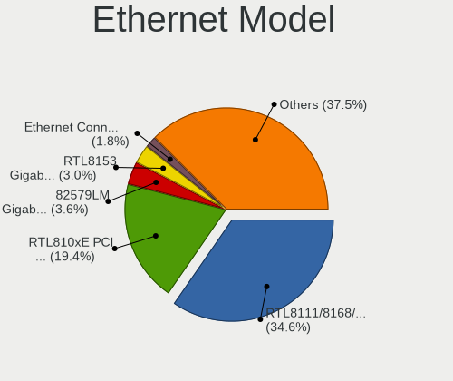

| Model                                                                  | Notebooks | Percent |
|------------------------------------------------------------------------|-----------|---------|
| Realtek RTL8111/8168/8211/8411 PCI Express Gigabit Ethernet Controller | 237       | 35.11%  |
| Realtek RTL810xE PCI Express Fast Ethernet controller                  | 135       | 20%     |
| Intel 82579LM Gigabit Network Connection (Lewisville)                  | 25        | 3.7%    |
| Realtek RTL8153 Gigabit Ethernet Adapter                               | 16        | 2.37%   |
| Realtek RTL-8100/8101L/8139 PCI Fast Ethernet Adapter                  | 10        | 1.48%   |
| Intel Ethernet Connection (4) I219-LM                                  | 10        | 1.48%   |
| Qualcomm Atheros QCA8172 Fast Ethernet                                 | 9         | 1.33%   |
| Xiaomi Mi/Redmi series (RNDIS)                                         | 8         | 1.19%   |
| Intel Ethernet Connection I217-LM                                      | 8         | 1.19%   |
| Intel Ethernet Connection I219-LM                                      | 7         | 1.04%   |
| Intel Ethernet Connection I218-LM                                      | 7         | 1.04%   |
| Broadcom NetLink BCM57785 Gigabit Ethernet PCIe                        | 7         | 1.04%   |
| Qualcomm Atheros AR8151 v2.0 Gigabit Ethernet                          | 6         | 0.89%   |
| Marvell Group 88E8055 PCI-E Gigabit Ethernet Controller                | 6         | 0.89%   |
| Intel 82577LM Gigabit Network Connection                               | 6         | 0.89%   |
| Intel 82567LM Gigabit Network Connection                               | 6         | 0.89%   |
| Broadcom NetLink BCM5784M Gigabit Ethernet PCIe                        | 6         | 0.89%   |
| Qualcomm Atheros AR8132 Fast Ethernet                                  | 5         | 0.74%   |
| Intel Ethernet Connection (3) I218-LM                                  | 5         | 0.74%   |
| ASIX AX88179 Gigabit Ethernet                                          | 5         | 0.74%   |
| Realtek RTL8152 Fast Ethernet Adapter                                  | 4         | 0.59%   |
| Qualcomm Atheros Killer E220x Gigabit Ethernet Controller              | 4         | 0.59%   |
| Qualcomm Atheros AR8162 Fast Ethernet                                  | 4         | 0.59%   |
| Nvidia MCP79 Ethernet                                                  | 4         | 0.59%   |
| Marvell Group 88E8042 PCI-E Fast Ethernet Controller                   | 4         | 0.59%   |
| Intel Ethernet Connection (13) I219-LM                                 | 4         | 0.59%   |
| Intel Ethernet Connection (10) I219-V                                  | 4         | 0.59%   |
| Broadcom NetXtreme BCM57765 Gigabit Ethernet PCIe                      | 4         | 0.59%   |
| Broadcom Limited NetLink BCM5787M Gigabit Ethernet PCI Express         | 4         | 0.59%   |
| Realtek RTL8125 2.5GbE Controller                                      | 3         | 0.44%   |
| Qualcomm Atheros QCA8171 Gigabit Ethernet                              | 3         | 0.44%   |
| Marvell Group 88E8071 PCI-E Gigabit Ethernet Controller                | 3         | 0.44%   |
| Marvell Group 88E8057 PCI-E Gigabit Ethernet Controller                | 3         | 0.44%   |
| Intel Ethernet Connection (4) I219-V                                   | 3         | 0.44%   |
| Intel Ethernet Connection (16) I219-LM                                 | 3         | 0.44%   |
| Intel Ethernet Connection (11) I219-V                                  | 3         | 0.44%   |
| Broadcom NetLink BCM5906M Fast Ethernet PCI Express                    | 3         | 0.44%   |
| Broadcom NetLink BCM57780 Gigabit Ethernet PCIe                        | 3         | 0.44%   |
| Broadcom Limited NetXtreme BCM5755M Gigabit Ethernet PCI Express       | 3         | 0.44%   |
| VIA VT6102/VT6103 [Rhine-II]                                           | 2         | 0.3%    |

Net Controller Kind
-------------------

Ethernet, WiFi or modem

| Kind     | Notebooks | Percent |
|----------|-----------|---------|
| WiFi     | 785       | 53.77%  |
| Ethernet | 655       | 44.86%  |
| Modem    | 20        | 1.37%   |

Used Controller
---------------

Currently used network controller

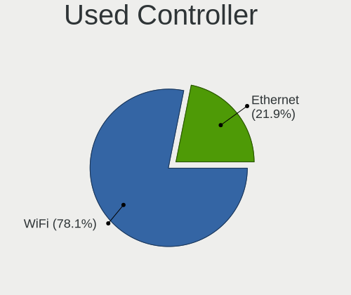

| Kind     | Notebooks | Percent |
|----------|-----------|---------|
| WiFi     | 654       | 78.51%  |
| Ethernet | 179       | 21.49%  |

NICs
----

Total network controllers on board

| Total | Notebooks | Percent |
|-------|-----------|---------|
| 2     | 609       | 75.84%  |
| 1     | 170       | 21.17%  |
| 0     | 18        | 2.24%   |
| 3     | 6         | 0.75%   |

IPv6
----

IPv6 vs IPv4

| Used | Notebooks | Percent |
|------|-----------|---------|
| No   | 572       | 69%     |
| Yes  | 257       | 31%     |

Bluetooth
---------

Bluetooth Vendor
----------------

Controller vendors

| Vendor                          | Notebooks | Percent |
|---------------------------------|-----------|---------|
| Intel                           | 227       | 36.09%  |
| Realtek Semiconductor           | 93        | 14.79%  |
| Qualcomm Atheros Communications | 77        | 12.24%  |
| IMC Networks                    | 38        | 6.04%   |
| Broadcom                        | 38        | 6.04%   |
| Foxconn / Hon Hai               | 32        | 5.09%   |
| Toshiba                         | 19        | 3.02%   |
| Hewlett-Packard                 | 17        | 2.7%    |
| Lite-On Technology              | 16        | 2.54%   |
| Apple                           | 12        | 1.91%   |
| Cambridge Silicon Radio         | 11        | 1.75%   |
| Realtek                         | 8         | 1.27%   |
| Ralink                          | 8         | 1.27%   |
| Alps Electric                   | 7         | 1.11%   |
| Foxconn International           | 6         | 0.95%   |
| Dell                            | 6         | 0.95%   |
| Ralink Technology               | 5         | 0.79%   |
| Askey Computer                  | 4         | 0.64%   |
| Chicony Electronics             | 2         | 0.32%   |
| ASUSTek Computer                | 2         | 0.32%   |
| Syntek                          | 1         | 0.16%   |

Bluetooth Model
---------------

Controller models

| Model                                               | Notebooks | Percent |
|-----------------------------------------------------|-----------|---------|
| Intel Bluetooth wireless interface                  | 70        | 11.13%  |
| Realtek Bluetooth Radio                             | 42        | 6.68%   |
| Intel Bluetooth Device                              | 37        | 5.88%   |
| Intel AX201 Bluetooth                               | 35        | 5.56%   |
| Qualcomm Atheros  Bluetooth Device                  | 34        | 5.41%   |
| Intel Bluetooth 9460/9560 Jefferson Peak (JfP)      | 34        | 5.41%   |
| Realtek  Bluetooth 4.2 Adapter                      | 22        | 3.5%    |
| Intel AX200 Bluetooth                               | 18        | 2.86%   |
| IMC Networks Wireless_Device                        | 13        | 2.07%   |
| Realtek RTL8723B Bluetooth                          | 12        | 1.91%   |
| IMC Networks Bluetooth Radio                        | 12        | 1.91%   |
| Qualcomm Atheros AR3012 Bluetooth 4.0               | 11        | 1.75%   |
| Cambridge Silicon Radio Bluetooth Dongle (HCI mode) | 11        | 1.75%   |
| Qualcomm Atheros AR9462 Bluetooth                   | 10        | 1.59%   |
| Lite-On Qualcomm Atheros QCA9377 Bluetooth          | 10        | 1.59%   |
| Intel Wireless-AC 3168 Bluetooth                    | 9         | 1.43%   |
| Realtek 802.11ac WLAN Adapter                       | 8         | 1.27%   |
| Realtek Bluetooth Radio                             | 8         | 1.27%   |
| Ralink RT3290 Bluetooth                             | 8         | 1.27%   |
| Qualcomm Atheros AR3011 Bluetooth                   | 8         | 1.27%   |
| Intel AX211 Bluetooth                               | 8         | 1.27%   |
| HP Broadcom 2070 Bluetooth Combo                    | 8         | 1.27%   |
| HP Bluetooth 2.0 Interface [Broadcom BCM2045]       | 8         | 1.27%   |
| Qualcomm Atheros QCA61x4 Bluetooth 4.0              | 7         | 1.11%   |
| Intel Centrino Bluetooth Wireless Transceiver       | 7         | 1.11%   |
| Broadcom BCM2045B (BDC-2.1)                         | 7         | 1.11%   |
| Apple Bluetooth Host Controller                     | 7         | 1.11%   |
| Toshiba Bluetooth Device                            | 6         | 0.95%   |
| Foxconn International BCM43142A0 Bluetooth module   | 6         | 0.95%   |
| Foxconn / Hon Hai Bluetooth USB Host Controller     | 6         | 0.95%   |
| Toshiba RT Bluetooth Radio                          | 5         | 0.79%   |
| Realtek RTL8822BE Bluetooth 4.2 Adapter             | 5         | 0.79%   |
| Qualcomm Atheros Bluetooth                          | 5         | 0.79%   |
| Intel Wireless-AC 9260 Bluetooth Adapter            | 5         | 0.79%   |
| IMC Networks Bluetooth Device                       | 5         | 0.79%   |
| Foxconn / Hon Hai Bluetooth Device                  | 5         | 0.79%   |
| Broadcom BCM43142 Bluetooth 4.0                     | 5         | 0.79%   |
| Toshiba Integrated Bluetooth HCI                    | 4         | 0.64%   |
| Ralink Motorola BC4 Bluetooth 3.0+HS Adapter        | 4         | 0.64%   |
| Lite-On Bluetooth Device                            | 4         | 0.64%   |

Sound
-----

Sound Vendor
------------

Sound card vendors

| Vendor                           | Notebooks | Percent |
|----------------------------------|-----------|---------|
| Intel                            | 588       | 63.71%  |
| AMD                              | 212       | 22.97%  |
| Nvidia                           | 85        | 9.21%   |
| C-Media Electronics              | 5         | 0.54%   |
| VIA Technologies                 | 3         | 0.33%   |
| Logitech                         | 3         | 0.33%   |
| GN Netcom                        | 3         | 0.33%   |
| Creative Technology              | 3         | 0.33%   |
| Barco Display Systems            | 3         | 0.33%   |
| Silicon Integrated Systems [SiS] | 2         | 0.22%   |
| BEHRINGER International          | 2         | 0.22%   |
| Yamaha                           | 1         | 0.11%   |
| Trust                            | 1         | 0.11%   |
| Texas Instruments                | 1         | 0.11%   |
| Sony                             | 1         | 0.11%   |
| Realtek Semiconductor            | 1         | 0.11%   |
| Razer USA                        | 1         | 0.11%   |
| Lenovo                           | 1         | 0.11%   |
| Kingston Technology              | 1         | 0.11%   |
| Guillemot                        | 1         | 0.11%   |
| Generalplus Technology           | 1         | 0.11%   |
| Fujitsu                          | 1         | 0.11%   |
| CMX Systems                      | 1         | 0.11%   |
| bestechnic                       | 1         | 0.11%   |
| ASUSTek Computer                 | 1         | 0.11%   |

Sound Model
-----------

Sound card models

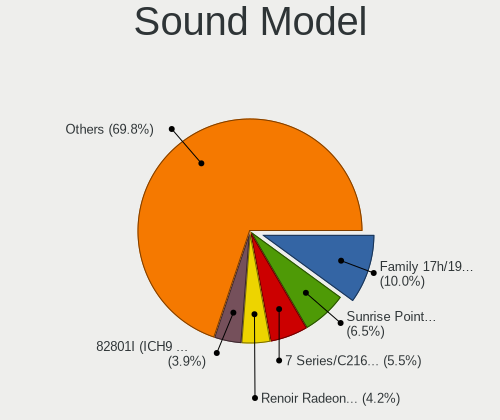

| Model                                                                                             | Notebooks | Percent |
|---------------------------------------------------------------------------------------------------|-----------|---------|
| AMD Family 17h/19h HD Audio Controller                                                            | 111       | 9.45%   |
| Intel Sunrise Point-LP HD Audio                                                                   | 73        | 6.22%   |
| Intel 7 Series/C216 Chipset Family High Definition Audio Controller                               | 64        | 5.45%   |
| Intel 82801I (ICH9 Family) HD Audio Controller                                                    | 50        | 4.26%   |
| AMD Raven/Raven2/Fenghuang HDMI/DP Audio Controller                                               | 49        | 4.17%   |
| AMD Renoir Radeon High Definition Audio Controller                                                | 47        | 4%      |
| Intel 6 Series/C200 Series Chipset Family High Definition Audio Controller                        | 42        | 3.58%   |
| Intel Haswell-ULT HD Audio Controller                                                             | 36        | 3.07%   |
| Intel 8 Series HD Audio Controller                                                                | 36        | 3.07%   |
| Intel 5 Series/3400 Series Chipset High Definition Audio                                          | 33        | 2.81%   |
| AMD FCH Azalia Controller                                                                         | 33        | 2.81%   |
| Intel 82801H (ICH8 Family) HD Audio Controller                                                    | 30        | 2.56%   |
| Intel 8 Series/C220 Series Chipset High Definition Audio Controller                               | 30        | 2.56%   |
| Intel Xeon E3-1200 v3/4th Gen Core Processor HD Audio Controller                                  | 26        | 2.21%   |
| Intel Tiger Lake-LP Smart Sound Technology Audio Controller                                       | 26        | 2.21%   |
| Intel NM10/ICH7 Family High Definition Audio Controller                                           | 25        | 2.13%   |
| Intel Broadwell-U Audio Controller                                                                | 21        | 1.79%   |
| Intel Wildcat Point-LP High Definition Audio Controller                                           | 20        | 1.7%    |
| Intel Atom Processor Z36xxx/Z37xxx Series High Definition Audio Controller                        | 20        | 1.7%    |
| AMD Kabini HDMI/DP Audio                                                                          | 20        | 1.7%    |
| AMD Family 15h (Models 60h-6fh) Audio Controller                                                  | 20        | 1.7%    |
| Intel Cannon Lake PCH cAVS                                                                        | 16        | 1.36%   |
| Intel Comet Lake PCH-LP cAVS                                                                      | 15        | 1.28%   |
| AMD SBx00 Azalia (Intel HDA)                                                                      | 14        | 1.19%   |
| Intel Alder Lake PCH-P High Definition Audio Controller                                           | 13        | 1.11%   |
| Intel Cannon Point-LP High Definition Audio Controller                                            | 12        | 1.02%   |
| AMD Rembrandt Radeon High Definition Audio Controller                                             | 12        | 1.02%   |
| AMD High Definition Audio Controller                                                              | 12        | 1.02%   |
| Nvidia GP107GL High Definition Audio Controller                                                   | 11        | 0.94%   |
| Intel Ice Lake-LP Smart Sound Technology Audio Controller                                         | 11        | 0.94%   |
| Intel Celeron N3350/Pentium N4200/Atom E3900 Series Audio Cluster                                 | 11        | 0.94%   |
| Intel Celeron/Pentium Silver Processor High Definition Audio                                      | 10        | 0.85%   |
| Intel Atom/Celeron/Pentium Processor x5-E8000/J3xxx/N3xxx Series High Definition Audio Controller | 10        | 0.85%   |
| AMD Wrestler HDMI Audio                                                                           | 10        | 0.85%   |
| AMD RV710/730 HDMI Audio [Radeon HD 4000 series]                                                  | 10        | 0.85%   |
| Nvidia GT216 HDMI Audio Controller                                                                | 9         | 0.77%   |
| Nvidia GK208 HDMI/DP Audio Controller                                                             | 9         | 0.77%   |
| Nvidia GF108 High Definition Audio Controller                                                     | 9         | 0.77%   |
| Nvidia TU107 GeForce GTX 1650 High Definition Audio Controller                                    | 7         | 0.6%    |
| Intel CM238 HD Audio Controller                                                                   | 7         | 0.6%    |

Memory
------

Memory Vendor
-------------

Memory module vendors

| Vendor              | Notebooks | Percent |
|---------------------|-----------|---------|
| Samsung Electronics | 128       | 28.26%  |
| SK hynix            | 108       | 23.84%  |
| Micron Technology   | 58        | 12.8%   |
| Kingston            | 33        | 7.28%   |
| Unknown             | 32        | 7.06%   |
| Crucial             | 21        | 4.64%   |
| Ramaxel Technology  | 12        | 2.65%   |
| Elpida              | 10        | 2.21%   |
| Corsair             | 9         | 1.99%   |
| Transcend           | 7         | 1.55%   |
| Unknown (ABCD)      | 6         | 1.32%   |
| G.Skill             | 6         | 1.32%   |
| A-DATA Technology   | 6         | 1.32%   |
| Team                | 4         | 0.88%   |
| Nanya Technology    | 4         | 0.88%   |
| Patriot             | 3         | 0.66%   |
| Toshiba             | 1         | 0.22%   |
| Infineon            | 1         | 0.22%   |
| Hikvision           | 1         | 0.22%   |
| GOODRAM             | 1         | 0.22%   |
| Apacer              | 1         | 0.22%   |
| Unknown             | 1         | 0.22%   |

Memory Model
------------

Memory module models

| Model                                                            | Notebooks | Percent |
|------------------------------------------------------------------|-----------|---------|
| SK hynix RAM HMT451S6BFR8A-PB 4GB SODIMM DDR3 1600MT/s           | 11        | 2.26%   |
| Samsung RAM M471A5244CB0-CTD 4GB SODIMM DDR4 3266MT/s            | 11        | 2.26%   |
| Samsung RAM M471B5173EB0-YK0 4GB SODIMM DDR3 1600MT/s            | 10        | 2.05%   |
| Samsung RAM M471A1G44AB0-CWE 8192MB SODIMM DDR4 3200MT/s         | 10        | 2.05%   |
| Samsung RAM M471B5173QH0-YK0 4GB SODIMM DDR3 1600MT/s            | 8         | 1.64%   |
| Unknown (ABCD) RAM 123456789012345678 2GB SODIMM LPDDR4 2400MT/s | 6         | 1.23%   |
| Samsung RAM M471B5273CH0-CH9 4GB SODIMM DDR3 1334MT/s            | 6         | 1.23%   |
| Unknown RAM Module 4GB SODIMM DDR3                               | 5         | 1.03%   |
| Unknown RAM Module 2GB SODIMM DDR2 667MT/s                       | 5         | 1.03%   |
| SK hynix RAM HMA81GS6JJR8N-VK 8GB SODIMM DDR4 2667MT/s           | 5         | 1.03%   |
| Samsung RAM M471A1K43DB1-CTD 8GB SODIMM DDR4 2667MT/s            | 5         | 1.03%   |
| Samsung RAM M471A1G44BB0-CWE 8GB SODIMM DDR4 3200MT/s            | 5         | 1.03%   |
| SK hynix RAM HMT451S6MFR8C-PB 4GB SODIMM DDR3 1600MT/s           | 4         | 0.82%   |
| SK hynix RAM HMT41GS6BFR8A-PB 8GB SODIMM DDR3 1600MT/s           | 4         | 0.82%   |
| SK hynix RAM HMAA2GS6CJR8N-XN 16GB SODIMM DDR4 3200MT/s          | 4         | 0.82%   |
| SK hynix RAM HMAA1GS6CJR6N-XN 8GB SODIMM DDR4 3200MT/s           | 4         | 0.82%   |
| SK hynix RAM HMA81GS6CJR8N-VK 8GB SODIMM DDR4 2667MT/s           | 4         | 0.82%   |
| SK hynix RAM HMA81GS6AFR8N-UH 8GB SODIMM DDR4 2667MT/s           | 4         | 0.82%   |
| Micron RAM 4ATF51264HZ-3G2J1 4GB SODIMM DDR4 3200MT/s            | 4         | 0.82%   |
| Micron RAM 4ATF51264HZ-3G2J1 4096MB Row Of Chips DDR4 3200MT/s   | 4         | 0.82%   |
| Micron RAM 4ATF1G64HZ-3G2E1 8GB Row Of Chips DDR4 3200MT/s       | 4         | 0.82%   |
| Unknown RAM Module 1GB SODIMM DDR2                               | 3         | 0.62%   |
| SK hynix RAM HMT351S6EFR8A-PB 4096MB SODIMM DDR3 1600MT/s        | 3         | 0.62%   |
| SK hynix RAM HMT351S6CFR8C-PB 4GB SODIMM DDR3 1600MT/s           | 3         | 0.62%   |
| SK hynix RAM HMA851S6DJR6N-XN 4GB SODIMM DDR4 3200MT/s           | 3         | 0.62%   |
| SK hynix RAM H9JCNNNCP3MLYR-N6E 4GB SODIMM LPDDR5 6400MT/s       | 3         | 0.62%   |
| Samsung RAM M471B5273DH0-CH9 4GB SODIMM DDR3 1334MT/s            | 3         | 0.62%   |
| Samsung RAM M471B5273CH0-CK0 4096MB SODIMM DDR3 1600MT/s         | 3         | 0.62%   |
| Samsung RAM M471B5173DB0-YK0 4GB SODIMM DDR3 1600MT/s            | 3         | 0.62%   |
| Samsung RAM M471B1G73DB0-YK0 8GB SODIMM DDR3 1600MT/s            | 3         | 0.62%   |
| Samsung RAM M471A5244CB0-CWE 4GB SODIMM DDR4 3200MT/s            | 3         | 0.62%   |
| Samsung RAM M471A5244CB0-CTD 4GB Row Of Chips DDR4 2667MT/s      | 3         | 0.62%   |
| Samsung RAM M471A5244CB0-CRC 4GB SODIMM DDR4 2667MT/s            | 3         | 0.62%   |
| Samsung RAM M471A2K43DB1-CWE 16GB SODIMM DDR4 3200MT/s           | 3         | 0.62%   |
| Samsung RAM M471A1K43EB1-CWE 8GB SODIMM DDR4 3200MT/s            | 3         | 0.62%   |
| Samsung RAM M471A1K43CB1-CRC 8GB SODIMM DDR4 2667MT/s            | 3         | 0.62%   |
| Samsung RAM M471A1K43BB1-CRC 8192MB SODIMM DDR4 2667MT/s         | 3         | 0.62%   |
| Micron RAM 8ATF1G64HZ-2G3B1 8GB SODIMM DDR4 2400MT/s             | 3         | 0.62%   |
| Elpida RAM EBJ41UF8BCS0-DJ-F 4GB SODIMM DDR3 1334MT/s            | 3         | 0.62%   |
| Crucial RAM CT51264BF160B.C16F 4GB SODIMM DDR3 1600MT/s          | 3         | 0.62%   |

Memory Kind
-----------

Memory module kinds

| Kind    | Notebooks | Percent |
|---------|-----------|---------|
| DDR4    | 163       | 42.23%  |
| DDR3    | 143       | 37.05%  |
| DDR2    | 27        | 6.99%   |
| LPDDR4  | 17        | 4.4%    |
| LPDDR5  | 9         | 2.33%   |
| DDR5    | 7         | 1.81%   |
| SDRAM   | 6         | 1.55%   |
| LPDDR3  | 6         | 1.55%   |
| DDR     | 3         | 0.78%   |
| Unknown | 3         | 0.78%   |
| DRAM    | 2         | 0.52%   |

Memory Form Factor
------------------

Physical design of the memory module

| Name         | Notebooks | Percent |
|--------------|-----------|---------|
| SODIMM       | 351       | 89.77%  |
| Row Of Chips | 33        | 8.44%   |
| DIMM         | 3         | 0.77%   |
| Chip         | 3         | 0.77%   |
| Unknown      | 1         | 0.26%   |

Memory Size
-----------

Memory module size

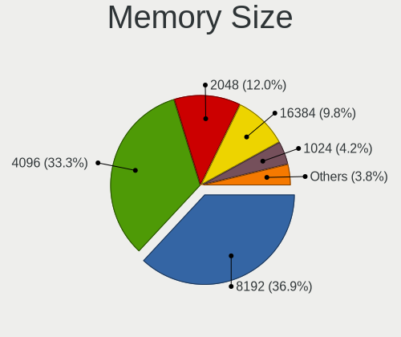

| Size  | Notebooks | Percent |
|-------|-----------|---------|
| 8192  | 158       | 36.92%  |
| 4096  | 144       | 33.64%  |
| 2048  | 57        | 13.32%  |
| 16384 | 40        | 9.35%   |
| 1024  | 18        | 4.21%   |
| 512   | 5         | 1.17%   |
| 32768 | 4         | 0.93%   |
| 3072  | 1         | 0.23%   |
| 256   | 1         | 0.23%   |

Memory Speed
------------

Memory module speed

| Speed   | Notebooks | Percent |
|---------|-----------|---------|
| 1600    | 99        | 23.68%  |
| 3200    | 72        | 17.22%  |
| 2667    | 72        | 17.22%  |
| 2400    | 35        | 8.37%   |
| 1334    | 22        | 5.26%   |
| Unknown | 17        | 4.07%   |
| 1333    | 13        | 3.11%   |
| 667     | 13        | 3.11%   |
| 3266    | 11        | 2.63%   |
| 2133    | 11        | 2.63%   |
| 6400    | 8         | 1.91%   |
| 4800    | 8         | 1.91%   |
| 1067    | 8         | 1.91%   |
| 1867    | 4         | 0.96%   |
| 1066    | 4         | 0.96%   |
| 533     | 4         | 0.96%   |
| 4267    | 3         | 0.72%   |
| 4199    | 3         | 0.72%   |
| 5500    | 2         | 0.48%   |
| 4266    | 2         | 0.48%   |
| 2048    | 2         | 0.48%   |
| 800     | 2         | 0.48%   |
| 1639    | 1         | 0.24%   |
| 975     | 1         | 0.24%   |
| 400     | 1         | 0.24%   |

Printers & scanners
-------------------

Printer Vendor
--------------

Printer device vendors

| Vendor                | Notebooks | Percent |
|-----------------------|-----------|---------|
| Hewlett-Packard       | 7         | 50%     |
| Samsung Electronics   | 4         | 28.57%  |
| Lexmark International | 1         | 7.14%   |
| Konica Minolta        | 1         | 7.14%   |
| Brother Industries    | 1         | 7.14%   |

Printer Model
-------------

Printer device models

| Model                                | Notebooks | Percent |
|--------------------------------------|-----------|---------|
| Samsung M2020 Series                 | 4         | 28.57%  |
| HP DeskJet 2600 series               | 2         | 14.29%  |
| Lexmark International E350d          | 1         | 7.14%   |
| Konica Minolta magicolor 1680MF scan | 1         | 7.14%   |
| HP Smart Tank 510 series             | 1         | 7.14%   |
| HP OfficeJet 6200                    | 1         | 7.14%   |
| HP LaserJet P1102                    | 1         | 7.14%   |
| HP Laser 107w                        | 1         | 7.14%   |
| HP Color Laser 150nw                 | 1         | 7.14%   |
| Brother HL-2030 Laser Printer        | 1         | 7.14%   |

Scanner Vendor
--------------

Scanner device vendors

| Vendor         | Notebooks | Percent |
|----------------|-----------|---------|
| Mustek Systems | 1         | 100%    |

Scanner Model
-------------

Scanner device models

| Model                               | Notebooks | Percent |
|-------------------------------------|-----------|---------|
| Mustek Systems BearPaw 1200 CU Plus | 1         | 100%    |

Camera
------

Camera Vendor
-------------

Camera device vendors

| Vendor                                 | Notebooks | Percent |
|----------------------------------------|-----------|---------|
| Chicony Electronics                    | 161       | 23.13%  |
| IMC Networks                           | 69        | 9.91%   |
| Realtek Semiconductor                  | 65        | 9.34%   |
| Microdia                               | 64        | 9.2%    |
| Suyin                                  | 38        | 5.46%   |
| Cheng Uei Precision Industry (Foxlink) | 35        | 5.03%   |
| Bison Electronics                      | 34        | 4.89%   |
| Sunplus Innovation Technology          | 33        | 4.74%   |
| Acer                                   | 30        | 4.31%   |
| Quanta                                 | 25        | 3.59%   |
| Syntek                                 | 21        | 3.02%   |
| Lite-On Technology                     | 19        | 2.73%   |
| Ricoh                                  | 16        | 2.3%    |
| Alcor Micro                            | 13        | 1.87%   |
| Luxvisions Innotech Limited            | 10        | 1.44%   |
| Apple                                  | 9         | 1.29%   |
| Silicon Motion                         | 8         | 1.15%   |
| ShineTech                              | 5         | 0.72%   |
| Logitech                               | 5         | 0.72%   |
| Sonix Technology                       | 4         | 0.57%   |
| Lenovo                                 | 4         | 0.57%   |
| Z-Star Microelectronics                | 3         | 0.43%   |
| Samsung Electronics                    | 3         | 0.43%   |
| Importek                               | 3         | 0.43%   |
| Primax Electronics                     | 2         | 0.29%   |
| Genesys Logic                          | 2         | 0.29%   |
| ALi                                    | 2         | 0.29%   |
| Tripath Technology                     | 1         | 0.14%   |
| SunplusIT                              | 1         | 0.14%   |
| Pixart Imaging                         | 1         | 0.14%   |
| OmniVision Technologies                | 1         | 0.14%   |
| Microsoft                              | 1         | 0.14%   |
| Leap Motion                            | 1         | 0.14%   |
| Intel                                  | 1         | 0.14%   |
| icSpring                               | 1         | 0.14%   |
| Generalplus Technology                 | 1         | 0.14%   |
| GEMBIRD                                | 1         | 0.14%   |
| eMPIA Technology                       | 1         | 0.14%   |
| Creative Technology                    | 1         | 0.14%   |
| Arkmicro Technologies                  | 1         | 0.14%   |

Camera Model
------------

Camera device models

| Model                                                           | Notebooks | Percent |
|-----------------------------------------------------------------|-----------|---------|
| Chicony Integrated Camera                                       | 37        | 5.31%   |
| Microdia Integrated_Webcam_HD                                   | 28        | 4.02%   |
| Realtek Integrated_Webcam_HD                                    | 26        | 3.73%   |
| IMC Networks Integrated Camera                                  | 19        | 2.73%   |
| IMC Networks USB2.0 HD UVC WebCam                               | 17        | 2.44%   |
| Syntek Integrated Camera                                        | 13        | 1.87%   |
| Sunplus Integrated_Webcam_HD                                    | 12        | 1.72%   |
| Chicony HP Truevision HD                                        | 12        | 1.72%   |
| IMC Networks USB2.0 VGA UVC WebCam                              | 9         | 1.29%   |
| Acer Lenovo EasyCamera                                          | 9         | 1.29%   |
| Realtek USB Camera                                              | 8         | 1.15%   |
| Realtek Lenovo EasyCamera                                       | 8         | 1.15%   |
| Chicony TOSHIBA Web Camera - HD                                 | 8         | 1.15%   |
| Chicony HD WebCam                                               | 8         | 1.15%   |
| Cheng Uei Precision Industry (Foxlink) HP Webcam                | 8         | 1.15%   |
| Bison SunplusIT Integrated Camera                               | 8         | 1.15%   |
| Quanta VGA WebCam                                               | 7         | 1%      |
| Chicony USB 2.0 Camera                                          | 7         | 1%      |
| Chicony HP Webcam                                               | 7         | 1%      |
| Suyin Acer/Lenovo Webcam [CN0316]                               | 6         | 0.86%   |
| Realtek Integrated Webcam                                       | 6         | 0.86%   |
| IMC Networks Lenovo EasyCamera                                  | 6         | 0.86%   |
| Chicony USB2.0 VGA UVC WebCam                                   | 6         | 0.86%   |
| Acer Lenovo Integrated Webcam                                   | 6         | 0.86%   |
| Suyin Integrated_Webcam_HD                                      | 5         | 0.72%   |
| ShineTech USB2.0 HD UVC WebCam                                  | 5         | 0.72%   |
| Quanta HP TrueVision HD Camera                                  | 5         | 0.72%   |
| Microdia Laptop_Integrated_Webcam_HD                            | 5         | 0.72%   |
| Luxvisions Innotech Limited HP TrueVision HD Camera             | 5         | 0.72%   |
| Lite-On Integrated Camera                                       | 5         | 0.72%   |
| Lite-On HP Webcam                                               | 5         | 0.72%   |
| Chicony HP HD Webcam                                            | 5         | 0.72%   |
| Chicony EasyCamera                                              | 5         | 0.72%   |
| Cheng Uei Precision Industry (Foxlink) HP Wide Vision HD Camera | 5         | 0.72%   |
| Bison Integrated Camera                                         | 5         | 0.72%   |
| Bison BisonCam, NB Pro                                          | 5         | 0.72%   |
| Alcor Micro HP Webcam-101                                       | 5         | 0.72%   |
| Syntek Lenovo EasyCamera                                        | 4         | 0.57%   |
| Suyin HP TrueVision HD                                          | 4         | 0.57%   |
| Suyin Acer/HP Integrated Webcam [CN0314]                        | 4         | 0.57%   |

Security
--------

Fingerprint Vendor
------------------

Fingerprint sensor vendors

| Vendor                     | Notebooks | Percent |
|----------------------------|-----------|---------|
| Validity Sensors           | 34        | 32.69%  |
| Synaptics                  | 18        | 17.31%  |
| Shenzhen Goodix Technology | 16        | 15.38%  |
| AuthenTec                  | 15        | 14.42%  |
| Upek                       | 12        | 11.54%  |
| Elan Microelectronics      | 7         | 6.73%   |
| STMicroelectronics         | 1         | 0.96%   |
| LighTuning Technology      | 1         | 0.96%   |

Fingerprint Model
-----------------

Fingerprint sensor models

| Model                                                                      | Notebooks | Percent |
|----------------------------------------------------------------------------|-----------|---------|
| Shenzhen Goodix  Fingerprint Device                                        | 12        | 11.54%  |
| Upek Biometric Touchchip/Touchstrip Fingerprint Sensor                     | 11        | 10.58%  |
| Validity Sensors VFS495 Fingerprint Reader                                 | 10        | 9.62%   |
| AuthenTec AES2501 Fingerprint Sensor                                       | 7         | 6.73%   |
| Validity Sensors VFS471 Fingerprint Reader                                 | 6         | 5.77%   |
| Synaptics Prometheus MIS Touch Fingerprint Reader                          | 6         | 5.77%   |
| Elan ELAN:ARM-M4                                                           | 5         | 4.81%   |
| Validity Sensors VFS491                                                    | 3         | 2.88%   |
| Validity Sensors VFS 5011 fingerprint sensor                               | 3         | 2.88%   |
| Synaptics  WBDI                                                            | 3         | 2.88%   |
| Synaptics Metallica MIS Touch Fingerprint Reader                           | 3         | 2.88%   |
| Shenzhen Goodix Fingerprint Reader                                         | 3         | 2.88%   |
| AuthenTec AES2810                                                          | 3         | 2.88%   |
| Validity Sensors VFS7500 Touch Fingerprint Sensor                          | 2         | 1.92%   |
| Validity Sensors VFS5011 Fingerprint Reader                                | 2         | 1.92%   |
| Validity Sensors VFS101 Fingerprint Reader                                 | 2         | 1.92%   |
| Validity Sensors Fingerprint scanner                                       | 2         | 1.92%   |
| Synaptics Metallica MOH Touch Fingerprint Reader                           | 2         | 1.92%   |
| Elan ELAN:Fingerprint                                                      | 2         | 1.92%   |
| AuthenTec AES2550 Fingerprint Sensor                                       | 2         | 1.92%   |
| AuthenTec AES1600                                                          | 2         | 1.92%   |
| Validity Sensors VFS451 Fingerprint Reader                                 | 1         | 0.96%   |
| Validity Sensors VFS301 Fingerprint Reader                                 | 1         | 0.96%   |
| Validity Sensors Synaptics VFS7552 Touch Fingerprint Sensor with PurePrint | 1         | 0.96%   |
| Validity Sensors Swipe Fingerprint Sensor                                  | 1         | 0.96%   |
| Upek TCS5B Fingerprint sensor                                              | 1         | 0.96%   |
| Synaptics WBDI                                                             | 1         | 0.96%   |
| Synaptics UWP WBDI Device                                                  | 1         | 0.96%   |
| Synaptics UWP WBDI                                                         | 1         | 0.96%   |
| Synaptics FS7604 Touch Fingerprint Sensor with PurePrint                   | 1         | 0.96%   |
| STMicroelectronics Fingerprint Reader                                      | 1         | 0.96%   |
| Shenzhen Goodix FingerPrint                                                | 1         | 0.96%   |
| LighTuning Fingerprint Reader                                              | 1         | 0.96%   |
| AuthenTec Fingerprint Sensor                                               | 1         | 0.96%   |

Chipcard Vendor
---------------

Chipcard module vendors

| Vendor      | Notebooks | Percent |
|-------------|-----------|---------|
| Broadcom    | 34        | 58.62%  |
| Alcor Micro | 14        | 24.14%  |
| O2 Micro    | 5         | 8.62%   |
| Upek        | 2         | 3.45%   |
| Lenovo      | 2         | 3.45%   |
| Yubico.com  | 1         | 1.72%   |

Chipcard Model
--------------

Chipcard module models

| Model                                                                        | Notebooks | Percent |
|------------------------------------------------------------------------------|-----------|---------|
| Broadcom 58200                                                               | 17        | 29.31%  |
| Alcor Micro AU9540 Smartcard Reader                                          | 14        | 24.14%  |
| Broadcom BCM5880 Secure Applications Processor                               | 9         | 15.52%  |
| Broadcom 5880                                                                | 6         | 10.34%  |
| O2 Micro OZ776 CCID Smartcard Reader                                         | 5         | 8.62%   |
| Upek TouchChip Fingerprint Coprocessor (WBF advanced mode)                   | 2         | 3.45%   |
| Lenovo Integrated Smart Card Reader                                          | 2         | 3.45%   |
| Broadcom BCM5880 Secure Applications Processor with fingerprint swipe sensor | 2         | 3.45%   |
| Yubico.com Yubikey 4/5 U2F+CCID                                              | 1         | 1.72%   |

Unsupported
-----------

Unsupported Devices
-------------------

Total unsupported devices on board

| Total | Notebooks | Percent |
|-------|-----------|---------|
| 0     | 518       | 62.79%  |
| 1     | 242       | 29.33%  |
| 2     | 53        | 6.42%   |
| 3     | 8         | 0.97%   |
| 4     | 2         | 0.24%   |
| 7     | 1         | 0.12%   |
| 6     | 1         | 0.12%   |

Unsupported Device Types
------------------------

Types of unsupported devices

| Type                     | Notebooks | Percent |
|--------------------------|-----------|---------|
| Fingerprint reader       | 104       | 28.11%  |
| Graphics card            | 74        | 20%     |
| Chipcard                 | 53        | 14.32%  |
| Net/wireless             | 46        | 12.43%  |
| Multimedia controller    | 27        | 7.3%    |
| Bluetooth                | 19        | 5.14%   |
| Camera                   | 10        | 2.7%    |
| Storage                  | 6         | 1.62%   |
| Sound                    | 6         | 1.62%   |
| Communication controller | 6         | 1.62%   |
| Modem                    | 5         | 1.35%   |
| Flash memory             | 4         | 1.08%   |
| Card reader              | 3         | 0.81%   |
| Network                  | 2         | 0.54%   |
| Net/ethernet             | 2         | 0.54%   |
| Tv card                  | 1         | 0.27%   |
| Firewire controller      | 1         | 0.27%   |
| Dvb card                 | 1         | 0.27%   |

