Linux in Greece - Tested Hardware & Statistics
----------------------------------------------

A project to collect tested hardware configurations for Linux in Greece.

Anyone can contribute to this report by the [hw-probe](https://github.com/linuxhw/hw-probe) tool:

    sudo -E hw-probe -all -upload

Please contribute! Especially if your hardware is rare.

This is a report for all computer types. See also reports for [desktops](/Location/Greece/Desktop/README.md) and [notebooks](/Location/Greece/Notebook/README.md).

Contents
--------

* [ Test Cases ](#test-cases)

* [ System ](#system)
  - [ OS                       ](#os)
  - [ OS Family                ](#os-family)
  - [ Kernel                   ](#kernel)
  - [ Kernel Family            ](#kernel-family)
  - [ Kernel Major Ver.        ](#kernel-major-ver)
  - [ Arch                     ](#arch)
  - [ DE                       ](#de)
  - [ Display Server           ](#display-server)
  - [ Display Manager          ](#display-manager)
  - [ OS Lang                  ](#os-lang)
  - [ Boot Mode                ](#boot-mode)
  - [ Filesystem               ](#filesystem)
  - [ Part. scheme             ](#part-scheme)
  - [ Dual Boot with Linux/BSD ](#dual-boot-with-linuxbsd)
  - [ Dual Boot (Win)          ](#dual-boot-win)

* [ Board ](#board)
  - [ Vendor                   ](#vendor)
  - [ Model                    ](#model)
  - [ Model Family             ](#model-family)
  - [ MFG Year                 ](#mfg-year)
  - [ Form Factor              ](#form-factor)
  - [ Secure Boot              ](#secure-boot)
  - [ Coreboot                 ](#coreboot)
  - [ RAM Size                 ](#ram-size)
  - [ RAM Used                 ](#ram-used)
  - [ Total Drives             ](#total-drives)
  - [ Has CD-ROM               ](#has-cd-rom)
  - [ Has Ethernet             ](#has-ethernet)
  - [ Has WiFi                 ](#has-wifi)
  - [ Has Bluetooth            ](#has-bluetooth)

* [ Location ](#location)
  - [ Country                  ](#country)
  - [ City                     ](#city)

* [ Drives ](#drives)
  - [ Drive Vendor             ](#drive-vendor)
  - [ Drive Model              ](#drive-model)
  - [ HDD Vendor               ](#hdd-vendor)
  - [ SSD Vendor               ](#ssd-vendor)
  - [ Drive Kind               ](#drive-kind)
  - [ Drive Connector          ](#drive-connector)
  - [ Drive Size               ](#drive-size)
  - [ Space Total              ](#space-total)
  - [ Space Used               ](#space-used)
  - [ Malfunc. Drives          ](#malfunc-drives)
  - [ Malfunc. Drive Vendor    ](#malfunc-drive-vendor)
  - [ Malfunc. HDD Vendor      ](#malfunc-hdd-vendor)
  - [ Malfunc. Drive Kind      ](#malfunc-drive-kind)
  - [ Failed Drives            ](#failed-drives)
  - [ Failed Drive Vendor      ](#failed-drive-vendor)
  - [ Drive Status             ](#drive-status)

* [ Storage controller ](#storage-controller)
  - [ Storage Vendor           ](#storage-vendor)
  - [ Storage Model            ](#storage-model)
  - [ Storage Kind             ](#storage-kind)

* [ Processor ](#processor)
  - [ CPU Vendor               ](#cpu-vendor)
  - [ CPU Model                ](#cpu-model)
  - [ CPU Model Family         ](#cpu-model-family)
  - [ CPU Cores                ](#cpu-cores)
  - [ CPU Sockets              ](#cpu-sockets)
  - [ CPU Threads              ](#cpu-threads)
  - [ CPU Op-Modes             ](#cpu-op-modes)
  - [ CPU Microcode            ](#cpu-microcode)
  - [ CPU Microarch            ](#cpu-microarch)

* [ Graphics ](#graphics)
  - [ GPU Vendor               ](#gpu-vendor)
  - [ GPU Model                ](#gpu-model)
  - [ GPU Combo                ](#gpu-combo)
  - [ GPU Driver               ](#gpu-driver)
  - [ GPU Memory               ](#gpu-memory)

* [ Monitor ](#monitor)
  - [ Monitor Vendor           ](#monitor-vendor)
  - [ Monitor Model            ](#monitor-model)
  - [ Monitor Resolution       ](#monitor-resolution)
  - [ Monitor Diagonal         ](#monitor-diagonal)
  - [ Monitor Width            ](#monitor-width)
  - [ Aspect Ratio             ](#aspect-ratio)
  - [ Monitor Area             ](#monitor-area)
  - [ Pixel Density            ](#pixel-density)
  - [ Multiple Monitors        ](#multiple-monitors)

* [ Network ](#network)
  - [ Net Controller Vendor    ](#net-controller-vendor)
  - [ Net Controller Model     ](#net-controller-model)
  - [ Wireless Vendor          ](#wireless-vendor)
  - [ Wireless Model           ](#wireless-model)
  - [ Ethernet Vendor          ](#ethernet-vendor)
  - [ Ethernet Model           ](#ethernet-model)
  - [ Net Controller Kind      ](#net-controller-kind)
  - [ Used Controller          ](#used-controller)
  - [ NICs                     ](#nics)
  - [ IPv6                     ](#ipv6)

* [ Bluetooth ](#bluetooth)
  - [ Bluetooth Vendor         ](#bluetooth-vendor)
  - [ Bluetooth Model          ](#bluetooth-model)

* [ Sound ](#sound)
  - [ Sound Vendor             ](#sound-vendor)
  - [ Sound Model              ](#sound-model)

* [ Memory ](#memory)
  - [ Memory Vendor            ](#memory-vendor)
  - [ Memory Model             ](#memory-model)
  - [ Memory Kind              ](#memory-kind)
  - [ Memory Form Factor       ](#memory-form-factor)
  - [ Memory Size              ](#memory-size)
  - [ Memory Speed             ](#memory-speed)

* [ Printers & scanners ](#printers--scanners)
  - [ Printer Vendor           ](#printer-vendor)
  - [ Printer Model            ](#printer-model)
  - [ Scanner Vendor           ](#scanner-vendor)
  - [ Scanner Model            ](#scanner-model)

* [ Camera ](#camera)
  - [ Camera Vendor            ](#camera-vendor)
  - [ Camera Model             ](#camera-model)

* [ Security ](#security)
  - [ Fingerprint Vendor       ](#fingerprint-vendor)
  - [ Fingerprint Model        ](#fingerprint-model)
  - [ Chipcard Vendor          ](#chipcard-vendor)
  - [ Chipcard Model           ](#chipcard-model)

* [ Unsupported ](#unsupported)
  - [ Unsupported Devices      ](#unsupported-devices)
  - [ Unsupported Device Types ](#unsupported-device-types)

Test Cases
----------

Total: 2575

| Vendor        | Model                       | Form-Factor | Probe                                                      | Date         |
|---------------|-----------------------------|-------------|------------------------------------------------------------|--------------|
| Dell          | Precision 5570              | Notebook    | [f2f2ed487a](https://linux-hardware.org/?probe=f2f2ed487a) | Jan 05, 2025 |
| Dell          | Precision 5570              | Notebook    | [ac97f0b0c6](https://linux-hardware.org/?probe=ac97f0b0c6) | Jan 05, 2025 |
| HP            | 635                         | Notebook    | [021402dc32](https://linux-hardware.org/?probe=021402dc32) | Jan 04, 2025 |
| Gigabyte      | G41M-ES2L                   | Desktop     | [60cf453df6](https://linux-hardware.org/?probe=60cf453df6) | Jan 04, 2025 |
| AMI           | Intel                       | Desktop     | [a5d99b38fe](https://linux-hardware.org/?probe=a5d99b38fe) | Jan 03, 2025 |
| Lenovo        | Legion Pro 7 16IRX8H 82W... | Notebook    | [7d04e69f0f](https://linux-hardware.org/?probe=7d04e69f0f) | Dec 30, 2024 |
| Dell          | 0F3KHR A01                  | Desktop     | [2a4ad29ef8](https://linux-hardware.org/?probe=2a4ad29ef8) | Dec 26, 2024 |
| Lenovo        | ThinkPad P14s Gen 1 20S5... | Notebook    | [e5bf005a5f](https://linux-hardware.org/?probe=e5bf005a5f) | Dec 26, 2024 |
| Gigabyte      | B450M DS3H-CF               | Desktop     | [e3be4eb4bf](https://linux-hardware.org/?probe=e3be4eb4bf) | Dec 24, 2024 |
| HP            | 2000                        | Notebook    | [178dbdf355](https://linux-hardware.org/?probe=178dbdf355) | Dec 24, 2024 |
| MSI           | 990FXA-GD65                 | Desktop     | [f62a826f4d](https://linux-hardware.org/?probe=f62a826f4d) | Dec 24, 2024 |
| Toshiba       | Satellite P870              | Notebook    | [a0e62c769c](https://linux-hardware.org/?probe=a0e62c769c) | Dec 24, 2024 |
| Toshiba       | Satellite P870              | Notebook    | [17c3c89a60](https://linux-hardware.org/?probe=17c3c89a60) | Dec 23, 2024 |
| HP            | Laptop 15s-eq0xxx           | Notebook    | [abde21108d](https://linux-hardware.org/?probe=abde21108d) | Dec 22, 2024 |
| ASUSTek       | ASUS TUF Gaming A15 FA50... | Notebook    | [8ab0fc807b](https://linux-hardware.org/?probe=8ab0fc807b) | Dec 22, 2024 |
| Lenovo        | ThinkPad T470s W10DG 20J... | Notebook    | [6abe074048](https://linux-hardware.org/?probe=6abe074048) | Dec 21, 2024 |
| HP            | Notebook                    | Notebook    | [0e1d6a3365](https://linux-hardware.org/?probe=0e1d6a3365) | Dec 21, 2024 |
| Lenovo        | G550 20023                  | Notebook    | [ae390615a1](https://linux-hardware.org/?probe=ae390615a1) | Dec 21, 2024 |
| Lenovo        | G500 20236                  | Notebook    | [f41f8ad808](https://linux-hardware.org/?probe=f41f8ad808) | Dec 20, 2024 |
| Dell          | Vostro 5625                 | Notebook    | [c081eaa179](https://linux-hardware.org/?probe=c081eaa179) | Dec 20, 2024 |
| ASRock        | B550M Steel Legend          | Desktop     | [e843ef7f48](https://linux-hardware.org/?probe=e843ef7f48) | Dec 19, 2024 |
| Lenovo        | Legion Pro 7 16IRX8H 82W... | Notebook    | [0b19989780](https://linux-hardware.org/?probe=0b19989780) | Dec 19, 2024 |
| HP            | ProBook 4330s               | Notebook    | [e113fb9fd9](https://linux-hardware.org/?probe=e113fb9fd9) | Dec 18, 2024 |
| Acer          | Aspire 5560                 | Notebook    | [8765d80e65](https://linux-hardware.org/?probe=8765d80e65) | Dec 18, 2024 |
| HP            | 83F2                        | Desktop     | [d6f68a1e91](https://linux-hardware.org/?probe=d6f68a1e91) | Dec 16, 2024 |
| Gigabyte      | X570 I AORUS PRO WIFI       | Desktop     | [41ce41aa0b](https://linux-hardware.org/?probe=41ce41aa0b) | Dec 16, 2024 |
| ASUSTek       | VivoBook_ASUSLaptop X509... | Notebook    | [ec283efd6e](https://linux-hardware.org/?probe=ec283efd6e) | Dec 15, 2024 |
| EVGA          | 121-KS-E375                 | Desktop     | [f5844acfd1](https://linux-hardware.org/?probe=f5844acfd1) | Dec 15, 2024 |
| HP            | Laptop 15-bw0xx             | Notebook    | [821c2b9cb8](https://linux-hardware.org/?probe=821c2b9cb8) | Dec 15, 2024 |
| Dell          | 07GYG7 A00                  | All in one  | [604a7bb2e8](https://linux-hardware.org/?probe=604a7bb2e8) | Dec 15, 2024 |
| HP            | Pavilion Notebook           | Notebook    | [29c7464484](https://linux-hardware.org/?probe=29c7464484) | Dec 15, 2024 |
| Timi          | RedmiBook 16                | Notebook    | [0d74278d32](https://linux-hardware.org/?probe=0d74278d32) | Dec 15, 2024 |
| Lenovo        | IdeaPad 330-15IKB 81DC      | Notebook    | [cdd64fe0e0](https://linux-hardware.org/?probe=cdd64fe0e0) | Dec 14, 2024 |
| HUAWEI        | NBLK-WAX9X                  | Notebook    | [287c370d01](https://linux-hardware.org/?probe=287c370d01) | Dec 14, 2024 |
| Lenovo        | IdeaPad 100-15IBD 80QQ      | Notebook    | [eb28eff5f8](https://linux-hardware.org/?probe=eb28eff5f8) | Dec 13, 2024 |
| Google        | Vortininja                  | Notebook    | [d144b6b4fa](https://linux-hardware.org/?probe=d144b6b4fa) | Dec 12, 2024 |
| HP            | Pavilion Notebook           | Notebook    | [f654786871](https://linux-hardware.org/?probe=f654786871) | Dec 10, 2024 |
| ASUSTek       | M3A76-CM                    | Desktop     | [1b5bbe8b9b](https://linux-hardware.org/?probe=1b5bbe8b9b) | Dec 10, 2024 |
| Dell          | XPS 16 9640                 | Notebook    | [abc56657dd](https://linux-hardware.org/?probe=abc56657dd) | Dec 09, 2024 |
| Dell          | XPS 16 9640                 | Notebook    | [b72bcc523e](https://linux-hardware.org/?probe=b72bcc523e) | Dec 09, 2024 |
| Lenovo        | V15 G4 AMN 82YU             | Notebook    | [152aa1b4ca](https://linux-hardware.org/?probe=152aa1b4ca) | Dec 09, 2024 |
| Lenovo        | ThinkPad L15 Gen 2 20X30... | Notebook    | [db6679efb6](https://linux-hardware.org/?probe=db6679efb6) | Dec 08, 2024 |
| Lenovo        | V15 G4 AMN 82YU             | Notebook    | [5b795c5c2c](https://linux-hardware.org/?probe=5b795c5c2c) | Dec 08, 2024 |
| ASUSTek       | M3A76-CM                    | Desktop     | [fb83a1efd1](https://linux-hardware.org/?probe=fb83a1efd1) | Dec 08, 2024 |
| Timi          | RedmiBook 16                | Notebook    | [f88c0150a1](https://linux-hardware.org/?probe=f88c0150a1) | Dec 05, 2024 |
| ASUSTek       | VivoBook_ASUSLaptop X570... | Notebook    | [cfdba4136a](https://linux-hardware.org/?probe=cfdba4136a) | Dec 04, 2024 |
| Lenovo        | IdeaPad 3 15ALC6 82KU       | Notebook    | [29e95f13ac](https://linux-hardware.org/?probe=29e95f13ac) | Dec 04, 2024 |
| HP            | 1998                        | Desktop     | [924f8aa401](https://linux-hardware.org/?probe=924f8aa401) | Dec 02, 2024 |
| HP            | 1998                        | Desktop     | [96ed13c26f](https://linux-hardware.org/?probe=96ed13c26f) | Dec 02, 2024 |
| Gigabyte      | H97M-D3H                    | Desktop     | [f8e5244664](https://linux-hardware.org/?probe=f8e5244664) | Dec 02, 2024 |
| HP            | Laptop 15-bw0xx             | Notebook    | [4809801b37](https://linux-hardware.org/?probe=4809801b37) | Dec 01, 2024 |
| ASUSTek       | ROG Zephyrus G14 GA401QM... | Notebook    | [1cabb4b7bd](https://linux-hardware.org/?probe=1cabb4b7bd) | Dec 01, 2024 |
| MSI           | B450 TOMAHAWK MAX II        | Desktop     | [00d4ce0f70](https://linux-hardware.org/?probe=00d4ce0f70) | Dec 01, 2024 |
| Lenovo        | ThinkPad L15 Gen 2 20X30... | Notebook    | [4465a33023](https://linux-hardware.org/?probe=4465a33023) | Nov 30, 2024 |
| ASUSTek       | PRIME B250-PLUS             | Desktop     | [2e64c84332](https://linux-hardware.org/?probe=2e64c84332) | Nov 29, 2024 |
| HP            | EliteBook 8540w             | Notebook    | [791b33a243](https://linux-hardware.org/?probe=791b33a243) | Nov 29, 2024 |
| ASUSTek       | M5A97 R2.0                  | Desktop     | [2ca4532a01](https://linux-hardware.org/?probe=2ca4532a01) | Nov 27, 2024 |
| ASUSTek       | ROG Strix G513IH_G513IH     | Notebook    | [00247be989](https://linux-hardware.org/?probe=00247be989) | Nov 27, 2024 |
| Fujitsu       | D3061-A1 S26361-D3061-A1    | Desktop     | [2397b52715](https://linux-hardware.org/?probe=2397b52715) | Nov 27, 2024 |
| ASUSTek       | PRIME B250-PLUS             | Desktop     | [b83b69cfbe](https://linux-hardware.org/?probe=b83b69cfbe) | Nov 23, 2024 |
| Google        | Lillipup rev2               | Notebook    | [d770b59a72](https://linux-hardware.org/?probe=d770b59a72) | Nov 23, 2024 |
| Fujitsu       | LIFEBOOK AH532/G21          | Notebook    | [51cbd9f492](https://linux-hardware.org/?probe=51cbd9f492) | Nov 20, 2024 |
| Lenovo        | IdeaPad 330-15IKB 81DC      | Notebook    | [3fd82c3ca3](https://linux-hardware.org/?probe=3fd82c3ca3) | Nov 20, 2024 |
| HP            | Pavilion Notebook           | Notebook    | [8fe35fac83](https://linux-hardware.org/?probe=8fe35fac83) | Nov 20, 2024 |
| HP            | ProBook 650 G8 Notebook ... | Notebook    | [b127afd574](https://linux-hardware.org/?probe=b127afd574) | Nov 18, 2024 |
| Toshiba       | Satellite C55-A-1H9         | Notebook    | [936476ea78](https://linux-hardware.org/?probe=936476ea78) | Nov 17, 2024 |
| Dell          | Precision 5680              | Notebook    | [99d9b32657](https://linux-hardware.org/?probe=99d9b32657) | Nov 17, 2024 |
| Foxconn       | G31MXP FAB:1.1              | Desktop     | [e6250c0cfc](https://linux-hardware.org/?probe=e6250c0cfc) | Nov 16, 2024 |
| Chuwi         | GemiBook Plus               | Notebook    | [10be58e89f](https://linux-hardware.org/?probe=10be58e89f) | Nov 16, 2024 |
| Gigabyte      | B450 AORUS ELITE            | Desktop     | [46c8f7928b](https://linux-hardware.org/?probe=46c8f7928b) | Nov 15, 2024 |
| Lenovo        | IdeaPad 320-17IKB 80XM      | Notebook    | [0db94ed770](https://linux-hardware.org/?probe=0db94ed770) | Nov 14, 2024 |
| Dell          | Latitude 7390               | Notebook    | [caea874a2f](https://linux-hardware.org/?probe=caea874a2f) | Nov 14, 2024 |
| ASRock        | X600M-STX                   | Desktop     | [c16fbb9c2c](https://linux-hardware.org/?probe=c16fbb9c2c) | Nov 13, 2024 |
| MSI           | Thin GF63 12VE              | Notebook    | [dba5f78212](https://linux-hardware.org/?probe=dba5f78212) | Nov 10, 2024 |
| Gigabyte      | A320M-S2H-CF                | Desktop     | [b2ec371df1](https://linux-hardware.org/?probe=b2ec371df1) | Nov 08, 2024 |
| Lenovo        | Legion Pro 5 16ARX8 82WM    | Notebook    | [42efcfaea3](https://linux-hardware.org/?probe=42efcfaea3) | Nov 06, 2024 |
| HP            | Pavilion Sleekbook 15 PC    | Notebook    | [06aea2ac21](https://linux-hardware.org/?probe=06aea2ac21) | Nov 05, 2024 |
| Valve         | Galileo                     | Notebook    | [9a91afe08a](https://linux-hardware.org/?probe=9a91afe08a) | Nov 05, 2024 |
| Dell          | 0PJDGF A02                  | Desktop     | [7d9db2e575](https://linux-hardware.org/?probe=7d9db2e575) | Nov 05, 2024 |
| Gigabyte      | A320M-H-CF                  | Desktop     | [6f0c41f989](https://linux-hardware.org/?probe=6f0c41f989) | Nov 05, 2024 |
| Gigabyte      | H310M H x.x                 | Desktop     | [50298be9fe](https://linux-hardware.org/?probe=50298be9fe) | Nov 04, 2024 |
| ASUSTek       | P5K SE                      | Desktop     | [3a9546eaaa](https://linux-hardware.org/?probe=3a9546eaaa) | Nov 02, 2024 |
| Apple         | MacBookPro8,1               | Notebook    | [5c2dacf3d8](https://linux-hardware.org/?probe=5c2dacf3d8) | Nov 01, 2024 |
| Lenovo        | ThinkPad X280 20KESEYC00    | Notebook    | [bc3e6aa2dc](https://linux-hardware.org/?probe=bc3e6aa2dc) | Oct 30, 2024 |
| Lenovo        | IdeaPad 5 Pro 14ACN6 82L... | Notebook    | [e2b4f362a6](https://linux-hardware.org/?probe=e2b4f362a6) | Oct 30, 2024 |
| Dell          | 0MN1TX A02                  | Desktop     | [3b7b8ccbfe](https://linux-hardware.org/?probe=3b7b8ccbfe) | Oct 29, 2024 |
| Dell          | 0VTH9F A02                  | Desktop     | [dfee8a872a](https://linux-hardware.org/?probe=dfee8a872a) | Oct 29, 2024 |
| Sony          | VPCF12Z1E                   | Notebook    | [419e054c06](https://linux-hardware.org/?probe=419e054c06) | Oct 27, 2024 |
| Sony          | VPCF12Z1E                   | Notebook    | [f68f55bfd6](https://linux-hardware.org/?probe=f68f55bfd6) | Oct 27, 2024 |
| HP            | ProBook 650 G8 Notebook ... | Notebook    | [95f5649f6f](https://linux-hardware.org/?probe=95f5649f6f) | Oct 26, 2024 |
| Dell          | Latitude E6430              | Notebook    | [7aa1bdef3c](https://linux-hardware.org/?probe=7aa1bdef3c) | Oct 25, 2024 |
| Dell          | Latitude 5320               | Notebook    | [7302e97437](https://linux-hardware.org/?probe=7302e97437) | Oct 25, 2024 |
| Gigabyte      | EP31-DS3L                   | Desktop     | [5e82737779](https://linux-hardware.org/?probe=5e82737779) | Oct 24, 2024 |
| Dell          | Inspiron 3551               | Notebook    | [9a94d5f1a3](https://linux-hardware.org/?probe=9a94d5f1a3) | Oct 24, 2024 |
| Gigabyte      | EP31-DS3L                   | Desktop     | [ea94c74a3f](https://linux-hardware.org/?probe=ea94c74a3f) | Oct 24, 2024 |
| Gigabyte      | B450M S2H                   | Desktop     | [e9b1483206](https://linux-hardware.org/?probe=e9b1483206) | Oct 23, 2024 |
| Lenovo        | ThinkPad X250 20CLS3320C    | Notebook    | [66c0507882](https://linux-hardware.org/?probe=66c0507882) | Oct 23, 2024 |
| Gigabyte      | H67A-UD3H-B3                | Desktop     | [7666cf6341](https://linux-hardware.org/?probe=7666cf6341) | Oct 23, 2024 |
| Gigabyte      | Z68MA-D2H-B3                | Desktop     | [edbea4a1b6](https://linux-hardware.org/?probe=edbea4a1b6) | Oct 23, 2024 |
| ASUSTek       | PRIME X570-P                | Desktop     | [c747936704](https://linux-hardware.org/?probe=c747936704) | Oct 20, 2024 |
| Gigabyte      | B450M DS3H-CF               | Desktop     | [4b8d9423fc](https://linux-hardware.org/?probe=4b8d9423fc) | Oct 19, 2024 |
| Dell          | G15 5530                    | Notebook    | [4126a139a6](https://linux-hardware.org/?probe=4126a139a6) | Oct 18, 2024 |
| Gigabyte      | B450M DS3H-CF               | Desktop     | [88309143f0](https://linux-hardware.org/?probe=88309143f0) | Oct 18, 2024 |
| Lenovo        | 314F NO DPK                 | Desktop     | [ab8e224c72](https://linux-hardware.org/?probe=ab8e224c72) | Oct 18, 2024 |
| Clevo         | M7x0S                       | Notebook    | [167af55baf](https://linux-hardware.org/?probe=167af55baf) | Oct 15, 2024 |
| ASUSTek       | TUF Gaming X570-PLUS        | Desktop     | [3fc892bab8](https://linux-hardware.org/?probe=3fc892bab8) | Oct 14, 2024 |
| MSI           | B450-A PRO MAX              | Desktop     | [b09dbbecea](https://linux-hardware.org/?probe=b09dbbecea) | Oct 13, 2024 |
| HP            | ProBook 4540s               | Notebook    | [38d30c1f16](https://linux-hardware.org/?probe=38d30c1f16) | Oct 13, 2024 |
| SLIMBOOK      | EXCALIBUR-16-AMD8           | Notebook    | [a410299e44](https://linux-hardware.org/?probe=a410299e44) | Oct 11, 2024 |
| Lenovo        | ThinkPad T470s W10DG 20J... | Notebook    | [f108ee0d16](https://linux-hardware.org/?probe=f108ee0d16) | Oct 10, 2024 |
| Lenovo        | Yoga 7 14ARB7 82QF          | Convertible | [977e57020e](https://linux-hardware.org/?probe=977e57020e) | Oct 09, 2024 |
| MSI           | B450-A PRO MAX              | Desktop     | [a4588f5890](https://linux-hardware.org/?probe=a4588f5890) | Oct 08, 2024 |
| MSI           | B450-A PRO MAX              | Desktop     | [43af547870](https://linux-hardware.org/?probe=43af547870) | Oct 08, 2024 |
| Dell          | Latitude 5420               | Notebook    | [984b4c62dc](https://linux-hardware.org/?probe=984b4c62dc) | Oct 06, 2024 |
| Dell          | Inspiron 3580               | Notebook    | [e71d6571fb](https://linux-hardware.org/?probe=e71d6571fb) | Oct 06, 2024 |
| HP            | Pavilion 11 x360 PC         | Notebook    | [fe5bb258a3](https://linux-hardware.org/?probe=fe5bb258a3) | Oct 05, 2024 |
| HP            | Pavilion 11 x360 PC         | Notebook    | [1856abb0a4](https://linux-hardware.org/?probe=1856abb0a4) | Oct 05, 2024 |
| Lenovo        | Legion Pro 7 16ARX8H 82W... | Notebook    | [33416938d4](https://linux-hardware.org/?probe=33416938d4) | Oct 05, 2024 |
| HP            | ProLiant DL360 G7           | Server      | [7926b0dc7f](https://linux-hardware.org/?probe=7926b0dc7f) | Oct 05, 2024 |
| MSI           | Thin GF63 12VE              | Notebook    | [f7be3a7069](https://linux-hardware.org/?probe=f7be3a7069) | Oct 05, 2024 |
| Dell          | XPS 13 9300                 | Notebook    | [e5e96718fa](https://linux-hardware.org/?probe=e5e96718fa) | Sep 29, 2024 |
| TUXEDO        | InfinityBook Pro AMD Gen... | Notebook    | [d51b3c150f](https://linux-hardware.org/?probe=d51b3c150f) | Sep 28, 2024 |
| Apple         | Mac-F2218FC8                | All in one  | [b11d96a4d8](https://linux-hardware.org/?probe=b11d96a4d8) | Sep 28, 2024 |
| Apple         | Mac-F2218FC8                | All in one  | [9ca663b8d5](https://linux-hardware.org/?probe=9ca663b8d5) | Sep 28, 2024 |
| Gigabyte      | 965P-S3                     | Desktop     | [278f1bb58c](https://linux-hardware.org/?probe=278f1bb58c) | Sep 27, 2024 |
| Dell          | 0HY9JP A02                  | Desktop     | [34ec1e561d](https://linux-hardware.org/?probe=34ec1e561d) | Sep 27, 2024 |
| ViewSonic     | VNB120                      | Notebook    | [ded53d2f1e](https://linux-hardware.org/?probe=ded53d2f1e) | Sep 26, 2024 |
| Sony          | VGN-SZ1XP_C                 | Other       | [462d86a049](https://linux-hardware.org/?probe=462d86a049) | Sep 26, 2024 |
| ASUSTek       | VivoBook_ASUSLaptop X509... | Notebook    | [0e0ec9b83b](https://linux-hardware.org/?probe=0e0ec9b83b) | Sep 25, 2024 |
| Dell          | Inspiron 5770               | Notebook    | [9ea257bf1a](https://linux-hardware.org/?probe=9ea257bf1a) | Sep 24, 2024 |
| Dell          | Precision 5550              | Notebook    | [bf5c196e01](https://linux-hardware.org/?probe=bf5c196e01) | Sep 24, 2024 |
| HP            | Pavilion Aero Laptop 13-... | Notebook    | [ab0a67408a](https://linux-hardware.org/?probe=ab0a67408a) | Sep 24, 2024 |
| Gigabyte      | Z87M-HD3                    | Desktop     | [9c562981a8](https://linux-hardware.org/?probe=9c562981a8) | Sep 22, 2024 |
| ASUSTek       | VivoBook_ASUSLaptop X509... | Notebook    | [28d162298f](https://linux-hardware.org/?probe=28d162298f) | Sep 22, 2024 |
| HP            | 82B4                        | Desktop     | [40361b82fa](https://linux-hardware.org/?probe=40361b82fa) | Sep 21, 2024 |
| Dell          | Inspiron 5770               | Notebook    | [8fd2420469](https://linux-hardware.org/?probe=8fd2420469) | Sep 21, 2024 |
| Gigabyte      | Z87M-HD3                    | Desktop     | [4890beb64c](https://linux-hardware.org/?probe=4890beb64c) | Sep 21, 2024 |
| ASUSTek       | VivoBook_ASUSLaptop X515... | Notebook    | [f6b6091065](https://linux-hardware.org/?probe=f6b6091065) | Sep 18, 2024 |
| HP            | G62                         | Notebook    | [ef53abac2a](https://linux-hardware.org/?probe=ef53abac2a) | Sep 16, 2024 |
| ASUSTek       | N55SF                       | Notebook    | [f49d65bd76](https://linux-hardware.org/?probe=f49d65bd76) | Sep 16, 2024 |
| ASUSTek       | Vivobook Go E1504FA_E150... | Notebook    | [a924d657ed](https://linux-hardware.org/?probe=a924d657ed) | Sep 15, 2024 |
| Lenovo        | ThinkPad T480 20L6SJPJ00    | Notebook    | [ac38116df7](https://linux-hardware.org/?probe=ac38116df7) | Sep 15, 2024 |
| Fujitsu       | LIFEBOOK AH532/G52          | Notebook    | [6055f6f61a](https://linux-hardware.org/?probe=6055f6f61a) | Sep 14, 2024 |
| ASUSTek       | VivoBook_ASUSLaptop X515... | Notebook    | [eed963830f](https://linux-hardware.org/?probe=eed963830f) | Sep 12, 2024 |
| Dell          | Vostro 5625                 | Notebook    | [0ba2c3fbfa](https://linux-hardware.org/?probe=0ba2c3fbfa) | Sep 11, 2024 |
| ASRock        | A320M-HDVr4.00              | Desktop     | [935e537005](https://linux-hardware.org/?probe=935e537005) | Sep 08, 2024 |
| Gigabyte      | X570 I AORUS PRO WIFI       | Desktop     | [9e5df6f5b7](https://linux-hardware.org/?probe=9e5df6f5b7) | Sep 08, 2024 |
| ASUSTek       | N501VW                      | Notebook    | [c80d222867](https://linux-hardware.org/?probe=c80d222867) | Sep 07, 2024 |
| Lenovo        | IdeaPadFlex 5 14IAU7 82R... | Convertible | [5706648055](https://linux-hardware.org/?probe=5706648055) | Sep 07, 2024 |
| Dell          | Vostro 5625                 | Notebook    | [77ba1698f0](https://linux-hardware.org/?probe=77ba1698f0) | Sep 07, 2024 |
| Lenovo        | 3106 SDK0J40697 WIN 3305... | Desktop     | [c69cdaba12](https://linux-hardware.org/?probe=c69cdaba12) | Sep 06, 2024 |
| ASUSTek       | X542UAR                     | Notebook    | [e77501a0d8](https://linux-hardware.org/?probe=e77501a0d8) | Sep 05, 2024 |
| ASRock        | Z490 Extreme4               | Desktop     | [3b2c0ab3e9](https://linux-hardware.org/?probe=3b2c0ab3e9) | Sep 04, 2024 |
| HP            | ProBook 645 G3              | Notebook    | [49013f7886](https://linux-hardware.org/?probe=49013f7886) | Sep 03, 2024 |
| HP            | ProBook 4540s               | Notebook    | [7516cf33af](https://linux-hardware.org/?probe=7516cf33af) | Sep 03, 2024 |
| Lenovo        | IdeaPad 3 15ALC6 82KU       | Notebook    | [500e0af968](https://linux-hardware.org/?probe=500e0af968) | Sep 03, 2024 |
| VERO          | K147                        | Notebook    | [fa6457d35f](https://linux-hardware.org/?probe=fa6457d35f) | Sep 02, 2024 |
| Dell          | 008PGD A00                  | Desktop     | [88de1510fd](https://linux-hardware.org/?probe=88de1510fd) | Sep 02, 2024 |
| Toshiba       | PORTEGE Z20T-B              | Notebook    | [0e4218c20f](https://linux-hardware.org/?probe=0e4218c20f) | Sep 01, 2024 |
| Lenovo        | V17 G2 ITL 82NX             | Notebook    | [ce81460fc8](https://linux-hardware.org/?probe=ce81460fc8) | Aug 31, 2024 |
| HUAWEI        | KLVD-WXX9                   | Notebook    | [c74d967cf0](https://linux-hardware.org/?probe=c74d967cf0) | Aug 29, 2024 |
| Dell          | Inspiron 5491 2n1           | Convertible | [efdba9e0cb](https://linux-hardware.org/?probe=efdba9e0cb) | Aug 25, 2024 |
| Dell          | Inspiron 5406 2n1           | Convertible | [6392846523](https://linux-hardware.org/?probe=6392846523) | Aug 22, 2024 |
| Notebook      | W65_67SH                    | Notebook    | [5fcbc7f537](https://linux-hardware.org/?probe=5fcbc7f537) | Aug 21, 2024 |
| ASUSTek       | TUF Gaming X570-PLUS        | Desktop     | [69acdcb6dd](https://linux-hardware.org/?probe=69acdcb6dd) | Aug 21, 2024 |
| HUAWEI        | BOHB-WAX9                   | Notebook    | [1f84172e15](https://linux-hardware.org/?probe=1f84172e15) | Aug 19, 2024 |
| ASUSTek       | X556UV                      | Notebook    | [8ffcded5f7](https://linux-hardware.org/?probe=8ffcded5f7) | Aug 19, 2024 |
| ASUSTek       | X556UV                      | Notebook    | [0e12f5e5e2](https://linux-hardware.org/?probe=0e12f5e5e2) | Aug 19, 2024 |
| ASUSTek       | Vivobook Go E1504FA_E150... | Notebook    | [16b9778317](https://linux-hardware.org/?probe=16b9778317) | Aug 18, 2024 |
| HP            | 1495                        | Desktop     | [732805c466](https://linux-hardware.org/?probe=732805c466) | Aug 17, 2024 |
| Notebook      | W65_67SH                    | Notebook    | [b80ca179b5](https://linux-hardware.org/?probe=b80ca179b5) | Aug 17, 2024 |
| HP            | EliteBook 8470p             | Notebook    | [82c857ca2e](https://linux-hardware.org/?probe=82c857ca2e) | Aug 17, 2024 |
| Sony          | VGN-AR51J                   | Notebook    | [68abb3faf1](https://linux-hardware.org/?probe=68abb3faf1) | Aug 15, 2024 |
| ASRock        | H97 Pro4                    | Desktop     | [545b152052](https://linux-hardware.org/?probe=545b152052) | Aug 14, 2024 |
| HP            | ProBook 6470b               | Notebook    | [01aa420cc9](https://linux-hardware.org/?probe=01aa420cc9) | Aug 13, 2024 |
| HP            | ProBook 6470b               | Notebook    | [58080f1221](https://linux-hardware.org/?probe=58080f1221) | Aug 13, 2024 |
| HUAWEI        | BOHK-WAX9X                  | Notebook    | [0f74198db8](https://linux-hardware.org/?probe=0f74198db8) | Aug 11, 2024 |
| Gigabyte      | Z68X-UD3P-B3                | Desktop     | [9a444b2f1a](https://linux-hardware.org/?probe=9a444b2f1a) | Aug 11, 2024 |
| Dell          | Inspiron 5770               | Notebook    | [b1036a3c27](https://linux-hardware.org/?probe=b1036a3c27) | Aug 10, 2024 |
| Unknown       | Unknown                     | Notebook    | [1d6978a562](https://linux-hardware.org/?probe=1d6978a562) | Aug 09, 2024 |
| ASUSTek       | VivoBook_ASUSLaptop X515... | Notebook    | [47629a128e](https://linux-hardware.org/?probe=47629a128e) | Aug 06, 2024 |
| Dell          | Precision 5570              | Notebook    | [0bb62cf06c](https://linux-hardware.org/?probe=0bb62cf06c) | Aug 05, 2024 |
| HP            | ZBook Firefly 16 inch G1... | Notebook    | [d67b7a8159](https://linux-hardware.org/?probe=d67b7a8159) | Aug 04, 2024 |
| HP            | ZBook Firefly 16 inch G1... | Notebook    | [4f7505fae7](https://linux-hardware.org/?probe=4f7505fae7) | Aug 04, 2024 |
| Lenovo        | IdeaPadFlex 5 14ALC05 82... | Convertible | [edcdf3e8e4](https://linux-hardware.org/?probe=edcdf3e8e4) | Aug 04, 2024 |
| Lenovo        | ThinkCentre M81 0267A38     | Desktop     | [88a07e7d3e](https://linux-hardware.org/?probe=88a07e7d3e) | Aug 03, 2024 |
| Lenovo        | ThinkPad X1 Carbon 5th 2... | Notebook    | [f683a72991](https://linux-hardware.org/?probe=f683a72991) | Jul 28, 2024 |
| MSI           | PRO B650-S WIFI             | Desktop     | [6476fbfd85](https://linux-hardware.org/?probe=6476fbfd85) | Jul 27, 2024 |
| ASUSTek       | G15CK                       | Desktop     | [938bb988d9](https://linux-hardware.org/?probe=938bb988d9) | Jul 27, 2024 |
| ASUSTek       | ASUS TUF Gaming A16 FA60... | Notebook    | [0adfab33d3](https://linux-hardware.org/?probe=0adfab33d3) | Jul 26, 2024 |
| Gigabyte      | B450 AORUS PRO-CF           | Desktop     | [8ab73f3496](https://linux-hardware.org/?probe=8ab73f3496) | Jul 25, 2024 |
| HP            | 255 G7 Notebook PC          | Notebook    | [19a51f93c3](https://linux-hardware.org/?probe=19a51f93c3) | Jul 24, 2024 |
| ASRock        | B360M-HDV                   | Desktop     | [94cbafc49e](https://linux-hardware.org/?probe=94cbafc49e) | Jul 24, 2024 |
| Toshiba       | Satellite L40               | Notebook    | [dac6bed959](https://linux-hardware.org/?probe=dac6bed959) | Jul 23, 2024 |
| Toshiba       | Satellite L40               | Notebook    | [be27198d96](https://linux-hardware.org/?probe=be27198d96) | Jul 23, 2024 |
| ASUSTek       | ASUS TUF Gaming A16 FA60... | Notebook    | [13726eb99d](https://linux-hardware.org/?probe=13726eb99d) | Jul 22, 2024 |
| Gigabyte      | B450M DS3H-CF               | Desktop     | [0da31e8c61](https://linux-hardware.org/?probe=0da31e8c61) | Jul 22, 2024 |
| Lenovo        | ThinkBook 16p Gen 4 21J8    | Notebook    | [7a3b21946e](https://linux-hardware.org/?probe=7a3b21946e) | Jul 21, 2024 |
| Lenovo        | ThinkPad L450 20DSS1DT00    | Notebook    | [13a4bd8ef8](https://linux-hardware.org/?probe=13a4bd8ef8) | Jul 21, 2024 |
| Lenovo        | IdeaPad 3 15ABA7 82RN       | Notebook    | [be16ffa7bd](https://linux-hardware.org/?probe=be16ffa7bd) | Jul 16, 2024 |
| HP            | 255 15.6 inch G9 Noteboo... | Notebook    | [524616cba4](https://linux-hardware.org/?probe=524616cba4) | Jul 16, 2024 |
| ASUSTek       | P8Z68-V LX                  | Desktop     | [cea2e41904](https://linux-hardware.org/?probe=cea2e41904) | Jul 15, 2024 |
| Sony          | VPCF13E8E                   | Notebook    | [1529d3e692](https://linux-hardware.org/?probe=1529d3e692) | Jul 15, 2024 |
| Gigabyte      | B550M DS3H                  | Desktop     | [3763510ee6](https://linux-hardware.org/?probe=3763510ee6) | Jul 13, 2024 |
| ASRock        | X370 Pro4                   | Desktop     | [f11e620b5b](https://linux-hardware.org/?probe=f11e620b5b) | Jul 11, 2024 |
| ASRock        | X370 Pro4                   | Desktop     | [755857b571](https://linux-hardware.org/?probe=755857b571) | Jul 11, 2024 |
| TUXEDO        | Polaris AMD Gen5            | Notebook    | [c587060103](https://linux-hardware.org/?probe=c587060103) | Jul 11, 2024 |
| Gigabyte      | A520M DS3H                  | Desktop     | [d196225c2c](https://linux-hardware.org/?probe=d196225c2c) | Jul 09, 2024 |
| Gigabyte      | A520M DS3H                  | Desktop     | [edfc4cf0e5](https://linux-hardware.org/?probe=edfc4cf0e5) | Jul 09, 2024 |
| Jumper        | EZbook                      | Notebook    | [ba10a989a5](https://linux-hardware.org/?probe=ba10a989a5) | Jul 09, 2024 |
| Sony          | VGN-SZ1XP_C                 | Other       | [1d5b38f501](https://linux-hardware.org/?probe=1d5b38f501) | Jul 09, 2024 |
| Dell          | Latitude 7480               | Notebook    | [397c8634c6](https://linux-hardware.org/?probe=397c8634c6) | Jul 07, 2024 |
| Sony          | VGN-SZ1XP_C                 | Other       | [c61564daba](https://linux-hardware.org/?probe=c61564daba) | Jul 07, 2024 |
| MSI           | 2A78h                       | Desktop     | [2e3e93ad88](https://linux-hardware.org/?probe=2e3e93ad88) | Jul 06, 2024 |
| ASUSTek       | P5KPL-AM/PS                 | Desktop     | [8abaff1afd](https://linux-hardware.org/?probe=8abaff1afd) | Jul 06, 2024 |
| Lenovo        | 3111 SDK0J40697 WIN 3305... | Mini pc     | [3a3f2b875b](https://linux-hardware.org/?probe=3a3f2b875b) | Jul 06, 2024 |
| Unknown       | N10(M1N1)                   | Notebook    | [fc2ca6d762](https://linux-hardware.org/?probe=fc2ca6d762) | Jul 04, 2024 |
| ASUSTek       | P7H55-M LE                  | Desktop     | [84a42d41f7](https://linux-hardware.org/?probe=84a42d41f7) | Jul 04, 2024 |
| HP            | 8954                        | Desktop     | [e4a7684a2a](https://linux-hardware.org/?probe=e4a7684a2a) | Jul 03, 2024 |
| ASUSTek       | ROG CROSSHAIR VII HERO      | Desktop     | [2da254e332](https://linux-hardware.org/?probe=2da254e332) | Jul 03, 2024 |
| Dell          | Inspiron 15-3567            | Notebook    | [89266f618e](https://linux-hardware.org/?probe=89266f618e) | Jul 03, 2024 |
| Gigabyte      | Z790 UD AX                  | Desktop     | [e0176f7f71](https://linux-hardware.org/?probe=e0176f7f71) | Jul 01, 2024 |
| Dell          | Precision 5570              | Notebook    | [f9ee92b9fd](https://linux-hardware.org/?probe=f9ee92b9fd) | Jun 30, 2024 |
| Dell          | Latitude 5420               | Notebook    | [8d6876fbcb](https://linux-hardware.org/?probe=8d6876fbcb) | Jun 30, 2024 |
| ASUSTek       | ASUS Vivobook Pro 15 N65... | Notebook    | [60ca4af7d3](https://linux-hardware.org/?probe=60ca4af7d3) | Jun 29, 2024 |
| Lenovo        | 3106 SDK0J40697 WIN 3305... | Desktop     | [369ee572d0](https://linux-hardware.org/?probe=369ee572d0) | Jun 29, 2024 |
| Clevo         | P150HMx                     | Notebook    | [b10d38706f](https://linux-hardware.org/?probe=b10d38706f) | Jun 29, 2024 |
| Dell          | XPS 13 7390                 | Notebook    | [e9cd898e8e](https://linux-hardware.org/?probe=e9cd898e8e) | Jun 27, 2024 |
| ASUSTek       | ROG Maximus Z690 HERO       | Desktop     | [c17442ac07](https://linux-hardware.org/?probe=c17442ac07) | Jun 23, 2024 |
| Gigabyte      | B365M D2V                   | Desktop     | [9a4ad817b1](https://linux-hardware.org/?probe=9a4ad817b1) | Jun 23, 2024 |
| Dell          | Inspiron 15-3567            | Notebook    | [31f20bd3dc](https://linux-hardware.org/?probe=31f20bd3dc) | Jun 23, 2024 |
| ASUSTek       | ProArt B550-CREATOR         | Desktop     | [fb2d7227a4](https://linux-hardware.org/?probe=fb2d7227a4) | Jun 22, 2024 |
| Dell          | Inspiron 15-3567            | Notebook    | [ab622d7142](https://linux-hardware.org/?probe=ab622d7142) | Jun 22, 2024 |
| FriendlyEl... | NanoPC-T6                   | Soc         | [495284e3d1](https://linux-hardware.org/?probe=495284e3d1) | Jun 20, 2024 |
| Gigabyte      | Z77X-D3H                    | Desktop     | [82c23cabe2](https://linux-hardware.org/?probe=82c23cabe2) | Jun 20, 2024 |
| Gigabyte      | Z790 UD AX                  | Desktop     | [5de5d6223f](https://linux-hardware.org/?probe=5de5d6223f) | Jun 19, 2024 |
| ASUSTek       | PRIME B350-PLUS             | Desktop     | [f91ac672d7](https://linux-hardware.org/?probe=f91ac672d7) | Jun 19, 2024 |
| ASUSTek       | ROG Zephyrus G14 GA401IU... | Notebook    | [b3c4746d73](https://linux-hardware.org/?probe=b3c4746d73) | Jun 19, 2024 |
| Lenovo        | G50-45 80E3                 | Notebook    | [52195a1b7d](https://linux-hardware.org/?probe=52195a1b7d) | Jun 18, 2024 |
| HP            | 255 G7 Notebook PC          | Notebook    | [e7e02b5c94](https://linux-hardware.org/?probe=e7e02b5c94) | Jun 18, 2024 |
| NU591         | 1.0                         | Desktop     | [c1efde8d4f](https://linux-hardware.org/?probe=c1efde8d4f) | Jun 15, 2024 |
| Dell          | G15 5515                    | Notebook    | [c7ed207c3d](https://linux-hardware.org/?probe=c7ed207c3d) | Jun 15, 2024 |
| Dell          | XPS 13 7390                 | Notebook    | [c46ecb0517](https://linux-hardware.org/?probe=c46ecb0517) | Jun 14, 2024 |
| Acer          | Aspire 7745G                | Notebook    | [c155ee3313](https://linux-hardware.org/?probe=c155ee3313) | Jun 08, 2024 |
| Acer          | Aspire 7745G                | Notebook    | [b7ca47a62c](https://linux-hardware.org/?probe=b7ca47a62c) | Jun 08, 2024 |
| Gigabyte      | GB-BRR5H-4500               | Desktop     | [a5e0188d5f](https://linux-hardware.org/?probe=a5e0188d5f) | Jun 08, 2024 |
| Apple         | MacBookPro16,1              | Notebook    | [fe2220a383](https://linux-hardware.org/?probe=fe2220a383) | Jun 08, 2024 |
| Apple         | MacBookPro16,1              | Notebook    | [d288e32434](https://linux-hardware.org/?probe=d288e32434) | Jun 07, 2024 |
| Dell          | 0M3F6C A01                  | Desktop     | [d9355d53f8](https://linux-hardware.org/?probe=d9355d53f8) | Jun 07, 2024 |
| Lenovo        | ThinkPad X250 20CLS3320C    | Notebook    | [ba79b0d8a5](https://linux-hardware.org/?probe=ba79b0d8a5) | Jun 04, 2024 |
| Dell          | Inspiron 3537               | Notebook    | [6da543e575](https://linux-hardware.org/?probe=6da543e575) | Jun 03, 2024 |
| HP            | Pavilion Notebook           | Notebook    | [8a87530eb6](https://linux-hardware.org/?probe=8a87530eb6) | Jun 03, 2024 |
| ASUSTek       | X205TA                      | Notebook    | [e39012d26d](https://linux-hardware.org/?probe=e39012d26d) | Jun 02, 2024 |
| Gigabyte      | X570 I AORUS PRO WIFI       | Desktop     | [19dda078e9](https://linux-hardware.org/?probe=19dda078e9) | May 30, 2024 |
| Lenovo        | Legion 5 15ACH6H 82JU       | Notebook    | [a60f14fa91](https://linux-hardware.org/?probe=a60f14fa91) | May 28, 2024 |
| Gigabyte      | Z170N-Gaming 5              | Desktop     | [a658adf1a2](https://linux-hardware.org/?probe=a658adf1a2) | May 26, 2024 |
| ASRock        | B550 Phantom Gaming-ITX/... | Desktop     | [6f5141fe52](https://linux-hardware.org/?probe=6f5141fe52) | May 25, 2024 |
| HP            | OMEN by Laptop 16-b1xxx     | Notebook    | [63bafff3a1](https://linux-hardware.org/?probe=63bafff3a1) | May 25, 2024 |
| ASRock        | X370 Gaming X               | Desktop     | [4dbaba7984](https://linux-hardware.org/?probe=4dbaba7984) | May 24, 2024 |
| HP            | Notebook                    | Notebook    | [6681b8a10c](https://linux-hardware.org/?probe=6681b8a10c) | May 21, 2024 |
| Lenovo        | ThinkPad T420 4236RN1       | Notebook    | [b8307144df](https://linux-hardware.org/?probe=b8307144df) | May 21, 2024 |
| Lenovo        | 3106 SDK0J40697 WIN 3305... | Desktop     | [629ad3c466](https://linux-hardware.org/?probe=629ad3c466) | May 20, 2024 |
| ASUSTek       | ROG Strix G513IH_G513IH     | Notebook    | [4ca08b4a41](https://linux-hardware.org/?probe=4ca08b4a41) | May 20, 2024 |
| HP            | Stream Laptop 14-ds0xxx     | Notebook    | [0ca5fbf86f](https://linux-hardware.org/?probe=0ca5fbf86f) | May 20, 2024 |
| Lenovo        | IdeaPad 5 14ALC05 82LM      | Notebook    | [8a843d5cfd](https://linux-hardware.org/?probe=8a843d5cfd) | May 19, 2024 |
| Lenovo        | Bantry CRB NOK              | Desktop     | [a501c1214c](https://linux-hardware.org/?probe=a501c1214c) | May 19, 2024 |
| Toshiba       | Satellite C660D             | Notebook    | [b5c4ff6e0a](https://linux-hardware.org/?probe=b5c4ff6e0a) | May 19, 2024 |
| Lenovo        | Bantry CRB NOK              | Desktop     | [5c2dca5ac4](https://linux-hardware.org/?probe=5c2dca5ac4) | May 19, 2024 |
| Gigabyte      | Z170N-Gaming 5              | Desktop     | [a0f7ed76e9](https://linux-hardware.org/?probe=a0f7ed76e9) | May 17, 2024 |
| Gigabyte      | GB-BRR5H-4500               | Desktop     | [d99dadbc4b](https://linux-hardware.org/?probe=d99dadbc4b) | May 17, 2024 |
| Dell          | XPS 13 7390                 | Notebook    | [a68eeebb7a](https://linux-hardware.org/?probe=a68eeebb7a) | May 17, 2024 |
| ASUSTek       | VivoBook_ASUSLaptop X150... | Notebook    | [eb5522a04d](https://linux-hardware.org/?probe=eb5522a04d) | May 16, 2024 |
| HP            | Pavilion Laptop 15-cs0xx... | Notebook    | [a6d1ac5090](https://linux-hardware.org/?probe=a6d1ac5090) | May 15, 2024 |
| HP            | EliteBook 8470p             | Notebook    | [11104fdba5](https://linux-hardware.org/?probe=11104fdba5) | May 15, 2024 |
| ASRock        | X470 Master SLI             | Desktop     | [78d93088af](https://linux-hardware.org/?probe=78d93088af) | May 15, 2024 |
| Lenovo        | ThinkPad X1 Carbon 5th 2... | Notebook    | [b1bd8211bc](https://linux-hardware.org/?probe=b1bd8211bc) | May 13, 2024 |
| Lenovo        | ThinkPad X1 Carbon 5th 2... | Notebook    | [957fab5954](https://linux-hardware.org/?probe=957fab5954) | May 13, 2024 |
| Toshiba       | Satellite A200              | Notebook    | [6096de9c72](https://linux-hardware.org/?probe=6096de9c72) | May 11, 2024 |
| Compal        | JHL90 REFERENCE             | Notebook    | [c477434d4e](https://linux-hardware.org/?probe=c477434d4e) | May 09, 2024 |
| Sony          | VPCEB1S1E                   | Notebook    | [551a1d2f64](https://linux-hardware.org/?probe=551a1d2f64) | May 08, 2024 |
| Gigabyte      | Z790 UD AX                  | Desktop     | [38ae310bd0](https://linux-hardware.org/?probe=38ae310bd0) | May 08, 2024 |
| Gigabyte      | Z790 UD AX                  | Desktop     | [d1a276f0c5](https://linux-hardware.org/?probe=d1a276f0c5) | May 08, 2024 |
| Toshiba       | Satellite C50-B             | Notebook    | [4037de5266](https://linux-hardware.org/?probe=4037de5266) | May 06, 2024 |
| Toshiba       | Satellite A200              | Notebook    | [633754915c](https://linux-hardware.org/?probe=633754915c) | May 05, 2024 |
| Toshiba       | Satellite A200              | Notebook    | [ba705e9e1b](https://linux-hardware.org/?probe=ba705e9e1b) | May 05, 2024 |
| ASUSTek       | ROG Strix G513IH_G513IH     | Notebook    | [5a6ae63a80](https://linux-hardware.org/?probe=5a6ae63a80) | May 05, 2024 |
| Lenovo        | 36F7 SDK0J40700 WIN 3258... | Desktop     | [7380e71093](https://linux-hardware.org/?probe=7380e71093) | May 05, 2024 |
| HP            | ProBook 6470b               | Notebook    | [3865a636e2](https://linux-hardware.org/?probe=3865a636e2) | May 04, 2024 |
| Notebook      | W54_W94_W955TU,-T,-C        | Notebook    | [c327d5c1a6](https://linux-hardware.org/?probe=c327d5c1a6) | May 01, 2024 |
| ASUSTek       | ROG CROSSHAIR VII HERO      | Desktop     | [ad6a595fac](https://linux-hardware.org/?probe=ad6a595fac) | Apr 29, 2024 |
| MSI           | PRO Z690-A WIFI DDR4        | Desktop     | [803a7bb728](https://linux-hardware.org/?probe=803a7bb728) | Apr 29, 2024 |
| MSI           | PRO Z690-A WIFI DDR4        | Desktop     | [3e6502d337](https://linux-hardware.org/?probe=3e6502d337) | Apr 28, 2024 |
| HP            | 2AFB                        | Desktop     | [6173192c73](https://linux-hardware.org/?probe=6173192c73) | Apr 28, 2024 |
| Lenovo        | ThinkPad L13 Gen 3 21B90... | Notebook    | [372c9b4a75](https://linux-hardware.org/?probe=372c9b4a75) | Apr 28, 2024 |
| Lenovo        | IdeaPad 5 14ALC05 82LM      | Notebook    | [5560070361](https://linux-hardware.org/?probe=5560070361) | Apr 25, 2024 |
| Lenovo        | IdeaPad 5 14ALC05 82LM      | Notebook    | [6ec3950131](https://linux-hardware.org/?probe=6ec3950131) | Apr 25, 2024 |
| ASUSTek       | Pro WS WRX80E-SAGE SE WI... | Desktop     | [9517bddd97](https://linux-hardware.org/?probe=9517bddd97) | Apr 25, 2024 |
| Dell          | Latitude 5420               | Notebook    | [604846386f](https://linux-hardware.org/?probe=604846386f) | Apr 24, 2024 |
| HP            | EliteBook 745 G4            | Notebook    | [f38a6451f0](https://linux-hardware.org/?probe=f38a6451f0) | Apr 24, 2024 |
| Techvision    | TVI7309X B0                 | Desktop     | [0bf8074cfc](https://linux-hardware.org/?probe=0bf8074cfc) | Apr 23, 2024 |
| ASRock        | B450M Pro4-F                | Desktop     | [e8d54dd61b](https://linux-hardware.org/?probe=e8d54dd61b) | Apr 23, 2024 |
| Lenovo        | ThinkPad T420 4236RN1       | Notebook    | [4ad39fcdb5](https://linux-hardware.org/?probe=4ad39fcdb5) | Apr 23, 2024 |
| Dell          | Latitude 5420               | Notebook    | [f3182ce0c2](https://linux-hardware.org/?probe=f3182ce0c2) | Apr 23, 2024 |
| Lenovo        | Unknown                     | Desktop     | [8c44eea387](https://linux-hardware.org/?probe=8c44eea387) | Apr 23, 2024 |
| Gigabyte      | X570 I AORUS PRO WIFI       | Desktop     | [02420cbf38](https://linux-hardware.org/?probe=02420cbf38) | Apr 22, 2024 |
| HP            | Pavilion dv7                | Notebook    | [c7af52e729](https://linux-hardware.org/?probe=c7af52e729) | Apr 21, 2024 |
| ASRock        | G41M-VS3                    | Desktop     | [21ae4d4c1e](https://linux-hardware.org/?probe=21ae4d4c1e) | Apr 21, 2024 |
| Acer          | AO756                       | Notebook    | [2f4e22ef7f](https://linux-hardware.org/?probe=2f4e22ef7f) | Apr 21, 2024 |
| MSI           | MPG B550 GAMING PLUS        | Desktop     | [42a4ba108a](https://linux-hardware.org/?probe=42a4ba108a) | Apr 21, 2024 |
| Apple         | Mac-27ADBB7B4CEE8E61 iMa... | All in one  | [4ee9cea1bf](https://linux-hardware.org/?probe=4ee9cea1bf) | Apr 19, 2024 |
| Lenovo        | IdeaPad U350                | Notebook    | [148c50f66b](https://linux-hardware.org/?probe=148c50f66b) | Apr 16, 2024 |
| ASRock        | X370 Gaming X               | Desktop     | [db397e4511](https://linux-hardware.org/?probe=db397e4511) | Apr 15, 2024 |
| ASUSTek       | TUF Gaming B760M-PLUS       | Desktop     | [cb668da9ee](https://linux-hardware.org/?probe=cb668da9ee) | Apr 12, 2024 |
| Lenovo        | G40-30 80FY                 | Notebook    | [d1d8e1d51f](https://linux-hardware.org/?probe=d1d8e1d51f) | Apr 11, 2024 |
| ASRock        | B450M Pro4-F                | Desktop     | [72a3752add](https://linux-hardware.org/?probe=72a3752add) | Apr 11, 2024 |
| Dell          | 0NKW6Y A02                  | Desktop     | [fcd30b6392](https://linux-hardware.org/?probe=fcd30b6392) | Apr 11, 2024 |
| Lenovo        | 30D9 SDK0J40697 WIN 3305... | Desktop     | [2ad2ada69c](https://linux-hardware.org/?probe=2ad2ada69c) | Apr 11, 2024 |
| Acer          | Aspire A514-52              | Notebook    | [7019dcf4ea](https://linux-hardware.org/?probe=7019dcf4ea) | Apr 10, 2024 |
| Lenovo        | ThinkPad T480 20L6S5QH00    | Notebook    | [5068f44f3b](https://linux-hardware.org/?probe=5068f44f3b) | Apr 10, 2024 |
| Lenovo        | IdeaPad 3 15IAU7 82RK       | Notebook    | [62a1298341](https://linux-hardware.org/?probe=62a1298341) | Apr 10, 2024 |
| Acer          | Aspire A515-45              | Notebook    | [d62d670bd4](https://linux-hardware.org/?probe=d62d670bd4) | Apr 09, 2024 |
| HP            | EliteBook 745 G4            | Notebook    | [0d92302707](https://linux-hardware.org/?probe=0d92302707) | Apr 09, 2024 |
| Gigabyte      | Z590I AORUS ULTRA           | Desktop     | [2a11ab4791](https://linux-hardware.org/?probe=2a11ab4791) | Apr 06, 2024 |
| Gigabyte      | Z590I AORUS ULTRA           | Desktop     | [e786bc1b13](https://linux-hardware.org/?probe=e786bc1b13) | Apr 06, 2024 |
| Toshiba       | Satellite C50-B             | Notebook    | [f5e88caf50](https://linux-hardware.org/?probe=f5e88caf50) | Apr 06, 2024 |
| Gigabyte      | 945GME-DS2                  | Desktop     | [37085a5c3f](https://linux-hardware.org/?probe=37085a5c3f) | Apr 06, 2024 |
| Lenovo        | G40-30 80FY                 | Notebook    | [216b899f97](https://linux-hardware.org/?probe=216b899f97) | Apr 04, 2024 |
| Toshiba       | Satellite C50-B             | Notebook    | [065f34b713](https://linux-hardware.org/?probe=065f34b713) | Apr 04, 2024 |
| ASUSTek       | ROG CROSSHAIR VII HERO      | Desktop     | [3b126a195a](https://linux-hardware.org/?probe=3b126a195a) | Apr 04, 2024 |
| Fujitsu       | STYLISTIC Q702              | Notebook    | [1abe698880](https://linux-hardware.org/?probe=1abe698880) | Apr 02, 2024 |
| Dell          | Inspiron 5770               | Notebook    | [3a6a7880c9](https://linux-hardware.org/?probe=3a6a7880c9) | Apr 01, 2024 |
| ASUSTek       | PRIME B450M-K II            | Desktop     | [f8bc7da1fc](https://linux-hardware.org/?probe=f8bc7da1fc) | Apr 01, 2024 |
| Gigabyte      | B550I AORUS PRO AX          | Desktop     | [a3e56de041](https://linux-hardware.org/?probe=a3e56de041) | Apr 01, 2024 |
| Lenovo        | IdeaPad 3 15ABA7 82RN       | Notebook    | [4fc00ab41f](https://linux-hardware.org/?probe=4fc00ab41f) | Apr 01, 2024 |
| Gigabyte      | Z97P-D3                     | Desktop     | [87ccc4d35d](https://linux-hardware.org/?probe=87ccc4d35d) | Mar 30, 2024 |
| Timi          | TM1604                      | Notebook    | [9ef2ec37c2](https://linux-hardware.org/?probe=9ef2ec37c2) | Mar 29, 2024 |
| Timi          | TM1604                      | Notebook    | [ec2ab8fb5f](https://linux-hardware.org/?probe=ec2ab8fb5f) | Mar 29, 2024 |
| HP            | 250 15.6 inch G9 Noteboo... | Notebook    | [90fc1c5336](https://linux-hardware.org/?probe=90fc1c5336) | Mar 26, 2024 |
| Lenovo        | IdeaPadFlex 5 14ALC7 82R... | Convertible | [be3135994e](https://linux-hardware.org/?probe=be3135994e) | Mar 23, 2024 |
| Medion        | WIM2170                     | Notebook    | [190b555e0c](https://linux-hardware.org/?probe=190b555e0c) | Mar 23, 2024 |
| ASRock        | Z77 Extreme6                | Desktop     | [72c7021b55](https://linux-hardware.org/?probe=72c7021b55) | Mar 22, 2024 |
| ASUSTek       | TUF Gaming B550M-PLUS WI... | Desktop     | [e4e9866823](https://linux-hardware.org/?probe=e4e9866823) | Mar 22, 2024 |
| Dell          | Latitude 7490               | Notebook    | [869b39d5bd](https://linux-hardware.org/?probe=869b39d5bd) | Mar 22, 2024 |
| HP            | Pro x2 612 G2               | Tablet      | [78b3bd7efb](https://linux-hardware.org/?probe=78b3bd7efb) | Mar 22, 2024 |
| HP            | Pro x2 612 G2               | Tablet      | [b4f88bb3c8](https://linux-hardware.org/?probe=b4f88bb3c8) | Mar 22, 2024 |
| Lenovo        | ThinkPad P14s Gen 2i 20V... | Notebook    | [1c71f92a5b](https://linux-hardware.org/?probe=1c71f92a5b) | Mar 22, 2024 |
| AMI           | Intel                       | Desktop     | [4bb3934f7d](https://linux-hardware.org/?probe=4bb3934f7d) | Mar 21, 2024 |
| ASRock        | B560 Pro4                   | Desktop     | [a34877f66c](https://linux-hardware.org/?probe=a34877f66c) | Mar 21, 2024 |
| Lenovo        | Legion Y540-15IRH 81SX      | Notebook    | [fab517699b](https://linux-hardware.org/?probe=fab517699b) | Mar 17, 2024 |
| NU591         | 1.0                         | Desktop     | [46ad6dd364](https://linux-hardware.org/?probe=46ad6dd364) | Mar 16, 2024 |
| Dell          | Inspiron 5770               | Notebook    | [9b23f75048](https://linux-hardware.org/?probe=9b23f75048) | Mar 15, 2024 |
| Lenovo        | IdeaPad 5 Pro 16ACH6 82L... | Notebook    | [78ad2387d5](https://linux-hardware.org/?probe=78ad2387d5) | Mar 15, 2024 |
| Gigabyte      | Z68MA-D2H-B3                | Desktop     | [708c2c7987](https://linux-hardware.org/?probe=708c2c7987) | Mar 15, 2024 |
| Lenovo        | IdeaPad C340-14API 81N6     | Notebook    | [08ca6f8423](https://linux-hardware.org/?probe=08ca6f8423) | Mar 14, 2024 |
| Lenovo        | IdeaPad 5 Pro 16ACH6 82L... | Notebook    | [0fbeb0332d](https://linux-hardware.org/?probe=0fbeb0332d) | Mar 14, 2024 |
| FriendlyEl... | NanoPC-T6                   | Soc         | [05efb3f7fe](https://linux-hardware.org/?probe=05efb3f7fe) | Mar 14, 2024 |
| HP            | Pavilion Notebook           | Notebook    | [b2e7f143bc](https://linux-hardware.org/?probe=b2e7f143bc) | Mar 13, 2024 |
| Lenovo        | IdeaPad 5 Pro 16ACH6 82L... | Notebook    | [ad2e487982](https://linux-hardware.org/?probe=ad2e487982) | Mar 12, 2024 |
| Dell          | Inspiron 3542               | Notebook    | [f850f2ab1d](https://linux-hardware.org/?probe=f850f2ab1d) | Mar 11, 2024 |
| HP            | Pavilion Notebook           | Notebook    | [76431ddf1c](https://linux-hardware.org/?probe=76431ddf1c) | Mar 10, 2024 |
| ASUSTek       | VivoBook_ASUSLaptop M150... | Notebook    | [3529da3bcf](https://linux-hardware.org/?probe=3529da3bcf) | Mar 10, 2024 |
| ASUSTek       | PRIME B450M-A II            | Desktop     | [b591cc5cfe](https://linux-hardware.org/?probe=b591cc5cfe) | Mar 09, 2024 |
| Acer          | Aspire E5-575G              | Notebook    | [ff379abc68](https://linux-hardware.org/?probe=ff379abc68) | Mar 08, 2024 |
| Lenovo        | G50-30 80G0                 | Notebook    | [be5e190ea5](https://linux-hardware.org/?probe=be5e190ea5) | Mar 08, 2024 |
| ASUSTek       | Vivobook Go E1504FA_E150... | Notebook    | [386945e586](https://linux-hardware.org/?probe=386945e586) | Mar 07, 2024 |
| ASRock        | A300M-STX                   | Desktop     | [a92e2761aa](https://linux-hardware.org/?probe=a92e2761aa) | Mar 06, 2024 |
| MSI           | B450M MORTAR MAX            | Desktop     | [f9ed40afc2](https://linux-hardware.org/?probe=f9ed40afc2) | Mar 06, 2024 |
| MSI           | MAG B550M MORTAR            | Desktop     | [31da1b6dc5](https://linux-hardware.org/?probe=31da1b6dc5) | Mar 06, 2024 |
| Biostar       | H610MH D5                   | Desktop     | [d3ae388ebd](https://linux-hardware.org/?probe=d3ae388ebd) | Mar 05, 2024 |
| Lenovo        | IdeaPad S340-15IIL 81VW     | Notebook    | [66f2f3a361](https://linux-hardware.org/?probe=66f2f3a361) | Mar 04, 2024 |
| Lenovo        | IdeaPad S340-15IIL 81VW     | Notebook    | [3ab9b49b3e](https://linux-hardware.org/?probe=3ab9b49b3e) | Mar 04, 2024 |
| HP            | Pavilion g6                 | Notebook    | [fd797ba3af](https://linux-hardware.org/?probe=fd797ba3af) | Mar 04, 2024 |
| ASUSTek       | SABERTOOTH Z97 MARK 2       | Desktop     | [d658a7bd4f](https://linux-hardware.org/?probe=d658a7bd4f) | Mar 03, 2024 |
| HP            | Pavilion g6                 | Notebook    | [7e4412a097](https://linux-hardware.org/?probe=7e4412a097) | Mar 03, 2024 |
| System76      | Galago Pro                  | Notebook    | [c7cb94f475](https://linux-hardware.org/?probe=c7cb94f475) | Mar 01, 2024 |
| HUAWEI        | BOM-WXX9                    | Notebook    | [94a4405784](https://linux-hardware.org/?probe=94a4405784) | Feb 29, 2024 |
| HP            | Pavilion Gaming Laptop 1... | Notebook    | [f9c04cc616](https://linux-hardware.org/?probe=f9c04cc616) | Feb 29, 2024 |
| Gigabyte      | B450M DS3H-CF               | Desktop     | [04eb7eabdf](https://linux-hardware.org/?probe=04eb7eabdf) | Feb 26, 2024 |
| Gigabyte      | H61M-S2PV                   | Desktop     | [62412b14af](https://linux-hardware.org/?probe=62412b14af) | Feb 26, 2024 |
| Gigabyte      | H55M-S2H                    | Desktop     | [c7a7e78042](https://linux-hardware.org/?probe=c7a7e78042) | Feb 25, 2024 |
| Biostar       | B450MHP                     | Desktop     | [5c5906ef27](https://linux-hardware.org/?probe=5c5906ef27) | Feb 21, 2024 |
| NU591         | 1.0                         | Desktop     | [488e067c84](https://linux-hardware.org/?probe=488e067c84) | Feb 21, 2024 |
| ASRock        | QC6000M                     | Desktop     | [c262bb8499](https://linux-hardware.org/?probe=c262bb8499) | Feb 20, 2024 |
| ASUSTek       | P8P67 LE                    | Desktop     | [d0258cca7f](https://linux-hardware.org/?probe=d0258cca7f) | Feb 20, 2024 |
| ASUSTek       | P8P67 LE                    | Desktop     | [b2cba004d5](https://linux-hardware.org/?probe=b2cba004d5) | Feb 20, 2024 |
| Lenovo        | Yoga 920-13IKB 80Y7         | Convertible | [8b8462848e](https://linux-hardware.org/?probe=8b8462848e) | Feb 18, 2024 |
| Biostar       | B450MHP                     | Desktop     | [81eca30554](https://linux-hardware.org/?probe=81eca30554) | Feb 18, 2024 |
| ASUSTek       | VivoBook 15_ASUS Laptop ... | Notebook    | [b4370c5953](https://linux-hardware.org/?probe=b4370c5953) | Feb 17, 2024 |
| Biostar       | B450MHP                     | Desktop     | [1c50343bc4](https://linux-hardware.org/?probe=1c50343bc4) | Feb 17, 2024 |
| Apple         | MacBookPro5,5               | Notebook    | [6ea4dd15da](https://linux-hardware.org/?probe=6ea4dd15da) | Feb 15, 2024 |
| Apple         | MacBookPro5,5               | Notebook    | [e23c7132d2](https://linux-hardware.org/?probe=e23c7132d2) | Feb 15, 2024 |
| HP            | Laptop 15s-eq2xxx           | Notebook    | [f2321427cf](https://linux-hardware.org/?probe=f2321427cf) | Feb 15, 2024 |
| HP            | ProBook 450 15.6 inch G9... | Notebook    | [00a2d1b052](https://linux-hardware.org/?probe=00a2d1b052) | Feb 09, 2024 |
| HP            | Pavilion Notebook           | Notebook    | [075e2f410b](https://linux-hardware.org/?probe=075e2f410b) | Feb 05, 2024 |
| HP            | Pavilion Notebook           | Notebook    | [f6f5d83216](https://linux-hardware.org/?probe=f6f5d83216) | Feb 04, 2024 |
| Biostar       | G41-M7                      | Desktop     | [eea33a47ac](https://linux-hardware.org/?probe=eea33a47ac) | Feb 03, 2024 |
| nJoy Roman... | Ediam                       | Notebook    | [913590be87](https://linux-hardware.org/?probe=913590be87) | Feb 02, 2024 |
| Dell          | 0D28YY A01                  | Desktop     | [21e722f277](https://linux-hardware.org/?probe=21e722f277) | Feb 02, 2024 |
| ASUSTek       | Zenbook UM3402YAR_UM3402... | Notebook    | [04c6362187](https://linux-hardware.org/?probe=04c6362187) | Feb 01, 2024 |
| ASRock        | X370 Gaming X               | Desktop     | [54fa92de97](https://linux-hardware.org/?probe=54fa92de97) | Feb 01, 2024 |
| Lenovo        | IdeaPad 320-15ISK 80XH      | Notebook    | [a3932a77fb](https://linux-hardware.org/?probe=a3932a77fb) | Feb 01, 2024 |
| Gigabyte      | B365M DS3H                  | Desktop     | [bb6bab84d0](https://linux-hardware.org/?probe=bb6bab84d0) | Jan 31, 2024 |
| Gigabyte      | B365M DS3H                  | Desktop     | [8a8a84c18b](https://linux-hardware.org/?probe=8a8a84c18b) | Jan 31, 2024 |
| MSI           | MS-7345                     | Desktop     | [3453f85c21](https://linux-hardware.org/?probe=3453f85c21) | Jan 30, 2024 |
| ASUSTek       | P5K                         | Desktop     | [2596e1adb2](https://linux-hardware.org/?probe=2596e1adb2) | Jan 29, 2024 |
| ASUSTek       | ROG STRIX Z690-A GAMING ... | Desktop     | [37e7442cca](https://linux-hardware.org/?probe=37e7442cca) | Jan 27, 2024 |
| ASUSTek       | Zenbook UM3402YAR_UM3402... | Notebook    | [ee59cf62cb](https://linux-hardware.org/?probe=ee59cf62cb) | Jan 27, 2024 |
| ASUSTek       | Zenbook UM3402YAR_UM3402... | Notebook    | [dfb6b2a1c8](https://linux-hardware.org/?probe=dfb6b2a1c8) | Jan 27, 2024 |
| Toshiba       | Satellite P70-B             | Notebook    | [3e21232f45](https://linux-hardware.org/?probe=3e21232f45) | Jan 25, 2024 |
| Lenovo        | ThinkPad X201 36805B8       | Notebook    | [cf0a1641da](https://linux-hardware.org/?probe=cf0a1641da) | Jan 25, 2024 |
| Dell          | Inspiron 5770               | Notebook    | [6cf464989f](https://linux-hardware.org/?probe=6cf464989f) | Jan 24, 2024 |
| ASRock        | A320M-HDV R4.0              | Desktop     | [64c2e7a1f3](https://linux-hardware.org/?probe=64c2e7a1f3) | Jan 24, 2024 |
| Dell          | 0D28YY A00                  | Desktop     | [8d8d8005b1](https://linux-hardware.org/?probe=8d8d8005b1) | Jan 23, 2024 |
| Dell          | Inspiron 5770               | Notebook    | [8d01c56fca](https://linux-hardware.org/?probe=8d01c56fca) | Jan 22, 2024 |
| Sony          | SVF1521A1EW                 | Notebook    | [034a736927](https://linux-hardware.org/?probe=034a736927) | Jan 20, 2024 |
| Dell          | Latitude 5490               | Notebook    | [06fca2f5b2](https://linux-hardware.org/?probe=06fca2f5b2) | Jan 20, 2024 |
| Lenovo        | IdeaPad 5 14ALC05 82LM      | Notebook    | [a13a3a85d9](https://linux-hardware.org/?probe=a13a3a85d9) | Jan 19, 2024 |
| ASRock        | B450M Pro4                  | Desktop     | [440bc94322](https://linux-hardware.org/?probe=440bc94322) | Jan 19, 2024 |
| HP            | Pavilion 15                 | Notebook    | [8e7f087158](https://linux-hardware.org/?probe=8e7f087158) | Jan 17, 2024 |
| Lenovo        | IdeaPad 5 Pro 14ACN6 82L... | Notebook    | [3c194e897a](https://linux-hardware.org/?probe=3c194e897a) | Jan 17, 2024 |
| HP            | Pavilion 15                 | Notebook    | [0d78ac3518](https://linux-hardware.org/?probe=0d78ac3518) | Jan 16, 2024 |
| ASUSTek       | M4A89GTD-PRO/USB3           | Desktop     | [c69281db28](https://linux-hardware.org/?probe=c69281db28) | Jan 15, 2024 |
| Lenovo        | IdeaPad 5 14ALC05 82LM      | Notebook    | [2c9fe1dad7](https://linux-hardware.org/?probe=2c9fe1dad7) | Jan 15, 2024 |
| HP            | Compaq Presario CQ60        | Notebook    | [fd48d4e0d2](https://linux-hardware.org/?probe=fd48d4e0d2) | Jan 15, 2024 |
| Lenovo        | ThinkPad T520 42406AG       | Notebook    | [df565d9a02](https://linux-hardware.org/?probe=df565d9a02) | Jan 14, 2024 |
| Dell          | XPS 13 9310                 | Notebook    | [5c6de2d4a2](https://linux-hardware.org/?probe=5c6de2d4a2) | Jan 11, 2024 |
| Gigabyte      | GA-78LMT-USB3 x.x           | Desktop     | [fda5ec8f8d](https://linux-hardware.org/?probe=fda5ec8f8d) | Jan 10, 2024 |
| Lenovo        | IdeaPad 3 15ABA7 82RN       | Notebook    | [12b7a5f613](https://linux-hardware.org/?probe=12b7a5f613) | Jan 10, 2024 |
| Sony          | SVF1521A6EW                 | Notebook    | [37c4dd98f1](https://linux-hardware.org/?probe=37c4dd98f1) | Jan 09, 2024 |
| MSI           | 2A78h                       | Desktop     | [dfa343a5d1](https://linux-hardware.org/?probe=dfa343a5d1) | Jan 08, 2024 |
| ASUSTek       | Vivobook Go E1504FA_E150... | Notebook    | [1e21573b13](https://linux-hardware.org/?probe=1e21573b13) | Jan 05, 2024 |
| ASRock        | X370 Gaming X               | Desktop     | [b780de408a](https://linux-hardware.org/?probe=b780de408a) | Jan 05, 2024 |
| MSI           | Z170A PC MATE               | Desktop     | [9a11a14058](https://linux-hardware.org/?probe=9a11a14058) | Jan 04, 2024 |
| Lenovo        | Yoga Pro 7 14APH8 82Y8      | Notebook    | [761431c40c](https://linux-hardware.org/?probe=761431c40c) | Jan 04, 2024 |
| Lenovo        | ThinkPad Edge 0301GBG       | Notebook    | [2c26de7dfa](https://linux-hardware.org/?probe=2c26de7dfa) | Jan 03, 2024 |
| AZW           | MINI S 10                   | Desktop     | [3a1b0c6d91](https://linux-hardware.org/?probe=3a1b0c6d91) | Jan 02, 2024 |
| ASUSTek       | Vivobook Go E1504FA_E150... | Notebook    | [83ae2c858c](https://linux-hardware.org/?probe=83ae2c858c) | Jan 01, 2024 |
| ASUSTek       | Vivobook Go E1504FA_E150... | Notebook    | [4ec973722a](https://linux-hardware.org/?probe=4ec973722a) | Jan 01, 2024 |
| ASUSTek       | Vivobook Go E1504FA_E150... | Notebook    | [5cde8dcd78](https://linux-hardware.org/?probe=5cde8dcd78) | Jan 01, 2024 |
| HP            | Laptop 17-ca1xxx            | Notebook    | [b569c39f5a](https://linux-hardware.org/?probe=b569c39f5a) | Dec 31, 2023 |
| AZW           | U57                         | Mini pc     | [857aa7dbae](https://linux-hardware.org/?probe=857aa7dbae) | Dec 31, 2023 |
| Gigabyte      | Z490 AORUS ELITE AC         | Desktop     | [4faca6dad4](https://linux-hardware.org/?probe=4faca6dad4) | Dec 31, 2023 |
| Dell          | Precision 3551              | Notebook    | [38a733d0c4](https://linux-hardware.org/?probe=38a733d0c4) | Dec 30, 2023 |
| HP            | Laptop 15-db0xxx            | Notebook    | [bacd120c51](https://linux-hardware.org/?probe=bacd120c51) | Dec 30, 2023 |
| TUXEDO        | InfinityBook Pro Gen8 (M... | Notebook    | [5cfb3467bc](https://linux-hardware.org/?probe=5cfb3467bc) | Dec 29, 2023 |
| Dell          | 0PU052                      | Desktop     | [7da56e0b33](https://linux-hardware.org/?probe=7da56e0b33) | Dec 29, 2023 |
| Toshiba       | Satellite P70-B             | Notebook    | [2a5acedd16](https://linux-hardware.org/?probe=2a5acedd16) | Dec 29, 2023 |
| Lenovo        | ThinkPad X13 Yoga Gen 3 ... | Convertible | [793c6c630d](https://linux-hardware.org/?probe=793c6c630d) | Dec 27, 2023 |
| Lenovo        | ThinkPad X13 Yoga Gen 3 ... | Convertible | [b7d225eab5](https://linux-hardware.org/?probe=b7d225eab5) | Dec 27, 2023 |
| HP            | 250 15.6 inch G9 Noteboo... | Notebook    | [ab0b99f2f2](https://linux-hardware.org/?probe=ab0b99f2f2) | Dec 25, 2023 |
| HP            | 250 15.6 inch G9 Noteboo... | Notebook    | [0da41c3e3b](https://linux-hardware.org/?probe=0da41c3e3b) | Dec 25, 2023 |
| Lenovo        | ThinkPad 13 2nd Gen 20J2... | Notebook    | [30446f4198](https://linux-hardware.org/?probe=30446f4198) | Dec 23, 2023 |
| Dell          | 0X7841                      | Desktop     | [3757ec7f5f](https://linux-hardware.org/?probe=3757ec7f5f) | Dec 22, 2023 |
| ASUSTek       | P7H55-M LE                  | Desktop     | [d15476594e](https://linux-hardware.org/?probe=d15476594e) | Dec 22, 2023 |
| Lenovo        | ThinkPad X131e 33691K7      | Notebook    | [360dc0f244](https://linux-hardware.org/?probe=360dc0f244) | Dec 21, 2023 |
| Raspberry ... | Raspberry Pi 4 Model B R... | Soc         | [b0f2aee070](https://linux-hardware.org/?probe=b0f2aee070) | Dec 21, 2023 |
| ASRock        | G41C-GS                     | Desktop     | [cea8e45a31](https://linux-hardware.org/?probe=cea8e45a31) | Dec 17, 2023 |
| HP            | Notebook                    | Notebook    | [86266f15e7](https://linux-hardware.org/?probe=86266f15e7) | Dec 16, 2023 |
| FriendlyEl... | NanoPC-T6                   | Soc         | [e4c855bedc](https://linux-hardware.org/?probe=e4c855bedc) | Dec 16, 2023 |
| Lenovo        | ThinkPad 13 2nd Gen 20J2... | Notebook    | [de6ccbb0bc](https://linux-hardware.org/?probe=de6ccbb0bc) | Dec 15, 2023 |
| Lenovo        | IdeaPad Slim 3 14AMN8 82... | Notebook    | [e4542af709](https://linux-hardware.org/?probe=e4542af709) | Dec 15, 2023 |
| ASUSTek       | VivoBook_ASUSLaptop M160... | Notebook    | [abc0a9283d](https://linux-hardware.org/?probe=abc0a9283d) | Dec 14, 2023 |
| HP            | Stream x360 Convertible ... | Convertible | [edab80a2f1](https://linux-hardware.org/?probe=edab80a2f1) | Dec 12, 2023 |
| Lenovo        | IdeaPad Slim 3 14AMN8 82... | Notebook    | [2b589c71b3](https://linux-hardware.org/?probe=2b589c71b3) | Dec 12, 2023 |
| Sony          | VPCCW1S1E                   | Notebook    | [361d9573dd](https://linux-hardware.org/?probe=361d9573dd) | Dec 12, 2023 |
| HP            | EliteBook 840 14 inch G9... | Notebook    | [2bc28bf202](https://linux-hardware.org/?probe=2bc28bf202) | Dec 12, 2023 |
| HP            | Pavilion dv7                | Notebook    | [1c31a8cd6f](https://linux-hardware.org/?probe=1c31a8cd6f) | Dec 12, 2023 |
| ASRock        | X370 Gaming X               | Desktop     | [3cba3acfa9](https://linux-hardware.org/?probe=3cba3acfa9) | Dec 10, 2023 |
| Dell          | Latitude 7410               | Notebook    | [5d528f2b74](https://linux-hardware.org/?probe=5d528f2b74) | Dec 08, 2023 |
| Fujitsu       | D2863 S26361-D2863-A10 W... | Server      | [b5b2a93ff1](https://linux-hardware.org/?probe=b5b2a93ff1) | Dec 07, 2023 |
| Lenovo        | ThinkBook 15 G2 ARE 20VG    | Notebook    | [de12499622](https://linux-hardware.org/?probe=de12499622) | Dec 05, 2023 |
| Dell          | Inspiron 15-3552            | Notebook    | [8ca2d01e7c](https://linux-hardware.org/?probe=8ca2d01e7c) | Dec 05, 2023 |
| Lenovo        | ThinkCentre M81 0267A38     | Desktop     | [a9f041fc10](https://linux-hardware.org/?probe=a9f041fc10) | Dec 05, 2023 |
| Lenovo        | ThinkPad 13 2nd Gen 20J2... | Notebook    | [c0cd3f5ac1](https://linux-hardware.org/?probe=c0cd3f5ac1) | Dec 05, 2023 |
| ASUSTek       | PRIME B450M-A               | Desktop     | [23937a8b80](https://linux-hardware.org/?probe=23937a8b80) | Dec 04, 2023 |
| Gigabyte      | B550 AORUS ELITE AX V2      | Desktop     | [4d788fb96c](https://linux-hardware.org/?probe=4d788fb96c) | Dec 04, 2023 |
| Dell          | Inspiron 17-7779            | Notebook    | [16c9e2b55c](https://linux-hardware.org/?probe=16c9e2b55c) | Dec 04, 2023 |
| Acer          | Aspire A515-44G             | Notebook    | [7e41d52591](https://linux-hardware.org/?probe=7e41d52591) | Dec 03, 2023 |
| Lenovo        | IdeaPad 5 14ALC05 82LM      | Notebook    | [8d214d7977](https://linux-hardware.org/?probe=8d214d7977) | Dec 03, 2023 |
| ASUSTek       | TUF Gaming B550M-PLUS WI... | Desktop     | [980caec27f](https://linux-hardware.org/?probe=980caec27f) | Dec 03, 2023 |
| ASUSTek       | VivoBook_ASUSLaptop M150... | Notebook    | [e3255e030f](https://linux-hardware.org/?probe=e3255e030f) | Dec 03, 2023 |
| Dell          | 0PU052                      | Desktop     | [4a653cc26a](https://linux-hardware.org/?probe=4a653cc26a) | Dec 02, 2023 |
| Lenovo        | ThinkPad L470 W10DG 20JV... | Notebook    | [1462381824](https://linux-hardware.org/?probe=1462381824) | Dec 02, 2023 |
| Dell          | 0WK833                      | Desktop     | [f363206bab](https://linux-hardware.org/?probe=f363206bab) | Nov 30, 2023 |
| Gigabyte      | H270-HD3-CF                 | Desktop     | [b18e30be2d](https://linux-hardware.org/?probe=b18e30be2d) | Nov 30, 2023 |
| Lenovo        | IdeaPad 5 15ITL05 82FG      | Notebook    | [77e37462eb](https://linux-hardware.org/?probe=77e37462eb) | Nov 29, 2023 |
| Gigabyte      | X570 I AORUS PRO WIFI       | Desktop     | [85217c44b9](https://linux-hardware.org/?probe=85217c44b9) | Nov 27, 2023 |
| ASUSTek       | Zenbook UM3402YAR_UM3402... | Notebook    | [f5c438ff75](https://linux-hardware.org/?probe=f5c438ff75) | Nov 26, 2023 |
| Lenovo        | G40-30 80FY                 | Notebook    | [6c102c1e42](https://linux-hardware.org/?probe=6c102c1e42) | Nov 26, 2023 |
| Gigabyte      | P55-US3L                    | Desktop     | [fdb0f32546](https://linux-hardware.org/?probe=fdb0f32546) | Nov 26, 2023 |
| Intel         | NUC6i3SYB H81132-502        | Mini pc     | [0238e68d82](https://linux-hardware.org/?probe=0238e68d82) | Nov 26, 2023 |
| HP            | 255 G8 Notebook PC          | Notebook    | [f889c15ce7](https://linux-hardware.org/?probe=f889c15ce7) | Nov 26, 2023 |
| Shenzhen W... | Alder Lake N                | Notebook    | [0cd16ad752](https://linux-hardware.org/?probe=0cd16ad752) | Nov 25, 2023 |
| HP            | G5000 (GF767EA#B1A)         | Notebook    | [5239511cca](https://linux-hardware.org/?probe=5239511cca) | Nov 24, 2023 |
| SLIMBOOK      | PROX14-AMD                  | Notebook    | [cbd8cb44fe](https://linux-hardware.org/?probe=cbd8cb44fe) | Nov 23, 2023 |
| Gigabyte      | GA-MA74GMT-S2               | Desktop     | [440e7b6c7c](https://linux-hardware.org/?probe=440e7b6c7c) | Nov 23, 2023 |
| HP            | Pavilion dv6                | Notebook    | [964efd4752](https://linux-hardware.org/?probe=964efd4752) | Nov 23, 2023 |
| HC Technol... | HCAR5000-MI                 | Desktop     | [718e30ca5e](https://linux-hardware.org/?probe=718e30ca5e) | Nov 22, 2023 |
| Lenovo        | IdeaPad 5 15ITL05 82FG      | Notebook    | [ac1c1063ba](https://linux-hardware.org/?probe=ac1c1063ba) | Nov 22, 2023 |
| ASUSTek       | PRIME B450M-A II            | Desktop     | [eda4b1d020](https://linux-hardware.org/?probe=eda4b1d020) | Nov 21, 2023 |
| Lenovo        | IdeaPad 5 Pro 14ACN6 82L... | Notebook    | [58af364f54](https://linux-hardware.org/?probe=58af364f54) | Nov 20, 2023 |
| HP            | Notebook                    | Notebook    | [bdb0e2841f](https://linux-hardware.org/?probe=bdb0e2841f) | Nov 20, 2023 |
| ASRock        | A320M-DVS R4.0              | Desktop     | [34d3fcf76b](https://linux-hardware.org/?probe=34d3fcf76b) | Nov 18, 2023 |
| Acer          | Aspire A515-55              | Notebook    | [3ce3a10b05](https://linux-hardware.org/?probe=3ce3a10b05) | Nov 18, 2023 |
| HP            | Pavilion Notebook           | Notebook    | [85f5d912da](https://linux-hardware.org/?probe=85f5d912da) | Nov 18, 2023 |
| Lenovo        | ThinkPad T460s 20F9CTO1W... | Notebook    | [51e880c4fd](https://linux-hardware.org/?probe=51e880c4fd) | Nov 17, 2023 |
| Lenovo        | NOK                         | Desktop     | [1126fee720](https://linux-hardware.org/?probe=1126fee720) | Nov 16, 2023 |
| Dell          | Precision 5570              | Notebook    | [7cb435d2dc](https://linux-hardware.org/?probe=7cb435d2dc) | Nov 16, 2023 |
| HP            | ProLiant DL380 G5           | Server      | [55414de640](https://linux-hardware.org/?probe=55414de640) | Nov 14, 2023 |
| Lenovo        | IdeaPad 5 14ALC05 82LM      | Notebook    | [d95de7fccb](https://linux-hardware.org/?probe=d95de7fccb) | Nov 13, 2023 |
| HP            | ProLiant DL360 G5           | Server      | [90ce2b0711](https://linux-hardware.org/?probe=90ce2b0711) | Nov 13, 2023 |
| HP            | Presario CQ57               | Notebook    | [0d4999d483](https://linux-hardware.org/?probe=0d4999d483) | Nov 13, 2023 |
| ASRock        | 970M Pro3                   | Desktop     | [fe2966d899](https://linux-hardware.org/?probe=fe2966d899) | Nov 13, 2023 |
| ASRock        | QC5000-ITX/PH               | Desktop     | [983df9a44c](https://linux-hardware.org/?probe=983df9a44c) | Nov 13, 2023 |
| Gigabyte      | GA-880GMA-USB3              | Desktop     | [3c0f8e3cdd](https://linux-hardware.org/?probe=3c0f8e3cdd) | Nov 13, 2023 |
| Dell          | 0HY9JP A02                  | Desktop     | [d3d9b9a9ba](https://linux-hardware.org/?probe=d3d9b9a9ba) | Nov 12, 2023 |
| Gigabyte      | B460M D3H                   | Desktop     | [45ff3557a5](https://linux-hardware.org/?probe=45ff3557a5) | Nov 11, 2023 |
| HP            | 339A                        | Desktop     | [7be77c764f](https://linux-hardware.org/?probe=7be77c764f) | Nov 09, 2023 |
| ASUSTek       | P8Z68-V PRO GEN3            | Desktop     | [14438106c9](https://linux-hardware.org/?probe=14438106c9) | Nov 09, 2023 |
| Toshiba       | Satellite A300              | Notebook    | [3845af142b](https://linux-hardware.org/?probe=3845af142b) | Nov 08, 2023 |
| HP            | Pavilion Laptop 14-bf0xx    | Notebook    | [01884ea8de](https://linux-hardware.org/?probe=01884ea8de) | Nov 07, 2023 |
| Lenovo        | IdeaPad 5 14ALC05 82LM      | Notebook    | [c2ae66ef2b](https://linux-hardware.org/?probe=c2ae66ef2b) | Nov 06, 2023 |
| HP            | 255 G7 Notebook PC          | Notebook    | [216faa6f5d](https://linux-hardware.org/?probe=216faa6f5d) | Nov 06, 2023 |
| FriendlyEl... | NanoPC-T6                   | Soc         | [7a75d5ed73](https://linux-hardware.org/?probe=7a75d5ed73) | Nov 04, 2023 |
| ASUSTek       | ROG STRIX X570-F GAMING     | Desktop     | [d8ceb3854c](https://linux-hardware.org/?probe=d8ceb3854c) | Nov 03, 2023 |
| Apple         | MacBookPro6,2               | Notebook    | [8ee912a147](https://linux-hardware.org/?probe=8ee912a147) | Nov 02, 2023 |
| ASUSTek       | ROG CROSSHAIR VII HERO      | Desktop     | [fc0052213d](https://linux-hardware.org/?probe=fc0052213d) | Nov 02, 2023 |
| Lenovo        | ThinkPad X250 20CLS45J00    | Notebook    | [c03ae6e6b0](https://linux-hardware.org/?probe=c03ae6e6b0) | Nov 02, 2023 |
| ASUSTek       | ROG STRIX X570-F GAMING     | Desktop     | [aec8690672](https://linux-hardware.org/?probe=aec8690672) | Nov 02, 2023 |
| ASUSTek       | VivoBook 15_ASUS Laptop ... | Notebook    | [e5b852ff3e](https://linux-hardware.org/?probe=e5b852ff3e) | Nov 02, 2023 |
| Lenovo        | V17 G2 ITL 82NX             | Notebook    | [d267711f7e](https://linux-hardware.org/?probe=d267711f7e) | Nov 01, 2023 |
| Lenovo        | IdeaPad 5 14ALC05 82LM      | Notebook    | [f08e4e21a0](https://linux-hardware.org/?probe=f08e4e21a0) | Nov 01, 2023 |
| Acer          | Aspire E5-553G              | Notebook    | [7c76f143a4](https://linux-hardware.org/?probe=7c76f143a4) | Oct 31, 2023 |
| Toshiba       | Satellite A300              | Notebook    | [e4c2011e59](https://linux-hardware.org/?probe=e4c2011e59) | Oct 30, 2023 |
| Gigabyte      | 965P-S3                     | Desktop     | [ae3a4e206c](https://linux-hardware.org/?probe=ae3a4e206c) | Oct 26, 2023 |
| HP            | Pavilion g7                 | Notebook    | [aca57140b6](https://linux-hardware.org/?probe=aca57140b6) | Oct 26, 2023 |
| ASUSTek       | PRIME X670E-PRO WIFI        | Desktop     | [9a65857d3c](https://linux-hardware.org/?probe=9a65857d3c) | Oct 23, 2023 |
| ASUSTek       | PRIME X670E-PRO WIFI        | Desktop     | [001c668695](https://linux-hardware.org/?probe=001c668695) | Oct 23, 2023 |
| Lenovo        | IdeaPad 5 14ALC05 82LM      | Notebook    | [8ceed23497](https://linux-hardware.org/?probe=8ceed23497) | Oct 21, 2023 |
| Gigabyte      | B550 AORUS ELITE V2         | Desktop     | [91318c1cf1](https://linux-hardware.org/?probe=91318c1cf1) | Oct 21, 2023 |
| MSI           | GL62VR 7RFX                 | Notebook    | [0d88fb381c](https://linux-hardware.org/?probe=0d88fb381c) | Oct 21, 2023 |
| ASUSTek       | PRIME X670E-PRO WIFI        | Desktop     | [62ae73f967](https://linux-hardware.org/?probe=62ae73f967) | Oct 21, 2023 |
| ASRock        | H170 Pro4S                  | Desktop     | [e3960f114d](https://linux-hardware.org/?probe=e3960f114d) | Oct 18, 2023 |
| Sony          | SVF1521A6EW                 | Notebook    | [dada2b85e8](https://linux-hardware.org/?probe=dada2b85e8) | Oct 17, 2023 |
| HP            | G62                         | Notebook    | [7b4645719a](https://linux-hardware.org/?probe=7b4645719a) | Oct 17, 2023 |
| Lenovo        | ThinkPad T440 20B7S1D200    | Notebook    | [43185c1e5b](https://linux-hardware.org/?probe=43185c1e5b) | Oct 16, 2023 |
| HP            | 250 G6 Notebook PC          | Notebook    | [66cb1cf832](https://linux-hardware.org/?probe=66cb1cf832) | Oct 16, 2023 |
| Dell          | Inspiron 5567               | Notebook    | [d632a645e1](https://linux-hardware.org/?probe=d632a645e1) | Oct 16, 2023 |
| Lenovo        | ThinkBook 15 G2 ARE 20VG    | Notebook    | [5651db5e36](https://linux-hardware.org/?probe=5651db5e36) | Oct 16, 2023 |
| Dell          | 09KPNV A00                  | Desktop     | [13db34ae64](https://linux-hardware.org/?probe=13db34ae64) | Oct 16, 2023 |
| Alienware     | 14                          | Notebook    | [50c4d04d8b](https://linux-hardware.org/?probe=50c4d04d8b) | Oct 13, 2023 |
| HP            | OMEN by Laptop 16-b1xxx     | Notebook    | [aafdab7043](https://linux-hardware.org/?probe=aafdab7043) | Oct 13, 2023 |
| Gigabyte      | A520M DS3H                  | Desktop     | [e79f4b834d](https://linux-hardware.org/?probe=e79f4b834d) | Oct 13, 2023 |
| Alienware     | 14                          | Notebook    | [62837bd175](https://linux-hardware.org/?probe=62837bd175) | Oct 13, 2023 |
| ASUSTek       | M5A78L-M LX3                | Desktop     | [88f08528f7](https://linux-hardware.org/?probe=88f08528f7) | Oct 13, 2023 |
| Gigabyte      | X570 I AORUS PRO WIFI       | Desktop     | [1cf16b0a10](https://linux-hardware.org/?probe=1cf16b0a10) | Oct 12, 2023 |
| HP            | 212B                        | Desktop     | [7bd2a09958](https://linux-hardware.org/?probe=7bd2a09958) | Oct 11, 2023 |
| HP            | 198E                        | Desktop     | [2fa031a84b](https://linux-hardware.org/?probe=2fa031a84b) | Oct 10, 2023 |
| Acer          | Aspire A315-41              | Notebook    | [85d999063f](https://linux-hardware.org/?probe=85d999063f) | Oct 09, 2023 |
| ASUSTek       | P5Q3                        | Desktop     | [5d51aca6b2](https://linux-hardware.org/?probe=5d51aca6b2) | Oct 08, 2023 |
| ASUSTek       | P5Q3                        | Desktop     | [9beb6f3b26](https://linux-hardware.org/?probe=9beb6f3b26) | Oct 08, 2023 |
| Lenovo        | IdeaPad 3 14ALC6 82KT       | Notebook    | [3dd894caee](https://linux-hardware.org/?probe=3dd894caee) | Oct 08, 2023 |
| Gigabyte      | G31M-ES2L                   | Desktop     | [7912f11c78](https://linux-hardware.org/?probe=7912f11c78) | Oct 08, 2023 |
| Lenovo        | ThinkPad T420s 4171CTO      | Notebook    | [334da57291](https://linux-hardware.org/?probe=334da57291) | Oct 08, 2023 |
| Dell          | Latitude 5480               | Notebook    | [d3ca182481](https://linux-hardware.org/?probe=d3ca182481) | Oct 08, 2023 |
| HP            | OMEN by Laptop 16-b1xxx     | Notebook    | [a1a64b6621](https://linux-hardware.org/?probe=a1a64b6621) | Oct 05, 2023 |
| HP            | Laptop 15-db1xxx            | Notebook    | [d4ef6588b3](https://linux-hardware.org/?probe=d4ef6588b3) | Oct 04, 2023 |
| HP            | Pavilion g7                 | Notebook    | [ec5cf4fb00](https://linux-hardware.org/?probe=ec5cf4fb00) | Oct 03, 2023 |
| ASUSTek       | VivoBook_ASUSLaptop X415... | Notebook    | [657482458f](https://linux-hardware.org/?probe=657482458f) | Oct 02, 2023 |
| Gigabyte      | B450M DS3H-CF               | Desktop     | [3473652871](https://linux-hardware.org/?probe=3473652871) | Sep 29, 2023 |
| Lenovo        | Legion 5 15ARH05 82B5       | Notebook    | [3746a1b69b](https://linux-hardware.org/?probe=3746a1b69b) | Sep 28, 2023 |
| Chuwi         | CoreBook X                  | Notebook    | [0c31a47880](https://linux-hardware.org/?probe=0c31a47880) | Sep 27, 2023 |
| ASRock        | X370 Gaming X               | Desktop     | [ee8f74ab5e](https://linux-hardware.org/?probe=ee8f74ab5e) | Sep 27, 2023 |
| Lenovo        | ThinkBook 15 G2 ARE 20VG    | Notebook    | [37fdb062e1](https://linux-hardware.org/?probe=37fdb062e1) | Sep 26, 2023 |
| Apple         | Mac-F2268CC8                | All in one  | [4805d7055d](https://linux-hardware.org/?probe=4805d7055d) | Sep 25, 2023 |
| Lenovo        | G710 20252                  | Notebook    | [d7926809d7](https://linux-hardware.org/?probe=d7926809d7) | Sep 25, 2023 |
| Apple         | Mac-F2268CC8                | All in one  | [af6b7acf6e](https://linux-hardware.org/?probe=af6b7acf6e) | Sep 25, 2023 |
| Gigabyte      | MZGLKBP-00                  | Desktop     | [678c17756d](https://linux-hardware.org/?probe=678c17756d) | Sep 23, 2023 |
| Turbo-X       | III_IPS64gb                 | Notebook    | [82a144fc1a](https://linux-hardware.org/?probe=82a144fc1a) | Sep 22, 2023 |
| Dell          | Precision 5570              | Notebook    | [27b003d343](https://linux-hardware.org/?probe=27b003d343) | Sep 22, 2023 |
| Lenovo        | ThinkPad W500 40624DG       | Notebook    | [9bdd448e89](https://linux-hardware.org/?probe=9bdd448e89) | Sep 22, 2023 |
| Gigabyte      | X570 I AORUS PRO WIFI       | Desktop     | [0f28c5cddd](https://linux-hardware.org/?probe=0f28c5cddd) | Sep 20, 2023 |
| Unknown       | Unknown                     | Desktop     | [e4dc880c6f](https://linux-hardware.org/?probe=e4dc880c6f) | Sep 20, 2023 |
| Gigabyte      | X570 AORUS ELITE            | Desktop     | [0d52c010c8](https://linux-hardware.org/?probe=0d52c010c8) | Sep 20, 2023 |
| Lenovo        | G550 20023                  | Notebook    | [a79d31d050](https://linux-hardware.org/?probe=a79d31d050) | Sep 19, 2023 |
| Dell          | XPS 13 9360                 | Notebook    | [149f246bd7](https://linux-hardware.org/?probe=149f246bd7) | Sep 19, 2023 |
| Lenovo        | ThinkPad X240 20AMS1WN0A    | Notebook    | [858aed6617](https://linux-hardware.org/?probe=858aed6617) | Sep 19, 2023 |
| Dell          | Latitude 3520               | Notebook    | [c74d2293dd](https://linux-hardware.org/?probe=c74d2293dd) | Sep 18, 2023 |
| Lenovo        | IdeaPad 5 14ALC05 82LM      | Notebook    | [10e74a88da](https://linux-hardware.org/?probe=10e74a88da) | Sep 16, 2023 |
| Lenovo        | IdeaPad 5 14ALC05 82LM      | Notebook    | [bdfc48de30](https://linux-hardware.org/?probe=bdfc48de30) | Sep 16, 2023 |
| MSI           | B350 TOMAHAWK ARCTIC        | Desktop     | [31c6babc26](https://linux-hardware.org/?probe=31c6babc26) | Sep 16, 2023 |
| ZOTAC         | ZBOX-BI323                  | Mini pc     | [1ef2a06e65](https://linux-hardware.org/?probe=1ef2a06e65) | Sep 15, 2023 |
| Dell          | Latitude 7410               | Notebook    | [59abc2d869](https://linux-hardware.org/?probe=59abc2d869) | Sep 12, 2023 |
| ASUSTek       | PRIME B660-PLUS D4          | Desktop     | [b4c93a8e2e](https://linux-hardware.org/?probe=b4c93a8e2e) | Sep 12, 2023 |
| Lenovo        | Z710 20250                  | Notebook    | [9f1aed2560](https://linux-hardware.org/?probe=9f1aed2560) | Sep 10, 2023 |
| HUAWEI        | BOHK-WAX9X                  | Notebook    | [64ea9bc56d](https://linux-hardware.org/?probe=64ea9bc56d) | Sep 09, 2023 |
| Foxconn       | G41MXE/G41MXE-K             | Desktop     | [6e5224fa1d](https://linux-hardware.org/?probe=6e5224fa1d) | Sep 09, 2023 |
| Gigabyte      | B550 AORUS ELITE AX V2      | Desktop     | [bb02ef5cc7](https://linux-hardware.org/?probe=bb02ef5cc7) | Sep 08, 2023 |
| HP            | ProBook 640 G2              | Notebook    | [318f1010b6](https://linux-hardware.org/?probe=318f1010b6) | Sep 08, 2023 |
| Dell          | Inspiron 3585               | Notebook    | [89a0e93fd5](https://linux-hardware.org/?probe=89a0e93fd5) | Sep 05, 2023 |
| Dell          | Vostro 5590                 | Notebook    | [24ee101fee](https://linux-hardware.org/?probe=24ee101fee) | Sep 04, 2023 |
| ASUSTek       | ROG Zephyrus G14 GA401QE... | Notebook    | [da42098f81](https://linux-hardware.org/?probe=da42098f81) | Sep 04, 2023 |
| ALLDOCUBE     | i1402A                      | Notebook    | [d5d2c60681](https://linux-hardware.org/?probe=d5d2c60681) | Sep 03, 2023 |
| Gigabyte      | MZGLKBP-00                  | Desktop     | [e6c5ae208f](https://linux-hardware.org/?probe=e6c5ae208f) | Sep 02, 2023 |
| Lenovo        | IdeaPad 330S-15ARR 81FB     | Notebook    | [aaaa8da0a3](https://linux-hardware.org/?probe=aaaa8da0a3) | Sep 02, 2023 |
| MSI           | B450 TOMAHAWK               | Desktop     | [0cfb9de0cf](https://linux-hardware.org/?probe=0cfb9de0cf) | Sep 01, 2023 |
| Lenovo        | ThinkPad L450 20DSS1DT00    | Notebook    | [89ca82b3af](https://linux-hardware.org/?probe=89ca82b3af) | Sep 01, 2023 |
| Gigabyte      | H110M-H-CF                  | Desktop     | [faf094d2ca](https://linux-hardware.org/?probe=faf094d2ca) | Aug 31, 2023 |
| MSI           | 2A78h                       | Desktop     | [78b5a663f2](https://linux-hardware.org/?probe=78b5a663f2) | Aug 31, 2023 |
| Gigabyte      | MZGLKBP-00                  | Desktop     | [2ed0efb0a0](https://linux-hardware.org/?probe=2ed0efb0a0) | Aug 31, 2023 |
| ASRock        | X370 Gaming X               | Desktop     | [d9efc054ab](https://linux-hardware.org/?probe=d9efc054ab) | Aug 28, 2023 |
| Acer          | Aspire One 753              | Notebook    | [6070c05860](https://linux-hardware.org/?probe=6070c05860) | Aug 27, 2023 |
| Acer          | Aspire One 753              | Notebook    | [f8ae4bfb92](https://linux-hardware.org/?probe=f8ae4bfb92) | Aug 27, 2023 |
| Lenovo        | IdeaPad 100-15IBD 80QQ      | Notebook    | [f790775637](https://linux-hardware.org/?probe=f790775637) | Aug 26, 2023 |
| Lenovo        | ThinkPad T440s 20AQ005TU... | Notebook    | [28c491dd90](https://linux-hardware.org/?probe=28c491dd90) | Aug 23, 2023 |
| Lenovo        | IdeaPad 3 15ABA7 82RN       | Notebook    | [e8ac7d1737](https://linux-hardware.org/?probe=e8ac7d1737) | Aug 22, 2023 |
| MSI           | X470 GAMING PRO CARBON      | Desktop     | [a89271bc7d](https://linux-hardware.org/?probe=a89271bc7d) | Aug 22, 2023 |
| HP            | Pavilion 15                 | Notebook    | [383fdac352](https://linux-hardware.org/?probe=383fdac352) | Aug 21, 2023 |
| HP            | Pavilion Laptop 14-bf0xx    | Notebook    | [aee37b4a93](https://linux-hardware.org/?probe=aee37b4a93) | Aug 21, 2023 |
| HP            | 255 15.6 inch G9 Noteboo... | Notebook    | [2322edb05f](https://linux-hardware.org/?probe=2322edb05f) | Aug 20, 2023 |
| Dell          | Latitude 7490               | Notebook    | [e28046c842](https://linux-hardware.org/?probe=e28046c842) | Aug 20, 2023 |
| HP            | 250 G8 Notebook PC          | Notebook    | [41462b9338](https://linux-hardware.org/?probe=41462b9338) | Aug 20, 2023 |
| ASUSTek       | ROG STRIX X470-F GAMING     | Desktop     | [63d06430e4](https://linux-hardware.org/?probe=63d06430e4) | Aug 18, 2023 |
| ASUSTek       | PRIME Z390-P                | Desktop     | [c8ed9b0cb2](https://linux-hardware.org/?probe=c8ed9b0cb2) | Aug 16, 2023 |
| HP            | Laptop 15s-eq1xxx           | Notebook    | [140af1f27b](https://linux-hardware.org/?probe=140af1f27b) | Aug 15, 2023 |
| Dell          | XPS 13 7390 2-in-1          | Convertible | [ae71874b8a](https://linux-hardware.org/?probe=ae71874b8a) | Aug 15, 2023 |
| Dell          | Inspiron 3593               | Notebook    | [2b41347ea6](https://linux-hardware.org/?probe=2b41347ea6) | Aug 13, 2023 |
| HP            | 339A                        | Desktop     | [2ecbd957da](https://linux-hardware.org/?probe=2ecbd957da) | Aug 11, 2023 |
| HP            | Pavilion Laptop 14-bf0xx    | Notebook    | [ba03034ac5](https://linux-hardware.org/?probe=ba03034ac5) | Aug 10, 2023 |
| Dell          | XPS L421X                   | Notebook    | [ba412a439b](https://linux-hardware.org/?probe=ba412a439b) | Aug 10, 2023 |
| Lenovo        | ThinkPad T440s 20AQ005TU... | Notebook    | [55e9e43f37](https://linux-hardware.org/?probe=55e9e43f37) | Aug 06, 2023 |
| Notebook      | W54_W94_W955TU,-T,-C        | Notebook    | [9db6bfdcfa](https://linux-hardware.org/?probe=9db6bfdcfa) | Aug 05, 2023 |
| HP            | ProBook 6540b               | Notebook    | [6ae3405ec5](https://linux-hardware.org/?probe=6ae3405ec5) | Aug 03, 2023 |
| HP            | Pavilion g7                 | Notebook    | [882d2d9a16](https://linux-hardware.org/?probe=882d2d9a16) | Aug 02, 2023 |
| HP            | 339A                        | Desktop     | [782fefbccd](https://linux-hardware.org/?probe=782fefbccd) | Aug 01, 2023 |
| Lenovo        | V15-ADA 82C7                | Notebook    | [e3999da810](https://linux-hardware.org/?probe=e3999da810) | Jul 31, 2023 |
| Dell          | Latitude 5340               | Notebook    | [5ab5c25167](https://linux-hardware.org/?probe=5ab5c25167) | Jul 28, 2023 |
| HUAWEI        | BOHK-WAX9X                  | Notebook    | [2c2dfaa670](https://linux-hardware.org/?probe=2c2dfaa670) | Jul 27, 2023 |
| HP            | Pavilion dv6                | Notebook    | [1ed1c25f7e](https://linux-hardware.org/?probe=1ed1c25f7e) | Jul 26, 2023 |
| Gigabyte      | B650 AORUS ELITE AX         | Desktop     | [88dd1326f2](https://linux-hardware.org/?probe=88dd1326f2) | Jul 26, 2023 |
| Lenovo        | IdeaPad 5 15ITL05 82FG      | Notebook    | [295d363d3e](https://linux-hardware.org/?probe=295d363d3e) | Jul 24, 2023 |
| HP            | 255 G8 Notebook PC          | Notebook    | [c2e02d1490](https://linux-hardware.org/?probe=c2e02d1490) | Jul 24, 2023 |
| ASUSTek       | ROG STRIX X570-E GAMING     | Desktop     | [719e8b9ad3](https://linux-hardware.org/?probe=719e8b9ad3) | Jul 22, 2023 |
| Dell          | Vostro 3578                 | Notebook    | [bd32828bf5](https://linux-hardware.org/?probe=bd32828bf5) | Jul 22, 2023 |
| HP            | Presario CQ57               | Notebook    | [2c1bcfe898](https://linux-hardware.org/?probe=2c1bcfe898) | Jul 22, 2023 |
| Dell          | Latitude 3510               | Notebook    | [e1eb8b885c](https://linux-hardware.org/?probe=e1eb8b885c) | Jul 21, 2023 |
| HP            | ProLiant MicroServer Gen... | Desktop     | [a9214c4672](https://linux-hardware.org/?probe=a9214c4672) | Jul 21, 2023 |
| Dell          | Latitude 5530               | Notebook    | [235731a6f1](https://linux-hardware.org/?probe=235731a6f1) | Jul 20, 2023 |
| HP            | ProBook 6540b               | Notebook    | [ec232bc3fa](https://linux-hardware.org/?probe=ec232bc3fa) | Jul 20, 2023 |
| Dell          | Latitude 5310               | Notebook    | [5b81040709](https://linux-hardware.org/?probe=5b81040709) | Jul 20, 2023 |
| HP            | Pavilion 17                 | Notebook    | [bf76e4c333](https://linux-hardware.org/?probe=bf76e4c333) | Jul 19, 2023 |
| Acer          | Aspire One 753              | Notebook    | [f2b71747bc](https://linux-hardware.org/?probe=f2b71747bc) | Jul 18, 2023 |
| Acer          | Aspire One 753              | Notebook    | [53d0821b75](https://linux-hardware.org/?probe=53d0821b75) | Jul 18, 2023 |
| Google        | Lick                        | Notebook    | [be8f8d1fd5](https://linux-hardware.org/?probe=be8f8d1fd5) | Jul 17, 2023 |
| Dell          | Precision 5510              | Notebook    | [ff4ea6ba94](https://linux-hardware.org/?probe=ff4ea6ba94) | Jul 17, 2023 |
| Dell          | Latitude 5530               | Notebook    | [37681b3327](https://linux-hardware.org/?probe=37681b3327) | Jul 17, 2023 |
| Gigabyte      | Z77X-D3H                    | Desktop     | [8464b9ef50](https://linux-hardware.org/?probe=8464b9ef50) | Jul 17, 2023 |
| Google        | Lick                        | Notebook    | [177ed7483f](https://linux-hardware.org/?probe=177ed7483f) | Jul 16, 2023 |
| Dell          | Precision 3571              | Notebook    | [2123567cb0](https://linux-hardware.org/?probe=2123567cb0) | Jul 16, 2023 |
| ASUSTek       | VivoBook_ASUSLaptop X515... | Notebook    | [9287464155](https://linux-hardware.org/?probe=9287464155) | Jul 16, 2023 |
| ASUSTek       | X502CA                      | Notebook    | [a2f77869ad](https://linux-hardware.org/?probe=a2f77869ad) | Jul 14, 2023 |
| Dell          | Inspiron 5737               | Notebook    | [fa1cb6ffb8](https://linux-hardware.org/?probe=fa1cb6ffb8) | Jul 12, 2023 |
| Sony          | VPCEB1S1E                   | Notebook    | [4866baed77](https://linux-hardware.org/?probe=4866baed77) | Jul 10, 2023 |
| Fujitsu       | LIFEBOOK U727               | Notebook    | [ce095d85c9](https://linux-hardware.org/?probe=ce095d85c9) | Jul 09, 2023 |
| Lenovo        | IdeaPad 3 15ADA05 81W1      | Notebook    | [de87cf7e95](https://linux-hardware.org/?probe=de87cf7e95) | Jul 07, 2023 |
| MSI           | MAG B460 TOMAHAWK           | Desktop     | [a9f169ce16](https://linux-hardware.org/?probe=a9f169ce16) | Jul 05, 2023 |
| Gigabyte      | B150M-DS3H-CF               | Desktop     | [1a3056376b](https://linux-hardware.org/?probe=1a3056376b) | Jul 02, 2023 |
| Gigabyte      | B150M-DS3H-CF               | Desktop     | [648742f6d3](https://linux-hardware.org/?probe=648742f6d3) | Jul 02, 2023 |
| HP            | ZBook 15 G2                 | Notebook    | [c85bb607d4](https://linux-hardware.org/?probe=c85bb607d4) | Jul 02, 2023 |
| HP            | Pavilion 15                 | Notebook    | [2febd058ee](https://linux-hardware.org/?probe=2febd058ee) | Jul 02, 2023 |
| ASUSTek       | N752VX                      | Notebook    | [d4fd40a9f3](https://linux-hardware.org/?probe=d4fd40a9f3) | Jul 01, 2023 |
| ASUSTek       | A88XM-E                     | Desktop     | [4557637b8a](https://linux-hardware.org/?probe=4557637b8a) | Jun 26, 2023 |
| Dell          | Inspiron 5567               | Notebook    | [1a5d46559c](https://linux-hardware.org/?probe=1a5d46559c) | Jun 25, 2023 |
| Lenovo        | V15 G4 AMN 82YU             | Notebook    | [338b2e7db3](https://linux-hardware.org/?probe=338b2e7db3) | Jun 25, 2023 |
| HP            | Pavilion Laptop 14-bf0xx    | Notebook    | [589dd91af9](https://linux-hardware.org/?probe=589dd91af9) | Jun 25, 2023 |
| MSI           | MAG Z690 TOMAHAWK WIFI D... | Desktop     | [5b780b9ebd](https://linux-hardware.org/?probe=5b780b9ebd) | Jun 24, 2023 |
| Gigabyte      | EP45C-DS3R                  | Desktop     | [655d9d950d](https://linux-hardware.org/?probe=655d9d950d) | Jun 24, 2023 |
| Dell          | Latitude E5570              | Notebook    | [9f935b7571](https://linux-hardware.org/?probe=9f935b7571) | Jun 20, 2023 |
| Lenovo        | IdeaPadFlex 5 14ARE05 81... | Convertible | [e1c2d99faa](https://linux-hardware.org/?probe=e1c2d99faa) | Jun 19, 2023 |
| Lenovo        | IdeaPadFlex 5 14ARE05 81... | Convertible | [7fe527c4fa](https://linux-hardware.org/?probe=7fe527c4fa) | Jun 19, 2023 |
| Hampoo        | Cherry Trail CR Hampoo_r... | Notebook    | [e4a3b14c4c](https://linux-hardware.org/?probe=e4a3b14c4c) | Jun 18, 2023 |
| HP            | Pavilion dv6                | Notebook    | [f47b055767](https://linux-hardware.org/?probe=f47b055767) | Jun 18, 2023 |
| Hampoo        | Cherry Trail CR Hampoo_r... | Notebook    | [68f03108e5](https://linux-hardware.org/?probe=68f03108e5) | Jun 18, 2023 |
| ASRock        | B450 Gaming K4              | Desktop     | [98c46aeea5](https://linux-hardware.org/?probe=98c46aeea5) | Jun 17, 2023 |
| Gigabyte      | Z490I AORUS ULTRA           | Desktop     | [c5cea5f197](https://linux-hardware.org/?probe=c5cea5f197) | Jun 16, 2023 |
| MSI           | MS-7176                     | Desktop     | [952dc4b788](https://linux-hardware.org/?probe=952dc4b788) | Jun 16, 2023 |
| Lenovo        | IdeaPad N580 20182          | Notebook    | [93cb5afc77](https://linux-hardware.org/?probe=93cb5afc77) | Jun 15, 2023 |
| Lenovo        | SHARKBAY 0B98401 PRO        | Desktop     | [ab92fe4791](https://linux-hardware.org/?probe=ab92fe4791) | Jun 13, 2023 |
| Lenovo        | ThinkPad X250 20CLS45J00    | Notebook    | [64bbeab44d](https://linux-hardware.org/?probe=64bbeab44d) | Jun 12, 2023 |
| Lenovo        | ThinkPad X250 20CLS45J00    | Notebook    | [a08326363f](https://linux-hardware.org/?probe=a08326363f) | Jun 12, 2023 |
| Google        | Argo_AR_11 PROD             | Server      | [7a931b2f8d](https://linux-hardware.org/?probe=7a931b2f8d) | Jun 11, 2023 |
| Lenovo        | IdeaPad N580 20182          | Notebook    | [8990fd0b51](https://linux-hardware.org/?probe=8990fd0b51) | Jun 10, 2023 |
| Dell          | 0K83V0 A00                  | Desktop     | [fc7fa0850a](https://linux-hardware.org/?probe=fc7fa0850a) | Jun 08, 2023 |
| Dell          | Inspiron 5565               | Notebook    | [91fc26029a](https://linux-hardware.org/?probe=91fc26029a) | Jun 07, 2023 |
| ASUSTek       | PRIME H610M-E D4            | Desktop     | [827f6ecac2](https://linux-hardware.org/?probe=827f6ecac2) | Jun 07, 2023 |
| ASRock        | Z790 Taichi Carrara         | Desktop     | [bdea2092aa](https://linux-hardware.org/?probe=bdea2092aa) | Jun 06, 2023 |
| ASRock        | X370 Gaming X               | Desktop     | [558e181232](https://linux-hardware.org/?probe=558e181232) | Jun 05, 2023 |
| Unknown       | Intel X79                   | Desktop     | [0e2e65a79e](https://linux-hardware.org/?probe=0e2e65a79e) | Jun 04, 2023 |
| Lenovo        | IdeaPad 5 Pro 14ACN6 82L... | Notebook    | [91d11f8da1](https://linux-hardware.org/?probe=91d11f8da1) | Jun 04, 2023 |
| Dell          | 0DKKCF A00                  | All in one  | [48c5e3c802](https://linux-hardware.org/?probe=48c5e3c802) | Jun 03, 2023 |
| Dell          | Vostro 3520                 | Notebook    | [473145db98](https://linux-hardware.org/?probe=473145db98) | Jun 01, 2023 |
| Dell          | Vostro 3520                 | Notebook    | [088f4d3536](https://linux-hardware.org/?probe=088f4d3536) | Jun 01, 2023 |
| Lenovo        | V15 G2 ALC 82KD             | Notebook    | [f168bc9d53](https://linux-hardware.org/?probe=f168bc9d53) | May 31, 2023 |
| Lenovo        | Yoga C940-14IIL 81Q9        | Convertible | [b79113b0b5](https://linux-hardware.org/?probe=b79113b0b5) | May 30, 2023 |
| Dell          | G15 5525                    | Notebook    | [f7e5d0ae57](https://linux-hardware.org/?probe=f7e5d0ae57) | May 30, 2023 |
| Dell          | Vostro 3520                 | Notebook    | [4c50880385](https://linux-hardware.org/?probe=4c50880385) | May 30, 2023 |
| Fujitsu       | D3402-A1 S26361-D3402-A1    | Desktop     | [0ae3ea958a](https://linux-hardware.org/?probe=0ae3ea958a) | May 29, 2023 |
| Gigabyte      | X570 I AORUS PRO WIFI       | Desktop     | [bb842bc2d8](https://linux-hardware.org/?probe=bb842bc2d8) | May 28, 2023 |
| Lenovo        | G700 20251                  | Notebook    | [8ba2c6e5ed](https://linux-hardware.org/?probe=8ba2c6e5ed) | May 26, 2023 |
| HP            | Pavilion Notebook           | Notebook    | [1c67718bdb](https://linux-hardware.org/?probe=1c67718bdb) | May 26, 2023 |
| HP            | Pavilion Notebook           | Notebook    | [08eec5e6ca](https://linux-hardware.org/?probe=08eec5e6ca) | May 26, 2023 |
| Acer          | Aspire E5-573G              | Notebook    | [4c22ef876f](https://linux-hardware.org/?probe=4c22ef876f) | May 26, 2023 |
| HP            | ZBook 15 G2                 | Notebook    | [b6d4eff333](https://linux-hardware.org/?probe=b6d4eff333) | May 26, 2023 |
| HP            | ZBook 15 G2                 | Notebook    | [baae1e4c8b](https://linux-hardware.org/?probe=baae1e4c8b) | May 25, 2023 |
| HP            | Pavilion Notebook           | Notebook    | [945b06d022](https://linux-hardware.org/?probe=945b06d022) | May 25, 2023 |
| Compal        | JHL90 REFERENCE             | Notebook    | [0c115d29f3](https://linux-hardware.org/?probe=0c115d29f3) | May 25, 2023 |
| HUAWEI        | BOHK-WAX9X                  | Notebook    | [eaa5b878d3](https://linux-hardware.org/?probe=eaa5b878d3) | May 23, 2023 |
| MSI           | B450M PRO-VDH MAX           | Desktop     | [cf10c1fb13](https://linux-hardware.org/?probe=cf10c1fb13) | May 21, 2023 |
| Gigabyte      | A320M-H-CF                  | Desktop     | [1c178d1658](https://linux-hardware.org/?probe=1c178d1658) | May 21, 2023 |
| HP            | EliteBook 840 G2            | Notebook    | [f0eaf024c8](https://linux-hardware.org/?probe=f0eaf024c8) | May 20, 2023 |
| NEC Comput... | PC-VK26TXZCM                | Notebook    | [064b725160](https://linux-hardware.org/?probe=064b725160) | May 19, 2023 |
| Lenovo        | IdeaPad 3 15IAU7 82RK       | Notebook    | [82dca1cbb8](https://linux-hardware.org/?probe=82dca1cbb8) | May 18, 2023 |
| Gigabyte      | Z790 GAMING X AX            | Desktop     | [09f9f2e231](https://linux-hardware.org/?probe=09f9f2e231) | May 17, 2023 |
| Gigabyte      | A320M-H-CF                  | Desktop     | [c8250719d9](https://linux-hardware.org/?probe=c8250719d9) | May 16, 2023 |
| HP            | Pavilion g6                 | Notebook    | [c94e96b76a](https://linux-hardware.org/?probe=c94e96b76a) | May 15, 2023 |
| ASUSTek       | PRIME H310-PLUS R2.0        | Desktop     | [4ef8752290](https://linux-hardware.org/?probe=4ef8752290) | May 15, 2023 |
| ASUSTek       | PRIME H310-PLUS R2.0        | Desktop     | [b5c9664f50](https://linux-hardware.org/?probe=b5c9664f50) | May 15, 2023 |
| HUAWEI        | BOHK-WAX9X                  | Notebook    | [e9ce1757ae](https://linux-hardware.org/?probe=e9ce1757ae) | May 14, 2023 |
| Dell          | Latitude 7410               | Notebook    | [542e1d7f7b](https://linux-hardware.org/?probe=542e1d7f7b) | May 14, 2023 |
| Chuwi         | GemiBook XPro               | Notebook    | [53b6692944](https://linux-hardware.org/?probe=53b6692944) | May 13, 2023 |
| Chuwi         | GemiBook XPro               | Notebook    | [297921aabf](https://linux-hardware.org/?probe=297921aabf) | May 13, 2023 |
| Chuwi         | GemiBook XPro               | Notebook    | [e13fe43842](https://linux-hardware.org/?probe=e13fe43842) | May 12, 2023 |
| Acer          | Aspire 3935                 | Notebook    | [39cbd19b39](https://linux-hardware.org/?probe=39cbd19b39) | May 10, 2023 |
| HP            | Pavilion dv6                | Notebook    | [735f9b7ee4](https://linux-hardware.org/?probe=735f9b7ee4) | May 10, 2023 |
| ASUSTek       | PRIME H310-PLUS R2.0        | Desktop     | [bcb5863b0a](https://linux-hardware.org/?probe=bcb5863b0a) | May 09, 2023 |
| ASUSTek       | B85M-GAMER                  | Desktop     | [2f0a5430a3](https://linux-hardware.org/?probe=2f0a5430a3) | May 09, 2023 |
| ASRock        | X370 Gaming X               | Desktop     | [229861cf59](https://linux-hardware.org/?probe=229861cf59) | May 09, 2023 |
| HP            | Pavilion dv7                | Notebook    | [1d9699c86f](https://linux-hardware.org/?probe=1d9699c86f) | May 09, 2023 |
| Gigabyte      | Z690 AERO G                 | Desktop     | [7673380766](https://linux-hardware.org/?probe=7673380766) | May 07, 2023 |
| Gigabyte      | AB350-Gaming 3-CF           | Desktop     | [00794346db](https://linux-hardware.org/?probe=00794346db) | May 06, 2023 |
| ASRock        | G41C-GS                     | Desktop     | [03076cae9a](https://linux-hardware.org/?probe=03076cae9a) | May 06, 2023 |
| Gigabyte      | B550 AORUS ELITE V2         | Desktop     | [60c407b4e4](https://linux-hardware.org/?probe=60c407b4e4) | May 05, 2023 |
| HP            | Compaq Presario CQ60        | Notebook    | [c8347acd5d](https://linux-hardware.org/?probe=c8347acd5d) | May 05, 2023 |
| ASUSTek       | P5KPL-AM/PS                 | Desktop     | [a5c1634444](https://linux-hardware.org/?probe=a5c1634444) | May 05, 2023 |
| Gigabyte      | X570 I AORUS PRO WIFI       | Desktop     | [169cbbf5a9](https://linux-hardware.org/?probe=169cbbf5a9) | May 03, 2023 |
| Lenovo        | MIIX 320-10ICR 80XF         | Tablet      | [83abb6a8e0](https://linux-hardware.org/?probe=83abb6a8e0) | May 01, 2023 |
| Dell          | Inspiron 5567               | Notebook    | [910f08075b](https://linux-hardware.org/?probe=910f08075b) | Apr 30, 2023 |
| Lenovo        | Legion 5 17ACH6H 82JY       | Notebook    | [32f6248b20](https://linux-hardware.org/?probe=32f6248b20) | Apr 29, 2023 |
| Lenovo        | Legion 5 17ACH6H 82JY       | Notebook    | [9f604fc816](https://linux-hardware.org/?probe=9f604fc816) | Apr 29, 2023 |
| HP            | 8054                        | Desktop     | [81a57b4a2f](https://linux-hardware.org/?probe=81a57b4a2f) | Apr 29, 2023 |
| Apple         | MacBookAir7,2               | Notebook    | [c1e0f0fa03](https://linux-hardware.org/?probe=c1e0f0fa03) | Apr 29, 2023 |
| HUAWEI        | BOHK-WAX9X                  | Notebook    | [4de963cbc6](https://linux-hardware.org/?probe=4de963cbc6) | Apr 28, 2023 |
| ASRock        | A320M-DVS R4.0              | Desktop     | [7e7da68aa3](https://linux-hardware.org/?probe=7e7da68aa3) | Apr 28, 2023 |
| Pegatron      | A15                         | Notebook    | [e9de945dce](https://linux-hardware.org/?probe=e9de945dce) | Apr 28, 2023 |
| Dell          | Inspiron 5567               | Notebook    | [012329ee1f](https://linux-hardware.org/?probe=012329ee1f) | Apr 27, 2023 |
| Lenovo        | IdeaPad 5 14ALC05 82LM      | Notebook    | [f428173506](https://linux-hardware.org/?probe=f428173506) | Apr 27, 2023 |
| Gigabyte      | EX58-EXTREME                | Desktop     | [3b263c29fc](https://linux-hardware.org/?probe=3b263c29fc) | Apr 26, 2023 |
| Lenovo        | MAHOBAY                     | Desktop     | [ef2dfc5068](https://linux-hardware.org/?probe=ef2dfc5068) | Apr 25, 2023 |
| Dell          | Latitude 5490               | Notebook    | [32ddaf898c](https://linux-hardware.org/?probe=32ddaf898c) | Apr 25, 2023 |
| MSI           | H81M PRO-VD                 | Desktop     | [00ade274cb](https://linux-hardware.org/?probe=00ade274cb) | Apr 24, 2023 |
| MSI           | MAG Z690 TOMAHAWK WIFI D... | Desktop     | [e4064abe78](https://linux-hardware.org/?probe=e4064abe78) | Apr 24, 2023 |
| Apple         | MacBookAir7,2               | Notebook    | [17ae2e245a](https://linux-hardware.org/?probe=17ae2e245a) | Apr 22, 2023 |
| Lenovo        | Legion Y540-15IRH-PG0 81... | Notebook    | [5b14b21a19](https://linux-hardware.org/?probe=5b14b21a19) | Apr 21, 2023 |
| HP            | ENVY x360 Convertible 15... | Convertible | [f1193f152e](https://linux-hardware.org/?probe=f1193f152e) | Apr 20, 2023 |
| MSI           | MS-7235                     | Desktop     | [efaeac524b](https://linux-hardware.org/?probe=efaeac524b) | Apr 18, 2023 |
| ASUSTek       | ROG STRIX X470-F GAMING     | Desktop     | [4abccb30eb](https://linux-hardware.org/?probe=4abccb30eb) | Apr 18, 2023 |
| Dell          | Inspiron 5406 2n1           | Convertible | [34204ad034](https://linux-hardware.org/?probe=34204ad034) | Apr 18, 2023 |
| HP            | ProBook 440 G5              | Notebook    | [329811ff90](https://linux-hardware.org/?probe=329811ff90) | Apr 18, 2023 |
| Sony          | VPCCW1S1E                   | Notebook    | [49dc80d94c](https://linux-hardware.org/?probe=49dc80d94c) | Apr 18, 2023 |
| Dell          | 0K83V0 A00                  | Desktop     | [9e0514e439](https://linux-hardware.org/?probe=9e0514e439) | Apr 17, 2023 |
| Pegatron      | A15                         | Notebook    | [7532cb82f5](https://linux-hardware.org/?probe=7532cb82f5) | Apr 16, 2023 |
| HP            | ProBook 440 G5              | Notebook    | [ff2ad3337b](https://linux-hardware.org/?probe=ff2ad3337b) | Apr 15, 2023 |
| HP            | 3048h                       | Desktop     | [c771c0b0a7](https://linux-hardware.org/?probe=c771c0b0a7) | Apr 15, 2023 |
| Lenovo        | V15-ADA 82C7                | Notebook    | [f604f6e212](https://linux-hardware.org/?probe=f604f6e212) | Apr 14, 2023 |
| Gigabyte      | H97M-D3H                    | Desktop     | [e48eeac368](https://linux-hardware.org/?probe=e48eeac368) | Apr 14, 2023 |
| Dell          | Inspiron 5567               | Notebook    | [220e98667f](https://linux-hardware.org/?probe=220e98667f) | Apr 13, 2023 |
| Compal        | JHL90 REFERENCE             | Notebook    | [6d4660e720](https://linux-hardware.org/?probe=6d4660e720) | Apr 13, 2023 |
| Apple         | MacBookAir7,2               | Notebook    | [47f2ba894b](https://linux-hardware.org/?probe=47f2ba894b) | Apr 12, 2023 |
| Gigabyte      | Z68P-DS3                    | Desktop     | [6026c92eaa](https://linux-hardware.org/?probe=6026c92eaa) | Apr 11, 2023 |
| Dell          | Inspiron 5567               | Notebook    | [f12e2a4eb4](https://linux-hardware.org/?probe=f12e2a4eb4) | Apr 11, 2023 |
| Dell          | Latitude 3190               | Notebook    | [c2a70674ac](https://linux-hardware.org/?probe=c2a70674ac) | Apr 10, 2023 |
| Gigabyte      | B450 AORUS PRO-CF           | Desktop     | [4a0aa9f6d0](https://linux-hardware.org/?probe=4a0aa9f6d0) | Apr 06, 2023 |
| Dell          | Inspiron 5567               | Notebook    | [59e664cdc6](https://linux-hardware.org/?probe=59e664cdc6) | Apr 05, 2023 |
| Dell          | Inspiron 5567               | Notebook    | [2e9904d939](https://linux-hardware.org/?probe=2e9904d939) | Apr 05, 2023 |
| Sony          | SVF1521A6EW                 | Notebook    | [af908681c7](https://linux-hardware.org/?probe=af908681c7) | Apr 04, 2023 |
| ASUSTek       | H110M-C                     | Desktop     | [5995f1c96e](https://linux-hardware.org/?probe=5995f1c96e) | Apr 03, 2023 |
| ASUSTek       | H110M-C                     | Desktop     | [b9f944ed6e](https://linux-hardware.org/?probe=b9f944ed6e) | Apr 03, 2023 |
| ASUSTek       | M5A97 R2.0                  | Desktop     | [fe4d7e3bd0](https://linux-hardware.org/?probe=fe4d7e3bd0) | Apr 02, 2023 |
| Lenovo        | G50-45 80E3                 | Notebook    | [059e2e5858](https://linux-hardware.org/?probe=059e2e5858) | Apr 01, 2023 |
| MSI           | H81M-P33                    | Desktop     | [e2442d5cac](https://linux-hardware.org/?probe=e2442d5cac) | Mar 31, 2023 |
| Notebook      | N150CU                      | Notebook    | [5da0df2cf0](https://linux-hardware.org/?probe=5da0df2cf0) | Mar 30, 2023 |
| Lenovo        | IdeaPadFlex 10 20324        | Notebook    | [40b3e68058](https://linux-hardware.org/?probe=40b3e68058) | Mar 29, 2023 |
| HP            | 255 G7 Notebook PC          | Notebook    | [a9a8004509](https://linux-hardware.org/?probe=a9a8004509) | Mar 29, 2023 |
| HP            | 255 G7 Notebook PC          | Notebook    | [1dccfbe9f4](https://linux-hardware.org/?probe=1dccfbe9f4) | Mar 29, 2023 |
| Lenovo        | IdeaPad S340-15API 81NC     | Notebook    | [01a09bc2c7](https://linux-hardware.org/?probe=01a09bc2c7) | Mar 27, 2023 |
| Lenovo        | IdeaPadFlex 10 20324        | Notebook    | [629579e7f2](https://linux-hardware.org/?probe=629579e7f2) | Mar 27, 2023 |
| Dell          | Inspiron 5406 2n1           | Convertible | [6184002a0c](https://linux-hardware.org/?probe=6184002a0c) | Mar 27, 2023 |
| ASUSTek       | P5KPL-AM/PS                 | Desktop     | [02d9269abc](https://linux-hardware.org/?probe=02d9269abc) | Mar 25, 2023 |
| Dell          | 040DDP A01                  | Desktop     | [0d62bf0ea8](https://linux-hardware.org/?probe=0d62bf0ea8) | Mar 24, 2023 |
| Gigabyte      | X570 I AORUS PRO WIFI       | Desktop     | [49bc505f3e](https://linux-hardware.org/?probe=49bc505f3e) | Mar 22, 2023 |
| Dell          | Latitude D530               | Notebook    | [92cf04edba](https://linux-hardware.org/?probe=92cf04edba) | Mar 21, 2023 |
| Gigabyte      | Z690 AERO G                 | Desktop     | [5e8f9cafe8](https://linux-hardware.org/?probe=5e8f9cafe8) | Mar 20, 2023 |
| Lenovo        | IdeaPad Gaming 3 15ACH6 ... | Notebook    | [6247a0887f](https://linux-hardware.org/?probe=6247a0887f) | Mar 19, 2023 |
| ASUSTek       | TUF Gaming X570-PLUS        | Desktop     | [e0a2f725e3](https://linux-hardware.org/?probe=e0a2f725e3) | Mar 19, 2023 |
| ASUSTek       | TUF Gaming X570-PLUS        | Desktop     | [a77ff93d75](https://linux-hardware.org/?probe=a77ff93d75) | Mar 19, 2023 |
| Dell          | Latitude D530               | Notebook    | [c02081557b](https://linux-hardware.org/?probe=c02081557b) | Mar 18, 2023 |
| Gigabyte      | X570 I AORUS PRO WIFI       | Desktop     | [338ab5a12e](https://linux-hardware.org/?probe=338ab5a12e) | Mar 17, 2023 |
| HUAWEI        | KLVL-WXX9                   | Notebook    | [7630033ffb](https://linux-hardware.org/?probe=7630033ffb) | Mar 15, 2023 |
| HP            | 805A                        | Desktop     | [5401e12606](https://linux-hardware.org/?probe=5401e12606) | Mar 14, 2023 |
| Lenovo        | G50-45 80E3                 | Notebook    | [e0cde77238](https://linux-hardware.org/?probe=e0cde77238) | Mar 14, 2023 |
| Lenovo        | Legion 5 15ARH7H 82RD       | Notebook    | [8dc295e39b](https://linux-hardware.org/?probe=8dc295e39b) | Mar 13, 2023 |
| HP            | Pavilion dv6                | Notebook    | [9d5d0051ea](https://linux-hardware.org/?probe=9d5d0051ea) | Mar 13, 2023 |
| HP            | 3397                        | Desktop     | [0b74e11cdd](https://linux-hardware.org/?probe=0b74e11cdd) | Mar 12, 2023 |
| Lenovo        | ThinkPad X131e 3367AG9      | Notebook    | [0ff86711d1](https://linux-hardware.org/?probe=0ff86711d1) | Mar 12, 2023 |
| Compal        | JHL90 REFERENCE             | Notebook    | [702a5939d3](https://linux-hardware.org/?probe=702a5939d3) | Mar 12, 2023 |
| HP            | ENVY x360 Convertible 15... | Convertible | [f70aee3bd6](https://linux-hardware.org/?probe=f70aee3bd6) | Mar 12, 2023 |
| HP            | Pavilion dv6                | Notebook    | [fca49aa86c](https://linux-hardware.org/?probe=fca49aa86c) | Mar 11, 2023 |
| MSI           | MS-7369                     | Desktop     | [7900c0d288](https://linux-hardware.org/?probe=7900c0d288) | Mar 11, 2023 |
| HP            | Notebook                    | Notebook    | [a51df23e13](https://linux-hardware.org/?probe=a51df23e13) | Mar 10, 2023 |
| HP            | Notebook                    | Notebook    | [6065109591](https://linux-hardware.org/?probe=6065109591) | Mar 10, 2023 |
| Gigabyte      | X570 I AORUS PRO WIFI       | Desktop     | [d49d17f980](https://linux-hardware.org/?probe=d49d17f980) | Mar 10, 2023 |
| Lenovo        | ThinkPad X1 Yoga 3rd 20L... | Convertible | [135d0d7806](https://linux-hardware.org/?probe=135d0d7806) | Mar 09, 2023 |
| Lenovo        | ThinkPad X1 Yoga 3rd 20L... | Convertible | [0093249208](https://linux-hardware.org/?probe=0093249208) | Mar 09, 2023 |
| Dell          | Inspiron 16 7610            | Notebook    | [625691c490](https://linux-hardware.org/?probe=625691c490) | Mar 06, 2023 |
| Dell          | Inspiron 16 7610            | Notebook    | [66b4f88fb7](https://linux-hardware.org/?probe=66b4f88fb7) | Mar 06, 2023 |
| Raspberry ... | Raspberry Pi                | Soc         | [dbc8fc4b0d](https://linux-hardware.org/?probe=dbc8fc4b0d) | Mar 03, 2023 |
| ASUSTek       | P5QPL-AM                    | Desktop     | [52b68672fc](https://linux-hardware.org/?probe=52b68672fc) | Mar 03, 2023 |
| MSI           | MS-7250                     | Desktop     | [5127fbfef5](https://linux-hardware.org/?probe=5127fbfef5) | Mar 02, 2023 |
| Dell          | Inspiron 3537               | Notebook    | [78f270b35a](https://linux-hardware.org/?probe=78f270b35a) | Feb 27, 2023 |
| Dell          | Inspiron 3537               | Notebook    | [bb1ffc3498](https://linux-hardware.org/?probe=bb1ffc3498) | Feb 27, 2023 |
| Gigabyte      | H87M-D3H                    | Desktop     | [3c50af5218](https://linux-hardware.org/?probe=3c50af5218) | Feb 27, 2023 |
| Lenovo        | ThinkPad P70 20ESS2J700     | Notebook    | [5a94dfa289](https://linux-hardware.org/?probe=5a94dfa289) | Feb 23, 2023 |
| Lenovo        | ThinkPad P70 20ESS2J700     | Notebook    | [869614f52a](https://linux-hardware.org/?probe=869614f52a) | Feb 23, 2023 |
| Lenovo        | ThinkBook 15 G2 ARE 20VG    | Notebook    | [becb5b0ba1](https://linux-hardware.org/?probe=becb5b0ba1) | Feb 22, 2023 |
| HP            | Pavilion Notebook           | Notebook    | [da640089bd](https://linux-hardware.org/?probe=da640089bd) | Feb 21, 2023 |
| ASUSTek       | Z9PE-D8 WS                  | Server      | [12dbe88bab](https://linux-hardware.org/?probe=12dbe88bab) | Feb 20, 2023 |
| Gigabyte      | X570 AORUS ELITE            | Desktop     | [82fd276e35](https://linux-hardware.org/?probe=82fd276e35) | Feb 19, 2023 |
| Gigabyte      | X570 AORUS ELITE            | Desktop     | [f8f6e2baea](https://linux-hardware.org/?probe=f8f6e2baea) | Feb 19, 2023 |
| HP            | Pavilion Notebook           | Notebook    | [94ca7f3e34](https://linux-hardware.org/?probe=94ca7f3e34) | Feb 13, 2023 |
| Foxconn       | 2ABF                        | Desktop     | [2573ae3149](https://linux-hardware.org/?probe=2573ae3149) | Feb 13, 2023 |
| Dell          | Inspiron 5559               | Notebook    | [dcb95dba09](https://linux-hardware.org/?probe=dcb95dba09) | Feb 12, 2023 |
| Lenovo        | IdeaPad Gaming 3 15IMH05... | Notebook    | [4c191fe9c2](https://linux-hardware.org/?probe=4c191fe9c2) | Feb 12, 2023 |
| Gigabyte      | B550M AORUS ELITE           | Desktop     | [f6ed3beac1](https://linux-hardware.org/?probe=f6ed3beac1) | Feb 12, 2023 |
| ASUSTek       | ROG STRIX X570-E GAMING     | Desktop     | [f61d527ad8](https://linux-hardware.org/?probe=f61d527ad8) | Feb 12, 2023 |
| Lenovo        | IdeaPad Gaming 3 15IMH05... | Notebook    | [70643a8be9](https://linux-hardware.org/?probe=70643a8be9) | Feb 11, 2023 |
| IBM           | ThinkPad T43 18714AG        | Notebook    | [0730c9228d](https://linux-hardware.org/?probe=0730c9228d) | Feb 10, 2023 |
| Gigabyte      | X570 I AORUS PRO WIFI       | Desktop     | [fdcac99f8d](https://linux-hardware.org/?probe=fdcac99f8d) | Feb 09, 2023 |
| Lenovo        | SHARKBAY SDK0E50510 WIN     | Desktop     | [cdfbd3e72a](https://linux-hardware.org/?probe=cdfbd3e72a) | Feb 09, 2023 |
| Dell          | Inspiron 14 Plus 7440       | Notebook    | [d1656ace32](https://linux-hardware.org/?probe=d1656ace32) | Feb 07, 2023 |
| Dell          | Inspiron 14 Plus 7440       | Notebook    | [b3d00219b0](https://linux-hardware.org/?probe=b3d00219b0) | Feb 07, 2023 |
| HUAWEI        | KLVL-WXX9                   | Notebook    | [c222b31f37](https://linux-hardware.org/?probe=c222b31f37) | Feb 05, 2023 |
| HP            | 255 G7 Notebook PC          | Notebook    | [cbec062cd5](https://linux-hardware.org/?probe=cbec062cd5) | Feb 04, 2023 |
| Dell          | Inspiron 15 5510            | Notebook    | [4af8568b93](https://linux-hardware.org/?probe=4af8568b93) | Feb 03, 2023 |
| HP            | 09F8h                       | Desktop     | [19339c9512](https://linux-hardware.org/?probe=19339c9512) | Feb 02, 2023 |
| MSI           | Modern 14 B11MOU            | Notebook    | [542173e9a2](https://linux-hardware.org/?probe=542173e9a2) | Feb 01, 2023 |
| MSI           | H510M-A PRO                 | Desktop     | [609fc1e9bb](https://linux-hardware.org/?probe=609fc1e9bb) | Jan 31, 2023 |
| Apple         | Mac-27ADBB7B4CEE8E61 iMa... | All in one  | [17a5588d06](https://linux-hardware.org/?probe=17a5588d06) | Jan 30, 2023 |
| Lenovo        | IdeaPad 320-15ISK 80XH      | Notebook    | [7bc88d72f0](https://linux-hardware.org/?probe=7bc88d72f0) | Jan 29, 2023 |
| Dell          | Inspiron 3501               | Notebook    | [7bb7fe1a4f](https://linux-hardware.org/?probe=7bb7fe1a4f) | Jan 29, 2023 |
| MSI           | 760GM-P23                   | Desktop     | [34fab6626e](https://linux-hardware.org/?probe=34fab6626e) | Jan 29, 2023 |
| Dell          | Inspiron 3501               | Notebook    | [725c2a80f8](https://linux-hardware.org/?probe=725c2a80f8) | Jan 29, 2023 |
| Gigabyte      | X570 I AORUS PRO WIFI       | Desktop     | [e6fedcdbb0](https://linux-hardware.org/?probe=e6fedcdbb0) | Jan 29, 2023 |
| Timi          | TM1703                      | Notebook    | [6bb85263a7](https://linux-hardware.org/?probe=6bb85263a7) | Jan 29, 2023 |
| Acer          | Aspire 5738                 | Notebook    | [2aa7e026c4](https://linux-hardware.org/?probe=2aa7e026c4) | Jan 28, 2023 |
| Lenovo        | IdeaPad 100-15IBY 80MJ      | Notebook    | [25ea296433](https://linux-hardware.org/?probe=25ea296433) | Jan 28, 2023 |
| Gigabyte      | H81M-S2PV                   | Desktop     | [4910cfdfcd](https://linux-hardware.org/?probe=4910cfdfcd) | Jan 26, 2023 |
| Dell          | Inspiron 15 5510            | Notebook    | [babedb5bbc](https://linux-hardware.org/?probe=babedb5bbc) | Jan 26, 2023 |
| HP            | EliteBook 2560p             | Notebook    | [d5eae98224](https://linux-hardware.org/?probe=d5eae98224) | Jan 25, 2023 |
| Dell          | 0Y2K8N A00                  | Desktop     | [7f135346af](https://linux-hardware.org/?probe=7f135346af) | Jan 24, 2023 |
| MSI           | B350 TOMAHAWK ARCTIC        | Desktop     | [10f14c4cbd](https://linux-hardware.org/?probe=10f14c4cbd) | Jan 23, 2023 |
| HP            | Pavilion Laptop 14-dv0xx... | Notebook    | [821e7b4330](https://linux-hardware.org/?probe=821e7b4330) | Jan 22, 2023 |
| Gigabyte      | A320M-S2H-CF                | Desktop     | [eb59dcb924](https://linux-hardware.org/?probe=eb59dcb924) | Jan 22, 2023 |
| ASUSTek       | H61M-E                      | Desktop     | [eec3fddef5](https://linux-hardware.org/?probe=eec3fddef5) | Jan 22, 2023 |
| Lenovo        | IdeaPad 320-15AST 80XV      | Notebook    | [dcc2324c10](https://linux-hardware.org/?probe=dcc2324c10) | Jan 22, 2023 |
| Dell          | Latitude E5430 non-vPro     | Notebook    | [4ff88ad220](https://linux-hardware.org/?probe=4ff88ad220) | Jan 22, 2023 |
| HP            | Pavilion Laptop 14-dv0xx... | Notebook    | [22d9f43ef5](https://linux-hardware.org/?probe=22d9f43ef5) | Jan 21, 2023 |
| Valve         | Jupiter                     | Notebook    | [c87d98cab1](https://linux-hardware.org/?probe=c87d98cab1) | Jan 21, 2023 |
| Sony          | VPCF13Z1E                   | Notebook    | [3eaeffde09](https://linux-hardware.org/?probe=3eaeffde09) | Jan 21, 2023 |
| ASUSTek       | SABERTOOTH Z97 MARK 2       | Desktop     | [f6b68c1767](https://linux-hardware.org/?probe=f6b68c1767) | Jan 19, 2023 |
| Acer          | Aspire A517-51G             | Notebook    | [80712a04ec](https://linux-hardware.org/?probe=80712a04ec) | Jan 18, 2023 |
| DFI           | LP UT X58                   | Desktop     | [e4545a522c](https://linux-hardware.org/?probe=e4545a522c) | Jan 18, 2023 |
| Sony          | VPCF13Z1E                   | Notebook    | [aa93abde02](https://linux-hardware.org/?probe=aa93abde02) | Jan 17, 2023 |
| Lenovo        | Yoga 730-13IKB 81CT         | Convertible | [de3dde0785](https://linux-hardware.org/?probe=de3dde0785) | Jan 17, 2023 |
| Lenovo        | IdeaPad 5 15ITL05 82FG      | Notebook    | [fb0b3500da](https://linux-hardware.org/?probe=fb0b3500da) | Jan 15, 2023 |
| Gigabyte      | B550 AORUS ELITE V2         | Desktop     | [d95820725a](https://linux-hardware.org/?probe=d95820725a) | Jan 15, 2023 |
| Apple         | Mac-27ADBB7B4CEE8E61 iMa... | All in one  | [903841df4f](https://linux-hardware.org/?probe=903841df4f) | Jan 14, 2023 |
| Lenovo        | G50-80 80L0                 | Notebook    | [08a00eef73](https://linux-hardware.org/?probe=08a00eef73) | Jan 14, 2023 |
| Lenovo        | B50-70 20384                | Notebook    | [0153a9926a](https://linux-hardware.org/?probe=0153a9926a) | Jan 13, 2023 |
| Lenovo        | IdeaPad 5 Pro 14ITL6 82L... | Notebook    | [0536f685a0](https://linux-hardware.org/?probe=0536f685a0) | Jan 13, 2023 |
| Gigabyte      | P55-US3L                    | Desktop     | [49e7dc9b0b](https://linux-hardware.org/?probe=49e7dc9b0b) | Jan 12, 2023 |
| Dell          | 0X9M3X A01                  | Desktop     | [0dd66e3ec4](https://linux-hardware.org/?probe=0dd66e3ec4) | Jan 12, 2023 |
| Lenovo        | G50-70 20351                | Notebook    | [239e9a9620](https://linux-hardware.org/?probe=239e9a9620) | Jan 12, 2023 |
| ASUSTek       | H61M-E                      | Desktop     | [38691cf2cc](https://linux-hardware.org/?probe=38691cf2cc) | Jan 11, 2023 |
| ECS           | G31T-M7                     | Desktop     | [161442b256](https://linux-hardware.org/?probe=161442b256) | Jan 10, 2023 |
| HP            | 255 G7 Notebook PC          | Notebook    | [b1a7adefab](https://linux-hardware.org/?probe=b1a7adefab) | Jan 09, 2023 |
| HP            | 255 G7 Notebook PC          | Notebook    | [45e96fb346](https://linux-hardware.org/?probe=45e96fb346) | Jan 09, 2023 |
| ASUSTek       | ROG STRIX X670E-A GAMING... | Desktop     | [f0aa7955bf](https://linux-hardware.org/?probe=f0aa7955bf) | Jan 08, 2023 |
| ASUSTek       | ROG STRIX X670E-A GAMING... | Desktop     | [dc86d08ec3](https://linux-hardware.org/?probe=dc86d08ec3) | Jan 08, 2023 |
| MSI           | MS-7176                     | Desktop     | [809a107ec7](https://linux-hardware.org/?probe=809a107ec7) | Jan 08, 2023 |
| ASUSTek       | VivoBook_ASUSLaptop X513... | Notebook    | [90dea18a86](https://linux-hardware.org/?probe=90dea18a86) | Jan 07, 2023 |
| Lenovo        | 3000 G530 444622G           | Notebook    | [7f1a67e904](https://linux-hardware.org/?probe=7f1a67e904) | Jan 07, 2023 |
| Gigabyte      | P55-USB3                    | Desktop     | [7c741c709a](https://linux-hardware.org/?probe=7c741c709a) | Jan 06, 2023 |
| Lenovo        | IdeaPad 100-15IBD 80QQ      | Notebook    | [d069cbd46b](https://linux-hardware.org/?probe=d069cbd46b) | Jan 06, 2023 |
| Lenovo        | IdeaPad 3 15ABA7 82RN       | Notebook    | [a2ec6616aa](https://linux-hardware.org/?probe=a2ec6616aa) | Jan 05, 2023 |
| Dell          | Inspiron 5406 2n1           | Convertible | [e780ec3e2a](https://linux-hardware.org/?probe=e780ec3e2a) | Jan 04, 2023 |
| MSI           | Modern 14 B11MOU            | Notebook    | [036ae164e8](https://linux-hardware.org/?probe=036ae164e8) | Jan 04, 2023 |
| ASUSTek       | M5A97 R2.0                  | Desktop     | [6da268e22f](https://linux-hardware.org/?probe=6da268e22f) | Jan 03, 2023 |
| Lenovo        | IdeaPad 3 15ABA7 82RN       | Notebook    | [40af3a30ca](https://linux-hardware.org/?probe=40af3a30ca) | Jan 03, 2023 |
| Lenovo        | IdeaPad 5 15ITL05 82FG      | Notebook    | [66538edc62](https://linux-hardware.org/?probe=66538edc62) | Jan 02, 2023 |
| Lenovo        | Legion Y540-15IRH 81SX      | Notebook    | [5e52308407](https://linux-hardware.org/?probe=5e52308407) | Jan 02, 2023 |
| Sony          | VPCEL3S1E                   | Notebook    | [b57b0db39c](https://linux-hardware.org/?probe=b57b0db39c) | Jan 01, 2023 |
| ASRock        | A320M-HDV R4.0              | Desktop     | [d7e15d4cb9](https://linux-hardware.org/?probe=d7e15d4cb9) | Jan 01, 2023 |
| Lenovo        | G40-30 80FY                 | Notebook    | [49bb82ca4b](https://linux-hardware.org/?probe=49bb82ca4b) | Dec 29, 2022 |
| ASUSTek       | Zenbook UX3402ZA_UX3402Z... | Notebook    | [250104c525](https://linux-hardware.org/?probe=250104c525) | Dec 29, 2022 |
| HP            | Pavilion Laptop 15-cs3xx... | Notebook    | [7f33845279](https://linux-hardware.org/?probe=7f33845279) | Dec 28, 2022 |
| Gigabyte      | B365M DS3H                  | Desktop     | [0dc3c192fd](https://linux-hardware.org/?probe=0dc3c192fd) | Dec 28, 2022 |
| ASUSTek       | ROG STRIX B350-F GAMING     | Desktop     | [71bccea2dc](https://linux-hardware.org/?probe=71bccea2dc) | Dec 28, 2022 |
| Acer          | Aspire E1-571               | Notebook    | [82b72a9059](https://linux-hardware.org/?probe=82b72a9059) | Dec 27, 2022 |
| Gigabyte      | B450 AORUS ELITE            | Desktop     | [5da7f2d3a9](https://linux-hardware.org/?probe=5da7f2d3a9) | Dec 27, 2022 |
| ASUSTek       | M5A97 R2.0                  | Desktop     | [be1ace7f20](https://linux-hardware.org/?probe=be1ace7f20) | Dec 26, 2022 |
| Lenovo        | IdeaPadFlex 5 14ALC05 82... | Convertible | [a43899d587](https://linux-hardware.org/?probe=a43899d587) | Dec 26, 2022 |
| Lenovo        | G50-30 80G0                 | Notebook    | [f497db99b3](https://linux-hardware.org/?probe=f497db99b3) | Dec 22, 2022 |
| ASRock        | X570 Taichi                 | Desktop     | [e48882ad67](https://linux-hardware.org/?probe=e48882ad67) | Dec 22, 2022 |
| HP            | Compaq Presario CQ61        | Notebook    | [a85b255853](https://linux-hardware.org/?probe=a85b255853) | Dec 22, 2022 |
| Dell          | 0J1C3P A00                  | Desktop     | [b65b20a073](https://linux-hardware.org/?probe=b65b20a073) | Dec 22, 2022 |
| ASUSTek       | M3A78-EM                    | Desktop     | [b1fb2ae232](https://linux-hardware.org/?probe=b1fb2ae232) | Dec 22, 2022 |
| Lenovo        | G510 20238                  | Notebook    | [b5fcbb8663](https://linux-hardware.org/?probe=b5fcbb8663) | Dec 22, 2022 |
| Lenovo        | G510 20238                  | Notebook    | [2489f01426](https://linux-hardware.org/?probe=2489f01426) | Dec 22, 2022 |
| Dell          | Vostro 3500                 | Notebook    | [a50ec1e677](https://linux-hardware.org/?probe=a50ec1e677) | Dec 22, 2022 |
| Lenovo        | G50-30 80G0                 | Notebook    | [c0f831d7a4](https://linux-hardware.org/?probe=c0f831d7a4) | Dec 22, 2022 |
| MSI           | MPG B550 GAMING PLUS        | Desktop     | [07dc9b96c1](https://linux-hardware.org/?probe=07dc9b96c1) | Dec 21, 2022 |
| HP            | Unknown                     | Notebook    | [84f5cfd0cf](https://linux-hardware.org/?probe=84f5cfd0cf) | Dec 20, 2022 |
| Dell          | 0Y2K8N A00                  | Desktop     | [840fbab6e4](https://linux-hardware.org/?probe=840fbab6e4) | Dec 20, 2022 |
| MSI           | MAG X570 TOMAHAWK WIFI      | Desktop     | [c168fe495f](https://linux-hardware.org/?probe=c168fe495f) | Dec 19, 2022 |
| Lenovo        | ThinkPad T480s 20L8S1QX0... | Notebook    | [76771fa0aa](https://linux-hardware.org/?probe=76771fa0aa) | Dec 19, 2022 |
| ASUSTek       | SABERTOOTH Z97 MARK 2       | Desktop     | [c0b006673c](https://linux-hardware.org/?probe=c0b006673c) | Dec 18, 2022 |
| Acer          | AOA110                      | Notebook    | [560aa745c1](https://linux-hardware.org/?probe=560aa745c1) | Dec 14, 2022 |
| Lenovo        | ThinkPad Edge 0301GBG       | Notebook    | [a48e9c810c](https://linux-hardware.org/?probe=a48e9c810c) | Dec 14, 2022 |
| Lenovo        | IdeaPadFlex 10 20324        | Notebook    | [2499d7057e](https://linux-hardware.org/?probe=2499d7057e) | Dec 14, 2022 |
| HP            | Stream Laptop 14-ax0XX      | Notebook    | [76e4dff90a](https://linux-hardware.org/?probe=76e4dff90a) | Dec 13, 2022 |
| Acer          | Aspire A515-44G             | Notebook    | [b85a211b25](https://linux-hardware.org/?probe=b85a211b25) | Dec 11, 2022 |
| Gigabyte      | Z170-HD3P-CF                | Desktop     | [27fdfb657e](https://linux-hardware.org/?probe=27fdfb657e) | Dec 09, 2022 |
| ASUSTek       | H170 PRO GAMING             | Desktop     | [130d5ec0ea](https://linux-hardware.org/?probe=130d5ec0ea) | Dec 09, 2022 |
| MSI           | X470 GAMING PRO CARBON      | Desktop     | [947534b3be](https://linux-hardware.org/?probe=947534b3be) | Dec 09, 2022 |
| HP            | Stream Laptop 14-ax0XX      | Notebook    | [6e40fd6fd3](https://linux-hardware.org/?probe=6e40fd6fd3) | Dec 08, 2022 |
| Apple         | Mac-942B5BF58194151B        | All in one  | [5d462a147a](https://linux-hardware.org/?probe=5d462a147a) | Dec 08, 2022 |
| Apple         | Mac-942B5BF58194151B        | All in one  | [30457468d5](https://linux-hardware.org/?probe=30457468d5) | Dec 08, 2022 |
| Gigabyte      | GA-MA78GM-UD2H              | Desktop     | [415844c745](https://linux-hardware.org/?probe=415844c745) | Dec 08, 2022 |
| Gigabyte      | Z690 AERO G                 | Desktop     | [1bd5929c16](https://linux-hardware.org/?probe=1bd5929c16) | Dec 07, 2022 |
| MSI           | K9A2 Platinum               | Desktop     | [3ce727deb7](https://linux-hardware.org/?probe=3ce727deb7) | Dec 06, 2022 |
| HP            | OMEN by Laptop 16-b1xxx     | Notebook    | [799470f1aa](https://linux-hardware.org/?probe=799470f1aa) | Dec 05, 2022 |
| HP            | Stream Laptop 14-ax0XX      | Notebook    | [bb589ef99d](https://linux-hardware.org/?probe=bb589ef99d) | Dec 04, 2022 |
| MSI           | MAG B460 TOMAHAWK           | Desktop     | [9289635a09](https://linux-hardware.org/?probe=9289635a09) | Dec 04, 2022 |
| Fujitsu Si... | ESPRIMO Mobile V5515        | Notebook    | [8d5c8e8f4d](https://linux-hardware.org/?probe=8d5c8e8f4d) | Dec 04, 2022 |
| Gigabyte      | X570 I AORUS PRO WIFI       | Desktop     | [b43b3227de](https://linux-hardware.org/?probe=b43b3227de) | Dec 04, 2022 |
| ASUSTek       | SABERTOOTH Z97 MARK 2       | Desktop     | [5326fede0a](https://linux-hardware.org/?probe=5326fede0a) | Dec 04, 2022 |
| ASUSTek       | ASUS TUF Gaming A15 FA50... | Notebook    | [b475911aaf](https://linux-hardware.org/?probe=b475911aaf) | Dec 03, 2022 |
| MSI           | K9A2 Platinum               | Desktop     | [79c823558a](https://linux-hardware.org/?probe=79c823558a) | Dec 03, 2022 |
| ASUSTek       | ROG STRIX X470-F GAMING     | Desktop     | [dd1874248c](https://linux-hardware.org/?probe=dd1874248c) | Dec 02, 2022 |
| ASUSTek       | ROG STRIX X470-F GAMING     | Desktop     | [eaf129dcfe](https://linux-hardware.org/?probe=eaf129dcfe) | Dec 02, 2022 |
| HP            | ENVY x360 Convertible 15... | Convertible | [c0663aa7da](https://linux-hardware.org/?probe=c0663aa7da) | Dec 01, 2022 |
| HP            | OMEN by Laptop 16-b1xxx     | Notebook    | [0cd3005f69](https://linux-hardware.org/?probe=0cd3005f69) | Dec 01, 2022 |
| HP            | OMEN by Laptop 16-b1xxx     | Notebook    | [32b68762df](https://linux-hardware.org/?probe=32b68762df) | Nov 30, 2022 |
| Lenovo        | IdeaPad 3 15ADA05 81W1      | Notebook    | [1a742c23df](https://linux-hardware.org/?probe=1a742c23df) | Nov 29, 2022 |
| HP            | Pavilion g6                 | Notebook    | [fefac15f4c](https://linux-hardware.org/?probe=fefac15f4c) | Nov 29, 2022 |
| Dell          | Inspiron 5406 2n1           | Convertible | [92afc95831](https://linux-hardware.org/?probe=92afc95831) | Nov 29, 2022 |
| Gigabyte      | B450 AORUS M                | Desktop     | [d20243efed](https://linux-hardware.org/?probe=d20243efed) | Nov 28, 2022 |
| MSI           | B450M PRO-VDH MAX           | Desktop     | [dee60b9f35](https://linux-hardware.org/?probe=dee60b9f35) | Nov 28, 2022 |
| MSI           | B450M PRO-VDH MAX           | Desktop     | [1651962e5a](https://linux-hardware.org/?probe=1651962e5a) | Nov 28, 2022 |
| Clevo         | W55xEU                      | Notebook    | [5ed799ba64](https://linux-hardware.org/?probe=5ed799ba64) | Nov 28, 2022 |
| MSI           | B450 TOMAHAWK MAX           | Desktop     | [fa5d6f5ca6](https://linux-hardware.org/?probe=fa5d6f5ca6) | Nov 28, 2022 |
| ASRock        | A88M-G                      | Desktop     | [323199813d](https://linux-hardware.org/?probe=323199813d) | Nov 27, 2022 |
| Acer          | Aspire A315-58              | Notebook    | [df3e0f4b6c](https://linux-hardware.org/?probe=df3e0f4b6c) | Nov 26, 2022 |
| Acer          | Aspire A315-58              | Notebook    | [82ee1f1740](https://linux-hardware.org/?probe=82ee1f1740) | Nov 26, 2022 |
| Lenovo        | ThinkCentre M58 6258AP4     | Desktop     | [54d4e3a0ae](https://linux-hardware.org/?probe=54d4e3a0ae) | Nov 26, 2022 |
| MSI           | GE62 2QC                    | Notebook    | [6bdf66b3b6](https://linux-hardware.org/?probe=6bdf66b3b6) | Nov 26, 2022 |
| HP            | Pavilion Laptop 15-eh1xx... | Notebook    | [9e22e08aa1](https://linux-hardware.org/?probe=9e22e08aa1) | Nov 25, 2022 |
| Dell          | Inspiron 3585               | Notebook    | [33485dee6d](https://linux-hardware.org/?probe=33485dee6d) | Nov 24, 2022 |
| Lenovo        | ThinkPad T580 20LAS01H00    | Notebook    | [3714ee0985](https://linux-hardware.org/?probe=3714ee0985) | Nov 24, 2022 |
| Lenovo        | IdeaPad S340-15IWL 81N8     | Notebook    | [f442c854fc](https://linux-hardware.org/?probe=f442c854fc) | Nov 23, 2022 |
| Lenovo        | IdeaPad 5 15ITL05 82FG      | Notebook    | [a7f0189359](https://linux-hardware.org/?probe=a7f0189359) | Nov 23, 2022 |
| Dell          | Latitude D530               | Notebook    | [1403a8c938](https://linux-hardware.org/?probe=1403a8c938) | Nov 23, 2022 |
| HP            | Pavilion dv5                | Notebook    | [2a497ff54f](https://linux-hardware.org/?probe=2a497ff54f) | Nov 22, 2022 |
| Gigabyte      | A320M-S2H-CF                | Desktop     | [452417fa68](https://linux-hardware.org/?probe=452417fa68) | Nov 21, 2022 |
| Gigabyte      | Z370 AORUS Ultra Gaming-... | Desktop     | [34e6521bc8](https://linux-hardware.org/?probe=34e6521bc8) | Nov 21, 2022 |
| MSI           | MPG B550 GAMING PLUS        | Desktop     | [a1b9357fc6](https://linux-hardware.org/?probe=a1b9357fc6) | Nov 20, 2022 |
| HUAWEI        | KLVL-WXX9                   | Notebook    | [f7ebd3f633](https://linux-hardware.org/?probe=f7ebd3f633) | Nov 20, 2022 |
| ASUSTek       | P8H67-M PRO                 | Desktop     | [55bd7957b4](https://linux-hardware.org/?probe=55bd7957b4) | Nov 20, 2022 |
| HP            | ENVY x360 Convertible 15... | Convertible | [13f1a98b2c](https://linux-hardware.org/?probe=13f1a98b2c) | Nov 19, 2022 |
| Purism        | Librem 14                   | Notebook    | [cbc8bf9c96](https://linux-hardware.org/?probe=cbc8bf9c96) | Nov 19, 2022 |
| Lenovo        | SHARKBAY 0B98401 WIN        | Desktop     | [4e04b1a51f](https://linux-hardware.org/?probe=4e04b1a51f) | Nov 19, 2022 |
| Lenovo        | SHARKBAY 0B98401 WIN        | Desktop     | [c7fe31050b](https://linux-hardware.org/?probe=c7fe31050b) | Nov 19, 2022 |
| MSI           | H81M-P33                    | Desktop     | [a535339292](https://linux-hardware.org/?probe=a535339292) | Nov 17, 2022 |
| ASUSTek       | ASUS TUF Gaming A15 FA50... | Notebook    | [814b5d3d2e](https://linux-hardware.org/?probe=814b5d3d2e) | Nov 17, 2022 |
| MSI           | H81M-P33                    | Desktop     | [246d594268](https://linux-hardware.org/?probe=246d594268) | Nov 16, 2022 |
| Acer          | Veriton N4630G              | Desktop     | [f4566a57a9](https://linux-hardware.org/?probe=f4566a57a9) | Nov 16, 2022 |
| HP            | 1495                        | Desktop     | [e29c423a17](https://linux-hardware.org/?probe=e29c423a17) | Nov 15, 2022 |
| Lenovo        | IdeaPad 5 15ITL05 82FG      | Notebook    | [49ac6f08f9](https://linux-hardware.org/?probe=49ac6f08f9) | Nov 15, 2022 |
| ASUSTek       | ProArt B550-CREATOR         | Desktop     | [459c5879e6](https://linux-hardware.org/?probe=459c5879e6) | Nov 15, 2022 |
| Lenovo        | IdeaPad 5 15ITL05 82FG      | Notebook    | [0007401910](https://linux-hardware.org/?probe=0007401910) | Nov 15, 2022 |
| Gigabyte      | Z690 AERO G                 | Desktop     | [311a20e88f](https://linux-hardware.org/?probe=311a20e88f) | Nov 13, 2022 |

...

See full list of test cases in the file [Test_Cases.md](</Location/Greece/All/Test_Cases.md>).

System
------

OS
--

Installed operating systems

| Name                         | Computers | Percent |
|------------------------------|-----------|---------|
| Ubuntu 20.04                 | 182       | 9.76%   |
| Ubuntu 18.04                 | 127       | 6.81%   |
| Ubuntu 22.04                 | 120       | 6.43%   |
| Arch Rolling                 | 47        | 2.52%   |
| OpenMandriva 4.2             | 37        | 1.98%   |
| Pop!_OS 22.04                | 36        | 1.93%   |
| Debian 12                    | 34        | 1.82%   |
| Zorin 16                     | 31        | 1.66%   |
| Manjaro                      | 28        | 1.5%    |
| Debian 11                    | 27        | 1.45%   |
| KDE neon 20.04               | 26        | 1.39%   |
| OpenMandriva 23.08           | 24        | 1.29%   |
| Linux Mint 21.1              | 24        | 1.29%   |
| ArcoLinux Rolling            | 23        | 1.23%   |
| OpenMandriva 4.3             | 22        | 1.18%   |
| Ubuntu MATE 20.04            | 21        | 1.13%   |
| Linux Mint 19.3              | 21        | 1.13%   |
| Zorin 15                     | 20        | 1.07%   |
| Ubuntu 24.04                 | 20        | 1.07%   |
| Ubuntu 19.10                 | 19        | 1.02%   |
| openSUSE Tumbleweed-XXXXXXXX | 19        | 1.02%   |
| Fedora 40                    | 19        | 1.02%   |
| Linux Mint 20.3              | 17        | 0.91%   |
| Ubuntu MATE 18.04            | 16        | 0.86%   |
| MX 23                        | 16        | 0.86%   |
| Linux Mint 20.1              | 16        | 0.86%   |
| Arch                         | 16        | 0.86%   |
| Zorin 17                     | 15        | 0.8%    |
| Ubuntu 19.04                 | 15        | 0.8%    |
| Pop!_OS 20.04                | 15        | 0.8%    |
| Xubuntu 18.04                | 14        | 0.75%   |
| Linux Mint 21                | 14        | 0.75%   |
| Linux Mint 20.2              | 14        | 0.75%   |
| Kubuntu 20.04                | 14        | 0.75%   |
| Ubuntu 23.04                 | 13        | 0.7%    |
| Ubuntu 22.10                 | 13        | 0.7%    |
| Ubuntu 21.10                 | 13        | 0.7%    |
| Fedora 35                    | 13        | 0.7%    |
| Xubuntu 20.04                | 12        | 0.64%   |
| OpenMandriva 5.0             | 12        | 0.64%   |

OS Family
---------

OS without a version

| Name             | Computers | Percent |
|------------------|-----------|---------|
| Ubuntu           | 518       | 29.63%  |
| OpenMandriva     | 149       | 8.52%   |
| Linux Mint       | 149       | 8.52%   |
| Fedora           | 107       | 6.12%   |
| Debian           | 89        | 5.09%   |
| Pop!_OS          | 75        | 4.29%   |
| Zorin            | 68        | 3.89%   |
| Manjaro          | 65        | 3.72%   |
| Arch             | 62        | 3.55%   |
| Ubuntu MATE      | 45        | 2.57%   |
| Xubuntu          | 38        | 2.17%   |
| Kubuntu          | 36        | 2.06%   |
| KDE neon         | 34        | 1.95%   |
| openSUSE         | 26        | 1.49%   |
| ArcoLinux        | 25        | 1.43%   |
| MX               | 24        | 1.37%   |
| ROSA             | 23        | 1.32%   |
| Gentoo           | 19        | 1.09%   |
| Endless          | 18        | 1.03%   |
| Elementary       | 17        | 0.97%   |
| Ubuntu Unity     | 13        | 0.74%   |
| Lubuntu          | 12        | 0.69%   |
| LMDE             | 10        | 0.57%   |
| ALT Linux        | 10        | 0.57%   |
| Kali             | 8         | 0.46%   |
| EndeavourOS      | 8         | 0.46%   |
| BlackPanther     | 8         | 0.46%   |
| Garuda Linux     | 7         | 0.4%    |
| Ubuntu Budgie    | 6         | 0.34%   |
| Xero             | 5         | 0.29%   |
| Void Linux       | 5         | 0.29%   |
| Nobara           | 5         | 0.29%   |
| Peppermint       | 4         | 0.23%   |
| CentOS           | 4         | 0.23%   |
| BigLinux         | 4         | 0.23%   |
| Artix            | 4         | 0.23%   |
| SteamOS          | 3         | 0.17%   |
| Slackware        | 3         | 0.17%   |
| Parrot           | 3         | 0.17%   |
| org.kde.Platform | 3         | 0.17%   |

Kernel
------

Version of the Linux kernel

| Version                  | Computers | Percent |
|--------------------------|-----------|---------|
| 5.10.14-desktop-1omv4002 | 36        | 1.75%   |
| 5.15.0-52-generic        | 25        | 1.21%   |
| 5.16.7-desktop-1omv4003  | 22        | 1.07%   |
| 5.15.0-56-generic        | 22        | 1.07%   |
| 5.4.0-42-generic         | 20        | 0.97%   |
| 5.4.0-58-generic         | 19        | 0.92%   |
| 6.4.11-desktop-1omv2390  | 17        | 0.83%   |
| 5.4.0-29-generic         | 14        | 0.68%   |
| 4.15.0-163-generic       | 14        | 0.68%   |
| 6.6.2-desktop-1omv2390   | 13        | 0.63%   |
| 5.4.0-94-generic         | 13        | 0.63%   |
| 5.15.0-58-generic        | 13        | 0.63%   |
| 6.2.6-desktop-1omv2390   | 12        | 0.58%   |
| 6.12.1-desktop-1omv2490  | 12        | 0.58%   |
| 5.3.0-46-generic         | 12        | 0.58%   |
| 6.1.1-desktop-1omv2290   | 11        | 0.53%   |
| 5.4.0-54-generic         | 11        | 0.53%   |
| 5.4.0-48-generic         | 11        | 0.53%   |
| 5.15.0-53-generic        | 11        | 0.53%   |
| 5.11.0-40-generic        | 11        | 0.53%   |
| 5.4.0-65-generic         | 10        | 0.49%   |
| 4.15.0-47-generic        | 10        | 0.49%   |
| 6.1.0-9-amd64            | 9         | 0.44%   |
| 5.4.0-91-generic         | 9         | 0.44%   |
| 5.4.0-52-generic         | 9         | 0.44%   |
| 5.19.0-35-generic        | 9         | 0.44%   |
| 5.10.88-std-def-alt1     | 9         | 0.44%   |
| 6.2.0-39-generic         | 8         | 0.39%   |
| 5.8.0-43-generic         | 8         | 0.39%   |
| 5.4.0-56-generic         | 8         | 0.39%   |
| 5.4.0-37-generic         | 8         | 0.39%   |
| 5.3.0-42-generic         | 8         | 0.39%   |
| 5.15.0-91-generic        | 8         | 0.39%   |
| 5.15.0-46-generic        | 8         | 0.39%   |
| 5.13.0-39-generic        | 8         | 0.39%   |
| 5.11.0-38-generic        | 8         | 0.39%   |
| 5.11.0-37-generic        | 8         | 0.39%   |
| 5.0.0-37-generic         | 8         | 0.39%   |
| 5.0.0-13-generic         | 8         | 0.39%   |
| 4.15.0-45-generic        | 8         | 0.39%   |

Kernel Family
-------------

Linux kernel without a distro release

| Version | Computers | Percent |
|---------|-----------|---------|
| 5.4.0   | 258       | 13.21%  |
| 5.15.0  | 173       | 8.86%   |
| 4.15.0  | 108       | 5.53%   |
| 5.11.0  | 83        | 4.25%   |
| 5.8.0   | 66        | 3.38%   |
| 5.3.0   | 66        | 3.38%   |
| 5.13.0  | 64        | 3.28%   |
| 6.5.0   | 57        | 2.92%   |
| 6.8.0   | 55        | 2.82%   |
| 5.19.0  | 54        | 2.76%   |
| 6.1.0   | 46        | 2.36%   |
| 6.2.0   | 39        | 2%      |
| 5.0.0   | 38        | 1.95%   |
| 5.10.14 | 36        | 1.84%   |
| 5.10.0  | 33        | 1.69%   |
| 4.18.0  | 30        | 1.54%   |
| 5.16.7  | 23        | 1.18%   |
| 6.4.11  | 19        | 0.97%   |
| 6.6.2   | 15        | 0.77%   |
| 6.2.6   | 14        | 0.72%   |
| 4.19.0  | 14        | 0.72%   |
| 6.1.1   | 13        | 0.67%   |
| 6.12.1  | 12        | 0.61%   |
| 5.10.88 | 11        | 0.56%   |
| 6.11.0  | 8         | 0.41%   |
| 6.10.0  | 8         | 0.41%   |
| 6.6.0   | 7         | 0.36%   |
| 6.5.5   | 7         | 0.36%   |
| 6.4.8   | 7         | 0.36%   |
| 6.11.5  | 7         | 0.36%   |
| 6.0.6   | 7         | 0.36%   |
| 5.9.11  | 7         | 0.36%   |
| 5.17.5  | 7         | 0.36%   |
| 5.14.21 | 7         | 0.36%   |
| 5.14.0  | 7         | 0.36%   |
| 4.9.60  | 7         | 0.36%   |
| 6.9.7   | 6         | 0.31%   |
| 6.6.8   | 6         | 0.31%   |
| 6.5.6   | 6         | 0.31%   |
| 6.10.6  | 6         | 0.31%   |

Kernel Major Ver.
-----------------

Linux kernel major version

| Version | Computers | Percent |
|---------|-----------|---------|
| 5.4     | 279       | 14.46%  |
| 5.15    | 213       | 11.04%  |
| 5.10    | 111       | 5.75%   |
| 4.15    | 108       | 5.6%    |
| 5.11    | 101       | 5.24%   |
| 5.8     | 87        | 4.51%   |
| 6.1     | 85        | 4.41%   |
| 6.5     | 82        | 4.25%   |
| 5.3     | 72        | 3.73%   |
| 5.13    | 71        | 3.68%   |
| 6.8     | 68        | 3.53%   |
| 6.2     | 63        | 3.27%   |
| 5.19    | 62        | 3.21%   |
| 6.6     | 54        | 2.8%    |
| 5.0     | 42        | 2.18%   |
| 6.4     | 38        | 1.97%   |
| 5.16    | 36        | 1.87%   |
| 4.18    | 36        | 1.87%   |
| 6.10    | 35        | 1.81%   |
| 6.11    | 30        | 1.56%   |
| 6.0     | 29        | 1.5%    |
| 5.14    | 28        | 1.45%   |
| 5.17    | 21        | 1.09%   |
| 6.12    | 20        | 1.04%   |
| 5.9     | 19        | 0.98%   |
| 5.18    | 17        | 0.88%   |
| 6.9     | 16        | 0.83%   |
| 4.19    | 15        | 0.78%   |
| 5.6     | 14        | 0.73%   |
| 4.9     | 14        | 0.73%   |
| 6.3     | 13        | 0.67%   |
| 5.7     | 12        | 0.62%   |
| 5.12    | 11        | 0.57%   |
| 6.7     | 8         | 0.41%   |
| 5.5     | 6         | 0.31%   |
| 4.4     | 2         | 0.1%    |
| 4.10    | 2         | 0.1%    |
| 4.1     | 2         | 0.1%    |
| 5.2     | 1         | 0.05%   |
| 5.1     | 1         | 0.05%   |

Arch
----

OS architecture (x86_64, i586, etc.)

| Name    | Computers | Percent |
|---------|-----------|---------|
| x86_64  | 1600      | 95.81%  |
| i686    | 60        | 3.59%   |
| aarch64 | 8         | 0.48%   |
| armv7l  | 1         | 0.06%   |
| armv6l  | 1         | 0.06%   |

DE
--

Desktop Environment

| Name                | Computers | Percent |
|---------------------|-----------|---------|
| GNOME               | 720       | 41.12%  |
| KDE5                | 291       | 16.62%  |
| Unknown             | 190       | 10.85%  |
| XFCE                | 169       | 9.65%   |
| X-Cinnamon          | 119       | 6.8%    |
| MATE                | 76        | 4.34%   |
| KDE                 | 41        | 2.34%   |
| KDE6                | 28        | 1.6%    |
| LXQt                | 27        | 1.54%   |
| Pantheon            | 17        | 0.97%   |
| Unity               | 13        | 0.74%   |
| KDE4                | 12        | 0.69%   |
| Budgie              | 10        | 0.57%   |
| i3                  | 9         | 0.51%   |
| LXDE                | 5         | 0.29%   |
| Cinnamon            | 5         | 0.29%   |
| Deepin              | 4         | 0.23%   |
| Openbox             | 3         | 0.17%   |
| GNOME Classic       | 3         | 0.17%   |
| wlroots             | 1         | 0.06%   |
| lightdm-xsession    | 1         | 0.06%   |
| ICEWM               | 1         | 0.06%   |
| hyprland            | 1         | 0.06%   |
| herbstluftwm        | 1         | 0.06%   |
| GNOME Flashback     | 1         | 0.06%   |
| BunsenLabs          | 1         | 0.06%   |
| awesome             | 1         | 0.06%   |
| /usr/bin/startxfce4 | 1         | 0.06%   |

Display Server
--------------

X11 or Wayland

| Name    | Computers | Percent |
|---------|-----------|---------|
| X11     | 1243      | 71.68%  |
| Wayland | 357       | 20.59%  |
| Unknown | 95        | 5.48%   |
| Tty     | 39        | 2.25%   |

Display Manager
---------------

SDDM, LightDM, etc.

| Name    | Computers | Percent |
|---------|-----------|---------|
| Unknown | 827       | 47.12%  |
| SDDM    | 297       | 16.92%  |
| LightDM | 228       | 12.99%  |
| GDM3    | 224       | 12.76%  |
| GDM     | 132       | 7.52%   |
| TDM     | 24        | 1.37%   |
| KDM     | 12        | 0.68%   |
| XDM     | 4         | 0.23%   |
| SLiM    | 2         | 0.11%   |
| LXDM    | 2         | 0.11%   |
| GREETD  | 2         | 0.11%   |
| Ly      | 1         | 0.06%   |

OS Lang
-------

Language

| Lang       | Computers | Percent |
|------------|-----------|---------|
| en_US      | 1019      | 59.38%  |
| el_GR      | 408       | 23.78%  |
| Unknown    | 149       | 8.68%   |
| en_GB      | 48        | 2.8%    |
| C          | 30        | 1.75%   |
| de_DE      | 18        | 1.05%   |
| ru_RU      | 8         | 0.47%   |
| en_IE      | 5         | 0.29%   |
| POSIX      | 4         | 0.23%   |
| fr_FR      | 4         | 0.23%   |
| it_IT      | 3         | 0.17%   |
| en_CA      | 3         | 0.17%   |
| el_GR@euro | 3         | 0.17%   |
| es_ES      | 2         | 0.12%   |
| en_AG      | 2         | 0.12%   |
| unm_US     | 1         | 0.06%   |
| pl_PL      | 1         | 0.06%   |
| hu_HU      | 1         | 0.06%   |
| en_US.UTF8 | 1         | 0.06%   |
| en_AU      | 1         | 0.06%   |
| de_AT      | 1         | 0.06%   |
| cs_CZ      | 1         | 0.06%   |
| C.UTF8     | 1         | 0.06%   |
| bg_BG      | 1         | 0.06%   |
| anp_IN     | 1         | 0.06%   |

Boot Mode
---------

EFI or BIOS

| Mode | Computers | Percent |
|------|-----------|---------|
| BIOS | 953       | 55.47%  |
| EFI  | 765       | 44.53%  |

Filesystem
----------

Type of filesystem

| Type    | Computers | Percent |
|---------|-----------|---------|
| Ext4    | 1191      | 68.33%  |
| Overlay | 194       | 11.13%  |
| Btrfs   | 181       | 10.38%  |
| Tmpfs   | 94        | 5.39%   |
| Unknown | 44        | 2.52%   |
| Xfs     | 16        | 0.92%   |
| Zfs     | 15        | 0.86%   |
| F2fs    | 4         | 0.23%   |
| Ext3    | 2         | 0.11%   |
| Ext2    | 2         | 0.11%   |

Part. scheme
------------

Scheme of partitioning

| Type    | Computers | Percent |
|---------|-----------|---------|
| Unknown | 877       | 50.58%  |
| GPT     | 643       | 37.08%  |
| MBR     | 214       | 12.34%  |

Dual Boot with Linux/BSD
------------------------

Hosting more than one Linux/BSD

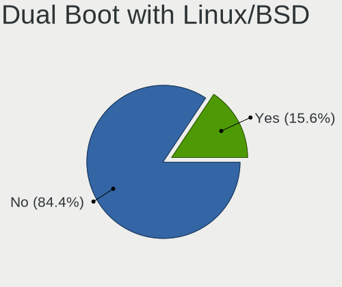

| Dual boot | Computers | Percent |
|-----------|-----------|---------|
| No        | 1440      | 84.36%  |
| Yes       | 267       | 15.64%  |

Dual Boot (Win)
---------------

Hosting Linux and Windows

| Dual boot | Computers | Percent |
|-----------|-----------|---------|
| No        | 1127      | 66.1%   |
| Yes       | 578       | 33.9%   |

Board
-----

Vendor
------

Motherboard manufacturer

| Name                    | Computers | Percent |
|-------------------------|-----------|---------|
| Hewlett-Packard         | 258       | 15.45%  |
| Lenovo                  | 256       | 15.33%  |
| ASUSTek Computer        | 243       | 14.55%  |
| Dell                    | 216       | 12.93%  |
| Gigabyte Technology     | 189       | 11.32%  |
| ASRock                  | 77        | 4.61%   |
| MSI                     | 75        | 4.49%   |
| Acer                    | 57        | 3.41%   |
| Toshiba                 | 37        | 2.22%   |
| Sony                    | 37        | 2.22%   |
| Apple                   | 22        | 1.32%   |
| Fujitsu                 | 17        | 1.02%   |
| Fujitsu Siemens         | 13        | 0.78%   |
| Intel                   | 12        | 0.72%   |
| HUAWEI                  | 12        | 0.72%   |
| Unknown                 | 11        | 0.66%   |
| Notebook                | 9         | 0.54%   |
| Clevo                   | 8         | 0.48%   |
| Pegatron                | 7         | 0.42%   |
| Raspberry Pi Foundation | 6         | 0.36%   |
| Foxconn                 | 6         | 0.36%   |
| Chuwi                   | 6         | 0.36%   |
| Google                  | 5         | 0.3%    |
| TUXEDO                  | 4         | 0.24%   |
| Samsung Electronics     | 4         | 0.24%   |
| IBM                     | 4         | 0.24%   |
| FriendlyElec            | 4         | 0.24%   |
| Valve                   | 3         | 0.18%   |
| Timi                    | 3         | 0.18%   |
| Teclast                 | 3         | 0.18%   |
| Insyde                  | 3         | 0.18%   |
| Hampoo                  | 3         | 0.18%   |
| ECS                     | 3         | 0.18%   |
| E-shop.gr               | 3         | 0.18%   |
| Biostar                 | 3         | 0.18%   |
| ZOTAC                   | 2         | 0.12%   |
| VERO                    | 2         | 0.12%   |
| SLIMBOOK                | 2         | 0.12%   |
| Medion                  | 2         | 0.12%   |
| Info Quest Technologies | 2         | 0.12%   |

Model
-----

Motherboard model

| Name                                       | Computers | Percent |
|--------------------------------------------|-----------|---------|
| Unknown                                    | 17        | 1.02%   |
| ASUS All Series                            | 14        | 0.84%   |
| HP Pavilion g6                             | 11        | 0.66%   |
| HP Notebook                                | 10        | 0.6%    |
| HP 255 G7 Notebook PC                      | 8         | 0.48%   |
| HP ProDesk 600 G1 SFF                      | 7         | 0.42%   |
| Gigabyte B450M DS3H                        | 7         | 0.42%   |
| ASUS Vivobook Go E1504FA_E1504FA           | 7         | 0.42%   |
| MSI MS-7C02                                | 6         | 0.36%   |
| HP G62                                     | 6         | 0.36%   |
| Dell OptiPlex 790                          | 6         | 0.36%   |
| Dell OptiPlex 7010                         | 6         | 0.36%   |
| Dell Inspiron 3542                         | 6         | 0.36%   |
| Dell Inspiron 3537                         | 6         | 0.36%   |
| ASRock B450 Gaming K4                      | 6         | 0.36%   |
| Lenovo IdeaPad 100-15IBD 80QQ              | 5         | 0.3%    |
| HP Pavilion 15                             | 5         | 0.3%    |
| Gigabyte H61M-S2PV                         | 5         | 0.3%    |
| Gigabyte A320M-S2H                         | 5         | 0.3%    |
| Dell OptiPlex GX520                        | 5         | 0.3%    |
| ASUS ROG STRIX B350-F GAMING               | 5         | 0.3%    |
| Pegatron A15                               | 4         | 0.24%   |
| Notebook W54_W94_W955TU,-T,-C              | 4         | 0.24%   |
| Lenovo IdeaPad 5 Pro 14ACN6 82L7           | 4         | 0.24%   |
| Lenovo IdeaPad 3 15ABA7 82RN               | 4         | 0.24%   |
| Lenovo G510 20238                          | 4         | 0.24%   |
| Lenovo G40-30 80FY                         | 4         | 0.24%   |
| HP Pavilion Notebook                       | 4         | 0.24%   |
| HP Pavilion dv7                            | 4         | 0.24%   |
| HP Pavilion dv6                            | 4         | 0.24%   |
| HP Compaq Pro 6300 SFF                     | 4         | 0.24%   |
| HP Compaq 8200 Elite SFF PC                | 4         | 0.24%   |
| Gigabyte B550 AORUS ELITE V2               | 4         | 0.24%   |
| Gigabyte B450 AORUS M                      | 4         | 0.24%   |
| FriendlyElec NanoPC-T6                     | 4         | 0.24%   |
| Dell Latitude 5420                         | 4         | 0.24%   |
| Dell Inspiron 5567                         | 4         | 0.24%   |
| ASUS VivoBook 15_ASUS Laptop X540MA_X543MA | 4         | 0.24%   |
| ASUS PRIME X570-P                          | 4         | 0.24%   |
| Apple MacBookPro8,1                        | 4         | 0.24%   |

Model Family
------------

Motherboard model prefix

| Name                  | Computers | Percent |
|-----------------------|-----------|---------|
| Lenovo IdeaPad        | 70        | 4.19%   |
| Dell Inspiron         | 67        | 4.01%   |
| Lenovo ThinkPad       | 66        | 3.95%   |
| HP Pavilion           | 55        | 3.29%   |
| Dell Latitude         | 47        | 2.81%   |
| Acer Aspire           | 46        | 2.75%   |
| Dell OptiPlex         | 42        | 2.51%   |
| HP Compaq             | 38        | 2.28%   |
| Toshiba Satellite     | 32        | 1.92%   |
| ASUS Vivobook         | 30        | 1.8%    |
| ASUS PRIME            | 30        | 1.8%    |
| Lenovo ThinkCentre    | 28        | 1.68%   |
| ASUS ROG              | 23        | 1.38%   |
| Dell Precision        | 22        | 1.32%   |
| HP ProBook            | 19        | 1.14%   |
| HP EliteBook          | 19        | 1.14%   |
| HP 255                | 17        | 1.02%   |
| Unknown               | 17        | 1.02%   |
| Dell XPS              | 15        | 0.9%    |
| HP Laptop             | 14        | 0.84%   |
| ASUS All              | 14        | 0.84%   |
| Lenovo Legion         | 13        | 0.78%   |
| HP ProDesk            | 11        | 0.66%   |
| Fujitsu LIFEBOOK      | 11        | 0.66%   |
| Dell Vostro           | 11        | 0.66%   |
| ASUS TUF              | 11        | 0.66%   |
| HP Notebook           | 10        | 0.6%    |
| Lenovo Yoga           | 9         | 0.54%   |
| HP 250                | 9         | 0.54%   |
| Gigabyte B450         | 9         | 0.54%   |
| Gigabyte B450M        | 8         | 0.48%   |
| HP ENVY               | 7         | 0.42%   |
| Gigabyte B550         | 7         | 0.42%   |
| Fujitsu Siemens AMILO | 7         | 0.42%   |
| RPi Raspberry         | 6         | 0.36%   |
| MSI MS-7C02           | 6         | 0.36%   |
| Lenovo IdeaPadFlex    | 6         | 0.36%   |
| HP G62                | 6         | 0.36%   |
| HP EliteDesk          | 6         | 0.36%   |
| ASRock B450           | 6         | 0.36%   |

MFG Year
--------

Motherboard manufacture year

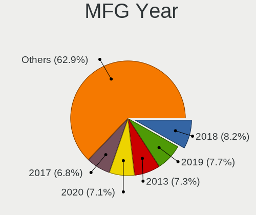

| Year    | Computers | Percent |
|---------|-----------|---------|
| 2018    | 137       | 8.2%    |
| 2019    | 128       | 7.66%   |
| 2013    | 122       | 7.31%   |
| 2020    | 119       | 7.13%   |
| 2017    | 114       | 6.83%   |
| 2012    | 112       | 6.71%   |
| 2011    | 107       | 6.41%   |
| 2008    | 101       | 6.05%   |
| 2009    | 96        | 5.75%   |
| 2014    | 95        | 5.69%   |
| 2021    | 82        | 4.91%   |
| 2015    | 81        | 4.85%   |
| 2010    | 73        | 4.37%   |
| 2016    | 67        | 4.01%   |
| 2007    | 67        | 4.01%   |
| 2022    | 52        | 3.11%   |
| 2023    | 37        | 2.22%   |
| 2006    | 24        | 1.44%   |
| 2005    | 22        | 1.32%   |
| 2024    | 15        | 0.9%    |
| Unknown | 9         | 0.54%   |
| 2004    | 5         | 0.3%    |
| 2003    | 5         | 0.3%    |

Form Factor
-----------

Physical design of the computer

| Name           | Computers | Percent |
|----------------|-----------|---------|
| Notebook       | 912       | 54.61%  |
| Desktop        | 679       | 40.66%  |
| Convertible    | 29        | 1.74%   |
| All in one     | 12        | 0.72%   |
| System on chip | 10        | 0.6%    |
| Server         | 10        | 0.6%    |
| Tablet         | 9         | 0.54%   |
| Mini pc        | 6         | 0.36%   |
| Other          | 3         | 0.18%   |

Secure Boot
-----------

Enabled or disabled

| State    | Computers | Percent |
|----------|-----------|---------|
| Disabled | 1560      | 92.69%  |
| Enabled  | 123       | 7.31%   |

Coreboot
--------

Have coreboot on board

| Used | Computers | Percent |
|------|-----------|---------|
| No   | 1665      | 99.7%   |
| Yes  | 5         | 0.3%    |

RAM Size
--------

Total RAM memory

| Size in GB  | Computers | Percent |
|-------------|-----------|---------|
| 4.01-8.0    | 392       | 23%     |
| 3.01-4.0    | 368       | 21.6%   |
| 8.01-16.0   | 314       | 18.43%  |
| 16.01-24.0  | 294       | 17.25%  |
| 32.01-64.0  | 116       | 6.81%   |
| 1.01-2.0    | 115       | 6.75%   |
| 2.01-3.0    | 43        | 2.52%   |
| 24.01-32.0  | 25        | 1.47%   |
| 64.01-256.0 | 22        | 1.29%   |
| 0.51-1.0    | 14        | 0.82%   |
| 0.01-0.5    | 1         | 0.06%   |

RAM Used
--------

Used RAM memory

| Used GB    | Computers | Percent |
|------------|-----------|---------|
| 1.01-2.0   | 688       | 36.99%  |
| 2.01-3.0   | 451       | 24.25%  |
| 4.01-8.0   | 240       | 12.9%   |
| 3.01-4.0   | 226       | 12.15%  |
| 0.51-1.0   | 149       | 8.01%   |
| 8.01-16.0  | 67        | 3.6%    |
| 0.01-0.5   | 27        | 1.45%   |
| 16.01-24.0 | 10        | 0.54%   |
| 32.01-64.0 | 1         | 0.05%   |
| 24.01-32.0 | 1         | 0.05%   |

Total Drives
------------

Number of drives on board

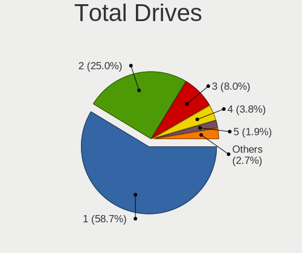

| Drives | Computers | Percent |
|--------|-----------|---------|
| 1      | 1011      | 58.68%  |
| 2      | 431       | 25.01%  |
| 3      | 137       | 7.95%   |
| 4      | 66        | 3.83%   |
| 5      | 32        | 1.86%   |
| 6      | 17        | 0.99%   |
| 0      | 17        | 0.99%   |
| 7      | 7         | 0.41%   |
| 18     | 1         | 0.06%   |
| 14     | 1         | 0.06%   |
| 13     | 1         | 0.06%   |
| 12     | 1         | 0.06%   |
| 8      | 1         | 0.06%   |

Has CD-ROM
----------

Has CD-ROM on board

| Presented | Computers | Percent |
|-----------|-----------|---------|
| No        | 953       | 56.69%  |
| Yes       | 728       | 43.31%  |

Has Ethernet
------------

Has Ethernet on board

| Presented | Computers | Percent |
|-----------|-----------|---------|
| Yes       | 1459      | 87.1%   |
| No        | 216       | 12.9%   |

Has WiFi
--------

Has WiFi module

| Presented | Computers | Percent |
|-----------|-----------|---------|
| Yes       | 1204      | 71.33%  |
| No        | 484       | 28.67%  |

Has Bluetooth
-------------

Has Bluetooth module

| Presented | Computers | Percent |
|-----------|-----------|---------|
| Yes       | 934       | 55.2%   |
| No        | 758       | 44.8%   |

Location
--------

Country
-------

Geographic location (country)

| Country | Computers | Percent |
|---------|-----------|---------|
| Greece  | 1670      | 100%    |

City
----

Geographic location (city)

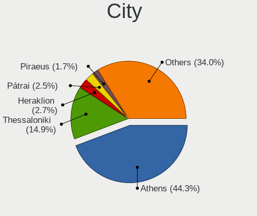

| City           | Computers | Percent |
|----------------|-----------|---------|
| Athens         | 809       | 44.26%  |
| Thessaloniki   | 272       | 14.88%  |
| Heraklion      | 50        | 2.74%   |
| Ptrai        | 45        | 2.46%   |
| Piraeus        | 31        | 1.7%    |
| Volos          | 29        | 1.59%   |
| Larissa        | 28        | 1.53%   |
| Chalcis        | 25        | 1.37%   |
| Kavala         | 21        | 1.15%   |
| Ioannina       | 18        | 0.98%   |
| Trikala        | 17        | 0.93%   |
| Chania         | 17        | 0.93%   |
| Katerini       | 16        | 0.88%   |
| Kalamata       | 14        | 0.77%   |
| Rhodes         | 12        | 0.66%   |
| Serres         | 11        | 0.6%    |
| Chalandri      | 11        | 0.6%    |
| Lamia          | 10        | 0.55%   |
| Drama          | 10        | 0.55%   |
| Xanthi         | 9         | 0.49%   |
| Kallithea      | 9         | 0.49%   |
| Corfu          | 9         | 0.49%   |
| Acharnes       | 9         | 0.49%   |
| Veroia         | 8         | 0.44%   |
| Rethymno       | 8         | 0.44%   |
| Marousi        | 8         | 0.44%   |
| Corinth        | 8         | 0.44%   |
| Agrinio        | 7         | 0.38%   |
| Samos          | 6         | 0.33%   |
| Salamina       | 6         | 0.33%   |
| Old Faliron    | 6         | 0.33%   |
| Nea Smyrni     | 6         | 0.33%   |
| Mytilene       | 6         | 0.33%   |
| Kozani         | 6         | 0.33%   |
| Karditsa       | 6         | 0.33%   |
| Igoumenitsa    | 6         | 0.33%   |
| Alexandroupoli | 6         | 0.33%   |
| Zakynthos      | 5         | 0.27%   |
| Paros          | 5         | 0.27%   |
| Nikaia         | 5         | 0.27%   |

Drives
------

Drive Vendor
------------

Hard drive vendors

| Vendor                      | Computers | Drives | Percent |
|-----------------------------|-----------|--------|---------|
| WDC                         | 408       | 680    | 16.39%  |
| Samsung Electronics         | 403       | 622    | 16.19%  |
| Seagate                     | 293       | 460    | 11.77%  |
| Toshiba                     | 174       | 234    | 6.99%   |
| Kingston                    | 154       | 199    | 6.19%   |
| SanDisk                     | 151       | 210    | 6.07%   |
| Patriot                     | 97        | 122    | 3.9%    |
| Unknown                     | 77        | 125    | 3.09%   |
| Intenso                     | 59        | 74     | 2.37%   |
| Crucial                     | 58        | 83     | 2.33%   |
| SK hynix                    | 56        | 71     | 2.25%   |
| Hitachi                     | 56        | 62     | 2.25%   |
| Intel                       | 46        | 59     | 1.85%   |
| HGST                        | 32        | 46     | 1.29%   |
| Micron Technology           | 30        | 36     | 1.21%   |
| KIOXIA                      | 22        | 33     | 0.88%   |
| A-DATA Technology           | 22        | 31     | 0.88%   |
| Team                        | 19        | 25     | 0.76%   |
| OCZ                         | 19        | 22     | 0.76%   |
| Fujitsu                     | 19        | 20     | 0.76%   |
| PNY                         | 16        | 16     | 0.64%   |
| Kingston Technology Company | 16        | 21     | 0.64%   |
| Maxtor                      | 14        | 16     | 0.56%   |
| SPCC                        | 13        | 16     | 0.52%   |
| Gigabyte Technology         | 13        | 16     | 0.52%   |
| JMicron Technology          | 12        | 31     | 0.48%   |
| China                       | 12        | 12     | 0.48%   |
| Phison Electronics          | 11        | 14     | 0.44%   |
| Corsair                     | 10        | 10     | 0.4%    |
| Unknown                     | 10        | 10     | 0.4%    |
| Phison                      | 9         | 12     | 0.36%   |
| Micron/Crucial Technology   | 7         | 8      | 0.28%   |
| Apple                       | 7         | 8      | 0.28%   |
| ADATA Technology            | 7         | 13     | 0.28%   |
| XPG                         | 6         | 10     | 0.24%   |
| Verbatim                    | 6         | 7      | 0.24%   |
| Leven                       | 6         | 7      | 0.24%   |
| KIOXIA-EXCERIA              | 6         | 6      | 0.24%   |
| Hewlett-Packard             | 6         | 11     | 0.24%   |
| Transcend                   | 5         | 5      | 0.2%    |

Drive Model
-----------

Hard drive models

| Model                                                | Computers | Percent |
|------------------------------------------------------|-----------|---------|
| Samsung SSD 860 EVO 250GB                            | 32        | 1.16%   |
| Samsung NVMe SSD Controller SM981/PM981/PM983 512GB  | 31        | 1.12%   |
| Samsung SSD 860 EVO 500GB                            | 30        | 1.08%   |
| Unknown MMC Card  32GB                               | 28        | 1.01%   |
| Samsung SSD 850 EVO 250GB                            | 27        | 0.98%   |
| Patriot Burst 240GB SSD                              | 25        | 0.9%    |
| Patriot Burst 120GB SSD                              | 22        | 0.8%    |
| Kingston SA400S37240G 240GB SSD                      | 22        | 0.8%    |
| Kingston SA400S37120G 120GB SSD                      | 20        | 0.72%   |
| Seagate ST500DM002-1BD142 500GB                      | 19        | 0.69%   |
| Seagate ST1000LM024 HN-M101MBB 1TB                   | 19        | 0.69%   |
| Toshiba MQ01ABF050 500GB                             | 18        | 0.65%   |
| Kingston SA400S37480G 480GB SSD                      | 18        | 0.65%   |
| Toshiba DT01ACA100 1TB                               | 17        | 0.61%   |
| Seagate ST1000LM035-1RK172 1TB                       | 17        | 0.61%   |
| Toshiba DT01ACA050 500GB                             | 16        | 0.58%   |
| Seagate ST1000DM010-2EP102 1TB                       | 16        | 0.58%   |
| Unknown MMC Card  64GB                               | 15        | 0.54%   |
| WDC WDS240G2G0A-00JH30 240GB SSD                     | 14        | 0.51%   |
| Samsung SSD 850 EVO 500GB                            | 14        | 0.51%   |
| Samsung SSD 870 EVO 500GB                            | 13        | 0.47%   |
| WDC WD10EZEX-08WN4A0 1TB                             | 12        | 0.43%   |
| SK hynix NVMe SSD Drive 256GB                        | 12        | 0.43%   |
| Seagate ST500LT012-1DG142 500GB                      | 11        | 0.4%    |
| Seagate ST500LM012 HN-M500MBB 500GB                  | 11        | 0.4%    |
| Samsung NVMe SSD Controller PM9A1/PM9A3/980PRO 512GB | 11        | 0.4%    |
| Patriot Burst 480GB SSD                              | 11        | 0.4%    |
| Unknown MMC Card  128GB                              | 10        | 0.36%   |
| Toshiba MQ01ABD100 1TB                               | 10        | 0.36%   |
| SanDisk NVMe SSD Drive 512GB                         | 10        | 0.36%   |
| Samsung SSD 860 EVO 1TB                              | 10        | 0.36%   |
| Samsung SSD 850 EVO 120GB                            | 10        | 0.36%   |
| Kingston SV300S37A120G 120GB SSD                     | 10        | 0.36%   |
| Unknown                                              | 10        | 0.36%   |
| Toshiba DT01ACA200 2TB                               | 9         | 0.33%   |
| Seagate ST3500418AS 500GB                            | 9         | 0.33%   |
| Samsung SSD 870 EVO 1TB                              | 9         | 0.33%   |
| Samsung NVMe SSD Drive 500GB                         | 9         | 0.33%   |
| Crucial CT250MX500SSD1 250GB                         | 9         | 0.33%   |
| SanDisk SDSSDA120G 120GB                             | 8         | 0.29%   |

HDD Vendor
----------

Hard disk drive vendors

| Vendor              | Computers | Drives | Percent |
|---------------------|-----------|--------|---------|
| WDC                 | 342       | 554    | 36.42%  |
| Seagate             | 289       | 451    | 30.78%  |
| Toshiba             | 128       | 171    | 13.63%  |
| Hitachi             | 56        | 62     | 5.96%   |
| HGST                | 32        | 46     | 3.41%   |
| Samsung Electronics | 25        | 32     | 2.66%   |
| Fujitsu             | 19        | 20     | 2.02%   |
| Maxtor              | 14        | 16     | 1.49%   |
| JMicron Technology  | 9         | 25     | 0.96%   |
| Intenso             | 7         | 8      | 0.75%   |
| Hewlett-Packard     | 4         | 9      | 0.43%   |
| Apple               | 4         | 4      | 0.43%   |
| Min Yi U            | 2         | 4      | 0.21%   |
| External            | 2         | 3      | 0.21%   |
| Unknown             | 1         | 1      | 0.11%   |
| Quantum             | 1         | 1      | 0.11%   |
| Inateck             | 1         | 1      | 0.11%   |
| IBM/Hitachi         | 1         | 1      | 0.11%   |
| IBM-ESXS            | 1         | 3      | 0.11%   |
| ASMT                | 1         | 1      | 0.11%   |

SSD Vendor
----------

Solid state drive vendors

| Vendor              | Computers | Drives | Percent |
|---------------------|-----------|--------|---------|
| Samsung Electronics | 227       | 313    | 23.35%  |
| Kingston            | 122       | 160    | 12.55%  |
| Patriot             | 95        | 120    | 9.77%   |
| SanDisk             | 93        | 137    | 9.57%   |
| WDC                 | 59        | 97     | 6.07%   |
| Crucial             | 54        | 79     | 5.56%   |
| Intenso             | 44        | 58     | 4.53%   |
| Toshiba             | 29        | 41     | 2.98%   |
| Intel               | 21        | 25     | 2.16%   |
| A-DATA Technology   | 20        | 29     | 2.06%   |
| Team                | 19        | 25     | 1.95%   |
| OCZ                 | 18        | 21     | 1.85%   |
| PNY                 | 16        | 16     | 1.65%   |
| Micron Technology   | 15        | 17     | 1.54%   |
| SPCC                | 13        | 16     | 1.34%   |
| Gigabyte Technology | 12        | 15     | 1.23%   |
| China               | 12        | 12     | 1.23%   |
| SK hynix            | 10        | 11     | 1.03%   |
| Corsair             | 7         | 7      | 0.72%   |
| Verbatim            | 6         | 7      | 0.62%   |
| Leven               | 6         | 7      | 0.62%   |
| GOODRAM             | 5         | 7      | 0.51%   |
| Unknown             | 5         | 5      | 0.51%   |
| Transcend           | 4         | 4      | 0.41%   |
| Mushkin             | 4         | 4      | 0.41%   |
| LITEONIT            | 4         | 4      | 0.41%   |
| LITEON              | 4         | 6      | 0.41%   |
| Emtec               | 4         | 5      | 0.41%   |
| Teclast             | 3         | 3      | 0.31%   |
| Apple               | 3         | 3      | 0.31%   |
| Apacer              | 3         | 3      | 0.31%   |
| AGI                 | 3         | 4      | 0.31%   |
| WDC WDS             | 2         | 2      | 0.21%   |
| Unknown             | 2         | 5      | 0.21%   |
| Plextor             | 2         | 2      | 0.21%   |
| Platinet            | 2         | 2      | 0.21%   |
| Neo Forza           | 2         | 2      | 0.21%   |
| Lite-On             | 2         | 3      | 0.21%   |
| Hewlett-Packard     | 2         | 2      | 0.21%   |
| Drevo               | 2         | 2      | 0.21%   |

Drive Kind
----------

HDD or SSD

| Kind    | Computers | Drives | Percent |
|---------|-----------|--------|---------|
| SSD     | 840       | 1298   | 37.72%  |
| HDD     | 802       | 1413   | 36.01%  |
| NVMe    | 488       | 725    | 21.91%  |
| MMC     | 77        | 127    | 3.46%   |
| Unknown | 20        | 29     | 0.9%    |

Drive Connector
---------------

SATA, SAS, NVMe, etc.

| Type | Computers | Drives | Percent |
|------|-----------|--------|---------|
| SATA | 1296      | 2614   | 66.63%  |
| NVMe | 487       | 721    | 25.04%  |
| SAS  | 85        | 130    | 4.37%   |
| MMC  | 77        | 127    | 3.96%   |

Drive Size
----------

Size of hard drive

| Size in TB | Computers | Drives | Percent |
|------------|-----------|--------|---------|
| 0.01-0.5   | 1085      | 1804   | 65.56%  |
| 0.51-1.0   | 397       | 624    | 23.99%  |
| 1.01-2.0   | 100       | 164    | 6.04%   |
| 3.01-4.0   | 32        | 46     | 1.93%   |
| 2.01-3.0   | 21        | 37     | 1.27%   |
| 4.01-10.0  | 15        | 30     | 0.91%   |
| 10.01-20.0 | 5         | 6      | 0.3%    |

Space Total
-----------

Amount of disk space available on the file system

| Size in GB     | Computers | Percent |
|----------------|-----------|---------|
| 101-250        | 505       | 28.15%  |
| 251-500        | 355       | 19.79%  |
| 501-1000       | 211       | 11.76%  |
| 1-20           | 166       | 9.25%   |
| 51-100         | 137       | 7.64%   |
| 1001-2000      | 135       | 7.53%   |
| 21-50          | 83        | 4.63%   |
| More than 3000 | 79        | 4.4%    |
| Unknown        | 75        | 4.18%   |
| 2001-3000      | 48        | 2.68%   |

Space Used
----------

Amount of used disk space

| Used GB        | Computers | Percent |
|----------------|-----------|---------|
| 1-20           | 687       | 37.16%  |
| 21-50          | 327       | 17.69%  |
| 51-100         | 210       | 11.36%  |
| 101-250        | 201       | 10.87%  |
| 251-500        | 143       | 7.73%   |
| 501-1000       | 98        | 5.3%    |
| Unknown        | 75        | 4.06%   |
| 1001-2000      | 61        | 3.3%    |
| More than 3000 | 31        | 1.68%   |
| 2001-3000      | 15        | 0.81%   |
| 0              | 1         | 0.05%   |

Malfunc. Drives
---------------

Drive models with a malfunction

| Model                                 | Computers | Drives | Percent |
|---------------------------------------|-----------|--------|---------|
| HGST HTS545050A7E680 500GB            | 4         | 4      | 2.78%   |
| WDC WD2002FAEX-007BA0 2TB             | 2         | 3      | 1.39%   |
| WDC WD10EZEX-60WN4A0 1TB              | 2         | 2      | 1.39%   |
| WDC WD10EALX-009BA0 1TB               | 2         | 2      | 1.39%   |
| Toshiba MQ01ABF050 500GB              | 2         | 2      | 1.39%   |
| Toshiba MQ01ABD050 500GB              | 2         | 4      | 1.39%   |
| Seagate ST500DM002-1BD142 500GB       | 2         | 3      | 1.39%   |
| Seagate ST3500320AS 500GB             | 2         | 2      | 1.39%   |
| Seagate ST3250318AS 250GB             | 2         | 2      | 1.39%   |
| Seagate ST1000LM024 HN-M101MBB 1TB    | 2         | 10     | 1.39%   |
| SanDisk SSD PLUS 240GB                | 2         | 2      | 1.39%   |
| Samsung Electronics SSD 870 EVO 500GB | 2         | 3      | 1.39%   |
| Hitachi HTS723232A7A364 320GB         | 2         | 2      | 1.39%   |
| WDC WDS240G2G0A-00JH30 240GB SSD      | 1         | 1      | 0.69%   |
| WDC WDS120G2G0A-00JH30 120GB SSD      | 1         | 1      | 0.69%   |
| WDC WD800JD-23LSA0 80GB               | 1         | 1      | 0.69%   |
| WDC WD800JB-00JJC0 80GB               | 1         | 2      | 0.69%   |
| WDC WD6400AAKS-65A7B0 640GB           | 1         | 1      | 0.69%   |
| WDC WD5000LPVT-00FMCT0 500GB          | 1         | 1      | 0.69%   |
| WDC WD5000LPCX-24VHAT0 500GB          | 1         | 1      | 0.69%   |
| WDC WD5000BPVT-60HXZT1 500GB          | 1         | 1      | 0.69%   |
| WDC WD5000AAVS-22G9B1 500GB           | 1         | 1      | 0.69%   |
| WDC WD5000AAKX-60U6AA0 500GB          | 1         | 1      | 0.69%   |
| WDC WD5000AAKX-603CA0 500GB           | 1         | 1      | 0.69%   |
| WDC WD5000AAKX-001CA0 500GB           | 1         | 1      | 0.69%   |
| WDC WD5000AAKB-00H8A0 500GB           | 1         | 1      | 0.69%   |
| WDC WD40EFRX-68WT0N0 4TB              | 1         | 1      | 0.69%   |
| WDC WD40EFRX-68N32N0 4TB              | 1         | 1      | 0.69%   |
| WDC WD3200BPVT-22ZEST0 320GB          | 1         | 1      | 0.69%   |
| WDC WD3200BEVT-26ZCT0 320GB           | 1         | 1      | 0.69%   |
| WDC WD3200BEVT-00A0RT0 320GB          | 1         | 1      | 0.69%   |
| WDC WD30EZRZ-00GXCB0 3TB              | 1         | 1      | 0.69%   |
| WDC WD2500YS-01SHB1 256GB             | 1         | 2      | 0.69%   |
| WDC WD2500BEVT-22A23T0 250GB          | 1         | 1      | 0.69%   |
| WDC WD2500AAKX-083CA1 250GB           | 1         | 1      | 0.69%   |
| WDC WD20PURX-64P6ZY0 2TB              | 1         | 1      | 0.69%   |
| WDC WD20EZRX-22D8PB0 2TB              | 1         | 1      | 0.69%   |
| WDC WD20EARS-00MVWB0 2TB              | 1         | 1      | 0.69%   |
| WDC WD1600BEVS-22RST0 160GB           | 1         | 1      | 0.69%   |
| WDC WD1600AAJS-22L7A0 160GB           | 1         | 1      | 0.69%   |

Malfunc. Drive Vendor
---------------------

Vendors of faulty drives

| Vendor              | Computers | Drives | Percent |
|---------------------|-----------|--------|---------|
| WDC                 | 35        | 47     | 25.55%  |
| Seagate             | 32        | 42     | 23.36%  |
| Toshiba             | 13        | 16     | 9.49%   |
| Hitachi             | 10        | 10     | 7.3%    |
| Samsung Electronics | 7         | 9      | 5.11%   |
| HGST                | 7         | 13     | 5.11%   |
| SanDisk             | 4         | 4      | 2.92%   |
| Patriot             | 3         | 3      | 2.19%   |
| Micron Technology   | 3         | 3      | 2.19%   |
| Maxtor              | 3         | 3      | 2.19%   |
| Corsair             | 3         | 3      | 2.19%   |
| SK hynix            | 2         | 3      | 1.46%   |
| Kingston            | 2         | 2      | 1.46%   |
| Intenso             | 2         | 2      | 1.46%   |
| Intel               | 2         | 2      | 1.46%   |
| Fujitsu             | 2         | 2      | 1.46%   |
| Crucial             | 2         | 3      | 1.46%   |
| SPCC                | 1         | 1      | 0.73%   |
| OCZ-AGIL            | 1         | 1      | 0.73%   |
| OCZ                 | 1         | 1      | 0.73%   |
| China               | 1         | 1      | 0.73%   |
| A-DATA Technology   | 1         | 1      | 0.73%   |

Malfunc. HDD Vendor
-------------------

Vendors of faulty HDD drives

| Vendor              | Computers | Drives | Percent |
|---------------------|-----------|--------|---------|
| WDC                 | 32        | 44     | 32%     |
| Seagate             | 32        | 42     | 32%     |
| Toshiba             | 13        | 16     | 13%     |
| Hitachi             | 10        | 10     | 10%     |
| HGST                | 7         | 13     | 7%      |
| Maxtor              | 3         | 3      | 3%      |
| Fujitsu             | 2         | 2      | 2%      |
| Samsung Electronics | 1         | 1      | 1%      |

Malfunc. Drive Kind
-------------------

Kinds of faulty drives

| Kind | Computers | Drives | Percent |
|------|-----------|--------|---------|
| HDD  | 90        | 131    | 71.43%  |
| SSD  | 32        | 36     | 25.4%   |
| NVMe | 4         | 5      | 3.17%   |

Failed Drives
-------------

Failed drive models

| Model                             | Computers | Drives | Percent |
|-----------------------------------|-----------|--------|---------|
| Seagate ST3500418ASQ 500GB        | 1         | 1      | 25%     |
| Seagate ST3500418AS 500GB         | 1         | 1      | 25%     |
| Samsung Electronics SSD 980 500GB | 1         | 1      | 25%     |
| Mushkin MKNSSDCR120GB-7           | 1         | 1      | 25%     |

Failed Drive Vendor
-------------------

Failed drive vendors

| Vendor              | Computers | Drives | Percent |
|---------------------|-----------|--------|---------|
| Seagate             | 2         | 2      | 50%     |
| Samsung Electronics | 1         | 1      | 25%     |
| Mushkin             | 1         | 1      | 25%     |

Drive Status
------------

Number of failed and malfunc. drives

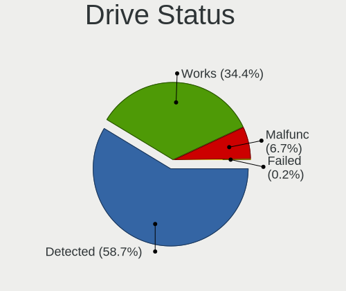

| Status   | Computers | Drives | Percent |
|----------|-----------|--------|---------|
| Detected | 1063      | 2221   | 58.66%  |
| Works    | 623       | 1195   | 34.38%  |
| Malfunc  | 122       | 172    | 6.73%   |
| Failed   | 4         | 4      | 0.22%   |

Storage controller
------------------

Storage Vendor
--------------

Storage controller vendors

| Vendor                                  | Computers | Percent |
|-----------------------------------------|-----------|---------|
| Intel                                   | 1061      | 50.69%  |
| AMD                                     | 372       | 17.77%  |
| Samsung Electronics                     | 181       | 8.65%   |
| SanDisk                                 | 73        | 3.49%   |
| Kingston Technology Company             | 48        | 2.29%   |
| JMicron Technology                      | 45        | 2.15%   |
| SK hynix                                | 44        | 2.1%    |
| Marvell Technology Group                | 33        | 1.58%   |
| Nvidia                                  | 29        | 1.39%   |
| KIOXIA                                  | 29        | 1.39%   |
| Phison Electronics                      | 25        | 1.19%   |
| ASMedia Technology                      | 25        | 1.19%   |
| Toshiba America Info Systems            | 18        | 0.86%   |
| Micron Technology                       | 15        | 0.72%   |
| ADATA Technology                        | 14        | 0.67%   |
| VIA Technologies                        | 10        | 0.48%   |
| Micron/Crucial Technology               | 10        | 0.48%   |
| Silicon Image                           | 8         | 0.38%   |
| Silicon Motion                          | 7         | 0.33%   |
| Union Memory (Shenzhen)                 | 6         | 0.29%   |
| Realtek Semiconductor                   | 5         | 0.24%   |
| Solid State Storage Technology          | 3         | 0.14%   |
| Silicon Integrated Systems [SiS]        | 3         | 0.14%   |
| Seagate Technology                      | 3         | 0.14%   |
| MAXIO Technology (Hangzhou)             | 3         | 0.14%   |
| LSI Logic / Symbios Logic               | 3         | 0.14%   |
| Hewlett-Packard                         | 3         | 0.14%   |
| Broadcom / LSI                          | 3         | 0.14%   |
| O2 Micro                                | 2         | 0.1%    |
| Solidigm                                | 1         | 0.05%   |
| Shenzhen Unionmemory Information System | 1         | 0.05%   |
| Shenzhen Longsys Electronics            | 1         | 0.05%   |
| Promise Technology                      | 1         | 0.05%   |
| OCZ Technology Group                    | 1         | 0.05%   |
| Netac Technology                        | 1         | 0.05%   |
| Lite-On Technology                      | 1         | 0.05%   |
| Lenovo                                  | 1         | 0.05%   |
| Integrated Technology Express           | 1         | 0.05%   |
| INNOGRIT                                | 1         | 0.05%   |
| Hosin Global Electronics                | 1         | 0.05%   |

Storage Model
-------------

Storage controller models

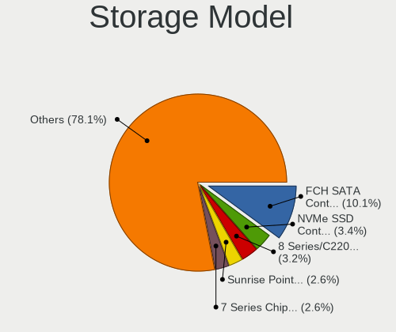

| Model                                                                          | Computers | Percent |
|--------------------------------------------------------------------------------|-----------|---------|
| AMD FCH SATA Controller [AHCI mode]                                            | 252       | 10.1%   |
| Samsung NVMe SSD Controller SM981/PM981/PM983                                  | 85        | 3.41%   |
| Intel 8 Series/C220 Series Chipset Family 6-port SATA Controller 1 [AHCI mode] | 79        | 3.17%   |
| Intel Sunrise Point-LP SATA Controller [AHCI mode]                             | 66        | 2.65%   |
| Intel 7 Series Chipset Family 6-port SATA Controller [AHCI mode]               | 65        | 2.61%   |
| Intel NM10/ICH7 Family SATA Controller [IDE mode]                              | 62        | 2.48%   |
| Intel 82801G (ICH7 Family) IDE Controller                                      | 59        | 2.36%   |
| AMD 400 Series Chipset SATA Controller                                         | 59        | 2.36%   |
| Intel 82801IBM/IEM (ICH9M/ICH9M-E) 4 port SATA Controller [AHCI mode]          | 48        | 1.92%   |
| Intel 6 Series/C200 Series Chipset Family 6 port Mobile SATA AHCI Controller   | 44        | 1.76%   |
| AMD SB7x0/SB8x0/SB9x0 IDE Controller                                           | 43        | 1.72%   |
| Samsung NVMe SSD Controller 980 (DRAM-less)                                    | 40        | 1.6%    |
| Intel 6 Series/C200 Series Chipset Family 6 port Desktop SATA AHCI Controller  | 40        | 1.6%    |
| Intel 8 Series SATA Controller 1 [AHCI mode]                                   | 36        | 1.44%   |
| Intel Q170/Q150/B150/H170/H110/Z170/CM236 Chipset SATA Controller [AHCI Mode]  | 34        | 1.36%   |
| Intel 82801 Mobile SATA Controller [RAID mode]                                 | 34        | 1.36%   |
| AMD SB7x0/SB8x0/SB9x0 SATA Controller [AHCI mode]                              | 34        | 1.36%   |
| Intel Volume Management Device NVMe RAID Controller                            | 32        | 1.28%   |
| AMD SB7x0/SB8x0/SB9x0 SATA Controller [IDE mode]                               | 30        | 1.2%    |
| Intel 82801HM/HEM (ICH8M/ICH8M-E) IDE Controller                               | 29        | 1.16%   |
| JMicron JMB363 SATA/IDE Controller                                             | 27        | 1.08%   |
| Intel 7 Series/C210 Series Chipset Family 6-port SATA Controller [AHCI mode]   | 25        | 1%      |
| Intel 200 Series PCH SATA controller [AHCI mode]                               | 25        | 1%      |
| AMD 500 Series Chipset SATA Controller                                         | 25        | 1%      |
| Intel 82801HM/HEM (ICH8M/ICH8M-E) SATA Controller [AHCI mode]                  | 24        | 0.96%   |
| ASMedia ASM1061/ASM1062 Serial ATA Controller                                  | 24        | 0.96%   |
| Samsung NVMe SSD Controller PM9A1/PM9A3/980PRO                                 | 23        | 0.92%   |
| Intel Wildcat Point-LP SATA Controller [AHCI Mode]                             | 22        | 0.88%   |
| Intel Atom Processor E3800 Series SATA AHCI Controller                         | 22        | 0.88%   |
| Intel 5 Series/3400 Series Chipset 6 port SATA AHCI Controller                 | 21        | 0.84%   |
| Intel 5 Series/3400 Series Chipset 4 port SATA AHCI Controller                 | 21        | 0.84%   |
| Intel SATA Controller [RAID mode]                                              | 20        | 0.8%    |
| KIOXIA NVMe SSD Controller BG4 (DRAM-less)                                     | 17        | 0.68%   |
| AMD 300 Series Chipset SATA Controller                                         | 17        | 0.68%   |
| Intel Celeron N3350/Pentium N4200/Atom E3900 Series SATA AHCI Controller       | 16        | 0.64%   |
| Intel 9 Series Chipset Family SATA Controller [AHCI Mode]                      | 16        | 0.64%   |
| AMD A320 Chipset SATA Controller [AHCI mode]                                   | 16        | 0.64%   |
| Intel Alder Lake-S PCH SATA Controller [AHCI Mode]                             | 15        | 0.6%    |
| SanDisk Ultra 3D / WD PC SN530, IX SN530, Blue SN550 NVMe SSD (DRAM-less)      | 14        | 0.56%   |
| Samsung NVMe SSD Controller PM9B1 (DRAM-less)                                  | 14        | 0.56%   |

Storage Kind
------------

Kind of storage controller (IDE, SATA, NVMe, SAS, ...)

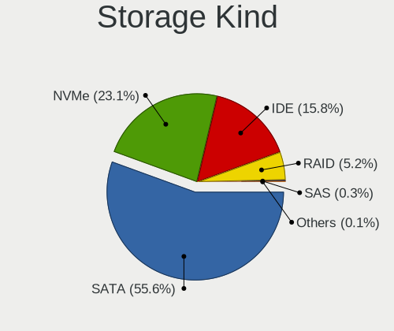

| Kind | Computers | Percent |
|------|-----------|---------|
| SATA | 1186      | 55.55%  |
| NVMe | 494       | 23.14%  |
| IDE  | 337       | 15.78%  |
| RAID | 110       | 5.15%   |
| SAS  | 6         | 0.28%   |
| SCSI | 2         | 0.09%   |

Processor
---------

CPU Vendor
----------

Processor vendors

| Vendor       | Computers | Percent |
|--------------|-----------|---------|
| Intel        | 1177      | 70.48%  |
| AMD          | 482       | 28.86%  |
| ARM          | 10        | 0.6%    |
| CentaurHauls | 1         | 0.06%   |

CPU Model
---------

Processor models

| Model                                         | Computers | Percent |
|-----------------------------------------------|-----------|---------|
| Intel Core i5-8250U CPU @ 1.60GHz             | 18        | 1.07%   |
| AMD Ryzen 5 3500U with Radeon Vega Mobile Gfx | 18        | 1.07%   |
| Intel Core i7-7500U CPU @ 2.70GHz             | 15        | 0.89%   |
| Intel Atom x5-Z8350 CPU @ 1.44GHz             | 14        | 0.83%   |
| AMD Ryzen 5 2600 Six-Core Processor           | 14        | 0.83%   |
| Intel Celeron CPU N2840 @ 2.16GHz             | 13        | 0.77%   |
| Intel 11th Gen Core i5-1135G7 @ 2.40GHz       | 12        | 0.71%   |
| AMD Ryzen 5 3400G with Radeon Vega Graphics   | 12        | 0.71%   |
| AMD Ryzen 5 5600G with Radeon Graphics        | 11        | 0.66%   |
| AMD Ryzen 5 3600 6-Core Processor             | 11        | 0.66%   |
| Intel Celeron CPU N3350 @ 1.10GHz             | 10        | 0.6%    |
| AMD Ryzen 7 2700X Eight-Core Processor        | 10        | 0.6%    |
| AMD Ryzen 3 2200G with Radeon Vega Graphics   | 10        | 0.6%    |
| AMD FX-6300 Six-Core Processor                | 10        | 0.6%    |
| Intel Core i7-8550U CPU @ 1.80GHz             | 9         | 0.54%   |
| Intel Core i5-7200U CPU @ 2.50GHz             | 9         | 0.54%   |
| Intel Core i5-6500 CPU @ 3.20GHz              | 9         | 0.54%   |
| Intel Core i5-4460 CPU @ 3.20GHz              | 9         | 0.54%   |
| Intel Core i5-3320M CPU @ 2.60GHz             | 9         | 0.54%   |
| Intel Core i3-6006U CPU @ 2.00GHz             | 9         | 0.54%   |
| Intel Pentium 4 CPU 3.00GHz                   | 8         | 0.48%   |
| Intel Core i5-5200U CPU @ 2.20GHz             | 8         | 0.48%   |
| Intel Core i5-2400 CPU @ 3.10GHz              | 8         | 0.48%   |
| Intel Core i5-10210U CPU @ 1.60GHz            | 8         | 0.48%   |
| Intel Core i5 CPU M 520 @ 2.40GHz             | 8         | 0.48%   |
| Intel Core i3-4005U CPU @ 1.70GHz             | 8         | 0.48%   |
| Intel Core i3-3220 CPU @ 3.30GHz              | 8         | 0.48%   |
| Intel Core i3-3110M CPU @ 2.40GHz             | 8         | 0.48%   |
| AMD Ryzen 5 7520U with Radeon Graphics        | 8         | 0.48%   |
| AMD Ryzen 5 4500U with Radeon Graphics        | 8         | 0.48%   |
| Intel Pentium 4 CPU 3.20GHz                   | 7         | 0.42%   |
| Intel Core i7-1065G7 CPU @ 1.30GHz            | 7         | 0.42%   |
| Intel Core i5-8265U CPU @ 1.60GHz             | 7         | 0.42%   |
| Intel Core i5-4200U CPU @ 1.60GHz             | 7         | 0.42%   |
| Intel Core i5-3470 CPU @ 3.20GHz              | 7         | 0.42%   |
| Intel Core i5-3230M CPU @ 2.60GHz             | 7         | 0.42%   |
| Intel Core i5-2410M CPU @ 2.30GHz             | 7         | 0.42%   |
| Intel Core 2 Quad CPU Q6600 @ 2.40GHz         | 7         | 0.42%   |
| Intel Core 2 Duo CPU T7250 @ 2.00GHz          | 7         | 0.42%   |
| Intel Core 2 Duo CPU E7500 @ 2.93GHz          | 7         | 0.42%   |

CPU Model Family
----------------

Processor model prefix

| Model                   | Computers | Percent |
|-------------------------|-----------|---------|
| Intel Core i5           | 296       | 17.67%  |
| Intel Core i7           | 211       | 12.6%   |
| AMD Ryzen 5             | 153       | 9.13%   |
| Intel Core i3           | 126       | 7.52%   |
| Other                   | 110       | 6.57%   |
| Intel Core 2 Duo        | 106       | 6.33%   |
| Intel Celeron           | 87        | 5.19%   |
| AMD Ryzen 7             | 78        | 4.66%   |
| Intel Pentium           | 50        | 2.99%   |
| Intel Atom              | 39        | 2.33%   |
| AMD Ryzen 3             | 36        | 2.15%   |
| Intel Core 2 Quad       | 30        | 1.79%   |
| AMD Ryzen 9             | 26        | 1.55%   |
| Intel Xeon              | 25        | 1.49%   |
| AMD FX                  | 23        | 1.37%   |
| Intel Pentium Dual-Core | 22        | 1.31%   |
| Intel Core 2            | 22        | 1.31%   |
| Intel Pentium 4         | 21        | 1.25%   |
| AMD Athlon 64 X2        | 17        | 1.01%   |
| AMD A6                  | 14        | 0.84%   |
| AMD A10                 | 14        | 0.84%   |
| AMD A8                  | 13        | 0.78%   |
| AMD A4                  | 13        | 0.78%   |
| AMD Phenom II X4        | 11        | 0.66%   |
| Intel Pentium Dual      | 9         | 0.54%   |
| Intel Genuine           | 9         | 0.54%   |
| AMD E1                  | 9         | 0.54%   |
| AMD Athlon              | 8         | 0.48%   |
| Intel Pentium D         | 6         | 0.36%   |
| AMD E                   | 6         | 0.36%   |
| Intel Pentium M         | 5         | 0.3%    |
| Intel Celeron M         | 5         | 0.3%    |
| AMD Phenom              | 5         | 0.3%    |
| Intel Core i9           | 4         | 0.24%   |
| Intel Celeron Dual-Core | 4         | 0.24%   |
| AMD Phenom II X6        | 4         | 0.24%   |
| AMD E2                  | 4         | 0.24%   |
| Intel Pentium Gold      | 3         | 0.18%   |
| Intel Core              | 3         | 0.18%   |
| ARM BCM                 | 3         | 0.18%   |

CPU Cores
---------

Number of processor cores

| Number  | Computers | Percent |
|---------|-----------|---------|
| 2       | 702       | 41.96%  |
| 4       | 557       | 33.29%  |
| 6       | 164       | 9.8%    |
| 8       | 98        | 5.86%   |
| 1       | 67        | 4%      |
| 12      | 21        | 1.26%   |
| 16      | 20        | 1.2%    |
| 10      | 16        | 0.96%   |
| 3       | 13        | 0.78%   |
| 14      | 11        | 0.66%   |
| 24      | 2         | 0.12%   |
| 20      | 1         | 0.06%   |
| Unknown | 1         | 0.06%   |

CPU Sockets
-----------

Number of sockets

| Number  | Computers | Percent |
|---------|-----------|---------|
| 1       | 1657      | 99.22%  |
| 2       | 11        | 0.66%   |
| 4       | 1         | 0.06%   |
| Unknown | 1         | 0.06%   |

CPU Threads
-----------

Threads per core (Hyper-Threading)

| Number  | Computers | Percent |
|---------|-----------|---------|
| 2       | 990       | 59.25%  |
| 1       | 678       | 40.57%  |
| 8       | 1         | 0.06%   |
| 4       | 1         | 0.06%   |
| Unknown | 1         | 0.06%   |

CPU Op-Modes
------------

CPU Operation Modes (32-bit, 64-bit)

| Op mode        | Computers | Percent |
|----------------|-----------|---------|
| 32-bit, 64-bit | 1617      | 96.59%  |
| 32-bit         | 35        | 2.09%   |
| Unknown        | 20        | 1.19%   |
| 64-bit         | 2         | 0.12%   |

CPU Microcode
-------------

Microcode number

| Number     | Computers | Percent |
|------------|-----------|---------|
| Unknown    | 624       | 35.72%  |
| 0x206a7    | 77        | 4.41%   |
| 0x306c3    | 73        | 4.18%   |
| 0x306a9    | 66        | 3.78%   |
| 0x1067a    | 56        | 3.21%   |
| 0x40651    | 29        | 1.66%   |
| 0x6fd      | 26        | 1.49%   |
| 0x10676    | 26        | 1.49%   |
| 0x08108109 | 25        | 1.43%   |
| 0x806ea    | 24        | 1.37%   |
| 0x506e3    | 23        | 1.32%   |
| 0x906ea    | 22        | 1.26%   |
| 0x30678    | 19        | 1.09%   |
| 0x806e9    | 18        | 1.03%   |
| 0x08108102 | 18        | 1.03%   |
| 0x906e9    | 17        | 0.97%   |
| 0x806c1    | 17        | 0.97%   |
| 0x406c4    | 17        | 0.97%   |
| 0x0800820d | 17        | 0.97%   |
| 0x306d4    | 16        | 0.92%   |
| 0x406e3    | 15        | 0.86%   |
| 0x0a50000c | 15        | 0.86%   |
| 0x806ec    | 14        | 0.8%    |
| 0x506c9    | 14        | 0.8%    |
| 0x6f6      | 13        | 0.74%   |
| 0x06000852 | 13        | 0.74%   |
| 0x20655    | 12        | 0.69%   |
| 0x0810100b | 12        | 0.69%   |
| 0x106c2    | 11        | 0.63%   |
| 0x08701021 | 11        | 0.63%   |
| 0x906ed    | 10        | 0.57%   |
| 0x6fb      | 10        | 0.57%   |
| 0x406c3    | 10        | 0.57%   |
| 0x106e5    | 10        | 0.57%   |
| 0xf43      | 9         | 0.52%   |
| 0x20652    | 9         | 0.52%   |
| 0x0a50000d | 9         | 0.52%   |
| 0x08600106 | 9         | 0.52%   |
| 0x05000119 | 9         | 0.52%   |
| 0x010000c8 | 9         | 0.52%   |

CPU Microarch
-------------

Microarchitecture

| Name             | Computers | Percent |
|------------------|-----------|---------|
| KabyLake         | 178       | 10.61%  |
| Haswell          | 137       | 8.17%   |
| Penryn           | 130       | 7.75%   |
| SandyBridge      | 112       | 6.68%   |
| IvyBridge        | 101       | 6.02%   |
| Zen+             | 90        | 5.37%   |
| Core             | 83        | 4.95%   |
| Unknown          | 80        | 4.77%   |
| Zen 3            | 77        | 4.59%   |
| Skylake          | 62        | 3.7%    |
| Silvermont       | 60        | 3.58%   |
| Zen 2            | 55        | 3.28%   |
| Zen              | 44        | 2.62%   |
| Westmere         | 39        | 2.33%   |
| TigerLake        | 38        | 2.27%   |
| K10              | 32        | 1.91%   |
| Alderlake Hybrid | 32        | 1.91%   |
| Piledriver       | 30        | 1.79%   |
| NetBurst         | 28        | 1.67%   |
| CometLake        | 27        | 1.61%   |
| Broadwell        | 26        | 1.55%   |
| Excavator        | 25        | 1.49%   |
| K8 Hammer        | 24        | 1.43%   |
| Nehalem          | 23        | 1.37%   |
| IceLake          | 18        | 1.07%   |
| Goldmont         | 17        | 1.01%   |
| P6               | 15        | 0.89%   |
| Goldmont plus    | 15        | 0.89%   |
| Bonnell          | 15        | 0.89%   |
| Puma             | 14        | 0.83%   |
| Bobcat           | 14        | 0.83%   |
| Steamroller      | 11        | 0.66%   |
| K10 Llano        | 7         | 0.42%   |
| K8 & K10 hybrid  | 6         | 0.36%   |
| Jaguar           | 4         | 0.24%   |
| K6               | 3         | 0.18%   |
| Gracemont        | 3         | 0.18%   |
| Tremont          | 1         | 0.06%   |
| Bulldozer        | 1         | 0.06%   |

Graphics
--------

GPU Vendor
----------

Vendors of graphics cards

| Vendor                           | Computers | Percent |
|----------------------------------|-----------|---------|
| Intel                            | 835       | 43.35%  |
| AMD                              | 561       | 29.13%  |
| Nvidia                           | 518       | 26.9%   |
| Matrox Electronics Systems       | 4         | 0.21%   |
| VIA Technologies                 | 3         | 0.16%   |
| Silicon Integrated Systems [SiS] | 3         | 0.16%   |
| Conexant Systems                 | 1         | 0.05%   |
| ASPEED Technology                | 1         | 0.05%   |

GPU Model
---------

Graphics card models

| Model                                                                                    | Computers | Percent |
|------------------------------------------------------------------------------------------|-----------|---------|
| Intel 2nd Generation Core Processor Family Integrated Graphics Controller                | 85        | 4.22%   |
| AMD Picasso/Raven 2 [Radeon Vega Series / Radeon Vega Mobile Series]                     | 58        | 2.88%   |
| Intel 3rd Gen Core processor Graphics Controller                                         | 53        | 2.63%   |
| Intel UHD Graphics 620                                                                   | 38        | 1.88%   |
| Intel Haswell-ULT Integrated Graphics Controller                                         | 36        | 1.79%   |
| Intel Xeon E3-1200 v3/4th Gen Core Processor Integrated Graphics Controller              | 34        | 1.69%   |
| Intel TigerLake-LP GT2 [Iris Xe Graphics]                                                | 34        | 1.69%   |
| Intel Atom/Celeron/Pentium Processor x5-E8000/J3xxx/N3xxx Integrated Graphics Controller | 34        | 1.69%   |
| Intel HD Graphics 620                                                                    | 31        | 1.54%   |
| AMD Cezanne [Radeon Vega Series / Radeon Vega Mobile Series]                             | 30        | 1.49%   |
| Nvidia GK208B [GeForce GT 710]                                                           | 28        | 1.39%   |
| Intel 4th Gen Core Processor Integrated Graphics Controller                              | 28        | 1.39%   |
| AMD Renoir [Radeon Vega Series / Radeon Vega Mobile Series]                              | 28        | 1.39%   |
| Intel Mobile 4 Series Chipset Integrated Graphics Controller                             | 27        | 1.34%   |
| Intel Atom Processor Z36xxx/Z37xxx Series Graphics & Display                             | 26        | 1.29%   |
| AMD Raven Ridge [Radeon Vega Series / Radeon Vega Mobile Series]                         | 25        | 1.24%   |
| AMD Ellesmere [Radeon RX 470/480/570/570X/580/580X/590]                                  | 25        | 1.24%   |
| Intel HD Graphics 530                                                                    | 22        | 1.09%   |
| Intel Core Processor Integrated Graphics Controller                                      | 22        | 1.09%   |
| Intel HD Graphics 5500                                                                   | 20        | 0.99%   |
| Intel Xeon E3-1200 v2/3rd Gen Core processor Graphics Controller                         | 19        | 0.94%   |
| Intel Skylake GT2 [HD Graphics 520]                                                      | 19        | 0.94%   |
| AMD Sun XT [Radeon HD 8670A/8670M/8690M / R5 M330 / M430 / Radeon 520 Mobile]            | 19        | 0.94%   |
| Intel Mobile 945GM/GMS/GME, 943/940GML Express Integrated Graphics Controller            | 18        | 0.89%   |
| Intel Mobile GM965/GL960 Integrated Graphics Controller (secondary)                      | 17        | 0.84%   |
| Intel Mobile GM965/GL960 Integrated Graphics Controller (primary)                        | 17        | 0.84%   |
| Intel CometLake-U GT2 [UHD Graphics]                                                     | 17        | 0.84%   |
| Intel 4 Series Chipset Integrated Graphics Controller                                    | 17        | 0.84%   |
| AMD Lucienne                                                                             | 17        | 0.84%   |
| Nvidia GP107 [GeForce GTX 1050 Ti]                                                       | 16        | 0.79%   |
| Intel HD Graphics 500                                                                    | 16        | 0.79%   |
| Nvidia GT218 [GeForce 210]                                                               | 15        | 0.74%   |
| AMD Stoney [Radeon R2/R3/R4/R5 Graphics]                                                 | 15        | 0.74%   |
| Intel WhiskeyLake-U GT2 [UHD Graphics 620]                                               | 14        | 0.69%   |
| Intel HD Graphics 630                                                                    | 14        | 0.69%   |
| Intel GeminiLake [UHD Graphics 600]                                                      | 14        | 0.69%   |
| AMD Topaz XT [Radeon R7 M260/M265 / M340/M360 / M440/M445 / 530/535 / 620/625 Mobile]    | 13        | 0.64%   |
| AMD Barcelo                                                                              | 13        | 0.64%   |
| Intel CoffeeLake-S GT2 [UHD Graphics 630]                                                | 12        | 0.6%    |
| Intel CoffeeLake-H GT2 [UHD Graphics 630]                                                | 12        | 0.6%    |

GPU Combo
---------

Combinations of graphics cards

| Name                           | Computers | Percent |
|--------------------------------|-----------|---------|
| 1 x Intel                      | 601       | 35.73%  |
| 1 x AMD                        | 436       | 25.92%  |
| 1 x Nvidia                     | 329       | 19.56%  |
| Intel + Nvidia                 | 156       | 9.27%   |
| Intel + AMD                    | 58        | 3.45%   |
| 2 x AMD                        | 37        | 2.2%    |
| AMD + Nvidia                   | 29        | 1.72%   |
| Other                          | 14        | 0.83%   |
| 2 x Intel                      | 7         | 0.42%   |
| 1 x Matrox                     | 4         | 0.24%   |
| 2 x Nvidia                     | 3         | 0.18%   |
| 1 x VIA                        | 3         | 0.18%   |
| 1 x SiS                        | 3         | 0.18%   |
| 2 x AMD + 1 x Conexant Systems | 1         | 0.06%   |
| Nvidia + ASPEED                | 1         | 0.06%   |

GPU Driver
----------

Free vs proprietary

| Driver      | Computers | Percent |
|-------------|-----------|---------|
| Free        | 1366      | 80.73%  |
| Proprietary | 252       | 14.89%  |
| Unknown     | 74        | 4.37%   |

GPU Memory
----------

Total video memory

| Size in GB | Computers | Percent |
|------------|-----------|---------|
| Unknown    | 902       | 51.99%  |
| 1.01-2.0   | 257       | 14.81%  |
| 0.01-0.5   | 244       | 14.06%  |
| 0.51-1.0   | 131       | 7.55%   |
| 3.01-4.0   | 101       | 5.82%   |
| 7.01-8.0   | 46        | 2.65%   |
| 5.01-6.0   | 30        | 1.73%   |
| 8.01-16.0  | 17        | 0.98%   |
| 2.01-3.0   | 6         | 0.35%   |
| 16.01-24.0 | 1         | 0.06%   |

Monitor
-------

Monitor Vendor
--------------

Monitor vendors

| Vendor                  | Computers | Percent |
|-------------------------|-----------|---------|
| Samsung Electronics     | 255       | 14.41%  |
| Goldstar                | 197       | 11.14%  |
| AU Optronics            | 174       | 9.84%   |
| LG Display              | 163       | 9.21%   |
| BOE                     | 150       | 8.48%   |
| Chimei Innolux          | 134       | 7.57%   |
| Dell                    | 111       | 6.27%   |
| Philips                 | 55        | 3.11%   |
| Hewlett-Packard         | 38        | 2.15%   |
| Chi Mei Optoelectronics | 30        | 1.7%    |
| AOC                     | 30        | 1.7%    |
| LG Electronics          | 26        | 1.47%   |
| BenQ                    | 25        | 1.41%   |
| Sony                    | 24        | 1.36%   |
| ViewSonic               | 22        | 1.24%   |
| Sharp                   | 21        | 1.19%   |
| Apple                   | 20        | 1.13%   |
| Ancor Communications    | 19        | 1.07%   |
| LG Philips              | 18        | 1.02%   |
| InfoVision              | 18        | 1.02%   |
| Lenovo                  | 17        | 0.96%   |
| Eizo                    | 15        | 0.85%   |
| Vestel Elektronik       | 12        | 0.68%   |
| Iiyama                  | 12        | 0.68%   |
| Acer                    | 12        | 0.68%   |
| PANDA                   | 11        | 0.62%   |
| ASUSTek Computer        | 11        | 0.62%   |
| NEC Computers           | 10        | 0.57%   |
| JRY                     | 10        | 0.57%   |
| Mi                      | 9         | 0.51%   |
| CSO                     | 9         | 0.51%   |
| Unknown                 | 8         | 0.45%   |
| Fujitsu Siemens         | 8         | 0.45%   |
| CPT                     | 7         | 0.4%    |
| HannStar                | 6         | 0.34%   |
| Belinea                 | 6         | 0.34%   |
| Medion                  | 4         | 0.23%   |
| Unknown                 | 4         | 0.23%   |
| Quanta Display          | 3         | 0.17%   |
| IBM                     | 3         | 0.17%   |

Monitor Model
-------------

Monitor models

| Model                                                                 | Computers | Percent |
|-----------------------------------------------------------------------|-----------|---------|
| AU Optronics LCD Monitor AUO38ED 1920x1080 344x193mm 15.5-inch        | 17        | 0.93%   |
| Goldstar IPS FULLHD GSM5AB8 1920x1080 480x270mm 21.7-inch             | 14        | 0.77%   |
| Chimei Innolux LCD Monitor CMN15E7 1920x1080 344x193mm 15.5-inch      | 14        | 0.77%   |
| Vestel Elektronik 49FHD_LCD_TV VES3700 1920x1080 1280x720mm 57.8-inch | 12        | 0.66%   |
| Chimei Innolux LCD Monitor CMN15F5 1920x1080 344x193mm 15.5-inch      | 12        | 0.66%   |
| BOE LCD Monitor BOE0687 1920x1080 344x193mm 15.5-inch                 | 9         | 0.49%   |
| Samsung Electronics C24F390 SAM0D2C 1920x1080 521x293mm 23.5-inch     | 8         | 0.44%   |
| LG Display LCD Monitor LGD02DC 1366x768 344x194mm 15.5-inch           | 8         | 0.44%   |
| Goldstar FULL HD GSM5B55 1920x1080 480x270mm 21.7-inch                | 8         | 0.44%   |
| Chimei Innolux LCD Monitor CMN14D4 1920x1080 309x173mm 13.9-inch      | 8         | 0.44%   |
| AU Optronics LCD Monitor AUO45EC 1366x768 344x193mm 15.5-inch         | 8         | 0.44%   |
| LG Display LP156WH2-TLAA LGD0230 1366x768 344x194mm 15.5-inch         | 7         | 0.38%   |
| LG Display LCD Monitor LGD039F 1366x768 345x194mm 15.6-inch           | 7         | 0.38%   |
| LG Display LCD Monitor LGD02F2 1366x768 344x194mm 15.5-inch           | 7         | 0.38%   |
| Goldstar LG FULL HD GSM5ABB 1920x1080 480x270mm 21.7-inch             | 7         | 0.38%   |
| Chimei Innolux LCD Monitor CMN15C4 1920x1080 344x193mm 15.5-inch      | 7         | 0.38%   |
| Samsung Electronics S27F350 SAM0D22 1920x1080 598x336mm 27.0-inch     | 6         | 0.33%   |
| Goldstar 2D FHD TV GSM59C6 1920x1080 509x286mm 23.0-inch              | 6         | 0.33%   |
| Chimei Innolux LCD Monitor CMN15DB 1366x768 344x193mm 15.5-inch       | 6         | 0.33%   |
| Chimei Innolux LCD Monitor CMN15C6 1366x768 344x193mm 15.5-inch       | 6         | 0.33%   |
| ViewSonic VA703-4SERIES VSC6A1E 1280x1024 340x270mm 17.1-inch         | 5         | 0.27%   |
| Samsung Electronics T24E390 SAM0C20 1920x1080 521x293mm 23.5-inch     | 5         | 0.27%   |
| Samsung Electronics T23B350 SAM093B 1920x1080 510x287mm 23.0-inch     | 5         | 0.27%   |
| Samsung Electronics S24F350 SAM0D20 1920x1080 521x293mm 23.5-inch     | 5         | 0.27%   |
| Samsung Electronics LCD Monitor SDC4347 1366x768 344x193mm 15.5-inch  | 5         | 0.27%   |
| Philips PHL 223V5 PHLC0CF 1920x1080 480x270mm 21.7-inch               | 5         | 0.27%   |
| LG Display LCD Monitor LGD05E5 1920x1080 344x194mm 15.5-inch          | 5         | 0.27%   |
| Goldstar HDR WFHD GSM7714 2560x1080 798x334mm 34.1-inch               | 5         | 0.27%   |
| Dell S2715H DEL40BB 1920x1080 598x336mm 27.0-inch                     | 5         | 0.27%   |
| CPT LCD Monitor CPT1415 1280x800 331x207mm 15.4-inch                  | 5         | 0.27%   |
| AU Optronics LCD Monitor AUOE48D 1920x1080 344x194mm 15.5-inch        | 5         | 0.27%   |
| Samsung Electronics LCD Monitor SEC3150 1366x768 344x193mm 15.5-inch  | 4         | 0.22%   |
| Samsung Electronics LCD Monitor SDC4E51 1366x768 344x194mm 15.5-inch  | 4         | 0.22%   |
| Samsung Electronics LCD Monitor SDC4161 1920x1080 344x194mm 15.5-inch | 4         | 0.22%   |
| Samsung Electronics LCD Monitor SAM0C39 1920x1080 885x498mm 40.0-inch | 4         | 0.22%   |
| Samsung Electronics C27F390 SAM0D32 1920x1080 600x340mm 27.2-inch     | 4         | 0.22%   |
| Philips PHL 245B1 PHL094C 2560x1440 527x296mm 23.8-inch               | 4         | 0.22%   |
| Philips 226V4 PHLC0B1 1920x1080 477x268mm 21.5-inch                   | 4         | 0.22%   |
| LG Display LCD Monitor LGD0468 1366x768 344x194mm 15.5-inch           | 4         | 0.22%   |
| LG Display LCD Monitor LGD033E 1366x768 309x174mm 14.0-inch           | 4         | 0.22%   |

Monitor Resolution
------------------

Monitor screen resolution

| Resolution         | Computers | Percent |
|--------------------|-----------|---------|
| 1920x1080 (FHD)    | 739       | 43.5%   |
| 1366x768 (WXGA)    | 316       | 18.6%   |
| 1280x1024 (SXGA)   | 90        | 5.3%    |
| 3840x2160 (4K)     | 77        | 4.53%   |
| 2560x1440 (QHD)    | 69        | 4.06%   |
| 1280x800 (WXGA)    | 60        | 3.53%   |
| 1680x1050 (WSXGA+) | 59        | 3.47%   |
| 1600x900 (HD+)     | 59        | 3.47%   |
| 1920x1200 (WUXGA)  | 43        | 2.53%   |
| 1440x900 (WXGA+)   | 36        | 2.12%   |
| 1360x768           | 15        | 0.88%   |
| 2560x1080          | 14        | 0.82%   |
| 2560x1600          | 13        | 0.77%   |
| Unknown            | 13        | 0.77%   |
| 3440x1440          | 12        | 0.71%   |
| 1024x768 (XGA)     | 12        | 0.71%   |
| 1600x1200          | 9         | 0.53%   |
| 1024x600           | 9         | 0.53%   |
| 2880x1800          | 7         | 0.41%   |
| 3840x1080          | 6         | 0.35%   |
| 2160x1440          | 6         | 0.35%   |
| 3840x2400          | 3         | 0.18%   |
| 2288x1287          | 3         | 0.18%   |
| 800x1280           | 2         | 0.12%   |
| 3072x1920          | 2         | 0.12%   |
| 2240x1400          | 2         | 0.12%   |
| 2048x1152          | 2         | 0.12%   |
| 1920x540           | 2         | 0.12%   |
| 5120x1440          | 1         | 0.06%   |
| 4864x2160          | 1         | 0.06%   |
| 4480x1600          | 1         | 0.06%   |
| 4480x1080          | 1         | 0.06%   |
| 3600x1080          | 1         | 0.06%   |
| 3200x2000          | 1         | 0.06%   |
| 3200x1800 (QHD+)   | 1         | 0.06%   |
| 3200x1080          | 1         | 0.06%   |
| 3000x1920          | 1         | 0.06%   |
| 2960x1050          | 1         | 0.06%   |
| 2880x1620          | 1         | 0.06%   |
| 2624x900           | 1         | 0.06%   |

Monitor Diagonal
----------------

Diagonal size in inches

| Inches  | Computers | Percent |
|---------|-----------|---------|
| 15      | 495       | 27.81%  |
| 21      | 123       | 6.91%   |
| 23      | 120       | 6.74%   |
| 13      | 120       | 6.74%   |
| 27      | 115       | 6.46%   |
| 14      | 114       | 6.4%    |
| 24      | 109       | 6.12%   |
| 17      | 100       | 5.62%   |
| Unknown | 80        | 4.49%   |
| 19      | 68        | 3.82%   |
| 31      | 44        | 2.47%   |
| 20      | 36        | 2.02%   |
| 18      | 33        | 1.85%   |
| 22      | 27        | 1.52%   |
| 34      | 25        | 1.4%    |
| 12      | 23        | 1.29%   |
| 16      | 21        | 1.18%   |
| 11      | 20        | 1.12%   |
| 84      | 18        | 1.01%   |
| 72      | 12        | 0.67%   |
| 10      | 11        | 0.62%   |
| 54      | 9         | 0.51%   |
| 40      | 8         | 0.45%   |
| 32      | 7         | 0.39%   |
| 33      | 5         | 0.28%   |
| 42      | 4         | 0.22%   |
| 25      | 4         | 0.22%   |
| 60      | 3         | 0.17%   |
| 8       | 3         | 0.17%   |
| 142     | 2         | 0.11%   |
| 65      | 2         | 0.11%   |
| 49      | 2         | 0.11%   |
| 36      | 2         | 0.11%   |
| 29      | 2         | 0.11%   |
| 28      | 2         | 0.11%   |
| 26      | 2         | 0.11%   |
| 7       | 2         | 0.11%   |
| 55      | 1         | 0.06%   |
| 48      | 1         | 0.06%   |
| 46      | 1         | 0.06%   |

Monitor Width
-------------

Physical width

| Width in mm    | Computers | Percent |
|----------------|-----------|---------|
| 301-350        | 723       | 41.34%  |
| 501-600        | 314       | 17.95%  |
| 401-500        | 243       | 13.89%  |
| 351-400        | 114       | 6.52%   |
| 201-300        | 112       | 6.4%    |
| Unknown        | 80        | 4.57%   |
| 601-700        | 52        | 2.97%   |
| 701-800        | 39        | 2.23%   |
| 1501-2000      | 30        | 1.72%   |
| 1001-1500      | 19        | 1.09%   |
| 801-900        | 11        | 0.63%   |
| 901-1000       | 5         | 0.29%   |
| 101-200        | 3         | 0.17%   |
| More than 2000 | 2         | 0.11%   |
| 1-100          | 2         | 0.11%   |

Aspect Ratio
------------

Proportional relationship between the width and the height

| Ratio   | Computers | Percent |
|---------|-----------|---------|
| 16/9    | 1168      | 72.41%  |
| 16/10   | 213       | 13.21%  |
| 5/4     | 77        | 4.77%   |
| Unknown | 69        | 4.28%   |
| 4/3     | 31        | 1.92%   |
| 21/9    | 25        | 1.55%   |
| 3/2     | 15        | 0.93%   |
| 6/5     | 9         | 0.56%   |
| 32/9    | 2         | 0.12%   |
| 1.00    | 2         | 0.12%   |
| 0.67    | 1         | 0.06%   |
| 0.62    | 1         | 0.06%   |

Monitor Area
------------

Area in inch

| Area in inch | Computers | Percent |
|----------------|-----------|---------|
| 101-110        | 492       | 27.95%  |
| 201-250        | 310       | 17.61%  |
| 81-90          | 189       | 10.74%  |
| 151-200        | 129       | 7.33%   |
| 301-350        | 117       | 6.65%   |
| 351-500        | 83        | 4.72%   |
| Unknown        | 80        | 4.55%   |
| 141-150        | 67        | 3.81%   |
| More than 1000 | 48        | 2.73%   |
| 121-130        | 48        | 2.73%   |
| 71-80          | 45        | 2.56%   |
| 251-300        | 39        | 2.22%   |
| 111-120        | 21        | 1.19%   |
| 61-70          | 20        | 1.14%   |
| 51-60          | 20        | 1.14%   |
| 501-1000       | 20        | 1.14%   |
| 131-140        | 12        | 0.68%   |
| 41-50          | 11        | 0.63%   |
| 1-40           | 5         | 0.28%   |
| 91-100         | 4         | 0.23%   |

Pixel Density
-------------

Pixels per inch

| Density       | Computers | Percent |
|---------------|-----------|---------|
| 51-100        | 616       | 36.32%  |
| 101-120       | 433       | 25.53%  |
| 121-160       | 423       | 24.94%  |
| 161-240       | 82        | 4.83%   |
| Unknown       | 80        | 4.72%   |
| 1-50          | 41        | 2.42%   |
| More than 240 | 21        | 1.24%   |

Multiple Monitors
-----------------

Total monitors connected

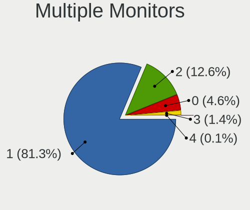

| Total | Computers | Percent |
|-------|-----------|---------|
| 1     | 1399      | 81.34%  |
| 2     | 216       | 12.56%  |
| 0     | 79        | 4.59%   |
| 3     | 24        | 1.4%    |
| 4     | 2         | 0.12%   |

Network
-------

Net Controller Vendor
---------------------

Controller vendors

| Vendor                                | Computers | Percent |
|---------------------------------------|-----------|---------|
| Realtek Semiconductor                 | 963       | 38.72%  |
| Intel                                 | 683       | 27.46%  |
| Qualcomm Atheros                      | 272       | 10.94%  |
| Broadcom                              | 135       | 5.43%   |
| TP-Link                               | 63        | 2.53%   |
| Marvell Technology Group              | 51        | 2.05%   |
| MediaTek                              | 47        | 1.89%   |
| Ralink Technology                     | 46        | 1.85%   |
| Broadcom Limited                      | 31        | 1.25%   |
| Ralink                                | 28        | 1.13%   |
| Nvidia                                | 24        | 0.97%   |
| Xiaomi                                | 13        | 0.52%   |
| Qualcomm Atheros Communications       | 13        | 0.52%   |
| ASIX Electronics                      | 10        | 0.4%    |
| VIA Technologies                      | 8         | 0.32%   |
| D-Link                                | 8         | 0.32%   |
| Sierra Wireless                       | 7         | 0.28%   |
| NetGear                               | 5         | 0.2%    |
| Ericsson Business Mobile Networks     | 5         | 0.2%    |
| Dell                                  | 5         | 0.2%    |
| Samsung Electronics                   | 4         | 0.16%   |
| Microsoft                             | 4         | 0.16%   |
| JMicron Technology                    | 4         | 0.16%   |
| Huawei Technologies                   | 4         | 0.16%   |
| ASUSTek Computer                      | 4         | 0.16%   |
| Silicon Integrated Systems [SiS]      | 3         | 0.12%   |
| Hewlett-Packard                       | 3         | 0.12%   |
| DisplayLink                           | 3         | 0.12%   |
| Belkin Components                     | 3         | 0.12%   |
| Qualcomm                              | 2         | 0.08%   |
| Motorola                              | 2         | 0.08%   |
| Lenovo                                | 2         | 0.08%   |
| IBM                                   | 2         | 0.08%   |
| Fujitsu Siemens Computers             | 2         | 0.08%   |
| Edimax Technology                     | 2         | 0.08%   |
| D-Link System                         | 2         | 0.08%   |
| Apple                                 | 2         | 0.08%   |
| 802.11g Adapter [Linksys WUSB54GC v3] | 2         | 0.08%   |
| ZyDAS                                 | 1         | 0.04%   |
| U-Blox                                | 1         | 0.04%   |

Net Controller Model
--------------------

Controller models

| Model                                                                   | Computers | Percent |
|-------------------------------------------------------------------------|-----------|---------|
| Realtek RTL8111/8168/8211/8411 PCI Express Gigabit Ethernet Controller  | 605       | 21.01%  |
| Realtek RTL810xE PCI Express Fast Ethernet controller                   | 157       | 5.45%   |
| Intel 82579LM Gigabit Network Connection (Lewisville)                   | 66        | 2.29%   |
| Intel Wi-Fi 6 AX200                                                     | 49        | 1.7%    |
| Qualcomm Atheros QCA9377 802.11ac Wireless Network Adapter              | 46        | 1.6%    |
| Intel Wireless 8265 / 8275                                              | 45        | 1.56%   |
| Intel I211 Gigabit Network Connection                                   | 45        | 1.56%   |
| Realtek RTL8822CE 802.11ac PCIe Wireless Network Adapter                | 43        | 1.49%   |
| Realtek RTL8821CE 802.11ac PCIe Wireless Network Adapter                | 43        | 1.49%   |
| Realtek RTL8125 2.5GbE Controller                                       | 40        | 1.39%   |
| Qualcomm Atheros QCA9565 / AR9565 Wireless Network Adapter              | 38        | 1.32%   |
| Realtek RTL8723BE PCIe Wireless Network Adapter                         | 35        | 1.22%   |
| Qualcomm Atheros AR9485 Wireless Network Adapter                        | 35        | 1.22%   |
| Intel Wi-Fi 6 AX201                                                     | 33        | 1.15%   |
| Intel Wireless 3165                                                     | 27        | 0.94%   |
| Realtek RTL8153 Gigabit Ethernet Adapter                                | 26        | 0.9%    |
| Intel Wireless 7260                                                     | 25        | 0.87%   |
| Intel Wireless 7265                                                     | 24        | 0.83%   |
| Broadcom BCM43142 802.11b/g/n                                           | 24        | 0.83%   |
| Realtek RTL8188EUS 802.11n Wireless Network Adapter                     | 23        | 0.8%    |
| Intel Ethernet Connection I217-LM                                       | 23        | 0.8%    |
| Qualcomm Atheros AR9285 Wireless Network Adapter (PCI-Express)          | 22        | 0.76%   |
| Realtek RTL-8100/8101L/8139 PCI Fast Ethernet Adapter                   | 20        | 0.69%   |
| Intel PRO/Wireless 3945ABG [Golan] Network Connection                   | 20        | 0.69%   |
| Intel Centrino Advanced-N 6205 [Taylor Peak]                            | 18        | 0.63%   |
| Qualcomm Atheros QCA6174 802.11ac Wireless Network Adapter              | 17        | 0.59%   |
| Qualcomm Atheros AR242x / AR542x Wireless Network Adapter (PCI-Express) | 17        | 0.59%   |
| Intel Ethernet Connection (2) I219-V                                    | 17        | 0.59%   |
| Ralink RT2870/RT3070 Wireless Adapter                                   | 16        | 0.56%   |
| TP-Link TL-WN722N v2/v3 [Realtek RTL8188EUS]                            | 15        | 0.52%   |
| MediaTek MT7921 802.11ax PCI Express Wireless Network Adapter           | 15        | 0.52%   |
| Intel Wireless 3160                                                     | 15        | 0.52%   |
| Intel Ethernet Connection (4) I219-LM                                   | 15        | 0.52%   |
| Qualcomm Atheros AR8151 v2.0 Gigabit Ethernet                           | 14        | 0.49%   |
| Intel Wireless 8260                                                     | 14        | 0.49%   |
| Intel Ethernet Controller I225-V                                        | 14        | 0.49%   |
| Intel Alder Lake-P PCH CNVi WiFi                                        | 14        | 0.49%   |
| Intel Wi-Fi 5(802.11ac) Wireless-AC 9x6x [Thunder Peak]                 | 13        | 0.45%   |
| Intel Comet Lake PCH-LP CNVi WiFi                                       | 13        | 0.45%   |
| Broadcom BCM4312 802.11b/g LP-PHY                                       | 13        | 0.45%   |

Wireless Vendor
---------------

Wireless vendors

| Vendor                                | Computers | Percent |
|---------------------------------------|-----------|---------|
| Intel                                 | 482       | 37.42%  |
| Realtek Semiconductor                 | 267       | 20.73%  |
| Qualcomm Atheros                      | 208       | 16.15%  |
| Broadcom                              | 87        | 6.75%   |
| TP-Link                               | 57        | 4.43%   |
| Ralink Technology                     | 46        | 3.57%   |
| MediaTek                              | 37        | 2.87%   |
| Ralink                                | 28        | 2.17%   |
| Qualcomm Atheros Communications       | 13        | 1.01%   |
| Broadcom Limited                      | 13        | 1.01%   |
| D-Link                                | 8         | 0.62%   |
| Sierra Wireless                       | 7         | 0.54%   |
| NetGear                               | 5         | 0.39%   |
| Microsoft                             | 4         | 0.31%   |
| ASUSTek Computer                      | 4         | 0.31%   |
| Belkin Components                     | 3         | 0.23%   |
| Hewlett-Packard                       | 2         | 0.16%   |
| Fujitsu Siemens Computers             | 2         | 0.16%   |
| Edimax Technology                     | 2         | 0.16%   |
| Dell                                  | 2         | 0.16%   |
| 802.11g Adapter [Linksys WUSB54GC v3] | 2         | 0.16%   |
| ZyDAS                                 | 1         | 0.08%   |
| Sitecom Europe                        | 1         | 0.08%   |
| Qualcomm                              | 1         | 0.08%   |
| Philips (or NXP)                      | 1         | 0.08%   |
| Ovislink                              | 1         | 0.08%   |
| Micro Star International              | 1         | 0.08%   |
| Linksys                               | 1         | 0.08%   |
| InProComm                             | 1         | 0.08%   |
| Accton Technology                     | 1         | 0.08%   |

Wireless Model
--------------

Wireless models

| Model                                                                   | Computers | Percent |
|-------------------------------------------------------------------------|-----------|---------|
| Intel Wi-Fi 6 AX200                                                     | 49        | 3.78%   |
| Qualcomm Atheros QCA9377 802.11ac Wireless Network Adapter              | 46        | 3.55%   |
| Intel Wireless 8265 / 8275                                              | 45        | 3.47%   |
| Realtek RTL8822CE 802.11ac PCIe Wireless Network Adapter                | 43        | 3.32%   |
| Realtek RTL8821CE 802.11ac PCIe Wireless Network Adapter                | 43        | 3.32%   |
| Qualcomm Atheros QCA9565 / AR9565 Wireless Network Adapter              | 38        | 2.93%   |
| Realtek RTL8723BE PCIe Wireless Network Adapter                         | 35        | 2.7%    |
| Qualcomm Atheros AR9485 Wireless Network Adapter                        | 35        | 2.7%    |
| Intel Wi-Fi 6 AX201                                                     | 33        | 2.54%   |
| Intel Wireless 3165                                                     | 27        | 2.08%   |
| Intel Wireless 7260                                                     | 25        | 1.93%   |
| Intel Wireless 7265                                                     | 24        | 1.85%   |
| Broadcom BCM43142 802.11b/g/n                                           | 24        | 1.85%   |
| Realtek RTL8188EUS 802.11n Wireless Network Adapter                     | 23        | 1.77%   |
| Qualcomm Atheros AR9285 Wireless Network Adapter (PCI-Express)          | 22        | 1.7%    |
| Intel PRO/Wireless 3945ABG [Golan] Network Connection                   | 20        | 1.54%   |
| Intel Centrino Advanced-N 6205 [Taylor Peak]                            | 18        | 1.39%   |
| Qualcomm Atheros QCA6174 802.11ac Wireless Network Adapter              | 17        | 1.31%   |
| Qualcomm Atheros AR242x / AR542x Wireless Network Adapter (PCI-Express) | 17        | 1.31%   |
| Ralink RT2870/RT3070 Wireless Adapter                                   | 16        | 1.23%   |
| TP-Link TL-WN722N v2/v3 [Realtek RTL8188EUS]                            | 15        | 1.16%   |
| MediaTek MT7921 802.11ax PCI Express Wireless Network Adapter           | 15        | 1.16%   |
| Intel Wireless 3160                                                     | 15        | 1.16%   |
| Intel Wireless 8260                                                     | 14        | 1.08%   |
| Intel Alder Lake-P PCH CNVi WiFi                                        | 14        | 1.08%   |
| Intel Wi-Fi 5(802.11ac) Wireless-AC 9x6x [Thunder Peak]                 | 13        | 1%      |
| Intel Comet Lake PCH-LP CNVi WiFi                                       | 13        | 1%      |
| Broadcom BCM4312 802.11b/g LP-PHY                                       | 13        | 1%      |
| TP-Link TL-WN823N v2/v3 [Realtek RTL8192EU]                             | 12        | 0.93%   |
| Realtek RTL8723AE PCIe Wireless Network Adapter                         | 12        | 0.93%   |
| Intel PRO/Wireless 4965 AG or AGN [Kedron] Network Connection           | 12        | 0.93%   |
| Intel Dual Band Wireless-AC 3168NGW [Stone Peak]                        | 12        | 0.93%   |
| Intel Centrino Wireless-N 2230                                          | 12        | 0.93%   |
| Realtek RTL8822BE 802.11a/b/g/n/ac WiFi adapter                         | 11        | 0.85%   |
| Ralink MT7601U Wireless Adapter                                         | 11        | 0.85%   |
| MediaTek Wi-Fi 6E MT7902 Wireless Network Adapter                       | 11        | 0.85%   |
| Intel WiFi Link 5100                                                    | 11        | 0.85%   |
| Intel Centrino Advanced-N 6200                                          | 11        | 0.85%   |
| Qualcomm Atheros AR9271 802.11n                                         | 10        | 0.77%   |
| Intel Ultimate N WiFi Link 5300                                         | 10        | 0.77%   |

Ethernet Vendor
---------------

Ethernet vendors

| Vendor                                 | Computers | Percent |
|----------------------------------------|-----------|---------|
| Realtek Semiconductor                  | 862       | 56.56%  |
| Intel                                  | 348       | 22.83%  |
| Qualcomm Atheros                       | 86        | 5.64%   |
| Broadcom                               | 61        | 4%      |
| Marvell Technology Group               | 51        | 3.35%   |
| Nvidia                                 | 24        | 1.57%   |
| Broadcom Limited                       | 21        | 1.38%   |
| Xiaomi                                 | 13        | 0.85%   |
| ASIX Electronics                       | 10        | 0.66%   |
| MediaTek                               | 9         | 0.59%   |
| VIA Technologies                       | 7         | 0.46%   |
| TP-Link                                | 6         | 0.39%   |
| JMicron Technology                     | 4         | 0.26%   |
| Silicon Integrated Systems [SiS]       | 3         | 0.2%    |
| DisplayLink                            | 3         | 0.2%    |
| Samsung Electronics                    | 2         | 0.13%   |
| Lenovo                                 | 2         | 0.13%   |
| Huawei Technologies                    | 2         | 0.13%   |
| D-Link System                          | 2         | 0.13%   |
| Apple                                  | 2         | 0.13%   |
| Suzhou Motorcomm Electronic Technology | 1         | 0.07%   |
| Sundance Technology Inc / IC Plus      | 1         | 0.07%   |
| Qualcomm                               | 1         | 0.07%   |
| IBM                                    | 1         | 0.07%   |
| Attansic Technology                    | 1         | 0.07%   |
| Aquantia                               | 1         | 0.07%   |

Ethernet Model
--------------

Ethernet models

| Model                                                                  | Computers | Percent |
|------------------------------------------------------------------------|-----------|---------|
| Realtek RTL8111/8168/8211/8411 PCI Express Gigabit Ethernet Controller | 605       | 39.01%  |
| Realtek RTL810xE PCI Express Fast Ethernet controller                  | 157       | 10.12%  |
| Intel 82579LM Gigabit Network Connection (Lewisville)                  | 66        | 4.26%   |
| Intel I211 Gigabit Network Connection                                  | 45        | 2.9%    |
| Realtek RTL8125 2.5GbE Controller                                      | 40        | 2.58%   |
| Realtek RTL8153 Gigabit Ethernet Adapter                               | 26        | 1.68%   |
| Intel Ethernet Connection I217-LM                                      | 23        | 1.48%   |
| Realtek RTL-8100/8101L/8139 PCI Fast Ethernet Adapter                  | 20        | 1.29%   |
| Intel Ethernet Connection (2) I219-V                                   | 17        | 1.1%    |
| Intel Ethernet Connection (4) I219-LM                                  | 15        | 0.97%   |
| Qualcomm Atheros AR8151 v2.0 Gigabit Ethernet                          | 14        | 0.9%    |
| Intel Ethernet Controller I225-V                                       | 14        | 0.9%    |
| Xiaomi Mi/Redmi series (RNDIS)                                         | 12        | 0.77%   |
| Intel 82567LM-3 Gigabit Network Connection                             | 12        | 0.77%   |
| Realtek RTL8169 PCI Gigabit Ethernet Controller                        | 11        | 0.71%   |
| Intel Ethernet Connection (2) I218-V                                   | 11        | 0.71%   |
| Qualcomm Atheros QCA8172 Fast Ethernet                                 | 10        | 0.64%   |
| Qualcomm Atheros AR8161 Gigabit Ethernet                               | 9         | 0.58%   |
| Intel Ethernet Connection (2) I219-LM                                  | 9         | 0.58%   |
| ASIX AX88179 Gigabit Ethernet                                          | 9         | 0.58%   |
| Qualcomm Atheros AR8121/AR8113/AR8114 Gigabit or Fast Ethernet         | 8         | 0.52%   |
| Marvell Group 88E8056 PCI-E Gigabit Ethernet Controller                | 8         | 0.52%   |
| Intel Ethernet Connection I219-LM                                      | 8         | 0.52%   |
| Intel Ethernet Connection I217-V                                       | 8         | 0.52%   |
| Broadcom NetXtreme BCM5751 Gigabit Ethernet PCI Express                | 8         | 0.52%   |
| Qualcomm Atheros Killer E220x Gigabit Ethernet Controller              | 7         | 0.45%   |
| MediaTek MT7922 802.11ax PCI Express Wireless Network Adapter          | 7         | 0.45%   |
| Marvell Group 88E8055 PCI-E Gigabit Ethernet Controller                | 7         | 0.45%   |
| Intel Ethernet Connection I218-LM                                      | 7         | 0.45%   |
| Intel 82577LM Gigabit Network Connection                               | 7         | 0.45%   |
| Broadcom NetLink BCM57785 Gigabit Ethernet PCIe                        | 7         | 0.45%   |
| Realtek RTL8152 Fast Ethernet Adapter                                  | 6         | 0.39%   |
| Qualcomm Atheros QCA8171 Gigabit Ethernet                              | 6         | 0.39%   |
| Qualcomm Atheros AR8132 Fast Ethernet                                  | 6         | 0.39%   |
| Nvidia MCP79 Ethernet                                                  | 6         | 0.39%   |
| Marvell Group 88E8053 PCI-E Gigabit Ethernet Controller                | 6         | 0.39%   |
| Intel Ethernet Connection (4) I219-V                                   | 6         | 0.39%   |
| Intel Ethernet Connection (3) I218-LM                                  | 6         | 0.39%   |
| Intel Ethernet Connection (17) I219-LM                                 | 6         | 0.39%   |
| Intel Ethernet Connection (13) I219-LM                                 | 6         | 0.39%   |

Net Controller Kind
-------------------

Ethernet, WiFi or modem

| Kind     | Computers | Percent |
|----------|-----------|---------|
| Ethernet | 1459      | 54.2%   |
| WiFi     | 1202      | 44.65%  |
| Modem    | 30        | 1.11%   |
| Unknown  | 1         | 0.04%   |

Used Controller
---------------

Currently used network controller

| Kind     | Computers | Percent |
|----------|-----------|---------|
| WiFi     | 942       | 54.45%  |
| Ethernet | 788       | 45.55%  |

NICs
----

Total network controllers on board

| Total | Computers | Percent |
|-------|-----------|---------|
| 2     | 848       | 50.54%  |
| 1     | 759       | 45.23%  |
| 0     | 34        | 2.03%   |
| 3     | 28        | 1.67%   |
| 4     | 8         | 0.48%   |
| 8     | 1         | 0.06%   |

IPv6
----

IPv6 vs IPv4

| Used | Computers | Percent |
|------|-----------|---------|
| No   | 1167      | 67.38%  |
| Yes  | 565       | 32.62%  |

Bluetooth
---------

Bluetooth Vendor
----------------

Controller vendors

| Vendor                          | Computers | Percent |
|---------------------------------|-----------|---------|
| Intel                           | 351       | 37.06%  |
| Realtek Semiconductor           | 135       | 14.26%  |
| Qualcomm Atheros Communications | 92        | 9.71%   |
| Cambridge Silicon Radio         | 64        | 6.76%   |
| IMC Networks                    | 50        | 5.28%   |
| Broadcom                        | 50        | 5.28%   |
| Foxconn / Hon Hai               | 42        | 4.44%   |
| Toshiba                         | 21        | 2.22%   |
| Apple                           | 21        | 2.22%   |
| Hewlett-Packard                 | 19        | 2.01%   |
| Lite-On Technology              | 17        | 1.8%    |
| ASUSTek Computer                | 10        | 1.06%   |
| TP-Link                         | 9         | 0.95%   |
| Realtek                         | 9         | 0.95%   |
| Ralink                          | 9         | 0.95%   |
| Alps Electric                   | 7         | 0.74%   |
| Foxconn International           | 6         | 0.63%   |
| Dell                            | 6         | 0.63%   |
| Ralink Technology               | 5         | 0.53%   |
| MediaTek                        | 4         | 0.42%   |
| Askey Computer                  | 4         | 0.42%   |
| Mobile Action Technology        | 2         | 0.21%   |
| Micro Star International        | 2         | 0.21%   |
| Chicony Electronics             | 2         | 0.21%   |
| Actions                         | 2         | 0.21%   |
| Unknown                         | 2         | 0.21%   |
| Syntek                          | 1         | 0.11%   |
| SiW                             | 1         | 0.11%   |
| Primax Electronics              | 1         | 0.11%   |
| Integrated System Solution      | 1         | 0.11%   |
| Edimax Technology               | 1         | 0.11%   |
| Belkin Components               | 1         | 0.11%   |

Bluetooth Model
---------------

Controller models

| Model                                               | Computers | Percent |
|-----------------------------------------------------|-----------|---------|
| Intel Bluetooth wireless interface                  | 139       | 14.68%  |
| Realtek Bluetooth Radio                             | 64        | 6.76%   |
| Cambridge Silicon Radio Bluetooth Dongle (HCI mode) | 64        | 6.76%   |
| Intel AX201 Bluetooth                               | 59        | 6.23%   |
| Intel AX200 Bluetooth                               | 46        | 4.86%   |
| Qualcomm Atheros  Bluetooth Device                  | 42        | 4.44%   |
| Intel Bluetooth 9460/9560 Jefferson Peak (JfP)      | 41        | 4.33%   |
| Realtek  Bluetooth 4.2 Adapter                      | 29        | 3.06%   |
| Intel AX211 Bluetooth                               | 19        | 2.01%   |
| Realtek 802.11ac WLAN Adapter                       | 17        | 1.8%    |
| IMC Networks Wireless_Device                        | 17        | 1.8%    |
| IMC Networks Bluetooth Radio                        | 17        | 1.8%    |
| Realtek RTL8723B Bluetooth                          | 14        | 1.48%   |
| Intel Wireless-AC 9260 Bluetooth Adapter            | 13        | 1.37%   |
| Intel Wireless-AC 3168 Bluetooth                    | 12        | 1.27%   |
| Intel Centrino Bluetooth Wireless Transceiver       | 12        | 1.27%   |
| Qualcomm Atheros AR9462 Bluetooth                   | 11        | 1.16%   |
| Qualcomm Atheros AR3012 Bluetooth 4.0               | 11        | 1.16%   |
| Qualcomm Atheros AR3011 Bluetooth                   | 11        | 1.16%   |
| Apple Bluetooth Host Controller                     | 11        | 1.16%   |
| Qualcomm Atheros QCA61x4 Bluetooth 4.0              | 10        | 1.06%   |
| Lite-On Qualcomm Atheros QCA9377 Bluetooth          | 10        | 1.06%   |
| TP-Link TP-Link Bluetooth USB Adapter               | 9         | 0.95%   |
| Realtek Bluetooth Radio                             | 9         | 0.95%   |
| Ralink RT3290 Bluetooth                             | 9         | 0.95%   |
| HP Broadcom 2070 Bluetooth Combo                    | 9         | 0.95%   |
| HP Bluetooth 2.0 Interface [Broadcom BCM2045]       | 9         | 0.95%   |
| IMC Networks Bluetooth Device                       | 8         | 0.84%   |
| Foxconn / Hon Hai Wireless_Device                   | 7         | 0.74%   |
| Foxconn / Hon Hai MediaTek Bluetooth Adapter        | 7         | 0.74%   |
| Broadcom BCM2045B (BDC-2.1)                         | 7         | 0.74%   |
| Toshiba RT Bluetooth Radio                          | 6         | 0.63%   |
| Toshiba Bluetooth Device                            | 6         | 0.63%   |
| Realtek RTL8822BE Bluetooth 4.2 Adapter             | 6         | 0.63%   |
| Foxconn International BCM43142A0 Bluetooth module   | 6         | 0.63%   |
| Foxconn / Hon Hai Bluetooth USB Host Controller     | 6         | 0.63%   |
| Broadcom BCM43142 Bluetooth 4.0                     | 6         | 0.63%   |
| Qualcomm Atheros Bluetooth                          | 5         | 0.53%   |
| Lite-On Bluetooth Device                            | 5         | 0.53%   |
| Intel AX210 Bluetooth                               | 5         | 0.53%   |

Sound
-----

Sound Vendor
------------

Sound card vendors

| Vendor                                       | Computers | Percent |
|----------------------------------------------|-----------|---------|
| Intel                                        | 1118      | 49.51%  |
| AMD                                          | 569       | 25.2%   |
| Nvidia                                       | 361       | 15.99%  |
| C-Media Electronics                          | 34        | 1.51%   |
| Creative Technology                          | 16        | 0.71%   |
| Creative Labs                                | 16        | 0.71%   |
| Logitech                                     | 14        | 0.62%   |
| Razer USA                                    | 10        | 0.44%   |
| GN Netcom                                    | 9         | 0.4%    |
| Barco Display Systems                        | 7         | 0.31%   |
| VIA Technologies                             | 6         | 0.27%   |
| Texas Instruments                            | 6         | 0.27%   |
| Kingston Technology                          | 6         | 0.27%   |
| Lenovo                                       | 5         | 0.22%   |
| Focusrite-Novation                           | 5         | 0.22%   |
| BEHRINGER International                      | 5         | 0.22%   |
| ASUSTek Computer                             | 4         | 0.18%   |
| Yamaha                                       | 3         | 0.13%   |
| Silicon Integrated Systems [SiS]             | 3         | 0.13%   |
| Hewlett-Packard                              | 3         | 0.13%   |
| Generalplus Technology                       | 3         | 0.13%   |
| Dell                                         | 3         | 0.13%   |
| Cooler Master                                | 3         | 0.13%   |
| Trust                                        | 2         | 0.09%   |
| Realtek Semiconductor                        | 2         | 0.09%   |
| Plantronics                                  | 2         | 0.09%   |
| Nordic Semiconductor ASA                     | 2         | 0.09%   |
| Native Instruments                           | 2         | 0.09%   |
| JMTek                                        | 2         | 0.09%   |
| Guillemot                                    | 2         | 0.09%   |
| Ensoniq                                      | 2         | 0.09%   |
| Edifier Technology                           | 2         | 0.09%   |
| AudioQuest                                   | 2         | 0.09%   |
| Altec Lansing Technologies                   | 2         | 0.09%   |
| Zoran Co. Personal Media Division (Nogatech) | 1         | 0.04%   |
| TerraTec Electronic                          | 1         | 0.04%   |
| Tenx Technology                              | 1         | 0.04%   |
| SteelSeries ApS                              | 1         | 0.04%   |
| Sony                                         | 1         | 0.04%   |
| Shenzhen Riitek Technology                   | 1         | 0.04%   |

Sound Model
-----------

Sound card models

| Model                                                                      | Computers | Percent |
|----------------------------------------------------------------------------|-----------|---------|
| AMD Family 17h/19h/1ah HD Audio Controller                                 | 207       | 7.49%   |
| Intel 7 Series/C216 Chipset Family High Definition Audio Controller        | 104       | 3.76%   |
| Intel 6 Series/C200 Series Chipset Family High Definition Audio Controller | 99        | 3.58%   |
| Intel Sunrise Point-LP HD Audio                                            | 95        | 3.44%   |
| AMD Renoir Radeon High Definition Audio Controller                         | 90        | 3.26%   |
| AMD Raven/Raven2/Fenghuang HDMI/DP Audio Controller                        | 82        | 2.97%   |
| Intel NM10/ICH7 Family High Definition Audio Controller                    | 81        | 2.93%   |
| Intel 8 Series/C220 Series Chipset High Definition Audio Controller        | 80        | 2.9%    |
| Intel 82801I (ICH9 Family) HD Audio Controller                             | 70        | 2.53%   |
| AMD SBx00 Azalia (Intel HDA)                                               | 70        | 2.53%   |
| Intel Xeon E3-1200 v3/4th Gen Core Processor HD Audio Controller           | 65        | 2.35%   |
| AMD FCH Azalia Controller                                                  | 52        | 1.88%   |
| AMD Starship/Matisse HD Audio Controller                                   | 50        | 1.81%   |
| Intel 5 Series/3400 Series Chipset High Definition Audio                   | 49        | 1.77%   |
| AMD Family 17h (Models 00h-0fh) HD Audio Controller                        | 48        | 1.74%   |
| Nvidia GK208 HDMI/DP Audio Controller                                      | 47        | 1.7%    |
| Intel 82801H (ICH8 Family) HD Audio Controller                             | 44        | 1.59%   |
| Intel 100 Series/C230 Series Chipset Family HD Audio Controller            | 42        | 1.52%   |
| Intel Tiger Lake-LP Smart Sound Technology Audio Controller                | 37        | 1.34%   |
| Intel Haswell-ULT HD Audio Controller                                      | 37        | 1.34%   |
| Intel 8 Series HD Audio Controller                                         | 37        | 1.34%   |
| Nvidia GP107GL High Definition Audio Controller                            | 34        | 1.23%   |
| Intel Cannon Lake PCH cAVS                                                 | 32        | 1.16%   |
| Nvidia High Definition Audio Controller                                    | 27        | 0.98%   |
| Intel 200 Series PCH HD Audio                                              | 27        | 0.98%   |
| AMD Kabini HDMI/DP Audio                                                   | 27        | 0.98%   |
| Intel Broadwell-U Audio Controller                                         | 26        | 0.94%   |
| Intel Wildcat Point-LP High Definition Audio Controller                    | 25        | 0.9%    |
| AMD Rembrandt Radeon High Definition Audio Controller                      | 25        | 0.9%    |
| AMD Family 15h (Models 60h-6fh) Audio Controller                           | 25        | 0.9%    |
| AMD Ellesmere HDMI Audio [Radeon RX 470/480 / 570/580/590]                 | 25        | 0.9%    |
| Nvidia GF108 High Definition Audio Controller                              | 24        | 0.87%   |
| Intel Atom Processor Z36xxx/Z37xxx Series High Definition Audio Controller | 23        | 0.83%   |
| AMD Oland/Hainan/Cape Verde/Pitcairn HDMI Audio [Radeon HD 7000 Series]    | 22        | 0.8%    |
| Nvidia TU116 High Definition Audio Controller                              | 21        | 0.76%   |
| Intel 82801JI (ICH10 Family) HD Audio Controller                           | 21        | 0.76%   |
| AMD Navi 21/23 HDMI/DP Audio Controller                                    | 21        | 0.76%   |
| Intel Comet Lake PCH-LP cAVS                                               | 20        | 0.72%   |
| Intel Alder Lake PCH-P High Definition Audio Controller                    | 19        | 0.69%   |
| Intel Celeron N3350/Pentium N4200/Atom E3900 Series Audio Cluster          | 17        | 0.62%   |

Memory
------

Memory Vendor
-------------

Memory module vendors

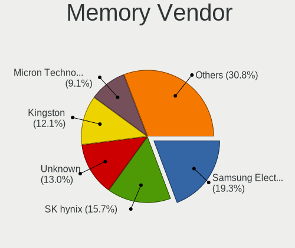

| Vendor              | Computers | Percent |
|---------------------|-----------|---------|
| Samsung Electronics | 182       | 19.28%  |
| SK hynix            | 148       | 15.68%  |
| Unknown             | 123       | 13.03%  |
| Kingston            | 114       | 12.08%  |
| Micron Technology   | 86        | 9.11%   |
| G.Skill             | 66        | 6.99%   |
| Corsair             | 61        | 6.46%   |
| Crucial             | 48        | 5.08%   |
| Ramaxel Technology  | 14        | 1.48%   |
| Transcend           | 13        | 1.38%   |
| Elpida              | 12        | 1.27%   |
| Team                | 10        | 1.06%   |
| Unknown             | 10        | 1.06%   |
| Patriot             | 9         | 0.95%   |
| Nanya Technology    | 8         | 0.85%   |
| Unknown (ABCD)      | 6         | 0.64%   |
| A-DATA Technology   | 6         | 0.64%   |
| GOODRAM             | 4         | 0.42%   |
| Apacer              | 4         | 0.42%   |
| GeIL                | 2         | 0.21%   |
| Avant               | 2         | 0.21%   |
| Veineda             | 1         | 0.11%   |
| Unknown (0x8945)    | 1         | 0.11%   |
| Unknown (0x0E9D)    | 1         | 0.11%   |
| Toshiba             | 1         | 0.11%   |
| Silicon Power       | 1         | 0.11%   |
| SHARETRONIC         | 1         | 0.11%   |
| Qimonda             | 1         | 0.11%   |
| Patriot Memory      | 1         | 0.11%   |
| Lexar               | 1         | 0.11%   |
| Infineon            | 1         | 0.11%   |
| HMD                 | 1         | 0.11%   |
| Hikvision           | 1         | 0.11%   |
| H                   | 1         | 0.11%   |
| Goldkey             | 1         | 0.11%   |
| ff                  | 1         | 0.11%   |
| 4ea5                | 1         | 0.11%   |

Memory Model
------------

Memory module models

| Model                                                            | Computers | Percent |
|------------------------------------------------------------------|-----------|---------|
| G.Skill RAM F4-3200C16-8GVKB 8GB DIMM DDR4 4000MT/s              | 13        | 1.26%   |
| Samsung RAM M471A5244CB0-CTD 4GB SODIMM DDR4 3266MT/s            | 12        | 1.17%   |
| Samsung RAM M471B5173EB0-YK0 4GB SODIMM DDR3 1600MT/s            | 11        | 1.07%   |
| Samsung RAM M471A1G44AB0-CWE 8GB SODIMM DDR4 3200MT/s            | 11        | 1.07%   |
| Unknown                                                          | 10        | 0.97%   |
| Samsung RAM M471B5173QH0-YK0 4GB SODIMM DDR3 1600MT/s            | 8         | 0.78%   |
| SK hynix RAM HMT451S6BFR8A-PB 4GB SODIMM DDR3 1600MT/s           | 7         | 0.68%   |
| SK hynix RAM HMAA1GS6CJR6N-XN 8GB SODIMM DDR4 3200MT/s           | 7         | 0.68%   |
| G.Skill RAM F4-3000C16-8GISB 8GB DIMM DDR4 3200MT/s              | 7         | 0.68%   |
| Unknown RAM Module 4GB SODIMM DDR3                               | 6         | 0.58%   |
| Unknown RAM Module 4GB DIMM 1333MT/s                             | 6         | 0.58%   |
| Unknown RAM Module 2GB DIMM 800MT/s                              | 6         | 0.58%   |
| Unknown (ABCD) RAM 123456789012345678 2GB SODIMM LPDDR3 2400MT/s | 6         | 0.58%   |
| Samsung RAM M471B5273CH0-CH9 4GB SODIMM DDR3 1334MT/s            | 6         | 0.58%   |
| Samsung RAM M471A1G44BB0-CWE 8GB SODIMM DDR4 3200MT/s            | 6         | 0.58%   |
| Unknown RAM Module 2GB SODIMM DDR2 667MT/s                       | 5         | 0.49%   |
| Unknown RAM Module 2GB DIMM 1333MT/s                             | 5         | 0.49%   |
| Unknown RAM Module 1024MB DIMM SDRAM                             | 5         | 0.49%   |
| SK hynix RAM HMT451S6BFR8A-PB 4096MB SODIMM DDR3 1600MT/s        | 5         | 0.49%   |
| SK hynix RAM HMA81GS6JJR8N-VK 8GB SODIMM DDR4 2667MT/s           | 5         | 0.49%   |
| SK hynix RAM HMA81GS6DJR8N-XN 8GB SODIMM DDR4 3200MT/s           | 5         | 0.49%   |
| SK hynix RAM HMA81GS6AFR8N-UH 8GB SODIMM DDR4 2667MT/s           | 5         | 0.49%   |
| Samsung RAM M471A1K43DB1-CTD 8GB SODIMM DDR4 2667MT/s            | 5         | 0.49%   |
| Micron RAM 4ATF51264HZ-3G2J1 4GB SODIMM DDR4 3200MT/s            | 5         | 0.49%   |
| Unknown RAM Module 2048MB DIMM DDR2 800MT/s                      | 4         | 0.39%   |
| Unknown RAM Module 2048MB DIMM DDR 533MT/s                       | 4         | 0.39%   |
| Unknown RAM Module 1GB SODIMM DDR2                               | 4         | 0.39%   |
| SK hynix RAM HMT451S6MFR8C-PB 4GB SODIMM DDR3 1600MT/s           | 4         | 0.39%   |
| SK hynix RAM HMT41GS6BFR8A-PB 8GB SODIMM DDR3 1600MT/s           | 4         | 0.39%   |
| SK hynix RAM HMAA2GS6CJR8N-XN 16GB SODIMM DDR4 3200MT/s          | 4         | 0.39%   |
| SK hynix RAM HMA81GS6CJR8N-XN 8GB SODIMM DDR4 3200MT/s           | 4         | 0.39%   |
| SK hynix RAM HMA81GS6CJR8N-VK 8GB SODIMM DDR4 2667MT/s           | 4         | 0.39%   |
| Samsung RAM M471B5273CH0-CK0 4GB SODIMM DDR3 1600MT/s            | 4         | 0.39%   |
| Samsung RAM M471B5173DB0-YK0 4GB SODIMM DDR3 1600MT/s            | 4         | 0.39%   |
| Samsung RAM M471A5244CB0-CRC 4GB SODIMM DDR4 2667MT/s            | 4         | 0.39%   |
| Samsung RAM M471A1K43EB1-CWE 8GB SODIMM DDR4 3200MT/s            | 4         | 0.39%   |
| Samsung RAM M471A1G44AB0-CWE 8GB Row Of Chips DDR4 3200MT/s      | 4         | 0.39%   |
| Micron RAM 4ATF51264HZ-3G2J1 4GB Row Of Chips DDR4 3200MT/s      | 4         | 0.39%   |
| Micron RAM 4ATF1G64HZ-3G2E1 8GB Row Of Chips DDR4 3200MT/s       | 4         | 0.39%   |
| G.Skill RAM F4-3200C16-16GVK 16GB DIMM DDR4 3600MT/s             | 4         | 0.39%   |

Memory Kind
-----------

Memory module kinds

| Kind    | Computers | Percent |
|---------|-----------|---------|
| DDR4    | 346       | 42.14%  |
| DDR3    | 258       | 31.43%  |
| DDR2    | 51        | 6.21%   |
| Unknown | 40        | 4.87%   |
| SDRAM   | 30        | 3.65%   |
| LPDDR4  | 26        | 3.17%   |
| DDR5    | 25        | 3.05%   |
| DDR     | 18        | 2.19%   |
| LPDDR5  | 13        | 1.58%   |
| LPDDR3  | 11        | 1.34%   |
| DRAM    | 3         | 0.37%   |

Memory Form Factor
------------------

Physical design of the memory module

| Name         | Computers | Percent |
|--------------|-----------|---------|
| SODIMM       | 443       | 54.36%  |
| DIMM         | 311       | 38.16%  |
| Row Of Chips | 54        | 6.63%   |
| Chip         | 3         | 0.37%   |
| FB-DIMM      | 2         | 0.25%   |
| Unknown      | 2         | 0.25%   |

Memory Size
-----------

Memory module size

| Size  | Computers | Percent |
|-------|-----------|---------|
| 8192  | 332       | 37.22%  |
| 4096  | 250       | 28.03%  |
| 2048  | 136       | 15.25%  |
| 16384 | 90        | 10.09%  |
| 1024  | 50        | 5.61%   |
| 32768 | 20        | 2.24%   |
| 512   | 10        | 1.12%   |
| 3072  | 2         | 0.22%   |
| 24576 | 1         | 0.11%   |
| 256   | 1         | 0.11%   |

Memory Speed
------------

Memory module speed

| Speed   | Computers | Percent |
|---------|-----------|---------|
| 1600    | 168       | 18.71%  |
| 3200    | 131       | 14.59%  |
| 2667    | 99        | 11.02%  |
| 1333    | 63        | 7.02%   |
| 2400    | 59        | 6.57%   |
| Unknown | 32        | 3.56%   |
| 2133    | 28        | 3.12%   |
| 667     | 27        | 3.01%   |
| 800     | 26        | 2.9%    |
| 3600    | 24        | 2.67%   |
| 1334    | 23        | 2.56%   |
| 4000    | 14        | 1.56%   |
| 1066    | 13        | 1.45%   |
| 3266    | 12        | 1.34%   |
| 1067    | 11        | 1.22%   |
| 6400    | 10        | 1.11%   |
| 5600    | 10        | 1.11%   |
| 1867    | 10        | 1.11%   |
| 533     | 10        | 1.11%   |
| 4800    | 9         | 1%      |
| 3000    | 9         | 1%      |
| 2933    | 9         | 1%      |
| 4267    | 8         | 0.89%   |
| 3800    | 7         | 0.78%   |
| 3400    | 6         | 0.67%   |
| 1800    | 6         | 0.67%   |
| 2048    | 5         | 0.56%   |
| 400     | 5         | 0.56%   |
| 4266    | 4         | 0.45%   |
| 4199    | 4         | 0.45%   |
| 3733    | 4         | 0.45%   |
| 3007    | 4         | 0.45%   |
| 1866    | 4         | 0.45%   |
| 6000    | 3         | 0.33%   |
| 3666    | 3         | 0.33%   |
| 2800    | 3         | 0.33%   |
| 2733    | 3         | 0.33%   |
| 333     | 3         | 0.33%   |
| 49926   | 2         | 0.22%   |
| 7500    | 2         | 0.22%   |

Printers & scanners
-------------------

Printer Vendor
--------------

Printer device vendors

| Vendor                | Computers | Percent |
|-----------------------|-----------|---------|
| Hewlett-Packard       | 40        | 57.14%  |
| Samsung Electronics   | 10        | 14.29%  |
| Canon                 | 10        | 14.29%  |
| Seiko Epson           | 3         | 4.29%   |
| Lexmark International | 2         | 2.86%   |
| Ricoh                 | 1         | 1.43%   |
| QinHeng Electronics   | 1         | 1.43%   |
| Oki Data              | 1         | 1.43%   |
| Konica Minolta        | 1         | 1.43%   |
| Brother Industries    | 1         | 1.43%   |

Printer Model
-------------

Printer device models

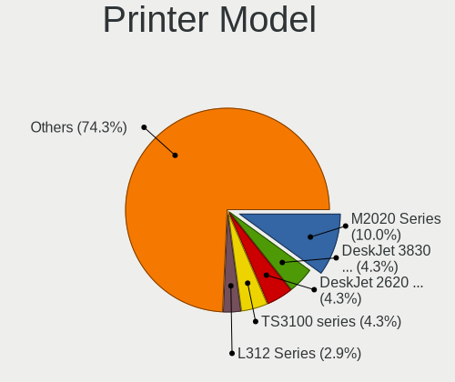

| Model                                        | Computers | Percent |
|----------------------------------------------|-----------|---------|
| Samsung M2020 Series                         | 7         | 10%     |
| HP DeskJet 3830 series                       | 3         | 4.29%   |
| HP DeskJet 2620 All-in-One Printer           | 3         | 4.29%   |
| Canon TS3100 series                          | 3         | 4.29%   |
| Seiko Epson L312 Series                      | 2         | 2.86%   |
| HP Smart Tank 510 series                     | 2         | 2.86%   |
| HP LaserJet P1102                            | 2         | 2.86%   |
| HP LaserJet P1005                            | 2         | 2.86%   |
| Seiko Epson ME 320/330 Series [Stylus SX125] | 1         | 1.43%   |
| Samsung SCX-3400 Series                      | 1         | 1.43%   |
| Samsung M267x 287x Series                    | 1         | 1.43%   |
| Samsung M2070 Series                         | 1         | 1.43%   |
| Ricoh SP 111SU                               | 1         | 1.43%   |
| QinHeng CH340S                               | 1         | 1.43%   |
| Oki Data USB Device                          | 1         | 1.43%   |
| Lexmark International E350d                  | 1         | 1.43%   |
| Lexmark International E120                   | 1         | 1.43%   |
| Konica Minolta magicolor 1680MF scan         | 1         | 1.43%   |
| HP Smart Tank 750 series                     | 1         | 1.43%   |
| HP Smart Tank 580-590 series                 | 1         | 1.43%   |
| HP Officejet Pro L7400                       | 1         | 1.43%   |
| HP OfficeJet Pro 8020 series                 | 1         | 1.43%   |
| HP Officejet J4500 series                    | 1         | 1.43%   |
| HP OfficeJet 6200                            | 1         | 1.43%   |
| HP Officejet 4500 G510g-m                    | 1         | 1.43%   |
| HP LaserJet M109-M112                        | 1         | 1.43%   |
| HP LaserJet 1022                             | 1         | 1.43%   |
| HP LaserJet 1020                             | 1         | 1.43%   |
| HP LaserJet 1018                             | 1         | 1.43%   |
| HP LaserJet 1010                             | 1         | 1.43%   |
| HP HP Laser 107w                             | 1         | 1.43%   |
| HP DeskJet F300 series                       | 1         | 1.43%   |
| HP DeskJet F2492 All-in-One                  | 1         | 1.43%   |
| HP DeskJet D2300                             | 1         | 1.43%   |
| HP DeskJet 930c                              | 1         | 1.43%   |
| HP DeskJet 840c                              | 1         | 1.43%   |
| HP DeskJet 4670 series                       | 1         | 1.43%   |
| HP DeskJet 4530 series                       | 1         | 1.43%   |
| HP DeskJet 4100 series                       | 1         | 1.43%   |
| HP DeskJet 3700 series                       | 1         | 1.43%   |

Scanner Vendor
--------------

Scanner device vendors

| Vendor          | Computers | Percent |
|-----------------|-----------|---------|
| Canon           | 4         | 36.36%  |
| Seiko Epson     | 3         | 27.27%  |
| Hewlett-Packard | 3         | 27.27%  |
| Mustek Systems  | 1         | 9.09%   |

Scanner Model
-------------

Scanner device models

| Model                                             | Computers | Percent |
|---------------------------------------------------|-----------|---------|
| Seiko Epson Perfection V37/V370                   | 1         | 9.09%   |
| Seiko Epson GT-X800 [Perfection 4990 PHOTO]       | 1         | 9.09%   |
| Seiko Epson GT-F650 [GT-S600/Perfection V10/V100] | 1         | 9.09%   |
| Mustek Systems BearPaw 1200 CU Plus               | 1         | 9.09%   |
| HP Scanjet G2710                                  | 1         | 9.09%   |
| HP ScanJet 5530C PhotoSmart                       | 1         | 9.09%   |
| HP ScanJet 4370                                   | 1         | 9.09%   |
| Canon CanoScan LiDE 220                           | 1         | 9.09%   |
| Canon CanoScan LiDE 110                           | 1         | 9.09%   |
| Canon CanoScan LiDE 100                           | 1         | 9.09%   |
| Canon CanoScan 1220U                              | 1         | 9.09%   |

Camera
------

Camera Vendor
-------------

Camera device vendors

| Vendor                                 | Computers | Percent |
|----------------------------------------|-----------|---------|
| Chicony Electronics                    | 194       | 19.42%  |
| Microdia                               | 95        | 9.51%   |
| IMC Networks                           | 90        | 9.01%   |
| Realtek Semiconductor                  | 79        | 7.91%   |
| Bison Electronics                      | 69        | 6.91%   |
| Logitech                               | 60        | 6.01%   |
| Suyin                                  | 41        | 4.1%    |
| Cheng Uei Precision Industry (Foxlink) | 40        | 4%      |
| Sunplus Innovation Technology          | 39        | 3.9%    |
| Quanta                                 | 29        | 2.9%    |
| Syntek                                 | 25        | 2.5%    |
| Ricoh                                  | 21        | 2.1%    |
| Microsoft                              | 21        | 2.1%    |
| Lite-On Technology                     | 21        | 2.1%    |
| Apple                                  | 19        | 1.9%    |
| Alcor Micro                            | 18        | 1.8%    |
| Luxvisions Innotech Limited            | 15        | 1.5%    |
| Generalplus Technology                 | 10        | 1%      |
| Creative Technology                    | 10        | 1%      |
| Silicon Motion                         | 9         | 0.9%    |
| Acer                                   | 9         | 0.9%    |
| Z-Star Microelectronics                | 7         | 0.7%    |
| Sonix Technology                       | 6         | 0.6%    |
| ShineTech                              | 6         | 0.6%    |
| Samsung Electronics                    | 5         | 0.5%    |
| Arkmicro Technologies                  | 5         | 0.5%    |
| Philips (or NXP)                       | 4         | 0.4%    |
| Lenovo                                 | 4         | 0.4%    |
| Importek                               | 4         | 0.4%    |
| Genesys Logic                          | 4         | 0.4%    |
| Aveo Technology                        | 4         | 0.4%    |
| ALi                                    | 4         | 0.4%    |
| Jieli Technology                       | 3         | 0.3%    |
| Xiongmai                               | 2         | 0.2%    |
| Razer USA                              | 2         | 0.2%    |
| Primax Electronics                     | 2         | 0.2%    |
| Pixart Imaging                         | 2         | 0.2%    |
| Cubeternet                             | 2         | 0.2%    |
| Trust                                  | 1         | 0.1%    |
| Tripath Technology                     | 1         | 0.1%    |

Camera Model
------------

Camera device models

| Model                                                           | Computers | Percent |
|-----------------------------------------------------------------|-----------|---------|
| Chicony Integrated Camera                                       | 44        | 4.39%   |
| Microdia Integrated_Webcam_HD                                   | 39        | 3.89%   |
| Realtek Integrated_Webcam_HD                                    | 32        | 3.19%   |
| IMC Networks Integrated Camera                                  | 23        | 2.29%   |
| Logitech Webcam C270                                            | 21        | 2.09%   |
| IMC Networks USB2.0 HD UVC WebCam                               | 21        | 2.09%   |
| Syntek Integrated Camera                                        | 16        | 1.6%    |
| Chicony HP Truevision HD                                        | 14        | 1.4%    |
| Bison Integrated Camera                                         | 13        | 1.3%    |
| Sunplus Integrated_Webcam_HD                                    | 12        | 1.2%    |
| IMC Networks USB2.0 VGA UVC WebCam                              | 12        | 1.2%    |
| Bison Lenovo EasyCamera                                         | 12        | 1.2%    |
| Chicony USB 2.0 Camera                                          | 10        | 1%      |
| Chicony HP Webcam                                               | 10        | 1%      |
| Bison SunplusIT Integrated Camera                               | 10        | 1%      |
| Realtek Lenovo EasyCamera                                       | 9         | 0.9%    |
| Chicony TOSHIBA Web Camera - HD                                 | 9         | 0.9%    |
| Chicony USB2.0 VGA UVC WebCam                                   | 8         | 0.8%    |
| Chicony HD Webcam                                               | 8         | 0.8%    |
| Cheng Uei Precision Industry (Foxlink) HP Webcam                | 8         | 0.8%    |
| Apple Built-in iSight                                           | 8         | 0.8%    |
| Realtek Integrated Webcam                                       | 7         | 0.7%    |
| Microsoft LifeCam HD-3000                                       | 7         | 0.7%    |
| Microdia Camera                                                 | 7         | 0.7%    |
| Logitech HD Pro Webcam C920                                     | 7         | 0.7%    |
| IMC Networks HD Camera                                          | 7         | 0.7%    |
| Bison BisonCam, NB Pro                                          | 7         | 0.7%    |
| Suyin Integrated_Webcam_HD                                      | 6         | 0.6%    |
| Suyin Acer/Lenovo Webcam [CN0316]                               | 6         | 0.6%    |
| Realtek 2SF022                                                  | 6         | 0.6%    |
| Quanta VGA WebCam                                               | 6         | 0.6%    |
| Quanta HP TrueVision HD Camera                                  | 6         | 0.6%    |
| IMC Networks Lenovo EasyCamera                                  | 6         | 0.6%    |
| IMC Networks EasyCamera                                         | 6         | 0.6%    |
| Cheng Uei Precision Industry (Foxlink) HP Wide Vision HD Camera | 6         | 0.6%    |
| Bison Lenovo Integrated Webcam                                  | 6         | 0.6%    |
| Syntek Lenovo EasyCamera                                        | 5         | 0.5%    |
| Suyin HP Truevision HD                                          | 5         | 0.5%    |
| Sunplus HD WebCam                                               | 5         | 0.5%    |
| Silicon Motion Lenovo EasyCamera                                | 5         | 0.5%    |

Security
--------

Fingerprint Vendor
------------------

Fingerprint sensor vendors

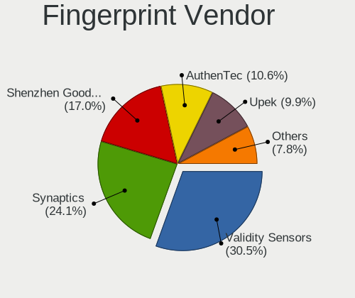

| Vendor                     | Computers | Percent |
|----------------------------|-----------|---------|
| Validity Sensors           | 43        | 30.5%   |
| Synaptics                  | 34        | 24.11%  |
| Shenzhen Goodix Technology | 24        | 17.02%  |
| AuthenTec                  | 15        | 10.64%  |
| Upek                       | 14        | 9.93%   |
| Elan Microelectronics      | 8         | 5.67%   |
| STMicroelectronics         | 2         | 1.42%   |
| LighTuning Technology      | 1         | 0.71%   |

Fingerprint Model
-----------------

Fingerprint sensor models

| Model                                                                      | Computers | Percent |
|----------------------------------------------------------------------------|-----------|---------|
| Shenzhen Goodix  Fingerprint Device                                        | 14        | 9.93%   |
| Upek Biometric Touchchip/Touchstrip Fingerprint Sensor                     | 12        | 8.51%   |
| Validity Sensors VFS495 Fingerprint Reader                                 | 10        | 7.09%   |
| Synaptics Prometheus MIS Touch Fingerprint Reader                          | 8         | 5.67%   |
| Validity Sensors VFS471 Fingerprint Reader                                 | 7         | 4.96%   |
| Shenzhen Goodix Fingerprint Reader                                         | 7         | 4.96%   |
| AuthenTec AES2501 Fingerprint Sensor                                       | 7         | 4.96%   |
| Validity Sensors VFS491                                                    | 6         | 4.26%   |
| Synaptics  WBDI                                                            | 6         | 4.26%   |
| Synaptics Metallica MIS Touch Fingerprint Reader                           | 6         | 4.26%   |
| Elan ELAN:ARM-M4                                                           | 6         | 4.26%   |
| Synaptics WBDI                                                             | 5         | 3.55%   |
| Validity Sensors Synaptics WBDI                                            | 4         | 2.84%   |
| Validity Sensors VFS 5011 fingerprint sensor                               | 3         | 2.13%   |
| Synaptics FS7604 Touch Fingerprint Sensor with PurePrint                   | 3         | 2.13%   |
| Shenzhen Goodix FingerPrint                                                | 3         | 2.13%   |
| AuthenTec AES2810                                                          | 3         | 2.13%   |
| Validity Sensors VFS7500 Touch Fingerprint Sensor                          | 2         | 1.42%   |
| Validity Sensors VFS5011 Fingerprint Reader                                | 2         | 1.42%   |
| Validity Sensors VFS451 Fingerprint Reader                                 | 2         | 1.42%   |
| Validity Sensors VFS101 Fingerprint Reader                                 | 2         | 1.42%   |
| Validity Sensors Fingerprint scanner                                       | 2         | 1.42%   |
| Upek TCS5B Fingerprint sensor                                              | 2         | 1.42%   |
| Synaptics UWP WBDI Device                                                  | 2         | 1.42%   |
| Synaptics UWP WBDI                                                         | 2         | 1.42%   |
| Synaptics Metallica MOH Touch Fingerprint Reader                           | 2         | 1.42%   |
| STMicroelectronics Fingerprint Reader                                      | 2         | 1.42%   |
| Elan ELAN:Fingerprint                                                      | 2         | 1.42%   |
| AuthenTec AES2550 Fingerprint Sensor                                       | 2         | 1.42%   |
| AuthenTec AES1600                                                          | 2         | 1.42%   |
| Validity Sensors VFS301 Fingerprint Reader                                 | 1         | 0.71%   |
| Validity Sensors Synaptics VFS7552 Touch Fingerprint Sensor with PurePrint | 1         | 0.71%   |
| Validity Sensors Swipe Fingerprint Sensor                                  | 1         | 0.71%   |
| LighTuning Fingerprint Reader                                              | 1         | 0.71%   |
| AuthenTec Fingerprint Sensor                                               | 1         | 0.71%   |

Chipcard Vendor
---------------

Chipcard module vendors

| Vendor      | Computers | Percent |
|-------------|-----------|---------|
| Broadcom    | 36        | 57.14%  |
| Alcor Micro | 16        | 25.4%   |
| O2 Micro    | 5         | 7.94%   |
| Upek        | 2         | 3.17%   |
| Lenovo      | 2         | 3.17%   |
| Yubico.com  | 1         | 1.59%   |
| ASK-RFID    | 1         | 1.59%   |

Chipcard Model
--------------

Chipcard module models

| Model                                                                        | Computers | Percent |
|------------------------------------------------------------------------------|-----------|---------|
| Broadcom 58200                                                               | 17        | 26.98%  |
| Alcor Micro AU9540 Smartcard Reader                                          | 16        | 25.4%   |
| Broadcom BCM5880 Secure Applications Processor                               | 9         | 14.29%  |
| Broadcom 5880                                                                | 8         | 12.7%   |
| O2 Micro OZ776 CCID Smartcard Reader                                         | 5         | 7.94%   |
| Upek TouchChip Fingerprint Coprocessor (WBF advanced mode)                   | 2         | 3.17%   |
| Lenovo Integrated Smart Card Reader                                          | 2         | 3.17%   |
| Broadcom BCM5880 Secure Applications Processor with fingerprint swipe sensor | 2         | 3.17%   |
| Yubico.com Yubikey 4/5 U2F+CCID                                              | 1         | 1.59%   |
| ASK-RFID GEN5XX CCID                                                         | 1         | 1.59%   |

Unsupported
-----------

Unsupported Devices
-------------------

Total unsupported devices on board

| Total | Computers | Percent |
|-------|-----------|---------|
| 0     | 1210      | 70.76%  |
| 1     | 408       | 23.86%  |
| 2     | 77        | 4.5%    |
| 3     | 10        | 0.58%   |
| 4     | 3         | 0.18%   |
| 7     | 1         | 0.06%   |
| 6     | 1         | 0.06%   |

Unsupported Device Types
------------------------

Types of unsupported devices

| Type                     | Computers | Percent |
|--------------------------|-----------|---------|
| Graphics card            | 153       | 25.98%  |
| Fingerprint reader       | 141       | 23.94%  |
| Net/wireless             | 88        | 14.94%  |
| Chipcard                 | 56        | 9.51%   |
| Multimedia controller    | 44        | 7.47%   |
| Bluetooth                | 21        | 3.57%   |
| Communication controller | 19        | 3.23%   |
| Camera                   | 14        | 2.38%   |
| Sound                    | 11        | 1.87%   |
| Modem                    | 7         | 1.19%   |
| Storage                  | 6         | 1.02%   |
| Flash memory             | 5         | 0.85%   |
| Dvb card                 | 5         | 0.85%   |
| Card reader              | 5         | 0.85%   |
| Network                  | 4         | 0.68%   |
| Unassigned class         | 3         | 0.51%   |
| Net/ethernet             | 3         | 0.51%   |
| Firewire controller      | 2         | 0.34%   |
| Tv card                  | 1         | 0.17%   |
| Storage/raid             | 1         | 0.17%   |

