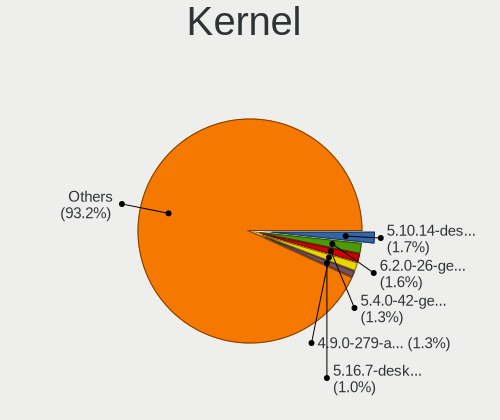
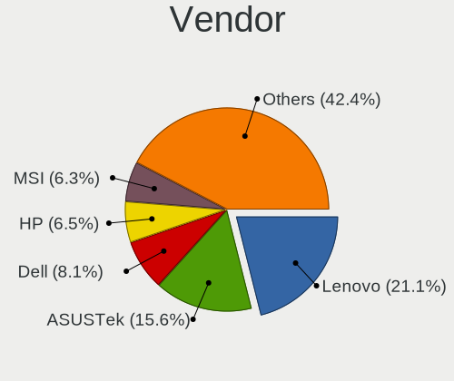
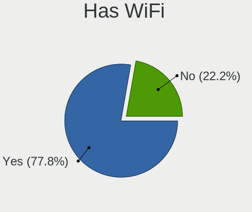
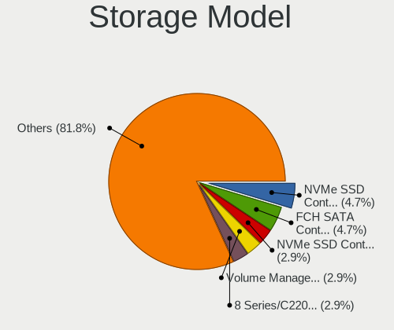
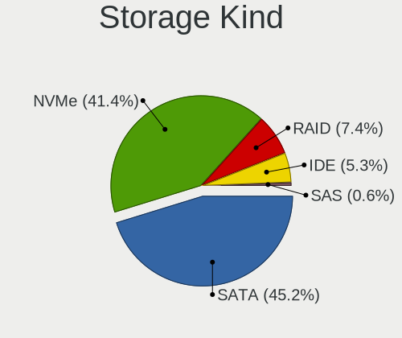
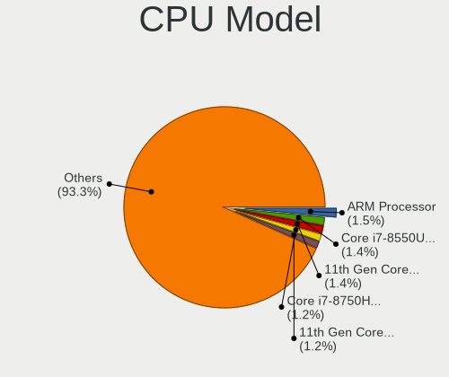
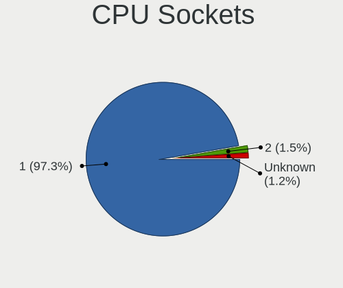
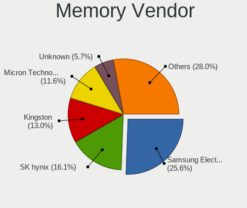
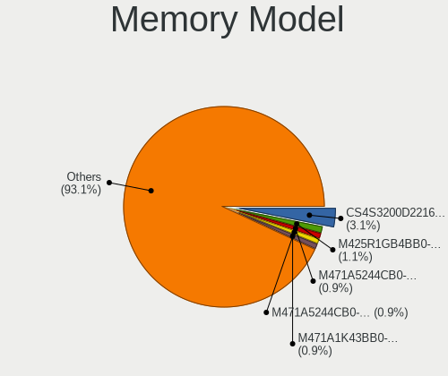
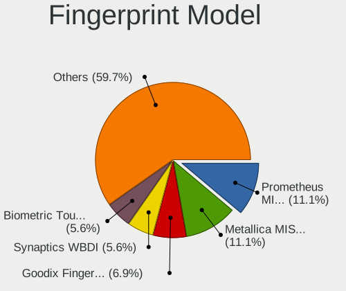

Linux in Hong Kong - Tested Hardware & Statistics
-------------------------------------------------

A project to collect tested hardware configurations for Linux in Hong Kong.

Anyone can contribute to this report by the [hw-probe](https://github.com/linuxhw/hw-probe) tool:

    sudo -E hw-probe -all -upload

Please contribute! Especially if your hardware is rare.

This is a report for all computer types. See also reports for [desktops](/Location/Hong_Kong/Desktop/README.md) and [notebooks](/Location/Hong_Kong/Notebook/README.md).

Contents
--------

* [ Test Cases ](#test-cases)

* [ System ](#system)
  - [ OS                       ](#os)
  - [ OS Family                ](#os-family)
  - [ Kernel                   ](#kernel)
  - [ Kernel Family            ](#kernel-family)
  - [ Kernel Major Ver.        ](#kernel-major-ver)
  - [ Arch                     ](#arch)
  - [ DE                       ](#de)
  - [ Display Server           ](#display-server)
  - [ Display Manager          ](#display-manager)
  - [ OS Lang                  ](#os-lang)
  - [ Boot Mode                ](#boot-mode)
  - [ Filesystem               ](#filesystem)
  - [ Part. scheme             ](#part-scheme)
  - [ Dual Boot with Linux/BSD ](#dual-boot-with-linuxbsd)
  - [ Dual Boot (Win)          ](#dual-boot-win)

* [ Board ](#board)
  - [ Vendor                   ](#vendor)
  - [ Model                    ](#model)
  - [ Model Family             ](#model-family)
  - [ MFG Year                 ](#mfg-year)
  - [ Form Factor              ](#form-factor)
  - [ Secure Boot              ](#secure-boot)
  - [ Coreboot                 ](#coreboot)
  - [ RAM Size                 ](#ram-size)
  - [ RAM Used                 ](#ram-used)
  - [ Total Drives             ](#total-drives)
  - [ Has CD-ROM               ](#has-cd-rom)
  - [ Has Ethernet             ](#has-ethernet)
  - [ Has WiFi                 ](#has-wifi)
  - [ Has Bluetooth            ](#has-bluetooth)

* [ Location ](#location)
  - [ Country                  ](#country)
  - [ City                     ](#city)

* [ Drives ](#drives)
  - [ Drive Vendor             ](#drive-vendor)
  - [ Drive Model              ](#drive-model)
  - [ HDD Vendor               ](#hdd-vendor)
  - [ SSD Vendor               ](#ssd-vendor)
  - [ Drive Kind               ](#drive-kind)
  - [ Drive Connector          ](#drive-connector)
  - [ Drive Size               ](#drive-size)
  - [ Space Total              ](#space-total)
  - [ Space Used               ](#space-used)
  - [ Malfunc. Drives          ](#malfunc-drives)
  - [ Malfunc. Drive Vendor    ](#malfunc-drive-vendor)
  - [ Malfunc. HDD Vendor      ](#malfunc-hdd-vendor)
  - [ Malfunc. Drive Kind      ](#malfunc-drive-kind)
  - [ Failed Drives            ](#failed-drives)
  - [ Failed Drive Vendor      ](#failed-drive-vendor)
  - [ Drive Status             ](#drive-status)

* [ Storage controller ](#storage-controller)
  - [ Storage Vendor           ](#storage-vendor)
  - [ Storage Model            ](#storage-model)
  - [ Storage Kind             ](#storage-kind)

* [ Processor ](#processor)
  - [ CPU Vendor               ](#cpu-vendor)
  - [ CPU Model                ](#cpu-model)
  - [ CPU Model Family         ](#cpu-model-family)
  - [ CPU Cores                ](#cpu-cores)
  - [ CPU Sockets              ](#cpu-sockets)
  - [ CPU Threads              ](#cpu-threads)
  - [ CPU Op-Modes             ](#cpu-op-modes)
  - [ CPU Microcode            ](#cpu-microcode)
  - [ CPU Microarch            ](#cpu-microarch)

* [ Graphics ](#graphics)
  - [ GPU Vendor               ](#gpu-vendor)
  - [ GPU Model                ](#gpu-model)
  - [ GPU Combo                ](#gpu-combo)
  - [ GPU Driver               ](#gpu-driver)
  - [ GPU Memory               ](#gpu-memory)

* [ Monitor ](#monitor)
  - [ Monitor Vendor           ](#monitor-vendor)
  - [ Monitor Model            ](#monitor-model)
  - [ Monitor Resolution       ](#monitor-resolution)
  - [ Monitor Diagonal         ](#monitor-diagonal)
  - [ Monitor Width            ](#monitor-width)
  - [ Aspect Ratio             ](#aspect-ratio)
  - [ Monitor Area             ](#monitor-area)
  - [ Pixel Density            ](#pixel-density)
  - [ Multiple Monitors        ](#multiple-monitors)

* [ Network ](#network)
  - [ Net Controller Vendor    ](#net-controller-vendor)
  - [ Net Controller Model     ](#net-controller-model)
  - [ Wireless Vendor          ](#wireless-vendor)
  - [ Wireless Model           ](#wireless-model)
  - [ Ethernet Vendor          ](#ethernet-vendor)
  - [ Ethernet Model           ](#ethernet-model)
  - [ Net Controller Kind      ](#net-controller-kind)
  - [ Used Controller          ](#used-controller)
  - [ NICs                     ](#nics)
  - [ IPv6                     ](#ipv6)

* [ Bluetooth ](#bluetooth)
  - [ Bluetooth Vendor         ](#bluetooth-vendor)
  - [ Bluetooth Model          ](#bluetooth-model)

* [ Sound ](#sound)
  - [ Sound Vendor             ](#sound-vendor)
  - [ Sound Model              ](#sound-model)

* [ Memory ](#memory)
  - [ Memory Vendor            ](#memory-vendor)
  - [ Memory Model             ](#memory-model)
  - [ Memory Kind              ](#memory-kind)
  - [ Memory Form Factor       ](#memory-form-factor)
  - [ Memory Size              ](#memory-size)
  - [ Memory Speed             ](#memory-speed)

* [ Printers & scanners ](#printers--scanners)
  - [ Printer Vendor           ](#printer-vendor)
  - [ Printer Model            ](#printer-model)
  - [ Scanner Vendor           ](#scanner-vendor)
  - [ Scanner Model            ](#scanner-model)

* [ Camera ](#camera)
  - [ Camera Vendor            ](#camera-vendor)
  - [ Camera Model             ](#camera-model)

* [ Security ](#security)
  - [ Fingerprint Vendor       ](#fingerprint-vendor)
  - [ Fingerprint Model        ](#fingerprint-model)
  - [ Chipcard Vendor          ](#chipcard-vendor)
  - [ Chipcard Model           ](#chipcard-model)

* [ Unsupported ](#unsupported)
  - [ Unsupported Devices      ](#unsupported-devices)
  - [ Unsupported Device Types ](#unsupported-device-types)

Test Cases
----------

Total: 910

| Vendor        | Model                       | Form-Factor | Probe                                                      | Date         |
|---------------|-----------------------------|-------------|------------------------------------------------------------|--------------|
| Microsoft     | Surface Pro 4               | Tablet      | [01d92157cd](https://linux-hardware.org/?probe=01d92157cd) | Jan 03, 2025 |
| Apple         | Mac-27ADBB7B4CEE8E61 iMa... | All in one  | [8485c9b6a3](https://linux-hardware.org/?probe=8485c9b6a3) | Jan 01, 2025 |
| Dell          | 0HGFJM A00                  | Desktop     | [f849a74d2e](https://linux-hardware.org/?probe=f849a74d2e) | Dec 24, 2024 |
| Apple         | MacBookPro11,3              | Notebook    | [92de19ed44](https://linux-hardware.org/?probe=92de19ed44) | Dec 23, 2024 |
| MSI           | MPG Z790 EDGE MONSTER HU... | Desktop     | [9362ff5af5](https://linux-hardware.org/?probe=9362ff5af5) | Dec 18, 2024 |
| Lenovo        | ThinkPad L15 Gen 1 20U8S... | Notebook    | [07d669f90a](https://linux-hardware.org/?probe=07d669f90a) | Dec 18, 2024 |
| Shenzhen M... | F7BSC                       | Mini pc     | [4ca5882e52](https://linux-hardware.org/?probe=4ca5882e52) | Dec 14, 2024 |
| HASEE Comp... | CV15S                       | Notebook    | [b1c86ea2a0](https://linux-hardware.org/?probe=b1c86ea2a0) | Dec 14, 2024 |
| Apple         | MacBook10,1                 | Notebook    | [5789633a9d](https://linux-hardware.org/?probe=5789633a9d) | Dec 13, 2024 |
| H3C           | 3005                        | Desktop     | [8d2a9b7b91](https://linux-hardware.org/?probe=8d2a9b7b91) | Dec 12, 2024 |
| Unknown       | Unknown                     | Notebook    | [33643facc4](https://linux-hardware.org/?probe=33643facc4) | Dec 08, 2024 |
| ASUSTek       | ROG Strix G713PV_G713PV     | Notebook    | [5a4b082a2e](https://linux-hardware.org/?probe=5a4b082a2e) | Dec 08, 2024 |
| Unknown       | Unknown                     | Notebook    | [9eddfe9de4](https://linux-hardware.org/?probe=9eddfe9de4) | Dec 02, 2024 |
| ASUSTek       | ROG Zephyrus G14 GA403UV... | Notebook    | [773e88d3be](https://linux-hardware.org/?probe=773e88d3be) | Nov 27, 2024 |
| Dell          | XPS 14 9440                 | Notebook    | [e2339b154a](https://linux-hardware.org/?probe=e2339b154a) | Nov 24, 2024 |
| Lenovo        | XiaoXinPro 14 AHP9 83D3     | Notebook    | [ab6b345348](https://linux-hardware.org/?probe=ab6b345348) | Nov 23, 2024 |
| MSI           | MPG Z790 EDGE MONSTER HU... | Desktop     | [dbee9a2410](https://linux-hardware.org/?probe=dbee9a2410) | Nov 19, 2024 |
| HP            | ENVY Laptop 13-aq0xxx       | Notebook    | [2c476e1d06](https://linux-hardware.org/?probe=2c476e1d06) | Nov 19, 2024 |
| ASUSTek       | ASUS EXPERTBOOK P5405CSA... | Notebook    | [6687dc4c23](https://linux-hardware.org/?probe=6687dc4c23) | Nov 18, 2024 |
| Lenovo        | ThinkPad S2 Yoga 3rd Gen... | Convertible | [c500a9dcb9](https://linux-hardware.org/?probe=c500a9dcb9) | Nov 18, 2024 |
| Dell          | XPS 15 9520                 | Notebook    | [c1dc8bd18f](https://linux-hardware.org/?probe=c1dc8bd18f) | Nov 08, 2024 |
| Lenovo        | ThinkPad X230 23201S5       | Notebook    | [718e98bfa9](https://linux-hardware.org/?probe=718e98bfa9) | Nov 04, 2024 |
| Unknown       | Unknown                     | Notebook    | [c7f9fb9e1a](https://linux-hardware.org/?probe=c7f9fb9e1a) | Nov 04, 2024 |
| Fujitsu       | LIFEBOOK AH555              | Notebook    | [1d5f0ccf29](https://linux-hardware.org/?probe=1d5f0ccf29) | Nov 01, 2024 |
| HP            | 8B3C A                      | Desktop     | [ca1220b4d7](https://linux-hardware.org/?probe=ca1220b4d7) | Oct 28, 2024 |
| MSI           | MAG B365M MORTAR            | Desktop     | [e7487dc9a5](https://linux-hardware.org/?probe=e7487dc9a5) | Oct 27, 2024 |
| Unknown       | Unknown                     | Notebook    | [af08761713](https://linux-hardware.org/?probe=af08761713) | Oct 24, 2024 |
| MSI           | MPG Z790 EDGE MONSTER HU... | Desktop     | [623a3231f2](https://linux-hardware.org/?probe=623a3231f2) | Oct 23, 2024 |
| Lenovo        | Legion R9000P2021H 82JQ     | Notebook    | [8ce04e68a7](https://linux-hardware.org/?probe=8ce04e68a7) | Oct 21, 2024 |
| Lenovo        | NOK                         | Desktop     | [89c7a1344f](https://linux-hardware.org/?probe=89c7a1344f) | Oct 21, 2024 |
| Lenovo        | ThinkPad X13 Gen 1 20UF0... | Notebook    | [c8cf89df2f](https://linux-hardware.org/?probe=c8cf89df2f) | Oct 19, 2024 |
| MECHREVO      | Yilong15Pro Series GM5HG... | Notebook    | [ad455330b3](https://linux-hardware.org/?probe=ad455330b3) | Oct 16, 2024 |
| ASRock        | X600M-STX                   | Desktop     | [aa6001a955](https://linux-hardware.org/?probe=aa6001a955) | Oct 13, 2024 |
| Apple         | MacBookAir6,2               | Notebook    | [f2d560b192](https://linux-hardware.org/?probe=f2d560b192) | Oct 12, 2024 |
| Acer          | Swift SF314-512             | Notebook    | [43c1da6093](https://linux-hardware.org/?probe=43c1da6093) | Oct 11, 2024 |
| Fujitsu       | LIFEBOOK AH555              | Notebook    | [0803e75c1a](https://linux-hardware.org/?probe=0803e75c1a) | Oct 10, 2024 |
| TYAN Compu... | B8036GM2NE 411T60900033     | Server      | [fc7084cb20](https://linux-hardware.org/?probe=fc7084cb20) | Oct 09, 2024 |
| ADLINK        | Ampere Altra Developer P... | Server      | [05cdf111cc](https://linux-hardware.org/?probe=05cdf111cc) | Oct 02, 2024 |
| HP            | 8B3C A                      | Desktop     | [59ea5dfc93](https://linux-hardware.org/?probe=59ea5dfc93) | Oct 02, 2024 |
| ASUSTek       | PRIME B760M-A               | Desktop     | [6e40568312](https://linux-hardware.org/?probe=6e40568312) | Sep 30, 2024 |
| Unknown       | Unknown                     | Notebook    | [b2607af0bf](https://linux-hardware.org/?probe=b2607af0bf) | Sep 30, 2024 |
| Chuwi         | HeroBook Pro                | Notebook    | [5761f2cb8a](https://linux-hardware.org/?probe=5761f2cb8a) | Sep 29, 2024 |
| Lenovo        | Legion R9000P ARX8 82WM     | Notebook    | [08cb9cd8a5](https://linux-hardware.org/?probe=08cb9cd8a5) | Sep 26, 2024 |
| Unknown       | Unknown                     | Notebook    | [5c78d4f841](https://linux-hardware.org/?probe=5c78d4f841) | Sep 26, 2024 |
| ASRock        | B560M-HDV R3.0              | Desktop     | [dbc73513c7](https://linux-hardware.org/?probe=dbc73513c7) | Sep 26, 2024 |
| ASRock        | 970 Extreme3 R2.0           | Desktop     | [d174717db9](https://linux-hardware.org/?probe=d174717db9) | Sep 24, 2024 |
| AZW           | SER V1.3                    | Mini pc     | [980105a122](https://linux-hardware.org/?probe=980105a122) | Sep 24, 2024 |
| ASUSTek       | ROG Flow X16 GV601VI_GV6... | Convertible | [038c4e05f5](https://linux-hardware.org/?probe=038c4e05f5) | Sep 24, 2024 |
| ASUSTek       | ROG Flow X16 GV601VI_GV6... | Convertible | [d444ddf345](https://linux-hardware.org/?probe=d444ddf345) | Sep 24, 2024 |
| Dell          | 0HV8FN A01                  | Desktop     | [c38e664bd9](https://linux-hardware.org/?probe=c38e664bd9) | Sep 24, 2024 |
| ASUSTek       | K53SV                       | Notebook    | [d0243fad24](https://linux-hardware.org/?probe=d0243fad24) | Sep 23, 2024 |
| Supermicro    | H12SSL-i                    | Server      | [656b2e45c3](https://linux-hardware.org/?probe=656b2e45c3) | Sep 18, 2024 |
| Lenovo        | ThinkPad X1 Titanium Gen... | Convertible | [05a5fba315](https://linux-hardware.org/?probe=05a5fba315) | Sep 17, 2024 |
| Gigabyte      | B85M-DS3H-A                 | Desktop     | [bd491cf784](https://linux-hardware.org/?probe=bd491cf784) | Sep 17, 2024 |
| Apple         | Mac-27ADBB7B4CEE8E61 iMa... | All in one  | [cf5fff6b44](https://linux-hardware.org/?probe=cf5fff6b44) | Sep 17, 2024 |
| Lenovo        | Legion R7000 2020 82B6      | Notebook    | [6f7f645005](https://linux-hardware.org/?probe=6f7f645005) | Sep 16, 2024 |
| Fujitsu       | UH-X                        | Notebook    | [981737896a](https://linux-hardware.org/?probe=981737896a) | Sep 15, 2024 |
| Dell          | Precision 3541              | Notebook    | [2ab0c627bf](https://linux-hardware.org/?probe=2ab0c627bf) | Sep 14, 2024 |
| Apple         | MacBookAir6,2               | Notebook    | [41e5b4b4a3](https://linux-hardware.org/?probe=41e5b4b4a3) | Sep 11, 2024 |
| Dell          | 0K8D6D A00                  | Server      | [b75294443b](https://linux-hardware.org/?probe=b75294443b) | Sep 09, 2024 |
| Apple         | Mac-27ADBB7B4CEE8E61 iMa... | All in one  | [848246d6d5](https://linux-hardware.org/?probe=848246d6d5) | Sep 07, 2024 |
| Apple         | Mac-27ADBB7B4CEE8E61 iMa... | All in one  | [4877e0495e](https://linux-hardware.org/?probe=4877e0495e) | Sep 07, 2024 |
| Tianbei       | GEM12                       | Desktop     | [54f3a3e92b](https://linux-hardware.org/?probe=54f3a3e92b) | Aug 26, 2024 |
| Apple         | Mac-F221BEC8                | Desktop     | [a4c99bb5b1](https://linux-hardware.org/?probe=a4c99bb5b1) | Aug 25, 2024 |
| Apple         | Mac-F221BEC8                | Desktop     | [7b3e825580](https://linux-hardware.org/?probe=7b3e825580) | Aug 25, 2024 |
| HONOR         | GLO-NX6                     | Notebook    | [c9df4596f4](https://linux-hardware.org/?probe=c9df4596f4) | Aug 22, 2024 |
| IBM           | 8141KB4                     | Desktop     | [237b1f38c6](https://linux-hardware.org/?probe=237b1f38c6) | Aug 22, 2024 |
| IBM           | 8141KB4                     | Desktop     | [374425afb5](https://linux-hardware.org/?probe=374425afb5) | Aug 22, 2024 |
| Acer          | Nitro AN515-57              | Notebook    | [805a90f139](https://linux-hardware.org/?probe=805a90f139) | Aug 19, 2024 |
| Unknown       | Unknown                     | Notebook    | [8afc1dbdf1](https://linux-hardware.org/?probe=8afc1dbdf1) | Aug 17, 2024 |
| Acer          | Swift SF514-55TA            | Notebook    | [b38d9c784d](https://linux-hardware.org/?probe=b38d9c784d) | Aug 16, 2024 |
| ASUSTek       | TUF Gaming Z790-PRO WIFI    | Desktop     | [643af9216f](https://linux-hardware.org/?probe=643af9216f) | Aug 13, 2024 |
| ASUSTek       | TUF Gaming Z790-PRO WIFI    | Desktop     | [48403b988f](https://linux-hardware.org/?probe=48403b988f) | Aug 13, 2024 |
| Unknown       | Unknown                     | Notebook    | [4ef8a514bb](https://linux-hardware.org/?probe=4ef8a514bb) | Aug 11, 2024 |
| ASUSTek       | ASUS Vivobook S 16 M5606... | Notebook    | [def46f775c](https://linux-hardware.org/?probe=def46f775c) | Aug 05, 2024 |
| Apple         | MacBookAir6,2               | Notebook    | [40d6662f45](https://linux-hardware.org/?probe=40d6662f45) | Aug 04, 2024 |
| Nexstgo       | NS14N1                      | Notebook    | [72d1f788cf](https://linux-hardware.org/?probe=72d1f788cf) | Aug 04, 2024 |
| Unknown       | Unknown                     | Notebook    | [24f692b500](https://linux-hardware.org/?probe=24f692b500) | Aug 04, 2024 |
| Chuwi         | Hi10 Go                     | Notebook    | [ad6318a578](https://linux-hardware.org/?probe=ad6318a578) | Jul 31, 2024 |
| ASUSTek       | Z97-PRO GAMER               | Desktop     | [3015220143](https://linux-hardware.org/?probe=3015220143) | Jul 30, 2024 |
| Acer          | Nitro AN515-58              | Notebook    | [5fd8362319](https://linux-hardware.org/?probe=5fd8362319) | Jul 29, 2024 |
| Lenovo        | ThinkPad X1 Extreme 2nd ... | Notebook    | [74f5e078c6](https://linux-hardware.org/?probe=74f5e078c6) | Jul 27, 2024 |
| MECHREVO      | WUJIE14XA                   | Notebook    | [d422024c89](https://linux-hardware.org/?probe=d422024c89) | Jul 22, 2024 |
| Radxa         | ROCK 5B                     | Soc         | [52ce936ba2](https://linux-hardware.org/?probe=52ce936ba2) | Jul 21, 2024 |
| Lenovo        | ThinkBook 14 G5+ APO 21J... | Notebook    | [c544d39f9f](https://linux-hardware.org/?probe=c544d39f9f) | Jul 20, 2024 |
| MSI           | MPG X570 GAMING PRO CARB... | Desktop     | [3875e7577b](https://linux-hardware.org/?probe=3875e7577b) | Jul 20, 2024 |
| Lenovo        | ThinkBook 16 G4+ IAP 21C... | Notebook    | [1a0b5dd4f4](https://linux-hardware.org/?probe=1a0b5dd4f4) | Jul 16, 2024 |
| ASRock        | Z370 Extreme4               | Desktop     | [514a57e9b4](https://linux-hardware.org/?probe=514a57e9b4) | Jul 16, 2024 |
| MECHREVO      | WUJIE14 PRO                 | Notebook    | [305c283665](https://linux-hardware.org/?probe=305c283665) | Jul 13, 2024 |
| Apple         | MacBookAir6,2               | Notebook    | [39095eabda](https://linux-hardware.org/?probe=39095eabda) | Jul 13, 2024 |
| Lenovo        | ThinkPad X1 Extreme 2nd ... | Notebook    | [4769331d3b](https://linux-hardware.org/?probe=4769331d3b) | Jul 12, 2024 |
| Gigabyte      | X470 AORUS ULTRA GAMING-... | Desktop     | [1c7ebc3219](https://linux-hardware.org/?probe=1c7ebc3219) | Jul 10, 2024 |
| System76      | Bonobo WS                   | Notebook    | [f29db971cf](https://linux-hardware.org/?probe=f29db971cf) | Jul 09, 2024 |
| MSI           | H81M-P33                    | Desktop     | [c512e9b284](https://linux-hardware.org/?probe=c512e9b284) | Jul 06, 2024 |
| Apple         | MacBookAir5,2               | Notebook    | [493d11b7ef](https://linux-hardware.org/?probe=493d11b7ef) | Jul 05, 2024 |
| Lenovo        | LOQ 15IRH8 82XV             | Notebook    | [4d65aeea9b](https://linux-hardware.org/?probe=4d65aeea9b) | Jun 21, 2024 |
| Lenovo        | ThinkPad T460p 20FWA00PC... | Notebook    | [7e6b842321](https://linux-hardware.org/?probe=7e6b842321) | Jun 21, 2024 |
| Lenovo        | ThinkPad T460p 20FWA00PC... | Notebook    | [f214e8aea1](https://linux-hardware.org/?probe=f214e8aea1) | Jun 21, 2024 |
| Lenovo        | ThinkPad T14 Gen 5 21MCC... | Notebook    | [1c939e95a3](https://linux-hardware.org/?probe=1c939e95a3) | Jun 21, 2024 |
| Acer          | Aspire EC-470G              | Notebook    | [917d3d0335](https://linux-hardware.org/?probe=917d3d0335) | Jun 16, 2024 |
| ASUSTek       | PRIME B350M-A               | Desktop     | [57743d100f](https://linux-hardware.org/?probe=57743d100f) | Jun 15, 2024 |
| Lenovo        | ThinkPad T14 Gen 5 21MCC... | Notebook    | [9fe889a23e](https://linux-hardware.org/?probe=9fe889a23e) | Jun 14, 2024 |
| Lenovo        | ThinkPad T14 Gen 5 21MCC... | Notebook    | [1ac37bcaea](https://linux-hardware.org/?probe=1ac37bcaea) | Jun 14, 2024 |
| ASUSTek       | H81M-K                      | Desktop     | [4606b35d59](https://linux-hardware.org/?probe=4606b35d59) | Jun 07, 2024 |
| Fujitsu       | LIFEBOOK AH555              | Notebook    | [6b46d91566](https://linux-hardware.org/?probe=6b46d91566) | Jun 07, 2024 |
| Fujitsu       | LIFEBOOK AH555              | Notebook    | [ae77cd2e47](https://linux-hardware.org/?probe=ae77cd2e47) | Jun 07, 2024 |
| Lenovo        | IdeaPad 320-14IKB 80XK      | Notebook    | [6712e54c02](https://linux-hardware.org/?probe=6712e54c02) | Jun 07, 2024 |
| Lenovo        | G710 20252                  | Notebook    | [2cb3e53b29](https://linux-hardware.org/?probe=2cb3e53b29) | May 31, 2024 |
| MECHREVO      | WUJIE14S                    | Notebook    | [19285731aa](https://linux-hardware.org/?probe=19285731aa) | May 30, 2024 |
| Lenovo        | ThinkPad X1 Carbon Gen 1... | Notebook    | [67491fabd0](https://linux-hardware.org/?probe=67491fabd0) | May 29, 2024 |
| Unknown       | Unknown                     | Notebook    | [c6e7aa154b](https://linux-hardware.org/?probe=c6e7aa154b) | May 25, 2024 |
| MECHREVO      | WUJIE14S                    | Notebook    | [cf165908f2](https://linux-hardware.org/?probe=cf165908f2) | May 25, 2024 |
| ASRock        | B660M PG Riptide            | Desktop     | [0eb75d61c6](https://linux-hardware.org/?probe=0eb75d61c6) | May 22, 2024 |
| Unknown       | Unknown                     | Notebook    | [c9b4ab2b7c](https://linux-hardware.org/?probe=c9b4ab2b7c) | May 21, 2024 |
| ASUSTek       | VivoBook_ASUSLaptop X160... | Notebook    | [2d3edc3820](https://linux-hardware.org/?probe=2d3edc3820) | May 20, 2024 |
| Dell          | 0G3HR7 A00                  | Desktop     | [8e85e2f4cb](https://linux-hardware.org/?probe=8e85e2f4cb) | May 20, 2024 |
| Sony          | VGN-TZ27GN_B                | Notebook    | [c5a2d5eb61](https://linux-hardware.org/?probe=c5a2d5eb61) | May 20, 2024 |
| Gigabyte      | Z790M AORUS ELITE AX        | Desktop     | [b6b53361f3](https://linux-hardware.org/?probe=b6b53361f3) | May 19, 2024 |
| Dell          | Precision M4800             | Notebook    | [5c452ec8a1](https://linux-hardware.org/?probe=5c452ec8a1) | May 17, 2024 |
| AZW           | GTR V21                     | Mini pc     | [e65d3e5625](https://linux-hardware.org/?probe=e65d3e5625) | May 17, 2024 |
| AZW           | GTR V21                     | Mini pc     | [9312277721](https://linux-hardware.org/?probe=9312277721) | May 17, 2024 |
| ASRock        | X299 Professional Gaming... | Desktop     | [50e9d2967d](https://linux-hardware.org/?probe=50e9d2967d) | May 16, 2024 |
| Lenovo        | Yoga Duet IML 2020 82E9     | Tablet      | [be1f1a236b](https://linux-hardware.org/?probe=be1f1a236b) | May 14, 2024 |
| AZW           | GTR V11                     | Desktop     | [4f36eb5740](https://linux-hardware.org/?probe=4f36eb5740) | May 11, 2024 |
| Lenovo        | Yoga Duet IML 2020 82E9     | Tablet      | [469abd69c4](https://linux-hardware.org/?probe=469abd69c4) | May 09, 2024 |
| ASUSTek       | VivoBook_ASUSLaptop K650... | Notebook    | [dd5fb659cb](https://linux-hardware.org/?probe=dd5fb659cb) | May 08, 2024 |
| Lenovo        | LOQ 15IRH8 82XV             | Notebook    | [c741f249e2](https://linux-hardware.org/?probe=c741f249e2) | May 06, 2024 |
| Unknown       | Unknown                     | Notebook    | [a857b08dd7](https://linux-hardware.org/?probe=a857b08dd7) | May 06, 2024 |
| Huanan        | X99-TF                      | Desktop     | [804eb7916a](https://linux-hardware.org/?probe=804eb7916a) | May 05, 2024 |
| HP            | 2B2C                        | Desktop     | [082d220d35](https://linux-hardware.org/?probe=082d220d35) | May 04, 2024 |
| HUAWEI        | BC11HGSC0 V100R003          | Server      | [4ba7497e3e](https://linux-hardware.org/?probe=4ba7497e3e) | May 01, 2024 |
| Lenovo        | IdeaPad 3 14ARE05 81W3      | Notebook    | [d98a742595](https://linux-hardware.org/?probe=d98a742595) | Apr 27, 2024 |
| ASUSTek       | VivoBook 12_ASUS Laptop ... | Notebook    | [1680c3ad15](https://linux-hardware.org/?probe=1680c3ad15) | Apr 27, 2024 |
| Lenovo        | IdeaPad 320-14IKB 80XK      | Notebook    | [4324e618e8](https://linux-hardware.org/?probe=4324e618e8) | Apr 27, 2024 |
| Unknown       | Unknown                     | Notebook    | [a1db5a84e2](https://linux-hardware.org/?probe=a1db5a84e2) | Apr 26, 2024 |
| GPD           | G1619-04                    | Notebook    | [ad6e53094b](https://linux-hardware.org/?probe=ad6e53094b) | Apr 25, 2024 |
| HP            | 158B                        | Desktop     | [38acb31ca9](https://linux-hardware.org/?probe=38acb31ca9) | Apr 24, 2024 |
| ASUSTek       | ROG Zephyrus M16 GU603ZM... | Notebook    | [d93809116b](https://linux-hardware.org/?probe=d93809116b) | Apr 20, 2024 |
| Lenovo        | IdeaPad 3 14ARE05 81W3      | Notebook    | [b431117c61](https://linux-hardware.org/?probe=b431117c61) | Apr 19, 2024 |
| ASUSTek       | ROG STRIX Z690-E GAMING ... | Desktop     | [ba12ac8498](https://linux-hardware.org/?probe=ba12ac8498) | Apr 17, 2024 |
| Apple         | Mac-00BE6ED71E35EB86 iMa... | All in one  | [5ef202ce64](https://linux-hardware.org/?probe=5ef202ce64) | Apr 13, 2024 |
| Lenovo        | ThinkBook 16 G6+ AHP 21L... | Notebook    | [fd2fc14275](https://linux-hardware.org/?probe=fd2fc14275) | Apr 12, 2024 |
| HP            | 158B                        | Desktop     | [d7c58cf079](https://linux-hardware.org/?probe=d7c58cf079) | Apr 09, 2024 |
| TSINGHUA T... | B560M-J01 V0.2              | Desktop     | [85ca1b62a7](https://linux-hardware.org/?probe=85ca1b62a7) | Apr 09, 2024 |
| ASUSTek       | ROG Zephyrus G16 GU605MI... | Notebook    | [042218f2b2](https://linux-hardware.org/?probe=042218f2b2) | Apr 07, 2024 |
| Dell          | 02J54D A01                  | Desktop     | [28dc6c5c06](https://linux-hardware.org/?probe=28dc6c5c06) | Apr 01, 2024 |
| Lenovo        | ThinkPad L14 Gen 2a 20X5... | Notebook    | [0b20dc1c09](https://linux-hardware.org/?probe=0b20dc1c09) | Mar 30, 2024 |
| Unknown       | Unknown                     | Notebook    | [393d39e7a2](https://linux-hardware.org/?probe=393d39e7a2) | Mar 30, 2024 |
| Panasonic     | CFRZ6-2                     | Convertible | [be6728c577](https://linux-hardware.org/?probe=be6728c577) | Mar 28, 2024 |
| Lenovo        | IdeaPad 3 14ARE05 81W3      | Notebook    | [13225bc9d9](https://linux-hardware.org/?probe=13225bc9d9) | Mar 24, 2024 |
| MSI           | MAG B650 TOMAHAWK WIFI      | Desktop     | [b4b14726e3](https://linux-hardware.org/?probe=b4b14726e3) | Mar 23, 2024 |
| MSI           | MAG B650 TOMAHAWK WIFI      | Desktop     | [2b17261b3a](https://linux-hardware.org/?probe=2b17261b3a) | Mar 23, 2024 |
| Timi          | A35                         | Notebook    | [9f32e40385](https://linux-hardware.org/?probe=9f32e40385) | Mar 23, 2024 |
| ASUSTek       | GL552VW                     | Notebook    | [ebcb3dcdc3](https://linux-hardware.org/?probe=ebcb3dcdc3) | Mar 22, 2024 |
| MSI           | Alpha 17 C7VF               | Notebook    | [6103abec4d](https://linux-hardware.org/?probe=6103abec4d) | Mar 21, 2024 |
| MSI           | Alpha 17 C7VF               | Notebook    | [06e6614098](https://linux-hardware.org/?probe=06e6614098) | Mar 20, 2024 |
| MECHREVO      | WUJIE14 PRO                 | Notebook    | [3bd908f059](https://linux-hardware.org/?probe=3bd908f059) | Mar 19, 2024 |
| Lenovo        | Legion Y9000P IRX8 82WK     | Notebook    | [4e51bba561](https://linux-hardware.org/?probe=4e51bba561) | Mar 18, 2024 |
| Gigabyte      | B360HD3                     | Desktop     | [a82720d3a4](https://linux-hardware.org/?probe=a82720d3a4) | Mar 18, 2024 |
| Fujitsu       | UH-X                        | Notebook    | [570594b1b8](https://linux-hardware.org/?probe=570594b1b8) | Mar 16, 2024 |
| Apple         | Mac-00BE6ED71E35EB86 iMa... | All in one  | [044882319b](https://linux-hardware.org/?probe=044882319b) | Mar 15, 2024 |
| MSI           | MPG X570 GAMING PRO CARB... | Desktop     | [ec5e2c689a](https://linux-hardware.org/?probe=ec5e2c689a) | Mar 13, 2024 |
| Fujitsu       | UH-X                        | Notebook    | [fee081fe33](https://linux-hardware.org/?probe=fee081fe33) | Mar 10, 2024 |
| Lenovo        | IdeaPad L3 15IML05 81Y3     | Notebook    | [1724afc932](https://linux-hardware.org/?probe=1724afc932) | Mar 06, 2024 |
| Unknown       | Unknown                     | Notebook    | [23114923e2](https://linux-hardware.org/?probe=23114923e2) | Mar 06, 2024 |
| Microsoft     | Surface Laptop Studio       | Tablet      | [2a3ccbf6ac](https://linux-hardware.org/?probe=2a3ccbf6ac) | Mar 05, 2024 |
| Huanan        | X99-TF                      | Desktop     | [edb2ac80c9](https://linux-hardware.org/?probe=edb2ac80c9) | Mar 04, 2024 |
| Lenovo        | ThinkPad X1 Carbon Gen 1... | Notebook    | [8a9129741b](https://linux-hardware.org/?probe=8a9129741b) | Feb 27, 2024 |
| Unknown       | Unknown                     | Notebook    | [5f71daec56](https://linux-hardware.org/?probe=5f71daec56) | Feb 26, 2024 |
| Lenovo        | ThinkPad X1 Carbon Gen 1... | Notebook    | [18e097cb5e](https://linux-hardware.org/?probe=18e097cb5e) | Feb 23, 2024 |
| MSI           | MEG Z790 ACE                | Desktop     | [0137944d6c](https://linux-hardware.org/?probe=0137944d6c) | Feb 22, 2024 |
| Lenovo        | ThinkPad S2 20GJS00M00      | Notebook    | [85d2475b2b](https://linux-hardware.org/?probe=85d2475b2b) | Feb 21, 2024 |
| Lenovo        | ThinkBook 14 G6+ IMH 21L... | Notebook    | [15b4b910e3](https://linux-hardware.org/?probe=15b4b910e3) | Feb 20, 2024 |
| Lenovo        | ThinkBook 14 G6+ IMH 21L... | Notebook    | [3ba9848db3](https://linux-hardware.org/?probe=3ba9848db3) | Feb 20, 2024 |
| ASUSTek       | ASUS Zenbook 14 UX3405MA... | Notebook    | [a38ae05794](https://linux-hardware.org/?probe=a38ae05794) | Feb 20, 2024 |
| Unknown       | Unknown                     | Desktop     | [aa24b40efa](https://linux-hardware.org/?probe=aa24b40efa) | Feb 19, 2024 |
| Unknown       | Unknown                     | Desktop     | [e9ad690ec9](https://linux-hardware.org/?probe=e9ad690ec9) | Feb 19, 2024 |
| ASUSTek       | UX331UN                     | Notebook    | [f37b6ea077](https://linux-hardware.org/?probe=f37b6ea077) | Feb 17, 2024 |
| ASUSTek       | Rampage II Extreme          | Desktop     | [42f4db38c2](https://linux-hardware.org/?probe=42f4db38c2) | Feb 16, 2024 |
| Unknown       | Unknown                     | Desktop     | [255d81b8e9](https://linux-hardware.org/?probe=255d81b8e9) | Feb 15, 2024 |
| Lenovo        | ThinkPad L13 Gen 3a 4810... | Notebook    | [b26cbf0a95](https://linux-hardware.org/?probe=b26cbf0a95) | Feb 13, 2024 |
| Lenovo        | ThinkBook 15 G3 ACL 21A4    | Notebook    | [6574b9929b](https://linux-hardware.org/?probe=6574b9929b) | Feb 08, 2024 |
| ASUSTek       | ROG CROSSHAIR X670E HERO    | Desktop     | [140a2db49b](https://linux-hardware.org/?probe=140a2db49b) | Feb 03, 2024 |
| Lenovo        | ThinkBook 16p Gen 4 21J8    | Notebook    | [7cbebba117](https://linux-hardware.org/?probe=7cbebba117) | Feb 02, 2024 |
| ASRock        | X300-ITX                    | Desktop     | [3390b15018](https://linux-hardware.org/?probe=3390b15018) | Feb 02, 2024 |
| Intel         | NUC11PABi5 K90634-302       | Mini pc     | [910fba93b8](https://linux-hardware.org/?probe=910fba93b8) | Feb 01, 2024 |
| AMI           | Intel                       | Notebook    | [6d3ac84f15](https://linux-hardware.org/?probe=6d3ac84f15) | Feb 01, 2024 |
| ASUSTek       | ASUS Zenbook 14 UX3405MA... | Notebook    | [531a090457](https://linux-hardware.org/?probe=531a090457) | Feb 01, 2024 |
| Lenovo        | LOQ 15IRH8 82XV             | Notebook    | [33490eaaf1](https://linux-hardware.org/?probe=33490eaaf1) | Jan 31, 2024 |
| HP            | 8B3C A                      | Desktop     | [12ec418267](https://linux-hardware.org/?probe=12ec418267) | Jan 31, 2024 |
| MECHREVO      | WUJIE14 PRO                 | Notebook    | [a3b9804ccf](https://linux-hardware.org/?probe=a3b9804ccf) | Jan 30, 2024 |
| AZW           | GTR V21                     | Mini pc     | [904e422f26](https://linux-hardware.org/?probe=904e422f26) | Jan 29, 2024 |
| MSI           | MAG B550M BAZOOKA           | Desktop     | [c0d98503dd](https://linux-hardware.org/?probe=c0d98503dd) | Jan 29, 2024 |
| Unknown       | Phicomm N1                  | Soc         | [96a0dce3c6](https://linux-hardware.org/?probe=96a0dce3c6) | Jan 28, 2024 |
| HP            | 84EE 1100                   | All in one  | [eed1f038fe](https://linux-hardware.org/?probe=eed1f038fe) | Jan 28, 2024 |
| Unknown       | Unknown                     | Desktop     | [2bf1eac05d](https://linux-hardware.org/?probe=2bf1eac05d) | Jan 27, 2024 |
| Apple         | Mac-F22C86C8                | Mini pc     | [7434ec9fa6](https://linux-hardware.org/?probe=7434ec9fa6) | Jan 25, 2024 |
| Apple         | Mac-F22C86C8                | Mini pc     | [78d29adc26](https://linux-hardware.org/?probe=78d29adc26) | Jan 25, 2024 |
| ASRock        | B650M PG Riptide            | Desktop     | [1ebf8a3fea](https://linux-hardware.org/?probe=1ebf8a3fea) | Jan 21, 2024 |
| ASUSTek       | TUF Gaming B550M-E WIFI     | Desktop     | [53b28fea12](https://linux-hardware.org/?probe=53b28fea12) | Jan 21, 2024 |
| Unknown       | Unknown                     | Desktop     | [413fbae0c9](https://linux-hardware.org/?probe=413fbae0c9) | Jan 17, 2024 |
| Unknown       | Unknown                     | Desktop     | [69d393fc55](https://linux-hardware.org/?probe=69d393fc55) | Jan 17, 2024 |
| Lenovo        | ZHAOYANG K4e-IIL 81Y2       | Notebook    | [a318e3a69e](https://linux-hardware.org/?probe=a318e3a69e) | Jan 17, 2024 |
| Notebook      | P15SM-A/SM1-A               | Notebook    | [bc817396a6](https://linux-hardware.org/?probe=bc817396a6) | Jan 16, 2024 |
| Intel         | NUC11PABi5 K90634-302       | Mini pc     | [f0466fefa4](https://linux-hardware.org/?probe=f0466fefa4) | Jan 15, 2024 |
| AZW           | GTR V21                     | Mini pc     | [c87cc08a52](https://linux-hardware.org/?probe=c87cc08a52) | Jan 15, 2024 |
| Acer          | Nitro AN515-58              | Notebook    | [23ad168a68](https://linux-hardware.org/?probe=23ad168a68) | Jan 14, 2024 |
| HP            | Spectre x360 2-in-1 Lapt... | Convertible | [30679c3606](https://linux-hardware.org/?probe=30679c3606) | Jan 11, 2024 |
| Gigabyte      | G41M-Combo                  | Desktop     | [e34d332260](https://linux-hardware.org/?probe=e34d332260) | Jan 10, 2024 |
| Lenovo        | ThinkPad L380 Yoga 20M7C... | Convertible | [bedd5d29e3](https://linux-hardware.org/?probe=bedd5d29e3) | Jan 09, 2024 |
| ASUSTek       | VivoBook_ASUSLaptop M650... | Notebook    | [a16f0bdbca](https://linux-hardware.org/?probe=a16f0bdbca) | Jan 08, 2024 |
| Fujitsu       | UH-X                        | Notebook    | [fae98e772d](https://linux-hardware.org/?probe=fae98e772d) | Jan 04, 2024 |
| Lenovo        | Legion Pro 5 16IRX8 82WK    | Notebook    | [8213f6a90c](https://linux-hardware.org/?probe=8213f6a90c) | Jan 04, 2024 |
| Dell          | 0VNM11 A00                  | Desktop     | [060cdd6c04](https://linux-hardware.org/?probe=060cdd6c04) | Jan 04, 2024 |
| KUU           | Andes II                    | Notebook    | [bda39c51cd](https://linux-hardware.org/?probe=bda39c51cd) | Jan 03, 2024 |
| Unknown       | Unknown                     | Notebook    | [6133ac662c](https://linux-hardware.org/?probe=6133ac662c) | Jan 03, 2024 |
| Unknown       | Unknown                     | Notebook    | [6519663043](https://linux-hardware.org/?probe=6519663043) | Jan 02, 2024 |
| Notebook      | P15SM-A/SM1-A               | Notebook    | [ed3bd04f1a](https://linux-hardware.org/?probe=ed3bd04f1a) | Jan 02, 2024 |
| Notebook      | N13xWU                      | Notebook    | [b88a27e565](https://linux-hardware.org/?probe=b88a27e565) | Jan 02, 2024 |
| Lenovo        | ThinkPad L380 Yoga 20M7C... | Convertible | [fa3f52294e](https://linux-hardware.org/?probe=fa3f52294e) | Jan 02, 2024 |
| Google        | Caroline                    | Notebook    | [8b3ec77c48](https://linux-hardware.org/?probe=8b3ec77c48) | Jan 02, 2024 |
| Google        | Caroline                    | Notebook    | [95fb0e423e](https://linux-hardware.org/?probe=95fb0e423e) | Jan 01, 2024 |
| Notebook      | N13xWU                      | Notebook    | [d877ecb7be](https://linux-hardware.org/?probe=d877ecb7be) | Jan 01, 2024 |
| Lenovo        | ThinkPad L380 Yoga 20M7C... | Convertible | [7e61024957](https://linux-hardware.org/?probe=7e61024957) | Jan 01, 2024 |
| Google        | Caroline                    | Notebook    | [94a1dd78ec](https://linux-hardware.org/?probe=94a1dd78ec) | Dec 31, 2023 |
| Google        | Caroline                    | Notebook    | [0d1ce09fbd](https://linux-hardware.org/?probe=0d1ce09fbd) | Dec 31, 2023 |
| MSI           | B450M MORTAR MAX            | Desktop     | [0c20bdae04](https://linux-hardware.org/?probe=0c20bdae04) | Dec 31, 2023 |
| MSI           | B450M MORTAR MAX            | Desktop     | [d6622a2c0a](https://linux-hardware.org/?probe=d6622a2c0a) | Dec 31, 2023 |
| Unknown       | Unknown                     | Notebook    | [e67f78cf16](https://linux-hardware.org/?probe=e67f78cf16) | Dec 30, 2023 |
| MSI           | MAG Z690 TOMAHAWK WIFI D... | Desktop     | [0daa9bd3eb](https://linux-hardware.org/?probe=0daa9bd3eb) | Dec 29, 2023 |
| Alienware     | x17 R2                      | Notebook    | [b439c4c2a9](https://linux-hardware.org/?probe=b439c4c2a9) | Dec 29, 2023 |
| Chuwi         | MiniBook X                  | Notebook    | [6249e8f644](https://linux-hardware.org/?probe=6249e8f644) | Dec 27, 2023 |
| Microsoft     | Surface Pro 7               | Tablet      | [dbb5cde105](https://linux-hardware.org/?probe=dbb5cde105) | Dec 26, 2023 |
| AMI           | Aptio CRB                   | Mini pc     | [edc0cbda53](https://linux-hardware.org/?probe=edc0cbda53) | Dec 25, 2023 |
| AMI           | Aptio CRB                   | Mini pc     | [a0c82919c0](https://linux-hardware.org/?probe=a0c82919c0) | Dec 25, 2023 |
| Unknown       | Unknown                     | Notebook    | [a013d585d9](https://linux-hardware.org/?probe=a013d585d9) | Dec 24, 2023 |
| Dell          | Latitude E6430s             | Notebook    | [2b580a7725](https://linux-hardware.org/?probe=2b580a7725) | Dec 21, 2023 |
| Lenovo        | ThinkBook 16 G4+ IAP 21C... | Notebook    | [adb83b1dca](https://linux-hardware.org/?probe=adb83b1dca) | Dec 20, 2023 |
| Acer          | Swift SF314-54              | Notebook    | [4d8fbbd6d0](https://linux-hardware.org/?probe=4d8fbbd6d0) | Dec 19, 2023 |
| Dell          | 0PJDGF A02                  | Desktop     | [cfdd125cd5](https://linux-hardware.org/?probe=cfdd125cd5) | Dec 19, 2023 |
| Dell          | 0PJDGF A02                  | Desktop     | [edcd06b95f](https://linux-hardware.org/?probe=edcd06b95f) | Dec 19, 2023 |
| ASUSTek       | TUF B450M-PRO GAMING        | Desktop     | [c6fa46e494](https://linux-hardware.org/?probe=c6fa46e494) | Dec 17, 2023 |
| Apple         | MacBookAir6,2               | Notebook    | [d1d3bc7a1c](https://linux-hardware.org/?probe=d1d3bc7a1c) | Dec 16, 2023 |
| Unknown       | Unknown                     | Notebook    | [071d7464d1](https://linux-hardware.org/?probe=071d7464d1) | Dec 15, 2023 |
| ASUSTek       | Pro WS X570-ACE             | Desktop     | [ebfb65701f](https://linux-hardware.org/?probe=ebfb65701f) | Dec 14, 2023 |
| Lenovo        | LOQ 15IRH8 82XV             | Notebook    | [ab468a9a14](https://linux-hardware.org/?probe=ab468a9a14) | Dec 13, 2023 |
| Huanan        | X99-TF                      | Desktop     | [2bf94ff272](https://linux-hardware.org/?probe=2bf94ff272) | Dec 13, 2023 |
| Gigabyte      | B85M-DS3H-A                 | Desktop     | [c4de324273](https://linux-hardware.org/?probe=c4de324273) | Dec 12, 2023 |
| Lenovo        | IdeaPad 320-14IKB 80XK      | Notebook    | [df2900565f](https://linux-hardware.org/?probe=df2900565f) | Dec 12, 2023 |
| ONE-NETBOO... | ONEXPLAYER F1               | Tablet      | [158658e952](https://linux-hardware.org/?probe=158658e952) | Dec 08, 2023 |
| ONE-NETBOO... | ONEXPLAYER F1               | Tablet      | [3539ea142d](https://linux-hardware.org/?probe=3539ea142d) | Dec 08, 2023 |
| ONE-NETBOO... | ONEXPLAYER Mini Pro         | Tablet      | [8fa27cc61f](https://linux-hardware.org/?probe=8fa27cc61f) | Dec 06, 2023 |
| ONE-NETBOO... | ONEXPLAYER Mini Pro         | Tablet      | [4ca7e9fcaf](https://linux-hardware.org/?probe=4ca7e9fcaf) | Dec 06, 2023 |
| AMI           | Aptio CRB                   | Mini pc     | [6e7c9a6ebc](https://linux-hardware.org/?probe=6e7c9a6ebc) | Dec 05, 2023 |
| AMI           | Aptio CRB                   | Mini pc     | [71c469e9dd](https://linux-hardware.org/?probe=71c469e9dd) | Dec 05, 2023 |
| Lenovo        | ThinkPad X230 23066RC       | Notebook    | [ef45ef93ac](https://linux-hardware.org/?probe=ef45ef93ac) | Dec 05, 2023 |
| Unknown       | Unknown                     | Notebook    | [a74febcadd](https://linux-hardware.org/?probe=a74febcadd) | Dec 04, 2023 |
| Huanan        | X99-TF                      | Desktop     | [c617461c74](https://linux-hardware.org/?probe=c617461c74) | Dec 03, 2023 |
| ASUSTek       | Pro WS X570-ACE             | Desktop     | [940148ec06](https://linux-hardware.org/?probe=940148ec06) | Dec 01, 2023 |
| Intel         | SKYBAY                      | Desktop     | [f802b552c5](https://linux-hardware.org/?probe=f802b552c5) | Nov 29, 2023 |
| Intel         | SKYBAY                      | Desktop     | [914eab8268](https://linux-hardware.org/?probe=914eab8268) | Nov 28, 2023 |
| Intel         | SKYBAY                      | Desktop     | [3e3de1a647](https://linux-hardware.org/?probe=3e3de1a647) | Nov 27, 2023 |
| Intel         | SKYBAY                      | Desktop     | [9d55b4f75f](https://linux-hardware.org/?probe=9d55b4f75f) | Nov 27, 2023 |
| Unknown       | Unknown                     | Desktop     | [3ccba31903](https://linux-hardware.org/?probe=3ccba31903) | Nov 27, 2023 |
| Intel         | SKYBAY                      | Desktop     | [21f1b67acc](https://linux-hardware.org/?probe=21f1b67acc) | Nov 24, 2023 |
| Unknown       | Unknown                     | Desktop     | [47bf46db9d](https://linux-hardware.org/?probe=47bf46db9d) | Nov 24, 2023 |
| Unknown       | Unknown                     | Desktop     | [e62a5fc1bc](https://linux-hardware.org/?probe=e62a5fc1bc) | Nov 24, 2023 |
| Intel         | SKYBAY                      | Desktop     | [03d84cbd00](https://linux-hardware.org/?probe=03d84cbd00) | Nov 24, 2023 |
| Lenovo        | LOQ 15IRH8 82XV             | Notebook    | [a749e7b6c5](https://linux-hardware.org/?probe=a749e7b6c5) | Nov 23, 2023 |
| ASUSTek       | Pro WS X570-ACE             | Desktop     | [bdbde84396](https://linux-hardware.org/?probe=bdbde84396) | Nov 18, 2023 |
| Lenovo        | ThinkBook 14 G4+ ARA 21D... | Notebook    | [47870e4c12](https://linux-hardware.org/?probe=47870e4c12) | Nov 13, 2023 |
| HPE           | ProLiant MicroServer Gen... | Desktop     | [7461a3b207](https://linux-hardware.org/?probe=7461a3b207) | Nov 08, 2023 |
| Unknown       | Unknown                     | Desktop     | [5c2d84d61d](https://linux-hardware.org/?probe=5c2d84d61d) | Nov 06, 2023 |
| Unknown       | Unknown                     | Desktop     | [e84ce1e0d3](https://linux-hardware.org/?probe=e84ce1e0d3) | Nov 06, 2023 |
| ASUSTek       | Pro WS X570-ACE             | Desktop     | [37aa104ebf](https://linux-hardware.org/?probe=37aa104ebf) | Nov 06, 2023 |
| Unknown       | Unknown                     | Notebook    | [f90d872043](https://linux-hardware.org/?probe=f90d872043) | Nov 05, 2023 |
| Intel         | X79 V1.0                    | Desktop     | [9483a097a1](https://linux-hardware.org/?probe=9483a097a1) | Nov 03, 2023 |
| Acer          | Nitro N50-600 V:1.1         | Desktop     | [b2c5bb3ed9](https://linux-hardware.org/?probe=b2c5bb3ed9) | Nov 02, 2023 |
| ASUSTek       | Pro WS X570-ACE             | Desktop     | [650d69cdce](https://linux-hardware.org/?probe=650d69cdce) | Oct 31, 2023 |
| Lenovo        | G770 20089                  | Notebook    | [8428ba05f5](https://linux-hardware.org/?probe=8428ba05f5) | Oct 28, 2023 |
| Orange Pi     | 5 Plus                      | Soc         | [45f5ee6292](https://linux-hardware.org/?probe=45f5ee6292) | Oct 28, 2023 |
| ASUSTek       | ROG STRIX X670E-A GAMING... | Desktop     | [6e87d140be](https://linux-hardware.org/?probe=6e87d140be) | Oct 25, 2023 |
| Apple         | MacBookAir6,2               | Notebook    | [6a3e8e996e](https://linux-hardware.org/?probe=6a3e8e996e) | Oct 20, 2023 |
| MSI           | PRO B760M-P DDR4            | Desktop     | [23f0d88b97](https://linux-hardware.org/?probe=23f0d88b97) | Oct 20, 2023 |
| MECHREVO      | WUJIE14 PRO                 | Notebook    | [40cfeec2b2](https://linux-hardware.org/?probe=40cfeec2b2) | Oct 15, 2023 |
| MECHREVO      | WUJIE14 PRO                 | Notebook    | [422e2e497a](https://linux-hardware.org/?probe=422e2e497a) | Oct 15, 2023 |
| Lenovo        | G770 20089                  | Notebook    | [b8d4374337](https://linux-hardware.org/?probe=b8d4374337) | Oct 14, 2023 |
| Lenovo        | G770 20089                  | Notebook    | [eefc449148](https://linux-hardware.org/?probe=eefc449148) | Oct 14, 2023 |
| Lenovo        | ThinkPad X1 Carbon Gen 1... | Notebook    | [41ca042a36](https://linux-hardware.org/?probe=41ca042a36) | Oct 14, 2023 |
| ASUSTek       | ROG Strix G732LWS_G732LW... | Notebook    | [cc1f103b33](https://linux-hardware.org/?probe=cc1f103b33) | Oct 12, 2023 |
| Lenovo        | IdeaPad 320-14IKB 80XK      | Notebook    | [ae56dcb316](https://linux-hardware.org/?probe=ae56dcb316) | Oct 12, 2023 |
| Unknown       | Unknown                     | Notebook    | [3f4a876b18](https://linux-hardware.org/?probe=3f4a876b18) | Oct 08, 2023 |
| Gigabyte      | B150M-HD3-CF                | Desktop     | [6f431b83bd](https://linux-hardware.org/?probe=6f431b83bd) | Oct 08, 2023 |
| Gigabyte      | B150M-HD3-CF                | Desktop     | [e524ccbf1b](https://linux-hardware.org/?probe=e524ccbf1b) | Oct 07, 2023 |
| Apple         | MacBookAir6,2               | Notebook    | [a716f2a182](https://linux-hardware.org/?probe=a716f2a182) | Oct 06, 2023 |
| Gigabyte      | GA-MA780G-UD3H              | Desktop     | [ca79f8ce4c](https://linux-hardware.org/?probe=ca79f8ce4c) | Oct 04, 2023 |
| Valve         | Jupiter                     | Notebook    | [54eaf1a92d](https://linux-hardware.org/?probe=54eaf1a92d) | Oct 04, 2023 |
| Gigabyte      | GA-MA780G-UD3H              | Desktop     | [f4f3555c2b](https://linux-hardware.org/?probe=f4f3555c2b) | Oct 03, 2023 |
| Unknown       | Unknown                     | Notebook    | [b3a1f027db](https://linux-hardware.org/?probe=b3a1f027db) | Oct 03, 2023 |
| Toshiba       | PORTEGE R830                | Notebook    | [beaf871c4c](https://linux-hardware.org/?probe=beaf871c4c) | Oct 01, 2023 |
| Gigabyte      | GA-MA780G-UD3H              | Desktop     | [9b86a89bf4](https://linux-hardware.org/?probe=9b86a89bf4) | Sep 29, 2023 |
| Unknown       | Unknown                     | Notebook    | [539887ee9a](https://linux-hardware.org/?probe=539887ee9a) | Sep 23, 2023 |
| ASUSTek       | ROG STRIX X670E-E GAMING... | Desktop     | [08989d4bba](https://linux-hardware.org/?probe=08989d4bba) | Sep 21, 2023 |
| Gigabyte      | B85M-DS3H-A                 | Desktop     | [6d0e6a863d](https://linux-hardware.org/?probe=6d0e6a863d) | Sep 21, 2023 |
| ASUSTek       | TUF Gaming B650M-PLUS WI... | Desktop     | [07d34fd9b5](https://linux-hardware.org/?probe=07d34fd9b5) | Sep 18, 2023 |
| Gigabyte      | H55N-USB3                   | Desktop     | [afefe4b055](https://linux-hardware.org/?probe=afefe4b055) | Sep 18, 2023 |
| Unknown       | Unknown                     | Notebook    | [5e399c56a0](https://linux-hardware.org/?probe=5e399c56a0) | Sep 16, 2023 |
| Shenzhen M... | HX90G                       | Desktop     | [fda84a9c7c](https://linux-hardware.org/?probe=fda84a9c7c) | Sep 10, 2023 |
| Lenovo        | ThinkPad X1 Carbon 6th 2... | Notebook    | [526a6826ab](https://linux-hardware.org/?probe=526a6826ab) | Sep 03, 2023 |
| Lenovo        | ThinkPad X1 Carbon 6th 2... | Notebook    | [062f19958d](https://linux-hardware.org/?probe=062f19958d) | Sep 01, 2023 |
| HUAWEI        | MACHD-WXX9                  | Notebook    | [2e74e88e2f](https://linux-hardware.org/?probe=2e74e88e2f) | Aug 31, 2023 |
| Lenovo        | ThinkPad X1 Yoga Gen 8 2... | Convertible | [f253067fa5](https://linux-hardware.org/?probe=f253067fa5) | Aug 30, 2023 |
| Lenovo        | ThinkPad X1 Yoga Gen 8 2... | Convertible | [baf0966633](https://linux-hardware.org/?probe=baf0966633) | Aug 29, 2023 |
| Dell          | XPS 13 9300                 | Notebook    | [ca90d2134f](https://linux-hardware.org/?probe=ca90d2134f) | Aug 26, 2023 |
| Lenovo        | ThinkPad P51 20HJS5WH0D     | Notebook    | [ae8a51b2f5](https://linux-hardware.org/?probe=ae8a51b2f5) | Aug 21, 2023 |
| Dell          | 0VNM11 A00                  | Desktop     | [e448e177d3](https://linux-hardware.org/?probe=e448e177d3) | Aug 21, 2023 |
| FriendlyEl... | NanoPi R2S                  | Soc         | [e8ae8c047f](https://linux-hardware.org/?probe=e8ae8c047f) | Aug 20, 2023 |
| FriendlyEl... | NanoPi R2S                  | Soc         | [992f8472ce](https://linux-hardware.org/?probe=992f8472ce) | Aug 20, 2023 |
| Lenovo        | ThinkPad T430s 2355C33      | Notebook    | [4c589a0320](https://linux-hardware.org/?probe=4c589a0320) | Aug 18, 2023 |
| MeLE          | Rev GMLR1                   | Mini pc     | [eba93bad6a](https://linux-hardware.org/?probe=eba93bad6a) | Aug 17, 2023 |
| ASRock        | Q1900-ITX                   | Desktop     | [2c60ec2f95](https://linux-hardware.org/?probe=2c60ec2f95) | Aug 17, 2023 |
| Unknown       | Unknown                     | Tablet      | [a087e3a82c](https://linux-hardware.org/?probe=a087e3a82c) | Aug 16, 2023 |
| ASRock        | Q1900-ITX                   | Desktop     | [b4a64727f4](https://linux-hardware.org/?probe=b4a64727f4) | Aug 14, 2023 |
| Dell          | 0VNM11 A00                  | Desktop     | [71cd1ddbf5](https://linux-hardware.org/?probe=71cd1ddbf5) | Aug 13, 2023 |
| ASRock        | 970 Extreme3 R2.0           | Desktop     | [cf233e5568](https://linux-hardware.org/?probe=cf233e5568) | Aug 13, 2023 |
| Lenovo        | V130-15IKB 81HN             | Notebook    | [88a9c5764d](https://linux-hardware.org/?probe=88a9c5764d) | Aug 11, 2023 |
| Unknown       | Unknown                     | Notebook    | [c90f282238](https://linux-hardware.org/?probe=c90f282238) | Aug 11, 2023 |
| Fujitsu       | UH-X                        | Notebook    | [e26b430aef](https://linux-hardware.org/?probe=e26b430aef) | Aug 09, 2023 |
| Lenovo        | ThinkBook 14 G4+ ARA 21D... | Notebook    | [a089f6ff62](https://linux-hardware.org/?probe=a089f6ff62) | Aug 05, 2023 |
| LG Electro... | 16Z90R-K.ADB9U1             | Notebook    | [d3a9e05559](https://linux-hardware.org/?probe=d3a9e05559) | Aug 02, 2023 |
| Samsung       | 950XCJ/951XCJ/950XCR        | Notebook    | [dd11fc89fe](https://linux-hardware.org/?probe=dd11fc89fe) | Aug 02, 2023 |
| Chuwi         | HeroBook Pro                | Notebook    | [eb332b024d](https://linux-hardware.org/?probe=eb332b024d) | Jul 30, 2023 |
| ASRock        | X300M-STX                   | Desktop     | [e43da17360](https://linux-hardware.org/?probe=e43da17360) | Jul 29, 2023 |
| Unknown       | Unknown                     | Notebook    | [e8368bcae8](https://linux-hardware.org/?probe=e8368bcae8) | Jul 28, 2023 |
| Unknown       | Apple MacBook Pro (14-in... | Notebook    | [0552cb3e44](https://linux-hardware.org/?probe=0552cb3e44) | Jul 26, 2023 |
| ASUSTek       | Pro WS X570-ACE             | Desktop     | [8c8e7f5edd](https://linux-hardware.org/?probe=8c8e7f5edd) | Jul 26, 2023 |
| Lenovo        | Legion R9000X 2021 82HN     | Notebook    | [0079a4e7a0](https://linux-hardware.org/?probe=0079a4e7a0) | Jul 25, 2023 |
| HP            | Laptop 15s-du3xxx           | Notebook    | [e14cb2c24e](https://linux-hardware.org/?probe=e14cb2c24e) | Jul 25, 2023 |
| HUAWEI        | MACHC-WAX9                  | Notebook    | [bddace9995](https://linux-hardware.org/?probe=bddace9995) | Jul 25, 2023 |
| ASUSTek       | S551LB                      | Notebook    | [edfa5090fc](https://linux-hardware.org/?probe=edfa5090fc) | Jul 21, 2023 |
| Dell          | 0WXD1Y A01                  | Server      | [477343a949](https://linux-hardware.org/?probe=477343a949) | Jul 21, 2023 |
| ASUSTek       | TUF Gaming B550M-PLUS       | Desktop     | [c5475d0982](https://linux-hardware.org/?probe=c5475d0982) | Jul 18, 2023 |
| Unknown       | Unknown                     | Notebook    | [9430a42f8b](https://linux-hardware.org/?probe=9430a42f8b) | Jul 13, 2023 |
| HP            | OMEN by Gaming Laptop 16... | Notebook    | [9bee6805c0](https://linux-hardware.org/?probe=9bee6805c0) | Jul 13, 2023 |
| HP            | Pavilion Gaming Laptop 1... | Notebook    | [b89cab90c0](https://linux-hardware.org/?probe=b89cab90c0) | Jul 11, 2023 |
| ASUSTek       | ROG Zephyrus Duo 16 GX65... | Notebook    | [ee5ef8132f](https://linux-hardware.org/?probe=ee5ef8132f) | Jul 09, 2023 |
| Lenovo        | Legion R9000X ARHA7 82UG    | Notebook    | [5da53d3f61](https://linux-hardware.org/?probe=5da53d3f61) | Jul 09, 2023 |
| Lenovo        | XiaoXinPro 14ITL 2021 82... | Notebook    | [c060069870](https://linux-hardware.org/?probe=c060069870) | Jul 07, 2023 |
| MSI           | B250M PRO-VDH               | Desktop     | [5b085b711b](https://linux-hardware.org/?probe=5b085b711b) | Jul 06, 2023 |
| Gigabyte      | B760M AORUS ELITE AX        | Desktop     | [8a5ddbbafc](https://linux-hardware.org/?probe=8a5ddbbafc) | Jul 05, 2023 |
| Lenovo        | Legion R9000P ARX8 82WM     | Notebook    | [95c540792e](https://linux-hardware.org/?probe=95c540792e) | Jul 02, 2023 |
| MSI           | MPG X570 GAMING PRO CARB... | Desktop     | [a57586f69b](https://linux-hardware.org/?probe=a57586f69b) | Jul 01, 2023 |
| Google        | Nami                        | Notebook    | [6ffc403580](https://linux-hardware.org/?probe=6ffc403580) | Jun 29, 2023 |
| ASUSTek       | PRIME H310M-K R2.0          | Desktop     | [3f9d0da410](https://linux-hardware.org/?probe=3f9d0da410) | Jun 28, 2023 |
| BESSTAR Te... | B550                        | Desktop     | [87962635d3](https://linux-hardware.org/?probe=87962635d3) | Jun 26, 2023 |
| Lenovo        | XiaoXinPro 14ITL 2021 82... | Notebook    | [928f167dee](https://linux-hardware.org/?probe=928f167dee) | Jun 22, 2023 |
| HUAWEI        | MACH-WX9                    | Notebook    | [016268562d](https://linux-hardware.org/?probe=016268562d) | Jun 21, 2023 |
| HUAWEI        | MACH-WX9                    | Notebook    | [25bc3b1533](https://linux-hardware.org/?probe=25bc3b1533) | Jun 21, 2023 |
| Lenovo        | XiaoXinPro 14ITL 2021 82... | Notebook    | [6a63f44627](https://linux-hardware.org/?probe=6a63f44627) | Jun 19, 2023 |
| ASUSTek       | ROG STRIX Z690-A GAMING ... | Desktop     | [8a9a60ca4d](https://linux-hardware.org/?probe=8a9a60ca4d) | Jun 19, 2023 |
| ASUSTek       | ROG STRIX Z690-A GAMING ... | Desktop     | [eaca61c801](https://linux-hardware.org/?probe=eaca61c801) | Jun 19, 2023 |
| Lenovo        | ThinkPad E480 20KNA047CD    | Notebook    | [918de7de03](https://linux-hardware.org/?probe=918de7de03) | Jun 16, 2023 |
| Unknown       | Unknown                     | Notebook    | [bd74568d10](https://linux-hardware.org/?probe=bd74568d10) | Jun 15, 2023 |
| Lenovo        | SHARKBAY 0B98401 WIN        | Desktop     | [c536181b6a](https://linux-hardware.org/?probe=c536181b6a) | Jun 14, 2023 |
| Lenovo        | IdeaPad 3 15IGL05 81WQ      | Notebook    | [a67c1e25b2](https://linux-hardware.org/?probe=a67c1e25b2) | Jun 11, 2023 |
| Apple         | Mac-F65AE981FFA204ED Mac... | Mini pc     | [604f40e700](https://linux-hardware.org/?probe=604f40e700) | Jun 09, 2023 |
| Apple         | Mac-F65AE981FFA204ED Mac... | Mini pc     | [d001c4cf1c](https://linux-hardware.org/?probe=d001c4cf1c) | Jun 09, 2023 |
| ASUSTek       | S400CA                      | Notebook    | [25c1d47331](https://linux-hardware.org/?probe=25c1d47331) | Jun 08, 2023 |
| Unknown       | Unknown                     | Notebook    | [b7f109f62e](https://linux-hardware.org/?probe=b7f109f62e) | Jun 08, 2023 |
| ASUSTek       | Z97-PRO GAMER               | Desktop     | [8d783c6b00](https://linux-hardware.org/?probe=8d783c6b00) | Jun 03, 2023 |
| HP            | 83E2                        | Desktop     | [eaf5f90360](https://linux-hardware.org/?probe=eaf5f90360) | Jun 01, 2023 |
| GPD           | G1619-04                    | Notebook    | [49b9e4edd3](https://linux-hardware.org/?probe=49b9e4edd3) | May 28, 2023 |
| GPD           | G1619-04                    | Notebook    | [caa6b5459d](https://linux-hardware.org/?probe=caa6b5459d) | May 28, 2023 |
| HP            | 1632                        | Desktop     | [ed47689eec](https://linux-hardware.org/?probe=ed47689eec) | May 22, 2023 |
| Chuwi         | HeroBook Pro                | Notebook    | [b25115a01a](https://linux-hardware.org/?probe=b25115a01a) | May 19, 2023 |
| Lenovo        | ThinkPad X270 W10DG 20K5... | Notebook    | [2bfe226026](https://linux-hardware.org/?probe=2bfe226026) | May 16, 2023 |
| Lenovo        | ThinkPad X270 W10DG 20K5... | Notebook    | [c2ccca0208](https://linux-hardware.org/?probe=c2ccca0208) | May 16, 2023 |
| Dell          | 0WXD1Y A01                  | Server      | [9d5a4b579e](https://linux-hardware.org/?probe=9d5a4b579e) | May 16, 2023 |
| ASUSTek       | VivoBook_ASUSLaptop K550... | Notebook    | [cacfc4dacd](https://linux-hardware.org/?probe=cacfc4dacd) | May 16, 2023 |
| ASUSTek       | ROG Flow X16 GV601RW_GV6... | Convertible | [df455b6f4b](https://linux-hardware.org/?probe=df455b6f4b) | May 05, 2023 |
| Lenovo        | ThinkPad X1 Carbon Gen 1... | Notebook    | [b9cfd37540](https://linux-hardware.org/?probe=b9cfd37540) | May 05, 2023 |
| Fujitsu       | FMVNU6G1C                   | Notebook    | [969957b527](https://linux-hardware.org/?probe=969957b527) | Apr 29, 2023 |
| Samsung       | 950QED                      | Convertible | [0135cc3aa4](https://linux-hardware.org/?probe=0135cc3aa4) | Apr 27, 2023 |
| ASUSTek       | ROG Flow Z13 GZ301VV_GZ3... | Tablet      | [679dc6cbc8](https://linux-hardware.org/?probe=679dc6cbc8) | Apr 25, 2023 |
| Dell          | 0N0992 A01                  | Desktop     | [a8e8000610](https://linux-hardware.org/?probe=a8e8000610) | Apr 24, 2023 |
| HP            | OMEN by Gaming Laptop 16... | Notebook    | [65cce76dc9](https://linux-hardware.org/?probe=65cce76dc9) | Apr 20, 2023 |
| ASUSTek       | PRIME H670-PLUS D4          | Desktop     | [59f6a81039](https://linux-hardware.org/?probe=59f6a81039) | Apr 17, 2023 |
| Chuwi         | LarkBox Pro                 | Mini pc     | [9feb6e0d59](https://linux-hardware.org/?probe=9feb6e0d59) | Apr 16, 2023 |
| Lenovo        | ThinkPad X201 33233QM       | Notebook    | [f84da542f6](https://linux-hardware.org/?probe=f84da542f6) | Apr 15, 2023 |
| Lenovo        | ThinkPad X13 Yoga Gen 2 ... | Convertible | [0e074bebcf](https://linux-hardware.org/?probe=0e074bebcf) | Apr 11, 2023 |
| ASUSTek       | VivoBook_ASUSLaptop X160... | Notebook    | [9d3c5ea28d](https://linux-hardware.org/?probe=9d3c5ea28d) | Apr 11, 2023 |
| MACHENIKE     | T58-V                       | Notebook    | [9a70cca135](https://linux-hardware.org/?probe=9a70cca135) | Apr 08, 2023 |
| Dell          | XPS 17 9710                 | Notebook    | [b4c155dc99](https://linux-hardware.org/?probe=b4c155dc99) | Apr 07, 2023 |
| Gigabyte      | X570S AERO G                | Desktop     | [30e0bd8317](https://linux-hardware.org/?probe=30e0bd8317) | Apr 02, 2023 |
| Samsung       | 905S3G/906S3G/915S3G/930... | Notebook    | [832b434c38](https://linux-hardware.org/?probe=832b434c38) | Mar 28, 2023 |
| Samsung       | 905S3G/906S3G/915S3G/930... | Notebook    | [7e283bfa25](https://linux-hardware.org/?probe=7e283bfa25) | Mar 28, 2023 |
| METAPHYUNI    | MetamechBook                | Notebook    | [7e4076cb61](https://linux-hardware.org/?probe=7e4076cb61) | Mar 24, 2023 |
| HP            | Spectre x360 Convertible... | Convertible | [79e1666c41](https://linux-hardware.org/?probe=79e1666c41) | Mar 23, 2023 |
| MSI           | B450 TOMAHAWK               | Desktop     | [4757b31751](https://linux-hardware.org/?probe=4757b31751) | Mar 19, 2023 |
| ASUSTek       | P8H61-M LX PLUS             | Desktop     | [cdf57a039e](https://linux-hardware.org/?probe=cdf57a039e) | Mar 19, 2023 |
| ASUSTek       | ROG STRIX Z370-G GAMING     | Desktop     | [27356d58d5](https://linux-hardware.org/?probe=27356d58d5) | Mar 17, 2023 |
| MSI           | MPG Z690 EDGE TI WIFI DD... | Desktop     | [b42850eb13](https://linux-hardware.org/?probe=b42850eb13) | Mar 17, 2023 |
| Intel         | W2600CR G21602-308          | Server      | [96cda648c2](https://linux-hardware.org/?probe=96cda648c2) | Mar 14, 2023 |
| ONE-NETBOO... | ONEXPLAYER 2 ARP23 Ver.1... | Notebook    | [9b021e4844](https://linux-hardware.org/?probe=9b021e4844) | Mar 11, 2023 |
| ASUSTek       | ROG Zephyrus G14 GA401QM... | Notebook    | [d256faa9fc](https://linux-hardware.org/?probe=d256faa9fc) | Mar 06, 2023 |
| Dell          | 06WXJT A02                  | Server      | [a4f3535e84](https://linux-hardware.org/?probe=a4f3535e84) | Mar 03, 2023 |
| Lenovo        | Legion Y9000P IAH7H 82RF    | Notebook    | [97925534c2](https://linux-hardware.org/?probe=97925534c2) | Mar 02, 2023 |
| Dell          | XPS 13 9300                 | Notebook    | [fc803f9205](https://linux-hardware.org/?probe=fc803f9205) | Feb 27, 2023 |
| Valve         | Jupiter                     | Notebook    | [3ad0d92361](https://linux-hardware.org/?probe=3ad0d92361) | Feb 25, 2023 |
| ASUSTek       | PRIME H610M-K D4            | Desktop     | [601836815c](https://linux-hardware.org/?probe=601836815c) | Feb 22, 2023 |
| Gigabyte      | GA-880GMA-UD2H              | Desktop     | [c1936488f5](https://linux-hardware.org/?probe=c1936488f5) | Feb 20, 2023 |
| Dell          | XPS 15 9570                 | Notebook    | [81cfc27f9e](https://linux-hardware.org/?probe=81cfc27f9e) | Feb 20, 2023 |
| Valve         | Jupiter                     | Notebook    | [c9c9830572](https://linux-hardware.org/?probe=c9c9830572) | Feb 19, 2023 |
| Gigabyte      | X670 AORUS ELITE AX         | Desktop     | [ee4e2b3cde](https://linux-hardware.org/?probe=ee4e2b3cde) | Feb 19, 2023 |
| AOKZOE        | A1 AR07                     | Tablet      | [fe54acc90f](https://linux-hardware.org/?probe=fe54acc90f) | Feb 18, 2023 |
| Lenovo        | IdeaPad S145-14IWL 81MU     | Notebook    | [58bcb8bf04](https://linux-hardware.org/?probe=58bcb8bf04) | Feb 18, 2023 |
| Acer          | Nitro AN515-46              | Notebook    | [bf63748499](https://linux-hardware.org/?probe=bf63748499) | Feb 18, 2023 |
| Acer          | Nitro AN515-46              | Notebook    | [162b72d7a8](https://linux-hardware.org/?probe=162b72d7a8) | Feb 17, 2023 |
| Apple         | MacBookAir6,2               | Notebook    | [46aafc59c4](https://linux-hardware.org/?probe=46aafc59c4) | Feb 16, 2023 |
| Lenovo        | Y430P 20435                 | Notebook    | [da3030daae](https://linux-hardware.org/?probe=da3030daae) | Feb 16, 2023 |
| Lenovo        | ThinkPad X230 23066RC       | Notebook    | [6a223f0a71](https://linux-hardware.org/?probe=6a223f0a71) | Feb 15, 2023 |
| ASUSTek       | X705UA                      | Notebook    | [cc59e95283](https://linux-hardware.org/?probe=cc59e95283) | Feb 07, 2023 |
| ASUSTek       | X705UA                      | Notebook    | [25188e7cfa](https://linux-hardware.org/?probe=25188e7cfa) | Feb 07, 2023 |
| Timi          | TM1613                      | Notebook    | [503133b0db](https://linux-hardware.org/?probe=503133b0db) | Feb 07, 2023 |
| Valve         | Jupiter                     | Notebook    | [42a3945648](https://linux-hardware.org/?probe=42a3945648) | Feb 06, 2023 |
| Valve         | Jupiter                     | Notebook    | [5f77ae27c2](https://linux-hardware.org/?probe=5f77ae27c2) | Feb 04, 2023 |
| Lenovo        | ThinkBook 16p Gen 2 20YM    | Notebook    | [53015adc9d](https://linux-hardware.org/?probe=53015adc9d) | Jan 28, 2023 |
| Lenovo        | ThinkPad T430s 2355C33      | Notebook    | [6d6a8e4be4](https://linux-hardware.org/?probe=6d6a8e4be4) | Jan 24, 2023 |
| MSI           | MPG X570 GAMING PRO CARB... | Desktop     | [81c1e35182](https://linux-hardware.org/?probe=81c1e35182) | Jan 24, 2023 |
| Acer          | Swift SF314-57G             | Notebook    | [ae9de10584](https://linux-hardware.org/?probe=ae9de10584) | Jan 21, 2023 |
| Unknown       | Apple MacBook Pro (14-in... | Notebook    | [4b9d2e6e26](https://linux-hardware.org/?probe=4b9d2e6e26) | Jan 21, 2023 |
| Unknown       | Apple MacBook Pro (14-in... | Notebook    | [f5bb76ae13](https://linux-hardware.org/?probe=f5bb76ae13) | Jan 21, 2023 |
| Gigabyte      | H97N-WIFI                   | Desktop     | [a18f404d39](https://linux-hardware.org/?probe=a18f404d39) | Jan 17, 2023 |
| HP            | Pavilion Gaming Laptop 1... | Notebook    | [7cb08d37fb](https://linux-hardware.org/?probe=7cb08d37fb) | Jan 14, 2023 |
| ASUSTek       | M4A78                       | Desktop     | [4ce5e1fd02](https://linux-hardware.org/?probe=4ce5e1fd02) | Jan 14, 2023 |
| ASUSTek       | M4A78                       | Desktop     | [09560460b9](https://linux-hardware.org/?probe=09560460b9) | Jan 14, 2023 |
| Dell          | XPS 15 9520                 | Notebook    | [2e13f150e6](https://linux-hardware.org/?probe=2e13f150e6) | Jan 09, 2023 |
| Dell          | XPS 15 9520                 | Notebook    | [ec6743fa1b](https://linux-hardware.org/?probe=ec6743fa1b) | Jan 06, 2023 |
| Dell          | 042P49 A02                  | Desktop     | [dc81fac0f7](https://linux-hardware.org/?probe=dc81fac0f7) | Jan 04, 2023 |
| MSI           | MPG X570 GAMING PRO CARB... | Desktop     | [ecf944f539](https://linux-hardware.org/?probe=ecf944f539) | Dec 31, 2022 |
| ASUSTek       | PRIME H610M-K D4            | Desktop     | [0031785936](https://linux-hardware.org/?probe=0031785936) | Dec 31, 2022 |
| ASUSTek       | PRIME H610M-K D4            | Desktop     | [4bd2096c80](https://linux-hardware.org/?probe=4bd2096c80) | Dec 31, 2022 |
| MSI           | MPG X570 GAMING PRO CARB... | Desktop     | [7b3c89637b](https://linux-hardware.org/?probe=7b3c89637b) | Dec 30, 2022 |
| HP            | Stream Notebook PC 13       | Notebook    | [2154a332b0](https://linux-hardware.org/?probe=2154a332b0) | Dec 29, 2022 |
| Unknown       | Apple MacBook Pro (14-in... | Notebook    | [8a5b919c91](https://linux-hardware.org/?probe=8a5b919c91) | Dec 24, 2022 |
| Apple         | MacBookAir5,2               | Notebook    | [641b77c3da](https://linux-hardware.org/?probe=641b77c3da) | Dec 20, 2022 |
| GPD           | P2 MAX                      | Notebook    | [de5983ec37](https://linux-hardware.org/?probe=de5983ec37) | Dec 17, 2022 |
| HP            | Pavilion Laptop 14-ce1xx... | Notebook    | [8d631bb590](https://linux-hardware.org/?probe=8d631bb590) | Dec 17, 2022 |
| Dell          | Inspiron 7590               | Notebook    | [e8fb837cf5](https://linux-hardware.org/?probe=e8fb837cf5) | Dec 16, 2022 |
| GPD           | P2 MAX                      | Notebook    | [63c199f475](https://linux-hardware.org/?probe=63c199f475) | Dec 08, 2022 |
| Lenovo        | ThinkSystem SR358FV2 Res... | Server      | [3702b80721](https://linux-hardware.org/?probe=3702b80721) | Dec 07, 2022 |
| Lenovo        | ThinkPad T430s 2355C33      | Notebook    | [706e40ed5a](https://linux-hardware.org/?probe=706e40ed5a) | Dec 04, 2022 |
| Lenovo        | 3753 SDK0T76479 WIN 3423... | Desktop     | [5476b73cb7](https://linux-hardware.org/?probe=5476b73cb7) | Dec 02, 2022 |
| Lenovo        | 3753 SDK0T76479 WIN 3423... | Desktop     | [6d07106192](https://linux-hardware.org/?probe=6d07106192) | Dec 02, 2022 |
| Lenovo        | ThinkPad T430s 2355C33      | Notebook    | [aff020417f](https://linux-hardware.org/?probe=aff020417f) | Dec 01, 2022 |
| Dell          | Latitude 7390               | Notebook    | [7214cac96d](https://linux-hardware.org/?probe=7214cac96d) | Nov 30, 2022 |
| Dell          | Inspiron N4050              | Notebook    | [7b0cf2fa20](https://linux-hardware.org/?probe=7b0cf2fa20) | Nov 30, 2022 |
| Lenovo        | ThinkPad X1 Yoga 3rd 20A... | Convertible | [341287988f](https://linux-hardware.org/?probe=341287988f) | Nov 17, 2022 |
| GPD           | G1619-04                    | Notebook    | [ce6d16840e](https://linux-hardware.org/?probe=ce6d16840e) | Nov 07, 2022 |
| Dell          | XPS 15 9570                 | Notebook    | [468f8df590](https://linux-hardware.org/?probe=468f8df590) | Nov 06, 2022 |
| Gigabyte      | B450 I AORUS PRO WIFI-CF    | Desktop     | [895a345eb9](https://linux-hardware.org/?probe=895a345eb9) | Nov 02, 2022 |
| Gigabyte      | B450 I AORUS PRO WIFI-CF    | Desktop     | [9d9d3a4967](https://linux-hardware.org/?probe=9d9d3a4967) | Nov 02, 2022 |
| MSI           | MAG B660M MORTAR WIFI DD... | Desktop     | [115e9027d0](https://linux-hardware.org/?probe=115e9027d0) | Nov 01, 2022 |
| Lenovo        | Legion Y530-15ICH-1060 8... | Notebook    | [60ba0bc2dd](https://linux-hardware.org/?probe=60ba0bc2dd) | Oct 29, 2022 |
| ASRock        | H470M-STX                   | Desktop     | [02f3177542](https://linux-hardware.org/?probe=02f3177542) | Oct 26, 2022 |
| MSI           | MAG B550M MORTAR WIFI       | Desktop     | [ce7a9a3171](https://linux-hardware.org/?probe=ce7a9a3171) | Oct 23, 2022 |
| Lenovo        | SHARKBAY NOK                | Desktop     | [153aaa07cd](https://linux-hardware.org/?probe=153aaa07cd) | Oct 23, 2022 |
| Intel         | NUC11PABi5 K90634-304       | Mini pc     | [a9c49ccd5d](https://linux-hardware.org/?probe=a9c49ccd5d) | Oct 21, 2022 |
| Lenovo        | ThinkPad T470 20HD002TCD    | Notebook    | [0b0ca5a5f6](https://linux-hardware.org/?probe=0b0ca5a5f6) | Oct 20, 2022 |
| HP            | 8956 010                    | Mini pc     | [d959cdb332](https://linux-hardware.org/?probe=d959cdb332) | Oct 20, 2022 |
| HP            | Pavilion Gaming Laptop 1... | Notebook    | [8ebbbf93e4](https://linux-hardware.org/?probe=8ebbbf93e4) | Oct 17, 2022 |
| ASUSTek       | TUF Gaming Z690-PLUS D4     | Desktop     | [f20c990c1f](https://linux-hardware.org/?probe=f20c990c1f) | Oct 12, 2022 |
| AMI           | Cherry Trail CR             | Notebook    | [7d3c652547](https://linux-hardware.org/?probe=7d3c652547) | Oct 11, 2022 |
| ASRock        | AB350M Pro4                 | Desktop     | [6207d55486](https://linux-hardware.org/?probe=6207d55486) | Oct 05, 2022 |
| HP            | ZHAN 66 Pro A 14 inch G5... | Notebook    | [c5587dbec5](https://linux-hardware.org/?probe=c5587dbec5) | Oct 04, 2022 |
| AOKZOE        | A1 AR07                     | Tablet      | [2163cddbe4](https://linux-hardware.org/?probe=2163cddbe4) | Oct 04, 2022 |
| MSI           | B75MA-E33                   | Desktop     | [a14df6d116](https://linux-hardware.org/?probe=a14df6d116) | Oct 02, 2022 |
| Fujitsu       | FMVNU6G1C                   | Notebook    | [1351f25388](https://linux-hardware.org/?probe=1351f25388) | Sep 30, 2022 |
| HP            | 18E7                        | Desktop     | [132a87f746](https://linux-hardware.org/?probe=132a87f746) | Sep 28, 2022 |
| Lenovo        | ThinkBook 14p Gen 2 20YN    | Notebook    | [28631c9681](https://linux-hardware.org/?probe=28631c9681) | Sep 27, 2022 |
| Lenovo        | ThinkPad X1 Carbon 6th 2... | Notebook    | [7c8030e423](https://linux-hardware.org/?probe=7c8030e423) | Sep 26, 2022 |
| Dell          | Latitude E5250              | Notebook    | [e4ffe3583d](https://linux-hardware.org/?probe=e4ffe3583d) | Sep 26, 2022 |
| ASUSTek       | PRIME B660M-K D4            | Desktop     | [e939330716](https://linux-hardware.org/?probe=e939330716) | Sep 25, 2022 |
| Unknown       | Apple iPad Pro (9.7-inch... | Desktop     | [822d20fcdb](https://linux-hardware.org/?probe=822d20fcdb) | Sep 25, 2022 |
| Unknown       | Apple iPad Pro (9.7-inch... | Desktop     | [92f244ac1c](https://linux-hardware.org/?probe=92f244ac1c) | Sep 25, 2022 |
| MSI           | H81M-P33                    | Desktop     | [7e4f539e70](https://linux-hardware.org/?probe=7e4f539e70) | Sep 24, 2022 |
| MSI           | H81M-P33                    | Desktop     | [64cd74457e](https://linux-hardware.org/?probe=64cd74457e) | Sep 24, 2022 |
| ASRock        | H97M Anniversary            | Desktop     | [289532b8bb](https://linux-hardware.org/?probe=289532b8bb) | Sep 24, 2022 |
| Unknown       | Apple MacBook Pro (14-in... | Notebook    | [89a019875a](https://linux-hardware.org/?probe=89a019875a) | Sep 24, 2022 |
| ASRock        | Z490 PG Velocita            | Desktop     | [eac045585b](https://linux-hardware.org/?probe=eac045585b) | Sep 23, 2022 |
| Chuwi         | HeroBook Pro                | Notebook    | [76be3ff1db](https://linux-hardware.org/?probe=76be3ff1db) | Sep 22, 2022 |
| Huanan        | X99-TF                      | Desktop     | [657d78e891](https://linux-hardware.org/?probe=657d78e891) | Sep 21, 2022 |
| Dell          | Inspiron MP061              | Notebook    | [8e6955cbf6](https://linux-hardware.org/?probe=8e6955cbf6) | Sep 21, 2022 |
| Chuwi         | HeroBook Pro                | Notebook    | [3759658825](https://linux-hardware.org/?probe=3759658825) | Sep 19, 2022 |
| HUAWEI        | NBLK-WAX9X                  | Notebook    | [f454a8f6a5](https://linux-hardware.org/?probe=f454a8f6a5) | Sep 19, 2022 |
| HUAWEI        | PGU-WBY0                    | Soc         | [3f3d475864](https://linux-hardware.org/?probe=3f3d475864) | Sep 19, 2022 |
| ASUSTek       | PRIME H310M-E R2.0          | Desktop     | [331a481ab0](https://linux-hardware.org/?probe=331a481ab0) | Sep 14, 2022 |
| Apple         | MacBookPro15,2              | Notebook    | [5160feeaf2](https://linux-hardware.org/?probe=5160feeaf2) | Sep 13, 2022 |
| Apple         | MacBookPro15,2              | Notebook    | [876e87c7b6](https://linux-hardware.org/?probe=876e87c7b6) | Sep 13, 2022 |
| Lenovo        | Legion R7000 2020 82B6      | Notebook    | [1d95c5b6ef](https://linux-hardware.org/?probe=1d95c5b6ef) | Sep 12, 2022 |
| Lenovo        | ThinkPad X1 Carbon 6th 2... | Notebook    | [4562797ebc](https://linux-hardware.org/?probe=4562797ebc) | Sep 08, 2022 |
| Lenovo        | Legion R7000 2020 82B6      | Notebook    | [32ab96441e](https://linux-hardware.org/?probe=32ab96441e) | Sep 08, 2022 |
| Lenovo        | ThinkPad T480 20L5A00PCD    | Notebook    | [d0ddfb5815](https://linux-hardware.org/?probe=d0ddfb5815) | Sep 07, 2022 |
| Supermicro    | X9DRD-7LN4F                 | Server      | [302c3f11ec](https://linux-hardware.org/?probe=302c3f11ec) | Aug 29, 2022 |
| Lenovo        | Yoga C940-14IIL 81Q9        | Convertible | [9a83e7ee58](https://linux-hardware.org/?probe=9a83e7ee58) | Aug 28, 2022 |
| Lenovo        | Yoga C940-14IIL 81Q9        | Convertible | [638f08fc43](https://linux-hardware.org/?probe=638f08fc43) | Aug 27, 2022 |
| Dell          | 0427JK A00                  | Desktop     | [8f6a2c8d0b](https://linux-hardware.org/?probe=8f6a2c8d0b) | Aug 22, 2022 |
| MSI           | GS65 Stealth Thin 8RE       | Notebook    | [90aed4d5d1](https://linux-hardware.org/?probe=90aed4d5d1) | Aug 20, 2022 |
| Dell          | 0200DY A03                  | Desktop     | [e0e14cd1f2](https://linux-hardware.org/?probe=e0e14cd1f2) | Aug 19, 2022 |
| ASUSTek       | ROG STRIX B660-I GAMING ... | Desktop     | [58b22885a8](https://linux-hardware.org/?probe=58b22885a8) | Aug 18, 2022 |
| Lenovo        | ThinkPad X1 Carbon 6th 2... | Notebook    | [c32d69a956](https://linux-hardware.org/?probe=c32d69a956) | Aug 18, 2022 |
| ASUSTek       | PRIME Z590M-PLUS            | Desktop     | [bd7c6f361d](https://linux-hardware.org/?probe=bd7c6f361d) | Aug 18, 2022 |
| Lenovo        | ThinkPad X13 Gen 1 20UFS... | Notebook    | [6eadd1ec75](https://linux-hardware.org/?probe=6eadd1ec75) | Aug 17, 2022 |
| MSI           | MAG B660M MORTAR WIFI DD... | Desktop     | [56ba58f5d0](https://linux-hardware.org/?probe=56ba58f5d0) | Aug 16, 2022 |
| Lenovo        | ThinkPad T490s 20NYS79X0... | Notebook    | [5fe4fba501](https://linux-hardware.org/?probe=5fe4fba501) | Aug 12, 2022 |
| Acer          | Swift SF314-512             | Notebook    | [c374f64c25](https://linux-hardware.org/?probe=c374f64c25) | Aug 11, 2022 |
| Acer          | Swift SF314-512             | Notebook    | [0c23760c27](https://linux-hardware.org/?probe=0c23760c27) | Aug 10, 2022 |
| HP            | ZBook 17 G3                 | Notebook    | [bc4cf926f2](https://linux-hardware.org/?probe=bc4cf926f2) | Aug 06, 2022 |
| KOHJINSHA     | SC series                   | Notebook    | [90a25503ee](https://linux-hardware.org/?probe=90a25503ee) | Aug 01, 2022 |
| KOHJINSHA     | SC series                   | Notebook    | [3986e59a55](https://linux-hardware.org/?probe=3986e59a55) | Aug 01, 2022 |
| Lenovo        | ThinkPad L14 Gen 1 20U6A... | Notebook    | [76d752f0ad](https://linux-hardware.org/?probe=76d752f0ad) | Aug 01, 2022 |
| Fujitsu       | LIFEBOOK V1020              | Notebook    | [e33ac2916d](https://linux-hardware.org/?probe=e33ac2916d) | Jul 30, 2022 |
| HP            | OMEN Laptop 15-en0xxx       | Notebook    | [d449f1aeb9](https://linux-hardware.org/?probe=d449f1aeb9) | Jul 27, 2022 |
| ASRock        | B450M-HDV R4.0              | Desktop     | [f2172999c8](https://linux-hardware.org/?probe=f2172999c8) | Jul 24, 2022 |
| AMI           | Aptio CRB                   | Mini pc     | [353168b909](https://linux-hardware.org/?probe=353168b909) | Jul 18, 2022 |
| Huanan        | X99-TF                      | Desktop     | [55b43de5a6](https://linux-hardware.org/?probe=55b43de5a6) | Jul 17, 2022 |
| IBM           | 260921H                     | Notebook    | [bab4f3f57d](https://linux-hardware.org/?probe=bab4f3f57d) | Jul 17, 2022 |
| IBM           | 260921H                     | Notebook    | [a7483bac34](https://linux-hardware.org/?probe=a7483bac34) | Jul 17, 2022 |
| Lenovo        | ThinkPad X250 20CLA1VECD    | Notebook    | [f3e0ebd16e](https://linux-hardware.org/?probe=f3e0ebd16e) | Jul 15, 2022 |
| IBM           | 260921H                     | Notebook    | [5f9b0998d3](https://linux-hardware.org/?probe=5f9b0998d3) | Jul 11, 2022 |
| IBM           | 260921H                     | Notebook    | [f0430651fd](https://linux-hardware.org/?probe=f0430651fd) | Jul 10, 2022 |
| AMI           | Aptio CRB                   | Mini pc     | [e9adf47b7a](https://linux-hardware.org/?probe=e9adf47b7a) | Jul 10, 2022 |
| Lenovo        | Unknown                     | Notebook    | [910a4f6587](https://linux-hardware.org/?probe=910a4f6587) | Jul 09, 2022 |
| Soyo          | SY-A68M FS V2.0             | Desktop     | [ab243c130a](https://linux-hardware.org/?probe=ab243c130a) | Jul 06, 2022 |
| Acer          | Swift SF314-42              | Notebook    | [bd4792ebd8](https://linux-hardware.org/?probe=bd4792ebd8) | Jul 02, 2022 |
| Compaq        | Tablet PC TC1000            | Notebook    | [80324222a7](https://linux-hardware.org/?probe=80324222a7) | Jun 26, 2022 |
| KOHJINSHA     | SX series                   | Notebook    | [7333815afc](https://linux-hardware.org/?probe=7333815afc) | Jun 26, 2022 |
| Samsung       | SQ1S Revision MP            | Notebook    | [faeb18a49e](https://linux-hardware.org/?probe=faeb18a49e) | Jun 26, 2022 |
| Lenovo        | ThinkPad X1 Carbon 5th 2... | Notebook    | [044be44d33](https://linux-hardware.org/?probe=044be44d33) | Jun 25, 2022 |
| Lenovo        | ThinkBook 14 G4+ ARA 21D... | Notebook    | [5bd3ad4d01](https://linux-hardware.org/?probe=5bd3ad4d01) | Jun 24, 2022 |
| Gigabyte      | X570 AORUS PRO WIFI         | Desktop     | [518331cc83](https://linux-hardware.org/?probe=518331cc83) | Jun 21, 2022 |
| Dell          | XPS 15 9520                 | Notebook    | [ec6f5cce04](https://linux-hardware.org/?probe=ec6f5cce04) | Jun 20, 2022 |
| Huanan        | X99-TF                      | Desktop     | [04dc5246af](https://linux-hardware.org/?probe=04dc5246af) | Jun 18, 2022 |
| Lenovo        | 3715 SDK0L77769 WIN 3423... | Desktop     | [16d122d03e](https://linux-hardware.org/?probe=16d122d03e) | Jun 16, 2022 |
| Dell          | XPS 15 9520                 | Notebook    | [bdd4ec2ef9](https://linux-hardware.org/?probe=bdd4ec2ef9) | Jun 15, 2022 |
| Lenovo        | ThinkBook 14 G4+ ARA 21D... | Notebook    | [f4c7f13ff8](https://linux-hardware.org/?probe=f4c7f13ff8) | Jun 14, 2022 |
| Lenovo        | ThinkPad X250 20CLA1VECD    | Notebook    | [e3df184136](https://linux-hardware.org/?probe=e3df184136) | Jun 12, 2022 |
| Dell          | XPS 13 9305                 | Notebook    | [e373d39f20](https://linux-hardware.org/?probe=e373d39f20) | Jun 09, 2022 |
| Huanan        | X99-TF                      | Desktop     | [4e5364e832](https://linux-hardware.org/?probe=4e5364e832) | Jun 08, 2022 |
| ASUSTek       | Zenbook UX5401ZAS_UX5401... | Notebook    | [27301ce2e8](https://linux-hardware.org/?probe=27301ce2e8) | Jun 03, 2022 |
| ASUSTek       | N501VW                      | Notebook    | [2f8215fb0a](https://linux-hardware.org/?probe=2f8215fb0a) | May 31, 2022 |
| Lenovo        | ThinkPad T430s 2355C33      | Notebook    | [33de2bbd12](https://linux-hardware.org/?probe=33de2bbd12) | May 31, 2022 |
| Dell          | XPS 15 9520                 | Notebook    | [4d4c32223e](https://linux-hardware.org/?probe=4d4c32223e) | May 31, 2022 |
| Lenovo        | ThinkPad T430s 2355C33      | Notebook    | [4eab57bebf](https://linux-hardware.org/?probe=4eab57bebf) | May 30, 2022 |
| Lenovo        | IdeaPad Gaming 3 15ACH6 ... | Notebook    | [63fd75f1a8](https://linux-hardware.org/?probe=63fd75f1a8) | May 29, 2022 |
| Lenovo        | Legion Y7000P2020H 82AX     | Notebook    | [220325c031](https://linux-hardware.org/?probe=220325c031) | May 29, 2022 |
| Dell          | XPS 15 9520                 | Notebook    | [75d345243e](https://linux-hardware.org/?probe=75d345243e) | May 29, 2022 |
| ASUSTek       | ASUS TUF Gaming A15 FA50... | Notebook    | [7fa4ca7312](https://linux-hardware.org/?probe=7fa4ca7312) | May 23, 2022 |
| Intel Clie... | LAPKC71F                    | Notebook    | [1f67896c5c](https://linux-hardware.org/?probe=1f67896c5c) | May 22, 2022 |
| Intel Clie... | LAPKC71F                    | Notebook    | [a227af798c](https://linux-hardware.org/?probe=a227af798c) | May 20, 2022 |
| Gigabyte      | HA65M-UD3H-B3               | Desktop     | [d368918a0b](https://linux-hardware.org/?probe=d368918a0b) | May 13, 2022 |
| Gigabyte      | X570 AORUS PRO WIFI         | Desktop     | [e45fa22892](https://linux-hardware.org/?probe=e45fa22892) | May 11, 2022 |
| HP            | ZHAN 66 Pro 14 G4 Notebo... | Notebook    | [f0b122c199](https://linux-hardware.org/?probe=f0b122c199) | May 09, 2022 |
| Gigabyte      | GA-880GMA-UD2H              | Desktop     | [09d9f58ee7](https://linux-hardware.org/?probe=09d9f58ee7) | May 02, 2022 |
| Lenovo        | IdeaPadFlex 5 14ARE05 81... | Convertible | [99e0958898](https://linux-hardware.org/?probe=99e0958898) | May 01, 2022 |
| Dell          | Precision 7520              | Notebook    | [2dc98a1a8d](https://linux-hardware.org/?probe=2dc98a1a8d) | Apr 30, 2022 |
| MSI           | H87I                        | Desktop     | [af4a26a5ea](https://linux-hardware.org/?probe=af4a26a5ea) | Apr 30, 2022 |
| Gigabyte      | B660M DS3H AX DDR4          | Desktop     | [0633ac7757](https://linux-hardware.org/?probe=0633ac7757) | Apr 26, 2022 |
| Lenovo        | Yoga Slim 7 Pro 14ACH5 8... | Notebook    | [9191742453](https://linux-hardware.org/?probe=9191742453) | Apr 26, 2022 |
| Gigabyte      | B660M DS3H AX DDR4          | Desktop     | [56902c7998](https://linux-hardware.org/?probe=56902c7998) | Apr 26, 2022 |
| Lenovo        | IdeaPadFlex 5 14ITL05 82... | Convertible | [a3aa6e30b9](https://linux-hardware.org/?probe=a3aa6e30b9) | Apr 21, 2022 |
| Apple         | MacBookAir5,1               | Notebook    | [3dd8282149](https://linux-hardware.org/?probe=3dd8282149) | Apr 20, 2022 |
| GPD           | P2 MAX                      | Notebook    | [ca842dc5fb](https://linux-hardware.org/?probe=ca842dc5fb) | Apr 19, 2022 |
| Intel         | NUC11PABi5 K90634-304       | Mini pc     | [d359794b2f](https://linux-hardware.org/?probe=d359794b2f) | Apr 19, 2022 |
| Lenovo        | IdeaPadFlex 5 14ITL05 82... | Convertible | [7ea786c89b](https://linux-hardware.org/?probe=7ea786c89b) | Apr 18, 2022 |
| Apple         | Mac-27ADBB7B4CEE8E61 iMa... | All in one  | [0ac1f4daf9](https://linux-hardware.org/?probe=0ac1f4daf9) | Apr 12, 2022 |
| Gigabyte      | B660M DS3H AX DDR4          | Desktop     | [abed3ae34d](https://linux-hardware.org/?probe=abed3ae34d) | Apr 12, 2022 |
| Lenovo        | IdeaPad 320-15IKB 80XL      | Notebook    | [ca558e6708](https://linux-hardware.org/?probe=ca558e6708) | Apr 07, 2022 |
| ASUSTek       | VM62                        | Desktop     | [ae684cdf71](https://linux-hardware.org/?probe=ae684cdf71) | Apr 05, 2022 |
| ASUSTek       | ROG Strix G513QM_G513QM     | Notebook    | [bdca066ba3](https://linux-hardware.org/?probe=bdca066ba3) | Apr 05, 2022 |
| ASRock        | H410M-ITX/ac                | Desktop     | [ae936790c9](https://linux-hardware.org/?probe=ae936790c9) | Apr 03, 2022 |
| MSI           | MAG B550M MORTAR            | Desktop     | [9ebb4c0fd3](https://linux-hardware.org/?probe=9ebb4c0fd3) | Mar 31, 2022 |
| Dell          | Inspiron 14 5410            | Notebook    | [314bd42e78](https://linux-hardware.org/?probe=314bd42e78) | Mar 28, 2022 |
| Lenovo        | ThinkPad T430s 2355C33      | Notebook    | [a881a875bd](https://linux-hardware.org/?probe=a881a875bd) | Mar 27, 2022 |
| Fujitsu       | LIFEBOOK LH531              | Notebook    | [2d48cb4419](https://linux-hardware.org/?probe=2d48cb4419) | Mar 26, 2022 |
| Dell          | 0Y3R3K A03                  | Desktop     | [b772cf9d86](https://linux-hardware.org/?probe=b772cf9d86) | Mar 26, 2022 |
| Raspberry ... | Raspberry Pi 400 Rev 1.0    | Soc         | [e7fb180535](https://linux-hardware.org/?probe=e7fb180535) | Mar 16, 2022 |
| Dell          | Latitude 7285               | Notebook    | [87e555f958](https://linux-hardware.org/?probe=87e555f958) | Mar 13, 2022 |
| ASUSTek       | PRIME Z590-A                | Desktop     | [7320ed668a](https://linux-hardware.org/?probe=7320ed668a) | Mar 12, 2022 |
| Fujitsu       | LIFEBOOK AH544              | Notebook    | [03b27c8ca4](https://linux-hardware.org/?probe=03b27c8ca4) | Mar 12, 2022 |
| Lenovo        | ThinkPad X1 Extreme 20MF... | Notebook    | [4998fff0f9](https://linux-hardware.org/?probe=4998fff0f9) | Mar 12, 2022 |
| Gigabyte      | X570 AORUS ELITE            | Desktop     | [99d3e16ede](https://linux-hardware.org/?probe=99d3e16ede) | Mar 12, 2022 |
| HP            | Victus by Laptop 16-d1xx... | Notebook    | [c68cec2207](https://linux-hardware.org/?probe=c68cec2207) | Mar 11, 2022 |
| Unknown       | Intel X79                   | Desktop     | [e947d6af7f](https://linux-hardware.org/?probe=e947d6af7f) | Mar 11, 2022 |
| Fujitsu       | LIFEBOOK AH544              | Notebook    | [96b36779e0](https://linux-hardware.org/?probe=96b36779e0) | Mar 11, 2022 |
| MSI           | MPG X570 GAMING PRO CARB... | Desktop     | [4d16610cf3](https://linux-hardware.org/?probe=4d16610cf3) | Mar 10, 2022 |
| HP            | Notebook                    | Notebook    | [9c04c0776d](https://linux-hardware.org/?probe=9c04c0776d) | Mar 10, 2022 |
| HP            | Notebook                    | Notebook    | [c7d735dc99](https://linux-hardware.org/?probe=c7d735dc99) | Mar 10, 2022 |
| MSI           | B450M PRO-VDH PLUS          | Desktop     | [4b2fe6657c](https://linux-hardware.org/?probe=4b2fe6657c) | Mar 04, 2022 |
| Gigabyte      | X570 AORUS ELITE            | Desktop     | [0b9a7acb84](https://linux-hardware.org/?probe=0b9a7acb84) | Feb 27, 2022 |
| MSI           | B75MA-P45                   | Desktop     | [35ad54efc7](https://linux-hardware.org/?probe=35ad54efc7) | Feb 26, 2022 |
| Dell          | 0Y5DDC A00                  | Desktop     | [3c7daed552](https://linux-hardware.org/?probe=3c7daed552) | Feb 22, 2022 |
| ASUSTek       | PN41                        | Mini pc     | [6c00869d7b](https://linux-hardware.org/?probe=6c00869d7b) | Feb 21, 2022 |
| Lenovo        | ThinkPad P15v Gen 1 20TQ... | Notebook    | [0f4fad19b2](https://linux-hardware.org/?probe=0f4fad19b2) | Feb 07, 2022 |
| ASUSTek       | TUF Gaming B550M-PLUS       | Desktop     | [6e5689a733](https://linux-hardware.org/?probe=6e5689a733) | Jan 28, 2022 |
| Raspberry ... | Raspberry Pi Zero 2 Rev ... | Soc         | [2a66f4b578](https://linux-hardware.org/?probe=2a66f4b578) | Jan 24, 2022 |
| Dell          | Inspiron 5580               | Notebook    | [515465fd5a](https://linux-hardware.org/?probe=515465fd5a) | Jan 22, 2022 |
| ASRock        | Z270M-ITX/ac                | Desktop     | [4c32bf6d7b](https://linux-hardware.org/?probe=4c32bf6d7b) | Jan 18, 2022 |
| Lenovo        | Legion R7000 2020 82B6      | Notebook    | [5f92f3376e](https://linux-hardware.org/?probe=5f92f3376e) | Jan 11, 2022 |
| HP            | 8597                        | Desktop     | [09ed815dd0](https://linux-hardware.org/?probe=09ed815dd0) | Jan 08, 2022 |
| Gigabyte      | B450 AORUS PRO WIFI-CF      | Desktop     | [83ff6966e1](https://linux-hardware.org/?probe=83ff6966e1) | Dec 24, 2021 |
| ASUSTek       | Z170 PRO GAMING             | Desktop     | [c5fa4a0cec](https://linux-hardware.org/?probe=c5fa4a0cec) | Dec 24, 2021 |
| ASRock        | H410M-ITX/ac                | Desktop     | [99c341562a](https://linux-hardware.org/?probe=99c341562a) | Dec 21, 2021 |
| Gigabyte      | B450 AORUS PRO WIFI-CF      | Desktop     | [d01abdcb39](https://linux-hardware.org/?probe=d01abdcb39) | Dec 19, 2021 |
| MSI           | 870-G45                     | Desktop     | [e6317a2b91](https://linux-hardware.org/?probe=e6317a2b91) | Dec 19, 2021 |
| HP            | EliteBook 830 G5            | Notebook    | [bf884733a1](https://linux-hardware.org/?probe=bf884733a1) | Dec 16, 2021 |
| HP            | EliteBook 830 G5            | Notebook    | [61d4bff2bd](https://linux-hardware.org/?probe=61d4bff2bd) | Dec 15, 2021 |
| Fujitsu       | LIFEBOOK LH530              | Notebook    | [8db7409ab5](https://linux-hardware.org/?probe=8db7409ab5) | Dec 14, 2021 |
| Unknown       | Intel X79                   | Desktop     | [985655e4b3](https://linux-hardware.org/?probe=985655e4b3) | Dec 11, 2021 |
| Unknown       | Unknown                     | Notebook    | [739be994cb](https://linux-hardware.org/?probe=739be994cb) | Dec 09, 2021 |
| Lenovo        | Legion 5 15ACH6 82JW        | Notebook    | [024a42eb21](https://linux-hardware.org/?probe=024a42eb21) | Dec 08, 2021 |
| Unknown       | Intel X79                   | Desktop     | [6f32192557](https://linux-hardware.org/?probe=6f32192557) | Dec 08, 2021 |
| Supermicro    | X9DRi-LN4+/X9DR3-LN4+       | Desktop     | [bd8742e075](https://linux-hardware.org/?probe=bd8742e075) | Dec 08, 2021 |
| MSI           | Boston                      | Desktop     | [0b79772dfa](https://linux-hardware.org/?probe=0b79772dfa) | Dec 04, 2021 |
| Supermicro    | C2SBC-Q                     | Desktop     | [1099e48366](https://linux-hardware.org/?probe=1099e48366) | Nov 28, 2021 |
| MSI           | MAG B550M MORTAR WIFI       | Desktop     | [58d43162d2](https://linux-hardware.org/?probe=58d43162d2) | Nov 28, 2021 |
| Lenovo        | ThinkPad X1 Carbon 7th 2... | Notebook    | [ee13ae89af](https://linux-hardware.org/?probe=ee13ae89af) | Nov 26, 2021 |
| Apple         | MacBook10,1                 | Notebook    | [6cb99e6a5f](https://linux-hardware.org/?probe=6cb99e6a5f) | Nov 23, 2021 |
| Gigabyte      | H310M S2H x.x               | Desktop     | [fc59694424](https://linux-hardware.org/?probe=fc59694424) | Nov 17, 2021 |
| MSI           | B450 TOMAHAWK MAX II        | Desktop     | [35b58ec233](https://linux-hardware.org/?probe=35b58ec233) | Nov 16, 2021 |
| Jumper        | EZbook                      | Notebook    | [5da2b95e2f](https://linux-hardware.org/?probe=5da2b95e2f) | Nov 12, 2021 |
| Lenovo        | XiaoXin Chao7000-14IKBR ... | Notebook    | [531b838f59](https://linux-hardware.org/?probe=531b838f59) | Nov 09, 2021 |
| Lenovo        | XiaoXin Chao7000-14IKBR ... | Notebook    | [8ea29d23df](https://linux-hardware.org/?probe=8ea29d23df) | Nov 09, 2021 |
| Seco          | C40 C                       | Desktop     | [27bff03d0c](https://linux-hardware.org/?probe=27bff03d0c) | Nov 08, 2021 |
| Unknown       | Unknown                     | Notebook    | [ed14b60c7a](https://linux-hardware.org/?probe=ed14b60c7a) | Nov 05, 2021 |
| MSI           | B450 TOMAHAWK MAX II        | Desktop     | [9bcd3d5479](https://linux-hardware.org/?probe=9bcd3d5479) | Oct 29, 2021 |
| Lenovo        | Yoga DuetITL 2021 82MA      | Tablet      | [c7fc01bd49](https://linux-hardware.org/?probe=c7fc01bd49) | Oct 27, 2021 |
| Gigabyte      | X570 AORUS PRO WIFI         | Desktop     | [c7a0fe2f88](https://linux-hardware.org/?probe=c7a0fe2f88) | Oct 26, 2021 |
| HP            | Laptop 15s-du3xxx           | Notebook    | [6f87ece998](https://linux-hardware.org/?probe=6f87ece998) | Oct 26, 2021 |
| Lenovo        | IdeaPad 5 14IIL05 81YH      | Notebook    | [3d42bc888b](https://linux-hardware.org/?probe=3d42bc888b) | Oct 24, 2021 |
| Lenovo        | IdeaPad 5 14IIL05 81YH      | Notebook    | [54e54e71bd](https://linux-hardware.org/?probe=54e54e71bd) | Oct 24, 2021 |
| MSI           | B450 TOMAHAWK MAX II        | Desktop     | [aedfc53de6](https://linux-hardware.org/?probe=aedfc53de6) | Oct 20, 2021 |
| Dell          | XPS 13 9310                 | Notebook    | [20dc49f637](https://linux-hardware.org/?probe=20dc49f637) | Oct 13, 2021 |
| Lenovo        | IdeaPadFlex 5 14ARE05 81... | Convertible | [aee062d6e5](https://linux-hardware.org/?probe=aee062d6e5) | Oct 04, 2021 |
| Lenovo        | Legion Y9000P2021H 82JD     | Notebook    | [4c3be0fe24](https://linux-hardware.org/?probe=4c3be0fe24) | Oct 02, 2021 |
| MSI           | H61M-P23                    | Desktop     | [3a07878154](https://linux-hardware.org/?probe=3a07878154) | Sep 28, 2021 |
| GPD           | G1618-03                    | Notebook    | [41916177c2](https://linux-hardware.org/?probe=41916177c2) | Sep 01, 2021 |
| GPD           | G1618-03                    | Notebook    | [c2abcaf10c](https://linux-hardware.org/?probe=c2abcaf10c) | Sep 01, 2021 |
| MSI           | MEG X570 GODLIKE            | Desktop     | [1440e244f6](https://linux-hardware.org/?probe=1440e244f6) | Aug 26, 2021 |
| Dell          | Precision 7550              | Notebook    | [42721343a3](https://linux-hardware.org/?probe=42721343a3) | Aug 16, 2021 |
| Lenovo        | XiaoXin-14API QC 2019 81... | Notebook    | [814eb97442](https://linux-hardware.org/?probe=814eb97442) | Aug 14, 2021 |
| Gigabyte      | B365M GAMING HD             | Desktop     | [d920558127](https://linux-hardware.org/?probe=d920558127) | Aug 14, 2021 |
| Gigabyte      | X570 AORUS ELITE            | Desktop     | [5cd377c0e0](https://linux-hardware.org/?probe=5cd377c0e0) | Aug 13, 2021 |
| Gigabyte      | B75M-D2P                    | Desktop     | [5e54c2a102](https://linux-hardware.org/?probe=5e54c2a102) | Aug 12, 2021 |
| Lenovo        | ThinkPad T61 6465CTO        | Notebook    | [d93258840e](https://linux-hardware.org/?probe=d93258840e) | Aug 04, 2021 |
| HP            | EliteBook 2540p             | Notebook    | [eb060cd2c4](https://linux-hardware.org/?probe=eb060cd2c4) | Aug 04, 2021 |
| Toshiba       | dynabook R731/E             | Notebook    | [828a52387f](https://linux-hardware.org/?probe=828a52387f) | Aug 02, 2021 |
| Toshiba       | dynabook R731/E             | Notebook    | [12b2c3e130](https://linux-hardware.org/?probe=12b2c3e130) | Aug 01, 2021 |
| Toshiba       | dynabook R731/E             | Notebook    | [3af43c8ebe](https://linux-hardware.org/?probe=3af43c8ebe) | Jul 29, 2021 |
| Toshiba       | dynabook R731/E             | Notebook    | [fa0aa86cef](https://linux-hardware.org/?probe=fa0aa86cef) | Jul 28, 2021 |
| HP            | 2B38                        | Desktop     | [be24f3f652](https://linux-hardware.org/?probe=be24f3f652) | Jul 26, 2021 |
| HP            | 2B38                        | Desktop     | [c1198b90f6](https://linux-hardware.org/?probe=c1198b90f6) | Jul 26, 2021 |
| Unknown       | Unknown                     | Notebook    | [8fc32673b3](https://linux-hardware.org/?probe=8fc32673b3) | Jul 25, 2021 |
| ASRock        | H410M-HDV                   | Desktop     | [58b70e282d](https://linux-hardware.org/?probe=58b70e282d) | Jul 14, 2021 |
| Gigabyte      | B365M GAMING HD             | Desktop     | [66cf378cf1](https://linux-hardware.org/?probe=66cf378cf1) | Jul 10, 2021 |
| Gigabyte      | B85M-DS3H-A                 | Desktop     | [6496f18326](https://linux-hardware.org/?probe=6496f18326) | Jul 02, 2021 |
| Gigabyte      | B85M-DS3H-A                 | Desktop     | [71da4978c9](https://linux-hardware.org/?probe=71da4978c9) | Jun 29, 2021 |
| Gigabyte      | B365M GAMING HD             | Desktop     | [ed911e7e8c](https://linux-hardware.org/?probe=ed911e7e8c) | Jun 26, 2021 |
| Gigabyte      | B365M GAMING HD             | Desktop     | [8785d98b0b](https://linux-hardware.org/?probe=8785d98b0b) | Jun 19, 2021 |
| ASUSTek       | PRIME Z390-P                | Desktop     | [54e520ac17](https://linux-hardware.org/?probe=54e520ac17) | Jun 17, 2021 |
| Toshiba       | dynabook R731/E             | Notebook    | [c2bfccf320](https://linux-hardware.org/?probe=c2bfccf320) | Jun 16, 2021 |
| Toshiba       | dynabook R731/E             | Notebook    | [d3f69874dd](https://linux-hardware.org/?probe=d3f69874dd) | Jun 16, 2021 |
| Lenovo        | IdeaCentre B305 10052       | All in one  | [8399296d51](https://linux-hardware.org/?probe=8399296d51) | Jun 13, 2021 |
| Dell          | Precision M4800             | Notebook    | [298694c222](https://linux-hardware.org/?probe=298694c222) | Jun 12, 2021 |
| ASUSTek       | TUF Gaming Z490-PLUS        | Desktop     | [76219e9cca](https://linux-hardware.org/?probe=76219e9cca) | Jun 09, 2021 |
| Acer          | Aspire E5-573               | Notebook    | [4193a2da9d](https://linux-hardware.org/?probe=4193a2da9d) | Jun 08, 2021 |
| ASRock        | H410M-HDV                   | Desktop     | [bcb80080a5](https://linux-hardware.org/?probe=bcb80080a5) | Jun 06, 2021 |
| Dell          | Precision M4800             | Notebook    | [67fb08d285](https://linux-hardware.org/?probe=67fb08d285) | Jun 06, 2021 |
| Dell          | Precision M4800             | Notebook    | [c72664a2f4](https://linux-hardware.org/?probe=c72664a2f4) | Jun 06, 2021 |
| HP            | 18E7                        | Desktop     | [9844f6635c](https://linux-hardware.org/?probe=9844f6635c) | May 30, 2021 |
| Toshiba       | dynabook R731/E             | Notebook    | [81ffc7ba9e](https://linux-hardware.org/?probe=81ffc7ba9e) | May 26, 2021 |
| ASUSTek       | VM62                        | Desktop     | [486aeb5b89](https://linux-hardware.org/?probe=486aeb5b89) | May 25, 2021 |
| Gigabyte      | F2A88XN-WIFI                | Desktop     | [c22e6d8669](https://linux-hardware.org/?probe=c22e6d8669) | May 25, 2021 |
| Dell          | 0D02VH A01                  | Desktop     | [e19475cd4c](https://linux-hardware.org/?probe=e19475cd4c) | May 22, 2021 |
| ASUSTek       | PRIME X399-A                | Desktop     | [a201bdfc36](https://linux-hardware.org/?probe=a201bdfc36) | May 19, 2021 |
| Fujitsu       | UH-X                        | Notebook    | [be65091e59](https://linux-hardware.org/?probe=be65091e59) | May 19, 2021 |
| ASUSTek       | M4A78-VM                    | Desktop     | [3313d34c41](https://linux-hardware.org/?probe=3313d34c41) | May 15, 2021 |
| Panasonic     | CFSZ5-2L                    | Notebook    | [1409e11b30](https://linux-hardware.org/?probe=1409e11b30) | May 12, 2021 |
| Nvidia        | Tegra                       | Soc         | [54592ec1a2](https://linux-hardware.org/?probe=54592ec1a2) | May 08, 2021 |
| Nvidia        | Tegra                       | Soc         | [ab1c7d5eab](https://linux-hardware.org/?probe=ab1c7d5eab) | May 08, 2021 |
| Dell          | XPS 13 9310                 | Notebook    | [8d372d62b7](https://linux-hardware.org/?probe=8d372d62b7) | May 07, 2021 |
| ASUSTek       | Z8NA-D6                     | Desktop     | [1b777c6f08](https://linux-hardware.org/?probe=1b777c6f08) | May 02, 2021 |
| ASUSTek       | Z8NA-D6                     | Desktop     | [4c7956a34c](https://linux-hardware.org/?probe=4c7956a34c) | May 02, 2021 |
| Panasonic     | CFSZ5-2L                    | Notebook    | [f35a966b00](https://linux-hardware.org/?probe=f35a966b00) | Apr 14, 2021 |
| Schenker      | XMG_APEX15_XAP15E20         | Notebook    | [a917367457](https://linux-hardware.org/?probe=a917367457) | Apr 09, 2021 |
| ASUSTek       | Zephyrus M GM501GM          | Notebook    | [f7937503ac](https://linux-hardware.org/?probe=f7937503ac) | Apr 08, 2021 |
| ASUSTek       | Zephyrus M GM501GM          | Notebook    | [99d71b6ea5](https://linux-hardware.org/?probe=99d71b6ea5) | Apr 06, 2021 |
| Lenovo        | IdeaPad Z410 20292          | Notebook    | [8253b70553](https://linux-hardware.org/?probe=8253b70553) | Apr 06, 2021 |
| MSI           | Boston                      | Desktop     | [e0cfb03088](https://linux-hardware.org/?probe=e0cfb03088) | Mar 30, 2021 |
| Fujitsu       | LIFEBOOK AH544              | Notebook    | [60600f6f0c](https://linux-hardware.org/?probe=60600f6f0c) | Mar 26, 2021 |
| HP            | 1632                        | Desktop     | [adf9ebb679](https://linux-hardware.org/?probe=adf9ebb679) | Mar 25, 2021 |
| MSI           | B450I GAMING PLUS AC        | Desktop     | [6a4196e0aa](https://linux-hardware.org/?probe=6a4196e0aa) | Mar 23, 2021 |
| MSI           | B450M-A PRO MAX             | Desktop     | [dc64c81c35](https://linux-hardware.org/?probe=dc64c81c35) | Mar 23, 2021 |
| Raspberry ... | Raspberry Pi                | Soc         | [280785b873](https://linux-hardware.org/?probe=280785b873) | Mar 22, 2021 |
| Raspberry ... | Raspberry Pi                | Soc         | [20d78f0b3a](https://linux-hardware.org/?probe=20d78f0b3a) | Mar 22, 2021 |
| ASUSTek       | B85M-G R2.0                 | Desktop     | [71ef988016](https://linux-hardware.org/?probe=71ef988016) | Mar 21, 2021 |
| ASRock        | H410M-HDV                   | Desktop     | [e44a5ce779](https://linux-hardware.org/?probe=e44a5ce779) | Mar 14, 2021 |
| ASUSTek       | UX302LA                     | Notebook    | [fe27a8e195](https://linux-hardware.org/?probe=fe27a8e195) | Mar 12, 2021 |
| Acer          | Aspire A315-34              | Notebook    | [d23d84b5f6](https://linux-hardware.org/?probe=d23d84b5f6) | Mar 06, 2021 |
| ASUSTek       | ROG Zephyrus G14 GA401IU... | Notebook    | [5051ba6156](https://linux-hardware.org/?probe=5051ba6156) | Mar 05, 2021 |
| MSI           | Boston                      | Desktop     | [e9513c3b7a](https://linux-hardware.org/?probe=e9513c3b7a) | Mar 03, 2021 |
| ASUSTek       | P8H61-M LX PLUS             | Desktop     | [b94539c6dc](https://linux-hardware.org/?probe=b94539c6dc) | Mar 01, 2021 |
| ASUSTek       | B85M-G R2.0                 | Desktop     | [b2cb174b9a](https://linux-hardware.org/?probe=b2cb174b9a) | Mar 01, 2021 |
| Fujitsu       | LIFEBOOK P771               | Notebook    | [2414020b54](https://linux-hardware.org/?probe=2414020b54) | Feb 26, 2021 |
| Fujitsu       | LIFEBOOK P771               | Notebook    | [ae61a5e1fa](https://linux-hardware.org/?probe=ae61a5e1fa) | Feb 26, 2021 |
| Lenovo        | MAHOBAY NOK                 | Desktop     | [e3c14a6397](https://linux-hardware.org/?probe=e3c14a6397) | Feb 25, 2021 |
| Dell          | 0D02VH A01                  | Desktop     | [87c36a9322](https://linux-hardware.org/?probe=87c36a9322) | Feb 23, 2021 |
| Lenovo        | ThinkPad E14 20RAA002CD     | Notebook    | [77ccb1ee60](https://linux-hardware.org/?probe=77ccb1ee60) | Feb 22, 2021 |
| Lenovo        | ThinkPad X270 20HNA00RAD    | Notebook    | [7d9f2bee38](https://linux-hardware.org/?probe=7d9f2bee38) | Feb 21, 2021 |
| ASUSTek       | VM45                        | Desktop     | [03eeb85521](https://linux-hardware.org/?probe=03eeb85521) | Feb 21, 2021 |
| ASUSTek       | VM65-K                      | Desktop     | [6b97cf71eb](https://linux-hardware.org/?probe=6b97cf71eb) | Feb 18, 2021 |
| ASUSTek       | VM65-K                      | Desktop     | [4f0bcd1276](https://linux-hardware.org/?probe=4f0bcd1276) | Feb 17, 2021 |
| ASUSTek       | VM40B                       | Desktop     | [6c0bf22f39](https://linux-hardware.org/?probe=6c0bf22f39) | Feb 17, 2021 |
| Lenovo        | ThinkPad X270 20HNA00RAD    | Notebook    | [d82924b12b](https://linux-hardware.org/?probe=d82924b12b) | Feb 16, 2021 |
| Dell          | 0D02VH A01                  | Desktop     | [ebc5645105](https://linux-hardware.org/?probe=ebc5645105) | Feb 11, 2021 |
| Lenovo        | IdeaCentre K330             | Desktop     | [78ce34058b](https://linux-hardware.org/?probe=78ce34058b) | Feb 11, 2021 |
| Lenovo        | G710 20252                  | Notebook    | [f4c2a6bac8](https://linux-hardware.org/?probe=f4c2a6bac8) | Feb 07, 2021 |
| Lenovo        | ThinkPad X270 20HNA00RAD    | Notebook    | [d4f69c78fa](https://linux-hardware.org/?probe=d4f69c78fa) | Jan 31, 2021 |
| Fujitsu       | S6420                       | Notebook    | [b23c0f10e7](https://linux-hardware.org/?probe=b23c0f10e7) | Jan 28, 2021 |
| Fujitsu       | S6420                       | Notebook    | [0cf6376b40](https://linux-hardware.org/?probe=0cf6376b40) | Jan 27, 2021 |
| Raspberry ... | Raspberry Pi                | Soc         | [1d0000672d](https://linux-hardware.org/?probe=1d0000672d) | Jan 23, 2021 |
| HP            | ZHAN 66 Pro 14 G4 Notebo... | Notebook    | [3d7ce778c6](https://linux-hardware.org/?probe=3d7ce778c6) | Jan 20, 2021 |
| HUAWEI        | KPRC-WX0                    | Notebook    | [fe7d03f093](https://linux-hardware.org/?probe=fe7d03f093) | Jan 18, 2021 |
| Raspberry ... | Raspberry Pi                | Soc         | [b8f5d6f1e4](https://linux-hardware.org/?probe=b8f5d6f1e4) | Jan 16, 2021 |
| ASUSTek       | ROG STRIX B450-I GAMING     | Desktop     | [39bc70ca5d](https://linux-hardware.org/?probe=39bc70ca5d) | Jan 13, 2021 |
| ASRock        | H410M-HDV                   | Desktop     | [d2420f233b](https://linux-hardware.org/?probe=d2420f233b) | Jan 10, 2021 |
| MSI           | H97 GAMING 3                | Desktop     | [7e25d7549f](https://linux-hardware.org/?probe=7e25d7549f) | Jan 09, 2021 |
| Dell          | 0TP412                      | Desktop     | [f0e56aacff](https://linux-hardware.org/?probe=f0e56aacff) | Jan 05, 2021 |
| Intel         | NUC6CAYB J23203-406         | Mini pc     | [038dce10fa](https://linux-hardware.org/?probe=038dce10fa) | Jan 04, 2021 |
| ASUSTek       | TUF Gaming FA506IU_FA506... | Notebook    | [a8ac85cb5a](https://linux-hardware.org/?probe=a8ac85cb5a) | Dec 30, 2020 |
| ASUSTek       | TUF Gaming FA506IU_FA506... | Notebook    | [8c7ba97457](https://linux-hardware.org/?probe=8c7ba97457) | Dec 29, 2020 |
| ASUSTek       | TUF Gaming FA506IU_FA506... | Notebook    | [01333c5b9e](https://linux-hardware.org/?probe=01333c5b9e) | Dec 29, 2020 |
| Panasonic     | CFSZ5-2L                    | Notebook    | [728d7e48d4](https://linux-hardware.org/?probe=728d7e48d4) | Dec 27, 2020 |
| Lenovo        | ThinkPad X270 20HNA00RAD    | Notebook    | [1d4b16bb0d](https://linux-hardware.org/?probe=1d4b16bb0d) | Dec 22, 2020 |
| ASRock        | Z390 Phantom Gaming-ITX/... | Desktop     | [cf7386e848](https://linux-hardware.org/?probe=cf7386e848) | Dec 18, 2020 |
| Lenovo        | ThinkPad T480s 20L7CTO1W... | Notebook    | [88a7edec45](https://linux-hardware.org/?probe=88a7edec45) | Dec 18, 2020 |
| ASUSTek       | H97M-PLUS                   | Desktop     | [1d6b7df7b4](https://linux-hardware.org/?probe=1d6b7df7b4) | Dec 08, 2020 |
| Gigabyte      | X570 AORUS ELITE            | Desktop     | [64adbf132b](https://linux-hardware.org/?probe=64adbf132b) | Dec 08, 2020 |
| Dell          | 0D02VH A01                  | Desktop     | [8309aa39cf](https://linux-hardware.org/?probe=8309aa39cf) | Nov 30, 2020 |
| Sony          | VPCCB17FG                   | Notebook    | [ede3032fed](https://linux-hardware.org/?probe=ede3032fed) | Nov 29, 2020 |
| Sony          | VPCCB17FG                   | Notebook    | [f3012a2898](https://linux-hardware.org/?probe=f3012a2898) | Nov 29, 2020 |
| Gigabyte      | B450M DS3H-CF               | Desktop     | [37d5acae7d](https://linux-hardware.org/?probe=37d5acae7d) | Nov 27, 2020 |
| Sony          | VPCCB17FG                   | Notebook    | [3c4ff5bb58](https://linux-hardware.org/?probe=3c4ff5bb58) | Nov 27, 2020 |
| Sony          | VPCCB17FG                   | Notebook    | [5a24dc3231](https://linux-hardware.org/?probe=5a24dc3231) | Nov 26, 2020 |
| ASUSTek       | 970 PRO GAMING/AURA         | Desktop     | [97c485886b](https://linux-hardware.org/?probe=97c485886b) | Nov 25, 2020 |
| Dell          | 0D02VH A01                  | Desktop     | [8f55b945a1](https://linux-hardware.org/?probe=8f55b945a1) | Nov 20, 2020 |
| Fujitsu       | UH-X                        | Notebook    | [f55a6a6679](https://linux-hardware.org/?probe=f55a6a6679) | Nov 20, 2020 |
| Fujitsu       | UH-X                        | Notebook    | [7aea886f7a](https://linux-hardware.org/?probe=7aea886f7a) | Nov 20, 2020 |
| ASUSTek       | 970 PRO GAMING/AURA         | Desktop     | [de597aa847](https://linux-hardware.org/?probe=de597aa847) | Nov 20, 2020 |
| ASUSTek       | 970 PRO GAMING/AURA         | Desktop     | [f5aa8c9150](https://linux-hardware.org/?probe=f5aa8c9150) | Nov 20, 2020 |
| ASUSTek       | H110I-PLUS                  | Desktop     | [a3c484b8ee](https://linux-hardware.org/?probe=a3c484b8ee) | Nov 16, 2020 |
| Lenovo        | XiaoXinAir-14ARE 2020 81... | Notebook    | [6254edfb10](https://linux-hardware.org/?probe=6254edfb10) | Nov 14, 2020 |
| Lenovo        | G770 20089                  | Notebook    | [6da9203114](https://linux-hardware.org/?probe=6da9203114) | Nov 13, 2020 |
| HP            | 2000                        | Notebook    | [f548e6d1cc](https://linux-hardware.org/?probe=f548e6d1cc) | Nov 11, 2020 |
| ASUSTek       | K501UX                      | Notebook    | [e1700b887e](https://linux-hardware.org/?probe=e1700b887e) | Nov 09, 2020 |
| HP            | ENVY x360 Convertible 15... | Convertible | [69fb29494b](https://linux-hardware.org/?probe=69fb29494b) | Nov 07, 2020 |
| HP            | 2000                        | Notebook    | [df76d279ad](https://linux-hardware.org/?probe=df76d279ad) | Nov 05, 2020 |
| ASUSTek       | H97M-PLUS                   | Desktop     | [f90977870e](https://linux-hardware.org/?probe=f90977870e) | Nov 04, 2020 |
| Timi          | TM1607                      | Notebook    | [dbe64c3d75](https://linux-hardware.org/?probe=dbe64c3d75) | Nov 02, 2020 |
| Lenovo        | IdeaPad Yoga 13 20175       | Notebook    | [518c70a58e](https://linux-hardware.org/?probe=518c70a58e) | Nov 02, 2020 |
| ZOTAC         | ZBOX-ID92/ZBOX-IQ01         | Mini pc     | [fbba9f6a3b](https://linux-hardware.org/?probe=fbba9f6a3b) | Nov 02, 2020 |
| Lenovo        | Yoga 730-15IWL 81JS         | Convertible | [e970e25954](https://linux-hardware.org/?probe=e970e25954) | Nov 02, 2020 |
| Acer          | Swift SF314-57              | Notebook    | [8395e5a946](https://linux-hardware.org/?probe=8395e5a946) | Oct 30, 2020 |
| Acer          | Swift SF314-57              | Notebook    | [123f60c868](https://linux-hardware.org/?probe=123f60c868) | Oct 29, 2020 |
| ASUSTek       | TUF Gaming FA506IU_FA506... | Notebook    | [f9d1166197](https://linux-hardware.org/?probe=f9d1166197) | Oct 25, 2020 |
| Lenovo        | ThinkPad P1 Gen 3 20THCT... | Notebook    | [77849f8db0](https://linux-hardware.org/?probe=77849f8db0) | Oct 23, 2020 |
| Lenovo        | ThinkPad P1 Gen 3 20THCT... | Notebook    | [77d6dd66e2](https://linux-hardware.org/?probe=77d6dd66e2) | Oct 23, 2020 |
| Gigabyte      | Z370 HD3P-CF                | Desktop     | [1af7b2b551](https://linux-hardware.org/?probe=1af7b2b551) | Oct 13, 2020 |
| HP            | 2140                        | Notebook    | [bde3dc449f](https://linux-hardware.org/?probe=bde3dc449f) | Oct 07, 2020 |
| HUAWEI        | WRT-WX9                     | Notebook    | [1fe32b8f6d](https://linux-hardware.org/?probe=1fe32b8f6d) | Oct 04, 2020 |
| HP            | 2000                        | Notebook    | [fbd8bf0e69](https://linux-hardware.org/?probe=fbd8bf0e69) | Oct 01, 2020 |
| Fujitsu       | LIFEBOOK S904               | Notebook    | [5035864c45](https://linux-hardware.org/?probe=5035864c45) | Sep 27, 2020 |
| Dell          | Inspiron N5050              | Notebook    | [37e6b406f7](https://linux-hardware.org/?probe=37e6b406f7) | Sep 27, 2020 |
| Lenovo        | Legion R7000 2020 82B6      | Notebook    | [bd8f561b0b](https://linux-hardware.org/?probe=bd8f561b0b) | Sep 27, 2020 |
| ASUSTek       | H110I-PLUS                  | Desktop     | [e292456297](https://linux-hardware.org/?probe=e292456297) | Sep 17, 2020 |
| Lenovo        | SHARKBAY SDK0E50510 WIN     | Desktop     | [e7b41f62a4](https://linux-hardware.org/?probe=e7b41f62a4) | Sep 14, 2020 |
| ASUSTek       | H110I-PLUS                  | Desktop     | [20bdbc68b7](https://linux-hardware.org/?probe=20bdbc68b7) | Sep 12, 2020 |
| ASUSTek       | H81M-E                      | Desktop     | [43b8c677bc](https://linux-hardware.org/?probe=43b8c677bc) | Sep 10, 2020 |
| Lenovo        | MAHOBAY NOK                 | Desktop     | [d95b985658](https://linux-hardware.org/?probe=d95b985658) | Sep 01, 2020 |
| Foxconn       | 2ADA                        | Desktop     | [24cad8bed5](https://linux-hardware.org/?probe=24cad8bed5) | Aug 28, 2020 |
| Foxconn       | 2ADA                        | Desktop     | [3d4c2a283d](https://linux-hardware.org/?probe=3d4c2a283d) | Aug 28, 2020 |
| Dell          | Inspiron N5050              | Notebook    | [64a249acd1](https://linux-hardware.org/?probe=64a249acd1) | Aug 28, 2020 |
| Lenovo        | ThinkPad S3 Yoga 14 20DM... | Notebook    | [6a91a7b38c](https://linux-hardware.org/?probe=6a91a7b38c) | Aug 25, 2020 |
| ASRock        | B450 Gaming-ITX/ac          | Desktop     | [e27db6fb31](https://linux-hardware.org/?probe=e27db6fb31) | Aug 24, 2020 |
| Samsung       | 930XBE                      | Notebook    | [92925e0656](https://linux-hardware.org/?probe=92925e0656) | Aug 24, 2020 |
| HP            | 802E                        | Desktop     | [653b11eec3](https://linux-hardware.org/?probe=653b11eec3) | Aug 11, 2020 |
| HP            | 802E                        | Desktop     | [6f32afeb2b](https://linux-hardware.org/?probe=6f32afeb2b) | Aug 10, 2020 |
| HP            | 802E                        | Desktop     | [25d8ddc0bb](https://linux-hardware.org/?probe=25d8ddc0bb) | Aug 10, 2020 |
| Dell          | Inspiron 5580               | Notebook    | [fbaf2b8f7f](https://linux-hardware.org/?probe=fbaf2b8f7f) | Aug 05, 2020 |
| Panasonic     | CFSZ5-2L                    | Notebook    | [e7488a8b16](https://linux-hardware.org/?probe=e7488a8b16) | Aug 04, 2020 |
| Toshiba       | PORTEGE R830                | Notebook    | [fa44f09e6e](https://linux-hardware.org/?probe=fa44f09e6e) | Aug 03, 2020 |
| Dell          | G7 7588                     | Notebook    | [e85e2949de](https://linux-hardware.org/?probe=e85e2949de) | Aug 01, 2020 |
| Lenovo        | ZHAOYANG K47                | Notebook    | [fa5be40392](https://linux-hardware.org/?probe=fa5be40392) | Jul 24, 2020 |
| Gigabyte      | B150M-D3H-CF                | Desktop     | [50dc692a9e](https://linux-hardware.org/?probe=50dc692a9e) | Jul 23, 2020 |
| Lenovo        | ZHAOYANG K47                | Notebook    | [879b0d586f](https://linux-hardware.org/?probe=879b0d586f) | Jul 22, 2020 |
| Gigabyte      | Z170X-Gaming 5 Modified ... | Desktop     | [a62f520dc3](https://linux-hardware.org/?probe=a62f520dc3) | Jul 18, 2020 |
| Lenovo        | Legion R7000 2020 82B6      | Notebook    | [723898cdec](https://linux-hardware.org/?probe=723898cdec) | Jun 20, 2020 |
| Fujitsu       | LIFEBOOK AH544              | Notebook    | [f897dd388f](https://linux-hardware.org/?probe=f897dd388f) | Jun 17, 2020 |
| Lenovo        | E10-30 20424                | Notebook    | [c90b1cb242](https://linux-hardware.org/?probe=c90b1cb242) | Jun 14, 2020 |
| Lenovo        | E10-30 20424                | Notebook    | [74dadf599d](https://linux-hardware.org/?probe=74dadf599d) | Jun 14, 2020 |
| Lenovo        | E10-30 20424                | Notebook    | [db21903e1a](https://linux-hardware.org/?probe=db21903e1a) | Jun 14, 2020 |
| Lenovo        | ThinkPad T480s 20L7005FU... | Notebook    | [2bc99eeca5](https://linux-hardware.org/?probe=2bc99eeca5) | Jun 09, 2020 |
| MSI           | B450M MORTAR MAX            | Desktop     | [db0ff5f985](https://linux-hardware.org/?probe=db0ff5f985) | Jun 07, 2020 |
| HP            | 1998                        | Desktop     | [255863fefb](https://linux-hardware.org/?probe=255863fefb) | Jun 01, 2020 |
| Lenovo        | ThinkCentre M90p 3269A12    | Desktop     | [b159b440f2](https://linux-hardware.org/?probe=b159b440f2) | Jun 01, 2020 |
| Lenovo        | ThinkCentre M90p 3269A12    | Desktop     | [4181637bf3](https://linux-hardware.org/?probe=4181637bf3) | Jun 01, 2020 |
| Fujitsu       | LIFEBOOK AH556              | Notebook    | [c16b3d9827](https://linux-hardware.org/?probe=c16b3d9827) | May 30, 2020 |
| Lenovo        | ThinkPad S3 Yoga 14 20DM... | Notebook    | [55680319a1](https://linux-hardware.org/?probe=55680319a1) | May 29, 2020 |
| Biostar       | H110MHC                     | Desktop     | [98d1029698](https://linux-hardware.org/?probe=98d1029698) | May 26, 2020 |
| ASUSTek       | B150M-C                     | Desktop     | [2229b866b3](https://linux-hardware.org/?probe=2229b866b3) | May 26, 2020 |
| ASUSTek       | H110I-PLUS                  | Desktop     | [8e55010bac](https://linux-hardware.org/?probe=8e55010bac) | May 22, 2020 |
| ASUSTek       | H110I-PLUS                  | Desktop     | [26293feb91](https://linux-hardware.org/?probe=26293feb91) | May 21, 2020 |
| Apple         | MacBookPro7,1               | Notebook    | [956da1ac80](https://linux-hardware.org/?probe=956da1ac80) | May 11, 2020 |
| ASUSTek       | STRIX H270F GAMING          | Desktop     | [c30a3e0ddd](https://linux-hardware.org/?probe=c30a3e0ddd) | May 11, 2020 |
| Toshiba       | PORTEGE R830                | Notebook    | [08f3e97afe](https://linux-hardware.org/?probe=08f3e97afe) | May 02, 2020 |
| Lenovo        | 3000 G410                   | Notebook    | [2a909aaad5](https://linux-hardware.org/?probe=2a909aaad5) | May 02, 2020 |
| Dell          | 0C2KJT A00                  | Desktop     | [179a82277c](https://linux-hardware.org/?probe=179a82277c) | May 01, 2020 |
| MSI           | 2A9C                        | Desktop     | [23df26e5de](https://linux-hardware.org/?probe=23df26e5de) | Apr 25, 2020 |
| Acer          | Aspire XC-710 V:1.1         | Desktop     | [664ac5b85b](https://linux-hardware.org/?probe=664ac5b85b) | Apr 24, 2020 |
| MSI           | Boston                      | Desktop     | [e7cf465e34](https://linux-hardware.org/?probe=e7cf465e34) | Apr 22, 2020 |
| Dell          | XPS 13 9370                 | Notebook    | [f11d6eedc7](https://linux-hardware.org/?probe=f11d6eedc7) | Apr 14, 2020 |
| HP            | G72                         | Notebook    | [6272536a26](https://linux-hardware.org/?probe=6272536a26) | Apr 11, 2020 |
| ASUSTek       | H110I-PLUS                  | Desktop     | [f504649d96](https://linux-hardware.org/?probe=f504649d96) | Apr 11, 2020 |
| ASUSTek       | H110I-PLUS                  | Desktop     | [3916938374](https://linux-hardware.org/?probe=3916938374) | Apr 11, 2020 |
| Gigabyte      | Z87-HD3                     | Desktop     | [52a7dab5ac](https://linux-hardware.org/?probe=52a7dab5ac) | Apr 09, 2020 |
| ASUSTek       | H110I-PLUS                  | Desktop     | [9c72670aa1](https://linux-hardware.org/?probe=9c72670aa1) | Apr 05, 2020 |
| Google        | Eve                         | Notebook    | [17c248ca99](https://linux-hardware.org/?probe=17c248ca99) | Apr 04, 2020 |
| ASUSTek       | H110I-PLUS                  | Desktop     | [37fb7cae94](https://linux-hardware.org/?probe=37fb7cae94) | Mar 30, 2020 |
| MSI           | B360M FIRE                  | Desktop     | [8bb021d2a6](https://linux-hardware.org/?probe=8bb021d2a6) | Mar 27, 2020 |
| ASUSTek       | H110I-PLUS                  | Desktop     | [18b565a861](https://linux-hardware.org/?probe=18b565a861) | Mar 26, 2020 |
| ASUSTek       | H110I-PLUS                  | Desktop     | [abce376627](https://linux-hardware.org/?probe=abce376627) | Mar 24, 2020 |
| ASUSTek       | H110I-PLUS                  | Desktop     | [e6860a26ae](https://linux-hardware.org/?probe=e6860a26ae) | Mar 24, 2020 |
| ASUSTek       | H110I-PLUS                  | Desktop     | [5f2e14b65b](https://linux-hardware.org/?probe=5f2e14b65b) | Mar 16, 2020 |
| ASUSTek       | H110I-PLUS                  | Desktop     | [1bcf8a4701](https://linux-hardware.org/?probe=1bcf8a4701) | Mar 14, 2020 |
| ASUSTek       | H110I-PLUS                  | Desktop     | [bd55777a4f](https://linux-hardware.org/?probe=bd55777a4f) | Mar 14, 2020 |
| ASUSTek       | H110I-PLUS                  | Desktop     | [137262daa3](https://linux-hardware.org/?probe=137262daa3) | Mar 05, 2020 |
| Dell          | Inspiron 3593               | Notebook    | [597092ba51](https://linux-hardware.org/?probe=597092ba51) | Feb 28, 2020 |
| Dell          | Inspiron 3593               | Notebook    | [71fc35ceea](https://linux-hardware.org/?probe=71fc35ceea) | Feb 28, 2020 |
| ASUSTek       | H110I-PLUS                  | Desktop     | [047acafb1a](https://linux-hardware.org/?probe=047acafb1a) | Feb 28, 2020 |
| ASUSTek       | H110I-PLUS                  | Desktop     | [e8315b1469](https://linux-hardware.org/?probe=e8315b1469) | Feb 28, 2020 |
| ASUSTek       | H110I-PLUS                  | Desktop     | [04e5b85d84](https://linux-hardware.org/?probe=04e5b85d84) | Feb 28, 2020 |
| Gigabyte      | Z390 GAMING X-CF            | Desktop     | [310ae04477](https://linux-hardware.org/?probe=310ae04477) | Feb 27, 2020 |
| ASUSTek       | H110I-PLUS                  | Desktop     | [046814376c](https://linux-hardware.org/?probe=046814376c) | Feb 20, 2020 |
| ASUSTek       | H110I-PLUS                  | Desktop     | [a417965167](https://linux-hardware.org/?probe=a417965167) | Feb 19, 2020 |
| Intel         | DH77DF AAG40293-301         | Desktop     | [ac00169b1c](https://linux-hardware.org/?probe=ac00169b1c) | Feb 14, 2020 |
| ASUSTek       | H110I-PLUS                  | Desktop     | [cef9a00862](https://linux-hardware.org/?probe=cef9a00862) | Feb 12, 2020 |
| ASUSTek       | H110I-PLUS                  | Desktop     | [dcc65f9ee3](https://linux-hardware.org/?probe=dcc65f9ee3) | Feb 11, 2020 |
| ASUSTek       | H110I-PLUS                  | Desktop     | [900a11f8b3](https://linux-hardware.org/?probe=900a11f8b3) | Feb 10, 2020 |
| MSI           | GS73VR 7RG                  | Notebook    | [fbdf43d1d6](https://linux-hardware.org/?probe=fbdf43d1d6) | Feb 04, 2020 |
| Gigabyte      | GA-MA78GM-S2HP              | Desktop     | [20d5a3bd6a](https://linux-hardware.org/?probe=20d5a3bd6a) | Feb 01, 2020 |
| Lenovo        | IdeaPad 330-15IKB 81DE      | Notebook    | [cf4dbec684](https://linux-hardware.org/?probe=cf4dbec684) | Feb 01, 2020 |
| Gigabyte      | Z77N-WIFI                   | Desktop     | [94c13c0e97](https://linux-hardware.org/?probe=94c13c0e97) | Jan 11, 2020 |
| Gigabyte      | P55A-UD3                    | Desktop     | [7168fd0137](https://linux-hardware.org/?probe=7168fd0137) | Jan 11, 2020 |
| Unknown       | Unknown                     | Notebook    | [1007637420](https://linux-hardware.org/?probe=1007637420) | Dec 31, 2019 |
| Unknown       | Unknown                     | Notebook    | [bb58a92938](https://linux-hardware.org/?probe=bb58a92938) | Dec 31, 2019 |
| ASUSTek       | Z8NA-D6                     | Desktop     | [b2d6dabaa7](https://linux-hardware.org/?probe=b2d6dabaa7) | Dec 23, 2019 |
| MSI           | X470 GAMING PRO CARBON      | Desktop     | [e3b6ce369a](https://linux-hardware.org/?probe=e3b6ce369a) | Dec 23, 2019 |
| Dell          | XPS 13 9370                 | Notebook    | [0f39165d62](https://linux-hardware.org/?probe=0f39165d62) | Dec 06, 2019 |
| Dell          | XPS 13 9370                 | Notebook    | [816ad4feea](https://linux-hardware.org/?probe=816ad4feea) | Dec 06, 2019 |
| ASUSTek       | X556URK                     | Notebook    | [78f15ad5f0](https://linux-hardware.org/?probe=78f15ad5f0) | Nov 30, 2019 |
| HP            | EliteBook 2540p             | Notebook    | [49e2cab57b](https://linux-hardware.org/?probe=49e2cab57b) | Nov 28, 2019 |
| HUAWEI        | KPRC-WX0                    | Notebook    | [042c4b3c5a](https://linux-hardware.org/?probe=042c4b3c5a) | Nov 22, 2019 |
| HP            | EliteBook 2540p             | Notebook    | [f63dcc4fc8](https://linux-hardware.org/?probe=f63dcc4fc8) | Nov 07, 2019 |
| Intel         | DZ68DB AAG27985-101         | Desktop     | [15f84fa3f2](https://linux-hardware.org/?probe=15f84fa3f2) | Oct 26, 2019 |
| Lenovo        | ThinkPad X1 Carbon 4th 2... | Notebook    | [3497939f58](https://linux-hardware.org/?probe=3497939f58) | Oct 18, 2019 |
| Lenovo        | ThinkPad X1 Carbon 4th 2... | Notebook    | [a04ed98be8](https://linux-hardware.org/?probe=a04ed98be8) | Oct 18, 2019 |
| CompuLab      | Airtop                      | Mini pc     | [ff3ce414e4](https://linux-hardware.org/?probe=ff3ce414e4) | Oct 16, 2019 |
| HP            | EliteBook 2540p             | Notebook    | [b2ebcf2c70](https://linux-hardware.org/?probe=b2ebcf2c70) | Oct 10, 2019 |
| HP            | EliteBook 2540p             | Notebook    | [43a5e168a1](https://linux-hardware.org/?probe=43a5e168a1) | Oct 10, 2019 |
| Gigabyte      | GA-MA78GM-S2HP              | Desktop     | [3392a03f3c](https://linux-hardware.org/?probe=3392a03f3c) | Oct 03, 2019 |
| Unknown       | Unknown                     | Notebook    | [f8f1207d2d](https://linux-hardware.org/?probe=f8f1207d2d) | Sep 29, 2019 |
| Unknown       | Unknown                     | Notebook    | [d19b3f1330](https://linux-hardware.org/?probe=d19b3f1330) | Sep 28, 2019 |
| Unknown       | Unknown                     | Notebook    | [a6d4347345](https://linux-hardware.org/?probe=a6d4347345) | Sep 28, 2019 |
| Gigabyte      | B150M-D3H-CF                | Desktop     | [4302e84025](https://linux-hardware.org/?probe=4302e84025) | Sep 24, 2019 |
| Acer          | Aspire S3-371               | Notebook    | [5086f9ddaa](https://linux-hardware.org/?probe=5086f9ddaa) | Sep 07, 2019 |
| Acer          | Aspire S3-371               | Notebook    | [aa8140a178](https://linux-hardware.org/?probe=aa8140a178) | Sep 03, 2019 |
| ASUSTek       | B150M-A                     | Desktop     | [e8ccb234ed](https://linux-hardware.org/?probe=e8ccb234ed) | Aug 30, 2019 |
| ASRock        | B75M R2.0                   | Desktop     | [1479826c17](https://linux-hardware.org/?probe=1479826c17) | Aug 28, 2019 |
| Hardkernel    | ODROID-H2                   | Desktop     | [26d6c60ad5](https://linux-hardware.org/?probe=26d6c60ad5) | Jul 06, 2019 |
| Gigabyte      | GA-MA78GM-S2HP              | Desktop     | [ea2ad2bc4d](https://linux-hardware.org/?probe=ea2ad2bc4d) | Jun 05, 2019 |
| ASUSTek       | TUF GAMING FX504GM_FX80G... | Notebook    | [7e9553ea70](https://linux-hardware.org/?probe=7e9553ea70) | Jun 03, 2019 |
| Lenovo        | ThinkPad T430 2342AG4       | Notebook    | [cf7413e712](https://linux-hardware.org/?probe=cf7413e712) | May 31, 2019 |
| Lenovo        | ThinkPad X220 4290NL5       | Notebook    | [e8a5c28644](https://linux-hardware.org/?probe=e8a5c28644) | May 29, 2019 |
| Lenovo        | ThinkPad X220 4290NL5       | Notebook    | [b67f52c0c2](https://linux-hardware.org/?probe=b67f52c0c2) | May 29, 2019 |
| Lenovo        | ThinkPad X220 4290NL5       | Notebook    | [c408ceb62e](https://linux-hardware.org/?probe=c408ceb62e) | May 29, 2019 |
| Dell          | Latitude E4310              | Notebook    | [134afc5b6b](https://linux-hardware.org/?probe=134afc5b6b) | May 08, 2019 |
| Lenovo        | ThinkPad T520 4242BC5       | Notebook    | [977c44b97a](https://linux-hardware.org/?probe=977c44b97a) | Apr 29, 2019 |
| Lenovo        | ThinkPad T400 64751W1       | Notebook    | [5801835e32](https://linux-hardware.org/?probe=5801835e32) | Apr 28, 2019 |
| Lenovo        | ThinkPad T400 64751W1       | Notebook    | [0f4999f205](https://linux-hardware.org/?probe=0f4999f205) | Apr 27, 2019 |
| Dell          | 0CRH6C A01                  | Desktop     | [23dcf2aff6](https://linux-hardware.org/?probe=23dcf2aff6) | Apr 08, 2019 |
| ASUSTek       | B150M-A                     | Desktop     | [61bb547684](https://linux-hardware.org/?probe=61bb547684) | Apr 08, 2019 |
| ASUSTek       | B150M-A                     | Desktop     | [8549b6dfd8](https://linux-hardware.org/?probe=8549b6dfd8) | Apr 08, 2019 |
| Unknown       | A11-COMPUTER                | Notebook    | [fae06bb10f](https://linux-hardware.org/?probe=fae06bb10f) | Mar 28, 2019 |
| Unknown       | A11-COMPUTER                | Notebook    | [427daf4d4e](https://linux-hardware.org/?probe=427daf4d4e) | Mar 28, 2019 |
| Lenovo        | ThinkPad W530 24384KU       | Notebook    | [2064d92892](https://linux-hardware.org/?probe=2064d92892) | Dec 12, 2018 |
| Dell          | XPS 13 9350                 | Notebook    | [6fb539c340](https://linux-hardware.org/?probe=6fb539c340) | Oct 29, 2018 |
| ASRock        | Z270 Killer SLI             | Desktop     | [a03ea38833](https://linux-hardware.org/?probe=a03ea38833) | Jul 06, 2018 |
| HP            | ProBook 4540s               | Notebook    | [ace9a95fb7](https://linux-hardware.org/?probe=ace9a95fb7) | May 09, 2018 |
| HP            | ProBook 4540s               | Notebook    | [8f50260d94](https://linux-hardware.org/?probe=8f50260d94) | May 09, 2018 |
| Gigabyte      | GA-M56S-S3                  | Desktop     | [17f0958960](https://linux-hardware.org/?probe=17f0958960) | Oct 06, 2017 |

...

See full list of test cases in the file [Test_Cases.md](</Location/Hong_Kong/All/Test_Cases.md>).

System
------

OS
--

Installed operating systems

| Name                         | Computers | Percent |
|------------------------------|-----------|---------|
| Ubuntu 22.04                 | 67        | 10.63%  |
| Ubuntu 20.04                 | 57        | 9.05%   |
| Arch Rolling                 | 51        | 8.1%    |
| Ubuntu 18.04                 | 23        | 3.65%   |
| Debian 12                    | 19        | 3.02%   |
| Debian 11                    | 17        | 2.7%    |
| Pop!_OS 22.04                | 15        | 2.38%   |
| OpenMandriva 4.2             | 13        | 2.06%   |
| ArcoLinux Rolling            | 12        | 1.9%    |
| Arch                         | 11        | 1.75%   |
| Ubuntu 24.04                 | 10        | 1.59%   |
| Fedora 37                    | 10        | 1.59%   |
| antiX 21                     | 10        | 1.59%   |
| Ubuntu 16.04                 | 9         | 1.43%   |
| Ubuntu 19.10                 | 8         | 1.27%   |
| OpenMandriva 4.3             | 7         | 1.11%   |
| KDE neon 20.04               | 7         | 1.11%   |
| Fedora 40                    | 7         | 1.11%   |
| EndeavourOS Rolling          | 7         | 1.11%   |
| Ubuntu 23.04                 | 6         | 0.95%   |
| Ubuntu 20.10                 | 6         | 0.95%   |
| Gentoo 2.7                   | 6         | 0.95%   |
| Fedora 39                    | 6         | 0.95%   |
| Fedora 35                    | 6         | 0.95%   |
| Fedora 32                    | 6         | 0.95%   |
| Ubuntu 23.10                 | 5         | 0.79%   |
| openSUSE Tumbleweed-XXXXXXXX | 5         | 0.79%   |
| OpenMandriva 23.03           | 5         | 0.79%   |
| Kylin V10                    | 5         | 0.79%   |
| Fedora 38                    | 5         | 0.79%   |
| Fedora 36                    | 5         | 0.79%   |
| Ubuntu 22.10                 | 4         | 0.63%   |
| Ubuntu 21.10                 | 4         | 0.63%   |
| Ubuntu 21.04                 | 4         | 0.63%   |
| Ubuntu 19.04                 | 4         | 0.63%   |
| Pop!_OS 20.10                | 4         | 0.63%   |
| OpenMandriva 23.01           | 4         | 0.63%   |
| Linux Mint 20                | 4         | 0.63%   |
| Fedora 33                    | 4         | 0.63%   |
| OpenMandriva 4.50            | 3         | 0.48%   |

OS Family
---------

OS without a version

| Name          | Computers | Percent |
|---------------|-----------|---------|
| Ubuntu        | 199       | 33.11%  |
| Arch          | 62        | 10.32%  |
| Fedora        | 53        | 8.82%   |
| OpenMandriva  | 41        | 6.82%   |
| Debian        | 37        | 6.16%   |
| Pop!_OS       | 24        | 3.99%   |
| Manjaro       | 16        | 2.66%   |
| Linux Mint    | 15        | 2.5%    |
| Gentoo        | 12        | 2%      |
| ArcoLinux     | 12        | 2%      |
| antiX         | 10        | 1.66%   |
| SteamOS       | 9         | 1.5%    |
| openSUSE      | 8         | 1.33%   |
| KDE neon      | 8         | 1.33%   |
| EndeavourOS   | 8         | 1.33%   |
| Kubuntu       | 7         | 1.16%   |
| Kali          | 6         | 1%      |
| Clear Linux   | 6         | 1%      |
| Zorin         | 5         | 0.83%   |
| ROSA          | 5         | 0.83%   |
| NixOS         | 5         | 0.83%   |
| Kylin         | 5         | 0.83%   |
| Elementary    | 5         | 0.83%   |
| Ubuntu MATE   | 4         | 0.67%   |
| CentOS        | 4         | 0.67%   |
| Xubuntu       | 3         | 0.5%    |
| Ubuntu Unity  | 3         | 0.5%    |
| Slackware     | 3         | 0.5%    |
| Nobara        | 3         | 0.5%    |
| Chrome OS     | 3         | 0.5%    |
| PostmarketOS  | 2         | 0.33%   |
| Parrot        | 2         | 0.33%   |
| Deepin        | 2         | 0.33%   |
| Ultramarine   | 1         | 0.17%   |
| UbuntuDDE     | 1         | 0.17%   |
| Ubuntu Budgie | 1         | 0.17%   |
| Rocky Linux   | 1         | 0.17%   |
| Raspbian      | 1         | 0.17%   |
| PCLinuxOS     | 1         | 0.17%   |
| Oracle Linux  | 1         | 0.17%   |

Kernel
------

Version of the Linux kernel

| Version                   | Computers | Percent |
|---------------------------|-----------|---------|
| 5.10.14-desktop-1omv4002  | 12        | 1.7%    |
| 6.2.0-26-generic          | 11        | 1.56%   |
| 5.4.0-42-generic          | 9         | 1.27%   |
| 4.9.0-279-antix.1-486-smp | 9         | 1.27%   |
| 5.16.7-desktop-1omv4003   | 7         | 0.99%   |
| 5.15.0-46-generic         | 6         | 0.85%   |
| 4.15.0-142-generic        | 6         | 0.85%   |
| 6.2.6-desktop-1omv2390    | 5         | 0.71%   |
| 6.6.2-desktop-1omv2390    | 4         | 0.57%   |
| 6.5.0-14-generic          | 4         | 0.57%   |
| 6.4.11-desktop-1omv2390   | 4         | 0.57%   |
| 6.2.0-20-generic          | 4         | 0.57%   |
| 6.1.1-desktop-1omv2290    | 4         | 0.57%   |
| 5.15.0-58-generic         | 4         | 0.57%   |
| 5.15.0-52-generic         | 4         | 0.57%   |
| 5.13.0-35-generic         | 4         | 0.57%   |
| 6.8.5-301.fc40.x86_64     | 3         | 0.42%   |
| 6.8.0-40-generic          | 3         | 0.42%   |
| 6.3.6-arch1-1             | 3         | 0.42%   |
| 6.2.0-39-generic          | 3         | 0.42%   |
| 6.2.0-33-generic          | 3         | 0.42%   |
| 5.8.0-7630-generic        | 3         | 0.42%   |
| 5.8.0-55-generic          | 3         | 0.42%   |
| 5.8.0-43-generic          | 3         | 0.42%   |
| 5.4.0-48-generic          | 3         | 0.42%   |
| 5.4.0-33-generic          | 3         | 0.42%   |
| 5.4.0-28-generic          | 3         | 0.42%   |
| 5.4.0-26-generic          | 3         | 0.42%   |
| 5.3.0-46-generic          | 3         | 0.42%   |
| 5.19.0-32-generic         | 3         | 0.42%   |
| 5.15.0-47-generic         | 3         | 0.42%   |
| 5.13.0-39-generic         | 3         | 0.42%   |
| 5.11.0-37-generic         | 3         | 0.42%   |
| 4.19.49+                  | 3         | 0.42%   |
| 6.8.9-zen1-2-zen          | 2         | 0.28%   |
| 6.8.7-1-cachyos           | 2         | 0.28%   |
| 6.8.2-arch2-1             | 2         | 0.28%   |
| 6.8.1-arch1-1             | 2         | 0.28%   |
| 6.8.0-47-generic          | 2         | 0.28%   |
| 6.8.0-45-generic          | 2         | 0.28%   |

Kernel Family
-------------

Linux kernel without a distro release

| Version | Computers | Percent |
|---------|-----------|---------|
| 5.15.0  | 42        | 6.19%   |
| 5.4.0   | 41        | 6.04%   |
| 6.2.0   | 30        | 4.42%   |
| 5.19.0  | 23        | 3.39%   |
| 5.8.0   | 22        | 3.24%   |
| 5.13.0  | 22        | 3.24%   |
| 6.5.0   | 21        | 3.09%   |
| 6.1.0   | 21        | 3.09%   |
| 4.15.0  | 21        | 3.09%   |
| 6.8.0   | 15        | 2.21%   |
| 5.11.0  | 15        | 2.21%   |
| 5.3.0   | 12        | 1.77%   |
| 5.10.14 | 12        | 1.77%   |
| 5.10.0  | 12        | 1.77%   |
| 5.0.0   | 10        | 1.47%   |
| 4.9.0   | 10        | 1.47%   |
| 6.2.6   | 7         | 1.03%   |
| 6.1.1   | 7         | 1.03%   |
| 5.16.7  | 7         | 1.03%   |
| 6.8.9   | 5         | 0.74%   |
| 6.4.11  | 5         | 0.74%   |
| 6.0.0   | 5         | 0.74%   |
| 4.18.0  | 5         | 0.74%   |
| 6.8.7   | 4         | 0.59%   |
| 6.6.2   | 4         | 0.59%   |
| 6.5.6   | 4         | 0.59%   |
| 5.17.5  | 4         | 0.59%   |
| 6.9.9   | 3         | 0.44%   |
| 6.8.5   | 3         | 0.44%   |
| 6.8.1   | 3         | 0.44%   |
| 6.7.5   | 3         | 0.44%   |
| 6.7.0   | 3         | 0.44%   |
| 6.6.7   | 3         | 0.44%   |
| 6.6.6   | 3         | 0.44%   |
| 6.4.2   | 3         | 0.44%   |
| 6.4.0   | 3         | 0.44%   |
| 6.3.6   | 3         | 0.44%   |
| 6.2.8   | 3         | 0.44%   |
| 6.11.2  | 3         | 0.44%   |
| 6.1.63  | 3         | 0.44%   |

Kernel Major Ver.
-----------------

Linux kernel major version

| Version | Computers | Percent |
|---------|-----------|---------|
| 5.15    | 57        | 8.64%   |
| 6.1     | 47        | 7.12%   |
| 6.2     | 45        | 6.82%   |
| 5.4     | 41        | 6.21%   |
| 5.10    | 36        | 5.45%   |
| 6.8     | 34        | 5.15%   |
| 5.19    | 33        | 5%      |
| 6.5     | 32        | 4.85%   |
| 5.8     | 28        | 4.24%   |
| 5.13    | 26        | 3.94%   |
| 6.6     | 24        | 3.64%   |
| 5.11    | 23        | 3.48%   |
| 4.15    | 21        | 3.18%   |
| 6.4     | 18        | 2.73%   |
| 5.3     | 15        | 2.27%   |
| 6.10    | 14        | 2.12%   |
| 5.16    | 14        | 2.12%   |
| 4.9     | 14        | 2.12%   |
| 6.11    | 13        | 1.97%   |
| 6.7     | 12        | 1.82%   |
| 5.17    | 12        | 1.82%   |
| 6.9     | 11        | 1.67%   |
| 6.0     | 11        | 1.67%   |
| 5.9     | 10        | 1.52%   |
| 5.14    | 10        | 1.52%   |
| 5.0     | 10        | 1.52%   |
| 6.3     | 7         | 1.06%   |
| 5.18    | 7         | 1.06%   |
| 5.7     | 6         | 0.91%   |
| 4.18    | 6         | 0.91%   |
| 6.12    | 5         | 0.76%   |
| 5.6     | 3         | 0.45%   |
| 5.5     | 3         | 0.45%   |
| 5.12    | 3         | 0.45%   |
| 4.19    | 3         | 0.45%   |
| 4.4     | 2         | 0.3%    |
| 3.10    | 2         | 0.3%    |
| 4.20    | 1         | 0.15%   |
| 4.17    | 1         | 0.15%   |

Arch
----

OS architecture (x86_64, i586, etc.)

| Name    | Computers | Percent |
|---------|-----------|---------|
| x86_64  | 549       | 94.17%  |
| i686    | 15        | 2.57%   |
| aarch64 | 15        | 2.57%   |
| riscv64 | 2         | 0.34%   |
| i586    | 1         | 0.17%   |
| armv7l  | 1         | 0.17%   |

DE
--

Desktop Environment

| Name          | Computers | Percent |
|---------------|-----------|---------|
| GNOME         | 278       | 45.06%  |
| KDE5          | 121       | 19.61%  |
| Unknown       | 91        | 14.75%  |
| XFCE          | 26        | 4.21%   |
| KDE6          | 17        | 2.76%   |
| X-Cinnamon    | 13        | 2.11%   |
| KDE           | 12        | 1.94%   |
| i3            | 9         | 1.46%   |
| MATE          | 7         | 1.13%   |
| Deepin        | 7         | 1.13%   |
| LXQt          | 5         | 0.81%   |
| Pantheon      | 4         | 0.65%   |
| Hyprland      | 4         | 0.65%   |
| Sway          | 3         | 0.49%   |
| dwm           | 3         | 0.49%   |
| Unity         | 2         | 0.32%   |
| Openbox       | 2         | 0.32%   |
| LXDE          | 2         | 0.32%   |
| KDE4          | 2         | 0.32%   |
| icewm         | 2         | 0.32%   |
| none+bspwm    | 1         | 0.16%   |
| GNOME Classic | 1         | 0.16%   |
| fvwm          | 1         | 0.16%   |
| dwl           | 1         | 0.16%   |
| Cinnamon      | 1         | 0.16%   |
| Budgie        | 1         | 0.16%   |
| awesome       | 1         | 0.16%   |

Display Server
--------------

X11 or Wayland

| Name    | Computers | Percent |
|---------|-----------|---------|
| X11     | 380       | 62.3%   |
| Wayland | 172       | 28.2%   |
| Tty     | 31        | 5.08%   |
| Unknown | 27        | 4.43%   |

Display Manager
---------------

SDDM, LightDM, etc.

| Name    | Computers | Percent |
|---------|-----------|---------|
| Unknown | 217       | 36.05%  |
| SDDM    | 122       | 20.27%  |
| GDM3    | 114       | 18.94%  |
| GDM     | 76        | 12.62%  |
| LightDM | 60        | 9.97%   |
| TDM     | 7         | 1.16%   |
| Ly      | 2         | 0.33%   |
| XDM     | 1         | 0.17%   |
| LXDM    | 1         | 0.17%   |
| KDM     | 1         | 0.17%   |
| GREETD  | 1         | 0.17%   |

OS Lang
-------

Language

| Lang    | Computers | Percent |
|---------|-----------|---------|
| en_US   | 251       | 40.95%  |
| en_HK   | 137       | 22.35%  |
| zh_CN   | 95        | 15.5%   |
| Unknown | 36        | 5.87%   |
| zh_TW   | 26        | 4.24%   |
| zh_HK   | 22        | 3.59%   |
| C       | 20        | 3.26%   |
| en_GB   | 15        | 2.45%   |
| en_AU   | 4         | 0.65%   |
| C.UTF8  | 2         | 0.33%   |
| zh_SG   | 1         | 0.16%   |
| ja_JP   | 1         | 0.16%   |
| it_IT   | 1         | 0.16%   |
| en_ZA   | 1         | 0.16%   |
| de_DE   | 1         | 0.16%   |

Boot Mode
---------

EFI or BIOS

| Mode | Computers | Percent |
|------|-----------|---------|
| EFI  | 396       | 66.89%  |
| BIOS | 196       | 33.11%  |

Filesystem
----------

Type of filesystem

| Type    | Computers | Percent |
|---------|-----------|---------|
| Ext4    | 380       | 63.33%  |
| Btrfs   | 104       | 17.33%  |
| Overlay | 39        | 6.5%    |
| Tmpfs   | 38        | 6.33%   |
| Xfs     | 15        | 2.5%    |
| Zfs     | 9         | 1.5%    |
| Unknown | 9         | 1.5%    |
| Ext2    | 3         | 0.5%    |
| Ext3    | 2         | 0.33%   |
| F2fs    | 1         | 0.17%   |

Part. scheme
------------

Scheme of partitioning

| Type    | Computers | Percent |
|---------|-----------|---------|
| GPT     | 362       | 61.15%  |
| Unknown | 188       | 31.76%  |
| MBR     | 42        | 7.09%   |

Dual Boot with Linux/BSD
------------------------

Hosting more than one Linux/BSD

| Dual boot | Computers | Percent |
|-----------|-----------|---------|
| No        | 501       | 83.92%  |
| Yes       | 96        | 16.08%  |

Dual Boot (Win)
---------------

Hosting Linux and Windows

| Dual boot | Computers | Percent |
|-----------|-----------|---------|
| No        | 379       | 63.8%   |
| Yes       | 215       | 36.2%   |

Board
-----

Vendor
------

Motherboard manufacturer

| Name                                 | Computers | Percent |
|--------------------------------------|-----------|---------|
| Lenovo                               | 123       | 21.1%   |
| ASUSTek Computer                     | 91        | 15.61%  |
| Dell                                 | 47        | 8.06%   |
| Hewlett-Packard                      | 38        | 6.52%   |
| MSI                                  | 37        | 6.35%   |
| Gigabyte Technology                  | 33        | 5.66%   |
| ASRock                               | 24        | 4.12%   |
| Unknown                              | 23        | 3.95%   |
| Apple                                | 16        | 2.74%   |
| Acer                                 | 16        | 2.74%   |
| Fujitsu                              | 14        | 2.4%    |
| Intel                                | 11        | 1.89%   |
| HUAWEI                               | 9         | 1.54%   |
| MECHREVO                             | 6         | 1.03%   |
| Chuwi                                | 6         | 1.03%   |
| Samsung Electronics                  | 5         | 0.86%   |
| GPD                                  | 5         | 0.86%   |
| AMI                                  | 5         | 0.86%   |
| Supermicro                           | 4         | 0.69%   |
| Raspberry Pi Foundation              | 4         | 0.69%   |
| AZW                                  | 4         | 0.69%   |
| Timi                                 | 3         | 0.51%   |
| ONE-NETBOOK                          | 3         | 0.51%   |
| IBM                                  | 3         | 0.51%   |
| Valve                                | 2         | 0.34%   |
| Toshiba                              | 2         | 0.34%   |
| Sony                                 | 2         | 0.34%   |
| Shenzhen Meigao Electronic Equipment | 2         | 0.34%   |
| Panasonic                            | 2         | 0.34%   |
| Notebook                             | 2         | 0.34%   |
| Microsoft                            | 2         | 0.34%   |
| KOHJINSHA                            | 2         | 0.34%   |
| Google                               | 2         | 0.34%   |
| AOKZOE                               | 2         | 0.34%   |
| ZOTAC                                | 1         | 0.17%   |
| TYAN Computer                        | 1         | 0.17%   |
| TSINGHUA TONGFANG COMPUTER           | 1         | 0.17%   |
| Tianbei                              | 1         | 0.17%   |
| System76                             | 1         | 0.17%   |
| Soyo                                 | 1         | 0.17%   |

Model
-----

Motherboard model

| Name                                | Computers | Percent |
|-------------------------------------|-----------|---------|
| Unknown                             | 24        | 4.12%   |
| ASUS All Series                     | 6         | 1.03%   |
| Lenovo LOQ 15IRH8 82XV              | 4         | 0.69%   |
| Intel SKYBAY                        | 4         | 0.69%   |
| MECHREVO WUJIE14 PRO                | 3         | 0.51%   |
| Lenovo Legion R7000 2020 82B6       | 3         | 0.51%   |
| GPD G1619-04                        | 3         | 0.51%   |
| Chuwi HeroBook Pro                  | 3         | 0.51%   |
| AZW GTR                             | 3         | 0.51%   |
| ASUS H110I-PLUS                     | 3         | 0.51%   |
| AMI Aptio CRB                       | 3         | 0.51%   |
| Valve Jupiter                       | 2         | 0.34%   |
| RPi Raspberry Pi                    | 2         | 0.34%   |
| MSI MS-7D42                         | 2         | 0.34%   |
| MSI MS-7C94                         | 2         | 0.34%   |
| MSI MS-7C02                         | 2         | 0.34%   |
| MSI MS-7B93                         | 2         | 0.34%   |
| MSI MS-7B89                         | 2         | 0.34%   |
| Lenovo XiaoXinPro 14ITL 2021 82GH   | 2         | 0.34%   |
| Lenovo ThinkBook 14 G4+ ARA 21D0    | 2         | 0.34%   |
| Lenovo Legion R9000P ARX8 82WM      | 2         | 0.34%   |
| Lenovo G770 20089                   | 2         | 0.34%   |
| IBM 260921H                         | 2         | 0.34%   |
| HUAWEI KPRC-WX0                     | 2         | 0.34%   |
| HP ZHAN 66 Pro 14 G4 Notebook PC    | 2         | 0.34%   |
| HP ProDesk 600 G1 SFF               | 2         | 0.34%   |
| HP Pavilion Gaming Laptop 15-ec2xxx | 2         | 0.34%   |
| HP OMEN by Gaming Laptop 16-wf0xxx  | 2         | 0.34%   |
| HP EliteBook 2540p                  | 2         | 0.34%   |
| Gigabyte X570 AORUS ELITE           | 2         | 0.34%   |
| Fujitsu UH-X                        | 2         | 0.34%   |
| Fujitsu LIFEBOOK AH544              | 2         | 0.34%   |
| Fujitsu FMVNU6G1C                   | 2         | 0.34%   |
| Dell XPS 13 9310                    | 2         | 0.34%   |
| Dell Inspiron 5580                  | 2         | 0.34%   |
| ASUS Z8NA-D6                        | 2         | 0.34%   |
| ASUS VM65                           | 2         | 0.34%   |
| ASUS VM62                           | 2         | 0.34%   |
| ASUS TUF Gaming FA506IU_FA506IU     | 2         | 0.34%   |
| ASRock H410M-ITX/ac                 | 2         | 0.34%   |

Model Family
------------

Motherboard model prefix

| Name                   | Computers | Percent |
|------------------------|-----------|---------|
| Lenovo ThinkPad        | 51        | 8.75%   |
| Unknown                | 24        | 4.12%   |
| ASUS ROG               | 20        | 3.43%   |
| Lenovo Legion          | 16        | 2.74%   |
| Dell XPS               | 11        | 1.89%   |
| ASUS PRIME             | 11        | 1.89%   |
| Lenovo IdeaPad         | 10        | 1.72%   |
| Dell Inspiron          | 10        | 1.72%   |
| ASUS TUF               | 10        | 1.72%   |
| Lenovo ThinkBook       | 9         | 1.54%   |
| Fujitsu LIFEBOOK       | 9         | 1.54%   |
| Dell Precision         | 9         | 1.54%   |
| Dell OptiPlex          | 9         | 1.54%   |
| Acer Swift             | 7         | 1.2%    |
| ASUS VivoBook          | 6         | 1.03%   |
| ASUS All               | 6         | 1.03%   |
| Lenovo Yoga            | 5         | 0.86%   |
| Lenovo ThinkCentre     | 5         | 0.86%   |
| HP Pavilion            | 5         | 0.86%   |
| Dell Latitude          | 5         | 0.86%   |
| Acer Aspire            | 5         | 0.86%   |
| RPi Raspberry          | 4         | 0.69%   |
| Lenovo LOQ             | 4         | 0.69%   |
| Intel SKYBAY           | 4         | 0.69%   |
| ASUS ASUS              | 4         | 0.69%   |
| Acer Nitro             | 4         | 0.69%   |
| ONE-NETBOOK ONEXPLAYER | 3         | 0.51%   |
| MECHREVO WUJIE14       | 3         | 0.51%   |
| Lenovo XiaoXinPro      | 3         | 0.51%   |
| HP ZHAN                | 3         | 0.51%   |
| HP ProDesk             | 3         | 0.51%   |
| HP OMEN                | 3         | 0.51%   |
| HP EliteBook           | 3         | 0.51%   |
| GPD G1619-04           | 3         | 0.51%   |
| Gigabyte X570          | 3         | 0.51%   |
| Chuwi HeroBook         | 3         | 0.51%   |
| AZW GTR                | 3         | 0.51%   |
| ASUS H110I-PLUS        | 3         | 0.51%   |
| Apple MacBookAir5      | 3         | 0.51%   |
| AMI Aptio              | 3         | 0.51%   |

MFG Year
--------

Motherboard manufacture year

| Year    | Computers | Percent |
|---------|-----------|---------|
| 2018    | 68        | 11.66%  |
| 2021    | 61        | 10.46%  |
| 2020    | 61        | 10.46%  |
| 2023    | 58        | 9.95%   |
| 2022    | 50        | 8.58%   |
| 2019    | 43        | 7.38%   |
| 2017    | 27        | 4.63%   |
| 2014    | 26        | 4.46%   |
| 2013    | 25        | 4.29%   |
| 2016    | 22        | 3.77%   |
| 2012    | 21        | 3.6%    |
| 2011    | 21        | 3.6%    |
| 2010    | 21        | 3.6%    |
| 2015    | 20        | 3.43%   |
| 2024    | 14        | 2.4%    |
| Unknown | 14        | 2.4%    |
| 2008    | 13        | 2.23%   |
| 2007    | 7         | 1.2%    |
| 2009    | 6         | 1.03%   |
| 2005    | 2         | 0.34%   |
| 1999    | 2         | 0.34%   |
| 2003    | 1         | 0.17%   |

Form Factor
-----------

Physical design of the computer

| Name           | Computers | Percent |
|----------------|-----------|---------|
| Notebook       | 297       | 50.94%  |
| Desktop        | 216       | 37.05%  |
| Mini pc        | 18        | 3.09%   |
| Convertible    | 17        | 2.92%   |
| System on chip | 10        | 1.72%   |
| Tablet         | 10        | 1.72%   |
| Server         | 10        | 1.72%   |
| All in one     | 5         | 0.86%   |

Secure Boot
-----------

Enabled or disabled

| State    | Computers | Percent |
|----------|-----------|---------|
| Disabled | 526       | 89.91%  |
| Enabled  | 59        | 10.09%  |

Coreboot
--------

Have coreboot on board

| Used | Computers | Percent |
|------|-----------|---------|
| No   | 580       | 99.49%  |
| Yes  | 3         | 0.51%   |

RAM Size
--------

Total RAM memory

| Size in GB      | Computers | Percent |
|-----------------|-----------|---------|
| 16.01-24.0      | 128       | 21.59%  |
| 32.01-64.0      | 115       | 19.39%  |
| 8.01-16.0       | 105       | 17.71%  |
| 4.01-8.0        | 81        | 13.66%  |
| 3.01-4.0        | 58        | 9.78%   |
| 64.01-256.0     | 49        | 8.26%   |
| 24.01-32.0      | 26        | 4.38%   |
| 1.01-2.0        | 10        | 1.69%   |
| 0.51-1.0        | 8         | 1.35%   |
| 2.01-3.0        | 6         | 1.01%   |
| More than 256.0 | 4         | 0.67%   |
| 0.01-0.5        | 3         | 0.51%   |

RAM Used
--------

Used RAM memory

| Used GB    | Computers | Percent |
|------------|-----------|---------|
| 2.01-3.0   | 149       | 23.1%   |
| 4.01-8.0   | 142       | 22.02%  |
| 1.01-2.0   | 141       | 21.86%  |
| 3.01-4.0   | 96        | 14.88%  |
| 8.01-16.0  | 47        | 7.29%   |
| 0.01-0.5   | 25        | 3.88%   |
| 0.51-1.0   | 21        | 3.26%   |
| 16.01-24.0 | 15        | 2.33%   |
| 32.01-64.0 | 5         | 0.78%   |
| 24.01-32.0 | 3         | 0.47%   |
| Unknown    | 1         | 0.16%   |

Total Drives
------------

Number of drives on board

| Drives | Computers | Percent |
|--------|-----------|---------|
| 1      | 320       | 52.89%  |
| 2      | 179       | 29.59%  |
| 3      | 64        | 10.58%  |
| 5      | 13        | 2.15%   |
| 4      | 12        | 1.98%   |
| 0      | 8         | 1.32%   |
| 7      | 3         | 0.5%    |
| 6      | 3         | 0.5%    |
| 9      | 2         | 0.33%   |
| 11     | 1         | 0.17%   |

Has CD-ROM
----------

Has CD-ROM on board

| Presented | Computers | Percent |
|-----------|-----------|---------|
| No        | 483       | 82.14%  |
| Yes       | 105       | 17.86%  |

Has Ethernet
------------

Has Ethernet on board

| Presented | Computers | Percent |
|-----------|-----------|---------|
| Yes       | 464       | 79.18%  |
| No        | 122       | 20.82%  |

Has WiFi
--------

Has WiFi module

| Presented | Computers | Percent |
|-----------|-----------|---------|
| Yes       | 458       | 77.76%  |
| No        | 131       | 22.24%  |

Has Bluetooth
-------------

Has Bluetooth module

| Presented | Computers | Percent |
|-----------|-----------|---------|
| Yes       | 407       | 68.75%  |
| No        | 185       | 31.25%  |

Location
--------

Country
-------

Geographic location (country)

| Country   | Computers | Percent |
|-----------|-----------|---------|
| Hong Kong | 583       | 100%    |

City
----

Geographic location (city)

| City              | Computers | Percent |
|-------------------|-----------|---------|
| Central           | 329       | 53.15%  |
| Kowloon           | 37        | 5.98%   |
| Hong Kong         | 33        | 5.33%   |
| Wanchai           | 28        | 4.52%   |
| Shatin            | 17        | 2.75%   |
| Tseung Kwan O     | 14        | 2.26%   |
| Tuen Mun          | 13        | 2.1%    |
| Tsuen Wan         | 9         | 1.45%   |
| Tai Po            | 9         | 1.45%   |
| Mong Kok          | 8         | 1.29%   |
| Hung Hom          | 8         | 1.29%   |
| Yuen Long         | 6         | 0.97%   |
| Tung Chung        | 6         | 0.97%   |
| Tsimshatsui       | 6         | 0.97%   |
| Sai Kung          | 6         | 0.97%   |
| Ngau Wu Tok       | 6         | 0.97%   |
| To Kwa Wan        | 4         | 0.65%   |
| Quarry Bay        | 4         | 0.65%   |
| Kwai Chung        | 4         | 0.65%   |
| Tin Shui Wai      | 3         | 0.48%   |
| Man Kok           | 3         | 0.48%   |
| Ma On Shan Tsuen  | 3         | 0.48%   |
| Kowloon Bay       | 3         | 0.48%   |
| Ho Man Tin        | 3         | 0.48%   |
| Fanling           | 3         | 0.48%   |
| Discovery Bay     | 3         | 0.48%   |
| Chai Wan          | 3         | 0.48%   |
| Yuen Long San Hui | 2         | 0.32%   |
| Wong Tai Sin      | 2         | 0.32%   |
| Wan Chai          | 2         | 0.32%   |
| Tai Wan To        | 2         | 0.32%   |
| Sheung Shui       | 2         | 0.32%   |
| Shau Kei Wan      | 2         | 0.32%   |
| Sham Shui Po      | 2         | 0.32%   |
| Sha Tin Wai       | 2         | 0.32%   |
| North Point       | 2         | 0.32%   |
| North             | 2         | 0.32%   |
| Ma On Shan        | 2         | 0.32%   |
| Kwun Tong         | 2         | 0.32%   |
| Kwun Hang         | 2         | 0.32%   |

Drives
------

Drive Vendor
------------

Hard drive vendors

| Vendor                      | Computers | Drives | Percent |
|-----------------------------|-----------|--------|---------|
| Samsung Electronics         | 148       | 194    | 16.02%  |
| WDC                         | 100       | 145    | 10.82%  |
| Seagate                     | 83        | 121    | 8.98%   |
| Sandisk                     | 58        | 64     | 6.28%   |
| Toshiba                     | 43        | 62     | 4.65%   |
| Unknown                     | 39        | 44     | 4.22%   |
| Kingston                    | 38        | 48     | 4.11%   |
| SK hynix                    | 27        | 40     | 2.92%   |
| Crucial                     | 26        | 44     | 2.81%   |
| Intel                       | 25        | 41     | 2.71%   |
| Micron Technology           | 21        | 23     | 2.27%   |
| Hitachi                     | 21        | 32     | 2.27%   |
| A-DATA Technology           | 19        | 26     | 2.06%   |
| KIOXIA                      | 18        | 20     | 1.95%   |
| HGST                        | 17        | 19     | 1.84%   |
| Apple                       | 17        | 39     | 1.84%   |
| Unknown                     | 14        | 15     | 1.52%   |
| Silicon Motion              | 11        | 16     | 1.19%   |
| MAXIO Technology (Hangzhou) | 11        | 12     | 1.19%   |
| Fujitsu                     | 8         | 15     | 0.87%   |
| Yangtze Memory Technologies | 7         | 8      | 0.76%   |
| Phison                      | 7         | 10     | 0.76%   |
| ZHITAI                      | 6         | 8      | 0.65%   |
| Transcend                   | 6         | 7      | 0.65%   |
| Plextor                     | 6         | 7      | 0.65%   |
| LITEON                      | 6         | 6      | 0.65%   |
| JMicron Technology          | 6         | 10     | 0.65%   |
| Netac                       | 5         | 5      | 0.54%   |
| Hikvision                   | 5         | 5      | 0.54%   |
| China                       | 5         | 8      | 0.54%   |
| Biwin Storage Technology    | 5         | 6      | 0.54%   |
| Micron/Crucial Technology   | 4         | 4      | 0.43%   |
| HS-SSD-C100                 | 4         | 5      | 0.43%   |
| BIWIN                       | 4         | 4      | 0.43%   |
| Team                        | 3         | 3      | 0.32%   |
| SPCC                        | 3         | 3      | 0.32%   |
| Lenovo                      | 3         | 3      | 0.32%   |
| Kingston Technology Company | 3         | 3      | 0.32%   |
| Gigabyte Technology         | 3         | 6      | 0.32%   |
| External                    | 3         | 3      | 0.32%   |

Drive Model
-----------

Hard drive models

| Model                                                | Computers | Percent |
|------------------------------------------------------|-----------|---------|
| Unknown                                              | 14        | 1.42%   |
| Samsung NVMe SSD Controller SM981/PM981/PM983 512GB  | 13        | 1.32%   |
| Samsung NVMe SSD Controller PM9A1/PM9A3/980PRO 512GB | 13        | 1.32%   |
| Samsung SSD 980 1TB                                  | 10        | 1.01%   |
| Unknown MMC Card  128GB                              | 7         | 0.71%   |
| Toshiba DT01ACA100 1TB                               | 7         | 0.71%   |
| SanDisk NVMe SSD Drive 2TB                           | 7         | 0.71%   |
| Unknown MMC Card  64GB                               | 6         | 0.61%   |
| SanDisk NVMe SSD Drive 1TB                           | 6         | 0.61%   |
| Samsung SSD 860 EVO 1TB                              | 6         | 0.61%   |
| Samsung NVMe SSD Drive 512GB                         | 6         | 0.61%   |
| KIOXIA NVMe SSD 1TB                                  | 6         | 0.61%   |
| Kingston SA400S37480G 480GB SSD                      | 6         | 0.61%   |
| WDC WD10EZEX-08WN4A0 1TB                             | 5         | 0.51%   |
| Seagate ST500DM002-1BD142 500GB                      | 5         | 0.51%   |
| Seagate ST1000LM035-1RK172 1TB                       | 5         | 0.51%   |
| Sandisk WD Blue SN550 NVMe SSD 256GB                 | 5         | 0.51%   |
| JMicron Generic 500GB                                | 5         | 0.51%   |
| Fujitsu F300 480GB                                   | 5         | 0.51%   |
| Crucial CT500MX500SSD1 500GB                         | 5         | 0.51%   |
| A-DATA SP550 240GB SSD                               | 5         | 0.51%   |
| WDC WDS100T2B0C-00PXH0 1TB                           | 4         | 0.41%   |
| WDC WD20EZBX-00AYRA0 2TB                             | 4         | 0.41%   |
| Unknown MMC Card  32GB                               | 4         | 0.41%   |
| Toshiba DT01ACA300 3TB                               | 4         | 0.41%   |
| Toshiba DT01ACA050 500GB                             | 4         | 0.41%   |
| Seagate ST3500418AS 500GB                            | 4         | 0.41%   |
| Samsung SSD 990 PRO 2TB                              | 4         | 0.41%   |
| Samsung SSD 990 PRO 1TB                              | 4         | 0.41%   |
| Samsung NVMe SSD Drive 1024GB                        | 4         | 0.41%   |
| Samsung MZVL2512HCJQ-00BL7 512GB                     | 4         | 0.41%   |
| Samsung MZAL41T0HBLB-00BL2 1TB                       | 4         | 0.41%   |
| Kingston SA400S37960G 960GB SSD                      | 4         | 0.41%   |
| Kingston SA400S37120G 120GB SSD                      | 4         | 0.41%   |
| Crucial CT1000MX500SSD1 1TB                          | 4         | 0.41%   |
| WDC WDS240G2G0B-00EPW0 240GB SSD                     | 3         | 0.3%    |
| WDC WD30EZRX-00D8PB0 3TB                             | 3         | 0.3%    |
| Unknown SD32G  32GB                                  | 3         | 0.3%    |
| Unknown NVMe SSD Drive 1TB                           | 3         | 0.3%    |
| Toshiba MQ04ABF100 1TB                               | 3         | 0.3%    |

HDD Vendor
----------

Hard disk drive vendors

| Vendor              | Computers | Drives | Percent |
|---------------------|-----------|--------|---------|
| Seagate             | 81        | 119    | 32.93%  |
| WDC                 | 66        | 103    | 26.83%  |
| Toshiba             | 37        | 56     | 15.04%  |
| Hitachi             | 21        | 32     | 8.54%   |
| HGST                | 17        | 19     | 6.91%   |
| JMicron Technology  | 6         | 10     | 2.44%   |
| Apple               | 6         | 8      | 2.44%   |
| External            | 3         | 3      | 1.22%   |
| TO Exter            | 2         | 2      | 0.81%   |
| Fujitsu             | 2         | 2      | 0.81%   |
| Unknown (CF)        | 1         | 1      | 0.41%   |
| Unknown             | 1         | 1      | 0.41%   |
| Samsung Electronics | 1         | 1      | 0.41%   |
| Maxtor              | 1         | 1      | 0.41%   |
| HGST HTS            | 1         | 1      | 0.41%   |

SSD Vendor
----------

Solid state drive vendors

| Vendor              | Computers | Drives | Percent |
|---------------------|-----------|--------|---------|
| Samsung Electronics | 39        | 58     | 17.65%  |
| Kingston            | 25        | 33     | 11.31%  |
| Crucial             | 16        | 34     | 7.24%   |
| WDC                 | 14        | 14     | 6.33%   |
| A-DATA Technology   | 14        | 20     | 6.33%   |
| SanDisk             | 9         | 9      | 4.07%   |
| Intel               | 9         | 14     | 4.07%   |
| Transcend           | 6         | 7      | 2.71%   |
| Apple               | 6         | 11     | 2.71%   |
| SK hynix            | 5         | 9      | 2.26%   |
| Plextor             | 5         | 6      | 2.26%   |
| Netac               | 5         | 5      | 2.26%   |
| LITEON              | 5         | 5      | 2.26%   |
| Fujitsu             | 5         | 12     | 2.26%   |
| China               | 5         | 8      | 2.26%   |
| Micron Technology   | 4         | 5      | 1.81%   |
| Team                | 3         | 3      | 1.36%   |
| DOGGO               | 3         | 3      | 1.36%   |
| ZHITAI              | 2         | 2      | 0.9%    |
| SPCC                | 2         | 2      | 0.9%    |
| ShiJi               | 2         | 18     | 0.9%    |
| Lexar               | 2         | 2      | 0.9%    |
| HS-SSD-C100         | 2         | 2      | 0.9%    |
| Hikvision           | 2         | 2      | 0.9%    |
| BIWIN               | 2         | 2      | 0.9%    |
| Apacer              | 2         | 7      | 0.9%    |
| AGI                 | 2         | 2      | 0.9%    |
| Unknown             | 2         | 2      | 0.9%    |
| ZOTAC               | 1         | 1      | 0.45%   |
| WDC WDS2            | 1         | 1      | 0.45%   |
| Verbatim            | 1         | 2      | 0.45%   |
| USB3.0              | 1         | 1      | 0.45%   |
| tigo                | 1         | 1      | 0.45%   |
| Soyo                | 1         | 1      | 0.45%   |
| RECADATA            | 1         | 1      | 0.45%   |
| Ramsta              | 1         | 1      | 0.45%   |
| PNY                 | 1         | 1      | 0.45%   |
| Patriot             | 1         | 2      | 0.45%   |
| OCZ                 | 1         | 1      | 0.45%   |
| NGFF                | 1         | 1      | 0.45%   |

Drive Kind
----------

HDD or SSD

| Kind    | Computers | Drives | Percent |
|---------|-----------|--------|---------|
| NVMe    | 327       | 497    | 40.72%  |
| HDD     | 214       | 359    | 26.65%  |
| SSD     | 194       | 322    | 24.16%  |
| MMC     | 36        | 42     | 4.48%   |
| Unknown | 32        | 36     | 3.99%   |

Drive Connector
---------------

SATA, SAS, NVMe, etc.

| Type | Computers | Drives | Percent |
|------|-----------|--------|---------|
| NVMe | 327       | 491    | 44.43%  |
| SATA | 321       | 654    | 43.61%  |
| SAS  | 52        | 69     | 7.07%   |
| MMC  | 36        | 42     | 4.89%   |

Drive Size
----------

Size of hard drive

| Size in TB | Computers | Drives | Percent |
|------------|-----------|--------|---------|
| 0.01-0.5   | 207       | 337    | 50.24%  |
| 0.51-1.0   | 115       | 184    | 27.91%  |
| 1.01-2.0   | 45        | 63     | 10.92%  |
| 3.01-4.0   | 15        | 39     | 3.64%   |
| 2.01-3.0   | 14        | 23     | 3.4%    |
| 4.01-10.0  | 12        | 26     | 2.91%   |
| 10.01-20.0 | 4         | 9      | 0.97%   |

Space Total
-----------

Amount of disk space available on the file system

| Size in GB     | Computers | Percent |
|----------------|-----------|---------|
| 101-250        | 131       | 20.89%  |
| 251-500        | 103       | 16.43%  |
| 501-1000       | 90        | 14.35%  |
| 1001-2000      | 69        | 11%     |
| More than 3000 | 57        | 9.09%   |
| 1-20           | 54        | 8.61%   |
| 51-100         | 47        | 7.5%    |
| 21-50          | 29        | 4.63%   |
| 2001-3000      | 27        | 4.31%   |
| Unknown        | 20        | 3.19%   |

Space Used
----------

Amount of used disk space

| Used GB        | Computers | Percent |
|----------------|-----------|---------|
| 1-20           | 247       | 38.18%  |
| 101-250        | 81        | 12.52%  |
| 21-50          | 79        | 12.21%  |
| 51-100         | 61        | 9.43%   |
| 251-500        | 60        | 9.27%   |
| 501-1000       | 45        | 6.96%   |
| 1001-2000      | 30        | 4.64%   |
| Unknown        | 20        | 3.09%   |
| 2001-3000      | 13        | 2.01%   |
| More than 3000 | 11        | 1.7%    |

Malfunc. Drives
---------------

Drive models with a malfunction

| Model                                               | Computers | Drives | Percent |
|-----------------------------------------------------|-----------|--------|---------|
| Seagate ST3500418AS 500GB                           | 3         | 3      | 5.88%   |
| Seagate ST500DM002-1BD142 500GB                     | 2         | 3      | 3.92%   |
| LITEON CV8-8E128-HP 128GB SSD                       | 2         | 2      | 3.92%   |
| Apple HDD ST1000DM003 1TB                           | 2         | 2      | 3.92%   |
| ZHITAI TiPlus5000 512GB                             | 1         | 1      | 1.96%   |
| WDC WDS240G2G0B-00EPW0 240GB SSD                    | 1         | 1      | 1.96%   |
| WDC WD30EZRX-00D8PB0 3TB                            | 1         | 1      | 1.96%   |
| WDC WD20SPZX-75UA7T0 2TB                            | 1         | 2      | 1.96%   |
| WDC WD10EZEX-60WN4A1 1TB                            | 1         | 1      | 1.96%   |
| WDC WD10EZEX-00RKKA0 1TB                            | 1         | 1      | 1.96%   |
| WDC WD10EALS-00Z8A0 1TB                             | 1         | 2      | 1.96%   |
| Toshiba MK1655GSX 160GB                             | 1         | 1      | 1.96%   |
| Toshiba MK1252GSX 120GB                             | 1         | 1      | 1.96%   |
| Toshiba DT01ACA100 1TB                              | 1         | 2      | 1.96%   |
| SK hynix BC711 HFM512GD3JX013N 512GB                | 1         | 1      | 1.96%   |
| Seagate ST9500325AS 500GB                           | 1         | 1      | 1.96%   |
| Seagate ST500LT012-9WS142 500GB                     | 1         | 1      | 1.96%   |
| Seagate ST3250318AS 250GB                           | 1         | 1      | 1.96%   |
| Seagate ST3250310AS 250GB                           | 1         | 1      | 1.96%   |
| Seagate ST3160815AS 160GB                           | 1         | 1      | 1.96%   |
| Seagate ST1000LM048-2E7172 1TB                      | 1         | 1      | 1.96%   |
| Seagate ST1000LM014-1EJ164-SSHD 1TB                 | 1         | 1      | 1.96%   |
| SanDisk SSD PLUS 1000GB                             | 1         | 1      | 1.96%   |
| SanDisk SD9SN8W-128G-1006 128GB SSD                 | 1         | 1      | 1.96%   |
| Samsung Electronics SSD 870 EVO 500GB               | 1         | 1      | 1.96%   |
| Samsung Electronics SSD 860 EVO 1TB                 | 1         | 1      | 1.96%   |
| Samsung Electronics MZVLB512HAJQ-000L7 512GB        | 1         | 1      | 1.96%   |
| Realtek Semiconductor ADATA SWORDFISH 1TB           | 1         | 1      | 1.96%   |
| Micron Technology MTFDDAK256TDL-1AW1ZABHA 256GB SSD | 1         | 1      | 1.96%   |
| LITEON IT LCS-128L9S-11 2.5 7mm 128GB SSD           | 1         | 1      | 1.96%   |
| Kingston SV300S37A120G 120GB SSD                    | 1         | 1      | 1.96%   |
| Kingston SA400S37480G 480GB SSD                     | 1         | 1      | 1.96%   |
| Intel SSDSC2KB019T8R 2TB                            | 1         | 1      | 1.96%   |
| Intel SSDSC2BB012T7O 1TB                            | 1         | 1      | 1.96%   |
| Intel SSDPEKKW128G7 128GB                           | 1         | 1      | 1.96%   |
| Intel SSD 600P Series 256GB                         | 1         | 4      | 1.96%   |
| Hitachi HTS725050A7E630 500GB                       | 1         | 1      | 1.96%   |
| Hitachi HTS723216L9A360 160GB                       | 1         | 1      | 1.96%   |
| Hitachi HTS542512K9SA00 120GB                       | 1         | 1      | 1.96%   |
| Hitachi HTC426040G8CE00 40GB                        | 1         | 1      | 1.96%   |

Malfunc. Drive Vendor
---------------------

Vendors of faulty drives

| Vendor                | Computers | Drives | Percent |
|-----------------------|-----------|--------|---------|
| Seagate               | 12        | 13     | 24%     |
| WDC                   | 5         | 8      | 10%     |
| Intel                 | 4         | 7      | 8%      |
| Hitachi               | 4         | 4      | 8%      |
| Toshiba               | 3         | 4      | 6%      |
| Samsung Electronics   | 3         | 3      | 6%      |
| LITEON                | 3         | 3      | 6%      |
| SanDisk               | 2         | 2      | 4%      |
| Kingston              | 2         | 2      | 4%      |
| Crucial               | 2         | 3      | 4%      |
| Apple                 | 2         | 2      | 4%      |
| ZHITAI                | 1         | 1      | 2%      |
| SK hynix              | 1         | 1      | 2%      |
| Realtek Semiconductor | 1         | 1      | 2%      |
| Micron Technology     | 1         | 1      | 2%      |
| HGST HTS              | 1         | 1      | 2%      |
| HGST                  | 1         | 1      | 2%      |
| DGM                   | 1         | 1      | 2%      |
| BIWIN                 | 1         | 1      | 2%      |

Malfunc. HDD Vendor
-------------------

Vendors of faulty HDD drives

| Vendor   | Computers | Drives | Percent |
|----------|-----------|--------|---------|
| Seagate  | 12        | 13     | 44.44%  |
| WDC      | 4         | 7      | 14.81%  |
| Hitachi  | 4         | 4      | 14.81%  |
| Toshiba  | 3         | 4      | 11.11%  |
| Apple    | 2         | 2      | 7.41%   |
| HGST HTS | 1         | 1      | 3.7%    |
| HGST     | 1         | 1      | 3.7%    |

Malfunc. Drive Kind
-------------------

Kinds of faulty drives

| Kind | Computers | Drives | Percent |
|------|-----------|--------|---------|
| HDD  | 26        | 32     | 53.06%  |
| SSD  | 17        | 18     | 34.69%  |
| NVMe | 6         | 9      | 12.24%  |

Failed Drives
-------------

Failed drive models

Zero info for selected period =(

Failed Drive Vendor
-------------------

Failed drive vendors

Zero info for selected period =(

Drive Status
------------

Number of failed and malfunc. drives

| Status   | Computers | Drives | Percent |
|----------|-----------|--------|---------|
| Works    | 314       | 632    | 48.16%  |
| Detected | 289       | 565    | 44.33%  |
| Malfunc  | 49        | 59     | 7.52%   |

Storage controller
------------------

Storage Vendor
--------------

Storage controller vendors

| Vendor                                  | Computers | Percent |
|-----------------------------------------|-----------|---------|
| Intel                                   | 345       | 41.52%  |
| Samsung Electronics                     | 118       | 14.2%   |
| AMD                                     | 72        | 8.66%   |
| SanDisk                                 | 67        | 8.06%   |
| SK hynix                                | 22        | 2.65%   |
| Micron Technology                       | 19        | 2.29%   |
| ASMedia Technology                      | 19        | 2.29%   |
| KIOXIA                                  | 17        | 2.05%   |
| Kingston Technology Company             | 17        | 2.05%   |
| Silicon Motion                          | 15        | 1.81%   |
| MAXIO Technology (Hangzhou)             | 15        | 1.81%   |
| Yangtze Memory Technologies             | 14        | 1.68%   |
| Phison Electronics                      | 12        | 1.44%   |
| Micron/Crucial Technology               | 12        | 1.44%   |
| Toshiba America Info Systems            | 8         | 0.96%   |
| Marvell Technology Group                | 8         | 0.96%   |
| ADATA Technology                        | 7         | 0.84%   |
| Biwin Storage Technology                | 6         | 0.72%   |
| INNOGRIT                                | 4         | 0.48%   |
| Solidigm                                | 3         | 0.36%   |
| Nvidia                                  | 3         | 0.36%   |
| JMicron Technology                      | 3         | 0.36%   |
| Broadcom / LSI                          | 3         | 0.36%   |
| Apple                                   | 3         | 0.36%   |
| VIA Technologies                        | 2         | 0.24%   |
| Shenzhen Unionmemory Information System | 2         | 0.24%   |
| Shenzhen Longsys Electronics            | 2         | 0.24%   |
| Realtek Semiconductor                   | 2         | 0.24%   |
| LSI Logic / Symbios Logic               | 2         | 0.24%   |
| Lite-On Technology                      | 2         | 0.24%   |
| Union Memory (Shenzhen)                 | 1         | 0.12%   |
| Solid State Storage Technology          | 1         | 0.12%   |
| Shenzhen Shichuangyi Electronics        | 1         | 0.12%   |
| Seagate Technology                      | 1         | 0.12%   |
| Lenovo                                  | 1         | 0.12%   |
| Integrated Technology Express           | 1         | 0.12%   |
| Huawei Technologies                     | 1         | 0.12%   |

Storage Model
-------------

Storage controller models

| Model                                                                          | Computers | Percent |
|--------------------------------------------------------------------------------|-----------|---------|
| Samsung NVMe SSD Controller SM981/PM981/PM983                                  | 43        | 4.68%   |
| AMD FCH SATA Controller [AHCI mode]                                            | 43        | 4.68%   |
| Samsung NVMe SSD Controller PM9A1/PM9A3/980PRO                                 | 27        | 2.94%   |
| Intel Volume Management Device NVMe RAID Controller                            | 27        | 2.94%   |
| Intel 8 Series/C220 Series Chipset Family 6-port SATA Controller 1 [AHCI mode] | 27        | 2.94%   |
| Intel Sunrise Point-LP SATA Controller [AHCI mode]                             | 22        | 2.4%    |
| Intel Alder Lake-S PCH SATA Controller [AHCI Mode]                             | 20        | 2.18%   |
| Intel Q170/Q150/B150/H170/H110/Z170/CM236 Chipset SATA Controller [AHCI Mode]  | 19        | 2.07%   |
| ASMedia ASM1061/ASM1062 Serial ATA Controller                                  | 18        | 1.96%   |
| Samsung NVMe SSD Controller 980 (DRAM-less)                                    | 17        | 1.85%   |
| Intel 7 Series Chipset Family 6-port SATA Controller [AHCI mode]               | 16        | 1.74%   |
| AMD 400 Series Chipset SATA Controller                                         | 16        | 1.74%   |
| Intel 6 Series/C200 Series Chipset Family 6 port Mobile SATA AHCI Controller   | 13        | 1.42%   |
| SanDisk WD Black SN770 / PC SN740 256GB / PC SN560 (DRAM-less) NVMe SSD        | 12        | 1.31%   |
| SanDisk Ultra 3D / WD PC SN530, IX SN530, Blue SN550 NVMe SSD (DRAM-less)      | 12        | 1.31%   |
| SanDisk Extreme Pro / WD Black SN750 / PC SN730 / Red SN700 NVMe SSD           | 12        | 1.31%   |
| Intel 200 Series PCH SATA controller [AHCI mode]                               | 12        | 1.31%   |
| Samsung NVMe SSD Controller SM961/PM961/SM963                                  | 11        | 1.2%    |
| Samsung NVMe SSD Controller S4LV008[Pascal]                                    | 11        | 1.2%    |
| Intel Celeron/Pentium Silver Processor SATA Controller                         | 11        | 1.2%    |
| Intel Cannon Lake PCH SATA AHCI Controller                                     | 11        | 1.2%    |
| Intel 82801 Mobile SATA Controller [RAID mode]                                 | 11        | 1.2%    |
| Silicon Motion SM2263EN/SM2263XT (DRAM-less) NVMe SSD Controllers              | 10        | 1.09%   |
| Intel Volume Management Device NVMe RAID Controller Intel Corporation          | 10        | 1.09%   |
| SK hynix Gold P31/BC711/PC711 NVMe Solid State Drive                           | 9         | 0.98%   |
| Intel 5 Series/3400 Series Chipset 6 port SATA AHCI Controller                 | 9         | 0.98%   |
| SanDisk Extreme Pro / WD Black 2018/SN750/PC SN720 NVMe SSD                    | 8         | 0.87%   |
| Micron/Crucial P2 [Nick P2] / P3 / P3 Plus NVMe PCIe SSD (DRAM-less)           | 8         | 0.87%   |
| MAXIO (Hangzhou) NVMe SSD Controller MAP1602 (DRAM-less)                       | 8         | 0.87%   |
| Intel SSD 660P Series                                                          | 8         | 0.87%   |
| Intel 8 Series SATA Controller 1 [AHCI mode]                                   | 8         | 0.87%   |
| Intel 7 Series/C210 Series Chipset Family 6-port SATA Controller [AHCI mode]   | 8         | 0.87%   |
| AMD SB7x0/SB8x0/SB9x0 IDE Controller                                           | 8         | 0.87%   |
| MAXIO (Hangzhou) NVMe SSD Controller MAP1202 (DRAM-less)                       | 7         | 0.76%   |
| KIOXIA NVMe SSD                                                                | 7         | 0.76%   |
| Intel Raptor Lake SATA AHCI Controller                                         | 7         | 0.76%   |
| Intel Comet Lake SATA AHCI Controller                                          | 7         | 0.76%   |
| Intel Celeron N3350/Pentium N4200/Atom E3900 Series SATA AHCI Controller       | 7         | 0.76%   |
| Intel Cannon Lake Mobile PCH SATA AHCI Controller                              | 7         | 0.76%   |
| Intel 82801G (ICH7 Family) IDE Controller                                      | 7         | 0.76%   |

Storage Kind
------------

Kind of storage controller (IDE, SATA, NVMe, SAS, ...)

| Kind | Computers | Percent |
|------|-----------|---------|
| SATA | 357       | 45.25%  |
| NVMe | 327       | 41.44%  |
| RAID | 58        | 7.35%   |
| IDE  | 42        | 5.32%   |
| SAS  | 5         | 0.63%   |

Processor
---------

CPU Vendor
----------

Processor vendors

| Vendor       | Computers | Percent |
|--------------|-----------|---------|
| Intel        | 427       | 73.24%  |
| AMD          | 136       | 23.33%  |
| ARM          | 10        | 1.72%   |
| Unknown      | 4         | 0.69%   |
| thead,c906   | 2         | 0.34%   |
| Phytium      | 1         | 0.17%   |
| iSH          | 1         | 0.17%   |
| HISILICON    | 1         | 0.17%   |
| GenuineTMx86 | 1         | 0.17%   |

CPU Model
---------

Processor models

| Model                                      | Computers | Percent |
|--------------------------------------------|-----------|---------|
| ARM Processor                              | 9         | 1.54%   |
| Intel Core i7-8550U CPU @ 1.80GHz          | 8         | 1.37%   |
| Intel 11th Gen Core i7-1165G7 @ 2.80GHz    | 8         | 1.37%   |
| Intel Core i7-8750H CPU @ 2.20GHz          | 7         | 1.2%    |
| Intel 11th Gen Core i5-1135G7 @ 2.40GHz    | 7         | 1.2%    |
| AMD Ryzen 7 6800H with Radeon Graphics     | 7         | 1.2%    |
| Intel Core i7-8565U CPU @ 1.80GHz          | 6         | 1.03%   |
| Intel Core i5-8250U CPU @ 1.60GHz          | 6         | 1.03%   |
| Intel Core i5-7200U CPU @ 2.50GHz          | 6         | 1.03%   |
| AMD Ryzen 7 6800U with Radeon Graphics     | 6         | 1.03%   |
| AMD Ryzen 7 4800H with Radeon Graphics     | 6         | 1.03%   |
| Intel Pentium CPU G4560 @ 3.50GHz          | 5         | 0.85%   |
| Intel Core i7-8650U CPU @ 1.90GHz          | 5         | 0.85%   |
| Intel Core i7-4790 CPU @ 3.60GHz           | 5         | 0.85%   |
| Intel Core i5-4570 CPU @ 3.20GHz           | 5         | 0.85%   |
| Intel Celeron CPU N3450 @ 1.10GHz          | 5         | 0.85%   |
| Intel 13th Gen Core i9-13900H              | 5         | 0.85%   |
| Intel 12th Gen Core i7-12700H              | 5         | 0.85%   |
| AMD Ryzen 9 5900HX with Radeon Graphics    | 5         | 0.85%   |
| AMD Ryzen 7 7840HS w/ Radeon 780M Graphics | 5         | 0.85%   |
| AMD Ryzen 7 5700G with Radeon Graphics     | 5         | 0.85%   |
| AMD Ryzen 5 3600 6-Core Processor          | 5         | 0.85%   |
| Intel Core Ultra 7 155H                    | 4         | 0.68%   |
| Intel Core i7-6700HQ CPU @ 2.60GHz         | 4         | 0.68%   |
| Intel Core i7-6700 CPU @ 3.40GHz           | 4         | 0.68%   |
| Intel Core i5-8265U CPU @ 1.60GHz          | 4         | 0.68%   |
| Intel Core i5-2520M CPU @ 2.50GHz          | 4         | 0.68%   |
| Intel Core i5-1035G1 CPU @ 1.00GHz         | 4         | 0.68%   |
| Intel Core i5-10210U CPU @ 1.60GHz         | 4         | 0.68%   |
| Intel 13th Gen Core i9-13900HX             | 4         | 0.68%   |
| Intel 13th Gen Core i5-13420H              | 4         | 0.68%   |
| AMD Ryzen 9 7950X 16-Core Processor        | 4         | 0.68%   |
| AMD Ryzen 9 7945HX with Radeon Graphics    | 4         | 0.68%   |
| AMD Ryzen 7 PRO 4750U with Radeon Graphics | 4         | 0.68%   |
| AMD Ryzen 7 5800H with Radeon Graphics     | 4         | 0.68%   |
|                                            | 4         | 0.68%   |
| Intel Xeon CPU X5675 @ 3.07GHz             | 3         | 0.51%   |
| Intel Core i7-9700 CPU @ 3.00GHz           | 3         | 0.51%   |
| Intel Core i7-8700 CPU @ 3.20GHz           | 3         | 0.51%   |
| Intel Core i7-7700K CPU @ 4.20GHz          | 3         | 0.51%   |

CPU Model Family
----------------

Processor model prefix

| Model                   | Computers | Percent |
|-------------------------|-----------|---------|
| Other                   | 114       | 19.49%  |
| Intel Core i7           | 99        | 16.92%  |
| Intel Core i5           | 98        | 16.75%  |
| AMD Ryzen 7             | 58        | 9.91%   |
| Intel Celeron           | 33        | 5.64%   |
| Intel Core i3           | 31        | 5.3%    |
| AMD Ryzen 9             | 25        | 4.27%   |
| AMD Ryzen 5             | 25        | 4.27%   |
| Intel Xeon              | 18        | 3.08%   |
| Intel Pentium           | 10        | 1.71%   |
| AMD Ryzen 7 PRO         | 8         | 1.37%   |
| Intel Core              | 7         | 1.2%    |
| Intel Core 2 Duo        | 6         | 1.03%   |
| Intel Core i9           | 5         | 0.85%   |
| Intel Atom              | 5         | 0.85%   |
| Intel Core m3           | 4         | 0.68%   |
| Intel Pentium Dual-Core | 3         | 0.51%   |
| Intel Core 2            | 3         | 0.51%   |
| AMD Phenom II X4        | 3         | 0.51%   |
| Intel Xeon Gold         | 2         | 0.34%   |
| Intel Pentium Gold      | 2         | 0.34%   |
| Intel Pentium Dual      | 2         | 0.34%   |
| Intel Genuine           | 2         | 0.34%   |
| AMD Phenom II X6        | 2         | 0.34%   |
| AMD FX                  | 2         | 0.34%   |
| AMD EPYC                | 2         | 0.34%   |
| Intel Xeon Silver       | 1         | 0.17%   |
| Intel Pentium Silver    | 1         | 0.17%   |
| Intel Pentium M         | 1         | 0.17%   |
| Intel Pentium 4         | 1         | 0.17%   |
| Intel Core 2 Quad       | 1         | 0.17%   |
| Intel Core 2 Extreme    | 1         | 0.17%   |
| ARM BCM                 | 1         | 0.17%   |
| AMD Ryzen Threadripper  | 1         | 0.17%   |
| AMD Ryzen Embedded      | 1         | 0.17%   |
| AMD Quad-Core           | 1         | 0.17%   |
| AMD Opteron             | 1         | 0.17%   |
| AMD Athlon II X4        | 1         | 0.17%   |
| AMD Athlon II X3        | 1         | 0.17%   |
| AMD Athlon 64 X2        | 1         | 0.17%   |

CPU Cores
---------

Number of processor cores

| Number  | Computers | Percent |
|---------|-----------|---------|
| 4       | 183       | 31.34%  |
| 2       | 130       | 22.26%  |
| 8       | 99        | 16.95%  |
| 6       | 57        | 9.76%   |
| 12      | 28        | 4.79%   |
| 16      | 21        | 3.6%    |
| 14      | 16        | 2.74%   |
| 1       | 12        | 2.05%   |
| 10      | 11        | 1.88%   |
| 24      | 10        | 1.71%   |
| Unknown | 7         | 1.2%    |
| 3       | 3         | 0.51%   |
| 32      | 2         | 0.34%   |
| 80      | 1         | 0.17%   |
| 64      | 1         | 0.17%   |
| 48      | 1         | 0.17%   |
| 18      | 1         | 0.17%   |
| 5       | 1         | 0.17%   |

CPU Sockets
-----------

Number of sockets

| Number  | Computers | Percent |
|---------|-----------|---------|
| 1       | 567       | 97.26%  |
| 2       | 9         | 1.54%   |
| Unknown | 7         | 1.2%    |

CPU Threads
-----------

Threads per core (Hyper-Threading)

| Number  | Computers | Percent |
|---------|-----------|---------|
| 2       | 433       | 73.89%  |
| 1       | 146       | 24.91%  |
| Unknown | 7         | 1.19%   |

CPU Op-Modes
------------

CPU Operation Modes (32-bit, 64-bit)

| Op mode        | Computers | Percent |
|----------------|-----------|---------|
| 32-bit, 64-bit | 555       | 95.2%   |
| Unknown        | 12        | 2.06%   |
| 32-bit         | 11        | 1.89%   |
| 64-bit         | 5         | 0.86%   |

CPU Microcode
-------------

Microcode number

| Number     | Computers | Percent |
|------------|-----------|---------|
| Unknown    | 257       | 42.69%  |
| 0x306c3    | 17        | 2.82%   |
| 0x206a7    | 17        | 2.82%   |
| 0x906ea    | 15        | 2.49%   |
| 0x806e9    | 14        | 2.33%   |
| 0x306a9    | 14        | 2.33%   |
| 0x906e9    | 11        | 1.83%   |
| 0x90672    | 11        | 1.83%   |
| 0x806ea    | 11        | 1.83%   |
| 0x806c1    | 10        | 1.66%   |
| 0x0a50000c | 9         | 1.5%    |
| 0x506e3    | 8         | 1.33%   |
| 0x40651    | 8         | 1.33%   |
| 0x08600106 | 8         | 1.33%   |
| 0x806eb    | 7         | 1.16%   |
| 0x0a404102 | 7         | 1.16%   |
| 0x806ec    | 6         | 1%      |
| 0x706e5    | 6         | 1%      |
| 0x506c9    | 6         | 1%      |
| 0x406e3    | 6         | 1%      |
| 0xa0652    | 5         | 0.83%   |
| 0x906ed    | 5         | 0.83%   |
| 0x1067a    | 5         | 0.83%   |
| 0x0a50000d | 5         | 0.83%   |
| 0xb0671    | 4         | 0.66%   |
| 0x706a8    | 4         | 0.66%   |
| 0x306e4    | 4         | 0.66%   |
| 0x20655    | 4         | 0.66%   |
| 0x20652    | 4         | 0.66%   |
| 0x106c2    | 4         | 0.66%   |
| 0x0a704103 | 4         | 0.66%   |
| 0x0a601203 | 4         | 0.66%   |
| 0x08701013 | 4         | 0.66%   |
| 0x0800820d | 4         | 0.66%   |
| 0xa0671    | 3         | 0.5%    |
| 0xa0653    | 3         | 0.5%    |
| 0x906a3    | 3         | 0.5%    |
| 0x806d1    | 3         | 0.5%    |
| 0x6fd      | 3         | 0.5%    |
| 0x30678    | 3         | 0.5%    |

CPU Microarch
-------------

Microarchitecture

| Name              | Computers | Percent |
|-------------------|-----------|---------|
| KabyLake          | 101       | 17.21%  |
| Unknown           | 94        | 16.01%  |
| Haswell           | 44        | 7.5%    |
| Alderlake Hybrid  | 43        | 7.33%   |
| Zen 2             | 31        | 5.28%   |
| Zen 3             | 30        | 5.11%   |
| Skylake           | 29        | 4.94%   |
| IvyBridge         | 29        | 4.94%   |
| TigerLake         | 24        | 4.09%   |
| SandyBridge       | 24        | 4.09%   |
| CometLake         | 16        | 2.73%   |
| IceLake           | 15        | 2.56%   |
| Westmere          | 14        | 2.39%   |
| Zen+              | 12        | 2.04%   |
| Goldmont plus     | 11        | 1.87%   |
| Penryn            | 8         | 1.36%   |
| Core              | 8         | 1.36%   |
| K10               | 7         | 1.19%   |
| Goldmont          | 7         | 1.19%   |
| Silvermont        | 6         | 1.02%   |
| Meteorlake Hybrid | 5         | 0.85%   |
| Broadwell         | 5         | 0.85%   |
| Bonnell           | 4         | 0.68%   |
| P6                | 3         | 0.51%   |
| Zen               | 2         | 0.34%   |
| Tremont           | 2         | 0.34%   |
| Steamroller       | 2         | 0.34%   |
| Piledriver        | 2         | 0.34%   |
| Nehalem           | 2         | 0.34%   |
| Gracemont         | 2         | 0.34%   |
| NetBurst          | 1         | 0.17%   |
| Lunarlake Hybrid  | 1         | 0.17%   |
| K8 Hammer         | 1         | 0.17%   |
| Jaguar            | 1         | 0.17%   |
| Excavator         | 1         | 0.17%   |

Graphics
--------

GPU Vendor
----------

Vendors of graphics cards

| Vendor                     | Computers | Percent |
|----------------------------|-----------|---------|
| Intel                      | 343       | 48.51%  |
| Nvidia                     | 212       | 29.99%  |
| AMD                        | 140       | 19.8%   |
| ASPEED Technology          | 5         | 0.71%   |
| Matrox Electronics Systems | 3         | 0.42%   |
| Neomagic                   | 2         | 0.28%   |
| S3 Graphics                | 1         | 0.14%   |
| Huawei Technologies        | 1         | 0.14%   |

GPU Model
---------

Graphics card models

| Model                                                                         | Computers | Percent |
|-------------------------------------------------------------------------------|-----------|---------|
| Intel TigerLake-LP GT2 [Iris Xe Graphics]                                     | 21        | 2.88%   |
| AMD Cezanne [Radeon Vega Series / Radeon Vega Mobile Series]                  | 21        | 2.88%   |
| Intel UHD Graphics 620                                                        | 20        | 2.75%   |
| Intel 2nd Generation Core Processor Family Integrated Graphics Controller     | 18        | 2.47%   |
| Intel Xeon E3-1200 v3/4th Gen Core Processor Integrated Graphics Controller   | 15        | 2.06%   |
| Intel 3rd Gen Core processor Graphics Controller                              | 15        | 2.06%   |
| AMD Renoir [Radeon Vega Series / Radeon Vega Mobile Series]                   | 15        | 2.06%   |
| AMD Rembrandt [Radeon 680M]                                                   | 14        | 1.92%   |
| Intel Alder Lake-P GT2 [Iris Xe Graphics]                                     | 12        | 1.65%   |
| Nvidia AD107M [GeForce RTX 4060 Max-Q / Mobile]                               | 11        | 1.51%   |
| Intel WhiskeyLake-U GT2 [UHD Graphics 620]                                    | 11        | 1.51%   |
| Intel GeminiLake [UHD Graphics 600]                                           | 11        | 1.51%   |
| Intel CoffeeLake-H GT2 [UHD Graphics 630]                                     | 11        | 1.51%   |
| AMD Phoenix1                                                                  | 11        | 1.51%   |
| Nvidia GA106M [GeForce RTX 3060 Mobile / Max-Q]                               | 10        | 1.37%   |
| Intel Haswell-ULT Integrated Graphics Controller                              | 10        | 1.37%   |
| Intel Skylake GT2 [HD Graphics 520]                                           | 9         | 1.24%   |
| Intel Raptor Lake-P [Iris Xe Graphics]                                        | 9         | 1.24%   |
| Intel HD Graphics 530                                                         | 9         | 1.24%   |
| Intel CoffeeLake-S GT2 [UHD Graphics 630]                                     | 9         | 1.24%   |
| Intel AlderLake-S GT1                                                         | 9         | 1.24%   |
| AMD Raphael                                                                   | 9         | 1.24%   |
| Intel HD Graphics 620                                                         | 8         | 1.1%    |
| Intel HD Graphics 610                                                         | 8         | 1.1%    |
| Nvidia GP108M [GeForce MX150]                                                 | 7         | 0.96%   |
| Intel HD Graphics 500                                                         | 7         | 0.96%   |
| Intel CometLake-U GT2 [UHD Graphics]                                          | 7         | 0.96%   |
| Intel CometLake-S GT2 [UHD Graphics 630]                                      | 7         | 0.96%   |
| AMD Phoenix3                                                                  | 7         | 0.96%   |
| Nvidia GP106 [GeForce GTX 1060 6GB]                                           | 6         | 0.82%   |
| Nvidia AD107M [GeForce RTX 4050 Max-Q / Mobile]                               | 6         | 0.82%   |
| Intel HD Graphics 615                                                         | 6         | 0.82%   |
| Intel Core Processor Integrated Graphics Controller                           | 6         | 0.82%   |
| Intel 4th Gen Core Processor Integrated Graphics Controller                   | 6         | 0.82%   |
| AMD Navi 23 [Radeon RX 6600/6600 XT/6600M]                                    | 6         | 0.82%   |
| Nvidia GP106M [GeForce GTX 1060 Mobile]                                       | 5         | 0.69%   |
| Nvidia GM206 [GeForce GTX 960]                                                | 5         | 0.69%   |
| Intel Raptor Lake-S GT1 [UHD Graphics 770]                                    | 5         | 0.69%   |
| Intel Raptor Lake-P [UHD Graphics]                                            | 5         | 0.69%   |
| Intel Mobile 945GM/GMS/GME, 943/940GML Express Integrated Graphics Controller | 5         | 0.69%   |

GPU Combo
---------

Combinations of graphics cards

| Name                    | Computers | Percent |
|-------------------------|-----------|---------|
| 1 x Intel               | 235       | 40.03%  |
| 1 x AMD                 | 98        | 16.7%   |
| 1 x Nvidia              | 95        | 16.18%  |
| Intel + Nvidia          | 87        | 14.82%  |
| AMD + Nvidia            | 26        | 4.43%   |
| Other                   | 16        | 2.73%   |
| Intel + AMD             | 8         | 1.36%   |
| 2 x AMD                 | 7         | 1.19%   |
| 1 x ASPEED              | 3         | 0.51%   |
| 2 x Nvidia + 1 x ASPEED | 2         | 0.34%   |
| 2 x Intel               | 2         | 0.34%   |
| Nvidia + Matrox         | 2         | 0.34%   |
| 1 x Neomagic            | 2         | 0.34%   |
| 3 x AMD                 | 1         | 0.17%   |
| 1 x S3 Graphics         | 1         | 0.17%   |
| 1 x Matrox              | 1         | 0.17%   |
| 1 x Huawei Technologies | 1         | 0.17%   |

GPU Driver
----------

Free vs proprietary

| Driver      | Computers | Percent |
|-------------|-----------|---------|
| Free        | 422       | 71.4%   |
| Proprietary | 127       | 21.49%  |
| Unknown     | 42        | 7.11%   |

GPU Memory
----------

Total video memory

| Size in GB | Computers | Percent |
|------------|-----------|---------|
| Unknown    | 368       | 61.95%  |
| 1.01-2.0   | 46        | 7.74%   |
| 0.01-0.5   | 43        | 7.24%   |
| 3.01-4.0   | 37        | 6.23%   |
| 7.01-8.0   | 34        | 5.72%   |
| 0.51-1.0   | 33        | 5.56%   |
| 5.01-6.0   | 16        | 2.69%   |
| 8.01-16.0  | 9         | 1.52%   |
| 2.01-3.0   | 5         | 0.84%   |
| 16.01-24.0 | 2         | 0.34%   |
| 4.01-5.0   | 1         | 0.17%   |

Monitor
-------

Monitor Vendor
--------------

Monitor vendors

| Vendor               | Computers | Percent |
|----------------------|-----------|---------|
| BOE                  | 71        | 11.58%  |
| AU Optronics         | 55        | 8.97%   |
| Samsung Electronics  | 53        | 8.65%   |
| Dell                 | 45        | 7.34%   |
| LG Display           | 39        | 6.36%   |
| Chimei Innolux       | 33        | 5.38%   |
| AOC                  | 32        | 5.22%   |
| Goldstar             | 30        | 4.89%   |
| Philips              | 18        | 2.94%   |
| Sharp                | 16        | 2.61%   |
| Apple                | 14        | 2.28%   |
| Lenovo               | 12        | 1.96%   |
| BenQ                 | 11        | 1.79%   |
| Acer                 | 11        | 1.79%   |
| Ancor Communications | 10        | 1.63%   |
| CSO                  | 9         | 1.47%   |
| ASUSTek Computer     | 9         | 1.47%   |
| Unknown              | 7         | 1.14%   |
| JRY                  | 7         | 1.14%   |
| IPS                  | 7         | 1.14%   |
| ViewSonic            | 6         | 0.98%   |
| SOY                  | 6         | 0.98%   |
| Hewlett-Packard      | 6         | 0.98%   |
| AMO                  | 6         | 0.98%   |
| TMA                  | 5         | 0.82%   |
| RTK                  | 5         | 0.82%   |
| Mi                   | 5         | 0.82%   |
| JDI                  | 5         | 0.82%   |
| PANDA                | 4         | 0.65%   |
| InfoVision           | 4         | 0.65%   |
| HKC                  | 3         | 0.49%   |
| Valve                | 2         | 0.33%   |
| Toshiba              | 2         | 0.33%   |
| TMX                  | 2         | 0.33%   |
| Sony                 | 2         | 0.33%   |
| SKY                  | 2         | 0.33%   |
| SAC                  | 2         | 0.33%   |
| LG Philips           | 2         | 0.33%   |
| LDR                  | 2         | 0.33%   |
| Intehill             | 2         | 0.33%   |

Monitor Model
-------------

Monitor models

| Model                                                                  | Computers | Percent |
|------------------------------------------------------------------------|-----------|---------|
| JRY HDMI JRY1330 1920x1080 293x165mm 13.2-inch                         | 6         | 0.96%   |
| AOC U2790B AOC2790 3840x2160 597x336mm 27.0-inch                       | 6         | 0.96%   |
| TMA TL140ADXP24-0 TMA2004 2880x1800 300x190mm 14.0-inch                | 5         | 0.8%    |
| SOY M5 MONITOR SOY0240 1920x1080 520x320mm 24.0-inch                   | 4         | 0.64%   |
| IPS GF270H IPS2700 1920x1080 597x336mm 27.0-inch                       | 4         | 0.64%   |
| Chimei Innolux LCD Monitor CMN14D4 1920x1080 309x173mm 13.9-inch       | 4         | 0.64%   |
| BOE LCD Monitor BOE0AE3 1920x1080 344x194mm 15.5-inch                  | 4         | 0.64%   |
| BOE LCD Monitor BOE0868 1920x1080 309x174mm 14.0-inch                  | 4         | 0.64%   |
| Ancor Communications ASUS VP228 ACI22C3 1920x1080 476x268mm 21.5-inch  | 4         | 0.64%   |
| AMO HS241P AMO2800 3840x2160 620x350mm 28.0-inch                       | 4         | 0.64%   |
| Unknown LCD Monitor XMD Mi TV 1360x768                                 | 3         | 0.48%   |
| RTK FHD RTK2A3B 1920x1080 531x299mm 24.0-inch                          | 3         | 0.48%   |
| Philips PHL 323E7 PHLC121 1920x1080 698x393mm 31.5-inch                | 3         | 0.48%   |
| LG Display LCD Monitor LGD032E 1366x768 345x194mm 15.6-inch            | 3         | 0.48%   |
| JDI GPD1001H JDI0031 2560x1600 890x500mm 40.2-inch                     | 3         | 0.48%   |
| Goldstar IPS FULLHD GSM5AB8 1920x1080 480x270mm 21.7-inch              | 3         | 0.48%   |
| BOE LCD Monitor BOE06B4 1920x1080 344x194mm 15.5-inch                  | 3         | 0.48%   |
| AU Optronics LCD Monitor AUOC391 2880x1800 301x188mm 14.0-inch         | 3         | 0.48%   |
| AU Optronics LCD Monitor AUO38ED 1920x1080 344x193mm 15.5-inch         | 3         | 0.48%   |
| AU Optronics LCD Monitor AUO203D 1920x1080 309x174mm 14.0-inch         | 3         | 0.48%   |
| AU Optronics LCD Monitor AUO068B 1920x1080 309x174mm 14.0-inch         | 3         | 0.48%   |
| Apple Color LCD APP9CF0 1440x900 290x180mm 13.4-inch                   | 3         | 0.48%   |
| AOC Q27G2WG4 AOC2702 2560x1440 597x336mm 27.0-inch                     | 3         | 0.48%   |
| Valve ANX7530 U VLV3001 800x1280 100x150mm 7.1-inch                    | 2         | 0.32%   |
| Toshiba TV TSB2634 1920x1080                                           | 2         | 0.32%   |
| SOY M5 MONITOR SOY0240 1920x1080 443x249mm 20.0-inch                   | 2         | 0.32%   |
| Sharp LCD Monitor SHP14FA 3840x2400 288x180mm 13.4-inch                | 2         | 0.32%   |
| Samsung Electronics S22F350 SAM0D1A 1920x1080 477x268mm 21.5-inch      | 2         | 0.32%   |
| Samsung Electronics LCD Monitor SEC5441 1280x800 286x179mm 13.3-inch   | 2         | 0.32%   |
| Samsung Electronics LCD Monitor SEC4B41 1280x800 261x163mm 12.1-inch   | 2         | 0.32%   |
| Samsung Electronics LCD Monitor SDC419F 2880x1800 302x189mm 14.0-inch  | 2         | 0.32%   |
| Samsung Electronics LCD Monitor SDC4180 2880x1620 344x194mm 15.5-inch  | 2         | 0.32%   |
| Samsung Electronics LCD Monitor SDC4141 1366x768 344x194mm 15.5-inch   | 2         | 0.32%   |
| Samsung Electronics LCD Monitor SAM0D42 3840x2160 1020x570mm 46.0-inch | 2         | 0.32%   |
| Samsung Electronics LCD Monitor SAM0C3C 1366x768 609x347mm 27.6-inch   | 2         | 0.32%   |
| Samsung Electronics C27F390 SAM0D32 1920x1080 600x340mm 27.2-inch      | 2         | 0.32%   |
| SAC DP SAC2400 1920x1080 530x300mm 24.0-inch                           | 2         | 0.32%   |
| Philips PHL 242M8 PHLC214 1920x1080 527x296mm 23.8-inch                | 2         | 0.32%   |
| Philips PHL 223V7 PHLC154 1920x1080 476x268mm 21.5-inch                | 2         | 0.32%   |
| PANDA LCD Monitor NCP004D 1920x1080 344x194mm 15.5-inch                | 2         | 0.32%   |

Monitor Resolution
------------------

Monitor screen resolution

| Resolution         | Computers | Percent |
|--------------------|-----------|---------|
| 1920x1080 (FHD)    | 245       | 42.17%  |
| 3840x2160 (4K)     | 77        | 13.25%  |
| 2560x1440 (QHD)    | 48        | 8.26%   |
| 1366x768 (WXGA)    | 45        | 7.75%   |
| 2560x1600          | 22        | 3.79%   |
| 2880x1800          | 15        | 2.58%   |
| 1440x900 (WXGA+)   | 13        | 2.24%   |
| 1600x900 (HD+)     | 9         | 1.55%   |
| Unknown            | 9         | 1.55%   |
| 1920x1200 (WUXGA)  | 8         | 1.38%   |
| 1680x1050 (WSXGA+) | 7         | 1.2%    |
| 1280x800 (WXGA)    | 6         | 1.03%   |
| 1280x1024 (SXGA)   | 6         | 1.03%   |
| 3840x2400          | 5         | 0.86%   |
| 3000x2000          | 5         | 0.86%   |
| 3440x1440          | 4         | 0.69%   |
| 2240x1400          | 4         | 0.69%   |
| 1360x768           | 4         | 0.69%   |
| 3840x1080          | 3         | 0.52%   |
| 3200x2000          | 3         | 0.52%   |
| 2880x1920          | 3         | 0.52%   |
| 2560x1080          | 3         | 0.52%   |
| 2400x1600          | 3         | 0.52%   |
| 800x1280           | 2         | 0.34%   |
| 3456x2160          | 2         | 0.34%   |
| 3200x1800 (QHD+)   | 2         | 0.34%   |
| 2880x1620          | 2         | 0.34%   |
| 2304x1440          | 2         | 0.34%   |
| 2256x1504          | 2         | 0.34%   |
| 2160x1440          | 2         | 0.34%   |
| 2160x1350          | 2         | 0.34%   |
| 1024x768 (XGA)     | 2         | 0.34%   |
| 640x480            | 1         | 0.17%   |
| 5120x1440          | 1         | 0.17%   |
| 4480x1440          | 1         | 0.17%   |
| 3840x1600          | 1         | 0.17%   |
| 3840x1100          | 1         | 0.17%   |
| 3520x1080          | 1         | 0.17%   |
| 3200x1080          | 1         | 0.17%   |
| 3072x1920          | 1         | 0.17%   |

Monitor Diagonal
----------------

Diagonal size in inches

| Inches  | Computers | Percent |
|---------|-----------|---------|
| 15      | 95        | 15.68%  |
| 13      | 74        | 12.21%  |
| 14      | 64        | 10.56%  |
| 24      | 57        | 9.41%   |
| 27      | 53        | 8.75%   |
| 23      | 38        | 6.27%   |
| 21      | 36        | 5.94%   |
| Unknown | 34        | 5.61%   |
| 16      | 21        | 3.47%   |
| 12      | 18        | 2.97%   |
| 31      | 17        | 2.81%   |
| 17      | 16        | 2.64%   |
| 18      | 13        | 2.15%   |
| 40      | 9         | 1.49%   |
| 34      | 6         | 0.99%   |
| 84      | 5         | 0.83%   |
| 28      | 5         | 0.83%   |
| 20      | 5         | 0.83%   |
| 19      | 5         | 0.83%   |
| 22      | 4         | 0.66%   |
| 57      | 3         | 0.5%    |
| 10      | 3         | 0.5%    |
| 72      | 2         | 0.33%   |
| 37      | 2         | 0.33%   |
| 26      | 2         | 0.33%   |
| 25      | 2         | 0.33%   |
| 11      | 2         | 0.33%   |
| 8       | 2         | 0.33%   |
| 7       | 2         | 0.33%   |
| 65      | 1         | 0.17%   |
| 64      | 1         | 0.17%   |
| 58      | 1         | 0.17%   |
| 54      | 1         | 0.17%   |
| 52      | 1         | 0.17%   |
| 50      | 1         | 0.17%   |
| 49      | 1         | 0.17%   |
| 48      | 1         | 0.17%   |
| 43      | 1         | 0.17%   |
| 38      | 1         | 0.17%   |
| 32      | 1         | 0.17%   |

Monitor Width
-------------

Physical width

| Width in mm | Computers | Percent |
|-------------|-----------|---------|
| 301-350     | 193       | 32.49%  |
| 501-600     | 141       | 23.74%  |
| 201-300     | 81        | 13.64%  |
| 401-500     | 60        | 10.1%   |
| Unknown     | 34        | 5.72%   |
| 601-700     | 24        | 4.04%   |
| 351-400     | 19        | 3.2%    |
| 801-900     | 12        | 2.02%   |
| 701-800     | 10        | 1.68%   |
| 1001-1500   | 8         | 1.35%   |
| 1501-2000   | 7         | 1.18%   |
| 101-200     | 2         | 0.34%   |
| 1-100       | 2         | 0.34%   |
| 901-1000    | 1         | 0.17%   |

Aspect Ratio
------------

Proportional relationship between the width and the height

| Ratio   | Computers | Percent |
|---------|-----------|---------|
| 16/9    | 394       | 70.36%  |
| 16/10   | 95        | 16.96%  |
| Unknown | 28        | 5%      |
| 3/2     | 16        | 2.86%   |
| 21/9    | 7         | 1.25%   |
| 0.56    | 4         | 0.71%   |
| 5/4     | 3         | 0.54%   |
| 0.62    | 3         | 0.54%   |
| 6/5     | 2         | 0.36%   |
| 4/3     | 2         | 0.36%   |
| 32/9    | 2         | 0.36%   |
| 0.67    | 2         | 0.36%   |
| 3.40    | 1         | 0.18%   |
| 0.89    | 1         | 0.18%   |

Monitor Area
------------

Area in inch

| Area in inch | Computers | Percent |
|----------------|-----------|---------|
| 201-250        | 107       | 17.69%  |
| 81-90          | 96        | 15.87%  |
| 101-110        | 96        | 15.87%  |
| 301-350        | 59        | 9.75%   |
| 71-80          | 41        | 6.78%   |
| Unknown        | 34        | 5.62%   |
| 351-500        | 26        | 4.3%    |
| 151-200        | 23        | 3.8%    |
| 251-300        | 19        | 3.14%   |
| 111-120        | 18        | 2.98%   |
| 61-70          | 17        | 2.81%   |
| More than 1000 | 16        | 2.64%   |
| 501-1000       | 14        | 2.31%   |
| 121-130        | 13        | 2.15%   |
| 141-150        | 11        | 1.82%   |
| 1-40           | 4         | 0.66%   |
| 91-100         | 4         | 0.66%   |
| 51-60          | 3         | 0.5%    |
| 41-50          | 3         | 0.5%    |
| 131-140        | 1         | 0.17%   |

Pixel Density
-------------

Pixels per inch

| Density       | Computers | Percent |
|---------------|-----------|---------|
| 51-100        | 157       | 26.66%  |
| 121-160       | 144       | 24.45%  |
| 161-240       | 99        | 16.81%  |
| 101-120       | 96        | 16.3%   |
| More than 240 | 45        | 7.64%   |
| Unknown       | 34        | 5.77%   |
| 1-50          | 14        | 2.38%   |

Multiple Monitors
-----------------

Total monitors connected

| Total | Computers | Percent |
|-------|-----------|---------|
| 1     | 468       | 78.92%  |
| 2     | 85        | 14.33%  |
| 0     | 36        | 6.07%   |
| 3     | 4         | 0.67%   |

Network
-------

Net Controller Vendor
---------------------

Controller vendors

| Vendor                                 | Computers | Percent |
|----------------------------------------|-----------|---------|
| Intel                                  | 349       | 40.82%  |
| Realtek Semiconductor                  | 284       | 33.22%  |
| Qualcomm Atheros                       | 46        | 5.38%   |
| Broadcom                               | 38        | 4.44%   |
| MediaTek                               | 37        | 4.33%   |
| TP-Link                                | 13        | 1.52%   |
| ASIX Electronics                       | 13        | 1.52%   |
| Ralink Technology                      | 10        | 1.17%   |
| Broadcom Limited                       | 7         | 0.82%   |
| Marvell Technology Group               | 6         | 0.7%    |
| Qualcomm                               | 5         | 0.58%   |
| Microsoft                              | 4         | 0.47%   |
| SEGGER                                 | 3         | 0.35%   |
| Xiaomi                                 | 2         | 0.23%   |
| Quectel Wireless Solutions             | 2         | 0.23%   |
| Qualcomm Technologies                  | 2         | 0.23%   |
| Nvidia                                 | 2         | 0.23%   |
| NetGear                                | 2         | 0.23%   |
| Lenovo                                 | 2         | 0.23%   |
| Huawei Technologies                    | 2         | 0.23%   |
| DisplayLink                            | 2         | 0.23%   |
| Aquantia                               | 2         | 0.23%   |
| Winbond Electronics                    | 1         | 0.12%   |
| Texas Instruments                      | 1         | 0.12%   |
| Suzhou Motorcomm Electronic Technology | 1         | 0.12%   |
| Sony Ericsson Mobile Communications AB | 1         | 0.12%   |
| Samsung Electronics                    | 1         | 0.12%   |
| Ralink                                 | 1         | 0.12%   |
| PEAK-System Technik                    | 1         | 0.12%   |
| OPPO Electronics                       | 1         | 0.12%   |
| National Semiconductor                 | 1         | 0.12%   |
| Mellanox Technologies                  | 1         | 0.12%   |
| Kinesis                                | 1         | 0.12%   |
| Insyde Software                        | 1         | 0.12%   |
| ICS Advent                             | 1         | 0.12%   |
| Google                                 | 1         | 0.12%   |
| Fitbit                                 | 1         | 0.12%   |
| D-Link System                          | 1         | 0.12%   |
| D-Link                                 | 1         | 0.12%   |
| Conexant Systems                       | 1         | 0.12%   |

Net Controller Model
--------------------

Controller models

| Model                                                                  | Computers | Percent |
|------------------------------------------------------------------------|-----------|---------|
| Realtek RTL8111/8168/8211/8411 PCI Express Gigabit Ethernet Controller | 182       | 17.95%  |
| Intel Wi-Fi 6 AX200                                                    | 45        | 4.44%   |
| Realtek RTL8153 Gigabit Ethernet Adapter                               | 28        | 2.76%   |
| Realtek RTL8125 2.5GbE Controller                                      | 27        | 2.66%   |
| Intel Wireless 8265 / 8275                                             | 21        | 2.07%   |
| Intel Wi-Fi 6E(802.11ax) AX210/AX1675* 2x2 [Typhoon Peak]              | 21        | 2.07%   |
| Intel Ethernet Controller I225-V                                       | 19        | 1.87%   |
| MediaTek MT7922 802.11ax PCI Express Wireless Network Adapter          | 17        | 1.68%   |
| Intel Wi-Fi 6 AX201                                                    | 17        | 1.68%   |
| Intel Wireless 7265                                                    | 15        | 1.48%   |
| Intel I211 Gigabit Network Connection                                  | 15        | 1.48%   |
| Intel Dual Band Wireless-AC 3168NGW [Stone Peak]                       | 14        | 1.38%   |
| Realtek RTL810xE PCI Express Fast Ethernet controller                  | 13        | 1.28%   |
| Realtek RTL8852BE PCIe 802.11ax Wireless Network Controller            | 12        | 1.18%   |
| Intel Cannon Lake PCH CNVi WiFi                                        | 12        | 1.18%   |
| Intel 82579LM Gigabit Network Connection (Lewisville)                  | 12        | 1.18%   |
| Intel Ethernet Connection (2) I219-V                                   | 11        | 1.08%   |
| Intel Alder Lake-P PCH CNVi WiFi                                       | 11        | 1.08%   |
| Intel Raptor Lake PCH CNVi WiFi                                        | 10        | 0.99%   |
| Intel Alder Lake-S PCH CNVi WiFi                                       | 10        | 0.99%   |
| ASIX AX88179 Gigabit Ethernet                                          | 10        | 0.99%   |
| Qualcomm Atheros QCA9377 802.11ac Wireless Network Adapter             | 9         | 0.89%   |
| MediaTek MT7921 802.11ax PCI Express Wireless Network Adapter          | 9         | 0.89%   |
| Intel Wireless 8260                                                    | 9         | 0.89%   |
| Intel Wireless 7260                                                    | 9         | 0.89%   |
| Intel Raptor Lake-S PCH CNVi WiFi                                      | 9         | 0.89%   |
| Intel Ethernet Connection (4) I219-V                                   | 9         | 0.89%   |
| Intel Comet Lake PCH CNVi WiFi                                         | 9         | 0.89%   |
| Intel Cannon Point-LP CNVi [Wireless-AC]                               | 9         | 0.89%   |
| Realtek RTL8822CE 802.11ac PCIe Wireless Network Adapter               | 7         | 0.69%   |
| Realtek RTL8723BU 802.11b/g/n WLAN Adapter                             | 7         | 0.69%   |
| Intel Ethernet Connection I217-LM                                      | 7         | 0.69%   |
| Intel Comet Lake PCH-LP CNVi WiFi                                      | 7         | 0.69%   |
| Ralink MT7601U Wireless Adapter                                        | 6         | 0.59%   |
| Intel Meteor Lake PCH CNVi WiFi                                        | 6         | 0.59%   |
| Intel Ice Lake-LP PCH CNVi WiFi                                        | 6         | 0.59%   |
| Intel I350 Gigabit Network Connection                                  | 6         | 0.59%   |
| Intel Ethernet Connection (4) I219-LM                                  | 6         | 0.59%   |
| Intel 82579V Gigabit Network Connection                                | 6         | 0.59%   |
| Intel 82574L Gigabit Network Connection                                | 6         | 0.59%   |

Wireless Vendor
---------------

Wireless vendors

| Vendor                     | Computers | Percent |
|----------------------------|-----------|---------|
| Intel                      | 282       | 58.51%  |
| Realtek Semiconductor      | 58        | 12.03%  |
| Qualcomm Atheros           | 37        | 7.68%   |
| MediaTek                   | 31        | 6.43%   |
| Broadcom                   | 25        | 5.19%   |
| TP-Link                    | 13        | 2.7%    |
| Ralink Technology          | 10        | 2.07%   |
| Qualcomm                   | 5         | 1.04%   |
| Broadcom Limited           | 5         | 1.04%   |
| Microsoft                  | 4         | 0.83%   |
| Quectel Wireless Solutions | 2         | 0.41%   |
| Qualcomm Technologies      | 2         | 0.41%   |
| NetGear                    | 2         | 0.41%   |
| Texas Instruments          | 1         | 0.21%   |
| Ralink                     | 1         | 0.21%   |
| Marvell Technology Group   | 1         | 0.21%   |
| D-Link System              | 1         | 0.21%   |
| Belkin Components          | 1         | 0.21%   |
| ASUSTek Computer           | 1         | 0.21%   |

Wireless Model
--------------

Wireless models

| Model                                                                   | Computers | Percent |
|-------------------------------------------------------------------------|-----------|---------|
| Intel Wi-Fi 6 AX200                                                     | 45        | 9.32%   |
| Intel Wireless 8265 / 8275                                              | 21        | 4.35%   |
| Intel Wi-Fi 6E(802.11ax) AX210/AX1675* 2x2 [Typhoon Peak]               | 21        | 4.35%   |
| Intel Wi-Fi 6 AX201                                                     | 17        | 3.52%   |
| Intel Wireless 7265                                                     | 15        | 3.11%   |
| Intel Dual Band Wireless-AC 3168NGW [Stone Peak]                        | 14        | 2.9%    |
| Realtek RTL8852BE PCIe 802.11ax Wireless Network Controller             | 12        | 2.48%   |
| Intel Cannon Lake PCH CNVi WiFi                                         | 12        | 2.48%   |
| MediaTek MT7922 802.11ax PCI Express Wireless Network Adapter           | 11        | 2.28%   |
| Intel Alder Lake-P PCH CNVi WiFi                                        | 11        | 2.28%   |
| Intel Raptor Lake PCH CNVi WiFi                                         | 10        | 2.07%   |
| Intel Alder Lake-S PCH CNVi WiFi                                        | 10        | 2.07%   |
| Qualcomm Atheros QCA9377 802.11ac Wireless Network Adapter              | 9         | 1.86%   |
| MediaTek MT7921 802.11ax PCI Express Wireless Network Adapter           | 9         | 1.86%   |
| Intel Wireless 8260                                                     | 9         | 1.86%   |
| Intel Wireless 7260                                                     | 9         | 1.86%   |
| Intel Raptor Lake-S PCH CNVi WiFi                                       | 9         | 1.86%   |
| Intel Comet Lake PCH CNVi WiFi                                          | 9         | 1.86%   |
| Intel Cannon Point-LP CNVi [Wireless-AC]                                | 9         | 1.86%   |
| Realtek RTL8822CE 802.11ac PCIe Wireless Network Adapter                | 7         | 1.45%   |
| Realtek RTL8723BU 802.11b/g/n WLAN Adapter                              | 7         | 1.45%   |
| Intel Comet Lake PCH-LP CNVi WiFi                                       | 7         | 1.45%   |
| Ralink MT7601U Wireless Adapter                                         | 6         | 1.24%   |
| Intel Meteor Lake PCH CNVi WiFi                                         | 6         | 1.24%   |
| Intel Ice Lake-LP PCH CNVi WiFi                                         | 6         | 1.24%   |
| Broadcom BCM4360 802.11ac Dual Band Wireless Network Adapter            | 6         | 1.24%   |
| Realtek 802.11ac NIC                                                    | 5         | 1.04%   |
| Qualcomm Atheros QCA6174 802.11ac Wireless Network Adapter              | 5         | 1.04%   |
| Qualcomm Atheros AR9285 Wireless Network Adapter (PCI-Express)          | 5         | 1.04%   |
| MediaTek MT7921K (RZ608) Wi-Fi 6E 80MHz                                 | 5         | 1.04%   |
| Broadcom BCM43142 802.11b/g/n                                           | 5         | 1.04%   |
| TP-Link TL-WN823N v2/v3 [Realtek RTL8192EU]                             | 4         | 0.83%   |
| Realtek RTL8852AE 802.11ax PCIe Wireless Network Adapter                | 4         | 0.83%   |
| Realtek RTL8821CE 802.11ac PCIe Wireless Network Adapter                | 4         | 0.83%   |
| Qualcomm Atheros QCA9565 / AR9565 Wireless Network Adapter              | 4         | 0.83%   |
| Qualcomm Atheros AR9485 Wireless Network Adapter                        | 4         | 0.83%   |
| Qualcomm Atheros AR242x / AR542x Wireless Network Adapter (PCI-Express) | 4         | 0.83%   |
| Microsoft Xbox Wireless Adapter for Windows                             | 4         | 0.83%   |
| Intel Tiger Lake PCH CNVi WiFi                                          | 4         | 0.83%   |
| Intel Centrino Advanced-N 6205 [Taylor Peak]                            | 4         | 0.83%   |

Ethernet Vendor
---------------

Ethernet vendors

| Vendor                                 | Computers | Percent |
|----------------------------------------|-----------|---------|
| Realtek Semiconductor                  | 262       | 51.98%  |
| Intel                                  | 161       | 31.94%  |
| Broadcom                               | 18        | 3.57%   |
| Qualcomm Atheros                       | 14        | 2.78%   |
| ASIX Electronics                       | 13        | 2.58%   |
| MediaTek                               | 6         | 1.19%   |
| Marvell Technology Group               | 5         | 0.99%   |
| Xiaomi                                 | 2         | 0.4%    |
| Nvidia                                 | 2         | 0.4%    |
| Lenovo                                 | 2         | 0.4%    |
| Huawei Technologies                    | 2         | 0.4%    |
| DisplayLink                            | 2         | 0.4%    |
| Broadcom Limited                       | 2         | 0.4%    |
| Aquantia                               | 2         | 0.4%    |
| Suzhou Motorcomm Electronic Technology | 1         | 0.2%    |
| Sony Ericsson Mobile Communications AB | 1         | 0.2%    |
| Samsung Electronics                    | 1         | 0.2%    |
| OPPO Electronics                       | 1         | 0.2%    |
| National Semiconductor                 | 1         | 0.2%    |
| Mellanox Technologies                  | 1         | 0.2%    |
| Insyde Software                        | 1         | 0.2%    |
| ICS Advent                             | 1         | 0.2%    |
| Google                                 | 1         | 0.2%    |
| D-Link                                 | 1         | 0.2%    |
| Apple                                  | 1         | 0.2%    |

Ethernet Model
--------------

Ethernet models

| Model                                                                  | Computers | Percent |
|------------------------------------------------------------------------|-----------|---------|
| Realtek RTL8111/8168/8211/8411 PCI Express Gigabit Ethernet Controller | 182       | 35.07%  |
| Realtek RTL8153 Gigabit Ethernet Adapter                               | 28        | 5.39%   |
| Realtek RTL8125 2.5GbE Controller                                      | 27        | 5.2%    |
| Intel Ethernet Controller I225-V                                       | 19        | 3.66%   |
| Intel I211 Gigabit Network Connection                                  | 15        | 2.89%   |
| Realtek RTL810xE PCI Express Fast Ethernet controller                  | 13        | 2.5%    |
| Intel 82579LM Gigabit Network Connection (Lewisville)                  | 12        | 2.31%   |
| Intel Ethernet Connection (2) I219-V                                   | 11        | 2.12%   |
| ASIX AX88179 Gigabit Ethernet                                          | 10        | 1.93%   |
| Intel Ethernet Connection (4) I219-V                                   | 9         | 1.73%   |
| Intel Ethernet Connection I217-LM                                      | 7         | 1.35%   |
| MediaTek MT7922 802.11ax PCI Express Wireless Network Adapter          | 6         | 1.16%   |
| Intel I350 Gigabit Network Connection                                  | 6         | 1.16%   |
| Intel Ethernet Connection (4) I219-LM                                  | 6         | 1.16%   |
| Intel 82579V Gigabit Network Connection                                | 6         | 1.16%   |
| Intel 82574L Gigabit Network Connection                                | 6         | 1.16%   |
| Realtek USB 10/100/1G/2.5G LAN                                         | 5         | 0.96%   |
| Realtek Killer E2600 GbE Controller                                    | 5         | 0.96%   |
| Broadcom NetXtreme BCM57766 Gigabit Ethernet PCIe                      | 5         | 0.96%   |
| Intel I210 Gigabit Network Connection                                  | 4         | 0.77%   |
| Intel Ethernet Connection (7) I219-LM                                  | 4         | 0.77%   |
| Intel Ethernet Connection (17) I219-LM                                 | 4         | 0.77%   |
| Intel Ethernet Connection (11) I219-V                                  | 4         | 0.77%   |
| Intel 82577LM Gigabit Network Connection                               | 4         | 0.77%   |
| Broadcom NetXtreme BCM5720 Gigabit Ethernet PCIe                       | 4         | 0.77%   |
| Realtek RTL8152 Fast Ethernet Adapter                                  | 3         | 0.58%   |
| Qualcomm Atheros AR8151 v2.0 Gigabit Ethernet                          | 3         | 0.58%   |
| Intel Ethernet Controller I226-V                                       | 3         | 0.58%   |
| Intel Ethernet Connection I218-LM                                      | 3         | 0.58%   |
| Intel Ethernet Connection (7) I219-V                                   | 3         | 0.58%   |
| Intel Ethernet Connection (2) I219-LM                                  | 3         | 0.58%   |
| Intel Ethernet Connection (2) I218-V                                   | 3         | 0.58%   |
| Xiaomi Mi/Redmi series (RNDIS)                                         | 2         | 0.39%   |
| Realtek Killer E3000 2.5GbE Controller                                 | 2         | 0.39%   |
| Qualcomm Atheros Killer E2500 Gigabit Ethernet Controller              | 2         | 0.39%   |
| Qualcomm Atheros AR8161 Gigabit Ethernet                               | 2         | 0.39%   |
| Qualcomm Atheros AR8152 v2.0 Fast Ethernet                             | 2         | 0.39%   |
| Marvell Group 88E8055 PCI-E Gigabit Ethernet Controller                | 2         | 0.39%   |
| Lenovo ThinkPad Lan                                                    | 2         | 0.39%   |
| Intel Ethernet Connection I219-V                                       | 2         | 0.39%   |

Net Controller Kind
-------------------

Ethernet, WiFi or modem

| Kind     | Computers | Percent |
|----------|-----------|---------|
| Ethernet | 463       | 49.62%  |
| WiFi     | 458       | 49.09%  |
| Modem    | 8         | 0.86%   |
| Unknown  | 4         | 0.43%   |

Used Controller
---------------

Currently used network controller

| Kind     | Computers | Percent |
|----------|-----------|---------|
| WiFi     | 352       | 57.14%  |
| Ethernet | 264       | 42.86%  |

NICs
----

Total network controllers on board

| Total | Computers | Percent |
|-------|-----------|---------|
| 2     | 292       | 49.66%  |
| 1     | 250       | 42.52%  |
| 0     | 22        | 3.74%   |
| 3     | 16        | 2.72%   |
| 4     | 6         | 1.02%   |
| 8     | 1         | 0.17%   |
| 7     | 1         | 0.17%   |

IPv6
----

IPv6 vs IPv4

| Used | Computers | Percent |
|------|-----------|---------|
| No   | 560       | 95.73%  |
| Yes  | 25        | 4.27%   |

Bluetooth
---------

Bluetooth Vendor
----------------

Controller vendors

| Vendor                          | Computers | Percent |
|---------------------------------|-----------|---------|
| Intel                           | 253       | 61.56%  |
| Foxconn / Hon Hai               | 25        | 6.08%   |
| Realtek Semiconductor           | 24        | 5.84%   |
| Cambridge Silicon Radio         | 20        | 4.87%   |
| Apple                           | 15        | 3.65%   |
| Broadcom                        | 13        | 3.16%   |
| IMC Networks                    | 12        | 2.92%   |
| Qualcomm Atheros Communications | 11        | 2.68%   |
| MediaTek                        | 8         | 1.95%   |
| Lite-On Technology              | 6         | 1.46%   |
| Realtek                         | 3         | 0.73%   |
| Hewlett-Packard                 | 3         | 0.73%   |
| Foxconn International           | 3         | 0.73%   |
| TP-Link                         | 2         | 0.49%   |
| Taiyo Yuden                     | 2         | 0.49%   |
| Dell                            | 2         | 0.49%   |
| ASUSTek Computer                | 2         | 0.49%   |
| USI                             | 1         | 0.24%   |
| SINO WEALTH                     | 1         | 0.24%   |
| Micro Star International        | 1         | 0.24%   |
| Marvell Semiconductor           | 1         | 0.24%   |
| Fujitsu                         | 1         | 0.24%   |
| Askey Computer                  | 1         | 0.24%   |
| Alps Electric                   | 1         | 0.24%   |

Bluetooth Model
---------------

Controller models

| Model                                               | Computers | Percent |
|-----------------------------------------------------|-----------|---------|
| Intel Bluetooth wireless interface                  | 56        | 13.63%  |
| Intel AX201 Bluetooth                               | 49        | 11.92%  |
| Intel AX200 Bluetooth                               | 44        | 10.71%  |
| Intel AX211 Bluetooth                               | 37        | 9%      |
| Intel Bluetooth 9460/9560 Jefferson Peak (JfP)      | 26        | 6.33%   |
| Realtek Bluetooth Radio                             | 22        | 5.35%   |
| Intel AX210 Bluetooth                               | 21        | 5.11%   |
| Cambridge Silicon Radio Bluetooth Dongle (HCI mode) | 20        | 4.87%   |
| Intel Wireless-AC 3168 Bluetooth                    | 13        | 3.16%   |
| Foxconn / Hon Hai Wireless_Device                   | 11        | 2.68%   |
| MediaTek Wireless_Device                            | 8         | 1.95%   |
| Qualcomm Atheros  Bluetooth Device                  | 6         | 1.46%   |
| IMC Networks Wireless_Device                        | 6         | 1.46%   |
| Foxconn / Hon Hai Bluetooth Device                  | 6         | 1.46%   |
| Apple Bluetooth Host Controller                     | 6         | 1.46%   |
| Foxconn / Hon Hai MediaTek Bluetooth Adapter        | 5         | 1.22%   |
| Apple Bluetooth USB Host Controller                 | 5         | 1.22%   |
| Broadcom BCM20702 Bluetooth 4.0 [ThinkPad]          | 4         | 0.97%   |
| Apple Built-in Bluetooth 2.0+EDR HCI                | 4         | 0.97%   |
| Realtek Bluetooth Radio                             | 3         | 0.73%   |
| Qualcomm Atheros QCA61x4 Bluetooth 4.0              | 3         | 0.73%   |
| Lite-On Qualcomm Atheros QCA9377 Bluetooth          | 3         | 0.73%   |
| Intel Wireless-AC 9260 Bluetooth Adapter            | 3         | 0.73%   |
| IMC Networks Bluetooth Radio                        | 3         | 0.73%   |
| Foxconn International BCM43142A0 Bluetooth module   | 3         | 0.73%   |
| TP-Link TP-Link Bluetooth USB Adapter               | 2         | 0.49%   |
| Intel Centrino Advanced-N 6230 Bluetooth adapter    | 2         | 0.49%   |
| IMC Networks Bluetooth Device                       | 2         | 0.49%   |
| HP Broadcom 2070 Bluetooth Combo                    | 2         | 0.49%   |
| Foxconn / Hon Hai Broadcom Bluetooth 2.1 Device     | 2         | 0.49%   |
| Broadcom BCM43142A0 Bluetooth 4.0                   | 2         | 0.49%   |
| ASUS Bluetooth Radio                                | 2         | 0.49%   |
| USI Bluetooth Device                                | 1         | 0.24%   |
| Taiyo Yuden Bluetooth Device (V2.1+EDR)             | 1         | 0.24%   |
| Taiyo Yuden Bluetooth Device (V2.0+EDR)             | 1         | 0.24%   |
| SINO WEALTH RK Bluetooth Keyboar                    | 1         | 0.24%   |
| Realtek  Bluetooth 4.2 Adapter                      | 1         | 0.24%   |
| Realtek 802.11ac WLAN Adapter                       | 1         | 0.24%   |
| Qualcomm Atheros AR3012 Bluetooth 4.0               | 1         | 0.24%   |
| Qualcomm Atheros AR3011 Bluetooth                   | 1         | 0.24%   |

Sound
-----

Sound Vendor
------------

Sound card vendors

| Vendor                                       | Computers | Percent |
|----------------------------------------------|-----------|---------|
| Intel                                        | 416       | 52.33%  |
| Nvidia                                       | 164       | 20.63%  |
| AMD                                          | 153       | 19.25%  |
| C-Media Electronics                          | 12        | 1.51%   |
| Micro Star International                     | 5         | 0.63%   |
| ASUSTek Computer                             | 4         | 0.5%    |
| Walmart                                      | 3         | 0.38%   |
| Logitech                                     | 3         | 0.38%   |
| Focusrite-Novation                           | 3         | 0.38%   |
| FiiO Electronics Technology                  | 3         | 0.38%   |
| SteelSeries ApS                              | 2         | 0.25%   |
| JMTek                                        | 2         | 0.25%   |
| Generalplus Technology                       | 2         | 0.25%   |
| ESS Technology                               | 2         | 0.25%   |
| Creative Labs                                | 2         | 0.25%   |
| AudioQuest                                   | 2         | 0.25%   |
| Zoran Co. Personal Media Division (Nogatech) | 1         | 0.13%   |
| XMOS                                         | 1         | 0.13%   |
| Winbond Electronics                          | 1         | 0.13%   |
| VIA Technologies                             | 1         | 0.13%   |
| Thesycon Systemsoftware & Consulting         | 1         | 0.13%   |
| Texas Instruments                            | 1         | 0.13%   |
| Sony                                         | 1         | 0.13%   |
| SAVITECH                                     | 1         | 0.13%   |
| Realtek Semiconductor                        | 1         | 0.13%   |
| Razer USA                                    | 1         | 0.13%   |
| Lynx                                         | 1         | 0.13%   |
| Lenovo                                       | 1         | 0.13%   |
| iCreate Technologies                         | 1         | 0.13%   |
| Huawei Technologies                          | 1         | 0.13%   |
| DSEA A/S                                     | 1         | 0.13%   |
| BY EDIFIER                                   | 1         | 0.13%   |
| Apple                                        | 1         | 0.13%   |

Sound Model
-----------

Sound card models

| Model                                                                      | Computers | Percent |
|----------------------------------------------------------------------------|-----------|---------|
| AMD Family 17h/19h/1ah HD Audio Controller                                 | 87        | 9.28%   |
| Intel Sunrise Point-LP HD Audio                                            | 48        | 5.12%   |
| AMD Rembrandt Radeon High Definition Audio Controller                      | 42        | 4.48%   |
| AMD Renoir Radeon High Definition Audio Controller                         | 30        | 3.2%    |
| Intel 8 Series/C220 Series Chipset High Definition Audio Controller        | 27        | 2.88%   |
| Intel 7 Series/C216 Chipset Family High Definition Audio Controller        | 25        | 2.67%   |
| Intel Tiger Lake-LP Smart Sound Technology Audio Controller                | 24        | 2.56%   |
| Intel Xeon E3-1200 v3/4th Gen Core Processor HD Audio Controller           | 23        | 2.45%   |
| Intel Cannon Lake PCH cAVS                                                 | 21        | 2.24%   |
| Intel 6 Series/C200 Series Chipset Family High Definition Audio Controller | 21        | 2.24%   |
| Intel 100 Series/C230 Series Chipset Family HD Audio Controller            | 21        | 2.24%   |
| Intel Alder Lake-S HD Audio Controller                                     | 20        | 2.13%   |
| AMD Starship/Matisse HD Audio Controller                                   | 20        | 2.13%   |
| Nvidia AD107 High Definition Audio Controller                              | 15        | 1.6%    |
| Intel Alder Lake PCH-P High Definition Audio Controller                    | 15        | 1.6%    |
| Intel Raptor Lake-P/U/H cAVS                                               | 14        | 1.49%   |
| Nvidia GA106 High Definition Audio Controller                              | 13        | 1.39%   |
| Intel 200 Series PCH HD Audio                                              | 13        | 1.39%   |
| AMD Navi 21/23 HDMI/DP Audio Controller                                    | 13        | 1.39%   |
| Nvidia GP106 High Definition Audio Controller                              | 12        | 1.28%   |
| Intel Raptor Lake High Definition Audio Controller                         | 12        | 1.28%   |
| Nvidia GA104 High Definition Audio Controller                              | 11        | 1.17%   |
| Intel Celeron/Pentium Silver Processor High Definition Audio               | 11        | 1.17%   |
| Intel Cannon Point-LP High Definition Audio Controller                     | 11        | 1.17%   |
| Intel 5 Series/3400 Series Chipset High Definition Audio                   | 11        | 1.17%   |
| Intel Haswell-ULT HD Audio Controller                                      | 10        | 1.07%   |
| Intel Comet Lake PCH cAVS                                                  | 10        | 1.07%   |
| Intel 8 Series HD Audio Controller                                         | 10        | 1.07%   |
| Nvidia TU106 High Definition Audio Controller                              | 9         | 0.96%   |
| Intel NM10/ICH7 Family High Definition Audio Controller                    | 9         | 0.96%   |
| AMD SBx00 Azalia (Intel HDA)                                               | 9         | 0.96%   |
| Nvidia GM206 High Definition Audio Controller                              | 8         | 0.85%   |
| Intel Ice Lake-LP Smart Sound Technology Audio Controller                  | 8         | 0.85%   |
| C-Media Electronics Audio Adapter (Unitek Y-247A)                          | 8         | 0.85%   |
| Nvidia TU107 GeForce GTX 1650 High Definition Audio Controller             | 7         | 0.75%   |
| Nvidia GK208 HDMI/DP Audio Controller                                      | 7         | 0.75%   |
| Nvidia GF108 High Definition Audio Controller                              | 7         | 0.75%   |
| Intel Tiger Lake-H HD Audio Controller                                     | 7         | 0.75%   |
| Intel Comet Lake PCH-LP cAVS                                               | 7         | 0.75%   |
| Intel Celeron N3350/Pentium N4200/Atom E3900 Series Audio Cluster          | 7         | 0.75%   |

Memory
------

Memory Vendor
-------------

Memory module vendors

| Vendor                          | Computers | Percent |
|---------------------------------|-----------|---------|
| Samsung Electronics             | 108       | 25.59%  |
| SK hynix                        | 68        | 16.11%  |
| Kingston                        | 55        | 13.03%  |
| Micron Technology               | 49        | 11.61%  |
| Unknown                         | 24        | 5.69%   |
| Crucial                         | 22        | 5.21%   |
| A-DATA Technology               | 18        | 4.27%   |
| Corsair                         | 16        | 3.79%   |
| Unknown                         | 14        | 3.32%   |
| Unknown (ABCD)                  | 6         | 1.42%   |
| G.Skill                         | 6         | 1.42%   |
| Team                            | 5         | 1.18%   |
| Elpida                          | 5         | 1.18%   |
| Ramaxel Technology              | 3         | 0.71%   |
| Patriot                         | 2         | 0.47%   |
| Nanya Technology                | 2         | 0.47%   |
| Kingmax                         | 2         | 0.47%   |
| Juhor                           | 2         | 0.47%   |
| Unknown (0x0AFD)                | 1         | 0.24%   |
| Unknown (08C8)                  | 1         | 0.24%   |
| Transcend                       | 1         | 0.24%   |
| tigo                            | 1         | 0.24%   |
| Shenzhen SKIHOTAR Semiconductor | 1         | 0.24%   |
| Shenzhen Jinge Information      | 1         | 0.24%   |
| Lenovo                          | 1         | 0.24%   |
| KingSpec                        | 1         | 0.24%   |
| KINGBANK                        | 1         | 0.24%   |
| Kimtigo                         | 1         | 0.24%   |
| GLOWAY                          | 1         | 0.24%   |
| Essencore Limited               | 1         | 0.24%   |
| CUSO                            | 1         | 0.24%   |
| ChangXin Memory                 | 1         | 0.24%   |
| Apacer                          | 1         | 0.24%   |

Memory Model
------------

Memory module models

| Model                                                            | Computers | Percent |
|------------------------------------------------------------------|-----------|---------|
| Unknown                                                          | 14        | 3.12%   |
| Samsung RAM M425R1GB4BB0-CWMOD 8GB SODIMM DDR5 5600MT/s          | 5         | 1.11%   |
| SK hynix RAM HMA81GS6DJR8N-XN 8GB SODIMM DDR4 3200MT/s           | 4         | 0.89%   |
| SK hynix RAM HMA81GS6CJR8N-VK 8GB SODIMM DDR4 2667MT/s           | 4         | 0.89%   |
| Samsung RAM M471A5244CB0-CTD 4GB SODIMM DDR4 3266MT/s            | 4         | 0.89%   |
| Samsung RAM M471A5244CB0-CRC 4GB SODIMM DDR4 2667MT/s            | 4         | 0.89%   |
| Samsung RAM M471A1K43BB0-CPB 8GB SODIMM DDR4 2133MT/s            | 4         | 0.89%   |
| Unknown RAM Module 2GB DIMM SDRAM                                | 3         | 0.67%   |
| Unknown (ABCD) RAM 123456789012345678 2GB SODIMM LPDDR3 2400MT/s | 3         | 0.67%   |
| Unknown (ABCD) RAM 123456789012345678 2GB DIMM DDR3 2400MT/s     | 3         | 0.67%   |
| Samsung RAM M471A2G44AM0-CWE 16GB Row Of Chips DDR4 3200MT/s     | 3         | 0.67%   |
| Samsung RAM M471A1K43EB1-CWE 8GB SODIMM DDR4 3200MT/s            | 3         | 0.67%   |
| Samsung RAM M471A1K43CB1-CTD 8GB SODIMM DDR4 2667MT/s            | 3         | 0.67%   |
| Samsung RAM M425R2GA3BB0-CWMOD 16GB SODIMM DDR5 5600MT/s         | 3         | 0.67%   |
| Samsung RAM K4EBE304EB-EGCG 8GB Row Of Chips LPDDR3 2133MT/s     | 3         | 0.67%   |
| Samsung RAM K3KL9L90CM-MGCT 4GB Row Of Chips LPDDR5 7500MT/s     | 3         | 0.67%   |
| Micron RAM MTC8C1084S1SC48BA1 16GB SODIMM DDR5 4800MT/s          | 3         | 0.67%   |
| Unknown RAM Module 2GB SODIMM DDR                                | 2         | 0.45%   |
| Unknown RAM Module 256MB SODIMM DRAM                             | 2         | 0.45%   |
| SK hynix RAM Module 4GB SODIMM DDR4 2400MT/s                     | 2         | 0.45%   |
| SK hynix RAM HMT451S6BFR8A-PB 4096MB SODIMM DDR3 1600MT/s        | 2         | 0.45%   |
| SK hynix RAM HMT41GS6BFR8A-PB 8GB SODIMM DDR3 1600MT/s           | 2         | 0.45%   |
| SK hynix RAM HMT351U6BFR8C-H9 4GB DIMM DDR3 1333MT/s             | 2         | 0.45%   |
| SK hynix RAM HMAA2GS6CJR8N-XN 16GB SODIMM DDR4 3200MT/s          | 2         | 0.45%   |
| SK hynix RAM HMA851S6CJR6N-VK 4GB Row Of Chips DDR4 2667MT/s     | 2         | 0.45%   |
| SK hynix RAM HMA41GS6AFR8N-TF 8GB SODIMM DDR4 2667MT/s           | 2         | 0.45%   |
| SK hynix RAM H58G66BK7BX067 8GB Row Of Chips LPDDR5 7500MT/s     | 2         | 0.45%   |
| Samsung RAM Module 2GB Row Of Chips LPDDR3 1867MT/s              | 2         | 0.45%   |
| Samsung RAM M471B5173QH0-YK0 4GB SODIMM DDR3 1600MT/s            | 2         | 0.45%   |
| Samsung RAM M471B1G73BH0-YK0 8GB SODIMM DDR3 1600MT/s            | 2         | 0.45%   |
| Samsung RAM M471A4G43MB1-CTD 32GB SODIMM DDR4 2667MT/s           | 2         | 0.45%   |
| Samsung RAM M471A4G43AB1-CWE 32GB SODIMM DDR4 3200MT/s           | 2         | 0.45%   |
| Samsung RAM M471A2K43EB1-CWE 16GB SODIMM DDR4 3200MT/s           | 2         | 0.45%   |
| Samsung RAM M471A2K43CB1-CTD 16GB SODIMM DDR4 8400MT/s           | 2         | 0.45%   |
| Samsung RAM M471A1K43DB1-CWE 8GB SODIMM DDR4 3200MT/s            | 2         | 0.45%   |
| Samsung RAM M471A1K43DB1-CTD 8GB SODIMM DDR4 2667MT/s            | 2         | 0.45%   |
| Samsung RAM M471A1G44AB0-CWE 8GB Row Of Chips DDR4 3200MT/s      | 2         | 0.45%   |
| Samsung RAM M425R1GB4BB0-CQKOL 8GB SODIMM DDR5 4800MT/s          | 2         | 0.45%   |
| Samsung RAM M425R1GB4BB0-CQKOD 8GB SODIMM DDR5 4800MT/s          | 2         | 0.45%   |
| Samsung RAM K4UBE3D4AA-MGCR 2GB Row Of Chips LPDDR4 4267MT/s     | 2         | 0.45%   |

Memory Kind
-----------

Memory module kinds

| Kind    | Computers | Percent |
|---------|-----------|---------|
| DDR4    | 174       | 46.15%  |
| DDR3    | 61        | 16.18%  |
| DDR5    | 46        | 12.2%   |
| LPDDR4  | 27        | 7.16%   |
| LPDDR5  | 23        | 6.1%    |
| LPDDR3  | 17        | 4.51%   |
| DDR2    | 10        | 2.65%   |
| Unknown | 7         | 1.86%   |
| SDRAM   | 6         | 1.59%   |
| DRAM    | 4         | 1.06%   |
| DDR     | 2         | 0.53%   |

Memory Form Factor
------------------

Physical design of the memory module

| Name         | Computers | Percent |
|--------------|-----------|---------|
| SODIMM       | 180       | 47.75%  |
| DIMM         | 128       | 33.95%  |
| Row Of Chips | 65        | 17.24%  |
| Unknown      | 3         | 0.8%    |
| Chip         | 1         | 0.27%   |

Memory Size
-----------

Memory module size

| Size  | Computers | Percent |
|-------|-----------|---------|
| 8192  | 129       | 31.77%  |
| 16384 | 105       | 25.86%  |
| 4096  | 71        | 17.49%  |
| 32768 | 47        | 11.58%  |
| 2048  | 33        | 8.13%   |
| 1024  | 7         | 1.72%   |
| 49152 | 3         | 0.74%   |
| 3072  | 3         | 0.74%   |
| 65536 | 2         | 0.49%   |
| 256   | 2         | 0.49%   |
| 64    | 2         | 0.49%   |
| 512   | 1         | 0.25%   |
| 232   | 1         | 0.25%   |

Memory Speed
------------

Memory module speed

| Speed   | Computers | Percent |
|---------|-----------|---------|
| 3200    | 67        | 16.96%  |
| 2667    | 53        | 13.42%  |
| 1600    | 47        | 11.9%   |
| 2400    | 29        | 7.34%   |
| 2133    | 22        | 5.57%   |
| 5600    | 21        | 5.32%   |
| 4800    | 19        | 4.81%   |
| 4267    | 13        | 3.29%   |
| 6400    | 12        | 3.04%   |
| 1333    | 12        | 3.04%   |
| 3600    | 9         | 2.28%   |
| 1867    | 9         | 2.28%   |
| Unknown | 8         | 2.03%   |
| 7500    | 7         | 1.77%   |
| 2666    | 7         | 1.77%   |
| 6000    | 4         | 1.01%   |
| 3466    | 4         | 1.01%   |
| 3266    | 4         | 1.01%   |
| 3000    | 4         | 1.01%   |
| 667     | 4         | 1.01%   |
| 7467    | 3         | 0.76%   |
| 3733    | 3         | 0.76%   |
| 1334    | 3         | 0.76%   |
| 800     | 3         | 0.76%   |
| 8533    | 2         | 0.51%   |
| 8400    | 2         | 0.51%   |
| 4000    | 2         | 0.51%   |
| 3933    | 2         | 0.51%   |
| 533     | 2         | 0.51%   |
| 200     | 2         | 0.51%   |
| 7000    | 1         | 0.25%   |
| 5808    | 1         | 0.25%   |
| 5200    | 1         | 0.25%   |
| 4266    | 1         | 0.25%   |
| 4199    | 1         | 0.25%   |
| 3866    | 1         | 0.25%   |
| 3800    | 1         | 0.25%   |
| 3400    | 1         | 0.25%   |
| 3007    | 1         | 0.25%   |
| 2933    | 1         | 0.25%   |

Printers & scanners
-------------------

Printer Vendor
--------------

Printer device vendors

| Vendor             | Computers | Percent |
|--------------------|-----------|---------|
| Xiaomi             | 1         | 20%     |
| Hewlett-Packard    | 1         | 20%     |
| Fuji Xerox         | 1         | 20%     |
| Canon              | 1         | 20%     |
| Brother Industries | 1         | 20%     |

Printer Model
-------------

Printer device models

| Model                       | Computers | Percent |
|-----------------------------|-----------|---------|
| Xiaomi MiMouse 2            | 1         | 20%     |
| HP HP LaserJet P2035        | 1         | 20%     |
| Fuji Xerox DocuPrint P158 b | 1         | 20%     |
| Canon MP160                 | 1         | 20%     |
| Brother HL-L2320D series    | 1         | 20%     |

Scanner Vendor
--------------

Scanner device vendors

| Vendor         | Computers | Percent |
|----------------|-----------|---------|
| Mustek Systems | 2         | 100%    |

Scanner Model
-------------

Scanner device models

| Model                              | Computers | Percent |
|------------------------------------|-----------|---------|
| Mustek Systems ScanExpress 1200 UB | 2         | 100%    |

Camera
------

Camera Vendor
-------------

Camera device vendors

| Vendor                                 | Computers | Percent |
|----------------------------------------|-----------|---------|
| Chicony Electronics                    | 68        | 22.37%  |
| IMC Networks                           | 29        | 9.54%   |
| Bison Electronics                      | 23        | 7.57%   |
| Microdia                               | 17        | 5.59%   |
| Luxvisions Innotech Limited            | 17        | 5.59%   |
| Realtek Semiconductor                  | 14        | 4.61%   |
| Sunplus Innovation Technology          | 12        | 3.95%   |
| Logitech                               | 12        | 3.95%   |
| Cheng Uei Precision Industry (Foxlink) | 11        | 3.62%   |
| Apple                                  | 11        | 3.62%   |
| Quanta                                 | 9         | 2.96%   |
| Syntek                                 | 7         | 2.3%    |
| Sonix Technology                       | 6         | 1.97%   |
| Acer                                   | 6         | 1.97%   |
| Silicon Motion                         | 5         | 1.64%   |
| Shinetech                              | 5         | 1.64%   |
| Suyin                                  | 4         | 1.32%   |
| Microsoft                              | 4         | 1.32%   |
| Alcor Micro                            | 4         | 1.32%   |
| Tripath Technology                     | 3         | 0.99%   |
| eMPIA Technology                       | 3         | 0.99%   |
| SN0002                                 | 2         | 0.66%   |
| Ricoh                                  | 2         | 0.66%   |
| Lite-On Technology                     | 2         | 0.66%   |
| kingcome                               | 2         | 0.66%   |
| Importek                               | 2         | 0.66%   |
| Cubeternet                             | 2         | 0.66%   |
| Z-Star Microelectronics                | 1         | 0.33%   |
| Xiaomi                                 | 1         | 0.33%   |
| WaveRider Communications               | 1         | 0.33%   |
| Sunplus IT                             | 1         | 0.33%   |
| Shenzhen Kingcome Optoelectronic       | 1         | 0.33%   |
| Primax Electronics                     | 1         | 0.33%   |
| Nokia Mobile Phones                    | 1         | 0.33%   |
| Nebraska Furniture Mart                | 1         | 0.33%   |
| lihappe8                               | 1         | 0.33%   |
| Lenovo                                 | 1         | 0.33%   |
| Intel                                  | 1         | 0.33%   |
| icSpring                               | 1         | 0.33%   |
| HYGD-220831-A                          | 1         | 0.33%   |

Camera Model
------------

Camera device models

| Model                                               | Computers | Percent |
|-----------------------------------------------------|-----------|---------|
| Chicony Integrated Camera                           | 31        | 9.94%   |
| IMC Networks Integrated Camera                      | 12        | 3.85%   |
| Bison Integrated Camera                             | 12        | 3.85%   |
| Microdia Integrated_Webcam_HD                       | 9         | 2.88%   |
| IMC Networks USB2.0 HD UVC WebCam                   | 9         | 2.88%   |
| Apple FaceTime HD Camera (Built-in)                 | 8         | 2.56%   |
| Luxvisions Innotech Limited Integrated Camera       | 7         | 2.24%   |
| Chicony HD Webcam                                   | 7         | 2.24%   |
| Chicony FJ Camera                                   | 6         | 1.92%   |
| Syntek Integrated Camera                            | 5         | 1.6%    |
| Realtek Integrated_Webcam_HD                        | 5         | 1.6%    |
| Chicony Integrated IR Camera                        | 5         | 1.6%    |
| Shinetech USB2.0 FHD UVC WebCam                     | 4         | 1.28%   |
| Logitech Webcam C270                                | 4         | 1.28%   |
| IMC Networks USB2.0 VGA UVC WebCam                  | 4         | 1.28%   |
| Chicony Integrated Camera (1280x720@30)             | 4         | 1.28%   |
| Tripath USB Camera                                  | 3         | 0.96%   |
| Sonix USB2.0 FHD UVC WebCam                         | 3         | 0.96%   |
| Quanta HD User Facing                               | 3         | 0.96%   |
| Luxvisions Innotech Limited Integrated RGB Camera   | 3         | 0.96%   |
| Luxvisions Innotech Limited HP HD Camera            | 3         | 0.96%   |
| Cheng Uei Precision Industry (Foxlink) HD Camera    | 3         | 0.96%   |
| Bison Lenovo EasyCamera                             | 3         | 0.96%   |
| Alcor Micro USB 2.0 Camera                          | 3         | 0.96%   |
| Acer Integrated RGB Camera                          | 3         | 0.96%   |
| Sunplus Integrated_Webcam_HD                        | 2         | 0.64%   |
| Sonix ASUS FHD webcam                               | 2         | 0.64%   |
| SN0002 2K USB Camera                                | 2         | 0.64%   |
| Silicon Motion 720p HD Camera                       | 2         | 0.64%   |
| Realtek USB Camera                                  | 2         | 0.64%   |
| Realtek Front Camera                                | 2         | 0.64%   |
| Quanta ACER HD User Facing                          | 2         | 0.64%   |
| Microsoft LifeCam Cinema                            | 2         | 0.64%   |
| Luxvisions Innotech Limited HP TrueVision HD Camera | 2         | 0.64%   |
| Logitech HD Pro Webcam C920                         | 2         | 0.64%   |
| Logitech BRIO Ultra HD Webcam                       | 2         | 0.64%   |
| Logitech B525 HD Webcam                             | 2         | 0.64%   |
| Lite-On Integrated Camera                           | 2         | 0.64%   |
| Importek FJ Camera                                  | 2         | 0.64%   |
| eMPIA M035 Compact Web Cam                          | 2         | 0.64%   |

Security
--------

Fingerprint Vendor
------------------

Fingerprint sensor vendors

| Vendor                             | Computers | Percent |
|------------------------------------|-----------|---------|
| Synaptics                          | 32        | 44.44%  |
| Validity Sensors                   | 12        | 16.67%  |
| Shenzhen Goodix Technology         | 10        | 13.89%  |
| LighTuning Technology              | 7         | 9.72%   |
| Upek                               | 4         | 5.56%   |
| AuthenTec                          | 4         | 5.56%   |
| Samsung Electronics                | 2         | 2.78%   |
| Realtek USB2.0 Finger Print Bridge | 1         | 1.39%   |

Fingerprint Model
-----------------

Fingerprint sensor models

| Model                                                           | Computers | Percent |
|-----------------------------------------------------------------|-----------|---------|
| Synaptics Prometheus MIS Touch Fingerprint Reader               | 8         | 11.11%  |
| Synaptics Metallica MIS Touch Fingerprint Reader                | 8         | 11.11%  |
| Shenzhen Goodix  FingerPrint Device                             | 5         | 6.94%   |
| Validity Sensors Synaptics WBDI                                 | 4         | 5.56%   |
| Upek Biometric Touchchip/Touchstrip Fingerprint Sensor          | 4         | 5.56%   |
| Synaptics WBDI                                                  | 3         | 4.17%   |
| Synaptics UWP WBDI Device                                       | 3         | 4.17%   |
| Synaptics Prometheus Fingerprint Reader                         | 3         | 4.17%   |
| Shenzhen Goodix FingerPrint                                     | 3         | 4.17%   |
| LighTuning Fingerprint Sensor                                   | 3         | 4.17%   |
| LighTuning EgisTec Touch Fingerprint Sensor                     | 3         | 4.17%   |
| Validity Sensors VFS7500 Touch Fingerprint Sensor               | 2         | 2.78%   |
| Validity Sensors VFS 5011 fingerprint sensor                    | 2         | 2.78%   |
| Synaptics UWP WBDI                                              | 2         | 2.78%   |
| Synaptics Metallica MOH Touch Fingerprint Reader                | 2         | 2.78%   |
| Shenzhen Goodix Fingerprint Reader                              | 2         | 2.78%   |
| AuthenTec Fingerprint Sensor                                    | 2         | 2.78%   |
| AuthenTec AES2501 Fingerprint Sensor                            | 2         | 2.78%   |
| Validity Sensors VFS5011 Fingerprint Reader                     | 1         | 1.39%   |
| Validity Sensors VFS495 Fingerprint Reader                      | 1         | 1.39%   |
| Validity Sensors VFS451 Fingerprint Reader                      | 1         | 1.39%   |
| Validity Sensors Swipe Fingerprint Sensor                       | 1         | 1.39%   |
| Synaptics  WBDI Fingerprint Reader - USB 052                    | 1         | 1.39%   |
| Synaptics  WBDI                                                 | 1         | 1.39%   |
| Samsung Fingerprint Sensor Device - 730B                        | 1         | 1.39%   |
| Samsung Fingerprint Device                                      | 1         | 1.39%   |
| Realtek USB2.0 Finger Print Bridge FocalTech Fingerprint Device | 1         | 1.39%   |
| LighTuning ES603 Swipe Fingerprint Sensor                       | 1         | 1.39%   |
| Unknown                                                         | 1         | 1.39%   |

Chipcard Vendor
---------------

Chipcard module vendors

| Vendor                | Computers | Percent |
|-----------------------|-----------|---------|
| Broadcom              | 6         | 28.57%  |
| Upek                  | 4         | 19.05%  |
| Alcor Micro           | 3         | 14.29%  |
| Advanced Card Systems | 3         | 14.29%  |
| Lenovo                | 2         | 9.52%   |
| Yubico.com            | 1         | 4.76%   |
| O2 Micro              | 1         | 4.76%   |
| Clay Logic            | 1         | 4.76%   |

Chipcard Model
--------------

Chipcard module models

| Model                                                                        | Computers | Percent |
|------------------------------------------------------------------------------|-----------|---------|
| Upek TouchChip Fingerprint Coprocessor (WBF advanced mode)                   | 4         | 19.05%  |
| Alcor Micro AU9540 Smartcard Reader                                          | 3         | 14.29%  |
| Advanced Card Systems ACR1281 1S Dual Reader                                 | 3         | 14.29%  |
| Lenovo Integrated Smart Card Reader                                          | 2         | 9.52%   |
| Broadcom 5880                                                                | 2         | 9.52%   |
| Broadcom 58200                                                               | 2         | 9.52%   |
| Yubico.com Yubikey 4/5 U2F+CCID                                              | 1         | 4.76%   |
| O2 Micro OZ776 CCID Smartcard Reader                                         | 1         | 4.76%   |
| Clay Logic Nitrokey HSM                                                      | 1         | 4.76%   |
| Broadcom BCM5880 Secure Applications Processor with fingerprint swipe sensor | 1         | 4.76%   |
| Broadcom BCM5880 Secure Applications Processor                               | 1         | 4.76%   |

Unsupported
-----------

Unsupported Devices
-------------------

Total unsupported devices on board

| Total | Computers | Percent |
|-------|-----------|---------|
| 0     | 398       | 66.67%  |
| 1     | 149       | 24.96%  |
| 2     | 36        | 6.03%   |
| 3     | 8         | 1.34%   |
| 4     | 4         | 0.67%   |
| 5     | 2         | 0.34%   |

Unsupported Device Types
------------------------

Types of unsupported devices

| Type                     | Computers | Percent |
|--------------------------|-----------|---------|
| Fingerprint reader       | 67        | 26.17%  |
| Graphics card            | 65        | 25.39%  |
| Net/wireless             | 29        | 11.33%  |
| Multimedia controller    | 22        | 8.59%   |
| Chipcard                 | 19        | 7.42%   |
| Communication controller | 18        | 7.03%   |
| Camera                   | 8         | 3.13%   |
| Unassigned class         | 7         | 2.73%   |
| Sound                    | 4         | 1.56%   |
| Bluetooth                | 4         | 1.56%   |
| Net/ethernet             | 3         | 1.17%   |
| Storage                  | 2         | 0.78%   |
| Network                  | 2         | 0.78%   |
| Modem                    | 2         | 0.78%   |
| Card reader              | 2         | 0.78%   |
| Storage/raid             | 1         | 0.39%   |
| Storage/ata              | 1         | 0.39%   |

