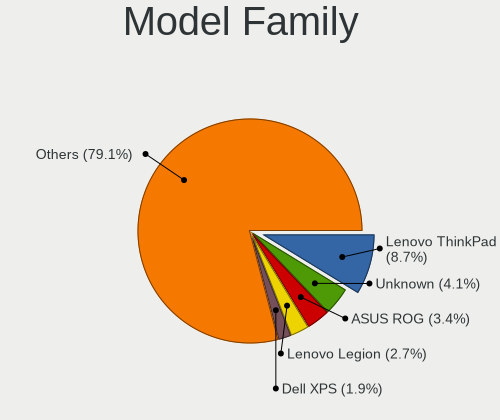
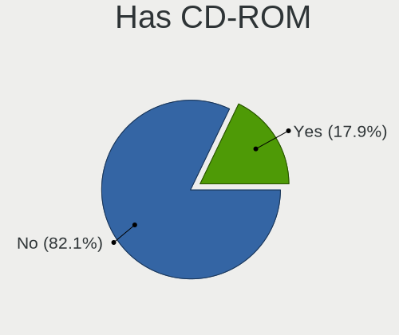
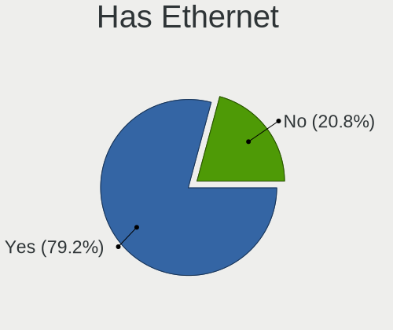
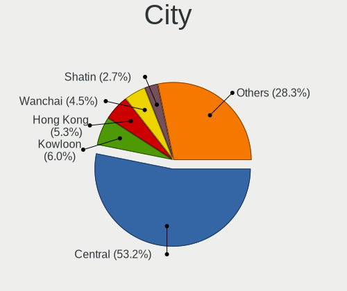
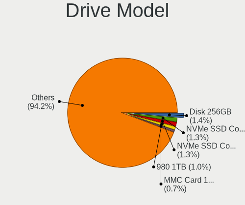
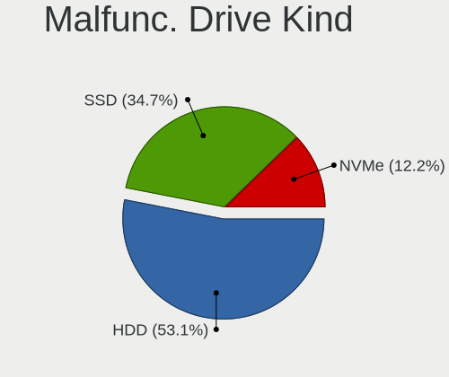
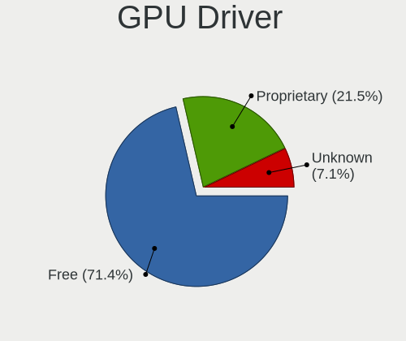
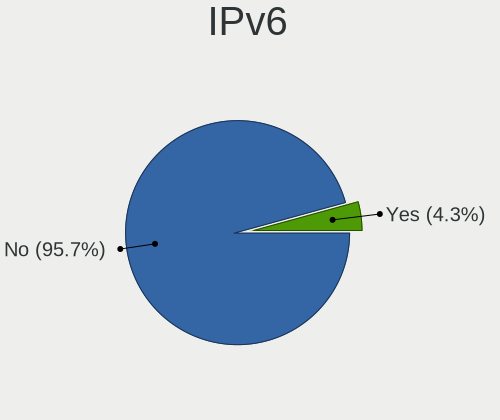

Linux in Hong Kong - Tested Hardware & Statistics
-------------------------------------------------

A project to collect tested hardware configurations for Linux in Hong Kong.

Anyone can contribute to this report by the [hw-probe](https://github.com/linuxhw/hw-probe) tool:

    sudo -E hw-probe -all -upload

Please contribute! Especially if your hardware is rare.

This is a report for all computer types. See also reports for [desktops](/Location/Hong_Kong/Desktop/README.md) and [notebooks](/Location/Hong_Kong/Notebook/README.md).

Contents
--------

* [ Test Cases ](#test-cases)

* [ System ](#system)
  - [ OS                       ](#os)
  - [ OS Family                ](#os-family)
  - [ Kernel                   ](#kernel)
  - [ Kernel Family            ](#kernel-family)
  - [ Kernel Major Ver.        ](#kernel-major-ver)
  - [ Arch                     ](#arch)
  - [ DE                       ](#de)
  - [ Display Server           ](#display-server)
  - [ Display Manager          ](#display-manager)
  - [ OS Lang                  ](#os-lang)
  - [ Boot Mode                ](#boot-mode)
  - [ Filesystem               ](#filesystem)
  - [ Part. scheme             ](#part-scheme)
  - [ Dual Boot with Linux/BSD ](#dual-boot-with-linuxbsd)
  - [ Dual Boot (Win)          ](#dual-boot-win)

* [ Board ](#board)
  - [ Vendor                   ](#vendor)
  - [ Model                    ](#model)
  - [ Model Family             ](#model-family)
  - [ MFG Year                 ](#mfg-year)
  - [ Form Factor              ](#form-factor)
  - [ Secure Boot              ](#secure-boot)
  - [ Coreboot                 ](#coreboot)
  - [ RAM Size                 ](#ram-size)
  - [ RAM Used                 ](#ram-used)
  - [ Total Drives             ](#total-drives)
  - [ Has CD-ROM               ](#has-cd-rom)
  - [ Has Ethernet             ](#has-ethernet)
  - [ Has WiFi                 ](#has-wifi)
  - [ Has Bluetooth            ](#has-bluetooth)

* [ Location ](#location)
  - [ Country                  ](#country)
  - [ City                     ](#city)

* [ Drives ](#drives)
  - [ Drive Vendor             ](#drive-vendor)
  - [ Drive Model              ](#drive-model)
  - [ HDD Vendor               ](#hdd-vendor)
  - [ SSD Vendor               ](#ssd-vendor)
  - [ Drive Kind               ](#drive-kind)
  - [ Drive Connector          ](#drive-connector)
  - [ Drive Size               ](#drive-size)
  - [ Space Total              ](#space-total)
  - [ Space Used               ](#space-used)
  - [ Malfunc. Drives          ](#malfunc-drives)
  - [ Malfunc. Drive Vendor    ](#malfunc-drive-vendor)
  - [ Malfunc. HDD Vendor      ](#malfunc-hdd-vendor)
  - [ Malfunc. Drive Kind      ](#malfunc-drive-kind)
  - [ Failed Drives            ](#failed-drives)
  - [ Failed Drive Vendor      ](#failed-drive-vendor)
  - [ Drive Status             ](#drive-status)

* [ Storage controller ](#storage-controller)
  - [ Storage Vendor           ](#storage-vendor)
  - [ Storage Model            ](#storage-model)
  - [ Storage Kind             ](#storage-kind)

* [ Processor ](#processor)
  - [ CPU Vendor               ](#cpu-vendor)
  - [ CPU Model                ](#cpu-model)
  - [ CPU Model Family         ](#cpu-model-family)
  - [ CPU Cores                ](#cpu-cores)
  - [ CPU Sockets              ](#cpu-sockets)
  - [ CPU Threads              ](#cpu-threads)
  - [ CPU Op-Modes             ](#cpu-op-modes)
  - [ CPU Microcode            ](#cpu-microcode)
  - [ CPU Microarch            ](#cpu-microarch)

* [ Graphics ](#graphics)
  - [ GPU Vendor               ](#gpu-vendor)
  - [ GPU Model                ](#gpu-model)
  - [ GPU Combo                ](#gpu-combo)
  - [ GPU Driver               ](#gpu-driver)
  - [ GPU Memory               ](#gpu-memory)

* [ Monitor ](#monitor)
  - [ Monitor Vendor           ](#monitor-vendor)
  - [ Monitor Model            ](#monitor-model)
  - [ Monitor Resolution       ](#monitor-resolution)
  - [ Monitor Diagonal         ](#monitor-diagonal)
  - [ Monitor Width            ](#monitor-width)
  - [ Aspect Ratio             ](#aspect-ratio)
  - [ Monitor Area             ](#monitor-area)
  - [ Pixel Density            ](#pixel-density)
  - [ Multiple Monitors        ](#multiple-monitors)

* [ Network ](#network)
  - [ Net Controller Vendor    ](#net-controller-vendor)
  - [ Net Controller Model     ](#net-controller-model)
  - [ Wireless Vendor          ](#wireless-vendor)
  - [ Wireless Model           ](#wireless-model)
  - [ Ethernet Vendor          ](#ethernet-vendor)
  - [ Ethernet Model           ](#ethernet-model)
  - [ Net Controller Kind      ](#net-controller-kind)
  - [ Used Controller          ](#used-controller)
  - [ NICs                     ](#nics)
  - [ IPv6                     ](#ipv6)

* [ Bluetooth ](#bluetooth)
  - [ Bluetooth Vendor         ](#bluetooth-vendor)
  - [ Bluetooth Model          ](#bluetooth-model)

* [ Sound ](#sound)
  - [ Sound Vendor             ](#sound-vendor)
  - [ Sound Model              ](#sound-model)

* [ Memory ](#memory)
  - [ Memory Vendor            ](#memory-vendor)
  - [ Memory Model             ](#memory-model)
  - [ Memory Kind              ](#memory-kind)
  - [ Memory Form Factor       ](#memory-form-factor)
  - [ Memory Size              ](#memory-size)
  - [ Memory Speed             ](#memory-speed)

* [ Printers & scanners ](#printers--scanners)
  - [ Printer Vendor           ](#printer-vendor)
  - [ Printer Model            ](#printer-model)
  - [ Scanner Vendor           ](#scanner-vendor)
  - [ Scanner Model            ](#scanner-model)

* [ Camera ](#camera)
  - [ Camera Vendor            ](#camera-vendor)
  - [ Camera Model             ](#camera-model)

* [ Security ](#security)
  - [ Fingerprint Vendor       ](#fingerprint-vendor)
  - [ Fingerprint Model        ](#fingerprint-model)
  - [ Chipcard Vendor          ](#chipcard-vendor)
  - [ Chipcard Model           ](#chipcard-model)

* [ Unsupported ](#unsupported)
  - [ Unsupported Devices      ](#unsupported-devices)
  - [ Unsupported Device Types ](#unsupported-device-types)

Test Cases
----------

Total: 409

| Vendor        | Model                       | Form-Factor | Probe                                                      | Date         |
|---------------|-----------------------------|-------------|------------------------------------------------------------|--------------|
| Supermicro    | X9DRD-7LN4F                 | Server      | [302c3f11ec](https://linux-hardware.org/?probe=302c3f11ec) | Aug 29, 2022 |
| Lenovo        | Yoga C940-14IIL 81Q9        | Convertible | [9a83e7ee58](https://linux-hardware.org/?probe=9a83e7ee58) | Aug 28, 2022 |
| Lenovo        | Yoga C940-14IIL 81Q9        | Convertible | [638f08fc43](https://linux-hardware.org/?probe=638f08fc43) | Aug 27, 2022 |
| Dell          | 0427JK A00                  | Desktop     | [8f6a2c8d0b](https://linux-hardware.org/?probe=8f6a2c8d0b) | Aug 22, 2022 |
| MSI           | GS65 Stealth Thin 8RE       | Notebook    | [90aed4d5d1](https://linux-hardware.org/?probe=90aed4d5d1) | Aug 20, 2022 |
| Dell          | 0200DY A03                  | Desktop     | [e0e14cd1f2](https://linux-hardware.org/?probe=e0e14cd1f2) | Aug 19, 2022 |
| ASUSTek       | ROG STRIX B660-I GAMING ... | Desktop     | [58b22885a8](https://linux-hardware.org/?probe=58b22885a8) | Aug 18, 2022 |
| Lenovo        | ThinkPad X1 Carbon 6th 2... | Notebook    | [c32d69a956](https://linux-hardware.org/?probe=c32d69a956) | Aug 18, 2022 |
| ASUSTek       | PRIME Z590M-PLUS            | Desktop     | [bd7c6f361d](https://linux-hardware.org/?probe=bd7c6f361d) | Aug 18, 2022 |
| Lenovo        | ThinkPad X13 Gen 1 20UFS... | Notebook    | [6eadd1ec75](https://linux-hardware.org/?probe=6eadd1ec75) | Aug 17, 2022 |
| MSI           | MAG B660M MORTAR WIFI DD... | Desktop     | [56ba58f5d0](https://linux-hardware.org/?probe=56ba58f5d0) | Aug 16, 2022 |
| Lenovo        | ThinkPad T490s 20NYS79X0... | Notebook    | [5fe4fba501](https://linux-hardware.org/?probe=5fe4fba501) | Aug 12, 2022 |
| Acer          | Swift SF314-512             | Notebook    | [c374f64c25](https://linux-hardware.org/?probe=c374f64c25) | Aug 11, 2022 |
| Acer          | Swift SF314-512             | Notebook    | [0c23760c27](https://linux-hardware.org/?probe=0c23760c27) | Aug 10, 2022 |
| HP            | ZBook 17 G3                 | Notebook    | [bc4cf926f2](https://linux-hardware.org/?probe=bc4cf926f2) | Aug 06, 2022 |
| KOHJINSHA     | SC series                   | Notebook    | [90a25503ee](https://linux-hardware.org/?probe=90a25503ee) | Aug 01, 2022 |
| KOHJINSHA     | SC series                   | Notebook    | [3986e59a55](https://linux-hardware.org/?probe=3986e59a55) | Aug 01, 2022 |
| Lenovo        | ThinkPad L14 Gen 1 20U6A... | Notebook    | [76d752f0ad](https://linux-hardware.org/?probe=76d752f0ad) | Aug 01, 2022 |
| Fujitsu       | LIFEBOOK V1020              | Notebook    | [e33ac2916d](https://linux-hardware.org/?probe=e33ac2916d) | Jul 30, 2022 |
| HP            | OMEN Laptop 15-en0xxx       | Notebook    | [d449f1aeb9](https://linux-hardware.org/?probe=d449f1aeb9) | Jul 27, 2022 |
| ASRock        | B450M-HDV R4.0              | Desktop     | [f2172999c8](https://linux-hardware.org/?probe=f2172999c8) | Jul 24, 2022 |
| AMI           | Aptio CRB                   | Mini pc     | [353168b909](https://linux-hardware.org/?probe=353168b909) | Jul 18, 2022 |
| Huanan        | X99-TF                      | Desktop     | [55b43de5a6](https://linux-hardware.org/?probe=55b43de5a6) | Jul 17, 2022 |
| IBM           | 260921H                     | Notebook    | [bab4f3f57d](https://linux-hardware.org/?probe=bab4f3f57d) | Jul 17, 2022 |
| IBM           | 260921H                     | Notebook    | [a7483bac34](https://linux-hardware.org/?probe=a7483bac34) | Jul 17, 2022 |
| Lenovo        | ThinkPad X250 20CLA1VECD    | Notebook    | [f3e0ebd16e](https://linux-hardware.org/?probe=f3e0ebd16e) | Jul 15, 2022 |
| Lenovo        | ThinkPad X250 20CLA1VECD    | Notebook    | [ab1472b3cd](https://linux-hardware.org/?probe=ab1472b3cd) | Jul 15, 2022 |
| IBM           | 260921H                     | Notebook    | [5f9b0998d3](https://linux-hardware.org/?probe=5f9b0998d3) | Jul 11, 2022 |
| IBM           | 260921H                     | Notebook    | [f0430651fd](https://linux-hardware.org/?probe=f0430651fd) | Jul 10, 2022 |
| AMI           | Aptio CRB                   | Mini pc     | [e9adf47b7a](https://linux-hardware.org/?probe=e9adf47b7a) | Jul 10, 2022 |
| Lenovo        | Unknown                     | Notebook    | [910a4f6587](https://linux-hardware.org/?probe=910a4f6587) | Jul 09, 2022 |
| Soyo          | SY-A68M FS V2.0             | Desktop     | [ab243c130a](https://linux-hardware.org/?probe=ab243c130a) | Jul 06, 2022 |
| Acer          | Swift SF314-42              | Notebook    | [bd4792ebd8](https://linux-hardware.org/?probe=bd4792ebd8) | Jul 02, 2022 |
| Compaq        | Tablet PC TC1000            | Notebook    | [80324222a7](https://linux-hardware.org/?probe=80324222a7) | Jun 26, 2022 |
| KOHJINSHA     | SX series                   | Notebook    | [7333815afc](https://linux-hardware.org/?probe=7333815afc) | Jun 26, 2022 |
| Samsung       | SQ1S Revision MP            | Notebook    | [faeb18a49e](https://linux-hardware.org/?probe=faeb18a49e) | Jun 26, 2022 |
| Lenovo        | ThinkPad X1 Carbon 5th 2... | Notebook    | [044be44d33](https://linux-hardware.org/?probe=044be44d33) | Jun 25, 2022 |
| Lenovo        | ThinkBook 14 G4+ ARA 21D... | Notebook    | [5bd3ad4d01](https://linux-hardware.org/?probe=5bd3ad4d01) | Jun 24, 2022 |
| Gigabyte      | X570 AORUS PRO WIFI         | Desktop     | [518331cc83](https://linux-hardware.org/?probe=518331cc83) | Jun 21, 2022 |
| Dell          | XPS 15 9520                 | Notebook    | [ec6f5cce04](https://linux-hardware.org/?probe=ec6f5cce04) | Jun 20, 2022 |
| Huanan        | X99-TF                      | Desktop     | [04dc5246af](https://linux-hardware.org/?probe=04dc5246af) | Jun 18, 2022 |
| Lenovo        | 3715 SDK0L77769 WIN 3423... | Desktop     | [16d122d03e](https://linux-hardware.org/?probe=16d122d03e) | Jun 16, 2022 |
| Dell          | XPS 15 9520                 | Notebook    | [bdd4ec2ef9](https://linux-hardware.org/?probe=bdd4ec2ef9) | Jun 15, 2022 |
| Lenovo        | ThinkBook 14 G4+ ARA 21D... | Notebook    | [f4c7f13ff8](https://linux-hardware.org/?probe=f4c7f13ff8) | Jun 14, 2022 |
| Lenovo        | ThinkPad X250 20CLA1VECD    | Notebook    | [e3df184136](https://linux-hardware.org/?probe=e3df184136) | Jun 12, 2022 |
| Dell          | XPS 13 9305                 | Notebook    | [e373d39f20](https://linux-hardware.org/?probe=e373d39f20) | Jun 09, 2022 |
| Huanan        | X99-TF                      | Desktop     | [4e5364e832](https://linux-hardware.org/?probe=4e5364e832) | Jun 08, 2022 |
| ASUSTek       | Zenbook UX5401ZAS_UX5401... | Notebook    | [27301ce2e8](https://linux-hardware.org/?probe=27301ce2e8) | Jun 03, 2022 |
| ASUSTek       | N501VW                      | Notebook    | [2f8215fb0a](https://linux-hardware.org/?probe=2f8215fb0a) | May 31, 2022 |
| Lenovo        | ThinkPad T430s 2355C33      | Notebook    | [33de2bbd12](https://linux-hardware.org/?probe=33de2bbd12) | May 31, 2022 |
| Dell          | XPS 15 9520                 | Notebook    | [4d4c32223e](https://linux-hardware.org/?probe=4d4c32223e) | May 31, 2022 |
| Lenovo        | ThinkPad T430s 2355C33      | Notebook    | [4eab57bebf](https://linux-hardware.org/?probe=4eab57bebf) | May 30, 2022 |
| Dell          | XPS 15 9520                 | Notebook    | [eee1a317b6](https://linux-hardware.org/?probe=eee1a317b6) | May 30, 2022 |
| Lenovo        | IdeaPad Gaming 3 15ACH6 ... | Notebook    | [63fd75f1a8](https://linux-hardware.org/?probe=63fd75f1a8) | May 29, 2022 |
| Lenovo        | Legion Y7000P2020H 82AX     | Notebook    | [220325c031](https://linux-hardware.org/?probe=220325c031) | May 29, 2022 |
| Dell          | XPS 15 9520                 | Notebook    | [75d345243e](https://linux-hardware.org/?probe=75d345243e) | May 29, 2022 |
| ASUSTek       | ASUS TUF Gaming A15 FA50... | Notebook    | [7fa4ca7312](https://linux-hardware.org/?probe=7fa4ca7312) | May 23, 2022 |
| Intel Clie... | LAPKC71F                    | Notebook    | [1f67896c5c](https://linux-hardware.org/?probe=1f67896c5c) | May 22, 2022 |
| Intel Clie... | LAPKC71F                    | Notebook    | [a227af798c](https://linux-hardware.org/?probe=a227af798c) | May 20, 2022 |
| Gigabyte      | HA65M-UD3H-B3               | Desktop     | [d368918a0b](https://linux-hardware.org/?probe=d368918a0b) | May 13, 2022 |
| Gigabyte      | X570 AORUS PRO WIFI         | Desktop     | [e45fa22892](https://linux-hardware.org/?probe=e45fa22892) | May 11, 2022 |
| HP            | ZHAN 66 Pro 14 G4 Notebo... | Notebook    | [f0b122c199](https://linux-hardware.org/?probe=f0b122c199) | May 09, 2022 |
| Gigabyte      | GA-880GMA-UD2H              | Desktop     | [09d9f58ee7](https://linux-hardware.org/?probe=09d9f58ee7) | May 02, 2022 |
| Lenovo        | IdeaPadFlex 5 14ARE05 81... | Convertible | [99e0958898](https://linux-hardware.org/?probe=99e0958898) | May 01, 2022 |
| Dell          | Precision 7520              | Notebook    | [2dc98a1a8d](https://linux-hardware.org/?probe=2dc98a1a8d) | Apr 30, 2022 |
| MSI           | H87I                        | Desktop     | [af4a26a5ea](https://linux-hardware.org/?probe=af4a26a5ea) | Apr 30, 2022 |
| Gigabyte      | B660M DS3H AX DDR4          | Desktop     | [0633ac7757](https://linux-hardware.org/?probe=0633ac7757) | Apr 26, 2022 |
| Lenovo        | Yoga Slim 7 Pro 14ACH5 8... | Notebook    | [9191742453](https://linux-hardware.org/?probe=9191742453) | Apr 26, 2022 |
| Gigabyte      | B660M DS3H AX DDR4          | Desktop     | [56902c7998](https://linux-hardware.org/?probe=56902c7998) | Apr 26, 2022 |
| Lenovo        | IdeaPadFlex 5 14ITL05 82... | Convertible | [a3aa6e30b9](https://linux-hardware.org/?probe=a3aa6e30b9) | Apr 21, 2022 |
| Apple         | MacBookAir5,1               | Notebook    | [3dd8282149](https://linux-hardware.org/?probe=3dd8282149) | Apr 20, 2022 |
| GPD           | P2 MAX                      | Notebook    | [ca842dc5fb](https://linux-hardware.org/?probe=ca842dc5fb) | Apr 19, 2022 |
| Intel         | NUC11PABi5 K90634-304       | Mini pc     | [d359794b2f](https://linux-hardware.org/?probe=d359794b2f) | Apr 19, 2022 |
| Lenovo        | IdeaPadFlex 5 14ITL05 82... | Convertible | [7ea786c89b](https://linux-hardware.org/?probe=7ea786c89b) | Apr 18, 2022 |
| Apple         | Mac-27ADBB7B4CEE8E61 iMa... | All in one  | [0ac1f4daf9](https://linux-hardware.org/?probe=0ac1f4daf9) | Apr 12, 2022 |
| Gigabyte      | B660M DS3H AX DDR4          | Desktop     | [abed3ae34d](https://linux-hardware.org/?probe=abed3ae34d) | Apr 12, 2022 |
| Lenovo        | IdeaPad 320-15IKB 80XL      | Notebook    | [ca558e6708](https://linux-hardware.org/?probe=ca558e6708) | Apr 07, 2022 |
| ASUSTek       | VM62                        | Desktop     | [ae684cdf71](https://linux-hardware.org/?probe=ae684cdf71) | Apr 05, 2022 |
| ASUSTek       | ROG Strix G513QM_G513QM     | Notebook    | [bdca066ba3](https://linux-hardware.org/?probe=bdca066ba3) | Apr 05, 2022 |
| ASRock        | H410M-ITX/ac                | Desktop     | [ae936790c9](https://linux-hardware.org/?probe=ae936790c9) | Apr 03, 2022 |
| MSI           | MAG B550M MORTAR            | Desktop     | [9ebb4c0fd3](https://linux-hardware.org/?probe=9ebb4c0fd3) | Mar 31, 2022 |
| Dell          | Inspiron 14 5410            | Notebook    | [314bd42e78](https://linux-hardware.org/?probe=314bd42e78) | Mar 28, 2022 |
| Lenovo        | ThinkPad T430s 2355C33      | Notebook    | [a881a875bd](https://linux-hardware.org/?probe=a881a875bd) | Mar 27, 2022 |
| Fujitsu       | LIFEBOOK LH531              | Notebook    | [2d48cb4419](https://linux-hardware.org/?probe=2d48cb4419) | Mar 26, 2022 |
| Dell          | 0Y3R3K A03                  | Desktop     | [b772cf9d86](https://linux-hardware.org/?probe=b772cf9d86) | Mar 26, 2022 |
| Raspberry ... | Raspberry Pi 400 Rev 1.0    | Soc         | [e7fb180535](https://linux-hardware.org/?probe=e7fb180535) | Mar 16, 2022 |
| Dell          | Latitude 7285               | Notebook    | [87e555f958](https://linux-hardware.org/?probe=87e555f958) | Mar 13, 2022 |
| ASUSTek       | PRIME Z590-A                | Desktop     | [7320ed668a](https://linux-hardware.org/?probe=7320ed668a) | Mar 12, 2022 |
| Fujitsu       | LIFEBOOK AH544              | Notebook    | [03b27c8ca4](https://linux-hardware.org/?probe=03b27c8ca4) | Mar 12, 2022 |
| Lenovo        | ThinkPad X1 Extreme 20MF... | Notebook    | [4998fff0f9](https://linux-hardware.org/?probe=4998fff0f9) | Mar 12, 2022 |
| Gigabyte      | X570 AORUS ELITE            | Desktop     | [99d3e16ede](https://linux-hardware.org/?probe=99d3e16ede) | Mar 12, 2022 |
| HP            | Victus by Laptop 16-d1xx... | Notebook    | [c68cec2207](https://linux-hardware.org/?probe=c68cec2207) | Mar 11, 2022 |
| Unknown       | Intel X79                   | Desktop     | [e947d6af7f](https://linux-hardware.org/?probe=e947d6af7f) | Mar 11, 2022 |
| Fujitsu       | LIFEBOOK AH544              | Notebook    | [96b36779e0](https://linux-hardware.org/?probe=96b36779e0) | Mar 11, 2022 |
| MSI           | MPG X570 GAMING PRO CARB... | Desktop     | [4d16610cf3](https://linux-hardware.org/?probe=4d16610cf3) | Mar 10, 2022 |
| HP            | Notebook                    | Notebook    | [9c04c0776d](https://linux-hardware.org/?probe=9c04c0776d) | Mar 10, 2022 |
| HP            | Notebook                    | Notebook    | [c7d735dc99](https://linux-hardware.org/?probe=c7d735dc99) | Mar 10, 2022 |
| MSI           | B450M PRO-VDH PLUS          | Desktop     | [4b2fe6657c](https://linux-hardware.org/?probe=4b2fe6657c) | Mar 04, 2022 |
| Gigabyte      | X570 AORUS ELITE            | Desktop     | [0b9a7acb84](https://linux-hardware.org/?probe=0b9a7acb84) | Feb 27, 2022 |
| MSI           | B75MA-P45                   | Desktop     | [35ad54efc7](https://linux-hardware.org/?probe=35ad54efc7) | Feb 26, 2022 |
| Dell          | 0Y5DDC A00                  | Desktop     | [3c7daed552](https://linux-hardware.org/?probe=3c7daed552) | Feb 22, 2022 |
| ASUSTek       | PN41                        | Mini pc     | [6c00869d7b](https://linux-hardware.org/?probe=6c00869d7b) | Feb 21, 2022 |
| Lenovo        | ThinkPad P15v Gen 1 20TQ... | Notebook    | [0f4fad19b2](https://linux-hardware.org/?probe=0f4fad19b2) | Feb 07, 2022 |
| ASUSTek       | TUF Gaming B550M-PLUS       | Desktop     | [6e5689a733](https://linux-hardware.org/?probe=6e5689a733) | Jan 28, 2022 |
| Raspberry ... | Raspberry Pi Zero 2 Rev ... | Soc         | [2a66f4b578](https://linux-hardware.org/?probe=2a66f4b578) | Jan 24, 2022 |
| Dell          | Inspiron 5580               | Notebook    | [515465fd5a](https://linux-hardware.org/?probe=515465fd5a) | Jan 22, 2022 |
| ASRock        | Z270M-ITX/ac                | Desktop     | [4c32bf6d7b](https://linux-hardware.org/?probe=4c32bf6d7b) | Jan 18, 2022 |
| Lenovo        | Legion R7000 2020 82B6      | Notebook    | [5f92f3376e](https://linux-hardware.org/?probe=5f92f3376e) | Jan 11, 2022 |
| HP            | 8597                        | Desktop     | [09ed815dd0](https://linux-hardware.org/?probe=09ed815dd0) | Jan 08, 2022 |
| Gigabyte      | B450 AORUS PRO WIFI-CF      | Desktop     | [83ff6966e1](https://linux-hardware.org/?probe=83ff6966e1) | Dec 24, 2021 |
| ASUSTek       | Z170 PRO GAMING             | Desktop     | [c5fa4a0cec](https://linux-hardware.org/?probe=c5fa4a0cec) | Dec 24, 2021 |
| ASRock        | H410M-ITX/ac                | Desktop     | [99c341562a](https://linux-hardware.org/?probe=99c341562a) | Dec 21, 2021 |
| Gigabyte      | B450 AORUS PRO WIFI-CF      | Desktop     | [d01abdcb39](https://linux-hardware.org/?probe=d01abdcb39) | Dec 19, 2021 |
| MSI           | 870-G45                     | Desktop     | [e6317a2b91](https://linux-hardware.org/?probe=e6317a2b91) | Dec 19, 2021 |
| HP            | EliteBook 830 G5            | Notebook    | [bf884733a1](https://linux-hardware.org/?probe=bf884733a1) | Dec 16, 2021 |
| HP            | EliteBook 830 G5            | Notebook    | [61d4bff2bd](https://linux-hardware.org/?probe=61d4bff2bd) | Dec 15, 2021 |
| Fujitsu       | LIFEBOOK LH530              | Notebook    | [8db7409ab5](https://linux-hardware.org/?probe=8db7409ab5) | Dec 14, 2021 |
| Unknown       | Intel X79                   | Desktop     | [985655e4b3](https://linux-hardware.org/?probe=985655e4b3) | Dec 11, 2021 |
| Unknown       | Unknown                     | Notebook    | [739be994cb](https://linux-hardware.org/?probe=739be994cb) | Dec 09, 2021 |
| Lenovo        | Legion 5 15ACH6 82JW        | Notebook    | [024a42eb21](https://linux-hardware.org/?probe=024a42eb21) | Dec 08, 2021 |
| Unknown       | Intel X79                   | Desktop     | [6f32192557](https://linux-hardware.org/?probe=6f32192557) | Dec 08, 2021 |
| Supermicro    | X9DRi-LN4+/X9DR3-LN4+       | Desktop     | [bd8742e075](https://linux-hardware.org/?probe=bd8742e075) | Dec 08, 2021 |
| MSI           | Boston                      | Desktop     | [0b79772dfa](https://linux-hardware.org/?probe=0b79772dfa) | Dec 04, 2021 |
| Supermicro    | C2SBC-Q                     | Desktop     | [1099e48366](https://linux-hardware.org/?probe=1099e48366) | Nov 28, 2021 |
| MSI           | MAG B550M MORTAR WIFI       | Desktop     | [58d43162d2](https://linux-hardware.org/?probe=58d43162d2) | Nov 28, 2021 |
| Lenovo        | ThinkPad X1 Carbon 7th 2... | Notebook    | [ee13ae89af](https://linux-hardware.org/?probe=ee13ae89af) | Nov 26, 2021 |
| Apple         | MacBook10,1                 | Notebook    | [6cb99e6a5f](https://linux-hardware.org/?probe=6cb99e6a5f) | Nov 23, 2021 |
| Gigabyte      | H310M S2H x.x               | Desktop     | [fc59694424](https://linux-hardware.org/?probe=fc59694424) | Nov 17, 2021 |
| MSI           | B450 TOMAHAWK MAX II        | Desktop     | [35b58ec233](https://linux-hardware.org/?probe=35b58ec233) | Nov 16, 2021 |
| Jumper        | EZbook                      | Notebook    | [5da2b95e2f](https://linux-hardware.org/?probe=5da2b95e2f) | Nov 12, 2021 |
| Lenovo        | XiaoXin Chao7000-14IKBR ... | Notebook    | [531b838f59](https://linux-hardware.org/?probe=531b838f59) | Nov 09, 2021 |
| Lenovo        | XiaoXin Chao7000-14IKBR ... | Notebook    | [8ea29d23df](https://linux-hardware.org/?probe=8ea29d23df) | Nov 09, 2021 |
| Seco          | C40 C                       | Desktop     | [27bff03d0c](https://linux-hardware.org/?probe=27bff03d0c) | Nov 08, 2021 |
| Unknown       | Unknown                     | Notebook    | [ed14b60c7a](https://linux-hardware.org/?probe=ed14b60c7a) | Nov 05, 2021 |
| MSI           | B450 TOMAHAWK MAX II        | Desktop     | [9bcd3d5479](https://linux-hardware.org/?probe=9bcd3d5479) | Oct 29, 2021 |
| Lenovo        | Yoga DuetITL 2021 82MA      | Tablet      | [c7fc01bd49](https://linux-hardware.org/?probe=c7fc01bd49) | Oct 27, 2021 |
| Gigabyte      | X570 AORUS PRO WIFI         | Desktop     | [c7a0fe2f88](https://linux-hardware.org/?probe=c7a0fe2f88) | Oct 26, 2021 |
| HP            | Laptop 15s-du3xxx           | Notebook    | [6f87ece998](https://linux-hardware.org/?probe=6f87ece998) | Oct 26, 2021 |
| Lenovo        | IdeaPad 5 14IIL05 81YH      | Notebook    | [3d42bc888b](https://linux-hardware.org/?probe=3d42bc888b) | Oct 24, 2021 |
| Lenovo        | IdeaPad 5 14IIL05 81YH      | Notebook    | [54e54e71bd](https://linux-hardware.org/?probe=54e54e71bd) | Oct 24, 2021 |
| MSI           | B450 TOMAHAWK MAX II        | Desktop     | [aedfc53de6](https://linux-hardware.org/?probe=aedfc53de6) | Oct 20, 2021 |
| Dell          | XPS 13 9310                 | Notebook    | [20dc49f637](https://linux-hardware.org/?probe=20dc49f637) | Oct 13, 2021 |
| Lenovo        | IdeaPadFlex 5 14ARE05 81... | Convertible | [aee062d6e5](https://linux-hardware.org/?probe=aee062d6e5) | Oct 04, 2021 |
| Lenovo        | Legion Y9000P2021H 82JD     | Notebook    | [4c3be0fe24](https://linux-hardware.org/?probe=4c3be0fe24) | Oct 02, 2021 |
| MSI           | H61M-P23                    | Desktop     | [3a07878154](https://linux-hardware.org/?probe=3a07878154) | Sep 28, 2021 |
| GPD           | G1618-03                    | Notebook    | [41916177c2](https://linux-hardware.org/?probe=41916177c2) | Sep 01, 2021 |
| GPD           | G1618-03                    | Notebook    | [c2abcaf10c](https://linux-hardware.org/?probe=c2abcaf10c) | Sep 01, 2021 |
| MSI           | MEG X570 GODLIKE            | Desktop     | [1440e244f6](https://linux-hardware.org/?probe=1440e244f6) | Aug 26, 2021 |
| Dell          | Precision 7550              | Notebook    | [42721343a3](https://linux-hardware.org/?probe=42721343a3) | Aug 16, 2021 |
| Lenovo        | XiaoXin-14API QC 2019 81... | Notebook    | [814eb97442](https://linux-hardware.org/?probe=814eb97442) | Aug 14, 2021 |
| Gigabyte      | B365M GAMING HD             | Desktop     | [d920558127](https://linux-hardware.org/?probe=d920558127) | Aug 14, 2021 |
| Gigabyte      | X570 AORUS ELITE            | Desktop     | [5cd377c0e0](https://linux-hardware.org/?probe=5cd377c0e0) | Aug 13, 2021 |
| Gigabyte      | B75M-D2P                    | Desktop     | [5e54c2a102](https://linux-hardware.org/?probe=5e54c2a102) | Aug 12, 2021 |
| Lenovo        | ThinkPad T61 6465CTO        | Notebook    | [d93258840e](https://linux-hardware.org/?probe=d93258840e) | Aug 04, 2021 |
| HP            | EliteBook 2540p             | Notebook    | [eb060cd2c4](https://linux-hardware.org/?probe=eb060cd2c4) | Aug 04, 2021 |
| Toshiba       | dynabook R731/E             | Notebook    | [828a52387f](https://linux-hardware.org/?probe=828a52387f) | Aug 02, 2021 |
| Toshiba       | dynabook R731/E             | Notebook    | [12b2c3e130](https://linux-hardware.org/?probe=12b2c3e130) | Aug 01, 2021 |
| Toshiba       | dynabook R731/E             | Notebook    | [3af43c8ebe](https://linux-hardware.org/?probe=3af43c8ebe) | Jul 29, 2021 |
| Toshiba       | dynabook R731/E             | Notebook    | [fa0aa86cef](https://linux-hardware.org/?probe=fa0aa86cef) | Jul 28, 2021 |
| HP            | 2B38                        | Desktop     | [be24f3f652](https://linux-hardware.org/?probe=be24f3f652) | Jul 26, 2021 |
| HP            | 2B38                        | Desktop     | [c1198b90f6](https://linux-hardware.org/?probe=c1198b90f6) | Jul 26, 2021 |
| Unknown       | Unknown                     | Notebook    | [8fc32673b3](https://linux-hardware.org/?probe=8fc32673b3) | Jul 25, 2021 |
| ASRock        | H410M-HDV                   | Desktop     | [58b70e282d](https://linux-hardware.org/?probe=58b70e282d) | Jul 14, 2021 |
| Gigabyte      | B365M GAMING HD             | Desktop     | [66cf378cf1](https://linux-hardware.org/?probe=66cf378cf1) | Jul 10, 2021 |
| Gigabyte      | B85M-DS3H-A                 | Desktop     | [6496f18326](https://linux-hardware.org/?probe=6496f18326) | Jul 02, 2021 |
| Gigabyte      | B85M-DS3H-A                 | Desktop     | [71da4978c9](https://linux-hardware.org/?probe=71da4978c9) | Jun 29, 2021 |
| Gigabyte      | B365M GAMING HD             | Desktop     | [ed911e7e8c](https://linux-hardware.org/?probe=ed911e7e8c) | Jun 26, 2021 |
| Gigabyte      | B365M GAMING HD             | Desktop     | [8785d98b0b](https://linux-hardware.org/?probe=8785d98b0b) | Jun 19, 2021 |
| ASUSTek       | PRIME Z390-P                | Desktop     | [54e520ac17](https://linux-hardware.org/?probe=54e520ac17) | Jun 17, 2021 |
| Toshiba       | dynabook R731/E             | Notebook    | [c2bfccf320](https://linux-hardware.org/?probe=c2bfccf320) | Jun 16, 2021 |
| Toshiba       | dynabook R731/E             | Notebook    | [d3f69874dd](https://linux-hardware.org/?probe=d3f69874dd) | Jun 16, 2021 |
| Lenovo        | IdeaCentre B305 10052       | All in one  | [8399296d51](https://linux-hardware.org/?probe=8399296d51) | Jun 13, 2021 |
| Dell          | Precision M4800             | Notebook    | [298694c222](https://linux-hardware.org/?probe=298694c222) | Jun 12, 2021 |
| ASUSTek       | TUF Gaming Z490-PLUS        | Desktop     | [76219e9cca](https://linux-hardware.org/?probe=76219e9cca) | Jun 09, 2021 |
| Acer          | Aspire E5-573               | Notebook    | [4193a2da9d](https://linux-hardware.org/?probe=4193a2da9d) | Jun 08, 2021 |
| ASRock        | H410M-HDV                   | Desktop     | [bcb80080a5](https://linux-hardware.org/?probe=bcb80080a5) | Jun 06, 2021 |
| Dell          | Precision M4800             | Notebook    | [67fb08d285](https://linux-hardware.org/?probe=67fb08d285) | Jun 06, 2021 |
| Dell          | Precision M4800             | Notebook    | [c72664a2f4](https://linux-hardware.org/?probe=c72664a2f4) | Jun 06, 2021 |
| HP            | 18E7                        | Desktop     | [9844f6635c](https://linux-hardware.org/?probe=9844f6635c) | May 30, 2021 |
| Toshiba       | dynabook R731/E             | Notebook    | [81ffc7ba9e](https://linux-hardware.org/?probe=81ffc7ba9e) | May 26, 2021 |
| ASUSTek       | VM62                        | Desktop     | [486aeb5b89](https://linux-hardware.org/?probe=486aeb5b89) | May 25, 2021 |
| Gigabyte      | F2A88XN-WIFI                | Desktop     | [c22e6d8669](https://linux-hardware.org/?probe=c22e6d8669) | May 25, 2021 |
| Dell          | 0D02VH A01                  | Desktop     | [e19475cd4c](https://linux-hardware.org/?probe=e19475cd4c) | May 22, 2021 |
| ASUSTek       | PRIME X399-A                | Desktop     | [a201bdfc36](https://linux-hardware.org/?probe=a201bdfc36) | May 19, 2021 |
| Fujitsu       | UH-X                        | Notebook    | [be65091e59](https://linux-hardware.org/?probe=be65091e59) | May 19, 2021 |
| ASUSTek       | M4A78-VM                    | Desktop     | [3313d34c41](https://linux-hardware.org/?probe=3313d34c41) | May 15, 2021 |
| Panasonic     | CFSZ5-2L                    | Notebook    | [1409e11b30](https://linux-hardware.org/?probe=1409e11b30) | May 12, 2021 |
| Nvidia        | Tegra                       | Soc         | [54592ec1a2](https://linux-hardware.org/?probe=54592ec1a2) | May 08, 2021 |
| Nvidia        | Tegra                       | Soc         | [ab1c7d5eab](https://linux-hardware.org/?probe=ab1c7d5eab) | May 08, 2021 |
| Dell          | XPS 13 9310                 | Notebook    | [8d372d62b7](https://linux-hardware.org/?probe=8d372d62b7) | May 07, 2021 |
| ASUSTek       | Z8NA-D6                     | Desktop     | [1b777c6f08](https://linux-hardware.org/?probe=1b777c6f08) | May 02, 2021 |
| ASUSTek       | Z8NA-D6                     | Desktop     | [4c7956a34c](https://linux-hardware.org/?probe=4c7956a34c) | May 02, 2021 |
| Panasonic     | CFSZ5-2L                    | Notebook    | [f35a966b00](https://linux-hardware.org/?probe=f35a966b00) | Apr 14, 2021 |
| Schenker      | XMG_APEX15_XAP15E20         | Notebook    | [a917367457](https://linux-hardware.org/?probe=a917367457) | Apr 09, 2021 |
| ASUSTek       | Zephyrus M GM501GM          | Notebook    | [f7937503ac](https://linux-hardware.org/?probe=f7937503ac) | Apr 08, 2021 |
| ASUSTek       | Zephyrus M GM501GM          | Notebook    | [99d71b6ea5](https://linux-hardware.org/?probe=99d71b6ea5) | Apr 06, 2021 |
| Lenovo        | IdeaPad Z410 20292          | Notebook    | [8253b70553](https://linux-hardware.org/?probe=8253b70553) | Apr 06, 2021 |
| MSI           | Boston                      | Desktop     | [e0cfb03088](https://linux-hardware.org/?probe=e0cfb03088) | Mar 30, 2021 |
| Fujitsu       | LIFEBOOK AH544              | Notebook    | [60600f6f0c](https://linux-hardware.org/?probe=60600f6f0c) | Mar 26, 2021 |
| HP            | 1632                        | Desktop     | [adf9ebb679](https://linux-hardware.org/?probe=adf9ebb679) | Mar 25, 2021 |
| MSI           | B450I GAMING PLUS AC        | Desktop     | [6a4196e0aa](https://linux-hardware.org/?probe=6a4196e0aa) | Mar 23, 2021 |
| MSI           | B450M-A PRO MAX             | Desktop     | [dc64c81c35](https://linux-hardware.org/?probe=dc64c81c35) | Mar 23, 2021 |
| Raspberry ... | Raspberry Pi                | Soc         | [280785b873](https://linux-hardware.org/?probe=280785b873) | Mar 22, 2021 |
| Raspberry ... | Raspberry Pi                | Soc         | [20d78f0b3a](https://linux-hardware.org/?probe=20d78f0b3a) | Mar 22, 2021 |
| ASUSTek       | B85M-G R2.0                 | Desktop     | [71ef988016](https://linux-hardware.org/?probe=71ef988016) | Mar 21, 2021 |
| ASRock        | H410M-HDV                   | Desktop     | [e44a5ce779](https://linux-hardware.org/?probe=e44a5ce779) | Mar 14, 2021 |
| ASUSTek       | UX302LA                     | Notebook    | [fe27a8e195](https://linux-hardware.org/?probe=fe27a8e195) | Mar 12, 2021 |
| Acer          | Aspire A315-34              | Notebook    | [d23d84b5f6](https://linux-hardware.org/?probe=d23d84b5f6) | Mar 06, 2021 |
| ASUSTek       | ROG Zephyrus G14 GA401IU... | Notebook    | [5051ba6156](https://linux-hardware.org/?probe=5051ba6156) | Mar 05, 2021 |
| MSI           | Boston                      | Desktop     | [e9513c3b7a](https://linux-hardware.org/?probe=e9513c3b7a) | Mar 03, 2021 |
| ASUSTek       | P8H61-M LX PLUS             | Desktop     | [b94539c6dc](https://linux-hardware.org/?probe=b94539c6dc) | Mar 01, 2021 |
| ASUSTek       | B85M-G R2.0                 | Desktop     | [b2cb174b9a](https://linux-hardware.org/?probe=b2cb174b9a) | Mar 01, 2021 |
| Fujitsu       | LIFEBOOK P771               | Notebook    | [2414020b54](https://linux-hardware.org/?probe=2414020b54) | Feb 26, 2021 |
| Fujitsu       | LIFEBOOK P771               | Notebook    | [ae61a5e1fa](https://linux-hardware.org/?probe=ae61a5e1fa) | Feb 26, 2021 |
| Lenovo        | MAHOBAY NOK                 | Desktop     | [e3c14a6397](https://linux-hardware.org/?probe=e3c14a6397) | Feb 25, 2021 |
| Dell          | 0D02VH A01                  | Desktop     | [87c36a9322](https://linux-hardware.org/?probe=87c36a9322) | Feb 23, 2021 |
| Lenovo        | ThinkPad E14 20RAA002CD     | Notebook    | [77ccb1ee60](https://linux-hardware.org/?probe=77ccb1ee60) | Feb 22, 2021 |
| Lenovo        | ThinkPad X270 20HNA00RAD    | Notebook    | [7d9f2bee38](https://linux-hardware.org/?probe=7d9f2bee38) | Feb 21, 2021 |
| ASUSTek       | VM45                        | Desktop     | [03eeb85521](https://linux-hardware.org/?probe=03eeb85521) | Feb 21, 2021 |
| ASUSTek       | VM65-K                      | Desktop     | [6b97cf71eb](https://linux-hardware.org/?probe=6b97cf71eb) | Feb 18, 2021 |
| ASUSTek       | VM65-K                      | Desktop     | [4f0bcd1276](https://linux-hardware.org/?probe=4f0bcd1276) | Feb 17, 2021 |
| ASUSTek       | VM40B                       | Desktop     | [6c0bf22f39](https://linux-hardware.org/?probe=6c0bf22f39) | Feb 17, 2021 |
| Lenovo        | ThinkPad X270 20HNA00RAD    | Notebook    | [d82924b12b](https://linux-hardware.org/?probe=d82924b12b) | Feb 16, 2021 |
| Dell          | 0D02VH A01                  | Desktop     | [ebc5645105](https://linux-hardware.org/?probe=ebc5645105) | Feb 11, 2021 |
| Lenovo        | IdeaCentre K330             | Desktop     | [78ce34058b](https://linux-hardware.org/?probe=78ce34058b) | Feb 11, 2021 |
| Lenovo        | G710 20252                  | Notebook    | [f4c2a6bac8](https://linux-hardware.org/?probe=f4c2a6bac8) | Feb 07, 2021 |
| Lenovo        | ThinkPad X270 20HNA00RAD    | Notebook    | [d4f69c78fa](https://linux-hardware.org/?probe=d4f69c78fa) | Jan 31, 2021 |
| Fujitsu       | S6420                       | Notebook    | [b23c0f10e7](https://linux-hardware.org/?probe=b23c0f10e7) | Jan 28, 2021 |
| Fujitsu       | S6420                       | Notebook    | [0cf6376b40](https://linux-hardware.org/?probe=0cf6376b40) | Jan 27, 2021 |
| Raspberry ... | Raspberry Pi                | Soc         | [1d0000672d](https://linux-hardware.org/?probe=1d0000672d) | Jan 23, 2021 |
| HP            | ZHAN 66 Pro 14 G4 Notebo... | Notebook    | [3d7ce778c6](https://linux-hardware.org/?probe=3d7ce778c6) | Jan 20, 2021 |
| HUAWEI        | KPRC-WX0                    | Notebook    | [fe7d03f093](https://linux-hardware.org/?probe=fe7d03f093) | Jan 18, 2021 |
| Raspberry ... | Raspberry Pi                | Soc         | [b8f5d6f1e4](https://linux-hardware.org/?probe=b8f5d6f1e4) | Jan 16, 2021 |
| ASUSTek       | ROG STRIX B450-I GAMING     | Desktop     | [39bc70ca5d](https://linux-hardware.org/?probe=39bc70ca5d) | Jan 13, 2021 |
| ASRock        | H410M-HDV                   | Desktop     | [d2420f233b](https://linux-hardware.org/?probe=d2420f233b) | Jan 10, 2021 |
| MSI           | H97 GAMING 3                | Desktop     | [7e25d7549f](https://linux-hardware.org/?probe=7e25d7549f) | Jan 09, 2021 |
| Dell          | 0TP412                      | Desktop     | [f0e56aacff](https://linux-hardware.org/?probe=f0e56aacff) | Jan 05, 2021 |
| Intel         | NUC6CAYB J23203-406         | Mini pc     | [038dce10fa](https://linux-hardware.org/?probe=038dce10fa) | Jan 04, 2021 |
| ASUSTek       | TUF Gaming FA506IU_FA506... | Notebook    | [a8ac85cb5a](https://linux-hardware.org/?probe=a8ac85cb5a) | Dec 30, 2020 |
| ASUSTek       | TUF Gaming FA506IU_FA506... | Notebook    | [8c7ba97457](https://linux-hardware.org/?probe=8c7ba97457) | Dec 29, 2020 |
| ASUSTek       | TUF Gaming FA506IU_FA506... | Notebook    | [01333c5b9e](https://linux-hardware.org/?probe=01333c5b9e) | Dec 29, 2020 |
| Panasonic     | CFSZ5-2L                    | Notebook    | [728d7e48d4](https://linux-hardware.org/?probe=728d7e48d4) | Dec 27, 2020 |
| Lenovo        | ThinkPad X270 20HNA00RAD    | Notebook    | [1d4b16bb0d](https://linux-hardware.org/?probe=1d4b16bb0d) | Dec 22, 2020 |
| ASRock        | Z390 Phantom Gaming-ITX/... | Desktop     | [cf7386e848](https://linux-hardware.org/?probe=cf7386e848) | Dec 18, 2020 |
| Lenovo        | ThinkPad T480s 20L7CTO1W... | Notebook    | [88a7edec45](https://linux-hardware.org/?probe=88a7edec45) | Dec 18, 2020 |
| ASUSTek       | H97M-PLUS                   | Desktop     | [1d6b7df7b4](https://linux-hardware.org/?probe=1d6b7df7b4) | Dec 08, 2020 |
| Gigabyte      | X570 AORUS ELITE            | Desktop     | [64adbf132b](https://linux-hardware.org/?probe=64adbf132b) | Dec 08, 2020 |
| Dell          | 0D02VH A01                  | Desktop     | [8309aa39cf](https://linux-hardware.org/?probe=8309aa39cf) | Nov 30, 2020 |
| Sony          | VPCCB17FG                   | Notebook    | [ede3032fed](https://linux-hardware.org/?probe=ede3032fed) | Nov 29, 2020 |
| Sony          | VPCCB17FG                   | Notebook    | [f3012a2898](https://linux-hardware.org/?probe=f3012a2898) | Nov 29, 2020 |
| Gigabyte      | B450M DS3H-CF               | Desktop     | [37d5acae7d](https://linux-hardware.org/?probe=37d5acae7d) | Nov 27, 2020 |
| Sony          | VPCCB17FG                   | Notebook    | [3c4ff5bb58](https://linux-hardware.org/?probe=3c4ff5bb58) | Nov 27, 2020 |
| Sony          | VPCCB17FG                   | Notebook    | [5a24dc3231](https://linux-hardware.org/?probe=5a24dc3231) | Nov 26, 2020 |
| ASUSTek       | 970 PRO GAMING/AURA         | Desktop     | [97c485886b](https://linux-hardware.org/?probe=97c485886b) | Nov 25, 2020 |
| Dell          | 0D02VH A01                  | Desktop     | [8f55b945a1](https://linux-hardware.org/?probe=8f55b945a1) | Nov 20, 2020 |
| Fujitsu       | UH-X                        | Notebook    | [f55a6a6679](https://linux-hardware.org/?probe=f55a6a6679) | Nov 20, 2020 |
| Fujitsu       | UH-X                        | Notebook    | [7aea886f7a](https://linux-hardware.org/?probe=7aea886f7a) | Nov 20, 2020 |
| ASUSTek       | 970 PRO GAMING/AURA         | Desktop     | [de597aa847](https://linux-hardware.org/?probe=de597aa847) | Nov 20, 2020 |
| ASUSTek       | 970 PRO GAMING/AURA         | Desktop     | [f5aa8c9150](https://linux-hardware.org/?probe=f5aa8c9150) | Nov 20, 2020 |
| ASUSTek       | H110I-PLUS                  | Desktop     | [a3c484b8ee](https://linux-hardware.org/?probe=a3c484b8ee) | Nov 16, 2020 |
| Lenovo        | XiaoXinAir-14ARE 2020 81... | Notebook    | [6254edfb10](https://linux-hardware.org/?probe=6254edfb10) | Nov 14, 2020 |
| Lenovo        | G770 20089                  | Notebook    | [6da9203114](https://linux-hardware.org/?probe=6da9203114) | Nov 13, 2020 |
| HP            | 2000                        | Notebook    | [f548e6d1cc](https://linux-hardware.org/?probe=f548e6d1cc) | Nov 11, 2020 |
| ASUSTek       | K501UX                      | Notebook    | [e1700b887e](https://linux-hardware.org/?probe=e1700b887e) | Nov 09, 2020 |
| HP            | ENVY x360 Convertible 15... | Convertible | [69fb29494b](https://linux-hardware.org/?probe=69fb29494b) | Nov 07, 2020 |
| HP            | 2000                        | Notebook    | [df76d279ad](https://linux-hardware.org/?probe=df76d279ad) | Nov 05, 2020 |
| ASUSTek       | H97M-PLUS                   | Desktop     | [f90977870e](https://linux-hardware.org/?probe=f90977870e) | Nov 04, 2020 |
| Timi          | TM1607                      | Notebook    | [dbe64c3d75](https://linux-hardware.org/?probe=dbe64c3d75) | Nov 02, 2020 |
| Lenovo        | IdeaPad Yoga 13 20175       | Notebook    | [518c70a58e](https://linux-hardware.org/?probe=518c70a58e) | Nov 02, 2020 |
| ZOTAC         | ZBOX-ID92/ZBOX-IQ01         | Mini pc     | [fbba9f6a3b](https://linux-hardware.org/?probe=fbba9f6a3b) | Nov 02, 2020 |
| Lenovo        | Yoga 730-15IWL 81JS         | Convertible | [e970e25954](https://linux-hardware.org/?probe=e970e25954) | Nov 02, 2020 |
| Acer          | Swift SF314-57              | Notebook    | [8395e5a946](https://linux-hardware.org/?probe=8395e5a946) | Oct 30, 2020 |
| Acer          | Swift SF314-57              | Notebook    | [123f60c868](https://linux-hardware.org/?probe=123f60c868) | Oct 29, 2020 |
| ASUSTek       | TUF Gaming FA506IU_FA506... | Notebook    | [f9d1166197](https://linux-hardware.org/?probe=f9d1166197) | Oct 25, 2020 |
| Lenovo        | ThinkPad P1 Gen 3 20THCT... | Notebook    | [77849f8db0](https://linux-hardware.org/?probe=77849f8db0) | Oct 23, 2020 |
| Lenovo        | ThinkPad P1 Gen 3 20THCT... | Notebook    | [77d6dd66e2](https://linux-hardware.org/?probe=77d6dd66e2) | Oct 23, 2020 |
| Gigabyte      | Z370 HD3P-CF                | Desktop     | [1af7b2b551](https://linux-hardware.org/?probe=1af7b2b551) | Oct 13, 2020 |
| HP            | 2140                        | Notebook    | [bde3dc449f](https://linux-hardware.org/?probe=bde3dc449f) | Oct 07, 2020 |
| HUAWEI        | WRT-WX9                     | Notebook    | [1fe32b8f6d](https://linux-hardware.org/?probe=1fe32b8f6d) | Oct 04, 2020 |
| HP            | 2000                        | Notebook    | [fbd8bf0e69](https://linux-hardware.org/?probe=fbd8bf0e69) | Oct 01, 2020 |
| Fujitsu       | LIFEBOOK S904               | Notebook    | [5035864c45](https://linux-hardware.org/?probe=5035864c45) | Sep 27, 2020 |
| Dell          | Inspiron N5050              | Notebook    | [37e6b406f7](https://linux-hardware.org/?probe=37e6b406f7) | Sep 27, 2020 |
| Lenovo        | Legion R7000 2020 82B6      | Notebook    | [bd8f561b0b](https://linux-hardware.org/?probe=bd8f561b0b) | Sep 27, 2020 |
| ASUSTek       | H110I-PLUS                  | Desktop     | [e292456297](https://linux-hardware.org/?probe=e292456297) | Sep 17, 2020 |
| Lenovo        | SHARKBAY SDK0E50510 WIN     | Desktop     | [e7b41f62a4](https://linux-hardware.org/?probe=e7b41f62a4) | Sep 14, 2020 |
| ASUSTek       | H110I-PLUS                  | Desktop     | [20bdbc68b7](https://linux-hardware.org/?probe=20bdbc68b7) | Sep 12, 2020 |
| ASUSTek       | H81M-E                      | Desktop     | [43b8c677bc](https://linux-hardware.org/?probe=43b8c677bc) | Sep 10, 2020 |
| Lenovo        | MAHOBAY NOK                 | Desktop     | [d95b985658](https://linux-hardware.org/?probe=d95b985658) | Sep 01, 2020 |
| Foxconn       | 2ADA                        | Desktop     | [24cad8bed5](https://linux-hardware.org/?probe=24cad8bed5) | Aug 28, 2020 |
| Foxconn       | 2ADA                        | Desktop     | [3d4c2a283d](https://linux-hardware.org/?probe=3d4c2a283d) | Aug 28, 2020 |
| Dell          | Inspiron N5050              | Notebook    | [64a249acd1](https://linux-hardware.org/?probe=64a249acd1) | Aug 28, 2020 |
| Lenovo        | ThinkPad S3 Yoga 14 20DM... | Notebook    | [6a91a7b38c](https://linux-hardware.org/?probe=6a91a7b38c) | Aug 25, 2020 |
| ASRock        | B450 Gaming-ITX/ac          | Desktop     | [e27db6fb31](https://linux-hardware.org/?probe=e27db6fb31) | Aug 24, 2020 |
| Samsung       | 930XBE                      | Notebook    | [92925e0656](https://linux-hardware.org/?probe=92925e0656) | Aug 24, 2020 |
| HP            | 802E                        | Desktop     | [653b11eec3](https://linux-hardware.org/?probe=653b11eec3) | Aug 11, 2020 |
| HP            | 802E                        | Desktop     | [6f32afeb2b](https://linux-hardware.org/?probe=6f32afeb2b) | Aug 10, 2020 |
| HP            | 802E                        | Desktop     | [25d8ddc0bb](https://linux-hardware.org/?probe=25d8ddc0bb) | Aug 10, 2020 |
| Dell          | Inspiron 5580               | Notebook    | [fbaf2b8f7f](https://linux-hardware.org/?probe=fbaf2b8f7f) | Aug 05, 2020 |
| Panasonic     | CFSZ5-2L                    | Notebook    | [e7488a8b16](https://linux-hardware.org/?probe=e7488a8b16) | Aug 04, 2020 |
| Toshiba       | PORTEGE R830                | Notebook    | [fa44f09e6e](https://linux-hardware.org/?probe=fa44f09e6e) | Aug 03, 2020 |
| Dell          | G7 7588                     | Notebook    | [e85e2949de](https://linux-hardware.org/?probe=e85e2949de) | Aug 01, 2020 |
| Lenovo        | ZHAOYANG K47                | Notebook    | [fa5be40392](https://linux-hardware.org/?probe=fa5be40392) | Jul 24, 2020 |
| Gigabyte      | B150M-D3H-CF                | Desktop     | [50dc692a9e](https://linux-hardware.org/?probe=50dc692a9e) | Jul 23, 2020 |
| Lenovo        | ZHAOYANG K47                | Notebook    | [879b0d586f](https://linux-hardware.org/?probe=879b0d586f) | Jul 22, 2020 |
| Gigabyte      | Z170X-Gaming 5 Modified ... | Desktop     | [a62f520dc3](https://linux-hardware.org/?probe=a62f520dc3) | Jul 18, 2020 |
| Lenovo        | Legion R7000 2020 82B6      | Notebook    | [723898cdec](https://linux-hardware.org/?probe=723898cdec) | Jun 20, 2020 |
| Fujitsu       | LIFEBOOK AH544              | Notebook    | [f897dd388f](https://linux-hardware.org/?probe=f897dd388f) | Jun 17, 2020 |
| Lenovo        | E10-30 20424                | Notebook    | [c90b1cb242](https://linux-hardware.org/?probe=c90b1cb242) | Jun 14, 2020 |
| Lenovo        | E10-30 20424                | Notebook    | [74dadf599d](https://linux-hardware.org/?probe=74dadf599d) | Jun 14, 2020 |
| Lenovo        | E10-30 20424                | Notebook    | [db21903e1a](https://linux-hardware.org/?probe=db21903e1a) | Jun 14, 2020 |
| Lenovo        | ThinkPad T480s 20L7005FU... | Notebook    | [2bc99eeca5](https://linux-hardware.org/?probe=2bc99eeca5) | Jun 09, 2020 |
| MSI           | B450M MORTAR MAX            | Desktop     | [db0ff5f985](https://linux-hardware.org/?probe=db0ff5f985) | Jun 07, 2020 |
| HP            | 1998                        | Desktop     | [255863fefb](https://linux-hardware.org/?probe=255863fefb) | Jun 01, 2020 |
| Lenovo        | ThinkCentre M90p 3269A12    | Desktop     | [b159b440f2](https://linux-hardware.org/?probe=b159b440f2) | Jun 01, 2020 |
| Lenovo        | ThinkCentre M90p 3269A12    | Desktop     | [4181637bf3](https://linux-hardware.org/?probe=4181637bf3) | Jun 01, 2020 |
| Fujitsu       | LIFEBOOK AH556              | Notebook    | [c16b3d9827](https://linux-hardware.org/?probe=c16b3d9827) | May 30, 2020 |
| Lenovo        | ThinkPad S3 Yoga 14 20DM... | Notebook    | [55680319a1](https://linux-hardware.org/?probe=55680319a1) | May 29, 2020 |
| Biostar       | H110MHC                     | Desktop     | [98d1029698](https://linux-hardware.org/?probe=98d1029698) | May 26, 2020 |
| ASUSTek       | B150M-C                     | Desktop     | [2229b866b3](https://linux-hardware.org/?probe=2229b866b3) | May 26, 2020 |
| ASUSTek       | H110I-PLUS                  | Desktop     | [8e55010bac](https://linux-hardware.org/?probe=8e55010bac) | May 22, 2020 |
| ASUSTek       | H110I-PLUS                  | Desktop     | [26293feb91](https://linux-hardware.org/?probe=26293feb91) | May 21, 2020 |
| Apple         | MacBookPro7,1               | Notebook    | [956da1ac80](https://linux-hardware.org/?probe=956da1ac80) | May 11, 2020 |
| ASUSTek       | STRIX H270F GAMING          | Desktop     | [c30a3e0ddd](https://linux-hardware.org/?probe=c30a3e0ddd) | May 11, 2020 |
| Toshiba       | PORTEGE R830                | Notebook    | [08f3e97afe](https://linux-hardware.org/?probe=08f3e97afe) | May 02, 2020 |
| Lenovo        | 3000 G410                   | Notebook    | [2a909aaad5](https://linux-hardware.org/?probe=2a909aaad5) | May 02, 2020 |
| Dell          | 0C2KJT A00                  | Desktop     | [179a82277c](https://linux-hardware.org/?probe=179a82277c) | May 01, 2020 |
| MSI           | 2A9C                        | Desktop     | [23df26e5de](https://linux-hardware.org/?probe=23df26e5de) | Apr 25, 2020 |
| Acer          | Aspire XC-710 V:1.1         | Desktop     | [664ac5b85b](https://linux-hardware.org/?probe=664ac5b85b) | Apr 24, 2020 |
| MSI           | Boston                      | Desktop     | [e7cf465e34](https://linux-hardware.org/?probe=e7cf465e34) | Apr 22, 2020 |
| Dell          | XPS 13 9370                 | Notebook    | [f11d6eedc7](https://linux-hardware.org/?probe=f11d6eedc7) | Apr 14, 2020 |
| HP            | G72                         | Notebook    | [6272536a26](https://linux-hardware.org/?probe=6272536a26) | Apr 11, 2020 |
| ASUSTek       | H110I-PLUS                  | Desktop     | [f504649d96](https://linux-hardware.org/?probe=f504649d96) | Apr 11, 2020 |
| ASUSTek       | H110I-PLUS                  | Desktop     | [3916938374](https://linux-hardware.org/?probe=3916938374) | Apr 11, 2020 |
| Gigabyte      | Z87-HD3                     | Desktop     | [52a7dab5ac](https://linux-hardware.org/?probe=52a7dab5ac) | Apr 09, 2020 |
| ASUSTek       | H110I-PLUS                  | Desktop     | [9c72670aa1](https://linux-hardware.org/?probe=9c72670aa1) | Apr 05, 2020 |
| Google        | Eve                         | Notebook    | [17c248ca99](https://linux-hardware.org/?probe=17c248ca99) | Apr 04, 2020 |
| ASUSTek       | H110I-PLUS                  | Desktop     | [37fb7cae94](https://linux-hardware.org/?probe=37fb7cae94) | Mar 30, 2020 |
| MSI           | B360M FIRE                  | Desktop     | [8bb021d2a6](https://linux-hardware.org/?probe=8bb021d2a6) | Mar 27, 2020 |
| ASUSTek       | H110I-PLUS                  | Desktop     | [18b565a861](https://linux-hardware.org/?probe=18b565a861) | Mar 26, 2020 |
| ASUSTek       | H110I-PLUS                  | Desktop     | [abce376627](https://linux-hardware.org/?probe=abce376627) | Mar 24, 2020 |
| ASUSTek       | H110I-PLUS                  | Desktop     | [e6860a26ae](https://linux-hardware.org/?probe=e6860a26ae) | Mar 24, 2020 |
| ASUSTek       | H110I-PLUS                  | Desktop     | [5f2e14b65b](https://linux-hardware.org/?probe=5f2e14b65b) | Mar 16, 2020 |
| ASUSTek       | H110I-PLUS                  | Desktop     | [1bcf8a4701](https://linux-hardware.org/?probe=1bcf8a4701) | Mar 14, 2020 |
| ASUSTek       | H110I-PLUS                  | Desktop     | [bd55777a4f](https://linux-hardware.org/?probe=bd55777a4f) | Mar 14, 2020 |
| ASUSTek       | H110I-PLUS                  | Desktop     | [137262daa3](https://linux-hardware.org/?probe=137262daa3) | Mar 05, 2020 |
| Dell          | Inspiron 3593               | Notebook    | [597092ba51](https://linux-hardware.org/?probe=597092ba51) | Feb 28, 2020 |
| Dell          | Inspiron 3593               | Notebook    | [71fc35ceea](https://linux-hardware.org/?probe=71fc35ceea) | Feb 28, 2020 |
| ASUSTek       | H110I-PLUS                  | Desktop     | [047acafb1a](https://linux-hardware.org/?probe=047acafb1a) | Feb 28, 2020 |
| ASUSTek       | H110I-PLUS                  | Desktop     | [e8315b1469](https://linux-hardware.org/?probe=e8315b1469) | Feb 28, 2020 |
| ASUSTek       | H110I-PLUS                  | Desktop     | [04e5b85d84](https://linux-hardware.org/?probe=04e5b85d84) | Feb 28, 2020 |
| Gigabyte      | Z390 GAMING X-CF            | Desktop     | [310ae04477](https://linux-hardware.org/?probe=310ae04477) | Feb 27, 2020 |
| ASUSTek       | H110I-PLUS                  | Desktop     | [046814376c](https://linux-hardware.org/?probe=046814376c) | Feb 20, 2020 |
| ASUSTek       | H110I-PLUS                  | Desktop     | [a417965167](https://linux-hardware.org/?probe=a417965167) | Feb 19, 2020 |
| Intel         | DH77DF AAG40293-301         | Desktop     | [ac00169b1c](https://linux-hardware.org/?probe=ac00169b1c) | Feb 14, 2020 |
| ASUSTek       | H110I-PLUS                  | Desktop     | [cef9a00862](https://linux-hardware.org/?probe=cef9a00862) | Feb 12, 2020 |
| ASUSTek       | H110I-PLUS                  | Desktop     | [dcc65f9ee3](https://linux-hardware.org/?probe=dcc65f9ee3) | Feb 11, 2020 |
| ASUSTek       | H110I-PLUS                  | Desktop     | [900a11f8b3](https://linux-hardware.org/?probe=900a11f8b3) | Feb 10, 2020 |
| MSI           | GS73VR 7RG                  | Notebook    | [fbdf43d1d6](https://linux-hardware.org/?probe=fbdf43d1d6) | Feb 04, 2020 |
| Gigabyte      | GA-MA78GM-S2HP              | Desktop     | [20d5a3bd6a](https://linux-hardware.org/?probe=20d5a3bd6a) | Feb 01, 2020 |
| Lenovo        | IdeaPad 330-15IKB 81DE      | Notebook    | [cf4dbec684](https://linux-hardware.org/?probe=cf4dbec684) | Feb 01, 2020 |
| Gigabyte      | Z77N-WIFI                   | Desktop     | [94c13c0e97](https://linux-hardware.org/?probe=94c13c0e97) | Jan 11, 2020 |
| Gigabyte      | P55A-UD3                    | Desktop     | [7168fd0137](https://linux-hardware.org/?probe=7168fd0137) | Jan 11, 2020 |
| Unknown       | Unknown                     | Notebook    | [1007637420](https://linux-hardware.org/?probe=1007637420) | Dec 31, 2019 |
| Unknown       | Unknown                     | Notebook    | [bb58a92938](https://linux-hardware.org/?probe=bb58a92938) | Dec 31, 2019 |
| ASUSTek       | Z8NA-D6                     | Desktop     | [b2d6dabaa7](https://linux-hardware.org/?probe=b2d6dabaa7) | Dec 23, 2019 |
| MSI           | X470 GAMING PRO CARBON      | Desktop     | [e3b6ce369a](https://linux-hardware.org/?probe=e3b6ce369a) | Dec 23, 2019 |
| Dell          | XPS 13 9370                 | Notebook    | [0f39165d62](https://linux-hardware.org/?probe=0f39165d62) | Dec 06, 2019 |
| Dell          | XPS 13 9370                 | Notebook    | [816ad4feea](https://linux-hardware.org/?probe=816ad4feea) | Dec 06, 2019 |
| ASUSTek       | X556URK                     | Notebook    | [78f15ad5f0](https://linux-hardware.org/?probe=78f15ad5f0) | Nov 30, 2019 |
| HP            | EliteBook 2540p             | Notebook    | [49e2cab57b](https://linux-hardware.org/?probe=49e2cab57b) | Nov 28, 2019 |
| HUAWEI        | KPRC-WX0                    | Notebook    | [042c4b3c5a](https://linux-hardware.org/?probe=042c4b3c5a) | Nov 22, 2019 |
| HP            | EliteBook 2540p             | Notebook    | [f63dcc4fc8](https://linux-hardware.org/?probe=f63dcc4fc8) | Nov 07, 2019 |
| Intel         | DZ68DB AAG27985-101         | Desktop     | [15f84fa3f2](https://linux-hardware.org/?probe=15f84fa3f2) | Oct 26, 2019 |
| Lenovo        | ThinkPad X1 Carbon 4th 2... | Notebook    | [3497939f58](https://linux-hardware.org/?probe=3497939f58) | Oct 18, 2019 |
| Lenovo        | ThinkPad X1 Carbon 4th 2... | Notebook    | [a04ed98be8](https://linux-hardware.org/?probe=a04ed98be8) | Oct 18, 2019 |
| CompuLab      | Airtop                      | Mini pc     | [ff3ce414e4](https://linux-hardware.org/?probe=ff3ce414e4) | Oct 16, 2019 |
| HP            | EliteBook 2540p             | Notebook    | [b2ebcf2c70](https://linux-hardware.org/?probe=b2ebcf2c70) | Oct 10, 2019 |
| HP            | EliteBook 2540p             | Notebook    | [43a5e168a1](https://linux-hardware.org/?probe=43a5e168a1) | Oct 10, 2019 |
| Gigabyte      | GA-MA78GM-S2HP              | Desktop     | [3392a03f3c](https://linux-hardware.org/?probe=3392a03f3c) | Oct 03, 2019 |
| Unknown       | Unknown                     | Notebook    | [f8f1207d2d](https://linux-hardware.org/?probe=f8f1207d2d) | Sep 29, 2019 |
| Unknown       | Unknown                     | Notebook    | [d19b3f1330](https://linux-hardware.org/?probe=d19b3f1330) | Sep 28, 2019 |
| Unknown       | Unknown                     | Notebook    | [a6d4347345](https://linux-hardware.org/?probe=a6d4347345) | Sep 28, 2019 |
| Gigabyte      | B150M-D3H-CF                | Desktop     | [4302e84025](https://linux-hardware.org/?probe=4302e84025) | Sep 24, 2019 |
| Acer          | Aspire S3-371               | Notebook    | [5086f9ddaa](https://linux-hardware.org/?probe=5086f9ddaa) | Sep 07, 2019 |
| Acer          | Aspire S3-371               | Notebook    | [aa8140a178](https://linux-hardware.org/?probe=aa8140a178) | Sep 03, 2019 |
| ASUSTek       | B150M-A                     | Desktop     | [e8ccb234ed](https://linux-hardware.org/?probe=e8ccb234ed) | Aug 30, 2019 |
| ASRock        | B75M R2.0                   | Desktop     | [1479826c17](https://linux-hardware.org/?probe=1479826c17) | Aug 28, 2019 |
| Hardkernel    | ODROID-H2                   | Desktop     | [26d6c60ad5](https://linux-hardware.org/?probe=26d6c60ad5) | Jul 06, 2019 |
| Gigabyte      | GA-MA78GM-S2HP              | Desktop     | [ea2ad2bc4d](https://linux-hardware.org/?probe=ea2ad2bc4d) | Jun 05, 2019 |
| ASUSTek       | TUF GAMING FX504GM_FX80G... | Notebook    | [7e9553ea70](https://linux-hardware.org/?probe=7e9553ea70) | Jun 03, 2019 |
| Lenovo        | ThinkPad T430 2342AG4       | Notebook    | [cf7413e712](https://linux-hardware.org/?probe=cf7413e712) | May 31, 2019 |
| Lenovo        | ThinkPad X220 4290NL5       | Notebook    | [e8a5c28644](https://linux-hardware.org/?probe=e8a5c28644) | May 29, 2019 |
| Lenovo        | ThinkPad X220 4290NL5       | Notebook    | [b67f52c0c2](https://linux-hardware.org/?probe=b67f52c0c2) | May 29, 2019 |
| Lenovo        | ThinkPad X220 4290NL5       | Notebook    | [c408ceb62e](https://linux-hardware.org/?probe=c408ceb62e) | May 29, 2019 |
| Dell          | Latitude E4310              | Notebook    | [134afc5b6b](https://linux-hardware.org/?probe=134afc5b6b) | May 08, 2019 |
| Lenovo        | ThinkPad T520 4242BC5       | Notebook    | [977c44b97a](https://linux-hardware.org/?probe=977c44b97a) | Apr 29, 2019 |
| Lenovo        | ThinkPad T400 64751W1       | Notebook    | [5801835e32](https://linux-hardware.org/?probe=5801835e32) | Apr 28, 2019 |
| Lenovo        | ThinkPad T400 64751W1       | Notebook    | [0f4999f205](https://linux-hardware.org/?probe=0f4999f205) | Apr 27, 2019 |
| Dell          | 0CRH6C A01                  | Desktop     | [23dcf2aff6](https://linux-hardware.org/?probe=23dcf2aff6) | Apr 08, 2019 |
| ASUSTek       | B150M-A                     | Desktop     | [61bb547684](https://linux-hardware.org/?probe=61bb547684) | Apr 08, 2019 |
| ASUSTek       | B150M-A                     | Desktop     | [8549b6dfd8](https://linux-hardware.org/?probe=8549b6dfd8) | Apr 08, 2019 |
| Unknown       | A11-COMPUTER                | Notebook    | [fae06bb10f](https://linux-hardware.org/?probe=fae06bb10f) | Mar 28, 2019 |
| Unknown       | A11-COMPUTER                | Notebook    | [427daf4d4e](https://linux-hardware.org/?probe=427daf4d4e) | Mar 28, 2019 |
| Lenovo        | ThinkPad W530 24384KU       | Notebook    | [2064d92892](https://linux-hardware.org/?probe=2064d92892) | Dec 12, 2018 |
| Dell          | XPS 13 9350                 | Notebook    | [6fb539c340](https://linux-hardware.org/?probe=6fb539c340) | Oct 29, 2018 |
| ASRock        | Z270 Killer SLI             | Desktop     | [a03ea38833](https://linux-hardware.org/?probe=a03ea38833) | Jul 06, 2018 |
| HP            | ProBook 4540s               | Notebook    | [ace9a95fb7](https://linux-hardware.org/?probe=ace9a95fb7) | May 09, 2018 |
| HP            | ProBook 4540s               | Notebook    | [8f50260d94](https://linux-hardware.org/?probe=8f50260d94) | May 09, 2018 |
| Gigabyte      | GA-M56S-S3                  | Desktop     | [17f0958960](https://linux-hardware.org/?probe=17f0958960) | Oct 06, 2017 |

System
------

OS
--

Installed operating systems

| Name                         | Computers | Percent |
|------------------------------|-----------|---------|
| Ubuntu 20.04                 | 45        | 15.85%  |
| Ubuntu 18.04                 | 24        | 8.45%   |
| OpenMandriva 4.2             | 12        | 4.23%   |
| Ubuntu 22.04                 | 10        | 3.52%   |
| Arch                         | 10        | 3.52%   |
| Ubuntu 19.10                 | 8         | 2.82%   |
| antiX 21                     | 8         | 2.82%   |
| KDE neon 20.04               | 7         | 2.46%   |
| Ubuntu 20.10                 | 6         | 2.11%   |
| Gentoo 2.7                   | 6         | 2.11%   |
| Fedora 35                    | 6         | 2.11%   |
| Fedora 32                    | 6         | 2.11%   |
| ArcoLinux Rolling            | 6         | 2.11%   |
| OpenMandriva 4.3             | 5         | 1.76%   |
| Debian 11                    | 5         | 1.76%   |
| Arch Rolling                 | 5         | 1.76%   |
| Ubuntu 21.04                 | 4         | 1.41%   |
| Ubuntu 19.04                 | 4         | 1.41%   |
| Pop!_OS 22.04                | 4         | 1.41%   |
| Pop!_OS 20.10                | 4         | 1.41%   |
| Linux Mint 20                | 4         | 1.41%   |
| Fedora 33                    | 4         | 1.41%   |
| EndeavourOS Rolling          | 4         | 1.41%   |
| Ubuntu 21.10                 | 3         | 1.06%   |
| Ubuntu 16.04                 | 3         | 1.06%   |
| Linux Mint 20.3              | 3         | 1.06%   |
| Gentoo 2.8                   | 3         | 1.06%   |
| Fedora 36                    | 3         | 1.06%   |
| Elementary 5.1.7             | 3         | 1.06%   |
| Chrome OS                    | 3         | 1.06%   |
| Zorin 15                     | 2         | 0.7%    |
| Slackware 15.0               | 2         | 0.7%    |
| Pop!_OS 21.04                | 2         | 0.7%    |
| Pop!_OS 20.04                | 2         | 0.7%    |
| Parrot 4.9                   | 2         | 0.7%    |
| OpenMandriva 4.50            | 2         | 0.7%    |
| Manjaro 21.1.0               | 2         | 0.7%    |
| Manjaro 20.1                 | 2         | 0.7%    |
| Kubuntu 21.10                | 2         | 0.7%    |
| Fedora 34                    | 2         | 0.7%    |
| Fedora 31                    | 2         | 0.7%    |
| CentOS 8                     | 2         | 0.7%    |
| Zorin 16                     | 1         | 0.35%   |
| Xubuntu 18.04                | 1         | 0.35%   |
| UbuntuDDE 21.10              | 1         | 0.35%   |
| Ubuntu MATE 20.10            | 1         | 0.35%   |
| Ubuntu MATE 20.04            | 1         | 0.35%   |
| Ubuntu Budgie 20.04          | 1         | 0.35%   |
| SteamOS 3.3                  | 1         | 0.35%   |
| Slackware 14.2               | 1         | 0.35%   |
| ROSA R8.1                    | 1         | 0.35%   |
| ROSA R11                     | 1         | 0.35%   |
| ROSA R10                     | 1         | 0.35%   |
| Raspbian 11                  | 1         | 0.35%   |
| Pop!_OS 21.10                | 1         | 0.35%   |
| PCLinuxOS 2020               | 1         | 0.35%   |
| Oracle Linux 8.6             | 1         | 0.35%   |
| openSUSE Tumbleweed-XXXXXXXX | 1         | 0.35%   |
| OpenMandriva 4.90            | 1         | 0.35%   |
| Manjaro 21.0.6               | 1         | 0.35%   |

OS Family
---------

OS without a version

| Name          | Computers | Percent |
|---------------|-----------|---------|
| Ubuntu        | 101       | 36.86%  |
| Fedora        | 24        | 8.76%   |
| OpenMandriva  | 20        | 7.3%    |
| Arch          | 15        | 5.47%   |
| Pop!_OS       | 13        | 4.74%   |
| Manjaro       | 9         | 3.28%   |
| Linux Mint    | 9         | 3.28%   |
| Gentoo        | 8         | 2.92%   |
| antiX         | 8         | 2.92%   |
| KDE neon      | 7         | 2.55%   |
| ArcoLinux     | 6         | 2.19%   |
| EndeavourOS   | 5         | 1.82%   |
| Debian        | 5         | 1.82%   |
| Clear Linux   | 5         | 1.82%   |
| Elementary    | 4         | 1.46%   |
| Zorin         | 3         | 1.09%   |
| Slackware     | 3         | 1.09%   |
| ROSA          | 3         | 1.09%   |
| Kubuntu       | 3         | 1.09%   |
| Chrome OS     | 3         | 1.09%   |
| CentOS        | 3         | 1.09%   |
| Ubuntu MATE   | 2         | 0.73%   |
| Parrot        | 2         | 0.73%   |
| Kali          | 2         | 0.73%   |
| Xubuntu       | 1         | 0.36%   |
| UbuntuDDE     | 1         | 0.36%   |
| Ubuntu Budgie | 1         | 0.36%   |
| SteamOS       | 1         | 0.36%   |
| Raspbian      | 1         | 0.36%   |
| PCLinuxOS     | 1         | 0.36%   |
| Oracle Linux  | 1         | 0.36%   |
| openSUSE      | 1         | 0.36%   |
| Lubuntu       | 1         | 0.36%   |
| BlackPanther  | 1         | 0.36%   |
| Artix         | 1         | 0.36%   |

Kernel
------

Version of the Linux kernel

| Version                   | Computers | Percent |
|---------------------------|-----------|---------|
| 5.10.14-desktop-1omv4002  | 12        | 3.83%   |
| 5.4.0-42-generic          | 9         | 2.88%   |
| 4.9.0-279-antix.1-486-smp | 7         | 2.24%   |
| 5.16.7-desktop-1omv4003   | 5         | 1.6%    |
| 5.15.0-46-generic         | 4         | 1.28%   |
| 5.13.0-39-generic         | 4         | 1.28%   |
| 5.13.0-35-generic         | 4         | 1.28%   |
| 5.8.0-7630-generic        | 3         | 0.96%   |
| 5.8.0-55-generic          | 3         | 0.96%   |
| 5.8.0-43-generic          | 3         | 0.96%   |
| 5.4.0-48-generic          | 3         | 0.96%   |
| 5.4.0-33-generic          | 3         | 0.96%   |
| 5.4.0-28-generic          | 3         | 0.96%   |
| 5.4.0-26-generic          | 3         | 0.96%   |
| 5.3.0-46-generic          | 3         | 0.96%   |
| 5.11.0-37-generic         | 3         | 0.96%   |
| 4.19.49+                  | 3         | 0.96%   |
| 5.9.2-arch1-1             | 2         | 0.64%   |
| 5.5.0-1parrot1-amd64      | 2         | 0.64%   |
| 5.4.0-58-generic          | 2         | 0.64%   |
| 5.4.0-56-generic          | 2         | 0.64%   |
| 5.4.0-52-generic          | 2         | 0.64%   |
| 5.4.0-47-generic          | 2         | 0.64%   |
| 5.4.0-109-generic         | 2         | 0.64%   |
| 5.3.0-24-generic          | 2         | 0.64%   |
| 5.3.0-18-generic          | 2         | 0.64%   |
| 5.17.5-76051705-generic   | 2         | 0.64%   |
| 5.17.11-300.fc36.x86_64   | 2         | 0.64%   |
| 5.16.12-200.fc35.x86_64   | 2         | 0.64%   |
| 5.13.0-7614-generic       | 2         | 0.64%   |
| 5.13.0-21-generic         | 2         | 0.64%   |
| 5.11.0-43-generic         | 2         | 0.64%   |
| 5.11.0-41-generic         | 2         | 0.64%   |
| 5.11.0-25-generic         | 2         | 0.64%   |
| 5.10.76-gentoo-r1-x86_64  | 2         | 0.64%   |
| 5.0.0-37-generic          | 2         | 0.64%   |
| 5.0.0-32-generic          | 2         | 0.64%   |
| 5.0.0-31-generic          | 2         | 0.64%   |
| 5.0.0-25-generic          | 2         | 0.64%   |
| 4.18.0-15-generic         | 2         | 0.64%   |
| 4.15.0-88-generic         | 2         | 0.64%   |
| 4.15.0-65-generic         | 2         | 0.64%   |
| 4.15.0-47-generic         | 2         | 0.64%   |
| 5.9.8-200.fc33.x86_64     | 1         | 0.32%   |
| 5.9.4-zen1-1-zen          | 1         | 0.32%   |
| 5.9.3-arch1-1             | 1         | 0.32%   |
| 5.9.16-050916-generic     | 1         | 0.32%   |
| 5.9.14-100.fc32.x86_64    | 1         | 0.32%   |
| 5.9.12-artix1-1           | 1         | 0.32%   |
| 5.9.10-artix1-1           | 1         | 0.32%   |
| 5.9.0-kali1-amd64         | 1         | 0.32%   |
| 5.8.7-arch1-1             | 1         | 0.32%   |
| 5.8.6-1-MANJARO           | 1         | 0.32%   |
| 5.8.3-2-MANJARO           | 1         | 0.32%   |
| 5.8.16-2-MANJARO          | 1         | 0.32%   |
| 5.8.15-gentoo             | 1         | 0.32%   |
| 5.8.13-100.fc31.x86_64    | 1         | 0.32%   |
| 5.8.0-7642-generic        | 1         | 0.32%   |
| 5.8.0-64-generic          | 1         | 0.32%   |
| 5.8.0-63-generic          | 1         | 0.32%   |

Kernel Family
-------------

Linux kernel without a distro release

| Version | Computers | Percent |
|---------|-----------|---------|
| 5.4.0   | 41        | 13.99%  |
| 5.8.0   | 22        | 7.51%   |
| 5.13.0  | 19        | 6.48%   |
| 5.11.0  | 15        | 5.12%   |
| 4.15.0  | 14        | 4.78%   |
| 5.3.0   | 12        | 4.1%    |
| 5.10.14 | 12        | 4.1%    |
| 5.15.0  | 10        | 3.41%   |
| 5.0.0   | 10        | 3.41%   |
| 4.9.0   | 8         | 2.73%   |
| 5.16.7  | 5         | 1.71%   |
| 4.18.0  | 5         | 1.71%   |
| 5.10.0  | 4         | 1.37%   |
| 5.17.5  | 3         | 1.02%   |
| 4.19.49 | 3         | 1.02%   |
| 5.9.2   | 2         | 0.68%   |
| 5.5.0   | 2         | 0.68%   |
| 5.18.5  | 2         | 0.68%   |
| 5.17.4  | 2         | 0.68%   |
| 5.17.11 | 2         | 0.68%   |
| 5.16.12 | 2         | 0.68%   |
| 5.16.11 | 2         | 0.68%   |
| 5.14.14 | 2         | 0.68%   |
| 5.10.76 | 2         | 0.68%   |
| 5.9.8   | 1         | 0.34%   |
| 5.9.4   | 1         | 0.34%   |
| 5.9.3   | 1         | 0.34%   |
| 5.9.16  | 1         | 0.34%   |
| 5.9.14  | 1         | 0.34%   |
| 5.9.12  | 1         | 0.34%   |
| 5.9.10  | 1         | 0.34%   |
| 5.9.0   | 1         | 0.34%   |
| 5.8.7   | 1         | 0.34%   |
| 5.8.6   | 1         | 0.34%   |
| 5.8.3   | 1         | 0.34%   |
| 5.8.16  | 1         | 0.34%   |
| 5.8.15  | 1         | 0.34%   |
| 5.8.13  | 1         | 0.34%   |
| 5.7.9   | 1         | 0.34%   |
| 5.7.7   | 1         | 0.34%   |
| 5.7.4   | 1         | 0.34%   |
| 5.7.11  | 1         | 0.34%   |
| 5.7.10  | 1         | 0.34%   |
| 5.7.0   | 1         | 0.34%   |
| 5.6.3   | 1         | 0.34%   |
| 5.6.14  | 1         | 0.34%   |
| 5.6.0   | 1         | 0.34%   |
| 5.5.10  | 1         | 0.34%   |
| 5.4.17  | 1         | 0.34%   |
| 5.3.5   | 1         | 0.34%   |
| 5.3.14  | 1         | 0.34%   |
| 5.3.11  | 1         | 0.34%   |
| 5.19.4  | 1         | 0.34%   |
| 5.19.1  | 1         | 0.34%   |
| 5.19.0  | 1         | 0.34%   |
| 5.18.7  | 1         | 0.34%   |
| 5.18.2  | 1         | 0.34%   |
| 5.18.19 | 1         | 0.34%   |
| 5.18.12 | 1         | 0.34%   |
| 5.18.11 | 1         | 0.34%   |

Kernel Major Ver.
-----------------

Linux kernel major version

| Version | Computers | Percent |
|---------|-----------|---------|
| 5.4     | 41        | 14.19%  |
| 5.8     | 28        | 9.69%   |
| 5.10    | 28        | 9.69%   |
| 5.13    | 23        | 7.96%   |
| 5.11    | 21        | 7.27%   |
| 5.15    | 19        | 6.57%   |
| 5.3     | 15        | 5.19%   |
| 4.15    | 14        | 4.84%   |
| 5.17    | 12        | 4.15%   |
| 5.16    | 12        | 4.15%   |
| 4.9     | 12        | 4.15%   |
| 5.9     | 10        | 3.46%   |
| 5.0     | 10        | 3.46%   |
| 5.18    | 7         | 2.42%   |
| 5.7     | 6         | 2.08%   |
| 5.14    | 6         | 2.08%   |
| 4.18    | 6         | 2.08%   |
| 5.6     | 3         | 1.04%   |
| 5.5     | 3         | 1.04%   |
| 5.19    | 3         | 1.04%   |
| 5.12    | 3         | 1.04%   |
| 4.19    | 3         | 1.04%   |
| 4.4     | 2         | 0.69%   |
| 4.17    | 1         | 0.35%   |
| 3.10    | 1         | 0.35%   |

Arch
----

OS architecture (x86_64, i586, etc.)

| Name    | Computers | Percent |
|---------|-----------|---------|
| x86_64  | 252       | 93.68%  |
| i686    | 11        | 4.09%   |
| aarch64 | 4         | 1.49%   |
| i586    | 1         | 0.37%   |
| armv7l  | 1         | 0.37%   |

DE
--

Desktop Environment

| Name       | Computers | Percent |
|------------|-----------|---------|
| GNOME      | 127       | 45.52%  |
| Unknown    | 51        | 18.28%  |
| KDE5       | 48        | 17.2%   |
| XFCE       | 10        | 3.58%   |
| KDE        | 8         | 2.87%   |
| X-Cinnamon | 6         | 2.15%   |
| Unity      | 4         | 1.43%   |
| MATE       | 4         | 1.43%   |
| i3         | 4         | 1.43%   |
| Pantheon   | 3         | 1.08%   |
| Openbox    | 2         | 0.72%   |
| LXDE       | 2         | 0.72%   |
| dwm        | 2         | 0.72%   |
| Deepin     | 2         | 0.72%   |
| LXQt       | 1         | 0.36%   |
| KDE4       | 1         | 0.36%   |
| fvwm       | 1         | 0.36%   |
| Cinnamon   | 1         | 0.36%   |
| Budgie     | 1         | 0.36%   |
| awesome    | 1         | 0.36%   |

Display Server
--------------

X11 or Wayland

| Name    | Computers | Percent |
|---------|-----------|---------|
| X11     | 217       | 78.34%  |
| Wayland | 39        | 14.08%  |
| Unknown | 17        | 6.14%   |
| Tty     | 4         | 1.44%   |

Display Manager
---------------

SDDM, LightDM, etc.

| Name    | Computers | Percent |
|---------|-----------|---------|
| Unknown | 140       | 50.72%  |
| SDDM    | 52        | 18.84%  |
| GDM     | 39        | 14.13%  |
| GDM3    | 21        | 7.61%   |
| LightDM | 14        | 5.07%   |
| TDM     | 7         | 2.54%   |
| XDM     | 1         | 0.36%   |
| LXDM    | 1         | 0.36%   |
| KDM     | 1         | 0.36%   |

OS Lang
-------

Language

| Lang    | Computers | Percent |
|---------|-----------|---------|
| en_US   | 100       | 35.97%  |
| en_HK   | 72        | 25.9%   |
| Unknown | 34        | 12.23%  |
| zh_CN   | 29        | 10.43%  |
| zh_TW   | 13        | 4.68%   |
| zh_HK   | 12        | 4.32%   |
| en_GB   | 8         | 2.88%   |
| C       | 5         | 1.8%    |
| en_AU   | 3         | 1.08%   |
| it_IT   | 1         | 0.36%   |
| en_ZA   | 1         | 0.36%   |

Boot Mode
---------

EFI or BIOS

| Mode | Computers | Percent |
|------|-----------|---------|
| EFI  | 163       | 59.71%  |
| BIOS | 110       | 40.29%  |

Filesystem
----------

Type of filesystem

| Type    | Computers | Percent |
|---------|-----------|---------|
| Ext4    | 202       | 73.72%  |
| Btrfs   | 30        | 10.95%  |
| Overlay | 17        | 6.2%    |
| Xfs     | 8         | 2.92%   |
| Unknown | 8         | 2.92%   |
| Zfs     | 5         | 1.82%   |
| Ext3    | 2         | 0.73%   |
| F2fs    | 1         | 0.36%   |
| Ext2    | 1         | 0.36%   |

Part. scheme
------------

Scheme of partitioning

| Type    | Computers | Percent |
|---------|-----------|---------|
| Unknown | 134       | 49.08%  |
| GPT     | 113       | 41.39%  |
| MBR     | 26        | 9.52%   |

Dual Boot with Linux/BSD
------------------------

Hosting more than one Linux/BSD

| Dual boot | Computers | Percent |
|-----------|-----------|---------|
| No        | 236       | 86.76%  |
| Yes       | 36        | 13.24%  |

Dual Boot (Win)
---------------

Hosting Linux and Windows

| Dual boot | Computers | Percent |
|-----------|-----------|---------|
| No        | 177       | 64.6%   |
| Yes       | 97        | 35.4%   |

Board
-----

Vendor
------

Motherboard manufacturer

| Name                    | Computers | Percent |
|-------------------------|-----------|---------|
| Lenovo                  | 55        | 20.45%  |
| ASUSTek Computer        | 42        | 15.61%  |
| Dell                    | 25        | 9.29%   |
| MSI                     | 21        | 7.81%   |
| Hewlett-Packard         | 21        | 7.81%   |
| Gigabyte Technology     | 21        | 7.81%   |
| Fujitsu                 | 11        | 4.09%   |
| ASRock                  | 10        | 3.72%   |
| Unknown                 | 9         | 3.35%   |
| Acer                    | 7         | 2.6%    |
| Raspberry Pi Foundation | 4         | 1.49%   |
| Intel                   | 4         | 1.49%   |
| Apple                   | 4         | 1.49%   |
| Supermicro              | 3         | 1.12%   |
| HUAWEI                  | 3         | 1.12%   |
| Toshiba                 | 2         | 0.74%   |
| Samsung Electronics     | 2         | 0.74%   |
| KOHJINSHA               | 2         | 0.74%   |
| IBM                     | 2         | 0.74%   |
| GPD                     | 2         | 0.74%   |
| AMI                     | 2         | 0.74%   |
| ZOTAC                   | 1         | 0.37%   |
| Timi                    | 1         | 0.37%   |
| Soyo                    | 1         | 0.37%   |
| Sony                    | 1         | 0.37%   |
| Seco                    | 1         | 0.37%   |
| Schenker                | 1         | 0.37%   |
| Panasonic               | 1         | 0.37%   |
| Nvidia                  | 1         | 0.37%   |
| Jumper                  | 1         | 0.37%   |
| Intel Client Systems    | 1         | 0.37%   |
| Huanan                  | 1         | 0.37%   |
| Hardkernel              | 1         | 0.37%   |
| Google                  | 1         | 0.37%   |
| Foxconn                 | 1         | 0.37%   |
| CompuLab                | 1         | 0.37%   |
| Compaq                  | 1         | 0.37%   |
| Biostar                 | 1         | 0.37%   |

Model
-----

Motherboard model

| Name                                         | Computers | Percent |
|----------------------------------------------|-----------|---------|
| Unknown                                      | 10        | 3.72%   |
| ASUS H110I-PLUS                              | 3         | 1.12%   |
| ASUS All Series                              | 3         | 1.12%   |
| RPi Raspberry Pi                             | 2         | 0.74%   |
| MSI MS-7C94                                  | 2         | 0.74%   |
| Lenovo Legion R7000 2020 82B6                | 2         | 0.74%   |
| IBM 260921H                                  | 2         | 0.74%   |
| HUAWEI KPRC-WX0                              | 2         | 0.74%   |
| HP ZHAN 66 Pro 14 G4 Notebook PC             | 2         | 0.74%   |
| HP EliteBook 2540p                           | 2         | 0.74%   |
| Gigabyte X570 AORUS ELITE                    | 2         | 0.74%   |
| Fujitsu UH-X                                 | 2         | 0.74%   |
| Fujitsu LIFEBOOK AH544                       | 2         | 0.74%   |
| Dell XPS 13 9310                             | 2         | 0.74%   |
| Dell Inspiron 5580                           | 2         | 0.74%   |
| ASUS Z8NA-D6                                 | 2         | 0.74%   |
| ASUS VM65                                    | 2         | 0.74%   |
| ASUS VM62                                    | 2         | 0.74%   |
| ASUS TUF Gaming FA506IU_FA506IU              | 2         | 0.74%   |
| ASRock H410M-ITX/ac                          | 2         | 0.74%   |
| ASRock H410M-HDV                             | 2         | 0.74%   |
| AMI Aptio CRB                                | 2         | 0.74%   |
| ZOTAC ZBOX-ID92/ZBOX-IQ01                    | 1         | 0.37%   |
| Toshiba PORTEGE R830                         | 1         | 0.37%   |
| Toshiba dynabook R731/E                      | 1         | 0.37%   |
| Timi TM1607                                  | 1         | 0.37%   |
| Supermicro X9DRD-7LN4F(-JBOD)/X9DRD-EF       | 1         | 0.37%   |
| Supermicro PIO-617R-TLN4F+-ST031             | 1         | 0.37%   |
| Supermicro C2SBC-Q                           | 1         | 0.37%   |
| Soyo SY-A68M FS V2.0                         | 1         | 0.37%   |
| Sony VPCCB17FG                               | 1         | 0.37%   |
| Seco C40                                     | 1         | 0.37%   |
| Schenker XMG_APEX15_XAP15E20                 | 1         | 0.37%   |
| Samsung SQ1S                                 | 1         | 0.37%   |
| Samsung 930XBE                               | 1         | 0.37%   |
| RPi Raspberry Pi Zero 2 Rev 1.0              | 1         | 0.37%   |
| RPi Raspberry Pi 400 Rev 1.0                 | 1         | 0.37%   |
| Panasonic CFSZ5-2L                           | 1         | 0.37%   |
| Nvidia Tegra                                 | 1         | 0.37%   |
| MSI Pro 3130 Small Form Factor PC            | 1         | 0.37%   |
| MSI MS-7D42                                  | 1         | 0.37%   |
| MSI MS-7C52                                  | 1         | 0.37%   |
| MSI MS-7C34                                  | 1         | 0.37%   |
| MSI MS-7C02                                  | 1         | 0.37%   |
| MSI MS-7B93                                  | 1         | 0.37%   |
| MSI MS-7B89                                  | 1         | 0.37%   |
| MSI MS-7B78                                  | 1         | 0.37%   |
| MSI MS-7B53                                  | 1         | 0.37%   |
| MSI MS-7A40                                  | 1         | 0.37%   |
| MSI MS-7A38                                  | 1         | 0.37%   |
| MSI MS-7918                                  | 1         | 0.37%   |
| MSI MS-7851                                  | 1         | 0.37%   |
| MSI MS-7798                                  | 1         | 0.37%   |
| MSI MS-7680                                  | 1         | 0.37%   |
| MSI MS-7599                                  | 1         | 0.37%   |
| MSI KT541AA-UUB a6528hk                      | 1         | 0.37%   |
| MSI GS73VR 7RG                               | 1         | 0.37%   |
| MSI GS65 Stealth Thin 8RE                    | 1         | 0.37%   |
| Lenovo ZHENGJIUZHE REN9000K-34IMZ 90Q90022CP | 1         | 0.37%   |
| Lenovo ZHAOYANG K47                          | 1         | 0.37%   |

Model Family
------------

Motherboard model prefix

| Name                             | Computers | Percent |
|----------------------------------|-----------|---------|
| Lenovo ThinkPad                  | 23        | 8.55%   |
| Unknown                          | 10        | 3.72%   |
| Fujitsu LIFEBOOK                 | 8         | 2.97%   |
| Dell XPS                         | 7         | 2.6%    |
| Dell Inspiron                    | 7         | 2.6%    |
| Lenovo Legion                    | 5         | 1.86%   |
| Lenovo IdeaPad                   | 5         | 1.86%   |
| Dell Precision                   | 5         | 1.86%   |
| ASUS TUF                         | 5         | 1.86%   |
| RPi Raspberry                    | 4         | 1.49%   |
| Lenovo Yoga                      | 4         | 1.49%   |
| ASUS ROG                         | 4         | 1.49%   |
| ASUS PRIME                       | 4         | 1.49%   |
| Acer Aspire                      | 4         | 1.49%   |
| Lenovo ThinkCentre               | 3         | 1.12%   |
| HP EliteBook                     | 3         | 1.12%   |
| Gigabyte X570                    | 3         | 1.12%   |
| Dell OptiPlex                    | 3         | 1.12%   |
| ASUS H110I-PLUS                  | 3         | 1.12%   |
| ASUS All                         | 3         | 1.12%   |
| Acer Swift                       | 3         | 1.12%   |
| MSI MS-7C94                      | 2         | 0.74%   |
| Lenovo IdeaPadFlex               | 2         | 0.74%   |
| Lenovo IdeaCentre                | 2         | 0.74%   |
| IBM 260921H                      | 2         | 0.74%   |
| HUAWEI KPRC-WX0                  | 2         | 0.74%   |
| HP ZHAN                          | 2         | 0.74%   |
| HP ProDesk                       | 2         | 0.74%   |
| Fujitsu UH-X                     | 2         | 0.74%   |
| Dell Latitude                    | 2         | 0.74%   |
| ASUS Z8NA-D6                     | 2         | 0.74%   |
| ASUS VM65                        | 2         | 0.74%   |
| ASUS VM62                        | 2         | 0.74%   |
| ASRock H410M-ITX                 | 2         | 0.74%   |
| ASRock H410M-HDV                 | 2         | 0.74%   |
| AMI Aptio                        | 2         | 0.74%   |
| ZOTAC ZBOX-ID92                  | 1         | 0.37%   |
| Toshiba PORTEGE                  | 1         | 0.37%   |
| Toshiba dynabook                 | 1         | 0.37%   |
| Timi TM1607                      | 1         | 0.37%   |
| Supermicro X9DRD-7LN4F(-JBOD)    | 1         | 0.37%   |
| Supermicro PIO-617R-TLN4F+-ST031 | 1         | 0.37%   |
| Supermicro C2SBC-Q               | 1         | 0.37%   |
| Soyo SY-A68M                     | 1         | 0.37%   |
| Sony VPCCB17FG                   | 1         | 0.37%   |
| Seco C40                         | 1         | 0.37%   |
| Schenker XMG                     | 1         | 0.37%   |
| Samsung SQ1S                     | 1         | 0.37%   |
| Samsung 930XBE                   | 1         | 0.37%   |
| Panasonic CFSZ5-2L               | 1         | 0.37%   |
| Nvidia Tegra                     | 1         | 0.37%   |
| MSI Pro                          | 1         | 0.37%   |
| MSI MS-7D42                      | 1         | 0.37%   |
| MSI MS-7C52                      | 1         | 0.37%   |
| MSI MS-7C34                      | 1         | 0.37%   |
| MSI MS-7C02                      | 1         | 0.37%   |
| MSI MS-7B93                      | 1         | 0.37%   |
| MSI MS-7B89                      | 1         | 0.37%   |
| MSI MS-7B78                      | 1         | 0.37%   |
| MSI MS-7B53                      | 1         | 0.37%   |

MFG Year
--------

Motherboard manufacture year

| Year    | Computers | Percent |
|---------|-----------|---------|
| 2018    | 38        | 14.13%  |
| 2020    | 37        | 13.75%  |
| 2019    | 29        | 10.78%  |
| 2021    | 24        | 8.92%   |
| 2011    | 16        | 5.95%   |
| 2010    | 16        | 5.95%   |
| 2016    | 15        | 5.58%   |
| 2015    | 15        | 5.58%   |
| 2013    | 15        | 5.58%   |
| 2014    | 13        | 4.83%   |
| 2017    | 12        | 4.46%   |
| 2012    | 10        | 3.72%   |
| 2008    | 8         | 2.97%   |
| 2022    | 5         | 1.86%   |
| 2009    | 5         | 1.86%   |
| Unknown | 5         | 1.86%   |
| 2007    | 3         | 1.12%   |
| 1999    | 2         | 0.74%   |
| 2003    | 1         | 0.37%   |

Form Factor
-----------

Physical design of the computer

| Name           | Computers | Percent |
|----------------|-----------|---------|
| Notebook       | 138       | 51.3%   |
| Desktop        | 110       | 40.89%  |
| Mini pc        | 7         | 2.6%    |
| System on chip | 5         | 1.86%   |
| Convertible    | 5         | 1.86%   |
| All in one     | 2         | 0.74%   |
| Tablet         | 1         | 0.37%   |
| Server         | 1         | 0.37%   |

Secure Boot
-----------

Enabled or disabled

| State    | Computers | Percent |
|----------|-----------|---------|
| Disabled | 247       | 91.82%  |
| Enabled  | 22        | 8.18%   |

Coreboot
--------

Have coreboot on board

| Used | Computers | Percent |
|------|-----------|---------|
| No   | 268       | 99.63%  |
| Yes  | 1         | 0.37%   |

RAM Size
--------

Total RAM memory

| Size in GB  | Computers | Percent |
|-------------|-----------|---------|
| 16.01-24.0  | 60        | 22.06%  |
| 8.01-16.0   | 60        | 22.06%  |
| 4.01-8.0    | 45        | 16.54%  |
| 32.01-64.0  | 38        | 13.97%  |
| 3.01-4.0    | 31        | 11.4%   |
| 64.01-256.0 | 17        | 6.25%   |
| 2.01-3.0    | 6         | 2.21%   |
| 24.01-32.0  | 5         | 1.84%   |
| 1.01-2.0    | 4         | 1.47%   |
| 0.51-1.0    | 3         | 1.1%    |
| 0.01-0.5    | 3         | 1.1%    |

RAM Used
--------

Used RAM memory

| Used GB    | Computers | Percent |
|------------|-----------|---------|
| 1.01-2.0   | 85        | 29.41%  |
| 2.01-3.0   | 68        | 23.53%  |
| 4.01-8.0   | 49        | 16.96%  |
| 3.01-4.0   | 38        | 13.15%  |
| 8.01-16.0  | 17        | 5.88%   |
| 0.01-0.5   | 14        | 4.84%   |
| 0.51-1.0   | 13        | 4.5%    |
| 16.01-24.0 | 5         | 1.73%   |

Total Drives
------------

Number of drives on board

| Drives | Computers | Percent |
|--------|-----------|---------|
| 1      | 151       | 54.12%  |
| 2      | 81        | 29.03%  |
| 3      | 26        | 9.32%   |
| 5      | 7         | 2.51%   |
| 4      | 7         | 2.51%   |
| 9      | 2         | 0.72%   |
| 6      | 2         | 0.72%   |
| 0      | 2         | 0.72%   |
| 7      | 1         | 0.36%   |

Has CD-ROM
----------

Has CD-ROM on board

| Presented | Computers | Percent |
|-----------|-----------|---------|
| No        | 201       | 73.63%  |
| Yes       | 72        | 26.37%  |

Has Ethernet
------------

Has Ethernet on board

| Presented | Computers | Percent |
|-----------|-----------|---------|
| Yes       | 218       | 81.04%  |
| No        | 51        | 18.96%  |

Has WiFi
--------

Has WiFi module

| Presented | Computers | Percent |
|-----------|-----------|---------|
| Yes       | 210       | 76.92%  |
| No        | 63        | 23.08%  |

Has Bluetooth
-------------

Has Bluetooth module

| Presented | Computers | Percent |
|-----------|-----------|---------|
| Yes       | 176       | 64.23%  |
| No        | 98        | 35.77%  |

Location
--------

Country
-------

Geographic location (country)

| Country   | Computers | Percent |
|-----------|-----------|---------|
| Hong Kong | 269       | 100%    |

City
----

Geographic location (city)

| City             | Computers | Percent |
|------------------|-----------|---------|
| Central          | 148       | 52.48%  |
| Kowloon          | 12        | 4.26%   |
| Tuen Mun         | 11        | 3.9%    |
| Shatin           | 11        | 3.9%    |
| Wanchai          | 9         | 3.19%   |
| Tseung Kwan O    | 9         | 3.19%   |
| Tung Chung       | 6         | 2.13%   |
| Ngau Wu Tok      | 6         | 2.13%   |
| Hong Kong        | 6         | 2.13%   |
| Yuen Long        | 5         | 1.77%   |
| Hung Hom         | 5         | 1.77%   |
| To Kwa Wan       | 4         | 1.42%   |
| Tai Po           | 4         | 1.42%   |
| Sai Kung         | 3         | 1.06%   |
| Quarry Bay       | 3         | 1.06%   |
| Ma On Shan Tsuen | 3         | 1.06%   |
| Tai Wan To       | 2         | 0.71%   |
| Sheung Shui      | 2         | 0.71%   |
| Man Kok          | 2         | 0.71%   |
| Kwun Hang        | 2         | 0.71%   |
| Kwu Tung         | 2         | 0.71%   |
| Kowloon Bay      | 2         | 0.71%   |
| Fanling          | 2         | 0.71%   |
| Discovery Bay    | 2         | 0.71%   |
| Cheung Sha Lan   | 2         | 0.71%   |
| Yau Tsim Mong    | 1         | 0.35%   |
| Wong Tai Sin     | 1         | 0.35%   |
| Tsuen Wan        | 1         | 0.35%   |
| Tsimshatsui      | 1         | 0.35%   |
| Tin Shui Wai     | 1         | 0.35%   |
| Tai Wan          | 1         | 0.35%   |
| Tai Kok Tsui     | 1         | 0.35%   |
| Shau Kei Wan     | 1         | 0.35%   |
| Sham Shui Po     | 1         | 0.35%   |
| North Point      | 1         | 0.35%   |
| North            | 1         | 0.35%   |
| Mong Kok         | 1         | 0.35%   |
| Ma Wan           | 1         | 0.35%   |
| Lam Tin          | 1         | 0.35%   |
| Lai Chi Kok      | 1         | 0.35%   |
| Ho Man Tin       | 1         | 0.35%   |
| Fo Tan           | 1         | 0.35%   |
| Chai Wan         | 1         | 0.35%   |
| Causeway Bay     | 1         | 0.35%   |

Drives
------

Drive Vendor
------------

Hard drive vendors

| Vendor                      | Computers | Drives | Percent |
|-----------------------------|-----------|--------|---------|
| Samsung Electronics         | 64        | 83     | 15.24%  |
| WDC                         | 51        | 78     | 12.14%  |
| Seagate                     | 50        | 69     | 11.9%   |
| Toshiba                     | 22        | 29     | 5.24%   |
| SanDisk                     | 20        | 21     | 4.76%   |
| Kingston                    | 18        | 20     | 4.29%   |
| Unknown                     | 17        | 21     | 4.05%   |
| Hitachi                     | 16        | 21     | 3.81%   |
| Intel                       | 14        | 20     | 3.33%   |
| A-DATA Technology           | 13        | 19     | 3.1%    |
| SK hynix                    | 10        | 14     | 2.38%   |
| HGST                        | 10        | 11     | 2.38%   |
| Crucial                     | 10        | 15     | 2.38%   |
| Fujitsu                     | 8         | 14     | 1.9%    |
| Phison                      | 6         | 9      | 1.43%   |
| Micron Technology           | 6         | 7      | 1.43%   |
| JMicron Technology          | 6         | 10     | 1.43%   |
| Silicon Motion              | 5         | 6      | 1.19%   |
| Transcend                   | 4         | 4      | 0.95%   |
| LITEON                      | 4         | 4      | 0.95%   |
| Hikvision                   | 4         | 4      | 0.95%   |
| Unknown                     | 4         | 4      | 0.95%   |
| Team                        | 3         | 3      | 0.71%   |
| KIOXIA                      | 3         | 3      | 0.71%   |
| DOGGO                       | 3         | 3      | 0.71%   |
| China                       | 3         | 4      | 0.71%   |
| Apple                       | 3         | 4      | 0.71%   |
| ZHITAI                      | 2         | 3      | 0.48%   |
| Plextor                     | 2         | 3      | 0.48%   |
| Lite-On                     | 2         | 4      | 0.48%   |
| Lexar                       | 2         | 2      | 0.48%   |
| KingSpec                    | 2         | 3      | 0.48%   |
| HS-SSD-C100                 | 2         | 3      | 0.48%   |
| Gigabyte Technology         | 2         | 5      | 0.48%   |
| BIWIN                       | 2         | 2      | 0.48%   |
| Apacer                      | 2         | 6      | 0.48%   |
| Yangtze Memory Technologies | 1         | 1      | 0.24%   |
| XPG                         | 1         | 1      | 0.24%   |
| Verbatim                    | 1         | 2      | 0.24%   |
| Unknown (CF)                | 1         | 1      | 0.24%   |
| TO Exter                    | 1         | 1      | 0.24%   |
| tigo                        | 1         | 1      | 0.24%   |
| SPCC                        | 1         | 1      | 0.24%   |
| ShineDisk                   | 1         | 1      | 0.24%   |
| RECADATA                    | 1         | 1      | 0.24%   |
| Ramsta                      | 1         | 1      | 0.24%   |
| PNY                         | 1         | 1      | 0.24%   |
| PH4-CE12                    | 1         | 1      | 0.24%   |
| OCZ                         | 1         | 1      | 0.24%   |
| Micron/Crucial Technology   | 1         | 1      | 0.24%   |
| Maxmemory                   | 1         | 2      | 0.24%   |
| Lenovo                      | 1         | 1      | 0.24%   |
| KIOXIA-EXCERIA              | 1         | 2      | 0.24%   |
| HGST HTS                    | 1         | 1      | 0.24%   |
| Hewlett-Packard             | 1         | 1      | 0.24%   |
| GALAX TA                    | 1         | 1      | 0.24%   |
| Faspeed                     | 1         | 1      | 0.24%   |
| Dogfish                     | 1         | 1      | 0.24%   |
| Corsair                     | 1         | 1      | 0.24%   |
| Aoluska                     | 1         | 1      | 0.24%   |

Drive Model
-----------

Hard drive models

| Model                                   | Computers | Percent |
|-----------------------------------------|-----------|---------|
| Samsung SSD 860 EVO 1TB                 | 6         | 1.32%   |
| Samsung NVMe SSD Drive 512GB            | 6         | 1.32%   |
| JMicron Generic 160GB                   | 5         | 1.1%    |
| Fujitsu F300 480GB                      | 5         | 1.1%    |
| WDC WD10EZEX-08WN4A0 1TB                | 4         | 0.88%   |
| Unknown MMC Card  32GB                  | 4         | 0.88%   |
| Toshiba DT01ACA100 1TB                  | 4         | 0.88%   |
| Samsung SM963 2.5" NVMe PCIe SSD 1024GB | 4         | 0.88%   |
| Kingston SA400S37480G 480GB SSD         | 4         | 0.88%   |
| Crucial CT500MX500SSD1 500GB            | 4         | 0.88%   |
| A-DATA SP550 240GB SSD                  | 4         | 0.88%   |
| Unknown                                 | 4         | 0.88%   |
| WDC WDS100T2B0C-00PXH0 1TB              | 3         | 0.66%   |
| Unknown MMC Card  64GB                  | 3         | 0.66%   |
| Toshiba DT01ACA050 500GB                | 3         | 0.66%   |
| Seagate ST500DM002-1BD142 500GB         | 3         | 0.66%   |
| Seagate ST3500413AS 500GB               | 3         | 0.66%   |
| Seagate ST2000DM008-2FR102 2TB          | 3         | 0.66%   |
| SanDisk NVMe SSD Drive 512GB            | 3         | 0.66%   |
| SanDisk NVMe SSD Drive 1TB              | 3         | 0.66%   |
| Samsung SSD 970 EVO Plus 2TB            | 3         | 0.66%   |
| Samsung SSD 970 EVO Plus 1TB            | 3         | 0.66%   |
| Samsung NVMe SSD Drive 1TB              | 3         | 0.66%   |
| Kingston SA400S37120G 120GB SSD         | 3         | 0.66%   |
| DOGGO DQ-60G SSD                        | 3         | 0.66%   |
| WDC WDS240G2G0A-00JH30 240GB SSD        | 2         | 0.44%   |
| WDC WDS100T3X0C-00SJG0 1TB              | 2         | 0.44%   |
| WDC WDS100T2G0A-00JH30 1TB SSD          | 2         | 0.44%   |
| WDC WD30EZRX-00D8PB0 3TB                | 2         | 0.44%   |
| WDC WD10SPZX-22Z10T1 1TB                | 2         | 0.44%   |
| Unknown SD32G  32GB                     | 2         | 0.44%   |
| Unknown MMC Card  128GB                 | 2         | 0.44%   |
| Toshiba MQ01ABF050 500GB                | 2         | 0.44%   |
| Toshiba DT01ACA300 3TB                  | 2         | 0.44%   |
| SK hynix SC311 SATA 128GB SSD           | 2         | 0.44%   |
| SK hynix BC501 NVMe 128GB               | 2         | 0.44%   |
| Silicon Motion NVMe SSD Drive 512GB     | 2         | 0.44%   |
| Silicon Motion NVMe SSD Drive 1024GB    | 2         | 0.44%   |
| Seagate ST4000DM004-2CV104 4TB          | 2         | 0.44%   |
| Seagate ST3500418AS 500GB               | 2         | 0.44%   |
| Seagate ST3250318AS 250GB               | 2         | 0.44%   |
| Seagate ST3250310AS 250GB               | 2         | 0.44%   |
| Seagate ST3160815AS 160GB               | 2         | 0.44%   |
| Seagate ST2000LM007-1R8174 2TB          | 2         | 0.44%   |
| Seagate ST1000LM035-1RK172 1TB          | 2         | 0.44%   |
| Seagate ST1000DM010-2EP102 1TB          | 2         | 0.44%   |
| Seagate ST1000DM003-1SB102 1TB          | 2         | 0.44%   |
| SanDisk NVMe SSD Drive 500GB            | 2         | 0.44%   |
| SanDisk NVMe SSD Drive 256GB            | 2         | 0.44%   |
| Samsung SSD 860 EVO 250GB               | 2         | 0.44%   |
| Samsung MZVLB512HBJQ-000L7 512GB        | 2         | 0.44%   |
| Samsung MZVLB512HBJQ-000L2 512GB        | 2         | 0.44%   |
| Samsung MZVL2512HCJQ-00BL2 512GB        | 2         | 0.44%   |
| Plextor PX-128M7VC 128GB SSD            | 2         | 0.44%   |
| LITEON CV6-CQ128 128GB SSD              | 2         | 0.44%   |
| Lite-On NVMe SSD Drive 512GB            | 2         | 0.44%   |
| Lexar 512GB SSD                         | 2         | 0.44%   |
| KIOXIA NVMe SSD Drive 512GB             | 2         | 0.44%   |
| Kingston SA2000M81000G 1TB              | 2         | 0.44%   |
| Intel SSDPEKNW020T8 2TB                 | 2         | 0.44%   |

HDD Vendor
----------

Hard disk drive vendors

| Vendor              | Computers | Drives | Percent |
|---------------------|-----------|--------|---------|
| Seagate             | 50        | 69     | 37.04%  |
| WDC                 | 32        | 54     | 23.7%   |
| Toshiba             | 20        | 27     | 14.81%  |
| Hitachi             | 16        | 21     | 11.85%  |
| HGST                | 10        | 11     | 7.41%   |
| Fujitsu             | 2         | 2      | 1.48%   |
| Unknown             | 1         | 1      | 0.74%   |
| Samsung Electronics | 1         | 1      | 0.74%   |
| JMicron Technology  | 1         | 2      | 0.74%   |
| HGST HTS            | 1         | 1      | 0.74%   |
| Apple               | 1         | 1      | 0.74%   |

SSD Vendor
----------

Solid state drive vendors

| Vendor              | Computers | Drives | Percent |
|---------------------|-----------|--------|---------|
| Samsung Electronics | 24        | 34     | 18.32%  |
| Kingston            | 12        | 13     | 9.16%   |
| A-DATA Technology   | 11        | 17     | 8.4%    |
| Crucial             | 9         | 14     | 6.87%   |
| WDC                 | 8         | 8      | 6.11%   |
| SanDisk             | 6         | 6      | 4.58%   |
| JMicron Technology  | 5         | 8      | 3.82%   |
| Intel               | 5         | 9      | 3.82%   |
| Fujitsu             | 5         | 11     | 3.82%   |
| Transcend           | 4         | 4      | 3.05%   |
| Team                | 3         | 3      | 2.29%   |
| LITEON              | 3         | 3      | 2.29%   |
| DOGGO               | 3         | 3      | 2.29%   |
| China               | 3         | 4      | 2.29%   |
| ZHITAI              | 2         | 2      | 1.53%   |
| SK hynix            | 2         | 6      | 1.53%   |
| Plextor             | 2         | 3      | 1.53%   |
| Micron Technology   | 2         | 3      | 1.53%   |
| Lexar               | 2         | 2      | 1.53%   |
| Hikvision           | 2         | 2      | 1.53%   |
| Apacer              | 2         | 6      | 1.53%   |
| Verbatim            | 1         | 2      | 0.76%   |
| Unknown (CF)        | 1         | 1      | 0.76%   |
| TO Exter            | 1         | 1      | 0.76%   |
| tigo                | 1         | 1      | 0.76%   |
| SPCC                | 1         | 1      | 0.76%   |
| RECADATA            | 1         | 1      | 0.76%   |
| Ramsta              | 1         | 1      | 0.76%   |
| PNY                 | 1         | 1      | 0.76%   |
| OCZ                 | 1         | 1      | 0.76%   |
| Dogfish             | 1         | 1      | 0.76%   |
| Corsair             | 1         | 1      | 0.76%   |
| BIWIN               | 1         | 1      | 0.76%   |
| Apple               | 1         | 1      | 0.76%   |
| Aoluska             | 1         | 1      | 0.76%   |
| AGI                 | 1         | 1      | 0.76%   |
| Unknown             | 1         | 1      | 0.76%   |

Drive Kind
----------

HDD or SSD

| Kind    | Computers | Drives | Percent |
|---------|-----------|--------|---------|
| HDD     | 117       | 190    | 31.62%  |
| NVMe    | 114       | 155    | 30.81%  |
| SSD     | 110       | 178    | 29.73%  |
| MMC     | 18        | 22     | 4.86%   |
| Unknown | 11        | 14     | 2.97%   |

Drive Connector
---------------

SATA, SAS, NVMe, etc.

| Type | Computers | Drives | Percent |
|------|-----------|--------|---------|
| SATA | 180       | 351    | 53.73%  |
| NVMe | 114       | 154    | 34.03%  |
| SAS  | 23        | 32     | 6.87%   |
| MMC  | 18        | 22     | 5.37%   |

Drive Size
----------

Size of hard drive

| Size in TB | Computers | Drives | Percent |
|------------|-----------|--------|---------|
| 0.01-0.5   | 131       | 219    | 57.21%  |
| 0.51-1.0   | 60        | 78     | 26.2%   |
| 1.01-2.0   | 19        | 24     | 8.3%    |
| 2.01-3.0   | 8         | 13     | 3.49%   |
| 3.01-4.0   | 7         | 28     | 3.06%   |
| 4.01-10.0  | 3         | 5      | 1.31%   |
| 10.01-20.0 | 1         | 1      | 0.44%   |

Space Total
-----------

Amount of disk space available on the file system

| Size in GB     | Computers | Percent |
|----------------|-----------|---------|
| 101-250        | 72        | 25.44%  |
| 251-500        | 55        | 19.43%  |
| 501-1000       | 41        | 14.49%  |
| 1001-2000      | 28        | 9.89%   |
| 51-100         | 25        | 8.83%   |
| 1-20           | 21        | 7.42%   |
| More than 3000 | 12        | 4.24%   |
| 2001-3000      | 12        | 4.24%   |
| Unknown        | 9         | 3.18%   |
| 21-50          | 8         | 2.83%   |

Space Used
----------

Amount of used disk space

| Used GB        | Computers | Percent |
|----------------|-----------|---------|
| 1-20           | 128       | 42.95%  |
| 101-250        | 35        | 11.74%  |
| 21-50          | 34        | 11.41%  |
| 251-500        | 30        | 10.07%  |
| 51-100         | 30        | 10.07%  |
| 501-1000       | 16        | 5.37%   |
| 1001-2000      | 10        | 3.36%   |
| Unknown        | 9         | 3.02%   |
| 2001-3000      | 5         | 1.68%   |
| More than 3000 | 1         | 0.34%   |

Malfunc. Drives
---------------

Drive models with a malfunction

| Model                                     | Computers | Drives | Percent |
|-------------------------------------------|-----------|--------|---------|
| WDC WD8088AADS-00M2B0 809GB               | 1         | 1      | 4%      |
| WDC WD30EZRX-00D8PB0 3TB                  | 1         | 1      | 4%      |
| WDC WD10EZEX-60WN4A1 1TB                  | 1         | 1      | 4%      |
| WDC WD10EZEX-00RKKA0 1TB                  | 1         | 1      | 4%      |
| WDC WD10EALS-00Z8A0 1TB                   | 1         | 2      | 4%      |
| Toshiba MK1252GSX 120GB                   | 1         | 1      | 4%      |
| Seagate ST9500325AS 500GB                 | 1         | 1      | 4%      |
| Seagate ST500DM002-1BD142 500GB           | 1         | 1      | 4%      |
| Seagate ST3500418AS 500GB                 | 1         | 1      | 4%      |
| Seagate ST3250310AS 250GB                 | 1         | 1      | 4%      |
| Seagate ST3160815AS 160GB                 | 1         | 1      | 4%      |
| Seagate ST1000LM014-1EJ164-SSHD 1TB       | 1         | 1      | 4%      |
| SanDisk SD9SN8W-128G-1006 128GB SSD       | 1         | 1      | 4%      |
| Samsung Electronics SSD 860 EVO 1TB       | 1         | 1      | 4%      |
| LITEON IT LCS-128L9S-11 2.5 7mm 128GB SSD | 1         | 1      | 4%      |
| Kingston SA400S37480G 480GB SSD           | 1         | 1      | 4%      |
| Intel SSDPEKKW128G7 128GB                 | 1         | 1      | 4%      |
| Hitachi HTS725050A7E630 500GB             | 1         | 1      | 4%      |
| Hitachi HTS723216L9A360 160GB             | 1         | 1      | 4%      |
| Hitachi HTS542512K9SA00 120GB             | 1         | 1      | 4%      |
| Hitachi HTC426040G8CE00 40GB              | 1         | 1      | 4%      |
| Hitachi DK23AA-60 6GB                     | 1         | 1      | 4%      |
| HGST TOURO Mobile 1TB                     | 1         | 1      | 4%      |
| HGST HTS 541010A9E680 1TB                 | 1         | 1      | 4%      |
| Crucial CT240M500SSD1 240GB               | 1         | 1      | 4%      |

Malfunc. Drive Vendor
---------------------

Vendors of faulty drives

| Vendor              | Computers | Drives | Percent |
|---------------------|-----------|--------|---------|
| Seagate             | 6         | 6      | 25%     |
| Hitachi             | 5         | 5      | 20.83%  |
| WDC                 | 4         | 6      | 16.67%  |
| Toshiba             | 1         | 1      | 4.17%   |
| SanDisk             | 1         | 1      | 4.17%   |
| Samsung Electronics | 1         | 1      | 4.17%   |
| LITEON              | 1         | 1      | 4.17%   |
| Kingston            | 1         | 1      | 4.17%   |
| Intel               | 1         | 1      | 4.17%   |
| HGST HTS            | 1         | 1      | 4.17%   |
| HGST                | 1         | 1      | 4.17%   |
| Crucial             | 1         | 1      | 4.17%   |

Malfunc. HDD Vendor
-------------------

Vendors of faulty HDD drives

| Vendor   | Computers | Drives | Percent |
|----------|-----------|--------|---------|
| Seagate  | 6         | 6      | 33.33%  |
| Hitachi  | 5         | 5      | 27.78%  |
| WDC      | 4         | 6      | 22.22%  |
| Toshiba  | 1         | 1      | 5.56%   |
| HGST HTS | 1         | 1      | 5.56%   |
| HGST     | 1         | 1      | 5.56%   |

Malfunc. Drive Kind
-------------------

Kinds of faulty drives

| Kind | Computers | Drives | Percent |
|------|-----------|--------|---------|
| HDD  | 17        | 20     | 73.91%  |
| SSD  | 5         | 5      | 21.74%  |
| NVMe | 1         | 1      | 4.35%   |

Failed Drives
-------------

Failed drive models

Zero info for selected period =(

Failed Drive Vendor
-------------------

Failed drive vendors

Zero info for selected period =(

Drive Status
------------

Number of failed and malfunc. drives

| Status   | Computers | Drives | Percent |
|----------|-----------|--------|---------|
| Detected | 152       | 313    | 51.7%   |
| Works    | 119       | 220    | 40.48%  |
| Malfunc  | 23        | 26     | 7.82%   |

Storage controller
------------------

Storage Vendor
--------------

Storage controller vendors

| Vendor                        | Computers | Percent |
|-------------------------------|-----------|---------|
| Intel                         | 187       | 51.23%  |
| Samsung Electronics           | 43        | 11.78%  |
| AMD                           | 38        | 10.41%  |
| SanDisk                       | 25        | 6.85%   |
| Phison Electronics            | 9         | 2.47%   |
| SK hynix                      | 8         | 2.19%   |
| Silicon Motion                | 8         | 2.19%   |
| ASMedia Technology            | 7         | 1.92%   |
| Kingston Technology Company   | 6         | 1.64%   |
| Micron Technology             | 4         | 1.1%    |
| Marvell Technology Group      | 4         | 1.1%    |
| Toshiba America Info Systems  | 3         | 0.82%   |
| KIOXIA                        | 3         | 0.82%   |
| ADATA Technology              | 3         | 0.82%   |
| Yangtze Memory Technologies   | 2         | 0.55%   |
| VIA Technologies              | 2         | 0.55%   |
| Nvidia                        | 2         | 0.55%   |
| Micron/Crucial Technology     | 2         | 0.55%   |
| Lite-On Technology            | 2         | 0.55%   |
| JMicron Technology            | 2         | 0.55%   |
| LSI Logic / Symbios Logic     | 1         | 0.27%   |
| Lenovo                        | 1         | 0.27%   |
| Integrated Technology Express | 1         | 0.27%   |
| Biwin Storage Technology      | 1         | 0.27%   |
| Apple                         | 1         | 0.27%   |

Storage Model
-------------

Storage controller models

| Model                                                                                   | Computers | Percent |
|-----------------------------------------------------------------------------------------|-----------|---------|
| Samsung NVMe SSD Controller SM981/PM981/PM983                                           | 28        | 6.97%   |
| AMD FCH SATA Controller [AHCI mode]                                                     | 25        | 6.22%   |
| Intel 8 Series/C220 Series Chipset Family 6-port SATA Controller 1 [AHCI mode]          | 16        | 3.98%   |
| Intel Sunrise Point-LP SATA Controller [AHCI mode]                                      | 13        | 3.23%   |
| Intel Q170/Q150/B150/H170/H110/Z170/CM236 Chipset SATA Controller [AHCI Mode]           | 12        | 2.99%   |
| AMD 400 Series Chipset SATA Controller                                                  | 11        | 2.74%   |
| Intel Volume Management Device NVMe RAID Controller                                     | 10        | 2.49%   |
| Intel 6 Series/C200 Series Chipset Family 6 port Mobile SATA AHCI Controller            | 10        | 2.49%   |
| Intel 7 Series Chipset Family 6-port SATA Controller [AHCI mode]                        | 9         | 2.24%   |
| Samsung NVMe SSD Controller SM961/PM961/SM963                                           | 7         | 1.74%   |
| Intel Cannon Lake PCH SATA AHCI Controller                                              | 7         | 1.74%   |
| Intel 8 Series SATA Controller 1 [AHCI mode]                                            | 7         | 1.74%   |
| Intel 5 Series/3400 Series Chipset 6 port SATA AHCI Controller                          | 7         | 1.74%   |
| Silicon Motion SM2263EN/SM2263XT SSD Controller                                         | 6         | 1.49%   |
| SanDisk WD Blue SN550 NVMe SSD                                                          | 6         | 1.49%   |
| SanDisk WD Black SN750 / PC SN730 NVMe SSD                                              | 6         | 1.49%   |
| SanDisk WD Black 2018/SN750 / PC SN720 NVMe SSD                                         | 6         | 1.49%   |
| Intel Celeron N3350/Pentium N4200/Atom E3900 Series SATA AHCI Controller                | 6         | 1.49%   |
| Intel 7 Series/C210 Series Chipset Family 6-port SATA Controller [AHCI mode]            | 6         | 1.49%   |
| Intel 200 Series PCH SATA controller [AHCI mode]                                        | 6         | 1.49%   |
| ASMedia ASM1062 Serial ATA Controller                                                   | 6         | 1.49%   |
| SanDisk Non-Volatile memory controller                                                  | 5         | 1.24%   |
| Intel SSD 660P Series                                                                   | 5         | 1.24%   |
| Intel 400 Series Chipset Family SATA AHCI Controller                                    | 5         | 1.24%   |
| AMD SB7x0/SB8x0/SB9x0 IDE Controller                                                    | 5         | 1.24%   |
| Samsung NVMe SSD Controller 980                                                         | 4         | 1%      |
| Micron Non-Volatile memory controller                                                   | 4         | 1%      |
| Intel Comet Lake SATA AHCI Controller                                                   | 4         | 1%      |
| Intel 6 Series/C200 Series Chipset Family 6 port Desktop SATA AHCI Controller           | 4         | 1%      |
| AMD SB7x0/SB8x0/SB9x0 SATA Controller [IDE mode]                                        | 4         | 1%      |
| SK hynix Gold P31 SSD                                                                   | 3         | 0.75%   |
| SK hynix BC501 NVMe Solid State Drive                                                   | 3         | 0.75%   |
| Samsung NVMe SSD Controller PM9A1/PM9A3/980PRO                                          | 3         | 0.75%   |
| Phison E12 NVMe Controller                                                              | 3         | 0.75%   |
| Kingston Company Company Non-Volatile memory controller                                 | 3         | 0.75%   |
| Intel SSD Pro 7600p/760p/E 6100p Series                                                 | 3         | 0.75%   |
| Intel Celeron/Pentium Silver Processor SATA Controller                                  | 3         | 0.75%   |
| Intel Cannon Point-LP SATA Controller [AHCI Mode]                                       | 3         | 0.75%   |
| Intel Cannon Lake Mobile PCH SATA AHCI Controller                                       | 3         | 0.75%   |
| Intel C600/X79 series chipset 6-Port SATA AHCI Controller                               | 3         | 0.75%   |
| Intel Atom Processor E3800 Series SATA AHCI Controller                                  | 3         | 0.75%   |
| Intel Alder Lake-S PCH SATA Controller [AHCI Mode]                                      | 3         | 0.75%   |
| Intel 82801JI (ICH10 Family) SATA AHCI Controller                                       | 3         | 0.75%   |
| Intel 82801 Mobile SATA Controller [RAID mode]                                          | 3         | 0.75%   |
| Intel 6 Series/C200 Series Chipset Family Desktop SATA Controller (IDE mode, ports 4-5) | 3         | 0.75%   |
| Intel 6 Series/C200 Series Chipset Family Desktop SATA Controller (IDE mode, ports 0-3) | 3         | 0.75%   |
| Intel 500 Series Chipset Family SATA AHCI Controller                                    | 3         | 0.75%   |
| AMD SB7x0/SB8x0/SB9x0 SATA Controller [AHCI mode]                                       | 3         | 0.75%   |
| AMD 500 Series Chipset SATA Controller                                                  | 3         | 0.75%   |
| ADATA XPG SX8200 Pro PCIe Gen3x4 M.2 2280 Solid State Drive                             | 3         | 0.75%   |
| Yangtze Memory Non-Volatile memory controller                                           | 2         | 0.5%    |
| Toshiba America Info Systems XG6 NVMe SSD Controller                                    | 2         | 0.5%    |
| SK hynix Non-Volatile memory controller                                                 | 2         | 0.5%    |
| Silicon Motion SM2262/SM2262EN SSD Controller                                           | 2         | 0.5%    |
| Samsung NVMe SSD Controller SM951/PM951                                                 | 2         | 0.5%    |
| Phison PS5013 E13 NVMe Controller                                                       | 2         | 0.5%    |
| Phison E16 PCIe4 NVMe Controller                                                        | 2         | 0.5%    |
| Micron/Crucial P2 NVMe PCIe SSD                                                         | 2         | 0.5%    |
| Lite-On Non-Volatile memory controller                                                  | 2         | 0.5%    |
| KIOXIA NVMe SSD Controller BG4                                                          | 2         | 0.5%    |

Storage Kind
------------

Kind of storage controller (IDE, SATA, NVMe, SAS, ...)

| Kind | Computers | Percent |
|------|-----------|---------|
| SATA | 193       | 54.37%  |
| NVMe | 116       | 32.68%  |
| IDE  | 28        | 7.89%   |
| RAID | 17        | 4.79%   |
| SAS  | 1         | 0.28%   |

Processor
---------

CPU Vendor
----------

Processor vendors

| Vendor       | Computers | Percent |
|--------------|-----------|---------|
| Intel        | 213       | 79.18%  |
| AMD          | 50        | 18.59%  |
| ARM          | 5         | 1.86%   |
| GenuineTMx86 | 1         | 0.37%   |

CPU Model
---------

Processor models

| Model                                         | Computers | Percent |
|-----------------------------------------------|-----------|---------|
| Intel Core i7-8565U CPU @ 1.80GHz             | 6         | 2.22%   |
| Intel Core i7-8750H CPU @ 2.20GHz             | 5         | 1.85%   |
| AMD Ryzen 7 4800H with Radeon Graphics        | 5         | 1.85%   |
| Intel Core i7-6700 CPU @ 3.40GHz              | 4         | 1.48%   |
| Intel Core i5-8250U CPU @ 1.60GHz             | 4         | 1.48%   |
| Intel Core i5-7200U CPU @ 2.50GHz             | 4         | 1.48%   |
| Intel Core i5-2520M CPU @ 2.50GHz             | 4         | 1.48%   |
| Intel Celeron CPU N3450 @ 1.10GHz             | 4         | 1.48%   |
| Intel 11th Gen Core i5-1135G7 @ 2.40GHz       | 4         | 1.48%   |
| ARM Processor                                 | 4         | 1.48%   |
| Intel Core i7-7700K CPU @ 4.20GHz             | 3         | 1.11%   |
| Intel Core i7-2620M CPU @ 2.70GHz             | 3         | 1.11%   |
| Intel Core i5-6400 CPU @ 2.70GHz              | 3         | 1.11%   |
| Intel Core i5-1035G1 CPU @ 1.00GHz            | 3         | 1.11%   |
| Intel Core i3-10100 CPU @ 3.60GHz             | 3         | 1.11%   |
| Intel 11th Gen Core i7-1165G7 @ 2.80GHz       | 3         | 1.11%   |
| AMD Ryzen 9 5900HX with Radeon Graphics       | 3         | 1.11%   |
| AMD Ryzen 7 5700G with Radeon Graphics        | 3         | 1.11%   |
| AMD Ryzen 5 3600 6-Core Processor             | 3         | 1.11%   |
| Intel Xeon CPU X5675 @ 3.07GHz                | 2         | 0.74%   |
| Intel Core i7-9700K CPU @ 3.60GHz             | 2         | 0.74%   |
| Intel Core i7-9700 CPU @ 3.00GHz              | 2         | 0.74%   |
| Intel Core i7-8700 CPU @ 3.20GHz              | 2         | 0.74%   |
| Intel Core i7-8550U CPU @ 1.80GHz             | 2         | 0.74%   |
| Intel Core i7-6700HQ CPU @ 2.60GHz            | 2         | 0.74%   |
| Intel Core i7-6500U CPU @ 2.50GHz             | 2         | 0.74%   |
| Intel Core i7-4790 CPU @ 3.60GHz              | 2         | 0.74%   |
| Intel Core i7-2600 CPU @ 3.40GHz              | 2         | 0.74%   |
| Intel Core i7-10750H CPU @ 2.60GHz            | 2         | 0.74%   |
| Intel Core i5-8400 CPU @ 2.80GHz              | 2         | 0.74%   |
| Intel Core i5-4210U CPU @ 1.70GHz             | 2         | 0.74%   |
| Intel Core i5-4200U CPU @ 1.60GHz             | 2         | 0.74%   |
| Intel Core i5-3470 CPU @ 3.20GHz              | 2         | 0.74%   |
| Intel Core i5-2410M CPU @ 2.30GHz             | 2         | 0.74%   |
| Intel Core i5-2400 CPU @ 3.10GHz              | 2         | 0.74%   |
| Intel Core i5-10210U CPU @ 1.60GHz            | 2         | 0.74%   |
| Intel Core i3-7100U CPU @ 2.40GHz             | 2         | 0.74%   |
| Intel Core i3-4030U CPU @ 1.90GHz             | 2         | 0.74%   |
| Intel Celeron CPU J1900 @ 1.99GHz             | 2         | 0.74%   |
| Intel Celeron (Mendocino)                     | 2         | 0.74%   |
| Intel Atom CPU Z520 @ 1.33GHz                 | 2         | 0.74%   |
| Intel Atom CPU N270 @ 1.60GHz                 | 2         | 0.74%   |
| Intel 12th Gen Core i7-12700H                 | 2         | 0.74%   |
| Intel 11th Gen Core i7-1185G7 @ 3.00GHz       | 2         | 0.74%   |
| Intel 11th Gen Core i7-11800H @ 2.30GHz       | 2         | 0.74%   |
| Intel 11th Gen Core i7-11700 @ 2.50GHz        | 2         | 0.74%   |
| AMD Ryzen 9 5900X 12-Core Processor           | 2         | 0.74%   |
| AMD Ryzen 7 PRO 4750U with Radeon Graphics    | 2         | 0.74%   |
| AMD Ryzen 7 3700X 8-Core Processor            | 2         | 0.74%   |
| AMD Ryzen 5 5600X 6-Core Processor            | 2         | 0.74%   |
| AMD Ryzen 5 4500U with Radeon Graphics        | 2         | 0.74%   |
| AMD Ryzen 5 3500U with Radeon Vega Mobile Gfx | 2         | 0.74%   |
| Intel Xeon W-10855M CPU @ 2.80GHz             | 1         | 0.37%   |
| Intel Xeon CPU X5650 @ 2.67GHz                | 1         | 0.37%   |
| Intel Xeon CPU E5-2697 v2 @ 2.70GHz           | 1         | 0.37%   |
| Intel Xeon CPU E5-2620 v2 @ 2.10GHz           | 1         | 0.37%   |
| Intel Xeon CPU E5-1650 v3 @ 3.50GHz           | 1         | 0.37%   |
| Intel Xeon CPU E5-1650 v2 @ 3.50GHz           | 1         | 0.37%   |
| Intel Xeon CPU E3-1505M v6 @ 3.00GHz          | 1         | 0.37%   |
| Intel Xeon CPU E3-1230 v3 @ 3.30GHz           | 1         | 0.37%   |

CPU Model Family
----------------

Processor model prefix

| Model                   | Computers | Percent |
|-------------------------|-----------|---------|
| Intel Core i7           | 58        | 21.48%  |
| Intel Core i5           | 53        | 19.63%  |
| Other                   | 28        | 10.37%  |
| Intel Celeron           | 20        | 7.41%   |
| Intel Core i3           | 19        | 7.04%   |
| AMD Ryzen 7             | 16        | 5.93%   |
| AMD Ryzen 5             | 15        | 5.56%   |
| Intel Xeon              | 11        | 4.07%   |
| AMD Ryzen 9             | 7         | 2.59%   |
| Intel Pentium           | 5         | 1.85%   |
| Intel Core 2 Duo        | 5         | 1.85%   |
| Intel Atom              | 4         | 1.48%   |
| Intel Core m3           | 3         | 1.11%   |
| AMD Phenom II X4        | 3         | 1.11%   |
| Intel Pentium Gold      | 2         | 0.74%   |
| Intel Pentium Dual-Core | 2         | 0.74%   |
| Intel Pentium Dual      | 2         | 0.74%   |
| Intel Core i9           | 2         | 0.74%   |
| AMD Ryzen 7 PRO         | 2         | 0.74%   |
| Intel Pentium Silver    | 1         | 0.37%   |
| Intel Pentium M         | 1         | 0.37%   |
| Intel Core 2 Quad       | 1         | 0.37%   |
| Intel Core 2 Extreme    | 1         | 0.37%   |
| ARM BCM                 | 1         | 0.37%   |
| AMD Ryzen Threadripper  | 1         | 0.37%   |
| AMD Ryzen Embedded      | 1         | 0.37%   |
| AMD Phenom II X6        | 1         | 0.37%   |
| AMD FX                  | 1         | 0.37%   |
| AMD Athlon II X3        | 1         | 0.37%   |
| AMD Athlon 64 X2        | 1         | 0.37%   |
| AMD A8                  | 1         | 0.37%   |
| AMD A10                 | 1         | 0.37%   |

CPU Cores
---------

Number of processor cores

| Number | Computers | Percent |
|--------|-----------|---------|
| 4      | 102       | 37.78%  |
| 2      | 82        | 30.37%  |
| 8      | 32        | 11.85%  |
| 6      | 27        | 10%     |
| 12     | 10        | 3.7%    |
| 1      | 8         | 2.96%   |
| 14     | 3         | 1.11%   |
| 16     | 2         | 0.74%   |
| 3      | 2         | 0.74%   |
| 24     | 1         | 0.37%   |
| 10     | 1         | 0.37%   |

CPU Sockets
-----------

Number of sockets

| Number | Computers | Percent |
|--------|-----------|---------|
| 1      | 264       | 98.14%  |
| 2      | 5         | 1.86%   |

CPU Threads
-----------

Threads per core (Hyper-Threading)

| Number | Computers | Percent |
|--------|-----------|---------|
| 2      | 190       | 70.37%  |
| 1      | 80        | 29.63%  |

CPU Op-Modes
------------

CPU Operation Modes (32-bit, 64-bit)

| Op mode        | Computers | Percent |
|----------------|-----------|---------|
| 32-bit, 64-bit | 252       | 93.68%  |
| Unknown        | 9         | 3.35%   |
| 32-bit         | 8         | 2.97%   |

CPU Microcode
-------------

Microcode number

| Number     | Computers | Percent |
|------------|-----------|---------|
| Unknown    | 55        | 20%     |
| 0x206a7    | 16        | 5.82%   |
| 0x306c3    | 14        | 5.09%   |
| 0x806e9    | 12        | 4.36%   |
| 0x906ea    | 10        | 3.64%   |
| 0x806c1    | 9         | 3.27%   |
| 0x306a9    | 9         | 3.27%   |
| 0x506e3    | 8         | 2.91%   |
| 0x806ea    | 7         | 2.55%   |
| 0x40651    | 7         | 2.55%   |
| 0x906ed    | 5         | 1.82%   |
| 0x906e9    | 5         | 1.82%   |
| 0x806eb    | 5         | 1.82%   |
| 0x506c9    | 5         | 1.82%   |
| 0x0a50000c | 5         | 1.82%   |
| 0x806ec    | 4         | 1.45%   |
| 0x406e3    | 4         | 1.45%   |
| 0x20655    | 4         | 1.45%   |
| 0x106c2    | 4         | 1.45%   |
| 0x1067a    | 4         | 1.45%   |
| 0x08600106 | 4         | 1.45%   |
| 0xa0653    | 3         | 1.09%   |
| 0xa0652    | 3         | 1.09%   |
| 0x906a3    | 3         | 1.09%   |
| 0x706e5    | 3         | 1.09%   |
| 0x6fd      | 3         | 1.09%   |
| 0x306e4    | 3         | 1.09%   |
| 0x20652    | 3         | 1.09%   |
| 0x0a201009 | 3         | 1.09%   |
| 0x08701013 | 3         | 1.09%   |
| 0x08600104 | 3         | 1.09%   |
| 0x08108102 | 3         | 1.09%   |
| 0x0800820d | 3         | 1.09%   |
| 0xa0671    | 2         | 0.73%   |
| 0x90672    | 2         | 0.73%   |
| 0x806d1    | 2         | 0.73%   |
| 0x706a1    | 2         | 0.73%   |
| 0x66a      | 2         | 0.73%   |
| 0x30678    | 2         | 0.73%   |
| 0x206c2    | 2         | 0.73%   |
| 0x0a50000b | 2         | 0.73%   |
| 0x08701021 | 2         | 0.73%   |
| 0x08600103 | 2         | 0.73%   |
| 0x06003106 | 2         | 0.73%   |
| 0x010000db | 2         | 0.73%   |
| 0x010000c8 | 2         | 0.73%   |
| 0xa0655    | 1         | 0.36%   |
| 0x906c0    | 1         | 0.36%   |
| 0x90675    | 1         | 0.36%   |
| 0x706a8    | 1         | 0.36%   |
| 0x6fb      | 1         | 0.36%   |
| 0x6d6      | 1         | 0.36%   |
| 0x40671    | 1         | 0.36%   |
| 0x306d4    | 1         | 0.36%   |
| 0x30679    | 1         | 0.36%   |
| 0x106e5    | 1         | 0.36%   |
| 0x10677    | 1         | 0.36%   |
| 0x0a201016 | 1         | 0.36%   |
| 0x08108109 | 1         | 0.36%   |
| 0x0810100b | 1         | 0.36%   |

CPU Microarch
-------------

Microarchitecture

| Name             | Computers | Percent |
|------------------|-----------|---------|
| KabyLake         | 52        | 19.26%  |
| Haswell          | 25        | 9.26%   |
| SandyBridge      | 20        | 7.41%   |
| Zen 2            | 19        | 7.04%   |
| Skylake          | 16        | 5.93%   |
| IvyBridge        | 16        | 5.93%   |
| Unknown          | 13        | 4.81%   |
| Zen 3            | 12        | 4.44%   |
| TigerLake        | 12        | 4.44%   |
| Westmere         | 10        | 3.7%    |
| CometLake        | 10        | 3.7%    |
| IceLake          | 9         | 3.33%   |
| Zen+             | 8         | 2.96%   |
| Penryn           | 6         | 2.22%   |
| Goldmont         | 6         | 2.22%   |
| K10              | 5         | 1.85%   |
| Core             | 5         | 1.85%   |
| Bonnell          | 4         | 1.48%   |
| Alderlake Hybrid | 4         | 1.48%   |
| Silvermont       | 3         | 1.11%   |
| Goldmont plus    | 3         | 1.11%   |
| Broadwell        | 3         | 1.11%   |
| Zen              | 2         | 0.74%   |
| Steamroller      | 2         | 0.74%   |
| Tremont          | 1         | 0.37%   |
| Piledriver       | 1         | 0.37%   |
| P6               | 1         | 0.37%   |
| Nehalem          | 1         | 0.37%   |
| K8 Hammer        | 1         | 0.37%   |

Graphics
--------

GPU Vendor
----------

Vendors of graphics cards

| Vendor                     | Computers | Percent |
|----------------------------|-----------|---------|
| Intel                      | 164       | 51.41%  |
| Nvidia                     | 98        | 30.72%  |
| AMD                        | 52        | 16.3%   |
| Neomagic                   | 2         | 0.63%   |
| S3 Graphics                | 1         | 0.31%   |
| Matrox Electronics Systems | 1         | 0.31%   |
| ASPEED Technology          | 1         | 0.31%   |

GPU Model
---------

Graphics card models

| Model                                                                         | Computers | Percent |
|-------------------------------------------------------------------------------|-----------|---------|
| Intel 2nd Generation Core Processor Family Integrated Graphics Controller     | 15        | 4.62%   |
| Intel TigerLake-LP GT2 [Iris Xe Graphics]                                     | 10        | 3.08%   |
| AMD Renoir                                                                    | 10        | 3.08%   |
| Intel WhiskeyLake-U GT2 [UHD Graphics 620]                                    | 8         | 2.46%   |
| AMD Cezanne                                                                   | 8         | 2.46%   |
| Intel Xeon E3-1200 v3/4th Gen Core Processor Integrated Graphics Controller   | 7         | 2.15%   |
| Intel UHD Graphics 620                                                        | 7         | 2.15%   |
| Intel Haswell-ULT Integrated Graphics Controller                              | 7         | 2.15%   |
| Intel 3rd Gen Core processor Graphics Controller                              | 7         | 2.15%   |
| Intel HD Graphics 620                                                         | 6         | 1.85%   |
| Intel HD Graphics 530                                                         | 6         | 1.85%   |
| Intel HD Graphics 500                                                         | 6         | 1.85%   |
| Intel CoffeeLake-S GT2 [UHD Graphics 630]                                     | 6         | 1.85%   |
| Intel CoffeeLake-H GT2 [UHD Graphics 630]                                     | 5         | 1.54%   |
| Nvidia GP106M [GeForce GTX 1060 Mobile]                                       | 4         | 1.23%   |
| Nvidia GM206 [GeForce GTX 960]                                                | 4         | 1.23%   |
| Nvidia GM107 [GeForce GTX 750]                                                | 4         | 1.23%   |
| Intel Skylake GT2 [HD Graphics 520]                                           | 4         | 1.23%   |
| Intel Iris Plus Graphics G1 (Ice Lake)                                        | 4         | 1.23%   |
| Intel HD Graphics 615                                                         | 4         | 1.23%   |
| Intel Core Processor Integrated Graphics Controller                           | 4         | 1.23%   |
| Intel CometLake-S GT2 [UHD Graphics 630]                                      | 4         | 1.23%   |
| Intel Alder Lake-P Integrated Graphics Controller                             | 4         | 1.23%   |
| Intel 4th Gen Core Processor Integrated Graphics Controller                   | 4         | 1.23%   |
| AMD Picasso/Raven 2 [Radeon Vega Series / Radeon Vega Mobile Series]          | 4         | 1.23%   |
| Nvidia TU106 [GeForce RTX 2060 SUPER]                                         | 3         | 0.92%   |
| Nvidia GP108M [GeForce MX150]                                                 | 3         | 0.92%   |
| Nvidia GP108 [GeForce GT 1030]                                                | 3         | 0.92%   |
| Nvidia GP107 [GeForce GTX 1050 Ti]                                            | 3         | 0.92%   |
| Nvidia GP106 [GeForce GTX 1060 6GB]                                           | 3         | 0.92%   |
| Nvidia GK208B [GeForce GT 710]                                                | 3         | 0.92%   |
| Nvidia GA104M [GeForce RTX 3070 Mobile / Max-Q]                               | 3         | 0.92%   |
| Intel Mobile GM965/GL960 Integrated Graphics Controller (secondary)           | 3         | 0.92%   |
| Intel Mobile GM965/GL960 Integrated Graphics Controller (primary)             | 3         | 0.92%   |
| Intel GeminiLake [UHD Graphics 600]                                           | 3         | 0.92%   |
| Intel CometLake-U GT2 [UHD Graphics]                                          | 3         | 0.92%   |
| Intel Atom Processor Z36xxx/Z37xxx Series Graphics & Display                  | 3         | 0.92%   |
| AMD Navi 10 [Radeon RX 5600 OEM/5600 XT / 5700/5700 XT]                       | 3         | 0.92%   |
| Nvidia TU117M [GeForce GTX 1650 Ti Mobile]                                    | 2         | 0.62%   |
| Nvidia TU116M [GeForce GTX 1660 Ti Mobile]                                    | 2         | 0.62%   |
| Nvidia GP106 [GeForce GTX 1060 3GB]                                           | 2         | 0.62%   |
| Nvidia GP104 [GeForce GTX 1070]                                               | 2         | 0.62%   |
| Nvidia GM204 [GeForce GTX 970]                                                | 2         | 0.62%   |
| Nvidia GK208B [GeForce GT 730]                                                | 2         | 0.62%   |
| Nvidia GA107M [GeForce RTX 3050 Ti Mobile]                                    | 2         | 0.62%   |
| Neomagic NM2160 [MagicGraph 128XD]                                            | 2         | 0.62%   |
| Intel US15W/US15X SCH [Poulsbo] Graphics Controller                           | 2         | 0.62%   |
| Intel TigerLake-H GT1 [UHD Graphics]                                          | 2         | 0.62%   |
| Intel Mobile 945GSE Express Integrated Graphics Controller                    | 2         | 0.62%   |
| Intel Mobile 945GM/GMS/GME, 943/940GML Express Integrated Graphics Controller | 2         | 0.62%   |
| Intel Mobile 4 Series Chipset Integrated Graphics Controller                  | 2         | 0.62%   |
| Intel HD Graphics 610                                                         | 2         | 0.62%   |
| Intel HD Graphics 5500                                                        | 2         | 0.62%   |
| Intel CometLake-H GT2 [UHD Graphics]                                          | 2         | 0.62%   |
| Intel 4th Generation Core Processor Family Integrated Graphics Controller     | 2         | 0.62%   |
| AMD Whistler [Radeon HD 6630M/6650M/6750M/7670M/7690M]                        | 2         | 0.62%   |
| AMD RS780 [Radeon HD 3200]                                                    | 2         | 0.62%   |
| AMD Navi 23 [Radeon RX 6600/6600 XT/6600M]                                    | 2         | 0.62%   |
| AMD Kaveri [Radeon R7 Graphics]                                               | 2         | 0.62%   |
| AMD Cedar [Radeon HD 5000/6000/7350/8350 Series]                              | 2         | 0.62%   |

GPU Combo
---------

Combinations of graphics cards

| Name            | Computers | Percent |
|-----------------|-----------|---------|
| 1 x Intel       | 123       | 45.56%  |
| 1 x Nvidia      | 54        | 20%     |
| 1 x AMD         | 36        | 13.33%  |
| Intel + Nvidia  | 32        | 11.85%  |
| AMD + Nvidia    | 10        | 3.7%    |
| Other           | 5         | 1.85%   |
| Intel + AMD     | 5         | 1.85%   |
| 1 x Neomagic    | 2         | 0.74%   |
| 1 x S3 Graphics | 1         | 0.37%   |
| Nvidia + Matrox | 1         | 0.37%   |
| 1 x ASPEED      | 1         | 0.37%   |

GPU Driver
----------

Free vs proprietary

| Driver      | Computers | Percent |
|-------------|-----------|---------|
| Free        | 201       | 74.44%  |
| Proprietary | 52        | 19.26%  |
| Unknown     | 17        | 6.3%    |

GPU Memory
----------

Total video memory

| Size in GB | Computers | Percent |
|------------|-----------|---------|
| Unknown    | 159       | 58.03%  |
| 1.01-2.0   | 27        | 9.85%   |
| 0.51-1.0   | 21        | 7.66%   |
| 0.01-0.5   | 20        | 7.3%    |
| 3.01-4.0   | 17        | 6.2%    |
| 7.01-8.0   | 16        | 5.84%   |
| 5.01-6.0   | 9         | 3.28%   |
| 2.01-3.0   | 2         | 0.73%   |
| 8.01-16.0  | 2         | 0.73%   |
| 16.01-24.0 | 1         | 0.36%   |

Monitor
-------

Monitor Vendor
--------------

Monitor vendors

| Vendor                  | Computers | Percent |
|-------------------------|-----------|---------|
| BOE                     | 29        | 10.32%  |
| Samsung Electronics     | 25        | 8.9%    |
| AU Optronics            | 25        | 8.9%    |
| LG Display              | 21        | 7.47%   |
| Dell                    | 19        | 6.76%   |
| Chimei Innolux          | 19        | 6.76%   |
| Goldstar                | 17        | 6.05%   |
| AOC                     | 15        | 5.34%   |
| Philips                 | 12        | 4.27%   |
| Sharp                   | 8         | 2.85%   |
| Unknown                 | 7         | 2.49%   |
| Lenovo                  | 6         | 2.14%   |
| Ancor Communications    | 6         | 2.14%   |
| AMO                     | 6         | 2.14%   |
| Acer                    | 6         | 2.14%   |
| BenQ                    | 4         | 1.42%   |
| Hewlett-Packard         | 3         | 1.07%   |
| Apple                   | 3         | 1.07%   |
| ViewSonic               | 2         | 0.71%   |
| RTK                     | 2         | 0.71%   |
| Mi                      | 2         | 0.71%   |
| LG Philips              | 2         | 0.71%   |
| CSO                     | 2         | 0.71%   |
| CPT                     | 2         | 0.71%   |
| Chi Mei Optoelectronics | 2         | 0.71%   |
| AUS                     | 2         | 0.71%   |
| Xiaomi                  | 1         | 0.36%   |
| Xiangye                 | 1         | 0.36%   |
| Unknown (DAE)           | 1         | 0.36%   |
| Unknown (AAA)           | 1         | 0.36%   |
| Toshiba                 | 1         | 0.36%   |
| TMX                     | 1         | 0.36%   |
| TCT                     | 1         | 0.36%   |
| Sony                    | 1         | 0.36%   |
| SKY                     | 1         | 0.36%   |
| SAC                     | 1         | 0.36%   |
| RGT                     | 1         | 0.36%   |
| PDA                     | 1         | 0.36%   |
| PANDA                   | 1         | 0.36%   |
| NOV                     | 1         | 0.36%   |
| MStar                   | 1         | 0.36%   |
| LYC                     | 1         | 0.36%   |
| LG Electronics          | 1         | 0.36%   |
| Lenovo Group Limited    | 1         | 0.36%   |
| LDR                     | 1         | 0.36%   |
| JXC                     | 1         | 0.36%   |
| ITE                     | 1         | 0.36%   |
| IPS                     | 1         | 0.36%   |
| Intehill                | 1         | 0.36%   |
| InnoLux Display         | 1         | 0.36%   |
| InfoVision              | 1         | 0.36%   |
| HPN                     | 1         | 0.36%   |
| Hitachi                 | 1         | 0.36%   |
| GET                     | 1         | 0.36%   |
| GEN                     | 1         | 0.36%   |
| FST                     | 1         | 0.36%   |
| Founder                 | 1         | 0.36%   |
| Eizo                    | 1         | 0.36%   |
| ASUSTek Computer        | 1         | 0.36%   |
| Unknown                 | 1         | 0.36%   |

Monitor Model
-------------

Monitor models

| Model                                                                 | Computers | Percent |
|-----------------------------------------------------------------------|-----------|---------|
| AMO HS241P AMO2800 2560x1440 620x349mm 28.0-inch                      | 4         | 1.39%   |
| Unknown LCD Monitor XMD Mi TV 1360x768                                | 3         | 1.05%   |
| Philips PHL 323E7 PHLC121 1920x1080 698x393mm 31.5-inch               | 3         | 1.05%   |
| BOE LCD Monitor BOE06B4 1920x1080 344x194mm 15.5-inch                 | 3         | 1.05%   |
| AU Optronics LCD Monitor AUO38ED 1920x1080 344x193mm 15.5-inch        | 3         | 1.05%   |
| AOC G2790G4 AOC2790 1920x1080 598x336mm 27.0-inch                     | 3         | 1.05%   |
| Sharp LCD Monitor SHP14FA 3840x2400 288x180mm 13.4-inch               | 2         | 0.7%    |
| Samsung Electronics LCD Monitor SEC4B41 1280x800 261x163mm 12.1-inch  | 2         | 0.7%    |
| Samsung Electronics C27F390 SAM0D32 1920x1080 600x340mm 27.2-inch     | 2         | 0.7%    |
| LG Display LCD Monitor LGD05C4 1920x1080 344x194mm 15.5-inch          | 2         | 0.7%    |
| LG Display LCD Monitor LGD032E 1366x768 345x194mm 15.6-inch           | 2         | 0.7%    |
| Lenovo LEN L24e-20 LEN65DF 1920x1080 527x296mm 23.8-inch              | 2         | 0.7%    |
| Goldstar Ultra HD GSM5B09 3840x2160 600x340mm 27.2-inch               | 2         | 0.7%    |
| Goldstar LCD Monitor GSM5AB8 1920x1080 480x270mm 21.7-inch            | 2         | 0.7%    |
| Dell SE2417HG DELD08E 1920x1080 521x293mm 23.5-inch                   | 2         | 0.7%    |
| Chimei Innolux LCD Monitor CMN14D4 1920x1080 309x173mm 13.9-inch      | 2         | 0.7%    |
| Chimei Innolux LCD Monitor CMN1406 1920x1080 309x173mm 13.9-inch      | 2         | 0.7%    |
| BOE LCD Monitor BOE0900 1920x1080 344x194mm 15.5-inch                 | 2         | 0.7%    |
| AU Optronics LCD Monitor AUO068B 1920x1080 309x174mm 14.0-inch        | 2         | 0.7%    |
| AOC G2490W1G4 AOC2490 1920x1080 527x296mm 23.8-inch                   | 2         | 0.7%    |
| Xiaomi Mi TV XMD004A 1440x900 708x398mm 32.0-inch                     | 1         | 0.35%   |
| Xiangye XE2400 XYE2380 3840x2160 520x310mm 23.8-inch                  | 1         | 0.35%   |
| ViewSonic VX2260WM VSCFC21 1920x1080 477x268mm 21.5-inch              | 1         | 0.35%   |
| ViewSonic VA1616wSERIES VSC0021 1366x768 348x197mm 15.7-inch          | 1         | 0.35%   |
| Unknown LCD Monitor ROW AAA                                           | 1         | 0.35%   |
| Unknown LCD Monitor hp f1523 1024x768                                 | 1         | 0.35%   |
| Unknown LCD Monitor GBT G32QC A 2560x1440                             | 1         | 0.35%   |
| Unknown LCD Monitor FST V22T-1R LED 1920x1080                         | 1         | 0.35%   |
| Unknown (DAE) L32S6550BN DAE0010 1366x768 698x392mm 31.5-inch         | 1         | 0.35%   |
| Unknown (AAA) U270 AAA2700 3840x2160 596x335mm 26.9-inch              | 1         | 0.35%   |
| Toshiba TV TSB2634 1920x1080 697x392mm 31.5-inch                      | 1         | 0.35%   |
| TMX TL156MDMP11-0 TMX1560 3200x2000 336x210mm 15.6-inch               | 1         | 0.35%   |
| TCT DP1080P60 TCT0270 2560x1600 520x290mm 23.4-inch                   | 1         | 0.35%   |
| Sony BW8 MS_9001 1200x1920                                            | 1         | 0.35%   |
| SKY M16U1 SKY0156 3840x2160 345x194mm 15.6-inch                       | 1         | 0.35%   |
| Sharp LQ133M1JW48 SHP14F5 1920x1080 294x165mm 13.3-inch               | 1         | 0.35%   |
| Sharp LQ133M1JW35 SHP14B0 1920x1080 294x165mm 13.3-inch               | 1         | 0.35%   |
| Sharp LQ133M1JW01 SHP141B 1920x1080 294x165mm 13.3-inch               | 1         | 0.35%   |
| Sharp LQ123P1JX32 SHP148A 2400x1600 259x173mm 12.3-inch               | 1         | 0.35%   |
| Sharp LCD Monitor SHP1482 2880x1920 259x173mm 12.3-inch               | 1         | 0.35%   |
| Sharp LCD Monitor SHP1421 3200x1800 294x165mm 13.3-inch               | 1         | 0.35%   |
| Samsung Electronics SyncMaster SAM0613 1920x1080                      | 1         | 0.35%   |
| Samsung Electronics SyncMaster SAM05B0 1920x1080                      | 1         | 0.35%   |
| Samsung Electronics SyncMaster SAM01D4 1440x900 410x260mm 19.1-inch   | 1         | 0.35%   |
| Samsung Electronics S27D590 SAM0B49 1920x1080 598x336mm 27.0-inch     | 1         | 0.35%   |
| Samsung Electronics S24E390 SAM0C1A 1920x1080 521x293mm 23.5-inch     | 1         | 0.35%   |
| Samsung Electronics S22F350 SAM0D1B 1920x1080 477x268mm 21.5-inch     | 1         | 0.35%   |
| Samsung Electronics S22F350 SAM0D1A 1920x1080 480x270mm 21.7-inch     | 1         | 0.35%   |
| Samsung Electronics S22C650 SAM09DB 1920x1080 477x268mm 21.5-inch     | 1         | 0.35%   |
| Samsung Electronics S22C300 SAM0A1F 1920x1080 477x268mm 21.5-inch     | 1         | 0.35%   |
| Samsung Electronics LS27R75 SAM0F98 2560x1440 598x336mm 27.0-inch     | 1         | 0.35%   |
| Samsung Electronics LCD Monitor SEC5441 1366x768 344x194mm 15.5-inch  | 1         | 0.35%   |
| Samsung Electronics LCD Monitor SEC4256 1600x900 382x215mm 17.3-inch  | 1         | 0.35%   |
| Samsung Electronics LCD Monitor SDC4154 2880x1800 302x189mm 14.0-inch | 1         | 0.35%   |
| Samsung Electronics LCD Monitor SDC414D 3456x2160 336x210mm 15.6-inch | 1         | 0.35%   |
| Samsung Electronics LCD Monitor SDC4141 3840x2160 344x194mm 15.5-inch | 1         | 0.35%   |
| Samsung Electronics LCD Monitor SAM0C3C 1366x768 609x347mm 27.6-inch  | 1         | 0.35%   |
| Samsung Electronics LCD Monitor SAM0B7C 1920x1080 480x270mm 21.7-inch | 1         | 0.35%   |
| Samsung Electronics LCD Monitor SAM03DD 1680x1050                     | 1         | 0.35%   |
| Samsung Electronics LCD Monitor S27B550 1920x1080                     | 1         | 0.35%   |

Monitor Resolution
------------------

Monitor screen resolution

| Resolution         | Computers | Percent |
|--------------------|-----------|---------|
| 1920x1080 (FHD)    | 123       | 46.07%  |
| 3840x2160 (4K)     | 26        | 9.74%   |
| 1366x768 (WXGA)    | 25        | 9.36%   |
| 2560x1440 (QHD)    | 20        | 7.49%   |
| 1440x900 (WXGA+)   | 8         | 3%      |
| 1600x900 (HD+)     | 7         | 2.62%   |
| Unknown            | 7         | 2.62%   |
| 1280x800 (WXGA)    | 5         | 1.87%   |
| 3440x1440          | 4         | 1.5%    |
| 1680x1050 (WSXGA+) | 4         | 1.5%    |
| 3840x1080          | 3         | 1.12%   |
| 2880x1800          | 3         | 1.12%   |
| 2560x1600          | 3         | 1.12%   |
| 1360x768           | 3         | 1.12%   |
| 3840x2400          | 2         | 0.75%   |
| 2560x1080          | 2         | 0.75%   |
| 1920x1200 (WUXGA)  | 2         | 0.75%   |
| 1280x1024 (SXGA)   | 2         | 0.75%   |
| 1024x768 (XGA)     | 2         | 0.75%   |
| 5120x1440          | 1         | 0.37%   |
| 4480x1440          | 1         | 0.37%   |
| 3840x1600          | 1         | 0.37%   |
| 3520x1080          | 1         | 0.37%   |
| 3456x2160          | 1         | 0.37%   |
| 3200x2000          | 1         | 0.37%   |
| 3200x1800 (QHD+)   | 1         | 0.37%   |
| 3200x1080          | 1         | 0.37%   |
| 2880x1920          | 1         | 0.37%   |
| 2400x1600          | 1         | 0.37%   |
| 2304x1440          | 1         | 0.37%   |
| 2256x1504          | 1         | 0.37%   |
| 2160x1440          | 1         | 0.37%   |
| 2160x1350          | 1         | 0.37%   |
| 1024x600           | 1         | 0.37%   |
| 1024x576           | 1         | 0.37%   |

Monitor Diagonal
----------------

Diagonal size in inches

| Inches  | Computers | Percent |
|---------|-----------|---------|
| 15      | 53        | 19.2%   |
| 13      | 31        | 11.23%  |
| 14      | 24        | 8.7%    |
| 21      | 23        | 8.33%   |
| Unknown | 22        | 7.97%   |
| 23      | 20        | 7.25%   |
| 27      | 18        | 6.52%   |
| 24      | 15        | 5.43%   |
| 31      | 11        | 3.99%   |
| 12      | 9         | 3.26%   |
| 18      | 7         | 2.54%   |
| 17      | 6         | 2.17%   |
| 34      | 5         | 1.81%   |
| 28      | 5         | 1.81%   |
| 19      | 5         | 1.81%   |
| 22      | 3         | 1.09%   |
| 10      | 3         | 1.09%   |
| 25      | 2         | 0.72%   |
| 16      | 2         | 0.72%   |
| 84      | 1         | 0.36%   |
| 72      | 1         | 0.36%   |
| 65      | 1         | 0.36%   |
| 52      | 1         | 0.36%   |
| 48      | 1         | 0.36%   |
| 46      | 1         | 0.36%   |
| 40      | 1         | 0.36%   |
| 37      | 1         | 0.36%   |
| 26      | 1         | 0.36%   |
| 20      | 1         | 0.36%   |
| 11      | 1         | 0.36%   |
| 8       | 1         | 0.36%   |

Monitor Width
-------------

Physical width

| Width in mm | Computers | Percent |
|-------------|-----------|---------|
| 301-350     | 92        | 33.82%  |
| 501-600     | 54        | 19.85%  |
| 401-500     | 37        | 13.6%   |
| 201-300     | 31        | 11.4%   |
| Unknown     | 22        | 8.09%   |
| 601-700     | 16        | 5.88%   |
| 351-400     | 6         | 2.21%   |
| 701-800     | 5         | 1.84%   |
| 1001-1500   | 4         | 1.47%   |
| 801-900     | 2         | 0.74%   |
| 1501-2000   | 2         | 0.74%   |
| 101-200     | 1         | 0.37%   |

Aspect Ratio
------------

Proportional relationship between the width and the height

| Ratio   | Computers | Percent |
|---------|-----------|---------|
| 16/9    | 189       | 74.12%  |
| 16/10   | 33        | 12.94%  |
| Unknown | 18        | 7.06%   |
| 21/9    | 6         | 2.35%   |
| 3/2     | 4         | 1.57%   |
| 6/5     | 2         | 0.78%   |
| 4/3     | 1         | 0.39%   |
| 32/9    | 1         | 0.39%   |
| 0.62    | 1         | 0.39%   |

Monitor Area
------------

Area in inch

| Area in inch | Computers | Percent |
|----------------|-----------|---------|
| 101-110        | 53        | 19.27%  |
| 201-250        | 51        | 18.55%  |
| 81-90          | 39        | 14.18%  |
| 301-350        | 24        | 8.73%   |
| Unknown        | 22        | 8%      |
| 71-80          | 17        | 6.18%   |
| 351-500        | 17        | 6.18%   |
| 151-200        | 14        | 5.09%   |
| 61-70          | 8         | 2.91%   |
| 251-300        | 5         | 1.82%   |
| 141-150        | 5         | 1.82%   |
| 121-130        | 5         | 1.82%   |
| More than 1000 | 4         | 1.45%   |
| 41-50          | 3         | 1.09%   |
| 501-1000       | 3         | 1.09%   |
| 51-60          | 1         | 0.36%   |
| 1-40           | 1         | 0.36%   |
| 131-140        | 1         | 0.36%   |
| 111-120        | 1         | 0.36%   |
| 91-100         | 1         | 0.36%   |

Pixel Density
-------------

Pixels per inch

| Density       | Computers | Percent |
|---------------|-----------|---------|
| 51-100        | 74        | 27.41%  |
| 121-160       | 69        | 25.56%  |
| 101-120       | 55        | 20.37%  |
| 161-240       | 27        | 10%     |
| Unknown       | 22        | 8.15%   |
| More than 240 | 17        | 6.3%    |
| 1-50          | 6         | 2.22%   |

Multiple Monitors
-----------------

Total monitors connected

| Total | Computers | Percent |
|-------|-----------|---------|
| 1     | 219       | 81.11%  |
| 2     | 36        | 13.33%  |
| 0     | 14        | 5.19%   |
| 3     | 1         | 0.37%   |

Network
-------

Net Controller Vendor
---------------------

Controller vendors

| Vendor                   | Computers | Percent |
|--------------------------|-----------|---------|
| Intel                    | 161       | 42.04%  |
| Realtek Semiconductor    | 127       | 33.16%  |
| Qualcomm Atheros         | 28        | 7.31%   |
| Broadcom                 | 17        | 4.44%   |
| MediaTek                 | 8         | 2.09%   |
| TP-Link                  | 7         | 1.83%   |
| Ralink Technology        | 7         | 1.83%   |
| Marvell Technology Group | 3         | 0.78%   |
| ASIX Electronics         | 3         | 0.78%   |
| Xiaomi                   | 2         | 0.52%   |
| SEGGER                   | 2         | 0.52%   |
| Qualcomm                 | 2         | 0.52%   |
| Broadcom Limited         | 2         | 0.52%   |
| Texas Instruments        | 1         | 0.26%   |
| Ralink                   | 1         | 0.26%   |
| PEAK-System Technik      | 1         | 0.26%   |
| OPPO Electronics         | 1         | 0.26%   |
| Nvidia                   | 1         | 0.26%   |
| National Semiconductor   | 1         | 0.26%   |
| Microsoft                | 1         | 0.26%   |
| Lenovo                   | 1         | 0.26%   |
| ICS Advent               | 1         | 0.26%   |
| Huawei Technologies      | 1         | 0.26%   |
| Fitbit                   | 1         | 0.26%   |
| DisplayLink              | 1         | 0.26%   |
| D-Link                   | 1         | 0.26%   |
| Belkin Components        | 1         | 0.26%   |

Net Controller Model
--------------------

Controller models

| Model                                                                   | Computers | Percent |
|-------------------------------------------------------------------------|-----------|---------|
| Realtek RTL8111/8168/8411 PCI Express Gigabit Ethernet Controller       | 87        | 18.59%  |
| Intel Wi-Fi 6 AX200                                                     | 26        | 5.56%   |
| Realtek RTL810xE PCI Express Fast Ethernet controller                   | 11        | 2.35%   |
| Intel Wireless 8265 / 8275                                              | 11        | 2.35%   |
| Intel I211 Gigabit Network Connection                                   | 11        | 2.35%   |
| Realtek RTL8153 Gigabit Ethernet Adapter                                | 9         | 1.92%   |
| Intel Wi-Fi 6 AX201                                                     | 8         | 1.71%   |
| Intel 82579LM Gigabit Network Connection (Lewisville)                   | 8         | 1.71%   |
| Intel Wireless 7265                                                     | 7         | 1.5%    |
| Intel Wireless 7260                                                     | 7         | 1.5%    |
| Intel Ethernet Connection (2) I219-V                                    | 7         | 1.5%    |
| Intel Dual Band Wireless-AC 3168NGW [Stone Peak]                        | 7         | 1.5%    |
| Intel Comet Lake PCH CNVi WiFi                                          | 7         | 1.5%    |
| Intel Cannon Lake PCH CNVi WiFi                                         | 7         | 1.5%    |
| Realtek RTL8125 2.5GbE Controller                                       | 6         | 1.28%   |
| Qualcomm Atheros QCA9377 802.11ac Wireless Network Adapter              | 6         | 1.28%   |
| Intel Cannon Point-LP CNVi [Wireless-AC]                                | 6         | 1.28%   |
| Intel 82579V Gigabit Network Connection                                 | 6         | 1.28%   |
| Realtek RTL8723BU 802.11b/g/n WLAN Adapter                              | 5         | 1.07%   |
| Ralink MT7601U Wireless Adapter                                         | 5         | 1.07%   |
| Intel Wireless 8260                                                     | 5         | 1.07%   |
| Intel Ethernet Connection (4) I219-V                                    | 5         | 1.07%   |
| Realtek RTL8822CE 802.11ac PCIe Wireless Network Adapter                | 4         | 0.85%   |
| MediaTek MT7921 802.11ax PCI Express Wireless Network Adapter           | 4         | 0.85%   |
| Intel Ethernet Controller I225-V                                        | 4         | 0.85%   |
| Intel Ethernet Connection I217-LM                                       | 4         | 0.85%   |
| Broadcom BCM43142 802.11b/g/n                                           | 4         | 0.85%   |
| Realtek RTL8188EUS 802.11n Wireless Network Adapter                     | 3         | 0.64%   |
| Qualcomm Atheros AR9285 Wireless Network Adapter (PCI-Express)          | 3         | 0.64%   |
| Qualcomm Atheros AR242x / AR542x Wireless Network Adapter (PCI-Express) | 3         | 0.64%   |
| Intel Ice Lake-LP PCH CNVi WiFi                                         | 3         | 0.64%   |
| Intel Ethernet Connection I218-LM                                       | 3         | 0.64%   |
| Intel Comet Lake PCH-LP CNVi WiFi                                       | 3         | 0.64%   |
| Intel Centrino Advanced-N 6205 [Taylor Peak]                            | 3         | 0.64%   |
| Intel Centrino Advanced-N 6200                                          | 3         | 0.64%   |
| Intel Alder Lake-S PCH CNVi WiFi                                        | 3         | 0.64%   |
| Intel Alder Lake-P PCH CNVi WiFi                                        | 3         | 0.64%   |
| Intel 82577LM Gigabit Network Connection                                | 3         | 0.64%   |
| Intel 82574L Gigabit Network Connection                                 | 3         | 0.64%   |
| Xiaomi Mi/Redmi series (RNDIS)                                          | 2         | 0.43%   |
| TP-Link TL-WN722N v2                                                    | 2         | 0.43%   |
| TP-Link AC600 wireless Realtek RTL8811AU [Archer T2U Nano]              | 2         | 0.43%   |
| SEGGER J-Link                                                           | 2         | 0.43%   |
| Realtek USB 10/100/1G/2.5G LAN                                          | 2         | 0.43%   |
| Realtek RTL8821CE 802.11ac PCIe Wireless Network Adapter                | 2         | 0.43%   |
| Realtek RTL8821AE 802.11ac PCIe Wireless Network Adapter                | 2         | 0.43%   |
| Realtek RTL8191SEvA Wireless LAN Controller                             | 2         | 0.43%   |
| Realtek RTL8188GU 802.11n WLAN Adapter (After Modeswitch)               | 2         | 0.43%   |
| Realtek Killer E2600 Gigabit Ethernet Controller                        | 2         | 0.43%   |
| Realtek 802.11ac NIC                                                    | 2         | 0.43%   |
| Qualcomm QCA6390 Wireless Network Adapter                               | 2         | 0.43%   |
| Qualcomm Atheros QCA9565 / AR9565 Wireless Network Adapter              | 2         | 0.43%   |
| Qualcomm Atheros QCA6174 802.11ac Wireless Network Adapter              | 2         | 0.43%   |
| Qualcomm Atheros Killer E2500 Gigabit Ethernet Controller               | 2         | 0.43%   |
| Qualcomm Atheros AR9462 Wireless Network Adapter                        | 2         | 0.43%   |
| Qualcomm Atheros AR8151 v2.0 Gigabit Ethernet                           | 2         | 0.43%   |
| MediaTek 802.11 n WLAN                                                  | 2         | 0.43%   |
| Intel Wireless-AC 9260                                                  | 2         | 0.43%   |
| Intel Wireless 3160                                                     | 2         | 0.43%   |
| Intel Wi-Fi 6 AX210/AX211/AX411 160MHz                                  | 2         | 0.43%   |

Wireless Vendor
---------------

Wireless vendors

| Vendor                | Computers | Percent |
|-----------------------|-----------|---------|
| Intel                 | 130       | 58.56%  |
| Realtek Semiconductor | 28        | 12.61%  |
| Qualcomm Atheros      | 22        | 9.91%   |
| Broadcom              | 13        | 5.86%   |
| MediaTek              | 8         | 3.6%    |
| TP-Link               | 7         | 3.15%   |
| Ralink Technology     | 7         | 3.15%   |
| Qualcomm              | 2         | 0.9%    |
| Texas Instruments     | 1         | 0.45%   |
| Ralink                | 1         | 0.45%   |
| Microsoft             | 1         | 0.45%   |
| Broadcom Limited      | 1         | 0.45%   |
| Belkin Components     | 1         | 0.45%   |

Wireless Model
--------------

Wireless models

| Model                                                                                         | Computers | Percent |
|-----------------------------------------------------------------------------------------------|-----------|---------|
| Intel Wi-Fi 6 AX200                                                                           | 26        | 11.66%  |
| Intel Wireless 8265 / 8275                                                                    | 11        | 4.93%   |
| Intel Wi-Fi 6 AX201                                                                           | 8         | 3.59%   |
| Intel Wireless 7265                                                                           | 7         | 3.14%   |
| Intel Wireless 7260                                                                           | 7         | 3.14%   |
| Intel Dual Band Wireless-AC 3168NGW [Stone Peak]                                              | 7         | 3.14%   |
| Intel Comet Lake PCH CNVi WiFi                                                                | 7         | 3.14%   |
| Intel Cannon Lake PCH CNVi WiFi                                                               | 7         | 3.14%   |
| Qualcomm Atheros QCA9377 802.11ac Wireless Network Adapter                                    | 6         | 2.69%   |
| Intel Cannon Point-LP CNVi [Wireless-AC]                                                      | 6         | 2.69%   |
| Realtek RTL8723BU 802.11b/g/n WLAN Adapter                                                    | 5         | 2.24%   |
| Ralink MT7601U Wireless Adapter                                                               | 5         | 2.24%   |
| Intel Wireless 8260                                                                           | 5         | 2.24%   |
| Realtek RTL8822CE 802.11ac PCIe Wireless Network Adapter                                      | 4         | 1.79%   |
| MediaTek MT7921 802.11ax PCI Express Wireless Network Adapter                                 | 4         | 1.79%   |
| Broadcom BCM43142 802.11b/g/n                                                                 | 4         | 1.79%   |
| Realtek RTL8188EUS 802.11n Wireless Network Adapter                                           | 3         | 1.35%   |
| Qualcomm Atheros AR9285 Wireless Network Adapter (PCI-Express)                                | 3         | 1.35%   |
| Qualcomm Atheros AR242x / AR542x Wireless Network Adapter (PCI-Express)                       | 3         | 1.35%   |
| Intel Ice Lake-LP PCH CNVi WiFi                                                               | 3         | 1.35%   |
| Intel Comet Lake PCH-LP CNVi WiFi                                                             | 3         | 1.35%   |
| Intel Centrino Advanced-N 6205 [Taylor Peak]                                                  | 3         | 1.35%   |
| Intel Centrino Advanced-N 6200                                                                | 3         | 1.35%   |
| Intel Alder Lake-S PCH CNVi WiFi                                                              | 3         | 1.35%   |
| Intel Alder Lake-P PCH CNVi WiFi                                                              | 3         | 1.35%   |
| TP-Link TL-WN722N v2                                                                          | 2         | 0.9%    |
| TP-Link AC600 wireless Realtek RTL8811AU [Archer T2U Nano]                                    | 2         | 0.9%    |
| Realtek RTL8821CE 802.11ac PCIe Wireless Network Adapter                                      | 2         | 0.9%    |
| Realtek RTL8821AE 802.11ac PCIe Wireless Network Adapter                                      | 2         | 0.9%    |
| Realtek RTL8191SEvA Wireless LAN Controller                                                   | 2         | 0.9%    |
| Realtek RTL8188GU 802.11n WLAN Adapter (After Modeswitch)                                     | 2         | 0.9%    |
| Realtek 802.11ac NIC                                                                          | 2         | 0.9%    |
| Qualcomm QCA6390 Wireless Network Adapter                                                     | 2         | 0.9%    |
| Qualcomm Atheros QCA9565 / AR9565 Wireless Network Adapter                                    | 2         | 0.9%    |
| Qualcomm Atheros QCA6174 802.11ac Wireless Network Adapter                                    | 2         | 0.9%    |
| Qualcomm Atheros AR9462 Wireless Network Adapter                                              | 2         | 0.9%    |
| MediaTek 802.11 n WLAN                                                                        | 2         | 0.9%    |
| Intel Wireless-AC 9260                                                                        | 2         | 0.9%    |
| Intel Wireless 3160                                                                           | 2         | 0.9%    |
| Intel Wi-Fi 6 AX210/AX211/AX411 160MHz                                                        | 2         | 0.9%    |
| Intel Tiger Lake PCH CNVi WiFi                                                                | 2         | 0.9%    |
| Intel Centrino Wireless-N 1000 [Condor Peak]                                                  | 2         | 0.9%    |
| Broadcom BCM4360 802.11ac Wireless Network Adapter                                            | 2         | 0.9%    |
| Broadcom BCM4350 802.11ac Wireless Network Adapter                                            | 2         | 0.9%    |
| Broadcom BCM4322 802.11a/b/g/n Wireless LAN Controller                                        | 2         | 0.9%    |
| Broadcom BCM4312 802.11b/g LP-PHY                                                             | 2         | 0.9%    |
| TP-Link RTL8812AU Archer T4U 802.11ac                                                         | 1         | 0.45%   |
| TP-Link Archer T4U ver.3                                                                      | 1         | 0.45%   |
| TP-Link 802.11n NIC                                                                           | 1         | 0.45%   |
| Texas Instruments ACX 100 22Mbps Wireless Interface                                           | 1         | 0.45%   |
| Realtek RTL88x2bu [AC1200 Techkey]                                                            | 1         | 0.45%   |
| Realtek RTL8852AE 802.11ax PCIe Wireless Network Adapter                                      | 1         | 0.45%   |
| Realtek RTL8812AE 802.11ac PCIe Wireless Network Adapter                                      | 1         | 0.45%   |
| Realtek RTL8723AU 802.11n WLAN Adapter                                                        | 1         | 0.45%   |
| Realtek RTL8188CUS 802.11n WLAN Adapter                                                       | 1         | 0.45%   |
| Realtek Realtek Network controller                                                            | 1         | 0.45%   |
| Realtek Realtek 8812AU/8821AU 802.11ac WLAN Adapter [USB Wireless Dual-Band Adapter 2.4/5Ghz] | 1         | 0.45%   |
| Ralink RT5370 Wireless Adapter                                                                | 1         | 0.45%   |
| Ralink RT2870/RT3070 Wireless Adapter                                                         | 1         | 0.45%   |
| Ralink RT3090 Wireless 802.11n 1T/1R PCIe                                                     | 1         | 0.45%   |

Ethernet Vendor
---------------

Ethernet vendors

| Vendor                   | Computers | Percent |
|--------------------------|-----------|---------|
| Realtek Semiconductor    | 117       | 50.21%  |
| Intel                    | 84        | 36.05%  |
| Qualcomm Atheros         | 9         | 3.86%   |
| Broadcom                 | 6         | 2.58%   |
| Marvell Technology Group | 3         | 1.29%   |
| ASIX Electronics         | 3         | 1.29%   |
| Xiaomi                   | 2         | 0.86%   |
| OPPO Electronics         | 1         | 0.43%   |
| Nvidia                   | 1         | 0.43%   |
| National Semiconductor   | 1         | 0.43%   |
| Lenovo                   | 1         | 0.43%   |
| ICS Advent               | 1         | 0.43%   |
| Huawei Technologies      | 1         | 0.43%   |
| DisplayLink              | 1         | 0.43%   |
| D-Link                   | 1         | 0.43%   |
| Broadcom Limited         | 1         | 0.43%   |

Ethernet Model
--------------

Ethernet models

| Model                                                             | Computers | Percent |
|-------------------------------------------------------------------|-----------|---------|
| Realtek RTL8111/8168/8411 PCI Express Gigabit Ethernet Controller | 87        | 36.1%   |
| Realtek RTL810xE PCI Express Fast Ethernet controller             | 11        | 4.56%   |
| Intel I211 Gigabit Network Connection                             | 11        | 4.56%   |
| Realtek RTL8153 Gigabit Ethernet Adapter                          | 9         | 3.73%   |
| Intel 82579LM Gigabit Network Connection (Lewisville)             | 8         | 3.32%   |
| Intel Ethernet Connection (2) I219-V                              | 7         | 2.9%    |
| Realtek RTL8125 2.5GbE Controller                                 | 6         | 2.49%   |
| Intel 82579V Gigabit Network Connection                           | 6         | 2.49%   |
| Intel Ethernet Connection (4) I219-V                              | 5         | 2.07%   |
| Intel Ethernet Controller I225-V                                  | 4         | 1.66%   |
| Intel Ethernet Connection I217-LM                                 | 4         | 1.66%   |
| Intel Ethernet Connection I218-LM                                 | 3         | 1.24%   |
| Intel 82577LM Gigabit Network Connection                          | 3         | 1.24%   |
| Intel 82574L Gigabit Network Connection                           | 3         | 1.24%   |
| Xiaomi Mi/Redmi series (RNDIS)                                    | 2         | 0.83%   |
| Realtek USB 10/100/1G/2.5G LAN                                    | 2         | 0.83%   |
| Realtek Killer E2600 Gigabit Ethernet Controller                  | 2         | 0.83%   |
| Qualcomm Atheros Killer E2500 Gigabit Ethernet Controller         | 2         | 0.83%   |
| Qualcomm Atheros AR8151 v2.0 Gigabit Ethernet                     | 2         | 0.83%   |
| Intel I350 Gigabit Network Connection                             | 2         | 0.83%   |
| Intel Ethernet Connection (7) I219-V                              | 2         | 0.83%   |
| Intel Ethernet Connection (7) I219-LM                             | 2         | 0.83%   |
| Intel Ethernet Connection (2) I219-LM                             | 2         | 0.83%   |
| Intel Ethernet Connection (12) I219-V                             | 2         | 0.83%   |
| Intel Ethernet Connection (11) I219-V                             | 2         | 0.83%   |
| Realtek USB 10/100 LAN                                            | 1         | 0.41%   |
| Realtek RTL8152 Fast Ethernet Adapter                             | 1         | 0.41%   |
| Realtek Killer E3000 2.5GbE Controller                            | 1         | 0.41%   |
| Qualcomm Atheros QCA8172 Fast Ethernet                            | 1         | 0.41%   |
| Qualcomm Atheros Killer E2400 Gigabit Ethernet Controller         | 1         | 0.41%   |
| Qualcomm Atheros Killer E220x Gigabit Ethernet Controller         | 1         | 0.41%   |
| Qualcomm Atheros AR8152 v2.0 Fast Ethernet                        | 1         | 0.41%   |
| Qualcomm Atheros AR8131 Gigabit Ethernet                          | 1         | 0.41%   |
| OPPO 9R                                                           | 1         | 0.41%   |
| Nvidia MCP65 Ethernet                                             | 1         | 0.41%   |
| National DP83815 (MacPhyter) Ethernet Controller                  | 1         | 0.41%   |
| Marvell Group 88E8072 PCI-E Gigabit Ethernet Controller           | 1         | 0.41%   |
| Marvell Group 88E8055 PCI-E Gigabit Ethernet Controller           | 1         | 0.41%   |
| Marvell Group 88E8040 PCI-E Fast Ethernet Controller              | 1         | 0.41%   |
| Lenovo Thinkpad LAN                                               | 1         | 0.41%   |
| Intel I210 Gigabit Network Connection                             | 1         | 0.41%   |
| Intel Ethernet Controller 10-Gigabit X540-AT2                     | 1         | 0.41%   |
| Intel Ethernet Connection I219-V                                  | 1         | 0.41%   |
| Intel Ethernet Connection I219-LM                                 | 1         | 0.41%   |
| Intel Ethernet Connection I217-V                                  | 1         | 0.41%   |
| Intel Ethernet Connection (6) I219-V                              | 1         | 0.41%   |
| Intel Ethernet Connection (6) I219-LM                             | 1         | 0.41%   |
| Intel Ethernet Connection (5) I219-LM                             | 1         | 0.41%   |
| Intel Ethernet Connection (4) I219-LM                             | 1         | 0.41%   |
| Intel Ethernet Connection (2) I218-V                              | 1         | 0.41%   |
| Intel Ethernet Connection (14) I219-V                             | 1         | 0.41%   |
| Intel Ethernet Connection (11) I219-LM                            | 1         | 0.41%   |
| Intel Ethernet Connection (10) I219-V                             | 1         | 0.41%   |
| Intel Ethernet Connection (10) I219-LM                            | 1         | 0.41%   |
| Intel 82599ES 10-Gigabit SFI/SFP+ Network Connection              | 1         | 0.41%   |
| Intel 82578DM Gigabit Network Connection                          | 1         | 0.41%   |
| Intel 82576 Gigabit Network Connection                            | 1         | 0.41%   |
| Intel 82573L Gigabit Ethernet Controller                          | 1         | 0.41%   |
| Intel 82567LM-3 Gigabit Network Connection                        | 1         | 0.41%   |
| Intel 82567LM Gigabit Network Connection                          | 1         | 0.41%   |

Net Controller Kind
-------------------

Ethernet, WiFi or modem

| Kind     | Computers | Percent |
|----------|-----------|---------|
| Ethernet | 218       | 50.46%  |
| WiFi     | 210       | 48.61%  |
| Modem    | 3         | 0.69%   |
| Unknown  | 1         | 0.23%   |

Used Controller
---------------

Currently used network controller

| Kind     | Computers | Percent |
|----------|-----------|---------|
| WiFi     | 162       | 56.06%  |
| Ethernet | 127       | 43.94%  |

NICs
----

Total network controllers on board

| Total | Computers | Percent |
|-------|-----------|---------|
| 2     | 139       | 51.1%   |
| 1     | 113       | 41.54%  |
| 0     | 12        | 4.41%   |
| 3     | 4         | 1.47%   |
| 4     | 2         | 0.74%   |
| 8     | 1         | 0.37%   |
| 7     | 1         | 0.37%   |

IPv6
----

IPv6 vs IPv4

| Used | Computers | Percent |
|------|-----------|---------|
| No   | 267       | 98.52%  |
| Yes  | 4         | 1.48%   |

Bluetooth
---------

Bluetooth Vendor
----------------

Controller vendors

| Vendor                          | Computers | Percent |
|---------------------------------|-----------|---------|
| Intel                           | 109       | 60.89%  |
| Cambridge Silicon Radio         | 15        | 8.38%   |
| Broadcom                        | 8         | 4.47%   |
| Realtek Semiconductor           | 7         | 3.91%   |
| Qualcomm Atheros Communications | 6         | 3.35%   |
| Foxconn / Hon Hai               | 6         | 3.35%   |
| Lite-On Technology              | 5         | 2.79%   |
| Apple                           | 4         | 2.23%   |
| IMC Networks                    | 3         | 1.68%   |
| Hewlett-Packard                 | 3         | 1.68%   |
| Realtek                         | 2         | 1.12%   |
| Foxconn International           | 2         | 1.12%   |
| Dell                            | 2         | 1.12%   |
| ASUSTek Computer                | 2         | 1.12%   |
| Taiyo Yuden                     | 1         | 0.56%   |
| SINO WEALTH                     | 1         | 0.56%   |
| Micro Star International        | 1         | 0.56%   |
| Fujitsu                         | 1         | 0.56%   |
| Askey Computer                  | 1         | 0.56%   |

Bluetooth Model
---------------

Controller models

| Model                                               | Computers | Percent |
|-----------------------------------------------------|-----------|---------|
| Intel Bluetooth wireless interface                  | 30        | 16.76%  |
| Intel AX200 Bluetooth                               | 26        | 14.53%  |
| Intel AX201 Bluetooth                               | 23        | 12.85%  |
| Cambridge Silicon Radio Bluetooth Dongle (HCI mode) | 15        | 8.38%   |
| Intel Bluetooth 9460/9560 Jefferson Peak (JfP)      | 12        | 6.7%    |
| Realtek Bluetooth Radio                             | 7         | 3.91%   |
| Intel Wireless-AC 3168 Bluetooth                    | 7         | 3.91%   |
| Qualcomm Atheros  Bluetooth Device                  | 4         | 2.23%   |
| Intel Bluetooth Device                              | 4         | 2.23%   |
| Lite-On Qualcomm Atheros QCA9377 Bluetooth          | 3         | 1.68%   |
| IMC Networks Wireless_Device                        | 3         | 1.68%   |
| Broadcom BCM20702 Bluetooth 4.0 [ThinkPad]          | 3         | 1.68%   |
| Realtek Bluetooth Radio                             | 2         | 1.12%   |
| Intel Wireless-AC 9260 Bluetooth Adapter            | 2         | 1.12%   |
| Intel Centrino Advanced-N 6230 Bluetooth adapter    | 2         | 1.12%   |
| Intel AX210 Bluetooth                               | 2         | 1.12%   |
| HP Broadcom 2070 Bluetooth Combo                    | 2         | 1.12%   |
| Foxconn International BCM43142A0 Bluetooth module   | 2         | 1.12%   |
| Foxconn / Hon Hai Wireless_Device                   | 2         | 1.12%   |
| Foxconn / Hon Hai Bluetooth Device                  | 2         | 1.12%   |
| Broadcom BCM43142A0 Bluetooth 4.0                   | 2         | 1.12%   |
| ASUS Bluetooth Radio                                | 2         | 1.12%   |
| Apple Bluetooth USB Host Controller                 | 2         | 1.12%   |
| Taiyo Yuden Bluetooth Device (V2.1+EDR)             | 1         | 0.56%   |
| SINO WEALTH RK Bluetooth Keyboar                    | 1         | 0.56%   |
| Qualcomm Atheros QCA61x4 Bluetooth 4.0              | 1         | 0.56%   |
| Qualcomm Atheros AR3011 Bluetooth                   | 1         | 0.56%   |
| Micro Star International Bluetooth Dongle           | 1         | 0.56%   |
| Lite-On Bluetooth Radio                             | 1         | 0.56%   |
| Lite-On Bluetooth Device                            | 1         | 0.56%   |
| Intel Centrino Bluetooth Wireless Transceiver       | 1         | 0.56%   |
| HP Bluetooth 2.0 Interface [Broadcom BCM2045]       | 1         | 0.56%   |
| Fujitsu Bluetooth Device                            | 1         | 0.56%   |
| Foxconn / Hon Hai Broadcom Bluetooth 2.1 Device     | 1         | 0.56%   |
| Foxconn / Hon Hai BCM20702A0                        | 1         | 0.56%   |
| Dell DW375 Bluetooth Module                         | 1         | 0.56%   |
| Dell Broadcom BCM20702A0 Bluetooth                  | 1         | 0.56%   |
| Broadcom Bluetooth Controller                       | 1         | 0.56%   |
| Broadcom BCM2045A0                                  | 1         | 0.56%   |
| Broadcom BCM2045 Bluetooth                          | 1         | 0.56%   |
| Askey Bluetooth Device                              | 1         | 0.56%   |
| Apple Built-in Bluetooth 2.0+EDR HCI                | 1         | 0.56%   |
| Apple Bluetooth Host Controller                     | 1         | 0.56%   |

Sound
-----

Sound Vendor
------------

Sound card vendors

| Vendor                               | Computers | Percent |
|--------------------------------------|-----------|---------|
| Intel                                | 206       | 56.13%  |
| Nvidia                               | 74        | 20.16%  |
| AMD                                  | 57        | 15.53%  |
| C-Media Electronics                  | 9         | 2.45%   |
| Logitech                             | 3         | 0.82%   |
| Generalplus Technology               | 2         | 0.54%   |
| Focusrite-Novation                   | 2         | 0.54%   |
| ESS Technology                       | 2         | 0.54%   |
| Creative Labs                        | 2         | 0.54%   |
| XMOS                                 | 1         | 0.27%   |
| VIA Technologies                     | 1         | 0.27%   |
| Thesycon Systemsoftware & Consulting | 1         | 0.27%   |
| Sony                                 | 1         | 0.27%   |
| Lynx                                 | 1         | 0.27%   |
| iCreate Technologies                 | 1         | 0.27%   |
| HiFimeDIY Audio                      | 1         | 0.27%   |
| FiiO Electronics Technology          | 1         | 0.27%   |
| BY EDIFIER                           | 1         | 0.27%   |
| AudioQuest                           | 1         | 0.27%   |

Sound Model
-----------

Sound card models

| Model                                                                      | Computers | Percent |
|----------------------------------------------------------------------------|-----------|---------|
| Intel Sunrise Point-LP HD Audio                                            | 24        | 5.65%   |
| AMD Family 17h/19h HD Audio Controller                                     | 24        | 5.65%   |
| Intel 6 Series/C200 Series Chipset Family High Definition Audio Controller | 18        | 4.24%   |
| Intel 8 Series/C220 Series Chipset High Definition Audio Controller        | 16        | 3.76%   |
| Intel 7 Series/C216 Chipset Family High Definition Audio Controller        | 15        | 3.53%   |
| AMD Renoir Radeon High Definition Audio Controller                         | 15        | 3.53%   |
| Intel Xeon E3-1200 v3/4th Gen Core Processor HD Audio Controller           | 13        | 3.06%   |
| Intel Tiger Lake-LP Smart Sound Technology Audio Controller                | 12        | 2.82%   |
| Intel 100 Series/C230 Series Chipset Family HD Audio Controller            | 12        | 2.82%   |
| AMD Starship/Matisse HD Audio Controller                                   | 12        | 2.82%   |
| Intel Cannon Lake PCH cAVS                                                 | 11        | 2.59%   |
| Intel 5 Series/3400 Series Chipset High Definition Audio                   | 8         | 1.88%   |
| Nvidia GP106 High Definition Audio Controller                              | 7         | 1.65%   |
| Intel Haswell-ULT HD Audio Controller                                      | 7         | 1.65%   |
| Intel Cannon Point-LP High Definition Audio Controller                     | 7         | 1.65%   |
| Intel 8 Series HD Audio Controller                                         | 7         | 1.65%   |
| Nvidia GM206 High Definition Audio Controller                              | 6         | 1.41%   |
| Intel Comet Lake PCH cAVS                                                  | 6         | 1.41%   |
| Intel Celeron N3350/Pentium N4200/Atom E3900 Series Audio Cluster          | 6         | 1.41%   |
| Intel 200 Series PCH HD Audio                                              | 6         | 1.41%   |
| AMD SBx00 Azalia (Intel HDA)                                               | 6         | 1.41%   |
| Nvidia TU107 GeForce GTX 1650 High Definition Audio Controller             | 5         | 1.18%   |
| Nvidia TU106 High Definition Audio Controller                              | 5         | 1.18%   |
| Nvidia GK208 HDMI/DP Audio Controller                                      | 5         | 1.18%   |
| Nvidia GF108 High Definition Audio Controller                              | 5         | 1.18%   |
| Nvidia GA104 High Definition Audio Controller                              | 5         | 1.18%   |
| Intel Ice Lake-LP Smart Sound Technology Audio Controller                  | 5         | 1.18%   |
| Intel 82801I (ICH9 Family) HD Audio Controller                             | 5         | 1.18%   |
| C-Media Electronics Audio Adapter (Unitek Y-247A)                          | 5         | 1.18%   |
| AMD Raven/Raven2/Fenghuang HDMI/DP Audio Controller                        | 5         | 1.18%   |
| Nvidia GP104 High Definition Audio Controller                              | 4         | 0.94%   |
| Nvidia GM107 High Definition Audio Controller [GeForce 940MX]              | 4         | 0.94%   |
| Intel Tiger Lake-H HD Audio Controller                                     | 4         | 0.94%   |
| Intel Comet Lake PCH-V cAVS                                                | 4         | 0.94%   |
| Intel Alder Lake PCH-P High Definition Audio Controller                    | 4         | 0.94%   |
| AMD Family 17h (Models 00h-0fh) HD Audio Controller                        | 4         | 0.94%   |
| Nvidia TU104 HD Audio Controller                                           | 3         | 0.71%   |
| Nvidia GP108 High Definition Audio Controller                              | 3         | 0.71%   |
| Nvidia GP107GL High Definition Audio Controller                            | 3         | 0.71%   |
| Nvidia GM204 High Definition Audio Controller                              | 3         | 0.71%   |
| Intel NM10/ICH7 Family High Definition Audio Controller                    | 3         | 0.71%   |
| Intel Comet Lake PCH-LP cAVS                                               | 3         | 0.71%   |
| Intel Celeron/Pentium Silver Processor High Definition Audio               | 3         | 0.71%   |
| Intel Atom Processor Z36xxx/Z37xxx Series High Definition Audio Controller | 3         | 0.71%   |
| Intel Alder Lake-S HD Audio Controller                                     | 3         | 0.71%   |
| Intel 82801JI (ICH10 Family) HD Audio Controller                           | 3         | 0.71%   |
| Intel 82801H (ICH8 Family) HD Audio Controller                             | 3         | 0.71%   |
| AMD Navi 21/23 HDMI/DP Audio Controller                                    | 3         | 0.71%   |
| AMD Navi 10 HDMI Audio                                                     | 3         | 0.71%   |
| Nvidia TU116 High Definition Audio Controller                              | 2         | 0.47%   |
| Nvidia GF106 High Definition Audio Controller                              | 2         | 0.47%   |
| Nvidia Audio device                                                        | 2         | 0.47%   |
| Intel Wildcat Point-LP High Definition Audio Controller                    | 2         | 0.47%   |
| Intel US15W/US15X/US15L/UL11L SCH [Poulsbo] HD Audio Controller            | 2         | 0.47%   |
| Intel CM238 HD Audio Controller                                            | 2         | 0.47%   |
| Intel Broadwell-U Audio Controller                                         | 2         | 0.47%   |
| Intel 9 Series Chipset Family HD Audio Controller                          | 2         | 0.47%   |
| Generalplus Technology USB Audio Device                                    | 2         | 0.47%   |
| ESS Technology ES1938/ES1946/ES1969 Solo-1 Audiodrive                      | 2         | 0.47%   |
| C-Media Electronics CMI8738/CMI8768 PCI Audio                              | 2         | 0.47%   |

Memory
------

Memory Vendor
-------------

Memory module vendors

| Vendor              | Computers | Percent |
|---------------------|-----------|---------|
| SK hynix            | 36        | 20.34%  |
| Samsung Electronics | 33        | 18.64%  |
| Kingston            | 27        | 15.25%  |
| Micron Technology   | 17        | 9.6%    |
| Unknown             | 16        | 9.04%   |
| Corsair             | 9         | 5.08%   |
| A-DATA Technology   | 8         | 4.52%   |
| Crucial             | 7         | 3.95%   |
| Unknown             | 6         | 3.39%   |
| Unknown (ABCD)      | 2         | 1.13%   |
| Team                | 2         | 1.13%   |
| Ramaxel Technology  | 2         | 1.13%   |
| Kingmax             | 2         | 1.13%   |
| Elpida              | 2         | 1.13%   |
| Transcend           | 1         | 0.56%   |
| tigo                | 1         | 0.56%   |
| Lenovo              | 1         | 0.56%   |
| Juhor               | 1         | 0.56%   |
| GLOWAY              | 1         | 0.56%   |
| G.Skill             | 1         | 0.56%   |
| Essencore Limited   | 1         | 0.56%   |
| Apacer              | 1         | 0.56%   |

Memory Model
------------

Memory module models

| Model                                                            | Computers | Percent |
|------------------------------------------------------------------|-----------|---------|
| Unknown                                                          | 6         | 3.21%   |
| SK hynix RAM HMA81GS6CJR8N-VK 8GB SODIMM DDR4 2667MT/s           | 4         | 2.14%   |
| SK hynix RAM HMA81GS6DJR8N-XN 8GB SODIMM DDR4 3200MT/s           | 3         | 1.6%    |
| Unknown RAM Module 2GB DIMM SDRAM                                | 2         | 1.07%   |
| Unknown RAM Module 256MB SODIMM DRAM                             | 2         | 1.07%   |
| Unknown (ABCD) RAM 123456789012345678 1GB DIMM DDR3 2400MT/s     | 2         | 1.07%   |
| SK hynix RAM Module 4GB SODIMM DDR4 2400MT/s                     | 2         | 1.07%   |
| SK hynix RAM HMT41GS6BFR8A-PB 8GB SODIMM DDR3 1600MT/s           | 2         | 1.07%   |
| SK hynix RAM HMA851S6CJR6N-VK 4096MB Row Of Chips DDR4 2667MT/s  | 2         | 1.07%   |
| Samsung RAM M471B1G73BH0-YK0 8GB SODIMM DDR3 1600MT/s            | 2         | 1.07%   |
| Samsung RAM M471A5244CB0-CRC 4GB SODIMM DDR4 2667MT/s            | 2         | 1.07%   |
| Samsung RAM M471A4G43MB1-CTD 32GB SODIMM DDR4 2667MT/s           | 2         | 1.07%   |
| Samsung RAM M471A4G43AB1-CWE 32GB SODIMM DDR4 3200MT/s           | 2         | 1.07%   |
| Samsung RAM M471A1K43DB1-CWE 8GB SODIMM DDR4 3200MT/s            | 2         | 1.07%   |
| Kingston RAM KY7N41-MIE 8192MB DIMM DDR4 2666MT/s                | 2         | 1.07%   |
| Kingston RAM KHX2666C16/16G 16GB DIMM DDR4 3200MT/s              | 2         | 1.07%   |
| Kingston RAM 99U5469-045.A00LF 4GB SODIMM DDR3 1600MT/s          | 2         | 1.07%   |
| Corsair RAM CMK16GX4M2B3000C15 8GB DIMM DDR4 3000MT/s            | 2         | 1.07%   |
| Unknown RAM Module 8192MB DIMM DDR3 1333MT/s                     | 1         | 0.53%   |
| Unknown RAM Module 512MB SODIMM DRAM                             | 1         | 0.53%   |
| Unknown RAM Module 4GB Row Of Chips LPDDR4 4267MT/s              | 1         | 0.53%   |
| Unknown RAM Module 4GB DIMM DDR3 1333MT/s                        | 1         | 0.53%   |
| Unknown RAM Module 4096MB DIMM DDR2 800MT/s                      | 1         | 0.53%   |
| Unknown RAM Module 2GB SODIMM DDR2 667MT/s                       | 1         | 0.53%   |
| Unknown RAM Module 2GB SODIMM DDR2 333MT/s                       | 1         | 0.53%   |
| Unknown RAM Module 2GB SODIMM DDR                                | 1         | 0.53%   |
| Unknown RAM Module 2GB Row Of Chips LPDDR4 4267MT/s              | 1         | 0.53%   |
| Unknown RAM Module 1GB SODIMM DDR2 533MT/s                       | 1         | 0.53%   |
| Unknown RAM Module 1024MB SODIMM DDR2 533MT/s                    | 1         | 0.53%   |
| Unknown RAM Module 1024MB DIMM 800MT/s                           | 1         | 0.53%   |
| Transcend RAM TS256MLQ72V6U 2GB DIMM DDR2 667MT/s                | 1         | 0.53%   |
| tigo RAM 1600Mhz-4G 4GB DIMM DDR3 1600MT/s                       | 1         | 0.53%   |
| Team RAM TEAMGROUP-UD4-2400 8GB DIMM DDR4 3007MT/s               | 1         | 0.53%   |
| Team RAM TEAMGROUP-SD4-2666 8GB SODIMM DDR4 2667MT/s             | 1         | 0.53%   |
| SK hynix RAM Module 8GB Row Of Chips LPDDR3 2133MT/s             | 1         | 0.53%   |
| SK hynix RAM Module 4GB DIMM DDR3 1333MT/s                       | 1         | 0.53%   |
| SK hynix RAM Module 2GB DIMM DDR3 1333MT/s                       | 1         | 0.53%   |
| SK hynix RAM HMT451S6BFR8A-PB 4GB SODIMM DDR3 1600MT/s           | 1         | 0.53%   |
| SK hynix RAM HMT41GS6MFR8C-PB 8GB SODIMM DDR3 1600MT/s           | 1         | 0.53%   |
| SK hynix RAM HMT351U6BFR8C-H9 4GB DIMM DDR3 1333MT/s             | 1         | 0.53%   |
| SK hynix RAM HMT351U6BFR8C-H9 4096MB DIMM DDR3 1333MT/s          | 1         | 0.53%   |
| SK hynix RAM HMT351S6EFR8A-PB 4GB SODIMM DDR3 1600MT/s           | 1         | 0.53%   |
| SK hynix RAM HMAA51S6AMR6N-UH 8GB SODIMM DDR4 2400MT/s           | 1         | 0.53%   |
| SK hynix RAM HMAA4GS7AJR8N-WM 32GB SODIMM DDR4 2933MT/s          | 1         | 0.53%   |
| SK hynix RAM HMAA1GS6CMR6N-XN 8GB SODIMM DDR4 3200MT/s           | 1         | 0.53%   |
| SK hynix RAM HMAA1GS6CJR6N-XN 8GB Row Of Chips DDR4 3200MT/s     | 1         | 0.53%   |
| SK hynix RAM HMA851S6CJR6N-VK 4GB SODIMM DDR4 2667MT/s           | 1         | 0.53%   |
| SK hynix RAM HMA82GS7AFR8N-UH 16384MB SODIMM DDR4 2400MT/s       | 1         | 0.53%   |
| SK hynix RAM HMA82GS6CJR8N-VK 16GB SODIMM DDR4 2667MT/s          | 1         | 0.53%   |
| SK hynix RAM HMA82GS6AFR8N-UH 16GB SODIMM DDR4 2667MT/s          | 1         | 0.53%   |
| SK hynix RAM HMA81GS6JJR8N-VK 8GB SODIMM DDR4 2667MT/s           | 1         | 0.53%   |
| SK hynix RAM HMA451S6AFR8N-TF 4GB SODIMM DDR4 2133MT/s           | 1         | 0.53%   |
| SK hynix RAM HMA41GS6AFR8N-TF 8GB SODIMM DDR4 2667MT/s           | 1         | 0.53%   |
| SK hynix RAM H9HCNNNCPMALHR-NEE 8GB SODIMM LPDDR4 4266MT/s       | 1         | 0.53%   |
| SK hynix RAM H9CCNNNCLGALAR-NVD 8GB Row Of Chips LPDDR3 2133MT/s | 1         | 0.53%   |
| SK hynix RAM H9CCNNNBJTALAR-NVD 4GB Row Of Chips LPDDR3 2133MT/s | 1         | 0.53%   |
| SK hynix RAM H9CCNNNBJTALAR-NUD 4GB Row Of Chips LPDDR3 1867MT/s | 1         | 0.53%   |
| SK hynix RAM H9CCNNNBJTALAR-NUD 4096MB 1867MT/s                  | 1         | 0.53%   |
| SK hynix RAM D471A1K43CB1-CTD 8GB SODIMM DDR4 2400MT/s           | 1         | 0.53%   |
| Samsung RAM Module 8192MB Row Of Chips LPDDR4 3733MT/s           | 1         | 0.53%   |

Memory Kind
-----------

Memory module kinds

| Kind    | Computers | Percent |
|---------|-----------|---------|
| DDR4    | 79        | 51.97%  |
| DDR3    | 34        | 22.37%  |
| LPDDR3  | 9         | 5.92%   |
| LPDDR4  | 8         | 5.26%   |
| DDR2    | 7         | 4.61%   |
| SDRAM   | 5         | 3.29%   |
| Unknown | 4         | 2.63%   |
| DRAM    | 3         | 1.97%   |
| LPDDR5  | 1         | 0.66%   |
| DDR5    | 1         | 0.66%   |
| DDR     | 1         | 0.66%   |

Memory Form Factor
------------------

Physical design of the memory module

| Name         | Computers | Percent |
|--------------|-----------|---------|
| SODIMM       | 71        | 47.02%  |
| DIMM         | 60        | 39.74%  |
| Row Of Chips | 19        | 12.58%  |
| Unknown      | 1         | 0.66%   |

Memory Size
-----------

Memory module size

| Size  | Computers | Percent |
|-------|-----------|---------|
| 8192  | 59        | 35.54%  |
| 4096  | 38        | 22.89%  |
| 16384 | 28        | 16.87%  |
| 2048  | 18        | 10.84%  |
| 32768 | 13        | 7.83%   |
| 1024  | 4         | 2.41%   |
| 256   | 2         | 1.2%    |
| 64    | 2         | 1.2%    |
| 512   | 1         | 0.6%    |
| 232   | 1         | 0.6%    |

Memory Speed
------------

Memory module speed

| Speed   | Computers | Percent |
|---------|-----------|---------|
| 3200    | 30        | 18.63%  |
| 2667    | 28        | 17.39%  |
| 1600    | 27        | 16.77%  |
| 2400    | 12        | 7.45%   |
| 2133    | 9         | 5.59%   |
| 1333    | 8         | 4.97%   |
| Unknown | 6         | 3.73%   |
| 1867    | 5         | 3.11%   |
| 4267    | 4         | 2.48%   |
| 3466    | 3         | 1.86%   |
| 2666    | 3         | 1.86%   |
| 667     | 3         | 1.86%   |
| 4800    | 2         | 1.24%   |
| 3600    | 2         | 1.24%   |
| 3000    | 2         | 1.24%   |
| 800     | 2         | 1.24%   |
| 533     | 2         | 1.24%   |
| 6400    | 1         | 0.62%   |
| 4266    | 1         | 0.62%   |
| 4199    | 1         | 0.62%   |
| 3800    | 1         | 0.62%   |
| 3733    | 1         | 0.62%   |
| 3400    | 1         | 0.62%   |
| 3266    | 1         | 0.62%   |
| 3007    | 1         | 0.62%   |
| 2933    | 1         | 0.62%   |
| 1866    | 1         | 0.62%   |
| 1334    | 1         | 0.62%   |
| 975     | 1         | 0.62%   |
| 333     | 1         | 0.62%   |

Printers & scanners
-------------------

Printer Vendor
--------------

Printer device vendors

| Vendor             | Computers | Percent |
|--------------------|-----------|---------|
| Xiaomi             | 1         | 20%     |
| Hewlett-Packard    | 1         | 20%     |
| Fuji Xerox         | 1         | 20%     |
| Canon              | 1         | 20%     |
| Brother Industries | 1         | 20%     |

Printer Model
-------------

Printer device models

| Model                       | Computers | Percent |
|-----------------------------|-----------|---------|
| Xiaomi MiMouse 2            | 1         | 20%     |
| HP LaserJet P2035           | 1         | 20%     |
| Fuji Xerox DocuPrint P158 b | 1         | 20%     |
| Canon MP160                 | 1         | 20%     |
| Brother HL-L2320D series    | 1         | 20%     |

Scanner Vendor
--------------

Scanner device vendors

| Vendor         | Computers | Percent |
|----------------|-----------|---------|
| Mustek Systems | 1         | 100%    |

Scanner Model
-------------

Scanner device models

| Model                              | Computers | Percent |
|------------------------------------|-----------|---------|
| Mustek Systems ScanExpress 1200 UB | 1         | 100%    |

Camera
------

Camera Vendor
-------------

Camera device vendors

| Vendor                                 | Computers | Percent |
|----------------------------------------|-----------|---------|
| Chicony Electronics                    | 28        | 20.59%  |
| Acer                                   | 13        | 9.56%   |
| IMC Networks                           | 12        | 8.82%   |
| Microdia                               | 11        | 8.09%   |
| Logitech                               | 9         | 6.62%   |
| Cheng Uei Precision Industry (Foxlink) | 8         | 5.88%   |
| Realtek Semiconductor                  | 6         | 4.41%   |
| Sunplus Innovation Technology          | 5         | 3.68%   |
| Luxvisions Innotech Limited            | 5         | 3.68%   |
| Syntek                                 | 4         | 2.94%   |
| Apple                                  | 4         | 2.94%   |
| Silicon Motion                         | 3         | 2.21%   |
| Quanta                                 | 3         | 2.21%   |
| Alcor Micro                            | 3         | 2.21%   |
| Suyin                                  | 2         | 1.47%   |
| Lite-On Technology                     | 2         | 1.47%   |
| Importek                               | 2         | 1.47%   |
| eMPIA Technology                       | 2         | 1.47%   |
| Cubeternet                             | 2         | 1.47%   |
| WaveRider Communications               | 1         | 0.74%   |
| Sonix Technology                       | 1         | 0.74%   |
| SN0002                                 | 1         | 0.74%   |
| Ricoh                                  | 1         | 0.74%   |
| Primax Electronics                     | 1         | 0.74%   |
| Nokia Mobile Phones                    | 1         | 0.74%   |
| Nebraska Furniture Mart                | 1         | 0.74%   |
| Microsoft                              | 1         | 0.74%   |
| lihappe8                               | 1         | 0.74%   |
| Google                                 | 1         | 0.74%   |
| Genesys Logic                          | 1         | 0.74%   |
| Essential Products                     | 1         | 0.74%   |

Camera Model
------------

Camera device models

| Model                                                                 | Computers | Percent |
|-----------------------------------------------------------------------|-----------|---------|
| Chicony Integrated Camera                                             | 8         | 5.8%    |
| Microdia Integrated_Webcam_HD                                         | 7         | 5.07%   |
| IMC Networks USB2.0 HD UVC WebCam                                     | 5         | 3.62%   |
| IMC Networks Integrated Camera                                        | 5         | 3.62%   |
| Chicony FJ Camera                                                     | 5         | 3.62%   |
| Acer Integrated Camera                                                | 5         | 3.62%   |
| Syntek Integrated Camera                                              | 4         | 2.9%    |
| Chicony HD Webcam                                                     | 4         | 2.9%    |
| Logitech Webcam C270                                                  | 3         | 2.17%   |
| Alcor Micro USB 2.0 Camera                                            | 3         | 2.17%   |
| Realtek Integrated_Webcam_HD                                          | 2         | 1.45%   |
| Luxvisions Innotech Limited HP HD Camera                              | 2         | 1.45%   |
| Logitech B525 HD Webcam                                               | 2         | 1.45%   |
| Lite-On Integrated Camera                                             | 2         | 1.45%   |
| Importek FJ Camera                                                    | 2         | 1.45%   |
| Cheng Uei Precision Industry (Foxlink) HP Wide Vision HD Camera       | 2         | 1.45%   |
| Apple FaceTime HD Camera (Built-in)                                   | 2         | 1.45%   |
| Acer SunplusIT Integrated Camera                                      | 2         | 1.45%   |
| Acer Lenovo EasyCamera                                                | 2         | 1.45%   |
| WaveRider USB 2.0 Camera                                              | 1         | 0.72%   |
| Suyin HP TrueVision HD Integrated Webcam                              | 1         | 0.72%   |
| Suyin HP Truevision HD                                                | 1         | 0.72%   |
| Sunplus SPCA2085 PC Camera                                            | 1         | 0.72%   |
| Sunplus MTD Camera                                                    | 1         | 0.72%   |
| Sunplus Integrated_Webcam_HD                                          | 1         | 0.72%   |
| Sunplus HP Universal Camera                                           | 1         | 0.72%   |
| Sunplus HD WebCam                                                     | 1         | 0.72%   |
| Sonix USB2.0 HD UVC WebCam                                            | 1         | 0.72%   |
| SN0002 2K USB Camera                                                  | 1         | 0.72%   |
| Silicon Motion Lenovo EasyCamera                                      | 1         | 0.72%   |
| Silicon Motion 720p HD Camera                                         | 1         | 0.72%   |
| Silicon Motion 300k Pixel Camera                                      | 1         | 0.72%   |
| Ricoh USB2.0 Camera                                                   | 1         | 0.72%   |
| Realtek WebCamera                                                     | 1         | 0.72%   |
| Realtek USB2.0 HD UVC WebCam                                          | 1         | 0.72%   |
| Realtek Integrated Webcam_HD                                          | 1         | 0.72%   |
| Realtek EasyCamera                                                    | 1         | 0.72%   |
| Quanta USB Webcam                                                     | 1         | 0.72%   |
| Quanta hm1091_techfront                                               | 1         | 0.72%   |
| Quanta HD User Facing                                                 | 1         | 0.72%   |
| Primax Dell Laptop Integrated Webcam 2Mpix                            | 1         | 0.72%   |
| Nokia Mobile Phones Lumia 640 Phone                                   | 1         | 0.72%   |
| Nebraska Furniture Mart USB 2.0 PC cam                                | 1         | 0.72%   |
| Microsoft LifeCam Cinema                                              | 1         | 0.72%   |
| Microdia Rapoo camera                                                 | 1         | 0.72%   |
| Microdia Laptop_Integrated_Webcam_7645BB9590586C77DC683CD9114697FF.3M | 1         | 0.72%   |
| Microdia HP Integrated Webcam                                         | 1         | 0.72%   |
| Microdia Dell Integrated HD Webcam                                    | 1         | 0.72%   |
| Luxvisions Innotech Limited Integrated RGB Camera                     | 1         | 0.72%   |
| Luxvisions Innotech Limited Integrated Camera                         | 1         | 0.72%   |
| Luxvisions Innotech Limited HP TrueVision HD Camera                   | 1         | 0.72%   |
| Logitech HD Pro Webcam C920                                           | 1         | 0.72%   |
| Logitech Fujitsu Webcam                                               | 1         | 0.72%   |
| Logitech C920 PRO HD Webcam                                           | 1         | 0.72%   |
| Logitech BRIO Ultra HD Webcam                                         | 1         | 0.72%   |
| lihappe8 USB 2.0 Camera                                               | 1         | 0.72%   |
| IMC Networks USB2.0 VGA UVC WebCam                                    | 1         | 0.72%   |
| IMC Networks Lenovo EasyCamera                                        | 1         | 0.72%   |
| Google Nexus/Pixel Device (MTP + debug)                               | 1         | 0.72%   |
| Google Nexus 4/5 (PTP + debug)                                        | 1         | 0.72%   |

Security
--------

Fingerprint Vendor
------------------

Fingerprint sensor vendors

| Vendor                     | Computers | Percent |
|----------------------------|-----------|---------|
| Synaptics                  | 14        | 43.75%  |
| Validity Sensors           | 7         | 21.88%  |
| Shenzhen Goodix Technology | 5         | 15.63%  |
| Upek                       | 2         | 6.25%   |
| AuthenTec                  | 2         | 6.25%   |
| Samsung Electronics        | 1         | 3.13%   |
| LighTuning Technology      | 1         | 3.13%   |

Fingerprint Model
-----------------

Fingerprint sensor models

| Model                                                  | Computers | Percent |
|--------------------------------------------------------|-----------|---------|
| Synaptics Prometheus MIS Touch Fingerprint Reader      | 5         | 15.63%  |
| Synaptics Metallica MIS Touch Fingerprint Reader       | 4         | 12.5%   |
| Unknown                                                | 3         | 9.38%   |
| Validity Sensors Synaptics WBDI                        | 2         | 6.25%   |
| Upek Biometric Touchchip/Touchstrip Fingerprint Sensor | 2         | 6.25%   |
| Shenzhen Goodix Fingerprint Reader                     | 2         | 6.25%   |
| Shenzhen Goodix FingerPrint                            | 2         | 6.25%   |
| AuthenTec Fingerprint Sensor                           | 2         | 6.25%   |
| Validity Sensors VFS7500 Touch Fingerprint Sensor      | 1         | 3.13%   |
| Validity Sensors VFS495 Fingerprint Reader             | 1         | 3.13%   |
| Validity Sensors VFS451 Fingerprint Reader             | 1         | 3.13%   |
| Validity Sensors VFS 5011 fingerprint sensor           | 1         | 3.13%   |
| Validity Sensors Swipe Fingerprint Sensor              | 1         | 3.13%   |
| Synaptics  WBDI Fingerprint Reader - USB 052           | 1         | 3.13%   |
| Synaptics  WBDI                                        | 1         | 3.13%   |
| Shenzhen Goodix  Fingerprint Device                    | 1         | 3.13%   |
| Samsung Fingerprint Device                             | 1         | 3.13%   |
| LighTuning EgisTec Touch Fingerprint Sensor            | 1         | 3.13%   |

Chipcard Vendor
---------------

Chipcard module vendors

| Vendor                | Computers | Percent |
|-----------------------|-----------|---------|
| Broadcom              | 4         | 28.57%  |
| Upek                  | 2         | 14.29%  |
| Lenovo                | 2         | 14.29%  |
| Alcor Micro           | 2         | 14.29%  |
| Advanced Card Systems | 2         | 14.29%  |
| Yubico.com            | 1         | 7.14%   |
| O2 Micro              | 1         | 7.14%   |

Chipcard Model
--------------

Chipcard module models

| Model                                                                        | Computers | Percent |
|------------------------------------------------------------------------------|-----------|---------|
| Upek TouchChip Fingerprint Coprocessor (WBF advanced mode)                   | 2         | 14.29%  |
| Lenovo Integrated Smart Card Reader                                          | 2         | 14.29%  |
| Alcor Micro AU9540 Smartcard Reader                                          | 2         | 14.29%  |
| Advanced Card Systems ACR1281 1S Dual Reader                                 | 2         | 14.29%  |
| Yubico.com Yubikey 4 U2F+CCID                                                | 1         | 7.14%   |
| O2 Micro OZ776 CCID Smartcard Reader                                         | 1         | 7.14%   |
| Broadcom BCM5880 Secure Applications Processor with fingerprint swipe sensor | 1         | 7.14%   |
| Broadcom BCM5880 Secure Applications Processor                               | 1         | 7.14%   |
| Broadcom 5880                                                                | 1         | 7.14%   |
| Broadcom 58200                                                               | 1         | 7.14%   |

Unsupported
-----------

Unsupported Devices
-------------------

Total unsupported devices on board

| Total | Computers | Percent |
|-------|-----------|---------|
| 0     | 180       | 64.98%  |
| 1     | 76        | 27.44%  |
| 2     | 14        | 5.05%   |
| 4     | 4         | 1.44%   |
| 3     | 2         | 0.72%   |
| 5     | 1         | 0.36%   |

Unsupported Device Types
------------------------

Types of unsupported devices

| Type                     | Computers | Percent |
|--------------------------|-----------|---------|
| Fingerprint reader       | 31        | 24.22%  |
| Graphics card            | 30        | 23.44%  |
| Net/wireless             | 18        | 14.06%  |
| Chipcard                 | 13        | 10.16%  |
| Communication controller | 10        | 7.81%   |
| Multimedia controller    | 9         | 7.03%   |
| Bluetooth                | 4         | 3.13%   |
| Sound                    | 3         | 2.34%   |
| Unassigned class         | 2         | 1.56%   |
| Storage                  | 2         | 1.56%   |
| Net/ethernet             | 2         | 1.56%   |
| Camera                   | 2         | 1.56%   |
| Storage/ata              | 1         | 0.78%   |
| Card reader              | 1         | 0.78%   |

