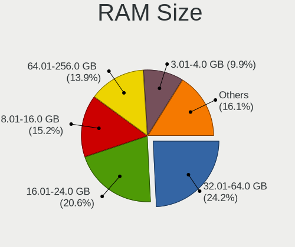
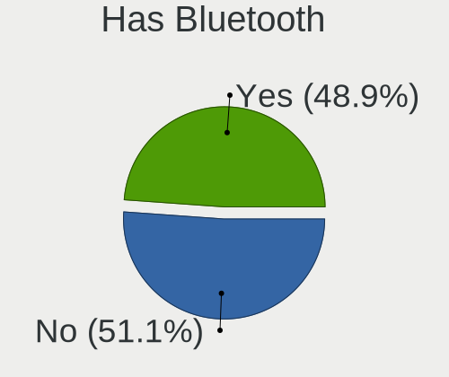
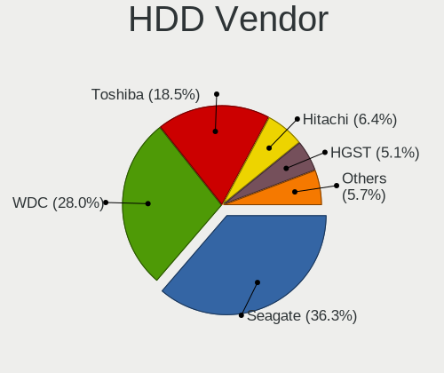
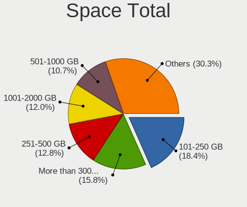
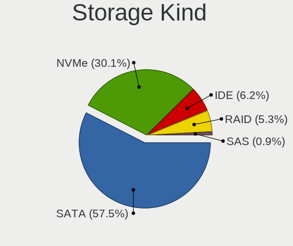
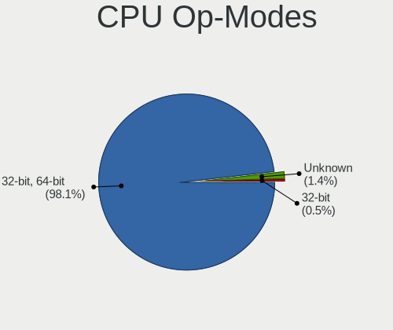
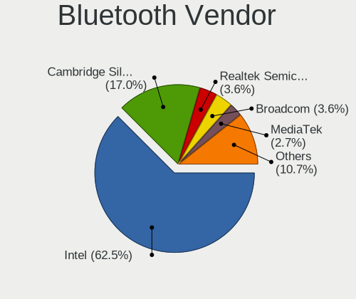
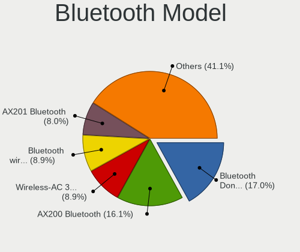
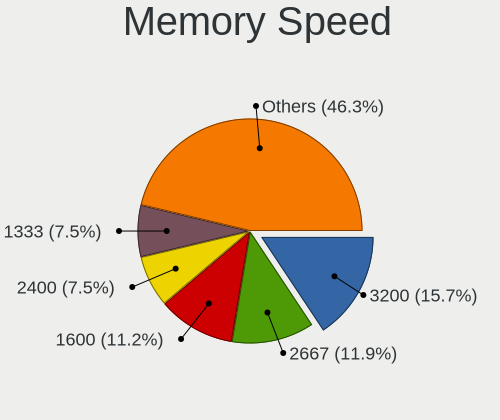

Linux in Hong Kong - Tested Hardware & Statistics (Desktops)
------------------------------------------------------------

A project to collect tested hardware configurations for Linux in Hong Kong.

Anyone can contribute to this report by the [hw-probe](https://github.com/linuxhw/hw-probe) tool:

    sudo -E hw-probe -all -upload

Please contribute! Especially if your hardware is rare.

Contents
--------

* [ Test Cases ](#test-cases)

* [ System ](#system)
  - [ OS                       ](#os)
  - [ OS Family                ](#os-family)
  - [ Kernel                   ](#kernel)
  - [ Kernel Family            ](#kernel-family)
  - [ Kernel Major Ver.        ](#kernel-major-ver)
  - [ Arch                     ](#arch)
  - [ DE                       ](#de)
  - [ Display Server           ](#display-server)
  - [ Display Manager          ](#display-manager)
  - [ OS Lang                  ](#os-lang)
  - [ Boot Mode                ](#boot-mode)
  - [ Filesystem               ](#filesystem)
  - [ Part. scheme             ](#part-scheme)
  - [ Dual Boot with Linux/BSD ](#dual-boot-with-linuxbsd)
  - [ Dual Boot (Win)          ](#dual-boot-win)

* [ Board ](#board)
  - [ Vendor                   ](#vendor)
  - [ Model                    ](#model)
  - [ Model Family             ](#model-family)
  - [ MFG Year                 ](#mfg-year)
  - [ Form Factor              ](#form-factor)
  - [ Secure Boot              ](#secure-boot)
  - [ Coreboot                 ](#coreboot)
  - [ RAM Size                 ](#ram-size)
  - [ RAM Used                 ](#ram-used)
  - [ Total Drives             ](#total-drives)
  - [ Has CD-ROM               ](#has-cd-rom)
  - [ Has Ethernet             ](#has-ethernet)
  - [ Has WiFi                 ](#has-wifi)
  - [ Has Bluetooth            ](#has-bluetooth)

* [ Location ](#location)
  - [ Country                  ](#country)
  - [ City                     ](#city)

* [ Drives ](#drives)
  - [ Drive Vendor             ](#drive-vendor)
  - [ Drive Model              ](#drive-model)
  - [ HDD Vendor               ](#hdd-vendor)
  - [ SSD Vendor               ](#ssd-vendor)
  - [ Drive Kind               ](#drive-kind)
  - [ Drive Connector          ](#drive-connector)
  - [ Drive Size               ](#drive-size)
  - [ Space Total              ](#space-total)
  - [ Space Used               ](#space-used)
  - [ Malfunc. Drives          ](#malfunc-drives)
  - [ Malfunc. Drive Vendor    ](#malfunc-drive-vendor)
  - [ Malfunc. HDD Vendor      ](#malfunc-hdd-vendor)
  - [ Malfunc. Drive Kind      ](#malfunc-drive-kind)
  - [ Failed Drives            ](#failed-drives)
  - [ Failed Drive Vendor      ](#failed-drive-vendor)
  - [ Drive Status             ](#drive-status)

* [ Storage controller ](#storage-controller)
  - [ Storage Vendor           ](#storage-vendor)
  - [ Storage Model            ](#storage-model)
  - [ Storage Kind             ](#storage-kind)

* [ Processor ](#processor)
  - [ CPU Vendor               ](#cpu-vendor)
  - [ CPU Model                ](#cpu-model)
  - [ CPU Model Family         ](#cpu-model-family)
  - [ CPU Cores                ](#cpu-cores)
  - [ CPU Sockets              ](#cpu-sockets)
  - [ CPU Threads              ](#cpu-threads)
  - [ CPU Op-Modes             ](#cpu-op-modes)
  - [ CPU Microcode            ](#cpu-microcode)
  - [ CPU Microarch            ](#cpu-microarch)

* [ Graphics ](#graphics)
  - [ GPU Vendor               ](#gpu-vendor)
  - [ GPU Model                ](#gpu-model)
  - [ GPU Combo                ](#gpu-combo)
  - [ GPU Driver               ](#gpu-driver)
  - [ GPU Memory               ](#gpu-memory)

* [ Monitor ](#monitor)
  - [ Monitor Vendor           ](#monitor-vendor)
  - [ Monitor Model            ](#monitor-model)
  - [ Monitor Resolution       ](#monitor-resolution)
  - [ Monitor Diagonal         ](#monitor-diagonal)
  - [ Monitor Width            ](#monitor-width)
  - [ Aspect Ratio             ](#aspect-ratio)
  - [ Monitor Area             ](#monitor-area)
  - [ Pixel Density            ](#pixel-density)
  - [ Multiple Monitors        ](#multiple-monitors)

* [ Network ](#network)
  - [ Net Controller Vendor    ](#net-controller-vendor)
  - [ Net Controller Model     ](#net-controller-model)
  - [ Wireless Vendor          ](#wireless-vendor)
  - [ Wireless Model           ](#wireless-model)
  - [ Ethernet Vendor          ](#ethernet-vendor)
  - [ Ethernet Model           ](#ethernet-model)
  - [ Net Controller Kind      ](#net-controller-kind)
  - [ Used Controller          ](#used-controller)
  - [ NICs                     ](#nics)
  - [ IPv6                     ](#ipv6)

* [ Bluetooth ](#bluetooth)
  - [ Bluetooth Vendor         ](#bluetooth-vendor)
  - [ Bluetooth Model          ](#bluetooth-model)

* [ Sound ](#sound)
  - [ Sound Vendor             ](#sound-vendor)
  - [ Sound Model              ](#sound-model)

* [ Memory ](#memory)
  - [ Memory Vendor            ](#memory-vendor)
  - [ Memory Model             ](#memory-model)
  - [ Memory Kind              ](#memory-kind)
  - [ Memory Form Factor       ](#memory-form-factor)
  - [ Memory Size              ](#memory-size)
  - [ Memory Speed             ](#memory-speed)

* [ Printers & scanners ](#printers--scanners)
  - [ Printer Vendor           ](#printer-vendor)
  - [ Printer Model            ](#printer-model)
  - [ Scanner Vendor           ](#scanner-vendor)
  - [ Scanner Model            ](#scanner-model)

* [ Camera ](#camera)
  - [ Camera Vendor            ](#camera-vendor)
  - [ Camera Model             ](#camera-model)

* [ Security ](#security)
  - [ Fingerprint Vendor       ](#fingerprint-vendor)
  - [ Fingerprint Model        ](#fingerprint-model)
  - [ Chipcard Vendor          ](#chipcard-vendor)
  - [ Chipcard Model           ](#chipcard-model)

* [ Unsupported ](#unsupported)
  - [ Unsupported Devices      ](#unsupported-devices)
  - [ Unsupported Device Types ](#unsupported-device-types)

Test Cases
----------

Total: 239

| Vendor        | Model                       | Probe                                                      | Date         |
|---------------|-----------------------------|------------------------------------------------------------|--------------|
| Gigabyte      | GA-MA780G-UD3H              | [9b86a89bf4](https://linux-hardware.org/?probe=9b86a89bf4) | Sep 29, 2023 |
| ASUSTek       | ROG STRIX X670E-E GAMING... | [08989d4bba](https://linux-hardware.org/?probe=08989d4bba) | Sep 21, 2023 |
| Gigabyte      | B85M-DS3H-A                 | [6d0e6a863d](https://linux-hardware.org/?probe=6d0e6a863d) | Sep 21, 2023 |
| ASUSTek       | TUF Gaming B650M-PLUS WI... | [07d34fd9b5](https://linux-hardware.org/?probe=07d34fd9b5) | Sep 18, 2023 |
| Gigabyte      | H55N-USB3                   | [afefe4b055](https://linux-hardware.org/?probe=afefe4b055) | Sep 18, 2023 |
| Shenzhen M... | HX90G                       | [fda84a9c7c](https://linux-hardware.org/?probe=fda84a9c7c) | Sep 10, 2023 |
| Dell          | 0VNM11 A00                  | [e448e177d3](https://linux-hardware.org/?probe=e448e177d3) | Aug 21, 2023 |
| ASRock        | Q1900-ITX                   | [2c60ec2f95](https://linux-hardware.org/?probe=2c60ec2f95) | Aug 17, 2023 |
| ASRock        | Q1900-ITX                   | [b4a64727f4](https://linux-hardware.org/?probe=b4a64727f4) | Aug 14, 2023 |
| Dell          | 0VNM11 A00                  | [71cd1ddbf5](https://linux-hardware.org/?probe=71cd1ddbf5) | Aug 13, 2023 |
| ASRock        | 970 Extreme3 R2.0           | [cf233e5568](https://linux-hardware.org/?probe=cf233e5568) | Aug 13, 2023 |
| ASRock        | X300M-STX                   | [e43da17360](https://linux-hardware.org/?probe=e43da17360) | Jul 29, 2023 |
| ASUSTek       | Pro WS X570-ACE             | [8c8e7f5edd](https://linux-hardware.org/?probe=8c8e7f5edd) | Jul 26, 2023 |
| ASUSTek       | TUF Gaming B550M-PLUS       | [c5475d0982](https://linux-hardware.org/?probe=c5475d0982) | Jul 18, 2023 |
| MSI           | B250M PRO-VDH               | [5b085b711b](https://linux-hardware.org/?probe=5b085b711b) | Jul 06, 2023 |
| Gigabyte      | B760M AORUS ELITE AX        | [8a5ddbbafc](https://linux-hardware.org/?probe=8a5ddbbafc) | Jul 05, 2023 |
| MSI           | MPG X570 GAMING PRO CARB... | [a57586f69b](https://linux-hardware.org/?probe=a57586f69b) | Jul 01, 2023 |
| ASUSTek       | PRIME H310M-K R2.0          | [3f9d0da410](https://linux-hardware.org/?probe=3f9d0da410) | Jun 28, 2023 |
| BESSTAR Te... | B550                        | [87962635d3](https://linux-hardware.org/?probe=87962635d3) | Jun 26, 2023 |
| ASUSTek       | ROG STRIX Z690-A GAMING ... | [8a9a60ca4d](https://linux-hardware.org/?probe=8a9a60ca4d) | Jun 19, 2023 |
| ASUSTek       | ROG STRIX Z690-A GAMING ... | [eaca61c801](https://linux-hardware.org/?probe=eaca61c801) | Jun 19, 2023 |
| Lenovo        | SHARKBAY 0B98401 WIN        | [c536181b6a](https://linux-hardware.org/?probe=c536181b6a) | Jun 14, 2023 |
| ASUSTek       | Z97-PRO GAMER               | [8d783c6b00](https://linux-hardware.org/?probe=8d783c6b00) | Jun 03, 2023 |
| HP            | 83E2                        | [eaf5f90360](https://linux-hardware.org/?probe=eaf5f90360) | Jun 01, 2023 |
| HP            | 1632                        | [ed47689eec](https://linux-hardware.org/?probe=ed47689eec) | May 22, 2023 |
| Dell          | 0N0992 A01                  | [a8e8000610](https://linux-hardware.org/?probe=a8e8000610) | Apr 24, 2023 |
| ASUSTek       | PRIME H670-PLUS D4          | [59f6a81039](https://linux-hardware.org/?probe=59f6a81039) | Apr 17, 2023 |
| Gigabyte      | X570S AERO G                | [30e0bd8317](https://linux-hardware.org/?probe=30e0bd8317) | Apr 02, 2023 |
| MSI           | B450 TOMAHAWK               | [4757b31751](https://linux-hardware.org/?probe=4757b31751) | Mar 19, 2023 |
| ASUSTek       | P8H61-M LX PLUS             | [cdf57a039e](https://linux-hardware.org/?probe=cdf57a039e) | Mar 19, 2023 |
| ASUSTek       | ROG STRIX Z370-G GAMING     | [27356d58d5](https://linux-hardware.org/?probe=27356d58d5) | Mar 17, 2023 |
| MSI           | MPG Z690 EDGE TI WIFI DD... | [b42850eb13](https://linux-hardware.org/?probe=b42850eb13) | Mar 17, 2023 |
| ASUSTek       | PRIME H610M-K D4            | [601836815c](https://linux-hardware.org/?probe=601836815c) | Feb 22, 2023 |
| Gigabyte      | GA-880GMA-UD2H              | [c1936488f5](https://linux-hardware.org/?probe=c1936488f5) | Feb 20, 2023 |
| Gigabyte      | X670 AORUS ELITE AX         | [ee4e2b3cde](https://linux-hardware.org/?probe=ee4e2b3cde) | Feb 19, 2023 |
| MSI           | MPG X570 GAMING PRO CARB... | [81c1e35182](https://linux-hardware.org/?probe=81c1e35182) | Jan 24, 2023 |
| Gigabyte      | H97N-WIFI                   | [a18f404d39](https://linux-hardware.org/?probe=a18f404d39) | Jan 17, 2023 |
| ASUSTek       | M4A78                       | [4ce5e1fd02](https://linux-hardware.org/?probe=4ce5e1fd02) | Jan 14, 2023 |
| ASUSTek       | M4A78                       | [09560460b9](https://linux-hardware.org/?probe=09560460b9) | Jan 14, 2023 |
| Dell          | 042P49 A02                  | [dc81fac0f7](https://linux-hardware.org/?probe=dc81fac0f7) | Jan 04, 2023 |
| MSI           | MPG X570 GAMING PRO CARB... | [ecf944f539](https://linux-hardware.org/?probe=ecf944f539) | Dec 31, 2022 |
| ASUSTek       | PRIME H610M-K D4            | [0031785936](https://linux-hardware.org/?probe=0031785936) | Dec 31, 2022 |
| ASUSTek       | PRIME H610M-K D4            | [4bd2096c80](https://linux-hardware.org/?probe=4bd2096c80) | Dec 31, 2022 |
| MSI           | MPG X570 GAMING PRO CARB... | [7b3c89637b](https://linux-hardware.org/?probe=7b3c89637b) | Dec 30, 2022 |
| Lenovo        | 3753 SDK0T76479 WIN 3423... | [5476b73cb7](https://linux-hardware.org/?probe=5476b73cb7) | Dec 02, 2022 |
| Lenovo        | 3753 SDK0T76479 WIN 3423... | [6d07106192](https://linux-hardware.org/?probe=6d07106192) | Dec 02, 2022 |
| Gigabyte      | B450 I AORUS PRO WIFI-CF    | [895a345eb9](https://linux-hardware.org/?probe=895a345eb9) | Nov 02, 2022 |
| Gigabyte      | B450 I AORUS PRO WIFI-CF    | [9d9d3a4967](https://linux-hardware.org/?probe=9d9d3a4967) | Nov 02, 2022 |
| MSI           | MAG B660M MORTAR WIFI DD... | [115e9027d0](https://linux-hardware.org/?probe=115e9027d0) | Nov 01, 2022 |
| ASRock        | H470M-STX                   | [02f3177542](https://linux-hardware.org/?probe=02f3177542) | Oct 26, 2022 |
| MSI           | MAG B550M MORTAR WIFI       | [ce7a9a3171](https://linux-hardware.org/?probe=ce7a9a3171) | Oct 23, 2022 |
| Lenovo        | SHARKBAY NOK                | [153aaa07cd](https://linux-hardware.org/?probe=153aaa07cd) | Oct 23, 2022 |
| ASUSTek       | TUF Gaming Z690-PLUS D4     | [f20c990c1f](https://linux-hardware.org/?probe=f20c990c1f) | Oct 12, 2022 |
| ASRock        | AB350M Pro4                 | [6207d55486](https://linux-hardware.org/?probe=6207d55486) | Oct 05, 2022 |
| MSI           | B75MA-E33                   | [a14df6d116](https://linux-hardware.org/?probe=a14df6d116) | Oct 02, 2022 |
| HP            | 18E7                        | [132a87f746](https://linux-hardware.org/?probe=132a87f746) | Sep 28, 2022 |
| ASUSTek       | PRIME B660M-K D4            | [e939330716](https://linux-hardware.org/?probe=e939330716) | Sep 25, 2022 |
| Unknown       | Apple iPad Pro (9.7-inch... | [822d20fcdb](https://linux-hardware.org/?probe=822d20fcdb) | Sep 25, 2022 |
| Unknown       | Apple iPad Pro (9.7-inch... | [92f244ac1c](https://linux-hardware.org/?probe=92f244ac1c) | Sep 25, 2022 |
| MSI           | H81M-P33                    | [7e4f539e70](https://linux-hardware.org/?probe=7e4f539e70) | Sep 24, 2022 |
| MSI           | H81M-P33                    | [64cd74457e](https://linux-hardware.org/?probe=64cd74457e) | Sep 24, 2022 |
| ASRock        | H97M Anniversary            | [289532b8bb](https://linux-hardware.org/?probe=289532b8bb) | Sep 24, 2022 |
| ASRock        | Z490 PG Velocita            | [eac045585b](https://linux-hardware.org/?probe=eac045585b) | Sep 23, 2022 |
| Huanan        | X99-TF                      | [657d78e891](https://linux-hardware.org/?probe=657d78e891) | Sep 21, 2022 |
| ASUSTek       | PRIME H310M-E R2.0          | [331a481ab0](https://linux-hardware.org/?probe=331a481ab0) | Sep 14, 2022 |
| Dell          | 0427JK A00                  | [8f6a2c8d0b](https://linux-hardware.org/?probe=8f6a2c8d0b) | Aug 22, 2022 |
| Dell          | 0200DY A03                  | [e0e14cd1f2](https://linux-hardware.org/?probe=e0e14cd1f2) | Aug 19, 2022 |
| ASUSTek       | ROG STRIX B660-I GAMING ... | [58b22885a8](https://linux-hardware.org/?probe=58b22885a8) | Aug 18, 2022 |
| ASUSTek       | PRIME Z590M-PLUS            | [bd7c6f361d](https://linux-hardware.org/?probe=bd7c6f361d) | Aug 18, 2022 |
| MSI           | MAG B660M MORTAR WIFI DD... | [56ba58f5d0](https://linux-hardware.org/?probe=56ba58f5d0) | Aug 16, 2022 |
| ASRock        | B450M-HDV R4.0              | [f2172999c8](https://linux-hardware.org/?probe=f2172999c8) | Jul 24, 2022 |
| Huanan        | X99-TF                      | [55b43de5a6](https://linux-hardware.org/?probe=55b43de5a6) | Jul 17, 2022 |
| Soyo          | SY-A68M FS V2.0             | [ab243c130a](https://linux-hardware.org/?probe=ab243c130a) | Jul 06, 2022 |
| Gigabyte      | X570 AORUS PRO WIFI         | [518331cc83](https://linux-hardware.org/?probe=518331cc83) | Jun 21, 2022 |
| Huanan        | X99-TF                      | [04dc5246af](https://linux-hardware.org/?probe=04dc5246af) | Jun 18, 2022 |
| Lenovo        | 3715 SDK0L77769 WIN 3423... | [16d122d03e](https://linux-hardware.org/?probe=16d122d03e) | Jun 16, 2022 |
| Huanan        | X99-TF                      | [4e5364e832](https://linux-hardware.org/?probe=4e5364e832) | Jun 08, 2022 |
| Gigabyte      | HA65M-UD3H-B3               | [d368918a0b](https://linux-hardware.org/?probe=d368918a0b) | May 13, 2022 |
| Gigabyte      | X570 AORUS PRO WIFI         | [e45fa22892](https://linux-hardware.org/?probe=e45fa22892) | May 11, 2022 |
| Gigabyte      | GA-880GMA-UD2H              | [09d9f58ee7](https://linux-hardware.org/?probe=09d9f58ee7) | May 02, 2022 |
| MSI           | H87I                        | [af4a26a5ea](https://linux-hardware.org/?probe=af4a26a5ea) | Apr 30, 2022 |
| Gigabyte      | B660M DS3H AX DDR4          | [0633ac7757](https://linux-hardware.org/?probe=0633ac7757) | Apr 26, 2022 |
| Gigabyte      | B660M DS3H AX DDR4          | [56902c7998](https://linux-hardware.org/?probe=56902c7998) | Apr 26, 2022 |
| Gigabyte      | B660M DS3H AX DDR4          | [abed3ae34d](https://linux-hardware.org/?probe=abed3ae34d) | Apr 12, 2022 |
| ASUSTek       | VM62                        | [ae684cdf71](https://linux-hardware.org/?probe=ae684cdf71) | Apr 05, 2022 |
| ASRock        | H410M-ITX/ac                | [ae936790c9](https://linux-hardware.org/?probe=ae936790c9) | Apr 03, 2022 |
| MSI           | MAG B550M MORTAR            | [9ebb4c0fd3](https://linux-hardware.org/?probe=9ebb4c0fd3) | Mar 31, 2022 |
| Dell          | 0Y3R3K A03                  | [b772cf9d86](https://linux-hardware.org/?probe=b772cf9d86) | Mar 26, 2022 |
| ASUSTek       | PRIME Z590-A                | [7320ed668a](https://linux-hardware.org/?probe=7320ed668a) | Mar 12, 2022 |
| Gigabyte      | X570 AORUS ELITE            | [99d3e16ede](https://linux-hardware.org/?probe=99d3e16ede) | Mar 12, 2022 |
| Unknown       | Intel X79                   | [e947d6af7f](https://linux-hardware.org/?probe=e947d6af7f) | Mar 11, 2022 |
| MSI           | MPG X570 GAMING PRO CARB... | [4d16610cf3](https://linux-hardware.org/?probe=4d16610cf3) | Mar 10, 2022 |
| MSI           | B450M PRO-VDH PLUS          | [4b2fe6657c](https://linux-hardware.org/?probe=4b2fe6657c) | Mar 04, 2022 |
| Gigabyte      | X570 AORUS ELITE            | [0b9a7acb84](https://linux-hardware.org/?probe=0b9a7acb84) | Feb 27, 2022 |
| MSI           | B75MA-P45                   | [35ad54efc7](https://linux-hardware.org/?probe=35ad54efc7) | Feb 26, 2022 |
| Dell          | 0Y5DDC A00                  | [3c7daed552](https://linux-hardware.org/?probe=3c7daed552) | Feb 22, 2022 |
| ASUSTek       | TUF Gaming B550M-PLUS       | [6e5689a733](https://linux-hardware.org/?probe=6e5689a733) | Jan 28, 2022 |
| ASRock        | Z270M-ITX/ac                | [4c32bf6d7b](https://linux-hardware.org/?probe=4c32bf6d7b) | Jan 18, 2022 |
| HP            | 8597                        | [09ed815dd0](https://linux-hardware.org/?probe=09ed815dd0) | Jan 08, 2022 |
| Gigabyte      | B450 AORUS PRO WIFI-CF      | [83ff6966e1](https://linux-hardware.org/?probe=83ff6966e1) | Dec 24, 2021 |
| ASUSTek       | Z170 PRO GAMING             | [c5fa4a0cec](https://linux-hardware.org/?probe=c5fa4a0cec) | Dec 24, 2021 |
| ASRock        | H410M-ITX/ac                | [99c341562a](https://linux-hardware.org/?probe=99c341562a) | Dec 21, 2021 |
| Gigabyte      | B450 AORUS PRO WIFI-CF      | [d01abdcb39](https://linux-hardware.org/?probe=d01abdcb39) | Dec 19, 2021 |
| MSI           | 870-G45                     | [e6317a2b91](https://linux-hardware.org/?probe=e6317a2b91) | Dec 19, 2021 |
| Unknown       | Intel X79                   | [985655e4b3](https://linux-hardware.org/?probe=985655e4b3) | Dec 11, 2021 |
| Unknown       | Intel X79                   | [6f32192557](https://linux-hardware.org/?probe=6f32192557) | Dec 08, 2021 |
| Supermicro    | X9DRi-LN4+/X9DR3-LN4+       | [bd8742e075](https://linux-hardware.org/?probe=bd8742e075) | Dec 08, 2021 |
| MSI           | Boston                      | [0b79772dfa](https://linux-hardware.org/?probe=0b79772dfa) | Dec 04, 2021 |
| Supermicro    | C2SBC-Q                     | [1099e48366](https://linux-hardware.org/?probe=1099e48366) | Nov 28, 2021 |
| MSI           | MAG B550M MORTAR WIFI       | [58d43162d2](https://linux-hardware.org/?probe=58d43162d2) | Nov 28, 2021 |
| Gigabyte      | H310M S2H x.x               | [fc59694424](https://linux-hardware.org/?probe=fc59694424) | Nov 17, 2021 |
| MSI           | B450 TOMAHAWK MAX II        | [35b58ec233](https://linux-hardware.org/?probe=35b58ec233) | Nov 16, 2021 |
| Seco          | C40 C                       | [27bff03d0c](https://linux-hardware.org/?probe=27bff03d0c) | Nov 08, 2021 |
| MSI           | B450 TOMAHAWK MAX II        | [9bcd3d5479](https://linux-hardware.org/?probe=9bcd3d5479) | Oct 29, 2021 |
| Gigabyte      | X570 AORUS PRO WIFI         | [c7a0fe2f88](https://linux-hardware.org/?probe=c7a0fe2f88) | Oct 26, 2021 |
| MSI           | B450 TOMAHAWK MAX II        | [aedfc53de6](https://linux-hardware.org/?probe=aedfc53de6) | Oct 20, 2021 |
| MSI           | H61M-P23                    | [3a07878154](https://linux-hardware.org/?probe=3a07878154) | Sep 28, 2021 |
| MSI           | MEG X570 GODLIKE            | [1440e244f6](https://linux-hardware.org/?probe=1440e244f6) | Aug 26, 2021 |
| Gigabyte      | B365M GAMING HD             | [d920558127](https://linux-hardware.org/?probe=d920558127) | Aug 14, 2021 |
| Gigabyte      | X570 AORUS ELITE            | [5cd377c0e0](https://linux-hardware.org/?probe=5cd377c0e0) | Aug 13, 2021 |
| Gigabyte      | B75M-D2P                    | [5e54c2a102](https://linux-hardware.org/?probe=5e54c2a102) | Aug 12, 2021 |
| HP            | 2B38                        | [be24f3f652](https://linux-hardware.org/?probe=be24f3f652) | Jul 26, 2021 |
| HP            | 2B38                        | [c1198b90f6](https://linux-hardware.org/?probe=c1198b90f6) | Jul 26, 2021 |
| ASRock        | H410M-HDV                   | [58b70e282d](https://linux-hardware.org/?probe=58b70e282d) | Jul 14, 2021 |
| Gigabyte      | B365M GAMING HD             | [66cf378cf1](https://linux-hardware.org/?probe=66cf378cf1) | Jul 10, 2021 |
| Gigabyte      | B85M-DS3H-A                 | [6496f18326](https://linux-hardware.org/?probe=6496f18326) | Jul 02, 2021 |
| Gigabyte      | B85M-DS3H-A                 | [71da4978c9](https://linux-hardware.org/?probe=71da4978c9) | Jun 29, 2021 |
| Gigabyte      | B365M GAMING HD             | [ed911e7e8c](https://linux-hardware.org/?probe=ed911e7e8c) | Jun 26, 2021 |
| Gigabyte      | B365M GAMING HD             | [8785d98b0b](https://linux-hardware.org/?probe=8785d98b0b) | Jun 19, 2021 |
| ASUSTek       | PRIME Z390-P                | [54e520ac17](https://linux-hardware.org/?probe=54e520ac17) | Jun 17, 2021 |
| ASUSTek       | TUF Gaming Z490-PLUS        | [76219e9cca](https://linux-hardware.org/?probe=76219e9cca) | Jun 09, 2021 |
| ASRock        | H410M-HDV                   | [bcb80080a5](https://linux-hardware.org/?probe=bcb80080a5) | Jun 06, 2021 |
| HP            | 18E7                        | [9844f6635c](https://linux-hardware.org/?probe=9844f6635c) | May 30, 2021 |
| ASUSTek       | VM62                        | [486aeb5b89](https://linux-hardware.org/?probe=486aeb5b89) | May 25, 2021 |
| Gigabyte      | F2A88XN-WIFI                | [c22e6d8669](https://linux-hardware.org/?probe=c22e6d8669) | May 25, 2021 |
| Dell          | 0D02VH A01                  | [e19475cd4c](https://linux-hardware.org/?probe=e19475cd4c) | May 22, 2021 |
| ASUSTek       | PRIME X399-A                | [a201bdfc36](https://linux-hardware.org/?probe=a201bdfc36) | May 19, 2021 |
| ASUSTek       | M4A78-VM                    | [3313d34c41](https://linux-hardware.org/?probe=3313d34c41) | May 15, 2021 |
| ASUSTek       | Z8NA-D6                     | [1b777c6f08](https://linux-hardware.org/?probe=1b777c6f08) | May 02, 2021 |
| ASUSTek       | Z8NA-D6                     | [4c7956a34c](https://linux-hardware.org/?probe=4c7956a34c) | May 02, 2021 |
| MSI           | Boston                      | [e0cfb03088](https://linux-hardware.org/?probe=e0cfb03088) | Mar 30, 2021 |
| HP            | 1632                        | [adf9ebb679](https://linux-hardware.org/?probe=adf9ebb679) | Mar 25, 2021 |
| MSI           | B450I GAMING PLUS AC        | [6a4196e0aa](https://linux-hardware.org/?probe=6a4196e0aa) | Mar 23, 2021 |
| MSI           | B450M-A PRO MAX             | [dc64c81c35](https://linux-hardware.org/?probe=dc64c81c35) | Mar 23, 2021 |
| ASUSTek       | B85M-G R2.0                 | [71ef988016](https://linux-hardware.org/?probe=71ef988016) | Mar 21, 2021 |
| ASRock        | H410M-HDV                   | [e44a5ce779](https://linux-hardware.org/?probe=e44a5ce779) | Mar 14, 2021 |
| MSI           | Boston                      | [e9513c3b7a](https://linux-hardware.org/?probe=e9513c3b7a) | Mar 03, 2021 |
| ASUSTek       | P8H61-M LX PLUS             | [b94539c6dc](https://linux-hardware.org/?probe=b94539c6dc) | Mar 01, 2021 |
| ASUSTek       | B85M-G R2.0                 | [b2cb174b9a](https://linux-hardware.org/?probe=b2cb174b9a) | Mar 01, 2021 |
| Lenovo        | MAHOBAY NOK                 | [e3c14a6397](https://linux-hardware.org/?probe=e3c14a6397) | Feb 25, 2021 |
| Dell          | 0D02VH A01                  | [87c36a9322](https://linux-hardware.org/?probe=87c36a9322) | Feb 23, 2021 |
| ASUSTek       | VM45                        | [03eeb85521](https://linux-hardware.org/?probe=03eeb85521) | Feb 21, 2021 |
| ASUSTek       | VM65-K                      | [6b97cf71eb](https://linux-hardware.org/?probe=6b97cf71eb) | Feb 18, 2021 |
| ASUSTek       | VM65-K                      | [4f0bcd1276](https://linux-hardware.org/?probe=4f0bcd1276) | Feb 17, 2021 |
| ASUSTek       | VM40B                       | [6c0bf22f39](https://linux-hardware.org/?probe=6c0bf22f39) | Feb 17, 2021 |
| Dell          | 0D02VH A01                  | [ebc5645105](https://linux-hardware.org/?probe=ebc5645105) | Feb 11, 2021 |
| Lenovo        | IdeaCentre K330             | [78ce34058b](https://linux-hardware.org/?probe=78ce34058b) | Feb 11, 2021 |
| ASUSTek       | ROG STRIX B450-I GAMING     | [39bc70ca5d](https://linux-hardware.org/?probe=39bc70ca5d) | Jan 13, 2021 |
| ASRock        | H410M-HDV                   | [d2420f233b](https://linux-hardware.org/?probe=d2420f233b) | Jan 10, 2021 |
| MSI           | H97 GAMING 3                | [7e25d7549f](https://linux-hardware.org/?probe=7e25d7549f) | Jan 09, 2021 |
| Dell          | 0TP412                      | [f0e56aacff](https://linux-hardware.org/?probe=f0e56aacff) | Jan 05, 2021 |
| ASRock        | Z390 Phantom Gaming-ITX/... | [cf7386e848](https://linux-hardware.org/?probe=cf7386e848) | Dec 18, 2020 |
| ASUSTek       | H97M-PLUS                   | [1d6b7df7b4](https://linux-hardware.org/?probe=1d6b7df7b4) | Dec 08, 2020 |
| Gigabyte      | X570 AORUS ELITE            | [64adbf132b](https://linux-hardware.org/?probe=64adbf132b) | Dec 08, 2020 |
| Dell          | 0D02VH A01                  | [8309aa39cf](https://linux-hardware.org/?probe=8309aa39cf) | Nov 30, 2020 |
| Gigabyte      | B450M DS3H-CF               | [37d5acae7d](https://linux-hardware.org/?probe=37d5acae7d) | Nov 27, 2020 |
| ASUSTek       | 970 PRO GAMING/AURA         | [97c485886b](https://linux-hardware.org/?probe=97c485886b) | Nov 25, 2020 |
| Dell          | 0D02VH A01                  | [8f55b945a1](https://linux-hardware.org/?probe=8f55b945a1) | Nov 20, 2020 |
| ASUSTek       | 970 PRO GAMING/AURA         | [de597aa847](https://linux-hardware.org/?probe=de597aa847) | Nov 20, 2020 |
| ASUSTek       | 970 PRO GAMING/AURA         | [f5aa8c9150](https://linux-hardware.org/?probe=f5aa8c9150) | Nov 20, 2020 |
| ASUSTek       | H110I-PLUS                  | [a3c484b8ee](https://linux-hardware.org/?probe=a3c484b8ee) | Nov 16, 2020 |
| ASUSTek       | H97M-PLUS                   | [f90977870e](https://linux-hardware.org/?probe=f90977870e) | Nov 04, 2020 |
| Gigabyte      | Z370 HD3P-CF                | [1af7b2b551](https://linux-hardware.org/?probe=1af7b2b551) | Oct 13, 2020 |
| ASUSTek       | H110I-PLUS                  | [e292456297](https://linux-hardware.org/?probe=e292456297) | Sep 17, 2020 |
| Lenovo        | SHARKBAY SDK0E50510 WIN     | [e7b41f62a4](https://linux-hardware.org/?probe=e7b41f62a4) | Sep 14, 2020 |
| ASUSTek       | H110I-PLUS                  | [20bdbc68b7](https://linux-hardware.org/?probe=20bdbc68b7) | Sep 12, 2020 |
| ASUSTek       | H81M-E                      | [43b8c677bc](https://linux-hardware.org/?probe=43b8c677bc) | Sep 10, 2020 |
| Lenovo        | MAHOBAY NOK                 | [d95b985658](https://linux-hardware.org/?probe=d95b985658) | Sep 01, 2020 |
| Foxconn       | 2ADA                        | [24cad8bed5](https://linux-hardware.org/?probe=24cad8bed5) | Aug 28, 2020 |
| Foxconn       | 2ADA                        | [3d4c2a283d](https://linux-hardware.org/?probe=3d4c2a283d) | Aug 28, 2020 |
| ASRock        | B450 Gaming-ITX/ac          | [e27db6fb31](https://linux-hardware.org/?probe=e27db6fb31) | Aug 24, 2020 |
| HP            | 802E                        | [653b11eec3](https://linux-hardware.org/?probe=653b11eec3) | Aug 11, 2020 |
| HP            | 802E                        | [6f32afeb2b](https://linux-hardware.org/?probe=6f32afeb2b) | Aug 10, 2020 |
| HP            | 802E                        | [25d8ddc0bb](https://linux-hardware.org/?probe=25d8ddc0bb) | Aug 10, 2020 |
| Gigabyte      | B150M-D3H-CF                | [50dc692a9e](https://linux-hardware.org/?probe=50dc692a9e) | Jul 23, 2020 |
| Gigabyte      | Z170X-Gaming 5 Modified ... | [a62f520dc3](https://linux-hardware.org/?probe=a62f520dc3) | Jul 18, 2020 |
| MSI           | B450M MORTAR MAX            | [db0ff5f985](https://linux-hardware.org/?probe=db0ff5f985) | Jun 07, 2020 |
| HP            | 1998                        | [255863fefb](https://linux-hardware.org/?probe=255863fefb) | Jun 01, 2020 |
| Lenovo        | ThinkCentre M90p 3269A12    | [b159b440f2](https://linux-hardware.org/?probe=b159b440f2) | Jun 01, 2020 |
| Lenovo        | ThinkCentre M90p 3269A12    | [4181637bf3](https://linux-hardware.org/?probe=4181637bf3) | Jun 01, 2020 |
| Biostar       | H110MHC                     | [98d1029698](https://linux-hardware.org/?probe=98d1029698) | May 26, 2020 |
| ASUSTek       | B150M-C                     | [2229b866b3](https://linux-hardware.org/?probe=2229b866b3) | May 26, 2020 |
| ASUSTek       | H110I-PLUS                  | [8e55010bac](https://linux-hardware.org/?probe=8e55010bac) | May 22, 2020 |
| ASUSTek       | H110I-PLUS                  | [26293feb91](https://linux-hardware.org/?probe=26293feb91) | May 21, 2020 |
| ASUSTek       | STRIX H270F GAMING          | [c30a3e0ddd](https://linux-hardware.org/?probe=c30a3e0ddd) | May 11, 2020 |
| Dell          | 0C2KJT A00                  | [179a82277c](https://linux-hardware.org/?probe=179a82277c) | May 01, 2020 |
| MSI           | 2A9C                        | [23df26e5de](https://linux-hardware.org/?probe=23df26e5de) | Apr 25, 2020 |
| Acer          | Aspire XC-710 V:1.1         | [664ac5b85b](https://linux-hardware.org/?probe=664ac5b85b) | Apr 24, 2020 |
| MSI           | Boston                      | [e7cf465e34](https://linux-hardware.org/?probe=e7cf465e34) | Apr 22, 2020 |
| ASUSTek       | H110I-PLUS                  | [f504649d96](https://linux-hardware.org/?probe=f504649d96) | Apr 11, 2020 |
| ASUSTek       | H110I-PLUS                  | [3916938374](https://linux-hardware.org/?probe=3916938374) | Apr 11, 2020 |
| Gigabyte      | Z87-HD3                     | [52a7dab5ac](https://linux-hardware.org/?probe=52a7dab5ac) | Apr 09, 2020 |
| ASUSTek       | H110I-PLUS                  | [9c72670aa1](https://linux-hardware.org/?probe=9c72670aa1) | Apr 05, 2020 |
| ASUSTek       | H110I-PLUS                  | [37fb7cae94](https://linux-hardware.org/?probe=37fb7cae94) | Mar 30, 2020 |
| MSI           | B360M FIRE                  | [8bb021d2a6](https://linux-hardware.org/?probe=8bb021d2a6) | Mar 27, 2020 |
| ASUSTek       | H110I-PLUS                  | [18b565a861](https://linux-hardware.org/?probe=18b565a861) | Mar 26, 2020 |
| ASUSTek       | H110I-PLUS                  | [abce376627](https://linux-hardware.org/?probe=abce376627) | Mar 24, 2020 |
| ASUSTek       | H110I-PLUS                  | [e6860a26ae](https://linux-hardware.org/?probe=e6860a26ae) | Mar 24, 2020 |
| ASUSTek       | H110I-PLUS                  | [5f2e14b65b](https://linux-hardware.org/?probe=5f2e14b65b) | Mar 16, 2020 |
| ASUSTek       | H110I-PLUS                  | [1bcf8a4701](https://linux-hardware.org/?probe=1bcf8a4701) | Mar 14, 2020 |
| ASUSTek       | H110I-PLUS                  | [bd55777a4f](https://linux-hardware.org/?probe=bd55777a4f) | Mar 14, 2020 |
| ASUSTek       | H110I-PLUS                  | [137262daa3](https://linux-hardware.org/?probe=137262daa3) | Mar 05, 2020 |
| ASUSTek       | H110I-PLUS                  | [047acafb1a](https://linux-hardware.org/?probe=047acafb1a) | Feb 28, 2020 |
| ASUSTek       | H110I-PLUS                  | [e8315b1469](https://linux-hardware.org/?probe=e8315b1469) | Feb 28, 2020 |
| ASUSTek       | H110I-PLUS                  | [04e5b85d84](https://linux-hardware.org/?probe=04e5b85d84) | Feb 28, 2020 |
| Gigabyte      | Z390 GAMING X-CF            | [310ae04477](https://linux-hardware.org/?probe=310ae04477) | Feb 27, 2020 |
| ASUSTek       | H110I-PLUS                  | [046814376c](https://linux-hardware.org/?probe=046814376c) | Feb 20, 2020 |
| ASUSTek       | H110I-PLUS                  | [a417965167](https://linux-hardware.org/?probe=a417965167) | Feb 19, 2020 |
| Intel         | DH77DF AAG40293-301         | [ac00169b1c](https://linux-hardware.org/?probe=ac00169b1c) | Feb 14, 2020 |
| ASUSTek       | H110I-PLUS                  | [cef9a00862](https://linux-hardware.org/?probe=cef9a00862) | Feb 12, 2020 |
| ASUSTek       | H110I-PLUS                  | [dcc65f9ee3](https://linux-hardware.org/?probe=dcc65f9ee3) | Feb 11, 2020 |
| ASUSTek       | H110I-PLUS                  | [900a11f8b3](https://linux-hardware.org/?probe=900a11f8b3) | Feb 10, 2020 |
| Gigabyte      | GA-MA78GM-S2HP              | [20d5a3bd6a](https://linux-hardware.org/?probe=20d5a3bd6a) | Feb 01, 2020 |
| Gigabyte      | Z77N-WIFI                   | [94c13c0e97](https://linux-hardware.org/?probe=94c13c0e97) | Jan 11, 2020 |
| Gigabyte      | P55A-UD3                    | [7168fd0137](https://linux-hardware.org/?probe=7168fd0137) | Jan 11, 2020 |
| ASUSTek       | Z8NA-D6                     | [b2d6dabaa7](https://linux-hardware.org/?probe=b2d6dabaa7) | Dec 23, 2019 |
| MSI           | X470 GAMING PRO CARBON      | [e3b6ce369a](https://linux-hardware.org/?probe=e3b6ce369a) | Dec 23, 2019 |
| Intel         | DZ68DB AAG27985-101         | [15f84fa3f2](https://linux-hardware.org/?probe=15f84fa3f2) | Oct 26, 2019 |
| Gigabyte      | GA-MA78GM-S2HP              | [3392a03f3c](https://linux-hardware.org/?probe=3392a03f3c) | Oct 03, 2019 |
| Gigabyte      | B150M-D3H-CF                | [4302e84025](https://linux-hardware.org/?probe=4302e84025) | Sep 24, 2019 |
| ASUSTek       | B150M-A                     | [e8ccb234ed](https://linux-hardware.org/?probe=e8ccb234ed) | Aug 30, 2019 |
| ASRock        | B75M R2.0                   | [1479826c17](https://linux-hardware.org/?probe=1479826c17) | Aug 28, 2019 |
| Hardkernel    | ODROID-H2                   | [26d6c60ad5](https://linux-hardware.org/?probe=26d6c60ad5) | Jul 06, 2019 |
| Gigabyte      | GA-MA78GM-S2HP              | [ea2ad2bc4d](https://linux-hardware.org/?probe=ea2ad2bc4d) | Jun 05, 2019 |
| Dell          | 0CRH6C A01                  | [23dcf2aff6](https://linux-hardware.org/?probe=23dcf2aff6) | Apr 08, 2019 |
| ASUSTek       | B150M-A                     | [61bb547684](https://linux-hardware.org/?probe=61bb547684) | Apr 08, 2019 |
| ASUSTek       | B150M-A                     | [8549b6dfd8](https://linux-hardware.org/?probe=8549b6dfd8) | Apr 08, 2019 |
| ASRock        | Z270 Killer SLI             | [a03ea38833](https://linux-hardware.org/?probe=a03ea38833) | Jul 06, 2018 |
| Gigabyte      | GA-M56S-S3                  | [17f0958960](https://linux-hardware.org/?probe=17f0958960) | Oct 06, 2017 |

System
------

OS
--

Installed operating systems

| Name               | Desktops | Percent |
|--------------------|----------|---------|
| Ubuntu 20.04       | 18       | 10.71%  |
| Ubuntu 22.04       | 16       | 9.52%   |
| Ubuntu 18.04       | 13       | 7.74%   |
| Arch Rolling       | 11       | 6.55%   |
| OpenMandriva 4.2   | 10       | 5.95%   |
| Debian 11          | 8        | 4.76%   |
| Pop!_OS 22.04      | 7        | 4.17%   |
| OpenMandriva 4.3   | 5        | 2.98%   |
| KDE neon 20.04     | 5        | 2.98%   |
| Ubuntu 19.10       | 4        | 2.38%   |
| Fedora 35          | 4        | 2.38%   |
| Ubuntu 20.10       | 3        | 1.79%   |
| Debian 12          | 3        | 1.79%   |
| ArcoLinux Rolling  | 3        | 1.79%   |
| Ubuntu 23.04       | 2        | 1.19%   |
| Ubuntu 21.10       | 2        | 1.19%   |
| Ubuntu 19.04       | 2        | 1.19%   |
| Slackware 15.0     | 2        | 1.19%   |
| PostmarketOS Edge  | 2        | 1.19%   |
| Pop!_OS 20.10      | 2        | 1.19%   |
| Parrot 4.9         | 2        | 1.19%   |
| Gentoo 2.7         | 2        | 1.19%   |
| Fedora 31          | 2        | 1.19%   |
| Elementary 5.1.7   | 2        | 1.19%   |
| CentOS 8           | 2        | 1.19%   |
| Zorin 15           | 1        | 0.6%    |
| Xubuntu 18.04      | 1        | 0.6%    |
| Ubuntu MATE 20.04  | 1        | 0.6%    |
| Ubuntu 22.10       | 1        | 0.6%    |
| Ubuntu 21.04       | 1        | 0.6%    |
| SteamOS 3.3        | 1        | 0.6%    |
| Slackware 14.2     | 1        | 0.6%    |
| ROSA R8.1          | 1        | 0.6%    |
| Pop!_OS 21.04      | 1        | 0.6%    |
| OpenMandriva 4.50  | 1        | 0.6%    |
| OpenMandriva 23.01 | 1        | 0.6%    |
| Manjaro 22.0.0     | 1        | 0.6%    |
| Manjaro 21.1.0     | 1        | 0.6%    |
| Manjaro 21.0.6     | 1        | 0.6%    |
| Manjaro 20.0.3     | 1        | 0.6%    |

OS Family
---------

OS without a version

| Name         | Desktops | Percent |
|--------------|----------|---------|
| Ubuntu       | 57       | 35.4%   |
| OpenMandriva | 16       | 9.94%   |
| Arch         | 12       | 7.45%   |
| Fedora       | 11       | 6.83%   |
| Debian       | 11       | 6.83%   |
| Pop!_OS      | 10       | 6.21%   |
| KDE neon     | 5        | 3.11%   |
| Manjaro      | 4        | 2.48%   |
| Slackware    | 3        | 1.86%   |
| Gentoo       | 3        | 1.86%   |
| Elementary   | 3        | 1.86%   |
| CentOS       | 3        | 1.86%   |
| ArcoLinux    | 3        | 1.86%   |
| PostmarketOS | 2        | 1.24%   |
| Parrot       | 2        | 1.24%   |
| Linux Mint   | 2        | 1.24%   |
| Kubuntu      | 2        | 1.24%   |
| EndeavourOS  | 2        | 1.24%   |
| Clear Linux  | 2        | 1.24%   |
| Zorin        | 1        | 0.62%   |
| Xubuntu      | 1        | 0.62%   |
| Ubuntu MATE  | 1        | 0.62%   |
| SteamOS      | 1        | 0.62%   |
| ROSA         | 1        | 0.62%   |
| Lubuntu      | 1        | 0.62%   |
| Kali         | 1        | 0.62%   |
| Artix        | 1        | 0.62%   |

Kernel
------

Version of the Linux kernel

| Version                             | Desktops | Percent |
|-------------------------------------|----------|---------|
| 5.10.14-desktop-1omv4002            | 9        | 4.71%   |
| 5.16.7-desktop-1omv4003             | 5        | 2.62%   |
| 5.4.0-42-generic                    | 3        | 1.57%   |
| 5.15.0-46-generic                   | 3        | 1.57%   |
| 6.2.0-33-generic                    | 2        | 1.05%   |
| 6.2.0-20-generic                    | 2        | 1.05%   |
| 6.1.1-arch1-1                       | 2        | 1.05%   |
| 6.1.0-9-amd64                       | 2        | 1.05%   |
| 5.5.0-1parrot1-amd64                | 2        | 1.05%   |
| 5.4.0-56-generic                    | 2        | 1.05%   |
| 5.4.0-47-generic                    | 2        | 1.05%   |
| 5.4.0-33-generic                    | 2        | 1.05%   |
| 5.4.0-109-generic                   | 2        | 1.05%   |
| 5.3.0-46-generic                    | 2        | 1.05%   |
| 5.19.0-76051900-generic             | 2        | 1.05%   |
| 5.19.0-43-generic                   | 2        | 1.05%   |
| 5.13.0-35-generic                   | 2        | 1.05%   |
| 5.11.0-43-generic                   | 2        | 1.05%   |
| 5.0.0-25-generic                    | 2        | 1.05%   |
| 4.15.0-88-generic                   | 2        | 1.05%   |
| 6.5.3-zen1-1-zen                    | 1        | 0.52%   |
| 6.4.5-arch1-1                       | 1        | 0.52%   |
| 6.4.3-arch1-2                       | 1        | 0.52%   |
| 6.3.9-arch1-1                       | 1        | 0.52%   |
| 6.3.8-200.fc38.x86_64               | 1        | 0.52%   |
| 6.2.9-060209-generic                | 1        | 0.52%   |
| 6.2.8-200.fc37.x86_64               | 1        | 0.52%   |
| 6.2.6-arch1-1                       | 1        | 0.52%   |
| 6.2.0-76060200-generic              | 1        | 0.52%   |
| 6.2.0-32-generic                    | 1        | 0.52%   |
| 6.1.5-arch2-1                       | 1        | 0.52%   |
| 6.1.39-1-lts                        | 1        | 0.52%   |
| 6.1.10-arch1-1                      | 1        | 0.52%   |
| 6.1.1-desktop-1omv2290              | 1        | 0.52%   |
| 6.1.0-12-amd64                      | 1        | 0.52%   |
| 6.1.0-0.deb11.6-amd64               | 1        | 0.52%   |
| 6.0.12-76060006-generic             | 1        | 0.52%   |
| 6.0.1-arch2-1                       | 1        | 0.52%   |
| 6.0.0-rc6-g4954dfcf85a8-dirty       | 1        | 0.52%   |
| 6.0.0-rc1-14001-ga907b05f09bf-dirty | 1        | 0.52%   |

Kernel Family
-------------

Linux kernel without a distro release

| Version | Desktops | Percent |
|---------|----------|---------|
| 5.4.0   | 20       | 11.17%  |
| 5.15.0  | 11       | 6.15%   |
| 5.8.0   | 9        | 5.03%   |
| 5.10.14 | 9        | 5.03%   |
| 5.19.0  | 8        | 4.47%   |
| 5.3.0   | 7        | 3.91%   |
| 5.13.0  | 7        | 3.91%   |
| 5.11.0  | 7        | 3.91%   |
| 6.2.0   | 6        | 3.35%   |
| 4.15.0  | 6        | 3.35%   |
| 5.16.7  | 5        | 2.79%   |
| 5.10.0  | 5        | 2.79%   |
| 5.0.0   | 5        | 2.79%   |
| 6.1.0   | 4        | 2.23%   |
| 6.1.1   | 3        | 1.68%   |
| 5.17.5  | 3        | 1.68%   |
| 4.18.0  | 3        | 1.68%   |
| 6.0.0   | 2        | 1.12%   |
| 5.5.0   | 2        | 1.12%   |
| 5.14.14 | 2        | 1.12%   |
| 6.5.3   | 1        | 0.56%   |
| 6.4.5   | 1        | 0.56%   |
| 6.4.3   | 1        | 0.56%   |
| 6.3.9   | 1        | 0.56%   |
| 6.3.8   | 1        | 0.56%   |
| 6.2.9   | 1        | 0.56%   |
| 6.2.8   | 1        | 0.56%   |
| 6.2.6   | 1        | 0.56%   |
| 6.1.5   | 1        | 0.56%   |
| 6.1.39  | 1        | 0.56%   |
| 6.1.10  | 1        | 0.56%   |
| 6.0.12  | 1        | 0.56%   |
| 6.0.1   | 1        | 0.56%   |
| 5.9.16  | 1        | 0.56%   |
| 5.9.12  | 1        | 0.56%   |
| 5.9.0   | 1        | 0.56%   |
| 5.8.7   | 1        | 0.56%   |
| 5.8.13  | 1        | 0.56%   |
| 5.7.7   | 1        | 0.56%   |
| 5.7.0   | 1        | 0.56%   |

Kernel Major Ver.
-----------------

Linux kernel major version

| Version | Desktops | Percent |
|---------|----------|---------|
| 5.4     | 20       | 11.43%  |
| 5.15    | 18       | 10.29%  |
| 5.10    | 18       | 10.29%  |
| 5.8     | 11       | 6.29%   |
| 5.19    | 10       | 5.71%   |
| 6.2     | 9        | 5.14%   |
| 5.13    | 9        | 5.14%   |
| 6.1     | 8        | 4.57%   |
| 5.16    | 8        | 4.57%   |
| 5.11    | 8        | 4.57%   |
| 5.3     | 7        | 4%      |
| 4.15    | 6        | 3.43%   |
| 5.17    | 5        | 2.86%   |
| 5.0     | 5        | 2.86%   |
| 6.0     | 4        | 2.29%   |
| 5.9     | 3        | 1.71%   |
| 5.5     | 3        | 1.71%   |
| 5.18    | 3        | 1.71%   |
| 4.18    | 3        | 1.71%   |
| 6.4     | 2        | 1.14%   |
| 6.3     | 2        | 1.14%   |
| 5.7     | 2        | 1.14%   |
| 5.6     | 2        | 1.14%   |
| 5.14    | 2        | 1.14%   |
| 5.12    | 2        | 1.14%   |
| 6.5     | 1        | 0.57%   |
| 4.9     | 1        | 0.57%   |
| 4.4     | 1        | 0.57%   |
| 4.17    | 1        | 0.57%   |
| 3.10    | 1        | 0.57%   |

Arch
----

OS architecture (x86_64, i586, etc.)

| Name    | Desktops | Percent |
|---------|----------|---------|
| x86_64  | 154      | 98.09%  |
| aarch64 | 2        | 1.27%   |
| i686    | 1        | 0.64%   |

DE
--

Desktop Environment

| Name       | Desktops | Percent |
|------------|----------|---------|
| GNOME      | 75       | 45.73%  |
| KDE5       | 35       | 21.34%  |
| Unknown    | 25       | 15.24%  |
| XFCE       | 8        | 4.88%   |
| KDE        | 4        | 2.44%   |
| Pantheon   | 3        | 1.83%   |
| MATE       | 3        | 1.83%   |
| X-Cinnamon | 2        | 1.22%   |
| sway       | 2        | 1.22%   |
| openbox    | 1        | 0.61%   |
| LXDE       | 1        | 0.61%   |
| KDE4       | 1        | 0.61%   |
| i3         | 1        | 0.61%   |
| Hyprland   | 1        | 0.61%   |
| Deepin     | 1        | 0.61%   |
| awesome    | 1        | 0.61%   |

Display Server
--------------

X11 or Wayland

| Name    | Desktops | Percent |
|---------|----------|---------|
| X11     | 115      | 69.28%  |
| Wayland | 33       | 19.88%  |
| Unknown | 11       | 6.63%   |
| Tty     | 7        | 4.22%   |

Display Manager
---------------

SDDM, LightDM, etc.

| Name    | Desktops | Percent |
|---------|----------|---------|
| Unknown | 74       | 45.12%  |
| SDDM    | 35       | 21.34%  |
| GDM3    | 29       | 17.68%  |
| GDM     | 12       | 7.32%   |
| LightDM | 7        | 4.27%   |
| TDM     | 2        | 1.22%   |
| Ly      | 2        | 1.22%   |
| XDM     | 1        | 0.61%   |
| KDM     | 1        | 0.61%   |
| GREETD  | 1        | 0.61%   |

OS Lang
-------

Language

| Lang    | Desktops | Percent |
|---------|----------|---------|
| en_US   | 61       | 37.42%  |
| en_HK   | 50       | 30.67%  |
| zh_CN   | 14       | 8.59%   |
| Unknown | 14       | 8.59%   |
| zh_TW   | 11       | 6.75%   |
| zh_HK   | 4        | 2.45%   |
| en_GB   | 4        | 2.45%   |
| C       | 3        | 1.84%   |
| en_AU   | 2        | 1.23%   |

Boot Mode
---------

EFI or BIOS

| Mode | Desktops | Percent |
|------|----------|---------|
| EFI  | 87       | 53.7%   |
| BIOS | 75       | 46.3%   |

Filesystem
----------

Type of filesystem

| Type    | Desktops | Percent |
|---------|----------|---------|
| Ext4    | 117      | 72.67%  |
| Btrfs   | 16       | 9.94%   |
| Overlay | 9        | 5.59%   |
| Tmpfs   | 7        | 4.35%   |
| Xfs     | 6        | 3.73%   |
| Zfs     | 3        | 1.86%   |
| F2fs    | 1        | 0.62%   |
| Ext3    | 1        | 0.62%   |
| Unknown | 1        | 0.62%   |

Part. scheme
------------

Scheme of partitioning

| Type    | Desktops | Percent |
|---------|----------|---------|
| GPT     | 79       | 49.07%  |
| Unknown | 67       | 41.61%  |
| MBR     | 15       | 9.32%   |

Dual Boot with Linux/BSD
------------------------

Hosting more than one Linux/BSD

| Dual boot | Desktops | Percent |
|-----------|----------|---------|
| No        | 129      | 79.63%  |
| Yes       | 33       | 20.37%  |

Dual Boot (Win)
---------------

Hosting Linux and Windows

| Dual boot | Desktops | Percent |
|-----------|----------|---------|
| No        | 107      | 66.05%  |
| Yes       | 55       | 33.95%  |

Board
-----

Vendor
------

Motherboard manufacturer

| Name                                 | Desktops | Percent |
|--------------------------------------|----------|---------|
| ASUSTek Computer                     | 42       | 26.75%  |
| Gigabyte Technology                  | 28       | 17.83%  |
| MSI                                  | 27       | 17.2%   |
| ASRock                               | 17       | 10.83%  |
| Dell                                 | 11       | 7.01%   |
| Lenovo                               | 8        | 5.1%    |
| Hewlett-Packard                      | 8        | 5.1%    |
| Unknown                              | 3        | 1.91%   |
| Supermicro                           | 2        | 1.27%   |
| Intel                                | 2        | 1.27%   |
| Soyo                                 | 1        | 0.64%   |
| Shenzhen Meigao Electronic Equipment | 1        | 0.64%   |
| Seco                                 | 1        | 0.64%   |
| Huanan                               | 1        | 0.64%   |
| Hardkernel                           | 1        | 0.64%   |
| Foxconn                              | 1        | 0.64%   |
| Biostar                              | 1        | 0.64%   |
| BESSTAR Tech                         | 1        | 0.64%   |
| Acer                                 | 1        | 0.64%   |

Model
-----

Motherboard model

| Name                                         | Desktops | Percent |
|----------------------------------------------|----------|---------|
| ASUS All Series                              | 4        | 2.55%   |
| MSI MS-7C94                                  | 3        | 1.91%   |
| ASUS H110I-PLUS                              | 3        | 1.91%   |
| Unknown                                      | 3        | 1.91%   |
| MSI MS-7D42                                  | 2        | 1.27%   |
| MSI MS-7C02                                  | 2        | 1.27%   |
| MSI MS-7B93                                  | 2        | 1.27%   |
| HP ProDesk 600 G1 SFF                        | 2        | 1.27%   |
| Gigabyte X570 AORUS ELITE                    | 2        | 1.27%   |
| ASUS Z8NA-D6                                 | 2        | 1.27%   |
| ASUS VM65                                    | 2        | 1.27%   |
| ASUS VM62                                    | 2        | 1.27%   |
| ASRock H410M-ITX/ac                          | 2        | 1.27%   |
| ASRock H410M-HDV                             | 2        | 1.27%   |
| Supermicro PIO-617R-TLN4F+-ST031             | 1        | 0.64%   |
| Supermicro C2SBC-Q                           | 1        | 0.64%   |
| Soyo SY-A68M FS V2.0                         | 1        | 0.64%   |
| Shenzhen Meigao Electronic Equipment HX90G   | 1        | 0.64%   |
| Seco C40                                     | 1        | 0.64%   |
| MSI Pro 3130 Small Form Factor PC            | 1        | 0.64%   |
| MSI MS-7D31                                  | 1        | 0.64%   |
| MSI MS-7C52                                  | 1        | 0.64%   |
| MSI MS-7C34                                  | 1        | 0.64%   |
| MSI MS-7B89                                  | 1        | 0.64%   |
| MSI MS-7B78                                  | 1        | 0.64%   |
| MSI MS-7B53                                  | 1        | 0.64%   |
| MSI MS-7A70                                  | 1        | 0.64%   |
| MSI MS-7A40                                  | 1        | 0.64%   |
| MSI MS-7A38                                  | 1        | 0.64%   |
| MSI MS-7918                                  | 1        | 0.64%   |
| MSI MS-7851                                  | 1        | 0.64%   |
| MSI MS-7817                                  | 1        | 0.64%   |
| MSI MS-7808                                  | 1        | 0.64%   |
| MSI MS-7798                                  | 1        | 0.64%   |
| MSI MS-7680                                  | 1        | 0.64%   |
| MSI MS-7599                                  | 1        | 0.64%   |
| MSI KT541AA-UUB a6528hk                      | 1        | 0.64%   |
| Lenovo ZHENGJIUZHE REN9000K-34IMZ 90Q90022CP | 1        | 0.64%   |
| Lenovo ThinkCentre M93p 10AB0010US           | 1        | 0.64%   |
| Lenovo ThinkCentre M93 10A4A05GJP            | 1        | 0.64%   |

Model Family
------------

Motherboard model prefix

| Name                                       | Desktops | Percent |
|--------------------------------------------|----------|---------|
| ASUS PRIME                                 | 9        | 5.73%   |
| Lenovo ThinkCentre                         | 5        | 3.18%   |
| Dell OptiPlex                              | 5        | 3.18%   |
| ASUS ROG                                   | 5        | 3.18%   |
| ASUS TUF                                   | 4        | 2.55%   |
| ASUS All                                   | 4        | 2.55%   |
| MSI MS-7C94                                | 3        | 1.91%   |
| HP ProDesk                                 | 3        | 1.91%   |
| Gigabyte X570                              | 3        | 1.91%   |
| Dell Precision                             | 3        | 1.91%   |
| ASUS H110I-PLUS                            | 3        | 1.91%   |
| Unknown                                    | 3        | 1.91%   |
| MSI MS-7D42                                | 2        | 1.27%   |
| MSI MS-7C02                                | 2        | 1.27%   |
| MSI MS-7B93                                | 2        | 1.27%   |
| HP EliteDesk                               | 2        | 1.27%   |
| Gigabyte B450                              | 2        | 1.27%   |
| Dell Inspiron                              | 2        | 1.27%   |
| ASUS Z8NA-D6                               | 2        | 1.27%   |
| ASUS VM65                                  | 2        | 1.27%   |
| ASUS VM62                                  | 2        | 1.27%   |
| ASRock H410M-ITX                           | 2        | 1.27%   |
| ASRock H410M-HDV                           | 2        | 1.27%   |
| Supermicro PIO-617R-TLN4F+-ST031           | 1        | 0.64%   |
| Supermicro C2SBC-Q                         | 1        | 0.64%   |
| Soyo SY-A68M                               | 1        | 0.64%   |
| Shenzhen Meigao Electronic Equipment HX90G | 1        | 0.64%   |
| Seco C40                                   | 1        | 0.64%   |
| MSI Pro                                    | 1        | 0.64%   |
| MSI MS-7D31                                | 1        | 0.64%   |
| MSI MS-7C52                                | 1        | 0.64%   |
| MSI MS-7C34                                | 1        | 0.64%   |
| MSI MS-7B89                                | 1        | 0.64%   |
| MSI MS-7B78                                | 1        | 0.64%   |
| MSI MS-7B53                                | 1        | 0.64%   |
| MSI MS-7A70                                | 1        | 0.64%   |
| MSI MS-7A40                                | 1        | 0.64%   |
| MSI MS-7A38                                | 1        | 0.64%   |
| MSI MS-7918                                | 1        | 0.64%   |
| MSI MS-7851                                | 1        | 0.64%   |

MFG Year
--------

Motherboard manufacture year

| Year    | Desktops | Percent |
|---------|----------|---------|
| 2018    | 18       | 11.46%  |
| 2020    | 16       | 10.19%  |
| 2014    | 14       | 8.92%   |
| 2019    | 13       | 8.28%   |
| 2013    | 13       | 8.28%   |
| 2021    | 12       | 7.64%   |
| 2016    | 12       | 7.64%   |
| 2010    | 10       | 6.37%   |
| 2022    | 9        | 5.73%   |
| 2015    | 8        | 5.1%    |
| 2011    | 7        | 4.46%   |
| 2017    | 6        | 3.82%   |
| 2012    | 6        | 3.82%   |
| 2008    | 5        | 3.18%   |
| 2009    | 3        | 1.91%   |
| 2023    | 2        | 1.27%   |
| Unknown | 2        | 1.27%   |
| 2007    | 1        | 0.64%   |

Form Factor
-----------

Physical design of the computer

| Name    | Desktops | Percent |
|---------|----------|---------|
| Desktop | 157      | 100%    |

Secure Boot
-----------

Enabled or disabled

| State    | Desktops | Percent |
|----------|----------|---------|
| Disabled | 153      | 97.45%  |
| Enabled  | 4        | 2.55%   |

Coreboot
--------

Have coreboot on board

| Used | Desktops | Percent |
|------|----------|---------|
| No   | 157      | 100%    |

RAM Size
--------

Total RAM memory

| Size in GB  | Desktops | Percent |
|-------------|----------|---------|
| 16.01-24.0  | 39       | 24.22%  |
| 32.01-64.0  | 32       | 19.88%  |
| 8.01-16.0   | 29       | 18.01%  |
| 64.01-256.0 | 20       | 12.42%  |
| 4.01-8.0    | 19       | 11.8%   |
| 3.01-4.0    | 14       | 8.7%    |
| 24.01-32.0  | 5        | 3.11%   |
| 1.01-2.0    | 2        | 1.24%   |
| 2.01-3.0    | 1        | 0.62%   |

RAM Used
--------

Used RAM memory

| Used GB    | Desktops | Percent |
|------------|----------|---------|
| 1.01-2.0   | 46       | 26.44%  |
| 2.01-3.0   | 40       | 22.99%  |
| 4.01-8.0   | 34       | 19.54%  |
| 3.01-4.0   | 20       | 11.49%  |
| 8.01-16.0  | 14       | 8.05%   |
| 0.51-1.0   | 10       | 5.75%   |
| 16.01-24.0 | 5        | 2.87%   |
| 0.01-0.5   | 3        | 1.72%   |
| 32.01-64.0 | 1        | 0.57%   |
| 24.01-32.0 | 1        | 0.57%   |

Total Drives
------------

Number of drives on board

| Drives | Desktops | Percent |
|--------|----------|---------|
| 1      | 65       | 39.39%  |
| 2      | 46       | 27.88%  |
| 3      | 28       | 16.97%  |
| 4      | 9        | 5.45%   |
| 5      | 8        | 4.85%   |
| 6      | 3        | 1.82%   |
| 9      | 2        | 1.21%   |
| 0      | 2        | 1.21%   |
| 11     | 1        | 0.61%   |
| 7      | 1        | 0.61%   |

Has CD-ROM
----------

Has CD-ROM on board

| Presented | Desktops | Percent |
|-----------|----------|---------|
| No        | 111      | 70.25%  |
| Yes       | 47       | 29.75%  |

Has Ethernet
------------

Has Ethernet on board

| Presented | Desktops | Percent |
|-----------|----------|---------|
| Yes       | 153      | 97.45%  |
| No        | 4        | 2.55%   |

Has WiFi
--------

Has WiFi module

| Presented | Desktops | Percent |
|-----------|----------|---------|
| Yes       | 91       | 56.17%  |
| No        | 71       | 43.83%  |

Has Bluetooth
-------------

Has Bluetooth module

| Presented | Desktops | Percent |
|-----------|----------|---------|
| No        | 82       | 50.93%  |
| Yes       | 79       | 49.07%  |

Location
--------

Country
-------

Geographic location (country)

| Country   | Desktops | Percent |
|-----------|----------|---------|
| Hong Kong | 157      | 100%    |

City
----

Geographic location (city)

| City             | Desktops | Percent |
|------------------|----------|---------|
| Central          | 87       | 51.18%  |
| Kowloon          | 11       | 6.47%   |
| Tuen Mun         | 9        | 5.29%   |
| Hong Kong        | 5        | 2.94%   |
| Wanchai          | 4        | 2.35%   |
| Ngau Wu Tok      | 4        | 2.35%   |
| Yuen Long        | 3        | 1.76%   |
| Tseung Kwan O    | 3        | 1.76%   |
| To Kwa Wan       | 3        | 1.76%   |
| Tai Po           | 3        | 1.76%   |
| Shatin           | 3        | 1.76%   |
| Ma On Shan Tsuen | 3        | 1.76%   |
| Hung Hom         | 3        | 1.76%   |
| Quarry Bay       | 2        | 1.18%   |
| Kwu Tung         | 2        | 1.18%   |
| Kwai Chung       | 2        | 1.18%   |
| Ho Man Tin       | 2        | 1.18%   |
| Cheung Sha Lan   | 2        | 1.18%   |
| Chai Wan         | 2        | 1.18%   |
| Wong Tai Sin     | 1        | 0.59%   |
| Tung Chung       | 1        | 0.59%   |
| Tsuen Wan        | 1        | 0.59%   |
| Tsimshatsui      | 1        | 0.59%   |
| Tai Wan To       | 1        | 0.59%   |
| Tai Kok Tsui     | 1        | 0.59%   |
| Sheung Shui      | 1        | 0.59%   |
| Sham Shui Po     | 1        | 0.59%   |
| Sha Tin Wai      | 1        | 0.59%   |
| Sai Kung         | 1        | 0.59%   |
| North Point      | 1        | 0.59%   |
| Ma Wan           | 1        | 0.59%   |
| Ma On Shan       | 1        | 0.59%   |
| Lai Chi Kok      | 1        | 0.59%   |
| Kwun Hang        | 1        | 0.59%   |
| Kowloon Bay      | 1        | 0.59%   |
| Fo Tan           | 1        | 0.59%   |

Drives
------

Drive Vendor
------------

Hard drive vendors

| Vendor                      | Desktops | Drives | Percent |
|-----------------------------|----------|--------|---------|
| Seagate                     | 47       | 70     | 15.82%  |
| WDC                         | 41       | 69     | 13.8%   |
| Samsung Electronics         | 26       | 43     | 8.75%   |
| Toshiba                     | 23       | 36     | 7.74%   |
| SanDisk                     | 16       | 18     | 5.39%   |
| Kingston                    | 16       | 20     | 5.39%   |
| A-DATA Technology           | 15       | 21     | 5.05%   |
| Crucial                     | 11       | 16     | 3.7%    |
| Hitachi                     | 9        | 16     | 3.03%   |
| Silicon Motion              | 8        | 11     | 2.69%   |
| SK hynix                    | 5        | 9      | 1.68%   |
| Intel                       | 5        | 10     | 1.68%   |
| Transcend                   | 4        | 5      | 1.35%   |
| Phison                      | 4        | 7      | 1.35%   |
| LITEON                      | 4        | 4      | 1.35%   |
| HGST                        | 4        | 5      | 1.35%   |
| Fujitsu                     | 4        | 9      | 1.35%   |
| Plextor                     | 3        | 3      | 1.01%   |
| Netac                       | 3        | 3      | 1.01%   |
| JMicron Technology          | 3        | 6      | 1.01%   |
| Hikvision                   | 3        | 3      | 1.01%   |
| Gigabyte Technology         | 3        | 6      | 1.01%   |
| DOGGO                       | 3        | 3      | 1.01%   |
| ZHITAI                      | 2        | 4      | 0.67%   |
| Unknown                     | 2        | 2      | 0.67%   |
| Team                        | 2        | 2      | 0.67%   |
| MAXIO Technology (Hangzhou) | 2        | 2      | 0.67%   |
| Lite-On                     | 2        | 4      | 0.67%   |
| KIOXIA-EXCERIA              | 2        | 3      | 0.67%   |
| KIOXIA                      | 2        | 3      | 0.67%   |
| ADATA Technology            | 2        | 4      | 0.67%   |
| Yangtze Memory Technologies | 1        | 1      | 0.34%   |
| XPG                         | 1        | 1      | 0.34%   |
| tigo                        | 1        | 1      | 0.34%   |
| SPCC                        | 1        | 1      | 0.34%   |
| PNY                         | 1        | 1      | 0.34%   |
| OCZ                         | 1        | 1      | 0.34%   |
| Micron/Crucial Technology   | 1        | 1      | 0.34%   |
| Micron Technology           | 1        | 1      | 0.34%   |
| Maxtor                      | 1        | 1      | 0.34%   |

Drive Model
-----------

Hard drive models

| Model                                | Desktops | Percent |
|--------------------------------------|----------|---------|
| Toshiba DT01ACA100 1TB               | 6        | 1.8%    |
| Samsung SSD 860 EVO 1TB              | 5        | 1.5%    |
| A-DATA SP550 240GB SSD               | 5        | 1.5%    |
| WDC WD10EZEX-08WN4A0 1TB             | 4        | 1.2%    |
| Toshiba DT01ACA050 500GB             | 4        | 1.2%    |
| Seagate ST500DM002-1BD142 500GB      | 4        | 1.2%    |
| Kingston SA400S37480G 480GB SSD      | 4        | 1.2%    |
| WDC WD30EZRX-00D8PB0 3TB             | 3        | 0.9%    |
| Toshiba DT01ACA300 3TB               | 3        | 0.9%    |
| Seagate ST3500413AS 500GB            | 3        | 0.9%    |
| Seagate ST2000DM008-2FR102 2TB       | 3        | 0.9%    |
| SanDisk NVMe SSD Drive 1TB           | 3        | 0.9%    |
| JMicron Generic 240GB                | 3        | 0.9%    |
| Fujitsu F300 480GB                   | 3        | 0.9%    |
| DOGGO DQ-60G SSD                     | 3        | 0.9%    |
| Crucial CT500MX500SSD1 500GB         | 3        | 0.9%    |
| WDC WDS200T2B0A 2TB SSD              | 2        | 0.6%    |
| Toshiba MG05ACA800E 8TB              | 2        | 0.6%    |
| Toshiba DT01ACA200 2TB               | 2        | 0.6%    |
| SK hynix SC311 SATA 128GB SSD        | 2        | 0.6%    |
| SK hynix BC711 NVMe 256GB            | 2        | 0.6%    |
| Silicon Motion NVMe SSD Drive 512GB  | 2        | 0.6%    |
| Silicon Motion NVMe SSD Drive 1024GB | 2        | 0.6%    |
| Seagate ST4000DM004-2CV104 4TB       | 2        | 0.6%    |
| Seagate ST3500418AS 500GB            | 2        | 0.6%    |
| Seagate ST3250318AS 250GB            | 2        | 0.6%    |
| Seagate ST3250310AS 250GB            | 2        | 0.6%    |
| Seagate ST320LT007-9ZV142 320GB      | 2        | 0.6%    |
| Seagate ST3160815AS 160GB            | 2        | 0.6%    |
| Seagate ST2000DM001-1CH164 2TB       | 2        | 0.6%    |
| Seagate ST1000DM010-2EP102 1TB       | 2        | 0.6%    |
| Seagate ST1000DM003-1SB102 1TB       | 2        | 0.6%    |
| Seagate ST1000DM003-1ER162 1TB       | 2        | 0.6%    |
| Sandisk WD Blue SN550 NVMe SSD 512GB | 2        | 0.6%    |
| SanDisk SDSSDX120GG25 120GB          | 2        | 0.6%    |
| Samsung SSD 970 EVO Plus 1TB         | 2        | 0.6%    |
| Samsung SSD 860 EVO 250GB            | 2        | 0.6%    |
| Samsung SSD 850 EVO 250GB            | 2        | 0.6%    |
| Samsung NVMe SSD Drive 512GB         | 2        | 0.6%    |
| Plextor PX-256M6S 256GB SSD          | 2        | 0.6%    |

HDD Vendor
----------

Hard disk drive vendors

| Vendor   | Desktops | Drives | Percent |
|----------|----------|--------|---------|
| Seagate  | 47       | 70     | 40.52%  |
| WDC      | 29       | 53     | 25%     |
| Toshiba  | 23       | 36     | 19.83%  |
| Hitachi  | 9        | 16     | 7.76%   |
| HGST     | 4        | 5      | 3.45%   |
| Unknown  | 1        | 1      | 0.86%   |
| Maxtor   | 1        | 1      | 0.86%   |
| HGST HTS | 1        | 1      | 0.86%   |
| Fujitsu  | 1        | 1      | 0.86%   |

SSD Vendor
----------

Solid state drive vendors

| Vendor              | Desktops | Drives | Percent |
|---------------------|----------|--------|---------|
| Samsung Electronics | 14       | 24     | 14.14%  |
| A-DATA Technology   | 12       | 18     | 12.12%  |
| Kingston            | 11       | 15     | 11.11%  |
| Crucial             | 8        | 13     | 8.08%   |
| WDC                 | 7        | 7      | 7.07%   |
| SanDisk             | 6        | 6      | 6.06%   |
| Transcend           | 4        | 5      | 4.04%   |
| Netac               | 3        | 3      | 3.03%   |
| LITEON              | 3        | 3      | 3.03%   |
| JMicron Technology  | 3        | 6      | 3.03%   |
| Fujitsu             | 3        | 8      | 3.03%   |
| DOGGO               | 3        | 3      | 3.03%   |
| Team                | 2        | 2      | 2.02%   |
| SK hynix            | 2        | 6      | 2.02%   |
| Plextor             | 2        | 2      | 2.02%   |
| ZHITAI              | 1        | 1      | 1.01%   |
| tigo                | 1        | 1      | 1.01%   |
| SPCC                | 1        | 1      | 1.01%   |
| PNY                 | 1        | 1      | 1.01%   |
| OCZ                 | 1        | 1      | 1.01%   |
| Micron Technology   | 1        | 1      | 1.01%   |
| Lexar               | 1        | 1      | 1.01%   |
| Intel               | 1        | 3      | 1.01%   |
| Hikvision           | 1        | 1      | 1.01%   |
| Dogfish             | 1        | 1      | 1.01%   |
| Corsair             | 1        | 1      | 1.01%   |
| Colorful            | 1        | 1      | 1.01%   |
| China               | 1        | 1      | 1.01%   |
| Apacer              | 1        | 3      | 1.01%   |
| Aoluska             | 1        | 1      | 1.01%   |
| AGI                 | 1        | 1      | 1.01%   |

Drive Kind
----------

HDD or SSD

| Kind    | Desktops | Drives | Percent |
|---------|----------|--------|---------|
| HDD     | 96       | 184    | 38.87%  |
| SSD     | 82       | 141    | 33.2%   |
| NVMe    | 65       | 111    | 26.32%  |
| Unknown | 3        | 4      | 1.21%   |
| MMC     | 1        | 1      | 0.4%    |

Drive Connector
---------------

SATA, SAS, NVMe, etc.

| Type | Desktops | Drives | Percent |
|------|----------|--------|---------|
| SATA | 129      | 308    | 62.02%  |
| NVMe | 65       | 111    | 31.25%  |
| SAS  | 13       | 21     | 6.25%   |
| MMC  | 1        | 1      | 0.48%   |

Drive Size
----------

Size of hard drive

| Size in TB | Desktops | Drives | Percent |
|------------|----------|--------|---------|
| 0.01-0.5   | 90       | 158    | 48.13%  |
| 0.51-1.0   | 47       | 69     | 25.13%  |
| 1.01-2.0   | 21       | 30     | 11.23%  |
| 2.01-3.0   | 11       | 18     | 5.88%   |
| 3.01-4.0   | 10       | 32     | 5.35%   |
| 4.01-10.0  | 7        | 15     | 3.74%   |
| 10.01-20.0 | 1        | 3      | 0.53%   |

Space Total
-----------

Amount of disk space available on the file system

| Size in GB     | Desktops | Percent |
|----------------|----------|---------|
| 101-250        | 35       | 20.47%  |
| More than 3000 | 23       | 13.45%  |
| 251-500        | 23       | 13.45%  |
| 501-1000       | 22       | 12.87%  |
| 1001-2000      | 20       | 11.7%   |
| 51-100         | 19       | 11.11%  |
| 2001-3000      | 12       | 7.02%   |
| Unknown        | 11       | 6.43%   |
| 1-20           | 6        | 3.51%   |

Space Used
----------

Amount of used disk space

| Used GB        | Desktops | Percent |
|----------------|----------|---------|
| 1-20           | 59       | 32.24%  |
| 101-250        | 25       | 13.66%  |
| 251-500        | 18       | 9.84%   |
| 21-50          | 18       | 9.84%   |
| 501-1000       | 14       | 7.65%   |
| 1001-2000      | 12       | 6.56%   |
| 51-100         | 11       | 6.01%   |
| Unknown        | 11       | 6.01%   |
| 2001-3000      | 9        | 4.92%   |
| More than 3000 | 6        | 3.28%   |

Malfunc. Drives
---------------

Drive models with a malfunction

| Model                                        | Desktops | Drives | Percent |
|----------------------------------------------|----------|--------|---------|
| ZHITAI TiPlus5000 512GB                      | 1        | 1      | 4.76%   |
| WDC WDS240G2G0B-00EPW0 240GB SSD             | 1        | 1      | 4.76%   |
| WDC WD30EZRX-00D8PB0 3TB                     | 1        | 1      | 4.76%   |
| WDC WD10EZEX-60WN4A1 1TB                     | 1        | 1      | 4.76%   |
| WDC WD10EZEX-00RKKA0 1TB                     | 1        | 1      | 4.76%   |
| WDC WD10EALS-00Z8A0 1TB                      | 1        | 2      | 4.76%   |
| Toshiba MK1252GSX 120GB                      | 1        | 1      | 4.76%   |
| Toshiba DT01ACA100 1TB                       | 1        | 1      | 4.76%   |
| Seagate ST500DM002-1BD142 500GB              | 1        | 1      | 4.76%   |
| Seagate ST3500418AS 500GB                    | 1        | 1      | 4.76%   |
| Seagate ST3250310AS 250GB                    | 1        | 1      | 4.76%   |
| Seagate ST3160815AS 160GB                    | 1        | 1      | 4.76%   |
| Seagate ST1000LM014-1EJ164-SSHD 1TB          | 1        | 1      | 4.76%   |
| Samsung Electronics MZVLB512HAJQ-000L7 512GB | 1        | 1      | 4.76%   |
| LITEON IT LCS-128L9S-11 2.5 7mm 128GB SSD    | 1        | 1      | 4.76%   |
| Kingston SA400S37480G 480GB SSD              | 1        | 1      | 4.76%   |
| Intel SSDPEKKW128G7 128GB                    | 1        | 1      | 4.76%   |
| Intel SSD 600P Series 256GB                  | 1        | 1      | 4.76%   |
| Hitachi HTS542512K9SA00 120GB                | 1        | 1      | 4.76%   |
| HGST HTS 541010A9E680 1TB                    | 1        | 1      | 4.76%   |
| Crucial CT500MX500SSD1 500GB                 | 1        | 2      | 4.76%   |

Malfunc. Drive Vendor
---------------------

Vendors of faulty drives

| Vendor              | Desktops | Drives | Percent |
|---------------------|----------|--------|---------|
| Seagate             | 5        | 5      | 25%     |
| WDC                 | 4        | 6      | 20%     |
| Toshiba             | 2        | 2      | 10%     |
| Intel               | 2        | 2      | 10%     |
| ZHITAI              | 1        | 1      | 5%      |
| Samsung Electronics | 1        | 1      | 5%      |
| LITEON              | 1        | 1      | 5%      |
| Kingston            | 1        | 1      | 5%      |
| Hitachi             | 1        | 1      | 5%      |
| HGST HTS            | 1        | 1      | 5%      |
| Crucial             | 1        | 2      | 5%      |

Malfunc. HDD Vendor
-------------------

Vendors of faulty HDD drives

| Vendor   | Desktops | Drives | Percent |
|----------|----------|--------|---------|
| Seagate  | 5        | 5      | 41.67%  |
| WDC      | 3        | 5      | 25%     |
| Toshiba  | 2        | 2      | 16.67%  |
| Hitachi  | 1        | 1      | 8.33%   |
| HGST HTS | 1        | 1      | 8.33%   |

Malfunc. Drive Kind
-------------------

Kinds of faulty drives

| Kind | Desktops | Drives | Percent |
|------|----------|--------|---------|
| HDD  | 11       | 14     | 57.89%  |
| NVMe | 4        | 4      | 21.05%  |
| SSD  | 4        | 5      | 21.05%  |

Failed Drives
-------------

Failed drive models

Zero info for selected period =(

Failed Drive Vendor
-------------------

Failed drive vendors

Zero info for selected period =(

Drive Status
------------

Number of failed and malfunc. drives

| Status   | Desktops | Drives | Percent |
|----------|----------|--------|---------|
| Detected | 85       | 213    | 47.49%  |
| Works    | 75       | 205    | 41.9%   |
| Malfunc  | 19       | 23     | 10.61%  |

Storage controller
------------------

Storage Vendor
--------------

Storage controller vendors

| Vendor                        | Desktops | Percent |
|-------------------------------|----------|---------|
| Intel                         | 112      | 44.44%  |
| AMD                           | 42       | 16.67%  |
| Samsung Electronics           | 16       | 6.35%   |
| SanDisk                       | 15       | 5.95%   |
| ASMedia Technology            | 13       | 5.16%   |
| Silicon Motion                | 9        | 3.57%   |
| Phison Electronics            | 7        | 2.78%   |
| Kingston Technology Company   | 5        | 1.98%   |
| ADATA Technology              | 5        | 1.98%   |
| Micron/Crucial Technology     | 4        | 1.59%   |
| Yangtze Memory Technologies   | 3        | 1.19%   |
| SK hynix                      | 3        | 1.19%   |
| MAXIO Technology (Hangzhou)   | 3        | 1.19%   |
| Marvell Technology Group      | 3        | 1.19%   |
| KIOXIA                        | 3        | 1.19%   |
| LSI Logic / Symbios Logic     | 2        | 0.79%   |
| Lite-On Technology            | 2        | 0.79%   |
| JMicron Technology            | 2        | 0.79%   |
| VIA Technologies              | 1        | 0.4%    |
| Nvidia                        | 1        | 0.4%    |
| Integrated Technology Express | 1        | 0.4%    |

Storage Model
-------------

Storage controller models

| Model                                                                                   | Desktops | Percent |
|-----------------------------------------------------------------------------------------|----------|---------|
| AMD FCH SATA Controller [AHCI mode]                                                     | 26       | 8.84%   |
| Intel Alder Lake-S PCH SATA Controller [AHCI Mode]                                      | 13       | 4.42%   |
| Intel 8 Series/C220 Series Chipset Family 6-port SATA Controller 1 [AHCI mode]          | 13       | 4.42%   |
| ASMedia ASM1062 Serial ATA Controller                                                   | 12       | 4.08%   |
| AMD 400 Series Chipset SATA Controller                                                  | 12       | 4.08%   |
| Samsung NVMe SSD Controller SM981/PM981/PM983                                           | 10       | 3.4%    |
| Intel Q170/Q150/B150/H170/H110/Z170/CM236 Chipset SATA Controller [AHCI Mode]           | 10       | 3.4%    |
| Intel 200 Series PCH SATA controller [AHCI mode]                                        | 10       | 3.4%    |
| Intel Cannon Lake PCH SATA AHCI Controller                                              | 8        | 2.72%   |
| AMD SB7x0/SB8x0/SB9x0 IDE Controller                                                    | 8        | 2.72%   |
| Intel 7 Series/C210 Series Chipset Family 6-port SATA Controller [AHCI mode]            | 7        | 2.38%   |
| Intel Volume Management Device NVMe RAID Controller                                     | 6        | 2.04%   |
| Silicon Motion SM2263EN/SM2263XT (DRAM-less) NVMe SSD Controllers                       | 5        | 1.7%    |
| Intel Comet Lake SATA AHCI Controller                                                   | 5        | 1.7%    |
| Intel 6 Series/C200 Series Chipset Family 6 port Desktop SATA AHCI Controller           | 5        | 1.7%    |
| Intel 5 Series/3400 Series Chipset 6 port SATA AHCI Controller                          | 5        | 1.7%    |
| AMD SB7x0/SB8x0/SB9x0 SATA Controller [IDE mode]                                        | 5        | 1.7%    |
| AMD 500 Series Chipset SATA Controller                                                  | 5        | 1.7%    |
| ADATA XPG SX8200 Pro PCIe Gen3x4 M.2 2280 Solid State Drive                             | 5        | 1.7%    |
| SanDisk WD Blue SN550 NVMe SSD                                                          | 4        | 1.36%   |
| Intel 9 Series Chipset Family SATA Controller [AHCI Mode]                               | 4        | 1.36%   |
| Intel 400 Series Chipset Family SATA AHCI Controller                                    | 4        | 1.36%   |
| AMD SB7x0/SB8x0/SB9x0 SATA Controller [AHCI mode]                                       | 4        | 1.36%   |
| SK hynix Gold P31/BC711/PC711 NVMe Solid State Drive                                    | 3        | 1.02%   |
| Silicon Motion SM2262/SM2262EN SSD Controller                                           | 3        | 1.02%   |
| SanDisk WD Blue SN570 NVMe SSD 1TB                                                      | 3        | 1.02%   |
| Phison E16 PCIe4 NVMe Controller                                                        | 3        | 1.02%   |
| Micron/Crucial P2 [Nick P2] / P3 / P3 Plus NVMe PCIe SSD (DRAM-less)                    | 3        | 1.02%   |
| KIOXIA NVMe SSD                                                                         | 3        | 1.02%   |
| Kingston Company KC3000/Renegade NVMe SSD                                               | 3        | 1.02%   |
| Intel Sunrise Point-LP SATA Controller [AHCI mode]                                      | 3        | 1.02%   |
| Intel SSD 600P Series                                                                   | 3        | 1.02%   |
| Intel 82801JI (ICH10 Family) SATA AHCI Controller                                       | 3        | 1.02%   |
| Intel 8 Series SATA Controller 1 [AHCI mode]                                            | 3        | 1.02%   |
| Intel 6 Series/C200 Series Chipset Family Desktop SATA Controller (IDE mode, ports 4-5) | 3        | 1.02%   |
| Intel 6 Series/C200 Series Chipset Family Desktop SATA Controller (IDE mode, ports 0-3) | 3        | 1.02%   |
| Yangtze Memory ZHITAI PC005 NVMe SSD                                                    | 2        | 0.68%   |
| SanDisk WD Black SN750 / PC SN730 NVMe SSD                                              | 2        | 0.68%   |
| SanDisk WD Black 2018/SN750 / PC SN720 NVMe SSD                                         | 2        | 0.68%   |
| Samsung NVMe SSD Controller SM961/PM961/SM963                                           | 2        | 0.68%   |

Storage Kind
------------

Kind of storage controller (IDE, SATA, NVMe, SAS, ...)

| Kind | Desktops | Percent |
|------|----------|---------|
| SATA | 147      | 61%     |
| NVMe | 65       | 26.97%  |
| IDE  | 16       | 6.64%   |
| RAID | 11       | 4.56%   |
| SAS  | 2        | 0.83%   |

Processor
---------

CPU Vendor
----------

Processor vendors

| Vendor  | Desktops | Percent |
|---------|----------|---------|
| Intel   | 111      | 70.7%   |
| AMD     | 44       | 28.03%  |
| Unknown | 2        | 1.27%   |

CPU Model
---------

Processor models

| Model                                  | Desktops | Percent |
|----------------------------------------|----------|---------|
| AMD Ryzen 7 5700G with Radeon Graphics | 5        | 3.16%   |
| Intel Core i7-6700 CPU @ 3.40GHz       | 4        | 2.53%   |
| Intel Core i7-4790 CPU @ 3.60GHz       | 4        | 2.53%   |
| AMD Ryzen 5 3600 6-Core Processor      | 4        | 2.53%   |
| Intel Core i7-7700K CPU @ 4.20GHz      | 3        | 1.9%    |
| Intel Core i5-6400 CPU @ 2.70GHz       | 3        | 1.9%    |
| Intel Core i5-4460 CPU @ 3.20GHz       | 3        | 1.9%    |
| Intel Core i5-3470 CPU @ 3.20GHz       | 3        | 1.9%    |
| Intel Core i3-10100 CPU @ 3.60GHz      | 3        | 1.9%    |
| AMD Ryzen 9 5900X 12-Core Processor    | 3        | 1.9%    |
| AMD Ryzen 7 3700X 8-Core Processor     | 3        | 1.9%    |
| Intel Xeon CPU X5675 @ 3.07GHz         | 2        | 1.27%   |
| Intel Core i7-9700K CPU @ 3.60GHz      | 2        | 1.27%   |
| Intel Core i7-9700 CPU @ 3.00GHz       | 2        | 1.27%   |
| Intel Core i7-8700 CPU @ 3.20GHz       | 2        | 1.27%   |
| Intel Core i7-2600 CPU @ 3.40GHz       | 2        | 1.27%   |
| Intel Core i5-8400 CPU @ 2.80GHz       | 2        | 1.27%   |
| Intel Core i5-4570 CPU @ 3.20GHz       | 2        | 1.27%   |
| Intel Core i5-2400 CPU @ 3.10GHz       | 2        | 1.27%   |
| Intel 12th Gen Core i7-12700K          | 2        | 1.27%   |
| Intel 12th Gen Core i5-12600K          | 2        | 1.27%   |
| Intel 11th Gen Core i7-11700 @ 2.50GHz | 2        | 1.27%   |
| AMD Ryzen 9 7950X 16-Core Processor    | 2        | 1.27%   |
| AMD Ryzen 9 3900X 12-Core Processor    | 2        | 1.27%   |
| AMD Ryzen 5 5600X 6-Core Processor     | 2        | 1.27%   |
| AMD Ryzen 5 2600X Six-Core Processor   | 2        | 1.27%   |
| AMD Phenom II X6 1055T Processor       | 2        | 1.27%   |
|                                        | 2        | 1.27%   |
| Intel Xeon CPU X5650 @ 2.67GHz         | 1        | 0.63%   |
| Intel Xeon CPU E5-2697 v2 @ 2.70GHz    | 1        | 0.63%   |
| Intel Xeon CPU E5-1650 v3 @ 3.50GHz    | 1        | 0.63%   |
| Intel Xeon CPU E5-1650 v2 @ 3.50GHz    | 1        | 0.63%   |
| Intel Xeon CPU E3-1265L v3 @ 2.50GHz   | 1        | 0.63%   |
| Intel Xeon CPU E3-1230 v3 @ 3.30GHz    | 1        | 0.63%   |
| Intel Xeon CPU E3-1220 V2 @ 3.10GHz    | 1        | 0.63%   |
| Intel Pentium Gold G5400 CPU @ 3.70GHz | 1        | 0.63%   |
| Intel Pentium Dual CPU E2160 @ 1.80GHz | 1        | 0.63%   |
| Intel Pentium CPU G640 @ 2.80GHz       | 1        | 0.63%   |
| Intel Pentium CPU G620T @ 2.20GHz      | 1        | 0.63%   |
| Intel Pentium CPU G4560 @ 3.50GHz      | 1        | 0.63%   |

CPU Model Family
----------------

Processor model prefix

| Model                  | Desktops | Percent |
|------------------------|----------|---------|
| Intel Core i7          | 26       | 16.46%  |
| Intel Core i5          | 24       | 15.19%  |
| Other                  | 20       | 12.66%  |
| Intel Core i3          | 15       | 9.49%   |
| AMD Ryzen 7            | 12       | 7.59%   |
| AMD Ryzen 5            | 12       | 7.59%   |
| Intel Xeon             | 9        | 5.7%    |
| AMD Ryzen 9            | 8        | 5.06%   |
| Intel Pentium          | 6        | 3.8%    |
| Intel Celeron          | 6        | 3.8%    |
| AMD Phenom II X4       | 3        | 1.9%    |
| Intel Core i9          | 2        | 1.27%   |
| AMD Phenom II X6       | 2        | 1.27%   |
| AMD FX                 | 2        | 1.27%   |
| Intel Pentium Gold     | 1        | 0.63%   |
| Intel Pentium Dual     | 1        | 0.63%   |
| Intel Core 2 Quad      | 1        | 0.63%   |
| Intel Core 2 Extreme   | 1        | 0.63%   |
| Intel Core 2 Duo       | 1        | 0.63%   |
| AMD Ryzen Threadripper | 1        | 0.63%   |
| AMD Ryzen Embedded     | 1        | 0.63%   |
| AMD Athlon II X4       | 1        | 0.63%   |
| AMD Athlon 64 X2       | 1        | 0.63%   |
| AMD A8                 | 1        | 0.63%   |
| AMD A10                | 1        | 0.63%   |

CPU Cores
---------

Number of processor cores

| Number  | Desktops | Percent |
|---------|----------|---------|
| 4       | 55       | 34.81%  |
| 2       | 28       | 17.72%  |
| 8       | 24       | 15.19%  |
| 6       | 23       | 14.56%  |
| 12      | 13       | 8.23%   |
| 16      | 6        | 3.8%    |
| 10      | 3        | 1.9%    |
| 3       | 2        | 1.27%   |
| Unknown | 2        | 1.27%   |
| 24      | 1        | 0.63%   |
| 14      | 1        | 0.63%   |

CPU Sockets
-----------

Number of sockets

| Number  | Desktops | Percent |
|---------|----------|---------|
| 1       | 151      | 96.18%  |
| 2       | 4        | 2.55%   |
| Unknown | 2        | 1.27%   |

CPU Threads
-----------

Threads per core (Hyper-Threading)

| Number  | Desktops | Percent |
|---------|----------|---------|
| 2       | 101      | 63.92%  |
| 1       | 55       | 34.81%  |
| Unknown | 2        | 1.27%   |

CPU Op-Modes
------------

CPU Operation Modes (32-bit, 64-bit)

| Op mode        | Desktops | Percent |
|----------------|----------|---------|
| 32-bit, 64-bit | 157      | 100%    |

CPU Microcode
-------------

Microcode number

| Number     | Desktops | Percent |
|------------|----------|---------|
| Unknown    | 42       | 25.77%  |
| 0x306c3    | 12       | 7.36%   |
| 0x90672    | 10       | 6.13%   |
| 0x306a9    | 7        | 4.29%   |
| 0x206a7    | 7        | 4.29%   |
| 0x506e3    | 6        | 3.68%   |
| 0x906ed    | 5        | 3.07%   |
| 0x906ea    | 5        | 3.07%   |
| 0x0a50000d | 4        | 2.45%   |
| 0x0800820d | 4        | 2.45%   |
| 0xa0653    | 3        | 1.84%   |
| 0x906e9    | 3        | 1.84%   |
| 0x806e9    | 3        | 1.84%   |
| 0x40651    | 3        | 1.84%   |
| 0x20652    | 3        | 1.84%   |
| 0x0a50000c | 3        | 1.84%   |
| 0x0a201009 | 3        | 1.84%   |
| 0x08701021 | 3        | 1.84%   |
| 0x08701013 | 3        | 1.84%   |
| 0xa0671    | 2        | 1.23%   |
| 0x90675    | 2        | 1.23%   |
| 0x306e4    | 2        | 1.23%   |
| 0x206c2    | 2        | 1.23%   |
| 0x0a601203 | 2        | 1.23%   |
| 0x0a201016 | 2        | 1.23%   |
| 0x06003106 | 2        | 1.23%   |
| 0x010000c8 | 2        | 1.23%   |
| 0xb0671    | 1        | 0.61%   |
| 0xa0655    | 1        | 0.61%   |
| 0x906eb    | 1        | 0.61%   |
| 0x706a1    | 1        | 0.61%   |
| 0x6fd      | 1        | 0.61%   |
| 0x30678    | 1        | 0.61%   |
| 0x20655    | 1        | 0.61%   |
| 0x106e5    | 1        | 0.61%   |
| 0x1067a    | 1        | 0.61%   |
| 0x10677    | 1        | 0.61%   |
| 0x0a601201 | 1        | 0.61%   |
| 0x0a20120a | 1        | 0.61%   |
| 0x08108109 | 1        | 0.61%   |

CPU Microarch
-------------

Microarchitecture

| Name             | Desktops | Percent |
|------------------|----------|---------|
| KabyLake         | 23       | 14.47%  |
| Haswell          | 22       | 13.84%  |
| Zen 3            | 13       | 8.18%   |
| Alderlake Hybrid | 12       | 7.55%   |
| Zen 2            | 10       | 6.29%   |
| IvyBridge        | 10       | 6.29%   |
| Unknown          | 10       | 6.29%   |
| Skylake          | 9        | 5.66%   |
| SandyBridge      | 8        | 5.03%   |
| Westmere         | 7        | 4.4%    |
| CometLake        | 7        | 4.4%    |
| Zen+             | 6        | 3.77%   |
| K10              | 6        | 3.77%   |
| Zen              | 2        | 1.26%   |
| Steamroller      | 2        | 1.26%   |
| Piledriver       | 2        | 1.26%   |
| Penryn           | 2        | 1.26%   |
| Icelake          | 2        | 1.26%   |
| Core             | 2        | 1.26%   |
| Silvermont       | 1        | 0.63%   |
| Nehalem          | 1        | 0.63%   |
| K8 Hammer        | 1        | 0.63%   |
| Goldmont plus    | 1        | 0.63%   |

Graphics
--------

GPU Vendor
----------

Vendors of graphics cards

| Vendor            | Desktops | Percent |
|-------------------|----------|---------|
| Nvidia            | 70       | 40.23%  |
| Intel             | 65       | 37.36%  |
| AMD               | 38       | 21.84%  |
| ASPEED Technology | 1        | 0.57%   |

GPU Model
---------

Graphics card models

| Model                                                                       | Desktops | Percent |
|-----------------------------------------------------------------------------|----------|---------|
| Intel Xeon E3-1200 v3/4th Gen Core Processor Integrated Graphics Controller | 12       | 6.74%   |
| Intel CoffeeLake-S GT2 [UHD Graphics 630]                                   | 7        | 3.93%   |
| AMD Cezanne [Radeon Vega Series / Radeon Vega Mobile Series]                | 7        | 3.93%   |
| Intel CometLake-S GT2 [UHD Graphics 630]                                    | 5        | 2.81%   |
| Intel AlderLake-S GT1                                                       | 5        | 2.81%   |
| AMD Navi 23 [Radeon RX 6600/6600 XT/6600M]                                  | 5        | 2.81%   |
| Nvidia TU106 [GeForce RTX 2060 SUPER]                                       | 4        | 2.25%   |
| Nvidia GP107 [GeForce GTX 1050 Ti]                                          | 4        | 2.25%   |
| Nvidia GP106 [GeForce GTX 1060 6GB]                                         | 4        | 2.25%   |
| Nvidia GM206 [GeForce GTX 960]                                              | 4        | 2.25%   |
| Nvidia GM107 [GeForce GTX 750]                                              | 4        | 2.25%   |
| Intel HD Graphics 530                                                       | 4        | 2.25%   |
| AMD Navi 10 [Radeon RX 5600 OEM/5600 XT / 5700/5700 XT]                     | 4        | 2.25%   |
| Nvidia GP108 [GeForce GT 1030]                                              | 3        | 1.69%   |
| Nvidia GK208B [GeForce GT 730]                                              | 3        | 1.69%   |
| Nvidia GK208B [GeForce GT 710]                                              | 3        | 1.69%   |
| Intel HD Graphics 610                                                       | 3        | 1.69%   |
| Intel Haswell-ULT Integrated Graphics Controller                            | 3        | 1.69%   |
| Intel 2nd Generation Core Processor Family Integrated Graphics Controller   | 3        | 1.69%   |
| AMD Ellesmere [Radeon RX 470/480/570/570X/580/580X/590]                     | 3        | 1.69%   |
| Nvidia GP106 [GeForce GTX 1060 3GB]                                         | 2        | 1.12%   |
| Nvidia GP104 [GeForce GTX 1070]                                             | 2        | 1.12%   |
| Nvidia GM204 [GeForce GTX 970]                                              | 2        | 1.12%   |
| Nvidia GA104 [GeForce RTX 3070 Ti]                                          | 2        | 1.12%   |
| Nvidia AD104 [GeForce RTX 4070 Ti]                                          | 2        | 1.12%   |
| Intel Xeon E3-1200 v2/3rd Gen Core processor Graphics Controller            | 2        | 1.12%   |
| Intel Raptor Lake-S GT1 [UHD Graphics 770]                                  | 2        | 1.12%   |
| Intel HD Graphics 620                                                       | 2        | 1.12%   |
| Intel Core Processor Integrated Graphics Controller                         | 2        | 1.12%   |
| Intel 4th Generation Core Processor Family Integrated Graphics Controller   | 2        | 1.12%   |
| AMD RS780 [Radeon HD 3200]                                                  | 2        | 1.12%   |
| AMD Raphael                                                                 | 2        | 1.12%   |
| AMD Kaveri [Radeon R7 Graphics]                                             | 2        | 1.12%   |
| AMD Cedar [Radeon HD 5000/6000/7350/8350 Series]                            | 2        | 1.12%   |
| AMD Caicos [Radeon HD 6450/7450/8450 / R5 230 OEM]                          | 2        | 1.12%   |
| Nvidia TU116 [GeForce GTX 1660]                                             | 1        | 0.56%   |
| Nvidia TU116 [GeForce GTX 1660 SUPER]                                       | 1        | 0.56%   |
| Nvidia TU106 [GeForce RTX 2060 Rev. A]                                      | 1        | 0.56%   |
| Nvidia TU104 [GeForce RTX 2080 SUPER]                                       | 1        | 0.56%   |
| Nvidia TU104 [GeForce RTX 2070 SUPER]                                       | 1        | 0.56%   |

GPU Combo
---------

Combinations of graphics cards

| Name           | Desktops | Percent |
|----------------|----------|---------|
| 1 x Nvidia     | 61       | 38.61%  |
| 1 x Intel      | 51       | 32.28%  |
| 1 x AMD        | 31       | 19.62%  |
| Intel + Nvidia | 6        | 3.8%    |
| 2 x AMD        | 3        | 1.9%    |
| AMD + Nvidia   | 3        | 1.9%    |
| Other          | 2        | 1.27%   |
| 1 x ASPEED     | 1        | 0.63%   |

GPU Driver
----------

Free vs proprietary

| Driver      | Desktops | Percent |
|-------------|----------|---------|
| Free        | 110      | 69.18%  |
| Proprietary | 40       | 25.16%  |
| Unknown     | 9        | 5.66%   |

GPU Memory
----------

Total video memory

| Size in GB | Desktops | Percent |
|------------|----------|---------|
| Unknown    | 81       | 50%     |
| 7.01-8.0   | 20       | 12.35%  |
| 0.51-1.0   | 16       | 9.88%   |
| 1.01-2.0   | 13       | 8.02%   |
| 3.01-4.0   | 10       | 6.17%   |
| 0.01-0.5   | 7        | 4.32%   |
| 5.01-6.0   | 6        | 3.7%    |
| 8.01-16.0  | 5        | 3.09%   |
| 2.01-3.0   | 2        | 1.23%   |
| 4.01-5.0   | 1        | 0.62%   |
| 16.01-24.0 | 1        | 0.62%   |

Monitor
-------

Monitor Vendor
--------------

Monitor vendors

| Vendor               | Desktops | Percent |
|----------------------|----------|---------|
| Samsung Electronics  | 17       | 9.88%   |
| Goldstar             | 17       | 9.88%   |
| AOC                  | 17       | 9.88%   |
| Dell                 | 16       | 9.3%    |
| Philips              | 12       | 6.98%   |
| BenQ                 | 8        | 4.65%   |
| Ancor Communications | 8        | 4.65%   |
| Acer                 | 7        | 4.07%   |
| Unknown              | 6        | 3.49%   |
| AMO                  | 6        | 3.49%   |
| ViewSonic            | 5        | 2.91%   |
| ASUSTek Computer     | 5        | 2.91%   |
| IPS                  | 4        | 2.33%   |
| Hewlett-Packard      | 4        | 2.33%   |
| Lenovo               | 3        | 1.74%   |
| SKY                  | 2        | 1.16%   |
| RTK                  | 2        | 1.16%   |
| HSO                  | 2        | 1.16%   |
| Eizo                 | 2        | 1.16%   |
| AUS                  | 2        | 1.16%   |
| Xiaomi               | 1        | 0.58%   |
| Xiangye              | 1        | 0.58%   |
| Unknown (AAA)        | 1        | 0.58%   |
| Toshiba              | 1        | 0.58%   |
| TFC                  | 1        | 0.58%   |
| TCT                  | 1        | 0.58%   |
| TCL                  | 1        | 0.58%   |
| Sony                 | 1        | 0.58%   |
| SKG                  | 1        | 0.58%   |
| SAC                  | 1        | 0.58%   |
| PDA                  | 1        | 0.58%   |
| PANDA                | 1        | 0.58%   |
| Mi                   | 1        | 0.58%   |
| LYC                  | 1        | 0.58%   |
| LG Electronics       | 1        | 0.58%   |
| LDR                  | 1        | 0.58%   |
| Lanix                | 1        | 0.58%   |
| HPN                  | 1        | 0.58%   |
| Hitachi              | 1        | 0.58%   |
| HDC                  | 1        | 0.58%   |

Monitor Model
-------------

Monitor models

| Model                                                                   | Desktops | Percent |
|-------------------------------------------------------------------------|----------|---------|
| AMO HS241P AMO2800 3840x2160 620x350mm 28.0-inch                        | 4        | 2.26%   |
| Unknown LCD Monitor XMD Mi TV 1360x768                                  | 3        | 1.69%   |
| IPS DP IPS2700 3840x2160 619x348mm 28.0-inch                            | 3        | 1.69%   |
| AOC G2790G4 AOC2790 1920x1080 598x336mm 27.0-inch                       | 3        | 1.69%   |
| Ancor Communications ASUS VP228 ACI22C3 1920x1080 476x268mm 21.5-inch   | 3        | 1.69%   |
| Philips PHL 323E7 PHLC121 1920x1080 698x393mm 31.5-inch                 | 2        | 1.13%   |
| Lenovo LEN L24e-20 LEN65DF 1920x1080 527x296mm 23.8-inch                | 2        | 1.13%   |
| HSO B2431M HSO2431 3840x2160 520x290mm 23.4-inch                        | 2        | 1.13%   |
| Goldstar Ultra HD GSM5B09 3840x2160 600x340mm 27.2-inch                 | 2        | 1.13%   |
| Goldstar 2D FHD TV GSM59C6 1920x1080 476x268mm 21.5-inch                | 2        | 1.13%   |
| AOC 24P1X AOC2401 1920x1200 518x324mm 24.1-inch                         | 2        | 1.13%   |
| Xiaomi Mi TV XMD004A 1440x900 708x398mm 32.0-inch                       | 1        | 0.56%   |
| Xiangye XE2400 XYE2380 3840x2160 520x310mm 23.8-inch                    | 1        | 0.56%   |
| ViewSonic VX2260WM VSCFC21 1920x1080 480x270mm 21.7-inch                | 1        | 0.56%   |
| ViewSonic VX2239 SERIES VSC5225 1920x1080 480x270mm 21.7-inch           | 1        | 0.56%   |
| ViewSonic VG921m VSC301E 1280x1024 380x300mm 19.1-inch                  | 1        | 0.56%   |
| ViewSonic VA2465 SERIES VSCB730 1920x1080 521x293mm 23.5-inch           | 1        | 0.56%   |
| ViewSonic VA1616wSERIES VSC0021 1366x768 348x197mm 15.7-inch            | 1        | 0.56%   |
| Unknown LCD Monitor hp f1523 1024x768                                   | 1        | 0.56%   |
| Unknown LCD Monitor GBT G32QC A 2560x1440                               | 1        | 0.56%   |
| Unknown LCD Monitor FST V22T-1R LED 1920x1080                           | 1        | 0.56%   |
| Unknown (AAA) U270 AAA2700 3840x2160 596x335mm 26.9-inch                | 1        | 0.56%   |
| Toshiba TV TSB2634 1920x1080 697x392mm 31.5-inch                        | 1        | 0.56%   |
| TFC TF2421 TFC2421 1920x1080 527x296mm 23.8-inch                        | 1        | 0.56%   |
| TCT DP1080P60 TCT0270 2560x1600 520x290mm 23.4-inch                     | 1        | 0.56%   |
| TCL SMART TV TCL5507 1920x1080 1209x680mm 54.6-inch                     | 1        | 0.56%   |
| Sony TV SNY4B03 1920x1080 710x400mm 32.1-inch                           | 1        | 0.56%   |
| SKY TV Monitor SKY0030 1920x1080 708x398mm 32.0-inch                    | 1        | 0.56%   |
| SKY M16U1 SKY0156 3840x2160 345x194mm 15.6-inch                         | 1        | 0.56%   |
| SKG PMO G270-CQK SKG2712 2560x1440 530x280mm 23.6-inch                  | 1        | 0.56%   |
| Samsung Electronics SyncMaster SAM0372 1680x1050 459x296mm 21.5-inch    | 1        | 0.56%   |
| Samsung Electronics SyncMaster SAM01D4 1440x900 408x225mm 18.3-inch     | 1        | 0.56%   |
| Samsung Electronics S27D590 SAM0B49 1920x1080 598x336mm 27.0-inch       | 1        | 0.56%   |
| Samsung Electronics S24E390 SAM0C1A 1920x1080 521x293mm 23.5-inch       | 1        | 0.56%   |
| Samsung Electronics S22F350 SAM0D1B 1920x1080 477x268mm 21.5-inch       | 1        | 0.56%   |
| Samsung Electronics S22F350 SAM0D1A 1920x1080 477x268mm 21.5-inch       | 1        | 0.56%   |
| Samsung Electronics S22C650 SAM09DB 1920x1080 477x268mm 21.5-inch       | 1        | 0.56%   |
| Samsung Electronics S22C300 SAM0A1F 1920x1080 477x268mm 21.5-inch       | 1        | 0.56%   |
| Samsung Electronics LCD Monitor SAM720D 3840x2160 950x540mm 43.0-inch   | 1        | 0.56%   |
| Samsung Electronics LCD Monitor SAM0F14 3840x2160 1872x1053mm 84.6-inch | 1        | 0.56%   |

Monitor Resolution
------------------

Monitor screen resolution

| Resolution         | Desktops | Percent |
|--------------------|----------|---------|
| 1920x1080 (FHD)    | 69       | 43.4%   |
| 3840x2160 (4K)     | 30       | 18.87%  |
| 2560x1440 (QHD)    | 16       | 10.06%  |
| 1440x900 (WXGA+)   | 7        | 4.4%    |
| 1366x768 (WXGA)    | 6        | 3.77%   |
| 1680x1050 (WSXGA+) | 5        | 3.14%   |
| 1280x1024 (SXGA)   | 4        | 2.52%   |
| Unknown            | 4        | 2.52%   |
| 3840x1080          | 3        | 1.89%   |
| 1360x768           | 3        | 1.89%   |
| 3440x1440          | 2        | 1.26%   |
| 2560x1600          | 2        | 1.26%   |
| 2560x1080          | 2        | 1.26%   |
| 1920x1200 (WUXGA)  | 2        | 1.26%   |
| 1024x768 (XGA)     | 2        | 1.26%   |
| 5120x1440          | 1        | 0.63%   |
| 3200x1080          | 1        | 0.63%   |

Monitor Diagonal
----------------

Diagonal size in inches

| Inches  | Desktops | Percent |
|---------|----------|---------|
| 23      | 26       | 15.66%  |
| 24      | 24       | 14.46%  |
| 27      | 22       | 13.25%  |
| 21      | 20       | 12.05%  |
| Unknown | 18       | 10.84%  |
| 31      | 9        | 5.42%   |
| 18      | 9        | 5.42%   |
| 28      | 5        | 3.01%   |
| 19      | 5        | 3.01%   |
| 40      | 4        | 2.41%   |
| 84      | 3        | 1.81%   |
| 34      | 3        | 1.81%   |
| 22      | 3        | 1.81%   |
| 15      | 3        | 1.81%   |
| 32      | 2        | 1.2%    |
| 65      | 1        | 0.6%    |
| 58      | 1        | 0.6%    |
| 57      | 1        | 0.6%    |
| 54      | 1        | 0.6%    |
| 50      | 1        | 0.6%    |
| 48      | 1        | 0.6%    |
| 26      | 1        | 0.6%    |
| 25      | 1        | 0.6%    |
| 17      | 1        | 0.6%    |
| 16      | 1        | 0.6%    |

Monitor Width
-------------

Physical width

| Width in mm | Desktops | Percent |
|-------------|----------|---------|
| 501-600     | 67       | 42.41%  |
| 401-500     | 34       | 21.52%  |
| Unknown     | 18       | 11.39%  |
| 601-700     | 15       | 9.49%   |
| 701-800     | 6        | 3.8%    |
| 301-350     | 5        | 3.16%   |
| 1001-1500   | 5        | 3.16%   |
| 801-900     | 4        | 2.53%   |
| 1501-2000   | 3        | 1.9%    |
| 351-400     | 1        | 0.63%   |

Aspect Ratio
------------

Proportional relationship between the width and the height

| Ratio   | Desktops | Percent |
|---------|----------|---------|
| 16/9    | 105      | 70.47%  |
| 16/10   | 18       | 12.08%  |
| Unknown | 17       | 11.41%  |
| 21/9    | 3        | 2.01%   |
| 6/5     | 2        | 1.34%   |
| 5/4     | 1        | 0.67%   |
| 4/3     | 1        | 0.67%   |
| 32/9    | 1        | 0.67%   |
| 0.56    | 1        | 0.67%   |

Monitor Area
------------

Area in inch

| Area in inch | Desktops | Percent |
|----------------|----------|---------|
| 201-250        | 59       | 36.42%  |
| 301-350        | 28       | 17.28%  |
| Unknown        | 18       | 11.11%  |
| 351-500        | 14       | 8.64%   |
| 151-200        | 13       | 8.02%   |
| More than 1000 | 8        | 4.94%   |
| 251-300        | 7        | 4.32%   |
| 141-150        | 6        | 3.7%    |
| 501-1000       | 5        | 3.09%   |
| 101-110        | 3        | 1.85%   |
| 131-140        | 1        | 0.62%   |

Pixel Density
-------------

Pixels per inch

| Density       | Desktops | Percent |
|---------------|----------|---------|
| 51-100        | 85       | 53.46%  |
| 101-120       | 34       | 21.38%  |
| Unknown       | 18       | 11.32%  |
| 161-240       | 10       | 6.29%   |
| 1-50          | 6        | 3.77%   |
| 121-160       | 5        | 3.14%   |
| More than 240 | 1        | 0.63%   |

Multiple Monitors
-----------------

Total monitors connected

| Total | Desktops | Percent |
|-------|----------|---------|
| 1     | 122      | 77.22%  |
| 2     | 25       | 15.82%  |
| 0     | 10       | 6.33%   |
| 3     | 1        | 0.63%   |

Network
-------

Net Controller Vendor
---------------------

Controller vendors

| Vendor                                 | Desktops | Percent |
|----------------------------------------|----------|---------|
| Intel                                  | 89       | 39.21%  |
| Realtek Semiconductor                  | 88       | 38.77%  |
| TP-Link                                | 8        | 3.52%   |
| Broadcom                               | 7        | 3.08%   |
| Qualcomm Atheros                       | 6        | 2.64%   |
| MediaTek                               | 6        | 2.64%   |
| Ralink Technology                      | 5        | 2.2%    |
| Microsoft                              | 3        | 1.32%   |
| Xiaomi                                 | 1        | 0.44%   |
| Sony Ericsson Mobile Communications AB | 1        | 0.44%   |
| SEGGER                                 | 1        | 0.44%   |
| Samsung Electronics                    | 1        | 0.44%   |
| PEAK-System Technik                    | 1        | 0.44%   |
| Nvidia                                 | 1        | 0.44%   |
| National Semiconductor                 | 1        | 0.44%   |
| Kinesis                                | 1        | 0.44%   |
| D-Link System                          | 1        | 0.44%   |
| D-Link                                 | 1        | 0.44%   |
| Belkin Components                      | 1        | 0.44%   |
| ASUSTek Computer                       | 1        | 0.44%   |
| ASIX Electronics                       | 1        | 0.44%   |
| Arduino SA                             | 1        | 0.44%   |
| Aquantia                               | 1        | 0.44%   |

Net Controller Model
--------------------

Controller models

| Model                                                             | Desktops | Percent |
|-------------------------------------------------------------------|----------|---------|
| Realtek RTL8111/8168/8411 PCI Express Gigabit Ethernet Controller | 69       | 25%     |
| Intel Wi-Fi 6 AX200                                               | 15       | 5.43%   |
| Realtek RTL8125 2.5GbE Controller                                 | 12       | 4.35%   |
| Intel I211 Gigabit Network Connection                             | 12       | 4.35%   |
| Intel Ethernet Controller I225-V                                  | 9        | 3.26%   |
| Intel Ethernet Connection (2) I219-V                              | 8        | 2.9%    |
| Intel Dual Band Wireless-AC 3168NGW [Stone Peak]                  | 8        | 2.9%    |
| Intel Alder Lake-S PCH CNVi WiFi                                  | 8        | 2.9%    |
| Intel Ethernet Connection I217-LM                                 | 6        | 2.17%   |
| Intel Wi-Fi 6 AX210/AX211/AX411 160MHz                            | 5        | 1.81%   |
| Ralink MT7601U Wireless Adapter                                   | 3        | 1.09%   |
| Microsoft Xbox Wireless Adapter for Windows                       | 3        | 1.09%   |
| Intel Wireless 7260                                               | 3        | 1.09%   |
| Intel Ethernet Connection (7) I219-LM                             | 3        | 1.09%   |
| Intel Ethernet Connection (11) I219-V                             | 3        | 1.09%   |
| Intel Comet Lake PCH CNVi WiFi                                    | 3        | 1.09%   |
| Intel 82579V Gigabit Network Connection                           | 3        | 1.09%   |
| Intel 82574L Gigabit Network Connection                           | 3        | 1.09%   |
| TP-Link TL-WN722N v2/v3 [Realtek RTL8188EUS]                      | 2        | 0.72%   |
| TP-Link AC600 wireless Realtek RTL8811AU [Archer T2U Nano]        | 2        | 0.72%   |
| Realtek USB 10/100/1G/2.5G LAN                                    | 2        | 0.72%   |
| Realtek RTL88x2bu [AC1200 Techkey]                                | 2        | 0.72%   |
| Realtek RTL8821AE 802.11ac PCIe Wireless Network Adapter          | 2        | 0.72%   |
| Realtek RTL8188CUS 802.11n WLAN Adapter                           | 2        | 0.72%   |
| Realtek RTL8153 Gigabit Ethernet Adapter                          | 2        | 0.72%   |
| Realtek RTL810xE PCI Express Fast Ethernet controller             | 2        | 0.72%   |
| Realtek Killer E2600 Gigabit Ethernet Controller                  | 2        | 0.72%   |
| Realtek 802.11ac NIC                                              | 2        | 0.72%   |
| Ralink RT5370 Wireless Adapter                                    | 2        | 0.72%   |
| MediaTek MT7921K (RZ608) Wi-Fi 6E 80MHz                           | 2        | 0.72%   |
| Intel Wireless-AC 9260                                            | 2        | 0.72%   |
| Intel Wireless 8265 / 8275                                        | 2        | 0.72%   |
| Intel Wireless 7265                                               | 2        | 0.72%   |
| Intel Ethernet Connection I217-V                                  | 2        | 0.72%   |
| Intel Ethernet Connection (7) I219-V                              | 2        | 0.72%   |
| Intel Ethernet Connection (2) I218-V                              | 2        | 0.72%   |
| Intel Ethernet Connection (17) I219-LM                            | 2        | 0.72%   |
| Intel Ethernet Connection (12) I219-V                             | 2        | 0.72%   |
| Intel Cannon Lake PCH CNVi WiFi                                   | 2        | 0.72%   |
| Intel 82579LM Gigabit Network Connection (Lewisville)             | 2        | 0.72%   |

Wireless Vendor
---------------

Wireless vendors

| Vendor                | Desktops | Percent |
|-----------------------|----------|---------|
| Intel                 | 56       | 57.14%  |
| Realtek Semiconductor | 11       | 11.22%  |
| TP-Link               | 8        | 8.16%   |
| MediaTek              | 6        | 6.12%   |
| Ralink Technology     | 5        | 5.1%    |
| Broadcom              | 4        | 4.08%   |
| Microsoft             | 3        | 3.06%   |
| Qualcomm Atheros      | 2        | 2.04%   |
| D-Link System         | 1        | 1.02%   |
| Belkin Components     | 1        | 1.02%   |
| ASUSTek Computer      | 1        | 1.02%   |

Wireless Model
--------------

Wireless models

| Model                                                         | Desktops | Percent |
|---------------------------------------------------------------|----------|---------|
| Intel Wi-Fi 6 AX200                                           | 15       | 15.31%  |
| Intel Dual Band Wireless-AC 3168NGW [Stone Peak]              | 8        | 8.16%   |
| Intel Alder Lake-S PCH CNVi WiFi                              | 8        | 8.16%   |
| Intel Wi-Fi 6 AX210/AX211/AX411 160MHz                        | 5        | 5.1%    |
| Ralink MT7601U Wireless Adapter                               | 3        | 3.06%   |
| Microsoft Xbox Wireless Adapter for Windows                   | 3        | 3.06%   |
| Intel Wireless 7260                                           | 3        | 3.06%   |
| Intel Comet Lake PCH CNVi WiFi                                | 3        | 3.06%   |
| TP-Link TL-WN722N v2/v3 [Realtek RTL8188EUS]                  | 2        | 2.04%   |
| TP-Link AC600 wireless Realtek RTL8811AU [Archer T2U Nano]    | 2        | 2.04%   |
| Realtek RTL88x2bu [AC1200 Techkey]                            | 2        | 2.04%   |
| Realtek RTL8821AE 802.11ac PCIe Wireless Network Adapter      | 2        | 2.04%   |
| Realtek RTL8188CUS 802.11n WLAN Adapter                       | 2        | 2.04%   |
| Realtek 802.11ac NIC                                          | 2        | 2.04%   |
| Ralink RT5370 Wireless Adapter                                | 2        | 2.04%   |
| MediaTek MT7921K (RZ608) Wi-Fi 6E 80MHz                       | 2        | 2.04%   |
| Intel Wireless-AC 9260                                        | 2        | 2.04%   |
| Intel Wireless 8265 / 8275                                    | 2        | 2.04%   |
| Intel Wireless 7265                                           | 2        | 2.04%   |
| Intel Cannon Lake PCH CNVi WiFi                               | 2        | 2.04%   |
| Broadcom BCM4360 802.11ac Wireless Network Adapter            | 2        | 2.04%   |
| TP-Link TL-WN823N v2/v3 [Realtek RTL8192EU]                   | 1        | 1.02%   |
| TP-Link RTL8812AU Archer T4U 802.11ac                         | 1        | 1.02%   |
| TP-Link Archer T4U ver.3                                      | 1        | 1.02%   |
| TP-Link 802.11n NIC                                           | 1        | 1.02%   |
| Realtek RTL8812AE 802.11ac PCIe Wireless Network Adapter      | 1        | 1.02%   |
| Realtek RTL8188GU 802.11n WLAN Adapter (After Modeswitch)     | 1        | 1.02%   |
| Realtek RTL8188EUS 802.11n Wireless Network Adapter           | 1        | 1.02%   |
| Qualcomm Atheros QCA9565 / AR9565 Wireless Network Adapter    | 1        | 1.02%   |
| Qualcomm Atheros QCA9377 802.11ac Wireless Network Adapter    | 1        | 1.02%   |
| MediaTek MT7922 802.11ax PCI Express Wireless Network Adapter | 1        | 1.02%   |
| MediaTek MT7921 802.11ax PCI Express Wireless Network Adapter | 1        | 1.02%   |
| MediaTek MT7612U 802.11a/b/g/n/ac Wireless Adapter            | 1        | 1.02%   |
| MediaTek 802.11 n WLAN                                        | 1        | 1.02%   |
| Intel Wireless 3160                                           | 1        | 1.02%   |
| Intel PRO/Wireless 4965 AG or AGN [Kedron] Network Connection | 1        | 1.02%   |
| Intel Centrino Wireless-N 2230                                | 1        | 1.02%   |
| Intel Centrino Wireless-N 105                                 | 1        | 1.02%   |
| Intel Centrino Wireless-N 1030 [Rainbow Peak]                 | 1        | 1.02%   |
| Intel 700 Series Chipset Family Wi-Fi                         | 1        | 1.02%   |

Ethernet Vendor
---------------

Ethernet vendors

| Vendor                                 | Desktops | Percent |
|----------------------------------------|----------|---------|
| Realtek Semiconductor                  | 88       | 52.38%  |
| Intel                                  | 65       | 38.69%  |
| Qualcomm Atheros                       | 4        | 2.38%   |
| Broadcom                               | 3        | 1.79%   |
| Xiaomi                                 | 1        | 0.6%    |
| Sony Ericsson Mobile Communications AB | 1        | 0.6%    |
| Samsung Electronics                    | 1        | 0.6%    |
| Nvidia                                 | 1        | 0.6%    |
| National Semiconductor                 | 1        | 0.6%    |
| D-Link                                 | 1        | 0.6%    |
| ASIX Electronics                       | 1        | 0.6%    |
| Aquantia                               | 1        | 0.6%    |

Ethernet Model
--------------

Ethernet models

| Model                                                             | Desktops | Percent |
|-------------------------------------------------------------------|----------|---------|
| Realtek RTL8111/8168/8411 PCI Express Gigabit Ethernet Controller | 69       | 39.66%  |
| Realtek RTL8125 2.5GbE Controller                                 | 12       | 6.9%    |
| Intel I211 Gigabit Network Connection                             | 12       | 6.9%    |
| Intel Ethernet Controller I225-V                                  | 9        | 5.17%   |
| Intel Ethernet Connection (2) I219-V                              | 8        | 4.6%    |
| Intel Ethernet Connection I217-LM                                 | 6        | 3.45%   |
| Intel Ethernet Connection (7) I219-LM                             | 3        | 1.72%   |
| Intel Ethernet Connection (11) I219-V                             | 3        | 1.72%   |
| Intel 82579V Gigabit Network Connection                           | 3        | 1.72%   |
| Intel 82574L Gigabit Network Connection                           | 3        | 1.72%   |
| Realtek USB 10/100/1G/2.5G LAN                                    | 2        | 1.15%   |
| Realtek RTL8153 Gigabit Ethernet Adapter                          | 2        | 1.15%   |
| Realtek RTL810xE PCI Express Fast Ethernet controller             | 2        | 1.15%   |
| Realtek Killer E2600 Gigabit Ethernet Controller                  | 2        | 1.15%   |
| Intel Ethernet Connection I217-V                                  | 2        | 1.15%   |
| Intel Ethernet Connection (7) I219-V                              | 2        | 1.15%   |
| Intel Ethernet Connection (2) I218-V                              | 2        | 1.15%   |
| Intel Ethernet Connection (17) I219-LM                            | 2        | 1.15%   |
| Intel Ethernet Connection (12) I219-V                             | 2        | 1.15%   |
| Intel 82579LM Gigabit Network Connection (Lewisville)             | 2        | 1.15%   |
| Xiaomi Mi/Redmi series (RNDIS)                                    | 1        | 0.57%   |
| Sony Ericsson Mobile AB XQ-CC54                                   | 1        | 0.57%   |
| Samsung Galaxy series, misc. (tethering mode)                     | 1        | 0.57%   |
| Realtek Killer E3000 2.5GbE Controller                            | 1        | 0.57%   |
| Qualcomm Atheros Killer E220x Gigabit Ethernet Controller         | 1        | 0.57%   |
| Qualcomm Atheros AR8161 Gigabit Ethernet                          | 1        | 0.57%   |
| Qualcomm Atheros AR8151 v2.0 Gigabit Ethernet                     | 1        | 0.57%   |
| Qualcomm Atheros AR8131 Gigabit Ethernet                          | 1        | 0.57%   |
| Nvidia MCP65 Ethernet                                             | 1        | 0.57%   |
| National DP83815 (MacPhyter) Ethernet Controller                  | 1        | 0.57%   |
| Intel I350 Gigabit Network Connection                             | 1        | 0.57%   |
| Intel Ethernet Controller 10-Gigabit X540-AT2                     | 1        | 0.57%   |
| Intel Ethernet Connection (2) I219-LM                             | 1        | 0.57%   |
| Intel Ethernet Connection (14) I219-V                             | 1        | 0.57%   |
| Intel 82599ES 10-Gigabit SFI/SFP+ Network Connection              | 1        | 0.57%   |
| Intel 82578DM Gigabit Network Connection                          | 1        | 0.57%   |
| Intel 82576 Gigabit Network Connection                            | 1        | 0.57%   |
| Intel 82573L Gigabit Ethernet Controller                          | 1        | 0.57%   |
| Intel 82567LM-3 Gigabit Network Connection                        | 1        | 0.57%   |
| Intel 82566DM-2 Gigabit Network Connection                        | 1        | 0.57%   |

Net Controller Kind
-------------------

Ethernet, WiFi or modem

| Kind     | Desktops | Percent |
|----------|----------|---------|
| Ethernet | 153      | 61.69%  |
| WiFi     | 91       | 36.69%  |
| Modem    | 3        | 1.21%   |
| Unknown  | 1        | 0.4%    |

Used Controller
---------------

Currently used network controller

| Kind     | Desktops | Percent |
|----------|----------|---------|
| Ethernet | 126      | 73.26%  |
| WiFi     | 46       | 26.74%  |

NICs
----

Total network controllers on board

| Total | Desktops | Percent |
|-------|----------|---------|
| 1     | 79       | 49.38%  |
| 2     | 68       | 42.5%   |
| 3     | 5        | 3.13%   |
| 0     | 4        | 2.5%    |
| 4     | 2        | 1.25%   |
| 8     | 1        | 0.63%   |
| 7     | 1        | 0.63%   |

IPv6
----

IPv6 vs IPv4

| Used | Desktops | Percent |
|------|----------|---------|
| No   | 151      | 95.57%  |
| Yes  | 7        | 4.43%   |

Bluetooth
---------

Bluetooth Vendor
----------------

Controller vendors

| Vendor                          | Desktops | Percent |
|---------------------------------|----------|---------|
| Intel                           | 52       | 62.65%  |
| Cambridge Silicon Radio         | 15       | 18.07%  |
| Broadcom                        | 4        | 4.82%   |
| Realtek Semiconductor           | 2        | 2.41%   |
| MediaTek                        | 2        | 2.41%   |
| ASUSTek Computer                | 2        | 2.41%   |
| TP-Link                         | 1        | 1.2%    |
| SINO WEALTH                     | 1        | 1.2%    |
| Qualcomm Atheros Communications | 1        | 1.2%    |
| Micro Star International        | 1        | 1.2%    |
| Lite-On Technology              | 1        | 1.2%    |
| Apple                           | 1        | 1.2%    |

Bluetooth Model
---------------

Controller models

| Model                                               | Desktops | Percent |
|-----------------------------------------------------|----------|---------|
| Cambridge Silicon Radio Bluetooth Dongle (HCI mode) | 15       | 18.07%  |
| Intel AX200 Bluetooth                               | 14       | 16.87%  |
| Intel Wireless-AC 3168 Bluetooth                    | 8        | 9.64%   |
| Intel Bluetooth wireless interface                  | 8        | 9.64%   |
| Intel AX201 Bluetooth                               | 8        | 9.64%   |
| Intel AX210 Bluetooth                               | 5        | 6.02%   |
| Intel Bluetooth Device                              | 4        | 4.82%   |
| Realtek Bluetooth Radio                             | 2        | 2.41%   |
| MediaTek Wireless_Device                            | 2        | 2.41%   |
| Intel Wireless-AC 9260 Bluetooth Adapter            | 2        | 2.41%   |
| ASUS Bluetooth Radio                                | 2        | 2.41%   |
| TP-Link UB5A Adapter                                | 1        | 1.2%    |
| SINO WEALTH RK Bluetooth Keyboar                    | 1        | 1.2%    |
| Qualcomm Atheros  Bluetooth Device                  | 1        | 1.2%    |
| Micro Star International Bluetooth Dongle           | 1        | 1.2%    |
| Lite-On Qualcomm Atheros QCA9377 Bluetooth          | 1        | 1.2%    |
| Intel Centrino Bluetooth Wireless Transceiver       | 1        | 1.2%    |
| Intel Centrino Advanced-N 6230 Bluetooth adapter    | 1        | 1.2%    |
| Intel Bluetooth 9460/9560 Jefferson Peak (JfP)      | 1        | 1.2%    |
| Broadcom Bluetooth Controller                       | 1        | 1.2%    |
| Broadcom Bluetooth 2.0+eDR dongle                   | 1        | 1.2%    |
| Broadcom BCM920702 Bluetooth 4.0 Zero Touch Dongle  | 1        | 1.2%    |
| Broadcom BCM43142A0 Bluetooth 4.0                   | 1        | 1.2%    |
| Apple Bluetooth Host Controller                     | 1        | 1.2%    |

Sound
-----

Sound Vendor
------------

Sound card vendors

| Vendor                               | Desktops | Percent |
|--------------------------------------|----------|---------|
| Intel                                | 110      | 42.31%  |
| Nvidia                               | 68       | 26.15%  |
| AMD                                  | 53       | 20.38%  |
| C-Media Electronics                  | 10       | 3.85%   |
| Focusrite-Novation                   | 2        | 0.77%   |
| FiiO Electronics Technology          | 2        | 0.77%   |
| Creative Labs                        | 2        | 0.77%   |
| ASUSTek Computer                     | 2        | 0.77%   |
| XMOS                                 | 1        | 0.38%   |
| Thesycon Systemsoftware & Consulting | 1        | 0.38%   |
| Texas Instruments                    | 1        | 0.38%   |
| Sony                                 | 1        | 0.38%   |
| SAVITECH                             | 1        | 0.38%   |
| Micro Star International             | 1        | 0.38%   |
| Lynx                                 | 1        | 0.38%   |
| Logitech                             | 1        | 0.38%   |
| JMTek                                | 1        | 0.38%   |
| AudioQuest                           | 1        | 0.38%   |
| Anlya.cn                             | 1        | 0.38%   |

Sound Model
-----------

Sound card models

| Model                                                                      | Desktops | Percent |
|----------------------------------------------------------------------------|----------|---------|
| AMD Starship/Matisse HD Audio Controller                                   | 16       | 5.19%   |
| Intel Xeon E3-1200 v3/4th Gen Core Processor HD Audio Controller           | 14       | 4.55%   |
| Intel Alder Lake-S HD Audio Controller                                     | 13       | 4.22%   |
| Intel 8 Series/C220 Series Chipset High Definition Audio Controller        | 13       | 4.22%   |
| Intel 200 Series PCH HD Audio                                              | 10       | 3.25%   |
| Intel 100 Series/C230 Series Chipset Family HD Audio Controller            | 10       | 3.25%   |
| AMD Family 17h/19h HD Audio Controller                                     | 10       | 3.25%   |
| Intel 7 Series/C216 Chipset Family High Definition Audio Controller        | 8        | 2.6%    |
| Intel 6 Series/C200 Series Chipset Family High Definition Audio Controller | 8        | 2.6%    |
| AMD SBx00 Azalia (Intel HDA)                                               | 8        | 2.6%    |
| Nvidia GP106 High Definition Audio Controller                              | 7        | 2.27%   |
| Intel Cannon Lake PCH cAVS                                                 | 7        | 2.27%   |
| C-Media Electronics Audio Adapter (Unitek Y-247A)                          | 7        | 2.27%   |
| AMD Renoir Radeon High Definition Audio Controller                         | 7        | 2.27%   |
| AMD Navi 21/23 HDMI/DP Audio Controller                                    | 7        | 2.27%   |
| Nvidia GK208 HDMI/DP Audio Controller                                      | 6        | 1.95%   |
| Nvidia GF108 High Definition Audio Controller                              | 6        | 1.95%   |
| Nvidia GA104 High Definition Audio Controller                              | 6        | 1.95%   |
| Nvidia TU106 High Definition Audio Controller                              | 5        | 1.62%   |
| Intel 9 Series Chipset Family HD Audio Controller                          | 5        | 1.62%   |
| Intel 5 Series/3400 Series Chipset High Definition Audio                   | 5        | 1.62%   |
| AMD Family 17h (Models 00h-0fh) HD Audio Controller                        | 5        | 1.62%   |
| Nvidia GM206 High Definition Audio Controller                              | 4        | 1.3%    |
| Nvidia GM107 High Definition Audio Controller [GeForce 940MX]              | 4        | 1.3%    |
| Intel Comet Lake PCH-V cAVS                                                | 4        | 1.3%    |
| AMD Navi 10 HDMI Audio                                                     | 4        | 1.3%    |
| Nvidia TU104 HD Audio Controller                                           | 3        | 0.97%   |
| Nvidia GP108 High Definition Audio Controller                              | 3        | 0.97%   |
| Nvidia GP107GL High Definition Audio Controller                            | 3        | 0.97%   |
| Nvidia GP104 High Definition Audio Controller                              | 3        | 0.97%   |
| Nvidia GF106 High Definition Audio Controller                              | 3        | 0.97%   |
| Intel Sunrise Point-LP HD Audio                                            | 3        | 0.97%   |
| Intel Haswell-ULT HD Audio Controller                                      | 3        | 0.97%   |
| Intel Comet Lake PCH cAVS                                                  | 3        | 0.97%   |
| Intel 82801JI (ICH10 Family) HD Audio Controller                           | 3        | 0.97%   |
| Intel 8 Series HD Audio Controller                                         | 3        | 0.97%   |
| AMD Ellesmere HDMI Audio [Radeon RX 470/480 / 570/580/590]                 | 3        | 0.97%   |
| Nvidia TU116 High Definition Audio Controller                              | 2        | 0.65%   |
| Nvidia GM204 High Definition Audio Controller                              | 2        | 0.65%   |
| Nvidia Audio device                                                        | 2        | 0.65%   |

Memory
------

Memory Vendor
-------------

Memory module vendors

| Vendor              | Desktops | Percent |
|---------------------|----------|---------|
| Kingston            | 25       | 26.32%  |
| Corsair             | 12       | 12.63%  |
| A-DATA Technology   | 12       | 12.63%  |
| Samsung Electronics | 8        | 8.42%   |
| Unknown             | 5        | 5.26%   |
| SK hynix            | 5        | 5.26%   |
| G.Skill             | 5        | 5.26%   |
| Crucial             | 5        | 5.26%   |
| Team                | 3        | 3.16%   |
| Micron Technology   | 3        | 3.16%   |
| Ramaxel Technology  | 2        | 2.11%   |
| Unknown (0x0AFD)    | 1        | 1.05%   |
| Transcend           | 1        | 1.05%   |
| Nanya Technology    | 1        | 1.05%   |
| Kingmax             | 1        | 1.05%   |
| Juhor               | 1        | 1.05%   |
| GLOWAY              | 1        | 1.05%   |
| Essencore Limited   | 1        | 1.05%   |
| CUSO                | 1        | 1.05%   |
| Apacer              | 1        | 1.05%   |
| Unknown             | 1        | 1.05%   |

Memory Model
------------

Memory module models

| Model                                                     | Desktops | Percent |
|-----------------------------------------------------------|----------|---------|
| SK hynix RAM HMT351U6BFR8C-H9 4GB DIMM DDR3 1333MT/s      | 2        | 1.94%   |
| Kingston RAM KY7N41-MIE 8GB DIMM DDR4 2666MT/s            | 2        | 1.94%   |
| Kingston RAM KHX2666C16/16G 16GB DIMM DDR4 3200MT/s       | 2        | 1.94%   |
| Corsair RAM CMK16GX4M2E3200C16 8GB DIMM DDR4 3200MT/s     | 2        | 1.94%   |
| Corsair RAM CMK16GX4M2B3000C15 8GB DIMM DDR4 3533MT/s     | 2        | 1.94%   |
| Corsair RAM CM4X16GC3600C18K2D 16GB DIMM DDR4 3600MT/s    | 2        | 1.94%   |
| A-DATA RAM Module 4GB DIMM DDR3 1333MT/s                  | 2        | 1.94%   |
| Unknown RAM Module 8192MB DIMM DDR3 1333MT/s              | 1        | 0.97%   |
| Unknown RAM Module 4GB DIMM DDR3 1333MT/s                 | 1        | 0.97%   |
| Unknown RAM Module 4096MB DIMM DDR2 800MT/s               | 1        | 0.97%   |
| Unknown RAM Module 2GB DIMM 1333MT/s                      | 1        | 0.97%   |
| Unknown RAM Module 1024MB DIMM 800MT/s                    | 1        | 0.97%   |
| Unknown (0x0AFD) RAM SED2666U1932 32GB DIMM DDR4 2667MT/s | 1        | 0.97%   |
| Transcend RAM TS256MLQ72V6U 2GB DIMM DDR2 667MT/s         | 1        | 0.97%   |
| Team RAM TEAMGROUP-UD4-2666 16GB DIMM DDR4 3000MT/s       | 1        | 0.97%   |
| Team RAM TEAMGROUP-UD4-2400 16GB DIMM DDR4 3007MT/s       | 1        | 0.97%   |
| Team RAM TEAMGROUP-UD3-1600 8192MB DIMM DDR3 1600MT/s     | 1        | 0.97%   |
| SK hynix RAM Module 4GB DIMM DDR3 1333MT/s                | 1        | 0.97%   |
| SK hynix RAM Module 2GB DIMM DDR3 1333MT/s                | 1        | 0.97%   |
| SK hynix RAM HMCG66MEBUA084N 8GB DIMM DDR5 4800MT/s       | 1        | 0.97%   |
| SK hynix RAM HMA451S6AFR8N-TF 4GB SODIMM DDR4 2133MT/s    | 1        | 0.97%   |
| Samsung RAM M471B5773CHS-CH9 2GB SODIMM DDR3 4199MT/s     | 1        | 0.97%   |
| Samsung RAM M471B1G73DH0-YK0 8GB SODIMM DDR3 1600MT/s     | 1        | 0.97%   |
| Samsung RAM M471A5244CB0-CRC 4GB SODIMM DDR4 2667MT/s     | 1        | 0.97%   |
| Samsung RAM M471A1G43EB1-CPB 8GB SODIMM DDR4 2133MT/s     | 1        | 0.97%   |
| Samsung RAM M378B5773DH0-CK0 2048MB DIMM DDR3 1600MT/s    | 1        | 0.97%   |
| Samsung RAM M378B5773CH0-CK0 2GB DIMM DDR3 1600MT/s       | 1        | 0.97%   |
| Samsung RAM M378B5173QH0-CK0 4GB DIMM DDR3 1600MT/s       | 1        | 0.97%   |
| Samsung RAM M378B5173DB0-CK0 4GB DIMM DDR3 1600MT/s       | 1        | 0.97%   |
| Samsung RAM M378A2K43CB1-CTD 16384MB DIMM DDR4 3200MT/s   | 1        | 0.97%   |
| Samsung RAM M323R2GA3BB0-CQKOD 16GB DIMM 4800MT/s         | 1        | 0.97%   |
| Ramaxel RAM RMR5040MM58F9F1600 4096MB DIMM DDR3 1600MT/s  | 1        | 0.97%   |
| Ramaxel RAM RMR1870ED48E8F1333 2048MB DIMM DDR3 1333MT/s  | 1        | 0.97%   |
| Nanya RAM NT2GC64B88G0NF-DI 2GB DIMM DDR3 1600MT/s        | 1        | 0.97%   |
| Micron RAM TEAMGROUP-UD4-2400 16GB DIMM DDR4 2400MT/s     | 1        | 0.97%   |
| Micron RAM 4ATF1G64AZ-3G2E1 8GB DIMM DDR4 3200MT/s        | 1        | 0.97%   |
| Micron RAM 16ATF4G64AZ-3G2F1 32GB DIMM DDR4 3200MT/s      | 1        | 0.97%   |
| Kingston RAM KP223C-ELD 2048MB DIMM DDR3 1600MT/s         | 1        | 0.97%   |
| Kingston RAM KHX2666C16/8G 8GB DIMM DDR4 3466MT/s         | 1        | 0.97%   |
| Kingston RAM KHX1866C10D3/8G 8GB DIMM DDR3 2133MT/s       | 1        | 0.97%   |

Memory Kind
-----------

Memory module kinds

| Kind    | Desktops | Percent |
|---------|----------|---------|
| DDR4    | 57       | 64.04%  |
| DDR3    | 19       | 21.35%  |
| DDR5    | 6        | 6.74%   |
| Unknown | 3        | 3.37%   |
| SDRAM   | 2        | 2.25%   |
| DDR2    | 2        | 2.25%   |

Memory Form Factor
------------------

Physical design of the memory module

| Name   | Desktops | Percent |
|--------|----------|---------|
| DIMM   | 77       | 86.52%  |
| SODIMM | 12       | 13.48%  |

Memory Size
-----------

Memory module size

| Size  | Desktops | Percent |
|-------|----------|---------|
| 16384 | 29       | 30.85%  |
| 8192  | 27       | 28.72%  |
| 4096  | 15       | 15.96%  |
| 32768 | 14       | 14.89%  |
| 2048  | 8        | 8.51%   |
| 1024  | 1        | 1.06%   |

Memory Speed
------------

Memory module speed

| Speed | Desktops | Percent |
|-------|----------|---------|
| 3200  | 18       | 19.35%  |
| 2667  | 11       | 11.83%  |
| 1600  | 11       | 11.83%  |
| 1333  | 8        | 8.6%    |
| 3600  | 7        | 7.53%   |
| 2400  | 6        | 6.45%   |
| 4800  | 4        | 4.3%    |
| 3000  | 4        | 4.3%    |
| 2666  | 4        | 4.3%    |
| 2133  | 4        | 4.3%    |
| 3533  | 2        | 2.15%   |
| 800   | 2        | 2.15%   |
| 7000  | 1        | 1.08%   |
| 5808  | 1        | 1.08%   |
| 5600  | 1        | 1.08%   |
| 4199  | 1        | 1.08%   |
| 3933  | 1        | 1.08%   |
| 3866  | 1        | 1.08%   |
| 3800  | 1        | 1.08%   |
| 3466  | 1        | 1.08%   |
| 3007  | 1        | 1.08%   |
| 1866  | 1        | 1.08%   |
| 1800  | 1        | 1.08%   |
| 667   | 1        | 1.08%   |

Printers & scanners
-------------------

Printer Vendor
--------------

Printer device vendors

| Vendor             | Desktops | Percent |
|--------------------|----------|---------|
| Hewlett-Packard    | 1        | 25%     |
| Fuji Xerox         | 1        | 25%     |
| Canon              | 1        | 25%     |
| Brother Industries | 1        | 25%     |

Printer Model
-------------

Printer device models

| Model                       | Desktops | Percent |
|-----------------------------|----------|---------|
| HP LaserJet P2035           | 1        | 25%     |
| Fuji Xerox DocuPrint P158 b | 1        | 25%     |
| Canon MP160                 | 1        | 25%     |
| Brother HL-L2320D series    | 1        | 25%     |

Scanner Vendor
--------------

Scanner device vendors

| Vendor         | Desktops | Percent |
|----------------|----------|---------|
| Mustek Systems | 1        | 100%    |

Scanner Model
-------------

Scanner device models

| Model                              | Desktops | Percent |
|------------------------------------|----------|---------|
| Mustek Systems ScanExpress 1200 UB | 1        | 100%    |

Camera
------

Camera Vendor
-------------

Camera device vendors

| Vendor                        | Desktops | Percent |
|-------------------------------|----------|---------|
| Logitech                      | 8        | 40%     |
| Microdia                      | 2        | 10%     |
| Z-Star Microelectronics       | 1        | 5%      |
| Sunplus Innovation Technology | 1        | 5%      |
| SN0002                        | 1        | 5%      |
| Nokia Mobile Phones           | 1        | 5%      |
| Google                        | 1        | 5%      |
| Essential Products            | 1        | 5%      |
| eMPIA Technology              | 1        | 5%      |
| Cubeternet                    | 1        | 5%      |
| ARC International             | 1        | 5%      |
| A4Tech                        | 1        | 5%      |

Camera Model
------------

Camera device models

| Model                                   | Desktops | Percent |
|-----------------------------------------|----------|---------|
| Logitech Webcam C270                    | 4        | 19.05%  |
| Logitech B525 HD Webcam                 | 2        | 9.52%   |
| Z-Star Sirius USB2.0 Camera             | 1        | 4.76%   |
| Sunplus SPCA2650 PC Camera              | 1        | 4.76%   |
| SN0002 2K USB Camera                    | 1        | 4.76%   |
| Nokia Mobile Phones Lumia 640 Phone     | 1        | 4.76%   |
| Microdia Rapoo camera                   | 1        | 4.76%   |
| Microdia HP Integrated Webcam           | 1        | 4.76%   |
| Logitech HD Pro Webcam C920             | 1        | 4.76%   |
| Logitech BRIO                           | 1        | 4.76%   |
| Google Nexus/Pixel Device (PTP + debug) | 1        | 4.76%   |
| Google Nexus/Pixel Device (MTP + debug) | 1        | 4.76%   |
| Essential Products PH-1                 | 1        | 4.76%   |
| eMPIA M035 Compact Web Cam              | 1        | 4.76%   |
| Cubeternet GL-UPC822 UVC WebCam         | 1        | 4.76%   |
| ARC International Camera                | 1        | 4.76%   |
| A4Tech FHD 1080P PC Camera              | 1        | 4.76%   |

Security
--------

Fingerprint Vendor
------------------

Fingerprint sensor vendors

Zero info for selected period =(

Fingerprint Model
-----------------

Fingerprint sensor models

Zero info for selected period =(

Chipcard Vendor
---------------

Chipcard module vendors

| Vendor                | Desktops | Percent |
|-----------------------|----------|---------|
| Advanced Card Systems | 2        | 66.67%  |
| Yubico.com            | 1        | 33.33%  |

Chipcard Model
--------------

Chipcard module models

| Model                                        | Desktops | Percent |
|----------------------------------------------|----------|---------|
| Advanced Card Systems ACR1281 1S Dual Reader | 2        | 66.67%  |
| Yubico.com Yubikey 4/5 U2F+CCID              | 1        | 33.33%  |

Unsupported
-----------

Unsupported Devices
-------------------

Total unsupported devices on board

| Total | Desktops | Percent |
|-------|----------|---------|
| 0     | 131      | 80.37%  |
| 1     | 26       | 15.95%  |
| 2     | 4        | 2.45%   |
| 4     | 2        | 1.23%   |

Unsupported Device Types
------------------------

Types of unsupported devices

| Type                     | Desktops | Percent |
|--------------------------|----------|---------|
| Net/wireless             | 13       | 31.71%  |
| Graphics card            | 11       | 26.83%  |
| Communication controller | 7        | 17.07%  |
| Unassigned class         | 3        | 7.32%   |
| Chipcard                 | 2        | 4.88%   |
| Storage/ata              | 1        | 2.44%   |
| Sound                    | 1        | 2.44%   |
| Net/ethernet             | 1        | 2.44%   |
| Camera                   | 1        | 2.44%   |
| Bluetooth                | 1        | 2.44%   |

