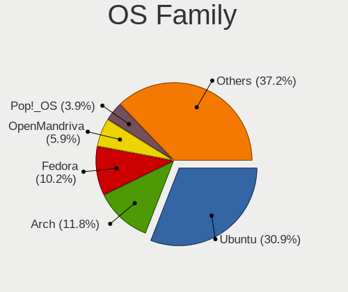
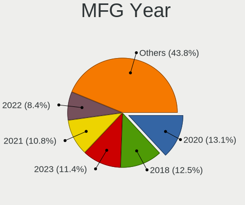
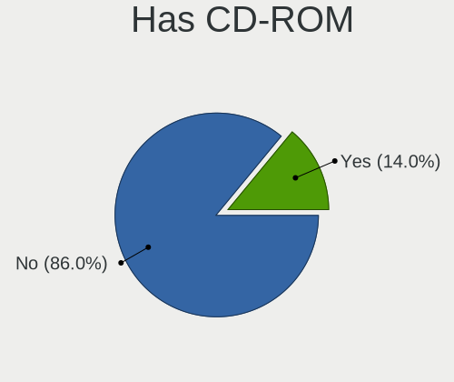
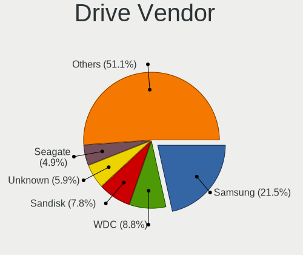
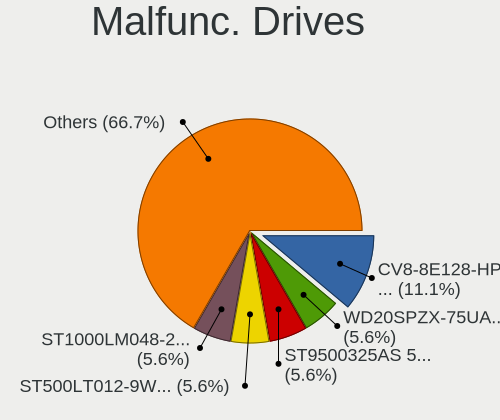
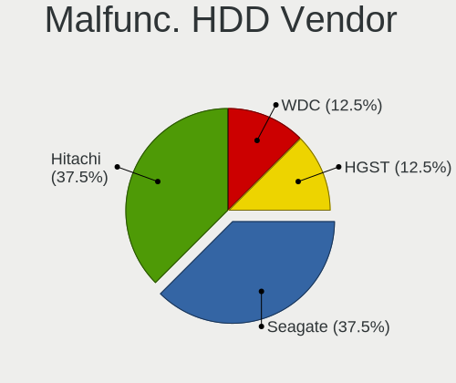
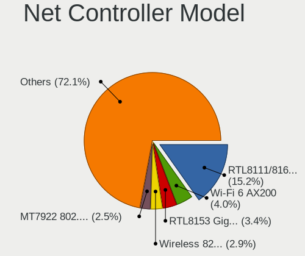
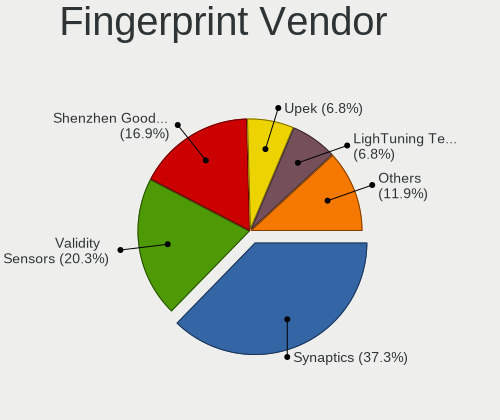

Linux in Hong Kong - Tested Hardware & Statistics (Notebooks)
-------------------------------------------------------------

A project to collect tested hardware configurations for Linux in Hong Kong.

Anyone can contribute to this report by the [hw-probe](https://github.com/linuxhw/hw-probe) tool:

    sudo -E hw-probe -all -upload

Please contribute! Especially if your hardware is rare.

Contents
--------

* [ Test Cases ](#test-cases)

* [ System ](#system)
  - [ OS                       ](#os)
  - [ OS Family                ](#os-family)
  - [ Kernel                   ](#kernel)
  - [ Kernel Family            ](#kernel-family)
  - [ Kernel Major Ver.        ](#kernel-major-ver)
  - [ Arch                     ](#arch)
  - [ DE                       ](#de)
  - [ Display Server           ](#display-server)
  - [ Display Manager          ](#display-manager)
  - [ OS Lang                  ](#os-lang)
  - [ Boot Mode                ](#boot-mode)
  - [ Filesystem               ](#filesystem)
  - [ Part. scheme             ](#part-scheme)
  - [ Dual Boot with Linux/BSD ](#dual-boot-with-linuxbsd)
  - [ Dual Boot (Win)          ](#dual-boot-win)

* [ Board ](#board)
  - [ Vendor                   ](#vendor)
  - [ Model                    ](#model)
  - [ Model Family             ](#model-family)
  - [ MFG Year                 ](#mfg-year)
  - [ Form Factor              ](#form-factor)
  - [ Secure Boot              ](#secure-boot)
  - [ Coreboot                 ](#coreboot)
  - [ RAM Size                 ](#ram-size)
  - [ RAM Used                 ](#ram-used)
  - [ Total Drives             ](#total-drives)
  - [ Has CD-ROM               ](#has-cd-rom)
  - [ Has Ethernet             ](#has-ethernet)
  - [ Has WiFi                 ](#has-wifi)
  - [ Has Bluetooth            ](#has-bluetooth)

* [ Location ](#location)
  - [ Country                  ](#country)
  - [ City                     ](#city)

* [ Drives ](#drives)
  - [ Drive Vendor             ](#drive-vendor)
  - [ Drive Model              ](#drive-model)
  - [ HDD Vendor               ](#hdd-vendor)
  - [ SSD Vendor               ](#ssd-vendor)
  - [ Drive Kind               ](#drive-kind)
  - [ Drive Connector          ](#drive-connector)
  - [ Drive Size               ](#drive-size)
  - [ Space Total              ](#space-total)
  - [ Space Used               ](#space-used)
  - [ Malfunc. Drives          ](#malfunc-drives)
  - [ Malfunc. Drive Vendor    ](#malfunc-drive-vendor)
  - [ Malfunc. HDD Vendor      ](#malfunc-hdd-vendor)
  - [ Malfunc. Drive Kind      ](#malfunc-drive-kind)
  - [ Failed Drives            ](#failed-drives)
  - [ Failed Drive Vendor      ](#failed-drive-vendor)
  - [ Drive Status             ](#drive-status)

* [ Storage controller ](#storage-controller)
  - [ Storage Vendor           ](#storage-vendor)
  - [ Storage Model            ](#storage-model)
  - [ Storage Kind             ](#storage-kind)

* [ Processor ](#processor)
  - [ CPU Vendor               ](#cpu-vendor)
  - [ CPU Model                ](#cpu-model)
  - [ CPU Model Family         ](#cpu-model-family)
  - [ CPU Cores                ](#cpu-cores)
  - [ CPU Sockets              ](#cpu-sockets)
  - [ CPU Threads              ](#cpu-threads)
  - [ CPU Op-Modes             ](#cpu-op-modes)
  - [ CPU Microcode            ](#cpu-microcode)
  - [ CPU Microarch            ](#cpu-microarch)

* [ Graphics ](#graphics)
  - [ GPU Vendor               ](#gpu-vendor)
  - [ GPU Model                ](#gpu-model)
  - [ GPU Combo                ](#gpu-combo)
  - [ GPU Driver               ](#gpu-driver)
  - [ GPU Memory               ](#gpu-memory)

* [ Monitor ](#monitor)
  - [ Monitor Vendor           ](#monitor-vendor)
  - [ Monitor Model            ](#monitor-model)
  - [ Monitor Resolution       ](#monitor-resolution)
  - [ Monitor Diagonal         ](#monitor-diagonal)
  - [ Monitor Width            ](#monitor-width)
  - [ Aspect Ratio             ](#aspect-ratio)
  - [ Monitor Area             ](#monitor-area)
  - [ Pixel Density            ](#pixel-density)
  - [ Multiple Monitors        ](#multiple-monitors)

* [ Network ](#network)
  - [ Net Controller Vendor    ](#net-controller-vendor)
  - [ Net Controller Model     ](#net-controller-model)
  - [ Wireless Vendor          ](#wireless-vendor)
  - [ Wireless Model           ](#wireless-model)
  - [ Ethernet Vendor          ](#ethernet-vendor)
  - [ Ethernet Model           ](#ethernet-model)
  - [ Net Controller Kind      ](#net-controller-kind)
  - [ Used Controller          ](#used-controller)
  - [ NICs                     ](#nics)
  - [ IPv6                     ](#ipv6)

* [ Bluetooth ](#bluetooth)
  - [ Bluetooth Vendor         ](#bluetooth-vendor)
  - [ Bluetooth Model          ](#bluetooth-model)

* [ Sound ](#sound)
  - [ Sound Vendor             ](#sound-vendor)
  - [ Sound Model              ](#sound-model)

* [ Memory ](#memory)
  - [ Memory Vendor            ](#memory-vendor)
  - [ Memory Model             ](#memory-model)
  - [ Memory Kind              ](#memory-kind)
  - [ Memory Form Factor       ](#memory-form-factor)
  - [ Memory Size              ](#memory-size)
  - [ Memory Speed             ](#memory-speed)

* [ Printers & scanners ](#printers--scanners)
  - [ Printer Vendor           ](#printer-vendor)
  - [ Printer Model            ](#printer-model)
  - [ Scanner Vendor           ](#scanner-vendor)
  - [ Scanner Model            ](#scanner-model)

* [ Camera ](#camera)
  - [ Camera Vendor            ](#camera-vendor)
  - [ Camera Model             ](#camera-model)

* [ Security ](#security)
  - [ Fingerprint Vendor       ](#fingerprint-vendor)
  - [ Fingerprint Model        ](#fingerprint-model)
  - [ Chipcard Vendor          ](#chipcard-vendor)
  - [ Chipcard Model           ](#chipcard-model)

* [ Unsupported ](#unsupported)
  - [ Unsupported Devices      ](#unsupported-devices)
  - [ Unsupported Device Types ](#unsupported-device-types)

Test Cases
----------

Total: 334

| Vendor        | Model                       | Probe                                                      | Date         |
|---------------|-----------------------------|------------------------------------------------------------|--------------|
| Unknown       | Unknown                     | [f90d872043](https://linux-hardware.org/?probe=f90d872043) | Nov 05, 2023 |
| Lenovo        | G770 20089                  | [8428ba05f5](https://linux-hardware.org/?probe=8428ba05f5) | Oct 28, 2023 |
| Apple         | MacBookAir6,2               | [6a3e8e996e](https://linux-hardware.org/?probe=6a3e8e996e) | Oct 20, 2023 |
| MECHREVO      | WUJIE14 PRO                 | [40cfeec2b2](https://linux-hardware.org/?probe=40cfeec2b2) | Oct 15, 2023 |
| MECHREVO      | WUJIE14 PRO                 | [422e2e497a](https://linux-hardware.org/?probe=422e2e497a) | Oct 15, 2023 |
| Lenovo        | G770 20089                  | [b8d4374337](https://linux-hardware.org/?probe=b8d4374337) | Oct 14, 2023 |
| Lenovo        | G770 20089                  | [eefc449148](https://linux-hardware.org/?probe=eefc449148) | Oct 14, 2023 |
| Lenovo        | ThinkPad X1 Carbon Gen 1... | [41ca042a36](https://linux-hardware.org/?probe=41ca042a36) | Oct 14, 2023 |
| ASUSTek       | ROG Strix G732LWS_G732LW... | [cc1f103b33](https://linux-hardware.org/?probe=cc1f103b33) | Oct 12, 2023 |
| Lenovo        | IdeaPad 320-14IKB 80XK      | [ae56dcb316](https://linux-hardware.org/?probe=ae56dcb316) | Oct 12, 2023 |
| Unknown       | Unknown                     | [3f4a876b18](https://linux-hardware.org/?probe=3f4a876b18) | Oct 08, 2023 |
| Apple         | MacBookAir6,2               | [a716f2a182](https://linux-hardware.org/?probe=a716f2a182) | Oct 06, 2023 |
| Valve         | Jupiter                     | [54eaf1a92d](https://linux-hardware.org/?probe=54eaf1a92d) | Oct 04, 2023 |
| Unknown       | Unknown                     | [b3a1f027db](https://linux-hardware.org/?probe=b3a1f027db) | Oct 03, 2023 |
| Toshiba       | PORTEGE R830                | [beaf871c4c](https://linux-hardware.org/?probe=beaf871c4c) | Oct 01, 2023 |
| Unknown       | Unknown                     | [539887ee9a](https://linux-hardware.org/?probe=539887ee9a) | Sep 23, 2023 |
| Unknown       | Unknown                     | [5e399c56a0](https://linux-hardware.org/?probe=5e399c56a0) | Sep 16, 2023 |
| Lenovo        | ThinkPad X1 Carbon 6th 2... | [526a6826ab](https://linux-hardware.org/?probe=526a6826ab) | Sep 03, 2023 |
| Lenovo        | ThinkPad X1 Carbon 6th 2... | [062f19958d](https://linux-hardware.org/?probe=062f19958d) | Sep 01, 2023 |
| HUAWEI        | MACHD-WXX9                  | [2e74e88e2f](https://linux-hardware.org/?probe=2e74e88e2f) | Aug 31, 2023 |
| Dell          | XPS 13 9300                 | [ca90d2134f](https://linux-hardware.org/?probe=ca90d2134f) | Aug 26, 2023 |
| Lenovo        | ThinkPad P51 20HJS5WH0D     | [ae8a51b2f5](https://linux-hardware.org/?probe=ae8a51b2f5) | Aug 21, 2023 |
| Lenovo        | ThinkPad T430s 2355C33      | [4c589a0320](https://linux-hardware.org/?probe=4c589a0320) | Aug 18, 2023 |
| Lenovo        | V130-15IKB 81HN             | [88a9c5764d](https://linux-hardware.org/?probe=88a9c5764d) | Aug 11, 2023 |
| Unknown       | Unknown                     | [c90f282238](https://linux-hardware.org/?probe=c90f282238) | Aug 11, 2023 |
| Fujitsu       | UH-X                        | [e26b430aef](https://linux-hardware.org/?probe=e26b430aef) | Aug 09, 2023 |
| Lenovo        | ThinkBook 14 G4+ ARA 21D... | [a089f6ff62](https://linux-hardware.org/?probe=a089f6ff62) | Aug 05, 2023 |
| LG Electro... | 16Z90R-K.ADB9U1             | [d3a9e05559](https://linux-hardware.org/?probe=d3a9e05559) | Aug 02, 2023 |
| Samsung       | 950XCJ/951XCJ/950XCR        | [dd11fc89fe](https://linux-hardware.org/?probe=dd11fc89fe) | Aug 02, 2023 |
| Chuwi         | HeroBook Pro                | [eb332b024d](https://linux-hardware.org/?probe=eb332b024d) | Jul 30, 2023 |
| Unknown       | Unknown                     | [e8368bcae8](https://linux-hardware.org/?probe=e8368bcae8) | Jul 28, 2023 |
| Unknown       | Apple MacBook Pro (14-in... | [0552cb3e44](https://linux-hardware.org/?probe=0552cb3e44) | Jul 26, 2023 |
| Lenovo        | Legion R9000X 2021 82HN     | [0079a4e7a0](https://linux-hardware.org/?probe=0079a4e7a0) | Jul 25, 2023 |
| HP            | Laptop 15s-du3xxx           | [e14cb2c24e](https://linux-hardware.org/?probe=e14cb2c24e) | Jul 25, 2023 |
| HUAWEI        | MACHC-WAX9                  | [bddace9995](https://linux-hardware.org/?probe=bddace9995) | Jul 25, 2023 |
| ASUSTek       | S551LB                      | [edfa5090fc](https://linux-hardware.org/?probe=edfa5090fc) | Jul 21, 2023 |
| Unknown       | Unknown                     | [9430a42f8b](https://linux-hardware.org/?probe=9430a42f8b) | Jul 13, 2023 |
| HP            | OMEN by Gaming Laptop 16... | [9bee6805c0](https://linux-hardware.org/?probe=9bee6805c0) | Jul 13, 2023 |
| HP            | Pavilion Gaming Laptop 1... | [b89cab90c0](https://linux-hardware.org/?probe=b89cab90c0) | Jul 11, 2023 |
| ASUSTek       | ROG Zephyrus Duo 16 GX65... | [ee5ef8132f](https://linux-hardware.org/?probe=ee5ef8132f) | Jul 09, 2023 |
| Lenovo        | Legion R9000X ARHA7 82UG    | [5da53d3f61](https://linux-hardware.org/?probe=5da53d3f61) | Jul 09, 2023 |
| Lenovo        | XiaoXinPro 14ITL 2021 82... | [c060069870](https://linux-hardware.org/?probe=c060069870) | Jul 07, 2023 |
| Lenovo        | Legion R9000P ARX8 82WM     | [95c540792e](https://linux-hardware.org/?probe=95c540792e) | Jul 02, 2023 |
| Google        | Nami                        | [6ffc403580](https://linux-hardware.org/?probe=6ffc403580) | Jun 29, 2023 |
| Lenovo        | XiaoXinPro 14ITL 2021 82... | [928f167dee](https://linux-hardware.org/?probe=928f167dee) | Jun 22, 2023 |
| HUAWEI        | MACH-WX9                    | [016268562d](https://linux-hardware.org/?probe=016268562d) | Jun 21, 2023 |
| HUAWEI        | MACH-WX9                    | [25bc3b1533](https://linux-hardware.org/?probe=25bc3b1533) | Jun 21, 2023 |
| Lenovo        | XiaoXinPro 14ITL 2021 82... | [6a63f44627](https://linux-hardware.org/?probe=6a63f44627) | Jun 19, 2023 |
| Lenovo        | ThinkPad E480 20KNA047CD    | [918de7de03](https://linux-hardware.org/?probe=918de7de03) | Jun 16, 2023 |
| Unknown       | Unknown                     | [bd74568d10](https://linux-hardware.org/?probe=bd74568d10) | Jun 15, 2023 |
| Lenovo        | IdeaPad 3 15IGL05 81WQ      | [a67c1e25b2](https://linux-hardware.org/?probe=a67c1e25b2) | Jun 11, 2023 |
| ASUSTek       | S400CA                      | [25c1d47331](https://linux-hardware.org/?probe=25c1d47331) | Jun 08, 2023 |
| Unknown       | Unknown                     | [b7f109f62e](https://linux-hardware.org/?probe=b7f109f62e) | Jun 08, 2023 |
| GPD           | G1619-04                    | [49b9e4edd3](https://linux-hardware.org/?probe=49b9e4edd3) | May 28, 2023 |
| GPD           | G1619-04                    | [caa6b5459d](https://linux-hardware.org/?probe=caa6b5459d) | May 28, 2023 |
| Chuwi         | HeroBook Pro                | [b25115a01a](https://linux-hardware.org/?probe=b25115a01a) | May 19, 2023 |
| Lenovo        | ThinkPad X270 W10DG 20K5... | [2bfe226026](https://linux-hardware.org/?probe=2bfe226026) | May 16, 2023 |
| Lenovo        | ThinkPad X270 W10DG 20K5... | [c2ccca0208](https://linux-hardware.org/?probe=c2ccca0208) | May 16, 2023 |
| ASUSTek       | VivoBook_ASUSLaptop K550... | [cacfc4dacd](https://linux-hardware.org/?probe=cacfc4dacd) | May 16, 2023 |
| Lenovo        | ThinkPad X1 Carbon Gen 1... | [b9cfd37540](https://linux-hardware.org/?probe=b9cfd37540) | May 05, 2023 |
| Fujitsu       | FMVNU6G1C                   | [969957b527](https://linux-hardware.org/?probe=969957b527) | Apr 29, 2023 |
| HP            | OMEN by Gaming Laptop 16... | [65cce76dc9](https://linux-hardware.org/?probe=65cce76dc9) | Apr 20, 2023 |
| Lenovo        | ThinkPad X201 33233QM       | [f84da542f6](https://linux-hardware.org/?probe=f84da542f6) | Apr 15, 2023 |
| ASUSTek       | VivoBook_ASUSLaptop X160... | [9d3c5ea28d](https://linux-hardware.org/?probe=9d3c5ea28d) | Apr 11, 2023 |
| MACHENIKE     | T58-V                       | [9a70cca135](https://linux-hardware.org/?probe=9a70cca135) | Apr 08, 2023 |
| Dell          | XPS 17 9710                 | [b4c155dc99](https://linux-hardware.org/?probe=b4c155dc99) | Apr 07, 2023 |
| Samsung       | 905S3G/906S3G/915S3G/930... | [832b434c38](https://linux-hardware.org/?probe=832b434c38) | Mar 28, 2023 |
| Samsung       | 905S3G/906S3G/915S3G/930... | [7e283bfa25](https://linux-hardware.org/?probe=7e283bfa25) | Mar 28, 2023 |
| METAPHYUNI    | MetamechBook                | [7e4076cb61](https://linux-hardware.org/?probe=7e4076cb61) | Mar 24, 2023 |
| ONE-NETBOO... | ONEXPLAYER 2 ARP23 Ver.1... | [9b021e4844](https://linux-hardware.org/?probe=9b021e4844) | Mar 11, 2023 |
| ASUSTek       | ROG Zephyrus G14 GA401QM... | [d256faa9fc](https://linux-hardware.org/?probe=d256faa9fc) | Mar 06, 2023 |
| Lenovo        | Legion Y9000P IAH7H 82RF    | [97925534c2](https://linux-hardware.org/?probe=97925534c2) | Mar 02, 2023 |
| Dell          | XPS 13 9300                 | [fc803f9205](https://linux-hardware.org/?probe=fc803f9205) | Feb 27, 2023 |
| Valve         | Jupiter                     | [3ad0d92361](https://linux-hardware.org/?probe=3ad0d92361) | Feb 25, 2023 |
| Dell          | XPS 15 9570                 | [81cfc27f9e](https://linux-hardware.org/?probe=81cfc27f9e) | Feb 20, 2023 |
| Valve         | Jupiter                     | [c9c9830572](https://linux-hardware.org/?probe=c9c9830572) | Feb 19, 2023 |
| Lenovo        | IdeaPad S145-14IWL 81MU     | [58bcb8bf04](https://linux-hardware.org/?probe=58bcb8bf04) | Feb 18, 2023 |
| Acer          | Nitro AN515-46              | [bf63748499](https://linux-hardware.org/?probe=bf63748499) | Feb 18, 2023 |
| Acer          | Nitro AN515-46              | [162b72d7a8](https://linux-hardware.org/?probe=162b72d7a8) | Feb 17, 2023 |
| Apple         | MacBookAir6,2               | [46aafc59c4](https://linux-hardware.org/?probe=46aafc59c4) | Feb 16, 2023 |
| Lenovo        | Y430P 20435                 | [da3030daae](https://linux-hardware.org/?probe=da3030daae) | Feb 16, 2023 |
| Lenovo        | ThinkPad X230 23066RC       | [6a223f0a71](https://linux-hardware.org/?probe=6a223f0a71) | Feb 15, 2023 |
| ASUSTek       | X705UA                      | [cc59e95283](https://linux-hardware.org/?probe=cc59e95283) | Feb 07, 2023 |
| ASUSTek       | X705UA                      | [25188e7cfa](https://linux-hardware.org/?probe=25188e7cfa) | Feb 07, 2023 |
| Timi          | TM1613                      | [503133b0db](https://linux-hardware.org/?probe=503133b0db) | Feb 07, 2023 |
| Valve         | Jupiter                     | [42a3945648](https://linux-hardware.org/?probe=42a3945648) | Feb 06, 2023 |
| Valve         | Jupiter                     | [5f77ae27c2](https://linux-hardware.org/?probe=5f77ae27c2) | Feb 04, 2023 |
| Lenovo        | ThinkBook 16p Gen 2 20YM    | [53015adc9d](https://linux-hardware.org/?probe=53015adc9d) | Jan 28, 2023 |
| Lenovo        | ThinkPad T430s 2355C33      | [6d6a8e4be4](https://linux-hardware.org/?probe=6d6a8e4be4) | Jan 24, 2023 |
| Acer          | Swift SF314-57G             | [ae9de10584](https://linux-hardware.org/?probe=ae9de10584) | Jan 21, 2023 |
| Unknown       | Apple MacBook Pro (14-in... | [4b9d2e6e26](https://linux-hardware.org/?probe=4b9d2e6e26) | Jan 21, 2023 |
| Unknown       | Apple MacBook Pro (14-in... | [f5bb76ae13](https://linux-hardware.org/?probe=f5bb76ae13) | Jan 21, 2023 |
| HP            | Pavilion Gaming Laptop 1... | [7cb08d37fb](https://linux-hardware.org/?probe=7cb08d37fb) | Jan 14, 2023 |
| Dell          | XPS 15 9520                 | [2e13f150e6](https://linux-hardware.org/?probe=2e13f150e6) | Jan 09, 2023 |
| Dell          | XPS 15 9520                 | [ec6743fa1b](https://linux-hardware.org/?probe=ec6743fa1b) | Jan 06, 2023 |
| HP            | Stream Notebook PC 13       | [2154a332b0](https://linux-hardware.org/?probe=2154a332b0) | Dec 29, 2022 |
| Unknown       | Apple MacBook Pro (14-in... | [8a5b919c91](https://linux-hardware.org/?probe=8a5b919c91) | Dec 24, 2022 |
| Apple         | MacBookAir5,2               | [641b77c3da](https://linux-hardware.org/?probe=641b77c3da) | Dec 20, 2022 |
| GPD           | P2 MAX                      | [de5983ec37](https://linux-hardware.org/?probe=de5983ec37) | Dec 17, 2022 |
| HP            | Pavilion Laptop 14-ce1xx... | [8d631bb590](https://linux-hardware.org/?probe=8d631bb590) | Dec 17, 2022 |
| Dell          | Inspiron 7590               | [e8fb837cf5](https://linux-hardware.org/?probe=e8fb837cf5) | Dec 16, 2022 |
| GPD           | P2 MAX                      | [63c199f475](https://linux-hardware.org/?probe=63c199f475) | Dec 08, 2022 |
| Lenovo        | ThinkPad T430s 2355C33      | [706e40ed5a](https://linux-hardware.org/?probe=706e40ed5a) | Dec 04, 2022 |
| Lenovo        | ThinkPad T430s 2355C33      | [aff020417f](https://linux-hardware.org/?probe=aff020417f) | Dec 01, 2022 |
| Dell          | Latitude 7390               | [7214cac96d](https://linux-hardware.org/?probe=7214cac96d) | Nov 30, 2022 |
| Dell          | Inspiron N4050              | [7b0cf2fa20](https://linux-hardware.org/?probe=7b0cf2fa20) | Nov 30, 2022 |
| GPD           | G1619-04                    | [ce6d16840e](https://linux-hardware.org/?probe=ce6d16840e) | Nov 07, 2022 |
| Dell          | XPS 15 9570                 | [468f8df590](https://linux-hardware.org/?probe=468f8df590) | Nov 06, 2022 |
| Lenovo        | Legion Y530-15ICH-1060 8... | [60ba0bc2dd](https://linux-hardware.org/?probe=60ba0bc2dd) | Oct 29, 2022 |
| Lenovo        | ThinkPad T470 20HD002TCD    | [0b0ca5a5f6](https://linux-hardware.org/?probe=0b0ca5a5f6) | Oct 20, 2022 |
| HP            | Pavilion Gaming Laptop 1... | [8ebbbf93e4](https://linux-hardware.org/?probe=8ebbbf93e4) | Oct 17, 2022 |
| AMI           | Cherry Trail CR             | [7d3c652547](https://linux-hardware.org/?probe=7d3c652547) | Oct 11, 2022 |
| HP            | ZHAN 66 Pro A 14 inch G5... | [c5587dbec5](https://linux-hardware.org/?probe=c5587dbec5) | Oct 04, 2022 |
| Fujitsu       | FMVNU6G1C                   | [1351f25388](https://linux-hardware.org/?probe=1351f25388) | Sep 30, 2022 |
| Lenovo        | ThinkBook 14p Gen 2 20YN    | [28631c9681](https://linux-hardware.org/?probe=28631c9681) | Sep 27, 2022 |
| Lenovo        | ThinkPad X1 Carbon 6th 2... | [7c8030e423](https://linux-hardware.org/?probe=7c8030e423) | Sep 26, 2022 |
| Dell          | Latitude E5250              | [e4ffe3583d](https://linux-hardware.org/?probe=e4ffe3583d) | Sep 26, 2022 |
| Unknown       | Apple MacBook Pro (14-in... | [89a019875a](https://linux-hardware.org/?probe=89a019875a) | Sep 24, 2022 |
| Chuwi         | HeroBook Pro                | [76be3ff1db](https://linux-hardware.org/?probe=76be3ff1db) | Sep 22, 2022 |
| Dell          | Inspiron MP061              | [8e6955cbf6](https://linux-hardware.org/?probe=8e6955cbf6) | Sep 21, 2022 |
| Chuwi         | HeroBook Pro                | [3759658825](https://linux-hardware.org/?probe=3759658825) | Sep 19, 2022 |
| HUAWEI        | NBLK-WAX9X                  | [f454a8f6a5](https://linux-hardware.org/?probe=f454a8f6a5) | Sep 19, 2022 |
| Apple         | MacBookPro15,2              | [5160feeaf2](https://linux-hardware.org/?probe=5160feeaf2) | Sep 13, 2022 |
| Apple         | MacBookPro15,2              | [876e87c7b6](https://linux-hardware.org/?probe=876e87c7b6) | Sep 13, 2022 |
| Lenovo        | Legion R7000 2020 82B6      | [1d95c5b6ef](https://linux-hardware.org/?probe=1d95c5b6ef) | Sep 12, 2022 |
| Lenovo        | ThinkPad X1 Carbon 6th 2... | [4562797ebc](https://linux-hardware.org/?probe=4562797ebc) | Sep 08, 2022 |
| Lenovo        | Legion R7000 2020 82B6      | [32ab96441e](https://linux-hardware.org/?probe=32ab96441e) | Sep 08, 2022 |
| Lenovo        | ThinkPad T480 20L5A00PCD    | [d0ddfb5815](https://linux-hardware.org/?probe=d0ddfb5815) | Sep 07, 2022 |
| MSI           | GS65 Stealth Thin 8RE       | [90aed4d5d1](https://linux-hardware.org/?probe=90aed4d5d1) | Aug 20, 2022 |
| Lenovo        | ThinkPad X1 Carbon 6th 2... | [c32d69a956](https://linux-hardware.org/?probe=c32d69a956) | Aug 18, 2022 |
| Lenovo        | ThinkPad X13 Gen 1 20UFS... | [6eadd1ec75](https://linux-hardware.org/?probe=6eadd1ec75) | Aug 17, 2022 |
| Lenovo        | ThinkPad T490s 20NYS79X0... | [5fe4fba501](https://linux-hardware.org/?probe=5fe4fba501) | Aug 12, 2022 |
| Acer          | Swift SF314-512             | [c374f64c25](https://linux-hardware.org/?probe=c374f64c25) | Aug 11, 2022 |
| Acer          | Swift SF314-512             | [0c23760c27](https://linux-hardware.org/?probe=0c23760c27) | Aug 10, 2022 |
| HP            | ZBook 17 G3                 | [bc4cf926f2](https://linux-hardware.org/?probe=bc4cf926f2) | Aug 06, 2022 |
| KOHJINSHA     | SC series                   | [90a25503ee](https://linux-hardware.org/?probe=90a25503ee) | Aug 01, 2022 |
| KOHJINSHA     | SC series                   | [3986e59a55](https://linux-hardware.org/?probe=3986e59a55) | Aug 01, 2022 |
| Lenovo        | ThinkPad L14 Gen 1 20U6A... | [76d752f0ad](https://linux-hardware.org/?probe=76d752f0ad) | Aug 01, 2022 |
| Fujitsu       | LIFEBOOK V1020              | [e33ac2916d](https://linux-hardware.org/?probe=e33ac2916d) | Jul 30, 2022 |
| HP            | OMEN Laptop 15-en0xxx       | [d449f1aeb9](https://linux-hardware.org/?probe=d449f1aeb9) | Jul 27, 2022 |
| IBM           | 260921H                     | [bab4f3f57d](https://linux-hardware.org/?probe=bab4f3f57d) | Jul 17, 2022 |
| IBM           | 260921H                     | [a7483bac34](https://linux-hardware.org/?probe=a7483bac34) | Jul 17, 2022 |
| Lenovo        | ThinkPad X250 20CLA1VECD    | [f3e0ebd16e](https://linux-hardware.org/?probe=f3e0ebd16e) | Jul 15, 2022 |
| IBM           | 260921H                     | [5f9b0998d3](https://linux-hardware.org/?probe=5f9b0998d3) | Jul 11, 2022 |
| IBM           | 260921H                     | [f0430651fd](https://linux-hardware.org/?probe=f0430651fd) | Jul 10, 2022 |
| Lenovo        | Unknown                     | [910a4f6587](https://linux-hardware.org/?probe=910a4f6587) | Jul 09, 2022 |
| Acer          | Swift SF314-42              | [bd4792ebd8](https://linux-hardware.org/?probe=bd4792ebd8) | Jul 02, 2022 |
| Compaq        | Tablet PC TC1000            | [80324222a7](https://linux-hardware.org/?probe=80324222a7) | Jun 26, 2022 |
| KOHJINSHA     | SX series                   | [7333815afc](https://linux-hardware.org/?probe=7333815afc) | Jun 26, 2022 |
| Samsung       | SQ1S Revision MP            | [faeb18a49e](https://linux-hardware.org/?probe=faeb18a49e) | Jun 26, 2022 |
| Lenovo        | ThinkPad X1 Carbon 5th 2... | [044be44d33](https://linux-hardware.org/?probe=044be44d33) | Jun 25, 2022 |
| Lenovo        | ThinkBook 14 G4+ ARA 21D... | [5bd3ad4d01](https://linux-hardware.org/?probe=5bd3ad4d01) | Jun 24, 2022 |
| Dell          | XPS 15 9520                 | [ec6f5cce04](https://linux-hardware.org/?probe=ec6f5cce04) | Jun 20, 2022 |
| Dell          | XPS 15 9520                 | [bdd4ec2ef9](https://linux-hardware.org/?probe=bdd4ec2ef9) | Jun 15, 2022 |
| Lenovo        | ThinkBook 14 G4+ ARA 21D... | [f4c7f13ff8](https://linux-hardware.org/?probe=f4c7f13ff8) | Jun 14, 2022 |
| Lenovo        | ThinkPad X250 20CLA1VECD    | [e3df184136](https://linux-hardware.org/?probe=e3df184136) | Jun 12, 2022 |
| Dell          | XPS 13 9305                 | [e373d39f20](https://linux-hardware.org/?probe=e373d39f20) | Jun 09, 2022 |
| ASUSTek       | Zenbook UX5401ZAS_UX5401... | [27301ce2e8](https://linux-hardware.org/?probe=27301ce2e8) | Jun 03, 2022 |
| ASUSTek       | N501VW                      | [2f8215fb0a](https://linux-hardware.org/?probe=2f8215fb0a) | May 31, 2022 |
| Lenovo        | ThinkPad T430s 2355C33      | [33de2bbd12](https://linux-hardware.org/?probe=33de2bbd12) | May 31, 2022 |
| Dell          | XPS 15 9520                 | [4d4c32223e](https://linux-hardware.org/?probe=4d4c32223e) | May 31, 2022 |
| Lenovo        | ThinkPad T430s 2355C33      | [4eab57bebf](https://linux-hardware.org/?probe=4eab57bebf) | May 30, 2022 |
| Lenovo        | IdeaPad Gaming 3 15ACH6 ... | [63fd75f1a8](https://linux-hardware.org/?probe=63fd75f1a8) | May 29, 2022 |
| Lenovo        | Legion Y7000P2020H 82AX     | [220325c031](https://linux-hardware.org/?probe=220325c031) | May 29, 2022 |
| Dell          | XPS 15 9520                 | [75d345243e](https://linux-hardware.org/?probe=75d345243e) | May 29, 2022 |
| ASUSTek       | ASUS TUF Gaming A15 FA50... | [7fa4ca7312](https://linux-hardware.org/?probe=7fa4ca7312) | May 23, 2022 |
| Intel Clie... | LAPKC71F                    | [1f67896c5c](https://linux-hardware.org/?probe=1f67896c5c) | May 22, 2022 |
| Intel Clie... | LAPKC71F                    | [a227af798c](https://linux-hardware.org/?probe=a227af798c) | May 20, 2022 |
| HP            | ZHAN 66 Pro 14 G4 Notebo... | [f0b122c199](https://linux-hardware.org/?probe=f0b122c199) | May 09, 2022 |
| Dell          | Precision 7520              | [2dc98a1a8d](https://linux-hardware.org/?probe=2dc98a1a8d) | Apr 30, 2022 |
| Lenovo        | Yoga Slim 7 Pro 14ACH5 8... | [9191742453](https://linux-hardware.org/?probe=9191742453) | Apr 26, 2022 |
| Apple         | MacBookAir5,1               | [3dd8282149](https://linux-hardware.org/?probe=3dd8282149) | Apr 20, 2022 |
| GPD           | P2 MAX                      | [ca842dc5fb](https://linux-hardware.org/?probe=ca842dc5fb) | Apr 19, 2022 |
| Lenovo        | IdeaPad 320-15IKB 80XL      | [ca558e6708](https://linux-hardware.org/?probe=ca558e6708) | Apr 07, 2022 |
| ASUSTek       | ROG Strix G513QM_G513QM     | [bdca066ba3](https://linux-hardware.org/?probe=bdca066ba3) | Apr 05, 2022 |
| Dell          | Inspiron 14 5410            | [314bd42e78](https://linux-hardware.org/?probe=314bd42e78) | Mar 28, 2022 |
| Lenovo        | ThinkPad T430s 2355C33      | [a881a875bd](https://linux-hardware.org/?probe=a881a875bd) | Mar 27, 2022 |
| Fujitsu       | LIFEBOOK LH531              | [2d48cb4419](https://linux-hardware.org/?probe=2d48cb4419) | Mar 26, 2022 |
| Dell          | Latitude 7285               | [87e555f958](https://linux-hardware.org/?probe=87e555f958) | Mar 13, 2022 |
| Fujitsu       | LIFEBOOK AH544              | [03b27c8ca4](https://linux-hardware.org/?probe=03b27c8ca4) | Mar 12, 2022 |
| Lenovo        | ThinkPad X1 Extreme 20MF... | [4998fff0f9](https://linux-hardware.org/?probe=4998fff0f9) | Mar 12, 2022 |
| HP            | Victus by Laptop 16-d1xx... | [c68cec2207](https://linux-hardware.org/?probe=c68cec2207) | Mar 11, 2022 |
| Fujitsu       | LIFEBOOK AH544              | [96b36779e0](https://linux-hardware.org/?probe=96b36779e0) | Mar 11, 2022 |
| HP            | Notebook                    | [9c04c0776d](https://linux-hardware.org/?probe=9c04c0776d) | Mar 10, 2022 |
| HP            | Notebook                    | [c7d735dc99](https://linux-hardware.org/?probe=c7d735dc99) | Mar 10, 2022 |
| Lenovo        | ThinkPad P15v Gen 1 20TQ... | [0f4fad19b2](https://linux-hardware.org/?probe=0f4fad19b2) | Feb 07, 2022 |
| Dell          | Inspiron 5580               | [515465fd5a](https://linux-hardware.org/?probe=515465fd5a) | Jan 22, 2022 |
| Lenovo        | Legion R7000 2020 82B6      | [5f92f3376e](https://linux-hardware.org/?probe=5f92f3376e) | Jan 11, 2022 |
| HP            | EliteBook 830 G5            | [bf884733a1](https://linux-hardware.org/?probe=bf884733a1) | Dec 16, 2021 |
| HP            | EliteBook 830 G5            | [61d4bff2bd](https://linux-hardware.org/?probe=61d4bff2bd) | Dec 15, 2021 |
| Fujitsu       | LIFEBOOK LH530              | [8db7409ab5](https://linux-hardware.org/?probe=8db7409ab5) | Dec 14, 2021 |
| Unknown       | Unknown                     | [739be994cb](https://linux-hardware.org/?probe=739be994cb) | Dec 09, 2021 |
| Lenovo        | Legion 5 15ACH6 82JW        | [024a42eb21](https://linux-hardware.org/?probe=024a42eb21) | Dec 08, 2021 |
| Lenovo        | ThinkPad X1 Carbon 7th 2... | [ee13ae89af](https://linux-hardware.org/?probe=ee13ae89af) | Nov 26, 2021 |
| Apple         | MacBook10,1                 | [6cb99e6a5f](https://linux-hardware.org/?probe=6cb99e6a5f) | Nov 23, 2021 |
| Jumper        | EZbook                      | [5da2b95e2f](https://linux-hardware.org/?probe=5da2b95e2f) | Nov 12, 2021 |
| Lenovo        | XiaoXin Chao7000-14IKBR ... | [531b838f59](https://linux-hardware.org/?probe=531b838f59) | Nov 09, 2021 |
| Lenovo        | XiaoXin Chao7000-14IKBR ... | [8ea29d23df](https://linux-hardware.org/?probe=8ea29d23df) | Nov 09, 2021 |
| Unknown       | Unknown                     | [ed14b60c7a](https://linux-hardware.org/?probe=ed14b60c7a) | Nov 05, 2021 |
| HP            | Laptop 15s-du3xxx           | [6f87ece998](https://linux-hardware.org/?probe=6f87ece998) | Oct 26, 2021 |
| Lenovo        | IdeaPad 5 14IIL05 81YH      | [3d42bc888b](https://linux-hardware.org/?probe=3d42bc888b) | Oct 24, 2021 |
| Lenovo        | IdeaPad 5 14IIL05 81YH      | [54e54e71bd](https://linux-hardware.org/?probe=54e54e71bd) | Oct 24, 2021 |
| Dell          | XPS 13 9310                 | [20dc49f637](https://linux-hardware.org/?probe=20dc49f637) | Oct 13, 2021 |
| Lenovo        | Legion Y9000P2021H 82JD     | [4c3be0fe24](https://linux-hardware.org/?probe=4c3be0fe24) | Oct 02, 2021 |
| GPD           | G1618-03                    | [41916177c2](https://linux-hardware.org/?probe=41916177c2) | Sep 01, 2021 |
| GPD           | G1618-03                    | [c2abcaf10c](https://linux-hardware.org/?probe=c2abcaf10c) | Sep 01, 2021 |
| Dell          | Precision 7550              | [42721343a3](https://linux-hardware.org/?probe=42721343a3) | Aug 16, 2021 |
| Lenovo        | XiaoXin-14API QC 2019 81... | [814eb97442](https://linux-hardware.org/?probe=814eb97442) | Aug 14, 2021 |
| Lenovo        | ThinkPad T61 6465CTO        | [d93258840e](https://linux-hardware.org/?probe=d93258840e) | Aug 04, 2021 |
| HP            | EliteBook 2540p             | [eb060cd2c4](https://linux-hardware.org/?probe=eb060cd2c4) | Aug 04, 2021 |
| Toshiba       | dynabook R731/E             | [828a52387f](https://linux-hardware.org/?probe=828a52387f) | Aug 02, 2021 |
| Toshiba       | dynabook R731/E             | [12b2c3e130](https://linux-hardware.org/?probe=12b2c3e130) | Aug 01, 2021 |
| Toshiba       | dynabook R731/E             | [3af43c8ebe](https://linux-hardware.org/?probe=3af43c8ebe) | Jul 29, 2021 |
| Toshiba       | dynabook R731/E             | [fa0aa86cef](https://linux-hardware.org/?probe=fa0aa86cef) | Jul 28, 2021 |
| Unknown       | Unknown                     | [8fc32673b3](https://linux-hardware.org/?probe=8fc32673b3) | Jul 25, 2021 |
| Toshiba       | dynabook R731/E             | [c2bfccf320](https://linux-hardware.org/?probe=c2bfccf320) | Jun 16, 2021 |
| Toshiba       | dynabook R731/E             | [d3f69874dd](https://linux-hardware.org/?probe=d3f69874dd) | Jun 16, 2021 |
| Dell          | Precision M4800             | [298694c222](https://linux-hardware.org/?probe=298694c222) | Jun 12, 2021 |
| Acer          | Aspire E5-573               | [4193a2da9d](https://linux-hardware.org/?probe=4193a2da9d) | Jun 08, 2021 |
| Dell          | Precision M4800             | [67fb08d285](https://linux-hardware.org/?probe=67fb08d285) | Jun 06, 2021 |
| Dell          | Precision M4800             | [c72664a2f4](https://linux-hardware.org/?probe=c72664a2f4) | Jun 06, 2021 |
| Toshiba       | dynabook R731/E             | [81ffc7ba9e](https://linux-hardware.org/?probe=81ffc7ba9e) | May 26, 2021 |
| Fujitsu       | UH-X                        | [be65091e59](https://linux-hardware.org/?probe=be65091e59) | May 19, 2021 |
| Panasonic     | CFSZ5-2L                    | [1409e11b30](https://linux-hardware.org/?probe=1409e11b30) | May 12, 2021 |
| Dell          | XPS 13 9310                 | [8d372d62b7](https://linux-hardware.org/?probe=8d372d62b7) | May 07, 2021 |
| Panasonic     | CFSZ5-2L                    | [f35a966b00](https://linux-hardware.org/?probe=f35a966b00) | Apr 14, 2021 |
| Schenker      | XMG_APEX15_XAP15E20         | [a917367457](https://linux-hardware.org/?probe=a917367457) | Apr 09, 2021 |
| ASUSTek       | Zephyrus M GM501GM          | [f7937503ac](https://linux-hardware.org/?probe=f7937503ac) | Apr 08, 2021 |
| ASUSTek       | Zephyrus M GM501GM          | [99d71b6ea5](https://linux-hardware.org/?probe=99d71b6ea5) | Apr 06, 2021 |
| Lenovo        | IdeaPad Z410 20292          | [8253b70553](https://linux-hardware.org/?probe=8253b70553) | Apr 06, 2021 |
| Fujitsu       | LIFEBOOK AH544              | [60600f6f0c](https://linux-hardware.org/?probe=60600f6f0c) | Mar 26, 2021 |
| ASUSTek       | UX302LA                     | [fe27a8e195](https://linux-hardware.org/?probe=fe27a8e195) | Mar 12, 2021 |
| Acer          | Aspire A315-34              | [d23d84b5f6](https://linux-hardware.org/?probe=d23d84b5f6) | Mar 06, 2021 |
| ASUSTek       | ROG Zephyrus G14 GA401IU... | [5051ba6156](https://linux-hardware.org/?probe=5051ba6156) | Mar 05, 2021 |
| Fujitsu       | LIFEBOOK P771               | [2414020b54](https://linux-hardware.org/?probe=2414020b54) | Feb 26, 2021 |
| Fujitsu       | LIFEBOOK P771               | [ae61a5e1fa](https://linux-hardware.org/?probe=ae61a5e1fa) | Feb 26, 2021 |
| Lenovo        | ThinkPad E14 20RAA002CD     | [77ccb1ee60](https://linux-hardware.org/?probe=77ccb1ee60) | Feb 22, 2021 |
| Lenovo        | ThinkPad X270 20HNA00RAD    | [7d9f2bee38](https://linux-hardware.org/?probe=7d9f2bee38) | Feb 21, 2021 |
| Lenovo        | ThinkPad X270 20HNA00RAD    | [d82924b12b](https://linux-hardware.org/?probe=d82924b12b) | Feb 16, 2021 |
| Lenovo        | G710 20252                  | [f4c2a6bac8](https://linux-hardware.org/?probe=f4c2a6bac8) | Feb 07, 2021 |
| Lenovo        | ThinkPad X270 20HNA00RAD    | [d4f69c78fa](https://linux-hardware.org/?probe=d4f69c78fa) | Jan 31, 2021 |
| Fujitsu       | S6420                       | [b23c0f10e7](https://linux-hardware.org/?probe=b23c0f10e7) | Jan 28, 2021 |
| Fujitsu       | S6420                       | [0cf6376b40](https://linux-hardware.org/?probe=0cf6376b40) | Jan 27, 2021 |
| HP            | ZHAN 66 Pro 14 G4 Notebo... | [3d7ce778c6](https://linux-hardware.org/?probe=3d7ce778c6) | Jan 20, 2021 |
| HUAWEI        | KPRC-WX0                    | [fe7d03f093](https://linux-hardware.org/?probe=fe7d03f093) | Jan 18, 2021 |
| ASUSTek       | TUF Gaming FA506IU_FA506... | [a8ac85cb5a](https://linux-hardware.org/?probe=a8ac85cb5a) | Dec 30, 2020 |
| ASUSTek       | TUF Gaming FA506IU_FA506... | [8c7ba97457](https://linux-hardware.org/?probe=8c7ba97457) | Dec 29, 2020 |
| ASUSTek       | TUF Gaming FA506IU_FA506... | [01333c5b9e](https://linux-hardware.org/?probe=01333c5b9e) | Dec 29, 2020 |
| Panasonic     | CFSZ5-2L                    | [728d7e48d4](https://linux-hardware.org/?probe=728d7e48d4) | Dec 27, 2020 |
| Lenovo        | ThinkPad X270 20HNA00RAD    | [1d4b16bb0d](https://linux-hardware.org/?probe=1d4b16bb0d) | Dec 22, 2020 |
| Lenovo        | ThinkPad T480s 20L7CTO1W... | [88a7edec45](https://linux-hardware.org/?probe=88a7edec45) | Dec 18, 2020 |
| Sony          | VPCCB17FG                   | [ede3032fed](https://linux-hardware.org/?probe=ede3032fed) | Nov 29, 2020 |
| Sony          | VPCCB17FG                   | [f3012a2898](https://linux-hardware.org/?probe=f3012a2898) | Nov 29, 2020 |
| Sony          | VPCCB17FG                   | [3c4ff5bb58](https://linux-hardware.org/?probe=3c4ff5bb58) | Nov 27, 2020 |
| Sony          | VPCCB17FG                   | [5a24dc3231](https://linux-hardware.org/?probe=5a24dc3231) | Nov 26, 2020 |
| Fujitsu       | UH-X                        | [f55a6a6679](https://linux-hardware.org/?probe=f55a6a6679) | Nov 20, 2020 |
| Fujitsu       | UH-X                        | [7aea886f7a](https://linux-hardware.org/?probe=7aea886f7a) | Nov 20, 2020 |
| Lenovo        | XiaoXinAir-14ARE 2020 81... | [6254edfb10](https://linux-hardware.org/?probe=6254edfb10) | Nov 14, 2020 |
| Lenovo        | G770 20089                  | [6da9203114](https://linux-hardware.org/?probe=6da9203114) | Nov 13, 2020 |
| HP            | 2000                        | [f548e6d1cc](https://linux-hardware.org/?probe=f548e6d1cc) | Nov 11, 2020 |
| ASUSTek       | K501UX                      | [e1700b887e](https://linux-hardware.org/?probe=e1700b887e) | Nov 09, 2020 |
| HP            | 2000                        | [df76d279ad](https://linux-hardware.org/?probe=df76d279ad) | Nov 05, 2020 |
| Timi          | TM1607                      | [dbe64c3d75](https://linux-hardware.org/?probe=dbe64c3d75) | Nov 02, 2020 |
| Lenovo        | IdeaPad Yoga 13 20175       | [518c70a58e](https://linux-hardware.org/?probe=518c70a58e) | Nov 02, 2020 |
| Acer          | Swift SF314-57              | [8395e5a946](https://linux-hardware.org/?probe=8395e5a946) | Oct 30, 2020 |
| Acer          | Swift SF314-57              | [123f60c868](https://linux-hardware.org/?probe=123f60c868) | Oct 29, 2020 |
| ASUSTek       | TUF Gaming FA506IU_FA506... | [f9d1166197](https://linux-hardware.org/?probe=f9d1166197) | Oct 25, 2020 |
| Lenovo        | ThinkPad P1 Gen 3 20THCT... | [77849f8db0](https://linux-hardware.org/?probe=77849f8db0) | Oct 23, 2020 |
| Lenovo        | ThinkPad P1 Gen 3 20THCT... | [77d6dd66e2](https://linux-hardware.org/?probe=77d6dd66e2) | Oct 23, 2020 |
| HP            | 2140                        | [bde3dc449f](https://linux-hardware.org/?probe=bde3dc449f) | Oct 07, 2020 |
| HUAWEI        | WRT-WX9                     | [1fe32b8f6d](https://linux-hardware.org/?probe=1fe32b8f6d) | Oct 04, 2020 |
| HP            | 2000                        | [fbd8bf0e69](https://linux-hardware.org/?probe=fbd8bf0e69) | Oct 01, 2020 |
| Fujitsu       | LIFEBOOK S904               | [5035864c45](https://linux-hardware.org/?probe=5035864c45) | Sep 27, 2020 |
| Dell          | Inspiron N5050              | [37e6b406f7](https://linux-hardware.org/?probe=37e6b406f7) | Sep 27, 2020 |
| Lenovo        | Legion R7000 2020 82B6      | [bd8f561b0b](https://linux-hardware.org/?probe=bd8f561b0b) | Sep 27, 2020 |
| Dell          | Inspiron N5050              | [64a249acd1](https://linux-hardware.org/?probe=64a249acd1) | Aug 28, 2020 |
| Lenovo        | ThinkPad S3 Yoga 14 20DM... | [6a91a7b38c](https://linux-hardware.org/?probe=6a91a7b38c) | Aug 25, 2020 |
| Samsung       | 930XBE                      | [92925e0656](https://linux-hardware.org/?probe=92925e0656) | Aug 24, 2020 |
| Dell          | Inspiron 5580               | [fbaf2b8f7f](https://linux-hardware.org/?probe=fbaf2b8f7f) | Aug 05, 2020 |
| Panasonic     | CFSZ5-2L                    | [e7488a8b16](https://linux-hardware.org/?probe=e7488a8b16) | Aug 04, 2020 |
| Toshiba       | PORTEGE R830                | [fa44f09e6e](https://linux-hardware.org/?probe=fa44f09e6e) | Aug 03, 2020 |
| Dell          | G7 7588                     | [e85e2949de](https://linux-hardware.org/?probe=e85e2949de) | Aug 01, 2020 |
| Lenovo        | ZHAOYANG K47                | [fa5be40392](https://linux-hardware.org/?probe=fa5be40392) | Jul 24, 2020 |
| Lenovo        | ZHAOYANG K47                | [879b0d586f](https://linux-hardware.org/?probe=879b0d586f) | Jul 22, 2020 |
| Lenovo        | Legion R7000 2020 82B6      | [723898cdec](https://linux-hardware.org/?probe=723898cdec) | Jun 20, 2020 |
| Fujitsu       | LIFEBOOK AH544              | [f897dd388f](https://linux-hardware.org/?probe=f897dd388f) | Jun 17, 2020 |
| Lenovo        | E10-30 20424                | [c90b1cb242](https://linux-hardware.org/?probe=c90b1cb242) | Jun 14, 2020 |
| Lenovo        | E10-30 20424                | [74dadf599d](https://linux-hardware.org/?probe=74dadf599d) | Jun 14, 2020 |
| Lenovo        | E10-30 20424                | [db21903e1a](https://linux-hardware.org/?probe=db21903e1a) | Jun 14, 2020 |
| Lenovo        | ThinkPad T480s 20L7005FU... | [2bc99eeca5](https://linux-hardware.org/?probe=2bc99eeca5) | Jun 09, 2020 |
| Fujitsu       | LIFEBOOK AH556              | [c16b3d9827](https://linux-hardware.org/?probe=c16b3d9827) | May 30, 2020 |
| Lenovo        | ThinkPad S3 Yoga 14 20DM... | [55680319a1](https://linux-hardware.org/?probe=55680319a1) | May 29, 2020 |
| Apple         | MacBookPro7,1               | [956da1ac80](https://linux-hardware.org/?probe=956da1ac80) | May 11, 2020 |
| Toshiba       | PORTEGE R830                | [08f3e97afe](https://linux-hardware.org/?probe=08f3e97afe) | May 02, 2020 |
| Lenovo        | 3000 G410                   | [2a909aaad5](https://linux-hardware.org/?probe=2a909aaad5) | May 02, 2020 |
| Dell          | XPS 13 9370                 | [f11d6eedc7](https://linux-hardware.org/?probe=f11d6eedc7) | Apr 14, 2020 |
| HP            | G72                         | [6272536a26](https://linux-hardware.org/?probe=6272536a26) | Apr 11, 2020 |
| Google        | Eve                         | [17c248ca99](https://linux-hardware.org/?probe=17c248ca99) | Apr 04, 2020 |
| Dell          | Inspiron 3593               | [597092ba51](https://linux-hardware.org/?probe=597092ba51) | Feb 28, 2020 |
| Dell          | Inspiron 3593               | [71fc35ceea](https://linux-hardware.org/?probe=71fc35ceea) | Feb 28, 2020 |
| MSI           | GS73VR 7RG                  | [fbdf43d1d6](https://linux-hardware.org/?probe=fbdf43d1d6) | Feb 04, 2020 |
| Lenovo        | IdeaPad 330-15IKB 81DE      | [cf4dbec684](https://linux-hardware.org/?probe=cf4dbec684) | Feb 01, 2020 |
| Unknown       | Unknown                     | [1007637420](https://linux-hardware.org/?probe=1007637420) | Dec 31, 2019 |
| Unknown       | Unknown                     | [bb58a92938](https://linux-hardware.org/?probe=bb58a92938) | Dec 31, 2019 |
| Dell          | XPS 13 9370                 | [0f39165d62](https://linux-hardware.org/?probe=0f39165d62) | Dec 06, 2019 |
| Dell          | XPS 13 9370                 | [816ad4feea](https://linux-hardware.org/?probe=816ad4feea) | Dec 06, 2019 |
| ASUSTek       | X556URK                     | [78f15ad5f0](https://linux-hardware.org/?probe=78f15ad5f0) | Nov 30, 2019 |
| HP            | EliteBook 2540p             | [49e2cab57b](https://linux-hardware.org/?probe=49e2cab57b) | Nov 28, 2019 |
| HUAWEI        | KPRC-WX0                    | [042c4b3c5a](https://linux-hardware.org/?probe=042c4b3c5a) | Nov 22, 2019 |
| HP            | EliteBook 2540p             | [f63dcc4fc8](https://linux-hardware.org/?probe=f63dcc4fc8) | Nov 07, 2019 |
| Lenovo        | ThinkPad X1 Carbon 4th 2... | [3497939f58](https://linux-hardware.org/?probe=3497939f58) | Oct 18, 2019 |
| Lenovo        | ThinkPad X1 Carbon 4th 2... | [a04ed98be8](https://linux-hardware.org/?probe=a04ed98be8) | Oct 18, 2019 |
| HP            | EliteBook 2540p             | [b2ebcf2c70](https://linux-hardware.org/?probe=b2ebcf2c70) | Oct 10, 2019 |
| HP            | EliteBook 2540p             | [43a5e168a1](https://linux-hardware.org/?probe=43a5e168a1) | Oct 10, 2019 |
| Unknown       | Unknown                     | [f8f1207d2d](https://linux-hardware.org/?probe=f8f1207d2d) | Sep 29, 2019 |
| Unknown       | Unknown                     | [d19b3f1330](https://linux-hardware.org/?probe=d19b3f1330) | Sep 28, 2019 |
| Unknown       | Unknown                     | [a6d4347345](https://linux-hardware.org/?probe=a6d4347345) | Sep 28, 2019 |
| Acer          | Aspire S3-371               | [5086f9ddaa](https://linux-hardware.org/?probe=5086f9ddaa) | Sep 07, 2019 |
| Acer          | Aspire S3-371               | [aa8140a178](https://linux-hardware.org/?probe=aa8140a178) | Sep 03, 2019 |
| ASUSTek       | TUF GAMING FX504GM_FX80G... | [7e9553ea70](https://linux-hardware.org/?probe=7e9553ea70) | Jun 03, 2019 |
| Lenovo        | ThinkPad T430 2342AG4       | [cf7413e712](https://linux-hardware.org/?probe=cf7413e712) | May 31, 2019 |
| Lenovo        | ThinkPad X220 4290NL5       | [e8a5c28644](https://linux-hardware.org/?probe=e8a5c28644) | May 29, 2019 |
| Lenovo        | ThinkPad X220 4290NL5       | [b67f52c0c2](https://linux-hardware.org/?probe=b67f52c0c2) | May 29, 2019 |
| Lenovo        | ThinkPad X220 4290NL5       | [c408ceb62e](https://linux-hardware.org/?probe=c408ceb62e) | May 29, 2019 |
| Dell          | Latitude E4310              | [134afc5b6b](https://linux-hardware.org/?probe=134afc5b6b) | May 08, 2019 |
| Lenovo        | ThinkPad T520 4242BC5       | [977c44b97a](https://linux-hardware.org/?probe=977c44b97a) | Apr 29, 2019 |
| Lenovo        | ThinkPad T400 64751W1       | [5801835e32](https://linux-hardware.org/?probe=5801835e32) | Apr 28, 2019 |
| Lenovo        | ThinkPad T400 64751W1       | [0f4999f205](https://linux-hardware.org/?probe=0f4999f205) | Apr 27, 2019 |
| Unknown       | A11-COMPUTER                | [fae06bb10f](https://linux-hardware.org/?probe=fae06bb10f) | Mar 28, 2019 |
| Unknown       | A11-COMPUTER                | [427daf4d4e](https://linux-hardware.org/?probe=427daf4d4e) | Mar 28, 2019 |
| Lenovo        | ThinkPad W530 24384KU       | [2064d92892](https://linux-hardware.org/?probe=2064d92892) | Dec 12, 2018 |
| Dell          | XPS 13 9350                 | [6fb539c340](https://linux-hardware.org/?probe=6fb539c340) | Oct 29, 2018 |
| HP            | ProBook 4540s               | [ace9a95fb7](https://linux-hardware.org/?probe=ace9a95fb7) | May 09, 2018 |
| HP            | ProBook 4540s               | [8f50260d94](https://linux-hardware.org/?probe=8f50260d94) | May 09, 2018 |

System
------

OS
--

Installed operating systems

| Name                | Notebooks | Percent |
|---------------------|-----------|---------|
| Ubuntu 20.04        | 30        | 12.71%  |
| Ubuntu 22.04        | 19        | 8.05%   |
| Arch Rolling        | 12        | 5.08%   |
| Ubuntu 18.04        | 9         | 3.81%   |
| antiX 21            | 9         | 3.81%   |
| Fedora 37           | 8         | 3.39%   |
| Arch                | 8         | 3.39%   |
| ArcoLinux Rolling   | 7         | 2.97%   |
| Fedora 32           | 5         | 2.12%   |
| Ubuntu 19.10        | 4         | 1.69%   |
| OpenMandriva 23.03  | 4         | 1.69%   |
| Gentoo 2.7          | 4         | 1.69%   |
| EndeavourOS Rolling | 4         | 1.69%   |
| Debian 11           | 4         | 1.69%   |
| Ubuntu 22.10        | 3         | 1.27%   |
| Pop!_OS 22.04       | 3         | 1.27%   |
| OpenMandriva 4.2    | 3         | 1.27%   |
| OpenMandriva 23.01  | 3         | 1.27%   |
| Linux Mint 20       | 3         | 1.27%   |
| Kylin V10           | 3         | 1.27%   |
| Fedora 36           | 3         | 1.27%   |
| Fedora 33           | 3         | 1.27%   |
| Debian 12           | 3         | 1.27%   |
| Chrome OS           | 3         | 1.27%   |
| Ubuntu 23.04        | 2         | 0.85%   |
| Ubuntu 21.04        | 2         | 0.85%   |
| Ubuntu 19.04        | 2         | 0.85%   |
| Ubuntu 16.04        | 2         | 0.85%   |
| SteamOS Rolling     | 2         | 0.85%   |
| Pop!_OS 20.10       | 2         | 0.85%   |
| Pop!_OS 20.04       | 2         | 0.85%   |
| OpenMandriva 4.50   | 2         | 0.85%   |
| Manjaro 20.1        | 2         | 0.85%   |
| Linux Mint 20.3     | 2         | 0.85%   |
| KDE neon 20.04      | 2         | 0.85%   |
| Gentoo 2.8          | 2         | 0.85%   |
| Fedora 34           | 2         | 0.85%   |
| Debian Testing      | 2         | 0.85%   |
| Zorin 15            | 1         | 0.42%   |
| Xubuntu 22.04       | 1         | 0.42%   |

OS Family
---------

OS without a version

| Name          | Notebooks | Percent |
|---------------|-----------|---------|
| Ubuntu        | 72        | 32%     |
| Fedora        | 22        | 9.78%   |
| Arch          | 20        | 8.89%   |
| OpenMandriva  | 14        | 6.22%   |
| Pop!_OS       | 9         | 4%      |
| antiX         | 9         | 4%      |
| Linux Mint    | 8         | 3.56%   |
| Debian        | 8         | 3.56%   |
| ArcoLinux     | 7         | 3.11%   |
| Manjaro       | 6         | 2.67%   |
| Gentoo        | 6         | 2.67%   |
| SteamOS       | 4         | 1.78%   |
| EndeavourOS   | 4         | 1.78%   |
| Clear Linux   | 4         | 1.78%   |
| Ubuntu Unity  | 3         | 1.33%   |
| Kylin         | 3         | 1.33%   |
| Chrome OS     | 3         | 1.33%   |
| ROSA          | 2         | 0.89%   |
| openSUSE      | 2         | 0.89%   |
| KDE neon      | 2         | 0.89%   |
| Kali          | 2         | 0.89%   |
| Zorin         | 1         | 0.44%   |
| Xubuntu       | 1         | 0.44%   |
| Ultramarine   | 1         | 0.44%   |
| UbuntuDDE     | 1         | 0.44%   |
| Ubuntu MATE   | 1         | 0.44%   |
| Ubuntu Budgie | 1         | 0.44%   |
| PCLinuxOS     | 1         | 0.44%   |
| Oracle Linux  | 1         | 0.44%   |
| Nobara        | 1         | 0.44%   |
| NixOS         | 1         | 0.44%   |
| Kubuntu       | 1         | 0.44%   |
| Guix          | 1         | 0.44%   |
| Elementary    | 1         | 0.44%   |
| Deepin        | 1         | 0.44%   |
| BlackPanther  | 1         | 0.44%   |

Kernel
------

Version of the Linux kernel

| Version                    | Notebooks | Percent |
|----------------------------|-----------|---------|
| 4.9.0-279-antix.1-486-smp  | 9         | 3.54%   |
| 5.4.0-42-generic           | 6         | 2.36%   |
| 6.2.6-desktop-1omv2390     | 4         | 1.57%   |
| 6.3.6-arch1-1              | 3         | 1.18%   |
| 6.1.1-desktop-1omv2290     | 3         | 1.18%   |
| 5.8.0-43-generic           | 3         | 1.18%   |
| 5.4.0-48-generic           | 3         | 1.18%   |
| 5.19.0-32-generic          | 3         | 1.18%   |
| 5.15.0-46-generic          | 3         | 1.18%   |
| 5.13.0-39-generic          | 3         | 1.18%   |
| 5.10.14-desktop-1omv4002   | 3         | 1.18%   |
| 4.19.49+                   | 3         | 1.18%   |
| 6.5.5-arch1-1              | 2         | 0.79%   |
| 6.2.0-34-generic           | 2         | 0.79%   |
| 6.1.21-valve1-3-neptune-61 | 2         | 0.79%   |
| 6.1.0-11-amd64             | 2         | 0.79%   |
| 6.0.12-300.fc37.x86_64     | 2         | 0.79%   |
| 5.9.2-arch1-1              | 2         | 0.79%   |
| 5.8.0-7630-generic         | 2         | 0.79%   |
| 5.4.0-58-generic           | 2         | 0.79%   |
| 5.4.0-28-generic           | 2         | 0.79%   |
| 5.4.0-26-generic           | 2         | 0.79%   |
| 5.3.0-18-generic           | 2         | 0.79%   |
| 5.17.11-300.fc36.x86_64    | 2         | 0.79%   |
| 5.15.0-60-generic          | 2         | 0.79%   |
| 5.15.0-58-generic          | 2         | 0.79%   |
| 5.15.0-47-generic          | 2         | 0.79%   |
| 5.13.0-35-generic          | 2         | 0.79%   |
| 5.11.0-37-generic          | 2         | 0.79%   |
| 5.0.0-31-generic           | 2         | 0.79%   |
| 4.18.0-15-generic          | 2         | 0.79%   |
| 6.5.9-arch2-1              | 1         | 0.39%   |
| 6.5.6-arch2-1              | 1         | 0.39%   |
| 6.5.4-76060504-generic     | 1         | 0.39%   |
| 6.5.3-arch1-1              | 1         | 0.39%   |
| 6.4.7-arch1-1              | 1         | 0.39%   |
| 6.4.7-100.fc37.x86_64      | 1         | 0.39%   |
| 6.4.3-arch1-1              | 1         | 0.39%   |
| 6.4.2-zen1-1-zen           | 1         | 0.39%   |
| 6.4.2-arch1-1-custom       | 1         | 0.39%   |

Kernel Family
-------------

Linux kernel without a distro release

| Version | Notebooks | Percent |
|---------|-----------|---------|
| 5.4.0   | 21        | 8.64%   |
| 5.15.0  | 15        | 6.17%   |
| 5.19.0  | 13        | 5.35%   |
| 5.13.0  | 12        | 4.94%   |
| 6.2.0   | 9         | 3.7%    |
| 5.8.0   | 9         | 3.7%    |
| 4.9.0   | 9         | 3.7%    |
| 4.15.0  | 7         | 2.88%   |
| 5.11.0  | 6         | 2.47%   |
| 5.3.0   | 5         | 2.06%   |
| 5.0.0   | 5         | 2.06%   |
| 6.2.6   | 4         | 1.65%   |
| 6.4.2   | 3         | 1.23%   |
| 6.3.6   | 3         | 1.23%   |
| 6.1.1   | 3         | 1.23%   |
| 6.1.0   | 3         | 1.23%   |
| 6.0.0   | 3         | 1.23%   |
| 5.10.14 | 3         | 1.23%   |
| 5.10.0  | 3         | 1.23%   |
| 4.19.49 | 3         | 1.23%   |
| 6.5.5   | 2         | 0.82%   |
| 6.4.7   | 2         | 0.82%   |
| 6.4.0   | 2         | 0.82%   |
| 6.1.21  | 2         | 0.82%   |
| 6.1.14  | 2         | 0.82%   |
| 6.1.11  | 2         | 0.82%   |
| 6.0.12  | 2         | 0.82%   |
| 5.9.2   | 2         | 0.82%   |
| 5.17.4  | 2         | 0.82%   |
| 5.17.11 | 2         | 0.82%   |
| 4.18.0  | 2         | 0.82%   |
| 6.5.9   | 1         | 0.41%   |
| 6.5.6   | 1         | 0.41%   |
| 6.5.4   | 1         | 0.41%   |
| 6.5.3   | 1         | 0.41%   |
| 6.4.3   | 1         | 0.41%   |
| 6.4.11  | 1         | 0.41%   |
| 6.3.8   | 1         | 0.41%   |
| 6.3.5   | 1         | 0.41%   |
| 6.3.11  | 1         | 0.41%   |

Kernel Major Ver.
-----------------

Linux kernel major version

| Version | Notebooks | Percent |
|---------|-----------|---------|
| 5.4     | 21        | 8.86%   |
| 5.19    | 20        | 8.44%   |
| 5.15    | 20        | 8.44%   |
| 6.1     | 17        | 7.17%   |
| 6.2     | 14        | 5.91%   |
| 5.13    | 14        | 5.91%   |
| 5.10    | 13        | 5.49%   |
| 5.8     | 12        | 5.06%   |
| 5.11    | 12        | 5.06%   |
| 4.9     | 11        | 4.64%   |
| 6.4     | 9         | 3.8%    |
| 5.3     | 8         | 3.38%   |
| 5.17    | 8         | 3.38%   |
| 6.0     | 7         | 2.95%   |
| 4.15    | 7         | 2.95%   |
| 5.9     | 6         | 2.53%   |
| 6.3     | 5         | 2.11%   |
| 5.14    | 5         | 2.11%   |
| 5.0     | 5         | 2.11%   |
| 6.5     | 4         | 1.69%   |
| 5.7     | 4         | 1.69%   |
| 5.16    | 4         | 1.69%   |
| 5.18    | 3         | 1.27%   |
| 4.19    | 3         | 1.27%   |
| 4.18    | 3         | 1.27%   |
| 5.6     | 1         | 0.42%   |
| 5.12    | 1         | 0.42%   |

Arch
----

OS architecture (x86_64, i586, etc.)

| Name    | Notebooks | Percent |
|---------|-----------|---------|
| x86_64  | 205       | 93.61%  |
| i686    | 12        | 5.48%   |
| i586    | 1         | 0.46%   |
| aarch64 | 1         | 0.46%   |

DE
--

Desktop Environment

| Name       | Notebooks | Percent |
|------------|-----------|---------|
| GNOME      | 106       | 46.9%   |
| KDE5       | 51        | 22.57%  |
| Unknown    | 31        | 13.72%  |
| XFCE       | 9         | 3.98%   |
| X-Cinnamon | 6         | 2.65%   |
| i3         | 5         | 2.21%   |
| KDE        | 4         | 1.77%   |
| Unity      | 2         | 0.88%   |
| LXQt       | 2         | 0.88%   |
| dwm        | 2         | 0.88%   |
| Deepin     | 2         | 0.88%   |
| MATE       | 1         | 0.44%   |
| icewm      | 1         | 0.44%   |
| Hyprland   | 1         | 0.44%   |
| fvwm       | 1         | 0.44%   |
| Cinnamon   | 1         | 0.44%   |
| Budgie     | 1         | 0.44%   |

Display Server
--------------

X11 or Wayland

| Name    | Notebooks | Percent |
|---------|-----------|---------|
| X11     | 163       | 73.42%  |
| Wayland | 45        | 20.27%  |
| Unknown | 10        | 4.5%    |
| Tty     | 4         | 1.8%    |

Display Manager
---------------

SDDM, LightDM, etc.

| Name    | Notebooks | Percent |
|---------|-----------|---------|
| Unknown | 82        | 36.94%  |
| SDDM    | 47        | 21.17%  |
| GDM     | 36        | 16.22%  |
| GDM3    | 32        | 14.41%  |
| LightDM | 20        | 9.01%   |
| TDM     | 4         | 1.8%    |
| LXDM    | 1         | 0.45%   |

OS Lang
-------

Language

| Lang    | Notebooks | Percent |
|---------|-----------|---------|
| en_US   | 92        | 40%     |
| en_HK   | 47        | 20.43%  |
| zh_CN   | 38        | 16.52%  |
| Unknown | 19        | 8.26%   |
| zh_HK   | 9         | 3.91%   |
| zh_TW   | 8         | 3.48%   |
| C       | 7         | 3.04%   |
| en_GB   | 5         | 2.17%   |
| zh_SG   | 1         | 0.43%   |
| it_IT   | 1         | 0.43%   |
| en_ZA   | 1         | 0.43%   |
| en_AU   | 1         | 0.43%   |
| de_DE   | 1         | 0.43%   |

Boot Mode
---------

EFI or BIOS

| Mode | Notebooks | Percent |
|------|-----------|---------|
| EFI  | 159       | 72.27%  |
| BIOS | 61        | 27.73%  |

Filesystem
----------

Type of filesystem

| Type    | Notebooks | Percent |
|---------|-----------|---------|
| Ext4    | 155       | 68.89%  |
| Btrfs   | 33        | 14.67%  |
| Overlay | 16        | 7.11%   |
| Unknown | 7         | 3.11%   |
| Zfs     | 4         | 1.78%   |
| Tmpfs   | 4         | 1.78%   |
| Xfs     | 3         | 1.33%   |
| Ext2    | 2         | 0.89%   |
| Ext3    | 1         | 0.44%   |

Part. scheme
------------

Scheme of partitioning

| Type    | Notebooks | Percent |
|---------|-----------|---------|
| GPT     | 132       | 59.19%  |
| Unknown | 74        | 33.18%  |
| MBR     | 17        | 7.62%   |

Dual Boot with Linux/BSD
------------------------

Hosting more than one Linux/BSD

| Dual boot | Notebooks | Percent |
|-----------|-----------|---------|
| No        | 196       | 87.89%  |
| Yes       | 27        | 12.11%  |

Dual Boot (Win)
---------------

Hosting Linux and Windows

| Dual boot | Notebooks | Percent |
|-----------|-----------|---------|
| No        | 130       | 58.04%  |
| Yes       | 94        | 41.96%  |

Board
-----

Vendor
------

Motherboard manufacturer

| Name                 | Notebooks | Percent |
|----------------------|-----------|---------|
| Lenovo               | 72        | 32.88%  |
| Dell                 | 25        | 11.42%  |
| Hewlett-Packard      | 21        | 9.59%   |
| ASUSTek Computer     | 20        | 9.13%   |
| Fujitsu              | 13        | 5.94%   |
| Unknown              | 10        | 4.57%   |
| Acer                 | 8         | 3.65%   |
| HUAWEI               | 7         | 3.2%    |
| Apple                | 7         | 3.2%    |
| Samsung Electronics  | 4         | 1.83%   |
| GPD                  | 4         | 1.83%   |
| Chuwi                | 3         | 1.37%   |
| Valve                | 2         | 0.91%   |
| Toshiba              | 2         | 0.91%   |
| Timi                 | 2         | 0.91%   |
| MSI                  | 2         | 0.91%   |
| KOHJINSHA            | 2         | 0.91%   |
| IBM                  | 2         | 0.91%   |
| Sony                 | 1         | 0.46%   |
| Schenker             | 1         | 0.46%   |
| Panasonic            | 1         | 0.46%   |
| ONE-NETBOOK          | 1         | 0.46%   |
| METAPHYUNI           | 1         | 0.46%   |
| MECHREVO             | 1         | 0.46%   |
| MACHENIKE            | 1         | 0.46%   |
| LG Electronics       | 1         | 0.46%   |
| Jumper               | 1         | 0.46%   |
| Intel Client Systems | 1         | 0.46%   |
| Google               | 1         | 0.46%   |
| Compaq               | 1         | 0.46%   |
| AMI                  | 1         | 0.46%   |

Model
-----

Motherboard model

| Name                                | Notebooks | Percent |
|-------------------------------------|-----------|---------|
| Unknown                             | 11        | 5.02%   |
| Lenovo Legion R7000 2020 82B6       | 3         | 1.37%   |
| Chuwi HeroBook Pro                  | 3         | 1.37%   |
| Valve Jupiter                       | 2         | 0.91%   |
| Lenovo XiaoXinPro 14ITL 2021 82GH   | 2         | 0.91%   |
| Lenovo ThinkBook 14 G4+ ARA 21D0    | 2         | 0.91%   |
| Lenovo G770 20089                   | 2         | 0.91%   |
| IBM 260921H                         | 2         | 0.91%   |
| HUAWEI KPRC-WX0                     | 2         | 0.91%   |
| HP ZHAN 66 Pro 14 G4 Notebook PC    | 2         | 0.91%   |
| HP Pavilion Gaming Laptop 15-ec2xxx | 2         | 0.91%   |
| HP OMEN by Gaming Laptop 16-wf0xxx  | 2         | 0.91%   |
| HP EliteBook 2540p                  | 2         | 0.91%   |
| GPD G1619-04                        | 2         | 0.91%   |
| Fujitsu UH-X                        | 2         | 0.91%   |
| Fujitsu LIFEBOOK AH544              | 2         | 0.91%   |
| Fujitsu FMVNU6G1C                   | 2         | 0.91%   |
| Dell XPS 13 9310                    | 2         | 0.91%   |
| Dell Inspiron 5580                  | 2         | 0.91%   |
| ASUS TUF Gaming FA506IU_FA506IU     | 2         | 0.91%   |
| Apple MacBookAir6,2                 | 2         | 0.91%   |
| Toshiba PORTEGE R830                | 1         | 0.46%   |
| Toshiba dynabook R731/E             | 1         | 0.46%   |
| Timi TM1613                         | 1         | 0.46%   |
| Timi TM1607                         | 1         | 0.46%   |
| Sony VPCCB17FG                      | 1         | 0.46%   |
| Schenker XMG_APEX15_XAP15E20        | 1         | 0.46%   |
| Samsung SQ1S                        | 1         | 0.46%   |
| Samsung 950XCJ/951XCJ/950XCR        | 1         | 0.46%   |
| Samsung 930XBE                      | 1         | 0.46%   |
| Samsung 905S3G/906S3G/915S3G/9305SG | 1         | 0.46%   |
| Panasonic CFSZ5-2L                  | 1         | 0.46%   |
| ONE-NETBOOK ONEXPLAYER 2 ARP23      | 1         | 0.46%   |
| MSI GS73VR 7RG                      | 1         | 0.46%   |
| MSI GS65 Stealth Thin 8RE           | 1         | 0.46%   |
| METAPHYUNI MetamechBook             | 1         | 0.46%   |
| MECHREVO WUJIE14 PRO                | 1         | 0.46%   |
| MACHENIKE T58-V                     | 1         | 0.46%   |
| LG 16Z90R-K.ADB9U1                  | 1         | 0.46%   |
| Lenovo ZHAOYANG K47                 | 1         | 0.46%   |

Model Family
------------

Motherboard model prefix

| Name              | Notebooks | Percent |
|-------------------|-----------|---------|
| Lenovo ThinkPad   | 34        | 15.53%  |
| Lenovo Legion     | 11        | 5.02%   |
| Unknown           | 11        | 5.02%   |
| Dell XPS          | 9         | 4.11%   |
| Lenovo IdeaPad    | 8         | 3.65%   |
| Fujitsu LIFEBOOK  | 8         | 3.65%   |
| Dell Inspiron     | 8         | 3.65%   |
| ASUS ROG          | 5         | 2.28%   |
| Lenovo ThinkBook  | 4         | 1.83%   |
| HP Pavilion       | 4         | 1.83%   |
| Dell Latitude     | 4         | 1.83%   |
| Acer Swift        | 4         | 1.83%   |
| HP ZHAN           | 3         | 1.37%   |
| HP OMEN           | 3         | 1.37%   |
| HP EliteBook      | 3         | 1.37%   |
| Dell Precision    | 3         | 1.37%   |
| Chuwi HeroBook    | 3         | 1.37%   |
| ASUS TUF          | 3         | 1.37%   |
| Acer Aspire       | 3         | 1.37%   |
| Valve Jupiter     | 2         | 0.91%   |
| Lenovo XiaoXinPro | 2         | 0.91%   |
| Lenovo G770       | 2         | 0.91%   |
| IBM 260921H       | 2         | 0.91%   |
| HUAWEI KPRC-WX0   | 2         | 0.91%   |
| GPD G1619-04      | 2         | 0.91%   |
| Fujitsu UH-X      | 2         | 0.91%   |
| Fujitsu FMVNU6G1C | 2         | 0.91%   |
| ASUS VivoBook     | 2         | 0.91%   |
| Apple MacBookAir6 | 2         | 0.91%   |
| Apple MacBookAir5 | 2         | 0.91%   |
| Toshiba PORTEGE   | 1         | 0.46%   |
| Toshiba dynabook  | 1         | 0.46%   |
| Timi TM1613       | 1         | 0.46%   |
| Timi TM1607       | 1         | 0.46%   |
| Sony VPCCB17FG    | 1         | 0.46%   |
| Schenker XMG      | 1         | 0.46%   |
| Samsung SQ1S      | 1         | 0.46%   |
| Samsung 950XCJ    | 1         | 0.46%   |
| Samsung 930XBE    | 1         | 0.46%   |
| Samsung 905S3G    | 1         | 0.46%   |

MFG Year
--------

Motherboard manufacture year

| Year    | Notebooks | Percent |
|---------|-----------|---------|
| 2020    | 32        | 14.61%  |
| 2018    | 31        | 14.16%  |
| 2021    | 25        | 11.42%  |
| 2019    | 19        | 8.68%   |
| 2022    | 18        | 8.22%   |
| 2017    | 13        | 5.94%   |
| 2011    | 12        | 5.48%   |
| 2014    | 10        | 4.57%   |
| 2012    | 10        | 4.57%   |
| 2023    | 8         | 3.65%   |
| 2010    | 7         | 3.2%    |
| 2015    | 6         | 2.74%   |
| 2013    | 6         | 2.74%   |
| 2016    | 5         | 2.28%   |
| 2008    | 5         | 2.28%   |
| 2007    | 5         | 2.28%   |
| 2009    | 2         | 0.91%   |
| 1999    | 2         | 0.91%   |
| 2005    | 1         | 0.46%   |
| 2003    | 1         | 0.46%   |
| Unknown | 1         | 0.46%   |

Form Factor
-----------

Physical design of the computer

| Name     | Notebooks | Percent |
|----------|-----------|---------|
| Notebook | 219       | 100%    |

Secure Boot
-----------

Enabled or disabled

| State    | Notebooks | Percent |
|----------|-----------|---------|
| Disabled | 190       | 86.76%  |
| Enabled  | 29        | 13.24%  |

Coreboot
--------

Have coreboot on board

| Used | Notebooks | Percent |
|------|-----------|---------|
| No   | 218       | 99.54%  |
| Yes  | 1         | 0.46%   |

RAM Size
--------

Total RAM memory

| Size in GB  | Notebooks | Percent |
|-------------|-----------|---------|
| 8.01-16.0   | 47        | 21.36%  |
| 16.01-24.0  | 46        | 20.91%  |
| 4.01-8.0    | 45        | 20.45%  |
| 32.01-64.0  | 29        | 13.18%  |
| 3.01-4.0    | 22        | 10%     |
| 64.01-256.0 | 8         | 3.64%   |
| 24.01-32.0  | 6         | 2.73%   |
| 2.01-3.0    | 5         | 2.27%   |
| 1.01-2.0    | 5         | 2.27%   |
| 0.51-1.0    | 5         | 2.27%   |
| 0.01-0.5    | 2         | 0.91%   |

RAM Used
--------

Used RAM memory

| Used GB    | Notebooks | Percent |
|------------|-----------|---------|
| 2.01-3.0   | 54        | 22.98%  |
| 1.01-2.0   | 54        | 22.98%  |
| 4.01-8.0   | 43        | 18.3%   |
| 3.01-4.0   | 40        | 17.02%  |
| 8.01-16.0  | 19        | 8.09%   |
| 0.01-0.5   | 15        | 6.38%   |
| 16.01-24.0 | 5         | 2.13%   |
| 0.51-1.0   | 4         | 1.7%    |
| 24.01-32.0 | 1         | 0.43%   |

Total Drives
------------

Number of drives on board

| Drives | Notebooks | Percent |
|--------|-----------|---------|
| 1      | 136       | 59.91%  |
| 2      | 75        | 33.04%  |
| 3      | 12        | 5.29%   |
| 0      | 3         | 1.32%   |
| 5      | 1         | 0.44%   |

Has CD-ROM
----------

Has CD-ROM on board

| Presented | Notebooks | Percent |
|-----------|-----------|---------|
| No        | 185       | 83.71%  |
| Yes       | 36        | 16.29%  |

Has Ethernet
------------

Has Ethernet on board

| Presented | Notebooks | Percent |
|-----------|-----------|---------|
| Yes       | 152       | 68.47%  |
| No        | 70        | 31.53%  |

Has WiFi
--------

Has WiFi module

| Presented | Notebooks | Percent |
|-----------|-----------|---------|
| Yes       | 217       | 99.09%  |
| No        | 2         | 0.91%   |

Has Bluetooth
-------------

Has Bluetooth module

| Presented | Notebooks | Percent |
|-----------|-----------|---------|
| Yes       | 177       | 80.09%  |
| No        | 44        | 19.91%  |

Location
--------

Country
-------

Geographic location (country)

| Country   | Notebooks | Percent |
|-----------|-----------|---------|
| Hong Kong | 219       | 100%    |

City
----

Geographic location (city)

| City              | Notebooks | Percent |
|-------------------|-----------|---------|
| Central           | 123       | 53.48%  |
| Wanchai           | 12        | 5.22%   |
| Shatin            | 11        | 4.78%   |
| Kowloon           | 11        | 4.78%   |
| Tsuen Wan         | 6         | 2.61%   |
| Tseung Kwan O     | 6         | 2.61%   |
| Tung Chung        | 5         | 2.17%   |
| Hong Kong         | 5         | 2.17%   |
| Tuen Mun          | 4         | 1.74%   |
| Tai Po            | 4         | 1.74%   |
| Hung Hom          | 4         | 1.74%   |
| Sai Kung          | 3         | 1.3%    |
| Mong Kok          | 3         | 1.3%    |
| Yuen Long San Hui | 2         | 0.87%   |
| Yuen Long         | 2         | 0.87%   |
| Ngau Wu Tok       | 2         | 0.87%   |
| Man Kok           | 2         | 0.87%   |
| Fanling           | 2         | 0.87%   |
| Discovery Bay     | 2         | 0.87%   |
| Yau Tsim Mong     | 1         | 0.43%   |
| Wong Tai Sin      | 1         | 0.43%   |
| Tuen Mun San Hui  | 1         | 0.43%   |
| Tsimshatsui       | 1         | 0.43%   |
| To Kwa Wan        | 1         | 0.43%   |
| Tin Shui Wai      | 1         | 0.43%   |
| Tai Wan To        | 1         | 0.43%   |
| Tai Wan           | 1         | 0.43%   |
| So Kon Po         | 1         | 0.43%   |
| Sheung Shui       | 1         | 0.43%   |
| Shau Kei Wan      | 1         | 0.43%   |
| Quarry Bay        | 1         | 0.43%   |
| North Point       | 1         | 0.43%   |
| North             | 1         | 0.43%   |
| Ma On Shan        | 1         | 0.43%   |
| Lam Tin           | 1         | 0.43%   |
| Kwun Hang         | 1         | 0.43%   |
| Kwai Chung        | 1         | 0.43%   |
| Ho Man Tin        | 1         | 0.43%   |
| Causeway Bay      | 1         | 0.43%   |
| Unknown           | 1         | 0.43%   |

Drives
------

Drive Vendor
------------

Hard drive vendors

| Vendor                      | Notebooks | Drives | Percent |
|-----------------------------|-----------|--------|---------|
| Samsung Electronics         | 63        | 74     | 21.21%  |
| WDC                         | 30        | 33     | 10.1%   |
| SanDisk                     | 20        | 23     | 6.73%   |
| Unknown                     | 19        | 23     | 6.4%    |
| Seagate                     | 15        | 17     | 5.05%   |
| Intel                       | 15        | 20     | 5.05%   |
| SK hynix                    | 11        | 13     | 3.7%    |
| Micron Technology           | 9         | 10     | 3.03%   |
| Hitachi                     | 9         | 9      | 3.03%   |
| Kingston                    | 8         | 9      | 2.69%   |
| Toshiba                     | 7         | 7      | 2.36%   |
| Apple                       | 7         | 19     | 2.36%   |
| Crucial                     | 6         | 14     | 2.02%   |
| KIOXIA                      | 5         | 5      | 1.68%   |
| HGST                        | 5         | 6      | 1.68%   |
| Fujitsu                     | 4         | 6      | 1.35%   |
| Phison                      | 3         | 3      | 1.01%   |
| JMicron Technology          | 3         | 4      | 1.01%   |
| China                       | 3         | 5      | 1.01%   |
| BIWIN                       | 3         | 3      | 1.01%   |
| ZHITAI                      | 2         | 2      | 0.67%   |
| Yangtze Memory Technologies | 2         | 2      | 0.67%   |
| Yangtze Memory              | 2         | 2      | 0.67%   |
| Transcend                   | 2         | 2      | 0.67%   |
| TO Exter                    | 2         | 2      | 0.67%   |
| Plextor                     | 2         | 3      | 0.67%   |
| LITEON                      | 2         | 2      | 0.67%   |
| KingSpec                    | 2         | 3      | 0.67%   |
| HS-SSD-C100                 | 2         | 3      | 0.67%   |
| Hikvision                   | 2         | 2      | 0.67%   |
| External                    | 2         | 2      | 0.67%   |
| ZX1 1TB                     | 1         | 1      | 0.34%   |
| Verbatim                    | 1         | 2      | 0.34%   |
| USB3.0                      | 1         | 1      | 0.34%   |
| Unknown (CF)                | 1         | 1      | 0.34%   |
| Team                        | 1         | 1      | 0.34%   |
| SSSTC                       | 1         | 1      | 0.34%   |
| SPCC                        | 1         | 1      | 0.34%   |
| Silicon Motion              | 1         | 1      | 0.34%   |
| ShineDisk                   | 1         | 1      | 0.34%   |

Drive Model
-----------

Hard drive models

| Model                                              | Notebooks | Percent |
|----------------------------------------------------|-----------|---------|
| Samsung NVMe SSD Controller SM981/PM981/PM983 1TB  | 6         | 1.94%   |
| Unknown MMC Card  64GB                             | 5         | 1.61%   |
| Samsung NVMe SSD Controller PM9A1/PM9A3/980PRO 1TB | 5         | 1.61%   |
| Seagate ST1000LM035-1RK172 1TB                     | 4         | 1.29%   |
| WDC WDS100T2B0C-00PXH0 1TB                         | 3         | 0.97%   |
| Unknown MMC Card  128GB                            | 3         | 0.97%   |
| Seagate ST2000LM007-1R8174 2TB                     | 3         | 0.97%   |
| SanDisk NVMe SSD Drive 512GB                       | 3         | 0.97%   |
| Samsung SSD 980 1TB                                | 3         | 0.97%   |
| Samsung NVMe SSD Drive 512GB                       | 3         | 0.97%   |
| Samsung MZVL2512HCJQ-00BL2 512GB                   | 3         | 0.97%   |
| Yangtze Memory ZHITAI PC005 Active 1TB             | 2         | 0.65%   |
| WDC WDS240G2G0B-00EPW0 240GB SSD                   | 2         | 0.65%   |
| WDC WD10SPZX-24Z10T0 1TB                           | 2         | 0.65%   |
| WDC WD10SPZX-22Z10T1 1TB                           | 2         | 0.65%   |
| WDC PC SN730 SDBPNTY-512G-1101 512GB               | 2         | 0.65%   |
| Toshiba MQ01ABF050 500GB                           | 2         | 0.65%   |
| TO Exter nal USB 3.0 2TB                           | 2         | 0.65%   |
| SK hynix BC501 NVMe 128GB                          | 2         | 0.65%   |
| Seagate ST500LT012-9WS142 500GB                    | 2         | 0.65%   |
| SanDisk NVMe SSD Drive 2TB                         | 2         | 0.65%   |
| SanDisk NVMe SSD Drive 256GB                       | 2         | 0.65%   |
| SanDisk NVMe SSD Drive 1TB                         | 2         | 0.65%   |
| Samsung SSD 970 EVO Plus 2TB                       | 2         | 0.65%   |
| Samsung NVMe SSD Drive 1TB                         | 2         | 0.65%   |
| Samsung MZVLB512HBJQ-000L7 512GB                   | 2         | 0.65%   |
| Samsung MZVLB512HBJQ-000L2 512GB                   | 2         | 0.65%   |
| Samsung MZVL2512HCJQ-00BL7 512GB                   | 2         | 0.65%   |
| Plextor PX-128M7VC 128GB SSD                       | 2         | 0.65%   |
| LITEON CV8-8E128-HP 128GB SSD                      | 2         | 0.65%   |
| KIOXIA NVMe SSD Drive 512GB                        | 2         | 0.65%   |
| JMicron Generic 256GB                              | 2         | 0.65%   |
| Intel SSDPEKNW512G8 512GB                          | 2         | 0.65%   |
| Intel NVMe SSD Drive 512GB                         | 2         | 0.65%   |
| Fujitsu F300 480GB                                 | 2         | 0.65%   |
| External USB3.0 2TB                                | 2         | 0.65%   |
| Crucial CT500MX500SSD1 500GB                       | 2         | 0.65%   |
| Crucial CT1000MX500SSD1 1TB                        | 2         | 0.65%   |
| BIWIN SSD 512GB                                    | 2         | 0.65%   |
| Apple SSD TS128E 121GB                             | 2         | 0.65%   |

HDD Vendor
----------

Hard disk drive vendors

| Vendor              | Notebooks | Drives | Percent |
|---------------------|-----------|--------|---------|
| WDC                 | 15        | 15     | 28.3%   |
| Seagate             | 15        | 17     | 28.3%   |
| Hitachi             | 9         | 9      | 16.98%  |
| HGST                | 5         | 6      | 9.43%   |
| Toshiba             | 3         | 3      | 5.66%   |
| External            | 2         | 2      | 3.77%   |
| USB3.0              | 1         | 1      | 1.89%   |
| Samsung Electronics | 1         | 1      | 1.89%   |
| JMicron Technology  | 1         | 2      | 1.89%   |
| Fujitsu             | 1         | 1      | 1.89%   |

SSD Vendor
----------

Solid state drive vendors

| Vendor              | Notebooks | Drives | Percent |
|---------------------|-----------|--------|---------|
| Samsung Electronics | 15        | 19     | 21.13%  |
| Crucial             | 6         | 14     | 8.45%   |
| WDC                 | 5         | 5      | 7.04%   |
| Intel               | 5         | 8      | 7.04%   |
| Kingston            | 4         | 4      | 5.63%   |
| Apple               | 4         | 4      | 5.63%   |
| China               | 3         | 5      | 4.23%   |
| Transcend           | 2         | 2      | 2.82%   |
| TO Exter            | 2         | 2      | 2.82%   |
| SanDisk             | 2         | 2      | 2.82%   |
| Plextor             | 2         | 3      | 2.82%   |
| LITEON              | 2         | 2      | 2.82%   |
| Fujitsu             | 2         | 4      | 2.82%   |
| Verbatim            | 1         | 2      | 1.41%   |
| Unknown (CF)        | 1         | 1      | 1.41%   |
| Team                | 1         | 1      | 1.41%   |
| SK hynix            | 1         | 1      | 1.41%   |
| ShiJi               | 1         | 6      | 1.41%   |
| RECADATA            | 1         | 1      | 1.41%   |
| Ramsta              | 1         | 1      | 1.41%   |
| Netac               | 1         | 1      | 1.41%   |
| Micron Technology   | 1         | 2      | 1.41%   |
| Lexar               | 1         | 1      | 1.41%   |
| KLEVV               | 1         | 1      | 1.41%   |
| HS-SSD-C100         | 1         | 1      | 1.41%   |
| Hikvision           | 1         | 1      | 1.41%   |
| DGM                 | 1         | 1      | 1.41%   |
| BIWIN               | 1         | 1      | 1.41%   |
| Apacer              | 1         | 4      | 1.41%   |
| A-DATA Technology   | 1         | 1      | 1.41%   |

Drive Kind
----------

HDD or SSD

| Kind    | Notebooks | Drives | Percent |
|---------|-----------|--------|---------|
| NVMe    | 126       | 174    | 46.15%  |
| SSD     | 65        | 101    | 23.81%  |
| HDD     | 53        | 57     | 19.41%  |
| MMC     | 18        | 22     | 6.59%   |
| Unknown | 11        | 13     | 4.03%   |

Drive Connector
---------------

SATA, SAS, NVMe, etc.

| Type | Notebooks | Drives | Percent |
|------|-----------|--------|---------|
| NVMe | 124       | 169    | 46.79%  |
| SATA | 104       | 155    | 39.25%  |
| SAS  | 19        | 21     | 7.17%   |
| MMC  | 18        | 22     | 6.79%   |

Drive Size
----------

Size of hard drive

| Size in TB | Notebooks | Drives | Percent |
|------------|-----------|--------|---------|
| 0.01-0.5   | 73        | 103    | 62.39%  |
| 0.51-1.0   | 32        | 40     | 27.35%  |
| 1.01-2.0   | 10        | 13     | 8.55%   |
| 3.01-4.0   | 1         | 1      | 0.85%   |
| 4.01-10.0  | 1         | 1      | 0.85%   |

Space Total
-----------

Amount of disk space available on the file system

| Size in GB     | Notebooks | Percent |
|----------------|-----------|---------|
| 101-250        | 57        | 24.57%  |
| 251-500        | 50        | 21.55%  |
| 501-1000       | 37        | 15.95%  |
| 1-20           | 25        | 10.78%  |
| 1001-2000      | 22        | 9.48%   |
| 51-100         | 18        | 7.76%   |
| 21-50          | 9         | 3.88%   |
| 2001-3000      | 7         | 3.02%   |
| More than 3000 | 5         | 2.16%   |
| Unknown        | 2         | 0.86%   |

Space Used
----------

Amount of used disk space

| Used GB   | Notebooks | Percent |
|-----------|-----------|---------|
| 1-20      | 96        | 40.51%  |
| 21-50     | 32        | 13.5%   |
| 251-500   | 31        | 13.08%  |
| 51-100    | 29        | 12.24%  |
| 101-250   | 28        | 11.81%  |
| 501-1000  | 12        | 5.06%   |
| 1001-2000 | 7         | 2.95%   |
| Unknown   | 2         | 0.84%   |

Malfunc. Drives
---------------

Drive models with a malfunction

| Model                                 | Notebooks | Drives | Percent |
|---------------------------------------|-----------|--------|---------|
| LITEON CV8-8E128-HP 128GB SSD         | 2         | 2      | 14.29%  |
| Seagate ST9500325AS 500GB             | 1         | 1      | 7.14%   |
| Seagate ST500LT012-9WS142 500GB       | 1         | 1      | 7.14%   |
| SanDisk SD9SN8W-128G-1006 128GB SSD   | 1         | 1      | 7.14%   |
| Samsung Electronics SSD 870 EVO 500GB | 1         | 1      | 7.14%   |
| Samsung Electronics SSD 860 EVO 1TB   | 1         | 1      | 7.14%   |
| Hitachi HTS725050A7E630 500GB         | 1         | 1      | 7.14%   |
| Hitachi HTS723216L9A360 160GB         | 1         | 1      | 7.14%   |
| Hitachi HTC426040G8CE00 40GB          | 1         | 1      | 7.14%   |
| HGST TOURO Mobile 1TB                 | 1         | 1      | 7.14%   |
| DGM SSD 120GB S3-120A                 | 1         | 1      | 7.14%   |
| Crucial CT240M500SSD1 240GB           | 1         | 1      | 7.14%   |
| BIWIN SSD 32GB                        | 1         | 1      | 7.14%   |

Malfunc. Drive Vendor
---------------------

Vendors of faulty drives

| Vendor              | Notebooks | Drives | Percent |
|---------------------|-----------|--------|---------|
| Hitachi             | 3         | 3      | 21.43%  |
| Seagate             | 2         | 2      | 14.29%  |
| Samsung Electronics | 2         | 2      | 14.29%  |
| LITEON              | 2         | 2      | 14.29%  |
| SanDisk             | 1         | 1      | 7.14%   |
| HGST                | 1         | 1      | 7.14%   |
| DGM                 | 1         | 1      | 7.14%   |
| Crucial             | 1         | 1      | 7.14%   |
| BIWIN               | 1         | 1      | 7.14%   |

Malfunc. HDD Vendor
-------------------

Vendors of faulty HDD drives

| Vendor  | Notebooks | Drives | Percent |
|---------|-----------|--------|---------|
| Hitachi | 3         | 3      | 50%     |
| Seagate | 2         | 2      | 33.33%  |
| HGST    | 1         | 1      | 16.67%  |

Malfunc. Drive Kind
-------------------

Kinds of faulty drives

| Kind | Notebooks | Drives | Percent |
|------|-----------|--------|---------|
| SSD  | 8         | 8      | 57.14%  |
| HDD  | 6         | 6      | 42.86%  |

Failed Drives
-------------

Failed drive models

Zero info for selected period =(

Failed Drive Vendor
-------------------

Failed drive vendors

Zero info for selected period =(

Drive Status
------------

Number of failed and malfunc. drives

| Status   | Notebooks | Drives | Percent |
|----------|-----------|--------|---------|
| Works    | 124       | 191    | 52.32%  |
| Detected | 99        | 162    | 41.77%  |
| Malfunc  | 14        | 14     | 5.91%   |

Storage controller
------------------

Storage Vendor
--------------

Storage controller vendors

| Vendor                         | Notebooks | Percent |
|--------------------------------|-----------|---------|
| Intel                          | 130       | 46.43%  |
| Samsung Electronics            | 51        | 18.21%  |
| SanDisk                        | 28        | 10%     |
| AMD                            | 14        | 5%      |
| SK hynix                       | 10        | 3.57%   |
| Micron Technology              | 8         | 2.86%   |
| Toshiba America Info Systems   | 6         | 2.14%   |
| Yangtze Memory Technologies    | 5         | 1.79%   |
| Kingston Technology Company    | 5         | 1.79%   |
| Silicon Motion                 | 4         | 1.43%   |
| Phison Electronics             | 4         | 1.43%   |
| KIOXIA                         | 3         | 1.07%   |
| Biwin Storage Technology       | 2         | 0.71%   |
| Apple                          | 2         | 0.71%   |
| VIA Technologies               | 1         | 0.36%   |
| Solid State Storage Technology | 1         | 0.36%   |
| Realtek Semiconductor          | 1         | 0.36%   |
| Nvidia                         | 1         | 0.36%   |
| MAXIO Technology (Hangzhou)    | 1         | 0.36%   |
| Marvell Technology Group       | 1         | 0.36%   |
| Lenovo                         | 1         | 0.36%   |
| INNOGRIT                       | 1         | 0.36%   |

Storage Model
-------------

Storage controller models

| Model                                                                          | Notebooks | Percent |
|--------------------------------------------------------------------------------|-----------|---------|
| Samsung NVMe SSD Controller SM981/PM981/PM983                                  | 23        | 7.77%   |
| Intel Sunrise Point-LP SATA Controller [AHCI mode]                             | 15        | 5.07%   |
| AMD FCH SATA Controller [AHCI mode]                                            | 14        | 4.73%   |
| Samsung NVMe SSD Controller PM9A1/PM9A3/980PRO                                 | 12        | 4.05%   |
| Intel 6 Series/C200 Series Chipset Family 6 port Mobile SATA AHCI Controller   | 12        | 4.05%   |
| Intel 7 Series Chipset Family 6-port SATA Controller [AHCI mode]               | 11        | 3.72%   |
| Intel Volume Management Device NVMe RAID Controller                            | 10        | 3.38%   |
| SanDisk Extreme Pro / WD Black SN750 / PC SN730 / Red SN700 NVMe SSD           | 7         | 2.36%   |
| Samsung NVMe SSD Controller 980 (DRAM-less)                                    | 7         | 2.36%   |
| Samsung NVMe SSD Controller SM961/PM961/SM963                                  | 6         | 2.03%   |
| Intel SSD 660P Series                                                          | 6         | 2.03%   |
| Intel Celeron/Pentium Silver Processor SATA Controller                         | 6         | 2.03%   |
| Intel Cannon Lake Mobile PCH SATA AHCI Controller                              | 6         | 2.03%   |
| Intel 82801 Mobile SATA Controller [RAID mode]                                 | 6         | 2.03%   |
| SanDisk WD Black SN770 / PC SN740 256GB / PC SN560 (DRAM-less) NVMe SSD        | 5         | 1.69%   |
| SanDisk Ultra 3D / WD Blue SN550 NVMe SSD                                      | 5         | 1.69%   |
| SanDisk Extreme Pro / WD Black 2018/SN750/PC SN720 NVMe SSD                    | 5         | 1.69%   |
| Intel Celeron N3350/Pentium N4200/Atom E3900 Series SATA AHCI Controller       | 5         | 1.69%   |
| Intel 8 Series/C220 Series Chipset Family 6-port SATA Controller 1 [AHCI mode] | 5         | 1.69%   |
| Intel 8 Series SATA Controller 1 [AHCI mode]                                   | 5         | 1.69%   |
| Toshiba America Info Systems XG6 NVMe SSD Controller                           | 4         | 1.35%   |
| SK hynix BC501 NVMe Solid State Drive                                          | 4         | 1.35%   |
| Intel Cannon Point-LP SATA Controller [AHCI Mode]                              | 4         | 1.35%   |
| Intel 82801G (ICH7 Family) IDE Controller                                      | 4         | 1.35%   |
| Intel 5 Series/3400 Series Chipset 6 port SATA AHCI Controller                 | 4         | 1.35%   |
| Yangtze Memory ZHITAI TiPlus7100                                               | 3         | 1.01%   |
| SK hynix Gold P31/BC711/PC711 NVMe Solid State Drive                           | 3         | 1.01%   |
| Silicon Motion SM2263EN/SM2263XT (DRAM-less) NVMe SSD Controllers              | 3         | 1.01%   |
| Samsung NVMe SSD Controller SM951/PM951                                        | 3         | 1.01%   |
| Micron 3400 NVMe SSD [Hendrix]                                                 | 3         | 1.01%   |
| Intel SSD DC P4101/Pro 7600p/760p/E 6100p Series                               | 3         | 1.01%   |
| Yangtze Memory ZHITAI PC005 NVMe SSD                                           | 2         | 0.68%   |
| Toshiba America Info Systems BG3 x2 NVMe SSD Controller (DRAM-less)            | 2         | 0.68%   |
| SK hynix PC611 NVMe Solid State Drive                                          | 2         | 0.68%   |
| SanDisk WD PC SN540 / Green SN350 NVMe SSD 1 TB (DRAM-less)                    | 2         | 0.68%   |
| SanDisk IX SN530 NVMe SSD (DRAM-less)                                          | 2         | 0.68%   |
| Phison PS5013-E13 PCIe3 NVMe Controller (DRAM-less)                            | 2         | 0.68%   |
| Micron 2450 NVMe SSD [HendrixV] (DRAM-less)                                    | 2         | 0.68%   |
| Micron 2210 NVMe SSD [Cobain]                                                  | 2         | 0.68%   |
| KIOXIA NVMe SSD Controller BG4 (DRAM-less)                                     | 2         | 0.68%   |

Storage Kind
------------

Kind of storage controller (IDE, SATA, NVMe, SAS, ...)

| Kind | Notebooks | Percent |
|------|-----------|---------|
| NVMe | 124       | 46.27%  |
| SATA | 109       | 40.67%  |
| IDE  | 18        | 6.72%   |
| RAID | 17        | 6.34%   |

Processor
---------

CPU Vendor
----------

Processor vendors

| Vendor       | Notebooks | Percent |
|--------------|-----------|---------|
| Intel        | 175       | 79.91%  |
| AMD          | 42        | 19.18%  |
| GenuineTMx86 | 1         | 0.46%   |
| Unknown      | 1         | 0.46%   |

CPU Model
---------

Processor models

| Model                                         | Notebooks | Percent |
|-----------------------------------------------|-----------|---------|
| Intel Core i7-8750H CPU @ 2.20GHz             | 7         | 3.2%    |
| AMD Ryzen 7 4800H with Radeon Graphics        | 6         | 2.74%   |
| Intel Core i7-8550U CPU @ 1.80GHz             | 5         | 2.28%   |
| Intel Core i5-7200U CPU @ 2.50GHz             | 5         | 2.28%   |
| AMD Ryzen 7 6800H with Radeon Graphics        | 5         | 2.28%   |
| Intel Core i7-8650U CPU @ 1.90GHz             | 4         | 1.83%   |
| Intel Core i7-8565U CPU @ 1.80GHz             | 4         | 1.83%   |
| Intel Core i5-8250U CPU @ 1.60GHz             | 4         | 1.83%   |
| Intel Core i5-2520M CPU @ 2.50GHz             | 4         | 1.83%   |
| Intel Core i5-1035G1 CPU @ 1.00GHz            | 4         | 1.83%   |
| Intel Celeron CPU N3450 @ 1.10GHz             | 4         | 1.83%   |
| Intel 11th Gen Core i7-1165G7 @ 2.80GHz       | 4         | 1.83%   |
| AMD Ryzen 9 5900HX with Radeon Graphics       | 4         | 1.83%   |
| Intel Core i7-2620M CPU @ 2.70GHz             | 3         | 1.37%   |
| Intel Core i7-10510U CPU @ 1.80GHz            | 3         | 1.37%   |
| Intel Core i5-8265U CPU @ 1.60GHz             | 3         | 1.37%   |
| Intel Core i5-4200U CPU @ 1.60GHz             | 3         | 1.37%   |
| Intel Core i5-2410M CPU @ 2.30GHz             | 3         | 1.37%   |
| Intel Celeron N4020 CPU @ 1.10GHz             | 3         | 1.37%   |
| Intel 12th Gen Core i7-12700H                 | 3         | 1.37%   |
| Intel 11th Gen Core i7-1185G7 @ 3.00GHz       | 3         | 1.37%   |
| Intel 11th Gen Core i7-11800H @ 2.30GHz       | 3         | 1.37%   |
| Intel 11th Gen Core i5-1135G7 @ 2.40GHz       | 3         | 1.37%   |
| AMD Ryzen 7 6800U with Radeon Graphics        | 3         | 1.37%   |
| AMD Ryzen 5 5600H with Radeon Graphics        | 3         | 1.37%   |
| AMD Ryzen 5 3500U with Radeon Vega Mobile Gfx | 3         | 1.37%   |
| Intel Genuine processor 800MHz                | 2         | 0.91%   |
| Intel Core i7-6700HQ CPU @ 2.60GHz            | 2         | 0.91%   |
| Intel Core i7-6500U CPU @ 2.50GHz             | 2         | 0.91%   |
| Intel Core i7-10875H CPU @ 2.30GHz            | 2         | 0.91%   |
| Intel Core i7-10750H CPU @ 2.60GHz            | 2         | 0.91%   |
| Intel Core i5-6200U CPU @ 2.30GHz             | 2         | 0.91%   |
| Intel Core i5-4210M CPU @ 2.60GHz             | 2         | 0.91%   |
| Intel Core i5-3317U CPU @ 1.70GHz             | 2         | 0.91%   |
| Intel Core i5-10210U CPU @ 1.60GHz            | 2         | 0.91%   |
| Intel Core i3-6006U CPU @ 2.00GHz             | 2         | 0.91%   |
| Intel Celeron N4000C CPU @ 1.10GHz            | 2         | 0.91%   |
| Intel Celeron (Mendocino)                     | 2         | 0.91%   |
| Intel Atom CPU Z520 @ 1.33GHz                 | 2         | 0.91%   |
| Intel Atom CPU N270 @ 1.60GHz                 | 2         | 0.91%   |

CPU Model Family
----------------

Processor model prefix

| Model                   | Notebooks | Percent |
|-------------------------|-----------|---------|
| Intel Core i5           | 51        | 23.29%  |
| Intel Core i7           | 47        | 21.46%  |
| Other                   | 31        | 14.16%  |
| AMD Ryzen 7             | 20        | 9.13%   |
| Intel Celeron           | 17        | 7.76%   |
| Intel Core i3           | 11        | 5.02%   |
| AMD Ryzen 5             | 9         | 4.11%   |
| AMD Ryzen 9             | 8         | 3.65%   |
| Intel Atom              | 5         | 2.28%   |
| Intel Core 2 Duo        | 4         | 1.83%   |
| Intel Core m3           | 3         | 1.37%   |
| Intel Xeon              | 2         | 0.91%   |
| Intel Pentium Dual-Core | 2         | 0.91%   |
| Intel Genuine           | 2         | 0.91%   |
| AMD Ryzen 7 PRO         | 2         | 0.91%   |
| Intel Pentium M         | 1         | 0.46%   |
| Intel Pentium Gold      | 1         | 0.46%   |
| Intel Pentium Dual      | 1         | 0.46%   |
| Intel Core 2            | 1         | 0.46%   |
| AMD Quad-Core           | 1         | 0.46%   |

CPU Cores
---------

Number of processor cores

| Number | Notebooks | Percent |
|--------|-----------|---------|
| 2      | 77        | 35.16%  |
| 4      | 68        | 31.05%  |
| 8      | 32        | 14.61%  |
| 6      | 17        | 7.76%   |
| 1      | 10        | 4.57%   |
| 14     | 5         | 2.28%   |
| 12     | 5         | 2.28%   |
| 24     | 2         | 0.91%   |
| 16     | 2         | 0.91%   |
| 10     | 1         | 0.46%   |

CPU Sockets
-----------

Number of sockets

| Number | Notebooks | Percent |
|--------|-----------|---------|
| 1      | 219       | 100%    |

CPU Threads
-----------

Threads per core (Hyper-Threading)

| Number | Notebooks | Percent |
|--------|-----------|---------|
| 2      | 180       | 81.82%  |
| 1      | 40        | 18.18%  |

CPU Op-Modes
------------

CPU Operation Modes (32-bit, 64-bit)

| Op mode        | Notebooks | Percent |
|----------------|-----------|---------|
| 32-bit, 64-bit | 203       | 92.69%  |
| 32-bit         | 10        | 4.57%   |
| Unknown        | 5         | 2.28%   |
| 64-bit         | 1         | 0.46%   |

CPU Microcode
-------------

Microcode number

| Number     | Notebooks | Percent |
|------------|-----------|---------|
| Unknown    | 62        | 27.68%  |
| 0x806ea    | 10        | 4.46%   |
| 0x806e9    | 10        | 4.46%   |
| 0x206a7    | 10        | 4.46%   |
| 0x906ea    | 9         | 4.02%   |
| 0x806ec    | 6         | 2.68%   |
| 0x806c1    | 6         | 2.68%   |
| 0x406e3    | 6         | 2.68%   |
| 0x306a9    | 6         | 2.68%   |
| 0xa0652    | 5         | 2.23%   |
| 0x806eb    | 5         | 2.23%   |
| 0x706e5    | 5         | 2.23%   |
| 0x506c9    | 5         | 2.23%   |
| 0x40651    | 5         | 2.23%   |
| 0x0a50000c | 5         | 2.23%   |
| 0x0a404102 | 5         | 2.23%   |
| 0x08600106 | 5         | 2.23%   |
| 0x106c2    | 4         | 1.79%   |
| 0x906a3    | 3         | 1.34%   |
| 0x706a8    | 3         | 1.34%   |
| 0x306c3    | 3         | 1.34%   |
| 0x20655    | 3         | 1.34%   |
| 0x1067a    | 3         | 1.34%   |
| 0x08600104 | 3         | 1.34%   |
| 0x08108102 | 3         | 1.34%   |
| 0xb0671    | 2         | 0.89%   |
| 0x906e9    | 2         | 0.89%   |
| 0x806d1    | 2         | 0.89%   |
| 0x6fd      | 2         | 0.89%   |
| 0x6d8      | 2         | 0.89%   |
| 0x66a      | 2         | 0.89%   |
| 0x506e3    | 2         | 0.89%   |
| 0x306d4    | 2         | 0.89%   |
| 0x0a601203 | 2         | 0.89%   |
| 0x0a50000b | 2         | 0.89%   |
| 0x08600103 | 2         | 0.89%   |
| 0x706a1    | 1         | 0.45%   |
| 0x6fb      | 1         | 0.45%   |
| 0x6f6      | 1         | 0.45%   |
| 0x6d6      | 1         | 0.45%   |

CPU Microarch
-------------

Microarchitecture

| Name             | Notebooks | Percent |
|------------------|-----------|---------|
| KabyLake         | 51        | 23.29%  |
| Unknown          | 23        | 10.5%   |
| SandyBridge      | 14        | 6.39%   |
| Zen 2            | 13        | 5.94%   |
| TigerLake        | 13        | 5.94%   |
| Haswell          | 12        | 5.48%   |
| Zen 3            | 11        | 5.02%   |
| Skylake          | 10        | 4.57%   |
| IvyBridge        | 10        | 4.57%   |
| Icelake          | 9         | 4.11%   |
| Goldmont plus    | 6         | 2.74%   |
| CometLake        | 6         | 2.74%   |
| Alderlake Hybrid | 6         | 2.74%   |
| Westmere         | 5         | 2.28%   |
| Goldmont         | 5         | 2.28%   |
| Zen+             | 4         | 1.83%   |
| Penryn           | 4         | 1.83%   |
| Core             | 4         | 1.83%   |
| Bonnell          | 4         | 1.83%   |
| P6               | 3         | 1.37%   |
| Broadwell        | 3         | 1.37%   |
| Silvermont       | 2         | 0.91%   |
| Jaguar           | 1         | 0.46%   |

Graphics
--------

GPU Vendor
----------

Vendors of graphics cards

| Vendor      | Notebooks | Percent |
|-------------|-----------|---------|
| Intel       | 165       | 56.7%   |
| Nvidia      | 75        | 25.77%  |
| AMD         | 48        | 16.49%  |
| Neomagic    | 2         | 0.69%   |
| S3 Graphics | 1         | 0.34%   |

GPU Model
---------

Graphics card models

| Model                                                                         | Notebooks | Percent |
|-------------------------------------------------------------------------------|-----------|---------|
| Intel 2nd Generation Core Processor Family Integrated Graphics Controller     | 14        | 4.67%   |
| Intel UHD Graphics 620                                                        | 13        | 4.33%   |
| Intel TigerLake-LP GT2 [Iris Xe Graphics]                                     | 11        | 3.67%   |
| AMD Renoir [Radeon RX Vega 6 (Ryzen 4000/5000 Mobile Series)]                 | 10        | 3.33%   |
| AMD Cezanne [Radeon Vega Series / Radeon Vega Mobile Series]                  | 10        | 3.33%   |
| Intel CoffeeLake-H GT2 [UHD Graphics 630]                                     | 9         | 3%      |
| Intel 3rd Gen Core processor Graphics Controller                              | 9         | 3%      |
| Intel WhiskeyLake-U GT2 [UHD Graphics 620]                                    | 8         | 2.67%   |
| AMD Rembrandt [Radeon 680M]                                                   | 8         | 2.67%   |
| Intel Skylake GT2 [HD Graphics 520]                                           | 7         | 2.33%   |
| Intel Haswell-ULT Integrated Graphics Controller                              | 7         | 2.33%   |
| Intel Alder Lake-P GT2 [Iris Xe Graphics]                                     | 7         | 2.33%   |
| Nvidia GA106M [GeForce RTX 3060 Mobile / Max-Q]                               | 6         | 2%      |
| Intel HD Graphics 620                                                         | 6         | 2%      |
| Intel GeminiLake [UHD Graphics 600]                                           | 6         | 2%      |
| Nvidia GP108M [GeForce MX150]                                                 | 5         | 1.67%   |
| Nvidia GP106M [GeForce GTX 1060 Mobile]                                       | 5         | 1.67%   |
| Intel Iris Plus Graphics G1 (Ice Lake)                                        | 5         | 1.67%   |
| Intel HD Graphics 500                                                         | 5         | 1.67%   |
| Intel CometLake-U GT2 [UHD Graphics]                                          | 5         | 1.67%   |
| Intel 4th Gen Core Processor Integrated Graphics Controller                   | 5         | 1.67%   |
| Intel Mobile 945GM/GMS/GME, 943/940GML Express Integrated Graphics Controller | 4         | 1.33%   |
| Intel HD Graphics 615                                                         | 4         | 1.33%   |
| Intel Core Processor Integrated Graphics Controller                           | 4         | 1.33%   |
| Intel CometLake-H GT2 [UHD Graphics]                                          | 4         | 1.33%   |
| AMD Picasso/Raven 2 [Radeon Vega Series / Radeon Vega Mobile Series]          | 4         | 1.33%   |
| Nvidia TU117M [GeForce MX450]                                                 | 3         | 1%      |
| Nvidia TU117M [GeForce GTX 1650 Mobile / Max-Q]                               | 3         | 1%      |
| Nvidia GA107M [GeForce RTX 3050 Mobile]                                       | 3         | 1%      |
| Nvidia GA104M [GeForce RTX 3070 Mobile / Max-Q]                               | 3         | 1%      |
| Nvidia AD107M [GeForce RTX 4060 Max-Q / Mobile]                               | 3         | 1%      |
| Intel TigerLake-H GT1 [UHD Graphics]                                          | 3         | 1%      |
| Intel Raptor Lake-P [Iris Xe Graphics]                                        | 3         | 1%      |
| Intel Mobile GM965/GL960 Integrated Graphics Controller (secondary)           | 3         | 1%      |
| Intel Mobile GM965/GL960 Integrated Graphics Controller (primary)             | 3         | 1%      |
| Intel HD Graphics 5500                                                        | 3         | 1%      |
| AMD Whistler [Radeon HD 6630M/6650M/6750M/7670M/7690M]                        | 3         | 1%      |
| Nvidia TU117M [GeForce GTX 1650 Ti Mobile]                                    | 2         | 0.67%   |
| Nvidia TU116M [GeForce GTX 1660 Ti Mobile]                                    | 2         | 0.67%   |
| Nvidia GP108M [GeForce MX250]                                                 | 2         | 0.67%   |

GPU Combo
---------

Combinations of graphics cards

| Name            | Notebooks | Percent |
|-----------------|-----------|---------|
| 1 x Intel       | 108       | 49.09%  |
| Intel + Nvidia  | 50        | 22.73%  |
| 1 x AMD         | 24        | 10.91%  |
| AMD + Nvidia    | 14        | 6.36%   |
| 1 x Nvidia      | 10        | 4.55%   |
| Intel + AMD     | 8         | 3.64%   |
| 2 x AMD         | 2         | 0.91%   |
| 1 x Neomagic    | 2         | 0.91%   |
| Other           | 1         | 0.45%   |
| 1 x S3 Graphics | 1         | 0.45%   |

GPU Driver
----------

Free vs proprietary

| Driver      | Notebooks | Percent |
|-------------|-----------|---------|
| Free        | 170       | 77.63%  |
| Proprietary | 41        | 18.72%  |
| Unknown     | 8         | 3.65%   |

GPU Memory
----------

Total video memory

| Size in GB | Notebooks | Percent |
|------------|-----------|---------|
| Unknown    | 145       | 65.91%  |
| 1.01-2.0   | 21        | 9.55%   |
| 0.01-0.5   | 21        | 9.55%   |
| 7.01-8.0   | 9         | 4.09%   |
| 5.01-6.0   | 8         | 3.64%   |
| 3.01-4.0   | 8         | 3.64%   |
| 0.51-1.0   | 7         | 3.18%   |
| 2.01-3.0   | 1         | 0.45%   |

Monitor
-------

Monitor Vendor
--------------

Monitor vendors

| Vendor                  | Notebooks | Percent |
|-------------------------|-----------|---------|
| BOE                     | 50        | 20.75%  |
| AU Optronics            | 40        | 16.6%   |
| LG Display              | 28        | 11.62%  |
| Chimei Innolux          | 22        | 9.13%   |
| Sharp                   | 13        | 5.39%   |
| Samsung Electronics     | 13        | 5.39%   |
| Dell                    | 8         | 3.32%   |
| AOC                     | 8         | 3.32%   |
| Apple                   | 7         | 2.9%    |
| Philips                 | 4         | 1.66%   |
| Lenovo                  | 4         | 1.66%   |
| JDI                     | 4         | 1.66%   |
| InfoVision              | 3         | 1.24%   |
| CSO                     | 3         | 1.24%   |
| Valve                   | 2         | 0.83%   |
| TMX                     | 2         | 0.83%   |
| PANDA                   | 2         | 0.83%   |
| Mi                      | 2         | 0.83%   |
| LG Philips              | 2         | 0.83%   |
| CPT                     | 2         | 0.83%   |
| Chi Mei Optoelectronics | 2         | 0.83%   |
| Unknown (DAE)           | 1         | 0.41%   |
| TUO                     | 1         | 0.41%   |
| TMA                     | 1         | 0.41%   |
| Sony                    | 1         | 0.41%   |
| SAC                     | 1         | 0.41%   |
| RGT                     | 1         | 0.41%   |
| MStar                   | 1         | 0.41%   |
| Lenovo Group Limited    | 1         | 0.41%   |
| JXC                     | 1         | 0.41%   |
| ITE                     | 1         | 0.41%   |
| IPS                     | 1         | 0.41%   |
| Intehill                | 1         | 0.41%   |
| InnoLux Display         | 1         | 0.41%   |
| HKC                     | 1         | 0.41%   |
| Hewlett-Packard         | 1         | 0.41%   |
| Goldstar                | 1         | 0.41%   |
| BenQ                    | 1         | 0.41%   |
| ASUSTek Computer        | 1         | 0.41%   |
| Ancor Communications    | 1         | 0.41%   |

Monitor Model
-------------

Monitor models

| Model                                                                | Notebooks | Percent |
|----------------------------------------------------------------------|-----------|---------|
| BOE LCD Monitor BOE0868 1920x1080 309x174mm 14.0-inch                | 4         | 1.64%   |
| Chimei Innolux LCD Monitor CMN14D4 1920x1080 309x173mm 13.9-inch     | 3         | 1.23%   |
| BOE LCD Monitor BOE06B4 1920x1080 344x194mm 15.5-inch                | 3         | 1.23%   |
| AU Optronics LCD Monitor AUO38ED 1920x1080 344x193mm 15.5-inch       | 3         | 1.23%   |
| AU Optronics LCD Monitor AUO068B 1920x1080 309x174mm 14.0-inch       | 3         | 1.23%   |
| Apple Color LCD APP9CF0 1440x900 290x180mm 13.4-inch                 | 3         | 1.23%   |
| Valve ANX7530 U VLV3001 800x1280 100x150mm 7.1-inch                  | 2         | 0.82%   |
| Sharp LCD Monitor SHP14FA 3840x2400 288x180mm 13.4-inch              | 2         | 0.82%   |
| Samsung Electronics LCD Monitor SEC4B41 1280x800 261x163mm 12.1-inch | 2         | 0.82%   |
| LG Display LCD Monitor LGD05C4 1920x1080 344x194mm 15.5-inch         | 2         | 0.82%   |
| LG Display LCD Monitor LGD032E 1366x768 345x194mm 15.6-inch          | 2         | 0.82%   |
| LG Display LCD Monitor LGD02D8 1366x768 277x156mm 12.5-inch          | 2         | 0.82%   |
| JDI LCD Monitor JDI422A 3000x2000 293x196mm 13.9-inch                | 2         | 0.82%   |
| JDI GPD1001H JDI0031 2560x1600 890x500mm 40.2-inch                   | 2         | 0.82%   |
| Chimei Innolux LCD Monitor CMN14D5 1920x1080 309x173mm 13.9-inch     | 2         | 0.82%   |
| BOE LCD Monitor BOE0B7D 2560x1440 355x200mm 16.0-inch                | 2         | 0.82%   |
| BOE LCD Monitor BOE0900 1920x1080 344x194mm 15.5-inch                | 2         | 0.82%   |
| AU Optronics LCD Monitor AUOC391 2880x1800 301x188mm 14.0-inch       | 2         | 0.82%   |
| AU Optronics LCD Monitor AUOA195 2240x1400 300x188mm 13.9-inch       | 2         | 0.82%   |
| AU Optronics LCD Monitor AUO243D 1920x1080 309x173mm 13.9-inch       | 2         | 0.82%   |
| AU Optronics LCD Monitor AUO233D 1920x1080 309x174mm 14.0-inch       | 2         | 0.82%   |
| AU Optronics LCD Monitor AUO203D 1920x1080 309x174mm 14.0-inch       | 2         | 0.82%   |
| AU Optronics LCD Monitor AUO139E 1600x900 382x214mm 17.2-inch        | 2         | 0.82%   |
| AOC U2790B AOC2790 3840x2160 597x336mm 27.0-inch                     | 2         | 0.82%   |
| Unknown (DAE) L32S6550BN DAE0010 1366x768 698x392mm 31.5-inch        | 1         | 0.41%   |
| TUO 240RS TUO2400 1920x1080 408x255mm 18.9-inch                      | 1         | 0.41%   |
| TMX TL156MDMP11-0 TMX1560 3200x2000 336x210mm 15.6-inch              | 1         | 0.41%   |
| TMX TL140BDXP01-0 TMX1400 2560x1440 310x174mm 14.0-inch              | 1         | 0.41%   |
| TMA TL140ADXP24-0 TMA2004 2880x1800 300x190mm 14.0-inch              | 1         | 0.41%   |
| Sony BW8 MS_9001 1200x1920                                           | 1         | 0.41%   |
| Sharp LQ173M1JW03 SHP14DC 1920x1080 382x215mm 17.3-inch              | 1         | 0.41%   |
| Sharp LQ133M1JW48 SHP14F5 1920x1080 294x165mm 13.3-inch              | 1         | 0.41%   |
| Sharp LQ133M1JW35 SHP14B0 1920x1080 294x165mm 13.3-inch              | 1         | 0.41%   |
| Sharp LQ133M1JW01 SHP141B 1920x1080 294x165mm 13.3-inch              | 1         | 0.41%   |
| Sharp LQ123P1JX32 SHP148A 2400x1600 259x173mm 12.3-inch              | 1         | 0.41%   |
| Sharp LCD Monitor SHP1517 3840x2400 366x229mm 17.0-inch              | 1         | 0.41%   |
| Sharp LCD Monitor SHP14CC 3840x2400 288x180mm 13.4-inch              | 1         | 0.41%   |
| Sharp LCD Monitor SHP149A 1920x1080 344x194mm 15.5-inch              | 1         | 0.41%   |
| Sharp LCD Monitor SHP1482 2880x1920 259x173mm 12.3-inch              | 1         | 0.41%   |
| Sharp LCD Monitor SHP1447 1920x1080 294x165mm 13.3-inch              | 1         | 0.41%   |

Monitor Resolution
------------------

Monitor screen resolution

| Resolution        | Notebooks | Percent |
|-------------------|-----------|---------|
| 1920x1080 (FHD)   | 103       | 45.18%  |
| 1366x768 (WXGA)   | 30        | 13.16%  |
| 3840x2160 (4K)    | 14        | 6.14%   |
| 2560x1440 (QHD)   | 13        | 5.7%    |
| 2560x1600         | 11        | 4.82%   |
| 1600x900 (HD+)    | 8         | 3.51%   |
| 1280x800 (WXGA)   | 6         | 2.63%   |
| 2880x1800         | 5         | 2.19%   |
| 1440x900 (WXGA+)  | 5         | 2.19%   |
| 3840x2400         | 4         | 1.75%   |
| 2240x1400         | 4         | 1.75%   |
| 3000x2000         | 3         | 1.32%   |
| 800x1280          | 2         | 0.88%   |
| 3440x1440         | 2         | 0.88%   |
| 1920x1200 (WUXGA) | 2         | 0.88%   |
| 3840x1600         | 1         | 0.44%   |
| 3840x1100         | 1         | 0.44%   |
| 3520x1080         | 1         | 0.44%   |
| 3456x2160         | 1         | 0.44%   |
| 3200x2000         | 1         | 0.44%   |
| 3200x1800 (QHD+)  | 1         | 0.44%   |
| 2880x1920         | 1         | 0.44%   |
| 2880x1620         | 1         | 0.44%   |
| 2400x1600         | 1         | 0.44%   |
| 2304x1440         | 1         | 0.44%   |
| 2256x1504         | 1         | 0.44%   |
| 2160x1440         | 1         | 0.44%   |
| 1600x2560         | 1         | 0.44%   |
| 1024x600          | 1         | 0.44%   |
| 1024x576          | 1         | 0.44%   |
| Unknown           | 1         | 0.44%   |

Monitor Diagonal
----------------

Diagonal size in inches

| Inches  | Notebooks | Percent |
|---------|-----------|---------|
| 15      | 65        | 26.97%  |
| 13      | 47        | 19.5%   |
| 14      | 40        | 16.6%   |
| 12      | 14        | 5.81%   |
| 16      | 11        | 4.56%   |
| 17      | 9         | 3.73%   |
| 27      | 8         | 3.32%   |
| 24      | 7         | 2.9%    |
| 21      | 7         | 2.9%    |
| 23      | 6         | 2.49%   |
| 31      | 4         | 1.66%   |
| 40      | 3         | 1.24%   |
| 10      | 3         | 1.24%   |
| 34      | 2         | 0.83%   |
| 19      | 2         | 0.83%   |
| 8       | 2         | 0.83%   |
| 7       | 2         | 0.83%   |
| Unknown | 2         | 0.83%   |
| 72      | 1         | 0.41%   |
| 52      | 1         | 0.41%   |
| 43      | 1         | 0.41%   |
| 37      | 1         | 0.41%   |
| 26      | 1         | 0.41%   |
| 18      | 1         | 0.41%   |
| 11      | 1         | 0.41%   |

Monitor Width
-------------

Physical width

| Width in mm | Notebooks | Percent |
|-------------|-----------|---------|
| 301-350     | 127       | 53.14%  |
| 201-300     | 49        | 20.5%   |
| 501-600     | 22        | 9.21%   |
| 351-400     | 13        | 5.44%   |
| 401-500     | 9         | 3.77%   |
| 801-900     | 4         | 1.67%   |
| 601-700     | 4         | 1.67%   |
| 701-800     | 2         | 0.84%   |
| 101-200     | 2         | 0.84%   |
| 1-100       | 2         | 0.84%   |
| Unknown     | 2         | 0.84%   |
| 1501-2000   | 1         | 0.42%   |
| 1001-1500   | 1         | 0.42%   |
| 901-1000    | 1         | 0.42%   |

Aspect Ratio
------------

Proportional relationship between the width and the height

| Ratio   | Notebooks | Percent |
|---------|-----------|---------|
| 16/9    | 164       | 75.23%  |
| 16/10   | 37        | 16.97%  |
| 3/2     | 8         | 3.67%   |
| 21/9    | 3         | 1.38%   |
| 0.67    | 2         | 0.92%   |
| 0.62    | 2         | 0.92%   |
| 3.40    | 1         | 0.46%   |
| Unknown | 1         | 0.46%   |

Monitor Area
------------

Area in inch

| Area in inch | Notebooks | Percent |
|----------------|-----------|---------|
| 81-90          | 67        | 27.69%  |
| 101-110        | 67        | 27.69%  |
| 71-80          | 20        | 8.26%   |
| 201-250        | 16        | 6.61%   |
| 61-70          | 13        | 5.37%   |
| 301-350        | 9         | 3.72%   |
| 121-130        | 9         | 3.72%   |
| 111-120        | 8         | 3.31%   |
| 351-500        | 7         | 2.89%   |
| 151-200        | 5         | 2.07%   |
| 1-40           | 4         | 1.65%   |
| 501-1000       | 4         | 1.65%   |
| 41-50          | 3         | 1.24%   |
| More than 1000 | 2         | 0.83%   |
| 51-60          | 2         | 0.83%   |
| 251-300        | 2         | 0.83%   |
| 91-100         | 2         | 0.83%   |
| Unknown        | 2         | 0.83%   |

Pixel Density
-------------

Pixels per inch

| Density       | Notebooks | Percent |
|---------------|-----------|---------|
| 121-160       | 101       | 43.35%  |
| 161-240       | 41        | 17.6%   |
| 101-120       | 41        | 17.6%   |
| More than 240 | 23        | 9.87%   |
| 51-100        | 21        | 9.01%   |
| 1-50          | 4         | 1.72%   |
| Unknown       | 2         | 0.86%   |

Multiple Monitors
-----------------

Total monitors connected

| Total | Notebooks | Percent |
|-------|-----------|---------|
| 1     | 172       | 76.44%  |
| 2     | 42        | 18.67%  |
| 0     | 9         | 4%      |
| 3     | 2         | 0.89%   |

Network
-------

Net Controller Vendor
---------------------

Controller vendors

| Vendor                     | Notebooks | Percent |
|----------------------------|-----------|---------|
| Intel                      | 131       | 39.7%   |
| Realtek Semiconductor      | 98        | 29.7%   |
| Qualcomm Atheros           | 36        | 10.91%  |
| Broadcom                   | 15        | 4.55%   |
| MediaTek                   | 13        | 3.94%   |
| ASIX Electronics           | 7         | 2.12%   |
| Broadcom Limited           | 5         | 1.52%   |
| Ralink Technology          | 4         | 1.21%   |
| Qualcomm                   | 3         | 0.91%   |
| Marvell Technology Group   | 3         | 0.91%   |
| TP-Link                    | 2         | 0.61%   |
| Lenovo                     | 2         | 0.61%   |
| Xiaomi                     | 1         | 0.3%    |
| Texas Instruments          | 1         | 0.3%    |
| SEGGER                     | 1         | 0.3%    |
| Ralink                     | 1         | 0.3%    |
| Quectel Wireless Solutions | 1         | 0.3%    |
| OPPO Electronics           | 1         | 0.3%    |
| NetGear                    | 1         | 0.3%    |
| Huawei Technologies        | 1         | 0.3%    |
| Fitbit                     | 1         | 0.3%    |
| DisplayLink                | 1         | 0.3%    |
| Apple                      | 1         | 0.3%    |

Net Controller Model
--------------------

Controller models

| Model                                                                   | Notebooks | Percent |
|-------------------------------------------------------------------------|-----------|---------|
| Realtek RTL8111/8168/8411 PCI Express Gigabit Ethernet Controller       | 54        | 13.67%  |
| Realtek RTL8153 Gigabit Ethernet Adapter                                | 17        | 4.3%    |
| Intel Wi-Fi 6 AX200                                                     | 17        | 4.3%    |
| Intel Wireless 8265 / 8275                                              | 13        | 3.29%   |
| Realtek RTL810xE PCI Express Fast Ethernet controller                   | 9         | 2.28%   |
| Qualcomm Atheros QCA9377 802.11ac Wireless Network Adapter              | 8         | 2.03%   |
| Intel Wi-Fi 6 AX201                                                     | 8         | 2.03%   |
| Intel Cannon Point-LP CNVi [Wireless-AC]                                | 8         | 2.03%   |
| Intel Cannon Lake PCH CNVi WiFi                                         | 8         | 2.03%   |
| Realtek RTL8723BU 802.11b/g/n WLAN Adapter                              | 7         | 1.77%   |
| Intel Wireless 8260                                                     | 7         | 1.77%   |
| Intel Ethernet Connection (4) I219-V                                    | 7         | 1.77%   |
| Intel 82579LM Gigabit Network Connection (Lewisville)                   | 7         | 1.77%   |
| Realtek RTL8822CE 802.11ac PCIe Wireless Network Adapter                | 6         | 1.52%   |
| MediaTek MT7921 802.11ax PCI Express Wireless Network Adapter           | 6         | 1.52%   |
| Intel Comet Lake PCH CNVi WiFi                                          | 6         | 1.52%   |
| Intel Alder Lake-P PCH CNVi WiFi                                        | 6         | 1.52%   |
| Qualcomm Atheros AR9285 Wireless Network Adapter (PCI-Express)          | 5         | 1.27%   |
| MediaTek MT7922 802.11ax PCI Express Wireless Network Adapter           | 5         | 1.27%   |
| Intel Wireless 7265                                                     | 5         | 1.27%   |
| Intel Wi-Fi 6 AX210/AX211/AX411 160MHz                                  | 5         | 1.27%   |
| Intel Comet Lake PCH-LP CNVi WiFi                                       | 5         | 1.27%   |
| ASIX AX88179 Gigabit Ethernet                                           | 5         | 1.27%   |
| Qualcomm Atheros QCA6174 802.11ac Wireless Network Adapter              | 4         | 1.01%   |
| Qualcomm Atheros AR9485 Wireless Network Adapter                        | 4         | 1.01%   |
| Qualcomm Atheros AR242x / AR542x Wireless Network Adapter (PCI-Express) | 4         | 1.01%   |
| Intel Wireless 7260                                                     | 4         | 1.01%   |
| Intel Ice Lake-LP PCH CNVi WiFi                                         | 4         | 1.01%   |
| Intel Ethernet Connection (4) I219-LM                                   | 4         | 1.01%   |
| Intel 82577LM Gigabit Network Connection                                | 4         | 1.01%   |
| Broadcom BCM43142 802.11b/g/n                                           | 4         | 1.01%   |
| Realtek RTL8852AE 802.11ax PCIe Wireless Network Adapter                | 3         | 0.76%   |
| Realtek RTL8821CE 802.11ac PCIe Wireless Network Adapter                | 3         | 0.76%   |
| Ralink MT7601U Wireless Adapter                                         | 3         | 0.76%   |
| Intel Tiger Lake PCH CNVi WiFi                                          | 3         | 0.76%   |
| Intel Raptor Lake PCH CNVi WiFi                                         | 3         | 0.76%   |
| Intel Centrino Advanced-N 6205 [Taylor Peak]                            | 3         | 0.76%   |
| Intel Centrino Advanced-N 6200                                          | 3         | 0.76%   |
| Intel 82579V Gigabit Network Connection                                 | 3         | 0.76%   |
| Realtek RTL8852BE PCIe 802.11ax Wireless Network Controller             | 2         | 0.51%   |

Wireless Vendor
---------------

Wireless vendors

| Vendor                     | Notebooks | Percent |
|----------------------------|-----------|---------|
| Intel                      | 124       | 54.63%  |
| Qualcomm Atheros           | 32        | 14.1%   |
| Realtek Semiconductor      | 29        | 12.78%  |
| MediaTek                   | 13        | 5.73%   |
| Broadcom                   | 13        | 5.73%   |
| Ralink Technology          | 4         | 1.76%   |
| Qualcomm                   | 3         | 1.32%   |
| Broadcom Limited           | 3         | 1.32%   |
| TP-Link                    | 2         | 0.88%   |
| Texas Instruments          | 1         | 0.44%   |
| Ralink                     | 1         | 0.44%   |
| Quectel Wireless Solutions | 1         | 0.44%   |
| NetGear                    | 1         | 0.44%   |

Wireless Model
--------------

Wireless models

| Model                                                                   | Notebooks | Percent |
|-------------------------------------------------------------------------|-----------|---------|
| Intel Wi-Fi 6 AX200                                                     | 17        | 7.46%   |
| Intel Wireless 8265 / 8275                                              | 13        | 5.7%    |
| Qualcomm Atheros QCA9377 802.11ac Wireless Network Adapter              | 8         | 3.51%   |
| Intel Wi-Fi 6 AX201                                                     | 8         | 3.51%   |
| Intel Cannon Point-LP CNVi [Wireless-AC]                                | 8         | 3.51%   |
| Intel Cannon Lake PCH CNVi WiFi                                         | 8         | 3.51%   |
| Realtek RTL8723BU 802.11b/g/n WLAN Adapter                              | 7         | 3.07%   |
| Intel Wireless 8260                                                     | 7         | 3.07%   |
| Realtek RTL8822CE 802.11ac PCIe Wireless Network Adapter                | 6         | 2.63%   |
| MediaTek MT7921 802.11ax PCI Express Wireless Network Adapter           | 6         | 2.63%   |
| Intel Comet Lake PCH CNVi WiFi                                          | 6         | 2.63%   |
| Intel Alder Lake-P PCH CNVi WiFi                                        | 6         | 2.63%   |
| Qualcomm Atheros AR9285 Wireless Network Adapter (PCI-Express)          | 5         | 2.19%   |
| MediaTek MT7922 802.11ax PCI Express Wireless Network Adapter           | 5         | 2.19%   |
| Intel Wireless 7265                                                     | 5         | 2.19%   |
| Intel Wi-Fi 6 AX210/AX211/AX411 160MHz                                  | 5         | 2.19%   |
| Intel Comet Lake PCH-LP CNVi WiFi                                       | 5         | 2.19%   |
| Qualcomm Atheros QCA6174 802.11ac Wireless Network Adapter              | 4         | 1.75%   |
| Qualcomm Atheros AR9485 Wireless Network Adapter                        | 4         | 1.75%   |
| Qualcomm Atheros AR242x / AR542x Wireless Network Adapter (PCI-Express) | 4         | 1.75%   |
| Intel Wireless 7260                                                     | 4         | 1.75%   |
| Intel Ice Lake-LP PCH CNVi WiFi                                         | 4         | 1.75%   |
| Broadcom BCM43142 802.11b/g/n                                           | 4         | 1.75%   |
| Realtek RTL8852AE 802.11ax PCIe Wireless Network Adapter                | 3         | 1.32%   |
| Realtek RTL8821CE 802.11ac PCIe Wireless Network Adapter                | 3         | 1.32%   |
| Ralink MT7601U Wireless Adapter                                         | 3         | 1.32%   |
| Intel Tiger Lake PCH CNVi WiFi                                          | 3         | 1.32%   |
| Intel Raptor Lake PCH CNVi WiFi                                         | 3         | 1.32%   |
| Intel Centrino Advanced-N 6205 [Taylor Peak]                            | 3         | 1.32%   |
| Intel Centrino Advanced-N 6200                                          | 3         | 1.32%   |
| Realtek RTL8852BE PCIe 802.11ax Wireless Network Controller             | 2         | 0.88%   |
| Realtek RTL8191SEvA Wireless LAN Controller                             | 2         | 0.88%   |
| Realtek RTL8188EUS 802.11n Wireless Network Adapter                     | 2         | 0.88%   |
| Qualcomm QCA6390 Wireless Network Adapter                               | 2         | 0.88%   |
| Qualcomm Atheros QCA9565 / AR9565 Wireless Network Adapter              | 2         | 0.88%   |
| Qualcomm Atheros AR9462 Wireless Network Adapter                        | 2         | 0.88%   |
| Intel PRO/Wireless 3945ABG [Golan] Network Connection                   | 2         | 0.88%   |
| Intel Dual Band Wireless-AC 3165 Plus Bluetooth                         | 2         | 0.88%   |
| Intel 700 Series Chipset Family Wi-Fi                                   | 2         | 0.88%   |
| Broadcom Limited BCM4360 802.11ac Dual Band Wireless Network Adapter    | 2         | 0.88%   |

Ethernet Vendor
---------------

Ethernet vendors

| Vendor                   | Notebooks | Percent |
|--------------------------|-----------|---------|
| Realtek Semiconductor    | 84        | 52.17%  |
| Intel                    | 46        | 28.57%  |
| Qualcomm Atheros         | 9         | 5.59%   |
| ASIX Electronics         | 7         | 4.35%   |
| Marvell Technology Group | 3         | 1.86%   |
| Broadcom                 | 3         | 1.86%   |
| Lenovo                   | 2         | 1.24%   |
| Broadcom Limited         | 2         | 1.24%   |
| Xiaomi                   | 1         | 0.62%   |
| OPPO Electronics         | 1         | 0.62%   |
| Huawei Technologies      | 1         | 0.62%   |
| DisplayLink              | 1         | 0.62%   |
| Apple                    | 1         | 0.62%   |

Ethernet Model
--------------

Ethernet models

| Model                                                             | Notebooks | Percent |
|-------------------------------------------------------------------|-----------|---------|
| Realtek RTL8111/8168/8411 PCI Express Gigabit Ethernet Controller | 54        | 32.93%  |
| Realtek RTL8153 Gigabit Ethernet Adapter                          | 17        | 10.37%  |
| Realtek RTL810xE PCI Express Fast Ethernet controller             | 9         | 5.49%   |
| Intel Ethernet Connection (4) I219-V                              | 7         | 4.27%   |
| Intel 82579LM Gigabit Network Connection (Lewisville)             | 7         | 4.27%   |
| ASIX AX88179 Gigabit Ethernet                                     | 5         | 3.05%   |
| Intel Ethernet Connection (4) I219-LM                             | 4         | 2.44%   |
| Intel 82577LM Gigabit Network Connection                          | 4         | 2.44%   |
| Intel 82579V Gigabit Network Connection                           | 3         | 1.83%   |
| Realtek RTL8152 Fast Ethernet Adapter                             | 2         | 1.22%   |
| Qualcomm Atheros Killer E2500 Gigabit Ethernet Controller         | 2         | 1.22%   |
| Qualcomm Atheros AR8152 v2.0 Fast Ethernet                        | 2         | 1.22%   |
| Lenovo ThinkPad Lan                                               | 2         | 1.22%   |
| Intel Ethernet Connection I219-LM                                 | 2         | 1.22%   |
| Intel Ethernet Connection I218-LM                                 | 2         | 1.22%   |
| Intel Ethernet Connection (5) I219-LM                             | 2         | 1.22%   |
| Xiaomi Mi/Redmi series (RNDIS)                                    | 1         | 0.61%   |
| Realtek USB 10/100 LAN                                            | 1         | 0.61%   |
| Realtek RTL8125 2.5GbE Controller                                 | 1         | 0.61%   |
| Realtek RTL-8100/8101L/8139 PCI Fast Ethernet Adapter             | 1         | 0.61%   |
| Realtek Killer E2600 Gigabit Ethernet Controller                  | 1         | 0.61%   |
| Qualcomm Atheros QCA8172 Fast Ethernet                            | 1         | 0.61%   |
| Qualcomm Atheros QCA8171 Gigabit Ethernet                         | 1         | 0.61%   |
| Qualcomm Atheros Killer E2400 Gigabit Ethernet Controller         | 1         | 0.61%   |
| Qualcomm Atheros AR8161 Gigabit Ethernet                          | 1         | 0.61%   |
| Qualcomm Atheros AR8151 v2.0 Gigabit Ethernet                     | 1         | 0.61%   |
| OPPO RMX2027                                                      | 1         | 0.61%   |
| Marvell Group 88E8072 PCI-E Gigabit Ethernet Controller           | 1         | 0.61%   |
| Marvell Group 88E8055 PCI-E Gigabit Ethernet Controller           | 1         | 0.61%   |
| Marvell Group 88E8040 PCI-E Fast Ethernet Controller              | 1         | 0.61%   |
| Lenovo USB-C Hub                                                  | 1         | 0.61%   |
| Intel Ethernet Controller I225-V                                  | 1         | 0.61%   |
| Intel Ethernet Connection I219-V                                  | 1         | 0.61%   |
| Intel Ethernet Connection I217-LM                                 | 1         | 0.61%   |
| Intel Ethernet Connection (6) I219-V                              | 1         | 0.61%   |
| Intel Ethernet Connection (6) I219-LM                             | 1         | 0.61%   |
| Intel Ethernet Connection (3) I218-LM                             | 1         | 0.61%   |
| Intel Ethernet Connection (2) I219-LM                             | 1         | 0.61%   |
| Intel Ethernet Connection (13) I219-V                             | 1         | 0.61%   |
| Intel Ethernet Connection (11) I219-V                             | 1         | 0.61%   |

Net Controller Kind
-------------------

Ethernet, WiFi or modem

| Kind     | Notebooks | Percent |
|----------|-----------|---------|
| WiFi     | 217       | 58.49%  |
| Ethernet | 151       | 40.7%   |
| Modem    | 2         | 0.54%   |
| Unknown  | 1         | 0.27%   |

Used Controller
---------------

Currently used network controller

| Kind     | Notebooks | Percent |
|----------|-----------|---------|
| WiFi     | 186       | 78.81%  |
| Ethernet | 50        | 21.19%  |

NICs
----

Total network controllers on board

| Total | Notebooks | Percent |
|-------|-----------|---------|
| 2     | 127       | 57.99%  |
| 1     | 83        | 37.9%   |
| 0     | 9         | 4.11%   |

IPv6
----

IPv6 vs IPv4

| Used | Notebooks | Percent |
|------|-----------|---------|
| No   | 215       | 98.17%  |
| Yes  | 4         | 1.83%   |

Bluetooth
---------

Bluetooth Vendor
----------------

Controller vendors

| Vendor                          | Notebooks | Percent |
|---------------------------------|-----------|---------|
| Intel                           | 104       | 58.76%  |
| Foxconn / Hon Hai               | 13        | 7.34%   |
| Qualcomm Atheros Communications | 9         | 5.08%   |
| IMC Networks                    | 9         | 5.08%   |
| Realtek Semiconductor           | 8         | 4.52%   |
| Broadcom                        | 8         | 4.52%   |
| Apple                           | 5         | 2.82%   |
| Lite-On Technology              | 4         | 2.26%   |
| Realtek                         | 3         | 1.69%   |
| Hewlett-Packard                 | 3         | 1.69%   |
| Foxconn International           | 3         | 1.69%   |
| Taiyo Yuden                     | 2         | 1.13%   |
| Dell                            | 2         | 1.13%   |
| MediaTek                        | 1         | 0.56%   |
| Fujitsu                         | 1         | 0.56%   |
| Cambridge Silicon Radio         | 1         | 0.56%   |
| Askey Computer                  | 1         | 0.56%   |

Bluetooth Model
---------------

Controller models

| Model                                               | Notebooks | Percent |
|-----------------------------------------------------|-----------|---------|
| Intel Bluetooth wireless interface                  | 28        | 15.82%  |
| Intel AX201 Bluetooth                               | 24        | 13.56%  |
| Intel Bluetooth 9460/9560 Jefferson Peak (JfP)      | 18        | 10.17%  |
| Intel AX200 Bluetooth                               | 17        | 9.6%    |
| Intel Bluetooth Device                              | 11        | 6.21%   |
| Realtek Bluetooth Radio                             | 8         | 4.52%   |
| Foxconn / Hon Hai Wireless_Device                   | 7         | 3.95%   |
| Qualcomm Atheros  Bluetooth Device                  | 5         | 2.82%   |
| Intel AX210 Bluetooth                               | 5         | 2.82%   |
| IMC Networks Wireless_Device                        | 4         | 2.26%   |
| Broadcom BCM20702 Bluetooth 4.0 [ThinkPad]          | 4         | 2.26%   |
| Realtek Bluetooth Radio                             | 3         | 1.69%   |
| Foxconn International BCM43142A0 Bluetooth module   | 3         | 1.69%   |
| Foxconn / Hon Hai Bluetooth Device                  | 3         | 1.69%   |
| Qualcomm Atheros QCA61x4 Bluetooth 4.0              | 2         | 1.13%   |
| Lite-On Qualcomm Atheros QCA9377 Bluetooth          | 2         | 1.13%   |
| IMC Networks Bluetooth Radio                        | 2         | 1.13%   |
| IMC Networks Bluetooth Device                       | 2         | 1.13%   |
| HP Broadcom 2070 Bluetooth Combo                    | 2         | 1.13%   |
| Foxconn / Hon Hai Broadcom Bluetooth 2.1 Device     | 2         | 1.13%   |
| Apple Built-in Bluetooth 2.0+EDR HCI                | 2         | 1.13%   |
| Apple Bluetooth USB Host Controller                 | 2         | 1.13%   |
| Taiyo Yuden Bluetooth Device (V2.1+EDR)             | 1         | 0.56%   |
| Taiyo Yuden Bluetooth Device (V2.0+EDR)             | 1         | 0.56%   |
| Qualcomm Atheros AR3012 Bluetooth 4.0               | 1         | 0.56%   |
| Qualcomm Atheros AR3011 Bluetooth                   | 1         | 0.56%   |
| MediaTek Wireless_Device                            | 1         | 0.56%   |
| Lite-On Bluetooth Radio                             | 1         | 0.56%   |
| Lite-On Bluetooth Device                            | 1         | 0.56%   |
| Intel Wireless-AC 3168 Bluetooth                    | 1         | 0.56%   |
| IMC Networks Bluetooth USB Host Controller          | 1         | 0.56%   |
| HP Bluetooth 2.0 Interface [Broadcom BCM2045]       | 1         | 0.56%   |
| Fujitsu Bluetooth Device                            | 1         | 0.56%   |
| Foxconn / Hon Hai BCM20702A0                        | 1         | 0.56%   |
| Dell DW375 Bluetooth Module                         | 1         | 0.56%   |
| Dell Broadcom BCM20702A0 Bluetooth                  | 1         | 0.56%   |
| Cambridge Silicon Radio Bluetooth Dongle (HCI mode) | 1         | 0.56%   |
| Broadcom BCM43142A0 Bluetooth 4.0                   | 1         | 0.56%   |
| Broadcom BCM2045B (BDC-2.1)                         | 1         | 0.56%   |
| Broadcom BCM2045A0                                  | 1         | 0.56%   |

Sound
-----

Sound Vendor
------------

Sound card vendors

| Vendor                      | Notebooks | Percent |
|-----------------------------|-----------|---------|
| Intel                       | 170       | 64.64%  |
| AMD                         | 43        | 16.35%  |
| Nvidia                      | 39        | 14.83%  |
| Generalplus Technology      | 2         | 0.76%   |
| ESS Technology              | 2         | 0.76%   |
| VIA Technologies            | 1         | 0.38%   |
| Logitech                    | 1         | 0.38%   |
| iCreate Technologies        | 1         | 0.38%   |
| HECATE G4 TE GAMING HEADSET | 1         | 0.38%   |
| FiiO Electronics Technology | 1         | 0.38%   |
| AudioQuest                  | 1         | 0.38%   |
| Apple                       | 1         | 0.38%   |

Sound Model
-----------

Sound card models

| Model                                                                      | Notebooks | Percent |
|----------------------------------------------------------------------------|-----------|---------|
| AMD Family 17h/19h HD Audio Controller                                     | 38        | 12.3%   |
| Intel Sunrise Point-LP HD Audio                                            | 33        | 10.68%  |
| AMD Renoir Radeon High Definition Audio Controller                         | 14        | 4.53%   |
| Intel Tiger Lake-LP Smart Sound Technology Audio Controller                | 13        | 4.21%   |
| Intel 6 Series/C200 Series Chipset Family High Definition Audio Controller | 13        | 4.21%   |
| AMD Rembrandt Radeon High Definition Audio Controller                      | 12        | 3.88%   |
| Intel 7 Series/C216 Chipset Family High Definition Audio Controller        | 11        | 3.56%   |
| Intel Cannon Lake PCH cAVS                                                 | 9         | 2.91%   |
| Intel Cannon Point-LP High Definition Audio Controller                     | 8         | 2.59%   |
| Nvidia Audio device                                                        | 7         | 2.27%   |
| Intel Haswell-ULT HD Audio Controller                                      | 7         | 2.27%   |
| Intel Alder Lake PCH-P High Definition Audio Controller                    | 7         | 2.27%   |
| Intel 8 Series HD Audio Controller                                         | 7         | 2.27%   |
| Nvidia TU107 GeForce GTX 1650 High Definition Audio Controller             | 6         | 1.94%   |
| Nvidia GA106 High Definition Audio Controller                              | 6         | 1.94%   |
| Intel Ice Lake-LP Smart Sound Technology Audio Controller                  | 6         | 1.94%   |
| Intel Comet Lake PCH cAVS                                                  | 6         | 1.94%   |
| Intel Celeron/Pentium Silver Processor High Definition Audio               | 6         | 1.94%   |
| Intel Xeon E3-1200 v3/4th Gen Core Processor HD Audio Controller           | 5         | 1.62%   |
| Intel NM10/ICH7 Family High Definition Audio Controller                    | 5         | 1.62%   |
| Intel Comet Lake PCH-LP cAVS                                               | 5         | 1.62%   |
| Intel Celeron N3350/Pentium N4200/Atom E3900 Series Audio Cluster          | 5         | 1.62%   |
| Intel 8 Series/C220 Series Chipset High Definition Audio Controller        | 5         | 1.62%   |
| Intel 5 Series/3400 Series Chipset High Definition Audio                   | 5         | 1.62%   |
| AMD Raven/Raven2/Fenghuang HDMI/DP Audio Controller                        | 4         | 1.29%   |
| Nvidia TU106 High Definition Audio Controller                              | 3         | 0.97%   |
| Nvidia GP106 High Definition Audio Controller                              | 3         | 0.97%   |
| Nvidia GA104 High Definition Audio Controller                              | 3         | 0.97%   |
| Intel Wildcat Point-LP High Definition Audio Controller                    | 3         | 0.97%   |
| Intel Tiger Lake-H HD Audio Controller                                     | 3         | 0.97%   |
| Intel Raptor Lake-P/U/H cAVS                                               | 3         | 0.97%   |
| Intel CM238 HD Audio Controller                                            | 3         | 0.97%   |
| Intel Broadwell-U Audio Controller                                         | 3         | 0.97%   |
| Intel 82801I (ICH9 Family) HD Audio Controller                             | 3         | 0.97%   |
| Intel 82801H (ICH8 Family) HD Audio Controller                             | 3         | 0.97%   |
| Nvidia TU116 High Definition Audio Controller                              | 2         | 0.65%   |
| Nvidia GP107GL High Definition Audio Controller                            | 2         | 0.65%   |
| Nvidia GM206 High Definition Audio Controller                              | 2         | 0.65%   |
| Intel US15W/US15X/US15L/UL11L SCH [Poulsbo] HD Audio Controller            | 2         | 0.65%   |
| Intel 700 Series Chipset Family Precise Touch and Stylus Port #1           | 2         | 0.65%   |

Memory
------

Memory Vendor
-------------

Memory module vendors

| Vendor                     | Notebooks | Percent |
|----------------------------|-----------|---------|
| Samsung Electronics        | 54        | 31.4%   |
| SK hynix                   | 47        | 27.33%  |
| Micron Technology          | 21        | 12.21%  |
| Unknown                    | 13        | 7.56%   |
| Kingston                   | 8         | 4.65%   |
| Crucial                    | 7         | 4.07%   |
| Unknown                    | 7         | 4.07%   |
| Unknown (ABCD)             | 4         | 2.33%   |
| Elpida                     | 2         | 1.16%   |
| Unknown (08C8)             | 1         | 0.58%   |
| Team                       | 1         | 0.58%   |
| Shenzhen Jinge Information | 1         | 0.58%   |
| Ramaxel Technology         | 1         | 0.58%   |
| Nanya Technology           | 1         | 0.58%   |
| Lenovo                     | 1         | 0.58%   |
| Kingmax                    | 1         | 0.58%   |
| ChangXin Memory            | 1         | 0.58%   |
| A-DATA Technology          | 1         | 0.58%   |

Memory Model
------------

Memory module models

| Model                                                            | Notebooks | Percent |
|------------------------------------------------------------------|-----------|---------|
| Unknown                                                          | 7         | 3.89%   |
| SK hynix RAM HMA81GS6DJR8N-XN 8GB SODIMM DDR4 3200MT/s           | 4         | 2.22%   |
| SK hynix RAM HMA81GS6CJR8N-VK 8GB SODIMM DDR4 2667MT/s           | 4         | 2.22%   |
| Samsung RAM M471A5244CB0-CTD 4GB SODIMM DDR4 3266MT/s            | 4         | 2.22%   |
| Samsung RAM M471A5244CB0-CRC 4GB SODIMM DDR4 2667MT/s            | 3         | 1.67%   |
| Samsung RAM M471A1K43EB1-CWE 8GB SODIMM DDR4 3200MT/s            | 3         | 1.67%   |
| Samsung RAM M471A1K43BB0-CPB 8GB SODIMM DDR4 2133MT/s            | 3         | 1.67%   |
| Unknown RAM Module 2GB DIMM SDRAM                                | 2         | 1.11%   |
| Unknown RAM Module 256MB SODIMM DRAM                             | 2         | 1.11%   |
| Unknown (ABCD) RAM 123456789012345678 2GB SODIMM LPDDR4 2400MT/s | 2         | 1.11%   |
| Unknown (ABCD) RAM 123456789012345678 2GB DIMM LPDDR4 2400MT/s   | 2         | 1.11%   |
| SK hynix RAM Module 4GB SODIMM DDR4 2400MT/s                     | 2         | 1.11%   |
| SK hynix RAM HMT451S6BFR8A-PB 4GB SODIMM DDR3 1600MT/s           | 2         | 1.11%   |
| SK hynix RAM HMA851S6CJR6N-VK 4GB Row Of Chips DDR4 2667MT/s     | 2         | 1.11%   |
| Samsung RAM M471B5173QH0-YK0 4GB SODIMM DDR3 1600MT/s            | 2         | 1.11%   |
| Samsung RAM M471B1G73BH0-YK0 8GB SODIMM DDR3 1600MT/s            | 2         | 1.11%   |
| Samsung RAM M471A4G43MB1-CTD 32GB SODIMM DDR4 2667MT/s           | 2         | 1.11%   |
| Samsung RAM M471A4G43AB1-CWE 32GB SODIMM DDR4 3200MT/s           | 2         | 1.11%   |
| Samsung RAM M471A2G44AM0-CWE 16GB Row Of Chips DDR4 3200MT/s     | 2         | 1.11%   |
| Samsung RAM M471A1K43DB1-CWE 8GB SODIMM DDR4 3200MT/s            | 2         | 1.11%   |
| Samsung RAM M471A1K43CB1-CTD 8GB SODIMM DDR4 2667MT/s            | 2         | 1.11%   |
| Samsung RAM M425R2GA3BB0-CWMOD 16GB SODIMM DDR5 5600MT/s         | 2         | 1.11%   |
| Samsung RAM K4EBE304EB-EGCG 8GB Row Of Chips LPDDR3 2133MT/s     | 2         | 1.11%   |
| Micron RAM 53E1G32D2NP-046 2GB Row Of Chips LPDDR4 4267MT/s      | 2         | 1.11%   |
| Crucial RAM CT16G4SFS832A.C8FB 16GB SODIMM DDR4 3200MT/s         | 2         | 1.11%   |
| Unknown RAM Module 8GB Row Of Chips LPDDR4 4267MT/s              | 1         | 0.56%   |
| Unknown RAM Module 512MB SODIMM DRAM                             | 1         | 0.56%   |
| Unknown RAM Module 4GB Row Of Chips LPDDR4 4267MT/s              | 1         | 0.56%   |
| Unknown RAM Module 2GB SODIMM DDR2 667MT/s                       | 1         | 0.56%   |
| Unknown RAM Module 2GB SODIMM DDR2 333MT/s                       | 1         | 0.56%   |
| Unknown RAM Module 2GB SODIMM DDR                                | 1         | 0.56%   |
| Unknown RAM Module 2GB Row Of Chips LPDDR4 4267MT/s              | 1         | 0.56%   |
| Unknown RAM Module 1GB SODIMM DDR2 533MT/s                       | 1         | 0.56%   |
| Unknown RAM Module 1024MB SODIMM DDR2 533MT/s                    | 1         | 0.56%   |
| Unknown (08C8) RAM Module 16GB SODIMM DDR4 2400MT/s              | 1         | 0.56%   |
| Team RAM TEAMGROUP-SD4-2666 32GB SODIMM DDR4 2667MT/s            | 1         | 0.56%   |
| SK hynix RAM Module 8GB Row Of Chips LPDDR3 2133MT/s             | 1         | 0.56%   |
| SK hynix RAM Module 4GB DIMM DDR3 1066MT/s                       | 1         | 0.56%   |
| SK hynix RAM Module 2GB SODIMM DDR3 1600MT/s                     | 1         | 0.56%   |
| SK hynix RAM HMT41GS6MFR8C-PB 8GB SODIMM DDR3 1600MT/s           | 1         | 0.56%   |

Memory Kind
-----------

Memory module kinds

| Kind    | Notebooks | Percent |
|---------|-----------|---------|
| DDR4    | 62        | 42.47%  |
| DDR3    | 23        | 15.75%  |
| LPDDR4  | 16        | 10.96%  |
| LPDDR3  | 13        | 8.9%    |
| DDR5    | 9         | 6.16%   |
| DDR2    | 8         | 5.48%   |
| LPDDR5  | 7         | 4.79%   |
| DRAM    | 3         | 2.05%   |
| SDRAM   | 2         | 1.37%   |
| Unknown | 2         | 1.37%   |
| DDR     | 1         | 0.68%   |

Memory Form Factor
------------------

Physical design of the memory module

| Name         | Notebooks | Percent |
|--------------|-----------|---------|
| SODIMM       | 103       | 70.07%  |
| Row Of Chips | 36        | 24.49%  |
| DIMM         | 6         | 4.08%   |
| Unknown      | 2         | 1.36%   |

Memory Size
-----------

Memory module size

| Size  | Notebooks | Percent |
|-------|-----------|---------|
| 8192  | 58        | 36.25%  |
| 4096  | 37        | 23.13%  |
| 16384 | 26        | 16.25%  |
| 2048  | 15        | 9.38%   |
| 32768 | 12        | 7.5%    |
| 1024  | 6         | 3.75%   |
| 256   | 2         | 1.25%   |
| 64    | 2         | 1.25%   |
| 512   | 1         | 0.63%   |
| 232   | 1         | 0.63%   |

Memory Speed
------------

Memory module speed

| Speed   | Notebooks | Percent |
|---------|-----------|---------|
| 2667    | 29        | 18.83%  |
| 3200    | 25        | 16.23%  |
| 1600    | 21        | 13.64%  |
| 2133    | 12        | 7.79%   |
| 2400    | 10        | 6.49%   |
| 4267    | 7         | 4.55%   |
| 6400    | 6         | 3.9%    |
| 4800    | 6         | 3.9%    |
| Unknown | 6         | 3.9%    |
| 1867    | 5         | 3.25%   |
| 5600    | 4         | 2.6%    |
| 3266    | 4         | 2.6%    |
| 667     | 3         | 1.95%   |
| 3733    | 2         | 1.3%    |
| 1334    | 2         | 1.3%    |
| 533     | 2         | 1.3%    |
| 200     | 2         | 1.3%    |
| 8400    | 1         | 0.65%   |
| 7467    | 1         | 0.65%   |
| 4266    | 1         | 0.65%   |
| 2933    | 1         | 0.65%   |
| 1067    | 1         | 0.65%   |
| 1066    | 1         | 0.65%   |
| 975     | 1         | 0.65%   |
| 333     | 1         | 0.65%   |

Printers & scanners
-------------------

Printer Vendor
--------------

Printer device vendors

| Vendor | Notebooks | Percent |
|--------|-----------|---------|
| Xiaomi | 1         | 100%    |

Printer Model
-------------

Printer device models

| Model            | Notebooks | Percent |
|------------------|-----------|---------|
| Xiaomi MiMouse 2 | 1         | 100%    |

Scanner Vendor
--------------

Scanner device vendors

Zero info for selected period =(

Scanner Model
-------------

Scanner device models

Zero info for selected period =(

Camera
------

Camera Vendor
-------------

Camera device vendors

| Vendor                                 | Notebooks | Percent |
|----------------------------------------|-----------|---------|
| Chicony Electronics                    | 42        | 22.95%  |
| IMC Networks                           | 20        | 10.93%  |
| Bison Electronics                      | 15        | 8.2%    |
| Microdia                               | 13        | 7.1%    |
| Realtek Semiconductor                  | 11        | 6.01%   |
| Luxvisions Innotech Limited            | 11        | 6.01%   |
| Cheng Uei Precision Industry (Foxlink) | 10        | 5.46%   |
| Syntek                                 | 6         | 3.28%   |
| Sunplus Innovation Technology          | 6         | 3.28%   |
| Apple                                  | 6         | 3.28%   |
| Quanta                                 | 5         | 2.73%   |
| Silicon Motion                         | 4         | 2.19%   |
| Suyin                                  | 3         | 1.64%   |
| Sonix Technology                       | 3         | 1.64%   |
| Alcor Micro                            | 3         | 1.64%   |
| Acer                                   | 3         | 1.64%   |
| Tripath Technology                     | 2         | 1.09%   |
| Lite-On Technology                     | 2         | 1.09%   |
| Importek                               | 2         | 1.09%   |
| Xiaomi                                 | 1         | 0.55%   |
| WaveRider Communications               | 1         | 0.55%   |
| SN0002                                 | 1         | 0.55%   |
| Shenzhen Kingcome Optoelectronic       | 1         | 0.55%   |
| Ricoh                                  | 1         | 0.55%   |
| Primax Electronics                     | 1         | 0.55%   |
| Nebraska Furniture Mart                | 1         | 0.55%   |
| Microsoft                              | 1         | 0.55%   |
| Logitech                               | 1         | 0.55%   |
| lihappe8                               | 1         | 0.55%   |
| Lenovo                                 | 1         | 0.55%   |
| kingcome                               | 1         | 0.55%   |
| icSpring                               | 1         | 0.55%   |
| Genesys Logic                          | 1         | 0.55%   |
| eMPIA Technology                       | 1         | 0.55%   |
| 8SSC20F27114V1SR0BK1X4S                | 1         | 0.55%   |

Camera Model
------------

Camera device models

| Model                                                           | Notebooks | Percent |
|-----------------------------------------------------------------|-----------|---------|
| Chicony Integrated Camera                                       | 16        | 8.65%   |
| IMC Networks Integrated Camera                                  | 10        | 5.41%   |
| Microdia Integrated_Webcam_HD                                   | 9         | 4.86%   |
| IMC Networks USB2.0 HD UVC WebCam                               | 6         | 3.24%   |
| Realtek Integrated_Webcam_HD                                    | 5         | 2.7%    |
| Chicony HD WebCam                                               | 5         | 2.7%    |
| Chicony FJ Camera                                               | 5         | 2.7%    |
| Syntek Integrated Camera                                        | 4         | 2.16%   |
| Bison Integrated Camera                                         | 4         | 2.16%   |
| Luxvisions Innotech Limited HP HD Camera                        | 3         | 1.62%   |
| Cheng Uei Precision Industry (Foxlink) HD Camera                | 3         | 1.62%   |
| Bison Lenovo EasyCamera                                         | 3         | 1.62%   |
| Apple FaceTime HD Camera (Built-in)                             | 3         | 1.62%   |
| Alcor Micro USB 2.0 Camera                                      | 3         | 1.62%   |
| Tripath PC Camera                                               | 2         | 1.08%   |
| Sonix USB2.0 FHD UVC WebCam                                     | 2         | 1.08%   |
| Realtek USB Camera                                              | 2         | 1.08%   |
| Luxvisions Innotech Limited Integrated RGB Camera               | 2         | 1.08%   |
| Luxvisions Innotech Limited Integrated Camera                   | 2         | 1.08%   |
| Luxvisions Innotech Limited HP TrueVision HD Camera             | 2         | 1.08%   |
| Lite-On Integrated Camera                                       | 2         | 1.08%   |
| Importek FJ Camera                                              | 2         | 1.08%   |
| IMC Networks USB2.0 VGA UVC WebCam                              | 2         | 1.08%   |
| Chicony Integrated IR Camera                                    | 2         | 1.08%   |
| Chicony Integrated Camera (1280x720@30)                         | 2         | 1.08%   |
| Cheng Uei Precision Industry (Foxlink) HP Wide Vision HD Camera | 2         | 1.08%   |
| Bison SunplusIT Integrated Camera                               | 2         | 1.08%   |
| Bison BisonCam,NB Pro                                           | 2         | 1.08%   |
| Apple iPhone 5/5C/5S/6/SE/7/8/X                                 | 2         | 1.08%   |
| Acer Integrated Camera                                          | 2         | 1.08%   |
| Xiaomi Mi/Redmi series (PTP + ADB)                              | 1         | 0.54%   |
| WaveRider USB 2.0 Camera                                        | 1         | 0.54%   |
| Syntek Lenovo EasyCamera                                        | 1         | 0.54%   |
| Syntek EasyCamera                                               | 1         | 0.54%   |
| Suyin Integrated Webcam                                         | 1         | 0.54%   |
| Suyin HP TrueVision HD Integrated Webcam                        | 1         | 0.54%   |
| Suyin HP Truevision HD                                          | 1         | 0.54%   |
| Sunplus SPCA2085 PC Camera                                      | 1         | 0.54%   |
| Sunplus Integrated_Webcam_HD                                    | 1         | 0.54%   |
| Sunplus HP Universal Camera                                     | 1         | 0.54%   |

Security
--------

Fingerprint Vendor
------------------

Fingerprint sensor vendors

| Vendor                     | Notebooks | Percent |
|----------------------------|-----------|---------|
| Synaptics                  | 13        | 30.95%  |
| Validity Sensors           | 9         | 21.43%  |
| Shenzhen Goodix Technology | 9         | 21.43%  |
| AuthenTec                  | 4         | 9.52%   |
| Upek                       | 3         | 7.14%   |
| Samsung Electronics        | 2         | 4.76%   |
| LighTuning Technology      | 2         | 4.76%   |

Fingerprint Model
-----------------

Fingerprint sensor models

| Model                                                  | Notebooks | Percent |
|--------------------------------------------------------|-----------|---------|
| Synaptics Metallica MIS Touch Fingerprint Reader       | 7         | 16.67%  |
| Synaptics Prometheus MIS Touch Fingerprint Reader      | 5         | 11.9%   |
| Validity Sensors Synaptics WBDI                        | 4         | 9.52%   |
| Shenzhen Goodix  Fingerprint Device                    | 4         | 9.52%   |
| Upek Biometric Touchchip/Touchstrip Fingerprint Sensor | 3         | 7.14%   |
| Shenzhen Goodix FingerPrint                            | 3         | 7.14%   |
| Shenzhen Goodix Fingerprint Reader                     | 2         | 4.76%   |
| LighTuning EgisTec Touch Fingerprint Sensor            | 2         | 4.76%   |
| AuthenTec Fingerprint Sensor                           | 2         | 4.76%   |
| AuthenTec AES2501 Fingerprint Sensor                   | 2         | 4.76%   |
| Validity Sensors VFS7500 Touch Fingerprint Sensor      | 1         | 2.38%   |
| Validity Sensors VFS495 Fingerprint Reader             | 1         | 2.38%   |
| Validity Sensors VFS451 Fingerprint Reader             | 1         | 2.38%   |
| Validity Sensors VFS 5011 fingerprint sensor           | 1         | 2.38%   |
| Validity Sensors Swipe Fingerprint Sensor              | 1         | 2.38%   |
| Samsung Fingerprint Sensor Device - 730B               | 1         | 2.38%   |
| Samsung Fingerprint Device                             | 1         | 2.38%   |
| Unknown                                                | 1         | 2.38%   |

Chipcard Vendor
---------------

Chipcard module vendors

| Vendor                | Notebooks | Percent |
|-----------------------|-----------|---------|
| Broadcom              | 5         | 33.33%  |
| Upek                  | 4         | 26.67%  |
| Lenovo                | 2         | 13.33%  |
| Alcor Micro           | 2         | 13.33%  |
| O2 Micro              | 1         | 6.67%   |
| Advanced Card Systems | 1         | 6.67%   |

Chipcard Model
--------------

Chipcard module models

| Model                                                                        | Notebooks | Percent |
|------------------------------------------------------------------------------|-----------|---------|
| Upek TouchChip Fingerprint Coprocessor (WBF advanced mode)                   | 4         | 26.67%  |
| Lenovo Integrated Smart Card Reader                                          | 2         | 13.33%  |
| Broadcom 5880                                                                | 2         | 13.33%  |
| Alcor Micro AU9540 Smartcard Reader                                          | 2         | 13.33%  |
| O2 Micro OZ776 CCID Smartcard Reader                                         | 1         | 6.67%   |
| Broadcom BCM5880 Secure Applications Processor with fingerprint swipe sensor | 1         | 6.67%   |
| Broadcom BCM5880 Secure Applications Processor                               | 1         | 6.67%   |
| Broadcom 58200                                                               | 1         | 6.67%   |
| Advanced Card Systems ACR1281 1S Dual Reader                                 | 1         | 6.67%   |

Unsupported
-----------

Unsupported Devices
-------------------

Total unsupported devices on board

| Total | Notebooks | Percent |
|-------|-----------|---------|
| 0     | 128       | 57.4%   |
| 1     | 72        | 32.29%  |
| 2     | 17        | 7.62%   |
| 3     | 4         | 1.79%   |
| 5     | 1         | 0.45%   |
| 4     | 1         | 0.45%   |

Unsupported Device Types
------------------------

Types of unsupported devices

| Type                     | Notebooks | Percent |
|--------------------------|-----------|---------|
| Fingerprint reader       | 39        | 31.71%  |
| Graphics card            | 30        | 24.39%  |
| Multimedia controller    | 14        | 11.38%  |
| Chipcard                 | 14        | 11.38%  |
| Net/wireless             | 8         | 6.5%    |
| Communication controller | 5         | 4.07%   |
| Camera                   | 5         | 4.07%   |
| Bluetooth                | 3         | 2.44%   |
| Card reader              | 2         | 1.63%   |
| Storage                  | 1         | 0.81%   |
| Sound                    | 1         | 0.81%   |
| Net/ethernet             | 1         | 0.81%   |

