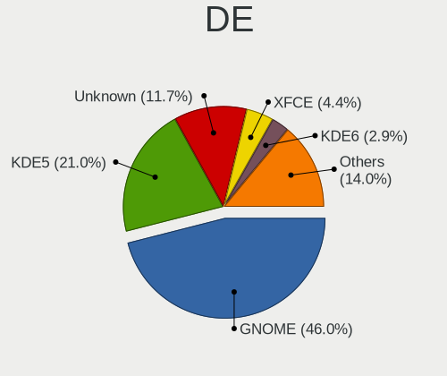
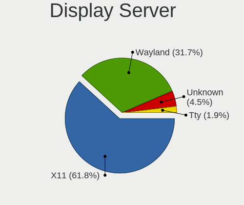
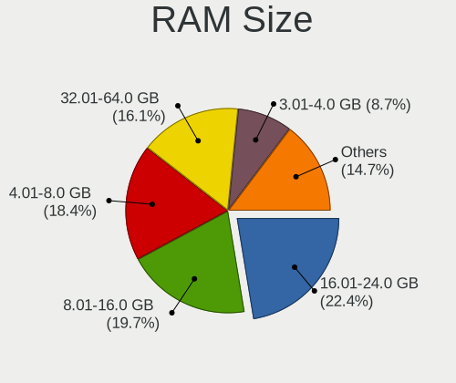
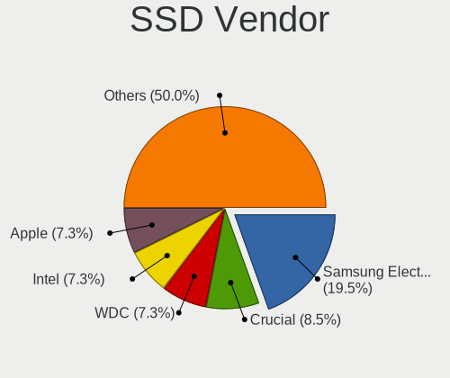
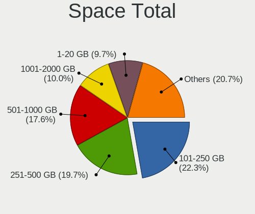
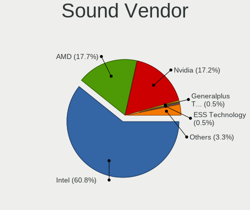
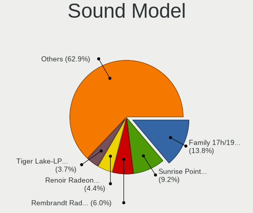

Linux in Hong Kong - Tested Hardware & Statistics (Notebooks)
-------------------------------------------------------------

A project to collect tested hardware configurations for Linux in Hong Kong.

Anyone can contribute to this report by the [hw-probe](https://github.com/linuxhw/hw-probe) tool:

    sudo -E hw-probe -all -upload

Please contribute! Especially if your hardware is rare.

Contents
--------

* [ Test Cases ](#test-cases)

* [ System ](#system)
  - [ OS                       ](#os)
  - [ OS Family                ](#os-family)
  - [ Kernel                   ](#kernel)
  - [ Kernel Family            ](#kernel-family)
  - [ Kernel Major Ver.        ](#kernel-major-ver)
  - [ Arch                     ](#arch)
  - [ DE                       ](#de)
  - [ Display Server           ](#display-server)
  - [ Display Manager          ](#display-manager)
  - [ OS Lang                  ](#os-lang)
  - [ Boot Mode                ](#boot-mode)
  - [ Filesystem               ](#filesystem)
  - [ Part. scheme             ](#part-scheme)
  - [ Dual Boot with Linux/BSD ](#dual-boot-with-linuxbsd)
  - [ Dual Boot (Win)          ](#dual-boot-win)

* [ Board ](#board)
  - [ Vendor                   ](#vendor)
  - [ Model                    ](#model)
  - [ Model Family             ](#model-family)
  - [ MFG Year                 ](#mfg-year)
  - [ Form Factor              ](#form-factor)
  - [ Secure Boot              ](#secure-boot)
  - [ Coreboot                 ](#coreboot)
  - [ RAM Size                 ](#ram-size)
  - [ RAM Used                 ](#ram-used)
  - [ Total Drives             ](#total-drives)
  - [ Has CD-ROM               ](#has-cd-rom)
  - [ Has Ethernet             ](#has-ethernet)
  - [ Has WiFi                 ](#has-wifi)
  - [ Has Bluetooth            ](#has-bluetooth)

* [ Location ](#location)
  - [ Country                  ](#country)
  - [ City                     ](#city)

* [ Drives ](#drives)
  - [ Drive Vendor             ](#drive-vendor)
  - [ Drive Model              ](#drive-model)
  - [ HDD Vendor               ](#hdd-vendor)
  - [ SSD Vendor               ](#ssd-vendor)
  - [ Drive Kind               ](#drive-kind)
  - [ Drive Connector          ](#drive-connector)
  - [ Drive Size               ](#drive-size)
  - [ Space Total              ](#space-total)
  - [ Space Used               ](#space-used)
  - [ Malfunc. Drives          ](#malfunc-drives)
  - [ Malfunc. Drive Vendor    ](#malfunc-drive-vendor)
  - [ Malfunc. HDD Vendor      ](#malfunc-hdd-vendor)
  - [ Malfunc. Drive Kind      ](#malfunc-drive-kind)
  - [ Failed Drives            ](#failed-drives)
  - [ Failed Drive Vendor      ](#failed-drive-vendor)
  - [ Drive Status             ](#drive-status)

* [ Storage controller ](#storage-controller)
  - [ Storage Vendor           ](#storage-vendor)
  - [ Storage Model            ](#storage-model)
  - [ Storage Kind             ](#storage-kind)

* [ Processor ](#processor)
  - [ CPU Vendor               ](#cpu-vendor)
  - [ CPU Model                ](#cpu-model)
  - [ CPU Model Family         ](#cpu-model-family)
  - [ CPU Cores                ](#cpu-cores)
  - [ CPU Sockets              ](#cpu-sockets)
  - [ CPU Threads              ](#cpu-threads)
  - [ CPU Op-Modes             ](#cpu-op-modes)
  - [ CPU Microcode            ](#cpu-microcode)
  - [ CPU Microarch            ](#cpu-microarch)

* [ Graphics ](#graphics)
  - [ GPU Vendor               ](#gpu-vendor)
  - [ GPU Model                ](#gpu-model)
  - [ GPU Combo                ](#gpu-combo)
  - [ GPU Driver               ](#gpu-driver)
  - [ GPU Memory               ](#gpu-memory)

* [ Monitor ](#monitor)
  - [ Monitor Vendor           ](#monitor-vendor)
  - [ Monitor Model            ](#monitor-model)
  - [ Monitor Resolution       ](#monitor-resolution)
  - [ Monitor Diagonal         ](#monitor-diagonal)
  - [ Monitor Width            ](#monitor-width)
  - [ Aspect Ratio             ](#aspect-ratio)
  - [ Monitor Area             ](#monitor-area)
  - [ Pixel Density            ](#pixel-density)
  - [ Multiple Monitors        ](#multiple-monitors)

* [ Network ](#network)
  - [ Net Controller Vendor    ](#net-controller-vendor)
  - [ Net Controller Model     ](#net-controller-model)
  - [ Wireless Vendor          ](#wireless-vendor)
  - [ Wireless Model           ](#wireless-model)
  - [ Ethernet Vendor          ](#ethernet-vendor)
  - [ Ethernet Model           ](#ethernet-model)
  - [ Net Controller Kind      ](#net-controller-kind)
  - [ Used Controller          ](#used-controller)
  - [ NICs                     ](#nics)
  - [ IPv6                     ](#ipv6)

* [ Bluetooth ](#bluetooth)
  - [ Bluetooth Vendor         ](#bluetooth-vendor)
  - [ Bluetooth Model          ](#bluetooth-model)

* [ Sound ](#sound)
  - [ Sound Vendor             ](#sound-vendor)
  - [ Sound Model              ](#sound-model)

* [ Memory ](#memory)
  - [ Memory Vendor            ](#memory-vendor)
  - [ Memory Model             ](#memory-model)
  - [ Memory Kind              ](#memory-kind)
  - [ Memory Form Factor       ](#memory-form-factor)
  - [ Memory Size              ](#memory-size)
  - [ Memory Speed             ](#memory-speed)

* [ Printers & scanners ](#printers--scanners)
  - [ Printer Vendor           ](#printer-vendor)
  - [ Printer Model            ](#printer-model)
  - [ Scanner Vendor           ](#scanner-vendor)
  - [ Scanner Model            ](#scanner-model)

* [ Camera ](#camera)
  - [ Camera Vendor            ](#camera-vendor)
  - [ Camera Model             ](#camera-model)

* [ Security ](#security)
  - [ Fingerprint Vendor       ](#fingerprint-vendor)
  - [ Fingerprint Model        ](#fingerprint-model)
  - [ Chipcard Vendor          ](#chipcard-vendor)
  - [ Chipcard Model           ](#chipcard-model)

* [ Unsupported ](#unsupported)
  - [ Unsupported Devices      ](#unsupported-devices)
  - [ Unsupported Device Types ](#unsupported-device-types)

Test Cases
----------

Total: 268

| Vendor        | Model                       | Probe                                                      | Date         |
|---------------|-----------------------------|------------------------------------------------------------|--------------|
| Samsung       | 905S3G/906S3G/915S3G/930... | [832b434c38](https://linux-hardware.org/?probe=832b434c38) | Mar 28, 2023 |
| Samsung       | 905S3G/906S3G/915S3G/930... | [7e283bfa25](https://linux-hardware.org/?probe=7e283bfa25) | Mar 28, 2023 |
| METAPHYUNI    | MetamechBook                | [7e4076cb61](https://linux-hardware.org/?probe=7e4076cb61) | Mar 24, 2023 |
| ONE-NETBOO... | ONEXPLAYER 2 ARP23 Ver.1... | [9b021e4844](https://linux-hardware.org/?probe=9b021e4844) | Mar 11, 2023 |
| ASUSTek       | ROG Zephyrus G14 GA401QM... | [d256faa9fc](https://linux-hardware.org/?probe=d256faa9fc) | Mar 06, 2023 |
| Lenovo        | Legion Y9000P IAH7H 82RF    | [97925534c2](https://linux-hardware.org/?probe=97925534c2) | Mar 02, 2023 |
| Dell          | XPS 13 9300                 | [fc803f9205](https://linux-hardware.org/?probe=fc803f9205) | Feb 27, 2023 |
| Valve         | Jupiter                     | [3ad0d92361](https://linux-hardware.org/?probe=3ad0d92361) | Feb 25, 2023 |
| Dell          | XPS 15 9570                 | [81cfc27f9e](https://linux-hardware.org/?probe=81cfc27f9e) | Feb 20, 2023 |
| Valve         | Jupiter                     | [c9c9830572](https://linux-hardware.org/?probe=c9c9830572) | Feb 19, 2023 |
| Lenovo        | IdeaPad S145-14IWL 81MU     | [58bcb8bf04](https://linux-hardware.org/?probe=58bcb8bf04) | Feb 18, 2023 |
| Acer          | Nitro AN515-46              | [bf63748499](https://linux-hardware.org/?probe=bf63748499) | Feb 18, 2023 |
| Acer          | Nitro AN515-46              | [162b72d7a8](https://linux-hardware.org/?probe=162b72d7a8) | Feb 17, 2023 |
| Apple         | MacBookAir6,2               | [46aafc59c4](https://linux-hardware.org/?probe=46aafc59c4) | Feb 16, 2023 |
| Lenovo        | Y430P 20435                 | [da3030daae](https://linux-hardware.org/?probe=da3030daae) | Feb 16, 2023 |
| Lenovo        | ThinkPad X230 23066RC       | [6a223f0a71](https://linux-hardware.org/?probe=6a223f0a71) | Feb 15, 2023 |
| ASUSTek       | X705UA                      | [cc59e95283](https://linux-hardware.org/?probe=cc59e95283) | Feb 07, 2023 |
| ASUSTek       | X705UA                      | [25188e7cfa](https://linux-hardware.org/?probe=25188e7cfa) | Feb 07, 2023 |
| Timi          | TM1613                      | [503133b0db](https://linux-hardware.org/?probe=503133b0db) | Feb 07, 2023 |
| Valve         | Jupiter                     | [42a3945648](https://linux-hardware.org/?probe=42a3945648) | Feb 06, 2023 |
| Valve         | Jupiter                     | [5f77ae27c2](https://linux-hardware.org/?probe=5f77ae27c2) | Feb 04, 2023 |
| Lenovo        | ThinkBook 16p Gen 2 20YM    | [53015adc9d](https://linux-hardware.org/?probe=53015adc9d) | Jan 28, 2023 |
| Lenovo        | ThinkPad T430s 2355C33      | [6d6a8e4be4](https://linux-hardware.org/?probe=6d6a8e4be4) | Jan 24, 2023 |
| Acer          | Swift SF314-57G             | [ae9de10584](https://linux-hardware.org/?probe=ae9de10584) | Jan 21, 2023 |
| Unknown       | Apple MacBook Pro (14-in... | [4b9d2e6e26](https://linux-hardware.org/?probe=4b9d2e6e26) | Jan 21, 2023 |
| Unknown       | Apple MacBook Pro (14-in... | [f5bb76ae13](https://linux-hardware.org/?probe=f5bb76ae13) | Jan 21, 2023 |
| HP            | Pavilion Gaming Laptop 1... | [7cb08d37fb](https://linux-hardware.org/?probe=7cb08d37fb) | Jan 14, 2023 |
| Dell          | XPS 15 9520                 | [2e13f150e6](https://linux-hardware.org/?probe=2e13f150e6) | Jan 09, 2023 |
| Dell          | XPS 15 9520                 | [ec6743fa1b](https://linux-hardware.org/?probe=ec6743fa1b) | Jan 06, 2023 |
| HP            | Stream Notebook PC 13       | [2154a332b0](https://linux-hardware.org/?probe=2154a332b0) | Dec 29, 2022 |
| Unknown       | Apple MacBook Pro (14-in... | [8a5b919c91](https://linux-hardware.org/?probe=8a5b919c91) | Dec 24, 2022 |
| Apple         | MacBookAir5,2               | [641b77c3da](https://linux-hardware.org/?probe=641b77c3da) | Dec 20, 2022 |
| GPD           | P2 MAX                      | [de5983ec37](https://linux-hardware.org/?probe=de5983ec37) | Dec 17, 2022 |
| HP            | Pavilion Laptop 14-ce1xx... | [8d631bb590](https://linux-hardware.org/?probe=8d631bb590) | Dec 17, 2022 |
| Dell          | Inspiron 7590               | [e8fb837cf5](https://linux-hardware.org/?probe=e8fb837cf5) | Dec 16, 2022 |
| GPD           | P2 MAX                      | [63c199f475](https://linux-hardware.org/?probe=63c199f475) | Dec 08, 2022 |
| Lenovo        | ThinkPad T430s 2355C33      | [706e40ed5a](https://linux-hardware.org/?probe=706e40ed5a) | Dec 04, 2022 |
| Lenovo        | ThinkPad T430s 2355C33      | [aff020417f](https://linux-hardware.org/?probe=aff020417f) | Dec 01, 2022 |
| Dell          | Latitude 7390               | [7214cac96d](https://linux-hardware.org/?probe=7214cac96d) | Nov 30, 2022 |
| Dell          | Inspiron N4050              | [7b0cf2fa20](https://linux-hardware.org/?probe=7b0cf2fa20) | Nov 30, 2022 |
| GPD           | G1619-04                    | [ce6d16840e](https://linux-hardware.org/?probe=ce6d16840e) | Nov 07, 2022 |
| Dell          | XPS 15 9570                 | [468f8df590](https://linux-hardware.org/?probe=468f8df590) | Nov 06, 2022 |
| Lenovo        | Legion Y530-15ICH-1060 8... | [60ba0bc2dd](https://linux-hardware.org/?probe=60ba0bc2dd) | Oct 29, 2022 |
| Lenovo        | ThinkPad T470 20HD002TCD    | [0b0ca5a5f6](https://linux-hardware.org/?probe=0b0ca5a5f6) | Oct 20, 2022 |
| HP            | Pavilion Gaming Laptop 1... | [8ebbbf93e4](https://linux-hardware.org/?probe=8ebbbf93e4) | Oct 17, 2022 |
| AMI           | Cherry Trail CR             | [7d3c652547](https://linux-hardware.org/?probe=7d3c652547) | Oct 11, 2022 |
| HP            | ZHAN 66 Pro A 14 inch G5... | [c5587dbec5](https://linux-hardware.org/?probe=c5587dbec5) | Oct 04, 2022 |
| Fujitsu       | FMVNU6G1C                   | [1351f25388](https://linux-hardware.org/?probe=1351f25388) | Sep 30, 2022 |
| Lenovo        | ThinkBook 14p Gen 2 20YN    | [28631c9681](https://linux-hardware.org/?probe=28631c9681) | Sep 27, 2022 |
| Lenovo        | ThinkPad X1 Carbon 6th 2... | [7c8030e423](https://linux-hardware.org/?probe=7c8030e423) | Sep 26, 2022 |
| Dell          | Latitude E5250              | [e4ffe3583d](https://linux-hardware.org/?probe=e4ffe3583d) | Sep 26, 2022 |
| Unknown       | Apple MacBook Pro (14-in... | [89a019875a](https://linux-hardware.org/?probe=89a019875a) | Sep 24, 2022 |
| Chuwi         | HeroBook Pro                | [76be3ff1db](https://linux-hardware.org/?probe=76be3ff1db) | Sep 22, 2022 |
| Dell          | Inspiron MP061              | [8e6955cbf6](https://linux-hardware.org/?probe=8e6955cbf6) | Sep 21, 2022 |
| Chuwi         | HeroBook Pro                | [3759658825](https://linux-hardware.org/?probe=3759658825) | Sep 19, 2022 |
| HUAWEI        | NBLK-WAX9X                  | [f454a8f6a5](https://linux-hardware.org/?probe=f454a8f6a5) | Sep 19, 2022 |
| Apple         | MacBookPro15,2              | [5160feeaf2](https://linux-hardware.org/?probe=5160feeaf2) | Sep 13, 2022 |
| Apple         | MacBookPro15,2              | [876e87c7b6](https://linux-hardware.org/?probe=876e87c7b6) | Sep 13, 2022 |
| Lenovo        | Legion R7000 2020 82B6      | [1d95c5b6ef](https://linux-hardware.org/?probe=1d95c5b6ef) | Sep 12, 2022 |
| Lenovo        | ThinkPad X1 Carbon 6th 2... | [4562797ebc](https://linux-hardware.org/?probe=4562797ebc) | Sep 08, 2022 |
| Lenovo        | Legion R7000 2020 82B6      | [32ab96441e](https://linux-hardware.org/?probe=32ab96441e) | Sep 08, 2022 |
| Lenovo        | ThinkPad T480 20L5A00PCD    | [d0ddfb5815](https://linux-hardware.org/?probe=d0ddfb5815) | Sep 07, 2022 |
| MSI           | GS65 Stealth Thin 8RE       | [90aed4d5d1](https://linux-hardware.org/?probe=90aed4d5d1) | Aug 20, 2022 |
| Lenovo        | ThinkPad X1 Carbon 6th 2... | [c32d69a956](https://linux-hardware.org/?probe=c32d69a956) | Aug 18, 2022 |
| Lenovo        | ThinkPad X13 Gen 1 20UFS... | [6eadd1ec75](https://linux-hardware.org/?probe=6eadd1ec75) | Aug 17, 2022 |
| Lenovo        | ThinkPad T490s 20NYS79X0... | [5fe4fba501](https://linux-hardware.org/?probe=5fe4fba501) | Aug 12, 2022 |
| Acer          | Swift SF314-512             | [c374f64c25](https://linux-hardware.org/?probe=c374f64c25) | Aug 11, 2022 |
| Acer          | Swift SF314-512             | [0c23760c27](https://linux-hardware.org/?probe=0c23760c27) | Aug 10, 2022 |
| HP            | ZBook 17 G3                 | [bc4cf926f2](https://linux-hardware.org/?probe=bc4cf926f2) | Aug 06, 2022 |
| KOHJINSHA     | SC series                   | [90a25503ee](https://linux-hardware.org/?probe=90a25503ee) | Aug 01, 2022 |
| KOHJINSHA     | SC series                   | [3986e59a55](https://linux-hardware.org/?probe=3986e59a55) | Aug 01, 2022 |
| Lenovo        | ThinkPad L14 Gen 1 20U6A... | [76d752f0ad](https://linux-hardware.org/?probe=76d752f0ad) | Aug 01, 2022 |
| Fujitsu       | LIFEBOOK V1020              | [e33ac2916d](https://linux-hardware.org/?probe=e33ac2916d) | Jul 30, 2022 |
| HP            | OMEN Laptop 15-en0xxx       | [d449f1aeb9](https://linux-hardware.org/?probe=d449f1aeb9) | Jul 27, 2022 |
| IBM           | 260921H                     | [bab4f3f57d](https://linux-hardware.org/?probe=bab4f3f57d) | Jul 17, 2022 |
| IBM           | 260921H                     | [a7483bac34](https://linux-hardware.org/?probe=a7483bac34) | Jul 17, 2022 |
| Lenovo        | ThinkPad X250 20CLA1VECD    | [f3e0ebd16e](https://linux-hardware.org/?probe=f3e0ebd16e) | Jul 15, 2022 |
| IBM           | 260921H                     | [5f9b0998d3](https://linux-hardware.org/?probe=5f9b0998d3) | Jul 11, 2022 |
| IBM           | 260921H                     | [f0430651fd](https://linux-hardware.org/?probe=f0430651fd) | Jul 10, 2022 |
| Lenovo        | Unknown                     | [910a4f6587](https://linux-hardware.org/?probe=910a4f6587) | Jul 09, 2022 |
| Acer          | Swift SF314-42              | [bd4792ebd8](https://linux-hardware.org/?probe=bd4792ebd8) | Jul 02, 2022 |
| Compaq        | Tablet PC TC1000            | [80324222a7](https://linux-hardware.org/?probe=80324222a7) | Jun 26, 2022 |
| KOHJINSHA     | SX series                   | [7333815afc](https://linux-hardware.org/?probe=7333815afc) | Jun 26, 2022 |
| Samsung       | SQ1S Revision MP            | [faeb18a49e](https://linux-hardware.org/?probe=faeb18a49e) | Jun 26, 2022 |
| Lenovo        | ThinkPad X1 Carbon 5th 2... | [044be44d33](https://linux-hardware.org/?probe=044be44d33) | Jun 25, 2022 |
| Lenovo        | ThinkBook 14 G4+ ARA 21D... | [5bd3ad4d01](https://linux-hardware.org/?probe=5bd3ad4d01) | Jun 24, 2022 |
| Dell          | XPS 15 9520                 | [ec6f5cce04](https://linux-hardware.org/?probe=ec6f5cce04) | Jun 20, 2022 |
| Dell          | XPS 15 9520                 | [bdd4ec2ef9](https://linux-hardware.org/?probe=bdd4ec2ef9) | Jun 15, 2022 |
| Lenovo        | ThinkBook 14 G4+ ARA 21D... | [f4c7f13ff8](https://linux-hardware.org/?probe=f4c7f13ff8) | Jun 14, 2022 |
| Lenovo        | ThinkPad X250 20CLA1VECD    | [e3df184136](https://linux-hardware.org/?probe=e3df184136) | Jun 12, 2022 |
| Dell          | XPS 13 9305                 | [e373d39f20](https://linux-hardware.org/?probe=e373d39f20) | Jun 09, 2022 |
| ASUSTek       | Zenbook UX5401ZAS_UX5401... | [27301ce2e8](https://linux-hardware.org/?probe=27301ce2e8) | Jun 03, 2022 |
| ASUSTek       | N501VW                      | [2f8215fb0a](https://linux-hardware.org/?probe=2f8215fb0a) | May 31, 2022 |
| Lenovo        | ThinkPad T430s 2355C33      | [33de2bbd12](https://linux-hardware.org/?probe=33de2bbd12) | May 31, 2022 |
| Dell          | XPS 15 9520                 | [4d4c32223e](https://linux-hardware.org/?probe=4d4c32223e) | May 31, 2022 |
| Lenovo        | ThinkPad T430s 2355C33      | [4eab57bebf](https://linux-hardware.org/?probe=4eab57bebf) | May 30, 2022 |
| Lenovo        | IdeaPad Gaming 3 15ACH6 ... | [63fd75f1a8](https://linux-hardware.org/?probe=63fd75f1a8) | May 29, 2022 |
| Lenovo        | Legion Y7000P2020H 82AX     | [220325c031](https://linux-hardware.org/?probe=220325c031) | May 29, 2022 |
| Dell          | XPS 15 9520                 | [75d345243e](https://linux-hardware.org/?probe=75d345243e) | May 29, 2022 |
| ASUSTek       | ASUS TUF Gaming A15 FA50... | [7fa4ca7312](https://linux-hardware.org/?probe=7fa4ca7312) | May 23, 2022 |
| Intel Clie... | LAPKC71F                    | [1f67896c5c](https://linux-hardware.org/?probe=1f67896c5c) | May 22, 2022 |
| Intel Clie... | LAPKC71F                    | [a227af798c](https://linux-hardware.org/?probe=a227af798c) | May 20, 2022 |
| HP            | ZHAN 66 Pro 14 G4 Notebo... | [f0b122c199](https://linux-hardware.org/?probe=f0b122c199) | May 09, 2022 |
| Dell          | Precision 7520              | [2dc98a1a8d](https://linux-hardware.org/?probe=2dc98a1a8d) | Apr 30, 2022 |
| Lenovo        | Yoga Slim 7 Pro 14ACH5 8... | [9191742453](https://linux-hardware.org/?probe=9191742453) | Apr 26, 2022 |
| Apple         | MacBookAir5,1               | [3dd8282149](https://linux-hardware.org/?probe=3dd8282149) | Apr 20, 2022 |
| GPD           | P2 MAX                      | [ca842dc5fb](https://linux-hardware.org/?probe=ca842dc5fb) | Apr 19, 2022 |
| Lenovo        | IdeaPad 320-15IKB 80XL      | [ca558e6708](https://linux-hardware.org/?probe=ca558e6708) | Apr 07, 2022 |
| ASUSTek       | ROG Strix G513QM_G513QM     | [bdca066ba3](https://linux-hardware.org/?probe=bdca066ba3) | Apr 05, 2022 |
| Dell          | Inspiron 14 5410            | [314bd42e78](https://linux-hardware.org/?probe=314bd42e78) | Mar 28, 2022 |
| Lenovo        | ThinkPad T430s 2355C33      | [a881a875bd](https://linux-hardware.org/?probe=a881a875bd) | Mar 27, 2022 |
| Fujitsu       | LIFEBOOK LH531              | [2d48cb4419](https://linux-hardware.org/?probe=2d48cb4419) | Mar 26, 2022 |
| Dell          | Latitude 7285               | [87e555f958](https://linux-hardware.org/?probe=87e555f958) | Mar 13, 2022 |
| Fujitsu       | LIFEBOOK AH544              | [03b27c8ca4](https://linux-hardware.org/?probe=03b27c8ca4) | Mar 12, 2022 |
| Lenovo        | ThinkPad X1 Extreme 20MF... | [4998fff0f9](https://linux-hardware.org/?probe=4998fff0f9) | Mar 12, 2022 |
| HP            | Victus by Laptop 16-d1xx... | [c68cec2207](https://linux-hardware.org/?probe=c68cec2207) | Mar 11, 2022 |
| Fujitsu       | LIFEBOOK AH544              | [96b36779e0](https://linux-hardware.org/?probe=96b36779e0) | Mar 11, 2022 |
| HP            | Notebook                    | [9c04c0776d](https://linux-hardware.org/?probe=9c04c0776d) | Mar 10, 2022 |
| HP            | Notebook                    | [c7d735dc99](https://linux-hardware.org/?probe=c7d735dc99) | Mar 10, 2022 |
| Lenovo        | ThinkPad P15v Gen 1 20TQ... | [0f4fad19b2](https://linux-hardware.org/?probe=0f4fad19b2) | Feb 07, 2022 |
| Dell          | Inspiron 5580               | [515465fd5a](https://linux-hardware.org/?probe=515465fd5a) | Jan 22, 2022 |
| Lenovo        | Legion R7000 2020 82B6      | [5f92f3376e](https://linux-hardware.org/?probe=5f92f3376e) | Jan 11, 2022 |
| HP            | EliteBook 830 G5            | [bf884733a1](https://linux-hardware.org/?probe=bf884733a1) | Dec 16, 2021 |
| HP            | EliteBook 830 G5            | [61d4bff2bd](https://linux-hardware.org/?probe=61d4bff2bd) | Dec 15, 2021 |
| Fujitsu       | LIFEBOOK LH530              | [8db7409ab5](https://linux-hardware.org/?probe=8db7409ab5) | Dec 14, 2021 |
| Unknown       | Unknown                     | [739be994cb](https://linux-hardware.org/?probe=739be994cb) | Dec 09, 2021 |
| Lenovo        | Legion 5 15ACH6 82JW        | [024a42eb21](https://linux-hardware.org/?probe=024a42eb21) | Dec 08, 2021 |
| Lenovo        | ThinkPad X1 Carbon 7th 2... | [ee13ae89af](https://linux-hardware.org/?probe=ee13ae89af) | Nov 26, 2021 |
| Apple         | MacBook10,1                 | [6cb99e6a5f](https://linux-hardware.org/?probe=6cb99e6a5f) | Nov 23, 2021 |
| Jumper        | EZbook                      | [5da2b95e2f](https://linux-hardware.org/?probe=5da2b95e2f) | Nov 12, 2021 |
| Lenovo        | XiaoXin Chao7000-14IKBR ... | [531b838f59](https://linux-hardware.org/?probe=531b838f59) | Nov 09, 2021 |
| Lenovo        | XiaoXin Chao7000-14IKBR ... | [8ea29d23df](https://linux-hardware.org/?probe=8ea29d23df) | Nov 09, 2021 |
| Unknown       | Unknown                     | [ed14b60c7a](https://linux-hardware.org/?probe=ed14b60c7a) | Nov 05, 2021 |
| HP            | Laptop 15s-du3xxx           | [6f87ece998](https://linux-hardware.org/?probe=6f87ece998) | Oct 26, 2021 |
| Lenovo        | IdeaPad 5 14IIL05 81YH      | [3d42bc888b](https://linux-hardware.org/?probe=3d42bc888b) | Oct 24, 2021 |
| Lenovo        | IdeaPad 5 14IIL05 81YH      | [54e54e71bd](https://linux-hardware.org/?probe=54e54e71bd) | Oct 24, 2021 |
| Dell          | XPS 13 9310                 | [20dc49f637](https://linux-hardware.org/?probe=20dc49f637) | Oct 13, 2021 |
| Lenovo        | Legion Y9000P2021H 82JD     | [4c3be0fe24](https://linux-hardware.org/?probe=4c3be0fe24) | Oct 02, 2021 |
| GPD           | G1618-03                    | [41916177c2](https://linux-hardware.org/?probe=41916177c2) | Sep 01, 2021 |
| GPD           | G1618-03                    | [c2abcaf10c](https://linux-hardware.org/?probe=c2abcaf10c) | Sep 01, 2021 |
| Dell          | Precision 7550              | [42721343a3](https://linux-hardware.org/?probe=42721343a3) | Aug 16, 2021 |
| Lenovo        | XiaoXin-14API QC 2019 81... | [814eb97442](https://linux-hardware.org/?probe=814eb97442) | Aug 14, 2021 |
| Lenovo        | ThinkPad T61 6465CTO        | [d93258840e](https://linux-hardware.org/?probe=d93258840e) | Aug 04, 2021 |
| HP            | EliteBook 2540p             | [eb060cd2c4](https://linux-hardware.org/?probe=eb060cd2c4) | Aug 04, 2021 |
| Toshiba       | dynabook R731/E             | [828a52387f](https://linux-hardware.org/?probe=828a52387f) | Aug 02, 2021 |
| Toshiba       | dynabook R731/E             | [12b2c3e130](https://linux-hardware.org/?probe=12b2c3e130) | Aug 01, 2021 |
| Toshiba       | dynabook R731/E             | [3af43c8ebe](https://linux-hardware.org/?probe=3af43c8ebe) | Jul 29, 2021 |
| Toshiba       | dynabook R731/E             | [fa0aa86cef](https://linux-hardware.org/?probe=fa0aa86cef) | Jul 28, 2021 |
| Unknown       | Unknown                     | [8fc32673b3](https://linux-hardware.org/?probe=8fc32673b3) | Jul 25, 2021 |
| Toshiba       | dynabook R731/E             | [c2bfccf320](https://linux-hardware.org/?probe=c2bfccf320) | Jun 16, 2021 |
| Toshiba       | dynabook R731/E             | [d3f69874dd](https://linux-hardware.org/?probe=d3f69874dd) | Jun 16, 2021 |
| Dell          | Precision M4800             | [298694c222](https://linux-hardware.org/?probe=298694c222) | Jun 12, 2021 |
| Acer          | Aspire E5-573               | [4193a2da9d](https://linux-hardware.org/?probe=4193a2da9d) | Jun 08, 2021 |
| Dell          | Precision M4800             | [67fb08d285](https://linux-hardware.org/?probe=67fb08d285) | Jun 06, 2021 |
| Dell          | Precision M4800             | [c72664a2f4](https://linux-hardware.org/?probe=c72664a2f4) | Jun 06, 2021 |
| Toshiba       | dynabook R731/E             | [81ffc7ba9e](https://linux-hardware.org/?probe=81ffc7ba9e) | May 26, 2021 |
| Fujitsu       | UH-X                        | [be65091e59](https://linux-hardware.org/?probe=be65091e59) | May 19, 2021 |
| Panasonic     | CFSZ5-2L                    | [1409e11b30](https://linux-hardware.org/?probe=1409e11b30) | May 12, 2021 |
| Dell          | XPS 13 9310                 | [8d372d62b7](https://linux-hardware.org/?probe=8d372d62b7) | May 07, 2021 |
| Panasonic     | CFSZ5-2L                    | [f35a966b00](https://linux-hardware.org/?probe=f35a966b00) | Apr 14, 2021 |
| Schenker      | XMG_APEX15_XAP15E20         | [a917367457](https://linux-hardware.org/?probe=a917367457) | Apr 09, 2021 |
| ASUSTek       | Zephyrus M GM501GM          | [f7937503ac](https://linux-hardware.org/?probe=f7937503ac) | Apr 08, 2021 |
| ASUSTek       | Zephyrus M GM501GM          | [99d71b6ea5](https://linux-hardware.org/?probe=99d71b6ea5) | Apr 06, 2021 |
| Lenovo        | IdeaPad Z410 20292          | [8253b70553](https://linux-hardware.org/?probe=8253b70553) | Apr 06, 2021 |
| Fujitsu       | LIFEBOOK AH544              | [60600f6f0c](https://linux-hardware.org/?probe=60600f6f0c) | Mar 26, 2021 |
| ASUSTek       | UX302LA                     | [fe27a8e195](https://linux-hardware.org/?probe=fe27a8e195) | Mar 12, 2021 |
| Acer          | Aspire A315-34              | [d23d84b5f6](https://linux-hardware.org/?probe=d23d84b5f6) | Mar 06, 2021 |
| ASUSTek       | ROG Zephyrus G14 GA401IU... | [5051ba6156](https://linux-hardware.org/?probe=5051ba6156) | Mar 05, 2021 |
| Fujitsu       | LIFEBOOK P771               | [2414020b54](https://linux-hardware.org/?probe=2414020b54) | Feb 26, 2021 |
| Fujitsu       | LIFEBOOK P771               | [ae61a5e1fa](https://linux-hardware.org/?probe=ae61a5e1fa) | Feb 26, 2021 |
| Lenovo        | ThinkPad E14 20RAA002CD     | [77ccb1ee60](https://linux-hardware.org/?probe=77ccb1ee60) | Feb 22, 2021 |
| Lenovo        | ThinkPad X270 20HNA00RAD    | [7d9f2bee38](https://linux-hardware.org/?probe=7d9f2bee38) | Feb 21, 2021 |
| Lenovo        | ThinkPad X270 20HNA00RAD    | [d82924b12b](https://linux-hardware.org/?probe=d82924b12b) | Feb 16, 2021 |
| Lenovo        | G710 20252                  | [f4c2a6bac8](https://linux-hardware.org/?probe=f4c2a6bac8) | Feb 07, 2021 |
| Lenovo        | ThinkPad X270 20HNA00RAD    | [d4f69c78fa](https://linux-hardware.org/?probe=d4f69c78fa) | Jan 31, 2021 |
| Fujitsu       | S6420                       | [b23c0f10e7](https://linux-hardware.org/?probe=b23c0f10e7) | Jan 28, 2021 |
| Fujitsu       | S6420                       | [0cf6376b40](https://linux-hardware.org/?probe=0cf6376b40) | Jan 27, 2021 |
| HP            | ZHAN 66 Pro 14 G4 Notebo... | [3d7ce778c6](https://linux-hardware.org/?probe=3d7ce778c6) | Jan 20, 2021 |
| HUAWEI        | KPRC-WX0                    | [fe7d03f093](https://linux-hardware.org/?probe=fe7d03f093) | Jan 18, 2021 |
| ASUSTek       | TUF Gaming FA506IU_FA506... | [a8ac85cb5a](https://linux-hardware.org/?probe=a8ac85cb5a) | Dec 30, 2020 |
| ASUSTek       | TUF Gaming FA506IU_FA506... | [8c7ba97457](https://linux-hardware.org/?probe=8c7ba97457) | Dec 29, 2020 |
| ASUSTek       | TUF Gaming FA506IU_FA506... | [01333c5b9e](https://linux-hardware.org/?probe=01333c5b9e) | Dec 29, 2020 |
| Panasonic     | CFSZ5-2L                    | [728d7e48d4](https://linux-hardware.org/?probe=728d7e48d4) | Dec 27, 2020 |
| Lenovo        | ThinkPad X270 20HNA00RAD    | [1d4b16bb0d](https://linux-hardware.org/?probe=1d4b16bb0d) | Dec 22, 2020 |
| Lenovo        | ThinkPad T480s 20L7CTO1W... | [88a7edec45](https://linux-hardware.org/?probe=88a7edec45) | Dec 18, 2020 |
| Sony          | VPCCB17FG                   | [ede3032fed](https://linux-hardware.org/?probe=ede3032fed) | Nov 29, 2020 |
| Sony          | VPCCB17FG                   | [f3012a2898](https://linux-hardware.org/?probe=f3012a2898) | Nov 29, 2020 |
| Sony          | VPCCB17FG                   | [3c4ff5bb58](https://linux-hardware.org/?probe=3c4ff5bb58) | Nov 27, 2020 |
| Sony          | VPCCB17FG                   | [5a24dc3231](https://linux-hardware.org/?probe=5a24dc3231) | Nov 26, 2020 |
| Fujitsu       | UH-X                        | [f55a6a6679](https://linux-hardware.org/?probe=f55a6a6679) | Nov 20, 2020 |
| Fujitsu       | UH-X                        | [7aea886f7a](https://linux-hardware.org/?probe=7aea886f7a) | Nov 20, 2020 |
| Lenovo        | XiaoXinAir-14ARE 2020 81... | [6254edfb10](https://linux-hardware.org/?probe=6254edfb10) | Nov 14, 2020 |
| Lenovo        | G770 20089                  | [6da9203114](https://linux-hardware.org/?probe=6da9203114) | Nov 13, 2020 |
| HP            | 2000                        | [f548e6d1cc](https://linux-hardware.org/?probe=f548e6d1cc) | Nov 11, 2020 |
| ASUSTek       | K501UX                      | [e1700b887e](https://linux-hardware.org/?probe=e1700b887e) | Nov 09, 2020 |
| HP            | 2000                        | [df76d279ad](https://linux-hardware.org/?probe=df76d279ad) | Nov 05, 2020 |
| Timi          | TM1607                      | [dbe64c3d75](https://linux-hardware.org/?probe=dbe64c3d75) | Nov 02, 2020 |
| Lenovo        | IdeaPad Yoga 13 20175       | [518c70a58e](https://linux-hardware.org/?probe=518c70a58e) | Nov 02, 2020 |
| Acer          | Swift SF314-57              | [8395e5a946](https://linux-hardware.org/?probe=8395e5a946) | Oct 30, 2020 |
| Acer          | Swift SF314-57              | [123f60c868](https://linux-hardware.org/?probe=123f60c868) | Oct 29, 2020 |
| ASUSTek       | TUF Gaming FA506IU_FA506... | [f9d1166197](https://linux-hardware.org/?probe=f9d1166197) | Oct 25, 2020 |
| Lenovo        | ThinkPad P1 Gen 3 20THCT... | [77849f8db0](https://linux-hardware.org/?probe=77849f8db0) | Oct 23, 2020 |
| Lenovo        | ThinkPad P1 Gen 3 20THCT... | [77d6dd66e2](https://linux-hardware.org/?probe=77d6dd66e2) | Oct 23, 2020 |
| HP            | 2140                        | [bde3dc449f](https://linux-hardware.org/?probe=bde3dc449f) | Oct 07, 2020 |
| HUAWEI        | WRT-WX9                     | [1fe32b8f6d](https://linux-hardware.org/?probe=1fe32b8f6d) | Oct 04, 2020 |
| HP            | 2000                        | [fbd8bf0e69](https://linux-hardware.org/?probe=fbd8bf0e69) | Oct 01, 2020 |
| Fujitsu       | LIFEBOOK S904               | [5035864c45](https://linux-hardware.org/?probe=5035864c45) | Sep 27, 2020 |
| Dell          | Inspiron N5050              | [37e6b406f7](https://linux-hardware.org/?probe=37e6b406f7) | Sep 27, 2020 |
| Lenovo        | Legion R7000 2020 82B6      | [bd8f561b0b](https://linux-hardware.org/?probe=bd8f561b0b) | Sep 27, 2020 |
| Dell          | Inspiron N5050              | [64a249acd1](https://linux-hardware.org/?probe=64a249acd1) | Aug 28, 2020 |
| Lenovo        | ThinkPad S3 Yoga 14 20DM... | [6a91a7b38c](https://linux-hardware.org/?probe=6a91a7b38c) | Aug 25, 2020 |
| Samsung       | 930XBE                      | [92925e0656](https://linux-hardware.org/?probe=92925e0656) | Aug 24, 2020 |
| Dell          | Inspiron 5580               | [fbaf2b8f7f](https://linux-hardware.org/?probe=fbaf2b8f7f) | Aug 05, 2020 |
| Panasonic     | CFSZ5-2L                    | [e7488a8b16](https://linux-hardware.org/?probe=e7488a8b16) | Aug 04, 2020 |
| Toshiba       | PORTEGE R830                | [fa44f09e6e](https://linux-hardware.org/?probe=fa44f09e6e) | Aug 03, 2020 |
| Dell          | G7 7588                     | [e85e2949de](https://linux-hardware.org/?probe=e85e2949de) | Aug 01, 2020 |
| Lenovo        | ZHAOYANG K47                | [fa5be40392](https://linux-hardware.org/?probe=fa5be40392) | Jul 24, 2020 |
| Lenovo        | ZHAOYANG K47                | [879b0d586f](https://linux-hardware.org/?probe=879b0d586f) | Jul 22, 2020 |
| Lenovo        | Legion R7000 2020 82B6      | [723898cdec](https://linux-hardware.org/?probe=723898cdec) | Jun 20, 2020 |
| Fujitsu       | LIFEBOOK AH544              | [f897dd388f](https://linux-hardware.org/?probe=f897dd388f) | Jun 17, 2020 |
| Lenovo        | E10-30 20424                | [c90b1cb242](https://linux-hardware.org/?probe=c90b1cb242) | Jun 14, 2020 |
| Lenovo        | E10-30 20424                | [74dadf599d](https://linux-hardware.org/?probe=74dadf599d) | Jun 14, 2020 |
| Lenovo        | E10-30 20424                | [db21903e1a](https://linux-hardware.org/?probe=db21903e1a) | Jun 14, 2020 |
| Lenovo        | ThinkPad T480s 20L7005FU... | [2bc99eeca5](https://linux-hardware.org/?probe=2bc99eeca5) | Jun 09, 2020 |
| Fujitsu       | LIFEBOOK AH556              | [c16b3d9827](https://linux-hardware.org/?probe=c16b3d9827) | May 30, 2020 |
| Lenovo        | ThinkPad S3 Yoga 14 20DM... | [55680319a1](https://linux-hardware.org/?probe=55680319a1) | May 29, 2020 |
| Apple         | MacBookPro7,1               | [956da1ac80](https://linux-hardware.org/?probe=956da1ac80) | May 11, 2020 |
| Toshiba       | PORTEGE R830                | [08f3e97afe](https://linux-hardware.org/?probe=08f3e97afe) | May 02, 2020 |
| Lenovo        | 3000 G410                   | [2a909aaad5](https://linux-hardware.org/?probe=2a909aaad5) | May 02, 2020 |
| Dell          | XPS 13 9370                 | [f11d6eedc7](https://linux-hardware.org/?probe=f11d6eedc7) | Apr 14, 2020 |
| HP            | G72                         | [6272536a26](https://linux-hardware.org/?probe=6272536a26) | Apr 11, 2020 |
| Google        | Eve                         | [17c248ca99](https://linux-hardware.org/?probe=17c248ca99) | Apr 04, 2020 |
| Dell          | Inspiron 3593               | [597092ba51](https://linux-hardware.org/?probe=597092ba51) | Feb 28, 2020 |
| Dell          | Inspiron 3593               | [71fc35ceea](https://linux-hardware.org/?probe=71fc35ceea) | Feb 28, 2020 |
| MSI           | GS73VR 7RG                  | [fbdf43d1d6](https://linux-hardware.org/?probe=fbdf43d1d6) | Feb 04, 2020 |
| Lenovo        | IdeaPad 330-15IKB 81DE      | [cf4dbec684](https://linux-hardware.org/?probe=cf4dbec684) | Feb 01, 2020 |
| Unknown       | Unknown                     | [1007637420](https://linux-hardware.org/?probe=1007637420) | Dec 31, 2019 |
| Unknown       | Unknown                     | [bb58a92938](https://linux-hardware.org/?probe=bb58a92938) | Dec 31, 2019 |
| Dell          | XPS 13 9370                 | [0f39165d62](https://linux-hardware.org/?probe=0f39165d62) | Dec 06, 2019 |
| Dell          | XPS 13 9370                 | [816ad4feea](https://linux-hardware.org/?probe=816ad4feea) | Dec 06, 2019 |
| ASUSTek       | X556URK                     | [78f15ad5f0](https://linux-hardware.org/?probe=78f15ad5f0) | Nov 30, 2019 |
| HP            | EliteBook 2540p             | [49e2cab57b](https://linux-hardware.org/?probe=49e2cab57b) | Nov 28, 2019 |
| HUAWEI        | KPRC-WX0                    | [042c4b3c5a](https://linux-hardware.org/?probe=042c4b3c5a) | Nov 22, 2019 |
| HP            | EliteBook 2540p             | [f63dcc4fc8](https://linux-hardware.org/?probe=f63dcc4fc8) | Nov 07, 2019 |
| Lenovo        | ThinkPad X1 Carbon 4th 2... | [3497939f58](https://linux-hardware.org/?probe=3497939f58) | Oct 18, 2019 |
| Lenovo        | ThinkPad X1 Carbon 4th 2... | [a04ed98be8](https://linux-hardware.org/?probe=a04ed98be8) | Oct 18, 2019 |
| HP            | EliteBook 2540p             | [b2ebcf2c70](https://linux-hardware.org/?probe=b2ebcf2c70) | Oct 10, 2019 |
| HP            | EliteBook 2540p             | [43a5e168a1](https://linux-hardware.org/?probe=43a5e168a1) | Oct 10, 2019 |
| Unknown       | Unknown                     | [f8f1207d2d](https://linux-hardware.org/?probe=f8f1207d2d) | Sep 29, 2019 |
| Unknown       | Unknown                     | [d19b3f1330](https://linux-hardware.org/?probe=d19b3f1330) | Sep 28, 2019 |
| Unknown       | Unknown                     | [a6d4347345](https://linux-hardware.org/?probe=a6d4347345) | Sep 28, 2019 |
| Acer          | Aspire S3-371               | [5086f9ddaa](https://linux-hardware.org/?probe=5086f9ddaa) | Sep 07, 2019 |
| Acer          | Aspire S3-371               | [aa8140a178](https://linux-hardware.org/?probe=aa8140a178) | Sep 03, 2019 |
| ASUSTek       | TUF GAMING FX504GM_FX80G... | [7e9553ea70](https://linux-hardware.org/?probe=7e9553ea70) | Jun 03, 2019 |
| Lenovo        | ThinkPad T430 2342AG4       | [cf7413e712](https://linux-hardware.org/?probe=cf7413e712) | May 31, 2019 |
| Lenovo        | ThinkPad X220 4290NL5       | [e8a5c28644](https://linux-hardware.org/?probe=e8a5c28644) | May 29, 2019 |
| Lenovo        | ThinkPad X220 4290NL5       | [b67f52c0c2](https://linux-hardware.org/?probe=b67f52c0c2) | May 29, 2019 |
| Lenovo        | ThinkPad X220 4290NL5       | [c408ceb62e](https://linux-hardware.org/?probe=c408ceb62e) | May 29, 2019 |
| Dell          | Latitude E4310              | [134afc5b6b](https://linux-hardware.org/?probe=134afc5b6b) | May 08, 2019 |
| Lenovo        | ThinkPad T520 4242BC5       | [977c44b97a](https://linux-hardware.org/?probe=977c44b97a) | Apr 29, 2019 |
| Lenovo        | ThinkPad T400 64751W1       | [5801835e32](https://linux-hardware.org/?probe=5801835e32) | Apr 28, 2019 |
| Lenovo        | ThinkPad T400 64751W1       | [0f4999f205](https://linux-hardware.org/?probe=0f4999f205) | Apr 27, 2019 |
| Unknown       | A11-COMPUTER                | [fae06bb10f](https://linux-hardware.org/?probe=fae06bb10f) | Mar 28, 2019 |
| Unknown       | A11-COMPUTER                | [427daf4d4e](https://linux-hardware.org/?probe=427daf4d4e) | Mar 28, 2019 |
| Lenovo        | ThinkPad W530 24384KU       | [2064d92892](https://linux-hardware.org/?probe=2064d92892) | Dec 12, 2018 |
| Dell          | XPS 13 9350                 | [6fb539c340](https://linux-hardware.org/?probe=6fb539c340) | Oct 29, 2018 |
| HP            | ProBook 4540s               | [ace9a95fb7](https://linux-hardware.org/?probe=ace9a95fb7) | May 09, 2018 |
| HP            | ProBook 4540s               | [8f50260d94](https://linux-hardware.org/?probe=8f50260d94) | May 09, 2018 |

System
------

OS
--

Installed operating systems

| Name                 | Notebooks | Percent |
|----------------------|-----------|---------|
| Ubuntu 20.04         | 29        | 15.34%  |
| Ubuntu 22.04         | 11        | 5.82%   |
| Ubuntu 18.04         | 9         | 4.76%   |
| Arch                 | 8         | 4.23%   |
| antiX 21             | 8         | 4.23%   |
| Fedora 37            | 6         | 3.17%   |
| Fedora 32            | 5         | 2.65%   |
| Arch Rolling         | 5         | 2.65%   |
| Ubuntu 19.10         | 4         | 2.12%   |
| Gentoo 2.7           | 4         | 2.12%   |
| EndeavourOS Rolling  | 4         | 2.12%   |
| Debian 11            | 4         | 2.12%   |
| Ubuntu 22.10         | 3         | 1.59%   |
| OpenMandriva 4.2     | 3         | 1.59%   |
| OpenMandriva 23.01   | 3         | 1.59%   |
| Linux Mint 20        | 3         | 1.59%   |
| Fedora 36            | 3         | 1.59%   |
| Fedora 33            | 3         | 1.59%   |
| Chrome OS            | 3         | 1.59%   |
| ArcoLinux Rolling    | 3         | 1.59%   |
| Ubuntu 21.04         | 2         | 1.06%   |
| Ubuntu 19.04         | 2         | 1.06%   |
| Ubuntu 16.04         | 2         | 1.06%   |
| Pop!_OS 22.04        | 2         | 1.06%   |
| Pop!_OS 20.10        | 2         | 1.06%   |
| Pop!_OS 20.04        | 2         | 1.06%   |
| OpenMandriva 4.50    | 2         | 1.06%   |
| Manjaro 20.1         | 2         | 1.06%   |
| Linux Mint 20.3      | 2         | 1.06%   |
| KDE neon 20.04       | 2         | 1.06%   |
| Gentoo 2.8           | 2         | 1.06%   |
| Fedora 34            | 2         | 1.06%   |
| Debian Testing       | 2         | 1.06%   |
| Zorin 15             | 1         | 0.53%   |
| Ultramarine Linux 37 | 1         | 0.53%   |
| UbuntuDDE 21.10      | 1         | 0.53%   |
| Ubuntu Unity 22.04   | 1         | 0.53%   |
| Ubuntu Unity 20.04   | 1         | 0.53%   |
| Ubuntu Unity 18.04   | 1         | 0.53%   |
| Ubuntu MATE 22.04    | 1         | 0.53%   |

OS Family
---------

OS without a version

| Name              | Notebooks | Percent |
|-------------------|-----------|---------|
| Ubuntu            | 63        | 34.43%  |
| Fedora            | 20        | 10.93%  |
| Arch              | 13        | 7.1%    |
| OpenMandriva      | 10        | 5.46%   |
| Pop!_OS           | 8         | 4.37%   |
| antiX             | 8         | 4.37%   |
| Linux Mint        | 7         | 3.83%   |
| Gentoo            | 6         | 3.28%   |
| Debian            | 6         | 3.28%   |
| Manjaro           | 5         | 2.73%   |
| EndeavourOS       | 4         | 2.19%   |
| Clear Linux       | 4         | 2.19%   |
| Ubuntu Unity      | 3         | 1.64%   |
| Chrome OS         | 3         | 1.64%   |
| ArcoLinux         | 3         | 1.64%   |
| ROSA              | 2         | 1.09%   |
| KDE neon          | 2         | 1.09%   |
| Zorin             | 1         | 0.55%   |
| Ultramarine Linux | 1         | 0.55%   |
| UbuntuDDE         | 1         | 0.55%   |
| Ubuntu MATE       | 1         | 0.55%   |
| Ubuntu Budgie     | 1         | 0.55%   |
| SteamOS           | 1         | 0.55%   |
| PCLinuxOS         | 1         | 0.55%   |
| Oracle Linux      | 1         | 0.55%   |
| openSUSE          | 1         | 0.55%   |
| Nobara            | 1         | 0.55%   |
| Kylin             | 1         | 0.55%   |
| Kubuntu           | 1         | 0.55%   |
| Kali              | 1         | 0.55%   |
| Guix              | 1         | 0.55%   |
| Elementary        | 1         | 0.55%   |
| BlackPanther      | 1         | 0.55%   |

Kernel
------

Version of the Linux kernel

| Version                             | Notebooks | Percent |
|-------------------------------------|-----------|---------|
| 4.9.0-279-antix.1-486-smp           | 8         | 3.96%   |
| 5.4.0-42-generic                    | 6         | 2.97%   |
| 6.1.1-desktop-1omv2290              | 3         | 1.49%   |
| 5.8.0-43-generic                    | 3         | 1.49%   |
| 5.4.0-48-generic                    | 3         | 1.49%   |
| 5.15.0-46-generic                   | 3         | 1.49%   |
| 5.13.0-39-generic                   | 3         | 1.49%   |
| 5.10.14-desktop-1omv4002            | 3         | 1.49%   |
| 4.19.49+                            | 3         | 1.49%   |
| 6.0.12-300.fc37.x86_64              | 2         | 0.99%   |
| 5.9.2-arch1-1                       | 2         | 0.99%   |
| 5.8.0-7630-generic                  | 2         | 0.99%   |
| 5.4.0-58-generic                    | 2         | 0.99%   |
| 5.4.0-28-generic                    | 2         | 0.99%   |
| 5.4.0-26-generic                    | 2         | 0.99%   |
| 5.3.0-18-generic                    | 2         | 0.99%   |
| 5.17.11-300.fc36.x86_64             | 2         | 0.99%   |
| 5.15.0-60-generic                   | 2         | 0.99%   |
| 5.15.0-58-generic                   | 2         | 0.99%   |
| 5.15.0-47-generic                   | 2         | 0.99%   |
| 5.13.0-35-generic                   | 2         | 0.99%   |
| 5.11.0-37-generic                   | 2         | 0.99%   |
| 5.0.0-31-generic                    | 2         | 0.99%   |
| 4.18.0-15-generic                   | 2         | 0.99%   |
| 6.1.9-200.fc37.x86_64               | 1         | 0.5%    |
| 6.1.7-200.fc37.x86_64               | 1         | 0.5%    |
| 6.1.14-201.fsync.fc37.x86_64        | 1         | 0.5%    |
| 6.1.14-200.fc37.x86_64              | 1         | 0.5%    |
| 6.1.12-gentoo-dist                  | 1         | 0.5%    |
| 6.1.11-zen1-1-zen                   | 1         | 0.5%    |
| 6.1.11-200.fc37.x86_64              | 1         | 0.5%    |
| 6.1.0-asahi                         | 1         | 0.5%    |
| 6.0.15-300.fc37.x86_64              | 1         | 0.5%    |
| 6.0.10-gnu                          | 1         | 0.5%    |
| 6.0.10-1215.native                  | 1         | 0.5%    |
| 6.0.0-rc1-asahi-00175-g01a8389621b6 | 1         | 0.5%    |
| 6.0.0-060000-generic                | 1         | 0.5%    |
| 5.9.8-200.fc33.x86_64               | 1         | 0.5%    |
| 5.9.3-arch1-1                       | 1         | 0.5%    |
| 5.9.14-100.fc32.x86_64              | 1         | 0.5%    |

Kernel Family
-------------

Linux kernel without a distro release

| Version | Notebooks | Percent |
|---------|-----------|---------|
| 5.4.0   | 21        | 10.99%  |
| 5.15.0  | 14        | 7.33%   |
| 5.13.0  | 11        | 5.76%   |
| 5.8.0   | 9         | 4.71%   |
| 5.19.0  | 8         | 4.19%   |
| 4.9.0   | 8         | 4.19%   |
| 4.15.0  | 7         | 3.66%   |
| 5.11.0  | 6         | 3.14%   |
| 5.3.0   | 5         | 2.62%   |
| 5.0.0   | 5         | 2.62%   |
| 6.1.1   | 3         | 1.57%   |
| 5.10.14 | 3         | 1.57%   |
| 4.19.49 | 3         | 1.57%   |
| 6.1.14  | 2         | 1.05%   |
| 6.1.11  | 2         | 1.05%   |
| 6.0.12  | 2         | 1.05%   |
| 6.0.0   | 2         | 1.05%   |
| 5.9.2   | 2         | 1.05%   |
| 5.17.4  | 2         | 1.05%   |
| 5.17.11 | 2         | 1.05%   |
| 5.10.0  | 2         | 1.05%   |
| 4.18.0  | 2         | 1.05%   |
| 6.1.9   | 1         | 0.52%   |
| 6.1.7   | 1         | 0.52%   |
| 6.1.12  | 1         | 0.52%   |
| 6.1.0   | 1         | 0.52%   |
| 6.0.15  | 1         | 0.52%   |
| 6.0.10  | 1         | 0.52%   |
| 5.9.8   | 1         | 0.52%   |
| 5.9.3   | 1         | 0.52%   |
| 5.9.14  | 1         | 0.52%   |
| 5.9.10  | 1         | 0.52%   |
| 5.8.6   | 1         | 0.52%   |
| 5.8.3   | 1         | 0.52%   |
| 5.8.15  | 1         | 0.52%   |
| 5.7.9   | 1         | 0.52%   |
| 5.7.4   | 1         | 0.52%   |
| 5.7.11  | 1         | 0.52%   |
| 5.7.10  | 1         | 0.52%   |
| 5.6.3   | 1         | 0.52%   |

Kernel Major Ver.
-----------------

Linux kernel major version

| Version | Notebooks | Percent |
|---------|-----------|---------|
| 5.4     | 21        | 11.17%  |
| 5.15    | 19        | 10.11%  |
| 5.19    | 15        | 7.98%   |
| 5.13    | 13        | 6.91%   |
| 5.8     | 12        | 6.38%   |
| 5.11    | 12        | 6.38%   |
| 5.10    | 12        | 6.38%   |
| 6.1     | 11        | 5.85%   |
| 4.9     | 10        | 5.32%   |
| 5.3     | 8         | 4.26%   |
| 5.17    | 8         | 4.26%   |
| 4.15    | 7         | 3.72%   |
| 6.0     | 6         | 3.19%   |
| 5.9     | 6         | 3.19%   |
| 5.0     | 5         | 2.66%   |
| 5.7     | 4         | 2.13%   |
| 5.16    | 4         | 2.13%   |
| 5.14    | 4         | 2.13%   |
| 5.18    | 3         | 1.6%    |
| 4.19    | 3         | 1.6%    |
| 4.18    | 3         | 1.6%    |
| 5.6     | 1         | 0.53%   |
| 5.12    | 1         | 0.53%   |

Arch
----

OS architecture (x86_64, i586, etc.)

| Name    | Notebooks | Percent |
|---------|-----------|---------|
| x86_64  | 165       | 92.7%   |
| i686    | 11        | 6.18%   |
| i586    | 1         | 0.56%   |
| aarch64 | 1         | 0.56%   |

DE
--

Desktop Environment

| Name       | Notebooks | Percent |
|------------|-----------|---------|
| GNOME      | 90        | 49.72%  |
| KDE5       | 35        | 19.34%  |
| Unknown    | 30        | 16.57%  |
| XFCE       | 5         | 2.76%   |
| X-Cinnamon | 5         | 2.76%   |
| KDE        | 3         | 1.66%   |
| i3         | 3         | 1.66%   |
| Unity      | 2         | 1.1%    |
| dwm        | 2         | 1.1%    |
| MATE       | 1         | 0.55%   |
| LXQt       | 1         | 0.55%   |
| fvwm       | 1         | 0.55%   |
| Deepin     | 1         | 0.55%   |
| Cinnamon   | 1         | 0.55%   |
| Budgie     | 1         | 0.55%   |

Display Server
--------------

X11 or Wayland

| Name    | Notebooks | Percent |
|---------|-----------|---------|
| X11     | 137       | 75.69%  |
| Wayland | 33        | 18.23%  |
| Unknown | 10        | 5.52%   |
| Tty     | 1         | 0.55%   |

Display Manager
---------------

SDDM, LightDM, etc.

| Name    | Notebooks | Percent |
|---------|-----------|---------|
| Unknown | 77        | 42.78%  |
| SDDM    | 33        | 18.33%  |
| GDM     | 30        | 16.67%  |
| GDM3    | 20        | 11.11%  |
| LightDM | 15        | 8.33%   |
| TDM     | 4         | 2.22%   |
| LXDM    | 1         | 0.56%   |

OS Lang
-------

Language

| Lang    | Notebooks | Percent |
|---------|-----------|---------|
| en_US   | 75        | 40.54%  |
| en_HK   | 35        | 18.92%  |
| zh_CN   | 25        | 13.51%  |
| Unknown | 19        | 10.27%  |
| zh_TW   | 8         | 4.32%   |
| zh_HK   | 7         | 3.78%   |
| C       | 6         | 3.24%   |
| en_GB   | 5         | 2.7%    |
| zh_SG   | 1         | 0.54%   |
| it_IT   | 1         | 0.54%   |
| en_ZA   | 1         | 0.54%   |
| en_AU   | 1         | 0.54%   |
| de_DE   | 1         | 0.54%   |

Boot Mode
---------

EFI or BIOS

| Mode | Notebooks | Percent |
|------|-----------|---------|
| EFI  | 126       | 70.39%  |
| BIOS | 53        | 29.61%  |

Filesystem
----------

Type of filesystem

| Type    | Notebooks | Percent |
|---------|-----------|---------|
| Ext4    | 128       | 70.33%  |
| Btrfs   | 24        | 13.19%  |
| Overlay | 13        | 7.14%   |
| Unknown | 7         | 3.85%   |
| Zfs     | 4         | 2.2%    |
| Xfs     | 3         | 1.65%   |
| Ext2    | 2         | 1.1%    |
| Ext3    | 1         | 0.55%   |

Part. scheme
------------

Scheme of partitioning

| Type    | Notebooks | Percent |
|---------|-----------|---------|
| GPT     | 94        | 51.93%  |
| Unknown | 71        | 39.23%  |
| MBR     | 16        | 8.84%   |

Dual Boot with Linux/BSD
------------------------

Hosting more than one Linux/BSD

| Dual boot | Notebooks | Percent |
|-----------|-----------|---------|
| No        | 158       | 87.78%  |
| Yes       | 22        | 12.22%  |

Dual Boot (Win)
---------------

Hosting Linux and Windows

| Dual boot | Notebooks | Percent |
|-----------|-----------|---------|
| No        | 109       | 60.56%  |
| Yes       | 71        | 39.44%  |

Board
-----

Vendor
------

Motherboard manufacturer

| Name                 | Notebooks | Percent |
|----------------------|-----------|---------|
| Lenovo               | 55        | 30.9%   |
| Dell                 | 24        | 13.48%  |
| Hewlett-Packard      | 18        | 10.11%  |
| ASUSTek Computer     | 14        | 7.87%   |
| Fujitsu              | 12        | 6.74%   |
| Unknown              | 9         | 5.06%   |
| Acer                 | 8         | 4.49%   |
| Apple                | 6         | 3.37%   |
| HUAWEI               | 4         | 2.25%   |
| Samsung Electronics  | 3         | 1.69%   |
| GPD                  | 3         | 1.69%   |
| Toshiba              | 2         | 1.12%   |
| Timi                 | 2         | 1.12%   |
| MSI                  | 2         | 1.12%   |
| KOHJINSHA            | 2         | 1.12%   |
| IBM                  | 2         | 1.12%   |
| Valve                | 1         | 0.56%   |
| Sony                 | 1         | 0.56%   |
| Schenker             | 1         | 0.56%   |
| Panasonic            | 1         | 0.56%   |
| ONE-NETBOOK          | 1         | 0.56%   |
| METAPHYUNI           | 1         | 0.56%   |
| Jumper               | 1         | 0.56%   |
| Intel Client Systems | 1         | 0.56%   |
| Google               | 1         | 0.56%   |
| Compaq               | 1         | 0.56%   |
| Chuwi                | 1         | 0.56%   |
| AMI                  | 1         | 0.56%   |

Model
-----

Motherboard model

| Name                                     | Notebooks | Percent |
|------------------------------------------|-----------|---------|
| Unknown                                  | 10        | 5.62%   |
| Lenovo Legion R7000 2020 82B6            | 3         | 1.69%   |
| IBM 260921H                              | 2         | 1.12%   |
| HUAWEI KPRC-WX0                          | 2         | 1.12%   |
| HP ZHAN 66 Pro 14 G4 Notebook PC         | 2         | 1.12%   |
| HP EliteBook 2540p                       | 2         | 1.12%   |
| Fujitsu UH-X                             | 2         | 1.12%   |
| Fujitsu LIFEBOOK AH544                   | 2         | 1.12%   |
| Dell XPS 13 9310                         | 2         | 1.12%   |
| Dell Inspiron 5580                       | 2         | 1.12%   |
| ASUS TUF Gaming FA506IU_FA506IU          | 2         | 1.12%   |
| Valve Jupiter                            | 1         | 0.56%   |
| Toshiba PORTEGE R830                     | 1         | 0.56%   |
| Toshiba dynabook R731/E                  | 1         | 0.56%   |
| Timi TM1613                              | 1         | 0.56%   |
| Timi TM1607                              | 1         | 0.56%   |
| Sony VPCCB17FG                           | 1         | 0.56%   |
| Schenker XMG_APEX15_XAP15E20             | 1         | 0.56%   |
| Samsung SQ1S                             | 1         | 0.56%   |
| Samsung 930XBE                           | 1         | 0.56%   |
| Samsung 905S3G/906S3G/915S3G/9305SG      | 1         | 0.56%   |
| Panasonic CFSZ5-2L                       | 1         | 0.56%   |
| ONE-NETBOOK ONEXPLAYER 2 ARP23           | 1         | 0.56%   |
| MSI GS73VR 7RG                           | 1         | 0.56%   |
| MSI GS65 Stealth Thin 8RE                | 1         | 0.56%   |
| METAPHYUNI MetamechBook                  | 1         | 0.56%   |
| Lenovo ZHAOYANG K47                      | 1         | 0.56%   |
| Lenovo Yoga Slim 7 Pro 14ACH5 82MS       | 1         | 0.56%   |
| Lenovo Y430P 20435                       | 1         | 0.56%   |
| Lenovo XiaoXinAir-14ARE 2020 81YN        | 1         | 0.56%   |
| Lenovo XiaoXin-14API QC 2019 81UW        | 1         | 0.56%   |
| Lenovo XiaoXin Chao7000-14IKBR 81GA      | 1         | 0.56%   |
| Lenovo ThinkPad X270 20HNA00RAD          | 1         | 0.56%   |
| Lenovo ThinkPad X250 20CLA1VECD          | 1         | 0.56%   |
| Lenovo ThinkPad X230 23066RC             | 1         | 0.56%   |
| Lenovo ThinkPad X220 4290NL5             | 1         | 0.56%   |
| Lenovo ThinkPad X13 Gen 1 20UFS01C00     | 1         | 0.56%   |
| Lenovo ThinkPad X1 Extreme 20MFS0PE00    | 1         | 0.56%   |
| Lenovo ThinkPad X1 Carbon 7th 20R1001BHH | 1         | 0.56%   |
| Lenovo ThinkPad X1 Carbon 6th 20KGS9SA1N | 1         | 0.56%   |

Model Family
------------

Motherboard model prefix

| Name                    | Notebooks | Percent |
|-------------------------|-----------|---------|
| Lenovo ThinkPad         | 27        | 15.17%  |
| Unknown                 | 10        | 5.62%   |
| Lenovo Legion           | 8         | 4.49%   |
| Fujitsu LIFEBOOK        | 8         | 4.49%   |
| Dell XPS                | 8         | 4.49%   |
| Dell Inspiron           | 8         | 4.49%   |
| Lenovo IdeaPad          | 6         | 3.37%   |
| Dell Latitude           | 4         | 2.25%   |
| Acer Swift              | 4         | 2.25%   |
| Lenovo ThinkBook        | 3         | 1.69%   |
| HP ZHAN                 | 3         | 1.69%   |
| HP Pavilion             | 3         | 1.69%   |
| HP EliteBook            | 3         | 1.69%   |
| Dell Precision          | 3         | 1.69%   |
| ASUS TUF                | 3         | 1.69%   |
| ASUS ROG                | 3         | 1.69%   |
| Acer Aspire             | 3         | 1.69%   |
| IBM 260921H             | 2         | 1.12%   |
| HUAWEI KPRC-WX0         | 2         | 1.12%   |
| Fujitsu UH-X            | 2         | 1.12%   |
| Apple MacBookAir5       | 2         | 1.12%   |
| Valve Jupiter           | 1         | 0.56%   |
| Toshiba PORTEGE         | 1         | 0.56%   |
| Toshiba dynabook        | 1         | 0.56%   |
| Timi TM1613             | 1         | 0.56%   |
| Timi TM1607             | 1         | 0.56%   |
| Sony VPCCB17FG          | 1         | 0.56%   |
| Schenker XMG            | 1         | 0.56%   |
| Samsung SQ1S            | 1         | 0.56%   |
| Samsung 930XBE          | 1         | 0.56%   |
| Samsung 905S3G          | 1         | 0.56%   |
| Panasonic CFSZ5-2L      | 1         | 0.56%   |
| ONE-NETBOOK ONEXPLAYER  | 1         | 0.56%   |
| MSI GS73VR              | 1         | 0.56%   |
| MSI GS65                | 1         | 0.56%   |
| METAPHYUNI MetamechBook | 1         | 0.56%   |
| Lenovo ZHAOYANG         | 1         | 0.56%   |
| Lenovo Yoga             | 1         | 0.56%   |
| Lenovo Y430P            | 1         | 0.56%   |
| Lenovo XiaoXinAir-14ARE | 1         | 0.56%   |

MFG Year
--------

Motherboard manufacture year

| Year    | Notebooks | Percent |
|---------|-----------|---------|
| 2018    | 28        | 15.73%  |
| 2020    | 27        | 15.17%  |
| 2021    | 20        | 11.24%  |
| 2019    | 17        | 9.55%   |
| 2011    | 11        | 6.18%   |
| 2022    | 10        | 5.62%   |
| 2017    | 9         | 5.06%   |
| 2014    | 9         | 5.06%   |
| 2012    | 9         | 5.06%   |
| 2015    | 6         | 3.37%   |
| 2010    | 6         | 3.37%   |
| 2016    | 5         | 2.81%   |
| 2008    | 5         | 2.81%   |
| 2013    | 4         | 2.25%   |
| 2009    | 3         | 1.69%   |
| 2007    | 3         | 1.69%   |
| 1999    | 2         | 1.12%   |
| 2023    | 1         | 0.56%   |
| 2005    | 1         | 0.56%   |
| 2003    | 1         | 0.56%   |
| Unknown | 1         | 0.56%   |

Form Factor
-----------

Physical design of the computer

| Name     | Notebooks | Percent |
|----------|-----------|---------|
| Notebook | 178       | 100%    |

Secure Boot
-----------

Enabled or disabled

| State    | Notebooks | Percent |
|----------|-----------|---------|
| Disabled | 155       | 87.08%  |
| Enabled  | 23        | 12.92%  |

Coreboot
--------

Have coreboot on board

| Used | Notebooks | Percent |
|------|-----------|---------|
| No   | 177       | 99.44%  |
| Yes  | 1         | 0.56%   |

RAM Size
--------

Total RAM memory

| Size in GB  | Notebooks | Percent |
|-------------|-----------|---------|
| 8.01-16.0   | 40        | 22.35%  |
| 4.01-8.0    | 38        | 21.23%  |
| 16.01-24.0  | 37        | 20.67%  |
| 32.01-64.0  | 20        | 11.17%  |
| 3.01-4.0    | 19        | 10.61%  |
| 24.01-32.0  | 5         | 2.79%   |
| 2.01-3.0    | 5         | 2.79%   |
| 1.01-2.0    | 5         | 2.79%   |
| 64.01-256.0 | 4         | 2.23%   |
| 0.51-1.0    | 4         | 2.23%   |
| 0.01-0.5    | 2         | 1.12%   |

RAM Used
--------

Used RAM memory

| Used GB    | Notebooks | Percent |
|------------|-----------|---------|
| 1.01-2.0   | 48        | 25.4%   |
| 2.01-3.0   | 42        | 22.22%  |
| 4.01-8.0   | 34        | 17.99%  |
| 3.01-4.0   | 28        | 14.81%  |
| 8.01-16.0  | 14        | 7.41%   |
| 0.01-0.5   | 14        | 7.41%   |
| 16.01-24.0 | 4         | 2.12%   |
| 0.51-1.0   | 4         | 2.12%   |
| 24.01-32.0 | 1         | 0.53%   |

Total Drives
------------

Number of drives on board

| Drives | Notebooks | Percent |
|--------|-----------|---------|
| 1      | 108       | 58.7%   |
| 2      | 63        | 34.24%  |
| 3      | 9         | 4.89%   |
| 0      | 3         | 1.63%   |
| 5      | 1         | 0.54%   |

Has CD-ROM
----------

Has CD-ROM on board

| Presented | Notebooks | Percent |
|-----------|-----------|---------|
| No        | 147       | 81.67%  |
| Yes       | 33        | 18.33%  |

Has Ethernet
------------

Has Ethernet on board

| Presented | Notebooks | Percent |
|-----------|-----------|---------|
| Yes       | 127       | 70.95%  |
| No        | 52        | 29.05%  |

Has WiFi
--------

Has WiFi module

| Presented | Notebooks | Percent |
|-----------|-----------|---------|
| Yes       | 176       | 98.88%  |
| No        | 2         | 1.12%   |

Has Bluetooth
-------------

Has Bluetooth module

| Presented | Notebooks | Percent |
|-----------|-----------|---------|
| Yes       | 140       | 77.78%  |
| No        | 40        | 22.22%  |

Location
--------

Country
-------

Geographic location (country)

| Country   | Notebooks | Percent |
|-----------|-----------|---------|
| Hong Kong | 178       | 100%    |

City
----

Geographic location (city)

| City             | Notebooks | Percent |
|------------------|-----------|---------|
| Central          | 102       | 54.26%  |
| Shatin           | 10        | 5.32%   |
| Kowloon          | 8         | 4.26%   |
| Tseung Kwan O    | 6         | 3.19%   |
| Wanchai          | 5         | 2.66%   |
| Tung Chung       | 5         | 2.66%   |
| Hong Kong        | 5         | 2.66%   |
| Tuen Mun         | 4         | 2.13%   |
| Tai Po           | 4         | 2.13%   |
| Hung Hom         | 4         | 2.13%   |
| Sai Kung         | 3         | 1.6%    |
| Yuen Long        | 2         | 1.06%   |
| Ngau Wu Tok      | 2         | 1.06%   |
| Mong Kok         | 2         | 1.06%   |
| Man Kok          | 2         | 1.06%   |
| Discovery Bay    | 2         | 1.06%   |
| Yau Tsim Mong    | 1         | 0.53%   |
| Wong Tai Sin     | 1         | 0.53%   |
| Tuen Mun San Hui | 1         | 0.53%   |
| Tsuen Wan        | 1         | 0.53%   |
| Tsimshatsui      | 1         | 0.53%   |
| To Kwa Wan       | 1         | 0.53%   |
| Tin Shui Wai     | 1         | 0.53%   |
| Tai Wan To       | 1         | 0.53%   |
| Tai Wan          | 1         | 0.53%   |
| So Kon Po        | 1         | 0.53%   |
| Sheung Shui      | 1         | 0.53%   |
| Shau Kei Wan     | 1         | 0.53%   |
| Quarry Bay       | 1         | 0.53%   |
| North Point      | 1         | 0.53%   |
| North            | 1         | 0.53%   |
| Lam Tin          | 1         | 0.53%   |
| Kwun Hang        | 1         | 0.53%   |
| Kwai Chung       | 1         | 0.53%   |
| Ho Man Tin       | 1         | 0.53%   |
| Fanling          | 1         | 0.53%   |
| Causeway Bay     | 1         | 0.53%   |
| Unknown          | 1         | 0.53%   |

Drives
------

Drive Vendor
------------

Hard drive vendors

| Vendor              | Notebooks | Drives | Percent |
|---------------------|-----------|--------|---------|
| Samsung Electronics | 47        | 54     | 19.42%  |
| WDC                 | 28        | 31     | 11.57%  |
| Unknown             | 17        | 21     | 7.02%   |
| SanDisk             | 17        | 19     | 7.02%   |
| Seagate             | 14        | 16     | 5.79%   |
| SK hynix            | 11        | 13     | 4.55%   |
| Intel               | 11        | 14     | 4.55%   |
| Micron Technology   | 8         | 9      | 3.31%   |
| Hitachi             | 8         | 8      | 3.31%   |
| Kingston            | 7         | 8      | 2.89%   |
| Crucial             | 6         | 12     | 2.48%   |
| Apple               | 6         | 15     | 2.48%   |
| Toshiba             | 5         | 5      | 2.07%   |
| HGST                | 5         | 6      | 2.07%   |
| Fujitsu             | 4         | 6      | 1.65%   |
| Phison              | 3         | 3      | 1.24%   |
| KIOXIA              | 3         | 3      | 1.24%   |
| JMicron Technology  | 3         | 4      | 1.24%   |
| China               | 3         | 4      | 1.24%   |
| Transcend           | 2         | 2      | 0.83%   |
| TO Exter            | 2         | 2      | 0.83%   |
| Plextor             | 2         | 3      | 0.83%   |
| KingSpec            | 2         | 3      | 0.83%   |
| HS-SSD-C100         | 2         | 3      | 0.83%   |
| Hikvision           | 2         | 2      | 0.83%   |
| BIWIN               | 2         | 2      | 0.83%   |
| ZX1 1TB             | 1         | 1      | 0.41%   |
| ZHITAI              | 1         | 1      | 0.41%   |
| Verbatim            | 1         | 2      | 0.41%   |
| Unknown (CF)        | 1         | 1      | 0.41%   |
| Team                | 1         | 1      | 0.41%   |
| SSSTC               | 1         | 1      | 0.41%   |
| ShineDisk           | 1         | 1      | 0.41%   |
| RECADATA            | 1         | 1      | 0.41%   |
| Ramsta              | 1         | 1      | 0.41%   |
| PH4-CE12            | 1         | 1      | 0.41%   |
| Lexar               | 1         | 1      | 0.41%   |
| Lenovo              | 1         | 1      | 0.41%   |
| KLEVV               | 1         | 1      | 0.41%   |
| INTEL SS            | 1         | 1      | 0.41%   |

Drive Model
-----------

Hard drive models

| Model                                | Notebooks | Percent |
|--------------------------------------|-----------|---------|
| Unknown MMC Card  64GB               | 5         | 1.98%   |
| Seagate ST1000LM035-1RK172 1TB       | 4         | 1.58%   |
| WDC WDS100T2B0C-00PXH0 1TB           | 3         | 1.19%   |
| Seagate ST2000LM007-1R8174 2TB       | 3         | 1.19%   |
| SanDisk NVMe SSD Drive 512GB         | 3         | 1.19%   |
| Samsung NVMe SSD Drive 512GB         | 3         | 1.19%   |
| WDC WDS240G2G0B-00EPW0 240GB SSD     | 2         | 0.79%   |
| WDC WD10SPZX-22Z10T1 1TB             | 2         | 0.79%   |
| WDC PC SN730 SDBPNTY-512G-1101 512GB | 2         | 0.79%   |
| Unknown MMC Card  128GB              | 2         | 0.79%   |
| Toshiba MQ01ABF050 500GB             | 2         | 0.79%   |
| TO Exter nal USB 3.0 1TB             | 2         | 0.79%   |
| SK hynix BC501 NVMe 128GB            | 2         | 0.79%   |
| SanDisk NVMe SSD Drive 256GB         | 2         | 0.79%   |
| SanDisk NVMe SSD Drive 1TB           | 2         | 0.79%   |
| Samsung SSD 980 1TB                  | 2         | 0.79%   |
| Samsung SSD 970 EVO Plus 2TB         | 2         | 0.79%   |
| Samsung NVMe SSD Drive 1TB           | 2         | 0.79%   |
| Samsung MZVLB512HBJQ-000L7 512GB     | 2         | 0.79%   |
| Samsung MZVLB512HBJQ-000L2 512GB     | 2         | 0.79%   |
| Samsung MZVL2512HCJQ-00BL2 512GB     | 2         | 0.79%   |
| Plextor PX-128M7VC 128GB SSD         | 2         | 0.79%   |
| KIOXIA NVMe SSD Drive 512GB          | 2         | 0.79%   |
| JMicron Generic 500GB                | 2         | 0.79%   |
| Intel NVMe SSD Drive 512GB           | 2         | 0.79%   |
| Fujitsu F300 480GB                   | 2         | 0.79%   |
| Crucial CT500MX500SSD1 500GB         | 2         | 0.79%   |
| Crucial CT1000MX500SSD1 1TB          | 2         | 0.79%   |
| BIWIN SSD 512GB                      | 2         | 0.79%   |
| Apple SSD TS128E 121GB               | 2         | 0.79%   |
| ZX1 1TB Disk 1TB                     | 1         | 0.4%    |
| ZHITAI TiPlus7100 2TB                | 1         | 0.4%    |
| WDC WDS500G2B0A 500GB SSD            | 1         | 0.4%    |
| WDC WDS240G2G0A-00JH30 240GB SSD     | 1         | 0.4%    |
| WDC WDS200T3X0C-00SJG0 2TB           | 1         | 0.4%    |
| WDC WDS100T3X0C-00SJG0 1TB           | 1         | 0.4%    |
| WDC WDS100T2G0A-00JH30 1TB SSD       | 1         | 0.4%    |
| WDC WD7500BPVT-24HXZT1 752GB         | 1         | 0.4%    |
| WDC WD5000LPVX-22V0TT0 500GB         | 1         | 0.4%    |
| WDC WD5000BPVT-75HXZT1 500GB         | 1         | 0.4%    |

HDD Vendor
----------

Hard disk drive vendors

| Vendor              | Notebooks | Drives | Percent |
|---------------------|-----------|--------|---------|
| Seagate             | 14        | 16     | 31.11%  |
| WDC                 | 13        | 13     | 28.89%  |
| Hitachi             | 8         | 8      | 17.78%  |
| HGST                | 5         | 6      | 11.11%  |
| Toshiba             | 2         | 2      | 4.44%   |
| Samsung Electronics | 1         | 1      | 2.22%   |
| JMicron Technology  | 1         | 2      | 2.22%   |
| Fujitsu             | 1         | 1      | 2.22%   |

SSD Vendor
----------

Solid state drive vendors

| Vendor              | Notebooks | Drives | Percent |
|---------------------|-----------|--------|---------|
| Samsung Electronics | 14        | 17     | 21.54%  |
| Crucial             | 6         | 12     | 9.23%   |
| WDC                 | 5         | 5      | 7.69%   |
| Intel               | 5         | 8      | 7.69%   |
| Kingston            | 3         | 3      | 4.62%   |
| China               | 3         | 4      | 4.62%   |
| Apple               | 3         | 3      | 4.62%   |
| Transcend           | 2         | 2      | 3.08%   |
| TO Exter            | 2         | 2      | 3.08%   |
| SanDisk             | 2         | 2      | 3.08%   |
| Plextor             | 2         | 3      | 3.08%   |
| JMicron Technology  | 2         | 2      | 3.08%   |
| Fujitsu             | 2         | 4      | 3.08%   |
| Verbatim            | 1         | 2      | 1.54%   |
| Unknown (CF)        | 1         | 1      | 1.54%   |
| Team                | 1         | 1      | 1.54%   |
| SK hynix            | 1         | 1      | 1.54%   |
| RECADATA            | 1         | 1      | 1.54%   |
| Ramsta              | 1         | 1      | 1.54%   |
| Micron Technology   | 1         | 2      | 1.54%   |
| Lexar               | 1         | 1      | 1.54%   |
| KLEVV               | 1         | 1      | 1.54%   |
| HS-SSD-C100         | 1         | 1      | 1.54%   |
| Hikvision           | 1         | 1      | 1.54%   |
| DGM                 | 1         | 1      | 1.54%   |
| Apacer              | 1         | 4      | 1.54%   |
| A-DATA Technology   | 1         | 1      | 1.54%   |

Drive Kind
----------

HDD or SSD

| Kind    | Notebooks | Drives | Percent |
|---------|-----------|--------|---------|
| NVMe    | 95        | 126    | 42.41%  |
| SSD     | 57        | 86     | 25.45%  |
| HDD     | 45        | 49     | 20.09%  |
| MMC     | 17        | 21     | 7.59%   |
| Unknown | 10        | 12     | 4.46%   |

Drive Connector
---------------

SATA, SAS, NVMe, etc.

| Type | Notebooks | Drives | Percent |
|------|-----------|--------|---------|
| NVMe | 94        | 123    | 43.12%  |
| SATA | 92        | 133    | 42.2%   |
| MMC  | 17        | 21     | 7.8%    |
| SAS  | 15        | 17     | 6.88%   |

Drive Size
----------

Size of hard drive

| Size in TB      | Notebooks | Drives | Percent |
|-----------------|-----------|--------|---------|
| 0.01-0.5        | 65        | 94     | 63.11%  |
| 0.51-1.0        | 30        | 32     | 29.13%  |
| 1.01-2.0        | 6         | 7      | 5.83%   |
| More than 100.0 | 1         | 1      | 0.97%   |
| 3.01-4.0        | 1         | 1      | 0.97%   |

Space Total
-----------

Amount of disk space available on the file system

| Size in GB     | Notebooks | Percent |
|----------------|-----------|---------|
| 101-250        | 47        | 25.13%  |
| 251-500        | 39        | 20.86%  |
| 501-1000       | 26        | 13.9%   |
| 1-20           | 23        | 12.3%   |
| 1001-2000      | 20        | 10.7%   |
| 51-100         | 15        | 8.02%   |
| 21-50          | 7         | 3.74%   |
| 2001-3000      | 6         | 3.21%   |
| More than 3000 | 2         | 1.07%   |
| Unknown        | 2         | 1.07%   |

Space Used
----------

Amount of used disk space

| Used GB   | Notebooks | Percent |
|-----------|-----------|---------|
| 1-20      | 84        | 43.3%   |
| 51-100    | 25        | 12.89%  |
| 21-50     | 24        | 12.37%  |
| 251-500   | 23        | 11.86%  |
| 101-250   | 21        | 10.82%  |
| 501-1000  | 8         | 4.12%   |
| 1001-2000 | 7         | 3.61%   |
| Unknown   | 2         | 1.03%   |

Malfunc. Drives
---------------

Drive models with a malfunction

| Model                                 | Notebooks | Drives | Percent |
|---------------------------------------|-----------|--------|---------|
| Seagate ST9500325AS 500GB             | 1         | 1      | 10%     |
| SanDisk SD9SN8W-128G-1006 128GB SSD   | 1         | 1      | 10%     |
| Samsung Electronics SSD 870 EVO 500GB | 1         | 1      | 10%     |
| Samsung Electronics SSD 860 EVO 1TB   | 1         | 1      | 10%     |
| Hitachi HTS725050A7E630 500GB         | 1         | 1      | 10%     |
| Hitachi HTS723216L9A360 160GB         | 1         | 1      | 10%     |
| Hitachi HTC426040G8CE00 40GB          | 1         | 1      | 10%     |
| HGST TOURO Mobile 1TB                 | 1         | 1      | 10%     |
| DGM SSD 120GB S3-120A                 | 1         | 1      | 10%     |
| Crucial CT240M500SSD1 240GB           | 1         | 1      | 10%     |

Malfunc. Drive Vendor
---------------------

Vendors of faulty drives

| Vendor              | Notebooks | Drives | Percent |
|---------------------|-----------|--------|---------|
| Hitachi             | 3         | 3      | 30%     |
| Samsung Electronics | 2         | 2      | 20%     |
| Seagate             | 1         | 1      | 10%     |
| SanDisk             | 1         | 1      | 10%     |
| HGST                | 1         | 1      | 10%     |
| DGM                 | 1         | 1      | 10%     |
| Crucial             | 1         | 1      | 10%     |

Malfunc. HDD Vendor
-------------------

Vendors of faulty HDD drives

| Vendor  | Notebooks | Drives | Percent |
|---------|-----------|--------|---------|
| Hitachi | 3         | 3      | 60%     |
| Seagate | 1         | 1      | 20%     |
| HGST    | 1         | 1      | 20%     |

Malfunc. Drive Kind
-------------------

Kinds of faulty drives

| Kind | Notebooks | Drives | Percent |
|------|-----------|--------|---------|
| SSD  | 5         | 5      | 50%     |
| HDD  | 5         | 5      | 50%     |

Failed Drives
-------------

Failed drive models

Zero info for selected period =(

Failed Drive Vendor
-------------------

Failed drive vendors

Zero info for selected period =(

Drive Status
------------

Number of failed and malfunc. drives

| Status   | Notebooks | Drives | Percent |
|----------|-----------|--------|---------|
| Works    | 92        | 140    | 48.42%  |
| Detected | 88        | 144    | 46.32%  |
| Malfunc  | 10        | 10     | 5.26%   |

Storage controller
------------------

Storage Vendor
--------------

Storage controller vendors

| Vendor                         | Notebooks | Percent |
|--------------------------------|-----------|---------|
| Intel                          | 113       | 49.34%  |
| Samsung Electronics            | 35        | 15.28%  |
| SanDisk                        | 26        | 11.35%  |
| AMD                            | 13        | 5.68%   |
| SK hynix                       | 10        | 4.37%   |
| Micron Technology              | 7         | 3.06%   |
| Toshiba America Info Systems   | 4         | 1.75%   |
| Phison Electronics             | 4         | 1.75%   |
| Kingston Technology Company    | 4         | 1.75%   |
| Silicon Motion                 | 3         | 1.31%   |
| KIOXIA                         | 2         | 0.87%   |
| Apple                          | 2         | 0.87%   |
| Yangtze Memory Technologies    | 1         | 0.44%   |
| VIA Technologies               | 1         | 0.44%   |
| Solid State Storage Technology | 1         | 0.44%   |
| Nvidia                         | 1         | 0.44%   |
| Lenovo                         | 1         | 0.44%   |
| Biwin Storage Technology       | 1         | 0.44%   |

Storage Model
-------------

Storage controller models

| Model                                                                          | Notebooks | Percent |
|--------------------------------------------------------------------------------|-----------|---------|
| Samsung NVMe SSD Controller SM981/PM981/PM983                                  | 17        | 7.05%   |
| Intel Sunrise Point-LP SATA Controller [AHCI mode]                             | 14        | 5.81%   |
| AMD FCH SATA Controller [AHCI mode]                                            | 13        | 5.39%   |
| Intel 6 Series/C200 Series Chipset Family 6 port Mobile SATA AHCI Controller   | 11        | 4.56%   |
| Intel 7 Series Chipset Family 6-port SATA Controller [AHCI mode]               | 10        | 4.15%   |
| Intel Volume Management Device NVMe RAID Controller                            | 9         | 3.73%   |
| SanDisk WD Black SN750 / PC SN730 NVMe SSD                                     | 7         | 2.9%    |
| Micron NVMe Storage Controller                                                 | 7         | 2.9%    |
| Intel Cannon Lake Mobile PCH SATA AHCI Controller                              | 6         | 2.49%   |
| SanDisk WD Blue SN550 NVMe SSD                                                 | 5         | 2.07%   |
| SanDisk WD Black 2018/SN750 / PC SN720 NVMe SSD                                | 5         | 2.07%   |
| Samsung NVMe SSD Controller SM961/PM961/SM963                                  | 5         | 2.07%   |
| Samsung NVMe SSD Controller PM9A1/PM9A3/980PRO                                 | 5         | 2.07%   |
| Samsung NVMe SSD Controller 980                                                | 5         | 2.07%   |
| Intel Celeron N3350/Pentium N4200/Atom E3900 Series SATA AHCI Controller       | 5         | 2.07%   |
| Intel 82801 Mobile SATA Controller [RAID mode]                                 | 5         | 2.07%   |
| Intel 8 Series/C220 Series Chipset Family 6-port SATA Controller 1 [AHCI mode] | 5         | 2.07%   |
| SK hynix BC501 NVMe Solid State Drive                                          | 4         | 1.66%   |
| SanDisk NVMe Controller                                                        | 4         | 1.66%   |
| SanDisk Non-Volatile memory controller                                         | 4         | 1.66%   |
| Intel Cannon Point-LP SATA Controller [AHCI Mode]                              | 4         | 1.66%   |
| Intel 8 Series SATA Controller 1 [AHCI mode]                                   | 4         | 1.66%   |
| SK hynix Gold P31/PC711 NVMe Solid State Drive                                 | 3         | 1.24%   |
| Silicon Motion SM2263EN/SM2263XT SSD Controller                                | 3         | 1.24%   |
| Samsung NVMe SSD Controller SM951/PM951                                        | 3         | 1.24%   |
| Intel SSD Pro 7600p/760p/E 6100p Series                                        | 3         | 1.24%   |
| Intel SSD 660P Series                                                          | 3         | 1.24%   |
| Intel Celeron/Pentium Silver Processor SATA Controller                         | 3         | 1.24%   |
| Intel 82801G (ICH7 Family) IDE Controller                                      | 3         | 1.24%   |
| Intel 5 Series/3400 Series Chipset 6 port SATA AHCI Controller                 | 3         | 1.24%   |
| Toshiba America Info Systems XG6 NVMe SSD Controller                           | 2         | 0.83%   |
| Toshiba America Info Systems BG3 NVMe SSD Controller                           | 2         | 0.83%   |
| SK hynix Non-Volatile memory controller                                        | 2         | 0.83%   |
| Phison PS5013 E13 NVMe Controller                                              | 2         | 0.83%   |
| KIOXIA NVMe SSD Controller BG4                                                 | 2         | 0.83%   |
| Intel Wildcat Point-LP SATA Controller [AHCI Mode]                             | 2         | 0.83%   |
| Intel US15W/US15X/US15L/UL11L SCH [Poulsbo] IDE Controller                     | 2         | 0.83%   |
| Intel Q170/Q150/B150/H170/H110/Z170/CM236 Chipset SATA Controller [AHCI Mode]  | 2         | 0.83%   |
| Intel Ice Lake-LP SATA Controller [AHCI mode]                                  | 2         | 0.83%   |
| Intel 82801IBM/IEM (ICH9M/ICH9M-E) 4 port SATA Controller [AHCI mode]          | 2         | 0.83%   |

Storage Kind
------------

Kind of storage controller (IDE, SATA, NVMe, SAS, ...)

| Kind | Notebooks | Percent |
|------|-----------|---------|
| SATA | 97        | 43.5%   |
| NVMe | 95        | 42.6%   |
| IDE  | 17        | 7.62%   |
| RAID | 14        | 6.28%   |

Processor
---------

CPU Vendor
----------

Processor vendors

| Vendor       | Notebooks | Percent |
|--------------|-----------|---------|
| Intel        | 143       | 80.34%  |
| AMD          | 33        | 18.54%  |
| GenuineTMx86 | 1         | 0.56%   |
| Unknown      | 1         | 0.56%   |

CPU Model
---------

Processor models

| Model                                         | Notebooks | Percent |
|-----------------------------------------------|-----------|---------|
| Intel Core i7-8750H CPU @ 2.20GHz             | 7         | 3.93%   |
| AMD Ryzen 7 4800H with Radeon Graphics        | 5         | 2.81%   |
| Intel Core i7-8565U CPU @ 1.80GHz             | 4         | 2.25%   |
| Intel Core i5-8250U CPU @ 1.60GHz             | 4         | 2.25%   |
| Intel Core i5-7200U CPU @ 2.50GHz             | 4         | 2.25%   |
| Intel Core i5-2520M CPU @ 2.50GHz             | 4         | 2.25%   |
| Intel Core i5-1035G1 CPU @ 1.00GHz            | 4         | 2.25%   |
| Intel Celeron CPU N3450 @ 1.10GHz             | 4         | 2.25%   |
| AMD Ryzen 9 5900HX with Radeon Graphics       | 4         | 2.25%   |
| Intel Core i7-8650U CPU @ 1.90GHz             | 3         | 1.69%   |
| Intel Core i7-8550U CPU @ 1.80GHz             | 3         | 1.69%   |
| Intel Core i7-2620M CPU @ 2.70GHz             | 3         | 1.69%   |
| Intel Core i5-8265U CPU @ 1.60GHz             | 3         | 1.69%   |
| Intel 12th Gen Core i7-12700H                 | 3         | 1.69%   |
| Intel 11th Gen Core i7-1165G7 @ 2.80GHz       | 3         | 1.69%   |
| AMD Ryzen 7 6800H with Radeon Graphics        | 3         | 1.69%   |
| AMD Ryzen 5 3500U with Radeon Vega Mobile Gfx | 3         | 1.69%   |
| Intel Core i7-6700HQ CPU @ 2.60GHz            | 2         | 1.12%   |
| Intel Core i7-6500U CPU @ 2.50GHz             | 2         | 1.12%   |
| Intel Core i7-10750H CPU @ 2.60GHz            | 2         | 1.12%   |
| Intel Core i5-6200U CPU @ 2.30GHz             | 2         | 1.12%   |
| Intel Core i5-4210M CPU @ 2.60GHz             | 2         | 1.12%   |
| Intel Core i5-4200U CPU @ 1.60GHz             | 2         | 1.12%   |
| Intel Core i5-2410M CPU @ 2.30GHz             | 2         | 1.12%   |
| Intel Core i5-10210U CPU @ 1.60GHz            | 2         | 1.12%   |
| Intel Core i3-6006U CPU @ 2.00GHz             | 2         | 1.12%   |
| Intel Celeron N4020 CPU @ 1.10GHz             | 2         | 1.12%   |
| Intel Celeron (Mendocino)                     | 2         | 1.12%   |
| Intel Atom CPU Z520 @ 1.33GHz                 | 2         | 1.12%   |
| Intel Atom CPU N270 @ 1.60GHz                 | 2         | 1.12%   |
| Intel 11th Gen Core i7-1185G7 @ 3.00GHz       | 2         | 1.12%   |
| Intel 11th Gen Core i7-11800H @ 2.30GHz       | 2         | 1.12%   |
| AMD Ryzen 7 PRO 4750U with Radeon Graphics    | 2         | 1.12%   |
| AMD Ryzen 7 6800U with Radeon Graphics        | 2         | 1.12%   |
| AMD Ryzen 7 5800H with Radeon Graphics        | 2         | 1.12%   |
| AMD Ryzen 5 5600H with Radeon Graphics        | 2         | 1.12%   |
| Intel Xeon W-10855M CPU @ 2.80GHz             | 1         | 0.56%   |
| Intel Xeon CPU E3-1505M v6 @ 3.00GHz          | 1         | 0.56%   |
| Intel Pentium M processor 1.00GHz             | 1         | 0.56%   |
| Intel Pentium Gold 7505 @ 2.00GHz             | 1         | 0.56%   |

CPU Model Family
----------------

Processor model prefix

| Model                   | Notebooks | Percent |
|-------------------------|-----------|---------|
| Intel Core i5           | 43        | 24.16%  |
| Intel Core i7           | 40        | 22.47%  |
| Other                   | 18        | 10.11%  |
| AMD Ryzen 7             | 15        | 8.43%   |
| Intel Celeron           | 13        | 7.3%    |
| Intel Core i3           | 11        | 6.18%   |
| AMD Ryzen 5             | 8         | 4.49%   |
| AMD Ryzen 9             | 6         | 3.37%   |
| Intel Atom              | 5         | 2.81%   |
| Intel Core 2 Duo        | 4         | 2.25%   |
| Intel Core m3           | 3         | 1.69%   |
| Intel Xeon              | 2         | 1.12%   |
| Intel Pentium Dual-Core | 2         | 1.12%   |
| AMD Ryzen 7 PRO         | 2         | 1.12%   |
| Intel Pentium M         | 1         | 0.56%   |
| Intel Pentium Gold      | 1         | 0.56%   |
| Intel Pentium Dual      | 1         | 0.56%   |
| Intel Genuine           | 1         | 0.56%   |
| Intel Core 2            | 1         | 0.56%   |
| AMD Quad-Core           | 1         | 0.56%   |

CPU Cores
---------

Number of processor cores

| Number | Notebooks | Percent |
|--------|-----------|---------|
| 2      | 66        | 37.08%  |
| 4      | 57        | 32.02%  |
| 8      | 25        | 14.04%  |
| 6      | 15        | 8.43%   |
| 1      | 9         | 5.06%   |
| 14     | 4         | 2.25%   |
| 12     | 2         | 1.12%   |

CPU Sockets
-----------

Number of sockets

| Number | Notebooks | Percent |
|--------|-----------|---------|
| 1      | 178       | 100%    |

CPU Threads
-----------

Threads per core (Hyper-Threading)

| Number | Notebooks | Percent |
|--------|-----------|---------|
| 2      | 145       | 81.01%  |
| 1      | 34        | 18.99%  |

CPU Op-Modes
------------

CPU Operation Modes (32-bit, 64-bit)

| Op mode        | Notebooks | Percent |
|----------------|-----------|---------|
| 32-bit, 64-bit | 163       | 91.57%  |
| 32-bit         | 9         | 5.06%   |
| Unknown        | 5         | 2.81%   |
| 64-bit         | 1         | 0.56%   |

CPU Microcode
-------------

Microcode number

| Number     | Notebooks | Percent |
|------------|-----------|---------|
| Unknown    | 33        | 18.33%  |
| 0x806ea    | 10        | 5.56%   |
| 0x806e9    | 10        | 5.56%   |
| 0x206a7    | 10        | 5.56%   |
| 0x906ea    | 9         | 5%      |
| 0x806c1    | 6         | 3.33%   |
| 0x406e3    | 6         | 3.33%   |
| 0x306a9    | 6         | 3.33%   |
| 0x806eb    | 5         | 2.78%   |
| 0x706e5    | 5         | 2.78%   |
| 0x506c9    | 5         | 2.78%   |
| 0x40651    | 5         | 2.78%   |
| 0x0a50000c | 5         | 2.78%   |
| 0x806ec    | 4         | 2.22%   |
| 0x106c2    | 4         | 2.22%   |
| 0x08600106 | 4         | 2.22%   |
| 0xa0652    | 3         | 1.67%   |
| 0x906a3    | 3         | 1.67%   |
| 0x306c3    | 3         | 1.67%   |
| 0x20655    | 3         | 1.67%   |
| 0x1067a    | 3         | 1.67%   |
| 0x08600104 | 3         | 1.67%   |
| 0x08108102 | 3         | 1.67%   |
| 0x906e9    | 2         | 1.11%   |
| 0x806d1    | 2         | 1.11%   |
| 0x706a8    | 2         | 1.11%   |
| 0x6fd      | 2         | 1.11%   |
| 0x66a      | 2         | 1.11%   |
| 0x506e3    | 2         | 1.11%   |
| 0x306d4    | 2         | 1.11%   |
| 0x0a50000b | 2         | 1.11%   |
| 0x0a404102 | 2         | 1.11%   |
| 0x08600103 | 2         | 1.11%   |
| 0x706a1    | 1         | 0.56%   |
| 0x6fb      | 1         | 0.56%   |
| 0x6f6      | 1         | 0.56%   |
| 0x6d8      | 1         | 0.56%   |
| 0x6d6      | 1         | 0.56%   |
| 0x406c3    | 1         | 0.56%   |
| 0x30678    | 1         | 0.56%   |

CPU Microarch
-------------

Microarchitecture

| Name             | Notebooks | Percent |
|------------------|-----------|---------|
| KabyLake         | 43        | 24.16%  |
| SandyBridge      | 13        | 7.3%    |
| Unknown          | 13        | 7.3%    |
| Zen 2            | 12        | 6.74%   |
| Zen 3            | 10        | 5.62%   |
| Haswell          | 10        | 5.62%   |
| TigerLake        | 9         | 5.06%   |
| Skylake          | 9         | 5.06%   |
| IvyBridge        | 9         | 5.06%   |
| IceLake          | 8         | 4.49%   |
| Goldmont         | 5         | 2.81%   |
| Zen+             | 4         | 2.25%   |
| Westmere         | 4         | 2.25%   |
| Penryn           | 4         | 2.25%   |
| Core             | 4         | 2.25%   |
| CometLake        | 4         | 2.25%   |
| Bonnell          | 4         | 2.25%   |
| Goldmont plus    | 3         | 1.69%   |
| Broadwell        | 3         | 1.69%   |
| Silvermont       | 2         | 1.12%   |
| P6               | 2         | 1.12%   |
| Alderlake Hybrid | 2         | 1.12%   |
| Jaguar           | 1         | 0.56%   |

Graphics
--------

GPU Vendor
----------

Vendors of graphics cards

| Vendor      | Notebooks | Percent |
|-------------|-----------|---------|
| Intel       | 134       | 57.26%  |
| Nvidia      | 58        | 24.79%  |
| AMD         | 39        | 16.67%  |
| Neomagic    | 2         | 0.85%   |
| S3 Graphics | 1         | 0.43%   |

GPU Model
---------

Graphics card models

| Model                                                                         | Notebooks | Percent |
|-------------------------------------------------------------------------------|-----------|---------|
| Intel 2nd Generation Core Processor Family Integrated Graphics Controller     | 13        | 5.39%   |
| Intel UHD Graphics 620                                                        | 10        | 4.15%   |
| AMD Renoir                                                                    | 10        | 4.15%   |
| Intel CoffeeLake-H GT2 [UHD Graphics 630]                                     | 9         | 3.73%   |
| AMD Cezanne [Radeon Vega Series / Radeon Vega Mobile Series]                  | 9         | 3.73%   |
| Intel WhiskeyLake-U GT2 [UHD Graphics 620]                                    | 8         | 3.32%   |
| Intel 3rd Gen Core processor Graphics Controller                              | 8         | 3.32%   |
| Intel TigerLake-LP GT2 [Iris Xe Graphics]                                     | 7         | 2.9%    |
| Intel Skylake GT2 [HD Graphics 520]                                           | 6         | 2.49%   |
| Nvidia GP106M [GeForce GTX 1060 Mobile]                                       | 5         | 2.07%   |
| Intel Iris Plus Graphics G1 (Ice Lake)                                        | 5         | 2.07%   |
| Intel HD Graphics 620                                                         | 5         | 2.07%   |
| Intel HD Graphics 500                                                         | 5         | 2.07%   |
| Intel Haswell-ULT Integrated Graphics Controller                              | 5         | 2.07%   |
| Intel Alder Lake-P Integrated Graphics Controller                             | 5         | 2.07%   |
| Intel 4th Gen Core Processor Integrated Graphics Controller                   | 5         | 2.07%   |
| AMD Rembrandt [Radeon 680M]                                                   | 5         | 2.07%   |
| Nvidia GP108M [GeForce MX150]                                                 | 4         | 1.66%   |
| Nvidia GA106M [GeForce RTX 3060 Mobile / Max-Q]                               | 4         | 1.66%   |
| Intel HD Graphics 615                                                         | 4         | 1.66%   |
| AMD Picasso/Raven 2 [Radeon Vega Series / Radeon Vega Mobile Series]          | 4         | 1.66%   |
| Nvidia GA104M [GeForce RTX 3070 Mobile / Max-Q]                               | 3         | 1.24%   |
| Intel Mobile GM965/GL960 Integrated Graphics Controller (secondary)           | 3         | 1.24%   |
| Intel Mobile GM965/GL960 Integrated Graphics Controller (primary)             | 3         | 1.24%   |
| Intel Mobile 945GM/GMS/GME, 943/940GML Express Integrated Graphics Controller | 3         | 1.24%   |
| Intel HD Graphics 5500                                                        | 3         | 1.24%   |
| Intel GeminiLake [UHD Graphics 600]                                           | 3         | 1.24%   |
| Intel Core Processor Integrated Graphics Controller                           | 3         | 1.24%   |
| Intel CometLake-U GT2 [UHD Graphics]                                          | 3         | 1.24%   |
| Nvidia TU117M [GeForce GTX 1650 Ti Mobile]                                    | 2         | 0.83%   |
| Nvidia TU117M                                                                 | 2         | 0.83%   |
| Nvidia TU116M [GeForce GTX 1660 Ti Mobile]                                    | 2         | 0.83%   |
| Nvidia GP107M [GeForce GTX 1050 Ti Mobile]                                    | 2         | 0.83%   |
| Nvidia GM108M [GeForce 940MX]                                                 | 2         | 0.83%   |
| Nvidia GA107M [GeForce RTX 3050 Ti Mobile]                                    | 2         | 0.83%   |
| Nvidia GA107M [GeForce RTX 3050 Mobile]                                       | 2         | 0.83%   |
| Neomagic NM2160 [MagicGraph 128XD]                                            | 2         | 0.83%   |
| Intel US15W/US15X SCH [Poulsbo] Graphics Controller                           | 2         | 0.83%   |
| Intel TigerLake-H GT1 [UHD Graphics]                                          | 2         | 0.83%   |
| Intel Mobile 945GSE Express Integrated Graphics Controller                    | 2         | 0.83%   |

GPU Combo
---------

Combinations of graphics cards

| Name            | Notebooks | Percent |
|-----------------|-----------|---------|
| 1 x Intel       | 90        | 50.56%  |
| Intel + Nvidia  | 38        | 21.35%  |
| 1 x AMD         | 20        | 11.24%  |
| AMD + Nvidia    | 12        | 6.74%   |
| 1 x Nvidia      | 7         | 3.93%   |
| Intel + AMD     | 6         | 3.37%   |
| 1 x Neomagic    | 2         | 1.12%   |
| Other           | 1         | 0.56%   |
| 2 x AMD         | 1         | 0.56%   |
| 1 x S3 Graphics | 1         | 0.56%   |

GPU Driver
----------

Free vs proprietary

| Driver      | Notebooks | Percent |
|-------------|-----------|---------|
| Free        | 140       | 78.65%  |
| Proprietary | 31        | 17.42%  |
| Unknown     | 7         | 3.93%   |

GPU Memory
----------

Total video memory

| Size in GB | Notebooks | Percent |
|------------|-----------|---------|
| Unknown    | 120       | 67.04%  |
| 0.01-0.5   | 18        | 10.06%  |
| 1.01-2.0   | 16        | 8.94%   |
| 3.01-4.0   | 7         | 3.91%   |
| 0.51-1.0   | 7         | 3.91%   |
| 5.01-6.0   | 6         | 3.35%   |
| 7.01-8.0   | 5         | 2.79%   |

Monitor
-------

Monitor Vendor
--------------

Monitor vendors

| Vendor                  | Notebooks | Percent |
|-------------------------|-----------|---------|
| BOE                     | 36        | 18.95%  |
| AU Optronics            | 33        | 17.37%  |
| LG Display              | 24        | 12.63%  |
| Chimei Innolux          | 21        | 11.05%  |
| Sharp                   | 11        | 5.79%   |
| Samsung Electronics     | 9         | 4.74%   |
| Dell                    | 7         | 3.68%   |
| Apple                   | 6         | 3.16%   |
| AOC                     | 5         | 2.63%   |
| Philips                 | 4         | 2.11%   |
| TMX                     | 2         | 1.05%   |
| PANDA                   | 2         | 1.05%   |
| LG Philips              | 2         | 1.05%   |
| Lenovo                  | 2         | 1.05%   |
| InfoVision              | 2         | 1.05%   |
| CSO                     | 2         | 1.05%   |
| CPT                     | 2         | 1.05%   |
| Chi Mei Optoelectronics | 2         | 1.05%   |
| Valve                   | 1         | 0.53%   |
| Unknown (DAE)           | 1         | 0.53%   |
| TUO                     | 1         | 0.53%   |
| Sony                    | 1         | 0.53%   |
| RGT                     | 1         | 0.53%   |
| MStar                   | 1         | 0.53%   |
| Mi                      | 1         | 0.53%   |
| Lenovo Group Limited    | 1         | 0.53%   |
| JXC                     | 1         | 0.53%   |
| JDI                     | 1         | 0.53%   |
| ITE                     | 1         | 0.53%   |
| IPS                     | 1         | 0.53%   |
| InnoLux Display         | 1         | 0.53%   |
| Hewlett-Packard         | 1         | 0.53%   |
| Goldstar                | 1         | 0.53%   |
| ASUSTek Computer        | 1         | 0.53%   |
| Ancor Communications    | 1         | 0.53%   |
| Acer                    | 1         | 0.53%   |

Monitor Model
-------------

Monitor models

| Model                                                                 | Notebooks | Percent |
|-----------------------------------------------------------------------|-----------|---------|
| BOE LCD Monitor BOE06B4 1920x1080 344x194mm 15.5-inch                 | 3         | 1.57%   |
| AU Optronics LCD Monitor AUO38ED 1920x1080 344x193mm 15.5-inch        | 3         | 1.57%   |
| AU Optronics LCD Monitor AUO068B 1920x1080 309x174mm 14.0-inch        | 3         | 1.57%   |
| Sharp LCD Monitor SHP14FA 3840x2400 288x180mm 13.4-inch               | 2         | 1.05%   |
| Samsung Electronics LCD Monitor SEC4B41 1280x800 261x163mm 12.1-inch  | 2         | 1.05%   |
| LG Display LCD Monitor LGD05C4 1920x1080 344x194mm 15.5-inch          | 2         | 1.05%   |
| LG Display LCD Monitor LGD032E 1366x768 345x194mm 15.6-inch           | 2         | 1.05%   |
| LG Display LCD Monitor LGD02D8 1366x768 277x156mm 12.5-inch           | 2         | 1.05%   |
| Chimei Innolux LCD Monitor CMN14D5 1920x1080 309x173mm 13.9-inch      | 2         | 1.05%   |
| Chimei Innolux LCD Monitor CMN14D4 1920x1080 309x173mm 13.9-inch      | 2         | 1.05%   |
| BOE LCD Monitor BOE0900 1920x1080 344x194mm 15.5-inch                 | 2         | 1.05%   |
| BOE LCD Monitor BOE0868 1920x1080 309x174mm 14.0-inch                 | 2         | 1.05%   |
| AU Optronics LCD Monitor AUO243D 1920x1080 309x173mm 13.9-inch        | 2         | 1.05%   |
| AU Optronics LCD Monitor AUO233D 1920x1080 309x174mm 14.0-inch        | 2         | 1.05%   |
| AU Optronics LCD Monitor AUO203D 1920x1080 309x174mm 14.0-inch        | 2         | 1.05%   |
| Apple Color LCD APP9CF0 1440x900 290x180mm 13.4-inch                  | 2         | 1.05%   |
| Valve ANX7530 U VLV3001 800x1280 100x150mm 7.1-inch                   | 1         | 0.52%   |
| Unknown (DAE) L32S6550BN DAE0010 1366x768 698x392mm 31.5-inch         | 1         | 0.52%   |
| TUO 240RS TUO2400 1920x1080 408x255mm 18.9-inch                       | 1         | 0.52%   |
| TMX TL140BDXP01-0 TMX1400 2560x1440 310x174mm 14.0-inch               | 1         | 0.52%   |
| TMX LCD Monitor TMX1560 1920x1080 344x194mm 15.5-inch                 | 1         | 0.52%   |
| Sony BW8 MS_9001 1600x2560 113x181mm 8.4-inch                         | 1         | 0.52%   |
| Sharp LQ133M1JW48 SHP14F5 1920x1080 294x165mm 13.3-inch               | 1         | 0.52%   |
| Sharp LQ133M1JW35 SHP14B0 1920x1080 294x165mm 13.3-inch               | 1         | 0.52%   |
| Sharp LQ133M1JW01 SHP141B 1920x1080 294x165mm 13.3-inch               | 1         | 0.52%   |
| Sharp LQ123P1JX32 SHP148A 2400x1600 259x173mm 12.3-inch               | 1         | 0.52%   |
| Sharp LCD Monitor SHP14CC 3840x2400 288x180mm 13.4-inch               | 1         | 0.52%   |
| Sharp LCD Monitor SHP149A 1920x1080 344x194mm 15.5-inch               | 1         | 0.52%   |
| Sharp LCD Monitor SHP1482 2880x1920 259x173mm 12.3-inch               | 1         | 0.52%   |
| Sharp LCD Monitor SHP1447 1920x1080 294x165mm 13.3-inch               | 1         | 0.52%   |
| Sharp LCD Monitor SHP1421 3200x1800 294x165mm 13.3-inch               | 1         | 0.52%   |
| Samsung Electronics SyncMaster SAM0613 1920x1080                      | 1         | 0.52%   |
| Samsung Electronics LCD Monitor SEC5441 1366x768 344x194mm 15.5-inch  | 1         | 0.52%   |
| Samsung Electronics LCD Monitor SEC4256 1600x900 382x215mm 17.3-inch  | 1         | 0.52%   |
| Samsung Electronics LCD Monitor SDC4154 2880x1800 302x189mm 14.0-inch | 1         | 0.52%   |
| Samsung Electronics LCD Monitor SDC414D 3456x2160 336x210mm 15.6-inch | 1         | 0.52%   |
| Samsung Electronics LCD Monitor SDC4141 3840x2160 344x194mm 15.5-inch | 1         | 0.52%   |
| Samsung Electronics C27F390 SAM0D32 1920x1080 598x336mm 27.0-inch     | 1         | 0.52%   |
| RGT LCD Monitor RGT1352 1920x1080 480x270mm 21.7-inch                 | 1         | 0.52%   |
| Philips PHL 323E7 PHLC121 1920x1080 698x393mm 31.5-inch               | 1         | 0.52%   |

Monitor Resolution
------------------

Monitor screen resolution

| Resolution        | Notebooks | Percent |
|-------------------|-----------|---------|
| 1920x1080 (FHD)   | 89        | 49.72%  |
| 1366x768 (WXGA)   | 24        | 13.41%  |
| 3840x2160 (4K)    | 10        | 5.59%   |
| 2560x1440 (QHD)   | 9         | 5.03%   |
| 1600x900 (HD+)    | 7         | 3.91%   |
| 2560x1600         | 6         | 3.35%   |
| 1280x800 (WXGA)   | 5         | 2.79%   |
| 1440x900 (WXGA+)  | 4         | 2.23%   |
| 3840x2400         | 3         | 1.68%   |
| 2880x1800         | 3         | 1.68%   |
| 3440x1440         | 2         | 1.12%   |
| 800x1280          | 1         | 0.56%   |
| 3840x1600         | 1         | 0.56%   |
| 3520x1080         | 1         | 0.56%   |
| 3456x2160         | 1         | 0.56%   |
| 3200x2000         | 1         | 0.56%   |
| 3200x1800 (QHD+)  | 1         | 0.56%   |
| 2880x1920         | 1         | 0.56%   |
| 2400x1600         | 1         | 0.56%   |
| 2304x1440         | 1         | 0.56%   |
| 2256x1504         | 1         | 0.56%   |
| 2240x1400         | 1         | 0.56%   |
| 2160x1440         | 1         | 0.56%   |
| 1920x1200 (WUXGA) | 1         | 0.56%   |
| 1600x2560         | 1         | 0.56%   |
| 1024x600          | 1         | 0.56%   |
| 1024x576          | 1         | 0.56%   |
| Unknown           | 1         | 0.56%   |

Monitor Diagonal
----------------

Diagonal size in inches

| Inches  | Notebooks | Percent |
|---------|-----------|---------|
| 15      | 54        | 28.57%  |
| 13      | 40        | 21.16%  |
| 14      | 31        | 16.4%   |
| 12      | 11        | 5.82%   |
| 23      | 6         | 3.17%   |
| 21      | 6         | 3.17%   |
| 17      | 6         | 3.17%   |
| 24      | 4         | 2.12%   |
| 16      | 4         | 2.12%   |
| 31      | 3         | 1.59%   |
| 27      | 3         | 1.59%   |
| 10      | 3         | 1.59%   |
| Unknown | 3         | 1.59%   |
| 40      | 2         | 1.06%   |
| 34      | 2         | 1.06%   |
| 19      | 2         | 1.06%   |
| 8       | 2         | 1.06%   |
| 72      | 1         | 0.53%   |
| 52      | 1         | 0.53%   |
| 37      | 1         | 0.53%   |
| 26      | 1         | 0.53%   |
| 18      | 1         | 0.53%   |
| 11      | 1         | 0.53%   |
| 7       | 1         | 0.53%   |

Monitor Width
-------------

Physical width

| Width in mm | Notebooks | Percent |
|-------------|-----------|---------|
| 301-350     | 102       | 54.26%  |
| 201-300     | 40        | 21.28%  |
| 501-600     | 14        | 7.45%   |
| 401-500     | 8         | 4.26%   |
| 351-400     | 8         | 4.26%   |
| 801-900     | 3         | 1.6%    |
| 601-700     | 3         | 1.6%    |
| Unknown     | 3         | 1.6%    |
| 701-800     | 2         | 1.06%   |
| 101-200     | 2         | 1.06%   |
| 1501-2000   | 1         | 0.53%   |
| 1001-1500   | 1         | 0.53%   |
| 1-100       | 1         | 0.53%   |

Aspect Ratio
------------

Proportional relationship between the width and the height

| Ratio   | Notebooks | Percent |
|---------|-----------|---------|
| 16/9    | 135       | 78.95%  |
| 16/10   | 25        | 14.62%  |
| 3/2     | 4         | 2.34%   |
| 21/9    | 3         | 1.75%   |
| 0.62    | 2         | 1.17%   |
| 0.67    | 1         | 0.58%   |
| Unknown | 1         | 0.58%   |

Monitor Area
------------

Area in inch

| Area in inch | Notebooks | Percent |
|----------------|-----------|---------|
| 101-110        | 55        | 28.95%  |
| 81-90          | 52        | 27.37%  |
| 71-80          | 20        | 10.53%  |
| 201-250        | 14        | 7.37%   |
| 61-70          | 10        | 5.26%   |
| 351-500        | 6         | 3.16%   |
| 121-130        | 6         | 3.16%   |
| 301-350        | 4         | 2.11%   |
| 151-200        | 4         | 2.11%   |
| 41-50          | 3         | 1.58%   |
| 1-40           | 3         | 1.58%   |
| 111-120        | 3         | 1.58%   |
| Unknown        | 3         | 1.58%   |
| More than 1000 | 2         | 1.05%   |
| 501-1000       | 2         | 1.05%   |
| 51-60          | 1         | 0.53%   |
| 251-300        | 1         | 0.53%   |
| 91-100         | 1         | 0.53%   |

Pixel Density
-------------

Pixels per inch

| Density       | Notebooks | Percent |
|---------------|-----------|---------|
| 121-160       | 84        | 45.9%   |
| 101-120       | 33        | 18.03%  |
| 161-240       | 28        | 15.3%   |
| More than 240 | 16        | 8.74%   |
| 51-100        | 16        | 8.74%   |
| 1-50          | 3         | 1.64%   |
| Unknown       | 3         | 1.64%   |

Multiple Monitors
-----------------

Total monitors connected

| Total | Notebooks | Percent |
|-------|-----------|---------|
| 1     | 144       | 79.12%  |
| 2     | 29        | 15.93%  |
| 0     | 8         | 4.4%    |
| 3     | 1         | 0.55%   |

Network
-------

Net Controller Vendor
---------------------

Controller vendors

| Vendor                   | Notebooks | Percent |
|--------------------------|-----------|---------|
| Intel                    | 105       | 38.89%  |
| Realtek Semiconductor    | 77        | 28.52%  |
| Qualcomm Atheros         | 31        | 11.48%  |
| Broadcom                 | 15        | 5.56%   |
| MediaTek                 | 10        | 3.7%    |
| ASIX Electronics         | 6         | 2.22%   |
| Ralink Technology        | 4         | 1.48%   |
| Broadcom Limited         | 4         | 1.48%   |
| Qualcomm                 | 3         | 1.11%   |
| Marvell Technology Group | 3         | 1.11%   |
| Xiaomi                   | 1         | 0.37%   |
| TP-Link                  | 1         | 0.37%   |
| Texas Instruments        | 1         | 0.37%   |
| SEGGER                   | 1         | 0.37%   |
| Ralink                   | 1         | 0.37%   |
| OPPO Electronics         | 1         | 0.37%   |
| NetGear                  | 1         | 0.37%   |
| Lenovo                   | 1         | 0.37%   |
| Huawei Technologies      | 1         | 0.37%   |
| Fitbit                   | 1         | 0.37%   |
| DisplayLink              | 1         | 0.37%   |
| Apple                    | 1         | 0.37%   |

Net Controller Model
--------------------

Controller models

| Model                                                                   | Notebooks | Percent |
|-------------------------------------------------------------------------|-----------|---------|
| Realtek RTL8111/8168/8411 PCI Express Gigabit Ethernet Controller       | 43        | 13.31%  |
| Intel Wi-Fi 6 AX200                                                     | 16        | 4.95%   |
| Realtek RTL8153 Gigabit Ethernet Adapter                                | 11        | 3.41%   |
| Intel Wireless 8265 / 8275                                              | 10        | 3.1%    |
| Realtek RTL810xE PCI Express Fast Ethernet controller                   | 9         | 2.79%   |
| Intel Cannon Point-LP CNVi [Wireless-AC]                                | 8         | 2.48%   |
| Intel Cannon Lake PCH CNVi WiFi                                         | 8         | 2.48%   |
| Qualcomm Atheros QCA9377 802.11ac Wireless Network Adapter              | 7         | 2.17%   |
| Intel Ethernet Connection (4) I219-V                                    | 7         | 2.17%   |
| Intel 82579LM Gigabit Network Connection (Lewisville)                   | 7         | 2.17%   |
| MediaTek MT7921 802.11ax PCI Express Wireless Network Adapter           | 6         | 1.86%   |
| Intel Wireless 8260                                                     | 6         | 1.86%   |
| Realtek RTL8822CE 802.11ac PCIe Wireless Network Adapter                | 5         | 1.55%   |
| Realtek RTL8723BU 802.11b/g/n WLAN Adapter                              | 5         | 1.55%   |
| Intel Wireless 7265                                                     | 5         | 1.55%   |
| Intel Wi-Fi 6 AX201                                                     | 5         | 1.55%   |
| Qualcomm Atheros QCA6174 802.11ac Wireless Network Adapter              | 4         | 1.24%   |
| Qualcomm Atheros AR9285 Wireless Network Adapter (PCI-Express)          | 4         | 1.24%   |
| Intel Wireless 7260                                                     | 4         | 1.24%   |
| Intel Ice Lake-LP PCH CNVi WiFi                                         | 4         | 1.24%   |
| Intel Comet Lake PCH CNVi WiFi                                          | 4         | 1.24%   |
| Intel Alder Lake-P PCH CNVi WiFi                                        | 4         | 1.24%   |
| Broadcom BCM43142 802.11b/g/n                                           | 4         | 1.24%   |
| ASIX AX88179 Gigabit Ethernet                                           | 4         | 1.24%   |
| Ralink MT7601U Wireless Adapter                                         | 3         | 0.93%   |
| Qualcomm Atheros AR242x / AR542x Wireless Network Adapter (PCI-Express) | 3         | 0.93%   |
| Intel Wi-Fi 6 AX210/AX211/AX411 160MHz                                  | 3         | 0.93%   |
| Intel Ethernet Connection (4) I219-LM                                   | 3         | 0.93%   |
| Intel Comet Lake PCH-LP CNVi WiFi                                       | 3         | 0.93%   |
| Intel Centrino Advanced-N 6205 [Taylor Peak]                            | 3         | 0.93%   |
| Intel Centrino Advanced-N 6200                                          | 3         | 0.93%   |
| Intel 82579V Gigabit Network Connection                                 | 3         | 0.93%   |
| Intel 82577LM Gigabit Network Connection                                | 3         | 0.93%   |
| Realtek RTL8852AE 802.11ax PCIe Wireless Network Adapter                | 2         | 0.62%   |
| Realtek RTL8821CE 802.11ac PCIe Wireless Network Adapter                | 2         | 0.62%   |
| Realtek RTL8191SEvA Wireless LAN Controller                             | 2         | 0.62%   |
| Realtek RTL8188EUS 802.11n Wireless Network Adapter                     | 2         | 0.62%   |
| Qualcomm QCA6390 Wireless Network Adapter                               | 2         | 0.62%   |
| Qualcomm Atheros QCA9565 / AR9565 Wireless Network Adapter              | 2         | 0.62%   |
| Qualcomm Atheros Killer E2500 Gigabit Ethernet Controller               | 2         | 0.62%   |

Wireless Vendor
---------------

Wireless vendors

| Vendor                | Notebooks | Percent |
|-----------------------|-----------|---------|
| Intel                 | 99        | 53.8%   |
| Qualcomm Atheros      | 27        | 14.67%  |
| Realtek Semiconductor | 22        | 11.96%  |
| Broadcom              | 13        | 7.07%   |
| MediaTek              | 10        | 5.43%   |
| Ralink Technology     | 4         | 2.17%   |
| Qualcomm              | 3         | 1.63%   |
| Broadcom Limited      | 2         | 1.09%   |
| TP-Link               | 1         | 0.54%   |
| Texas Instruments     | 1         | 0.54%   |
| Ralink                | 1         | 0.54%   |
| NetGear               | 1         | 0.54%   |

Wireless Model
--------------

Wireless models

| Model                                                                   | Notebooks | Percent |
|-------------------------------------------------------------------------|-----------|---------|
| Intel Wi-Fi 6 AX200                                                     | 16        | 8.65%   |
| Intel Wireless 8265 / 8275                                              | 10        | 5.41%   |
| Intel Cannon Point-LP CNVi [Wireless-AC]                                | 8         | 4.32%   |
| Intel Cannon Lake PCH CNVi WiFi                                         | 8         | 4.32%   |
| Qualcomm Atheros QCA9377 802.11ac Wireless Network Adapter              | 7         | 3.78%   |
| MediaTek MT7921 802.11ax PCI Express Wireless Network Adapter           | 6         | 3.24%   |
| Intel Wireless 8260                                                     | 6         | 3.24%   |
| Realtek RTL8822CE 802.11ac PCIe Wireless Network Adapter                | 5         | 2.7%    |
| Realtek RTL8723BU 802.11b/g/n WLAN Adapter                              | 5         | 2.7%    |
| Intel Wireless 7265                                                     | 5         | 2.7%    |
| Intel Wi-Fi 6 AX201                                                     | 5         | 2.7%    |
| Qualcomm Atheros QCA6174 802.11ac Wireless Network Adapter              | 4         | 2.16%   |
| Qualcomm Atheros AR9285 Wireless Network Adapter (PCI-Express)          | 4         | 2.16%   |
| Intel Wireless 7260                                                     | 4         | 2.16%   |
| Intel Ice Lake-LP PCH CNVi WiFi                                         | 4         | 2.16%   |
| Intel Comet Lake PCH CNVi WiFi                                          | 4         | 2.16%   |
| Intel Alder Lake-P PCH CNVi WiFi                                        | 4         | 2.16%   |
| Broadcom BCM43142 802.11b/g/n                                           | 4         | 2.16%   |
| Ralink MT7601U Wireless Adapter                                         | 3         | 1.62%   |
| Qualcomm Atheros AR242x / AR542x Wireless Network Adapter (PCI-Express) | 3         | 1.62%   |
| Intel Wi-Fi 6 AX210/AX211/AX411 160MHz                                  | 3         | 1.62%   |
| Intel Comet Lake PCH-LP CNVi WiFi                                       | 3         | 1.62%   |
| Intel Centrino Advanced-N 6205 [Taylor Peak]                            | 3         | 1.62%   |
| Intel Centrino Advanced-N 6200                                          | 3         | 1.62%   |
| Realtek RTL8852AE 802.11ax PCIe Wireless Network Adapter                | 2         | 1.08%   |
| Realtek RTL8821CE 802.11ac PCIe Wireless Network Adapter                | 2         | 1.08%   |
| Realtek RTL8191SEvA Wireless LAN Controller                             | 2         | 1.08%   |
| Realtek RTL8188EUS 802.11n Wireless Network Adapter                     | 2         | 1.08%   |
| Qualcomm QCA6390 Wireless Network Adapter                               | 2         | 1.08%   |
| Qualcomm Atheros QCA9565 / AR9565 Wireless Network Adapter              | 2         | 1.08%   |
| Qualcomm Atheros AR9485 Wireless Network Adapter                        | 2         | 1.08%   |
| Qualcomm Atheros AR9462 Wireless Network Adapter                        | 2         | 1.08%   |
| Intel Tiger Lake PCH CNVi WiFi                                          | 2         | 1.08%   |
| Intel PRO/Wireless 3945ABG [Golan] Network Connection                   | 2         | 1.08%   |
| Broadcom BCM4350 802.11ac Wireless Network Adapter                      | 2         | 1.08%   |
| Broadcom BCM43224 802.11a/b/g/n                                         | 2         | 1.08%   |
| Broadcom BCM4312 802.11b/g LP-PHY                                       | 2         | 1.08%   |
| TP-Link TL-WN722N v2/v3 [Realtek RTL8188EUS]                            | 1         | 0.54%   |
| Texas Instruments ACX 100 22Mbps Wireless Interface                     | 1         | 0.54%   |
| Realtek RTL8852BE PCIe 802.11ax Wireless Network Controller             | 1         | 0.54%   |

Ethernet Vendor
---------------

Ethernet vendors

| Vendor                   | Notebooks | Percent |
|--------------------------|-----------|---------|
| Realtek Semiconductor    | 66        | 49.25%  |
| Intel                    | 41        | 30.6%   |
| Qualcomm Atheros         | 7         | 5.22%   |
| ASIX Electronics         | 6         | 4.48%   |
| Marvell Technology Group | 3         | 2.24%   |
| Broadcom                 | 3         | 2.24%   |
| Broadcom Limited         | 2         | 1.49%   |
| Xiaomi                   | 1         | 0.75%   |
| OPPO Electronics         | 1         | 0.75%   |
| Lenovo                   | 1         | 0.75%   |
| Huawei Technologies      | 1         | 0.75%   |
| DisplayLink              | 1         | 0.75%   |
| Apple                    | 1         | 0.75%   |

Ethernet Model
--------------

Ethernet models

| Model                                                             | Notebooks | Percent |
|-------------------------------------------------------------------|-----------|---------|
| Realtek RTL8111/8168/8411 PCI Express Gigabit Ethernet Controller | 43        | 31.85%  |
| Realtek RTL8153 Gigabit Ethernet Adapter                          | 11        | 8.15%   |
| Realtek RTL810xE PCI Express Fast Ethernet controller             | 9         | 6.67%   |
| Intel Ethernet Connection (4) I219-V                              | 7         | 5.19%   |
| Intel 82579LM Gigabit Network Connection (Lewisville)             | 7         | 5.19%   |
| ASIX AX88179 Gigabit Ethernet                                     | 4         | 2.96%   |
| Intel Ethernet Connection (4) I219-LM                             | 3         | 2.22%   |
| Intel 82579V Gigabit Network Connection                           | 3         | 2.22%   |
| Intel 82577LM Gigabit Network Connection                          | 3         | 2.22%   |
| Qualcomm Atheros Killer E2500 Gigabit Ethernet Controller         | 2         | 1.48%   |
| Intel Ethernet Connection I218-LM                                 | 2         | 1.48%   |
| Xiaomi Mi/Redmi series (RNDIS)                                    | 1         | 0.74%   |
| Realtek USB 10/100 LAN                                            | 1         | 0.74%   |
| Realtek RTL8152 Fast Ethernet Adapter                             | 1         | 0.74%   |
| Realtek RTL-8100/8101L/8139 PCI Fast Ethernet Adapter             | 1         | 0.74%   |
| Realtek Killer E2600 Gigabit Ethernet Controller                  | 1         | 0.74%   |
| Qualcomm Atheros QCA8172 Fast Ethernet                            | 1         | 0.74%   |
| Qualcomm Atheros QCA8171 Gigabit Ethernet                         | 1         | 0.74%   |
| Qualcomm Atheros Killer E2400 Gigabit Ethernet Controller         | 1         | 0.74%   |
| Qualcomm Atheros AR8152 v2.0 Fast Ethernet                        | 1         | 0.74%   |
| Qualcomm Atheros AR8151 v2.0 Gigabit Ethernet                     | 1         | 0.74%   |
| OPPO RMX3263                                                      | 1         | 0.74%   |
| Marvell Group 88E8072 PCI-E Gigabit Ethernet Controller           | 1         | 0.74%   |
| Marvell Group 88E8055 PCI-E Gigabit Ethernet Controller           | 1         | 0.74%   |
| Marvell Group 88E8040 PCI-E Fast Ethernet Controller              | 1         | 0.74%   |
| Lenovo Thinkpad LAN                                               | 1         | 0.74%   |
| Intel Ethernet Controller I225-V                                  | 1         | 0.74%   |
| Intel Ethernet Connection I219-V                                  | 1         | 0.74%   |
| Intel Ethernet Connection I219-LM                                 | 1         | 0.74%   |
| Intel Ethernet Connection I217-LM                                 | 1         | 0.74%   |
| Intel Ethernet Connection (6) I219-V                              | 1         | 0.74%   |
| Intel Ethernet Connection (6) I219-LM                             | 1         | 0.74%   |
| Intel Ethernet Connection (5) I219-LM                             | 1         | 0.74%   |
| Intel Ethernet Connection (3) I218-LM                             | 1         | 0.74%   |
| Intel Ethernet Connection (2) I219-LM                             | 1         | 0.74%   |
| Intel Ethernet Connection (11) I219-V                             | 1         | 0.74%   |
| Intel Ethernet Connection (11) I219-LM                            | 1         | 0.74%   |
| Intel Ethernet Connection (10) I219-V                             | 1         | 0.74%   |
| Intel Ethernet Connection (10) I219-LM                            | 1         | 0.74%   |
| Intel 82567LM Gigabit Network Connection                          | 1         | 0.74%   |

Net Controller Kind
-------------------

Ethernet, WiFi or modem

| Kind     | Notebooks | Percent |
|----------|-----------|---------|
| WiFi     | 176       | 57.7%   |
| Ethernet | 126       | 41.31%  |
| Modem    | 2         | 0.66%   |
| Unknown  | 1         | 0.33%   |

Used Controller
---------------

Currently used network controller

| Kind     | Notebooks | Percent |
|----------|-----------|---------|
| WiFi     | 152       | 80%     |
| Ethernet | 38        | 20%     |

NICs
----

Total network controllers on board

| Total | Notebooks | Percent |
|-------|-----------|---------|
| 2     | 108       | 60.67%  |
| 1     | 63        | 35.39%  |
| 0     | 7         | 3.93%   |

IPv6
----

IPv6 vs IPv4

| Used | Notebooks | Percent |
|------|-----------|---------|
| No   | 178       | 100%    |

Bluetooth
---------

Bluetooth Vendor
----------------

Controller vendors

| Vendor                          | Notebooks | Percent |
|---------------------------------|-----------|---------|
| Intel                           | 80        | 57.14%  |
| Foxconn / Hon Hai               | 9         | 6.43%   |
| Qualcomm Atheros Communications | 8         | 5.71%   |
| IMC Networks                    | 7         | 5%      |
| Broadcom                        | 7         | 5%      |
| Realtek Semiconductor           | 5         | 3.57%   |
| Lite-On Technology              | 4         | 2.86%   |
| Apple                           | 4         | 2.86%   |
| Realtek                         | 3         | 2.14%   |
| Hewlett-Packard                 | 3         | 2.14%   |
| Foxconn International           | 3         | 2.14%   |
| Dell                            | 2         | 1.43%   |
| Taiyo Yuden                     | 1         | 0.71%   |
| MediaTek                        | 1         | 0.71%   |
| Fujitsu                         | 1         | 0.71%   |
| Cambridge Silicon Radio         | 1         | 0.71%   |
| Askey Computer                  | 1         | 0.71%   |

Bluetooth Model
---------------

Controller models

| Model                                               | Notebooks | Percent |
|-----------------------------------------------------|-----------|---------|
| Intel Bluetooth wireless interface                  | 23        | 16.43%  |
| Intel Bluetooth 9460/9560 Jefferson Peak (JfP)      | 16        | 11.43%  |
| Intel AX201 Bluetooth                               | 16        | 11.43%  |
| Intel AX200 Bluetooth                               | 16        | 11.43%  |
| Realtek Bluetooth Radio                             | 5         | 3.57%   |
| Qualcomm Atheros  Bluetooth Device                  | 4         | 2.86%   |
| Intel Bluetooth Device                              | 4         | 2.86%   |
| IMC Networks Wireless_Device                        | 4         | 2.86%   |
| Foxconn / Hon Hai Wireless_Device                   | 4         | 2.86%   |
| Broadcom BCM20702 Bluetooth 4.0 [ThinkPad]          | 4         | 2.86%   |
| Realtek Bluetooth Radio                             | 3         | 2.14%   |
| Intel AX210 Bluetooth                               | 3         | 2.14%   |
| Foxconn International BCM43142A0 Bluetooth module   | 3         | 2.14%   |
| Foxconn / Hon Hai Bluetooth Device                  | 3         | 2.14%   |
| Qualcomm Atheros QCA61x4 Bluetooth 4.0              | 2         | 1.43%   |
| Lite-On Qualcomm Atheros QCA9377 Bluetooth          | 2         | 1.43%   |
| IMC Networks Bluetooth Device                       | 2         | 1.43%   |
| HP Broadcom 2070 Bluetooth Combo                    | 2         | 1.43%   |
| Apple Built-in Bluetooth 2.0+EDR HCI                | 2         | 1.43%   |
| Taiyo Yuden Bluetooth Device (V2.1+EDR)             | 1         | 0.71%   |
| Qualcomm Atheros AR3012 Bluetooth 4.0               | 1         | 0.71%   |
| Qualcomm Atheros AR3011 Bluetooth                   | 1         | 0.71%   |
| MediaTek Wireless_Device                            | 1         | 0.71%   |
| Lite-On Bluetooth Radio                             | 1         | 0.71%   |
| Lite-On Bluetooth Device                            | 1         | 0.71%   |
| Intel Wireless-AC 3168 Bluetooth                    | 1         | 0.71%   |
| Intel Centrino Advanced-N 6230 Bluetooth adapter    | 1         | 0.71%   |
| IMC Networks Bluetooth Radio                        | 1         | 0.71%   |
| HP Bluetooth 2.0 Interface [Broadcom BCM2045]       | 1         | 0.71%   |
| Fujitsu Bluetooth Device                            | 1         | 0.71%   |
| Foxconn / Hon Hai Broadcom Bluetooth 2.1 Device     | 1         | 0.71%   |
| Foxconn / Hon Hai BCM20702A0                        | 1         | 0.71%   |
| Dell DW375 Bluetooth Module                         | 1         | 0.71%   |
| Dell Broadcom BCM20702A0 Bluetooth                  | 1         | 0.71%   |
| Cambridge Silicon Radio Bluetooth Dongle (HCI mode) | 1         | 0.71%   |
| Broadcom BCM43142A0 Bluetooth 4.0                   | 1         | 0.71%   |
| Broadcom BCM2045A0                                  | 1         | 0.71%   |
| Broadcom BCM2045 Bluetooth                          | 1         | 0.71%   |
| Askey Bluetooth Device                              | 1         | 0.71%   |
| Apple Bluetooth USB Host Controller                 | 1         | 0.71%   |

Sound
-----

Sound Vendor
------------

Sound card vendors

| Vendor                      | Notebooks | Percent |
|-----------------------------|-----------|---------|
| Intel                       | 138       | 64.79%  |
| AMD                         | 34        | 15.96%  |
| Nvidia                      | 30        | 14.08%  |
| Generalplus Technology      | 2         | 0.94%   |
| ESS Technology              | 2         | 0.94%   |
| VIA Technologies            | 1         | 0.47%   |
| Logitech                    | 1         | 0.47%   |
| iCreate Technologies        | 1         | 0.47%   |
| FiiO Electronics Technology | 1         | 0.47%   |
| BY EDIFIER                  | 1         | 0.47%   |
| AudioQuest                  | 1         | 0.47%   |
| Apple                       | 1         | 0.47%   |

Sound Model
-----------

Sound card models

| Model                                                                      | Notebooks | Percent |
|----------------------------------------------------------------------------|-----------|---------|
| AMD Family 17h/19h HD Audio Controller                                     | 30        | 11.95%  |
| Intel Sunrise Point-LP HD Audio                                            | 27        | 10.76%  |
| AMD Renoir Radeon High Definition Audio Controller                         | 14        | 5.58%   |
| Intel 6 Series/C200 Series Chipset Family High Definition Audio Controller | 12        | 4.78%   |
| Intel 7 Series/C216 Chipset Family High Definition Audio Controller        | 10        | 3.98%   |
| Intel Tiger Lake-LP Smart Sound Technology Audio Controller                | 9         | 3.59%   |
| Intel Cannon Lake PCH cAVS                                                 | 9         | 3.59%   |
| Intel Cannon Point-LP High Definition Audio Controller                     | 8         | 3.19%   |
| Nvidia TU107 GeForce GTX 1650 High Definition Audio Controller             | 6         | 2.39%   |
| Intel Ice Lake-LP Smart Sound Technology Audio Controller                  | 6         | 2.39%   |
| AMD Rembrandt Radeon High Definition Audio Controller                      | 6         | 2.39%   |
| Intel Xeon E3-1200 v3/4th Gen Core Processor HD Audio Controller           | 5         | 1.99%   |
| Intel Haswell-ULT HD Audio Controller                                      | 5         | 1.99%   |
| Intel Celeron N3350/Pentium N4200/Atom E3900 Series Audio Cluster          | 5         | 1.99%   |
| Intel Alder Lake PCH-P High Definition Audio Controller                    | 5         | 1.99%   |
| Intel 8 Series/C220 Series Chipset High Definition Audio Controller        | 5         | 1.99%   |
| Intel 8 Series HD Audio Controller                                         | 5         | 1.99%   |
| Nvidia GA106 High Definition Audio Controller                              | 4         | 1.59%   |
| Intel NM10/ICH7 Family High Definition Audio Controller                    | 4         | 1.59%   |
| Intel Comet Lake PCH cAVS                                                  | 4         | 1.59%   |
| Intel 5 Series/3400 Series Chipset High Definition Audio                   | 4         | 1.59%   |
| AMD Raven/Raven2/Fenghuang HDMI/DP Audio Controller                        | 4         | 1.59%   |
| Nvidia GP106 High Definition Audio Controller                              | 3         | 1.2%    |
| Nvidia GA104 High Definition Audio Controller                              | 3         | 1.2%    |
| Nvidia Audio device                                                        | 3         | 1.2%    |
| Intel Wildcat Point-LP High Definition Audio Controller                    | 3         | 1.2%    |
| Intel Comet Lake PCH-LP cAVS                                               | 3         | 1.2%    |
| Intel Celeron/Pentium Silver Processor High Definition Audio               | 3         | 1.2%    |
| Intel Broadwell-U Audio Controller                                         | 3         | 1.2%    |
| Intel 82801I (ICH9 Family) HD Audio Controller                             | 3         | 1.2%    |
| Intel 82801H (ICH8 Family) HD Audio Controller                             | 3         | 1.2%    |
| Nvidia TU116 High Definition Audio Controller                              | 2         | 0.8%    |
| Nvidia TU106 High Definition Audio Controller                              | 2         | 0.8%    |
| Nvidia GP107GL High Definition Audio Controller                            | 2         | 0.8%    |
| Intel US15W/US15X/US15L/UL11L SCH [Poulsbo] HD Audio Controller            | 2         | 0.8%    |
| Intel Tiger Lake-H HD Audio Controller                                     | 2         | 0.8%    |
| Intel CM238 HD Audio Controller                                            | 2         | 0.8%    |
| Intel 100 Series/C230 Series Chipset Family HD Audio Controller            | 2         | 0.8%    |
| Generalplus Technology USB Audio Device                                    | 2         | 0.8%    |
| ESS Technology ES1938/ES1946/ES1969 Solo-1 Audiodrive                      | 2         | 0.8%    |

Memory
------

Memory Vendor
-------------

Memory module vendors

| Vendor              | Notebooks | Percent |
|---------------------|-----------|---------|
| Samsung Electronics | 41        | 30.37%  |
| SK hynix            | 39        | 28.89%  |
| Micron Technology   | 14        | 10.37%  |
| Unknown             | 13        | 9.63%   |
| Kingston            | 7         | 5.19%   |
| Unknown             | 6         | 4.44%   |
| Crucial             | 5         | 3.7%    |
| Unknown (ABCD)      | 2         | 1.48%   |
| Elpida              | 2         | 1.48%   |
| Team                | 1         | 0.74%   |
| Ramaxel Technology  | 1         | 0.74%   |
| Nanya Technology    | 1         | 0.74%   |
| Lenovo              | 1         | 0.74%   |
| Kingmax             | 1         | 0.74%   |
| A-DATA Technology   | 1         | 0.74%   |

Memory Model
------------

Memory module models

| Model                                                         | Notebooks | Percent |
|---------------------------------------------------------------|-----------|---------|
| Unknown                                                       | 6         | 4.23%   |
| SK hynix RAM HMA81GS6DJR8N-XN 8GB SODIMM DDR4 3200MT/s        | 4         | 2.82%   |
| SK hynix RAM HMA81GS6CJR8N-VK 8GB SODIMM DDR4 2667MT/s        | 4         | 2.82%   |
| Samsung RAM M471A5244CB0-CTD 4GB SODIMM DDR4 3266MT/s         | 4         | 2.82%   |
| Samsung RAM M471A1K43BB0-CPB 8GB SODIMM DDR4 2133MT/s         | 3         | 2.11%   |
| Unknown RAM Module 2GB DIMM SDRAM                             | 2         | 1.41%   |
| Unknown RAM Module 256MB SODIMM DRAM                          | 2         | 1.41%   |
| Unknown (ABCD) RAM 123456789012345678 1GB DIMM DDR3 2400MT/s  | 2         | 1.41%   |
| SK hynix RAM Module 4GB SODIMM DDR4 2400MT/s                  | 2         | 1.41%   |
| SK hynix RAM HMT451S6BFR8A-PB 4GB SODIMM DDR3 1600MT/s        | 2         | 1.41%   |
| SK hynix RAM HMT41GS6BFR8A-PB 8GB SODIMM DDR3 1600MT/s        | 2         | 1.41%   |
| SK hynix RAM HMA851S6CJR6N-VK 4GB Row Of Chips DDR4 2667MT/s  | 2         | 1.41%   |
| Samsung RAM M471B5173QH0-YK0 4GB SODIMM DDR3 1600MT/s         | 2         | 1.41%   |
| Samsung RAM M471B1G73BH0-YK0 8GB SODIMM DDR3 1600MT/s         | 2         | 1.41%   |
| Samsung RAM M471A4G43MB1-CTD 32GB SODIMM DDR4 2667MT/s        | 2         | 1.41%   |
| Samsung RAM M471A4G43AB1-CWE 32GB SODIMM DDR4 3200MT/s        | 2         | 1.41%   |
| Samsung RAM M471A1K43EB1-CWE 8GB SODIMM DDR4 3200MT/s         | 2         | 1.41%   |
| Samsung RAM M471A1K43DB1-CWE 8GB SODIMM DDR4 3200MT/s         | 2         | 1.41%   |
| Samsung RAM M471A1K43CB1-CTD 8GB SODIMM DDR4 2667MT/s         | 2         | 1.41%   |
| Samsung RAM K4EBE304EB-EGCG 8GB Row Of Chips LPDDR3 2133MT/s  | 2         | 1.41%   |
| Unknown RAM Module 8GB Row Of Chips LPDDR4 4267MT/s           | 1         | 0.7%    |
| Unknown RAM Module 512MB SODIMM DRAM                          | 1         | 0.7%    |
| Unknown RAM Module 4GB Row Of Chips LPDDR4 4267MT/s           | 1         | 0.7%    |
| Unknown RAM Module 2GB SODIMM DDR2 667MT/s                    | 1         | 0.7%    |
| Unknown RAM Module 2GB SODIMM DDR2 333MT/s                    | 1         | 0.7%    |
| Unknown RAM Module 2GB SODIMM DDR                             | 1         | 0.7%    |
| Unknown RAM Module 2GB Row Of Chips LPDDR4 4267MT/s           | 1         | 0.7%    |
| Unknown RAM Module 1GB SODIMM DDR2 533MT/s                    | 1         | 0.7%    |
| Unknown RAM Module 1024MB SODIMM DDR2 533MT/s                 | 1         | 0.7%    |
| Team RAM TEAMGROUP-SD4-2666 16GB SODIMM DDR4 2667MT/s         | 1         | 0.7%    |
| SK hynix RAM Module 8GB Row Of Chips LPDDR3 2133MT/s          | 1         | 0.7%    |
| SK hynix RAM Module 4GB DIMM DDR3 1066MT/s                    | 1         | 0.7%    |
| SK hynix RAM HMT41GS6MFR8C-PB 8GB SODIMM DDR3 1600MT/s        | 1         | 0.7%    |
| SK hynix RAM HMT351S6EFR8A-PB 4GB SODIMM DDR3 1600MT/s        | 1         | 0.7%    |
| SK hynix RAM HMAB2GS6AMR6N-XN 16GB Row Of Chips DDR4 3200MT/s | 1         | 0.7%    |
| SK hynix RAM HMAA4GS7AJR8N-WM 32GB SODIMM DDR4 2933MT/s       | 1         | 0.7%    |
| SK hynix RAM HMAA1GS6CMR6N-XN 8GB SODIMM DDR4 3200MT/s        | 1         | 0.7%    |
| SK hynix RAM HMAA1GS6CJR6N-XN 8GB Row Of Chips DDR4 3200MT/s  | 1         | 0.7%    |
| SK hynix RAM HMA851S6JJR6N-VK 4GB SODIMM DDR4 2667MT/s        | 1         | 0.7%    |
| SK hynix RAM HMA851S6CJR6N-VK 8GB SODIMM DDR4 2667MT/s        | 1         | 0.7%    |

Memory Kind
-----------

Memory module kinds

| Kind    | Notebooks | Percent |
|---------|-----------|---------|
| DDR4    | 50        | 44.64%  |
| DDR3    | 21        | 18.75%  |
| LPDDR4  | 11        | 9.82%   |
| LPDDR3  | 11        | 9.82%   |
| DDR2    | 7         | 6.25%   |
| DRAM    | 3         | 2.68%   |
| DDR5    | 3         | 2.68%   |
| SDRAM   | 2         | 1.79%   |
| Unknown | 2         | 1.79%   |
| LPDDR5  | 1         | 0.89%   |
| DDR     | 1         | 0.89%   |

Memory Form Factor
------------------

Physical design of the memory module

| Name         | Notebooks | Percent |
|--------------|-----------|---------|
| SODIMM       | 82        | 73.87%  |
| Row Of Chips | 23        | 20.72%  |
| DIMM         | 5         | 4.5%    |
| Unknown      | 1         | 0.9%    |

Memory Size
-----------

Memory module size

| Size  | Notebooks | Percent |
|-------|-----------|---------|
| 8192  | 48        | 38.1%   |
| 4096  | 30        | 23.81%  |
| 16384 | 16        | 12.7%   |
| 2048  | 13        | 10.32%  |
| 32768 | 8         | 6.35%   |
| 1024  | 5         | 3.97%   |
| 256   | 2         | 1.59%   |
| 64    | 2         | 1.59%   |
| 512   | 1         | 0.79%   |
| 232   | 1         | 0.79%   |

Memory Speed
------------

Memory module speed

| Speed   | Notebooks | Percent |
|---------|-----------|---------|
| 2667    | 24        | 20%     |
| 3200    | 20        | 16.67%  |
| 1600    | 19        | 15.83%  |
| 2133    | 10        | 8.33%   |
| 2400    | 6         | 5%      |
| Unknown | 6         | 5%      |
| 4267    | 5         | 4.17%   |
| 1867    | 5         | 4.17%   |
| 4800    | 4         | 3.33%   |
| 3266    | 4         | 3.33%   |
| 667     | 3         | 2.5%    |
| 1334    | 2         | 1.67%   |
| 533     | 2         | 1.67%   |
| 8400    | 1         | 0.83%   |
| 6400    | 1         | 0.83%   |
| 4266    | 1         | 0.83%   |
| 3733    | 1         | 0.83%   |
| 2933    | 1         | 0.83%   |
| 1067    | 1         | 0.83%   |
| 1066    | 1         | 0.83%   |
| 975     | 1         | 0.83%   |
| 333     | 1         | 0.83%   |
| 200     | 1         | 0.83%   |

Printers & scanners
-------------------

Printer Vendor
--------------

Printer device vendors

| Vendor | Notebooks | Percent |
|--------|-----------|---------|
| Xiaomi | 1         | 100%    |

Printer Model
-------------

Printer device models

| Model            | Notebooks | Percent |
|------------------|-----------|---------|
| Xiaomi MiMouse 2 | 1         | 100%    |

Scanner Vendor
--------------

Scanner device vendors

Zero info for selected period =(

Scanner Model
-------------

Scanner device models

Zero info for selected period =(

Camera
------

Camera Vendor
-------------

Camera device vendors

| Vendor                                 | Notebooks | Percent |
|----------------------------------------|-----------|---------|
| Chicony Electronics                    | 35        | 23.97%  |
| IMC Networks                           | 17        | 11.64%  |
| Microdia                               | 12        | 8.22%   |
| Acer                                   | 11        | 7.53%   |
| Realtek Semiconductor                  | 8         | 5.48%   |
| Cheng Uei Precision Industry (Foxlink) | 8         | 5.48%   |
| Luxvisions Innotech Limited            | 7         | 4.79%   |
| Apple                                  | 6         | 4.11%   |
| Syntek                                 | 5         | 3.42%   |
| Sunplus Innovation Technology          | 5         | 3.42%   |
| Silicon Motion                         | 4         | 2.74%   |
| Quanta                                 | 4         | 2.74%   |
| Suyin                                  | 3         | 2.05%   |
| Alcor Micro                            | 3         | 2.05%   |
| Lite-On Technology                     | 2         | 1.37%   |
| Importek                               | 2         | 1.37%   |
| Xiaomi                                 | 1         | 0.68%   |
| WaveRider Communications               | 1         | 0.68%   |
| USB Camera                             | 1         | 0.68%   |
| Tripath Technology                     | 1         | 0.68%   |
| Sonix Technology                       | 1         | 0.68%   |
| Ricoh                                  | 1         | 0.68%   |
| Primax Electronics                     | 1         | 0.68%   |
| Nebraska Furniture Mart                | 1         | 0.68%   |
| Microsoft                              | 1         | 0.68%   |
| Logitech                               | 1         | 0.68%   |
| lihappe8                               | 1         | 0.68%   |
| Genesys Logic                          | 1         | 0.68%   |
| eMPIA Technology                       | 1         | 0.68%   |
| Bison Electronics                      | 1         | 0.68%   |

Camera Model
------------

Camera device models

| Model                                                           | Notebooks | Percent |
|-----------------------------------------------------------------|-----------|---------|
| Chicony Integrated Camera                                       | 12        | 8.11%   |
| Microdia Integrated_Webcam_HD                                   | 9         | 6.08%   |
| IMC Networks Integrated Camera                                  | 8         | 5.41%   |
| IMC Networks USB2.0 HD UVC WebCam                               | 5         | 3.38%   |
| Chicony FJ Camera                                               | 5         | 3.38%   |
| Syntek Integrated Camera                                        | 4         | 2.7%    |
| Chicony HD WebCam                                               | 4         | 2.7%    |
| Realtek Integrated_Webcam_HD                                    | 3         | 2.03%   |
| Luxvisions Innotech Limited HP HD Camera                        | 3         | 2.03%   |
| Apple FaceTime HD Camera (Built-in)                             | 3         | 2.03%   |
| Alcor Micro USB 2.0 Camera                                      | 3         | 2.03%   |
| Acer Integrated Camera                                          | 3         | 2.03%   |
| Luxvisions Innotech Limited Integrated Camera                   | 2         | 1.35%   |
| Lite-On Integrated Camera                                       | 2         | 1.35%   |
| Importek FJ Camera                                              | 2         | 1.35%   |
| IMC Networks USB2.0 VGA UVC WebCam                              | 2         | 1.35%   |
| Chicony Integrated IR Camera                                    | 2         | 1.35%   |
| Cheng Uei Precision Industry (Foxlink) HP Wide Vision HD Camera | 2         | 1.35%   |
| Apple iPhone 5/5C/5S/6/SE/7/8/X                                 | 2         | 1.35%   |
| Acer SunplusIT Integrated Camera                                | 2         | 1.35%   |
| Acer Lenovo EasyCamera                                          | 2         | 1.35%   |
| Xiaomi Mi/Redmi series (PTP + ADB)                              | 1         | 0.68%   |
| WaveRider USB 2.0 Camera                                        | 1         | 0.68%   |
| USB Camera USB Camera                                           | 1         | 0.68%   |
| Tripath USB Camera                                              | 1         | 0.68%   |
| Syntek Lenovo EasyCamera                                        | 1         | 0.68%   |
| Suyin Integrated Webcam                                         | 1         | 0.68%   |
| Suyin HP TrueVision HD Integrated Webcam                        | 1         | 0.68%   |
| Suyin HP Truevision HD                                          | 1         | 0.68%   |
| Sunplus USB Camera                                              | 1         | 0.68%   |
| Sunplus SPCA2085 PC Camera                                      | 1         | 0.68%   |
| Sunplus Integrated_Webcam_HD                                    | 1         | 0.68%   |
| Sunplus HP Universal Camera                                     | 1         | 0.68%   |
| Sunplus HD WebCam                                               | 1         | 0.68%   |
| Sonix USB2.0 HD UVC WebCam                                      | 1         | 0.68%   |
| Silicon Motion WebCam SC-10HDD13335N                            | 1         | 0.68%   |
| Silicon Motion Lenovo EasyCamera                                | 1         | 0.68%   |
| Silicon Motion 720p HD Camera                                   | 1         | 0.68%   |
| Silicon Motion 300k Pixel Camera                                | 1         | 0.68%   |
| Ricoh USB2.0 Camera                                             | 1         | 0.68%   |

Security
--------

Fingerprint Vendor
------------------

Fingerprint sensor vendors

| Vendor                     | Notebooks | Percent |
|----------------------------|-----------|---------|
| Synaptics                  | 12        | 34.29%  |
| Validity Sensors           | 8         | 22.86%  |
| Shenzhen Goodix Technology | 7         | 20%     |
| AuthenTec                  | 3         | 8.57%   |
| Upek                       | 2         | 5.71%   |
| LighTuning Technology      | 2         | 5.71%   |
| Samsung Electronics        | 1         | 2.86%   |

Fingerprint Model
-----------------

Fingerprint sensor models

| Model                                                  | Notebooks | Percent |
|--------------------------------------------------------|-----------|---------|
| Synaptics Metallica MIS Touch Fingerprint Reader       | 6         | 17.14%  |
| Synaptics Prometheus MIS Touch Fingerprint Reader      | 5         | 14.29%  |
| Validity Sensors Synaptics WBDI                        | 3         | 8.57%   |
| Shenzhen Goodix FingerPrint                            | 3         | 8.57%   |
| Upek Biometric Touchchip/Touchstrip Fingerprint Sensor | 2         | 5.71%   |
| Shenzhen Goodix  Fingerprint Device                    | 2         | 5.71%   |
| Shenzhen Goodix Fingerprint Reader                     | 2         | 5.71%   |
| LighTuning EgisTec Touch Fingerprint Sensor            | 2         | 5.71%   |
| AuthenTec Fingerprint Sensor                           | 2         | 5.71%   |
| Validity Sensors VFS7500 Touch Fingerprint Sensor      | 1         | 2.86%   |
| Validity Sensors VFS495 Fingerprint Reader             | 1         | 2.86%   |
| Validity Sensors VFS451 Fingerprint Reader             | 1         | 2.86%   |
| Validity Sensors VFS 5011 fingerprint sensor           | 1         | 2.86%   |
| Validity Sensors Swipe Fingerprint Sensor              | 1         | 2.86%   |
| Samsung Fingerprint Device                             | 1         | 2.86%   |
| AuthenTec AES2501 Fingerprint Sensor                   | 1         | 2.86%   |
| Unknown                                                | 1         | 2.86%   |

Chipcard Vendor
---------------

Chipcard module vendors

| Vendor                | Notebooks | Percent |
|-----------------------|-----------|---------|
| Broadcom              | 5         | 33.33%  |
| Upek                  | 4         | 26.67%  |
| Lenovo                | 2         | 13.33%  |
| Alcor Micro           | 2         | 13.33%  |
| O2 Micro              | 1         | 6.67%   |
| Advanced Card Systems | 1         | 6.67%   |

Chipcard Model
--------------

Chipcard module models

| Model                                                                        | Notebooks | Percent |
|------------------------------------------------------------------------------|-----------|---------|
| Upek TouchChip Fingerprint Coprocessor (WBF advanced mode)                   | 4         | 26.67%  |
| Lenovo Integrated Smart Card Reader                                          | 2         | 13.33%  |
| Broadcom 5880                                                                | 2         | 13.33%  |
| Alcor Micro AU9540 Smartcard Reader                                          | 2         | 13.33%  |
| O2 Micro OZ776 CCID Smartcard Reader                                         | 1         | 6.67%   |
| Broadcom BCM5880 Secure Applications Processor with fingerprint swipe sensor | 1         | 6.67%   |
| Broadcom BCM5880 Secure Applications Processor                               | 1         | 6.67%   |
| Broadcom 58200                                                               | 1         | 6.67%   |
| Advanced Card Systems ACR1281 1S Dual Reader                                 | 1         | 6.67%   |

Unsupported
-----------

Unsupported Devices
-------------------

Total unsupported devices on board

| Total | Notebooks | Percent |
|-------|-----------|---------|
| 0     | 103       | 56.59%  |
| 1     | 60        | 32.97%  |
| 2     | 13        | 7.14%   |
| 3     | 4         | 2.2%    |
| 5     | 1         | 0.55%   |
| 4     | 1         | 0.55%   |

Unsupported Device Types
------------------------

Types of unsupported devices

| Type                     | Notebooks | Percent |
|--------------------------|-----------|---------|
| Fingerprint reader       | 33        | 31.13%  |
| Graphics card            | 27        | 25.47%  |
| Chipcard                 | 14        | 13.21%  |
| Multimedia controller    | 11        | 10.38%  |
| Net/wireless             | 8         | 7.55%   |
| Communication controller | 4         | 3.77%   |
| Bluetooth                | 3         | 2.83%   |
| Camera                   | 2         | 1.89%   |
| Storage                  | 1         | 0.94%   |
| Sound                    | 1         | 0.94%   |
| Net/ethernet             | 1         | 0.94%   |
| Card reader              | 1         | 0.94%   |

