Linux in Hong Kong - Tested Hardware & Statistics (Notebooks)
-------------------------------------------------------------

A project to collect tested hardware configurations for Linux in Hong Kong.

Anyone can contribute to this report by the [hw-probe](https://github.com/linuxhw/hw-probe) tool:

    sudo -E hw-probe -all -upload

Please contribute! Especially if your hardware is rare.

Contents
--------

* [ Test Cases ](#test-cases)

* [ System ](#system)
  - [ OS                       ](#os)
  - [ OS Family                ](#os-family)
  - [ Kernel                   ](#kernel)
  - [ Kernel Family            ](#kernel-family)
  - [ Kernel Major Ver.        ](#kernel-major-ver)
  - [ Arch                     ](#arch)
  - [ DE                       ](#de)
  - [ Display Server           ](#display-server)
  - [ Display Manager          ](#display-manager)
  - [ OS Lang                  ](#os-lang)
  - [ Boot Mode                ](#boot-mode)
  - [ Filesystem               ](#filesystem)
  - [ Part. scheme             ](#part-scheme)
  - [ Dual Boot with Linux/BSD ](#dual-boot-with-linuxbsd)
  - [ Dual Boot (Win)          ](#dual-boot-win)

* [ Board ](#board)
  - [ Vendor                   ](#vendor)
  - [ Model                    ](#model)
  - [ Model Family             ](#model-family)
  - [ MFG Year                 ](#mfg-year)
  - [ Form Factor              ](#form-factor)
  - [ Secure Boot              ](#secure-boot)
  - [ Coreboot                 ](#coreboot)
  - [ RAM Size                 ](#ram-size)
  - [ RAM Used                 ](#ram-used)
  - [ Total Drives             ](#total-drives)
  - [ Has CD-ROM               ](#has-cd-rom)
  - [ Has Ethernet             ](#has-ethernet)
  - [ Has WiFi                 ](#has-wifi)
  - [ Has Bluetooth            ](#has-bluetooth)

* [ Location ](#location)
  - [ Country                  ](#country)
  - [ City                     ](#city)

* [ Drives ](#drives)
  - [ Drive Vendor             ](#drive-vendor)
  - [ Drive Model              ](#drive-model)
  - [ HDD Vendor               ](#hdd-vendor)
  - [ SSD Vendor               ](#ssd-vendor)
  - [ Drive Kind               ](#drive-kind)
  - [ Drive Connector          ](#drive-connector)
  - [ Drive Size               ](#drive-size)
  - [ Space Total              ](#space-total)
  - [ Space Used               ](#space-used)
  - [ Malfunc. Drives          ](#malfunc-drives)
  - [ Malfunc. Drive Vendor    ](#malfunc-drive-vendor)
  - [ Malfunc. HDD Vendor      ](#malfunc-hdd-vendor)
  - [ Malfunc. Drive Kind      ](#malfunc-drive-kind)
  - [ Failed Drives            ](#failed-drives)
  - [ Failed Drive Vendor      ](#failed-drive-vendor)
  - [ Drive Status             ](#drive-status)

* [ Storage controller ](#storage-controller)
  - [ Storage Vendor           ](#storage-vendor)
  - [ Storage Model            ](#storage-model)
  - [ Storage Kind             ](#storage-kind)

* [ Processor ](#processor)
  - [ CPU Vendor               ](#cpu-vendor)
  - [ CPU Model                ](#cpu-model)
  - [ CPU Model Family         ](#cpu-model-family)
  - [ CPU Cores                ](#cpu-cores)
  - [ CPU Sockets              ](#cpu-sockets)
  - [ CPU Threads              ](#cpu-threads)
  - [ CPU Op-Modes             ](#cpu-op-modes)
  - [ CPU Microcode            ](#cpu-microcode)
  - [ CPU Microarch            ](#cpu-microarch)

* [ Graphics ](#graphics)
  - [ GPU Vendor               ](#gpu-vendor)
  - [ GPU Model                ](#gpu-model)
  - [ GPU Combo                ](#gpu-combo)
  - [ GPU Driver               ](#gpu-driver)
  - [ GPU Memory               ](#gpu-memory)

* [ Monitor ](#monitor)
  - [ Monitor Vendor           ](#monitor-vendor)
  - [ Monitor Model            ](#monitor-model)
  - [ Monitor Resolution       ](#monitor-resolution)
  - [ Monitor Diagonal         ](#monitor-diagonal)
  - [ Monitor Width            ](#monitor-width)
  - [ Aspect Ratio             ](#aspect-ratio)
  - [ Monitor Area             ](#monitor-area)
  - [ Pixel Density            ](#pixel-density)
  - [ Multiple Monitors        ](#multiple-monitors)

* [ Network ](#network)
  - [ Net Controller Vendor    ](#net-controller-vendor)
  - [ Net Controller Model     ](#net-controller-model)
  - [ Wireless Vendor          ](#wireless-vendor)
  - [ Wireless Model           ](#wireless-model)
  - [ Ethernet Vendor          ](#ethernet-vendor)
  - [ Ethernet Model           ](#ethernet-model)
  - [ Net Controller Kind      ](#net-controller-kind)
  - [ Used Controller          ](#used-controller)
  - [ NICs                     ](#nics)
  - [ IPv6                     ](#ipv6)

* [ Bluetooth ](#bluetooth)
  - [ Bluetooth Vendor         ](#bluetooth-vendor)
  - [ Bluetooth Model          ](#bluetooth-model)

* [ Sound ](#sound)
  - [ Sound Vendor             ](#sound-vendor)
  - [ Sound Model              ](#sound-model)

* [ Memory ](#memory)
  - [ Memory Vendor            ](#memory-vendor)
  - [ Memory Model             ](#memory-model)
  - [ Memory Kind              ](#memory-kind)
  - [ Memory Form Factor       ](#memory-form-factor)
  - [ Memory Size              ](#memory-size)
  - [ Memory Speed             ](#memory-speed)

* [ Printers & scanners ](#printers--scanners)
  - [ Printer Vendor           ](#printer-vendor)
  - [ Printer Model            ](#printer-model)
  - [ Scanner Vendor           ](#scanner-vendor)
  - [ Scanner Model            ](#scanner-model)

* [ Camera ](#camera)
  - [ Camera Vendor            ](#camera-vendor)
  - [ Camera Model             ](#camera-model)

* [ Security ](#security)
  - [ Fingerprint Vendor       ](#fingerprint-vendor)
  - [ Fingerprint Model        ](#fingerprint-model)
  - [ Chipcard Vendor          ](#chipcard-vendor)
  - [ Chipcard Model           ](#chipcard-model)

* [ Unsupported ](#unsupported)
  - [ Unsupported Devices      ](#unsupported-devices)
  - [ Unsupported Device Types ](#unsupported-device-types)

Test Cases
----------

Total: 176

| Vendor        | Model                       | Probe                                                      | Date         |
|---------------|-----------------------------|------------------------------------------------------------|--------------|
| Dell          | Precision 7520              | [2dc98a1a8d](https://linux-hardware.org/?probe=2dc98a1a8d) | Apr 30, 2022 |
| Lenovo        | Yoga Slim 7 Pro 14ACH5 8... | [9191742453](https://linux-hardware.org/?probe=9191742453) | Apr 26, 2022 |
| Apple         | MacBookAir5,1               | [3dd8282149](https://linux-hardware.org/?probe=3dd8282149) | Apr 20, 2022 |
| GPD           | P2 MAX                      | [ca842dc5fb](https://linux-hardware.org/?probe=ca842dc5fb) | Apr 19, 2022 |
| Lenovo        | IdeaPad 320-15IKB 80XL      | [ca558e6708](https://linux-hardware.org/?probe=ca558e6708) | Apr 07, 2022 |
| ASUSTek       | ROG Strix G513QM_G513QM     | [bdca066ba3](https://linux-hardware.org/?probe=bdca066ba3) | Apr 05, 2022 |
| Dell          | Inspiron 14 5410            | [314bd42e78](https://linux-hardware.org/?probe=314bd42e78) | Mar 28, 2022 |
| Lenovo        | ThinkPad T430s 2355C33      | [a881a875bd](https://linux-hardware.org/?probe=a881a875bd) | Mar 27, 2022 |
| Fujitsu       | LIFEBOOK LH531              | [2d48cb4419](https://linux-hardware.org/?probe=2d48cb4419) | Mar 26, 2022 |
| Dell          | Latitude 7285               | [87e555f958](https://linux-hardware.org/?probe=87e555f958) | Mar 13, 2022 |
| Fujitsu       | LIFEBOOK AH544              | [03b27c8ca4](https://linux-hardware.org/?probe=03b27c8ca4) | Mar 12, 2022 |
| Lenovo        | ThinkPad X1 Extreme 20MF... | [4998fff0f9](https://linux-hardware.org/?probe=4998fff0f9) | Mar 12, 2022 |
| HP            | Victus by Laptop 16-d1xx... | [c68cec2207](https://linux-hardware.org/?probe=c68cec2207) | Mar 11, 2022 |
| Fujitsu       | LIFEBOOK AH544              | [96b36779e0](https://linux-hardware.org/?probe=96b36779e0) | Mar 11, 2022 |
| HP            | Notebook                    | [9c04c0776d](https://linux-hardware.org/?probe=9c04c0776d) | Mar 10, 2022 |
| HP            | Notebook                    | [c7d735dc99](https://linux-hardware.org/?probe=c7d735dc99) | Mar 10, 2022 |
| Lenovo        | ThinkPad P15v Gen 1 20TQ... | [0f4fad19b2](https://linux-hardware.org/?probe=0f4fad19b2) | Feb 07, 2022 |
| Dell          | Inspiron 5580               | [515465fd5a](https://linux-hardware.org/?probe=515465fd5a) | Jan 22, 2022 |
| Lenovo        | Legion R7000 2020 82B6      | [5f92f3376e](https://linux-hardware.org/?probe=5f92f3376e) | Jan 11, 2022 |
| HP            | EliteBook 830 G5            | [bf884733a1](https://linux-hardware.org/?probe=bf884733a1) | Dec 16, 2021 |
| HP            | EliteBook 830 G5            | [61d4bff2bd](https://linux-hardware.org/?probe=61d4bff2bd) | Dec 15, 2021 |
| Fujitsu       | LIFEBOOK LH530              | [8db7409ab5](https://linux-hardware.org/?probe=8db7409ab5) | Dec 14, 2021 |
| Unknown       | Unknown                     | [739be994cb](https://linux-hardware.org/?probe=739be994cb) | Dec 09, 2021 |
| Lenovo        | Legion 5 15ACH6 82JW        | [024a42eb21](https://linux-hardware.org/?probe=024a42eb21) | Dec 08, 2021 |
| Lenovo        | ThinkPad X1 Carbon 7th 2... | [ee13ae89af](https://linux-hardware.org/?probe=ee13ae89af) | Nov 26, 2021 |
| Apple         | MacBook10,1                 | [6cb99e6a5f](https://linux-hardware.org/?probe=6cb99e6a5f) | Nov 23, 2021 |
| Jumper        | EZbook                      | [5da2b95e2f](https://linux-hardware.org/?probe=5da2b95e2f) | Nov 12, 2021 |
| Unknown       | Unknown                     | [ed14b60c7a](https://linux-hardware.org/?probe=ed14b60c7a) | Nov 05, 2021 |
| HP            | Laptop 15s-du3xxx           | [6f87ece998](https://linux-hardware.org/?probe=6f87ece998) | Oct 26, 2021 |
| Lenovo        | IdeaPad 5 14IIL05 81YH      | [3d42bc888b](https://linux-hardware.org/?probe=3d42bc888b) | Oct 24, 2021 |
| Lenovo        | IdeaPad 5 14IIL05 81YH      | [54e54e71bd](https://linux-hardware.org/?probe=54e54e71bd) | Oct 24, 2021 |
| Dell          | XPS 13 9310                 | [20dc49f637](https://linux-hardware.org/?probe=20dc49f637) | Oct 13, 2021 |
| Lenovo        | Legion Y9000P2021H 82JD     | [4c3be0fe24](https://linux-hardware.org/?probe=4c3be0fe24) | Oct 02, 2021 |
| GPD           | G1618-03                    | [41916177c2](https://linux-hardware.org/?probe=41916177c2) | Sep 01, 2021 |
| GPD           | G1618-03                    | [c2abcaf10c](https://linux-hardware.org/?probe=c2abcaf10c) | Sep 01, 2021 |
| Dell          | Precision 7550              | [42721343a3](https://linux-hardware.org/?probe=42721343a3) | Aug 16, 2021 |
| Lenovo        | XiaoXin-14API QC 2019 81... | [814eb97442](https://linux-hardware.org/?probe=814eb97442) | Aug 14, 2021 |
| Lenovo        | ThinkPad T61 6465CTO        | [d93258840e](https://linux-hardware.org/?probe=d93258840e) | Aug 04, 2021 |
| HP            | EliteBook 2540p             | [eb060cd2c4](https://linux-hardware.org/?probe=eb060cd2c4) | Aug 04, 2021 |
| Toshiba       | dynabook R731/E             | [828a52387f](https://linux-hardware.org/?probe=828a52387f) | Aug 02, 2021 |
| Toshiba       | dynabook R731/E             | [12b2c3e130](https://linux-hardware.org/?probe=12b2c3e130) | Aug 01, 2021 |
| Toshiba       | dynabook R731/E             | [3af43c8ebe](https://linux-hardware.org/?probe=3af43c8ebe) | Jul 29, 2021 |
| Toshiba       | dynabook R731/E             | [fa0aa86cef](https://linux-hardware.org/?probe=fa0aa86cef) | Jul 28, 2021 |
| Toshiba       | dynabook R731/E             | [206c5a9725](https://linux-hardware.org/?probe=206c5a9725) | Jul 28, 2021 |
| Toshiba       | dynabook R731/E             | [e6ca988ba4](https://linux-hardware.org/?probe=e6ca988ba4) | Jul 27, 2021 |
| Toshiba       | dynabook R731/E             | [c46bbfef35](https://linux-hardware.org/?probe=c46bbfef35) | Jul 27, 2021 |
| Toshiba       | dynabook R731/E             | [5629c97b72](https://linux-hardware.org/?probe=5629c97b72) | Jul 27, 2021 |
| Toshiba       | dynabook R731/E             | [7900692d40](https://linux-hardware.org/?probe=7900692d40) | Jul 27, 2021 |
| Unknown       | Unknown                     | [8fc32673b3](https://linux-hardware.org/?probe=8fc32673b3) | Jul 25, 2021 |
| Toshiba       | dynabook R731/E             | [e567282ecd](https://linux-hardware.org/?probe=e567282ecd) | Jul 24, 2021 |
| Toshiba       | dynabook R731/E             | [13ea5b9423](https://linux-hardware.org/?probe=13ea5b9423) | Jul 24, 2021 |
| HUAWEI        | KLVL-WXX9                   | [1104a3ca5a](https://linux-hardware.org/?probe=1104a3ca5a) | Jun 26, 2021 |
| Toshiba       | dynabook R731/E             | [c2bfccf320](https://linux-hardware.org/?probe=c2bfccf320) | Jun 16, 2021 |
| Toshiba       | dynabook R731/E             | [d3f69874dd](https://linux-hardware.org/?probe=d3f69874dd) | Jun 16, 2021 |
| Dell          | Precision M4800             | [298694c222](https://linux-hardware.org/?probe=298694c222) | Jun 12, 2021 |
| Acer          | Aspire E5-573               | [4193a2da9d](https://linux-hardware.org/?probe=4193a2da9d) | Jun 08, 2021 |
| Dell          | Precision M4800             | [67fb08d285](https://linux-hardware.org/?probe=67fb08d285) | Jun 06, 2021 |
| Dell          | Precision M4800             | [c72664a2f4](https://linux-hardware.org/?probe=c72664a2f4) | Jun 06, 2021 |
| Toshiba       | dynabook R731/E             | [81ffc7ba9e](https://linux-hardware.org/?probe=81ffc7ba9e) | May 26, 2021 |
| Fujitsu       | UH-X                        | [be65091e59](https://linux-hardware.org/?probe=be65091e59) | May 19, 2021 |
| Panasonic     | CFSZ5-2L                    | [1409e11b30](https://linux-hardware.org/?probe=1409e11b30) | May 12, 2021 |
| Dell          | XPS 13 9310                 | [8d372d62b7](https://linux-hardware.org/?probe=8d372d62b7) | May 07, 2021 |
| ASUSTek       | ROG Strix G513QR_G513QR     | [6bb8ea7872](https://linux-hardware.org/?probe=6bb8ea7872) | Apr 23, 2021 |
| Panasonic     | CFSZ5-2L                    | [f35a966b00](https://linux-hardware.org/?probe=f35a966b00) | Apr 14, 2021 |
| Schenker      | XMG_APEX15_XAP15E20         | [a917367457](https://linux-hardware.org/?probe=a917367457) | Apr 09, 2021 |
| ASUSTek       | Zephyrus M GM501GM          | [f7937503ac](https://linux-hardware.org/?probe=f7937503ac) | Apr 08, 2021 |
| ASUSTek       | Zephyrus M GM501GM          | [99d71b6ea5](https://linux-hardware.org/?probe=99d71b6ea5) | Apr 06, 2021 |
| Lenovo        | IdeaPad Z410 20292          | [8253b70553](https://linux-hardware.org/?probe=8253b70553) | Apr 06, 2021 |
| Fujitsu       | LIFEBOOK AH544              | [60600f6f0c](https://linux-hardware.org/?probe=60600f6f0c) | Mar 26, 2021 |
| ASUSTek       | K501UX                      | [0a3c9ff078](https://linux-hardware.org/?probe=0a3c9ff078) | Mar 17, 2021 |
| ASUSTek       | UX302LA                     | [fe27a8e195](https://linux-hardware.org/?probe=fe27a8e195) | Mar 12, 2021 |
| Acer          | Aspire A315-34              | [d23d84b5f6](https://linux-hardware.org/?probe=d23d84b5f6) | Mar 06, 2021 |
| ASUSTek       | ROG Zephyrus G14 GA401IU... | [5051ba6156](https://linux-hardware.org/?probe=5051ba6156) | Mar 05, 2021 |
| Fujitsu       | LIFEBOOK P771               | [2414020b54](https://linux-hardware.org/?probe=2414020b54) | Feb 26, 2021 |
| Fujitsu       | LIFEBOOK P771               | [ae61a5e1fa](https://linux-hardware.org/?probe=ae61a5e1fa) | Feb 26, 2021 |
| Lenovo        | ThinkPad E14 20RAA002CD     | [77ccb1ee60](https://linux-hardware.org/?probe=77ccb1ee60) | Feb 22, 2021 |
| Lenovo        | ThinkPad X270 20HNA00RAD    | [7d9f2bee38](https://linux-hardware.org/?probe=7d9f2bee38) | Feb 21, 2021 |
| Lenovo        | ThinkPad X270 20HNA00RAD    | [d82924b12b](https://linux-hardware.org/?probe=d82924b12b) | Feb 16, 2021 |
| Lenovo        | G710 20252                  | [f4c2a6bac8](https://linux-hardware.org/?probe=f4c2a6bac8) | Feb 07, 2021 |
| Lenovo        | ThinkPad X270 20HNA00RAD    | [0e7df43f28](https://linux-hardware.org/?probe=0e7df43f28) | Jan 31, 2021 |
| Lenovo        | ThinkPad X270 20HNA00RAD    | [d4f69c78fa](https://linux-hardware.org/?probe=d4f69c78fa) | Jan 31, 2021 |
| Fujitsu       | S6420                       | [b23c0f10e7](https://linux-hardware.org/?probe=b23c0f10e7) | Jan 28, 2021 |
| Fujitsu       | S6420                       | [0cf6376b40](https://linux-hardware.org/?probe=0cf6376b40) | Jan 27, 2021 |
| HP            | ZHAN 66 Pro 14 G4 Notebo... | [3918f52127](https://linux-hardware.org/?probe=3918f52127) | Jan 20, 2021 |
| HP            | ZHAN 66 Pro 14 G4 Notebo... | [3d7ce778c6](https://linux-hardware.org/?probe=3d7ce778c6) | Jan 20, 2021 |
| HUAWEI        | KPRC-WX0                    | [fe7d03f093](https://linux-hardware.org/?probe=fe7d03f093) | Jan 18, 2021 |
| ASUSTek       | TUF Gaming FA506IU_FA506... | [a8ac85cb5a](https://linux-hardware.org/?probe=a8ac85cb5a) | Dec 30, 2020 |
| ASUSTek       | TUF Gaming FA506IU_FA506... | [8c7ba97457](https://linux-hardware.org/?probe=8c7ba97457) | Dec 29, 2020 |
| ASUSTek       | TUF Gaming FA506IU_FA506... | [01333c5b9e](https://linux-hardware.org/?probe=01333c5b9e) | Dec 29, 2020 |
| Panasonic     | CFSZ5-2L                    | [728d7e48d4](https://linux-hardware.org/?probe=728d7e48d4) | Dec 27, 2020 |
| Lenovo        | ThinkPad X270 20HNA00RAD    | [1d4b16bb0d](https://linux-hardware.org/?probe=1d4b16bb0d) | Dec 22, 2020 |
| Lenovo        | ThinkPad X270 20HNA00RAD    | [e8cbd9b46f](https://linux-hardware.org/?probe=e8cbd9b46f) | Dec 22, 2020 |
| Lenovo        | ThinkPad T480s 20L7CTO1W... | [88a7edec45](https://linux-hardware.org/?probe=88a7edec45) | Dec 18, 2020 |
| Sony          | VPCCB17FG                   | [ede3032fed](https://linux-hardware.org/?probe=ede3032fed) | Nov 29, 2020 |
| Sony          | VPCCB17FG                   | [f3012a2898](https://linux-hardware.org/?probe=f3012a2898) | Nov 29, 2020 |
| Sony          | VPCCB17FG                   | [3c4ff5bb58](https://linux-hardware.org/?probe=3c4ff5bb58) | Nov 27, 2020 |
| Sony          | VPCCB17FG                   | [5a24dc3231](https://linux-hardware.org/?probe=5a24dc3231) | Nov 26, 2020 |
| FUJITSU CL... | UH-X                        | [f55a6a6679](https://linux-hardware.org/?probe=f55a6a6679) | Nov 20, 2020 |
| FUJITSU CL... | UH-X                        | [7aea886f7a](https://linux-hardware.org/?probe=7aea886f7a) | Nov 20, 2020 |
| Lenovo        | XiaoXinAir-14ARE 2020 81... | [6254edfb10](https://linux-hardware.org/?probe=6254edfb10) | Nov 14, 2020 |
| Lenovo        | G770 20089                  | [6da9203114](https://linux-hardware.org/?probe=6da9203114) | Nov 13, 2020 |
| HP            | 2000                        | [f548e6d1cc](https://linux-hardware.org/?probe=f548e6d1cc) | Nov 11, 2020 |
| ASUSTek       | K501UX                      | [e1700b887e](https://linux-hardware.org/?probe=e1700b887e) | Nov 09, 2020 |
| HP            | 2000                        | [16f74a5f45](https://linux-hardware.org/?probe=16f74a5f45) | Nov 05, 2020 |
| HP            | 2000                        | [df76d279ad](https://linux-hardware.org/?probe=df76d279ad) | Nov 05, 2020 |
| Timi          | TM1607                      | [dbe64c3d75](https://linux-hardware.org/?probe=dbe64c3d75) | Nov 02, 2020 |
| Lenovo        | IdeaPad Yoga 13 20175       | [518c70a58e](https://linux-hardware.org/?probe=518c70a58e) | Nov 02, 2020 |
| Acer          | Swift SF314-57              | [8395e5a946](https://linux-hardware.org/?probe=8395e5a946) | Oct 30, 2020 |
| Acer          | Swift SF314-57              | [123f60c868](https://linux-hardware.org/?probe=123f60c868) | Oct 29, 2020 |
| ASUSTek       | TUF Gaming FA506IU_FA506... | [f9d1166197](https://linux-hardware.org/?probe=f9d1166197) | Oct 25, 2020 |
| Lenovo        | ThinkPad P1 Gen 3 20THCT... | [77849f8db0](https://linux-hardware.org/?probe=77849f8db0) | Oct 23, 2020 |
| Lenovo        | ThinkPad P1 Gen 3 20THCT... | [77d6dd66e2](https://linux-hardware.org/?probe=77d6dd66e2) | Oct 23, 2020 |
| HP            | 2140                        | [bde3dc449f](https://linux-hardware.org/?probe=bde3dc449f) | Oct 07, 2020 |
| HUAWEI        | WRT-WX9                     | [1fe32b8f6d](https://linux-hardware.org/?probe=1fe32b8f6d) | Oct 04, 2020 |
| HP            | 2000                        | [fbd8bf0e69](https://linux-hardware.org/?probe=fbd8bf0e69) | Oct 01, 2020 |
| Fujitsu       | LIFEBOOK S904               | [5035864c45](https://linux-hardware.org/?probe=5035864c45) | Sep 27, 2020 |
| Dell          | Inspiron N5050              | [37e6b406f7](https://linux-hardware.org/?probe=37e6b406f7) | Sep 27, 2020 |
| Lenovo        | Legion R7000 2020 82B6      | [bd8f561b0b](https://linux-hardware.org/?probe=bd8f561b0b) | Sep 27, 2020 |
| Dell          | Inspiron N5050              | [64a249acd1](https://linux-hardware.org/?probe=64a249acd1) | Aug 28, 2020 |
| Lenovo        | ThinkPad S3 Yoga 14 20DM... | [6a91a7b38c](https://linux-hardware.org/?probe=6a91a7b38c) | Aug 25, 2020 |
| Samsung       | 930XBE                      | [92925e0656](https://linux-hardware.org/?probe=92925e0656) | Aug 24, 2020 |
| Panasonic     | CFSZ5-2L                    | [7f78e5aa01](https://linux-hardware.org/?probe=7f78e5aa01) | Aug 18, 2020 |
| Panasonic     | CFSZ5-2L                    | [7c7203babe](https://linux-hardware.org/?probe=7c7203babe) | Aug 08, 2020 |
| Dell          | Inspiron 5580               | [fbaf2b8f7f](https://linux-hardware.org/?probe=fbaf2b8f7f) | Aug 05, 2020 |
| Panasonic     | CFSZ5-2L                    | [0a9f7fac07](https://linux-hardware.org/?probe=0a9f7fac07) | Aug 04, 2020 |
| Panasonic     | CFSZ5-2L                    | [e7488a8b16](https://linux-hardware.org/?probe=e7488a8b16) | Aug 04, 2020 |
| Toshiba       | PORTEGE R830                | [fa44f09e6e](https://linux-hardware.org/?probe=fa44f09e6e) | Aug 03, 2020 |
| Dell          | G7 7588                     | [e85e2949de](https://linux-hardware.org/?probe=e85e2949de) | Aug 01, 2020 |
| Lenovo        | ZHAOYANG K47                | [fa5be40392](https://linux-hardware.org/?probe=fa5be40392) | Jul 24, 2020 |
| Lenovo        | ZHAOYANG K47                | [879b0d586f](https://linux-hardware.org/?probe=879b0d586f) | Jul 22, 2020 |
| Lenovo        | Legion R7000 2020 82B6      | [723898cdec](https://linux-hardware.org/?probe=723898cdec) | Jun 20, 2020 |
| Fujitsu       | LIFEBOOK AH544              | [f897dd388f](https://linux-hardware.org/?probe=f897dd388f) | Jun 17, 2020 |
| Lenovo        | E10-30 20424                | [c90b1cb242](https://linux-hardware.org/?probe=c90b1cb242) | Jun 14, 2020 |
| Lenovo        | E10-30 20424                | [74dadf599d](https://linux-hardware.org/?probe=74dadf599d) | Jun 14, 2020 |
| Lenovo        | E10-30 20424                | [db21903e1a](https://linux-hardware.org/?probe=db21903e1a) | Jun 14, 2020 |
| Lenovo        | ThinkPad T480s 20L7005FU... | [2bc99eeca5](https://linux-hardware.org/?probe=2bc99eeca5) | Jun 09, 2020 |
| Fujitsu       | LIFEBOOK AH556              | [c16b3d9827](https://linux-hardware.org/?probe=c16b3d9827) | May 30, 2020 |
| Lenovo        | ThinkPad S3 Yoga 14 20DM... | [55680319a1](https://linux-hardware.org/?probe=55680319a1) | May 29, 2020 |
| Apple         | MacBookPro7,1               | [956da1ac80](https://linux-hardware.org/?probe=956da1ac80) | May 11, 2020 |
| Toshiba       | PORTEGE R830                | [08f3e97afe](https://linux-hardware.org/?probe=08f3e97afe) | May 02, 2020 |
| Lenovo        | 3000 G410                   | [2a909aaad5](https://linux-hardware.org/?probe=2a909aaad5) | May 02, 2020 |
| Dell          | XPS 13 9370                 | [f11d6eedc7](https://linux-hardware.org/?probe=f11d6eedc7) | Apr 14, 2020 |
| HP            | G72                         | [6272536a26](https://linux-hardware.org/?probe=6272536a26) | Apr 11, 2020 |
| Google        | Eve                         | [17c248ca99](https://linux-hardware.org/?probe=17c248ca99) | Apr 04, 2020 |
| MSI           | GS73VR 7RG                  | [fbdf43d1d6](https://linux-hardware.org/?probe=fbdf43d1d6) | Feb 04, 2020 |
| Lenovo        | IdeaPad 330-15IKB 81DE      | [cf4dbec684](https://linux-hardware.org/?probe=cf4dbec684) | Feb 01, 2020 |
| Unknown       | Unknown                     | [1007637420](https://linux-hardware.org/?probe=1007637420) | Dec 31, 2019 |
| Unknown       | Unknown                     | [bb58a92938](https://linux-hardware.org/?probe=bb58a92938) | Dec 31, 2019 |
| Dell          | XPS 13 9370                 | [0f39165d62](https://linux-hardware.org/?probe=0f39165d62) | Dec 06, 2019 |
| Dell          | XPS 13 9370                 | [816ad4feea](https://linux-hardware.org/?probe=816ad4feea) | Dec 06, 2019 |
| ASUSTek       | X556URK                     | [78f15ad5f0](https://linux-hardware.org/?probe=78f15ad5f0) | Nov 30, 2019 |
| HP            | EliteBook 2540p             | [49e2cab57b](https://linux-hardware.org/?probe=49e2cab57b) | Nov 28, 2019 |
| HUAWEI        | KPRC-WX0                    | [042c4b3c5a](https://linux-hardware.org/?probe=042c4b3c5a) | Nov 22, 2019 |
| HP            | EliteBook 2540p             | [f63dcc4fc8](https://linux-hardware.org/?probe=f63dcc4fc8) | Nov 07, 2019 |
| HP            | EliteBook 2540p             | [b2ebcf2c70](https://linux-hardware.org/?probe=b2ebcf2c70) | Oct 10, 2019 |
| HP            | EliteBook 2540p             | [43a5e168a1](https://linux-hardware.org/?probe=43a5e168a1) | Oct 10, 2019 |
| Unknown       | Unknown                     | [f8f1207d2d](https://linux-hardware.org/?probe=f8f1207d2d) | Sep 29, 2019 |
| Unknown       | Unknown                     | [d19b3f1330](https://linux-hardware.org/?probe=d19b3f1330) | Sep 28, 2019 |
| Unknown       | Unknown                     | [a6d4347345](https://linux-hardware.org/?probe=a6d4347345) | Sep 28, 2019 |
| Acer          | Aspire S3-371               | [5086f9ddaa](https://linux-hardware.org/?probe=5086f9ddaa) | Sep 07, 2019 |
| Acer          | Aspire S3-371               | [aa8140a178](https://linux-hardware.org/?probe=aa8140a178) | Sep 03, 2019 |
| ASUSTek       | TUF GAMING FX504GM_FX80G... | [7e9553ea70](https://linux-hardware.org/?probe=7e9553ea70) | Jun 03, 2019 |
| Lenovo        | ThinkPad T430 2342AG4       | [cf7413e712](https://linux-hardware.org/?probe=cf7413e712) | May 31, 2019 |
| Lenovo        | ThinkPad X220 4290NL5       | [e8a5c28644](https://linux-hardware.org/?probe=e8a5c28644) | May 29, 2019 |
| Lenovo        | ThinkPad X220 4290NL5       | [b67f52c0c2](https://linux-hardware.org/?probe=b67f52c0c2) | May 29, 2019 |
| Lenovo        | ThinkPad X220 4290NL5       | [c408ceb62e](https://linux-hardware.org/?probe=c408ceb62e) | May 29, 2019 |
| Dell          | Latitude E4310              | [134afc5b6b](https://linux-hardware.org/?probe=134afc5b6b) | May 08, 2019 |
| Lenovo        | ThinkPad T520 4242BC5       | [977c44b97a](https://linux-hardware.org/?probe=977c44b97a) | Apr 29, 2019 |
| Lenovo        | ThinkPad T400 64751W1       | [5801835e32](https://linux-hardware.org/?probe=5801835e32) | Apr 28, 2019 |
| Lenovo        | ThinkPad T400 64751W1       | [0f4999f205](https://linux-hardware.org/?probe=0f4999f205) | Apr 27, 2019 |
| Unknown       | A11-COMPUTER                | [fae06bb10f](https://linux-hardware.org/?probe=fae06bb10f) | Mar 28, 2019 |
| Unknown       | A11-COMPUTER                | [427daf4d4e](https://linux-hardware.org/?probe=427daf4d4e) | Mar 28, 2019 |
| Lenovo        | ThinkPad W530 24384KU       | [2064d92892](https://linux-hardware.org/?probe=2064d92892) | Dec 12, 2018 |
| Dell          | XPS 13 9350                 | [6fb539c340](https://linux-hardware.org/?probe=6fb539c340) | Oct 29, 2018 |
| HP            | ProBook 4540s               | [ace9a95fb7](https://linux-hardware.org/?probe=ace9a95fb7) | May 09, 2018 |
| HP            | ProBook 4540s               | [8f50260d94](https://linux-hardware.org/?probe=8f50260d94) | May 09, 2018 |

System
------

OS
--

Installed operating systems

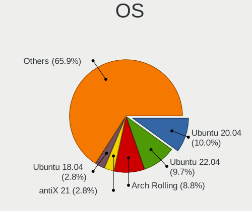

| Name                | Notebooks | Percent |
|---------------------|-----------|---------|
| Ubuntu 20.04        | 27        | 23.89%  |
| Ubuntu 18.04        | 9         | 7.96%   |
| Fedora 32           | 5         | 4.42%   |
| Arch                | 5         | 4.42%   |
| Ubuntu 19.10        | 3         | 2.65%   |
| OpenMandriva 4.2    | 3         | 2.65%   |
| Linux Mint 20       | 3         | 2.65%   |
| Gentoo 2.7          | 3         | 2.65%   |
| Fedora 33           | 3         | 2.65%   |
| Chrome OS           | 3         | 2.65%   |
| Ubuntu 21.04        | 2         | 1.77%   |
| Ubuntu 19.04        | 2         | 1.77%   |
| Ubuntu 16.04        | 2         | 1.77%   |
| Pop!_OS 20.10       | 2         | 1.77%   |
| Manjaro 20.1        | 2         | 1.77%   |
| Fedora 34           | 2         | 1.77%   |
| EndeavourOS Rolling | 2         | 1.77%   |
| ArcoLinux Rolling   | 2         | 1.77%   |
| Arch Rolling        | 2         | 1.77%   |
| Zorin 15            | 1         | 0.88%   |
| UbuntuDDE 21.10     | 1         | 0.88%   |
| Ubuntu Budgie 20.04 | 1         | 0.88%   |
| Ubuntu 21.10        | 1         | 0.88%   |
| Ubuntu 20.10        | 1         | 0.88%   |
| ROSA R11            | 1         | 0.88%   |
| ROSA R10            | 1         | 0.88%   |
| Pop!_OS 21.10       | 1         | 0.88%   |
| Pop!_OS 21.04       | 1         | 0.88%   |
| Pop!_OS 20.04       | 1         | 0.88%   |
| PCLinuxOS 2020      | 1         | 0.88%   |
| OpenMandriva 4.50   | 1         | 0.88%   |
| Manjaro 21.1.0      | 1         | 0.88%   |
| Manjaro 21.0.7      | 1         | 0.88%   |
| Manjaro 21.0        | 1         | 0.88%   |
| Manjaro 20.2.1      | 1         | 0.88%   |
| Linux Mint 20.3     | 1         | 0.88%   |
| Linux Mint 20.1     | 1         | 0.88%   |
| Linux Mint 19.1     | 1         | 0.88%   |
| Kubuntu 21.10       | 1         | 0.88%   |
| KDE neon 20.04      | 1         | 0.88%   |
| Kali 2021.4         | 1         | 0.88%   |
| Gentoo 2.8          | 1         | 0.88%   |
| Fedora 35           | 1         | 0.88%   |
| Elementary 5.1.7    | 1         | 0.88%   |
| Elementary 5.1.5    | 1         | 0.88%   |
| Debian 11           | 1         | 0.88%   |
| Clear Linux 34930   | 1         | 0.88%   |
| Clear Linux 34290   | 1         | 0.88%   |
| Clear Linux 34180   | 1         | 0.88%   |
| BlackPanther 16.2   | 1         | 0.88%   |

OS Family
---------

OS without a version

| Name          | Notebooks | Percent |
|---------------|-----------|---------|
| Ubuntu        | 46        | 42.2%   |
| Fedora        | 11        | 10.09%  |
| Arch          | 7         | 6.42%   |
| Manjaro       | 6         | 5.5%    |
| Pop!_OS       | 5         | 4.59%   |
| Linux Mint    | 5         | 4.59%   |
| OpenMandriva  | 4         | 3.67%   |
| Gentoo        | 3         | 2.75%   |
| Clear Linux   | 3         | 2.75%   |
| Chrome OS     | 3         | 2.75%   |
| ROSA          | 2         | 1.83%   |
| EndeavourOS   | 2         | 1.83%   |
| ArcoLinux     | 2         | 1.83%   |
| Zorin         | 1         | 0.92%   |
| UbuntuDDE     | 1         | 0.92%   |
| Ubuntu Budgie | 1         | 0.92%   |
| PCLinuxOS     | 1         | 0.92%   |
| Kubuntu       | 1         | 0.92%   |
| KDE neon      | 1         | 0.92%   |
| Kali          | 1         | 0.92%   |
| Elementary    | 1         | 0.92%   |
| Debian        | 1         | 0.92%   |
| BlackPanther  | 1         | 0.92%   |

Kernel
------

Version of the Linux kernel

| Version                  | Notebooks | Percent |
|--------------------------|-----------|---------|
| 5.4.0-42-generic         | 6         | 4.84%   |
| 5.8.0-43-generic         | 3         | 2.42%   |
| 5.4.0-48-generic         | 3         | 2.42%   |
| 5.13.0-39-generic        | 3         | 2.42%   |
| 5.10.14-desktop-1omv4002 | 3         | 2.42%   |
| 4.19.49+                 | 3         | 2.42%   |
| 5.9.2-arch1-1            | 2         | 1.61%   |
| 5.8.0-7630-generic       | 2         | 1.61%   |
| 5.4.0-58-generic         | 2         | 1.61%   |
| 5.4.0-28-generic         | 2         | 1.61%   |
| 5.4.0-26-generic         | 2         | 1.61%   |
| 5.13.0-35-generic        | 2         | 1.61%   |
| 5.11.0-37-generic        | 2         | 1.61%   |
| 5.0.0-31-generic         | 2         | 1.61%   |
| 4.18.0-15-generic        | 2         | 1.61%   |
| 5.9.8-200.fc33.x86_64    | 1         | 0.81%   |
| 5.9.3-arch1-1            | 1         | 0.81%   |
| 5.9.14-100.fc32.x86_64   | 1         | 0.81%   |
| 5.9.10-artix1-1          | 1         | 0.81%   |
| 5.8.6-1-MANJARO          | 1         | 0.81%   |
| 5.8.3-2-MANJARO          | 1         | 0.81%   |
| 5.8.15-gentoo            | 1         | 0.81%   |
| 5.8.0-64-generic         | 1         | 0.81%   |
| 5.8.0-63-generic         | 1         | 0.81%   |
| 5.8.0-55-generic         | 1         | 0.81%   |
| 5.8.0-54-generic         | 1         | 0.81%   |
| 5.8.0-33-generic         | 1         | 0.81%   |
| 5.8.0-25-generic         | 1         | 0.81%   |
| 5.7.9-200.fc32.x86_64    | 1         | 0.81%   |
| 5.7.4-gentoo             | 1         | 0.81%   |
| 5.7.11-200.fc32.x86_64   | 1         | 0.81%   |
| 5.7.10-201.fc32.x86_64   | 1         | 0.81%   |
| 5.6.3-zen1-1-zen         | 1         | 0.81%   |
| 5.4.0-7634-generic       | 1         | 0.81%   |
| 5.4.0-67-generic         | 1         | 0.81%   |
| 5.4.0-65-generic         | 1         | 0.81%   |
| 5.4.0-53-generic         | 1         | 0.81%   |
| 5.4.0-52-generic         | 1         | 0.81%   |
| 5.4.0-45-generic         | 1         | 0.81%   |
| 5.4.0-37-generic         | 1         | 0.81%   |
| 5.4.0-33-generic         | 1         | 0.81%   |
| 5.4.0-1007-fips          | 1         | 0.81%   |
| 5.3.14-lqx1-1-lqx        | 1         | 0.81%   |
| 5.3.11-zen1-1-zen        | 1         | 0.81%   |
| 5.3.0-59-generic         | 1         | 0.81%   |
| 5.3.0-46-generic         | 1         | 0.81%   |
| 5.3.0-24-generic         | 1         | 0.81%   |
| 5.3.0-18-generic         | 1         | 0.81%   |
| 5.17.4-100.fc34.x86_64   | 1         | 0.81%   |
| 5.17.3-arch1-1           | 1         | 0.81%   |
| 5.17.1-arch1-1.1         | 1         | 0.81%   |
| 5.16.12-200.fc35.x86_64  | 1         | 0.81%   |
| 5.16.11-76051611-generic | 1         | 0.81%   |
| 5.15.13-gentoo           | 1         | 0.81%   |
| 5.14.8-051408-generic    | 1         | 0.81%   |
| 5.14.7-desktop-1omv4050  | 1         | 0.81%   |
| 5.14.0-kali4-amd64       | 1         | 0.81%   |
| 5.13.8-1065.native       | 1         | 0.81%   |
| 5.13.13-zen1-1-zen       | 1         | 0.81%   |
| 5.13.0-7614-generic      | 1         | 0.81%   |

Kernel Family
-------------

Linux kernel without a distro release

| Version | Notebooks | Percent |
|---------|-----------|---------|
| 5.4.0   | 19        | 16.38%  |
| 5.8.0   | 9         | 7.76%   |
| 5.13.0  | 9         | 7.76%   |
| 4.15.0  | 7         | 6.03%   |
| 5.11.0  | 6         | 5.17%   |
| 5.0.0   | 5         | 4.31%   |
| 5.3.0   | 4         | 3.45%   |
| 5.10.14 | 3         | 2.59%   |
| 4.19.49 | 3         | 2.59%   |
| 5.9.2   | 2         | 1.72%   |
| 5.11.6  | 2         | 1.72%   |
| 4.18.0  | 2         | 1.72%   |
| 5.9.8   | 1         | 0.86%   |
| 5.9.3   | 1         | 0.86%   |
| 5.9.14  | 1         | 0.86%   |
| 5.9.10  | 1         | 0.86%   |
| 5.8.6   | 1         | 0.86%   |
| 5.8.3   | 1         | 0.86%   |
| 5.8.15  | 1         | 0.86%   |
| 5.7.9   | 1         | 0.86%   |
| 5.7.4   | 1         | 0.86%   |
| 5.7.11  | 1         | 0.86%   |
| 5.7.10  | 1         | 0.86%   |
| 5.6.3   | 1         | 0.86%   |
| 5.3.14  | 1         | 0.86%   |
| 5.3.11  | 1         | 0.86%   |
| 5.17.4  | 1         | 0.86%   |
| 5.17.3  | 1         | 0.86%   |
| 5.17.1  | 1         | 0.86%   |
| 5.16.12 | 1         | 0.86%   |
| 5.16.11 | 1         | 0.86%   |
| 5.15.13 | 1         | 0.86%   |
| 5.14.8  | 1         | 0.86%   |
| 5.14.7  | 1         | 0.86%   |
| 5.14.0  | 1         | 0.86%   |
| 5.13.8  | 1         | 0.86%   |
| 5.13.13 | 1         | 0.86%   |
| 5.12.9  | 1         | 0.86%   |
| 5.11.2  | 1         | 0.86%   |
| 5.11.19 | 1         | 0.86%   |
| 5.11.18 | 1         | 0.86%   |
| 5.11.17 | 1         | 0.86%   |
| 5.11.12 | 1         | 0.86%   |
| 5.11.10 | 1         | 0.86%   |
| 5.10.8  | 1         | 0.86%   |
| 5.10.76 | 1         | 0.86%   |
| 5.10.52 | 1         | 0.86%   |
| 5.10.42 | 1         | 0.86%   |
| 5.10.32 | 1         | 0.86%   |
| 5.10.21 | 1         | 0.86%   |
| 5.10.2  | 1         | 0.86%   |
| 5.10.17 | 1         | 0.86%   |
| 5.10.12 | 1         | 0.86%   |
| 5.10.0  | 1         | 0.86%   |
| 4.9.87  | 1         | 0.86%   |
| 4.9.20  | 1         | 0.86%   |
| 4.18.16 | 1         | 0.86%   |

Kernel Major Ver.
-----------------

Linux kernel major version

| Version | Notebooks | Percent |
|---------|-----------|---------|
| 5.4     | 19        | 16.52%  |
| 5.11    | 13        | 11.3%   |
| 5.10    | 13        | 11.3%   |
| 5.8     | 12        | 10.43%  |
| 5.13    | 11        | 9.57%   |
| 4.15    | 7         | 6.09%   |
| 5.9     | 6         | 5.22%   |
| 5.3     | 6         | 5.22%   |
| 5.0     | 5         | 4.35%   |
| 5.7     | 4         | 3.48%   |
| 5.17    | 3         | 2.61%   |
| 5.14    | 3         | 2.61%   |
| 4.19    | 3         | 2.61%   |
| 4.18    | 3         | 2.61%   |
| 5.16    | 2         | 1.74%   |
| 4.9     | 2         | 1.74%   |
| 5.6     | 1         | 0.87%   |
| 5.15    | 1         | 0.87%   |
| 5.12    | 1         | 0.87%   |

Arch
----

OS architecture (x86_64, i586, etc.)

| Name   | Notebooks | Percent |
|--------|-----------|---------|
| x86_64 | 104       | 96.3%   |
| i686   | 4         | 3.7%    |

DE
--

Desktop Environment

| Name       | Notebooks | Percent |
|------------|-----------|---------|
| GNOME      | 58        | 52.73%  |
| Unknown    | 18        | 16.36%  |
| KDE5       | 15        | 13.64%  |
| XFCE       | 4         | 3.64%   |
| X-Cinnamon | 3         | 2.73%   |
| KDE        | 3         | 2.73%   |
| i3         | 3         | 2.73%   |
| Unity      | 1         | 0.91%   |
| LXQt       | 1         | 0.91%   |
| fvwm       | 1         | 0.91%   |
| Deepin     | 1         | 0.91%   |
| Cinnamon   | 1         | 0.91%   |
| Budgie     | 1         | 0.91%   |

Display Server
--------------

X11 or Wayland

| Name    | Notebooks | Percent |
|---------|-----------|---------|
| X11     | 87        | 79.82%  |
| Wayland | 13        | 11.93%  |
| Unknown | 8         | 7.34%   |
| Tty     | 1         | 0.92%   |

Display Manager
---------------

SDDM, LightDM, etc.

| Name    | Notebooks | Percent |
|---------|-----------|---------|
| Unknown | 57        | 51.35%  |
| GDM     | 21        | 18.92%  |
| SDDM    | 19        | 17.12%  |
| LightDM | 6         | 5.41%   |
| TDM     | 4         | 3.6%    |
| GDM3    | 4         | 3.6%    |

OS Lang
-------

Language

| Lang    | Notebooks | Percent |
|---------|-----------|---------|
| en_US   | 44        | 39.64%  |
| en_HK   | 21        | 18.92%  |
| Unknown | 18        | 16.22%  |
| zh_CN   | 12        | 10.81%  |
| zh_HK   | 5         | 4.5%    |
| zh_TW   | 4         | 3.6%    |
| C       | 3         | 2.7%    |
| en_GB   | 2         | 1.8%    |
| it_IT   | 1         | 0.9%    |
| en_AU   | 1         | 0.9%    |

Boot Mode
---------

EFI or BIOS

| Mode | Notebooks | Percent |
|------|-----------|---------|
| EFI  | 73        | 67.59%  |
| BIOS | 35        | 32.41%  |

Filesystem
----------

Type of filesystem

| Type    | Notebooks | Percent |
|---------|-----------|---------|
| Ext4    | 83        | 76.15%  |
| Overlay | 7         | 6.42%   |
| Btrfs   | 7         | 6.42%   |
| Unknown | 6         | 5.5%    |
| Zfs     | 2         | 1.83%   |
| Xfs     | 2         | 1.83%   |
| Ext3    | 1         | 0.92%   |
| Ext2    | 1         | 0.92%   |

Part. scheme
------------

Scheme of partitioning

| Type    | Notebooks | Percent |
|---------|-----------|---------|
| Unknown | 59        | 53.64%  |
| GPT     | 47        | 42.73%  |
| MBR     | 4         | 3.64%   |

Dual Boot with Linux/BSD
------------------------

Hosting more than one Linux/BSD

| Dual boot | Notebooks | Percent |
|-----------|-----------|---------|
| No        | 101       | 93.52%  |
| Yes       | 7         | 6.48%   |

Dual Boot (Win)
---------------

Hosting Linux and Windows

| Dual boot | Notebooks | Percent |
|-----------|-----------|---------|
| No        | 67        | 61.47%  |
| Yes       | 42        | 38.53%  |

Board
-----

Vendor
------

Motherboard manufacturer

| Name                             | Notebooks | Percent |
|----------------------------------|-----------|---------|
| Lenovo                           | 32        | 29.63%  |
| Dell                             | 14        | 12.96%  |
| Hewlett-Packard                  | 11        | 10.19%  |
| ASUSTek Computer                 | 10        | 9.26%   |
| Fujitsu                          | 9         | 8.33%   |
| Unknown                          | 8         | 7.41%   |
| HUAWEI                           | 4         | 3.7%    |
| Acer                             | 4         | 3.7%    |
| Apple                            | 3         | 2.78%   |
| Toshiba                          | 2         | 1.85%   |
| GPD                              | 2         | 1.85%   |
| Timi                             | 1         | 0.93%   |
| Sony                             | 1         | 0.93%   |
| Schenker                         | 1         | 0.93%   |
| Samsung Electronics              | 1         | 0.93%   |
| Panasonic                        | 1         | 0.93%   |
| MSI                              | 1         | 0.93%   |
| Jumper                           | 1         | 0.93%   |
| Google                           | 1         | 0.93%   |
| FUJITSU CLIENT COMPUTING LIMITED | 1         | 0.93%   |

Model
-----

Motherboard model

| Name                                     | Notebooks | Percent |
|------------------------------------------|-----------|---------|
| Unknown                                  | 8         | 7.41%   |
| Lenovo Legion R7000 2020 82B6            | 2         | 1.85%   |
| HUAWEI KPRC-WX0                          | 2         | 1.85%   |
| HP EliteBook 2540p                       | 2         | 1.85%   |
| Fujitsu LIFEBOOK AH544                   | 2         | 1.85%   |
| Dell XPS 13 9310                         | 2         | 1.85%   |
| Dell Inspiron 5580                       | 2         | 1.85%   |
| ASUS TUF Gaming FA506IU_FA506IU          | 2         | 1.85%   |
| Toshiba PORTEGE R830                     | 1         | 0.93%   |
| Toshiba dynabook R731/E                  | 1         | 0.93%   |
| Timi TM1607                              | 1         | 0.93%   |
| Sony VPCCB17FG                           | 1         | 0.93%   |
| Schenker XMG_APEX15_XAP15E20             | 1         | 0.93%   |
| Samsung 930XBE                           | 1         | 0.93%   |
| Panasonic CFSZ5-2L                       | 1         | 0.93%   |
| MSI GS73VR 7RG                           | 1         | 0.93%   |
| Lenovo ZHAOYANG K47                      | 1         | 0.93%   |
| Lenovo Yoga Slim 7 Pro 14ACH5 82MS       | 1         | 0.93%   |
| Lenovo XiaoXinAir-14ARE 2020 81YN        | 1         | 0.93%   |
| Lenovo XiaoXin-14API QC 2019 81UW        | 1         | 0.93%   |
| Lenovo ThinkPad X270 20HNA00RAD          | 1         | 0.93%   |
| Lenovo ThinkPad X220 4290NL5             | 1         | 0.93%   |
| Lenovo ThinkPad X1 Extreme 20MFS0PE00    | 1         | 0.93%   |
| Lenovo ThinkPad X1 Carbon 7th 20R1001BHH | 1         | 0.93%   |
| Lenovo ThinkPad W530 24384KU             | 1         | 0.93%   |
| Lenovo ThinkPad T61 6465CTO              | 1         | 0.93%   |
| Lenovo ThinkPad T520 4242BC5             | 1         | 0.93%   |
| Lenovo ThinkPad T480s 20L7CTO1WW         | 1         | 0.93%   |
| Lenovo ThinkPad T480s 20L7005FUS         | 1         | 0.93%   |
| Lenovo ThinkPad T430s 2355C33            | 1         | 0.93%   |
| Lenovo ThinkPad T430 2342AG4             | 1         | 0.93%   |
| Lenovo ThinkPad T400 64751W1             | 1         | 0.93%   |
| Lenovo ThinkPad S3 Yoga 14 20DM000VUS    | 1         | 0.93%   |
| Lenovo ThinkPad P15v Gen 1 20TQS08G00    | 1         | 0.93%   |
| Lenovo ThinkPad P1 Gen 3 20THCTO1WW      | 1         | 0.93%   |
| Lenovo ThinkPad E14 20RAA002CD           | 1         | 0.93%   |
| Lenovo Legion Y9000P2021H 82JD           | 1         | 0.93%   |
| Lenovo Legion 5 15ACH6 82JW              | 1         | 0.93%   |
| Lenovo IdeaPad Yoga 13 20175             | 1         | 0.93%   |
| Lenovo IdeaPad 5 14IIL05 81YH            | 1         | 0.93%   |
| Lenovo IdeaPad 330-15IKB 81DE            | 1         | 0.93%   |
| Lenovo IdeaPad 320-15IKB 80XL            | 1         | 0.93%   |
| Lenovo G770 20089                        | 1         | 0.93%   |
| Lenovo G710 20252                        | 1         | 0.93%   |
| Lenovo E10-30 20424                      | 1         | 0.93%   |
| Lenovo 3000 G410                         | 1         | 0.93%   |
| Jumper EZbook                            | 1         | 0.93%   |
| HUAWEI WRT-WX9                           | 1         | 0.93%   |
| HUAWEI KLVL-WXX9                         | 1         | 0.93%   |
| HP ZHAN 66 Pro 14 G4 Notebook PC         | 1         | 0.93%   |
| HP Victus by Laptop 16-d1xxx             | 1         | 0.93%   |
| HP ProBook 4540s                         | 1         | 0.93%   |
| HP Notebook                              | 1         | 0.93%   |
| HP Laptop 15s-du3xxx                     | 1         | 0.93%   |
| HP G72                                   | 1         | 0.93%   |
| HP EliteBook 830 G5                      | 1         | 0.93%   |
| HP 2140                                  | 1         | 0.93%   |
| HP 2000                                  | 1         | 0.93%   |
| GPD P2 MAX                               | 1         | 0.93%   |
| GPD G1618-03                             | 1         | 0.93%   |

Model Family
------------

Motherboard model prefix

| Name                                  | Notebooks | Percent |
|---------------------------------------|-----------|---------|
| Lenovo ThinkPad                       | 16        | 14.81%  |
| Unknown                               | 8         | 7.41%   |
| Fujitsu LIFEBOOK                      | 7         | 6.48%   |
| Lenovo Legion                         | 4         | 3.7%    |
| Lenovo IdeaPad                        | 4         | 3.7%    |
| Dell XPS                              | 4         | 3.7%    |
| Dell Inspiron                         | 4         | 3.7%    |
| HP EliteBook                          | 3         | 2.78%   |
| Dell Precision                        | 3         | 2.78%   |
| ASUS TUF                              | 3         | 2.78%   |
| ASUS ROG                              | 3         | 2.78%   |
| Acer Aspire                           | 3         | 2.78%   |
| HUAWEI KPRC-WX0                       | 2         | 1.85%   |
| Dell Latitude                         | 2         | 1.85%   |
| Toshiba PORTEGE                       | 1         | 0.93%   |
| Toshiba dynabook                      | 1         | 0.93%   |
| Timi TM1607                           | 1         | 0.93%   |
| Sony VPCCB17FG                        | 1         | 0.93%   |
| Schenker XMG                          | 1         | 0.93%   |
| Samsung 930XBE                        | 1         | 0.93%   |
| Panasonic CFSZ5-2L                    | 1         | 0.93%   |
| MSI GS73VR                            | 1         | 0.93%   |
| Lenovo ZHAOYANG                       | 1         | 0.93%   |
| Lenovo Yoga                           | 1         | 0.93%   |
| Lenovo XiaoXinAir-14ARE               | 1         | 0.93%   |
| Lenovo XiaoXin-14API                  | 1         | 0.93%   |
| Lenovo G770                           | 1         | 0.93%   |
| Lenovo G710                           | 1         | 0.93%   |
| Lenovo E10-30                         | 1         | 0.93%   |
| Lenovo 3000                           | 1         | 0.93%   |
| Jumper EZbook                         | 1         | 0.93%   |
| HUAWEI WRT-WX9                        | 1         | 0.93%   |
| HUAWEI KLVL-WXX9                      | 1         | 0.93%   |
| HP ZHAN                               | 1         | 0.93%   |
| HP Victus                             | 1         | 0.93%   |
| HP ProBook                            | 1         | 0.93%   |
| HP Notebook                           | 1         | 0.93%   |
| HP Laptop                             | 1         | 0.93%   |
| HP G72                                | 1         | 0.93%   |
| HP 2140                               | 1         | 0.93%   |
| HP 2000                               | 1         | 0.93%   |
| GPD P2                                | 1         | 0.93%   |
| GPD G1618-03                          | 1         | 0.93%   |
| Google Eve                            | 1         | 0.93%   |
| Fujitsu UH-X                          | 1         | 0.93%   |
| Fujitsu S6420                         | 1         | 0.93%   |
| FUJITSU CLIENT COMPUTING LIMITED UH-X | 1         | 0.93%   |
| Dell G7                               | 1         | 0.93%   |
| ASUS Zephyrus                         | 1         | 0.93%   |
| ASUS X556URK                          | 1         | 0.93%   |
| ASUS UX302LA                          | 1         | 0.93%   |
| ASUS K501UX                           | 1         | 0.93%   |
| Apple MacBookPro7                     | 1         | 0.93%   |
| Apple MacBookAir5                     | 1         | 0.93%   |
| Apple MacBook10                       | 1         | 0.93%   |
| Acer Swift                            | 1         | 0.93%   |

MFG Year
--------

Motherboard manufacture year

| Year | Notebooks | Percent |
|------|-----------|---------|
| 2020 | 20        | 18.52%  |
| 2018 | 17        | 15.74%  |
| 2019 | 12        | 11.11%  |
| 2021 | 11        | 10.19%  |
| 2011 | 9         | 8.33%   |
| 2017 | 7         | 6.48%   |
| 2012 | 7         | 6.48%   |
| 2014 | 6         | 5.56%   |
| 2010 | 6         | 5.56%   |
| 2015 | 3         | 2.78%   |
| 2013 | 3         | 2.78%   |
| 2008 | 3         | 2.78%   |
| 2016 | 2         | 1.85%   |
| 2009 | 1         | 0.93%   |
| 2007 | 1         | 0.93%   |

Form Factor
-----------

Physical design of the computer

| Name     | Notebooks | Percent |
|----------|-----------|---------|
| Notebook | 108       | 100%    |

Secure Boot
-----------

Enabled or disabled

| State    | Notebooks | Percent |
|----------|-----------|---------|
| Disabled | 94        | 87.04%  |
| Enabled  | 14        | 12.96%  |

Coreboot
--------

Have coreboot on board

| Used | Notebooks | Percent |
|------|-----------|---------|
| No   | 107       | 99.07%  |
| Yes  | 1         | 0.93%   |

RAM Size
--------

Total RAM memory

| Size in GB  | Notebooks | Percent |
|-------------|-----------|---------|
| 8.01-16.0   | 27        | 25%     |
| 4.01-8.0    | 26        | 24.07%  |
| 16.01-24.0  | 20        | 18.52%  |
| 3.01-4.0    | 14        | 12.96%  |
| 32.01-64.0  | 10        | 9.26%   |
| 64.01-256.0 | 4         | 3.7%    |
| 1.01-2.0    | 3         | 2.78%   |
| 2.01-3.0    | 2         | 1.85%   |
| 24.01-32.0  | 1         | 0.93%   |
| 0.51-1.0    | 1         | 0.93%   |

RAM Used
--------

Used RAM memory

| Used GB    | Notebooks | Percent |
|------------|-----------|---------|
| 2.01-3.0   | 32        | 28.07%  |
| 1.01-2.0   | 32        | 28.07%  |
| 4.01-8.0   | 18        | 15.79%  |
| 3.01-4.0   | 16        | 14.04%  |
| 8.01-16.0  | 7         | 6.14%   |
| 0.01-0.5   | 4         | 3.51%   |
| 0.51-1.0   | 3         | 2.63%   |
| 16.01-24.0 | 2         | 1.75%   |

Total Drives
------------

Number of drives on board

| Drives | Notebooks | Percent |
|--------|-----------|---------|
| 1      | 67        | 59.29%  |
| 2      | 40        | 35.4%   |
| 3      | 4         | 3.54%   |
| 5      | 1         | 0.88%   |
| 0      | 1         | 0.88%   |

Has CD-ROM
----------

Has CD-ROM on board

| Presented | Notebooks | Percent |
|-----------|-----------|---------|
| No        | 83        | 75.45%  |
| Yes       | 27        | 24.55%  |

Has Ethernet
------------

Has Ethernet on board

| Presented | Notebooks | Percent |
|-----------|-----------|---------|
| Yes       | 79        | 73.15%  |
| No        | 29        | 26.85%  |

Has WiFi
--------

Has WiFi module

| Presented | Notebooks | Percent |
|-----------|-----------|---------|
| Yes       | 107       | 99.07%  |
| No        | 1         | 0.93%   |

Has Bluetooth
-------------

Has Bluetooth module

| Presented | Notebooks | Percent |
|-----------|-----------|---------|
| Yes       | 83        | 76.15%  |
| No        | 26        | 23.85%  |

Location
--------

Country
-------

Geographic location (country)

| Country   | Notebooks | Percent |
|-----------|-----------|---------|
| Hong Kong | 108       | 100%    |

City
----

Geographic location (city)

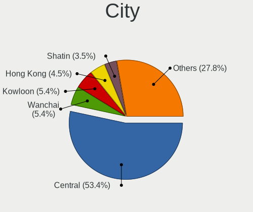

| City           | Notebooks | Percent |
|----------------|-----------|---------|
| Central        | 69        | 62.16%  |
| Kowloon        | 7         | 6.31%   |
| Tuen Mun       | 4         | 3.6%    |
| Hong Kong      | 4         | 3.6%    |
| Tsuen Wan      | 3         | 2.7%    |
| Shatin         | 3         | 2.7%    |
| Wanchai        | 2         | 1.8%    |
| Tseung Kwan O  | 2         | 1.8%    |
| North Point    | 2         | 1.8%    |
| Tung Chung     | 1         | 0.9%    |
| Tai Po         | 1         | 0.9%    |
| Sheung Shui    | 1         | 0.9%    |
| Shau Kei Wan   | 1         | 0.9%    |
| Sha Tin Wai    | 1         | 0.9%    |
| Sai Wan Ho     | 1         | 0.9%    |
| Sai Wan        | 1         | 0.9%    |
| Mong Kok       | 1         | 0.9%    |
| Mau Ping       | 1         | 0.9%    |
| Kwun Hang      | 1         | 0.9%    |
| Kwai Chung     | 1         | 0.9%    |
| Discovery Bay  | 1         | 0.9%    |
| Cheung Sha Wan | 1         | 0.9%    |
| Chai Wan       | 1         | 0.9%    |
| Causeway Bay   | 1         | 0.9%    |

Drives
------

Drive Vendor
------------

Hard drive vendors

| Vendor              | Notebooks | Drives | Percent |
|---------------------|-----------|--------|---------|
| Samsung Electronics | 27        | 34     | 18%     |
| WDC                 | 19        | 20     | 12.67%  |
| Unknown             | 12        | 16     | 8%      |
| Intel               | 10        | 12     | 6.67%   |
| Seagate             | 9         | 10     | 6%      |
| Sandisk             | 9         | 10     | 6%      |
| SK Hynix            | 6         | 6      | 4%      |
| Hitachi             | 5         | 5      | 3.33%   |
| HGST                | 5         | 7      | 3.33%   |
| Toshiba             | 4         | 4      | 2.67%   |
| Kingston            | 4         | 4      | 2.67%   |
| Crucial             | 4         | 5      | 2.67%   |
| Micron Technology   | 3         | 4      | 2%      |
| KIOXIA              | 3         | 3      | 2%      |
| JMicron             | 3         | 4      | 2%      |
| Fujitsu             | 3         | 4      | 2%      |
| China               | 3         | 4      | 2%      |
| KingSpec            | 2         | 3      | 1.33%   |
| Apple               | 2         | 3      | 1.33%   |
| Verbatim            | 1         | 2      | 0.67%   |
| TO Exter            | 1         | 1      | 0.67%   |
| Team                | 1         | 1      | 0.67%   |
| ShineDisk           | 1         | 1      | 0.67%   |
| Ramsta              | 1         | 1      | 0.67%   |
| PLEXTOR             | 1         | 1      | 0.67%   |
| Phison              | 1         | 1      | 0.67%   |
| PH4-CE12            | 1         | 1      | 0.67%   |
| Lexar               | 1         | 1      | 0.67%   |
| HS-SSD-C100         | 1         | 2      | 0.67%   |
| Hikvision           | 1         | 1      | 0.67%   |
| GALAX TA            | 1         | 1      | 0.67%   |
| faspeed             | 1         | 1      | 0.67%   |
| BIWIN               | 1         | 1      | 0.67%   |
| Apacer              | 1         | 4      | 0.67%   |
| A-DATA Technology   | 1         | 1      | 0.67%   |
| Unknown             | 1         | 1      | 0.67%   |

Drive Model
-----------

Hard drive models

| Model                                   | Notebooks | Percent |
|-----------------------------------------|-----------|---------|
| Unknown MMC Card  64GB                  | 3         | 1.92%   |
| Sandisk NVMe SSD Drive 512GB            | 3         | 1.92%   |
| WDC WD10SPZX-22Z10T1 1TB                | 2         | 1.28%   |
| Unknown MMC Card  128GB                 | 2         | 1.28%   |
| Toshiba MQ01ABF050 500GB                | 2         | 1.28%   |
| SK Hynix BC501 NVMe 128GB               | 2         | 1.28%   |
| Seagate ST2000LM007-1R8174 2TB          | 2         | 1.28%   |
| Seagate ST1000LM035-1RK172 1TB          | 2         | 1.28%   |
| Sandisk NVMe SSD Drive 256GB            | 2         | 1.28%   |
| Samsung NVMe SSD Drive 512GB            | 2         | 1.28%   |
| Samsung NVMe SSD Drive 1TB              | 2         | 1.28%   |
| Samsung MZVLB512HBJQ-000L2 512GB        | 2         | 1.28%   |
| KIOXIA NVMe SSD Drive 512GB             | 2         | 1.28%   |
| JMicron Generic 160GB                   | 2         | 1.28%   |
| Intel NVMe SSD Drive 512GB              | 2         | 1.28%   |
| Fujitsu F300 480GB                      | 2         | 1.28%   |
| Crucial CT500MX500SSD1 500GB            | 2         | 1.28%   |
| WDC WDS500G2B0A 500GB SSD               | 1         | 0.64%   |
| WDC WDS240G2G0B-00EPW0 240GB SSD        | 1         | 0.64%   |
| WDC WDS240G2G0A-00JH30 240GB SSD        | 1         | 0.64%   |
| WDC WDS200T3X0C-00SJG0 2TB              | 1         | 0.64%   |
| WDC WDS100T3X0C-00SJG0 1TB              | 1         | 0.64%   |
| WDC WDS100T2G0A-00JH30 1TB SSD          | 1         | 0.64%   |
| WDC WDS100T2B0C-00PXH0 1TB              | 1         | 0.64%   |
| WDC WD7500BPVT-24HXZT1 752GB            | 1         | 0.64%   |
| WDC WD5000LPVX-22V0TT0 500GB            | 1         | 0.64%   |
| WDC WD5000BEVT-16A0RT0 500GB            | 1         | 0.64%   |
| WDC WD10SPZX-24Z10T0 1TB                | 1         | 0.64%   |
| WDC WD10SPZX-21Z10T0 1TB                | 1         | 0.64%   |
| WDC WD10SPCX-16HWST0 1TB                | 1         | 0.64%   |
| WDC WD10JPVX-22JC3T0 1TB                | 1         | 0.64%   |
| WDC WD10JPLX-00MBPT0 1TB                | 1         | 0.64%   |
| WDC PC SN730 SDBPNTY-512G-1027 512GB    | 1         | 0.64%   |
| WDC PC SN720 SDAPNTW-512G-1027 512GB    | 1         | 0.64%   |
| WDC PC SN530 SDBPNPZ-256G-1006 256GB    | 1         | 0.64%   |
| Verbatim Vi550 S3 SSD 128GB             | 1         | 0.64%   |
| Unknown SMI  121MB                      | 1         | 0.64%   |
| Unknown SD32G  32GB                     | 1         | 0.64%   |
| Unknown NVMe SSD Drive 1024GB           | 1         | 0.64%   |
| Unknown MMC Card  7GB                   | 1         | 0.64%   |
| Unknown MMC Card  32GB                  | 1         | 0.64%   |
| Unknown MMC Card  16GB                  | 1         | 0.64%   |
| Unknown DURM4R  128GB                   | 1         | 0.64%   |
| Unknown 064GE2  64GB                    | 1         | 0.64%   |
| Unknown 00000  129GB                    | 1         | 0.64%   |
| Toshiba NVMe SSD Drive 512GB            | 1         | 0.64%   |
| Toshiba KBG20ZMS512G NVMe 512GB         | 1         | 0.64%   |
| TO Exter nal USB 3.0 128GB              | 1         | 0.64%   |
| Team TEAML5Lite3D120G 120GB SSD         | 1         | 0.64%   |
| SK Hynix SKHynix_HFS001TDE9X084N 1TB    | 1         | 0.64%   |
| SK Hynix SKHynix_HFS001TD9TNI-L2B0B 1TB | 1         | 0.64%   |
| SK Hynix HFM512GD3JX013N 512GB          | 1         | 0.64%   |
| SK Hynix BC501 NVMe 256GB               | 1         | 0.64%   |
| ShineDisk M667 240G                     | 1         | 0.64%   |
| Seagate ST9250315ASG 250GB              | 1         | 0.64%   |
| Seagate ST9160412AS 160GB               | 1         | 0.64%   |
| Seagate ST500LT012-9WS142 500GB         | 1         | 0.64%   |
| Seagate ST1000LM035-1RK1 1TB            | 1         | 0.64%   |
| Seagate ST1000LM024 HN-M101MBB 1TB      | 1         | 0.64%   |
| SanDisk SD9SN8W-128G-1006 128GB SSD     | 1         | 0.64%   |

HDD Vendor
----------

Hard disk drive vendors

| Vendor  | Notebooks | Drives | Percent |
|---------|-----------|--------|---------|
| WDC     | 10        | 10     | 31.25%  |
| Seagate | 9         | 10     | 28.13%  |
| Hitachi | 5         | 5      | 15.63%  |
| HGST    | 5         | 7      | 15.63%  |
| Toshiba | 2         | 2      | 6.25%   |
| JMicron | 1         | 2      | 3.13%   |

SSD Vendor
----------

Solid state drive vendors

| Vendor              | Notebooks | Drives | Percent |
|---------------------|-----------|--------|---------|
| Samsung Electronics | 11        | 15     | 25%     |
| WDC                 | 4         | 4      | 9.09%   |
| Intel               | 4         | 6      | 9.09%   |
| Crucial             | 4         | 5      | 9.09%   |
| China               | 3         | 4      | 6.82%   |
| Kingston            | 2         | 2      | 4.55%   |
| JMicron             | 2         | 2      | 4.55%   |
| Fujitsu             | 2         | 3      | 4.55%   |
| Verbatim            | 1         | 2      | 2.27%   |
| TO Exter            | 1         | 1      | 2.27%   |
| Team                | 1         | 1      | 2.27%   |
| SanDisk             | 1         | 1      | 2.27%   |
| Ramsta              | 1         | 1      | 2.27%   |
| PLEXTOR             | 1         | 1      | 2.27%   |
| Micron Technology   | 1         | 2      | 2.27%   |
| Lexar               | 1         | 1      | 2.27%   |
| Hikvision           | 1         | 1      | 2.27%   |
| Apple               | 1         | 1      | 2.27%   |
| Apacer              | 1         | 4      | 2.27%   |
| A-DATA Technology   | 1         | 1      | 2.27%   |

Drive Kind
----------

HDD or SSD

| Kind    | Notebooks | Drives | Percent |
|---------|-----------|--------|---------|
| NVMe    | 49        | 59     | 35%     |
| SSD     | 38        | 58     | 27.14%  |
| HDD     | 32        | 36     | 22.86%  |
| MMC     | 13        | 17     | 9.29%   |
| Unknown | 8         | 10     | 5.71%   |

Drive Connector
---------------

SATA, SAS, NVMe, etc.

| Type | Notebooks | Drives | Percent |
|------|-----------|--------|---------|
| SATA | 65        | 95     | 48.51%  |
| NVMe | 49        | 59     | 36.57%  |
| MMC  | 13        | 17     | 9.7%    |
| SAS  | 7         | 9      | 5.22%   |

Drive Size
----------

Size of hard drive

| Size in TB | Notebooks | Drives | Percent |
|------------|-----------|--------|---------|
| 0.01-0.5   | 42        | 64     | 60%     |
| 0.51-1.0   | 22        | 23     | 31.43%  |
| 1.01-2.0   | 6         | 7      | 8.57%   |

Space Total
-----------

Amount of disk space available on the file system

| Size in GB     | Notebooks | Percent |
|----------------|-----------|---------|
| 101-250        | 31        | 27.68%  |
| 251-500        | 22        | 19.64%  |
| 501-1000       | 17        | 15.18%  |
| 1001-2000      | 14        | 12.5%   |
| 51-100         | 11        | 9.82%   |
| 1-20           | 8         | 7.14%   |
| 21-50          | 4         | 3.57%   |
| 2001-3000      | 3         | 2.68%   |
| More than 3000 | 1         | 0.89%   |
| Unknown        | 1         | 0.89%   |

Space Used
----------

Amount of used disk space

| Used GB   | Notebooks | Percent |
|-----------|-----------|---------|
| 1-20      | 52        | 44.07%  |
| 21-50     | 19        | 16.1%   |
| 51-100    | 15        | 12.71%  |
| 251-500   | 12        | 10.17%  |
| 101-250   | 11        | 9.32%   |
| 501-1000  | 5         | 4.24%   |
| 1001-2000 | 3         | 2.54%   |
| Unknown   | 1         | 0.85%   |

Malfunc. Drives
---------------

Drive models with a malfunction

| Model                               | Notebooks | Drives | Percent |
|-------------------------------------|-----------|--------|---------|
| SanDisk SD9SN8W-128G-1006 128GB SSD | 1         | 1      | 16.67%  |
| Samsung Electronics SSD 860 EVO 1TB | 1         | 1      | 16.67%  |
| Hitachi HTS725050A7E630 500GB       | 1         | 1      | 16.67%  |
| Hitachi HTS723216L9A360 160GB       | 1         | 1      | 16.67%  |
| HGST TOURO Mobile 1TB               | 1         | 1      | 16.67%  |
| Crucial CT240M500SSD1 240GB         | 1         | 1      | 16.67%  |

Malfunc. Drive Vendor
---------------------

Vendors of faulty drives

| Vendor              | Notebooks | Drives | Percent |
|---------------------|-----------|--------|---------|
| Hitachi             | 2         | 2      | 33.33%  |
| SanDisk             | 1         | 1      | 16.67%  |
| Samsung Electronics | 1         | 1      | 16.67%  |
| HGST                | 1         | 1      | 16.67%  |
| Crucial             | 1         | 1      | 16.67%  |

Malfunc. HDD Vendor
-------------------

Vendors of faulty HDD drives

| Vendor  | Notebooks | Drives | Percent |
|---------|-----------|--------|---------|
| Hitachi | 2         | 2      | 66.67%  |
| HGST    | 1         | 1      | 33.33%  |

Malfunc. Drive Kind
-------------------

Kinds of faulty drives

| Kind | Notebooks | Drives | Percent |
|------|-----------|--------|---------|
| SSD  | 3         | 3      | 50%     |
| HDD  | 3         | 3      | 50%     |

Failed Drives
-------------

Failed drive models

Zero info for selected period =(

Failed Drive Vendor
-------------------

Failed drive vendors

Zero info for selected period =(

Drive Status
------------

Number of failed and malfunc. drives

| Status   | Notebooks | Drives | Percent |
|----------|-----------|--------|---------|
| Detected | 66        | 108    | 57.39%  |
| Works    | 43        | 66     | 37.39%  |
| Malfunc  | 6         | 6      | 5.22%   |

Storage controller
------------------

Storage Vendor
--------------

Storage controller vendors

| Vendor                       | Notebooks | Percent |
|------------------------------|-----------|---------|
| Intel                        | 78        | 56.93%  |
| Samsung Electronics          | 17        | 12.41%  |
| Sandisk                      | 13        | 9.49%   |
| AMD                          | 8         | 5.84%   |
| SK Hynix                     | 6         | 4.38%   |
| Toshiba America Info Systems | 3         | 2.19%   |
| Silicon Motion               | 2         | 1.46%   |
| Micron Technology            | 2         | 1.46%   |
| KIOXIA                       | 2         | 1.46%   |
| Kingston Technology Company  | 2         | 1.46%   |
| Phison Electronics           | 1         | 0.73%   |
| Nvidia                       | 1         | 0.73%   |
| Biwin Storage Technology     | 1         | 0.73%   |
| Apple                        | 1         | 0.73%   |

Storage Model
-------------

Storage controller models

| Model                                                                                  | Notebooks | Percent |
|----------------------------------------------------------------------------------------|-----------|---------|
| Samsung NVMe SSD Controller SM981/PM981/PM983                                          | 10        | 6.85%   |
| Intel 6 Series/C200 Series Chipset Family 6 port Mobile SATA AHCI Controller           | 10        | 6.85%   |
| Intel Sunrise Point-LP SATA Controller [AHCI mode]                                     | 9         | 6.16%   |
| Intel 7 Series Chipset Family 6-port SATA Controller [AHCI mode]                       | 8         | 5.48%   |
| AMD FCH SATA Controller [AHCI mode]                                                    | 8         | 5.48%   |
| Sandisk WD Black 2018/SN750 / PC SN720 NVMe SSD                                        | 5         | 3.42%   |
| Intel Volume Management Device NVMe RAID Controller                                    | 5         | 3.42%   |
| Intel Celeron N3350/Pentium N4200/Atom E3900 Series SATA AHCI Controller               | 5         | 3.42%   |
| Sandisk WD Black SN750 / PC SN730 NVMe SSD                                             | 4         | 2.74%   |
| Intel 8 Series/C220 Series Chipset Family 6-port SATA Controller 1 [AHCI mode]         | 4         | 2.74%   |
| SK Hynix BC501 NVMe Solid State Drive                                                  | 3         | 2.05%   |
| Sandisk WD Blue SN550 NVMe SSD                                                         | 3         | 2.05%   |
| Samsung NVMe SSD Controller SM961/PM961/SM963                                          | 3         | 2.05%   |
| Intel SSD Pro 7600p/760p/E 6100p Series                                                | 3         | 2.05%   |
| Intel SSD 660P Series                                                                  | 3         | 2.05%   |
| Intel Cannon Point-LP SATA Controller [AHCI Mode]                                      | 3         | 2.05%   |
| Intel Cannon Lake Mobile PCH SATA AHCI Controller                                      | 3         | 2.05%   |
| Intel 8 Series SATA Controller 1 [AHCI mode]                                           | 3         | 2.05%   |
| Intel 5 Series/3400 Series Chipset 6 port SATA AHCI Controller                         | 3         | 2.05%   |
| Toshiba America Info Systems XG6 NVMe SSD Controller                                   | 2         | 1.37%   |
| SK Hynix Gold P31 SSD                                                                  | 2         | 1.37%   |
| Samsung NVMe SSD Controller PM9A1/PM9A3/980PRO                                         | 2         | 1.37%   |
| Samsung NVMe SSD Controller 980                                                        | 2         | 1.37%   |
| Micron Non-Volatile memory controller                                                  | 2         | 1.37%   |
| KIOXIA Non-Volatile memory controller                                                  | 2         | 1.37%   |
| Intel Wildcat Point-LP SATA Controller [AHCI Mode]                                     | 2         | 1.37%   |
| Intel Celeron/Pentium Silver Processor SATA Controller                                 | 2         | 1.37%   |
| Intel 82801IBM/IEM (ICH9M/ICH9M-E) 4 port SATA Controller [AHCI mode]                  | 2         | 1.37%   |
| Intel 82801HM/HEM (ICH8M/ICH8M-E) SATA Controller [IDE mode]                           | 2         | 1.37%   |
| Intel 82801 Mobile SATA Controller [RAID mode]                                         | 2         | 1.37%   |
| Intel 6 Series/C200 Series Chipset Family Mobile SATA Controller (IDE mode, ports 4-5) | 2         | 1.37%   |
| Intel 6 Series/C200 Series Chipset Family Mobile SATA Controller (IDE mode, ports 0-3) | 2         | 1.37%   |
| Toshiba America Info Systems BG3 NVMe SSD Controller                                   | 1         | 0.68%   |
| SK Hynix Non-Volatile memory controller                                                | 1         | 0.68%   |
| Silicon Motion SM2263EN/SM2263XT SSD Controller                                        | 1         | 0.68%   |
| Silicon Motion SM2262/SM2262EN SSD Controller                                          | 1         | 0.68%   |
| Sandisk PC SN520 NVMe SSD                                                              | 1         | 0.68%   |
| Samsung NVMe SSD Controller SM951/PM951                                                | 1         | 0.68%   |
| Phison PS5013 E13 NVMe Controller                                                      | 1         | 0.68%   |
| Nvidia MCP89 SATA Controller (AHCI mode)                                               | 1         | 0.68%   |
| Kingston Company U-SNS8154P3 NVMe SSD                                                  | 1         | 0.68%   |
| Kingston Company Company Non-Volatile memory controller                                | 1         | 0.68%   |
| Intel Tiger Lake-LP SATA Controller [AHCI mode]                                        | 1         | 0.68%   |
| Intel Q170/Q150/B150/H170/H110/Z170/CM236 Chipset SATA Controller [AHCI Mode]          | 1         | 0.68%   |
| Intel Mobile 4 Series Chipset PT IDER Controller                                       | 1         | 0.68%   |
| Intel Ice Lake-LP SATA Controller [AHCI mode]                                          | 1         | 0.68%   |
| Intel Comet Lake SATA AHCI Controller                                                  | 1         | 0.68%   |
| Intel Atom Processor E3800 Series SATA AHCI Controller                                 | 1         | 0.68%   |
| Intel 82801IBM/IEM (ICH9M/ICH9M-E) 2 port SATA Controller [IDE mode]                   | 1         | 0.68%   |
| Intel 82801GBM/GHM (ICH7-M Family) SATA Controller [AHCI mode]                         | 1         | 0.68%   |
| Intel 82801G (ICH7 Family) IDE Controller                                              | 1         | 0.68%   |
| Intel 6 Series/C200 Series Chipset Family IDE-r Controller                             | 1         | 0.68%   |
| Intel 500 Series Chipset Family SATA AHCI Controller                                   | 1         | 0.68%   |
| Intel 5 Series/3400 Series Chipset 4 port SATA AHCI Controller                         | 1         | 0.68%   |
| Biwin Storage Non-Volatile memory controller                                           | 1         | 0.68%   |
| Apple S3X NVMe Controller                                                              | 1         | 0.68%   |
| AMD 400 Series Chipset SATA Controller                                                 | 1         | 0.68%   |

Storage Kind
------------

Kind of storage controller (IDE, SATA, NVMe, SAS, ...)

| Kind | Notebooks | Percent |
|------|-----------|---------|
| SATA | 71        | 52.59%  |
| NVMe | 50        | 37.04%  |
| RAID | 7         | 5.19%   |
| IDE  | 7         | 5.19%   |

Processor
---------

CPU Vendor
----------

Processor vendors

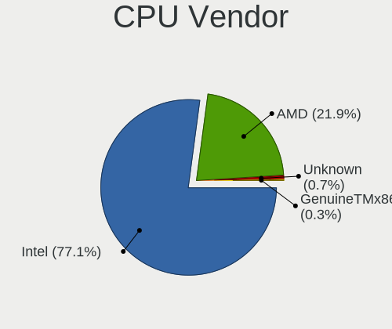

| Vendor | Notebooks | Percent |
|--------|-----------|---------|
| Intel  | 93        | 86.11%  |
| AMD    | 15        | 13.89%  |

CPU Model
---------

Processor models

| Model                                         | Notebooks | Percent |
|-----------------------------------------------|-----------|---------|
| AMD Ryzen 7 4800H with Radeon Graphics        | 5         | 4.63%   |
| Intel Core i7-8750H CPU @ 2.20GHz             | 4         | 3.7%    |
| Intel Core i7-8565U CPU @ 1.80GHz             | 4         | 3.7%    |
| Intel Core i5-2520M CPU @ 2.50GHz             | 4         | 3.7%    |
| Intel Celeron CPU N3450 @ 1.10GHz             | 4         | 3.7%    |
| Intel Core i7-2620M CPU @ 2.70GHz             | 3         | 2.78%   |
| Intel Core i5-8250U CPU @ 1.60GHz             | 3         | 2.78%   |
| AMD Ryzen 9 5900HX with Radeon Graphics       | 3         | 2.78%   |
| Intel Core i7-8550U CPU @ 1.80GHz             | 2         | 1.85%   |
| Intel Core i7-6500U CPU @ 2.50GHz             | 2         | 1.85%   |
| Intel Core i7-10750H CPU @ 2.60GHz            | 2         | 1.85%   |
| Intel Core i5-7200U CPU @ 2.50GHz             | 2         | 1.85%   |
| Intel Core i5-4200U CPU @ 1.60GHz             | 2         | 1.85%   |
| Intel Core i5-2410M CPU @ 2.30GHz             | 2         | 1.85%   |
| Intel Core i5-1035G1 CPU @ 1.00GHz            | 2         | 1.85%   |
| Intel Core i5-10210U CPU @ 1.60GHz            | 2         | 1.85%   |
| Intel 11th Gen Core i7-1185G7 @ 3.00GHz       | 2         | 1.85%   |
| AMD Ryzen 5 3500U with Radeon Vega Mobile Gfx | 2         | 1.85%   |
| Intel Xeon W-10855M CPU @ 2.80GHz             | 1         | 0.93%   |
| Intel Xeon CPU E3-1505M v6 @ 3.00GHz          | 1         | 0.93%   |
| Intel Pentium Gold 7505 @ 2.00GHz             | 1         | 0.93%   |
| Intel Pentium Dual-Core CPU T4500 @ 2.30GHz   | 1         | 0.93%   |
| Intel Pentium Dual-Core CPU T4200 @ 2.00GHz   | 1         | 0.93%   |
| Intel Pentium Dual CPU T2390 @ 1.86GHz        | 1         | 0.93%   |
| Intel Core m3-8100Y CPU @ 1.10GHz             | 1         | 0.93%   |
| Intel Core m3-7Y32 CPU @ 1.10GHz              | 1         | 0.93%   |
| Intel Core m3-7Y30 CPU @ 1.00GHz              | 1         | 0.93%   |
| Intel Core i7-7Y75 CPU @ 1.30GHz              | 1         | 0.93%   |
| Intel Core i7-7700HQ CPU @ 2.80GHz            | 1         | 0.93%   |
| Intel Core i7-6560U CPU @ 2.20GHz             | 1         | 0.93%   |
| Intel Core i7-4800MQ CPU @ 2.70GHz            | 1         | 0.93%   |
| Intel Core i7-4712MQ CPU @ 2.30GHz            | 1         | 0.93%   |
| Intel Core i7-3630QM CPU @ 2.40GHz            | 1         | 0.93%   |
| Intel Core i7-2630QM CPU @ 2.00GHz            | 1         | 0.93%   |
| Intel Core i7-10510U CPU @ 1.80GHz            | 1         | 0.93%   |
| Intel Core i7 CPU M 620 @ 2.67GHz             | 1         | 0.93%   |
| Intel Core i7 CPU L 640 @ 2.13GHz             | 1         | 0.93%   |
| Intel Core i5-8265U CPU @ 1.60GHz             | 1         | 0.93%   |
| Intel Core i5-7Y57 CPU @ 1.20GHz              | 1         | 0.93%   |
| Intel Core i5-5200U CPU @ 2.20GHz             | 1         | 0.93%   |
| Intel Core i5-4210U CPU @ 1.70GHz             | 1         | 0.93%   |
| Intel Core i5-4210M CPU @ 2.60GHz             | 1         | 0.93%   |
| Intel Core i5-3337U CPU @ 1.80GHz             | 1         | 0.93%   |
| Intel Core i5-3320M CPU @ 2.60GHz             | 1         | 0.93%   |
| Intel Core i5-3317U CPU @ 1.70GHz             | 1         | 0.93%   |
| Intel Core i5-2540M CPU @ 2.60GHz             | 1         | 0.93%   |
| Intel Core i5-2450M CPU @ 2.50GHz             | 1         | 0.93%   |
| Intel Core i5 CPU M 560 @ 2.67GHz             | 1         | 0.93%   |
| Intel Core i5 CPU M 460 @ 2.53GHz             | 1         | 0.93%   |
| Intel Core i3-7100U CPU @ 2.40GHz             | 1         | 0.93%   |
| Intel Core i3-6006U CPU @ 2.00GHz             | 1         | 0.93%   |
| Intel Core i3-5020U CPU @ 2.20GHz             | 1         | 0.93%   |
| Intel Core i3-4100M CPU @ 2.50GHz             | 1         | 0.93%   |
| Intel Core i3-3217U CPU @ 1.80GHz             | 1         | 0.93%   |
| Intel Core i3-1005G1 CPU @ 1.20GHz            | 1         | 0.93%   |
| Intel Core 2 Duo CPU T7300 @ 2.00GHz          | 1         | 0.93%   |
| Intel Core 2 Duo CPU P8600 @ 2.40GHz          | 1         | 0.93%   |
| Intel Core 2 Duo CPU P8400 @ 2.26GHz          | 1         | 0.93%   |
| Intel Celeron N4100 CPU @ 1.10GHz             | 1         | 0.93%   |
| Intel Celeron N4020 CPU @ 1.10GHz             | 1         | 0.93%   |

CPU Model Family
----------------

Processor model prefix

| Model                   | Notebooks | Percent |
|-------------------------|-----------|---------|
| Intel Core i5           | 29        | 26.85%  |
| Intel Core i7           | 27        | 25%     |
| Intel Celeron           | 10        | 9.26%   |
| Other                   | 8         | 7.41%   |
| AMD Ryzen 7             | 8         | 7.41%   |
| Intel Core i3           | 6         | 5.56%   |
| AMD Ryzen 9             | 4         | 3.7%    |
| Intel Core m3           | 3         | 2.78%   |
| Intel Core 2 Duo        | 3         | 2.78%   |
| AMD Ryzen 5             | 3         | 2.78%   |
| Intel Xeon              | 2         | 1.85%   |
| Intel Pentium Dual-Core | 2         | 1.85%   |
| Intel Pentium Gold      | 1         | 0.93%   |
| Intel Pentium Dual      | 1         | 0.93%   |
| Intel Atom              | 1         | 0.93%   |

CPU Cores
---------

Number of processor cores

| Number | Notebooks | Percent |
|--------|-----------|---------|
| 2      | 51        | 47.22%  |
| 4      | 35        | 32.41%  |
| 8      | 11        | 10.19%  |
| 6      | 8         | 7.41%   |
| 14     | 1         | 0.93%   |
| 12     | 1         | 0.93%   |
| 1      | 1         | 0.93%   |

CPU Sockets
-----------

Number of sockets

| Number | Notebooks | Percent |
|--------|-----------|---------|
| 1      | 108       | 100%    |

CPU Threads
-----------

Threads per core (Hyper-Threading)

| Number | Notebooks | Percent |
|--------|-----------|---------|
| 2      | 88        | 80.73%  |
| 1      | 21        | 19.27%  |

CPU Op-Modes
------------

CPU Operation Modes (32-bit, 64-bit)

| Op mode        | Notebooks | Percent |
|----------------|-----------|---------|
| 32-bit, 64-bit | 103       | 95.37%  |
| Unknown        | 4         | 3.7%    |
| 32-bit         | 1         | 0.93%   |

CPU Microcode
-------------

Microcode number

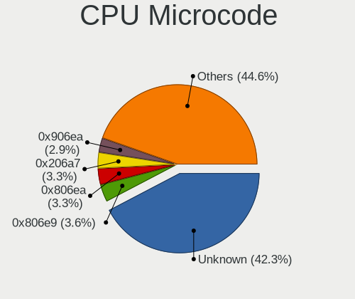

| Number     | Notebooks | Percent |
|------------|-----------|---------|
| Unknown    | 23        | 20.91%  |
| 0x206a7    | 9         | 8.18%   |
| 0x806e9    | 8         | 7.27%   |
| 0x806ea    | 5         | 4.55%   |
| 0x506c9    | 5         | 4.55%   |
| 0x906ea    | 4         | 3.64%   |
| 0x806c1    | 4         | 3.64%   |
| 0x406e3    | 4         | 3.64%   |
| 0x806ec    | 3         | 2.73%   |
| 0x806eb    | 3         | 2.73%   |
| 0x40651    | 3         | 2.73%   |
| 0x306a9    | 3         | 2.73%   |
| 0x20655    | 3         | 2.73%   |
| 0x1067a    | 3         | 2.73%   |
| 0x0a50000b | 3         | 2.73%   |
| 0x08600104 | 3         | 2.73%   |
| 0x08108102 | 3         | 2.73%   |
| 0xa0652    | 2         | 1.82%   |
| 0x906e9    | 2         | 1.82%   |
| 0x706e5    | 2         | 1.82%   |
| 0x306c3    | 2         | 1.82%   |
| 0x08600103 | 2         | 1.82%   |
| 0x906a3    | 1         | 0.91%   |
| 0x806d1    | 1         | 0.91%   |
| 0x706a8    | 1         | 0.91%   |
| 0x706a1    | 1         | 0.91%   |
| 0x6fd      | 1         | 0.91%   |
| 0x6fb      | 1         | 0.91%   |
| 0x306d4    | 1         | 0.91%   |
| 0x30678    | 1         | 0.91%   |
| 0x20652    | 1         | 0.91%   |
| 0x106c2    | 1         | 0.91%   |
| 0x08701013 | 1         | 0.91%   |

CPU Microarch
-------------

Microarchitecture

| Name          | Notebooks | Percent |
|---------------|-----------|---------|
| KabyLake      | 27        | 25%     |
| SandyBridge   | 12        | 11.11%  |
| Zen 2         | 8         | 7.41%   |
| TigerLake     | 7         | 6.48%   |
| IvyBridge     | 7         | 6.48%   |
| Haswell       | 7         | 6.48%   |
| Goldmont      | 5         | 4.63%   |
| Zen 3         | 4         | 3.7%    |
| Westmere      | 4         | 3.7%    |
| Skylake       | 4         | 3.7%    |
| Penryn        | 4         | 3.7%    |
| IceLake       | 4         | 3.7%    |
| Zen+          | 3         | 2.78%   |
| CometLake     | 3         | 2.78%   |
| Goldmont plus | 2         | 1.85%   |
| Core          | 2         | 1.85%   |
| Broadwell     | 2         | 1.85%   |
| Silvermont    | 1         | 0.93%   |
| Bonnell       | 1         | 0.93%   |
| Unknown       | 1         | 0.93%   |

Graphics
--------

GPU Vendor
----------

Vendors of graphics cards

| Vendor      | Notebooks | Percent |
|-------------|-----------|---------|
| Intel       | 88        | 63.31%  |
| Nvidia      | 32        | 23.02%  |
| AMD         | 18        | 12.95%  |
| S3 Graphics | 1         | 0.72%   |

GPU Model
---------

Graphics card models

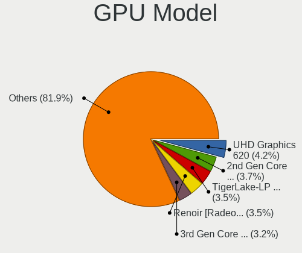

| Model                                                                         | Notebooks | Percent |
|-------------------------------------------------------------------------------|-----------|---------|
| Intel 2nd Generation Core Processor Family Integrated Graphics Controller     | 12        | 8.45%   |
| Intel 3rd Gen Core processor Graphics Controller                              | 6         | 4.23%   |
| AMD Renoir                                                                    | 6         | 4.23%   |
| Intel WhiskeyLake-U GT2 [UHD Graphics 620]                                    | 5         | 3.52%   |
| Intel UHD Graphics 620                                                        | 5         | 3.52%   |
| Intel TigerLake-LP GT2 [Iris Xe Graphics]                                     | 5         | 3.52%   |
| Intel HD Graphics 500                                                         | 5         | 3.52%   |
| Intel HD Graphics 615                                                         | 4         | 2.82%   |
| Intel CoffeeLake-H GT2 [UHD Graphics 630]                                     | 4         | 2.82%   |
| Intel 4th Gen Core Processor Integrated Graphics Controller                   | 4         | 2.82%   |
| AMD Cezanne                                                                   | 4         | 2.82%   |
| Nvidia GP106M [GeForce GTX 1060 Mobile]                                       | 3         | 2.11%   |
| Intel Skylake GT2 [HD Graphics 520]                                           | 3         | 2.11%   |
| Intel Iris Plus Graphics G1 (Ice Lake)                                        | 3         | 2.11%   |
| Intel HD Graphics 620                                                         | 3         | 2.11%   |
| Intel Haswell-ULT Integrated Graphics Controller                              | 3         | 2.11%   |
| Intel Core Processor Integrated Graphics Controller                           | 3         | 2.11%   |
| Intel CometLake-U GT2 [UHD Graphics]                                          | 3         | 2.11%   |
| AMD Picasso/Raven 2 [Radeon Vega Series / Radeon Vega Mobile Series]          | 3         | 2.11%   |
| Nvidia TU116M [GeForce GTX 1660 Ti Mobile]                                    | 2         | 1.41%   |
| Nvidia GP108M [GeForce MX150]                                                 | 2         | 1.41%   |
| Nvidia GA104M [GeForce RTX 3070 Mobile / Max-Q]                               | 2         | 1.41%   |
| Intel Mobile GM965/GL960 Integrated Graphics Controller (secondary)           | 2         | 1.41%   |
| Intel Mobile GM965/GL960 Integrated Graphics Controller (primary)             | 2         | 1.41%   |
| Intel Mobile 4 Series Chipset Integrated Graphics Controller                  | 2         | 1.41%   |
| Intel HD Graphics 5500                                                        | 2         | 1.41%   |
| Intel GeminiLake [UHD Graphics 600]                                           | 2         | 1.41%   |
| Intel CometLake-H GT2 [UHD Graphics]                                          | 2         | 1.41%   |
| AMD Whistler [Radeon HD 6630M/6650M/6750M/7670M/7690M]                        | 2         | 1.41%   |
| S3 Graphics Chrome 430 ULP / 435 ULP / 440 GTX                                | 1         | 0.7%    |
| Nvidia TU117M [GeForce GTX 1650 Ti Mobile]                                    | 1         | 0.7%    |
| Nvidia TU117M                                                                 | 1         | 0.7%    |
| Nvidia TU117GLM [Quadro T2000 Mobile / Max-Q]                                 | 1         | 0.7%    |
| Nvidia TU117GLM [Quadro T1000 Mobile]                                         | 1         | 0.7%    |
| Nvidia TU106M [GeForce RTX 2070 Mobile / Max-Q Refresh]                       | 1         | 0.7%    |
| Nvidia MCP89 [GeForce 320M]                                                   | 1         | 0.7%    |
| Nvidia GP108M [GeForce MX250]                                                 | 1         | 0.7%    |
| Nvidia GP107M [GeForce MX350]                                                 | 1         | 0.7%    |
| Nvidia GP107M [GeForce GTX 1050 Ti Mobile]                                    | 1         | 0.7%    |
| Nvidia GP107GLM [Quadro P620]                                                 | 1         | 0.7%    |
| Nvidia GP104M [GeForce GTX 1070 Mobile]                                       | 1         | 0.7%    |
| Nvidia GM206GLM [Quadro M2200 Mobile]                                         | 1         | 0.7%    |
| Nvidia GM108M [GeForce 930MX]                                                 | 1         | 0.7%    |
| Nvidia GM108M [GeForce 920MX]                                                 | 1         | 0.7%    |
| Nvidia GM108M [GeForce 840M]                                                  | 1         | 0.7%    |
| Nvidia GM107M [GeForce GTX 950M]                                              | 1         | 0.7%    |
| Nvidia GK107GLM [Quadro K1000M]                                               | 1         | 0.7%    |
| Nvidia GF119M [GeForce 410M]                                                  | 1         | 0.7%    |
| Nvidia GF117M [GeForce 610M/710M/810M/820M / GT 620M/625M/630M/720M]          | 1         | 0.7%    |
| Nvidia GF108M [NVS 5400M]                                                     | 1         | 0.7%    |
| Nvidia GA107M [GeForce RTX 3050 Ti Mobile]                                    | 1         | 0.7%    |
| Nvidia GA107BM [GeForce RTX 3050 Ti Mobile]                                   | 1         | 0.7%    |
| Nvidia GA106M [GeForce RTX 3060 Mobile / Max-Q]                               | 1         | 0.7%    |
| Intel UHD Graphics 615                                                        | 1         | 0.7%    |
| Intel TigerLake-H GT1 [UHD Graphics]                                          | 1         | 0.7%    |
| Intel Tiger Lake UHD Graphics                                                 | 1         | 0.7%    |
| Intel Tiger Lake Iris Xe Graphics                                             | 1         | 0.7%    |
| Intel Mobile 945GSE Express Integrated Graphics Controller                    | 1         | 0.7%    |
| Intel Mobile 945GM/GMS/GME, 943/940GML Express Integrated Graphics Controller | 1         | 0.7%    |
| Intel Iris Graphics 540                                                       | 1         | 0.7%    |

GPU Combo
---------

Combinations of graphics cards

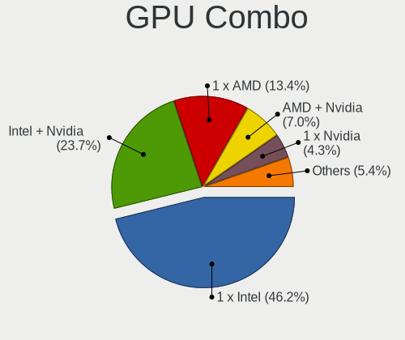

| Name            | Notebooks | Percent |
|-----------------|-----------|---------|
| 1 x Intel       | 64        | 59.26%  |
| Intel + Nvidia  | 20        | 18.52%  |
| 1 x AMD         | 8         | 7.41%   |
| AMD + Nvidia    | 6         | 5.56%   |
| 1 x Nvidia      | 5         | 4.63%   |
| Intel + AMD     | 4         | 3.7%    |
| 1 x S3 Graphics | 1         | 0.93%   |

GPU Driver
----------

Free vs proprietary

| Driver      | Notebooks | Percent |
|-------------|-----------|---------|
| Free        | 89        | 82.41%  |
| Proprietary | 15        | 13.89%  |
| Unknown     | 4         | 3.7%    |

GPU Memory
----------

Total video memory

| Size in GB | Notebooks | Percent |
|------------|-----------|---------|
| Unknown    | 76        | 70.37%  |
| 1.01-2.0   | 11        | 10.19%  |
| 0.01-0.5   | 7         | 6.48%   |
| 5.01-6.0   | 4         | 3.7%    |
| 3.01-4.0   | 4         | 3.7%    |
| 7.01-8.0   | 3         | 2.78%   |
| 0.51-1.0   | 3         | 2.78%   |

Monitor
-------

Monitor Vendor
--------------

Monitor vendors

| Vendor                  | Notebooks | Percent |
|-------------------------|-----------|---------|
| BOE                     | 23        | 18.85%  |
| LG Display              | 16        | 13.11%  |
| AU Optronics            | 16        | 13.11%  |
| Chimei Innolux          | 13        | 10.66%  |
| Sharp                   | 9         | 7.38%   |
| Samsung Electronics     | 7         | 5.74%   |
| Dell                    | 5         | 4.1%    |
| AOC                     | 4         | 3.28%   |
| Apple                   | 3         | 2.46%   |
| Philips                 | 2         | 1.64%   |
| LG Philips              | 2         | 1.64%   |
| Lenovo                  | 2         | 1.64%   |
| Chi Mei Optoelectronics | 2         | 1.64%   |
| Unknown (DAE)           | 1         | 0.82%   |
| TMX                     | 1         | 0.82%   |
| Sony                    | 1         | 0.82%   |
| PANDA                   | 1         | 0.82%   |
| MStar                   | 1         | 0.82%   |
| Mi                      | 1         | 0.82%   |
| Lenovo Group Limited    | 1         | 0.82%   |
| JXC                     | 1         | 0.82%   |
| ITE                     | 1         | 0.82%   |
| IPS                     | 1         | 0.82%   |
| InnoLux Display         | 1         | 0.82%   |
| InfoVision              | 1         | 0.82%   |
| Hewlett-Packard         | 1         | 0.82%   |
| Goldstar                | 1         | 0.82%   |
| CSO                     | 1         | 0.82%   |
| CPT                     | 1         | 0.82%   |
| Ancor Communications    | 1         | 0.82%   |
| Acer                    | 1         | 0.82%   |

Monitor Model
-------------

Monitor models

| Model                                                                 | Notebooks | Percent |
|-----------------------------------------------------------------------|-----------|---------|
| BOE LCD Monitor BOE06B4 1920x1080 344x194mm 15.5-inch                 | 3         | 2.44%   |
| Sharp LCD Monitor SHP14FA 3840x2400 288x180mm 13.4-inch               | 2         | 1.63%   |
| Samsung Electronics LCD Monitor SEC4B41 1280x800 261x163mm 12.1-inch  | 2         | 1.63%   |
| LG Display LCD Monitor LGD05C4 1920x1080 344x194mm 15.5-inch          | 2         | 1.63%   |
| LG Display LCD Monitor LGD032E 1366x768 345x194mm 15.6-inch           | 2         | 1.63%   |
| Chimei Innolux LCD Monitor CMN14D4 1920x1080 309x173mm 13.9-inch      | 2         | 1.63%   |
| BOE LCD Monitor BOE0900 1920x1080 344x194mm 15.5-inch                 | 2         | 1.63%   |
| AU Optronics LCD Monitor AUO38ED 1920x1080 344x193mm 15.5-inch        | 2         | 1.63%   |
| Unknown (DAE) L32S6550BN DAE0010 1366x768 698x392mm 31.5-inch         | 1         | 0.81%   |
| TMX TL156MDMP01-0 TMX1560 3200x2000 336x210mm 15.6-inch               | 1         | 0.81%   |
| Sony BW8 MS_9001 1600x2560 113x181mm 8.4-inch                         | 1         | 0.81%   |
| Sharp LQ156M1JW25 SHP152C 1920x1080 344x194mm 15.5-inch               | 1         | 0.81%   |
| Sharp LQ133M1JW48 SHP14F5 1920x1080 294x165mm 13.3-inch               | 1         | 0.81%   |
| Sharp LQ133M1JW35 SHP14B0 1920x1080 294x165mm 13.3-inch               | 1         | 0.81%   |
| Sharp LQ123P1JX32 SHP148A 2400x1600 259x173mm 12.3-inch               | 1         | 0.81%   |
| Sharp LCD Monitor SHP1482 2880x1920 259x173mm 12.3-inch               | 1         | 0.81%   |
| Sharp LCD Monitor SHP1421 3200x1800 294x165mm 13.3-inch               | 1         | 0.81%   |
| Sharp LCD Monitor SHP141B 1920x1080 294x165mm 13.3-inch               | 1         | 0.81%   |
| Samsung Electronics SyncMaster SAM0613 1920x1080                      | 1         | 0.81%   |
| Samsung Electronics LCD Monitor SEC5441 1366x768 309x174mm 14.0-inch  | 1         | 0.81%   |
| Samsung Electronics LCD Monitor SEC4256 1600x900 382x215mm 17.3-inch  | 1         | 0.81%   |
| Samsung Electronics LCD Monitor SDC4141 3840x2160 344x194mm 15.5-inch | 1         | 0.81%   |
| Samsung Electronics C27F390 SAM0D32 1920x1080 600x340mm 27.2-inch     | 1         | 0.81%   |
| Philips PHL 323E7 PHLC121 1920x1080 698x393mm 31.5-inch               | 1         | 0.81%   |
| Philips 227E4LH PHLC0AC 1920x1080 480x270mm 21.7-inch                 | 1         | 0.81%   |
| PANDA LCD Monitor NCP004D 1920x1080 344x194mm 15.5-inch               | 1         | 0.81%   |
| MStar Demo MST0030 1920x1080 708x398mm 32.0-inch                      | 1         | 0.81%   |
| Mi Monitor XMI23C2 1920x1080 530x290mm 23.8-inch                      | 1         | 0.81%   |
| LG Philips LCD Monitor LPL0201 1280x800 331x207mm 15.4-inch           | 1         | 0.81%   |
| LG Philips LCD Monitor LPL0129 1280x800 304x190mm 14.1-inch           | 1         | 0.81%   |
| LG Display LCD Monitor LGD06A5 1920x1080 340x190mm 15.3-inch          | 1         | 0.81%   |
| LG Display LCD Monitor LGD0625 1920x1080 344x194mm 15.5-inch          | 1         | 0.81%   |
| LG Display LCD Monitor LGD05D0 1920x1080 344x194mm 15.5-inch          | 1         | 0.81%   |
| LG Display LCD Monitor LGD04B8 1366x768 344x194mm 15.5-inch           | 1         | 0.81%   |
| LG Display LCD Monitor LGD046D 1920x1080 309x174mm 14.0-inch          | 1         | 0.81%   |
| LG Display LCD Monitor LGD0360 1600x900 294x166mm 13.3-inch           | 1         | 0.81%   |
| LG Display LCD Monitor LGD0335 1366x768 310x174mm 14.0-inch           | 1         | 0.81%   |
| LG Display LCD Monitor LGD02F1 1366x768 344x194mm 15.5-inch           | 1         | 0.81%   |
| LG Display LCD Monitor LGD02E3 1366x768 344x194mm 15.5-inch           | 1         | 0.81%   |
| LG Display LCD Monitor LGD02D8 1366x768 277x156mm 12.5-inch           | 1         | 0.81%   |
| LG Display LCD Monitor LGD027A 1600x900 382x215mm 17.3-inch           | 1         | 0.81%   |
| LG Display LCD Monitor LGD01E9 1920x1080 345x194mm 15.6-inch          | 1         | 0.81%   |
| Lenovo LEN LS2023wC LEN0EC2 1600x900 440x250mm 19.9-inch              | 1         | 0.81%   |
| Lenovo LCD Monitor LEN4036 1440x900 303x190mm 14.1-inch               | 1         | 0.81%   |
| Lenovo Group Limited LCD Monitor                                      | 1         | 0.81%   |
| JXC JXC3221 JXC3200 3840x2160 697x392mm 31.5-inch                     | 1         | 0.81%   |
| ITE RP-WIFI ITE9320 2560x1440 1600x900mm 72.3-inch                    | 1         | 0.81%   |
| IPS SONGREN 240E IPS2380 2560x1440 452x254mm 20.4-inch                | 1         | 0.81%   |
| InnoLux Display LCD Monitor CMI0023 1366x768 309x174mm 14.0-inch      | 1         | 0.81%   |
| InfoVision LCD Monitor IVO03FA 1366x768 223x125mm 10.1-inch           | 1         | 0.81%   |
| Hewlett-Packard 22w HPN3430 1920x1080 476x268mm 21.5-inch             | 1         | 0.81%   |
| Goldstar ULTRAWIDE GSM76FC 3840x1600 874x366mm 37.3-inch              | 1         | 0.81%   |
| Dell U3415W DELA0AA 3440x1440 800x330mm 34.1-inch                     | 1         | 0.81%   |
| Dell U2417H DEL40E8 1920x1080 527x296mm 23.8-inch                     | 1         | 0.81%   |
| Dell U2312HM DEL4072 1920x1080 510x287mm 23.0-inch                    | 1         | 0.81%   |
| Dell SE2417HG DELD08E 1920x1080 521x293mm 23.5-inch                   | 1         | 0.81%   |
| Dell P2217H DELA0D9 1920x1080 480x270mm 21.7-inch                     | 1         | 0.81%   |
| CSO LCD Monitor CSO1402 2880x1800 302x188mm 14.0-inch                 | 1         | 0.81%   |
| CPT LCD Monitor CPT37D5 1920x1200                                     | 1         | 0.81%   |
| Chimei Innolux P130ZFA-BA1 CMN8201 2160x1440 275x183mm 13.0-inch      | 1         | 0.81%   |

Monitor Resolution
------------------

Monitor screen resolution

| Resolution        | Notebooks | Percent |
|-------------------|-----------|---------|
| 1920x1080 (FHD)   | 52        | 45.61%  |
| 1366x768 (WXGA)   | 19        | 16.67%  |
| 3840x2160 (4K)    | 7         | 6.14%   |
| 1600x900 (HD+)    | 6         | 5.26%   |
| 1280x800 (WXGA)   | 5         | 4.39%   |
| 2560x1440 (QHD)   | 3         | 2.63%   |
| 3840x2400         | 2         | 1.75%   |
| 3440x1440         | 2         | 1.75%   |
| 2560x1600         | 2         | 1.75%   |
| 2160x1440         | 2         | 1.75%   |
| 1440x900 (WXGA+)  | 2         | 1.75%   |
| 3840x1600         | 1         | 0.88%   |
| 3520x1080         | 1         | 0.88%   |
| 3200x2000         | 1         | 0.88%   |
| 3200x1800 (QHD+)  | 1         | 0.88%   |
| 2880x1920         | 1         | 0.88%   |
| 2880x1800         | 1         | 0.88%   |
| 2400x1600         | 1         | 0.88%   |
| 2304x1440         | 1         | 0.88%   |
| 2256x1504         | 1         | 0.88%   |
| 1920x1200 (WUXGA) | 1         | 0.88%   |
| 1024x576          | 1         | 0.88%   |
| Unknown           | 1         | 0.88%   |

Monitor Diagonal
----------------

Diagonal size in inches

| Inches  | Notebooks | Percent |
|---------|-----------|---------|
| 15      | 39        | 32.23%  |
| 13      | 22        | 18.18%  |
| 14      | 17        | 14.05%  |
| 12      | 8         | 6.61%   |
| 23      | 4         | 3.31%   |
| 21      | 4         | 3.31%   |
| 17      | 4         | 3.31%   |
| 31      | 3         | 2.48%   |
| 27      | 3         | 2.48%   |
| Unknown | 3         | 2.48%   |
| 34      | 2         | 1.65%   |
| 24      | 2         | 1.65%   |
| 19      | 2         | 1.65%   |
| 10      | 2         | 1.65%   |
| 72      | 1         | 0.83%   |
| 52      | 1         | 0.83%   |
| 37      | 1         | 0.83%   |
| 16      | 1         | 0.83%   |
| 11      | 1         | 0.83%   |
| 8       | 1         | 0.83%   |

Monitor Width
-------------

Physical width

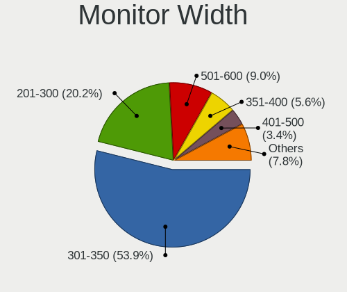

| Width in mm | Notebooks | Percent |
|-------------|-----------|---------|
| 301-350     | 62        | 51.67%  |
| 201-300     | 27        | 22.5%   |
| 501-600     | 9         | 7.5%    |
| 401-500     | 5         | 4.17%   |
| 351-400     | 5         | 4.17%   |
| 601-700     | 3         | 2.5%    |
| Unknown     | 3         | 2.5%    |
| 701-800     | 2         | 1.67%   |
| 801-900     | 1         | 0.83%   |
| 1501-2000   | 1         | 0.83%   |
| 101-200     | 1         | 0.83%   |
| 1001-1500   | 1         | 0.83%   |

Aspect Ratio
------------

Proportional relationship between the width and the height

| Ratio   | Notebooks | Percent |
|---------|-----------|---------|
| 16/9    | 85        | 77.98%  |
| 16/10   | 14        | 12.84%  |
| 3/2     | 5         | 4.59%   |
| 21/9    | 3         | 2.75%   |
| 0.62    | 1         | 0.92%   |
| Unknown | 1         | 0.92%   |

Monitor Area
------------

Area in inch

| Area in inch | Notebooks | Percent |
|----------------|-----------|---------|
| 101-110        | 39        | 31.97%  |
| 81-90          | 26        | 21.31%  |
| 71-80          | 14        | 11.48%  |
| 201-250        | 9         | 7.38%   |
| 61-70          | 7         | 5.74%   |
| 351-500        | 6         | 4.92%   |
| 121-130        | 4         | 3.28%   |
| 301-350        | 3         | 2.46%   |
| Unknown        | 3         | 2.46%   |
| More than 1000 | 2         | 1.64%   |
| 41-50          | 2         | 1.64%   |
| 151-200        | 2         | 1.64%   |
| 51-60          | 1         | 0.82%   |
| 1-40           | 1         | 0.82%   |
| 251-300        | 1         | 0.82%   |
| 111-120        | 1         | 0.82%   |
| 91-100         | 1         | 0.82%   |

Pixel Density
-------------

Pixels per inch

| Density       | Notebooks | Percent |
|---------------|-----------|---------|
| 121-160       | 48        | 40.34%  |
| 101-120       | 25        | 21.01%  |
| 161-240       | 16        | 13.45%  |
| 51-100        | 14        | 11.76%  |
| More than 240 | 10        | 8.4%    |
| 1-50          | 3         | 2.52%   |
| Unknown       | 3         | 2.52%   |

Multiple Monitors
-----------------

Total monitors connected

| Total | Notebooks | Percent |
|-------|-----------|---------|
| 1     | 86        | 78.9%   |
| 2     | 18        | 16.51%  |
| 0     | 4         | 3.67%   |
| 3     | 1         | 0.92%   |

Network
-------

Net Controller Vendor
---------------------

Controller vendors

| Vendor                   | Notebooks | Percent |
|--------------------------|-----------|---------|
| Intel                    | 65        | 40.12%  |
| Realtek Semiconductor    | 52        | 32.1%   |
| Qualcomm Atheros         | 17        | 10.49%  |
| Broadcom                 | 9         | 5.56%   |
| Ralink Technology        | 4         | 2.47%   |
| Qualcomm                 | 2         | 1.23%   |
| MEDIATEK                 | 2         | 1.23%   |
| Marvell Technology Group | 2         | 1.23%   |
| Broadcom Limited         | 2         | 1.23%   |
| Xiaomi                   | 1         | 0.62%   |
| SEGGER                   | 1         | 0.62%   |
| Ralink                   | 1         | 0.62%   |
| Lenovo                   | 1         | 0.62%   |
| Fitbit                   | 1         | 0.62%   |
| DisplayLink              | 1         | 0.62%   |
| ASIX Electronics         | 1         | 0.62%   |

Net Controller Model
--------------------

Controller models

| Model                                                                                         | Notebooks | Percent |
|-----------------------------------------------------------------------------------------------|-----------|---------|
| Realtek RTL8111/8168/8411 PCI Express Gigabit Ethernet Controller                             | 26        | 13.13%  |
| Intel Wi-Fi 6 AX200                                                                           | 10        | 5.05%   |
| Realtek RTL810xE PCI Express Fast Ethernet controller                                         | 8         | 4.04%   |
| Realtek RTL8153 Gigabit Ethernet Adapter                                                      | 7         | 3.54%   |
| Intel Wireless 8265 / 8275                                                                    | 6         | 3.03%   |
| Intel 82579LM Gigabit Network Connection (Lewisville)                                         | 6         | 3.03%   |
| Realtek RTL8723BU 802.11b/g/n WLAN Adapter                                                    | 5         | 2.53%   |
| Intel Cannon Point-LP CNVi [Wireless-AC]                                                      | 5         | 2.53%   |
| Realtek RTL8822CE 802.11ac PCIe Wireless Network Adapter                                      | 4         | 2.02%   |
| Intel Wireless 7260                                                                           | 4         | 2.02%   |
| Intel Wi-Fi 6 AX201                                                                           | 4         | 2.02%   |
| Intel Ethernet Connection (4) I219-V                                                          | 4         | 2.02%   |
| Intel Cannon Lake PCH CNVi WiFi                                                               | 4         | 2.02%   |
| Ralink MT7601U Wireless Adapter                                                               | 3         | 1.52%   |
| Qualcomm Atheros QCA9377 802.11ac Wireless Network Adapter                                    | 3         | 1.52%   |
| Qualcomm Atheros AR9285 Wireless Network Adapter (PCI-Express)                                | 3         | 1.52%   |
| Intel Wireless 8260                                                                           | 3         | 1.52%   |
| Intel Wireless 7265                                                                           | 3         | 1.52%   |
| Intel Comet Lake PCH-LP CNVi WiFi                                                             | 3         | 1.52%   |
| Intel Comet Lake PCH CNVi WiFi                                                                | 3         | 1.52%   |
| Intel Centrino Advanced-N 6205 [Taylor Peak]                                                  | 3         | 1.52%   |
| Intel Centrino Advanced-N 6200                                                                | 3         | 1.52%   |
| Intel 82579V Gigabit Network Connection                                                       | 3         | 1.52%   |
| Intel 82577LM Gigabit Network Connection                                                      | 3         | 1.52%   |
| Broadcom BCM43142 802.11b/g/n                                                                 | 3         | 1.52%   |
| Realtek RTL8821CE 802.11ac PCIe Wireless Network Adapter                                      | 2         | 1.01%   |
| Realtek RTL8191SEvA Wireless LAN Controller                                                   | 2         | 1.01%   |
| Realtek RTL8188EUS 802.11n Wireless Network Adapter                                           | 2         | 1.01%   |
| Qualcomm QCA6390 Wireless Network Adapter                                                     | 2         | 1.01%   |
| Qualcomm Atheros QCA6174 802.11ac Wireless Network Adapter                                    | 2         | 1.01%   |
| Qualcomm Atheros AR9462 Wireless Network Adapter                                              | 2         | 1.01%   |
| MEDIATEK MT7921 802.11ax PCI Express Wireless Network Adapter                                 | 2         | 1.01%   |
| Intel Ice Lake-LP PCH CNVi WiFi                                                               | 2         | 1.01%   |
| Broadcom BCM4350 802.11ac Wireless Network Adapter                                            | 2         | 1.01%   |
| Xiaomi Mi/Redmi series (RNDIS)                                                                | 1         | 0.51%   |
| SEGGER J-Link                                                                                 | 1         | 0.51%   |
| Realtek USB 10/100 LAN                                                                        | 1         | 0.51%   |
| Realtek RTL8852AE 802.11ax PCIe Wireless Network Adapter                                      | 1         | 0.51%   |
| Realtek RTL8723AU 802.11n WLAN Adapter                                                        | 1         | 0.51%   |
| Realtek RTL8152 Fast Ethernet Adapter                                                         | 1         | 0.51%   |
| Realtek Realtek 8812AU/8821AU 802.11ac WLAN Adapter [USB Wireless Dual-Band Adapter 2.4/5Ghz] | 1         | 0.51%   |
| Realtek 802.11n WLAN Adapter                                                                  | 1         | 0.51%   |
| Ralink RT2870/RT3070 Wireless Adapter                                                         | 1         | 0.51%   |
| Ralink RT3090 Wireless 802.11n 1T/1R PCIe                                                     | 1         | 0.51%   |
| Qualcomm Atheros QCA9565 / AR9565 Wireless Network Adapter                                    | 1         | 0.51%   |
| Qualcomm Atheros QCA8172 Fast Ethernet                                                        | 1         | 0.51%   |
| Qualcomm Atheros Killer E2500 Gigabit Ethernet Controller                                     | 1         | 0.51%   |
| Qualcomm Atheros Killer E2400 Gigabit Ethernet Controller                                     | 1         | 0.51%   |
| Qualcomm Atheros AR9485 Wireless Network Adapter                                              | 1         | 0.51%   |
| Qualcomm Atheros AR93xx Wireless Network Adapter                                              | 1         | 0.51%   |
| Qualcomm Atheros AR928X Wireless Network Adapter (PCI-Express)                                | 1         | 0.51%   |
| Qualcomm Atheros AR9287 Wireless Network Adapter (PCI-Express)                                | 1         | 0.51%   |
| Qualcomm Atheros AR8152 v2.0 Fast Ethernet                                                    | 1         | 0.51%   |
| Qualcomm Atheros AR8151 v2.0 Gigabit Ethernet                                                 | 1         | 0.51%   |
| Marvell Group 88E8072 PCI-E Gigabit Ethernet Controller                                       | 1         | 0.51%   |
| Marvell Group 88E8055 PCI-E Gigabit Ethernet Controller                                       | 1         | 0.51%   |
| Lenovo Thinkpad USB LAN                                                                       | 1         | 0.51%   |
| Intel Ultimate N WiFi Link 5300                                                               | 1         | 0.51%   |
| Intel Tiger Lake PCH CNVi WiFi                                                                | 1         | 0.51%   |
| Intel PRO/Wireless 3945ABG [Golan] Network Connection                                         | 1         | 0.51%   |

Wireless Vendor
---------------

Wireless vendors

| Vendor                | Notebooks | Percent |
|-----------------------|-----------|---------|
| Intel                 | 61        | 54.46%  |
| Realtek Semiconductor | 18        | 16.07%  |
| Qualcomm Atheros      | 15        | 13.39%  |
| Broadcom              | 8         | 7.14%   |
| Ralink Technology     | 4         | 3.57%   |
| Qualcomm              | 2         | 1.79%   |
| MEDIATEK              | 2         | 1.79%   |
| Ralink                | 1         | 0.89%   |
| Broadcom Limited      | 1         | 0.89%   |

Wireless Model
--------------

Wireless models

| Model                                                                                         | Notebooks | Percent |
|-----------------------------------------------------------------------------------------------|-----------|---------|
| Intel Wi-Fi 6 AX200                                                                           | 10        | 8.85%   |
| Intel Wireless 8265 / 8275                                                                    | 6         | 5.31%   |
| Realtek RTL8723BU 802.11b/g/n WLAN Adapter                                                    | 5         | 4.42%   |
| Intel Cannon Point-LP CNVi [Wireless-AC]                                                      | 5         | 4.42%   |
| Realtek RTL8822CE 802.11ac PCIe Wireless Network Adapter                                      | 4         | 3.54%   |
| Intel Wireless 7260                                                                           | 4         | 3.54%   |
| Intel Wi-Fi 6 AX201                                                                           | 4         | 3.54%   |
| Intel Cannon Lake PCH CNVi WiFi                                                               | 4         | 3.54%   |
| Ralink MT7601U Wireless Adapter                                                               | 3         | 2.65%   |
| Qualcomm Atheros QCA9377 802.11ac Wireless Network Adapter                                    | 3         | 2.65%   |
| Qualcomm Atheros AR9285 Wireless Network Adapter (PCI-Express)                                | 3         | 2.65%   |
| Intel Wireless 8260                                                                           | 3         | 2.65%   |
| Intel Wireless 7265                                                                           | 3         | 2.65%   |
| Intel Comet Lake PCH-LP CNVi WiFi                                                             | 3         | 2.65%   |
| Intel Comet Lake PCH CNVi WiFi                                                                | 3         | 2.65%   |
| Intel Centrino Advanced-N 6205 [Taylor Peak]                                                  | 3         | 2.65%   |
| Intel Centrino Advanced-N 6200                                                                | 3         | 2.65%   |
| Broadcom BCM43142 802.11b/g/n                                                                 | 3         | 2.65%   |
| Realtek RTL8821CE 802.11ac PCIe Wireless Network Adapter                                      | 2         | 1.77%   |
| Realtek RTL8191SEvA Wireless LAN Controller                                                   | 2         | 1.77%   |
| Realtek RTL8188EUS 802.11n Wireless Network Adapter                                           | 2         | 1.77%   |
| Qualcomm QCA6390 Wireless Network Adapter                                                     | 2         | 1.77%   |
| Qualcomm Atheros QCA6174 802.11ac Wireless Network Adapter                                    | 2         | 1.77%   |
| Qualcomm Atheros AR9462 Wireless Network Adapter                                              | 2         | 1.77%   |
| MEDIATEK MT7921 802.11ax PCI Express Wireless Network Adapter                                 | 2         | 1.77%   |
| Intel Ice Lake-LP PCH CNVi WiFi                                                               | 2         | 1.77%   |
| Broadcom BCM4350 802.11ac Wireless Network Adapter                                            | 2         | 1.77%   |
| Realtek RTL8852AE 802.11ax PCIe Wireless Network Adapter                                      | 1         | 0.88%   |
| Realtek RTL8723AU 802.11n WLAN Adapter                                                        | 1         | 0.88%   |
| Realtek Realtek 8812AU/8821AU 802.11ac WLAN Adapter [USB Wireless Dual-Band Adapter 2.4/5Ghz] | 1         | 0.88%   |
| Realtek 802.11n WLAN Adapter                                                                  | 1         | 0.88%   |
| Ralink RT2870/RT3070 Wireless Adapter                                                         | 1         | 0.88%   |
| Ralink RT3090 Wireless 802.11n 1T/1R PCIe                                                     | 1         | 0.88%   |
| Qualcomm Atheros QCA9565 / AR9565 Wireless Network Adapter                                    | 1         | 0.88%   |
| Qualcomm Atheros AR9485 Wireless Network Adapter                                              | 1         | 0.88%   |
| Qualcomm Atheros AR93xx Wireless Network Adapter                                              | 1         | 0.88%   |
| Qualcomm Atheros AR928X Wireless Network Adapter (PCI-Express)                                | 1         | 0.88%   |
| Qualcomm Atheros AR9287 Wireless Network Adapter (PCI-Express)                                | 1         | 0.88%   |
| Intel Ultimate N WiFi Link 5300                                                               | 1         | 0.88%   |
| Intel Tiger Lake PCH CNVi WiFi                                                                | 1         | 0.88%   |
| Intel PRO/Wireless 3945ABG [Golan] Network Connection                                         | 1         | 0.88%   |
| Intel Dual Band Wireless-AC 3165 Plus Bluetooth                                               | 1         | 0.88%   |
| Intel Centrino Wireless-N 2200                                                                | 1         | 0.88%   |
| Intel Centrino Wireless-N 1000 [Condor Peak]                                                  | 1         | 0.88%   |
| Intel Centrino Advanced-N 6230 [Rainbow Peak]                                                 | 1         | 0.88%   |
| Intel Alder Lake-P PCH CNVi WiFi                                                              | 1         | 0.88%   |
| Broadcom Limited BCM4352 802.11ac Wireless Network Adapter                                    | 1         | 0.88%   |
| Broadcom BCM43224 802.11a/b/g/n                                                               | 1         | 0.88%   |
| Broadcom BCM4322 802.11a/b/g/n Wireless LAN Controller                                        | 1         | 0.88%   |
| Broadcom BCM4312 802.11b/g LP-PHY                                                             | 1         | 0.88%   |

Ethernet Vendor
---------------

Ethernet vendors

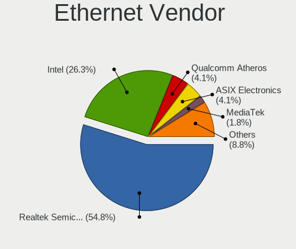

| Vendor                   | Notebooks | Percent |
|--------------------------|-----------|---------|
| Realtek Semiconductor    | 42        | 51.22%  |
| Intel                    | 27        | 32.93%  |
| Qualcomm Atheros         | 5         | 6.1%    |
| Marvell Technology Group | 2         | 2.44%   |
| Xiaomi                   | 1         | 1.22%   |
| Lenovo                   | 1         | 1.22%   |
| DisplayLink              | 1         | 1.22%   |
| Broadcom Limited         | 1         | 1.22%   |
| Broadcom                 | 1         | 1.22%   |
| ASIX Electronics         | 1         | 1.22%   |

Ethernet Model
--------------

Ethernet models

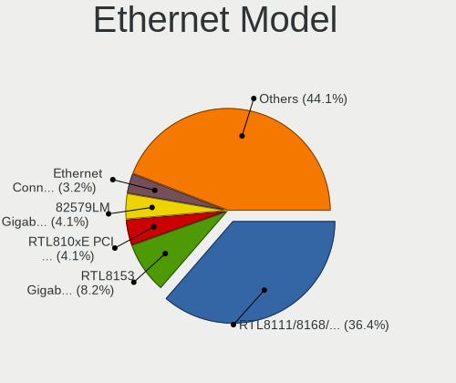

| Model                                                             | Notebooks | Percent |
|-------------------------------------------------------------------|-----------|---------|
| Realtek RTL8111/8168/8411 PCI Express Gigabit Ethernet Controller | 26        | 31.33%  |
| Realtek RTL810xE PCI Express Fast Ethernet controller             | 8         | 9.64%   |
| Realtek RTL8153 Gigabit Ethernet Adapter                          | 7         | 8.43%   |
| Intel 82579LM Gigabit Network Connection (Lewisville)             | 6         | 7.23%   |
| Intel Ethernet Connection (4) I219-V                              | 4         | 4.82%   |
| Intel 82579V Gigabit Network Connection                           | 3         | 3.61%   |
| Intel 82577LM Gigabit Network Connection                          | 3         | 3.61%   |
| Xiaomi Mi/Redmi series (RNDIS)                                    | 1         | 1.2%    |
| Realtek USB 10/100 LAN                                            | 1         | 1.2%    |
| Realtek RTL8152 Fast Ethernet Adapter                             | 1         | 1.2%    |
| Qualcomm Atheros QCA8172 Fast Ethernet                            | 1         | 1.2%    |
| Qualcomm Atheros Killer E2500 Gigabit Ethernet Controller         | 1         | 1.2%    |
| Qualcomm Atheros Killer E2400 Gigabit Ethernet Controller         | 1         | 1.2%    |
| Qualcomm Atheros AR8152 v2.0 Fast Ethernet                        | 1         | 1.2%    |
| Qualcomm Atheros AR8151 v2.0 Gigabit Ethernet                     | 1         | 1.2%    |
| Marvell Group 88E8072 PCI-E Gigabit Ethernet Controller           | 1         | 1.2%    |
| Marvell Group 88E8055 PCI-E Gigabit Ethernet Controller           | 1         | 1.2%    |
| Lenovo Thinkpad USB LAN                                           | 1         | 1.2%    |
| Intel Ethernet Connection I219-LM                                 | 1         | 1.2%    |
| Intel Ethernet Connection I218-LM                                 | 1         | 1.2%    |
| Intel Ethernet Connection I217-LM                                 | 1         | 1.2%    |
| Intel Ethernet Connection (6) I219-V                              | 1         | 1.2%    |
| Intel Ethernet Connection (5) I219-LM                             | 1         | 1.2%    |
| Intel Ethernet Connection (11) I219-V                             | 1         | 1.2%    |
| Intel Ethernet Connection (11) I219-LM                            | 1         | 1.2%    |
| Intel Ethernet Connection (10) I219-V                             | 1         | 1.2%    |
| Intel Ethernet Connection (10) I219-LM                            | 1         | 1.2%    |
| Intel 82567LM Gigabit Network Connection                          | 1         | 1.2%    |
| Intel 82566MM Gigabit Network Connection                          | 1         | 1.2%    |
| DisplayLink GIQ Triple-display Mini Docking station               | 1         | 1.2%    |
| Broadcom NetXtreme BCM5764M Gigabit Ethernet PCIe                 | 1         | 1.2%    |
| Broadcom Limited NetLink BCM5906M Fast Ethernet PCI Express       | 1         | 1.2%    |
| ASIX AX88179 Gigabit Ethernet                                     | 1         | 1.2%    |

Net Controller Kind
-------------------

Ethernet, WiFi or modem

| Kind     | Notebooks | Percent |
|----------|-----------|---------|
| WiFi     | 107       | 56.91%  |
| Ethernet | 79        | 42.02%  |
| Modem    | 2         | 1.06%   |

Used Controller
---------------

Currently used network controller

| Kind     | Notebooks | Percent |
|----------|-----------|---------|
| WiFi     | 94        | 69.63%  |
| Ethernet | 41        | 30.37%  |

NICs
----

Total network controllers on board

| Total | Notebooks | Percent |
|-------|-----------|---------|
| 2     | 67        | 62.04%  |
| 1     | 35        | 32.41%  |
| 0     | 6         | 5.56%   |

IPv6
----

IPv6 vs IPv4

| Used | Notebooks | Percent |
|------|-----------|---------|
| No   | 108       | 100%    |

Bluetooth
---------

Bluetooth Vendor
----------------

Controller vendors

| Vendor                          | Notebooks | Percent |
|---------------------------------|-----------|---------|
| Intel                           | 47        | 56.63%  |
| Foxconn / Hon Hai               | 5         | 6.02%   |
| Broadcom                        | 5         | 6.02%   |
| Lite-On Technology              | 4         | 4.82%   |
| Realtek Semiconductor           | 3         | 3.61%   |
| Realtek                         | 3         | 3.61%   |
| Qualcomm Atheros Communications | 3         | 3.61%   |
| Hewlett-Packard                 | 3         | 3.61%   |
| Foxconn International           | 2         | 2.41%   |
| Dell                            | 2         | 2.41%   |
| Apple                           | 2         | 2.41%   |
| Taiyo Yuden                     | 1         | 1.2%    |
| IMC Networks                    | 1         | 1.2%    |
| Fujitsu                         | 1         | 1.2%    |
| Askey Computer                  | 1         | 1.2%    |

Bluetooth Model
---------------

Controller models

| Model                                             | Notebooks | Percent |
|---------------------------------------------------|-----------|---------|
| Intel Bluetooth wireless interface                | 14        | 16.87%  |
| Intel AX201 Bluetooth                             | 11        | 13.25%  |
| Intel Bluetooth 9460/9560 Jefferson Peak (JfP)    | 10        | 12.05%  |
| Intel AX200 Bluetooth                             | 10        | 12.05%  |
| Realtek Bluetooth Radio                           | 3         | 3.61%   |
| Realtek Bluetooth Radio                           | 3         | 3.61%   |
| Broadcom BCM20702 Bluetooth 4.0 [ThinkPad]        | 3         | 3.61%   |
| Lite-On Qualcomm Atheros QCA9377 Bluetooth        | 2         | 2.41%   |
| Intel Bluetooth Device                            | 2         | 2.41%   |
| HP Broadcom 2070 Bluetooth Combo                  | 2         | 2.41%   |
| Foxconn International BCM43142A0 Bluetooth module | 2         | 2.41%   |
| Foxconn / Hon Hai Bluetooth Device                | 2         | 2.41%   |
| Taiyo Yuden Bluetooth Device (V2.1+EDR)           | 1         | 1.2%    |
| Qualcomm Atheros  Bluetooth Device                | 1         | 1.2%    |
| Qualcomm Atheros QCA61x4 Bluetooth 4.0            | 1         | 1.2%    |
| Qualcomm Atheros AR3011 Bluetooth                 | 1         | 1.2%    |
| Lite-On Bluetooth Radio                           | 1         | 1.2%    |
| Lite-On Bluetooth Device                          | 1         | 1.2%    |
| IMC Networks Wireless_Device                      | 1         | 1.2%    |
| HP Bluetooth 2.0 Interface [Broadcom BCM2045]     | 1         | 1.2%    |
| Fujitsu Bluetooth Device                          | 1         | 1.2%    |
| Foxconn / Hon Hai Wireless_Device                 | 1         | 1.2%    |
| Foxconn / Hon Hai Broadcom Bluetooth 2.1 Device   | 1         | 1.2%    |
| Foxconn / Hon Hai BCM20702A0                      | 1         | 1.2%    |
| Dell DW375 Bluetooth Module                       | 1         | 1.2%    |
| Dell Broadcom BCM20702A0 Bluetooth                | 1         | 1.2%    |
| Broadcom BCM43142A0 Bluetooth 4.0                 | 1         | 1.2%    |
| Broadcom BCM2045A0                                | 1         | 1.2%    |
| Askey Bluetooth Device                            | 1         | 1.2%    |
| Apple Built-in Bluetooth 2.0+EDR HCI              | 1         | 1.2%    |
| Apple Bluetooth Host Controller                   | 1         | 1.2%    |

Sound
-----

Sound Vendor
------------

Sound card vendors

| Vendor                      | Notebooks | Percent |
|-----------------------------|-----------|---------|
| Intel                       | 91        | 70%     |
| Nvidia                      | 18        | 13.85%  |
| AMD                         | 16        | 12.31%  |
| Generalplus Technology      | 2         | 1.54%   |
| Logitech                    | 1         | 0.77%   |
| FiiO Electronics Technology | 1         | 0.77%   |
| BY EDIFIER                  | 1         | 0.77%   |

Sound Model
-----------

Sound card models

| Model                                                                      | Notebooks | Percent |
|----------------------------------------------------------------------------|-----------|---------|
| Intel Sunrise Point-LP HD Audio                                            | 17        | 11.33%  |
| AMD Family 17h/19h HD Audio Controller                                     | 14        | 9.33%   |
| Intel 6 Series/C200 Series Chipset Family High Definition Audio Controller | 11        | 7.33%   |
| Intel 7 Series/C216 Chipset Family High Definition Audio Controller        | 8         | 5.33%   |
| AMD Renoir Radeon High Definition Audio Controller                         | 8         | 5.33%   |
| Intel Tiger Lake-LP Smart Sound Technology Audio Controller                | 7         | 4.67%   |
| Intel Celeron N3350/Pentium N4200/Atom E3900 Series Audio Cluster          | 5         | 3.33%   |
| Nvidia TU107 GeForce GTX 1650 High Definition Audio Controller             | 4         | 2.67%   |
| Intel Xeon E3-1200 v3/4th Gen Core Processor HD Audio Controller           | 4         | 2.67%   |
| Intel Cannon Point-LP High Definition Audio Controller                     | 4         | 2.67%   |
| Intel Cannon Lake PCH cAVS                                                 | 4         | 2.67%   |
| Intel 8 Series/C220 Series Chipset High Definition Audio Controller        | 4         | 2.67%   |
| Intel 5 Series/3400 Series Chipset High Definition Audio                   | 4         | 2.67%   |
| Nvidia Audio device                                                        | 3         | 2%      |
| Intel Ice Lake-LP Smart Sound Technology Audio Controller                  | 3         | 2%      |
| Intel Haswell-ULT HD Audio Controller                                      | 3         | 2%      |
| Intel Comet Lake PCH-LP cAVS                                               | 3         | 2%      |
| Intel Comet Lake PCH cAVS                                                  | 3         | 2%      |
| Intel 82801I (ICH9 Family) HD Audio Controller                             | 3         | 2%      |
| Intel 8 Series HD Audio Controller                                         | 3         | 2%      |
| AMD Raven/Raven2/Fenghuang HDMI/DP Audio Controller                        | 3         | 2%      |
| Nvidia TU116 High Definition Audio Controller                              | 2         | 1.33%   |
| Nvidia GA104 High Definition Audio Controller                              | 2         | 1.33%   |
| Intel Wildcat Point-LP High Definition Audio Controller                    | 2         | 1.33%   |
| Intel CM238 HD Audio Controller                                            | 2         | 1.33%   |
| Intel Celeron/Pentium Silver Processor High Definition Audio               | 2         | 1.33%   |
| Intel Broadwell-U Audio Controller                                         | 2         | 1.33%   |
| Intel 82801H (ICH8 Family) HD Audio Controller                             | 2         | 1.33%   |
| Generalplus Technology Usb Audio Device                                    | 2         | 1.33%   |
| Nvidia TU106 High Definition Audio Controller                              | 1         | 0.67%   |
| Nvidia MCP89 High Definition Audio                                         | 1         | 0.67%   |
| Nvidia GP107GL High Definition Audio Controller                            | 1         | 0.67%   |
| Nvidia GP106 High Definition Audio Controller                              | 1         | 0.67%   |
| Nvidia GP104 High Definition Audio Controller                              | 1         | 0.67%   |
| Nvidia GM206 High Definition Audio Controller                              | 1         | 0.67%   |
| Nvidia GK107 HDMI Audio Controller                                         | 1         | 0.67%   |
| Logitech USB Headset H540                                                  | 1         | 0.67%   |
| Intel Tiger Lake-H HD Audio Controller                                     | 1         | 0.67%   |
| Intel NM10/ICH7 Family High Definition Audio Controller                    | 1         | 0.67%   |
| Intel Atom Processor Z36xxx/Z37xxx Series High Definition Audio Controller | 1         | 0.67%   |
| Intel Alder Lake PCH-P High Definition Audio Controller                    | 1         | 0.67%   |
| FiiO Electronics Technology Exynos                                         | 1         | 0.67%   |
| BY EDIFIER EDIFIER G2 II GAMING HEADSET                                    | 1         | 0.67%   |
| AMD Starship/Matisse HD Audio Controller                                   | 1         | 0.67%   |
| AMD Baffin HDMI/DP Audio [Radeon RX 550 640SP / RX 560/560X]               | 1         | 0.67%   |

Memory
------

Memory Vendor
-------------

Memory module vendors

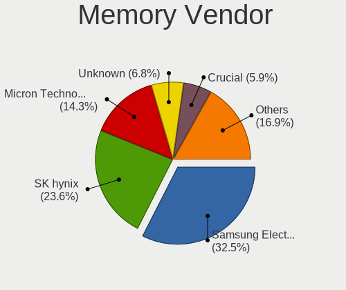

| Vendor              | Notebooks | Percent |
|---------------------|-----------|---------|
| SK Hynix            | 23        | 35.38%  |
| Samsung Electronics | 18        | 27.69%  |
| Micron Technology   | 9         | 13.85%  |
| Kingston            | 4         | 6.15%   |
| Unknown             | 3         | 4.62%   |
| Unknown (ABCD)      | 2         | 3.08%   |
| A-DATA Technology   | 2         | 3.08%   |
| Team                | 1         | 1.54%   |
| Kingmax             | 1         | 1.54%   |
| Crucial             | 1         | 1.54%   |
| Unknown             | 1         | 1.54%   |

Memory Model
------------

Memory module models

| Model                                                               | Notebooks | Percent |
|---------------------------------------------------------------------|-----------|---------|
| SK Hynix RAM HMA81GS6CJR8N-VK 8GB SODIMM DDR4 2667MT/s              | 4         | 5.88%   |
| Unknown (ABCD) RAM 123456789012345678 8GB DIMM DDR4 2400MT/s        | 2         | 2.94%   |
| SK Hynix RAM Module 4GB SODIMM DDR4 2400MT/s                        | 2         | 2.94%   |
| SK Hynix RAM HMT41GS6BFR8A-PB 8GB SODIMM DDR3 1600MT/s              | 2         | 2.94%   |
| SK Hynix RAM HMA851S6CJR6N-VK 4GB Row Of Chips DDR4 2667MT/s        | 2         | 2.94%   |
| Samsung RAM M471B1G73BH0-YK0 8192MB SODIMM DDR3 1600MT/s            | 2         | 2.94%   |
| Samsung RAM M471A4G43MB1-CTD 32GB SODIMM DDR4 2667MT/s              | 2         | 2.94%   |
| Samsung RAM M471A4G43AB1-CWE 32GB SODIMM DDR4 3200MT/s              | 2         | 2.94%   |
| Unknown RAM Module 4GB Row Of Chips LPDDR4 4267MT/s                 | 1         | 1.47%   |
| Unknown RAM Module 2GB SODIMM DDR2 667MT/s                          | 1         | 1.47%   |
| Unknown RAM Module 1024MB SODIMM DDR2 533MT/s                       | 1         | 1.47%   |
| Team RAM TEAMGROUP-SD4-2666 16GB SODIMM DDR4 2667MT/s               | 1         | 1.47%   |
| SK Hynix RAM Module 8GB Row Of Chips LPDDR3 2133MT/s                | 1         | 1.47%   |
| SK Hynix RAM HMT451S6BFR8A-PB 4GB SODIMM DDR3 1600MT/s              | 1         | 1.47%   |
| SK Hynix RAM HMT41GS6MFR8C-PB 8192MB SODIMM DDR3 1600MT/s           | 1         | 1.47%   |
| SK Hynix RAM HMT351S6EFR8A-PB 4GB SODIMM DDR3 1600MT/s              | 1         | 1.47%   |
| SK Hynix RAM HMAA4GS7AJR8N-WM 32GB SODIMM DDR4 2933MT/s             | 1         | 1.47%   |
| SK Hynix RAM HMAA1GS6CJR6N-XN 8GB Row Of Chips DDR4 3200MT/s        | 1         | 1.47%   |
| SK Hynix RAM HMA82GS7AFR8N-UH 16384MB SODIMM DDR4 2400MT/s          | 1         | 1.47%   |
| SK Hynix RAM HMA82GS6CJR8N-VK 16GB SODIMM DDR4 2667MT/s             | 1         | 1.47%   |
| SK Hynix RAM HMA82GS6AFR8N-UH 16384MB SODIMM DDR4 2667MT/s          | 1         | 1.47%   |
| SK Hynix RAM HMA81GS6DJR8N-XN 8GB SODIMM DDR4 3200MT/s              | 1         | 1.47%   |
| SK Hynix RAM H9CCNNNCLGALAR-NVD 8192MB Row Of Chips LPDDR3 2133MT/s | 1         | 1.47%   |
| SK Hynix RAM H9CCNNNBJTALAR-NVD 4GB Row Of Chips LPDDR3 2133MT/s    | 1         | 1.47%   |
| SK Hynix RAM H9CCNNNBJTALAR-NUD 4096MB 1867MT/s                     | 1         | 1.47%   |
| SK Hynix RAM D471A1K43CB1-CTD 8GB SODIMM DDR4 2400MT/s              | 1         | 1.47%   |
| Samsung RAM Module 8192MB Row Of Chips LPDDR4 3733MT/s              | 1         | 1.47%   |
| Samsung RAM Module 8192MB Row Of Chips LPDDR3 1600MT/s              | 1         | 1.47%   |
| Samsung RAM Module 2GB Row Of Chips LPDDR4 4267MT/s                 | 1         | 1.47%   |
| Samsung RAM Module 2GB Row Of Chips LPDDR3 1867MT/s                 | 1         | 1.47%   |
| Samsung RAM M471B5773DH0-CK0 2GB SODIMM DDR3 1600MT/s               | 1         | 1.47%   |
| Samsung RAM M471B5273DH0-CK0 4GB SODIMM DDR3 1600MT/s               | 1         | 1.47%   |
| Samsung RAM M471B5173QH0-YK0 4GB SODIMM DDR3 1600MT/s               | 1         | 1.47%   |
| Samsung RAM M471B1G73EB0-YK0 8192MB SODIMM DDR3 1600MT/s            | 1         | 1.47%   |
| Samsung RAM M471A5244CB0-CRC 4096MB SODIMM DDR4 2667MT/s            | 1         | 1.47%   |
| Samsung RAM M471A1K43EB1-CWE 8192MB SODIMM DDR4 3200MT/s            | 1         | 1.47%   |
| Samsung RAM M471A1K43DB1-CWE 8GB SODIMM DDR4 3200MT/s               | 1         | 1.47%   |
| Samsung RAM M471A1G44AB0-CTD 8GB Row Of Chips DDR4 2667MT/s         | 1         | 1.47%   |
| Samsung RAM M425R1GB4BB0-CQKOD 8GB SODIMM 4800MT/s                  | 1         | 1.47%   |
| Samsung RAM K4EBE304EB-EGCF 8GB Row Of Chips LPDDR3 1867MT/s        | 1         | 1.47%   |
| Micron RAM Module 4GB SODIMM LPDDR3 1867MT/s                        | 1         | 1.47%   |
| Micron RAM Module 4096MB SODIMM DDR3 1600MT/s                       | 1         | 1.47%   |
| Micron RAM 8KTF51264HDZ-1G9E1 4GB SODIMM DDR3 1600MT/s              | 1         | 1.47%   |
| Micron RAM 8JTF25664JHZ-1G6M2 2048MB SODIMM DDR3 1600MT/s           | 1         | 1.47%   |
| Micron RAM 8ATF2G64HZ-3G2E1 16384MB SODIMM DDR4 3200MT/s            | 1         | 1.47%   |
| Micron RAM 8ATF1G64HZ-3G2J1 8192MB SODIMM DDR4 3200MT/s             | 1         | 1.47%   |
| Micron RAM 4ATF51264HZ-2G6E! 4096MB SODIMM DDR4 2400MT/s            | 1         | 1.47%   |
| Micron RAM 4ATF1G64HZ-3G2E2 8GB SODIMM DDR4 3200MT/s                | 1         | 1.47%   |
| Micron RAM 16KTF1G64HZ-1G6E1 8GB SODIMM DDR3 1600MT/s               | 1         | 1.47%   |
| Kingston RAM 99U5428-040.A01LF 4096MB SODIMM DDR3 1334MT/s          | 1         | 1.47%   |
| Kingston RAM 9905700-047.A00G 16384MB SODIMM DDR4 2667MT/s          | 1         | 1.47%   |
| Kingston RAM 9905428-186.A00LF 8192MB SODIMM DDR3 1600MT/s          | 1         | 1.47%   |
| Kingston RAM 9905295-051.A00LF 2048MB SODIMM DDR 975MT/s            | 1         | 1.47%   |
| Kingmax RAM FSFF65F-C8MF9 4GB SODIMM 667MT/s                        | 1         | 1.47%   |
| Crucial RAM CT4G4SFS824A.C8FBR2 4GB SODIMM DDR4 2133MT/s            | 1         | 1.47%   |
| A-DATA RAM Module 8192MB SODIMM DDR3 1600MT/s                       | 1         | 1.47%   |
| A-DATA RAM Module 32GB SODIMM DDR4 3200MT/s                         | 1         | 1.47%   |
| Unknown                                                             | 1         | 1.47%   |

Memory Kind
-----------

Memory module kinds

| Kind    | Notebooks | Percent |
|---------|-----------|---------|
| DDR4    | 25        | 44.64%  |
| DDR3    | 13        | 23.21%  |
| LPDDR3  | 7         | 12.5%   |
| LPDDR4  | 5         | 8.93%   |
| DDR2    | 3         | 5.36%   |
| Unknown | 3         | 5.36%   |

Memory Form Factor
------------------

Physical design of the memory module

| Name         | Notebooks | Percent |
|--------------|-----------|---------|
| SODIMM       | 39        | 70.91%  |
| Row Of Chips | 13        | 23.64%  |
| DIMM         | 2         | 3.64%   |
| Unknown      | 1         | 1.82%   |

Memory Size
-----------

Memory module size

| Size  | Notebooks | Percent |
|-------|-----------|---------|
| 8192  | 24        | 40%     |
| 4096  | 17        | 28.33%  |
| 32768 | 6         | 10%     |
| 2048  | 6         | 10%     |
| 16384 | 5         | 8.33%   |
| 1024  | 2         | 3.33%   |

Memory Speed
------------

Memory module speed

| Speed | Notebooks | Percent |
|-------|-----------|---------|
| 1600  | 13        | 22.41%  |
| 2667  | 12        | 20.69%  |
| 3200  | 9         | 15.52%  |
| 2400  | 6         | 10.34%  |
| 2133  | 4         | 6.9%    |
| 1867  | 4         | 6.9%    |
| 4267  | 2         | 3.45%   |
| 667   | 2         | 3.45%   |
| 4800  | 1         | 1.72%   |
| 3733  | 1         | 1.72%   |
| 2933  | 1         | 1.72%   |
| 1334  | 1         | 1.72%   |
| 975   | 1         | 1.72%   |
| 533   | 1         | 1.72%   |

Printers & scanners
-------------------

Printer Vendor
--------------

Printer device vendors

Zero info for selected period =(

Printer Model
-------------

Printer device models

Zero info for selected period =(

Scanner Vendor
--------------

Scanner device vendors

Zero info for selected period =(

Scanner Model
-------------

Scanner device models

Zero info for selected period =(

Camera
------

Camera Vendor
-------------

Camera device vendors

| Vendor                                 | Notebooks | Percent |
|----------------------------------------|-----------|---------|
| Chicony Electronics                    | 21        | 23.6%   |
| IMC Networks                           | 10        | 11.24%  |
| Acer                                   | 10        | 11.24%  |
| Microdia                               | 7         | 7.87%   |
| Realtek Semiconductor                  | 5         | 5.62%   |
| Cheng Uei Precision Industry (Foxlink) | 4         | 4.49%   |
| Syntek                                 | 3         | 3.37%   |
| Sunplus Innovation Technology          | 3         | 3.37%   |
| Apple                                  | 3         | 3.37%   |
| Alcor Micro                            | 3         | 3.37%   |
| Suyin                                  | 2         | 2.25%   |
| Silicon Motion                         | 2         | 2.25%   |
| Quanta                                 | 2         | 2.25%   |
| Luxvisions Innotech Limited            | 2         | 2.25%   |
| Importek                               | 2         | 2.25%   |
| WaveRider Communications               | 1         | 1.12%   |
| Ricoh                                  | 1         | 1.12%   |
| Primax Electronics                     | 1         | 1.12%   |
| Nebraska Furniture Mart                | 1         | 1.12%   |
| Microsoft                              | 1         | 1.12%   |
| Logitech                               | 1         | 1.12%   |
| Lite-On Technology                     | 1         | 1.12%   |
| lihappe8                               | 1         | 1.12%   |
| Genesys Logic                          | 1         | 1.12%   |
| 8SSC20F27114V1GZ07N14V2                | 1         | 1.12%   |

Camera Model
------------

Camera device models

| Model                                                           | Notebooks | Percent |
|-----------------------------------------------------------------|-----------|---------|
| Microdia Integrated_Webcam_HD                                   | 5         | 5.56%   |
| Chicony FJ Camera                                               | 5         | 5.56%   |
| IMC Networks USB2.0 HD UVC WebCam                               | 4         | 4.44%   |
| Syntek Integrated Camera                                        | 3         | 3.33%   |
| IMC Networks Integrated Camera                                  | 3         | 3.33%   |
| Chicony Integrated Camera                                       | 3         | 3.33%   |
| Chicony HD WebCam                                               | 3         | 3.33%   |
| Alcor Micro USB 2.0 Camera                                      | 3         | 3.33%   |
| Realtek Integrated_Webcam_HD                                    | 2         | 2.22%   |
| Importek FJ Camera                                              | 2         | 2.22%   |
| Acer SunplusIT Integrated Camera                                | 2         | 2.22%   |
| Acer Lenovo EasyCamera                                          | 2         | 2.22%   |
| Acer Integrated Camera                                          | 2         | 2.22%   |
| WaveRider USB 2.0 Camera                                        | 1         | 1.11%   |
| Suyin HP TrueVision HD Integrated Webcam                        | 1         | 1.11%   |
| Suyin HP Truevision HD                                          | 1         | 1.11%   |
| Sunplus MTD Camera                                              | 1         | 1.11%   |
| Sunplus HP Universal Camera                                     | 1         | 1.11%   |
| Sunplus HD WebCam                                               | 1         | 1.11%   |
| Silicon Motion 720p HD Camera                                   | 1         | 1.11%   |
| Silicon Motion 300k Pixel Camera                                | 1         | 1.11%   |
| Ricoh USB2.0 Camera                                             | 1         | 1.11%   |
| Realtek WebCamera                                               | 1         | 1.11%   |
| Realtek Integrated Webcam_HD                                    | 1         | 1.11%   |
| Realtek EasyCamera                                              | 1         | 1.11%   |
| Quanta USB Webcam                                               | 1         | 1.11%   |
| Quanta hm1091_techfront                                         | 1         | 1.11%   |
| Primax Dell Laptop Integrated Webcam 2Mpix                      | 1         | 1.11%   |
| Nebraska Furniture Mart USB 2.0 PC cam                          | 1         | 1.11%   |
| Microsoft LifeCam Cinema                                        | 1         | 1.11%   |
| Microdia Laptop_Integrated_Webcam_0.3M                          | 1         | 1.11%   |
| Microdia Dell Integrated HD Webcam                              | 1         | 1.11%   |
| Luxvisions Innotech Limited HP TrueVision HD Camera             | 1         | 1.11%   |
| Luxvisions Innotech Limited HP HD Camera                        | 1         | 1.11%   |
| Logitech Fujitsu Webcam                                         | 1         | 1.11%   |
| Lite-On Integrated Camera                                       | 1         | 1.11%   |
| lihappe8 USB 2.0 Camera                                         | 1         | 1.11%   |
| IMC Networks USB2.0 VGA UVC WebCam                              | 1         | 1.11%   |
| IMC Networks Lenovo EasyCamera                                  | 1         | 1.11%   |
| IMC Networks HD Camera                                          | 1         | 1.11%   |
| Genesys Logic Camera                                            | 1         | 1.11%   |
| Chicony VGA WebCam                                              | 1         | 1.11%   |
| Chicony USB2.0 VGA UVC WebCam                                   | 1         | 1.11%   |
| Chicony USB 2.0 Webcam Device                                   | 1         | 1.11%   |
| Chicony Lenovo Integrated Camera (0.3MP)                        | 1         | 1.11%   |
| Chicony Lenovo EasyCamera                                       | 1         | 1.11%   |
| Chicony Integrated Camera [ThinkPad]                            | 1         | 1.11%   |
| Chicony Integrated Camera (1280x720@30)                         | 1         | 1.11%   |
| Chicony HP Webcam [2 MP Macro]                                  | 1         | 1.11%   |
| Chicony Fujitsu Integrated Camera                               | 1         | 1.11%   |
| Chicony CNF8031                                                 | 1         | 1.11%   |
| Cheng Uei Precision Industry (Foxlink) XiaoMi Webcam            | 1         | 1.11%   |
| Cheng Uei Precision Industry (Foxlink) HP Wide Vision HD Camera | 1         | 1.11%   |
| Cheng Uei Precision Industry (Foxlink) HP HD Camera             | 1         | 1.11%   |
| Cheng Uei Precision Industry (Foxlink) HD Camera                | 1         | 1.11%   |
| Apple iPhone 5/5C/5S/6/SE                                       | 1         | 1.11%   |
| Apple FaceTime HD Camera (Built-in)                             | 1         | 1.11%   |
| Apple Built-in iSight                                           | 1         | 1.11%   |
| Acer USB HD Webcam                                              | 1         | 1.11%   |
| Acer Lenovo Integrated Webcam                                   | 1         | 1.11%   |

Security
--------

Fingerprint Vendor
------------------

Fingerprint sensor vendors

| Vendor                     | Notebooks | Percent |
|----------------------------|-----------|---------|
| Synaptics                  | 7         | 33.33%  |
| Shenzhen Goodix Technology | 5         | 23.81%  |
| Validity Sensors           | 3         | 14.29%  |
| Upek                       | 2         | 9.52%   |
| AuthenTec                  | 2         | 9.52%   |
| Samsung Electronics        | 1         | 4.76%   |
| LighTuning Technology      | 1         | 4.76%   |

Fingerprint Model
-----------------

Fingerprint sensor models

| Model                                                  | Notebooks | Percent |
|--------------------------------------------------------|-----------|---------|
| Synaptics Prometheus MIS Touch Fingerprint Reader      | 3         | 14.29%  |
| Synaptics Metallica MIS Touch Fingerprint Reader       | 3         | 14.29%  |
| Upek Biometric Touchchip/Touchstrip Fingerprint Sensor | 2         | 9.52%   |
| Shenzhen Goodix Fingerprint Reader                     | 2         | 9.52%   |
| Shenzhen Goodix FingerPrint                            | 2         | 9.52%   |
| AuthenTec Fingerprint Sensor                           | 2         | 9.52%   |
| Validity Sensors VFS451 Fingerprint Reader             | 1         | 4.76%   |
| Validity Sensors Synaptics WBDI                        | 1         | 4.76%   |
| Validity Sensors Swipe Fingerprint Sensor              | 1         | 4.76%   |
| Shenzhen Goodix  Fingerprint Device                    | 1         | 4.76%   |
| Samsung Fingerprint Device                             | 1         | 4.76%   |
| LighTuning EgisTec Touch Fingerprint Sensor            | 1         | 4.76%   |
| Unknown                                                | 1         | 4.76%   |

Chipcard Vendor
---------------

Chipcard module vendors

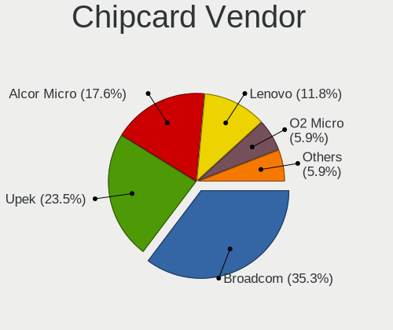

| Vendor      | Notebooks | Percent |
|-------------|-----------|---------|
| Broadcom    | 4         | 40%     |
| Upek        | 2         | 20%     |
| Lenovo      | 2         | 20%     |
| O2 Micro    | 1         | 10%     |
| Alcor Micro | 1         | 10%     |

Chipcard Model
--------------

Chipcard module models

| Model                                                                        | Notebooks | Percent |
|------------------------------------------------------------------------------|-----------|---------|
| Upek TouchChip Fingerprint Coprocessor (WBF advanced mode)                   | 2         | 20%     |
| Lenovo Integrated Smart Card Reader                                          | 2         | 20%     |
| O2 Micro OZ776 CCID Smartcard Reader                                         | 1         | 10%     |
| Broadcom BCM5880 Secure Applications Processor with fingerprint swipe sensor | 1         | 10%     |
| Broadcom BCM5880 Secure Applications Processor                               | 1         | 10%     |
| Broadcom 5880                                                                | 1         | 10%     |
| Broadcom 58200                                                               | 1         | 10%     |
| Alcor Micro AU9540 Smartcard Reader                                          | 1         | 10%     |

Unsupported
-----------

Unsupported Devices
-------------------

Total unsupported devices on board

| Total | Notebooks | Percent |
|-------|-----------|---------|
| 0     | 61        | 55.45%  |
| 1     | 35        | 31.82%  |
| 2     | 10        | 9.09%   |
| 3     | 2         | 1.82%   |
| 5     | 1         | 0.91%   |
| 4     | 1         | 0.91%   |

Unsupported Device Types
------------------------

Types of unsupported devices

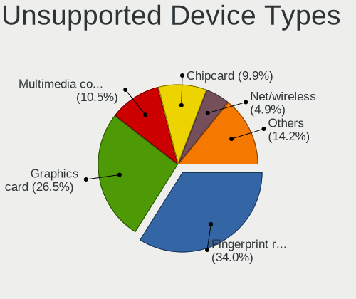

| Type                     | Notebooks | Percent |
|--------------------------|-----------|---------|
| Fingerprint reader       | 21        | 30.88%  |
| Graphics card            | 16        | 23.53%  |
| Chipcard                 | 10        | 14.71%  |
| Net/wireless             | 6         | 8.82%   |
| Multimedia controller    | 6         | 8.82%   |
| Communication controller | 3         | 4.41%   |
| Storage                  | 1         | 1.47%   |
| Sound                    | 1         | 1.47%   |
| Net/ethernet             | 1         | 1.47%   |
| Card reader              | 1         | 1.47%   |
| Camera                   | 1         | 1.47%   |
| Bluetooth                | 1         | 1.47%   |

