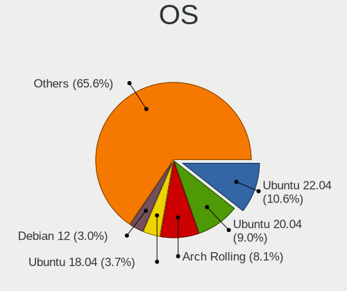
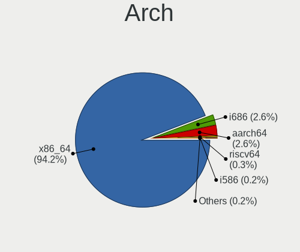
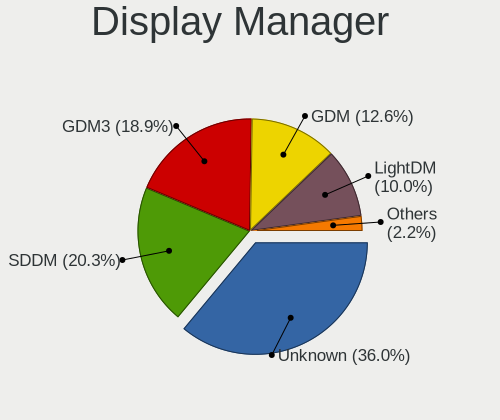
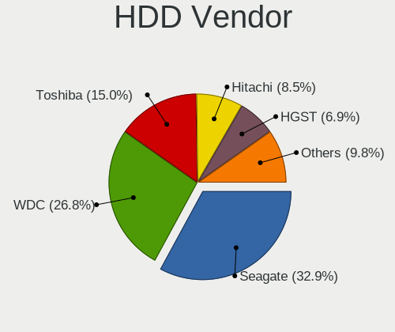
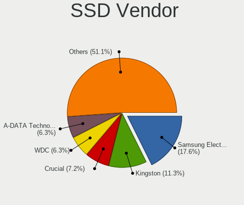
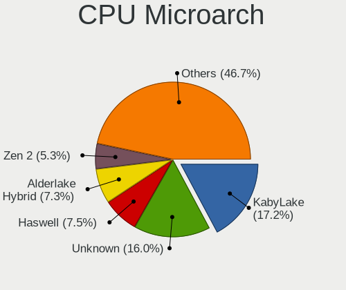
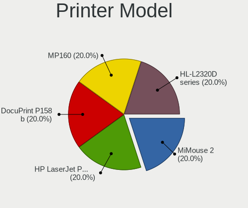
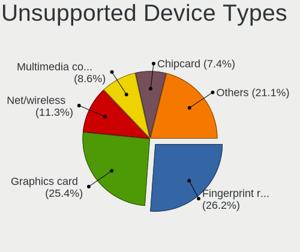

Linux in Hong Kong - Tested Hardware & Statistics
-------------------------------------------------

A project to collect tested hardware configurations for Linux in Hong Kong.

Anyone can contribute to this report by the [hw-probe](https://github.com/linuxhw/hw-probe) tool:

    sudo -E hw-probe -all -upload

Please contribute! Especially if your hardware is rare.

This is a report for all computer types. See also reports for [desktops](/Location/Hong_Kong/Desktop/README.md) and [notebooks](/Location/Hong_Kong/Notebook/README.md).

Contents
--------

* [ Test Cases ](#test-cases)

* [ System ](#system)
  - [ OS                       ](#os)
  - [ OS Family                ](#os-family)
  - [ Kernel                   ](#kernel)
  - [ Kernel Family            ](#kernel-family)
  - [ Kernel Major Ver.        ](#kernel-major-ver)
  - [ Arch                     ](#arch)
  - [ DE                       ](#de)
  - [ Display Server           ](#display-server)
  - [ Display Manager          ](#display-manager)
  - [ OS Lang                  ](#os-lang)
  - [ Boot Mode                ](#boot-mode)
  - [ Filesystem               ](#filesystem)
  - [ Part. scheme             ](#part-scheme)
  - [ Dual Boot with Linux/BSD ](#dual-boot-with-linuxbsd)
  - [ Dual Boot (Win)          ](#dual-boot-win)

* [ Board ](#board)
  - [ Vendor                   ](#vendor)
  - [ Model                    ](#model)
  - [ Model Family             ](#model-family)
  - [ MFG Year                 ](#mfg-year)
  - [ Form Factor              ](#form-factor)
  - [ Secure Boot              ](#secure-boot)
  - [ Coreboot                 ](#coreboot)
  - [ RAM Size                 ](#ram-size)
  - [ RAM Used                 ](#ram-used)
  - [ Total Drives             ](#total-drives)
  - [ Has CD-ROM               ](#has-cd-rom)
  - [ Has Ethernet             ](#has-ethernet)
  - [ Has WiFi                 ](#has-wifi)
  - [ Has Bluetooth            ](#has-bluetooth)

* [ Location ](#location)
  - [ Country                  ](#country)
  - [ City                     ](#city)

* [ Drives ](#drives)
  - [ Drive Vendor             ](#drive-vendor)
  - [ Drive Model              ](#drive-model)
  - [ HDD Vendor               ](#hdd-vendor)
  - [ SSD Vendor               ](#ssd-vendor)
  - [ Drive Kind               ](#drive-kind)
  - [ Drive Connector          ](#drive-connector)
  - [ Drive Size               ](#drive-size)
  - [ Space Total              ](#space-total)
  - [ Space Used               ](#space-used)
  - [ Malfunc. Drives          ](#malfunc-drives)
  - [ Malfunc. Drive Vendor    ](#malfunc-drive-vendor)
  - [ Malfunc. HDD Vendor      ](#malfunc-hdd-vendor)
  - [ Malfunc. Drive Kind      ](#malfunc-drive-kind)
  - [ Failed Drives            ](#failed-drives)
  - [ Failed Drive Vendor      ](#failed-drive-vendor)
  - [ Drive Status             ](#drive-status)

* [ Storage controller ](#storage-controller)
  - [ Storage Vendor           ](#storage-vendor)
  - [ Storage Model            ](#storage-model)
  - [ Storage Kind             ](#storage-kind)

* [ Processor ](#processor)
  - [ CPU Vendor               ](#cpu-vendor)
  - [ CPU Model                ](#cpu-model)
  - [ CPU Model Family         ](#cpu-model-family)
  - [ CPU Cores                ](#cpu-cores)
  - [ CPU Sockets              ](#cpu-sockets)
  - [ CPU Threads              ](#cpu-threads)
  - [ CPU Op-Modes             ](#cpu-op-modes)
  - [ CPU Microcode            ](#cpu-microcode)
  - [ CPU Microarch            ](#cpu-microarch)

* [ Graphics ](#graphics)
  - [ GPU Vendor               ](#gpu-vendor)
  - [ GPU Model                ](#gpu-model)
  - [ GPU Combo                ](#gpu-combo)
  - [ GPU Driver               ](#gpu-driver)
  - [ GPU Memory               ](#gpu-memory)

* [ Monitor ](#monitor)
  - [ Monitor Vendor           ](#monitor-vendor)
  - [ Monitor Model            ](#monitor-model)
  - [ Monitor Resolution       ](#monitor-resolution)
  - [ Monitor Diagonal         ](#monitor-diagonal)
  - [ Monitor Width            ](#monitor-width)
  - [ Aspect Ratio             ](#aspect-ratio)
  - [ Monitor Area             ](#monitor-area)
  - [ Pixel Density            ](#pixel-density)
  - [ Multiple Monitors        ](#multiple-monitors)

* [ Network ](#network)
  - [ Net Controller Vendor    ](#net-controller-vendor)
  - [ Net Controller Model     ](#net-controller-model)
  - [ Wireless Vendor          ](#wireless-vendor)
  - [ Wireless Model           ](#wireless-model)
  - [ Ethernet Vendor          ](#ethernet-vendor)
  - [ Ethernet Model           ](#ethernet-model)
  - [ Net Controller Kind      ](#net-controller-kind)
  - [ Used Controller          ](#used-controller)
  - [ NICs                     ](#nics)
  - [ IPv6                     ](#ipv6)

* [ Bluetooth ](#bluetooth)
  - [ Bluetooth Vendor         ](#bluetooth-vendor)
  - [ Bluetooth Model          ](#bluetooth-model)

* [ Sound ](#sound)
  - [ Sound Vendor             ](#sound-vendor)
  - [ Sound Model              ](#sound-model)

* [ Memory ](#memory)
  - [ Memory Vendor            ](#memory-vendor)
  - [ Memory Model             ](#memory-model)
  - [ Memory Kind              ](#memory-kind)
  - [ Memory Form Factor       ](#memory-form-factor)
  - [ Memory Size              ](#memory-size)
  - [ Memory Speed             ](#memory-speed)

* [ Printers & scanners ](#printers--scanners)
  - [ Printer Vendor           ](#printer-vendor)
  - [ Printer Model            ](#printer-model)
  - [ Scanner Vendor           ](#scanner-vendor)
  - [ Scanner Model            ](#scanner-model)

* [ Camera ](#camera)
  - [ Camera Vendor            ](#camera-vendor)
  - [ Camera Model             ](#camera-model)

* [ Security ](#security)
  - [ Fingerprint Vendor       ](#fingerprint-vendor)
  - [ Fingerprint Model        ](#fingerprint-model)
  - [ Chipcard Vendor          ](#chipcard-vendor)
  - [ Chipcard Model           ](#chipcard-model)

* [ Unsupported ](#unsupported)
  - [ Unsupported Devices      ](#unsupported-devices)
  - [ Unsupported Device Types ](#unsupported-device-types)

Test Cases
----------

Total: 382

| Vendor        | Model                       | Form-Factor | Probe                                                      | Date         |
|---------------|-----------------------------|-------------|------------------------------------------------------------|--------------|
| Gigabyte      | GA-880GMA-UD2H              | Desktop     | [09d9f58ee7](https://linux-hardware.org/?probe=09d9f58ee7) | May 02, 2022 |
| Lenovo        | IdeaPadFlex 5 14ARE05 81... | Convertible | [99e0958898](https://linux-hardware.org/?probe=99e0958898) | May 01, 2022 |
| Dell          | Precision 7520              | Notebook    | [2dc98a1a8d](https://linux-hardware.org/?probe=2dc98a1a8d) | Apr 30, 2022 |
| MSI           | H87I                        | Desktop     | [af4a26a5ea](https://linux-hardware.org/?probe=af4a26a5ea) | Apr 30, 2022 |
| Gigabyte      | B660M DS3H AX DDR4          | Desktop     | [0633ac7757](https://linux-hardware.org/?probe=0633ac7757) | Apr 26, 2022 |
| Lenovo        | Yoga Slim 7 Pro 14ACH5 8... | Notebook    | [9191742453](https://linux-hardware.org/?probe=9191742453) | Apr 26, 2022 |
| Gigabyte      | B660M DS3H AX DDR4          | Desktop     | [56902c7998](https://linux-hardware.org/?probe=56902c7998) | Apr 26, 2022 |
| Lenovo        | IdeaPadFlex 5 14ITL05 82... | Convertible | [a3aa6e30b9](https://linux-hardware.org/?probe=a3aa6e30b9) | Apr 21, 2022 |
| Apple         | MacBookAir5,1               | Notebook    | [3dd8282149](https://linux-hardware.org/?probe=3dd8282149) | Apr 20, 2022 |
| GPD           | P2 MAX                      | Notebook    | [ca842dc5fb](https://linux-hardware.org/?probe=ca842dc5fb) | Apr 19, 2022 |
| Intel         | NUC11PABi5 K90634-304       | Mini pc     | [d359794b2f](https://linux-hardware.org/?probe=d359794b2f) | Apr 19, 2022 |
| Lenovo        | IdeaPadFlex 5 14ITL05 82... | Convertible | [7ea786c89b](https://linux-hardware.org/?probe=7ea786c89b) | Apr 18, 2022 |
| Apple         | Mac-27ADBB7B4CEE8E61 iMa... | All in one  | [0ac1f4daf9](https://linux-hardware.org/?probe=0ac1f4daf9) | Apr 12, 2022 |
| Gigabyte      | B660M DS3H AX DDR4          | Desktop     | [abed3ae34d](https://linux-hardware.org/?probe=abed3ae34d) | Apr 12, 2022 |
| Lenovo        | IdeaPad 320-15IKB 80XL      | Notebook    | [ca558e6708](https://linux-hardware.org/?probe=ca558e6708) | Apr 07, 2022 |
| ASUSTek       | VM62                        | Desktop     | [ae684cdf71](https://linux-hardware.org/?probe=ae684cdf71) | Apr 05, 2022 |
| ASUSTek       | ROG Strix G513QM_G513QM     | Notebook    | [bdca066ba3](https://linux-hardware.org/?probe=bdca066ba3) | Apr 05, 2022 |
| ASRock        | H410M-ITX/ac                | Desktop     | [ae936790c9](https://linux-hardware.org/?probe=ae936790c9) | Apr 03, 2022 |
| MSI           | MAG B550M MORTAR            | Desktop     | [9ebb4c0fd3](https://linux-hardware.org/?probe=9ebb4c0fd3) | Mar 31, 2022 |
| Dell          | Inspiron 14 5410            | Notebook    | [314bd42e78](https://linux-hardware.org/?probe=314bd42e78) | Mar 28, 2022 |
| Lenovo        | ThinkPad T430s 2355C33      | Notebook    | [a881a875bd](https://linux-hardware.org/?probe=a881a875bd) | Mar 27, 2022 |
| Fujitsu       | LIFEBOOK LH531              | Notebook    | [2d48cb4419](https://linux-hardware.org/?probe=2d48cb4419) | Mar 26, 2022 |
| Dell          | 0Y3R3K A03                  | Desktop     | [b772cf9d86](https://linux-hardware.org/?probe=b772cf9d86) | Mar 26, 2022 |
| Raspberry ... | Raspberry Pi                | Soc         | [e7fb180535](https://linux-hardware.org/?probe=e7fb180535) | Mar 16, 2022 |
| Dell          | Latitude 7285               | Notebook    | [87e555f958](https://linux-hardware.org/?probe=87e555f958) | Mar 13, 2022 |
| ASUSTek       | PRIME Z590-A                | Desktop     | [7320ed668a](https://linux-hardware.org/?probe=7320ed668a) | Mar 12, 2022 |
| Fujitsu       | LIFEBOOK AH544              | Notebook    | [03b27c8ca4](https://linux-hardware.org/?probe=03b27c8ca4) | Mar 12, 2022 |
| Lenovo        | ThinkPad X1 Extreme 20MF... | Notebook    | [4998fff0f9](https://linux-hardware.org/?probe=4998fff0f9) | Mar 12, 2022 |
| Gigabyte      | X570 AORUS ELITE            | Desktop     | [99d3e16ede](https://linux-hardware.org/?probe=99d3e16ede) | Mar 12, 2022 |
| Gigabyte      | X570 AORUS ELITE            | Desktop     | [2acd692513](https://linux-hardware.org/?probe=2acd692513) | Mar 12, 2022 |
| HP            | Victus by Laptop 16-d1xx... | Notebook    | [c68cec2207](https://linux-hardware.org/?probe=c68cec2207) | Mar 11, 2022 |
| Unknown       | Intel X79                   | Desktop     | [e947d6af7f](https://linux-hardware.org/?probe=e947d6af7f) | Mar 11, 2022 |
| Fujitsu       | LIFEBOOK AH544              | Notebook    | [96b36779e0](https://linux-hardware.org/?probe=96b36779e0) | Mar 11, 2022 |
| MSI           | MPG X570 GAMING PRO CARB... | Desktop     | [4d16610cf3](https://linux-hardware.org/?probe=4d16610cf3) | Mar 10, 2022 |
| HP            | Notebook                    | Notebook    | [9c04c0776d](https://linux-hardware.org/?probe=9c04c0776d) | Mar 10, 2022 |
| HP            | Notebook                    | Notebook    | [c7d735dc99](https://linux-hardware.org/?probe=c7d735dc99) | Mar 10, 2022 |
| MSI           | B450M PRO-VDH PLUS          | Desktop     | [4b2fe6657c](https://linux-hardware.org/?probe=4b2fe6657c) | Mar 04, 2022 |
| Gigabyte      | X570 AORUS ELITE            | Desktop     | [0b9a7acb84](https://linux-hardware.org/?probe=0b9a7acb84) | Feb 27, 2022 |
| MSI           | B75MA-P45                   | Desktop     | [35ad54efc7](https://linux-hardware.org/?probe=35ad54efc7) | Feb 26, 2022 |
| Dell          | 0Y5DDC A00                  | Desktop     | [3c7daed552](https://linux-hardware.org/?probe=3c7daed552) | Feb 22, 2022 |
| ASUSTek       | PN41                        | Mini pc     | [6c00869d7b](https://linux-hardware.org/?probe=6c00869d7b) | Feb 21, 2022 |
| Lenovo        | ThinkPad P15v Gen 1 20TQ... | Notebook    | [0f4fad19b2](https://linux-hardware.org/?probe=0f4fad19b2) | Feb 07, 2022 |
| ASUSTek       | TUF GAMING B550M-PLUS       | Desktop     | [6e5689a733](https://linux-hardware.org/?probe=6e5689a733) | Jan 28, 2022 |
| Raspberry ... | Raspberry Pi                | Soc         | [2a66f4b578](https://linux-hardware.org/?probe=2a66f4b578) | Jan 24, 2022 |
| Dell          | Inspiron 5580               | Notebook    | [515465fd5a](https://linux-hardware.org/?probe=515465fd5a) | Jan 22, 2022 |
| ASRock        | Z270M-ITX/ac                | Desktop     | [4c32bf6d7b](https://linux-hardware.org/?probe=4c32bf6d7b) | Jan 18, 2022 |
| Lenovo        | Legion R7000 2020 82B6      | Notebook    | [5f92f3376e](https://linux-hardware.org/?probe=5f92f3376e) | Jan 11, 2022 |
| HP            | 8597                        | Desktop     | [09ed815dd0](https://linux-hardware.org/?probe=09ed815dd0) | Jan 08, 2022 |
| Gigabyte      | B450 AORUS PRO WIFI-CF      | Desktop     | [83ff6966e1](https://linux-hardware.org/?probe=83ff6966e1) | Dec 24, 2021 |
| ASUSTek       | Z170 PRO GAMING             | Desktop     | [c5fa4a0cec](https://linux-hardware.org/?probe=c5fa4a0cec) | Dec 24, 2021 |
| ASRock        | H410M-ITX/ac                | Desktop     | [99c341562a](https://linux-hardware.org/?probe=99c341562a) | Dec 21, 2021 |
| Gigabyte      | B450 AORUS PRO WIFI-CF      | Desktop     | [f55494010a](https://linux-hardware.org/?probe=f55494010a) | Dec 19, 2021 |
| Gigabyte      | B450 AORUS PRO WIFI-CF      | Desktop     | [d01abdcb39](https://linux-hardware.org/?probe=d01abdcb39) | Dec 19, 2021 |
| MSI           | 870-G45                     | Desktop     | [e6317a2b91](https://linux-hardware.org/?probe=e6317a2b91) | Dec 19, 2021 |
| HP            | EliteBook 830 G5            | Notebook    | [bf884733a1](https://linux-hardware.org/?probe=bf884733a1) | Dec 16, 2021 |
| HP            | EliteBook 830 G5            | Notebook    | [61d4bff2bd](https://linux-hardware.org/?probe=61d4bff2bd) | Dec 15, 2021 |
| Fujitsu       | LIFEBOOK LH530              | Notebook    | [8db7409ab5](https://linux-hardware.org/?probe=8db7409ab5) | Dec 14, 2021 |
| Unknown       | Intel X79                   | Desktop     | [985655e4b3](https://linux-hardware.org/?probe=985655e4b3) | Dec 11, 2021 |
| Unknown       | Unknown                     | Notebook    | [739be994cb](https://linux-hardware.org/?probe=739be994cb) | Dec 09, 2021 |
| Lenovo        | Legion 5 15ACH6 82JW        | Notebook    | [024a42eb21](https://linux-hardware.org/?probe=024a42eb21) | Dec 08, 2021 |
| Unknown       | Intel X79                   | Desktop     | [6f32192557](https://linux-hardware.org/?probe=6f32192557) | Dec 08, 2021 |
| Supermicro    | X9DRi-LN4+/X9DR3-LN4+       | Desktop     | [bd8742e075](https://linux-hardware.org/?probe=bd8742e075) | Dec 08, 2021 |
| MSI           | Boston                      | Desktop     | [0b79772dfa](https://linux-hardware.org/?probe=0b79772dfa) | Dec 04, 2021 |
| Supermicro    | C2SBC-Q                     | Desktop     | [1099e48366](https://linux-hardware.org/?probe=1099e48366) | Nov 28, 2021 |
| MSI           | MAG B550M MORTAR WIFI       | Desktop     | [58d43162d2](https://linux-hardware.org/?probe=58d43162d2) | Nov 28, 2021 |
| Lenovo        | ThinkPad X1 Carbon 7th 2... | Notebook    | [ee13ae89af](https://linux-hardware.org/?probe=ee13ae89af) | Nov 26, 2021 |
| MSI           | Boston                      | Desktop     | [71b7b63020](https://linux-hardware.org/?probe=71b7b63020) | Nov 25, 2021 |
| Apple         | MacBook10,1                 | Notebook    | [6cb99e6a5f](https://linux-hardware.org/?probe=6cb99e6a5f) | Nov 23, 2021 |
| Gigabyte      | H310M S2H x.x               | Desktop     | [fc59694424](https://linux-hardware.org/?probe=fc59694424) | Nov 17, 2021 |
| MSI           | B450 TOMAHAWK MAX II        | Desktop     | [35b58ec233](https://linux-hardware.org/?probe=35b58ec233) | Nov 16, 2021 |
| Jumper        | EZbook                      | Notebook    | [5da2b95e2f](https://linux-hardware.org/?probe=5da2b95e2f) | Nov 12, 2021 |
| Seco          | C40 C                       | Desktop     | [27bff03d0c](https://linux-hardware.org/?probe=27bff03d0c) | Nov 08, 2021 |
| Unknown       | Unknown                     | Notebook    | [ed14b60c7a](https://linux-hardware.org/?probe=ed14b60c7a) | Nov 05, 2021 |
| Gigabyte      | B365M GAMING HD             | Desktop     | [8c2b6cf453](https://linux-hardware.org/?probe=8c2b6cf453) | Oct 30, 2021 |
| MSI           | B450 TOMAHAWK MAX II        | Desktop     | [9bcd3d5479](https://linux-hardware.org/?probe=9bcd3d5479) | Oct 29, 2021 |
| Lenovo        | Yoga DuetITL 2021 82MA      | Tablet      | [c7fc01bd49](https://linux-hardware.org/?probe=c7fc01bd49) | Oct 27, 2021 |
| Gigabyte      | X570 AORUS PRO WIFI         | Desktop     | [c7a0fe2f88](https://linux-hardware.org/?probe=c7a0fe2f88) | Oct 26, 2021 |
| HP            | Laptop 15s-du3xxx           | Notebook    | [6f87ece998](https://linux-hardware.org/?probe=6f87ece998) | Oct 26, 2021 |
| Lenovo        | IdeaPad 5 14IIL05 81YH      | Notebook    | [3d42bc888b](https://linux-hardware.org/?probe=3d42bc888b) | Oct 24, 2021 |
| Lenovo        | IdeaPad 5 14IIL05 81YH      | Notebook    | [54e54e71bd](https://linux-hardware.org/?probe=54e54e71bd) | Oct 24, 2021 |
| MSI           | B450 TOMAHAWK MAX II        | Desktop     | [aedfc53de6](https://linux-hardware.org/?probe=aedfc53de6) | Oct 20, 2021 |
| Dell          | XPS 13 9310                 | Notebook    | [20dc49f637](https://linux-hardware.org/?probe=20dc49f637) | Oct 13, 2021 |
| Lenovo        | IdeaPadFlex 5 14ARE05 81... | Convertible | [aee062d6e5](https://linux-hardware.org/?probe=aee062d6e5) | Oct 04, 2021 |
| Lenovo        | Legion Y9000P2021H 82JD     | Notebook    | [4c3be0fe24](https://linux-hardware.org/?probe=4c3be0fe24) | Oct 02, 2021 |
| MSI           | H61M-P23                    | Desktop     | [3a07878154](https://linux-hardware.org/?probe=3a07878154) | Sep 28, 2021 |
| GPD           | G1618-03                    | Notebook    | [41916177c2](https://linux-hardware.org/?probe=41916177c2) | Sep 01, 2021 |
| GPD           | G1618-03                    | Notebook    | [c2abcaf10c](https://linux-hardware.org/?probe=c2abcaf10c) | Sep 01, 2021 |
| MSI           | MEG X570 GODLIKE            | Desktop     | [1440e244f6](https://linux-hardware.org/?probe=1440e244f6) | Aug 26, 2021 |
| MSI           | Boston                      | Desktop     | [d706f54222](https://linux-hardware.org/?probe=d706f54222) | Aug 16, 2021 |
| Dell          | Precision 7550              | Notebook    | [42721343a3](https://linux-hardware.org/?probe=42721343a3) | Aug 16, 2021 |
| Lenovo        | XiaoXin-14API QC 2019 81... | Notebook    | [814eb97442](https://linux-hardware.org/?probe=814eb97442) | Aug 14, 2021 |
| Gigabyte      | B365M GAMING HD             | Desktop     | [d920558127](https://linux-hardware.org/?probe=d920558127) | Aug 14, 2021 |
| Gigabyte      | X570 AORUS ELITE            | Desktop     | [5cd377c0e0](https://linux-hardware.org/?probe=5cd377c0e0) | Aug 13, 2021 |
| MSI           | Boston                      | Desktop     | [2a5e7f9687](https://linux-hardware.org/?probe=2a5e7f9687) | Aug 12, 2021 |
| Gigabyte      | B75M-D2P                    | Desktop     | [5e54c2a102](https://linux-hardware.org/?probe=5e54c2a102) | Aug 12, 2021 |
| MSI           | Boston                      | Desktop     | [c61c0e3351](https://linux-hardware.org/?probe=c61c0e3351) | Aug 05, 2021 |
| Lenovo        | ThinkPad T61 6465CTO        | Notebook    | [d93258840e](https://linux-hardware.org/?probe=d93258840e) | Aug 04, 2021 |
| HP            | EliteBook 2540p             | Notebook    | [eb060cd2c4](https://linux-hardware.org/?probe=eb060cd2c4) | Aug 04, 2021 |
| Toshiba       | dynabook R731/E             | Notebook    | [828a52387f](https://linux-hardware.org/?probe=828a52387f) | Aug 02, 2021 |
| Toshiba       | dynabook R731/E             | Notebook    | [12b2c3e130](https://linux-hardware.org/?probe=12b2c3e130) | Aug 01, 2021 |
| Toshiba       | dynabook R731/E             | Notebook    | [3af43c8ebe](https://linux-hardware.org/?probe=3af43c8ebe) | Jul 29, 2021 |
| Toshiba       | dynabook R731/E             | Notebook    | [fa0aa86cef](https://linux-hardware.org/?probe=fa0aa86cef) | Jul 28, 2021 |
| Toshiba       | dynabook R731/E             | Notebook    | [206c5a9725](https://linux-hardware.org/?probe=206c5a9725) | Jul 28, 2021 |
| Toshiba       | dynabook R731/E             | Notebook    | [e6ca988ba4](https://linux-hardware.org/?probe=e6ca988ba4) | Jul 27, 2021 |
| Toshiba       | dynabook R731/E             | Notebook    | [c46bbfef35](https://linux-hardware.org/?probe=c46bbfef35) | Jul 27, 2021 |
| Toshiba       | dynabook R731/E             | Notebook    | [5629c97b72](https://linux-hardware.org/?probe=5629c97b72) | Jul 27, 2021 |
| Toshiba       | dynabook R731/E             | Notebook    | [7900692d40](https://linux-hardware.org/?probe=7900692d40) | Jul 27, 2021 |
| HP            | 2B38                        | Desktop     | [be24f3f652](https://linux-hardware.org/?probe=be24f3f652) | Jul 26, 2021 |
| HP            | 2B38                        | Desktop     | [c1198b90f6](https://linux-hardware.org/?probe=c1198b90f6) | Jul 26, 2021 |
| Unknown       | Unknown                     | Notebook    | [8fc32673b3](https://linux-hardware.org/?probe=8fc32673b3) | Jul 25, 2021 |
| Toshiba       | dynabook R731/E             | Notebook    | [e567282ecd](https://linux-hardware.org/?probe=e567282ecd) | Jul 24, 2021 |
| Toshiba       | dynabook R731/E             | Notebook    | [13ea5b9423](https://linux-hardware.org/?probe=13ea5b9423) | Jul 24, 2021 |
| ASRock        | H410M-HDV                   | Desktop     | [58b70e282d](https://linux-hardware.org/?probe=58b70e282d) | Jul 14, 2021 |
| Gigabyte      | B365M GAMING HD             | Desktop     | [66cf378cf1](https://linux-hardware.org/?probe=66cf378cf1) | Jul 10, 2021 |
| Gigabyte      | B85M-DS3H-A                 | Desktop     | [6496f18326](https://linux-hardware.org/?probe=6496f18326) | Jul 02, 2021 |
| Gigabyte      | B85M-DS3H-A                 | Desktop     | [71da4978c9](https://linux-hardware.org/?probe=71da4978c9) | Jun 29, 2021 |
| Gigabyte      | B365M GAMING HD             | Desktop     | [6c7968cf75](https://linux-hardware.org/?probe=6c7968cf75) | Jun 27, 2021 |
| HUAWEI        | KLVL-WXX9                   | Notebook    | [1104a3ca5a](https://linux-hardware.org/?probe=1104a3ca5a) | Jun 26, 2021 |
| Gigabyte      | B365M GAMING HD             | Desktop     | [ed911e7e8c](https://linux-hardware.org/?probe=ed911e7e8c) | Jun 26, 2021 |
| Gigabyte      | B365M GAMING HD             | Desktop     | [8785d98b0b](https://linux-hardware.org/?probe=8785d98b0b) | Jun 19, 2021 |
| ASUSTek       | PRIME Z390-P                | Desktop     | [54e520ac17](https://linux-hardware.org/?probe=54e520ac17) | Jun 17, 2021 |
| Toshiba       | dynabook R731/E             | Notebook    | [c2bfccf320](https://linux-hardware.org/?probe=c2bfccf320) | Jun 16, 2021 |
| Toshiba       | dynabook R731/E             | Notebook    | [d3f69874dd](https://linux-hardware.org/?probe=d3f69874dd) | Jun 16, 2021 |
| Lenovo        | Board                       | All in one  | [8399296d51](https://linux-hardware.org/?probe=8399296d51) | Jun 13, 2021 |
| Dell          | Precision M4800             | Notebook    | [298694c222](https://linux-hardware.org/?probe=298694c222) | Jun 12, 2021 |
| ASUSTek       | TUF GAMING Z490-PLUS        | Desktop     | [76219e9cca](https://linux-hardware.org/?probe=76219e9cca) | Jun 09, 2021 |
| Acer          | Aspire E5-573               | Notebook    | [4193a2da9d](https://linux-hardware.org/?probe=4193a2da9d) | Jun 08, 2021 |
| ASRock        | H410M-HDV                   | Desktop     | [bcb80080a5](https://linux-hardware.org/?probe=bcb80080a5) | Jun 06, 2021 |
| Dell          | Precision M4800             | Notebook    | [67fb08d285](https://linux-hardware.org/?probe=67fb08d285) | Jun 06, 2021 |
| Dell          | Precision M4800             | Notebook    | [c72664a2f4](https://linux-hardware.org/?probe=c72664a2f4) | Jun 06, 2021 |
| HP            | 18E7                        | Desktop     | [9844f6635c](https://linux-hardware.org/?probe=9844f6635c) | May 30, 2021 |
| Toshiba       | dynabook R731/E             | Notebook    | [81ffc7ba9e](https://linux-hardware.org/?probe=81ffc7ba9e) | May 26, 2021 |
| ASUSTek       | VM62                        | Desktop     | [486aeb5b89](https://linux-hardware.org/?probe=486aeb5b89) | May 25, 2021 |
| Gigabyte      | F2A88XN-WIFI                | Desktop     | [c22e6d8669](https://linux-hardware.org/?probe=c22e6d8669) | May 25, 2021 |
| Dell          | 0D02VH A01                  | Desktop     | [e19475cd4c](https://linux-hardware.org/?probe=e19475cd4c) | May 22, 2021 |
| Dell          | 0D02VH A01                  | Desktop     | [dc84154113](https://linux-hardware.org/?probe=dc84154113) | May 22, 2021 |
| ASUSTek       | PRIME X399-A                | Desktop     | [a201bdfc36](https://linux-hardware.org/?probe=a201bdfc36) | May 19, 2021 |
| Fujitsu       | UH-X                        | Notebook    | [be65091e59](https://linux-hardware.org/?probe=be65091e59) | May 19, 2021 |
| ASUSTek       | M4A78-VM                    | Desktop     | [3313d34c41](https://linux-hardware.org/?probe=3313d34c41) | May 15, 2021 |
| Panasonic     | CFSZ5-2L                    | Notebook    | [1409e11b30](https://linux-hardware.org/?probe=1409e11b30) | May 12, 2021 |
| Nvidia        | Tegra                       | Soc         | [54592ec1a2](https://linux-hardware.org/?probe=54592ec1a2) | May 08, 2021 |
| Nvidia        | Tegra                       | Soc         | [ab1c7d5eab](https://linux-hardware.org/?probe=ab1c7d5eab) | May 08, 2021 |
| Dell          | XPS 13 9310                 | Notebook    | [8d372d62b7](https://linux-hardware.org/?probe=8d372d62b7) | May 07, 2021 |
| ASUSTek       | Z8NA-D6                     | Desktop     | [1b777c6f08](https://linux-hardware.org/?probe=1b777c6f08) | May 02, 2021 |
| ASUSTek       | Z8NA-D6                     | Desktop     | [4c7956a34c](https://linux-hardware.org/?probe=4c7956a34c) | May 02, 2021 |
| ASUSTek       | ROG Strix G513QR_G513QR     | Notebook    | [6bb8ea7872](https://linux-hardware.org/?probe=6bb8ea7872) | Apr 23, 2021 |
| Panasonic     | CFSZ5-2L                    | Notebook    | [f35a966b00](https://linux-hardware.org/?probe=f35a966b00) | Apr 14, 2021 |
| Schenker      | XMG_APEX15_XAP15E20         | Notebook    | [a917367457](https://linux-hardware.org/?probe=a917367457) | Apr 09, 2021 |
| ASUSTek       | Zephyrus M GM501GM          | Notebook    | [f7937503ac](https://linux-hardware.org/?probe=f7937503ac) | Apr 08, 2021 |
| ASUSTek       | Zephyrus M GM501GM          | Notebook    | [99d71b6ea5](https://linux-hardware.org/?probe=99d71b6ea5) | Apr 06, 2021 |
| Lenovo        | IdeaPad Z410 20292          | Notebook    | [8253b70553](https://linux-hardware.org/?probe=8253b70553) | Apr 06, 2021 |
| MSI           | Boston                      | Desktop     | [e0cfb03088](https://linux-hardware.org/?probe=e0cfb03088) | Mar 30, 2021 |
| Fujitsu       | LIFEBOOK AH544              | Notebook    | [60600f6f0c](https://linux-hardware.org/?probe=60600f6f0c) | Mar 26, 2021 |
| HP            | 1632                        | Desktop     | [adf9ebb679](https://linux-hardware.org/?probe=adf9ebb679) | Mar 25, 2021 |
| MSI           | B450I GAMING PLUS AC        | Desktop     | [6a4196e0aa](https://linux-hardware.org/?probe=6a4196e0aa) | Mar 23, 2021 |
| MSI           | B450M-A PRO MAX             | Desktop     | [dc64c81c35](https://linux-hardware.org/?probe=dc64c81c35) | Mar 23, 2021 |
| Raspberry ... | Raspberry Pi                | Soc         | [280785b873](https://linux-hardware.org/?probe=280785b873) | Mar 22, 2021 |
| Raspberry ... | Raspberry Pi                | Soc         | [20d78f0b3a](https://linux-hardware.org/?probe=20d78f0b3a) | Mar 22, 2021 |
| ASUSTek       | B85M-G R2.0                 | Desktop     | [71ef988016](https://linux-hardware.org/?probe=71ef988016) | Mar 21, 2021 |
| ASUSTek       | K501UX                      | Notebook    | [0a3c9ff078](https://linux-hardware.org/?probe=0a3c9ff078) | Mar 17, 2021 |
| ASRock        | H410M-HDV                   | Desktop     | [e44a5ce779](https://linux-hardware.org/?probe=e44a5ce779) | Mar 14, 2021 |
| ASUSTek       | UX302LA                     | Notebook    | [fe27a8e195](https://linux-hardware.org/?probe=fe27a8e195) | Mar 12, 2021 |
| Acer          | Aspire A315-34              | Notebook    | [d23d84b5f6](https://linux-hardware.org/?probe=d23d84b5f6) | Mar 06, 2021 |
| ASUSTek       | ROG Zephyrus G14 GA401IU... | Notebook    | [5051ba6156](https://linux-hardware.org/?probe=5051ba6156) | Mar 05, 2021 |
| MSI           | Boston                      | Desktop     | [e9513c3b7a](https://linux-hardware.org/?probe=e9513c3b7a) | Mar 03, 2021 |
| ASUSTek       | P8H61-M LX PLUS             | Desktop     | [b94539c6dc](https://linux-hardware.org/?probe=b94539c6dc) | Mar 01, 2021 |
| ASUSTek       | B85M-G R2.0                 | Desktop     | [b2cb174b9a](https://linux-hardware.org/?probe=b2cb174b9a) | Mar 01, 2021 |
| Fujitsu       | LIFEBOOK P771               | Notebook    | [2414020b54](https://linux-hardware.org/?probe=2414020b54) | Feb 26, 2021 |
| Fujitsu       | LIFEBOOK P771               | Notebook    | [ae61a5e1fa](https://linux-hardware.org/?probe=ae61a5e1fa) | Feb 26, 2021 |
| Lenovo        | MAHOBAY NOK                 | Desktop     | [e3c14a6397](https://linux-hardware.org/?probe=e3c14a6397) | Feb 25, 2021 |
| Dell          | 0D02VH A01                  | Desktop     | [87c36a9322](https://linux-hardware.org/?probe=87c36a9322) | Feb 23, 2021 |
| Lenovo        | ThinkPad E14 20RAA002CD     | Notebook    | [77ccb1ee60](https://linux-hardware.org/?probe=77ccb1ee60) | Feb 22, 2021 |
| Lenovo        | ThinkPad X270 20HNA00RAD    | Notebook    | [7d9f2bee38](https://linux-hardware.org/?probe=7d9f2bee38) | Feb 21, 2021 |
| ASUSTek       | VM45                        | Desktop     | [03eeb85521](https://linux-hardware.org/?probe=03eeb85521) | Feb 21, 2021 |
| ASUSTek       | VM65-K                      | Desktop     | [6b97cf71eb](https://linux-hardware.org/?probe=6b97cf71eb) | Feb 18, 2021 |
| ASUSTek       | VM65-K                      | Desktop     | [4f0bcd1276](https://linux-hardware.org/?probe=4f0bcd1276) | Feb 17, 2021 |
| ASUSTek       | VM40B                       | Desktop     | [6c0bf22f39](https://linux-hardware.org/?probe=6c0bf22f39) | Feb 17, 2021 |
| Lenovo        | ThinkPad X270 20HNA00RAD    | Notebook    | [d82924b12b](https://linux-hardware.org/?probe=d82924b12b) | Feb 16, 2021 |
| Dell          | 0D02VH A01                  | Desktop     | [ebc5645105](https://linux-hardware.org/?probe=ebc5645105) | Feb 11, 2021 |
| Lenovo        | IdeaCentre K330             | Desktop     | [78ce34058b](https://linux-hardware.org/?probe=78ce34058b) | Feb 11, 2021 |
| Lenovo        | G710 20252                  | Notebook    | [f4c2a6bac8](https://linux-hardware.org/?probe=f4c2a6bac8) | Feb 07, 2021 |
| Lenovo        | ThinkPad X270 20HNA00RAD    | Notebook    | [0e7df43f28](https://linux-hardware.org/?probe=0e7df43f28) | Jan 31, 2021 |
| Lenovo        | ThinkPad X270 20HNA00RAD    | Notebook    | [d4f69c78fa](https://linux-hardware.org/?probe=d4f69c78fa) | Jan 31, 2021 |
| Fujitsu       | S6420                       | Notebook    | [b23c0f10e7](https://linux-hardware.org/?probe=b23c0f10e7) | Jan 28, 2021 |
| Fujitsu       | S6420                       | Notebook    | [0cf6376b40](https://linux-hardware.org/?probe=0cf6376b40) | Jan 27, 2021 |
| ASUSTek       | UX360UAK                    | Convertible | [49fbaee9e2](https://linux-hardware.org/?probe=49fbaee9e2) | Jan 27, 2021 |
| Raspberry ... | Raspberry Pi                | Soc         | [1d0000672d](https://linux-hardware.org/?probe=1d0000672d) | Jan 23, 2021 |
| HP            | ZHAN 66 Pro 14 G4 Notebo... | Notebook    | [3918f52127](https://linux-hardware.org/?probe=3918f52127) | Jan 20, 2021 |
| HP            | ZHAN 66 Pro 14 G4 Notebo... | Notebook    | [3d7ce778c6](https://linux-hardware.org/?probe=3d7ce778c6) | Jan 20, 2021 |
| HUAWEI        | KPRC-WX0                    | Notebook    | [fe7d03f093](https://linux-hardware.org/?probe=fe7d03f093) | Jan 18, 2021 |
| Raspberry ... | Raspberry Pi                | Soc         | [b8f5d6f1e4](https://linux-hardware.org/?probe=b8f5d6f1e4) | Jan 16, 2021 |
| ASUSTek       | ROG STRIX B450-I GAMING     | Desktop     | [39bc70ca5d](https://linux-hardware.org/?probe=39bc70ca5d) | Jan 13, 2021 |
| ASRock        | H410M-HDV                   | Desktop     | [d2420f233b](https://linux-hardware.org/?probe=d2420f233b) | Jan 10, 2021 |
| MSI           | H97 GAMING 3                | Desktop     | [7e25d7549f](https://linux-hardware.org/?probe=7e25d7549f) | Jan 09, 2021 |
| Dell          | 0TP412                      | Desktop     | [f0e56aacff](https://linux-hardware.org/?probe=f0e56aacff) | Jan 05, 2021 |
| Intel         | NUC6CAYB J23203-406         | Mini pc     | [038dce10fa](https://linux-hardware.org/?probe=038dce10fa) | Jan 04, 2021 |
| ASUSTek       | TUF Gaming FA506IU_FA506... | Notebook    | [a8ac85cb5a](https://linux-hardware.org/?probe=a8ac85cb5a) | Dec 30, 2020 |
| ASUSTek       | TUF Gaming FA506IU_FA506... | Notebook    | [8c7ba97457](https://linux-hardware.org/?probe=8c7ba97457) | Dec 29, 2020 |
| ASUSTek       | TUF Gaming FA506IU_FA506... | Notebook    | [01333c5b9e](https://linux-hardware.org/?probe=01333c5b9e) | Dec 29, 2020 |
| Panasonic     | CFSZ5-2L                    | Notebook    | [728d7e48d4](https://linux-hardware.org/?probe=728d7e48d4) | Dec 27, 2020 |
| Lenovo        | ThinkPad X270 20HNA00RAD    | Notebook    | [1d4b16bb0d](https://linux-hardware.org/?probe=1d4b16bb0d) | Dec 22, 2020 |
| Lenovo        | ThinkPad X270 20HNA00RAD    | Notebook    | [e8cbd9b46f](https://linux-hardware.org/?probe=e8cbd9b46f) | Dec 22, 2020 |
| ASRock        | Z390 Phantom Gaming-ITX/... | Desktop     | [cf7386e848](https://linux-hardware.org/?probe=cf7386e848) | Dec 18, 2020 |
| Lenovo        | ThinkPad T480s 20L7CTO1W... | Notebook    | [88a7edec45](https://linux-hardware.org/?probe=88a7edec45) | Dec 18, 2020 |
| ASUSTek       | H97M-PLUS                   | Desktop     | [1d6b7df7b4](https://linux-hardware.org/?probe=1d6b7df7b4) | Dec 08, 2020 |
| Gigabyte      | X570 AORUS ELITE            | Desktop     | [64adbf132b](https://linux-hardware.org/?probe=64adbf132b) | Dec 08, 2020 |
| Dell          | 0D02VH A01                  | Desktop     | [8309aa39cf](https://linux-hardware.org/?probe=8309aa39cf) | Nov 30, 2020 |
| Sony          | VPCCB17FG                   | Notebook    | [ede3032fed](https://linux-hardware.org/?probe=ede3032fed) | Nov 29, 2020 |
| Sony          | VPCCB17FG                   | Notebook    | [f3012a2898](https://linux-hardware.org/?probe=f3012a2898) | Nov 29, 2020 |
| Gigabyte      | B450M DS3H-CF               | Desktop     | [37d5acae7d](https://linux-hardware.org/?probe=37d5acae7d) | Nov 27, 2020 |
| Sony          | VPCCB17FG                   | Notebook    | [3c4ff5bb58](https://linux-hardware.org/?probe=3c4ff5bb58) | Nov 27, 2020 |
| Sony          | VPCCB17FG                   | Notebook    | [5a24dc3231](https://linux-hardware.org/?probe=5a24dc3231) | Nov 26, 2020 |
| ASUSTek       | 970 PRO GAMING/AURA         | Desktop     | [97c485886b](https://linux-hardware.org/?probe=97c485886b) | Nov 25, 2020 |
| Dell          | 0D02VH A01                  | Desktop     | [8f55b945a1](https://linux-hardware.org/?probe=8f55b945a1) | Nov 20, 2020 |
| FUJITSU CL... | UH-X                        | Notebook    | [f55a6a6679](https://linux-hardware.org/?probe=f55a6a6679) | Nov 20, 2020 |
| FUJITSU CL... | UH-X                        | Notebook    | [7aea886f7a](https://linux-hardware.org/?probe=7aea886f7a) | Nov 20, 2020 |
| ASUSTek       | 970 PRO GAMING/AURA         | Desktop     | [de597aa847](https://linux-hardware.org/?probe=de597aa847) | Nov 20, 2020 |
| ASUSTek       | 970 PRO GAMING/AURA         | Desktop     | [f5aa8c9150](https://linux-hardware.org/?probe=f5aa8c9150) | Nov 20, 2020 |
| ASUSTek       | H110I-PLUS                  | Desktop     | [a3c484b8ee](https://linux-hardware.org/?probe=a3c484b8ee) | Nov 16, 2020 |
| Lenovo        | XiaoXinAir-14ARE 2020 81... | Notebook    | [6254edfb10](https://linux-hardware.org/?probe=6254edfb10) | Nov 14, 2020 |
| Lenovo        | G770 20089                  | Notebook    | [6da9203114](https://linux-hardware.org/?probe=6da9203114) | Nov 13, 2020 |
| HP            | 2000                        | Notebook    | [f548e6d1cc](https://linux-hardware.org/?probe=f548e6d1cc) | Nov 11, 2020 |
| ASUSTek       | K501UX                      | Notebook    | [e1700b887e](https://linux-hardware.org/?probe=e1700b887e) | Nov 09, 2020 |
| HP            | ENVY x360 Convertible 15... | Convertible | [69fb29494b](https://linux-hardware.org/?probe=69fb29494b) | Nov 07, 2020 |
| HP            | 2000                        | Notebook    | [16f74a5f45](https://linux-hardware.org/?probe=16f74a5f45) | Nov 05, 2020 |
| HP            | 2000                        | Notebook    | [df76d279ad](https://linux-hardware.org/?probe=df76d279ad) | Nov 05, 2020 |
| ASUSTek       | H97M-PLUS                   | Desktop     | [f90977870e](https://linux-hardware.org/?probe=f90977870e) | Nov 04, 2020 |
| Timi          | TM1607                      | Notebook    | [dbe64c3d75](https://linux-hardware.org/?probe=dbe64c3d75) | Nov 02, 2020 |
| Lenovo        | IdeaPad Yoga 13 20175       | Notebook    | [518c70a58e](https://linux-hardware.org/?probe=518c70a58e) | Nov 02, 2020 |
| ZOTAC         | ZBOX-ID92/ZBOX-IQ01         | Mini pc     | [fbba9f6a3b](https://linux-hardware.org/?probe=fbba9f6a3b) | Nov 02, 2020 |
| Lenovo        | Yoga 730-15IWL 81JS         | Convertible | [e970e25954](https://linux-hardware.org/?probe=e970e25954) | Nov 02, 2020 |
| Acer          | Swift SF314-57              | Notebook    | [8395e5a946](https://linux-hardware.org/?probe=8395e5a946) | Oct 30, 2020 |
| Acer          | Swift SF314-57              | Notebook    | [123f60c868](https://linux-hardware.org/?probe=123f60c868) | Oct 29, 2020 |
| ASUSTek       | TUF Gaming FA506IU_FA506... | Notebook    | [f9d1166197](https://linux-hardware.org/?probe=f9d1166197) | Oct 25, 2020 |
| Lenovo        | ThinkPad P1 Gen 3 20THCT... | Notebook    | [77849f8db0](https://linux-hardware.org/?probe=77849f8db0) | Oct 23, 2020 |
| Lenovo        | ThinkPad P1 Gen 3 20THCT... | Notebook    | [77d6dd66e2](https://linux-hardware.org/?probe=77d6dd66e2) | Oct 23, 2020 |
| Gigabyte      | Z370 HD3P-CF                | Desktop     | [1af7b2b551](https://linux-hardware.org/?probe=1af7b2b551) | Oct 13, 2020 |
| HP            | 2140                        | Notebook    | [bde3dc449f](https://linux-hardware.org/?probe=bde3dc449f) | Oct 07, 2020 |
| HUAWEI        | WRT-WX9                     | Notebook    | [1fe32b8f6d](https://linux-hardware.org/?probe=1fe32b8f6d) | Oct 04, 2020 |
| HP            | 2000                        | Notebook    | [fbd8bf0e69](https://linux-hardware.org/?probe=fbd8bf0e69) | Oct 01, 2020 |
| Fujitsu       | LIFEBOOK S904               | Notebook    | [5035864c45](https://linux-hardware.org/?probe=5035864c45) | Sep 27, 2020 |
| Dell          | Inspiron N5050              | Notebook    | [37e6b406f7](https://linux-hardware.org/?probe=37e6b406f7) | Sep 27, 2020 |
| Lenovo        | Legion R7000 2020 82B6      | Notebook    | [bd8f561b0b](https://linux-hardware.org/?probe=bd8f561b0b) | Sep 27, 2020 |
| ASUSTek       | H110I-PLUS                  | Desktop     | [e292456297](https://linux-hardware.org/?probe=e292456297) | Sep 17, 2020 |
| Lenovo        | SHARKBAY SDK0E50510 WIN     | Desktop     | [e7b41f62a4](https://linux-hardware.org/?probe=e7b41f62a4) | Sep 14, 2020 |
| ASUSTek       | H110I-PLUS                  | Desktop     | [20bdbc68b7](https://linux-hardware.org/?probe=20bdbc68b7) | Sep 12, 2020 |
| ASUSTek       | H81M-E                      | Desktop     | [43b8c677bc](https://linux-hardware.org/?probe=43b8c677bc) | Sep 10, 2020 |
| Lenovo        | MAHOBAY NOK                 | Desktop     | [d95b985658](https://linux-hardware.org/?probe=d95b985658) | Sep 01, 2020 |
| Foxconn       | 2ADA                        | Desktop     | [24cad8bed5](https://linux-hardware.org/?probe=24cad8bed5) | Aug 28, 2020 |
| Foxconn       | 2ADA                        | Desktop     | [3d4c2a283d](https://linux-hardware.org/?probe=3d4c2a283d) | Aug 28, 2020 |
| Dell          | Inspiron N5050              | Notebook    | [64a249acd1](https://linux-hardware.org/?probe=64a249acd1) | Aug 28, 2020 |
| Lenovo        | ThinkPad S3 Yoga 14 20DM... | Notebook    | [6a91a7b38c](https://linux-hardware.org/?probe=6a91a7b38c) | Aug 25, 2020 |
| ASRock        | B450 Gaming-ITX/ac          | Desktop     | [e27db6fb31](https://linux-hardware.org/?probe=e27db6fb31) | Aug 24, 2020 |
| Samsung       | 930XBE                      | Notebook    | [92925e0656](https://linux-hardware.org/?probe=92925e0656) | Aug 24, 2020 |
| Panasonic     | CFSZ5-2L                    | Notebook    | [7f78e5aa01](https://linux-hardware.org/?probe=7f78e5aa01) | Aug 18, 2020 |
| HP            | 802E                        | Desktop     | [653b11eec3](https://linux-hardware.org/?probe=653b11eec3) | Aug 11, 2020 |
| HP            | 802E                        | Desktop     | [6f32afeb2b](https://linux-hardware.org/?probe=6f32afeb2b) | Aug 10, 2020 |
| HP            | 802E                        | Desktop     | [25d8ddc0bb](https://linux-hardware.org/?probe=25d8ddc0bb) | Aug 10, 2020 |
| Panasonic     | CFSZ5-2L                    | Notebook    | [7c7203babe](https://linux-hardware.org/?probe=7c7203babe) | Aug 08, 2020 |
| Dell          | Inspiron 5580               | Notebook    | [fbaf2b8f7f](https://linux-hardware.org/?probe=fbaf2b8f7f) | Aug 05, 2020 |
| Panasonic     | CFSZ5-2L                    | Notebook    | [0a9f7fac07](https://linux-hardware.org/?probe=0a9f7fac07) | Aug 04, 2020 |
| Panasonic     | CFSZ5-2L                    | Notebook    | [e7488a8b16](https://linux-hardware.org/?probe=e7488a8b16) | Aug 04, 2020 |
| Toshiba       | PORTEGE R830                | Notebook    | [fa44f09e6e](https://linux-hardware.org/?probe=fa44f09e6e) | Aug 03, 2020 |
| Dell          | G7 7588                     | Notebook    | [e85e2949de](https://linux-hardware.org/?probe=e85e2949de) | Aug 01, 2020 |
| Lenovo        | ZHAOYANG K47                | Notebook    | [fa5be40392](https://linux-hardware.org/?probe=fa5be40392) | Jul 24, 2020 |
| Gigabyte      | B150M-D3H-CF                | Desktop     | [50dc692a9e](https://linux-hardware.org/?probe=50dc692a9e) | Jul 23, 2020 |
| Lenovo        | ZHAOYANG K47                | Notebook    | [879b0d586f](https://linux-hardware.org/?probe=879b0d586f) | Jul 22, 2020 |
| Gigabyte      | Z170X-Gaming 5 Modified ... | Desktop     | [a62f520dc3](https://linux-hardware.org/?probe=a62f520dc3) | Jul 18, 2020 |
| Lenovo        | Legion R7000 2020 82B6      | Notebook    | [723898cdec](https://linux-hardware.org/?probe=723898cdec) | Jun 20, 2020 |
| Fujitsu       | LIFEBOOK AH544              | Notebook    | [f897dd388f](https://linux-hardware.org/?probe=f897dd388f) | Jun 17, 2020 |
| Lenovo        | E10-30 20424                | Notebook    | [c90b1cb242](https://linux-hardware.org/?probe=c90b1cb242) | Jun 14, 2020 |
| Lenovo        | E10-30 20424                | Notebook    | [74dadf599d](https://linux-hardware.org/?probe=74dadf599d) | Jun 14, 2020 |
| Lenovo        | E10-30 20424                | Notebook    | [db21903e1a](https://linux-hardware.org/?probe=db21903e1a) | Jun 14, 2020 |
| Lenovo        | ThinkPad T480s 20L7005FU... | Notebook    | [2bc99eeca5](https://linux-hardware.org/?probe=2bc99eeca5) | Jun 09, 2020 |
| MSI           | B450M MORTAR MAX            | Desktop     | [db0ff5f985](https://linux-hardware.org/?probe=db0ff5f985) | Jun 07, 2020 |
| HP            | 1998                        | Desktop     | [255863fefb](https://linux-hardware.org/?probe=255863fefb) | Jun 01, 2020 |
| Lenovo        | Board                       | Desktop     | [b159b440f2](https://linux-hardware.org/?probe=b159b440f2) | Jun 01, 2020 |
| Lenovo        | Board                       | Desktop     | [4181637bf3](https://linux-hardware.org/?probe=4181637bf3) | Jun 01, 2020 |
| Fujitsu       | LIFEBOOK AH556              | Notebook    | [c16b3d9827](https://linux-hardware.org/?probe=c16b3d9827) | May 30, 2020 |
| Lenovo        | ThinkPad S3 Yoga 14 20DM... | Notebook    | [55680319a1](https://linux-hardware.org/?probe=55680319a1) | May 29, 2020 |
| Biostar       | H110MHC                     | Desktop     | [98d1029698](https://linux-hardware.org/?probe=98d1029698) | May 26, 2020 |
| ASUSTek       | B150M-C                     | Desktop     | [2229b866b3](https://linux-hardware.org/?probe=2229b866b3) | May 26, 2020 |
| ASUSTek       | H110I-PLUS                  | Desktop     | [8e55010bac](https://linux-hardware.org/?probe=8e55010bac) | May 22, 2020 |
| ASUSTek       | H110I-PLUS                  | Desktop     | [26293feb91](https://linux-hardware.org/?probe=26293feb91) | May 21, 2020 |
| Apple         | MacBookPro7,1               | Notebook    | [956da1ac80](https://linux-hardware.org/?probe=956da1ac80) | May 11, 2020 |
| ASUSTek       | STRIX H270F GAMING          | Desktop     | [c30a3e0ddd](https://linux-hardware.org/?probe=c30a3e0ddd) | May 11, 2020 |
| Toshiba       | PORTEGE R830                | Notebook    | [08f3e97afe](https://linux-hardware.org/?probe=08f3e97afe) | May 02, 2020 |
| Lenovo        | 3000 G410                   | Notebook    | [2a909aaad5](https://linux-hardware.org/?probe=2a909aaad5) | May 02, 2020 |
| Dell          | 0C2KJT A00                  | Desktop     | [179a82277c](https://linux-hardware.org/?probe=179a82277c) | May 01, 2020 |
| MSI           | 2A9C                        | Desktop     | [23df26e5de](https://linux-hardware.org/?probe=23df26e5de) | Apr 25, 2020 |
| Acer          | Aspire XC-710 V:1.1         | Desktop     | [664ac5b85b](https://linux-hardware.org/?probe=664ac5b85b) | Apr 24, 2020 |
| MSI           | Boston                      | Desktop     | [e7cf465e34](https://linux-hardware.org/?probe=e7cf465e34) | Apr 22, 2020 |
| Dell          | XPS 13 9370                 | Notebook    | [f11d6eedc7](https://linux-hardware.org/?probe=f11d6eedc7) | Apr 14, 2020 |
| HP            | G72                         | Notebook    | [6272536a26](https://linux-hardware.org/?probe=6272536a26) | Apr 11, 2020 |
| ASUSTek       | H110I-PLUS                  | Desktop     | [f504649d96](https://linux-hardware.org/?probe=f504649d96) | Apr 11, 2020 |
| ASUSTek       | H110I-PLUS                  | Desktop     | [3916938374](https://linux-hardware.org/?probe=3916938374) | Apr 11, 2020 |
| Gigabyte      | Z87-HD3                     | Desktop     | [52a7dab5ac](https://linux-hardware.org/?probe=52a7dab5ac) | Apr 09, 2020 |
| ASUSTek       | H110I-PLUS                  | Desktop     | [9c72670aa1](https://linux-hardware.org/?probe=9c72670aa1) | Apr 05, 2020 |
| Google        | Eve                         | Notebook    | [17c248ca99](https://linux-hardware.org/?probe=17c248ca99) | Apr 04, 2020 |
| ASUSTek       | H110I-PLUS                  | Desktop     | [37fb7cae94](https://linux-hardware.org/?probe=37fb7cae94) | Mar 30, 2020 |
| MSI           | B360M FIRE                  | Desktop     | [8bb021d2a6](https://linux-hardware.org/?probe=8bb021d2a6) | Mar 27, 2020 |
| ASUSTek       | H110I-PLUS                  | Desktop     | [18b565a861](https://linux-hardware.org/?probe=18b565a861) | Mar 26, 2020 |
| ASUSTek       | H110I-PLUS                  | Desktop     | [abce376627](https://linux-hardware.org/?probe=abce376627) | Mar 24, 2020 |
| ASUSTek       | H110I-PLUS                  | Desktop     | [4c7192a744](https://linux-hardware.org/?probe=4c7192a744) | Mar 24, 2020 |
| ASUSTek       | H110I-PLUS                  | Desktop     | [e6860a26ae](https://linux-hardware.org/?probe=e6860a26ae) | Mar 24, 2020 |
| ASUSTek       | H110I-PLUS                  | Desktop     | [6ccca26cdf](https://linux-hardware.org/?probe=6ccca26cdf) | Mar 17, 2020 |
| ASUSTek       | H110I-PLUS                  | Desktop     | [5f2e14b65b](https://linux-hardware.org/?probe=5f2e14b65b) | Mar 16, 2020 |
| ASUSTek       | H110I-PLUS                  | Desktop     | [1bcf8a4701](https://linux-hardware.org/?probe=1bcf8a4701) | Mar 14, 2020 |
| ASUSTek       | H110I-PLUS                  | Desktop     | [bd55777a4f](https://linux-hardware.org/?probe=bd55777a4f) | Mar 14, 2020 |
| ASUSTek       | H110I-PLUS                  | Desktop     | [55140e64e9](https://linux-hardware.org/?probe=55140e64e9) | Mar 14, 2020 |
| ASUSTek       | H110I-PLUS                  | Desktop     | [944da3b4e3](https://linux-hardware.org/?probe=944da3b4e3) | Mar 14, 2020 |
| ASUSTek       | H110I-PLUS                  | Desktop     | [137262daa3](https://linux-hardware.org/?probe=137262daa3) | Mar 05, 2020 |
| ASUSTek       | H110I-PLUS                  | Desktop     | [047acafb1a](https://linux-hardware.org/?probe=047acafb1a) | Feb 28, 2020 |
| ASUSTek       | H110I-PLUS                  | Desktop     | [e8315b1469](https://linux-hardware.org/?probe=e8315b1469) | Feb 28, 2020 |
| ASUSTek       | H110I-PLUS                  | Desktop     | [04e5b85d84](https://linux-hardware.org/?probe=04e5b85d84) | Feb 28, 2020 |
| Gigabyte      | Z390 GAMING X-CF            | Desktop     | [310ae04477](https://linux-hardware.org/?probe=310ae04477) | Feb 27, 2020 |
| ASUSTek       | H110I-PLUS                  | Desktop     | [807b282f89](https://linux-hardware.org/?probe=807b282f89) | Feb 21, 2020 |
| ASUSTek       | H110I-PLUS                  | Desktop     | [046814376c](https://linux-hardware.org/?probe=046814376c) | Feb 20, 2020 |
| ASUSTek       | H110I-PLUS                  | Desktop     | [d6dfe5fe59](https://linux-hardware.org/?probe=d6dfe5fe59) | Feb 20, 2020 |
| ASUSTek       | H110I-PLUS                  | Desktop     | [e48973531f](https://linux-hardware.org/?probe=e48973531f) | Feb 20, 2020 |
| ASUSTek       | H110I-PLUS                  | Desktop     | [b6c643d9b3](https://linux-hardware.org/?probe=b6c643d9b3) | Feb 20, 2020 |
| ASUSTek       | H110I-PLUS                  | Desktop     | [a417965167](https://linux-hardware.org/?probe=a417965167) | Feb 19, 2020 |
| ASUSTek       | H110I-PLUS                  | Desktop     | [6b7551aace](https://linux-hardware.org/?probe=6b7551aace) | Feb 19, 2020 |
| Intel         | DH77DF AAG40293-301         | Desktop     | [ac00169b1c](https://linux-hardware.org/?probe=ac00169b1c) | Feb 14, 2020 |
| ASUSTek       | H110I-PLUS                  | Desktop     | [cef9a00862](https://linux-hardware.org/?probe=cef9a00862) | Feb 12, 2020 |
| ASUSTek       | H110I-PLUS                  | Desktop     | [e70b68744a](https://linux-hardware.org/?probe=e70b68744a) | Feb 12, 2020 |
| ASUSTek       | H110I-PLUS                  | Desktop     | [dcc65f9ee3](https://linux-hardware.org/?probe=dcc65f9ee3) | Feb 11, 2020 |
| ASUSTek       | H110I-PLUS                  | Desktop     | [900a11f8b3](https://linux-hardware.org/?probe=900a11f8b3) | Feb 10, 2020 |
| MSI           | GS73VR 7RG                  | Notebook    | [fbdf43d1d6](https://linux-hardware.org/?probe=fbdf43d1d6) | Feb 04, 2020 |
| Gigabyte      | GA-MA78GM-S2HP              | Desktop     | [20d5a3bd6a](https://linux-hardware.org/?probe=20d5a3bd6a) | Feb 01, 2020 |
| Lenovo        | IdeaPad 330-15IKB 81DE      | Notebook    | [cf4dbec684](https://linux-hardware.org/?probe=cf4dbec684) | Feb 01, 2020 |
| Gigabyte      | GA-MA78GM-S2HP              | Desktop     | [d7111f0762](https://linux-hardware.org/?probe=d7111f0762) | Jan 31, 2020 |
| Gigabyte      | Z77N-WIFI                   | Desktop     | [94c13c0e97](https://linux-hardware.org/?probe=94c13c0e97) | Jan 11, 2020 |
| Gigabyte      | P55A-UD3                    | Desktop     | [7168fd0137](https://linux-hardware.org/?probe=7168fd0137) | Jan 11, 2020 |
| Unknown       | Unknown                     | Notebook    | [1007637420](https://linux-hardware.org/?probe=1007637420) | Dec 31, 2019 |
| Unknown       | Unknown                     | Notebook    | [bb58a92938](https://linux-hardware.org/?probe=bb58a92938) | Dec 31, 2019 |
| ASUSTek       | Z8NA-D6                     | Desktop     | [b2d6dabaa7](https://linux-hardware.org/?probe=b2d6dabaa7) | Dec 23, 2019 |
| MSI           | X470 GAMING PRO CARBON      | Desktop     | [e3b6ce369a](https://linux-hardware.org/?probe=e3b6ce369a) | Dec 23, 2019 |
| Dell          | XPS 13 9370                 | Notebook    | [0f39165d62](https://linux-hardware.org/?probe=0f39165d62) | Dec 06, 2019 |
| Dell          | XPS 13 9370                 | Notebook    | [816ad4feea](https://linux-hardware.org/?probe=816ad4feea) | Dec 06, 2019 |
| ASUSTek       | X556URK                     | Notebook    | [78f15ad5f0](https://linux-hardware.org/?probe=78f15ad5f0) | Nov 30, 2019 |
| HP            | EliteBook 2540p             | Notebook    | [49e2cab57b](https://linux-hardware.org/?probe=49e2cab57b) | Nov 28, 2019 |
| HUAWEI        | KPRC-WX0                    | Notebook    | [042c4b3c5a](https://linux-hardware.org/?probe=042c4b3c5a) | Nov 22, 2019 |
| HP            | EliteBook 2540p             | Notebook    | [f63dcc4fc8](https://linux-hardware.org/?probe=f63dcc4fc8) | Nov 07, 2019 |
| Intel         | DZ68DB AAG27985-101         | Desktop     | [15f84fa3f2](https://linux-hardware.org/?probe=15f84fa3f2) | Oct 26, 2019 |
| CompuLab      | Airtop                      | Mini pc     | [ff3ce414e4](https://linux-hardware.org/?probe=ff3ce414e4) | Oct 16, 2019 |
| HP            | EliteBook 2540p             | Notebook    | [b2ebcf2c70](https://linux-hardware.org/?probe=b2ebcf2c70) | Oct 10, 2019 |
| HP            | EliteBook 2540p             | Notebook    | [43a5e168a1](https://linux-hardware.org/?probe=43a5e168a1) | Oct 10, 2019 |
| Gigabyte      | GA-MA78GM-S2HP              | Desktop     | [3392a03f3c](https://linux-hardware.org/?probe=3392a03f3c) | Oct 03, 2019 |
| Unknown       | Unknown                     | Notebook    | [f8f1207d2d](https://linux-hardware.org/?probe=f8f1207d2d) | Sep 29, 2019 |
| Unknown       | Unknown                     | Notebook    | [d19b3f1330](https://linux-hardware.org/?probe=d19b3f1330) | Sep 28, 2019 |
| Unknown       | Unknown                     | Notebook    | [a6d4347345](https://linux-hardware.org/?probe=a6d4347345) | Sep 28, 2019 |
| Gigabyte      | B150M-D3H-CF                | Desktop     | [1cdc66d31b](https://linux-hardware.org/?probe=1cdc66d31b) | Sep 25, 2019 |
| Gigabyte      | B150M-D3H-CF                | Desktop     | [f02713b897](https://linux-hardware.org/?probe=f02713b897) | Sep 24, 2019 |
| Gigabyte      | B150M-D3H-CF                | Desktop     | [4302e84025](https://linux-hardware.org/?probe=4302e84025) | Sep 24, 2019 |
| Acer          | Aspire S3-371               | Notebook    | [5086f9ddaa](https://linux-hardware.org/?probe=5086f9ddaa) | Sep 07, 2019 |
| Acer          | Aspire S3-371               | Notebook    | [aa8140a178](https://linux-hardware.org/?probe=aa8140a178) | Sep 03, 2019 |
| ASUSTek       | B150M-A                     | Desktop     | [e8ccb234ed](https://linux-hardware.org/?probe=e8ccb234ed) | Aug 30, 2019 |
| ASRock        | B75M R2.0                   | Desktop     | [1479826c17](https://linux-hardware.org/?probe=1479826c17) | Aug 28, 2019 |
| HARDKERNEL    | ODROID-H2                   | Desktop     | [26d6c60ad5](https://linux-hardware.org/?probe=26d6c60ad5) | Jul 06, 2019 |
| Gigabyte      | GA-MA78GM-S2HP              | Desktop     | [6d6fc71ceb](https://linux-hardware.org/?probe=6d6fc71ceb) | Jun 05, 2019 |
| Gigabyte      | GA-MA78GM-S2HP              | Desktop     | [ea2ad2bc4d](https://linux-hardware.org/?probe=ea2ad2bc4d) | Jun 05, 2019 |
| ASUSTek       | TUF GAMING FX504GM_FX80G... | Notebook    | [7e9553ea70](https://linux-hardware.org/?probe=7e9553ea70) | Jun 03, 2019 |
| Lenovo        | ThinkPad T430 2342AG4       | Notebook    | [cf7413e712](https://linux-hardware.org/?probe=cf7413e712) | May 31, 2019 |
| Lenovo        | ThinkPad X220 4290NL5       | Notebook    | [e8a5c28644](https://linux-hardware.org/?probe=e8a5c28644) | May 29, 2019 |
| Lenovo        | ThinkPad X220 4290NL5       | Notebook    | [b67f52c0c2](https://linux-hardware.org/?probe=b67f52c0c2) | May 29, 2019 |
| Lenovo        | ThinkPad X220 4290NL5       | Notebook    | [c408ceb62e](https://linux-hardware.org/?probe=c408ceb62e) | May 29, 2019 |
| Dell          | Latitude E4310              | Notebook    | [134afc5b6b](https://linux-hardware.org/?probe=134afc5b6b) | May 08, 2019 |
| Lenovo        | ThinkPad T520 4242BC5       | Notebook    | [977c44b97a](https://linux-hardware.org/?probe=977c44b97a) | Apr 29, 2019 |
| Lenovo        | ThinkPad T400 64751W1       | Notebook    | [5801835e32](https://linux-hardware.org/?probe=5801835e32) | Apr 28, 2019 |
| Lenovo        | ThinkPad T400 64751W1       | Notebook    | [0f4999f205](https://linux-hardware.org/?probe=0f4999f205) | Apr 27, 2019 |
| Dell          | 0CRH6C A01                  | Desktop     | [23dcf2aff6](https://linux-hardware.org/?probe=23dcf2aff6) | Apr 08, 2019 |
| ASUSTek       | B150M-A                     | Desktop     | [61bb547684](https://linux-hardware.org/?probe=61bb547684) | Apr 08, 2019 |
| ASUSTek       | B150M-A                     | Desktop     | [8549b6dfd8](https://linux-hardware.org/?probe=8549b6dfd8) | Apr 08, 2019 |
| Unknown       | A11-COMPUTER                | Notebook    | [fae06bb10f](https://linux-hardware.org/?probe=fae06bb10f) | Mar 28, 2019 |
| Unknown       | A11-COMPUTER                | Notebook    | [427daf4d4e](https://linux-hardware.org/?probe=427daf4d4e) | Mar 28, 2019 |
| Lenovo        | ThinkPad W530 24384KU       | Notebook    | [2064d92892](https://linux-hardware.org/?probe=2064d92892) | Dec 12, 2018 |
| Dell          | XPS 13 9350                 | Notebook    | [6fb539c340](https://linux-hardware.org/?probe=6fb539c340) | Oct 29, 2018 |
| ASRock        | Z270 Killer SLI             | Desktop     | [a03ea38833](https://linux-hardware.org/?probe=a03ea38833) | Jul 06, 2018 |
| HP            | ProBook 4540s               | Notebook    | [ace9a95fb7](https://linux-hardware.org/?probe=ace9a95fb7) | May 09, 2018 |
| HP            | ProBook 4540s               | Notebook    | [8f50260d94](https://linux-hardware.org/?probe=8f50260d94) | May 09, 2018 |
| Gigabyte      | GA-M56S-S3                  | Desktop     | [17f0958960](https://linux-hardware.org/?probe=17f0958960) | Oct 06, 2017 |

System
------

OS
--

Installed operating systems

| Name                | Computers | Percent |
|---------------------|-----------|---------|
| Ubuntu 20.04        | 46        | 19.25%  |
| Ubuntu 18.04        | 23        | 9.62%   |
| OpenMandriva 4.2    | 12        | 5.02%   |
| Ubuntu 19.10        | 7         | 2.93%   |
| Arch                | 7         | 2.93%   |
| Ubuntu 20.10        | 6         | 2.51%   |
| KDE neon 20.04      | 6         | 2.51%   |
| Fedora 35           | 6         | 2.51%   |
| Fedora 32           | 6         | 2.51%   |
| Gentoo 2.7          | 5         | 2.09%   |
| ArcoLinux Rolling   | 5         | 2.09%   |
| Ubuntu 21.04        | 4         | 1.67%   |
| Ubuntu 19.04        | 4         | 1.67%   |
| Pop!_OS 20.10       | 4         | 1.67%   |
| OpenMandriva 4.3    | 4         | 1.67%   |
| Linux Mint 20       | 4         | 1.67%   |
| Fedora 33           | 4         | 1.67%   |
| Debian 11           | 4         | 1.67%   |
| Arch Rolling        | 4         | 1.67%   |
| Ubuntu 21.10        | 3         | 1.26%   |
| Ubuntu 16.04        | 3         | 1.26%   |
| EndeavourOS Rolling | 3         | 1.26%   |
| Elementary 5.1.7    | 3         | 1.26%   |
| Chrome OS           | 3         | 1.26%   |
| Zorin 15            | 2         | 0.84%   |
| Ubuntu 22.04        | 2         | 0.84%   |
| Pop!_OS 21.04       | 2         | 0.84%   |
| Parrot 4.9          | 2         | 0.84%   |
| OpenMandriva 4.50   | 2         | 0.84%   |
| Manjaro 21.1.0      | 2         | 0.84%   |
| Manjaro 20.1        | 2         | 0.84%   |
| Kubuntu 21.10       | 2         | 0.84%   |
| Gentoo 2.8          | 2         | 0.84%   |
| Fedora 34           | 2         | 0.84%   |
| Fedora 31           | 2         | 0.84%   |
| CentOS 8            | 2         | 0.84%   |
| Zorin 16            | 1         | 0.42%   |
| Xubuntu 18.04       | 1         | 0.42%   |
| UbuntuDDE 21.10     | 1         | 0.42%   |
| Ubuntu MATE 20.10   | 1         | 0.42%   |
| Ubuntu MATE 20.04   | 1         | 0.42%   |
| Ubuntu Budgie 20.04 | 1         | 0.42%   |
| Slackware 15.0      | 1         | 0.42%   |
| Slackware 14.2      | 1         | 0.42%   |
| ROSA R8.1           | 1         | 0.42%   |
| ROSA R11            | 1         | 0.42%   |
| ROSA R10            | 1         | 0.42%   |
| Raspbian 11         | 1         | 0.42%   |
| Pop!_OS 21.10       | 1         | 0.42%   |
| Pop!_OS 20.04       | 1         | 0.42%   |
| PCLinuxOS 2020      | 1         | 0.42%   |
| Manjaro 21.0.7      | 1         | 0.42%   |
| Manjaro 21.0.6      | 1         | 0.42%   |
| Manjaro 21.0        | 1         | 0.42%   |
| Manjaro 20.2.1      | 1         | 0.42%   |
| Manjaro 20.1.2      | 1         | 0.42%   |
| Manjaro 20.0.3      | 1         | 0.42%   |
| Lubuntu 18.04       | 1         | 0.42%   |
| Linux Mint 20.3     | 1         | 0.42%   |
| Linux Mint 20.1     | 1         | 0.42%   |

OS Family
---------

OS without a version

| Name          | Computers | Percent |
|---------------|-----------|---------|
| Ubuntu        | 92        | 40%     |
| Fedora        | 20        | 8.7%    |
| OpenMandriva  | 18        | 7.83%   |
| Arch          | 11        | 4.78%   |
| Manjaro       | 10        | 4.35%   |
| Pop!_OS       | 8         | 3.48%   |
| Linux Mint    | 7         | 3.04%   |
| KDE neon      | 6         | 2.61%   |
| Gentoo        | 6         | 2.61%   |
| ArcoLinux     | 5         | 2.17%   |
| EndeavourOS   | 4         | 1.74%   |
| Elementary    | 4         | 1.74%   |
| Debian        | 4         | 1.74%   |
| Clear Linux   | 4         | 1.74%   |
| Zorin         | 3         | 1.3%    |
| ROSA          | 3         | 1.3%    |
| Kubuntu       | 3         | 1.3%    |
| Chrome OS     | 3         | 1.3%    |
| CentOS        | 3         | 1.3%    |
| Ubuntu MATE   | 2         | 0.87%   |
| Slackware     | 2         | 0.87%   |
| Parrot        | 2         | 0.87%   |
| Kali          | 2         | 0.87%   |
| Xubuntu       | 1         | 0.43%   |
| UbuntuDDE     | 1         | 0.43%   |
| Ubuntu Budgie | 1         | 0.43%   |
| Raspbian      | 1         | 0.43%   |
| PCLinuxOS     | 1         | 0.43%   |
| Lubuntu       | 1         | 0.43%   |
| BlackPanther  | 1         | 0.43%   |
| Artix         | 1         | 0.43%   |

Kernel
------

Version of the Linux kernel

| Version                  | Computers | Percent |
|--------------------------|-----------|---------|
| 5.10.14-desktop-1omv4002 | 12        | 4.49%   |
| 5.4.0-42-generic         | 9         | 3.37%   |
| 5.16.7-desktop-1omv4003  | 4         | 1.5%    |
| 5.13.0-39-generic        | 4         | 1.5%    |
| 5.13.0-35-generic        | 4         | 1.5%    |
| 5.8.0-7630-generic       | 3         | 1.12%   |
| 5.8.0-55-generic         | 3         | 1.12%   |
| 5.8.0-43-generic         | 3         | 1.12%   |
| 5.4.0-48-generic         | 3         | 1.12%   |
| 5.4.0-33-generic         | 3         | 1.12%   |
| 5.4.0-28-generic         | 3         | 1.12%   |
| 5.4.0-26-generic         | 3         | 1.12%   |
| 5.3.0-46-generic         | 3         | 1.12%   |
| 5.11.0-37-generic        | 3         | 1.12%   |
| 4.19.49+                 | 3         | 1.12%   |
| 5.9.2-arch1-1            | 2         | 0.75%   |
| 5.5.0-1parrot1-amd64     | 2         | 0.75%   |
| 5.4.0-58-generic         | 2         | 0.75%   |
| 5.4.0-56-generic         | 2         | 0.75%   |
| 5.4.0-52-generic         | 2         | 0.75%   |
| 5.4.0-47-generic         | 2         | 0.75%   |
| 5.4.0-109-generic        | 2         | 0.75%   |
| 5.3.0-24-generic         | 2         | 0.75%   |
| 5.16.12-200.fc35.x86_64  | 2         | 0.75%   |
| 5.14.14-arch1-1          | 2         | 0.75%   |
| 5.13.0-7614-generic      | 2         | 0.75%   |
| 5.13.0-21-generic        | 2         | 0.75%   |
| 5.11.0-43-generic        | 2         | 0.75%   |
| 5.11.0-41-generic        | 2         | 0.75%   |
| 5.11.0-25-generic        | 2         | 0.75%   |
| 5.10.76-gentoo-r1-x86_64 | 2         | 0.75%   |
| 5.0.0-37-generic         | 2         | 0.75%   |
| 5.0.0-32-generic         | 2         | 0.75%   |
| 5.0.0-31-generic         | 2         | 0.75%   |
| 5.0.0-25-generic         | 2         | 0.75%   |
| 4.18.0-15-generic        | 2         | 0.75%   |
| 4.15.0-88-generic        | 2         | 0.75%   |
| 4.15.0-65-generic        | 2         | 0.75%   |
| 4.15.0-47-generic        | 2         | 0.75%   |
| 5.9.8-200.fc33.x86_64    | 1         | 0.37%   |
| 5.9.4-zen1-1-zen         | 1         | 0.37%   |
| 5.9.3-arch1-1            | 1         | 0.37%   |
| 5.9.16-050916-generic    | 1         | 0.37%   |
| 5.9.14-100.fc32.x86_64   | 1         | 0.37%   |
| 5.9.12-artix1-1          | 1         | 0.37%   |
| 5.9.10-artix1-1          | 1         | 0.37%   |
| 5.9.0-kali1-amd64        | 1         | 0.37%   |
| 5.8.7-arch1-1            | 1         | 0.37%   |
| 5.8.6-1-MANJARO          | 1         | 0.37%   |
| 5.8.3-2-MANJARO          | 1         | 0.37%   |
| 5.8.16-2-MANJARO         | 1         | 0.37%   |
| 5.8.15-gentoo            | 1         | 0.37%   |
| 5.8.13-100.fc31.x86_64   | 1         | 0.37%   |
| 5.8.0-7642-generic       | 1         | 0.37%   |
| 5.8.0-64-generic         | 1         | 0.37%   |
| 5.8.0-63-generic         | 1         | 0.37%   |
| 5.8.0-60-generic         | 1         | 0.37%   |
| 5.8.0-59-generic         | 1         | 0.37%   |
| 5.8.0-54-generic         | 1         | 0.37%   |
| 5.8.0-50-generic         | 1         | 0.37%   |

Kernel Family
-------------

Linux kernel without a distro release

| Version | Computers | Percent |
|---------|-----------|---------|
| 5.4.0   | 38        | 15.32%  |
| 5.8.0   | 22        | 8.87%   |
| 5.13.0  | 16        | 6.45%   |
| 5.11.0  | 15        | 6.05%   |
| 4.15.0  | 14        | 5.65%   |
| 5.10.14 | 12        | 4.84%   |
| 5.3.0   | 11        | 4.44%   |
| 5.0.0   | 10        | 4.03%   |
| 4.18.0  | 5         | 2.02%   |
| 5.16.7  | 4         | 1.61%   |
| 5.10.0  | 4         | 1.61%   |
| 5.15.0  | 3         | 1.21%   |
| 5.14.14 | 3         | 1.21%   |
| 4.19.49 | 3         | 1.21%   |
| 5.9.2   | 2         | 0.81%   |
| 5.5.0   | 2         | 0.81%   |
| 5.16.12 | 2         | 0.81%   |
| 5.16.11 | 2         | 0.81%   |
| 5.11.6  | 2         | 0.81%   |
| 5.10.76 | 2         | 0.81%   |
| 5.9.8   | 1         | 0.4%    |
| 5.9.4   | 1         | 0.4%    |
| 5.9.3   | 1         | 0.4%    |
| 5.9.16  | 1         | 0.4%    |
| 5.9.14  | 1         | 0.4%    |
| 5.9.12  | 1         | 0.4%    |
| 5.9.10  | 1         | 0.4%    |
| 5.9.0   | 1         | 0.4%    |
| 5.8.7   | 1         | 0.4%    |
| 5.8.6   | 1         | 0.4%    |
| 5.8.3   | 1         | 0.4%    |
| 5.8.16  | 1         | 0.4%    |
| 5.8.15  | 1         | 0.4%    |
| 5.8.13  | 1         | 0.4%    |
| 5.7.9   | 1         | 0.4%    |
| 5.7.7   | 1         | 0.4%    |
| 5.7.4   | 1         | 0.4%    |
| 5.7.11  | 1         | 0.4%    |
| 5.7.10  | 1         | 0.4%    |
| 5.7.0   | 1         | 0.4%    |
| 5.6.3   | 1         | 0.4%    |
| 5.6.14  | 1         | 0.4%    |
| 5.6.0   | 1         | 0.4%    |
| 5.5.10  | 1         | 0.4%    |
| 5.3.14  | 1         | 0.4%    |
| 5.3.11  | 1         | 0.4%    |
| 5.17.4  | 1         | 0.4%    |
| 5.17.3  | 1         | 0.4%    |
| 5.17.1  | 1         | 0.4%    |
| 5.17.0  | 1         | 0.4%    |
| 5.16.20 | 1         | 0.4%    |
| 5.16.2  | 1         | 0.4%    |
| 5.15.8  | 1         | 0.4%    |
| 5.15.6  | 1         | 0.4%    |
| 5.15.30 | 1         | 0.4%    |
| 5.15.27 | 1         | 0.4%    |
| 5.15.13 | 1         | 0.4%    |
| 5.14.8  | 1         | 0.4%    |
| 5.14.7  | 1         | 0.4%    |
| 5.14.0  | 1         | 0.4%    |

Kernel Major Ver.
-----------------

Linux kernel major version

| Version | Computers | Percent |
|---------|-----------|---------|
| 5.4     | 38        | 15.45%  |
| 5.10    | 31        | 12.6%   |
| 5.8     | 28        | 11.38%  |
| 5.11    | 22        | 8.94%   |
| 5.13    | 20        | 8.13%   |
| 4.15    | 14        | 5.69%   |
| 5.3     | 13        | 5.28%   |
| 5.9     | 10        | 4.07%   |
| 5.16    | 10        | 4.07%   |
| 5.0     | 10        | 4.07%   |
| 5.15    | 8         | 3.25%   |
| 5.7     | 6         | 2.44%   |
| 5.14    | 6         | 2.44%   |
| 4.18    | 6         | 2.44%   |
| 5.17    | 4         | 1.63%   |
| 4.9     | 4         | 1.63%   |
| 5.6     | 3         | 1.22%   |
| 5.5     | 3         | 1.22%   |
| 5.12    | 3         | 1.22%   |
| 4.19    | 3         | 1.22%   |
| 4.4     | 2         | 0.81%   |
| 4.17    | 1         | 0.41%   |
| 3.10    | 1         | 0.41%   |

Arch
----

OS architecture (x86_64, i586, etc.)

| Name    | Computers | Percent |
|---------|-----------|---------|
| x86_64  | 216       | 95.58%  |
| i686    | 5         | 2.21%   |
| aarch64 | 4         | 1.77%   |
| armv7l  | 1         | 0.44%   |

DE
--

Desktop Environment

| Name       | Computers | Percent |
|------------|-----------|---------|
| GNOME      | 109       | 46.58%  |
| KDE5       | 39        | 16.67%  |
| Unknown    | 39        | 16.67%  |
| XFCE       | 10        | 4.27%   |
| KDE        | 8         | 3.42%   |
| X-Cinnamon | 5         | 2.14%   |
| i3         | 4         | 1.71%   |
| Unity      | 3         | 1.28%   |
| Pantheon   | 3         | 1.28%   |
| MATE       | 3         | 1.28%   |
| Openbox    | 2         | 0.85%   |
| LXDE       | 2         | 0.85%   |
| Deepin     | 2         | 0.85%   |
| LXQt       | 1         | 0.43%   |
| KDE4       | 1         | 0.43%   |
| fvwm       | 1         | 0.43%   |
| Cinnamon   | 1         | 0.43%   |
| Budgie     | 1         | 0.43%   |

Display Server
--------------

X11 or Wayland

| Name    | Computers | Percent |
|---------|-----------|---------|
| X11     | 182       | 78.45%  |
| Wayland | 29        | 12.5%   |
| Unknown | 17        | 7.33%   |
| Tty     | 4         | 1.72%   |

Display Manager
---------------

SDDM, LightDM, etc.

| Name    | Computers | Percent |
|---------|-----------|---------|
| Unknown | 120       | 51.5%   |
| SDDM    | 45        | 19.31%  |
| GDM     | 37        | 15.88%  |
| LightDM | 11        | 4.72%   |
| GDM3    | 11        | 4.72%   |
| TDM     | 7         | 3%      |
| XDM     | 1         | 0.43%   |
| KDM     | 1         | 0.43%   |

OS Lang
-------

Language

| Lang    | Computers | Percent |
|---------|-----------|---------|
| en_US   | 82        | 35.04%  |
| en_HK   | 66        | 28.21%  |
| Unknown | 31        | 13.25%  |
| zh_CN   | 20        | 8.55%   |
| zh_TW   | 12        | 5.13%   |
| zh_HK   | 9         | 3.85%   |
| en_GB   | 6         | 2.56%   |
| C       | 4         | 1.71%   |
| en_AU   | 3         | 1.28%   |
| it_IT   | 1         | 0.43%   |

Boot Mode
---------

EFI or BIOS

| Mode | Computers | Percent |
|------|-----------|---------|
| EFI  | 137       | 59.83%  |
| BIOS | 92        | 40.17%  |

Filesystem
----------

Type of filesystem

| Type    | Computers | Percent |
|---------|-----------|---------|
| Ext4    | 173       | 75.22%  |
| Btrfs   | 19        | 8.26%   |
| Overlay | 15        | 6.52%   |
| Xfs     | 7         | 3.04%   |
| Unknown | 7         | 3.04%   |
| Zfs     | 5         | 2.17%   |
| Ext3    | 2         | 0.87%   |
| F2fs    | 1         | 0.43%   |
| Ext2    | 1         | 0.43%   |

Part. scheme
------------

Scheme of partitioning

| Type    | Computers | Percent |
|---------|-----------|---------|
| Unknown | 121       | 52.84%  |
| GPT     | 92        | 40.17%  |
| MBR     | 16        | 6.99%   |

Dual Boot with Linux/BSD
------------------------

Hosting more than one Linux/BSD

| Dual boot | Computers | Percent |
|-----------|-----------|---------|
| No        | 200       | 87.72%  |
| Yes       | 28        | 12.28%  |

Dual Boot (Win)
---------------

Hosting Linux and Windows

| Dual boot | Computers | Percent |
|-----------|-----------|---------|
| No        | 152       | 66.09%  |
| Yes       | 78        | 33.91%  |

Board
-----

Vendor
------

Motherboard manufacturer

| Name                             | Computers | Percent |
|----------------------------------|-----------|---------|
| Lenovo                           | 41        | 18.14%  |
| ASUSTek Computer                 | 39        | 17.26%  |
| Gigabyte Technology              | 20        | 8.85%   |
| Dell                             | 20        | 8.85%   |
| MSI                              | 19        | 8.41%   |
| Hewlett-Packard                  | 18        | 7.96%   |
| Fujitsu                          | 9         | 3.98%   |
| ASRock                           | 9         | 3.98%   |
| Unknown                          | 9         | 3.98%   |
| Acer                             | 5         | 2.21%   |
| Raspberry Pi Foundation          | 4         | 1.77%   |
| Intel                            | 4         | 1.77%   |
| HUAWEI                           | 4         | 1.77%   |
| Apple                            | 4         | 1.77%   |
| Toshiba                          | 2         | 0.88%   |
| Supermicro                       | 2         | 0.88%   |
| GPD                              | 2         | 0.88%   |
| ZOTAC                            | 1         | 0.44%   |
| Timi                             | 1         | 0.44%   |
| Sony                             | 1         | 0.44%   |
| Seco                             | 1         | 0.44%   |
| Schenker                         | 1         | 0.44%   |
| Samsung Electronics              | 1         | 0.44%   |
| Panasonic                        | 1         | 0.44%   |
| Nvidia                           | 1         | 0.44%   |
| Jumper                           | 1         | 0.44%   |
| HARDKERNEL                       | 1         | 0.44%   |
| Google                           | 1         | 0.44%   |
| FUJITSU CLIENT COMPUTING LIMITED | 1         | 0.44%   |
| Foxconn                          | 1         | 0.44%   |
| CompuLab                         | 1         | 0.44%   |
| Biostar                          | 1         | 0.44%   |

Model
-----

Motherboard model

| Name                                     | Computers | Percent |
|------------------------------------------|-----------|---------|
| Unknown                                  | 9         | 3.98%   |
| RPi Raspberry Pi                         | 4         | 1.77%   |
| ASUS H110I-PLUS                          | 3         | 1.33%   |
| ASUS All Series                          | 3         | 1.33%   |
| MSI MS-7C94                              | 2         | 0.88%   |
| Lenovo Legion R7000 2020 82B6            | 2         | 0.88%   |
| HUAWEI KPRC-WX0                          | 2         | 0.88%   |
| HP EliteBook 2540p                       | 2         | 0.88%   |
| Gigabyte X570 AORUS ELITE                | 2         | 0.88%   |
| Fujitsu LIFEBOOK AH544                   | 2         | 0.88%   |
| Dell XPS 13 9310                         | 2         | 0.88%   |
| Dell Inspiron 5580                       | 2         | 0.88%   |
| ASUS Z8NA-D6                             | 2         | 0.88%   |
| ASUS VM65                                | 2         | 0.88%   |
| ASUS VM62                                | 2         | 0.88%   |
| ASUS TUF Gaming FA506IU_FA506IU          | 2         | 0.88%   |
| ASRock H410M-ITX/ac                      | 2         | 0.88%   |
| ASRock H410M-HDV                         | 2         | 0.88%   |
| ZOTAC ZBOX-ID92/ZBOX-IQ01                | 1         | 0.44%   |
| Toshiba PORTEGE R830                     | 1         | 0.44%   |
| Toshiba dynabook R731/E                  | 1         | 0.44%   |
| Timi TM1607                              | 1         | 0.44%   |
| Supermicro PIO-617R-TLN4F+-ST031         | 1         | 0.44%   |
| Supermicro C2SBC-Q                       | 1         | 0.44%   |
| Sony VPCCB17FG                           | 1         | 0.44%   |
| Seco C40                                 | 1         | 0.44%   |
| Schenker XMG_APEX15_XAP15E20             | 1         | 0.44%   |
| Samsung 930XBE                           | 1         | 0.44%   |
| Panasonic CFSZ5-2L                       | 1         | 0.44%   |
| Nvidia Tegra                             | 1         | 0.44%   |
| MSI Pro 3130 Small Form Factor PC        | 1         | 0.44%   |
| MSI MS-7C52                              | 1         | 0.44%   |
| MSI MS-7C34                              | 1         | 0.44%   |
| MSI MS-7C02                              | 1         | 0.44%   |
| MSI MS-7B93                              | 1         | 0.44%   |
| MSI MS-7B89                              | 1         | 0.44%   |
| MSI MS-7B78                              | 1         | 0.44%   |
| MSI MS-7B53                              | 1         | 0.44%   |
| MSI MS-7A40                              | 1         | 0.44%   |
| MSI MS-7A38                              | 1         | 0.44%   |
| MSI MS-7918                              | 1         | 0.44%   |
| MSI MS-7851                              | 1         | 0.44%   |
| MSI MS-7798                              | 1         | 0.44%   |
| MSI MS-7680                              | 1         | 0.44%   |
| MSI MS-7599                              | 1         | 0.44%   |
| MSI KT541AA-UUB a6528hk                  | 1         | 0.44%   |
| MSI GS73VR 7RG                           | 1         | 0.44%   |
| Lenovo ZHAOYANG K47                      | 1         | 0.44%   |
| Lenovo Yoga Slim 7 Pro 14ACH5 82MS       | 1         | 0.44%   |
| Lenovo Yoga DuetITL 2021 82MA            | 1         | 0.44%   |
| Lenovo Yoga 730-15IWL 81JS               | 1         | 0.44%   |
| Lenovo XiaoXinAir-14ARE 2020 81YN        | 1         | 0.44%   |
| Lenovo XiaoXin-14API QC 2019 81UW        | 1         | 0.44%   |
| Lenovo ThinkPad X270 20HNA00RAD          | 1         | 0.44%   |
| Lenovo ThinkPad X220 4290NL5             | 1         | 0.44%   |
| Lenovo ThinkPad X1 Extreme 20MFS0PE00    | 1         | 0.44%   |
| Lenovo ThinkPad X1 Carbon 7th 20R1001BHH | 1         | 0.44%   |
| Lenovo ThinkPad W530 24384KU             | 1         | 0.44%   |
| Lenovo ThinkPad T61 6465CTO              | 1         | 0.44%   |
| Lenovo ThinkPad T520 4242BC5             | 1         | 0.44%   |

Model Family
------------

Motherboard model prefix

| Name                             | Computers | Percent |
|----------------------------------|-----------|---------|
| Lenovo ThinkPad                  | 16        | 7.08%   |
| Unknown                          | 9         | 3.98%   |
| Fujitsu LIFEBOOK                 | 7         | 3.1%    |
| Dell Inspiron                    | 6         | 2.65%   |
| Dell Precision                   | 5         | 2.21%   |
| ASUS TUF                         | 5         | 2.21%   |
| RPi Raspberry                    | 4         | 1.77%   |
| Lenovo Legion                    | 4         | 1.77%   |
| Lenovo IdeaPad                   | 4         | 1.77%   |
| Dell XPS                         | 4         | 1.77%   |
| ASUS ROG                         | 4         | 1.77%   |
| Acer Aspire                      | 4         | 1.77%   |
| Lenovo Yoga                      | 3         | 1.33%   |
| Lenovo ThinkCentre               | 3         | 1.33%   |
| HP EliteBook                     | 3         | 1.33%   |
| Gigabyte X570                    | 3         | 1.33%   |
| ASUS PRIME                       | 3         | 1.33%   |
| ASUS H110I-PLUS                  | 3         | 1.33%   |
| ASUS All                         | 3         | 1.33%   |
| MSI MS-7C94                      | 2         | 0.88%   |
| Lenovo IdeaPadFlex               | 2         | 0.88%   |
| Lenovo IdeaCentre                | 2         | 0.88%   |
| HUAWEI KPRC-WX0                  | 2         | 0.88%   |
| HP ProDesk                       | 2         | 0.88%   |
| Dell OptiPlex                    | 2         | 0.88%   |
| Dell Latitude                    | 2         | 0.88%   |
| ASUS Z8NA-D6                     | 2         | 0.88%   |
| ASUS VM65                        | 2         | 0.88%   |
| ASUS VM62                        | 2         | 0.88%   |
| ASRock H410M-ITX                 | 2         | 0.88%   |
| ASRock H410M-HDV                 | 2         | 0.88%   |
| ZOTAC ZBOX-ID92                  | 1         | 0.44%   |
| Toshiba PORTEGE                  | 1         | 0.44%   |
| Toshiba dynabook                 | 1         | 0.44%   |
| Timi TM1607                      | 1         | 0.44%   |
| Supermicro PIO-617R-TLN4F+-ST031 | 1         | 0.44%   |
| Supermicro C2SBC-Q               | 1         | 0.44%   |
| Sony VPCCB17FG                   | 1         | 0.44%   |
| Seco C40                         | 1         | 0.44%   |
| Schenker XMG                     | 1         | 0.44%   |
| Samsung 930XBE                   | 1         | 0.44%   |
| Panasonic CFSZ5-2L               | 1         | 0.44%   |
| Nvidia Tegra                     | 1         | 0.44%   |
| MSI Pro                          | 1         | 0.44%   |
| MSI MS-7C52                      | 1         | 0.44%   |
| MSI MS-7C34                      | 1         | 0.44%   |
| MSI MS-7C02                      | 1         | 0.44%   |
| MSI MS-7B93                      | 1         | 0.44%   |
| MSI MS-7B89                      | 1         | 0.44%   |
| MSI MS-7B78                      | 1         | 0.44%   |
| MSI MS-7B53                      | 1         | 0.44%   |
| MSI MS-7A40                      | 1         | 0.44%   |
| MSI MS-7A38                      | 1         | 0.44%   |
| MSI MS-7918                      | 1         | 0.44%   |
| MSI MS-7851                      | 1         | 0.44%   |
| MSI MS-7798                      | 1         | 0.44%   |
| MSI MS-7680                      | 1         | 0.44%   |
| MSI MS-7599                      | 1         | 0.44%   |
| MSI KT541AA-UUB                  | 1         | 0.44%   |
| MSI GS73VR                       | 1         | 0.44%   |

MFG Year
--------

Motherboard manufacture year

| Year    | Computers | Percent |
|---------|-----------|---------|
| 2018    | 33        | 14.6%   |
| 2020    | 32        | 14.16%  |
| 2019    | 25        | 11.06%  |
| 2021    | 16        | 7.08%   |
| 2013    | 15        | 6.64%   |
| 2011    | 15        | 6.64%   |
| 2010    | 15        | 6.64%   |
| 2016    | 13        | 5.75%   |
| 2014    | 13        | 5.75%   |
| 2017    | 11        | 4.87%   |
| 2015    | 11        | 4.87%   |
| 2012    | 10        | 4.42%   |
| 2008    | 6         | 2.65%   |
| Unknown | 5         | 2.21%   |
| 2009    | 3         | 1.33%   |
| 2007    | 2         | 0.88%   |
| 2022    | 1         | 0.44%   |

Form Factor
-----------

Physical design of the computer

| Name           | Computers | Percent |
|----------------|-----------|---------|
| Notebook       | 108       | 47.79%  |
| Desktop        | 100       | 44.25%  |
| System on chip | 5         | 2.21%   |
| Convertible    | 5         | 2.21%   |
| Mini pc        | 5         | 2.21%   |
| All in one     | 2         | 0.88%   |
| Tablet         | 1         | 0.44%   |

Secure Boot
-----------

Enabled or disabled

| State    | Computers | Percent |
|----------|-----------|---------|
| Disabled | 209       | 92.48%  |
| Enabled  | 17        | 7.52%   |

Coreboot
--------

Have coreboot on board

| Used | Computers | Percent |
|------|-----------|---------|
| No   | 225       | 99.56%  |
| Yes  | 1         | 0.44%   |

RAM Size
--------

Total RAM memory

| Size in GB  | Computers | Percent |
|-------------|-----------|---------|
| 8.01-16.0   | 55        | 24.02%  |
| 16.01-24.0  | 51        | 22.27%  |
| 4.01-8.0    | 38        | 16.59%  |
| 3.01-4.0    | 30        | 13.1%   |
| 32.01-64.0  | 29        | 12.66%  |
| 64.01-256.0 | 14        | 6.11%   |
| 24.01-32.0  | 4         | 1.75%   |
| 2.01-3.0    | 3         | 1.31%   |
| 1.01-2.0    | 3         | 1.31%   |
| 0.51-1.0    | 1         | 0.44%   |
| 0.01-0.5    | 1         | 0.44%   |

RAM Used
--------

Used RAM memory

| Used GB    | Computers | Percent |
|------------|-----------|---------|
| 1.01-2.0   | 77        | 31.3%   |
| 2.01-3.0   | 67        | 27.24%  |
| 4.01-8.0   | 40        | 16.26%  |
| 3.01-4.0   | 31        | 12.6%   |
| 8.01-16.0  | 12        | 4.88%   |
| 0.51-1.0   | 9         | 3.66%   |
| 0.01-0.5   | 6         | 2.44%   |
| 16.01-24.0 | 4         | 1.63%   |

Total Drives
------------

Number of drives on board

| Drives | Computers | Percent |
|--------|-----------|---------|
| 1      | 125       | 53.42%  |
| 2      | 69        | 29.49%  |
| 3      | 23        | 9.83%   |
| 4      | 6         | 2.56%   |
| 5      | 5         | 2.14%   |
| 9      | 2         | 0.85%   |
| 6      | 2         | 0.85%   |
| 7      | 1         | 0.43%   |
| 0      | 1         | 0.43%   |

Has CD-ROM
----------

Has CD-ROM on board

| Presented | Computers | Percent |
|-----------|-----------|---------|
| No        | 164       | 71.62%  |
| Yes       | 65        | 28.38%  |

Has Ethernet
------------

Has Ethernet on board

| Presented | Computers | Percent |
|-----------|-----------|---------|
| Yes       | 186       | 82.3%   |
| No        | 40        | 17.7%   |

Has WiFi
--------

Has WiFi module

| Presented | Computers | Percent |
|-----------|-----------|---------|
| Yes       | 171       | 75%     |
| No        | 57        | 25%     |

Has Bluetooth
-------------

Has Bluetooth module

| Presented | Computers | Percent |
|-----------|-----------|---------|
| Yes       | 147       | 63.91%  |
| No        | 83        | 36.09%  |

Location
--------

Country
-------

Geographic location (country)

| Country   | Computers | Percent |
|-----------|-----------|---------|
| Hong Kong | 226       | 100%    |

City
----

Geographic location (city)

| City             | Computers | Percent |
|------------------|-----------|---------|
| Central          | 140       | 59.32%  |
| Kowloon          | 11        | 4.66%   |
| Tuen Mun         | 10        | 4.24%   |
| Shatin           | 8         | 3.39%   |
| Hong Kong        | 6         | 2.54%   |
| Tseung Kwan O    | 5         | 2.12%   |
| Tai Kok Tsui     | 5         | 2.12%   |
| Wanchai          | 3         | 1.27%   |
| Tsuen Wan        | 3         | 1.27%   |
| Sai Kung         | 3         | 1.27%   |
| Ma On Shan Tsuen | 3         | 1.27%   |
| Yuen Long        | 2         | 0.85%   |
| Tung Chung       | 2         | 0.85%   |
| Tai Po           | 2         | 0.85%   |
| North Point      | 2         | 0.85%   |
| Kwun Hang        | 2         | 0.85%   |
| Kwu Tung         | 2         | 0.85%   |
| Kowloon Bay      | 2         | 0.85%   |
| Cheung Sha Wan   | 2         | 0.85%   |
| Chai Wan         | 2         | 0.85%   |
| Yau Tsim Mong    | 1         | 0.42%   |
| To Kwa Wan       | 1         | 0.42%   |
| Tiu Keng Leng    | 1         | 0.42%   |
| Sheung Shui      | 1         | 0.42%   |
| Shau Kei Wan     | 1         | 0.42%   |
| Sham Tseng       | 1         | 0.42%   |
| Sham Shui Po     | 1         | 0.42%   |
| Sha Tin Wai      | 1         | 0.42%   |
| Sai Wan Ho       | 1         | 0.42%   |
| Sai Wan          | 1         | 0.42%   |
| Ngau Wu Tok      | 1         | 0.42%   |
| Ngau Kok Wan     | 1         | 0.42%   |
| Nai Chung        | 1         | 0.42%   |
| Mong Kok         | 1         | 0.42%   |
| Mau Ping         | 1         | 0.42%   |
| Lai Chi Kok      | 1         | 0.42%   |
| Kwai Chung       | 1         | 0.42%   |
| Ho Man Tin       | 1         | 0.42%   |
| Discovery Bay    | 1         | 0.42%   |
| Cheung Sha Lan   | 1         | 0.42%   |
| Causeway Bay     | 1         | 0.42%   |

Drives
------

Drive Vendor
------------

Hard drive vendors

| Vendor                      | Computers | Drives | Percent |
|-----------------------------|-----------|--------|---------|
| Samsung Electronics         | 51        | 66     | 14.17%  |
| WDC                         | 45        | 69     | 12.5%   |
| Seagate                     | 45        | 67     | 12.5%   |
| Toshiba                     | 20        | 28     | 5.56%   |
| Unknown                     | 17        | 21     | 4.72%   |
| SanDisk                     | 17        | 18     | 4.72%   |
| Kingston                    | 14        | 15     | 3.89%   |
| Intel                       | 14        | 21     | 3.89%   |
| A-DATA Technology           | 13        | 20     | 3.61%   |
| Hitachi                     | 12        | 17     | 3.33%   |
| HGST                        | 9         | 11     | 2.5%    |
| SK Hynix                    | 8         | 13     | 2.22%   |
| Crucial                     | 8         | 9      | 2.22%   |
| Fujitsu                     | 7         | 13     | 1.94%   |
| JMicron                     | 6         | 10     | 1.67%   |
| Silicon Motion              | 5         | 6      | 1.39%   |
| Phison                      | 4         | 7      | 1.11%   |
| Micron Technology           | 4         | 5      | 1.11%   |
| LITEON                      | 4         | 4      | 1.11%   |
| Transcend                   | 3         | 3      | 0.83%   |
| Team                        | 3         | 3      | 0.83%   |
| KIOXIA                      | 3         | 3      | 0.83%   |
| Hikvision                   | 3         | 3      | 0.83%   |
| DOGGO                       | 3         | 3      | 0.83%   |
| China                       | 3         | 4      | 0.83%   |
| Apple                       | 3         | 4      | 0.83%   |
| Unknown                     | 3         | 3      | 0.83%   |
| ZHITAI                      | 2         | 3      | 0.56%   |
| Lexar                       | 2         | 2      | 0.56%   |
| KingSpec                    | 2         | 3      | 0.56%   |
| HS-SSD-C100                 | 2         | 3      | 0.56%   |
| Gigabyte Technology         | 2         | 3      | 0.56%   |
| BIWIN                       | 2         | 2      | 0.56%   |
| Yangtze Memory Technologies | 1         | 1      | 0.28%   |
| XPG                         | 1         | 1      | 0.28%   |
| Verbatim                    | 1         | 2      | 0.28%   |
| TO Exter                    | 1         | 1      | 0.28%   |
| Tigo                        | 1         | 1      | 0.28%   |
| SPCC                        | 1         | 1      | 0.28%   |
| ShineDisk                   | 1         | 1      | 0.28%   |
| Ramsta                      | 1         | 1      | 0.28%   |
| PNY                         | 1         | 1      | 0.28%   |
| PLEXTOR                     | 1         | 1      | 0.28%   |
| PH4-CE12                    | 1         | 1      | 0.28%   |
| OCZ                         | 1         | 1      | 0.28%   |
| Maxmemory                   | 1         | 2      | 0.28%   |
| Lite-On                     | 1         | 2      | 0.28%   |
| KIOXIA-EXCERIA              | 1         | 2      | 0.28%   |
| GALAX TA                    | 1         | 1      | 0.28%   |
| faspeed                     | 1         | 1      | 0.28%   |
| DOGFISH                     | 1         | 1      | 0.28%   |
| Corsair                     | 1         | 1      | 0.28%   |
| Apacer                      | 1         | 4      | 0.28%   |
| Aoluska                     | 1         | 1      | 0.28%   |

Drive Model
-----------

Hard drive models

| Model                                | Computers | Percent |
|--------------------------------------|-----------|---------|
| Samsung SSD 860 EVO 1TB              | 6         | 1.53%   |
| Samsung NVMe SSD Drive 512GB         | 5         | 1.28%   |
| JMicron Generic 160GB                | 5         | 1.28%   |
| Fujitsu F300 480GB                   | 5         | 1.28%   |
| Unknown MMC Card  32GB               | 4         | 1.02%   |
| Toshiba DT01ACA100 1TB               | 4         | 1.02%   |
| Kingston SA400S37480G 480GB SSD      | 4         | 1.02%   |
| A-DATA SP550 240GB SSD               | 4         | 1.02%   |
| WDC WD10EZEX-08WN4A0 1TB             | 3         | 0.77%   |
| Unknown MMC Card  64GB               | 3         | 0.77%   |
| Toshiba DT01ACA050 500GB             | 3         | 0.77%   |
| Seagate ST500DM002-1BD142 500GB      | 3         | 0.77%   |
| Sandisk NVMe SSD Drive 512GB         | 3         | 0.77%   |
| Samsung SSD 970 EVO Plus 1TB         | 3         | 0.77%   |
| Samsung NVMe SSD Drive 1TB           | 3         | 0.77%   |
| DOGGO DQ-60G SSD                     | 3         | 0.77%   |
| Crucial CT500MX500SSD1 500GB         | 3         | 0.77%   |
| Unknown                              | 3         | 0.77%   |
| WDC WDS240G2G0A-00JH30 240GB SSD     | 2         | 0.51%   |
| WDC WDS100T3X0C-00SJG0 1TB           | 2         | 0.51%   |
| WDC WDS100T2G0A-00JH30 1TB SSD       | 2         | 0.51%   |
| WDC WDS100T2B0C-00PXH0 1TB           | 2         | 0.51%   |
| WDC WD30EZRX-00D8PB0 3TB             | 2         | 0.51%   |
| WDC WD10SPZX-22Z10T1 1TB             | 2         | 0.51%   |
| Unknown SD32G  32GB                  | 2         | 0.51%   |
| Unknown MMC Card  128GB              | 2         | 0.51%   |
| Toshiba MQ01ABF050 500GB             | 2         | 0.51%   |
| Toshiba DT01ACA300 3TB               | 2         | 0.51%   |
| SK Hynix SC311 SATA 128GB SSD        | 2         | 0.51%   |
| SK Hynix BC501 NVMe 128GB            | 2         | 0.51%   |
| Silicon Motion NVMe SSD Drive 512GB  | 2         | 0.51%   |
| Silicon Motion NVMe SSD Drive 1024GB | 2         | 0.51%   |
| Seagate ST4000DM004-2CV104 4TB       | 2         | 0.51%   |
| Seagate ST3500413AS 500GB            | 2         | 0.51%   |
| Seagate ST3250318AS 250GB            | 2         | 0.51%   |
| Seagate ST3250310AS 249GB            | 2         | 0.51%   |
| Seagate ST3160815AS 160GB            | 2         | 0.51%   |
| Seagate ST2000LM007-1R8174 2TB       | 2         | 0.51%   |
| Seagate ST2000DM008-2FR102 2TB       | 2         | 0.51%   |
| Seagate ST1000LM035-1RK172 1TB       | 2         | 0.51%   |
| Seagate ST1000DM010-2EP102 1TB       | 2         | 0.51%   |
| Sandisk NVMe SSD Drive 500GB         | 2         | 0.51%   |
| Sandisk NVMe SSD Drive 256GB         | 2         | 0.51%   |
| Samsung SSD 970 EVO Plus 2TB         | 2         | 0.51%   |
| Samsung SSD 860 EVO 250GB            | 2         | 0.51%   |
| Samsung NVMe SSD Drive 1024GB        | 2         | 0.51%   |
| Samsung MZVLB512HBJQ-000L2 512GB     | 2         | 0.51%   |
| LITEON CV6-CQ128 128GB SSD           | 2         | 0.51%   |
| Lexar 512GB SSD                      | 2         | 0.51%   |
| KIOXIA NVMe SSD Drive 512GB          | 2         | 0.51%   |
| Kingston SA400S37120G 120GB SSD      | 2         | 0.51%   |
| Intel SSDPEKNW020T8 2TB              | 2         | 0.51%   |
| Intel SSDPEKKW256G7 256GB            | 2         | 0.51%   |
| Intel NVMe SSD Drive 512GB           | 2         | 0.51%   |
| HS-SSD-C100 960G                     | 2         | 0.51%   |
| Hitachi HDT721010SLA360 1TB          | 2         | 0.51%   |
| HGST HTS545050A7E680 500GB           | 2         | 0.51%   |
| Crucial CT250MX200SSD1 250GB         | 2         | 0.51%   |
| A-DATA HC660 1TB SSD                 | 2         | 0.51%   |
| ZHITAI SC001 Active 256GB SSD        | 1         | 0.26%   |

HDD Vendor
----------

Hard disk drive vendors

| Vendor  | Computers | Drives | Percent |
|---------|-----------|--------|---------|
| Seagate | 45        | 67     | 38.79%  |
| WDC     | 28        | 49     | 24.14%  |
| Toshiba | 18        | 26     | 15.52%  |
| Hitachi | 12        | 17     | 10.34%  |
| HGST    | 9         | 11     | 7.76%   |
| Unknown | 1         | 1      | 0.86%   |
| JMicron | 1         | 2      | 0.86%   |
| Fujitsu | 1         | 1      | 0.86%   |
| Apple   | 1         | 1      | 0.86%   |

SSD Vendor
----------

Solid state drive vendors

| Vendor              | Computers | Drives | Percent |
|---------------------|-----------|--------|---------|
| Samsung Electronics | 23        | 30     | 19.17%  |
| A-DATA Technology   | 11        | 18     | 9.17%   |
| Kingston            | 10        | 11     | 8.33%   |
| WDC                 | 8         | 8      | 6.67%   |
| Crucial             | 8         | 9      | 6.67%   |
| SanDisk             | 6         | 6      | 5%      |
| JMicron             | 5         | 8      | 4.17%   |
| Intel               | 5         | 10     | 4.17%   |
| Fujitsu             | 5         | 11     | 4.17%   |
| Transcend           | 3         | 3      | 2.5%    |
| Team                | 3         | 3      | 2.5%    |
| LITEON              | 3         | 3      | 2.5%    |
| DOGGO               | 3         | 3      | 2.5%    |
| China               | 3         | 4      | 2.5%    |
| ZHITAI              | 2         | 2      | 1.67%   |
| SK Hynix            | 2         | 7      | 1.67%   |
| Micron Technology   | 2         | 3      | 1.67%   |
| Lexar               | 2         | 2      | 1.67%   |
| Hikvision           | 2         | 2      | 1.67%   |
| Verbatim            | 1         | 2      | 0.83%   |
| TO Exter            | 1         | 1      | 0.83%   |
| Tigo                | 1         | 1      | 0.83%   |
| SPCC                | 1         | 1      | 0.83%   |
| Ramsta              | 1         | 1      | 0.83%   |
| PNY                 | 1         | 1      | 0.83%   |
| PLEXTOR             | 1         | 1      | 0.83%   |
| OCZ                 | 1         | 1      | 0.83%   |
| DOGFISH             | 1         | 1      | 0.83%   |
| Corsair             | 1         | 1      | 0.83%   |
| BIWIN               | 1         | 1      | 0.83%   |
| Apple               | 1         | 1      | 0.83%   |
| Apacer              | 1         | 4      | 0.83%   |
| Aoluska             | 1         | 1      | 0.83%   |

Drive Kind
----------

HDD or SSD

| Kind    | Computers | Drives | Percent |
|---------|-----------|--------|---------|
| SSD     | 101       | 161    | 31.76%  |
| HDD     | 101       | 175    | 31.76%  |
| NVMe    | 87        | 118    | 27.36%  |
| MMC     | 18        | 22     | 5.66%   |
| Unknown | 11        | 14     | 3.46%   |

Drive Connector
---------------

SATA, SAS, NVMe, etc.

| Type | Computers | Drives | Percent |
|------|-----------|--------|---------|
| SATA | 161       | 320    | 56.29%  |
| NVMe | 87        | 118    | 30.42%  |
| SAS  | 20        | 30     | 6.99%   |
| MMC  | 18        | 22     | 6.29%   |

Drive Size
----------

Size of hard drive

| Size in TB | Computers | Drives | Percent |
|------------|-----------|--------|---------|
| 0.01-0.5   | 116       | 190    | 56.04%  |
| 0.51-1.0   | 57        | 78     | 27.54%  |
| 1.01-2.0   | 17        | 23     | 8.21%   |
| 2.01-3.0   | 8         | 13     | 3.86%   |
| 3.01-4.0   | 6         | 27     | 2.9%    |
| 4.01-10.0  | 3         | 5      | 1.45%   |

Space Total
-----------

Amount of disk space available on the file system

| Size in GB     | Computers | Percent |
|----------------|-----------|---------|
| 101-250        | 62        | 26.16%  |
| 251-500        | 46        | 19.41%  |
| 501-1000       | 35        | 14.77%  |
| 1001-2000      | 25        | 10.55%  |
| 51-100         | 24        | 10.13%  |
| 1-20           | 11        | 4.64%   |
| 2001-3000      | 10        | 4.22%   |
| More than 3000 | 9         | 3.8%    |
| 21-50          | 8         | 3.38%   |
| Unknown        | 7         | 2.95%   |

Space Used
----------

Amount of used disk space

| Used GB   | Computers | Percent |
|-----------|-----------|---------|
| 1-20      | 106       | 42.23%  |
| 21-50     | 32        | 12.75%  |
| 101-250   | 32        | 12.75%  |
| 251-500   | 26        | 10.36%  |
| 51-100    | 23        | 9.16%   |
| 501-1000  | 13        | 5.18%   |
| 1001-2000 | 8         | 3.19%   |
| Unknown   | 7         | 2.79%   |
| 2001-3000 | 4         | 1.59%   |

Malfunc. Drives
---------------

Drive models with a malfunction

| Model                                     | Computers | Drives | Percent |
|-------------------------------------------|-----------|--------|---------|
| WDC WD30EZRX-00D8PB0 3TB                  | 1         | 1      | 5.26%   |
| WDC WD10EZEX-60WN4A1 1TB                  | 1         | 1      | 5.26%   |
| WDC WD10EZEX-00RKKA0 1TB                  | 1         | 1      | 5.26%   |
| WDC WD10EALS-00Z8A0 1TB                   | 1         | 2      | 5.26%   |
| Toshiba MK1252GSX 120GB                   | 1         | 1      | 5.26%   |
| Seagate ST500DM002-1BD142 500GB           | 1         | 1      | 5.26%   |
| Seagate ST3250310AS 249GB                 | 1         | 1      | 5.26%   |
| Seagate ST3160815AS 160GB                 | 1         | 1      | 5.26%   |
| Seagate ST1000LM014-1EJ164-SSHD 1TB       | 1         | 1      | 5.26%   |
| SanDisk SD9SN8W-128G-1006 128GB SSD       | 1         | 1      | 5.26%   |
| Samsung Electronics SSD 860 EVO 1TB       | 1         | 1      | 5.26%   |
| LITEON IT LCS-128L9S-11 2.5 7mm 128GB SSD | 1         | 1      | 5.26%   |
| Kingston SA400S37480G 480GB SSD           | 1         | 1      | 5.26%   |
| Intel SSDPEKKW128G7 128GB                 | 1         | 1      | 5.26%   |
| Hitachi HTS725050A7E630 500GB             | 1         | 1      | 5.26%   |
| Hitachi HTS723216L9A360 160GB             | 1         | 1      | 5.26%   |
| Hitachi HTS542512K9SA00 120GB             | 1         | 1      | 5.26%   |
| HGST TOURO Mobile 1TB                     | 1         | 1      | 5.26%   |
| Crucial CT240M500SSD1 240GB               | 1         | 1      | 5.26%   |

Malfunc. Drive Vendor
---------------------

Vendors of faulty drives

| Vendor              | Computers | Drives | Percent |
|---------------------|-----------|--------|---------|
| Seagate             | 4         | 4      | 22.22%  |
| WDC                 | 3         | 5      | 16.67%  |
| Hitachi             | 3         | 3      | 16.67%  |
| Toshiba             | 1         | 1      | 5.56%   |
| SanDisk             | 1         | 1      | 5.56%   |
| Samsung Electronics | 1         | 1      | 5.56%   |
| LITEON              | 1         | 1      | 5.56%   |
| Kingston            | 1         | 1      | 5.56%   |
| Intel               | 1         | 1      | 5.56%   |
| HGST                | 1         | 1      | 5.56%   |
| Crucial             | 1         | 1      | 5.56%   |

Malfunc. HDD Vendor
-------------------

Vendors of faulty HDD drives

| Vendor  | Computers | Drives | Percent |
|---------|-----------|--------|---------|
| Seagate | 4         | 4      | 33.33%  |
| WDC     | 3         | 5      | 25%     |
| Hitachi | 3         | 3      | 25%     |
| Toshiba | 1         | 1      | 8.33%   |
| HGST    | 1         | 1      | 8.33%   |

Malfunc. Drive Kind
-------------------

Kinds of faulty drives

| Kind | Computers | Drives | Percent |
|------|-----------|--------|---------|
| HDD  | 11        | 14     | 64.71%  |
| SSD  | 5         | 5      | 29.41%  |
| NVMe | 1         | 1      | 5.88%   |

Failed Drives
-------------

Failed drive models

Zero info for selected period =(

Failed Drive Vendor
-------------------

Failed drive vendors

Zero info for selected period =(

Drive Status
------------

Number of failed and malfunc. drives

| Status   | Computers | Drives | Percent |
|----------|-----------|--------|---------|
| Detected | 135       | 290    | 55.1%   |
| Works    | 93        | 180    | 37.96%  |
| Malfunc  | 17        | 20     | 6.94%   |

Storage controller
------------------

Storage Vendor
--------------

Storage controller vendors

| Vendor                        | Computers | Percent |
|-------------------------------|-----------|---------|
| Intel                         | 160       | 53.33%  |
| AMD                           | 34        | 11.33%  |
| Samsung Electronics           | 31        | 10.33%  |
| Sandisk                       | 20        | 6.67%   |
| Silicon Motion                | 8         | 2.67%   |
| SK Hynix                      | 6         | 2%      |
| Phison Electronics            | 6         | 2%      |
| ASMedia Technology            | 6         | 2%      |
| Kingston Technology Company   | 4         | 1.33%   |
| Toshiba America Info Systems  | 3         | 1%      |
| KIOXIA                        | 3         | 1%      |
| ADATA Technology              | 3         | 1%      |
| Yangtze Memory Technologies   | 2         | 0.67%   |
| Nvidia                        | 2         | 0.67%   |
| Micron Technology             | 2         | 0.67%   |
| Marvell Technology Group      | 2         | 0.67%   |
| JMicron Technology            | 2         | 0.67%   |
| VIA Technologies              | 1         | 0.33%   |
| LSI Logic / Symbios Logic     | 1         | 0.33%   |
| Lite-On Technology            | 1         | 0.33%   |
| Integrated Technology Express | 1         | 0.33%   |
| Biwin Storage Technology      | 1         | 0.33%   |
| Apple                         | 1         | 0.33%   |

Storage Model
-------------

Storage controller models

| Model                                                                                   | Computers | Percent |
|-----------------------------------------------------------------------------------------|-----------|---------|
| AMD FCH SATA Controller [AHCI mode]                                                     | 21        | 6.36%   |
| Samsung NVMe SSD Controller SM981/PM981/PM983                                           | 20        | 6.06%   |
| Intel 8 Series/C220 Series Chipset Family 6-port SATA Controller 1 [AHCI mode]          | 16        | 4.85%   |
| Intel Sunrise Point-LP SATA Controller [AHCI mode]                                      | 13        | 3.94%   |
| Intel Q170/Q150/B150/H170/H110/Z170/CM236 Chipset SATA Controller [AHCI Mode]           | 11        | 3.33%   |
| Intel 6 Series/C200 Series Chipset Family 6 port Mobile SATA AHCI Controller            | 10        | 3.03%   |
| AMD 400 Series Chipset SATA Controller                                                  | 10        | 3.03%   |
| Intel 7 Series Chipset Family 6-port SATA Controller [AHCI mode]                        | 9         | 2.73%   |
| Intel Cannon Lake PCH SATA AHCI Controller                                              | 7         | 2.12%   |
| Intel 5 Series/3400 Series Chipset 6 port SATA AHCI Controller                          | 7         | 2.12%   |
| Sandisk WD Black SN750 / PC SN730 NVMe SSD                                              | 6         | 1.82%   |
| Sandisk WD Black 2018/SN750 / PC SN720 NVMe SSD                                         | 6         | 1.82%   |
| Intel Celeron N3350/Pentium N4200/Atom E3900 Series SATA AHCI Controller                | 6         | 1.82%   |
| Intel 8 Series SATA Controller 1 [AHCI mode]                                            | 6         | 1.82%   |
| Intel 7 Series/C210 Series Chipset Family 6-port SATA Controller [AHCI mode]            | 6         | 1.82%   |
| Intel 200 Series PCH SATA controller [AHCI mode]                                        | 6         | 1.82%   |
| Silicon Motion SM2263EN/SM2263XT SSD Controller                                         | 5         | 1.52%   |
| Sandisk WD Blue SN550 NVMe SSD                                                          | 5         | 1.52%   |
| Samsung NVMe SSD Controller SM961/PM961/SM963                                           | 5         | 1.52%   |
| Intel Volume Management Device NVMe RAID Controller                                     | 5         | 1.52%   |
| Intel SSD 660P Series                                                                   | 5         | 1.52%   |
| ASMedia ASM1062 Serial ATA Controller                                                   | 5         | 1.52%   |
| AMD SB7x0/SB8x0/SB9x0 IDE Controller                                                    | 5         | 1.52%   |
| Samsung NVMe SSD Controller 980                                                         | 4         | 1.21%   |
| Intel 400 Series Chipset Family SATA AHCI Controller                                    | 4         | 1.21%   |
| AMD SB7x0/SB8x0/SB9x0 SATA Controller [IDE mode]                                        | 4         | 1.21%   |
| SK Hynix BC501 NVMe Solid State Drive                                                   | 3         | 0.91%   |
| Silicon Motion SM2262/SM2262EN SSD Controller                                           | 3         | 0.91%   |
| Intel SSD Pro 7600p/760p/E 6100p Series                                                 | 3         | 0.91%   |
| Intel Celeron/Pentium Silver Processor SATA Controller                                  | 3         | 0.91%   |
| Intel Cannon Point-LP SATA Controller [AHCI Mode]                                       | 3         | 0.91%   |
| Intel Cannon Lake Mobile PCH SATA AHCI Controller                                       | 3         | 0.91%   |
| Intel 82801JI (ICH10 Family) SATA AHCI Controller                                       | 3         | 0.91%   |
| Intel 82801 Mobile SATA Controller [RAID mode]                                          | 3         | 0.91%   |
| Intel 6 Series/C200 Series Chipset Family Desktop SATA Controller (IDE mode, ports 4-5) | 3         | 0.91%   |
| Intel 6 Series/C200 Series Chipset Family Desktop SATA Controller (IDE mode, ports 0-3) | 3         | 0.91%   |
| Intel 6 Series/C200 Series Chipset Family 6 port Desktop SATA AHCI Controller           | 3         | 0.91%   |
| AMD SB7x0/SB8x0/SB9x0 SATA Controller [AHCI mode]                                       | 3         | 0.91%   |
| AMD 500 Series Chipset SATA Controller                                                  | 3         | 0.91%   |
| ADATA XPG SX8200 Pro PCIe Gen3x4 M.2 2280 Solid State Drive                             | 3         | 0.91%   |
| Yangtze Memory Non-Volatile memory controller                                           | 2         | 0.61%   |
| Toshiba America Info Systems XG6 NVMe SSD Controller                                    | 2         | 0.61%   |
| SK Hynix Gold P31 SSD                                                                   | 2         | 0.61%   |
| Sandisk Non-Volatile memory controller                                                  | 2         | 0.61%   |
| Samsung NVMe SSD Controller PM9A1/PM9A3/980PRO                                          | 2         | 0.61%   |
| Phison E16 PCIe4 NVMe Controller                                                        | 2         | 0.61%   |
| Phison E12 NVMe Controller                                                              | 2         | 0.61%   |
| Micron Non-Volatile memory controller                                                   | 2         | 0.61%   |
| KIOXIA Non-Volatile memory controller                                                   | 2         | 0.61%   |
| Kingston Company Company Non-Volatile memory controller                                 | 2         | 0.61%   |
| Intel Wildcat Point-LP SATA Controller [AHCI Mode]                                      | 2         | 0.61%   |
| Intel Tiger Lake-LP SATA Controller [AHCI mode]                                         | 2         | 0.61%   |
| Intel SSD 600P Series                                                                   | 2         | 0.61%   |
| Intel Comet Lake SATA AHCI Controller                                                   | 2         | 0.61%   |
| Intel C600/X79 series chipset 6-Port SATA AHCI Controller                               | 2         | 0.61%   |
| Intel 82801IR/IO/IH (ICH9R/DO/DH) 6 port SATA Controller [AHCI mode]                    | 2         | 0.61%   |
| Intel 82801IBM/IEM (ICH9M/ICH9M-E) 4 port SATA Controller [AHCI mode]                   | 2         | 0.61%   |
| Intel 82801HM/HEM (ICH8M/ICH8M-E) SATA Controller [IDE mode]                            | 2         | 0.61%   |
| Intel 6 Series/C200 Series Chipset Family Mobile SATA Controller (IDE mode, ports 4-5)  | 2         | 0.61%   |
| Intel 6 Series/C200 Series Chipset Family Mobile SATA Controller (IDE mode, ports 0-3)  | 2         | 0.61%   |

Storage Kind
------------

Kind of storage controller (IDE, SATA, NVMe, SAS, ...)

| Kind | Computers | Percent |
|------|-----------|---------|
| SATA | 172       | 59.31%  |
| NVMe | 88        | 30.34%  |
| IDE  | 18        | 6.21%   |
| RAID | 11        | 3.79%   |
| SAS  | 1         | 0.34%   |

Processor
---------

CPU Vendor
----------

Processor vendors

| Vendor | Computers | Percent |
|--------|-----------|---------|
| Intel  | 178       | 78.76%  |
| AMD    | 43        | 19.03%  |
| ARM    | 5         | 2.21%   |

CPU Model
---------

Processor models

| Model                                         | Computers | Percent |
|-----------------------------------------------|-----------|---------|
| Intel Core i7-8565U CPU @ 1.80GHz             | 6         | 2.64%   |
| AMD Ryzen 7 4800H with Radeon Graphics        | 5         | 2.2%    |
| Intel Core i7-8750H CPU @ 2.20GHz             | 4         | 1.76%   |
| Intel Core i7-6700 CPU @ 3.40GHz              | 4         | 1.76%   |
| Intel Core i5-2520M CPU @ 2.50GHz             | 4         | 1.76%   |
| Intel Celeron CPU N3450 @ 1.10GHz             | 4         | 1.76%   |
| Intel 11th Gen Core i5-1135G7 @ 2.40GHz       | 4         | 1.76%   |
| ARM Processor                                 | 4         | 1.76%   |
| Intel Core i7-7700K CPU @ 4.20GHz             | 3         | 1.32%   |
| Intel Core i7-2620M CPU @ 2.70GHz             | 3         | 1.32%   |
| Intel Core i5-8250U CPU @ 1.60GHz             | 3         | 1.32%   |
| Intel Core i5-7200U CPU @ 2.50GHz             | 3         | 1.32%   |
| Intel Core i5-6400 CPU @ 2.70GHz              | 3         | 1.32%   |
| Intel Core i3-10100 CPU @ 3.60GHz             | 3         | 1.32%   |
| AMD Ryzen 9 5900HX with Radeon Graphics       | 3         | 1.32%   |
| AMD Ryzen 7 5700G with Radeon Graphics        | 3         | 1.32%   |
| AMD Ryzen 5 3600 6-Core Processor             | 3         | 1.32%   |
| Intel Xeon CPU X5675 @ 3.07GHz                | 2         | 0.88%   |
| Intel Core i7-9700K CPU @ 3.60GHz             | 2         | 0.88%   |
| Intel Core i7-9700 CPU @ 3.00GHz              | 2         | 0.88%   |
| Intel Core i7-8700 CPU @ 3.20GHz              | 2         | 0.88%   |
| Intel Core i7-8550U CPU @ 1.80GHz             | 2         | 0.88%   |
| Intel Core i7-6500U CPU @ 2.50GHz             | 2         | 0.88%   |
| Intel Core i7-4790 CPU @ 3.60GHz              | 2         | 0.88%   |
| Intel Core i7-2600 CPU @ 3.40GHz              | 2         | 0.88%   |
| Intel Core i7-10750H CPU @ 2.60GHz            | 2         | 0.88%   |
| Intel Core i5-8400 CPU @ 2.80GHz              | 2         | 0.88%   |
| Intel Core i5-4210U CPU @ 1.70GHz             | 2         | 0.88%   |
| Intel Core i5-4200U CPU @ 1.60GHz             | 2         | 0.88%   |
| Intel Core i5-2410M CPU @ 2.30GHz             | 2         | 0.88%   |
| Intel Core i5-2400 CPU @ 3.10GHz              | 2         | 0.88%   |
| Intel Core i5-1035G1 CPU @ 1.00GHz            | 2         | 0.88%   |
| Intel Core i5-10210U CPU @ 1.60GHz            | 2         | 0.88%   |
| Intel Core i3-7100U CPU @ 2.40GHz             | 2         | 0.88%   |
| Intel 11th Gen Core i7-1185G7 @ 3.00GHz       | 2         | 0.88%   |
| AMD Ryzen 9 5900X 12-Core Processor           | 2         | 0.88%   |
| AMD Ryzen 7 3700X 8-Core Processor            | 2         | 0.88%   |
| AMD Ryzen 5 5600X 6-Core Processor            | 2         | 0.88%   |
| AMD Ryzen 5 3500U with Radeon Vega Mobile Gfx | 2         | 0.88%   |
| Intel Xeon W-10855M CPU @ 2.80GHz             | 1         | 0.44%   |
| Intel Xeon CPU X5650 @ 2.67GHz                | 1         | 0.44%   |
| Intel Xeon CPU E5-2697 v2 @ 2.70GHz           | 1         | 0.44%   |
| Intel Xeon CPU E5-1650 v2 @ 3.50GHz           | 1         | 0.44%   |
| Intel Xeon CPU E3-1505M v6 @ 3.00GHz          | 1         | 0.44%   |
| Intel Xeon CPU E3-1230 v3 @ 3.30GHz           | 1         | 0.44%   |
| Intel Xeon CPU E3-1220 V2 @ 3.10GHz           | 1         | 0.44%   |
| Intel Pentium Silver N6005 @ 2.00GHz          | 1         | 0.44%   |
| Intel Pentium Gold G5400 CPU @ 3.70GHz        | 1         | 0.44%   |
| Intel Pentium Gold 7505 @ 2.00GHz             | 1         | 0.44%   |
| Intel Pentium Dual-Core CPU T4500 @ 2.30GHz   | 1         | 0.44%   |
| Intel Pentium Dual-Core CPU T4200 @ 2.00GHz   | 1         | 0.44%   |
| Intel Pentium Dual CPU T2390 @ 1.86GHz        | 1         | 0.44%   |
| Intel Pentium Dual CPU E2160 @ 1.80GHz        | 1         | 0.44%   |
| Intel Pentium CPU G640 @ 2.80GHz              | 1         | 0.44%   |
| Intel Pentium CPU G620T @ 2.20GHz             | 1         | 0.44%   |
| Intel Pentium CPU G4560 @ 3.50GHz             | 1         | 0.44%   |
| Intel Pentium CPU G4400 @ 3.30GHz             | 1         | 0.44%   |
| Intel Pentium CPU G3250T @ 2.80GHz            | 1         | 0.44%   |
| Intel Core m3-8100Y CPU @ 1.10GHz             | 1         | 0.44%   |
| Intel Core m3-7Y32 CPU @ 1.10GHz              | 1         | 0.44%   |

CPU Model Family
----------------

Processor model prefix

| Model                   | Computers | Percent |
|-------------------------|-----------|---------|
| Intel Core i7           | 52        | 22.91%  |
| Intel Core i5           | 48        | 21.15%  |
| Intel Core i3           | 18        | 7.93%   |
| Other                   | 17        | 7.49%   |
| Intel Celeron           | 16        | 7.05%   |
| AMD Ryzen 7             | 15        | 6.61%   |
| AMD Ryzen 5             | 12        | 5.29%   |
| Intel Xeon              | 9         | 3.96%   |
| AMD Ryzen 9             | 7         | 3.08%   |
| Intel Pentium           | 5         | 2.2%    |
| Intel Core m3           | 3         | 1.32%   |
| Intel Core 2 Duo        | 3         | 1.32%   |
| AMD Phenom II X4        | 3         | 1.32%   |
| Intel Pentium Gold      | 2         | 0.88%   |
| Intel Pentium Dual-Core | 2         | 0.88%   |
| Intel Pentium Dual      | 2         | 0.88%   |
| Intel Pentium Silver    | 1         | 0.44%   |
| Intel Core i9           | 1         | 0.44%   |
| Intel Core 2 Quad       | 1         | 0.44%   |
| Intel Core 2 Extreme    | 1         | 0.44%   |
| Intel Atom              | 1         | 0.44%   |
| ARM BCM                 | 1         | 0.44%   |
| AMD Ryzen Threadripper  | 1         | 0.44%   |
| AMD Ryzen Embedded      | 1         | 0.44%   |
| AMD Phenom II X6        | 1         | 0.44%   |
| AMD FX                  | 1         | 0.44%   |
| AMD Athlon II X3        | 1         | 0.44%   |
| AMD Athlon 64 X2        | 1         | 0.44%   |
| AMD A10                 | 1         | 0.44%   |

CPU Cores
---------

Number of processor cores

| Number | Computers | Percent |
|--------|-----------|---------|
| 4      | 89        | 39.21%  |
| 2      | 77        | 33.92%  |
| 8      | 25        | 11.01%  |
| 6      | 22        | 9.69%   |
| 12     | 7         | 3.08%   |
| 16     | 2         | 0.88%   |
| 3      | 2         | 0.88%   |
| 24     | 1         | 0.44%   |
| 14     | 1         | 0.44%   |
| 1      | 1         | 0.44%   |

CPU Sockets
-----------

Number of sockets

| Number | Computers | Percent |
|--------|-----------|---------|
| 1      | 222       | 98.23%  |
| 2      | 4         | 1.77%   |

CPU Threads
-----------

Threads per core (Hyper-Threading)

| Number | Computers | Percent |
|--------|-----------|---------|
| 2      | 158       | 69.6%   |
| 1      | 69        | 30.4%   |

CPU Op-Modes
------------

CPU Operation Modes (32-bit, 64-bit)

| Op mode        | Computers | Percent |
|----------------|-----------|---------|
| 32-bit, 64-bit | 217       | 96.02%  |
| Unknown        | 8         | 3.54%   |
| 32-bit         | 1         | 0.44%   |

CPU Microcode
-------------

Microcode number

| Number     | Computers | Percent |
|------------|-----------|---------|
| Unknown    | 47        | 20.26%  |
| 0x206a7    | 16        | 6.9%    |
| 0x306c3    | 14        | 6.03%   |
| 0x806e9    | 12        | 5.17%   |
| 0x906ea    | 9         | 3.88%   |
| 0x306a9    | 8         | 3.45%   |
| 0x806c1    | 7         | 3.02%   |
| 0x506e3    | 6         | 2.59%   |
| 0x40651    | 6         | 2.59%   |
| 0x906ed    | 5         | 2.16%   |
| 0x806eb    | 5         | 2.16%   |
| 0x806ea    | 5         | 2.16%   |
| 0x506c9    | 5         | 2.16%   |
| 0x906e9    | 4         | 1.72%   |
| 0x406e3    | 4         | 1.72%   |
| 0x20655    | 4         | 1.72%   |
| 0xa0653    | 3         | 1.29%   |
| 0x806ec    | 3         | 1.29%   |
| 0x20652    | 3         | 1.29%   |
| 0x1067a    | 3         | 1.29%   |
| 0x0a50000c | 3         | 1.29%   |
| 0x0a50000b | 3         | 1.29%   |
| 0x0a201009 | 3         | 1.29%   |
| 0x08701013 | 3         | 1.29%   |
| 0x08600104 | 3         | 1.29%   |
| 0x08108102 | 3         | 1.29%   |
| 0x0800820d | 3         | 1.29%   |
| 0xa0652    | 2         | 0.86%   |
| 0x706e5    | 2         | 0.86%   |
| 0x706a1    | 2         | 0.86%   |
| 0x6fd      | 2         | 0.86%   |
| 0x306e4    | 2         | 0.86%   |
| 0x206c2    | 2         | 0.86%   |
| 0x08701021 | 2         | 0.86%   |
| 0x08600103 | 2         | 0.86%   |
| 0x010000db | 2         | 0.86%   |
| 0x010000c8 | 2         | 0.86%   |
| 0xa0671    | 1         | 0.43%   |
| 0xa0655    | 1         | 0.43%   |
| 0x906c0    | 1         | 0.43%   |
| 0x906a3    | 1         | 0.43%   |
| 0x90672    | 1         | 0.43%   |
| 0x806d1    | 1         | 0.43%   |
| 0x706a8    | 1         | 0.43%   |
| 0x6fb      | 1         | 0.43%   |
| 0x40671    | 1         | 0.43%   |
| 0x306d4    | 1         | 0.43%   |
| 0x30678    | 1         | 0.43%   |
| 0x106e5    | 1         | 0.43%   |
| 0x106c2    | 1         | 0.43%   |
| 0x10677    | 1         | 0.43%   |
| 0x0a201016 | 1         | 0.43%   |
| 0x08600106 | 1         | 0.43%   |
| 0x08108109 | 1         | 0.43%   |
| 0x0810100b | 1         | 0.43%   |
| 0x08001137 | 1         | 0.43%   |
| 0x06003106 | 1         | 0.43%   |
| 0x06000852 | 1         | 0.43%   |
| 0x010000dc | 1         | 0.43%   |

CPU Microarch
-------------

Microarchitecture

| Name          | Computers | Percent |
|---------------|-----------|---------|
| KabyLake      | 48        | 21.15%  |
| Haswell       | 23        | 10.13%  |
| SandyBridge   | 20        | 8.81%   |
| Zen 2         | 16        | 7.05%   |
| IvyBridge     | 14        | 6.17%   |
| Skylake       | 13        | 5.73%   |
| Zen 3         | 11        | 4.85%   |
| Westmere      | 10        | 4.41%   |
| TigerLake     | 10        | 4.41%   |
| CometLake     | 8         | 3.52%   |
| Zen+          | 7         | 3.08%   |
| Unknown       | 7         | 3.08%   |
| Goldmont      | 6         | 2.64%   |
| Penryn        | 5         | 2.2%    |
| K10           | 5         | 2.2%    |
| IceLake       | 5         | 2.2%    |
| Core          | 4         | 1.76%   |
| Goldmont plus | 3         | 1.32%   |
| Broadwell     | 3         | 1.32%   |
| Zen           | 2         | 0.88%   |
| Tremont       | 1         | 0.44%   |
| Steamroller   | 1         | 0.44%   |
| Silvermont    | 1         | 0.44%   |
| Piledriver    | 1         | 0.44%   |
| Nehalem       | 1         | 0.44%   |
| K8 Hammer     | 1         | 0.44%   |
| Bonnell       | 1         | 0.44%   |

Graphics
--------

GPU Vendor
----------

Vendors of graphics cards

| Vendor            | Computers | Percent |
|-------------------|-----------|---------|
| Intel             | 138       | 52.27%  |
| Nvidia            | 80        | 30.3%   |
| AMD               | 44        | 16.67%  |
| S3 Graphics       | 1         | 0.38%   |
| ASPEED Technology | 1         | 0.38%   |

GPU Model
---------

Graphics card models

| Model                                                                       | Computers | Percent |
|-----------------------------------------------------------------------------|-----------|---------|
| Intel 2nd Generation Core Processor Family Integrated Graphics Controller   | 15        | 5.6%    |
| Intel TigerLake-LP GT2 [Iris Xe Graphics]                                   | 8         | 2.99%   |
| Intel Xeon E3-1200 v3/4th Gen Core Processor Integrated Graphics Controller | 7         | 2.61%   |
| Intel WhiskeyLake-U GT2 [UHD Graphics 620]                                  | 7         | 2.61%   |
| Intel 3rd Gen Core processor Graphics Controller                            | 7         | 2.61%   |
| AMD Renoir                                                                  | 7         | 2.61%   |
| AMD Cezanne                                                                 | 7         | 2.61%   |
| Intel HD Graphics 620                                                       | 6         | 2.24%   |
| Intel HD Graphics 500                                                       | 6         | 2.24%   |
| Intel Haswell-ULT Integrated Graphics Controller                            | 6         | 2.24%   |
| Intel CoffeeLake-S GT2 [UHD Graphics 630]                                   | 6         | 2.24%   |
| Intel UHD Graphics 620                                                      | 5         | 1.87%   |
| Intel HD Graphics 615                                                       | 4         | 1.49%   |
| Intel HD Graphics 530                                                       | 4         | 1.49%   |
| Intel Core Processor Integrated Graphics Controller                         | 4         | 1.49%   |
| Intel CometLake-S GT2 [UHD Graphics 630]                                    | 4         | 1.49%   |
| Intel CoffeeLake-H GT2 [UHD Graphics 630]                                   | 4         | 1.49%   |
| Intel 4th Gen Core Processor Integrated Graphics Controller                 | 4         | 1.49%   |
| AMD Picasso/Raven 2 [Radeon Vega Series / Radeon Vega Mobile Series]        | 4         | 1.49%   |
| Nvidia TU106 [GeForce RTX 2060 SUPER]                                       | 3         | 1.12%   |
| Nvidia GP108M [GeForce MX150]                                               | 3         | 1.12%   |
| Nvidia GP108 [GeForce GT 1030]                                              | 3         | 1.12%   |
| Nvidia GP106M [GeForce GTX 1060 Mobile]                                     | 3         | 1.12%   |
| Nvidia GP106 [GeForce GTX 1060 6GB]                                         | 3         | 1.12%   |
| Nvidia GM206 [GeForce GTX 960]                                              | 3         | 1.12%   |
| Nvidia GM107 [GeForce GTX 750]                                              | 3         | 1.12%   |
| Nvidia GK208B [GeForce GT 710]                                              | 3         | 1.12%   |
| Intel Skylake GT2 [HD Graphics 520]                                         | 3         | 1.12%   |
| Intel Iris Plus Graphics G1 (Ice Lake)                                      | 3         | 1.12%   |
| Intel GeminiLake [UHD Graphics 600]                                         | 3         | 1.12%   |
| Intel CometLake-U GT2 [UHD Graphics]                                        | 3         | 1.12%   |
| AMD Navi 10 [Radeon RX 5600 OEM/5600 XT / 5700/5700 XT]                     | 3         | 1.12%   |
| Nvidia TU116M [GeForce GTX 1660 Ti Mobile]                                  | 2         | 0.75%   |
| Nvidia GP107 [GeForce GTX 1050 Ti]                                          | 2         | 0.75%   |
| Nvidia GP106 [GeForce GTX 1060 3GB]                                         | 2         | 0.75%   |
| Nvidia GP104 [GeForce GTX 1070]                                             | 2         | 0.75%   |
| Nvidia GM204 [GeForce GTX 970]                                              | 2         | 0.75%   |
| Nvidia GK208B [GeForce GT 730]                                              | 2         | 0.75%   |
| Nvidia GA104M [GeForce RTX 3070 Mobile / Max-Q]                             | 2         | 0.75%   |
| Intel Mobile GM965/GL960 Integrated Graphics Controller (secondary)         | 2         | 0.75%   |
| Intel Mobile GM965/GL960 Integrated Graphics Controller (primary)           | 2         | 0.75%   |
| Intel Mobile 4 Series Chipset Integrated Graphics Controller                | 2         | 0.75%   |
| Intel HD Graphics 610                                                       | 2         | 0.75%   |
| Intel HD Graphics 5500                                                      | 2         | 0.75%   |
| Intel CometLake-H GT2 [UHD Graphics]                                        | 2         | 0.75%   |
| Intel 4th Generation Core Processor Family Integrated Graphics Controller   | 2         | 0.75%   |
| AMD Whistler [Radeon HD 6630M/6650M/6750M/7670M/7690M]                      | 2         | 0.75%   |
| AMD RS780 [Radeon HD 3200]                                                  | 2         | 0.75%   |
| AMD Cedar [Radeon HD 5000/6000/7350/8350 Series]                            | 2         | 0.75%   |
| AMD Caicos [Radeon HD 6450/7450/8450 / R5 230 OEM]                          | 2         | 0.75%   |
| S3 Graphics Chrome 430 ULP / 435 ULP / 440 GTX                              | 1         | 0.37%   |
| Nvidia TU117M [GeForce GTX 1650 Ti Mobile]                                  | 1         | 0.37%   |
| Nvidia TU117M                                                               | 1         | 0.37%   |
| Nvidia TU117GLM [Quadro T2000 Mobile / Max-Q]                               | 1         | 0.37%   |
| Nvidia TU117GLM [Quadro T1000 Mobile]                                       | 1         | 0.37%   |
| Nvidia TU106M [GeForce RTX 2070 Mobile / Max-Q Refresh]                     | 1         | 0.37%   |
| Nvidia TU104 [GeForce RTX 2080 SUPER]                                       | 1         | 0.37%   |
| Nvidia TU104 [GeForce RTX 2070 SUPER]                                       | 1         | 0.37%   |
| Nvidia MCP89 [GeForce 320M]                                                 | 1         | 0.37%   |
| Nvidia GT200GL [Quadro FX 5800]                                             | 1         | 0.37%   |

GPU Combo
---------

Combinations of graphics cards

| Name            | Computers | Percent |
|-----------------|-----------|---------|
| 1 x Intel       | 106       | 46.7%   |
| 1 x Nvidia      | 47        | 20.7%   |
| 1 x AMD         | 31        | 13.66%  |
| Intel + Nvidia  | 24        | 10.57%  |
| AMD + Nvidia    | 8         | 3.52%   |
| Other           | 5         | 2.2%    |
| Intel + AMD     | 4         | 1.76%   |
| 1 x S3 Graphics | 1         | 0.44%   |
| 1 x ASPEED      | 1         | 0.44%   |

GPU Driver
----------

Free vs proprietary

| Driver      | Computers | Percent |
|-------------|-----------|---------|
| Free        | 171       | 75.33%  |
| Proprietary | 42        | 18.5%   |
| Unknown     | 14        | 6.17%   |

GPU Memory
----------

Total video memory

| Size in GB | Computers | Percent |
|------------|-----------|---------|
| Unknown    | 134       | 58.26%  |
| 1.01-2.0   | 23        | 10%     |
| 0.51-1.0   | 17        | 7.39%   |
| 7.01-8.0   | 15        | 6.52%   |
| 3.01-4.0   | 15        | 6.52%   |
| 0.01-0.5   | 15        | 6.52%   |
| 5.01-6.0   | 7         | 3.04%   |
| 2.01-3.0   | 2         | 0.87%   |
| 8.01-16.0  | 2         | 0.87%   |

Monitor
-------

Monitor Vendor
--------------

Monitor vendors

| Vendor                  | Computers | Percent |
|-------------------------|-----------|---------|
| BOE                     | 23        | 9.43%   |
| Samsung Electronics     | 21        | 8.61%   |
| LG Display              | 17        | 6.97%   |
| AU Optronics            | 17        | 6.97%   |
| Chimei Innolux          | 16        | 6.56%   |
| Goldstar                | 15        | 6.15%   |
| Dell                    | 15        | 6.15%   |
| AOC                     | 13        | 5.33%   |
| Philips                 | 12        | 4.92%   |
| Sharp                   | 9         | 3.69%   |
| Unknown                 | 6         | 2.46%   |
| Lenovo                  | 6         | 2.46%   |
| Ancor Communications    | 6         | 2.46%   |
| AMO                     | 6         | 2.46%   |
| Acer                    | 6         | 2.46%   |
| BenQ                    | 4         | 1.64%   |
| Hewlett-Packard         | 3         | 1.23%   |
| Apple                   | 3         | 1.23%   |
| ViewSonic               | 2         | 0.82%   |
| RTK                     | 2         | 0.82%   |
| Mi                      | 2         | 0.82%   |
| LG Philips              | 2         | 0.82%   |
| CSO                     | 2         | 0.82%   |
| Chi Mei Optoelectronics | 2         | 0.82%   |
| AUS                     | 2         | 0.82%   |
| Xiaomi                  | 1         | 0.41%   |
| Xiangye                 | 1         | 0.41%   |
| Unknown (DAE)           | 1         | 0.41%   |
| Unknown (AAA)           | 1         | 0.41%   |
| Toshiba                 | 1         | 0.41%   |
| TMX                     | 1         | 0.41%   |
| TCT                     | 1         | 0.41%   |
| Sony                    | 1         | 0.41%   |
| SAC                     | 1         | 0.41%   |
| PDA                     | 1         | 0.41%   |
| PANDA                   | 1         | 0.41%   |
| NOV                     | 1         | 0.41%   |
| MStar                   | 1         | 0.41%   |
| LYC                     | 1         | 0.41%   |
| LG Electronics          | 1         | 0.41%   |
| Lenovo Group Limited    | 1         | 0.41%   |
| LDR                     | 1         | 0.41%   |
| JXC                     | 1         | 0.41%   |
| ITE                     | 1         | 0.41%   |
| IPS                     | 1         | 0.41%   |
| Intehill                | 1         | 0.41%   |
| InnoLux Display         | 1         | 0.41%   |
| InfoVision              | 1         | 0.41%   |
| HPN                     | 1         | 0.41%   |
| Hitachi                 | 1         | 0.41%   |
| GET                     | 1         | 0.41%   |
| GEN                     | 1         | 0.41%   |
| FST                     | 1         | 0.41%   |
| Founder                 | 1         | 0.41%   |
| Eizo                    | 1         | 0.41%   |
| CPT                     | 1         | 0.41%   |
| ASUSTek Computer        | 1         | 0.41%   |

Monitor Model
-------------

Monitor models

| Model                                                                 | Computers | Percent |
|-----------------------------------------------------------------------|-----------|---------|
| AMO HS241P AMO2800 2560x1440 620x349mm 28.0-inch                      | 4         | 1.6%    |
| Unknown LCD Monitor XMD Mi TV 1360x768                                | 3         | 1.2%    |
| Philips PHL 323E7 PHLC121 1920x1080 698x393mm 31.5-inch               | 3         | 1.2%    |
| BOE LCD Monitor BOE06B4 1920x1080 344x194mm 15.5-inch                 | 3         | 1.2%    |
| Sharp LCD Monitor SHP14FA 3840x2400 288x180mm 13.4-inch               | 2         | 0.8%    |
| Samsung Electronics LCD Monitor SEC4B41 1280x800 261x163mm 12.1-inch  | 2         | 0.8%    |
| Samsung Electronics C27F390 SAM0D32 1920x1080 600x340mm 27.2-inch     | 2         | 0.8%    |
| LG Display LCD Monitor LGD05C4 1920x1080 344x194mm 15.5-inch          | 2         | 0.8%    |
| LG Display LCD Monitor LGD032E 1366x768 345x194mm 15.6-inch           | 2         | 0.8%    |
| Lenovo LEN L24e-20 LEN65DF 1920x1080 530x300mm 24.0-inch              | 2         | 0.8%    |
| Goldstar Ultra HD GSM5B09 3840x2160 600x340mm 27.2-inch               | 2         | 0.8%    |
| Dell SE2417HG DELD08E 1920x1080 521x293mm 23.5-inch                   | 2         | 0.8%    |
| Chimei Innolux LCD Monitor CMN14D4 1920x1080 309x173mm 13.9-inch      | 2         | 0.8%    |
| Chimei Innolux LCD Monitor CMN1406 1920x1080 309x173mm 13.9-inch      | 2         | 0.8%    |
| BOE LCD Monitor BOE0900 1920x1080 344x194mm 15.5-inch                 | 2         | 0.8%    |
| AU Optronics LCD Monitor AUO38ED 1920x1080 344x193mm 15.5-inch        | 2         | 0.8%    |
| AOC U2790B AOC2790 3840x2160 597x336mm 27.0-inch                      | 2         | 0.8%    |
| Xiaomi Mi TV XMD004A 1920x1080 1110x620mm 50.1-inch                   | 1         | 0.4%    |
| Xiangye XE2400 XYE2380 3840x2160 520x310mm 23.8-inch                  | 1         | 0.4%    |
| ViewSonic VX2260WM VSCFC21 1920x1080 477x268mm 21.5-inch              | 1         | 0.4%    |
| ViewSonic VA1616wSERIES VSC0021 1366x768 348x197mm 15.7-inch          | 1         | 0.4%    |
| Unknown LCD Monitor ROW AAA                                           | 1         | 0.4%    |
| Unknown LCD Monitor hp f1523 1024x768                                 | 1         | 0.4%    |
| Unknown LCD Monitor FST V22T-1R LED 1920x1080                         | 1         | 0.4%    |
| Unknown (DAE) L32S6550BN DAE0010 1366x768 698x392mm 31.5-inch         | 1         | 0.4%    |
| Unknown (AAA) U270 AAA2700 3840x2160 596x335mm 26.9-inch              | 1         | 0.4%    |
| Toshiba TV TSB2634 1920x1080 697x392mm 31.5-inch                      | 1         | 0.4%    |
| TMX TL156MDMP01-0 TMX1560 3200x2000 336x210mm 15.6-inch               | 1         | 0.4%    |
| TCT DP1080P60 TCT0270 2560x1600 520x290mm 23.4-inch                   | 1         | 0.4%    |
| Sony BW8 MS_9001 1600x2560 113x181mm 8.4-inch                         | 1         | 0.4%    |
| Sharp LQ156M1JW25 SHP152C 1920x1080 344x194mm 15.5-inch               | 1         | 0.4%    |
| Sharp LQ133M1JW48 SHP14F5 1920x1080 294x165mm 13.3-inch               | 1         | 0.4%    |
| Sharp LQ133M1JW35 SHP14B0 1920x1080 294x165mm 13.3-inch               | 1         | 0.4%    |
| Sharp LQ123P1JX32 SHP148A 2400x1600 259x173mm 12.3-inch               | 1         | 0.4%    |
| Sharp LCD Monitor SHP1482 2880x1920 259x173mm 12.3-inch               | 1         | 0.4%    |
| Sharp LCD Monitor SHP1421 3200x1800 294x165mm 13.3-inch               | 1         | 0.4%    |
| Sharp LCD Monitor SHP141B 1920x1080 294x165mm 13.3-inch               | 1         | 0.4%    |
| Samsung Electronics SyncMaster SAM0613 1920x1080                      | 1         | 0.4%    |
| Samsung Electronics SyncMaster SAM05B0 1920x1080                      | 1         | 0.4%    |
| Samsung Electronics SyncMaster SAM01D4 1440x900 410x260mm 19.1-inch   | 1         | 0.4%    |
| Samsung Electronics S27D590 SAM0B49 1920x1080 598x336mm 27.0-inch     | 1         | 0.4%    |
| Samsung Electronics S24E390 SAM0C1A 1920x1080 521x293mm 23.5-inch     | 1         | 0.4%    |
| Samsung Electronics S22F350 SAM0D1A 1920x1080 477x268mm 21.5-inch     | 1         | 0.4%    |
| Samsung Electronics S22C650 SAM09DB 1920x1080 477x268mm 21.5-inch     | 1         | 0.4%    |
| Samsung Electronics S22C300 SAM0A1F 1920x1080 477x268mm 21.5-inch     | 1         | 0.4%    |
| Samsung Electronics LS27R75 SAM0F98 2560x1440 598x336mm 27.0-inch     | 1         | 0.4%    |
| Samsung Electronics LCD Monitor SEC5441 1366x768 309x174mm 14.0-inch  | 1         | 0.4%    |
| Samsung Electronics LCD Monitor SEC4256 1600x900 382x215mm 17.3-inch  | 1         | 0.4%    |
| Samsung Electronics LCD Monitor SDC4141 3840x2160 344x194mm 15.5-inch | 1         | 0.4%    |
| Samsung Electronics LCD Monitor SAM0B7C 1920x1080 886x498mm 40.0-inch | 1         | 0.4%    |
| Samsung Electronics LCD Monitor SAM03DD 1680x1050                     | 1         | 0.4%    |
| Samsung Electronics LCD Monitor S27B550 1920x1080                     | 1         | 0.4%    |
| Samsung Electronics LCD Monitor S24D300 3840x1080                     | 1         | 0.4%    |
| Samsung Electronics LCD Monitor S22F350 1920x1080                     | 1         | 0.4%    |
| Samsung Electronics C49RG9x SAM0F9C 3840x1080 1190x340mm 48.7-inch    | 1         | 0.4%    |
| SAC HDMI SAC2400 2560x1440 527x296mm 23.8-inch                        | 1         | 0.4%    |
| RTK HDMI-FHD@HH RTK2A3B 1920x1080 597x336mm 27.0-inch                 | 1         | 0.4%    |
| RTK FHD HDR RTKBC32 1920x1080 597x336mm 27.0-inch                     | 1         | 0.4%    |
| Philips PHL 345E2 PHLC237 3440x1440 800x335mm 34.1-inch               | 1         | 0.4%    |
| Philips PHL 242M8 PHLC214 1920x1080 527x296mm 23.8-inch               | 1         | 0.4%    |

Monitor Resolution
------------------

Monitor screen resolution

| Resolution         | Computers | Percent |
|--------------------|-----------|---------|
| 1920x1080 (FHD)    | 102       | 43.97%  |
| 1366x768 (WXGA)    | 23        | 9.91%   |
| 3840x2160 (4K)     | 22        | 9.48%   |
| 2560x1440 (QHD)    | 16        | 6.9%    |
| 1440x900 (WXGA+)   | 8         | 3.45%   |
| 1600x900 (HD+)     | 7         | 3.02%   |
| Unknown            | 6         | 2.59%   |
| 1280x800 (WXGA)    | 5         | 2.16%   |
| 3440x1440          | 4         | 1.72%   |
| 1680x1050 (WSXGA+) | 4         | 1.72%   |
| 3840x1080          | 3         | 1.29%   |
| 2560x1600          | 3         | 1.29%   |
| 1360x768           | 3         | 1.29%   |
| 3840x2400          | 2         | 0.86%   |
| 3200x1800 (QHD+)   | 2         | 0.86%   |
| 2560x1080          | 2         | 0.86%   |
| 2160x1440          | 2         | 0.86%   |
| 1920x1200 (WUXGA)  | 2         | 0.86%   |
| 1280x1024 (SXGA)   | 2         | 0.86%   |
| 1024x768 (XGA)     | 2         | 0.86%   |
| 5120x1440          | 1         | 0.43%   |
| 4480x1440          | 1         | 0.43%   |
| 3840x1600          | 1         | 0.43%   |
| 3520x1080          | 1         | 0.43%   |
| 3200x2000          | 1         | 0.43%   |
| 2880x1920          | 1         | 0.43%   |
| 2880x1800          | 1         | 0.43%   |
| 2400x1600          | 1         | 0.43%   |
| 2304x1440          | 1         | 0.43%   |
| 2256x1504          | 1         | 0.43%   |
| 2160x1350          | 1         | 0.43%   |
| 1024x576           | 1         | 0.43%   |

Monitor Diagonal
----------------

Diagonal size in inches

| Inches  | Computers | Percent |
|---------|-----------|---------|
| 15      | 44        | 18.33%  |
| 13      | 26        | 10.83%  |
| Unknown | 20        | 8.33%   |
| 27      | 18        | 7.5%    |
| 23      | 18        | 7.5%    |
| 21      | 18        | 7.5%    |
| 14      | 17        | 7.08%   |
| 24      | 13        | 5.42%   |
| 31      | 10        | 4.17%   |
| 12      | 8         | 3.33%   |
| 18      | 7         | 2.92%   |
| 34      | 5         | 2.08%   |
| 28      | 5         | 2.08%   |
| 19      | 5         | 2.08%   |
| 17      | 5         | 2.08%   |
| 22      | 3         | 1.25%   |
| 25      | 2         | 0.83%   |
| 16      | 2         | 0.83%   |
| 10      | 2         | 0.83%   |
| 84      | 1         | 0.42%   |
| 72      | 1         | 0.42%   |
| 65      | 1         | 0.42%   |
| 52      | 1         | 0.42%   |
| 48      | 1         | 0.42%   |
| 46      | 1         | 0.42%   |
| 40      | 1         | 0.42%   |
| 37      | 1         | 0.42%   |
| 26      | 1         | 0.42%   |
| 20      | 1         | 0.42%   |
| 11      | 1         | 0.42%   |
| 8       | 1         | 0.42%   |

Monitor Width
-------------

Physical width

| Width in mm | Computers | Percent |
|-------------|-----------|---------|
| 301-350     | 71        | 30.08%  |
| 501-600     | 50        | 21.19%  |
| 401-500     | 32        | 13.56%  |
| 201-300     | 29        | 12.29%  |
| Unknown     | 20        | 8.47%   |
| 601-700     | 15        | 6.36%   |
| 701-800     | 5         | 2.12%   |
| 351-400     | 5         | 2.12%   |
| 1001-1500   | 4         | 1.69%   |
| 801-900     | 2         | 0.85%   |
| 1501-2000   | 2         | 0.85%   |
| 101-200     | 1         | 0.42%   |

Aspect Ratio
------------

Proportional relationship between the width and the height

| Ratio   | Computers | Percent |
|---------|-----------|---------|
| 16/9    | 160       | 72.07%  |
| 16/10   | 30        | 13.51%  |
| Unknown | 16        | 7.21%   |
| 21/9    | 6         | 2.7%    |
| 3/2     | 5         | 2.25%   |
| 6/5     | 2         | 0.9%    |
| 4/3     | 1         | 0.45%   |
| 32/9    | 1         | 0.45%   |
| 0.62    | 1         | 0.45%   |

Monitor Area
------------

Area in inch

| Area in inch | Computers | Percent |
|----------------|-----------|---------|
| 201-250        | 44        | 18.41%  |
| 101-110        | 44        | 18.41%  |
| 81-90          | 28        | 11.72%  |
| 301-350        | 24        | 10.04%  |
| Unknown        | 20        | 8.37%   |
| 71-80          | 16        | 6.69%   |
| 351-500        | 16        | 6.69%   |
| 151-200        | 12        | 5.02%   |
| 61-70          | 7         | 2.93%   |
| 251-300        | 5         | 2.09%   |
| 141-150        | 5         | 2.09%   |
| More than 1000 | 4         | 1.67%   |
| 121-130        | 4         | 1.67%   |
| 501-1000       | 3         | 1.26%   |
| 41-50          | 2         | 0.84%   |
| 51-60          | 1         | 0.42%   |
| 1-40           | 1         | 0.42%   |
| 131-140        | 1         | 0.42%   |
| 111-120        | 1         | 0.42%   |
| 91-100         | 1         | 0.42%   |

Pixel Density
-------------

Pixels per inch

| Density       | Computers | Percent |
|---------------|-----------|---------|
| 51-100        | 71        | 30.34%  |
| 121-160       | 54        | 23.08%  |
| 101-120       | 49        | 20.94%  |
| 161-240       | 23        | 9.83%   |
| Unknown       | 20        | 8.55%   |
| More than 240 | 12        | 5.13%   |
| 1-50          | 5         | 2.14%   |

Multiple Monitors
-----------------

Total monitors connected

| Total | Computers | Percent |
|-------|-----------|---------|
| 1     | 184       | 81.06%  |
| 2     | 32        | 14.1%   |
| 0     | 10        | 4.41%   |
| 3     | 1         | 0.44%   |

Network
-------

Net Controller Vendor
---------------------

Controller vendors

| Vendor                   | Computers | Percent |
|--------------------------|-----------|---------|
| Intel                    | 132       | 41.12%  |
| Realtek Semiconductor    | 113       | 35.2%   |
| Qualcomm Atheros         | 22        | 6.85%   |
| Broadcom                 | 16        | 4.98%   |
| Ralink Technology        | 7         | 2.18%   |
| TP-Link                  | 6         | 1.87%   |
| MEDIATEK                 | 4         | 1.25%   |
| SEGGER                   | 2         | 0.62%   |
| Qualcomm                 | 2         | 0.62%   |
| Marvell Technology Group | 2         | 0.62%   |
| Broadcom Limited         | 2         | 0.62%   |
| Xiaomi                   | 1         | 0.31%   |
| Ralink                   | 1         | 0.31%   |
| PEAK-System Technik      | 1         | 0.31%   |
| Nvidia                   | 1         | 0.31%   |
| National Semiconductor   | 1         | 0.31%   |
| Microsoft                | 1         | 0.31%   |
| Lenovo                   | 1         | 0.31%   |
| ICS Advent               | 1         | 0.31%   |
| Fitbit                   | 1         | 0.31%   |
| DisplayLink              | 1         | 0.31%   |
| D-Link                   | 1         | 0.31%   |
| Belkin Components        | 1         | 0.31%   |
| ASIX Electronics         | 1         | 0.31%   |

Net Controller Model
--------------------

Controller models

| Model                                                             | Computers | Percent |
|-------------------------------------------------------------------|-----------|---------|
| Realtek RTL8111/8168/8411 PCI Express Gigabit Ethernet Controller | 75        | 19.18%  |
| Intel Wi-Fi 6 AX200                                               | 21        | 5.37%   |
| Realtek RTL810xE PCI Express Fast Ethernet controller             | 10        | 2.56%   |
| Intel I211 Gigabit Network Connection                             | 10        | 2.56%   |
| Realtek RTL8153 Gigabit Ethernet Adapter                          | 9         | 2.3%    |
| Intel Wireless 8265 / 8275                                        | 9         | 2.3%    |
| Intel 82579LM Gigabit Network Connection (Lewisville)             | 8         | 2.05%   |
| Intel Wireless 7260                                               | 7         | 1.79%   |
| Intel Wi-Fi 6 AX201                                               | 7         | 1.79%   |
| Intel Ethernet Connection (2) I219-V                              | 7         | 1.79%   |
| Intel Dual Band Wireless-AC 3168NGW [Stone Peak]                  | 7         | 1.79%   |
| Intel Cannon Lake PCH CNVi WiFi                                   | 6         | 1.53%   |
| Intel 82579V Gigabit Network Connection                           | 6         | 1.53%   |
| Realtek RTL8822CE 802.11ac PCIe Wireless Network Adapter          | 5         | 1.28%   |
| Realtek RTL8723BU 802.11b/g/n WLAN Adapter                        | 5         | 1.28%   |
| Realtek RTL8125 2.5GbE Controller                                 | 5         | 1.28%   |
| Ralink MT7601U Wireless Adapter                                   | 5         | 1.28%   |
| Intel Wireless 7265                                               | 5         | 1.28%   |
| Intel Cannon Point-LP CNVi [Wireless-AC]                          | 5         | 1.28%   |
| Qualcomm Atheros QCA9377 802.11ac Wireless Network Adapter        | 4         | 1.02%   |
| Intel Wireless 8260                                               | 4         | 1.02%   |
| Intel Ethernet Connection I217-LM                                 | 4         | 1.02%   |
| Intel Ethernet Connection (4) I219-V                              | 4         | 1.02%   |
| Intel Comet Lake PCH CNVi WiFi                                    | 4         | 1.02%   |
| Broadcom BCM43142 802.11b/g/n                                     | 4         | 1.02%   |
| Qualcomm Atheros AR9285 Wireless Network Adapter (PCI-Express)    | 3         | 0.77%   |
| Intel Comet Lake PCH-LP CNVi WiFi                                 | 3         | 0.77%   |
| Intel Centrino Advanced-N 6205 [Taylor Peak]                      | 3         | 0.77%   |
| Intel Centrino Advanced-N 6200                                    | 3         | 0.77%   |
| Intel 82577LM Gigabit Network Connection                          | 3         | 0.77%   |
| Intel 82574L Gigabit Network Connection                           | 3         | 0.77%   |
| TP-Link AC600 wireless Realtek RTL8811AU [Archer T2U Nano]        | 2         | 0.51%   |
| SEGGER J-Link                                                     | 2         | 0.51%   |
| Realtek USB 10/100/1G/2.5G LAN                                    | 2         | 0.51%   |
| Realtek RTL8821CE 802.11ac PCIe Wireless Network Adapter          | 2         | 0.51%   |
| Realtek RTL8821AE 802.11ac PCIe Wireless Network Adapter          | 2         | 0.51%   |
| Realtek RTL8191SEvA Wireless LAN Controller                       | 2         | 0.51%   |
| Realtek RTL8188EUS 802.11n Wireless Network Adapter               | 2         | 0.51%   |
| Realtek 802.11n WLAN Adapter                                      | 2         | 0.51%   |
| Realtek 802.11ac NIC                                              | 2         | 0.51%   |
| Qualcomm QCA6390 Wireless Network Adapter                         | 2         | 0.51%   |
| Qualcomm Atheros QCA9565 / AR9565 Wireless Network Adapter        | 2         | 0.51%   |
| Qualcomm Atheros QCA6174 802.11ac Wireless Network Adapter        | 2         | 0.51%   |
| Qualcomm Atheros AR9462 Wireless Network Adapter                  | 2         | 0.51%   |
| Qualcomm Atheros AR8151 v2.0 Gigabit Ethernet                     | 2         | 0.51%   |
| MEDIATEK MT7921 802.11ax PCI Express Wireless Network Adapter     | 2         | 0.51%   |
| Intel Wireless-AC 9260                                            | 2         | 0.51%   |
| Intel Wireless 3160                                               | 2         | 0.51%   |
| Intel Wi-Fi 6 AX210/AX211/AX411 160MHz                            | 2         | 0.51%   |
| Intel Ice Lake-LP PCH CNVi WiFi                                   | 2         | 0.51%   |
| Intel Ethernet Controller I225-V                                  | 2         | 0.51%   |
| Intel Ethernet Connection I218-LM                                 | 2         | 0.51%   |
| Intel Ethernet Connection (7) I219-V                              | 2         | 0.51%   |
| Intel Ethernet Connection (7) I219-LM                             | 2         | 0.51%   |
| Intel Ethernet Connection (12) I219-V                             | 2         | 0.51%   |
| Intel Ethernet Connection (11) I219-V                             | 2         | 0.51%   |
| Broadcom BCM4360 802.11ac Wireless Network Adapter                | 2         | 0.51%   |
| Broadcom BCM4350 802.11ac Wireless Network Adapter                | 2         | 0.51%   |
| Broadcom BCM4322 802.11a/b/g/n Wireless LAN Controller            | 2         | 0.51%   |
| Xiaomi Mi/Redmi series (RNDIS)                                    | 1         | 0.26%   |

Wireless Vendor
---------------

Wireless vendors

| Vendor                | Computers | Percent |
|-----------------------|-----------|---------|
| Intel                 | 104       | 57.14%  |
| Realtek Semiconductor | 26        | 14.29%  |
| Qualcomm Atheros      | 17        | 9.34%   |
| Broadcom              | 12        | 6.59%   |
| Ralink Technology     | 7         | 3.85%   |
| TP-Link               | 6         | 3.3%    |
| MEDIATEK              | 4         | 2.2%    |
| Qualcomm              | 2         | 1.1%    |
| Ralink                | 1         | 0.55%   |
| Microsoft             | 1         | 0.55%   |
| Broadcom Limited      | 1         | 0.55%   |
| Belkin Components     | 1         | 0.55%   |

Wireless Model
--------------

Wireless models

| Model                                                                                         | Computers | Percent |
|-----------------------------------------------------------------------------------------------|-----------|---------|
| Intel Wi-Fi 6 AX200                                                                           | 21        | 11.48%  |
| Intel Wireless 8265 / 8275                                                                    | 9         | 4.92%   |
| Intel Wireless 7260                                                                           | 7         | 3.83%   |
| Intel Wi-Fi 6 AX201                                                                           | 7         | 3.83%   |
| Intel Dual Band Wireless-AC 3168NGW [Stone Peak]                                              | 7         | 3.83%   |
| Intel Cannon Lake PCH CNVi WiFi                                                               | 6         | 3.28%   |
| Realtek RTL8822CE 802.11ac PCIe Wireless Network Adapter                                      | 5         | 2.73%   |
| Realtek RTL8723BU 802.11b/g/n WLAN Adapter                                                    | 5         | 2.73%   |
| Ralink MT7601U Wireless Adapter                                                               | 5         | 2.73%   |
| Intel Wireless 7265                                                                           | 5         | 2.73%   |
| Intel Cannon Point-LP CNVi [Wireless-AC]                                                      | 5         | 2.73%   |
| Qualcomm Atheros QCA9377 802.11ac Wireless Network Adapter                                    | 4         | 2.19%   |
| Intel Wireless 8260                                                                           | 4         | 2.19%   |
| Intel Comet Lake PCH CNVi WiFi                                                                | 4         | 2.19%   |
| Broadcom BCM43142 802.11b/g/n                                                                 | 4         | 2.19%   |
| Qualcomm Atheros AR9285 Wireless Network Adapter (PCI-Express)                                | 3         | 1.64%   |
| Intel Comet Lake PCH-LP CNVi WiFi                                                             | 3         | 1.64%   |
| Intel Centrino Advanced-N 6205 [Taylor Peak]                                                  | 3         | 1.64%   |
| Intel Centrino Advanced-N 6200                                                                | 3         | 1.64%   |
| TP-Link AC600 wireless Realtek RTL8811AU [Archer T2U Nano]                                    | 2         | 1.09%   |
| Realtek RTL8821CE 802.11ac PCIe Wireless Network Adapter                                      | 2         | 1.09%   |
| Realtek RTL8821AE 802.11ac PCIe Wireless Network Adapter                                      | 2         | 1.09%   |
| Realtek RTL8191SEvA Wireless LAN Controller                                                   | 2         | 1.09%   |
| Realtek RTL8188EUS 802.11n Wireless Network Adapter                                           | 2         | 1.09%   |
| Realtek 802.11n WLAN Adapter                                                                  | 2         | 1.09%   |
| Realtek 802.11ac NIC                                                                          | 2         | 1.09%   |
| Qualcomm QCA6390 Wireless Network Adapter                                                     | 2         | 1.09%   |
| Qualcomm Atheros QCA9565 / AR9565 Wireless Network Adapter                                    | 2         | 1.09%   |
| Qualcomm Atheros QCA6174 802.11ac Wireless Network Adapter                                    | 2         | 1.09%   |
| Qualcomm Atheros AR9462 Wireless Network Adapter                                              | 2         | 1.09%   |
| MEDIATEK MT7921 802.11ax PCI Express Wireless Network Adapter                                 | 2         | 1.09%   |
| Intel Wireless-AC 9260                                                                        | 2         | 1.09%   |
| Intel Wireless 3160                                                                           | 2         | 1.09%   |
| Intel Wi-Fi 6 AX210/AX211/AX411 160MHz                                                        | 2         | 1.09%   |
| Intel Ice Lake-LP PCH CNVi WiFi                                                               | 2         | 1.09%   |
| Broadcom BCM4360 802.11ac Wireless Network Adapter                                            | 2         | 1.09%   |
| Broadcom BCM4350 802.11ac Wireless Network Adapter                                            | 2         | 1.09%   |
| Broadcom BCM4322 802.11a/b/g/n Wireless LAN Controller                                        | 2         | 1.09%   |
| TP-Link TL-WN722N v2/v3 [Realtek RTL8188EUS]                                                  | 1         | 0.55%   |
| TP-Link RTL8812AU Archer T4U 802.11ac                                                         | 1         | 0.55%   |
| TP-Link Archer T4U ver.3                                                                      | 1         | 0.55%   |
| TP-Link 802.11n NIC                                                                           | 1         | 0.55%   |
| Realtek RTL8852AE 802.11ax PCIe Wireless Network Adapter                                      | 1         | 0.55%   |
| Realtek RTL8812AE 802.11ac PCIe Wireless Network Adapter                                      | 1         | 0.55%   |
| Realtek RTL8723AU 802.11n WLAN Adapter                                                        | 1         | 0.55%   |
| Realtek RTL8188CUS 802.11n WLAN Adapter                                                       | 1         | 0.55%   |
| Realtek Realtek 8812AU/8821AU 802.11ac WLAN Adapter [USB Wireless Dual-Band Adapter 2.4/5Ghz] | 1         | 0.55%   |
| Ralink RT5370 Wireless Adapter                                                                | 1         | 0.55%   |
| Ralink RT2870/RT3070 Wireless Adapter                                                         | 1         | 0.55%   |
| Ralink RT3090 Wireless 802.11n 1T/1R PCIe                                                     | 1         | 0.55%   |
| Qualcomm Atheros AR9485 Wireless Network Adapter                                              | 1         | 0.55%   |
| Qualcomm Atheros AR93xx Wireless Network Adapter                                              | 1         | 0.55%   |
| Qualcomm Atheros AR928X Wireless Network Adapter (PCI-Express)                                | 1         | 0.55%   |
| Qualcomm Atheros AR9287 Wireless Network Adapter (PCI-Express)                                | 1         | 0.55%   |
| Microsoft XBOX ACC                                                                            | 1         | 0.55%   |
| MediaTek Wireless                                                                             | 1         | 0.55%   |
| MediaTek 802.11 n WLAN                                                                        | 1         | 0.55%   |
| Intel Ultimate N WiFi Link 5300                                                               | 1         | 0.55%   |
| Intel Tiger Lake PCH CNVi WiFi                                                                | 1         | 0.55%   |
| Intel PRO/Wireless 4965 AG or AGN [Kedron] Network Connection                                 | 1         | 0.55%   |

Ethernet Vendor
---------------

Ethernet vendors

| Vendor                   | Computers | Percent |
|--------------------------|-----------|---------|
| Realtek Semiconductor    | 102       | 52.04%  |
| Intel                    | 70        | 35.71%  |
| Qualcomm Atheros         | 8         | 4.08%   |
| Broadcom                 | 5         | 2.55%   |
| Marvell Technology Group | 2         | 1.02%   |
| Xiaomi                   | 1         | 0.51%   |
| Nvidia                   | 1         | 0.51%   |
| National Semiconductor   | 1         | 0.51%   |
| Lenovo                   | 1         | 0.51%   |
| ICS Advent               | 1         | 0.51%   |
| DisplayLink              | 1         | 0.51%   |
| D-Link                   | 1         | 0.51%   |
| Broadcom Limited         | 1         | 0.51%   |
| ASIX Electronics         | 1         | 0.51%   |

Ethernet Model
--------------

Ethernet models

| Model                                                             | Computers | Percent |
|-------------------------------------------------------------------|-----------|---------|
| Realtek RTL8111/8168/8411 PCI Express Gigabit Ethernet Controller | 75        | 36.76%  |
| Realtek RTL810xE PCI Express Fast Ethernet controller             | 10        | 4.9%    |
| Intel I211 Gigabit Network Connection                             | 10        | 4.9%    |
| Realtek RTL8153 Gigabit Ethernet Adapter                          | 9         | 4.41%   |
| Intel 82579LM Gigabit Network Connection (Lewisville)             | 8         | 3.92%   |
| Intel Ethernet Connection (2) I219-V                              | 7         | 3.43%   |
| Intel 82579V Gigabit Network Connection                           | 6         | 2.94%   |
| Realtek RTL8125 2.5GbE Controller                                 | 5         | 2.45%   |
| Intel Ethernet Connection I217-LM                                 | 4         | 1.96%   |
| Intel Ethernet Connection (4) I219-V                              | 4         | 1.96%   |
| Intel 82577LM Gigabit Network Connection                          | 3         | 1.47%   |
| Intel 82574L Gigabit Network Connection                           | 3         | 1.47%   |
| Realtek USB 10/100/1G/2.5G LAN                                    | 2         | 0.98%   |
| Qualcomm Atheros AR8151 v2.0 Gigabit Ethernet                     | 2         | 0.98%   |
| Intel Ethernet Controller I225-V                                  | 2         | 0.98%   |
| Intel Ethernet Connection I218-LM                                 | 2         | 0.98%   |
| Intel Ethernet Connection (7) I219-V                              | 2         | 0.98%   |
| Intel Ethernet Connection (7) I219-LM                             | 2         | 0.98%   |
| Intel Ethernet Connection (12) I219-V                             | 2         | 0.98%   |
| Intel Ethernet Connection (11) I219-V                             | 2         | 0.98%   |
| Xiaomi Mi/Redmi series (RNDIS)                                    | 1         | 0.49%   |
| Realtek USB 10/100 LAN                                            | 1         | 0.49%   |
| Realtek RTL8152 Fast Ethernet Adapter                             | 1         | 0.49%   |
| Realtek Killer E3000 2.5GbE Controller                            | 1         | 0.49%   |
| Realtek Killer E2600 Gigabit Ethernet Controller                  | 1         | 0.49%   |
| Qualcomm Atheros QCA8172 Fast Ethernet                            | 1         | 0.49%   |
| Qualcomm Atheros Killer E2500 Gigabit Ethernet Controller         | 1         | 0.49%   |
| Qualcomm Atheros Killer E2400 Gigabit Ethernet Controller         | 1         | 0.49%   |
| Qualcomm Atheros Killer E220x Gigabit Ethernet Controller         | 1         | 0.49%   |
| Qualcomm Atheros AR8152 v2.0 Fast Ethernet                        | 1         | 0.49%   |
| Qualcomm Atheros AR8131 Gigabit Ethernet                          | 1         | 0.49%   |
| Nvidia MCP65 Ethernet                                             | 1         | 0.49%   |
| National DP83815 (MacPhyter) Ethernet Controller                  | 1         | 0.49%   |
| Marvell Group 88E8072 PCI-E Gigabit Ethernet Controller           | 1         | 0.49%   |
| Marvell Group 88E8055 PCI-E Gigabit Ethernet Controller           | 1         | 0.49%   |
| Lenovo Thinkpad USB LAN                                           | 1         | 0.49%   |
| Intel I350 Gigabit Network Connection                             | 1         | 0.49%   |
| Intel I210 Gigabit Network Connection                             | 1         | 0.49%   |
| Intel Ethernet Connection I219-LM                                 | 1         | 0.49%   |
| Intel Ethernet Connection I217-V                                  | 1         | 0.49%   |
| Intel Ethernet Connection (6) I219-V                              | 1         | 0.49%   |
| Intel Ethernet Connection (5) I219-LM                             | 1         | 0.49%   |
| Intel Ethernet Connection (2) I219-LM                             | 1         | 0.49%   |
| Intel Ethernet Connection (2) I218-V                              | 1         | 0.49%   |
| Intel Ethernet Connection (11) I219-LM                            | 1         | 0.49%   |
| Intel Ethernet Connection (10) I219-V                             | 1         | 0.49%   |
| Intel Ethernet Connection (10) I219-LM                            | 1         | 0.49%   |
| Intel 82599ES 10-Gigabit SFI/SFP+ Network Connection              | 1         | 0.49%   |
| Intel 82578DM Gigabit Network Connection                          | 1         | 0.49%   |
| Intel 82576 Gigabit Network Connection                            | 1         | 0.49%   |
| Intel 82573L Gigabit Ethernet Controller                          | 1         | 0.49%   |
| Intel 82567LM Gigabit Network Connection                          | 1         | 0.49%   |
| Intel 82566MM Gigabit Network Connection                          | 1         | 0.49%   |
| Intel 82566DM-2 Gigabit Network Connection                        | 1         | 0.49%   |
| ICS Advent USB 10/100 LAN                                         | 1         | 0.49%   |
| DisplayLink GIQ Triple-display Mini Docking station               | 1         | 0.49%   |
| D-Link DUB-E100 Fast Ethernet Adapter(rev.B1) [ASIX AX88772]      | 1         | 0.49%   |
| Broadcom NetXtreme BCM57766 Gigabit Ethernet PCIe                 | 1         | 0.49%   |
| Broadcom NetXtreme BCM5764M Gigabit Ethernet PCIe                 | 1         | 0.49%   |
| Broadcom NetXtreme BCM5761 Gigabit Ethernet PCIe                  | 1         | 0.49%   |

Net Controller Kind
-------------------

Ethernet, WiFi or modem

| Kind     | Computers | Percent |
|----------|-----------|---------|
| Ethernet | 186       | 51.52%  |
| WiFi     | 171       | 47.37%  |
| Modem    | 3         | 0.83%   |
| Unknown  | 1         | 0.28%   |

Used Controller
---------------

Currently used network controller

| Kind     | Computers | Percent |
|----------|-----------|---------|
| WiFi     | 133       | 50.38%  |
| Ethernet | 131       | 49.62%  |

NICs
----

Total network controllers on board

| Total | Computers | Percent |
|-------|-----------|---------|
| 2     | 115       | 50.44%  |
| 1     | 94        | 41.23%  |
| 0     | 12        | 5.26%   |
| 3     | 4         | 1.75%   |
| 8     | 1         | 0.44%   |
| 7     | 1         | 0.44%   |
| 4     | 1         | 0.44%   |

IPv6
----

IPv6 vs IPv4

| Used | Computers | Percent |
|------|-----------|---------|
| No   | 225       | 98.68%  |
| Yes  | 3         | 1.32%   |

Bluetooth
---------

Bluetooth Vendor
----------------

Controller vendors

| Vendor                          | Computers | Percent |
|---------------------------------|-----------|---------|
| Intel                           | 88        | 58.67%  |
| Cambridge Silicon Radio         | 14        | 9.33%   |
| Broadcom                        | 7         | 4.67%   |
| Realtek Semiconductor           | 6         | 4%      |
| Lite-On Technology              | 5         | 3.33%   |
| Foxconn / Hon Hai               | 5         | 3.33%   |
| Qualcomm Atheros Communications | 4         | 2.67%   |
| Apple                           | 4         | 2.67%   |
| Realtek                         | 3         | 2%      |
| Hewlett-Packard                 | 3         | 2%      |
| Foxconn International           | 2         | 1.33%   |
| Dell                            | 2         | 1.33%   |
| ASUSTek Computer                | 2         | 1.33%   |
| Taiyo Yuden                     | 1         | 0.67%   |
| SINO WEALTH                     | 1         | 0.67%   |
| IMC Networks                    | 1         | 0.67%   |
| Fujitsu                         | 1         | 0.67%   |
| Askey Computer                  | 1         | 0.67%   |

Bluetooth Model
---------------

Controller models

| Model                                               | Computers | Percent |
|-----------------------------------------------------|-----------|---------|
| Intel Bluetooth wireless interface                  | 25        | 16.67%  |
| Intel AX200 Bluetooth                               | 21        | 14%     |
| Intel AX201 Bluetooth                               | 15        | 10%     |
| Cambridge Silicon Radio Bluetooth Dongle (HCI mode) | 14        | 9.33%   |
| Intel Bluetooth 9460/9560 Jefferson Peak (JfP)      | 11        | 7.33%   |
| Intel Wireless-AC 3168 Bluetooth                    | 7         | 4.67%   |
| Realtek Bluetooth Radio                             | 6         | 4%      |
| Intel Bluetooth Device                              | 4         | 2.67%   |
| Realtek Bluetooth Radio                             | 3         | 2%      |
| Lite-On Qualcomm Atheros QCA9377 Bluetooth          | 3         | 2%      |
| Broadcom BCM20702 Bluetooth 4.0 [ThinkPad]          | 3         | 2%      |
| Qualcomm Atheros  Bluetooth Device                  | 2         | 1.33%   |
| Intel Wireless-AC 9260 Bluetooth Adapter            | 2         | 1.33%   |
| Intel AX210 Bluetooth                               | 2         | 1.33%   |
| HP Broadcom 2070 Bluetooth Combo                    | 2         | 1.33%   |
| Foxconn International BCM43142A0 Bluetooth module   | 2         | 1.33%   |
| Foxconn / Hon Hai Bluetooth Device                  | 2         | 1.33%   |
| Broadcom BCM43142A0 Bluetooth 4.0                   | 2         | 1.33%   |
| ASUS Bluetooth Radio                                | 2         | 1.33%   |
| Apple Bluetooth USB Host Controller                 | 2         | 1.33%   |
| Taiyo Yuden Bluetooth Device (V2.1+EDR)             | 1         | 0.67%   |
| SINO WEALTH RK Bluetooth Keyboar                    | 1         | 0.67%   |
| Qualcomm Atheros QCA61x4 Bluetooth 4.0              | 1         | 0.67%   |
| Qualcomm Atheros AR3011 Bluetooth                   | 1         | 0.67%   |
| Lite-On Bluetooth Radio                             | 1         | 0.67%   |
| Lite-On Bluetooth Device                            | 1         | 0.67%   |
| Intel Centrino Bluetooth Wireless Transceiver       | 1         | 0.67%   |
| IMC Networks Wireless_Device                        | 1         | 0.67%   |
| HP Bluetooth 2.0 Interface [Broadcom BCM2045]       | 1         | 0.67%   |
| Fujitsu Bluetooth Device                            | 1         | 0.67%   |
| Foxconn / Hon Hai Wireless_Device                   | 1         | 0.67%   |
| Foxconn / Hon Hai Broadcom Bluetooth 2.1 Device     | 1         | 0.67%   |
| Foxconn / Hon Hai BCM20702A0                        | 1         | 0.67%   |
| Dell DW375 Bluetooth Module                         | 1         | 0.67%   |
| Dell Broadcom BCM20702A0 Bluetooth                  | 1         | 0.67%   |
| Broadcom Bluetooth Controller                       | 1         | 0.67%   |
| Broadcom BCM2045A0                                  | 1         | 0.67%   |
| Askey Bluetooth Device                              | 1         | 0.67%   |
| Apple Built-in Bluetooth 2.0+EDR HCI                | 1         | 0.67%   |
| Apple Bluetooth Host Controller                     | 1         | 0.67%   |

Sound
-----

Sound Vendor
------------

Sound card vendors

| Vendor                               | Computers | Percent |
|--------------------------------------|-----------|---------|
| Intel                                | 174       | 55.95%  |
| Nvidia                               | 62        | 19.94%  |
| AMD                                  | 50        | 16.08%  |
| C-Media Electronics                  | 8         | 2.57%   |
| Logitech                             | 3         | 0.96%   |
| Generalplus Technology               | 2         | 0.64%   |
| Focusrite-Novation                   | 2         | 0.64%   |
| Creative Labs                        | 2         | 0.64%   |
| XMOS                                 | 1         | 0.32%   |
| Thesycon Systemsoftware & Consulting | 1         | 0.32%   |
| Sony                                 | 1         | 0.32%   |
| Lynx                                 | 1         | 0.32%   |
| HiFimeDIY Audio                      | 1         | 0.32%   |
| FiiO Electronics Technology          | 1         | 0.32%   |
| BY EDIFIER                           | 1         | 0.32%   |
| AudioQuest                           | 1         | 0.32%   |

Sound Model
-----------

Sound card models

| Model                                                                             | Computers | Percent |
|-----------------------------------------------------------------------------------|-----------|---------|
| Intel Sunrise Point-LP HD Audio                                                   | 21        | 5.82%   |
| AMD Family 17h/19h HD Audio Controller                                            | 19        | 5.26%   |
| Intel 6 Series/C200 Series Chipset Family High Definition Audio Controller        | 17        | 4.71%   |
| Intel 8 Series/C220 Series Chipset High Definition Audio Controller               | 16        | 4.43%   |
| Intel 7 Series/C216 Chipset Family High Definition Audio Controller               | 15        | 4.16%   |
| Intel Xeon E3-1200 v3/4th Gen Core Processor HD Audio Controller                  | 13        | 3.6%    |
| AMD Renoir Radeon High Definition Audio Controller                                | 12        | 3.32%   |
| AMD Starship/Matisse HD Audio Controller                                          | 11        | 3.05%   |
| Intel Tiger Lake-LP Smart Sound Technology Audio Controller                       | 10        | 2.77%   |
| Intel Cannon Lake PCH cAVS                                                        | 10        | 2.77%   |
| Intel 100 Series/C230 Series Chipset Family HD Audio Controller                   | 10        | 2.77%   |
| Intel 5 Series/3400 Series Chipset High Definition Audio                          | 8         | 2.22%   |
| Nvidia GP106 High Definition Audio Controller                                     | 6         | 1.66%   |
| Intel Haswell-ULT HD Audio Controller                                             | 6         | 1.66%   |
| Intel Celeron N3350/Pentium N4200/Atom E3900 Series Audio Cluster                 | 6         | 1.66%   |
| Intel Cannon Point-LP High Definition Audio Controller                            | 6         | 1.66%   |
| Intel 8 Series HD Audio Controller                                                | 6         | 1.66%   |
| Intel 200 Series PCH HD Audio                                                     | 6         | 1.66%   |
| AMD SBx00 Azalia (Intel HDA)                                                      | 6         | 1.66%   |
| Nvidia GM206 High Definition Audio Controller                                     | 5         | 1.39%   |
| Nvidia GK208 HDMI/DP Audio Controller                                             | 5         | 1.39%   |
| Intel 82801I (ICH9 Family) HD Audio Controller                                    | 5         | 1.39%   |
| C-Media Electronics Audio Adapter (Unitek Y-247A)                                 | 5         | 1.39%   |
| AMD Raven/Raven2/Fenghuang HDMI/DP Audio Controller                               | 5         | 1.39%   |
| Nvidia TU107 GeForce GTX 1650 High Definition Audio Controller                    | 4         | 1.11%   |
| Nvidia TU106 High Definition Audio Controller                                     | 4         | 1.11%   |
| Nvidia GP104 High Definition Audio Controller                                     | 4         | 1.11%   |
| Nvidia GF108 High Definition Audio Controller                                     | 4         | 1.11%   |
| Intel Comet Lake PCH-V cAVS                                                       | 4         | 1.11%   |
| Intel Comet Lake PCH cAVS                                                         | 4         | 1.11%   |
| Nvidia GP108 High Definition Audio Controller                                     | 3         | 0.83%   |
| Nvidia GP107GL High Definition Audio Controller                                   | 3         | 0.83%   |
| Nvidia GM107 High Definition Audio Controller [GeForce 940MX]                     | 3         | 0.83%   |
| Nvidia GA104 High Definition Audio Controller                                     | 3         | 0.83%   |
| Nvidia Audio device                                                               | 3         | 0.83%   |
| Intel Ice Lake-LP Smart Sound Technology Audio Controller                         | 3         | 0.83%   |
| Intel Comet Lake PCH-LP cAVS                                                      | 3         | 0.83%   |
| Intel Celeron/Pentium Silver Processor High Definition Audio                      | 3         | 0.83%   |
| Intel 82801JI (ICH10 Family) HD Audio Controller                                  | 3         | 0.83%   |
| AMD Navi 10 HDMI Audio                                                            | 3         | 0.83%   |
| AMD Family 17h (Models 00h-0fh) HD Audio Controller                               | 3         | 0.83%   |
| Nvidia TU116 High Definition Audio Controller                                     | 2         | 0.55%   |
| Nvidia TU104 HD Audio Controller                                                  | 2         | 0.55%   |
| Nvidia GM204 High Definition Audio Controller                                     | 2         | 0.55%   |
| Intel Wildcat Point-LP High Definition Audio Controller                           | 2         | 0.55%   |
| Intel Tiger Lake-H HD Audio Controller                                            | 2         | 0.55%   |
| Intel NM10/ICH7 Family High Definition Audio Controller                           | 2         | 0.55%   |
| Intel CM238 HD Audio Controller                                                   | 2         | 0.55%   |
| Intel Broadwell-U Audio Controller                                                | 2         | 0.55%   |
| Intel 9 Series Chipset Family HD Audio Controller                                 | 2         | 0.55%   |
| Intel 82801H (ICH8 Family) HD Audio Controller                                    | 2         | 0.55%   |
| Generalplus Technology Usb Audio Device                                           | 2         | 0.55%   |
| AMD RS780 HDMI Audio [Radeon 3000/3100 / HD 3200/3300]                            | 2         | 0.55%   |
| AMD Oland/Hainan/Cape Verde/Pitcairn HDMI Audio [Radeon HD 7000 Series]           | 2         | 0.55%   |
| AMD Navi 21/23 HDMI/DP Audio Controller                                           | 2         | 0.55%   |
| AMD Cedar HDMI Audio [Radeon HD 5400/6300/7300 Series]                            | 2         | 0.55%   |
| AMD Caicos HDMI Audio [Radeon HD 6450 / 7450/8450/8490 OEM / R5 230/235/235X OEM] | 2         | 0.55%   |
| AMD Baffin HDMI/DP Audio [Radeon RX 550 640SP / RX 560/560X]                      | 2         | 0.55%   |
| XMOS T1 USB DAC                                                                   | 1         | 0.28%   |
| Thesycon Systemsoftware & Consulting SMSL M7 1.1.2                                | 1         | 0.28%   |

Memory
------

Memory Vendor
-------------

Memory module vendors

| Vendor              | Computers | Percent |
|---------------------|-----------|---------|
| SK Hynix            | 27        | 19.57%  |
| Samsung Electronics | 26        | 18.84%  |
| Kingston            | 25        | 18.12%  |
| Micron Technology   | 14        | 10.14%  |
| Corsair             | 9         | 6.52%   |
| A-DATA Technology   | 9         | 6.52%   |
| Unknown             | 7         | 5.07%   |
| Crucial             | 4         | 2.9%    |
| Kingmax             | 3         | 2.17%   |
| Unknown (ABCD)      | 2         | 1.45%   |
| Team                | 2         | 1.45%   |
| Ramaxel Technology  | 2         | 1.45%   |
| Unknown             | 2         | 1.45%   |
| Transcend           | 1         | 0.72%   |
| Juhor               | 1         | 0.72%   |
| Gloway              | 1         | 0.72%   |
| G.Skill             | 1         | 0.72%   |
| Elpida              | 1         | 0.72%   |
| Apacer              | 1         | 0.72%   |

Memory Model
------------

Memory module models

| Model                                                               | Computers | Percent |
|---------------------------------------------------------------------|-----------|---------|
| SK Hynix RAM HMA81GS6CJR8N-VK 8GB SODIMM DDR4 2667MT/s              | 4         | 2.7%    |
| Unknown (ABCD) RAM 123456789012345678 8GB DIMM DDR4 2400MT/s        | 2         | 1.35%   |
| SK Hynix RAM Module 4GB SODIMM DDR4 2400MT/s                        | 2         | 1.35%   |
| SK Hynix RAM HMT41GS6BFR8A-PB 8GB SODIMM DDR3 1600MT/s              | 2         | 1.35%   |
| SK Hynix RAM HMA851S6CJR6N-VK 4GB Row Of Chips DDR4 2667MT/s        | 2         | 1.35%   |
| Samsung RAM M471B1G73BH0-YK0 8192MB SODIMM DDR3 1600MT/s            | 2         | 1.35%   |
| Samsung RAM M471A5244CB0-CRC 4096MB SODIMM DDR4 2667MT/s            | 2         | 1.35%   |
| Samsung RAM M471A4G43MB1-CTD 32GB SODIMM DDR4 2667MT/s              | 2         | 1.35%   |
| Samsung RAM M471A4G43AB1-CWE 32GB SODIMM DDR4 3200MT/s              | 2         | 1.35%   |
| Kingston RAM KY7N41-MIE 8192MB DIMM DDR4 2666MT/s                   | 2         | 1.35%   |
| Kingston RAM KHX2666C16/16G 16GB DIMM DDR4 3200MT/s                 | 2         | 1.35%   |
| Kingston RAM 99U5469-045.A00LF 4GB SODIMM DDR3 1600MT/s             | 2         | 1.35%   |
| Kingmax RAM GLLG42F-DA--------- 8GB DIMM DDR4 2400MT/s              | 2         | 1.35%   |
| Corsair RAM CMK16GX4M2B3000C15 8GB DIMM DDR4 3000MT/s               | 2         | 1.35%   |
| Unknown                                                             | 2         | 1.35%   |
| Unknown RAM Module 8192MB DIMM DDR3 1333MT/s                        | 1         | 0.68%   |
| Unknown RAM Module 4GB Row Of Chips LPDDR4 4267MT/s                 | 1         | 0.68%   |
| Unknown RAM Module 4GB DIMM DDR3 1333MT/s                           | 1         | 0.68%   |
| Unknown RAM Module 4096MB DIMM DDR2 800MT/s                         | 1         | 0.68%   |
| Unknown RAM Module 2GB SODIMM DDR2 667MT/s                          | 1         | 0.68%   |
| Unknown RAM Module 1024MB SODIMM DDR2 533MT/s                       | 1         | 0.68%   |
| Unknown RAM Module 1024MB DIMM 800MT/s                              | 1         | 0.68%   |
| Transcend RAM TS256MLQ72V6U 2048MB DIMM DDR2 667MT/s                | 1         | 0.68%   |
| Team RAM TEAMGROUP-UD4-2400 8192MB DIMM DDR4 3007MT/s               | 1         | 0.68%   |
| Team RAM TEAMGROUP-SD4-2666 16GB SODIMM DDR4 2667MT/s               | 1         | 0.68%   |
| SK Hynix RAM Module 8GB Row Of Chips LPDDR3 2133MT/s                | 1         | 0.68%   |
| SK Hynix RAM Module 4GB DIMM DDR3 1333MT/s                          | 1         | 0.68%   |
| SK Hynix RAM Module 2GB DIMM DDR3 1333MT/s                          | 1         | 0.68%   |
| SK Hynix RAM HMT451S6BFR8A-PB 4GB SODIMM DDR3 1600MT/s              | 1         | 0.68%   |
| SK Hynix RAM HMT41GS6MFR8C-PB 8192MB SODIMM DDR3 1600MT/s           | 1         | 0.68%   |
| SK Hynix RAM HMT351U6BFR8C-H9 4096MB DIMM DDR3 1333MT/s             | 1         | 0.68%   |
| SK Hynix RAM HMT351S6EFR8A-PB 4GB SODIMM DDR3 1600MT/s              | 1         | 0.68%   |
| SK Hynix RAM HMAA51S6AMR6N-UH 8GB SODIMM DDR4 2400MT/s              | 1         | 0.68%   |
| SK Hynix RAM HMAA4GS7AJR8N-WM 32GB SODIMM DDR4 2933MT/s             | 1         | 0.68%   |
| SK Hynix RAM HMAA1GS6CJR6N-XN 8GB Row Of Chips DDR4 3200MT/s        | 1         | 0.68%   |
| SK Hynix RAM HMA82GS7AFR8N-UH 16384MB SODIMM DDR4 2400MT/s          | 1         | 0.68%   |
| SK Hynix RAM HMA82GS6CJR8N-VK 16GB SODIMM DDR4 2667MT/s             | 1         | 0.68%   |
| SK Hynix RAM HMA82GS6AFR8N-UH 16384MB SODIMM DDR4 2667MT/s          | 1         | 0.68%   |
| SK Hynix RAM HMA81GS6DJR8N-XN 8GB SODIMM DDR4 3200MT/s              | 1         | 0.68%   |
| SK Hynix RAM HMA451S6AFR8N-TF 4GB SODIMM DDR4 2133MT/s              | 1         | 0.68%   |
| SK Hynix RAM H9CCNNNCLGALAR-NVD 8192MB Row Of Chips LPDDR3 2133MT/s | 1         | 0.68%   |
| SK Hynix RAM H9CCNNNBJTALAR-NVD 4GB Row Of Chips LPDDR3 2133MT/s    | 1         | 0.68%   |
| SK Hynix RAM H9CCNNNBJTALAR-NUD 4096MB 1867MT/s                     | 1         | 0.68%   |
| SK Hynix RAM D471A1K43CB1-CTD 8GB SODIMM DDR4 2400MT/s              | 1         | 0.68%   |
| Samsung RAM Module 8192MB Row Of Chips LPDDR4 3733MT/s              | 1         | 0.68%   |
| Samsung RAM Module 8192MB Row Of Chips LPDDR3 1600MT/s              | 1         | 0.68%   |
| Samsung RAM Module 2GB Row Of Chips LPDDR4 4267MT/s                 | 1         | 0.68%   |
| Samsung RAM Module 2GB Row Of Chips LPDDR3 1867MT/s                 | 1         | 0.68%   |
| Samsung RAM M471B5773DH0-CK0 2GB SODIMM DDR3 1600MT/s               | 1         | 0.68%   |
| Samsung RAM M471B5773CHS-CH9 2GB SODIMM DDR3 4199MT/s               | 1         | 0.68%   |
| Samsung RAM M471B5273DH0-CK0 4GB SODIMM DDR3 1600MT/s               | 1         | 0.68%   |
| Samsung RAM M471B5173QH0-YK0 4GB SODIMM DDR3 1600MT/s               | 1         | 0.68%   |
| Samsung RAM M471B1G73EB0-YK0 8192MB SODIMM DDR3 1600MT/s            | 1         | 0.68%   |
| Samsung RAM M471B1G73DH0-YK0 8GB SODIMM DDR3 1600MT/s               | 1         | 0.68%   |
| Samsung RAM M471A1K43EB1-CWE 8192MB SODIMM DDR4 3200MT/s            | 1         | 0.68%   |
| Samsung RAM M471A1K43DB1-CWE 8GB SODIMM DDR4 3200MT/s               | 1         | 0.68%   |
| Samsung RAM M471A1K43DB1-CTD 8GB SODIMM DDR4 2667MT/s               | 1         | 0.68%   |
| Samsung RAM M471A1G44AB0-CWE 8GB Row Of Chips DDR4 3200MT/s         | 1         | 0.68%   |
| Samsung RAM M471A1G44AB0-CTD 8GB Row Of Chips DDR4 2667MT/s         | 1         | 0.68%   |
| Samsung RAM M471A1G43EB1-CPB 8192MB SODIMM DDR4 2133MT/s            | 1         | 0.68%   |

Memory Kind
-----------

Memory module kinds

| Kind    | Computers | Percent |
|---------|-----------|---------|
| DDR4    | 66        | 54.55%  |
| DDR3    | 30        | 24.79%  |
| LPDDR3  | 8         | 6.61%   |
| LPDDR4  | 5         | 4.13%   |
| DDR2    | 5         | 4.13%   |
| Unknown | 4         | 3.31%   |
| SDRAM   | 3         | 2.48%   |

Memory Form Factor
------------------

Physical design of the memory module

| Name         | Computers | Percent |
|--------------|-----------|---------|
| SODIMM       | 53        | 44.17%  |
| DIMM         | 50        | 41.67%  |
| Row Of Chips | 16        | 13.33%  |
| Unknown      | 1         | 0.83%   |

Memory Size
-----------

Memory module size

| Size  | Computers | Percent |
|-------|-----------|---------|
| 8192  | 47        | 36.43%  |
| 4096  | 33        | 25.58%  |
| 16384 | 23        | 17.83%  |
| 2048  | 13        | 10.08%  |
| 32768 | 10        | 7.75%   |
| 1024  | 3         | 2.33%   |

Memory Speed
------------

Memory module speed

| Speed | Computers | Percent |
|-------|-----------|---------|
| 1600  | 25        | 19.38%  |
| 2667  | 24        | 18.6%   |
| 3200  | 22        | 17.05%  |
| 2400  | 13        | 10.08%  |
| 2133  | 7         | 5.43%   |
| 1333  | 6         | 4.65%   |
| 1867  | 5         | 3.88%   |
| 3466  | 3         | 2.33%   |
| 2666  | 3         | 2.33%   |
| 667   | 3         | 2.33%   |
| 4267  | 2         | 1.55%   |
| 3600  | 2         | 1.55%   |
| 3000  | 2         | 1.55%   |
| 800   | 2         | 1.55%   |
| 4800  | 1         | 0.78%   |
| 4199  | 1         | 0.78%   |
| 3800  | 1         | 0.78%   |
| 3733  | 1         | 0.78%   |
| 3007  | 1         | 0.78%   |
| 2933  | 1         | 0.78%   |
| 1866  | 1         | 0.78%   |
| 1334  | 1         | 0.78%   |
| 975   | 1         | 0.78%   |
| 533   | 1         | 0.78%   |

Printers & scanners
-------------------

Printer Vendor
--------------

Printer device vendors

| Vendor             | Computers | Percent |
|--------------------|-----------|---------|
| Hewlett-Packard    | 1         | 25%     |
| Fuji Xerox         | 1         | 25%     |
| Canon              | 1         | 25%     |
| Brother Industries | 1         | 25%     |

Printer Model
-------------

Printer device models

| Model                       | Computers | Percent |
|-----------------------------|-----------|---------|
| HP LaserJet P2035           | 1         | 25%     |
| Fuji Xerox DocuPrint P158 b | 1         | 25%     |
| Canon MP160                 | 1         | 25%     |
| Brother HL-L2320D series    | 1         | 25%     |

Scanner Vendor
--------------

Scanner device vendors

| Vendor         | Computers | Percent |
|----------------|-----------|---------|
| Mustek Systems | 1         | 100%    |

Scanner Model
-------------

Scanner device models

| Model                              | Computers | Percent |
|------------------------------------|-----------|---------|
| Mustek Systems ScanExpress 1200 UB | 1         | 100%    |

Camera
------

Camera Vendor
-------------

Camera device vendors

| Vendor                                 | Computers | Percent |
|----------------------------------------|-----------|---------|
| Chicony Electronics                    | 22        | 20.18%  |
| Acer                                   | 11        | 10.09%  |
| IMC Networks                           | 10        | 9.17%   |
| Microdia                               | 8         | 7.34%   |
| Logitech                               | 7         | 6.42%   |
| Realtek Semiconductor                  | 6         | 5.5%    |
| Cheng Uei Precision Industry (Foxlink) | 5         | 4.59%   |
| Syntek                                 | 4         | 3.67%   |
| Apple                                  | 4         | 3.67%   |
| Sunplus Innovation Technology          | 3         | 2.75%   |
| Alcor Micro                            | 3         | 2.75%   |
| Suyin                                  | 2         | 1.83%   |
| Silicon Motion                         | 2         | 1.83%   |
| Quanta                                 | 2         | 1.83%   |
| Luxvisions Innotech Limited            | 2         | 1.83%   |
| Importek                               | 2         | 1.83%   |
| Cubeternet                             | 2         | 1.83%   |
| WaveRider Communications               | 1         | 0.92%   |
| SN0002                                 | 1         | 0.92%   |
| Ricoh                                  | 1         | 0.92%   |
| Primax Electronics                     | 1         | 0.92%   |
| Nokia Mobile Phones                    | 1         | 0.92%   |
| Nebraska Furniture Mart                | 1         | 0.92%   |
| Microsoft                              | 1         | 0.92%   |
| Lite-On Technology                     | 1         | 0.92%   |
| lihappe8                               | 1         | 0.92%   |
| Google                                 | 1         | 0.92%   |
| Genesys Logic                          | 1         | 0.92%   |
| Essential Products                     | 1         | 0.92%   |
| eMPIA Technology                       | 1         | 0.92%   |
| 8SSC20F27114V1GZ07N14V2                | 1         | 0.92%   |

Camera Model
------------

Camera device models

| Model                                                               | Computers | Percent |
|---------------------------------------------------------------------|-----------|---------|
| Microdia Integrated_Webcam_HD                                       | 5         | 4.5%    |
| Chicony FJ Camera                                                   | 5         | 4.5%    |
| Syntek Integrated Camera                                            | 4         | 3.6%    |
| IMC Networks USB2.0 HD UVC WebCam                                   | 4         | 3.6%    |
| Chicony Integrated Camera                                           | 4         | 3.6%    |
| IMC Networks Integrated Camera                                      | 3         | 2.7%    |
| Chicony HD WebCam                                                   | 3         | 2.7%    |
| Alcor Micro USB 2.0 Camera                                          | 3         | 2.7%    |
| Acer Integrated Camera                                              | 3         | 2.7%    |
| Realtek Integrated_Webcam_HD                                        | 2         | 1.8%    |
| Logitech Webcam C270                                                | 2         | 1.8%    |
| Logitech B525 HD Webcam                                             | 2         | 1.8%    |
| Importek FJ Camera                                                  | 2         | 1.8%    |
| Apple FaceTime HD Camera (Built-in)                                 | 2         | 1.8%    |
| Acer SunplusIT Integrated Camera                                    | 2         | 1.8%    |
| Acer Lenovo EasyCamera                                              | 2         | 1.8%    |
| WaveRider USB 2.0 Camera                                            | 1         | 0.9%    |
| Suyin HP TrueVision HD Integrated Webcam                            | 1         | 0.9%    |
| Suyin HP Truevision HD                                              | 1         | 0.9%    |
| Sunplus MTD Camera                                                  | 1         | 0.9%    |
| Sunplus HP Universal Camera                                         | 1         | 0.9%    |
| Sunplus HD WebCam                                                   | 1         | 0.9%    |
| SN0002 HIK 2K Camera                                                | 1         | 0.9%    |
| Silicon Motion 720p HD Camera                                       | 1         | 0.9%    |
| Silicon Motion 300k Pixel Camera                                    | 1         | 0.9%    |
| Ricoh USB2.0 Camera                                                 | 1         | 0.9%    |
| Realtek WebCamera                                                   | 1         | 0.9%    |
| Realtek USB2.0 HD UVC WebCam                                        | 1         | 0.9%    |
| Realtek Integrated Webcam_HD                                        | 1         | 0.9%    |
| Realtek EasyCamera                                                  | 1         | 0.9%    |
| Quanta USB Webcam                                                   | 1         | 0.9%    |
| Quanta hm1091_techfront                                             | 1         | 0.9%    |
| Primax Dell Laptop Integrated Webcam 2Mpix                          | 1         | 0.9%    |
| Nokia Mobile Phones Lumia 640 Phone                                 | 1         | 0.9%    |
| Nebraska Furniture Mart USB 2.0 PC cam                              | 1         | 0.9%    |
| Microsoft LifeCam Cinema                                            | 1         | 0.9%    |
| Microdia Laptop_Integrated_Webcam_0.3M                              | 1         | 0.9%    |
| Microdia HP Integrated Webcam                                       | 1         | 0.9%    |
| Microdia Dell Integrated HD Webcam                                  | 1         | 0.9%    |
| Luxvisions Innotech Limited HP TrueVision HD Camera                 | 1         | 0.9%    |
| Luxvisions Innotech Limited HP HD Camera                            | 1         | 0.9%    |
| Logitech HD Pro Webcam C920                                         | 1         | 0.9%    |
| Logitech Fujitsu Webcam                                             | 1         | 0.9%    |
| Logitech BRIO Ultra HD Webcam                                       | 1         | 0.9%    |
| Lite-On Integrated Camera                                           | 1         | 0.9%    |
| lihappe8 USB 2.0 Camera                                             | 1         | 0.9%    |
| IMC Networks USB2.0 VGA UVC WebCam                                  | 1         | 0.9%    |
| IMC Networks Lenovo EasyCamera                                      | 1         | 0.9%    |
| IMC Networks HD Camera                                              | 1         | 0.9%    |
| Google Nexus/Pixel Device (MTP + debug)                             | 1         | 0.9%    |
| Google Nexus 4/5 (PTP + debug)                                      | 1         | 0.9%    |
| Genesys Logic Camera                                                | 1         | 0.9%    |
| Essential Products PH-1                                             | 1         | 0.9%    |
| eMPIA M035 Compact Web Cam                                          | 1         | 0.9%    |
| Cubeternet GL-UPC822 UVC WebCam                                     | 1         | 0.9%    |
| Cubeternet EtronTech CMOS based eSP570 WebCam [Onyx Titanium TC101] | 1         | 0.9%    |
| Chicony VGA WebCam                                                  | 1         | 0.9%    |
| Chicony USB2.0 VGA UVC WebCam                                       | 1         | 0.9%    |
| Chicony USB 2.0 Webcam Device                                       | 1         | 0.9%    |
| Chicony Lenovo Integrated Camera (0.3MP)                            | 1         | 0.9%    |

Security
--------

Fingerprint Vendor
------------------

Fingerprint sensor vendors

| Vendor                     | Computers | Percent |
|----------------------------|-----------|---------|
| Synaptics                  | 10        | 40%     |
| Shenzhen Goodix Technology | 5         | 20%     |
| Validity Sensors           | 3         | 12%     |
| Upek                       | 2         | 8%      |
| AuthenTec                  | 2         | 8%      |
| Samsung Electronics        | 1         | 4%      |
| LighTuning Technology      | 1         | 4%      |
| Elan Microelectronics      | 1         | 4%      |

Fingerprint Model
-----------------

Fingerprint sensor models

| Model                                                  | Computers | Percent |
|--------------------------------------------------------|-----------|---------|
| Synaptics Prometheus MIS Touch Fingerprint Reader      | 3         | 12%     |
| Synaptics Metallica MIS Touch Fingerprint Reader       | 3         | 12%     |
| Upek Biometric Touchchip/Touchstrip Fingerprint Sensor | 2         | 8%      |
| Shenzhen Goodix Fingerprint Reader                     | 2         | 8%      |
| Shenzhen Goodix FingerPrint                            | 2         | 8%      |
| AuthenTec Fingerprint Sensor                           | 2         | 8%      |
| Unknown                                                | 2         | 8%      |
| Validity Sensors VFS451 Fingerprint Reader             | 1         | 4%      |
| Validity Sensors Synaptics WBDI                        | 1         | 4%      |
| Validity Sensors Swipe Fingerprint Sensor              | 1         | 4%      |
| Synaptics  WBDI Fingerprint Reader - USB 052           | 1         | 4%      |
| Synaptics  WBDI                                        | 1         | 4%      |
| Shenzhen Goodix  Fingerprint Device                    | 1         | 4%      |
| Samsung Fingerprint Device                             | 1         | 4%      |
| LighTuning EgisTec Touch Fingerprint Sensor            | 1         | 4%      |
| Elan ELAN:Fingerprint                                  | 1         | 4%      |

Chipcard Vendor
---------------

Chipcard module vendors

| Vendor                | Computers | Percent |
|-----------------------|-----------|---------|
| Broadcom              | 4         | 33.33%  |
| Upek                  | 2         | 16.67%  |
| Lenovo                | 2         | 16.67%  |
| Yubico.com            | 1         | 8.33%   |
| O2 Micro              | 1         | 8.33%   |
| Alcor Micro           | 1         | 8.33%   |
| Advanced Card Systems | 1         | 8.33%   |

Chipcard Model
--------------

Chipcard module models

| Model                                                                        | Computers | Percent |
|------------------------------------------------------------------------------|-----------|---------|
| Upek TouchChip Fingerprint Coprocessor (WBF advanced mode)                   | 2         | 16.67%  |
| Lenovo Integrated Smart Card Reader                                          | 2         | 16.67%  |
| Yubico.com Yubikey 4/5 U2F+CCID                                              | 1         | 8.33%   |
| O2 Micro OZ776 CCID Smartcard Reader                                         | 1         | 8.33%   |
| Broadcom BCM5880 Secure Applications Processor with fingerprint swipe sensor | 1         | 8.33%   |
| Broadcom BCM5880 Secure Applications Processor                               | 1         | 8.33%   |
| Broadcom 5880                                                                | 1         | 8.33%   |
| Broadcom 58200                                                               | 1         | 8.33%   |
| Alcor Micro AU9540 Smartcard Reader                                          | 1         | 8.33%   |
| Advanced Card Systems ACR1281 1S Dual Reader                                 | 1         | 8.33%   |

Unsupported
-----------

Unsupported Devices
-------------------

Total unsupported devices on board

| Total | Computers | Percent |
|-------|-----------|---------|
| 0     | 154       | 66.38%  |
| 1     | 60        | 25.86%  |
| 2     | 12        | 5.17%   |
| 4     | 3         | 1.29%   |
| 3     | 2         | 0.86%   |
| 5     | 1         | 0.43%   |

Unsupported Device Types
------------------------

Types of unsupported devices

| Type                     | Computers | Percent |
|--------------------------|-----------|---------|
| Fingerprint reader       | 25        | 23.81%  |
| Graphics card            | 23        | 21.9%   |
| Net/wireless             | 17        | 16.19%  |
| Chipcard                 | 11        | 10.48%  |
| Communication controller | 9         | 8.57%   |
| Multimedia controller    | 7         | 6.67%   |
| Storage                  | 2         | 1.9%    |
| Sound                    | 2         | 1.9%    |
| Net/ethernet             | 2         | 1.9%    |
| Camera                   | 2         | 1.9%    |
| Bluetooth                | 2         | 1.9%    |
| Unassigned class         | 1         | 0.95%   |
| Storage/ata              | 1         | 0.95%   |
| Card reader              | 1         | 0.95%   |

