Linux in Hungary - Tested Hardware & Statistics
-----------------------------------------------

A project to collect tested hardware configurations for Linux in Hungary.

Anyone can contribute to this report by the [hw-probe](https://github.com/linuxhw/hw-probe) tool:

    sudo -E hw-probe -all -upload

Please contribute! Especially if your hardware is rare.

This is a report for all computer types. See also reports for [desktops](/Location/Hungary/Desktop/README.md) and [notebooks](/Location/Hungary/Notebook/README.md).

Contents
--------

* [ Test Cases ](#test-cases)

* [ System ](#system)
  - [ OS                       ](#os)
  - [ OS Family                ](#os-family)
  - [ Kernel                   ](#kernel)
  - [ Kernel Family            ](#kernel-family)
  - [ Kernel Major Ver.        ](#kernel-major-ver)
  - [ Arch                     ](#arch)
  - [ DE                       ](#de)
  - [ Display Server           ](#display-server)
  - [ Display Manager          ](#display-manager)
  - [ OS Lang                  ](#os-lang)
  - [ Boot Mode                ](#boot-mode)
  - [ Filesystem               ](#filesystem)
  - [ Part. scheme             ](#part-scheme)
  - [ Dual Boot with Linux/BSD ](#dual-boot-with-linuxbsd)
  - [ Dual Boot (Win)          ](#dual-boot-win)

* [ Board ](#board)
  - [ Vendor                   ](#vendor)
  - [ Model                    ](#model)
  - [ Model Family             ](#model-family)
  - [ MFG Year                 ](#mfg-year)
  - [ Form Factor              ](#form-factor)
  - [ Secure Boot              ](#secure-boot)
  - [ Coreboot                 ](#coreboot)
  - [ RAM Size                 ](#ram-size)
  - [ RAM Used                 ](#ram-used)
  - [ Total Drives             ](#total-drives)
  - [ Has CD-ROM               ](#has-cd-rom)
  - [ Has Ethernet             ](#has-ethernet)
  - [ Has WiFi                 ](#has-wifi)
  - [ Has Bluetooth            ](#has-bluetooth)

* [ Location ](#location)
  - [ Country                  ](#country)
  - [ City                     ](#city)

* [ Drives ](#drives)
  - [ Drive Vendor             ](#drive-vendor)
  - [ Drive Model              ](#drive-model)
  - [ HDD Vendor               ](#hdd-vendor)
  - [ SSD Vendor               ](#ssd-vendor)
  - [ Drive Kind               ](#drive-kind)
  - [ Drive Connector          ](#drive-connector)
  - [ Drive Size               ](#drive-size)
  - [ Space Total              ](#space-total)
  - [ Space Used               ](#space-used)
  - [ Malfunc. Drives          ](#malfunc-drives)
  - [ Malfunc. Drive Vendor    ](#malfunc-drive-vendor)
  - [ Malfunc. HDD Vendor      ](#malfunc-hdd-vendor)
  - [ Malfunc. Drive Kind      ](#malfunc-drive-kind)
  - [ Failed Drives            ](#failed-drives)
  - [ Failed Drive Vendor      ](#failed-drive-vendor)
  - [ Drive Status             ](#drive-status)

* [ Storage controller ](#storage-controller)
  - [ Storage Vendor           ](#storage-vendor)
  - [ Storage Model            ](#storage-model)
  - [ Storage Kind             ](#storage-kind)

* [ Processor ](#processor)
  - [ CPU Vendor               ](#cpu-vendor)
  - [ CPU Model                ](#cpu-model)
  - [ CPU Model Family         ](#cpu-model-family)
  - [ CPU Cores                ](#cpu-cores)
  - [ CPU Sockets              ](#cpu-sockets)
  - [ CPU Threads              ](#cpu-threads)
  - [ CPU Op-Modes             ](#cpu-op-modes)
  - [ CPU Microcode            ](#cpu-microcode)
  - [ CPU Microarch            ](#cpu-microarch)

* [ Graphics ](#graphics)
  - [ GPU Vendor               ](#gpu-vendor)
  - [ GPU Model                ](#gpu-model)
  - [ GPU Combo                ](#gpu-combo)
  - [ GPU Driver               ](#gpu-driver)
  - [ GPU Memory               ](#gpu-memory)

* [ Monitor ](#monitor)
  - [ Monitor Vendor           ](#monitor-vendor)
  - [ Monitor Model            ](#monitor-model)
  - [ Monitor Resolution       ](#monitor-resolution)
  - [ Monitor Diagonal         ](#monitor-diagonal)
  - [ Monitor Width            ](#monitor-width)
  - [ Aspect Ratio             ](#aspect-ratio)
  - [ Monitor Area             ](#monitor-area)
  - [ Pixel Density            ](#pixel-density)
  - [ Multiple Monitors        ](#multiple-monitors)

* [ Network ](#network)
  - [ Net Controller Vendor    ](#net-controller-vendor)
  - [ Net Controller Model     ](#net-controller-model)
  - [ Wireless Vendor          ](#wireless-vendor)
  - [ Wireless Model           ](#wireless-model)
  - [ Ethernet Vendor          ](#ethernet-vendor)
  - [ Ethernet Model           ](#ethernet-model)
  - [ Net Controller Kind      ](#net-controller-kind)
  - [ Used Controller          ](#used-controller)
  - [ NICs                     ](#nics)
  - [ IPv6                     ](#ipv6)

* [ Bluetooth ](#bluetooth)
  - [ Bluetooth Vendor         ](#bluetooth-vendor)
  - [ Bluetooth Model          ](#bluetooth-model)

* [ Sound ](#sound)
  - [ Sound Vendor             ](#sound-vendor)
  - [ Sound Model              ](#sound-model)

* [ Memory ](#memory)
  - [ Memory Vendor            ](#memory-vendor)
  - [ Memory Model             ](#memory-model)
  - [ Memory Kind              ](#memory-kind)
  - [ Memory Form Factor       ](#memory-form-factor)
  - [ Memory Size              ](#memory-size)
  - [ Memory Speed             ](#memory-speed)

* [ Printers & scanners ](#printers--scanners)
  - [ Printer Vendor           ](#printer-vendor)
  - [ Printer Model            ](#printer-model)
  - [ Scanner Vendor           ](#scanner-vendor)
  - [ Scanner Model            ](#scanner-model)

* [ Camera ](#camera)
  - [ Camera Vendor            ](#camera-vendor)
  - [ Camera Model             ](#camera-model)

* [ Security ](#security)
  - [ Fingerprint Vendor       ](#fingerprint-vendor)
  - [ Fingerprint Model        ](#fingerprint-model)
  - [ Chipcard Vendor          ](#chipcard-vendor)
  - [ Chipcard Model           ](#chipcard-model)

* [ Unsupported ](#unsupported)
  - [ Unsupported Devices      ](#unsupported-devices)
  - [ Unsupported Device Types ](#unsupported-device-types)

Test Cases
----------

Total: 12675

| Vendor        | Model                       | Form-Factor | Probe                                                      | Date         |
|---------------|-----------------------------|-------------|------------------------------------------------------------|--------------|
| Lenovo        | IdeaPad 330-15IKB 81DE      | Notebook    | [c6451c69d3](https://linux-hardware.org/?probe=c6451c69d3) | Jan 03, 2026 |
| Dell          | Inspiron 3521               | Notebook    | [cd3b444121](https://linux-hardware.org/?probe=cd3b444121) | Jan 03, 2026 |
| ASRock        | H510M-HDV R2.0              | Desktop     | [8537c67304](https://linux-hardware.org/?probe=8537c67304) | Jan 03, 2026 |
| Gigabyte      | Z77-DS3H                    | Desktop     | [a042cb3c43](https://linux-hardware.org/?probe=a042cb3c43) | Jan 03, 2026 |
| Lenovo        | ThinkPad T430 2349KB4       | Notebook    | [8e572aee26](https://linux-hardware.org/?probe=8e572aee26) | Jan 03, 2026 |
| Dell          | Latitude E6410              | Notebook    | [242be79a5b](https://linux-hardware.org/?probe=242be79a5b) | Jan 02, 2026 |
| Dell          | Latitude E6520              | Notebook    | [68c8a0914f](https://linux-hardware.org/?probe=68c8a0914f) | Jan 01, 2026 |
| MSI           | MPG Z390 GAMING EDGE AC     | Desktop     | [5646e3ae0f](https://linux-hardware.org/?probe=5646e3ae0f) | Dec 31, 2025 |
| MSI           | MPG Z390 GAMING EDGE AC     | Desktop     | [9857a2d70e](https://linux-hardware.org/?probe=9857a2d70e) | Dec 31, 2025 |
| Gigabyte      | B450M DS3H-CF               | Desktop     | [5dfb646141](https://linux-hardware.org/?probe=5dfb646141) | Dec 31, 2025 |
| Fujitsu       | D3221-A1 S26361-D3221-A1    | Desktop     | [cb0f6ade54](https://linux-hardware.org/?probe=cb0f6ade54) | Dec 31, 2025 |
| MSI           | B450 TOMAHAWK MAX           | Desktop     | [31e4de6ff2](https://linux-hardware.org/?probe=31e4de6ff2) | Dec 31, 2025 |
| ASUSTek       | X550CC                      | Notebook    | [c7aeb3aac1](https://linux-hardware.org/?probe=c7aeb3aac1) | Dec 31, 2025 |
| Dell          | Latitude 3390 2-in-1        | Convertible | [54376336cb](https://linux-hardware.org/?probe=54376336cb) | Dec 31, 2025 |
| Lenovo        | ThinkPad T450 20BUA0AEHV    | Notebook    | [824c8bdc38](https://linux-hardware.org/?probe=824c8bdc38) | Dec 31, 2025 |
| Gigabyte      | GA-A55M-DS2                 | Desktop     | [56d1314a4a](https://linux-hardware.org/?probe=56d1314a4a) | Dec 31, 2025 |
| Gigabyte      | Z690 GAMING X DDR4          | Desktop     | [b4b579c78e](https://linux-hardware.org/?probe=b4b579c78e) | Dec 30, 2025 |
| Lenovo        | IdeaPad Gaming 3 15ARH7 ... | Notebook    | [47117fefda](https://linux-hardware.org/?probe=47117fefda) | Dec 30, 2025 |
| Acer          | Iconia W1-810               | Tablet      | [a639e68d09](https://linux-hardware.org/?probe=a639e68d09) | Dec 29, 2025 |
| Dell          | Vostro 5471                 | Notebook    | [493c761f0b](https://linux-hardware.org/?probe=493c761f0b) | Dec 29, 2025 |
| Gigabyte      | P55-UD3                     | Desktop     | [23e605df8c](https://linux-hardware.org/?probe=23e605df8c) | Dec 29, 2025 |
| Gigabyte      | 970A-DS3P                   | Desktop     | [957d64f235](https://linux-hardware.org/?probe=957d64f235) | Dec 29, 2025 |
| Gigabyte      | B150M-D3H-CF                | Desktop     | [034327f050](https://linux-hardware.org/?probe=034327f050) | Dec 27, 2025 |
| ASRock        | H81M-HDS                    | Desktop     | [456543fa7c](https://linux-hardware.org/?probe=456543fa7c) | Dec 27, 2025 |
| Lenovo        | MAHOBAY NOK                 | Desktop     | [824d0b5aee](https://linux-hardware.org/?probe=824d0b5aee) | Dec 27, 2025 |
| HP            | Pavilion Gaming Laptop 1... | Notebook    | [a6a0b5b1bf](https://linux-hardware.org/?probe=a6a0b5b1bf) | Dec 27, 2025 |
| Lenovo        | ThinkPad P1 Gen 2 20QUS0... | Notebook    | [a23c411797](https://linux-hardware.org/?probe=a23c411797) | Dec 26, 2025 |
| HP            | Laptop 15-bs1xx             | Notebook    | [14fc3f560e](https://linux-hardware.org/?probe=14fc3f560e) | Dec 26, 2025 |
| Samsung       | RV409/RV509/RV709           | Notebook    | [b7b1a6b4d3](https://linux-hardware.org/?probe=b7b1a6b4d3) | Dec 26, 2025 |
| ASUSTek       | X555LJ                      | Notebook    | [aaf3fdfc13](https://linux-hardware.org/?probe=aaf3fdfc13) | Dec 26, 2025 |
| ASUSTek       | TUF Gaming X570-PLUS        | Desktop     | [925947014b](https://linux-hardware.org/?probe=925947014b) | Dec 25, 2025 |
| Medion        | MS-7748                     | Desktop     | [6138675751](https://linux-hardware.org/?probe=6138675751) | Dec 25, 2025 |
| HP            | EliteBook x360 1030 G3      | Convertible | [5c324a2013](https://linux-hardware.org/?probe=5c324a2013) | Dec 25, 2025 |
| HP            | EliteBook x360 1030 G3      | Convertible | [cbd8e74e09](https://linux-hardware.org/?probe=cbd8e74e09) | Dec 25, 2025 |
| Apple         | MacBookPro13,3              | Notebook    | [664658422b](https://linux-hardware.org/?probe=664658422b) | Dec 25, 2025 |
| Lenovo        | ThinkPad T450 20BUS06E00    | Notebook    | [7ff61d7afe](https://linux-hardware.org/?probe=7ff61d7afe) | Dec 25, 2025 |
| ASUSTek       | TUF Gaming B450-PLUS II     | Desktop     | [41df7c4977](https://linux-hardware.org/?probe=41df7c4977) | Dec 24, 2025 |
| Lenovo        | ThinkPad X201 3680AV3       | Notebook    | [d0696c7e47](https://linux-hardware.org/?probe=d0696c7e47) | Dec 24, 2025 |
| Medion        | Akoya E1317T                | Notebook    | [b27563db99](https://linux-hardware.org/?probe=b27563db99) | Dec 24, 2025 |
| ASUSTek       | PRIME H610M-R D4            | Desktop     | [59296ba561](https://linux-hardware.org/?probe=59296ba561) | Dec 24, 2025 |
| Acer          | Aspire E1-532               | Notebook    | [dd001f8488](https://linux-hardware.org/?probe=dd001f8488) | Dec 24, 2025 |
| Acer          | Aspire E1-532               | Notebook    | [7e9927a22e](https://linux-hardware.org/?probe=7e9927a22e) | Dec 24, 2025 |
| Dell          | Inspiron 1090               | Notebook    | [f2d741e6fb](https://linux-hardware.org/?probe=f2d741e6fb) | Dec 24, 2025 |
| Lenovo        | ThinkCentre M58 7373Y2M     | Desktop     | [44b3c79320](https://linux-hardware.org/?probe=44b3c79320) | Dec 24, 2025 |
| HP            | EliteBook 860 16 inch G1... | Notebook    | [9219479764](https://linux-hardware.org/?probe=9219479764) | Dec 23, 2025 |
| Dell          | Inspiron 1090               | Notebook    | [d23876fe70](https://linux-hardware.org/?probe=d23876fe70) | Dec 23, 2025 |
| ASUSTek       | Zenbook UM3402YA_UM3402Y... | Notebook    | [bc666af633](https://linux-hardware.org/?probe=bc666af633) | Dec 23, 2025 |
| HP            | 3396                        | Desktop     | [ff90c16a4e](https://linux-hardware.org/?probe=ff90c16a4e) | Dec 23, 2025 |
| MSI           | MAG X870 TOMAHAWK WIFI      | Desktop     | [420802b86a](https://linux-hardware.org/?probe=420802b86a) | Dec 23, 2025 |
| ASRock        | B560M-HDV R3.0              | Desktop     | [19919a8d47](https://linux-hardware.org/?probe=19919a8d47) | Dec 23, 2025 |
| Dell          | 0KM5PX A04                  | Server      | [e508580f86](https://linux-hardware.org/?probe=e508580f86) | Dec 21, 2025 |
| Dell          | 051FJ8 A02                  | Desktop     | [4dd756647b](https://linux-hardware.org/?probe=4dd756647b) | Dec 21, 2025 |
| ASUSTek       | TUF Gaming B650M-E WIFI     | Desktop     | [bcb57ff80c](https://linux-hardware.org/?probe=bcb57ff80c) | Dec 21, 2025 |
| ASUSTek       | X550CC                      | Notebook    | [7bfdbf7d1f](https://linux-hardware.org/?probe=7bfdbf7d1f) | Dec 21, 2025 |
| Lenovo        | G50-80 80L0                 | Notebook    | [d703cc2721](https://linux-hardware.org/?probe=d703cc2721) | Dec 21, 2025 |
| ASUSTek       | K53SV                       | Notebook    | [337805ccd3](https://linux-hardware.org/?probe=337805ccd3) | Dec 21, 2025 |
| MSI           | B450 TOMAHAWK MAX           | Desktop     | [895734ccb0](https://linux-hardware.org/?probe=895734ccb0) | Dec 21, 2025 |
| ASUSTek       | N751JX                      | Notebook    | [af6fb83aa3](https://linux-hardware.org/?probe=af6fb83aa3) | Dec 19, 2025 |
| Gigabyte      | A520M K V2                  | Desktop     | [efb402e3c7](https://linux-hardware.org/?probe=efb402e3c7) | Dec 19, 2025 |
| Gigabyte      | X870 GAMING WIFI6           | Desktop     | [c98b175de3](https://linux-hardware.org/?probe=c98b175de3) | Dec 18, 2025 |
| ASUSTek       | TUF Gaming B450-PLUS II     | Desktop     | [0636f1da44](https://linux-hardware.org/?probe=0636f1da44) | Dec 18, 2025 |
| ASUSTek       | PRIME A320M-R               | Desktop     | [cd93d45d08](https://linux-hardware.org/?probe=cd93d45d08) | Dec 18, 2025 |
| Lenovo        | Legion Pro 5 16IAX10 83F... | Notebook    | [481a69d244](https://linux-hardware.org/?probe=481a69d244) | Dec 18, 2025 |
| HP            | EliteBook X G1a 14 inch ... | Notebook    | [d29a73eb09](https://linux-hardware.org/?probe=d29a73eb09) | Dec 17, 2025 |
| Lenovo        | ThinkPad X390 20Q1S17N0A    | Notebook    | [272a478de9](https://linux-hardware.org/?probe=272a478de9) | Dec 17, 2025 |
| Lenovo        | ThinkPad T460 20FMS0HG0G    | Notebook    | [f21ef35e60](https://linux-hardware.org/?probe=f21ef35e60) | Dec 17, 2025 |
| Gigabyte      | 970A-DS3P                   | Desktop     | [2fd86393b3](https://linux-hardware.org/?probe=2fd86393b3) | Dec 16, 2025 |
| HP            | 829A                        | Mini pc     | [4ac67bf063](https://linux-hardware.org/?probe=4ac67bf063) | Dec 16, 2025 |
| ASUSTek       | H81M-R                      | Desktop     | [928cbbad35](https://linux-hardware.org/?probe=928cbbad35) | Dec 16, 2025 |
| Hungaro Fl... | Navon Loop 360              | Notebook    | [f1806ac0ae](https://linux-hardware.org/?probe=f1806ac0ae) | Dec 16, 2025 |
| ASUSTek       | TUF B450M-PRO GAMING        | Desktop     | [205f6767c8](https://linux-hardware.org/?probe=205f6767c8) | Dec 14, 2025 |
| Lenovo        | ThinkPad T590 20N5S8LT00    | Notebook    | [2b3e384034](https://linux-hardware.org/?probe=2b3e384034) | Dec 14, 2025 |
| Gigabyte      | 970A-DS3P                   | Desktop     | [3b24c2a2c5](https://linux-hardware.org/?probe=3b24c2a2c5) | Dec 14, 2025 |
| ASUSTek       | Z97-DELUXE                  | Desktop     | [8a3c304b0d](https://linux-hardware.org/?probe=8a3c304b0d) | Dec 14, 2025 |
| Fujitsu       | D3161-A1 S26361-D3161-A1    | Desktop     | [fec1063eda](https://linux-hardware.org/?probe=fec1063eda) | Dec 14, 2025 |
| Dell          | Latitude E6410              | Notebook    | [270d84c5b3](https://linux-hardware.org/?probe=270d84c5b3) | Dec 14, 2025 |
| Toshiba       | dynabook AB65/NW            | Notebook    | [6a30be8d77](https://linux-hardware.org/?probe=6a30be8d77) | Dec 13, 2025 |
| Toshiba       | dynabook AB65/NW            | Notebook    | [08df5561b8](https://linux-hardware.org/?probe=08df5561b8) | Dec 13, 2025 |
| Fujitsu       | D3161-A1 S26361-D3161-A1    | Desktop     | [853f6f74e2](https://linux-hardware.org/?probe=853f6f74e2) | Dec 13, 2025 |
| Lenovo        | G505 20240                  | Notebook    | [62e6541053](https://linux-hardware.org/?probe=62e6541053) | Dec 13, 2025 |
| Lenovo        | E50-80 80J2                 | Notebook    | [a1f0305f36](https://linux-hardware.org/?probe=a1f0305f36) | Dec 12, 2025 |
| HP            | 805D                        | Desktop     | [cbc6dd8170](https://linux-hardware.org/?probe=cbc6dd8170) | Dec 12, 2025 |
| Lenovo        | 0B98401 PRO                 | Desktop     | [28f83b305b](https://linux-hardware.org/?probe=28f83b305b) | Dec 12, 2025 |
| Acer          | Iconia W1-810               | Tablet      | [f58ea97041](https://linux-hardware.org/?probe=f58ea97041) | Dec 12, 2025 |
| Lenovo        | Legion Pro 5 16IAX10 83F... | Notebook    | [16b300d679](https://linux-hardware.org/?probe=16b300d679) | Dec 10, 2025 |
| ASRock        | B550M Steel Legend          | Desktop     | [f1f74a7b58](https://linux-hardware.org/?probe=f1f74a7b58) | Dec 10, 2025 |
| Lenovo        | ThinkPad E15 Gen 2 20TD0... | Notebook    | [ed7522d48f](https://linux-hardware.org/?probe=ed7522d48f) | Dec 10, 2025 |
| ASRock        | B550M Steel Legend          | Desktop     | [6e784d90cd](https://linux-hardware.org/?probe=6e784d90cd) | Dec 10, 2025 |
| ASUSTek       | VivoBook_ASUSLaptop TN34... | Convertible | [e95d376e67](https://linux-hardware.org/?probe=e95d376e67) | Dec 10, 2025 |
| Medion        | E7218                       | Notebook    | [563f9c6a39](https://linux-hardware.org/?probe=563f9c6a39) | Dec 10, 2025 |
| Gigabyte      | H610M S2H V2                | Desktop     | [8e52b3affc](https://linux-hardware.org/?probe=8e52b3affc) | Dec 09, 2025 |
| Gigabyte      | H610M S2H V2                | Desktop     | [f1b5bda8fb](https://linux-hardware.org/?probe=f1b5bda8fb) | Dec 09, 2025 |
| MSI           | B450M MORTAR MAX            | Desktop     | [9bdc95206f](https://linux-hardware.org/?probe=9bdc95206f) | Dec 09, 2025 |
| Dell          | Latitude E6510              | Notebook    | [0e61ffb576](https://linux-hardware.org/?probe=0e61ffb576) | Dec 09, 2025 |
| AZW           | Gemini J45                  | Desktop     | [418b032ace](https://linux-hardware.org/?probe=418b032ace) | Dec 08, 2025 |
| AZW           | Gemini J45                  | Desktop     | [5880a600ec](https://linux-hardware.org/?probe=5880a600ec) | Dec 08, 2025 |
| Fujitsu       | D3171-A1 S26361-D3171-A1    | Desktop     | [bb510bb9d0](https://linux-hardware.org/?probe=bb510bb9d0) | Dec 08, 2025 |
| ASRock        | N68C-S UCC                  | Desktop     | [31bd5f7c13](https://linux-hardware.org/?probe=31bd5f7c13) | Dec 08, 2025 |
| Dell          | Latitude 9410               | Convertible | [6733335761](https://linux-hardware.org/?probe=6733335761) | Dec 08, 2025 |
| Dell          | Latitude E5540              | Notebook    | [fd12b61341](https://linux-hardware.org/?probe=fd12b61341) | Dec 07, 2025 |
| Dell          | Latitude E5540              | Notebook    | [bbb4b51060](https://linux-hardware.org/?probe=bbb4b51060) | Dec 07, 2025 |
| Unknown       | Unknown                     | Phone       | [139e691939](https://linux-hardware.org/?probe=139e691939) | Dec 07, 2025 |
| MSI           | Modern 15 F13MG             | Notebook    | [2006f3e322](https://linux-hardware.org/?probe=2006f3e322) | Dec 07, 2025 |
| ASUSTek       | GL552JX                     | Notebook    | [c8dd297254](https://linux-hardware.org/?probe=c8dd297254) | Dec 07, 2025 |
| ASUSTek       | GL552JX                     | Notebook    | [75b70e396b](https://linux-hardware.org/?probe=75b70e396b) | Dec 06, 2025 |
| Dell          | Inspiron 7577               | Notebook    | [ecbba5f869](https://linux-hardware.org/?probe=ecbba5f869) | Dec 06, 2025 |
| ASRock        | B550M-HDV                   | Desktop     | [397ed7d565](https://linux-hardware.org/?probe=397ed7d565) | Dec 06, 2025 |
| ASUSTek       | PRIME H610M-K D4            | Desktop     | [822f9fbc17](https://linux-hardware.org/?probe=822f9fbc17) | Dec 06, 2025 |
| Gigabyte      | B460 HD3                    | Desktop     | [4271d2369b](https://linux-hardware.org/?probe=4271d2369b) | Dec 05, 2025 |
| HP            | 8591                        | Desktop     | [b8f280fa6a](https://linux-hardware.org/?probe=b8f280fa6a) | Dec 04, 2025 |
| Gigabyte      | A520M K V2                  | Desktop     | [b4ad8537b0](https://linux-hardware.org/?probe=b4ad8537b0) | Dec 04, 2025 |
| ASUSTek       | M5A78L-M PLUS/USB3          | Desktop     | [9674a95afd](https://linux-hardware.org/?probe=9674a95afd) | Dec 04, 2025 |
| ASUSTek       | TUF Gaming B650M-E WIFI     | Desktop     | [201832b7e3](https://linux-hardware.org/?probe=201832b7e3) | Dec 04, 2025 |
| ASUSTek       | M5A78L-M PLUS/USB3          | Desktop     | [c9a530bf7a](https://linux-hardware.org/?probe=c9a530bf7a) | Dec 04, 2025 |
| ASUSTek       | H110M-A/M.2                 | Desktop     | [d929eae8f3](https://linux-hardware.org/?probe=d929eae8f3) | Dec 04, 2025 |
| ASUSTek       | H110M-A/M.2                 | Desktop     | [d5e46d60c5](https://linux-hardware.org/?probe=d5e46d60c5) | Dec 04, 2025 |
| HP            | 250 G5 Notebook PC          | Notebook    | [4d2c756ea1](https://linux-hardware.org/?probe=4d2c756ea1) | Dec 04, 2025 |
| ASRock        | N68C-S UCC                  | Desktop     | [cc197d7945](https://linux-hardware.org/?probe=cc197d7945) | Dec 04, 2025 |
| Dell          | Latitude E6410              | Notebook    | [38f6da9c45](https://linux-hardware.org/?probe=38f6da9c45) | Dec 02, 2025 |
| Dell          | Latitude E6410              | Notebook    | [1997c92ee2](https://linux-hardware.org/?probe=1997c92ee2) | Dec 02, 2025 |
| Lenovo        | ThinkPad L13 Gen 2 20VJ0... | Notebook    | [fa8f514840](https://linux-hardware.org/?probe=fa8f514840) | Dec 01, 2025 |
| Lenovo        | ThinkPad L13 Gen 2 20VJ0... | Notebook    | [ec3647c4c3](https://linux-hardware.org/?probe=ec3647c4c3) | Dec 01, 2025 |
| ASUSTek       | X550CA                      | Notebook    | [47c7b887e8](https://linux-hardware.org/?probe=47c7b887e8) | Dec 01, 2025 |
| ASUSTek       | X55U                        | Notebook    | [a448a593cb](https://linux-hardware.org/?probe=a448a593cb) | Nov 30, 2025 |
| Chuwi         | CoreBook X                  | Notebook    | [ddc7a165e3](https://linux-hardware.org/?probe=ddc7a165e3) | Nov 30, 2025 |
| Dell          | Inspiron N5110              | Notebook    | [138ab0b50b](https://linux-hardware.org/?probe=138ab0b50b) | Nov 30, 2025 |
| Acer          | TravelMate 5710             | Notebook    | [700a96dc3c](https://linux-hardware.org/?probe=700a96dc3c) | Nov 30, 2025 |
| Shuttle       | FH110                       | Desktop     | [3fdeccca55](https://linux-hardware.org/?probe=3fdeccca55) | Nov 29, 2025 |
| Dell          | Latitude E5540              | Notebook    | [f6c018e24b](https://linux-hardware.org/?probe=f6c018e24b) | Nov 29, 2025 |
| ASUSTek       | TUF Gaming B650M-E WIFI     | Desktop     | [6c4f60e386](https://linux-hardware.org/?probe=6c4f60e386) | Nov 29, 2025 |
| Dell          | Latitude E6330              | Notebook    | [f526fe3d3b](https://linux-hardware.org/?probe=f526fe3d3b) | Nov 29, 2025 |
| Fujitsu       | D3162-C1 S26361-D3162-C1    | Desktop     | [d86cdea371](https://linux-hardware.org/?probe=d86cdea371) | Nov 29, 2025 |
| eMachines     | E725                        | Notebook    | [2c1fb3a233](https://linux-hardware.org/?probe=2c1fb3a233) | Nov 28, 2025 |
| ASUSTek       | X751MD                      | Notebook    | [2671a9b5f1](https://linux-hardware.org/?probe=2671a9b5f1) | Nov 28, 2025 |
| MSI           | Thin 15 B12UCX              | Notebook    | [ab5b6b682e](https://linux-hardware.org/?probe=ab5b6b682e) | Nov 28, 2025 |
| Dell          | Latitude E5540              | Notebook    | [5d616bcf7e](https://linux-hardware.org/?probe=5d616bcf7e) | Nov 28, 2025 |
| Lenovo        | IdeaPad Slim 5 16AHP10 8... | Notebook    | [0b6e0402bc](https://linux-hardware.org/?probe=0b6e0402bc) | Nov 28, 2025 |
| Dell          | Latitude E5540              | Notebook    | [a646884c9f](https://linux-hardware.org/?probe=a646884c9f) | Nov 28, 2025 |
| MSI           | MPG Z390 GAMING EDGE AC     | Desktop     | [fe657bd14e](https://linux-hardware.org/?probe=fe657bd14e) | Nov 28, 2025 |
| Dell          | Latitude E5540              | Notebook    | [8e7bd4a66c](https://linux-hardware.org/?probe=8e7bd4a66c) | Nov 28, 2025 |
| MSI           | MPG Z390 GAMING EDGE AC     | Desktop     | [30a0223b4e](https://linux-hardware.org/?probe=30a0223b4e) | Nov 27, 2025 |
| ASUSTek       | P8Z68-V PRO                 | Desktop     | [fe706a9bf2](https://linux-hardware.org/?probe=fe706a9bf2) | Nov 27, 2025 |
| GMKtec        | NucBox K6                   | Desktop     | [edc930733a](https://linux-hardware.org/?probe=edc930733a) | Nov 27, 2025 |
| ASUSTek       | M5A97 R2.0                  | Desktop     | [cf08fe1171](https://linux-hardware.org/?probe=cf08fe1171) | Nov 27, 2025 |
| ASUSTek       | M5A97 R2.0                  | Desktop     | [dd64bc9a44](https://linux-hardware.org/?probe=dd64bc9a44) | Nov 27, 2025 |
| Gigabyte      | B460M DS3H                  | Desktop     | [f0f4e89fd6](https://linux-hardware.org/?probe=f0f4e89fd6) | Nov 27, 2025 |
| Dell          | 09KPNV A00                  | Desktop     | [0a5e2fd00b](https://linux-hardware.org/?probe=0a5e2fd00b) | Nov 26, 2025 |
| Valve         | Jupiter                     | Notebook    | [aa93ff05ef](https://linux-hardware.org/?probe=aa93ff05ef) | Nov 26, 2025 |
| Lenovo        | ThinkPad X395 20NMS0YG00    | Notebook    | [71167bb09b](https://linux-hardware.org/?probe=71167bb09b) | Nov 26, 2025 |
| Lenovo        | ThinkPad X395 20NMS0YG00    | Notebook    | [7042d35808](https://linux-hardware.org/?probe=7042d35808) | Nov 26, 2025 |
| Dell          | 0WWJRX A01                  | Desktop     | [106ed3becb](https://linux-hardware.org/?probe=106ed3becb) | Nov 26, 2025 |
| Unknown       | F16pro(F1P3)                | Notebook    | [7bafed87f6](https://linux-hardware.org/?probe=7bafed87f6) | Nov 26, 2025 |
| Dell          | 09KPNV A00                  | Desktop     | [133a7a1460](https://linux-hardware.org/?probe=133a7a1460) | Nov 25, 2025 |
| Apple         | MacBookPro8,1               | Notebook    | [72ec26acbc](https://linux-hardware.org/?probe=72ec26acbc) | Nov 25, 2025 |
| ASRock        | B450M Steel Legend          | Desktop     | [45b61708c3](https://linux-hardware.org/?probe=45b61708c3) | Nov 25, 2025 |
| Lenovo        | Annapurna CRB NO DPK        | Desktop     | [38484237e3](https://linux-hardware.org/?probe=38484237e3) | Nov 23, 2025 |
| Lenovo        | Legion 7 16ACHg6 82N6       | Notebook    | [d3743fba62](https://linux-hardware.org/?probe=d3743fba62) | Nov 23, 2025 |
| Dell          | Inspiron 3537               | Notebook    | [ec14711d6a](https://linux-hardware.org/?probe=ec14711d6a) | Nov 23, 2025 |
| Lenovo        | ThinkCentre M58 7373Y2M     | Desktop     | [2fc53e3942](https://linux-hardware.org/?probe=2fc53e3942) | Nov 23, 2025 |
| Lenovo        | ThinkCentre M58 7373Y2M     | Desktop     | [83d17e5420](https://linux-hardware.org/?probe=83d17e5420) | Nov 23, 2025 |
| Minix         | Elite EU512-AI              | Mini pc     | [ee2d43d3ca](https://linux-hardware.org/?probe=ee2d43d3ca) | Nov 23, 2025 |
| ASUSTek       | VivoBook_ASUSLaptop X150... | Notebook    | [3594a51801](https://linux-hardware.org/?probe=3594a51801) | Nov 22, 2025 |
| Acer          | Aspire 7741                 | Notebook    | [cd2d423ced](https://linux-hardware.org/?probe=cd2d423ced) | Nov 21, 2025 |
| Lenovo        | ThinkServer TS440           | Desktop     | [dc8e73b4d6](https://linux-hardware.org/?probe=dc8e73b4d6) | Nov 21, 2025 |
| ASUSTek       | X550LN                      | Notebook    | [dfad240177](https://linux-hardware.org/?probe=dfad240177) | Nov 21, 2025 |
| ASUSTek       | M5A78L-M LE                 | Desktop     | [2e86cc7748](https://linux-hardware.org/?probe=2e86cc7748) | Nov 20, 2025 |
| Lenovo        | ThinkPad L13 Gen 2 20VJ0... | Notebook    | [08a0993e67](https://linux-hardware.org/?probe=08a0993e67) | Nov 19, 2025 |
| HP            | 250 G4 Notebook PC          | Notebook    | [9e02eab8d1](https://linux-hardware.org/?probe=9e02eab8d1) | Nov 19, 2025 |
| HP            | 250 G4 Notebook PC          | Notebook    | [7f2c55ddfb](https://linux-hardware.org/?probe=7f2c55ddfb) | Nov 19, 2025 |
| ASUSTek       | TUF Gaming X570-PLUS        | Desktop     | [67154d4c6d](https://linux-hardware.org/?probe=67154d4c6d) | Nov 18, 2025 |
| HP            | Pavilion Gaming Laptop 1... | Notebook    | [5d02665035](https://linux-hardware.org/?probe=5d02665035) | Nov 17, 2025 |
| HP            | Pavilion x360 Convertibl... | Convertible | [2f5d3bacee](https://linux-hardware.org/?probe=2f5d3bacee) | Nov 17, 2025 |
| ASUSTek       | X550CC                      | Notebook    | [926ab955fd](https://linux-hardware.org/?probe=926ab955fd) | Nov 17, 2025 |
| Gigabyte      | B550 GAMING X V2            | Desktop     | [5669a71d42](https://linux-hardware.org/?probe=5669a71d42) | Nov 17, 2025 |
| HP            | 8265                        | Desktop     | [9522e6ee12](https://linux-hardware.org/?probe=9522e6ee12) | Nov 17, 2025 |
| ASUSTek       | X550CC                      | Notebook    | [1e29b809f3](https://linux-hardware.org/?probe=1e29b809f3) | Nov 16, 2025 |
| Dell          | 0H21J3 A12                  | Server      | [c14d4a109a](https://linux-hardware.org/?probe=c14d4a109a) | Nov 16, 2025 |
| Lenovo        | ThinkCentre M58e 7303WQG    | Desktop     | [799b65229b](https://linux-hardware.org/?probe=799b65229b) | Nov 15, 2025 |
| Lenovo        | ThinkCentre M58e 7303WQG    | Desktop     | [11b6917f17](https://linux-hardware.org/?probe=11b6917f17) | Nov 15, 2025 |
| Lenovo        | ThinkPad T500 2241AK5       | Notebook    | [66f3264266](https://linux-hardware.org/?probe=66f3264266) | Nov 15, 2025 |
| MSI           | 880GM-E35                   | Desktop     | [13f04b0256](https://linux-hardware.org/?probe=13f04b0256) | Nov 15, 2025 |
| HP            | 829A                        | Mini pc     | [7dde2f1584](https://linux-hardware.org/?probe=7dde2f1584) | Nov 15, 2025 |
| Lenovo        | 7052-A9G                    | Desktop     | [79514810b3](https://linux-hardware.org/?probe=79514810b3) | Nov 14, 2025 |
| Dell          | 0WWJRX A01                  | Desktop     | [e0c5b35f61](https://linux-hardware.org/?probe=e0c5b35f61) | Nov 14, 2025 |
| Lenovo        | 7052-A9G                    | Desktop     | [43f0e8828f](https://linux-hardware.org/?probe=43f0e8828f) | Nov 14, 2025 |
| Lenovo        | IdeaPad Gaming 3 15ARH7 ... | Notebook    | [3e2cfbce02](https://linux-hardware.org/?probe=3e2cfbce02) | Nov 14, 2025 |
| Gigabyte      | A320M-H-CF                  | Desktop     | [e23312aef9](https://linux-hardware.org/?probe=e23312aef9) | Nov 13, 2025 |
| HP            | ProBook 4330s               | Notebook    | [d51cd47a23](https://linux-hardware.org/?probe=d51cd47a23) | Nov 13, 2025 |
| Gigabyte      | F2A88XM-HD3                 | Desktop     | [8687d4261b](https://linux-hardware.org/?probe=8687d4261b) | Nov 13, 2025 |
| Lenovo        | ThinkServer TS440           | Desktop     | [6e1775e640](https://linux-hardware.org/?probe=6e1775e640) | Nov 13, 2025 |
| Gigabyte      | F2A88XM-HD3                 | Desktop     | [141450f5d0](https://linux-hardware.org/?probe=141450f5d0) | Nov 13, 2025 |
| ASUSTek       | P8H67                       | Desktop     | [0ce2b75103](https://linux-hardware.org/?probe=0ce2b75103) | Nov 12, 2025 |
| ASUSTek       | P8H67                       | Desktop     | [16ca3850c3](https://linux-hardware.org/?probe=16ca3850c3) | Nov 12, 2025 |
| ASUSTek       | H97-PLUS                    | Desktop     | [9a92ac1dae](https://linux-hardware.org/?probe=9a92ac1dae) | Nov 11, 2025 |
| Lenovo        | B50-30 20382                | Notebook    | [ea71357d4d](https://linux-hardware.org/?probe=ea71357d4d) | Nov 11, 2025 |
| Gigabyte      | A520M K V2                  | Desktop     | [11d3d81fdc](https://linux-hardware.org/?probe=11d3d81fdc) | Nov 11, 2025 |
| Lenovo        | ThinkCentre M58 7373Y2M     | Desktop     | [516045d7a1](https://linux-hardware.org/?probe=516045d7a1) | Nov 11, 2025 |
| Acer          | Aspire A515-57              | Notebook    | [fb7910ba9f](https://linux-hardware.org/?probe=fb7910ba9f) | Nov 09, 2025 |
| Hungaro Fl... | Navon NEX 1401              | Notebook    | [f92292d876](https://linux-hardware.org/?probe=f92292d876) | Nov 09, 2025 |
| Dell          | Latitude D520               | Notebook    | [8620e93725](https://linux-hardware.org/?probe=8620e93725) | Nov 09, 2025 |
| Gigabyte      | B760M D3HP DDR4             | Desktop     | [231dfba397](https://linux-hardware.org/?probe=231dfba397) | Nov 09, 2025 |
| Dell          | Latitude D520               | Notebook    | [cedde6aede](https://linux-hardware.org/?probe=cedde6aede) | Nov 09, 2025 |
| Lenovo        | IdeaPad Z570 10246ZG        | Notebook    | [b1d9b9bfca](https://linux-hardware.org/?probe=b1d9b9bfca) | Nov 08, 2025 |
| Apple         | MacBookPro9,2               | Notebook    | [c77a34a051](https://linux-hardware.org/?probe=c77a34a051) | Nov 08, 2025 |
| Acer          | Nitro AN515-55              | Notebook    | [6658339fc8](https://linux-hardware.org/?probe=6658339fc8) | Nov 08, 2025 |
| ASUSTek       | PRIME H610M-R D4            | Desktop     | [2415af2fa6](https://linux-hardware.org/?probe=2415af2fa6) | Nov 08, 2025 |
| Lenovo        | ThinkPad T430 2349KB4       | Notebook    | [d51ae95fb1](https://linux-hardware.org/?probe=d51ae95fb1) | Nov 07, 2025 |
| Acer          | Nitro AN515-55              | Notebook    | [9cffe189f8](https://linux-hardware.org/?probe=9cffe189f8) | Nov 07, 2025 |
| ASUSTek       | TUF Gaming FX504GD_FX80G... | Notebook    | [9240200ecd](https://linux-hardware.org/?probe=9240200ecd) | Nov 07, 2025 |
| ASUSTek       | TUF Gaming FX504GD_FX80G... | Notebook    | [c2e7607b2e](https://linux-hardware.org/?probe=c2e7607b2e) | Nov 07, 2025 |
| ASUSTek       | VivoBook_ASUSLaptop M150... | Notebook    | [c4f20bfd6d](https://linux-hardware.org/?probe=c4f20bfd6d) | Nov 06, 2025 |
| HP            | Notebook                    | Notebook    | [aceda69631](https://linux-hardware.org/?probe=aceda69631) | Nov 06, 2025 |
| Acer          | E1-510                      | Notebook    | [09cbd42b47](https://linux-hardware.org/?probe=09cbd42b47) | Nov 06, 2025 |
| HP            | ProBook 4510s               | Notebook    | [fd27e132f7](https://linux-hardware.org/?probe=fd27e132f7) | Nov 06, 2025 |
| ASUSTek       | TUF Z390-PLUS GAMING        | Desktop     | [e105506774](https://linux-hardware.org/?probe=e105506774) | Nov 06, 2025 |
| HP            | 339A                        | Desktop     | [1b730cc434](https://linux-hardware.org/?probe=1b730cc434) | Nov 05, 2025 |
| HP            | 339A                        | Desktop     | [dc4a754db8](https://linux-hardware.org/?probe=dc4a754db8) | Nov 05, 2025 |
| Lenovo        | ThinkPad T490s 20NYSCP80... | Notebook    | [035dab1336](https://linux-hardware.org/?probe=035dab1336) | Nov 05, 2025 |
| eMachines     | E725                        | Notebook    | [18c27b1c01](https://linux-hardware.org/?probe=18c27b1c01) | Nov 04, 2025 |
| ASRock        | B450 Steel Legend           | Desktop     | [09b9333477](https://linux-hardware.org/?probe=09b9333477) | Nov 03, 2025 |
| Notebook      | NS5x_NS7xPU                 | Notebook    | [051ef5c3ac](https://linux-hardware.org/?probe=051ef5c3ac) | Nov 03, 2025 |
| Gigabyte      | B760M D3HP DDR4             | Desktop     | [a4295e02df](https://linux-hardware.org/?probe=a4295e02df) | Nov 03, 2025 |
| ASUSTek       | X540LA                      | Notebook    | [0a24b142d1](https://linux-hardware.org/?probe=0a24b142d1) | Nov 02, 2025 |
| Dell          | 0WWJRX A01                  | Desktop     | [c3e72c7736](https://linux-hardware.org/?probe=c3e72c7736) | Nov 02, 2025 |
| ASUSTek       | PRIME B365M-A               | Desktop     | [4014e55d9f](https://linux-hardware.org/?probe=4014e55d9f) | Nov 02, 2025 |
| HP            | Unknown                     | Notebook    | [d221a53a75](https://linux-hardware.org/?probe=d221a53a75) | Nov 01, 2025 |
| Toshiba       | Satellite C50-A             | Notebook    | [c7965f86b0](https://linux-hardware.org/?probe=c7965f86b0) | Oct 31, 2025 |
| Lenovo        | ThinkPad T480s 20L8S2FV0... | Notebook    | [ae34af1544](https://linux-hardware.org/?probe=ae34af1544) | Oct 31, 2025 |
| Medion        | P2212T                      | Tablet      | [5e6d40e80c](https://linux-hardware.org/?probe=5e6d40e80c) | Oct 31, 2025 |
| HP            | Unknown                     | Notebook    | [7eb8cca147](https://linux-hardware.org/?probe=7eb8cca147) | Oct 31, 2025 |
| ASUSTek       | ROG STRIX X870-A GAMING ... | Desktop     | [c5ca4fb6a2](https://linux-hardware.org/?probe=c5ca4fb6a2) | Oct 31, 2025 |
| Dell          | Latitude E6410              | Notebook    | [22c560edf5](https://linux-hardware.org/?probe=22c560edf5) | Oct 31, 2025 |
| eMachines     | E725                        | Notebook    | [71b0bdfb9f](https://linux-hardware.org/?probe=71b0bdfb9f) | Oct 30, 2025 |
| ASUSTek       | TUF Gaming FX505DU          | Notebook    | [766d856abd](https://linux-hardware.org/?probe=766d856abd) | Oct 30, 2025 |
| Gigabyte      | A320M-S2H-CF                | Desktop     | [abd56b7f73](https://linux-hardware.org/?probe=abd56b7f73) | Oct 30, 2025 |
| ASUSTek       | 970 PRO GAMING/AURA         | Desktop     | [b0c08ff6ad](https://linux-hardware.org/?probe=b0c08ff6ad) | Oct 29, 2025 |
| Lenovo        | ThinkPad X13 Gen 6 21RNS... | Notebook    | [c92de75aee](https://linux-hardware.org/?probe=c92de75aee) | Oct 29, 2025 |
| ASUSTek       | PRIME A320M-R               | Desktop     | [adcdc732f9](https://linux-hardware.org/?probe=adcdc732f9) | Oct 28, 2025 |
| HP            | Victus by Gaming Laptop ... | Notebook    | [c056d7e704](https://linux-hardware.org/?probe=c056d7e704) | Oct 28, 2025 |
| Acer          | Aspire E1-532               | Notebook    | [34e22bee15](https://linux-hardware.org/?probe=34e22bee15) | Oct 28, 2025 |
| Acer          | Aspire E1-532               | Notebook    | [d170b4d470](https://linux-hardware.org/?probe=d170b4d470) | Oct 28, 2025 |
| Sony          | SVS1313E4E                  | Notebook    | [bb4b4dd34d](https://linux-hardware.org/?probe=bb4b4dd34d) | Oct 28, 2025 |
| ASUSTek       | PRIME A320M-K               | Desktop     | [ea525129e8](https://linux-hardware.org/?probe=ea525129e8) | Oct 27, 2025 |
| Gigabyte      | H110-D3A-CF                 | Desktop     | [40f6c95bd3](https://linux-hardware.org/?probe=40f6c95bd3) | Oct 27, 2025 |
| Medion        | MS-7748                     | Desktop     | [e1896048e9](https://linux-hardware.org/?probe=e1896048e9) | Oct 27, 2025 |
| ASUSTek       | PRIME H610M-K D4            | Desktop     | [ed3c06b8c8](https://linux-hardware.org/?probe=ed3c06b8c8) | Oct 27, 2025 |
| Medion        | MS-7616                     | Desktop     | [bd1e9d7656](https://linux-hardware.org/?probe=bd1e9d7656) | Oct 26, 2025 |
| LG Electro... | SUPERSIGN                   | Tablet      | [cf72980a3c](https://linux-hardware.org/?probe=cf72980a3c) | Oct 26, 2025 |
| HP            | EliteBook 840 G8 Noteboo... | Notebook    | [fe9688d5e8](https://linux-hardware.org/?probe=fe9688d5e8) | Oct 26, 2025 |
| MSI           | MS-7255 V2.0                | Desktop     | [75fdbf500c](https://linux-hardware.org/?probe=75fdbf500c) | Oct 25, 2025 |
| MSI           | MS-7255 V2.0                | Desktop     | [980b5212cb](https://linux-hardware.org/?probe=980b5212cb) | Oct 25, 2025 |
| Dell          | Precision M4600             | Notebook    | [aad3f4497a](https://linux-hardware.org/?probe=aad3f4497a) | Oct 24, 2025 |
| Dell          | Latitude 7480               | Notebook    | [4e8a4e4cad](https://linux-hardware.org/?probe=4e8a4e4cad) | Oct 24, 2025 |
| ASUSTek       | H170 PRO GAMING             | Desktop     | [5e9d7387a4](https://linux-hardware.org/?probe=5e9d7387a4) | Oct 24, 2025 |
| Apple         | MacBookPro7,1               | Notebook    | [46ec025516](https://linux-hardware.org/?probe=46ec025516) | Oct 24, 2025 |
| MSI           | Modern 15 A11MU             | Notebook    | [7a9b63ad95](https://linux-hardware.org/?probe=7a9b63ad95) | Oct 24, 2025 |
| MSI           | MAG B550 TOMAHAWK           | Desktop     | [c191947035](https://linux-hardware.org/?probe=c191947035) | Oct 24, 2025 |
| Gigabyte      | GA-MA69VM-S2                | Desktop     | [1702e15b08](https://linux-hardware.org/?probe=1702e15b08) | Oct 24, 2025 |
| Fujitsu Si... | AMILO Xi 3650               | Notebook    | [eb320d6a4d](https://linux-hardware.org/?probe=eb320d6a4d) | Oct 24, 2025 |
| Lenovo        | ThinkPad T450 20BUS06E00    | Notebook    | [e341736187](https://linux-hardware.org/?probe=e341736187) | Oct 23, 2025 |
| Lenovo        | ThinkPad T450 20BUS06E00    | Notebook    | [d62888629a](https://linux-hardware.org/?probe=d62888629a) | Oct 23, 2025 |
| HP            | EliteBook 820 G4            | Notebook    | [7d517b6b5e](https://linux-hardware.org/?probe=7d517b6b5e) | Oct 23, 2025 |
| HP            | EliteBook 820 G4            | Notebook    | [6e4e569ec1](https://linux-hardware.org/?probe=6e4e569ec1) | Oct 23, 2025 |
| Dell          | 0MGK50 A02                  | Desktop     | [50956b6a64](https://linux-hardware.org/?probe=50956b6a64) | Oct 23, 2025 |
| ASUSTek       | K52Je                       | Notebook    | [95211612e4](https://linux-hardware.org/?probe=95211612e4) | Oct 23, 2025 |
| ASUSTek       | TUF B450-PRO GAMING         | Desktop     | [f038f9598f](https://linux-hardware.org/?probe=f038f9598f) | Oct 23, 2025 |
| HP            | Compaq 6730s                | Notebook    | [276bfb5c96](https://linux-hardware.org/?probe=276bfb5c96) | Oct 22, 2025 |
| ASUSTek       | PRIME B365M-A               | Desktop     | [9d3c307d6e](https://linux-hardware.org/?probe=9d3c307d6e) | Oct 22, 2025 |
| ASUSTek       | PRIME A520M-E               | Desktop     | [279bbdb3de](https://linux-hardware.org/?probe=279bbdb3de) | Oct 21, 2025 |
| ASUSTek       | PRIME A520M-E               | Desktop     | [9b38a53a2c](https://linux-hardware.org/?probe=9b38a53a2c) | Oct 21, 2025 |
| ASUSTek       | ASUS Vivobook S 14 S5406... | Notebook    | [7bcd7202e3](https://linux-hardware.org/?probe=7bcd7202e3) | Oct 21, 2025 |
| ASUSTek       | TUF Z390-PLUS GAMING        | Desktop     | [503837992e](https://linux-hardware.org/?probe=503837992e) | Oct 21, 2025 |
| ASUSTek       | TUF Z390-PLUS GAMING        | Desktop     | [d659db82d1](https://linux-hardware.org/?probe=d659db82d1) | Oct 21, 2025 |
| Dell          | Inspiron 1501               | Notebook    | [4a315d201d](https://linux-hardware.org/?probe=4a315d201d) | Oct 20, 2025 |
| Dell          | Inspiron 1501               | Notebook    | [d76b2ee333](https://linux-hardware.org/?probe=d76b2ee333) | Oct 20, 2025 |
| Lenovo        | Z50-75 80EC                 | Notebook    | [610bb70eda](https://linux-hardware.org/?probe=610bb70eda) | Oct 19, 2025 |
| MSI           | MS-7817                     | Desktop     | [da0ff253e8](https://linux-hardware.org/?probe=da0ff253e8) | Oct 19, 2025 |
| MSI           | MS-7817                     | Desktop     | [2916e72ad0](https://linux-hardware.org/?probe=2916e72ad0) | Oct 19, 2025 |
| Gigabyte      | H110-D3A-CF                 | Desktop     | [fe0d4df345](https://linux-hardware.org/?probe=fe0d4df345) | Oct 19, 2025 |
| Medion        | MS-7748                     | Desktop     | [1f11b699d9](https://linux-hardware.org/?probe=1f11b699d9) | Oct 19, 2025 |
| Lenovo        | ThinkServer TS440           | Desktop     | [2af7993fd1](https://linux-hardware.org/?probe=2af7993fd1) | Oct 19, 2025 |
| ASUSTek       | TUF Gaming Z890-PRO WIFI    | Desktop     | [842d192e46](https://linux-hardware.org/?probe=842d192e46) | Oct 19, 2025 |
| Dell          | Latitude E5520              | Notebook    | [80967414b0](https://linux-hardware.org/?probe=80967414b0) | Oct 18, 2025 |
| ASUSTek       | P8H77-V LE                  | Desktop     | [d9c113caaf](https://linux-hardware.org/?probe=d9c113caaf) | Oct 18, 2025 |
| MSI           | GE62 6QD                    | Notebook    | [1666c5d756](https://linux-hardware.org/?probe=1666c5d756) | Oct 17, 2025 |
| Sony          | SVS1311K9EB                 | Notebook    | [875176e301](https://linux-hardware.org/?probe=875176e301) | Oct 17, 2025 |
| Lenovo        | IdeaPad Z510 20287          | Notebook    | [c6d4858445](https://linux-hardware.org/?probe=c6d4858445) | Oct 17, 2025 |
| eMachines     | E725                        | Notebook    | [4945fc576e](https://linux-hardware.org/?probe=4945fc576e) | Oct 17, 2025 |
| Lenovo        | IdeaPad Z510 20287          | Notebook    | [ee4c6863cc](https://linux-hardware.org/?probe=ee4c6863cc) | Oct 17, 2025 |
| Acer          | Aspire A315-59              | Notebook    | [5c96296a01](https://linux-hardware.org/?probe=5c96296a01) | Oct 17, 2025 |
| Lenovo        | IdeaPad Gaming 3 15ARH7 ... | Notebook    | [374d1e159a](https://linux-hardware.org/?probe=374d1e159a) | Oct 17, 2025 |
| Lenovo        | ThinkPad L560 20F2S1TP00    | Notebook    | [59d01628f8](https://linux-hardware.org/?probe=59d01628f8) | Oct 16, 2025 |
| HP            | 1998                        | Desktop     | [b5cdf2b127](https://linux-hardware.org/?probe=b5cdf2b127) | Oct 16, 2025 |
| ASUSTek       | M4A785TD-V EVO              | Desktop     | [9c2418fb77](https://linux-hardware.org/?probe=9c2418fb77) | Oct 16, 2025 |
| Lenovo        | Yoga Pro 7 14IMH9 83E2      | Notebook    | [3cc5b667e7](https://linux-hardware.org/?probe=3cc5b667e7) | Oct 16, 2025 |
| Gigabyte      | B760M DS3H DDR4             | Desktop     | [8ed1ab8dd6](https://linux-hardware.org/?probe=8ed1ab8dd6) | Oct 16, 2025 |
| Medion        | E7225 MD99146               | Notebook    | [055e6197a2](https://linux-hardware.org/?probe=055e6197a2) | Oct 16, 2025 |
| Lenovo        | ThinkCentre M58 6258D2G     | Desktop     | [02aa4513de](https://linux-hardware.org/?probe=02aa4513de) | Oct 15, 2025 |
| MSI           | 970A SLI Krait Edition      | Desktop     | [b6d4e1651e](https://linux-hardware.org/?probe=b6d4e1651e) | Oct 15, 2025 |
| ASUSTek       | K53SV                       | Notebook    | [8e9cc72d9c](https://linux-hardware.org/?probe=8e9cc72d9c) | Oct 15, 2025 |
| NVISEN        | MU01                        | Notebook    | [7874871299](https://linux-hardware.org/?probe=7874871299) | Oct 15, 2025 |
| GMKtec        | NucBox K6                   | Desktop     | [261aaf22a0](https://linux-hardware.org/?probe=261aaf22a0) | Oct 15, 2025 |
| Dell          | Latitude 5591               | Notebook    | [10f52af27d](https://linux-hardware.org/?probe=10f52af27d) | Oct 14, 2025 |
| Valve         | Galileo                     | Notebook    | [03deb69b26](https://linux-hardware.org/?probe=03deb69b26) | Oct 14, 2025 |
| Valve         | Galileo                     | Notebook    | [a469bcb5e1](https://linux-hardware.org/?probe=a469bcb5e1) | Oct 14, 2025 |
| Gigabyte      | H310M A-CF x.x              | Desktop     | [a78c41c484](https://linux-hardware.org/?probe=a78c41c484) | Oct 14, 2025 |
| ASUSTek       | G551JW                      | Notebook    | [62fb8a443a](https://linux-hardware.org/?probe=62fb8a443a) | Oct 13, 2025 |
| ASUSTek       | G551JW                      | Notebook    | [5ed4de863f](https://linux-hardware.org/?probe=5ed4de863f) | Oct 13, 2025 |
| ASUSTek       | PRIME H610M-K D4            | Desktop     | [d28fb57bf7](https://linux-hardware.org/?probe=d28fb57bf7) | Oct 13, 2025 |
| HP            | 339A                        | Desktop     | [6f0edfddc6](https://linux-hardware.org/?probe=6f0edfddc6) | Oct 12, 2025 |
| HUAWEI        | HKD-WXX                     | Notebook    | [654c223066](https://linux-hardware.org/?probe=654c223066) | Oct 12, 2025 |
| Dell          | Latitude 7480               | Notebook    | [2eac75e1d6](https://linux-hardware.org/?probe=2eac75e1d6) | Oct 12, 2025 |
| Framework     | Laptop                      | Notebook    | [9dedd2b2c5](https://linux-hardware.org/?probe=9dedd2b2c5) | Oct 09, 2025 |
| Lenovo        | ThinkPad T450 20BUS06E00    | Notebook    | [32a5d8e1f8](https://linux-hardware.org/?probe=32a5d8e1f8) | Oct 09, 2025 |
| Dell          | Latitude D520               | Notebook    | [f1076b578a](https://linux-hardware.org/?probe=f1076b578a) | Oct 09, 2025 |
| Dell          | Latitude D520               | Notebook    | [810ebf8897](https://linux-hardware.org/?probe=810ebf8897) | Oct 09, 2025 |
| Microsoft     | Surface Go 2                | Tablet      | [4249916743](https://linux-hardware.org/?probe=4249916743) | Oct 09, 2025 |
| ASUSTek       | P8B75-M                     | Desktop     | [bc1f963689](https://linux-hardware.org/?probe=bc1f963689) | Oct 07, 2025 |
| Gigabyte      | B250M-D3H-CF                | Desktop     | [5900becb94](https://linux-hardware.org/?probe=5900becb94) | Oct 07, 2025 |
| ASUSTek       | ROG STRIX B550-F GAMING     | Desktop     | [854b4626f8](https://linux-hardware.org/?probe=854b4626f8) | Oct 07, 2025 |
| TrekStor      | Surfbook A13B               | Notebook    | [fe199b3b2a](https://linux-hardware.org/?probe=fe199b3b2a) | Oct 07, 2025 |
| ASUSTek       | ASUS EXPERTBOOK B3302CEA... | Notebook    | [cd56bae06c](https://linux-hardware.org/?probe=cd56bae06c) | Oct 07, 2025 |
| Acer          | Aspire SW3-013              | Notebook    | [790defceb8](https://linux-hardware.org/?probe=790defceb8) | Oct 06, 2025 |
| Lenovo        | ThinkPad L15 Gen 2 20X4S... | Notebook    | [b66345c089](https://linux-hardware.org/?probe=b66345c089) | Oct 05, 2025 |
| ASRock        | A75 Extreme6                | Desktop     | [d0f7a91e6d](https://linux-hardware.org/?probe=d0f7a91e6d) | Oct 05, 2025 |
| ASRock        | B550M Pro4                  | Desktop     | [84d521f53e](https://linux-hardware.org/?probe=84d521f53e) | Oct 05, 2025 |
| Toshiba       | Satellite Pro A120          | Notebook    | [00ecba7fd4](https://linux-hardware.org/?probe=00ecba7fd4) | Oct 05, 2025 |
| HP            | 250 G1                      | Notebook    | [a6b9a4116e](https://linux-hardware.org/?probe=a6b9a4116e) | Oct 05, 2025 |
| Dell          | Latitude 5590               | Notebook    | [68cc652767](https://linux-hardware.org/?probe=68cc652767) | Oct 04, 2025 |
| Sony          | SVS1311K9EB                 | Notebook    | [e48ce95d78](https://linux-hardware.org/?probe=e48ce95d78) | Oct 04, 2025 |
| HP            | Pavilion Gaming Laptop 1... | Notebook    | [009d5ff191](https://linux-hardware.org/?probe=009d5ff191) | Oct 03, 2025 |
| HP            | EliteBook 840 G5            | Notebook    | [68bceb1ac9](https://linux-hardware.org/?probe=68bceb1ac9) | Oct 03, 2025 |
| HP            | EliteBook 840 G5            | Notebook    | [f51c3ead9c](https://linux-hardware.org/?probe=f51c3ead9c) | Oct 03, 2025 |
| MSI           | 760GM -E51                  | Desktop     | [fce1d9c95d](https://linux-hardware.org/?probe=fce1d9c95d) | Oct 03, 2025 |
| Medion        | MS-7748                     | Desktop     | [9241271cb4](https://linux-hardware.org/?probe=9241271cb4) | Oct 03, 2025 |
| Gigabyte      | F2A68HM-DS2                 | Desktop     | [77eaed70f8](https://linux-hardware.org/?probe=77eaed70f8) | Oct 03, 2025 |
| Medion        | MS-7748                     | Desktop     | [73ac671030](https://linux-hardware.org/?probe=73ac671030) | Oct 03, 2025 |
| Gigabyte      | F2A68HM-DS2                 | Desktop     | [87c06ce29e](https://linux-hardware.org/?probe=87c06ce29e) | Oct 03, 2025 |
| Dell          | Inspiron 3737               | Notebook    | [8d03cf76d5](https://linux-hardware.org/?probe=8d03cf76d5) | Oct 03, 2025 |
| Fujitsu       | D3431-A1 S26361-D3431-A1    | Desktop     | [3075236a3e](https://linux-hardware.org/?probe=3075236a3e) | Oct 02, 2025 |
| Lenovo        | ThinkServer TS440           | Desktop     | [d544aeb0c3](https://linux-hardware.org/?probe=d544aeb0c3) | Oct 02, 2025 |
| Fujitsu       | D3227-A1 S26361-D3227-A1    | Desktop     | [48c93dec65](https://linux-hardware.org/?probe=48c93dec65) | Oct 02, 2025 |
| Dell          | Latitude 5290 2-in-1        | Notebook    | [43f2089e18](https://linux-hardware.org/?probe=43f2089e18) | Oct 02, 2025 |
| Dell          | 0JP3NX A01                  | Desktop     | [e58b9b2e44](https://linux-hardware.org/?probe=e58b9b2e44) | Oct 02, 2025 |
| Gigabyte      | AB350M-DS3H V2-CF           | Desktop     | [1133f261ff](https://linux-hardware.org/?probe=1133f261ff) | Oct 01, 2025 |
| Lenovo        | 3141 SDK0J40697 WIN 3305... | Desktop     | [2d32c6c192](https://linux-hardware.org/?probe=2d32c6c192) | Sep 30, 2025 |
| Lenovo        | 3141 SDK0J40697 WIN 3305... | Desktop     | [8e65bc71f2](https://linux-hardware.org/?probe=8e65bc71f2) | Sep 30, 2025 |
| Lenovo        | ThinkServer TS440           | Desktop     | [173f941c64](https://linux-hardware.org/?probe=173f941c64) | Sep 30, 2025 |
| Lenovo        | Yoga 530-14ARR 81H9         | Convertible | [e18ce443eb](https://linux-hardware.org/?probe=e18ce443eb) | Sep 30, 2025 |
| Lenovo        | Yoga 530-14ARR 81H9         | Convertible | [f2097c3641](https://linux-hardware.org/?probe=f2097c3641) | Sep 30, 2025 |
| Acer          | Swift SF314-511             | Notebook    | [6af597a3fb](https://linux-hardware.org/?probe=6af597a3fb) | Sep 30, 2025 |
| ASUSTek       | N501JW                      | Notebook    | [a6fc9dc112](https://linux-hardware.org/?probe=a6fc9dc112) | Sep 30, 2025 |
| ASUSTek       | N501JW                      | Notebook    | [c57314f48c](https://linux-hardware.org/?probe=c57314f48c) | Sep 30, 2025 |
| Acer          | TPDS05 R3700                | Desktop     | [674c681ef5](https://linux-hardware.org/?probe=674c681ef5) | Sep 30, 2025 |
| Medion        | E14302                      | Notebook    | [f25b907eb1](https://linux-hardware.org/?probe=f25b907eb1) | Sep 29, 2025 |
| Gigabyte      | H110-D3A-CF                 | Desktop     | [5252f4cf33](https://linux-hardware.org/?probe=5252f4cf33) | Sep 29, 2025 |
| ASUSTek       | K53SV                       | Notebook    | [cbd3b954e9](https://linux-hardware.org/?probe=cbd3b954e9) | Sep 29, 2025 |
| Acer          | Extensa 7630EZ              | Notebook    | [8c7f4b8182](https://linux-hardware.org/?probe=8c7f4b8182) | Sep 29, 2025 |
| ASUSTek       | PRIME X570-P                | Desktop     | [ea6adc8046](https://linux-hardware.org/?probe=ea6adc8046) | Sep 28, 2025 |
| ASUSTek       | K52Jr                       | Notebook    | [ebd100c700](https://linux-hardware.org/?probe=ebd100c700) | Sep 28, 2025 |
| ASUSTek       | K52Jr                       | Notebook    | [03eb120b31](https://linux-hardware.org/?probe=03eb120b31) | Sep 28, 2025 |
| Dell          | 02YYK5 A00                  | Desktop     | [16e246cc10](https://linux-hardware.org/?probe=16e246cc10) | Sep 27, 2025 |
| ONE-NETBOO... | ONEXPLAYER X1Pro            | Notebook    | [38f01c2b08](https://linux-hardware.org/?probe=38f01c2b08) | Sep 27, 2025 |
| Gigabyte      | H110-D3A-CF                 | Desktop     | [b7c3c1ce2f](https://linux-hardware.org/?probe=b7c3c1ce2f) | Sep 27, 2025 |
| ASUSTek       | P8H77-V LE                  | Desktop     | [6b8a5d3e6e](https://linux-hardware.org/?probe=6b8a5d3e6e) | Sep 26, 2025 |
| Dell          | Latitude 5480               | Notebook    | [78c7fa2d94](https://linux-hardware.org/?probe=78c7fa2d94) | Sep 25, 2025 |
| Dell          | Latitude 5480               | Notebook    | [5146cce2eb](https://linux-hardware.org/?probe=5146cce2eb) | Sep 25, 2025 |
| Dell          | Inspiron 15-3567            | Notebook    | [7f8c3e1d0a](https://linux-hardware.org/?probe=7f8c3e1d0a) | Sep 24, 2025 |
| ASUSTek       | Z97-DELUXE                  | Desktop     | [5406d1e429](https://linux-hardware.org/?probe=5406d1e429) | Sep 24, 2025 |
| Fujitsu       | D3220-A1 S26361-D3220-A1    | Desktop     | [b18fa6c704](https://linux-hardware.org/?probe=b18fa6c704) | Sep 24, 2025 |
| Dell          | Studio 1557                 | Notebook    | [63ac338f9d](https://linux-hardware.org/?probe=63ac338f9d) | Sep 24, 2025 |
| ASUSTek       | VivoBook_ASUSLaptop M350... | Notebook    | [206d030303](https://linux-hardware.org/?probe=206d030303) | Sep 24, 2025 |
| Lenovo        | ThinkPad X1 Yoga Gen 7      | Convertible | [1638df2d5c](https://linux-hardware.org/?probe=1638df2d5c) | Sep 24, 2025 |
| ASUSTek       | P8B75-M                     | Desktop     | [b205f87f4a](https://linux-hardware.org/?probe=b205f87f4a) | Sep 23, 2025 |
| ASRock        | B650M-HDV/M.2               | Desktop     | [3c8eae06aa](https://linux-hardware.org/?probe=3c8eae06aa) | Sep 23, 2025 |
| HP            | ProBook 640 G2              | Notebook    | [da321eb533](https://linux-hardware.org/?probe=da321eb533) | Sep 23, 2025 |
| Acer          | Nitro AN515-45              | Notebook    | [de6ee4dc38](https://linux-hardware.org/?probe=de6ee4dc38) | Sep 22, 2025 |
| ASRock        | A320M-HDV R4.0              | Desktop     | [2fd3e4c300](https://linux-hardware.org/?probe=2fd3e4c300) | Sep 22, 2025 |
| Lenovo        | IdeaPad 3 17ALC6 82KV       | Notebook    | [e04391f10a](https://linux-hardware.org/?probe=e04391f10a) | Sep 21, 2025 |
| Acer          | Aspire ES1-523              | Notebook    | [de2cc8bc95](https://linux-hardware.org/?probe=de2cc8bc95) | Sep 21, 2025 |
| Acer          | Aspire ES1-523              | Notebook    | [74dbf65e76](https://linux-hardware.org/?probe=74dbf65e76) | Sep 21, 2025 |
| ASUSTek       | X550LN                      | Notebook    | [84db8b188e](https://linux-hardware.org/?probe=84db8b188e) | Sep 21, 2025 |
| Dell          | Latitude 5501               | Notebook    | [393ae130c5](https://linux-hardware.org/?probe=393ae130c5) | Sep 21, 2025 |
| Lenovo        | 1036 NO DPK                 | Desktop     | [c69cd663df](https://linux-hardware.org/?probe=c69cd663df) | Sep 21, 2025 |
| ASUSTek       | ASUS V16 V3607VH_V3607VH    | Notebook    | [9d18be4221](https://linux-hardware.org/?probe=9d18be4221) | Sep 21, 2025 |
| Valve         | Jupiter                     | Notebook    | [bc8dd43b57](https://linux-hardware.org/?probe=bc8dd43b57) | Sep 20, 2025 |
| Lenovo        | IdeaPad Slim 5 14ABR8 82... | Notebook    | [139ec07fa9](https://linux-hardware.org/?probe=139ec07fa9) | Sep 20, 2025 |
| MSI           | MAG B550 TOMAHAWK           | Desktop     | [71d10ef4b4](https://linux-hardware.org/?probe=71d10ef4b4) | Sep 20, 2025 |
| MSI           | FM2-A55M-E33                | Desktop     | [f1f2be85e9](https://linux-hardware.org/?probe=f1f2be85e9) | Sep 20, 2025 |
| Dell          | Latitude 5590               | Notebook    | [6fbaadc760](https://linux-hardware.org/?probe=6fbaadc760) | Sep 20, 2025 |
| HP            | EliteBook 820 G4            | Notebook    | [3b9cde4084](https://linux-hardware.org/?probe=3b9cde4084) | Sep 20, 2025 |
| Dell          | Latitude 5300               | Notebook    | [fd3f70070b](https://linux-hardware.org/?probe=fd3f70070b) | Sep 19, 2025 |
| ASUSTek       | H110M-A/M.2                 | Desktop     | [60c0c5c8c8](https://linux-hardware.org/?probe=60c0c5c8c8) | Sep 19, 2025 |
| Dell          | Latitude E5250              | Notebook    | [4f2be0aabd](https://linux-hardware.org/?probe=4f2be0aabd) | Sep 18, 2025 |
| Dell          | Latitude 5300               | Notebook    | [9c6489b4c4](https://linux-hardware.org/?probe=9c6489b4c4) | Sep 18, 2025 |
| ASUSTek       | M5A78L-M PLUS/USB3          | Desktop     | [95a5fb13ca](https://linux-hardware.org/?probe=95a5fb13ca) | Sep 18, 2025 |
| Lenovo        | LOQ 15ARP9 83JC             | Notebook    | [3cd7bc61c5](https://linux-hardware.org/?probe=3cd7bc61c5) | Sep 17, 2025 |
| ASRock        | B550M Pro4                  | Desktop     | [28960e2cc3](https://linux-hardware.org/?probe=28960e2cc3) | Sep 17, 2025 |
| Lenovo        | IdeaPad 700-15ISK 80RU      | Notebook    | [a9e8ecc3e8](https://linux-hardware.org/?probe=a9e8ecc3e8) | Sep 17, 2025 |
| Lenovo        | B50-30 20382                | Notebook    | [b36e75577d](https://linux-hardware.org/?probe=b36e75577d) | Sep 16, 2025 |
| Gigabyte      | GA-970A-UD3                 | Desktop     | [b53429647c](https://linux-hardware.org/?probe=b53429647c) | Sep 16, 2025 |
| HP            | ProBook 6560b               | Notebook    | [fa091976fb](https://linux-hardware.org/?probe=fa091976fb) | Sep 16, 2025 |
| Medion        | MS-7748                     | Desktop     | [4c94315610](https://linux-hardware.org/?probe=4c94315610) | Sep 16, 2025 |
| Medion        | MS-7748                     | Desktop     | [05e071b9fb](https://linux-hardware.org/?probe=05e071b9fb) | Sep 16, 2025 |
| Dell          | Inspiron 17 7000 Series ... | Notebook    | [3fa0c5261d](https://linux-hardware.org/?probe=3fa0c5261d) | Sep 16, 2025 |
| Gigabyte      | A520M S2H                   | Desktop     | [2848e0076c](https://linux-hardware.org/?probe=2848e0076c) | Sep 16, 2025 |
| Lenovo        | 30BE SDK0J40697 WIN 3305... | Desktop     | [e520800a08](https://linux-hardware.org/?probe=e520800a08) | Sep 16, 2025 |
| Gigabyte      | H61M-S2PV                   | Desktop     | [04bfcf800e](https://linux-hardware.org/?probe=04bfcf800e) | Sep 16, 2025 |
| ASUSTek       | PRIME H610M-K D4            | Desktop     | [2115f934de](https://linux-hardware.org/?probe=2115f934de) | Sep 15, 2025 |
| Dell          | Latitude E7270              | Notebook    | [792299a461](https://linux-hardware.org/?probe=792299a461) | Sep 15, 2025 |
| Lenovo        | ThinkPad T430 2349KB4       | Notebook    | [af83210032](https://linux-hardware.org/?probe=af83210032) | Sep 15, 2025 |
| Lenovo        | ThinkPad L430 246834G       | Notebook    | [9c4562f911](https://linux-hardware.org/?probe=9c4562f911) | Sep 15, 2025 |
| Fujitsu Si... | D2824-A1 S26361-D2824-A1    | Desktop     | [fc4e46eb94](https://linux-hardware.org/?probe=fc4e46eb94) | Sep 15, 2025 |
| Lenovo        | V15-ADA 82C7                | Notebook    | [7e97bf610f](https://linux-hardware.org/?probe=7e97bf610f) | Sep 15, 2025 |
| HP            | EliteBook 8470p             | Notebook    | [f9c6456eff](https://linux-hardware.org/?probe=f9c6456eff) | Sep 15, 2025 |
| Medion        | MS-7748                     | Desktop     | [25795965ff](https://linux-hardware.org/?probe=25795965ff) | Sep 15, 2025 |
| Dell          | Inspiron 3593               | Notebook    | [ad04400422](https://linux-hardware.org/?probe=ad04400422) | Sep 15, 2025 |
| ASUSTek       | X55U                        | Notebook    | [fac8eca0e4](https://linux-hardware.org/?probe=fac8eca0e4) | Sep 15, 2025 |
| MSI           | H61M-P21                    | Desktop     | [3e58dbc515](https://linux-hardware.org/?probe=3e58dbc515) | Sep 15, 2025 |
| Acer          | Predator PHN18-71           | Notebook    | [7430791ffa](https://linux-hardware.org/?probe=7430791ffa) | Sep 15, 2025 |
| Lenovo        | 30BE SDK0J40697 WIN 3305... | Desktop     | [ca5004554d](https://linux-hardware.org/?probe=ca5004554d) | Sep 15, 2025 |
| Medion        | E7218                       | Notebook    | [078a536d80](https://linux-hardware.org/?probe=078a536d80) | Sep 15, 2025 |
| Dell          | Vostro 3500                 | Notebook    | [f971e347b9](https://linux-hardware.org/?probe=f971e347b9) | Sep 15, 2025 |
| ASRock        | 4X4-V1000                   | Desktop     | [6854283992](https://linux-hardware.org/?probe=6854283992) | Sep 15, 2025 |
| Lenovo        | ThinkPad T410 2537VFQ       | Notebook    | [5a20a62327](https://linux-hardware.org/?probe=5a20a62327) | Sep 15, 2025 |
| Fujitsu       | LIFEBOOK A555               | Notebook    | [683d61e84a](https://linux-hardware.org/?probe=683d61e84a) | Sep 15, 2025 |
| Acer          | Aspire E1-771               | Notebook    | [a34097be51](https://linux-hardware.org/?probe=a34097be51) | Sep 15, 2025 |
| HP            | 650                         | Notebook    | [1c337e4911](https://linux-hardware.org/?probe=1c337e4911) | Sep 15, 2025 |
| Fujitsu       | D3403-U1 S26361-D3403-U1    | Desktop     | [a9367b75c1](https://linux-hardware.org/?probe=a9367b75c1) | Sep 15, 2025 |
| Lenovo        | SHARKBAY NOK                | Desktop     | [37075f38f1](https://linux-hardware.org/?probe=37075f38f1) | Sep 15, 2025 |
| Dell          | 0HHV7N A00                  | Desktop     | [53506a6a16](https://linux-hardware.org/?probe=53506a6a16) | Sep 15, 2025 |
| Lenovo        | ThinkPad X230 2333A91       | Notebook    | [a5037524fb](https://linux-hardware.org/?probe=a5037524fb) | Sep 15, 2025 |
| ASUSTek       | PRIME A320M-R               | Desktop     | [9cbad25ed5](https://linux-hardware.org/?probe=9cbad25ed5) | Sep 15, 2025 |
| ASUSTek       | H110M-A                     | Desktop     | [e974aee1b9](https://linux-hardware.org/?probe=e974aee1b9) | Sep 14, 2025 |
| HP            | Laptop 15-dw1xxx            | Notebook    | [6077336cd3](https://linux-hardware.org/?probe=6077336cd3) | Sep 14, 2025 |
| ASRock        | B450M Pro4-F                | Desktop     | [52d4e4728a](https://linux-hardware.org/?probe=52d4e4728a) | Sep 14, 2025 |
| Fujitsu       | D3220-A1 S26361-D3220-A1    | Desktop     | [e6d941ec2c](https://linux-hardware.org/?probe=e6d941ec2c) | Sep 14, 2025 |
| eMachines     | E725                        | Notebook    | [edc2efe34c](https://linux-hardware.org/?probe=edc2efe34c) | Sep 14, 2025 |
| Acer          | Aspire A515-57              | Notebook    | [3ea4c6abc2](https://linux-hardware.org/?probe=3ea4c6abc2) | Sep 14, 2025 |
| HP            | EliteBook 8440p             | Notebook    | [7a3dc41222](https://linux-hardware.org/?probe=7a3dc41222) | Sep 14, 2025 |
| eMachines     | E725                        | Notebook    | [d6204fdc16](https://linux-hardware.org/?probe=d6204fdc16) | Sep 14, 2025 |
| Dell          | Latitude E6410              | Notebook    | [6ae8363268](https://linux-hardware.org/?probe=6ae8363268) | Sep 14, 2025 |
| Dell          | Studio 1557                 | Notebook    | [040a8a262d](https://linux-hardware.org/?probe=040a8a262d) | Sep 12, 2025 |
| Intel         | DH61CR AAG14064-204         | Desktop     | [361ed73055](https://linux-hardware.org/?probe=361ed73055) | Sep 12, 2025 |
| Dell          | Latitude 5480               | Notebook    | [0723bc9a92](https://linux-hardware.org/?probe=0723bc9a92) | Sep 11, 2025 |
| ASUSTek       | PRIME H310M-D R2.0          | Desktop     | [772a7a7653](https://linux-hardware.org/?probe=772a7a7653) | Sep 10, 2025 |
| HP            | 18E5                        | Desktop     | [53b152583f](https://linux-hardware.org/?probe=53b152583f) | Sep 10, 2025 |
| ASRock        | B550M Pro4                  | Desktop     | [7b57de090d](https://linux-hardware.org/?probe=7b57de090d) | Sep 10, 2025 |
| MSI           | H81M-P33                    | Desktop     | [d516081252](https://linux-hardware.org/?probe=d516081252) | Sep 10, 2025 |
| HP            | 245 14 inch G9 Notebook ... | Notebook    | [97447ee26b](https://linux-hardware.org/?probe=97447ee26b) | Sep 09, 2025 |
| Dell          | Inspiron 7520               | Notebook    | [9c25cb94ee](https://linux-hardware.org/?probe=9c25cb94ee) | Sep 08, 2025 |
| AZW           | Gemini T34-M                | Desktop     | [6844eb1dbf](https://linux-hardware.org/?probe=6844eb1dbf) | Sep 08, 2025 |
| Apple         | MacBookPro6,1               | Notebook    | [7535fb433d](https://linux-hardware.org/?probe=7535fb433d) | Sep 07, 2025 |
| HP            | EliteBook Folio 9480m       | Notebook    | [cfe9c5a713](https://linux-hardware.org/?probe=cfe9c5a713) | Sep 06, 2025 |
| ASUSTek       | PRIME A320M-R               | Desktop     | [cf34df6eaa](https://linux-hardware.org/?probe=cf34df6eaa) | Sep 06, 2025 |
| Lenovo        | ThinkPad X13 Gen 6 21RNS... | Notebook    | [ba484024a5](https://linux-hardware.org/?probe=ba484024a5) | Sep 06, 2025 |
| Fujitsu       | D3430-A1 S26361-D3430-A1    | Desktop     | [79a56aabf3](https://linux-hardware.org/?probe=79a56aabf3) | Sep 06, 2025 |
| Lenovo        | IdeaPad 1 15IJL7 82LX       | Notebook    | [b1abe7bde4](https://linux-hardware.org/?probe=b1abe7bde4) | Sep 06, 2025 |
| Lenovo        | IdeaPad 1 15IJL7 82LX       | Notebook    | [1c2cb0d362](https://linux-hardware.org/?probe=1c2cb0d362) | Sep 06, 2025 |
| AZW           | Gemini T34-M                | Desktop     | [65e7e08bef](https://linux-hardware.org/?probe=65e7e08bef) | Sep 06, 2025 |
| AZW           | Gemini T34-M                | Desktop     | [3a5389f512](https://linux-hardware.org/?probe=3a5389f512) | Sep 06, 2025 |
| ASUSTek       | X705UDR                     | Notebook    | [667d880eaf](https://linux-hardware.org/?probe=667d880eaf) | Sep 05, 2025 |
| ASRock        | A300M-STX                   | Desktop     | [18dda1e480](https://linux-hardware.org/?probe=18dda1e480) | Sep 05, 2025 |
| MSI           | Z270-A PRO                  | Desktop     | [d75b332f2d](https://linux-hardware.org/?probe=d75b332f2d) | Sep 04, 2025 |
| MSI           | Modern 15 B7M               | Notebook    | [19fea35344](https://linux-hardware.org/?probe=19fea35344) | Sep 04, 2025 |
| Lenovo        | ThinkPad T440 20B7S00H01    | Notebook    | [25473d79fc](https://linux-hardware.org/?probe=25473d79fc) | Sep 04, 2025 |
| HP            | EliteBook Folio 1040 G1     | Notebook    | [0d505eda74](https://linux-hardware.org/?probe=0d505eda74) | Sep 03, 2025 |
| HP            | EliteBook Folio 1040 G1     | Notebook    | [88df7a3453](https://linux-hardware.org/?probe=88df7a3453) | Aug 31, 2025 |
| Dell          | Vostro 1015                 | Notebook    | [8e6b13e494](https://linux-hardware.org/?probe=8e6b13e494) | Aug 31, 2025 |
| ASUSTek       | PRIME Z390-A                | Desktop     | [50033d1941](https://linux-hardware.org/?probe=50033d1941) | Aug 31, 2025 |
| HP            | Unknown                     | Notebook    | [3092072864](https://linux-hardware.org/?probe=3092072864) | Aug 31, 2025 |
| ASUSTek       | ROG STRIX X670E-E GAMING... | Desktop     | [d00789fa0c](https://linux-hardware.org/?probe=d00789fa0c) | Aug 30, 2025 |
| ASRock        | 4X4-V1000                   | Desktop     | [522a49b0d8](https://linux-hardware.org/?probe=522a49b0d8) | Aug 30, 2025 |
| Dell          | Latitude E6420              | Notebook    | [60db13d1eb](https://linux-hardware.org/?probe=60db13d1eb) | Aug 30, 2025 |
| Lenovo        | IdeaPad Slim 3 15AMN8 82... | Notebook    | [a7941fad40](https://linux-hardware.org/?probe=a7941fad40) | Aug 25, 2025 |
| Dell          | Latitude 3340               | Notebook    | [f8945e1163](https://linux-hardware.org/?probe=f8945e1163) | Aug 25, 2025 |
| Lenovo        | Legion 5 15ACH6H 82JU       | Notebook    | [95d8993955](https://linux-hardware.org/?probe=95d8993955) | Aug 25, 2025 |
| Medion        | E14302                      | Notebook    | [269998ee36](https://linux-hardware.org/?probe=269998ee36) | Aug 25, 2025 |
| HP            | 255R 15.6 inch G10          | Notebook    | [c5f5cbdfb5](https://linux-hardware.org/?probe=c5f5cbdfb5) | Aug 25, 2025 |
| ASUSTek       | X555LJ                      | Notebook    | [f15565c2ff](https://linux-hardware.org/?probe=f15565c2ff) | Aug 24, 2025 |
| Lenovo        | ThinkPad T470 W10DG 20JN... | Notebook    | [7d88d08298](https://linux-hardware.org/?probe=7d88d08298) | Aug 24, 2025 |
| Lenovo        | ThinkServer TS440           | Desktop     | [4030534b99](https://linux-hardware.org/?probe=4030534b99) | Aug 23, 2025 |
| Lenovo        | B50-30 20382                | Notebook    | [48e73132cb](https://linux-hardware.org/?probe=48e73132cb) | Aug 23, 2025 |
| ASUSTek       | PRIME H610M-K ARGB          | Desktop     | [5deb537b44](https://linux-hardware.org/?probe=5deb537b44) | Aug 23, 2025 |
| Intel         | E5-A99 V1.2                 | Desktop     | [59b3296df2](https://linux-hardware.org/?probe=59b3296df2) | Aug 23, 2025 |
| Dell          | 0D883F A06                  | Desktop     | [fbb9f43060](https://linux-hardware.org/?probe=fbb9f43060) | Aug 22, 2025 |
| ASUSTek       | PRIME H610M-K ARGB          | Desktop     | [24141c2220](https://linux-hardware.org/?probe=24141c2220) | Aug 22, 2025 |
| Lenovo        | ThinkPad T470 W10DG 20JN... | Notebook    | [f6c9d8f5a0](https://linux-hardware.org/?probe=f6c9d8f5a0) | Aug 20, 2025 |
| ASUSTek       | ASUS V16 V3607VH_V3607VH    | Notebook    | [e303b36082](https://linux-hardware.org/?probe=e303b36082) | Aug 19, 2025 |
| Alienware     | 0RF96M A02                  | Desktop     | [1dbdfc49a9](https://linux-hardware.org/?probe=1dbdfc49a9) | Aug 19, 2025 |
| Dell          | Latitude 7400               | Notebook    | [ca5e255a1a](https://linux-hardware.org/?probe=ca5e255a1a) | Aug 19, 2025 |
| ASUSTek       | ASUS TUF Gaming F17 FX70... | Notebook    | [acad220011](https://linux-hardware.org/?probe=acad220011) | Aug 18, 2025 |
| HP            | 198E                        | Desktop     | [43c563bed1](https://linux-hardware.org/?probe=43c563bed1) | Aug 18, 2025 |
| ASUSTek       | TUF Gaming B650M-E WIFI     | Desktop     | [e9167fdbfe](https://linux-hardware.org/?probe=e9167fdbfe) | Aug 18, 2025 |
| Lenovo        | ThinkPad T410 2537AF8       | Notebook    | [47b1980205](https://linux-hardware.org/?probe=47b1980205) | Aug 17, 2025 |
| MSI           | H310M PRO-VD                | Desktop     | [81bdb2bb08](https://linux-hardware.org/?probe=81bdb2bb08) | Aug 17, 2025 |
| Gigabyte      | H81M-HD3                    | Desktop     | [9b64565cb4](https://linux-hardware.org/?probe=9b64565cb4) | Aug 17, 2025 |
| Gigabyte      | H81M-HD3                    | Desktop     | [c7ede8dd9e](https://linux-hardware.org/?probe=c7ede8dd9e) | Aug 17, 2025 |
| Fujitsu       | D3220-A1 S26361-D3220-A1    | Desktop     | [f706b634b1](https://linux-hardware.org/?probe=f706b634b1) | Aug 17, 2025 |
| HP            | Compaq CQ58                 | Notebook    | [9e2ca3f824](https://linux-hardware.org/?probe=9e2ca3f824) | Aug 16, 2025 |
| HP            | Compaq CQ58                 | Notebook    | [7d228b5565](https://linux-hardware.org/?probe=7d228b5565) | Aug 16, 2025 |
| Dell          | Inspiron 5758               | Notebook    | [0db5950a4d](https://linux-hardware.org/?probe=0db5950a4d) | Aug 16, 2025 |
| ASUSTek       | PRIME H610M-K D4            | Desktop     | [b7da8c1300](https://linux-hardware.org/?probe=b7da8c1300) | Aug 16, 2025 |
| Dell          | Inspiron 3542               | Notebook    | [0cb7989616](https://linux-hardware.org/?probe=0cb7989616) | Aug 16, 2025 |
| GMKtec        | M5 PLUS                     | Mini pc     | [cf812327c6](https://linux-hardware.org/?probe=cf812327c6) | Aug 16, 2025 |
| Dell          | Inspiron 3542               | Notebook    | [608731d671](https://linux-hardware.org/?probe=608731d671) | Aug 16, 2025 |
| ASUSTek       | ZenBook UX425UA_UM425UA     | Notebook    | [a258e30109](https://linux-hardware.org/?probe=a258e30109) | Aug 15, 2025 |
| ASUSTek       | ZenBook UX425UA_UM425UA     | Notebook    | [79b81f3a64](https://linux-hardware.org/?probe=79b81f3a64) | Aug 15, 2025 |
| Gigabyte      | H81M-HD3                    | Desktop     | [8bc8336ca3](https://linux-hardware.org/?probe=8bc8336ca3) | Aug 14, 2025 |
| GMKtec        | M5 PLUS                     | Mini pc     | [0d9d056a56](https://linux-hardware.org/?probe=0d9d056a56) | Aug 14, 2025 |
| Mini PC       | Rev ADLN62                  | Mini pc     | [3177c115c4](https://linux-hardware.org/?probe=3177c115c4) | Aug 14, 2025 |
| ASUSTek       | GL552JX                     | Notebook    | [033d044500](https://linux-hardware.org/?probe=033d044500) | Aug 14, 2025 |
| MSI           | Modern 15 B7M               | Notebook    | [b17cd254ee](https://linux-hardware.org/?probe=b17cd254ee) | Aug 13, 2025 |
| Acer          | Aspire E5-571G              | Notebook    | [2e4ccbe3c4](https://linux-hardware.org/?probe=2e4ccbe3c4) | Aug 12, 2025 |
| Acer          | Aspire A315-59              | Notebook    | [41651adf25](https://linux-hardware.org/?probe=41651adf25) | Aug 11, 2025 |
| Acer          | Aspire A515-57              | Notebook    | [6290d08bff](https://linux-hardware.org/?probe=6290d08bff) | Aug 11, 2025 |
| ASUSTek       | PRIME B350-PLUS             | Desktop     | [c23c11935b](https://linux-hardware.org/?probe=c23c11935b) | Aug 11, 2025 |
| Unknown       | Unknown                     | Desktop     | [890999be81](https://linux-hardware.org/?probe=890999be81) | Aug 11, 2025 |
| ASUSTek       | STRIX B250G GAMING          | Desktop     | [b1cbe2bf99](https://linux-hardware.org/?probe=b1cbe2bf99) | Aug 10, 2025 |
| Dell          | Inspiron 5758               | Notebook    | [8c7bbf4146](https://linux-hardware.org/?probe=8c7bbf4146) | Aug 10, 2025 |
| ASUSTek       | ASUS EXPERTBOOK PM1503CD... | Notebook    | [8c6b8c5ed7](https://linux-hardware.org/?probe=8c6b8c5ed7) | Aug 09, 2025 |
| Lenovo        | ThinkPad T470 W10DG 20JN... | Notebook    | [f047d69500](https://linux-hardware.org/?probe=f047d69500) | Aug 09, 2025 |
| ASUSTek       | PRIME A520M-A II            | Desktop     | [fabed6a089](https://linux-hardware.org/?probe=fabed6a089) | Aug 09, 2025 |
| ASUSTek       | PRIME A320M-R               | Desktop     | [7d4dc9a1d1](https://linux-hardware.org/?probe=7d4dc9a1d1) | Aug 09, 2025 |
| Gigabyte      | B550 GAMING X V2            | Desktop     | [6f5772039e](https://linux-hardware.org/?probe=6f5772039e) | Aug 08, 2025 |
| Gigabyte      | H110-D3A-CF                 | Desktop     | [6eea7f411e](https://linux-hardware.org/?probe=6eea7f411e) | Aug 08, 2025 |
| Gigabyte      | H110-D3A-CF                 | Desktop     | [a125410956](https://linux-hardware.org/?probe=a125410956) | Aug 08, 2025 |
| Dell          | Inspiron 1545               | Notebook    | [215c742858](https://linux-hardware.org/?probe=215c742858) | Aug 08, 2025 |
| ASUSTek       | PRIME A320M-R               | Desktop     | [2e82243916](https://linux-hardware.org/?probe=2e82243916) | Aug 07, 2025 |
| HP            | ProBook 440 G6              | Notebook    | [3d88dbbdbd](https://linux-hardware.org/?probe=3d88dbbdbd) | Aug 07, 2025 |
| ASUSTek       | Vivobook Go E1504GAB_E15... | Notebook    | [6615204bf8](https://linux-hardware.org/?probe=6615204bf8) | Aug 07, 2025 |
| ASUSTek       | Vivobook Go E1504GAB_E15... | Notebook    | [933ebd8306](https://linux-hardware.org/?probe=933ebd8306) | Aug 06, 2025 |
| ASUSTek       | PRIME H610M-K D4            | Desktop     | [d80e97424a](https://linux-hardware.org/?probe=d80e97424a) | Aug 06, 2025 |
| ASUSTek       | N501JW                      | Notebook    | [31cfd96f50](https://linux-hardware.org/?probe=31cfd96f50) | Aug 06, 2025 |
| ASUSTek       | N501JW                      | Notebook    | [5a230265a2](https://linux-hardware.org/?probe=5a230265a2) | Aug 06, 2025 |
| Gigabyte      | B650M S2H                   | Desktop     | [c4a76978d5](https://linux-hardware.org/?probe=c4a76978d5) | Aug 06, 2025 |
| Dell          | Latitude 5520               | Notebook    | [4e91bc76a2](https://linux-hardware.org/?probe=4e91bc76a2) | Aug 05, 2025 |
| Dell          | Inspiron 7537               | Notebook    | [605c4fe80e](https://linux-hardware.org/?probe=605c4fe80e) | Aug 05, 2025 |
| ASUSTek       | PRIME A320M-R               | Desktop     | [6ec4f2073f](https://linux-hardware.org/?probe=6ec4f2073f) | Aug 05, 2025 |
| HP            | 339A                        | Desktop     | [77344af016](https://linux-hardware.org/?probe=77344af016) | Aug 05, 2025 |
| Dell          | 0D883F A06                  | Desktop     | [6ee727896e](https://linux-hardware.org/?probe=6ee727896e) | Aug 05, 2025 |
| Gigabyte      | B450 AORUS ELITE            | Desktop     | [ee10dc63ff](https://linux-hardware.org/?probe=ee10dc63ff) | Aug 05, 2025 |
| Gigabyte      | B450 AORUS ELITE            | Desktop     | [99eb15032f](https://linux-hardware.org/?probe=99eb15032f) | Aug 05, 2025 |
| Unknown       | Unknown                     | Notebook    | [e538b02861](https://linux-hardware.org/?probe=e538b02861) | Aug 05, 2025 |
| ASUSTek       | ROG Ally RC71L_RC71L        | Tablet      | [730a4c555d](https://linux-hardware.org/?probe=730a4c555d) | Aug 04, 2025 |
| MSI           | H310M PRO-VD                | Desktop     | [302b100c09](https://linux-hardware.org/?probe=302b100c09) | Aug 04, 2025 |
| HP            | Laptop 15-bs1xx             | Notebook    | [a4e29ffcad](https://linux-hardware.org/?probe=a4e29ffcad) | Aug 03, 2025 |
| HP            | EliteBook 8460p             | Notebook    | [efb98b5155](https://linux-hardware.org/?probe=efb98b5155) | Aug 03, 2025 |
| Lenovo        | Yoga 7 2-in-1 14AHP9 83D... | Convertible | [18592f8067](https://linux-hardware.org/?probe=18592f8067) | Aug 03, 2025 |
| Fujitsu       | D2828-A2 S26361-D2828-A2    | Desktop     | [86c845d2a7](https://linux-hardware.org/?probe=86c845d2a7) | Aug 03, 2025 |
| ASUSTek       | Vivobook Go E1504GAB_E15... | Notebook    | [49004a7575](https://linux-hardware.org/?probe=49004a7575) | Aug 01, 2025 |
| Lenovo        | ThinkPad X220 42912WG       | Notebook    | [06c2f3bb92](https://linux-hardware.org/?probe=06c2f3bb92) | Jul 31, 2025 |
| Acer          | Aspire A315-59              | Notebook    | [c8ee725d68](https://linux-hardware.org/?probe=c8ee725d68) | Jul 31, 2025 |
| Unknown       | Unknown                     | Desktop     | [560361e811](https://linux-hardware.org/?probe=560361e811) | Jul 31, 2025 |
| HP            | 3029h                       | Desktop     | [40fe7ec9c9](https://linux-hardware.org/?probe=40fe7ec9c9) | Jul 31, 2025 |
| Lenovo        | ThinkStation D20 4158AF8    | Desktop     | [0ab0b1bb5b](https://linux-hardware.org/?probe=0ab0b1bb5b) | Jul 31, 2025 |
| Lenovo        | MIIX 320-10ICR 80XF         | Tablet      | [623d9b43fe](https://linux-hardware.org/?probe=623d9b43fe) | Jul 30, 2025 |
| Alienware     | 0TYR0X A00                  | Desktop     | [8c8bc692d2](https://linux-hardware.org/?probe=8c8bc692d2) | Jul 30, 2025 |
| HP            | 1495                        | Desktop     | [211ee5a5e4](https://linux-hardware.org/?probe=211ee5a5e4) | Jul 30, 2025 |
| MSI           | MAG B550 TOMAHAWK           | Desktop     | [0d3765d55d](https://linux-hardware.org/?probe=0d3765d55d) | Jul 30, 2025 |
| Lenovo        | ThinkPad X220 42912WG       | Notebook    | [835376df90](https://linux-hardware.org/?probe=835376df90) | Jul 30, 2025 |
| Lenovo        | 1036 NO DPK                 | Desktop     | [60f20747d1](https://linux-hardware.org/?probe=60f20747d1) | Jul 30, 2025 |
| HP            | ProBook 650 G4              | Notebook    | [04d1fc9905](https://linux-hardware.org/?probe=04d1fc9905) | Jul 29, 2025 |
| Lenovo        | IdeaPad 3 15IAU7 82RK       | Notebook    | [6d7d1f6240](https://linux-hardware.org/?probe=6d7d1f6240) | Jul 29, 2025 |
| ASRock        | B550M-HDV                   | Desktop     | [878a04a232](https://linux-hardware.org/?probe=878a04a232) | Jul 29, 2025 |
| Lenovo        | ThinkServer TS440           | Desktop     | [3dd29d877f](https://linux-hardware.org/?probe=3dd29d877f) | Jul 28, 2025 |
| Samsung       | RF510/RF410/RF710           | Notebook    | [03d63c61ea](https://linux-hardware.org/?probe=03d63c61ea) | Jul 28, 2025 |
| Samsung       | RF510/RF410/RF710           | Notebook    | [ac2beb3613](https://linux-hardware.org/?probe=ac2beb3613) | Jul 28, 2025 |
| ASUSTek       | M4A79T Deluxe               | Desktop     | [226bfc5758](https://linux-hardware.org/?probe=226bfc5758) | Jul 27, 2025 |
| HP            | 0A58h                       | Desktop     | [86f1a06802](https://linux-hardware.org/?probe=86f1a06802) | Jul 27, 2025 |
| Lenovo        | 1036 NO DPK                 | Desktop     | [e4c1a300e3](https://linux-hardware.org/?probe=e4c1a300e3) | Jul 27, 2025 |
| HP            | ProBook 6460b               | Notebook    | [3ea0c3db97](https://linux-hardware.org/?probe=3ea0c3db97) | Jul 26, 2025 |
| MSI           | PRO H610M-E DDR4            | Desktop     | [8d747eeeb8](https://linux-hardware.org/?probe=8d747eeeb8) | Jul 25, 2025 |
| ASUSTek       | ASUS V16 V3607VH_V3607VH    | Notebook    | [260393025d](https://linux-hardware.org/?probe=260393025d) | Jul 25, 2025 |
| Apple         | MacBookPro7,1               | Notebook    | [78bf64aa11](https://linux-hardware.org/?probe=78bf64aa11) | Jul 22, 2025 |
| Lenovo        | 3141 SDK0J40697 WIN 3305... | Desktop     | [10520d7997](https://linux-hardware.org/?probe=10520d7997) | Jul 22, 2025 |
| Lenovo        | IdeaPad 320-15ISK 80XH      | Notebook    | [6591e085d4](https://linux-hardware.org/?probe=6591e085d4) | Jul 21, 2025 |
| Acer          | Nitro ANV15-51              | Notebook    | [29bf3d541a](https://linux-hardware.org/?probe=29bf3d541a) | Jul 21, 2025 |
| Acer          | RS880M05                    | Desktop     | [b1d04a1df2](https://linux-hardware.org/?probe=b1d04a1df2) | Jul 20, 2025 |
| Acer          | RS880M05                    | Desktop     | [307f816432](https://linux-hardware.org/?probe=307f816432) | Jul 20, 2025 |
| ASUSTek       | ROG STRIX B450-F GAMING     | Desktop     | [5585fdd09f](https://linux-hardware.org/?probe=5585fdd09f) | Jul 20, 2025 |
| Fujitsu       | D3220-A1 S26361-D3220-A1    | Desktop     | [c5371dfea5](https://linux-hardware.org/?probe=c5371dfea5) | Jul 20, 2025 |
| Fujitsu       | D2828-A2 S26361-D2828-A2    | Desktop     | [7627eb4032](https://linux-hardware.org/?probe=7627eb4032) | Jul 20, 2025 |
| Lenovo        | ThinkPad T430 23444TG       | Notebook    | [9c28c015ad](https://linux-hardware.org/?probe=9c28c015ad) | Jul 19, 2025 |
| ASRock        | B550M Pro4                  | Desktop     | [bee27f8e24](https://linux-hardware.org/?probe=bee27f8e24) | Jul 19, 2025 |
| ASRock        | B550M Pro4                  | Desktop     | [b839e845b7](https://linux-hardware.org/?probe=b839e845b7) | Jul 18, 2025 |
| Gigabyte      | H97M-D3H                    | Desktop     | [3a026fa924](https://linux-hardware.org/?probe=3a026fa924) | Jul 18, 2025 |
| ASRock        | B550M Pro4                  | Desktop     | [56f7896917](https://linux-hardware.org/?probe=56f7896917) | Jul 18, 2025 |
| Lenovo        | Legion 5 Pro 16IAH7H 82R... | Notebook    | [9eff834a0a](https://linux-hardware.org/?probe=9eff834a0a) | Jul 18, 2025 |
| Lenovo        | ThinkPad T430 2349KB4       | Notebook    | [67e311a9f6](https://linux-hardware.org/?probe=67e311a9f6) | Jul 17, 2025 |
| Dell          | Latitude E7270              | Notebook    | [e4314d040d](https://linux-hardware.org/?probe=e4314d040d) | Jul 16, 2025 |
| HP            | EliteBook 8470p             | Notebook    | [543bb5c5ee](https://linux-hardware.org/?probe=543bb5c5ee) | Jul 16, 2025 |
| HP            | EliteBook 8470p             | Notebook    | [ceb27b6e9a](https://linux-hardware.org/?probe=ceb27b6e9a) | Jul 16, 2025 |
| ASUSTek       | M5A78L-M PLUS/USB3          | Desktop     | [e6fb2b0d46](https://linux-hardware.org/?probe=e6fb2b0d46) | Jul 15, 2025 |
| Dell          | 08NPPY A00                  | Desktop     | [6898dca4d3](https://linux-hardware.org/?probe=6898dca4d3) | Jul 15, 2025 |
| Lenovo        | 3111 SDK0J40697 WIN 3305... | Mini pc     | [762429c1bc](https://linux-hardware.org/?probe=762429c1bc) | Jul 14, 2025 |
| Lenovo        | IdeaPad 1 15IGL7 82V7       | Notebook    | [1af47143bb](https://linux-hardware.org/?probe=1af47143bb) | Jul 12, 2025 |
| Lenovo        | IdeaPad 1 15IGL7 82V7       | Notebook    | [c2df7e3fa3](https://linux-hardware.org/?probe=c2df7e3fa3) | Jul 12, 2025 |
| Gigabyte      | H61M-S2PV                   | Desktop     | [82fb278b0b](https://linux-hardware.org/?probe=82fb278b0b) | Jul 11, 2025 |
| Fujitsu       | D3220-A1 S26361-D3220-A1    | Desktop     | [bec285be6a](https://linux-hardware.org/?probe=bec285be6a) | Jul 10, 2025 |
| Valve         | Galileo                     | Notebook    | [f0b54f25ea](https://linux-hardware.org/?probe=f0b54f25ea) | Jul 10, 2025 |
| HP            | 625                         | Notebook    | [b8fdf242f0](https://linux-hardware.org/?probe=b8fdf242f0) | Jul 08, 2025 |
| HP            | 18E5                        | Desktop     | [568a6f646e](https://linux-hardware.org/?probe=568a6f646e) | Jul 08, 2025 |
| HP            | 18E5                        | Desktop     | [05eaf1c771](https://linux-hardware.org/?probe=05eaf1c771) | Jul 08, 2025 |
| Samsung       | RV409/RV509/RV709           | Notebook    | [5ed2ad897f](https://linux-hardware.org/?probe=5ed2ad897f) | Jul 08, 2025 |
| ASUSTek       | M5A97 R2.0                  | Desktop     | [4853a88253](https://linux-hardware.org/?probe=4853a88253) | Jul 07, 2025 |
| Dell          | 0H21J3 A12                  | Server      | [45d80b4bc8](https://linux-hardware.org/?probe=45d80b4bc8) | Jul 06, 2025 |
| ASUSTek       | PRIME B450M-A II            | Desktop     | [70ac6bdd70](https://linux-hardware.org/?probe=70ac6bdd70) | Jul 05, 2025 |
| Dell          | 0HY9JP A02                  | Desktop     | [f56dae62bb](https://linux-hardware.org/?probe=f56dae62bb) | Jul 05, 2025 |
| HP            | ProBook 6460b               | Notebook    | [3fe6783bd3](https://linux-hardware.org/?probe=3fe6783bd3) | Jul 05, 2025 |
| ASUSTek       | X55C                        | Notebook    | [95e8182816](https://linux-hardware.org/?probe=95e8182816) | Jul 04, 2025 |
| Lenovo        | 3721 No DPK                 | All in one  | [566b19f8e7](https://linux-hardware.org/?probe=566b19f8e7) | Jul 04, 2025 |
| Lenovo        | Z50-75 80EC                 | Notebook    | [49792f4f4a](https://linux-hardware.org/?probe=49792f4f4a) | Jul 04, 2025 |
| Pegatron      | 2A94                        | Desktop     | [b18e230b34](https://linux-hardware.org/?probe=b18e230b34) | Jul 04, 2025 |
| Medion        | E14302                      | Notebook    | [17a459423e](https://linux-hardware.org/?probe=17a459423e) | Jul 04, 2025 |
| Gigabyte      | H110-D3A-CF                 | Desktop     | [085bdb461f](https://linux-hardware.org/?probe=085bdb461f) | Jul 04, 2025 |
| Fujitsu Si... | AMILO Xi 3650               | Notebook    | [89eba71be3](https://linux-hardware.org/?probe=89eba71be3) | Jul 04, 2025 |
| ASUSTek       | M4A79T Deluxe               | Desktop     | [3599d9a8cb](https://linux-hardware.org/?probe=3599d9a8cb) | Jul 03, 2025 |
| Lenovo        | IdeaPad 510-15IKB 80SV      | Notebook    | [911d88a076](https://linux-hardware.org/?probe=911d88a076) | Jul 03, 2025 |
| ASUSTek       | M5A97 R2.0                  | Desktop     | [cdd682b623](https://linux-hardware.org/?probe=cdd682b623) | Jul 03, 2025 |
| Dell          | 03NVJ6 A00                  | Desktop     | [c3d28323f7](https://linux-hardware.org/?probe=c3d28323f7) | Jul 03, 2025 |
| Dell          | Inspiron 1545               | Notebook    | [4926a6faa2](https://linux-hardware.org/?probe=4926a6faa2) | Jul 01, 2025 |
| Dell          | 0ND237                      | Desktop     | [8e8e6df5cb](https://linux-hardware.org/?probe=8e8e6df5cb) | Jul 01, 2025 |
| Dell          | 0ND237                      | Desktop     | [bf70019f8e](https://linux-hardware.org/?probe=bf70019f8e) | Jul 01, 2025 |
| ASUSTek       | P5G41T-M LX                 | Desktop     | [3bb06fb7b6](https://linux-hardware.org/?probe=3bb06fb7b6) | Jul 01, 2025 |
| ASUSTek       | GL552JX                     | Notebook    | [c969e18d0a](https://linux-hardware.org/?probe=c969e18d0a) | Jun 30, 2025 |
| Samsung       | RV409/RV509/RV709           | Notebook    | [bffbff9e57](https://linux-hardware.org/?probe=bffbff9e57) | Jun 30, 2025 |
| Lenovo        | G50-30 80G0                 | Notebook    | [956febf29f](https://linux-hardware.org/?probe=956febf29f) | Jun 30, 2025 |
| Lenovo        | G710 20252                  | Notebook    | [49fac4c627](https://linux-hardware.org/?probe=49fac4c627) | Jun 30, 2025 |
| Lenovo        | G710 20252                  | Notebook    | [82acb1f8fe](https://linux-hardware.org/?probe=82acb1f8fe) | Jun 30, 2025 |
| ASUSTek       | ROG STRIX B450-F GAMING ... | Desktop     | [8e895593e5](https://linux-hardware.org/?probe=8e895593e5) | Jun 29, 2025 |
| Gigabyte      | H110-D3A-CF                 | Desktop     | [e6ca8c54dd](https://linux-hardware.org/?probe=e6ca8c54dd) | Jun 29, 2025 |
| Dell          | 02X6YT A03                  | Desktop     | [071c63de5c](https://linux-hardware.org/?probe=071c63de5c) | Jun 28, 2025 |
| Dell          | Latitude E5510              | Notebook    | [67396eae0e](https://linux-hardware.org/?probe=67396eae0e) | Jun 27, 2025 |
| HP            | Pavilion Gaming Laptop 1... | Notebook    | [2dc21923c1](https://linux-hardware.org/?probe=2dc21923c1) | Jun 27, 2025 |
| Unknown       | Unknown                     | Mini pc     | [1687d7b76c](https://linux-hardware.org/?probe=1687d7b76c) | Jun 27, 2025 |
| Lenovo        | 3141 SDK0J40697 WIN 3305... | Desktop     | [737b20bd9c](https://linux-hardware.org/?probe=737b20bd9c) | Jun 27, 2025 |
| ASUSTek       | TUF X299 MARK 2             | Desktop     | [803d1b9038](https://linux-hardware.org/?probe=803d1b9038) | Jun 26, 2025 |
| Apple         | MacBookPro7,1               | Notebook    | [b1fb949357](https://linux-hardware.org/?probe=b1fb949357) | Jun 25, 2025 |
| Lenovo        | IdeaPad 100-15IBY 80MJ      | Notebook    | [c8a5e7deb2](https://linux-hardware.org/?probe=c8a5e7deb2) | Jun 25, 2025 |
| ASRock        | H55DE3                      | Desktop     | [98fce8892f](https://linux-hardware.org/?probe=98fce8892f) | Jun 23, 2025 |
| ASRock        | H55DE3                      | Desktop     | [f653b94b6a](https://linux-hardware.org/?probe=f653b94b6a) | Jun 23, 2025 |
| Dell          | Latitude E6410              | Notebook    | [9d385d5632](https://linux-hardware.org/?probe=9d385d5632) | Jun 23, 2025 |
| Dell          | Latitude E6420              | Notebook    | [5f6e251f73](https://linux-hardware.org/?probe=5f6e251f73) | Jun 22, 2025 |
| Lenovo        | B50-30 20382                | Notebook    | [668d64232a](https://linux-hardware.org/?probe=668d64232a) | Jun 21, 2025 |
| Lenovo        | G580 20157                  | Notebook    | [ed63d8804c](https://linux-hardware.org/?probe=ed63d8804c) | Jun 21, 2025 |
| Dell          | Vostro 1015                 | Notebook    | [b02811122e](https://linux-hardware.org/?probe=b02811122e) | Jun 21, 2025 |
| Dell          | Vostro 1015                 | Notebook    | [d9ac7aac16](https://linux-hardware.org/?probe=d9ac7aac16) | Jun 21, 2025 |
| ASUSTek       | X550LN                      | Notebook    | [962e0adddc](https://linux-hardware.org/?probe=962e0adddc) | Jun 21, 2025 |
| ASUSTek       | X550LN                      | Notebook    | [00d9eb320b](https://linux-hardware.org/?probe=00d9eb320b) | Jun 21, 2025 |
| Lenovo        | 1036 NO DPK                 | Desktop     | [6796cdbb60](https://linux-hardware.org/?probe=6796cdbb60) | Jun 20, 2025 |
| Gigabyte      | A320M-S2H-CF                | Desktop     | [4e33530819](https://linux-hardware.org/?probe=4e33530819) | Jun 20, 2025 |
| Valve         | Galileo                     | Notebook    | [dbdfe0ac0d](https://linux-hardware.org/?probe=dbdfe0ac0d) | Jun 20, 2025 |
| ASUSTek       | X751SJ                      | Notebook    | [bbb3431d7f](https://linux-hardware.org/?probe=bbb3431d7f) | Jun 20, 2025 |
| ASUSTek       | X751SJ                      | Notebook    | [d978cd6457](https://linux-hardware.org/?probe=d978cd6457) | Jun 19, 2025 |
| Dell          | Inspiron 3737               | Notebook    | [72c7b46de3](https://linux-hardware.org/?probe=72c7b46de3) | Jun 19, 2025 |
| Dell          | Inspiron 3737               | Notebook    | [d5832b1bbf](https://linux-hardware.org/?probe=d5832b1bbf) | Jun 19, 2025 |
| Dell          | Latitude E6410              | Notebook    | [4d3cb385e0](https://linux-hardware.org/?probe=4d3cb385e0) | Jun 19, 2025 |
| Dell          | Latitude E6400              | Notebook    | [8a093f4a39](https://linux-hardware.org/?probe=8a093f4a39) | Jun 18, 2025 |
| Dell          | Latitude E6400              | Notebook    | [32a0caf253](https://linux-hardware.org/?probe=32a0caf253) | Jun 18, 2025 |
| Dell          | Latitude E6330              | Notebook    | [030f477e0b](https://linux-hardware.org/?probe=030f477e0b) | Jun 18, 2025 |
| HP            | ProBook 640 G8 Notebook ... | Notebook    | [18cf122e76](https://linux-hardware.org/?probe=18cf122e76) | Jun 18, 2025 |
| MSI           | Modern 15 B7M               | Notebook    | [1b5b16e727](https://linux-hardware.org/?probe=1b5b16e727) | Jun 17, 2025 |
| MSI           | Modern 15 B7M               | Notebook    | [6a7f08fe5f](https://linux-hardware.org/?probe=6a7f08fe5f) | Jun 17, 2025 |
| ASRock        | N68C-GS FX                  | Desktop     | [3624417095](https://linux-hardware.org/?probe=3624417095) | Jun 16, 2025 |
| ASUSTek       | VivoBook_ASUSLaptop M350... | Notebook    | [b29f181637](https://linux-hardware.org/?probe=b29f181637) | Jun 16, 2025 |
| Toshiba       | Satellite C660D             | Notebook    | [71ea73548e](https://linux-hardware.org/?probe=71ea73548e) | Jun 15, 2025 |
| Dell          | Latitude E6430              | Notebook    | [86ffff11fd](https://linux-hardware.org/?probe=86ffff11fd) | Jun 15, 2025 |
| Fujitsu       | D3431-A1 S26361-D3431-A1    | Desktop     | [e6f3a5a2ef](https://linux-hardware.org/?probe=e6f3a5a2ef) | Jun 14, 2025 |
| Dell          | Latitude E5470              | Notebook    | [4767add647](https://linux-hardware.org/?probe=4767add647) | Jun 14, 2025 |
| Dell          | Inspiron 5558               | Notebook    | [3294904e18](https://linux-hardware.org/?probe=3294904e18) | Jun 14, 2025 |
| HP            | 8265                        | Desktop     | [330c6a4a61](https://linux-hardware.org/?probe=330c6a4a61) | Jun 13, 2025 |
| ASUSTek       | P8B75-M                     | Desktop     | [cd5d421d47](https://linux-hardware.org/?probe=cd5d421d47) | Jun 13, 2025 |
| ASUSTek       | P8B75-M                     | Desktop     | [e0b6bfb6c1](https://linux-hardware.org/?probe=e0b6bfb6c1) | Jun 13, 2025 |
| Dell          | Latitude 3140               | Convertible | [9f38148502](https://linux-hardware.org/?probe=9f38148502) | Jun 13, 2025 |
| HP            | 255 G4 Notebook PC          | Notebook    | [4c0326bf1a](https://linux-hardware.org/?probe=4c0326bf1a) | Jun 12, 2025 |
| ASUSTek       | ROG STRIX B650E-F GAMING... | Desktop     | [cf1d41a606](https://linux-hardware.org/?probe=cf1d41a606) | Jun 12, 2025 |
| ASUSTek       | M4A88TD-V EVO/USB3          | Desktop     | [777b7c8702](https://linux-hardware.org/?probe=777b7c8702) | Jun 12, 2025 |
| Alcor         | Intel Education Tablet      | Notebook    | [72f8d189c6](https://linux-hardware.org/?probe=72f8d189c6) | Jun 12, 2025 |
| Alcor         | Intel Education Tablet      | Notebook    | [edda2e60bf](https://linux-hardware.org/?probe=edda2e60bf) | Jun 12, 2025 |
| ASUSTek       | K52Jr                       | Notebook    | [12d4d4dd66](https://linux-hardware.org/?probe=12d4d4dd66) | Jun 12, 2025 |
| ASUSTek       | K52Jr                       | Notebook    | [cd02a20aac](https://linux-hardware.org/?probe=cd02a20aac) | Jun 12, 2025 |
| Dell          | 0V52N7 A00                  | Server      | [1862caaab7](https://linux-hardware.org/?probe=1862caaab7) | Jun 12, 2025 |
| Lenovo        | Legion 5 Pro 16IAH7H 82R... | Notebook    | [07f522f3e7](https://linux-hardware.org/?probe=07f522f3e7) | Jun 11, 2025 |
| ASUSTek       | TUF Gaming B460M-PLUS       | Desktop     | [a0297573a1](https://linux-hardware.org/?probe=a0297573a1) | Jun 11, 2025 |
| ASUSTek       | PRIME H310M-D R2.0          | Desktop     | [344ce81839](https://linux-hardware.org/?probe=344ce81839) | Jun 11, 2025 |
| ASUSTek       | VivoBook 15_ASUS Laptop ... | Notebook    | [68668100e3](https://linux-hardware.org/?probe=68668100e3) | Jun 11, 2025 |
| Dell          | 06D7TR A00                  | Desktop     | [d73fbd5014](https://linux-hardware.org/?probe=d73fbd5014) | Jun 10, 2025 |
| Gigabyte      | H55-UD3H                    | Desktop     | [5dba3226c3](https://linux-hardware.org/?probe=5dba3226c3) | Jun 10, 2025 |
| Gigabyte      | B450M DS3H-CF               | Desktop     | [9c30596894](https://linux-hardware.org/?probe=9c30596894) | Jun 10, 2025 |
| Lenovo        | B50-30 20382                | Notebook    | [e5d53352da](https://linux-hardware.org/?probe=e5d53352da) | Jun 10, 2025 |
| ASUSTek       | X551MA                      | Notebook    | [f5afeb1823](https://linux-hardware.org/?probe=f5afeb1823) | Jun 10, 2025 |
| Dell          | 0JP3NX A01                  | Desktop     | [3721b09fd7](https://linux-hardware.org/?probe=3721b09fd7) | Jun 10, 2025 |
| HP            | 3397                        | Desktop     | [3455f6b801](https://linux-hardware.org/?probe=3455f6b801) | Jun 09, 2025 |
| HP            | 3397                        | Desktop     | [db2fe1f34e](https://linux-hardware.org/?probe=db2fe1f34e) | Jun 09, 2025 |
| Lenovo        | E31-80 80MX                 | Notebook    | [4296b7cd9b](https://linux-hardware.org/?probe=4296b7cd9b) | Jun 09, 2025 |
| ASUSTek       | PRIME H310M-A R2.0          | Desktop     | [d75f1d317b](https://linux-hardware.org/?probe=d75f1d317b) | Jun 09, 2025 |
| HP            | 255 15.6 inch G10           | Notebook    | [3ccf1d3fa9](https://linux-hardware.org/?probe=3ccf1d3fa9) | Jun 09, 2025 |
| Lenovo        | MIIX 320-10ICR 80XF         | Tablet      | [364acabba3](https://linux-hardware.org/?probe=364acabba3) | Jun 08, 2025 |
| Google        | Cyan                        | Notebook    | [82fe9c857c](https://linux-hardware.org/?probe=82fe9c857c) | Jun 08, 2025 |
| Acer          | Aspire ES1-131              | Notebook    | [894e8d7caa](https://linux-hardware.org/?probe=894e8d7caa) | Jun 08, 2025 |
| Lenovo        | ThinkPad T430 2349KB4       | Notebook    | [df2e59d5da](https://linux-hardware.org/?probe=df2e59d5da) | Jun 07, 2025 |
| ASUSTek       | VivoBook_ASUSLaptop M150... | Notebook    | [5c21835d7d](https://linux-hardware.org/?probe=5c21835d7d) | Jun 07, 2025 |
| Dell          | Latitude 5501               | Notebook    | [e97cbfc463](https://linux-hardware.org/?probe=e97cbfc463) | Jun 07, 2025 |
| HP            | 255 G5 Notebook PC          | Notebook    | [29adc5eea2](https://linux-hardware.org/?probe=29adc5eea2) | Jun 07, 2025 |
| Gigabyte      | B650M S2H                   | Desktop     | [5318cfcbcf](https://linux-hardware.org/?probe=5318cfcbcf) | Jun 07, 2025 |
| ASRock        | AB350M-HDV                  | Desktop     | [9627a3c9a1](https://linux-hardware.org/?probe=9627a3c9a1) | Jun 07, 2025 |
| Dell          | Inspiron N5040              | Notebook    | [f6dc483c14](https://linux-hardware.org/?probe=f6dc483c14) | Jun 06, 2025 |
| ASRock        | B450M-HDV R4.0              | Desktop     | [f6ab26b683](https://linux-hardware.org/?probe=f6ab26b683) | Jun 06, 2025 |
| Dell          | Latitude E6420              | Notebook    | [af98729479](https://linux-hardware.org/?probe=af98729479) | Jun 05, 2025 |
| Lenovo        | ThinkPad T530 2429NL6       | Notebook    | [1f8ec53fb4](https://linux-hardware.org/?probe=1f8ec53fb4) | Jun 05, 2025 |
| Lenovo        | SHARKBAY 0B98401 PRO        | Desktop     | [1cb0aaeddb](https://linux-hardware.org/?probe=1cb0aaeddb) | Jun 04, 2025 |
| Dell          | 0VD5HY A07                  | Desktop     | [0c6fbdb0ff](https://linux-hardware.org/?probe=0c6fbdb0ff) | Jun 04, 2025 |
| HP            | EliteBook 840 G3            | Notebook    | [2d0ab5ec11](https://linux-hardware.org/?probe=2d0ab5ec11) | Jun 04, 2025 |
| Lenovo        | ThinkPad X270 20HMS10600    | Notebook    | [232b7a579b](https://linux-hardware.org/?probe=232b7a579b) | Jun 03, 2025 |
| Acer          | Swift SF314-43              | Notebook    | [ae73e771be](https://linux-hardware.org/?probe=ae73e771be) | Jun 03, 2025 |
| Lenovo        | ThinkPad W530 2463A58       | Notebook    | [69df5346e5](https://linux-hardware.org/?probe=69df5346e5) | Jun 03, 2025 |
| Lenovo        | ThinkPad X270 20HMS10600    | Notebook    | [c831c3cead](https://linux-hardware.org/?probe=c831c3cead) | Jun 03, 2025 |
| ASUSTek       | ROG STRIX X570-F GAMING     | Desktop     | [da68eef8f6](https://linux-hardware.org/?probe=da68eef8f6) | Jun 03, 2025 |
| HP            | ProBook 6560b               | Notebook    | [157d6dcfb4](https://linux-hardware.org/?probe=157d6dcfb4) | Jun 02, 2025 |
| Samsung       | RV411/RV511/E3511/S3511/... | Notebook    | [437267ee5d](https://linux-hardware.org/?probe=437267ee5d) | Jun 02, 2025 |
| Dell          | Inspiron 5570               | Notebook    | [30ea684389](https://linux-hardware.org/?probe=30ea684389) | Jun 02, 2025 |
| Lenovo        | ThinkPad T420 4236WRF       | Notebook    | [ebb46c2e30](https://linux-hardware.org/?probe=ebb46c2e30) | Jun 01, 2025 |
| HP            | 8184 X4                     | Desktop     | [2902fda187](https://linux-hardware.org/?probe=2902fda187) | Jun 01, 2025 |
| Dell          | Latitude E6410              | Notebook    | [a382aa51d1](https://linux-hardware.org/?probe=a382aa51d1) | May 31, 2025 |
| ASUSTek       | ROG STRIX Z490-E GAMING     | Desktop     | [c5ae716555](https://linux-hardware.org/?probe=c5ae716555) | May 31, 2025 |
| ASUSTek       | ROG STRIX Z490-E GAMING     | Desktop     | [ff2591df79](https://linux-hardware.org/?probe=ff2591df79) | May 31, 2025 |
| Lenovo        | V330-15IKB 81AX             | Notebook    | [4917369be4](https://linux-hardware.org/?probe=4917369be4) | May 31, 2025 |
| Acer          | Aspire A315-24P             | Notebook    | [bd182bcfc5](https://linux-hardware.org/?probe=bd182bcfc5) | May 31, 2025 |
| Lenovo        | ThinkPad T500 2241AK5       | Notebook    | [e8717948d2](https://linux-hardware.org/?probe=e8717948d2) | May 31, 2025 |
| Lenovo        | V330-15IKB 81AX             | Notebook    | [a4064f96b5](https://linux-hardware.org/?probe=a4064f96b5) | May 29, 2025 |
| Dell          | Inspiron 5570               | Notebook    | [9880dd7721](https://linux-hardware.org/?probe=9880dd7721) | May 29, 2025 |
| HP            | Laptop 17-cp2xxx            | Notebook    | [73c78eed44](https://linux-hardware.org/?probe=73c78eed44) | May 29, 2025 |
| ASUSTek       | PRIME B650M-K               | Desktop     | [85a902d3f2](https://linux-hardware.org/?probe=85a902d3f2) | May 29, 2025 |
| ASUSTek       | P8Z68-V PRO                 | Desktop     | [b0c22fc2fb](https://linux-hardware.org/?probe=b0c22fc2fb) | May 28, 2025 |
| Fujitsu       | D3220-A1 S26361-D3220-A1    | Desktop     | [71d7b2b288](https://linux-hardware.org/?probe=71d7b2b288) | May 28, 2025 |
| Lenovo        | ThinkPad T480 20L6SJ0C38    | Notebook    | [f979d16d8e](https://linux-hardware.org/?probe=f979d16d8e) | May 28, 2025 |
| Gigabyte      | H110-D3A-CF                 | Desktop     | [c2da2cad17](https://linux-hardware.org/?probe=c2da2cad17) | May 27, 2025 |
| Gigabyte      | H110-D3A-CF                 | Desktop     | [6645cf157f](https://linux-hardware.org/?probe=6645cf157f) | May 27, 2025 |
| Dell          | Inspiron 7566               | Notebook    | [de576ea79b](https://linux-hardware.org/?probe=de576ea79b) | May 26, 2025 |
| Dell          | Precision M4500             | Notebook    | [6d9cdfe8d3](https://linux-hardware.org/?probe=6d9cdfe8d3) | May 25, 2025 |
| Dell          | Inspiron 3521               | Notebook    | [a0a47ad90c](https://linux-hardware.org/?probe=a0a47ad90c) | May 24, 2025 |
| Dell          | Inspiron 3521               | Notebook    | [4931b62ecc](https://linux-hardware.org/?probe=4931b62ecc) | May 24, 2025 |
| HP            | Presario CQ56               | Notebook    | [d1451ee8fa](https://linux-hardware.org/?probe=d1451ee8fa) | May 24, 2025 |
| MSI           | MPG Z390 GAMING EDGE AC     | Desktop     | [18a7d5f469](https://linux-hardware.org/?probe=18a7d5f469) | May 24, 2025 |
| Dell          | Precision M4500             | Notebook    | [f20320678b](https://linux-hardware.org/?probe=f20320678b) | May 24, 2025 |
| Sony          | SVF1521A1EW                 | Notebook    | [1e04c7ec48](https://linux-hardware.org/?probe=1e04c7ec48) | May 23, 2025 |
| Acer          | Aspire 5736Z                | Notebook    | [4210c202d7](https://linux-hardware.org/?probe=4210c202d7) | May 23, 2025 |
| ASUSTek       | A_F_K20CE                   | Desktop     | [e6a710f6c8](https://linux-hardware.org/?probe=e6a710f6c8) | May 23, 2025 |
| Gigabyte      | H510M S2H V2                | Desktop     | [057c267048](https://linux-hardware.org/?probe=057c267048) | May 22, 2025 |
| Gigabyte      | GA-78LMT-S2                 | Desktop     | [a4b245eb56](https://linux-hardware.org/?probe=a4b245eb56) | May 22, 2025 |
| Dell          | Latitude 5495               | Notebook    | [8cf3a2059e](https://linux-hardware.org/?probe=8cf3a2059e) | May 21, 2025 |
| Dell          | Latitude 5495               | Notebook    | [c0bfda6e67](https://linux-hardware.org/?probe=c0bfda6e67) | May 21, 2025 |
| Toshiba       | Satellite A200              | Notebook    | [de4ffc6396](https://linux-hardware.org/?probe=de4ffc6396) | May 21, 2025 |
| HP            | 8265                        | Desktop     | [b2e1421eaa](https://linux-hardware.org/?probe=b2e1421eaa) | May 20, 2025 |
| ASUSTek       | PRIME H270-PLUS             | Desktop     | [4bc95cc4fa](https://linux-hardware.org/?probe=4bc95cc4fa) | May 20, 2025 |
| Gigabyte      | F2A88XM-HD3                 | Desktop     | [c79a2da3cd](https://linux-hardware.org/?probe=c79a2da3cd) | May 18, 2025 |
| HP            | 250 G6 Notebook PC          | Notebook    | [1b5d9827b4](https://linux-hardware.org/?probe=1b5d9827b4) | May 18, 2025 |
| Acer          | Aspire A315-24P             | Notebook    | [57235e1770](https://linux-hardware.org/?probe=57235e1770) | May 18, 2025 |
| ASUSTek       | Z170-K                      | Desktop     | [c9314de9b0](https://linux-hardware.org/?probe=c9314de9b0) | May 17, 2025 |
| ASUSTek       | X550LN                      | Notebook    | [b1ca9b5b66](https://linux-hardware.org/?probe=b1ca9b5b66) | May 17, 2025 |
| Fujitsu       | D3229-A1 S26361-D3229-A1... | Server      | [c4576fa8a4](https://linux-hardware.org/?probe=c4576fa8a4) | May 17, 2025 |
| Gigabyte      | B650 EAGLE AX               | Desktop     | [35b2e189e3](https://linux-hardware.org/?probe=35b2e189e3) | May 17, 2025 |
| Fujitsu       | D3220-A1 S26361-D3220-A1    | Desktop     | [4ffcba4de4](https://linux-hardware.org/?probe=4ffcba4de4) | May 16, 2025 |
| Fujitsu       | D3220-A1 S26361-D3220-A1    | Desktop     | [0023b589e3](https://linux-hardware.org/?probe=0023b589e3) | May 16, 2025 |
| Fujitsu       | D3220-A1 S26361-D3220-A1    | Desktop     | [591c89ab88](https://linux-hardware.org/?probe=591c89ab88) | May 16, 2025 |
| HP            | ProBook 430 G5              | Notebook    | [f0d6b68e6e](https://linux-hardware.org/?probe=f0d6b68e6e) | May 16, 2025 |
| HP            | ProBook 430 G5              | Notebook    | [db1782751e](https://linux-hardware.org/?probe=db1782751e) | May 16, 2025 |
| Toshiba       | Satellite C660D             | Notebook    | [6865a50ecf](https://linux-hardware.org/?probe=6865a50ecf) | May 15, 2025 |
| Fujitsu       | D3229-A1 S26361-D3229-A1... | Server      | [920ee19d32](https://linux-hardware.org/?probe=920ee19d32) | May 15, 2025 |
| Dell          | 0D883F A06                  | Desktop     | [2f19052f50](https://linux-hardware.org/?probe=2f19052f50) | May 15, 2025 |
| Dell          | 0D883F A06                  | Desktop     | [520d6b15c5](https://linux-hardware.org/?probe=520d6b15c5) | May 15, 2025 |
| Lenovo        | G570 4334                   | Notebook    | [3b285c383a](https://linux-hardware.org/?probe=3b285c383a) | May 15, 2025 |
| Dell          | Vostro 1015                 | Notebook    | [0db3a28443](https://linux-hardware.org/?probe=0db3a28443) | May 15, 2025 |
| Dell          | Inspiron 5758               | Notebook    | [c94ee70f0c](https://linux-hardware.org/?probe=c94ee70f0c) | May 15, 2025 |
| Gigabyte      | H97-D3H-CF                  | Desktop     | [5308fca189](https://linux-hardware.org/?probe=5308fca189) | May 15, 2025 |
| Lenovo        | ThinkPad X395 20NMS1FJ00    | Notebook    | [caed8c68ed](https://linux-hardware.org/?probe=caed8c68ed) | May 14, 2025 |
| ASUSTek       | TUF Gaming B650M-E WIFI     | Desktop     | [d3805daabb](https://linux-hardware.org/?probe=d3805daabb) | May 14, 2025 |
| Lenovo        | ThinkPad T14s Gen 6 21M1... | Notebook    | [43cdc36379](https://linux-hardware.org/?probe=43cdc36379) | May 14, 2025 |
| ASUSTek       | Z170-K                      | Desktop     | [cc09c4c4bd](https://linux-hardware.org/?probe=cc09c4c4bd) | May 14, 2025 |
| HP            | 18E5                        | Desktop     | [aa0dcea9d8](https://linux-hardware.org/?probe=aa0dcea9d8) | May 14, 2025 |
| Dell          | Latitude E6410              | Notebook    | [743ceeffeb](https://linux-hardware.org/?probe=743ceeffeb) | May 14, 2025 |
| HP            | 255 15.6 inch G10           | Notebook    | [a80c0737b3](https://linux-hardware.org/?probe=a80c0737b3) | May 14, 2025 |
| Gigabyte      | GB-BSCE-3955                | Notebook    | [1e671a5253](https://linux-hardware.org/?probe=1e671a5253) | May 13, 2025 |
| Gigabyte      | GB-BSCE-3955                | Notebook    | [7012d17d5a](https://linux-hardware.org/?probe=7012d17d5a) | May 13, 2025 |
| Hungaro Fl... | Navon Stark NX14 PRO 201... | Notebook    | [53dd7cb707](https://linux-hardware.org/?probe=53dd7cb707) | May 13, 2025 |
| Gigabyte      | H97-D3H-CF                  | Desktop     | [12be3932d4](https://linux-hardware.org/?probe=12be3932d4) | May 13, 2025 |
| Dell          | Latitude 5480               | Notebook    | [00f6d9b934](https://linux-hardware.org/?probe=00f6d9b934) | May 12, 2025 |
| Dell          | 06D7TR A01                  | Desktop     | [cb10864d4a](https://linux-hardware.org/?probe=cb10864d4a) | May 12, 2025 |
| Lenovo        | ThinkPad X1 Carbon Gen 8... | Notebook    | [0b1a5e14db](https://linux-hardware.org/?probe=0b1a5e14db) | May 11, 2025 |
| ASRock        | 4X4-V1000                   | Desktop     | [2f7d59e422](https://linux-hardware.org/?probe=2f7d59e422) | May 11, 2025 |
| ASRock        | H310CM-DVS                  | Desktop     | [74af7bfee8](https://linux-hardware.org/?probe=74af7bfee8) | May 11, 2025 |
| ASUSTek       | H110M-A/M.2                 | Desktop     | [b92e97faa7](https://linux-hardware.org/?probe=b92e97faa7) | May 11, 2025 |
| Gigabyte      | A520M S2H                   | Desktop     | [a1e5a07581](https://linux-hardware.org/?probe=a1e5a07581) | May 11, 2025 |
| Lenovo        | ThinkPad T520 4242CF2       | Notebook    | [825dbe48ff](https://linux-hardware.org/?probe=825dbe48ff) | May 10, 2025 |
| Lenovo        | ThinkPad T520 4242CF2       | Notebook    | [fb42a5952b](https://linux-hardware.org/?probe=fb42a5952b) | May 10, 2025 |
| ASUSTek       | H110M-A/M.2                 | Desktop     | [f1e1709976](https://linux-hardware.org/?probe=f1e1709976) | May 10, 2025 |
| Unknown       | M50                         | Tablet      | [e969e349c1](https://linux-hardware.org/?probe=e969e349c1) | May 10, 2025 |
| Dell          | 0JP3NX A01                  | Desktop     | [6e91c996f5](https://linux-hardware.org/?probe=6e91c996f5) | May 10, 2025 |
| Lenovo        | 1730-A1G                    | Desktop     | [f9da2259c2](https://linux-hardware.org/?probe=f9da2259c2) | May 10, 2025 |
| HP            | 198E                        | Desktop     | [f7144f41c5](https://linux-hardware.org/?probe=f7144f41c5) | May 10, 2025 |
| Lenovo        | G710 20252                  | Notebook    | [ec790e2699](https://linux-hardware.org/?probe=ec790e2699) | May 09, 2025 |
| Lenovo        | G710 20252                  | Notebook    | [139bd25196](https://linux-hardware.org/?probe=139bd25196) | May 09, 2025 |
| Unknown       | Unknown                     | Desktop     | [7d036ba309](https://linux-hardware.org/?probe=7d036ba309) | May 09, 2025 |
| Lenovo        | Yoga Pro 7 14IMH9 83E2      | Notebook    | [7509db1cbb](https://linux-hardware.org/?probe=7509db1cbb) | May 08, 2025 |
| Gigabyte      | Z270-HD3P-CF                | Desktop     | [fb02baa3f5](https://linux-hardware.org/?probe=fb02baa3f5) | May 08, 2025 |
| Unknown       | M50                         | Tablet      | [bbd6f3a1f0](https://linux-hardware.org/?probe=bbd6f3a1f0) | May 08, 2025 |
| GEEKOM        | Mini IT13                   | Desktop     | [4ec9643d63](https://linux-hardware.org/?probe=4ec9643d63) | May 07, 2025 |
| Lenovo        | ThinkPad L430 246834G       | Notebook    | [73576db868](https://linux-hardware.org/?probe=73576db868) | May 07, 2025 |
| Dell          | Latitude E5440              | Notebook    | [6542a8feb9](https://linux-hardware.org/?probe=6542a8feb9) | May 07, 2025 |
| ASUSTek       | SABERTOOTH 990FX R2.0       | Desktop     | [be06de4ff1](https://linux-hardware.org/?probe=be06de4ff1) | May 06, 2025 |
| Gigabyte      | GA-MA78LM-S2                | Desktop     | [5ba0f2ffdd](https://linux-hardware.org/?probe=5ba0f2ffdd) | May 06, 2025 |
| Lenovo        | 1036 NO DPK                 | Desktop     | [6fcd064b46](https://linux-hardware.org/?probe=6fcd064b46) | May 06, 2025 |
| MSI           | Modern 15 B7M               | Notebook    | [841164b561](https://linux-hardware.org/?probe=841164b561) | May 06, 2025 |
| Lenovo        | ThinkPad X270 20HN005NHV    | Notebook    | [200756dc1a](https://linux-hardware.org/?probe=200756dc1a) | May 06, 2025 |
| Lenovo        | ThinkPad X270 20HN005NHV    | Notebook    | [5d47c53c87](https://linux-hardware.org/?probe=5d47c53c87) | May 06, 2025 |
| Gigabyte      | H61M-S2PV                   | Desktop     | [291b6fee08](https://linux-hardware.org/?probe=291b6fee08) | May 05, 2025 |
| Intel         | DH61DL AAG14066-206         | Desktop     | [37edf63454](https://linux-hardware.org/?probe=37edf63454) | May 05, 2025 |
| ASUSTek       | TUF Gaming B650M-E WIFI     | Desktop     | [a42a5fdefb](https://linux-hardware.org/?probe=a42a5fdefb) | May 05, 2025 |
| Dell          | Latitude 5430               | Notebook    | [97dc956e14](https://linux-hardware.org/?probe=97dc956e14) | May 05, 2025 |
| Foxconn       | 2ABF                        | Desktop     | [877f79b530](https://linux-hardware.org/?probe=877f79b530) | May 05, 2025 |
| ASUSTek       | TUF Gaming B650M-E WIFI     | Desktop     | [4c27b8ee2b](https://linux-hardware.org/?probe=4c27b8ee2b) | May 05, 2025 |
| Shuttle       | FH110                       | Desktop     | [cf51cf331e](https://linux-hardware.org/?probe=cf51cf331e) | May 04, 2025 |
| Dell          | Latitude E5250              | Notebook    | [8a9fd6443b](https://linux-hardware.org/?probe=8a9fd6443b) | May 04, 2025 |
| ASUSTek       | Pro WS X570-ACE             | Desktop     | [c89d9a2bf7](https://linux-hardware.org/?probe=c89d9a2bf7) | May 04, 2025 |
| HP            | 250 G1                      | Notebook    | [ddb43a810d](https://linux-hardware.org/?probe=ddb43a810d) | May 04, 2025 |
| Dell          | Inspiron 5758               | Notebook    | [901f5e2d71](https://linux-hardware.org/?probe=901f5e2d71) | May 04, 2025 |
| Dell          | Vostro 3520                 | Notebook    | [599e824134](https://linux-hardware.org/?probe=599e824134) | May 04, 2025 |
| ASUSTek       | ROG CROSSHAIR X670E HERO    | Desktop     | [6bf0cd8d21](https://linux-hardware.org/?probe=6bf0cd8d21) | May 04, 2025 |
| ASUSTek       | X200MA                      | Notebook    | [9348ff924b](https://linux-hardware.org/?probe=9348ff924b) | May 03, 2025 |
| Lenovo        | ThinkPad T14 Gen 1 20S1S... | Notebook    | [ec82e05dfc](https://linux-hardware.org/?probe=ec82e05dfc) | May 03, 2025 |
| Gigabyte      | H310M A-CF x.x              | Desktop     | [3a667761dd](https://linux-hardware.org/?probe=3a667761dd) | May 03, 2025 |
| Gigabyte      | H310M A-CF x.x              | Desktop     | [9c3efd9ed1](https://linux-hardware.org/?probe=9c3efd9ed1) | May 03, 2025 |
| Dell          | Vostro 3500                 | Notebook    | [64680c4a59](https://linux-hardware.org/?probe=64680c4a59) | May 03, 2025 |
| HP            | 550                         | Notebook    | [a6b54e0c99](https://linux-hardware.org/?probe=a6b54e0c99) | May 03, 2025 |
| Lenovo        | ThinkPad P1 Gen 2 20QUS0... | Notebook    | [9bd1c2e2bf](https://linux-hardware.org/?probe=9bd1c2e2bf) | May 02, 2025 |
| ASUSTek       | X55U                        | Notebook    | [c21f6cdf28](https://linux-hardware.org/?probe=c21f6cdf28) | May 02, 2025 |
| ASUSTek       | PRIME Z390-A                | Desktop     | [17789d9c23](https://linux-hardware.org/?probe=17789d9c23) | May 02, 2025 |
| ASUSTek       | PRIME Z390-A                | Desktop     | [3baeea28dd](https://linux-hardware.org/?probe=3baeea28dd) | May 02, 2025 |
| Lenovo        | ThinkPad T450 20BUS06E00    | Notebook    | [b93bf5bca6](https://linux-hardware.org/?probe=b93bf5bca6) | May 01, 2025 |
| ASRock        | B650E Taichi Lite           | Desktop     | [1b51e233ec](https://linux-hardware.org/?probe=1b51e233ec) | May 01, 2025 |
| ASUSTek       | ASUS Zenbook S 14 UX5406... | Notebook    | [55bd845ae4](https://linux-hardware.org/?probe=55bd845ae4) | May 01, 2025 |
| ASUSTek       | ASUS Zenbook S 14 UX5406... | Notebook    | [9ee4c34448](https://linux-hardware.org/?probe=9ee4c34448) | May 01, 2025 |
| ASRock        | 775i65G                     | Desktop     | [76e3206967](https://linux-hardware.org/?probe=76e3206967) | Apr 30, 2025 |
| ASRock        | 775i65G                     | Desktop     | [87b4b13178](https://linux-hardware.org/?probe=87b4b13178) | Apr 30, 2025 |
| Dell          | 0200DY A03                  | Desktop     | [9ad2c80a5d](https://linux-hardware.org/?probe=9ad2c80a5d) | Apr 30, 2025 |
| ASUSTek       | PRIME B365-PLUS             | Desktop     | [0d74c47079](https://linux-hardware.org/?probe=0d74c47079) | Apr 30, 2025 |
| ASUSTek       | PRIME B365-PLUS             | Desktop     | [b1b788faa2](https://linux-hardware.org/?probe=b1b788faa2) | Apr 30, 2025 |
| HP            | 18E5                        | Desktop     | [37f833b822](https://linux-hardware.org/?probe=37f833b822) | Apr 30, 2025 |
| HP            | 18E5                        | Desktop     | [63d22e9152](https://linux-hardware.org/?probe=63d22e9152) | Apr 30, 2025 |
| Fujitsu       | D3220-A1 S26361-D3220-A1    | Desktop     | [c06c1221e7](https://linux-hardware.org/?probe=c06c1221e7) | Apr 30, 2025 |
| MSI           | B450 TOMAHAWK MAX II        | Desktop     | [36f5a7c8ab](https://linux-hardware.org/?probe=36f5a7c8ab) | Apr 30, 2025 |
| HP            | Laptop 15-dw1xxx            | Notebook    | [41caad61bc](https://linux-hardware.org/?probe=41caad61bc) | Apr 30, 2025 |
| ASUSTek       | PRIME J4005I-C              | Desktop     | [04a62eddc8](https://linux-hardware.org/?probe=04a62eddc8) | Apr 29, 2025 |
| Lenovo        | G575 20081                  | Notebook    | [17a300b2c2](https://linux-hardware.org/?probe=17a300b2c2) | Apr 29, 2025 |
| ASUSTek       | PRIME B365-PLUS             | Desktop     | [baf18ab91b](https://linux-hardware.org/?probe=baf18ab91b) | Apr 29, 2025 |
| ASUSTek       | ASUS Zenbook S 14 UX5406... | Notebook    | [484d90bffe](https://linux-hardware.org/?probe=484d90bffe) | Apr 29, 2025 |
| Fujitsu Si... | AMILO Li1705                | Notebook    | [c2541bb700](https://linux-hardware.org/?probe=c2541bb700) | Apr 29, 2025 |
| Lenovo        | ThinkPad X230 23258J6       | Notebook    | [a01ef13d9a](https://linux-hardware.org/?probe=a01ef13d9a) | Apr 29, 2025 |
| Microsoft     | Surface Go 2                | Tablet      | [a7cfccd62c](https://linux-hardware.org/?probe=a7cfccd62c) | Apr 29, 2025 |
| MSI           | Modern 15 B7M               | Notebook    | [b53f6a27d7](https://linux-hardware.org/?probe=b53f6a27d7) | Apr 28, 2025 |
| Lenovo        | ThinkPad T430 2349KB4       | Notebook    | [1e8f7e6f57](https://linux-hardware.org/?probe=1e8f7e6f57) | Apr 28, 2025 |
| ASRock        | H310CM-DVS                  | Desktop     | [5bacd5e1f3](https://linux-hardware.org/?probe=5bacd5e1f3) | Apr 28, 2025 |
| Gigabyte      | H61M-S2PV                   | Desktop     | [b4752ab811](https://linux-hardware.org/?probe=b4752ab811) | Apr 28, 2025 |
| ASUSTek       | X540NA                      | Notebook    | [4cf6f592a3](https://linux-hardware.org/?probe=4cf6f592a3) | Apr 28, 2025 |
| ASUSTek       | VivoBook_ASUSLaptop X515... | Notebook    | [20cdbc6de0](https://linux-hardware.org/?probe=20cdbc6de0) | Apr 28, 2025 |
| GMKtec        | NucBox K6                   | Desktop     | [dd05989904](https://linux-hardware.org/?probe=dd05989904) | Apr 28, 2025 |
| Fujitsu       | LIFEBOOK A555               | Notebook    | [b534ad5b35](https://linux-hardware.org/?probe=b534ad5b35) | Apr 28, 2025 |
| MSI           | H61M-P21                    | Desktop     | [bd429a9818](https://linux-hardware.org/?probe=bd429a9818) | Apr 28, 2025 |
| Acer          | Aspire E5-575G              | Notebook    | [f5302240fa](https://linux-hardware.org/?probe=f5302240fa) | Apr 27, 2025 |
| Lenovo        | IdeaPad 700-15ISK 80RU      | Notebook    | [96c9e79f53](https://linux-hardware.org/?probe=96c9e79f53) | Apr 27, 2025 |
| Gigabyte      | B450 AORUS PRO-CF           | Desktop     | [b486bd42bd](https://linux-hardware.org/?probe=b486bd42bd) | Apr 27, 2025 |
| Gigabyte      | H310M A-CF x.x              | Desktop     | [c82dadb4c8](https://linux-hardware.org/?probe=c82dadb4c8) | Apr 27, 2025 |
| ASUSTek       | PRIME H310-PLUS             | Desktop     | [9bf015f39e](https://linux-hardware.org/?probe=9bf015f39e) | Apr 27, 2025 |
| Lenovo        | IdeaPad 5 14ALC05 82LM      | Notebook    | [19768ea881](https://linux-hardware.org/?probe=19768ea881) | Apr 27, 2025 |
| Fujitsu Si... | AMILO Xi 3650               | Notebook    | [ad0a1225d3](https://linux-hardware.org/?probe=ad0a1225d3) | Apr 27, 2025 |
| Acer          | Aspire E5-575G              | Notebook    | [be4d2af6b1](https://linux-hardware.org/?probe=be4d2af6b1) | Apr 27, 2025 |
| ASUSTek       | TUF Gaming FX505DU          | Notebook    | [4b4cda959e](https://linux-hardware.org/?probe=4b4cda959e) | Apr 26, 2025 |
| Lenovo        | V15-ADA 82C7                | Notebook    | [2b6d2a9703](https://linux-hardware.org/?probe=2b6d2a9703) | Apr 26, 2025 |
| Dell          | 0YXT71 A02                  | Desktop     | [e83daee230](https://linux-hardware.org/?probe=e83daee230) | Apr 26, 2025 |
| HP            | 255 15.6 inch G9 Noteboo... | Notebook    | [575682fa8b](https://linux-hardware.org/?probe=575682fa8b) | Apr 26, 2025 |
| Packard Be... | IMEDIA S3840                | Desktop     | [a8f8154f75](https://linux-hardware.org/?probe=a8f8154f75) | Apr 26, 2025 |
| Lenovo        | SHARKBAY NOK                | Desktop     | [4aa500ed37](https://linux-hardware.org/?probe=4aa500ed37) | Apr 26, 2025 |
| Dell          | Latitude 5590               | Notebook    | [5b66ca4d06](https://linux-hardware.org/?probe=5b66ca4d06) | Apr 26, 2025 |
| Lenovo        | ThinkPad X240 20AL007NMS    | Notebook    | [4e3e242158](https://linux-hardware.org/?probe=4e3e242158) | Apr 26, 2025 |
| HP            | EliteBook 8470p             | Notebook    | [c9ed835948](https://linux-hardware.org/?probe=c9ed835948) | Apr 26, 2025 |
| Lenovo        | ThinkPad T410 2537VFQ       | Notebook    | [efb9d02227](https://linux-hardware.org/?probe=efb9d02227) | Apr 26, 2025 |
| HP            | 630                         | Notebook    | [35f7220390](https://linux-hardware.org/?probe=35f7220390) | Apr 26, 2025 |
| Dell          | 0HHV7N A00                  | Desktop     | [326667e729](https://linux-hardware.org/?probe=326667e729) | Apr 26, 2025 |
| Fujitsu       | D3220-A1 S26361-D3220-A1    | Desktop     | [8cc73d0a57](https://linux-hardware.org/?probe=8cc73d0a57) | Apr 26, 2025 |
| Gigabyte      | A320M-S2H-CF                | Desktop     | [bc1526a3cb](https://linux-hardware.org/?probe=bc1526a3cb) | Apr 26, 2025 |
| Gigabyte      | F2A88XN-WIFI                | Desktop     | [306787aa7d](https://linux-hardware.org/?probe=306787aa7d) | Apr 26, 2025 |
| Fujitsu       | D3221-A1 S26361-D3221-A1    | Desktop     | [4ed3ae0a2b](https://linux-hardware.org/?probe=4ed3ae0a2b) | Apr 26, 2025 |
| Apple         | Mac-63001698E7A34814 iMa... | All in one  | [991ae8ffc0](https://linux-hardware.org/?probe=991ae8ffc0) | Apr 25, 2025 |
| Apple         | Mac-63001698E7A34814 iMa... | All in one  | [b1f8a3942b](https://linux-hardware.org/?probe=b1f8a3942b) | Apr 25, 2025 |
| ASRock        | B450M Pro4-F                | Desktop     | [58eae052fe](https://linux-hardware.org/?probe=58eae052fe) | Apr 25, 2025 |
| Gigabyte      | AB350M-DS3H V2-CF           | Desktop     | [9d49172f7c](https://linux-hardware.org/?probe=9d49172f7c) | Apr 25, 2025 |
| Dell          | Inspiron 17 7000 Series ... | Notebook    | [a4951c3466](https://linux-hardware.org/?probe=a4951c3466) | Apr 25, 2025 |
| ASUSTek       | H81M-PLUS                   | Desktop     | [186cbbfadb](https://linux-hardware.org/?probe=186cbbfadb) | Apr 25, 2025 |
| Fujitsu       | LIFEBOOK S782               | Notebook    | [228df98641](https://linux-hardware.org/?probe=228df98641) | Apr 25, 2025 |
| MSI           | FM2-A55M-E33                | Desktop     | [73b69143ad](https://linux-hardware.org/?probe=73b69143ad) | Apr 25, 2025 |
| Fujitsu       | D3403-U1 S26361-D3403-U1    | Desktop     | [2437dccce3](https://linux-hardware.org/?probe=2437dccce3) | Apr 25, 2025 |
| Lenovo        | ThinkPad T14 Gen 1 20S1S... | Notebook    | [22eda21dcc](https://linux-hardware.org/?probe=22eda21dcc) | Apr 25, 2025 |
| ASUSTek       | PRIME H610M-K D4            | Desktop     | [7d6f304357](https://linux-hardware.org/?probe=7d6f304357) | Apr 25, 2025 |
| Lenovo        | ThinkPad X230 2333A91       | Notebook    | [295b5cc4f9](https://linux-hardware.org/?probe=295b5cc4f9) | Apr 24, 2025 |
| ASUSTek       | H110M-A                     | Desktop     | [1adcadf988](https://linux-hardware.org/?probe=1adcadf988) | Apr 24, 2025 |
| HP            | Pavilion 15                 | Notebook    | [b5e2360996](https://linux-hardware.org/?probe=b5e2360996) | Apr 24, 2025 |
| Gigabyte      | B250M-D3H-CF                | Desktop     | [be8a53def3](https://linux-hardware.org/?probe=be8a53def3) | Apr 24, 2025 |
| Gigabyte      | B250M-D3H-CF                | Desktop     | [4e4a2eb857](https://linux-hardware.org/?probe=4e4a2eb857) | Apr 24, 2025 |
| Gigabyte      | Z270-HD3P-CF                | Desktop     | [74603b0aeb](https://linux-hardware.org/?probe=74603b0aeb) | Apr 24, 2025 |
| Fujitsu       | D3220-A1 S26361-D3220-A1    | Desktop     | [aaa39d8356](https://linux-hardware.org/?probe=aaa39d8356) | Apr 24, 2025 |
| NVISEN        | MU01                        | Notebook    | [2441c3712a](https://linux-hardware.org/?probe=2441c3712a) | Apr 24, 2025 |
| Acer          | Aspire E1-771               | Notebook    | [6070eb9b91](https://linux-hardware.org/?probe=6070eb9b91) | Apr 24, 2025 |
| Gigabyte      | H110-D3A-CF                 | Desktop     | [9743960bcb](https://linux-hardware.org/?probe=9743960bcb) | Apr 24, 2025 |
| Acer          | Predator PHN18-71           | Notebook    | [a558f4690f](https://linux-hardware.org/?probe=a558f4690f) | Apr 23, 2025 |
| Fujitsu       | D3498-A2 S26361-D3498-A2    | Desktop     | [74a2a6ef39](https://linux-hardware.org/?probe=74a2a6ef39) | Apr 23, 2025 |
| Lenovo        | Legion 7 16ACHg6 82N6       | Notebook    | [e80bc230e3](https://linux-hardware.org/?probe=e80bc230e3) | Apr 22, 2025 |
| Medion        | B360H4-EM V1.0              | Desktop     | [61c42946f8](https://linux-hardware.org/?probe=61c42946f8) | Apr 22, 2025 |
| HP            | ProBook 440 14 inch G9 N... | Notebook    | [f8d41f4f0e](https://linux-hardware.org/?probe=f8d41f4f0e) | Apr 22, 2025 |
| Acer          | Aspire E1-571               | Notebook    | [ed684d9a6b](https://linux-hardware.org/?probe=ed684d9a6b) | Apr 21, 2025 |
| Dell          | 0JP3NX A01                  | Desktop     | [76b861385e](https://linux-hardware.org/?probe=76b861385e) | Apr 21, 2025 |
| Dell          | 0JP3NX A01                  | Desktop     | [8d6f80b3aa](https://linux-hardware.org/?probe=8d6f80b3aa) | Apr 21, 2025 |
| ASUSTek       | ASUS TUF Gaming F15 FX50... | Notebook    | [12d100eafd](https://linux-hardware.org/?probe=12d100eafd) | Apr 21, 2025 |
| HP            | 339A                        | Desktop     | [5dc93050ea](https://linux-hardware.org/?probe=5dc93050ea) | Apr 20, 2025 |
| HP            | Laptop 15-bs0xx             | Notebook    | [bf0f9b6778](https://linux-hardware.org/?probe=bf0f9b6778) | Apr 20, 2025 |
| HP            | 339A                        | Desktop     | [38c93c4a69](https://linux-hardware.org/?probe=38c93c4a69) | Apr 20, 2025 |
| Lenovo        | ThinkPad L470 W10DG 20JV... | Notebook    | [88f7d3a167](https://linux-hardware.org/?probe=88f7d3a167) | Apr 20, 2025 |
| HP            | 8169                        | Desktop     | [745adda0e8](https://linux-hardware.org/?probe=745adda0e8) | Apr 20, 2025 |
| Fujitsu       | D3224-A1 S26361-D3224-A1    | Desktop     | [ec1eb1be37](https://linux-hardware.org/?probe=ec1eb1be37) | Apr 19, 2025 |
| Lenovo        | LOQ 15ARP9 83JC             | Notebook    | [245d5ffe6e](https://linux-hardware.org/?probe=245d5ffe6e) | Apr 18, 2025 |
| ASUSTek       | X200MA                      | Notebook    | [76e006bd27](https://linux-hardware.org/?probe=76e006bd27) | Apr 17, 2025 |
| Lenovo        | G710 20252                  | Notebook    | [5ec83a9676](https://linux-hardware.org/?probe=5ec83a9676) | Apr 17, 2025 |
| Lenovo        | G710 20252                  | Notebook    | [b2aeea4e69](https://linux-hardware.org/?probe=b2aeea4e69) | Apr 17, 2025 |
| Foxconn       | 2ABF                        | Desktop     | [816745f139](https://linux-hardware.org/?probe=816745f139) | Apr 17, 2025 |
| ASRock        | B550M Pro4                  | Desktop     | [e573560b0a](https://linux-hardware.org/?probe=e573560b0a) | Apr 16, 2025 |
| Lenovo        | IdeaPad Gaming 3 15ACH6 ... | Notebook    | [0d1e34f5d6](https://linux-hardware.org/?probe=0d1e34f5d6) | Apr 15, 2025 |
| HP            | 250 G5 Notebook PC          | Notebook    | [e01c65cb9f](https://linux-hardware.org/?probe=e01c65cb9f) | Apr 15, 2025 |
| HP            | Laptop 15-bs0xx             | Notebook    | [892ab91628](https://linux-hardware.org/?probe=892ab91628) | Apr 15, 2025 |
| ASUSTek       | K52Jr                       | Notebook    | [3b34d92848](https://linux-hardware.org/?probe=3b34d92848) | Apr 14, 2025 |
| ASUSTek       | K52Jr                       | Notebook    | [ad2c732111](https://linux-hardware.org/?probe=ad2c732111) | Apr 14, 2025 |
| Lenovo        | 1036 NO DPK                 | Desktop     | [f4d0fbb2d2](https://linux-hardware.org/?probe=f4d0fbb2d2) | Apr 14, 2025 |
| ASUSTek       | PRIME B365-PLUS             | Desktop     | [3a10156f5b](https://linux-hardware.org/?probe=3a10156f5b) | Apr 14, 2025 |
| Raspberry ... | Raspberry Pi 400            | Soc         | [8e8118b79e](https://linux-hardware.org/?probe=8e8118b79e) | Apr 13, 2025 |
| Lenovo        | ThinkPad T410 2537V2F       | Notebook    | [c00af7f001](https://linux-hardware.org/?probe=c00af7f001) | Apr 13, 2025 |
| Fujitsu       | D3403-U1 S26361-D3403-U1    | Desktop     | [749b664a26](https://linux-hardware.org/?probe=749b664a26) | Apr 13, 2025 |
| ASUSTek       | TUF B450-PLUS GAMING        | Desktop     | [5a54c1755a](https://linux-hardware.org/?probe=5a54c1755a) | Apr 13, 2025 |
| Lenovo        | ThinkPad T430 2349KB4       | Notebook    | [2d904dc6d0](https://linux-hardware.org/?probe=2d904dc6d0) | Apr 13, 2025 |
| HP            | 625                         | Notebook    | [2a13f37417](https://linux-hardware.org/?probe=2a13f37417) | Apr 13, 2025 |
| Dell          | Latitude 5410               | Notebook    | [f3ce7d80c3](https://linux-hardware.org/?probe=f3ce7d80c3) | Apr 13, 2025 |
| Dell          | Latitude 5495               | Notebook    | [4e28736db5](https://linux-hardware.org/?probe=4e28736db5) | Apr 13, 2025 |
| ASUSTek       | TUF Gaming B650M-E WIFI     | Desktop     | [af2144afba](https://linux-hardware.org/?probe=af2144afba) | Apr 11, 2025 |
| Acer          | Aspire 5732Z                | Notebook    | [67424aa74a](https://linux-hardware.org/?probe=67424aa74a) | Apr 11, 2025 |
| Gigabyte      | G1.Sniper A88X-CF           | Desktop     | [4a00268a8c](https://linux-hardware.org/?probe=4a00268a8c) | Apr 10, 2025 |
| Dell          | Latitude E5550              | Notebook    | [acafc2bbf2](https://linux-hardware.org/?probe=acafc2bbf2) | Apr 09, 2025 |
| MSI           | 760GM -E51                  | Desktop     | [0f4de57c86](https://linux-hardware.org/?probe=0f4de57c86) | Apr 09, 2025 |
| Gigabyte      | H61M-S2PV                   | Desktop     | [c8a9c8f6cf](https://linux-hardware.org/?probe=c8a9c8f6cf) | Apr 08, 2025 |
| Lenovo        | LOQ 15ARP9 83JC             | Notebook    | [5fbf8cb421](https://linux-hardware.org/?probe=5fbf8cb421) | Apr 08, 2025 |
| ASUSTek       | Pro WS X570-ACE             | Desktop     | [24d8545eef](https://linux-hardware.org/?probe=24d8545eef) | Apr 07, 2025 |
| HP            | EliteBook 8570p             | Notebook    | [296cc8929b](https://linux-hardware.org/?probe=296cc8929b) | Apr 07, 2025 |
| Lenovo        | ThinkPad T430 2349KB4       | Notebook    | [951159657e](https://linux-hardware.org/?probe=951159657e) | Apr 06, 2025 |
| Acer          | Aspire 5732Z                | Notebook    | [b83e416163](https://linux-hardware.org/?probe=b83e416163) | Apr 06, 2025 |
| ASRock        | H310CM-DVS                  | Desktop     | [dc572b7690](https://linux-hardware.org/?probe=dc572b7690) | Apr 06, 2025 |
| HP            | 1495                        | Desktop     | [27c23413f9](https://linux-hardware.org/?probe=27c23413f9) | Apr 06, 2025 |
| Gigabyte      | H310M A-CF x.x              | Desktop     | [9361131b79](https://linux-hardware.org/?probe=9361131b79) | Apr 06, 2025 |
| Foxconn       | 2ABF                        | Desktop     | [ee7c684eca](https://linux-hardware.org/?probe=ee7c684eca) | Apr 06, 2025 |
| ASUSTek       | H110M-A                     | Desktop     | [6d7cbee9c1](https://linux-hardware.org/?probe=6d7cbee9c1) | Apr 04, 2025 |
| ASUSTek       | P8Z68-V PRO                 | Desktop     | [c6c167c43e](https://linux-hardware.org/?probe=c6c167c43e) | Apr 03, 2025 |
| Lenovo        | ThinkPad W530 2463A58       | Notebook    | [e85e051446](https://linux-hardware.org/?probe=e85e051446) | Apr 03, 2025 |
| Unknown       | Unknown                     | Desktop     | [148f48ba9d](https://linux-hardware.org/?probe=148f48ba9d) | Apr 03, 2025 |
| HP            | 3646h                       | Desktop     | [dc2fd697e1](https://linux-hardware.org/?probe=dc2fd697e1) | Apr 02, 2025 |
| Lenovo        | MAHOBAY NOK                 | Desktop     | [84e4068933](https://linux-hardware.org/?probe=84e4068933) | Apr 02, 2025 |
| Dell          | Inspiron 3593               | Notebook    | [80dd5263f9](https://linux-hardware.org/?probe=80dd5263f9) | Apr 02, 2025 |
| ASUSTek       | PRIME H610M-K D4            | Desktop     | [50454ecc5f](https://linux-hardware.org/?probe=50454ecc5f) | Apr 02, 2025 |
| Dell          | 0200DY A03                  | Desktop     | [a331861fad](https://linux-hardware.org/?probe=a331861fad) | Apr 02, 2025 |
| HP            | 255 15.6 inch G10           | Notebook    | [8017aec638](https://linux-hardware.org/?probe=8017aec638) | Apr 01, 2025 |
| ASUSTek       | ROG STRIX B450-F GAMING ... | Desktop     | [109e4da8a1](https://linux-hardware.org/?probe=109e4da8a1) | Apr 01, 2025 |
| HP            | 1495                        | Desktop     | [d2e93170d9](https://linux-hardware.org/?probe=d2e93170d9) | Apr 01, 2025 |
| Lenovo        | ThinkPad P1 Gen 2 20QUS0... | Notebook    | [b7e083552d](https://linux-hardware.org/?probe=b7e083552d) | Mar 31, 2025 |
| HP            | 1495                        | Desktop     | [550b1c800c](https://linux-hardware.org/?probe=550b1c800c) | Mar 31, 2025 |
| Gigabyte      | G31M-ES2L                   | Desktop     | [78f61ac3d1](https://linux-hardware.org/?probe=78f61ac3d1) | Mar 31, 2025 |
| Gigabyte      | G31M-ES2L                   | Desktop     | [618f6295d1](https://linux-hardware.org/?probe=618f6295d1) | Mar 31, 2025 |
| Dell          | Latitude 5501               | Notebook    | [d1e6de93ba](https://linux-hardware.org/?probe=d1e6de93ba) | Mar 31, 2025 |
| ASUSTek       | ROG STRIX B450-F GAMING ... | Desktop     | [02c2ea2b9c](https://linux-hardware.org/?probe=02c2ea2b9c) | Mar 31, 2025 |
| Gigabyte      | X870 EAGLE WIFI7            | Desktop     | [3745b1c845](https://linux-hardware.org/?probe=3745b1c845) | Mar 31, 2025 |
| ASUSTek       | PRIME H610M-K D4            | Desktop     | [98e6c78c70](https://linux-hardware.org/?probe=98e6c78c70) | Mar 31, 2025 |
| MSI           | 2A9C                        | Desktop     | [ac7b0ba44b](https://linux-hardware.org/?probe=ac7b0ba44b) | Mar 31, 2025 |
| ASRock        | 4X4-V1000                   | Desktop     | [1d27954afc](https://linux-hardware.org/?probe=1d27954afc) | Mar 30, 2025 |
| MSI           | 2A9C                        | Desktop     | [b71f5204dd](https://linux-hardware.org/?probe=b71f5204dd) | Mar 30, 2025 |
| Lenovo        | ThinkPad T530 2429NL6       | Notebook    | [f25de18b16](https://linux-hardware.org/?probe=f25de18b16) | Mar 30, 2025 |
| Dell          | Latitude E6410              | Notebook    | [5e17eea694](https://linux-hardware.org/?probe=5e17eea694) | Mar 30, 2025 |
| Lenovo        | G50-30 80G0                 | Notebook    | [2dc7248470](https://linux-hardware.org/?probe=2dc7248470) | Mar 30, 2025 |
| Lenovo        | G50-30 80G0                 | Notebook    | [62ca8d6998](https://linux-hardware.org/?probe=62ca8d6998) | Mar 30, 2025 |
| Dell          | Latitude E6410              | Notebook    | [f252509fe9](https://linux-hardware.org/?probe=f252509fe9) | Mar 30, 2025 |
| HP            | EliteBook 8440p             | Notebook    | [6a6ffd12b0](https://linux-hardware.org/?probe=6a6ffd12b0) | Mar 30, 2025 |
| HP            | 250 G1                      | Notebook    | [2487a5472f](https://linux-hardware.org/?probe=2487a5472f) | Mar 30, 2025 |
| HP            | 650                         | Notebook    | [eb0859d52b](https://linux-hardware.org/?probe=eb0859d52b) | Mar 30, 2025 |
| Raspberry ... | Raspberry Pi 4 Model B R... | Soc         | [f2c7212622](https://linux-hardware.org/?probe=f2c7212622) | Mar 30, 2025 |
| Dell          | 0H21J3 A12                  | Server      | [7aa300a3b1](https://linux-hardware.org/?probe=7aa300a3b1) | Mar 30, 2025 |
| Lenovo        | ThinkPad T530 2429NL6       | Notebook    | [68958e00d0](https://linux-hardware.org/?probe=68958e00d0) | Mar 29, 2025 |
| HP            | ProBook 4730s               | Notebook    | [30744b7b16](https://linux-hardware.org/?probe=30744b7b16) | Mar 29, 2025 |
| HP            | Presario CQ56               | Notebook    | [859a5a3eeb](https://linux-hardware.org/?probe=859a5a3eeb) | Mar 29, 2025 |

...

See full list of test cases in the file [Test_Cases.md](</Location/Hungary/All/Test_Cases.md>).

System
------

OS
--

Installed operating systems

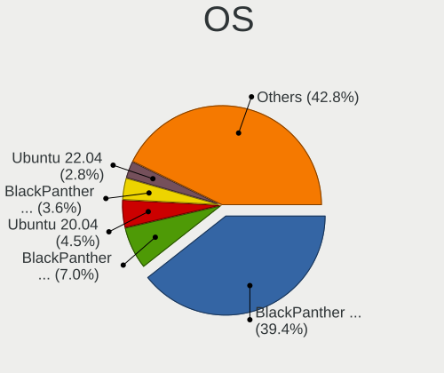

| Name                         | Computers | Percent |
|------------------------------|-----------|---------|
| BlackPanther 18.1            | 2459      | 39.38%  |
| BlackPanther 22.1            | 435       | 6.97%   |
| Ubuntu 20.04                 | 281       | 4.5%    |
| BlackPanther 16.2            | 223       | 3.57%   |
| Ubuntu 22.04                 | 174       | 2.79%   |
| Ubuntu 18.04                 | 161       | 2.58%   |
| Ubuntu 24.04                 | 105       | 1.68%   |
| Debian 12                    | 73        | 1.17%   |
| Arch Rolling                 | 72        | 1.15%   |
| OpenMandriva 4.2             | 59        | 0.94%   |
| Pop!_OS 22.04                | 54        | 0.86%   |
| Debian 11                    | 54        | 0.86%   |
| ArcoLinux Rolling            | 44        | 0.7%    |
| OpenMandriva 4.3             | 41        | 0.66%   |
| Zorin 17                     | 38        | 0.61%   |
| Zorin 16                     | 37        | 0.59%   |
| Linux Mint 22.1              | 34        | 0.54%   |
| Linux Mint 21.3              | 33        | 0.53%   |
| OpenMandriva 24.12           | 32        | 0.51%   |
| OpenMandriva 23.08           | 32        | 0.51%   |
| Manjaro                      | 32        | 0.51%   |
| Linux Mint 20.2              | 32        | 0.51%   |
| Linux Mint 21.1              | 31        | 0.5%    |
| openSUSE Tumbleweed-XXXXXXXX | 30        | 0.48%   |
| Fedora 40                    | 28        | 0.45%   |
| Fedora 39                    | 28        | 0.45%   |
| OpenMandriva 5.0             | 27        | 0.43%   |
| OpenMandriva 25.90           | 27        | 0.43%   |
| OpenMandriva 23.03           | 25        | 0.4%    |
| Fedora 38                    | 25        | 0.4%    |
| Arch                         | 25        | 0.4%    |
| Linux Mint 21.2              | 24        | 0.38%   |
| Linux Mint 19.3              | 24        | 0.38%   |
| Fedora 41                    | 24        | 0.38%   |
| Ubuntu 19.10                 | 23        | 0.37%   |
| Linux Mint 22.2              | 22        | 0.35%   |
| Linux Mint 20.3              | 22        | 0.35%   |
| Linux Mint 20                | 22        | 0.35%   |
| Debian 10                    | 22        | 0.35%   |
| Xubuntu 20.04                | 21        | 0.34%   |

OS Family
---------

OS without a version

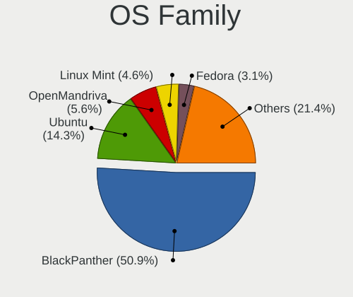

| Name          | Computers | Percent |
|---------------|-----------|---------|
| BlackPanther  | 2994      | 50.93%  |
| Ubuntu        | 838       | 14.25%  |
| OpenMandriva  | 332       | 5.65%   |
| Linux Mint    | 273       | 4.64%   |
| Fedora        | 184       | 3.13%   |
| Debian        | 177       | 3.01%   |
| Zorin         | 100       | 1.7%    |
| Arch          | 100       | 1.7%    |
| Endless       | 88        | 1.5%    |
| Manjaro       | 82        | 1.39%   |
| Pop!_OS       | 80        | 1.36%   |
| Kubuntu       | 69        | 1.17%   |
| Xubuntu       | 54        | 0.92%   |
| ArcoLinux     | 48        | 0.82%   |
| openSUSE      | 40        | 0.68%   |
| KDE neon      | 40        | 0.68%   |
| ROSA          | 32        | 0.54%   |
| Elementary    | 26        | 0.44%   |
| Ubuntu MATE   | 25        | 0.43%   |
| Lubuntu       | 23        | 0.39%   |
| SteamOS       | 20        | 0.34%   |
| Nobara        | 17        | 0.29%   |
| EndeavourOS   | 16        | 0.27%   |
| Ubuntu Unity  | 15        | 0.26%   |
| Kali          | 15        | 0.26%   |
| Bazzite       | 15        | 0.26%   |
| MX            | 14        | 0.24%   |
| LMDE          | 14        | 0.24%   |
| Gentoo        | 14        | 0.24%   |
| Devuan        | 9         | 0.15%   |
| Xero          | 8         | 0.14%   |
| Ubuntu Budgie | 8         | 0.14%   |
| NixOS         | 8         | 0.14%   |
| Garuda Linux  | 7         | 0.12%   |
| CachyOS       | 7         | 0.12%   |
| Rocky Linux   | 5         | 0.09%   |
| Raspbian      | 5         | 0.09%   |
| TUXEDO OS     | 4         | 0.07%   |
| Q4OS          | 4         | 0.07%   |
| Clear Linux   | 4         | 0.07%   |

Kernel
------

Version of the Linux kernel

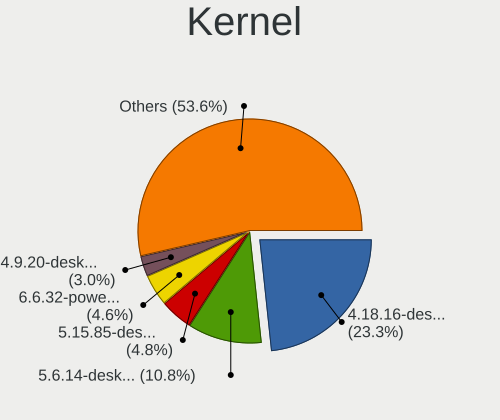

| Version                  | Computers | Percent |
|--------------------------|-----------|---------|
| 4.18.16-desktop-1bP      | 1629      | 23.33%  |
| 5.6.14-desktop-2bP       | 751       | 10.75%  |
| 5.15.85-desktop-1bP      | 333       | 4.77%   |
| 6.6.32-power-1bP         | 320       | 4.58%   |
| 4.9.20-desktop-pae-1bP   | 206       | 2.95%   |
| 5.1.15-desktop-1bP       | 85        | 1.22%   |
| 5.10.14-desktop-1omv4002 | 55        | 0.79%   |
| 6.3.8-desktop-1bP        | 54        | 0.77%   |
| 6.14.2-desktop-3omv2590  | 53        | 0.76%   |
| 5.4.0-42-generic         | 42        | 0.6%    |
| 5.16.7-desktop-1omv4003  | 39        | 0.56%   |
| 6.6.2-desktop-1omv2390   | 33        | 0.47%   |
| 6.6.34-power-1bP         | 31        | 0.44%   |
| 6.12.1-desktop-1omv2490  | 28        | 0.4%    |
| 5.4.0-58-generic         | 27        | 0.39%   |
| 6.4.11-desktop-1omv2390  | 25        | 0.36%   |
| 5.8.0-14-generic         | 25        | 0.36%   |
| 6.3.3-desktop-1bP        | 24        | 0.34%   |
| 6.2.6-desktop-1omv2390   | 24        | 0.34%   |
| 5.4.0-52-generic         | 21        | 0.3%    |
| 5.4.0-48-generic         | 19        | 0.27%   |
| 5.11.0-27-generic        | 19        | 0.27%   |
| 6.9.3-76060903-generic   | 18        | 0.26%   |
| 5.15.0-56-generic        | 17        | 0.24%   |
| 6.8.0-45-generic         | 16        | 0.23%   |
| 6.8.0-40-generic         | 16        | 0.23%   |
| 6.8.0-51-generic         | 15        | 0.21%   |
| 6.14.0-37-generic        | 15        | 0.21%   |
| 5.3.0-28-generic         | 15        | 0.21%   |
| 5.15.0-58-generic        | 15        | 0.21%   |
| 6.4.3-desktop-1bP        | 14        | 0.2%    |
| 6.1.1-desktop-1omv2290   | 14        | 0.2%    |
| 5.15.0-76-generic        | 14        | 0.2%    |
| 5.15.0-52-generic        | 14        | 0.2%    |
| 5.15.0-43-generic        | 14        | 0.2%    |
| 4.18.0-15-generic        | 14        | 0.2%    |
| 6.8.0-60-generic         | 13        | 0.19%   |
| 5.4.0-54-generic         | 13        | 0.19%   |
| 5.4.0-40-generic         | 13        | 0.19%   |
| 5.4.0-19-generic         | 13        | 0.19%   |

Kernel Family
-------------

Linux kernel without a distro release

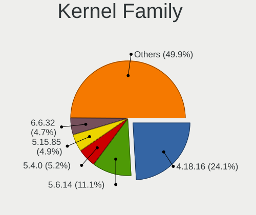

| Version | Computers | Percent |
|---------|-----------|---------|
| 4.18.16 | 1629      | 24.07%  |
| 5.6.14  | 754       | 11.14%  |
| 5.4.0   | 354       | 5.23%   |
| 5.15.85 | 334       | 4.93%   |
| 6.6.32  | 321       | 4.74%   |
| 5.15.0  | 244       | 3.6%    |
| 4.9.20  | 217       | 3.21%   |
| 6.8.0   | 178       | 2.63%   |
| 4.15.0  | 120       | 1.77%   |
| 5.11.0  | 104       | 1.54%   |
| 5.8.0   | 103       | 1.52%   |
| 6.5.0   | 93        | 1.37%   |
| 5.1.15  | 86        | 1.27%   |
| 5.13.0  | 84        | 1.24%   |
| 5.3.0   | 82        | 1.21%   |
| 6.1.0   | 78        | 1.15%   |
| 6.14.0  | 73        | 1.08%   |
| 6.2.0   | 69        | 1.02%   |
| 5.10.0  | 68        | 1%      |
| 6.14.2  | 59        | 0.87%   |
| 6.3.8   | 56        | 0.83%   |
| 5.0.0   | 56        | 0.83%   |
| 5.10.14 | 55        | 0.81%   |
| 5.19.0  | 51        | 0.75%   |
| 6.11.0  | 46        | 0.68%   |
| 4.18.0  | 42        | 0.62%   |
| 5.16.7  | 40        | 0.59%   |
| 6.6.2   | 36        | 0.53%   |
| 6.6.34  | 31        | 0.46%   |
| 6.2.6   | 30        | 0.44%   |
| 6.12.1  | 29        | 0.43%   |
| 6.4.11  | 27        | 0.4%    |
| 6.9.3   | 25        | 0.37%   |
| 6.3.3   | 24        | 0.35%   |
| 4.19.0  | 24        | 0.35%   |
| 6.4.3   | 18        | 0.27%   |
| 6.1.1   | 18        | 0.27%   |
| 6.2.9   | 13        | 0.19%   |
| 5.14.0  | 13        | 0.19%   |
| 6.9.7   | 12        | 0.18%   |

Kernel Major Ver.
-----------------

Linux kernel major version

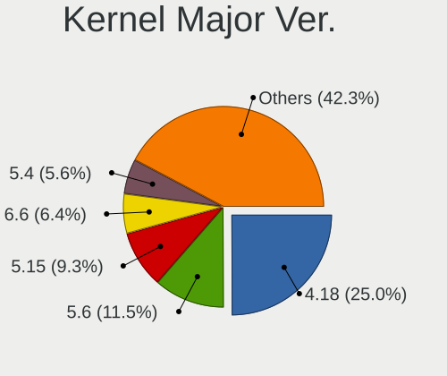

| Version | Computers | Percent |
|---------|-----------|---------|
| 4.18    | 1670      | 24.95%  |
| 5.6     | 769       | 11.49%  |
| 5.15    | 620       | 9.26%   |
| 6.6     | 428       | 6.39%   |
| 5.4     | 377       | 5.63%   |
| 4.9     | 232       | 3.47%   |
| 6.8     | 208       | 3.11%   |
| 6.14    | 155       | 2.32%   |
| 5.10    | 152       | 2.27%   |
| 6.2     | 136       | 2.03%   |
| 6.1     | 136       | 2.03%   |
| 6.5     | 129       | 1.93%   |
| 5.11    | 124       | 1.85%   |
| 4.15    | 120       | 1.79%   |
| 5.8     | 119       | 1.78%   |
| 6.12    | 102       | 1.52%   |
| 5.13    | 96        | 1.43%   |
| 6.3     | 91        | 1.36%   |
| 5.1     | 89        | 1.33%   |
| 5.3     | 88        | 1.31%   |
| 6.11    | 85        | 1.27%   |
| 6.4     | 77        | 1.15%   |
| 5.19    | 74        | 1.11%   |
| 5.16    | 68        | 1.02%   |
| 6.9     | 58        | 0.87%   |
| 5.0     | 56        | 0.84%   |
| 6.10    | 41        | 0.61%   |
| 6.17    | 39        | 0.58%   |
| 6.13    | 33        | 0.49%   |
| 6.0     | 33        | 0.49%   |
| 5.14    | 32        | 0.48%   |
| 5.18    | 29        | 0.43%   |
| 6.7     | 27        | 0.4%    |
| 4.19    | 26        | 0.39%   |
| 5.9     | 25        | 0.37%   |
| 5.12    | 23        | 0.34%   |
| 6.15    | 20        | 0.3%    |
| 6.16    | 16        | 0.24%   |
| 5.7     | 16        | 0.24%   |
| 5.17    | 16        | 0.24%   |

Arch
----

OS architecture (x86_64, i586, etc.)

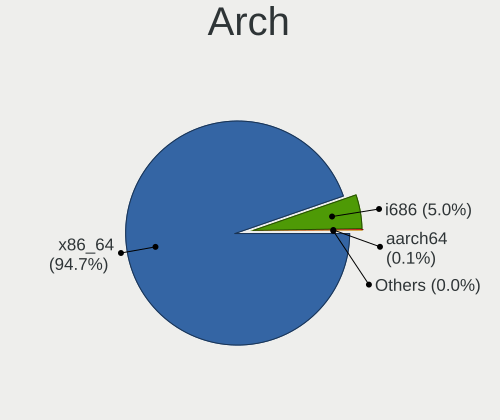

| Name    | Computers | Percent |
|---------|-----------|---------|
| x86_64  | 5383      | 94.7%   |
| i686    | 286       | 5.03%   |
| aarch64 | 8         | 0.14%   |
| armv7l  | 4         | 0.07%   |
| armv6l  | 2         | 0.04%   |
| unknow  | 1         | 0.02%   |

DE
--

Desktop Environment

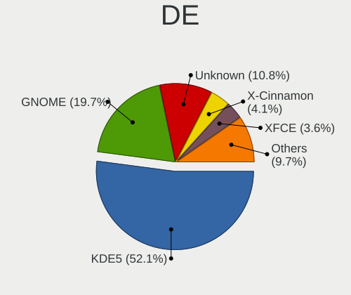

| Name            | Computers | Percent |
|-----------------|-----------|---------|
| KDE5            | 3059      | 52.08%  |
| GNOME           | 1156      | 19.68%  |
| Unknown         | 637       | 10.84%  |
| X-Cinnamon      | 242       | 4.12%   |
| XFCE            | 212       | 3.61%   |
| KDE6            | 197       | 3.35%   |
| MATE            | 95        | 1.62%   |
| LXQt            | 52        | 0.89%   |
| KDE             | 51        | 0.87%   |
| Cinnamon        | 35        | 0.6%    |
| Pantheon        | 25        | 0.43%   |
| Unity           | 15        | 0.26%   |
| KDE4            | 15        | 0.26%   |
| i3              | 13        | 0.22%   |
| Hyprland        | 13        | 0.22%   |
| Budgie          | 11        | 0.19%   |
| LXDE            | 9         | 0.15%   |
| Deepin          | 7         | 0.12%   |
| GNOME Flashback | 6         | 0.1%    |
| GNOME Classic   | 4         | 0.07%   |
| Endless:GNOME   | 3         | 0.05%   |
| COSMIC          | 3         | 0.05%   |
| Trinity         | 2         | 0.03%   |
| sway            | 2         | 0.03%   |
| openbox         | 2         | 0.03%   |
| Enlightenment   | 2         | 0.03%   |
| qtile           | 1         | 0.02%   |
| ICEWM           | 1         | 0.02%   |
| DDE             | 1         | 0.02%   |
| BunsenLabs      | 1         | 0.02%   |
| bspwm           | 1         | 0.02%   |
| awesome         | 1         | 0.02%   |

Display Server
--------------

X11 or Wayland

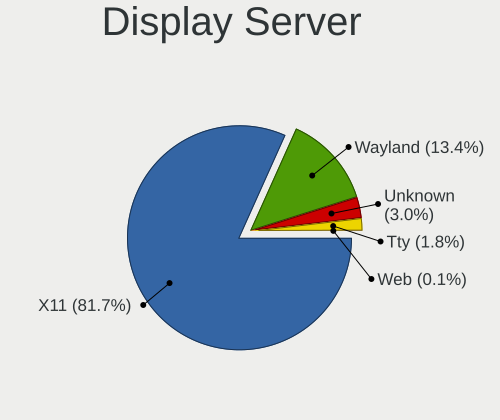

| Name    | Computers | Percent |
|---------|-----------|---------|
| X11     | 4732      | 81.71%  |
| Wayland | 776       | 13.4%   |
| Unknown | 176       | 3.04%   |
| Tty     | 104       | 1.8%    |
| Web     | 3         | 0.05%   |

Display Manager
---------------

SDDM, LightDM, etc.

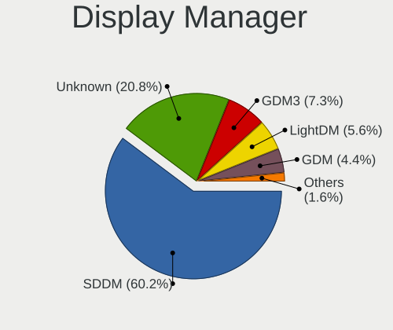

| Name           | Computers | Percent |
|----------------|-----------|---------|
| SDDM           | 3512      | 60.24%  |
| Unknown        | 1213      | 20.81%  |
| GDM3           | 423       | 7.26%   |
| LightDM        | 328       | 5.63%   |
| GDM            | 259       | 4.44%   |
| TDM            | 65        | 1.11%   |
| KDM            | 14        | 0.24%   |
| SLiM           | 6         | 0.1%    |
| XDM            | 4         | 0.07%   |
| NODM           | 3         | 0.05%   |
| LXDM           | 1         | 0.02%   |
| GREETD         | 1         | 0.02%   |
| COSMIC-GREETER | 1         | 0.02%   |

OS Lang
-------

Language

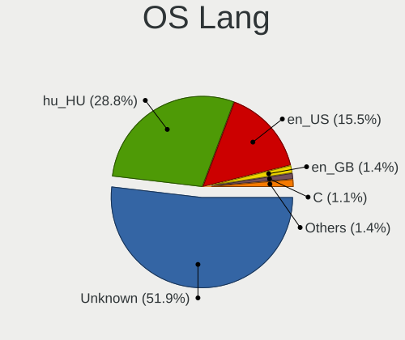

| Lang         | Computers | Percent |
|--------------|-----------|---------|
| Unknown      | 3008      | 51.86%  |
| hu_HU        | 1671      | 28.81%  |
| en_US        | 898       | 15.48%  |
| en_GB        | 80        | 1.38%   |
| C            | 63        | 1.09%   |
| de_DE        | 34        | 0.59%   |
| POSIX        | 6         | 0.1%    |
| ru_RU        | 5         | 0.09%   |
| nl_NL        | 5         | 0.09%   |
| en_AU        | 4         | 0.07%   |
| ru_UA        | 3         | 0.05%   |
| de_AT        | 3         | 0.05%   |
| C.UTF8       | 3         | 0.05%   |
| it_IT        | 2         | 0.03%   |
| hu_HU.UTF8   | 2         | 0.03%   |
| fr_FR        | 2         | 0.03%   |
| en_IN        | 2         | 0.03%   |
| sk_SK        | 1         | 0.02%   |
| fr_BE        | 1         | 0.02%   |
| en_ZA        | 1         | 0.02%   |
| en_US@custom | 1         | 0.02%   |
| en_US.UTF8   | 1         | 0.02%   |
| en_IL        | 1         | 0.02%   |
| en_DK        | 1         | 0.02%   |
| en_AG        | 1         | 0.02%   |
| el_GR        | 1         | 0.02%   |

Boot Mode
---------

EFI or BIOS

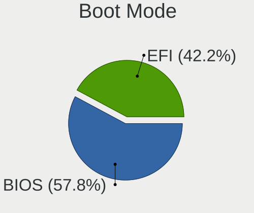

| Mode | Computers | Percent |
|------|-----------|---------|
| BIOS | 3408      | 57.83%  |
| EFI  | 2485      | 42.17%  |

Filesystem
----------

Type of filesystem

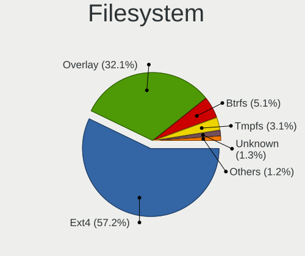

| Type    | Computers | Percent |
|---------|-----------|---------|
| Ext4    | 3568      | 57.17%  |
| Overlay | 2004      | 32.11%  |
| Btrfs   | 321       | 5.14%   |
| Tmpfs   | 192       | 3.08%   |
| Unknown | 84        | 1.35%   |
| Xfs     | 33        | 0.53%   |
| Zfs     | 16        | 0.26%   |
| Ext2    | 9         | 0.14%   |
| Ext3    | 6         | 0.1%    |
| F2fs    | 4         | 0.06%   |
| Rootfs  | 3         | 0.05%   |
| XXXXXXX | 1         | 0.02%   |

Part. scheme
------------

Scheme of partitioning

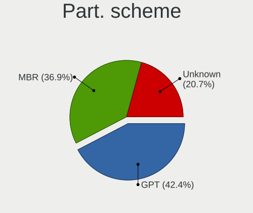

| Type    | Computers | Percent |
|---------|-----------|---------|
| GPT     | 2527      | 42.37%  |
| MBR     | 2201      | 36.9%   |
| Unknown | 1236      | 20.72%  |

Dual Boot with Linux/BSD
------------------------

Hosting more than one Linux/BSD

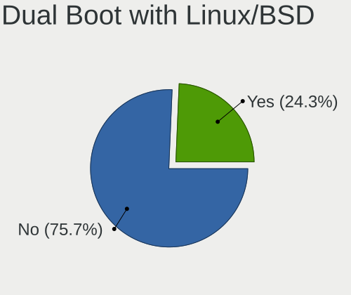

| Dual boot | Computers | Percent |
|-----------|-----------|---------|
| No        | 4628      | 75.67%  |
| Yes       | 1488      | 24.33%  |

Dual Boot (Win)
---------------

Hosting Linux and Windows

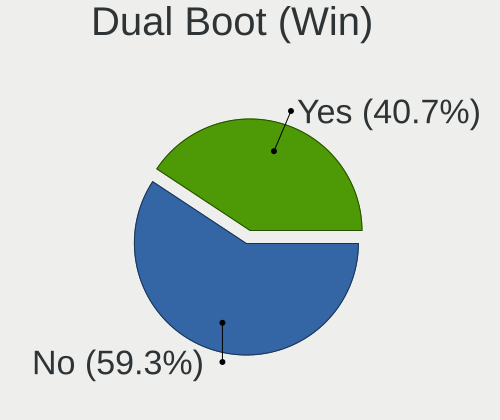

| Dual boot | Computers | Percent |
|-----------|-----------|---------|
| No        | 3575      | 59.29%  |
| Yes       | 2455      | 40.71%  |

Board
-----

Vendor
------

Motherboard manufacturer

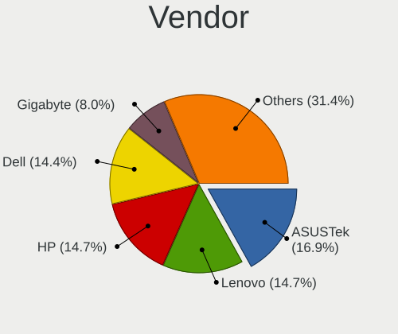

| Name                    | Computers | Percent |
|-------------------------|-----------|---------|
| ASUSTek Computer        | 955       | 16.93%  |
| Lenovo                  | 829       | 14.69%  |
| Hewlett-Packard         | 829       | 14.69%  |
| Dell                    | 810       | 14.36%  |
| Gigabyte Technology     | 449       | 7.96%   |
| Acer                    | 356       | 6.31%   |
| ASRock                  | 348       | 6.17%   |
| MSI                     | 204       | 3.62%   |
| Fujitsu                 | 144       | 2.55%   |
| Toshiba                 | 81        | 1.44%   |
| Fujitsu Siemens         | 74        | 1.31%   |
| Samsung Electronics     | 53        | 0.94%   |
| Apple                   | 46        | 0.82%   |
| Packard Bell            | 41        | 0.73%   |
| Intel                   | 41        | 0.73%   |
| Medion                  | 38        | 0.67%   |
| Unknown                 | 33        | 0.58%   |
| Sony                    | 26        | 0.46%   |
| eMachines               | 26        | 0.46%   |
| Valve                   | 20        | 0.35%   |
| Foxconn                 | 19        | 0.34%   |
| Microsoft               | 11        | 0.19%   |
| Hungaro Flotta Kft      | 11        | 0.19%   |
| Raspberry Pi Foundation | 10        | 0.18%   |
| AMI                     | 10        | 0.18%   |
| Alcor                   | 10        | 0.18%   |
| Shuttle                 | 8         | 0.14%   |
| HUAWEI                  | 8         | 0.14%   |
| Pegatron                | 7         | 0.12%   |
| GMKtec                  | 7         | 0.12%   |
| Huanan                  | 6         | 0.11%   |
| Google                  | 6         | 0.11%   |
| AZW                     | 6         | 0.11%   |
| TUXEDO                  | 4         | 0.07%   |
| Timi                    | 4         | 0.07%   |
| Supermicro              | 4         | 0.07%   |
| Notebook                | 4         | 0.07%   |
| LG Electronics          | 4         | 0.07%   |
| Insyde                  | 4         | 0.07%   |
| Biostar                 | 4         | 0.07%   |

Model
-----

Motherboard model

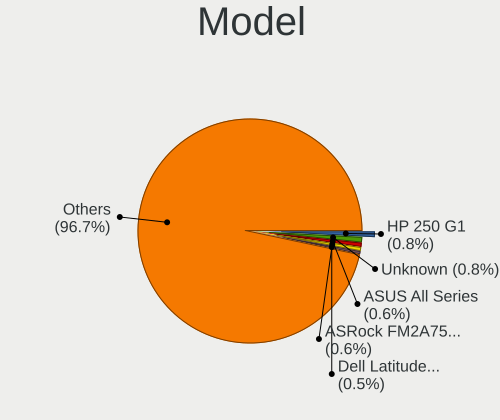

| Name                             | Computers | Percent |
|----------------------------------|-----------|---------|
| HP 250 G1                        | 47        | 0.83%   |
| Unknown                          | 46        | 0.82%   |
| ASUS All Series                  | 36        | 0.64%   |
| ASRock FM2A75M Pro4+             | 33        | 0.58%   |
| Dell Latitude E6410              | 26        | 0.46%   |
| Dell OptiPlex 3020               | 24        | 0.43%   |
| HP ProBook 455 G1                | 20        | 0.35%   |
| Valve Jupiter                    | 16        | 0.28%   |
| HP Notebook                      | 16        | 0.28%   |
| Dell OptiPlex 780                | 16        | 0.28%   |
| Dell OptiPlex 755                | 15        | 0.27%   |
| MSI MS-7C91                      | 14        | 0.25%   |
| Gigabyte G31M-ES2L               | 14        | 0.25%   |
| Dell Latitude 5480               | 14        | 0.25%   |
| MSI MS-7C02                      | 13        | 0.23%   |
| Lenovo IdeaPad 330-15IKB 81DE    | 13        | 0.23%   |
| HP 650                           | 13        | 0.23%   |
| Dell Latitude E6400              | 13        | 0.23%   |
| MSI MS-7680                      | 12        | 0.21%   |
| HP EliteBook 8460p               | 12        | 0.21%   |
| HP 620                           | 12        | 0.21%   |
| Dell OptiPlex 760                | 12        | 0.21%   |
| Dell OptiPlex 7010               | 12        | 0.21%   |
| Dell Inspiron 7737               | 12        | 0.21%   |
| ASUS P5KPL-AM EPU                | 12        | 0.21%   |
| Lenovo IdeaPad 100-15IBD 80QQ    | 11        | 0.19%   |
| Lenovo G50-45 80E3               | 11        | 0.19%   |
| HP EliteBook 8470p               | 11        | 0.19%   |
| Dell Latitude E6430              | 11        | 0.19%   |
| MSI MS-7817                      | 10        | 0.18%   |
| Lenovo ThinkStation D20 4158AF8  | 10        | 0.18%   |
| HP ProDesk 600 G2 SFF            | 10        | 0.18%   |
| HP Pavilion 15                   | 10        | 0.18%   |
| HP Compaq Pro 6300 MT            | 10        | 0.18%   |
| Gigabyte H61M-S1                 | 10        | 0.18%   |
| Dell Vostro 1015                 | 10        | 0.18%   |
| Dell Precision WorkStation T3500 | 10        | 0.18%   |
| Dell Inspiron 3542               | 10        | 0.18%   |
| ASUS H110M-A                     | 10        | 0.18%   |
| Lenovo Z50-75 80EC               | 9         | 0.16%   |

Model Family
------------

Motherboard model prefix

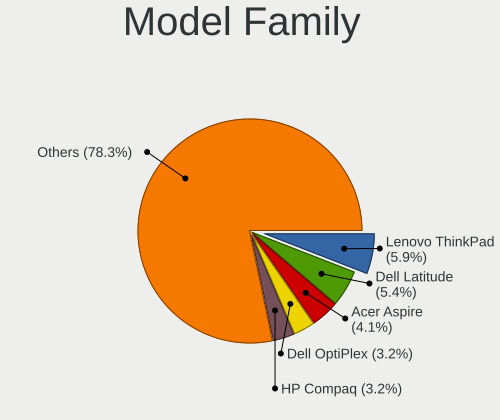

| Name                    | Computers | Percent |
|-------------------------|-----------|---------|
| Lenovo ThinkPad         | 333       | 5.9%    |
| Dell Latitude           | 302       | 5.35%   |
| Acer Aspire             | 232       | 4.11%   |
| Dell OptiPlex           | 180       | 3.19%   |
| HP Compaq               | 179       | 3.17%   |
| Dell Inspiron           | 179       | 3.17%   |
| Lenovo IdeaPad          | 167       | 2.96%   |
| HP EliteBook            | 127       | 2.25%   |
| HP ProBook              | 104       | 1.84%   |
| ASUS VivoBook           | 91        | 1.61%   |
| ASUS PRIME              | 89        | 1.58%   |
| Lenovo ThinkCentre      | 82        | 1.45%   |
| HP 250                  | 78        | 1.38%   |
| HP Pavilion             | 71        | 1.26%   |
| Toshiba Satellite       | 70        | 1.24%   |
| Fujitsu ESPRIMO         | 70        | 1.24%   |
| ASUS ROG                | 60        | 1.06%   |
| Dell Vostro             | 51        | 0.9%    |
| ASUS TUF                | 48        | 0.85%   |
| Fujitsu LIFEBOOK        | 46        | 0.82%   |
| Unknown                 | 46        | 0.82%   |
| Dell Precision          | 42        | 0.74%   |
| Packard Bell EasyNote   | 40        | 0.71%   |
| Fujitsu Siemens ESPRIMO | 37        | 0.66%   |
| ASUS ASUS               | 37        | 0.66%   |
| ASUS All                | 36        | 0.64%   |
| HP Laptop               | 33        | 0.58%   |
| ASRock FM2A75M          | 33        | 0.58%   |
| HP EliteDesk            | 32        | 0.57%   |
| Acer TravelMate         | 27        | 0.48%   |
| Fujitsu Siemens AMILO   | 26        | 0.46%   |
| Acer Swift              | 23        | 0.41%   |
| Lenovo ThinkStation     | 22        | 0.39%   |
| ASUS ZenBook            | 22        | 0.39%   |
| HP ProDesk              | 20        | 0.35%   |
| Gigabyte B450           | 20        | 0.35%   |
| Lenovo Yoga             | 18        | 0.32%   |
| HP 255                  | 18        | 0.32%   |
| ASUS P5KPL-AM           | 18        | 0.32%   |
| Acer Veriton            | 18        | 0.32%   |

MFG Year
--------

Motherboard manufacture year

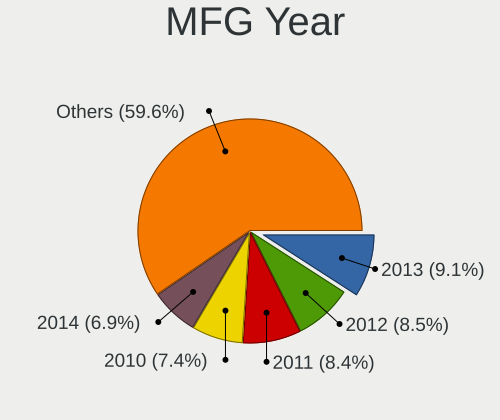

| Year    | Computers | Percent |
|---------|-----------|---------|
| 2013    | 514       | 9.11%   |
| 2012    | 479       | 8.49%   |
| 2011    | 476       | 8.44%   |
| 2010    | 420       | 7.44%   |
| 2014    | 392       | 6.95%   |
| 2018    | 391       | 6.93%   |
| 2009    | 356       | 6.31%   |
| 2008    | 324       | 5.74%   |
| 2017    | 320       | 5.67%   |
| 2015    | 312       | 5.53%   |
| 2020    | 262       | 4.64%   |
| 2016    | 258       | 4.57%   |
| 2019    | 250       | 4.43%   |
| 2007    | 222       | 3.93%   |
| 2021    | 199       | 3.53%   |
| 2022    | 135       | 2.39%   |
| 2023    | 108       | 1.91%   |
| 2006    | 96        | 1.7%    |
| 2024    | 60        | 1.06%   |
| 2005    | 32        | 0.57%   |
| Unknown | 14        | 0.25%   |
| 2025    | 13        | 0.23%   |
| 2004    | 5         | 0.09%   |
| 2003    | 4         | 0.07%   |

Form Factor
-----------

Physical design of the computer

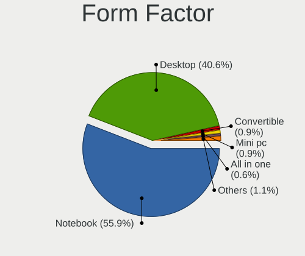

| Name           | Computers | Percent |
|----------------|-----------|---------|
| Notebook       | 3153      | 55.88%  |
| Desktop        | 2290      | 40.59%  |
| Convertible    | 53        | 0.94%   |
| Mini pc        | 48        | 0.85%   |
| All in one     | 35        | 0.62%   |
| Tablet         | 26        | 0.46%   |
| Server         | 21        | 0.37%   |
| System on chip | 13        | 0.23%   |
| Phone          | 2         | 0.04%   |
| Other          | 1         | 0.02%   |

Secure Boot
-----------

Enabled or disabled

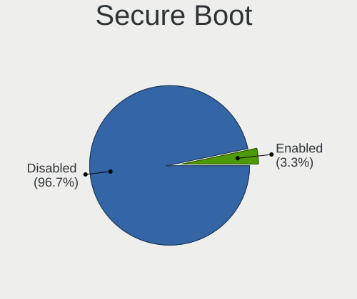

| State    | Computers | Percent |
|----------|-----------|---------|
| Disabled | 5480      | 96.68%  |
| Enabled  | 188       | 3.32%   |

Coreboot
--------

Have coreboot on board

| Used | Computers | Percent |
|------|-----------|---------|
| No   | 5636      | 99.89%  |
| Yes  | 6         | 0.11%   |

RAM Size
--------

Total RAM memory

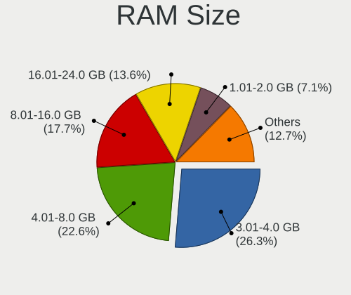

| Size in GB  | Computers | Percent |
|-------------|-----------|---------|
| 3.01-4.0    | 1543      | 26.34%  |
| 4.01-8.0    | 1324      | 22.6%   |
| 8.01-16.0   | 1035      | 17.67%  |
| 16.01-24.0  | 796       | 13.59%  |
| 1.01-2.0    | 418       | 7.14%   |
| 32.01-64.0  | 364       | 6.21%   |
| 2.01-3.0    | 155       | 2.65%   |
| 24.01-32.0  | 101       | 1.72%   |
| 64.01-256.0 | 69        | 1.18%   |
| 0.51-1.0    | 47        | 0.8%    |
| 0.01-0.5    | 3         | 0.05%   |
| Unknown     | 3         | 0.05%   |

RAM Used
--------

Used RAM memory

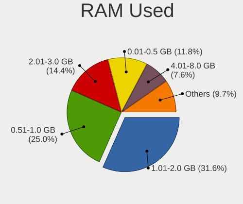

| Used GB     | Computers | Percent |
|-------------|-----------|---------|
| 1.01-2.0    | 2147      | 31.63%  |
| 0.51-1.0    | 1695      | 24.97%  |
| 2.01-3.0    | 975       | 14.36%  |
| 0.01-0.5    | 800       | 11.79%  |
| 4.01-8.0    | 513       | 7.56%   |
| 3.01-4.0    | 475       | 7%      |
| 8.01-16.0   | 147       | 2.17%   |
| 16.01-24.0  | 24        | 0.35%   |
| 32.01-64.0  | 5         | 0.07%   |
| Unknown     | 4         | 0.06%   |
| 64.01-256.0 | 3         | 0.04%   |

Total Drives
------------

Number of drives on board

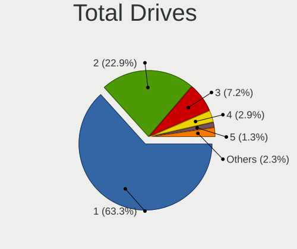

| Drives  | Computers | Percent |
|---------|-----------|---------|
| 1       | 3829      | 63.33%  |
| 2       | 1387      | 22.94%  |
| 3       | 437       | 7.23%   |
| 4       | 175       | 2.89%   |
| 5       | 79        | 1.31%   |
| 0       | 72        | 1.19%   |
| 6       | 25        | 0.41%   |
| 8       | 10        | 0.17%   |
| 7       | 10        | 0.17%   |
| 9       | 9         | 0.15%   |
| 11      | 4         | 0.07%   |
| 10      | 4         | 0.07%   |
| 15      | 1         | 0.02%   |
| 14      | 1         | 0.02%   |
| 13      | 1         | 0.02%   |
| 12      | 1         | 0.02%   |
| Unknown | 1         | 0.02%   |

Has CD-ROM
----------

Has CD-ROM on board

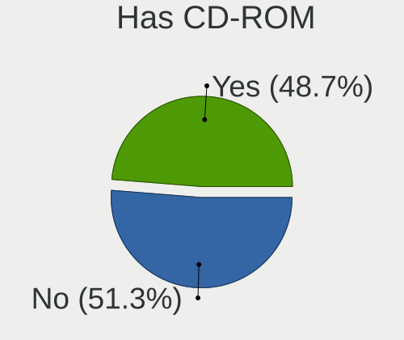

| Presented | Computers | Percent |
|-----------|-----------|---------|
| No        | 2959      | 51.26%  |
| Yes       | 2813      | 48.74%  |

Has Ethernet
------------

Has Ethernet on board

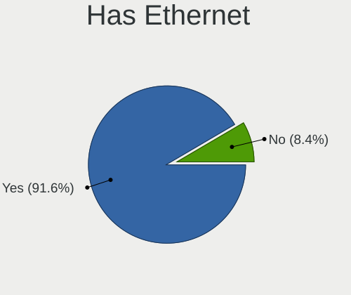

| Presented | Computers | Percent |
|-----------|-----------|---------|
| Yes       | 5177      | 91.56%  |
| No        | 477       | 8.44%   |

Has WiFi
--------

Has WiFi module

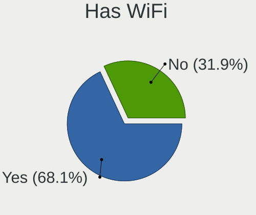

| Presented | Computers | Percent |
|-----------|-----------|---------|
| Yes       | 3881      | 68.06%  |
| No        | 1821      | 31.94%  |

Has Bluetooth
-------------

Has Bluetooth module

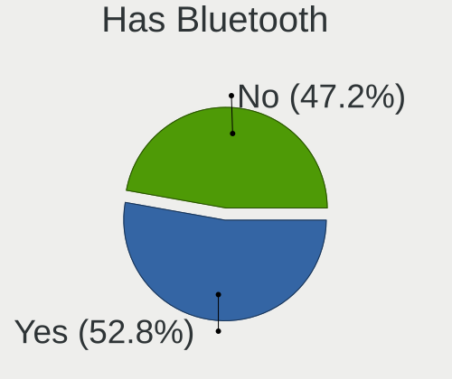

| Presented | Computers | Percent |
|-----------|-----------|---------|
| Yes       | 3041      | 52.8%   |
| No        | 2718      | 47.2%   |

Location
--------

Country
-------

Geographic location (country)

| Country | Computers | Percent |
|---------|-----------|---------|
| Hungary | 5642      | 100%    |

City
----

Geographic location (city)

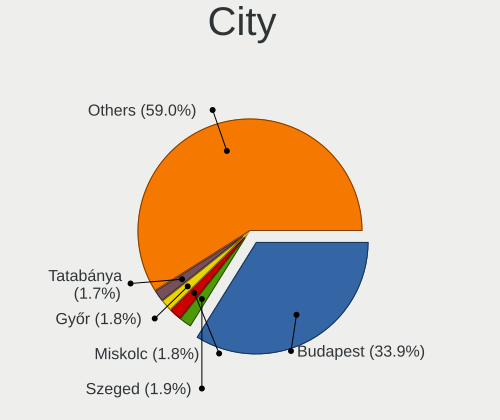

| City              | Computers | Percent |
|-------------------|-----------|---------|
| Budapest          | 2246      | 33.87%  |
| Szeged            | 123       | 1.85%   |
| Miskolc           | 121       | 1.82%   |
| Győr             | 117       | 1.76%   |
| Tatabánya        | 114       | 1.72%   |
| Pécs             | 114       | 1.72%   |
| Debrecen          | 114       | 1.72%   |
| Kecskemét        | 97        | 1.46%   |
| Zalaegerszeg      | 92        | 1.39%   |
| Szigetszentmiklos | 90        | 1.36%   |
| Szombathely       | 75        | 1.13%   |
| Székesfehérvár | 72        | 1.09%   |
| Érd              | 69        | 1.04%   |
| Nyiregyhaza       | 62        | 0.94%   |
| Szolnok           | 58        | 0.87%   |
| Veszprém         | 54        | 0.81%   |
| Karcag            | 53        | 0.8%    |
| Berettyóújfalu  | 49        | 0.74%   |
| Szekszárd        | 48        | 0.72%   |
| Gödöllő        | 43        | 0.65%   |
| Oroshaza          | 38        | 0.57%   |
| Eger              | 38        | 0.57%   |
| Cegled            | 37        | 0.56%   |
| Dunaújváros     | 36        | 0.54%   |
| Szentendre        | 35        | 0.53%   |
| Sopron            | 34        | 0.51%   |
| Pomaz             | 34        | 0.51%   |
| Hatvan            | 32        | 0.48%   |
| Toeroekbalint     | 29        | 0.44%   |
| Gyomro            | 29        | 0.44%   |
| Salgotarjan       | 28        | 0.42%   |
| Nagykanizsa       | 28        | 0.42%   |
| Kaposvár         | 27        | 0.41%   |
| Hodmezovasarhely  | 25        | 0.38%   |
| Tamasi            | 24        | 0.36%   |
| Mosonmagyaróvár | 24        | 0.36%   |
| Esztergom         | 24        | 0.36%   |
| Siófok           | 22        | 0.33%   |
| Csongrad          | 22        | 0.33%   |
| Békéscsaba      | 22        | 0.33%   |

Drives
------

Drive Vendor
------------

Hard drive vendors

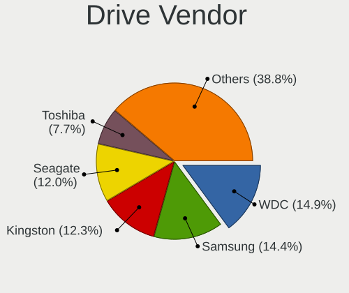

| Vendor                      | Computers | Drives | Percent |
|-----------------------------|-----------|--------|---------|
| WDC                         | 1259      | 2506   | 14.9%   |
| Samsung Electronics         | 1214      | 2160   | 14.37%  |
| Kingston                    | 1035      | 1871   | 12.25%  |
| Seagate                     | 1017      | 1718   | 12.04%  |
| Toshiba                     | 648       | 1112   | 7.67%   |
| Hitachi                     | 313       | 458    | 3.71%   |
| SanDisk                     | 276       | 409    | 3.27%   |
| HGST                        | 227       | 421    | 2.69%   |
| Unknown                     | 213       | 318    | 2.52%   |
| A-DATA Technology           | 191       | 336    | 2.26%   |
| SK hynix                    | 166       | 248    | 1.97%   |
| Intel                       | 157       | 251    | 1.86%   |
| Micron Technology           | 130       | 193    | 1.54%   |
| Crucial                     | 130       | 219    | 1.54%   |
| SPCC                        | 125       | 185    | 1.48%   |
| Apacer                      | 82        | 128    | 0.97%   |
| Kingston Technology Company | 77        | 106    | 0.91%   |
| Fujitsu                     | 77        | 100    | 0.91%   |
| Intenso                     | 66        | 123    | 0.78%   |
| Maxtor                      | 59        | 76     | 0.7%    |
| JMicron Technology          | 59        | 67     | 0.7%    |
| Patriot                     | 43        | 85     | 0.51%   |
| China                       | 42        | 66     | 0.5%    |
| KIOXIA                      | 37        | 51     | 0.44%   |
| LITEON                      | 33        | 45     | 0.39%   |
| Gigabyte Technology         | 32        | 83     | 0.38%   |
| Kingmax                     | 31        | 70     | 0.37%   |
| PNY                         | 30        | 62     | 0.36%   |
| Verbatim                    | 29        | 59     | 0.34%   |
| Phison Electronics          | 29        | 41     | 0.34%   |
| OCZ                         | 29        | 37     | 0.34%   |
| Transcend                   | 26        | 33     | 0.31%   |
| Unknown                     | 24        | 39     | 0.28%   |
| Team                        | 22        | 34     | 0.26%   |
| Apple                       | 19        | 34     | 0.22%   |
| Hewlett-Packard             | 18        | 25     | 0.21%   |
| LITEONIT                    | 17        | 32     | 0.2%    |
| KingSpec                    | 17        | 20     | 0.2%    |
| Silicon Motion              | 16        | 20     | 0.19%   |
| Netac                       | 16        | 29     | 0.19%   |

Drive Model
-----------

Hard drive models

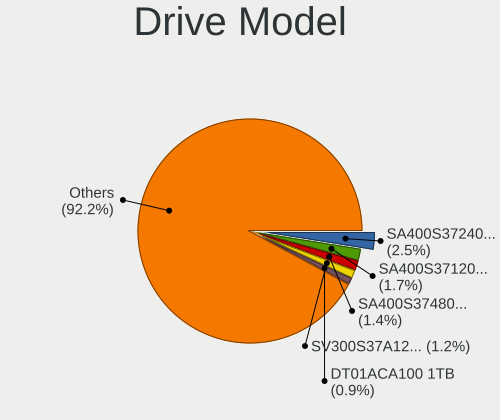

| Model                                             | Computers | Percent |
|---------------------------------------------------|-----------|---------|
| Kingston SA400S37240G 240GB SSD                   | 236       | 2.54%   |
| Kingston SA400S37120G 120GB SSD                   | 160       | 1.72%   |
| Kingston SA400S37480G 480GB SSD                   | 134       | 1.44%   |
| Kingston SV300S37A120G 120GB SSD                  | 111       | 1.19%   |
| Toshiba DT01ACA100 1TB                            | 88        | 0.95%   |
| Seagate ST1000LM035-1RK172 1TB                    | 75        | 0.81%   |
| Seagate ST1000LM024 HN-M101MBB 1TB                | 70        | 0.75%   |
| Samsung SSD 850 EVO 250GB                         | 69        | 0.74%   |
| Toshiba MQ01ABF050 500GB                          | 65        | 0.7%    |
| Seagate ST500DM002-1BD142 500GB                   | 60        | 0.65%   |
| Samsung NVMe SSD Controller SM981/PM981/PM983 1TB | 59        | 0.64%   |
| Toshiba MQ01ABD100 1TB                            | 54        | 0.58%   |
| Kingston SUV400S37120G 120GB SSD                  | 54        | 0.58%   |
| Seagate ST500LT012-1DG142 500GB                   | 49        | 0.53%   |
| SPCC Solid State Disk 256GB                       | 48        | 0.52%   |
| Samsung SSD 860 EVO 250GB                         | 48        | 0.52%   |
| Toshiba DT01ACA050 500GB                          | 46        | 0.5%    |
| Kingston SA400S37960G 960GB SSD                   | 46        | 0.5%    |
| Samsung SSD 860 EVO 500GB                         | 45        | 0.48%   |
| JMicron Generic 320GB                             | 43        | 0.46%   |
| WDC WDS240G2G0A-00JH30 240GB SSD                  | 40        | 0.43%   |
| HGST HTS545032A7E380 320GB                        | 37        | 0.4%    |
| A-DATA SU630 240GB SSD                            | 37        | 0.4%    |
| HGST HTS725050A7E630 500GB                        | 33        | 0.36%   |
| HGST HTS545050A7E680 500GB                        | 33        | 0.36%   |
| Toshiba MQ04ABF100 1TB                            | 32        | 0.34%   |
| HGST HTS721010A9E630 1TB                          | 32        | 0.34%   |
| Toshiba HDWD110 1TB                               | 31        | 0.33%   |
| Unknown MMC Card  32GB                            | 30        | 0.32%   |
| Toshiba HDWD130 3TB                               | 30        | 0.32%   |
| SanDisk NVMe SSD Drive 512GB                      | 29        | 0.31%   |
| WDC WD10EZEX-08WN4A0 1TB                          | 28        | 0.3%    |
| SPCC Solid State Disk 128GB                       | 28        | 0.3%    |
| Samsung SSD 850 EVO 500GB                         | 28        | 0.3%    |
| Samsung HD502HJ 500GB                             | 28        | 0.3%    |
| Kingston SV300S37A240G 240GB SSD                  | 28        | 0.3%    |
| Kingston SNV2S500G 500GB                          | 28        | 0.3%    |
| Kingston SHFS37A120G 120GB SSD                    | 28        | 0.3%    |
| A-DATA SU700 120GB SSD                            | 28        | 0.3%    |
| Seagate ST9500325AS 500GB                         | 27        | 0.29%   |

HDD Vendor
----------

Hard disk drive vendors

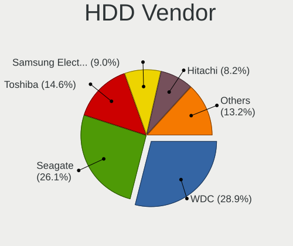

| Vendor              | Computers | Drives | Percent |
|---------------------|-----------|--------|---------|
| WDC                 | 1100      | 2177   | 28.95%  |
| Seagate             | 990       | 1664   | 26.05%  |
| Toshiba             | 553       | 962    | 14.55%  |
| Samsung Electronics | 342       | 555    | 9%      |
| Hitachi             | 313       | 458    | 8.24%   |
| HGST                | 227       | 421    | 5.97%   |
| Fujitsu             | 77        | 100    | 2.03%   |
| Maxtor              | 59        | 76     | 1.55%   |
| JMicron Technology  | 43        | 50     | 1.13%   |
| Unknown             | 19        | 32     | 0.5%    |
| HGST HTS            | 9         | 14     | 0.24%   |
| Hewlett-Packard     | 9         | 11     | 0.24%   |
| USB3.0              | 6         | 10     | 0.16%   |
| TO Exter            | 5         | 6      | 0.13%   |
| IBM/Hitachi         | 5         | 6      | 0.13%   |
| Quantum             | 4         | 4      | 0.11%   |
| ICY BOX             | 4         | 7      | 0.11%   |
| IBM-D050            | 4         | 18     | 0.11%   |
| External            | 4         | 5      | 0.11%   |
| SATAFIRM            | 3         | 3      | 0.08%   |
| ASMT                | 3         | 4      | 0.08%   |
| Apple               | 3         | 6      | 0.08%   |
| WD MediaMax         | 2         | 4      | 0.05%   |
| Initio              | 2         | 3      | 0.05%   |
| ExcelStor           | 2         | 2      | 0.05%   |
| ASMedia             | 2         | 5      | 0.05%   |
| Unknown             | 2         | 3      | 0.05%   |
| USB                 | 1         | 1      | 0.03%   |
| Space ke            | 1         | 1      | 0.03%   |
| NETAPP              | 1         | 24     | 0.03%   |
| HPE                 | 1         | 11     | 0.03%   |
| HCG8e               | 1         | 1      | 0.03%   |
| Dell                | 1         | 3      | 0.03%   |
| CSD                 | 1         | 2      | 0.03%   |
| AXAGON              | 1         | 1      | 0.03%   |

SSD Vendor
----------

Solid state drive vendors

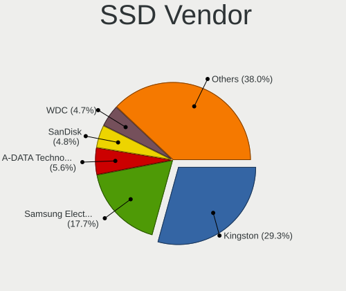

| Vendor              | Computers | Drives | Percent |
|---------------------|-----------|--------|---------|
| Kingston            | 916       | 1614   | 29.28%  |
| Samsung Electronics | 553       | 959    | 17.68%  |
| A-DATA Technology   | 175       | 312    | 5.59%   |
| SanDisk             | 149       | 208    | 4.76%   |
| WDC                 | 146       | 261    | 4.67%   |
| Crucial             | 116       | 200    | 3.71%   |
| SPCC                | 112       | 168    | 3.58%   |
| Intel               | 105       | 172    | 3.36%   |
| Apacer              | 76        | 120    | 2.43%   |
| Micron Technology   | 73        | 112    | 2.33%   |
| Intenso             | 63        | 119    | 2.01%   |
| SK hynix            | 53        | 90     | 1.69%   |
| China               | 42        | 66     | 1.34%   |
| Patriot             | 40        | 79     | 1.28%   |
| Toshiba             | 39        | 59     | 1.25%   |
| PNY                 | 30        | 62     | 0.96%   |
| LITEON              | 30        | 36     | 0.96%   |
| Kingmax             | 30        | 68     | 0.96%   |
| OCZ                 | 29        | 37     | 0.93%   |
| Verbatim            | 28        | 58     | 0.9%    |
| Gigabyte Technology | 27        | 72     | 0.86%   |
| Transcend           | 25        | 28     | 0.8%    |
| Team                | 20        | 32     | 0.64%   |
| LITEONIT            | 17        | 32     | 0.54%   |
| Netac               | 16        | 29     | 0.51%   |
| KingSpec            | 16        | 19     | 0.51%   |
| Corsair             | 12        | 14     | 0.38%   |
| GOODRAM             | 11        | 12     | 0.35%   |
| Dahua               | 10        | 15     | 0.32%   |
| Apple               | 10        | 20     | 0.32%   |
| ASMT                | 8         | 10     | 0.26%   |
| Leven               | 7         | 7      | 0.22%   |
| Hewlett-Packard     | 7         | 9      | 0.22%   |
| Unknown             | 7         | 10     | 0.22%   |
| Seagate             | 6         | 6      | 0.19%   |
| Lexar               | 6         | 10     | 0.19%   |
| Go-Infinity         | 5         | 5      | 0.16%   |
| KingDian            | 4         | 4      | 0.13%   |
| FORESEE             | 4         | 4      | 0.13%   |
| EAGET               | 4         | 4      | 0.13%   |

Drive Kind
----------

HDD or SSD

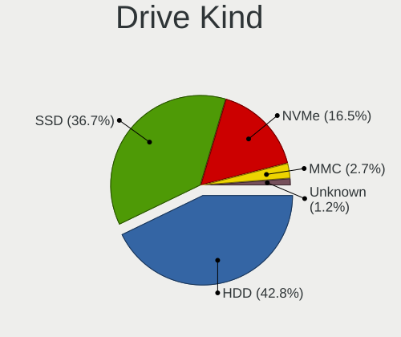

| Kind    | Computers | Drives | Percent |
|---------|-----------|--------|---------|
| HDD     | 3157      | 6650   | 42.83%  |
| SSD     | 2707      | 5285   | 36.73%  |
| NVMe    | 1214      | 2152   | 16.47%  |
| MMC     | 202       | 299    | 2.74%   |
| Unknown | 91        | 145    | 1.23%   |

Drive Connector
---------------

SATA, SAS, NVMe, etc.

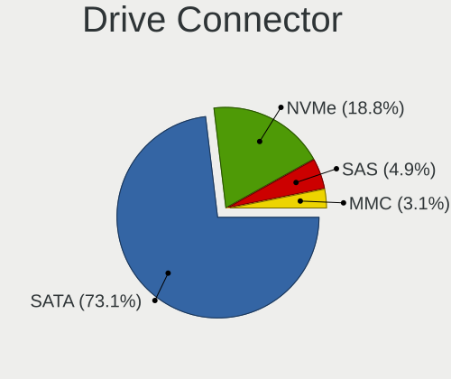

| Type | Computers | Drives | Percent |
|------|-----------|--------|---------|
| SATA | 4707      | 11566  | 73.1%   |
| NVMe | 1212      | 2143   | 18.82%  |
| SAS  | 318       | 523    | 4.94%   |
| MMC  | 202       | 299    | 3.14%   |

Drive Size
----------

Size of hard drive

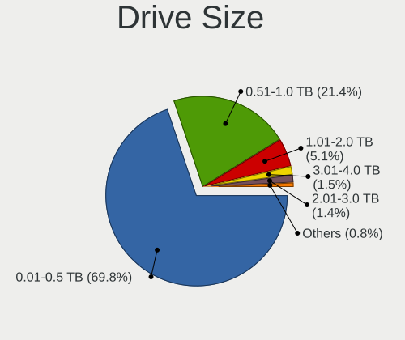

| Size in TB | Computers | Drives | Percent |
|------------|-----------|--------|---------|
| 0.01-0.5   | 4059      | 8296   | 69.84%  |
| 0.51-1.0   | 1244      | 2359   | 21.4%   |
| 1.01-2.0   | 294       | 539    | 5.06%   |
| 3.01-4.0   | 88        | 332    | 1.51%   |
| 2.01-3.0   | 81        | 253    | 1.39%   |
| 4.01-10.0  | 37        | 117    | 0.64%   |
| 10.01-20.0 | 9         | 39     | 0.15%   |

Space Total
-----------

Amount of disk space available on the file system

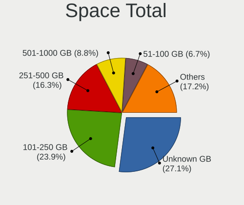

| Size in GB     | Computers | Percent |
|----------------|-----------|---------|
| Unknown        | 1800      | 27.08%  |
| 101-250        | 1588      | 23.89%  |
| 251-500        | 1085      | 16.33%  |
| 501-1000       | 582       | 8.76%   |
| 51-100         | 446       | 6.71%   |
| 1001-2000      | 322       | 4.85%   |
| 1-20           | 308       | 4.63%   |
| 21-50          | 239       | 3.6%    |
| More than 3000 | 147       | 2.21%   |
| 2001-3000      | 129       | 1.94%   |

Space Used
----------

Amount of used disk space

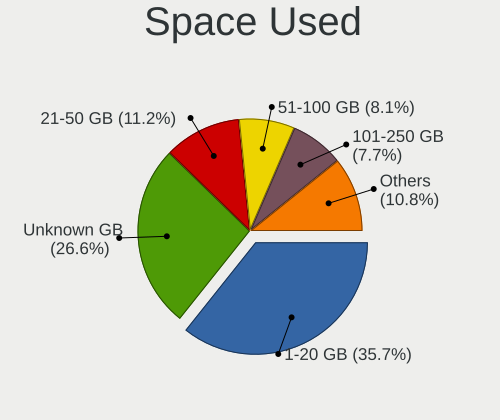

| Used GB        | Computers | Percent |
|----------------|-----------|---------|
| 1-20           | 2421      | 35.71%  |
| Unknown        | 1800      | 26.55%  |
| 21-50          | 756       | 11.15%  |
| 51-100         | 546       | 8.05%   |
| 101-250        | 525       | 7.74%   |
| 251-500        | 271       | 4%      |
| 501-1000       | 221       | 3.26%   |
| 1001-2000      | 151       | 2.23%   |
| More than 3000 | 46        | 0.68%   |
| 2001-3000      | 35        | 0.52%   |
| 0              | 7         | 0.1%    |

Malfunc. Drives
---------------

Drive models with a malfunction

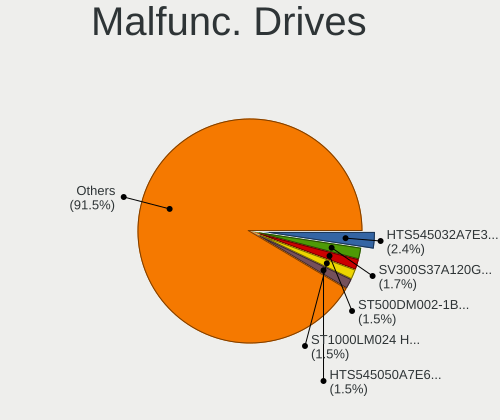

| Model                              | Computers | Drives | Percent |
|------------------------------------|-----------|--------|---------|
| HGST HTS545032A7E380 320GB         | 34        | 63     | 2.38%   |
| Kingston SV300S37A120G 120GB SSD   | 24        | 30     | 1.68%   |
| Seagate ST500DM002-1BD142 500GB    | 22        | 39     | 1.54%   |
| Seagate ST1000LM024 HN-M101MBB 1TB | 21        | 28     | 1.47%   |
| HGST HTS545050A7E680 500GB         | 21        | 31     | 1.47%   |
| HGST HTS725050A7E630 500GB         | 20        | 29     | 1.4%    |
| A-DATA Technology SU630 240GB SSD  | 20        | 42     | 1.4%    |
| Seagate ST500LT012-9WS142 500GB    | 17        | 21     | 1.19%   |
| Seagate ST500LT012-1DG142 500GB    | 15        | 31     | 1.05%   |
| Toshiba DT01ACA100 1TB             | 14        | 30     | 0.98%   |
| Toshiba MQ01ABF050 500GB           | 13        | 32     | 0.91%   |
| HGST HTS541010A9E680 1TB           | 13        | 31     | 0.91%   |
| Toshiba DT01ACA050 500GB           | 12        | 18     | 0.84%   |
| Seagate ST9500325AS 500GB          | 12        | 23     | 0.84%   |
| Seagate ST9320325AS 320GB          | 12        | 27     | 0.84%   |
| Samsung Electronics HD103UJ 1TB    | 12        | 29     | 0.84%   |
| Toshiba MQ01ABD100 1TB             | 9         | 12     | 0.63%   |
| Seagate ST9250315AS 250GB          | 9         | 14     | 0.63%   |
| Hitachi HTS545050B9A300 500GB      | 9         | 15     | 0.63%   |
| HGST HTS545050A7E380 500GB         | 9         | 16     | 0.63%   |
| WDC WD5000AAKX-22ERMA0 500GB       | 8         | 9      | 0.56%   |
| Seagate ST9320423AS 320GB          | 8         | 9      | 0.56%   |
| Seagate ST1000LM035-1RK172 1TB     | 8         | 10     | 0.56%   |
| Samsung Electronics HM160HI 160GB  | 8         | 9      | 0.56%   |
| Samsung Electronics HD161HJ 160GB  | 8         | 8      | 0.56%   |
| Hitachi HTS545050A7E380 500GB      | 8         | 15     | 0.56%   |
| WDC WD5000AAKX-001CA0 500GB        | 7         | 8      | 0.49%   |
| WDC WD5000AADS-00S9B0 500GB        | 7         | 8      | 0.49%   |
| WDC WD10PURZ-85U8XY0 1TB           | 7         | 15     | 0.49%   |
| Toshiba MQ01ABD050 500GB           | 7         | 9      | 0.49%   |
| Samsung Electronics HM321HI 320GB  | 7         | 14     | 0.49%   |
| Samsung Electronics HD321KJ 320GB  | 7         | 8      | 0.49%   |
| Kingston SA400S37240G 240GB SSD    | 7         | 9      | 0.49%   |
| WDC WD5000AAKS-00UU3A0 500GB       | 6         | 18     | 0.42%   |
| Seagate ST9500420AS 500GB          | 6         | 17     | 0.42%   |
| Seagate ST500LM000-SSHD-8GB        | 6         | 9      | 0.42%   |
| Seagate ST3250318AS 250GB          | 6         | 10     | 0.42%   |
| Seagate ST3160815AS 160GB          | 6         | 8      | 0.42%   |
| Samsung Electronics SP2004C 200GB  | 6         | 9      | 0.42%   |
| Samsung Electronics HD502HJ 500GB  | 6         | 9      | 0.42%   |

Malfunc. Drive Vendor
---------------------

Vendors of faulty drives

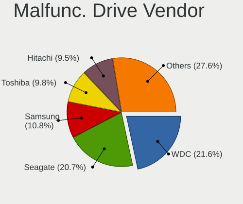

| Vendor                      | Computers | Drives | Percent |
|-----------------------------|-----------|--------|---------|
| WDC                         | 300       | 476    | 21.65%  |
| Seagate                     | 287       | 450    | 20.71%  |
| Samsung Electronics         | 149       | 246    | 10.75%  |
| Toshiba                     | 136       | 223    | 9.81%   |
| Hitachi                     | 131       | 207    | 9.45%   |
| HGST                        | 107       | 184    | 7.72%   |
| Kingston                    | 69        | 102    | 4.98%   |
| A-DATA Technology           | 35        | 68     | 2.53%   |
| Maxtor                      | 32        | 47     | 2.31%   |
| Fujitsu                     | 29        | 41     | 2.09%   |
| Intel                       | 27        | 52     | 1.95%   |
| SK hynix                    | 16        | 22     | 1.15%   |
| SanDisk                     | 6         | 7      | 0.43%   |
| China                       | 5         | 5      | 0.36%   |
| SPCC                        | 4         | 5      | 0.29%   |
| Micron Technology           | 4         | 4      | 0.29%   |
| LITEON                      | 4         | 4      | 0.29%   |
| Intenso                     | 4         | 4      | 0.29%   |
| ICY BOX                     | 3         | 4      | 0.22%   |
| IBM/Hitachi                 | 3         | 3      | 0.22%   |
| Hewlett-Packard             | 3         | 3      | 0.22%   |
| WD MediaMax                 | 2         | 4      | 0.14%   |
| Patriot                     | 2         | 2      | 0.14%   |
| OCZ                         | 2         | 4      | 0.14%   |
| KingSpec                    | 2         | 2      | 0.14%   |
| Kingmax                     | 2         | 2      | 0.14%   |
| Crucial                     | 2         | 5      | 0.14%   |
| Apacer                      | 2         | 3      | 0.14%   |
| WDC WDS4                    | 1         | 1      | 0.07%   |
| Team                        | 1         | 1      | 0.07%   |
| Solid                       | 1         | 1      | 0.07%   |
| SATAFIRM                    | 1         | 1      | 0.07%   |
| R580                        | 1         | 1      | 0.07%   |
| QUANTUM                     | 1         | 1      | 0.07%   |
| OCZ-AGIL                    | 1         | 1      | 0.07%   |
| MAXIO Technology (Hangzhou) | 1         | 1      | 0.07%   |
| Leven                       | 1         | 1      | 0.07%   |
| KING                        | 1         | 1      | 0.07%   |
| JMicron Technology          | 1         | 1      | 0.07%   |
| Initio                      | 1         | 2      | 0.07%   |

Malfunc. HDD Vendor
-------------------

Vendors of faulty HDD drives

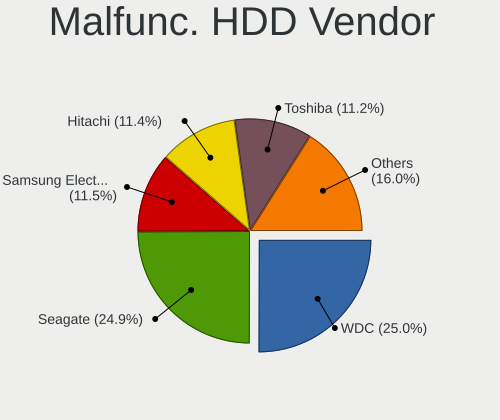

| Vendor              | Computers | Drives | Percent |
|---------------------|-----------|--------|---------|
| WDC                 | 289       | 464    | 25.04%  |
| Seagate             | 287       | 450    | 24.87%  |
| Samsung Electronics | 133       | 203    | 11.53%  |
| Hitachi             | 131       | 207    | 11.35%  |
| Toshiba             | 129       | 208    | 11.18%  |
| HGST                | 107       | 184    | 9.27%   |
| Maxtor              | 32        | 47     | 2.77%   |
| Fujitsu             | 29        | 41     | 2.51%   |
| ICY BOX             | 3         | 4      | 0.26%   |
| IBM/Hitachi         | 3         | 3      | 0.26%   |
| WD MediaMax         | 2         | 4      | 0.17%   |
| Hewlett-Packard     | 2         | 2      | 0.17%   |
| SATAFIRM            | 1         | 1      | 0.09%   |
| QUANTUM             | 1         | 1      | 0.09%   |
| Initio              | 1         | 2      | 0.09%   |
| ExcelStor           | 1         | 1      | 0.09%   |
| CSD                 | 1         | 2      | 0.09%   |
| ASMT                | 1         | 1      | 0.09%   |
| Unknown             | 1         | 2      | 0.09%   |

Malfunc. Drive Kind
-------------------

Kinds of faulty drives

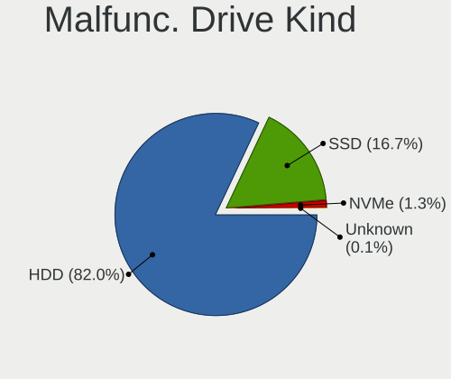

| Kind    | Computers | Drives | Percent |
|---------|-----------|--------|---------|
| HDD     | 1049      | 1827   | 82.02%  |
| SSD     | 213       | 362    | 16.65%  |
| NVMe    | 16        | 20     | 1.25%   |
| Unknown | 1         | 1      | 0.08%   |

Failed Drives
-------------

Failed drive models

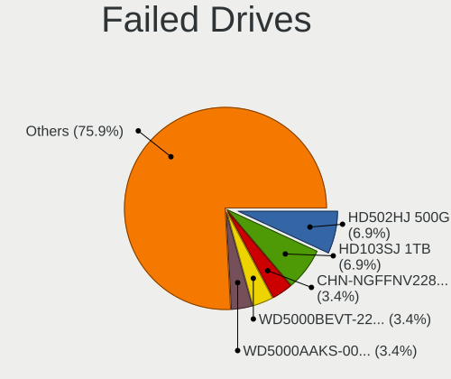

| Model                              | Computers | Drives | Percent |
|------------------------------------|-----------|--------|---------|
| Samsung Electronics HD502HJ 500GB  | 2         | 3      | 6.9%    |
| Samsung Electronics HD103SJ 1TB    | 2         | 3      | 6.9%    |
| Zheino CHN-NGFFNV2280-256 256GB    | 1         | 1      | 3.45%   |
| WDC WD5000BEVT-22A0RT0 500GB       | 1         | 7      | 3.45%   |
| WDC WD5000AAKS-00UU3A0 500GB       | 1         | 1      | 3.45%   |
| WDC WD3200BVVT-63A26Y0 320GB       | 1         | 1      | 3.45%   |
| WDC WD3200BPVT-24JJ5T0 320GB       | 1         | 1      | 3.45%   |
| WDC WD3200BEVT-08A23T1 320GB       | 1         | 1      | 3.45%   |
| WDC WD2500LPCX-24C6HT0 250GB       | 1         | 1      | 3.45%   |
| WDC WD2500AVVS-62L2B0 250GB        | 1         | 1      | 3.45%   |
| WDC WD1600BEVT-22ZCT0 160GB        | 1         | 1      | 3.45%   |
| Toshiba MQ01ABD050V 500GB          | 1         | 1      | 3.45%   |
| Toshiba MK6475GSX 640GB            | 1         | 1      | 3.45%   |
| Toshiba MK3275GSX 320GB            | 1         | 1      | 3.45%   |
| Seagate ST9160821AS 160GB          | 1         | 1      | 3.45%   |
| Seagate ST9160412AS 160GB          | 1         | 1      | 3.45%   |
| Seagate ST380815AS 80GB            | 1         | 3      | 3.45%   |
| Seagate ST1000LM024 HN-M101MBB 1TB | 1         | 1      | 3.45%   |
| Samsung Electronics SSD 980 500GB  | 1         | 1      | 3.45%   |
| Samsung Electronics SP0802N 80GB   | 1         | 1      | 3.45%   |
| Samsung Electronics HM060HI 64GB   | 1         | 1      | 3.45%   |
| Samsung Electronics HD204UI 2TB    | 1         | 1      | 3.45%   |
| Intel SSDPEKKW256G7 256GB          | 1         | 1      | 3.45%   |
| Hitachi HTS723232A7A364 320GB      | 1         | 1      | 3.45%   |
| Hitachi HDS721075CLA332 752GB      | 1         | 1      | 3.45%   |
| Hewlett-Packard SSD EX900 250GB    | 1         | 1      | 3.45%   |
| ExcelStor Technology J8160S 160GB  | 1         | 1      | 3.45%   |

Failed Drive Vendor
-------------------

Failed drive vendors

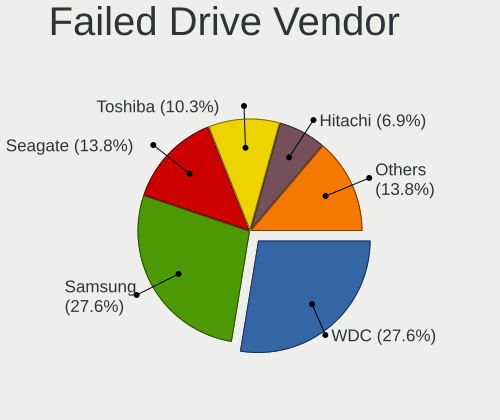

| Vendor              | Computers | Drives | Percent |
|---------------------|-----------|--------|---------|
| WDC                 | 8         | 14     | 27.59%  |
| Samsung Electronics | 8         | 10     | 27.59%  |
| Seagate             | 4         | 6      | 13.79%  |
| Toshiba             | 3         | 3      | 10.34%  |
| Hitachi             | 2         | 2      | 6.9%    |
| Zheino              | 1         | 1      | 3.45%   |
| Intel               | 1         | 1      | 3.45%   |
| Hewlett-Packard     | 1         | 1      | 3.45%   |
| ExcelStor           | 1         | 1      | 3.45%   |

Drive Status
------------

Number of failed and malfunc. drives

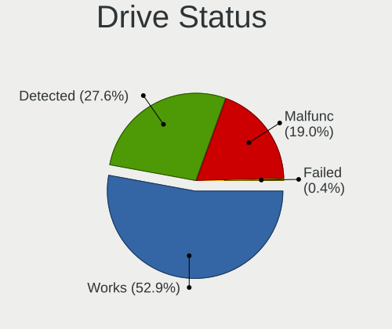

| Status   | Computers | Drives | Percent |
|----------|-----------|--------|---------|
| Works    | 3453      | 8600   | 52.89%  |
| Detected | 1804      | 3682   | 27.63%  |
| Malfunc  | 1243      | 2210   | 19.04%  |
| Failed   | 29        | 39     | 0.44%   |

Storage controller
------------------

Storage Vendor
--------------

Storage controller vendors

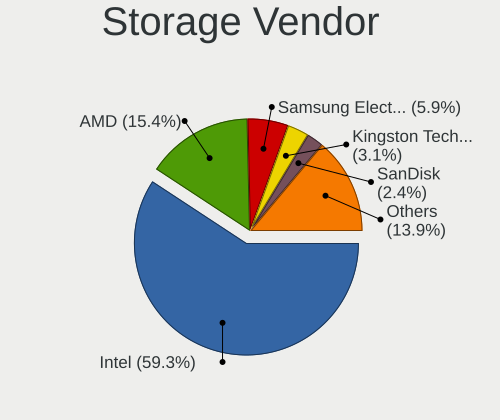

| Vendor                           | Computers | Percent |
|----------------------------------|-----------|---------|
| Intel                            | 4035      | 59.25%  |
| AMD                              | 1048      | 15.39%  |
| Samsung Electronics              | 401       | 5.89%   |
| Kingston Technology Company      | 212       | 3.11%   |
| SanDisk                          | 166       | 2.44%   |
| SK hynix                         | 110       | 1.62%   |
| Nvidia                           | 101       | 1.48%   |
| JMicron Technology               | 93        | 1.37%   |
| ASMedia Technology               | 87        | 1.28%   |
| Phison Electronics               | 65        | 0.95%   |
| Micron Technology                | 58        | 0.85%   |
| Toshiba America Info Systems     | 56        | 0.82%   |
| Marvell Technology Group         | 46        | 0.68%   |
| KIOXIA                           | 40        | 0.59%   |
| VIA Technologies                 | 28        | 0.41%   |
| Silicon Motion                   | 28        | 0.41%   |
| Micron/Crucial Technology        | 25        | 0.37%   |
| ADATA Technology                 | 25        | 0.37%   |
| MAXIO Technology (Hangzhou)      | 24        | 0.35%   |
| Realtek Semiconductor            | 22        | 0.32%   |
| LSI Logic / Symbios Logic        | 19        | 0.28%   |
| Silicon Image                    | 16        | 0.23%   |
| Solidigm                         | 15        | 0.22%   |
| Silicon Integrated Systems [SiS] | 15        | 0.22%   |
| Solid State Storage Technology   | 14        | 0.21%   |
| Seagate Technology               | 6         | 0.09%   |
| Integrated Technology Express    | 6         | 0.09%   |
| Broadcom / LSI                   | 6         | 0.09%   |
| Shenzhen Longsys Electronics     | 5         | 0.07%   |
| Apple                            | 5         | 0.07%   |
| Union Memory (Shenzhen)          | 4         | 0.06%   |
| O2 Micro                         | 4         | 0.06%   |
| Lite-On Technology               | 3         | 0.04%   |
| HighPoint Technologies           | 3         | 0.04%   |
| Adaptec                          | 3         | 0.04%   |
| Lenovo                           | 2         | 0.03%   |
| Hewlett-Packard                  | 2         | 0.03%   |
| Biwin Storage Technology         | 2         | 0.03%   |
| 3ware                            | 2         | 0.03%   |
| Unknown                          | 2         | 0.03%   |

Storage Model
-------------

Storage controller models

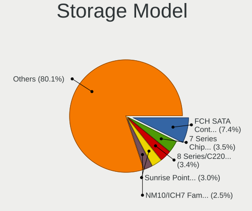

| Model                                                                                   | Computers | Percent |
|-----------------------------------------------------------------------------------------|-----------|---------|
| AMD FCH SATA Controller [AHCI mode]                                                     | 609       | 7.39%   |
| Intel 7 Series Chipset Family 6-port SATA Controller [AHCI mode]                        | 290       | 3.52%   |
| Intel 8 Series/C220 Series Chipset Family 6-port SATA Controller 1 [AHCI mode]          | 276       | 3.35%   |
| Intel Sunrise Point-LP SATA Controller [AHCI mode]                                      | 251       | 3.05%   |
| Intel NM10/ICH7 Family SATA Controller [IDE mode]                                       | 210       | 2.55%   |
| Intel 82801IBM/IEM (ICH9M/ICH9M-E) 4 port SATA Controller [AHCI mode]                   | 190       | 2.31%   |
| Intel 82801G (ICH7 Family) IDE Controller                                               | 189       | 2.29%   |
| Intel 82801 Mobile SATA Controller [RAID mode]                                          | 189       | 2.29%   |
| Intel 6 Series/C200 Series Chipset Family 6 port Mobile SATA AHCI Controller            | 181       | 2.2%    |
| Samsung NVMe SSD Controller SM981/PM981/PM983                                           | 172       | 2.09%   |
| AMD SB7x0/SB8x0/SB9x0 SATA Controller [AHCI mode]                                       | 161       | 1.95%   |
| Intel 8 Series SATA Controller 1 [AHCI mode]                                            | 148       | 1.8%    |
| Intel Q170/Q150/B150/H170/H110/Z170/CM236 Chipset SATA Controller [AHCI Mode]           | 133       | 1.61%   |
| AMD SB7x0/SB8x0/SB9x0 IDE Controller                                                    | 125       | 1.52%   |
| Intel 6 Series/C200 Series Chipset Family 6 port Desktop SATA AHCI Controller           | 124       | 1.51%   |
| AMD 400 Series Chipset SATA Controller                                                  | 115       | 1.4%    |
| Intel Wildcat Point-LP SATA Controller [AHCI Mode]                                      | 114       | 1.38%   |
| Intel 7 Series/C210 Series Chipset Family 6-port SATA Controller [AHCI mode]            | 112       | 1.36%   |
| Samsung NVMe SSD Controller 980 (DRAM-less)                                             | 110       | 1.34%   |
| Intel 200 Series PCH SATA controller [AHCI mode]                                        | 110       | 1.34%   |
| Intel 82801HM/HEM (ICH8M/ICH8M-E) IDE Controller                                        | 107       | 1.3%    |
| Intel 5 Series/3400 Series Chipset 6 port SATA AHCI Controller                          | 104       | 1.26%   |
| Intel 82801HM/HEM (ICH8M/ICH8M-E) SATA Controller [AHCI mode]                           | 94        | 1.14%   |
| Intel Volume Management Device NVMe RAID Controller                                     | 93        | 1.13%   |
| Intel 5 Series/3400 Series Chipset 4 port SATA AHCI Controller                          | 86        | 1.04%   |
| AMD SB7x0/SB8x0/SB9x0 SATA Controller [IDE mode]                                        | 85        | 1.03%   |
| AMD FCH IDE Controller                                                                  | 79        | 0.96%   |
| Intel SATA Controller [RAID mode]                                                       | 78        | 0.95%   |
| ASMedia ASM1061/ASM1062 Serial ATA Controller                                           | 76        | 0.92%   |
| AMD 500 Series Chipset SATA Controller                                                  | 76        | 0.92%   |
| Intel Atom/Celeron/Pentium Processor x5-E8000/J3xxx/N3xxx Series SATA Controller        | 71        | 0.86%   |
| Intel 6 Series/C200 Series Chipset Family Desktop SATA Controller (IDE mode, ports 4-5) | 71        | 0.86%   |
| Intel 6 Series/C200 Series Chipset Family Desktop SATA Controller (IDE mode, ports 0-3) | 71        | 0.86%   |
| Intel Atom Processor E3800 Series SATA AHCI Controller                                  | 70        | 0.85%   |
| Intel 4 Series Chipset PT IDER Controller                                               | 67        | 0.81%   |
| Intel Cannon Lake Mobile PCH SATA AHCI Controller                                       | 59        | 0.72%   |
| JMicron JMB363 SATA/IDE Controller                                                      | 55        | 0.67%   |
| Intel 82801I (ICH9 Family) 2 port SATA Controller [IDE mode]                            | 55        | 0.67%   |
| Intel Celeron/Pentium Silver Processor SATA Controller                                  | 54        | 0.66%   |
| Intel Celeron N3350/Pentium N4200/Atom E3900 Series SATA AHCI Controller                | 54        | 0.66%   |

Storage Kind
------------

Kind of storage controller (IDE, SATA, NVMe, SAS, ...)

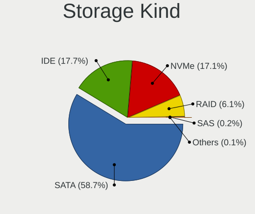

| Kind | Computers | Percent |
|------|-----------|---------|
| SATA | 4172      | 58.69%  |
| IDE  | 1258      | 17.7%   |
| NVMe | 1219      | 17.15%  |
| RAID | 435       | 6.12%   |
| SAS  | 15        | 0.21%   |
| SCSI | 9         | 0.13%   |

Processor
---------

CPU Vendor
----------

Processor vendors

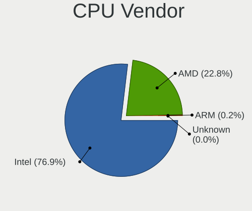

| Vendor       | Computers | Percent |
|--------------|-----------|---------|
| Intel        | 4338      | 76.87%  |
| AMD          | 1286      | 22.79%  |
| ARM          | 14        | 0.25%   |
| CentaurHauls | 4         | 0.07%   |
| Unknown      | 1         | 0.02%   |

CPU Model
---------

Processor models

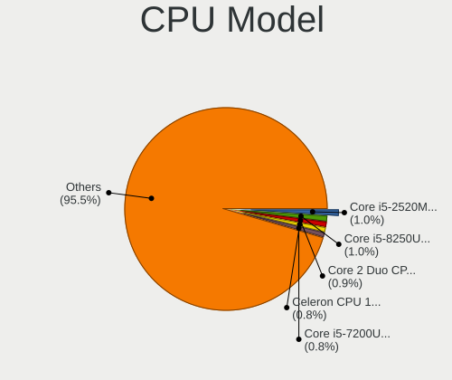

| Model                                       | Computers | Percent |
|---------------------------------------------|-----------|---------|
| Intel Core i5-2520M CPU @ 2.50GHz           | 59        | 1.04%   |
| Intel Core i5-8250U CPU @ 1.60GHz           | 54        | 0.95%   |
| Intel Core 2 Duo CPU E8400 @ 3.00GHz        | 50        | 0.88%   |
| Intel Celeron CPU 1000M @ 1.80GHz           | 47        | 0.83%   |
| Intel Core i5-7200U CPU @ 2.50GHz           | 46        | 0.81%   |
| Intel Core i5-3470 CPU @ 3.20GHz            | 41        | 0.72%   |
| Intel Core i5-3320M CPU @ 2.60GHz           | 41        | 0.72%   |
| Intel Core i3-5005U CPU @ 2.00GHz           | 39        | 0.69%   |
| Intel Core i5 CPU M 520 @ 2.40GHz           | 37        | 0.65%   |
| Intel Core i5-2400 CPU @ 3.10GHz            | 36        | 0.63%   |
| AMD A8-6600K APU with Radeon HD Graphics    | 36        | 0.63%   |
| Intel 11th Gen Core i5-1135G7 @ 2.40GHz     | 34        | 0.6%    |
| Intel Core i5-6500 CPU @ 3.20GHz            | 33        | 0.58%   |
| Intel Core i3-2120 CPU @ 3.30GHz            | 33        | 0.58%   |
| Intel Core i5-5300U CPU @ 2.30GHz           | 32        | 0.56%   |
| Intel Core 2 Duo CPU E7500 @ 2.93GHz        | 32        | 0.56%   |
| Intel Celeron CPU N3350 @ 1.10GHz           | 32        | 0.56%   |
| Intel Core i5-6200U CPU @ 2.30GHz           | 30        | 0.53%   |
| Intel Core i5-7500 CPU @ 3.40GHz            | 28        | 0.49%   |
| Intel Core i5-6300U CPU @ 2.40GHz           | 28        | 0.49%   |
| Intel Core 2 Duo CPU P8600 @ 2.40GHz        | 28        | 0.49%   |
| Intel Core i5-3210M CPU @ 2.50GHz           | 27        | 0.48%   |
| Intel Core i3-6006U CPU @ 2.00GHz           | 27        | 0.48%   |
| AMD Ryzen 5 3600 6-Core Processor           | 27        | 0.48%   |
| Intel Celeron CPU N3060 @ 1.60GHz           | 25        | 0.44%   |
| Intel Atom x5-Z8350 CPU @ 1.44GHz           | 25        | 0.44%   |
| Intel Core i5-4210U CPU @ 1.70GHz           | 24        | 0.42%   |
| Intel Core i3-4160 CPU @ 3.60GHz            | 24        | 0.42%   |
| Intel Core i7-8750H CPU @ 2.20GHz           | 23        | 0.41%   |
| Intel Core i5-8265U CPU @ 1.60GHz           | 23        | 0.41%   |
| Intel Core i3-7020U CPU @ 2.30GHz           | 23        | 0.41%   |
| Intel Core 2 Duo CPU P8400 @ 2.26GHz        | 23        | 0.41%   |
| Intel Core i5-4200U CPU @ 1.60GHz           | 22        | 0.39%   |
| AMD FX-6300 Six-Core Processor              | 22        | 0.39%   |
| Intel Pentium Dual-Core CPU T4500 @ 2.30GHz | 21        | 0.37%   |
| Intel Core i7-6600U CPU @ 2.60GHz           | 21        | 0.37%   |
| Intel Core i5-4300U CPU @ 1.90GHz           | 21        | 0.37%   |
| Intel Core i3-2310M CPU @ 2.10GHz           | 21        | 0.37%   |
| Intel 11th Gen Core i3-1115G4 @ 3.00GHz     | 21        | 0.37%   |
| Intel Core i5-5200U CPU @ 2.20GHz           | 20        | 0.35%   |

CPU Model Family
----------------

Processor model prefix

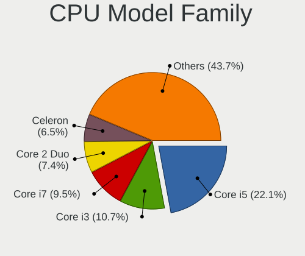

| Model                   | Computers | Percent |
|-------------------------|-----------|---------|
| Intel Core i5           | 1253      | 22.11%  |
| Intel Core i3           | 608       | 10.73%  |
| Intel Core i7           | 541       | 9.55%   |
| Intel Core 2 Duo        | 422       | 7.45%   |
| Intel Celeron           | 368       | 6.49%   |
| Other                   | 274       | 4.84%   |
| AMD Ryzen 5             | 236       | 4.16%   |
| Intel Pentium           | 205       | 3.62%   |
| AMD Ryzen 7             | 171       | 3.02%   |
| Intel Xeon              | 132       | 2.33%   |
| Intel Pentium Dual-Core | 127       | 2.24%   |
| Intel Atom              | 115       | 2.03%   |
| AMD A8                  | 92        | 1.62%   |
| AMD FX                  | 80        | 1.41%   |
| AMD Ryzen 3             | 76        | 1.34%   |
| Intel Core 2 Quad       | 69        | 1.22%   |
| AMD A4                  | 64        | 1.13%   |
| Intel Core 2            | 56        | 0.99%   |
| Intel Pentium Dual      | 54        | 0.95%   |
| AMD A10                 | 54        | 0.95%   |
| AMD Athlon II X2        | 46        | 0.81%   |
| AMD A6                  | 36        | 0.64%   |
| AMD Athlon 64 X2        | 35        | 0.62%   |
| AMD Ryzen 9             | 32        | 0.56%   |
| AMD Phenom II X4        | 32        | 0.56%   |
| AMD E                   | 32        | 0.56%   |
| Intel Pentium 4         | 24        | 0.42%   |
| Intel Genuine           | 24        | 0.42%   |
| AMD E1                  | 23        | 0.41%   |
| AMD E2                  | 21        | 0.37%   |
| Intel Pentium Silver    | 19        | 0.34%   |
| Intel Core i9           | 18        | 0.32%   |
| Intel Celeron Dual-Core | 16        | 0.28%   |
| Intel Celeron M         | 14        | 0.25%   |
| AMD Athlon              | 14        | 0.25%   |
| Intel Pentium D         | 13        | 0.23%   |
| AMD Ryzen 5 PRO         | 13        | 0.23%   |
| AMD Athlon II X4        | 13        | 0.23%   |
| Intel Core              | 12        | 0.21%   |
| AMD Sempron             | 12        | 0.21%   |

CPU Cores
---------

Number of processor cores

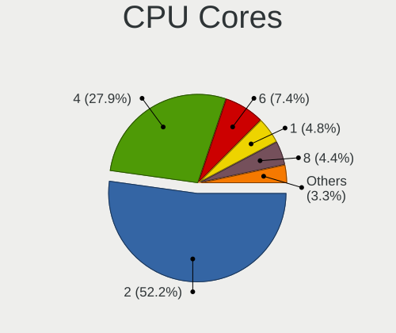

| Number  | Computers | Percent |
|---------|-----------|---------|
| 2       | 2965      | 52.2%   |
| 4       | 1586      | 27.92%  |
| 6       | 418       | 7.36%   |
| 1       | 273       | 4.81%   |
| 8       | 249       | 4.38%   |
| 10      | 46        | 0.81%   |
| 12      | 40        | 0.7%    |
| 3       | 35        | 0.62%   |
| 14      | 21        | 0.37%   |
| 16      | 18        | 0.32%   |
| 24      | 10        | 0.18%   |
| 18      | 6         | 0.11%   |
| Unknown | 5         | 0.09%   |
| 20      | 3         | 0.05%   |
| 28      | 2         | 0.04%   |
| 40      | 1         | 0.02%   |
| 36      | 1         | 0.02%   |
| 9       | 1         | 0.02%   |

CPU Sockets
-----------

Number of sockets

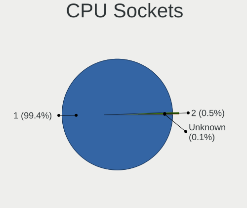

| Number  | Computers | Percent |
|---------|-----------|---------|
| 1       | 5611      | 99.4%   |
| 2       | 30        | 0.53%   |
| Unknown | 4         | 0.07%   |

CPU Threads
-----------

Threads per core (Hyper-Threading)

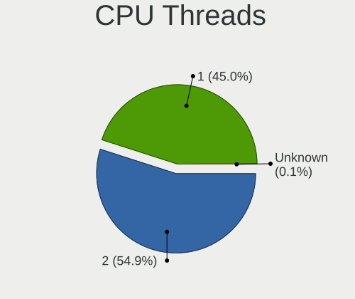

| Number  | Computers | Percent |
|---------|-----------|---------|
| 2       | 3121      | 54.94%  |
| 1       | 2555      | 44.97%  |
| Unknown | 5         | 0.09%   |

CPU Op-Modes
------------

CPU Operation Modes (32-bit, 64-bit)

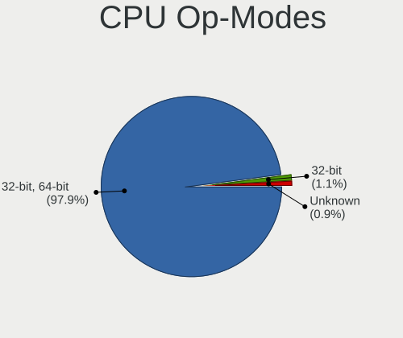

| Op mode        | Computers | Percent |
|----------------|-----------|---------|
| 32-bit, 64-bit | 5539      | 97.93%  |
| 32-bit         | 65        | 1.15%   |
| Unknown        | 52        | 0.92%   |

CPU Microcode
-------------

Microcode number

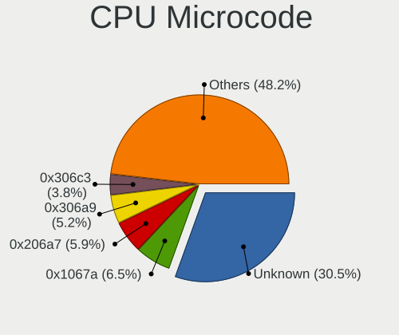

| Number     | Computers | Percent |
|------------|-----------|---------|
| Unknown    | 1817      | 30.5%   |
| 0x1067a    | 387       | 6.5%    |
| 0x206a7    | 350       | 5.87%   |
| 0x306a9    | 310       | 5.2%    |
| 0x306c3    | 224       | 3.76%   |
| 0x20655    | 139       | 2.33%   |
| 0x06001119 | 115       | 1.93%   |
| 0x6fd      | 114       | 1.91%   |
| 0x40651    | 110       | 1.85%   |
| 0x406e3    | 98        | 1.64%   |
| 0x306d4    | 90        | 1.51%   |
| 0x10676    | 87        | 1.46%   |
| 0x506e3    | 85        | 1.43%   |
| 0x806e9    | 77        | 1.29%   |
| 0x010000c8 | 77        | 1.29%   |
| 0x906ea    | 76        | 1.28%   |
| 0x906e9    | 73        | 1.23%   |
| 0x406c4    | 63        | 1.06%   |
| 0x806ea    | 61        | 1.02%   |
| 0x6fb      | 58        | 0.97%   |
| 0x806ec    | 48        | 0.81%   |
| 0x30678    | 48        | 0.81%   |
| 0x20652    | 48        | 0.81%   |
| 0x806c1    | 43        | 0.72%   |
| 0x106ca    | 43        | 0.72%   |
| 0x05000119 | 40        | 0.67%   |
| 0x0800820d | 37        | 0.62%   |
| 0x706a1    | 36        | 0.6%    |
| 0x506c9    | 34        | 0.57%   |
| 0x06003106 | 32        | 0.54%   |
| 0x6f2      | 30        | 0.5%    |
| 0x07030105 | 29        | 0.49%   |
| 0x06000852 | 29        | 0.49%   |
| 0x406c3    | 28        | 0.47%   |
| 0x08101016 | 28        | 0.47%   |
| 0x6f6      | 27        | 0.45%   |
| 0x106e5    | 26        | 0.44%   |
| 0x0a50000c | 26        | 0.44%   |
| 0x08108109 | 26        | 0.44%   |
| 0x0700010f | 26        | 0.44%   |

CPU Microarch
-------------

Microarchitecture

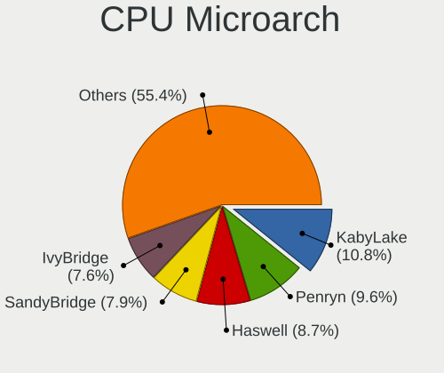

| Name              | Computers | Percent |
|-------------------|-----------|---------|
| KabyLake          | 609       | 10.77%  |
| Penryn            | 544       | 9.62%   |
| Haswell           | 494       | 8.74%   |
| SandyBridge       | 447       | 7.91%   |
| IvyBridge         | 427       | 7.55%   |
| Skylake           | 289       | 5.11%   |
| Core              | 281       | 4.97%   |
| Westmere          | 252       | 4.46%   |
| Unknown           | 205       | 3.63%   |
| Silvermont        | 193       | 3.41%   |
| Piledriver        | 185       | 3.27%   |
| Zen 3             | 157       | 2.78%   |
| K10               | 147       | 2.6%    |
| Broadwell         | 137       | 2.42%   |
| Zen 2             | 118       | 2.09%   |
| Zen+              | 95        | 1.68%   |
| TigerLake         | 85        | 1.5%    |
| Zen               | 84        | 1.49%   |
| Alderlake Hybrid  | 79        | 1.4%    |
| K8 Hammer         | 75        | 1.33%   |
| Bonnell           | 75        | 1.33%   |
| Bobcat            | 73        | 1.29%   |
| IceLake           | 58        | 1.03%   |
| Goldmont plus     | 56        | 0.99%   |
| Goldmont          | 54        | 0.96%   |
| NetBurst          | 52        | 0.92%   |
| Excavator         | 51        | 0.9%    |
| CometLake         | 50        | 0.88%   |
| Steamroller       | 47        | 0.83%   |
| Puma              | 46        | 0.81%   |
| Nehalem           | 45        | 0.8%    |
| P6                | 34        | 0.6%    |
| Jaguar            | 34        | 0.6%    |
| K10 Llano         | 27        | 0.48%   |
| Bulldozer         | 16        | 0.28%   |
| Gracemont         | 9         | 0.16%   |
| Meteorlake Hybrid | 7         | 0.12%   |
| K8 & K10 hybrid   | 7         | 0.12%   |
| Tremont           | 5         | 0.09%   |
| Lunarlake Hybrid  | 3         | 0.05%   |

Graphics
--------

GPU Vendor
----------

Vendors of graphics cards

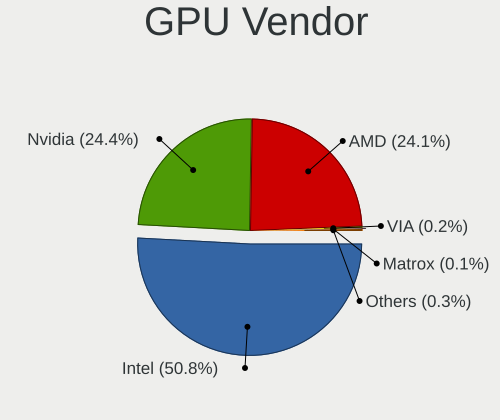

| Vendor                                       | Computers | Percent |
|----------------------------------------------|-----------|---------|
| Intel                                        | 3326      | 50.85%  |
| Nvidia                                       | 1597      | 24.42%  |
| AMD                                          | 1576      | 24.09%  |
| VIA Technologies                             | 14        | 0.21%   |
| Matrox Electronics Systems                   | 9         | 0.14%   |
| Silicon Integrated Systems [SiS]             | 8         | 0.12%   |
| ASPEED Technology                            | 7         | 0.11%   |
| XGI Technology (eXtreme Graphics Innovation) | 2         | 0.03%   |
| ATI Technologies                             | 2         | 0.03%   |

GPU Model
---------

Graphics card models

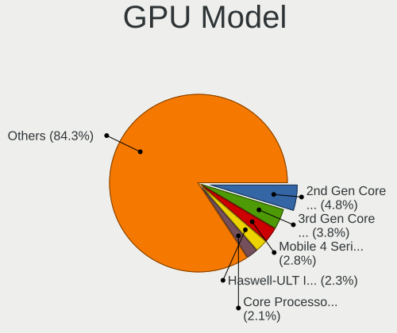

| Model                                                                                    | Computers | Percent |
|------------------------------------------------------------------------------------------|-----------|---------|
| Intel 2nd Generation Core Processor Family Integrated Graphics Controller                | 325       | 4.75%   |
| Intel 3rd Gen Core processor Graphics Controller                                         | 258       | 3.77%   |
| Intel Mobile 4 Series Chipset Integrated Graphics Controller                             | 192       | 2.81%   |
| Intel Haswell-ULT Integrated Graphics Controller                                         | 157       | 2.29%   |
| Intel Core Processor Integrated Graphics Controller                                      | 145       | 2.12%   |
| Intel Xeon E3-1200 v3/4th Gen Core Processor Integrated Graphics Controller              | 132       | 1.93%   |
| Intel Skylake-U GT2 [HD Graphics 520]                                                    | 121       | 1.77%   |
| Intel Broadwell-U GT2 [HD Graphics 5500]                                                 | 119       | 1.74%   |
| Intel Atom/Celeron/Pentium Processor x5-E8000/J3xxx/N3xxx Integrated Graphics Controller | 110       | 1.61%   |
| Intel 4 Series Chipset Integrated Graphics Controller                                    | 99        | 1.45%   |
| Intel Kaby Lake-R GT2 [UHD Graphics 620]                                                 | 97        | 1.42%   |
| Intel Kaby Lake-U GT2 [HD Graphics 620]                                                  | 95        | 1.39%   |
| Nvidia GK208B [GeForce GT 710]                                                           | 83        | 1.21%   |
| Intel Atom Processor Z36xxx/Z37xxx Series Graphics & Display                             | 82        | 1.2%    |
| Intel Xeon E3-1200 v2/3rd Gen Core processor Graphics Controller                         | 81        | 1.18%   |
| AMD Ellesmere [Radeon RX 470/480/570/570X/580/580X/590]                                  | 76        | 1.11%   |
| Intel Skylake-S GT2 [HD Graphics 530]                                                    | 70        | 1.02%   |
| Intel 4th Gen Core Processor Integrated Graphics Controller                              | 70        | 1.02%   |
| AMD Cezanne [Radeon Vega Series / Radeon Vega Mobile Series]                             | 67        | 0.98%   |
| Intel Mobile 945GM/GMS/GME, 943/940GML Express Integrated Graphics Controller            | 65        | 0.95%   |
| Intel Mobile GM965/GL960 Integrated Graphics Controller (secondary)                      | 63        | 0.92%   |
| Intel Mobile GM965/GL960 Integrated Graphics Controller (primary)                        | 63        | 0.92%   |
| Intel TigerLake-LP GT2 [Iris Xe Graphics]                                                | 60        | 0.88%   |
| Intel CoffeeLake-H GT2 [UHD Graphics 630]                                                | 59        | 0.86%   |
| Nvidia GP107 [GeForce GTX 1050 Ti]                                                       | 58        | 0.85%   |
| Intel WhiskeyLake-U GT2 [UHD Graphics 620]                                               | 57        | 0.83%   |
| Nvidia GF117M [GeForce 610M/710M/810M/820M / GT 620M/625M/630M/720M]                     | 51        | 0.75%   |
| AMD Renoir [Radeon Vega Series / Radeon Vega Mobile Series]                              | 51        | 0.75%   |
| Intel CometLake-U GT2 [UHD Graphics]                                                     | 48        | 0.7%    |
| Nvidia GT218 [GeForce 210]                                                               | 47        | 0.69%   |
| AMD Topaz XT [Radeon R7 M260/M265 / M340/M360 / M440/M445 / 530/535 / 620/625 Mobile]    | 46        | 0.67%   |
| AMD Raven Ridge [Radeon Vega Series / Radeon Vega Mobile Series]                         | 46        | 0.67%   |
| Intel Mobile 945GM/GMS, 943/940GML Express Integrated Graphics Controller                | 45        | 0.66%   |
| Intel 4th Generation Core Processor Family Integrated Graphics Controller                | 45        | 0.66%   |
| AMD Caicos [Radeon HD 6450/7450/8450 / R5 230 OEM]                                       | 45        | 0.66%   |
| Intel Kaby Lake-S GT2 [HD Graphics 630]                                                  | 43        | 0.63%   |
| AMD Picasso/Raven 2 [Radeon Vega Series / Radeon Vega Mobile Series]                     | 43        | 0.63%   |
| Intel CoffeeLake-S GT2 [UHD Graphics 630]                                                | 42        | 0.61%   |
| Intel Atom Processor D4xx/D5xx/N4xx/N5xx Integrated Graphics Controller                  | 42        | 0.61%   |
| Intel Apollo Lake GT1 [HD Graphics 500]                                                  | 41        | 0.6%    |

GPU Combo
---------

Combinations of graphics cards

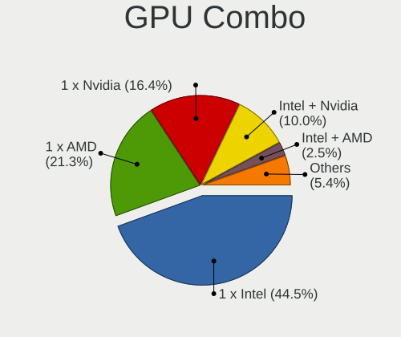

| Name                     | Computers | Percent |
|--------------------------|-----------|---------|
| 1 x Intel                | 2549      | 44.45%  |
| 1 x AMD                  | 1221      | 21.29%  |
| 1 x Nvidia               | 939       | 16.38%  |
| Intel + Nvidia           | 571       | 9.96%   |
| Intel + AMD              | 143       | 2.49%   |
| 2 x AMD                  | 129       | 2.25%   |
| AMD + Nvidia             | 83        | 1.45%   |
| 2 x Intel                | 34        | 0.59%   |
| Other                    | 15        | 0.26%   |
| 1 x VIA                  | 14        | 0.24%   |
| 1 x SiS                  | 8         | 0.14%   |
| 1 x Matrox               | 8         | 0.14%   |
| 2 x Nvidia               | 6         | 0.1%    |
| 1 x ASPEED               | 6         | 0.1%    |
| AMD + XGI                | 2         | 0.03%   |
| 2 x Nvidia + 1 x Matrox  | 1         | 0.02%   |
| Nvidia + Matrox          | 1         | 0.02%   |
| 1 x Intel + 3 x AMD      | 1         | 0.02%   |
| Intel + 2 x Nvidia       | 1         | 0.02%   |
| Intel + AMD + 1 x Nvidia | 1         | 0.02%   |
| AMD + ASPEED             | 1         | 0.02%   |

GPU Driver
----------

Free vs proprietary

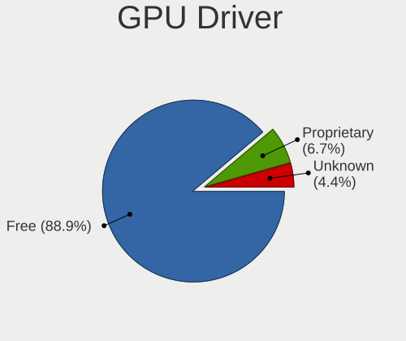

| Driver      | Computers | Percent |
|-------------|-----------|---------|
| Free        | 5084      | 88.85%  |
| Proprietary | 386       | 6.75%   |
| Unknown     | 252       | 4.4%    |

GPU Memory
----------

Total video memory

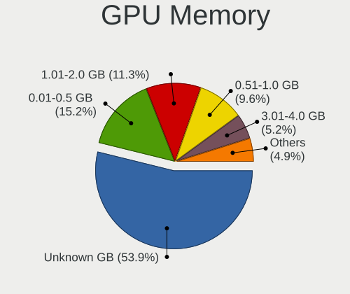

| Size in GB | Computers | Percent |
|------------|-----------|---------|
| Unknown    | 3173      | 53.85%  |
| 0.01-0.5   | 895       | 15.19%  |
| 1.01-2.0   | 666       | 11.3%   |
| 0.51-1.0   | 567       | 9.62%   |
| 3.01-4.0   | 305       | 5.18%   |
| 7.01-8.0   | 128       | 2.17%   |
| 5.01-6.0   | 76        | 1.29%   |
| 8.01-16.0  | 39        | 0.66%   |
| 2.01-3.0   | 38        | 0.64%   |
| 16.01-24.0 | 5         | 0.08%   |

Monitor
-------

Monitor Vendor
--------------

Monitor vendors

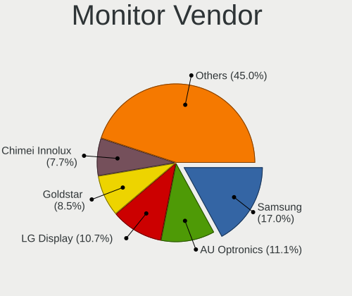

| Vendor                  | Computers | Percent |
|-------------------------|-----------|---------|
| Samsung Electronics     | 1023      | 17%     |
| AU Optronics            | 667       | 11.09%  |
| LG Display              | 645       | 10.72%  |
| Goldstar                | 513       | 8.53%   |
| Chimei Innolux          | 463       | 7.7%    |
| BOE                     | 358       | 5.95%   |
| Dell                    | 255       | 4.24%   |
| Philips                 | 165       | 2.74%   |
| BenQ                    | 156       | 2.59%   |
| Lenovo                  | 151       | 2.51%   |
| Chi Mei Optoelectronics | 138       | 2.29%   |
| Ancor Communications    | 135       | 2.24%   |
| Acer                    | 131       | 2.18%   |
| Hewlett-Packard         | 128       | 2.13%   |
| AOC                     | 89        | 1.48%   |
| Fujitsu Siemens         | 78        | 1.3%    |
| ASUSTek Computer        | 48        | 0.8%    |
| PANDA                   | 47        | 0.78%   |
| LG Philips              | 45        | 0.75%   |
| Apple                   | 42        | 0.7%    |
| Sony                    | 41        | 0.68%   |
| InfoVision              | 41        | 0.68%   |
| HannStar                | 41        | 0.68%   |
| LG Electronics          | 32        | 0.53%   |
| Eizo                    | 32        | 0.53%   |
| Vestel Elektronik       | 30        | 0.5%    |
| NEC Computers           | 29        | 0.48%   |
| Sharp                   | 27        | 0.45%   |
| Unknown                 | 22        | 0.37%   |
| Toshiba                 | 22        | 0.37%   |
| Iiyama                  | 21        | 0.35%   |
| ViewSonic               | 20        | 0.33%   |
| HKC                     | 20        | 0.33%   |
| Medion                  | 19        | 0.32%   |
| CPT                     | 19        | 0.32%   |
| Valve                   | 18        | 0.3%    |
| Panasonic               | 14        | 0.23%   |
| MStar                   | 14        | 0.23%   |
| MSI                     | 14        | 0.23%   |
| IBM                     | 14        | 0.23%   |

Monitor Model
-------------

Monitor models

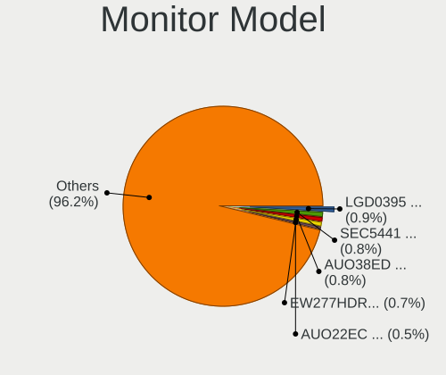

| Model                                                                    | Computers | Percent |
|--------------------------------------------------------------------------|-----------|---------|
| LG Display LCD Monitor LGD0395 1366x768 344x194mm 15.5-inch              | 55        | 0.89%   |
| Samsung Electronics LCD Monitor SEC5441 1280x800 331x207mm 15.4-inch     | 52        | 0.84%   |
| AU Optronics LCD Monitor AUO38ED 1920x1080 344x193mm 15.5-inch           | 48        | 0.78%   |
| BenQ EW277HDR BNQ7948 1920x1080 598x336mm 27.0-inch                      | 46        | 0.74%   |
| AU Optronics LCD Monitor AUO22EC 1366x768 344x193mm 15.5-inch            | 32        | 0.52%   |
| Chimei Innolux LCD Monitor CMN15DB 1366x768 344x193mm 15.5-inch          | 31        | 0.5%    |
| Vestel Elektronik 40UHD_LCD_TV VES3700 3840x2160 880x500mm 39.8-inch     | 30        | 0.48%   |
| Chimei Innolux LCD Monitor CMN14D4 1920x1080 309x173mm 13.9-inch         | 28        | 0.45%   |
| LG Display LCD Monitor LGD02DC 1366x768 344x194mm 15.5-inch              | 27        | 0.44%   |
| BOE LCD Monitor BOE06A5 1366x768 344x194mm 15.5-inch                     | 26        | 0.42%   |
| Goldstar 2D HD TV GSM59CA 1366x768 509x286mm 23.0-inch                   | 25        | 0.4%    |
| Chi Mei Optoelectronics LCD Monitor CMO15A7 1366x768 344x193mm 15.5-inch | 25        | 0.4%    |
| Goldstar LG ULTRAWIDE GSM59F1 2560x1080 670x280mm 28.6-inch              | 24        | 0.39%   |
| Chimei Innolux LCD Monitor CMN15E7 1920x1080 344x193mm 15.5-inch         | 22        | 0.36%   |
| Chimei Innolux LCD Monitor CMN15D5 1920x1080 344x193mm 15.5-inch         | 22        | 0.36%   |
| AU Optronics LCD Monitor AUO106C 1366x768 276x155mm 12.5-inch            | 22        | 0.36%   |
| Lenovo LCD Monitor LEN4036 1440x900 303x190mm 14.1-inch                  | 21        | 0.34%   |
| Goldstar MP59G GSM5B34 1920x1080 480x270mm 21.7-inch                     | 21        | 0.34%   |
| Chimei Innolux LCD Monitor CMN15F5 1920x1080 344x193mm 15.5-inch         | 21        | 0.34%   |
| AU Optronics LCD Monitor AUO21ED 1920x1080 344x193mm 15.5-inch           | 20        | 0.32%   |
| Samsung Electronics S24D330 SAM0D92 1920x1080 531x299mm 24.0-inch        | 19        | 0.31%   |
| Philips PHL 223V5 PHLC0CF 1920x1080 477x268mm 21.5-inch                  | 19        | 0.31%   |
| Chimei Innolux LCD Monitor CMN14C9 1920x1080 309x173mm 13.9-inch         | 19        | 0.31%   |
| LG Display LP156WH2-TLAA LGD0230 1366x768 344x194mm 15.5-inch            | 18        | 0.29%   |
| AU Optronics LCD Monitor AUO26EC 1366x768 344x193mm 15.5-inch            | 18        | 0.29%   |
| LG Display LCD Monitor LGD033A 1366x768 344x194mm 15.5-inch              | 17        | 0.27%   |
| Goldstar ULTRAWIDE GSM76F9 2560x1080 531x298mm 24.0-inch                 | 17        | 0.27%   |
| Chi Mei Optoelectronics LCD Monitor CMO1592 1366x768 344x193mm 15.5-inch | 17        | 0.27%   |
| Philips PHL 243V7 PHLC155 1920x1080 527x296mm 23.8-inch                  | 16        | 0.26%   |
| Samsung Electronics LCD Monitor SEC325A 1366x768 344x194mm 15.5-inch     | 15        | 0.24%   |
| BOE LCD Monitor BOE0672 1366x768 344x194mm 15.5-inch                     | 15        | 0.24%   |
| Valve ANX7530 U VLV3001 800x1280 100x150mm 7.1-inch                      | 14        | 0.23%   |
| Samsung Electronics SyncMaster SAM011E 1280x1024 338x270mm 17.0-inch     | 14        | 0.23%   |
| Samsung Electronics C24F390 SAM0D2C 1920x1080 521x293mm 23.5-inch        | 14        | 0.23%   |
| BOE LCD Monitor BOE0687 1920x1080 344x193mm 15.5-inch                    | 14        | 0.23%   |
| AU Optronics LCD Monitor AUO20EC 1366x768 344x193mm 15.5-inch            | 14        | 0.23%   |
| MStar Demo MST0030 1920x1080 708x398mm 32.0-inch                         | 13        | 0.21%   |
| HannStar Hanns.G HX191 HSD0013 1280x1024 376x301mm 19.0-inch             | 13        | 0.21%   |
| Chimei Innolux LCD Monitor CMN15BC 1366x768 344x193mm 15.5-inch          | 13        | 0.21%   |
| BOE LCD Monitor BOE069C 1920x1080 344x193mm 15.5-inch                    | 13        | 0.21%   |

Monitor Resolution
------------------

Monitor screen resolution

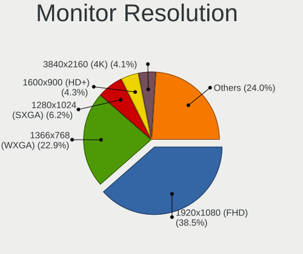

| Resolution         | Computers | Percent |
|--------------------|-----------|---------|
| 1920x1080 (FHD)    | 2237      | 38.5%   |
| 1366x768 (WXGA)    | 1332      | 22.93%  |
| 1280x1024 (SXGA)   | 361       | 6.21%   |
| 1600x900 (HD+)     | 247       | 4.25%   |
| 3840x2160 (4K)     | 240       | 4.13%   |
| 1440x900 (WXGA+)   | 227       | 3.91%   |
| 1280x800 (WXGA)    | 217       | 3.73%   |
| 1680x1050 (WSXGA+) | 210       | 3.61%   |
| 2560x1440 (QHD)    | 131       | 2.25%   |
| 1920x1200 (WUXGA)  | 119       | 2.05%   |
| 2560x1080          | 80        | 1.38%   |
| 1024x768 (XGA)     | 45        | 0.77%   |
| 1024x600           | 44        | 0.76%   |
| 1360x768           | 37        | 0.64%   |
| 2560x1600          | 32        | 0.55%   |
| 2880x1800          | 30        | 0.52%   |
| 3840x1080          | 25        | 0.43%   |
| Unknown            | 24        | 0.41%   |
| 1920x540           | 22        | 0.38%   |
| 800x1280           | 19        | 0.33%   |
| 3440x1440          | 18        | 0.31%   |
| 2288x1287          | 13        | 0.22%   |
| 1600x1200          | 10        | 0.17%   |
| 1920x1280          | 9         | 0.15%   |
| 2160x1440          | 7         | 0.12%   |
| 1280x720 (HD)      | 7         | 0.12%   |
| 2880x1620          | 5         | 0.09%   |
| 1400x1050          | 5         | 0.09%   |
| 3840x2400          | 4         | 0.07%   |
| 3200x2000          | 4         | 0.07%   |
| 2880x1920          | 4         | 0.07%   |
| 2048x1536          | 3         | 0.05%   |
| 1680x945           | 3         | 0.05%   |
| 1600x2560          | 3         | 0.05%   |
| 1280x768           | 3         | 0.05%   |
| 5760x2160          | 2         | 0.03%   |
| 3840x1600          | 2         | 0.03%   |
| 3840x1200          | 2         | 0.03%   |
| 3280x1080          | 2         | 0.03%   |
| 2048x1152          | 2         | 0.03%   |

Monitor Diagonal
----------------

Diagonal size in inches

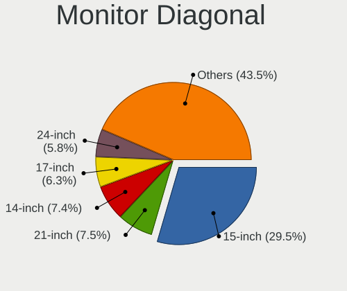

| Inches  | Computers | Percent |
|---------|-----------|---------|
| 15      | 1784      | 29.52%  |
| 21      | 452       | 7.48%   |
| 14      | 446       | 7.38%   |
| 17      | 381       | 6.3%    |
| 24      | 349       | 5.77%   |
| 23      | 342       | 5.66%   |
| 13      | 322       | 5.33%   |
| 19      | 298       | 4.93%   |
| 27      | 297       | 4.91%   |
| 18      | 164       | 2.71%   |
| 22      | 153       | 2.53%   |
| Unknown | 151       | 2.5%    |
| 12      | 144       | 2.38%   |
| 34      | 89        | 1.47%   |
| 31      | 84        | 1.39%   |
| 20      | 64        | 1.06%   |
| 84      | 62        | 1.03%   |
| 10      | 58        | 0.96%   |
| 11      | 57        | 0.94%   |
| 16      | 37        | 0.61%   |
| 54      | 34        | 0.56%   |
| 40      | 27        | 0.45%   |
| 72      | 23        | 0.38%   |
| 7       | 21        | 0.35%   |
| 32      | 20        | 0.33%   |
| 48      | 19        | 0.31%   |
| 52      | 16        | 0.26%   |
| 65      | 14        | 0.23%   |
| 25      | 13        | 0.22%   |
| 63      | 11        | 0.18%   |
| 42      | 11        | 0.18%   |
| 26      | 11        | 0.18%   |
| 142     | 10        | 0.17%   |
| 46      | 8         | 0.13%   |
| 55      | 7         | 0.12%   |
| 50      | 7         | 0.12%   |
| 33      | 7         | 0.12%   |
| 60      | 5         | 0.08%   |
| 49      | 5         | 0.08%   |
| 64      | 4         | 0.07%   |

Monitor Width
-------------

Physical width

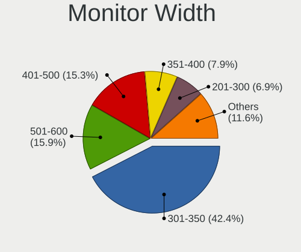

| Width in mm    | Computers | Percent |
|----------------|-----------|---------|
| 301-350        | 2529      | 42.45%  |
| 501-600        | 946       | 15.88%  |
| 401-500        | 911       | 15.29%  |
| 351-400        | 470       | 7.89%   |
| 201-300        | 411       | 6.9%    |
| Unknown        | 151       | 2.53%   |
| 1001-1500      | 135       | 2.27%   |
| 701-800        | 117       | 1.96%   |
| 601-700        | 111       | 1.86%   |
| 1501-2000      | 90        | 1.51%   |
| 801-900        | 32        | 0.54%   |
| 1-100          | 19        | 0.32%   |
| 901-1000       | 18        | 0.3%    |
| More than 2000 | 10        | 0.17%   |
| 101-200        | 8         | 0.13%   |

Aspect Ratio
------------

Proportional relationship between the width and the height

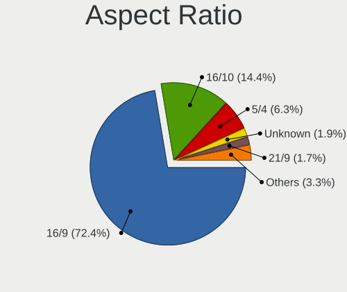

| Ratio   | Computers | Percent |
|---------|-----------|---------|
| 16/9    | 4010      | 72.37%  |
| 16/10   | 800       | 14.44%  |
| 5/4     | 351       | 6.33%   |
| Unknown | 105       | 1.89%   |
| 21/9    | 93        | 1.68%   |
| 4/3     | 82        | 1.48%   |
| 3/2     | 44        | 0.79%   |
| 32/9    | 18        | 0.32%   |
| 0.67    | 14        | 0.25%   |
| 1.00    | 10        | 0.18%   |
| 6/5     | 6         | 0.11%   |
| 0.62    | 4         | 0.07%   |
| 0.89    | 1         | 0.02%   |
| 0.63    | 1         | 0.02%   |
| 0.45    | 1         | 0.02%   |
| 0.31    | 1         | 0.02%   |

Monitor Area
------------

Area in inch²

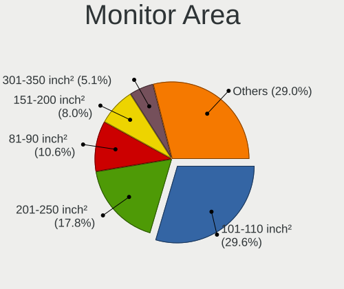

| Area in inch² | Computers | Percent |
|----------------|-----------|---------|
| 101-110        | 1771      | 29.55%  |
| 201-250        | 1069      | 17.84%  |
| 81-90          | 635       | 10.6%   |
| 151-200        | 477       | 7.96%   |
| 301-350        | 306       | 5.11%   |
| 141-150        | 305       | 5.09%   |
| More than 1000 | 209       | 3.49%   |
| 351-500        | 201       | 3.35%   |
| 121-130        | 164       | 2.74%   |
| Unknown        | 151       | 2.52%   |
| 71-80          | 131       | 2.19%   |
| 61-70          | 131       | 2.19%   |
| 251-300        | 121       | 2.02%   |
| 501-1000       | 76        | 1.27%   |
| 51-60          | 62        | 1.03%   |
| 41-50          | 53        | 0.88%   |
| 111-120        | 43        | 0.72%   |
| 131-140        | 42        | 0.7%    |
| 1-40           | 27        | 0.45%   |
| 91-100         | 19        | 0.32%   |

Pixel Density
-------------

Pixels per inch

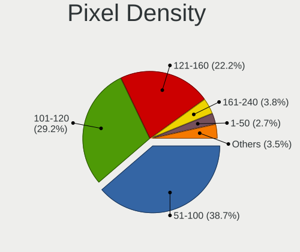

| Density       | Computers | Percent |
|---------------|-----------|---------|
| 51-100        | 2256      | 38.7%   |
| 101-120       | 1701      | 29.18%  |
| 121-160       | 1293      | 22.18%  |
| 161-240       | 223       | 3.83%   |
| 1-50          | 155       | 2.66%   |
| Unknown       | 151       | 2.59%   |
| More than 240 | 51        | 0.87%   |

Multiple Monitors
-----------------

Total monitors connected

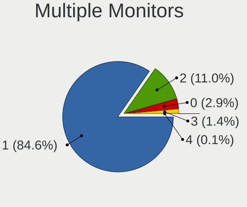

| Total | Computers | Percent |
|-------|-----------|---------|
| 1     | 4924      | 84.65%  |
| 2     | 637       | 10.95%  |
| 0     | 171       | 2.94%   |
| 3     | 79        | 1.36%   |
| 4     | 6         | 0.1%    |

Network
-------

Net Controller Vendor
---------------------

Controller vendors

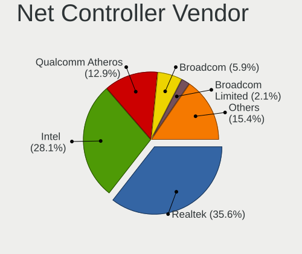

| Vendor                            | Computers | Percent |
|-----------------------------------|-----------|---------|
| Realtek Semiconductor             | 2970      | 35.56%  |
| Intel                             | 2345      | 28.07%  |
| Qualcomm Atheros                  | 1081      | 12.94%  |
| Broadcom                          | 497       | 5.95%   |
| Broadcom Limited                  | 173       | 2.07%   |
| Ralink                            | 167       | 2%      |
| MediaTek                          | 139       | 1.66%   |
| TP-Link                           | 117       | 1.4%    |
| Marvell Technology Group          | 105       | 1.26%   |
| Qualcomm Atheros Communications   | 86        | 1.03%   |
| Ralink Technology                 | 84        | 1.01%   |
| Nvidia                            | 65        | 0.78%   |
| Dell                              | 43        | 0.51%   |
| Samsung Electronics               | 33        | 0.4%    |
| DisplayLink                       | 29        | 0.35%   |
| Xiaomi                            | 27        | 0.32%   |
| Hewlett-Packard                   | 27        | 0.32%   |
| Ericsson Business Mobile Networks | 27        | 0.32%   |
| Sierra Wireless                   | 26        | 0.31%   |
| Huawei Technologies               | 26        | 0.31%   |
| VIA Technologies                  | 20        | 0.24%   |
| Shenzhen Goodix Technology        | 19        | 0.23%   |
| ASIX Electronics                  | 19        | 0.23%   |
| JMicron Technology                | 17        | 0.2%    |
| ASUSTek Computer                  | 16        | 0.19%   |
| Silicon Integrated Systems [SiS]  | 13        | 0.16%   |
| Attansic Technology               | 13        | 0.16%   |
| Microsoft                         | 12        | 0.14%   |
| Qualcomm                          | 11        | 0.13%   |
| QinHeng Electronics               | 10        | 0.12%   |
| IMC Networks                      | 10        | 0.12%   |
| D-Link                            | 10        | 0.12%   |
| Aquantia                          | 10        | 0.12%   |
| Lenovo                            | 8         | 0.1%    |
| D-Link System                     | 8         | 0.1%    |
| Belkin Components                 | 7         | 0.08%   |
| Edimax Technology                 | 6         | 0.07%   |
| NetGear                           | 5         | 0.06%   |
| Fibocom                           | 4         | 0.05%   |
| Espressif                         | 4         | 0.05%   |

Net Controller Model
--------------------

Controller models

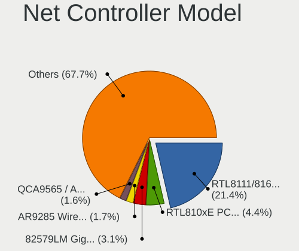

| Model                                                                   | Computers | Percent |
|-------------------------------------------------------------------------|-----------|---------|
| Realtek RTL8111/8168/8211/8411 PCI Express Gigabit Ethernet Controller  | 2088      | 21.41%  |
| Realtek RTL810xE PCI Express Fast Ethernet controller                   | 433       | 4.44%   |
| Intel 82579LM Gigabit Network Connection (Lewisville)                   | 302       | 3.1%    |
| Qualcomm Atheros AR9285 Wireless Network Adapter (PCI-Express)          | 168       | 1.72%   |
| Qualcomm Atheros QCA9565 / AR9565 Wireless Network Adapter              | 159       | 1.63%   |
| Qualcomm Atheros QCA9377 802.11ac Wireless Network Adapter              | 148       | 1.52%   |
| Intel Wireless 8265 / 8275                                              | 146       | 1.5%    |
| Intel Centrino Advanced-N 6205 [Taylor Peak]                            | 115       | 1.18%   |
| Intel Wireless 7260                                                     | 114       | 1.17%   |
| Qualcomm Atheros AR9485 Wireless Network Adapter                        | 108       | 1.11%   |
| Intel Wireless 7265                                                     | 102       | 1.05%   |
| Ralink RT3290 Wireless 802.11n 1T/1R PCIe                               | 101       | 1.04%   |
| Intel Ethernet Connection I217-LM                                       | 90        | 0.92%   |
| Intel 82577LM Gigabit Network Connection                                | 87        | 0.89%   |
| Realtek RTL8723BE PCIe Wireless Network Adapter                         | 85        | 0.87%   |
| Realtek RTL8822CE 802.11ac PCIe Wireless Network Adapter                | 82        | 0.84%   |
| Realtek RTL8125 2.5GbE Controller                                       | 80        | 0.82%   |
| Intel Ethernet Connection (2) I219-V                                    | 80        | 0.82%   |
| Intel Wireless 3165                                                     | 79        | 0.81%   |
| Intel Wi-Fi 6 AX200                                                     | 79        | 0.81%   |
| Broadcom BCM4313 802.11bgn Wireless Network Adapter                     | 78        | 0.8%    |
| Qualcomm Atheros AR9271 802.11n                                         | 75        | 0.77%   |
| Intel 82567LM-3 Gigabit Network Connection                              | 72        | 0.74%   |
| Realtek RTL8153 Gigabit Ethernet Adapter                                | 70        | 0.72%   |
| Qualcomm Atheros AR242x / AR542x Wireless Network Adapter (PCI-Express) | 70        | 0.72%   |
| Intel Centrino Ultimate-N 6300                                          | 70        | 0.72%   |
| Intel Wireless 8260                                                     | 69        | 0.71%   |
| Intel PRO/Wireless 3945ABG [Golan] Network Connection                   | 66        | 0.68%   |
| Intel Centrino Advanced-N 6200                                          | 66        | 0.68%   |
| Intel 82567LM Gigabit Network Connection                                | 64        | 0.66%   |
| Intel Wi-Fi 6 AX201                                                     | 62        | 0.64%   |
| Realtek RTL8821CE 802.11ac PCIe Wireless Network Adapter                | 59        | 0.6%    |
| Realtek RTL8188EUS 802.11n Wireless Network Adapter                     | 57        | 0.58%   |
| MediaTek MT7921 802.11ax PCIe Wireless Network Adapter [Filogic 330]    | 57        | 0.58%   |
| Qualcomm Atheros QCA8171 Gigabit Ethernet                               | 56        | 0.57%   |
| Intel I211 Gigabit Network Connection                                   | 56        | 0.57%   |
| Realtek RTL-8100/8101L/8139 PCI Fast Ethernet Adapter                   | 53        | 0.54%   |
| Intel Cannon Lake PCH CNVi WiFi                                         | 52        | 0.53%   |
| Intel Ethernet Connection (4) I219-LM                                   | 51        | 0.52%   |
| Qualcomm Atheros AR8151 v2.0 Gigabit Ethernet                           | 50        | 0.51%   |

Wireless Vendor
---------------

Wireless vendors

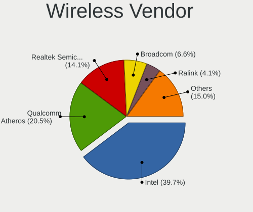

| Vendor                          | Computers | Percent |
|---------------------------------|-----------|---------|
| Intel                           | 1620      | 39.68%  |
| Qualcomm Atheros                | 838       | 20.52%  |
| Realtek Semiconductor           | 574       | 14.06%  |
| Broadcom                        | 270       | 6.61%   |
| Ralink                          | 167       | 4.09%   |
| MediaTek                        | 123       | 3.01%   |
| TP-Link                         | 102       | 2.5%    |
| Qualcomm Atheros Communications | 86        | 2.11%   |
| Ralink Technology               | 84        | 2.06%   |
| Broadcom Limited                | 61        | 1.49%   |
| Dell                            | 27        | 0.66%   |
| Sierra Wireless                 | 26        | 0.64%   |
| ASUSTek Computer                | 16        | 0.39%   |
| Microsoft                       | 12        | 0.29%   |
| IMC Networks                    | 10        | 0.24%   |
| D-Link                          | 9         | 0.22%   |
| Qualcomm                        | 7         | 0.17%   |
| Belkin Components               | 7         | 0.17%   |
| Edimax Technology               | 6         | 0.15%   |
| NetGear                         | 5         | 0.12%   |
| Marvell Technology Group        | 5         | 0.12%   |
| Hewlett-Packard                 | 4         | 0.1%    |
| Fibocom                         | 4         | 0.1%    |
| D-Link System                   | 4         | 0.1%    |
| Mercucys                        | 3         | 0.07%   |
| ZyDAS                           | 2         | 0.05%   |
| Texas Instruments               | 2         | 0.05%   |
| Qualcomm Technologies           | 2         | 0.05%   |
| VIA Technologies                | 1         | 0.02%   |
| TRENDnet                        | 1         | 0.02%   |
| Realtek                         | 1         | 0.02%   |
| Micro Star International        | 1         | 0.02%   |
| Fujitsu Siemens Computers       | 1         | 0.02%   |
| Accton Technology               | 1         | 0.02%   |
| AboCom Systems                  | 1         | 0.02%   |

Wireless Model
--------------

Wireless models

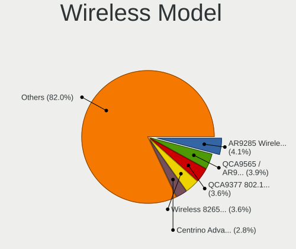

| Model                                                                   | Computers | Percent |
|-------------------------------------------------------------------------|-----------|---------|
| Qualcomm Atheros AR9285 Wireless Network Adapter (PCI-Express)          | 168       | 4.1%    |
| Qualcomm Atheros QCA9565 / AR9565 Wireless Network Adapter              | 159       | 3.88%   |
| Qualcomm Atheros QCA9377 802.11ac Wireless Network Adapter              | 148       | 3.61%   |
| Intel Wireless 8265 / 8275                                              | 146       | 3.56%   |
| Intel Centrino Advanced-N 6205 [Taylor Peak]                            | 115       | 2.8%    |
| Intel Wireless 7260                                                     | 114       | 2.78%   |
| Qualcomm Atheros AR9485 Wireless Network Adapter                        | 108       | 2.63%   |
| Intel Wireless 7265                                                     | 102       | 2.49%   |
| Ralink RT3290 Wireless 802.11n 1T/1R PCIe                               | 101       | 2.46%   |
| Realtek RTL8723BE PCIe Wireless Network Adapter                         | 85        | 2.07%   |
| Realtek RTL8822CE 802.11ac PCIe Wireless Network Adapter                | 82        | 2%      |
| Intel Wireless 3165                                                     | 79        | 1.93%   |
| Intel Wi-Fi 6 AX200                                                     | 79        | 1.93%   |
| Broadcom BCM4313 802.11bgn Wireless Network Adapter                     | 78        | 1.9%    |
| Qualcomm Atheros AR9271 802.11n                                         | 75        | 1.83%   |
| Qualcomm Atheros AR242x / AR542x Wireless Network Adapter (PCI-Express) | 70        | 1.71%   |
| Intel Centrino Ultimate-N 6300                                          | 70        | 1.71%   |
| Intel Wireless 8260                                                     | 69        | 1.68%   |
| Intel PRO/Wireless 3945ABG [Golan] Network Connection                   | 66        | 1.61%   |
| Intel Centrino Advanced-N 6200                                          | 66        | 1.61%   |
| Intel Wi-Fi 6 AX201                                                     | 62        | 1.51%   |
| Realtek RTL8821CE 802.11ac PCIe Wireless Network Adapter                | 59        | 1.44%   |
| Realtek RTL8188EUS 802.11n Wireless Network Adapter                     | 57        | 1.39%   |
| MediaTek MT7921 802.11ax PCIe Wireless Network Adapter [Filogic 330]    | 57        | 1.39%   |
| Intel Cannon Lake PCH CNVi WiFi                                         | 52        | 1.27%   |
| Intel Wireless 3160                                                     | 49        | 1.2%    |
| Intel Dual Band Wireless-AC 3168NGW [Stone Peak]                        | 46        | 1.12%   |
| Intel PRO/Wireless 4965 AG or AGN [Kedron] Network Connection           | 44        | 1.07%   |
| Broadcom BCM43142 802.11b/g/n                                           | 44        | 1.07%   |
| Intel PRO/Wireless 5100 AGN [Shiloh] Network Connection                 | 43        | 1.05%   |
| Ralink MT7601U Wireless Adapter                                         | 40        | 0.98%   |
| Qualcomm Atheros QCA6174 802.11ac Wireless Network Adapter              | 40        | 0.98%   |
| Qualcomm Atheros AR9287 Wireless Network Adapter (PCI-Express)          | 40        | 0.98%   |
| Realtek RTL8821AE 802.11ac PCIe Wireless Network Adapter                | 38        | 0.93%   |
| Intel WiFi Link 5100                                                    | 38        | 0.93%   |
| Intel Comet Lake PCH-LP CNVi WiFi                                       | 36        | 0.88%   |
| Intel Cannon Point-LP CNVi [Wireless-AC]                                | 34        | 0.83%   |
| Broadcom Limited BCM4312 802.11b/g LP-PHY                               | 31        | 0.76%   |
| Qualcomm Atheros AR928X Wireless Network Adapter (PCI-Express)          | 30        | 0.73%   |
| Broadcom BCM43228 802.11a/b/g/n                                         | 29        | 0.71%   |

Ethernet Vendor
---------------

Ethernet vendors

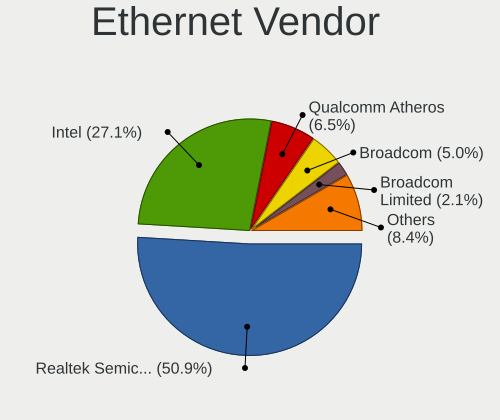

| Vendor                                 | Computers | Percent |
|----------------------------------------|-----------|---------|
| Realtek Semiconductor                  | 2770      | 50.95%  |
| Intel                                  | 1476      | 27.15%  |
| Qualcomm Atheros                       | 353       | 6.49%   |
| Broadcom                               | 270       | 4.97%   |
| Broadcom Limited                       | 113       | 2.08%   |
| Marvell Technology Group               | 100       | 1.84%   |
| Nvidia                                 | 65        | 1.2%    |
| Samsung Electronics                    | 30        | 0.55%   |
| DisplayLink                            | 29        | 0.53%   |
| Xiaomi                                 | 27        | 0.5%    |
| Huawei Technologies                    | 22        | 0.4%    |
| ASIX Electronics                       | 19        | 0.35%   |
| VIA Technologies                       | 18        | 0.33%   |
| JMicron Technology                     | 17        | 0.31%   |
| TP-Link                                | 15        | 0.28%   |
| MediaTek                               | 15        | 0.28%   |
| Silicon Integrated Systems [SiS]       | 13        | 0.24%   |
| Attansic Technology                    | 13        | 0.24%   |
| Aquantia                               | 10        | 0.18%   |
| QinHeng Electronics                    | 8         | 0.15%   |
| Lenovo                                 | 8         | 0.15%   |
| Qualcomm                               | 4         | 0.07%   |
| Hewlett-Packard                        | 4         | 0.07%   |
| D-Link System                          | 4         | 0.07%   |
| T & A Mobile Phones                    | 3         | 0.06%   |
| Microchip Technology                   | 3         | 0.06%   |
| Apple                                  | 3         | 0.06%   |
| American Megatrends                    | 3         | 0.06%   |
| Accton Technology                      | 3         | 0.06%   |
| Sundance Technology Inc / IC Plus      | 2         | 0.04%   |
| TOMTOM                                 | 1         | 0.02%   |
| Spreadtrum Communications              | 1         | 0.02%   |
| Sony Ericsson Mobile Communications AB | 1         | 0.02%   |
| Qualcomm Technologies                  | 1         | 0.02%   |
| QLogic                                 | 1         | 0.02%   |
| OPPO Electronics                       | 1         | 0.02%   |
| OnePlus Technology (Shenzhen)          | 1         | 0.02%   |
| Motorola PCS                           | 1         | 0.02%   |
| LG Electronics                         | 1         | 0.02%   |
| ICS Advent                             | 1         | 0.02%   |

Ethernet Model
--------------

Ethernet models

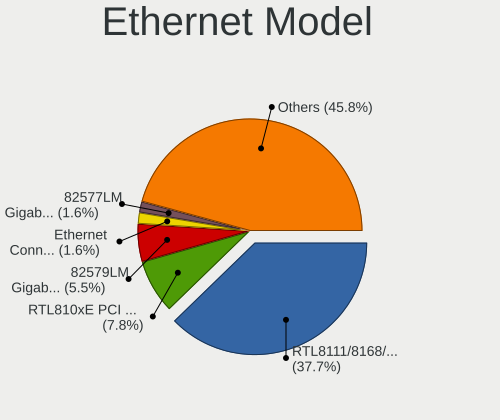

| Model                                                                  | Computers | Percent |
|------------------------------------------------------------------------|-----------|---------|
| Realtek RTL8111/8168/8211/8411 PCI Express Gigabit Ethernet Controller | 2088      | 37.74%  |
| Realtek RTL810xE PCI Express Fast Ethernet controller                  | 433       | 7.83%   |
| Intel 82579LM Gigabit Network Connection (Lewisville)                  | 302       | 5.46%   |
| Intel Ethernet Connection I217-LM                                      | 90        | 1.63%   |
| Intel 82577LM Gigabit Network Connection                               | 87        | 1.57%   |
| Realtek RTL8125 2.5GbE Controller                                      | 80        | 1.45%   |
| Intel Ethernet Connection (2) I219-V                                   | 80        | 1.45%   |
| Intel 82567LM-3 Gigabit Network Connection                             | 72        | 1.3%    |
| Realtek RTL8153 Gigabit Ethernet Adapter                               | 70        | 1.27%   |
| Intel 82567LM Gigabit Network Connection                               | 64        | 1.16%   |
| Qualcomm Atheros QCA8171 Gigabit Ethernet                              | 56        | 1.01%   |
| Intel I211 Gigabit Network Connection                                  | 56        | 1.01%   |
| Realtek RTL-8100/8101L/8139 PCI Fast Ethernet Adapter                  | 53        | 0.96%   |
| Intel Ethernet Connection (4) I219-LM                                  | 51        | 0.92%   |
| Qualcomm Atheros AR8151 v2.0 Gigabit Ethernet                          | 50        | 0.9%    |
| Intel Ethernet Connection I218-LM                                      | 47        | 0.85%   |
| Intel Ethernet Connection (2) I219-LM                                  | 44        | 0.8%    |
| Intel 82579V Gigabit Network Connection                                | 43        | 0.78%   |
| Intel Ethernet Connection I217-V                                       | 41        | 0.74%   |
| Intel Ethernet Connection (3) I218-LM                                  | 41        | 0.74%   |
| Qualcomm Atheros AR8132 Fast Ethernet                                  | 39        | 0.7%    |
| Intel Ethernet Connection I219-LM                                      | 39        | 0.7%    |
| Intel 82566DM-2 Gigabit Network Connection                             | 38        | 0.69%   |
| Qualcomm Atheros AR8131 Gigabit Ethernet                               | 37        | 0.67%   |
| Qualcomm Atheros AR8121/AR8113/AR8114 Gigabit or Fast Ethernet         | 34        | 0.61%   |
| Nvidia MCP61 Ethernet                                                  | 33        | 0.6%    |
| Qualcomm Atheros AR8152 v2.0 Fast Ethernet                             | 32        | 0.58%   |
| Broadcom NetXtreme BCM5761 Gigabit Ethernet PCIe                       | 31        | 0.56%   |
| Broadcom NetLink BCM57785 Gigabit Ethernet PCIe                        | 31        | 0.56%   |
| Realtek RTL8169 PCI Gigabit Ethernet Controller                        | 29        | 0.52%   |
| Realtek RTL8152 Fast Ethernet Adapter                                  | 26        | 0.47%   |
| Intel Ethernet Connection (7) I219-V                                   | 26        | 0.47%   |
| Broadcom NetXtreme BCM5754 Gigabit Ethernet PCI Express                | 26        | 0.47%   |
| Marvell Group 88E8040 PCI-E Fast Ethernet Controller                   | 24        | 0.43%   |
| Xiaomi Mi/Redmi series (RNDIS)                                         | 23        | 0.42%   |
| Intel Ethernet Connection (7) I219-LM                                  | 23        | 0.42%   |
| Intel Ethernet Connection (4) I219-V                                   | 23        | 0.42%   |
| Intel 82566MM Gigabit Network Connection                               | 23        | 0.42%   |
| Broadcom NetLink BCM57780 Gigabit Ethernet PCIe                        | 22        | 0.4%    |
| Qualcomm Atheros AR8161 Gigabit Ethernet                               | 21        | 0.38%   |

Net Controller Kind
-------------------

Ethernet, WiFi or modem

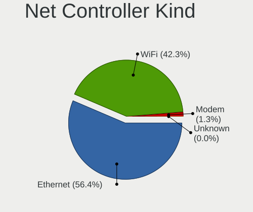

| Kind     | Computers | Percent |
|----------|-----------|---------|
| Ethernet | 5173      | 56.43%  |
| WiFi     | 3874      | 42.26%  |
| Modem    | 116       | 1.27%   |
| Unknown  | 4         | 0.04%   |

Used Controller
---------------

Currently used network controller

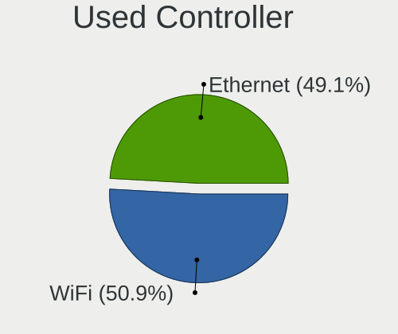

| Kind     | Computers | Percent |
|----------|-----------|---------|
| WiFi     | 3038      | 50.88%  |
| Ethernet | 2933      | 49.12%  |

NICs
----

Total network controllers on board

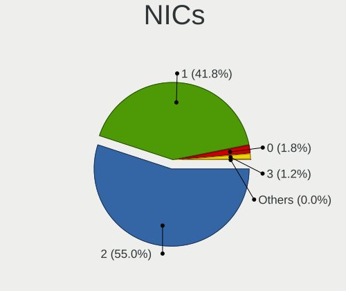

| Total | Computers | Percent |
|-------|-----------|---------|
| 2     | 3119      | 55.03%  |
| 1     | 2371      | 41.83%  |
| 0     | 100       | 1.76%   |
| 3     | 68        | 1.2%    |
| 4     | 8         | 0.14%   |
| 6     | 1         | 0.02%   |
| 5     | 1         | 0.02%   |

IPv6
----

IPv6 vs IPv4

| Used | Computers | Percent |
|------|-----------|---------|
| No   | 4367      | 73.68%  |
| Yes  | 1560      | 26.32%  |

Bluetooth
---------

Bluetooth Vendor
----------------

Controller vendors

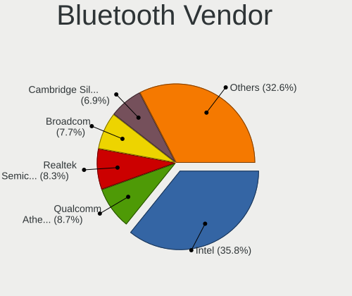

| Vendor                          | Computers | Percent |
|---------------------------------|-----------|---------|
| Intel                           | 1099      | 35.8%   |
| Qualcomm Atheros Communications | 268       | 8.73%   |
| Realtek Semiconductor           | 256       | 8.34%   |
| Broadcom                        | 235       | 7.65%   |
| Cambridge Silicon Radio         | 211       | 6.87%   |
| IMC Networks                    | 182       | 5.93%   |
| Lite-On Technology              | 130       | 4.23%   |
| Foxconn / Hon Hai               | 121       | 3.94%   |
| Dell                            | 117       | 3.81%   |
| Ralink                          | 101       | 3.29%   |
| Hewlett-Packard                 | 94        | 3.06%   |
| ASUSTek Computer                | 55        | 1.79%   |
| Apple                           | 38        | 1.24%   |
| Toshiba                         | 32        | 1.04%   |
| MediaTek                        | 19        | 0.62%   |
| TP-Link                         | 15        | 0.49%   |
| Ralink Technology               | 13        | 0.42%   |
| Realtek                         | 11        | 0.36%   |
| Askey Computer                  | 10        | 0.33%   |
| Chicony Electronics             | 8         | 0.26%   |
| Belkin Components               | 8         | 0.26%   |
| Conwise Technology              | 7         | 0.23%   |
| Micro Star International        | 5         | 0.16%   |
| Foxconn International           | 5         | 0.16%   |
| Taiyo Yuden                     | 4         | 0.13%   |
| Marvell Semiconductor           | 4         | 0.13%   |
| Logitech                        | 4         | 0.13%   |
| Integrated System Solution      | 4         | 0.13%   |
| Alps Electric                   | 3         | 0.1%    |
| Opticis                         | 2         | 0.07%   |
| Edimax Technology               | 2         | 0.07%   |
| Unknown                         | 2         | 0.07%   |
| USI                             | 1         | 0.03%   |
| Roper                           | 1         | 0.03%   |
| Quectel Wireless Solutions      | 1         | 0.03%   |
| Fujitsu Siemens Computers       | 1         | 0.03%   |
| Actions                         | 1         | 0.03%   |

Bluetooth Model
---------------

Controller models

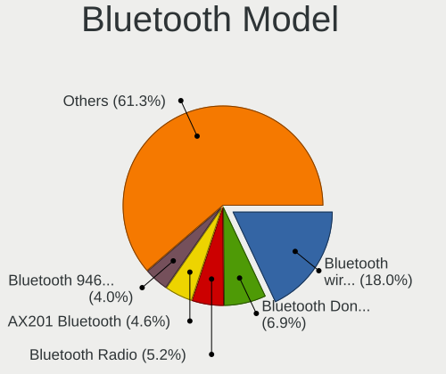

| Model                                               | Computers | Percent |
|-----------------------------------------------------|-----------|---------|
| Intel Bluetooth wireless interface                  | 553       | 17.99%  |
| Cambridge Silicon Radio Bluetooth Dongle (HCI mode) | 211       | 6.86%   |
| Realtek Bluetooth Radio                             | 160       | 5.2%    |
| Intel AX201 Bluetooth                               | 141       | 4.59%   |
| Intel Bluetooth 9460/9560 Jefferson Peak (JfP)      | 124       | 4.03%   |
| Qualcomm Atheros  Bluetooth Device                  | 115       | 3.74%   |
| Ralink RT3290 Bluetooth                             | 101       | 3.29%   |
| Intel AX200 Bluetooth                               | 74        | 2.41%   |
| IMC Networks Wireless_Device                        | 60        | 1.95%   |
| IMC Networks Bluetooth Radio                        | 60        | 1.95%   |
| Dell DW375 Bluetooth Module                         | 59        | 1.92%   |
| Intel Bluetooth Device                              | 55        | 1.79%   |
| HP Broadcom 2070 Bluetooth Combo                    | 51        | 1.66%   |
| Qualcomm Atheros AR3011 Bluetooth                   | 50        | 1.63%   |
| Qualcomm Atheros AR3012 Bluetooth 4.0               | 48        | 1.56%   |
| Broadcom BCM2045B (BDC-2.1)                         | 48        | 1.56%   |
| Intel Wireless-AC 3168 Bluetooth                    | 45        | 1.46%   |
| Lite-On Qualcomm Atheros QCA9377 Bluetooth          | 44        | 1.43%   |
| IMC Networks Bluetooth Device                       | 40        | 1.3%    |
| HP Bluetooth 2.0 Interface [Broadcom BCM2045]       | 39        | 1.27%   |
| Intel Centrino Bluetooth Wireless Transceiver       | 36        | 1.17%   |
| Realtek  Bluetooth 4.2 Adapter                      | 34        | 1.11%   |
| Broadcom HP Portable SoftSailing                    | 32        | 1.04%   |
| Broadcom BCM20702 Bluetooth 4.0 [ThinkPad]          | 32        | 1.04%   |
| Realtek RTL8821A Bluetooth                          | 28        | 0.91%   |
| Foxconn / Hon Hai Bluetooth Device                  | 28        | 0.91%   |
| Realtek RTL8723B Bluetooth                          | 27        | 0.88%   |
| Intel AX210 Bluetooth                               | 27        | 0.88%   |
| Lite-On Bluetooth Device                            | 25        | 0.81%   |
| Lite-On Atheros AR3012 Bluetooth                    | 25        | 0.81%   |
| Qualcomm Atheros AR9462 Bluetooth                   | 23        | 0.75%   |
| Intel Centrino Advanced-N 6230 Bluetooth adapter    | 22        | 0.72%   |
| Foxconn / Hon Hai Wireless_Device                   | 22        | 0.72%   |
| Intel Wireless-AC 9260 Bluetooth Adapter            | 21        | 0.68%   |
| Dell BCM20702A0 Bluetooth Module                    | 19        | 0.62%   |
| Apple Bluetooth Host Controller                     | 19        | 0.62%   |
| ASUS ASUS USB-BT500                                 | 17        | 0.55%   |
| MediaTek Wireless_Device                            | 16        | 0.52%   |
| TP-Link TP-T@- UB500 Adapter                        | 15        | 0.49%   |
| Foxconn / Hon Hai BCM20702A0                        | 15        | 0.49%   |

Sound
-----

Sound Vendor
------------

Sound card vendors

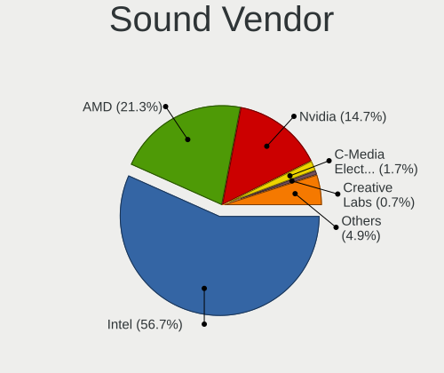

| Vendor                                       | Computers | Percent |
|----------------------------------------------|-----------|---------|
| Intel                                        | 4168      | 56.68%  |
| AMD                                          | 1569      | 21.34%  |
| Nvidia                                       | 1079      | 14.67%  |
| C-Media Electronics                          | 122       | 1.66%   |
| Creative Labs                                | 52        | 0.71%   |
| Logitech                                     | 30        | 0.41%   |
| ASUSTek Computer                             | 26        | 0.35%   |
| Texas Instruments                            | 23        | 0.31%   |
| VIA Technologies                             | 20        | 0.27%   |
| Generalplus Technology                       | 16        | 0.22%   |
| Silicon Integrated Systems [SiS]             | 15        | 0.2%    |
| JMTek                                        | 15        | 0.2%    |
| Creative Technology                          | 14        | 0.19%   |
| Kingston Technology                          | 13        | 0.18%   |
| SteelSeries ApS                              | 11        | 0.15%   |
| Realtek Semiconductor                        | 11        | 0.15%   |
| GN Netcom                                    | 10        | 0.14%   |
| Plantronics                                  | 9         | 0.12%   |
| Lenovo                                       | 8         | 0.11%   |
| Hewlett-Packard                              | 8         | 0.11%   |
| BEHRINGER International                      | 8         | 0.11%   |
| Zoran Co. Personal Media Division (Nogatech) | 7         | 0.1%    |
| Razer USA                                    | 7         | 0.1%    |
| Focusrite-Novation                           | 5         | 0.07%   |
| Apple                                        | 5         | 0.07%   |
| Sony                                         | 4         | 0.05%   |
| Samson Technologies                          | 4         | 0.05%   |
| Nordic Semiconductor ASA                     | 3         | 0.04%   |
| Jieli Technology                             | 3         | 0.04%   |
| Ensoniq                                      | 3         | 0.04%   |
| DSEA A/S                                     | 3         | 0.04%   |
| Dell                                         | 3         | 0.04%   |
| Yamaha                                       | 2         | 0.03%   |
| Walmart                                      | 2         | 0.03%   |
| Trust                                        | 2         | 0.03%   |
| Thesycon Systemsoftware & Consulting         | 2         | 0.03%   |
| Tenx Technology                              | 2         | 0.03%   |
| Superlux digit                               | 2         | 0.03%   |
| Promethean Limited                           | 2         | 0.03%   |
| Nektar                                       | 2         | 0.03%   |

Sound Model
-----------

Sound card models

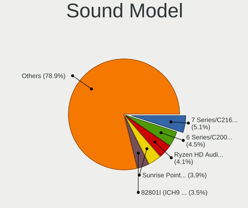

| Model                                                                                             | Computers | Percent |
|---------------------------------------------------------------------------------------------------|-----------|---------|
| Intel 7 Series/C216 Chipset Family High Definition Audio Controller                               | 450       | 5.07%   |
| Intel 6 Series/C200 Series Chipset Family High Definition Audio Controller                        | 399       | 4.5%    |
| AMD Ryzen HD Audio Controller                                                                     | 364       | 4.11%   |
| Intel Sunrise Point-LP HD Audio                                                                   | 350       | 3.95%   |
| Intel 82801I (ICH9 Family) HD Audio Controller                                                    | 312       | 3.52%   |
| AMD FCH Azalia Controller                                                                         | 310       | 3.5%    |
| Intel NM10/ICH7 Family High Definition Audio Controller                                           | 307       | 3.46%   |
| Intel 8 Series/C220 Series Chipset High Definition Audio Controller                               | 292       | 3.29%   |
| AMD SBx00 Azalia (Intel HDA)                                                                      | 258       | 2.91%   |
| Intel 5 Series/3400 Series Chipset High Definition Audio                                          | 245       | 2.76%   |
| Intel Xeon E3-1200 v3/4th Gen Core Processor HD Audio Controller                                  | 227       | 2.56%   |
| AMD Renoir/Cezanne HDMI/DP Audio Controller                                                       | 164       | 1.85%   |
| Intel 8 Series HD Audio Controller                                                                | 161       | 1.82%   |
| Intel Haswell-ULT HD Audio Controller                                                             | 160       | 1.8%    |
| Intel 100 Series/C230 Series Chipset Family HD Audio Controller                                   | 153       | 1.73%   |
| Intel 82801H (ICH8 Family) HD Audio Controller                                                    | 139       | 1.57%   |
| Intel Broadwell-U Audio Controller                                                                | 133       | 1.5%    |
| Intel Wildcat Point-LP High Definition Audio Controller                                           | 131       | 1.48%   |
| Nvidia GK208 HDMI/DP Audio Controller                                                             | 130       | 1.47%   |
| Intel 200 Series PCH HD Audio                                                                     | 121       | 1.36%   |
| Intel Cannon Lake PCH cAVS                                                                        | 118       | 1.33%   |
| AMD Kabini HDMI/DP Audio                                                                          | 108       | 1.22%   |
| AMD Starship/Matisse HD Audio Controller                                                          | 107       | 1.21%   |
| AMD Trinity HDMI Audio Controller                                                                 | 103       | 1.16%   |
| AMD Radeon High Definition Audio Controller                                                       | 97        | 1.09%   |
| Nvidia GP107GL High Definition Audio Controller                                                   | 91        | 1.03%   |
| Nvidia High Definition Audio Controller                                                           | 88        | 0.99%   |
| Intel 82801JD/DO (ICH10 Family) HD Audio Controller                                               | 87        | 0.98%   |
| Intel Tiger Lake-LP Smart Sound Technology Audio Controller                                       | 85        | 0.96%   |
| AMD Raven/Raven2/Fenghuang HDMI/DP Audio Controller                                               | 83        | 0.94%   |
| AMD Oland/Hainan/Cape Verde/Pitcairn HDMI Audio [Radeon HD 7000 Series]                           | 82        | 0.92%   |
| Intel Atom/Celeron/Pentium Processor x5-E8000/J3xxx/N3xxx Series High Definition Audio Controller | 79        | 0.89%   |
| AMD Ellesmere HDMI Audio [Radeon RX 470/480 / 570/580/590]                                        | 79        | 0.89%   |
| Intel Atom Processor Z36xxx/Z37xxx Series High Definition Audio Controller                        | 74        | 0.83%   |
| Nvidia GF108 High Definition Audio Controller                                                     | 73        | 0.82%   |
| AMD Caicos HDMI Audio [Radeon HD 6450 / 7450/8450/8490 OEM / R5 230/235/235X OEM]                 | 72        | 0.81%   |
| AMD Family 17h (Models 00h-0fh) HD Audio Controller                                               | 71        | 0.8%    |
| AMD Cedar HDMI Audio [Radeon HD 5400/6300/7300 Series]                                            | 67        | 0.76%   |
| Intel 82801JI (ICH10 Family) HD Audio Controller                                                  | 64        | 0.72%   |
| Intel Cannon Point-LP High Definition Audio Controller                                            | 63        | 0.71%   |

Memory
------

Memory Vendor
-------------

Memory module vendors

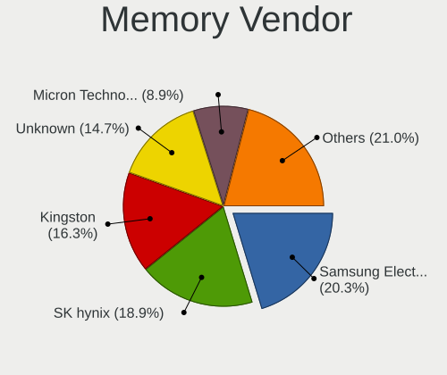

| Vendor                       | Computers | Percent |
|------------------------------|-----------|---------|
| Samsung Electronics          | 1090      | 20.32%  |
| SK hynix                     | 1011      | 18.85%  |
| Kingston                     | 873       | 16.28%  |
| Unknown                      | 787       | 14.67%  |
| Micron Technology            | 476       | 8.88%   |
| Crucial                      | 138       | 2.57%   |
| Nanya Technology             | 128       | 2.39%   |
| Kingmax                      | 112       | 2.09%   |
| G.Skill                      | 106       | 1.98%   |
| Corsair                      | 105       | 1.96%   |
| Elpida                       | 100       | 1.86%   |
| Ramaxel Technology           | 85        | 1.58%   |
| A-DATA Technology            | 66        | 1.23%   |
| Team                         | 32        | 0.6%    |
| Unknown                      | 22        | 0.41%   |
| CSX                          | 20        | 0.37%   |
| Patriot                      | 19        | 0.35%   |
| Qimonda                      | 16        | 0.3%    |
| Hikvision                    | 16        | 0.3%    |
| Transcend                    | 15        | 0.28%   |
| Unknown (ABCD)               | 14        | 0.26%   |
| ASint Technology             | 13        | 0.24%   |
| Apacer                       | 12        | 0.22%   |
| 48spaces                     | 11        | 0.21%   |
| Kingmax Semiconductor        | 10        | 0.19%   |
| Toshiba                      | 8         | 0.15%   |
| Melco                        | 8         | 0.15%   |
| PUSKILL                      | 4         | 0.07%   |
| OCZ                          | 4         | 0.07%   |
| GeIL                         | 4         | 0.07%   |
| Unknown (0x0080)             | 3         | 0.06%   |
| Unknown (0BF7)               | 3         | 0.06%   |
| SHARETRONIC                  | 3         | 0.06%   |
| Unknown (0x0E9D)             | 2         | 0.04%   |
| Unknown (09D5)               | 2         | 0.04%   |
| Silicon Power                | 2         | 0.04%   |
| Patriot Memory (PDP Systems) | 2         | 0.04%   |
| KingSpec                     | 2         | 0.04%   |
| Intersil                     | 2         | 0.04%   |
| Infineon                     | 2         | 0.04%   |

Memory Model
------------

Memory module models

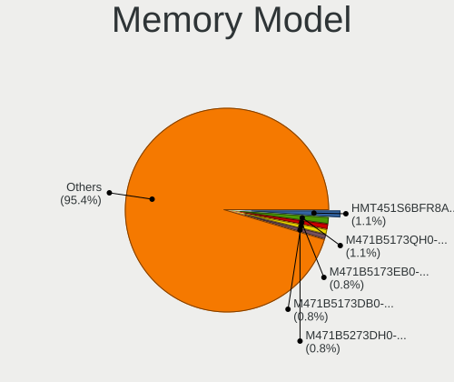

| Model                                                    | Computers | Percent |
|----------------------------------------------------------|-----------|---------|
| SK hynix RAM HMT451S6BFR8A-PB 4GB SODIMM DDR3 1600MT/s   | 65        | 1.09%   |
| Samsung RAM M471B5173QH0-YK0 4GB SODIMM DDR3 1600MT/s    | 64        | 1.08%   |
| Samsung RAM M471B5173EB0-YK0 4GB SODIMM DDR3 1600MT/s    | 50        | 0.84%   |
| Samsung RAM M471B5173DB0-YK0 4GB SODIMM DDR3 1600MT/s    | 49        | 0.82%   |
| Samsung RAM M471B5273DH0-CH9 4GB SODIMM DDR3 1600MT/s    | 46        | 0.77%   |
| Kingston RAM KHX1600C10D3/4G 4GB DIMM DDR3 1866MT/s      | 46        | 0.77%   |
| Unknown RAM Module 2048MB DIMM 800MT/s                   | 44        | 0.74%   |
| SK hynix RAM HMT351S6EFR8A-PB 4GB SODIMM DDR3 1600MT/s   | 39        | 0.66%   |
| Unknown RAM Module 2048MB DIMM SDRAM                     | 37        | 0.62%   |
| Unknown RAM Module 2048MB SODIMM DDR2 667MT/s            | 35        | 0.59%   |
| Samsung RAM M471B5773DH0-CH9 2GB SODIMM DDR3 1600MT/s    | 35        | 0.59%   |
| SK hynix RAM HMT41GS6BFR8A-PB 8GB SODIMM DDR3 2667MT/s   | 34        | 0.57%   |
| Samsung RAM M471B5273CH0-CH9 4GB SODIMM DDR3 1334MT/s    | 34        | 0.57%   |
| Samsung RAM M471B5773CHS-CH9 2GB SODIMM DDR3 4199MT/s    | 32        | 0.54%   |
| Samsung RAM M471B5673FH0-CF8 2048MB SODIMM DDR3 1067MT/s | 31        | 0.52%   |
| SK hynix RAM HMA81GS6AFR8N-UH 8GB SODIMM DDR4 2667MT/s   | 29        | 0.49%   |
| Samsung RAM M471A5244CB0-CTD 4GB SODIMM DDR4 3266MT/s    | 29        | 0.49%   |
| Samsung RAM M471A5244CB0-CRC 4GB SODIMM DDR4 2667MT/s    | 29        | 0.49%   |
| Kingston RAM KHX1600C10D3/8G 8GB DIMM DDR3 2133MT/s      | 27        | 0.45%   |
| SK hynix RAM HMT325S6CFR8A-PB 2GB SODIMM DDR3 1600MT/s   | 26        | 0.44%   |
| Samsung RAM M471B5273DH0-CK0 4GB SODIMM DDR3 2400MT/s    | 26        | 0.44%   |
| SK hynix RAM HMA851S6AFR6N-UH 4GB SODIMM DDR4 2667MT/s   | 25        | 0.42%   |
| Samsung RAM M471B1G73DB0-YK0 8GB SODIMM DDR3 1600MT/s    | 25        | 0.42%   |
| Micron RAM 8KTF51264HZ-1G6E1 4GB SODIMM DDR3 1600MT/s    | 23        | 0.39%   |
| Samsung RAM M471A1K43BB1-CRC 8GB SODIMM DDR4 2667MT/s    | 22        | 0.37%   |
| Kingston RAM KHX1600C9D3/4GX 4GB DIMM DDR3 1867MT/s      | 22        | 0.37%   |
| Unknown                                                  | 22        | 0.37%   |
| Unknown RAM Module 4096MB DIMM DDR3 1333MT/s             | 21        | 0.35%   |
| SK hynix RAM HMT351S6CFR8C-PB 4GB SODIMM DDR3 1600MT/s   | 21        | 0.35%   |
| Samsung RAM M471A1K43CB1-CRC 8GB SODIMM DDR4 8400MT/s    | 21        | 0.35%   |
| Samsung RAM M471A1G44AB0-CWE 8GiB SODIMM DDR4 3200MT/s   | 21        | 0.35%   |
| SK hynix RAM HMT351S6EFR8C-PB 4GB SODIMM DDR3 1600MT/s   | 20        | 0.34%   |
| Unknown RAM Module 2048MB DIMM DDR2 800MT/s              | 19        | 0.32%   |
| Unknown RAM Module 1024MB DIMM SDRAM                     | 19        | 0.32%   |
| SK hynix RAM HMT451S6AFR8A-PB 4GB SODIMM DDR3 1600MT/s   | 19        | 0.32%   |
| G.Skill RAM F4-3200C16-8GIS 8GB DIMM DDR4 3600MT/s       | 19        | 0.32%   |
| Unknown RAM Module 1024MB SODIMM DDR2 667MT/s            | 18        | 0.3%    |
| Unknown RAM Module 1024MB DIMM 800MT/s                   | 18        | 0.3%    |
| Samsung RAM M471B1G73EB0-YK0 8192MB SODIMM DDR3 1600MT/s | 18        | 0.3%    |
| Kingston RAM 99U5584-005.A00LF 4GB DIMM DDR3 1600MT/s    | 18        | 0.3%    |

Memory Kind
-----------

Memory module kinds

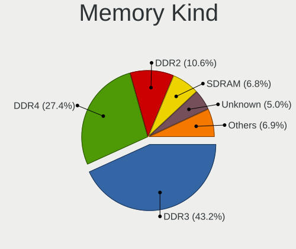

| Kind    | Computers | Percent |
|---------|-----------|---------|
| DDR3    | 1973      | 43.22%  |
| DDR4    | 1252      | 27.43%  |
| DDR2    | 486       | 10.65%  |
| SDRAM   | 309       | 6.77%   |
| Unknown | 229       | 5.02%   |
| LPDDR4  | 85        | 1.86%   |
| DDR5    | 70        | 1.53%   |
| DDR     | 64        | 1.4%    |
| LPDDR5  | 42        | 0.92%   |
| LPDDR3  | 42        | 0.92%   |
| DRAM    | 13        | 0.28%   |

Memory Form Factor
------------------

Physical design of the memory module

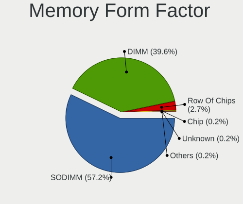

| Name         | Computers | Percent |
|--------------|-----------|---------|
| SODIMM       | 2523      | 57.17%  |
| DIMM         | 1746      | 39.56%  |
| Row Of Chips | 117       | 2.65%   |
| Chip         | 11        | 0.25%   |
| Unknown      | 8         | 0.18%   |
| RIMM         | 7         | 0.16%   |
| FB-DIMM      | 1         | 0.02%   |

Memory Size
-----------

Memory module size

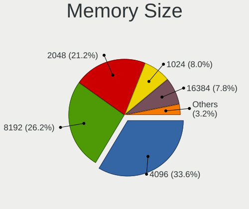

| Size    | Computers | Percent |
|---------|-----------|---------|
| 4096    | 1693      | 33.61%  |
| 8192    | 1322      | 26.25%  |
| 2048    | 1067      | 21.18%  |
| 1024    | 401       | 7.96%   |
| 16384   | 395       | 7.84%   |
| 32768   | 93        | 1.85%   |
| 512     | 58        | 1.15%   |
| 256     | 4         | 0.08%   |
| Unknown | 2         | 0.04%   |
| 65536   | 1         | 0.02%   |
| 49152   | 1         | 0.02%   |

Memory Speed
------------

Memory module speed

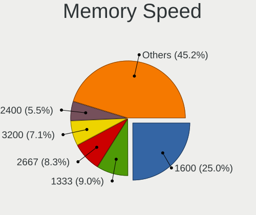

| Speed   | Computers | Percent |
|---------|-----------|---------|
| 1600    | 1271      | 24.98%  |
| 1333    | 457       | 8.98%   |
| 2667    | 420       | 8.25%   |
| 3200    | 361       | 7.09%   |
| 2400    | 278       | 5.46%   |
| 667     | 273       | 5.36%   |
| 800     | 259       | 5.09%   |
| 2133    | 210       | 4.13%   |
| 1334    | 191       | 3.75%   |
| Unknown | 167       | 3.28%   |
| 1067    | 116       | 2.28%   |
| 3600    | 84        | 1.65%   |
| 1866    | 83        | 1.63%   |
| 4199    | 75        | 1.47%   |
| 1066    | 57        | 1.12%   |
| 533     | 56        | 1.1%    |
| 1867    | 55        | 1.08%   |
| 2048    | 53        | 1.04%   |
| 3733    | 41        | 0.81%   |
| 400     | 41        | 0.81%   |
| 3266    | 31        | 0.61%   |
| 975     | 30        | 0.59%   |
| 2666    | 29        | 0.57%   |
| 6400    | 28        | 0.55%   |
| 5600    | 26        | 0.51%   |
| 8400    | 24        | 0.47%   |
| 3000    | 24        | 0.47%   |
| 4800    | 22        | 0.43%   |
| 1639    | 21        | 0.41%   |
| 4266    | 20        | 0.39%   |
| 3400    | 20        | 0.39%   |
| 1800    | 20        | 0.39%   |
| 4267    | 18        | 0.35%   |
| 333     | 18        | 0.35%   |
| 3466    | 16        | 0.31%   |
| 6000    | 15        | 0.29%   |
| 2000    | 15        | 0.29%   |
| 2933    | 13        | 0.26%   |
| 3800    | 10        | 0.2%    |
| 3333    | 10        | 0.2%    |

Printers & scanners
-------------------

Printer Vendor
--------------

Printer device vendors

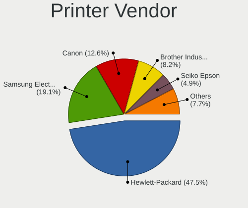

| Vendor                | Computers | Percent |
|-----------------------|-----------|---------|
| Hewlett-Packard       | 87        | 47.54%  |
| Samsung Electronics   | 35        | 19.13%  |
| Canon                 | 23        | 12.57%  |
| Brother Industries    | 15        | 8.2%    |
| Seiko Epson           | 9         | 4.92%   |
| Lexmark International | 3         | 1.64%   |
| Xerox                 | 2         | 1.09%   |
| QinHeng Electronics   | 2         | 1.09%   |
| Dymo-CoStar           | 2         | 1.09%   |
| STMicroelectronics    | 1         | 0.55%   |
| Ricoh                 | 1         | 0.55%   |
| Prolific Technology   | 1         | 0.55%   |
| Oki Data              | 1         | 0.55%   |
| Graphtec America      | 1         | 0.55%   |

Printer Model
-------------

Printer device models

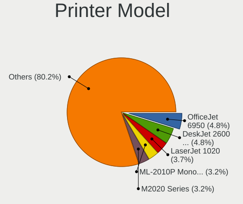

| Model                                | Computers | Percent |
|--------------------------------------|-----------|---------|
| HP OfficeJet 6950                    | 9         | 4.81%   |
| HP DeskJet 2600 series               | 9         | 4.81%   |
| HP LaserJet 1020                     | 7         | 3.74%   |
| Samsung ML-2010P Mono Laser Printer  | 6         | 3.21%   |
| Samsung M2020 Series                 | 6         | 3.21%   |
| HP DeskJet 2130 series               | 6         | 3.21%   |
| Samsung ML-1640 Series Laser Printer | 4         | 2.14%   |
| HP LaserJet 1010                     | 4         | 2.14%   |
| HP Deskjet 2050 J510                 | 4         | 2.14%   |
| Canon LiDE 400                       | 4         | 2.14%   |
| Canon LiDE 300                       | 4         | 2.14%   |
| Samsung ML-1660 Series               | 3         | 1.6%    |
| Samsung C48x Series                  | 3         | 1.6%    |
| HP LaserJet P1102                    | 3         | 1.6%    |
| HP LaserJet P1005                    | 3         | 1.6%    |
| HP LaserJet 1018                     | 3         | 1.6%    |
| Brother HL-L2300D series             | 3         | 1.6%    |
| Brother HL-1110 series               | 3         | 1.6%    |
| Seiko Epson L3110 Series             | 2         | 1.07%   |
| Samsung SCX-4623 Series              | 2         | 1.07%   |
| Samsung SCX-3400 Series              | 2         | 1.07%   |
| Samsung M2070 Series                 | 2         | 1.07%   |
| QinHeng CH340S                       | 2         | 1.07%   |
| HP Officejet J4500 series            | 2         | 1.07%   |
| HP LaserJet 1022                     | 2         | 1.07%   |
| HP LaserJet 1000                     | 2         | 1.07%   |
| HP DeskJet F4100 Printer series      | 2         | 1.07%   |
| HP Deskjet F2280 series              | 2         | 1.07%   |
| HP DeskJet F2100 Printer series      | 2         | 1.07%   |
| HP DeskJet 840c                      | 2         | 1.07%   |
| HP DeskJet 4100 series               | 2         | 1.07%   |
| HP Deskjet 3520 series               | 2         | 1.07%   |
| HP DeskJet 2700 series               | 2         | 1.07%   |
| HP DeskJet 2300 series               | 2         | 1.07%   |
| HP Deskjet 1050 J410                 | 2         | 1.07%   |
| Dymo-CoStar LabelWriter 450          | 2         | 1.07%   |
| Canon TS5100 series                  | 2         | 1.07%   |
| Canon PIXMA MG3600 Series            | 2         | 1.07%   |
| Canon PIXMA MG2500 Series            | 2         | 1.07%   |
| Brother DCP-T310                     | 2         | 1.07%   |

Scanner Vendor
--------------

Scanner device vendors

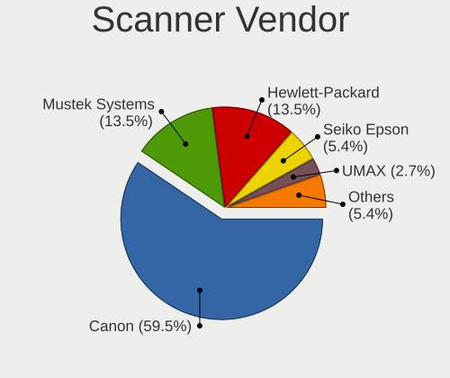

| Vendor                                         | Computers | Percent |
|------------------------------------------------|-----------|---------|
| Canon                                          | 22        | 59.46%  |
| Mustek Systems                                 | 5         | 13.51%  |
| Hewlett-Packard                                | 5         | 13.51%  |
| Seiko Epson                                    | 2         | 5.41%   |
| UMAX                                           | 1         | 2.7%    |
| Siemens Information and Communication Products | 1         | 2.7%    |
| KYE Systems (Mouse Systems)                    | 1         | 2.7%    |

Scanner Model
-------------

Scanner device models

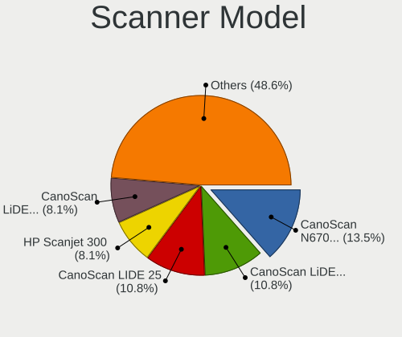

| Model                                                                           | Computers | Percent |
|---------------------------------------------------------------------------------|-----------|---------|
| Canon CanoScan N670U/N676U/LiDE 20                                              | 5         | 13.51%  |
| Canon CanoScan LIDE 25                                                          | 4         | 10.81%  |
| Canon CanoScan LiDE 120                                                         | 4         | 10.81%  |
| HP HP Scanjet 300                                                               | 3         | 8.11%   |
| Canon CanoScan LiDE 110                                                         | 3         | 8.11%   |
| Mustek Systems SNAPSCAN e22                                                     | 2         | 5.41%   |
| Canon CanoScan N1240U/LiDE 30                                                   | 2         | 5.41%   |
| Canon CanoScan LiDE 100                                                         | 2         | 5.41%   |
| UMAX Astra 4400/4450                                                            | 1         | 2.7%    |
| Siemens Information and Communication Products ID-Mouse with Fingerprint Reader | 1         | 2.7%    |
| Seiko Epson Stylus Photo RX500/510                                              | 1         | 2.7%    |
| Seiko Epson GT-6600U [Perfection 610]                                           | 1         | 2.7%    |
| Mustek Systems ScanExpress A3 USB 1200 PRO                                      | 1         | 2.7%    |
| Mustek Systems BearPaw 2400 CU Plus                                             | 1         | 2.7%    |
| Mustek Systems BearPaw 1200 CU Plus                                             | 1         | 2.7%    |
| KYE Systems (Mouse Systems) ColorPage-SF600                                     | 1         | 2.7%    |
| HP ScanJet 3770                                                                 | 1         | 2.7%    |
| HP ScanJet 2400c                                                                | 1         | 2.7%    |
| Canon CanoScan LiDE 220                                                         | 1         | 2.7%    |
| Canon CanoScan 4200F                                                            | 1         | 2.7%    |

Camera
------

Camera Vendor
-------------

Camera device vendors

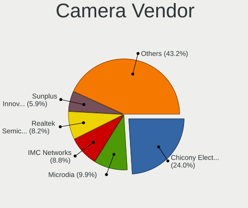

| Vendor                                 | Computers | Percent |
|----------------------------------------|-----------|---------|
| Chicony Electronics                    | 757       | 23.99%  |
| Microdia                               | 311       | 9.86%   |
| IMC Networks                           | 277       | 8.78%   |
| Realtek Semiconductor                  | 260       | 8.24%   |
| Sunplus Innovation Technology          | 187       | 5.93%   |
| Bison Electronics                      | 179       | 5.67%   |
| Quanta                                 | 125       | 3.96%   |
| Suyin                                  | 121       | 3.84%   |
| Cheng Uei Precision Industry (Foxlink) | 99        | 3.14%   |
| Logitech                               | 96        | 3.04%   |
| Syntek                                 | 84        | 2.66%   |
| Lite-On Technology                     | 70        | 2.22%   |
| Silicon Motion                         | 50        | 1.58%   |
| Apple                                  | 48        | 1.52%   |
| Luxvisions Innotech Limited            | 44        | 1.39%   |
| Lenovo                                 | 44        | 1.39%   |
| KYE Systems (Mouse Systems)            | 42        | 1.33%   |
| Alcor Micro                            | 38        | 1.2%    |
| Ricoh                                  | 33        | 1.05%   |
| Z-Star Microelectronics                | 30        | 0.95%   |
| Microsoft                              | 26        | 0.82%   |
| Sonix Technology                       | 24        | 0.76%   |
| Primax Electronics                     | 23        | 0.73%   |
| Samsung Electronics                    | 21        | 0.67%   |
| GEMBIRD                                | 17        | 0.54%   |
| Acer                                   | 15        | 0.48%   |
| ALi                                    | 13        | 0.41%   |
| Importek                               | 12        | 0.38%   |
| OmniVision Technologies                | 9         | 0.29%   |
| Shinetech                              | 8         | 0.25%   |
| MacroSilicon                           | 7         | 0.22%   |
| Trust                                  | 6         | 0.19%   |
| Generalplus Technology                 | 6         | 0.19%   |
| Aveo Technology                        | 5         | 0.16%   |
| Arkmicro Technologies                  | 5         | 0.16%   |
| Pixart Imaging                         | 4         | 0.13%   |
| LG Electronics                         | 4         | 0.13%   |
| Jieli Technology                       | 4         | 0.13%   |
| icSpring                               | 4         | 0.13%   |
| DigiTech                               | 4         | 0.13%   |

Camera Model
------------

Camera device models

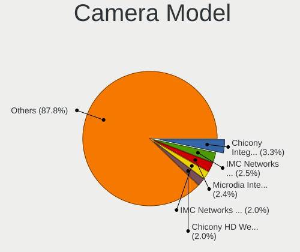

| Model                                         | Computers | Percent |
|-----------------------------------------------|-----------|---------|
| Chicony Integrated Camera                     | 105       | 3.31%   |
| IMC Networks USB2.0 HD UVC WebCam             | 80        | 2.52%   |
| Microdia Integrated_Webcam_HD                 | 75        | 2.37%   |
| IMC Networks USB2.0 VGA UVC WebCam            | 64        | 2.02%   |
| Chicony HD Webcam                             | 62        | 1.96%   |
| Realtek Integrated_Webcam_HD                  | 58        | 1.83%   |
| Bison Lenovo EasyCamera                       | 52        | 1.64%   |
| Chicony HP Truevision HD                      | 47        | 1.48%   |
| Sunplus Integrated_Webcam_HD                  | 45        | 1.42%   |
| Microdia Integrated Webcam                    | 37        | 1.17%   |
| Chicony USB2.0 VGA UVC WebCam                 | 37        | 1.17%   |
| Bison Integrated Camera                       | 37        | 1.17%   |
| Syntek Integrated Camera                      | 32        | 1.01%   |
| Realtek USB Camera                            | 32        | 1.01%   |
| Logitech Webcam C270                          | 31        | 0.98%   |
| Suyin Acer/HP Integrated Webcam [CN0314]      | 30        | 0.95%   |
| IMC Networks Integrated Camera                | 30        | 0.95%   |
| Chicony Integrated HP HD Webcam               | 30        | 0.95%   |
| Chicony USB2.0 HD UVC WebCam                  | 28        | 0.88%   |
| Sunplus HD WebCam                             | 27        | 0.85%   |
| Chicony FJ Camera                             | 27        | 0.85%   |
| Microdia Camera                               | 26        | 0.82%   |
| Lite-On Integrated Camera                     | 25        | 0.79%   |
| Chicony Lenovo EasyCamera                     | 25        | 0.79%   |
| Sunplus HP Truevision HD                      | 24        | 0.76%   |
| Realtek Integrated Webcam HD                  | 24        | 0.76%   |
| IMC Networks EasyCamera                       | 23        | 0.73%   |
| Cheng Uei Precision Industry (Foxlink) Webcam | 22        | 0.69%   |
| Realtek Integrated Webcam                     | 21        | 0.66%   |
| Quanta HD Webcam                              | 21        | 0.66%   |
| Microdia Sonix USB 2.0 Camera                 | 21        | 0.66%   |
| Lite-On HP HD Webcam                          | 21        | 0.66%   |
| Chicony VGA Webcam                            | 21        | 0.66%   |
| Chicony EasyCamera                            | 21        | 0.66%   |
| Samsung Galaxy series, misc. (MTP mode)       | 20        | 0.63%   |
| Realtek Lenovo EasyCamera                     | 20        | 0.63%   |
| Lenovo Integrated Webcam [R5U877]             | 20        | 0.63%   |
| Lenovo Integrated Webcam                      | 20        | 0.63%   |
| Syntek Lenovo EasyCamera                      | 19        | 0.6%    |
| Chicony HD User Facing                        | 19        | 0.6%    |

Security
--------

Fingerprint Vendor
------------------

Fingerprint sensor vendors

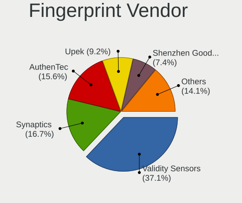

| Vendor                             | Computers | Percent |
|------------------------------------|-----------|---------|
| Validity Sensors                   | 166       | 37.05%  |
| Synaptics                          | 75        | 16.74%  |
| AuthenTec                          | 70        | 15.63%  |
| Upek                               | 41        | 9.15%   |
| Shenzhen Goodix Technology         | 33        | 7.37%   |
| LighTuning Technology              | 23        | 5.13%   |
| Elan Microelectronics              | 16        | 3.57%   |
| STMicroelectronics                 | 15        | 3.35%   |
| Realtek USB2.0 Finger Print Bridge | 5         | 1.12%   |
| HOLTEK                             | 4         | 0.89%   |

Fingerprint Model
-----------------

Fingerprint sensor models

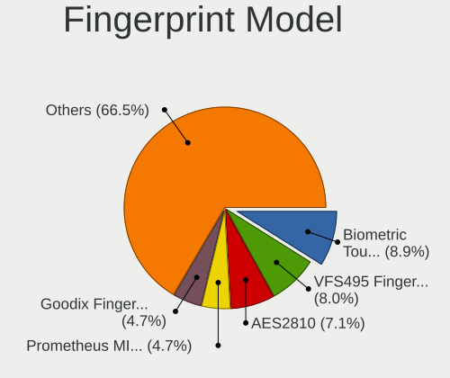

| Model                                                                      | Computers | Percent |
|----------------------------------------------------------------------------|-----------|---------|
| Upek Biometric Touchchip/Touchstrip Fingerprint Sensor                     | 40        | 8.93%   |
| Validity Sensors VFS495 Fingerprint Reader                                 | 36        | 8.04%   |
| AuthenTec AES2810                                                          | 32        | 7.14%   |
| Synaptics Prometheus MIS Touch Fingerprint Reader                          | 21        | 4.69%   |
| Shenzhen Goodix  FingerPrint Device                                        | 21        | 4.69%   |
| Validity Sensors VFS491                                                    | 19        | 4.24%   |
| AuthenTec AES2501 Fingerprint Sensor                                       | 19        | 4.24%   |
| Validity Sensors VFS471 Fingerprint Reader                                 | 18        | 4.02%   |
| Validity Sensors Synaptics WBDI                                            | 17        | 3.79%   |
| Validity Sensors VFS5011 Fingerprint Reader                                | 16        | 3.57%   |
| Validity Sensors VFS451 Fingerprint Reader                                 | 15        | 3.35%   |
| STMicroelectronics Fingerprint Reader                                      | 15        | 3.35%   |
| Validity Sensors VFS7500 Touch Fingerprint Sensor                          | 14        | 3.13%   |
| Synaptics Metallica MIS Touch Fingerprint Reader                           | 13        | 2.9%    |
| LighTuning EgisTec Touch Fingerprint Sensor                                | 13        | 2.9%    |
| Validity Sensors VFS 5011 fingerprint sensor                               | 11        | 2.46%   |
| Shenzhen Goodix Fingerprint Reader                                         | 11        | 2.46%   |
| LighTuning Fingerprint Reader                                              | 9         | 2.01%   |
| Elan ELAN:ARM-M4                                                           | 8         | 1.79%   |
| AuthenTec Fingerprint Sensor                                               | 8         | 1.79%   |
| Validity Sensors Synaptics VFS7552 Touch Fingerprint Sensor with PurePrint | 7         | 1.56%   |
| Synaptics  WBDI                                                            | 7         | 1.56%   |
| Synaptics FS7604 Touch Fingerprint Sensor with PurePrint                   | 7         | 1.56%   |
| Elan ELAN:Fingerprint                                                      | 7         | 1.56%   |
| Synaptics UWP WBDI Device                                                  | 5         | 1.12%   |
| Synaptics  FS7604 Touch Fingerprint Sensor with PurePrint                  | 5         | 1.12%   |
| Realtek USB2.0 Finger Print Bridge FocalTech Fingerprint Device            | 5         | 1.12%   |
| AuthenTec AES1600                                                          | 5         | 1.12%   |
| Validity Sensors VFS101 Fingerprint Reader                                 | 4         | 0.89%   |
| Synaptics Fingerprint reader [HP G6]                                       | 4         | 0.89%   |
| HOLTEK FocalTech Fingerprint Device                                        | 4         | 0.89%   |
| AuthenTec AES1660 Fingerprint Sensor                                       | 4         | 0.89%   |
| Validity Sensors Swipe Fingerprint Sensor                                  | 3         | 0.67%   |
| Synaptics WBDI                                                             | 3         | 0.67%   |
| Synaptics Fingerprint scanner                                              | 3         | 0.67%   |
| Validity Sensors Synaptics VFS7552 Touch Fingerprint Sensor                | 2         | 0.45%   |
| Validity Sensors Fingerprint scanner                                       | 2         | 0.45%   |
| Synaptics UWP WBDI                                                         | 2         | 0.45%   |
| Synaptics Prometheus Fingerprint Reader                                    | 2         | 0.45%   |
| AuthenTec AES2550 Fingerprint Sensor                                       | 2         | 0.45%   |

Chipcard Vendor
---------------

Chipcard module vendors

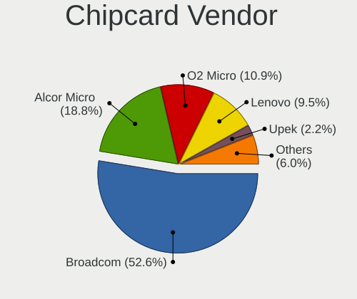

| Vendor                    | Computers | Percent |
|---------------------------|-----------|---------|
| Broadcom                  | 193       | 52.59%  |
| Alcor Micro               | 69        | 18.8%   |
| O2 Micro                  | 40        | 10.9%   |
| Lenovo                    | 35        | 9.54%   |
| Upek                      | 8         | 2.18%   |
| Gemalto (was Gemplus)     | 8         | 2.18%   |
| Reiner SCT Kartensysteme  | 4         | 1.09%   |
| Realtek Semiconductor     | 2         | 0.54%   |
| Advanced Card Systems     | 2         | 0.54%   |
| Yubico.com                | 1         | 0.27%   |
| Swissbit                  | 1         | 0.27%   |
| SCM Microsystems          | 1         | 0.27%   |
| OmniKey                   | 1         | 0.27%   |
| Chicony Electronics       | 1         | 0.27%   |
| Aladdin Knowledge Systems | 1         | 0.27%   |

Chipcard Model
--------------

Chipcard module models

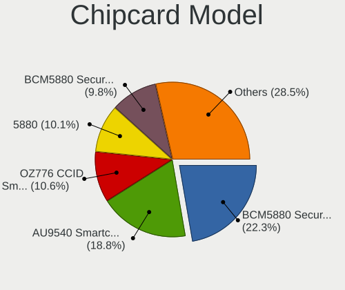

| Model                                                                        | Computers | Percent |
|------------------------------------------------------------------------------|-----------|---------|
| Broadcom BCM5880 Secure Applications Processor                               | 82        | 22.28%  |
| Alcor Micro AU9540 Smartcard Reader                                          | 69        | 18.75%  |
| O2 Micro OZ776 CCID Smartcard Reader                                         | 39        | 10.6%   |
| Broadcom 5880                                                                | 37        | 10.05%  |
| Broadcom BCM5880 Secure Applications Processor with fingerprint swipe sensor | 36        | 9.78%   |
| Lenovo Integrated Smart Card Reader                                          | 35        | 9.51%   |
| Broadcom BCM58200 ControlVault 3 (FingerPrint sensor + Contacted SmartCard)  | 30        | 8.15%   |
| Broadcom 58200                                                               | 9         | 2.45%   |
| Upek TouchChip Fingerprint Coprocessor (WBF advanced mode)                   | 8         | 2.17%   |
| Reiner SCT Kartensysteme cyberJack RFID basis contactless smartcard reader   | 4         | 1.09%   |
| Gemalto (was Gemplus) GemPC Twin SmartCard Reader                            | 3         | 0.82%   |
| Gemalto (was Gemplus) GemPC Key SmartCard Reader                             | 3         | 0.82%   |
| Realtek Semiconductor Smart Card Reader Interface                            | 2         | 0.54%   |
| Gemalto (was Gemplus) Compact Smart Card Reader Writer                       | 2         | 0.54%   |
| Advanced Card Systems ACR1252 Dual Reader                                    | 2         | 0.54%   |
| Yubico.com Yubikey 4/5 U2F+CCID                                              | 1         | 0.27%   |
| Swissbit iShield Key FIDO2                                                   | 1         | 0.27%   |
| SCM Microsystems SCR331-LC1 / SCR3310 SmartCard Reader                       | 1         | 0.27%   |
| OmniKey CardMan 3121 (HID Technologies)                                      | 1         | 0.27%   |
| O2 Micro Oz776 SmartCard Reader                                              | 1         | 0.27%   |
| Chicony Electronics HP Skylab USB Smartcard Keyboard                         | 1         | 0.27%   |
| Aladdin Knowledge Systems Token JC                                           | 1         | 0.27%   |

Unsupported
-----------

Unsupported Devices
-------------------

Total unsupported devices on board

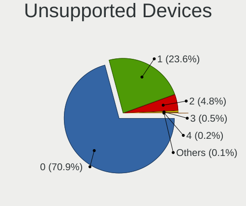

| Total | Computers | Percent |
|-------|-----------|---------|
| 0     | 4130      | 70.86%  |
| 1     | 1373      | 23.56%  |
| 2     | 280       | 4.8%    |
| 3     | 28        | 0.48%   |
| 4     | 10        | 0.17%   |
| 5     | 3         | 0.05%   |
| 10    | 2         | 0.03%   |
| 9     | 1         | 0.02%   |
| 7     | 1         | 0.02%   |

Unsupported Device Types
------------------------

Types of unsupported devices

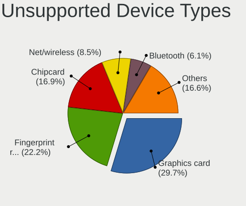

| Type                     | Computers | Percent |
|--------------------------|-----------|---------|
| Graphics card            | 594       | 29.66%  |
| Fingerprint reader       | 444       | 22.17%  |
| Chipcard                 | 339       | 16.92%  |
| Net/wireless             | 171       | 8.54%   |
| Bluetooth                | 123       | 6.14%   |
| Multimedia controller    | 69        | 3.44%   |
| Communication controller | 56        | 2.8%    |
| Storage                  | 53        | 2.65%   |
| Camera                   | 41        | 2.05%   |
| Unassigned class         | 21        | 1.05%   |
| Sound                    | 20        | 1%      |
| Flash memory             | 18        | 0.9%    |
| Card reader              | 14        | 0.7%    |
| Net/ethernet             | 13        | 0.65%   |
| Storage/raid             | 8         | 0.4%    |
| Dvb card                 | 5         | 0.25%   |
| Storage/ide              | 4         | 0.2%    |
| Storage/ata              | 3         | 0.15%   |
| Network                  | 3         | 0.15%   |
| Modem                    | 3         | 0.15%   |
| Firewire controller      | 1         | 0.05%   |

