Linux in Hungary - Tested Hardware & Statistics
-----------------------------------------------

A project to collect tested hardware configurations for Linux in Hungary.

Anyone can contribute to this report by the [hw-probe](https://github.com/linuxhw/hw-probe) tool:

    sudo -E hw-probe -all -upload

Please contribute! Especially if your hardware is rare.

This is a report for all computer types. See also reports for [desktops](/Location/Hungary/Desktop/README.md) and [notebooks](/Location/Hungary/Notebook/README.md).

Contents
--------

* [ Test Cases ](#test-cases)

* [ System ](#system)
  - [ OS                       ](#os)
  - [ OS Family                ](#os-family)
  - [ Kernel                   ](#kernel)
  - [ Kernel Family            ](#kernel-family)
  - [ Kernel Major Ver.        ](#kernel-major-ver)
  - [ Arch                     ](#arch)
  - [ DE                       ](#de)
  - [ Display Server           ](#display-server)
  - [ Display Manager          ](#display-manager)
  - [ OS Lang                  ](#os-lang)
  - [ Boot Mode                ](#boot-mode)
  - [ Filesystem               ](#filesystem)
  - [ Part. scheme             ](#part-scheme)
  - [ Dual Boot with Linux/BSD ](#dual-boot-with-linuxbsd)
  - [ Dual Boot (Win)          ](#dual-boot-win)

* [ Board ](#board)
  - [ Vendor                   ](#vendor)
  - [ Model                    ](#model)
  - [ Model Family             ](#model-family)
  - [ MFG Year                 ](#mfg-year)
  - [ Form Factor              ](#form-factor)
  - [ Secure Boot              ](#secure-boot)
  - [ Coreboot                 ](#coreboot)
  - [ RAM Size                 ](#ram-size)
  - [ RAM Used                 ](#ram-used)
  - [ Total Drives             ](#total-drives)
  - [ Has CD-ROM               ](#has-cd-rom)
  - [ Has Ethernet             ](#has-ethernet)
  - [ Has WiFi                 ](#has-wifi)
  - [ Has Bluetooth            ](#has-bluetooth)

* [ Location ](#location)
  - [ Country                  ](#country)
  - [ City                     ](#city)

* [ Drives ](#drives)
  - [ Drive Vendor             ](#drive-vendor)
  - [ Drive Model              ](#drive-model)
  - [ HDD Vendor               ](#hdd-vendor)
  - [ SSD Vendor               ](#ssd-vendor)
  - [ Drive Kind               ](#drive-kind)
  - [ Drive Connector          ](#drive-connector)
  - [ Drive Size               ](#drive-size)
  - [ Space Total              ](#space-total)
  - [ Space Used               ](#space-used)
  - [ Malfunc. Drives          ](#malfunc-drives)
  - [ Malfunc. Drive Vendor    ](#malfunc-drive-vendor)
  - [ Malfunc. HDD Vendor      ](#malfunc-hdd-vendor)
  - [ Malfunc. Drive Kind      ](#malfunc-drive-kind)
  - [ Failed Drives            ](#failed-drives)
  - [ Failed Drive Vendor      ](#failed-drive-vendor)
  - [ Drive Status             ](#drive-status)

* [ Storage controller ](#storage-controller)
  - [ Storage Vendor           ](#storage-vendor)
  - [ Storage Model            ](#storage-model)
  - [ Storage Kind             ](#storage-kind)

* [ Processor ](#processor)
  - [ CPU Vendor               ](#cpu-vendor)
  - [ CPU Model                ](#cpu-model)
  - [ CPU Model Family         ](#cpu-model-family)
  - [ CPU Cores                ](#cpu-cores)
  - [ CPU Sockets              ](#cpu-sockets)
  - [ CPU Threads              ](#cpu-threads)
  - [ CPU Op-Modes             ](#cpu-op-modes)
  - [ CPU Microcode            ](#cpu-microcode)
  - [ CPU Microarch            ](#cpu-microarch)

* [ Graphics ](#graphics)
  - [ GPU Vendor               ](#gpu-vendor)
  - [ GPU Model                ](#gpu-model)
  - [ GPU Combo                ](#gpu-combo)
  - [ GPU Driver               ](#gpu-driver)
  - [ GPU Memory               ](#gpu-memory)

* [ Monitor ](#monitor)
  - [ Monitor Vendor           ](#monitor-vendor)
  - [ Monitor Model            ](#monitor-model)
  - [ Monitor Resolution       ](#monitor-resolution)
  - [ Monitor Diagonal         ](#monitor-diagonal)
  - [ Monitor Width            ](#monitor-width)
  - [ Aspect Ratio             ](#aspect-ratio)
  - [ Monitor Area             ](#monitor-area)
  - [ Pixel Density            ](#pixel-density)
  - [ Multiple Monitors        ](#multiple-monitors)

* [ Network ](#network)
  - [ Net Controller Vendor    ](#net-controller-vendor)
  - [ Net Controller Model     ](#net-controller-model)
  - [ Wireless Vendor          ](#wireless-vendor)
  - [ Wireless Model           ](#wireless-model)
  - [ Ethernet Vendor          ](#ethernet-vendor)
  - [ Ethernet Model           ](#ethernet-model)
  - [ Net Controller Kind      ](#net-controller-kind)
  - [ Used Controller          ](#used-controller)
  - [ NICs                     ](#nics)
  - [ IPv6                     ](#ipv6)

* [ Bluetooth ](#bluetooth)
  - [ Bluetooth Vendor         ](#bluetooth-vendor)
  - [ Bluetooth Model          ](#bluetooth-model)

* [ Sound ](#sound)
  - [ Sound Vendor             ](#sound-vendor)
  - [ Sound Model              ](#sound-model)

* [ Memory ](#memory)
  - [ Memory Vendor            ](#memory-vendor)
  - [ Memory Model             ](#memory-model)
  - [ Memory Kind              ](#memory-kind)
  - [ Memory Form Factor       ](#memory-form-factor)
  - [ Memory Size              ](#memory-size)
  - [ Memory Speed             ](#memory-speed)

* [ Printers & scanners ](#printers--scanners)
  - [ Printer Vendor           ](#printer-vendor)
  - [ Printer Model            ](#printer-model)
  - [ Scanner Vendor           ](#scanner-vendor)
  - [ Scanner Model            ](#scanner-model)

* [ Camera ](#camera)
  - [ Camera Vendor            ](#camera-vendor)
  - [ Camera Model             ](#camera-model)

* [ Security ](#security)
  - [ Fingerprint Vendor       ](#fingerprint-vendor)
  - [ Fingerprint Model        ](#fingerprint-model)
  - [ Chipcard Vendor          ](#chipcard-vendor)
  - [ Chipcard Model           ](#chipcard-model)

* [ Unsupported ](#unsupported)
  - [ Unsupported Devices      ](#unsupported-devices)
  - [ Unsupported Device Types ](#unsupported-device-types)

Test Cases
----------

Total: 9360

| Vendor        | Model                       | Form-Factor | Probe                                                      | Date         |
|---------------|-----------------------------|-------------|------------------------------------------------------------|--------------|
| Lenovo        | IdeaPad 110-15ACL 80TJ      | Notebook    | [6300a79454](https://linux-hardware.org/?probe=6300a79454) | Feb 02, 2024 |
| HP            | 1497                        | Desktop     | [ae90a32790](https://linux-hardware.org/?probe=ae90a32790) | Feb 02, 2024 |
| Gigabyte      | G31M-S2C                    | Desktop     | [b0e201e74a](https://linux-hardware.org/?probe=b0e201e74a) | Feb 02, 2024 |
| ASUSTek       | M5A97 EVO R2.0              | Desktop     | [4009a96bd4](https://linux-hardware.org/?probe=4009a96bd4) | Feb 02, 2024 |
| eMachines     | E725                        | Notebook    | [e421aa20d1](https://linux-hardware.org/?probe=e421aa20d1) | Feb 02, 2024 |
| ASUSTek       | M5A97 EVO R2.0              | Desktop     | [ab60a0a3b4](https://linux-hardware.org/?probe=ab60a0a3b4) | Feb 02, 2024 |
| Dell          | Inspiron 5567               | Notebook    | [51c9bc9ff2](https://linux-hardware.org/?probe=51c9bc9ff2) | Feb 02, 2024 |
| Apple         | Mac-F42386C8 PVT            | All in one  | [5e93071787](https://linux-hardware.org/?probe=5e93071787) | Feb 02, 2024 |
| Medion        | E7218                       | Notebook    | [d99d2a5d9c](https://linux-hardware.org/?probe=d99d2a5d9c) | Feb 02, 2024 |
| Lenovo        | G505s 20255                 | Notebook    | [f1903f6323](https://linux-hardware.org/?probe=f1903f6323) | Feb 02, 2024 |
| ASRock        | B550M Pro4                  | Desktop     | [ce95a21f31](https://linux-hardware.org/?probe=ce95a21f31) | Feb 01, 2024 |
| Acer          | TravelMate P215-52          | Notebook    | [917516e40b](https://linux-hardware.org/?probe=917516e40b) | Feb 01, 2024 |
| HP            | 250 G1                      | Notebook    | [af6c2e58b5](https://linux-hardware.org/?probe=af6c2e58b5) | Feb 01, 2024 |
| HP            | 250 G1                      | Notebook    | [1cc61ac6b5](https://linux-hardware.org/?probe=1cc61ac6b5) | Feb 01, 2024 |
| Dell          | Latitude 5300 2-in-1        | Convertible | [7f56291587](https://linux-hardware.org/?probe=7f56291587) | Feb 01, 2024 |
| Lenovo        | Annapurna CRB 0B98401 PR... | Desktop     | [1cee0ab81d](https://linux-hardware.org/?probe=1cee0ab81d) | Feb 01, 2024 |
| HP            | 250 G1                      | Notebook    | [b99ad906cf](https://linux-hardware.org/?probe=b99ad906cf) | Feb 01, 2024 |
| ASUSTek       | H110M-A                     | Desktop     | [ef9ec58561](https://linux-hardware.org/?probe=ef9ec58561) | Jan 31, 2024 |
| ASUSTek       | X541SA                      | Notebook    | [6bd34cb6e0](https://linux-hardware.org/?probe=6bd34cb6e0) | Jan 31, 2024 |
| Dell          | Latitude 7480               | Notebook    | [268ea50333](https://linux-hardware.org/?probe=268ea50333) | Jan 31, 2024 |
| ASUSTek       | PRIME A320M-R               | Desktop     | [c85924bf6f](https://linux-hardware.org/?probe=c85924bf6f) | Jan 31, 2024 |
| ASUSTek       | X541SA                      | Notebook    | [8477157f76](https://linux-hardware.org/?probe=8477157f76) | Jan 31, 2024 |
| Gigabyte      | F2A88XN-WIFI                | Desktop     | [aad32e443a](https://linux-hardware.org/?probe=aad32e443a) | Jan 31, 2024 |
| Lenovo        | IdeaPad 110-15ISK 80UD      | Notebook    | [45207cf034](https://linux-hardware.org/?probe=45207cf034) | Jan 31, 2024 |
| ASUSTek       | PRIME A320M-R               | Desktop     | [4995dfcd57](https://linux-hardware.org/?probe=4995dfcd57) | Jan 31, 2024 |
| MSI           | MS-7817                     | Desktop     | [e67644d160](https://linux-hardware.org/?probe=e67644d160) | Jan 31, 2024 |
| ASRock        | B550M Pro4                  | Desktop     | [562a7e84b6](https://linux-hardware.org/?probe=562a7e84b6) | Jan 31, 2024 |
| Dell          | 0TY565                      | Desktop     | [7b0be6d329](https://linux-hardware.org/?probe=7b0be6d329) | Jan 31, 2024 |
| Dell          | 0TY565                      | Desktop     | [a1dd2e6d5d](https://linux-hardware.org/?probe=a1dd2e6d5d) | Jan 31, 2024 |
| Dell          | 06D7TR A01                  | Desktop     | [34d3eaffac](https://linux-hardware.org/?probe=34d3eaffac) | Jan 31, 2024 |
| Fujitsu       | D2778-B1 S26361-D2778-B1    | Desktop     | [2f08f48285](https://linux-hardware.org/?probe=2f08f48285) | Jan 31, 2024 |
| HP            | EliteBook 8570w             | Notebook    | [90936fe065](https://linux-hardware.org/?probe=90936fe065) | Jan 30, 2024 |
| Dell          | Latitude E7240              | Notebook    | [3093481906](https://linux-hardware.org/?probe=3093481906) | Jan 30, 2024 |
| LG Electro... | E500-SP13G                  | Notebook    | [24499c2111](https://linux-hardware.org/?probe=24499c2111) | Jan 30, 2024 |
| HP            | 8265                        | Desktop     | [77473b5bd8](https://linux-hardware.org/?probe=77473b5bd8) | Jan 30, 2024 |
| ASUSTek       | ZenBook UX425UA_UM425UA     | Notebook    | [2585f65922](https://linux-hardware.org/?probe=2585f65922) | Jan 30, 2024 |
| Acer          | Aspire E1-571               | Notebook    | [261ad8d1d0](https://linux-hardware.org/?probe=261ad8d1d0) | Jan 30, 2024 |
| HP            | 1495                        | Desktop     | [1c71a50dfc](https://linux-hardware.org/?probe=1c71a50dfc) | Jan 30, 2024 |
| Lenovo        | IdeaPad 110-15ACL 80TJ      | Notebook    | [e94c77f59d](https://linux-hardware.org/?probe=e94c77f59d) | Jan 30, 2024 |
| HP            | 250 G1                      | Notebook    | [2e10da4cf7](https://linux-hardware.org/?probe=2e10da4cf7) | Jan 30, 2024 |
| Toshiba       | Satellite M50D-A            | Notebook    | [4d7778b932](https://linux-hardware.org/?probe=4d7778b932) | Jan 30, 2024 |
| Lenovo        | ThinkPad X250 20CLS1JN00    | Notebook    | [8ee7ee6174](https://linux-hardware.org/?probe=8ee7ee6174) | Jan 30, 2024 |
| ASUSTek       | H110M-A                     | Desktop     | [e72fb50bf3](https://linux-hardware.org/?probe=e72fb50bf3) | Jan 29, 2024 |
| Dell          | 0M858N A01                  | Desktop     | [ea55d99987](https://linux-hardware.org/?probe=ea55d99987) | Jan 29, 2024 |
| HP            | Notebook                    | Notebook    | [9203e745cd](https://linux-hardware.org/?probe=9203e745cd) | Jan 29, 2024 |
| MSI           | P43i                        | Desktop     | [ff8e7e4853](https://linux-hardware.org/?probe=ff8e7e4853) | Jan 29, 2024 |
| Gigabyte      | AB350M-DS3H V2-CF           | Desktop     | [bf9584029c](https://linux-hardware.org/?probe=bf9584029c) | Jan 29, 2024 |
| Acer          | Aspire E5-575G              | Notebook    | [d4fdcb8580](https://linux-hardware.org/?probe=d4fdcb8580) | Jan 29, 2024 |
| ASUSTek       | K54HR                       | Notebook    | [171ab4ceee](https://linux-hardware.org/?probe=171ab4ceee) | Jan 29, 2024 |
| ASUSTek       | X55U                        | Notebook    | [d62fec19c9](https://linux-hardware.org/?probe=d62fec19c9) | Jan 29, 2024 |
| Gigabyte      | P67A-D3-B3                  | Desktop     | [5241c055ad](https://linux-hardware.org/?probe=5241c055ad) | Jan 29, 2024 |
| Dell          | Latitude E5520              | Notebook    | [904d3d23cb](https://linux-hardware.org/?probe=904d3d23cb) | Jan 29, 2024 |
| ASRock        | B85M                        | Desktop     | [2f1c8ac5f5](https://linux-hardware.org/?probe=2f1c8ac5f5) | Jan 29, 2024 |
| Lenovo        | IdeaPad 330-15IKB 81DE      | Notebook    | [169bc52190](https://linux-hardware.org/?probe=169bc52190) | Jan 29, 2024 |
| ASUSTek       | PRIME B365M-A               | Desktop     | [f046e20a98](https://linux-hardware.org/?probe=f046e20a98) | Jan 29, 2024 |
| TUXEDO        | Aura 15 Gen1                | Notebook    | [017a27b28f](https://linux-hardware.org/?probe=017a27b28f) | Jan 29, 2024 |
| HP            | 3396                        | Desktop     | [b59e0b4023](https://linux-hardware.org/?probe=b59e0b4023) | Jan 29, 2024 |
| Lenovo        | ThinkPad T410 2537VFQ       | Notebook    | [e007b6155a](https://linux-hardware.org/?probe=e007b6155a) | Jan 29, 2024 |
| Apple         | MacBookAir5,2               | Notebook    | [7d2b32915e](https://linux-hardware.org/?probe=7d2b32915e) | Jan 29, 2024 |
| Apple         | MacBookPro10,1              | Notebook    | [4a9032156a](https://linux-hardware.org/?probe=4a9032156a) | Jan 29, 2024 |
| Dell          | Latitude E6540              | Notebook    | [1d94b95f41](https://linux-hardware.org/?probe=1d94b95f41) | Jan 28, 2024 |
| Acer          | TravelMate P215-41-G2       | Notebook    | [0500733b2d](https://linux-hardware.org/?probe=0500733b2d) | Jan 28, 2024 |
| HP            | Pavilion Gaming Laptop 1... | Notebook    | [2b39dd89e1](https://linux-hardware.org/?probe=2b39dd89e1) | Jan 28, 2024 |
| Dell          | Inspiron 5567               | Notebook    | [6dcfbe7bb7](https://linux-hardware.org/?probe=6dcfbe7bb7) | Jan 28, 2024 |
| Dell          | Inspiron 5558               | Notebook    | [d4df85a4b6](https://linux-hardware.org/?probe=d4df85a4b6) | Jan 28, 2024 |
| Dell          | 0200DY A03                  | Desktop     | [26d8100c96](https://linux-hardware.org/?probe=26d8100c96) | Jan 28, 2024 |
| Dell          | Latitude E6230              | Notebook    | [9225ea832f](https://linux-hardware.org/?probe=9225ea832f) | Jan 28, 2024 |
| Dell          | Inspiron 17 7000 Series ... | Notebook    | [f9adbc6592](https://linux-hardware.org/?probe=f9adbc6592) | Jan 28, 2024 |
| Lenovo        | 1036 NO DPK                 | Desktop     | [aa54fcaee1](https://linux-hardware.org/?probe=aa54fcaee1) | Jan 28, 2024 |
| Lenovo        | ThinkPad T400 2768WGB       | Notebook    | [dd4a6395ad](https://linux-hardware.org/?probe=dd4a6395ad) | Jan 28, 2024 |
| Gigabyte      | X570 AORUS XTREME           | Desktop     | [32a41e8aff](https://linux-hardware.org/?probe=32a41e8aff) | Jan 28, 2024 |
| Lenovo        | ThinkPad T440s 20ARA0Y50... | Notebook    | [4010d9f5db](https://linux-hardware.org/?probe=4010d9f5db) | Jan 27, 2024 |
| Dell          | Latitude 5480               | Notebook    | [1af6d00744](https://linux-hardware.org/?probe=1af6d00744) | Jan 27, 2024 |
| ASRock        | B75M-DGS R2.0               | Desktop     | [cff86cc0d9](https://linux-hardware.org/?probe=cff86cc0d9) | Jan 27, 2024 |
| eMachines     | E725                        | Notebook    | [84147d8349](https://linux-hardware.org/?probe=84147d8349) | Jan 27, 2024 |
| Gigabyte      | H61M-S2PV                   | Desktop     | [b313d408fc](https://linux-hardware.org/?probe=b313d408fc) | Jan 27, 2024 |
| Dell          | Latitude E6540              | Notebook    | [babeeb990e](https://linux-hardware.org/?probe=babeeb990e) | Jan 27, 2024 |
| Lenovo        | IdeaPad 110-15ACL 80TJ      | Notebook    | [4d86c780d1](https://linux-hardware.org/?probe=4d86c780d1) | Jan 27, 2024 |
| HP            | Laptop 15-dw1xxx            | Notebook    | [a7ed96434c](https://linux-hardware.org/?probe=a7ed96434c) | Jan 27, 2024 |
| MSI           | MS-7817                     | Desktop     | [53d14e5734](https://linux-hardware.org/?probe=53d14e5734) | Jan 26, 2024 |
| ASUSTek       | P5LD2-X/1333                | Desktop     | [6175179da0](https://linux-hardware.org/?probe=6175179da0) | Jan 26, 2024 |
| Dell          | Latitude E6230              | Notebook    | [37f5e13538](https://linux-hardware.org/?probe=37f5e13538) | Jan 26, 2024 |
| ASUSTek       | PRIME Z270-A                | Desktop     | [710334dba6](https://linux-hardware.org/?probe=710334dba6) | Jan 26, 2024 |
| Gigabyte      | H61M-S2PV                   | Desktop     | [ec7c2fd28c](https://linux-hardware.org/?probe=ec7c2fd28c) | Jan 26, 2024 |
| HP            | 1497                        | Desktop     | [70ed07412a](https://linux-hardware.org/?probe=70ed07412a) | Jan 26, 2024 |
| Acer          | Aspire E1-571               | Notebook    | [312d47e134](https://linux-hardware.org/?probe=312d47e134) | Jan 26, 2024 |
| HP            | 250 G1                      | Notebook    | [521decddfe](https://linux-hardware.org/?probe=521decddfe) | Jan 26, 2024 |
| Fujitsu       | D2778-B1 S26361-D2778-B1    | Desktop     | [f1397d3500](https://linux-hardware.org/?probe=f1397d3500) | Jan 26, 2024 |
| eMachines     | E725                        | Notebook    | [112f370e34](https://linux-hardware.org/?probe=112f370e34) | Jan 26, 2024 |
| Lenovo        | G505s 20255                 | Notebook    | [b3fb33d826](https://linux-hardware.org/?probe=b3fb33d826) | Jan 25, 2024 |
| Fujitsu Si... | D2660-A1 S26361-D2660-A1    | Desktop     | [919e1d0d1a](https://linux-hardware.org/?probe=919e1d0d1a) | Jan 25, 2024 |
| Lenovo        | ThinkPad X250 20CLS1JN00    | Notebook    | [7e4faa6c08](https://linux-hardware.org/?probe=7e4faa6c08) | Jan 25, 2024 |
| ASRock        | FM2A75M Pro4+               | Desktop     | [b13e328c84](https://linux-hardware.org/?probe=b13e328c84) | Jan 25, 2024 |
| ASUSTek       | PRIME Z270-A                | Desktop     | [8e84a9a187](https://linux-hardware.org/?probe=8e84a9a187) | Jan 25, 2024 |
| Fujitsu       | D3222-A1 S26361-D3222-A1    | Desktop     | [ecec004de9](https://linux-hardware.org/?probe=ecec004de9) | Jan 25, 2024 |
| Gigabyte      | Z390 UD V2                  | Desktop     | [43e8fec21d](https://linux-hardware.org/?probe=43e8fec21d) | Jan 25, 2024 |
| Acer          | Aspire A317-53              | Notebook    | [efa0303d01](https://linux-hardware.org/?probe=efa0303d01) | Jan 24, 2024 |
| ASUSTek       | H110M-K                     | Desktop     | [e187cbf4f0](https://linux-hardware.org/?probe=e187cbf4f0) | Jan 24, 2024 |
| HP            | 821D                        | Desktop     | [c56ee90d6b](https://linux-hardware.org/?probe=c56ee90d6b) | Jan 24, 2024 |
| Acer          | TravelMate P215-52          | Notebook    | [6796026981](https://linux-hardware.org/?probe=6796026981) | Jan 24, 2024 |
| Acer          | Aspire A315-57G             | Notebook    | [ed1eb72a6d](https://linux-hardware.org/?probe=ed1eb72a6d) | Jan 24, 2024 |
| Lenovo        | ThinkPad T410 2537VFQ       | Notebook    | [50080cf267](https://linux-hardware.org/?probe=50080cf267) | Jan 24, 2024 |
| Acer          | TravelMate 8371             | Notebook    | [e8e5b4c378](https://linux-hardware.org/?probe=e8e5b4c378) | Jan 24, 2024 |
| Acer          | TravelMate 8371             | Notebook    | [fb2f053fd4](https://linux-hardware.org/?probe=fb2f053fd4) | Jan 24, 2024 |
| HP            | 650                         | Notebook    | [dd3291b0b8](https://linux-hardware.org/?probe=dd3291b0b8) | Jan 24, 2024 |
| Fujitsu       | D3222-A1 S26361-D3222-A1    | Desktop     | [9aa36d0ef2](https://linux-hardware.org/?probe=9aa36d0ef2) | Jan 24, 2024 |
| Gigabyte      | A520M S2H                   | Desktop     | [3c14c44a2e](https://linux-hardware.org/?probe=3c14c44a2e) | Jan 24, 2024 |
| Fujitsu       | D2828-A2 S26361-D2828-A2    | Desktop     | [5cc29f2f4d](https://linux-hardware.org/?probe=5cc29f2f4d) | Jan 24, 2024 |
| Gigabyte      | H97-D3H-CF                  | Desktop     | [5b4d20246c](https://linux-hardware.org/?probe=5b4d20246c) | Jan 23, 2024 |
| HP            | Pavilion Laptop 14-ec0xx... | Notebook    | [7c041036d7](https://linux-hardware.org/?probe=7c041036d7) | Jan 23, 2024 |
| Lenovo        | IdeaPad 330-15IKB 81DE      | Notebook    | [c4dcf1f288](https://linux-hardware.org/?probe=c4dcf1f288) | Jan 23, 2024 |
| Gigabyte      | B660M GAMING DDR4           | Desktop     | [4c6536c12f](https://linux-hardware.org/?probe=4c6536c12f) | Jan 23, 2024 |
| Dell          | Latitude 5480               | Notebook    | [c833a05833](https://linux-hardware.org/?probe=c833a05833) | Jan 23, 2024 |
| Dell          | Inspiron 7737               | Notebook    | [6b9c1b8d86](https://linux-hardware.org/?probe=6b9c1b8d86) | Jan 23, 2024 |
| Fujitsu       | LIFEBOOK A555               | Notebook    | [136059d131](https://linux-hardware.org/?probe=136059d131) | Jan 23, 2024 |
| Lenovo        | ThinkPad L15 Gen 3 21C4S... | Notebook    | [4f812aeb52](https://linux-hardware.org/?probe=4f812aeb52) | Jan 23, 2024 |
| HP            | 250 G1                      | Notebook    | [1fe3185392](https://linux-hardware.org/?probe=1fe3185392) | Jan 23, 2024 |
| Dell          | Latitude E6220              | Notebook    | [4a2011df5b](https://linux-hardware.org/?probe=4a2011df5b) | Jan 23, 2024 |
| MSI           | P43i                        | Desktop     | [96ed9e6412](https://linux-hardware.org/?probe=96ed9e6412) | Jan 23, 2024 |
| Lenovo        | IdeaPad 700-15ISK 80RU      | Notebook    | [4ae03ead13](https://linux-hardware.org/?probe=4ae03ead13) | Jan 22, 2024 |
| Lenovo        | V15-ADA 82C7                | Notebook    | [84e28771e9](https://linux-hardware.org/?probe=84e28771e9) | Jan 22, 2024 |
| Gigabyte      | AB350M-DS3H V2-CF           | Desktop     | [d3cf795f5d](https://linux-hardware.org/?probe=d3cf795f5d) | Jan 22, 2024 |
| Toshiba       | Satellite L500              | Notebook    | [3a68e22a09](https://linux-hardware.org/?probe=3a68e22a09) | Jan 22, 2024 |
| ASUSTek       | X55U                        | Notebook    | [2f57cfccb4](https://linux-hardware.org/?probe=2f57cfccb4) | Jan 22, 2024 |
| Dell          | 0K240Y A01                  | Desktop     | [ea975a38d2](https://linux-hardware.org/?probe=ea975a38d2) | Jan 22, 2024 |
| Fujitsu       | D3403-U1 S26361-D3403-U1    | Desktop     | [448b20e8f3](https://linux-hardware.org/?probe=448b20e8f3) | Jan 22, 2024 |
| Samsung       | NC10                        | Notebook    | [75275f27da](https://linux-hardware.org/?probe=75275f27da) | Jan 22, 2024 |
| Gigabyte      | B85N PHOENIX-CF             | Desktop     | [f18016d0b6](https://linux-hardware.org/?probe=f18016d0b6) | Jan 22, 2024 |
| Gigabyte      | B85N PHOENIX-CF             | Desktop     | [f55473c84d](https://linux-hardware.org/?probe=f55473c84d) | Jan 22, 2024 |
| Dell          | G3 3579                     | Notebook    | [994425af24](https://linux-hardware.org/?probe=994425af24) | Jan 22, 2024 |
| HP            | 0B4Ch D                     | Desktop     | [382a956d11](https://linux-hardware.org/?probe=382a956d11) | Jan 22, 2024 |
| Dell          | 0GY6Y8 A01                  | Desktop     | [70ed7265d7](https://linux-hardware.org/?probe=70ed7265d7) | Jan 22, 2024 |
| MSI           | B450 TOMAHAWK MAX           | Desktop     | [41a62ec1d4](https://linux-hardware.org/?probe=41a62ec1d4) | Jan 21, 2024 |
| Lenovo        | ThinkPad E15 Gen 3 20YG0... | Notebook    | [80456342d9](https://linux-hardware.org/?probe=80456342d9) | Jan 21, 2024 |
| HP            | 0B4Ch D                     | Desktop     | [ac643dc1d4](https://linux-hardware.org/?probe=ac643dc1d4) | Jan 21, 2024 |
| Fujitsu       | LIFEBOOK A512               | Notebook    | [be9e04db5f](https://linux-hardware.org/?probe=be9e04db5f) | Jan 21, 2024 |
| Fujitsu       | LIFEBOOK A512               | Notebook    | [2b0f56de19](https://linux-hardware.org/?probe=2b0f56de19) | Jan 21, 2024 |
| HP            | Pavilion Gaming Laptop 1... | Notebook    | [2a24247ca2](https://linux-hardware.org/?probe=2a24247ca2) | Jan 20, 2024 |
| ASRock        | N68C-S UCC                  | Desktop     | [dc2724d2ca](https://linux-hardware.org/?probe=dc2724d2ca) | Jan 20, 2024 |
| Lenovo        | ThinkPad T440s 20ARA0Y50... | Notebook    | [04f5d15e0c](https://linux-hardware.org/?probe=04f5d15e0c) | Jan 20, 2024 |
| Dell          | Latitude 5300 2-in-1        | Convertible | [dfd374db65](https://linux-hardware.org/?probe=dfd374db65) | Jan 20, 2024 |
| Dell          | Latitude E6400              | Notebook    | [b2765b0e50](https://linux-hardware.org/?probe=b2765b0e50) | Jan 19, 2024 |
| Gigabyte      | B450M S2H                   | Desktop     | [5f1537cd10](https://linux-hardware.org/?probe=5f1537cd10) | Jan 19, 2024 |
| Fujitsu Si... | LIFEBOOK S7110              | Notebook    | [c5b364eec0](https://linux-hardware.org/?probe=c5b364eec0) | Jan 19, 2024 |
| ASUSTek       | G551JW                      | Notebook    | [60145f8dc4](https://linux-hardware.org/?probe=60145f8dc4) | Jan 19, 2024 |
| ASUSTek       | G551JW                      | Notebook    | [de74c01024](https://linux-hardware.org/?probe=de74c01024) | Jan 19, 2024 |
| Lenovo        | Z50-70 20354                | Notebook    | [fb225848f0](https://linux-hardware.org/?probe=fb225848f0) | Jan 19, 2024 |
| Dell          | Latitude 5300 2-in-1        | Convertible | [382a776ac2](https://linux-hardware.org/?probe=382a776ac2) | Jan 19, 2024 |
| Medion        | MS-7748                     | Desktop     | [0da6204fe7](https://linux-hardware.org/?probe=0da6204fe7) | Jan 19, 2024 |
| ASUSTek       | PRIME A320M-R               | Desktop     | [314cb08407](https://linux-hardware.org/?probe=314cb08407) | Jan 18, 2024 |
| Lenovo        | 1036 NO DPK                 | Desktop     | [fe04dc8528](https://linux-hardware.org/?probe=fe04dc8528) | Jan 18, 2024 |
| Medion        | E7218                       | Notebook    | [4d82edaf22](https://linux-hardware.org/?probe=4d82edaf22) | Jan 18, 2024 |
| ASRock        | B550M-HDV                   | Desktop     | [382d54efe4](https://linux-hardware.org/?probe=382d54efe4) | Jan 18, 2024 |
| ASRock        | B550M-HDV                   | Desktop     | [f2ae4fae96](https://linux-hardware.org/?probe=f2ae4fae96) | Jan 18, 2024 |
| Fujitsu Si... | LIFEBOOK S7110              | Notebook    | [59e61beacb](https://linux-hardware.org/?probe=59e61beacb) | Jan 17, 2024 |
| ASUSTek       | P5LD2-X/1333                | Desktop     | [7670d862e1](https://linux-hardware.org/?probe=7670d862e1) | Jan 17, 2024 |
| Lenovo        | Z50-70 20354                | Notebook    | [2e0947a80d](https://linux-hardware.org/?probe=2e0947a80d) | Jan 17, 2024 |
| ASRock        | FM2A75M Pro4+               | Desktop     | [8b6cc378c3](https://linux-hardware.org/?probe=8b6cc378c3) | Jan 16, 2024 |
| Dell          | Latitude 5540               | Notebook    | [f8274c4df8](https://linux-hardware.org/?probe=f8274c4df8) | Jan 16, 2024 |
| Gigabyte      | Z790 UD AX                  | Desktop     | [8d2af876bf](https://linux-hardware.org/?probe=8d2af876bf) | Jan 15, 2024 |
| Dell          | 0GM819                      | Desktop     | [b55d9b9a52](https://linux-hardware.org/?probe=b55d9b9a52) | Jan 14, 2024 |
| Lenovo        | ThinkPad T420 4236B87       | Notebook    | [e7afcc3ce9](https://linux-hardware.org/?probe=e7afcc3ce9) | Jan 14, 2024 |
| Lenovo        | B50-30 20382                | Notebook    | [e98a3e78f4](https://linux-hardware.org/?probe=e98a3e78f4) | Jan 14, 2024 |
| Lenovo        | ThinkPad T420 4236B87       | Notebook    | [e6f7ad5a81](https://linux-hardware.org/?probe=e6f7ad5a81) | Jan 14, 2024 |
| Lenovo        | IdeaPad 100-15IBY 80MJ      | Notebook    | [60d61005cb](https://linux-hardware.org/?probe=60d61005cb) | Jan 14, 2024 |
| Lenovo        | IdeaPad 100-15IBY 80MJ      | Notebook    | [a4ccd82a41](https://linux-hardware.org/?probe=a4ccd82a41) | Jan 14, 2024 |
| Fujitsu Si... | ESPRIMO Mobile U9210        | Notebook    | [0a6e40447c](https://linux-hardware.org/?probe=0a6e40447c) | Jan 14, 2024 |
| Gigabyte      | H61M-S2PV                   | Desktop     | [3e4a544656](https://linux-hardware.org/?probe=3e4a544656) | Jan 13, 2024 |
| Acer          | Aspire V5-121               | Notebook    | [95cd91d3ff](https://linux-hardware.org/?probe=95cd91d3ff) | Jan 13, 2024 |
| Acer          | Aspire V5-121               | Notebook    | [278f45c6db](https://linux-hardware.org/?probe=278f45c6db) | Jan 13, 2024 |
| Fujitsu Si... | D2660-A1 S26361-D2660-A1    | Desktop     | [ea74a34365](https://linux-hardware.org/?probe=ea74a34365) | Jan 13, 2024 |
| ASUSTek       | A58M-K                      | Desktop     | [574d526af4](https://linux-hardware.org/?probe=574d526af4) | Jan 13, 2024 |
| ASUSTek       | X541NA                      | Notebook    | [f909e0ce7b](https://linux-hardware.org/?probe=f909e0ce7b) | Jan 13, 2024 |
| ASUSTek       | PRIME Z390-A                | Desktop     | [bcbcc04761](https://linux-hardware.org/?probe=bcbcc04761) | Jan 13, 2024 |
| ASRock        | B550M Pro4                  | Desktop     | [f4660fbf02](https://linux-hardware.org/?probe=f4660fbf02) | Jan 12, 2024 |
| Lenovo        | IdeaPad S145-15IIL 81W8     | Notebook    | [02b9ba51a9](https://linux-hardware.org/?probe=02b9ba51a9) | Jan 11, 2024 |
| Gigabyte      | H310M A-CF x.x              | Desktop     | [4b838199f5](https://linux-hardware.org/?probe=4b838199f5) | Jan 11, 2024 |
| Gigabyte      | H310M A-CF x.x              | Desktop     | [cb71ddc06e](https://linux-hardware.org/?probe=cb71ddc06e) | Jan 11, 2024 |
| Medion        | MS-7748                     | Desktop     | [fd6786798c](https://linux-hardware.org/?probe=fd6786798c) | Jan 11, 2024 |
| HP            | EliteBook 840 G7 Noteboo... | Notebook    | [9b3ca5c984](https://linux-hardware.org/?probe=9b3ca5c984) | Jan 11, 2024 |
| Dell          | Inspiron 5559               | Notebook    | [cab13bdc85](https://linux-hardware.org/?probe=cab13bdc85) | Jan 11, 2024 |
| Fujitsu       | D3220-A1 S26361-D3220-A1    | Desktop     | [13954507ba](https://linux-hardware.org/?probe=13954507ba) | Jan 10, 2024 |
| Lenovo        | G505s 20255                 | Notebook    | [2d6c3b77e9](https://linux-hardware.org/?probe=2d6c3b77e9) | Jan 10, 2024 |
| Dell          | Vostro 1015                 | Notebook    | [4a3e247dd8](https://linux-hardware.org/?probe=4a3e247dd8) | Jan 09, 2024 |
| Samsung       | 300E4C/300E5C/300E7C        | Notebook    | [070c844364](https://linux-hardware.org/?probe=070c844364) | Jan 09, 2024 |
| ASRock        | N68C-S UCC                  | Desktop     | [fb39fef7a4](https://linux-hardware.org/?probe=fb39fef7a4) | Jan 09, 2024 |
| HP            | Notebook                    | Notebook    | [45febe4c2e](https://linux-hardware.org/?probe=45febe4c2e) | Jan 08, 2024 |
| Dell          | Latitude 5480               | Notebook    | [1ac1a307dc](https://linux-hardware.org/?probe=1ac1a307dc) | Jan 08, 2024 |
| Lenovo        | IdeaPad 3-15ITL6 82H8       | Notebook    | [a50c2be0bd](https://linux-hardware.org/?probe=a50c2be0bd) | Jan 08, 2024 |
| Acer          | Swift SF114-34              | Notebook    | [7191ffa989](https://linux-hardware.org/?probe=7191ffa989) | Jan 08, 2024 |
| HP            | EliteBook 8570w             | Notebook    | [2c4d04c553](https://linux-hardware.org/?probe=2c4d04c553) | Jan 08, 2024 |
| Fujitsu Si... | D2721-A1 S26361-D2721-A1    | Desktop     | [177fdc1d8d](https://linux-hardware.org/?probe=177fdc1d8d) | Jan 08, 2024 |
| Dell          | 0T0MHW A02                  | Desktop     | [a71fc6258c](https://linux-hardware.org/?probe=a71fc6258c) | Jan 08, 2024 |
| HP            | 250 G1                      | Notebook    | [74853cc60e](https://linux-hardware.org/?probe=74853cc60e) | Jan 08, 2024 |
| Lenovo        | IdeaPad 330-15IKB 81DE      | Notebook    | [cde0d6ec88](https://linux-hardware.org/?probe=cde0d6ec88) | Jan 08, 2024 |
| Lenovo        | IdeaPad 330-15IKB 81DE      | Notebook    | [9bf06d0de6](https://linux-hardware.org/?probe=9bf06d0de6) | Jan 08, 2024 |
| ASUSTek       | X75A1                       | Notebook    | [e4594c39ae](https://linux-hardware.org/?probe=e4594c39ae) | Jan 07, 2024 |
| Dell          | Inspiron 15-3567            | Notebook    | [fe8b450484](https://linux-hardware.org/?probe=fe8b450484) | Jan 07, 2024 |
| Acer          | Aspire E5-575G              | Notebook    | [54ae8808da](https://linux-hardware.org/?probe=54ae8808da) | Jan 07, 2024 |
| Lenovo        | IdeaPad 320-15ABR 80XS      | Notebook    | [cc9bcb19e4](https://linux-hardware.org/?probe=cc9bcb19e4) | Jan 07, 2024 |
| HP            | 339A                        | Desktop     | [7f31e925d5](https://linux-hardware.org/?probe=7f31e925d5) | Jan 07, 2024 |
| Lenovo        | Yoga 530-14ARR 81H9         | Convertible | [67f5d4afea](https://linux-hardware.org/?probe=67f5d4afea) | Jan 07, 2024 |
| Lenovo        | Yoga 530-14ARR 81H9         | Convertible | [68c5aba845](https://linux-hardware.org/?probe=68c5aba845) | Jan 07, 2024 |
| Dell          | 0200DY A03                  | Desktop     | [398cb20c88](https://linux-hardware.org/?probe=398cb20c88) | Jan 07, 2024 |
| ASUSTek       | H110M-A                     | Desktop     | [d24e2d377c](https://linux-hardware.org/?probe=d24e2d377c) | Jan 07, 2024 |
| ASUSTek       | 1001PX                      | Notebook    | [c1b065d9d5](https://linux-hardware.org/?probe=c1b065d9d5) | Jan 07, 2024 |
| Dell          | Inspiron 5558               | Notebook    | [ee83fbddaf](https://linux-hardware.org/?probe=ee83fbddaf) | Jan 07, 2024 |
| Lenovo        | B50-30 20382                | Notebook    | [d4e763662a](https://linux-hardware.org/?probe=d4e763662a) | Jan 06, 2024 |
| Acer          | Aspire 5750ZG               | Notebook    | [8325c5264f](https://linux-hardware.org/?probe=8325c5264f) | Jan 06, 2024 |
| ASUSTek       | X555DG                      | Notebook    | [d63e1d3f60](https://linux-hardware.org/?probe=d63e1d3f60) | Jan 06, 2024 |
| eMachines     | E725                        | Notebook    | [2f966d5eeb](https://linux-hardware.org/?probe=2f966d5eeb) | Jan 06, 2024 |
| Fujitsu       | LIFEBOOK A530               | Notebook    | [6b26d6ac5e](https://linux-hardware.org/?probe=6b26d6ac5e) | Jan 06, 2024 |
| Fujitsu       | LIFEBOOK A530               | Notebook    | [d01bdc4286](https://linux-hardware.org/?probe=d01bdc4286) | Jan 06, 2024 |
| Lenovo        | ThinkStation C30 1097A34    | Desktop     | [db15f78582](https://linux-hardware.org/?probe=db15f78582) | Jan 06, 2024 |
| ASUSTek       | VM42                        | Desktop     | [78596515e5](https://linux-hardware.org/?probe=78596515e5) | Jan 06, 2024 |
| Gigabyte      | GA-MA78GPM-DS2H             | Desktop     | [22e4df864b](https://linux-hardware.org/?probe=22e4df864b) | Jan 06, 2024 |
| Dell          | Inspiron MXC061             | Notebook    | [bbc09ef129](https://linux-hardware.org/?probe=bbc09ef129) | Jan 05, 2024 |
| HP            | 8265                        | Desktop     | [227d139424](https://linux-hardware.org/?probe=227d139424) | Jan 05, 2024 |
| ASUSTek       | K54HR                       | Notebook    | [8e42bbee46](https://linux-hardware.org/?probe=8e42bbee46) | Jan 05, 2024 |
| ASUSTek       | A88XM-E                     | Desktop     | [671224ec71](https://linux-hardware.org/?probe=671224ec71) | Jan 05, 2024 |
| ASUSTek       | Vivobook Go E1504GAB_E15... | Notebook    | [fecea30437](https://linux-hardware.org/?probe=fecea30437) | Jan 05, 2024 |
| ASUSTek       | Vivobook Go E1504GAB_E15... | Notebook    | [c372db6437](https://linux-hardware.org/?probe=c372db6437) | Jan 05, 2024 |
| Lenovo        | 312A NOK                    | Desktop     | [0a4ab17035](https://linux-hardware.org/?probe=0a4ab17035) | Jan 05, 2024 |
| Lenovo        | 312A NOK                    | Desktop     | [a6bd11e06b](https://linux-hardware.org/?probe=a6bd11e06b) | Jan 05, 2024 |
| ASUSTek       | B75M-A                      | Desktop     | [f18bf0c881](https://linux-hardware.org/?probe=f18bf0c881) | Jan 04, 2024 |
| Dell          | 0M858N A01                  | Desktop     | [115fd937a1](https://linux-hardware.org/?probe=115fd937a1) | Jan 04, 2024 |
| ASRock        | B85M                        | Desktop     | [093643c0f0](https://linux-hardware.org/?probe=093643c0f0) | Jan 04, 2024 |
| HP            | Pavilion Notebook           | Notebook    | [bb19b91823](https://linux-hardware.org/?probe=bb19b91823) | Jan 04, 2024 |
| ASRock        | G41M-VS3                    | Desktop     | [4a19917cf2](https://linux-hardware.org/?probe=4a19917cf2) | Jan 04, 2024 |
| ASRock        | H61M/U3S3                   | Desktop     | [e6f1a43f8e](https://linux-hardware.org/?probe=e6f1a43f8e) | Jan 03, 2024 |
| Sony          | VPCS13V9E                   | Notebook    | [5dbb868168](https://linux-hardware.org/?probe=5dbb868168) | Jan 03, 2024 |
| ASUSTek       | X200MA                      | Notebook    | [8898e6d6d3](https://linux-hardware.org/?probe=8898e6d6d3) | Jan 03, 2024 |
| Dell          | XPS 15 9530                 | Notebook    | [09c427f6cd](https://linux-hardware.org/?probe=09c427f6cd) | Jan 03, 2024 |
| Fujitsu       | D3220-A1 S26361-D3220-A1    | Desktop     | [76a2205872](https://linux-hardware.org/?probe=76a2205872) | Jan 03, 2024 |
| Dell          | Latitude E6540              | Notebook    | [116e5ab1bd](https://linux-hardware.org/?probe=116e5ab1bd) | Jan 03, 2024 |
| HP            | 650                         | Notebook    | [11be3085af](https://linux-hardware.org/?probe=11be3085af) | Jan 03, 2024 |
| eMachines     | E725                        | Notebook    | [e3c0315f84](https://linux-hardware.org/?probe=e3c0315f84) | Jan 03, 2024 |
| MSI           | MAG B550M MORTAR WIFI       | Desktop     | [74e244eb6c](https://linux-hardware.org/?probe=74e244eb6c) | Jan 02, 2024 |
| MSI           | MAG B550M MORTAR WIFI       | Desktop     | [7f438185af](https://linux-hardware.org/?probe=7f438185af) | Jan 02, 2024 |
| Dell          | Latitude E7240              | Notebook    | [1ddcf15c95](https://linux-hardware.org/?probe=1ddcf15c95) | Jan 02, 2024 |
| HP            | ZBook Fury 17.3 inch G8 ... | Notebook    | [65ddbd761c](https://linux-hardware.org/?probe=65ddbd761c) | Jan 02, 2024 |
| eMachines     | E725                        | Notebook    | [1c62e8a613](https://linux-hardware.org/?probe=1c62e8a613) | Jan 02, 2024 |
| eMachines     | E725                        | Notebook    | [6485437ffb](https://linux-hardware.org/?probe=6485437ffb) | Jan 01, 2024 |
| Gigabyte      | F2A88XM-HD3                 | Desktop     | [79b5e7c7b0](https://linux-hardware.org/?probe=79b5e7c7b0) | Jan 01, 2024 |
| ASUSTek       | K54HR                       | Notebook    | [c84a5fe9d7](https://linux-hardware.org/?probe=c84a5fe9d7) | Jan 01, 2024 |
| ASUSTek       | K54HR                       | Notebook    | [03ce083285](https://linux-hardware.org/?probe=03ce083285) | Jan 01, 2024 |
| eMachines     | E525                        | Notebook    | [a99f0e3394](https://linux-hardware.org/?probe=a99f0e3394) | Jan 01, 2024 |
| Dell          | Inspiron 15-3567            | Notebook    | [54e9b80fb3](https://linux-hardware.org/?probe=54e9b80fb3) | Jan 01, 2024 |
| Dell          | Inspiron 15-3567            | Notebook    | [c67f642893](https://linux-hardware.org/?probe=c67f642893) | Jan 01, 2024 |
| ASUSTek       | P8H67-M EVO                 | Desktop     | [7c95d175bb](https://linux-hardware.org/?probe=7c95d175bb) | Jan 01, 2024 |
| Gigabyte      | P67A-D3-B3                  | Desktop     | [28494e9d46](https://linux-hardware.org/?probe=28494e9d46) | Jan 01, 2024 |
| Gigabyte      | F2A88XM-HD3                 | Desktop     | [23eb635b4e](https://linux-hardware.org/?probe=23eb635b4e) | Jan 01, 2024 |
| Fujitsu       | LIFEBOOK A530               | Notebook    | [044d66edb4](https://linux-hardware.org/?probe=044d66edb4) | Jan 01, 2024 |
| Lenovo        | ThinkPad T410 2537BF9       | Notebook    | [5d62cfc80b](https://linux-hardware.org/?probe=5d62cfc80b) | Jan 01, 2024 |
| ASUSTek       | PRIME A320M-R               | Desktop     | [da76fd5108](https://linux-hardware.org/?probe=da76fd5108) | Jan 01, 2024 |
| ASUSTek       | PRIME A320M-R               | Desktop     | [d646e8d5fb](https://linux-hardware.org/?probe=d646e8d5fb) | Jan 01, 2024 |
| Apple         | MacBookPro8,1               | Notebook    | [85665aae4c](https://linux-hardware.org/?probe=85665aae4c) | Dec 31, 2023 |
| ASUSTek       | K54HR                       | Notebook    | [0e5edd355d](https://linux-hardware.org/?probe=0e5edd355d) | Dec 31, 2023 |
| ASUSTek       | 1001PX                      | Notebook    | [e0e36774e8](https://linux-hardware.org/?probe=e0e36774e8) | Dec 31, 2023 |
| Dell          | Inspiron 5567               | Notebook    | [c271898460](https://linux-hardware.org/?probe=c271898460) | Dec 31, 2023 |
| Dell          | Latitude E6540              | Notebook    | [aa122de07a](https://linux-hardware.org/?probe=aa122de07a) | Dec 31, 2023 |
| MSI           | P43i                        | Desktop     | [a31ae3403f](https://linux-hardware.org/?probe=a31ae3403f) | Dec 31, 2023 |
| ASRock        | FM2A55M-HD+                 | Desktop     | [d60c82646d](https://linux-hardware.org/?probe=d60c82646d) | Dec 31, 2023 |
| HP            | ProBook 450 G1              | Notebook    | [a83eb9d306](https://linux-hardware.org/?probe=a83eb9d306) | Dec 31, 2023 |
| HP            | 250 G1                      | Notebook    | [da6bcc5b27](https://linux-hardware.org/?probe=da6bcc5b27) | Dec 31, 2023 |
| HP            | EliteBook 840 G8 Noteboo... | Notebook    | [1258df680a](https://linux-hardware.org/?probe=1258df680a) | Dec 31, 2023 |
| AMI           | Intel                       | Desktop     | [532ef0e65e](https://linux-hardware.org/?probe=532ef0e65e) | Dec 31, 2023 |
| Dell          | Latitude 5480               | Notebook    | [3d096bf8e4](https://linux-hardware.org/?probe=3d096bf8e4) | Dec 31, 2023 |
| MSI           | A320M-A PRO MAX             | Desktop     | [e89341eb95](https://linux-hardware.org/?probe=e89341eb95) | Dec 31, 2023 |
| MSI           | A320M-A PRO MAX             | Desktop     | [b24918bdbc](https://linux-hardware.org/?probe=b24918bdbc) | Dec 31, 2023 |
| Gigabyte      | AB350M-DS3H V2-CF           | Desktop     | [f59bee0805](https://linux-hardware.org/?probe=f59bee0805) | Dec 31, 2023 |
| Lenovo        | ThinkPad T400 2768WGB       | Notebook    | [9894c7bf9f](https://linux-hardware.org/?probe=9894c7bf9f) | Dec 31, 2023 |
| Gigabyte      | Z390 UD V2                  | Desktop     | [c7c5239d23](https://linux-hardware.org/?probe=c7c5239d23) | Dec 31, 2023 |
| ASUSTek       | Pro WS X570-ACE             | Desktop     | [99950d43fc](https://linux-hardware.org/?probe=99950d43fc) | Dec 31, 2023 |
| HP            | 339A                        | Desktop     | [f109c46a8a](https://linux-hardware.org/?probe=f109c46a8a) | Dec 31, 2023 |
| HP            | Laptop 15s-fq5xxx           | Notebook    | [b5bf7051ef](https://linux-hardware.org/?probe=b5bf7051ef) | Dec 31, 2023 |
| Lenovo        | IdeaPad 330-15IKB 81DE      | Notebook    | [4582e28453](https://linux-hardware.org/?probe=4582e28453) | Dec 31, 2023 |
| ASUSTek       | H110M-A                     | Desktop     | [f2fd99d70d](https://linux-hardware.org/?probe=f2fd99d70d) | Dec 30, 2023 |
| Dell          | Latitude E5520              | Notebook    | [bdc879aa29](https://linux-hardware.org/?probe=bdc879aa29) | Dec 30, 2023 |
| Intel         | S5500HCV E40912-458         | Server      | [8fd119823a](https://linux-hardware.org/?probe=8fd119823a) | Dec 30, 2023 |
| Intel         | S5500HCV E40912-458         | Server      | [5931ff74f5](https://linux-hardware.org/?probe=5931ff74f5) | Dec 30, 2023 |
| Dell          | 0TY565                      | Desktop     | [97111d45ea](https://linux-hardware.org/?probe=97111d45ea) | Dec 30, 2023 |
| ASUSTek       | M5A78L-M PLUS/USB3          | Desktop     | [6cb0db7e23](https://linux-hardware.org/?probe=6cb0db7e23) | Dec 30, 2023 |
| Gigabyte      | EP31-DS3L                   | Desktop     | [428843cfe5](https://linux-hardware.org/?probe=428843cfe5) | Dec 30, 2023 |
| ASUSTek       | Pro WS X570-ACE             | Desktop     | [a2ba669444](https://linux-hardware.org/?probe=a2ba669444) | Dec 30, 2023 |
| ASUSTek       | ROG STRIX X670E-I GAMING... | Desktop     | [b1b1057a4b](https://linux-hardware.org/?probe=b1b1057a4b) | Dec 30, 2023 |
| Gigabyte      | H310M A-CF x.x              | Desktop     | [85efe53330](https://linux-hardware.org/?probe=85efe53330) | Dec 29, 2023 |
| ASUSTek       | PRIME B365M-A               | Desktop     | [d094c3b4e3](https://linux-hardware.org/?probe=d094c3b4e3) | Dec 29, 2023 |
| Dell          | Inspiron 17 7000 Series ... | Notebook    | [63794eecd3](https://linux-hardware.org/?probe=63794eecd3) | Dec 29, 2023 |
| ASUSTek       | ROG Strix G513QY_G513QY     | Notebook    | [988bd71a05](https://linux-hardware.org/?probe=988bd71a05) | Dec 29, 2023 |
| HP            | Pavilion dv5                | Notebook    | [f347184b5c](https://linux-hardware.org/?probe=f347184b5c) | Dec 29, 2023 |
| Dell          | Latitude 5480               | Notebook    | [ddcc69c02c](https://linux-hardware.org/?probe=ddcc69c02c) | Dec 29, 2023 |
| Dell          | Latitude E6220              | Notebook    | [c106ee001b](https://linux-hardware.org/?probe=c106ee001b) | Dec 29, 2023 |
| Lenovo        | IdeaPad 110-15ACL 80TJ      | Notebook    | [55a9c00e34](https://linux-hardware.org/?probe=55a9c00e34) | Dec 29, 2023 |
| ASUSTek       | K54HR                       | Notebook    | [ce4e5d4a5b](https://linux-hardware.org/?probe=ce4e5d4a5b) | Dec 29, 2023 |
| HP            | ProLiant MicroServer        | Desktop     | [30f06f373e](https://linux-hardware.org/?probe=30f06f373e) | Dec 29, 2023 |
| Lenovo        | 1038                        | Server      | [99f96df8da](https://linux-hardware.org/?probe=99f96df8da) | Dec 29, 2023 |
| HP            | 250 G1                      | Notebook    | [c0c195904c](https://linux-hardware.org/?probe=c0c195904c) | Dec 29, 2023 |
| HP            | 3033h                       | Desktop     | [05bb2e9644](https://linux-hardware.org/?probe=05bb2e9644) | Dec 29, 2023 |
| Lenovo        | IdeaPad 110-15ACL 80TJ      | Notebook    | [bb3e77da36](https://linux-hardware.org/?probe=bb3e77da36) | Dec 29, 2023 |
| Fujitsu       | D2828-A2 S26361-D2828-A2    | Desktop     | [780047716e](https://linux-hardware.org/?probe=780047716e) | Dec 29, 2023 |
| Apple         | Mac-F42386C8 PVT            | All in one  | [296860f199](https://linux-hardware.org/?probe=296860f199) | Dec 29, 2023 |
| ASUSTek       | PRIME A320M-R               | Desktop     | [d5b19de2f0](https://linux-hardware.org/?probe=d5b19de2f0) | Dec 29, 2023 |
| ASUSTek       | Vivobook Go E1504GAB_E15... | Notebook    | [6fa8529cff](https://linux-hardware.org/?probe=6fa8529cff) | Dec 29, 2023 |
| Dell          | Inspiron 5558               | Notebook    | [be6a80140f](https://linux-hardware.org/?probe=be6a80140f) | Dec 29, 2023 |
| Gigabyte      | H97-D3H-CF                  | Desktop     | [0d64ace463](https://linux-hardware.org/?probe=0d64ace463) | Dec 29, 2023 |
| eMachines     | E725                        | Notebook    | [b3be8d374c](https://linux-hardware.org/?probe=b3be8d374c) | Dec 28, 2023 |
| Lenovo        | ThinkPad X250 20CLS1JN00    | Notebook    | [fd565ed585](https://linux-hardware.org/?probe=fd565ed585) | Dec 28, 2023 |
| ASUSTek       | K54HR                       | Notebook    | [dca5908bc4](https://linux-hardware.org/?probe=dca5908bc4) | Dec 28, 2023 |
| HP            | EliteBook Folio 9480m       | Notebook    | [45adbe7c2a](https://linux-hardware.org/?probe=45adbe7c2a) | Dec 28, 2023 |
| Gigabyte      | A520M S2H                   | Desktop     | [8cc62b9497](https://linux-hardware.org/?probe=8cc62b9497) | Dec 28, 2023 |
| Lenovo        | IdeaPad 110-15ACL 80TJ      | Notebook    | [324bfb9f22](https://linux-hardware.org/?probe=324bfb9f22) | Dec 28, 2023 |
| HP            | Laptop 15-dw1xxx            | Notebook    | [86c11fc47f](https://linux-hardware.org/?probe=86c11fc47f) | Dec 28, 2023 |
| Lenovo        | ThinkPad X230 2333A91       | Notebook    | [ecd05eabd6](https://linux-hardware.org/?probe=ecd05eabd6) | Dec 28, 2023 |
| Lenovo        | IdeaPad 320-17ABR 80YN      | Notebook    | [88fe73b44c](https://linux-hardware.org/?probe=88fe73b44c) | Dec 28, 2023 |
| ASUSTek       | H81M-E                      | Desktop     | [9cd2a6ed45](https://linux-hardware.org/?probe=9cd2a6ed45) | Dec 28, 2023 |
| ASUSTek       | H110M-K                     | Desktop     | [b3a423171f](https://linux-hardware.org/?probe=b3a423171f) | Dec 28, 2023 |
| ASUSTek       | UL80VT                      | Notebook    | [d9e57db214](https://linux-hardware.org/?probe=d9e57db214) | Dec 28, 2023 |
| ASUSTek       | UL80VT                      | Notebook    | [8532e3dcca](https://linux-hardware.org/?probe=8532e3dcca) | Dec 28, 2023 |
| Fujitsu       | D2778-B1 S26361-D2778-B1    | Desktop     | [5b652d7eba](https://linux-hardware.org/?probe=5b652d7eba) | Dec 28, 2023 |
| Apple         | MacBookAir5,2               | Notebook    | [14b41c4c72](https://linux-hardware.org/?probe=14b41c4c72) | Dec 28, 2023 |
| Lenovo        | G70-70 80HW                 | Notebook    | [3b6b661f7d](https://linux-hardware.org/?probe=3b6b661f7d) | Dec 28, 2023 |
| HP            | 1495                        | Desktop     | [91f12e4a03](https://linux-hardware.org/?probe=91f12e4a03) | Dec 28, 2023 |
| ASUSTek       | PRIME A320M-R               | Desktop     | [b30cb3fc14](https://linux-hardware.org/?probe=b30cb3fc14) | Dec 28, 2023 |
| Acer          | TravelMate P215-52          | Notebook    | [4191cc3d32](https://linux-hardware.org/?probe=4191cc3d32) | Dec 28, 2023 |
| eMachines     | E725                        | Notebook    | [1b90f2bf06](https://linux-hardware.org/?probe=1b90f2bf06) | Dec 27, 2023 |
| HP            | Pavilion Gaming Laptop 1... | Notebook    | [594935ef8c](https://linux-hardware.org/?probe=594935ef8c) | Dec 27, 2023 |
| ASUSTek       | M5A97 EVO R2.0              | Desktop     | [6023618793](https://linux-hardware.org/?probe=6023618793) | Dec 27, 2023 |
| HP            | 1497                        | Desktop     | [9c80dd9de3](https://linux-hardware.org/?probe=9c80dd9de3) | Dec 27, 2023 |
| HP            | 3048h                       | Desktop     | [94e268312a](https://linux-hardware.org/?probe=94e268312a) | Dec 27, 2023 |
| Lenovo        | IdeaPad 700-15ISK 80RU      | Notebook    | [6ce71dea49](https://linux-hardware.org/?probe=6ce71dea49) | Dec 27, 2023 |
| HP            | EliteBook 8570w             | Notebook    | [4cd7501dc7](https://linux-hardware.org/?probe=4cd7501dc7) | Dec 27, 2023 |
| Gigabyte      | B550 GAMING X V2            | Desktop     | [452b67f058](https://linux-hardware.org/?probe=452b67f058) | Dec 27, 2023 |
| ASUSTek       | X55U                        | Notebook    | [a29a0b8a23](https://linux-hardware.org/?probe=a29a0b8a23) | Dec 27, 2023 |
| Dell          | 0RW199                      | Desktop     | [906719d239](https://linux-hardware.org/?probe=906719d239) | Dec 27, 2023 |
| Lenovo        | ThinkPad T410 2537VFQ       | Notebook    | [9d710b8199](https://linux-hardware.org/?probe=9d710b8199) | Dec 27, 2023 |
| ASUSTek       | H110M-A                     | Desktop     | [6add1ba46c](https://linux-hardware.org/?probe=6add1ba46c) | Dec 27, 2023 |
| MSI           | Z97 GAMING 5                | Desktop     | [3b0901d1a4](https://linux-hardware.org/?probe=3b0901d1a4) | Dec 27, 2023 |
| Medion        | MS-7748                     | Desktop     | [029849e475](https://linux-hardware.org/?probe=029849e475) | Dec 27, 2023 |
| Dell          | Inspiron 7737               | Notebook    | [b0bde36cc7](https://linux-hardware.org/?probe=b0bde36cc7) | Dec 27, 2023 |
| HP            | EliteBook 2540p             | Notebook    | [a23b223ac4](https://linux-hardware.org/?probe=a23b223ac4) | Dec 27, 2023 |
| Lenovo        | IdeaPad 3-15ITL6 82H8       | Notebook    | [b465280108](https://linux-hardware.org/?probe=b465280108) | Dec 27, 2023 |
| Lenovo        | IdeaPad 3-15ITL6 82H8       | Notebook    | [67849c584b](https://linux-hardware.org/?probe=67849c584b) | Dec 26, 2023 |
| HP            | ProBook 455 G3              | Notebook    | [9e47611108](https://linux-hardware.org/?probe=9e47611108) | Dec 26, 2023 |
| ASUSTek       | H81M-E                      | Desktop     | [55173f5056](https://linux-hardware.org/?probe=55173f5056) | Dec 26, 2023 |
| Acer          | Aspire E1-532               | Notebook    | [c7d5bac798](https://linux-hardware.org/?probe=c7d5bac798) | Dec 26, 2023 |
| Fujitsu       | D3220-A1 S26361-D3220-A1    | Desktop     | [8c5b941b48](https://linux-hardware.org/?probe=8c5b941b48) | Dec 26, 2023 |
| Fujitsu       | D3162-A1 S26361-D3162-A1    | Desktop     | [0535c48b0a](https://linux-hardware.org/?probe=0535c48b0a) | Dec 26, 2023 |
| ASUSTek       | ZenBook UX433FN_UX433FN     | Notebook    | [2197c3b926](https://linux-hardware.org/?probe=2197c3b926) | Dec 26, 2023 |
| Dell          | Latitude E6520              | Notebook    | [634e14ff4c](https://linux-hardware.org/?probe=634e14ff4c) | Dec 25, 2023 |
| Gigabyte      | H61M-S2PV                   | Desktop     | [a8007743a8](https://linux-hardware.org/?probe=a8007743a8) | Dec 25, 2023 |
| Gigabyte      | H61M-S2PV                   | Desktop     | [2825577fd0](https://linux-hardware.org/?probe=2825577fd0) | Dec 25, 2023 |
| Dell          | Latitude E6520              | Notebook    | [fa25376a64](https://linux-hardware.org/?probe=fa25376a64) | Dec 25, 2023 |
| ASUSTek       | X55U                        | Notebook    | [a467fa6d5e](https://linux-hardware.org/?probe=a467fa6d5e) | Dec 25, 2023 |
| Lenovo        | IdeaPad 320-17ABR 80YN      | Notebook    | [4b67581412](https://linux-hardware.org/?probe=4b67581412) | Dec 25, 2023 |
| MSI           | H110M PRO-VD                | Desktop     | [624b1cbd0b](https://linux-hardware.org/?probe=624b1cbd0b) | Dec 24, 2023 |
| Medion        | MS-7748                     | Desktop     | [4df862d09e](https://linux-hardware.org/?probe=4df862d09e) | Dec 24, 2023 |
| Gigabyte      | B550 GAMING X V2            | Desktop     | [0102708c19](https://linux-hardware.org/?probe=0102708c19) | Dec 24, 2023 |
| MSI           | H110M PRO-VD                | Desktop     | [121d2e0b06](https://linux-hardware.org/?probe=121d2e0b06) | Dec 24, 2023 |
| Sony          | VPCS13V9E                   | Notebook    | [61230cc69b](https://linux-hardware.org/?probe=61230cc69b) | Dec 24, 2023 |
| ASUSTek       | H110M-A                     | Desktop     | [63306d22b2](https://linux-hardware.org/?probe=63306d22b2) | Dec 23, 2023 |
| ASUSTek       | PRIME B450-PLUS             | Desktop     | [a32ea319ca](https://linux-hardware.org/?probe=a32ea319ca) | Dec 23, 2023 |
| Lenovo        | IdeaPad 320-17ABR 80YN      | Notebook    | [fd501fc946](https://linux-hardware.org/?probe=fd501fc946) | Dec 23, 2023 |
| ASUSTek       | Vivobook Go E1504GAB_E15... | Notebook    | [1947533de1](https://linux-hardware.org/?probe=1947533de1) | Dec 23, 2023 |
| Sony          | VPCS13V9E                   | Notebook    | [05f387de9b](https://linux-hardware.org/?probe=05f387de9b) | Dec 23, 2023 |
| Lenovo        | IdeaPad 320-17ABR 80YN      | Notebook    | [7d9fabde46](https://linux-hardware.org/?probe=7d9fabde46) | Dec 23, 2023 |
| Samsung       | 300E4C/300E5C/300E7C        | Notebook    | [bf31061d97](https://linux-hardware.org/?probe=bf31061d97) | Dec 23, 2023 |
| Samsung       | 300E4C/300E5C/300E7C        | Notebook    | [a4ecaaf236](https://linux-hardware.org/?probe=a4ecaaf236) | Dec 23, 2023 |
| Dell          | Latitude E6410              | Notebook    | [7e14c30601](https://linux-hardware.org/?probe=7e14c30601) | Dec 23, 2023 |
| Fujitsu Si... | ESPRIMO Mobile U9210        | Notebook    | [2cc486fed2](https://linux-hardware.org/?probe=2cc486fed2) | Dec 23, 2023 |
| ASUSTek       | PRIME B450-PLUS             | Desktop     | [852693eb71](https://linux-hardware.org/?probe=852693eb71) | Dec 22, 2023 |
| Acer          | Aspire A515-45              | Notebook    | [acab7c340a](https://linux-hardware.org/?probe=acab7c340a) | Dec 22, 2023 |
| HP            | Notebook                    | Notebook    | [bb4cdbdf05](https://linux-hardware.org/?probe=bb4cdbdf05) | Dec 22, 2023 |
| HP            | Notebook                    | Notebook    | [1b95abcc1b](https://linux-hardware.org/?probe=1b95abcc1b) | Dec 22, 2023 |
| Gigabyte      | H87M-HD3                    | Desktop     | [00781519db](https://linux-hardware.org/?probe=00781519db) | Dec 22, 2023 |
| Dell          | Inspiron 3537               | Notebook    | [e4c0a2d0d7](https://linux-hardware.org/?probe=e4c0a2d0d7) | Dec 22, 2023 |
| HP            | EliteBook 840 G8 Noteboo... | Notebook    | [b8f11e5aeb](https://linux-hardware.org/?probe=b8f11e5aeb) | Dec 22, 2023 |
| Dell          | Inspiron 3537               | Notebook    | [41b209e906](https://linux-hardware.org/?probe=41b209e906) | Dec 22, 2023 |
| HP            | EliteBook 840 G8 Noteboo... | Notebook    | [7d521242f4](https://linux-hardware.org/?probe=7d521242f4) | Dec 22, 2023 |
| ASUSTek       | Vivobook Go E1504GAB_E15... | Notebook    | [e7c2d69943](https://linux-hardware.org/?probe=e7c2d69943) | Dec 22, 2023 |
| Acer          | TravelMate P215-41-G2       | Notebook    | [476ef9075c](https://linux-hardware.org/?probe=476ef9075c) | Dec 21, 2023 |
| Lenovo        | G70-70 80HW                 | Notebook    | [b5d6e26b97](https://linux-hardware.org/?probe=b5d6e26b97) | Dec 21, 2023 |
| Gigabyte      | B660M GAMING DDR4           | Desktop     | [544fdd3054](https://linux-hardware.org/?probe=544fdd3054) | Dec 21, 2023 |
| Dell          | Inspiron 5559               | Notebook    | [7666e1047d](https://linux-hardware.org/?probe=7666e1047d) | Dec 21, 2023 |
| ASUSTek       | H110M-A                     | Desktop     | [3b149d0e20](https://linux-hardware.org/?probe=3b149d0e20) | Dec 21, 2023 |
| ASRock        | B550M Pro4                  | Desktop     | [0f7957917e](https://linux-hardware.org/?probe=0f7957917e) | Dec 21, 2023 |
| eMachines     | E725                        | Notebook    | [7b9f0ee917](https://linux-hardware.org/?probe=7b9f0ee917) | Dec 20, 2023 |
| eMachines     | E725                        | Notebook    | [950542e12b](https://linux-hardware.org/?probe=950542e12b) | Dec 20, 2023 |
| ASUSTek       | M4A785TD-M EVO              | Desktop     | [ae2fef5c99](https://linux-hardware.org/?probe=ae2fef5c99) | Dec 20, 2023 |
| Dell          | Latitude E5540              | Notebook    | [af5e30a046](https://linux-hardware.org/?probe=af5e30a046) | Dec 20, 2023 |
| Dell          | 09KPNV A00                  | Desktop     | [e696fd9ae0](https://linux-hardware.org/?probe=e696fd9ae0) | Dec 20, 2023 |
| HUAWEI        | KLVD-WXX9                   | Notebook    | [ff06842733](https://linux-hardware.org/?probe=ff06842733) | Dec 20, 2023 |
| Gigabyte      | H370M DS3H-CF               | Desktop     | [4b6f645ef6](https://linux-hardware.org/?probe=4b6f645ef6) | Dec 20, 2023 |
| Dell          | Latitude D630               | Notebook    | [914826699f](https://linux-hardware.org/?probe=914826699f) | Dec 20, 2023 |
| HUAWEI        | KLVD-WXX9                   | Notebook    | [5eca78aa43](https://linux-hardware.org/?probe=5eca78aa43) | Dec 19, 2023 |
| Mediacom      | GTZS                        | Notebook    | [f326507469](https://linux-hardware.org/?probe=f326507469) | Dec 19, 2023 |
| Lenovo        | Yoga 900-13ISK 80MK         | Notebook    | [3cc3621576](https://linux-hardware.org/?probe=3cc3621576) | Dec 19, 2023 |
| ASRock        | B450M-HDV R4.0              | Desktop     | [02d834a147](https://linux-hardware.org/?probe=02d834a147) | Dec 19, 2023 |
| Apple         | MacBookPro5,4               | Notebook    | [da996ce093](https://linux-hardware.org/?probe=da996ce093) | Dec 18, 2023 |
| Apple         | MacBookPro5,4               | Notebook    | [ee0f91ec22](https://linux-hardware.org/?probe=ee0f91ec22) | Dec 18, 2023 |
| HP            | Compaq 6710b                | Notebook    | [8a4026815f](https://linux-hardware.org/?probe=8a4026815f) | Dec 18, 2023 |
| HP            | Compaq 6710b                | Notebook    | [01324b2772](https://linux-hardware.org/?probe=01324b2772) | Dec 18, 2023 |
| Gigabyte      | F2A88XM-HD3                 | Desktop     | [d688c80ef7](https://linux-hardware.org/?probe=d688c80ef7) | Dec 18, 2023 |
| Lenovo        | ThinkBook 15-IIL 20SM       | Notebook    | [dec9660b8e](https://linux-hardware.org/?probe=dec9660b8e) | Dec 18, 2023 |
| Fujitsu       | LIFEBOOK A512               | Notebook    | [a7d805aa7c](https://linux-hardware.org/?probe=a7d805aa7c) | Dec 18, 2023 |
| ASRock        | B450M-HDV R4.0              | Desktop     | [da0af8ac25](https://linux-hardware.org/?probe=da0af8ac25) | Dec 18, 2023 |
| Fujitsu       | LIFEBOOK A512               | Notebook    | [72663c66da](https://linux-hardware.org/?probe=72663c66da) | Dec 18, 2023 |
| Samsung       | RV409/RV509/RV709           | Notebook    | [7f55b490b8](https://linux-hardware.org/?probe=7f55b490b8) | Dec 18, 2023 |
| Lenovo        | G70-70 80HW                 | Notebook    | [dc86fb0437](https://linux-hardware.org/?probe=dc86fb0437) | Dec 18, 2023 |
| Gigabyte      | F2A88XM-HD3                 | Desktop     | [b4c4267477](https://linux-hardware.org/?probe=b4c4267477) | Dec 17, 2023 |
| Acer          | Aspire 7738                 | Notebook    | [1333627761](https://linux-hardware.org/?probe=1333627761) | Dec 17, 2023 |
| Acer          | Aspire 7738                 | Notebook    | [96b31f90ac](https://linux-hardware.org/?probe=96b31f90ac) | Dec 17, 2023 |
| ASUSTek       | K53BY                       | Notebook    | [db6b177a99](https://linux-hardware.org/?probe=db6b177a99) | Dec 17, 2023 |
| Fujitsu       | D3220-A1 S26361-D3220-A1    | Desktop     | [4302968166](https://linux-hardware.org/?probe=4302968166) | Dec 17, 2023 |
| Fujitsu       | D3220-A1 S26361-D3220-A1    | Desktop     | [0eb62b79e1](https://linux-hardware.org/?probe=0eb62b79e1) | Dec 17, 2023 |
| HP            | 1497                        | Desktop     | [20ba1e3df2](https://linux-hardware.org/?probe=20ba1e3df2) | Dec 17, 2023 |
| Lenovo        | 1036 NO DPK                 | Desktop     | [2262526770](https://linux-hardware.org/?probe=2262526770) | Dec 17, 2023 |
| Lenovo        | 1036 NO DPK                 | Desktop     | [ed366a10ca](https://linux-hardware.org/?probe=ed366a10ca) | Dec 17, 2023 |
| Lenovo        | 1036 NO DPK                 | Desktop     | [9b32bafcb5](https://linux-hardware.org/?probe=9b32bafcb5) | Dec 17, 2023 |
| Gigabyte      | F2A88XM-HD3                 | Desktop     | [6d3774729f](https://linux-hardware.org/?probe=6d3774729f) | Dec 16, 2023 |
| Gigabyte      | H310M A-CF x.x              | Desktop     | [24522df925](https://linux-hardware.org/?probe=24522df925) | Dec 16, 2023 |
| Gigabyte      | H310M A-CF x.x              | Desktop     | [528bd3903d](https://linux-hardware.org/?probe=528bd3903d) | Dec 16, 2023 |
| Dell          | Latitude E6430              | Notebook    | [4a12bf0db8](https://linux-hardware.org/?probe=4a12bf0db8) | Dec 16, 2023 |
| ASRock        | B450M-HDV R4.0              | Desktop     | [e93c46f2e9](https://linux-hardware.org/?probe=e93c46f2e9) | Dec 16, 2023 |
| ASRock        | B450M-HDV R4.0              | Desktop     | [25eb2af58f](https://linux-hardware.org/?probe=25eb2af58f) | Dec 16, 2023 |
| Lenovo        | ThinkPad T410 2537AL8       | Notebook    | [8749a1d67d](https://linux-hardware.org/?probe=8749a1d67d) | Dec 16, 2023 |
| Lenovo        | ThinkPad T410 2537AL8       | Notebook    | [9e40928011](https://linux-hardware.org/?probe=9e40928011) | Dec 15, 2023 |
| HP            | EliteBook 840 G8 Noteboo... | Notebook    | [5c1d3d831c](https://linux-hardware.org/?probe=5c1d3d831c) | Dec 15, 2023 |
| ASUSTek       | X553MA                      | Notebook    | [1bd6eab773](https://linux-hardware.org/?probe=1bd6eab773) | Dec 15, 2023 |
| Lenovo        | 1036 NO DPK                 | Desktop     | [08f10e4a70](https://linux-hardware.org/?probe=08f10e4a70) | Dec 15, 2023 |
| Apple         | MacBookPro11,3              | Notebook    | [106c5c6ec4](https://linux-hardware.org/?probe=106c5c6ec4) | Dec 15, 2023 |
| Fujitsu       | D3222-A1 S26361-D3222-A1    | Desktop     | [7701847681](https://linux-hardware.org/?probe=7701847681) | Dec 15, 2023 |
| Gigabyte      | F2A88XM-HD3                 | Desktop     | [470281aedd](https://linux-hardware.org/?probe=470281aedd) | Dec 15, 2023 |
| Apple         | MacBookPro5,4               | Notebook    | [89a318eaa6](https://linux-hardware.org/?probe=89a318eaa6) | Dec 14, 2023 |
| Apple         | MacBookPro5,4               | Notebook    | [1160e51426](https://linux-hardware.org/?probe=1160e51426) | Dec 14, 2023 |
| HP            | 0B4Ch D                     | Desktop     | [e40498b1d1](https://linux-hardware.org/?probe=e40498b1d1) | Dec 14, 2023 |
| HP            | 0B4Ch D                     | Desktop     | [bb8a731dab](https://linux-hardware.org/?probe=bb8a731dab) | Dec 14, 2023 |
| ASRock        | B550M Pro4                  | Desktop     | [9d0aff4b01](https://linux-hardware.org/?probe=9d0aff4b01) | Dec 13, 2023 |
| Gigabyte      | B450M GAMING                | Desktop     | [02b6b32440](https://linux-hardware.org/?probe=02b6b32440) | Dec 13, 2023 |
| Gigabyte      | B450M GAMING                | Desktop     | [016f269490](https://linux-hardware.org/?probe=016f269490) | Dec 13, 2023 |
| HP            | EliteBook 840 G8 Noteboo... | Notebook    | [a3ef12171e](https://linux-hardware.org/?probe=a3ef12171e) | Dec 13, 2023 |
| HP            | EliteBook 840 G8 Noteboo... | Notebook    | [3cfb1663a2](https://linux-hardware.org/?probe=3cfb1663a2) | Dec 13, 2023 |
| Gigabyte      | P35-DS3R                    | Desktop     | [d55fed29c1](https://linux-hardware.org/?probe=d55fed29c1) | Dec 13, 2023 |
| Gigabyte      | P35-DS3R                    | Desktop     | [fc0fe04fab](https://linux-hardware.org/?probe=fc0fe04fab) | Dec 13, 2023 |
| ASRock        | B550M Pro4                  | Desktop     | [e196db2480](https://linux-hardware.org/?probe=e196db2480) | Dec 13, 2023 |
| Acer          | Aspire A515-51G             | Notebook    | [00de2ee3d8](https://linux-hardware.org/?probe=00de2ee3d8) | Dec 12, 2023 |
| ASUSTek       | K51AE                       | Notebook    | [382bc13632](https://linux-hardware.org/?probe=382bc13632) | Dec 12, 2023 |
| Acer          | Aspire A515-51G             | Notebook    | [13c7114723](https://linux-hardware.org/?probe=13c7114723) | Dec 12, 2023 |
| HP            | 1495                        | Desktop     | [9fb4cb4ac8](https://linux-hardware.org/?probe=9fb4cb4ac8) | Dec 12, 2023 |
| ASUSTek       | M5A97 EVO R2.0              | Desktop     | [2199e3dc0f](https://linux-hardware.org/?probe=2199e3dc0f) | Dec 12, 2023 |
| Dell          | 0GXM1W A02                  | Desktop     | [3184d3c38b](https://linux-hardware.org/?probe=3184d3c38b) | Dec 11, 2023 |
| HP            | 3033h                       | Desktop     | [3dddd6881a](https://linux-hardware.org/?probe=3dddd6881a) | Dec 11, 2023 |
| Lenovo        | G505s 20255                 | Notebook    | [446bcccc18](https://linux-hardware.org/?probe=446bcccc18) | Dec 11, 2023 |
| ASUSTek       | K54L                        | Notebook    | [a50a95f076](https://linux-hardware.org/?probe=a50a95f076) | Dec 11, 2023 |
| HP            | 802E                        | Desktop     | [606309324b](https://linux-hardware.org/?probe=606309324b) | Dec 11, 2023 |
| Dell          | Latitude 5480               | Notebook    | [cdc50c85ce](https://linux-hardware.org/?probe=cdc50c85ce) | Dec 10, 2023 |
| HP            | Pavilion dv7                | Notebook    | [853bcfa739](https://linux-hardware.org/?probe=853bcfa739) | Dec 10, 2023 |
| HP            | Pavilion dv7                | Notebook    | [354a9cc9b6](https://linux-hardware.org/?probe=354a9cc9b6) | Dec 10, 2023 |
| Acer          | Nitro AN515-51              | Notebook    | [5c9d12b2c0](https://linux-hardware.org/?probe=5c9d12b2c0) | Dec 10, 2023 |
| Toshiba       | PORTEGE Z930                | Notebook    | [5ad98ef7f6](https://linux-hardware.org/?probe=5ad98ef7f6) | Dec 10, 2023 |
| Valve         | Jupiter                     | Notebook    | [4c72e88035](https://linux-hardware.org/?probe=4c72e88035) | Dec 10, 2023 |
| Valve         | Jupiter                     | Notebook    | [9f822d68bb](https://linux-hardware.org/?probe=9f822d68bb) | Dec 10, 2023 |
| Acer          | Aspire E5-575G              | Notebook    | [2c8df80a5f](https://linux-hardware.org/?probe=2c8df80a5f) | Dec 09, 2023 |
| ASUSTek       | 1215B                       | Notebook    | [65223dfc53](https://linux-hardware.org/?probe=65223dfc53) | Dec 09, 2023 |
| Gigabyte      | H61MA-D3V                   | Desktop     | [1b2d2135d4](https://linux-hardware.org/?probe=1b2d2135d4) | Dec 09, 2023 |
| Intel         | DH61CR AAG14064-204         | Desktop     | [a319465535](https://linux-hardware.org/?probe=a319465535) | Dec 09, 2023 |
| eMachines     | E525                        | Notebook    | [0b83a89d59](https://linux-hardware.org/?probe=0b83a89d59) | Dec 09, 2023 |
| Dell          | Latitude 5480               | Notebook    | [0dd9110b39](https://linux-hardware.org/?probe=0dd9110b39) | Dec 09, 2023 |
| ASUSTek       | Pro WS X570-ACE             | Desktop     | [bdff414c43](https://linux-hardware.org/?probe=bdff414c43) | Dec 09, 2023 |
| MSI           | H110M PRO-VD                | Desktop     | [a691f52012](https://linux-hardware.org/?probe=a691f52012) | Dec 08, 2023 |
| MSI           | H110M PRO-VD                | Desktop     | [aa3ae99bf2](https://linux-hardware.org/?probe=aa3ae99bf2) | Dec 08, 2023 |
| eMachines     | E725                        | Notebook    | [7c8234f296](https://linux-hardware.org/?probe=7c8234f296) | Dec 08, 2023 |
| HP            | Notebook                    | Notebook    | [4d688ddd0c](https://linux-hardware.org/?probe=4d688ddd0c) | Dec 08, 2023 |
| Intel         | NUC13SBBi9 M58736-303       | Mini pc     | [0ce9d18c51](https://linux-hardware.org/?probe=0ce9d18c51) | Dec 08, 2023 |
| Lenovo        | 1036 NO DPK                 | Desktop     | [6be53926db](https://linux-hardware.org/?probe=6be53926db) | Dec 08, 2023 |
| Fujitsu       | D3222-A1 S26361-D3222-A1    | Desktop     | [1c2750202f](https://linux-hardware.org/?probe=1c2750202f) | Dec 08, 2023 |
| Fujitsu       | D3222-A1 S26361-D3222-A1    | Desktop     | [ba4f3255bc](https://linux-hardware.org/?probe=ba4f3255bc) | Dec 08, 2023 |
| Lenovo        | ThinkBook 15-IIL 20SM       | Notebook    | [b848110f65](https://linux-hardware.org/?probe=b848110f65) | Dec 08, 2023 |
| Gigabyte      | X570 AORUS ELITE            | Desktop     | [ae2fdd9470](https://linux-hardware.org/?probe=ae2fdd9470) | Dec 08, 2023 |
| Gigabyte      | G31M-S2C                    | Desktop     | [dc50493c88](https://linux-hardware.org/?probe=dc50493c88) | Dec 08, 2023 |
| Gigabyte      | G31M-S2C                    | Desktop     | [9f5a520013](https://linux-hardware.org/?probe=9f5a520013) | Dec 08, 2023 |
| ASUSTek       | X541NA                      | Notebook    | [82c95b312a](https://linux-hardware.org/?probe=82c95b312a) | Dec 07, 2023 |
| ASUSTek       | PRIME A520M-K               | Desktop     | [a6f429594d](https://linux-hardware.org/?probe=a6f429594d) | Dec 07, 2023 |
| Dell          | 0TY565                      | Desktop     | [f037c10bc9](https://linux-hardware.org/?probe=f037c10bc9) | Dec 07, 2023 |
| HP            | 09F8h                       | Desktop     | [c988ff1e96](https://linux-hardware.org/?probe=c988ff1e96) | Dec 07, 2023 |
| MSI           | B460M PRO                   | Desktop     | [107b14c2d9](https://linux-hardware.org/?probe=107b14c2d9) | Dec 06, 2023 |
| Medion        | MS-7748                     | Desktop     | [1f11eab8f8](https://linux-hardware.org/?probe=1f11eab8f8) | Dec 06, 2023 |
| Gigabyte      | X570 AORUS ELITE            | Desktop     | [e9436c2809](https://linux-hardware.org/?probe=e9436c2809) | Dec 06, 2023 |
| HP            | ProBook 640 G8 Notebook ... | Notebook    | [ba710398bd](https://linux-hardware.org/?probe=ba710398bd) | Dec 06, 2023 |
| ASUSTek       | H110M-K                     | Desktop     | [2ebb7abc4c](https://linux-hardware.org/?probe=2ebb7abc4c) | Dec 06, 2023 |
| ASUSTek       | Pro WS X570-ACE             | Desktop     | [d658b900e7](https://linux-hardware.org/?probe=d658b900e7) | Dec 05, 2023 |
| HP            | 1495                        | Desktop     | [626fcfb788](https://linux-hardware.org/?probe=626fcfb788) | Dec 05, 2023 |
| Medion        | MS-7748                     | Desktop     | [8c5106d00b](https://linux-hardware.org/?probe=8c5106d00b) | Dec 05, 2023 |
| Gigabyte      | Z390 UD V2                  | Desktop     | [2d85fb4799](https://linux-hardware.org/?probe=2d85fb4799) | Dec 05, 2023 |
| Lenovo        | ThinkPad T470 W10DG 20JN... | Notebook    | [c72f209121](https://linux-hardware.org/?probe=c72f209121) | Dec 05, 2023 |
| HP            | ProBook 640 G8 Notebook ... | Notebook    | [4389884ac0](https://linux-hardware.org/?probe=4389884ac0) | Dec 05, 2023 |
| Fujitsu Si... | ESPRIMO Mobile U9210        | Notebook    | [84cbb3e6b5](https://linux-hardware.org/?probe=84cbb3e6b5) | Dec 05, 2023 |
| ASRock        | 960GC-GS FX                 | Desktop     | [524de55da0](https://linux-hardware.org/?probe=524de55da0) | Dec 04, 2023 |
| HP            | 339A                        | Desktop     | [b596b82bf1](https://linux-hardware.org/?probe=b596b82bf1) | Dec 04, 2023 |
| Dell          | 0PU052                      | Desktop     | [a436be0e88](https://linux-hardware.org/?probe=a436be0e88) | Dec 04, 2023 |
| Toshiba       | Satellite A300              | Notebook    | [5817017508](https://linux-hardware.org/?probe=5817017508) | Dec 04, 2023 |
| ASRock        | H310CM-DVS                  | Desktop     | [1bf52989ef](https://linux-hardware.org/?probe=1bf52989ef) | Dec 03, 2023 |
| Gigabyte      | P67A-D3-B3                  | Desktop     | [77472c25c8](https://linux-hardware.org/?probe=77472c25c8) | Dec 03, 2023 |
| ASUSTek       | H110M-K                     | Desktop     | [e21f4b08b1](https://linux-hardware.org/?probe=e21f4b08b1) | Dec 03, 2023 |
| HP            | Laptop 15-ra0xx             | Notebook    | [5726a3acac](https://linux-hardware.org/?probe=5726a3acac) | Dec 03, 2023 |
| Dell          | Latitude E6230              | Notebook    | [4c2a286dd8](https://linux-hardware.org/?probe=4c2a286dd8) | Dec 03, 2023 |
| Dell          | Latitude E6230              | Notebook    | [6ac9013399](https://linux-hardware.org/?probe=6ac9013399) | Dec 03, 2023 |
| Lenovo        | 0B98401 PRO                 | Desktop     | [3f49a16307](https://linux-hardware.org/?probe=3f49a16307) | Dec 02, 2023 |
| Gigabyte      | B550M DS3H AC               | Desktop     | [62cff9080d](https://linux-hardware.org/?probe=62cff9080d) | Dec 02, 2023 |
| Acer          | Aspire 7738                 | Notebook    | [f41b4f3bd4](https://linux-hardware.org/?probe=f41b4f3bd4) | Dec 02, 2023 |
| Acer          | Aspire 7738                 | Notebook    | [fc1e5f26f3](https://linux-hardware.org/?probe=fc1e5f26f3) | Dec 02, 2023 |
| ASUSTek       | X550LN                      | Notebook    | [5f4856fdab](https://linux-hardware.org/?probe=5f4856fdab) | Dec 01, 2023 |
| Gigabyte      | GA-870A-UD3                 | Desktop     | [0ae66633bc](https://linux-hardware.org/?probe=0ae66633bc) | Dec 01, 2023 |
| Fujitsu       | D2828-A2 S26361-D2828-A2    | Desktop     | [b70c84adcf](https://linux-hardware.org/?probe=b70c84adcf) | Dec 01, 2023 |
| HP            | ProBook 640 G8 Notebook ... | Notebook    | [71ecd72ded](https://linux-hardware.org/?probe=71ecd72ded) | Dec 01, 2023 |
| Lenovo        | ThinkPad T400 2768WGB       | Notebook    | [dd5b07ee50](https://linux-hardware.org/?probe=dd5b07ee50) | Dec 01, 2023 |
| Acer          | Aspire 5750ZG               | Notebook    | [6578e9c195](https://linux-hardware.org/?probe=6578e9c195) | Dec 01, 2023 |
| Acer          | Nitro AN515-51              | Notebook    | [116d65dc76](https://linux-hardware.org/?probe=116d65dc76) | Dec 01, 2023 |
| Dell          | Inspiron 5558               | Notebook    | [49c6f0b57f](https://linux-hardware.org/?probe=49c6f0b57f) | Dec 01, 2023 |
| Blue Bird     | Bluebird PC                 | Tablet      | [efcf788f14](https://linux-hardware.org/?probe=efcf788f14) | Nov 30, 2023 |
| Acer          | Aspire V5-591G              | Notebook    | [fcb901f377](https://linux-hardware.org/?probe=fcb901f377) | Nov 30, 2023 |
| Lenovo        | IdeaPad 700-15ISK 80RU      | Notebook    | [ff4348f86f](https://linux-hardware.org/?probe=ff4348f86f) | Nov 30, 2023 |
| HP            | 620                         | Notebook    | [3b69da88c5](https://linux-hardware.org/?probe=3b69da88c5) | Nov 30, 2023 |
| Dell          | Latitude E5470              | Notebook    | [7b9aba2d2c](https://linux-hardware.org/?probe=7b9aba2d2c) | Nov 30, 2023 |
| Dell          | Latitude E5470              | Notebook    | [83a0b4f237](https://linux-hardware.org/?probe=83a0b4f237) | Nov 30, 2023 |
| Lenovo        | G550 20023                  | Notebook    | [dab859b1f5](https://linux-hardware.org/?probe=dab859b1f5) | Nov 30, 2023 |
| Lenovo        | G550 20023                  | Notebook    | [6115cb75f9](https://linux-hardware.org/?probe=6115cb75f9) | Nov 30, 2023 |
| Apple         | Mac-F42386C8 PVT            | All in one  | [9eab855ea7](https://linux-hardware.org/?probe=9eab855ea7) | Nov 30, 2023 |
| Gigabyte      | A520M S2H                   | Desktop     | [cdfe1883bc](https://linux-hardware.org/?probe=cdfe1883bc) | Nov 30, 2023 |
| HP            | 18E7                        | Desktop     | [845881d2cd](https://linux-hardware.org/?probe=845881d2cd) | Nov 30, 2023 |
| HP            | 18E7                        | Desktop     | [f09d697221](https://linux-hardware.org/?probe=f09d697221) | Nov 30, 2023 |
| ASUSTek       | K54HR                       | Notebook    | [ca91d466bf](https://linux-hardware.org/?probe=ca91d466bf) | Nov 29, 2023 |
| Lenovo        | IdeaPad 320-15ABR 80XS      | Notebook    | [2ad6007c7f](https://linux-hardware.org/?probe=2ad6007c7f) | Nov 29, 2023 |
| MSI           | Modern 15 A5M               | Notebook    | [c0e81cdc2c](https://linux-hardware.org/?probe=c0e81cdc2c) | Nov 29, 2023 |
| Acer          | Swift SF114-34              | Notebook    | [1d9149c4e9](https://linux-hardware.org/?probe=1d9149c4e9) | Nov 28, 2023 |
| Dell          | 0XGMD0 A00                  | All in one  | [5f18814bd9](https://linux-hardware.org/?probe=5f18814bd9) | Nov 28, 2023 |
| Lenovo        | ThinkPad X230 2333A91       | Notebook    | [ce03712596](https://linux-hardware.org/?probe=ce03712596) | Nov 28, 2023 |
| Gigabyte      | AB350M-DS3H V2-CF           | Desktop     | [18ce09355c](https://linux-hardware.org/?probe=18ce09355c) | Nov 28, 2023 |
| ASRock        | B365 Phantom Gaming 4       | Desktop     | [b3de42156e](https://linux-hardware.org/?probe=b3de42156e) | Nov 28, 2023 |
| HP            | Presario CQ57               | Notebook    | [d8178138ad](https://linux-hardware.org/?probe=d8178138ad) | Nov 28, 2023 |
| ASUSTek       | K54HR                       | Notebook    | [d75b3fd958](https://linux-hardware.org/?probe=d75b3fd958) | Nov 28, 2023 |
| HP            | 250 G1                      | Notebook    | [01e4d8a87b](https://linux-hardware.org/?probe=01e4d8a87b) | Nov 28, 2023 |
| Fujitsu       | LIFEBOOK A555               | Notebook    | [988c87ee59](https://linux-hardware.org/?probe=988c87ee59) | Nov 28, 2023 |
| Gigabyte      | H110M-S2V-CF                | Desktop     | [875f72f0f7](https://linux-hardware.org/?probe=875f72f0f7) | Nov 28, 2023 |
| HP            | 1495                        | Desktop     | [17732cf790](https://linux-hardware.org/?probe=17732cf790) | Nov 28, 2023 |
| Dell          | 0K240Y A01                  | Desktop     | [d5440204b6](https://linux-hardware.org/?probe=d5440204b6) | Nov 28, 2023 |
| Fujitsu       | D3403-U1 S26361-D3403-U1    | Desktop     | [05686c86bb](https://linux-hardware.org/?probe=05686c86bb) | Nov 28, 2023 |
| eMachines     | E725                        | Notebook    | [5035b9380f](https://linux-hardware.org/?probe=5035b9380f) | Nov 28, 2023 |
| Lenovo        | IdeaPad 110-15ACL 80TJ      | Notebook    | [ee62c7d97a](https://linux-hardware.org/?probe=ee62c7d97a) | Nov 28, 2023 |
| Dell          | Inspiron 5567               | Notebook    | [b67bf4064d](https://linux-hardware.org/?probe=b67bf4064d) | Nov 28, 2023 |
| HP            | 620                         | Notebook    | [80b7a22522](https://linux-hardware.org/?probe=80b7a22522) | Nov 28, 2023 |
| MSI           | P43i                        | Desktop     | [3291b84f5e](https://linux-hardware.org/?probe=3291b84f5e) | Nov 27, 2023 |
| Gigabyte      | H97-D3H-CF                  | Desktop     | [5e1e9b6a9e](https://linux-hardware.org/?probe=5e1e9b6a9e) | Nov 27, 2023 |
| Acer          | TravelMate P215-52          | Notebook    | [ada0d60fb5](https://linux-hardware.org/?probe=ada0d60fb5) | Nov 27, 2023 |
| MSI           | B450 TOMAHAWK MAX           | Desktop     | [77e8b3479a](https://linux-hardware.org/?probe=77e8b3479a) | Nov 27, 2023 |
| MSI           | CR620                       | Notebook    | [336d403e1b](https://linux-hardware.org/?probe=336d403e1b) | Nov 27, 2023 |
| ASUSTek       | PRIME X370-PRO              | Desktop     | [cd7362b85e](https://linux-hardware.org/?probe=cd7362b85e) | Nov 27, 2023 |
| ASUSTek       | M5A78L-M PLUS/USB3          | Desktop     | [159ce7eba2](https://linux-hardware.org/?probe=159ce7eba2) | Nov 27, 2023 |
| Lenovo        | ThinkPad T410 2537VFQ       | Notebook    | [f6574b2aaa](https://linux-hardware.org/?probe=f6574b2aaa) | Nov 27, 2023 |
| ASUSTek       | M5A78L-M PLUS/USB3          | Desktop     | [bfc194ba14](https://linux-hardware.org/?probe=bfc194ba14) | Nov 27, 2023 |
| ASRock        | B85M                        | Desktop     | [0d3f6ceeea](https://linux-hardware.org/?probe=0d3f6ceeea) | Nov 27, 2023 |
| HP            | 250 G1                      | Notebook    | [16a3ccd98e](https://linux-hardware.org/?probe=16a3ccd98e) | Nov 27, 2023 |
| Apple         | MacBookAir5,2               | Notebook    | [d828fc6b62](https://linux-hardware.org/?probe=d828fc6b62) | Nov 27, 2023 |
| MSI           | H61M-P21                    | Desktop     | [5c106c49f4](https://linux-hardware.org/?probe=5c106c49f4) | Nov 27, 2023 |
| ASUSTek       | M5A97 EVO R2.0              | Desktop     | [1e0fa8c965](https://linux-hardware.org/?probe=1e0fa8c965) | Nov 27, 2023 |
| Lenovo        | ThinkPad X250 20CLS1JN00    | Notebook    | [a83678b03b](https://linux-hardware.org/?probe=a83678b03b) | Nov 27, 2023 |
| eMachines     | E725                        | Notebook    | [fd646483cd](https://linux-hardware.org/?probe=fd646483cd) | Nov 26, 2023 |
| Lenovo        | IdeaPad 330-15IKB 81DE      | Notebook    | [bb7da237ac](https://linux-hardware.org/?probe=bb7da237ac) | Nov 26, 2023 |
| Dell          | Latitude E7240              | Notebook    | [0da1cb9f68](https://linux-hardware.org/?probe=0da1cb9f68) | Nov 26, 2023 |
| Gigabyte      | F2A88XN-WIFI                | Desktop     | [c9dd5240c4](https://linux-hardware.org/?probe=c9dd5240c4) | Nov 26, 2023 |
| Gigabyte      | H61M-S1                     | Desktop     | [4618c61b6c](https://linux-hardware.org/?probe=4618c61b6c) | Nov 26, 2023 |
| HP            | 250 G1                      | Notebook    | [1d14f29955](https://linux-hardware.org/?probe=1d14f29955) | Nov 26, 2023 |
| Dell          | Latitude 5480               | Notebook    | [748c349ec3](https://linux-hardware.org/?probe=748c349ec3) | Nov 26, 2023 |
| HP            | EliteBook 8570w             | Notebook    | [4ded3f7409](https://linux-hardware.org/?probe=4ded3f7409) | Nov 26, 2023 |
| Dell          | Latitude 7390               | Notebook    | [b68d99c176](https://linux-hardware.org/?probe=b68d99c176) | Nov 26, 2023 |
| ASRock        | G41M-VS3                    | Desktop     | [c2e61e0cf9](https://linux-hardware.org/?probe=c2e61e0cf9) | Nov 26, 2023 |
| ASUSTek       | X55U                        | Notebook    | [ba9269363a](https://linux-hardware.org/?probe=ba9269363a) | Nov 26, 2023 |
| ASUSTek       | PRIME B365M-A               | Desktop     | [200ddef2b0](https://linux-hardware.org/?probe=200ddef2b0) | Nov 26, 2023 |
| Fujitsu       | D2778-B1 S26361-D2778-B1    | Desktop     | [250bd9f1df](https://linux-hardware.org/?probe=250bd9f1df) | Nov 26, 2023 |
| HP            | 650                         | Notebook    | [00a115705f](https://linux-hardware.org/?probe=00a115705f) | Nov 26, 2023 |
| ASUSTek       | Zenbook UM3402YA_UM3402Y... | Notebook    | [78b8e2f560](https://linux-hardware.org/?probe=78b8e2f560) | Nov 26, 2023 |
| Dell          | Inspiron 3593               | Notebook    | [557aba57b5](https://linux-hardware.org/?probe=557aba57b5) | Nov 26, 2023 |
| ASUSTek       | VivoBook_ASUSLaptop M340... | Notebook    | [332eec50ca](https://linux-hardware.org/?probe=332eec50ca) | Nov 26, 2023 |
| ASRock        | B365 Phantom Gaming 4       | Desktop     | [97dfb05d56](https://linux-hardware.org/?probe=97dfb05d56) | Nov 26, 2023 |
| ASUSTek       | Zenbook UM3402YA_UM3402Y... | Notebook    | [189d6b3a6f](https://linux-hardware.org/?probe=189d6b3a6f) | Nov 25, 2023 |
| Lenovo        | ThinkPad X201 3680WFQ       | Notebook    | [3b6eaf2c6e](https://linux-hardware.org/?probe=3b6eaf2c6e) | Nov 25, 2023 |
| Valve         | Jupiter                     | Notebook    | [3e59300230](https://linux-hardware.org/?probe=3e59300230) | Nov 25, 2023 |
| Lenovo        | ThinkCentre M58 9960ALU     | Desktop     | [61b5003420](https://linux-hardware.org/?probe=61b5003420) | Nov 25, 2023 |
| HP            | 339A                        | Desktop     | [35c70dde9e](https://linux-hardware.org/?probe=35c70dde9e) | Nov 25, 2023 |
| Lenovo        | ThinkCentre M58 9960ALU     | Desktop     | [c02d4a69b7](https://linux-hardware.org/?probe=c02d4a69b7) | Nov 25, 2023 |
| Lenovo        | IdeaPad 330-15IKB 81DE      | Notebook    | [efa6660bf5](https://linux-hardware.org/?probe=efa6660bf5) | Nov 25, 2023 |
| ASUSTek       | X55U                        | Notebook    | [02daf65c45](https://linux-hardware.org/?probe=02daf65c45) | Nov 24, 2023 |
| Gigabyte      | J4005ND2P-CF                | Desktop     | [04b5574c35](https://linux-hardware.org/?probe=04b5574c35) | Nov 24, 2023 |
| Lenovo        | SDK0E50510 WIN              | Desktop     | [86b63c1acf](https://linux-hardware.org/?probe=86b63c1acf) | Nov 24, 2023 |
| Lenovo        | SDK0E50510 WIN              | Desktop     | [8c071d6cda](https://linux-hardware.org/?probe=8c071d6cda) | Nov 24, 2023 |
| ASRock        | B550M Pro4                  | Desktop     | [4a05411844](https://linux-hardware.org/?probe=4a05411844) | Nov 24, 2023 |
| Toshiba       | PORTEGE Z930                | Notebook    | [74b3fd6470](https://linux-hardware.org/?probe=74b3fd6470) | Nov 24, 2023 |
| Dell          | Latitude E6220              | Notebook    | [c252669c37](https://linux-hardware.org/?probe=c252669c37) | Nov 24, 2023 |
| Lenovo        | ThinkBook 15-IIL 20SM       | Notebook    | [5d6b4323e5](https://linux-hardware.org/?probe=5d6b4323e5) | Nov 24, 2023 |
| Samsung       | RV415/RV515/E3415           | Notebook    | [c66c77566e](https://linux-hardware.org/?probe=c66c77566e) | Nov 24, 2023 |
| ASUSTek       | PRIME A320M-R               | Desktop     | [cbdb153211](https://linux-hardware.org/?probe=cbdb153211) | Nov 24, 2023 |
| Samsung       | 300E4C/300E5C/300E7C        | Notebook    | [73f8815e36](https://linux-hardware.org/?probe=73f8815e36) | Nov 24, 2023 |
| Sony          | SVS13118GBB                 | Notebook    | [2eb3722ea1](https://linux-hardware.org/?probe=2eb3722ea1) | Nov 24, 2023 |
| Sony          | SVS13118GBB                 | Notebook    | [65ac45c622](https://linux-hardware.org/?probe=65ac45c622) | Nov 24, 2023 |
| Gigabyte      | GA-MA78GPM-DS2H             | Desktop     | [aed927ecb5](https://linux-hardware.org/?probe=aed927ecb5) | Nov 24, 2023 |
| Toshiba       | PORTEGE Z930                | Notebook    | [cdd0c24ab1](https://linux-hardware.org/?probe=cdd0c24ab1) | Nov 23, 2023 |
| HP            | Notebook                    | Notebook    | [a4488a0c34](https://linux-hardware.org/?probe=a4488a0c34) | Nov 23, 2023 |
| HP            | Pavilion Gaming Laptop 1... | Notebook    | [fd89a2eed5](https://linux-hardware.org/?probe=fd89a2eed5) | Nov 23, 2023 |
| Fujitsu       | D3220-A1 S26361-D3220-A1    | Desktop     | [977d9e09f1](https://linux-hardware.org/?probe=977d9e09f1) | Nov 23, 2023 |
| Dell          | Latitude E5520              | Notebook    | [603704ca41](https://linux-hardware.org/?probe=603704ca41) | Nov 23, 2023 |
| Gigabyte      | F2A88XM-D3HP                | Desktop     | [b99f6e4f94](https://linux-hardware.org/?probe=b99f6e4f94) | Nov 23, 2023 |
| HP            | 1494                        | Desktop     | [3ff4bec1f2](https://linux-hardware.org/?probe=3ff4bec1f2) | Nov 23, 2023 |
| HP            | 1495                        | Desktop     | [630e59993e](https://linux-hardware.org/?probe=630e59993e) | Nov 23, 2023 |
| HP            | Presario CQ57               | Notebook    | [1aaa046b20](https://linux-hardware.org/?probe=1aaa046b20) | Nov 22, 2023 |
| Dell          | Inspiron 17 7000 Series ... | Notebook    | [ce2d61136c](https://linux-hardware.org/?probe=ce2d61136c) | Nov 22, 2023 |
| Fujitsu       | D3220-A1 S26361-D3220-A1    | Desktop     | [3e89253fa2](https://linux-hardware.org/?probe=3e89253fa2) | Nov 22, 2023 |
| Dell          | Latitude 5300 2-in-1        | Convertible | [9d2f710119](https://linux-hardware.org/?probe=9d2f710119) | Nov 22, 2023 |
| Dell          | 0TY565                      | Desktop     | [bf643a514f](https://linux-hardware.org/?probe=bf643a514f) | Nov 22, 2023 |
| Dell          | Inspiron 7737               | Notebook    | [c5551bb38d](https://linux-hardware.org/?probe=c5551bb38d) | Nov 22, 2023 |
| Fujitsu       | D3220-A1 S26361-D3220-A1    | Desktop     | [667c79209d](https://linux-hardware.org/?probe=667c79209d) | Nov 21, 2023 |
| ASUSTek       | PRIME H310M-R R2.0          | Desktop     | [7c048e0f1a](https://linux-hardware.org/?probe=7c048e0f1a) | Nov 21, 2023 |
| HP            | ProBook 640 G8 Notebook ... | Notebook    | [feccf655c5](https://linux-hardware.org/?probe=feccf655c5) | Nov 21, 2023 |
| ASUSTek       | X540NV                      | Notebook    | [c4d533ed88](https://linux-hardware.org/?probe=c4d533ed88) | Nov 21, 2023 |
| Acer          | Nitro AN517-55              | Notebook    | [c34bec8c5f](https://linux-hardware.org/?probe=c34bec8c5f) | Nov 21, 2023 |
| ASUSTek       | ROG STRIX B450-F GAMING     | Desktop     | [32e985afeb](https://linux-hardware.org/?probe=32e985afeb) | Nov 21, 2023 |
| Fujitsu       | D3220-A1 S26361-D3220-A1    | Desktop     | [d2a213e349](https://linux-hardware.org/?probe=d2a213e349) | Nov 21, 2023 |
| Lenovo        | Legion 5 15IMH05H 81Y6      | Notebook    | [2964062ee1](https://linux-hardware.org/?probe=2964062ee1) | Nov 21, 2023 |
| Lenovo        | ThinkStation D20 4158AF8    | Desktop     | [d5cdc3089f](https://linux-hardware.org/?probe=d5cdc3089f) | Nov 21, 2023 |
| HP            | Pavilion Gaming Laptop 1... | Notebook    | [91a346655b](https://linux-hardware.org/?probe=91a346655b) | Nov 21, 2023 |
| Gigabyte      | X470 AORUS ULTRA GAMING-... | Desktop     | [e1e3a4bb80](https://linux-hardware.org/?probe=e1e3a4bb80) | Nov 20, 2023 |
| Dell          | 0XPDFK A00                  | Desktop     | [280e97cc34](https://linux-hardware.org/?probe=280e97cc34) | Nov 20, 2023 |
| Lenovo        | ThinkPad L15 Gen 3 21C4S... | Notebook    | [e5d9227cf4](https://linux-hardware.org/?probe=e5d9227cf4) | Nov 20, 2023 |
| Samsung       | RV415/RV515/E3415           | Notebook    | [7920ff517f](https://linux-hardware.org/?probe=7920ff517f) | Nov 20, 2023 |
| HP            | ProBook 640 G8 Notebook ... | Notebook    | [6269fd26e0](https://linux-hardware.org/?probe=6269fd26e0) | Nov 20, 2023 |
| HP            | Pavilion Gaming Laptop 1... | Notebook    | [6a2ddf8e53](https://linux-hardware.org/?probe=6a2ddf8e53) | Nov 19, 2023 |
| Acer          | Aspire A515-44              | Notebook    | [d17022be69](https://linux-hardware.org/?probe=d17022be69) | Nov 19, 2023 |
| ASUSTek       | VivoBook_ASUSLaptop M340... | Notebook    | [08f1313c20](https://linux-hardware.org/?probe=08f1313c20) | Nov 19, 2023 |
| Intel         | S5500HCV E40912-458         | Server      | [4a100d6164](https://linux-hardware.org/?probe=4a100d6164) | Nov 19, 2023 |
| Dell          | Inspiron 3542               | Notebook    | [488ac4cac6](https://linux-hardware.org/?probe=488ac4cac6) | Nov 18, 2023 |
| Dell          | Inspiron 3542               | Notebook    | [cbdd99c4fc](https://linux-hardware.org/?probe=cbdd99c4fc) | Nov 18, 2023 |
| HP            | Victus by Gaming Laptop ... | Notebook    | [d086db0563](https://linux-hardware.org/?probe=d086db0563) | Nov 18, 2023 |
| XIAOMI        | Redmi Book Pro 15 2023      | Notebook    | [f73e299a89](https://linux-hardware.org/?probe=f73e299a89) | Nov 18, 2023 |
| Dell          | Latitude 5300 2-in-1        | Convertible | [7b41cb7d1e](https://linux-hardware.org/?probe=7b41cb7d1e) | Nov 18, 2023 |
| Valve         | Jupiter                     | Notebook    | [82eedfb8be](https://linux-hardware.org/?probe=82eedfb8be) | Nov 18, 2023 |
| ASRock        | B550M Pro4                  | Desktop     | [c00a7584bf](https://linux-hardware.org/?probe=c00a7584bf) | Nov 18, 2023 |
| Gigabyte      | B450M GAMING                | Desktop     | [dbf835efbb](https://linux-hardware.org/?probe=dbf835efbb) | Nov 17, 2023 |
| Lenovo        | ThinkPad X220 4290KV8       | Notebook    | [cb34220afb](https://linux-hardware.org/?probe=cb34220afb) | Nov 17, 2023 |
| Dell          | Latitude E6230              | Notebook    | [230d462f11](https://linux-hardware.org/?probe=230d462f11) | Nov 17, 2023 |
| Dell          | Latitude E6230              | Notebook    | [0e87890c4c](https://linux-hardware.org/?probe=0e87890c4c) | Nov 17, 2023 |
| HP            | EliteBook 8570w             | Notebook    | [2c22b9f725](https://linux-hardware.org/?probe=2c22b9f725) | Nov 16, 2023 |
| Lenovo        | SDK0E50510 WIN              | Desktop     | [795b0f6741](https://linux-hardware.org/?probe=795b0f6741) | Nov 16, 2023 |
| Dell          | 0TY565                      | Desktop     | [bd5ec5457e](https://linux-hardware.org/?probe=bd5ec5457e) | Nov 16, 2023 |
| HP            | EliteBook 8570w             | Notebook    | [4b06d87b96](https://linux-hardware.org/?probe=4b06d87b96) | Nov 15, 2023 |
| ASUSTek       | ASUS EXPERTBOOK P2451FA_... | Notebook    | [373b5a5156](https://linux-hardware.org/?probe=373b5a5156) | Nov 15, 2023 |
| Fujitsu       | D3403-U1 S26361-D3403-U1    | Desktop     | [c79a431698](https://linux-hardware.org/?probe=c79a431698) | Nov 15, 2023 |
| Dell          | 05WXFV A03                  | Desktop     | [ecab18e943](https://linux-hardware.org/?probe=ecab18e943) | Nov 14, 2023 |
| Lenovo        | ThinkPad T420 4236B87       | Notebook    | [55665c76e2](https://linux-hardware.org/?probe=55665c76e2) | Nov 14, 2023 |
| HP            | ProBook 640 G8 Notebook ... | Notebook    | [39186e5754](https://linux-hardware.org/?probe=39186e5754) | Nov 13, 2023 |
| HP            | Pavilion Gaming Laptop 1... | Notebook    | [22c504ad97](https://linux-hardware.org/?probe=22c504ad97) | Nov 13, 2023 |
| HP            | ProBook 640 G8 Notebook ... | Notebook    | [aa66857d17](https://linux-hardware.org/?probe=aa66857d17) | Nov 13, 2023 |
| ASUSTek       | M5A78L-M PLUS/USB3          | Desktop     | [d5cb68f63d](https://linux-hardware.org/?probe=d5cb68f63d) | Nov 12, 2023 |
| Fujitsu       | LIFEBOOK E782               | Notebook    | [134168eaaf](https://linux-hardware.org/?probe=134168eaaf) | Nov 12, 2023 |
| Fujitsu       | LIFEBOOK E782               | Notebook    | [15fa930dc4](https://linux-hardware.org/?probe=15fa930dc4) | Nov 12, 2023 |
| Fujitsu       | LIFEBOOK E744               | Notebook    | [2f9f860b8f](https://linux-hardware.org/?probe=2f9f860b8f) | Nov 12, 2023 |
| Dell          | Inspiron 5558               | Notebook    | [84d60633b1](https://linux-hardware.org/?probe=84d60633b1) | Nov 12, 2023 |
| HP            | 255 G1                      | Notebook    | [988c1c2454](https://linux-hardware.org/?probe=988c1c2454) | Nov 12, 2023 |
| Dell          | Inspiron 5558               | Notebook    | [bf78e4de12](https://linux-hardware.org/?probe=bf78e4de12) | Nov 12, 2023 |
| HP            | 255 G1                      | Notebook    | [9aa30be183](https://linux-hardware.org/?probe=9aa30be183) | Nov 12, 2023 |
| Dell          | Latitude E6520              | Notebook    | [4d1bb1f947](https://linux-hardware.org/?probe=4d1bb1f947) | Nov 11, 2023 |
| Dell          | Latitude 3540               | Notebook    | [a28b72369b](https://linux-hardware.org/?probe=a28b72369b) | Nov 11, 2023 |
| Dell          | Inspiron 5570               | Notebook    | [8ab7ca4fa6](https://linux-hardware.org/?probe=8ab7ca4fa6) | Nov 11, 2023 |
| Dell          | Latitude E6520              | Notebook    | [ecbec01a36](https://linux-hardware.org/?probe=ecbec01a36) | Nov 11, 2023 |
| Fujitsu       | LIFEBOOK E744               | Notebook    | [85c42caa7f](https://linux-hardware.org/?probe=85c42caa7f) | Nov 11, 2023 |
| Dell          | Vostro 3500                 | Notebook    | [6de94ed555](https://linux-hardware.org/?probe=6de94ed555) | Nov 11, 2023 |
| Teclast       | F6 Pro                      | Notebook    | [81d39ab601](https://linux-hardware.org/?probe=81d39ab601) | Nov 11, 2023 |
| Dell          | 0XGMD0 A00                  | All in one  | [543d2a5108](https://linux-hardware.org/?probe=543d2a5108) | Nov 11, 2023 |
| HP            | EliteBook 6930p             | Notebook    | [dbd9eda227](https://linux-hardware.org/?probe=dbd9eda227) | Nov 10, 2023 |
| ASUSTek       | PRIME A320M-R               | Desktop     | [e02cd94d67](https://linux-hardware.org/?probe=e02cd94d67) | Nov 10, 2023 |
| Lenovo        | ThinkPad T14s Gen 3 21CR... | Notebook    | [e55b3ab6db](https://linux-hardware.org/?probe=e55b3ab6db) | Nov 10, 2023 |
| Lenovo        | ThinkPad E470 20H1006NHV    | Notebook    | [a43db58ab7](https://linux-hardware.org/?probe=a43db58ab7) | Nov 10, 2023 |
| Lenovo        | ThinkPad T480s 20L7001MH... | Notebook    | [f5c3846dce](https://linux-hardware.org/?probe=f5c3846dce) | Nov 10, 2023 |
| Lenovo        | ThinkPad T420 4236B87       | Notebook    | [a1ba3b47c2](https://linux-hardware.org/?probe=a1ba3b47c2) | Nov 10, 2023 |
| MSI           | H81M-E33                    | Desktop     | [2a5463be7c](https://linux-hardware.org/?probe=2a5463be7c) | Nov 10, 2023 |
| HP            | ProBook 640 G8 Notebook ... | Notebook    | [b6ce2c01d3](https://linux-hardware.org/?probe=b6ce2c01d3) | Nov 10, 2023 |
| Gigabyte      | Z390 UD V2                  | Desktop     | [2106c14823](https://linux-hardware.org/?probe=2106c14823) | Nov 10, 2023 |
| ASUSTek       | PRIME A320M-R               | Desktop     | [ce2c43cb86](https://linux-hardware.org/?probe=ce2c43cb86) | Nov 10, 2023 |
| Fujitsu       | D2618-C1 S26361-D2618-C1    | Desktop     | [f45397a161](https://linux-hardware.org/?probe=f45397a161) | Nov 09, 2023 |
| Acer          | Nitro AN515-51              | Notebook    | [8dda111b6a](https://linux-hardware.org/?probe=8dda111b6a) | Nov 09, 2023 |
| Fujitsu       | D2618-C1 S26361-D2618-C1    | Desktop     | [5e0d19391e](https://linux-hardware.org/?probe=5e0d19391e) | Nov 09, 2023 |
| ASUSTek       | PRIME B365M-A               | Desktop     | [1399a1f267](https://linux-hardware.org/?probe=1399a1f267) | Nov 09, 2023 |
| Gigabyte      | Z390 UD V2                  | Desktop     | [7cdb83cd7a](https://linux-hardware.org/?probe=7cdb83cd7a) | Nov 09, 2023 |
| Dell          | 0XGMD0 A00                  | All in one  | [d67c8b1bbc](https://linux-hardware.org/?probe=d67c8b1bbc) | Nov 09, 2023 |
| Medion        | E7220                       | Notebook    | [2a13846d8f](https://linux-hardware.org/?probe=2a13846d8f) | Nov 09, 2023 |
| Gigabyte      | Z97MX-Gaming 5              | Desktop     | [4c8dc5f59a](https://linux-hardware.org/?probe=4c8dc5f59a) | Nov 08, 2023 |
| Medion        | E7220                       | Notebook    | [f0e0b97ea6](https://linux-hardware.org/?probe=f0e0b97ea6) | Nov 08, 2023 |
| Gigabyte      | Z97MX-Gaming 5              | Desktop     | [420d0d1ddc](https://linux-hardware.org/?probe=420d0d1ddc) | Nov 08, 2023 |
| Dell          | 02YYK5 A01                  | Desktop     | [e475e8c7d9](https://linux-hardware.org/?probe=e475e8c7d9) | Nov 08, 2023 |
| Dell          | XPS 15 9560                 | Notebook    | [a48d1ad818](https://linux-hardware.org/?probe=a48d1ad818) | Nov 08, 2023 |
| ASUSTek       | ROG Zephyrus G14 GA402XV... | Notebook    | [b8a00231d6](https://linux-hardware.org/?probe=b8a00231d6) | Nov 08, 2023 |
| Dell          | Latitude D520               | Notebook    | [de71d8ccf8](https://linux-hardware.org/?probe=de71d8ccf8) | Nov 08, 2023 |
| Dell          | Latitude D520               | Notebook    | [5beff5a82d](https://linux-hardware.org/?probe=5beff5a82d) | Nov 08, 2023 |
| Microsoft     | Surface Pro                 | Tablet      | [396f92d0c1](https://linux-hardware.org/?probe=396f92d0c1) | Nov 08, 2023 |
| Microsoft     | Surface Pro                 | Tablet      | [f4ca40f3c9](https://linux-hardware.org/?probe=f4ca40f3c9) | Nov 08, 2023 |
| Lenovo        | 1036 NO DPK                 | Desktop     | [ae88c578fa](https://linux-hardware.org/?probe=ae88c578fa) | Nov 08, 2023 |
| Fujitsu       | D3403-U1 S26361-D3403-U1    | Desktop     | [9c7020c9cc](https://linux-hardware.org/?probe=9c7020c9cc) | Nov 08, 2023 |
| Lenovo        | SDK0E50510 WIN              | Desktop     | [72a7ba6dde](https://linux-hardware.org/?probe=72a7ba6dde) | Nov 08, 2023 |
| ASUSTek       | PN50                        | Mini pc     | [02f177cbd8](https://linux-hardware.org/?probe=02f177cbd8) | Nov 08, 2023 |
| ASUSTek       | PRIME B365M-A               | Desktop     | [813b0c06e0](https://linux-hardware.org/?probe=813b0c06e0) | Nov 08, 2023 |
| Lenovo        | V15-ADA 82C7                | Notebook    | [eecf9896e7](https://linux-hardware.org/?probe=eecf9896e7) | Nov 07, 2023 |
| HP            | EliteBook 8460p             | Notebook    | [a8792eb2aa](https://linux-hardware.org/?probe=a8792eb2aa) | Nov 07, 2023 |
| Acer          | Aspire 7738                 | Notebook    | [06df3c94e1](https://linux-hardware.org/?probe=06df3c94e1) | Nov 07, 2023 |
| HP            | HDX 16                      | Notebook    | [faeb7886e4](https://linux-hardware.org/?probe=faeb7886e4) | Nov 07, 2023 |
| HP            | HDX 16                      | Notebook    | [321b191f5f](https://linux-hardware.org/?probe=321b191f5f) | Nov 07, 2023 |
| Dell          | Latitude 5540               | Notebook    | [9ff5e6f1e6](https://linux-hardware.org/?probe=9ff5e6f1e6) | Nov 07, 2023 |
| Dell          | 0TY565                      | Desktop     | [086bd4ec8f](https://linux-hardware.org/?probe=086bd4ec8f) | Nov 06, 2023 |
| Lenovo        | ThinkPad E14 20RA002UHV     | Notebook    | [79a037e80b](https://linux-hardware.org/?probe=79a037e80b) | Nov 06, 2023 |
| Lenovo        | 1036 NO DPK                 | Desktop     | [6e0b8b9df9](https://linux-hardware.org/?probe=6e0b8b9df9) | Nov 06, 2023 |
| Dell          | Vostro 1015                 | Notebook    | [c4d9d2cd13](https://linux-hardware.org/?probe=c4d9d2cd13) | Nov 06, 2023 |
| Dell          | Latitude E6410              | Notebook    | [ebdd852a85](https://linux-hardware.org/?probe=ebdd852a85) | Nov 05, 2023 |
| Dell          | Latitude D520               | Notebook    | [99c85f2153](https://linux-hardware.org/?probe=99c85f2153) | Nov 05, 2023 |
| Dell          | Latitude D520               | Notebook    | [d56819f452](https://linux-hardware.org/?probe=d56819f452) | Nov 05, 2023 |
| Lenovo        | SDK0E50510 WIN              | Desktop     | [038e8719ec](https://linux-hardware.org/?probe=038e8719ec) | Nov 05, 2023 |
| HP            | 650                         | Notebook    | [5b72d0e471](https://linux-hardware.org/?probe=5b72d0e471) | Nov 05, 2023 |
| Lenovo        | SDK0E50510 WIN              | Desktop     | [1e59a67f24](https://linux-hardware.org/?probe=1e59a67f24) | Nov 05, 2023 |
| Medion        | E7220                       | Notebook    | [a8643a8082](https://linux-hardware.org/?probe=a8643a8082) | Nov 05, 2023 |
| HP            | Pavilion Gaming Laptop 1... | Notebook    | [b1c2db4297](https://linux-hardware.org/?probe=b1c2db4297) | Nov 05, 2023 |
| Medion        | E7220                       | Notebook    | [f093abab73](https://linux-hardware.org/?probe=f093abab73) | Nov 05, 2023 |
| Gigabyte      | B650M DS3H                  | Desktop     | [a424739d4f](https://linux-hardware.org/?probe=a424739d4f) | Nov 05, 2023 |
| HP            | Pavilion dv5                | Notebook    | [6a122b29a9](https://linux-hardware.org/?probe=6a122b29a9) | Nov 05, 2023 |
| Lenovo        | IdeaPadFlex 5 14ABR8 82X... | Convertible | [a9f0b015d5](https://linux-hardware.org/?probe=a9f0b015d5) | Nov 04, 2023 |
| Dell          | Vostro 3500                 | Notebook    | [08d79042a7](https://linux-hardware.org/?probe=08d79042a7) | Nov 04, 2023 |
| Lenovo        | IdeaPadFlex 5 14ABR8 82X... | Convertible | [d11250217c](https://linux-hardware.org/?probe=d11250217c) | Nov 04, 2023 |
| HP            | 650                         | Notebook    | [c472e54502](https://linux-hardware.org/?probe=c472e54502) | Nov 04, 2023 |
| ASUSTek       | K53U                        | Notebook    | [eb44961984](https://linux-hardware.org/?probe=eb44961984) | Nov 04, 2023 |
| HP            | 8265                        | Desktop     | [f6b38e869b](https://linux-hardware.org/?probe=f6b38e869b) | Nov 04, 2023 |
| HP            | 8265                        | Desktop     | [49cb61db2e](https://linux-hardware.org/?probe=49cb61db2e) | Nov 04, 2023 |
| Dell          | Inspiron 3542               | Notebook    | [f36f4e888c](https://linux-hardware.org/?probe=f36f4e888c) | Nov 04, 2023 |
| Dell          | 0VHWTR A02                  | Desktop     | [7663b608dd](https://linux-hardware.org/?probe=7663b608dd) | Nov 03, 2023 |
| Dell          | Latitude E7470              | Notebook    | [343fdc858a](https://linux-hardware.org/?probe=343fdc858a) | Nov 03, 2023 |
| Lenovo        | IdeaPad C340-14API 81N6     | Notebook    | [3a8d337535](https://linux-hardware.org/?probe=3a8d337535) | Nov 03, 2023 |
| Gigabyte      | H61M-S1                     | Desktop     | [3b14b40bc9](https://linux-hardware.org/?probe=3b14b40bc9) | Nov 02, 2023 |
| ASUSTek       | ProArt Z690-CREATOR WIFI    | Desktop     | [41d5ec4633](https://linux-hardware.org/?probe=41d5ec4633) | Nov 02, 2023 |
| Lenovo        | Annapurna CRB 0B98401 PR... | Desktop     | [dacdb79776](https://linux-hardware.org/?probe=dacdb79776) | Nov 01, 2023 |
| HP            | EliteBook Folio 9480m       | Notebook    | [3d5b8068af](https://linux-hardware.org/?probe=3d5b8068af) | Nov 01, 2023 |
| HP            | EliteBook Folio 9480m       | Notebook    | [135443bd2d](https://linux-hardware.org/?probe=135443bd2d) | Nov 01, 2023 |
| Gigabyte      | H61M-DS2                    | Desktop     | [877ab8782b](https://linux-hardware.org/?probe=877ab8782b) | Nov 01, 2023 |
| HP            | Pavilion Gaming Laptop 1... | Notebook    | [f8a1a5a5fa](https://linux-hardware.org/?probe=f8a1a5a5fa) | Nov 01, 2023 |
| Gigabyte      | EP31-DS3L                   | Desktop     | [0a33a8b925](https://linux-hardware.org/?probe=0a33a8b925) | Nov 01, 2023 |
| MSI           | P43i                        | Desktop     | [847f1890e2](https://linux-hardware.org/?probe=847f1890e2) | Nov 01, 2023 |
| ASRock        | X570M Pro4                  | Desktop     | [ad5e8f91e5](https://linux-hardware.org/?probe=ad5e8f91e5) | Nov 01, 2023 |
| HP            | Pavilion Notebook           | Notebook    | [c0617fe23d](https://linux-hardware.org/?probe=c0617fe23d) | Nov 01, 2023 |
| ASRock        | G41M-VS3                    | Desktop     | [1d5b98622d](https://linux-hardware.org/?probe=1d5b98622d) | Oct 31, 2023 |
| ASRock        | G41M-VS3                    | Desktop     | [1a0da2bf85](https://linux-hardware.org/?probe=1a0da2bf85) | Oct 31, 2023 |
| Gigabyte      | H81M-HD3                    | Desktop     | [5f6ce5dbfb](https://linux-hardware.org/?probe=5f6ce5dbfb) | Oct 31, 2023 |
| Lenovo        | ThinkPad P15 Gen 1 20SUA... | Notebook    | [701a08bdb6](https://linux-hardware.org/?probe=701a08bdb6) | Oct 31, 2023 |
| Dell          | Inspiron 5558               | Notebook    | [a6c79e3211](https://linux-hardware.org/?probe=a6c79e3211) | Oct 31, 2023 |
| Valve         | Jupiter                     | Notebook    | [9749e20de1](https://linux-hardware.org/?probe=9749e20de1) | Oct 31, 2023 |
| Dell          | Inspiron 5558               | Notebook    | [2327e785db](https://linux-hardware.org/?probe=2327e785db) | Oct 31, 2023 |
| Gigabyte      | GA-MA78GPM-DS2H             | Desktop     | [4cf4e845eb](https://linux-hardware.org/?probe=4cf4e845eb) | Oct 30, 2023 |
| HP            | 255 15.6 inch G9 Noteboo... | Notebook    | [b1394cc278](https://linux-hardware.org/?probe=b1394cc278) | Oct 30, 2023 |
| Dell          | 0D883F A06                  | Desktop     | [1813899897](https://linux-hardware.org/?probe=1813899897) | Oct 30, 2023 |
| Dell          | 0D883F A06                  | Desktop     | [6cf499a771](https://linux-hardware.org/?probe=6cf499a771) | Oct 30, 2023 |
| Fujitsu Si... | AMILO Si 2636               | Notebook    | [bc3acc8006](https://linux-hardware.org/?probe=bc3acc8006) | Oct 30, 2023 |
| Samsung       | RV411/RV511/E3511/S3511/... | Notebook    | [abd35a7e37](https://linux-hardware.org/?probe=abd35a7e37) | Oct 30, 2023 |
| Lenovo        | 1730-A1G                    | Desktop     | [2a5fda7baf](https://linux-hardware.org/?probe=2a5fda7baf) | Oct 30, 2023 |
| Lenovo        | 1730-A1G                    | Desktop     | [7d99dba1af](https://linux-hardware.org/?probe=7d99dba1af) | Oct 30, 2023 |
| HP            | Notebook                    | Notebook    | [dae22f458b](https://linux-hardware.org/?probe=dae22f458b) | Oct 30, 2023 |
| HP            | Notebook                    | Notebook    | [373777c65a](https://linux-hardware.org/?probe=373777c65a) | Oct 30, 2023 |
| ASUSTek       | H81M-E                      | Desktop     | [b48b015b4c](https://linux-hardware.org/?probe=b48b015b4c) | Oct 29, 2023 |
| Dell          | Inspiron 1545               | Notebook    | [9902963d1d](https://linux-hardware.org/?probe=9902963d1d) | Oct 29, 2023 |
| Dell          | Inspiron 1545               | Notebook    | [39c5db1614](https://linux-hardware.org/?probe=39c5db1614) | Oct 29, 2023 |
| ASRock        | AM1B-M                      | Desktop     | [098a155bab](https://linux-hardware.org/?probe=098a155bab) | Oct 29, 2023 |
| Lenovo        | ThinkPad X250 20CMS04J00    | Notebook    | [773098b9e5](https://linux-hardware.org/?probe=773098b9e5) | Oct 29, 2023 |
| Dell          | 0HHV7N A00                  | Desktop     | [85e507b8b2](https://linux-hardware.org/?probe=85e507b8b2) | Oct 29, 2023 |
| Dell          | Inspiron 15-3573            | Notebook    | [de8470b056](https://linux-hardware.org/?probe=de8470b056) | Oct 29, 2023 |
| Dell          | 0XGMD0 A00                  | All in one  | [f3fe5293ae](https://linux-hardware.org/?probe=f3fe5293ae) | Oct 29, 2023 |
| ASUSTek       | K54C                        | Notebook    | [d36a0a583b](https://linux-hardware.org/?probe=d36a0a583b) | Oct 29, 2023 |
| Lenovo        | ThinkPad T420 4236W1Y       | Notebook    | [2ff5cba7a7](https://linux-hardware.org/?probe=2ff5cba7a7) | Oct 29, 2023 |
| Dell          | Inspiron 15-3573            | Notebook    | [db205eed37](https://linux-hardware.org/?probe=db205eed37) | Oct 29, 2023 |
| Acer          | Nitro AN515-57              | Notebook    | [5d047c6d80](https://linux-hardware.org/?probe=5d047c6d80) | Oct 28, 2023 |
| Dell          | Inspiron 3521               | Notebook    | [67aa25e9ff](https://linux-hardware.org/?probe=67aa25e9ff) | Oct 28, 2023 |
| Dell          | 0XGMD0 A00                  | All in one  | [27d90e68ae](https://linux-hardware.org/?probe=27d90e68ae) | Oct 28, 2023 |
| Fujitsu       | D3222-A1 S26361-D3222-A1    | Desktop     | [2c3cefb71a](https://linux-hardware.org/?probe=2c3cefb71a) | Oct 28, 2023 |
| TELECOMITA... | M7x0S                       | Notebook    | [feabc7e111](https://linux-hardware.org/?probe=feabc7e111) | Oct 28, 2023 |
| ASUSTek       | X101                        | Notebook    | [dab1a6368d](https://linux-hardware.org/?probe=dab1a6368d) | Oct 27, 2023 |
| MSI           | MS-7817                     | Desktop     | [06344ac320](https://linux-hardware.org/?probe=06344ac320) | Oct 27, 2023 |
| MSI           | MS-7817                     | Desktop     | [dc9cc99096](https://linux-hardware.org/?probe=dc9cc99096) | Oct 27, 2023 |
| Dell          | Inspiron N5010              | Notebook    | [5d60a750af](https://linux-hardware.org/?probe=5d60a750af) | Oct 27, 2023 |
| Dell          | Inspiron N5010              | Notebook    | [6ca7ed2683](https://linux-hardware.org/?probe=6ca7ed2683) | Oct 27, 2023 |
| ASUSTek       | PRIME A320M-R               | Desktop     | [0306fca319](https://linux-hardware.org/?probe=0306fca319) | Oct 27, 2023 |
| HP            | HDX 16                      | Notebook    | [e2c3147b80](https://linux-hardware.org/?probe=e2c3147b80) | Oct 27, 2023 |
| Dell          | Latitude 3590               | Notebook    | [2d288fa42e](https://linux-hardware.org/?probe=2d288fa42e) | Oct 27, 2023 |
| HP            | HDX 16                      | Notebook    | [9ec532aa3c](https://linux-hardware.org/?probe=9ec532aa3c) | Oct 27, 2023 |
| Lenovo        | ThinkPad E15 Gen 2 20TD0... | Notebook    | [181d68d988](https://linux-hardware.org/?probe=181d68d988) | Oct 27, 2023 |
| Dell          | Latitude 5480               | Notebook    | [200d747791](https://linux-hardware.org/?probe=200d747791) | Oct 27, 2023 |
| Lenovo        | G505 20240                  | Notebook    | [efe15b2600](https://linux-hardware.org/?probe=efe15b2600) | Oct 26, 2023 |
| Lenovo        | G505 20240                  | Notebook    | [9d4b52edfe](https://linux-hardware.org/?probe=9d4b52edfe) | Oct 26, 2023 |
| ASUSTek       | M5A97 LE R2.0               | Desktop     | [b58a3b7e3a](https://linux-hardware.org/?probe=b58a3b7e3a) | Oct 26, 2023 |
| ASUSTek       | M5A97 LE R2.0               | Desktop     | [220d49592e](https://linux-hardware.org/?probe=220d49592e) | Oct 26, 2023 |
| Lenovo        | G50-30 80G0                 | Notebook    | [5e16db7192](https://linux-hardware.org/?probe=5e16db7192) | Oct 26, 2023 |
| Lenovo        | G50-30 80G0                 | Notebook    | [a2731cd16e](https://linux-hardware.org/?probe=a2731cd16e) | Oct 26, 2023 |
| Gigabyte      | GA-A75M-D2H                 | Desktop     | [64693f6b03](https://linux-hardware.org/?probe=64693f6b03) | Oct 26, 2023 |
| Gigabyte      | GA-A75M-D2H                 | Desktop     | [7a96d2e495](https://linux-hardware.org/?probe=7a96d2e495) | Oct 26, 2023 |
| Fujitsu       | LIFEBOOK A512               | Notebook    | [f6b735de42](https://linux-hardware.org/?probe=f6b735de42) | Oct 25, 2023 |
| ASUSTek       | 1015BX                      | Notebook    | [676f3b81ce](https://linux-hardware.org/?probe=676f3b81ce) | Oct 25, 2023 |
| Fujitsu       | D3222-A1 S26361-D3222-A1    | Desktop     | [828dbad92c](https://linux-hardware.org/?probe=828dbad92c) | Oct 25, 2023 |
| Lenovo        | G505s 20255                 | Notebook    | [4bc0dc73b1](https://linux-hardware.org/?probe=4bc0dc73b1) | Oct 25, 2023 |
| Gigabyte      | GA-MA78GPM-DS2H             | Desktop     | [4f6c606196](https://linux-hardware.org/?probe=4f6c606196) | Oct 24, 2023 |
| MSI           | MAG B550 TOMAHAWK           | Desktop     | [7e2c80a1d7](https://linux-hardware.org/?probe=7e2c80a1d7) | Oct 24, 2023 |
| Fujitsu       | LIFEBOOK A512               | Notebook    | [3deed5f633](https://linux-hardware.org/?probe=3deed5f633) | Oct 24, 2023 |
| HP            | 250 G8 Notebook PC          | Notebook    | [410e22edf0](https://linux-hardware.org/?probe=410e22edf0) | Oct 24, 2023 |
| HP            | 339A                        | Desktop     | [119fec0a9d](https://linux-hardware.org/?probe=119fec0a9d) | Oct 24, 2023 |
| HP            | 339A                        | Desktop     | [b35bc69c82](https://linux-hardware.org/?probe=b35bc69c82) | Oct 24, 2023 |
| Gigabyte      | F2A88XN-WIFI                | Desktop     | [50bdbf100d](https://linux-hardware.org/?probe=50bdbf100d) | Oct 23, 2023 |
| MSI           | MAG B550 TOMAHAWK           | Desktop     | [3824135292](https://linux-hardware.org/?probe=3824135292) | Oct 23, 2023 |
| Gigabyte      | F2A88XN-WIFI                | Desktop     | [875d62cbac](https://linux-hardware.org/?probe=875d62cbac) | Oct 23, 2023 |
| ASUSTek       | ASUS TUF Gaming A15 FA50... | Notebook    | [b838b1d016](https://linux-hardware.org/?probe=b838b1d016) | Oct 23, 2023 |
| Acer          | TravelMate P215-52          | Notebook    | [b834df3a83](https://linux-hardware.org/?probe=b834df3a83) | Oct 23, 2023 |
| Acer          | TravelMate P215-52          | Notebook    | [a62011100d](https://linux-hardware.org/?probe=a62011100d) | Oct 23, 2023 |
| Lenovo        | ThinkPad T420 4236B87       | Notebook    | [86dc35496a](https://linux-hardware.org/?probe=86dc35496a) | Oct 23, 2023 |
| ASRock        | B760M PG Riptide            | Desktop     | [d1f12415b9](https://linux-hardware.org/?probe=d1f12415b9) | Oct 23, 2023 |
| HP            | Notebook                    | Notebook    | [d06318071f](https://linux-hardware.org/?probe=d06318071f) | Oct 22, 2023 |
| Lenovo        | IdeaPad 330-15IKB 81DE      | Notebook    | [2ae3b33ae8](https://linux-hardware.org/?probe=2ae3b33ae8) | Oct 22, 2023 |
| Lenovo        | IdeaPad 330-15IKB 81DE      | Notebook    | [5f54128707](https://linux-hardware.org/?probe=5f54128707) | Oct 22, 2023 |
| Dell          | Latitude E6540              | Notebook    | [5249645843](https://linux-hardware.org/?probe=5249645843) | Oct 22, 2023 |
| Lenovo        | ThinkPad T420 4236B87       | Notebook    | [e681e567ad](https://linux-hardware.org/?probe=e681e567ad) | Oct 22, 2023 |
| HP            | Pavilion 17                 | Notebook    | [f72b1f8c83](https://linux-hardware.org/?probe=f72b1f8c83) | Oct 21, 2023 |
| ASUSTek       | TUF Gaming B550M-E          | Desktop     | [3eafc2c647](https://linux-hardware.org/?probe=3eafc2c647) | Oct 21, 2023 |
| Microsoft     | Surface Pro                 | Tablet      | [3543df08ee](https://linux-hardware.org/?probe=3543df08ee) | Oct 21, 2023 |
| Microsoft     | Surface Pro                 | Tablet      | [79d3058ad1](https://linux-hardware.org/?probe=79d3058ad1) | Oct 21, 2023 |
| Dell          | 0D883F A06                  | Desktop     | [f687230e43](https://linux-hardware.org/?probe=f687230e43) | Oct 21, 2023 |
| HP            | Pavilion Laptop 14-ec0xx... | Notebook    | [0d9d598232](https://linux-hardware.org/?probe=0d9d598232) | Oct 21, 2023 |
| ASUSTek       | P5KPL-AM                    | Desktop     | [b5bf9b7639](https://linux-hardware.org/?probe=b5bf9b7639) | Oct 21, 2023 |
| Lenovo        | ThinkPad X201 3680V5T       | Notebook    | [b30e261022](https://linux-hardware.org/?probe=b30e261022) | Oct 20, 2023 |
| Dell          | Latitude E7470              | Notebook    | [4870f90403](https://linux-hardware.org/?probe=4870f90403) | Oct 20, 2023 |
| ASRock        | B450 Steel Legend           | Desktop     | [d3036ca319](https://linux-hardware.org/?probe=d3036ca319) | Oct 20, 2023 |
| Lenovo        | ThinkPad X230 2333A91       | Notebook    | [6e43e8e97a](https://linux-hardware.org/?probe=6e43e8e97a) | Oct 20, 2023 |
| Lenovo        | ThinkPad X230 2333A91       | Notebook    | [1ba3f61a85](https://linux-hardware.org/?probe=1ba3f61a85) | Oct 20, 2023 |
| Lenovo        | E50-80 80J2                 | Notebook    | [539584b79f](https://linux-hardware.org/?probe=539584b79f) | Oct 20, 2023 |
| HP            | 3397                        | Desktop     | [7622910000](https://linux-hardware.org/?probe=7622910000) | Oct 20, 2023 |
| Lenovo        | ThinkPad T420 4236B87       | Notebook    | [ba440cffa8](https://linux-hardware.org/?probe=ba440cffa8) | Oct 20, 2023 |
| Fujitsu       | LIFEBOOK A512               | Notebook    | [91503bb9a7](https://linux-hardware.org/?probe=91503bb9a7) | Oct 19, 2023 |
| ASUSTek       | H110M-A                     | Desktop     | [2cff132417](https://linux-hardware.org/?probe=2cff132417) | Oct 19, 2023 |
| Fujitsu       | LIFEBOOK A512               | Notebook    | [74d8675dfc](https://linux-hardware.org/?probe=74d8675dfc) | Oct 19, 2023 |
| Fujitsu       | LIFEBOOK A3510              | Notebook    | [a3bc73fa83](https://linux-hardware.org/?probe=a3bc73fa83) | Oct 19, 2023 |
| Gigabyte      | B450M GAMING                | Desktop     | [dad965a109](https://linux-hardware.org/?probe=dad965a109) | Oct 19, 2023 |
| Lenovo        | 1036 NO DPK                 | Desktop     | [0733e9c4ae](https://linux-hardware.org/?probe=0733e9c4ae) | Oct 19, 2023 |
| Gigabyte      | B450M GAMING                | Desktop     | [8ca65eabee](https://linux-hardware.org/?probe=8ca65eabee) | Oct 19, 2023 |
| Sony          | VPCS13V9E                   | Notebook    | [af74c8aeff](https://linux-hardware.org/?probe=af74c8aeff) | Oct 19, 2023 |
| MSI           | H61M-P21                    | Desktop     | [ba5fb8f49c](https://linux-hardware.org/?probe=ba5fb8f49c) | Oct 19, 2023 |
| ASRock        | B550M Pro4                  | Desktop     | [330170d5d7](https://linux-hardware.org/?probe=330170d5d7) | Oct 19, 2023 |
| ASRock        | B550M Pro4                  | Desktop     | [e6840ccb2f](https://linux-hardware.org/?probe=e6840ccb2f) | Oct 19, 2023 |
| Dell          | 0K240Y A01                  | Desktop     | [e57b8986ab](https://linux-hardware.org/?probe=e57b8986ab) | Oct 18, 2023 |
| Gigabyte      | Z370 HD3P-CF                | Desktop     | [0994d6d9a2](https://linux-hardware.org/?probe=0994d6d9a2) | Oct 18, 2023 |
| Gigabyte      | J4005ND2P-CF                | Desktop     | [23efcaf7a2](https://linux-hardware.org/?probe=23efcaf7a2) | Oct 18, 2023 |
| Dell          | Latitude E6230              | Notebook    | [6b95eceb6d](https://linux-hardware.org/?probe=6b95eceb6d) | Oct 18, 2023 |
| Dell          | Latitude E6230              | Notebook    | [80ef815864](https://linux-hardware.org/?probe=80ef815864) | Oct 18, 2023 |
| Lenovo        | ThinkStation D20 4158AF8    | Desktop     | [ce65c73e40](https://linux-hardware.org/?probe=ce65c73e40) | Oct 18, 2023 |
| ASUSTek       | Vivobook Go E1504FA_E150... | Notebook    | [0c5f7a1b92](https://linux-hardware.org/?probe=0c5f7a1b92) | Oct 18, 2023 |
| Fujitsu       | LIFEBOOK A555               | Notebook    | [6495c7be9b](https://linux-hardware.org/?probe=6495c7be9b) | Oct 18, 2023 |
| Lenovo        | V15-ADA 82C7                | Notebook    | [9cf2098fd0](https://linux-hardware.org/?probe=9cf2098fd0) | Oct 17, 2023 |
| ASUSTek       | PRIME B360-PLUS             | Desktop     | [c9f674352d](https://linux-hardware.org/?probe=c9f674352d) | Oct 17, 2023 |
| Dell          | Latitude E6430              | Notebook    | [54d411b12d](https://linux-hardware.org/?probe=54d411b12d) | Oct 17, 2023 |
| Gigabyte      | F2A88XM-D3HP                | Desktop     | [64e28141f8](https://linux-hardware.org/?probe=64e28141f8) | Oct 17, 2023 |
| HP            | Notebook                    | Notebook    | [62bc59c216](https://linux-hardware.org/?probe=62bc59c216) | Oct 17, 2023 |
| HP            | Notebook                    | Notebook    | [4ee408f659](https://linux-hardware.org/?probe=4ee408f659) | Oct 17, 2023 |
| HP            | 8265                        | Desktop     | [4e8e0ea26a](https://linux-hardware.org/?probe=4e8e0ea26a) | Oct 17, 2023 |
| ASUSTek       | Vivobook Go E1504FA_E150... | Notebook    | [a0dc919ac2](https://linux-hardware.org/?probe=a0dc919ac2) | Oct 17, 2023 |
| Lenovo        | ThinkPad T61 889855G        | Notebook    | [d2cf744079](https://linux-hardware.org/?probe=d2cf744079) | Oct 17, 2023 |
| Fujitsu       | D3403-U1 S26361-D3403-U1    | Desktop     | [9e3034f710](https://linux-hardware.org/?probe=9e3034f710) | Oct 17, 2023 |
| Dell          | Inspiron 7737               | Notebook    | [4f8ecd431c](https://linux-hardware.org/?probe=4f8ecd431c) | Oct 17, 2023 |
| Fujitsu       | D3403-U1 S26361-D3403-U1    | Desktop     | [ea34b890ed](https://linux-hardware.org/?probe=ea34b890ed) | Oct 17, 2023 |
| ASUSTek       | ASUS EXPERTBOOK B7402FVA... | Convertible | [70797c08d1](https://linux-hardware.org/?probe=70797c08d1) | Oct 17, 2023 |
| HP            | 8265                        | Desktop     | [8f4c84f4f4](https://linux-hardware.org/?probe=8f4c84f4f4) | Oct 16, 2023 |
| ASUSTek       | ASUS TUF Gaming F15 FX50... | Notebook    | [58d5c291fc](https://linux-hardware.org/?probe=58d5c291fc) | Oct 16, 2023 |
| Gigabyte      | MFLP3CP-00                  | Desktop     | [e2ddb858a9](https://linux-hardware.org/?probe=e2ddb858a9) | Oct 16, 2023 |
| Microsoft     | Surface Pro                 | Tablet      | [f04e1a56a4](https://linux-hardware.org/?probe=f04e1a56a4) | Oct 16, 2023 |
| ASUSTek       | PRIME B365M-A               | Desktop     | [b7fb2c5300](https://linux-hardware.org/?probe=b7fb2c5300) | Oct 16, 2023 |
| MSI           | MAG B550 TOMAHAWK           | Desktop     | [707b8c0acd](https://linux-hardware.org/?probe=707b8c0acd) | Oct 15, 2023 |
| ASUSTek       | PRIME B365M-A               | Desktop     | [59a2975041](https://linux-hardware.org/?probe=59a2975041) | Oct 15, 2023 |
| Dell          | Latitude E7470              | Notebook    | [59258fc186](https://linux-hardware.org/?probe=59258fc186) | Oct 15, 2023 |
| HP            | 2820h                       | Desktop     | [6b9bbe3a64](https://linux-hardware.org/?probe=6b9bbe3a64) | Oct 15, 2023 |
| Acer          | Aspire ES1-571              | Notebook    | [031455773c](https://linux-hardware.org/?probe=031455773c) | Oct 14, 2023 |
| Acer          | Aspire 5750ZG               | Notebook    | [23a48d0873](https://linux-hardware.org/?probe=23a48d0873) | Oct 13, 2023 |
| Acer          | Aspire 5750ZG               | Notebook    | [da6b006c58](https://linux-hardware.org/?probe=da6b006c58) | Oct 13, 2023 |
| Dell          | Latitude 7490               | Notebook    | [b5e38fe27e](https://linux-hardware.org/?probe=b5e38fe27e) | Oct 13, 2023 |
| Dell          | Vostro 3500                 | Notebook    | [7af22eb528](https://linux-hardware.org/?probe=7af22eb528) | Oct 12, 2023 |
| ASUSTek       | P8B75-M                     | Desktop     | [7fba4999fa](https://linux-hardware.org/?probe=7fba4999fa) | Oct 12, 2023 |
| Apple         | Mac-F2268CC8                | All in one  | [df2e146cf0](https://linux-hardware.org/?probe=df2e146cf0) | Oct 12, 2023 |
| ASRock        | H310CM-DVS                  | Desktop     | [1ae8fcd28c](https://linux-hardware.org/?probe=1ae8fcd28c) | Oct 12, 2023 |
| Medion        | MS-7748                     | Desktop     | [8b625acaae](https://linux-hardware.org/?probe=8b625acaae) | Oct 12, 2023 |
| Pegatron      | 2AB6                        | Desktop     | [50fbeed34d](https://linux-hardware.org/?probe=50fbeed34d) | Oct 11, 2023 |
| Pegatron      | 2AB6                        | Desktop     | [e97e82006c](https://linux-hardware.org/?probe=e97e82006c) | Oct 11, 2023 |
| Dell          | 0D883F A06                  | Desktop     | [d1e2846467](https://linux-hardware.org/?probe=d1e2846467) | Oct 11, 2023 |
| ASUSTek       | X55U                        | Notebook    | [82866b3b8b](https://linux-hardware.org/?probe=82866b3b8b) | Oct 11, 2023 |
| Lenovo        | ThinkPad T420 4236B87       | Notebook    | [55e5cd7abc](https://linux-hardware.org/?probe=55e5cd7abc) | Oct 11, 2023 |
| HP            | 0AA8h                       | Desktop     | [5b821194a7](https://linux-hardware.org/?probe=5b821194a7) | Oct 11, 2023 |
| Lenovo        | MAHOBAY NOK                 | Desktop     | [83ed978b53](https://linux-hardware.org/?probe=83ed978b53) | Oct 11, 2023 |
| HP            | 0AA8h                       | Desktop     | [d88c5dced7](https://linux-hardware.org/?probe=d88c5dced7) | Oct 11, 2023 |
| Dell          | Inspiron 5558               | Notebook    | [da6724b430](https://linux-hardware.org/?probe=da6724b430) | Oct 11, 2023 |
| eMachines     | E725                        | Notebook    | [1efc1e7a3a](https://linux-hardware.org/?probe=1efc1e7a3a) | Oct 10, 2023 |
| MSI           | MS-7817                     | Desktop     | [ed5e21c562](https://linux-hardware.org/?probe=ed5e21c562) | Oct 10, 2023 |
| Dell          | Latitude 5531               | Notebook    | [1a27e5ee19](https://linux-hardware.org/?probe=1a27e5ee19) | Oct 10, 2023 |
| Dell          | Inspiron 17 7000 Series ... | Notebook    | [602dbf9ee0](https://linux-hardware.org/?probe=602dbf9ee0) | Oct 10, 2023 |
| Gigabyte      | B660M GAMING DDR4           | Desktop     | [abca75fa11](https://linux-hardware.org/?probe=abca75fa11) | Oct 10, 2023 |
| Gigabyte      | GA-MA78GPM-DS2H             | Desktop     | [2cba957b98](https://linux-hardware.org/?probe=2cba957b98) | Oct 09, 2023 |
| ASUSTek       | X200MA                      | Notebook    | [731177232b](https://linux-hardware.org/?probe=731177232b) | Oct 09, 2023 |
| Gigabyte      | H310M A-CF x.x              | Desktop     | [be9975c532](https://linux-hardware.org/?probe=be9975c532) | Oct 09, 2023 |
| ASUSTek       | K51AE                       | Notebook    | [9c3d05354e](https://linux-hardware.org/?probe=9c3d05354e) | Oct 09, 2023 |
| Gigabyte      | H310M A-CF x.x              | Desktop     | [c3d3003248](https://linux-hardware.org/?probe=c3d3003248) | Oct 09, 2023 |
| Lenovo        | IdeaPad 110-15ISK 80UD      | Notebook    | [d3bd6d1c84](https://linux-hardware.org/?probe=d3bd6d1c84) | Oct 08, 2023 |
| Dell          | 0XGMD0 A00                  | All in one  | [4438e4ffc0](https://linux-hardware.org/?probe=4438e4ffc0) | Oct 08, 2023 |
| Gigabyte      | P67A-D3-B3                  | Desktop     | [d935714c39](https://linux-hardware.org/?probe=d935714c39) | Oct 08, 2023 |
| Lenovo        | IdeaPad 110-15ISK 80UD      | Notebook    | [af810081c9](https://linux-hardware.org/?probe=af810081c9) | Oct 08, 2023 |
| eMachines     | E525                        | Notebook    | [4eb2312418](https://linux-hardware.org/?probe=4eb2312418) | Oct 08, 2023 |
| Dell          | 0XGMD0 A00                  | All in one  | [870f54c9bf](https://linux-hardware.org/?probe=870f54c9bf) | Oct 08, 2023 |
| HP            | ProLiant MicroServer        | Desktop     | [1c7c472122](https://linux-hardware.org/?probe=1c7c472122) | Oct 07, 2023 |
| MSI           | H97 GUARD-PRO               | Desktop     | [ffb2b71ce7](https://linux-hardware.org/?probe=ffb2b71ce7) | Oct 07, 2023 |
| ASUSTek       | H110M-K                     | Desktop     | [5fad8d4e39](https://linux-hardware.org/?probe=5fad8d4e39) | Oct 07, 2023 |
| MSI           | H97 GUARD-PRO               | Desktop     | [047ec55668](https://linux-hardware.org/?probe=047ec55668) | Oct 07, 2023 |
| Lenovo        | 36C7 SDK0J40697 WIN 3305... | Desktop     | [29adc32704](https://linux-hardware.org/?probe=29adc32704) | Oct 07, 2023 |
| ASRock        | 775i945GZ                   | Desktop     | [ef1dd349c2](https://linux-hardware.org/?probe=ef1dd349c2) | Oct 07, 2023 |
| Lenovo        | ThinkPad T450 20BUS0VH08    | Notebook    | [584a2bec33](https://linux-hardware.org/?probe=584a2bec33) | Oct 07, 2023 |
| ASRock        | 775i945GZ                   | Desktop     | [168713fd05](https://linux-hardware.org/?probe=168713fd05) | Oct 07, 2023 |
| ASUSTek       | PRIME A320M-R               | Desktop     | [2043b1ed85](https://linux-hardware.org/?probe=2043b1ed85) | Oct 07, 2023 |
| Gigabyte      | H61MA-D3V                   | Desktop     | [53f61c91bf](https://linux-hardware.org/?probe=53f61c91bf) | Oct 07, 2023 |
| Lenovo        | SDK0E50510 WIN              | Desktop     | [ceaac5726a](https://linux-hardware.org/?probe=ceaac5726a) | Oct 07, 2023 |
| Dell          | Inspiron 5558               | Notebook    | [996c50cad3](https://linux-hardware.org/?probe=996c50cad3) | Oct 07, 2023 |
| ASUSTek       | H110M-A                     | Desktop     | [a2cc2d051e](https://linux-hardware.org/?probe=a2cc2d051e) | Oct 06, 2023 |
| Gigabyte      | B75M-D3H                    | Desktop     | [c585e7e5c4](https://linux-hardware.org/?probe=c585e7e5c4) | Oct 06, 2023 |
| Gigabyte      | B75M-D3H                    | Desktop     | [276b8cea5f](https://linux-hardware.org/?probe=276b8cea5f) | Oct 06, 2023 |
| Medion        | MS-7748                     | Desktop     | [01b345394a](https://linux-hardware.org/?probe=01b345394a) | Oct 06, 2023 |
| MSI           | B450 TOMAHAWK MAX           | Desktop     | [c074bb832e](https://linux-hardware.org/?probe=c074bb832e) | Oct 06, 2023 |
| Gigabyte      | B660M GAMING DDR4           | Desktop     | [9e00c6f4b0](https://linux-hardware.org/?probe=9e00c6f4b0) | Oct 06, 2023 |
| HP            | 8265                        | Desktop     | [6fffe02648](https://linux-hardware.org/?probe=6fffe02648) | Oct 05, 2023 |
| Lenovo        | ThinkPad X220 4291C84       | Notebook    | [92cc269d09](https://linux-hardware.org/?probe=92cc269d09) | Oct 05, 2023 |
| ASUSTek       | ASUS EXPERTBOOK B7402FVA... | Convertible | [0145cc500f](https://linux-hardware.org/?probe=0145cc500f) | Oct 05, 2023 |
| HP            | 8265                        | Desktop     | [fe09b6a8e0](https://linux-hardware.org/?probe=fe09b6a8e0) | Oct 04, 2023 |
| ASUSTek       | PRIME A320M-R               | Desktop     | [d247c129c4](https://linux-hardware.org/?probe=d247c129c4) | Oct 04, 2023 |
| Dell          | Latitude 7490               | Notebook    | [ff1fcbaff6](https://linux-hardware.org/?probe=ff1fcbaff6) | Oct 04, 2023 |
| Dell          | Latitude 7490               | Notebook    | [7eca4901d4](https://linux-hardware.org/?probe=7eca4901d4) | Oct 04, 2023 |
| HP            | 1825                        | Desktop     | [d326bc59ff](https://linux-hardware.org/?probe=d326bc59ff) | Oct 04, 2023 |
| Gigabyte      | GA-MA790X-UD3P              | Desktop     | [d6cc456788](https://linux-hardware.org/?probe=d6cc456788) | Oct 04, 2023 |
| Fujitsu Si... | D2721-A1 S26361-D2721-A1    | Desktop     | [78c456d55d](https://linux-hardware.org/?probe=78c456d55d) | Oct 04, 2023 |
| Lenovo        | 30D2 SDK0J40697 WIN 3305... | Desktop     | [74c8e5eadf](https://linux-hardware.org/?probe=74c8e5eadf) | Oct 03, 2023 |
| Dell          | Inspiron 17 7000 Series ... | Notebook    | [aefdc00927](https://linux-hardware.org/?probe=aefdc00927) | Oct 03, 2023 |
| Lenovo        | 36C7 SDK0J40697 WIN 3305... | Desktop     | [2c0427d154](https://linux-hardware.org/?probe=2c0427d154) | Oct 03, 2023 |
| ASUSTek       | TUF B450M-PRO GAMING        | Desktop     | [0a765bb242](https://linux-hardware.org/?probe=0a765bb242) | Oct 03, 2023 |
| HP            | ProBook 6570b               | Notebook    | [77a44e0363](https://linux-hardware.org/?probe=77a44e0363) | Oct 03, 2023 |
| Gigabyte      | GA-MA790X-UD3P              | Desktop     | [ee08a8d73a](https://linux-hardware.org/?probe=ee08a8d73a) | Oct 02, 2023 |
| Gigabyte      | GA-MA78GPM-DS2H             | Desktop     | [913fafd8a7](https://linux-hardware.org/?probe=913fafd8a7) | Oct 02, 2023 |
| Lenovo        | SDK0E50510 WIN              | Desktop     | [c64f3bbdbd](https://linux-hardware.org/?probe=c64f3bbdbd) | Oct 02, 2023 |
| HP            | 1494                        | Desktop     | [1c5842d2b7](https://linux-hardware.org/?probe=1c5842d2b7) | Oct 01, 2023 |
| HP            | 1494                        | Desktop     | [4ffbf86079](https://linux-hardware.org/?probe=4ffbf86079) | Oct 01, 2023 |
| Apple         | Mac-F42386C8 PVT            | All in one  | [b091100361](https://linux-hardware.org/?probe=b091100361) | Oct 01, 2023 |
| HP            | 8298                        | Desktop     | [0f73d73d00](https://linux-hardware.org/?probe=0f73d73d00) | Oct 01, 2023 |
| ASUSTek       | X55U                        | Notebook    | [029b7ab708](https://linux-hardware.org/?probe=029b7ab708) | Oct 01, 2023 |
| Apple         | Mac-F42386C8 PVT            | All in one  | [5ba74bb868](https://linux-hardware.org/?probe=5ba74bb868) | Oct 01, 2023 |
| HP            | 339A                        | Desktop     | [cd104d3996](https://linux-hardware.org/?probe=cd104d3996) | Oct 01, 2023 |
| Apple         | Mac-F42386C8 PVT            | All in one  | [fa948b8e32](https://linux-hardware.org/?probe=fa948b8e32) | Oct 01, 2023 |
| HP            | 1494                        | Desktop     | [5250e1dc1c](https://linux-hardware.org/?probe=5250e1dc1c) | Oct 01, 2023 |
| Lenovo        | ThinkCentre M55p 8811ZD4    | Desktop     | [710dea5f88](https://linux-hardware.org/?probe=710dea5f88) | Sep 30, 2023 |
| HP            | ProBook 640 G8 Notebook ... | Notebook    | [4567599161](https://linux-hardware.org/?probe=4567599161) | Sep 29, 2023 |
| HP            | ProBook 640 G8 Notebook ... | Notebook    | [526458167b](https://linux-hardware.org/?probe=526458167b) | Sep 29, 2023 |
| Dell          | Inspiron 3542               | Notebook    | [b7faf1054b](https://linux-hardware.org/?probe=b7faf1054b) | Sep 29, 2023 |
| Acer          | Swift SF114-34              | Notebook    | [9d618e345a](https://linux-hardware.org/?probe=9d618e345a) | Sep 29, 2023 |
| Gigabyte      | H110M-S2H-CF                | Desktop     | [3513d5bcf3](https://linux-hardware.org/?probe=3513d5bcf3) | Sep 28, 2023 |
| ASRock        | B550M Pro4                  | Desktop     | [a355202f8a](https://linux-hardware.org/?probe=a355202f8a) | Sep 28, 2023 |
| Dell          | Inspiron 5559               | Notebook    | [ea6622fcde](https://linux-hardware.org/?probe=ea6622fcde) | Sep 28, 2023 |
| Dell          | Inspiron 5559               | Notebook    | [a7e3c38a52](https://linux-hardware.org/?probe=a7e3c38a52) | Sep 28, 2023 |
| eMachines     | E725                        | Notebook    | [2c76723d59](https://linux-hardware.org/?probe=2c76723d59) | Sep 28, 2023 |
| Zebra Tech... | 10-WLAN-1                   | Notebook    | [9959efdb76](https://linux-hardware.org/?probe=9959efdb76) | Sep 27, 2023 |
| ASUSTek       | D700MD                      | Desktop     | [91740e63b9](https://linux-hardware.org/?probe=91740e63b9) | Sep 27, 2023 |
| HP            | 250 G1                      | Notebook    | [0ec87fea6c](https://linux-hardware.org/?probe=0ec87fea6c) | Sep 27, 2023 |
| Dell          | Inspiron 5558               | Notebook    | [e8577ce363](https://linux-hardware.org/?probe=e8577ce363) | Sep 27, 2023 |
| ASUSTek       | X550LN                      | Notebook    | [390c16a341](https://linux-hardware.org/?probe=390c16a341) | Sep 26, 2023 |
| Lenovo        | ThinkServer TS440           | Desktop     | [11efb68800](https://linux-hardware.org/?probe=11efb68800) | Sep 26, 2023 |
| ASUSTek       | P5KPL-AM EPU                | Desktop     | [4cbe33187c](https://linux-hardware.org/?probe=4cbe33187c) | Sep 26, 2023 |
| ASUSTek       | PRIME B365M-A               | Desktop     | [a3fc0915cd](https://linux-hardware.org/?probe=a3fc0915cd) | Sep 26, 2023 |
| Dell          | 0GY6Y8 A01                  | Desktop     | [3ffed1f144](https://linux-hardware.org/?probe=3ffed1f144) | Sep 26, 2023 |
| Dell          | 0GY6Y8 A01                  | Desktop     | [e6eff7d60d](https://linux-hardware.org/?probe=e6eff7d60d) | Sep 25, 2023 |
| HP            | Pavilion Laptop 14-ec0xx... | Notebook    | [6b0a58d94c](https://linux-hardware.org/?probe=6b0a58d94c) | Sep 25, 2023 |
| ASRock        | B550M Pro4                  | Desktop     | [263bf34c40](https://linux-hardware.org/?probe=263bf34c40) | Sep 25, 2023 |
| HP            | 250 G1                      | Notebook    | [1aa0ca441a](https://linux-hardware.org/?probe=1aa0ca441a) | Sep 25, 2023 |
| ASUSTek       | X550CL                      | Notebook    | [9a2c66690c](https://linux-hardware.org/?probe=9a2c66690c) | Sep 25, 2023 |
| MSI           | B85M-E33                    | Desktop     | [1e246dda8b](https://linux-hardware.org/?probe=1e246dda8b) | Sep 25, 2023 |
| HP            | 09F8h                       | Desktop     | [3d8c4a9ace](https://linux-hardware.org/?probe=3d8c4a9ace) | Sep 25, 2023 |
| HP            | 09F8h                       | Desktop     | [f844e52238](https://linux-hardware.org/?probe=f844e52238) | Sep 25, 2023 |
| Apple         | MacBookAir5,2               | Notebook    | [137fbb8afb](https://linux-hardware.org/?probe=137fbb8afb) | Sep 25, 2023 |
| Fujitsu       | LIFEBOOK A530               | Notebook    | [dc76c26d4e](https://linux-hardware.org/?probe=dc76c26d4e) | Sep 24, 2023 |
| ASUSTek       | G750JX                      | Notebook    | [dc6cea804c](https://linux-hardware.org/?probe=dc6cea804c) | Sep 24, 2023 |
| HP            | 09F8h                       | Desktop     | [d2ade2ea70](https://linux-hardware.org/?probe=d2ade2ea70) | Sep 24, 2023 |
| Lenovo        | SDK0E50510 WIN              | Desktop     | [f94c540fde](https://linux-hardware.org/?probe=f94c540fde) | Sep 24, 2023 |
| Lenovo        | IdeaPad 700-15ISK 80RU      | Notebook    | [fcdc931f2b](https://linux-hardware.org/?probe=fcdc931f2b) | Sep 24, 2023 |
| Toshiba       | Satellite C55-A-1NV         | Notebook    | [2d441ed803](https://linux-hardware.org/?probe=2d441ed803) | Sep 24, 2023 |
| ASRock        | G41M-VS3                    | Desktop     | [1dd60939d2](https://linux-hardware.org/?probe=1dd60939d2) | Sep 24, 2023 |
| HP            | ProBook 640 G8 Notebook ... | Notebook    | [0c9651a144](https://linux-hardware.org/?probe=0c9651a144) | Sep 24, 2023 |
| HP            | Notebook                    | Notebook    | [b222ca41de](https://linux-hardware.org/?probe=b222ca41de) | Sep 24, 2023 |
| Lenovo        | ThinkPad T400 2768WGB       | Notebook    | [b4a2e6cb0a](https://linux-hardware.org/?probe=b4a2e6cb0a) | Sep 24, 2023 |
| Dell          | Inspiron 5558               | Notebook    | [22a7b0cc9c](https://linux-hardware.org/?probe=22a7b0cc9c) | Sep 24, 2023 |
| ASUSTek       | PRIME B365M-A               | Desktop     | [ce1b08cdf9](https://linux-hardware.org/?probe=ce1b08cdf9) | Sep 23, 2023 |

...

See full list of test cases in the file [Test_Cases.md](</Location/Hungary/All/Test_Cases.md>).

System
------

OS
--

Installed operating systems

| Name                         | Computers | Percent |
|------------------------------|-----------|---------|
| BlackPanther 18.1            | 2130      | 47.22%  |
| Ubuntu 20.04                 | 275       | 6.1%    |
| BlackPanther 16.2            | 223       | 4.94%   |
| Ubuntu 18.04                 | 156       | 3.46%   |
| Ubuntu 22.04                 | 133       | 2.95%   |
| OpenMandriva 4.2             | 59        | 1.31%   |
| Debian 11                    | 51        | 1.13%   |
| BlackPanther 22.1            | 40        | 0.89%   |
| OpenMandriva 4.3             | 39        | 0.86%   |
| Arch Rolling                 | 38        | 0.84%   |
| Zorin 16                     | 34        | 0.75%   |
| Linux Mint 20.2              | 32        | 0.71%   |
| Linux Mint 21.1              | 30        | 0.67%   |
| Fedora 38                    | 25        | 0.55%   |
| ArcoLinux Rolling            | 25        | 0.55%   |
| Arch                         | 25        | 0.55%   |
| Linux Mint 19.3              | 24        | 0.53%   |
| Ubuntu 19.10                 | 23        | 0.51%   |
| Pop!_OS 22.04                | 23        | 0.51%   |
| OpenMandriva 23.03           | 22        | 0.49%   |
| Debian 12                    | 22        | 0.49%   |
| OpenMandriva 23.08           | 21        | 0.47%   |
| Manjaro                      | 21        | 0.47%   |
| Linux Mint 21.2              | 21        | 0.47%   |
| Linux Mint 20.3              | 21        | 0.47%   |
| Linux Mint 20                | 21        | 0.47%   |
| Debian 10                    | 21        | 0.47%   |
| Xubuntu 20.04                | 20        | 0.44%   |
| Kubuntu 20.04                | 20        | 0.44%   |
| Fedora 36                    | 20        | 0.44%   |
| Ubuntu 21.10                 | 19        | 0.42%   |
| Ubuntu 19.04                 | 19        | 0.42%   |
| openSUSE Tumbleweed-XXXXXXXX | 19        | 0.42%   |
| KDE neon 20.04               | 19        | 0.42%   |
| Xubuntu 18.04                | 18        | 0.4%    |
| Ubuntu 21.04                 | 18        | 0.4%    |
| Ubuntu 23.04                 | 16        | 0.35%   |
| Linux Mint 20.1              | 16        | 0.35%   |
| Kubuntu 22.04                | 16        | 0.35%   |
| Fedora 39                    | 16        | 0.35%   |

OS Family
---------

OS without a version

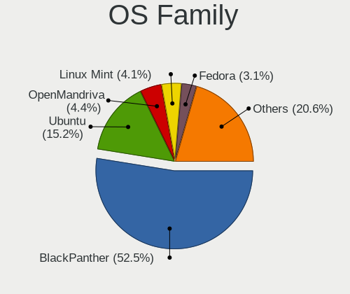

| Name          | Computers | Percent |
|---------------|-----------|---------|
| BlackPanther  | 2343      | 54.39%  |
| Ubuntu        | 671       | 15.58%  |
| OpenMandriva  | 187       | 4.34%   |
| Linux Mint    | 176       | 4.09%   |
| Fedora        | 115       | 2.67%   |
| Debian        | 108       | 2.51%   |
| Endless       | 85        | 1.97%   |
| Arch          | 62        | 1.44%   |
| Manjaro       | 59        | 1.37%   |
| Kubuntu       | 56        | 1.3%    |
| Zorin         | 48        | 1.11%   |
| Xubuntu       | 48        | 1.11%   |
| Pop!_OS       | 46        | 1.07%   |
| ArcoLinux     | 29        | 0.67%   |
| openSUSE      | 28        | 0.65%   |
| KDE neon      | 28        | 0.65%   |
| ROSA          | 22        | 0.51%   |
| Ubuntu MATE   | 19        | 0.44%   |
| Lubuntu       | 19        | 0.44%   |
| Ubuntu Unity  | 15        | 0.35%   |
| EndeavourOS   | 12        | 0.28%   |
| Elementary    | 12        | 0.28%   |
| Kali          | 11        | 0.26%   |
| SteamOS       | 10        | 0.23%   |
| Gentoo        | 10        | 0.23%   |
| Nobara        | 8         | 0.19%   |
| Xero          | 7         | 0.16%   |
| LMDE          | 7         | 0.16%   |
| Ubuntu Budgie | 6         | 0.14%   |
| Raspbian      | 5         | 0.12%   |
| MX            | 4         | 0.09%   |
| Clear Linux   | 4         | 0.09%   |
| Rocky Linux   | 3         | 0.07%   |
| Q4OS          | 3         | 0.07%   |
| Garuda Linux  | 3         | 0.07%   |
| Devuan        | 3         | 0.07%   |
| AlmaLinux     | 3         | 0.07%   |
| UbuntuDDE     | 2         | 0.05%   |
| Ubuntu Studio | 2         | 0.05%   |
| Reborn OS     | 2         | 0.05%   |

Kernel
------

Version of the Linux kernel

| Version                  | Computers | Percent |
|--------------------------|-----------|---------|
| 4.18.16-desktop-1bP      | 1531      | 30.3%   |
| 5.6.14-desktop-2bP       | 697       | 13.8%   |
| 4.9.20-desktop-pae-1bP   | 206       | 4.08%   |
| 5.15.85-desktop-1bP      | 112       | 2.22%   |
| 5.1.15-desktop-1bP       | 85        | 1.68%   |
| 5.10.14-desktop-1omv4002 | 55        | 1.09%   |
| 5.4.0-42-generic         | 42        | 0.83%   |
| 5.16.7-desktop-1omv4003  | 37        | 0.73%   |
| 5.4.0-58-generic         | 27        | 0.53%   |
| 5.8.0-14-generic         | 25        | 0.49%   |
| 6.3.8-desktop-1bP        | 22        | 0.44%   |
| 6.2.6-desktop-1omv2390   | 21        | 0.42%   |
| 5.4.0-52-generic         | 21        | 0.42%   |
| 5.4.0-48-generic         | 19        | 0.38%   |
| 5.11.0-27-generic        | 19        | 0.38%   |
| 6.4.11-desktop-1omv2390  | 17        | 0.34%   |
| 5.15.0-56-generic        | 16        | 0.32%   |
| 6.6.2-desktop-1omv2390   | 15        | 0.3%    |
| 5.3.0-28-generic         | 15        | 0.3%    |
| 5.15.0-58-generic        | 15        | 0.3%    |
| 6.1.1-desktop-1omv2290   | 14        | 0.28%   |
| 5.15.0-52-generic        | 14        | 0.28%   |
| 5.15.0-43-generic        | 14        | 0.28%   |
| 4.18.0-15-generic        | 14        | 0.28%   |
| 5.4.0-54-generic         | 13        | 0.26%   |
| 5.4.0-40-generic         | 13        | 0.26%   |
| 5.4.0-19-generic         | 13        | 0.26%   |
| 5.15.0-76-generic        | 13        | 0.26%   |
| 5.11.0-34-generic        | 13        | 0.26%   |
| 6.3.3-desktop-1bP        | 12        | 0.24%   |
| 5.4.0-29-generic         | 12        | 0.24%   |
| 4.15.0-43-generic        | 12        | 0.24%   |
| 5.4.0-91-generic         | 11        | 0.22%   |
| 5.4.0-26-generic         | 11        | 0.22%   |
| 5.15.0-46-generic        | 11        | 0.22%   |
| 5.15.0-41-generic        | 11        | 0.22%   |
| 5.11.0-43-generic        | 11        | 0.22%   |
| 6.2.0-26-generic         | 10        | 0.2%    |
| 5.8.0-43-generic         | 10        | 0.2%    |
| 5.3.0-46-generic         | 10        | 0.2%    |

Kernel Family
-------------

Linux kernel without a distro release

| Version | Computers | Percent |
|---------|-----------|---------|
| 4.18.16 | 1531      | 31.2%   |
| 5.6.14  | 699       | 14.24%  |
| 5.4.0   | 344       | 7.01%   |
| 4.9.20  | 217       | 4.42%   |
| 5.15.0  | 200       | 4.08%   |
| 4.15.0  | 117       | 2.38%   |
| 5.15.85 | 113       | 2.3%    |
| 5.11.0  | 104       | 2.12%   |
| 5.8.0   | 103       | 2.1%    |
| 5.1.15  | 86        | 1.75%   |
| 5.13.0  | 84        | 1.71%   |
| 5.3.0   | 82        | 1.67%   |
| 5.10.0  | 62        | 1.26%   |
| 6.2.0   | 60        | 1.22%   |
| 5.0.0   | 56        | 1.14%   |
| 5.10.14 | 55        | 1.12%   |
| 5.19.0  | 50        | 1.02%   |
| 4.18.0  | 40        | 0.82%   |
| 5.16.7  | 38        | 0.77%   |
| 6.1.0   | 28        | 0.57%   |
| 6.2.6   | 27        | 0.55%   |
| 6.5.0   | 26        | 0.53%   |
| 6.3.8   | 24        | 0.49%   |
| 4.19.0  | 22        | 0.45%   |
| 6.4.11  | 19        | 0.39%   |
| 6.6.2   | 18        | 0.37%   |
| 6.1.1   | 18        | 0.37%   |
| 6.3.3   | 12        | 0.24%   |
| 6.2.9   | 12        | 0.24%   |
| 5.14.0  | 12        | 0.24%   |
| 6.4.3   | 11        | 0.22%   |
| 6.0.12  | 9         | 0.18%   |
| 5.16.0  | 9         | 0.18%   |
| 5.12.4  | 9         | 0.18%   |
| 4.13.0  | 9         | 0.18%   |
| 5.18.12 | 8         | 0.16%   |
| 4.4.0   | 8         | 0.16%   |
| 6.5.5   | 7         | 0.14%   |
| 5.13.13 | 7         | 0.14%   |
| 6.5.6   | 6         | 0.12%   |

Kernel Major Ver.
-----------------

Linux kernel major version

| Version | Computers | Percent |
|---------|-----------|---------|
| 4.18    | 1570      | 32.24%  |
| 5.6     | 714       | 14.66%  |
| 5.4     | 367       | 7.54%   |
| 5.15    | 351       | 7.21%   |
| 4.9     | 230       | 4.72%   |
| 5.10    | 144       | 2.96%   |
| 5.11    | 124       | 2.55%   |
| 6.2     | 123       | 2.53%   |
| 5.8     | 119       | 2.44%   |
| 4.15    | 117       | 2.4%    |
| 5.13    | 96        | 1.97%   |
| 5.1     | 89        | 1.83%   |
| 5.3     | 88        | 1.81%   |
| 6.1     | 81        | 1.66%   |
| 5.19    | 73        | 1.5%    |
| 5.16    | 66        | 1.36%   |
| 6.5     | 61        | 1.25%   |
| 6.4     | 57        | 1.17%   |
| 5.0     | 56        | 1.15%   |
| 6.3     | 49        | 1.01%   |
| 6.6     | 44        | 0.9%    |
| 6.0     | 30        | 0.62%   |
| 5.14    | 30        | 0.62%   |
| 5.18    | 29        | 0.6%    |
| 5.9     | 25        | 0.51%   |
| 4.19    | 24        | 0.49%   |
| 5.12    | 23        | 0.47%   |
| 5.17    | 17        | 0.35%   |
| 5.7     | 16        | 0.33%   |
| 4.13    | 9         | 0.18%   |
| 6.7     | 8         | 0.16%   |
| 4.4     | 8         | 0.16%   |
| 5.5     | 7         | 0.14%   |
| 4.7     | 6         | 0.12%   |
| 4.16    | 4         | 0.08%   |
| 4.5     | 2         | 0.04%   |
| 4.20    | 2         | 0.04%   |
| 4.14    | 2         | 0.04%   |
| 4.1     | 2         | 0.04%   |
| 6       | 1         | 0.02%   |

Arch
----

OS architecture (x86_64, i586, etc.)

| Name    | Computers | Percent |
|---------|-----------|---------|
| x86_64  | 3903      | 93.02%  |
| i686    | 282       | 6.72%   |
| armv7l  | 4         | 0.1%    |
| aarch64 | 4         | 0.1%    |
| armv6l  | 2         | 0.05%   |
| unknow  | 1         | 0.02%   |

DE
--

Desktop Environment

| Name            | Computers | Percent |
|-----------------|-----------|---------|
| KDE5            | 2628      | 61.13%  |
| GNOME           | 824       | 19.17%  |
| Unknown         | 297       | 6.91%   |
| XFCE            | 150       | 3.49%   |
| X-Cinnamon      | 144       | 3.35%   |
| MATE            | 70        | 1.63%   |
| KDE             | 40        | 0.93%   |
| LXQt            | 32        | 0.74%   |
| Cinnamon        | 30        | 0.7%    |
| Unity           | 15        | 0.35%   |
| KDE4            | 14        | 0.33%   |
| Pantheon        | 11        | 0.26%   |
| i3              | 8         | 0.19%   |
| Budgie          | 8         | 0.19%   |
| Deepin          | 7         | 0.16%   |
| LXDE            | 6         | 0.14%   |
| GNOME Flashback | 5         | 0.12%   |
| GNOME Classic   | 2         | 0.05%   |
| Trinity         | 1         | 0.02%   |
| sway            | 1         | 0.02%   |
| qtile           | 1         | 0.02%   |
| ICEWM           | 1         | 0.02%   |
| Hyprland        | 1         | 0.02%   |
| Enlightenment   | 1         | 0.02%   |
| bspwm           | 1         | 0.02%   |
| awesome         | 1         | 0.02%   |

Display Server
--------------

X11 or Wayland

| Name    | Computers | Percent |
|---------|-----------|---------|
| X11     | 3691      | 87.05%  |
| Wayland | 358       | 8.44%   |
| Unknown | 152       | 3.58%   |
| Tty     | 37        | 0.87%   |
| Web     | 2         | 0.05%   |

Display Manager
---------------

SDDM, LightDM, etc.

| Name    | Computers | Percent |
|---------|-----------|---------|
| SDDM    | 2641      | 61.65%  |
| Unknown | 903       | 21.08%  |
| GDM3    | 245       | 5.72%   |
| LightDM | 207       | 4.83%   |
| GDM     | 201       | 4.69%   |
| TDM     | 64        | 1.49%   |
| KDM     | 14        | 0.33%   |
| SLiM    | 6         | 0.14%   |
| XDM     | 3         | 0.07%   |

OS Lang
-------

Language

| Lang       | Computers | Percent |
|------------|-----------|---------|
| Unknown    | 2516      | 58.88%  |
| hu_HU      | 1030      | 24.1%   |
| en_US      | 585       | 13.69%  |
| en_GB      | 60        | 1.4%    |
| C          | 33        | 0.77%   |
| de_DE      | 19        | 0.44%   |
| POSIX      | 4         | 0.09%   |
| ru_UA      | 3         | 0.07%   |
| ru_RU      | 3         | 0.07%   |
| en_AU      | 3         | 0.07%   |
| nl_NL      | 2         | 0.05%   |
| it_IT      | 2         | 0.05%   |
| hu_HU.UTF8 | 2         | 0.05%   |
| C.UTF8     | 2         | 0.05%   |
| sk_SK      | 1         | 0.02%   |
| fr_FR      | 1         | 0.02%   |
| fr_BE      | 1         | 0.02%   |
| en_ZA      | 1         | 0.02%   |
| en_IN      | 1         | 0.02%   |
| en_IL      | 1         | 0.02%   |
| en_AG      | 1         | 0.02%   |
| el_GR      | 1         | 0.02%   |
| de_AT      | 1         | 0.02%   |

Boot Mode
---------

EFI or BIOS

| Mode | Computers | Percent |
|------|-----------|---------|
| BIOS | 2661      | 61.29%  |
| EFI  | 1681      | 38.71%  |

Filesystem
----------

Type of filesystem

| Type    | Computers | Percent |
|---------|-----------|---------|
| Ext4    | 2430      | 53.05%  |
| Overlay | 1778      | 38.81%  |
| Btrfs   | 174       | 3.8%    |
| Unknown | 82        | 1.79%   |
| Tmpfs   | 66        | 1.44%   |
| Xfs     | 20        | 0.44%   |
| Zfs     | 11        | 0.24%   |
| Ext2    | 9         | 0.2%    |
| Ext3    | 7         | 0.15%   |
| F2fs    | 3         | 0.07%   |
| XXXXXXX | 1         | 0.02%   |

Part. scheme
------------

Scheme of partitioning

| Type    | Computers | Percent |
|---------|-----------|---------|
| MBR     | 1862      | 42.39%  |
| GPT     | 1575      | 35.85%  |
| Unknown | 956       | 21.76%  |

Dual Boot with Linux/BSD
------------------------

Hosting more than one Linux/BSD

| Dual boot | Computers | Percent |
|-----------|-----------|---------|
| No        | 3332      | 73.96%  |
| Yes       | 1173      | 26.04%  |

Dual Boot (Win)
---------------

Hosting Linux and Windows

| Dual boot | Computers | Percent |
|-----------|-----------|---------|
| No        | 2454      | 55.28%  |
| Yes       | 1985      | 44.72%  |

Board
-----

Vendor
------

Motherboard manufacturer

| Name                    | Computers | Percent |
|-------------------------|-----------|---------|
| ASUSTek Computer        | 697       | 16.78%  |
| Hewlett-Packard         | 624       | 15.02%  |
| Dell                    | 596       | 14.35%  |
| Lenovo                  | 586       | 14.11%  |
| Gigabyte Technology     | 344       | 8.28%   |
| Acer                    | 276       | 6.64%   |
| ASRock                  | 273       | 6.57%   |
| MSI                     | 139       | 3.35%   |
| Fujitsu                 | 94        | 2.26%   |
| Fujitsu Siemens         | 67        | 1.61%   |
| Toshiba                 | 61        | 1.47%   |
| Samsung Electronics     | 43        | 1.04%   |
| Intel                   | 34        | 0.82%   |
| Packard Bell            | 30        | 0.72%   |
| Apple                   | 28        | 0.67%   |
| Medion                  | 23        | 0.55%   |
| eMachines               | 23        | 0.55%   |
| Unknown                 | 20        | 0.48%   |
| Sony                    | 17        | 0.41%   |
| Foxconn                 | 15        | 0.36%   |
| Valve                   | 9         | 0.22%   |
| Microsoft               | 8         | 0.19%   |
| Alcor                   | 8         | 0.19%   |
| Raspberry Pi Foundation | 7         | 0.17%   |
| Hungaro Flotta Kft      | 7         | 0.17%   |
| HUAWEI                  | 7         | 0.17%   |
| Pegatron                | 6         | 0.14%   |
| Supermicro              | 4         | 0.1%    |
| Insyde                  | 4         | 0.1%    |
| Biostar                 | 4         | 0.1%    |
| AMI                     | 4         | 0.1%    |
| ZOTAC                   | 3         | 0.07%   |
| TUXEDO                  | 3         | 0.07%   |
| Timi                    | 3         | 0.07%   |
| Shuttle                 | 3         | 0.07%   |
| LG Electronics          | 3         | 0.07%   |
| Huanan                  | 3         | 0.07%   |
| Clevo                   | 3         | 0.07%   |
| AOpen                   | 3         | 0.07%   |
| ABIT                    | 3         | 0.07%   |

Model
-----

Motherboard model

| Name                             | Computers | Percent |
|----------------------------------|-----------|---------|
| HP 250 G1                        | 41        | 0.99%   |
| ASRock FM2A75M Pro4+             | 33        | 0.79%   |
| Unknown                          | 30        | 0.72%   |
| ASUS All Series                  | 28        | 0.67%   |
| Dell OptiPlex 3020               | 23        | 0.55%   |
| Dell Latitude E6410              | 19        | 0.46%   |
| HP Notebook                      | 14        | 0.34%   |
| Dell OptiPlex 755                | 14        | 0.34%   |
| HP 650                           | 13        | 0.31%   |
| Gigabyte G31M-ES2L               | 13        | 0.31%   |
| Lenovo IdeaPad 330-15IKB 81DE    | 12        | 0.29%   |
| Dell OptiPlex 780                | 12        | 0.29%   |
| ASUS P5KPL-AM EPU                | 12        | 0.29%   |
| Lenovo IdeaPad 100-15IBD 80QQ    | 11        | 0.26%   |
| Lenovo G50-45 80E3               | 11        | 0.26%   |
| HP 620                           | 11        | 0.26%   |
| Dell Latitude E6400              | 11        | 0.26%   |
| Dell OptiPlex 760                | 10        | 0.24%   |
| Dell Latitude 5480               | 10        | 0.24%   |
| Valve Jupiter                    | 9         | 0.22%   |
| Lenovo ThinkPad T400 2768WGB     | 9         | 0.22%   |
| HP EliteBook 8460p               | 9         | 0.22%   |
| Gigabyte H61M-S1                 | 9         | 0.22%   |
| Dell Precision WorkStation T3500 | 9         | 0.22%   |
| Dell OptiPlex 7010               | 9         | 0.22%   |
| Dell Inspiron 7737               | 9         | 0.22%   |
| MSI MS-7C02                      | 8         | 0.19%   |
| MSI MS-7817                      | 8         | 0.19%   |
| HP Pavilion 15                   | 8         | 0.19%   |
| HP EliteBook 6930p               | 8         | 0.19%   |
| Dell Latitude E6530              | 8         | 0.19%   |
| Dell Latitude E6430              | 8         | 0.19%   |
| Dell Latitude E6420              | 8         | 0.19%   |
| Dell Inspiron 3542               | 8         | 0.19%   |
| Dell Inspiron 15-3567            | 8         | 0.19%   |
| ASUS X541NA                      | 8         | 0.19%   |
| ASRock G41M-VS3                  | 8         | 0.19%   |
| Lenovo Z50-75 80EC               | 7         | 0.17%   |
| Lenovo Z50-70 20354              | 7         | 0.17%   |
| Lenovo IdeaPad 100-15IBY 80MJ    | 7         | 0.17%   |

Model Family
------------

Motherboard model prefix

| Name                    | Computers | Percent |
|-------------------------|-----------|---------|
| Lenovo ThinkPad         | 222       | 5.34%   |
| Dell Latitude           | 211       | 5.08%   |
| Acer Aspire             | 180       | 4.33%   |
| HP Compaq               | 147       | 3.54%   |
| Dell OptiPlex           | 142       | 3.42%   |
| Dell Inspiron           | 133       | 3.2%    |
| Lenovo IdeaPad          | 125       | 3.01%   |
| HP EliteBook            | 99        | 2.38%   |
| ASUS VivoBook           | 70        | 1.69%   |
| HP 250                  | 64        | 1.54%   |
| HP ProBook              | 61        | 1.47%   |
| Lenovo ThinkCentre      | 55        | 1.32%   |
| HP Pavilion             | 54        | 1.3%    |
| Toshiba Satellite       | 53        | 1.28%   |
| ASUS PRIME              | 51        | 1.23%   |
| Fujitsu ESPRIMO         | 42        | 1.01%   |
| Dell Vostro             | 38        | 0.91%   |
| ASUS ROG                | 36        | 0.87%   |
| Fujitsu LIFEBOOK        | 35        | 0.84%   |
| Fujitsu Siemens ESPRIMO | 33        | 0.79%   |
| ASRock FM2A75M          | 33        | 0.79%   |
| Dell Precision          | 32        | 0.77%   |
| Packard Bell EasyNote   | 30        | 0.72%   |
| Unknown                 | 30        | 0.72%   |
| ASUS All                | 28        | 0.67%   |
| ASUS TUF                | 25        | 0.6%    |
| Acer TravelMate         | 24        | 0.58%   |
| Fujitsu Siemens AMILO   | 23        | 0.55%   |
| HP Laptop               | 19        | 0.46%   |
| ASUS P5KPL-AM           | 18        | 0.43%   |
| HP EliteDesk            | 17        | 0.41%   |
| Acer Swift              | 17        | 0.41%   |
| ASUS ASUS               | 16        | 0.39%   |
| Acer Veriton            | 16        | 0.39%   |
| Gigabyte B450           | 15        | 0.36%   |
| ASUS ZenBook            | 15        | 0.36%   |
| HP Notebook             | 14        | 0.34%   |
| Lenovo Yoga             | 13        | 0.31%   |
| HP 650                  | 13        | 0.31%   |
| Gigabyte G31M-ES2L      | 13        | 0.31%   |

MFG Year
--------

Motherboard manufacture year

| Year    | Computers | Percent |
|---------|-----------|---------|
| 2011    | 376       | 9.05%   |
| 2013    | 373       | 8.98%   |
| 2012    | 351       | 8.45%   |
| 2010    | 345       | 8.31%   |
| 2018    | 312       | 7.51%   |
| 2014    | 308       | 7.41%   |
| 2008    | 284       | 6.84%   |
| 2009    | 278       | 6.69%   |
| 2017    | 230       | 5.54%   |
| 2015    | 224       | 5.39%   |
| 2007    | 203       | 4.89%   |
| 2016    | 201       | 4.84%   |
| 2019    | 175       | 4.21%   |
| 2020    | 161       | 3.88%   |
| 2021    | 110       | 2.65%   |
| 2006    | 85        | 2.05%   |
| 2022    | 64        | 1.54%   |
| 2005    | 30        | 0.72%   |
| 2023    | 24        | 0.58%   |
| Unknown | 13        | 0.31%   |
| 2004    | 4         | 0.1%    |
| 2003    | 3         | 0.07%   |

Form Factor
-----------

Physical design of the computer

| Name           | Computers | Percent |
|----------------|-----------|---------|
| Notebook       | 2329      | 56.07%  |
| Desktop        | 1696      | 40.83%  |
| Convertible    | 35        | 0.84%   |
| All in one     | 29        | 0.7%    |
| Mini pc        | 26        | 0.63%   |
| Tablet         | 15        | 0.36%   |
| Server         | 14        | 0.34%   |
| System on chip | 9         | 0.22%   |
| Phone          | 1         | 0.02%   |

Secure Boot
-----------

Enabled or disabled

| State    | Computers | Percent |
|----------|-----------|---------|
| Disabled | 4021      | 96.36%  |
| Enabled  | 152       | 3.64%   |

Coreboot
--------

Have coreboot on board

| Used | Computers | Percent |
|------|-----------|---------|
| No   | 4152      | 99.95%  |
| Yes  | 2         | 0.05%   |

RAM Size
--------

Total RAM memory

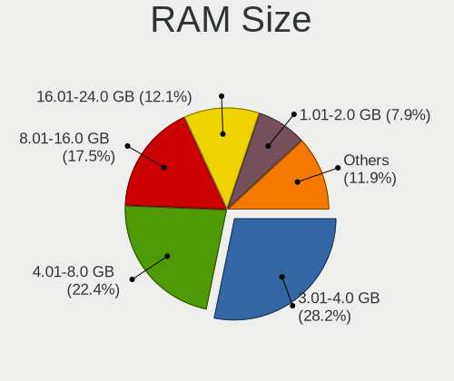

| Size in GB  | Computers | Percent |
|-------------|-----------|---------|
| 3.01-4.0    | 1286      | 29.86%  |
| 4.01-8.0    | 948       | 22.01%  |
| 8.01-16.0   | 743       | 17.25%  |
| 16.01-24.0  | 485       | 11.26%  |
| 1.01-2.0    | 382       | 8.87%   |
| 32.01-64.0  | 196       | 4.55%   |
| 2.01-3.0    | 138       | 3.2%    |
| 24.01-32.0  | 48        | 1.11%   |
| 0.51-1.0    | 41        | 0.95%   |
| 64.01-256.0 | 35        | 0.81%   |
| 0.01-0.5    | 3         | 0.07%   |
| Unknown     | 2         | 0.05%   |

RAM Used
--------

Used RAM memory

| Used GB     | Computers | Percent |
|-------------|-----------|---------|
| 1.01-2.0    | 1508      | 30.33%  |
| 0.51-1.0    | 1438      | 28.92%  |
| 0.01-0.5    | 730       | 14.68%  |
| 2.01-3.0    | 614       | 12.35%  |
| 3.01-4.0    | 294       | 5.91%   |
| 4.01-8.0    | 293       | 5.89%   |
| 8.01-16.0   | 75        | 1.51%   |
| 16.01-24.0  | 13        | 0.26%   |
| Unknown     | 3         | 0.06%   |
| 32.01-64.0  | 2         | 0.04%   |
| 64.01-256.0 | 2         | 0.04%   |

Total Drives
------------

Number of drives on board

| Drives  | Computers | Percent |
|---------|-----------|---------|
| 1       | 2853      | 64.31%  |
| 2       | 1000      | 22.54%  |
| 3       | 311       | 7.01%   |
| 4       | 126       | 2.84%   |
| 0       | 55        | 1.24%   |
| 5       | 53        | 1.19%   |
| 6       | 14        | 0.32%   |
| 8       | 7         | 0.16%   |
| 7       | 7         | 0.16%   |
| 9       | 4         | 0.09%   |
| 11      | 2         | 0.05%   |
| 10      | 2         | 0.05%   |
| 14      | 1         | 0.02%   |
| Unknown | 1         | 0.02%   |

Has CD-ROM
----------

Has CD-ROM on board

| Presented | Computers | Percent |
|-----------|-----------|---------|
| Yes       | 2239      | 52.71%  |
| No        | 2009      | 47.29%  |

Has Ethernet
------------

Has Ethernet on board

| Presented | Computers | Percent |
|-----------|-----------|---------|
| Yes       | 3840      | 92.31%  |
| No        | 320       | 7.69%   |

Has WiFi
--------

Has WiFi module

| Presented | Computers | Percent |
|-----------|-----------|---------|
| Yes       | 2861      | 68.15%  |
| No        | 1337      | 31.85%  |

Has Bluetooth
-------------

Has Bluetooth module

| Presented | Computers | Percent |
|-----------|-----------|---------|
| Yes       | 2126      | 50.24%  |
| No        | 2106      | 49.76%  |

Location
--------

Country
-------

Geographic location (country)

| Country | Computers | Percent |
|---------|-----------|---------|
| Hungary | 4154      | 100%    |

City
----

Geographic location (city)

| City              | Computers | Percent |
|-------------------|-----------|---------|
| Budapest          | 1641      | 33.36%  |
| Pcs             | 98        | 1.99%   |
| Szeged            | 97        | 1.97%   |
| Debrecen          | 91        | 1.85%   |
| Miskolc           | 90        | 1.83%   |
| Tatabnya        | 88        | 1.79%   |
| Gyr             | 88        | 1.79%   |
| Szkesfehrvr | 63        | 1.28%   |
| Szombathely       | 60        | 1.22%   |
| Szigetszentmiklos | 59        | 1.2%    |
| Kecskemt        | 58        | 1.18%   |
| Zalaegerszeg      | 57        | 1.16%   |
| rd              | 52        | 1.06%   |
| Nyiregyhaza       | 42        | 0.85%   |
| Veszprm         | 41        | 0.83%   |
| Szolnok           | 40        | 0.81%   |
| Szekszrd        | 38        | 0.77%   |
| Karcag            | 33        | 0.67%   |
| Gdll        | 32        | 0.65%   |
| Eger              | 30        | 0.61%   |
| Oroshaza          | 29        | 0.59%   |
| Berettyjfalu  | 29        | 0.59%   |
| Toeroekbalint     | 28        | 0.57%   |
| Dunajvros     | 28        | 0.57%   |
| Nagykanizsa       | 24        | 0.49%   |
| Salgotarjan       | 23        | 0.47%   |
| Pomaz             | 23        | 0.47%   |
| Sopron            | 22        | 0.45%   |
| Hodmezovasarhely  | 22        | 0.45%   |
| Mosonmagyarvr | 21        | 0.43%   |
| Gyomro            | 21        | 0.43%   |
| Cegled            | 21        | 0.43%   |
| Sifok           | 20        | 0.41%   |
| Hatvan            | 20        | 0.41%   |
| Ajka              | 20        | 0.41%   |
| Toekoel           | 19        | 0.39%   |
| Szentendre        | 19        | 0.39%   |
| Esztergom         | 19        | 0.39%   |
| Papa              | 17        | 0.35%   |
| Kazincbarcika     | 17        | 0.35%   |

Drives
------

Drive Vendor
------------

Hard drive vendors

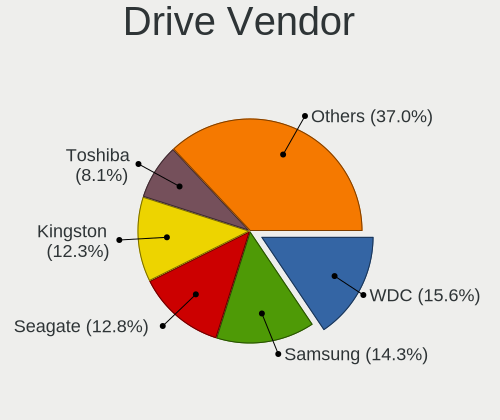

| Vendor                      | Computers | Drives | Percent |
|-----------------------------|-----------|--------|---------|
| WDC                         | 993       | 1922   | 16.23%  |
| Samsung Electronics         | 865       | 1497   | 14.13%  |
| Seagate                     | 838       | 1346   | 13.69%  |
| Kingston                    | 737       | 1302   | 12.04%  |
| Toshiba                     | 521       | 870    | 8.51%   |
| Hitachi                     | 268       | 388    | 4.38%   |
| HGST                        | 175       | 302    | 2.86%   |
| SanDisk                     | 165       | 249    | 2.7%    |
| Unknown                     | 151       | 229    | 2.47%   |
| A-DATA Technology           | 140       | 229    | 2.29%   |
| Intel                       | 111       | 172    | 1.81%   |
| SK hynix                    | 105       | 153    | 1.72%   |
| Crucial                     | 88        | 150    | 1.44%   |
| SPCC                        | 72        | 109    | 1.18%   |
| Fujitsu                     | 71        | 85     | 1.16%   |
| Micron Technology           | 63        | 92     | 1.03%   |
| Maxtor                      | 54        | 70     | 0.88%   |
| Apacer                      | 52        | 78     | 0.85%   |
| JMicron Technology          | 36        | 42     | 0.59%   |
| Intenso                     | 36        | 66     | 0.59%   |
| China                       | 33        | 55     | 0.54%   |
| OCZ                         | 27        | 33     | 0.44%   |
| LITEON                      | 27        | 38     | 0.44%   |
| Kingston Technology Company | 27        | 28     | 0.44%   |
| Patriot                     | 26        | 53     | 0.42%   |
| PNY                         | 24        | 46     | 0.39%   |
| Gigabyte Technology         | 24        | 58     | 0.39%   |
| Kingmax                     | 23        | 46     | 0.38%   |
| Transcend                   | 21        | 27     | 0.34%   |
| KIOXIA                      | 19        | 28     | 0.31%   |
| KingSpec                    | 16        | 18     | 0.26%   |
| Apple                       | 16        | 27     | 0.26%   |
| Verbatim                    | 13        | 27     | 0.21%   |
| Hewlett-Packard             | 13        | 17     | 0.21%   |
| Unknown                     | 13        | 21     | 0.21%   |
| Team                        | 12        | 19     | 0.2%    |
| Phison                      | 12        | 16     | 0.2%    |
| Silicon Motion              | 10        | 12     | 0.16%   |
| LITEONIT                    | 10        | 16     | 0.16%   |
| GOODRAM                     | 10        | 11     | 0.16%   |

Drive Model
-----------

Hard drive models

| Model                                             | Computers | Percent |
|---------------------------------------------------|-----------|---------|
| Kingston SA400S37240G 240GB SSD                   | 167       | 2.49%   |
| Kingston SA400S37120G 120GB SSD                   | 137       | 2.04%   |
| Kingston SV300S37A120G 120GB SSD                  | 95        | 1.41%   |
| Kingston SA400S37480G 480GB SSD                   | 81        | 1.21%   |
| Seagate ST1000LM035-1RK172 1TB                    | 65        | 0.97%   |
| Toshiba DT01ACA100 1TB                            | 59        | 0.88%   |
| Seagate ST500DM002-1BD142 500GB                   | 55        | 0.82%   |
| Seagate ST1000LM024 HN-M101MBB 1TB                | 54        | 0.8%    |
| Toshiba MQ01ABF050 500GB                          | 52        | 0.77%   |
| Samsung SSD 850 EVO 250GB                         | 51        | 0.76%   |
| Toshiba MQ01ABD100 1TB                            | 47        | 0.7%    |
| Seagate ST500LT012-1DG142 500GB                   | 44        | 0.66%   |
| Kingston SUV400S37120G 120GB SSD                  | 42        | 0.63%   |
| Toshiba DT01ACA050 500GB                          | 41        | 0.61%   |
| A-DATA SU630 240GB SSD                            | 35        | 0.52%   |
| HGST HTS545032A7E380 320GB                        | 34        | 0.51%   |
| Samsung SSD 860 EVO 500GB                         | 33        | 0.49%   |
| Samsung SSD 860 EVO 250GB                         | 32        | 0.48%   |
| WDC WDS240G2G0A-00JH30 240GB SSD                  | 31        | 0.46%   |
| Toshiba MQ04ABF100 1TB                            | 31        | 0.46%   |
| HGST HTS545050A7E680 500GB                        | 31        | 0.46%   |
| HGST HTS721010A9E630 1TB                          | 27        | 0.4%    |
| Toshiba HDWD130 3TB                               | 25        | 0.37%   |
| SPCC Solid State Disk 256GB                       | 25        | 0.37%   |
| JMicron Generic 8GB                               | 25        | 0.37%   |
| Seagate ST9320325AS 320GB                         | 24        | 0.36%   |
| Seagate ST380815AS 80GB                           | 24        | 0.36%   |
| Samsung HD502HJ 500GB                             | 24        | 0.36%   |
| Samsung NVMe SSD Controller SM981/PM981/PM983 1TB | 23        | 0.34%   |
| A-DATA SU700 120GB SSD                            | 23        | 0.34%   |
| Toshiba HDWD110 1TB                               | 22        | 0.33%   |
| Toshiba DT01ACA200 2TB                            | 22        | 0.33%   |
| WDC WD10EZEX-08WN4A0 1TB                          | 21        | 0.31%   |
| Seagate ST9500325AS 500GB                         | 21        | 0.31%   |
| Kingston SV300S37A240G 240GB SSD                  | 21        | 0.31%   |
| Kingston SHFS37A120G 120GB SSD                    | 21        | 0.31%   |
| Kingston SA400S37960G 960GB SSD                   | 21        | 0.31%   |
| SPCC Solid State Disk 128GB                       | 20        | 0.3%    |
| Samsung SSD 850 EVO 500GB                         | 20        | 0.3%    |
| HGST HTS541010A9E680 1TB                          | 19        | 0.28%   |

HDD Vendor
----------

Hard disk drive vendors

| Vendor              | Computers | Drives | Percent |
|---------------------|-----------|--------|---------|
| WDC                 | 879       | 1682   | 28.38%  |
| Seagate             | 822       | 1319   | 26.54%  |
| Toshiba             | 449       | 756    | 14.5%   |
| Samsung Electronics | 291       | 463    | 9.4%    |
| Hitachi             | 268       | 388    | 8.65%   |
| HGST                | 175       | 302    | 5.65%   |
| Fujitsu             | 71        | 85     | 2.29%   |
| Maxtor              | 54        | 70     | 1.74%   |
| JMicron Technology  | 26        | 31     | 0.84%   |
| Unknown             | 15        | 24     | 0.48%   |
| Hewlett-Packard     | 7         | 7      | 0.23%   |
| HGST HTS            | 6         | 11     | 0.19%   |
| USB3.0              | 4         | 8      | 0.13%   |
| TO Exter            | 4         | 4      | 0.13%   |
| Quantum             | 4         | 4      | 0.13%   |
| IBM/Hitachi         | 4         | 5      | 0.13%   |
| Apple               | 3         | 5      | 0.1%    |
| WD MediaMax         | 2         | 4      | 0.06%   |
| Initio              | 2         | 3      | 0.06%   |
| ICY BOX             | 2         | 4      | 0.06%   |
| External            | 2         | 3      | 0.06%   |
| Space ke            | 1         | 1      | 0.03%   |
| ExcelStor           | 1         | 1      | 0.03%   |
| Dell                | 1         | 1      | 0.03%   |
| CSD                 | 1         | 2      | 0.03%   |
| AXAGON              | 1         | 1      | 0.03%   |
| ASMT                | 1         | 1      | 0.03%   |
| Unknown             | 1         | 1      | 0.03%   |

SSD Vendor
----------

Solid state drive vendors

| Vendor              | Computers | Drives | Percent |
|---------------------|-----------|--------|---------|
| Kingston            | 669       | 1164   | 30.69%  |
| Samsung Electronics | 395       | 676    | 18.12%  |
| A-DATA Technology   | 129       | 211    | 5.92%   |
| SanDisk             | 108       | 153    | 4.95%   |
| WDC                 | 103       | 187    | 4.72%   |
| Crucial             | 82        | 140    | 3.76%   |
| Intel               | 73        | 118    | 3.35%   |
| SPCC                | 60        | 95     | 2.75%   |
| Apacer              | 50        | 74     | 2.29%   |
| SK hynix            | 44        | 74     | 2.02%   |
| Micron Technology   | 42        | 65     | 1.93%   |
| Intenso             | 33        | 62     | 1.51%   |
| China               | 33        | 55     | 1.51%   |
| Toshiba             | 30        | 45     | 1.38%   |
| OCZ                 | 27        | 33     | 1.24%   |
| LITEON              | 26        | 32     | 1.19%   |
| PNY                 | 24        | 46     | 1.1%    |
| Patriot             | 23        | 48     | 1.06%   |
| Kingmax             | 23        | 46     | 1.06%   |
| Transcend           | 20        | 22     | 0.92%   |
| Gigabyte Technology | 20        | 51     | 0.92%   |
| KingSpec            | 15        | 17     | 0.69%   |
| Verbatim            | 12        | 26     | 0.55%   |
| Team                | 11        | 18     | 0.5%    |
| LITEONIT            | 10        | 16     | 0.46%   |
| GOODRAM             | 10        | 11     | 0.46%   |
| Corsair             | 9         | 11     | 0.41%   |
| Apple               | 8         | 15     | 0.37%   |
| ASMT                | 7         | 9      | 0.32%   |
| Netac               | 6         | 13     | 0.28%   |
| Leven               | 4         | 4      | 0.18%   |
| Hewlett-Packard     | 4         | 5      | 0.18%   |
| Unknown             | 3         | 6      | 0.14%   |
| SATAFIRM            | 3         | 3      | 0.14%   |
| KingFast            | 3         | 4      | 0.14%   |
| KingDian            | 3         | 3      | 0.14%   |
| HS-SSD-C100         | 3         | 3      | 0.14%   |
| BHT                 | 3         | 3      | 0.14%   |
| AMD                 | 3         | 3      | 0.14%   |
| 2-Power             | 3         | 5      | 0.14%   |

Drive Kind
----------

HDD or SSD

| Kind    | Computers | Drives | Percent |
|---------|-----------|--------|---------|
| HDD     | 2590      | 5186   | 48.2%   |
| SSD     | 1915      | 3644   | 35.63%  |
| NVMe    | 664       | 1118   | 12.36%  |
| MMC     | 144       | 220    | 2.68%   |
| Unknown | 61        | 90     | 1.14%   |

Drive Connector
---------------

SATA, SAS, NVMe, etc.

| Type | Computers | Drives | Percent |
|------|-----------|--------|---------|
| SATA | 3634      | 8594   | 78.44%  |
| NVMe | 664       | 1117   | 14.33%  |
| SAS  | 191       | 327    | 4.12%   |
| MMC  | 144       | 220    | 3.11%   |

Drive Size
----------

Size of hard drive

| Size in TB      | Computers | Drives | Percent |
|-----------------|-----------|--------|---------|
| 0.01-0.5        | 3140      | 6256   | 70.82%  |
| 0.51-1.0        | 937       | 1724   | 21.13%  |
| 1.01-2.0        | 205       | 376    | 4.62%   |
| 2.01-3.0        | 65        | 217    | 1.47%   |
| 3.01-4.0        | 52        | 155    | 1.17%   |
| 4.01-10.0       | 26        | 63     | 0.59%   |
| 10.01-20.0      | 7         | 37     | 0.16%   |
| More than 100.0 | 2         | 2      | 0.05%   |

Space Total
-----------

Amount of disk space available on the file system

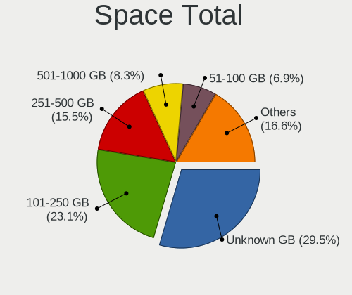

| Size in GB     | Computers | Percent |
|----------------|-----------|---------|
| Unknown        | 1622      | 33.35%  |
| 101-250        | 1065      | 21.9%   |
| 251-500        | 695       | 14.29%  |
| 501-1000       | 362       | 7.44%   |
| 51-100         | 343       | 7.05%   |
| 1-20           | 232       | 4.77%   |
| 1001-2000      | 198       | 4.07%   |
| 21-50          | 185       | 3.8%    |
| More than 3000 | 90        | 1.85%   |
| 2001-3000      | 72        | 1.48%   |

Space Used
----------

Amount of used disk space

| Used GB        | Computers | Percent |
|----------------|-----------|---------|
| 1-20           | 1688      | 34.07%  |
| Unknown        | 1622      | 32.73%  |
| 21-50          | 489       | 9.87%   |
| 51-100         | 364       | 7.35%   |
| 101-250        | 329       | 6.64%   |
| 251-500        | 176       | 3.55%   |
| 501-1000       | 149       | 3.01%   |
| 1001-2000      | 88        | 1.78%   |
| More than 3000 | 33        | 0.67%   |
| 2001-3000      | 16        | 0.32%   |
| 0              | 1         | 0.02%   |

Malfunc. Drives
---------------

Drive models with a malfunction

| Model                              | Computers | Drives | Percent |
|------------------------------------|-----------|--------|---------|
| HGST HTS545032A7E380 320GB         | 31        | 55     | 2.65%   |
| Kingston SV300S37A120G 120GB SSD   | 23        | 27     | 1.97%   |
| HGST HTS545050A7E680 500GB         | 20        | 30     | 1.71%   |
| Seagate ST500DM002-1BD142 500GB    | 19        | 35     | 1.62%   |
| A-DATA Technology SU630 240GB SSD  | 19        | 31     | 1.62%   |
| Seagate ST500LT012-1DG142 500GB    | 15        | 23     | 1.28%   |
| Seagate ST500LT012-9WS142 500GB    | 13        | 15     | 1.11%   |
| Seagate ST1000LM024 HN-M101MBB 1TB | 13        | 18     | 1.11%   |
| Seagate ST9320325AS 320GB          | 12        | 26     | 1.03%   |
| Toshiba MQ01ABF050 500GB           | 11        | 29     | 0.94%   |
| Toshiba DT01ACA050 500GB           | 11        | 14     | 0.94%   |
| Samsung Electronics HD103UJ 1TB    | 10        | 25     | 0.85%   |
| Seagate ST9500325AS 500GB          | 9         | 19     | 0.77%   |
| Seagate ST9250315AS 250GB          | 9         | 14     | 0.77%   |
| Seagate ST9320423AS 320GB          | 8         | 9      | 0.68%   |
| Hitachi HTS545050B9A300 500GB      | 8         | 13     | 0.68%   |
| HGST HTS545050A7E380 500GB         | 8         | 12     | 0.68%   |
| HGST HTS541010A9E680 1TB           | 8         | 21     | 0.68%   |
| WDC WD5000AAKX-001CA0 500GB        | 7         | 7      | 0.6%    |
| WDC WD5000AADS-00S9B0 500GB        | 7         | 8      | 0.6%    |
| Toshiba MQ01ABD100 1TB             | 7         | 9      | 0.6%    |
| Toshiba DT01ACA100 1TB             | 7         | 16     | 0.6%    |
| Seagate ST1000LM035-1RK172 1TB     | 7         | 8      | 0.6%    |
| Samsung Electronics HM160HI 160GB  | 7         | 8      | 0.6%    |
| Hitachi HTS545050A7E380 500GB      | 7         | 14     | 0.6%    |
| Toshiba MQ01ABD050 500GB           | 6         | 7      | 0.51%   |
| Samsung Electronics HD321KJ 320GB  | 6         | 6      | 0.51%   |
| Samsung Electronics HD161HJ 160GB  | 6         | 6      | 0.51%   |
| Hitachi HTS545016B9A300 160GB      | 6         | 6      | 0.51%   |
| WDC WD5000AAKX-08U6AA0 500GB       | 5         | 9      | 0.43%   |
| WDC WD5000AAKS-00UU3A0 500GB       | 5         | 12     | 0.43%   |
| Seagate ST980811AS 80GB            | 5         | 5      | 0.43%   |
| Seagate ST500LM000-SSHD-8GB        | 5         | 6      | 0.43%   |
| Seagate ST3250318AS 250GB          | 5         | 9      | 0.43%   |
| Seagate ST3160815AS 160GB          | 5         | 6      | 0.43%   |
| Seagate ST3160318AS 160GB          | 5         | 5      | 0.43%   |
| Samsung Electronics SP2504C 250GB  | 5         | 8      | 0.43%   |
| Samsung Electronics HM321HI 320GB  | 5         | 8      | 0.43%   |
| Samsung Electronics HD502HJ 500GB  | 5         | 8      | 0.43%   |
| Samsung Electronics HD103SI 1TB    | 5         | 5      | 0.43%   |

Malfunc. Drive Vendor
---------------------

Vendors of faulty drives

| Vendor              | Computers | Drives | Percent |
|---------------------|-----------|--------|---------|
| Seagate             | 251       | 368    | 22.13%  |
| WDC                 | 232       | 377    | 20.46%  |
| Samsung Electronics | 126       | 198    | 11.11%  |
| Hitachi             | 118       | 184    | 10.41%  |
| Toshiba             | 112       | 180    | 9.88%   |
| HGST                | 81        | 136    | 7.14%   |
| Kingston            | 56        | 75     | 4.94%   |
| Maxtor              | 30        | 44     | 2.65%   |
| A-DATA Technology   | 29        | 48     | 2.56%   |
| Fujitsu             | 25        | 33     | 2.2%    |
| Intel               | 21        | 40     | 1.85%   |
| SK hynix            | 10        | 15     | 0.88%   |
| SanDisk             | 4         | 5      | 0.35%   |
| Intenso             | 4         | 4      | 0.35%   |
| IBM/Hitachi         | 3         | 3      | 0.26%   |
| Hewlett-Packard     | 3         | 3      | 0.26%   |
| WD MediaMax         | 2         | 4      | 0.18%   |
| LITEON              | 2         | 2      | 0.18%   |
| KingSpec            | 2         | 2      | 0.18%   |
| Kingmax             | 2         | 2      | 0.18%   |
| China               | 2         | 2      | 0.18%   |
| Apacer              | 2         | 3      | 0.18%   |
| SPCC                | 1         | 1      | 0.09%   |
| SATAFIRM            | 1         | 1      | 0.09%   |
| R580                | 1         | 1      | 0.09%   |
| QUANTUM             | 1         | 1      | 0.09%   |
| Patriot             | 1         | 1      | 0.09%   |
| OCZ-AGIL            | 1         | 1      | 0.09%   |
| OCZ                 | 1         | 3      | 0.09%   |
| Micron Technology   | 1         | 1      | 0.09%   |
| Leven               | 1         | 1      | 0.09%   |
| JMicron Technology  | 1         | 1      | 0.09%   |
| Initio              | 1         | 2      | 0.09%   |
| ICY BOX             | 1         | 2      | 0.09%   |
| ExcelStor           | 1         | 1      | 0.09%   |
| CSD                 | 1         | 2      | 0.09%   |
| Crucial             | 1         | 1      | 0.09%   |
| ASMT                | 1         | 1      | 0.09%   |
| Apple               | 1         | 8      | 0.09%   |

Malfunc. HDD Vendor
-------------------

Vendors of faulty HDD drives

| Vendor              | Computers | Drives | Percent |
|---------------------|-----------|--------|---------|
| Seagate             | 251       | 368    | 26.04%  |
| WDC                 | 226       | 370    | 23.44%  |
| Hitachi             | 118       | 184    | 12.24%  |
| Samsung Electronics | 115       | 173    | 11.93%  |
| Toshiba             | 105       | 165    | 10.89%  |
| HGST                | 81        | 136    | 8.4%    |
| Maxtor              | 30        | 44     | 3.11%   |
| Fujitsu             | 25        | 33     | 2.59%   |
| IBM/Hitachi         | 3         | 3      | 0.31%   |
| WD MediaMax         | 2         | 4      | 0.21%   |
| Hewlett-Packard     | 2         | 2      | 0.21%   |
| QUANTUM             | 1         | 1      | 0.1%    |
| Initio              | 1         | 2      | 0.1%    |
| ICY BOX             | 1         | 2      | 0.1%    |
| ExcelStor           | 1         | 1      | 0.1%    |
| CSD                 | 1         | 2      | 0.1%    |
| ASMT                | 1         | 1      | 0.1%    |

Malfunc. Drive Kind
-------------------

Kinds of faulty drives

| Kind    | Computers | Drives | Percent |
|---------|-----------|--------|---------|
| HDD     | 878       | 1491   | 83.94%  |
| SSD     | 159       | 255    | 15.2%   |
| NVMe    | 8         | 10     | 0.76%   |
| Unknown | 1         | 1      | 0.1%    |

Failed Drives
-------------

Failed drive models

| Model                              | Computers | Drives | Percent |
|------------------------------------|-----------|--------|---------|
| Samsung Electronics HD502HJ 500GB  | 2         | 3      | 8%      |
| Samsung Electronics HD103SJ 1TB    | 2         | 3      | 8%      |
| Zheino CHN-NGFFNV2280-256 256GB    | 1         | 1      | 4%      |
| WDC WD5000BEVT-22A0RT0 500GB       | 1         | 7      | 4%      |
| WDC WD3200BVVT-63A26Y0 320GB       | 1         | 1      | 4%      |
| WDC WD3200BPVT-24JJ5T0 320GB       | 1         | 1      | 4%      |
| WDC WD3200BEVT-08A23T1 320GB       | 1         | 1      | 4%      |
| WDC WD2500LPCX-24C6HT0 250GB       | 1         | 1      | 4%      |
| WDC WD1600BEVT-22ZCT0 160GB        | 1         | 1      | 4%      |
| Toshiba MQ01ABD050V 500GB          | 1         | 1      | 4%      |
| Toshiba MK6475GSX 640GB            | 1         | 1      | 4%      |
| Toshiba MK3275GSX 320GB            | 1         | 1      | 4%      |
| Seagate ST9160821AS 160GB          | 1         | 1      | 4%      |
| Seagate ST9160412AS 160GB          | 1         | 1      | 4%      |
| Seagate ST380815AS 80GB            | 1         | 3      | 4%      |
| Seagate ST1000LM024 HN-M101MBB 1TB | 1         | 1      | 4%      |
| Samsung Electronics SP0802N 80GB   | 1         | 1      | 4%      |
| Samsung Electronics HM060HI 64GB   | 1         | 1      | 4%      |
| Samsung Electronics HD204UI 2TB    | 1         | 1      | 4%      |
| Intel SSDPEKKW256G7 256GB          | 1         | 1      | 4%      |
| Hitachi HTS723232A7A364 320GB      | 1         | 1      | 4%      |
| Hitachi HDS721075CLA332 752GB      | 1         | 1      | 4%      |
| Hewlett-Packard SSD EX900 250GB    | 1         | 1      | 4%      |

Failed Drive Vendor
-------------------

Failed drive vendors

| Vendor              | Computers | Drives | Percent |
|---------------------|-----------|--------|---------|
| Samsung Electronics | 7         | 9      | 28%     |
| WDC                 | 6         | 12     | 24%     |
| Seagate             | 4         | 6      | 16%     |
| Toshiba             | 3         | 3      | 12%     |
| Hitachi             | 2         | 2      | 8%      |
| Zheino              | 1         | 1      | 4%      |
| Intel               | 1         | 1      | 4%      |
| Hewlett-Packard     | 1         | 1      | 4%      |

Drive Status
------------

Number of failed and malfunc. drives

| Status   | Computers | Drives | Percent |
|----------|-----------|--------|---------|
| Works    | 2496      | 5909   | 51.86%  |
| Detected | 1277      | 2557   | 26.53%  |
| Malfunc  | 1015      | 1757   | 21.09%  |
| Failed   | 25        | 35     | 0.52%   |

Storage controller
------------------

Storage Vendor
--------------

Storage controller vendors

| Vendor                           | Computers | Percent |
|----------------------------------|-----------|---------|
| Intel                            | 3065      | 63%     |
| AMD                              | 753       | 15.48%  |
| Samsung Electronics              | 237       | 4.87%   |
| Kingston Technology Company      | 104       | 2.14%   |
| SanDisk                          | 87        | 1.79%   |
| JMicron Technology               | 84        | 1.73%   |
| Nvidia                           | 79        | 1.62%   |
| ASMedia Technology               | 69        | 1.42%   |
| SK hynix                         | 58        | 1.19%   |
| Marvell Technology Group         | 40        | 0.82%   |
| Toshiba America Info Systems     | 39        | 0.8%    |
| Phison Electronics               | 38        | 0.78%   |
| KIOXIA                           | 26        | 0.53%   |
| Micron Technology                | 22        | 0.45%   |
| VIA Technologies                 | 21        | 0.43%   |
| Silicon Motion                   | 21        | 0.43%   |
| ADATA Technology                 | 16        | 0.33%   |
| Silicon Integrated Systems [SiS] | 15        | 0.31%   |
| Silicon Image                    | 15        | 0.31%   |
| LSI Logic / Symbios Logic        | 12        | 0.25%   |
| Micron/Crucial Technology        | 9         | 0.18%   |
| Realtek Semiconductor            | 8         | 0.16%   |
| Solid State Storage Technology   | 7         | 0.14%   |
| Integrated Technology Express    | 5         | 0.1%    |
| Seagate Technology               | 4         | 0.08%   |
| Broadcom / LSI                   | 4         | 0.08%   |
| Apple                            | 4         | 0.08%   |
| MAXIO Technology (Hangzhou)      | 3         | 0.06%   |
| Union Memory (Shenzhen)          | 2         | 0.04%   |
| Solidigm                         | 2         | 0.04%   |
| Lite-On Technology               | 2         | 0.04%   |
| HighPoint Technologies           | 2         | 0.04%   |
| Hewlett-Packard                  | 2         | 0.04%   |
| Adaptec                          | 2         | 0.04%   |
| TenaFe                           | 1         | 0.02%   |
| Shenzhen Longsys Electronics     | 1         | 0.02%   |
| Promise Technology               | 1         | 0.02%   |
| OCZ Technology Group             | 1         | 0.02%   |
| O2 Micro                         | 1         | 0.02%   |
| INNOGRIT                         | 1         | 0.02%   |

Storage Model
-------------

Storage controller models

| Model                                                                                   | Computers | Percent |
|-----------------------------------------------------------------------------------------|-----------|---------|
| AMD FCH SATA Controller [AHCI mode]                                                     | 449       | 7.43%   |
| Intel 7 Series Chipset Family 6-port SATA Controller [AHCI mode]                        | 216       | 3.57%   |
| Intel 8 Series/C220 Series Chipset Family 6-port SATA Controller 1 [AHCI mode]          | 206       | 3.41%   |
| Intel Sunrise Point-LP SATA Controller [AHCI mode]                                      | 200       | 3.31%   |
| Intel NM10/ICH7 Family SATA Controller [IDE mode]                                       | 191       | 3.16%   |
| Intel 82801G (ICH7 Family) IDE Controller                                               | 176       | 2.91%   |
| Intel 82801IBM/IEM (ICH9M/ICH9M-E) 4 port SATA Controller [AHCI mode]                   | 161       | 2.66%   |
| Intel 6 Series/C200 Series Chipset Family 6 port Mobile SATA AHCI Controller            | 141       | 2.33%   |
| Intel 82801 Mobile SATA Controller [RAID mode]                                          | 136       | 2.25%   |
| AMD SB7x0/SB8x0/SB9x0 SATA Controller [AHCI mode]                                       | 123       | 2.03%   |
| Samsung NVMe SSD Controller SM981/PM981/PM983                                           | 114       | 1.89%   |
| Intel 8 Series SATA Controller 1 [AHCI mode]                                            | 106       | 1.75%   |
| AMD SB7x0/SB8x0/SB9x0 IDE Controller                                                    | 104       | 1.72%   |
| Intel 6 Series/C200 Series Chipset Family 6 port Desktop SATA AHCI Controller           | 100       | 1.65%   |
| Intel 82801HM/HEM (ICH8M/ICH8M-E) IDE Controller                                        | 95        | 1.57%   |
| Intel Q170/Q150/B150/H170/H110/Z170/CM236 Chipset SATA Controller [AHCI Mode]           | 88        | 1.46%   |
| Intel 7 Series/C210 Series Chipset Family 6-port SATA Controller [AHCI mode]            | 84        | 1.39%   |
| Intel 5 Series/3400 Series Chipset 6 port SATA AHCI Controller                          | 83        | 1.37%   |
| Intel Wildcat Point-LP SATA Controller [AHCI Mode]                                      | 81        | 1.34%   |
| Intel 82801HM/HEM (ICH8M/ICH8M-E) SATA Controller [AHCI mode]                           | 81        | 1.34%   |
| AMD SB7x0/SB8x0/SB9x0 SATA Controller [IDE mode]                                        | 75        | 1.24%   |
| AMD 400 Series Chipset SATA Controller                                                  | 75        | 1.24%   |
| AMD FCH IDE Controller                                                                  | 74        | 1.22%   |
| Intel 5 Series/3400 Series Chipset 4 port SATA AHCI Controller                          | 69        | 1.14%   |
| Intel 200 Series PCH SATA controller [AHCI mode]                                        | 66        | 1.09%   |
| Samsung NVMe SSD Controller 980 (DRAM-less)                                             | 60        | 0.99%   |
| ASMedia ASM1061/ASM1062 Serial ATA Controller                                           | 60        | 0.99%   |
| Intel SATA Controller [RAID mode]                                                       | 57        | 0.94%   |
| Intel 6 Series/C200 Series Chipset Family Desktop SATA Controller (IDE mode, ports 4-5) | 55        | 0.91%   |
| Intel 6 Series/C200 Series Chipset Family Desktop SATA Controller (IDE mode, ports 0-3) | 55        | 0.91%   |
| Intel Atom/Celeron/Pentium Processor x5-E8000/J3xxx/N3xxx Series SATA Controller        | 54        | 0.89%   |
| Intel 4 Series Chipset PT IDER Controller                                               | 54        | 0.89%   |
| Intel 82801I (ICH9 Family) 2 port SATA Controller [IDE mode]                            | 51        | 0.84%   |
| Intel Volume Management Device NVMe RAID Controller                                     | 50        | 0.83%   |
| Intel Cannon Lake Mobile PCH SATA AHCI Controller                                       | 50        | 0.83%   |
| JMicron JMB363 SATA/IDE Controller                                                      | 48        | 0.79%   |
| Intel Celeron/Pentium Silver Processor SATA Controller                                  | 48        | 0.79%   |
| Intel Atom Processor E3800 Series SATA AHCI Controller                                  | 44        | 0.73%   |
| Intel 5 Series/3400 Series Chipset 4 port SATA IDE Controller                           | 40        | 0.66%   |
| Intel 5 Series/3400 Series Chipset 2 port SATA IDE Controller                           | 40        | 0.66%   |

Storage Kind
------------

Kind of storage controller (IDE, SATA, NVMe, SAS, ...)

| Kind | Computers | Percent |
|------|-----------|---------|
| SATA | 3090      | 59.87%  |
| IDE  | 1093      | 21.18%  |
| NVMe | 671       | 13%     |
| RAID | 287       | 5.56%   |
| SAS  | 12        | 0.23%   |
| SCSI | 8         | 0.16%   |

Processor
---------

CPU Vendor
----------

Processor vendors

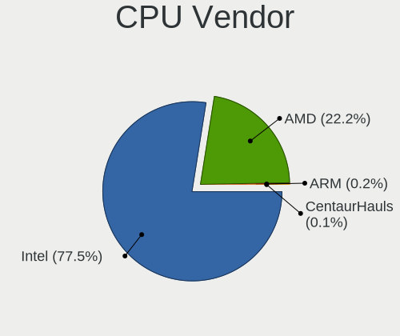

| Vendor       | Computers | Percent |
|--------------|-----------|---------|
| Intel        | 3249      | 78.21%  |
| AMD          | 891       | 21.45%  |
| ARM          | 10        | 0.24%   |
| CentaurHauls | 4         | 0.1%    |

CPU Model
---------

Processor models

| Model                                       | Computers | Percent |
|---------------------------------------------|-----------|---------|
| Intel Core i5-2520M CPU @ 2.50GHz           | 50        | 1.2%    |
| Intel Core 2 Duo CPU E8400 @ 3.00GHz        | 42        | 1.01%   |
| Intel Celeron CPU 1000M @ 1.80GHz           | 42        | 1.01%   |
| Intel Core i5-7200U CPU @ 2.50GHz           | 40        | 0.96%   |
| Intel Core i5-8250U CPU @ 1.60GHz           | 39        | 0.93%   |
| AMD A8-6600K APU with Radeon HD Graphics    | 36        | 0.86%   |
| Intel Core i5-3470 CPU @ 3.20GHz            | 30        | 0.72%   |
| Intel Core i5 CPU M 520 @ 2.40GHz           | 28        | 0.67%   |
| Intel Core i3-5005U CPU @ 2.00GHz           | 28        | 0.67%   |
| Intel Core i3-6006U CPU @ 2.00GHz           | 27        | 0.65%   |
| Intel Core i5-2400 CPU @ 3.10GHz            | 25        | 0.6%    |
| Intel Celeron CPU N3350 @ 1.10GHz           | 25        | 0.6%    |
| Intel Core i3-2120 CPU @ 3.30GHz            | 24        | 0.57%   |
| Intel Core i5-5300U CPU @ 2.30GHz           | 23        | 0.55%   |
| Intel Core 2 Duo CPU P8600 @ 2.40GHz        | 23        | 0.55%   |
| Intel Core i5-6200U CPU @ 2.30GHz           | 22        | 0.53%   |
| Intel Core i3-4160 CPU @ 3.60GHz            | 22        | 0.53%   |
| Intel Core 2 Duo CPU E7500 @ 2.93GHz        | 22        | 0.53%   |
| Intel Core i7-8750H CPU @ 2.20GHz           | 21        | 0.5%    |
| Intel Core i5-6500 CPU @ 3.20GHz            | 21        | 0.5%    |
| Intel Core i3-7020U CPU @ 2.30GHz           | 21        | 0.5%    |
| Intel Core i5-3320M CPU @ 2.60GHz           | 20        | 0.48%   |
| Intel Core i5-8265U CPU @ 1.60GHz           | 19        | 0.45%   |
| Intel Core 2 Duo CPU P8400 @ 2.26GHz        | 19        | 0.45%   |
| Intel Atom x5-Z8350 CPU @ 1.44GHz           | 19        | 0.45%   |
| Intel 11th Gen Core i5-1135G7 @ 2.40GHz     | 19        | 0.45%   |
| Intel Core 2 Duo CPU T7500 @ 2.20GHz        | 18        | 0.43%   |
| Intel Celeron CPU N3060 @ 1.60GHz           | 18        | 0.43%   |
| Intel Pentium Dual-Core CPU T4400 @ 2.20GHz | 17        | 0.41%   |
| Intel Core i7-6600U CPU @ 2.60GHz           | 17        | 0.41%   |
| Intel Core i5-5200U CPU @ 2.20GHz           | 17        | 0.41%   |
| Intel Core i5-4210U CPU @ 1.70GHz           | 17        | 0.41%   |
| Intel Core i3-2350M CPU @ 2.30GHz           | 17        | 0.41%   |
| AMD FX-6300 Six-Core Processor              | 17        | 0.41%   |
| Intel Core i5-4590 CPU @ 3.30GHz            | 16        | 0.38%   |
| Intel Core i5-4200U CPU @ 1.60GHz           | 16        | 0.38%   |
| Intel Core i3-3220 CPU @ 3.30GHz            | 16        | 0.38%   |
| Intel Core 2 Quad CPU Q6600 @ 2.40GHz       | 16        | 0.38%   |
| Intel Core 2 Duo CPU E7300 @ 2.66GHz        | 16        | 0.38%   |
| Intel Celeron CPU N2840 @ 2.16GHz           | 16        | 0.38%   |

CPU Model Family
----------------

Processor model prefix

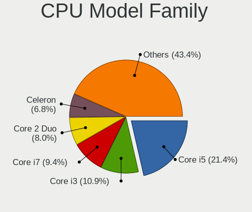

| Model                   | Computers | Percent |
|-------------------------|-----------|---------|
| Intel Core i5           | 879       | 21.08%  |
| Intel Core i3           | 472       | 11.32%  |
| Intel Core i7           | 396       | 9.5%    |
| Intel Core 2 Duo        | 354       | 8.49%   |
| Intel Celeron           | 292       | 7%      |
| Intel Pentium           | 167       | 4%      |
| AMD Ryzen 5             | 131       | 3.14%   |
| Other                   | 127       | 3.05%   |
| Intel Pentium Dual-Core | 105       | 2.52%   |
| Intel Atom              | 101       | 2.42%   |
| Intel Xeon              | 88        | 2.11%   |
| AMD Ryzen 7             | 82        | 1.97%   |
| AMD A8                  | 81        | 1.94%   |
| Intel Core 2 Quad       | 61        | 1.46%   |
| AMD FX                  | 58        | 1.39%   |
| AMD A4                  | 54        | 1.29%   |
| Intel Pentium Dual      | 50        | 1.2%    |
| Intel Core 2            | 49        | 1.18%   |
| AMD Ryzen 3             | 45        | 1.08%   |
| AMD Athlon II X2        | 42        | 1.01%   |
| AMD Athlon 64 X2        | 33        | 0.79%   |
| AMD A6                  | 33        | 0.79%   |
| AMD A10                 | 32        | 0.77%   |
| Intel Genuine           | 24        | 0.58%   |
| AMD Phenom II X4        | 24        | 0.58%   |
| AMD E                   | 23        | 0.55%   |
| Intel Pentium 4         | 22        | 0.53%   |
| AMD E1                  | 20        | 0.48%   |
| AMD Ryzen 9             | 19        | 0.46%   |
| Intel Pentium Silver    | 17        | 0.41%   |
| AMD E2                  | 17        | 0.41%   |
| Intel Celeron Dual-Core | 14        | 0.34%   |
| Intel Celeron M         | 13        | 0.31%   |
| Intel Pentium D         | 12        | 0.29%   |
| AMD Athlon              | 12        | 0.29%   |
| AMD Sempron             | 11        | 0.26%   |
| AMD Athlon II X4        | 11        | 0.26%   |
| AMD Athlon Dual Core    | 11        | 0.26%   |
| AMD Athlon X4           | 10        | 0.24%   |
| Intel Pentium M         | 9         | 0.22%   |

CPU Cores
---------

Number of processor cores

| Number  | Computers | Percent |
|---------|-----------|---------|
| 2       | 2365      | 56.59%  |
| 4       | 1103      | 26.39%  |
| 6       | 243       | 5.81%   |
| 1       | 243       | 5.81%   |
| 8       | 128       | 3.06%   |
| 3       | 30        | 0.72%   |
| 12      | 22        | 0.53%   |
| 10      | 16        | 0.38%   |
| 16      | 10        | 0.24%   |
| 14      | 8         | 0.19%   |
| 18      | 3         | 0.07%   |
| Unknown | 2         | 0.05%   |
| 40      | 1         | 0.02%   |
| 36      | 1         | 0.02%   |
| 28      | 1         | 0.02%   |
| 24      | 1         | 0.02%   |
| 20      | 1         | 0.02%   |
| 9       | 1         | 0.02%   |

CPU Sockets
-----------

Number of sockets

| Number  | Computers | Percent |
|---------|-----------|---------|
| 1       | 4133      | 99.45%  |
| 2       | 22        | 0.53%   |
| Unknown | 1         | 0.02%   |

CPU Threads
-----------

Threads per core (Hyper-Threading)

| Number  | Computers | Percent |
|---------|-----------|---------|
| 2       | 2143      | 51.27%  |
| 1       | 2035      | 48.68%  |
| Unknown | 2         | 0.05%   |

CPU Op-Modes
------------

CPU Operation Modes (32-bit, 64-bit)

| Op mode        | Computers | Percent |
|----------------|-----------|---------|
| 32-bit, 64-bit | 4055      | 97.31%  |
| 32-bit         | 63        | 1.51%   |
| Unknown        | 49        | 1.18%   |

CPU Microcode
-------------

Microcode number

| Number     | Computers | Percent |
|------------|-----------|---------|
| Unknown    | 715       | 16.49%  |
| 0x1067a    | 342       | 7.89%   |
| 0x206a7    | 317       | 7.31%   |
| 0x306a9    | 279       | 6.43%   |
| 0x306c3    | 201       | 4.64%   |
| 0x20655    | 125       | 2.88%   |
| 0x6fd      | 107       | 2.47%   |
| 0x40651    | 94        | 2.17%   |
| 0x06001119 | 91        | 2.1%    |
| 0x406e3    | 83        | 1.91%   |
| 0x10676    | 83        | 1.91%   |
| 0x306d4    | 80        | 1.85%   |
| 0x906ea    | 72        | 1.66%   |
| 0x506e3    | 72        | 1.66%   |
| 0x806e9    | 71        | 1.64%   |
| 0x010000c8 | 64        | 1.48%   |
| 0x906e9    | 60        | 1.38%   |
| 0x806ea    | 59        | 1.36%   |
| 0x6fb      | 55        | 1.27%   |
| 0x406c4    | 54        | 1.25%   |
| 0x20652    | 45        | 1.04%   |
| 0x806ec    | 44        | 1.01%   |
| 0x30678    | 41        | 0.95%   |
| 0x106ca    | 39        | 0.9%    |
| 0x806c1    | 37        | 0.85%   |
| 0x706a1    | 36        | 0.83%   |
| 0x05000119 | 35        | 0.81%   |
| 0x0800820d | 34        | 0.78%   |
| 0x506c9    | 31        | 0.71%   |
| 0x6f2      | 28        | 0.65%   |
| 0x07030105 | 27        | 0.62%   |
| 0x06003106 | 27        | 0.62%   |
| 0x06000852 | 27        | 0.62%   |
| 0x406c3    | 25        | 0.58%   |
| 0x0a50000c | 25        | 0.58%   |
| 0x0700010f | 25        | 0.58%   |
| 0x6f6      | 24        | 0.55%   |
| 0x106c2    | 24        | 0.55%   |
| 0x806eb    | 23        | 0.53%   |
| 0x706e5    | 22        | 0.51%   |

CPU Microarch
-------------

Microarchitecture

| Name             | Computers | Percent |
|------------------|-----------|---------|
| Penryn           | 458       | 11.01%  |
| KabyLake         | 448       | 10.77%  |
| SandyBridge      | 355       | 8.53%   |
| Haswell          | 355       | 8.53%   |
| IvyBridge        | 310       | 7.45%   |
| Core             | 250       | 6.01%   |
| Westmere         | 201       | 4.83%   |
| Skylake          | 200       | 4.81%   |
| Piledriver       | 143       | 3.44%   |
| Silvermont       | 137       | 3.29%   |
| K10              | 127       | 3.05%   |
| Broadwell        | 95        | 2.28%   |
| Zen 2            | 84        | 2.02%   |
| Bonnell          | 71        | 1.71%   |
| K8 Hammer        | 70        | 1.68%   |
| Unknown          | 70        | 1.68%   |
| Zen+             | 68        | 1.63%   |
| Zen 3            | 64        | 1.54%   |
| Bobcat           | 55        | 1.32%   |
| Zen              | 52        | 1.25%   |
| Goldmont plus    | 50        | 1.2%    |
| TigerLake        | 48        | 1.15%   |
| NetBurst         | 48        | 1.15%   |
| Puma             | 44        | 1.06%   |
| Excavator        | 44        | 1.06%   |
| IceLake          | 42        | 1.01%   |
| Steamroller      | 39        | 0.94%   |
| Goldmont         | 39        | 0.94%   |
| P6               | 33        | 0.79%   |
| Nehalem          | 32        | 0.77%   |
| Jaguar           | 30        | 0.72%   |
| CometLake        | 30        | 0.72%   |
| Alderlake Hybrid | 27        | 0.65%   |
| K10 Llano        | 19        | 0.46%   |
| Bulldozer        | 9         | 0.22%   |
| K8 & K10 hybrid  | 7         | 0.17%   |
| Tremont          | 4         | 0.1%    |
| K6               | 1         | 0.02%   |
| Gracemont        | 1         | 0.02%   |

Graphics
--------

GPU Vendor
----------

Vendors of graphics cards

| Vendor                                       | Computers | Percent |
|----------------------------------------------|-----------|---------|
| Intel                                        | 2459      | 51.17%  |
| Nvidia                                       | 1181      | 24.57%  |
| AMD                                          | 1132      | 23.55%  |
| VIA Technologies                             | 13        | 0.27%   |
| Silicon Integrated Systems [SiS]             | 8         | 0.17%   |
| ASPEED Technology                            | 5         | 0.1%    |
| Matrox Electronics Systems                   | 4         | 0.08%   |
| XGI Technology (eXtreme Graphics Innovation) | 2         | 0.04%   |
| ATI Technologies                             | 2         | 0.04%   |

GPU Model
---------

Graphics card models

| Model                                                                                    | Computers | Percent |
|------------------------------------------------------------------------------------------|-----------|---------|
| Intel 2nd Generation Core Processor Family Integrated Graphics Controller                | 263       | 5.18%   |
| Intel 3rd Gen Core processor Graphics Controller                                         | 188       | 3.71%   |
| Intel Mobile 4 Series Chipset Integrated Graphics Controller                             | 160       | 3.15%   |
| Intel Core Processor Integrated Graphics Controller                                      | 117       | 2.31%   |
| Intel Haswell-ULT Integrated Graphics Controller                                         | 107       | 2.11%   |
| Intel Skylake GT2 [HD Graphics 520]                                                      | 92        | 1.81%   |
| Intel HD Graphics 620                                                                    | 92        | 1.81%   |
| Intel Xeon E3-1200 v3/4th Gen Core Processor Integrated Graphics Controller              | 89        | 1.75%   |
| Intel HD Graphics 5500                                                                   | 84        | 1.66%   |
| Intel Atom/Celeron/Pentium Processor x5-E8000/J3xxx/N3xxx Integrated Graphics Controller | 84        | 1.66%   |
| Intel 4 Series Chipset Integrated Graphics Controller                                    | 77        | 1.52%   |
| Intel UHD Graphics 620                                                                   | 69        | 1.36%   |
| Intel HD Graphics 530                                                                    | 69        | 1.36%   |
| Nvidia GK208B [GeForce GT 710]                                                           | 66        | 1.3%    |
| Intel Mobile GM965/GL960 Integrated Graphics Controller (secondary)                      | 60        | 1.18%   |
| Intel Mobile GM965/GL960 Integrated Graphics Controller (primary)                        | 60        | 1.18%   |
| Intel Mobile 945GM/GMS/GME, 943/940GML Express Integrated Graphics Controller            | 60        | 1.18%   |
| AMD Ellesmere [Radeon RX 470/480/570/570X/580/580X/590]                                  | 60        | 1.18%   |
| Intel Xeon E3-1200 v2/3rd Gen Core processor Graphics Controller                         | 56        | 1.1%    |
| Intel 4th Gen Core Processor Integrated Graphics Controller                              | 55        | 1.08%   |
| Intel Atom Processor Z36xxx/Z37xxx Series Graphics & Display                             | 53        | 1.04%   |
| Intel CoffeeLake-H GT2 [UHD Graphics 630]                                                | 48        | 0.95%   |
| Intel WhiskeyLake-U GT2 [UHD Graphics 620]                                               | 45        | 0.89%   |
| Nvidia GT218 [GeForce 210]                                                               | 42        | 0.83%   |
| Intel HD Graphics 630                                                                    | 41        | 0.81%   |
| Intel Mobile 945GM/GMS, 943/940GML Express Integrated Graphics Controller                | 40        | 0.79%   |
| Intel Atom Processor D4xx/D5xx/N4xx/N5xx Integrated Graphics Controller                  | 39        | 0.77%   |
| AMD Topaz XT [Radeon R7 M260/M265 / M340/M360 / M440/M445 / 530/535 / 620/625 Mobile]    | 39        | 0.77%   |
| AMD Renoir [Radeon RX Vega 6 (Ryzen 4000/5000 Mobile Series)]                            | 39        | 0.77%   |
| AMD Richland [Radeon HD 8570D]                                                           | 37        | 0.73%   |
| AMD Caicos [Radeon HD 6450/7450/8450 / R5 230 OEM]                                       | 37        | 0.73%   |
| Intel GeminiLake [UHD Graphics 600]                                                      | 36        | 0.71%   |
| Intel 4th Generation Core Processor Family Integrated Graphics Controller                | 36        | 0.71%   |
| Nvidia GP107 [GeForce GTX 1050 Ti]                                                       | 35        | 0.69%   |
| Intel TigerLake-LP GT2 [Iris Xe Graphics]                                                | 35        | 0.69%   |
| Intel 82G33/G31 Express Integrated Graphics Controller                                   | 35        | 0.69%   |
| Nvidia GF117M [GeForce 610M/710M/810M/820M / GT 620M/625M/630M/720M]                     | 33        | 0.65%   |
| AMD Sun XT [Radeon HD 8670A/8670M/8690M / R5 M330 / M430 / Radeon 520 Mobile]            | 33        | 0.65%   |
| Intel CometLake-U GT2 [UHD Graphics]                                                     | 32        | 0.63%   |
| AMD Cezanne [Radeon Vega Series / Radeon Vega Mobile Series]                             | 32        | 0.63%   |

GPU Combo
---------

Combinations of graphics cards

| Name                     | Computers | Percent |
|--------------------------|-----------|---------|
| 1 x Intel                | 1881      | 44.66%  |
| 1 x AMD                  | 864       | 20.51%  |
| 1 x Nvidia               | 715       | 16.98%  |
| Intel + Nvidia           | 421       | 10%     |
| Intel + AMD              | 118       | 2.8%    |
| 2 x AMD                  | 112       | 2.66%   |
| AMD + Nvidia             | 39        | 0.93%   |
| 1 x VIA                  | 13        | 0.31%   |
| Other                    | 11        | 0.26%   |
| 2 x Intel                | 10        | 0.24%   |
| 1 x SiS                  | 8         | 0.19%   |
| 2 x Nvidia               | 6         | 0.14%   |
| 1 x Matrox               | 4         | 0.09%   |
| 1 x ASPEED               | 4         | 0.09%   |
| AMD + XGI                | 2         | 0.05%   |
| 1 x Intel + 3 x AMD      | 1         | 0.02%   |
| Intel + 2 x Nvidia       | 1         | 0.02%   |
| Intel + AMD + 1 x Nvidia | 1         | 0.02%   |
| AMD + ASPEED             | 1         | 0.02%   |

GPU Driver
----------

Free vs proprietary

| Driver      | Computers | Percent |
|-------------|-----------|---------|
| Free        | 3766      | 89.5%   |
| Proprietary | 305       | 7.25%   |
| Unknown     | 137       | 3.26%   |

GPU Memory
----------

Total video memory

| Size in GB | Computers | Percent |
|------------|-----------|---------|
| Unknown    | 2179      | 50.3%   |
| 0.01-0.5   | 741       | 17.11%  |
| 1.01-2.0   | 552       | 12.74%  |
| 0.51-1.0   | 472       | 10.9%   |
| 3.01-4.0   | 213       | 4.92%   |
| 7.01-8.0   | 83        | 1.92%   |
| 5.01-6.0   | 53        | 1.22%   |
| 2.01-3.0   | 23        | 0.53%   |
| 8.01-16.0  | 13        | 0.3%    |
| 16.01-24.0 | 3         | 0.07%   |

Monitor
-------

Monitor Vendor
--------------

Monitor vendors

| Vendor                  | Computers | Percent |
|-------------------------|-----------|---------|
| Samsung Electronics     | 750       | 17.26%  |
| LG Display              | 498       | 11.46%  |
| AU Optronics            | 478       | 11%     |
| Goldstar                | 361       | 8.31%   |
| Chimei Innolux          | 319       | 7.34%   |
| BOE                     | 269       | 6.19%   |
| Dell                    | 168       | 3.87%   |
| Chi Mei Optoelectronics | 118       | 2.72%   |
| Lenovo                  | 112       | 2.58%   |
| Philips                 | 110       | 2.53%   |
| BenQ                    | 109       | 2.51%   |
| Ancor Communications    | 106       | 2.44%   |
| Hewlett-Packard         | 101       | 2.32%   |
| Acer                    | 99        | 2.28%   |
| Fujitsu Siemens         | 54        | 1.24%   |
| AOC                     | 54        | 1.24%   |
| LG Philips              | 38        | 0.87%   |
| HannStar                | 34        | 0.78%   |
| InfoVision              | 29        | 0.67%   |
| Sony                    | 27        | 0.62%   |
| LG Electronics          | 27        | 0.62%   |
| ASUSTek Computer        | 27        | 0.62%   |
| Eizo                    | 25        | 0.58%   |
| Apple                   | 25        | 0.58%   |
| Vestel Elektronik       | 23        | 0.53%   |
| PANDA                   | 21        | 0.48%   |
| NEC Computers           | 20        | 0.46%   |
| HKC                     | 18        | 0.41%   |
| ViewSonic               | 16        | 0.37%   |
| Toshiba                 | 15        | 0.35%   |
| CPT                     | 15        | 0.35%   |
| Unknown                 | 14        | 0.32%   |
| Medion                  | 14        | 0.32%   |
| IBM                     | 14        | 0.32%   |
| Sharp                   | 13        | 0.3%    |
| Panasonic               | 12        | 0.28%   |
| Belinea                 | 12        | 0.28%   |
| OEM                     | 10        | 0.23%   |
| InnoLux Display         | 10        | 0.23%   |
| Iiyama                  | 10        | 0.23%   |

Monitor Model
-------------

Monitor models

| Model                                                                    | Computers | Percent |
|--------------------------------------------------------------------------|-----------|---------|
| LG Display LCD Monitor LGD0395 1366x768 344x194mm 15.5-inch              | 50        | 1.12%   |
| AU Optronics LCD Monitor AUO38ED 1920x1080 344x193mm 15.5-inch           | 41        | 0.92%   |
| Samsung Electronics LCD Monitor SEC5441 1366x768 344x194mm 15.5-inch     | 38        | 0.85%   |
| BenQ EW277HDR BNQ7948 1920x1080 598x336mm 27.0-inch                      | 32        | 0.72%   |
| Chimei Innolux LCD Monitor CMN15DB 1366x768 344x193mm 15.5-inch          | 26        | 0.58%   |
| AU Optronics LCD Monitor AUO22EC 1366x768 344x193mm 15.5-inch            | 25        | 0.56%   |
| Vestel Elektronik 32FHD_LCD_TV VES3700 1920x1080 700x400mm 31.7-inch     | 23        | 0.52%   |
| LG Display LCD Monitor LGD02DC 1366x768 344x194mm 15.5-inch              | 23        | 0.52%   |
| BOE LCD Monitor BOE06A5 1366x768 344x194mm 15.5-inch                     | 23        | 0.52%   |
| Chi Mei Optoelectronics LCD Monitor CMO15A7 1366x768 344x193mm 15.5-inch | 20        | 0.45%   |
| Chimei Innolux LCD Monitor CMN14D4 1920x1080 309x173mm 13.9-inch         | 19        | 0.43%   |
| Goldstar 2D HD TV GSM59CA 1366x768 509x286mm 23.0-inch                   | 17        | 0.38%   |
| Philips PHL 223V5 PHLC0CF 1920x1080 477x268mm 21.5-inch                  | 16        | 0.36%   |
| Lenovo LCD Monitor LEN4036 1440x900 303x190mm 14.1-inch                  | 16        | 0.36%   |
| Chimei Innolux LCD Monitor CMN15D5 1920x1080 344x193mm 15.5-inch         | 16        | 0.36%   |
| AU Optronics LCD Monitor AUO26EC 1366x768 344x193mm 15.5-inch            | 16        | 0.36%   |
| AU Optronics LCD Monitor AUO21ED 1920x1080 344x193mm 15.5-inch           | 15        | 0.34%   |
| LG Display LP156WH2-TLAA LGD0230 1366x768 344x194mm 15.5-inch            | 14        | 0.31%   |
| LG Display LCD Monitor LGD033A 1366x768 344x194mm 15.5-inch              | 14        | 0.31%   |
| Goldstar MP59G GSM5B34 1920x1080 480x270mm 21.7-inch                     | 14        | 0.31%   |
| Samsung Electronics SyncMaster SAM011E 1280x1024 338x270mm 17.0-inch     | 13        | 0.29%   |
| Samsung Electronics S24D330 SAM0D92 1920x1080 531x299mm 24.0-inch        | 13        | 0.29%   |
| Philips PHL 243V7 PHLC155 1920x1080 527x296mm 23.8-inch                  | 13        | 0.29%   |
| Goldstar ULTRAWIDE GSM59F1 2560x1080 673x284mm 28.8-inch                 | 13        | 0.29%   |
| Chimei Innolux LCD Monitor CMN15E7 1920x1080 344x193mm 15.5-inch         | 13        | 0.29%   |
| Chi Mei Optoelectronics LCD Monitor CMO1592 1366x768 344x193mm 15.5-inch | 13        | 0.29%   |
| BOE LCD Monitor BOE0672 1366x768 344x194mm 15.5-inch                     | 13        | 0.29%   |
| Samsung Electronics S19B150 SAM08A2 1366x768 410x230mm 18.5-inch         | 12        | 0.27%   |
| HKC '' HKC1850 1360x768 304x228mm 15.0-inch                              | 12        | 0.27%   |
| BOE LCD Monitor BOE069C 1920x1080 344x193mm 15.5-inch                    | 12        | 0.27%   |
| AU Optronics LCD Monitor AUO20EC 1366x768 344x193mm 15.5-inch            | 12        | 0.27%   |
| AU Optronics LCD Monitor AUO106C 1366x768 276x155mm 12.5-inch            | 12        | 0.27%   |
| Samsung Electronics LCD Monitor SEC325A 1366x768 344x194mm 15.5-inch     | 11        | 0.25%   |
| HannStar Hanns.G HQ191 HSD0013 1280x1024 376x301mm 19.0-inch             | 11        | 0.25%   |
| Goldstar W1934 GSM4B7A 1440x900 410x256mm 19.0-inch                      | 11        | 0.25%   |
| Goldstar ULTRAWIDE GSM76F9 2560x1080 531x298mm 24.0-inch                 | 11        | 0.25%   |
| Chimei Innolux LCD Monitor CMN15CA 1366x768 344x193mm 15.5-inch          | 11        | 0.25%   |
| BOE LCD Monitor BOE0687 1920x1080 344x193mm 15.5-inch                    | 11        | 0.25%   |
| BOE LCD Monitor BOE0675 1366x768 344x194mm 15.5-inch                     | 11        | 0.25%   |
| Ancor Communications VW195 ACI19AB 1440x900 408x255mm 18.9-inch          | 11        | 0.25%   |

Monitor Resolution
------------------

Monitor screen resolution

| Resolution         | Computers | Percent |
|--------------------|-----------|---------|
| 1920x1080 (FHD)    | 1523      | 36.23%  |
| 1366x768 (WXGA)    | 1022      | 24.31%  |
| 1280x1024 (SXGA)   | 307       | 7.3%    |
| 1280x800 (WXGA)    | 185       | 4.4%    |
| 1600x900 (HD+)     | 182       | 4.33%   |
| 1440x900 (WXGA+)   | 180       | 4.28%   |
| 1680x1050 (WSXGA+) | 166       | 3.95%   |
| 3840x2160 (4K)     | 146       | 3.47%   |
| 2560x1440 (QHD)    | 69        | 1.64%   |
| 1920x1200 (WUXGA)  | 68        | 1.62%   |
| 2560x1080          | 43        | 1.02%   |
| 1360x768           | 43        | 1.02%   |
| 1024x768 (XGA)     | 43        | 1.02%   |
| 1024x600           | 43        | 1.02%   |
| Unknown            | 22        | 0.52%   |
| 1920x540           | 20        | 0.48%   |
| 2880x1800          | 16        | 0.38%   |
| 2560x1600          | 15        | 0.36%   |
| 3840x1080          | 11        | 0.26%   |
| 1600x1200          | 10        | 0.24%   |
| 800x1280           | 8         | 0.19%   |
| 3440x1440          | 8         | 0.19%   |
| 1280x720 (HD)      | 7         | 0.17%   |
| 2288x1287          | 6         | 0.14%   |
| 1920x1280          | 5         | 0.12%   |
| 1400x1050          | 5         | 0.12%   |
| 3840x2400          | 4         | 0.1%    |
| 2736x1824          | 4         | 0.1%    |
| 2160x1440          | 4         | 0.1%    |
| 3200x2000          | 3         | 0.07%   |
| 2880x1620          | 3         | 0.07%   |
| 1680x945           | 3         | 0.07%   |
| 1280x768           | 3         | 0.07%   |
| 5760x2160          | 2         | 0.05%   |
| 3840x1200          | 2         | 0.05%   |
| 3280x1080          | 2         | 0.05%   |
| 2048x1536          | 2         | 0.05%   |
| 2048x1152          | 2         | 0.05%   |
| 1280x960           | 2         | 0.05%   |
| 1152x864           | 2         | 0.05%   |

Monitor Diagonal
----------------

Diagonal size in inches

| Inches  | Computers | Percent |
|---------|-----------|---------|
| 15      | 1368      | 31.4%   |
| 21      | 320       | 7.35%   |
| 14      | 316       | 7.25%   |
| 17      | 300       | 6.89%   |
| 19      | 258       | 5.92%   |
| 23      | 237       | 5.44%   |
| 24      | 217       | 4.98%   |
| 13      | 215       | 4.94%   |
| 27      | 172       | 3.95%   |
| Unknown | 126       | 2.89%   |
| 18      | 121       | 2.78%   |
| 22      | 119       | 2.73%   |
| 12      | 107       | 2.46%   |
| 20      | 53        | 1.22%   |
| 10      | 53        | 1.22%   |
| 34      | 49        | 1.12%   |
| 31      | 47        | 1.08%   |
| 11      | 44        | 1.01%   |
| 84      | 42        | 0.96%   |
| 72      | 21        | 0.48%   |
| 40      | 21        | 0.48%   |
| 16      | 18        | 0.41%   |
| 54      | 17        | 0.39%   |
| 32      | 14        | 0.32%   |
| 65      | 11        | 0.25%   |
| 42      | 9         | 0.21%   |
| 25      | 8         | 0.18%   |
| 7       | 8         | 0.18%   |
| 52      | 7         | 0.16%   |
| 60      | 5         | 0.11%   |
| 48      | 5         | 0.11%   |
| 46      | 5         | 0.11%   |
| 58      | 4         | 0.09%   |
| 49      | 4         | 0.09%   |
| 26      | 4         | 0.09%   |
| 8       | 4         | 0.09%   |
| 142     | 3         | 0.07%   |
| 64      | 3         | 0.07%   |
| 39      | 3         | 0.07%   |
| 85      | 2         | 0.05%   |

Monitor Width
-------------

Physical width

| Width in mm    | Computers | Percent |
|----------------|-----------|---------|
| 301-350        | 1907      | 44.32%  |
| 401-500        | 692       | 16.08%  |
| 501-600        | 607       | 14.11%  |
| 351-400        | 363       | 8.44%   |
| 201-300        | 300       | 6.97%   |
| Unknown        | 126       | 2.93%   |
| 1001-1500      | 66        | 1.53%   |
| 701-800        | 65        | 1.51%   |
| 1501-2000      | 65        | 1.51%   |
| 601-700        | 57        | 1.32%   |
| 801-900        | 25        | 0.58%   |
| 901-1000       | 13        | 0.3%    |
| 1-100          | 8         | 0.19%   |
| 101-200        | 6         | 0.14%   |
| More than 2000 | 3         | 0.07%   |

Aspect Ratio
------------

Proportional relationship between the width and the height

| Ratio   | Computers | Percent |
|---------|-----------|---------|
| 16/9    | 2852      | 70.75%  |
| 16/10   | 604       | 14.98%  |
| 5/4     | 297       | 7.37%   |
| Unknown | 93        | 2.31%   |
| 4/3     | 83        | 2.06%   |
| 21/9    | 50        | 1.24%   |
| 3/2     | 32        | 0.79%   |
| 0.67    | 7         | 0.17%   |
| 6/5     | 5         | 0.12%   |
| 32/9    | 4         | 0.1%    |
| 1.00    | 3         | 0.07%   |
| 0.63    | 1         | 0.02%   |

Monitor Area
------------

Area in inch

| Area in inch | Computers | Percent |
|----------------|-----------|---------|
| 101-110        | 1353      | 31.28%  |
| 201-250        | 735       | 16.99%  |
| 81-90          | 445       | 10.29%  |
| 151-200        | 397       | 9.18%   |
| 141-150        | 248       | 5.73%   |
| 301-350        | 175       | 4.05%   |
| Unknown        | 126       | 2.91%   |
| More than 1000 | 123       | 2.84%   |
| 121-130        | 116       | 2.68%   |
| 351-500        | 111       | 2.57%   |
| 61-70          | 93        | 2.15%   |
| 71-80          | 90        | 2.08%   |
| 251-300        | 81        | 1.87%   |
| 41-50          | 50        | 1.16%   |
| 501-1000       | 48        | 1.11%   |
| 51-60          | 47        | 1.09%   |
| 131-140        | 35        | 0.81%   |
| 111-120        | 25        | 0.58%   |
| 1-40           | 14        | 0.32%   |
| 91-100         | 14        | 0.32%   |

Pixel Density
-------------

Pixels per inch

| Density       | Computers | Percent |
|---------------|-----------|---------|
| 51-100        | 1630      | 38.81%  |
| 101-120       | 1295      | 30.83%  |
| 121-160       | 903       | 21.5%   |
| 161-240       | 127       | 3.02%   |
| Unknown       | 126       | 3%      |
| 1-50          | 86        | 2.05%   |
| More than 240 | 33        | 0.79%   |

Multiple Monitors
-----------------

Total monitors connected

| Total | Computers | Percent |
|-------|-----------|---------|
| 1     | 3668      | 85.7%   |
| 2     | 443       | 10.35%  |
| 0     | 127       | 2.97%   |
| 3     | 37        | 0.86%   |
| 4     | 5         | 0.12%   |

Network
-------

Net Controller Vendor
---------------------

Controller vendors

| Vendor                            | Computers | Percent |
|-----------------------------------|-----------|---------|
| Realtek Semiconductor             | 2180      | 35.36%  |
| Intel                             | 1658      | 26.89%  |
| Qualcomm Atheros                  | 885       | 14.36%  |
| Broadcom                          | 387       | 6.28%   |
| Broadcom Limited                  | 152       | 2.47%   |
| Ralink                            | 124       | 2.01%   |
| Marvell Technology Group          | 84        | 1.36%   |
| Qualcomm Atheros Communications   | 73        | 1.18%   |
| Ralink Technology                 | 70        | 1.14%   |
| TP-Link                           | 66        | 1.07%   |
| MediaTek                          | 61        | 0.99%   |
| Nvidia                            | 53        | 0.86%   |
| Dell                              | 31        | 0.5%    |
| Samsung Electronics               | 28        | 0.45%   |
| Huawei Technologies               | 23        | 0.37%   |
| Hewlett-Packard                   | 22        | 0.36%   |
| Ericsson Business Mobile Networks | 20        | 0.32%   |
| Xiaomi                            | 19        | 0.31%   |
| Sierra Wireless                   | 19        | 0.31%   |
| VIA Technologies                  | 17        | 0.28%   |
| DisplayLink                       | 15        | 0.24%   |
| ASUSTek Computer                  | 15        | 0.24%   |
| JMicron Technology                | 14        | 0.23%   |
| Silicon Integrated Systems [SiS]  | 13        | 0.21%   |
| Attansic Technology               | 13        | 0.21%   |
| ASIX Electronics                  | 11        | 0.18%   |
| Aquantia                          | 10        | 0.16%   |
| Microsoft                         | 7         | 0.11%   |
| Belkin Components                 | 7         | 0.11%   |
| Qualcomm                          | 6         | 0.1%    |
| Lenovo                            | 6         | 0.1%    |
| Edimax Technology                 | 6         | 0.1%    |
| D-Link System                     | 6         | 0.1%    |
| D-Link                            | 6         | 0.1%    |
| IMC Networks                      | 5         | 0.08%   |
| NetGear                           | 4         | 0.06%   |
| Accton Technology                 | 4         | 0.06%   |
| Microchip Technology              | 3         | 0.05%   |
| ZyDAS                             | 2         | 0.03%   |
| ZTE WCDMA Technologies MSM        | 2         | 0.03%   |

Net Controller Model
--------------------

Controller models

| Model                                                                   | Computers | Percent |
|-------------------------------------------------------------------------|-----------|---------|
| Realtek RTL8111/8168/8211/8411 PCI Express Gigabit Ethernet Controller  | 1523      | 21.31%  |
| Realtek RTL810xE PCI Express Fast Ethernet controller                   | 372       | 5.2%    |
| Intel 82579LM Gigabit Network Connection (Lewisville)                   | 218       | 3.05%   |
| Qualcomm Atheros AR9285 Wireless Network Adapter (PCI-Express)          | 137       | 1.92%   |
| Qualcomm Atheros QCA9565 / AR9565 Wireless Network Adapter              | 123       | 1.72%   |
| Qualcomm Atheros QCA9377 802.11ac Wireless Network Adapter              | 120       | 1.68%   |
| Intel Wireless 8265 / 8275                                              | 101       | 1.41%   |
| Qualcomm Atheros AR9485 Wireless Network Adapter                        | 95        | 1.33%   |
| Intel Wireless 7260                                                     | 83        | 1.16%   |
| Intel Centrino Advanced-N 6205 [Taylor Peak]                            | 82        | 1.15%   |
| Realtek RTL8723BE PCIe Wireless Network Adapter                         | 77        | 1.08%   |
| Intel Wireless 7265                                                     | 72        | 1.01%   |
| Ralink RT3290 Wireless 802.11n 1T/1R PCIe                               | 70        | 0.98%   |
| Qualcomm Atheros AR242x / AR542x Wireless Network Adapter (PCI-Express) | 68        | 0.95%   |
| Intel 82577LM Gigabit Network Connection                                | 67        | 0.94%   |
| Broadcom BCM4313 802.11bgn Wireless Network Adapter                     | 64        | 0.9%    |
| Qualcomm Atheros AR9271 802.11n                                         | 63        | 0.88%   |
| Intel Ethernet Connection I217-LM                                       | 61        | 0.85%   |
| Intel Wireless 3165                                                     | 56        | 0.78%   |
| Intel PRO/Wireless 3945ABG [Golan] Network Connection                   | 56        | 0.78%   |
| Intel 82567LM Gigabit Network Connection                                | 56        | 0.78%   |
| Intel Centrino Advanced-N 6200                                          | 54        | 0.76%   |
| Intel 82567LM-3 Gigabit Network Connection                              | 54        | 0.76%   |
| Qualcomm Atheros QCA8171 Gigabit Ethernet                               | 53        | 0.74%   |
| Intel Wi-Fi 6 AX200                                                     | 52        | 0.73%   |
| Intel Ethernet Connection (2) I219-V                                    | 52        | 0.73%   |
| Realtek RTL-8100/8101L/8139 PCI Fast Ethernet Adapter                   | 49        | 0.69%   |
| Realtek RTL8822CE 802.11ac PCIe Wireless Network Adapter                | 43        | 0.6%    |
| Intel Wireless 8260                                                     | 43        | 0.6%    |
| Intel Centrino Ultimate-N 6300                                          | 42        | 0.59%   |
| Realtek RTL8188EUS 802.11n Wireless Network Adapter                     | 41        | 0.57%   |
| Intel Cannon Lake PCH CNVi WiFi                                         | 41        | 0.57%   |
| Intel Wi-Fi 6 AX201                                                     | 40        | 0.56%   |
| Intel PRO/Wireless 4965 AG or AGN [Kedron] Network Connection           | 40        | 0.56%   |
| Realtek RTL8821CE 802.11ac PCIe Wireless Network Adapter                | 39        | 0.55%   |
| Intel Wireless 3160                                                     | 39        | 0.55%   |
| Intel I211 Gigabit Network Connection                                   | 39        | 0.55%   |
| Intel Ethernet Connection (4) I219-LM                                   | 39        | 0.55%   |
| Intel PRO/Wireless 5100 AGN [Shiloh] Network Connection                 | 37        | 0.52%   |
| Intel 82566DM-2 Gigabit Network Connection                              | 37        | 0.52%   |

Wireless Vendor
---------------

Wireless vendors

| Vendor                            | Computers | Percent |
|-----------------------------------|-----------|---------|
| Intel                             | 1167      | 38.91%  |
| Qualcomm Atheros                  | 680       | 22.67%  |
| Realtek Semiconductor             | 396       | 13.2%   |
| Broadcom                          | 206       | 6.87%   |
| Ralink                            | 124       | 4.13%   |
| Qualcomm Atheros Communications   | 73        | 2.43%   |
| Ralink Technology                 | 70        | 2.33%   |
| TP-Link                           | 60        | 2%      |
| MediaTek                          | 58        | 1.93%   |
| Broadcom Limited                  | 52        | 1.73%   |
| Dell                              | 20        | 0.67%   |
| Sierra Wireless                   | 19        | 0.63%   |
| ASUSTek Computer                  | 15        | 0.5%    |
| Microsoft                         | 7         | 0.23%   |
| Belkin Components                 | 7         | 0.23%   |
| Edimax Technology                 | 6         | 0.2%    |
| IMC Networks                      | 5         | 0.17%   |
| D-Link                            | 5         | 0.17%   |
| NetGear                           | 4         | 0.13%   |
| Marvell Technology Group          | 4         | 0.13%   |
| Ericsson Business Mobile Networks | 4         | 0.13%   |
| Hewlett-Packard                   | 3         | 0.1%    |
| ZyDAS                             | 2         | 0.07%   |
| Qualcomm                          | 2         | 0.07%   |
| D-Link System                     | 2         | 0.07%   |
| VIA Technologies                  | 1         | 0.03%   |
| TRENDnet                          | 1         | 0.03%   |
| Texas Instruments                 | 1         | 0.03%   |
| Micro Star International          | 1         | 0.03%   |
| Mercucys                          | 1         | 0.03%   |
| Fujitsu Siemens Computers         | 1         | 0.03%   |
| Accton Technology                 | 1         | 0.03%   |
| AboCom Systems                    | 1         | 0.03%   |

Wireless Model
--------------

Wireless models

| Model                                                                   | Computers | Percent |
|-------------------------------------------------------------------------|-----------|---------|
| Qualcomm Atheros AR9285 Wireless Network Adapter (PCI-Express)          | 137       | 4.55%   |
| Qualcomm Atheros QCA9565 / AR9565 Wireless Network Adapter              | 123       | 4.08%   |
| Qualcomm Atheros QCA9377 802.11ac Wireless Network Adapter              | 120       | 3.98%   |
| Intel Wireless 8265 / 8275                                              | 101       | 3.35%   |
| Qualcomm Atheros AR9485 Wireless Network Adapter                        | 95        | 3.15%   |
| Intel Wireless 7260                                                     | 83        | 2.75%   |
| Intel Centrino Advanced-N 6205 [Taylor Peak]                            | 82        | 2.72%   |
| Realtek RTL8723BE PCIe Wireless Network Adapter                         | 77        | 2.55%   |
| Intel Wireless 7265                                                     | 72        | 2.39%   |
| Ralink RT3290 Wireless 802.11n 1T/1R PCIe                               | 70        | 2.32%   |
| Qualcomm Atheros AR242x / AR542x Wireless Network Adapter (PCI-Express) | 68        | 2.26%   |
| Broadcom BCM4313 802.11bgn Wireless Network Adapter                     | 64        | 2.12%   |
| Qualcomm Atheros AR9271 802.11n                                         | 63        | 2.09%   |
| Intel Wireless 3165                                                     | 56        | 1.86%   |
| Intel PRO/Wireless 3945ABG [Golan] Network Connection                   | 56        | 1.86%   |
| Intel Centrino Advanced-N 6200                                          | 54        | 1.79%   |
| Intel Wi-Fi 6 AX200                                                     | 52        | 1.73%   |
| Realtek RTL8822CE 802.11ac PCIe Wireless Network Adapter                | 43        | 1.43%   |
| Intel Wireless 8260                                                     | 43        | 1.43%   |
| Intel Centrino Ultimate-N 6300                                          | 42        | 1.39%   |
| Realtek RTL8188EUS 802.11n Wireless Network Adapter                     | 41        | 1.36%   |
| Intel Cannon Lake PCH CNVi WiFi                                         | 41        | 1.36%   |
| Intel Wi-Fi 6 AX201                                                     | 40        | 1.33%   |
| Intel PRO/Wireless 4965 AG or AGN [Kedron] Network Connection           | 40        | 1.33%   |
| Realtek RTL8821CE 802.11ac PCIe Wireless Network Adapter                | 39        | 1.29%   |
| Intel Wireless 3160                                                     | 39        | 1.29%   |
| Intel PRO/Wireless 5100 AGN [Shiloh] Network Connection                 | 37        | 1.23%   |
| MediaTek MT7921 802.11ax PCI Express Wireless Network Adapter           | 35        | 1.16%   |
| Ralink MT7601U Wireless Adapter                                         | 33        | 1.09%   |
| Intel WiFi Link 5100                                                    | 33        | 1.09%   |
| Realtek RTL8821AE 802.11ac PCIe Wireless Network Adapter                | 31        | 1.03%   |
| Intel Dual Band Wireless-AC 3168NGW [Stone Peak]                        | 31        | 1.03%   |
| Broadcom BCM43142 802.11b/g/n                                           | 31        | 1.03%   |
| Qualcomm Atheros QCA6174 802.11ac Wireless Network Adapter              | 29        | 0.96%   |
| Qualcomm Atheros AR928X Wireless Network Adapter (PCI-Express)          | 25        | 0.83%   |
| Qualcomm Atheros AR9287 Wireless Network Adapter (PCI-Express)          | 25        | 0.83%   |
| Intel Comet Lake PCH-LP CNVi WiFi                                       | 25        | 0.83%   |
| Broadcom BCM4312 802.11b/g LP-PHY                                       | 25        | 0.83%   |
| Broadcom Limited BCM4312 802.11b/g LP-PHY                               | 24        | 0.8%    |
| Intel Cannon Point-LP CNVi [Wireless-AC]                                | 21        | 0.7%    |

Ethernet Vendor
---------------

Ethernet vendors

| Vendor                                 | Computers | Percent |
|----------------------------------------|-----------|---------|
| Realtek Semiconductor                  | 2045      | 50.95%  |
| Intel                                  | 1014      | 25.26%  |
| Qualcomm Atheros                       | 301       | 7.5%    |
| Broadcom                               | 208       | 5.18%   |
| Broadcom Limited                       | 101       | 2.52%   |
| Marvell Technology Group               | 80        | 1.99%   |
| Nvidia                                 | 53        | 1.32%   |
| Samsung Electronics                    | 27        | 0.67%   |
| Huawei Technologies                    | 20        | 0.5%    |
| Xiaomi                                 | 19        | 0.47%   |
| VIA Technologies                       | 15        | 0.37%   |
| DisplayLink                            | 15        | 0.37%   |
| JMicron Technology                     | 14        | 0.35%   |
| Silicon Integrated Systems [SiS]       | 13        | 0.32%   |
| Attansic Technology                    | 13        | 0.32%   |
| ASIX Electronics                       | 11        | 0.27%   |
| Aquantia                               | 10        | 0.25%   |
| TP-Link                                | 6         | 0.15%   |
| Lenovo                                 | 6         | 0.15%   |
| Qualcomm                               | 4         | 0.1%    |
| D-Link System                          | 4         | 0.1%    |
| Microchip Technology                   | 3         | 0.07%   |
| MediaTek                               | 3         | 0.07%   |
| Hewlett-Packard                        | 3         | 0.07%   |
| Accton Technology                      | 3         | 0.07%   |
| ZTE WCDMA Technologies MSM             | 2         | 0.05%   |
| Sundance Technology Inc / IC Plus      | 2         | 0.05%   |
| Apple                                  | 2         | 0.05%   |
| TOMTOM                                 | 1         | 0.02%   |
| T & A Mobile Phones                    | 1         | 0.02%   |
| Spreadtrum Communications              | 1         | 0.02%   |
| Sony Ericsson Mobile Communications AB | 1         | 0.02%   |
| QLogic                                 | 1         | 0.02%   |
| OPPO Electronics                       | 1         | 0.02%   |
| OnePlus Technology (Shenzhen)          | 1         | 0.02%   |
| Motorola PCS                           | 1         | 0.02%   |
| LG Electronics                         | 1         | 0.02%   |
| ICS Advent                             | 1         | 0.02%   |
| HMD Global                             | 1         | 0.02%   |
| Hangzhou Silan Microelectronics        | 1         | 0.02%   |

Ethernet Model
--------------

Ethernet models

| Model                                                                  | Computers | Percent |
|------------------------------------------------------------------------|-----------|---------|
| Realtek RTL8111/8168/8211/8411 PCI Express Gigabit Ethernet Controller | 1523      | 37.47%  |
| Realtek RTL810xE PCI Express Fast Ethernet controller                  | 372       | 9.15%   |
| Intel 82579LM Gigabit Network Connection (Lewisville)                  | 218       | 5.36%   |
| Intel 82577LM Gigabit Network Connection                               | 67        | 1.65%   |
| Intel Ethernet Connection I217-LM                                      | 61        | 1.5%    |
| Intel 82567LM Gigabit Network Connection                               | 56        | 1.38%   |
| Intel 82567LM-3 Gigabit Network Connection                             | 54        | 1.33%   |
| Qualcomm Atheros QCA8171 Gigabit Ethernet                              | 53        | 1.3%    |
| Intel Ethernet Connection (2) I219-V                                   | 52        | 1.28%   |
| Realtek RTL-8100/8101L/8139 PCI Fast Ethernet Adapter                  | 49        | 1.21%   |
| Intel I211 Gigabit Network Connection                                  | 39        | 0.96%   |
| Intel Ethernet Connection (4) I219-LM                                  | 39        | 0.96%   |
| Intel 82566DM-2 Gigabit Network Connection                             | 37        | 0.91%   |
| Qualcomm Atheros AR8132 Fast Ethernet                                  | 36        | 0.89%   |
| Qualcomm Atheros AR8151 v2.0 Gigabit Ethernet                          | 35        | 0.86%   |
| Realtek RTL8153 Gigabit Ethernet Adapter                               | 33        | 0.81%   |
| Qualcomm Atheros AR8121/AR8113/AR8114 Gigabit or Fast Ethernet         | 33        | 0.81%   |
| Qualcomm Atheros AR8131 Gigabit Ethernet                               | 32        | 0.79%   |
| Intel Ethernet Connection I218-LM                                      | 30        | 0.74%   |
| Intel Ethernet Connection (3) I218-LM                                  | 30        | 0.74%   |
| Intel 82579V Gigabit Network Connection                                | 29        | 0.71%   |
| Realtek RTL8169 PCI Gigabit Ethernet Controller                        | 28        | 0.69%   |
| Realtek RTL8125 2.5GbE Controller                                      | 28        | 0.69%   |
| Nvidia MCP61 Ethernet                                                  | 28        | 0.69%   |
| Intel Ethernet Connection (2) I219-LM                                  | 26        | 0.64%   |
| Broadcom NetLink BCM57785 Gigabit Ethernet PCIe                        | 24        | 0.59%   |
| Qualcomm Atheros AR8152 v2.0 Fast Ethernet                             | 23        | 0.57%   |
| Intel Ethernet Connection I219-LM                                      | 23        | 0.57%   |
| Broadcom NetXtreme BCM5761 Gigabit Ethernet PCIe                       | 23        | 0.57%   |
| Intel Ethernet Connection I217-V                                       | 22        | 0.54%   |
| Intel 82566MM Gigabit Network Connection                               | 22        | 0.54%   |
| Broadcom NetXtreme BCM5754 Gigabit Ethernet PCI Express                | 20        | 0.49%   |
| Realtek RTL8152 Fast Ethernet Adapter                                  | 19        | 0.47%   |
| Marvell Group 88E8040 PCI-E Fast Ethernet Controller                   | 18        | 0.44%   |
| Xiaomi Mi/Redmi series (RNDIS)                                         | 17        | 0.42%   |
| Qualcomm Atheros AR8161 Gigabit Ethernet                               | 17        | 0.42%   |
| Broadcom Limited NetLink BCM5787M Gigabit Ethernet PCI Express         | 17        | 0.42%   |
| Samsung Galaxy series, misc. (tethering mode)                          | 16        | 0.39%   |
| Qualcomm Atheros QCA8172 Fast Ethernet                                 | 16        | 0.39%   |
| Intel Ethernet Connection (7) I219-V                                   | 16        | 0.39%   |

Net Controller Kind
-------------------

Ethernet, WiFi or modem

| Kind     | Computers | Percent |
|----------|-----------|---------|
| Ethernet | 3836      | 56.75%  |
| WiFi     | 2856      | 42.25%  |
| Modem    | 64        | 0.95%   |
| Unknown  | 3         | 0.04%   |

Used Controller
---------------

Currently used network controller

| Kind     | Computers | Percent |
|----------|-----------|---------|
| WiFi     | 2262      | 51.43%  |
| Ethernet | 2136      | 48.57%  |

NICs
----

Total network controllers on board

| Total | Computers | Percent |
|-------|-----------|---------|
| 2     | 2317      | 55.52%  |
| 1     | 1732      | 41.5%   |
| 0     | 74        | 1.77%   |
| 3     | 43        | 1.03%   |
| 4     | 6         | 0.14%   |
| 5     | 1         | 0.02%   |

IPv6
----

IPv6 vs IPv4

| Used | Computers | Percent |
|------|-----------|---------|
| No   | 3496      | 80.37%  |
| Yes  | 854       | 19.63%  |

Bluetooth
---------

Bluetooth Vendor
----------------

Controller vendors

| Vendor                          | Computers | Percent |
|---------------------------------|-----------|---------|
| Intel                           | 748       | 34.95%  |
| Qualcomm Atheros Communications | 204       | 9.53%   |
| Broadcom                        | 174       | 8.13%   |
| Realtek Semiconductor           | 165       | 7.71%   |
| Cambridge Silicon Radio         | 150       | 7.01%   |
| IMC Networks                    | 111       | 5.19%   |
| Lite-On Technology              | 103       | 4.81%   |
| Dell                            | 88        | 4.11%   |
| Foxconn / Hon Hai               | 78        | 3.64%   |
| Hewlett-Packard                 | 77        | 3.6%    |
| Ralink                          | 70        | 3.27%   |
| ASUSTek Computer                | 34        | 1.59%   |
| Toshiba                         | 26        | 1.21%   |
| Apple                           | 22        | 1.03%   |
| Ralink Technology               | 10        | 0.47%   |
| Askey Computer                  | 9         | 0.42%   |
| Realtek                         | 8         | 0.37%   |
| MediaTek                        | 7         | 0.33%   |
| Conwise Technology              | 7         | 0.33%   |
| Chicony Electronics             | 7         | 0.33%   |
| Belkin Components               | 7         | 0.33%   |
| TP-Link                         | 5         | 0.23%   |
| Taiyo Yuden                     | 4         | 0.19%   |
| Logitech                        | 4         | 0.19%   |
| Integrated System Solution      | 4         | 0.19%   |
| Foxconn International           | 4         | 0.19%   |
| Micro Star International        | 3         | 0.14%   |
| Marvell Semiconductor           | 3         | 0.14%   |
| Alps Electric                   | 3         | 0.14%   |
| Edimax Technology               | 2         | 0.09%   |
| USI                             | 1         | 0.05%   |
| Opticis                         | 1         | 0.05%   |
| Fujitsu Siemens Computers       | 1         | 0.05%   |

Bluetooth Model
---------------

Controller models

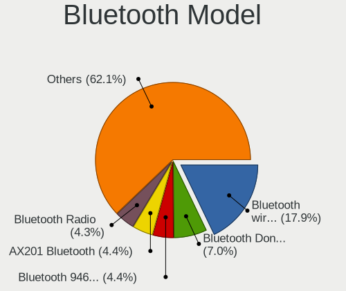

| Model                                               | Computers | Percent |
|-----------------------------------------------------|-----------|---------|
| Intel Bluetooth wireless interface                  | 395       | 18.43%  |
| Cambridge Silicon Radio Bluetooth Dongle (HCI mode) | 150       | 7%      |
| Realtek Bluetooth Radio                             | 118       | 5.51%   |
| Intel Bluetooth 9460/9560 Jefferson Peak (JfP)      | 101       | 4.71%   |
| Qualcomm Atheros  Bluetooth Device                  | 86        | 4.01%   |
| Intel AX201 Bluetooth                               | 83        | 3.87%   |
| Ralink RT3290 Bluetooth                             | 70        | 3.27%   |
| Intel AX200 Bluetooth                               | 48        | 2.24%   |
| Dell DW375 Bluetooth Module                         | 44        | 2.05%   |
| Qualcomm Atheros AR3012 Bluetooth 4.0               | 39        | 1.82%   |
| Lite-On Qualcomm Atheros QCA9377 Bluetooth          | 39        | 1.82%   |
| Intel Bluetooth Device                              | 38        | 1.77%   |
| HP Broadcom 2070 Bluetooth Combo                    | 38        | 1.77%   |
| Broadcom BCM2045B (BDC-2.1)                         | 37        | 1.73%   |
| HP Bluetooth 2.0 Interface [Broadcom BCM2045]       | 35        | 1.63%   |
| Qualcomm Atheros AR3011 Bluetooth                   | 34        | 1.59%   |
| IMC Networks Bluetooth Radio                        | 34        | 1.59%   |
| Intel Wireless-AC 3168 Bluetooth                    | 30        | 1.4%    |
| Intel Centrino Bluetooth Wireless Transceiver       | 29        | 1.35%   |
| IMC Networks Bluetooth Device                       | 29        | 1.35%   |
| IMC Networks Wireless_Device                        | 28        | 1.31%   |
| Broadcom HP Portable SoftSailing                    | 25        | 1.17%   |
| Realtek RTL8723B Bluetooth                          | 24        | 1.12%   |
| Lite-On Bluetooth Device                            | 23        | 1.07%   |
| Realtek  Bluetooth 4.2 Adapter                      | 21        | 0.98%   |
| Foxconn / Hon Hai Bluetooth Device                  | 20        | 0.93%   |
| Qualcomm Atheros AR9462 Bluetooth                   | 18        | 0.84%   |
| Lite-On Atheros AR3012 Bluetooth                    | 15        | 0.7%    |
| Foxconn / Hon Hai BCM20702A0                        | 14        | 0.65%   |
| Dell BCM20702A0 Bluetooth Module                    | 14        | 0.65%   |
| Broadcom BCM2070 Bluetooth Device                   | 14        | 0.65%   |
| Broadcom BCM2045B (BDC-2.1) [Bluetooth Controller]  | 14        | 0.65%   |
| Intel Wireless-AC 9260 Bluetooth Adapter            | 13        | 0.61%   |
| Foxconn / Hon Hai Wireless_Device                   | 13        | 0.61%   |
| Broadcom BCM2045B (BDC-2) [Bluetooth Controller]    | 12        | 0.56%   |
| Toshiba Bluetooth Device                            | 11        | 0.51%   |
| Intel AX210 Bluetooth                               | 11        | 0.51%   |
| Broadcom BCM20702 Bluetooth 4.0 [ThinkPad]          | 11        | 0.51%   |
| Ralink Motorola BC4 Bluetooth 3.0+HS Adapter        | 10        | 0.47%   |
| Qualcomm Atheros QCA61x4 Bluetooth 4.0              | 10        | 0.47%   |

Sound
-----

Sound Vendor
------------

Sound card vendors

| Vendor                               | Computers | Percent |
|--------------------------------------|-----------|---------|
| Intel                                | 3116      | 58.22%  |
| AMD                                  | 1102      | 20.59%  |
| Nvidia                               | 770       | 14.39%  |
| C-Media Electronics                  | 97        | 1.81%   |
| Creative Labs                        | 44        | 0.82%   |
| Logitech                             | 20        | 0.37%   |
| Texas Instruments                    | 18        | 0.34%   |
| VIA Technologies                     | 17        | 0.32%   |
| Silicon Integrated Systems [SiS]     | 15        | 0.28%   |
| ASUSTek Computer                     | 15        | 0.28%   |
| Generalplus Technology               | 13        | 0.24%   |
| JMTek                                | 10        | 0.19%   |
| Plantronics                          | 8         | 0.15%   |
| Kingston Technology                  | 8         | 0.15%   |
| Creative Technology                  | 7         | 0.13%   |
| BEHRINGER International              | 6         | 0.11%   |
| Lenovo                               | 5         | 0.09%   |
| GN Netcom                            | 5         | 0.09%   |
| SteelSeries ApS                      | 4         | 0.07%   |
| Samson Technologies                  | 4         | 0.07%   |
| Realtek Semiconductor                | 4         | 0.07%   |
| Hewlett-Packard                      | 4         | 0.07%   |
| Focusrite-Novation                   | 4         | 0.07%   |
| Ensoniq                              | 3         | 0.06%   |
| Apple                                | 3         | 0.06%   |
| Yamaha                               | 2         | 0.04%   |
| Tenx Technology                      | 2         | 0.04%   |
| Promethean Limited                   | 2         | 0.04%   |
| ELMCU                                | 2         | 0.04%   |
| D&M Holdings (Denon/Marantz)         | 2         | 0.04%   |
| Cooler Master                        | 2         | 0.04%   |
| ATI Technologies                     | 2         | 0.04%   |
| Thesycon Systemsoftware & Consulting | 1         | 0.02%   |
| TEAC                                 | 1         | 0.02%   |
| Syntek                               | 1         | 0.02%   |
| Superlux digit                       | 1         | 0.02%   |
| Sunplus Technology                   | 1         | 0.02%   |
| Sony                                 | 1         | 0.02%   |
| SM950T Microphone                    | 1         | 0.02%   |
| Sennheiser Communications            | 1         | 0.02%   |

Sound Model
-----------

Sound card models

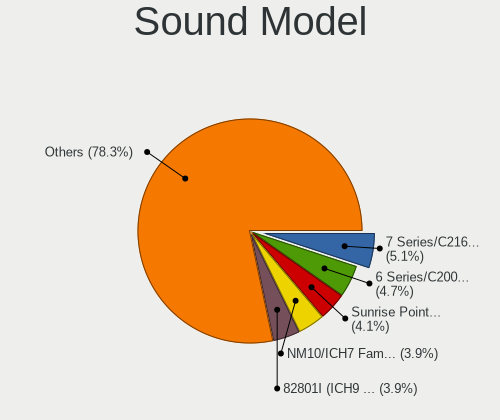

| Model                                                                                             | Computers | Percent |
|---------------------------------------------------------------------------------------------------|-----------|---------|
| Intel 7 Series/C216 Chipset Family High Definition Audio Controller                               | 333       | 5.21%   |
| Intel 6 Series/C200 Series Chipset Family High Definition Audio Controller                        | 311       | 4.86%   |
| Intel NM10/ICH7 Family High Definition Audio Controller                                           | 280       | 4.38%   |
| Intel 82801I (ICH9 Family) HD Audio Controller                                                    | 271       | 4.24%   |
| Intel Sunrise Point-LP HD Audio                                                                   | 267       | 4.18%   |
| AMD FCH Azalia Controller                                                                         | 253       | 3.96%   |
| Intel 8 Series/C220 Series Chipset High Definition Audio Controller                               | 216       | 3.38%   |
| AMD SBx00 Azalia (Intel HDA)                                                                      | 212       | 3.32%   |
| Intel 5 Series/3400 Series Chipset High Definition Audio                                          | 195       | 3.05%   |
| AMD Family 17h/19h HD Audio Controller                                                            | 169       | 2.64%   |
| Intel Xeon E3-1200 v3/4th Gen Core Processor HD Audio Controller                                  | 162       | 2.53%   |
| Intel 82801H (ICH8 Family) HD Audio Controller                                                    | 122       | 1.91%   |
| Intel 8 Series HD Audio Controller                                                                | 110       | 1.72%   |
| Intel Haswell-ULT HD Audio Controller                                                             | 109       | 1.7%    |
| Nvidia GK208 HDMI/DP Audio Controller                                                             | 103       | 1.61%   |
| Intel 100 Series/C230 Series Chipset Family HD Audio Controller                                   | 101       | 1.58%   |
| AMD Kabini HDMI/DP Audio                                                                          | 97        | 1.52%   |
| Intel Broadwell-U Audio Controller                                                                | 95        | 1.49%   |
| Intel Wildcat Point-LP High Definition Audio Controller                                           | 94        | 1.47%   |
| AMD Renoir Radeon High Definition Audio Controller                                                | 89        | 1.39%   |
| Intel Cannon Lake PCH cAVS                                                                        | 87        | 1.36%   |
| AMD Trinity HDMI Audio Controller                                                                 | 83        | 1.3%    |
| Nvidia High Definition Audio Controller                                                           | 73        | 1.14%   |
| Intel 200 Series PCH HD Audio                                                                     | 73        | 1.14%   |
| Intel 82801JD/DO (ICH10 Family) HD Audio Controller                                               | 68        | 1.06%   |
| Nvidia GP107GL High Definition Audio Controller                                                   | 65        | 1.02%   |
| AMD Oland/Hainan/Cape Verde/Pitcairn HDMI Audio [Radeon HD 7000 Series]                           | 62        | 0.97%   |
| AMD Ellesmere HDMI Audio [Radeon RX 470/480 / 570/580/590]                                        | 62        | 0.97%   |
| AMD Family 17h (Models 00h-0fh) HD Audio Controller                                               | 61        | 0.95%   |
| Nvidia GF108 High Definition Audio Controller                                                     | 59        | 0.92%   |
| Intel Atom/Celeron/Pentium Processor x5-E8000/J3xxx/N3xxx Series High Definition Audio Controller | 59        | 0.92%   |
| AMD Caicos HDMI Audio [Radeon HD 6450 / 7450/8450/8490 OEM / R5 230/235/235X OEM]                 | 57        | 0.89%   |
| AMD Starship/Matisse HD Audio Controller                                                          | 56        | 0.88%   |
| AMD Cedar HDMI Audio [Radeon HD 5400/6300/7300 Series]                                            | 52        | 0.81%   |
| Intel 82801JI (ICH10 Family) HD Audio Controller                                                  | 51        | 0.8%    |
| AMD Wrestler HDMI Audio                                                                           | 51        | 0.8%    |
| Intel Celeron/Pentium Silver Processor High Definition Audio                                      | 50        | 0.78%   |
| Intel Cannon Point-LP High Definition Audio Controller                                            | 50        | 0.78%   |
| AMD Raven/Raven2/Fenghuang HDMI/DP Audio Controller                                               | 49        | 0.77%   |
| Intel Tiger Lake-LP Smart Sound Technology Audio Controller                                       | 48        | 0.75%   |

Memory
------

Memory Vendor
-------------

Memory module vendors

| Vendor                     | Computers | Percent |
|----------------------------|-----------|---------|
| Samsung Electronics        | 787       | 19.93%  |
| SK hynix                   | 743       | 18.82%  |
| Unknown                    | 664       | 16.82%  |
| Kingston                   | 642       | 16.26%  |
| Micron Technology          | 330       | 8.36%   |
| Nanya Technology           | 109       | 2.76%   |
| Elpida                     | 92        | 2.33%   |
| Crucial                    | 89        | 2.25%   |
| Kingmax                    | 86        | 2.18%   |
| Corsair                    | 68        | 1.72%   |
| Ramaxel Technology         | 61        | 1.55%   |
| G.Skill                    | 56        | 1.42%   |
| A-DATA Technology          | 40        | 1.01%   |
| CSX                        | 18        | 0.46%   |
| Team                       | 17        | 0.43%   |
| Patriot                    | 13        | 0.33%   |
| Transcend                  | 12        | 0.3%    |
| Qimonda                    | 12        | 0.3%    |
| ASint Technology           | 10        | 0.25%   |
| 48spaces                   | 10        | 0.25%   |
| Unknown (ABCD)             | 9         | 0.23%   |
| Melco                      | 8         | 0.2%    |
| Apacer                     | 8         | 0.2%    |
| Kingmax Semiconductor      | 7         | 0.18%   |
| Unknown                    | 7         | 0.18%   |
| Toshiba                    | 5         | 0.13%   |
| OCZ                        | 4         | 0.1%    |
| GeIL                       | 4         | 0.1%    |
| PUSKILL                    | 3         | 0.08%   |
| Unknown (09D5)             | 2         | 0.05%   |
| Silicon Power              | 2         | 0.05%   |
| Intersil                   | 2         | 0.05%   |
| Infineon                   | 2         | 0.05%   |
| Hikvision                  | 2         | 0.05%   |
| H                          | 2         | 0.05%   |
| Golden Empire              | 2         | 0.05%   |
| ZION                       | 1         | 0.03%   |
| Unknown (8A5B)             | 1         | 0.03%   |
| Unknown (7F7F7F7F7F970000) | 1         | 0.03%   |
| Unigen                     | 1         | 0.03%   |

Memory Model
------------

Memory module models

| Model                                                     | Computers | Percent |
|-----------------------------------------------------------|-----------|---------|
| SK hynix RAM HMT451S6BFR8A-PB 4GB SODIMM DDR3 1600MT/s    | 47        | 1.07%   |
| Kingston RAM KHX1600C10D3/4G 4096MB DIMM DDR3 1600MT/s    | 44        | 1%      |
| Samsung RAM M471B5173EB0-YK0 4GB SODIMM DDR3 1600MT/s     | 43        | 0.98%   |
| Unknown RAM Module 2048MB DIMM 800MT/s                    | 41        | 0.94%   |
| Samsung RAM M471B5173QH0-YK0 4096MB SODIMM DDR3 1600MT/s  | 39        | 0.89%   |
| Samsung RAM M471B5273DH0-CH9 4GB SODIMM DDR3 1334MT/s     | 38        | 0.87%   |
| Samsung RAM M471B5173DB0-YK0 4GB SODIMM DDR3 1600MT/s     | 36        | 0.82%   |
| Unknown RAM Module 2048MB SODIMM DDR2 667MT/s             | 34        | 0.78%   |
| Unknown RAM Module 2048MB DIMM SDRAM                      | 34        | 0.78%   |
| SK hynix RAM HMT351S6CFR8C-PB 4GB SODIMM DDR3 1600MT/s    | 33        | 0.75%   |
| Samsung RAM M471B5673FH0-CF8 2GB SODIMM DDR3 1067MT/s     | 26        | 0.59%   |
| SK hynix RAM HMT325S6CFR8A-PB 2048MB SODIMM DDR3 1600MT/s | 25        | 0.57%   |
| SK hynix RAM HMA81GS6AFR8N-UH 8GB SODIMM DDR4 2667MT/s    | 25        | 0.57%   |
| SK hynix RAM HMT41GS6BFR8A-PB 8GB SODIMM DDR3 1600MT/s    | 24        | 0.55%   |
| Samsung RAM M471B5273CH0-CH9 4GB SODIMM DDR3 1334MT/s     | 24        | 0.55%   |
| Kingston RAM KHX1600C10D3/8G 8GB DIMM DDR3 1648MT/s       | 24        | 0.55%   |
| Samsung RAM M471B5773DH0-CH9 2GB SODIMM DDR3 1600MT/s     | 23        | 0.53%   |
| Samsung RAM M471A5244CB0-CRC 4GB SODIMM DDR4 2667MT/s     | 23        | 0.53%   |
| Samsung RAM M471B5273DH0-CK0 4GB SODIMM DDR3 1600MT/s     | 22        | 0.5%    |
| Samsung RAM M471A5244CB0-CTD 4096MB SODIMM DDR4 3266MT/s  | 22        | 0.5%    |
| SK hynix RAM HMA851S6AFR6N-UH 4GB SODIMM DDR4 2667MT/s    | 21        | 0.48%   |
| Samsung RAM M471B1G73DB0-YK0 8GB SODIMM DDR3 1600MT/s     | 21        | 0.48%   |
| Kingston RAM KHX1600C9D3/4GX 4GB DIMM DDR3 1600MT/s       | 21        | 0.48%   |
| Unknown RAM Module 4096MB DIMM DDR3 1333MT/s              | 20        | 0.46%   |
| Micron RAM 8KTF51264HZ-1G6E1 4096MB SODIMM DDR3 1600MT/s  | 20        | 0.46%   |
| Unknown RAM Module 2048MB DIMM DDR2 800MT/s               | 19        | 0.43%   |
| SK hynix RAM HMT351S6EFR8A-PB 4096MB SODIMM DDR3 1600MT/s | 19        | 0.43%   |
| Samsung RAM M471B5773CHS-CH9 2048MB SODIMM DDR3 4199MT/s  | 19        | 0.43%   |
| Unknown RAM Module 1024MB DIMM SDRAM                      | 18        | 0.41%   |
| Unknown RAM Module 1024MB DIMM 800MT/s                    | 17        | 0.39%   |
| SK hynix RAM HMT451S6AFR8A-PB 4GB SODIMM DDR3 1600MT/s    | 17        | 0.39%   |
| Unknown RAM Module 2048MB SODIMM DDR2                     | 16        | 0.37%   |
| Unknown RAM Module 2048MB DIMM 1333MT/s                   | 16        | 0.37%   |
| Unknown RAM Module 1024MB SODIMM DDR2 667MT/s             | 16        | 0.37%   |
| Kingston RAM 99U5584-005.A00LF 4GB DIMM DDR3 1600MT/s     | 16        | 0.37%   |
| Unknown RAM Module 4096MB DIMM 1333MT/s                   | 15        | 0.34%   |
| Unknown RAM Module 1024MB SODIMM DDR2                     | 15        | 0.34%   |
| SK hynix RAM HMT325S6EFR8A-PB 2048MB SODIMM DDR3 1600MT/s | 15        | 0.34%   |
| SK hynix RAM HMT325S6BFR8C-H9 2GB SODIMM DDR3 1600MT/s    | 14        | 0.32%   |
| Unknown RAM Module 2048MB DIMM DDR2 667MT/s               | 13        | 0.3%    |

Memory Kind
-----------

Memory module kinds

| Kind    | Computers | Percent |
|---------|-----------|---------|
| DDR3    | 1526      | 45.21%  |
| DDR4    | 792       | 23.47%  |
| DDR2    | 433       | 12.83%  |
| SDRAM   | 242       | 7.17%   |
| Unknown | 198       | 5.87%   |
| DDR     | 62        | 1.84%   |
| LPDDR4  | 56        | 1.66%   |
| LPDDR3  | 27        | 0.8%    |
| DDR5    | 20        | 0.59%   |
| DRAM    | 11        | 0.33%   |
| LPDDR5  | 8         | 0.24%   |

Memory Form Factor
------------------

Physical design of the memory module

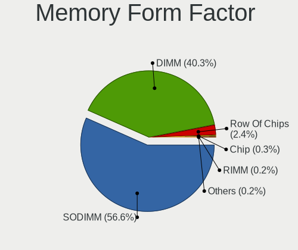

| Name         | Computers | Percent |
|--------------|-----------|---------|
| SODIMM       | 1841      | 56.4%   |
| DIMM         | 1343      | 41.15%  |
| Row Of Chips | 62        | 1.9%    |
| Chip         | 9         | 0.28%   |
| RIMM         | 5         | 0.15%   |
| Unknown      | 3         | 0.09%   |
| FB-DIMM      | 1         | 0.03%   |

Memory Size
-----------

Memory module size

| Size    | Computers | Percent |
|---------|-----------|---------|
| 4096    | 1285      | 34.57%  |
| 2048    | 960       | 25.83%  |
| 8192    | 801       | 21.55%  |
| 1024    | 356       | 9.58%   |
| 16384   | 206       | 5.54%   |
| 512     | 54        | 1.45%   |
| 32768   | 49        | 1.32%   |
| 256     | 4         | 0.11%   |
| Unknown | 2         | 0.05%   |

Memory Speed
------------

Memory module speed

| Speed   | Computers | Percent |
|---------|-----------|---------|
| 1600    | 938       | 25.07%  |
| 1333    | 347       | 9.28%   |
| 2667    | 288       | 7.7%    |
| 667     | 242       | 6.47%   |
| 800     | 233       | 6.23%   |
| 1334    | 200       | 5.35%   |
| 3200    | 195       | 5.21%   |
| 2400    | 183       | 4.89%   |
| Unknown | 145       | 3.88%   |
| 2133    | 128       | 3.42%   |
| 1067    | 94        | 2.51%   |
| 1866    | 69        | 1.84%   |
| 1867    | 63        | 1.68%   |
| 1066    | 52        | 1.39%   |
| 533     | 52        | 1.39%   |
| 2048    | 49        | 1.31%   |
| 4199    | 48        | 1.28%   |
| 3600    | 38        | 1.02%   |
| 400     | 35        | 0.94%   |
| 3266    | 23        | 0.61%   |
| 975     | 23        | 0.61%   |
| 3733    | 20        | 0.53%   |
| 1800    | 19        | 0.51%   |
| 1639    | 18        | 0.48%   |
| 2666    | 17        | 0.45%   |
| 333     | 17        | 0.45%   |
| 2933    | 14        | 0.37%   |
| 3466    | 13        | 0.35%   |
| 4800    | 12        | 0.32%   |
| 3400    | 12        | 0.32%   |
| 3000    | 12        | 0.32%   |
| 4266    | 11        | 0.29%   |
| 4267    | 10        | 0.27%   |
| 2000    | 9         | 0.24%   |
| 49926   | 8         | 0.21%   |
| 6400    | 8         | 0.21%   |
| 3151    | 8         | 0.21%   |
| 1648    | 7         | 0.19%   |
| 5808    | 5         | 0.13%   |
| 3334    | 5         | 0.13%   |

Printers & scanners
-------------------

Printer Vendor
--------------

Printer device vendors

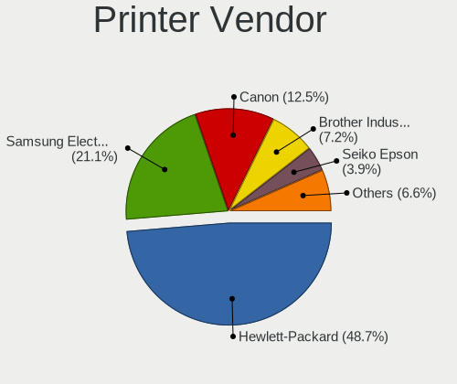

| Vendor                | Computers | Percent |
|-----------------------|-----------|---------|
| Hewlett-Packard       | 65        | 49.62%  |
| Samsung Electronics   | 28        | 21.37%  |
| Canon                 | 14        | 10.69%  |
| Brother Industries    | 9         | 6.87%   |
| Seiko Epson           | 6         | 4.58%   |
| QinHeng Electronics   | 2         | 1.53%   |
| Lexmark International | 2         | 1.53%   |
| Xerox                 | 1         | 0.76%   |
| STMicroelectronics    | 1         | 0.76%   |
| Ricoh                 | 1         | 0.76%   |
| Prolific Technology   | 1         | 0.76%   |
| Oki Data              | 1         | 0.76%   |

Printer Model
-------------

Printer device models

| Model                                                     | Computers | Percent |
|-----------------------------------------------------------|-----------|---------|
| HP DeskJet 2600 series                                    | 9         | 6.77%   |
| HP LaserJet 1020                                          | 6         | 4.51%   |
| Samsung ML-2010P Mono Laser Printer                       | 5         | 3.76%   |
| Samsung M2020 Series                                      | 5         | 3.76%   |
| Samsung ML-1640 Series Laser Printer                      | 4         | 3.01%   |
| HP DeskJet 2130 series                                    | 4         | 3.01%   |
| HP LaserJet P1005                                         | 3         | 2.26%   |
| HP LaserJet 1018                                          | 3         | 2.26%   |
| HP Deskjet 2050 J510                                      | 3         | 2.26%   |
| Canon LiDE 400                                            | 3         | 2.26%   |
| Brother HL-1110 series                                    | 3         | 2.26%   |
| Samsung SCX-3400 Series                                   | 2         | 1.5%    |
| Samsung ML-1660 Series                                    | 2         | 1.5%    |
| Samsung C48x Series                                       | 2         | 1.5%    |
| QinHeng CH340S                                            | 2         | 1.5%    |
| HP Officejet J4500 series                                 | 2         | 1.5%    |
| HP OfficeJet 6950                                         | 2         | 1.5%    |
| HP LaserJet P1102                                         | 2         | 1.5%    |
| HP LaserJet 1022                                          | 2         | 1.5%    |
| HP LaserJet 1010                                          | 2         | 1.5%    |
| HP LaserJet 1000                                          | 2         | 1.5%    |
| HP DeskJet F4100 Printer series                           | 2         | 1.5%    |
| HP Deskjet F2280 series                                   | 2         | 1.5%    |
| HP DeskJet F2100 Printer series                           | 2         | 1.5%    |
| HP DeskJet 840c                                           | 2         | 1.5%    |
| HP Deskjet 3520 series                                    | 2         | 1.5%    |
| Canon TS5100 series                                       | 2         | 1.5%    |
| Brother HL-L2300D series                                  | 2         | 1.5%    |
| Xerox WorkCentre 3119 Series                              | 1         | 0.75%   |
| STMicroelectronics LED badge -- mini LED display -- 11x44 | 1         | 0.75%   |
| Seiko Epson XP-240 Series                                 | 1         | 0.75%   |
| Seiko Epson Stylus NX230/SX235W Series                    | 1         | 0.75%   |
| Seiko Epson Printer                                       | 1         | 0.75%   |
| Seiko Epson ME 320/330 Series [Stylus SX125]              | 1         | 0.75%   |
| Seiko Epson L120 Series                                   | 1         | 0.75%   |
| Seiko Epson ET-2600 Series                                | 1         | 0.75%   |
| Samsung Xerox Phaser 3117 Laser Printer                   | 1         | 0.75%   |
| Samsung SCX-4650 4x21S Series                             | 1         | 0.75%   |
| Samsung SCX-4623 Series                                   | 1         | 0.75%   |
| Samsung SCX-4200 series                                   | 1         | 0.75%   |

Scanner Vendor
--------------

Scanner device vendors

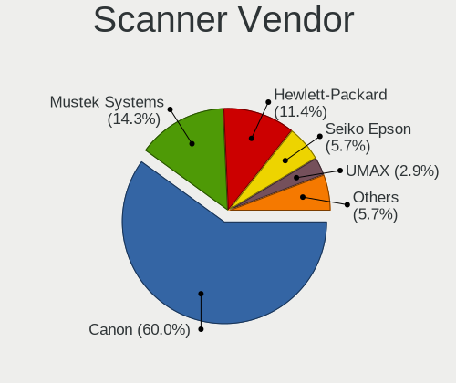

| Vendor                                         | Computers | Percent |
|------------------------------------------------|-----------|---------|
| Canon                                          | 17        | 62.96%  |
| Hewlett-Packard                                | 4         | 14.81%  |
| Mustek Systems                                 | 2         | 7.41%   |
| UMAX                                           | 1         | 3.7%    |
| Siemens Information and Communication Products | 1         | 3.7%    |
| Seiko Epson                                    | 1         | 3.7%    |
| KYE Systems (Mouse Systems)                    | 1         | 3.7%    |

Scanner Model
-------------

Scanner device models

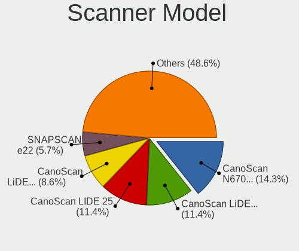

| Model                                                                           | Computers | Percent |
|---------------------------------------------------------------------------------|-----------|---------|
| Canon CanoScan N670U/N676U/LiDE 20                                              | 5         | 18.52%  |
| Canon CanoScan LIDE 25                                                          | 3         | 11.11%  |
| Canon CanoScan LiDE 110                                                         | 3         | 11.11%  |
| Mustek Systems SNAPSCAN e22                                                     | 2         | 7.41%   |
| HP Scanjet 300                                                                  | 2         | 7.41%   |
| Canon CanoScan LiDE 120                                                         | 2         | 7.41%   |
| UMAX Astra 4400/4450                                                            | 1         | 3.7%    |
| Siemens Information and Communication Products ID-Mouse with Fingerprint Reader | 1         | 3.7%    |
| Seiko Epson Stylus Photo RX500/510                                              | 1         | 3.7%    |
| KYE Systems (Mouse Systems) ColorPage-SF600                                     | 1         | 3.7%    |
| HP ScanJet 3770                                                                 | 1         | 3.7%    |
| HP ScanJet 2400c                                                                | 1         | 3.7%    |
| Canon CanoScan N1240U/LiDE 30                                                   | 1         | 3.7%    |
| Canon CanoScan LiDE 220                                                         | 1         | 3.7%    |
| Canon CanoScan LiDE 100                                                         | 1         | 3.7%    |
| Canon CanoScan 4200F                                                            | 1         | 3.7%    |

Camera
------

Camera Vendor
-------------

Camera device vendors

| Vendor                                 | Computers | Percent |
|----------------------------------------|-----------|---------|
| Chicony Electronics                    | 548       | 24%     |
| Microdia                               | 227       | 9.94%   |
| IMC Networks                           | 220       | 9.64%   |
| Realtek Semiconductor                  | 186       | 8.15%   |
| Sunplus Innovation Technology          | 142       | 6.22%   |
| Suyin                                  | 97        | 4.25%   |
| Bison Electronics                      | 91        | 3.99%   |
| Quanta                                 | 88        | 3.85%   |
| Cheng Uei Precision Industry (Foxlink) | 75        | 3.29%   |
| Logitech                               | 67        | 2.93%   |
| Syntek                                 | 60        | 2.63%   |
| Acer                                   | 42        | 1.84%   |
| Lite-On Technology                     | 41        | 1.8%    |
| Silicon Motion                         | 40        | 1.75%   |
| Lenovo                                 | 34        | 1.49%   |
| Apple                                  | 29        | 1.27%   |
| Z-Star Microelectronics                | 28        | 1.23%   |
| Alcor Micro                            | 25        | 1.1%    |
| Ricoh                                  | 22        | 0.96%   |
| Primax Electronics                     | 21        | 0.92%   |
| Microsoft                              | 20        | 0.88%   |
| KYE Systems (Mouse Systems)            | 20        | 0.88%   |
| Luxvisions Innotech Limited            | 18        | 0.79%   |
| Samsung Electronics                    | 16        | 0.7%    |
| GEMBIRD                                | 15        | 0.66%   |
| Sonix Technology                       | 12        | 0.53%   |
| ALi                                    | 11        | 0.48%   |
| Importek                               | 9         | 0.39%   |
| OmniVision Technologies                | 7         | 0.31%   |
| Trust                                  | 6         | 0.26%   |
| Generalplus Technology                 | 5         | 0.22%   |
| Aveo Technology                        | 5         | 0.22%   |
| Arkmicro Technologies                  | 5         | 0.22%   |
| Pixart Imaging                         | 4         | 0.18%   |
| MacroSilicon                           | 4         | 0.18%   |
| LG Electronics                         | 4         | 0.18%   |
| USB Camera                             | 3         | 0.13%   |
| Jieli Technology                       | 3         | 0.13%   |
| DigiTech                               | 3         | 0.13%   |
| Cubeternet                             | 3         | 0.13%   |

Camera Model
------------

Camera device models

| Model                                         | Computers | Percent |
|-----------------------------------------------|-----------|---------|
| Chicony Integrated Camera                     | 67        | 2.92%   |
| IMC Networks USB2.0 VGA UVC WebCam            | 60        | 2.62%   |
| Microdia Integrated_Webcam_HD                 | 54        | 2.36%   |
| IMC Networks USB2.0 HD UVC WebCam             | 50        | 2.18%   |
| Chicony HD WebCam                             | 49        | 2.14%   |
| Realtek Integrated_Webcam_HD                  | 44        | 1.92%   |
| Chicony HP Truevision HD                      | 40        | 1.75%   |
| Sunplus Integrated_Webcam_HD                  | 35        | 1.53%   |
| Realtek USB Camera                            | 31        | 1.35%   |
| Chicony USB2.0 VGA UVC WebCam                 | 31        | 1.35%   |
| Bison Lenovo EasyCamera                       | 30        | 1.31%   |
| Microdia Integrated Webcam                    | 28        | 1.22%   |
| Suyin Acer/HP Integrated Webcam [CN0314]      | 26        | 1.13%   |
| Sunplus HP Truevision HD                      | 24        | 1.05%   |
| Chicony Lenovo EasyCamera                     | 24        | 1.05%   |
| Logitech Webcam C270                          | 22        | 0.96%   |
| Chicony FJ Camera                             | 22        | 0.96%   |
| Bison Integrated Camera                       | 22        | 0.96%   |
| IMC Networks EasyCamera                       | 21        | 0.92%   |
| Sunplus HD WebCam                             | 20        | 0.87%   |
| IMC Networks Integrated Camera                | 20        | 0.87%   |
| Chicony USB2.0 HD UVC WebCam                  | 20        | 0.87%   |
| Lenovo Integrated Webcam                      | 19        | 0.83%   |
| Chicony Integrated HP HD Webcam               | 19        | 0.83%   |
| Chicony EasyCamera                            | 19        | 0.83%   |
| Syntek Integrated Camera                      | 18        | 0.79%   |
| Microdia Sonix USB 2.0 Camera                 | 18        | 0.79%   |
| Chicony VGA WebCam                            | 18        | 0.79%   |
| Realtek Integrated Webcam                     | 17        | 0.74%   |
| Quanta VGA Webcam                             | 17        | 0.74%   |
| Microdia Camera                               | 17        | 0.74%   |
| Lite-On Integrated Camera                     | 16        | 0.7%    |
| Cheng Uei Precision Industry (Foxlink) Webcam | 16        | 0.7%    |
| Syntek Lenovo EasyCamera                      | 15        | 0.65%   |
| Syntek EasyCamera                             | 15        | 0.65%   |
| Samsung Galaxy series, misc. (MTP mode)       | 15        | 0.65%   |
| Realtek Lenovo EasyCamera                     | 15        | 0.65%   |
| Primax HP HD Webcam [Fixed]                   | 15        | 0.65%   |
| Microdia Laptop_Integrated_Webcam_HD          | 15        | 0.65%   |
| Lenovo Integrated Webcam [R5U877]             | 14        | 0.61%   |

Security
--------

Fingerprint Vendor
------------------

Fingerprint sensor vendors

| Vendor                             | Computers | Percent |
|------------------------------------|-----------|---------|
| Validity Sensors                   | 117       | 36%     |
| AuthenTec                          | 58        | 17.85%  |
| Synaptics                          | 48        | 14.77%  |
| Upek                               | 29        | 8.92%   |
| Shenzhen Goodix Technology         | 27        | 8.31%   |
| LighTuning Technology              | 19        | 5.85%   |
| STMicroelectronics                 | 12        | 3.69%   |
| Elan Microelectronics              | 11        | 3.38%   |
| Realtek USB2.0 Finger Print Bridge | 4         | 1.23%   |

Fingerprint Model
-----------------

Fingerprint sensor models

| Model                                                                      | Computers | Percent |
|----------------------------------------------------------------------------|-----------|---------|
| Upek Biometric Touchchip/Touchstrip Fingerprint Sensor                     | 28        | 8.62%   |
| Validity Sensors VFS495 Fingerprint Reader                                 | 26        | 8%      |
| AuthenTec AES2810                                                          | 24        | 7.38%   |
| AuthenTec AES2501 Fingerprint Sensor                                       | 19        | 5.85%   |
| Shenzhen Goodix  FingerPrint Device                                        | 17        | 5.23%   |
| Validity Sensors VFS471 Fingerprint Reader                                 | 13        | 4%      |
| Validity Sensors VFS491                                                    | 12        | 3.69%   |
| Validity Sensors VFS451 Fingerprint Reader                                 | 12        | 3.69%   |
| STMicroelectronics Fingerprint Reader                                      | 12        | 3.69%   |
| Validity Sensors VFS5011 Fingerprint Reader                                | 10        | 3.08%   |
| Validity Sensors Synaptics WBDI                                            | 10        | 3.08%   |
| LighTuning EgisTec Touch Fingerprint Sensor                                | 10        | 3.08%   |
| Validity Sensors VFS7500 Touch Fingerprint Sensor                          | 9         | 2.77%   |
| Synaptics Metallica MIS Touch Fingerprint Reader                           | 9         | 2.77%   |
| Shenzhen Goodix Fingerprint Reader                                         | 9         | 2.77%   |
| Validity Sensors VFS 5011 fingerprint sensor                               | 8         | 2.46%   |
| Synaptics Prometheus MIS Touch Fingerprint Reader                          | 8         | 2.46%   |
| LighTuning Fingerprint Reader                                              | 8         | 2.46%   |
| Elan ELAN:Fingerprint                                                      | 7         | 2.15%   |
| AuthenTec Fingerprint Sensor                                               | 7         | 2.15%   |
| Synaptics  WBDI                                                            | 6         | 1.85%   |
| Synaptics FS7604 Touch Fingerprint Sensor with PurePrint                   | 5         | 1.54%   |
| AuthenTec AES1600                                                          | 5         | 1.54%   |
| Validity Sensors VFS101 Fingerprint Reader                                 | 4         | 1.23%   |
| Validity Sensors Synaptics VFS7552 Touch Fingerprint Sensor with PurePrint | 4         | 1.23%   |
| Synaptics  FS7604 Touch Fingerprint Sensor with PurePrint                  | 4         | 1.23%   |
| Synaptics Fingerprint reader [HP G6]                                       | 4         | 1.23%   |
| Realtek USB2.0 Finger Print Bridge FocalTech Fingerprint Device            | 4         | 1.23%   |
| Validity Sensors Swipe Fingerprint Sensor                                  | 3         | 0.92%   |
| Synaptics WBDI                                                             | 3         | 0.92%   |
| Synaptics Fingerprint scanner                                              | 3         | 0.92%   |
| Elan ELAN:ARM-M4                                                           | 3         | 0.92%   |
| Validity Sensors Synaptics VFS7552 Touch Fingerprint Sensor                | 2         | 0.62%   |
| Validity Sensors Fingerprint scanner                                       | 2         | 0.62%   |
| Synaptics UWP WBDI Device                                                  | 2         | 0.62%   |
| Synaptics UWP WBDI                                                         | 2         | 0.62%   |
| AuthenTec AES2550 Fingerprint Sensor                                       | 2         | 0.62%   |
| Validity Sensors VFS301 Fingerprint Reader                                 | 1         | 0.31%   |
| Validity Sensors VFS Fingerprint sensor                                    | 1         | 0.31%   |
| Upek TCS5B Fingerprint sensor                                              | 1         | 0.31%   |

Chipcard Vendor
---------------

Chipcard module vendors

| Vendor                    | Computers | Percent |
|---------------------------|-----------|---------|
| Broadcom                  | 134       | 53.82%  |
| Alcor Micro               | 38        | 15.26%  |
| O2 Micro                  | 30        | 12.05%  |
| Lenovo                    | 30        | 12.05%  |
| Gemalto (was Gemplus)     | 6         | 2.41%   |
| Upek                      | 3         | 1.2%    |
| Reiner SCT Kartensysteme  | 2         | 0.8%    |
| Advanced Card Systems     | 2         | 0.8%    |
| Yubico.com                | 1         | 0.4%    |
| OmniKey                   | 1         | 0.4%    |
| Chicony Electronics       | 1         | 0.4%    |
| Aladdin Knowledge Systems | 1         | 0.4%    |

Chipcard Model
--------------

Chipcard module models

| Model                                                                        | Computers | Percent |
|------------------------------------------------------------------------------|-----------|---------|
| Broadcom BCM5880 Secure Applications Processor                               | 65        | 26.1%   |
| Alcor Micro AU9540 Smartcard Reader                                          | 38        | 15.26%  |
| Lenovo Integrated Smart Card Reader                                          | 30        | 12.05%  |
| O2 Micro OZ776 CCID Smartcard Reader                                         | 29        | 11.65%  |
| Broadcom BCM5880 Secure Applications Processor with fingerprint swipe sensor | 28        | 11.24%  |
| Broadcom 5880                                                                | 21        | 8.43%   |
| Broadcom 58200                                                               | 20        | 8.03%   |
| Upek TouchChip Fingerprint Coprocessor (WBF advanced mode)                   | 3         | 1.2%    |
| Gemalto (was Gemplus) GemPC Twin SmartCard Reader                            | 3         | 1.2%    |
| Reiner SCT Kartensysteme cyberJack RFID basis contactless smartcard reader   | 2         | 0.8%    |
| Gemalto (was Gemplus) GemPC Key SmartCard Reader                             | 2         | 0.8%    |
| Advanced Card Systems ACR1252 Dual Reader                                    | 2         | 0.8%    |
| Yubico.com Yubikey 4/5 U2F+CCID                                              | 1         | 0.4%    |
| OmniKey CardMan 3121 (HID Technologies)                                      | 1         | 0.4%    |
| O2 Micro Oz776 SmartCard Reader                                              | 1         | 0.4%    |
| Gemalto (was Gemplus) Compact Smart Card Reader Writer                       | 1         | 0.4%    |
| Chicony Electronics HP Skylab USB Smartcard Keyboard                         | 1         | 0.4%    |
| Aladdin Knowledge Systems Token JC                                           | 1         | 0.4%    |

Unsupported
-----------

Unsupported Devices
-------------------

Total unsupported devices on board

| Total | Computers | Percent |
|-------|-----------|---------|
| 0     | 3142      | 73.38%  |
| 1     | 946       | 22.09%  |
| 2     | 167       | 3.9%    |
| 3     | 18        | 0.42%   |
| 4     | 4         | 0.09%   |
| 5     | 2         | 0.05%   |
| 10    | 1         | 0.02%   |
| 9     | 1         | 0.02%   |
| 7     | 1         | 0.02%   |

Unsupported Device Types
------------------------

Types of unsupported devices

| Type                     | Computers | Percent |
|--------------------------|-----------|---------|
| Graphics card            | 331       | 25.06%  |
| Fingerprint reader       | 323       | 24.45%  |
| Chipcard                 | 229       | 17.34%  |
| Net/wireless             | 107       | 8.1%    |
| Bluetooth                | 83        | 6.28%   |
| Multimedia controller    | 54        | 4.09%   |
| Storage                  | 41        | 3.1%    |
| Communication controller | 41        | 3.1%    |
| Camera                   | 30        | 2.27%   |
| Flash memory             | 18        | 1.36%   |
| Unassigned class         | 16        | 1.21%   |
| Sound                    | 11        | 0.83%   |
| Card reader              | 10        | 0.76%   |
| Net/ethernet             | 8         | 0.61%   |
| Storage/raid             | 5         | 0.38%   |
| Storage/ata              | 3         | 0.23%   |
| Network                  | 3         | 0.23%   |
| Dvb card                 | 3         | 0.23%   |
| Storage/ide              | 2         | 0.15%   |
| Modem                    | 2         | 0.15%   |
| Firewire controller      | 1         | 0.08%   |

