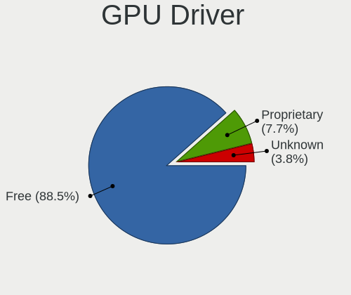
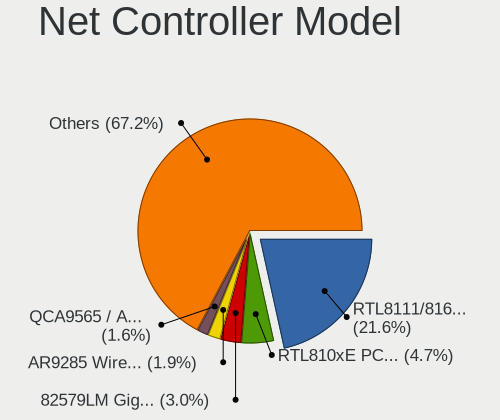
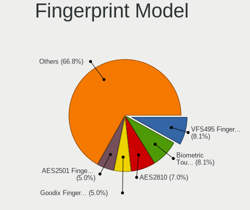

Linux in Hungary - Tested Hardware & Statistics
-----------------------------------------------

A project to collect tested hardware configurations for Linux in Hungary.

Anyone can contribute to this report by the [hw-probe](https://github.com/linuxhw/hw-probe) tool:

    sudo -E hw-probe -all -upload

Please contribute! Especially if your hardware is rare.

This is a report for all computer types. See also reports for [desktops](/Location/Hungary/Desktop/README.md) and [notebooks](/Location/Hungary/Notebook/README.md).

Contents
--------

* [ Test Cases ](#test-cases)

* [ System ](#system)
  - [ OS                       ](#os)
  - [ OS Family                ](#os-family)
  - [ Kernel                   ](#kernel)
  - [ Kernel Family            ](#kernel-family)
  - [ Kernel Major Ver.        ](#kernel-major-ver)
  - [ Arch                     ](#arch)
  - [ DE                       ](#de)
  - [ Display Server           ](#display-server)
  - [ Display Manager          ](#display-manager)
  - [ OS Lang                  ](#os-lang)
  - [ Boot Mode                ](#boot-mode)
  - [ Filesystem               ](#filesystem)
  - [ Part. scheme             ](#part-scheme)
  - [ Dual Boot with Linux/BSD ](#dual-boot-with-linuxbsd)
  - [ Dual Boot (Win)          ](#dual-boot-win)

* [ Board ](#board)
  - [ Vendor                   ](#vendor)
  - [ Model                    ](#model)
  - [ Model Family             ](#model-family)
  - [ MFG Year                 ](#mfg-year)
  - [ Form Factor              ](#form-factor)
  - [ Secure Boot              ](#secure-boot)
  - [ Coreboot                 ](#coreboot)
  - [ RAM Size                 ](#ram-size)
  - [ RAM Used                 ](#ram-used)
  - [ Total Drives             ](#total-drives)
  - [ Has CD-ROM               ](#has-cd-rom)
  - [ Has Ethernet             ](#has-ethernet)
  - [ Has WiFi                 ](#has-wifi)
  - [ Has Bluetooth            ](#has-bluetooth)

* [ Location ](#location)
  - [ Country                  ](#country)
  - [ City                     ](#city)

* [ Drives ](#drives)
  - [ Drive Vendor             ](#drive-vendor)
  - [ Drive Model              ](#drive-model)
  - [ HDD Vendor               ](#hdd-vendor)
  - [ SSD Vendor               ](#ssd-vendor)
  - [ Drive Kind               ](#drive-kind)
  - [ Drive Connector          ](#drive-connector)
  - [ Drive Size               ](#drive-size)
  - [ Space Total              ](#space-total)
  - [ Space Used               ](#space-used)
  - [ Malfunc. Drives          ](#malfunc-drives)
  - [ Malfunc. Drive Vendor    ](#malfunc-drive-vendor)
  - [ Malfunc. HDD Vendor      ](#malfunc-hdd-vendor)
  - [ Malfunc. Drive Kind      ](#malfunc-drive-kind)
  - [ Failed Drives            ](#failed-drives)
  - [ Failed Drive Vendor      ](#failed-drive-vendor)
  - [ Drive Status             ](#drive-status)

* [ Storage controller ](#storage-controller)
  - [ Storage Vendor           ](#storage-vendor)
  - [ Storage Model            ](#storage-model)
  - [ Storage Kind             ](#storage-kind)

* [ Processor ](#processor)
  - [ CPU Vendor               ](#cpu-vendor)
  - [ CPU Model                ](#cpu-model)
  - [ CPU Model Family         ](#cpu-model-family)
  - [ CPU Cores                ](#cpu-cores)
  - [ CPU Sockets              ](#cpu-sockets)
  - [ CPU Threads              ](#cpu-threads)
  - [ CPU Op-Modes             ](#cpu-op-modes)
  - [ CPU Microcode            ](#cpu-microcode)
  - [ CPU Microarch            ](#cpu-microarch)

* [ Graphics ](#graphics)
  - [ GPU Vendor               ](#gpu-vendor)
  - [ GPU Model                ](#gpu-model)
  - [ GPU Combo                ](#gpu-combo)
  - [ GPU Driver               ](#gpu-driver)
  - [ GPU Memory               ](#gpu-memory)

* [ Monitor ](#monitor)
  - [ Monitor Vendor           ](#monitor-vendor)
  - [ Monitor Model            ](#monitor-model)
  - [ Monitor Resolution       ](#monitor-resolution)
  - [ Monitor Diagonal         ](#monitor-diagonal)
  - [ Monitor Width            ](#monitor-width)
  - [ Aspect Ratio             ](#aspect-ratio)
  - [ Monitor Area             ](#monitor-area)
  - [ Pixel Density            ](#pixel-density)
  - [ Multiple Monitors        ](#multiple-monitors)

* [ Network ](#network)
  - [ Net Controller Vendor    ](#net-controller-vendor)
  - [ Net Controller Model     ](#net-controller-model)
  - [ Wireless Vendor          ](#wireless-vendor)
  - [ Wireless Model           ](#wireless-model)
  - [ Ethernet Vendor          ](#ethernet-vendor)
  - [ Ethernet Model           ](#ethernet-model)
  - [ Net Controller Kind      ](#net-controller-kind)
  - [ Used Controller          ](#used-controller)
  - [ NICs                     ](#nics)
  - [ IPv6                     ](#ipv6)

* [ Bluetooth ](#bluetooth)
  - [ Bluetooth Vendor         ](#bluetooth-vendor)
  - [ Bluetooth Model          ](#bluetooth-model)

* [ Sound ](#sound)
  - [ Sound Vendor             ](#sound-vendor)
  - [ Sound Model              ](#sound-model)

* [ Memory ](#memory)
  - [ Memory Vendor            ](#memory-vendor)
  - [ Memory Model             ](#memory-model)
  - [ Memory Kind              ](#memory-kind)
  - [ Memory Form Factor       ](#memory-form-factor)
  - [ Memory Size              ](#memory-size)
  - [ Memory Speed             ](#memory-speed)

* [ Printers & scanners ](#printers--scanners)
  - [ Printer Vendor           ](#printer-vendor)
  - [ Printer Model            ](#printer-model)
  - [ Scanner Vendor           ](#scanner-vendor)
  - [ Scanner Model            ](#scanner-model)

* [ Camera ](#camera)
  - [ Camera Vendor            ](#camera-vendor)
  - [ Camera Model             ](#camera-model)

* [ Security ](#security)
  - [ Fingerprint Vendor       ](#fingerprint-vendor)
  - [ Fingerprint Model        ](#fingerprint-model)
  - [ Chipcard Vendor          ](#chipcard-vendor)
  - [ Chipcard Model           ](#chipcard-model)

* [ Unsupported ](#unsupported)
  - [ Unsupported Devices      ](#unsupported-devices)
  - [ Unsupported Device Types ](#unsupported-device-types)

Test Cases
----------

Total: 11200

| Vendor        | Model                       | Form-Factor | Probe                                                      | Date         |
|---------------|-----------------------------|-------------|------------------------------------------------------------|--------------|
| ASUSTek       | VivoBook S13 X330FN_S330... | Notebook    | [50ff12c678](https://linux-hardware.org/?probe=50ff12c678) | Jan 06, 2025 |
| Dell          | 0HHV7N A00                  | Desktop     | [cd6ba4805b](https://linux-hardware.org/?probe=cd6ba4805b) | Jan 06, 2025 |
| HP            | 3029h                       | Desktop     | [e46ab5ac4b](https://linux-hardware.org/?probe=e46ab5ac4b) | Jan 05, 2025 |
| ASUSTek       | X71Sr                       | Notebook    | [c76c5d5a1c](https://linux-hardware.org/?probe=c76c5d5a1c) | Jan 05, 2025 |
| Lenovo        | IdeaPad 3-15ITL6 82H8       | Notebook    | [58de0987c9](https://linux-hardware.org/?probe=58de0987c9) | Jan 05, 2025 |
| Lenovo        | IdeaPad 3-15ITL6 82H8       | Notebook    | [f033408474](https://linux-hardware.org/?probe=f033408474) | Jan 05, 2025 |
| Lenovo        | ThinkPad R400 7440EL1       | Notebook    | [dd61c503c2](https://linux-hardware.org/?probe=dd61c503c2) | Jan 04, 2025 |
| ASUSTek       | K50IE                       | Notebook    | [ff1622416c](https://linux-hardware.org/?probe=ff1622416c) | Jan 04, 2025 |
| MSI           | MS-77311                    | Desktop     | [f7f9b1ae97](https://linux-hardware.org/?probe=f7f9b1ae97) | Jan 04, 2025 |
| ASUSTek       | K50IE                       | Notebook    | [42c7d66495](https://linux-hardware.org/?probe=42c7d66495) | Jan 04, 2025 |
| ASUSTek       | PRIME B250M-C               | Desktop     | [deab95f2af](https://linux-hardware.org/?probe=deab95f2af) | Jan 03, 2025 |
| Fujitsu       | LIFEBOOK U745               | Notebook    | [518b2a257e](https://linux-hardware.org/?probe=518b2a257e) | Jan 03, 2025 |
| Fujitsu       | LIFEBOOK U745               | Notebook    | [28629fe967](https://linux-hardware.org/?probe=28629fe967) | Jan 03, 2025 |
| ASUSTek       | X71Sr                       | Notebook    | [c17afe99ee](https://linux-hardware.org/?probe=c17afe99ee) | Jan 03, 2025 |
| Lenovo        | IdeaPadFlex 5 14ABR8 82X... | Convertible | [2092cc07f6](https://linux-hardware.org/?probe=2092cc07f6) | Jan 03, 2025 |
| HP            | EliteBook 8470p             | Notebook    | [63e91f06ef](https://linux-hardware.org/?probe=63e91f06ef) | Jan 02, 2025 |
| HP            | 0B4Ch D                     | Desktop     | [bfc09a54d2](https://linux-hardware.org/?probe=bfc09a54d2) | Jan 02, 2025 |
| HP            | 0B4Ch D                     | Desktop     | [1416c7ff2b](https://linux-hardware.org/?probe=1416c7ff2b) | Jan 02, 2025 |
| ASUSTek       | Vivobook Go E1404FA_E140... | Notebook    | [d65b464077](https://linux-hardware.org/?probe=d65b464077) | Jan 02, 2025 |
| Lenovo        | 1730-A1G                    | Desktop     | [7b80b5adbb](https://linux-hardware.org/?probe=7b80b5adbb) | Jan 02, 2025 |
| Lenovo        | 1730-A1G                    | Desktop     | [977ee06a31](https://linux-hardware.org/?probe=977ee06a31) | Jan 02, 2025 |
| Lenovo        | Yoga Pro 7 14IMH9 83E2      | Notebook    | [ea461f99c2](https://linux-hardware.org/?probe=ea461f99c2) | Jan 02, 2025 |
| Dell          | 0JP3NX A01                  | Desktop     | [a320c35e69](https://linux-hardware.org/?probe=a320c35e69) | Jan 02, 2025 |
| Lenovo        | IdeaPad Slim 5 16ABR8 82... | Notebook    | [a03031641a](https://linux-hardware.org/?probe=a03031641a) | Jan 02, 2025 |
| Dell          | 0HGFJM A00                  | Desktop     | [dbf208e240](https://linux-hardware.org/?probe=dbf208e240) | Jan 01, 2025 |
| Lenovo        | G510 20238                  | Notebook    | [ebd16410b8](https://linux-hardware.org/?probe=ebd16410b8) | Jan 01, 2025 |
| MSI           | B150M MORTAR                | Desktop     | [798c953e09](https://linux-hardware.org/?probe=798c953e09) | Jan 01, 2025 |
| ASRock        | B650M Pro RS                | Desktop     | [fcdef3ad86](https://linux-hardware.org/?probe=fcdef3ad86) | Jan 01, 2025 |
| Apple         | MacBook7,1                  | Notebook    | [cee1ead4a5](https://linux-hardware.org/?probe=cee1ead4a5) | Jan 01, 2025 |
| Dell          | 02YYK5 A01                  | Desktop     | [97f04c0b58](https://linux-hardware.org/?probe=97f04c0b58) | Jan 01, 2025 |
| HP            | EliteBook 8470p             | Notebook    | [e489955373](https://linux-hardware.org/?probe=e489955373) | Jan 01, 2025 |
| MSI           | EX600                       | Notebook    | [7cf72a2ecd](https://linux-hardware.org/?probe=7cf72a2ecd) | Jan 01, 2025 |
| MSI           | EX600                       | Notebook    | [1e51dc5052](https://linux-hardware.org/?probe=1e51dc5052) | Jan 01, 2025 |
| HP            | 0B4Ch D                     | Desktop     | [f81870b407](https://linux-hardware.org/?probe=f81870b407) | Dec 31, 2024 |
| HP            | 3029h                       | Desktop     | [8fb8a4860d](https://linux-hardware.org/?probe=8fb8a4860d) | Dec 31, 2024 |
| Fujitsu       | D3220-A1 S26361-D3220-A1    | Desktop     | [079f7f1707](https://linux-hardware.org/?probe=079f7f1707) | Dec 31, 2024 |
| HP            | 0B4Ch D                     | Desktop     | [3aa4052845](https://linux-hardware.org/?probe=3aa4052845) | Dec 31, 2024 |
| ASUSTek       | ROG STRIX Z790-E GAMING ... | Desktop     | [5d24c0c43e](https://linux-hardware.org/?probe=5d24c0c43e) | Dec 30, 2024 |
| Acer          | Aspire A315-21              | Notebook    | [48fa2fd34a](https://linux-hardware.org/?probe=48fa2fd34a) | Dec 30, 2024 |
| Dell          | Latitude E6410              | Notebook    | [a9b5de08b4](https://linux-hardware.org/?probe=a9b5de08b4) | Dec 30, 2024 |
| ASUSTek       | F1A75-M-PRO R2.0            | Desktop     | [8485c1ce27](https://linux-hardware.org/?probe=8485c1ce27) | Dec 28, 2024 |
| HP            | Pavilion Gaming Laptop 1... | Notebook    | [cd3975c657](https://linux-hardware.org/?probe=cd3975c657) | Dec 28, 2024 |
| HP            | Laptop 15-bs0xx             | Notebook    | [3734fe1027](https://linux-hardware.org/?probe=3734fe1027) | Dec 28, 2024 |
| ASUSTek       | PRIME B365M-A               | Desktop     | [cc640facba](https://linux-hardware.org/?probe=cc640facba) | Dec 28, 2024 |
| ASUSTek       | Pro WS X570-ACE             | Desktop     | [b702a2759f](https://linux-hardware.org/?probe=b702a2759f) | Dec 28, 2024 |
| HP            | Laptop 15-bs0xx             | Notebook    | [3078dcda8e](https://linux-hardware.org/?probe=3078dcda8e) | Dec 28, 2024 |
| HP            | EliteBook 8540p             | Notebook    | [3fba3ebc56](https://linux-hardware.org/?probe=3fba3ebc56) | Dec 27, 2024 |
| MSI           | CR610                       | Notebook    | [cdac4d6ac5](https://linux-hardware.org/?probe=cdac4d6ac5) | Dec 27, 2024 |
| Gigabyte      | 945GCM-S2L                  | Desktop     | [9ad1def3b0](https://linux-hardware.org/?probe=9ad1def3b0) | Dec 27, 2024 |
| Gigabyte      | 945GCM-S2L                  | Desktop     | [28f2ce4fde](https://linux-hardware.org/?probe=28f2ce4fde) | Dec 26, 2024 |
| Acer          | Aspire VN7-791G             | Notebook    | [710d266100](https://linux-hardware.org/?probe=710d266100) | Dec 26, 2024 |
| Acer          | Aspire A317-52              | Notebook    | [75800ca5ab](https://linux-hardware.org/?probe=75800ca5ab) | Dec 25, 2024 |
| Acer          | Aspire A317-52              | Notebook    | [7893251832](https://linux-hardware.org/?probe=7893251832) | Dec 25, 2024 |
| HP            | HDX 16                      | Notebook    | [17ec6d80db](https://linux-hardware.org/?probe=17ec6d80db) | Dec 25, 2024 |
| Dell          | Inspiron 5748               | Notebook    | [b2fd13a760](https://linux-hardware.org/?probe=b2fd13a760) | Dec 25, 2024 |
| HP            | HDX 16                      | Notebook    | [cae2b345f8](https://linux-hardware.org/?probe=cae2b345f8) | Dec 25, 2024 |
| Fujitsu Si... | AMILO Li 2727               | Notebook    | [582307f2f4](https://linux-hardware.org/?probe=582307f2f4) | Dec 24, 2024 |
| Fujitsu Si... | AMILO Li 2727               | Notebook    | [9485bf3c97](https://linux-hardware.org/?probe=9485bf3c97) | Dec 24, 2024 |
| ASUSTek       | Vivobook Go E1404FA_E140... | Notebook    | [b67b195148](https://linux-hardware.org/?probe=b67b195148) | Dec 24, 2024 |
| Gigabyte      | B85M-HD3                    | Desktop     | [83d5947a2c](https://linux-hardware.org/?probe=83d5947a2c) | Dec 24, 2024 |
| Dell          | Vostro 1015                 | Notebook    | [a9e17cca23](https://linux-hardware.org/?probe=a9e17cca23) | Dec 24, 2024 |
| Dell          | Vostro 1015                 | Notebook    | [13644c036c](https://linux-hardware.org/?probe=13644c036c) | Dec 24, 2024 |
| Valve         | Jupiter                     | Notebook    | [7f72a25dab](https://linux-hardware.org/?probe=7f72a25dab) | Dec 24, 2024 |
| ASUSTek       | VivoBook S13 X330FN_S330... | Notebook    | [b9714a1c2f](https://linux-hardware.org/?probe=b9714a1c2f) | Dec 23, 2024 |
| Lenovo        | 1730-A1G                    | Desktop     | [bb3794b32b](https://linux-hardware.org/?probe=bb3794b32b) | Dec 23, 2024 |
| ASUSTek       | X200MA                      | Notebook    | [9ca1965839](https://linux-hardware.org/?probe=9ca1965839) | Dec 22, 2024 |
| Gigabyte      | B75M-D3H                    | Desktop     | [1bb966cb7d](https://linux-hardware.org/?probe=1bb966cb7d) | Dec 21, 2024 |
| Lenovo        | ThinkPad L430 246834G       | Notebook    | [cbc0d50579](https://linux-hardware.org/?probe=cbc0d50579) | Dec 20, 2024 |
| ASUSTek       | ROG Strix G512LU_G512LU     | Notebook    | [914e64e86c](https://linux-hardware.org/?probe=914e64e86c) | Dec 20, 2024 |
| ASUSTek       | VivoBook_ASUSLaptop M350... | Notebook    | [9748115a00](https://linux-hardware.org/?probe=9748115a00) | Dec 20, 2024 |
| ASUSTek       | VivoBook_ASUSLaptop M350... | Notebook    | [09a86b3e16](https://linux-hardware.org/?probe=09a86b3e16) | Dec 20, 2024 |
| Dell          | Latitude 5500               | Notebook    | [23faa70238](https://linux-hardware.org/?probe=23faa70238) | Dec 20, 2024 |
| Dell          | Latitude E6410              | Notebook    | [b51666dd6f](https://linux-hardware.org/?probe=b51666dd6f) | Dec 19, 2024 |
| HP            | ProBook 440 G5              | Notebook    | [c5a9ba7441](https://linux-hardware.org/?probe=c5a9ba7441) | Dec 19, 2024 |
| HP            | ProBook 440 G5              | Notebook    | [da60bd4ae5](https://linux-hardware.org/?probe=da60bd4ae5) | Dec 19, 2024 |
| Acer          | Aspire ES1-512              | Notebook    | [2dd67e963d](https://linux-hardware.org/?probe=2dd67e963d) | Dec 19, 2024 |
| Microsoft     | Surface Go 2                | Tablet      | [51d7c66a4e](https://linux-hardware.org/?probe=51d7c66a4e) | Dec 18, 2024 |
| AZW           | SER V1.0                    | Mini pc     | [9fb9fc088e](https://linux-hardware.org/?probe=9fb9fc088e) | Dec 18, 2024 |
| ASUSTek       | K50IE                       | Notebook    | [e19aa860da](https://linux-hardware.org/?probe=e19aa860da) | Dec 18, 2024 |
| ASUSTek       | TUF Gaming FX505DD          | Notebook    | [b9f8f7b1b7](https://linux-hardware.org/?probe=b9f8f7b1b7) | Dec 18, 2024 |
| ASUSTek       | ZenBook UX425UA_UM425UA     | Notebook    | [7e82e5049a](https://linux-hardware.org/?probe=7e82e5049a) | Dec 17, 2024 |
| ASUSTek       | H97-PLUS                    | Desktop     | [a5bd96f88c](https://linux-hardware.org/?probe=a5bd96f88c) | Dec 17, 2024 |
| ASUSTek       | H97-PLUS                    | Desktop     | [7b2a1e2305](https://linux-hardware.org/?probe=7b2a1e2305) | Dec 17, 2024 |
| Dell          | Latitude E5570              | Notebook    | [54e9a1a0b3](https://linux-hardware.org/?probe=54e9a1a0b3) | Dec 17, 2024 |
| HP            | EliteBook 850 G3            | Notebook    | [e01e3eeaf1](https://linux-hardware.org/?probe=e01e3eeaf1) | Dec 16, 2024 |
| HP            | 3397                        | Desktop     | [800fd186e6](https://linux-hardware.org/?probe=800fd186e6) | Dec 16, 2024 |
| HP            | 3397                        | Desktop     | [0bfc475fe7](https://linux-hardware.org/?probe=0bfc475fe7) | Dec 16, 2024 |
| Lenovo        | ThinkPad T520 4242A25       | Notebook    | [85c87ae6e1](https://linux-hardware.org/?probe=85c87ae6e1) | Dec 16, 2024 |
| Fujitsu Si... | AMILO Xi 3650               | Notebook    | [62988b3cd2](https://linux-hardware.org/?probe=62988b3cd2) | Dec 15, 2024 |
| Gigabyte      | F2A68HM-DS2                 | Desktop     | [af28ef87b7](https://linux-hardware.org/?probe=af28ef87b7) | Dec 15, 2024 |
| Toshiba       | Satellite Pro A120          | Notebook    | [11c52f70d5](https://linux-hardware.org/?probe=11c52f70d5) | Dec 15, 2024 |
| ASRock        | 4X4-V1000                   | Desktop     | [6a76a8988e](https://linux-hardware.org/?probe=6a76a8988e) | Dec 15, 2024 |
| Unknown       | Unknown                     | Desktop     | [8892a53236](https://linux-hardware.org/?probe=8892a53236) | Dec 15, 2024 |
| HP            | 250 G1                      | Notebook    | [bdcc1c77b0](https://linux-hardware.org/?probe=bdcc1c77b0) | Dec 15, 2024 |
| Intel         | E5-A99 V1.2                 | Desktop     | [831ca574ef](https://linux-hardware.org/?probe=831ca574ef) | Dec 15, 2024 |
| Intel         | E5-A99 V1.2                 | Desktop     | [7e152bb4f4](https://linux-hardware.org/?probe=7e152bb4f4) | Dec 15, 2024 |
| ASUSTek       | M5A97 LE R2.0               | Desktop     | [a04cae47e6](https://linux-hardware.org/?probe=a04cae47e6) | Dec 15, 2024 |
| Foxconn       | 2ABF                        | Desktop     | [6aa0202528](https://linux-hardware.org/?probe=6aa0202528) | Dec 14, 2024 |
| Foxconn       | 2ABF                        | Desktop     | [7372c37954](https://linux-hardware.org/?probe=7372c37954) | Dec 14, 2024 |
| ASRock        | 4X4-V1000                   | Desktop     | [1741e70741](https://linux-hardware.org/?probe=1741e70741) | Dec 14, 2024 |
| HP            | 3646h                       | Desktop     | [bec40b8a76](https://linux-hardware.org/?probe=bec40b8a76) | Dec 14, 2024 |
| Dell          | Latitude 5590               | Notebook    | [308f71f2dd](https://linux-hardware.org/?probe=308f71f2dd) | Dec 14, 2024 |
| Dell          | 0JP3NX A01                  | Desktop     | [14849f1285](https://linux-hardware.org/?probe=14849f1285) | Dec 14, 2024 |
| HP            | 3646h                       | Desktop     | [6aba49858b](https://linux-hardware.org/?probe=6aba49858b) | Dec 13, 2024 |
| ASRock        | A55M-HVS                    | Desktop     | [6ec5d183ad](https://linux-hardware.org/?probe=6ec5d183ad) | Dec 13, 2024 |
| ASRock        | A55M-HVS                    | Desktop     | [a88f44e9e4](https://linux-hardware.org/?probe=a88f44e9e4) | Dec 13, 2024 |
| Acer          | Aspire ES1-512              | Notebook    | [28c96de064](https://linux-hardware.org/?probe=28c96de064) | Dec 12, 2024 |
| Acer          | Aspire E5-571G              | Notebook    | [b81f4da779](https://linux-hardware.org/?probe=b81f4da779) | Dec 12, 2024 |
| Dell          | G15 5511                    | Notebook    | [fd366d5886](https://linux-hardware.org/?probe=fd366d5886) | Dec 12, 2024 |
| Gigabyte      | G41M-Combo                  | Desktop     | [be12e82a19](https://linux-hardware.org/?probe=be12e82a19) | Dec 12, 2024 |
| HP            | 339A                        | Desktop     | [df4384cf2b](https://linux-hardware.org/?probe=df4384cf2b) | Dec 12, 2024 |
| MSI           | B550M-A PRO                 | Desktop     | [0ca583089a](https://linux-hardware.org/?probe=0ca583089a) | Dec 12, 2024 |
| Fujitsu       | D3220-A1 S26361-D3220-A1    | Desktop     | [76eb88a8bd](https://linux-hardware.org/?probe=76eb88a8bd) | Dec 11, 2024 |
| ASUSTek       | P8Z77-V PRO                 | Desktop     | [c8a33130de](https://linux-hardware.org/?probe=c8a33130de) | Dec 11, 2024 |
| HP            | 8105                        | Desktop     | [96072984b0](https://linux-hardware.org/?probe=96072984b0) | Dec 11, 2024 |
| Gigabyte      | G41M-ES2L                   | Desktop     | [ff47572b6b](https://linux-hardware.org/?probe=ff47572b6b) | Dec 11, 2024 |
| Gigabyte      | H310M A-CF x.x              | Desktop     | [3f0128ce11](https://linux-hardware.org/?probe=3f0128ce11) | Dec 10, 2024 |
| Gigabyte      | H310M A-CF x.x              | Desktop     | [4e9d94f35e](https://linux-hardware.org/?probe=4e9d94f35e) | Dec 10, 2024 |
| MSI           | MS-7817                     | Desktop     | [f1e7840d6b](https://linux-hardware.org/?probe=f1e7840d6b) | Dec 10, 2024 |
| MSI           | MS-7817                     | Desktop     | [5311b73ce0](https://linux-hardware.org/?probe=5311b73ce0) | Dec 10, 2024 |
| Acer          | Aspire 5732Z                | Notebook    | [fd6a7390c7](https://linux-hardware.org/?probe=fd6a7390c7) | Dec 10, 2024 |
| Acer          | Aspire E5-571G              | Notebook    | [4e3d903b5d](https://linux-hardware.org/?probe=4e3d903b5d) | Dec 10, 2024 |
| ASUSTek       | ZenBook UX425UA_UM425UA     | Notebook    | [d48355806f](https://linux-hardware.org/?probe=d48355806f) | Dec 10, 2024 |
| ASRock        | 960GM-VGS3 FX               | Desktop     | [1302e07a62](https://linux-hardware.org/?probe=1302e07a62) | Dec 09, 2024 |
| ASRock        | 960GM-VGS3 FX               | Desktop     | [15e8e8f4f8](https://linux-hardware.org/?probe=15e8e8f4f8) | Dec 09, 2024 |
| Lenovo        | ThinkPad T410 2537KR6       | Notebook    | [9fde9fe106](https://linux-hardware.org/?probe=9fde9fe106) | Dec 09, 2024 |
| ASUSTek       | Zenbook UX3402ZA_UX3402Z... | Convertible | [f7111f6986](https://linux-hardware.org/?probe=f7111f6986) | Dec 09, 2024 |
| HP            | ZBook 17 G5                 | Notebook    | [0f14052159](https://linux-hardware.org/?probe=0f14052159) | Dec 09, 2024 |
| Gigabyte      | B450M GAMING                | Desktop     | [cbf3a10efc](https://linux-hardware.org/?probe=cbf3a10efc) | Dec 08, 2024 |
| Lenovo        | Z710 20250                  | Notebook    | [9ec30a66d1](https://linux-hardware.org/?probe=9ec30a66d1) | Dec 08, 2024 |
| Lenovo        | G550 20023                  | Notebook    | [f8b607f0af](https://linux-hardware.org/?probe=f8b607f0af) | Dec 08, 2024 |
| Gigabyte      | H310M A-CF x.x              | Desktop     | [491aa7568e](https://linux-hardware.org/?probe=491aa7568e) | Dec 08, 2024 |
| ASUSTek       | P8Z77-V PRO                 | Desktop     | [f13d7b03f6](https://linux-hardware.org/?probe=f13d7b03f6) | Dec 08, 2024 |
| Acer          | Aspire A315-54K             | Notebook    | [fa1d301771](https://linux-hardware.org/?probe=fa1d301771) | Dec 08, 2024 |
| Lenovo        | 1730-A1G                    | Desktop     | [8437ab0ca5](https://linux-hardware.org/?probe=8437ab0ca5) | Dec 08, 2024 |
| Gigabyte      | F2A88XM-HD3                 | Desktop     | [f8b62a20e3](https://linux-hardware.org/?probe=f8b62a20e3) | Dec 08, 2024 |
| Dell          | 0D883F A06                  | Desktop     | [99948b5b1e](https://linux-hardware.org/?probe=99948b5b1e) | Dec 08, 2024 |
| Dell          | 0D883F A06                  | Desktop     | [c5f9a7eb19](https://linux-hardware.org/?probe=c5f9a7eb19) | Dec 08, 2024 |
| Lenovo        | ThinkPad T14 Gen 5 21ML0... | Notebook    | [875b1f63f7](https://linux-hardware.org/?probe=875b1f63f7) | Dec 08, 2024 |
| HP            | Pavilion Gaming Laptop 1... | Notebook    | [769c4b5be5](https://linux-hardware.org/?probe=769c4b5be5) | Dec 07, 2024 |
| Lenovo        | G550 20023                  | Notebook    | [efcb2e6de7](https://linux-hardware.org/?probe=efcb2e6de7) | Dec 07, 2024 |
| HP            | 0B4Ch D                     | Desktop     | [e19a27372d](https://linux-hardware.org/?probe=e19a27372d) | Dec 07, 2024 |
| ASUSTek       | B150M-C                     | Desktop     | [0e25bdfd87](https://linux-hardware.org/?probe=0e25bdfd87) | Dec 07, 2024 |
| ASUSTek       | P8Z77-V LX                  | Desktop     | [56c6e2da15](https://linux-hardware.org/?probe=56c6e2da15) | Dec 07, 2024 |
| Gigabyte      | F2A88XM-HD3                 | Desktop     | [635d67c028](https://linux-hardware.org/?probe=635d67c028) | Dec 07, 2024 |
| HP            | 620                         | Notebook    | [debb6026ee](https://linux-hardware.org/?probe=debb6026ee) | Dec 07, 2024 |
| Valve         | Galileo                     | Notebook    | [cff59fadd6](https://linux-hardware.org/?probe=cff59fadd6) | Dec 07, 2024 |
| Valve         | Galileo                     | Notebook    | [b2e558b6d3](https://linux-hardware.org/?probe=b2e558b6d3) | Dec 07, 2024 |
| ASUSTek       | TUF Gaming H770-PRO WIFI    | Desktop     | [8e7f03f349](https://linux-hardware.org/?probe=8e7f03f349) | Dec 07, 2024 |
| HP            | 255 15.6 inch G10           | Notebook    | [917eafba30](https://linux-hardware.org/?probe=917eafba30) | Dec 06, 2024 |
| ASUSTek       | P5N73-AM                    | Desktop     | [c1be43689f](https://linux-hardware.org/?probe=c1be43689f) | Dec 06, 2024 |
| ASUSTek       | Zenbook UM3402YA_UM3402Y... | Notebook    | [2616e6e6d0](https://linux-hardware.org/?probe=2616e6e6d0) | Dec 06, 2024 |
| ASUSTek       | PRIME Z270-P                | Desktop     | [85d7cd1e9a](https://linux-hardware.org/?probe=85d7cd1e9a) | Dec 06, 2024 |
| Fujitsu       | D3220-A1 S26361-D3220-A1    | Desktop     | [58fc88417b](https://linux-hardware.org/?probe=58fc88417b) | Dec 04, 2024 |
| Dell          | 06D7TR A00                  | Desktop     | [3d82b440f4](https://linux-hardware.org/?probe=3d82b440f4) | Dec 04, 2024 |
| Dell          | 0NW6H5 A00                  | Desktop     | [6f6d7d14a9](https://linux-hardware.org/?probe=6f6d7d14a9) | Dec 04, 2024 |
| ASRock        | B450 Pro4                   | Desktop     | [55e24b5774](https://linux-hardware.org/?probe=55e24b5774) | Dec 04, 2024 |
| HP            | ProBook 4320s               | Notebook    | [f920f58d1e](https://linux-hardware.org/?probe=f920f58d1e) | Dec 02, 2024 |
| ASRock        | B85M Pro4                   | Desktop     | [87cc2b801a](https://linux-hardware.org/?probe=87cc2b801a) | Dec 02, 2024 |
| ASRock        | B85M Pro4                   | Desktop     | [6c15da3e1f](https://linux-hardware.org/?probe=6c15da3e1f) | Dec 02, 2024 |
| Gigabyte      | B450M GAMING                | Desktop     | [b22b8236a5](https://linux-hardware.org/?probe=b22b8236a5) | Dec 02, 2024 |
| Dell          | Latitude E6230              | Notebook    | [0d86402acb](https://linux-hardware.org/?probe=0d86402acb) | Dec 01, 2024 |
| HP            | 829A                        | Mini pc     | [903bd9cfab](https://linux-hardware.org/?probe=903bd9cfab) | Dec 01, 2024 |
| Gigabyte      | B75M-D3V                    | Desktop     | [cd9edd2505](https://linux-hardware.org/?probe=cd9edd2505) | Dec 01, 2024 |
| Dell          | Inspiron 17 7000 Series ... | Notebook    | [d588437f56](https://linux-hardware.org/?probe=d588437f56) | Dec 01, 2024 |
| HP            | 3646h                       | Desktop     | [adf6e6dfea](https://linux-hardware.org/?probe=adf6e6dfea) | Dec 01, 2024 |
| HP            | 0B4Ch D                     | Desktop     | [816487e244](https://linux-hardware.org/?probe=816487e244) | Dec 01, 2024 |
| ASRock        | AB350M Pro4                 | Desktop     | [a798b1b4e5](https://linux-hardware.org/?probe=a798b1b4e5) | Dec 01, 2024 |
| eMachines     | E725                        | Notebook    | [c90258d992](https://linux-hardware.org/?probe=c90258d992) | Dec 01, 2024 |
| eMachines     | E725                        | Notebook    | [e6b68a13a8](https://linux-hardware.org/?probe=e6b68a13a8) | Dec 01, 2024 |
| Gigabyte      | GA-870A-UD3                 | Desktop     | [2facd09c85](https://linux-hardware.org/?probe=2facd09c85) | Nov 30, 2024 |
| Lenovo        | LOQ 15APH8 82XT             | Notebook    | [6b97a4fbe3](https://linux-hardware.org/?probe=6b97a4fbe3) | Nov 30, 2024 |
| Samsung       | 300E4A/300E5A/300E7A/343... | Notebook    | [c400fc86cb](https://linux-hardware.org/?probe=c400fc86cb) | Nov 30, 2024 |
| ASUSTek       | X55U                        | Notebook    | [b227d1be26](https://linux-hardware.org/?probe=b227d1be26) | Nov 30, 2024 |
| Dell          | Inspiron 15-3573            | Notebook    | [9f15756447](https://linux-hardware.org/?probe=9f15756447) | Nov 30, 2024 |
| Dell          | Inspiron 15-3573            | Notebook    | [ffd2440975](https://linux-hardware.org/?probe=ffd2440975) | Nov 30, 2024 |
| Samsung       | 300E4A/300E5A/300E7A/343... | Notebook    | [cdeefac044](https://linux-hardware.org/?probe=cdeefac044) | Nov 30, 2024 |
| ASUSTek       | X401U                       | Notebook    | [a311a92d34](https://linux-hardware.org/?probe=a311a92d34) | Nov 30, 2024 |
| ASUSTek       | ASUS Zenbook S 16 UM5606... | Notebook    | [f58545f3eb](https://linux-hardware.org/?probe=f58545f3eb) | Nov 30, 2024 |
| ASUSTek       | X541UAK                     | Notebook    | [f1806e93b3](https://linux-hardware.org/?probe=f1806e93b3) | Nov 30, 2024 |
| ASUSTek       | X401U                       | Notebook    | [b43b40d15d](https://linux-hardware.org/?probe=b43b40d15d) | Nov 30, 2024 |
| ASUSTek       | PRIME A320M-R               | Desktop     | [f8273a878e](https://linux-hardware.org/?probe=f8273a878e) | Nov 29, 2024 |
| Gigabyte      | F2A68HM-DS2                 | Desktop     | [5a1f3f02f5](https://linux-hardware.org/?probe=5a1f3f02f5) | Nov 28, 2024 |
| Dell          | Latitude 9410               | Convertible | [fcf24f0597](https://linux-hardware.org/?probe=fcf24f0597) | Nov 28, 2024 |
| Gigabyte      | A320M-S2H-CF                | Desktop     | [cff02d6c2f](https://linux-hardware.org/?probe=cff02d6c2f) | Nov 28, 2024 |
| Dell          | 06D7TR A00                  | Desktop     | [98000e85c4](https://linux-hardware.org/?probe=98000e85c4) | Nov 28, 2024 |
| ASRock        | J4205-ITX                   | Desktop     | [5f4b1f3e08](https://linux-hardware.org/?probe=5f4b1f3e08) | Nov 28, 2024 |
| ASRock        | J4205-ITX                   | Desktop     | [526fad6c40](https://linux-hardware.org/?probe=526fad6c40) | Nov 27, 2024 |
| HP            | EliteBook 860 16 inch G1... | Notebook    | [2449152a7d](https://linux-hardware.org/?probe=2449152a7d) | Nov 27, 2024 |
| Gigabyte      | H81M-DS2                    | Desktop     | [5dc1de492f](https://linux-hardware.org/?probe=5dc1de492f) | Nov 27, 2024 |
| HP            | 83E0                        | Desktop     | [ce5cb82673](https://linux-hardware.org/?probe=ce5cb82673) | Nov 27, 2024 |
| HP            | 805D                        | Desktop     | [9ddf70c273](https://linux-hardware.org/?probe=9ddf70c273) | Nov 26, 2024 |
| ASUSTek       | PRIME B365M-A               | Desktop     | [c83451790b](https://linux-hardware.org/?probe=c83451790b) | Nov 26, 2024 |
| HP            | 805D                        | Desktop     | [bcb3dfcc19](https://linux-hardware.org/?probe=bcb3dfcc19) | Nov 26, 2024 |
| Dell          | 0T7D40 A01                  | Desktop     | [3597056176](https://linux-hardware.org/?probe=3597056176) | Nov 26, 2024 |
| Dell          | 0T7D40 A01                  | Desktop     | [ab3c886551](https://linux-hardware.org/?probe=ab3c886551) | Nov 26, 2024 |
| Lenovo        | IdeaPad 510-15IKB 80SV      | Notebook    | [fb7f3e2d23](https://linux-hardware.org/?probe=fb7f3e2d23) | Nov 24, 2024 |
| Fujitsu       | D2778-C1 S26361-D2778-C1    | Desktop     | [1f2539c425](https://linux-hardware.org/?probe=1f2539c425) | Nov 24, 2024 |
| HP            | 255 15.6 inch G10           | Notebook    | [96f5e9c69f](https://linux-hardware.org/?probe=96f5e9c69f) | Nov 24, 2024 |
| ASRock        | B550M Pro4                  | Desktop     | [97763a7a84](https://linux-hardware.org/?probe=97763a7a84) | Nov 24, 2024 |
| MSI           | B450 TOMAHAWK MAX           | Desktop     | [2d53f31dcc](https://linux-hardware.org/?probe=2d53f31dcc) | Nov 24, 2024 |
| ASRock        | B550M Pro4                  | Desktop     | [375c90560b](https://linux-hardware.org/?probe=375c90560b) | Nov 24, 2024 |
| ASUSTek       | ASUS TUF Gaming A15 FA50... | Notebook    | [e7dd6ffefe](https://linux-hardware.org/?probe=e7dd6ffefe) | Nov 24, 2024 |
| ASUSTek       | P8Z77-V LX                  | Desktop     | [b04b80b8c1](https://linux-hardware.org/?probe=b04b80b8c1) | Nov 24, 2024 |
| ASUSTek       | K50IE                       | Notebook    | [554cc7d2da](https://linux-hardware.org/?probe=554cc7d2da) | Nov 24, 2024 |
| Dell          | Vostro 3500                 | Notebook    | [97daaed0c7](https://linux-hardware.org/?probe=97daaed0c7) | Nov 24, 2024 |
| Gigabyte      | G41M-Combo                  | Desktop     | [e719982d13](https://linux-hardware.org/?probe=e719982d13) | Nov 23, 2024 |
| ASUSTek       | K50IE                       | Notebook    | [9de648a95f](https://linux-hardware.org/?probe=9de648a95f) | Nov 23, 2024 |
| Gigabyte      | G41M-Combo                  | Desktop     | [fe480aafdc](https://linux-hardware.org/?probe=fe480aafdc) | Nov 23, 2024 |
| Lenovo        | ThinkServer TS440           | Desktop     | [32d727d9ed](https://linux-hardware.org/?probe=32d727d9ed) | Nov 23, 2024 |
| Lenovo        | ThinkPad X280 20KES35J00    | Notebook    | [72a362e0ce](https://linux-hardware.org/?probe=72a362e0ce) | Nov 23, 2024 |
| Toshiba       | PORTEGE Z930                | Notebook    | [a6549dee5e](https://linux-hardware.org/?probe=a6549dee5e) | Nov 22, 2024 |
| Toshiba       | PORTEGE Z930                | Notebook    | [b1a189cb58](https://linux-hardware.org/?probe=b1a189cb58) | Nov 22, 2024 |
| HP            | ProBook 455 G3              | Notebook    | [25089d730d](https://linux-hardware.org/?probe=25089d730d) | Nov 22, 2024 |
| ASUSTek       | ASUS EXPERTBOOK B1502CVA... | Notebook    | [78da17b375](https://linux-hardware.org/?probe=78da17b375) | Nov 22, 2024 |
| Apple         | MacBookPro11,1              | Notebook    | [a315c80c2c](https://linux-hardware.org/?probe=a315c80c2c) | Nov 22, 2024 |
| ONE-NETBOO... | ONEXPLAYER X1 A             | Notebook    | [e7d1e0404d](https://linux-hardware.org/?probe=e7d1e0404d) | Nov 22, 2024 |
| ASUSTek       | K50IE                       | Notebook    | [88afa62033](https://linux-hardware.org/?probe=88afa62033) | Nov 21, 2024 |
| Gigabyte      | H61M-S1                     | Desktop     | [1490996600](https://linux-hardware.org/?probe=1490996600) | Nov 21, 2024 |
| ASRock        | N68C-S UCC                  | Desktop     | [24b5436040](https://linux-hardware.org/?probe=24b5436040) | Nov 21, 2024 |
| Dell          | Latitude 5521               | Notebook    | [f892afbbbb](https://linux-hardware.org/?probe=f892afbbbb) | Nov 21, 2024 |
| Dell          | Latitude 5501               | Notebook    | [d5ff7909f7](https://linux-hardware.org/?probe=d5ff7909f7) | Nov 21, 2024 |
| Acer          | Aspire 5742G                | Notebook    | [c117d227dd](https://linux-hardware.org/?probe=c117d227dd) | Nov 21, 2024 |
| HP            | 829A                        | Mini pc     | [06020f861b](https://linux-hardware.org/?probe=06020f861b) | Nov 20, 2024 |
| Acer          | Aspire 5742G                | Notebook    | [87ecfdfb41](https://linux-hardware.org/?probe=87ecfdfb41) | Nov 20, 2024 |
| Dell          | Latitude E7270              | Notebook    | [3aa67229b8](https://linux-hardware.org/?probe=3aa67229b8) | Nov 20, 2024 |
| Insyde        | Braswell                    | Notebook    | [317bc41ff8](https://linux-hardware.org/?probe=317bc41ff8) | Nov 20, 2024 |
| Sony          | VGN-FS315M                  | Notebook    | [4619d1639e](https://linux-hardware.org/?probe=4619d1639e) | Nov 20, 2024 |
| Sony          | VGN-FS315M                  | Notebook    | [1e6166f9c8](https://linux-hardware.org/?probe=1e6166f9c8) | Nov 20, 2024 |
| Fujitsu       | LIFEBOOK E782               | Notebook    | [cfb43c6627](https://linux-hardware.org/?probe=cfb43c6627) | Nov 20, 2024 |
| Fujitsu       | LIFEBOOK E782               | Notebook    | [4ebc12b553](https://linux-hardware.org/?probe=4ebc12b553) | Nov 20, 2024 |
| Packard Be... | EasyNote TS44HR             | Notebook    | [43524f1599](https://linux-hardware.org/?probe=43524f1599) | Nov 19, 2024 |
| Valve         | Jupiter                     | Notebook    | [0d1a908294](https://linux-hardware.org/?probe=0d1a908294) | Nov 19, 2024 |
| Valve         | Jupiter                     | Notebook    | [2262bd5974](https://linux-hardware.org/?probe=2262bd5974) | Nov 19, 2024 |
| HP            | Compaq 6710b (KE121EA#AK... | Notebook    | [e02fd427cb](https://linux-hardware.org/?probe=e02fd427cb) | Nov 19, 2024 |
| ASUSTek       | VivoBook_ASUSLaptop M350... | Notebook    | [ad9200ca27](https://linux-hardware.org/?probe=ad9200ca27) | Nov 19, 2024 |
| Lenovo        | Tilapia CRB                 | Desktop     | [5e47873483](https://linux-hardware.org/?probe=5e47873483) | Nov 19, 2024 |
| Alcor Digi... | Snugbook N1431              | Notebook    | [404711d5c8](https://linux-hardware.org/?probe=404711d5c8) | Nov 19, 2024 |
| ASUSTek       | VivoBook_ASUSLaptop X150... | Notebook    | [b3bb11147d](https://linux-hardware.org/?probe=b3bb11147d) | Nov 18, 2024 |
| Samsung       | RV415/RV515/E3415           | Notebook    | [03e8547704](https://linux-hardware.org/?probe=03e8547704) | Nov 18, 2024 |
| ASUSTek       | 970 PRO GAMING/AURA         | Desktop     | [b0aea64800](https://linux-hardware.org/?probe=b0aea64800) | Nov 18, 2024 |
| Dell          | Vostro 3501                 | Notebook    | [188f410ab2](https://linux-hardware.org/?probe=188f410ab2) | Nov 18, 2024 |
| Apple         | MacBookPro9,2               | Notebook    | [0bb978b3d6](https://linux-hardware.org/?probe=0bb978b3d6) | Nov 18, 2024 |
| Lenovo        | ThinkPad P50 20EQS2CC00     | Notebook    | [ee47266bd4](https://linux-hardware.org/?probe=ee47266bd4) | Nov 17, 2024 |
| HP            | Pavilion Gaming Laptop 1... | Notebook    | [4bcb60287c](https://linux-hardware.org/?probe=4bcb60287c) | Nov 17, 2024 |
| ASUSTek       | P5G41-M SI/DVI              | Desktop     | [2c4a36ab8f](https://linux-hardware.org/?probe=2c4a36ab8f) | Nov 17, 2024 |
| Fujitsu       | D3313-A1 S26361-D3313-A1    | Desktop     | [1414aa0ee1](https://linux-hardware.org/?probe=1414aa0ee1) | Nov 16, 2024 |
| ASUSTek       | TUF Gaming B650M-E WIFI     | Desktop     | [b440b56499](https://linux-hardware.org/?probe=b440b56499) | Nov 16, 2024 |
| Lenovo        | ThinkStation D20 4158AF8    | Desktop     | [acd9211269](https://linux-hardware.org/?probe=acd9211269) | Nov 16, 2024 |
| Apple         | MacBookAir7,2               | Notebook    | [b899e73287](https://linux-hardware.org/?probe=b899e73287) | Nov 16, 2024 |
| Toshiba       | Satellite Pro L550          | Notebook    | [f41b33701f](https://linux-hardware.org/?probe=f41b33701f) | Nov 16, 2024 |
| MSI           | MAG B550 TOMAHAWK           | Desktop     | [8e9b066c80](https://linux-hardware.org/?probe=8e9b066c80) | Nov 16, 2024 |
| MSI           | MAG B550 TOMAHAWK           | Desktop     | [0c95c596cd](https://linux-hardware.org/?probe=0c95c596cd) | Nov 16, 2024 |
| HP            | 212B                        | Desktop     | [35097b8ab0](https://linux-hardware.org/?probe=35097b8ab0) | Nov 15, 2024 |
| MSI           | MS-6657                     | All in one  | [f7cb25fe9c](https://linux-hardware.org/?probe=f7cb25fe9c) | Nov 15, 2024 |
| ASUSTek       | TUF Gaming B650M-E WIFI     | Desktop     | [7c7338c949](https://linux-hardware.org/?probe=7c7338c949) | Nov 15, 2024 |
| ASUSTek       | X550LN                      | Notebook    | [f0d77d344b](https://linux-hardware.org/?probe=f0d77d344b) | Nov 15, 2024 |
| HP            | 255 15.6 inch G10           | Notebook    | [9dbc6684d7](https://linux-hardware.org/?probe=9dbc6684d7) | Nov 15, 2024 |
| ASUSTek       | ASUS Vivobook S 16 M5606... | Notebook    | [892844a02f](https://linux-hardware.org/?probe=892844a02f) | Nov 14, 2024 |
| Lenovo        | ThinkPad P50 20EQS2CC00     | Notebook    | [8815cf243a](https://linux-hardware.org/?probe=8815cf243a) | Nov 14, 2024 |
| ASUSTek       | ASUS TUF Gaming A15 FA50... | Notebook    | [f8db86e6a1](https://linux-hardware.org/?probe=f8db86e6a1) | Nov 14, 2024 |
| Toshiba       | Satellite Pro L550          | Notebook    | [d39da20aec](https://linux-hardware.org/?probe=d39da20aec) | Nov 14, 2024 |
| Lenovo        | IdeaPad Slim 3 15IRU8 82... | Notebook    | [a32fbc9189](https://linux-hardware.org/?probe=a32fbc9189) | Nov 14, 2024 |
| Microsoft     | Surface Go 2                | Tablet      | [9e8e9937f4](https://linux-hardware.org/?probe=9e8e9937f4) | Nov 13, 2024 |
| ASUSTek       | X541NA                      | Notebook    | [820c94c4ff](https://linux-hardware.org/?probe=820c94c4ff) | Nov 13, 2024 |
| Fujitsu       | D3531-A1 S26361-D3531-A1    | Desktop     | [724193b6ec](https://linux-hardware.org/?probe=724193b6ec) | Nov 13, 2024 |
| MSI           | MAG B550 TOMAHAWK           | Desktop     | [c3f50ef03f](https://linux-hardware.org/?probe=c3f50ef03f) | Nov 13, 2024 |
| HP            | ProBook 640 G8 Notebook ... | Notebook    | [10250cdc16](https://linux-hardware.org/?probe=10250cdc16) | Nov 12, 2024 |
| Google        | Kefka                       | Notebook    | [bf5cd8a623](https://linux-hardware.org/?probe=bf5cd8a623) | Nov 12, 2024 |
| Google        | Kefka                       | Notebook    | [affed9dd1e](https://linux-hardware.org/?probe=affed9dd1e) | Nov 12, 2024 |
| Dell          | Latitude E7270              | Notebook    | [dba418a89f](https://linux-hardware.org/?probe=dba418a89f) | Nov 12, 2024 |
| Acer          | Aspire A315-59              | Notebook    | [03934c9214](https://linux-hardware.org/?probe=03934c9214) | Nov 12, 2024 |
| Acer          | Aspire A315-59              | Notebook    | [6db55188fa](https://linux-hardware.org/?probe=6db55188fa) | Nov 12, 2024 |
| Apple         | MacBookAir7,2               | Notebook    | [9f8aadd091](https://linux-hardware.org/?probe=9f8aadd091) | Nov 11, 2024 |
| Gigabyte      | B760M GAMING X DDR4         | Desktop     | [18074774c5](https://linux-hardware.org/?probe=18074774c5) | Nov 10, 2024 |
| ASUSTek       | TUF Gaming B450-PLUS II     | Desktop     | [cc7ab8446b](https://linux-hardware.org/?probe=cc7ab8446b) | Nov 10, 2024 |
| Dell          | Latitude E6230              | Notebook    | [73b9f97d94](https://linux-hardware.org/?probe=73b9f97d94) | Nov 10, 2024 |
| Apple         | Mac-F2268CC8                | All in one  | [77f0edea77](https://linux-hardware.org/?probe=77f0edea77) | Nov 10, 2024 |
| Gigabyte      | H310M A-CF x.x              | Desktop     | [64ef79648d](https://linux-hardware.org/?probe=64ef79648d) | Nov 09, 2024 |
| Acer          | Aspire ES1-512              | Notebook    | [4df45b6f5a](https://linux-hardware.org/?probe=4df45b6f5a) | Nov 08, 2024 |
| ASUSTek       | ZenBook UX425UA_UM425UA     | Notebook    | [455db089b7](https://linux-hardware.org/?probe=455db089b7) | Nov 08, 2024 |
| GMKtec        | NucBox G3                   | Other       | [dec0efcbc8](https://linux-hardware.org/?probe=dec0efcbc8) | Nov 08, 2024 |
| HP            | EliteBook Folio 9480m       | Notebook    | [2f9be02490](https://linux-hardware.org/?probe=2f9be02490) | Nov 08, 2024 |
| Gigabyte      | H77N-WIFI                   | Desktop     | [93b16c2f95](https://linux-hardware.org/?probe=93b16c2f95) | Nov 08, 2024 |
| ASUSTek       | VivoBook_ASUSLaptop M150... | Notebook    | [ebfc91a2f1](https://linux-hardware.org/?probe=ebfc91a2f1) | Nov 07, 2024 |
| Lenovo        | Annapurna CRB 0B98401 PR... | Desktop     | [3da6bd30af](https://linux-hardware.org/?probe=3da6bd30af) | Nov 07, 2024 |
| Acer          | Predator PT14-51            | Notebook    | [89ab08c4d5](https://linux-hardware.org/?probe=89ab08c4d5) | Nov 07, 2024 |
| Packard Be... | EasyNote TK11BZ             | Notebook    | [610e6cd0aa](https://linux-hardware.org/?probe=610e6cd0aa) | Nov 07, 2024 |
| Packard Be... | EasyNote TK11BZ             | Notebook    | [1a19aa0d42](https://linux-hardware.org/?probe=1a19aa0d42) | Nov 07, 2024 |
| HP            | Laptop 15-db0xxx            | Notebook    | [47b6df1477](https://linux-hardware.org/?probe=47b6df1477) | Nov 07, 2024 |
| Toshiba       | Satellite L650              | Notebook    | [49f804a9fc](https://linux-hardware.org/?probe=49f804a9fc) | Nov 07, 2024 |
| HP            | 350 G1                      | Notebook    | [f52136f10e](https://linux-hardware.org/?probe=f52136f10e) | Nov 07, 2024 |
| HP            | 350 G1                      | Notebook    | [7f383cc1f3](https://linux-hardware.org/?probe=7f383cc1f3) | Nov 07, 2024 |
| Dell          | Latitude 5591               | Notebook    | [d16add27b6](https://linux-hardware.org/?probe=d16add27b6) | Nov 07, 2024 |
| Toshiba       | Satellite L650              | Notebook    | [5d1d0b74f1](https://linux-hardware.org/?probe=5d1d0b74f1) | Nov 06, 2024 |
| HP            | Laptop 15-db0xxx            | Notebook    | [9d2ab8f727](https://linux-hardware.org/?probe=9d2ab8f727) | Nov 06, 2024 |
| ASUSTek       | TUF Gaming FX505DU          | Notebook    | [81def84e4a](https://linux-hardware.org/?probe=81def84e4a) | Nov 06, 2024 |
| Gigabyte      | Z790 AORUS ELITE AX-W       | Desktop     | [1533a22e66](https://linux-hardware.org/?probe=1533a22e66) | Nov 06, 2024 |
| Acer          | Swift SF114-32              | Notebook    | [1b4911b735](https://linux-hardware.org/?probe=1b4911b735) | Nov 05, 2024 |
| ASRock        | B550 Phantom Gaming 4       | Desktop     | [fb7aa8cee3](https://linux-hardware.org/?probe=fb7aa8cee3) | Nov 05, 2024 |
| ASUSTek       | ZenBook UX425UA_UM425UA     | Notebook    | [c7e836cc68](https://linux-hardware.org/?probe=c7e836cc68) | Nov 05, 2024 |
| Dell          | Precision M6500             | Notebook    | [e588051942](https://linux-hardware.org/?probe=e588051942) | Nov 05, 2024 |
| Dell          | Precision M6500             | Notebook    | [e4897c55f4](https://linux-hardware.org/?probe=e4897c55f4) | Nov 05, 2024 |
| Fujitsu       | D3531-A1 S26361-D3531-A1    | Desktop     | [8ddc0c1d89](https://linux-hardware.org/?probe=8ddc0c1d89) | Nov 05, 2024 |
| ASUSTek       | PRIME H270-PRO              | Desktop     | [be403477e6](https://linux-hardware.org/?probe=be403477e6) | Nov 04, 2024 |
| HP            | 18E5                        | Desktop     | [b4c19621ca](https://linux-hardware.org/?probe=b4c19621ca) | Nov 04, 2024 |
| Dell          | 0HGFJM A00                  | Desktop     | [10808c68a3](https://linux-hardware.org/?probe=10808c68a3) | Nov 04, 2024 |
| Acer          | Swift SF315-51G             | Notebook    | [aaa4dc76a1](https://linux-hardware.org/?probe=aaa4dc76a1) | Nov 03, 2024 |
| Dell          | 0D883F A06                  | Desktop     | [a55fa3f5de](https://linux-hardware.org/?probe=a55fa3f5de) | Nov 03, 2024 |
| Lenovo        | E31-80 80MX                 | Notebook    | [9819e05017](https://linux-hardware.org/?probe=9819e05017) | Nov 03, 2024 |
| ASRock        | 4X4-V1000                   | Desktop     | [e4f92f939d](https://linux-hardware.org/?probe=e4f92f939d) | Nov 03, 2024 |
| Dell          | 0D883F A06                  | Desktop     | [ba2871b501](https://linux-hardware.org/?probe=ba2871b501) | Nov 03, 2024 |
| Gigabyte      | B660M GAMING DDR4           | Desktop     | [3e0226aec6](https://linux-hardware.org/?probe=3e0226aec6) | Nov 03, 2024 |
| Gigabyte      | B250M-Gaming 3-CF           | Desktop     | [c2cf996702](https://linux-hardware.org/?probe=c2cf996702) | Nov 03, 2024 |
| Gigabyte      | B250M-Gaming 3-CF           | Desktop     | [5ff13f15c9](https://linux-hardware.org/?probe=5ff13f15c9) | Nov 02, 2024 |
| Fujitsu       | D3162-A1 S26361-D3162-A1    | Desktop     | [20b70c9d30](https://linux-hardware.org/?probe=20b70c9d30) | Nov 02, 2024 |
| Acer          | Aspire ES1-571              | Notebook    | [f307a1d91c](https://linux-hardware.org/?probe=f307a1d91c) | Nov 02, 2024 |
| Lenovo        | ThinkPad T470 20HES2130Q    | Notebook    | [aa38d6e195](https://linux-hardware.org/?probe=aa38d6e195) | Nov 02, 2024 |
| HP            | EliteBook 2570p             | Notebook    | [7f904ff9f5](https://linux-hardware.org/?probe=7f904ff9f5) | Nov 01, 2024 |
| Lenovo        | ThinkPad T420 4236B87       | Notebook    | [168db3bc7f](https://linux-hardware.org/?probe=168db3bc7f) | Nov 01, 2024 |
| Fujitsu       | D3220-A1 S26361-D3220-A1    | Desktop     | [327a5ec885](https://linux-hardware.org/?probe=327a5ec885) | Nov 01, 2024 |
| HP            | Pavilion Laptop 15-eh1xx... | Notebook    | [104f24fde1](https://linux-hardware.org/?probe=104f24fde1) | Nov 01, 2024 |
| Dell          | Latitude 5300 2-in-1        | Convertible | [bb3a96daf2](https://linux-hardware.org/?probe=bb3a96daf2) | Nov 01, 2024 |
| HP            | 250 G1                      | Notebook    | [ea7fd9f0ad](https://linux-hardware.org/?probe=ea7fd9f0ad) | Nov 01, 2024 |
| Lenovo        | ThinkPad T420 4236B87       | Notebook    | [0726eeb9fe](https://linux-hardware.org/?probe=0726eeb9fe) | Oct 31, 2024 |
| Gigabyte      | F2A88XN-WIFI                | Desktop     | [b1bb7ebff5](https://linux-hardware.org/?probe=b1bb7ebff5) | Oct 31, 2024 |
| ASUSTek       | X705UDR                     | Notebook    | [de92715772](https://linux-hardware.org/?probe=de92715772) | Oct 31, 2024 |
| Medion        | MS-7748                     | Desktop     | [dda2d79844](https://linux-hardware.org/?probe=dda2d79844) | Oct 31, 2024 |
| MSI           | MS-7817                     | Desktop     | [bed68b38eb](https://linux-hardware.org/?probe=bed68b38eb) | Oct 30, 2024 |
| Dell          | Latitude E6420              | Notebook    | [ba00de1a36](https://linux-hardware.org/?probe=ba00de1a36) | Oct 30, 2024 |
| Lenovo        | G40-30 80FY                 | Notebook    | [2af3b2835a](https://linux-hardware.org/?probe=2af3b2835a) | Oct 30, 2024 |
| ASUSTek       | PRIME B650M-A WIFI II       | Desktop     | [fc46ea6344](https://linux-hardware.org/?probe=fc46ea6344) | Oct 29, 2024 |
| Fujitsu       | D3164-C2 S26361-D3164-C2    | Desktop     | [9fed3b2d74](https://linux-hardware.org/?probe=9fed3b2d74) | Oct 29, 2024 |
| Lenovo        | Flex 2-15 20405             | Notebook    | [6cd71b170f](https://linux-hardware.org/?probe=6cd71b170f) | Oct 29, 2024 |
| ASUSTek       | X555LJ                      | Notebook    | [9e5c496f61](https://linux-hardware.org/?probe=9e5c496f61) | Oct 28, 2024 |
| Dell          | Latitude 5300 2-in-1        | Convertible | [f5edf5c6c7](https://linux-hardware.org/?probe=f5edf5c6c7) | Oct 28, 2024 |
| Shuttle       | FH110                       | Desktop     | [c55fa883e2](https://linux-hardware.org/?probe=c55fa883e2) | Oct 28, 2024 |
| MSI           | MS-7345                     | Desktop     | [aa2fdabfba](https://linux-hardware.org/?probe=aa2fdabfba) | Oct 28, 2024 |
| Dell          | Latitude E6430              | Notebook    | [3a0bf739f0](https://linux-hardware.org/?probe=3a0bf739f0) | Oct 28, 2024 |
| Dell          | Inspiron 17 7000 Series ... | Notebook    | [3c9f89ea2c](https://linux-hardware.org/?probe=3c9f89ea2c) | Oct 27, 2024 |
| HP            | Pavilion Gaming Laptop 1... | Notebook    | [523b7a9651](https://linux-hardware.org/?probe=523b7a9651) | Oct 27, 2024 |
| ASUSTek       | K40IE                       | Notebook    | [5ace026500](https://linux-hardware.org/?probe=5ace026500) | Oct 26, 2024 |
| Acer          | Aspire E5-571G              | Notebook    | [0801976824](https://linux-hardware.org/?probe=0801976824) | Oct 26, 2024 |
| ASUSTek       | ASUS Vivobook S 16 M5606... | Notebook    | [452e0bd4d1](https://linux-hardware.org/?probe=452e0bd4d1) | Oct 26, 2024 |
| ASUSTek       | PRIME A320M-R               | Desktop     | [23a4fd4923](https://linux-hardware.org/?probe=23a4fd4923) | Oct 25, 2024 |
| HP            | 17E2                        | Mini pc     | [e7dc3222f7](https://linux-hardware.org/?probe=e7dc3222f7) | Oct 25, 2024 |
| HP            | 17E2                        | Mini pc     | [3f27bea2c0](https://linux-hardware.org/?probe=3f27bea2c0) | Oct 25, 2024 |
| HP            | 250 G5 Notebook PC          | Notebook    | [3d903fc0d5](https://linux-hardware.org/?probe=3d903fc0d5) | Oct 25, 2024 |
| Lenovo        | ThinkPad X1 Carbon 6th 2... | Notebook    | [0b5556922c](https://linux-hardware.org/?probe=0b5556922c) | Oct 25, 2024 |
| ASUSTek       | H110M-A                     | Desktop     | [be07c84e95](https://linux-hardware.org/?probe=be07c84e95) | Oct 25, 2024 |
| MSI           | MS-7817                     | Desktop     | [9023f6d41b](https://linux-hardware.org/?probe=9023f6d41b) | Oct 24, 2024 |
| Gigabyte      | B450M GAMING                | Desktop     | [1cbb55fdfd](https://linux-hardware.org/?probe=1cbb55fdfd) | Oct 24, 2024 |
| Huanan        | X99-QD4 V0.1 693H           | Desktop     | [335bfff363](https://linux-hardware.org/?probe=335bfff363) | Oct 24, 2024 |
| Lenovo        | IdeaPad 3 15IAU7 82RK       | Notebook    | [29ef72f5d5](https://linux-hardware.org/?probe=29ef72f5d5) | Oct 24, 2024 |
| Dell          | Inspiron 5558               | Notebook    | [b4d01e9fbd](https://linux-hardware.org/?probe=b4d01e9fbd) | Oct 24, 2024 |
| eMachines     | E725                        | Notebook    | [362f51d14e](https://linux-hardware.org/?probe=362f51d14e) | Oct 23, 2024 |
| Gigabyte      | B75M-D3H                    | Desktop     | [833b93b860](https://linux-hardware.org/?probe=833b93b860) | Oct 23, 2024 |
| HP            | 650                         | Notebook    | [f849b8c96e](https://linux-hardware.org/?probe=f849b8c96e) | Oct 23, 2024 |
| ASUSTek       | PRIME H610M-K D4            | Desktop     | [284f072af5](https://linux-hardware.org/?probe=284f072af5) | Oct 23, 2024 |
| MSI           | MAG B550 TOMAHAWK           | Desktop     | [d416e20028](https://linux-hardware.org/?probe=d416e20028) | Oct 23, 2024 |
| ASUSTek       | TUF Gaming B650M-E WIFI     | Desktop     | [a31f68636f](https://linux-hardware.org/?probe=a31f68636f) | Oct 23, 2024 |
| Lenovo        | 1036 NO DPK                 | Desktop     | [c2bde2f6b0](https://linux-hardware.org/?probe=c2bde2f6b0) | Oct 23, 2024 |
| Acer          | Swift SF114-34              | Notebook    | [81302e7270](https://linux-hardware.org/?probe=81302e7270) | Oct 23, 2024 |
| ASUSTek       | PRIME H610M-K D4            | Desktop     | [f843af5859](https://linux-hardware.org/?probe=f843af5859) | Oct 23, 2024 |
| Lenovo        | 1036 NO DPK                 | Desktop     | [e1a69d185b](https://linux-hardware.org/?probe=e1a69d185b) | Oct 23, 2024 |
| Dell          | 0R230R A00                  | Desktop     | [d5a47b1f8f](https://linux-hardware.org/?probe=d5a47b1f8f) | Oct 22, 2024 |
| ASUSTek       | P5N73-AM                    | Desktop     | [4e2cb09c12](https://linux-hardware.org/?probe=4e2cb09c12) | Oct 22, 2024 |
| Gigabyte      | AB350M-DS3H V2-CF           | Desktop     | [2cbcb598ea](https://linux-hardware.org/?probe=2cbcb598ea) | Oct 22, 2024 |
| ASUSTek       | K54HR                       | Notebook    | [794912c4c5](https://linux-hardware.org/?probe=794912c4c5) | Oct 22, 2024 |
| Gigabyte      | P61-USB3-B3                 | Desktop     | [9a83f9e71c](https://linux-hardware.org/?probe=9a83f9e71c) | Oct 22, 2024 |
| MSI           | FM2-A55M-E33                | Desktop     | [2ae0dae8a2](https://linux-hardware.org/?probe=2ae0dae8a2) | Oct 22, 2024 |
| Fujitsu       | D3220-A1 S26361-D3220-A1    | Desktop     | [a52ed881b1](https://linux-hardware.org/?probe=a52ed881b1) | Oct 22, 2024 |
| Lenovo        | SHARKBAY NOK                | Desktop     | [b3e5c587ea](https://linux-hardware.org/?probe=b3e5c587ea) | Oct 22, 2024 |
| ASRock        | N68C-S UCC                  | Desktop     | [d7c2f9e86c](https://linux-hardware.org/?probe=d7c2f9e86c) | Oct 22, 2024 |
| NVISEN        | MU01                        | Notebook    | [d383333ed3](https://linux-hardware.org/?probe=d383333ed3) | Oct 22, 2024 |
| ASRock        | 4X4-V1000                   | Desktop     | [4a5d9de5de](https://linux-hardware.org/?probe=4a5d9de5de) | Oct 22, 2024 |
| Dell          | Latitude 5480               | Notebook    | [35580984a7](https://linux-hardware.org/?probe=35580984a7) | Oct 22, 2024 |
| ASUSTek       | B85M-E/DASH                 | Desktop     | [2ec1f53712](https://linux-hardware.org/?probe=2ec1f53712) | Oct 22, 2024 |
| Dell          | Inspiron 7386               | Convertible | [7c1113ca1e](https://linux-hardware.org/?probe=7c1113ca1e) | Oct 22, 2024 |
| Lenovo        | ThinkPad L480 20LTS1Q200    | Notebook    | [6c24b43d59](https://linux-hardware.org/?probe=6c24b43d59) | Oct 22, 2024 |
| HP            | Presario CQ57               | Notebook    | [c061615cbe](https://linux-hardware.org/?probe=c061615cbe) | Oct 22, 2024 |
| Lenovo        | IdeaPad 3 14ALC6 82KT       | Notebook    | [8a84646569](https://linux-hardware.org/?probe=8a84646569) | Oct 21, 2024 |
| ASUSTek       | H110M-A                     | Desktop     | [5f2472aaa7](https://linux-hardware.org/?probe=5f2472aaa7) | Oct 21, 2024 |
| Huanan        | X99-QD4 V0.1 693H           | Desktop     | [1152be8474](https://linux-hardware.org/?probe=1152be8474) | Oct 21, 2024 |
| ASUSTek       | X551MA                      | Notebook    | [26585357e5](https://linux-hardware.org/?probe=26585357e5) | Oct 21, 2024 |
| Dell          | Latitude 5501               | Notebook    | [017aaa4343](https://linux-hardware.org/?probe=017aaa4343) | Oct 21, 2024 |
| Gigabyte      | H61M-S2PV                   | Desktop     | [2478c2ee64](https://linux-hardware.org/?probe=2478c2ee64) | Oct 20, 2024 |
| Acer          | Predator PHN18-71           | Notebook    | [96aa39db09](https://linux-hardware.org/?probe=96aa39db09) | Oct 20, 2024 |
| eMachines     | E725                        | Notebook    | [7b02f8a301](https://linux-hardware.org/?probe=7b02f8a301) | Oct 20, 2024 |
| ASUSTek       | P5N73-AM                    | Desktop     | [88b9f8e522](https://linux-hardware.org/?probe=88b9f8e522) | Oct 20, 2024 |
| Toshiba       | PORTEGE Z20t-C              | Notebook    | [b07a566014](https://linux-hardware.org/?probe=b07a566014) | Oct 20, 2024 |
| Toshiba       | PORTEGE Z20t-C              | Notebook    | [2c1d79c7b6](https://linux-hardware.org/?probe=2c1d79c7b6) | Oct 20, 2024 |
| Dell          | Latitude 5510               | Notebook    | [5b7ffc59c4](https://linux-hardware.org/?probe=5b7ffc59c4) | Oct 20, 2024 |
| ASUSTek       | K40IE                       | Notebook    | [acd27b1027](https://linux-hardware.org/?probe=acd27b1027) | Oct 19, 2024 |
| Acer          | Swift SF314-43              | Notebook    | [f19e331117](https://linux-hardware.org/?probe=f19e331117) | Oct 19, 2024 |
| Gigabyte      | B450 I AORUS PRO WIFI-CF    | Desktop     | [519c6c9fce](https://linux-hardware.org/?probe=519c6c9fce) | Oct 19, 2024 |
| Timi          | Xiaomi Book Pro 14 2022     | Notebook    | [6e59218d2a](https://linux-hardware.org/?probe=6e59218d2a) | Oct 19, 2024 |
| Gigabyte      | B450 I AORUS PRO WIFI-CF    | Desktop     | [0b40a221ac](https://linux-hardware.org/?probe=0b40a221ac) | Oct 18, 2024 |
| Lenovo        | ThinkPad X1 Carbon Gen 8... | Notebook    | [7f65e73f36](https://linux-hardware.org/?probe=7f65e73f36) | Oct 18, 2024 |
| ASUSTek       | M2N-E                       | Desktop     | [3a2762bede](https://linux-hardware.org/?probe=3a2762bede) | Oct 18, 2024 |
| ASUSTek       | M2N-E                       | Desktop     | [0588174384](https://linux-hardware.org/?probe=0588174384) | Oct 18, 2024 |
| ASUSTek       | PN50-E1                     | Mini pc     | [1585a98f54](https://linux-hardware.org/?probe=1585a98f54) | Oct 17, 2024 |
| Fujitsu Si... | AMILO Li 2727               | Notebook    | [ffe04d97c2](https://linux-hardware.org/?probe=ffe04d97c2) | Oct 17, 2024 |
| Fujitsu Si... | AMILO Li 2727               | Notebook    | [83cf97184f](https://linux-hardware.org/?probe=83cf97184f) | Oct 17, 2024 |
| ASUSTek       | ProArt Z690-CREATOR WIFI    | Desktop     | [4f2eeca3f5](https://linux-hardware.org/?probe=4f2eeca3f5) | Oct 17, 2024 |
| HP            | 3648h                       | Desktop     | [0aff8ec887](https://linux-hardware.org/?probe=0aff8ec887) | Oct 17, 2024 |
| ASUSTek       | X556UQK                     | Notebook    | [5352e1a931](https://linux-hardware.org/?probe=5352e1a931) | Oct 16, 2024 |
| Lenovo        | ThinkPad T470s W10DG 20J... | Notebook    | [0bdda39e37](https://linux-hardware.org/?probe=0bdda39e37) | Oct 16, 2024 |
| ASUSTek       | VivoBook_ASUSLaptop M350... | Notebook    | [d6137f1d53](https://linux-hardware.org/?probe=d6137f1d53) | Oct 13, 2024 |
| Huanan        | X99-QD4 V0.1 693H           | Desktop     | [5a267f0d63](https://linux-hardware.org/?probe=5a267f0d63) | Oct 13, 2024 |
| AMI           | Intel                       | Desktop     | [b063594127](https://linux-hardware.org/?probe=b063594127) | Oct 13, 2024 |
| Lenovo        | IdeaPad 3 15ALC6 82KU       | Notebook    | [14c88c6e79](https://linux-hardware.org/?probe=14c88c6e79) | Oct 13, 2024 |
| Acer          | Aspire ES1-571              | Notebook    | [2421f59e29](https://linux-hardware.org/?probe=2421f59e29) | Oct 12, 2024 |
| Gigabyte      | H310M A-CF x.x              | Desktop     | [874bef7155](https://linux-hardware.org/?probe=874bef7155) | Oct 12, 2024 |
| Samsung       | RF510/RF410/RF710           | Notebook    | [e905d56a2d](https://linux-hardware.org/?probe=e905d56a2d) | Oct 12, 2024 |
| Samsung       | RF510/RF410/RF710           | Notebook    | [7b87f88a5a](https://linux-hardware.org/?probe=7b87f88a5a) | Oct 12, 2024 |
| Lenovo        | ThinkCentre M58 6258D2G     | Desktop     | [c908ba3168](https://linux-hardware.org/?probe=c908ba3168) | Oct 12, 2024 |
| Fujitsu       | D3427-A1 S26361-D3427-A1    | Desktop     | [31774f82cc](https://linux-hardware.org/?probe=31774f82cc) | Oct 11, 2024 |
| Fujitsu       | D3427-A1 S26361-D3427-A1    | Desktop     | [f42bacdfa7](https://linux-hardware.org/?probe=f42bacdfa7) | Oct 11, 2024 |
| HP            | EliteBook 640 14 inch G1... | Notebook    | [eb78247aef](https://linux-hardware.org/?probe=eb78247aef) | Oct 11, 2024 |
| HP            | 1497                        | Desktop     | [9748a78c93](https://linux-hardware.org/?probe=9748a78c93) | Oct 11, 2024 |
| HP            | 1497                        | Desktop     | [bbe179ab22](https://linux-hardware.org/?probe=bbe179ab22) | Oct 10, 2024 |
| MSI           | MS-7817                     | Desktop     | [2c83298254](https://linux-hardware.org/?probe=2c83298254) | Oct 10, 2024 |
| Fujitsu       | D3171-A1 S26361-D3171-A1    | Desktop     | [c3cffb486b](https://linux-hardware.org/?probe=c3cffb486b) | Oct 10, 2024 |
| ASUSTek       | B150M-C                     | Desktop     | [09809c7c01](https://linux-hardware.org/?probe=09809c7c01) | Oct 10, 2024 |
| ASUSTek       | B150M-C                     | Desktop     | [3c5997535c](https://linux-hardware.org/?probe=3c5997535c) | Oct 10, 2024 |
| Lenovo        | IdeaPad Slim 5 16ABR8 82... | Notebook    | [da3ad9fe6c](https://linux-hardware.org/?probe=da3ad9fe6c) | Oct 10, 2024 |
| HP            | ProBook 650 G1              | Notebook    | [2906c94383](https://linux-hardware.org/?probe=2906c94383) | Oct 09, 2024 |
| HP            | 3648h                       | Desktop     | [0920749527](https://linux-hardware.org/?probe=0920749527) | Oct 09, 2024 |
| Lenovo        | ThinkPad T490 20N2005VMX    | Notebook    | [68bfe7b560](https://linux-hardware.org/?probe=68bfe7b560) | Oct 09, 2024 |
| Lenovo        | ThinkCentre M58 6258D2G     | Desktop     | [778ade1915](https://linux-hardware.org/?probe=778ade1915) | Oct 08, 2024 |
| Lenovo        | IdeaPad 3 15ALC6 82KU       | Notebook    | [64d275f237](https://linux-hardware.org/?probe=64d275f237) | Oct 07, 2024 |
| Lenovo        | IdeaPad 3 15ALC6 82KU       | Notebook    | [86f0b268b4](https://linux-hardware.org/?probe=86f0b268b4) | Oct 07, 2024 |
| HP            | Pro x2 612 G1 Tablet        | Notebook    | [cffabbc2b5](https://linux-hardware.org/?probe=cffabbc2b5) | Oct 07, 2024 |
| Lenovo        | MAHOBAY                     | Desktop     | [76652c9013](https://linux-hardware.org/?probe=76652c9013) | Oct 06, 2024 |
| Acer          | Swift SF114-32              | Notebook    | [035dc1e43c](https://linux-hardware.org/?probe=035dc1e43c) | Oct 06, 2024 |
| Dell          | Vostro 1500                 | Notebook    | [6680201494](https://linux-hardware.org/?probe=6680201494) | Oct 06, 2024 |
| ASUSTek       | K40IE                       | Notebook    | [585655605c](https://linux-hardware.org/?probe=585655605c) | Oct 06, 2024 |
| ASUSTek       | UX31E                       | Notebook    | [f8881d8b4e](https://linux-hardware.org/?probe=f8881d8b4e) | Oct 06, 2024 |
| Intel         | NUC8BEB J72692-310          | Mini pc     | [38dabad22e](https://linux-hardware.org/?probe=38dabad22e) | Oct 05, 2024 |
| Fujitsu Si... | AMILO Pro V3205             | Notebook    | [b42a8282e2](https://linux-hardware.org/?probe=b42a8282e2) | Oct 05, 2024 |
| Dell          | Inspiron 1545               | Notebook    | [7e10bcffe5](https://linux-hardware.org/?probe=7e10bcffe5) | Oct 05, 2024 |
| Intel         | NUC8BEB J72692-310          | Mini pc     | [11ca375fb2](https://linux-hardware.org/?probe=11ca375fb2) | Oct 05, 2024 |
| Lenovo        | ThinkPad T460p 20FXS09D0... | Notebook    | [aff398dad9](https://linux-hardware.org/?probe=aff398dad9) | Oct 05, 2024 |
| Fujitsu       | LIFEBOOK U745               | Notebook    | [c152afbda7](https://linux-hardware.org/?probe=c152afbda7) | Oct 05, 2024 |
| Fujitsu       | LIFEBOOK U745               | Notebook    | [fb6df6137e](https://linux-hardware.org/?probe=fb6df6137e) | Oct 05, 2024 |
| ASRock        | 970 Extreme3                | Desktop     | [3350145c6a](https://linux-hardware.org/?probe=3350145c6a) | Oct 05, 2024 |
| AMI           | Aptio CRB                   | Mini pc     | [b6eac5ee59](https://linux-hardware.org/?probe=b6eac5ee59) | Oct 04, 2024 |
| ASRock        | 970 Extreme3                | Desktop     | [8eaad2bb51](https://linux-hardware.org/?probe=8eaad2bb51) | Oct 04, 2024 |
| Dell          | Latitude E5540              | Notebook    | [a59dfdcd62](https://linux-hardware.org/?probe=a59dfdcd62) | Oct 03, 2024 |
| ASUSTek       | X550LN                      | Notebook    | [61239b6939](https://linux-hardware.org/?probe=61239b6939) | Oct 03, 2024 |
| Dell          | Latitude E5540              | Notebook    | [44955d2b3b](https://linux-hardware.org/?probe=44955d2b3b) | Oct 03, 2024 |
| ASUSTek       | X550LN                      | Notebook    | [aa1afeaff4](https://linux-hardware.org/?probe=aa1afeaff4) | Oct 03, 2024 |
| Dell          | Latitude E6400              | Notebook    | [6fb4a249bd](https://linux-hardware.org/?probe=6fb4a249bd) | Oct 03, 2024 |
| Fujitsu Si... | D2721-A1 S26361-D2721-A1    | Desktop     | [0d9d1e3143](https://linux-hardware.org/?probe=0d9d1e3143) | Oct 02, 2024 |
| Fujitsu Si... | D2721-A1 S26361-D2721-A1    | Desktop     | [98c54c08cb](https://linux-hardware.org/?probe=98c54c08cb) | Oct 02, 2024 |
| Lenovo        | ThinkPad L470 W10DG 20JV... | Notebook    | [5122894a2f](https://linux-hardware.org/?probe=5122894a2f) | Oct 02, 2024 |
| Lenovo        | 310B SDK0J40705 WIN 3425... | Mini pc     | [8aa2931a76](https://linux-hardware.org/?probe=8aa2931a76) | Oct 02, 2024 |
| Dell          | Inspiron 1100               | Notebook    | [1012ad2903](https://linux-hardware.org/?probe=1012ad2903) | Oct 02, 2024 |
| Lenovo        | IdeaPad 3 14ALC6 82KT       | Notebook    | [2a1d682889](https://linux-hardware.org/?probe=2a1d682889) | Oct 01, 2024 |
| MSI           | MS-B0A21                    | Desktop     | [dbda14b87c](https://linux-hardware.org/?probe=dbda14b87c) | Oct 01, 2024 |
| Dell          | 0JP3NX A01                  | Desktop     | [cd26982f25](https://linux-hardware.org/?probe=cd26982f25) | Oct 01, 2024 |
| Dell          | Latitude E5470              | Notebook    | [649f2683b3](https://linux-hardware.org/?probe=649f2683b3) | Oct 01, 2024 |
| ASUSTek       | PN41-S1                     | Mini pc     | [529064e154](https://linux-hardware.org/?probe=529064e154) | Sep 29, 2024 |
| ASUSTek       | PRIME A320M-K               | Desktop     | [685b56cfb0](https://linux-hardware.org/?probe=685b56cfb0) | Sep 29, 2024 |
| ASUSTek       | PRIME A320M-K               | Desktop     | [36245021f3](https://linux-hardware.org/?probe=36245021f3) | Sep 29, 2024 |
| ASUSTek       | ASUS TUF Gaming F15 FX50... | Notebook    | [974d3a9108](https://linux-hardware.org/?probe=974d3a9108) | Sep 28, 2024 |
| Lenovo        | ThinkPad X280 20KES35J00    | Notebook    | [92e6899ce0](https://linux-hardware.org/?probe=92e6899ce0) | Sep 28, 2024 |
| ASUSTek       | ASUS TUF Gaming F15 FX50... | Notebook    | [be1eb0a23b](https://linux-hardware.org/?probe=be1eb0a23b) | Sep 28, 2024 |
| ASUSTek       | PRIME A320M-R               | Desktop     | [6698bffa60](https://linux-hardware.org/?probe=6698bffa60) | Sep 28, 2024 |
| ASRock        | H55M/USB3                   | Desktop     | [ef8c2457d8](https://linux-hardware.org/?probe=ef8c2457d8) | Sep 28, 2024 |
| MSI           | B150M MORTAR                | Desktop     | [c5e69c0af6](https://linux-hardware.org/?probe=c5e69c0af6) | Sep 27, 2024 |
| Lenovo        | IdeaPad 3 15IAU7 82RK       | Notebook    | [cdca4fcda4](https://linux-hardware.org/?probe=cdca4fcda4) | Sep 27, 2024 |
| Acer          | Swift SF315-51G             | Notebook    | [e63a777daa](https://linux-hardware.org/?probe=e63a777daa) | Sep 25, 2024 |
| HP            | Pavilion x360 Convertibl... | Convertible | [d598761c2d](https://linux-hardware.org/?probe=d598761c2d) | Sep 25, 2024 |
| ASUSTek       | X541UAK                     | Notebook    | [c8b9cbde59](https://linux-hardware.org/?probe=c8b9cbde59) | Sep 25, 2024 |
| Gigabyte      | B450M K-CF                  | Desktop     | [5ce8f9d86f](https://linux-hardware.org/?probe=5ce8f9d86f) | Sep 24, 2024 |
| HP            | Laptop 15-da1xxx            | Notebook    | [b05a0c1ea5](https://linux-hardware.org/?probe=b05a0c1ea5) | Sep 24, 2024 |
| Dell          | Latitude E5470              | Notebook    | [b33fe80d61](https://linux-hardware.org/?probe=b33fe80d61) | Sep 24, 2024 |
| ASRock        | 4X4-V1000                   | Desktop     | [163d361d29](https://linux-hardware.org/?probe=163d361d29) | Sep 24, 2024 |
| Samsung       | 535U3C                      | Notebook    | [cd236ae42d](https://linux-hardware.org/?probe=cd236ae42d) | Sep 24, 2024 |
| Lenovo        | ThinkServer TS440           | Desktop     | [f632484903](https://linux-hardware.org/?probe=f632484903) | Sep 24, 2024 |
| Lenovo        | ThinkPad L570 W10DG 20JR... | Notebook    | [22c02793b4](https://linux-hardware.org/?probe=22c02793b4) | Sep 23, 2024 |
| Fujitsu       | D3220-A1 S26361-D3220-A1    | Desktop     | [c319a8c95e](https://linux-hardware.org/?probe=c319a8c95e) | Sep 23, 2024 |
| ASUSTek       | ROG STRIX B650E-I GAMING... | Desktop     | [e024dc88cc](https://linux-hardware.org/?probe=e024dc88cc) | Sep 23, 2024 |
| Acer          | Aspire R3-131T              | Notebook    | [0cddd68b84](https://linux-hardware.org/?probe=0cddd68b84) | Sep 23, 2024 |
| HP            | EliteBook 8440p             | Notebook    | [28d6c731df](https://linux-hardware.org/?probe=28d6c731df) | Sep 23, 2024 |
| HP            | EliteBook 8440p             | Notebook    | [b738b40ff9](https://linux-hardware.org/?probe=b738b40ff9) | Sep 23, 2024 |
| Gigabyte      | H310M A-CF x.x              | Desktop     | [bfbc14e927](https://linux-hardware.org/?probe=bfbc14e927) | Sep 23, 2024 |
| Gigabyte      | H310M A-CF x.x              | Desktop     | [004b08ef53](https://linux-hardware.org/?probe=004b08ef53) | Sep 23, 2024 |
| Lenovo        | ThinkServer TS440           | Desktop     | [d6f3c76298](https://linux-hardware.org/?probe=d6f3c76298) | Sep 22, 2024 |
| Acer          | Swift SF314-43              | Notebook    | [d85acdf3ac](https://linux-hardware.org/?probe=d85acdf3ac) | Sep 22, 2024 |
| ASUSTek       | K40IE                       | Notebook    | [26c865defa](https://linux-hardware.org/?probe=26c865defa) | Sep 22, 2024 |
| Dell          | Latitude E5520m             | Notebook    | [a2933b9960](https://linux-hardware.org/?probe=a2933b9960) | Sep 22, 2024 |
| Acer          | Swift SF114-32              | Notebook    | [32831794cf](https://linux-hardware.org/?probe=32831794cf) | Sep 21, 2024 |
| Lenovo        | IdeaPad 330-15ICH 81FK      | Notebook    | [d8b69ebd58](https://linux-hardware.org/?probe=d8b69ebd58) | Sep 21, 2024 |
| Gigabyte      | EP31-DS3L                   | Desktop     | [38afdbcca5](https://linux-hardware.org/?probe=38afdbcca5) | Sep 21, 2024 |
| ASUSTek       | G60JX                       | Notebook    | [a5bebe6bc8](https://linux-hardware.org/?probe=a5bebe6bc8) | Sep 21, 2024 |
| Lenovo        | ThinkPad X380 Yoga 20LH0... | Convertible | [44db4a4faf](https://linux-hardware.org/?probe=44db4a4faf) | Sep 21, 2024 |
| Acer          | Aspire A317-52              | Notebook    | [20714a3ecd](https://linux-hardware.org/?probe=20714a3ecd) | Sep 20, 2024 |
| ASRock        | J3455-ITX                   | Desktop     | [e8f83c57ae](https://linux-hardware.org/?probe=e8f83c57ae) | Sep 20, 2024 |
| ASUSTek       | TUF Gaming B550M-PLUS       | Desktop     | [6d10eeca51](https://linux-hardware.org/?probe=6d10eeca51) | Sep 20, 2024 |
| ASUSTek       | P8B75-M                     | Desktop     | [f956bdc7c7](https://linux-hardware.org/?probe=f956bdc7c7) | Sep 20, 2024 |
| Dell          | Inspiron 3558               | Notebook    | [5bf9d94642](https://linux-hardware.org/?probe=5bf9d94642) | Sep 19, 2024 |
| Gigabyte      | H61M-S2PV                   | Desktop     | [26211343c9](https://linux-hardware.org/?probe=26211343c9) | Sep 19, 2024 |
| ASUSTek       | PRIME H610M-K D4            | Desktop     | [22bb07fac9](https://linux-hardware.org/?probe=22bb07fac9) | Sep 18, 2024 |
| HP            | 8105                        | Desktop     | [6603f1b056](https://linux-hardware.org/?probe=6603f1b056) | Sep 18, 2024 |
| HP            | 3031h                       | Desktop     | [063670bea1](https://linux-hardware.org/?probe=063670bea1) | Sep 17, 2024 |
| ASUSTek       | ASUS TUF Gaming A17 FA70... | Notebook    | [4169a4ef86](https://linux-hardware.org/?probe=4169a4ef86) | Sep 17, 2024 |
| HP            | 3031h                       | Desktop     | [1da91bca9f](https://linux-hardware.org/?probe=1da91bca9f) | Sep 17, 2024 |
| MSI           | GS43VR 6RE                  | Notebook    | [bdccae4765](https://linux-hardware.org/?probe=bdccae4765) | Sep 16, 2024 |
| Acer          | Swift SF114-34              | Notebook    | [4944f72f04](https://linux-hardware.org/?probe=4944f72f04) | Sep 16, 2024 |
| Acer          | Swift SF114-34              | Notebook    | [bcf2440d37](https://linux-hardware.org/?probe=bcf2440d37) | Sep 16, 2024 |
| Lenovo        | ThinkPad A485 20MVS1AQ00    | Notebook    | [34bfc8c26a](https://linux-hardware.org/?probe=34bfc8c26a) | Sep 16, 2024 |
| ASRock        | 4X4-V1000                   | Desktop     | [a422d276cb](https://linux-hardware.org/?probe=a422d276cb) | Sep 16, 2024 |
| HP            | 3646h                       | Desktop     | [3e05367f15](https://linux-hardware.org/?probe=3e05367f15) | Sep 15, 2024 |
| HP            | ProBook 640 G8 Notebook ... | Notebook    | [c045aea9f8](https://linux-hardware.org/?probe=c045aea9f8) | Sep 15, 2024 |
| ASUSTek       | ASUS Zenbook S 16 UM5606... | Notebook    | [c8d0560d77](https://linux-hardware.org/?probe=c8d0560d77) | Sep 14, 2024 |
| HP            | ProBook 450 G5              | Notebook    | [a19d93ae14](https://linux-hardware.org/?probe=a19d93ae14) | Sep 14, 2024 |
| ASUSTek       | ASUS Zenbook S 16 UM5606... | Notebook    | [22f88fc80a](https://linux-hardware.org/?probe=22f88fc80a) | Sep 14, 2024 |
| Valve         | Jupiter                     | Notebook    | [1d1a8ff915](https://linux-hardware.org/?probe=1d1a8ff915) | Sep 14, 2024 |
| ASUSTek       | ROG Strix G513QY_G513QY     | Notebook    | [df016642ea](https://linux-hardware.org/?probe=df016642ea) | Sep 14, 2024 |
| MSI           | MAG B550 TOMAHAWK           | Desktop     | [f3761f99d3](https://linux-hardware.org/?probe=f3761f99d3) | Sep 14, 2024 |
| HUAWEI        | BOHK-WAX9X                  | Notebook    | [08f3055b06](https://linux-hardware.org/?probe=08f3055b06) | Sep 14, 2024 |
| MSI           | MAG B550 TOMAHAWK           | Desktop     | [367544541b](https://linux-hardware.org/?probe=367544541b) | Sep 13, 2024 |
| Acer          | TravelMate 8571             | Notebook    | [f4d875d702](https://linux-hardware.org/?probe=f4d875d702) | Sep 13, 2024 |
| ASUSTek       | Vivobook Go E1504GAB_E15... | Notebook    | [31641eebbc](https://linux-hardware.org/?probe=31641eebbc) | Sep 13, 2024 |
| Acer          | TravelMate 8571             | Notebook    | [8d636145a9](https://linux-hardware.org/?probe=8d636145a9) | Sep 13, 2024 |
| Dell          | 0JP3NX A01                  | Desktop     | [8678ecc8af](https://linux-hardware.org/?probe=8678ecc8af) | Sep 13, 2024 |
| ASUSTek       | ASUS EXPERTBOOK B9400CEA... | Notebook    | [761bf5e1bc](https://linux-hardware.org/?probe=761bf5e1bc) | Sep 13, 2024 |
| Acer          | Aspire 5750                 | Notebook    | [e4744fdd71](https://linux-hardware.org/?probe=e4744fdd71) | Sep 13, 2024 |
| Gigabyte      | GA-970A-UD3                 | Desktop     | [44b396c6f1](https://linux-hardware.org/?probe=44b396c6f1) | Sep 13, 2024 |
| ASUSTek       | ROG Flow X13 GV301QC_GV3... | Notebook    | [6afcc834a2](https://linux-hardware.org/?probe=6afcc834a2) | Sep 12, 2024 |
| Toshiba       | Satellite C660D             | Notebook    | [a42039bbd8](https://linux-hardware.org/?probe=a42039bbd8) | Sep 12, 2024 |
| Toshiba       | Satellite C660D             | Notebook    | [c07c39b882](https://linux-hardware.org/?probe=c07c39b882) | Sep 12, 2024 |
| Dell          | 03RT16 A00                  | Desktop     | [881ffc9baa](https://linux-hardware.org/?probe=881ffc9baa) | Sep 12, 2024 |
| ASUSTek       | TUF Gaming B550M-PLUS       | Desktop     | [3e9ec89bb2](https://linux-hardware.org/?probe=3e9ec89bb2) | Sep 11, 2024 |
| MSI           | H81M-P33                    | Desktop     | [309c2f778c](https://linux-hardware.org/?probe=309c2f778c) | Sep 11, 2024 |
| Acer          | Aspire A515-57              | Notebook    | [58086a3e9e](https://linux-hardware.org/?probe=58086a3e9e) | Sep 11, 2024 |
| Medion        | MS-7748                     | Desktop     | [310b00a3a5](https://linux-hardware.org/?probe=310b00a3a5) | Sep 10, 2024 |
| eMachines     | E725                        | Notebook    | [8f337cd36a](https://linux-hardware.org/?probe=8f337cd36a) | Sep 10, 2024 |
| Dell          | Inspiron 1090               | Notebook    | [01b56c5f25](https://linux-hardware.org/?probe=01b56c5f25) | Sep 10, 2024 |
| Lenovo        | ThinkPad T14 Gen 2a 20XK... | Notebook    | [d62929e2ad](https://linux-hardware.org/?probe=d62929e2ad) | Sep 10, 2024 |
| ASUSTek       | VivoBook_ASUSLaptop X421... | Notebook    | [26e054dbe4](https://linux-hardware.org/?probe=26e054dbe4) | Sep 09, 2024 |
| Dell          | 0D883F A06                  | Desktop     | [73ba45c13d](https://linux-hardware.org/?probe=73ba45c13d) | Sep 09, 2024 |
| Dell          | 0D883F A06                  | Desktop     | [5cb6d4941a](https://linux-hardware.org/?probe=5cb6d4941a) | Sep 09, 2024 |
| Dell          | Inspiron 1090               | Notebook    | [9ce31c0f9a](https://linux-hardware.org/?probe=9ce31c0f9a) | Sep 09, 2024 |
| HP            | 3646h                       | Desktop     | [e1f13881e0](https://linux-hardware.org/?probe=e1f13881e0) | Sep 08, 2024 |
| Lenovo        | ThinkPad P50 20EQS2AA12     | Notebook    | [751b558011](https://linux-hardware.org/?probe=751b558011) | Sep 06, 2024 |
| Lenovo        | IdeaPad 3-15ITL6 82H8       | Notebook    | [d5537d0a74](https://linux-hardware.org/?probe=d5537d0a74) | Sep 06, 2024 |
| Toshiba       | Satellite C660D             | Notebook    | [8fb0696edc](https://linux-hardware.org/?probe=8fb0696edc) | Sep 06, 2024 |
| ASUSTek       | X200MA                      | Notebook    | [e683cda350](https://linux-hardware.org/?probe=e683cda350) | Sep 06, 2024 |
| ASUSTek       | PRIME B365M-A               | Desktop     | [e2f1e583a8](https://linux-hardware.org/?probe=e2f1e583a8) | Sep 06, 2024 |
| Lenovo        | ThinkPad R400 7440EL1       | Notebook    | [7ae1076887](https://linux-hardware.org/?probe=7ae1076887) | Sep 06, 2024 |
| Lenovo        | ThinkPad R400 7440EL1       | Notebook    | [48ea54144b](https://linux-hardware.org/?probe=48ea54144b) | Sep 06, 2024 |
| Toshiba       | Satellite C660D             | Notebook    | [601966494b](https://linux-hardware.org/?probe=601966494b) | Sep 06, 2024 |
| Dell          | Inspiron 1090               | Notebook    | [9badcaecc4](https://linux-hardware.org/?probe=9badcaecc4) | Sep 06, 2024 |
| ASUSTek       | PRIME B365M-A               | Desktop     | [01e21e3a94](https://linux-hardware.org/?probe=01e21e3a94) | Sep 06, 2024 |
| Lenovo        | ThinkPad T500 2241AK5       | Notebook    | [a55ee00215](https://linux-hardware.org/?probe=a55ee00215) | Sep 05, 2024 |
| ASRock        | 4X4-V1000                   | Desktop     | [c4df548274](https://linux-hardware.org/?probe=c4df548274) | Sep 05, 2024 |
| ASUSTek       | P5G41T-M LX                 | Desktop     | [f3a12a1000](https://linux-hardware.org/?probe=f3a12a1000) | Sep 05, 2024 |
| ASUSTek       | P5G41T-M LX                 | Desktop     | [b6f76ce650](https://linux-hardware.org/?probe=b6f76ce650) | Sep 05, 2024 |
| Gigabyte      | A320M-S2H-CF                | Desktop     | [e46b3be7d7](https://linux-hardware.org/?probe=e46b3be7d7) | Sep 05, 2024 |
| Gigabyte      | H310M A-CF x.x              | Desktop     | [f058e0e121](https://linux-hardware.org/?probe=f058e0e121) | Sep 05, 2024 |
| ASRock        | 4X4-V1000                   | Desktop     | [7b2170f9e6](https://linux-hardware.org/?probe=7b2170f9e6) | Sep 04, 2024 |
| eMachines     | E725                        | Notebook    | [5dcbbe3e40](https://linux-hardware.org/?probe=5dcbbe3e40) | Sep 04, 2024 |
| Lenovo        | ThinkPad T500 2241AK5       | Notebook    | [4b4b6c1e84](https://linux-hardware.org/?probe=4b4b6c1e84) | Sep 04, 2024 |
| ASUSTek       | T100HAN                     | Notebook    | [6f00d9ab57](https://linux-hardware.org/?probe=6f00d9ab57) | Sep 03, 2024 |
| ASUSTek       | X550LN                      | Notebook    | [ce640045ef](https://linux-hardware.org/?probe=ce640045ef) | Sep 03, 2024 |
| Gigabyte      | F2A88XM-HD3                 | Desktop     | [1f0d247a7d](https://linux-hardware.org/?probe=1f0d247a7d) | Sep 03, 2024 |
| eMachines     | E725                        | Notebook    | [9e6ac6f05a](https://linux-hardware.org/?probe=9e6ac6f05a) | Sep 02, 2024 |
| Lenovo        | Flex 2-15 20405             | Notebook    | [4745c4a5ff](https://linux-hardware.org/?probe=4745c4a5ff) | Sep 02, 2024 |
| ASUSTek       | ZenBook UX425UA_UM425UA     | Notebook    | [3c5e306348](https://linux-hardware.org/?probe=3c5e306348) | Sep 02, 2024 |
| Samsung       | RV409/RV509/RV709           | Notebook    | [60cd573aa7](https://linux-hardware.org/?probe=60cd573aa7) | Sep 01, 2024 |
| Gigabyte      | B450M H                     | Desktop     | [f359c18576](https://linux-hardware.org/?probe=f359c18576) | Sep 01, 2024 |
| ASRock        | G41MH/USB3                  | Desktop     | [e076faa995](https://linux-hardware.org/?probe=e076faa995) | Sep 01, 2024 |
| ASRock        | G41MH/USB3                  | Desktop     | [56ac103f26](https://linux-hardware.org/?probe=56ac103f26) | Sep 01, 2024 |
| Dell          | 0HN7XN A00                  | Desktop     | [35b87846b9](https://linux-hardware.org/?probe=35b87846b9) | Sep 01, 2024 |
| Valve         | Jupiter                     | Notebook    | [f91d938389](https://linux-hardware.org/?probe=f91d938389) | Sep 01, 2024 |
| Valve         | Jupiter                     | Notebook    | [8de5f2b188](https://linux-hardware.org/?probe=8de5f2b188) | Sep 01, 2024 |
| Dell          | 0M5DCD A00                  | Desktop     | [674bfb55d7](https://linux-hardware.org/?probe=674bfb55d7) | Sep 01, 2024 |
| ASUSTek       | PRIME Z390-A                | Desktop     | [3856e8c9cb](https://linux-hardware.org/?probe=3856e8c9cb) | Sep 01, 2024 |
| Acer          | Aspire A315-57G             | Notebook    | [281b066e78](https://linux-hardware.org/?probe=281b066e78) | Sep 01, 2024 |
| Samsung       | RV409/RV509/RV709           | Notebook    | [d04dd86976](https://linux-hardware.org/?probe=d04dd86976) | Aug 31, 2024 |
| Dell          | 0M5DCD A00                  | Desktop     | [485e76f95f](https://linux-hardware.org/?probe=485e76f95f) | Aug 31, 2024 |
| Lenovo        | ThinkPad T460p 20FXS09D0... | Notebook    | [0ff2303573](https://linux-hardware.org/?probe=0ff2303573) | Aug 31, 2024 |
| Dell          | Precision M4600             | Notebook    | [cbae618a59](https://linux-hardware.org/?probe=cbae618a59) | Aug 31, 2024 |
| Dell          | Precision M4600             | Notebook    | [5252d14ef8](https://linux-hardware.org/?probe=5252d14ef8) | Aug 31, 2024 |
| Fujitsu       | D3220-A1 S26361-D3220-A1    | Desktop     | [e6a913ae8d](https://linux-hardware.org/?probe=e6a913ae8d) | Aug 31, 2024 |
| HP            | 3646h                       | Desktop     | [ff20575292](https://linux-hardware.org/?probe=ff20575292) | Aug 30, 2024 |
| Lenovo        | MAHOBAY                     | Desktop     | [066219d111](https://linux-hardware.org/?probe=066219d111) | Aug 30, 2024 |
| HP            | 0B4Ch D                     | Desktop     | [63640e2f86](https://linux-hardware.org/?probe=63640e2f86) | Aug 29, 2024 |
| Lenovo        | IdeaPad Slim 3 15IRU8 82... | Notebook    | [e81c51a77c](https://linux-hardware.org/?probe=e81c51a77c) | Aug 29, 2024 |
| HP            | 0B4Ch D                     | Desktop     | [6627c51273](https://linux-hardware.org/?probe=6627c51273) | Aug 29, 2024 |
| MSI           | Prestige 15 A11SC           | Notebook    | [13e5ee748a](https://linux-hardware.org/?probe=13e5ee748a) | Aug 27, 2024 |
| Gigabyte      | P55-UD3                     | Desktop     | [cf0af05881](https://linux-hardware.org/?probe=cf0af05881) | Aug 26, 2024 |
| Dell          | Inspiron 5558               | Notebook    | [cf488da03c](https://linux-hardware.org/?probe=cf488da03c) | Aug 26, 2024 |
| Lenovo        | G70-70 80HW                 | Notebook    | [b801955e87](https://linux-hardware.org/?probe=b801955e87) | Aug 26, 2024 |
| ASUSTek       | ZenBook UX425UA_UM425UA     | Notebook    | [4adf7833f2](https://linux-hardware.org/?probe=4adf7833f2) | Aug 25, 2024 |
| Acer          | Nitro AN515-43              | Notebook    | [21fa7cdf8b](https://linux-hardware.org/?probe=21fa7cdf8b) | Aug 25, 2024 |
| Lenovo        | MAHOBAY                     | Desktop     | [e222263171](https://linux-hardware.org/?probe=e222263171) | Aug 25, 2024 |
| Samsung       | 535U3C                      | Notebook    | [31ca3724b8](https://linux-hardware.org/?probe=31ca3724b8) | Aug 25, 2024 |
| Samsung       | 535U3C                      | Notebook    | [33f8c00390](https://linux-hardware.org/?probe=33f8c00390) | Aug 25, 2024 |
| ASRock        | B450M Pro4-F                | Desktop     | [d7523db401](https://linux-hardware.org/?probe=d7523db401) | Aug 25, 2024 |
| Acer          | Aspire A317-54              | Notebook    | [a730c0cefe](https://linux-hardware.org/?probe=a730c0cefe) | Aug 24, 2024 |
| Acer          | Aspire A317-54              | Notebook    | [1977bdf5cf](https://linux-hardware.org/?probe=1977bdf5cf) | Aug 24, 2024 |
| ASUSTek       | PRIME B650M-A WIFI II       | Desktop     | [43248f6c75](https://linux-hardware.org/?probe=43248f6c75) | Aug 24, 2024 |
| Valve         | Jupiter                     | Notebook    | [72cb8f76f3](https://linux-hardware.org/?probe=72cb8f76f3) | Aug 24, 2024 |
| Samsung       | 300E4C/300E5C/300E7C        | Notebook    | [c9d686aedc](https://linux-hardware.org/?probe=c9d686aedc) | Aug 23, 2024 |
| ASUSTek       | ASUS TUF Gaming F15 FX50... | Notebook    | [be9b0da441](https://linux-hardware.org/?probe=be9b0da441) | Aug 23, 2024 |
| ASUSTek       | ASUS TUF Gaming A17 FA70... | Notebook    | [b8511c939d](https://linux-hardware.org/?probe=b8511c939d) | Aug 23, 2024 |
| Dell          | Latitude E6540              | Notebook    | [2b2c3eaaf2](https://linux-hardware.org/?probe=2b2c3eaaf2) | Aug 22, 2024 |
| Lenovo        | Y70-70 Touch 80DU           | Notebook    | [e568f5b89b](https://linux-hardware.org/?probe=e568f5b89b) | Aug 22, 2024 |
| HP            | Pro x2 612 G2               | Tablet      | [047e6659e2](https://linux-hardware.org/?probe=047e6659e2) | Aug 22, 2024 |
| Fujitsu       | D3220-A1 S26361-D3220-A1    | Desktop     | [8f2d2876e1](https://linux-hardware.org/?probe=8f2d2876e1) | Aug 22, 2024 |
| ASUSTek       | H61M-E                      | Desktop     | [1c0487c1dc](https://linux-hardware.org/?probe=1c0487c1dc) | Aug 21, 2024 |
| Lenovo        | IdeaPad Slim 3 15IRU8 82... | Notebook    | [e371b64a4f](https://linux-hardware.org/?probe=e371b64a4f) | Aug 21, 2024 |
| HP            | 255 15.6 inch G9 Noteboo... | Notebook    | [fd482a365d](https://linux-hardware.org/?probe=fd482a365d) | Aug 21, 2024 |
| Fujitsu Si... | D2721-A1 S26361-D2721-A1    | Desktop     | [5862cffd7e](https://linux-hardware.org/?probe=5862cffd7e) | Aug 20, 2024 |
| Fujitsu       | LIFEBOOK A512               | Notebook    | [e689cb79d7](https://linux-hardware.org/?probe=e689cb79d7) | Aug 20, 2024 |
| ASUSTek       | PRIME B450-PLUS             | Desktop     | [7dc83a52f8](https://linux-hardware.org/?probe=7dc83a52f8) | Aug 20, 2024 |
| Gigabyte      | Z390 GAMING X-CF            | Desktop     | [92fadf0149](https://linux-hardware.org/?probe=92fadf0149) | Aug 19, 2024 |
| HP            | EliteBook 840 G1            | Notebook    | [2968ed0be9](https://linux-hardware.org/?probe=2968ed0be9) | Aug 19, 2024 |
| HP            | EliteBook 840 G1            | Notebook    | [33ec2cb9ef](https://linux-hardware.org/?probe=33ec2cb9ef) | Aug 19, 2024 |
| ASUSTek       | H61M-E                      | Desktop     | [7eb98ff5d7](https://linux-hardware.org/?probe=7eb98ff5d7) | Aug 18, 2024 |
| HP            | ProBook 650 G1              | Notebook    | [65fd8b02fc](https://linux-hardware.org/?probe=65fd8b02fc) | Aug 18, 2024 |
| HP            | 806A                        | Desktop     | [477bec1878](https://linux-hardware.org/?probe=477bec1878) | Aug 18, 2024 |
| HP            | 470 17 inch G10 Notebook... | Notebook    | [1b5b2201b3](https://linux-hardware.org/?probe=1b5b2201b3) | Aug 18, 2024 |
| HP            | 470 17 inch G10 Notebook... | Notebook    | [f96763850e](https://linux-hardware.org/?probe=f96763850e) | Aug 18, 2024 |
| HUAWEI        | BOHK-WAX9X                  | Notebook    | [90072c9587](https://linux-hardware.org/?probe=90072c9587) | Aug 18, 2024 |
| ASUSTek       | X551MA                      | Notebook    | [73073769aa](https://linux-hardware.org/?probe=73073769aa) | Aug 17, 2024 |
| Gigabyte      | H310M A-CF x.x              | Desktop     | [a509a63974](https://linux-hardware.org/?probe=a509a63974) | Aug 17, 2024 |
| Dell          | 0D883F A06                  | Desktop     | [8d7853301d](https://linux-hardware.org/?probe=8d7853301d) | Aug 17, 2024 |
| Dell          | 0D883F A06                  | Desktop     | [b84658a951](https://linux-hardware.org/?probe=b84658a951) | Aug 17, 2024 |
| Lenovo        | ThinkPad E14 Gen 2 20TA0... | Notebook    | [f6f383de5f](https://linux-hardware.org/?probe=f6f383de5f) | Aug 16, 2024 |
| HP            | EliteBook 8570w             | Notebook    | [cf4f55c38d](https://linux-hardware.org/?probe=cf4f55c38d) | Aug 16, 2024 |
| Dell          | Latitude 5550               | Notebook    | [0471698128](https://linux-hardware.org/?probe=0471698128) | Aug 16, 2024 |
| ASUSTek       | P5G41-M SI/DVI              | Desktop     | [ff689261f9](https://linux-hardware.org/?probe=ff689261f9) | Aug 16, 2024 |
| ASUSTek       | P5G41-M SI/DVI              | Desktop     | [1c2ac5e49e](https://linux-hardware.org/?probe=1c2ac5e49e) | Aug 16, 2024 |
| Gigabyte      | H61M-S2PV                   | Desktop     | [5031301c61](https://linux-hardware.org/?probe=5031301c61) | Aug 16, 2024 |
| MSI           | FM2-A55M-E33                | Desktop     | [9b747e3bd4](https://linux-hardware.org/?probe=9b747e3bd4) | Aug 15, 2024 |
| Fujitsu Si... | D2721-A1 S26361-D2721-A1    | Desktop     | [36ab79a347](https://linux-hardware.org/?probe=36ab79a347) | Aug 15, 2024 |
| Lenovo        | IdeaPad 5 Pro 16ARH7 82S... | Notebook    | [7297672016](https://linux-hardware.org/?probe=7297672016) | Aug 15, 2024 |
| Dell          | Latitude 3190 2-in-1        | Convertible | [be3759508f](https://linux-hardware.org/?probe=be3759508f) | Aug 14, 2024 |
| Fujitsu       | D3220-A1 S26361-D3220-A1    | Desktop     | [21899d80a8](https://linux-hardware.org/?probe=21899d80a8) | Aug 14, 2024 |
| ASUSTek       | P5G41-M SI/DVI              | Desktop     | [15e1dbbe91](https://linux-hardware.org/?probe=15e1dbbe91) | Aug 13, 2024 |
| Hungaro Fl... | Navon Loop 360              | Notebook    | [be1fe0bb77](https://linux-hardware.org/?probe=be1fe0bb77) | Aug 13, 2024 |
| Dell          | Inspiron 5737               | Notebook    | [b1e8558e0e](https://linux-hardware.org/?probe=b1e8558e0e) | Aug 13, 2024 |
| Acer          | Swift SF314-54              | Notebook    | [cdfb12371d](https://linux-hardware.org/?probe=cdfb12371d) | Aug 13, 2024 |
| ASUSTek       | Maximus VII HERO            | Desktop     | [2063ec62ad](https://linux-hardware.org/?probe=2063ec62ad) | Aug 12, 2024 |
| Gigabyte      | F2A88XN-WIFI                | Desktop     | [ea097380f7](https://linux-hardware.org/?probe=ea097380f7) | Aug 12, 2024 |
| Gigabyte      | F2A88XN-WIFI                | Desktop     | [4533fe6d88](https://linux-hardware.org/?probe=4533fe6d88) | Aug 12, 2024 |
| Dell          | Inspiron 5737               | Notebook    | [cce291b2e5](https://linux-hardware.org/?probe=cce291b2e5) | Aug 11, 2024 |
| ASUSTek       | TUF Gaming B660M-E D4       | Desktop     | [e9f261f019](https://linux-hardware.org/?probe=e9f261f019) | Aug 10, 2024 |
| ASUSTek       | TUF Gaming B660M-E D4       | Desktop     | [c3ee93c64c](https://linux-hardware.org/?probe=c3ee93c64c) | Aug 10, 2024 |
| Packard Be... | EasyNote TV43HC             | Notebook    | [edbae7eead](https://linux-hardware.org/?probe=edbae7eead) | Aug 09, 2024 |
| Packard Be... | EasyNote TV43HC             | Notebook    | [a5375f025b](https://linux-hardware.org/?probe=a5375f025b) | Aug 09, 2024 |
| ASRock        | 4X4-V1000                   | Desktop     | [014cfd3666](https://linux-hardware.org/?probe=014cfd3666) | Aug 09, 2024 |
| HP            | 0B4Ch D                     | Desktop     | [ca1b71e2ae](https://linux-hardware.org/?probe=ca1b71e2ae) | Aug 08, 2024 |
| Gigabyte      | P61-USB3-B3                 | Desktop     | [963ce2ad8d](https://linux-hardware.org/?probe=963ce2ad8d) | Aug 08, 2024 |
| ASRock        | 4X4-V1000                   | Desktop     | [fe9749295b](https://linux-hardware.org/?probe=fe9749295b) | Aug 08, 2024 |
| ASRock        | H81M-DGS R2.0               | Desktop     | [d3e0797e5b](https://linux-hardware.org/?probe=d3e0797e5b) | Aug 07, 2024 |
| Lenovo        | G505 20240                  | Notebook    | [a5bd4d3150](https://linux-hardware.org/?probe=a5bd4d3150) | Aug 07, 2024 |
| ASRock        | H81M-DGS R2.0               | Desktop     | [2b569bdccd](https://linux-hardware.org/?probe=2b569bdccd) | Aug 07, 2024 |
| Dell          | Latitude 5480               | Notebook    | [919786dc13](https://linux-hardware.org/?probe=919786dc13) | Aug 07, 2024 |
| Gigabyte      | H61M-S2PV                   | Desktop     | [07e6b8c1c4](https://linux-hardware.org/?probe=07e6b8c1c4) | Aug 07, 2024 |
| Dell          | Inspiron 5558               | Notebook    | [252d2eeb0e](https://linux-hardware.org/?probe=252d2eeb0e) | Aug 07, 2024 |
| MSI           | MAG B550 TOMAHAWK           | Desktop     | [3f906cffbc](https://linux-hardware.org/?probe=3f906cffbc) | Aug 07, 2024 |
| ASUSTek       | PRIME H610M-K D4            | Desktop     | [c7d8ac8e22](https://linux-hardware.org/?probe=c7d8ac8e22) | Aug 06, 2024 |
| Gigabyte      | H310M A-CF x.x              | Desktop     | [84df7b298d](https://linux-hardware.org/?probe=84df7b298d) | Aug 06, 2024 |
| Dell          | Latitude E6520              | Notebook    | [ff98fc991b](https://linux-hardware.org/?probe=ff98fc991b) | Aug 05, 2024 |
| HUAWEI        | BOHK-WAX9X                  | Notebook    | [559e5c2452](https://linux-hardware.org/?probe=559e5c2452) | Aug 05, 2024 |
| HUAWEI        | BOHK-WAX9X                  | Notebook    | [a86ff0f330](https://linux-hardware.org/?probe=a86ff0f330) | Aug 05, 2024 |
| ASUSTek       | P5Q-EM                      | Desktop     | [a4984bb698](https://linux-hardware.org/?probe=a4984bb698) | Aug 05, 2024 |
| Samsung       | 300E4C/300E5C/300E7C        | Notebook    | [e36cccd003](https://linux-hardware.org/?probe=e36cccd003) | Aug 05, 2024 |
| Samsung       | 300E4C/300E5C/300E7C        | Notebook    | [1a58581271](https://linux-hardware.org/?probe=1a58581271) | Aug 05, 2024 |
| Lenovo        | ThinkPad X240 20AMA0YDHV    | Notebook    | [dda75993d2](https://linux-hardware.org/?probe=dda75993d2) | Aug 04, 2024 |
| Lenovo        | ThinkPad X240 20AMA0YDHV    | Notebook    | [0b6472b7d4](https://linux-hardware.org/?probe=0b6472b7d4) | Aug 04, 2024 |
| ASUSTek       | X555LJ                      | Notebook    | [740054e26e](https://linux-hardware.org/?probe=740054e26e) | Aug 03, 2024 |
| ASRock        | B650M Pro RS                | Desktop     | [ee34cf8d14](https://linux-hardware.org/?probe=ee34cf8d14) | Aug 03, 2024 |
| Fujitsu       | D3028-A1 S26361-D3028-A1    | Desktop     | [bd390404f2](https://linux-hardware.org/?probe=bd390404f2) | Aug 03, 2024 |
| Fujitsu       | D3028-A1 S26361-D3028-A1    | Desktop     | [fde8e6244f](https://linux-hardware.org/?probe=fde8e6244f) | Aug 03, 2024 |
| Fujitsu       | D3171-A1 S26361-D3171-A1    | Desktop     | [5b22bf8657](https://linux-hardware.org/?probe=5b22bf8657) | Aug 03, 2024 |
| HP            | Pavilion Gaming Laptop 1... | Notebook    | [febff2f437](https://linux-hardware.org/?probe=febff2f437) | Aug 03, 2024 |
| ASUSTek       | X555LJ                      | Notebook    | [af9ad3b380](https://linux-hardware.org/?probe=af9ad3b380) | Aug 03, 2024 |
| Packard Be... | EasyNote TS44HR             | Notebook    | [81463008aa](https://linux-hardware.org/?probe=81463008aa) | Aug 02, 2024 |
| Lenovo        | ThinkPad T430 2347G8G       | Notebook    | [0225df29df](https://linux-hardware.org/?probe=0225df29df) | Aug 02, 2024 |
| Shuttle       | FH110                       | Desktop     | [056120fbd0](https://linux-hardware.org/?probe=056120fbd0) | Aug 02, 2024 |
| Shuttle       | FH110                       | Desktop     | [286239ff53](https://linux-hardware.org/?probe=286239ff53) | Aug 02, 2024 |
| Packard Be... | EasyNote TJ65               | Notebook    | [e306fe8ecc](https://linux-hardware.org/?probe=e306fe8ecc) | Aug 02, 2024 |
| Dell          | Latitude E5440              | Notebook    | [fbe5bcf26d](https://linux-hardware.org/?probe=fbe5bcf26d) | Aug 01, 2024 |
| Toshiba       | Satellite C50-A-1HF         | Notebook    | [34d6b03cd8](https://linux-hardware.org/?probe=34d6b03cd8) | Aug 01, 2024 |
| Lenovo        | SHARKBAY 31900058 STD       | All in one  | [90a6071c01](https://linux-hardware.org/?probe=90a6071c01) | Aug 01, 2024 |
| Lenovo        | SHARKBAY 31900058 STD       | All in one  | [6daf15a240](https://linux-hardware.org/?probe=6daf15a240) | Aug 01, 2024 |
| ASUSTek       | TUF Gaming FX505DU          | Notebook    | [2acfea96de](https://linux-hardware.org/?probe=2acfea96de) | Jul 31, 2024 |
| ASUSTek       | TUF Gaming FX505DU          | Notebook    | [9383e42283](https://linux-hardware.org/?probe=9383e42283) | Jul 31, 2024 |
| Packard Be... | EasyNote TS44HR             | Notebook    | [5441df8d03](https://linux-hardware.org/?probe=5441df8d03) | Jul 31, 2024 |
| SCHNEIDER     | SC-MP6                      | Notebook    | [eee65ecb28](https://linux-hardware.org/?probe=eee65ecb28) | Jul 30, 2024 |
| Packard Be... | EasyNote LM98               | Notebook    | [5379dc4d94](https://linux-hardware.org/?probe=5379dc4d94) | Jul 30, 2024 |
| Dell          | Latitude E5430 non-vPro     | Notebook    | [22a8006cd5](https://linux-hardware.org/?probe=22a8006cd5) | Jul 29, 2024 |
| Dell          | Latitude E5430 non-vPro     | Notebook    | [5d3d739ff1](https://linux-hardware.org/?probe=5d3d739ff1) | Jul 28, 2024 |
| Samsung       | RV409/RV509/RV709           | Notebook    | [76845a949d](https://linux-hardware.org/?probe=76845a949d) | Jul 28, 2024 |
| Samsung       | RV409/RV509/RV709           | Notebook    | [3ee1da45f4](https://linux-hardware.org/?probe=3ee1da45f4) | Jul 28, 2024 |
| Gigabyte      | H110M-S2V-CF                | Desktop     | [bf3790e50b](https://linux-hardware.org/?probe=bf3790e50b) | Jul 27, 2024 |
| Gigabyte      | H110M-S2V-CF                | Desktop     | [a2bfeb3927](https://linux-hardware.org/?probe=a2bfeb3927) | Jul 27, 2024 |
| Lenovo        | 1730-A1G                    | Desktop     | [2f9748fa6a](https://linux-hardware.org/?probe=2f9748fa6a) | Jul 27, 2024 |
| Lenovo        | 1730-A1G                    | Desktop     | [0237f8e4da](https://linux-hardware.org/?probe=0237f8e4da) | Jul 27, 2024 |
| Acer          | Aspire ES1-531              | Notebook    | [4f2fc221ca](https://linux-hardware.org/?probe=4f2fc221ca) | Jul 27, 2024 |
| Acer          | Aspire ES1-531              | Notebook    | [f0b8b05eb6](https://linux-hardware.org/?probe=f0b8b05eb6) | Jul 27, 2024 |
| Dell          | Inspiron 1090               | Notebook    | [5beca5cfed](https://linux-hardware.org/?probe=5beca5cfed) | Jul 26, 2024 |
| Lenovo        | SHARKBAY NOK                | Desktop     | [276d7e9e8c](https://linux-hardware.org/?probe=276d7e9e8c) | Jul 26, 2024 |
| AMI           | Intel                       | Desktop     | [c6ba860848](https://linux-hardware.org/?probe=c6ba860848) | Jul 25, 2024 |
| Fujitsu Si... | D2660-A1 S26361-D2660-A1    | Desktop     | [eeeeadfde6](https://linux-hardware.org/?probe=eeeeadfde6) | Jul 25, 2024 |
| ASUSTek       | ZenBook UX425UA_UM425UA     | Notebook    | [1409e51ce8](https://linux-hardware.org/?probe=1409e51ce8) | Jul 25, 2024 |
| ASRock        | G41MH/USB3                  | Desktop     | [81bc78887c](https://linux-hardware.org/?probe=81bc78887c) | Jul 25, 2024 |
| AMI           | Aptio CRB                   | Mini pc     | [8e1042688b](https://linux-hardware.org/?probe=8e1042688b) | Jul 25, 2024 |
| ASRock        | G41MH/USB3                  | Desktop     | [3564068156](https://linux-hardware.org/?probe=3564068156) | Jul 25, 2024 |
| ASRock        | Z370 Extreme4               | Desktop     | [03c9d6db28](https://linux-hardware.org/?probe=03c9d6db28) | Jul 25, 2024 |
| ASRock        | Z370 Extreme4               | Desktop     | [c375bf45c1](https://linux-hardware.org/?probe=c375bf45c1) | Jul 25, 2024 |
| ASUSTek       | ZenBook UX425UA_UM425UA     | Notebook    | [ebec078714](https://linux-hardware.org/?probe=ebec078714) | Jul 25, 2024 |
| ASUSTek       | TUF Gaming FX505DU          | Notebook    | [2f3174294e](https://linux-hardware.org/?probe=2f3174294e) | Jul 25, 2024 |
| ASRock        | Z390 Pro4                   | Desktop     | [cf1805eb68](https://linux-hardware.org/?probe=cf1805eb68) | Jul 25, 2024 |
| HP            | 212B                        | Desktop     | [aab1b78101](https://linux-hardware.org/?probe=aab1b78101) | Jul 24, 2024 |
| Lenovo        | ThinkPad T450 20BUS0VH08    | Notebook    | [1abbe0b97a](https://linux-hardware.org/?probe=1abbe0b97a) | Jul 24, 2024 |
| Dell          | Inspiron 1545               | Notebook    | [ea8cee568c](https://linux-hardware.org/?probe=ea8cee568c) | Jul 24, 2024 |
| Fujitsu       | D3220-A1 S26361-D3220-A1    | Desktop     | [a912787dd0](https://linux-hardware.org/?probe=a912787dd0) | Jul 23, 2024 |
| Medion        | MS-7748                     | Desktop     | [64469c14f6](https://linux-hardware.org/?probe=64469c14f6) | Jul 23, 2024 |
| Gigabyte      | B550M DS3H                  | Desktop     | [8e508ced64](https://linux-hardware.org/?probe=8e508ced64) | Jul 23, 2024 |
| Medion        | MS-7748                     | Desktop     | [5f9ec92f54](https://linux-hardware.org/?probe=5f9ec92f54) | Jul 22, 2024 |
| Lenovo        | B50-30 20382                | Notebook    | [944499ba13](https://linux-hardware.org/?probe=944499ba13) | Jul 22, 2024 |
| MSI           | MAG B550 TOMAHAWK           | Desktop     | [f713639426](https://linux-hardware.org/?probe=f713639426) | Jul 22, 2024 |
| ASUSTek       | K50IN                       | Notebook    | [0bf5e888bb](https://linux-hardware.org/?probe=0bf5e888bb) | Jul 22, 2024 |
| Gigabyte      | F2A58M-DS2                  | Desktop     | [6fb747c775](https://linux-hardware.org/?probe=6fb747c775) | Jul 22, 2024 |
| ASRock        | FM2A85X-ITX                 | Desktop     | [a84b46c611](https://linux-hardware.org/?probe=a84b46c611) | Jul 21, 2024 |
| Lenovo        | B50-30 20382                | Notebook    | [1e1ad98eab](https://linux-hardware.org/?probe=1e1ad98eab) | Jul 21, 2024 |
| Dell          | Inspiron 5593               | Notebook    | [208dc6d482](https://linux-hardware.org/?probe=208dc6d482) | Jul 21, 2024 |
| Gigabyte      | H97M-D3H                    | Desktop     | [f7580eb61e](https://linux-hardware.org/?probe=f7580eb61e) | Jul 21, 2024 |
| Dell          | Latitude 5420               | Notebook    | [f99c68fa63](https://linux-hardware.org/?probe=f99c68fa63) | Jul 21, 2024 |
| HP            | EliteBook Folio 9480m       | Notebook    | [ff50b29401](https://linux-hardware.org/?probe=ff50b29401) | Jul 21, 2024 |
| Lenovo        | ThinkPad L15 Gen 2 20X4S... | Notebook    | [580e2b3913](https://linux-hardware.org/?probe=580e2b3913) | Jul 21, 2024 |
| ASUSTek       | PRIME A320M-R               | Desktop     | [e946cc82cc](https://linux-hardware.org/?probe=e946cc82cc) | Jul 21, 2024 |
| HP            | Pavilion 15                 | Notebook    | [a644b24aa1](https://linux-hardware.org/?probe=a644b24aa1) | Jul 20, 2024 |
| Dell          | 0M5DCD A00                  | Desktop     | [05a6b7317f](https://linux-hardware.org/?probe=05a6b7317f) | Jul 20, 2024 |
| Dell          | 0M5DCD A00                  | Desktop     | [6d9c28f0f3](https://linux-hardware.org/?probe=6d9c28f0f3) | Jul 20, 2024 |
| Dell          | Latitude E6230              | Notebook    | [7a1fb6fdd4](https://linux-hardware.org/?probe=7a1fb6fdd4) | Jul 20, 2024 |
| HP            | Pavilion 15                 | Notebook    | [0bea89495e](https://linux-hardware.org/?probe=0bea89495e) | Jul 20, 2024 |
| HP            | 650                         | Notebook    | [1fcbfe0601](https://linux-hardware.org/?probe=1fcbfe0601) | Jul 20, 2024 |
| ASUSTek       | K54C                        | Notebook    | [9c5567184d](https://linux-hardware.org/?probe=9c5567184d) | Jul 19, 2024 |
| ASUSTek       | K54C                        | Notebook    | [9b6917ee3a](https://linux-hardware.org/?probe=9b6917ee3a) | Jul 19, 2024 |
| HP            | 250 G5 Notebook PC          | Notebook    | [c3bf5f71da](https://linux-hardware.org/?probe=c3bf5f71da) | Jul 19, 2024 |
| ASUSTek       | ASUS TUF Gaming A17 FA70... | Notebook    | [6114c59dc3](https://linux-hardware.org/?probe=6114c59dc3) | Jul 19, 2024 |
| Valve         | Jupiter                     | Notebook    | [a8baa7b80b](https://linux-hardware.org/?probe=a8baa7b80b) | Jul 19, 2024 |
| ASUSTek       | H110M-A                     | Desktop     | [0841a1a981](https://linux-hardware.org/?probe=0841a1a981) | Jul 18, 2024 |
| ASUSTek       | K54HR                       | Notebook    | [97282062cf](https://linux-hardware.org/?probe=97282062cf) | Jul 18, 2024 |
| Gigabyte      | B450M GAMING                | Desktop     | [bfba7e752e](https://linux-hardware.org/?probe=bfba7e752e) | Jul 18, 2024 |
| ASUSTek       | VivoBook_ASUSLaptop X509... | Notebook    | [ecd0bc3af7](https://linux-hardware.org/?probe=ecd0bc3af7) | Jul 18, 2024 |
| Fujitsu       | D3403-U1 S26361-D3403-U1    | Desktop     | [c2451127ea](https://linux-hardware.org/?probe=c2451127ea) | Jul 18, 2024 |
| Lenovo        | 1036 NO DPK                 | Desktop     | [c9eea3ddc0](https://linux-hardware.org/?probe=c9eea3ddc0) | Jul 18, 2024 |
| HP            | 339A                        | Desktop     | [62ee692b26](https://linux-hardware.org/?probe=62ee692b26) | Jul 18, 2024 |
| Fujitsu       | LIFEBOOK A555               | Notebook    | [70542d3e5f](https://linux-hardware.org/?probe=70542d3e5f) | Jul 18, 2024 |
| HP            | Unknown                     | Notebook    | [efa1195831](https://linux-hardware.org/?probe=efa1195831) | Jul 18, 2024 |
| Apple         | Mac-F42386C8 PVT            | All in one  | [48b100d355](https://linux-hardware.org/?probe=48b100d355) | Jul 17, 2024 |
| HP            | Laptop 15-dw1xxx            | Notebook    | [3894a31e21](https://linux-hardware.org/?probe=3894a31e21) | Jul 17, 2024 |
| Lenovo        | V15-ADA 82C7                | Notebook    | [e4754b62e9](https://linux-hardware.org/?probe=e4754b62e9) | Jul 17, 2024 |
| Acer          | Aspire E1-532               | Notebook    | [90ce36b10f](https://linux-hardware.org/?probe=90ce36b10f) | Jul 17, 2024 |
| Acer          | Aspire E1-532               | Notebook    | [a62e6a1eb9](https://linux-hardware.org/?probe=a62e6a1eb9) | Jul 17, 2024 |
| Foxconn       | 2ABF                        | Desktop     | [ad83a2a53b](https://linux-hardware.org/?probe=ad83a2a53b) | Jul 17, 2024 |
| Lenovo        | 1036 NO DPK                 | Desktop     | [f98bb7f8f0](https://linux-hardware.org/?probe=f98bb7f8f0) | Jul 17, 2024 |
| HP            | Pavilion x360 Convertibl... | Convertible | [87a070a221](https://linux-hardware.org/?probe=87a070a221) | Jul 17, 2024 |
| HP            | Pavilion x360 Convertibl... | Convertible | [33306be3c9](https://linux-hardware.org/?probe=33306be3c9) | Jul 17, 2024 |
| Acer          | Veriton X6610G              | Desktop     | [a0d69fd57d](https://linux-hardware.org/?probe=a0d69fd57d) | Jul 17, 2024 |
| ASRock        | B550M Pro4                  | Desktop     | [ff45603528](https://linux-hardware.org/?probe=ff45603528) | Jul 17, 2024 |
| HP            | Laptop 15-dw1xxx            | Notebook    | [a2a511102e](https://linux-hardware.org/?probe=a2a511102e) | Jul 17, 2024 |
| Gigabyte      | AB350M-DS3H V2-CF           | Desktop     | [fbd77590c6](https://linux-hardware.org/?probe=fbd77590c6) | Jul 16, 2024 |
| Gigabyte      | H97M-HD3                    | Desktop     | [04560ec9c8](https://linux-hardware.org/?probe=04560ec9c8) | Jul 16, 2024 |
| Lenovo        | ThinkPad T500 2241AK5       | Notebook    | [2597e98159](https://linux-hardware.org/?probe=2597e98159) | Jul 16, 2024 |
| Acer          | Aspire V5-561G              | Notebook    | [76c51b72e1](https://linux-hardware.org/?probe=76c51b72e1) | Jul 16, 2024 |
| Acer          | Aspire V5-561G              | Notebook    | [465cc3d3d1](https://linux-hardware.org/?probe=465cc3d3d1) | Jul 15, 2024 |
| Lenovo        | SHARKBAY NOK                | Desktop     | [177bf6432a](https://linux-hardware.org/?probe=177bf6432a) | Jul 15, 2024 |
| MSI           | H61M-P21                    | Desktop     | [34fbdae75b](https://linux-hardware.org/?probe=34fbdae75b) | Jul 15, 2024 |
| Lenovo        | ThinkPad S430 6885E5G       | Notebook    | [466bf2b3a3](https://linux-hardware.org/?probe=466bf2b3a3) | Jul 14, 2024 |
| MSI           | B450 GAMING PLUS MAX        | Desktop     | [3a1a09b9ff](https://linux-hardware.org/?probe=3a1a09b9ff) | Jul 14, 2024 |
| Dell          | Inspiron 17 7000 Series ... | Notebook    | [94e11f4f64](https://linux-hardware.org/?probe=94e11f4f64) | Jul 14, 2024 |
| HP            | Laptop 15-dw1xxx            | Notebook    | [87afecec6b](https://linux-hardware.org/?probe=87afecec6b) | Jul 14, 2024 |
| ASUSTek       | M5A97 R2.0                  | Desktop     | [1903d7c2f1](https://linux-hardware.org/?probe=1903d7c2f1) | Jul 13, 2024 |
| Lenovo        | V15-ADA 82C7                | Notebook    | [1d04b111a5](https://linux-hardware.org/?probe=1d04b111a5) | Jul 13, 2024 |
| ASUSTek       | X55U                        | Notebook    | [0250c5901e](https://linux-hardware.org/?probe=0250c5901e) | Jul 13, 2024 |
| HP            | EliteBook 8460p             | Notebook    | [4e901ea893](https://linux-hardware.org/?probe=4e901ea893) | Jul 13, 2024 |
| Lenovo        | ThinkPad T500 2241AK5       | Notebook    | [bc14cc0c9b](https://linux-hardware.org/?probe=bc14cc0c9b) | Jul 13, 2024 |
| ASUSTek       | B85M-E/DASH                 | Desktop     | [3f337466df](https://linux-hardware.org/?probe=3f337466df) | Jul 13, 2024 |
| Lenovo        | ThinkPad T530 2429NL6       | Notebook    | [21a6af16a8](https://linux-hardware.org/?probe=21a6af16a8) | Jul 13, 2024 |
| Acer          | Predator PHN18-71           | Notebook    | [38cbe6953e](https://linux-hardware.org/?probe=38cbe6953e) | Jul 12, 2024 |
| Dell          | Inspiron 5558               | Notebook    | [8365e4fb51](https://linux-hardware.org/?probe=8365e4fb51) | Jul 12, 2024 |
| HP            | 304Ah                       | Desktop     | [1c2dc5a535](https://linux-hardware.org/?probe=1c2dc5a535) | Jul 12, 2024 |
| Dell          | 03TJ75 A03                  | Desktop     | [2441a84279](https://linux-hardware.org/?probe=2441a84279) | Jul 12, 2024 |
| Gigabyte      | H310M A-CF x.x              | Desktop     | [9694054fa1](https://linux-hardware.org/?probe=9694054fa1) | Jul 11, 2024 |
| HP            | 650                         | Notebook    | [8b9b76f1b6](https://linux-hardware.org/?probe=8b9b76f1b6) | Jul 10, 2024 |
| HP            | Pavilion Gaming Laptop 1... | Notebook    | [42a3c0928f](https://linux-hardware.org/?probe=42a3c0928f) | Jul 10, 2024 |
| Gigabyte      | B450M GAMING                | Desktop     | [a2d2862d77](https://linux-hardware.org/?probe=a2d2862d77) | Jul 10, 2024 |
| ASUSTek       | PRIME A320M-R               | Desktop     | [37f9d6aecb](https://linux-hardware.org/?probe=37f9d6aecb) | Jul 10, 2024 |
| Foxconn       | 2ABF                        | Desktop     | [f6d887e1d1](https://linux-hardware.org/?probe=f6d887e1d1) | Jul 10, 2024 |
| HP            | 250 G5 Notebook PC          | Notebook    | [2ba3e3018d](https://linux-hardware.org/?probe=2ba3e3018d) | Jul 10, 2024 |
| Lenovo        | ThinkPad X230 2333A91       | Notebook    | [ae52b86cf3](https://linux-hardware.org/?probe=ae52b86cf3) | Jul 09, 2024 |
| ASUSTek       | K54HR                       | Notebook    | [a4a8b55064](https://linux-hardware.org/?probe=a4a8b55064) | Jul 09, 2024 |
| Lenovo        | IdeaPad 700-15ISK 80RU      | Notebook    | [7f6a57a5ac](https://linux-hardware.org/?probe=7f6a57a5ac) | Jul 09, 2024 |
| HP            | 3029h                       | Desktop     | [dc60c2ec0f](https://linux-hardware.org/?probe=dc60c2ec0f) | Jul 09, 2024 |
| Gigabyte      | GA-870A-UD3                 | Desktop     | [44f606eb68](https://linux-hardware.org/?probe=44f606eb68) | Jul 09, 2024 |
| Fujitsu       | LIFEBOOK A555               | Notebook    | [619774655b](https://linux-hardware.org/?probe=619774655b) | Jul 09, 2024 |
| MSI           | Bravo 15 C7VF               | Notebook    | [efbba01002](https://linux-hardware.org/?probe=efbba01002) | Jul 08, 2024 |
| ASUSTek       | H110M-A                     | Desktop     | [8ac167f783](https://linux-hardware.org/?probe=8ac167f783) | Jul 08, 2024 |
| MSI           | Bravo 15 C7VF               | Notebook    | [556c8ca0a7](https://linux-hardware.org/?probe=556c8ca0a7) | Jul 08, 2024 |
| HP            | 304Ah                       | Desktop     | [4ee01b67ba](https://linux-hardware.org/?probe=4ee01b67ba) | Jul 08, 2024 |
| Dell          | Inspiron 1545               | Notebook    | [85747e200c](https://linux-hardware.org/?probe=85747e200c) | Jul 08, 2024 |
| Fujitsu Si... | D2721-A1 S26361-D2721-A1    | Desktop     | [5f824e560e](https://linux-hardware.org/?probe=5f824e560e) | Jul 08, 2024 |
| Fujitsu Si... | D2721-A1 S26361-D2721-A1    | Desktop     | [0d418fcb80](https://linux-hardware.org/?probe=0d418fcb80) | Jul 08, 2024 |
| Dell          | Inspiron 1090               | Notebook    | [d42562a878](https://linux-hardware.org/?probe=d42562a878) | Jul 08, 2024 |
| Fujitsu       | D3403-U1 S26361-D3403-U1    | Desktop     | [894b8e0662](https://linux-hardware.org/?probe=894b8e0662) | Jul 08, 2024 |
| HP            | 250 G1                      | Notebook    | [d5da3e9f11](https://linux-hardware.org/?probe=d5da3e9f11) | Jul 07, 2024 |
| ASUSTek       | X541NA                      | Notebook    | [4978b7c152](https://linux-hardware.org/?probe=4978b7c152) | Jul 07, 2024 |
| ASRock        | B550M Pro4                  | Desktop     | [c09c17083f](https://linux-hardware.org/?probe=c09c17083f) | Jul 07, 2024 |
| Lenovo        | ThinkPad Yoga 260 20FES2... | Convertible | [437c0914ee](https://linux-hardware.org/?probe=437c0914ee) | Jul 07, 2024 |
| Gigabyte      | B450M GAMING                | Desktop     | [9317b3e84d](https://linux-hardware.org/?probe=9317b3e84d) | Jul 06, 2024 |
| Dell          | Latitude 3190 2-in-1        | Convertible | [22af3eebdd](https://linux-hardware.org/?probe=22af3eebdd) | Jul 06, 2024 |
| HP            | 304Ah                       | Desktop     | [7e5c30dfa7](https://linux-hardware.org/?probe=7e5c30dfa7) | Jul 06, 2024 |
| Gigabyte      | B360M D3H-CF                | Desktop     | [0aa2ba0ae2](https://linux-hardware.org/?probe=0aa2ba0ae2) | Jul 06, 2024 |
| Lenovo        | B50-30 20382                | Notebook    | [3563e89348](https://linux-hardware.org/?probe=3563e89348) | Jul 06, 2024 |
| ASUSTek       | X55U                        | Notebook    | [b1184e8c81](https://linux-hardware.org/?probe=b1184e8c81) | Jul 06, 2024 |
| Lenovo        | IdeaPad 320-15ABR 80XS      | Notebook    | [d88fa4ab1a](https://linux-hardware.org/?probe=d88fa4ab1a) | Jul 06, 2024 |
| Gigabyte      | AB350M-DS3H V2-CF           | Desktop     | [241bc8c16f](https://linux-hardware.org/?probe=241bc8c16f) | Jul 06, 2024 |
| AMI           | Cherry Trail CR             | Desktop     | [44ee494f81](https://linux-hardware.org/?probe=44ee494f81) | Jul 06, 2024 |
| ASUSTek       | K54HR                       | Notebook    | [47b4ec1529](https://linux-hardware.org/?probe=47b4ec1529) | Jul 06, 2024 |
| HP            | 650                         | Notebook    | [86465473fa](https://linux-hardware.org/?probe=86465473fa) | Jul 06, 2024 |
| ASUSTek       | H110M-A                     | Desktop     | [e1f03f7315](https://linux-hardware.org/?probe=e1f03f7315) | Jul 05, 2024 |
| Dell          | Inspiron 5558               | Notebook    | [742273c039](https://linux-hardware.org/?probe=742273c039) | Jul 05, 2024 |
| ASUSTek       | B85M-E/DASH                 | Desktop     | [e5d5d9bd26](https://linux-hardware.org/?probe=e5d5d9bd26) | Jul 05, 2024 |
| HP            | 255 15.6 inch G9 Noteboo... | Notebook    | [e0f29e9ecb](https://linux-hardware.org/?probe=e0f29e9ecb) | Jul 05, 2024 |
| Fujitsu       | D3403-U1 S26361-D3403-U1    | Desktop     | [51393e3078](https://linux-hardware.org/?probe=51393e3078) | Jul 05, 2024 |
| Lenovo        | ThinkPad T530 2429NL6       | Notebook    | [dffeea22e4](https://linux-hardware.org/?probe=dffeea22e4) | Jul 05, 2024 |
| HP            | 304Ah                       | Desktop     | [2e4778cef9](https://linux-hardware.org/?probe=2e4778cef9) | Jul 05, 2024 |
| Gigabyte      | P61-USB3-B3                 | Desktop     | [e33c41ab47](https://linux-hardware.org/?probe=e33c41ab47) | Jul 05, 2024 |
| Fujitsu       | D3220-A1 S26361-D3220-A1    | Desktop     | [94c565fdd8](https://linux-hardware.org/?probe=94c565fdd8) | Jul 04, 2024 |
| HP            | Pavilion Gaming Laptop 1... | Notebook    | [1be6e9cd49](https://linux-hardware.org/?probe=1be6e9cd49) | Jul 04, 2024 |
| AMI           | Intel                       | Desktop     | [d9a4578451](https://linux-hardware.org/?probe=d9a4578451) | Jul 04, 2024 |
| Lenovo        | IdeaPad 700-15ISK 80RU      | Notebook    | [99ceb1f6ba](https://linux-hardware.org/?probe=99ceb1f6ba) | Jul 04, 2024 |
| Dell          | Latitude 5480               | Notebook    | [1d703076b9](https://linux-hardware.org/?probe=1d703076b9) | Jul 04, 2024 |
| Lenovo        | 1036 NO DPK                 | Desktop     | [bb1959d7ec](https://linux-hardware.org/?probe=bb1959d7ec) | Jul 04, 2024 |
| HP            | 0AA8h                       | Desktop     | [d757e2f98f](https://linux-hardware.org/?probe=d757e2f98f) | Jul 04, 2024 |
| Medion        | MS-7748                     | Desktop     | [3e1a512e70](https://linux-hardware.org/?probe=3e1a512e70) | Jul 04, 2024 |
| Lenovo        | Y520-15IKBA 80WY            | Notebook    | [e3fc209866](https://linux-hardware.org/?probe=e3fc209866) | Jul 03, 2024 |
| Lenovo        | ThinkCentre M58 6258D2G     | Desktop     | [ee88f5d2e7](https://linux-hardware.org/?probe=ee88f5d2e7) | Jul 03, 2024 |
| ASUSTek       | K54HR                       | Notebook    | [df54dfec9b](https://linux-hardware.org/?probe=df54dfec9b) | Jul 03, 2024 |
| Gigabyte      | H310M A-CF x.x              | Desktop     | [da88e89b8a](https://linux-hardware.org/?probe=da88e89b8a) | Jul 03, 2024 |
| Lenovo        | SHARKBAY NOK                | Desktop     | [bea51624aa](https://linux-hardware.org/?probe=bea51624aa) | Jul 03, 2024 |
| HP            | 1588h                       | Desktop     | [6e10017621](https://linux-hardware.org/?probe=6e10017621) | Jul 03, 2024 |
| Lenovo        | V15-ADA 82C7                | Notebook    | [207b3e1b5f](https://linux-hardware.org/?probe=207b3e1b5f) | Jul 02, 2024 |
| Notebook      | NS5x_NS7xPU                 | Notebook    | [c2033b5625](https://linux-hardware.org/?probe=c2033b5625) | Jul 02, 2024 |
| Notebook      | NS5x_NS7xPU                 | Notebook    | [809371ad85](https://linux-hardware.org/?probe=809371ad85) | Jul 02, 2024 |
| ASUSTek       | PRIME A320M-R               | Desktop     | [3281acef4d](https://linux-hardware.org/?probe=3281acef4d) | Jul 02, 2024 |
| AZW           | SER V1.0                    | Mini pc     | [da12d183c6](https://linux-hardware.org/?probe=da12d183c6) | Jul 01, 2024 |
| Dell          | Latitude 5300 2-in-1        | Convertible | [ac1f26c1c7](https://linux-hardware.org/?probe=ac1f26c1c7) | Jul 01, 2024 |
| Dell          | Inspiron 1545               | Notebook    | [982360e1d0](https://linux-hardware.org/?probe=982360e1d0) | Jun 30, 2024 |
| Dell          | Inspiron 1545               | Notebook    | [4086d535a5](https://linux-hardware.org/?probe=4086d535a5) | Jun 30, 2024 |
| Lenovo        | ThinkCentre M58 6258D2G     | Desktop     | [1202efc028](https://linux-hardware.org/?probe=1202efc028) | Jun 30, 2024 |
| MSI           | MAG Z590 TOMAHAWK WIFI      | Desktop     | [5068fe7d02](https://linux-hardware.org/?probe=5068fe7d02) | Jun 30, 2024 |
| Acer          | Aspire 5750ZG               | Notebook    | [c1138e3566](https://linux-hardware.org/?probe=c1138e3566) | Jun 30, 2024 |
| Lenovo        | SHARKBAY NOK                | Desktop     | [7055960e2f](https://linux-hardware.org/?probe=7055960e2f) | Jun 30, 2024 |
| HP            | 530                         | Notebook    | [83a0e6b7d6](https://linux-hardware.org/?probe=83a0e6b7d6) | Jun 30, 2024 |
| Fujitsu Si... | D2721-A1 S26361-D2721-A1    | Desktop     | [57f9fb8233](https://linux-hardware.org/?probe=57f9fb8233) | Jun 29, 2024 |
| Dell          | 0M5DCD A00                  | Desktop     | [a7c1176c97](https://linux-hardware.org/?probe=a7c1176c97) | Jun 29, 2024 |
| Lenovo        | 1730-A1G                    | Desktop     | [e59e681f5f](https://linux-hardware.org/?probe=e59e681f5f) | Jun 29, 2024 |
| Lenovo        | 1730-A1G                    | Desktop     | [b9f00b08d6](https://linux-hardware.org/?probe=b9f00b08d6) | Jun 29, 2024 |
| Dell          | 0M5DCD A00                  | Desktop     | [4469e32777](https://linux-hardware.org/?probe=4469e32777) | Jun 29, 2024 |
| ASUSTek       | PRIME A320M-K               | Desktop     | [2825c82b88](https://linux-hardware.org/?probe=2825c82b88) | Jun 29, 2024 |
| ASUSTek       | ROG STRIX B450-F GAMING     | Desktop     | [b23ddd687d](https://linux-hardware.org/?probe=b23ddd687d) | Jun 29, 2024 |
| ASUSTek       | H61M-K                      | Desktop     | [d754c40b67](https://linux-hardware.org/?probe=d754c40b67) | Jun 28, 2024 |
| Gigabyte      | A520M S2H                   | Desktop     | [f31c64c53f](https://linux-hardware.org/?probe=f31c64c53f) | Jun 28, 2024 |
| Dell          | Inspiron 17 7000 Series ... | Notebook    | [99644748f5](https://linux-hardware.org/?probe=99644748f5) | Jun 28, 2024 |
| Dell          | XPS 13 9305                 | Notebook    | [2540a0a983](https://linux-hardware.org/?probe=2540a0a983) | Jun 27, 2024 |
| ASRock        | B550M Pro4                  | Desktop     | [c05463ed8c](https://linux-hardware.org/?probe=c05463ed8c) | Jun 27, 2024 |
| HP            | 339A                        | Desktop     | [4e8656c45c](https://linux-hardware.org/?probe=4e8656c45c) | Jun 27, 2024 |
| ASUSTek       | PRIME H610M-K D4            | Desktop     | [88674cc88c](https://linux-hardware.org/?probe=88674cc88c) | Jun 26, 2024 |
| Lenovo        | IdeaPad 700-15ISK 80RU      | Notebook    | [689543a8b3](https://linux-hardware.org/?probe=689543a8b3) | Jun 26, 2024 |
| Gigabyte      | H61M-S2PV                   | Desktop     | [452372da60](https://linux-hardware.org/?probe=452372da60) | Jun 26, 2024 |
| Acer          | Iconia W1-810               | Tablet      | [47ac9c9778](https://linux-hardware.org/?probe=47ac9c9778) | Jun 26, 2024 |
| ASUSTek       | PRIME A520M-K               | Desktop     | [b2f4ec3a3a](https://linux-hardware.org/?probe=b2f4ec3a3a) | Jun 25, 2024 |
| HP            | EliteBook Folio 9480m       | Notebook    | [1506a344e9](https://linux-hardware.org/?probe=1506a344e9) | Jun 24, 2024 |
| Lenovo        | V15-ADA 82C7                | Notebook    | [3eba6dc5d3](https://linux-hardware.org/?probe=3eba6dc5d3) | Jun 24, 2024 |
| Dell          | 0VD5HY A07                  | Desktop     | [e727d4984d](https://linux-hardware.org/?probe=e727d4984d) | Jun 24, 2024 |
| Lenovo        | ThinkStation D20 4158AF8    | Desktop     | [68dad3008c](https://linux-hardware.org/?probe=68dad3008c) | Jun 24, 2024 |
| HP            | 625                         | Notebook    | [3d705145c1](https://linux-hardware.org/?probe=3d705145c1) | Jun 24, 2024 |
| Dell          | 0VD5HY A07                  | Desktop     | [315931e6fe](https://linux-hardware.org/?probe=315931e6fe) | Jun 24, 2024 |
| Dell          | Inspiron 3542               | Notebook    | [ae70c14ece](https://linux-hardware.org/?probe=ae70c14ece) | Jun 24, 2024 |
| Dell          | 00V62H A01                  | Desktop     | [ce7763c951](https://linux-hardware.org/?probe=ce7763c951) | Jun 23, 2024 |
| Dell          | Latitude 5501               | Notebook    | [d5c5b53590](https://linux-hardware.org/?probe=d5c5b53590) | Jun 23, 2024 |
| Intel         | S5500HCV E40912-458         | Server      | [d074a45ca2](https://linux-hardware.org/?probe=d074a45ca2) | Jun 23, 2024 |
| Intel         | S5500HCV E40912-458         | Server      | [903d2bed59](https://linux-hardware.org/?probe=903d2bed59) | Jun 23, 2024 |
| Acer          | Aspire E5-571G              | Notebook    | [82c55dfff1](https://linux-hardware.org/?probe=82c55dfff1) | Jun 22, 2024 |
| Dell          | Latitude 5480               | Notebook    | [2734079498](https://linux-hardware.org/?probe=2734079498) | Jun 22, 2024 |
| Lenovo        | Legion S7 16IAH7 82TF       | Notebook    | [ea4f4934d9](https://linux-hardware.org/?probe=ea4f4934d9) | Jun 22, 2024 |
| Foxconn       | 2ABF                        | Desktop     | [077530ceed](https://linux-hardware.org/?probe=077530ceed) | Jun 22, 2024 |
| Lenovo        | B50-30 20382                | Notebook    | [d5b7ee8cb0](https://linux-hardware.org/?probe=d5b7ee8cb0) | Jun 22, 2024 |
| Foxconn       | 2ABF                        | Desktop     | [27289dbbc2](https://linux-hardware.org/?probe=27289dbbc2) | Jun 21, 2024 |
| Acer          | Aspire ES1-132              | Notebook    | [99a4025c87](https://linux-hardware.org/?probe=99a4025c87) | Jun 21, 2024 |
| HP            | ProBook 6560b               | Notebook    | [ae0a25d0f0](https://linux-hardware.org/?probe=ae0a25d0f0) | Jun 21, 2024 |
| Dell          | Latitude E6230              | Notebook    | [bdfda0d359](https://linux-hardware.org/?probe=bdfda0d359) | Jun 21, 2024 |
| ASUSTek       | X55U                        | Notebook    | [e4002664c8](https://linux-hardware.org/?probe=e4002664c8) | Jun 20, 2024 |
| Valve         | Jupiter                     | Notebook    | [f547ae57cb](https://linux-hardware.org/?probe=f547ae57cb) | Jun 20, 2024 |
| Fujitsu       | LIFEBOOK A555               | Notebook    | [0bde7623e7](https://linux-hardware.org/?probe=0bde7623e7) | Jun 20, 2024 |
| Gigabyte      | F2A88XM-DS2                 | Desktop     | [53cf9070ae](https://linux-hardware.org/?probe=53cf9070ae) | Jun 20, 2024 |
| ASUSTek       | Pro WS X570-ACE             | Desktop     | [a114a32ca4](https://linux-hardware.org/?probe=a114a32ca4) | Jun 20, 2024 |
| MSI           | MAG B550 TOMAHAWK           | Desktop     | [d453d72cbd](https://linux-hardware.org/?probe=d453d72cbd) | Jun 19, 2024 |
| ASUSTek       | PRIME A520M-E               | Desktop     | [c16cfcbcc5](https://linux-hardware.org/?probe=c16cfcbcc5) | Jun 18, 2024 |
| Dell          | Latitude 5501               | Notebook    | [bfdb7a13ee](https://linux-hardware.org/?probe=bfdb7a13ee) | Jun 18, 2024 |
| Acer          | Aspire A515-57              | Notebook    | [7815b1f591](https://linux-hardware.org/?probe=7815b1f591) | Jun 18, 2024 |
| Jumper        | EZbook                      | Notebook    | [c645f63b1d](https://linux-hardware.org/?probe=c645f63b1d) | Jun 18, 2024 |
| Gigabyte      | B450M S2H                   | Desktop     | [d21193fa01](https://linux-hardware.org/?probe=d21193fa01) | Jun 17, 2024 |
| Gigabyte      | G41M-Combo                  | Desktop     | [147b8d13a1](https://linux-hardware.org/?probe=147b8d13a1) | Jun 17, 2024 |
| ASRock        | Z390 Pro4                   | Desktop     | [42ac7a1fdd](https://linux-hardware.org/?probe=42ac7a1fdd) | Jun 17, 2024 |
| Fujitsu       | D3220-A1 S26361-D3220-A1    | Desktop     | [ee84a32a43](https://linux-hardware.org/?probe=ee84a32a43) | Jun 16, 2024 |
| Lenovo        | ThinkPad T440s 20ARS31S0... | Notebook    | [e446976115](https://linux-hardware.org/?probe=e446976115) | Jun 16, 2024 |
| MSI           | 880GM-E41                   | Desktop     | [1688f3e6ec](https://linux-hardware.org/?probe=1688f3e6ec) | Jun 15, 2024 |
| ASUSTek       | ASUS TUF Gaming F15 FX50... | Notebook    | [4679a6da39](https://linux-hardware.org/?probe=4679a6da39) | Jun 15, 2024 |
| ASUSTek       | ASUS TUF Gaming A15 FA50... | Notebook    | [78b16b8b40](https://linux-hardware.org/?probe=78b16b8b40) | Jun 15, 2024 |
| ASRock        | B550M-ITX/ac                | Desktop     | [fcde97c954](https://linux-hardware.org/?probe=fcde97c954) | Jun 14, 2024 |
| Lenovo        | IdeaPad Gaming 3 15ARH05... | Notebook    | [5222c9c609](https://linux-hardware.org/?probe=5222c9c609) | Jun 14, 2024 |
| MSI           | MS-7140                     | Desktop     | [f4ddf964e2](https://linux-hardware.org/?probe=f4ddf964e2) | Jun 14, 2024 |
| ASRock        | B550M Pro4                  | Desktop     | [5dfb8aad16](https://linux-hardware.org/?probe=5dfb8aad16) | Jun 14, 2024 |
| ASUSTek       | P8H61-M LX3 PLUS R2.0       | Desktop     | [2689cb3210](https://linux-hardware.org/?probe=2689cb3210) | Jun 14, 2024 |
| Samsung       | N150/N210/N220              | Notebook    | [fa863c2663](https://linux-hardware.org/?probe=fa863c2663) | Jun 14, 2024 |
| Lenovo        | IdeaPad Gaming 3 15ACH6 ... | Notebook    | [386adc3726](https://linux-hardware.org/?probe=386adc3726) | Jun 13, 2024 |
| Dell          | Inspiron 17 7000 Series ... | Notebook    | [20d6d11248](https://linux-hardware.org/?probe=20d6d11248) | Jun 13, 2024 |
| ASUSTek       | K501UX                      | Notebook    | [ccf68ea2d8](https://linux-hardware.org/?probe=ccf68ea2d8) | Jun 13, 2024 |
| MSI           | H81M-P33                    | Desktop     | [daffcc546f](https://linux-hardware.org/?probe=daffcc546f) | Jun 13, 2024 |
| ASRock        | B550M Pro4                  | Desktop     | [71a0e443db](https://linux-hardware.org/?probe=71a0e443db) | Jun 13, 2024 |
| Gigabyte      | F2A88XM-DS2                 | Desktop     | [cd2b6b5a96](https://linux-hardware.org/?probe=cd2b6b5a96) | Jun 12, 2024 |
| HP            | 8594                        | Desktop     | [bbb7c809e8](https://linux-hardware.org/?probe=bbb7c809e8) | Jun 12, 2024 |
| ASRock        | AB350M-HDV                  | Desktop     | [52dbd25e4c](https://linux-hardware.org/?probe=52dbd25e4c) | Jun 12, 2024 |
| Dell          | 0D883F A06                  | Desktop     | [079225b3fa](https://linux-hardware.org/?probe=079225b3fa) | Jun 12, 2024 |
| Acer          | TravelMate B117-M           | Notebook    | [0072129fca](https://linux-hardware.org/?probe=0072129fca) | Jun 12, 2024 |
| Acer          | TravelMate B117-M           | Notebook    | [bebe4f0911](https://linux-hardware.org/?probe=bebe4f0911) | Jun 12, 2024 |
| Acer          | Swift SF113-31              | Notebook    | [38117d2e7c](https://linux-hardware.org/?probe=38117d2e7c) | Jun 11, 2024 |
| Lenovo        | IdeaPad 330-15IKB 81DE      | Notebook    | [6afaa51855](https://linux-hardware.org/?probe=6afaa51855) | Jun 11, 2024 |
| Lenovo        | SHARKBAY NOK                | Desktop     | [d0ad7e441c](https://linux-hardware.org/?probe=d0ad7e441c) | Jun 11, 2024 |
| Lenovo        | G550 20023                  | Notebook    | [f00e748380](https://linux-hardware.org/?probe=f00e748380) | Jun 11, 2024 |
| ASUSTek       | K54HR                       | Notebook    | [bada9b31bc](https://linux-hardware.org/?probe=bada9b31bc) | Jun 10, 2024 |
| ASUSTek       | P5G41T-M LX                 | Desktop     | [2a6829a2f7](https://linux-hardware.org/?probe=2a6829a2f7) | Jun 10, 2024 |
| Acer          | Predator PHN18-71           | Notebook    | [d46a0dc35e](https://linux-hardware.org/?probe=d46a0dc35e) | Jun 10, 2024 |
| Dell          | Inspiron 7737               | Notebook    | [6df32534aa](https://linux-hardware.org/?probe=6df32534aa) | Jun 08, 2024 |
| Gigabyte      | H310M A-CF x.x              | Desktop     | [c711afbafc](https://linux-hardware.org/?probe=c711afbafc) | Jun 08, 2024 |
| MSI           | Katana 15 B13VFK            | Notebook    | [b4ee376d73](https://linux-hardware.org/?probe=b4ee376d73) | Jun 08, 2024 |
| Dell          | Vostro 1015                 | Notebook    | [e48492dbd6](https://linux-hardware.org/?probe=e48492dbd6) | Jun 08, 2024 |
| Dell          | 02YYK5 A00                  | Desktop     | [68f871a73b](https://linux-hardware.org/?probe=68f871a73b) | Jun 07, 2024 |
| Intel         | NUC5CPYB H61145-410         | Mini pc     | [fcf83a3e56](https://linux-hardware.org/?probe=fcf83a3e56) | Jun 07, 2024 |
| AMI           | Aptio CRB                   | Mini pc     | [71ef9c5bc6](https://linux-hardware.org/?probe=71ef9c5bc6) | Jun 07, 2024 |
| Gigabyte      | H97N-WIFI                   | Desktop     | [f2859ff34a](https://linux-hardware.org/?probe=f2859ff34a) | Jun 07, 2024 |
| Acer          | Aspire A315-24P             | Notebook    | [e21780a102](https://linux-hardware.org/?probe=e21780a102) | Jun 06, 2024 |
| ASUSTek       | M5A78L-M PLUS/USB3          | Desktop     | [2d4ca599f0](https://linux-hardware.org/?probe=2d4ca599f0) | Jun 06, 2024 |
| Lenovo        | IdeaPadFlex 5 14ABR8 82X... | Convertible | [4e3efe3ac7](https://linux-hardware.org/?probe=4e3efe3ac7) | Jun 05, 2024 |
| Lenovo        | IdeaPad Slim 5 16ABR8 82... | Notebook    | [0d35e8cc84](https://linux-hardware.org/?probe=0d35e8cc84) | Jun 05, 2024 |
| Acer          | Aspire A315-24P             | Notebook    | [9817ea403a](https://linux-hardware.org/?probe=9817ea403a) | Jun 05, 2024 |
| Lenovo        | ThinkPad T420 4236B87       | Notebook    | [085cf1747a](https://linux-hardware.org/?probe=085cf1747a) | Jun 04, 2024 |
| Gigabyte      | B460M DS3H V2               | Desktop     | [657d3ce622](https://linux-hardware.org/?probe=657d3ce622) | Jun 04, 2024 |
| Lenovo        | ThinkPad T500 2056CL8       | Notebook    | [56de2a45c3](https://linux-hardware.org/?probe=56de2a45c3) | Jun 04, 2024 |
| Medion        | MS-7748                     | Desktop     | [8da5b84f14](https://linux-hardware.org/?probe=8da5b84f14) | Jun 03, 2024 |
| ASUSTek       | ROG Strix G16 G614JIR_G6... | Notebook    | [c01caf3d47](https://linux-hardware.org/?probe=c01caf3d47) | Jun 02, 2024 |
| HP            | ProBook 6560b               | Notebook    | [d459b37896](https://linux-hardware.org/?probe=d459b37896) | Jun 02, 2024 |
| ASUSTek       | TUF Gaming B650M-E WIFI     | Desktop     | [068bb70c47](https://linux-hardware.org/?probe=068bb70c47) | Jun 02, 2024 |
| ASRock        | 960GM-VGS3 FX               | Desktop     | [238dab9e16](https://linux-hardware.org/?probe=238dab9e16) | Jun 01, 2024 |
| Gigabyte      | Z77X-UD5H                   | Desktop     | [29e83fd9d4](https://linux-hardware.org/?probe=29e83fd9d4) | Jun 01, 2024 |
| Acer          | Aspire A317-54              | Notebook    | [55569a7482](https://linux-hardware.org/?probe=55569a7482) | Jun 01, 2024 |
| Acer          | TravelMate 8571             | Notebook    | [dad5e5839b](https://linux-hardware.org/?probe=dad5e5839b) | Jun 01, 2024 |
| Gigabyte      | B760M DS3H                  | Desktop     | [e31a124d8f](https://linux-hardware.org/?probe=e31a124d8f) | Jun 01, 2024 |
| ASUSTek       | TUF Gaming FX505DD          | Notebook    | [9b075c083c](https://linux-hardware.org/?probe=9b075c083c) | May 31, 2024 |
| Lenovo        | 1036 NO DPK                 | Desktop     | [cebf97eec0](https://linux-hardware.org/?probe=cebf97eec0) | May 31, 2024 |
| MSI           | MAG B550 TOMAHAWK           | Desktop     | [c149b1e744](https://linux-hardware.org/?probe=c149b1e744) | May 31, 2024 |
| Samsung       | R530/R730/R540              | Notebook    | [0223b457d4](https://linux-hardware.org/?probe=0223b457d4) | May 30, 2024 |
| Samsung       | R530/R730/R540              | Notebook    | [87d0731ced](https://linux-hardware.org/?probe=87d0731ced) | May 30, 2024 |
| Lenovo        | ThinkBook 15-IIL 20SM       | Notebook    | [817aa72be2](https://linux-hardware.org/?probe=817aa72be2) | May 29, 2024 |
| ASUSTek       | PRIME A520M-K               | Desktop     | [dc62a04668](https://linux-hardware.org/?probe=dc62a04668) | May 29, 2024 |
| Dell          | Latitude E5550              | Notebook    | [7a9c252c6c](https://linux-hardware.org/?probe=7a9c252c6c) | May 29, 2024 |
| MSI           | MAG B550 TOMAHAWK           | Desktop     | [03b2af62ce](https://linux-hardware.org/?probe=03b2af62ce) | May 28, 2024 |
| Dell          | 0VHWTR A02                  | Desktop     | [ad1a0ed72b](https://linux-hardware.org/?probe=ad1a0ed72b) | May 28, 2024 |
| ASRock        | B365M Phantom Gaming 4      | Desktop     | [517f623f65](https://linux-hardware.org/?probe=517f623f65) | May 27, 2024 |
| ASRock        | B365M Phantom Gaming 4      | Desktop     | [40e95df3b4](https://linux-hardware.org/?probe=40e95df3b4) | May 27, 2024 |
| ASUSTek       | VivoBook_ASUSLaptop TP40... | Convertible | [20b96224f6](https://linux-hardware.org/?probe=20b96224f6) | May 26, 2024 |
| ASUSTek       | VivoBook_ASUSLaptop TP40... | Convertible | [e8d5012e2e](https://linux-hardware.org/?probe=e8d5012e2e) | May 26, 2024 |
| Dell          | 00V62H A01                  | Desktop     | [be4ffeac93](https://linux-hardware.org/?probe=be4ffeac93) | May 25, 2024 |
| Acer          | Aspire ES1-131              | Notebook    | [a3d569a2e5](https://linux-hardware.org/?probe=a3d569a2e5) | May 23, 2024 |
| Fujitsu Si... | D2721-A1 S26361-D2721-A1    | Desktop     | [f241c2c732](https://linux-hardware.org/?probe=f241c2c732) | May 22, 2024 |
| HP            | 250 G5 Notebook PC          | Notebook    | [ffce0e75ec](https://linux-hardware.org/?probe=ffce0e75ec) | May 22, 2024 |
| Toshiba       | Satellite L750              | Notebook    | [d33147236e](https://linux-hardware.org/?probe=d33147236e) | May 22, 2024 |
| ASUSTek       | ZenBook UX425UA_UM425UA     | Notebook    | [c113ecf132](https://linux-hardware.org/?probe=c113ecf132) | May 22, 2024 |
| Dell          | Inspiron 3542               | Notebook    | [33b997253a](https://linux-hardware.org/?probe=33b997253a) | May 22, 2024 |
| HP            | 250 G5 Notebook PC          | Notebook    | [4928a31c8e](https://linux-hardware.org/?probe=4928a31c8e) | May 22, 2024 |
| HP            | ProBook 455 G1              | Notebook    | [c07d680d8d](https://linux-hardware.org/?probe=c07d680d8d) | May 22, 2024 |
| HP            | EliteBook 840 G8 Noteboo... | Notebook    | [924b987f12](https://linux-hardware.org/?probe=924b987f12) | May 21, 2024 |
| HP            | Pavilion Gaming Laptop 1... | Notebook    | [b5b1f1efbd](https://linux-hardware.org/?probe=b5b1f1efbd) | May 21, 2024 |
| HP            | 0B4Ch D                     | Desktop     | [8fd2dd1d53](https://linux-hardware.org/?probe=8fd2dd1d53) | May 21, 2024 |
| HP            | 0B4Ch D                     | Desktop     | [12c9e86045](https://linux-hardware.org/?probe=12c9e86045) | May 21, 2024 |
| Gigabyte      | B450 AORUS ELITE            | Desktop     | [0ba549a6c5](https://linux-hardware.org/?probe=0ba549a6c5) | May 21, 2024 |
| Gigabyte      | F2A88XN-WIFI                | Desktop     | [cd94ebefb1](https://linux-hardware.org/?probe=cd94ebefb1) | May 20, 2024 |

...

See full list of test cases in the file [Test_Cases.md](</Location/Hungary/All/Test_Cases.md>).

System
------

OS
--

Installed operating systems

| Name                         | Computers | Percent |
|------------------------------|-----------|---------|
| BlackPanther 18.1            | 2354      | 44.09%  |
| Ubuntu 20.04                 | 280       | 5.24%   |
| BlackPanther 16.2            | 223       | 4.18%   |
| BlackPanther 22.1            | 165       | 3.09%   |
| Ubuntu 22.04                 | 164       | 3.07%   |
| Ubuntu 18.04                 | 158       | 2.96%   |
| OpenMandriva 4.2             | 59        | 1.11%   |
| Ubuntu 24.04                 | 57        | 1.07%   |
| Debian 11                    | 53        | 0.99%   |
| Debian 12                    | 52        | 0.97%   |
| Arch Rolling                 | 52        | 0.97%   |
| Pop!_OS 22.04                | 44        | 0.82%   |
| OpenMandriva 4.3             | 40        | 0.75%   |
| ArcoLinux Rolling            | 40        | 0.75%   |
| Zorin 16                     | 35        | 0.66%   |
| Linux Mint 20.2              | 32        | 0.6%    |
| Linux Mint 21.1              | 31        | 0.58%   |
| OpenMandriva 23.08           | 30        | 0.56%   |
| Fedora 40                    | 28        | 0.52%   |
| Fedora 39                    | 28        | 0.52%   |
| Zorin 17                     | 26        | 0.49%   |
| Manjaro                      | 26        | 0.49%   |
| Linux Mint 21.3              | 26        | 0.49%   |
| OpenMandriva 23.03           | 25        | 0.47%   |
| Fedora 38                    | 25        | 0.47%   |
| Arch                         | 25        | 0.47%   |
| openSUSE Tumbleweed-XXXXXXXX | 24        | 0.45%   |
| Linux Mint 19.3              | 24        | 0.45%   |
| Ubuntu 19.10                 | 23        | 0.43%   |
| Linux Mint 21.2              | 23        | 0.43%   |
| Linux Mint 20                | 22        | 0.41%   |
| Debian 10                    | 22        | 0.41%   |
| Xubuntu 20.04                | 21        | 0.39%   |
| OpenMandriva 5.0             | 21        | 0.39%   |
| Linux Mint 20.3              | 21        | 0.39%   |
| Kubuntu 22.04                | 20        | 0.37%   |
| Kubuntu 20.04                | 20        | 0.37%   |
| Fedora 36                    | 20        | 0.37%   |
| Xubuntu 18.04                | 19        | 0.36%   |
| Ubuntu 21.10                 | 19        | 0.36%   |

OS Family
---------

OS without a version

| Name          | Computers | Percent |
|---------------|-----------|---------|
| BlackPanther  | 2650      | 52.54%  |
| Ubuntu        | 768       | 15.23%  |
| OpenMandriva  | 224       | 4.44%   |
| Linux Mint    | 209       | 4.14%   |
| Fedora        | 156       | 3.09%   |
| Debian        | 141       | 2.8%    |
| Endless       | 87        | 1.72%   |
| Arch          | 76        | 1.51%   |
| Zorin         | 71        | 1.41%   |
| Pop!_OS       | 68        | 1.35%   |
| Manjaro       | 66        | 1.31%   |
| Kubuntu       | 62        | 1.23%   |
| Xubuntu       | 52        | 1.03%   |
| ArcoLinux     | 44        | 0.87%   |
| KDE neon      | 39        | 0.77%   |
| openSUSE      | 34        | 0.67%   |
| ROSA          | 28        | 0.56%   |
| Ubuntu MATE   | 22        | 0.44%   |
| Lubuntu       | 22        | 0.44%   |
| Elementary    | 21        | 0.42%   |
| SteamOS       | 16        | 0.32%   |
| Ubuntu Unity  | 15        | 0.3%    |
| Nobara        | 14        | 0.28%   |
| Gentoo        | 14        | 0.28%   |
| Kali          | 13        | 0.26%   |
| EndeavourOS   | 13        | 0.26%   |
| MX            | 12        | 0.24%   |
| LMDE          | 9         | 0.18%   |
| Xero          | 8         | 0.16%   |
| Devuan        | 8         | 0.16%   |
| Ubuntu Budgie | 7         | 0.14%   |
| Garuda Linux  | 6         | 0.12%   |
| Raspbian      | 5         | 0.1%    |
| Q4OS          | 4         | 0.08%   |
| Clear Linux   | 4         | 0.08%   |
| AlmaLinux     | 4         | 0.08%   |
| TUXEDO OS     | 3         | 0.06%   |
| Rocky Linux   | 3         | 0.06%   |
| CentOS        | 3         | 0.06%   |
| Bazzite       | 3         | 0.06%   |

Kernel
------

Version of the Linux kernel

| Version                  | Computers | Percent |
|--------------------------|-----------|---------|
| 4.18.16-desktop-1bP      | 1585      | 26.4%   |
| 5.6.14-desktop-2bP       | 733       | 12.21%  |
| 5.15.85-desktop-1bP      | 275       | 4.58%   |
| 4.9.20-desktop-pae-1bP   | 206       | 3.43%   |
| 5.1.15-desktop-1bP       | 85        | 1.42%   |
| 6.6.32-power-1bP         | 81        | 1.35%   |
| 5.10.14-desktop-1omv4002 | 55        | 0.92%   |
| 6.3.8-desktop-1bP        | 54        | 0.9%    |
| 5.4.0-42-generic         | 42        | 0.7%    |
| 5.16.7-desktop-1omv4003  | 38        | 0.63%   |
| 6.6.2-desktop-1omv2390   | 27        | 0.45%   |
| 5.4.0-58-generic         | 27        | 0.45%   |
| 6.4.11-desktop-1omv2390  | 25        | 0.42%   |
| 5.8.0-14-generic         | 25        | 0.42%   |
| 6.2.6-desktop-1omv2390   | 24        | 0.4%    |
| 6.3.3-desktop-1bP        | 23        | 0.38%   |
| 5.4.0-52-generic         | 21        | 0.35%   |
| 5.4.0-48-generic         | 19        | 0.32%   |
| 5.11.0-27-generic        | 19        | 0.32%   |
| 6.6.34-power-1bP         | 18        | 0.3%    |
| 6.9.3-76060903-generic   | 16        | 0.27%   |
| 6.8.0-45-generic         | 16        | 0.27%   |
| 5.15.0-56-generic        | 16        | 0.27%   |
| 6.8.0-40-generic         | 15        | 0.25%   |
| 5.3.0-28-generic         | 15        | 0.25%   |
| 5.15.0-58-generic        | 15        | 0.25%   |
| 6.1.1-desktop-1omv2290   | 14        | 0.23%   |
| 5.15.0-76-generic        | 14        | 0.23%   |
| 5.15.0-52-generic        | 14        | 0.23%   |
| 5.15.0-43-generic        | 14        | 0.23%   |
| 4.18.0-15-generic        | 14        | 0.23%   |
| 6.5.0-21-generic         | 13        | 0.22%   |
| 5.4.0-54-generic         | 13        | 0.22%   |
| 5.4.0-40-generic         | 13        | 0.22%   |
| 5.4.0-19-generic         | 13        | 0.22%   |
| 5.11.0-34-generic        | 13        | 0.22%   |
| 5.4.0-29-generic         | 12        | 0.2%    |
| 6.4.3-desktop-1bP        | 11        | 0.18%   |
| 5.4.0-91-generic         | 11        | 0.18%   |
| 5.4.0-26-generic         | 11        | 0.18%   |

Kernel Family
-------------

Linux kernel without a distro release

| Version | Computers | Percent |
|---------|-----------|---------|
| 4.18.16 | 1585      | 27.18%  |
| 5.6.14  | 736       | 12.62%  |
| 5.4.0   | 348       | 5.97%   |
| 5.15.85 | 276       | 4.73%   |
| 5.15.0  | 236       | 4.05%   |
| 4.9.20  | 217       | 3.72%   |
| 4.15.0  | 120       | 2.06%   |
| 5.11.0  | 104       | 1.78%   |
| 5.8.0   | 103       | 1.77%   |
| 6.8.0   | 97        | 1.66%   |
| 6.5.0   | 91        | 1.56%   |
| 5.1.15  | 86        | 1.47%   |
| 5.13.0  | 84        | 1.44%   |
| 6.6.32  | 82        | 1.41%   |
| 5.3.0   | 82        | 1.41%   |
| 6.2.0   | 67        | 1.15%   |
| 5.10.0  | 66        | 1.13%   |
| 6.1.0   | 61        | 1.05%   |
| 6.3.8   | 56        | 0.96%   |
| 5.0.0   | 56        | 0.96%   |
| 5.10.14 | 55        | 0.94%   |
| 5.19.0  | 51        | 0.87%   |
| 4.18.0  | 42        | 0.72%   |
| 5.16.7  | 39        | 0.67%   |
| 6.6.2   | 30        | 0.51%   |
| 6.2.6   | 30        | 0.51%   |
| 6.4.11  | 27        | 0.46%   |
| 4.19.0  | 24        | 0.41%   |
| 6.3.3   | 23        | 0.39%   |
| 6.9.3   | 22        | 0.38%   |
| 6.6.34  | 18        | 0.31%   |
| 6.1.1   | 18        | 0.31%   |
| 6.4.3   | 15        | 0.26%   |
| 6.11.0  | 14        | 0.24%   |
| 6.9.7   | 12        | 0.21%   |
| 6.2.9   | 12        | 0.21%   |
| 5.14.0  | 12        | 0.21%   |
| 6.0.12  | 11        | 0.19%   |
| 6.11.5  | 9         | 0.15%   |
| 6.10.0  | 9         | 0.15%   |

Kernel Major Ver.
-----------------

Linux kernel major version

| Version | Computers | Percent |
|---------|-----------|---------|
| 4.18    | 1626      | 28.18%  |
| 5.6     | 751       | 13.02%  |
| 5.15    | 551       | 9.55%   |
| 5.4     | 371       | 6.43%   |
| 4.9     | 232       | 4.02%   |
| 6.6     | 166       | 2.88%   |
| 5.10    | 150       | 2.6%    |
| 6.2     | 133       | 2.31%   |
| 6.5     | 127       | 2.2%    |
| 6.8     | 126       | 2.18%   |
| 5.11    | 124       | 2.15%   |
| 4.15    | 120       | 2.08%   |
| 5.8     | 119       | 2.06%   |
| 6.1     | 118       | 2.05%   |
| 5.13    | 96        | 1.66%   |
| 6.3     | 90        | 1.56%   |
| 5.1     | 89        | 1.54%   |
| 5.3     | 88        | 1.53%   |
| 5.19    | 74        | 1.28%   |
| 6.4     | 70        | 1.21%   |
| 5.16    | 67        | 1.16%   |
| 5.0     | 56        | 0.97%   |
| 6.9     | 55        | 0.95%   |
| 6.11    | 46        | 0.8%    |
| 6.10    | 36        | 0.62%   |
| 6.0     | 33        | 0.57%   |
| 5.14    | 31        | 0.54%   |
| 5.18    | 29        | 0.5%    |
| 6.7     | 27        | 0.47%   |
| 4.19    | 26        | 0.45%   |
| 5.9     | 25        | 0.43%   |
| 5.12    | 23        | 0.4%    |
| 5.7     | 16        | 0.28%   |
| 5.17    | 16        | 0.28%   |
| 6.12    | 13        | 0.23%   |
| 4.4     | 9         | 0.16%   |
| 4.13    | 9         | 0.16%   |
| 5.5     | 7         | 0.12%   |
| 4.7     | 6         | 0.1%    |
| 4.16    | 4         | 0.07%   |

Arch
----

OS architecture (x86_64, i586, etc.)

| Name    | Computers | Percent |
|---------|-----------|---------|
| x86_64  | 4593      | 93.91%  |
| i686    | 286       | 5.85%   |
| aarch64 | 5         | 0.1%    |
| armv7l  | 4         | 0.08%   |
| armv6l  | 2         | 0.04%   |
| unknow  | 1         | 0.02%   |

DE
--

Desktop Environment

| Name            | Computers | Percent |
|-----------------|-----------|---------|
| KDE5            | 2868      | 56.9%   |
| GNOME           | 1006      | 19.96%  |
| Unknown         | 442       | 8.77%   |
| XFCE            | 185       | 3.67%   |
| X-Cinnamon      | 180       | 3.57%   |
| MATE            | 83        | 1.65%   |
| LXQt            | 46        | 0.91%   |
| KDE6            | 44        | 0.87%   |
| KDE             | 43        | 0.85%   |
| Cinnamon        | 33        | 0.65%   |
| Pantheon        | 20        | 0.4%    |
| Unity           | 15        | 0.3%    |
| KDE4            | 14        | 0.28%   |
| i3              | 11        | 0.22%   |
| Budgie          | 9         | 0.18%   |
| LXDE            | 8         | 0.16%   |
| Deepin          | 7         | 0.14%   |
| GNOME Flashback | 6         | 0.12%   |
| Hyprland        | 5         | 0.1%    |
| GNOME Classic   | 3         | 0.06%   |
| sway            | 2         | 0.04%   |
| Endless:GNOME   | 2         | 0.04%   |
| Trinity         | 1         | 0.02%   |
| qtile           | 1         | 0.02%   |
| Openbox         | 1         | 0.02%   |
| ICEWM           | 1         | 0.02%   |
| Enlightenment   | 1         | 0.02%   |
| COSMIC          | 1         | 0.02%   |
| bspwm           | 1         | 0.02%   |
| awesome         | 1         | 0.02%   |

Display Server
--------------

X11 or Wayland

| Name    | Computers | Percent |
|---------|-----------|---------|
| X11     | 4192      | 84.4%   |
| Wayland | 560       | 11.27%  |
| Unknown | 163       | 3.28%   |
| Tty     | 49        | 0.99%   |
| Web     | 3         | 0.06%   |

Display Manager
---------------

SDDM, LightDM, etc.

| Name    | Computers | Percent |
|---------|-----------|---------|
| SDDM    | 3024      | 60.35%  |
| Unknown | 1036      | 20.67%  |
| GDM3    | 355       | 7.08%   |
| LightDM | 274       | 5.47%   |
| GDM     | 228       | 4.55%   |
| TDM     | 65        | 1.3%    |
| KDM     | 14        | 0.28%   |
| SLiM    | 6         | 0.12%   |
| XDM     | 4         | 0.08%   |
| NODM    | 3         | 0.06%   |
| LXDM    | 1         | 0.02%   |
| GREETD  | 1         | 0.02%   |

OS Lang
-------

Language

| Lang         | Computers | Percent |
|--------------|-----------|---------|
| Unknown      | 2821      | 56.52%  |
| hu_HU        | 1253      | 25.11%  |
| en_US        | 729       | 14.61%  |
| en_GB        | 71        | 1.42%   |
| C            | 49        | 0.98%   |
| de_DE        | 28        | 0.56%   |
| POSIX        | 5         | 0.1%    |
| nl_NL        | 4         | 0.08%   |
| ru_UA        | 3         | 0.06%   |
| ru_RU        | 3         | 0.06%   |
| en_AU        | 3         | 0.06%   |
| de_AT        | 3         | 0.06%   |
| C.UTF8       | 3         | 0.06%   |
| it_IT        | 2         | 0.04%   |
| hu_HU.UTF8   | 2         | 0.04%   |
| fr_FR        | 2         | 0.04%   |
| en_IN        | 2         | 0.04%   |
| sk_SK        | 1         | 0.02%   |
| fr_BE        | 1         | 0.02%   |
| en_ZA        | 1         | 0.02%   |
| en_US@custom | 1         | 0.02%   |
| en_IL        | 1         | 0.02%   |
| en_DK        | 1         | 0.02%   |
| en_AG        | 1         | 0.02%   |
| el_GR        | 1         | 0.02%   |

Boot Mode
---------

EFI or BIOS

| Mode | Computers | Percent |
|------|-----------|---------|
| BIOS | 3037      | 59.94%  |
| EFI  | 2030      | 40.06%  |

Filesystem
----------

Type of filesystem

| Type    | Computers | Percent |
|---------|-----------|---------|
| Ext4    | 2994      | 55.53%  |
| Overlay | 1879      | 34.85%  |
| Btrfs   | 244       | 4.53%   |
| Tmpfs   | 133       | 2.47%   |
| Unknown | 82        | 1.52%   |
| Xfs     | 28        | 0.52%   |
| Zfs     | 13        | 0.24%   |
| Ext2    | 9         | 0.17%   |
| Ext3    | 6         | 0.11%   |
| F2fs    | 3         | 0.06%   |
| XXXXXXX | 1         | 0.02%   |

Part. scheme
------------

Scheme of partitioning

| Type    | Computers | Percent |
|---------|-----------|---------|
| MBR     | 2050      | 39.93%  |
| GPT     | 2006      | 39.07%  |
| Unknown | 1078      | 21%     |

Dual Boot with Linux/BSD
------------------------

Hosting more than one Linux/BSD

| Dual boot | Computers | Percent |
|-----------|-----------|---------|
| No        | 3959      | 75.02%  |
| Yes       | 1318      | 24.98%  |

Dual Boot (Win)
---------------

Hosting Linux and Windows

| Dual boot | Computers | Percent |
|-----------|-----------|---------|
| No        | 2973      | 57.15%  |
| Yes       | 2229      | 42.85%  |

Board
-----

Vendor
------

Motherboard manufacturer

| Name                    | Computers | Percent |
|-------------------------|-----------|---------|
| ASUSTek Computer        | 814       | 16.79%  |
| Hewlett-Packard         | 731       | 15.08%  |
| Lenovo                  | 694       | 14.31%  |
| Dell                    | 689       | 14.21%  |
| Gigabyte Technology     | 396       | 8.17%   |
| Acer                    | 316       | 6.52%   |
| ASRock                  | 310       | 6.39%   |
| MSI                     | 173       | 3.57%   |
| Fujitsu                 | 111       | 2.29%   |
| Toshiba                 | 71        | 1.46%   |
| Fujitsu Siemens         | 71        | 1.46%   |
| Samsung Electronics     | 52        | 1.07%   |
| Packard Bell            | 39        | 0.8%    |
| Intel                   | 38        | 0.78%   |
| Apple                   | 36        | 0.74%   |
| Medion                  | 25        | 0.52%   |
| eMachines               | 24        | 0.49%   |
| Unknown                 | 22        | 0.45%   |
| Sony                    | 20        | 0.41%   |
| Foxconn                 | 17        | 0.35%   |
| Valve                   | 15        | 0.31%   |
| Microsoft               | 10        | 0.21%   |
| Hungaro Flotta Kft      | 9         | 0.19%   |
| AMI                     | 9         | 0.19%   |
| Alcor                   | 9         | 0.19%   |
| Raspberry Pi Foundation | 8         | 0.16%   |
| HUAWEI                  | 7         | 0.14%   |
| Shuttle                 | 6         | 0.12%   |
| Pegatron                | 6         | 0.12%   |
| Huanan                  | 6         | 0.12%   |
| Google                  | 5         | 0.1%    |
| TUXEDO                  | 4         | 0.08%   |
| Timi                    | 4         | 0.08%   |
| Supermicro              | 4         | 0.08%   |
| Insyde                  | 4         | 0.08%   |
| Biostar                 | 4         | 0.08%   |
| ZOTAC                   | 3         | 0.06%   |
| Notebook                | 3         | 0.06%   |
| LG Electronics          | 3         | 0.06%   |
| Clevo                   | 3         | 0.06%   |

Model
-----

Motherboard model

| Name                             | Computers | Percent |
|----------------------------------|-----------|---------|
| HP 250 G1                        | 45        | 0.93%   |
| ASRock FM2A75M Pro4+             | 33        | 0.68%   |
| Unknown                          | 33        | 0.68%   |
| ASUS All Series                  | 31        | 0.64%   |
| Dell OptiPlex 3020               | 24        | 0.49%   |
| HP ProBook 455 G1                | 20        | 0.41%   |
| Dell Latitude E6410              | 20        | 0.41%   |
| HP Notebook                      | 15        | 0.31%   |
| Valve Jupiter                    | 14        | 0.29%   |
| Dell OptiPlex 755                | 14        | 0.29%   |
| HP 650                           | 13        | 0.27%   |
| Gigabyte G31M-ES2L               | 13        | 0.27%   |
| Dell OptiPlex 780                | 13        | 0.27%   |
| MSI MS-7C91                      | 12        | 0.25%   |
| Lenovo IdeaPad 330-15IKB 81DE    | 12        | 0.25%   |
| HP 620                           | 12        | 0.25%   |
| Dell Latitude E6400              | 12        | 0.25%   |
| Dell Latitude 5480               | 12        | 0.25%   |
| Dell Inspiron 7737               | 12        | 0.25%   |
| ASUS P5KPL-AM EPU                | 12        | 0.25%   |
| Lenovo IdeaPad 100-15IBD 80QQ    | 11        | 0.23%   |
| Lenovo G50-45 80E3               | 11        | 0.23%   |
| HP EliteBook 8460p               | 11        | 0.23%   |
| Dell OptiPlex 760                | 11        | 0.23%   |
| MSI MS-7817                      | 10        | 0.21%   |
| Gigabyte H61M-S1                 | 10        | 0.21%   |
| Dell OptiPlex 7010               | 10        | 0.21%   |
| Dell Inspiron 3542               | 10        | 0.21%   |
| MSI MS-7C02                      | 9         | 0.19%   |
| MSI MS-7680                      | 9         | 0.19%   |
| Lenovo ThinkStation D20 4158AF8  | 9         | 0.19%   |
| Lenovo ThinkPad T400 2768WGB     | 9         | 0.19%   |
| HP ProDesk 600 G2 SFF            | 9         | 0.19%   |
| HP Pavilion 15                   | 9         | 0.19%   |
| Dell Precision WorkStation T3500 | 9         | 0.19%   |
| Dell Latitude E6430              | 9         | 0.19%   |
| ASUS X541NA                      | 9         | 0.19%   |
| ASRock G41M-VS3                  | 9         | 0.19%   |
| Lenovo G550 20023                | 8         | 0.16%   |
| HP EliteBook 6930p               | 8         | 0.16%   |

Model Family
------------

Motherboard model prefix

| Name                    | Computers | Percent |
|-------------------------|-----------|---------|
| Lenovo ThinkPad         | 272       | 5.61%   |
| Dell Latitude           | 252       | 5.2%    |
| Acer Aspire             | 205       | 4.23%   |
| HP Compaq               | 161       | 3.32%   |
| Dell OptiPlex           | 159       | 3.28%   |
| Dell Inspiron           | 154       | 3.18%   |
| Lenovo IdeaPad          | 144       | 2.97%   |
| HP EliteBook            | 112       | 2.31%   |
| HP ProBook              | 90        | 1.86%   |
| ASUS VivoBook           | 76        | 1.57%   |
| HP 250                  | 73        | 1.51%   |
| Lenovo ThinkCentre      | 67        | 1.38%   |
| ASUS PRIME              | 64        | 1.32%   |
| HP Pavilion             | 63        | 1.3%    |
| Toshiba Satellite       | 61        | 1.26%   |
| Fujitsu ESPRIMO         | 48        | 0.99%   |
| ASUS ROG                | 45        | 0.93%   |
| Dell Vostro             | 43        | 0.89%   |
| Packard Bell EasyNote   | 39        | 0.8%    |
| Fujitsu LIFEBOOK        | 39        | 0.8%    |
| ASUS TUF                | 37        | 0.76%   |
| Fujitsu Siemens ESPRIMO | 36        | 0.74%   |
| Dell Precision          | 35        | 0.72%   |
| ASRock FM2A75M          | 33        | 0.68%   |
| Unknown                 | 33        | 0.68%   |
| ASUS All                | 31        | 0.64%   |
| ASUS ASUS               | 28        | 0.58%   |
| Acer TravelMate         | 26        | 0.54%   |
| HP Laptop               | 24        | 0.49%   |
| Fujitsu Siemens AMILO   | 24        | 0.49%   |
| Acer Swift              | 22        | 0.45%   |
| HP EliteDesk            | 21        | 0.43%   |
| Gigabyte B450           | 19        | 0.39%   |
| ASUS Zenbook            | 18        | 0.37%   |
| ASUS P5KPL-AM           | 18        | 0.37%   |
| Lenovo ThinkStation     | 17        | 0.35%   |
| HP ProDesk              | 17        | 0.35%   |
| Acer Veriton            | 17        | 0.35%   |
| Lenovo Yoga             | 16        | 0.33%   |
| HP Notebook             | 15        | 0.31%   |

MFG Year
--------

Motherboard manufacture year

| Year    | Computers | Percent |
|---------|-----------|---------|
| 2013    | 443       | 9.14%   |
| 2011    | 423       | 8.72%   |
| 2012    | 415       | 8.56%   |
| 2010    | 385       | 7.94%   |
| 2014    | 346       | 7.14%   |
| 2018    | 341       | 7.03%   |
| 2009    | 313       | 6.45%   |
| 2008    | 306       | 6.31%   |
| 2017    | 275       | 5.67%   |
| 2015    | 260       | 5.36%   |
| 2016    | 229       | 4.72%   |
| 2007    | 213       | 4.39%   |
| 2020    | 210       | 4.33%   |
| 2019    | 204       | 4.21%   |
| 2021    | 160       | 3.3%    |
| 2022    | 95        | 1.96%   |
| 2006    | 91        | 1.88%   |
| 2023    | 67        | 1.38%   |
| 2005    | 31        | 0.64%   |
| 2024    | 21        | 0.43%   |
| Unknown | 13        | 0.27%   |
| 2004    | 4         | 0.08%   |
| 2003    | 4         | 0.08%   |

Form Factor
-----------

Physical design of the computer

| Name           | Computers | Percent |
|----------------|-----------|---------|
| Notebook       | 2723      | 56.16%  |
| Desktop        | 1960      | 40.42%  |
| Convertible    | 46        | 0.95%   |
| Mini pc        | 39        | 0.8%    |
| All in one     | 33        | 0.68%   |
| Tablet         | 19        | 0.39%   |
| Server         | 17        | 0.35%   |
| System on chip | 10        | 0.21%   |
| Other          | 1         | 0.02%   |
| Phone          | 1         | 0.02%   |

Secure Boot
-----------

Enabled or disabled

| State    | Computers | Percent |
|----------|-----------|---------|
| Disabled | 4701      | 96.47%  |
| Enabled  | 172       | 3.53%   |

Coreboot
--------

Have coreboot on board

| Used | Computers | Percent |
|------|-----------|---------|
| No   | 4844      | 99.9%   |
| Yes  | 5         | 0.1%    |

RAM Size
--------

Total RAM memory

| Size in GB  | Computers | Percent |
|-------------|-----------|---------|
| 3.01-4.0    | 1420      | 28.21%  |
| 4.01-8.0    | 1129      | 22.43%  |
| 8.01-16.0   | 879       | 17.46%  |
| 16.01-24.0  | 607       | 12.06%  |
| 1.01-2.0    | 400       | 7.95%   |
| 32.01-64.0  | 280       | 5.56%   |
| 2.01-3.0    | 146       | 2.9%    |
| 24.01-32.0  | 69        | 1.37%   |
| 64.01-256.0 | 52        | 1.03%   |
| 0.51-1.0    | 46        | 0.91%   |
| 0.01-0.5    | 3         | 0.06%   |
| Unknown     | 2         | 0.04%   |

RAM Used
--------

Used RAM memory

| Used GB     | Computers | Percent |
|-------------|-----------|---------|
| 1.01-2.0    | 1806      | 30.76%  |
| 0.51-1.0    | 1597      | 27.2%   |
| 2.01-3.0    | 786       | 13.39%  |
| 0.01-0.5    | 773       | 13.17%  |
| 4.01-8.0    | 391       | 6.66%   |
| 3.01-4.0    | 380       | 6.47%   |
| 8.01-16.0   | 111       | 1.89%   |
| 16.01-24.0  | 20        | 0.34%   |
| Unknown     | 3         | 0.05%   |
| 32.01-64.0  | 2         | 0.03%   |
| 64.01-256.0 | 2         | 0.03%   |

Total Drives
------------

Number of drives on board

| Drives  | Computers | Percent |
|---------|-----------|---------|
| 1       | 3303      | 63.54%  |
| 2       | 1190      | 22.89%  |
| 3       | 371       | 7.14%   |
| 4       | 153       | 2.94%   |
| 5       | 69        | 1.33%   |
| 0       | 64        | 1.23%   |
| 6       | 19        | 0.37%   |
| 8       | 8         | 0.15%   |
| 7       | 8         | 0.15%   |
| 9       | 7         | 0.13%   |
| 11      | 2         | 0.04%   |
| 10      | 2         | 0.04%   |
| 14      | 1         | 0.02%   |
| Unknown | 1         | 0.02%   |

Has CD-ROM
----------

Has CD-ROM on board

| Presented | Computers | Percent |
|-----------|-----------|---------|
| Yes       | 2522      | 50.78%  |
| No        | 2445      | 49.22%  |

Has Ethernet
------------

Has Ethernet on board

| Presented | Computers | Percent |
|-----------|-----------|---------|
| Yes       | 4471      | 92.03%  |
| No        | 387       | 7.97%   |

Has WiFi
--------

Has WiFi module

| Presented | Computers | Percent |
|-----------|-----------|---------|
| Yes       | 3339      | 68.17%  |
| No        | 1559      | 31.83%  |

Has Bluetooth
-------------

Has Bluetooth module

| Presented | Computers | Percent |
|-----------|-----------|---------|
| Yes       | 2555      | 51.66%  |
| No        | 2391      | 48.34%  |

Location
--------

Country
-------

Geographic location (country)

| Country | Computers | Percent |
|---------|-----------|---------|
| Hungary | 4849      | 100%    |

City
----

Geographic location (city)

| City              | Computers | Percent |
|-------------------|-----------|---------|
| Budapest          | 1947      | 33.83%  |
| Szeged            | 115       | 2%      |
| Pcs             | 107       | 1.86%   |
| Miskolc           | 107       | 1.86%   |
| Debrecen          | 105       | 1.82%   |
| Tatabnya        | 102       | 1.77%   |
| Gyr             | 100       | 1.74%   |
| Zalaegerszeg      | 79        | 1.37%   |
| Kecskemt        | 72        | 1.25%   |
| Szigetszentmiklos | 70        | 1.22%   |
| Szombathely       | 66        | 1.15%   |
| Szkesfehrvr | 66        | 1.15%   |
| rd              | 57        | 0.99%   |
| Nyiregyhaza       | 56        | 0.97%   |
| Szolnok           | 49        | 0.85%   |
| Veszprm         | 48        | 0.83%   |
| Szekszrd        | 44        | 0.76%   |
| Berettyjfalu  | 39        | 0.68%   |
| Eger              | 36        | 0.63%   |
| Karcag            | 35        | 0.61%   |
| Gdll        | 35        | 0.61%   |
| Oroshaza          | 33        | 0.57%   |
| Dunajvros     | 32        | 0.56%   |
| Pomaz             | 31        | 0.54%   |
| Toeroekbalint     | 29        | 0.5%    |
| Cegled            | 29        | 0.5%    |
| Szentendre        | 27        | 0.47%   |
| Sopron            | 27        | 0.47%   |
| Nagykanizsa       | 26        | 0.45%   |
| Salgotarjan       | 25        | 0.43%   |
| Hatvan            | 25        | 0.43%   |
| Gyomro            | 25        | 0.43%   |
| Hodmezovasarhely  | 23        | 0.4%    |
| Mosonmagyarvr | 22        | 0.38%   |
| Sifok           | 21        | 0.36%   |
| Kaposvr         | 21        | 0.36%   |
| Esztergom         | 21        | 0.36%   |
| Ajka              | 21        | 0.36%   |
| Veresegyhaz       | 20        | 0.35%   |
| Kazincbarcika     | 19        | 0.33%   |

Drives
------

Drive Vendor
------------

Hard drive vendors

| Vendor                      | Computers | Drives | Percent |
|-----------------------------|-----------|--------|---------|
| WDC                         | 1126      | 2251   | 15.58%  |
| Samsung Electronics         | 1032      | 1850   | 14.28%  |
| Seagate                     | 924       | 1533   | 12.79%  |
| Kingston                    | 888       | 1636   | 12.29%  |
| Toshiba                     | 583       | 1006   | 8.07%   |
| Hitachi                     | 295       | 429    | 4.08%   |
| SanDisk                     | 220       | 334    | 3.04%   |
| HGST                        | 209       | 382    | 2.89%   |
| Unknown                     | 182       | 274    | 2.52%   |
| A-DATA Technology           | 164       | 288    | 2.27%   |
| SK hynix                    | 131       | 201    | 1.81%   |
| Intel                       | 131       | 205    | 1.81%   |
| Crucial                     | 103       | 187    | 1.43%   |
| SPCC                        | 94        | 145    | 1.3%    |
| Micron Technology           | 86        | 129    | 1.19%   |
| Fujitsu                     | 75        | 94     | 1.04%   |
| Apacer                      | 64        | 102    | 0.89%   |
| Maxtor                      | 57        | 74     | 0.79%   |
| JMicron Technology          | 51        | 58     | 0.71%   |
| Kingston Technology Company | 50        | 64     | 0.69%   |
| Intenso                     | 50        | 104    | 0.69%   |
| China                       | 38        | 61     | 0.53%   |
| Patriot                     | 31        | 61     | 0.43%   |
| LITEON                      | 30        | 42     | 0.42%   |
| KIOXIA                      | 30        | 42     | 0.42%   |
| PNY                         | 28        | 57     | 0.39%   |
| Kingmax                     | 28        | 65     | 0.39%   |
| Gigabyte Technology         | 28        | 74     | 0.39%   |
| OCZ                         | 27        | 34     | 0.37%   |
| Transcend                   | 22        | 29     | 0.3%    |
| Unknown                     | 22        | 35     | 0.3%    |
| Verbatim                    | 20        | 42     | 0.28%   |
| Apple                       | 19        | 33     | 0.26%   |
| Phison Electronics          | 17        | 22     | 0.24%   |
| KingSpec                    | 17        | 20     | 0.24%   |
| Team                        | 16        | 24     | 0.22%   |
| Silicon Motion              | 14        | 18     | 0.19%   |
| Hewlett-Packard             | 14        | 20     | 0.19%   |
| Phison                      | 12        | 16     | 0.17%   |
| LITEONIT                    | 12        | 22     | 0.17%   |

Drive Model
-----------

Hard drive models

| Model                                               | Computers | Percent |
|-----------------------------------------------------|-----------|---------|
| Kingston SA400S37240G 240GB SSD                     | 198       | 2.49%   |
| Kingston SA400S37120G 120GB SSD                     | 151       | 1.9%    |
| Kingston SA400S37480G 480GB SSD                     | 106       | 1.33%   |
| Kingston SV300S37A120G 120GB SSD                    | 101       | 1.27%   |
| Toshiba DT01ACA100 1TB                              | 77        | 0.97%   |
| Seagate ST1000LM035-1RK172 1TB                      | 68        | 0.86%   |
| Seagate ST1000LM024 HN-M101MBB 1TB                  | 64        | 0.81%   |
| Samsung SSD 850 EVO 250GB                           | 58        | 0.73%   |
| Toshiba MQ01ABF050 500GB                            | 57        | 0.72%   |
| Seagate ST500DM002-1BD142 500GB                     | 57        | 0.72%   |
| Toshiba MQ01ABD100 1TB                              | 51        | 0.64%   |
| Kingston SUV400S37120G 120GB SSD                    | 49        | 0.62%   |
| Seagate ST500LT012-1DG142 500GB                     | 45        | 0.57%   |
| Toshiba DT01ACA050 500GB                            | 43        | 0.54%   |
| JMicron Generic 500GB                               | 40        | 0.5%    |
| Samsung SSD 860 EVO 500GB                           | 37        | 0.47%   |
| Samsung SSD 860 EVO 250GB                           | 37        | 0.47%   |
| Samsung NVMe SSD Controller SM981/PM981/PM983 512GB | 36        | 0.45%   |
| HGST HTS545032A7E380 320GB                          | 36        | 0.45%   |
| WDC WDS240G2G0A-00JH30 240GB SSD                    | 35        | 0.44%   |
| Kingston SA400S37960G 960GB SSD                     | 35        | 0.44%   |
| A-DATA SU630 240GB SSD                              | 35        | 0.44%   |
| SPCC Solid State Disk 256GB                         | 34        | 0.43%   |
| Toshiba MQ04ABF100 1TB                              | 32        | 0.4%    |
| HGST HTS545050A7E680 500GB                          | 31        | 0.39%   |
| HGST HTS725050A7E630 500GB                          | 30        | 0.38%   |
| HGST HTS721010A9E630 1TB                            | 29        | 0.36%   |
| Unknown MMC Card  32GB                              | 28        | 0.35%   |
| Samsung HD502HJ 500GB                               | 28        | 0.35%   |
| WDC WD10EZEX-08WN4A0 1TB                            | 27        | 0.34%   |
| Seagate ST9500325AS 500GB                           | 27        | 0.34%   |
| Samsung SSD 850 EVO 500GB                           | 27        | 0.34%   |
| Kingston SHFS37A120G 120GB SSD                      | 27        | 0.34%   |
| Toshiba HDWD110 1TB                                 | 26        | 0.33%   |
| SPCC Solid State Disk 128GB                         | 26        | 0.33%   |
| Toshiba HDWD130 3TB                                 | 25        | 0.31%   |
| Seagate ST9320325AS 320GB                           | 24        | 0.3%    |
| Seagate ST380815AS 80GB                             | 24        | 0.3%    |
| Kingston SV300S37A240G 240GB SSD                    | 24        | 0.3%    |
| A-DATA SU700 120GB SSD                              | 24        | 0.3%    |

HDD Vendor
----------

Hard disk drive vendors

| Vendor              | Computers | Drives | Percent |
|---------------------|-----------|--------|---------|
| WDC                 | 995       | 1965   | 28.61%  |
| Seagate             | 904       | 1495   | 25.99%  |
| Toshiba             | 501       | 872    | 14.4%   |
| Samsung Electronics | 316       | 522    | 9.09%   |
| Hitachi             | 295       | 429    | 8.48%   |
| HGST                | 209       | 382    | 6.01%   |
| Fujitsu             | 75        | 94     | 2.16%   |
| Maxtor              | 57        | 74     | 1.64%   |
| JMicron Technology  | 41        | 47     | 1.18%   |
| Unknown             | 17        | 30     | 0.49%   |
| HGST HTS            | 8         | 13     | 0.23%   |
| Hewlett-Packard     | 8         | 10     | 0.23%   |
| ASMT                | 8         | 10     | 0.23%   |
| TO Exter            | 5         | 6      | 0.14%   |
| IBM/Hitachi         | 5         | 6      | 0.14%   |
| USB3.0              | 4         | 8      | 0.12%   |
| Quantum             | 4         | 4      | 0.12%   |
| ICY BOX             | 4         | 7      | 0.12%   |
| External            | 3         | 4      | 0.09%   |
| Apple               | 3         | 5      | 0.09%   |
| WD MediaMax         | 2         | 4      | 0.06%   |
| Initio              | 2         | 3      | 0.06%   |
| IBM-D050            | 2         | 4      | 0.06%   |
| ExcelStor           | 2         | 2      | 0.06%   |
| Unknown             | 2         | 2      | 0.06%   |
| USB                 | 1         | 1      | 0.03%   |
| Space ke            | 1         | 1      | 0.03%   |
| Dell                | 1         | 3      | 0.03%   |
| CSD                 | 1         | 2      | 0.03%   |
| AXAGON              | 1         | 1      | 0.03%   |
| ASMedia             | 1         | 3      | 0.03%   |

SSD Vendor
----------

Solid state drive vendors

| Vendor              | Computers | Drives | Percent |
|---------------------|-----------|--------|---------|
| Kingston            | 791       | 1422   | 30.58%  |
| Samsung Electronics | 459       | 815    | 17.74%  |
| A-DATA Technology   | 149       | 265    | 5.76%   |
| SanDisk             | 131       | 183    | 5.06%   |
| WDC                 | 121       | 225    | 4.68%   |
| Crucial             | 93        | 172    | 3.59%   |
| Intel               | 87        | 137    | 3.36%   |
| SPCC                | 81        | 129    | 3.13%   |
| Apacer              | 61        | 97     | 2.36%   |
| Micron Technology   | 52        | 85     | 2.01%   |
| SK hynix            | 48        | 85     | 1.86%   |
| Intenso             | 47        | 100    | 1.82%   |
| China               | 38        | 61     | 1.47%   |
| Toshiba             | 33        | 51     | 1.28%   |
| PNY                 | 28        | 57     | 1.08%   |
| Patriot             | 28        | 56     | 1.08%   |
| LITEON              | 28        | 34     | 1.08%   |
| OCZ                 | 27        | 34     | 1.04%   |
| Kingmax             | 27        | 63     | 1.04%   |
| Gigabyte Technology | 24        | 65     | 0.93%   |
| Transcend           | 21        | 24     | 0.81%   |
| Verbatim            | 19        | 41     | 0.73%   |
| KingSpec            | 16        | 19     | 0.62%   |
| Team                | 15        | 23     | 0.58%   |
| LITEONIT            | 12        | 22     | 0.46%   |
| GOODRAM             | 10        | 11     | 0.39%   |
| Corsair             | 10        | 12     | 0.39%   |
| Apple               | 10        | 20     | 0.39%   |
| Netac               | 9         | 20     | 0.35%   |
| Dahua               | 7         | 9      | 0.27%   |
| Unknown             | 6         | 8      | 0.23%   |
| Leven               | 5         | 5      | 0.19%   |
| KingDian            | 4         | 4      | 0.15%   |
| Hewlett-Packard     | 4         | 5      | 0.15%   |
| AMD                 | 4         | 4      | 0.15%   |
| Unknown             | 3         | 6      | 0.12%   |
| Solid               | 3         | 10     | 0.12%   |
| Seagate             | 3         | 3      | 0.12%   |
| SATAFIRM            | 3         | 3      | 0.12%   |
| Lexar               | 3         | 5      | 0.12%   |

Drive Kind
----------

HDD or SSD

| Kind    | Computers | Drives | Percent |
|---------|-----------|--------|---------|
| HDD     | 2897      | 6009   | 45.78%  |
| SSD     | 2258      | 4480   | 35.68%  |
| NVMe    | 929       | 1644   | 14.68%  |
| MMC     | 170       | 257    | 2.69%   |
| Unknown | 74        | 116    | 1.17%   |

Drive Connector
---------------

SATA, SAS, NVMe, etc.

| Type | Computers | Drives | Percent |
|------|-----------|--------|---------|
| SATA | 4133      | 10182  | 75.32%  |
| NVMe | 929       | 1641   | 16.93%  |
| SAS  | 255       | 426    | 4.65%   |
| MMC  | 170       | 257    | 3.1%    |

Drive Size
----------

Size of hard drive

| Size in TB | Computers | Drives | Percent |
|------------|-----------|--------|---------|
| 0.01-0.5   | 3571      | 7373   | 70.16%  |
| 0.51-1.0   | 1088      | 2083   | 21.38%  |
| 1.01-2.0   | 244       | 441    | 4.79%   |
| 3.01-4.0   | 72        | 225    | 1.41%   |
| 2.01-3.0   | 71        | 238    | 1.39%   |
| 4.01-10.0  | 37        | 92     | 0.73%   |
| 10.01-20.0 | 7         | 37     | 0.14%   |

Space Total
-----------

Amount of disk space available on the file system

| Size in GB     | Computers | Percent |
|----------------|-----------|---------|
| Unknown        | 1696      | 29.53%  |
| 101-250        | 1326      | 23.09%  |
| 251-500        | 892       | 15.53%  |
| 501-1000       | 476       | 8.29%   |
| 51-100         | 397       | 6.91%   |
| 1-20           | 270       | 4.7%    |
| 1001-2000      | 260       | 4.53%   |
| 21-50          | 217       | 3.78%   |
| More than 3000 | 119       | 2.07%   |
| 2001-3000      | 90        | 1.57%   |

Space Used
----------

Amount of used disk space

| Used GB        | Computers | Percent |
|----------------|-----------|---------|
| 1-20           | 2058      | 35.2%   |
| Unknown        | 1696      | 29.01%  |
| 21-50          | 623       | 10.66%  |
| 51-100         | 464       | 7.94%   |
| 101-250        | 423       | 7.23%   |
| 251-500        | 218       | 3.73%   |
| 501-1000       | 187       | 3.2%    |
| 1001-2000      | 114       | 1.95%   |
| More than 3000 | 36        | 0.62%   |
| 2001-3000      | 25        | 0.43%   |
| 0              | 3         | 0.05%   |

Malfunc. Drives
---------------

Drive models with a malfunction

| Model                              | Computers | Drives | Percent |
|------------------------------------|-----------|--------|---------|
| HGST HTS545032A7E380 320GB         | 33        | 61     | 2.51%   |
| Kingston SV300S37A120G 120GB SSD   | 23        | 29     | 1.75%   |
| Seagate ST500DM002-1BD142 500GB    | 20        | 37     | 1.52%   |
| HGST HTS725050A7E630 500GB         | 20        | 29     | 1.52%   |
| HGST HTS545050A7E680 500GB         | 20        | 30     | 1.52%   |
| Seagate ST1000LM024 HN-M101MBB 1TB | 19        | 26     | 1.45%   |
| A-DATA Technology SU630 240GB SSD  | 19        | 41     | 1.45%   |
| Seagate ST500LT012-1DG142 500GB    | 15        | 31     | 1.14%   |
| Seagate ST500LT012-9WS142 500GB    | 13        | 15     | 0.99%   |
| Toshiba MQ01ABF050 500GB           | 12        | 31     | 0.91%   |
| Seagate ST9500325AS 500GB          | 12        | 23     | 0.91%   |
| Seagate ST9320325AS 320GB          | 12        | 27     | 0.91%   |
| Samsung Electronics HD103UJ 1TB    | 12        | 29     | 0.91%   |
| Toshiba DT01ACA100 1TB             | 11        | 24     | 0.84%   |
| Toshiba DT01ACA050 500GB           | 11        | 15     | 0.84%   |
| HGST HTS541010A9E680 1TB           | 10        | 25     | 0.76%   |
| Seagate ST9250315AS 250GB          | 9         | 14     | 0.68%   |
| Hitachi HTS545050B9A300 500GB      | 9         | 15     | 0.68%   |
| HGST HTS545050A7E380 500GB         | 9         | 16     | 0.68%   |
| Toshiba MQ01ABD100 1TB             | 8         | 11     | 0.61%   |
| Seagate ST9320423AS 320GB          | 8         | 9      | 0.61%   |
| Seagate ST1000LM035-1RK172 1TB     | 8         | 10     | 0.61%   |
| Hitachi HTS545050A7E380 500GB      | 8         | 15     | 0.61%   |
| WDC WD5000AAKX-001CA0 500GB        | 7         | 8      | 0.53%   |
| WDC WD5000AADS-00S9B0 500GB        | 7         | 8      | 0.53%   |
| Toshiba MQ01ABD050 500GB           | 7         | 9      | 0.53%   |
| Samsung Electronics HM321HI 320GB  | 7         | 13     | 0.53%   |
| Samsung Electronics HM160HI 160GB  | 7         | 8      | 0.53%   |
| Samsung Electronics HD321KJ 320GB  | 7         | 8      | 0.53%   |
| WDC WD5000AAKS-00UU3A0 500GB       | 6         | 18     | 0.46%   |
| Seagate ST500LM000-SSHD-8GB        | 6         | 9      | 0.46%   |
| Seagate ST3250318AS 250GB          | 6         | 10     | 0.46%   |
| Seagate ST3160815AS 160GB          | 6         | 8      | 0.46%   |
| Samsung Electronics HD502HJ 500GB  | 6         | 9      | 0.46%   |
| Samsung Electronics HD161HJ 160GB  | 6         | 6      | 0.46%   |
| Kingston SUV400S37120G 120GB SSD   | 6         | 12     | 0.46%   |
| Hitachi HTS545016B9A300 160GB      | 6         | 6      | 0.46%   |
| Hitachi HTS541680J9SA00 80GB       | 6         | 6      | 0.46%   |
| WDC WD5000AAKX-08U6AA0 500GB       | 5         | 9      | 0.38%   |
| WDC WD3200AAKS-00L9A0 320GB        | 5         | 7      | 0.38%   |

Malfunc. Drive Vendor
---------------------

Vendors of faulty drives

| Vendor              | Computers | Drives | Percent |
|---------------------|-----------|--------|---------|
| WDC                 | 270       | 438    | 21.23%  |
| Seagate             | 268       | 417    | 21.07%  |
| Samsung Electronics | 140       | 228    | 11.01%  |
| Hitachi             | 127       | 201    | 9.98%   |
| Toshiba             | 124       | 203    | 9.75%   |
| HGST                | 102       | 175    | 8.02%   |
| Kingston            | 61        | 90     | 4.8%    |
| Maxtor              | 31        | 46     | 2.44%   |
| A-DATA Technology   | 30        | 62     | 2.36%   |
| Fujitsu             | 27        | 39     | 2.12%   |
| Intel               | 25        | 48     | 1.97%   |
| SK hynix            | 12        | 18     | 0.94%   |
| SanDisk             | 6         | 7      | 0.47%   |
| Intenso             | 4         | 4      | 0.31%   |
| China               | 4         | 4      | 0.31%   |
| ICY BOX             | 3         | 4      | 0.24%   |
| IBM/Hitachi         | 3         | 3      | 0.24%   |
| Hewlett-Packard     | 3         | 3      | 0.24%   |
| WD MediaMax         | 2         | 4      | 0.16%   |
| LITEON              | 2         | 2      | 0.16%   |
| KingSpec            | 2         | 2      | 0.16%   |
| Kingmax             | 2         | 2      | 0.16%   |
| Crucial             | 2         | 5      | 0.16%   |
| Apacer              | 2         | 3      | 0.16%   |
| WDC WDS4            | 1         | 1      | 0.08%   |
| SPCC                | 1         | 1      | 0.08%   |
| Solid               | 1         | 1      | 0.08%   |
| SATAFIRM            | 1         | 1      | 0.08%   |
| R580                | 1         | 1      | 0.08%   |
| QUANTUM             | 1         | 1      | 0.08%   |
| Patriot             | 1         | 1      | 0.08%   |
| OCZ-AGIL            | 1         | 1      | 0.08%   |
| OCZ                 | 1         | 3      | 0.08%   |
| Micron Technology   | 1         | 1      | 0.08%   |
| Leven               | 1         | 1      | 0.08%   |
| KING                | 1         | 1      | 0.08%   |
| JMicron Technology  | 1         | 1      | 0.08%   |
| Initio              | 1         | 2      | 0.08%   |
| ExcelStor           | 1         | 1      | 0.08%   |
| CSD                 | 1         | 2      | 0.08%   |

Malfunc. HDD Vendor
-------------------

Vendors of faulty HDD drives

| Vendor              | Computers | Drives | Percent |
|---------------------|-----------|--------|---------|
| Seagate             | 268       | 417    | 24.86%  |
| WDC                 | 263       | 430    | 24.4%   |
| Samsung Electronics | 127       | 195    | 11.78%  |
| Hitachi             | 127       | 201    | 11.78%  |
| Toshiba             | 117       | 188    | 10.85%  |
| HGST                | 102       | 175    | 9.46%   |
| Maxtor              | 31        | 46     | 2.88%   |
| Fujitsu             | 27        | 39     | 2.5%    |
| ICY BOX             | 3         | 4      | 0.28%   |
| IBM/Hitachi         | 3         | 3      | 0.28%   |
| WD MediaMax         | 2         | 4      | 0.19%   |
| Hewlett-Packard     | 2         | 2      | 0.19%   |
| QUANTUM             | 1         | 1      | 0.09%   |
| Initio              | 1         | 2      | 0.09%   |
| ExcelStor           | 1         | 1      | 0.09%   |
| CSD                 | 1         | 2      | 0.09%   |
| ASMT                | 1         | 1      | 0.09%   |
| Unknown             | 1         | 1      | 0.09%   |

Malfunc. Drive Kind
-------------------

Kinds of faulty drives

| Kind    | Computers | Drives | Percent |
|---------|-----------|--------|---------|
| HDD     | 978       | 1712   | 83.59%  |
| SSD     | 180       | 316    | 15.38%  |
| NVMe    | 11        | 13     | 0.94%   |
| Unknown | 1         | 1      | 0.09%   |

Failed Drives
-------------

Failed drive models

| Model                              | Computers | Drives | Percent |
|------------------------------------|-----------|--------|---------|
| Samsung Electronics HD502HJ 500GB  | 2         | 3      | 7.14%   |
| Samsung Electronics HD103SJ 1TB    | 2         | 3      | 7.14%   |
| Zheino CHN-NGFFNV2280-256 256GB    | 1         | 1      | 3.57%   |
| WDC WD5000BEVT-22A0RT0 500GB       | 1         | 7      | 3.57%   |
| WDC WD3200BVVT-63A26Y0 320GB       | 1         | 1      | 3.57%   |
| WDC WD3200BPVT-24JJ5T0 320GB       | 1         | 1      | 3.57%   |
| WDC WD3200BEVT-08A23T1 320GB       | 1         | 1      | 3.57%   |
| WDC WD2500LPCX-24C6HT0 250GB       | 1         | 1      | 3.57%   |
| WDC WD2500AVVS-62L2B0 250GB        | 1         | 1      | 3.57%   |
| WDC WD1600BEVT-22ZCT0 160GB        | 1         | 1      | 3.57%   |
| Toshiba MQ01ABD050V 500GB          | 1         | 1      | 3.57%   |
| Toshiba MK6475GSX 640GB            | 1         | 1      | 3.57%   |
| Toshiba MK3275GSX 320GB            | 1         | 1      | 3.57%   |
| Seagate ST9160821AS 160GB          | 1         | 1      | 3.57%   |
| Seagate ST9160412AS 160GB          | 1         | 1      | 3.57%   |
| Seagate ST380815AS 80GB            | 1         | 3      | 3.57%   |
| Seagate ST1000LM024 HN-M101MBB 1TB | 1         | 1      | 3.57%   |
| Samsung Electronics SSD 980 500GB  | 1         | 1      | 3.57%   |
| Samsung Electronics SP0802N 80GB   | 1         | 1      | 3.57%   |
| Samsung Electronics HM060HI 64GB   | 1         | 1      | 3.57%   |
| Samsung Electronics HD204UI 2TB    | 1         | 1      | 3.57%   |
| Intel SSDPEKKW256G7 256GB          | 1         | 1      | 3.57%   |
| Hitachi HTS723232A7A364 320GB      | 1         | 1      | 3.57%   |
| Hitachi HDS721075CLA332 752GB      | 1         | 1      | 3.57%   |
| Hewlett-Packard SSD EX900 250GB    | 1         | 1      | 3.57%   |
| ExcelStor Technology J8160S 165GB  | 1         | 1      | 3.57%   |

Failed Drive Vendor
-------------------

Failed drive vendors

| Vendor              | Computers | Drives | Percent |
|---------------------|-----------|--------|---------|
| Samsung Electronics | 8         | 10     | 28.57%  |
| WDC                 | 7         | 13     | 25%     |
| Seagate             | 4         | 6      | 14.29%  |
| Toshiba             | 3         | 3      | 10.71%  |
| Hitachi             | 2         | 2      | 7.14%   |
| Zheino              | 1         | 1      | 3.57%   |
| Intel               | 1         | 1      | 3.57%   |
| Hewlett-Packard     | 1         | 1      | 3.57%   |
| ExcelStor           | 1         | 1      | 3.57%   |

Drive Status
------------

Number of failed and malfunc. drives

| Status   | Computers | Drives | Percent |
|----------|-----------|--------|---------|
| Works    | 2941      | 7341   | 52.2%   |
| Detected | 1527      | 3085   | 27.1%   |
| Malfunc  | 1138      | 2042   | 20.2%   |
| Failed   | 28        | 38     | 0.5%    |

Storage controller
------------------

Storage Vendor
--------------

Storage controller vendors

| Vendor                           | Computers | Percent |
|----------------------------------|-----------|---------|
| Intel                            | 3515      | 60.73%  |
| AMD                              | 891       | 15.39%  |
| Samsung Electronics              | 328       | 5.67%   |
| Kingston Technology Company      | 163       | 2.82%   |
| SanDisk                          | 124       | 2.14%   |
| Nvidia                           | 92        | 1.59%   |
| JMicron Technology               | 90        | 1.55%   |
| SK hynix                         | 80        | 1.38%   |
| ASMedia Technology               | 77        | 1.33%   |
| Phison Electronics               | 47        | 0.81%   |
| Toshiba America Info Systems     | 46        | 0.79%   |
| Marvell Technology Group         | 44        | 0.76%   |
| Micron Technology                | 35        | 0.6%    |
| KIOXIA                           | 35        | 0.6%    |
| Silicon Motion                   | 26        | 0.45%   |
| VIA Technologies                 | 23        | 0.4%    |
| ADATA Technology                 | 21        | 0.36%   |
| LSI Logic / Symbios Logic        | 17        | 0.29%   |
| Silicon Integrated Systems [SiS] | 15        | 0.26%   |
| Silicon Image                    | 15        | 0.26%   |
| Realtek Semiconductor            | 15        | 0.26%   |
| Micron/Crucial Technology        | 15        | 0.26%   |
| Solid State Storage Technology   | 10        | 0.17%   |
| Solidigm                         | 7         | 0.12%   |
| Seagate Technology               | 6         | 0.1%    |
| MAXIO Technology (Hangzhou)      | 6         | 0.1%    |
| Integrated Technology Express    | 5         | 0.09%   |
| Apple                            | 5         | 0.09%   |
| Union Memory (Shenzhen)          | 4         | 0.07%   |
| Broadcom / LSI                   | 4         | 0.07%   |
| Shenzhen Longsys Electronics     | 3         | 0.05%   |
| O2 Micro                         | 3         | 0.05%   |
| Lite-On Technology               | 3         | 0.05%   |
| HighPoint Technologies           | 3         | 0.05%   |
| Adaptec                          | 3         | 0.05%   |
| Lenovo                           | 2         | 0.03%   |
| Hewlett-Packard                  | 2         | 0.03%   |
| 3ware                            | 2         | 0.03%   |
| TenaFe                           | 1         | 0.02%   |
| Promise Technology               | 1         | 0.02%   |

Storage Model
-------------

Storage controller models

| Model                                                                                   | Computers | Percent |
|-----------------------------------------------------------------------------------------|-----------|---------|
| AMD FCH SATA Controller [AHCI mode]                                                     | 528       | 7.44%   |
| Intel 7 Series Chipset Family 6-port SATA Controller [AHCI mode]                        | 245       | 3.45%   |
| Intel 8 Series/C220 Series Chipset Family 6-port SATA Controller 1 [AHCI mode]          | 236       | 3.32%   |
| Intel Sunrise Point-LP SATA Controller [AHCI mode]                                      | 221       | 3.11%   |
| Intel NM10/ICH7 Family SATA Controller [IDE mode]                                       | 203       | 2.86%   |
| Intel 82801G (ICH7 Family) IDE Controller                                               | 185       | 2.61%   |
| Intel 82801IBM/IEM (ICH9M/ICH9M-E) 4 port SATA Controller [AHCI mode]                   | 178       | 2.51%   |
| Intel 6 Series/C200 Series Chipset Family 6 port Mobile SATA AHCI Controller            | 161       | 2.27%   |
| Intel 82801 Mobile SATA Controller [RAID mode]                                          | 159       | 2.24%   |
| Samsung NVMe SSD Controller SM981/PM981/PM983                                           | 142       | 2%      |
| AMD SB7x0/SB8x0/SB9x0 SATA Controller [AHCI mode]                                       | 142       | 2%      |
| Intel 8 Series SATA Controller 1 [AHCI mode]                                            | 128       | 1.8%    |
| AMD SB7x0/SB8x0/SB9x0 IDE Controller                                                    | 113       | 1.59%   |
| Intel 6 Series/C200 Series Chipset Family 6 port Desktop SATA AHCI Controller           | 111       | 1.56%   |
| Intel Q170/Q150/B150/H170/H110/Z170/CM236 Chipset SATA Controller [AHCI Mode]           | 108       | 1.52%   |
| Intel 82801HM/HEM (ICH8M/ICH8M-E) IDE Controller                                        | 101       | 1.42%   |
| Intel 7 Series/C210 Series Chipset Family 6-port SATA Controller [AHCI mode]            | 98        | 1.38%   |
| Samsung NVMe SSD Controller 980 (DRAM-less)                                             | 96        | 1.35%   |
| Intel Wildcat Point-LP SATA Controller [AHCI Mode]                                      | 93        | 1.31%   |
| Intel 5 Series/3400 Series Chipset 6 port SATA AHCI Controller                          | 89        | 1.25%   |
| AMD 400 Series Chipset SATA Controller                                                  | 89        | 1.25%   |
| Intel 82801HM/HEM (ICH8M/ICH8M-E) SATA Controller [AHCI mode]                           | 88        | 1.24%   |
| Intel 200 Series PCH SATA controller [AHCI mode]                                        | 87        | 1.23%   |
| Intel 5 Series/3400 Series Chipset 4 port SATA AHCI Controller                          | 78        | 1.1%    |
| AMD SB7x0/SB8x0/SB9x0 SATA Controller [IDE mode]                                        | 78        | 1.1%    |
| AMD FCH IDE Controller                                                                  | 77        | 1.08%   |
| Intel Volume Management Device NVMe RAID Controller                                     | 72        | 1.01%   |
| Intel SATA Controller [RAID Mode]                                                       | 68        | 0.96%   |
| ASMedia ASM1061/ASM1062 Serial ATA Controller                                           | 68        | 0.96%   |
| Intel 6 Series/C200 Series Chipset Family Desktop SATA Controller (IDE mode, ports 4-5) | 62        | 0.87%   |
| Intel 6 Series/C200 Series Chipset Family Desktop SATA Controller (IDE mode, ports 0-3) | 62        | 0.87%   |
| Intel 4 Series Chipset PT IDER Controller                                               | 61        | 0.86%   |
| Intel Atom/Celeron/Pentium Processor x5-E8000/J3xxx/N3xxx Series SATA Controller        | 60        | 0.85%   |
| AMD 500 Series Chipset SATA Controller                                                  | 58        | 0.82%   |
| Intel Atom Processor E3800 Series SATA AHCI Controller                                  | 55        | 0.77%   |
| Intel 82801I (ICH9 Family) 2 port SATA Controller [IDE mode]                            | 55        | 0.77%   |
| Intel Cannon Lake Mobile PCH SATA AHCI Controller                                       | 54        | 0.76%   |
| JMicron JMB363 SATA/IDE Controller                                                      | 52        | 0.73%   |
| Intel Celeron/Pentium Silver Processor SATA Controller                                  | 50        | 0.7%    |
| Intel Celeron N3350/Pentium N4200/Atom E3900 Series SATA AHCI Controller                | 48        | 0.68%   |

Storage Kind
------------

Kind of storage controller (IDE, SATA, NVMe, SAS, ...)

| Kind | Computers | Percent |
|------|-----------|---------|
| SATA | 3580      | 58.82%  |
| IDE  | 1187      | 19.5%   |
| NVMe | 936       | 15.38%  |
| RAID | 360       | 5.92%   |
| SAS  | 14        | 0.23%   |
| SCSI | 9         | 0.15%   |

Processor
---------

CPU Vendor
----------

Processor vendors

| Vendor       | Computers | Percent |
|--------------|-----------|---------|
| Intel        | 3758      | 77.5%   |
| AMD          | 1076      | 22.19%  |
| ARM          | 11        | 0.23%   |
| CentaurHauls | 4         | 0.08%   |

CPU Model
---------

Processor models

| Model                                       | Computers | Percent |
|---------------------------------------------|-----------|---------|
| Intel Core i5-2520M CPU @ 2.50GHz           | 55        | 1.13%   |
| Intel Core 2 Duo CPU E8400 @ 3.00GHz        | 48        | 0.98%   |
| Intel Core i5-8250U CPU @ 1.60GHz           | 45        | 0.92%   |
| Intel Core i5-7200U CPU @ 2.50GHz           | 45        | 0.92%   |
| Intel Celeron CPU 1000M @ 1.80GHz           | 45        | 0.92%   |
| AMD A8-6600K APU with Radeon HD Graphics    | 36        | 0.74%   |
| Intel Core i5-3470 CPU @ 3.20GHz            | 34        | 0.7%    |
| Intel Core i3-5005U CPU @ 2.00GHz           | 32        | 0.66%   |
| Intel Core i5 CPU M 520 @ 2.40GHz           | 31        | 0.64%   |
| Intel Core i3-2120 CPU @ 3.30GHz            | 29        | 0.59%   |
| Intel Celeron CPU N3350 @ 1.10GHz           | 29        | 0.59%   |
| Intel Core i5-2400 CPU @ 3.10GHz            | 28        | 0.57%   |
| Intel Core 2 Duo CPU E7500 @ 2.93GHz        | 28        | 0.57%   |
| Intel Core i5-6500 CPU @ 3.20GHz            | 27        | 0.55%   |
| Intel Core i5-6200U CPU @ 2.30GHz           | 27        | 0.55%   |
| Intel Core i5-3320M CPU @ 2.60GHz           | 27        | 0.55%   |
| Intel Core i3-6006U CPU @ 2.00GHz           | 27        | 0.55%   |
| Intel Core i5-5300U CPU @ 2.30GHz           | 26        | 0.53%   |
| Intel Core 2 Duo CPU P8600 @ 2.40GHz        | 25        | 0.51%   |
| Intel 11th Gen Core i5-1135G7 @ 2.40GHz     | 25        | 0.51%   |
| Intel Core i5-7500 CPU @ 3.40GHz            | 23        | 0.47%   |
| Intel Core i5-4210U CPU @ 1.70GHz           | 23        | 0.47%   |
| Intel Core i3-4160 CPU @ 3.60GHz            | 23        | 0.47%   |
| Intel Core i7-8750H CPU @ 2.20GHz           | 22        | 0.45%   |
| Intel Core i5-8265U CPU @ 1.60GHz           | 21        | 0.43%   |
| Intel Core i3-7020U CPU @ 2.30GHz           | 21        | 0.43%   |
| Intel Celeron CPU N3060 @ 1.60GHz           | 21        | 0.43%   |
| Intel Pentium Dual-Core CPU T4500 @ 2.30GHz | 20        | 0.41%   |
| Intel Core i5-6300U CPU @ 2.40GHz           | 20        | 0.41%   |
| Intel Core i5-3210M CPU @ 2.50GHz           | 20        | 0.41%   |
| Intel Core i3-2310M CPU @ 2.10GHz           | 20        | 0.41%   |
| Intel Core 2 Duo CPU P8400 @ 2.26GHz        | 20        | 0.41%   |
| Intel Atom x5-Z8350 CPU @ 1.44GHz           | 20        | 0.41%   |
| AMD FX-6300 Six-Core Processor              | 20        | 0.41%   |
| AMD A10-5750M APU with Radeon HD Graphics   | 20        | 0.41%   |
| Intel Pentium Dual-Core CPU T4400 @ 2.20GHz | 19        | 0.39%   |
| Intel Core i7-6600U CPU @ 2.60GHz           | 19        | 0.39%   |
| Intel Core i5-4590 CPU @ 3.30GHz            | 19        | 0.39%   |
| Intel Core 2 Quad CPU Q6600 @ 2.40GHz       | 19        | 0.39%   |
| Intel Core i5-5200U CPU @ 2.20GHz           | 18        | 0.37%   |

CPU Model Family
----------------

Processor model prefix

| Model                   | Computers | Percent |
|-------------------------|-----------|---------|
| Intel Core i5           | 1042      | 21.4%   |
| Intel Core i3           | 533       | 10.94%  |
| Intel Core i7           | 458       | 9.4%    |
| Intel Core 2 Duo        | 391       | 8.03%   |
| Intel Celeron           | 331       | 6.8%    |
| Other                   | 193       | 3.96%   |
| Intel Pentium           | 188       | 3.86%   |
| AMD Ryzen 5             | 180       | 3.7%    |
| AMD Ryzen 7             | 124       | 2.55%   |
| Intel Pentium Dual-Core | 118       | 2.42%   |
| Intel Xeon              | 111       | 2.28%   |
| Intel Atom              | 106       | 2.18%   |
| AMD A8                  | 87        | 1.79%   |
| Intel Core 2 Quad       | 67        | 1.38%   |
| AMD FX                  | 67        | 1.38%   |
| AMD Ryzen 3             | 57        | 1.17%   |
| AMD A4                  | 57        | 1.17%   |
| Intel Core 2            | 53        | 1.09%   |
| AMD A10                 | 53        | 1.09%   |
| Intel Pentium Dual      | 51        | 1.05%   |
| AMD Athlon II X2        | 44        | 0.9%    |
| AMD Athlon 64 X2        | 35        | 0.72%   |
| AMD A6                  | 34        | 0.7%    |
| AMD Phenom II X4        | 29        | 0.6%    |
| AMD E                   | 27        | 0.55%   |
| AMD Ryzen 9             | 25        | 0.51%   |
| Intel Pentium 4         | 24        | 0.49%   |
| Intel Genuine           | 24        | 0.49%   |
| AMD E1                  | 21        | 0.43%   |
| Intel Pentium Silver    | 19        | 0.39%   |
| AMD E2                  | 19        | 0.39%   |
| Intel Celeron Dual-Core | 16        | 0.33%   |
| Intel Celeron M         | 13        | 0.27%   |
| AMD Athlon II X4        | 13        | 0.27%   |
| Intel Pentium D         | 12        | 0.25%   |
| Intel Core i9           | 12        | 0.25%   |
| AMD Sempron             | 12        | 0.25%   |
| AMD Athlon Dual Core    | 12        | 0.25%   |
| AMD Athlon              | 12        | 0.25%   |
| AMD Athlon X4           | 11        | 0.23%   |

CPU Cores
---------

Number of processor cores

| Number  | Computers | Percent |
|---------|-----------|---------|
| 2       | 2662      | 54.52%  |
| 4       | 1314      | 26.91%  |
| 6       | 322       | 6.59%   |
| 1       | 259       | 5.3%    |
| 8       | 182       | 3.73%   |
| 3       | 33        | 0.68%   |
| 12      | 32        | 0.66%   |
| 10      | 29        | 0.59%   |
| 16      | 16        | 0.33%   |
| 14      | 15        | 0.31%   |
| 18      | 6         | 0.12%   |
| 24      | 5         | 0.1%    |
| Unknown | 3         | 0.06%   |
| 40      | 1         | 0.02%   |
| 36      | 1         | 0.02%   |
| 28      | 1         | 0.02%   |
| 20      | 1         | 0.02%   |
| 9       | 1         | 0.02%   |

CPU Sockets
-----------

Number of sockets

| Number  | Computers | Percent |
|---------|-----------|---------|
| 1       | 4821      | 99.38%  |
| 2       | 28        | 0.58%   |
| Unknown | 2         | 0.04%   |

CPU Threads
-----------

Threads per core (Hyper-Threading)

| Number  | Computers | Percent |
|---------|-----------|---------|
| 2       | 2602      | 53.27%  |
| 1       | 2280      | 46.67%  |
| Unknown | 3         | 0.06%   |

CPU Op-Modes
------------

CPU Operation Modes (32-bit, 64-bit)

| Op mode        | Computers | Percent |
|----------------|-----------|---------|
| 32-bit, 64-bit | 4747      | 97.63%  |
| 32-bit         | 65        | 1.34%   |
| Unknown        | 50        | 1.03%   |

CPU Microcode
-------------

Microcode number

| Number     | Computers | Percent |
|------------|-----------|---------|
| Unknown    | 1177      | 23%     |
| 0x1067a    | 374       | 7.31%   |
| 0x206a7    | 342       | 6.68%   |
| 0x306a9    | 300       | 5.86%   |
| 0x306c3    | 215       | 4.2%    |
| 0x20655    | 136       | 2.66%   |
| 0x6fd      | 112       | 2.19%   |
| 0x06001119 | 112       | 2.19%   |
| 0x40651    | 103       | 2.01%   |
| 0x406e3    | 92        | 1.8%    |
| 0x10676    | 86        | 1.68%   |
| 0x306d4    | 85        | 1.66%   |
| 0x506e3    | 79        | 1.54%   |
| 0x806e9    | 77        | 1.5%    |
| 0x906ea    | 75        | 1.47%   |
| 0x010000c8 | 71        | 1.39%   |
| 0x906e9    | 70        | 1.37%   |
| 0x806ea    | 60        | 1.17%   |
| 0x6fb      | 57        | 1.11%   |
| 0x406c4    | 57        | 1.11%   |
| 0x806ec    | 47        | 0.92%   |
| 0x20652    | 46        | 0.9%    |
| 0x30678    | 44        | 0.86%   |
| 0x806c1    | 43        | 0.84%   |
| 0x106ca    | 41        | 0.8%    |
| 0x05000119 | 39        | 0.76%   |
| 0x706a1    | 36        | 0.7%    |
| 0x0800820d | 35        | 0.68%   |
| 0x506c9    | 33        | 0.64%   |
| 0x06003106 | 30        | 0.59%   |
| 0x6f2      | 29        | 0.57%   |
| 0x06000852 | 29        | 0.57%   |
| 0x07030105 | 28        | 0.55%   |
| 0x406c3    | 27        | 0.53%   |
| 0x6f6      | 26        | 0.51%   |
| 0x0a50000c | 25        | 0.49%   |
| 0x0700010f | 25        | 0.49%   |
| 0x106c2    | 24        | 0.47%   |
| 0x806eb    | 23        | 0.45%   |
| 0x08108109 | 23        | 0.45%   |

CPU Microarch
-------------

Microarchitecture

| Name              | Computers | Percent |
|-------------------|-----------|---------|
| KabyLake          | 527       | 10.85%  |
| Penryn            | 508       | 10.46%  |
| Haswell           | 422       | 8.69%   |
| SandyBridge       | 398       | 8.19%   |
| IvyBridge         | 359       | 7.39%   |
| Core              | 267       | 5.5%    |
| Skylake           | 236       | 4.86%   |
| Westmere          | 223       | 4.59%   |
| Piledriver        | 172       | 3.54%   |
| Silvermont        | 159       | 3.27%   |
| K10               | 136       | 2.8%    |
| Unknown           | 127       | 2.61%   |
| Broadwell         | 113       | 2.33%   |
| Zen 3             | 109       | 2.24%   |
| Zen 2             | 98        | 2.02%   |
| Zen+              | 84        | 1.73%   |
| K8 Hammer         | 73        | 1.5%    |
| Bonnell           | 73        | 1.5%    |
| TigerLake         | 64        | 1.32%   |
| Bobcat            | 64        | 1.32%   |
| Zen               | 60        | 1.24%   |
| Goldmont plus     | 52        | 1.07%   |
| Alderlake Hybrid  | 52        | 1.07%   |
| NetBurst          | 51        | 1.05%   |
| IceLake           | 50        | 1.03%   |
| Goldmont          | 48        | 0.99%   |
| Excavator         | 47        | 0.97%   |
| Puma              | 45        | 0.93%   |
| Steamroller       | 42        | 0.86%   |
| CometLake         | 39        | 0.8%    |
| Nehalem           | 38        | 0.78%   |
| P6                | 34        | 0.7%    |
| Jaguar            | 31        | 0.64%   |
| K10 Llano         | 23        | 0.47%   |
| Bulldozer         | 13        | 0.27%   |
| K8 & K10 hybrid   | 7         | 0.14%   |
| Tremont           | 5         | 0.1%    |
| Meteorlake Hybrid | 4         | 0.08%   |
| Gracemont         | 3         | 0.06%   |
| K6                | 1         | 0.02%   |

Graphics
--------

GPU Vendor
----------

Vendors of graphics cards

| Vendor                                       | Computers | Percent |
|----------------------------------------------|-----------|---------|
| Intel                                        | 2863      | 50.86%  |
| Nvidia                                       | 1386      | 24.62%  |
| AMD                                          | 1343      | 23.86%  |
| VIA Technologies                             | 13        | 0.23%   |
| Silicon Integrated Systems [SiS]             | 8         | 0.14%   |
| ASPEED Technology                            | 7         | 0.12%   |
| Matrox Electronics Systems                   | 5         | 0.09%   |
| XGI Technology (eXtreme Graphics Innovation) | 2         | 0.04%   |
| ATI Technologies                             | 2         | 0.04%   |

GPU Model
---------

Graphics card models

| Model                                                                                    | Computers | Percent |
|------------------------------------------------------------------------------------------|-----------|---------|
| Intel 2nd Generation Core Processor Family Integrated Graphics Controller                | 295       | 4.99%   |
| Intel 3rd Gen Core processor Graphics Controller                                         | 214       | 3.62%   |
| Intel Mobile 4 Series Chipset Integrated Graphics Controller                             | 178       | 3.01%   |
| Intel Haswell-ULT Integrated Graphics Controller                                         | 131       | 2.22%   |
| Intel Core Processor Integrated Graphics Controller                                      | 128       | 2.17%   |
| Intel Xeon E3-1200 v3/4th Gen Core Processor Integrated Graphics Controller              | 107       | 1.81%   |
| Intel Skylake GT2 [HD Graphics 520]                                                      | 106       | 1.79%   |
| Intel HD Graphics 620                                                                    | 103       | 1.74%   |
| Intel HD Graphics 5500                                                                   | 98        | 1.66%   |
| Intel Atom/Celeron/Pentium Processor x5-E8000/J3xxx/N3xxx Integrated Graphics Controller | 94        | 1.59%   |
| Intel 4 Series Chipset Integrated Graphics Controller                                    | 90        | 1.52%   |
| Intel HD Graphics 530                                                                    | 83        | 1.4%    |
| Intel UHD Graphics 620                                                                   | 80        | 1.35%   |
| Nvidia GK208B [GeForce GT 710]                                                           | 73        | 1.23%   |
| Intel Xeon E3-1200 v2/3rd Gen Core processor Graphics Controller                         | 70        | 1.18%   |
| AMD Ellesmere [Radeon RX 470/480/570/570X/580/580X/590]                                  | 66        | 1.12%   |
| Intel Atom Processor Z36xxx/Z37xxx Series Graphics & Display                             | 65        | 1.1%    |
| Intel 4th Gen Core Processor Integrated Graphics Controller                              | 64        | 1.08%   |
| Intel Mobile 945GM/GMS/GME, 943/940GML Express Integrated Graphics Controller            | 63        | 1.07%   |
| Intel Mobile GM965/GL960 Integrated Graphics Controller (secondary)                      | 62        | 1.05%   |
| Intel Mobile GM965/GL960 Integrated Graphics Controller (primary)                        | 62        | 1.05%   |
| Intel CoffeeLake-H GT2 [UHD Graphics 630]                                                | 54        | 0.91%   |
| AMD Cezanne [Radeon Vega Series / Radeon Vega Mobile Series]                             | 54        | 0.91%   |
| Intel HD Graphics 630                                                                    | 53        | 0.9%    |
| Intel WhiskeyLake-U GT2 [UHD Graphics 620]                                               | 50        | 0.85%   |
| AMD Renoir [Radeon Vega Series / Radeon Vega Mobile Series]                              | 47        | 0.8%    |
| Intel TigerLake-LP GT2 [Iris Xe Graphics]                                                | 46        | 0.78%   |
| Nvidia GT218 [GeForce 210]                                                               | 45        | 0.76%   |
| Nvidia GP107 [GeForce GTX 1050 Ti]                                                       | 44        | 0.74%   |
| Intel Mobile 945GM/GMS, 943/940GML Express Integrated Graphics Controller                | 43        | 0.73%   |
| Intel Atom Processor D4xx/D5xx/N4xx/N5xx Integrated Graphics Controller                  | 41        | 0.69%   |
| AMD Caicos [Radeon HD 6450/7450/8450 / R5 230 OEM]                                       | 41        | 0.69%   |
| Intel 4th Generation Core Processor Family Integrated Graphics Controller                | 40        | 0.68%   |
| AMD Topaz XT [Radeon R7 M260/M265 / M340/M360 / M440/M445 / 530/535 / 620/625 Mobile]    | 40        | 0.68%   |
| Intel CometLake-U GT2 [UHD Graphics]                                                     | 39        | 0.66%   |
| Nvidia GF117M [GeForce 610M/710M/810M/820M / GT 620M/625M/630M/720M]                     | 38        | 0.64%   |
| Intel HD Graphics 500                                                                    | 37        | 0.63%   |
| AMD Richland [Radeon HD 8570D]                                                           | 37        | 0.63%   |
| Intel GeminiLake [UHD Graphics 600]                                                      | 36        | 0.61%   |
| AMD Picasso/Raven 2 [Radeon Vega Series / Radeon Vega Mobile Series]                     | 36        | 0.61%   |

GPU Combo
---------

Combinations of graphics cards

| Name                     | Computers | Percent |
|--------------------------|-----------|---------|
| 1 x Intel                | 2198      | 44.59%  |
| 1 x AMD                  | 1033      | 20.96%  |
| 1 x Nvidia               | 823       | 16.7%   |
| Intel + Nvidia           | 492       | 9.98%   |
| Intel + AMD              | 128       | 2.6%    |
| 2 x AMD                  | 116       | 2.35%   |
| AMD + Nvidia             | 66        | 1.34%   |
| 2 x Intel                | 17        | 0.34%   |
| 1 x VIA                  | 13        | 0.26%   |
| Other                    | 12        | 0.24%   |
| 1 x SiS                  | 8         | 0.16%   |
| 2 x Nvidia               | 6         | 0.12%   |
| 1 x ASPEED               | 6         | 0.12%   |
| 1 x Matrox               | 5         | 0.1%    |
| AMD + XGI                | 2         | 0.04%   |
| 1 x Intel + 3 x AMD      | 1         | 0.02%   |
| Intel + 2 x Nvidia       | 1         | 0.02%   |
| Intel + AMD + 1 x Nvidia | 1         | 0.02%   |
| AMD + ASPEED             | 1         | 0.02%   |

GPU Driver
----------

Free vs proprietary

| Driver      | Computers | Percent |
|-------------|-----------|---------|
| Free        | 4352      | 88.46%  |
| Proprietary | 379       | 7.7%    |
| Unknown     | 189       | 3.84%   |

GPU Memory
----------

Total video memory

| Size in GB | Computers | Percent |
|------------|-----------|---------|
| Unknown    | 2646      | 52.19%  |
| 0.01-0.5   | 816       | 16.09%  |
| 1.01-2.0   | 608       | 11.99%  |
| 0.51-1.0   | 526       | 10.37%  |
| 3.01-4.0   | 256       | 5.05%   |
| 7.01-8.0   | 96        | 1.89%   |
| 5.01-6.0   | 65        | 1.28%   |
| 2.01-3.0   | 28        | 0.55%   |
| 8.01-16.0  | 26        | 0.51%   |
| 16.01-24.0 | 3         | 0.06%   |

Monitor
-------

Monitor Vendor
--------------

Monitor vendors

| Vendor                  | Computers | Percent |
|-------------------------|-----------|---------|
| Samsung Electronics     | 872       | 16.98%  |
| AU Optronics            | 568       | 11.06%  |
| LG Display              | 565       | 11%     |
| Goldstar                | 440       | 8.57%   |
| Chimei Innolux          | 379       | 7.38%   |
| BOE                     | 317       | 6.17%   |
| Dell                    | 218       | 4.25%   |
| Philips                 | 134       | 2.61%   |
| Chi Mei Optoelectronics | 132       | 2.57%   |
| BenQ                    | 127       | 2.47%   |
| Lenovo                  | 125       | 2.43%   |
| Hewlett-Packard         | 118       | 2.3%    |
| Ancor Communications    | 117       | 2.28%   |
| Acer                    | 114       | 2.22%   |
| AOC                     | 68        | 1.32%   |
| Fujitsu Siemens         | 67        | 1.3%    |
| LG Philips              | 42        | 0.82%   |
| PANDA                   | 38        | 0.74%   |
| InfoVision              | 38        | 0.74%   |
| HannStar                | 37        | 0.72%   |
| ASUSTek Computer        | 37        | 0.72%   |
| Sony                    | 34        | 0.66%   |
| Apple                   | 32        | 0.62%   |
| LG Electronics          | 28        | 0.55%   |
| Vestel Elektronik       | 27        | 0.53%   |
| Eizo                    | 26        | 0.51%   |
| NEC Computers           | 22        | 0.43%   |
| Toshiba                 | 21        | 0.41%   |
| Iiyama                  | 21        | 0.41%   |
| Sharp                   | 20        | 0.39%   |
| HKC                     | 19        | 0.37%   |
| ViewSonic               | 17        | 0.33%   |
| CPT                     | 17        | 0.33%   |
| Unknown                 | 16        | 0.31%   |
| Medion                  | 16        | 0.31%   |
| IBM                     | 14        | 0.27%   |
| Valve                   | 13        | 0.25%   |
| Panasonic               | 13        | 0.25%   |
| InnoLux Display         | 12        | 0.23%   |
| Belinea                 | 12        | 0.23%   |

Monitor Model
-------------

Monitor models

| Model                                                                    | Computers | Percent |
|--------------------------------------------------------------------------|-----------|---------|
| LG Display LCD Monitor LGD0395 1366x768 344x194mm 15.5-inch              | 53        | 1%      |
| AU Optronics LCD Monitor AUO38ED 1920x1080 344x193mm 15.5-inch           | 44        | 0.83%   |
| Samsung Electronics LCD Monitor SEC5441 1280x800 286x179mm 13.3-inch     | 42        | 0.8%    |
| BenQ EW277HDR BNQ7948 1920x1080 598x336mm 27.0-inch                      | 32        | 0.61%   |
| Chimei Innolux LCD Monitor CMN15DB 1366x768 344x193mm 15.5-inch          | 29        | 0.55%   |
| AU Optronics LCD Monitor AUO22EC 1366x768 344x193mm 15.5-inch            | 29        | 0.55%   |
| Vestel Elektronik 49FHD_LCD_TV VES3700 1920x1080 1280x720mm 57.8-inch    | 27        | 0.51%   |
| BOE LCD Monitor BOE06A5 1366x768 344x194mm 15.5-inch                     | 24        | 0.45%   |
| LG Display LCD Monitor LGD02DC 1366x768 344x194mm 15.5-inch              | 23        | 0.44%   |
| Goldstar 2D HD TV GSM59CA 1366x768 509x286mm 23.0-inch                   | 23        | 0.44%   |
| Chimei Innolux LCD Monitor CMN14D4 1920x1080 309x173mm 13.9-inch         | 23        | 0.44%   |
| Chi Mei Optoelectronics LCD Monitor CMO15A7 1366x768 344x193mm 15.5-inch | 23        | 0.44%   |
| Goldstar MP59G GSM5B34 1920x1080 480x270mm 21.7-inch                     | 19        | 0.36%   |
| AU Optronics LCD Monitor AUO26EC 1366x768 344x193mm 15.5-inch            | 18        | 0.34%   |
| AU Optronics LCD Monitor AUO106C 1366x768 277x156mm 12.5-inch            | 18        | 0.34%   |
| Philips PHL 223V5 PHLC0CF 1920x1080 480x270mm 21.7-inch                  | 17        | 0.32%   |
| LG Display LP156WH2-TLAA LGD0230 1366x768 344x194mm 15.5-inch            | 17        | 0.32%   |
| Lenovo LCD Monitor LEN4036 1440x900 303x189mm 14.1-inch                  | 17        | 0.32%   |
| Goldstar ULTRAWIDE GSM59F1 2560x1080 677x290mm 29.0-inch                 | 17        | 0.32%   |
| Chi Mei Optoelectronics LCD Monitor CMO1592 1366x768 350x190mm 15.7-inch | 17        | 0.32%   |
| AU Optronics LCD Monitor AUO21ED 1920x1080 344x193mm 15.5-inch           | 17        | 0.32%   |
| Chimei Innolux LCD Monitor CMN15D5 1920x1080 344x193mm 15.5-inch         | 16        | 0.3%    |
| Philips PHL 243V7 PHLC155 1920x1080 527x296mm 23.8-inch                  | 15        | 0.28%   |
| Goldstar ULTRAWIDE GSM76F9 2560x1080 531x298mm 24.0-inch                 | 15        | 0.28%   |
| Chimei Innolux LCD Monitor CMN15E7 1920x1080 344x193mm 15.5-inch         | 15        | 0.28%   |
| LG Display LCD Monitor LGD033A 1366x768 340x190mm 15.3-inch              | 14        | 0.27%   |
| Samsung Electronics SyncMaster SAM011E 1280x1024 338x270mm 17.0-inch     | 13        | 0.25%   |
| Samsung Electronics S24D330 SAM0D92 1920x1080 531x299mm 24.0-inch        | 13        | 0.25%   |
| Samsung Electronics LCD Monitor SEC325A 1366x768 344x194mm 15.5-inch     | 13        | 0.25%   |
| Chimei Innolux LCD Monitor CMN15BC 1366x768 344x194mm 15.5-inch          | 13        | 0.25%   |
| BOE LCD Monitor BOE0672 1366x768 344x194mm 15.5-inch                     | 13        | 0.25%   |
| AU Optronics LCD Monitor AUO20EC 1366x768 344x193mm 15.5-inch            | 13        | 0.25%   |
| Valve ANX7530 U VLV3001 800x1280 100x150mm 7.1-inch                      | 12        | 0.23%   |
| Samsung Electronics S19B150 SAM08A2 1366x768 410x230mm 18.5-inch         | 12        | 0.23%   |
| Samsung Electronics C24F390 SAM0D2C 1920x1080 521x293mm 23.5-inch        | 12        | 0.23%   |
| Iiyama PL2473HD IVM6107 1920x1080 521x293mm 23.5-inch                    | 12        | 0.23%   |
| HKC Monitor HKC1850 1366x768 409x230mm 18.5-inch                         | 12        | 0.23%   |
| Goldstar W1934 GSM4B7A 1440x900 410x256mm 19.0-inch                      | 12        | 0.23%   |
| Chimei Innolux LCD Monitor CMN15F5 1920x1080 344x193mm 15.5-inch         | 12        | 0.23%   |
| BOE LCD Monitor BOE069C 1920x1080 344x193mm 15.5-inch                    | 12        | 0.23%   |

Monitor Resolution
------------------

Monitor screen resolution

| Resolution         | Computers | Percent |
|--------------------|-----------|---------|
| 1920x1080 (FHD)    | 1854      | 37.4%   |
| 1366x768 (WXGA)    | 1184      | 23.89%  |
| 1280x1024 (SXGA)   | 337       | 6.8%    |
| 1600x900 (HD+)     | 211       | 4.26%   |
| 1440x900 (WXGA+)   | 202       | 4.08%   |
| 1280x800 (WXGA)    | 201       | 4.05%   |
| 1680x1050 (WSXGA+) | 185       | 3.73%   |
| 3840x2160 (4K)     | 181       | 3.65%   |
| 2560x1440 (QHD)    | 92        | 1.86%   |
| 1920x1200 (WUXGA)  | 92        | 1.86%   |
| 2560x1080          | 63        | 1.27%   |
| 1024x600           | 44        | 0.89%   |
| 1024x768 (XGA)     | 43        | 0.87%   |
| 1360x768           | 34        | 0.69%   |
| 2560x1600          | 25        | 0.5%    |
| 2880x1800          | 24        | 0.48%   |
| Unknown            | 22        | 0.44%   |
| 3840x1080          | 20        | 0.4%    |
| 1920x540           | 20        | 0.4%    |
| 800x1280           | 14        | 0.28%   |
| 3440x1440          | 14        | 0.28%   |
| 1600x1200          | 10        | 0.2%    |
| 2288x1287          | 8         | 0.16%   |
| 1920x1280          | 7         | 0.14%   |
| 1280x720 (HD)      | 7         | 0.14%   |
| 2160x1440          | 5         | 0.1%    |
| 1400x1050          | 5         | 0.1%    |
| 3840x2400          | 4         | 0.08%   |
| 3200x2000          | 4         | 0.08%   |
| 2880x1920          | 4         | 0.08%   |
| 2880x1620          | 3         | 0.06%   |
| 1680x945           | 3         | 0.06%   |
| 1280x768           | 3         | 0.06%   |
| 5760x2160          | 2         | 0.04%   |
| 3840x1200          | 2         | 0.04%   |
| 3280x1080          | 2         | 0.04%   |
| 2048x1536          | 2         | 0.04%   |
| 2048x1152          | 2         | 0.04%   |
| 1600x2560          | 2         | 0.04%   |
| 1280x960           | 2         | 0.04%   |

Monitor Diagonal
----------------

Diagonal size in inches

| Inches  | Computers | Percent |
|---------|-----------|---------|
| 15      | 1568      | 30.41%  |
| 21      | 385       | 7.47%   |
| 14      | 369       | 7.16%   |
| 17      | 338       | 6.56%   |
| 23      | 299       | 5.8%    |
| 19      | 279       | 5.41%   |
| 24      | 272       | 5.28%   |
| 13      | 264       | 5.12%   |
| 27      | 217       | 4.21%   |
| 18      | 143       | 2.77%   |
| Unknown | 138       | 2.68%   |
| 22      | 135       | 2.62%   |
| 12      | 128       | 2.48%   |
| 34      | 73        | 1.42%   |
| 31      | 67        | 1.3%    |
| 20      | 59        | 1.14%   |
| 10      | 56        | 1.09%   |
| 84      | 52        | 1.01%   |
| 11      | 52        | 1.01%   |
| 16      | 29        | 0.56%   |
| 54      | 25        | 0.48%   |
| 72      | 24        | 0.47%   |
| 40      | 22        | 0.43%   |
| 32      | 18        | 0.35%   |
| 7       | 15        | 0.29%   |
| 48      | 13        | 0.25%   |
| 52      | 12        | 0.23%   |
| 65      | 11        | 0.21%   |
| 25      | 10        | 0.19%   |
| 42      | 9         | 0.17%   |
| 26      | 8         | 0.16%   |
| 33      | 6         | 0.12%   |
| 142     | 5         | 0.1%    |
| 60      | 5         | 0.1%    |
| 55      | 5         | 0.1%    |
| 49      | 5         | 0.1%    |
| 46      | 5         | 0.1%    |
| 58      | 4         | 0.08%   |
| 29      | 4         | 0.08%   |
| 8       | 4         | 0.08%   |

Monitor Width
-------------

Physical width

| Width in mm    | Computers | Percent |
|----------------|-----------|---------|
| 301-350        | 2202      | 43.28%  |
| 401-500        | 800       | 15.72%  |
| 501-600        | 761       | 14.96%  |
| 351-400        | 408       | 8.02%   |
| 201-300        | 359       | 7.06%   |
| Unknown        | 138       | 2.71%   |
| 701-800        | 97        | 1.91%   |
| 1001-1500      | 93        | 1.83%   |
| 601-700        | 86        | 1.69%   |
| 1501-2000      | 79        | 1.55%   |
| 801-900        | 26        | 0.51%   |
| 1-100          | 14        | 0.28%   |
| 901-1000       | 13        | 0.26%   |
| 101-200        | 7         | 0.14%   |
| More than 2000 | 5         | 0.1%    |

Aspect Ratio
------------

Proportional relationship between the width and the height

| Ratio   | Computers | Percent |
|---------|-----------|---------|
| 16/9    | 3390      | 71.47%  |
| 16/10   | 699       | 14.74%  |
| 5/4     | 325       | 6.85%   |
| Unknown | 98        | 2.07%   |
| 4/3     | 79        | 1.67%   |
| 21/9    | 76        | 1.6%    |
| 3/2     | 36        | 0.76%   |
| 32/9    | 13        | 0.27%   |
| 0.67    | 12        | 0.25%   |
| 6/5     | 6         | 0.13%   |
| 1.00    | 5         | 0.11%   |
| 0.89    | 1         | 0.02%   |
| 0.63    | 1         | 0.02%   |
| 0.62    | 1         | 0.02%   |
| 0.31    | 1         | 0.02%   |

Monitor Area
------------

Area in inch

| Area in inch | Computers | Percent |
|----------------|-----------|---------|
| 101-110        | 1553      | 30.39%  |
| 201-250        | 894       | 17.49%  |
| 81-90          | 520       | 10.17%  |
| 151-200        | 440       | 8.61%   |
| 141-150        | 277       | 5.42%   |
| 301-350        | 222       | 4.34%   |
| 351-500        | 165       | 3.23%   |
| More than 1000 | 157       | 3.07%   |
| 121-130        | 139       | 2.72%   |
| Unknown        | 138       | 2.7%    |
| 61-70          | 116       | 2.27%   |
| 71-80          | 113       | 2.21%   |
| 251-300        | 100       | 1.96%   |
| 501-1000       | 58        | 1.13%   |
| 51-60          | 56        | 1.1%    |
| 41-50          | 52        | 1.02%   |
| 131-140        | 37        | 0.72%   |
| 111-120        | 37        | 0.72%   |
| 1-40           | 21        | 0.41%   |
| 91-100         | 16        | 0.31%   |

Pixel Density
-------------

Pixels per inch

| Density       | Computers | Percent |
|---------------|-----------|---------|
| 51-100        | 1939      | 39%     |
| 101-120       | 1482      | 29.81%  |
| 121-160       | 1086      | 21.84%  |
| 161-240       | 174       | 3.5%    |
| Unknown       | 138       | 2.78%   |
| 1-50          | 113       | 2.27%   |
| More than 240 | 40        | 0.8%    |

Multiple Monitors
-----------------

Total monitors connected

| Total | Computers | Percent |
|-------|-----------|---------|
| 1     | 4258      | 85.16%  |
| 2     | 527       | 10.54%  |
| 0     | 147       | 2.94%   |
| 3     | 62        | 1.24%   |
| 4     | 6         | 0.12%   |

Network
-------

Net Controller Vendor
---------------------

Controller vendors

| Vendor                            | Computers | Percent |
|-----------------------------------|-----------|---------|
| Realtek Semiconductor             | 2549      | 35.59%  |
| Intel                             | 1959      | 27.35%  |
| Qualcomm Atheros                  | 981       | 13.7%   |
| Broadcom                          | 434       | 6.06%   |
| Broadcom Limited                  | 166       | 2.32%   |
| Ralink                            | 153       | 2.14%   |
| Marvell Technology Group          | 96        | 1.34%   |
| MediaTek                          | 92        | 1.28%   |
| TP-Link                           | 89        | 1.24%   |
| Qualcomm Atheros Communications   | 80        | 1.12%   |
| Ralink Technology                 | 76        | 1.06%   |
| Nvidia                            | 60        | 0.84%   |
| Dell                              | 37        | 0.52%   |
| Samsung Electronics               | 31        | 0.43%   |
| Hewlett-Packard                   | 25        | 0.35%   |
| Xiaomi                            | 24        | 0.34%   |
| Huawei Technologies               | 23        | 0.32%   |
| Ericsson Business Mobile Networks | 22        | 0.31%   |
| DisplayLink                       | 22        | 0.31%   |
| Sierra Wireless                   | 21        | 0.29%   |
| VIA Technologies                  | 18        | 0.25%   |
| ASUSTek Computer                  | 16        | 0.22%   |
| ASIX Electronics                  | 15        | 0.21%   |
| JMicron Technology                | 14        | 0.2%    |
| Silicon Integrated Systems [SiS]  | 13        | 0.18%   |
| Attansic Technology               | 13        | 0.18%   |
| Aquantia                          | 10        | 0.14%   |
| Microsoft                         | 8         | 0.11%   |
| D-Link                            | 8         | 0.11%   |
| Qualcomm                          | 7         | 0.1%    |
| Lenovo                            | 7         | 0.1%    |
| D-Link System                     | 7         | 0.1%    |
| Belkin Components                 | 7         | 0.1%    |
| IMC Networks                      | 6         | 0.08%   |
| Edimax Technology                 | 6         | 0.08%   |
| QinHeng Electronics               | 5         | 0.07%   |
| NetGear                           | 4         | 0.06%   |
| Accton Technology                 | 4         | 0.06%   |
| Microchip Technology              | 3         | 0.04%   |
| Apple                             | 3         | 0.04%   |

Net Controller Model
--------------------

Controller models

| Model                                                                   | Computers | Percent |
|-------------------------------------------------------------------------|-----------|---------|
| Realtek RTL8111/8168/8211/8411 PCI Express Gigabit Ethernet Controller  | 1801      | 21.55%  |
| Realtek RTL810xE PCI Express Fast Ethernet controller                   | 393       | 4.7%    |
| Intel 82579LM Gigabit Network Connection (Lewisville)                   | 253       | 3.03%   |
| Qualcomm Atheros AR9285 Wireless Network Adapter (PCI-Express)          | 156       | 1.87%   |
| Qualcomm Atheros QCA9565 / AR9565 Wireless Network Adapter              | 135       | 1.62%   |
| Qualcomm Atheros QCA9377 802.11ac Wireless Network Adapter              | 133       | 1.59%   |
| Intel Wireless 8265 / 8275                                              | 123       | 1.47%   |
| Qualcomm Atheros AR9485 Wireless Network Adapter                        | 105       | 1.26%   |
| Intel Centrino Advanced-N 6205 [Taylor Peak]                            | 99        | 1.18%   |
| Ralink RT3290 Wireless 802.11n 1T/1R PCIe                               | 95        | 1.14%   |
| Intel Wireless 7260                                                     | 95        | 1.14%   |
| Intel Wireless 7265                                                     | 85        | 1.02%   |
| Realtek RTL8723BE PCIe Wireless Network Adapter                         | 79        | 0.95%   |
| Intel Ethernet Connection I217-LM                                       | 75        | 0.9%    |
| Intel 82577LM Gigabit Network Connection                                | 73        | 0.87%   |
| Qualcomm Atheros AR242x / AR542x Wireless Network Adapter (PCI-Express) | 70        | 0.84%   |
| Qualcomm Atheros AR9271 802.11n                                         | 69        | 0.83%   |
| Broadcom BCM4313 802.11bgn Wireless Network Adapter                     | 68        | 0.81%   |
| Realtek RTL8822CE 802.11ac PCIe Wireless Network Adapter                | 67        | 0.8%    |
| Intel Ethernet Connection (2) I219-V                                    | 67        | 0.8%    |
| Intel 82567LM-3 Gigabit Network Connection                              | 64        | 0.77%   |
| Intel Wireless 3165                                                     | 63        | 0.75%   |
| Intel Wi-Fi 6 AX200                                                     | 63        | 0.75%   |
| Intel PRO/Wireless 3945ABG [Golan] Network Connection                   | 61        | 0.73%   |
| Intel 82567LM Gigabit Network Connection                                | 61        | 0.73%   |
| Intel Centrino Advanced-N 6200                                          | 57        | 0.68%   |
| Realtek RTL8125 2.5GbE Controller                                       | 55        | 0.66%   |
| Qualcomm Atheros QCA8171 Gigabit Ethernet                               | 55        | 0.66%   |
| Intel Wireless 8260                                                     | 55        | 0.66%   |
| Intel Centrino Ultimate-N 6300                                          | 52        | 0.62%   |
| Realtek RTL-8100/8101L/8139 PCI Fast Ethernet Adapter                   | 51        | 0.61%   |
| Intel Wi-Fi 6 AX201                                                     | 50        | 0.6%    |
| Realtek RTL8821CE 802.11ac PCIe Wireless Network Adapter                | 49        | 0.59%   |
| Realtek RTL8153 Gigabit Ethernet Adapter                                | 49        | 0.59%   |
| Realtek RTL8188EUS 802.11n Wireless Network Adapter                     | 47        | 0.56%   |
| Intel Cannon Lake PCH CNVi WiFi                                         | 46        | 0.55%   |
| Intel I211 Gigabit Network Connection                                   | 45        | 0.54%   |
| Qualcomm Atheros AR8151 v2.0 Gigabit Ethernet                           | 44        | 0.53%   |
| MediaTek MT7921 802.11ax PCI Express Wireless Network Adapter           | 44        | 0.53%   |
| Intel Wireless 3160                                                     | 43        | 0.51%   |

Wireless Vendor
---------------

Wireless vendors

| Vendor                          | Computers | Percent |
|---------------------------------|-----------|---------|
| Intel                           | 1374      | 39.27%  |
| Qualcomm Atheros                | 758       | 21.66%  |
| Realtek Semiconductor           | 486       | 13.89%  |
| Broadcom                        | 232       | 6.63%   |
| Ralink                          | 153       | 4.37%   |
| Qualcomm Atheros Communications | 80        | 2.29%   |
| MediaTek                        | 78        | 2.23%   |
| TP-Link                         | 77        | 2.2%    |
| Ralink Technology               | 76        | 2.17%   |
| Broadcom Limited                | 58        | 1.66%   |
| Dell                            | 23        | 0.66%   |
| Sierra Wireless                 | 21        | 0.6%    |
| ASUSTek Computer                | 16        | 0.46%   |
| Microsoft                       | 8         | 0.23%   |
| D-Link                          | 7         | 0.2%    |
| Belkin Components               | 7         | 0.2%    |
| IMC Networks                    | 6         | 0.17%   |
| Edimax Technology               | 6         | 0.17%   |
| Marvell Technology Group        | 5         | 0.14%   |
| NetGear                         | 4         | 0.11%   |
| Hewlett-Packard                 | 4         | 0.11%   |
| Qualcomm                        | 3         | 0.09%   |
| D-Link System                   | 3         | 0.09%   |
| ZyDAS                           | 2         | 0.06%   |
| Texas Instruments               | 2         | 0.06%   |
| Mercucys                        | 2         | 0.06%   |
| Fibocom                         | 2         | 0.06%   |
| VIA Technologies                | 1         | 0.03%   |
| TRENDnet                        | 1         | 0.03%   |
| Micro Star International        | 1         | 0.03%   |
| Fujitsu Siemens Computers       | 1         | 0.03%   |
| Accton Technology               | 1         | 0.03%   |
| AboCom Systems                  | 1         | 0.03%   |

Wireless Model
--------------

Wireless models

| Model                                                                   | Computers | Percent |
|-------------------------------------------------------------------------|-----------|---------|
| Qualcomm Atheros AR9285 Wireless Network Adapter (PCI-Express)          | 156       | 4.44%   |
| Qualcomm Atheros QCA9565 / AR9565 Wireless Network Adapter              | 135       | 3.84%   |
| Qualcomm Atheros QCA9377 802.11ac Wireless Network Adapter              | 133       | 3.78%   |
| Intel Wireless 8265 / 8275                                              | 123       | 3.5%    |
| Qualcomm Atheros AR9485 Wireless Network Adapter                        | 105       | 2.99%   |
| Intel Centrino Advanced-N 6205 [Taylor Peak]                            | 99        | 2.82%   |
| Ralink RT3290 Wireless 802.11n 1T/1R PCIe                               | 95        | 2.7%    |
| Intel Wireless 7260                                                     | 95        | 2.7%    |
| Intel Wireless 7265                                                     | 85        | 2.42%   |
| Realtek RTL8723BE PCIe Wireless Network Adapter                         | 79        | 2.25%   |
| Qualcomm Atheros AR242x / AR542x Wireless Network Adapter (PCI-Express) | 70        | 1.99%   |
| Qualcomm Atheros AR9271 802.11n                                         | 69        | 1.96%   |
| Broadcom BCM4313 802.11bgn Wireless Network Adapter                     | 68        | 1.93%   |
| Realtek RTL8822CE 802.11ac PCIe Wireless Network Adapter                | 67        | 1.91%   |
| Intel Wireless 3165                                                     | 63        | 1.79%   |
| Intel Wi-Fi 6 AX200                                                     | 63        | 1.79%   |
| Intel PRO/Wireless 3945ABG [Golan] Network Connection                   | 61        | 1.73%   |
| Intel Centrino Advanced-N 6200                                          | 57        | 1.62%   |
| Intel Wireless 8260                                                     | 55        | 1.56%   |
| Intel Centrino Ultimate-N 6300                                          | 52        | 1.48%   |
| Intel Wi-Fi 6 AX201                                                     | 50        | 1.42%   |
| Realtek RTL8821CE 802.11ac PCIe Wireless Network Adapter                | 49        | 1.39%   |
| Realtek RTL8188EUS 802.11n Wireless Network Adapter                     | 47        | 1.34%   |
| Intel Cannon Lake PCH CNVi WiFi                                         | 46        | 1.31%   |
| MediaTek MT7921 802.11ax PCI Express Wireless Network Adapter           | 44        | 1.25%   |
| Intel Wireless 3160                                                     | 43        | 1.22%   |
| Intel PRO/Wireless 4965 AG or AGN [Kedron] Network Connection           | 42        | 1.19%   |
| Intel PRO/Wireless 5100 AGN [Shiloh] Network Connection                 | 39        | 1.11%   |
| Intel WiFi Link 5100                                                    | 36        | 1.02%   |
| Intel Dual Band Wireless-AC 3168NGW [Stone Peak]                        | 36        | 1.02%   |
| Broadcom BCM43142 802.11b/g/n                                           | 36        | 1.02%   |
| Realtek RTL8821AE 802.11ac PCIe Wireless Network Adapter                | 35        | 1%      |
| Ralink MT7601U Wireless Adapter                                         | 35        | 1%      |
| Qualcomm Atheros QCA6174 802.11ac Wireless Network Adapter              | 34        | 0.97%   |
| Qualcomm Atheros AR9287 Wireless Network Adapter (PCI-Express)          | 34        | 0.97%   |
| Intel Comet Lake PCH-LP CNVi WiFi                                       | 30        | 0.85%   |
| Broadcom Limited BCM4312 802.11b/g LP-PHY                               | 28        | 0.8%    |
| Intel Cannon Point-LP CNVi [Wireless-AC]                                | 27        | 0.77%   |
| Broadcom BCM4312 802.11b/g LP-PHY                                       | 27        | 0.77%   |
| Broadcom BCM43228 802.11a/b/g/n                                         | 26        | 0.74%   |

Ethernet Vendor
---------------

Ethernet vendors

| Vendor                                 | Computers | Percent |
|----------------------------------------|-----------|---------|
| Realtek Semiconductor                  | 2385      | 51.08%  |
| Intel                                  | 1217      | 26.07%  |
| Qualcomm Atheros                       | 328       | 7.03%   |
| Broadcom                               | 235       | 5.03%   |
| Broadcom Limited                       | 109       | 2.33%   |
| Marvell Technology Group               | 91        | 1.95%   |
| Nvidia                                 | 60        | 1.29%   |
| Xiaomi                                 | 24        | 0.51%   |
| DisplayLink                            | 22        | 0.47%   |
| Huawei Technologies                    | 20        | 0.43%   |
| Samsung Electronics                    | 18        | 0.39%   |
| VIA Technologies                       | 16        | 0.34%   |
| ASIX Electronics                       | 15        | 0.32%   |
| MediaTek                               | 14        | 0.3%    |
| JMicron Technology                     | 14        | 0.3%    |
| Silicon Integrated Systems [SiS]       | 13        | 0.28%   |
| Attansic Technology                    | 13        | 0.28%   |
| TP-Link                                | 12        | 0.26%   |
| Aquantia                               | 10        | 0.21%   |
| Lenovo                                 | 7         | 0.15%   |
| Qualcomm                               | 4         | 0.09%   |
| Hewlett-Packard                        | 4         | 0.09%   |
| D-Link System                          | 4         | 0.09%   |
| QinHeng Electronics                    | 3         | 0.06%   |
| Microchip Technology                   | 3         | 0.06%   |
| Apple                                  | 3         | 0.06%   |
| American Megatrends                    | 3         | 0.06%   |
| Accton Technology                      | 3         | 0.06%   |
| T & A Mobile Phones                    | 2         | 0.04%   |
| Sundance Technology Inc / IC Plus      | 2         | 0.04%   |
| TOMTOM                                 | 1         | 0.02%   |
| Spreadtrum Communications              | 1         | 0.02%   |
| Sony Ericsson Mobile Communications AB | 1         | 0.02%   |
| QLogic                                 | 1         | 0.02%   |
| OPPO Electronics                       | 1         | 0.02%   |
| OnePlus Technology (Shenzhen)          | 1         | 0.02%   |
| Motorola PCS                           | 1         | 0.02%   |
| LG Electronics                         | 1         | 0.02%   |
| ICS Advent                             | 1         | 0.02%   |
| HMD Global                             | 1         | 0.02%   |

Ethernet Model
--------------

Ethernet models

| Model                                                                  | Computers | Percent |
|------------------------------------------------------------------------|-----------|---------|
| Realtek RTL8111/8168/8211/8411 PCI Express Gigabit Ethernet Controller | 1801      | 37.97%  |
| Realtek RTL810xE PCI Express Fast Ethernet controller                  | 393       | 8.29%   |
| Intel 82579LM Gigabit Network Connection (Lewisville)                  | 253       | 5.33%   |
| Intel Ethernet Connection I217-LM                                      | 75        | 1.58%   |
| Intel 82577LM Gigabit Network Connection                               | 73        | 1.54%   |
| Intel Ethernet Connection (2) I219-V                                   | 67        | 1.41%   |
| Intel 82567LM-3 Gigabit Network Connection                             | 64        | 1.35%   |
| Intel 82567LM Gigabit Network Connection                               | 61        | 1.29%   |
| Realtek RTL8125 2.5GbE Controller                                      | 55        | 1.16%   |
| Qualcomm Atheros QCA8171 Gigabit Ethernet                              | 55        | 1.16%   |
| Realtek RTL-8100/8101L/8139 PCI Fast Ethernet Adapter                  | 51        | 1.08%   |
| Realtek RTL8153 Gigabit Ethernet Adapter                               | 49        | 1.03%   |
| Intel I211 Gigabit Network Connection                                  | 45        | 0.95%   |
| Qualcomm Atheros AR8151 v2.0 Gigabit Ethernet                          | 44        | 0.93%   |
| Intel Ethernet Connection (4) I219-LM                                  | 43        | 0.91%   |
| Qualcomm Atheros AR8132 Fast Ethernet                                  | 38        | 0.8%    |
| Intel Ethernet Connection I218-LM                                      | 37        | 0.78%   |
| Intel 82566DM-2 Gigabit Network Connection                             | 37        | 0.78%   |
| Intel Ethernet Connection (2) I219-LM                                  | 36        | 0.76%   |
| Qualcomm Atheros AR8131 Gigabit Ethernet                               | 35        | 0.74%   |
| Intel 82579V Gigabit Network Connection                                | 35        | 0.74%   |
| Qualcomm Atheros AR8121/AR8113/AR8114 Gigabit or Fast Ethernet         | 34        | 0.72%   |
| Intel Ethernet Connection (3) I218-LM                                  | 34        | 0.72%   |
| Nvidia MCP61 Ethernet                                                  | 31        | 0.65%   |
| Intel Ethernet Connection I219-LM                                      | 31        | 0.65%   |
| Realtek RTL8169 PCI Gigabit Ethernet Controller                        | 29        | 0.61%   |
| Qualcomm Atheros AR8152 v2.0 Fast Ethernet                             | 28        | 0.59%   |
| Intel Ethernet Connection I217-V                                       | 28        | 0.59%   |
| Broadcom NetLink BCM57785 Gigabit Ethernet PCIe                        | 28        | 0.59%   |
| Broadcom NetXtreme BCM5761 Gigabit Ethernet PCIe                       | 27        | 0.57%   |
| Broadcom NetXtreme BCM5754 Gigabit Ethernet PCI Express                | 25        | 0.53%   |
| Marvell Group 88E8040 PCI-E Fast Ethernet Controller                   | 22        | 0.46%   |
| Intel Ethernet Connection (7) I219-V                                   | 22        | 0.46%   |
| Intel 82566MM Gigabit Network Connection                               | 22        | 0.46%   |
| Xiaomi Mi/Redmi series (RNDIS)                                         | 21        | 0.44%   |
| Realtek RTL8152 Fast Ethernet Adapter                                  | 21        | 0.44%   |
| Broadcom NetLink BCM57780 Gigabit Ethernet PCIe                        | 20        | 0.42%   |
| Intel Ethernet Connection (4) I219-V                                   | 19        | 0.4%    |
| Samsung Galaxy series, misc. (tethering mode)                          | 18        | 0.38%   |
| Marvell Group 88E8055 PCI-E Gigabit Ethernet Controller                | 18        | 0.38%   |

Net Controller Kind
-------------------

Ethernet, WiFi or modem

| Kind     | Computers | Percent |
|----------|-----------|---------|
| Ethernet | 4468      | 56.57%  |
| WiFi     | 3333      | 42.2%   |
| Modem    | 93        | 1.18%   |
| Unknown  | 4         | 0.05%   |

Used Controller
---------------

Currently used network controller

| Kind     | Computers | Percent |
|----------|-----------|---------|
| WiFi     | 2628      | 51.08%  |
| Ethernet | 2516      | 48.9%   |
| Modem    | 1         | 0.02%   |

NICs
----

Total network controllers on board

| Total | Computers | Percent |
|-------|-----------|---------|
| 2     | 2707      | 55.57%  |
| 1     | 2020      | 41.47%  |
| 0     | 88        | 1.81%   |
| 3     | 48        | 0.99%   |
| 4     | 7         | 0.14%   |
| 5     | 1         | 0.02%   |

IPv6
----

IPv6 vs IPv4

| Used | Computers | Percent |
|------|-----------|---------|
| No   | 3924      | 77.02%  |
| Yes  | 1171      | 22.98%  |

Bluetooth
---------

Bluetooth Vendor
----------------

Controller vendors

| Vendor                          | Computers | Percent |
|---------------------------------|-----------|---------|
| Intel                           | 903       | 35.05%  |
| Qualcomm Atheros Communications | 232       | 9.01%   |
| Realtek Semiconductor           | 212       | 8.23%   |
| Broadcom                        | 200       | 7.76%   |
| Cambridge Silicon Radio         | 180       | 6.99%   |
| IMC Networks                    | 144       | 5.59%   |
| Lite-On Technology              | 120       | 4.66%   |
| Dell                            | 100       | 3.88%   |
| Foxconn / Hon Hai               | 97        | 3.77%   |
| Ralink                          | 95        | 3.69%   |
| Hewlett-Packard                 | 86        | 3.34%   |
| ASUSTek Computer                | 45        | 1.75%   |
| Toshiba                         | 29        | 1.13%   |
| Apple                           | 29        | 1.13%   |
| Ralink Technology               | 11        | 0.43%   |
| Askey Computer                  | 10        | 0.39%   |
| TP-Link                         | 9         | 0.35%   |
| MediaTek                        | 9         | 0.35%   |
| Realtek                         | 8         | 0.31%   |
| Belkin Components               | 8         | 0.31%   |
| Conwise Technology              | 7         | 0.27%   |
| Chicony Electronics             | 7         | 0.27%   |
| Taiyo Yuden                     | 4         | 0.16%   |
| Micro Star International        | 4         | 0.16%   |
| Marvell Semiconductor           | 4         | 0.16%   |
| Logitech                        | 4         | 0.16%   |
| Integrated System Solution      | 4         | 0.16%   |
| Foxconn International           | 4         | 0.16%   |
| Alps Electric                   | 3         | 0.12%   |
| Opticis                         | 2         | 0.08%   |
| Edimax Technology               | 2         | 0.08%   |
| USI                             | 1         | 0.04%   |
| Roper                           | 1         | 0.04%   |
| Fujitsu Siemens Computers       | 1         | 0.04%   |
| Unknown                         | 1         | 0.04%   |

Bluetooth Model
---------------

Controller models

| Model                                               | Computers | Percent |
|-----------------------------------------------------|-----------|---------|
| Intel Bluetooth wireless interface                  | 461       | 17.87%  |
| Cambridge Silicon Radio Bluetooth Dongle (HCI mode) | 180       | 6.98%   |
| Intel Bluetooth 9460/9560 Jefferson Peak (JfP)      | 113       | 4.38%   |
| Intel AX201 Bluetooth                               | 113       | 4.38%   |
| Realtek Bluetooth Radio                             | 110       | 4.26%   |
| Ralink RT3290 Bluetooth                             | 95        | 3.68%   |
| Qualcomm Atheros  Bluetooth Device                  | 95        | 3.68%   |
| Intel AX200 Bluetooth                               | 58        | 2.25%   |
| IMC Networks Bluetooth Radio                        | 50        | 1.94%   |
| Dell DW375 Bluetooth Module                         | 48        | 1.86%   |
| HP Broadcom 2070 Bluetooth Combo                    | 46        | 1.78%   |
| Qualcomm Atheros AR3012 Bluetooth 4.0               | 43        | 1.67%   |
| Qualcomm Atheros AR3011 Bluetooth                   | 43        | 1.67%   |
| Lite-On Qualcomm Atheros QCA9377 Bluetooth          | 43        | 1.67%   |
| IMC Networks Wireless_Device                        | 41        | 1.59%   |
| Broadcom BCM2045B (BDC-2.1)                         | 41        | 1.59%   |
| Intel AX211 Bluetooth                               | 38        | 1.47%   |
| HP Bluetooth 2.0 Interface [Broadcom BCM2045]       | 36        | 1.4%    |
| Intel Wireless-AC 3168 Bluetooth                    | 35        | 1.36%   |
| Intel Centrino Bluetooth Wireless Transceiver       | 32        | 1.24%   |
| IMC Networks Bluetooth Device                       | 32        | 1.24%   |
| Realtek  Bluetooth 4.2 Adapter                      | 29        | 1.12%   |
| Broadcom HP Portable SoftSailing                    | 27        | 1.05%   |
| Realtek RTL8723B Bluetooth                          | 26        | 1.01%   |
| Realtek RTL8821A Bluetooth                          | 25        | 0.97%   |
| Lite-On Bluetooth Device                            | 25        | 0.97%   |
| Foxconn / Hon Hai Bluetooth Device                  | 24        | 0.93%   |
| Qualcomm Atheros AR9462 Bluetooth                   | 21        | 0.81%   |
| Intel Centrino Advanced-N 6230 Bluetooth adapter    | 21        | 0.81%   |
| Lite-On Atheros AR3012 Bluetooth                    | 19        | 0.74%   |
| Broadcom BCM20702 Bluetooth 4.0 [ThinkPad]          | 19        | 0.74%   |
| Realtek 802.11ac WLAN Adapter                       | 18        | 0.7%    |
| Dell BCM20702A0 Bluetooth Module                    | 17        | 0.66%   |
| Intel Wireless-AC 9260 Bluetooth Adapter            | 16        | 0.62%   |
| Intel AX210 Bluetooth                               | 16        | 0.62%   |
| Broadcom BCM2070 Bluetooth Device                   | 15        | 0.58%   |
| Foxconn / Hon Hai Wireless_Device                   | 14        | 0.54%   |
| Broadcom BCM2045B (BDC-2.1) [Bluetooth Controller]  | 14        | 0.54%   |
| Qualcomm Atheros QCA61x4 Bluetooth 4.0              | 13        | 0.5%    |
| ASUS ASUS USB-BT500                                 | 13        | 0.5%    |

Sound
-----

Sound Vendor
------------

Sound card vendors

| Vendor                                       | Computers | Percent |
|----------------------------------------------|-----------|---------|
| Intel                                        | 3605      | 57.32%  |
| AMD                                          | 1325      | 21.07%  |
| Nvidia                                       | 920       | 14.63%  |
| C-Media Electronics                          | 110       | 1.75%   |
| Creative Labs                                | 49        | 0.78%   |
| Logitech                                     | 24        | 0.38%   |
| Texas Instruments                            | 22        | 0.35%   |
| VIA Technologies                             | 18        | 0.29%   |
| ASUSTek Computer                             | 17        | 0.27%   |
| Generalplus Technology                       | 16        | 0.25%   |
| Silicon Integrated Systems [SiS]             | 15        | 0.24%   |
| JMTek                                        | 13        | 0.21%   |
| Kingston Technology                          | 10        | 0.16%   |
| Creative Technology                          | 9         | 0.14%   |
| Plantronics                                  | 8         | 0.13%   |
| GN Netcom                                    | 8         | 0.13%   |
| BEHRINGER International                      | 8         | 0.13%   |
| SteelSeries ApS                              | 6         | 0.1%    |
| Realtek Semiconductor                        | 6         | 0.1%    |
| Lenovo                                       | 6         | 0.1%    |
| Hewlett-Packard                              | 6         | 0.1%    |
| Razer USA                                    | 5         | 0.08%   |
| Samson Technologies                          | 4         | 0.06%   |
| Focusrite-Novation                           | 4         | 0.06%   |
| Apple                                        | 4         | 0.06%   |
| Zoran Co. Personal Media Division (Nogatech) | 3         | 0.05%   |
| Ensoniq                                      | 3         | 0.05%   |
| Yamaha                                       | 2         | 0.03%   |
| Tenx Technology                              | 2         | 0.03%   |
| Promethean Limited                           | 2         | 0.03%   |
| M-Audio                                      | 2         | 0.03%   |
| LG Electronics                               | 2         | 0.03%   |
| Jieli Technology                             | 2         | 0.03%   |
| ESI                                          | 2         | 0.03%   |
| ELMCU                                        | 2         | 0.03%   |
| DSEA A/S                                     | 2         | 0.03%   |
| DigiTech                                     | 2         | 0.03%   |
| D&M Holdings (Denon/Marantz)                 | 2         | 0.03%   |
| Cooler Master                                | 2         | 0.03%   |
| Audio-Technica                               | 2         | 0.03%   |

Sound Model
-----------

Sound card models

| Model                                                                                             | Computers | Percent |
|---------------------------------------------------------------------------------------------------|-----------|---------|
| Intel 7 Series/C216 Chipset Family High Definition Audio Controller                               | 383       | 5.07%   |
| Intel 6 Series/C200 Series Chipset Family High Definition Audio Controller                        | 353       | 4.68%   |
| Intel Sunrise Point-LP HD Audio                                                                   | 307       | 4.07%   |
| Intel NM10/ICH7 Family High Definition Audio Controller                                           | 297       | 3.93%   |
| Intel 82801I (ICH9 Family) HD Audio Controller                                                    | 296       | 3.92%   |
| AMD FCH Azalia Controller                                                                         | 288       | 3.82%   |
| AMD Family 17h/19h/1ah HD Audio Controller                                                        | 259       | 3.43%   |
| Intel 8 Series/C220 Series Chipset High Definition Audio Controller                               | 251       | 3.33%   |
| AMD SBx00 Azalia (Intel HDA)                                                                      | 232       | 3.07%   |
| Intel 5 Series/3400 Series Chipset High Definition Audio                                          | 214       | 2.84%   |
| Intel Xeon E3-1200 v3/4th Gen Core Processor HD Audio Controller                                  | 191       | 2.53%   |
| Intel 8 Series HD Audio Controller                                                                | 135       | 1.79%   |
| Intel Haswell-ULT HD Audio Controller                                                             | 134       | 1.78%   |
| AMD Renoir Radeon High Definition Audio Controller                                                | 133       | 1.76%   |
| Intel 82801H (ICH8 Family) HD Audio Controller                                                    | 132       | 1.75%   |
| Intel 100 Series/C230 Series Chipset Family HD Audio Controller                                   | 124       | 1.64%   |
| Nvidia GK208 HDMI/DP Audio Controller                                                             | 114       | 1.51%   |
| Intel Broadwell-U Audio Controller                                                                | 110       | 1.46%   |
| Intel Wildcat Point-LP High Definition Audio Controller                                           | 109       | 1.44%   |
| AMD Trinity HDMI Audio Controller                                                                 | 102       | 1.35%   |
| AMD Kabini HDMI/DP Audio                                                                          | 101       | 1.34%   |
| Intel Cannon Lake PCH cAVS                                                                        | 100       | 1.32%   |
| Intel 200 Series PCH HD Audio                                                                     | 95        | 1.26%   |
| Nvidia High Definition Audio Controller                                                           | 83        | 1.1%    |
| Intel 82801JD/DO (ICH10 Family) HD Audio Controller                                               | 78        | 1.03%   |
| Nvidia GP107GL High Definition Audio Controller                                                   | 75        | 0.99%   |
| AMD Starship/Matisse HD Audio Controller                                                          | 73        | 0.97%   |
| AMD Oland/Hainan/Cape Verde/Pitcairn HDMI Audio [Radeon HD 7000 Series]                           | 72        | 0.95%   |
| AMD Ellesmere HDMI Audio [Radeon RX 470/480 / 570/580/590]                                        | 68        | 0.9%    |
| Nvidia GF108 High Definition Audio Controller                                                     | 67        | 0.89%   |
| Intel Atom/Celeron/Pentium Processor x5-E8000/J3xxx/N3xxx Series High Definition Audio Controller | 67        | 0.89%   |
| AMD Family 17h (Models 00h-0fh) HD Audio Controller                                               | 66        | 0.87%   |
| AMD Caicos HDMI Audio [Radeon HD 6450 / 7450/8450/8490 OEM / R5 230/235/235X OEM]                 | 65        | 0.86%   |
| Intel Tiger Lake-LP Smart Sound Technology Audio Controller                                       | 64        | 0.85%   |
| AMD Raven/Raven2/Fenghuang HDMI/DP Audio Controller                                               | 60        | 0.79%   |
| Intel 82801JI (ICH10 Family) HD Audio Controller                                                  | 59        | 0.78%   |
| Intel Atom Processor Z36xxx/Z37xxx Series High Definition Audio Controller                        | 58        | 0.77%   |
| AMD Wrestler HDMI Audio                                                                           | 57        | 0.76%   |
| Intel Cannon Point-LP High Definition Audio Controller                                            | 56        | 0.74%   |
| AMD Cedar HDMI Audio [Radeon HD 5400/6300/7300 Series]                                            | 56        | 0.74%   |

Memory
------

Memory Vendor
-------------

Memory module vendors

| Vendor                       | Computers | Percent |
|------------------------------|-----------|---------|
| Samsung Electronics          | 935       | 20.23%  |
| SK hynix                     | 873       | 18.89%  |
| Kingston                     | 755       | 16.33%  |
| Unknown                      | 728       | 15.75%  |
| Micron Technology            | 399       | 8.63%   |
| Nanya Technology             | 117       | 2.53%   |
| Crucial                      | 113       | 2.44%   |
| Kingmax                      | 100       | 2.16%   |
| Elpida                       | 94        | 2.03%   |
| Corsair                      | 81        | 1.75%   |
| G.Skill                      | 77        | 1.67%   |
| Ramaxel Technology           | 74        | 1.6%    |
| A-DATA Technology            | 52        | 1.13%   |
| Team                         | 25        | 0.54%   |
| Patriot                      | 19        | 0.41%   |
| CSX                          | 18        | 0.39%   |
| Transcend                    | 14        | 0.3%    |
| Qimonda                      | 13        | 0.28%   |
| Unknown (ABCD)               | 11        | 0.24%   |
| ASint Technology             | 11        | 0.24%   |
| 48spaces                     | 11        | 0.24%   |
| Apacer                       | 10        | 0.22%   |
| Unknown                      | 10        | 0.22%   |
| Kingmax Semiconductor        | 9         | 0.19%   |
| Melco                        | 8         | 0.17%   |
| Toshiba                      | 7         | 0.15%   |
| Hikvision                    | 7         | 0.15%   |
| PUSKILL                      | 4         | 0.09%   |
| OCZ                          | 4         | 0.09%   |
| GeIL                         | 4         | 0.09%   |
| Unknown (09D5)               | 2         | 0.04%   |
| Silicon Power                | 2         | 0.04%   |
| SHARETRONIC                  | 2         | 0.04%   |
| Patriot Memory (PDP Systems) | 2         | 0.04%   |
| Intersil                     | 2         | 0.04%   |
| Infineon                     | 2         | 0.04%   |
| H                            | 2         | 0.04%   |
| Golden Empire                | 2         | 0.04%   |
| ZION                         | 1         | 0.02%   |
| Unknown (8A5B)               | 1         | 0.02%   |

Memory Model
------------

Memory module models

| Model                                                     | Computers | Percent |
|-----------------------------------------------------------|-----------|---------|
| Samsung RAM M471B5173QH0-YK0 4GB SODIMM DDR3 1600MT/s     | 56        | 1.09%   |
| Kingston RAM KHX1600C10D3/4G 4GB DIMM DDR3 1600MT/s       | 46        | 0.9%    |
| Samsung RAM M471B5273DH0-CH9 4GB SODIMM DDR3 1334MT/s     | 44        | 0.86%   |
| Samsung RAM M471B5173EB0-YK0 4GB SODIMM DDR3 1600MT/s     | 44        | 0.86%   |
| Unknown RAM Module 2048MB DIMM 800MT/s                    | 43        | 0.84%   |
| Samsung RAM M471B5173DB0-YK0 4GB SODIMM DDR3 1600MT/s     | 42        | 0.82%   |
| SK hynix RAM HMT451S6BFR8A-PB 4096MB SODIMM DDR3 1600MT/s | 41        | 0.8%    |
| Unknown RAM Module 2048MB SODIMM DDR2 667MT/s             | 35        | 0.68%   |
| Unknown RAM Module 2048MB DIMM SDRAM                      | 35        | 0.68%   |
| SK hynix RAM HMT351S6EFR8A-PB 4GB SODIMM DDR3 1600MT/s    | 34        | 0.66%   |
| SK hynix RAM HMT351S6CFR8C-PB 4GB SODIMM DDR3 1600MT/s    | 34        | 0.66%   |
| SK hynix RAM HMT41GS6BFR8A-PB 8GB SODIMM DDR3 1600MT/s    | 32        | 0.62%   |
| Samsung RAM M471B5773DH0-CH9 2GB SODIMM DDR3 1600MT/s     | 32        | 0.62%   |
| Samsung RAM M471B5673FH0-CF8 2GB SODIMM DDR3 1067MT/s     | 28        | 0.54%   |
| Samsung RAM M471B5273CH0-CH9 4GB SODIMM DDR3 1334MT/s     | 28        | 0.54%   |
| SK hynix RAM HMA81GS6AFR8N-UH 8GB SODIMM DDR4 2667MT/s    | 27        | 0.53%   |
| Samsung RAM M471A5244CB0-CRC 4GB SODIMM DDR4 2667MT/s     | 27        | 0.53%   |
| Kingston RAM KHX1600C10D3/8G 8GB DIMM DDR3 1600MT/s       | 26        | 0.51%   |
| SK hynix RAM HMT325S6CFR8A-PB 2048MB SODIMM DDR3 1600MT/s | 25        | 0.49%   |
| Samsung RAM M471B5773CHS-CH9 2GB SODIMM DDR3 4199MT/s     | 24        | 0.47%   |
| Samsung RAM M471B5273DH0-CK0 4GB SODIMM DDR3 2400MT/s     | 24        | 0.47%   |
| Samsung RAM M471A5244CB0-CTD 4GB SODIMM DDR4 3266MT/s     | 24        | 0.47%   |
| Samsung RAM M471B1G73DB0-YK0 8GB SODIMM DDR3 1600MT/s     | 23        | 0.45%   |
| SK hynix RAM HMA851S6AFR6N-UH 4GB SODIMM DDR4 2667MT/s    | 22        | 0.43%   |
| Unknown RAM Module 4096MB DIMM DDR3 1333MT/s              | 21        | 0.41%   |
| Micron RAM 8KTF51264HZ-1G6E1 4GB SODIMM DDR3 1600MT/s     | 21        | 0.41%   |
| Kingston RAM KHX1600C9D3/4GX 4GB DIMM DDR3 1800MT/s       | 21        | 0.41%   |
| Unknown RAM Module 2048MB DIMM DDR2 800MT/s               | 19        | 0.37%   |
| Samsung RAM M471A1K43CB1-CRC 8GB SODIMM DDR4 2667MT/s     | 19        | 0.37%   |
| Unknown RAM Module 1024MB SODIMM DDR2 667MT/s             | 18        | 0.35%   |
| Unknown RAM Module 1024MB DIMM SDRAM                      | 18        | 0.35%   |
| SK hynix RAM HMT451S6AFR8A-PB 4GB SODIMM DDR3 1600MT/s    | 18        | 0.35%   |
| Kingston RAM 99U5584-005.A00LF 4GB DIMM DDR3 1600MT/s     | 18        | 0.35%   |
| Unknown RAM Module 2048MB SODIMM DDR2                     | 17        | 0.33%   |
| Unknown RAM Module 1024MB DIMM 800MT/s                    | 17        | 0.33%   |
| Unknown RAM Module 2048MB DIMM 1333MT/s                   | 16        | 0.31%   |
| SK hynix RAM HMT325S6EFR8A-PB 2GB SODIMM DDR3 1600MT/s    | 16        | 0.31%   |
| Samsung RAM M471A1K43BB1-CRC 8GB SODIMM DDR4 2667MT/s     | 16        | 0.31%   |
| Samsung RAM M471A1G44AB0-CWE 8GB SODIMM DDR4 3200MT/s     | 16        | 0.31%   |
| Unknown RAM Module 4096MB DIMM 1333MT/s                   | 15        | 0.29%   |

Memory Kind
-----------

Memory module kinds

| Kind    | Computers | Percent |
|---------|-----------|---------|
| DDR3    | 1747      | 44.3%   |
| DDR4    | 1008      | 25.56%  |
| DDR2    | 462       | 11.71%  |
| SDRAM   | 264       | 6.69%   |
| Unknown | 218       | 5.53%   |
| LPDDR4  | 69        | 1.75%   |
| DDR     | 64        | 1.62%   |
| DDR5    | 40        | 1.01%   |
| LPDDR3  | 37        | 0.94%   |
| LPDDR5  | 24        | 0.61%   |
| DRAM    | 11        | 0.28%   |

Memory Form Factor
------------------

Physical design of the memory module

| Name         | Computers | Percent |
|--------------|-----------|---------|
| SODIMM       | 2157      | 56.63%  |
| DIMM         | 1536      | 40.33%  |
| Row Of Chips | 93        | 2.44%   |
| Chip         | 10        | 0.26%   |
| RIMM         | 6         | 0.16%   |
| Unknown      | 6         | 0.16%   |
| FB-DIMM      | 1         | 0.03%   |

Memory Size
-----------

Memory module size

| Size    | Computers | Percent |
|---------|-----------|---------|
| 4096    | 1504      | 34.54%  |
| 8192    | 1033      | 23.72%  |
| 2048    | 1013      | 23.26%  |
| 1024    | 382       | 8.77%   |
| 16384   | 291       | 6.68%   |
| 32768   | 69        | 1.58%   |
| 512     | 57        | 1.31%   |
| 256     | 4         | 0.09%   |
| Unknown | 2         | 0.05%   |

Memory Speed
------------

Memory module speed

| Speed   | Computers | Percent |
|---------|-----------|---------|
| 1600    | 1087      | 24.76%  |
| 1333    | 403       | 9.18%   |
| 2667    | 340       | 7.74%   |
| 3200    | 275       | 6.26%   |
| 667     | 258       | 5.88%   |
| 800     | 248       | 5.65%   |
| 2400    | 244       | 5.56%   |
| 1334    | 233       | 5.31%   |
| Unknown | 157       | 3.58%   |
| 2133    | 151       | 3.44%   |
| 1067    | 100       | 2.28%   |
| 1866    | 76        | 1.73%   |
| 1867    | 75        | 1.71%   |
| 4199    | 59        | 1.34%   |
| 1066    | 58        | 1.32%   |
| 533     | 55        | 1.25%   |
| 2048    | 51        | 1.16%   |
| 3600    | 47        | 1.07%   |
| 400     | 39        | 0.89%   |
| 975     | 28        | 0.64%   |
| 3266    | 25        | 0.57%   |
| 3733    | 24        | 0.55%   |
| 2666    | 24        | 0.55%   |
| 1800    | 21        | 0.48%   |
| 3000    | 18        | 0.41%   |
| 1639    | 18        | 0.41%   |
| 333     | 18        | 0.41%   |
| 6400    | 17        | 0.39%   |
| 2933    | 17        | 0.39%   |
| 4800    | 16        | 0.36%   |
| 4266    | 16        | 0.36%   |
| 3400    | 16        | 0.36%   |
| 3466    | 15        | 0.34%   |
| 4267    | 13        | 0.3%    |
| 5600    | 10        | 0.23%   |
| 2000    | 10        | 0.23%   |
| 3151    | 9         | 0.21%   |
| 49926   | 8         | 0.18%   |
| 3800    | 7         | 0.16%   |
| 1648    | 7         | 0.16%   |

Printers & scanners
-------------------

Printer Vendor
--------------

Printer device vendors

| Vendor                | Computers | Percent |
|-----------------------|-----------|---------|
| Hewlett-Packard       | 74        | 48.68%  |
| Samsung Electronics   | 32        | 21.05%  |
| Canon                 | 19        | 12.5%   |
| Brother Industries    | 11        | 7.24%   |
| Seiko Epson           | 6         | 3.95%   |
| Lexmark International | 3         | 1.97%   |
| QinHeng Electronics   | 2         | 1.32%   |
| Xerox                 | 1         | 0.66%   |
| STMicroelectronics    | 1         | 0.66%   |
| Ricoh                 | 1         | 0.66%   |
| Prolific Technology   | 1         | 0.66%   |
| Oki Data              | 1         | 0.66%   |

Printer Model
-------------

Printer device models

| Model                                                     | Computers | Percent |
|-----------------------------------------------------------|-----------|---------|
| HP DeskJet 2620 All-in-One Printer                        | 9         | 5.84%   |
| HP LaserJet 1020                                          | 7         | 4.55%   |
| Samsung ML-2010P Mono Laser Printer                       | 6         | 3.9%    |
| Samsung M2020 Series                                      | 6         | 3.9%    |
| HP OfficeJet 6950                                         | 5         | 3.25%   |
| HP DeskJet 2130 series                                    | 5         | 3.25%   |
| Samsung ML-1640 Series Laser Printer                      | 4         | 2.6%    |
| Samsung C48x Series Color Laser Multifunction Printer     | 3         | 1.95%   |
| HP LaserJet P1005                                         | 3         | 1.95%   |
| HP LaserJet 1018                                          | 3         | 1.95%   |
| HP Deskjet 2050 J510                                      | 3         | 1.95%   |
| Canon LiDE 400                                            | 3         | 1.95%   |
| Brother HL-L2300D series                                  | 3         | 1.95%   |
| Brother HL-1110 series                                    | 3         | 1.95%   |
| Samsung SCX-3400 Series                                   | 2         | 1.3%    |
| Samsung ML-1660 Series                                    | 2         | 1.3%    |
| Samsung M2070 Series                                      | 2         | 1.3%    |
| QinHeng CH340S                                            | 2         | 1.3%    |
| HP Officejet J4500 series                                 | 2         | 1.3%    |
| HP LaserJet P1102                                         | 2         | 1.3%    |
| HP LaserJet 1022                                          | 2         | 1.3%    |
| HP LaserJet 1010                                          | 2         | 1.3%    |
| HP LaserJet 1000                                          | 2         | 1.3%    |
| HP DeskJet F4100 Printer series                           | 2         | 1.3%    |
| HP Deskjet F2280 series                                   | 2         | 1.3%    |
| HP DeskJet F2100 Printer series                           | 2         | 1.3%    |
| HP DeskJet 840c                                           | 2         | 1.3%    |
| HP Deskjet 3520 series                                    | 2         | 1.3%    |
| HP Deskjet 1050 J410                                      | 2         | 1.3%    |
| Canon TS5100 series                                       | 2         | 1.3%    |
| Canon PIXMA MG3600 Series                                 | 2         | 1.3%    |
| Canon PIXMA MG2500 Series                                 | 2         | 1.3%    |
| Canon CanoScan LiDE 300                                   | 2         | 1.3%    |
| Xerox WorkCentre 3119 Series                              | 1         | 0.65%   |
| STMicroelectronics LED badge -- mini LED display -- 11x44 | 1         | 0.65%   |
| Seiko Epson XP-243 245 247 Series                         | 1         | 0.65%   |
| Seiko Epson Stylus NX230/SX235W Series                    | 1         | 0.65%   |
| Seiko Epson Printer                                       | 1         | 0.65%   |
| Seiko Epson ME 320/330 Series [Stylus SX125]              | 1         | 0.65%   |
| Seiko Epson L120 Series                                   | 1         | 0.65%   |

Scanner Vendor
--------------

Scanner device vendors

| Vendor                                         | Computers | Percent |
|------------------------------------------------|-----------|---------|
| Canon                                          | 21        | 60%     |
| Mustek Systems                                 | 5         | 14.29%  |
| Hewlett-Packard                                | 4         | 11.43%  |
| Seiko Epson                                    | 2         | 5.71%   |
| UMAX                                           | 1         | 2.86%   |
| Siemens Information and Communication Products | 1         | 2.86%   |
| KYE Systems (Mouse Systems)                    | 1         | 2.86%   |

Scanner Model
-------------

Scanner device models

| Model                                                                           | Computers | Percent |
|---------------------------------------------------------------------------------|-----------|---------|
| Canon CanoScan N670U/N676U/LiDE 20                                              | 5         | 14.29%  |
| Canon CanoScan LIDE 25                                                          | 4         | 11.43%  |
| Canon CanoScan LiDE 120                                                         | 4         | 11.43%  |
| Canon CanoScan LiDE 110                                                         | 3         | 8.57%   |
| Mustek Systems SNAPSCAN e22                                                     | 2         | 5.71%   |
| HP Scanjet 300                                                                  | 2         | 5.71%   |
| Canon CanoScan LiDE 100                                                         | 2         | 5.71%   |
| UMAX Astra 4400/4450                                                            | 1         | 2.86%   |
| Siemens Information and Communication Products ID-Mouse with Fingerprint Reader | 1         | 2.86%   |
| Seiko Epson Stylus Photo RX500/510                                              | 1         | 2.86%   |
| Seiko Epson GT-6600U [Perfection 610]                                           | 1         | 2.86%   |
| Mustek Systems ScanExpress A3 USB 1200 PRO                                      | 1         | 2.86%   |
| Mustek Systems BearPaw 2400 CU Plus                                             | 1         | 2.86%   |
| Mustek Systems BearPaw 1200 CU Plus                                             | 1         | 2.86%   |
| KYE Systems (Mouse Systems) ColorPage-SF600                                     | 1         | 2.86%   |
| HP ScanJet 3770                                                                 | 1         | 2.86%   |
| HP ScanJet 2400c                                                                | 1         | 2.86%   |
| Canon CanoScan N1240U/LiDE 30                                                   | 1         | 2.86%   |
| Canon CanoScan LiDE 220                                                         | 1         | 2.86%   |
| Canon CanoScan 4200F                                                            | 1         | 2.86%   |

Camera
------

Camera Vendor
-------------

Camera device vendors

| Vendor                                 | Computers | Percent |
|----------------------------------------|-----------|---------|
| Chicony Electronics                    | 655       | 24.21%  |
| Microdia                               | 267       | 9.87%   |
| IMC Networks                           | 243       | 8.98%   |
| Realtek Semiconductor                  | 217       | 8.02%   |
| Sunplus Innovation Technology          | 159       | 5.88%   |
| Bison Electronics                      | 118       | 4.36%   |
| Suyin                                  | 106       | 3.92%   |
| Quanta                                 | 106       | 3.92%   |
| Cheng Uei Precision Industry (Foxlink) | 90        | 3.33%   |
| Logitech                               | 80        | 2.96%   |
| Syntek                                 | 73        | 2.7%    |
| Lite-On Technology                     | 63        | 2.33%   |
| Silicon Motion                         | 47        | 1.74%   |
| Acer                                   | 40        | 1.48%   |
| Lenovo                                 | 37        | 1.37%   |
| Apple                                  | 37        | 1.37%   |
| Luxvisions Innotech Limited            | 34        | 1.26%   |
| Alcor Micro                            | 33        | 1.22%   |
| Z-Star Microelectronics                | 30        | 1.11%   |
| KYE Systems (Mouse Systems)            | 30        | 1.11%   |
| Ricoh                                  | 25        | 0.92%   |
| Microsoft                              | 23        | 0.85%   |
| Primax Electronics                     | 22        | 0.81%   |
| Samsung Electronics                    | 19        | 0.7%    |
| Sonix Technology                       | 17        | 0.63%   |
| GEMBIRD                                | 16        | 0.59%   |
| ALi                                    | 13        | 0.48%   |
| Importek                               | 10        | 0.37%   |
| OmniVision Technologies                | 8         | 0.3%    |
| Trust                                  | 6         | 0.22%   |
| MacroSilicon                           | 6         | 0.22%   |
| Generalplus Technology                 | 6         | 0.22%   |
| ShineTech                              | 5         | 0.18%   |
| Aveo Technology                        | 5         | 0.18%   |
| Arkmicro Technologies                  | 5         | 0.18%   |
| Pixart Imaging                         | 4         | 0.15%   |
| LG Electronics                         | 4         | 0.15%   |
| DigiTech                               | 4         | 0.15%   |
| Cubeternet                             | 4         | 0.15%   |
| Creative Technology                    | 4         | 0.15%   |

Camera Model
------------

Camera device models

| Model                                         | Computers | Percent |
|-----------------------------------------------|-----------|---------|
| Chicony Integrated Camera                     | 87        | 3.2%    |
| Microdia Integrated_Webcam_HD                 | 65        | 2.39%   |
| IMC Networks USB2.0 HD UVC WebCam             | 64        | 2.35%   |
| IMC Networks USB2.0 VGA UVC WebCam            | 63        | 2.32%   |
| Chicony HD WebCam                             | 46        | 1.69%   |
| Chicony HP Truevision HD                      | 44        | 1.62%   |
| Realtek Integrated_Webcam_HD                  | 43        | 1.58%   |
| Sunplus Integrated_Webcam_HD                  | 38        | 1.4%    |
| Microdia Integrated Webcam                    | 33        | 1.21%   |
| Chicony USB2.0 VGA UVC WebCam                 | 33        | 1.21%   |
| Bison Integrated Camera                       | 32        | 1.18%   |
| Suyin Acer/HP Integrated Webcam [CN0314]      | 28        | 1.03%   |
| Bison Lenovo EasyCamera                       | 28        | 1.03%   |
| Logitech Webcam C270                          | 27        | 0.99%   |
| Syntek Integrated Camera                      | 25        | 0.92%   |
| Realtek USB Camera                            | 25        | 0.92%   |
| Chicony USB2.0 HD UVC WebCam                  | 25        | 0.92%   |
| Chicony FJ Camera                             | 25        | 0.92%   |
| Sunplus HP Truevision HD                      | 24        | 0.88%   |
| Chicony Lenovo EasyCamera                     | 24        | 0.88%   |
| IMC Networks Integrated Camera                | 23        | 0.85%   |
| Sunplus HD WebCam                             | 22        | 0.81%   |
| Chicony Integrated HP HD Webcam               | 22        | 0.81%   |
| Microdia Camera                               | 21        | 0.77%   |
| Lite-On HP HD Webcam                          | 21        | 0.77%   |
| IMC Networks EasyCamera                       | 21        | 0.77%   |
| Chicony VGA WebCam                            | 21        | 0.77%   |
| Chicony EasyCamera                            | 21        | 0.77%   |
| Realtek Integrated Webcam HD                  | 20        | 0.74%   |
| Microdia Sonix USB 2.0 Camera                 | 20        | 0.74%   |
| Cheng Uei Precision Industry (Foxlink) Webcam | 20        | 0.74%   |
| Realtek Integrated Webcam                     | 19        | 0.7%    |
| Lite-On Integrated Camera                     | 19        | 0.7%    |
| Lenovo Integrated Webcam                      | 19        | 0.7%    |
| Syntek Lenovo EasyCamera                      | 18        | 0.66%   |
| Samsung Galaxy series, misc. (MTP mode)       | 18        | 0.66%   |
| Quanta VGA WebCam                             | 18        | 0.66%   |
| Realtek Lenovo EasyCamera                     | 17        | 0.63%   |
| Quanta HD User Facing                         | 16        | 0.59%   |
| Lenovo Integrated Webcam [R5U877]             | 16        | 0.59%   |

Security
--------

Fingerprint Vendor
------------------

Fingerprint sensor vendors

| Vendor                             | Computers | Percent |
|------------------------------------|-----------|---------|
| Validity Sensors                   | 142       | 37.08%  |
| AuthenTec                          | 63        | 16.45%  |
| Synaptics                          | 58        | 15.14%  |
| Upek                               | 32        | 8.36%   |
| Shenzhen Goodix Technology         | 31        | 8.09%   |
| LighTuning Technology              | 23        | 6.01%   |
| Elan Microelectronics              | 16        | 4.18%   |
| STMicroelectronics                 | 13        | 3.39%   |
| Realtek USB2.0 Finger Print Bridge | 4         | 1.04%   |
| FocalTech                          | 1         | 0.26%   |

Fingerprint Model
-----------------

Fingerprint sensor models

| Model                                                                      | Computers | Percent |
|----------------------------------------------------------------------------|-----------|---------|
| Validity Sensors VFS495 Fingerprint Reader                                 | 31        | 8.09%   |
| Upek Biometric Touchchip/Touchstrip Fingerprint Sensor                     | 31        | 8.09%   |
| AuthenTec AES2810                                                          | 27        | 7.05%   |
| Shenzhen Goodix  Fingerprint Device                                        | 19        | 4.96%   |
| AuthenTec AES2501 Fingerprint Sensor                                       | 19        | 4.96%   |
| Validity Sensors VFS451 Fingerprint Reader                                 | 15        | 3.92%   |
| Validity Sensors Synaptics WBDI                                            | 15        | 3.92%   |
| Validity Sensors VFS491                                                    | 14        | 3.66%   |
| Validity Sensors VFS471 Fingerprint Reader                                 | 14        | 3.66%   |
| Validity Sensors VFS7500 Touch Fingerprint Sensor                          | 13        | 3.39%   |
| STMicroelectronics Fingerprint Reader                                      | 13        | 3.39%   |
| LighTuning EgisTec Touch Fingerprint Sensor                                | 13        | 3.39%   |
| Validity Sensors VFS5011 Fingerprint Reader                                | 12        | 3.13%   |
| Synaptics Prometheus MIS Touch Fingerprint Reader                          | 11        | 2.87%   |
| Synaptics Metallica MIS Touch Fingerprint Reader                           | 11        | 2.87%   |
| Shenzhen Goodix Fingerprint Reader                                         | 11        | 2.87%   |
| Validity Sensors VFS 5011 fingerprint sensor                               | 10        | 2.61%   |
| LighTuning Fingerprint Reader                                              | 9         | 2.35%   |
| Elan ELAN:ARM-M4                                                           | 8         | 2.09%   |
| AuthenTec Fingerprint Sensor                                               | 8         | 2.09%   |
| Synaptics FS7604 Touch Fingerprint Sensor with PurePrint                   | 7         | 1.83%   |
| Synaptics  WBDI                                                            | 6         | 1.57%   |
| Elan WBF Fingerprint Sensor                                                | 6         | 1.57%   |
| Validity Sensors Synaptics VFS7552 Touch Fingerprint Sensor with PurePrint | 5         | 1.31%   |
| AuthenTec AES1600                                                          | 5         | 1.31%   |
| Validity Sensors VFS101 Fingerprint Reader                                 | 4         | 1.04%   |
| Synaptics  FS7604 Touch Fingerprint Sensor with PurePrint                  | 4         | 1.04%   |
| Synaptics Fingerprint reader [HP G6]                                       | 4         | 1.04%   |
| Realtek USB2.0 Finger Print Bridge FocalTech Fingerprint Device            | 4         | 1.04%   |
| Validity Sensors Swipe Fingerprint Sensor                                  | 3         | 0.78%   |
| Synaptics WBDI                                                             | 3         | 0.78%   |
| Synaptics UWP WBDI Device                                                  | 3         | 0.78%   |
| Synaptics Fingerprint scanner                                              | 3         | 0.78%   |
| Validity Sensors Synaptics VFS7552 Touch Fingerprint Sensor                | 2         | 0.52%   |
| Validity Sensors Fingerprint scanner                                       | 2         | 0.52%   |
| Synaptics UWP WBDI                                                         | 2         | 0.52%   |
| AuthenTec AES2550 Fingerprint Sensor                                       | 2         | 0.52%   |
| AuthenTec AES1660 Fingerprint Sensor                                       | 2         | 0.52%   |
| Validity Sensors VFS301 Fingerprint Reader                                 | 1         | 0.26%   |
| Validity Sensors VFS Fingerprint sensor                                    | 1         | 0.26%   |

Chipcard Vendor
---------------

Chipcard module vendors

| Vendor                    | Computers | Percent |
|---------------------------|-----------|---------|
| Broadcom                  | 160       | 53.51%  |
| Alcor Micro               | 53        | 17.73%  |
| Lenovo                    | 33        | 11.04%  |
| O2 Micro                  | 30        | 10.03%  |
| Gemalto (was Gemplus)     | 7         | 2.34%   |
| Upek                      | 6         | 2.01%   |
| Reiner SCT Kartensysteme  | 3         | 1%      |
| Advanced Card Systems     | 2         | 0.67%   |
| Yubico.com                | 1         | 0.33%   |
| Swissbit                  | 1         | 0.33%   |
| OmniKey                   | 1         | 0.33%   |
| Chicony Electronics       | 1         | 0.33%   |
| Aladdin Knowledge Systems | 1         | 0.33%   |

Chipcard Model
--------------

Chipcard module models

| Model                                                                        | Computers | Percent |
|------------------------------------------------------------------------------|-----------|---------|
| Broadcom BCM5880 Secure Applications Processor                               | 71        | 23.75%  |
| Alcor Micro AU9540 Smartcard Reader                                          | 53        | 17.73%  |
| Lenovo Integrated Smart Card Reader                                          | 33        | 11.04%  |
| Broadcom BCM5880 Secure Applications Processor with fingerprint swipe sensor | 33        | 11.04%  |
| Broadcom 58200                                                               | 30        | 10.03%  |
| O2 Micro OZ776 CCID Smartcard Reader                                         | 29        | 9.7%    |
| Broadcom 5880                                                                | 26        | 8.7%    |
| Upek TouchChip Fingerprint Coprocessor (WBF advanced mode)                   | 6         | 2.01%   |
| Reiner SCT Kartensysteme cyberJack RFID basis contactless smartcard reader   | 3         | 1%      |
| Gemalto (was Gemplus) GemPC Twin SmartCard Reader                            | 3         | 1%      |
| Gemalto (was Gemplus) GemPC Key SmartCard Reader                             | 3         | 1%      |
| Advanced Card Systems ACR1252 Dual Reader                                    | 2         | 0.67%   |
| Yubico.com Yubikey 4/5 U2F+CCID                                              | 1         | 0.33%   |
| Swissbit iShield Key Pro                                                     | 1         | 0.33%   |
| OmniKey CardMan 3121 (HID Technologies)                                      | 1         | 0.33%   |
| O2 Micro Oz776 SmartCard Reader                                              | 1         | 0.33%   |
| Gemalto (was Gemplus) Compact Smart Card Reader Writer                       | 1         | 0.33%   |
| Chicony Electronics HP Skylab USB Smartcard Keyboard                         | 1         | 0.33%   |
| Aladdin Knowledge Systems Token JC                                           | 1         | 0.33%   |

Unsupported
-----------

Unsupported Devices
-------------------

Total unsupported devices on board

| Total | Computers | Percent |
|-------|-----------|---------|
| 0     | 3541      | 70.68%  |
| 1     | 1196      | 23.87%  |
| 2     | 238       | 4.75%   |
| 3     | 22        | 0.44%   |
| 4     | 7         | 0.14%   |
| 5     | 3         | 0.06%   |
| 10    | 1         | 0.02%   |
| 9     | 1         | 0.02%   |
| 7     | 1         | 0.02%   |

Unsupported Device Types
------------------------

Types of unsupported devices

| Type                     | Computers | Percent |
|--------------------------|-----------|---------|
| Graphics card            | 525       | 30.49%  |
| Fingerprint reader       | 379       | 22.01%  |
| Chipcard                 | 271       | 15.74%  |
| Net/wireless             | 139       | 8.07%   |
| Bluetooth                | 112       | 6.5%    |
| Multimedia controller    | 63        | 3.66%   |
| Storage                  | 48        | 2.79%   |
| Communication controller | 45        | 2.61%   |
| Camera                   | 40        | 2.32%   |
| Unassigned class         | 19        | 1.1%    |
| Flash memory             | 18        | 1.05%   |
| Sound                    | 17        | 0.99%   |
| Card reader              | 12        | 0.7%    |
| Net/ethernet             | 10        | 0.58%   |
| Storage/raid             | 6         | 0.35%   |
| Storage/ide              | 4         | 0.23%   |
| Dvb card                 | 4         | 0.23%   |
| Storage/ata              | 3         | 0.17%   |
| Network                  | 3         | 0.17%   |
| Modem                    | 3         | 0.17%   |
| Firewire controller      | 1         | 0.06%   |

