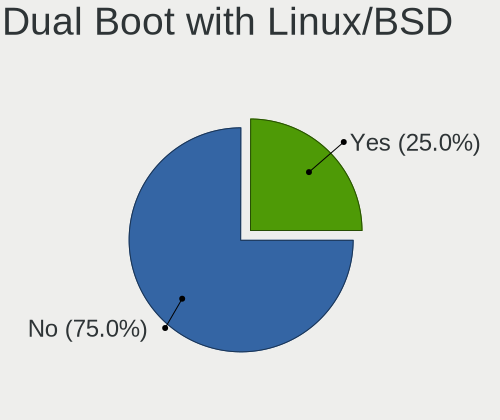
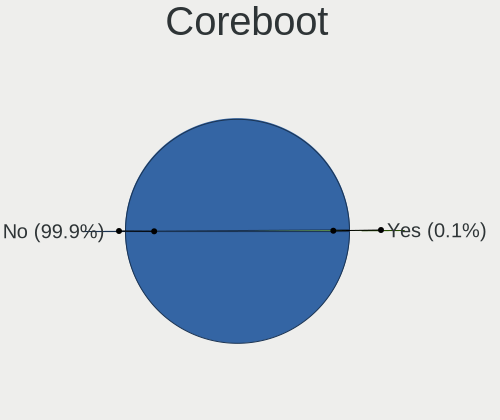
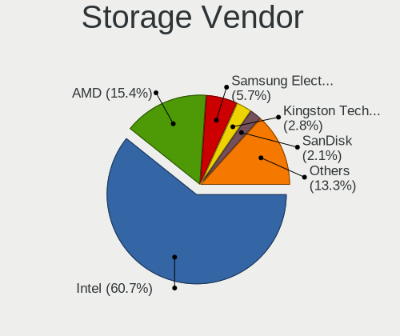
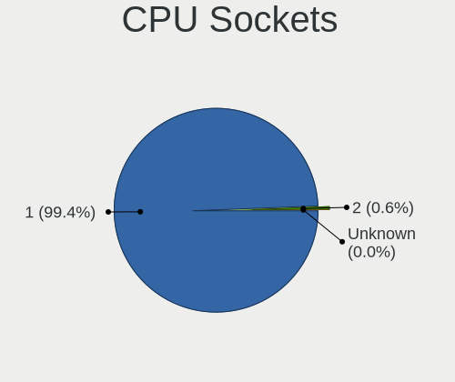
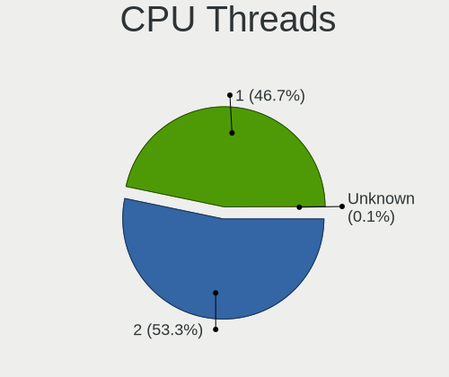
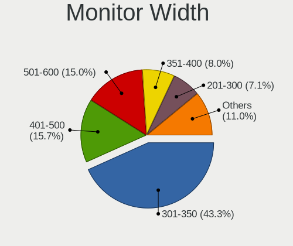
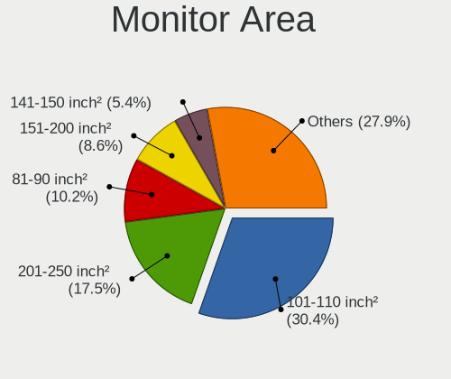
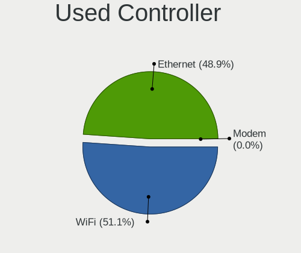
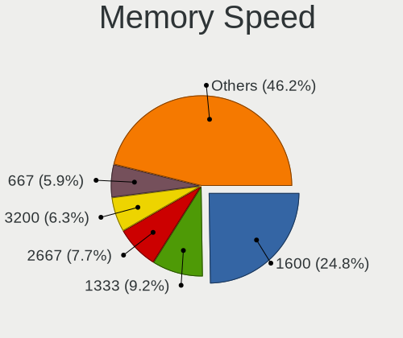
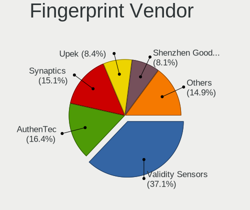

Linux in Hungary - Tested Hardware & Statistics
-----------------------------------------------

A project to collect tested hardware configurations for Linux in Hungary.

Anyone can contribute to this report by the [hw-probe](https://github.com/linuxhw/hw-probe) tool:

    sudo -E hw-probe -all -upload

Please contribute! Especially if your hardware is rare.

This is a report for all computer types. See also reports for [desktops](/Location/Hungary/Desktop/README.md) and [notebooks](/Location/Hungary/Notebook/README.md).

Contents
--------

* [ Test Cases ](#test-cases)

* [ System ](#system)
  - [ OS                       ](#os)
  - [ OS Family                ](#os-family)
  - [ Kernel                   ](#kernel)
  - [ Kernel Family            ](#kernel-family)
  - [ Kernel Major Ver.        ](#kernel-major-ver)
  - [ Arch                     ](#arch)
  - [ DE                       ](#de)
  - [ Display Server           ](#display-server)
  - [ Display Manager          ](#display-manager)
  - [ OS Lang                  ](#os-lang)
  - [ Boot Mode                ](#boot-mode)
  - [ Filesystem               ](#filesystem)
  - [ Part. scheme             ](#part-scheme)
  - [ Dual Boot with Linux/BSD ](#dual-boot-with-linuxbsd)
  - [ Dual Boot (Win)          ](#dual-boot-win)

* [ Board ](#board)
  - [ Vendor                   ](#vendor)
  - [ Model                    ](#model)
  - [ Model Family             ](#model-family)
  - [ MFG Year                 ](#mfg-year)
  - [ Form Factor              ](#form-factor)
  - [ Secure Boot              ](#secure-boot)
  - [ Coreboot                 ](#coreboot)
  - [ RAM Size                 ](#ram-size)
  - [ RAM Used                 ](#ram-used)
  - [ Total Drives             ](#total-drives)
  - [ Has CD-ROM               ](#has-cd-rom)
  - [ Has Ethernet             ](#has-ethernet)
  - [ Has WiFi                 ](#has-wifi)
  - [ Has Bluetooth            ](#has-bluetooth)

* [ Location ](#location)
  - [ Country                  ](#country)
  - [ City                     ](#city)

* [ Drives ](#drives)
  - [ Drive Vendor             ](#drive-vendor)
  - [ Drive Model              ](#drive-model)
  - [ HDD Vendor               ](#hdd-vendor)
  - [ SSD Vendor               ](#ssd-vendor)
  - [ Drive Kind               ](#drive-kind)
  - [ Drive Connector          ](#drive-connector)
  - [ Drive Size               ](#drive-size)
  - [ Space Total              ](#space-total)
  - [ Space Used               ](#space-used)
  - [ Malfunc. Drives          ](#malfunc-drives)
  - [ Malfunc. Drive Vendor    ](#malfunc-drive-vendor)
  - [ Malfunc. HDD Vendor      ](#malfunc-hdd-vendor)
  - [ Malfunc. Drive Kind      ](#malfunc-drive-kind)
  - [ Failed Drives            ](#failed-drives)
  - [ Failed Drive Vendor      ](#failed-drive-vendor)
  - [ Drive Status             ](#drive-status)

* [ Storage controller ](#storage-controller)
  - [ Storage Vendor           ](#storage-vendor)
  - [ Storage Model            ](#storage-model)
  - [ Storage Kind             ](#storage-kind)

* [ Processor ](#processor)
  - [ CPU Vendor               ](#cpu-vendor)
  - [ CPU Model                ](#cpu-model)
  - [ CPU Model Family         ](#cpu-model-family)
  - [ CPU Cores                ](#cpu-cores)
  - [ CPU Sockets              ](#cpu-sockets)
  - [ CPU Threads              ](#cpu-threads)
  - [ CPU Op-Modes             ](#cpu-op-modes)
  - [ CPU Microcode            ](#cpu-microcode)
  - [ CPU Microarch            ](#cpu-microarch)

* [ Graphics ](#graphics)
  - [ GPU Vendor               ](#gpu-vendor)
  - [ GPU Model                ](#gpu-model)
  - [ GPU Combo                ](#gpu-combo)
  - [ GPU Driver               ](#gpu-driver)
  - [ GPU Memory               ](#gpu-memory)

* [ Monitor ](#monitor)
  - [ Monitor Vendor           ](#monitor-vendor)
  - [ Monitor Model            ](#monitor-model)
  - [ Monitor Resolution       ](#monitor-resolution)
  - [ Monitor Diagonal         ](#monitor-diagonal)
  - [ Monitor Width            ](#monitor-width)
  - [ Aspect Ratio             ](#aspect-ratio)
  - [ Monitor Area             ](#monitor-area)
  - [ Pixel Density            ](#pixel-density)
  - [ Multiple Monitors        ](#multiple-monitors)

* [ Network ](#network)
  - [ Net Controller Vendor    ](#net-controller-vendor)
  - [ Net Controller Model     ](#net-controller-model)
  - [ Wireless Vendor          ](#wireless-vendor)
  - [ Wireless Model           ](#wireless-model)
  - [ Ethernet Vendor          ](#ethernet-vendor)
  - [ Ethernet Model           ](#ethernet-model)
  - [ Net Controller Kind      ](#net-controller-kind)
  - [ Used Controller          ](#used-controller)
  - [ NICs                     ](#nics)
  - [ IPv6                     ](#ipv6)

* [ Bluetooth ](#bluetooth)
  - [ Bluetooth Vendor         ](#bluetooth-vendor)
  - [ Bluetooth Model          ](#bluetooth-model)

* [ Sound ](#sound)
  - [ Sound Vendor             ](#sound-vendor)
  - [ Sound Model              ](#sound-model)

* [ Memory ](#memory)
  - [ Memory Vendor            ](#memory-vendor)
  - [ Memory Model             ](#memory-model)
  - [ Memory Kind              ](#memory-kind)
  - [ Memory Form Factor       ](#memory-form-factor)
  - [ Memory Size              ](#memory-size)
  - [ Memory Speed             ](#memory-speed)

* [ Printers & scanners ](#printers--scanners)
  - [ Printer Vendor           ](#printer-vendor)
  - [ Printer Model            ](#printer-model)
  - [ Scanner Vendor           ](#scanner-vendor)
  - [ Scanner Model            ](#scanner-model)

* [ Camera ](#camera)
  - [ Camera Vendor            ](#camera-vendor)
  - [ Camera Model             ](#camera-model)

* [ Security ](#security)
  - [ Fingerprint Vendor       ](#fingerprint-vendor)
  - [ Fingerprint Model        ](#fingerprint-model)
  - [ Chipcard Vendor          ](#chipcard-vendor)
  - [ Chipcard Model           ](#chipcard-model)

* [ Unsupported ](#unsupported)
  - [ Unsupported Devices      ](#unsupported-devices)
  - [ Unsupported Device Types ](#unsupported-device-types)

Test Cases
----------

Total: 10059

| Vendor        | Model                       | Form-Factor | Probe                                                      | Date         |
|---------------|-----------------------------|-------------|------------------------------------------------------------|--------------|
| HP            | 805D                        | Desktop     | [208bd3b9dd](https://linux-hardware.org/?probe=208bd3b9dd) | May 09, 2024 |
| Lenovo        | ThinkPad L470 20J5S2RA00    | Notebook    | [9ce0d2cad0](https://linux-hardware.org/?probe=9ce0d2cad0) | May 09, 2024 |
| Dell          | 00V62H A01                  | Desktop     | [2ea426bed2](https://linux-hardware.org/?probe=2ea426bed2) | May 08, 2024 |
| Dell          | 00V62H A01                  | Desktop     | [bc8a5150c3](https://linux-hardware.org/?probe=bc8a5150c3) | May 08, 2024 |
| Lenovo        | ThinkPad X230 2333A91       | Notebook    | [3ad48e3ebe](https://linux-hardware.org/?probe=3ad48e3ebe) | May 08, 2024 |
| Dell          | 0M858N A01                  | Desktop     | [9b34c8bbc2](https://linux-hardware.org/?probe=9b34c8bbc2) | May 08, 2024 |
| ASUSTek       | K54HR                       | Notebook    | [67ddde3a75](https://linux-hardware.org/?probe=67ddde3a75) | May 08, 2024 |
| Dell          | Latitude E5520              | Notebook    | [1dc92b60a8](https://linux-hardware.org/?probe=1dc92b60a8) | May 08, 2024 |
| ASUSTek       | ASUS TUF Gaming F15 FX50... | Notebook    | [20ab787216](https://linux-hardware.org/?probe=20ab787216) | May 08, 2024 |
| Lenovo        | 1036 NO DPK                 | Desktop     | [ea4077ed1b](https://linux-hardware.org/?probe=ea4077ed1b) | May 08, 2024 |
| Fujitsu       | D3403-U1 S26361-D3403-U1    | Desktop     | [75811cd1df](https://linux-hardware.org/?probe=75811cd1df) | May 08, 2024 |
| HP            | 1495                        | Desktop     | [89464c1187](https://linux-hardware.org/?probe=89464c1187) | May 08, 2024 |
| ASRock        | B550M Pro4                  | Desktop     | [41c99b8030](https://linux-hardware.org/?probe=41c99b8030) | May 08, 2024 |
| Lenovo        | ThinkPad X250 20CLS1JN00    | Notebook    | [b1a0c45242](https://linux-hardware.org/?probe=b1a0c45242) | May 07, 2024 |
| Gigabyte      | F2A88XM-HD3                 | Desktop     | [14bb67e07a](https://linux-hardware.org/?probe=14bb67e07a) | May 07, 2024 |
| ASUSTek       | H110M-A                     | Desktop     | [e4868e57a3](https://linux-hardware.org/?probe=e4868e57a3) | May 07, 2024 |
| ASUSTek       | PRIME A320M-R               | Desktop     | [8b5ef47376](https://linux-hardware.org/?probe=8b5ef47376) | May 07, 2024 |
| ASRock        | Z390 Pro4                   | Desktop     | [ee53393400](https://linux-hardware.org/?probe=ee53393400) | May 07, 2024 |
| Dell          | Latitude 5501               | Notebook    | [35d264df4c](https://linux-hardware.org/?probe=35d264df4c) | May 07, 2024 |
| ASUSTek       | X550LN                      | Notebook    | [b139a58ea9](https://linux-hardware.org/?probe=b139a58ea9) | May 07, 2024 |
| ASUSTek       | H110M-K                     | Desktop     | [373b9bdb5c](https://linux-hardware.org/?probe=373b9bdb5c) | May 07, 2024 |
| ASUSTek       | P5K3 Deluxe                 | Desktop     | [b03bf61625](https://linux-hardware.org/?probe=b03bf61625) | May 07, 2024 |
| HP            | Laptop 15-dw1xxx            | Notebook    | [7d4c93ea72](https://linux-hardware.org/?probe=7d4c93ea72) | May 07, 2024 |
| Gigabyte      | H110M-S2V-CF                | Desktop     | [22eb41201e](https://linux-hardware.org/?probe=22eb41201e) | May 07, 2024 |
| Huanan        | X99-QD4 V0.1 693H           | Desktop     | [e8e1e2e2f8](https://linux-hardware.org/?probe=e8e1e2e2f8) | May 07, 2024 |
| MSI           | MAG B550 TOMAHAWK           | Desktop     | [07a4ffe918](https://linux-hardware.org/?probe=07a4ffe918) | May 07, 2024 |
| Lenovo        | SHARKBAY NOK                | Desktop     | [f696d03152](https://linux-hardware.org/?probe=f696d03152) | May 07, 2024 |
| Gigabyte      | A520M S2H                   | Desktop     | [c14a7e4724](https://linux-hardware.org/?probe=c14a7e4724) | May 07, 2024 |
| HP            | Pavilion Gaming Laptop 1... | Notebook    | [e27e19897e](https://linux-hardware.org/?probe=e27e19897e) | May 07, 2024 |
| ASUSTek       | TUF Gaming B560M-PLUS       | Desktop     | [ec3b3b1daa](https://linux-hardware.org/?probe=ec3b3b1daa) | May 07, 2024 |
| Lenovo        | V15-ADA 82C7                | Notebook    | [db9ea4ffaf](https://linux-hardware.org/?probe=db9ea4ffaf) | May 07, 2024 |
| ASUSTek       | A88XM-E                     | Desktop     | [bba7d20511](https://linux-hardware.org/?probe=bba7d20511) | May 07, 2024 |
| Fujitsu       | LIFEBOOK AH530              | Notebook    | [b8e70b0693](https://linux-hardware.org/?probe=b8e70b0693) | May 07, 2024 |
| Fujitsu       | LIFEBOOK AH530              | Notebook    | [55fdc987e5](https://linux-hardware.org/?probe=55fdc987e5) | May 07, 2024 |
| Dell          | Inspiron 7737               | Notebook    | [73f61be8b5](https://linux-hardware.org/?probe=73f61be8b5) | May 06, 2024 |
| Gigabyte      | H97M-HD3                    | Desktop     | [7548e25e9d](https://linux-hardware.org/?probe=7548e25e9d) | May 06, 2024 |
| Huanan        | X99-QD4 V0.1 693H           | Desktop     | [c23f1deec5](https://linux-hardware.org/?probe=c23f1deec5) | May 06, 2024 |
| Acer          | Aspire 5750                 | Notebook    | [c414f0202a](https://linux-hardware.org/?probe=c414f0202a) | May 06, 2024 |
| ASUSTek       | ASUS TUF Gaming A15 FA50... | Notebook    | [b86bb80db9](https://linux-hardware.org/?probe=b86bb80db9) | May 05, 2024 |
| HP            | 650                         | Notebook    | [6e66ce7389](https://linux-hardware.org/?probe=6e66ce7389) | May 05, 2024 |
| ASRock        | 970 Extreme3                | Desktop     | [78a7df5736](https://linux-hardware.org/?probe=78a7df5736) | May 05, 2024 |
| HP            | 650                         | Notebook    | [aa4f605e5e](https://linux-hardware.org/?probe=aa4f605e5e) | May 05, 2024 |
| MSI           | MAG B550 TOMAHAWK           | Desktop     | [b1077f633d](https://linux-hardware.org/?probe=b1077f633d) | May 04, 2024 |
| HP            | 339A                        | Desktop     | [a5f44d3bdb](https://linux-hardware.org/?probe=a5f44d3bdb) | May 04, 2024 |
| HP            | EliteBook 8570w             | Notebook    | [d18669833b](https://linux-hardware.org/?probe=d18669833b) | May 04, 2024 |
| HP            | Notebook                    | Notebook    | [87f06569d7](https://linux-hardware.org/?probe=87f06569d7) | May 04, 2024 |
| HP            | Laptop 15-bs0xx             | Notebook    | [7a34574eb1](https://linux-hardware.org/?probe=7a34574eb1) | May 03, 2024 |
| Gigabyte      | H81M-S1                     | Desktop     | [b0e189e984](https://linux-hardware.org/?probe=b0e189e984) | May 03, 2024 |
| Gigabyte      | H81M-S1                     | Desktop     | [8bc865780b](https://linux-hardware.org/?probe=8bc865780b) | May 03, 2024 |
| Lenovo        | ThinkPad X1 Carbon 2nd 2... | Notebook    | [1342233681](https://linux-hardware.org/?probe=1342233681) | May 03, 2024 |
| Lenovo        | IdeaPad Slim 5 16ABR8 82... | Notebook    | [d3c40c405d](https://linux-hardware.org/?probe=d3c40c405d) | May 03, 2024 |
| Dell          | Inspiron 5558               | Notebook    | [f3e4760d0f](https://linux-hardware.org/?probe=f3e4760d0f) | May 03, 2024 |
| Dell          | Inspiron 5558               | Notebook    | [ded6bb6fdc](https://linux-hardware.org/?probe=ded6bb6fdc) | May 02, 2024 |
| ASRockRack    | X570D4I-2T                  | Server      | [fd5c83c424](https://linux-hardware.org/?probe=fd5c83c424) | May 02, 2024 |
| Lenovo        | IdeaPad Pro 5 16IMH9 83D... | Notebook    | [194589e94c](https://linux-hardware.org/?probe=194589e94c) | May 02, 2024 |
| ASUSTek       | K40IE                       | Notebook    | [82ddbf99c2](https://linux-hardware.org/?probe=82ddbf99c2) | May 02, 2024 |
| Dell          | Inspiron 5558               | Notebook    | [6f084542fa](https://linux-hardware.org/?probe=6f084542fa) | May 02, 2024 |
| HP            | 8298                        | Desktop     | [da2ba36ce9](https://linux-hardware.org/?probe=da2ba36ce9) | May 02, 2024 |
| eMachines     | E725                        | Notebook    | [f8c6e397e1](https://linux-hardware.org/?probe=f8c6e397e1) | May 01, 2024 |
| HP            | 255 G5 Notebook PC          | Notebook    | [945efc5a98](https://linux-hardware.org/?probe=945efc5a98) | May 01, 2024 |
| MSI           | MAG B550 TOMAHAWK           | Desktop     | [ff55d733a4](https://linux-hardware.org/?probe=ff55d733a4) | May 01, 2024 |
| HP            | ProBook 455 G3              | Notebook    | [6d6caa45cb](https://linux-hardware.org/?probe=6d6caa45cb) | May 01, 2024 |
| HP            | ProBook 455 G3              | Notebook    | [bb9d1ec75d](https://linux-hardware.org/?probe=bb9d1ec75d) | May 01, 2024 |
| Lenovo        | IdeaPad 1 15ALC7 82R4       | Notebook    | [8d9c16f300](https://linux-hardware.org/?probe=8d9c16f300) | May 01, 2024 |
| Packard Be... | EasyNote TE11BZ             | Notebook    | [fe163fcb48](https://linux-hardware.org/?probe=fe163fcb48) | May 01, 2024 |
| Packard Be... | EasyNote TE11BZ             | Notebook    | [db92c4f28a](https://linux-hardware.org/?probe=db92c4f28a) | May 01, 2024 |
| Dell          | Latitude 7410               | Convertible | [e0b90e01f1](https://linux-hardware.org/?probe=e0b90e01f1) | Apr 30, 2024 |
| Dell          | Latitude 5440               | Notebook    | [c51190016f](https://linux-hardware.org/?probe=c51190016f) | Apr 30, 2024 |
| Acer          | RS880M05                    | Desktop     | [bc549ed290](https://linux-hardware.org/?probe=bc549ed290) | Apr 30, 2024 |
| HP            | 0B4Ch D                     | Desktop     | [db2b347526](https://linux-hardware.org/?probe=db2b347526) | Apr 30, 2024 |
| eMachines     | E725                        | Notebook    | [f48c8f52da](https://linux-hardware.org/?probe=f48c8f52da) | Apr 30, 2024 |
| Samsung       | 535U3C                      | Notebook    | [8807f9f44f](https://linux-hardware.org/?probe=8807f9f44f) | Apr 29, 2024 |
| Fujitsu       | D3061-A1 S26361-D3061-A1    | Desktop     | [120693fd0b](https://linux-hardware.org/?probe=120693fd0b) | Apr 29, 2024 |
| Lenovo        | ThinkPad T420 423662G       | Notebook    | [e67bde685e](https://linux-hardware.org/?probe=e67bde685e) | Apr 29, 2024 |
| Dell          | Latitude E6420              | Notebook    | [ce4fbe47c7](https://linux-hardware.org/?probe=ce4fbe47c7) | Apr 29, 2024 |
| Lenovo        | ThinkPad T420 423662G       | Notebook    | [c21e1e6ad3](https://linux-hardware.org/?probe=c21e1e6ad3) | Apr 29, 2024 |
| Dell          | Latitude E6420              | Notebook    | [b7e8d7d578](https://linux-hardware.org/?probe=b7e8d7d578) | Apr 29, 2024 |
| HP            | Laptop 15-dw1xxx            | Notebook    | [7332d6602f](https://linux-hardware.org/?probe=7332d6602f) | Apr 28, 2024 |
| HP            | Notebook                    | Notebook    | [43a6b1537a](https://linux-hardware.org/?probe=43a6b1537a) | Apr 28, 2024 |
| HP            | 0B4Ch D                     | Desktop     | [a4057cd447](https://linux-hardware.org/?probe=a4057cd447) | Apr 28, 2024 |
| HP            | Pavilion Gaming Laptop 1... | Notebook    | [3f7c1cff47](https://linux-hardware.org/?probe=3f7c1cff47) | Apr 28, 2024 |
| Fujitsu       | D2628-C1 S26361-D2628-C1    | Desktop     | [1456965e8a](https://linux-hardware.org/?probe=1456965e8a) | Apr 28, 2024 |
| ASRock        | Z390 Pro4                   | Desktop     | [b50024c729](https://linux-hardware.org/?probe=b50024c729) | Apr 28, 2024 |
| HP            | 3029h                       | Desktop     | [1ae766a3ba](https://linux-hardware.org/?probe=1ae766a3ba) | Apr 28, 2024 |
| Acer          | Swift SF114-32              | Notebook    | [0e6af8b6ca](https://linux-hardware.org/?probe=0e6af8b6ca) | Apr 28, 2024 |
| HP            | Pavilion Gaming Laptop 1... | Notebook    | [4ea4b9b731](https://linux-hardware.org/?probe=4ea4b9b731) | Apr 28, 2024 |
| Gigabyte      | B450M GAMING                | Desktop     | [f81c1dea8d](https://linux-hardware.org/?probe=f81c1dea8d) | Apr 27, 2024 |
| Gigabyte      | B450M GAMING                | Desktop     | [0edf4e838c](https://linux-hardware.org/?probe=0edf4e838c) | Apr 27, 2024 |
| Dell          | 0D883F A06                  | Desktop     | [a82d507833](https://linux-hardware.org/?probe=a82d507833) | Apr 27, 2024 |
| Dell          | 0200DY A03                  | Desktop     | [96991fe0ba](https://linux-hardware.org/?probe=96991fe0ba) | Apr 27, 2024 |
| Lenovo        | ThinkPad E560 20EV0011GE    | Notebook    | [38ab585e58](https://linux-hardware.org/?probe=38ab585e58) | Apr 27, 2024 |
| Dell          | Inspiron 3542               | Notebook    | [947b81aba4](https://linux-hardware.org/?probe=947b81aba4) | Apr 27, 2024 |
| Dell          | Inspiron 15-3567            | Notebook    | [fcff8a4272](https://linux-hardware.org/?probe=fcff8a4272) | Apr 26, 2024 |
| HP            | ProBook 455 G1              | Notebook    | [b67b7fc16d](https://linux-hardware.org/?probe=b67b7fc16d) | Apr 26, 2024 |
| HP            | ProBook 455 G1              | Notebook    | [59808a41b2](https://linux-hardware.org/?probe=59808a41b2) | Apr 26, 2024 |
| Apple         | MacBookPro5,5               | Notebook    | [d1fbf194df](https://linux-hardware.org/?probe=d1fbf194df) | Apr 25, 2024 |
| ASUSTek       | A88XM-E                     | Desktop     | [96107974e8](https://linux-hardware.org/?probe=96107974e8) | Apr 25, 2024 |
| Lenovo        | 1036 NO DPK                 | Desktop     | [e69292ead4](https://linux-hardware.org/?probe=e69292ead4) | Apr 25, 2024 |
| Lenovo        | ThinkPad X230 2324F43       | Notebook    | [3508590441](https://linux-hardware.org/?probe=3508590441) | Apr 25, 2024 |
| Dell          | Inspiron 15-3567            | Notebook    | [28838a3b1b](https://linux-hardware.org/?probe=28838a3b1b) | Apr 25, 2024 |
| Dell          | Latitude 5430               | Notebook    | [dba91be037](https://linux-hardware.org/?probe=dba91be037) | Apr 25, 2024 |
| ASRock        | B550M Pro4                  | Desktop     | [60952c8e62](https://linux-hardware.org/?probe=60952c8e62) | Apr 24, 2024 |
| Gigabyte      | H310M A-CF x.x              | Desktop     | [250df2037f](https://linux-hardware.org/?probe=250df2037f) | Apr 24, 2024 |
| HP            | 255 G5 Notebook PC          | Notebook    | [b3b73c7c85](https://linux-hardware.org/?probe=b3b73c7c85) | Apr 24, 2024 |
| Apple         | Mac-942B59F58194171B iMa... | All in one  | [7ff5e65027](https://linux-hardware.org/?probe=7ff5e65027) | Apr 24, 2024 |
| ASUSTek       | K53BY                       | Notebook    | [b00f35b89c](https://linux-hardware.org/?probe=b00f35b89c) | Apr 23, 2024 |
| AMI           | Intel                       | Desktop     | [e1b1d85e3c](https://linux-hardware.org/?probe=e1b1d85e3c) | Apr 23, 2024 |
| Dell          | 0200DY A03                  | Desktop     | [a838cb0e0d](https://linux-hardware.org/?probe=a838cb0e0d) | Apr 23, 2024 |
| HP            | 1494                        | Desktop     | [82c9d00df1](https://linux-hardware.org/?probe=82c9d00df1) | Apr 22, 2024 |
| Dell          | 0HY9JP A02                  | Desktop     | [08e7641b37](https://linux-hardware.org/?probe=08e7641b37) | Apr 22, 2024 |
| Gigabyte      | B550 GAMING X V2            | Desktop     | [0a1f16fa6a](https://linux-hardware.org/?probe=0a1f16fa6a) | Apr 22, 2024 |
| Lenovo        | 1036 NO DPK                 | Desktop     | [1462b6d76a](https://linux-hardware.org/?probe=1462b6d76a) | Apr 22, 2024 |
| Microsoft     | Surface Pro 3               | Tablet      | [190985f2da](https://linux-hardware.org/?probe=190985f2da) | Apr 22, 2024 |
| ASUSTek       | PRIME H610M-K D4            | Desktop     | [91735d80f4](https://linux-hardware.org/?probe=91735d80f4) | Apr 22, 2024 |
| ASUSTek       | PRIME H610M-K D4            | Desktop     | [ff2ff25197](https://linux-hardware.org/?probe=ff2ff25197) | Apr 22, 2024 |
| ASUSTek       | K54C                        | Notebook    | [9204edfa98](https://linux-hardware.org/?probe=9204edfa98) | Apr 21, 2024 |
| ASUSTek       | K54C                        | Notebook    | [0853f021e9](https://linux-hardware.org/?probe=0853f021e9) | Apr 21, 2024 |
| Packard Be... | EasyNote TK36               | Notebook    | [f44f785257](https://linux-hardware.org/?probe=f44f785257) | Apr 21, 2024 |
| ASUSTek       | K53TA                       | Notebook    | [128c0946a5](https://linux-hardware.org/?probe=128c0946a5) | Apr 21, 2024 |
| ASUSTek       | K53TA                       | Notebook    | [411dc2f51d](https://linux-hardware.org/?probe=411dc2f51d) | Apr 21, 2024 |
| HP            | Presario CQ57               | Notebook    | [366b704066](https://linux-hardware.org/?probe=366b704066) | Apr 21, 2024 |
| Dell          | 0TY565                      | Desktop     | [f5c8cf7e9b](https://linux-hardware.org/?probe=f5c8cf7e9b) | Apr 21, 2024 |
| HP            | Laptop 15-dw1xxx            | Notebook    | [4a2376cdfa](https://linux-hardware.org/?probe=4a2376cdfa) | Apr 21, 2024 |
| HP            | 82A2                        | Desktop     | [1eeebb4829](https://linux-hardware.org/?probe=1eeebb4829) | Apr 20, 2024 |
| HP            | EliteBook 8570p             | Notebook    | [98d15b6d8d](https://linux-hardware.org/?probe=98d15b6d8d) | Apr 20, 2024 |
| Lenovo        | ThinkStation D20 4158AF8    | Desktop     | [8b93f4607f](https://linux-hardware.org/?probe=8b93f4607f) | Apr 20, 2024 |
| ASUSTek       | PRIME A320M-R               | Desktop     | [b10f7daaa1](https://linux-hardware.org/?probe=b10f7daaa1) | Apr 20, 2024 |
| HP            | Presario CQ57               | Notebook    | [956b5fe458](https://linux-hardware.org/?probe=956b5fe458) | Apr 20, 2024 |
| Acer          | Aspire A715-43G             | Notebook    | [737b4f2bfb](https://linux-hardware.org/?probe=737b4f2bfb) | Apr 19, 2024 |
| Gigabyte      | MJ11-EC1-OT 01000100        | Server      | [9d04672f51](https://linux-hardware.org/?probe=9d04672f51) | Apr 19, 2024 |
| Acer          | Aspire A715-43G             | Notebook    | [b1605729ff](https://linux-hardware.org/?probe=b1605729ff) | Apr 19, 2024 |
| HP            | ProBook 640 G8 Notebook ... | Notebook    | [473affb537](https://linux-hardware.org/?probe=473affb537) | Apr 19, 2024 |
| ASUSTek       | P8Z77-V LK                  | Desktop     | [c2290882c6](https://linux-hardware.org/?probe=c2290882c6) | Apr 18, 2024 |
| Acer          | Aspire ES1-512              | Notebook    | [11c23ef24d](https://linux-hardware.org/?probe=11c23ef24d) | Apr 18, 2024 |
| Acer          | Aspire ES1-512              | Notebook    | [6c292bf7df](https://linux-hardware.org/?probe=6c292bf7df) | Apr 18, 2024 |
| ASUSTek       | ASUS TUF Gaming F15 FX50... | Notebook    | [6f826f9c64](https://linux-hardware.org/?probe=6f826f9c64) | Apr 18, 2024 |
| MSI           | X58 Pro-E                   | Desktop     | [4411cb9e36](https://linux-hardware.org/?probe=4411cb9e36) | Apr 18, 2024 |
| ASUSTek       | X450LN                      | Notebook    | [bab98faa56](https://linux-hardware.org/?probe=bab98faa56) | Apr 18, 2024 |
| ASRock        | B450M Pro4                  | Desktop     | [36dcccf3ea](https://linux-hardware.org/?probe=36dcccf3ea) | Apr 17, 2024 |
| Dell          | Latitude D520               | Notebook    | [d0f7ecac0a](https://linux-hardware.org/?probe=d0f7ecac0a) | Apr 17, 2024 |
| Dell          | Latitude D520               | Notebook    | [faf18ae19f](https://linux-hardware.org/?probe=faf18ae19f) | Apr 17, 2024 |
| Lenovo        | IdeaPad 120S-14IAP 81A5     | Notebook    | [59cf1e0ea1](https://linux-hardware.org/?probe=59cf1e0ea1) | Apr 17, 2024 |
| ASUSTek       | ROG Flow X13 GV301RE_GV3... | Convertible | [b962f57bfa](https://linux-hardware.org/?probe=b962f57bfa) | Apr 16, 2024 |
| Acer          | Aspire E1-571               | Notebook    | [3a38e7fc4f](https://linux-hardware.org/?probe=3a38e7fc4f) | Apr 16, 2024 |
| Lenovo        | ThinkPad L430 2466EN8       | Notebook    | [9a42213649](https://linux-hardware.org/?probe=9a42213649) | Apr 16, 2024 |
| Dell          | 0VHWTR A02                  | Desktop     | [4e32c7cfca](https://linux-hardware.org/?probe=4e32c7cfca) | Apr 15, 2024 |
| Toshiba       | Satellite L650              | Notebook    | [b05f51b2c8](https://linux-hardware.org/?probe=b05f51b2c8) | Apr 15, 2024 |
| Toshiba       | Satellite L650              | Notebook    | [0a98edcca4](https://linux-hardware.org/?probe=0a98edcca4) | Apr 15, 2024 |
| Lenovo        | ThinkBook 15-IIL 20SM       | Notebook    | [0f31e777c7](https://linux-hardware.org/?probe=0f31e777c7) | Apr 15, 2024 |
| Toshiba       | Satellite L650              | Notebook    | [e706aef914](https://linux-hardware.org/?probe=e706aef914) | Apr 15, 2024 |
| Toshiba       | Satellite L650              | Notebook    | [1ffbc9aa24](https://linux-hardware.org/?probe=1ffbc9aa24) | Apr 15, 2024 |
| MSI           | EX600                       | Notebook    | [df674cd3c0](https://linux-hardware.org/?probe=df674cd3c0) | Apr 14, 2024 |
| ASUSTek       | M4A77TD PRO                 | Desktop     | [1a2f03a742](https://linux-hardware.org/?probe=1a2f03a742) | Apr 14, 2024 |
| Lenovo        | ThinkPad T470 20HES58A1L    | Notebook    | [fd97b7444d](https://linux-hardware.org/?probe=fd97b7444d) | Apr 14, 2024 |
| Lenovo        | ThinkPad X200 74595FG       | Notebook    | [708440ed39](https://linux-hardware.org/?probe=708440ed39) | Apr 14, 2024 |
| Gigabyte      | B660M GAMING DDR4           | Desktop     | [88ad8806c3](https://linux-hardware.org/?probe=88ad8806c3) | Apr 13, 2024 |
| Gigabyte      | B365 M AORUS ELITE-CF       | Desktop     | [b00ebd6fcc](https://linux-hardware.org/?probe=b00ebd6fcc) | Apr 13, 2024 |
| Packard Be... | EasyNote TK36               | Notebook    | [0c3a4cf1cc](https://linux-hardware.org/?probe=0c3a4cf1cc) | Apr 13, 2024 |
| Dell          | Inspiron 5567               | Notebook    | [d3a4e47ddb](https://linux-hardware.org/?probe=d3a4e47ddb) | Apr 13, 2024 |
| HP            | 8265                        | Desktop     | [c4d4cdac41](https://linux-hardware.org/?probe=c4d4cdac41) | Apr 13, 2024 |
| HP            | Pavilion Laptop 15-eh0xx... | Notebook    | [f24619635f](https://linux-hardware.org/?probe=f24619635f) | Apr 12, 2024 |
| ASRock        | B460M Pro4                  | Desktop     | [51a2126e7d](https://linux-hardware.org/?probe=51a2126e7d) | Apr 12, 2024 |
| Gigabyte      | H310M A-CF x.x              | Desktop     | [5bc49637b9](https://linux-hardware.org/?probe=5bc49637b9) | Apr 12, 2024 |
| ASUSTek       | H110I-PLUS                  | Desktop     | [c2d65f19ca](https://linux-hardware.org/?probe=c2d65f19ca) | Apr 12, 2024 |
| ASRock        | H310CM-HDV/M.2              | Desktop     | [a0aec56216](https://linux-hardware.org/?probe=a0aec56216) | Apr 11, 2024 |
| ASUSTek       | P8Z77-V LX                  | Desktop     | [c108665460](https://linux-hardware.org/?probe=c108665460) | Apr 11, 2024 |
| Fujitsu       | D3220-A1 S26361-D3220-A1    | Desktop     | [5fb89da542](https://linux-hardware.org/?probe=5fb89da542) | Apr 11, 2024 |
| Fujitsu       | D3220-A1 S26361-D3220-A1    | Desktop     | [74dd149115](https://linux-hardware.org/?probe=74dd149115) | Apr 11, 2024 |
| Lenovo        | B50-70 20384                | Notebook    | [431d6db80a](https://linux-hardware.org/?probe=431d6db80a) | Apr 11, 2024 |
| Lenovo        | IdeaPad 120S-14IAP 81A5     | Notebook    | [8dd990563f](https://linux-hardware.org/?probe=8dd990563f) | Apr 11, 2024 |
| ASUSTek       | ZenBook UX425UA_UM425UA     | Notebook    | [a4cda4b4f0](https://linux-hardware.org/?probe=a4cda4b4f0) | Apr 10, 2024 |
| ASUSTek       | ZenBook UX425UA_UM425UA     | Notebook    | [2359c23a41](https://linux-hardware.org/?probe=2359c23a41) | Apr 10, 2024 |
| Packard Be... | EasyNote TV43HC             | Notebook    | [07aac9c6e6](https://linux-hardware.org/?probe=07aac9c6e6) | Apr 10, 2024 |
| Packard Be... | EasyNote TV43HC             | Notebook    | [036bbb75eb](https://linux-hardware.org/?probe=036bbb75eb) | Apr 10, 2024 |
| HP            | ProBook 455 G1              | Notebook    | [d332e44b92](https://linux-hardware.org/?probe=d332e44b92) | Apr 10, 2024 |
| Lenovo        | ThinkPad T530 2429NL6       | Notebook    | [d16f3981f4](https://linux-hardware.org/?probe=d16f3981f4) | Apr 10, 2024 |
| ASUSTek       | M5A97 R2.0                  | Desktop     | [eadf15884b](https://linux-hardware.org/?probe=eadf15884b) | Apr 10, 2024 |
| Gigabyte      | F2A88XN-WIFI                | Desktop     | [dd15f5797f](https://linux-hardware.org/?probe=dd15f5797f) | Apr 09, 2024 |
| Gigabyte      | F2A88XN-WIFI                | Desktop     | [2d897e4ab7](https://linux-hardware.org/?probe=2d897e4ab7) | Apr 09, 2024 |
| ASUSTek       | ROG Flow X13 GV301RE_GV3... | Convertible | [56fbfc73ad](https://linux-hardware.org/?probe=56fbfc73ad) | Apr 09, 2024 |
| Dell          | Inspiron 5558               | Notebook    | [a583587fa0](https://linux-hardware.org/?probe=a583587fa0) | Apr 09, 2024 |
| HP            | 250 15.6 inch G9 Noteboo... | Notebook    | [717e8590bb](https://linux-hardware.org/?probe=717e8590bb) | Apr 09, 2024 |
| ASUSTek       | X541NA                      | Notebook    | [4118d01689](https://linux-hardware.org/?probe=4118d01689) | Apr 09, 2024 |
| ASUSTek       | PRIME A320M-R               | Desktop     | [eb77201fa8](https://linux-hardware.org/?probe=eb77201fa8) | Apr 09, 2024 |
| HP            | ProBook 455 G1              | Notebook    | [9a0d60a4e6](https://linux-hardware.org/?probe=9a0d60a4e6) | Apr 09, 2024 |
| Gigabyte      | B75M-D3H                    | Desktop     | [fa4c48c242](https://linux-hardware.org/?probe=fa4c48c242) | Apr 09, 2024 |
| HP            | Notebook                    | Notebook    | [1ef4d18969](https://linux-hardware.org/?probe=1ef4d18969) | Apr 09, 2024 |
| ASUSTek       | ROG Maximus X CODE          | Desktop     | [446576913d](https://linux-hardware.org/?probe=446576913d) | Apr 08, 2024 |
| Lenovo        | ThinkPad T530 2429NL6       | Notebook    | [ee82d8efd8](https://linux-hardware.org/?probe=ee82d8efd8) | Apr 08, 2024 |
| ASUSTek       | P5G41T-M LX                 | Desktop     | [67249f5ab0](https://linux-hardware.org/?probe=67249f5ab0) | Apr 08, 2024 |
| Packard Be... | EasyNote TK36               | Notebook    | [7b4011aa67](https://linux-hardware.org/?probe=7b4011aa67) | Apr 08, 2024 |
| HP            | ProBook 455 G1              | Notebook    | [cf0a1167a4](https://linux-hardware.org/?probe=cf0a1167a4) | Apr 08, 2024 |
| HP            | ProBook 455 G1              | Notebook    | [aca7655496](https://linux-hardware.org/?probe=aca7655496) | Apr 08, 2024 |
| ASUSTek       | M4A785TD-V EVO              | Desktop     | [2dbe37af95](https://linux-hardware.org/?probe=2dbe37af95) | Apr 07, 2024 |
| ASUSTek       | K53SC                       | Notebook    | [9ceedcd930](https://linux-hardware.org/?probe=9ceedcd930) | Apr 07, 2024 |
| HP            | 8265                        | Desktop     | [601051ee6c](https://linux-hardware.org/?probe=601051ee6c) | Apr 07, 2024 |
| ASUSTek       | K53BY                       | Notebook    | [fe40c5b1ae](https://linux-hardware.org/?probe=fe40c5b1ae) | Apr 07, 2024 |
| Gigabyte      | H61M-S1                     | Desktop     | [7fe942c453](https://linux-hardware.org/?probe=7fe942c453) | Apr 07, 2024 |
| Dell          | Latitude E6330              | Notebook    | [c32426747e](https://linux-hardware.org/?probe=c32426747e) | Apr 07, 2024 |
| ASUSTek       | K40IE                       | Notebook    | [152c0b8bef](https://linux-hardware.org/?probe=152c0b8bef) | Apr 07, 2024 |
| Dell          | 0D883F A06                  | Desktop     | [74170027e8](https://linux-hardware.org/?probe=74170027e8) | Apr 07, 2024 |
| ASUSTek       | PRIME B365M-A               | Desktop     | [50b8d3eaf1](https://linux-hardware.org/?probe=50b8d3eaf1) | Apr 07, 2024 |
| Acer          | Aspire E5-571G              | Notebook    | [566b1be599](https://linux-hardware.org/?probe=566b1be599) | Apr 06, 2024 |
| HP            | Presario CQ57               | Notebook    | [2506e7958a](https://linux-hardware.org/?probe=2506e7958a) | Apr 06, 2024 |
| Packard Be... | EasyNote TK36               | Notebook    | [a0d6051c56](https://linux-hardware.org/?probe=a0d6051c56) | Apr 06, 2024 |
| HP            | Presario CQ57               | Notebook    | [781ff00313](https://linux-hardware.org/?probe=781ff00313) | Apr 06, 2024 |
| ASUSTek       | K53BY                       | Notebook    | [c202d85a6a](https://linux-hardware.org/?probe=c202d85a6a) | Apr 06, 2024 |
| HP            | 8265                        | Desktop     | [b08747219b](https://linux-hardware.org/?probe=b08747219b) | Apr 06, 2024 |
| Dell          | 02YYK5 A01                  | Desktop     | [e407d84cc9](https://linux-hardware.org/?probe=e407d84cc9) | Apr 06, 2024 |
| Lenovo        | IdeaPad 330-15IKB 81DE      | Notebook    | [d5c2c9c408](https://linux-hardware.org/?probe=d5c2c9c408) | Apr 06, 2024 |
| ASUSTek       | TUF Gaming B460-PLUS        | Desktop     | [3c7ff2a204](https://linux-hardware.org/?probe=3c7ff2a204) | Apr 05, 2024 |
| ASRock        | Z370 Extreme4               | Desktop     | [6354d3d2a2](https://linux-hardware.org/?probe=6354d3d2a2) | Apr 05, 2024 |
| ASRock        | Z370 Extreme4               | Desktop     | [f6925b3c88](https://linux-hardware.org/?probe=f6925b3c88) | Apr 05, 2024 |
| Lenovo        | Annapurna CRB 0B98401 PR... | Desktop     | [102e8ee904](https://linux-hardware.org/?probe=102e8ee904) | Apr 05, 2024 |
| HP            | Pavilion dv7                | Notebook    | [a84ff5282d](https://linux-hardware.org/?probe=a84ff5282d) | Apr 05, 2024 |
| Acer          | Aspire A317-53              | Notebook    | [ddd85b18e6](https://linux-hardware.org/?probe=ddd85b18e6) | Apr 04, 2024 |
| HP            | 250 G3                      | Notebook    | [94b04f5a94](https://linux-hardware.org/?probe=94b04f5a94) | Apr 04, 2024 |
| HP            | 630                         | Notebook    | [35dd7e2dc4](https://linux-hardware.org/?probe=35dd7e2dc4) | Apr 04, 2024 |
| Acer          | TravelMate 8571             | Notebook    | [057645b066](https://linux-hardware.org/?probe=057645b066) | Apr 04, 2024 |
| Fujitsu       | D3220-A1 S26361-D3220-A1    | Desktop     | [95a657f223](https://linux-hardware.org/?probe=95a657f223) | Apr 03, 2024 |
| ASRock        | 4CoreDual-SATA2             | Desktop     | [469a404c91](https://linux-hardware.org/?probe=469a404c91) | Apr 03, 2024 |
| Dell          | 0YP693 A02                  | Desktop     | [3c0b19e9f2](https://linux-hardware.org/?probe=3c0b19e9f2) | Apr 03, 2024 |
| Dell          | 0YP693 A02                  | Desktop     | [48ec750bd0](https://linux-hardware.org/?probe=48ec750bd0) | Apr 03, 2024 |
| Dell          | 0773VG A02                  | Desktop     | [2db2c160ae](https://linux-hardware.org/?probe=2db2c160ae) | Apr 03, 2024 |
| Lenovo        | IdeaPad 330-15IKB 81DE      | Notebook    | [b165b6fe04](https://linux-hardware.org/?probe=b165b6fe04) | Apr 03, 2024 |
| Lenovo        | ThinkPad X220 Tablet 429... | Notebook    | [78a7a3ff32](https://linux-hardware.org/?probe=78a7a3ff32) | Apr 02, 2024 |
| Dell          | Latitude E6520              | Notebook    | [f27403f5b8](https://linux-hardware.org/?probe=f27403f5b8) | Apr 02, 2024 |
| Dell          | Vostro 1015                 | Notebook    | [807e851743](https://linux-hardware.org/?probe=807e851743) | Apr 02, 2024 |
| Lenovo        | Yoga Pro 7 14APH8 82Y8      | Notebook    | [fe5490324f](https://linux-hardware.org/?probe=fe5490324f) | Apr 01, 2024 |
| Lenovo        | Yoga Pro 7 14ARP8 83AU      | Notebook    | [199fad17bb](https://linux-hardware.org/?probe=199fad17bb) | Apr 01, 2024 |
| Dell          | Latitude 5480               | Notebook    | [3cfb6f8944](https://linux-hardware.org/?probe=3cfb6f8944) | Apr 01, 2024 |
| ASUSTek       | PRIME B450-PLUS             | Desktop     | [b4d733040a](https://linux-hardware.org/?probe=b4d733040a) | Mar 31, 2024 |
| ASUSTek       | PRIME B450-PLUS             | Desktop     | [b4555fa57d](https://linux-hardware.org/?probe=b4555fa57d) | Mar 31, 2024 |
| ASUSTek       | Pro WS X570-ACE             | Desktop     | [bc68546a92](https://linux-hardware.org/?probe=bc68546a92) | Mar 31, 2024 |
| Gigabyte      | H77N-WIFI                   | Desktop     | [3a99c46a79](https://linux-hardware.org/?probe=3a99c46a79) | Mar 30, 2024 |
| Raspberry ... | Raspberry Pi 4 Model B R... | Soc         | [0f799d574c](https://linux-hardware.org/?probe=0f799d574c) | Mar 30, 2024 |
| Dell          | Latitude E6220              | Notebook    | [56d82e4651](https://linux-hardware.org/?probe=56d82e4651) | Mar 30, 2024 |
| HP            | Compaq 610                  | Notebook    | [f2abcd633e](https://linux-hardware.org/?probe=f2abcd633e) | Mar 30, 2024 |
| ASUSTek       | PRIME A320M-R               | Desktop     | [c0736cef30](https://linux-hardware.org/?probe=c0736cef30) | Mar 29, 2024 |
| ASRock        | 980DE3/U3S3 R2.0            | Desktop     | [31798dfffc](https://linux-hardware.org/?probe=31798dfffc) | Mar 29, 2024 |
| Gigabyte      | Z390 M GAMING-CF            | Desktop     | [8e4b596d1a](https://linux-hardware.org/?probe=8e4b596d1a) | Mar 29, 2024 |
| Gigabyte      | Z390 M GAMING-CF            | Desktop     | [ae47f9ded9](https://linux-hardware.org/?probe=ae47f9ded9) | Mar 29, 2024 |
| ASUSTek       | TUF Gaming B550M-E WIFI     | Desktop     | [8de5850e62](https://linux-hardware.org/?probe=8de5850e62) | Mar 29, 2024 |
| ASUSTek       | H110M-A                     | Desktop     | [d7699c7455](https://linux-hardware.org/?probe=d7699c7455) | Mar 29, 2024 |
| ASRock        | 4CoreDual-SATA2             | Desktop     | [30817e9020](https://linux-hardware.org/?probe=30817e9020) | Mar 29, 2024 |
| ASRock        | 4CoreDual-SATA2             | Desktop     | [cbccd74400](https://linux-hardware.org/?probe=cbccd74400) | Mar 29, 2024 |
| Lenovo        | 1036 NO DPK                 | Desktop     | [ba8b769eb3](https://linux-hardware.org/?probe=ba8b769eb3) | Mar 29, 2024 |
| ASUSTek       | K40IE                       | Notebook    | [2abe9e47a0](https://linux-hardware.org/?probe=2abe9e47a0) | Mar 29, 2024 |
| HP            | Presario CQ57               | Notebook    | [f731d051bc](https://linux-hardware.org/?probe=f731d051bc) | Mar 28, 2024 |
| Fujitsu Si... | ESPRIMO Mobile M9400        | Notebook    | [d056f67a21](https://linux-hardware.org/?probe=d056f67a21) | Mar 28, 2024 |
| Acer          | Aspire E5-772G              | Notebook    | [1900649358](https://linux-hardware.org/?probe=1900649358) | Mar 28, 2024 |
| Fujitsu       | D2778-C1 S26361-D2778-C1    | Desktop     | [368a738712](https://linux-hardware.org/?probe=368a738712) | Mar 28, 2024 |
| ASUSTek       | ASUS TUF Gaming F15 FX50... | Notebook    | [3c061242d5](https://linux-hardware.org/?probe=3c061242d5) | Mar 27, 2024 |
| Fujitsu       | D3162-A1 S26361-D3162-A1    | Desktop     | [84c4c90a3f](https://linux-hardware.org/?probe=84c4c90a3f) | Mar 27, 2024 |
| Lenovo        | ThinkServer TS440           | Desktop     | [063d6aafdb](https://linux-hardware.org/?probe=063d6aafdb) | Mar 27, 2024 |
| MSI           | MPG X570 GAMING PLUS        | Desktop     | [be86cf3fb9](https://linux-hardware.org/?probe=be86cf3fb9) | Mar 26, 2024 |
| Insyde        | Braswell                    | Notebook    | [36cefae839](https://linux-hardware.org/?probe=36cefae839) | Mar 26, 2024 |
| Fujitsu       | D3162-A1 S26361-D3162-A1    | Desktop     | [6c186bed7b](https://linux-hardware.org/?probe=6c186bed7b) | Mar 26, 2024 |
| HP            | 1495                        | Desktop     | [806af03d1c](https://linux-hardware.org/?probe=806af03d1c) | Mar 26, 2024 |
| Hungaro Fl... | Navon Loop 360              | Notebook    | [25ee97fd6c](https://linux-hardware.org/?probe=25ee97fd6c) | Mar 26, 2024 |
| ASRock        | B550M Pro4                  | Desktop     | [e9c2053699](https://linux-hardware.org/?probe=e9c2053699) | Mar 25, 2024 |
| ASUSTek       | X55U                        | Notebook    | [39ac7513a1](https://linux-hardware.org/?probe=39ac7513a1) | Mar 25, 2024 |
| Dell          | 01TKCC A01                  | Desktop     | [65070b32f2](https://linux-hardware.org/?probe=65070b32f2) | Mar 25, 2024 |
| Lenovo        | IdeaPad 100-15IBY 80MJ      | Notebook    | [4f6aeb519e](https://linux-hardware.org/?probe=4f6aeb519e) | Mar 25, 2024 |
| ASRock        | N68C-GS FX                  | Desktop     | [793650d556](https://linux-hardware.org/?probe=793650d556) | Mar 25, 2024 |
| HP            | 339A                        | Desktop     | [a07dca6a8c](https://linux-hardware.org/?probe=a07dca6a8c) | Mar 25, 2024 |
| Apple         | MacBookAir5,2               | Notebook    | [26a63eb1aa](https://linux-hardware.org/?probe=26a63eb1aa) | Mar 25, 2024 |
| Dell          | 0K240Y A01                  | Desktop     | [eff3389fdb](https://linux-hardware.org/?probe=eff3389fdb) | Mar 25, 2024 |
| Medion        | E7218                       | Notebook    | [276473d8eb](https://linux-hardware.org/?probe=276473d8eb) | Mar 25, 2024 |
| Lenovo        | ThinkPad L470 20J5S2RA00    | Notebook    | [1f780ec544](https://linux-hardware.org/?probe=1f780ec544) | Mar 25, 2024 |
| HP            | 1495                        | Desktop     | [50e1e9d3da](https://linux-hardware.org/?probe=50e1e9d3da) | Mar 25, 2024 |
| HP            | Laptop 15-ra0xx             | Notebook    | [28ad73615f](https://linux-hardware.org/?probe=28ad73615f) | Mar 25, 2024 |
| Lenovo        | ThinkPad T430 234452G       | Notebook    | [fe81289ee2](https://linux-hardware.org/?probe=fe81289ee2) | Mar 24, 2024 |
| Lenovo        | ThinkPad T430 234452G       | Notebook    | [cc4e22e5bb](https://linux-hardware.org/?probe=cc4e22e5bb) | Mar 24, 2024 |
| Lenovo        | ThinkPad S430 6885E5G       | Notebook    | [29a9382e58](https://linux-hardware.org/?probe=29a9382e58) | Mar 24, 2024 |
| MSI           | P43i                        | Desktop     | [d56d55fd40](https://linux-hardware.org/?probe=d56d55fd40) | Mar 24, 2024 |
| Fujitsu       | D2828-A2 S26361-D2828-A2    | Desktop     | [fa1a2097f6](https://linux-hardware.org/?probe=fa1a2097f6) | Mar 24, 2024 |
| Gigabyte      | P67A-D3-B3                  | Desktop     | [1f06fd5eea](https://linux-hardware.org/?probe=1f06fd5eea) | Mar 24, 2024 |
| Samsung       | 300E4C/300E5C/300E7C        | Notebook    | [152813c2d7](https://linux-hardware.org/?probe=152813c2d7) | Mar 24, 2024 |
| ASRock        | B85M                        | Desktop     | [4c906767aa](https://linux-hardware.org/?probe=4c906767aa) | Mar 24, 2024 |
| Sony          | VPCEB4M1E                   | Notebook    | [770546fc7a](https://linux-hardware.org/?probe=770546fc7a) | Mar 24, 2024 |
| Gigabyte      | B550M DS3H                  | Desktop     | [920a3d2b6b](https://linux-hardware.org/?probe=920a3d2b6b) | Mar 23, 2024 |
| ASUSTek       | K40IE                       | Notebook    | [070dd1bcc1](https://linux-hardware.org/?probe=070dd1bcc1) | Mar 23, 2024 |
| Dell          | 0M858N A01                  | Desktop     | [fa3478bb8f](https://linux-hardware.org/?probe=fa3478bb8f) | Mar 23, 2024 |
| Fujitsu       | LIFEBOOK A555               | Notebook    | [5238348a6f](https://linux-hardware.org/?probe=5238348a6f) | Mar 23, 2024 |
| Gigabyte      | B85N PHOENIX-CF             | Desktop     | [1f9a0b4802](https://linux-hardware.org/?probe=1f9a0b4802) | Mar 23, 2024 |
| Gigabyte      | B85N PHOENIX-CF             | Desktop     | [1ee4446988](https://linux-hardware.org/?probe=1ee4446988) | Mar 23, 2024 |
| Lenovo        | IdeaPad C340-14API 81N6     | Notebook    | [ae4bd4d2e6](https://linux-hardware.org/?probe=ae4bd4d2e6) | Mar 23, 2024 |
| HP            | 250 G1                      | Notebook    | [55e152c109](https://linux-hardware.org/?probe=55e152c109) | Mar 23, 2024 |
| Dell          | Latitude 5480               | Notebook    | [11476d6105](https://linux-hardware.org/?probe=11476d6105) | Mar 23, 2024 |
| Dell          | Vostro 1015                 | Notebook    | [5cea7dba17](https://linux-hardware.org/?probe=5cea7dba17) | Mar 23, 2024 |
| Sony          | SVS13118GBB                 | Notebook    | [b21f07100b](https://linux-hardware.org/?probe=b21f07100b) | Mar 23, 2024 |
| Acer          | Aspire E1-571               | Notebook    | [fa4ac16f77](https://linux-hardware.org/?probe=fa4ac16f77) | Mar 23, 2024 |
| HP            | 650                         | Notebook    | [fcdc2e81ff](https://linux-hardware.org/?probe=fcdc2e81ff) | Mar 23, 2024 |
| Lenovo        | ThinkPad T400 2768WGB       | Notebook    | [903d677c51](https://linux-hardware.org/?probe=903d677c51) | Mar 23, 2024 |
| ASUSTek       | M5A78L-M PLUS/USB3          | Desktop     | [3d39374ca9](https://linux-hardware.org/?probe=3d39374ca9) | Mar 23, 2024 |
| Gigabyte      | H310M A-CF x.x              | Desktop     | [ef274edd0e](https://linux-hardware.org/?probe=ef274edd0e) | Mar 23, 2024 |
| HP            | 250 G1                      | Notebook    | [37f1c0eef8](https://linux-hardware.org/?probe=37f1c0eef8) | Mar 23, 2024 |
| Fujitsu       | D2778-C1 S26361-D2778-C1    | Desktop     | [1368766d06](https://linux-hardware.org/?probe=1368766d06) | Mar 23, 2024 |
| Fujitsu       | D2828-A2 S26361-D2828-A2    | Desktop     | [5cf4153f8c](https://linux-hardware.org/?probe=5cf4153f8c) | Mar 23, 2024 |
| Gigabyte      | A520M S2H                   | Desktop     | [11901df61a](https://linux-hardware.org/?probe=11901df61a) | Mar 23, 2024 |
| Toshiba       | Satellite M50D-A            | Notebook    | [1551082716](https://linux-hardware.org/?probe=1551082716) | Mar 23, 2024 |
| Acer          | Aspire V5-121               | Notebook    | [3b266ed105](https://linux-hardware.org/?probe=3b266ed105) | Mar 22, 2024 |
| Dell          | Inspiron 17 7000 Series ... | Notebook    | [ba43b4e2f3](https://linux-hardware.org/?probe=ba43b4e2f3) | Mar 22, 2024 |
| Gigabyte      | H97-D3H-CF                  | Desktop     | [76ee872777](https://linux-hardware.org/?probe=76ee872777) | Mar 22, 2024 |
| ASUSTek       | H110M-A                     | Desktop     | [2d969a527b](https://linux-hardware.org/?probe=2d969a527b) | Mar 22, 2024 |
| ASUSTek       | X200MA                      | Notebook    | [e6502ec467](https://linux-hardware.org/?probe=e6502ec467) | Mar 22, 2024 |
| Dell          | Latitude E7240              | Notebook    | [fba5ef74a3](https://linux-hardware.org/?probe=fba5ef74a3) | Mar 22, 2024 |
| eMachines     | E725                        | Notebook    | [ed7591a944](https://linux-hardware.org/?probe=ed7591a944) | Mar 22, 2024 |
| Gigabyte      | B250-HD3P-CF                | Desktop     | [a562caa39d](https://linux-hardware.org/?probe=a562caa39d) | Mar 22, 2024 |
| Gigabyte      | P61-USB3-B3                 | Desktop     | [bd7ae42260](https://linux-hardware.org/?probe=bd7ae42260) | Mar 22, 2024 |
| Apple         | Mac-F42386C8 PVT            | All in one  | [5dc85c1fff](https://linux-hardware.org/?probe=5dc85c1fff) | Mar 22, 2024 |
| Lenovo        | IdeaPad 110-15ACL 80TJ      | Notebook    | [20860dcb34](https://linux-hardware.org/?probe=20860dcb34) | Mar 22, 2024 |
| ASRock        | FM2A75M Pro4+               | Desktop     | [52f8addde4](https://linux-hardware.org/?probe=52f8addde4) | Mar 22, 2024 |
| Dell          | 0200DY A03                  | Desktop     | [0838a0e911](https://linux-hardware.org/?probe=0838a0e911) | Mar 21, 2024 |
| ASUSTek       | PRIME B250M-PLUS            | Desktop     | [4276c6c62c](https://linux-hardware.org/?probe=4276c6c62c) | Mar 21, 2024 |
| Lenovo        | ThinkPad X250 20CLS1JN00    | Notebook    | [4922ac4c1e](https://linux-hardware.org/?probe=4922ac4c1e) | Mar 21, 2024 |
| Gigabyte      | AB350M-DS3H V2-CF           | Desktop     | [c8b0e932f7](https://linux-hardware.org/?probe=c8b0e932f7) | Mar 21, 2024 |
| ASUSTek       | X55U                        | Notebook    | [99ed199098](https://linux-hardware.org/?probe=99ed199098) | Mar 21, 2024 |
| Gigabyte      | H97M-HD3                    | Desktop     | [e80f6ad755](https://linux-hardware.org/?probe=e80f6ad755) | Mar 21, 2024 |
| MSI           | A320M-A PRO MAX             | Desktop     | [faff855b6c](https://linux-hardware.org/?probe=faff855b6c) | Mar 21, 2024 |
| Lenovo        | ThinkPad T410 2537VFQ       | Notebook    | [6e650c99d9](https://linux-hardware.org/?probe=6e650c99d9) | Mar 21, 2024 |
| Acer          | Aspire 5750ZG               | Notebook    | [cd447c8d09](https://linux-hardware.org/?probe=cd447c8d09) | Mar 21, 2024 |
| Dell          | Latitude E5250              | Notebook    | [7afd8ad90c](https://linux-hardware.org/?probe=7afd8ad90c) | Mar 21, 2024 |
| Acer          | TravelMate P215-52          | Notebook    | [ea1412ec3b](https://linux-hardware.org/?probe=ea1412ec3b) | Mar 21, 2024 |
| Gigabyte      | H110M-S2V-CF                | Desktop     | [be31fe508d](https://linux-hardware.org/?probe=be31fe508d) | Mar 21, 2024 |
| Fujitsu       | D3403-U1 S26361-D3403-U1    | Desktop     | [9d36d6bf2a](https://linux-hardware.org/?probe=9d36d6bf2a) | Mar 21, 2024 |
| Unknown       | V00                         | Mini pc     | [c703749791](https://linux-hardware.org/?probe=c703749791) | Mar 21, 2024 |
| HP            | ProBook 455 G1              | Notebook    | [deaf0f8deb](https://linux-hardware.org/?probe=deaf0f8deb) | Mar 21, 2024 |
| HP            | ProBook 455 G1              | Notebook    | [d6511f30e4](https://linux-hardware.org/?probe=d6511f30e4) | Mar 21, 2024 |
| HP            | ProBook 455 G1              | Notebook    | [81377c9f3c](https://linux-hardware.org/?probe=81377c9f3c) | Mar 21, 2024 |
| HP            | ProBook 455 G1              | Notebook    | [e56b916758](https://linux-hardware.org/?probe=e56b916758) | Mar 21, 2024 |
| HP            | ProBook 455 G1              | Notebook    | [ae202e3d04](https://linux-hardware.org/?probe=ae202e3d04) | Mar 21, 2024 |
| HP            | ProBook 455 G1              | Notebook    | [8a5c25a49d](https://linux-hardware.org/?probe=8a5c25a49d) | Mar 21, 2024 |
| HP            | ProBook 455 G1              | Notebook    | [9d4a29e34c](https://linux-hardware.org/?probe=9d4a29e34c) | Mar 21, 2024 |
| MSI           | H61M-P21                    | Desktop     | [feba614c1c](https://linux-hardware.org/?probe=feba614c1c) | Mar 21, 2024 |
| Gigabyte      | F2A88XN-WIFI                | Desktop     | [5de3598ad6](https://linux-hardware.org/?probe=5de3598ad6) | Mar 21, 2024 |
| Fujitsu       | D3003-C1 S26361-D3003-C1    | Desktop     | [a58bb79ea5](https://linux-hardware.org/?probe=a58bb79ea5) | Mar 20, 2024 |
| Toshiba       | Satellite M50D-A            | Notebook    | [28efb8633c](https://linux-hardware.org/?probe=28efb8633c) | Mar 20, 2024 |
| Fujitsu       | D3003-C1 S26361-D3003-C1    | Desktop     | [98cfbdc7b2](https://linux-hardware.org/?probe=98cfbdc7b2) | Mar 20, 2024 |
| Lenovo        | V15-ADA 82C7                | Notebook    | [ad20e511df](https://linux-hardware.org/?probe=ad20e511df) | Mar 20, 2024 |
| Dell          | Inspiron 7737               | Notebook    | [d94c08d5bb](https://linux-hardware.org/?probe=d94c08d5bb) | Mar 20, 2024 |
| Lenovo        | ThinkPad X1 Carbon Gen 1... | Notebook    | [abd25548fc](https://linux-hardware.org/?probe=abd25548fc) | Mar 20, 2024 |
| Lenovo        | ThinkPad X395 20NMS0YG00    | Notebook    | [dccc8e498c](https://linux-hardware.org/?probe=dccc8e498c) | Mar 20, 2024 |
| Lenovo        | ThinkPad X395 20NMS0YG00    | Notebook    | [54b4d8c3f7](https://linux-hardware.org/?probe=54b4d8c3f7) | Mar 20, 2024 |
| Insyde        | Braswell                    | Notebook    | [52052f3a4c](https://linux-hardware.org/?probe=52052f3a4c) | Mar 20, 2024 |
| ASUSTek       | PRIME A320M-R               | Desktop     | [50369a26af](https://linux-hardware.org/?probe=50369a26af) | Mar 19, 2024 |
| Valve         | Jupiter                     | Notebook    | [ea06aa4de3](https://linux-hardware.org/?probe=ea06aa4de3) | Mar 19, 2024 |
| Valve         | Jupiter                     | Notebook    | [49641a93e9](https://linux-hardware.org/?probe=49641a93e9) | Mar 19, 2024 |
| Sony          | SVS13118GBB                 | Notebook    | [e9ffb83f97](https://linux-hardware.org/?probe=e9ffb83f97) | Mar 19, 2024 |
| Gigabyte      | B450 AORUS ELITE            | Desktop     | [9010c8e968](https://linux-hardware.org/?probe=9010c8e968) | Mar 19, 2024 |
| HP            | ProBook 455 G1              | Notebook    | [d49e68b665](https://linux-hardware.org/?probe=d49e68b665) | Mar 19, 2024 |
| Foxconn       | 2ABF                        | Desktop     | [cec4a4b661](https://linux-hardware.org/?probe=cec4a4b661) | Mar 19, 2024 |
| HP            | ProBook 455 G1              | Notebook    | [ca61401c93](https://linux-hardware.org/?probe=ca61401c93) | Mar 19, 2024 |
| HP            | ProBook 455 G1              | Notebook    | [9af57393f1](https://linux-hardware.org/?probe=9af57393f1) | Mar 19, 2024 |
| ASUSTek       | PRIME A520M-E               | Desktop     | [fe6517ecf5](https://linux-hardware.org/?probe=fe6517ecf5) | Mar 18, 2024 |
| ASUSTek       | PRIME A520M-E               | Desktop     | [151ae9cdaf](https://linux-hardware.org/?probe=151ae9cdaf) | Mar 18, 2024 |
| ASUSTek       | G15DK                       | Desktop     | [1265b31544](https://linux-hardware.org/?probe=1265b31544) | Mar 18, 2024 |
| HP            | 250 G3                      | Notebook    | [df2aa0348f](https://linux-hardware.org/?probe=df2aa0348f) | Mar 18, 2024 |
| Dell          | Inspiron 1545               | Notebook    | [b71fbb3c42](https://linux-hardware.org/?probe=b71fbb3c42) | Mar 18, 2024 |
| Gigabyte      | P35-DS3R                    | Desktop     | [0e8135e5be](https://linux-hardware.org/?probe=0e8135e5be) | Mar 17, 2024 |
| Gigabyte      | P35-DS3R                    | Desktop     | [37d7839fa0](https://linux-hardware.org/?probe=37d7839fa0) | Mar 17, 2024 |
| HP            | Pavilion Gaming Laptop 1... | Notebook    | [f18e6f9a20](https://linux-hardware.org/?probe=f18e6f9a20) | Mar 17, 2024 |
| HP            | Pavilion Gaming Laptop 1... | Notebook    | [cbf9e80869](https://linux-hardware.org/?probe=cbf9e80869) | Mar 17, 2024 |
| HP            | 250 G1                      | Notebook    | [3562985bc8](https://linux-hardware.org/?probe=3562985bc8) | Mar 17, 2024 |
| Lenovo        | G550 20023                  | Notebook    | [cfc63cec90](https://linux-hardware.org/?probe=cfc63cec90) | Mar 17, 2024 |
| Dell          | Inspiron 1545               | Notebook    | [c941a3660f](https://linux-hardware.org/?probe=c941a3660f) | Mar 17, 2024 |
| ASUSTek       | PRIME B650M-A WIFI II       | Desktop     | [598011953e](https://linux-hardware.org/?probe=598011953e) | Mar 16, 2024 |
| Gigabyte      | Z170-Gaming K3-CF           | Desktop     | [e6b3e23ce6](https://linux-hardware.org/?probe=e6b3e23ce6) | Mar 16, 2024 |
| Gigabyte      | Z390 UD V2                  | Desktop     | [cc72fc2c00](https://linux-hardware.org/?probe=cc72fc2c00) | Mar 16, 2024 |
| MSI           | A320M-A PRO MAX             | Desktop     | [1d1cd6ea78](https://linux-hardware.org/?probe=1d1cd6ea78) | Mar 15, 2024 |
| HP            | 650                         | Notebook    | [2504aba44f](https://linux-hardware.org/?probe=2504aba44f) | Mar 15, 2024 |
| HP            | 255 G8 Notebook PC          | Notebook    | [3ca5a10824](https://linux-hardware.org/?probe=3ca5a10824) | Mar 15, 2024 |
| Dell          | 0D883F A06                  | Desktop     | [6d25f1767a](https://linux-hardware.org/?probe=6d25f1767a) | Mar 15, 2024 |
| Dell          | 0K240Y A01                  | Desktop     | [01dc917dc9](https://linux-hardware.org/?probe=01dc917dc9) | Mar 15, 2024 |
| Gigabyte      | B250M-Gaming 3-CF           | Desktop     | [53e053987b](https://linux-hardware.org/?probe=53e053987b) | Mar 15, 2024 |
| ASUSTek       | PRIME H410M-A               | Desktop     | [5a5a67a0da](https://linux-hardware.org/?probe=5a5a67a0da) | Mar 14, 2024 |
| Fujitsu       | D3061-A1 S26361-D3061-A1    | Desktop     | [996e768c3b](https://linux-hardware.org/?probe=996e768c3b) | Mar 14, 2024 |
| Fujitsu       | D3061-A1 S26361-D3061-A1    | Desktop     | [86d3affb55](https://linux-hardware.org/?probe=86d3affb55) | Mar 14, 2024 |
| Medion        | MS-7748                     | Desktop     | [2936ceb830](https://linux-hardware.org/?probe=2936ceb830) | Mar 14, 2024 |
| HP            | ProBook 455 G1              | Notebook    | [6e6de8b85d](https://linux-hardware.org/?probe=6e6de8b85d) | Mar 14, 2024 |
| HP            | ProBook 455 G1              | Notebook    | [8d9d1c239d](https://linux-hardware.org/?probe=8d9d1c239d) | Mar 14, 2024 |
| ASUSTek       | PRIME A320M-R               | Desktop     | [f3d5cd78e2](https://linux-hardware.org/?probe=f3d5cd78e2) | Mar 14, 2024 |
| HP            | Notebook                    | Notebook    | [86866cc6d3](https://linux-hardware.org/?probe=86866cc6d3) | Mar 14, 2024 |
| HP            | Notebook                    | Notebook    | [a14e0f5083](https://linux-hardware.org/?probe=a14e0f5083) | Mar 14, 2024 |
| Lenovo        | IdeaPad 3 15ADA05 81W1      | Notebook    | [044b9f1cf9](https://linux-hardware.org/?probe=044b9f1cf9) | Mar 13, 2024 |
| Fujitsu Si... | AMILO Li 2727               | Notebook    | [4e7fe59e31](https://linux-hardware.org/?probe=4e7fe59e31) | Mar 13, 2024 |
| ASUSTek       | PRIME H410M-A               | Desktop     | [ad72304437](https://linux-hardware.org/?probe=ad72304437) | Mar 13, 2024 |
| Lenovo        | 1730-A1G                    | Desktop     | [7c5c30e4d7](https://linux-hardware.org/?probe=7c5c30e4d7) | Mar 13, 2024 |
| ASUSTek       | ASUS TUF Gaming F15 FX50... | Notebook    | [89f277edc6](https://linux-hardware.org/?probe=89f277edc6) | Mar 13, 2024 |
| Lenovo        | SHARKBAY NOK                | Desktop     | [ebf6bd7140](https://linux-hardware.org/?probe=ebf6bd7140) | Mar 13, 2024 |
| Dell          | Inspiron 3542               | Notebook    | [b1d7825b45](https://linux-hardware.org/?probe=b1d7825b45) | Mar 13, 2024 |
| Dell          | Inspiron 3542               | Notebook    | [8146ec44da](https://linux-hardware.org/?probe=8146ec44da) | Mar 13, 2024 |
| Dell          | Inspiron 3542               | Notebook    | [004f9952b4](https://linux-hardware.org/?probe=004f9952b4) | Mar 13, 2024 |
| Lenovo        | Legion 5 15ARH05H 82B1      | Notebook    | [703f7f40a4](https://linux-hardware.org/?probe=703f7f40a4) | Mar 13, 2024 |
| Dell          | Latitude E6440              | Notebook    | [4f51ad06c1](https://linux-hardware.org/?probe=4f51ad06c1) | Mar 12, 2024 |
| Dell          | Latitude E6440              | Notebook    | [48d271828f](https://linux-hardware.org/?probe=48d271828f) | Mar 12, 2024 |
| Lenovo        | Legion 5 15ACH6 82JW        | Notebook    | [d48824b8c0](https://linux-hardware.org/?probe=d48824b8c0) | Mar 12, 2024 |
| Gigabyte      | B450M GAMING                | Desktop     | [712f217722](https://linux-hardware.org/?probe=712f217722) | Mar 12, 2024 |
| HP            | ProBook 455 G1              | Notebook    | [a61c8a52d5](https://linux-hardware.org/?probe=a61c8a52d5) | Mar 12, 2024 |
| HP            | ProBook 455 G1              | Notebook    | [b61326e2fe](https://linux-hardware.org/?probe=b61326e2fe) | Mar 12, 2024 |
| HP            | ProBook 455 G1              | Notebook    | [31ba38a204](https://linux-hardware.org/?probe=31ba38a204) | Mar 12, 2024 |
| HP            | ProBook 455 G1              | Notebook    | [b3fb9458f2](https://linux-hardware.org/?probe=b3fb9458f2) | Mar 12, 2024 |
| Lenovo        | IdeaPad 3 15ADA05 81W1      | Notebook    | [268fefa14b](https://linux-hardware.org/?probe=268fefa14b) | Mar 12, 2024 |
| HP            | ProBook 455 G1              | Notebook    | [33d6628f25](https://linux-hardware.org/?probe=33d6628f25) | Mar 12, 2024 |
| Gigabyte      | P61-USB3-B3                 | Desktop     | [b632a864a7](https://linux-hardware.org/?probe=b632a864a7) | Mar 11, 2024 |
| Gigabyte      | B85M-HD3G                   | Desktop     | [61d1a0a769](https://linux-hardware.org/?probe=61d1a0a769) | Mar 11, 2024 |
| Acer          | TravelMate P215-54          | Notebook    | [a8e5c041ef](https://linux-hardware.org/?probe=a8e5c041ef) | Mar 11, 2024 |
| Gigabyte      | B85M-HD3G                   | Desktop     | [827f0d1418](https://linux-hardware.org/?probe=827f0d1418) | Mar 11, 2024 |
| ASUSTek       | A88XM-E                     | Desktop     | [6dc26a8c1b](https://linux-hardware.org/?probe=6dc26a8c1b) | Mar 11, 2024 |
| Dell          | Inspiron M5010              | Notebook    | [b5456dc305](https://linux-hardware.org/?probe=b5456dc305) | Mar 11, 2024 |
| Dell          | Latitude E6230              | Notebook    | [9f3d83bb2e](https://linux-hardware.org/?probe=9f3d83bb2e) | Mar 11, 2024 |
| Dell          | Latitude E6230              | Notebook    | [9d6a4dad8d](https://linux-hardware.org/?probe=9d6a4dad8d) | Mar 11, 2024 |
| HP            | ProBook 455 G1              | Notebook    | [8cf6a45c74](https://linux-hardware.org/?probe=8cf6a45c74) | Mar 11, 2024 |
| HP            | ProBook 455 G1              | Notebook    | [6db391732c](https://linux-hardware.org/?probe=6db391732c) | Mar 11, 2024 |
| HP            | ProBook 455 G1              | Notebook    | [f553df5906](https://linux-hardware.org/?probe=f553df5906) | Mar 11, 2024 |
| HP            | ProBook 455 G1              | Notebook    | [3e07d3db1c](https://linux-hardware.org/?probe=3e07d3db1c) | Mar 11, 2024 |
| Dell          | Latitude 5501               | Notebook    | [38df224a3f](https://linux-hardware.org/?probe=38df224a3f) | Mar 10, 2024 |
| Gigabyte      | B75M-D3H                    | Desktop     | [e350a0f21a](https://linux-hardware.org/?probe=e350a0f21a) | Mar 10, 2024 |
| HP            | Notebook                    | Notebook    | [79242853f6](https://linux-hardware.org/?probe=79242853f6) | Mar 10, 2024 |
| Dell          | Latitude 5501               | Notebook    | [9bf3b70fdc](https://linux-hardware.org/?probe=9bf3b70fdc) | Mar 10, 2024 |
| eMachines     | E525                        | Notebook    | [025c5c7d72](https://linux-hardware.org/?probe=025c5c7d72) | Mar 10, 2024 |
| ASUSTek       | K53BY                       | Notebook    | [16d91e8a4e](https://linux-hardware.org/?probe=16d91e8a4e) | Mar 10, 2024 |
| HP            | 530                         | Notebook    | [4027275e1e](https://linux-hardware.org/?probe=4027275e1e) | Mar 10, 2024 |
| Lenovo        | Legion 5 15ARH05H 82B1      | Notebook    | [bd9aa2f5e6](https://linux-hardware.org/?probe=bd9aa2f5e6) | Mar 10, 2024 |
| Gigabyte      | B250M-Gaming 3-CF           | Desktop     | [dfa4480394](https://linux-hardware.org/?probe=dfa4480394) | Mar 10, 2024 |
| Lenovo        | ThinkPad W530 2447L76       | Notebook    | [29710b0ced](https://linux-hardware.org/?probe=29710b0ced) | Mar 09, 2024 |
| ASUSTek       | PRIME B250M-PLUS            | Desktop     | [7f8abbb276](https://linux-hardware.org/?probe=7f8abbb276) | Mar 09, 2024 |
| HP            | ProBook 430 G3              | Notebook    | [f631777def](https://linux-hardware.org/?probe=f631777def) | Mar 09, 2024 |
| Gigabyte      | H110M-S2V-CF                | Desktop     | [9eecf787b4](https://linux-hardware.org/?probe=9eecf787b4) | Mar 09, 2024 |
| HP            | ProBook 430 G3              | Notebook    | [9f3f002632](https://linux-hardware.org/?probe=9f3f002632) | Mar 09, 2024 |
| Dell          | 0VHWTR A02                  | Desktop     | [414f810f95](https://linux-hardware.org/?probe=414f810f95) | Mar 08, 2024 |
| Dell          | Latitude E4300              | Notebook    | [b5b51d6e8d](https://linux-hardware.org/?probe=b5b51d6e8d) | Mar 08, 2024 |
| ASRock        | H81M-VG4                    | Desktop     | [96f9d92727](https://linux-hardware.org/?probe=96f9d92727) | Mar 08, 2024 |
| Dell          | Latitude E4300              | Notebook    | [cdb623a5cf](https://linux-hardware.org/?probe=cdb623a5cf) | Mar 08, 2024 |
| Acer          | Aspire 5750                 | Notebook    | [5160c66ffb](https://linux-hardware.org/?probe=5160c66ffb) | Mar 08, 2024 |
| Acer          | Aspire 5750                 | Notebook    | [505c8aa361](https://linux-hardware.org/?probe=505c8aa361) | Mar 08, 2024 |
| ASRock        | H470M-HDV                   | Desktop     | [b780951a3d](https://linux-hardware.org/?probe=b780951a3d) | Mar 08, 2024 |
| ASRock        | H470M-HDV                   | Desktop     | [8a4ca76c85](https://linux-hardware.org/?probe=8a4ca76c85) | Mar 08, 2024 |
| ASUSTek       | PRIME A320M-K               | Desktop     | [bf70b84d81](https://linux-hardware.org/?probe=bf70b84d81) | Mar 08, 2024 |
| Lenovo        | ThinkPad X270 20HMS10M00    | Notebook    | [68233f4f62](https://linux-hardware.org/?probe=68233f4f62) | Mar 08, 2024 |
| HP            | 805D                        | Desktop     | [853e435928](https://linux-hardware.org/?probe=853e435928) | Mar 08, 2024 |
| Lenovo        | SHARKBAY NOK                | Desktop     | [4076eb2209](https://linux-hardware.org/?probe=4076eb2209) | Mar 07, 2024 |
| HP            | Pavilion Gaming Laptop 1... | Notebook    | [439a24ca9f](https://linux-hardware.org/?probe=439a24ca9f) | Mar 07, 2024 |
| ASUSTek       | PRIME A320M-K               | Desktop     | [90d69200ef](https://linux-hardware.org/?probe=90d69200ef) | Mar 07, 2024 |
| Gigabyte      | H97M-HD3                    | Desktop     | [1b028e3789](https://linux-hardware.org/?probe=1b028e3789) | Mar 07, 2024 |
| Medion        | MS-7748                     | Desktop     | [77a10d77ea](https://linux-hardware.org/?probe=77a10d77ea) | Mar 07, 2024 |
| eMachines     | E725                        | Notebook    | [c9020b1bd8](https://linux-hardware.org/?probe=c9020b1bd8) | Mar 06, 2024 |
| ASUSTek       | UX32A                       | Notebook    | [2c11401160](https://linux-hardware.org/?probe=2c11401160) | Mar 06, 2024 |
| ASUSTek       | PRIME B650M-A WIFI II       | Desktop     | [d5ee5ee229](https://linux-hardware.org/?probe=d5ee5ee229) | Mar 06, 2024 |
| Lenovo        | ThinkStation C30 1097A34    | Desktop     | [c9d0284a9b](https://linux-hardware.org/?probe=c9d0284a9b) | Mar 06, 2024 |
| HP            | Pavilion dv7                | Notebook    | [f9ceb7f595](https://linux-hardware.org/?probe=f9ceb7f595) | Mar 06, 2024 |
| Lenovo        | ThinkPad T470p 20J6S00UH... | Notebook    | [b35deb0a8c](https://linux-hardware.org/?probe=b35deb0a8c) | Mar 06, 2024 |
| MSI           | MPG X570 GAMING PLUS        | Desktop     | [abace2521d](https://linux-hardware.org/?probe=abace2521d) | Mar 05, 2024 |
| ASUSTek       | PN50                        | Mini pc     | [57f3617632](https://linux-hardware.org/?probe=57f3617632) | Mar 05, 2024 |
| ASUSTek       | PN50                        | Mini pc     | [4135a9a7be](https://linux-hardware.org/?probe=4135a9a7be) | Mar 05, 2024 |
| ASUSTek       | H110M-A                     | Desktop     | [695e54f273](https://linux-hardware.org/?probe=695e54f273) | Mar 05, 2024 |
| Dell          | Latitude 7490               | Notebook    | [fac507688e](https://linux-hardware.org/?probe=fac507688e) | Mar 04, 2024 |
| Acer          | Aspire E5-571G              | Notebook    | [82d6b28fff](https://linux-hardware.org/?probe=82d6b28fff) | Mar 04, 2024 |
| Lenovo        | ThinkPad T470 20HD000EHV    | Notebook    | [b2d96be2dd](https://linux-hardware.org/?probe=b2d96be2dd) | Mar 04, 2024 |
| Acer          | Aspire 7738                 | Notebook    | [881cdc21ae](https://linux-hardware.org/?probe=881cdc21ae) | Mar 04, 2024 |
| Acer          | Aspire 7738                 | Notebook    | [799b49346a](https://linux-hardware.org/?probe=799b49346a) | Mar 04, 2024 |
| Lenovo        | IdeaPad 330-15IKB 81DE      | Notebook    | [7527854f8a](https://linux-hardware.org/?probe=7527854f8a) | Mar 04, 2024 |
| Gigabyte      | B450 GAMING X               | Desktop     | [ab4aeaa345](https://linux-hardware.org/?probe=ab4aeaa345) | Mar 03, 2024 |
| ASRock        | G41M-VS3                    | Desktop     | [03a42b8972](https://linux-hardware.org/?probe=03a42b8972) | Mar 03, 2024 |
| HP            | 3047h                       | Desktop     | [fb25a061b8](https://linux-hardware.org/?probe=fb25a061b8) | Mar 03, 2024 |
| HP            | 3047h                       | Desktop     | [171fc32e0a](https://linux-hardware.org/?probe=171fc32e0a) | Mar 03, 2024 |
| ASUSTek       | X550CL                      | Notebook    | [5805ba00d1](https://linux-hardware.org/?probe=5805ba00d1) | Mar 03, 2024 |
| Dell          | 0200DY A03                  | Desktop     | [b06d040c63](https://linux-hardware.org/?probe=b06d040c63) | Mar 03, 2024 |
| ASUSTek       | Pro WS X570-ACE             | Desktop     | [c9c10a188e](https://linux-hardware.org/?probe=c9c10a188e) | Mar 02, 2024 |
| Gigabyte      | MJ11-EC1-OT 01000100        | Server      | [0e581deed8](https://linux-hardware.org/?probe=0e581deed8) | Mar 02, 2024 |
| Gigabyte      | B450M GAMING                | Desktop     | [5ffab2a305](https://linux-hardware.org/?probe=5ffab2a305) | Mar 02, 2024 |
| Dell          | Inspiron 5379               | Notebook    | [43522636f8](https://linux-hardware.org/?probe=43522636f8) | Mar 02, 2024 |
| Lenovo        | MAHOBAY NOK                 | Desktop     | [862d4553c0](https://linux-hardware.org/?probe=862d4553c0) | Mar 01, 2024 |
| HP            | ProBook 455 G1              | Notebook    | [38bfa9d3ce](https://linux-hardware.org/?probe=38bfa9d3ce) | Mar 01, 2024 |
| Lenovo        | G550 20023                  | Notebook    | [8ba9bb5abb](https://linux-hardware.org/?probe=8ba9bb5abb) | Mar 01, 2024 |
| Lenovo        | IdeaPad 120S-14IAP 81A5     | Notebook    | [f308193329](https://linux-hardware.org/?probe=f308193329) | Mar 01, 2024 |
| HP            | ProBook 640 G8 Notebook ... | Notebook    | [5d4ce61a86](https://linux-hardware.org/?probe=5d4ce61a86) | Mar 01, 2024 |
| HP            | ProBook 640 G8 Notebook ... | Notebook    | [0196251cd6](https://linux-hardware.org/?probe=0196251cd6) | Mar 01, 2024 |
| HP            | EliteBook 2530p             | Notebook    | [d4fdd36102](https://linux-hardware.org/?probe=d4fdd36102) | Mar 01, 2024 |
| Acer          | Aspire V5-121               | Notebook    | [9e2634a2f7](https://linux-hardware.org/?probe=9e2634a2f7) | Mar 01, 2024 |
| Dell          | Latitude 5430               | Notebook    | [7898f47001](https://linux-hardware.org/?probe=7898f47001) | Feb 29, 2024 |
| Lenovo        | IdeaPad 120S-14IAP 81A5     | Notebook    | [0eb65d42bc](https://linux-hardware.org/?probe=0eb65d42bc) | Feb 29, 2024 |
| HP            | ProBook 455 G1              | Notebook    | [fbe7d6e064](https://linux-hardware.org/?probe=fbe7d6e064) | Feb 29, 2024 |
| HP            | Compaq 6710b (KE121EA#AK... | Notebook    | [7d8b42acf1](https://linux-hardware.org/?probe=7d8b42acf1) | Feb 29, 2024 |
| ASUSTek       | X541NA                      | Notebook    | [8e85741592](https://linux-hardware.org/?probe=8e85741592) | Feb 29, 2024 |
| Acer          | Aspire ES1-523              | Notebook    | [5d233ce2af](https://linux-hardware.org/?probe=5d233ce2af) | Feb 29, 2024 |
| Samsung       | 300E4C/300E5C/300E7C        | Notebook    | [722c76a7ca](https://linux-hardware.org/?probe=722c76a7ca) | Feb 28, 2024 |
| Lenovo        | ThinkPad T440s 20ARA0Y50... | Notebook    | [fcca63a62e](https://linux-hardware.org/?probe=fcca63a62e) | Feb 28, 2024 |
| ASRock        | B550M Pro4                  | Desktop     | [795e44e4cf](https://linux-hardware.org/?probe=795e44e4cf) | Feb 28, 2024 |
| Lenovo        | ThinkPad T470 20HD000EHV    | Notebook    | [e398f98431](https://linux-hardware.org/?probe=e398f98431) | Feb 28, 2024 |
| Dell          | XPS 13 9305                 | Notebook    | [b6c7c00d14](https://linux-hardware.org/?probe=b6c7c00d14) | Feb 28, 2024 |
| ASRock        | H81M-VG4                    | Desktop     | [031f559cf7](https://linux-hardware.org/?probe=031f559cf7) | Feb 27, 2024 |
| HP            | 1497                        | Desktop     | [8fc0f49c19](https://linux-hardware.org/?probe=8fc0f49c19) | Feb 26, 2024 |
| Dell          | Latitude E7250              | Notebook    | [1e052f4295](https://linux-hardware.org/?probe=1e052f4295) | Feb 26, 2024 |
| Dell          | XPS 15 9560                 | Notebook    | [06faf726dc](https://linux-hardware.org/?probe=06faf726dc) | Feb 26, 2024 |
| ASUSTek       | Strix GL704GW_GL704GW       | Notebook    | [4f5f9307d6](https://linux-hardware.org/?probe=4f5f9307d6) | Feb 25, 2024 |
| Gigabyte      | GB-BKi3(H)A-7100            | Notebook    | [4d49ece83e](https://linux-hardware.org/?probe=4d49ece83e) | Feb 25, 2024 |
| Dell          | Latitude E6520              | Notebook    | [572f49f06c](https://linux-hardware.org/?probe=572f49f06c) | Feb 25, 2024 |
| Gigabyte      | H310M A-CF x.x              | Desktop     | [af6ad45d24](https://linux-hardware.org/?probe=af6ad45d24) | Feb 25, 2024 |
| Lenovo        | 1730-A1G                    | Desktop     | [a6ca9cff31](https://linux-hardware.org/?probe=a6ca9cff31) | Feb 25, 2024 |
| HP            | 304Ah                       | Desktop     | [0c2c06e76f](https://linux-hardware.org/?probe=0c2c06e76f) | Feb 25, 2024 |
| HP            | 304Ah                       | Desktop     | [98ce8f9cf7](https://linux-hardware.org/?probe=98ce8f9cf7) | Feb 25, 2024 |
| Lenovo        | G505s 20255                 | Notebook    | [40385fdfe2](https://linux-hardware.org/?probe=40385fdfe2) | Feb 25, 2024 |
| Gigabyte      | F2A88XN-WIFI                | Desktop     | [bf94f23691](https://linux-hardware.org/?probe=bf94f23691) | Feb 24, 2024 |
| Sony          | VPCEB3S1E                   | Notebook    | [2fe25d702b](https://linux-hardware.org/?probe=2fe25d702b) | Feb 24, 2024 |
| Sony          | VPCEB3S1E                   | Notebook    | [2eb1afad0e](https://linux-hardware.org/?probe=2eb1afad0e) | Feb 24, 2024 |
| Dell          | 0M3F6C A01                  | Desktop     | [a6d9ac4ceb](https://linux-hardware.org/?probe=a6d9ac4ceb) | Feb 24, 2024 |
| Toshiba       | Satellite L450              | Notebook    | [d5042332dd](https://linux-hardware.org/?probe=d5042332dd) | Feb 24, 2024 |
| Fujitsu       | D3220-A1 S26361-D3220-A1    | Desktop     | [6a9db010d9](https://linux-hardware.org/?probe=6a9db010d9) | Feb 24, 2024 |
| HP            | Laptop 15-da0xxx            | Notebook    | [5f959bd92e](https://linux-hardware.org/?probe=5f959bd92e) | Feb 23, 2024 |
| Lenovo        | B590 20206                  | Notebook    | [a20a26ce84](https://linux-hardware.org/?probe=a20a26ce84) | Feb 23, 2024 |
| Fujitsu       | D3222-A1 S26361-D3222-A1    | Desktop     | [2ae75f745e](https://linux-hardware.org/?probe=2ae75f745e) | Feb 23, 2024 |
| eMachines     | E725                        | Notebook    | [2f82c253cf](https://linux-hardware.org/?probe=2f82c253cf) | Feb 23, 2024 |
| Acer          | Swift SF314-43              | Notebook    | [56b060901d](https://linux-hardware.org/?probe=56b060901d) | Feb 23, 2024 |
| Acer          | Aspire E5-575G              | Notebook    | [4c03371299](https://linux-hardware.org/?probe=4c03371299) | Feb 22, 2024 |
| Acer          | Aspire E5-575G              | Notebook    | [f26ddca849](https://linux-hardware.org/?probe=f26ddca849) | Feb 22, 2024 |
| ASUSTek       | ZenBook UX431FA_UX431FA     | Notebook    | [0f8823b5f0](https://linux-hardware.org/?probe=0f8823b5f0) | Feb 22, 2024 |
| ASUSTek       | X541SA                      | Notebook    | [5da541263b](https://linux-hardware.org/?probe=5da541263b) | Feb 21, 2024 |
| Acer          | Predator PT314-51s          | Notebook    | [19842ec54d](https://linux-hardware.org/?probe=19842ec54d) | Feb 21, 2024 |
| Dell          | 0D883F A06                  | Desktop     | [2f2b1cd47c](https://linux-hardware.org/?probe=2f2b1cd47c) | Feb 21, 2024 |
| Lenovo        | ThinkPad L470 20J5S2RA00    | Notebook    | [cafc678da6](https://linux-hardware.org/?probe=cafc678da6) | Feb 21, 2024 |
| HP            | Pavilion Gaming Laptop 1... | Notebook    | [d6abb294f4](https://linux-hardware.org/?probe=d6abb294f4) | Feb 20, 2024 |
| HP            | 8265                        | Desktop     | [530f502c52](https://linux-hardware.org/?probe=530f502c52) | Feb 20, 2024 |
| Gigabyte      | G31M-S2C                    | Desktop     | [678ad5ec54](https://linux-hardware.org/?probe=678ad5ec54) | Feb 20, 2024 |
| HP            | ProBook 640 G8 Notebook ... | Notebook    | [0d2fe29e16](https://linux-hardware.org/?probe=0d2fe29e16) | Feb 20, 2024 |
| HP            | ProBook 640 G8 Notebook ... | Notebook    | [7cccaa021a](https://linux-hardware.org/?probe=7cccaa021a) | Feb 20, 2024 |
| ASUSTek       | X550JX                      | Notebook    | [a61e235f93](https://linux-hardware.org/?probe=a61e235f93) | Feb 19, 2024 |
| ASUSTek       | X550JX                      | Notebook    | [1df0997455](https://linux-hardware.org/?probe=1df0997455) | Feb 19, 2024 |
| Lenovo        | IdeaPad 700-15ISK 80RU      | Notebook    | [e7f7c0235e](https://linux-hardware.org/?probe=e7f7c0235e) | Feb 19, 2024 |
| ASRock        | FM2A75M Pro4+               | Desktop     | [cbc49630c4](https://linux-hardware.org/?probe=cbc49630c4) | Feb 19, 2024 |
| Lenovo        | ThinkStation D20 4158AF8    | Desktop     | [3279f823cb](https://linux-hardware.org/?probe=3279f823cb) | Feb 19, 2024 |
| Lenovo        | ThinkStation D20 4158AF8    | Desktop     | [c301bbef33](https://linux-hardware.org/?probe=c301bbef33) | Feb 19, 2024 |
| Gigabyte      | H77N-WIFI                   | Desktop     | [6c0119ee26](https://linux-hardware.org/?probe=6c0119ee26) | Feb 19, 2024 |
| Lenovo        | ThinkPad X200 74595FG       | Notebook    | [164d346b67](https://linux-hardware.org/?probe=164d346b67) | Feb 18, 2024 |
| Dell          | Inspiron 5558               | Notebook    | [8e1a67c565](https://linux-hardware.org/?probe=8e1a67c565) | Feb 18, 2024 |
| ASUSTek       | ZenBook UX425UA_UM425UA     | Notebook    | [d1ae872fcd](https://linux-hardware.org/?probe=d1ae872fcd) | Feb 18, 2024 |
| ASUSTek       | ZenBook UX425UA_UM425UA     | Notebook    | [1ec748cdd4](https://linux-hardware.org/?probe=1ec748cdd4) | Feb 18, 2024 |
| HP            | EliteBook 8570w             | Notebook    | [93fa82661b](https://linux-hardware.org/?probe=93fa82661b) | Feb 18, 2024 |
| Gigabyte      | H310M A-CF x.x              | Desktop     | [5df2e64ba9](https://linux-hardware.org/?probe=5df2e64ba9) | Feb 18, 2024 |
| Dell          | Inspiron 5567               | Notebook    | [77042df39a](https://linux-hardware.org/?probe=77042df39a) | Feb 18, 2024 |
| Gigabyte      | EP31-DS3L                   | Desktop     | [a2f2f76c2e](https://linux-hardware.org/?probe=a2f2f76c2e) | Feb 18, 2024 |
| Fujitsu       | D3220-A1 S26361-D3220-A1    | Desktop     | [ad35cbf450](https://linux-hardware.org/?probe=ad35cbf450) | Feb 17, 2024 |
| HP            | Pavilion Gaming Laptop 1... | Notebook    | [980a3f6e0e](https://linux-hardware.org/?probe=980a3f6e0e) | Feb 17, 2024 |
| Dell          | Latitude E6540              | Notebook    | [ac5c8c3a96](https://linux-hardware.org/?probe=ac5c8c3a96) | Feb 17, 2024 |
| HP            | Laptop 14s-fq0xxx           | Notebook    | [2e5b525c36](https://linux-hardware.org/?probe=2e5b525c36) | Feb 17, 2024 |
| Dell          | Latitude E5250              | Notebook    | [1079517ab7](https://linux-hardware.org/?probe=1079517ab7) | Feb 17, 2024 |
| Dell          | Latitude E6220              | Notebook    | [41583d4638](https://linux-hardware.org/?probe=41583d4638) | Feb 16, 2024 |
| HP            | 3047h                       | Desktop     | [45ba601c69](https://linux-hardware.org/?probe=45ba601c69) | Feb 16, 2024 |
| ASUSTek       | K54HR                       | Notebook    | [b573486a80](https://linux-hardware.org/?probe=b573486a80) | Feb 16, 2024 |
| Fujitsu       | D3236-S1 S26361-D3236-S1    | Desktop     | [0a9db7ec56](https://linux-hardware.org/?probe=0a9db7ec56) | Feb 16, 2024 |
| ASRock        | B85M                        | Desktop     | [c9300aa54b](https://linux-hardware.org/?probe=c9300aa54b) | Feb 16, 2024 |
| Gigabyte      | A520M S2H                   | Desktop     | [ff0aa6019c](https://linux-hardware.org/?probe=ff0aa6019c) | Feb 16, 2024 |
| Acer          | Aspire E5-571G              | Notebook    | [4cbf2ad192](https://linux-hardware.org/?probe=4cbf2ad192) | Feb 15, 2024 |
| Dell          | Latitude E5250              | Notebook    | [9fc8178d12](https://linux-hardware.org/?probe=9fc8178d12) | Feb 15, 2024 |
| Medion        | E7220                       | Notebook    | [7ab5fb1ba6](https://linux-hardware.org/?probe=7ab5fb1ba6) | Feb 15, 2024 |
| Fujitsu       | D3222-A1 S26361-D3222-A1    | Desktop     | [0139a8dd1b](https://linux-hardware.org/?probe=0139a8dd1b) | Feb 15, 2024 |
| Gigabyte      | F2A88XM-HD3                 | Desktop     | [b116cf57b4](https://linux-hardware.org/?probe=b116cf57b4) | Feb 15, 2024 |
| Acer          | Aspire 5750ZG               | Notebook    | [2a57a4a8c6](https://linux-hardware.org/?probe=2a57a4a8c6) | Feb 15, 2024 |
| Lenovo        | ThinkPad T500 2056CL8       | Notebook    | [a50088ad4a](https://linux-hardware.org/?probe=a50088ad4a) | Feb 15, 2024 |
| Acer          | TravelMate P215-52          | Notebook    | [83bbc1c6c9](https://linux-hardware.org/?probe=83bbc1c6c9) | Feb 15, 2024 |
| Acer          | Aspire A315-57G             | Notebook    | [896a48b5bf](https://linux-hardware.org/?probe=896a48b5bf) | Feb 15, 2024 |
| Lenovo        | 1036 NO DPK                 | Desktop     | [125c31fd2c](https://linux-hardware.org/?probe=125c31fd2c) | Feb 15, 2024 |
| ASRock        | Z77 Extreme4                | Desktop     | [be56fe1029](https://linux-hardware.org/?probe=be56fe1029) | Feb 14, 2024 |
| HP            | Pavilion Gaming Laptop 1... | Notebook    | [cef87c0391](https://linux-hardware.org/?probe=cef87c0391) | Feb 14, 2024 |
| HP            | 8265                        | Desktop     | [e4997d7fc2](https://linux-hardware.org/?probe=e4997d7fc2) | Feb 14, 2024 |
| HP            | 339A                        | Desktop     | [69c4f45b66](https://linux-hardware.org/?probe=69c4f45b66) | Feb 14, 2024 |
| Gigabyte      | G41MT-ES2L                  | Desktop     | [60cdce8ae3](https://linux-hardware.org/?probe=60cdce8ae3) | Feb 14, 2024 |
| Apple         | Mac-F42386C8 PVT            | All in one  | [4fbd4b68f0](https://linux-hardware.org/?probe=4fbd4b68f0) | Feb 14, 2024 |
| ASUSTek       | K54HR                       | Notebook    | [c55115ae2a](https://linux-hardware.org/?probe=c55115ae2a) | Feb 13, 2024 |
| Gigabyte      | H97-D3H-CF                  | Desktop     | [a5117dd4fd](https://linux-hardware.org/?probe=a5117dd4fd) | Feb 13, 2024 |
| HP            | Laptop 15-dw1xxx            | Notebook    | [257ef56895](https://linux-hardware.org/?probe=257ef56895) | Feb 13, 2024 |
| ASUSTek       | PRIME B365M-A               | Desktop     | [2955560f16](https://linux-hardware.org/?probe=2955560f16) | Feb 13, 2024 |
| Dell          | Latitude E5520              | Notebook    | [a9081eadde](https://linux-hardware.org/?probe=a9081eadde) | Feb 13, 2024 |
| ASUSTek       | PN50                        | Mini pc     | [bf22b4be81](https://linux-hardware.org/?probe=bf22b4be81) | Feb 13, 2024 |
| HP            | 250 G1                      | Notebook    | [763a7bd9b9](https://linux-hardware.org/?probe=763a7bd9b9) | Feb 13, 2024 |
| ASUSTek       | PN50                        | Mini pc     | [445fc4f100](https://linux-hardware.org/?probe=445fc4f100) | Feb 13, 2024 |
| ASRock        | N68C-GS FX                  | Desktop     | [81bc175b9c](https://linux-hardware.org/?probe=81bc175b9c) | Feb 13, 2024 |
| ASRock        | B550M Pro4                  | Desktop     | [39aa1a05dd](https://linux-hardware.org/?probe=39aa1a05dd) | Feb 13, 2024 |
| TUXEDO        | InfinityBook Pro Gen8 (M... | Notebook    | [d3fc4417ee](https://linux-hardware.org/?probe=d3fc4417ee) | Feb 12, 2024 |
| Fujitsu       | LIFEBOOK U745               | Notebook    | [1688a50d1e](https://linux-hardware.org/?probe=1688a50d1e) | Feb 12, 2024 |
| Lenovo        | G550 20023                  | Notebook    | [aecea25db9](https://linux-hardware.org/?probe=aecea25db9) | Feb 12, 2024 |
| Fujitsu       | LIFEBOOK U745               | Notebook    | [e4aae3223d](https://linux-hardware.org/?probe=e4aae3223d) | Feb 12, 2024 |
| HP            | 1495                        | Desktop     | [047dcce2b9](https://linux-hardware.org/?probe=047dcce2b9) | Feb 12, 2024 |
| Dell          | Latitude 5480               | Notebook    | [94fe2aa10d](https://linux-hardware.org/?probe=94fe2aa10d) | Feb 12, 2024 |
| Dell          | Inspiron 5379               | Notebook    | [ac5fe15861](https://linux-hardware.org/?probe=ac5fe15861) | Feb 12, 2024 |
| Dell          | 0200DY A03                  | Desktop     | [6075938249](https://linux-hardware.org/?probe=6075938249) | Feb 12, 2024 |
| Gigabyte      | H61M-S2PV                   | Desktop     | [1f1cba872e](https://linux-hardware.org/?probe=1f1cba872e) | Feb 11, 2024 |
| Gigabyte      | P67A-D3-B3                  | Desktop     | [a1b482c4e5](https://linux-hardware.org/?probe=a1b482c4e5) | Feb 11, 2024 |
| ASUSTek       | X541NA                      | Notebook    | [664fe7b03e](https://linux-hardware.org/?probe=664fe7b03e) | Feb 11, 2024 |
| ASUSTek       | P8Z77-V LX                  | Desktop     | [1db2b9826c](https://linux-hardware.org/?probe=1db2b9826c) | Feb 11, 2024 |
| Gigabyte      | H61M-S2PV                   | Desktop     | [214f3483d2](https://linux-hardware.org/?probe=214f3483d2) | Feb 11, 2024 |
| Dell          | Latitude E7240              | Notebook    | [53c500181c](https://linux-hardware.org/?probe=53c500181c) | Feb 11, 2024 |
| HP            | EliteBook 840 G8 Noteboo... | Notebook    | [8e1a4bf348](https://linux-hardware.org/?probe=8e1a4bf348) | Feb 11, 2024 |
| ASUSTek       | M5A78L-M PLUS/USB3          | Desktop     | [4086a071b2](https://linux-hardware.org/?probe=4086a071b2) | Feb 11, 2024 |
| HP            | 650                         | Notebook    | [ff19b46e6b](https://linux-hardware.org/?probe=ff19b46e6b) | Feb 11, 2024 |
| Lenovo        | ThinkCentre M58 9960ALU     | Desktop     | [2eaa6f55a6](https://linux-hardware.org/?probe=2eaa6f55a6) | Feb 11, 2024 |
| Fujitsu       | D2828-A2 S26361-D2828-A2    | Desktop     | [db64b21f5a](https://linux-hardware.org/?probe=db64b21f5a) | Feb 11, 2024 |
| Dell          | 0TY565                      | Desktop     | [d7a498944b](https://linux-hardware.org/?probe=d7a498944b) | Feb 11, 2024 |
| Toshiba       | Satellite L500              | Notebook    | [d81fffaf63](https://linux-hardware.org/?probe=d81fffaf63) | Feb 11, 2024 |
| HP            | 250 G1                      | Notebook    | [c4666d7fd3](https://linux-hardware.org/?probe=c4666d7fd3) | Feb 11, 2024 |
| Lenovo        | IdeaPad 110-15ACL 80TJ      | Notebook    | [4c6b2bc534](https://linux-hardware.org/?probe=4c6b2bc534) | Feb 11, 2024 |
| Dell          | Inspiron 5558               | Notebook    | [aad0bc9f91](https://linux-hardware.org/?probe=aad0bc9f91) | Feb 11, 2024 |
| Intel         | DG35EC AAE29266-210         | Desktop     | [38bd2900f7](https://linux-hardware.org/?probe=38bd2900f7) | Feb 10, 2024 |
| Intel         | DG35EC AAE29266-210         | Desktop     | [5e6e7740d9](https://linux-hardware.org/?probe=5e6e7740d9) | Feb 10, 2024 |
| HP            | Pavilion x360 Convertibl... | Convertible | [45f912891c](https://linux-hardware.org/?probe=45f912891c) | Feb 10, 2024 |
| Gigabyte      | H110M-S2V-CF                | Desktop     | [02056c1523](https://linux-hardware.org/?probe=02056c1523) | Feb 10, 2024 |
| HP            | 8265                        | Desktop     | [e83158cda7](https://linux-hardware.org/?probe=e83158cda7) | Feb 10, 2024 |
| ASUSTek       | PRIME A320M-R               | Desktop     | [73ec818c35](https://linux-hardware.org/?probe=73ec818c35) | Feb 10, 2024 |
| ASUSTek       | M5A97 EVO R2.0              | Desktop     | [377976b6a3](https://linux-hardware.org/?probe=377976b6a3) | Feb 10, 2024 |
| Fujitsu       | D3313-S4 S26361-D3313-S4    | Desktop     | [e07a96da14](https://linux-hardware.org/?probe=e07a96da14) | Feb 10, 2024 |
| Lenovo        | 36C7 SDK0J40697 WIN 3305... | Desktop     | [edb250e20a](https://linux-hardware.org/?probe=edb250e20a) | Feb 10, 2024 |
| Fujitsu       | LIFEBOOK A555               | Notebook    | [6680a7379f](https://linux-hardware.org/?probe=6680a7379f) | Feb 10, 2024 |
| Fujitsu       | LIFEBOOK A512               | Notebook    | [7ec4aa564c](https://linux-hardware.org/?probe=7ec4aa564c) | Feb 10, 2024 |
| Lenovo        | IdeaPad Pro 5 16APH8 83A... | Notebook    | [cad3731116](https://linux-hardware.org/?probe=cad3731116) | Feb 10, 2024 |
| Toshiba       | Satellite L500              | Notebook    | [cf27175afe](https://linux-hardware.org/?probe=cf27175afe) | Feb 10, 2024 |
| ASUSTek       | H110M-K                     | Desktop     | [5002d94a38](https://linux-hardware.org/?probe=5002d94a38) | Feb 09, 2024 |
| Fujitsu       | LIFEBOOK A530               | Notebook    | [0c29733abb](https://linux-hardware.org/?probe=0c29733abb) | Feb 09, 2024 |
| ASRock        | 775i945GZ                   | Desktop     | [38891b0920](https://linux-hardware.org/?probe=38891b0920) | Feb 09, 2024 |
| Dell          | Vostro 3500                 | Notebook    | [add4d7702b](https://linux-hardware.org/?probe=add4d7702b) | Feb 09, 2024 |
| Fujitsu       | D2778-B1 S26361-D2778-B1    | Desktop     | [e9f7f560fe](https://linux-hardware.org/?probe=e9f7f560fe) | Feb 09, 2024 |
| Acer          | RS880M05                    | Desktop     | [c69fcadae3](https://linux-hardware.org/?probe=c69fcadae3) | Feb 09, 2024 |
| HP            | ProBook 450 G1              | Notebook    | [a7c4eba2e5](https://linux-hardware.org/?probe=a7c4eba2e5) | Feb 09, 2024 |
| Apple         | MacBookAir5,2               | Notebook    | [003eb18536](https://linux-hardware.org/?probe=003eb18536) | Feb 09, 2024 |
| Lenovo        | IdeaPad 110-15ACL 80TJ      | Notebook    | [69ed9fbfdd](https://linux-hardware.org/?probe=69ed9fbfdd) | Feb 09, 2024 |
| HP            | 1495                        | Desktop     | [6fff4b1751](https://linux-hardware.org/?probe=6fff4b1751) | Feb 09, 2024 |
| ASUSTek       | P5G41T-M LX3                | Desktop     | [fd10cd8983](https://linux-hardware.org/?probe=fd10cd8983) | Feb 09, 2024 |
| ASUSTek       | P5G41T-M LX3                | Desktop     | [ae6f0a23e2](https://linux-hardware.org/?probe=ae6f0a23e2) | Feb 09, 2024 |
| HP            | 250 G7 Notebook PC          | Notebook    | [729d14272d](https://linux-hardware.org/?probe=729d14272d) | Feb 09, 2024 |
| Dell          | Inspiron 17 7000 Series ... | Notebook    | [22b25994b5](https://linux-hardware.org/?probe=22b25994b5) | Feb 09, 2024 |
| Lenovo        | ThinkPad X250 20CLS1JN00    | Notebook    | [dd560cf505](https://linux-hardware.org/?probe=dd560cf505) | Feb 09, 2024 |
| Dell          | 0M858N A01                  | Desktop     | [e57e9094b4](https://linux-hardware.org/?probe=e57e9094b4) | Feb 08, 2024 |
| MSI           | P43i                        | Desktop     | [b4c30541fa](https://linux-hardware.org/?probe=b4c30541fa) | Feb 08, 2024 |
| Acer          | RS880M05                    | Desktop     | [f0581e65cc](https://linux-hardware.org/?probe=f0581e65cc) | Feb 08, 2024 |
| ASUSTek       | H110M-A                     | Desktop     | [4515105b8d](https://linux-hardware.org/?probe=4515105b8d) | Feb 08, 2024 |
| Fujitsu       | LIFEBOOK A512               | Notebook    | [ecbc2a4791](https://linux-hardware.org/?probe=ecbc2a4791) | Feb 08, 2024 |
| Gigabyte      | AB350M-DS3H V2-CF           | Desktop     | [742d19f797](https://linux-hardware.org/?probe=742d19f797) | Feb 08, 2024 |
| Lenovo        | ThinkPad T400 2768WGB       | Notebook    | [b03d2cbb00](https://linux-hardware.org/?probe=b03d2cbb00) | Feb 08, 2024 |
| HP            | Notebook                    | Notebook    | [325c3db46c](https://linux-hardware.org/?probe=325c3db46c) | Feb 08, 2024 |
| Dell          | Latitude E6230              | Notebook    | [be690710c1](https://linux-hardware.org/?probe=be690710c1) | Feb 08, 2024 |
| Gigabyte      | H110M-S2V-CF                | Desktop     | [84a355a004](https://linux-hardware.org/?probe=84a355a004) | Feb 08, 2024 |
| Lenovo        | ThinkPad T410 2537VFQ       | Notebook    | [c1ed2f5d1d](https://linux-hardware.org/?probe=c1ed2f5d1d) | Feb 08, 2024 |
| Acer          | Aspire E1-571               | Notebook    | [8dfa1ec3ed](https://linux-hardware.org/?probe=8dfa1ec3ed) | Feb 08, 2024 |
| eMachines     | E725                        | Notebook    | [f476a7c5da](https://linux-hardware.org/?probe=f476a7c5da) | Feb 08, 2024 |
| Fujitsu       | D3403-U1 S26361-D3403-U1    | Desktop     | [90a5d44bde](https://linux-hardware.org/?probe=90a5d44bde) | Feb 08, 2024 |
| MSI           | A320M-A PRO MAX             | Desktop     | [986691347b](https://linux-hardware.org/?probe=986691347b) | Feb 07, 2024 |
| Dell          | 0VHWTR A02                  | Desktop     | [d37b4c9999](https://linux-hardware.org/?probe=d37b4c9999) | Feb 07, 2024 |
| ASUSTek       | X541SA                      | Notebook    | [e763494c80](https://linux-hardware.org/?probe=e763494c80) | Feb 07, 2024 |
| HP            | EliteBook 840 G8 Noteboo... | Notebook    | [b416d53662](https://linux-hardware.org/?probe=b416d53662) | Feb 07, 2024 |
| Dell          | Latitude 5520               | Notebook    | [5b443acbc7](https://linux-hardware.org/?probe=5b443acbc7) | Feb 07, 2024 |
| Gigabyte      | Z390 UD V2                  | Desktop     | [1538e99333](https://linux-hardware.org/?probe=1538e99333) | Feb 07, 2024 |
| Fujitsu       | D3222-A1 S26361-D3222-A1    | Desktop     | [d1be9e4f66](https://linux-hardware.org/?probe=d1be9e4f66) | Feb 07, 2024 |
| Lenovo        | 1730-A1G                    | Desktop     | [9f50a00ce2](https://linux-hardware.org/?probe=9f50a00ce2) | Feb 07, 2024 |
| Lenovo        | 1730-A1G                    | Desktop     | [52d70892db](https://linux-hardware.org/?probe=52d70892db) | Feb 07, 2024 |
| HP            | 1495                        | Desktop     | [72869998f4](https://linux-hardware.org/?probe=72869998f4) | Feb 07, 2024 |
| Lenovo        | ThinkPad X220 Tablet 429... | Notebook    | [8398696467](https://linux-hardware.org/?probe=8398696467) | Feb 06, 2024 |
| Acer          | TravelMate P215-52          | Notebook    | [ba98fb542b](https://linux-hardware.org/?probe=ba98fb542b) | Feb 06, 2024 |
| ASUSTek       | M5A97 EVO R2.0              | Desktop     | [0c0a1d2651](https://linux-hardware.org/?probe=0c0a1d2651) | Feb 06, 2024 |
| HP            | 250 G1                      | Notebook    | [ae71670f43](https://linux-hardware.org/?probe=ae71670f43) | Feb 06, 2024 |
| HP            | 0B4Ch D                     | Desktop     | [9258e387e7](https://linux-hardware.org/?probe=9258e387e7) | Feb 06, 2024 |
| Lenovo        | ThinkPad X220 Tablet 429... | Notebook    | [6d406157e7](https://linux-hardware.org/?probe=6d406157e7) | Feb 06, 2024 |
| Lenovo        | 1036 NO DPK                 | Desktop     | [90b0945a98](https://linux-hardware.org/?probe=90b0945a98) | Feb 06, 2024 |
| ASUSTek       | X55U                        | Notebook    | [e11bc4cf1c](https://linux-hardware.org/?probe=e11bc4cf1c) | Feb 06, 2024 |
| Apple         | MacBookAir5,2               | Notebook    | [4936c65b66](https://linux-hardware.org/?probe=4936c65b66) | Feb 06, 2024 |
| HP            | 250 G1                      | Notebook    | [2183b2a7c8](https://linux-hardware.org/?probe=2183b2a7c8) | Feb 06, 2024 |
| HP            | Pavilion Gaming Laptop 1... | Notebook    | [63bb44eed5](https://linux-hardware.org/?probe=63bb44eed5) | Feb 06, 2024 |
| Toshiba       | Satellite L450              | Notebook    | [b2e699c155](https://linux-hardware.org/?probe=b2e699c155) | Feb 06, 2024 |
| Toshiba       | Satellite L450              | Notebook    | [49a92fe54f](https://linux-hardware.org/?probe=49a92fe54f) | Feb 06, 2024 |
| Dell          | 0M858N A01                  | Desktop     | [efe0f9fc26](https://linux-hardware.org/?probe=efe0f9fc26) | Feb 05, 2024 |
| Gigabyte      | AB350M-DS3H V2-CF           | Desktop     | [5013c4bba6](https://linux-hardware.org/?probe=5013c4bba6) | Feb 05, 2024 |
| Lenovo        | ThinkPad T410 2537VFQ       | Notebook    | [677162fdcb](https://linux-hardware.org/?probe=677162fdcb) | Feb 05, 2024 |
| Lenovo        | ThinkPad T480s 20L70059M... | Notebook    | [19b52f3744](https://linux-hardware.org/?probe=19b52f3744) | Feb 05, 2024 |
| Gigabyte      | H310M A-CF x.x              | Desktop     | [e9ae02c21e](https://linux-hardware.org/?probe=e9ae02c21e) | Feb 05, 2024 |
| Lenovo        | ThinkBook 15-IIL 20SM       | Notebook    | [1125374dbc](https://linux-hardware.org/?probe=1125374dbc) | Feb 05, 2024 |
| Dell          | Inspiron 17 7000 Series ... | Notebook    | [ac5865b6df](https://linux-hardware.org/?probe=ac5865b6df) | Feb 04, 2024 |
| ASUSTek       | X200MA                      | Notebook    | [0ad5383685](https://linux-hardware.org/?probe=0ad5383685) | Feb 04, 2024 |
| Gigabyte      | A520M S2H                   | Desktop     | [a5467dc900](https://linux-hardware.org/?probe=a5467dc900) | Feb 04, 2024 |
| Dell          | 0D883F A06                  | Desktop     | [79200de704](https://linux-hardware.org/?probe=79200de704) | Feb 04, 2024 |
| ASUSTek       | M5A78L-M PLUS/USB3          | Desktop     | [ca1fce3f2f](https://linux-hardware.org/?probe=ca1fce3f2f) | Feb 04, 2024 |
| Dell          | 0D883F A06                  | Desktop     | [553aeec0a5](https://linux-hardware.org/?probe=553aeec0a5) | Feb 04, 2024 |
| Google        | Kefka                       | Notebook    | [fe649957f9](https://linux-hardware.org/?probe=fe649957f9) | Feb 04, 2024 |
| Google        | Kefka                       | Notebook    | [133aedd402](https://linux-hardware.org/?probe=133aedd402) | Feb 04, 2024 |
| MSI           | CR620                       | Notebook    | [738e384612](https://linux-hardware.org/?probe=738e384612) | Feb 04, 2024 |
| ASUSTek       | PRIME A320M-R               | Desktop     | [533592b8f0](https://linux-hardware.org/?probe=533592b8f0) | Feb 04, 2024 |
| Dell          | 086HF8 A07                  | Server      | [ce2b4dd7bf](https://linux-hardware.org/?probe=ce2b4dd7bf) | Feb 04, 2024 |
| Alcor         | Flashbook D1423I            | Notebook    | [32f865921f](https://linux-hardware.org/?probe=32f865921f) | Feb 04, 2024 |
| ASUSTek       | H110M-A                     | Desktop     | [684ac8da19](https://linux-hardware.org/?probe=684ac8da19) | Feb 04, 2024 |
| HP            | Laptop 15-dw1xxx            | Notebook    | [bb65d3b37c](https://linux-hardware.org/?probe=bb65d3b37c) | Feb 04, 2024 |
| Dell          | 0200DY A03                  | Desktop     | [07d45f5532](https://linux-hardware.org/?probe=07d45f5532) | Feb 03, 2024 |
| Toshiba       | Satellite L500              | Notebook    | [1bf3363342](https://linux-hardware.org/?probe=1bf3363342) | Feb 03, 2024 |
| Gigabyte      | H97-D3H-CF                  | Desktop     | [9c4309b1ea](https://linux-hardware.org/?probe=9c4309b1ea) | Feb 03, 2024 |
| ASUSTek       | K54HR                       | Notebook    | [d19f02e6c7](https://linux-hardware.org/?probe=d19f02e6c7) | Feb 03, 2024 |
| Alcor         | Flashbook D1423I            | Notebook    | [3e2da861fa](https://linux-hardware.org/?probe=3e2da861fa) | Feb 03, 2024 |
| Fujitsu       | D3220-A1 S26361-D3220-A1    | Desktop     | [6068e871ed](https://linux-hardware.org/?probe=6068e871ed) | Feb 03, 2024 |
| Lenovo        | ThinkPad X230 2333A91       | Notebook    | [6b6678eed7](https://linux-hardware.org/?probe=6b6678eed7) | Feb 03, 2024 |
| ASUSTek       | PRIME A320M-K               | Desktop     | [dfa3229b6d](https://linux-hardware.org/?probe=dfa3229b6d) | Feb 03, 2024 |
| HP            | 650                         | Notebook    | [02e7184f0a](https://linux-hardware.org/?probe=02e7184f0a) | Feb 03, 2024 |
| Dell          | Latitude E6220              | Notebook    | [b8c542661d](https://linux-hardware.org/?probe=b8c542661d) | Feb 03, 2024 |
| Fujitsu       | D2828-A2 S26361-D2828-A2    | Desktop     | [5eb37a9fb2](https://linux-hardware.org/?probe=5eb37a9fb2) | Feb 03, 2024 |
| Lenovo        | IdeaPad 110-15ACL 80TJ      | Notebook    | [6300a79454](https://linux-hardware.org/?probe=6300a79454) | Feb 02, 2024 |
| HP            | 1497                        | Desktop     | [ae90a32790](https://linux-hardware.org/?probe=ae90a32790) | Feb 02, 2024 |
| Gigabyte      | G31M-S2C                    | Desktop     | [b0e201e74a](https://linux-hardware.org/?probe=b0e201e74a) | Feb 02, 2024 |
| ASUSTek       | M5A97 EVO R2.0              | Desktop     | [4009a96bd4](https://linux-hardware.org/?probe=4009a96bd4) | Feb 02, 2024 |
| eMachines     | E725                        | Notebook    | [e421aa20d1](https://linux-hardware.org/?probe=e421aa20d1) | Feb 02, 2024 |
| ASUSTek       | M5A97 EVO R2.0              | Desktop     | [ab60a0a3b4](https://linux-hardware.org/?probe=ab60a0a3b4) | Feb 02, 2024 |
| Dell          | Inspiron 5567               | Notebook    | [51c9bc9ff2](https://linux-hardware.org/?probe=51c9bc9ff2) | Feb 02, 2024 |
| Apple         | Mac-F42386C8 PVT            | All in one  | [5e93071787](https://linux-hardware.org/?probe=5e93071787) | Feb 02, 2024 |
| Medion        | E7218                       | Notebook    | [d99d2a5d9c](https://linux-hardware.org/?probe=d99d2a5d9c) | Feb 02, 2024 |
| Lenovo        | G505s 20255                 | Notebook    | [f1903f6323](https://linux-hardware.org/?probe=f1903f6323) | Feb 02, 2024 |
| ASRock        | B550M Pro4                  | Desktop     | [ce95a21f31](https://linux-hardware.org/?probe=ce95a21f31) | Feb 01, 2024 |
| Acer          | TravelMate P215-52          | Notebook    | [917516e40b](https://linux-hardware.org/?probe=917516e40b) | Feb 01, 2024 |
| HP            | 250 G1                      | Notebook    | [af6c2e58b5](https://linux-hardware.org/?probe=af6c2e58b5) | Feb 01, 2024 |
| HP            | 250 G1                      | Notebook    | [1cc61ac6b5](https://linux-hardware.org/?probe=1cc61ac6b5) | Feb 01, 2024 |
| Dell          | Latitude 5300 2-in-1        | Convertible | [7f56291587](https://linux-hardware.org/?probe=7f56291587) | Feb 01, 2024 |
| Lenovo        | Annapurna CRB 0B98401 PR... | Desktop     | [1cee0ab81d](https://linux-hardware.org/?probe=1cee0ab81d) | Feb 01, 2024 |
| HP            | 250 G1                      | Notebook    | [b99ad906cf](https://linux-hardware.org/?probe=b99ad906cf) | Feb 01, 2024 |
| ASUSTek       | H110M-A                     | Desktop     | [ef9ec58561](https://linux-hardware.org/?probe=ef9ec58561) | Jan 31, 2024 |
| ASUSTek       | X541SA                      | Notebook    | [6bd34cb6e0](https://linux-hardware.org/?probe=6bd34cb6e0) | Jan 31, 2024 |
| Dell          | Latitude 7480               | Notebook    | [268ea50333](https://linux-hardware.org/?probe=268ea50333) | Jan 31, 2024 |
| ASUSTek       | PRIME A320M-R               | Desktop     | [c85924bf6f](https://linux-hardware.org/?probe=c85924bf6f) | Jan 31, 2024 |
| ASUSTek       | X541SA                      | Notebook    | [8477157f76](https://linux-hardware.org/?probe=8477157f76) | Jan 31, 2024 |
| Gigabyte      | F2A88XN-WIFI                | Desktop     | [aad32e443a](https://linux-hardware.org/?probe=aad32e443a) | Jan 31, 2024 |
| Lenovo        | IdeaPad 110-15ISK 80UD      | Notebook    | [45207cf034](https://linux-hardware.org/?probe=45207cf034) | Jan 31, 2024 |
| ASUSTek       | PRIME A320M-R               | Desktop     | [4995dfcd57](https://linux-hardware.org/?probe=4995dfcd57) | Jan 31, 2024 |
| MSI           | MS-7817                     | Desktop     | [e67644d160](https://linux-hardware.org/?probe=e67644d160) | Jan 31, 2024 |
| ASRock        | B550M Pro4                  | Desktop     | [562a7e84b6](https://linux-hardware.org/?probe=562a7e84b6) | Jan 31, 2024 |
| Dell          | 0TY565                      | Desktop     | [7b0be6d329](https://linux-hardware.org/?probe=7b0be6d329) | Jan 31, 2024 |
| Dell          | 0TY565                      | Desktop     | [a1dd2e6d5d](https://linux-hardware.org/?probe=a1dd2e6d5d) | Jan 31, 2024 |
| Dell          | 06D7TR A01                  | Desktop     | [34d3eaffac](https://linux-hardware.org/?probe=34d3eaffac) | Jan 31, 2024 |
| Fujitsu       | D2778-B1 S26361-D2778-B1    | Desktop     | [2f08f48285](https://linux-hardware.org/?probe=2f08f48285) | Jan 31, 2024 |
| HP            | EliteBook 8570w             | Notebook    | [90936fe065](https://linux-hardware.org/?probe=90936fe065) | Jan 30, 2024 |
| Dell          | Latitude E7240              | Notebook    | [3093481906](https://linux-hardware.org/?probe=3093481906) | Jan 30, 2024 |
| LG Electro... | E500-SP13G                  | Notebook    | [24499c2111](https://linux-hardware.org/?probe=24499c2111) | Jan 30, 2024 |
| HP            | 8265                        | Desktop     | [77473b5bd8](https://linux-hardware.org/?probe=77473b5bd8) | Jan 30, 2024 |
| ASUSTek       | ZenBook UX425UA_UM425UA     | Notebook    | [2585f65922](https://linux-hardware.org/?probe=2585f65922) | Jan 30, 2024 |
| Acer          | Aspire E1-571               | Notebook    | [261ad8d1d0](https://linux-hardware.org/?probe=261ad8d1d0) | Jan 30, 2024 |
| HP            | 1495                        | Desktop     | [1c71a50dfc](https://linux-hardware.org/?probe=1c71a50dfc) | Jan 30, 2024 |
| Lenovo        | IdeaPad 110-15ACL 80TJ      | Notebook    | [e94c77f59d](https://linux-hardware.org/?probe=e94c77f59d) | Jan 30, 2024 |
| HP            | 250 G1                      | Notebook    | [2e10da4cf7](https://linux-hardware.org/?probe=2e10da4cf7) | Jan 30, 2024 |
| Toshiba       | Satellite M50D-A            | Notebook    | [4d7778b932](https://linux-hardware.org/?probe=4d7778b932) | Jan 30, 2024 |
| Lenovo        | ThinkPad X250 20CLS1JN00    | Notebook    | [8ee7ee6174](https://linux-hardware.org/?probe=8ee7ee6174) | Jan 30, 2024 |
| ASUSTek       | H110M-A                     | Desktop     | [e72fb50bf3](https://linux-hardware.org/?probe=e72fb50bf3) | Jan 29, 2024 |
| Dell          | 0M858N A01                  | Desktop     | [ea55d99987](https://linux-hardware.org/?probe=ea55d99987) | Jan 29, 2024 |
| HP            | Notebook                    | Notebook    | [9203e745cd](https://linux-hardware.org/?probe=9203e745cd) | Jan 29, 2024 |
| MSI           | P43i                        | Desktop     | [ff8e7e4853](https://linux-hardware.org/?probe=ff8e7e4853) | Jan 29, 2024 |
| Gigabyte      | AB350M-DS3H V2-CF           | Desktop     | [bf9584029c](https://linux-hardware.org/?probe=bf9584029c) | Jan 29, 2024 |
| Acer          | Aspire E5-575G              | Notebook    | [d4fdcb8580](https://linux-hardware.org/?probe=d4fdcb8580) | Jan 29, 2024 |
| ASUSTek       | K54HR                       | Notebook    | [171ab4ceee](https://linux-hardware.org/?probe=171ab4ceee) | Jan 29, 2024 |
| ASUSTek       | X55U                        | Notebook    | [d62fec19c9](https://linux-hardware.org/?probe=d62fec19c9) | Jan 29, 2024 |
| Gigabyte      | P67A-D3-B3                  | Desktop     | [5241c055ad](https://linux-hardware.org/?probe=5241c055ad) | Jan 29, 2024 |
| Dell          | Latitude E5520              | Notebook    | [904d3d23cb](https://linux-hardware.org/?probe=904d3d23cb) | Jan 29, 2024 |
| ASRock        | B85M                        | Desktop     | [2f1c8ac5f5](https://linux-hardware.org/?probe=2f1c8ac5f5) | Jan 29, 2024 |
| Lenovo        | IdeaPad 330-15IKB 81DE      | Notebook    | [169bc52190](https://linux-hardware.org/?probe=169bc52190) | Jan 29, 2024 |
| ASUSTek       | PRIME B365M-A               | Desktop     | [f046e20a98](https://linux-hardware.org/?probe=f046e20a98) | Jan 29, 2024 |
| TUXEDO        | Aura 15 Gen1                | Notebook    | [017a27b28f](https://linux-hardware.org/?probe=017a27b28f) | Jan 29, 2024 |
| HP            | 3396                        | Desktop     | [b59e0b4023](https://linux-hardware.org/?probe=b59e0b4023) | Jan 29, 2024 |
| Lenovo        | ThinkPad T410 2537VFQ       | Notebook    | [e007b6155a](https://linux-hardware.org/?probe=e007b6155a) | Jan 29, 2024 |
| Apple         | MacBookAir5,2               | Notebook    | [7d2b32915e](https://linux-hardware.org/?probe=7d2b32915e) | Jan 29, 2024 |
| Apple         | MacBookPro10,1              | Notebook    | [4a9032156a](https://linux-hardware.org/?probe=4a9032156a) | Jan 29, 2024 |
| Dell          | Latitude E6540              | Notebook    | [1d94b95f41](https://linux-hardware.org/?probe=1d94b95f41) | Jan 28, 2024 |
| Acer          | TravelMate P215-41-G2       | Notebook    | [0500733b2d](https://linux-hardware.org/?probe=0500733b2d) | Jan 28, 2024 |
| HP            | Pavilion Gaming Laptop 1... | Notebook    | [2b39dd89e1](https://linux-hardware.org/?probe=2b39dd89e1) | Jan 28, 2024 |
| Dell          | Inspiron 5567               | Notebook    | [6dcfbe7bb7](https://linux-hardware.org/?probe=6dcfbe7bb7) | Jan 28, 2024 |
| Dell          | Inspiron 5558               | Notebook    | [d4df85a4b6](https://linux-hardware.org/?probe=d4df85a4b6) | Jan 28, 2024 |
| Dell          | 0200DY A03                  | Desktop     | [26d8100c96](https://linux-hardware.org/?probe=26d8100c96) | Jan 28, 2024 |
| Dell          | Latitude E6230              | Notebook    | [9225ea832f](https://linux-hardware.org/?probe=9225ea832f) | Jan 28, 2024 |
| Dell          | Inspiron 17 7000 Series ... | Notebook    | [f9adbc6592](https://linux-hardware.org/?probe=f9adbc6592) | Jan 28, 2024 |
| Lenovo        | 1036 NO DPK                 | Desktop     | [aa54fcaee1](https://linux-hardware.org/?probe=aa54fcaee1) | Jan 28, 2024 |
| Lenovo        | ThinkPad T400 2768WGB       | Notebook    | [dd4a6395ad](https://linux-hardware.org/?probe=dd4a6395ad) | Jan 28, 2024 |
| Gigabyte      | X570 AORUS XTREME           | Desktop     | [32a41e8aff](https://linux-hardware.org/?probe=32a41e8aff) | Jan 28, 2024 |
| Lenovo        | ThinkPad T440s 20ARA0Y50... | Notebook    | [4010d9f5db](https://linux-hardware.org/?probe=4010d9f5db) | Jan 27, 2024 |
| Dell          | Latitude 5480               | Notebook    | [1af6d00744](https://linux-hardware.org/?probe=1af6d00744) | Jan 27, 2024 |
| ASRock        | B75M-DGS R2.0               | Desktop     | [cff86cc0d9](https://linux-hardware.org/?probe=cff86cc0d9) | Jan 27, 2024 |
| eMachines     | E725                        | Notebook    | [84147d8349](https://linux-hardware.org/?probe=84147d8349) | Jan 27, 2024 |
| Gigabyte      | H61M-S2PV                   | Desktop     | [b313d408fc](https://linux-hardware.org/?probe=b313d408fc) | Jan 27, 2024 |
| Dell          | Latitude E6540              | Notebook    | [babeeb990e](https://linux-hardware.org/?probe=babeeb990e) | Jan 27, 2024 |
| Lenovo        | IdeaPad 110-15ACL 80TJ      | Notebook    | [4d86c780d1](https://linux-hardware.org/?probe=4d86c780d1) | Jan 27, 2024 |
| HP            | Laptop 15-dw1xxx            | Notebook    | [a7ed96434c](https://linux-hardware.org/?probe=a7ed96434c) | Jan 27, 2024 |
| MSI           | MS-7817                     | Desktop     | [53d14e5734](https://linux-hardware.org/?probe=53d14e5734) | Jan 26, 2024 |
| ASUSTek       | P5LD2-X/1333                | Desktop     | [6175179da0](https://linux-hardware.org/?probe=6175179da0) | Jan 26, 2024 |
| Dell          | Latitude E6230              | Notebook    | [37f5e13538](https://linux-hardware.org/?probe=37f5e13538) | Jan 26, 2024 |
| ASUSTek       | PRIME Z270-A                | Desktop     | [710334dba6](https://linux-hardware.org/?probe=710334dba6) | Jan 26, 2024 |
| Gigabyte      | H61M-S2PV                   | Desktop     | [ec7c2fd28c](https://linux-hardware.org/?probe=ec7c2fd28c) | Jan 26, 2024 |
| HP            | 1497                        | Desktop     | [70ed07412a](https://linux-hardware.org/?probe=70ed07412a) | Jan 26, 2024 |
| Acer          | Aspire E1-571               | Notebook    | [312d47e134](https://linux-hardware.org/?probe=312d47e134) | Jan 26, 2024 |
| HP            | 250 G1                      | Notebook    | [521decddfe](https://linux-hardware.org/?probe=521decddfe) | Jan 26, 2024 |
| Fujitsu       | D2778-B1 S26361-D2778-B1    | Desktop     | [f1397d3500](https://linux-hardware.org/?probe=f1397d3500) | Jan 26, 2024 |
| eMachines     | E725                        | Notebook    | [112f370e34](https://linux-hardware.org/?probe=112f370e34) | Jan 26, 2024 |
| Lenovo        | G505s 20255                 | Notebook    | [b3fb33d826](https://linux-hardware.org/?probe=b3fb33d826) | Jan 25, 2024 |
| Fujitsu Si... | D2660-A1 S26361-D2660-A1    | Desktop     | [919e1d0d1a](https://linux-hardware.org/?probe=919e1d0d1a) | Jan 25, 2024 |
| Lenovo        | ThinkPad X250 20CLS1JN00    | Notebook    | [7e4faa6c08](https://linux-hardware.org/?probe=7e4faa6c08) | Jan 25, 2024 |
| ASRock        | FM2A75M Pro4+               | Desktop     | [b13e328c84](https://linux-hardware.org/?probe=b13e328c84) | Jan 25, 2024 |
| ASUSTek       | PRIME Z270-A                | Desktop     | [8e84a9a187](https://linux-hardware.org/?probe=8e84a9a187) | Jan 25, 2024 |
| Fujitsu       | D3222-A1 S26361-D3222-A1    | Desktop     | [ecec004de9](https://linux-hardware.org/?probe=ecec004de9) | Jan 25, 2024 |
| Gigabyte      | Z390 UD V2                  | Desktop     | [43e8fec21d](https://linux-hardware.org/?probe=43e8fec21d) | Jan 25, 2024 |
| Acer          | Aspire A317-53              | Notebook    | [efa0303d01](https://linux-hardware.org/?probe=efa0303d01) | Jan 24, 2024 |
| ASUSTek       | H110M-K                     | Desktop     | [e187cbf4f0](https://linux-hardware.org/?probe=e187cbf4f0) | Jan 24, 2024 |
| HP            | 821D                        | Desktop     | [c56ee90d6b](https://linux-hardware.org/?probe=c56ee90d6b) | Jan 24, 2024 |
| Acer          | TravelMate P215-52          | Notebook    | [6796026981](https://linux-hardware.org/?probe=6796026981) | Jan 24, 2024 |
| Acer          | Aspire A315-57G             | Notebook    | [ed1eb72a6d](https://linux-hardware.org/?probe=ed1eb72a6d) | Jan 24, 2024 |
| Lenovo        | ThinkPad T410 2537VFQ       | Notebook    | [50080cf267](https://linux-hardware.org/?probe=50080cf267) | Jan 24, 2024 |
| Acer          | TravelMate 8371             | Notebook    | [e8e5b4c378](https://linux-hardware.org/?probe=e8e5b4c378) | Jan 24, 2024 |
| Acer          | TravelMate 8371             | Notebook    | [fb2f053fd4](https://linux-hardware.org/?probe=fb2f053fd4) | Jan 24, 2024 |
| HP            | 650                         | Notebook    | [dd3291b0b8](https://linux-hardware.org/?probe=dd3291b0b8) | Jan 24, 2024 |
| Fujitsu       | D3222-A1 S26361-D3222-A1    | Desktop     | [9aa36d0ef2](https://linux-hardware.org/?probe=9aa36d0ef2) | Jan 24, 2024 |
| Gigabyte      | A520M S2H                   | Desktop     | [3c14c44a2e](https://linux-hardware.org/?probe=3c14c44a2e) | Jan 24, 2024 |
| Fujitsu       | D2828-A2 S26361-D2828-A2    | Desktop     | [5cc29f2f4d](https://linux-hardware.org/?probe=5cc29f2f4d) | Jan 24, 2024 |
| Gigabyte      | H97-D3H-CF                  | Desktop     | [5b4d20246c](https://linux-hardware.org/?probe=5b4d20246c) | Jan 23, 2024 |
| HP            | Pavilion Laptop 14-ec0xx... | Notebook    | [7c041036d7](https://linux-hardware.org/?probe=7c041036d7) | Jan 23, 2024 |
| Lenovo        | IdeaPad 330-15IKB 81DE      | Notebook    | [c4dcf1f288](https://linux-hardware.org/?probe=c4dcf1f288) | Jan 23, 2024 |
| Gigabyte      | B660M GAMING DDR4           | Desktop     | [4c6536c12f](https://linux-hardware.org/?probe=4c6536c12f) | Jan 23, 2024 |
| Dell          | Latitude 5480               | Notebook    | [c833a05833](https://linux-hardware.org/?probe=c833a05833) | Jan 23, 2024 |
| Dell          | Inspiron 7737               | Notebook    | [6b9c1b8d86](https://linux-hardware.org/?probe=6b9c1b8d86) | Jan 23, 2024 |
| Fujitsu       | LIFEBOOK A555               | Notebook    | [136059d131](https://linux-hardware.org/?probe=136059d131) | Jan 23, 2024 |
| Lenovo        | ThinkPad L15 Gen 3 21C4S... | Notebook    | [4f812aeb52](https://linux-hardware.org/?probe=4f812aeb52) | Jan 23, 2024 |
| HP            | 250 G1                      | Notebook    | [1fe3185392](https://linux-hardware.org/?probe=1fe3185392) | Jan 23, 2024 |
| Dell          | Latitude E6220              | Notebook    | [4a2011df5b](https://linux-hardware.org/?probe=4a2011df5b) | Jan 23, 2024 |
| MSI           | P43i                        | Desktop     | [96ed9e6412](https://linux-hardware.org/?probe=96ed9e6412) | Jan 23, 2024 |
| Lenovo        | IdeaPad 700-15ISK 80RU      | Notebook    | [4ae03ead13](https://linux-hardware.org/?probe=4ae03ead13) | Jan 22, 2024 |
| Lenovo        | V15-ADA 82C7                | Notebook    | [84e28771e9](https://linux-hardware.org/?probe=84e28771e9) | Jan 22, 2024 |
| Gigabyte      | AB350M-DS3H V2-CF           | Desktop     | [d3cf795f5d](https://linux-hardware.org/?probe=d3cf795f5d) | Jan 22, 2024 |
| Toshiba       | Satellite L500              | Notebook    | [3a68e22a09](https://linux-hardware.org/?probe=3a68e22a09) | Jan 22, 2024 |
| ASUSTek       | X55U                        | Notebook    | [2f57cfccb4](https://linux-hardware.org/?probe=2f57cfccb4) | Jan 22, 2024 |
| Dell          | 0K240Y A01                  | Desktop     | [ea975a38d2](https://linux-hardware.org/?probe=ea975a38d2) | Jan 22, 2024 |
| Fujitsu       | D3403-U1 S26361-D3403-U1    | Desktop     | [448b20e8f3](https://linux-hardware.org/?probe=448b20e8f3) | Jan 22, 2024 |
| Samsung       | NC10                        | Notebook    | [75275f27da](https://linux-hardware.org/?probe=75275f27da) | Jan 22, 2024 |
| Gigabyte      | B85N PHOENIX-CF             | Desktop     | [f18016d0b6](https://linux-hardware.org/?probe=f18016d0b6) | Jan 22, 2024 |
| Gigabyte      | B85N PHOENIX-CF             | Desktop     | [f55473c84d](https://linux-hardware.org/?probe=f55473c84d) | Jan 22, 2024 |
| Dell          | G3 3579                     | Notebook    | [994425af24](https://linux-hardware.org/?probe=994425af24) | Jan 22, 2024 |
| HP            | 0B4Ch D                     | Desktop     | [382a956d11](https://linux-hardware.org/?probe=382a956d11) | Jan 22, 2024 |
| Dell          | 0GY6Y8 A01                  | Desktop     | [70ed7265d7](https://linux-hardware.org/?probe=70ed7265d7) | Jan 22, 2024 |
| MSI           | B450 TOMAHAWK MAX           | Desktop     | [41a62ec1d4](https://linux-hardware.org/?probe=41a62ec1d4) | Jan 21, 2024 |
| Lenovo        | ThinkPad E15 Gen 3 20YG0... | Notebook    | [80456342d9](https://linux-hardware.org/?probe=80456342d9) | Jan 21, 2024 |
| HP            | 0B4Ch D                     | Desktop     | [ac643dc1d4](https://linux-hardware.org/?probe=ac643dc1d4) | Jan 21, 2024 |
| Fujitsu       | LIFEBOOK A512               | Notebook    | [be9e04db5f](https://linux-hardware.org/?probe=be9e04db5f) | Jan 21, 2024 |
| Fujitsu       | LIFEBOOK A512               | Notebook    | [2b0f56de19](https://linux-hardware.org/?probe=2b0f56de19) | Jan 21, 2024 |
| HP            | Pavilion Gaming Laptop 1... | Notebook    | [2a24247ca2](https://linux-hardware.org/?probe=2a24247ca2) | Jan 20, 2024 |
| ASRock        | N68C-S UCC                  | Desktop     | [dc2724d2ca](https://linux-hardware.org/?probe=dc2724d2ca) | Jan 20, 2024 |
| Lenovo        | ThinkPad T440s 20ARA0Y50... | Notebook    | [04f5d15e0c](https://linux-hardware.org/?probe=04f5d15e0c) | Jan 20, 2024 |
| Dell          | Latitude 5300 2-in-1        | Convertible | [dfd374db65](https://linux-hardware.org/?probe=dfd374db65) | Jan 20, 2024 |
| Dell          | Latitude E6400              | Notebook    | [b2765b0e50](https://linux-hardware.org/?probe=b2765b0e50) | Jan 19, 2024 |
| Gigabyte      | B450M S2H                   | Desktop     | [5f1537cd10](https://linux-hardware.org/?probe=5f1537cd10) | Jan 19, 2024 |
| Fujitsu Si... | LIFEBOOK S7110              | Notebook    | [c5b364eec0](https://linux-hardware.org/?probe=c5b364eec0) | Jan 19, 2024 |
| ASUSTek       | G551JW                      | Notebook    | [60145f8dc4](https://linux-hardware.org/?probe=60145f8dc4) | Jan 19, 2024 |
| ASUSTek       | G551JW                      | Notebook    | [de74c01024](https://linux-hardware.org/?probe=de74c01024) | Jan 19, 2024 |
| Lenovo        | Z50-70 20354                | Notebook    | [fb225848f0](https://linux-hardware.org/?probe=fb225848f0) | Jan 19, 2024 |
| Dell          | Latitude 5300 2-in-1        | Convertible | [382a776ac2](https://linux-hardware.org/?probe=382a776ac2) | Jan 19, 2024 |
| Medion        | MS-7748                     | Desktop     | [0da6204fe7](https://linux-hardware.org/?probe=0da6204fe7) | Jan 19, 2024 |
| ASUSTek       | PRIME A320M-R               | Desktop     | [314cb08407](https://linux-hardware.org/?probe=314cb08407) | Jan 18, 2024 |
| Lenovo        | 1036 NO DPK                 | Desktop     | [fe04dc8528](https://linux-hardware.org/?probe=fe04dc8528) | Jan 18, 2024 |
| Medion        | E7218                       | Notebook    | [4d82edaf22](https://linux-hardware.org/?probe=4d82edaf22) | Jan 18, 2024 |
| ASRock        | B550M-HDV                   | Desktop     | [382d54efe4](https://linux-hardware.org/?probe=382d54efe4) | Jan 18, 2024 |
| ASRock        | B550M-HDV                   | Desktop     | [f2ae4fae96](https://linux-hardware.org/?probe=f2ae4fae96) | Jan 18, 2024 |
| Fujitsu Si... | LIFEBOOK S7110              | Notebook    | [59e61beacb](https://linux-hardware.org/?probe=59e61beacb) | Jan 17, 2024 |
| ASUSTek       | P5LD2-X/1333                | Desktop     | [7670d862e1](https://linux-hardware.org/?probe=7670d862e1) | Jan 17, 2024 |
| Lenovo        | Z50-70 20354                | Notebook    | [2e0947a80d](https://linux-hardware.org/?probe=2e0947a80d) | Jan 17, 2024 |
| ASRock        | FM2A75M Pro4+               | Desktop     | [8b6cc378c3](https://linux-hardware.org/?probe=8b6cc378c3) | Jan 16, 2024 |
| Dell          | Latitude 5540               | Notebook    | [f8274c4df8](https://linux-hardware.org/?probe=f8274c4df8) | Jan 16, 2024 |
| Gigabyte      | Z790 UD AX                  | Desktop     | [8d2af876bf](https://linux-hardware.org/?probe=8d2af876bf) | Jan 15, 2024 |
| Dell          | 0GM819                      | Desktop     | [b55d9b9a52](https://linux-hardware.org/?probe=b55d9b9a52) | Jan 14, 2024 |
| Lenovo        | ThinkPad T420 4236B87       | Notebook    | [e7afcc3ce9](https://linux-hardware.org/?probe=e7afcc3ce9) | Jan 14, 2024 |
| Lenovo        | B50-30 20382                | Notebook    | [e98a3e78f4](https://linux-hardware.org/?probe=e98a3e78f4) | Jan 14, 2024 |
| Lenovo        | ThinkPad T420 4236B87       | Notebook    | [e6f7ad5a81](https://linux-hardware.org/?probe=e6f7ad5a81) | Jan 14, 2024 |
| Lenovo        | IdeaPad 100-15IBY 80MJ      | Notebook    | [60d61005cb](https://linux-hardware.org/?probe=60d61005cb) | Jan 14, 2024 |
| Lenovo        | IdeaPad 100-15IBY 80MJ      | Notebook    | [a4ccd82a41](https://linux-hardware.org/?probe=a4ccd82a41) | Jan 14, 2024 |
| Fujitsu Si... | ESPRIMO Mobile U9210        | Notebook    | [0a6e40447c](https://linux-hardware.org/?probe=0a6e40447c) | Jan 14, 2024 |
| Gigabyte      | H61M-S2PV                   | Desktop     | [3e4a544656](https://linux-hardware.org/?probe=3e4a544656) | Jan 13, 2024 |
| Acer          | Aspire V5-121               | Notebook    | [95cd91d3ff](https://linux-hardware.org/?probe=95cd91d3ff) | Jan 13, 2024 |
| Acer          | Aspire V5-121               | Notebook    | [278f45c6db](https://linux-hardware.org/?probe=278f45c6db) | Jan 13, 2024 |
| Fujitsu Si... | D2660-A1 S26361-D2660-A1    | Desktop     | [ea74a34365](https://linux-hardware.org/?probe=ea74a34365) | Jan 13, 2024 |
| ASUSTek       | A58M-K                      | Desktop     | [574d526af4](https://linux-hardware.org/?probe=574d526af4) | Jan 13, 2024 |
| ASUSTek       | X541NA                      | Notebook    | [f909e0ce7b](https://linux-hardware.org/?probe=f909e0ce7b) | Jan 13, 2024 |
| ASUSTek       | PRIME Z390-A                | Desktop     | [bcbcc04761](https://linux-hardware.org/?probe=bcbcc04761) | Jan 13, 2024 |
| ASRock        | B550M Pro4                  | Desktop     | [f4660fbf02](https://linux-hardware.org/?probe=f4660fbf02) | Jan 12, 2024 |
| Lenovo        | IdeaPad S145-15IIL 81W8     | Notebook    | [02b9ba51a9](https://linux-hardware.org/?probe=02b9ba51a9) | Jan 11, 2024 |
| Gigabyte      | H310M A-CF x.x              | Desktop     | [4b838199f5](https://linux-hardware.org/?probe=4b838199f5) | Jan 11, 2024 |
| Gigabyte      | H310M A-CF x.x              | Desktop     | [cb71ddc06e](https://linux-hardware.org/?probe=cb71ddc06e) | Jan 11, 2024 |
| Medion        | MS-7748                     | Desktop     | [fd6786798c](https://linux-hardware.org/?probe=fd6786798c) | Jan 11, 2024 |
| HP            | EliteBook 840 G7 Noteboo... | Notebook    | [9b3ca5c984](https://linux-hardware.org/?probe=9b3ca5c984) | Jan 11, 2024 |
| Dell          | Inspiron 5559               | Notebook    | [cab13bdc85](https://linux-hardware.org/?probe=cab13bdc85) | Jan 11, 2024 |
| Fujitsu       | D3220-A1 S26361-D3220-A1    | Desktop     | [13954507ba](https://linux-hardware.org/?probe=13954507ba) | Jan 10, 2024 |
| Lenovo        | G505s 20255                 | Notebook    | [2d6c3b77e9](https://linux-hardware.org/?probe=2d6c3b77e9) | Jan 10, 2024 |
| Dell          | Vostro 1015                 | Notebook    | [4a3e247dd8](https://linux-hardware.org/?probe=4a3e247dd8) | Jan 09, 2024 |
| Samsung       | 300E4C/300E5C/300E7C        | Notebook    | [070c844364](https://linux-hardware.org/?probe=070c844364) | Jan 09, 2024 |
| ASRock        | N68C-S UCC                  | Desktop     | [fb39fef7a4](https://linux-hardware.org/?probe=fb39fef7a4) | Jan 09, 2024 |
| HP            | Notebook                    | Notebook    | [45febe4c2e](https://linux-hardware.org/?probe=45febe4c2e) | Jan 08, 2024 |
| Dell          | Latitude 5480               | Notebook    | [1ac1a307dc](https://linux-hardware.org/?probe=1ac1a307dc) | Jan 08, 2024 |
| Lenovo        | IdeaPad 3-15ITL6 82H8       | Notebook    | [a50c2be0bd](https://linux-hardware.org/?probe=a50c2be0bd) | Jan 08, 2024 |
| Acer          | Swift SF114-34              | Notebook    | [7191ffa989](https://linux-hardware.org/?probe=7191ffa989) | Jan 08, 2024 |
| HP            | EliteBook 8570w             | Notebook    | [2c4d04c553](https://linux-hardware.org/?probe=2c4d04c553) | Jan 08, 2024 |
| Fujitsu Si... | D2721-A1 S26361-D2721-A1    | Desktop     | [177fdc1d8d](https://linux-hardware.org/?probe=177fdc1d8d) | Jan 08, 2024 |
| Dell          | 0T0MHW A02                  | Desktop     | [a71fc6258c](https://linux-hardware.org/?probe=a71fc6258c) | Jan 08, 2024 |
| HP            | 250 G1                      | Notebook    | [74853cc60e](https://linux-hardware.org/?probe=74853cc60e) | Jan 08, 2024 |
| Lenovo        | IdeaPad 330-15IKB 81DE      | Notebook    | [cde0d6ec88](https://linux-hardware.org/?probe=cde0d6ec88) | Jan 08, 2024 |
| Lenovo        | IdeaPad 330-15IKB 81DE      | Notebook    | [9bf06d0de6](https://linux-hardware.org/?probe=9bf06d0de6) | Jan 08, 2024 |
| ASUSTek       | X75A1                       | Notebook    | [e4594c39ae](https://linux-hardware.org/?probe=e4594c39ae) | Jan 07, 2024 |
| Dell          | Inspiron 15-3567            | Notebook    | [fe8b450484](https://linux-hardware.org/?probe=fe8b450484) | Jan 07, 2024 |
| Acer          | Aspire E5-575G              | Notebook    | [54ae8808da](https://linux-hardware.org/?probe=54ae8808da) | Jan 07, 2024 |
| Lenovo        | IdeaPad 320-15ABR 80XS      | Notebook    | [cc9bcb19e4](https://linux-hardware.org/?probe=cc9bcb19e4) | Jan 07, 2024 |
| HP            | 339A                        | Desktop     | [7f31e925d5](https://linux-hardware.org/?probe=7f31e925d5) | Jan 07, 2024 |
| Lenovo        | Yoga 530-14ARR 81H9         | Convertible | [67f5d4afea](https://linux-hardware.org/?probe=67f5d4afea) | Jan 07, 2024 |
| Lenovo        | Yoga 530-14ARR 81H9         | Convertible | [68c5aba845](https://linux-hardware.org/?probe=68c5aba845) | Jan 07, 2024 |
| Dell          | 0200DY A03                  | Desktop     | [398cb20c88](https://linux-hardware.org/?probe=398cb20c88) | Jan 07, 2024 |
| ASUSTek       | H110M-A                     | Desktop     | [d24e2d377c](https://linux-hardware.org/?probe=d24e2d377c) | Jan 07, 2024 |
| ASUSTek       | 1001PX                      | Notebook    | [c1b065d9d5](https://linux-hardware.org/?probe=c1b065d9d5) | Jan 07, 2024 |
| Dell          | Inspiron 5558               | Notebook    | [ee83fbddaf](https://linux-hardware.org/?probe=ee83fbddaf) | Jan 07, 2024 |
| Lenovo        | B50-30 20382                | Notebook    | [d4e763662a](https://linux-hardware.org/?probe=d4e763662a) | Jan 06, 2024 |
| Acer          | Aspire 5750ZG               | Notebook    | [8325c5264f](https://linux-hardware.org/?probe=8325c5264f) | Jan 06, 2024 |
| ASUSTek       | X555DG                      | Notebook    | [d63e1d3f60](https://linux-hardware.org/?probe=d63e1d3f60) | Jan 06, 2024 |
| eMachines     | E725                        | Notebook    | [2f966d5eeb](https://linux-hardware.org/?probe=2f966d5eeb) | Jan 06, 2024 |
| Fujitsu       | LIFEBOOK A530               | Notebook    | [6b26d6ac5e](https://linux-hardware.org/?probe=6b26d6ac5e) | Jan 06, 2024 |
| Fujitsu       | LIFEBOOK A530               | Notebook    | [d01bdc4286](https://linux-hardware.org/?probe=d01bdc4286) | Jan 06, 2024 |
| Lenovo        | ThinkStation C30 1097A34    | Desktop     | [db15f78582](https://linux-hardware.org/?probe=db15f78582) | Jan 06, 2024 |
| ASUSTek       | VM42                        | Desktop     | [78596515e5](https://linux-hardware.org/?probe=78596515e5) | Jan 06, 2024 |
| Gigabyte      | GA-MA78GPM-DS2H             | Desktop     | [22e4df864b](https://linux-hardware.org/?probe=22e4df864b) | Jan 06, 2024 |
| Dell          | Inspiron MXC061             | Notebook    | [bbc09ef129](https://linux-hardware.org/?probe=bbc09ef129) | Jan 05, 2024 |
| HP            | 8265                        | Desktop     | [227d139424](https://linux-hardware.org/?probe=227d139424) | Jan 05, 2024 |
| ASUSTek       | K54HR                       | Notebook    | [8e42bbee46](https://linux-hardware.org/?probe=8e42bbee46) | Jan 05, 2024 |
| ASUSTek       | A88XM-E                     | Desktop     | [671224ec71](https://linux-hardware.org/?probe=671224ec71) | Jan 05, 2024 |
| ASUSTek       | Vivobook Go E1504GAB_E15... | Notebook    | [fecea30437](https://linux-hardware.org/?probe=fecea30437) | Jan 05, 2024 |
| ASUSTek       | Vivobook Go E1504GAB_E15... | Notebook    | [c372db6437](https://linux-hardware.org/?probe=c372db6437) | Jan 05, 2024 |
| Lenovo        | 312A NOK                    | Desktop     | [0a4ab17035](https://linux-hardware.org/?probe=0a4ab17035) | Jan 05, 2024 |
| Lenovo        | 312A NOK                    | Desktop     | [a6bd11e06b](https://linux-hardware.org/?probe=a6bd11e06b) | Jan 05, 2024 |
| ASUSTek       | B75M-A                      | Desktop     | [f18bf0c881](https://linux-hardware.org/?probe=f18bf0c881) | Jan 04, 2024 |
| Dell          | 0M858N A01                  | Desktop     | [115fd937a1](https://linux-hardware.org/?probe=115fd937a1) | Jan 04, 2024 |
| ASRock        | B85M                        | Desktop     | [093643c0f0](https://linux-hardware.org/?probe=093643c0f0) | Jan 04, 2024 |
| HP            | Pavilion Notebook           | Notebook    | [bb19b91823](https://linux-hardware.org/?probe=bb19b91823) | Jan 04, 2024 |
| ASRock        | G41M-VS3                    | Desktop     | [4a19917cf2](https://linux-hardware.org/?probe=4a19917cf2) | Jan 04, 2024 |
| ASRock        | H61M/U3S3                   | Desktop     | [e6f1a43f8e](https://linux-hardware.org/?probe=e6f1a43f8e) | Jan 03, 2024 |
| Sony          | VPCS13V9E                   | Notebook    | [5dbb868168](https://linux-hardware.org/?probe=5dbb868168) | Jan 03, 2024 |
| ASUSTek       | X200MA                      | Notebook    | [8898e6d6d3](https://linux-hardware.org/?probe=8898e6d6d3) | Jan 03, 2024 |
| Dell          | XPS 15 9530                 | Notebook    | [09c427f6cd](https://linux-hardware.org/?probe=09c427f6cd) | Jan 03, 2024 |
| Fujitsu       | D3220-A1 S26361-D3220-A1    | Desktop     | [76a2205872](https://linux-hardware.org/?probe=76a2205872) | Jan 03, 2024 |
| Dell          | Latitude E6540              | Notebook    | [116e5ab1bd](https://linux-hardware.org/?probe=116e5ab1bd) | Jan 03, 2024 |
| HP            | 650                         | Notebook    | [11be3085af](https://linux-hardware.org/?probe=11be3085af) | Jan 03, 2024 |
| eMachines     | E725                        | Notebook    | [e3c0315f84](https://linux-hardware.org/?probe=e3c0315f84) | Jan 03, 2024 |
| MSI           | MAG B550M MORTAR WIFI       | Desktop     | [74e244eb6c](https://linux-hardware.org/?probe=74e244eb6c) | Jan 02, 2024 |
| MSI           | MAG B550M MORTAR WIFI       | Desktop     | [7f438185af](https://linux-hardware.org/?probe=7f438185af) | Jan 02, 2024 |
| Dell          | Latitude E7240              | Notebook    | [1ddcf15c95](https://linux-hardware.org/?probe=1ddcf15c95) | Jan 02, 2024 |
| HP            | ZBook Fury 17.3 inch G8 ... | Notebook    | [65ddbd761c](https://linux-hardware.org/?probe=65ddbd761c) | Jan 02, 2024 |
| eMachines     | E725                        | Notebook    | [1c62e8a613](https://linux-hardware.org/?probe=1c62e8a613) | Jan 02, 2024 |
| eMachines     | E725                        | Notebook    | [6485437ffb](https://linux-hardware.org/?probe=6485437ffb) | Jan 01, 2024 |
| Gigabyte      | F2A88XM-HD3                 | Desktop     | [79b5e7c7b0](https://linux-hardware.org/?probe=79b5e7c7b0) | Jan 01, 2024 |
| ASUSTek       | K54HR                       | Notebook    | [c84a5fe9d7](https://linux-hardware.org/?probe=c84a5fe9d7) | Jan 01, 2024 |
| ASUSTek       | K54HR                       | Notebook    | [03ce083285](https://linux-hardware.org/?probe=03ce083285) | Jan 01, 2024 |
| eMachines     | E525                        | Notebook    | [a99f0e3394](https://linux-hardware.org/?probe=a99f0e3394) | Jan 01, 2024 |
| Dell          | Inspiron 15-3567            | Notebook    | [54e9b80fb3](https://linux-hardware.org/?probe=54e9b80fb3) | Jan 01, 2024 |
| Dell          | Inspiron 15-3567            | Notebook    | [c67f642893](https://linux-hardware.org/?probe=c67f642893) | Jan 01, 2024 |
| ASUSTek       | P8H67-M EVO                 | Desktop     | [7c95d175bb](https://linux-hardware.org/?probe=7c95d175bb) | Jan 01, 2024 |
| Gigabyte      | P67A-D3-B3                  | Desktop     | [28494e9d46](https://linux-hardware.org/?probe=28494e9d46) | Jan 01, 2024 |
| Gigabyte      | F2A88XM-HD3                 | Desktop     | [23eb635b4e](https://linux-hardware.org/?probe=23eb635b4e) | Jan 01, 2024 |
| Fujitsu       | LIFEBOOK A530               | Notebook    | [044d66edb4](https://linux-hardware.org/?probe=044d66edb4) | Jan 01, 2024 |
| Lenovo        | ThinkPad T410 2537BF9       | Notebook    | [5d62cfc80b](https://linux-hardware.org/?probe=5d62cfc80b) | Jan 01, 2024 |
| ASUSTek       | PRIME A320M-R               | Desktop     | [da76fd5108](https://linux-hardware.org/?probe=da76fd5108) | Jan 01, 2024 |
| ASUSTek       | PRIME A320M-R               | Desktop     | [d646e8d5fb](https://linux-hardware.org/?probe=d646e8d5fb) | Jan 01, 2024 |
| Apple         | MacBookPro8,1               | Notebook    | [85665aae4c](https://linux-hardware.org/?probe=85665aae4c) | Dec 31, 2023 |
| ASUSTek       | K54HR                       | Notebook    | [0e5edd355d](https://linux-hardware.org/?probe=0e5edd355d) | Dec 31, 2023 |
| ASUSTek       | 1001PX                      | Notebook    | [e0e36774e8](https://linux-hardware.org/?probe=e0e36774e8) | Dec 31, 2023 |
| Dell          | Inspiron 5567               | Notebook    | [c271898460](https://linux-hardware.org/?probe=c271898460) | Dec 31, 2023 |
| Dell          | Latitude E6540              | Notebook    | [aa122de07a](https://linux-hardware.org/?probe=aa122de07a) | Dec 31, 2023 |
| MSI           | P43i                        | Desktop     | [a31ae3403f](https://linux-hardware.org/?probe=a31ae3403f) | Dec 31, 2023 |
| ASRock        | FM2A55M-HD+                 | Desktop     | [d60c82646d](https://linux-hardware.org/?probe=d60c82646d) | Dec 31, 2023 |
| HP            | ProBook 450 G1              | Notebook    | [a83eb9d306](https://linux-hardware.org/?probe=a83eb9d306) | Dec 31, 2023 |
| HP            | 250 G1                      | Notebook    | [da6bcc5b27](https://linux-hardware.org/?probe=da6bcc5b27) | Dec 31, 2023 |
| HP            | EliteBook 840 G8 Noteboo... | Notebook    | [1258df680a](https://linux-hardware.org/?probe=1258df680a) | Dec 31, 2023 |
| AMI           | Intel                       | Desktop     | [532ef0e65e](https://linux-hardware.org/?probe=532ef0e65e) | Dec 31, 2023 |
| Dell          | Latitude 5480               | Notebook    | [3d096bf8e4](https://linux-hardware.org/?probe=3d096bf8e4) | Dec 31, 2023 |
| MSI           | A320M-A PRO MAX             | Desktop     | [e89341eb95](https://linux-hardware.org/?probe=e89341eb95) | Dec 31, 2023 |
| MSI           | A320M-A PRO MAX             | Desktop     | [b24918bdbc](https://linux-hardware.org/?probe=b24918bdbc) | Dec 31, 2023 |
| Gigabyte      | AB350M-DS3H V2-CF           | Desktop     | [f59bee0805](https://linux-hardware.org/?probe=f59bee0805) | Dec 31, 2023 |
| Lenovo        | ThinkPad T400 2768WGB       | Notebook    | [9894c7bf9f](https://linux-hardware.org/?probe=9894c7bf9f) | Dec 31, 2023 |
| Gigabyte      | Z390 UD V2                  | Desktop     | [c7c5239d23](https://linux-hardware.org/?probe=c7c5239d23) | Dec 31, 2023 |
| ASUSTek       | Pro WS X570-ACE             | Desktop     | [99950d43fc](https://linux-hardware.org/?probe=99950d43fc) | Dec 31, 2023 |
| HP            | 339A                        | Desktop     | [f109c46a8a](https://linux-hardware.org/?probe=f109c46a8a) | Dec 31, 2023 |
| HP            | Laptop 15s-fq5xxx           | Notebook    | [b5bf7051ef](https://linux-hardware.org/?probe=b5bf7051ef) | Dec 31, 2023 |
| Lenovo        | IdeaPad 330-15IKB 81DE      | Notebook    | [4582e28453](https://linux-hardware.org/?probe=4582e28453) | Dec 31, 2023 |
| ASUSTek       | H110M-A                     | Desktop     | [f2fd99d70d](https://linux-hardware.org/?probe=f2fd99d70d) | Dec 30, 2023 |
| Dell          | Latitude E5520              | Notebook    | [bdc879aa29](https://linux-hardware.org/?probe=bdc879aa29) | Dec 30, 2023 |
| Intel         | S5500HCV E40912-458         | Server      | [8fd119823a](https://linux-hardware.org/?probe=8fd119823a) | Dec 30, 2023 |
| Intel         | S5500HCV E40912-458         | Server      | [5931ff74f5](https://linux-hardware.org/?probe=5931ff74f5) | Dec 30, 2023 |
| Dell          | 0TY565                      | Desktop     | [97111d45ea](https://linux-hardware.org/?probe=97111d45ea) | Dec 30, 2023 |
| ASUSTek       | M5A78L-M PLUS/USB3          | Desktop     | [6cb0db7e23](https://linux-hardware.org/?probe=6cb0db7e23) | Dec 30, 2023 |
| Gigabyte      | EP31-DS3L                   | Desktop     | [428843cfe5](https://linux-hardware.org/?probe=428843cfe5) | Dec 30, 2023 |
| ASUSTek       | Pro WS X570-ACE             | Desktop     | [a2ba669444](https://linux-hardware.org/?probe=a2ba669444) | Dec 30, 2023 |
| ASUSTek       | ROG STRIX X670E-I GAMING... | Desktop     | [b1b1057a4b](https://linux-hardware.org/?probe=b1b1057a4b) | Dec 30, 2023 |
| Gigabyte      | H310M A-CF x.x              | Desktop     | [85efe53330](https://linux-hardware.org/?probe=85efe53330) | Dec 29, 2023 |
| ASUSTek       | PRIME B365M-A               | Desktop     | [d094c3b4e3](https://linux-hardware.org/?probe=d094c3b4e3) | Dec 29, 2023 |
| Dell          | Inspiron 17 7000 Series ... | Notebook    | [63794eecd3](https://linux-hardware.org/?probe=63794eecd3) | Dec 29, 2023 |
| ASUSTek       | ROG Strix G513QY_G513QY     | Notebook    | [988bd71a05](https://linux-hardware.org/?probe=988bd71a05) | Dec 29, 2023 |
| HP            | Pavilion dv5                | Notebook    | [f347184b5c](https://linux-hardware.org/?probe=f347184b5c) | Dec 29, 2023 |
| Dell          | Latitude 5480               | Notebook    | [ddcc69c02c](https://linux-hardware.org/?probe=ddcc69c02c) | Dec 29, 2023 |
| Dell          | Latitude E6220              | Notebook    | [c106ee001b](https://linux-hardware.org/?probe=c106ee001b) | Dec 29, 2023 |
| Lenovo        | IdeaPad 110-15ACL 80TJ      | Notebook    | [55a9c00e34](https://linux-hardware.org/?probe=55a9c00e34) | Dec 29, 2023 |
| ASUSTek       | K54HR                       | Notebook    | [ce4e5d4a5b](https://linux-hardware.org/?probe=ce4e5d4a5b) | Dec 29, 2023 |
| HP            | ProLiant MicroServer        | Desktop     | [30f06f373e](https://linux-hardware.org/?probe=30f06f373e) | Dec 29, 2023 |
| Lenovo        | 1038                        | Server      | [99f96df8da](https://linux-hardware.org/?probe=99f96df8da) | Dec 29, 2023 |
| HP            | 250 G1                      | Notebook    | [c0c195904c](https://linux-hardware.org/?probe=c0c195904c) | Dec 29, 2023 |
| HP            | 3033h                       | Desktop     | [05bb2e9644](https://linux-hardware.org/?probe=05bb2e9644) | Dec 29, 2023 |
| Lenovo        | IdeaPad 110-15ACL 80TJ      | Notebook    | [bb3e77da36](https://linux-hardware.org/?probe=bb3e77da36) | Dec 29, 2023 |
| Fujitsu       | D2828-A2 S26361-D2828-A2    | Desktop     | [780047716e](https://linux-hardware.org/?probe=780047716e) | Dec 29, 2023 |
| Apple         | Mac-F42386C8 PVT            | All in one  | [296860f199](https://linux-hardware.org/?probe=296860f199) | Dec 29, 2023 |

...

See full list of test cases in the file [Test_Cases.md](</Location/Hungary/All/Test_Cases.md>).

System
------

OS
--

Installed operating systems

| Name                         | Computers | Percent |
|------------------------------|-----------|---------|
| BlackPanther 18.1            | 2229      | 46.79%  |
| Ubuntu 20.04                 | 277       | 5.81%   |
| BlackPanther 16.2            | 223       | 4.68%   |
| Ubuntu 18.04                 | 156       | 3.27%   |
| Ubuntu 22.04                 | 149       | 3.13%   |
| BlackPanther 22.1            | 64        | 1.34%   |
| OpenMandriva 4.2             | 59        | 1.24%   |
| Debian 11                    | 51        | 1.07%   |
| Arch Rolling                 | 40        | 0.84%   |
| OpenMandriva 4.3             | 39        | 0.82%   |
| Zorin 16                     | 34        | 0.71%   |
| Linux Mint 20.2              | 32        | 0.67%   |
| Linux Mint 21.1              | 30        | 0.63%   |
| ArcoLinux Rolling            | 30        | 0.63%   |
| Fedora 39                    | 29        | 0.61%   |
| Debian 12                    | 29        | 0.61%   |
| OpenMandriva 23.08           | 27        | 0.57%   |
| Pop!_OS 22.04                | 26        | 0.55%   |
| Fedora 38                    | 25        | 0.52%   |
| Arch                         | 25        | 0.52%   |
| Linux Mint 19.3              | 24        | 0.5%    |
| Ubuntu 19.10                 | 23        | 0.48%   |
| Manjaro                      | 23        | 0.48%   |
| OpenMandriva 23.03           | 22        | 0.46%   |
| Linux Mint 21.2              | 22        | 0.46%   |
| Linux Mint 20                | 22        | 0.46%   |
| Xubuntu 20.04                | 21        | 0.44%   |
| Linux Mint 20.3              | 21        | 0.44%   |
| Debian 10                    | 21        | 0.44%   |
| Kubuntu 20.04                | 20        | 0.42%   |
| Fedora 36                    | 20        | 0.42%   |
| Ubuntu 21.10                 | 19        | 0.4%    |
| Ubuntu 19.04                 | 19        | 0.4%    |
| openSUSE Tumbleweed-XXXXXXXX | 19        | 0.4%    |
| KDE neon 20.04               | 19        | 0.4%    |
| Xubuntu 18.04                | 18        | 0.38%   |
| Ubuntu 21.04                 | 18        | 0.38%   |
| Ubuntu 23.04                 | 17        | 0.36%   |
| Kubuntu 22.04                | 17        | 0.36%   |
| Ubuntu 23.10                 | 16        | 0.34%   |

OS Family
---------

OS without a version

| Name          | Computers | Percent |
|---------------|-----------|---------|
| BlackPanther  | 2465      | 54.2%   |
| Ubuntu        | 698       | 15.35%  |
| OpenMandriva  | 196       | 4.31%   |
| Linux Mint    | 187       | 4.11%   |
| Fedora        | 132       | 2.9%    |
| Debian        | 115       | 2.53%   |
| Endless       | 86        | 1.89%   |
| Arch          | 64        | 1.41%   |
| Manjaro       | 62        | 1.36%   |
| Kubuntu       | 57        | 1.25%   |
| Zorin         | 55        | 1.21%   |
| Xubuntu       | 51        | 1.12%   |
| Pop!_OS       | 49        | 1.08%   |
| ArcoLinux     | 34        | 0.75%   |
| KDE neon      | 33        | 0.73%   |
| openSUSE      | 29        | 0.64%   |
| ROSA          | 24        | 0.53%   |
| Ubuntu MATE   | 19        | 0.42%   |
| Lubuntu       | 19        | 0.42%   |
| Ubuntu Unity  | 15        | 0.33%   |
| Elementary    | 15        | 0.33%   |
| Kali          | 12        | 0.26%   |
| EndeavourOS   | 12        | 0.26%   |
| SteamOS       | 10        | 0.22%   |
| Gentoo        | 10        | 0.22%   |
| Nobara        | 9         | 0.2%    |
| Xero          | 8         | 0.18%   |
| Ubuntu Budgie | 7         | 0.15%   |
| LMDE          | 7         | 0.15%   |
| MX            | 6         | 0.13%   |
| Raspbian      | 5         | 0.11%   |
| Garuda Linux  | 4         | 0.09%   |
| Clear Linux   | 4         | 0.09%   |
| AlmaLinux     | 4         | 0.09%   |
| Rocky Linux   | 3         | 0.07%   |
| Q4OS          | 3         | 0.07%   |
| Devuan        | 3         | 0.07%   |
| UbuntuDDE     | 2         | 0.04%   |
| Ubuntu Studio | 2         | 0.04%   |
| TUXEDO OS     | 2         | 0.04%   |

Kernel
------

Version of the Linux kernel

| Version                  | Computers | Percent |
|--------------------------|-----------|---------|
| 4.18.16-desktop-1bP      | 1546      | 28.85%  |
| 5.6.14-desktop-2bP       | 711       | 13.27%  |
| 5.15.85-desktop-1bP      | 207       | 3.86%   |
| 4.9.20-desktop-pae-1bP   | 206       | 3.84%   |
| 5.1.15-desktop-1bP       | 85        | 1.59%   |
| 5.10.14-desktop-1omv4002 | 55        | 1.03%   |
| 5.4.0-42-generic         | 42        | 0.78%   |
| 6.3.8-desktop-1bP        | 38        | 0.71%   |
| 5.16.7-desktop-1omv4003  | 37        | 0.69%   |
| 5.4.0-58-generic         | 27        | 0.5%    |
| 5.8.0-14-generic         | 25        | 0.47%   |
| 6.6.2-desktop-1omv2390   | 22        | 0.41%   |
| 6.4.11-desktop-1omv2390  | 22        | 0.41%   |
| 6.2.6-desktop-1omv2390   | 21        | 0.39%   |
| 5.4.0-52-generic         | 21        | 0.39%   |
| 5.4.0-48-generic         | 19        | 0.35%   |
| 5.11.0-27-generic        | 19        | 0.35%   |
| 6.3.3-desktop-1bP        | 18        | 0.34%   |
| 5.15.0-56-generic        | 16        | 0.3%    |
| 5.3.0-28-generic         | 15        | 0.28%   |
| 5.15.0-58-generic        | 15        | 0.28%   |
| 6.1.1-desktop-1omv2290   | 14        | 0.26%   |
| 5.15.0-52-generic        | 14        | 0.26%   |
| 5.15.0-43-generic        | 14        | 0.26%   |
| 4.18.0-15-generic        | 14        | 0.26%   |
| 5.4.0-54-generic         | 13        | 0.24%   |
| 5.4.0-40-generic         | 13        | 0.24%   |
| 5.4.0-19-generic         | 13        | 0.24%   |
| 5.15.0-76-generic        | 13        | 0.24%   |
| 5.11.0-34-generic        | 13        | 0.24%   |
| 5.4.0-29-generic         | 12        | 0.22%   |
| 6.5.0-21-generic         | 11        | 0.21%   |
| 5.4.0-91-generic         | 11        | 0.21%   |
| 5.4.0-26-generic         | 11        | 0.21%   |
| 5.15.0-46-generic        | 11        | 0.21%   |
| 5.15.0-41-generic        | 11        | 0.21%   |
| 5.11.0-43-generic        | 11        | 0.21%   |
| 4.15.0-43-generic        | 11        | 0.21%   |
| 6.2.0-26-generic         | 10        | 0.19%   |
| 5.3.0-46-generic         | 10        | 0.19%   |

Kernel Family
-------------

Linux kernel without a distro release

| Version | Computers | Percent |
|---------|-----------|---------|
| 4.18.16 | 1546      | 29.71%  |
| 5.6.14  | 714       | 13.72%  |
| 5.4.0   | 346       | 6.65%   |
| 4.9.20  | 217       | 4.17%   |
| 5.15.0  | 215       | 4.13%   |
| 5.15.85 | 208       | 4%      |
| 4.15.0  | 118       | 2.27%   |
| 5.11.0  | 104       | 2%      |
| 5.8.0   | 103       | 1.98%   |
| 5.1.15  | 86        | 1.65%   |
| 5.13.0  | 84        | 1.61%   |
| 5.3.0   | 82        | 1.58%   |
| 6.5.0   | 64        | 1.23%   |
| 6.2.0   | 64        | 1.23%   |
| 5.10.0  | 62        | 1.19%   |
| 5.0.0   | 56        | 1.08%   |
| 5.10.14 | 55        | 1.06%   |
| 5.19.0  | 50        | 0.96%   |
| 4.18.0  | 41        | 0.79%   |
| 6.3.8   | 40        | 0.77%   |
| 5.16.7  | 38        | 0.73%   |
| 6.1.0   | 34        | 0.65%   |
| 6.2.6   | 27        | 0.52%   |
| 6.6.2   | 25        | 0.48%   |
| 6.4.11  | 24        | 0.46%   |
| 4.19.0  | 22        | 0.42%   |
| 6.3.3   | 18        | 0.35%   |
| 6.1.1   | 18        | 0.35%   |
| 6.4.3   | 13        | 0.25%   |
| 6.2.9   | 12        | 0.23%   |
| 5.14.0  | 12        | 0.23%   |
| 6.0.12  | 10        | 0.19%   |
| 5.16.0  | 9         | 0.17%   |
| 5.12.4  | 9         | 0.17%   |
| 4.13.0  | 9         | 0.17%   |
| 5.18.12 | 8         | 0.15%   |
| 4.4.0   | 8         | 0.15%   |
| 6.8.0   | 7         | 0.13%   |
| 6.7.0   | 7         | 0.13%   |
| 6.5.5   | 7         | 0.13%   |

Kernel Major Ver.
-----------------

Linux kernel major version

| Version | Computers | Percent |
|---------|-----------|---------|
| 4.18    | 1586      | 30.72%  |
| 5.6     | 729       | 14.12%  |
| 5.15    | 461       | 8.93%   |
| 5.4     | 369       | 7.15%   |
| 4.9     | 230       | 4.46%   |
| 5.10    | 144       | 2.79%   |
| 6.2     | 127       | 2.46%   |
| 5.11    | 124       | 2.4%    |
| 5.8     | 119       | 2.31%   |
| 4.15    | 118       | 2.29%   |
| 6.5     | 100       | 1.94%   |
| 5.13    | 96        | 1.86%   |
| 5.1     | 89        | 1.72%   |
| 6.1     | 88        | 1.7%    |
| 5.3     | 88        | 1.7%    |
| 5.19    | 73        | 1.41%   |
| 6.3     | 71        | 1.38%   |
| 5.16    | 66        | 1.28%   |
| 6.6     | 65        | 1.26%   |
| 6.4     | 65        | 1.26%   |
| 5.0     | 56        | 1.08%   |
| 6.0     | 32        | 0.62%   |
| 5.14    | 31        | 0.6%    |
| 5.18    | 29        | 0.56%   |
| 6.7     | 27        | 0.52%   |
| 6.8     | 26        | 0.5%    |
| 5.9     | 25        | 0.48%   |
| 4.19    | 24        | 0.46%   |
| 5.12    | 23        | 0.45%   |
| 5.7     | 16        | 0.31%   |
| 5.17    | 16        | 0.31%   |
| 4.13    | 9         | 0.17%   |
| 4.4     | 8         | 0.15%   |
| 5.5     | 7         | 0.14%   |
| 4.7     | 6         | 0.12%   |
| 4.16    | 4         | 0.08%   |
| 4.5     | 2         | 0.04%   |
| 4.20    | 2         | 0.04%   |
| 4.14    | 2         | 0.04%   |
| 4.1     | 2         | 0.04%   |

Arch
----

OS architecture (x86_64, i586, etc.)

| Name    | Computers | Percent |
|---------|-----------|---------|
| x86_64  | 4127      | 93.33%  |
| i686    | 283       | 6.4%    |
| aarch64 | 5         | 0.11%   |
| armv7l  | 4         | 0.09%   |
| armv6l  | 2         | 0.05%   |
| unknow  | 1         | 0.02%   |

DE
--

Desktop Environment

| Name            | Computers | Percent |
|-----------------|-----------|---------|
| KDE5            | 2731      | 60.17%  |
| GNOME           | 876       | 19.3%   |
| Unknown         | 336       | 7.4%    |
| XFCE            | 159       | 3.5%    |
| X-Cinnamon      | 154       | 3.39%   |
| MATE            | 75        | 1.65%   |
| KDE             | 41        | 0.9%    |
| LXQt            | 34        | 0.75%   |
| Cinnamon        | 31        | 0.68%   |
| Unity           | 15        | 0.33%   |
| Pantheon        | 14        | 0.31%   |
| KDE4            | 14        | 0.31%   |
| KDE6            | 11        | 0.24%   |
| Budgie          | 9         | 0.2%    |
| i3              | 8         | 0.18%   |
| LXDE            | 7         | 0.15%   |
| Deepin          | 7         | 0.15%   |
| GNOME Flashback | 5         | 0.11%   |
| Hyprland        | 2         | 0.04%   |
| GNOME Classic   | 2         | 0.04%   |
| Trinity         | 1         | 0.02%   |
| sway            | 1         | 0.02%   |
| qtile           | 1         | 0.02%   |
| Openbox         | 1         | 0.02%   |
| ICEWM           | 1         | 0.02%   |
| Enlightenment   | 1         | 0.02%   |
| bspwm           | 1         | 0.02%   |
| awesome         | 1         | 0.02%   |

Display Server
--------------

X11 or Wayland

| Name    | Computers | Percent |
|---------|-----------|---------|
| X11     | 3864      | 86.29%  |
| Wayland | 416       | 9.29%   |
| Unknown | 155       | 3.46%   |
| Tty     | 40        | 0.89%   |
| Web     | 3         | 0.07%   |

Display Manager
---------------

SDDM, LightDM, etc.

| Name    | Computers | Percent |
|---------|-----------|---------|
| SDDM    | 2780      | 61.55%  |
| Unknown | 937       | 20.74%  |
| GDM3    | 273       | 6.04%   |
| LightDM | 228       | 5.05%   |
| GDM     | 211       | 4.67%   |
| TDM     | 64        | 1.42%   |
| KDM     | 14        | 0.31%   |
| SLiM    | 6         | 0.13%   |
| XDM     | 3         | 0.07%   |
| LXDM    | 1         | 0.02%   |

OS Lang
-------

Language

| Lang       | Computers | Percent |
|------------|-----------|---------|
| Unknown    | 2639      | 58.54%  |
| hu_HU      | 1090      | 24.18%  |
| en_US      | 626       | 13.89%  |
| en_GB      | 64        | 1.42%   |
| C          | 34        | 0.75%   |
| de_DE      | 24        | 0.53%   |
| POSIX      | 5         | 0.11%   |
| ru_UA      | 3         | 0.07%   |
| ru_RU      | 3         | 0.07%   |
| en_AU      | 3         | 0.07%   |
| nl_NL      | 2         | 0.04%   |
| it_IT      | 2         | 0.04%   |
| hu_HU.UTF8 | 2         | 0.04%   |
| C.UTF8     | 2         | 0.04%   |
| sk_SK      | 1         | 0.02%   |
| fr_FR      | 1         | 0.02%   |
| fr_BE      | 1         | 0.02%   |
| en_ZA      | 1         | 0.02%   |
| en_IN      | 1         | 0.02%   |
| en_IL      | 1         | 0.02%   |
| en_AG      | 1         | 0.02%   |
| el_GR      | 1         | 0.02%   |
| de_AT      | 1         | 0.02%   |

Boot Mode
---------

EFI or BIOS

| Mode | Computers | Percent |
|------|-----------|---------|
| BIOS | 2792      | 60.96%  |
| EFI  | 1788      | 39.04%  |

Filesystem
----------

Type of filesystem

| Type    | Computers | Percent |
|---------|-----------|---------|
| Ext4    | 2673      | 54.9%   |
| Overlay | 1781      | 36.58%  |
| Btrfs   | 192       | 3.94%   |
| Tmpfs   | 90        | 1.85%   |
| Unknown | 82        | 1.68%   |
| Xfs     | 21        | 0.43%   |
| Zfs     | 11        | 0.23%   |
| Ext2    | 9         | 0.18%   |
| Ext3    | 6         | 0.12%   |
| F2fs    | 3         | 0.06%   |
| XXXXXXX | 1         | 0.02%   |

Part. scheme
------------

Scheme of partitioning

| Type    | Computers | Percent |
|---------|-----------|---------|
| MBR     | 1924      | 41.56%  |
| GPT     | 1717      | 37.09%  |
| Unknown | 988       | 21.34%  |

Dual Boot with Linux/BSD
------------------------

Hosting more than one Linux/BSD

| Dual boot | Computers | Percent |
|-----------|-----------|---------|
| No        | 3546      | 74.5%   |
| Yes       | 1214      | 25.5%   |

Dual Boot (Win)
---------------

Hosting Linux and Windows

| Dual boot | Computers | Percent |
|-----------|-----------|---------|
| No        | 2639      | 56.2%   |
| Yes       | 2057      | 43.8%   |

Board
-----

Vendor
------

Motherboard manufacturer

| Name                    | Computers | Percent |
|-------------------------|-----------|---------|
| ASUSTek Computer        | 730       | 16.67%  |
| Hewlett-Packard         | 666       | 15.21%  |
| Lenovo                  | 627       | 14.32%  |
| Dell                    | 627       | 14.32%  |
| Gigabyte Technology     | 363       | 8.29%   |
| ASRock                  | 286       | 6.53%   |
| Acer                    | 285       | 6.51%   |
| MSI                     | 144       | 3.29%   |
| Fujitsu                 | 102       | 2.33%   |
| Fujitsu Siemens         | 68        | 1.55%   |
| Toshiba                 | 62        | 1.42%   |
| Samsung Electronics     | 44        | 1%      |
| Packard Bell            | 35        | 0.8%    |
| Intel                   | 35        | 0.8%    |
| Apple                   | 30        | 0.68%   |
| Medion                  | 24        | 0.55%   |
| eMachines               | 23        | 0.53%   |
| Unknown                 | 21        | 0.48%   |
| Sony                    | 18        | 0.41%   |
| Foxconn                 | 15        | 0.34%   |
| Valve                   | 10        | 0.23%   |
| Microsoft               | 9         | 0.21%   |
| Alcor                   | 9         | 0.21%   |
| Raspberry Pi Foundation | 8         | 0.18%   |
| Hungaro Flotta Kft      | 8         | 0.18%   |
| HUAWEI                  | 7         | 0.16%   |
| Pegatron                | 6         | 0.14%   |
| Huanan                  | 5         | 0.11%   |
| AMI                     | 5         | 0.11%   |
| TUXEDO                  | 4         | 0.09%   |
| Supermicro              | 4         | 0.09%   |
| Insyde                  | 4         | 0.09%   |
| Biostar                 | 4         | 0.09%   |
| ZOTAC                   | 3         | 0.07%   |
| Timi                    | 3         | 0.07%   |
| Shuttle                 | 3         | 0.07%   |
| LG Electronics          | 3         | 0.07%   |
| Google                  | 3         | 0.07%   |
| Clevo                   | 3         | 0.07%   |
| AOpen                   | 3         | 0.07%   |

Model
-----

Motherboard model

| Name                             | Computers | Percent |
|----------------------------------|-----------|---------|
| HP 250 G1                        | 41        | 0.94%   |
| ASRock FM2A75M Pro4+             | 33        | 0.75%   |
| Unknown                          | 31        | 0.71%   |
| ASUS All Series                  | 28        | 0.64%   |
| Dell OptiPlex 3020               | 23        | 0.53%   |
| Dell Latitude E6410              | 19        | 0.43%   |
| HP ProBook 455 G1                | 17        | 0.39%   |
| HP Notebook                      | 15        | 0.34%   |
| Dell OptiPlex 755                | 14        | 0.32%   |
| HP 650                           | 13        | 0.3%    |
| Gigabyte G31M-ES2L               | 13        | 0.3%    |
| Dell OptiPlex 780                | 13        | 0.3%    |
| Lenovo IdeaPad 330-15IKB 81DE    | 12        | 0.27%   |
| ASUS P5KPL-AM EPU                | 12        | 0.27%   |
| Lenovo IdeaPad 100-15IBD 80QQ    | 11        | 0.25%   |
| Lenovo G50-45 80E3               | 11        | 0.25%   |
| HP 620                           | 11        | 0.25%   |
| Dell OptiPlex 760                | 11        | 0.25%   |
| Dell Latitude E6400              | 11        | 0.25%   |
| Dell Latitude 5480               | 11        | 0.25%   |
| Dell Inspiron 7737               | 11        | 0.25%   |
| Valve Jupiter                    | 10        | 0.23%   |
| Dell OptiPlex 7010               | 10        | 0.23%   |
| Lenovo ThinkPad T400 2768WGB     | 9         | 0.21%   |
| HP EliteBook 8460p               | 9         | 0.21%   |
| Gigabyte H61M-S1                 | 9         | 0.21%   |
| Dell Precision WorkStation T3500 | 9         | 0.21%   |
| Dell Inspiron 3542               | 9         | 0.21%   |
| MSI MS-7C02                      | 8         | 0.18%   |
| MSI MS-7817                      | 8         | 0.18%   |
| Lenovo G550 20023                | 8         | 0.18%   |
| HP ProDesk 600 G2 SFF            | 8         | 0.18%   |
| HP Pavilion 15                   | 8         | 0.18%   |
| HP EliteBook 6930p               | 8         | 0.18%   |
| Dell Latitude E6530              | 8         | 0.18%   |
| Dell Latitude E6430              | 8         | 0.18%   |
| Dell Latitude E6420              | 8         | 0.18%   |
| Dell Inspiron 15-3567            | 8         | 0.18%   |
| ASUS X541NA                      | 8         | 0.18%   |
| ASRock G41M-VS3                  | 8         | 0.18%   |

Model Family
------------

Motherboard model prefix

| Name                    | Computers | Percent |
|-------------------------|-----------|---------|
| Lenovo ThinkPad         | 242       | 5.53%   |
| Dell Latitude           | 225       | 5.14%   |
| Acer Aspire             | 186       | 4.25%   |
| HP Compaq               | 152       | 3.47%   |
| Dell OptiPlex           | 149       | 3.4%    |
| Dell Inspiron           | 139       | 3.17%   |
| Lenovo IdeaPad          | 132       | 3.01%   |
| HP EliteBook            | 101       | 2.31%   |
| HP ProBook              | 79        | 1.8%    |
| ASUS VivoBook           | 70        | 1.6%    |
| HP 250                  | 67        | 1.53%   |
| HP Pavilion             | 59        | 1.35%   |
| ASUS PRIME              | 59        | 1.35%   |
| Lenovo ThinkCentre      | 57        | 1.3%    |
| Toshiba Satellite       | 54        | 1.23%   |
| Fujitsu ESPRIMO         | 45        | 1.03%   |
| Dell Vostro             | 39        | 0.89%   |
| ASUS ROG                | 39        | 0.89%   |
| Fujitsu LIFEBOOK        | 36        | 0.82%   |
| Packard Bell EasyNote   | 35        | 0.8%    |
| Fujitsu Siemens ESPRIMO | 34        | 0.78%   |
| ASRock FM2A75M          | 33        | 0.75%   |
| Dell Precision          | 32        | 0.73%   |
| Unknown                 | 31        | 0.71%   |
| ASUS All                | 28        | 0.64%   |
| ASUS TUF                | 26        | 0.59%   |
| Acer TravelMate         | 24        | 0.55%   |
| Fujitsu Siemens AMILO   | 23        | 0.53%   |
| HP Laptop               | 22        | 0.5%    |
| ASUS P5KPL-AM           | 18        | 0.41%   |
| ASUS ASUS               | 18        | 0.41%   |
| Acer Swift              | 18        | 0.41%   |
| HP EliteDesk            | 17        | 0.39%   |
| Gigabyte B450           | 17        | 0.39%   |
| ASUS ZenBook            | 16        | 0.37%   |
| Acer Veriton            | 16        | 0.37%   |
| Lenovo Yoga             | 15        | 0.34%   |
| Lenovo ThinkStation     | 15        | 0.34%   |
| HP Notebook             | 15        | 0.34%   |
| HP ProDesk              | 14        | 0.32%   |

MFG Year
--------

Motherboard manufacture year

| Year    | Computers | Percent |
|---------|-----------|---------|
| 2013    | 398       | 9.09%   |
| 2011    | 392       | 8.95%   |
| 2012    | 371       | 8.47%   |
| 2010    | 357       | 8.15%   |
| 2018    | 326       | 7.44%   |
| 2014    | 325       | 7.42%   |
| 2009    | 292       | 6.67%   |
| 2008    | 290       | 6.62%   |
| 2017    | 243       | 5.55%   |
| 2015    | 238       | 5.43%   |
| 2007    | 207       | 4.73%   |
| 2016    | 205       | 4.68%   |
| 2019    | 185       | 4.22%   |
| 2020    | 180       | 4.11%   |
| 2021    | 125       | 2.85%   |
| 2006    | 85        | 1.94%   |
| 2022    | 74        | 1.69%   |
| 2023    | 33        | 0.75%   |
| 2005    | 30        | 0.68%   |
| Unknown | 14        | 0.32%   |
| 2004    | 4         | 0.09%   |
| 2024    | 3         | 0.07%   |
| 2003    | 3         | 0.07%   |

Form Factor
-----------

Physical design of the computer

| Name           | Computers | Percent |
|----------------|-----------|---------|
| Notebook       | 2461      | 56.19%  |
| Desktop        | 1780      | 40.64%  |
| Convertible    | 38        | 0.87%   |
| All in one     | 30        | 0.68%   |
| Mini pc        | 27        | 0.62%   |
| Server         | 17        | 0.39%   |
| Tablet         | 16        | 0.37%   |
| System on chip | 10        | 0.23%   |
| Phone          | 1         | 0.02%   |

Secure Boot
-----------

Enabled or disabled

| State    | Computers | Percent |
|----------|-----------|---------|
| Disabled | 4245      | 96.46%  |
| Enabled  | 156       | 3.54%   |

Coreboot
--------

Have coreboot on board

| Used | Computers | Percent |
|------|-----------|---------|
| No   | 4377      | 99.93%  |
| Yes  | 3         | 0.07%   |

RAM Size
--------

Total RAM memory

| Size in GB  | Computers | Percent |
|-------------|-----------|---------|
| 3.01-4.0    | 1345      | 29.57%  |
| 4.01-8.0    | 1003      | 22.05%  |
| 8.01-16.0   | 781       | 17.17%  |
| 16.01-24.0  | 524       | 11.52%  |
| 1.01-2.0    | 388       | 8.53%   |
| 32.01-64.0  | 226       | 4.97%   |
| 2.01-3.0    | 140       | 3.08%   |
| 24.01-32.0  | 55        | 1.21%   |
| 0.51-1.0    | 42        | 0.92%   |
| 64.01-256.0 | 39        | 0.86%   |
| 0.01-0.5    | 3         | 0.07%   |
| Unknown     | 2         | 0.04%   |

RAM Used
--------

Used RAM memory

| Used GB     | Computers | Percent |
|-------------|-----------|---------|
| 1.01-2.0    | 1616      | 30.59%  |
| 0.51-1.0    | 1525      | 28.87%  |
| 0.01-0.5    | 740       | 14.01%  |
| 2.01-3.0    | 662       | 12.53%  |
| 4.01-8.0    | 323       | 6.11%   |
| 3.01-4.0    | 318       | 6.02%   |
| 8.01-16.0   | 79        | 1.5%    |
| 16.01-24.0  | 13        | 0.25%   |
| Unknown     | 3         | 0.06%   |
| 32.01-64.0  | 2         | 0.04%   |
| 64.01-256.0 | 2         | 0.04%   |

Total Drives
------------

Number of drives on board

| Drives  | Computers | Percent |
|---------|-----------|---------|
| 1       | 3001      | 63.99%  |
| 2       | 1064      | 22.69%  |
| 3       | 335       | 7.14%   |
| 4       | 133       | 2.84%   |
| 0       | 58        | 1.24%   |
| 5       | 57        | 1.22%   |
| 6       | 16        | 0.34%   |
| 8       | 8         | 0.17%   |
| 7       | 7         | 0.15%   |
| 9       | 5         | 0.11%   |
| 11      | 2         | 0.04%   |
| 10      | 2         | 0.04%   |
| 14      | 1         | 0.02%   |
| Unknown | 1         | 0.02%   |

Has CD-ROM
----------

Has CD-ROM on board

| Presented | Computers | Percent |
|-----------|-----------|---------|
| Yes       | 2335      | 52.06%  |
| No        | 2150      | 47.94%  |

Has Ethernet
------------

Has Ethernet on board

| Presented | Computers | Percent |
|-----------|-----------|---------|
| Yes       | 4038      | 92.07%  |
| No        | 348       | 7.93%   |

Has WiFi
--------

Has WiFi module

| Presented | Computers | Percent |
|-----------|-----------|---------|
| Yes       | 3016      | 68.14%  |
| No        | 1410      | 31.86%  |

Has Bluetooth
-------------

Has Bluetooth module

| Presented | Computers | Percent |
|-----------|-----------|---------|
| Yes       | 2264      | 50.72%  |
| No        | 2200      | 49.28%  |

Location
--------

Country
-------

Geographic location (country)

| Country | Computers | Percent |
|---------|-----------|---------|
| Hungary | 4380      | 100%    |

City
----

Geographic location (city)

| City              | Computers | Percent |
|-------------------|-----------|---------|
| Budapest          | 1756      | 33.71%  |
| Szeged            | 107       | 2.05%   |
| Pcs             | 98        | 1.88%   |
| Miskolc           | 94        | 1.8%    |
| Debrecen          | 93        | 1.79%   |
| Tatabnya        | 91        | 1.75%   |
| Gyr             | 91        | 1.75%   |
| Zalaegerszeg      | 67        | 1.29%   |
| Szkesfehrvr | 64        | 1.23%   |
| Szombathely       | 63        | 1.21%   |
| Kecskemt        | 63        | 1.21%   |
| Szigetszentmiklos | 62        | 1.19%   |
| rd              | 55        | 1.06%   |
| Nyiregyhaza       | 49        | 0.94%   |
| Veszprm         | 45        | 0.86%   |
| Szolnok           | 43        | 0.83%   |
| Szekszrd        | 41        | 0.79%   |
| Karcag            | 33        | 0.63%   |
| Gdll        | 33        | 0.63%   |
| Berettyjfalu  | 33        | 0.63%   |
| Eger              | 32        | 0.61%   |
| Oroshaza          | 29        | 0.56%   |
| Toeroekbalint     | 28        | 0.54%   |
| Pomaz             | 28        | 0.54%   |
| Dunajvros     | 28        | 0.54%   |
| Nagykanizsa       | 26        | 0.5%    |
| Salgotarjan       | 24        | 0.46%   |
| Sopron            | 23        | 0.44%   |
| Hodmezovasarhely  | 23        | 0.44%   |
| Gyomro            | 23        | 0.44%   |
| Cegled            | 23        | 0.44%   |
| Hatvan            | 22        | 0.42%   |
| Szentendre        | 21        | 0.4%    |
| Mosonmagyarvr | 21        | 0.4%    |
| Esztergom         | 21        | 0.4%    |
| Sifok           | 20        | 0.38%   |
| Ajka              | 20        | 0.38%   |
| Bkscsaba      | 19        | 0.36%   |
| Veresegyhaz       | 18        | 0.35%   |
| Toekoel           | 18        | 0.35%   |

Drives
------

Drive Vendor
------------

Hard drive vendors

| Vendor                      | Computers | Drives | Percent |
|-----------------------------|-----------|--------|---------|
| WDC                         | 1030      | 2039   | 15.89%  |
| Samsung Electronics         | 917       | 1627   | 14.15%  |
| Seagate                     | 863       | 1413   | 13.32%  |
| Kingston                    | 787       | 1431   | 12.14%  |
| Toshiba                     | 546       | 926    | 8.42%   |
| Hitachi                     | 273       | 404    | 4.21%   |
| HGST                        | 193       | 339    | 2.98%   |
| SanDisk                     | 187       | 278    | 2.89%   |
| Unknown                     | 161       | 247    | 2.48%   |
| A-DATA Technology           | 147       | 252    | 2.27%   |
| Intel                       | 118       | 184    | 1.82%   |
| SK hynix                    | 109       | 165    | 1.68%   |
| Crucial                     | 95        | 164    | 1.47%   |
| SPCC                        | 83        | 127    | 1.28%   |
| Fujitsu                     | 72        | 87     | 1.11%   |
| Micron Technology           | 70        | 102    | 1.08%   |
| Apacer                      | 58        | 87     | 0.89%   |
| Maxtor                      | 54        | 70     | 0.83%   |
| JMicron Technology          | 43        | 49     | 0.66%   |
| Intenso                     | 42        | 84     | 0.65%   |
| Kingston Technology Company | 35        | 39     | 0.54%   |
| China                       | 35        | 57     | 0.54%   |
| OCZ                         | 27        | 33     | 0.42%   |
| LITEON                      | 27        | 39     | 0.42%   |
| Patriot                     | 26        | 54     | 0.4%    |
| PNY                         | 25        | 51     | 0.39%   |
| Kingmax                     | 25        | 55     | 0.39%   |
| Gigabyte Technology         | 24        | 62     | 0.37%   |
| Transcend                   | 22        | 29     | 0.34%   |
| KIOXIA                      | 22        | 33     | 0.34%   |
| KingSpec                    | 17        | 20     | 0.26%   |
| Apple                       | 16        | 29     | 0.25%   |
| Unknown                     | 16        | 25     | 0.25%   |
| Verbatim                    | 14        | 29     | 0.22%   |
| Team                        | 14        | 21     | 0.22%   |
| Hewlett-Packard             | 14        | 20     | 0.22%   |
| Phison                      | 12        | 16     | 0.19%   |
| Silicon Motion              | 11        | 13     | 0.17%   |
| Corsair                     | 11        | 13     | 0.17%   |
| XPG                         | 10        | 17     | 0.15%   |

Drive Model
-----------

Hard drive models

| Model                                             | Computers | Percent |
|---------------------------------------------------|-----------|---------|
| Kingston SA400S37240G 240GB SSD                   | 176       | 2.47%   |
| Kingston SA400S37120G 120GB SSD                   | 143       | 2.01%   |
| Kingston SV300S37A120G 120GB SSD                  | 97        | 1.36%   |
| Kingston SA400S37480G 480GB SSD                   | 89        | 1.25%   |
| Toshiba DT01ACA100 1TB                            | 65        | 0.91%   |
| Seagate ST1000LM035-1RK172 1TB                    | 65        | 0.91%   |
| Seagate ST500DM002-1BD142 500GB                   | 57        | 0.8%    |
| Seagate ST1000LM024 HN-M101MBB 1TB                | 57        | 0.8%    |
| Toshiba MQ01ABF050 500GB                          | 54        | 0.76%   |
| Toshiba MQ01ABD100 1TB                            | 51        | 0.72%   |
| Samsung SSD 850 EVO 250GB                         | 51        | 0.72%   |
| Seagate ST500LT012-1DG142 500GB                   | 45        | 0.63%   |
| Kingston SUV400S37120G 120GB SSD                  | 45        | 0.63%   |
| Toshiba DT01ACA050 500GB                          | 43        | 0.6%    |
| A-DATA SU630 240GB SSD                            | 35        | 0.49%   |
| Samsung SSD 860 EVO 500GB                         | 34        | 0.48%   |
| HGST HTS545032A7E380 320GB                        | 34        | 0.48%   |
| Samsung SSD 860 EVO 250GB                         | 33        | 0.46%   |
| Toshiba MQ04ABF100 1TB                            | 32        | 0.45%   |
| JMicron Generic 320GB                             | 32        | 0.45%   |
| WDC WDS240G2G0A-00JH30 240GB SSD                  | 31        | 0.44%   |
| HGST HTS545050A7E680 500GB                        | 31        | 0.44%   |
| SPCC Solid State Disk 256GB                       | 29        | 0.41%   |
| Samsung NVMe SSD Controller SM981/PM981/PM983 1TB | 27        | 0.38%   |
| HGST HTS721010A9E630 1TB                          | 27        | 0.38%   |
| Kingston SA400S37960G 960GB SSD                   | 26        | 0.37%   |
| HGST HTS725050A7E630 500GB                        | 26        | 0.37%   |
| Toshiba HDWD130 3TB                               | 25        | 0.35%   |
| Samsung HD502HJ 500GB                             | 25        | 0.35%   |
| Toshiba HDWD110 1TB                               | 24        | 0.34%   |
| Seagate ST9500325AS 500GB                         | 24        | 0.34%   |
| Seagate ST9320325AS 320GB                         | 24        | 0.34%   |
| Seagate ST380815AS 80GB                           | 24        | 0.34%   |
| WDC WD10EZEX-08WN4A0 1TB                          | 23        | 0.32%   |
| SPCC Solid State Disk 128GB                       | 23        | 0.32%   |
| A-DATA SU700 120GB SSD                            | 23        | 0.32%   |
| Toshiba DT01ACA200 2TB                            | 22        | 0.31%   |
| Kingston SV300S37A240G 240GB SSD                  | 22        | 0.31%   |
| Kingston SHFS37A120G 120GB SSD                    | 22        | 0.31%   |
| Samsung SSD 850 EVO 500GB                         | 21        | 0.3%    |

HDD Vendor
----------

Hard disk drive vendors

| Vendor              | Computers | Drives | Percent |
|---------------------|-----------|--------|---------|
| WDC                 | 911       | 1783   | 28.27%  |
| Seagate             | 846       | 1385   | 26.26%  |
| Toshiba             | 473       | 810    | 14.68%  |
| Samsung Electronics | 298       | 483    | 9.25%   |
| Hitachi             | 273       | 404    | 8.47%   |
| HGST                | 193       | 339    | 5.99%   |
| Fujitsu             | 72        | 87     | 2.23%   |
| Maxtor              | 54        | 70     | 1.68%   |
| JMicron Technology  | 33        | 38     | 1.02%   |
| Unknown             | 17        | 29     | 0.53%   |
| Hewlett-Packard     | 8         | 10     | 0.25%   |
| HGST HTS            | 7         | 12     | 0.22%   |
| TO Exter            | 5         | 6      | 0.16%   |
| USB3.0              | 4         | 8      | 0.12%   |
| QUANTUM             | 4         | 4      | 0.12%   |
| IBM/Hitachi         | 4         | 5      | 0.12%   |
| ICY BOX             | 3         | 6      | 0.09%   |
| Apple               | 3         | 5      | 0.09%   |
| WD MediaMax         | 2         | 4      | 0.06%   |
| Initio              | 2         | 3      | 0.06%   |
| ExcelStor           | 2         | 2      | 0.06%   |
| Space ke            | 1         | 1      | 0.03%   |
| External            | 1         | 2      | 0.03%   |
| Dell                | 1         | 3      | 0.03%   |
| CSD                 | 1         | 2      | 0.03%   |
| AXAGON              | 1         | 1      | 0.03%   |
| ASMT                | 1         | 1      | 0.03%   |
| ASMedia             | 1         | 3      | 0.03%   |
| Unknown             | 1         | 1      | 0.03%   |

SSD Vendor
----------

Solid state drive vendors

| Vendor              | Computers | Drives | Percent |
|---------------------|-----------|--------|---------|
| Kingston            | 708       | 1269   | 30.66%  |
| Samsung Electronics | 411       | 730    | 17.8%   |
| A-DATA Technology   | 134       | 232    | 5.8%    |
| SanDisk             | 116       | 161    | 5.02%   |
| WDC                 | 106       | 200    | 4.59%   |
| Crucial             | 86        | 151    | 3.72%   |
| Intel               | 78        | 126    | 3.38%   |
| SPCC                | 71        | 112    | 3.07%   |
| Apacer              | 56        | 83     | 2.43%   |
| Micron Technology   | 46        | 72     | 1.99%   |
| SK hynix            | 44        | 79     | 1.91%   |
| Intenso             | 39        | 80     | 1.69%   |
| China               | 35        | 57     | 1.52%   |
| Toshiba             | 30        | 45     | 1.3%    |
| OCZ                 | 27        | 33     | 1.17%   |
| LITEON              | 26        | 32     | 1.13%   |
| PNY                 | 25        | 51     | 1.08%   |
| Kingmax             | 24        | 54     | 1.04%   |
| Patriot             | 23        | 49     | 1%      |
| Transcend           | 21        | 24     | 0.91%   |
| Gigabyte Technology | 20        | 54     | 0.87%   |
| KingSpec            | 16        | 19     | 0.69%   |
| Verbatim            | 13        | 28     | 0.56%   |
| Team                | 13        | 20     | 0.56%   |
| LITEONIT            | 10        | 18     | 0.43%   |
| GOODRAM             | 10        | 11     | 0.43%   |
| Corsair             | 10        | 12     | 0.43%   |
| Netac               | 8         | 16     | 0.35%   |
| Apple               | 8         | 17     | 0.35%   |
| ASMT                | 7         | 9      | 0.3%    |
| Leven               | 4         | 4      | 0.17%   |
| KingDian            | 4         | 4      | 0.17%   |
| Hewlett-Packard     | 4         | 5      | 0.17%   |
| Unknown             | 4         | 4      | 0.17%   |
| Unknown             | 3         | 6      | 0.13%   |
| SATAFIRM            | 3         | 3      | 0.13%   |
| KingFast            | 3         | 4      | 0.13%   |
| HS-SSD-C100         | 3         | 3      | 0.13%   |
| BHT                 | 3         | 3      | 0.13%   |
| AMD                 | 3         | 3      | 0.13%   |

Drive Kind
----------

HDD or SSD

| Kind    | Computers | Drives | Percent |
|---------|-----------|--------|---------|
| HDD     | 2689      | 5507   | 47.37%  |
| SSD     | 2021      | 3968   | 35.61%  |
| NVMe    | 748       | 1280   | 13.18%  |
| MMC     | 154       | 235    | 2.71%   |
| Unknown | 64        | 100    | 1.13%   |

Drive Connector
---------------

SATA, SAS, NVMe, etc.

| Type | Computers | Drives | Percent |
|------|-----------|--------|---------|
| SATA | 3792      | 9205   | 77.23%  |
| NVMe | 748       | 1278   | 15.23%  |
| SAS  | 216       | 372    | 4.4%    |
| MMC  | 154       | 235    | 3.14%   |

Drive Size
----------

Size of hard drive

| Size in TB      | Computers | Drives | Percent |
|-----------------|-----------|--------|---------|
| 0.01-0.5        | 3286      | 6738   | 70.97%  |
| 0.51-1.0        | 974       | 1830   | 21.04%  |
| 1.01-2.0        | 205       | 380    | 4.43%   |
| 2.01-3.0        | 66        | 225    | 1.43%   |
| 3.01-4.0        | 59        | 185    | 1.27%   |
| 4.01-10.0       | 30        | 77     | 0.65%   |
| 10.01-20.0      | 8         | 38     | 0.17%   |
| More than 100.0 | 2         | 2      | 0.04%   |

Space Total
-----------

Amount of disk space available on the file system

| Size in GB     | Computers | Percent |
|----------------|-----------|---------|
| Unknown        | 1620      | 31.32%  |
| 101-250        | 1171      | 22.64%  |
| 251-500        | 770       | 14.89%  |
| 501-1000       | 407       | 7.87%   |
| 51-100         | 370       | 7.15%   |
| 1-20           | 240       | 4.64%   |
| 1001-2000      | 217       | 4.2%    |
| 21-50          | 205       | 3.96%   |
| More than 3000 | 96        | 1.86%   |
| 2001-3000      | 76        | 1.47%   |

Space Used
----------

Amount of used disk space

| Used GB        | Computers | Percent |
|----------------|-----------|---------|
| 1-20           | 1858      | 35.32%  |
| Unknown        | 1620      | 30.79%  |
| 21-50          | 537       | 10.21%  |
| 51-100         | 401       | 7.62%   |
| 101-250        | 354       | 6.73%   |
| 251-500        | 186       | 3.54%   |
| 501-1000       | 156       | 2.97%   |
| 1001-2000      | 95        | 1.81%   |
| More than 3000 | 32        | 0.61%   |
| 2001-3000      | 20        | 0.38%   |
| 0              | 2         | 0.04%   |

Malfunc. Drives
---------------

Drive models with a malfunction

| Model                              | Computers | Drives | Percent |
|------------------------------------|-----------|--------|---------|
| HGST HTS545032A7E380 320GB         | 31        | 57     | 2.54%   |
| Kingston SV300S37A120G 120GB SSD   | 23        | 28     | 1.88%   |
| Seagate ST500DM002-1BD142 500GB    | 20        | 37     | 1.64%   |
| HGST HTS545050A7E680 500GB         | 20        | 30     | 1.64%   |
| A-DATA Technology SU630 240GB SSD  | 19        | 34     | 1.55%   |
| HGST HTS725050A7E630 500GB         | 17        | 18     | 1.39%   |
| Seagate ST500LT012-1DG142 500GB    | 15        | 27     | 1.23%   |
| Seagate ST1000LM024 HN-M101MBB 1TB | 15        | 21     | 1.23%   |
| Seagate ST500LT012-9WS142 500GB    | 13        | 15     | 1.06%   |
| Seagate ST9320325AS 320GB          | 12        | 27     | 0.98%   |
| Toshiba MQ01ABF050 500GB           | 11        | 30     | 0.9%    |
| Toshiba DT01ACA050 500GB           | 11        | 14     | 0.9%    |
| Seagate ST9500325AS 500GB          | 10        | 21     | 0.82%   |
| Samsung Electronics HD103UJ 1TB    | 10        | 27     | 0.82%   |
| Toshiba DT01ACA100 1TB             | 9         | 19     | 0.74%   |
| Seagate ST9250315AS 250GB          | 9         | 14     | 0.74%   |
| HGST HTS541010A9E680 1TB           | 9         | 22     | 0.74%   |
| Toshiba MQ01ABD100 1TB             | 8         | 10     | 0.65%   |
| Seagate ST9320423AS 320GB          | 8         | 9      | 0.65%   |
| Hitachi HTS545050B9A300 500GB      | 8         | 14     | 0.65%   |
| HGST HTS545050A7E380 500GB         | 8         | 14     | 0.65%   |
| WDC WD5000AAKX-001CA0 500GB        | 7         | 7      | 0.57%   |
| WDC WD5000AADS-00S9B0 500GB        | 7         | 8      | 0.57%   |
| Seagate ST1000LM035-1RK172 1TB     | 7         | 9      | 0.57%   |
| Samsung Electronics HM160HI 160GB  | 7         | 8      | 0.57%   |
| Hitachi HTS545050A7E380 500GB      | 7         | 14     | 0.57%   |
| Toshiba MQ01ABD050 500GB           | 6         | 7      | 0.49%   |
| Seagate ST500LM000-SSHD-8GB        | 6         | 8      | 0.49%   |
| Samsung Electronics HD321KJ 320GB  | 6         | 6      | 0.49%   |
| Samsung Electronics HD161HJ 160GB  | 6         | 6      | 0.49%   |
| Kingston SUV400S37120G 120GB SSD   | 6         | 11     | 0.49%   |
| Hitachi HTS545016B9A300 160GB      | 6         | 6      | 0.49%   |
| WDC WD5000AAKX-08U6AA0 500GB       | 5         | 9      | 0.41%   |
| WDC WD5000AAKS-00UU3A0 500GB       | 5         | 12     | 0.41%   |
| Seagate ST980811AS 80GB            | 5         | 5      | 0.41%   |
| Seagate ST3250318AS 250GB          | 5         | 9      | 0.41%   |
| Seagate ST3160815AS 160GB          | 5         | 6      | 0.41%   |
| Seagate ST3160318AS 160GB          | 5         | 5      | 0.41%   |
| Samsung Electronics SP2504C 250GB  | 5         | 9      | 0.41%   |
| Samsung Electronics HM321HI 320GB  | 5         | 9      | 0.41%   |

Malfunc. Drive Vendor
---------------------

Vendors of faulty drives

| Vendor              | Computers | Drives | Percent |
|---------------------|-----------|--------|---------|
| Seagate             | 255       | 389    | 21.54%  |
| WDC                 | 243       | 395    | 20.52%  |
| Samsung Electronics | 130       | 209    | 10.98%  |
| Hitachi             | 120       | 194    | 10.14%  |
| Toshiba             | 116       | 188    | 9.8%    |
| HGST                | 94        | 154    | 7.94%   |
| Kingston            | 58        | 83     | 4.9%    |
| Maxtor              | 30        | 44     | 2.53%   |
| A-DATA Technology   | 29        | 53     | 2.45%   |
| Fujitsu             | 26        | 35     | 2.2%    |
| Intel               | 23        | 45     | 1.94%   |
| SK hynix            | 11        | 16     | 0.93%   |
| SanDisk             | 5         | 6      | 0.42%   |
| Intenso             | 4         | 4      | 0.34%   |
| IBM/Hitachi         | 3         | 3      | 0.25%   |
| Hewlett-Packard     | 3         | 3      | 0.25%   |
| China               | 3         | 3      | 0.25%   |
| WD MediaMax         | 2         | 4      | 0.17%   |
| LITEON              | 2         | 2      | 0.17%   |
| KingSpec            | 2         | 2      | 0.17%   |
| Kingmax             | 2         | 2      | 0.17%   |
| ICY BOX             | 2         | 3      | 0.17%   |
| Apacer              | 2         | 3      | 0.17%   |
| WDC WDS4            | 1         | 1      | 0.08%   |
| SPCC                | 1         | 1      | 0.08%   |
| SATAFIRM            | 1         | 1      | 0.08%   |
| R580                | 1         | 1      | 0.08%   |
| QUANTUM             | 1         | 1      | 0.08%   |
| Patriot             | 1         | 1      | 0.08%   |
| OCZ-AGIL            | 1         | 1      | 0.08%   |
| OCZ                 | 1         | 3      | 0.08%   |
| Micron Technology   | 1         | 1      | 0.08%   |
| Leven               | 1         | 1      | 0.08%   |
| KING                | 1         | 1      | 0.08%   |
| JMicron Technology  | 1         | 1      | 0.08%   |
| Initio              | 1         | 2      | 0.08%   |
| ExcelStor           | 1         | 1      | 0.08%   |
| CSD                 | 1         | 2      | 0.08%   |
| Crucial             | 1         | 1      | 0.08%   |
| BIWIN               | 1         | 1      | 0.08%   |

Malfunc. HDD Vendor
-------------------

Vendors of faulty HDD drives

| Vendor              | Computers | Drives | Percent |
|---------------------|-----------|--------|---------|
| Seagate             | 255       | 389    | 25.45%  |
| WDC                 | 237       | 388    | 23.65%  |
| Hitachi             | 120       | 194    | 11.98%  |
| Samsung Electronics | 117       | 179    | 11.68%  |
| Toshiba             | 109       | 173    | 10.88%  |
| HGST                | 94        | 154    | 9.38%   |
| Maxtor              | 30        | 44     | 2.99%   |
| Fujitsu             | 26        | 35     | 2.59%   |
| IBM/Hitachi         | 3         | 3      | 0.3%    |
| WD MediaMax         | 2         | 4      | 0.2%    |
| ICY BOX             | 2         | 3      | 0.2%    |
| Hewlett-Packard     | 2         | 2      | 0.2%    |
| QUANTUM             | 1         | 1      | 0.1%    |
| Initio              | 1         | 2      | 0.1%    |
| ExcelStor           | 1         | 1      | 0.1%    |
| CSD                 | 1         | 2      | 0.1%    |
| ASMT                | 1         | 1      | 0.1%    |

Malfunc. Drive Kind
-------------------

Kinds of faulty drives

| Kind    | Computers | Drives | Percent |
|---------|-----------|--------|---------|
| HDD     | 910       | 1575   | 83.56%  |
| SSD     | 170       | 286    | 15.61%  |
| NVMe    | 8         | 10     | 0.73%   |
| Unknown | 1         | 1      | 0.09%   |

Failed Drives
-------------

Failed drive models

| Model                              | Computers | Drives | Percent |
|------------------------------------|-----------|--------|---------|
| Samsung Electronics HD502HJ 500GB  | 2         | 3      | 7.41%   |
| Samsung Electronics HD103SJ 1TB    | 2         | 3      | 7.41%   |
| Zheino CHN-NGFFNV2280-256 256GB    | 1         | 1      | 3.7%    |
| WDC WD5000BEVT-22A0RT0 500GB       | 1         | 7      | 3.7%    |
| WDC WD3200BVVT-63A26Y0 320GB       | 1         | 1      | 3.7%    |
| WDC WD3200BPVT-24JJ5T0 320GB       | 1         | 1      | 3.7%    |
| WDC WD3200BEVT-08A23T1 320GB       | 1         | 1      | 3.7%    |
| WDC WD2500LPCX-24C6HT0 250GB       | 1         | 1      | 3.7%    |
| WDC WD1600BEVT-22ZCT0 160GB        | 1         | 1      | 3.7%    |
| Toshiba MQ01ABD050V 500GB          | 1         | 1      | 3.7%    |
| Toshiba MK6475GSX 640GB            | 1         | 1      | 3.7%    |
| Toshiba MK3275GSX 320GB            | 1         | 1      | 3.7%    |
| Seagate ST9160821AS 160GB          | 1         | 1      | 3.7%    |
| Seagate ST9160412AS 160GB          | 1         | 1      | 3.7%    |
| Seagate ST380815AS 80GB            | 1         | 3      | 3.7%    |
| Seagate ST1000LM024 HN-M101MBB 1TB | 1         | 1      | 3.7%    |
| Samsung Electronics SSD 980 500GB  | 1         | 1      | 3.7%    |
| Samsung Electronics SP0802N 80GB   | 1         | 1      | 3.7%    |
| Samsung Electronics HM060HI 64GB   | 1         | 1      | 3.7%    |
| Samsung Electronics HD204UI 2TB    | 1         | 1      | 3.7%    |
| Intel SSDPEKKW256G7 256GB          | 1         | 1      | 3.7%    |
| Hitachi HTS723232A7A364 320GB      | 1         | 1      | 3.7%    |
| Hitachi HDS721075CLA332 752GB      | 1         | 1      | 3.7%    |
| Hewlett-Packard SSD EX900 250GB    | 1         | 1      | 3.7%    |
| ExcelStor Technology J8160S 160GB  | 1         | 1      | 3.7%    |

Failed Drive Vendor
-------------------

Failed drive vendors

| Vendor              | Computers | Drives | Percent |
|---------------------|-----------|--------|---------|
| Samsung Electronics | 8         | 10     | 29.63%  |
| WDC                 | 6         | 12     | 22.22%  |
| Seagate             | 4         | 6      | 14.81%  |
| Toshiba             | 3         | 3      | 11.11%  |
| Hitachi             | 2         | 2      | 7.41%   |
| Zheino              | 1         | 1      | 3.7%    |
| Intel               | 1         | 1      | 3.7%    |
| Hewlett-Packard     | 1         | 1      | 3.7%    |
| ExcelStor           | 1         | 1      | 3.7%    |

Drive Status
------------

Number of failed and malfunc. drives

| Status   | Computers | Drives | Percent |
|----------|-----------|--------|---------|
| Works    | 2642      | 6451   | 51.96%  |
| Detected | 1358      | 2730   | 26.71%  |
| Malfunc  | 1058      | 1872   | 20.81%  |
| Failed   | 27        | 37     | 0.53%   |

Storage controller
------------------

Storage Vendor
--------------

Storage controller vendors

| Vendor                           | Computers | Percent |
|----------------------------------|-----------|---------|
| Intel                            | 3202      | 61.98%  |
| AMD                              | 808       | 15.64%  |
| Samsung Electronics              | 267       | 5.17%   |
| Kingston Technology Company      | 125       | 2.42%   |
| SanDisk                          | 102       | 1.97%   |
| JMicron Technology               | 87        | 1.68%   |
| Nvidia                           | 84        | 1.63%   |
| ASMedia Technology               | 71        | 1.37%   |
| SK hynix                         | 62        | 1.2%    |
| Toshiba America Info Systems     | 41        | 0.79%   |
| Marvell Technology Group         | 40        | 0.77%   |
| Phison Electronics               | 39        | 0.75%   |
| KIOXIA                           | 28        | 0.54%   |
| Micron Technology                | 25        | 0.48%   |
| VIA Technologies                 | 22        | 0.43%   |
| Silicon Motion                   | 22        | 0.43%   |
| ADATA Technology                 | 18        | 0.35%   |
| Silicon Integrated Systems [SiS] | 15        | 0.29%   |
| Silicon Image                    | 15        | 0.29%   |
| LSI Logic / Symbios Logic        | 15        | 0.29%   |
| Realtek Semiconductor            | 13        | 0.25%   |
| Micron/Crucial Technology        | 11        | 0.21%   |
| Solid State Storage Technology   | 9         | 0.17%   |
| Integrated Technology Express    | 5         | 0.1%    |
| Seagate Technology               | 4         | 0.08%   |
| Broadcom / LSI                   | 4         | 0.08%   |
| Apple                            | 4         | 0.08%   |
| Union Memory (Shenzhen)          | 3         | 0.06%   |
| MAXIO Technology (Hangzhou)      | 3         | 0.06%   |
| Adaptec                          | 3         | 0.06%   |
| Solidigm                         | 2         | 0.04%   |
| Shenzhen Longsys Electronics     | 2         | 0.04%   |
| O2 Micro                         | 2         | 0.04%   |
| Lite-On Technology               | 2         | 0.04%   |
| HighPoint Technologies           | 2         | 0.04%   |
| Hewlett-Packard                  | 2         | 0.04%   |
| 3ware                            | 2         | 0.04%   |
| TenaFe                           | 1         | 0.02%   |
| Promise Technology               | 1         | 0.02%   |
| OCZ Technology Group             | 1         | 0.02%   |

Storage Model
-------------

Storage controller models

| Model                                                                                   | Computers | Percent |
|-----------------------------------------------------------------------------------------|-----------|---------|
| AMD FCH SATA Controller [AHCI mode]                                                     | 487       | 7.63%   |
| Intel 7 Series Chipset Family 6-port SATA Controller [AHCI mode]                        | 227       | 3.56%   |
| Intel 8 Series/C220 Series Chipset Family 6-port SATA Controller 1 [AHCI mode]          | 213       | 3.34%   |
| Intel Sunrise Point-LP SATA Controller [AHCI mode]                                      | 203       | 3.18%   |
| Intel NM10/ICH7 Family SATA Controller [IDE mode]                                       | 194       | 3.04%   |
| Intel 82801G (ICH7 Family) IDE Controller                                               | 178       | 2.79%   |
| Intel 82801IBM/IEM (ICH9M/ICH9M-E) 4 port SATA Controller [AHCI mode]                   | 168       | 2.63%   |
| Intel 6 Series/C200 Series Chipset Family 6 port Mobile SATA AHCI Controller            | 149       | 2.33%   |
| Intel 82801 Mobile SATA Controller [RAID mode]                                          | 142       | 2.23%   |
| AMD SB7x0/SB8x0/SB9x0 SATA Controller [AHCI mode]                                       | 130       | 2.04%   |
| Samsung NVMe SSD Controller SM981/PM981/PM983                                           | 125       | 1.96%   |
| Intel 8 Series SATA Controller 1 [AHCI mode]                                            | 115       | 1.8%    |
| AMD SB7x0/SB8x0/SB9x0 IDE Controller                                                    | 107       | 1.68%   |
| Intel 6 Series/C200 Series Chipset Family 6 port Desktop SATA AHCI Controller           | 103       | 1.61%   |
| Intel 82801HM/HEM (ICH8M/ICH8M-E) IDE Controller                                        | 97        | 1.52%   |
| Intel Q170/Q150/B150/H170/H110/Z170/CM236 Chipset SATA Controller [AHCI Mode]           | 95        | 1.49%   |
| Intel 7 Series/C210 Series Chipset Family 6-port SATA Controller [AHCI mode]            | 89        | 1.39%   |
| Intel Wildcat Point-LP SATA Controller [AHCI Mode]                                      | 87        | 1.36%   |
| Intel 5 Series/3400 Series Chipset 6 port SATA AHCI Controller                          | 84        | 1.32%   |
| Intel 82801HM/HEM (ICH8M/ICH8M-E) SATA Controller [AHCI mode]                           | 83        | 1.3%    |
| AMD 400 Series Chipset SATA Controller                                                  | 78        | 1.22%   |
| AMD SB7x0/SB8x0/SB9x0 SATA Controller [IDE mode]                                        | 76        | 1.19%   |
| Intel 200 Series PCH SATA controller [AHCI mode]                                        | 75        | 1.18%   |
| AMD FCH IDE Controller                                                                  | 74        | 1.16%   |
| Samsung NVMe SSD Controller 980 (DRAM-less)                                             | 73        | 1.14%   |
| Intel 5 Series/3400 Series Chipset 4 port SATA AHCI Controller                          | 70        | 1.1%    |
| ASMedia ASM1061/ASM1062 Serial ATA Controller                                           | 62        | 0.97%   |
| Intel SATA Controller [RAID mode]                                                       | 60        | 0.94%   |
| Intel Volume Management Device NVMe RAID Controller                                     | 57        | 0.89%   |
| Intel 6 Series/C200 Series Chipset Family Desktop SATA Controller (IDE mode, ports 4-5) | 57        | 0.89%   |
| Intel 6 Series/C200 Series Chipset Family Desktop SATA Controller (IDE mode, ports 0-3) | 57        | 0.89%   |
| Intel Atom/Celeron/Pentium Processor x5-E8000/J3xxx/N3xxx Series SATA Controller        | 55        | 0.86%   |
| Intel 4 Series Chipset PT IDER Controller                                               | 55        | 0.86%   |
| Intel 82801I (ICH9 Family) 2 port SATA Controller [IDE mode]                            | 53        | 0.83%   |
| Intel Cannon Lake Mobile PCH SATA AHCI Controller                                       | 52        | 0.81%   |
| JMicron JMB363 SATA/IDE Controller                                                      | 50        | 0.78%   |
| Intel Celeron/Pentium Silver Processor SATA Controller                                  | 48        | 0.75%   |
| Intel Atom Processor E3800 Series SATA AHCI Controller                                  | 48        | 0.75%   |
| AMD 500 Series Chipset SATA Controller                                                  | 44        | 0.69%   |
| Kingston Company A2000 NVMe SSD SM2263EN                                                | 41        | 0.64%   |

Storage Kind
------------

Kind of storage controller (IDE, SATA, NVMe, SAS, ...)

| Kind | Computers | Percent |
|------|-----------|---------|
| SATA | 3252      | 59.59%  |
| IDE  | 1121      | 20.54%  |
| NVMe | 755       | 13.84%  |
| RAID | 306       | 5.61%   |
| SAS  | 14        | 0.26%   |
| SCSI | 9         | 0.16%   |

Processor
---------

CPU Vendor
----------

Processor vendors

| Vendor       | Computers | Percent |
|--------------|-----------|---------|
| Intel        | 3406      | 77.76%  |
| AMD          | 959       | 21.89%  |
| ARM          | 11        | 0.25%   |
| CentaurHauls | 4         | 0.09%   |

CPU Model
---------

Processor models

| Model                                       | Computers | Percent |
|---------------------------------------------|-----------|---------|
| Intel Core i5-2520M CPU @ 2.50GHz           | 51        | 1.16%   |
| Intel Core 2 Duo CPU E8400 @ 3.00GHz        | 43        | 0.98%   |
| Intel Core i5-7200U CPU @ 2.50GHz           | 42        | 0.95%   |
| Intel Celeron CPU 1000M @ 1.80GHz           | 42        | 0.95%   |
| Intel Core i5-8250U CPU @ 1.60GHz           | 41        | 0.93%   |
| AMD A8-6600K APU with Radeon HD Graphics    | 36        | 0.82%   |
| Intel Core i3-5005U CPU @ 2.00GHz           | 31        | 0.7%    |
| Intel Core i5-3470 CPU @ 3.20GHz            | 30        | 0.68%   |
| Intel Core i5 CPU M 520 @ 2.40GHz           | 28        | 0.64%   |
| Intel Core i3-6006U CPU @ 2.00GHz           | 27        | 0.61%   |
| Intel Core i5-2400 CPU @ 3.10GHz            | 26        | 0.59%   |
| Intel Core i3-2120 CPU @ 3.30GHz            | 26        | 0.59%   |
| Intel Celeron CPU N3350 @ 1.10GHz           | 26        | 0.59%   |
| Intel Core i5-5300U CPU @ 2.30GHz           | 25        | 0.57%   |
| Intel Core i5-6200U CPU @ 2.30GHz           | 24        | 0.54%   |
| Intel Core 2 Duo CPU P8600 @ 2.40GHz        | 24        | 0.54%   |
| Intel Core 2 Duo CPU E7500 @ 2.93GHz        | 24        | 0.54%   |
| Intel Core i5-6500 CPU @ 3.20GHz            | 23        | 0.52%   |
| Intel Core i5-3320M CPU @ 2.60GHz           | 23        | 0.52%   |
| Intel Core i3-4160 CPU @ 3.60GHz            | 22        | 0.5%    |
| Intel Core i7-8750H CPU @ 2.20GHz           | 21        | 0.48%   |
| Intel Core i3-7020U CPU @ 2.30GHz           | 21        | 0.48%   |
| Intel 11th Gen Core i5-1135G7 @ 2.40GHz     | 21        | 0.48%   |
| Intel Celeron CPU N3060 @ 1.60GHz           | 20        | 0.45%   |
| Intel Core i5-8265U CPU @ 1.60GHz           | 19        | 0.43%   |
| Intel Core i5-4210U CPU @ 1.70GHz           | 19        | 0.43%   |
| Intel Core 2 Duo CPU P8400 @ 2.26GHz        | 19        | 0.43%   |
| Intel Atom x5-Z8350 CPU @ 1.44GHz           | 19        | 0.43%   |
| Intel Pentium Dual-Core CPU T4400 @ 2.20GHz | 18        | 0.41%   |
| Intel Core i7-6600U CPU @ 2.60GHz           | 18        | 0.41%   |
| Intel Core i5-4590 CPU @ 3.30GHz            | 18        | 0.41%   |
| Intel Core 2 Quad CPU Q6600 @ 2.40GHz       | 18        | 0.41%   |
| Intel Core 2 Duo CPU T7500 @ 2.20GHz        | 18        | 0.41%   |
| AMD FX-6300 Six-Core Processor              | 18        | 0.41%   |
| Intel Pentium Dual-Core CPU T4500 @ 2.30GHz | 17        | 0.39%   |
| Intel Core i5-7500 CPU @ 3.40GHz            | 17        | 0.39%   |
| Intel Core i5-5200U CPU @ 2.20GHz           | 17        | 0.39%   |
| Intel Core i3-2350M CPU @ 2.30GHz           | 17        | 0.39%   |
| Intel Core i3-2310M CPU @ 2.10GHz           | 17        | 0.39%   |
| Intel Celeron CPU N2840 @ 2.16GHz           | 17        | 0.39%   |

CPU Model Family
----------------

Processor model prefix

| Model                   | Computers | Percent |
|-------------------------|-----------|---------|
| Intel Core i5           | 937       | 21.3%   |
| Intel Core i3           | 492       | 11.18%  |
| Intel Core i7           | 415       | 9.43%   |
| Intel Core 2 Duo        | 365       | 8.3%    |
| Intel Celeron           | 304       | 6.91%   |
| Intel Pentium           | 170       | 3.86%   |
| AMD Ryzen 5             | 149       | 3.39%   |
| Other                   | 144       | 3.27%   |
| Intel Pentium Dual-Core | 108       | 2.45%   |
| Intel Atom              | 101       | 2.3%    |
| Intel Xeon              | 97        | 2.2%    |
| AMD Ryzen 7             | 97        | 2.2%    |
| AMD A8                  | 83        | 1.89%   |
| Intel Core 2 Quad       | 65        | 1.48%   |
| AMD FX                  | 62        | 1.41%   |
| AMD A4                  | 55        | 1.25%   |
| Intel Pentium Dual      | 51        | 1.16%   |
| Intel Core 2            | 50        | 1.14%   |
| AMD Ryzen 3             | 48        | 1.09%   |
| AMD A10                 | 47        | 1.07%   |
| AMD Athlon II X2        | 42        | 0.95%   |
| AMD Athlon 64 X2        | 34        | 0.77%   |
| AMD A6                  | 34        | 0.77%   |
| AMD Phenom II X4        | 27        | 0.61%   |
| Intel Genuine           | 24        | 0.55%   |
| AMD E                   | 23        | 0.52%   |
| Intel Pentium 4         | 22        | 0.5%    |
| AMD E1                  | 21        | 0.48%   |
| AMD Ryzen 9             | 19        | 0.43%   |
| Intel Pentium Silver    | 17        | 0.39%   |
| AMD E2                  | 17        | 0.39%   |
| Intel Celeron Dual-Core | 16        | 0.36%   |
| Intel Celeron M         | 13        | 0.3%    |
| Intel Pentium D         | 12        | 0.27%   |
| AMD Athlon II X4        | 12        | 0.27%   |
| AMD Athlon              | 12        | 0.27%   |
| AMD Sempron             | 11        | 0.25%   |
| AMD Athlon Dual Core    | 11        | 0.25%   |
| AMD Athlon X4           | 10        | 0.23%   |
| Intel Pentium M         | 9         | 0.2%    |

CPU Cores
---------

Number of processor cores

| Number  | Computers | Percent |
|---------|-----------|---------|
| 2       | 2469      | 56.01%  |
| 4       | 1170      | 26.54%  |
| 6       | 269       | 6.1%    |
| 1       | 246       | 5.58%   |
| 8       | 146       | 3.31%   |
| 3       | 31        | 0.7%    |
| 12      | 24        | 0.54%   |
| 10      | 18        | 0.41%   |
| 16      | 11        | 0.25%   |
| 14      | 10        | 0.23%   |
| 18      | 5         | 0.11%   |
| Unknown | 3         | 0.07%   |
| 40      | 1         | 0.02%   |
| 36      | 1         | 0.02%   |
| 28      | 1         | 0.02%   |
| 24      | 1         | 0.02%   |
| 20      | 1         | 0.02%   |
| 9       | 1         | 0.02%   |

CPU Sockets
-----------

Number of sockets

| Number  | Computers | Percent |
|---------|-----------|---------|
| 1       | 4354      | 99.36%  |
| 2       | 26        | 0.59%   |
| Unknown | 2         | 0.05%   |

CPU Threads
-----------

Threads per core (Hyper-Threading)

| Number  | Computers | Percent |
|---------|-----------|---------|
| 2       | 2297      | 52.09%  |
| 1       | 2110      | 47.85%  |
| Unknown | 3         | 0.07%   |

CPU Op-Modes
------------

CPU Operation Modes (32-bit, 64-bit)

| Op mode        | Computers | Percent |
|----------------|-----------|---------|
| 32-bit, 64-bit | 4281      | 97.45%  |
| 32-bit         | 63        | 1.43%   |
| Unknown        | 49        | 1.12%   |

CPU Microcode
-------------

Microcode number

| Number     | Computers | Percent |
|------------|-----------|---------|
| Unknown    | 840       | 18.31%  |
| 0x1067a    | 353       | 7.7%    |
| 0x206a7    | 327       | 7.13%   |
| 0x306a9    | 286       | 6.24%   |
| 0x306c3    | 205       | 4.47%   |
| 0x20655    | 128       | 2.79%   |
| 0x6fd      | 109       | 2.38%   |
| 0x06001119 | 106       | 2.31%   |
| 0x40651    | 97        | 2.11%   |
| 0x406e3    | 87        | 1.9%    |
| 0x306d4    | 83        | 1.81%   |
| 0x10676    | 83        | 1.81%   |
| 0x506e3    | 74        | 1.61%   |
| 0x906ea    | 73        | 1.59%   |
| 0x806e9    | 73        | 1.59%   |
| 0x010000c8 | 69        | 1.5%    |
| 0x906e9    | 67        | 1.46%   |
| 0x806ea    | 60        | 1.31%   |
| 0x406c4    | 56        | 1.22%   |
| 0x6fb      | 55        | 1.2%    |
| 0x806ec    | 45        | 0.98%   |
| 0x20652    | 45        | 0.98%   |
| 0x30678    | 42        | 0.92%   |
| 0x806c1    | 40        | 0.87%   |
| 0x106ca    | 39        | 0.85%   |
| 0x05000119 | 37        | 0.81%   |
| 0x706a1    | 36        | 0.78%   |
| 0x0800820d | 34        | 0.74%   |
| 0x506c9    | 32        | 0.7%    |
| 0x6f2      | 28        | 0.61%   |
| 0x07030105 | 28        | 0.61%   |
| 0x06003106 | 28        | 0.61%   |
| 0x06000852 | 27        | 0.59%   |
| 0x406c3    | 25        | 0.55%   |
| 0x0a50000c | 25        | 0.55%   |
| 0x0700010f | 25        | 0.55%   |
| 0x6f6      | 24        | 0.52%   |
| 0x106c2    | 24        | 0.52%   |
| 0x806eb    | 23        | 0.5%    |
| 0x706e5    | 22        | 0.48%   |

CPU Microarch
-------------

Microarchitecture

| Name              | Computers | Percent |
|-------------------|-----------|---------|
| Penryn            | 476       | 10.85%  |
| KabyLake          | 476       | 10.85%  |
| Haswell           | 376       | 8.57%   |
| SandyBridge       | 370       | 8.43%   |
| IvyBridge         | 325       | 7.41%   |
| Core              | 255       | 5.81%   |
| Skylake           | 210       | 4.79%   |
| Westmere          | 206       | 4.7%    |
| Piledriver        | 160       | 3.65%   |
| Silvermont        | 143       | 3.26%   |
| K10               | 131       | 2.99%   |
| Broadwell         | 102       | 2.33%   |
| Zen 2             | 91        | 2.07%   |
| Unknown           | 84        | 1.91%   |
| Zen 3             | 77        | 1.76%   |
| Zen+              | 74        | 1.69%   |
| K8 Hammer         | 71        | 1.62%   |
| Bonnell           | 71        | 1.62%   |
| Bobcat            | 58        | 1.32%   |
| Zen               | 56        | 1.28%   |
| TigerLake         | 54        | 1.23%   |
| Goldmont plus     | 50        | 1.14%   |
| NetBurst          | 48        | 1.09%   |
| Puma              | 45        | 1.03%   |
| IceLake           | 45        | 1.03%   |
| Excavator         | 44        | 1%      |
| Goldmont          | 41        | 0.93%   |
| Steamroller       | 40        | 0.91%   |
| Nehalem           | 34        | 0.78%   |
| CometLake         | 34        | 0.78%   |
| P6                | 33        | 0.75%   |
| Alderlake Hybrid  | 31        | 0.71%   |
| Jaguar            | 30        | 0.68%   |
| K10 Llano         | 20        | 0.46%   |
| Bulldozer         | 12        | 0.27%   |
| K8 & K10 hybrid   | 7         | 0.16%   |
| Tremont           | 4         | 0.09%   |
| Meteorlake Hybrid | 1         | 0.02%   |
| K6                | 1         | 0.02%   |
| Gracemont         | 1         | 0.02%   |

Graphics
--------

GPU Vendor
----------

Vendors of graphics cards

| Vendor                                       | Computers | Percent |
|----------------------------------------------|-----------|---------|
| Intel                                        | 2583      | 50.95%  |
| Nvidia                                       | 1246      | 24.58%  |
| AMD                                          | 1204      | 23.75%  |
| VIA Technologies                             | 13        | 0.26%   |
| Silicon Integrated Systems [SiS]             | 8         | 0.16%   |
| ASPEED Technology                            | 7         | 0.14%   |
| Matrox Electronics Systems                   | 5         | 0.1%    |
| XGI Technology (eXtreme Graphics Innovation) | 2         | 0.04%   |
| ATI Technologies                             | 2         | 0.04%   |

GPU Model
---------

Graphics card models

| Model                                                                                    | Computers | Percent |
|------------------------------------------------------------------------------------------|-----------|---------|
| Intel 2nd Generation Core Processor Family Integrated Graphics Controller                | 273       | 5.11%   |
| Intel 3rd Gen Core processor Graphics Controller                                         | 198       | 3.71%   |
| Intel Mobile 4 Series Chipset Integrated Graphics Controller                             | 169       | 3.16%   |
| Intel Core Processor Integrated Graphics Controller                                      | 118       | 2.21%   |
| Intel Haswell-ULT Integrated Graphics Controller                                         | 116       | 2.17%   |
| Intel Xeon E3-1200 v3/4th Gen Core Processor Integrated Graphics Controller              | 97        | 1.82%   |
| Intel HD Graphics 620                                                                    | 97        | 1.82%   |
| Intel Skylake GT2 [HD Graphics 520]                                                      | 95        | 1.78%   |
| Intel HD Graphics 5500                                                                   | 91        | 1.7%    |
| Intel Atom/Celeron/Pentium Processor x5-E8000/J3xxx/N3xxx Integrated Graphics Controller | 86        | 1.61%   |
| Intel 4 Series Chipset Integrated Graphics Controller                                    | 80        | 1.5%    |
| Intel HD Graphics 530                                                                    | 73        | 1.37%   |
| Intel UHD Graphics 620                                                                   | 72        | 1.35%   |
| Nvidia GK208B [GeForce GT 710]                                                           | 70        | 1.31%   |
| Intel Mobile GM965/GL960 Integrated Graphics Controller (secondary)                      | 61        | 1.14%   |
| Intel Mobile GM965/GL960 Integrated Graphics Controller (primary)                        | 61        | 1.14%   |
| AMD Ellesmere [Radeon RX 470/480/570/570X/580/580X/590]                                  | 61        | 1.14%   |
| Intel Mobile 945GM/GMS/GME, 943/940GML Express Integrated Graphics Controller            | 60        | 1.12%   |
| Intel Xeon E3-1200 v2/3rd Gen Core processor Graphics Controller                         | 59        | 1.1%    |
| Intel Atom Processor Z36xxx/Z37xxx Series Graphics & Display                             | 57        | 1.07%   |
| Intel 4th Gen Core Processor Integrated Graphics Controller                              | 57        | 1.07%   |
| Intel CoffeeLake-H GT2 [UHD Graphics 630]                                                | 50        | 0.94%   |
| Intel HD Graphics 630                                                                    | 47        | 0.88%   |
| Intel WhiskeyLake-U GT2 [UHD Graphics 620]                                               | 46        | 0.86%   |
| Nvidia GT218 [GeForce 210]                                                               | 44        | 0.82%   |
| AMD Renoir [Radeon RX Vega 6 (Ryzen 4000/5000 Mobile Series)]                            | 43        | 0.8%    |
| Intel Mobile 945GM/GMS, 943/940GML Express Integrated Graphics Controller                | 40        | 0.75%   |
| Intel TigerLake-LP GT2 [Iris Xe Graphics]                                                | 39        | 0.73%   |
| Intel Atom Processor D4xx/D5xx/N4xx/N5xx Integrated Graphics Controller                  | 39        | 0.73%   |
| AMD Topaz XT [Radeon R7 M260/M265 / M340/M360 / M440/M445 / 530/535 / 620/625 Mobile]    | 39        | 0.73%   |
| AMD Cezanne [Radeon Vega Series / Radeon Vega Mobile Series]                             | 39        | 0.73%   |
| Nvidia GP107 [GeForce GTX 1050 Ti]                                                       | 38        | 0.71%   |
| AMD Caicos [Radeon HD 6450/7450/8450 / R5 230 OEM]                                       | 38        | 0.71%   |
| AMD Richland [Radeon HD 8570D]                                                           | 37        | 0.69%   |
| Intel GeminiLake [UHD Graphics 600]                                                      | 36        | 0.67%   |
| Intel 4th Generation Core Processor Family Integrated Graphics Controller                | 36        | 0.67%   |
| Nvidia GF117M [GeForce 610M/710M/810M/820M / GT 620M/625M/630M/720M]                     | 35        | 0.66%   |
| Intel 82G33/G31 Express Integrated Graphics Controller                                   | 35        | 0.66%   |
| AMD Sun XT [Radeon HD 8670A/8670M/8690M / R5 M330 / M430 / Radeon 520 Mobile]            | 35        | 0.66%   |
| Intel CometLake-U GT2 [UHD Graphics]                                                     | 34        | 0.64%   |

GPU Combo
---------

Combinations of graphics cards

| Name                     | Computers | Percent |
|--------------------------|-----------|---------|
| 1 x Intel                | 1979      | 44.51%  |
| 1 x AMD                  | 924       | 20.78%  |
| 1 x Nvidia               | 755       | 16.98%  |
| Intel + Nvidia           | 440       | 9.9%    |
| Intel + AMD              | 122       | 2.74%   |
| 2 x AMD                  | 113       | 2.54%   |
| AMD + Nvidia             | 46        | 1.03%   |
| 1 x VIA                  | 13        | 0.29%   |
| Other                    | 12        | 0.27%   |
| 2 x Intel                | 11        | 0.25%   |
| 1 x SiS                  | 8         | 0.18%   |
| 2 x Nvidia               | 6         | 0.13%   |
| 1 x ASPEED               | 6         | 0.13%   |
| 1 x Matrox               | 5         | 0.11%   |
| AMD + XGI                | 2         | 0.04%   |
| 1 x Intel + 3 x AMD      | 1         | 0.02%   |
| Intel + 2 x Nvidia       | 1         | 0.02%   |
| Intel + AMD + 1 x Nvidia | 1         | 0.02%   |
| AMD + ASPEED             | 1         | 0.02%   |

GPU Driver
----------

Free vs proprietary

| Driver      | Computers | Percent |
|-------------|-----------|---------|
| Free        | 3962      | 89.31%  |
| Proprietary | 324       | 7.3%    |
| Unknown     | 150       | 3.38%   |

GPU Memory
----------

Total video memory

| Size in GB | Computers | Percent |
|------------|-----------|---------|
| Unknown    | 2325      | 50.8%   |
| 0.01-0.5   | 763       | 16.67%  |
| 1.01-2.0   | 574       | 12.54%  |
| 0.51-1.0   | 500       | 10.92%  |
| 3.01-4.0   | 225       | 4.92%   |
| 7.01-8.0   | 85        | 1.86%   |
| 5.01-6.0   | 58        | 1.27%   |
| 2.01-3.0   | 25        | 0.55%   |
| 8.01-16.0  | 19        | 0.42%   |
| 16.01-24.0 | 3         | 0.07%   |

Monitor
-------

Monitor Vendor
--------------

Monitor vendors

| Vendor                  | Computers | Percent |
|-------------------------|-----------|---------|
| Samsung Electronics     | 785       | 17.11%  |
| LG Display              | 517       | 11.27%  |
| AU Optronics            | 513       | 11.18%  |
| Goldstar                | 389       | 8.48%   |
| Chimei Innolux          | 346       | 7.54%   |
| BOE                     | 280       | 6.1%    |
| Dell                    | 179       | 3.9%    |
| Chi Mei Optoelectronics | 122       | 2.66%   |
| Philips                 | 121       | 2.64%   |
| Lenovo                  | 117       | 2.55%   |
| BenQ                    | 111       | 2.42%   |
| Ancor Communications    | 110       | 2.4%    |
| Acer                    | 106       | 2.31%   |
| Hewlett-Packard         | 102       | 2.22%   |
| Fujitsu Siemens         | 58        | 1.26%   |
| AOC                     | 58        | 1.26%   |
| LG Philips              | 39        | 0.85%   |
| HannStar                | 34        | 0.74%   |
| InfoVision              | 31        | 0.68%   |
| ASUSTek Computer        | 30        | 0.65%   |
| Sony                    | 29        | 0.63%   |
| PANDA                   | 27        | 0.59%   |
| LG Electronics          | 27        | 0.59%   |
| Apple                   | 27        | 0.59%   |
| Eizo                    | 25        | 0.54%   |
| Vestel Elektronik       | 23        | 0.5%    |
| NEC Computers           | 21        | 0.46%   |
| Sharp                   | 18        | 0.39%   |
| HKC                     | 18        | 0.39%   |
| Toshiba                 | 17        | 0.37%   |
| ViewSonic               | 16        | 0.35%   |
| CPT                     | 15        | 0.33%   |
| Unknown                 | 14        | 0.31%   |
| Medion                  | 14        | 0.31%   |
| IBM                     | 14        | 0.31%   |
| Iiyama                  | 13        | 0.28%   |
| Panasonic               | 12        | 0.26%   |
| Belinea                 | 12        | 0.26%   |
| InnoLux Display         | 11        | 0.24%   |
| OEM                     | 10        | 0.22%   |

Monitor Model
-------------

Monitor models

| Model                                                                    | Computers | Percent |
|--------------------------------------------------------------------------|-----------|---------|
| LG Display LCD Monitor LGD0395 1366x768 344x194mm 15.5-inch              | 50        | 1.06%   |
| AU Optronics LCD Monitor AUO38ED 1920x1080 344x193mm 15.5-inch           | 42        | 0.89%   |
| Samsung Electronics LCD Monitor SEC5441 1366x768 344x194mm 15.5-inch     | 39        | 0.83%   |
| BenQ EW277HDR BNQ7948 1920x1080 598x336mm 27.0-inch                      | 32        | 0.68%   |
| Chimei Innolux LCD Monitor CMN15DB 1366x768 344x193mm 15.5-inch          | 27        | 0.57%   |
| AU Optronics LCD Monitor AUO22EC 1366x768 344x193mm 15.5-inch            | 27        | 0.57%   |
| Vestel Elektronik 22W_LCD_TV VES3700 1920x540                            | 23        | 0.49%   |
| LG Display LCD Monitor LGD02DC 1366x768 344x194mm 15.5-inch              | 23        | 0.49%   |
| BOE LCD Monitor BOE06A5 1366x768 344x194mm 15.5-inch                     | 23        | 0.49%   |
| Chi Mei Optoelectronics LCD Monitor CMO15A7 1366x768 344x193mm 15.5-inch | 21        | 0.45%   |
| Chimei Innolux LCD Monitor CMN14D4 1920x1080 309x173mm 13.9-inch         | 20        | 0.42%   |
| Goldstar 2D HD TV GSM59CA 1366x768 509x286mm 23.0-inch                   | 19        | 0.4%    |
| AU Optronics LCD Monitor AUO26EC 1366x768 344x193mm 15.5-inch            | 18        | 0.38%   |
| Philips PHL 223V5 PHLC0CF 1920x1080 477x268mm 21.5-inch                  | 16        | 0.34%   |
| Lenovo LCD Monitor LEN4036 1440x900 303x190mm 14.1-inch                  | 16        | 0.34%   |
| Goldstar ULTRAWIDE GSM59F1 2560x1080 673x284mm 28.8-inch                 | 16        | 0.34%   |
| Goldstar MP59G GSM5B34 1920x1080 480x270mm 21.7-inch                     | 16        | 0.34%   |
| Chimei Innolux LCD Monitor CMN15D5 1920x1080 344x193mm 15.5-inch         | 16        | 0.34%   |
| AU Optronics LCD Monitor AUO106C 1366x768 277x156mm 12.5-inch            | 16        | 0.34%   |
| LG Display LP156WH2-TLAA LGD0230 1366x768 344x194mm 15.5-inch            | 15        | 0.32%   |
| Chi Mei Optoelectronics LCD Monitor CMO1592 1366x768 344x193mm 15.5-inch | 15        | 0.32%   |
| AU Optronics LCD Monitor AUO21ED 1920x1080 344x193mm 15.5-inch           | 15        | 0.32%   |
| LG Display LCD Monitor LGD033A 1366x768 344x194mm 15.5-inch              | 14        | 0.3%    |
| Chimei Innolux LCD Monitor CMN15E7 1920x1080 344x193mm 15.5-inch         | 14        | 0.3%    |
| Samsung Electronics SyncMaster SAM011E 1280x1024 338x270mm 17.0-inch     | 13        | 0.28%   |
| Samsung Electronics S24D330 SAM0D92 1920x1080 531x299mm 24.0-inch        | 13        | 0.28%   |
| Philips PHL 243V7 PHLC155 1920x1080 527x296mm 23.8-inch                  | 13        | 0.28%   |
| Goldstar ULTRAWIDE GSM76F9 2560x1080 531x298mm 24.0-inch                 | 13        | 0.28%   |
| BOE LCD Monitor BOE0672 1366x768 344x194mm 15.5-inch                     | 13        | 0.28%   |
| Samsung Electronics S19B150 SAM08A2 1366x768 410x230mm 18.5-inch         | 12        | 0.25%   |
| Samsung Electronics LCD Monitor SEC325A 1366x768 344x194mm 15.5-inch     | 12        | 0.25%   |
| HKC '' HKC1850 1360x768 304x228mm 15.0-inch                              | 12        | 0.25%   |
| Goldstar W1934 GSM4B7A 1440x900 410x256mm 19.0-inch                      | 12        | 0.25%   |
| BOE LCD Monitor BOE069C 1920x1080 344x193mm 15.5-inch                    | 12        | 0.25%   |
| AU Optronics LCD Monitor AUO20EC 1366x768 344x193mm 15.5-inch            | 12        | 0.25%   |
| Ancor Communications VW195 ACI19AB 1440x900 410x260mm 19.1-inch          | 12        | 0.25%   |
| Samsung Electronics C24F390 SAM0D2C 1920x1080 521x293mm 23.5-inch        | 11        | 0.23%   |
| HannStar Hanns.G HQ191 HSD0013 1280x1024 376x301mm 19.0-inch             | 11        | 0.23%   |
| Chimei Innolux LCD Monitor CMN15CA 1366x768 344x193mm 15.5-inch          | 11        | 0.23%   |
| Chimei Innolux LCD Monitor CMN15C4 1920x1080 344x193mm 15.5-inch         | 11        | 0.23%   |

Monitor Resolution
------------------

Monitor screen resolution

| Resolution         | Computers | Percent |
|--------------------|-----------|---------|
| 1920x1080 (FHD)    | 1624      | 36.58%  |
| 1366x768 (WXGA)    | 1083      | 24.4%   |
| 1280x1024 (SXGA)   | 316       | 7.12%   |
| 1600x900 (HD+)     | 190       | 4.28%   |
| 1280x800 (WXGA)    | 190       | 4.28%   |
| 1440x900 (WXGA+)   | 185       | 4.17%   |
| 1680x1050 (WSXGA+) | 171       | 3.85%   |
| 3840x2160 (4K)     | 156       | 3.51%   |
| 2560x1440 (QHD)    | 74        | 1.67%   |
| 1920x1200 (WUXGA)  | 74        | 1.67%   |
| 2560x1080          | 51        | 1.15%   |
| 1360x768           | 43        | 0.97%   |
| 1024x768 (XGA)     | 43        | 0.97%   |
| 1024x600           | 43        | 0.97%   |
| Unknown            | 22        | 0.5%    |
| 1920x540           | 20        | 0.45%   |
| 2880x1800          | 18        | 0.41%   |
| 2560x1600          | 18        | 0.41%   |
| 3840x1080          | 16        | 0.36%   |
| 1600x1200          | 10        | 0.23%   |
| 800x1280           | 9         | 0.2%    |
| 3440x1440          | 8         | 0.18%   |
| 1280x720 (HD)      | 7         | 0.16%   |
| 2288x1287          | 6         | 0.14%   |
| 2160x1440          | 5         | 0.11%   |
| 1920x1280          | 5         | 0.11%   |
| 1400x1050          | 5         | 0.11%   |
| 3840x2400          | 4         | 0.09%   |
| 2736x1824          | 4         | 0.09%   |
| 3200x2000          | 3         | 0.07%   |
| 2880x1620          | 3         | 0.07%   |
| 1680x945           | 3         | 0.07%   |
| 1280x768           | 3         | 0.07%   |
| 5760x2160          | 2         | 0.05%   |
| 3840x1200          | 2         | 0.05%   |
| 3280x1080          | 2         | 0.05%   |
| 2048x1536          | 2         | 0.05%   |
| 2048x1152          | 2         | 0.05%   |
| 1280x960           | 2         | 0.05%   |
| 1152x864           | 2         | 0.05%   |

Monitor Diagonal
----------------

Diagonal size in inches

| Inches  | Computers | Percent |
|---------|-----------|---------|
| 15      | 1439      | 31.25%  |
| 21      | 351       | 7.62%   |
| 14      | 337       | 7.32%   |
| 17      | 308       | 6.69%   |
| 19      | 264       | 5.73%   |
| 23      | 254       | 5.52%   |
| 24      | 231       | 5.02%   |
| 13      | 230       | 4.99%   |
| 27      | 179       | 3.89%   |
| Unknown | 130       | 2.82%   |
| 18      | 126       | 2.74%   |
| 22      | 124       | 2.69%   |
| 12      | 115       | 2.5%    |
| 34      | 57        | 1.24%   |
| 20      | 55        | 1.19%   |
| 10      | 53        | 1.15%   |
| 31      | 50        | 1.09%   |
| 11      | 47        | 1.02%   |
| 84      | 42        | 0.91%   |
| 72      | 23        | 0.5%    |
| 40      | 21        | 0.46%   |
| 16      | 21        | 0.46%   |
| 54      | 19        | 0.41%   |
| 32      | 14        | 0.3%    |
| 65      | 12        | 0.26%   |
| 52      | 10        | 0.22%   |
| 48      | 10        | 0.22%   |
| 42      | 9         | 0.2%    |
| 25      | 9         | 0.2%    |
| 7       | 9         | 0.2%    |
| 60      | 5         | 0.11%   |
| 46      | 5         | 0.11%   |
| 26      | 5         | 0.11%   |
| 58      | 4         | 0.09%   |
| 49      | 4         | 0.09%   |
| 8       | 4         | 0.09%   |
| 142     | 3         | 0.07%   |
| 64      | 3         | 0.07%   |
| 39      | 3         | 0.07%   |
| 33      | 3         | 0.07%   |

Monitor Width
-------------

Physical width

| Width in mm    | Computers | Percent |
|----------------|-----------|---------|
| 301-350        | 2013      | 44.24%  |
| 401-500        | 735       | 16.15%  |
| 501-600        | 647       | 14.22%  |
| 351-400        | 371       | 8.15%   |
| 201-300        | 319       | 7.01%   |
| Unknown        | 130       | 2.86%   |
| 1001-1500      | 77        | 1.69%   |
| 701-800        | 74        | 1.63%   |
| 1501-2000      | 67        | 1.47%   |
| 601-700        | 61        | 1.34%   |
| 801-900        | 25        | 0.55%   |
| 901-1000       | 13        | 0.29%   |
| 1-100          | 9         | 0.2%    |
| 101-200        | 6         | 0.13%   |
| More than 2000 | 3         | 0.07%   |

Aspect Ratio
------------

Proportional relationship between the width and the height

| Ratio   | Computers | Percent |
|---------|-----------|---------|
| 16/9    | 3029      | 71.17%  |
| 16/10   | 631       | 14.83%  |
| 5/4     | 305       | 7.17%   |
| Unknown | 95        | 2.23%   |
| 4/3     | 79        | 1.86%   |
| 21/9    | 58        | 1.36%   |
| 3/2     | 32        | 0.75%   |
| 32/9    | 9         | 0.21%   |
| 0.67    | 8         | 0.19%   |
| 6/5     | 6         | 0.14%   |
| 1.00    | 3         | 0.07%   |
| 0.63    | 1         | 0.02%   |

Monitor Area
------------

Area in inch

| Area in inch | Computers | Percent |
|----------------|-----------|---------|
| 101-110        | 1424      | 31.13%  |
| 201-250        | 793       | 17.34%  |
| 81-90          | 471       | 10.3%   |
| 151-200        | 408       | 8.92%   |
| 141-150        | 255       | 5.57%   |
| 301-350        | 183       | 4%      |
| More than 1000 | 131       | 2.86%   |
| Unknown        | 130       | 2.84%   |
| 351-500        | 124       | 2.71%   |
| 121-130        | 122       | 2.67%   |
| 61-70          | 101       | 2.21%   |
| 71-80          | 98        | 2.14%   |
| 251-300        | 87        | 1.9%    |
| 501-1000       | 53        | 1.16%   |
| 51-60          | 50        | 1.09%   |
| 41-50          | 50        | 1.09%   |
| 131-140        | 35        | 0.77%   |
| 111-120        | 28        | 0.61%   |
| 91-100         | 16        | 0.35%   |
| 1-40           | 15        | 0.33%   |

Pixel Density
-------------

Pixels per inch

| Density       | Computers | Percent |
|---------------|-----------|---------|
| 51-100        | 1721      | 38.77%  |
| 101-120       | 1365      | 30.75%  |
| 121-160       | 958       | 21.58%  |
| 161-240       | 137       | 3.09%   |
| Unknown       | 130       | 2.93%   |
| 1-50          | 93        | 2.1%    |
| More than 240 | 35        | 0.79%   |

Multiple Monitors
-----------------

Total monitors connected

| Total | Computers | Percent |
|-------|-----------|---------|
| 1     | 3868      | 85.63%  |
| 2     | 464       | 10.27%  |
| 0     | 135       | 2.99%   |
| 3     | 45        | 1%      |
| 4     | 5         | 0.11%   |

Network
-------

Net Controller Vendor
---------------------

Controller vendors

| Vendor                            | Computers | Percent |
|-----------------------------------|-----------|---------|
| Realtek Semiconductor             | 2295      | 35.38%  |
| Intel                             | 1746      | 26.92%  |
| Qualcomm Atheros                  | 917       | 14.14%  |
| Broadcom                          | 403       | 6.21%   |
| Broadcom Limited                  | 158       | 2.44%   |
| Ralink                            | 142       | 2.19%   |
| Marvell Technology Group          | 89        | 1.37%   |
| Qualcomm Atheros Communications   | 75        | 1.16%   |
| Ralink Technology                 | 73        | 1.13%   |
| MediaTek                          | 70        | 1.08%   |
| TP-Link                           | 68        | 1.05%   |
| Nvidia                            | 56        | 0.86%   |
| Dell                              | 33        | 0.51%   |
| Samsung Electronics               | 28        | 0.43%   |
| Huawei Technologies               | 23        | 0.35%   |
| Hewlett-Packard                   | 23        | 0.35%   |
| Xiaomi                            | 21        | 0.32%   |
| Ericsson Business Mobile Networks | 21        | 0.32%   |
| Sierra Wireless                   | 20        | 0.31%   |
| DisplayLink                       | 19        | 0.29%   |
| VIA Technologies                  | 18        | 0.28%   |
| ASUSTek Computer                  | 15        | 0.23%   |
| JMicron Technology                | 14        | 0.22%   |
| Silicon Integrated Systems [SiS]  | 13        | 0.2%    |
| Attansic Technology               | 13        | 0.2%    |
| ASIX Electronics                  | 13        | 0.2%    |
| Aquantia                          | 10        | 0.15%   |
| Microsoft                         | 8         | 0.12%   |
| D-Link                            | 8         | 0.12%   |
| Belkin Components                 | 7         | 0.11%   |
| Qualcomm                          | 6         | 0.09%   |
| Lenovo                            | 6         | 0.09%   |
| Edimax Technology                 | 6         | 0.09%   |
| D-Link System                     | 6         | 0.09%   |
| IMC Networks                      | 5         | 0.08%   |
| NetGear                           | 4         | 0.06%   |
| Accton Technology                 | 4         | 0.06%   |
| Microchip Technology              | 3         | 0.05%   |
| American Megatrends               | 3         | 0.05%   |
| ZyDAS                             | 2         | 0.03%   |

Net Controller Model
--------------------

Controller models

| Model                                                                   | Computers | Percent |
|-------------------------------------------------------------------------|-----------|---------|
| Realtek RTL8111/8168/8211/8411 PCI Express Gigabit Ethernet Controller  | 1618      | 21.49%  |
| Realtek RTL810xE PCI Express Fast Ethernet controller                   | 379       | 5.03%   |
| Intel 82579LM Gigabit Network Connection (Lewisville)                   | 231       | 3.07%   |
| Qualcomm Atheros AR9285 Wireless Network Adapter (PCI-Express)          | 143       | 1.9%    |
| Qualcomm Atheros QCA9565 / AR9565 Wireless Network Adapter              | 128       | 1.7%    |
| Qualcomm Atheros QCA9377 802.11ac Wireless Network Adapter              | 123       | 1.63%   |
| Intel Wireless 8265 / 8275                                              | 109       | 1.45%   |
| Qualcomm Atheros AR9485 Wireless Network Adapter                        | 96        | 1.28%   |
| Intel Centrino Advanced-N 6205 [Taylor Peak]                            | 90        | 1.2%    |
| Ralink RT3290 Wireless 802.11n 1T/1R PCIe                               | 87        | 1.16%   |
| Intel Wireless 7260                                                     | 86        | 1.14%   |
| Intel Wireless 7265                                                     | 78        | 1.04%   |
| Realtek RTL8723BE PCIe Wireless Network Adapter                         | 77        | 1.02%   |
| Qualcomm Atheros AR242x / AR542x Wireless Network Adapter (PCI-Express) | 69        | 0.92%   |
| Intel 82577LM Gigabit Network Connection                                | 67        | 0.89%   |
| Intel Ethernet Connection I217-LM                                       | 66        | 0.88%   |
| Broadcom BCM4313 802.11bgn Wireless Network Adapter                     | 66        | 0.88%   |
| Qualcomm Atheros AR9271 802.11n                                         | 65        | 0.86%   |
| Intel Wireless 3165                                                     | 58        | 0.77%   |
| Intel Ethernet Connection (2) I219-V                                    | 58        | 0.77%   |
| Intel 82567LM Gigabit Network Connection                                | 58        | 0.77%   |
| Intel PRO/Wireless 3945ABG [Golan] Network Connection                   | 57        | 0.76%   |
| Intel 82567LM-3 Gigabit Network Connection                              | 56        | 0.74%   |
| Intel Wi-Fi 6 AX200                                                     | 55        | 0.73%   |
| Qualcomm Atheros QCA8171 Gigabit Ethernet                               | 54        | 0.72%   |
| Intel Centrino Advanced-N 6200                                          | 54        | 0.72%   |
| Realtek RTL8822CE 802.11ac PCIe Wireless Network Adapter                | 53        | 0.7%    |
| Realtek RTL-8100/8101L/8139 PCI Fast Ethernet Adapter                   | 49        | 0.65%   |
| Intel Centrino Ultimate-N 6300                                          | 45        | 0.6%    |
| Intel Wi-Fi 6 AX201                                                     | 44        | 0.58%   |
| Realtek RTL8821CE 802.11ac PCIe Wireless Network Adapter                | 43        | 0.57%   |
| Realtek RTL8188EUS 802.11n Wireless Network Adapter                     | 43        | 0.57%   |
| Intel Wireless 8260                                                     | 43        | 0.57%   |
| Intel Cannon Lake PCH CNVi WiFi                                         | 43        | 0.57%   |
| Intel PRO/Wireless 4965 AG or AGN [Kedron] Network Connection           | 41        | 0.54%   |
| Intel Ethernet Connection (4) I219-LM                                   | 41        | 0.54%   |
| Intel Wireless 3160                                                     | 40        | 0.53%   |
| Qualcomm Atheros AR8151 v2.0 Gigabit Ethernet                           | 39        | 0.52%   |
| Intel I211 Gigabit Network Connection                                   | 39        | 0.52%   |
| MediaTek MT7921 802.11ax PCI Express Wireless Network Adapter           | 38        | 0.5%    |

Wireless Vendor
---------------

Wireless vendors

| Vendor                          | Computers | Percent |
|---------------------------------|-----------|---------|
| Intel                           | 1227      | 38.84%  |
| Qualcomm Atheros                | 706       | 22.35%  |
| Realtek Semiconductor           | 425       | 13.45%  |
| Broadcom                        | 213       | 6.74%   |
| Ralink                          | 142       | 4.5%    |
| Qualcomm Atheros Communications | 75        | 2.37%   |
| Ralink Technology               | 73        | 2.31%   |
| MediaTek                        | 67        | 2.12%   |
| TP-Link                         | 62        | 1.96%   |
| Broadcom Limited                | 53        | 1.68%   |
| Dell                            | 21        | 0.66%   |
| Sierra Wireless                 | 20        | 0.63%   |
| ASUSTek Computer                | 15        | 0.47%   |
| Microsoft                       | 8         | 0.25%   |
| D-Link                          | 7         | 0.22%   |
| Belkin Components               | 7         | 0.22%   |
| Edimax Technology               | 6         | 0.19%   |
| Marvell Technology Group        | 5         | 0.16%   |
| IMC Networks                    | 5         | 0.16%   |
| NetGear                         | 4         | 0.13%   |
| Hewlett-Packard                 | 3         | 0.09%   |
| ZyDAS                           | 2         | 0.06%   |
| Qualcomm                        | 2         | 0.06%   |
| D-Link System                   | 2         | 0.06%   |
| VIA Technologies                | 1         | 0.03%   |
| TRENDnet                        | 1         | 0.03%   |
| Texas Instruments               | 1         | 0.03%   |
| Micro Star International        | 1         | 0.03%   |
| Mercucys                        | 1         | 0.03%   |
| Fujitsu Siemens Computers       | 1         | 0.03%   |
| FIBOCOM                         | 1         | 0.03%   |
| Accton Technology               | 1         | 0.03%   |
| AboCom Systems                  | 1         | 0.03%   |

Wireless Model
--------------

Wireless models

| Model                                                                   | Computers | Percent |
|-------------------------------------------------------------------------|-----------|---------|
| Qualcomm Atheros AR9285 Wireless Network Adapter (PCI-Express)          | 143       | 4.51%   |
| Qualcomm Atheros QCA9565 / AR9565 Wireless Network Adapter              | 128       | 4.03%   |
| Qualcomm Atheros QCA9377 802.11ac Wireless Network Adapter              | 123       | 3.88%   |
| Intel Wireless 8265 / 8275                                              | 109       | 3.43%   |
| Qualcomm Atheros AR9485 Wireless Network Adapter                        | 96        | 3.02%   |
| Intel Centrino Advanced-N 6205 [Taylor Peak]                            | 90        | 2.84%   |
| Ralink RT3290 Wireless 802.11n 1T/1R PCIe                               | 87        | 2.74%   |
| Intel Wireless 7260                                                     | 86        | 2.71%   |
| Intel Wireless 7265                                                     | 78        | 2.46%   |
| Realtek RTL8723BE PCIe Wireless Network Adapter                         | 77        | 2.43%   |
| Qualcomm Atheros AR242x / AR542x Wireless Network Adapter (PCI-Express) | 69        | 2.17%   |
| Broadcom BCM4313 802.11bgn Wireless Network Adapter                     | 66        | 2.08%   |
| Qualcomm Atheros AR9271 802.11n                                         | 65        | 2.05%   |
| Intel Wireless 3165                                                     | 58        | 1.83%   |
| Intel PRO/Wireless 3945ABG [Golan] Network Connection                   | 57        | 1.8%    |
| Intel Wi-Fi 6 AX200                                                     | 55        | 1.73%   |
| Intel Centrino Advanced-N 6200                                          | 54        | 1.7%    |
| Realtek RTL8822CE 802.11ac PCIe Wireless Network Adapter                | 53        | 1.67%   |
| Intel Centrino Ultimate-N 6300                                          | 45        | 1.42%   |
| Intel Wi-Fi 6 AX201                                                     | 44        | 1.39%   |
| Realtek RTL8821CE 802.11ac PCIe Wireless Network Adapter                | 43        | 1.35%   |
| Realtek RTL8188EUS 802.11n Wireless Network Adapter                     | 43        | 1.35%   |
| Intel Wireless 8260                                                     | 43        | 1.35%   |
| Intel Cannon Lake PCH CNVi WiFi                                         | 43        | 1.35%   |
| Intel PRO/Wireless 4965 AG or AGN [Kedron] Network Connection           | 41        | 1.29%   |
| Intel Wireless 3160                                                     | 40        | 1.26%   |
| MediaTek MT7921 802.11ax PCI Express Wireless Network Adapter           | 38        | 1.2%    |
| Intel PRO/Wireless 5100 AGN [Shiloh] Network Connection                 | 38        | 1.2%    |
| Intel WiFi Link 5100                                                    | 34        | 1.07%   |
| Ralink MT7601U Wireless Adapter                                         | 33        | 1.04%   |
| Broadcom BCM43142 802.11b/g/n                                           | 33        | 1.04%   |
| Realtek RTL8821AE 802.11ac PCIe Wireless Network Adapter                | 32        | 1.01%   |
| Intel Dual Band Wireless-AC 3168NGW [Stone Peak]                        | 32        | 1.01%   |
| Qualcomm Atheros QCA6174 802.11ac Wireless Network Adapter              | 31        | 0.98%   |
| Qualcomm Atheros AR9287 Wireless Network Adapter (PCI-Express)          | 29        | 0.91%   |
| Intel Comet Lake PCH-LP CNVi WiFi                                       | 26        | 0.82%   |
| Broadcom BCM4312 802.11b/g LP-PHY                                       | 26        | 0.82%   |
| Qualcomm Atheros AR928X Wireless Network Adapter (PCI-Express)          | 25        | 0.79%   |
| Broadcom Limited BCM4312 802.11b/g LP-PHY                               | 25        | 0.79%   |
| Intel Cannon Point-LP CNVi [Wireless-AC]                                | 22        | 0.69%   |

Ethernet Vendor
---------------

Ethernet vendors

| Vendor                                 | Computers | Percent |
|----------------------------------------|-----------|---------|
| Realtek Semiconductor                  | 2153      | 50.97%  |
| Intel                                  | 1075      | 25.45%  |
| Qualcomm Atheros                       | 308       | 7.29%   |
| Broadcom                               | 219       | 5.18%   |
| Broadcom Limited                       | 106       | 2.51%   |
| Marvell Technology Group               | 84        | 1.99%   |
| Nvidia                                 | 56        | 1.33%   |
| Samsung Electronics                    | 27        | 0.64%   |
| Xiaomi                                 | 21        | 0.5%    |
| Huawei Technologies                    | 20        | 0.47%   |
| DisplayLink                            | 19        | 0.45%   |
| VIA Technologies                       | 16        | 0.38%   |
| JMicron Technology                     | 14        | 0.33%   |
| Silicon Integrated Systems [SiS]       | 13        | 0.31%   |
| Attansic Technology                    | 13        | 0.31%   |
| ASIX Electronics                       | 13        | 0.31%   |
| Aquantia                               | 10        | 0.24%   |
| TP-Link                                | 6         | 0.14%   |
| Lenovo                                 | 6         | 0.14%   |
| Qualcomm                               | 4         | 0.09%   |
| D-Link System                          | 4         | 0.09%   |
| Microchip Technology                   | 3         | 0.07%   |
| MediaTek                               | 3         | 0.07%   |
| Hewlett-Packard                        | 3         | 0.07%   |
| American Megatrends                    | 3         | 0.07%   |
| Accton Technology                      | 3         | 0.07%   |
| ZTE WCDMA Technologies MSM             | 2         | 0.05%   |
| Sundance Technology Inc / IC Plus      | 2         | 0.05%   |
| Apple                                  | 2         | 0.05%   |
| TOMTOM                                 | 1         | 0.02%   |
| T & A Mobile Phones                    | 1         | 0.02%   |
| Spreadtrum Communications              | 1         | 0.02%   |
| Sony Ericsson Mobile Communications AB | 1         | 0.02%   |
| QLogic                                 | 1         | 0.02%   |
| OPPO Electronics                       | 1         | 0.02%   |
| OnePlus Technology (Shenzhen)          | 1         | 0.02%   |
| Motorola PCS                           | 1         | 0.02%   |
| LG Electronics                         | 1         | 0.02%   |
| ICS Advent                             | 1         | 0.02%   |
| HMD Global                             | 1         | 0.02%   |

Ethernet Model
--------------

Ethernet models

| Model                                                                  | Computers | Percent |
|------------------------------------------------------------------------|-----------|---------|
| Realtek RTL8111/8168/8211/8411 PCI Express Gigabit Ethernet Controller | 1618      | 37.82%  |
| Realtek RTL810xE PCI Express Fast Ethernet controller                  | 379       | 8.86%   |
| Intel 82579LM Gigabit Network Connection (Lewisville)                  | 231       | 5.4%    |
| Intel 82577LM Gigabit Network Connection                               | 67        | 1.57%   |
| Intel Ethernet Connection I217-LM                                      | 66        | 1.54%   |
| Intel Ethernet Connection (2) I219-V                                   | 58        | 1.36%   |
| Intel 82567LM Gigabit Network Connection                               | 58        | 1.36%   |
| Intel 82567LM-3 Gigabit Network Connection                             | 56        | 1.31%   |
| Qualcomm Atheros QCA8171 Gigabit Ethernet                              | 54        | 1.26%   |
| Realtek RTL-8100/8101L/8139 PCI Fast Ethernet Adapter                  | 49        | 1.15%   |
| Intel Ethernet Connection (4) I219-LM                                  | 41        | 0.96%   |
| Qualcomm Atheros AR8151 v2.0 Gigabit Ethernet                          | 39        | 0.91%   |
| Intel I211 Gigabit Network Connection                                  | 39        | 0.91%   |
| Intel 82566DM-2 Gigabit Network Connection                             | 37        | 0.86%   |
| Qualcomm Atheros AR8132 Fast Ethernet                                  | 36        | 0.84%   |
| Realtek RTL8153 Gigabit Ethernet Adapter                               | 34        | 0.79%   |
| Realtek RTL8125 2.5GbE Controller                                      | 34        | 0.79%   |
| Qualcomm Atheros AR8121/AR8113/AR8114 Gigabit or Fast Ethernet         | 33        | 0.77%   |
| Intel Ethernet Connection (3) I218-LM                                  | 33        | 0.77%   |
| Qualcomm Atheros AR8131 Gigabit Ethernet                               | 32        | 0.75%   |
| Intel Ethernet Connection I218-LM                                      | 31        | 0.72%   |
| Nvidia MCP61 Ethernet                                                  | 30        | 0.7%    |
| Intel 82579V Gigabit Network Connection                                | 30        | 0.7%    |
| Intel Ethernet Connection (2) I219-LM                                  | 29        | 0.68%   |
| Realtek RTL8169 PCI Gigabit Ethernet Controller                        | 28        | 0.65%   |
| Broadcom NetLink BCM57785 Gigabit Ethernet PCIe                        | 26        | 0.61%   |
| Broadcom NetXtreme BCM5761 Gigabit Ethernet PCIe                       | 25        | 0.58%   |
| Qualcomm Atheros AR8152 v2.0 Fast Ethernet                             | 24        | 0.56%   |
| Intel Ethernet Connection I219-LM                                      | 24        | 0.56%   |
| Intel Ethernet Connection I217-V                                       | 23        | 0.54%   |
| Broadcom NetXtreme BCM5754 Gigabit Ethernet PCI Express                | 23        | 0.54%   |
| Intel 82566MM Gigabit Network Connection                               | 22        | 0.51%   |
| Realtek RTL8152 Fast Ethernet Adapter                                  | 19        | 0.44%   |
| Marvell Group 88E8040 PCI-E Fast Ethernet Controller                   | 19        | 0.44%   |
| Intel Ethernet Connection (7) I219-V                                   | 19        | 0.44%   |
| Xiaomi Mi/Redmi series (RNDIS)                                         | 18        | 0.42%   |
| Qualcomm Atheros AR8161 Gigabit Ethernet                               | 17        | 0.4%    |
| Broadcom Limited NetLink BCM5787M Gigabit Ethernet PCI Express         | 17        | 0.4%    |
| Broadcom Limited NetLink BCM57780 Gigabit Ethernet PCIe                | 17        | 0.4%    |
| Samsung Galaxy series, misc. (tethering mode)                          | 16        | 0.37%   |

Net Controller Kind
-------------------

Ethernet, WiFi or modem

| Kind     | Computers | Percent |
|----------|-----------|---------|
| Ethernet | 4035      | 56.65%  |
| WiFi     | 3012      | 42.29%  |
| Modem    | 73        | 1.02%   |
| Unknown  | 3         | 0.04%   |

Used Controller
---------------

Currently used network controller

| Kind     | Computers | Percent |
|----------|-----------|---------|
| WiFi     | 2391      | 51.49%  |
| Ethernet | 2253      | 48.51%  |

NICs
----

Total network controllers on board

| Total | Computers | Percent |
|-------|-----------|---------|
| 2     | 2444      | 55.53%  |
| 1     | 1826      | 41.49%  |
| 0     | 80        | 1.82%   |
| 3     | 43        | 0.98%   |
| 4     | 7         | 0.16%   |
| 5     | 1         | 0.02%   |

IPv6
----

IPv6 vs IPv4

| Used | Computers | Percent |
|------|-----------|---------|
| No   | 3635      | 79.11%  |
| Yes  | 960       | 20.89%  |

Bluetooth
---------

Bluetooth Vendor
----------------

Controller vendors

| Vendor                          | Computers | Percent |
|---------------------------------|-----------|---------|
| Intel                           | 791       | 34.66%  |
| Qualcomm Atheros Communications | 216       | 9.47%   |
| Broadcom                        | 184       | 8.06%   |
| Realtek Semiconductor           | 182       | 7.98%   |
| Cambridge Silicon Radio         | 161       | 7.06%   |
| IMC Networks                    | 116       | 5.08%   |
| Lite-On Technology              | 110       | 4.82%   |
| Dell                            | 91        | 3.99%   |
| Ralink                          | 87        | 3.81%   |
| Foxconn / Hon Hai               | 84        | 3.68%   |
| Hewlett-Packard                 | 79        | 3.46%   |
| ASUSTek Computer                | 36        | 1.58%   |
| Toshiba                         | 26        | 1.14%   |
| Apple                           | 24        | 1.05%   |
| Ralink Technology               | 10        | 0.44%   |
| Askey Computer                  | 9         | 0.39%   |
| Realtek                         | 8         | 0.35%   |
| Belkin Components               | 8         | 0.35%   |
| TP-Link                         | 7         | 0.31%   |
| MediaTek                        | 7         | 0.31%   |
| Conwise Technology              | 7         | 0.31%   |
| Chicony Electronics             | 7         | 0.31%   |
| Taiyo Yuden                     | 4         | 0.18%   |
| Micro Star International        | 4         | 0.18%   |
| Marvell Semiconductor           | 4         | 0.18%   |
| Logitech                        | 4         | 0.18%   |
| Integrated System Solution      | 4         | 0.18%   |
| Foxconn International           | 4         | 0.18%   |
| Alps Electric                   | 3         | 0.13%   |
| Edimax Technology               | 2         | 0.09%   |
| USI                             | 1         | 0.04%   |
| Opticis                         | 1         | 0.04%   |
| Fujitsu Siemens Computers       | 1         | 0.04%   |

Bluetooth Model
---------------

Controller models

| Model                                               | Computers | Percent |
|-----------------------------------------------------|-----------|---------|
| Intel Bluetooth wireless interface                  | 271       | 11.86%  |
| Cambridge Silicon Radio Bluetooth Dongle (HCI mode) | 161       | 7.05%   |
| Intel Bluetooth Device                              | 145       | 6.35%   |
| Intel Bluetooth 9460/9560 Jefferson Peak (JfP)      | 104       | 4.55%   |
| Intel AX201 Bluetooth                               | 92        | 4.03%   |
| Realtek Bluetooth Radio                             | 91        | 3.98%   |
| Qualcomm Atheros  Bluetooth Device                  | 89        | 3.89%   |
| Ralink RT3290 Bluetooth                             | 87        | 3.81%   |
| Intel AX200 Bluetooth                               | 51        | 2.23%   |
| Dell DW375 Bluetooth Module                         | 44        | 1.93%   |
| Qualcomm Atheros AR3012 Bluetooth 4.0               | 41        | 1.79%   |
| Lite-On Qualcomm Atheros QCA9377 Bluetooth          | 40        | 1.75%   |
| HP Broadcom 2070 Bluetooth Combo                    | 39        | 1.71%   |
| Qualcomm Atheros AR3011 Bluetooth                   | 38        | 1.66%   |
| Broadcom BCM2045B (BDC-2.1)                         | 38        | 1.66%   |
| IMC Networks Bluetooth Radio                        | 36        | 1.58%   |
| HP Bluetooth 2.0 Interface [Broadcom BCM2045]       | 36        | 1.58%   |
| Intel Wireless-AC 3168 Bluetooth                    | 31        | 1.36%   |
| Intel Centrino Bluetooth Wireless Transceiver       | 30        | 1.31%   |
| IMC Networks Wireless_Device                        | 30        | 1.31%   |
| IMC Networks Bluetooth Device                       | 30        | 1.31%   |
| Broadcom HP Portable SoftSailing                    | 26        | 1.14%   |
| Realtek RTL8723B Bluetooth                          | 24        | 1.05%   |
| Realtek RTL8821A Bluetooth                          | 23        | 1.01%   |
| Lite-On Bluetooth Device                            | 23        | 1.01%   |
| Realtek  Bluetooth 4.2 Adapter                      | 22        | 0.96%   |
| Intel AX211 Bluetooth                               | 22        | 0.96%   |
| Foxconn / Hon Hai Bluetooth Device                  | 21        | 0.92%   |
| Realtek 802.11ac WLAN Adapter                       | 20        | 0.88%   |
| Intel Centrino Advanced-N 6230 Bluetooth adapter    | 20        | 0.88%   |
| Qualcomm Atheros AR9462 Bluetooth                   | 19        | 0.83%   |
| Lite-On Atheros AR3012 Bluetooth                    | 17        | 0.74%   |
| Broadcom BCM20702 Bluetooth 4.0 [ThinkPad]          | 16        | 0.7%    |
| Dell BCM20702A0 Bluetooth Module                    | 15        | 0.66%   |
| Intel Wireless-AC 9260 Bluetooth Adapter            | 14        | 0.61%   |
| Broadcom BCM2070 Bluetooth Device                   | 14        | 0.61%   |
| Broadcom BCM2045B (BDC-2.1) [Bluetooth Controller]  | 14        | 0.61%   |
| Qualcomm Atheros QCA61x4 Bluetooth 4.0              | 12        | 0.53%   |
| Broadcom BCM2045B (BDC-2) [Bluetooth Controller]    | 12        | 0.53%   |
| Toshiba Bluetooth Device                            | 11        | 0.48%   |

Sound
-----

Sound Vendor
------------

Sound card vendors

| Vendor                               | Computers | Percent |
|--------------------------------------|-----------|---------|
| Intel                                | 3269      | 57.93%  |
| AMD                                  | 1183      | 20.96%  |
| Nvidia                               | 816       | 14.46%  |
| C-Media Electronics                  | 100       | 1.77%   |
| Creative Labs                        | 44        | 0.78%   |
| Logitech                             | 22        | 0.39%   |
| VIA Technologies                     | 18        | 0.32%   |
| Texas Instruments                    | 18        | 0.32%   |
| Silicon Integrated Systems [SiS]     | 15        | 0.27%   |
| ASUSTek Computer                     | 15        | 0.27%   |
| Generalplus Technology               | 14        | 0.25%   |
| JMTek                                | 11        | 0.19%   |
| Plantronics                          | 8         | 0.14%   |
| Kingston Technology                  | 8         | 0.14%   |
| Creative Technology                  | 7         | 0.12%   |
| GN Netcom                            | 6         | 0.11%   |
| BEHRINGER International              | 6         | 0.11%   |
| Lenovo                               | 5         | 0.09%   |
| SteelSeries ApS                      | 4         | 0.07%   |
| Samson Technologies                  | 4         | 0.07%   |
| Realtek Semiconductor                | 4         | 0.07%   |
| Hewlett-Packard                      | 4         | 0.07%   |
| Focusrite-Novation                   | 4         | 0.07%   |
| Ensoniq                              | 3         | 0.05%   |
| Apple                                | 3         | 0.05%   |
| Yamaha                               | 2         | 0.04%   |
| Tenx Technology                      | 2         | 0.04%   |
| Promethean Limited                   | 2         | 0.04%   |
| ELMCU                                | 2         | 0.04%   |
| DSEA A/S                             | 2         | 0.04%   |
| DigiTech                             | 2         | 0.04%   |
| D&M Holdings (Denon/Marantz)         | 2         | 0.04%   |
| Cooler Master                        | 2         | 0.04%   |
| ATI Technologies                     | 2         | 0.04%   |
| Thesycon Systemsoftware & Consulting | 1         | 0.02%   |
| TEAC                                 | 1         | 0.02%   |
| Syntek                               | 1         | 0.02%   |
| Superlux digit                       | 1         | 0.02%   |
| Sunplus Technology                   | 1         | 0.02%   |
| Sony                                 | 1         | 0.02%   |

Sound Model
-----------

Sound card models

| Model                                                                                             | Computers | Percent |
|---------------------------------------------------------------------------------------------------|-----------|---------|
| Intel 7 Series/C216 Chipset Family High Definition Audio Controller                               | 352       | 5.2%    |
| Intel 6 Series/C200 Series Chipset Family High Definition Audio Controller                        | 323       | 4.77%   |
| Intel NM10/ICH7 Family High Definition Audio Controller                                           | 283       | 4.18%   |
| Intel 82801I (ICH9 Family) HD Audio Controller                                                    | 282       | 4.17%   |
| Intel Sunrise Point-LP HD Audio                                                                   | 278       | 4.11%   |
| AMD FCH Azalia Controller                                                                         | 273       | 4.04%   |
| Intel 8 Series/C220 Series Chipset High Definition Audio Controller                               | 227       | 3.36%   |
| AMD SBx00 Azalia (Intel HDA)                                                                      | 219       | 3.24%   |
| AMD Family 17h/19h HD Audio Controller                                                            | 199       | 2.94%   |
| Intel 5 Series/3400 Series Chipset High Definition Audio                                          | 197       | 2.91%   |
| Intel Xeon E3-1200 v3/4th Gen Core Processor HD Audio Controller                                  | 172       | 2.54%   |
| Intel 82801H (ICH8 Family) HD Audio Controller                                                    | 126       | 1.86%   |
| Intel Haswell-ULT HD Audio Controller                                                             | 118       | 1.74%   |
| Intel 8 Series HD Audio Controller                                                                | 118       | 1.74%   |
| Intel 100 Series/C230 Series Chipset Family HD Audio Controller                                   | 109       | 1.61%   |
| Nvidia GK208 HDMI/DP Audio Controller                                                             | 108       | 1.6%    |
| AMD Renoir Radeon High Definition Audio Controller                                                | 104       | 1.54%   |
| Intel Broadwell-U Audio Controller                                                                | 102       | 1.51%   |
| Intel Wildcat Point-LP High Definition Audio Controller                                           | 101       | 1.49%   |
| AMD Trinity HDMI Audio Controller                                                                 | 99        | 1.46%   |
| AMD Kabini HDMI/DP Audio                                                                          | 98        | 1.45%   |
| Intel Cannon Lake PCH cAVS                                                                        | 92        | 1.36%   |
| Intel 200 Series PCH HD Audio                                                                     | 82        | 1.21%   |
| Nvidia High Definition Audio Controller                                                           | 77        | 1.14%   |
| Intel 82801JD/DO (ICH10 Family) HD Audio Controller                                               | 70        | 1.03%   |
| Nvidia GP107GL High Definition Audio Controller                                                   | 68        | 1.01%   |
| AMD Oland/Hainan/Cape Verde/Pitcairn HDMI Audio [Radeon HD 7000 Series]                           | 67        | 0.99%   |
| AMD Family 17h (Models 00h-0fh) HD Audio Controller                                               | 64        | 0.95%   |
| AMD Ellesmere HDMI Audio [Radeon RX 470/480 / 570/580/590]                                        | 63        | 0.93%   |
| Nvidia GF108 High Definition Audio Controller                                                     | 62        | 0.92%   |
| Intel Atom/Celeron/Pentium Processor x5-E8000/J3xxx/N3xxx Series High Definition Audio Controller | 61        | 0.9%    |
| AMD Starship/Matisse HD Audio Controller                                                          | 60        | 0.89%   |
| AMD Caicos HDMI Audio [Radeon HD 6450 / 7450/8450/8490 OEM / R5 230/235/235X OEM]                 | 59        | 0.87%   |
| Intel Tiger Lake-LP Smart Sound Technology Audio Controller                                       | 54        | 0.8%    |
| Intel 82801JI (ICH10 Family) HD Audio Controller                                                  | 54        | 0.8%    |
| AMD Raven/Raven2/Fenghuang HDMI/DP Audio Controller                                               | 54        | 0.8%    |
| AMD Wrestler HDMI Audio                                                                           | 53        | 0.78%   |
| AMD Cedar HDMI Audio [Radeon HD 5400/6300/7300 Series]                                            | 53        | 0.78%   |
| Intel Cannon Point-LP High Definition Audio Controller                                            | 51        | 0.75%   |
| Intel Atom Processor Z36xxx/Z37xxx Series High Definition Audio Controller                        | 51        | 0.75%   |

Memory
------

Memory Vendor
-------------

Memory module vendors

| Vendor                       | Computers | Percent |
|------------------------------|-----------|---------|
| Samsung Electronics          | 849       | 20.37%  |
| SK hynix                     | 794       | 19.05%  |
| Unknown                      | 682       | 16.36%  |
| Kingston                     | 674       | 16.17%  |
| Micron Technology            | 346       | 8.3%    |
| Nanya Technology             | 112       | 2.69%   |
| Crucial                      | 97        | 2.33%   |
| Elpida                       | 92        | 2.21%   |
| Kingmax                      | 91        | 2.18%   |
| Corsair                      | 71        | 1.7%    |
| Ramaxel Technology           | 64        | 1.54%   |
| G.Skill                      | 63        | 1.51%   |
| A-DATA Technology            | 41        | 0.98%   |
| Team                         | 21        | 0.5%    |
| CSX                          | 18        | 0.43%   |
| Transcend                    | 13        | 0.31%   |
| Patriot                      | 13        | 0.31%   |
| Qimonda                      | 12        | 0.29%   |
| ASint Technology             | 11        | 0.26%   |
| 48spaces                     | 10        | 0.24%   |
| Unknown (ABCD)               | 9         | 0.22%   |
| Apacer                       | 9         | 0.22%   |
| Melco                        | 8         | 0.19%   |
| Kingmax Semiconductor        | 8         | 0.19%   |
| Unknown                      | 7         | 0.17%   |
| Toshiba                      | 5         | 0.12%   |
| OCZ                          | 4         | 0.1%    |
| GeIL                         | 4         | 0.1%    |
| PUSKILL                      | 3         | 0.07%   |
| Hikvision                    | 3         | 0.07%   |
| Unknown (09D5)               | 2         | 0.05%   |
| Silicon Power                | 2         | 0.05%   |
| SHARETRONIC                  | 2         | 0.05%   |
| Patriot Memory (PDP Systems) | 2         | 0.05%   |
| Intersil                     | 2         | 0.05%   |
| Infineon                     | 2         | 0.05%   |
| H                            | 2         | 0.05%   |
| Golden Empire                | 2         | 0.05%   |
| ZION                         | 1         | 0.02%   |
| Unknown (8A5B)               | 1         | 0.02%   |

Memory Model
------------

Memory module models

| Model                                                     | Computers | Percent |
|-----------------------------------------------------------|-----------|---------|
| Samsung RAM M471B5173QH0-YK0 4GB SODIMM DDR3 1600MT/s     | 53        | 1.15%   |
| SK hynix RAM HMT451S6BFR8A-PB 4GB SODIMM DDR3 1600MT/s    | 51        | 1.1%    |
| Kingston RAM KHX1600C10D3/4G 4GB DIMM DDR3 1600MT/s       | 45        | 0.97%   |
| Samsung RAM M471B5173EB0-YK0 4GB SODIMM DDR3 1600MT/s     | 44        | 0.95%   |
| Unknown RAM Module 2048MB DIMM 800MT/s                    | 42        | 0.91%   |
| Samsung RAM M471B5273DH0-CH9 4GB SODIMM DDR3 1334MT/s     | 39        | 0.84%   |
| Samsung RAM M471B5173DB0-YK0 4GB SODIMM DDR3 1600MT/s     | 39        | 0.84%   |
| Unknown RAM Module 2048MB DIMM SDRAM                      | 35        | 0.76%   |
| Unknown RAM Module 2048MB SODIMM DDR2 667MT/s             | 34        | 0.73%   |
| SK hynix RAM HMT351S6CFR8C-PB 4GB SODIMM DDR3 1600MT/s    | 34        | 0.73%   |
| SK hynix RAM HMT41GS6BFR8A-PB 8GB SODIMM DDR3 1600MT/s    | 28        | 0.61%   |
| Samsung RAM M471B5673FH0-CF8 2GB SODIMM DDR3 1067MT/s     | 27        | 0.58%   |
| Samsung RAM M471B5773DH0-CH9 2GB SODIMM DDR3 1600MT/s     | 26        | 0.56%   |
| SK hynix RAM HMT325S6CFR8A-PB 2048MB SODIMM DDR3 1600MT/s | 25        | 0.54%   |
| SK hynix RAM HMA81GS6AFR8N-UH 8GB SODIMM DDR4 2667MT/s    | 25        | 0.54%   |
| Kingston RAM KHX1600C10D3/8G 8GB DIMM DDR3 1648MT/s       | 25        | 0.54%   |
| Samsung RAM M471B5273CH0-CH9 4GB SODIMM DDR3 1334MT/s     | 24        | 0.52%   |
| Samsung RAM M471A5244CB0-CTD 4GB SODIMM DDR4 3266MT/s     | 24        | 0.52%   |
| Samsung RAM M471A5244CB0-CRC 4GB SODIMM DDR4 2667MT/s     | 24        | 0.52%   |
| Samsung RAM M471B5273DH0-CK0 4096MB SODIMM DDR3 1600MT/s  | 22        | 0.48%   |
| SK hynix RAM HMA851S6AFR6N-UH 4GB SODIMM DDR4 2667MT/s    | 21        | 0.45%   |
| Samsung RAM M471B5773CHS-CH9 2048MB SODIMM DDR3 4199MT/s  | 21        | 0.45%   |
| Samsung RAM M471B1G73DB0-YK0 8GB SODIMM DDR3 1600MT/s     | 21        | 0.45%   |
| Kingston RAM KHX1600C9D3/4GX 4GB DIMM DDR3 1600MT/s       | 21        | 0.45%   |
| Unknown RAM Module 4096MB DIMM DDR3 1333MT/s              | 20        | 0.43%   |
| SK hynix RAM HMT351S6EFR8A-PB 4GB SODIMM DDR3 1600MT/s    | 20        | 0.43%   |
| Micron RAM 8KTF51264HZ-1G6E1 4GB SODIMM DDR3 1600MT/s     | 20        | 0.43%   |
| Unknown RAM Module 2048MB DIMM DDR2 800MT/s               | 19        | 0.41%   |
| Unknown RAM Module 1024MB DIMM SDRAM                      | 18        | 0.39%   |
| Unknown RAM Module 1024MB DIMM 800MT/s                    | 17        | 0.37%   |
| Unknown RAM Module 2048MB SODIMM DDR2                     | 16        | 0.35%   |
| Unknown RAM Module 2048MB DIMM 1333MT/s                   | 16        | 0.35%   |
| Unknown RAM Module 1024MB SODIMM DDR2 667MT/s             | 16        | 0.35%   |
| Kingston RAM 99U5584-005.A00LF 4GB DIMM DDR3 1600MT/s     | 16        | 0.35%   |
| Unknown RAM Module 4096MB DIMM 1333MT/s                   | 15        | 0.32%   |
| Unknown RAM Module 1024MB SODIMM DDR2                     | 15        | 0.32%   |
| SK hynix RAM HMT325S6EFR8A-PB 2048MB SODIMM DDR3 1600MT/s | 15        | 0.32%   |
| SK hynix RAM HMT325S6BFR8C-H9 2GB SODIMM DDR3 1600MT/s    | 15        | 0.32%   |
| Samsung RAM M471A1K43BB1-CRC 8192MB SODIMM DDR4 2667MT/s  | 15        | 0.32%   |
| Samsung RAM M471A1K43CB1-CRC 8GB SODIMM DDR4 2667MT/s     | 14        | 0.3%    |

Memory Kind
-----------

Memory module kinds

| Kind    | Computers | Percent |
|---------|-----------|---------|
| DDR3    | 1610      | 45.21%  |
| DDR4    | 859       | 24.12%  |
| DDR2    | 440       | 12.36%  |
| SDRAM   | 248       | 6.96%   |
| Unknown | 205       | 5.76%   |
| DDR     | 62        | 1.74%   |
| LPDDR4  | 60        | 1.68%   |
| LPDDR3  | 30        | 0.84%   |
| DDR5    | 22        | 0.62%   |
| LPDDR5  | 14        | 0.39%   |
| DRAM    | 11        | 0.31%   |

Memory Form Factor
------------------

Physical design of the memory module

| Name         | Computers | Percent |
|--------------|-----------|---------|
| SODIMM       | 1949      | 56.53%  |
| DIMM         | 1406      | 40.78%  |
| Row Of Chips | 73        | 2.12%   |
| Chip         | 10        | 0.29%   |
| RIMM         | 5         | 0.15%   |
| Unknown      | 4         | 0.12%   |
| FB-DIMM      | 1         | 0.03%   |

Memory Size
-----------

Memory module size

| Size    | Computers | Percent |
|---------|-----------|---------|
| 4096    | 1359      | 34.61%  |
| 2048    | 988       | 25.16%  |
| 8192    | 872       | 22.21%  |
| 1024    | 363       | 9.24%   |
| 16384   | 230       | 5.86%   |
| 32768   | 55        | 1.4%    |
| 512     | 54        | 1.38%   |
| 256     | 4         | 0.1%    |
| Unknown | 2         | 0.05%   |

Memory Speed
------------

Memory module speed

| Speed   | Computers | Percent |
|---------|-----------|---------|
| 1600    | 1004      | 25.4%   |
| 1333    | 366       | 9.26%   |
| 2667    | 306       | 7.74%   |
| 667     | 245       | 6.2%    |
| 800     | 237       | 6%      |
| 3200    | 216       | 5.47%   |
| 1334    | 208       | 5.26%   |
| 2400    | 193       | 4.88%   |
| Unknown | 147       | 3.72%   |
| 2133    | 135       | 3.42%   |
| 1067    | 96        | 2.43%   |
| 1866    | 70        | 1.77%   |
| 1867    | 65        | 1.64%   |
| 1066    | 55        | 1.39%   |
| 533     | 54        | 1.37%   |
| 4199    | 52        | 1.32%   |
| 2048    | 51        | 1.29%   |
| 3600    | 44        | 1.11%   |
| 400     | 36        | 0.91%   |
| 3266    | 25        | 0.63%   |
| 975     | 25        | 0.63%   |
| 3733    | 22        | 0.56%   |
| 2666    | 20        | 0.51%   |
| 1800    | 19        | 0.48%   |
| 1639    | 18        | 0.46%   |
| 333     | 17        | 0.43%   |
| 2933    | 16        | 0.4%    |
| 3400    | 15        | 0.38%   |
| 3466    | 14        | 0.35%   |
| 4266    | 13        | 0.33%   |
| 6400    | 12        | 0.3%    |
| 4800    | 12        | 0.3%    |
| 3000    | 12        | 0.3%    |
| 4267    | 11        | 0.28%   |
| 2000    | 10        | 0.25%   |
| 3151    | 9         | 0.23%   |
| 49926   | 8         | 0.2%    |
| 1648    | 7         | 0.18%   |
| 5808    | 5         | 0.13%   |
| 3800    | 5         | 0.13%   |

Printers & scanners
-------------------

Printer Vendor
--------------

Printer device vendors

| Vendor                | Computers | Percent |
|-----------------------|-----------|---------|
| Hewlett-Packard       | 67        | 47.18%  |
| Samsung Electronics   | 31        | 21.83%  |
| Canon                 | 18        | 12.68%  |
| Brother Industries    | 11        | 7.75%   |
| Seiko Epson           | 6         | 4.23%   |
| QinHeng Electronics   | 2         | 1.41%   |
| Lexmark International | 2         | 1.41%   |
| Xerox                 | 1         | 0.7%    |
| STMicroelectronics    | 1         | 0.7%    |
| Ricoh                 | 1         | 0.7%    |
| Prolific Technology   | 1         | 0.7%    |
| Oki Data              | 1         | 0.7%    |

Printer Model
-------------

Printer device models

| Model                                                     | Computers | Percent |
|-----------------------------------------------------------|-----------|---------|
| HP DeskJet 2600 series                                    | 9         | 6.25%   |
| Samsung ML-2010P Mono Laser Printer                       | 6         | 4.17%   |
| Samsung M2020 Series                                      | 6         | 4.17%   |
| HP LaserJet 1020                                          | 6         | 4.17%   |
| Samsung ML-1640 Series Laser Printer                      | 4         | 2.78%   |
| HP DeskJet 2130 series                                    | 4         | 2.78%   |
| HP OfficeJet 6950                                         | 3         | 2.08%   |
| HP LaserJet P1005                                         | 3         | 2.08%   |
| HP LaserJet 1018                                          | 3         | 2.08%   |
| HP Deskjet 2050 J510                                      | 3         | 2.08%   |
| Canon LiDE 400                                            | 3         | 2.08%   |
| Brother HL-L2300D series                                  | 3         | 2.08%   |
| Brother HL-1110 series                                    | 3         | 2.08%   |
| Samsung SCX-3400 Series                                   | 2         | 1.39%   |
| Samsung ML-1660 Series                                    | 2         | 1.39%   |
| Samsung M2070 Series                                      | 2         | 1.39%   |
| Samsung C48x Series Color Laser Multifunction Printer     | 2         | 1.39%   |
| QinHeng CH340S                                            | 2         | 1.39%   |
| HP Officejet J4500 series                                 | 2         | 1.39%   |
| HP LaserJet P1102                                         | 2         | 1.39%   |
| HP LaserJet 1022                                          | 2         | 1.39%   |
| HP LaserJet 1010                                          | 2         | 1.39%   |
| HP LaserJet 1000                                          | 2         | 1.39%   |
| HP DeskJet F4100 Printer series                           | 2         | 1.39%   |
| HP Deskjet F2280 series                                   | 2         | 1.39%   |
| HP DeskJet F2100 Printer series                           | 2         | 1.39%   |
| HP DeskJet 840c                                           | 2         | 1.39%   |
| HP Deskjet 3520 series                                    | 2         | 1.39%   |
| Canon TS5100 series                                       | 2         | 1.39%   |
| Canon PIXMA MG3600 Series                                 | 2         | 1.39%   |
| Canon PIXMA MG2500 Series                                 | 2         | 1.39%   |
| Canon LiDE 300                                            | 2         | 1.39%   |
| Xerox WorkCentre 3119 Series                              | 1         | 0.69%   |
| STMicroelectronics LED badge -- mini LED display -- 11x44 | 1         | 0.69%   |
| Seiko Epson XP-240 Series                                 | 1         | 0.69%   |
| Seiko Epson Stylus NX230/SX235W Series                    | 1         | 0.69%   |
| Seiko Epson Printer                                       | 1         | 0.69%   |
| Seiko Epson ME 320/330 Series [Stylus SX125]              | 1         | 0.69%   |
| Seiko Epson L395 Series                                   | 1         | 0.69%   |
| Seiko Epson L120 Series                                   | 1         | 0.69%   |

Scanner Vendor
--------------

Scanner device vendors

| Vendor                                         | Computers | Percent |
|------------------------------------------------|-----------|---------|
| Canon                                          | 18        | 64.29%  |
| Hewlett-Packard                                | 4         | 14.29%  |
| Mustek Systems                                 | 2         | 7.14%   |
| UMAX                                           | 1         | 3.57%   |
| Siemens Information and Communication Products | 1         | 3.57%   |
| Seiko Epson                                    | 1         | 3.57%   |
| KYE Systems (Mouse Systems)                    | 1         | 3.57%   |

Scanner Model
-------------

Scanner device models

| Model                                                                           | Computers | Percent |
|---------------------------------------------------------------------------------|-----------|---------|
| Canon CanoScan N670U/N676U/LiDE 20                                              | 5         | 17.86%  |
| Canon CanoScan LIDE 25                                                          | 3         | 10.71%  |
| Canon CanoScan LiDE 120                                                         | 3         | 10.71%  |
| Canon CanoScan LiDE 110                                                         | 3         | 10.71%  |
| Mustek Systems SNAPSCAN e22                                                     | 2         | 7.14%   |
| HP Scanjet 300                                                                  | 2         | 7.14%   |
| UMAX Astra 4400/4450                                                            | 1         | 3.57%   |
| Siemens Information and Communication Products ID-Mouse with Fingerprint Reader | 1         | 3.57%   |
| Seiko Epson Stylus Photo RX500/510                                              | 1         | 3.57%   |
| KYE Systems (Mouse Systems) ColorPage-SF600                                     | 1         | 3.57%   |
| HP ScanJet 3770                                                                 | 1         | 3.57%   |
| HP ScanJet 2400c                                                                | 1         | 3.57%   |
| Canon CanoScan N1240U/LiDE 30                                                   | 1         | 3.57%   |
| Canon CanoScan LiDE 220                                                         | 1         | 3.57%   |
| Canon CanoScan LiDE 100                                                         | 1         | 3.57%   |
| Canon CanoScan 4200F                                                            | 1         | 3.57%   |

Camera
------

Camera Vendor
-------------

Camera device vendors

| Vendor                                 | Computers | Percent |
|----------------------------------------|-----------|---------|
| Chicony Electronics                    | 586       | 24.1%   |
| Microdia                               | 244       | 10.03%  |
| IMC Networks                           | 224       | 9.21%   |
| Realtek Semiconductor                  | 196       | 8.06%   |
| Sunplus Innovation Technology          | 148       | 6.09%   |
| Suyin                                  | 98        | 4.03%   |
| Quanta                                 | 93        | 3.82%   |
| Cheng Uei Precision Industry (Foxlink) | 80        | 3.29%   |
| Bison Electronics                      | 75        | 3.08%   |
| Logitech                               | 71        | 2.92%   |
| Acer                                   | 67        | 2.75%   |
| Syntek                                 | 65        | 2.67%   |
| Lite-On Technology                     | 58        | 2.38%   |
| Silicon Motion                         | 41        | 1.69%   |
| Lenovo                                 | 34        | 1.4%    |
| Apple                                  | 31        | 1.27%   |
| Alcor Micro                            | 30        | 1.23%   |
| Z-Star Microelectronics                | 28        | 1.15%   |
| KYE Systems (Mouse Systems)            | 27        | 1.11%   |
| Luxvisions Innotech Limited            | 24        | 0.99%   |
| Ricoh                                  | 22        | 0.9%    |
| Microsoft                              | 22        | 0.9%    |
| Primax Electronics                     | 21        | 0.86%   |
| Samsung Electronics                    | 17        | 0.7%    |
| GEMBIRD                                | 15        | 0.62%   |
| Sonix Technology                       | 12        | 0.49%   |
| ALi                                    | 12        | 0.49%   |
| Importek                               | 9         | 0.37%   |
| OmniVision Technologies                | 7         | 0.29%   |
| Trust                                  | 6         | 0.25%   |
| MacroSilicon                           | 5         | 0.21%   |
| Generalplus Technology                 | 5         | 0.21%   |
| Aveo Technology                        | 5         | 0.21%   |
| Arkmicro Technologies                  | 5         | 0.21%   |
| Pixart Imaging                         | 4         | 0.16%   |
| LG Electronics                         | 4         | 0.16%   |
| Cubeternet                             | 4         | 0.16%   |
| Jieli Technology                       | 3         | 0.12%   |
| icSpring                               | 3         | 0.12%   |
| DigiTech                               | 3         | 0.12%   |

Camera Model
------------

Camera device models

| Model                                    | Computers | Percent |
|------------------------------------------|-----------|---------|
| Chicony Integrated Camera                | 75        | 3.07%   |
| IMC Networks USB2.0 VGA UVC WebCam       | 60        | 2.46%   |
| Microdia Integrated_Webcam_HD            | 57        | 2.33%   |
| IMC Networks USB2.0 HD UVC WebCam        | 54        | 2.21%   |
| Chicony HD WebCam                        | 50        | 2.05%   |
| Chicony HP TrueVision HD                 | 41        | 1.68%   |
| Sunplus Integrated_Webcam_HD             | 37        | 1.52%   |
| Realtek Integrated_Webcam_HD             | 37        | 1.52%   |
| Chicony USB2.0 VGA UVC WebCam            | 32        | 1.31%   |
| Realtek USB Camera                       | 30        | 1.23%   |
| Microdia Integrated Webcam               | 28        | 1.15%   |
| Suyin Acer/HP Integrated Webcam [CN0314] | 26        | 1.06%   |
| Sunplus HP Truevision HD                 | 24        | 0.98%   |
| Logitech Webcam C270                     | 24        | 0.98%   |
| Chicony Lenovo EasyCamera                | 24        | 0.98%   |
| Acer Lenovo EasyCamera                   | 24        | 0.98%   |
| Syntek Integrated Camera                 | 23        | 0.94%   |
| Chicony FJ Camera                        | 23        | 0.94%   |
| Bison Integrated Camera                  | 23        | 0.94%   |
| Chicony USB2.0 HD UVC WebCam             | 22        | 0.9%    |
| Sunplus HD WebCam                        | 21        | 0.86%   |
| IMC Networks EasyCamera                  | 21        | 0.86%   |
| Microdia Camera                          | 20        | 0.82%   |
| IMC Networks Integrated Camera           | 20        | 0.82%   |
| Chicony Integrated HP HD Webcam          | 20        | 0.82%   |
| Chicony EasyCamera                       | 20        | 0.82%   |
| Quanta VGA Webcam                        | 19        | 0.78%   |
| Lenovo Integrated Webcam                 | 19        | 0.78%   |
| Realtek Integrated Webcam HD             | 18        | 0.74%   |
| Realtek Integrated Webcam                | 18        | 0.74%   |
| Microdia Sonix USB 2.0 Camera            | 18        | 0.74%   |
| Lite-On Integrated Camera                | 18        | 0.74%   |
| Chicony VGA WebCam                       | 18        | 0.74%   |
| Lite-On HP HD Webcam                     | 17        | 0.7%    |
| Acer Integrated Camera                   | 17        | 0.7%    |
| Samsung Galaxy series, misc. (MTP mode)  | 16        | 0.66%   |
| Bison Lenovo EasyCamera                  | 16        | 0.66%   |
| Syntek Lenovo EasyCamera                 | 15        | 0.61%   |
| Syntek EasyCamera                        | 15        | 0.61%   |
| Realtek Lenovo EasyCamera                | 15        | 0.61%   |

Security
--------

Fingerprint Vendor
------------------

Fingerprint sensor vendors

| Vendor                             | Computers | Percent |
|------------------------------------|-----------|---------|
| Validity Sensors                   | 123       | 36.61%  |
| AuthenTec                          | 59        | 17.56%  |
| Synaptics                          | 49        | 14.58%  |
| Upek                               | 30        | 8.93%   |
| Shenzhen Goodix Technology         | 28        | 8.33%   |
| LighTuning Technology              | 19        | 5.65%   |
| STMicroelectronics                 | 12        | 3.57%   |
| Elan Microelectronics              | 12        | 3.57%   |
| Realtek USB2.0 Finger Print Bridge | 4         | 1.19%   |

Fingerprint Model
-----------------

Fingerprint sensor models

| Model                                                                      | Computers | Percent |
|----------------------------------------------------------------------------|-----------|---------|
| Upek Biometric Touchchip/Touchstrip Fingerprint Sensor                     | 29        | 8.63%   |
| Validity Sensors VFS495 Fingerprint Reader                                 | 26        | 7.74%   |
| AuthenTec AES2810                                                          | 25        | 7.44%   |
| AuthenTec AES2501 Fingerprint Sensor                                       | 19        | 5.65%   |
| Shenzhen Goodix  FingerPrint Device                                        | 18        | 5.36%   |
| Validity Sensors VFS491                                                    | 13        | 3.87%   |
| Validity Sensors VFS471 Fingerprint Reader                                 | 13        | 3.87%   |
| Validity Sensors VFS5011 Fingerprint Reader                                | 12        | 3.57%   |
| Validity Sensors VFS451 Fingerprint Reader                                 | 12        | 3.57%   |
| Validity Sensors Synaptics WBDI                                            | 12        | 3.57%   |
| STMicroelectronics Fingerprint Reader                                      | 12        | 3.57%   |
| Synaptics Metallica MIS Touch Fingerprint Reader                           | 10        | 2.98%   |
| LighTuning EgisTec Touch Fingerprint Sensor                                | 10        | 2.98%   |
| Validity Sensors VFS7500 Touch Fingerprint Sensor                          | 9         | 2.68%   |
| Validity Sensors VFS 5011 fingerprint sensor                               | 9         | 2.68%   |
| Shenzhen Goodix Fingerprint Reader                                         | 9         | 2.68%   |
| Synaptics Prometheus MIS Touch Fingerprint Reader                          | 8         | 2.38%   |
| LighTuning Fingerprint Reader                                              | 8         | 2.38%   |
| Elan ELAN:Fingerprint                                                      | 7         | 2.08%   |
| AuthenTec Fingerprint Sensor                                               | 7         | 2.08%   |
| Synaptics  WBDI                                                            | 6         | 1.79%   |
| Synaptics FS7604 Touch Fingerprint Sensor with PurePrint                   | 5         | 1.49%   |
| AuthenTec AES1600                                                          | 5         | 1.49%   |
| Validity Sensors VFS101 Fingerprint Reader                                 | 4         | 1.19%   |
| Validity Sensors Synaptics VFS7552 Touch Fingerprint Sensor with PurePrint | 4         | 1.19%   |
| Synaptics  FS7604 Touch Fingerprint Sensor with PurePrint                  | 4         | 1.19%   |
| Synaptics Fingerprint reader [HP G6]                                       | 4         | 1.19%   |
| Realtek USB2.0 Finger Print Bridge FocalTech Fingerprint Device            | 4         | 1.19%   |
| Elan ELAN:ARM-M4                                                           | 4         | 1.19%   |
| Validity Sensors Swipe Fingerprint Sensor                                  | 3         | 0.89%   |
| Synaptics WBDI                                                             | 3         | 0.89%   |
| Synaptics Fingerprint scanner                                              | 3         | 0.89%   |
| Validity Sensors Synaptics VFS7552 Touch Fingerprint Sensor                | 2         | 0.6%    |
| Validity Sensors Fingerprint scanner                                       | 2         | 0.6%    |
| Synaptics UWP WBDI Device                                                  | 2         | 0.6%    |
| Synaptics UWP WBDI                                                         | 2         | 0.6%    |
| AuthenTec AES2550 Fingerprint Sensor                                       | 2         | 0.6%    |
| Validity Sensors VFS301 Fingerprint Reader                                 | 1         | 0.3%    |
| Validity Sensors VFS Fingerprint sensor                                    | 1         | 0.3%    |
| Upek TCS5B Fingerprint sensor                                              | 1         | 0.3%    |

Chipcard Vendor
---------------

Chipcard module vendors

| Vendor                    | Computers | Percent |
|---------------------------|-----------|---------|
| Broadcom                  | 142       | 53.99%  |
| Alcor Micro               | 41        | 15.59%  |
| Lenovo                    | 31        | 11.79%  |
| O2 Micro                  | 30        | 11.41%  |
| Gemalto (was Gemplus)     | 6         | 2.28%   |
| Upek                      | 5         | 1.9%    |
| Reiner SCT Kartensysteme  | 2         | 0.76%   |
| Advanced Card Systems     | 2         | 0.76%   |
| Yubico.com                | 1         | 0.38%   |
| OmniKey                   | 1         | 0.38%   |
| Chicony Electronics       | 1         | 0.38%   |
| Aladdin Knowledge Systems | 1         | 0.38%   |

Chipcard Model
--------------

Chipcard module models

| Model                                                                        | Computers | Percent |
|------------------------------------------------------------------------------|-----------|---------|
| Broadcom BCM5880 Secure Applications Processor                               | 65        | 24.71%  |
| Alcor Micro AU9540 Smartcard Reader                                          | 41        | 15.59%  |
| Lenovo Integrated Smart Card Reader                                          | 31        | 11.79%  |
| Broadcom BCM5880 Secure Applications Processor with fingerprint swipe sensor | 31        | 11.79%  |
| O2 Micro OZ776 CCID Smartcard Reader                                         | 29        | 11.03%  |
| Broadcom 58200                                                               | 25        | 9.51%   |
| Broadcom 5880                                                                | 21        | 7.98%   |
| Upek TouchChip Fingerprint Coprocessor (WBF advanced mode)                   | 5         | 1.9%    |
| Gemalto (was Gemplus) GemPC Twin SmartCard Reader                            | 3         | 1.14%   |
| Reiner SCT Kartensysteme cyberJack RFID basis contactless smartcard reader   | 2         | 0.76%   |
| Gemalto (was Gemplus) GemPC Key SmartCard Reader                             | 2         | 0.76%   |
| Advanced Card Systems ACR1252 Dual Reader                                    | 2         | 0.76%   |
| Yubico.com Yubikey 4/5 U2F+CCID                                              | 1         | 0.38%   |
| OmniKey CardMan 3121 (HID Technologies)                                      | 1         | 0.38%   |
| O2 Micro Oz776 SmartCard Reader                                              | 1         | 0.38%   |
| Gemalto (was Gemplus) Compact Smart Card Reader Writer                       | 1         | 0.38%   |
| Chicony Electronics HP Skylab USB Smartcard Keyboard                         | 1         | 0.38%   |
| Aladdin Knowledge Systems Token JC                                           | 1         | 0.38%   |

Unsupported
-----------

Unsupported Devices
-------------------

Total unsupported devices on board

| Total | Computers | Percent |
|-------|-----------|---------|
| 0     | 3302      | 73.12%  |
| 1     | 1014      | 22.45%  |
| 2     | 169       | 3.74%   |
| 3     | 21        | 0.47%   |
| 4     | 4         | 0.09%   |
| 5     | 3         | 0.07%   |
| 10    | 1         | 0.02%   |
| 9     | 1         | 0.02%   |
| 7     | 1         | 0.02%   |

Unsupported Device Types
------------------------

Types of unsupported devices

| Type                     | Computers | Percent |
|--------------------------|-----------|---------|
| Graphics card            | 356       | 25.41%  |
| Fingerprint reader       | 333       | 23.77%  |
| Chipcard                 | 240       | 17.13%  |
| Net/wireless             | 113       | 8.07%   |
| Bluetooth                | 101       | 7.21%   |
| Multimedia controller    | 57        | 4.07%   |
| Storage                  | 43        | 3.07%   |
| Communication controller | 42        | 3%      |
| Camera                   | 31        | 2.21%   |
| Flash memory             | 18        | 1.28%   |
| Unassigned class         | 16        | 1.14%   |
| Sound                    | 13        | 0.93%   |
| Card reader              | 10        | 0.71%   |
| Net/ethernet             | 9         | 0.64%   |
| Storage/raid             | 5         | 0.36%   |
| Storage/ata              | 3         | 0.21%   |
| Network                  | 3         | 0.21%   |
| Dvb card                 | 3         | 0.21%   |
| Storage/ide              | 2         | 0.14%   |
| Modem                    | 2         | 0.14%   |
| Firewire controller      | 1         | 0.07%   |

