Linux in Hungary - Tested Hardware & Statistics
-----------------------------------------------

A project to collect tested hardware configurations for Linux in Hungary.

Anyone can contribute to this report by the [hw-probe](https://github.com/linuxhw/hw-probe) tool:

    sudo -E hw-probe -all -upload

Please contribute! Especially if your hardware is rare.

This is a report for all computer types. See also reports for [desktops](/Location/Hungary/Desktop/README.md) and [notebooks](/Location/Hungary/Notebook/README.md).

Contents
--------

* [ Test Cases ](#test-cases)

* [ System ](#system)
  - [ OS                       ](#os)
  - [ OS Family                ](#os-family)
  - [ Kernel                   ](#kernel)
  - [ Kernel Family            ](#kernel-family)
  - [ Kernel Major Ver.        ](#kernel-major-ver)
  - [ Arch                     ](#arch)
  - [ DE                       ](#de)
  - [ Display Server           ](#display-server)
  - [ Display Manager          ](#display-manager)
  - [ OS Lang                  ](#os-lang)
  - [ Boot Mode                ](#boot-mode)
  - [ Filesystem               ](#filesystem)
  - [ Part. scheme             ](#part-scheme)
  - [ Dual Boot with Linux/BSD ](#dual-boot-with-linuxbsd)
  - [ Dual Boot (Win)          ](#dual-boot-win)

* [ Board ](#board)
  - [ Vendor                   ](#vendor)
  - [ Model                    ](#model)
  - [ Model Family             ](#model-family)
  - [ MFG Year                 ](#mfg-year)
  - [ Form Factor              ](#form-factor)
  - [ Secure Boot              ](#secure-boot)
  - [ Coreboot                 ](#coreboot)
  - [ RAM Size                 ](#ram-size)
  - [ RAM Used                 ](#ram-used)
  - [ Total Drives             ](#total-drives)
  - [ Has CD-ROM               ](#has-cd-rom)
  - [ Has Ethernet             ](#has-ethernet)
  - [ Has WiFi                 ](#has-wifi)
  - [ Has Bluetooth            ](#has-bluetooth)

* [ Location ](#location)
  - [ Country                  ](#country)
  - [ City                     ](#city)

* [ Drives ](#drives)
  - [ Drive Vendor             ](#drive-vendor)
  - [ Drive Model              ](#drive-model)
  - [ HDD Vendor               ](#hdd-vendor)
  - [ SSD Vendor               ](#ssd-vendor)
  - [ Drive Kind               ](#drive-kind)
  - [ Drive Connector          ](#drive-connector)
  - [ Drive Size               ](#drive-size)
  - [ Space Total              ](#space-total)
  - [ Space Used               ](#space-used)
  - [ Malfunc. Drives          ](#malfunc-drives)
  - [ Malfunc. Drive Vendor    ](#malfunc-drive-vendor)
  - [ Malfunc. HDD Vendor      ](#malfunc-hdd-vendor)
  - [ Malfunc. Drive Kind      ](#malfunc-drive-kind)
  - [ Failed Drives            ](#failed-drives)
  - [ Failed Drive Vendor      ](#failed-drive-vendor)
  - [ Drive Status             ](#drive-status)

* [ Storage controller ](#storage-controller)
  - [ Storage Vendor           ](#storage-vendor)
  - [ Storage Model            ](#storage-model)
  - [ Storage Kind             ](#storage-kind)

* [ Processor ](#processor)
  - [ CPU Vendor               ](#cpu-vendor)
  - [ CPU Model                ](#cpu-model)
  - [ CPU Model Family         ](#cpu-model-family)
  - [ CPU Cores                ](#cpu-cores)
  - [ CPU Sockets              ](#cpu-sockets)
  - [ CPU Threads              ](#cpu-threads)
  - [ CPU Op-Modes             ](#cpu-op-modes)
  - [ CPU Microcode            ](#cpu-microcode)
  - [ CPU Microarch            ](#cpu-microarch)

* [ Graphics ](#graphics)
  - [ GPU Vendor               ](#gpu-vendor)
  - [ GPU Model                ](#gpu-model)
  - [ GPU Combo                ](#gpu-combo)
  - [ GPU Driver               ](#gpu-driver)
  - [ GPU Memory               ](#gpu-memory)

* [ Monitor ](#monitor)
  - [ Monitor Vendor           ](#monitor-vendor)
  - [ Monitor Model            ](#monitor-model)
  - [ Monitor Resolution       ](#monitor-resolution)
  - [ Monitor Diagonal         ](#monitor-diagonal)
  - [ Monitor Width            ](#monitor-width)
  - [ Aspect Ratio             ](#aspect-ratio)
  - [ Monitor Area             ](#monitor-area)
  - [ Pixel Density            ](#pixel-density)
  - [ Multiple Monitors        ](#multiple-monitors)

* [ Network ](#network)
  - [ Net Controller Vendor    ](#net-controller-vendor)
  - [ Net Controller Model     ](#net-controller-model)
  - [ Wireless Vendor          ](#wireless-vendor)
  - [ Wireless Model           ](#wireless-model)
  - [ Ethernet Vendor          ](#ethernet-vendor)
  - [ Ethernet Model           ](#ethernet-model)
  - [ Net Controller Kind      ](#net-controller-kind)
  - [ Used Controller          ](#used-controller)
  - [ NICs                     ](#nics)
  - [ IPv6                     ](#ipv6)

* [ Bluetooth ](#bluetooth)
  - [ Bluetooth Vendor         ](#bluetooth-vendor)
  - [ Bluetooth Model          ](#bluetooth-model)

* [ Sound ](#sound)
  - [ Sound Vendor             ](#sound-vendor)
  - [ Sound Model              ](#sound-model)

* [ Memory ](#memory)
  - [ Memory Vendor            ](#memory-vendor)
  - [ Memory Model             ](#memory-model)
  - [ Memory Kind              ](#memory-kind)
  - [ Memory Form Factor       ](#memory-form-factor)
  - [ Memory Size              ](#memory-size)
  - [ Memory Speed             ](#memory-speed)

* [ Printers & scanners ](#printers--scanners)
  - [ Printer Vendor           ](#printer-vendor)
  - [ Printer Model            ](#printer-model)
  - [ Scanner Vendor           ](#scanner-vendor)
  - [ Scanner Model            ](#scanner-model)

* [ Camera ](#camera)
  - [ Camera Vendor            ](#camera-vendor)
  - [ Camera Model             ](#camera-model)

* [ Security ](#security)
  - [ Fingerprint Vendor       ](#fingerprint-vendor)
  - [ Fingerprint Model        ](#fingerprint-model)
  - [ Chipcard Vendor          ](#chipcard-vendor)
  - [ Chipcard Model           ](#chipcard-model)

* [ Unsupported ](#unsupported)
  - [ Unsupported Devices      ](#unsupported-devices)
  - [ Unsupported Device Types ](#unsupported-device-types)

Test Cases
----------

Total: 6281

| Vendor        | Model                       | Form-Factor | Probe                                                      | Date         |
|---------------|-----------------------------|-------------|------------------------------------------------------------|--------------|
| HP            | 255 G5 Notebook PC          | Notebook    | [4ff7c85a84](https://linux-hardware.org/?probe=4ff7c85a84) | May 31, 2022 |
| HP            | 255 G5 Notebook PC          | Notebook    | [c65fb5ddb9](https://linux-hardware.org/?probe=c65fb5ddb9) | May 31, 2022 |
| HP            | OMEN Laptop 15-en0xxx       | Notebook    | [956299505f](https://linux-hardware.org/?probe=956299505f) | May 31, 2022 |
| HP            | EliteBook 8470p             | Notebook    | [6b22d31e8e](https://linux-hardware.org/?probe=6b22d31e8e) | May 31, 2022 |
| ASUSTek       | K53U                        | Notebook    | [efd067c3a8](https://linux-hardware.org/?probe=efd067c3a8) | May 30, 2022 |
| ASUSTek       | K53U                        | Notebook    | [a26756238b](https://linux-hardware.org/?probe=a26756238b) | May 30, 2022 |
| Lenovo        | ThinkCentre A57 98517HG     | Desktop     | [254fda14c1](https://linux-hardware.org/?probe=254fda14c1) | May 30, 2022 |
| Gigabyte      | B450M GAMING                | Desktop     | [2f4ff624ba](https://linux-hardware.org/?probe=2f4ff624ba) | May 29, 2022 |
| Gigabyte      | B450M GAMING                | Desktop     | [726cb8d22e](https://linux-hardware.org/?probe=726cb8d22e) | May 29, 2022 |
| Dell          | Latitude E6230              | Notebook    | [068d9b4143](https://linux-hardware.org/?probe=068d9b4143) | May 29, 2022 |
| ASRock        | B450M-HDV R4.0              | Desktop     | [b6d663fde6](https://linux-hardware.org/?probe=b6d663fde6) | May 29, 2022 |
| Dell          | Latitude E6230              | Notebook    | [c50bb14e9a](https://linux-hardware.org/?probe=c50bb14e9a) | May 29, 2022 |
| Gigabyte      | H61M-S1                     | Desktop     | [444e61772c](https://linux-hardware.org/?probe=444e61772c) | May 29, 2022 |
| Gigabyte      | H61M-S1                     | Desktop     | [09b39cf91e](https://linux-hardware.org/?probe=09b39cf91e) | May 29, 2022 |
| Gigabyte      | H81M-S                      | Desktop     | [143b8e7ea9](https://linux-hardware.org/?probe=143b8e7ea9) | May 29, 2022 |
| Medion        | P6630                       | Notebook    | [7f5b714dfc](https://linux-hardware.org/?probe=7f5b714dfc) | May 28, 2022 |
| Gigabyte      | G41MT-S2                    | Desktop     | [255d32d2b3](https://linux-hardware.org/?probe=255d32d2b3) | May 28, 2022 |
| HP            | 255 G5 Notebook PC          | Notebook    | [672f924aec](https://linux-hardware.org/?probe=672f924aec) | May 28, 2022 |
| ASUSTek       | K53U                        | Notebook    | [fdbe31f666](https://linux-hardware.org/?probe=fdbe31f666) | May 28, 2022 |
| HP            | 255 G5 Notebook PC          | Notebook    | [7f91291747](https://linux-hardware.org/?probe=7f91291747) | May 28, 2022 |
| ASUSTek       | P5Q DELUXE                  | Desktop     | [65bb3086df](https://linux-hardware.org/?probe=65bb3086df) | May 28, 2022 |
| ASUSTek       | K53U                        | Notebook    | [28565fc028](https://linux-hardware.org/?probe=28565fc028) | May 28, 2022 |
| ASUSTek       | P5Q DELUXE                  | Desktop     | [fcff479318](https://linux-hardware.org/?probe=fcff479318) | May 28, 2022 |
| Gigabyte      | B560M H                     | Desktop     | [7e17227514](https://linux-hardware.org/?probe=7e17227514) | May 27, 2022 |
| Gigabyte      | H61M-S1                     | Desktop     | [3db842adc9](https://linux-hardware.org/?probe=3db842adc9) | May 27, 2022 |
| Lenovo        | IdeaPad 5 15ITL05 82FG      | Notebook    | [110903519d](https://linux-hardware.org/?probe=110903519d) | May 26, 2022 |
| Gigabyte      | A320M-S2H-CF                | Desktop     | [293f5586bd](https://linux-hardware.org/?probe=293f5586bd) | May 25, 2022 |
| Dell          | 0PU052                      | Desktop     | [4e3e3cc0fd](https://linux-hardware.org/?probe=4e3e3cc0fd) | May 24, 2022 |
| HP            | 620                         | Notebook    | [b5bf98b16a](https://linux-hardware.org/?probe=b5bf98b16a) | May 23, 2022 |
| HP            | 620                         | Notebook    | [8bf9517a97](https://linux-hardware.org/?probe=8bf9517a97) | May 23, 2022 |
| Lenovo        | SDK0E50510 WIN              | Desktop     | [1f8b067cca](https://linux-hardware.org/?probe=1f8b067cca) | May 23, 2022 |
| ASUSTek       | VivoBook_ASUSLaptop X415... | Notebook    | [26d3a29dc1](https://linux-hardware.org/?probe=26d3a29dc1) | May 23, 2022 |
| ASRock        | B365M Pro4-F                | Desktop     | [4cbbeda22c](https://linux-hardware.org/?probe=4cbbeda22c) | May 22, 2022 |
| HP            | Presario CQ58               | Notebook    | [bdf8b7e229](https://linux-hardware.org/?probe=bdf8b7e229) | May 22, 2022 |
| HP            | Presario CQ58               | Notebook    | [383a27dd29](https://linux-hardware.org/?probe=383a27dd29) | May 22, 2022 |
| Fujitsu       | D2828-A2 S26361-D2828-A2    | Desktop     | [43d5dce3ee](https://linux-hardware.org/?probe=43d5dce3ee) | May 22, 2022 |
| Lenovo        | SDK0E50510 WIN              | Desktop     | [6efef2bd1e](https://linux-hardware.org/?probe=6efef2bd1e) | May 22, 2022 |
| ASUSTek       | VivoBook_ASUSLaptop M340... | Notebook    | [b128814505](https://linux-hardware.org/?probe=b128814505) | May 21, 2022 |
| Lenovo        | B590 20208                  | Notebook    | [b32a821a4c](https://linux-hardware.org/?probe=b32a821a4c) | May 21, 2022 |
| Lenovo        | B590 20208                  | Notebook    | [3386aeef48](https://linux-hardware.org/?probe=3386aeef48) | May 21, 2022 |
| Fujitsu       | LIFEBOOK U745               | Notebook    | [9003466ff8](https://linux-hardware.org/?probe=9003466ff8) | May 21, 2022 |
| Fujitsu       | LIFEBOOK U745               | Notebook    | [2e05001696](https://linux-hardware.org/?probe=2e05001696) | May 21, 2022 |
| HP            | 620                         | Notebook    | [babb1f392a](https://linux-hardware.org/?probe=babb1f392a) | May 21, 2022 |
| ASRock        | A75M-ITX                    | Desktop     | [6287159bfa](https://linux-hardware.org/?probe=6287159bfa) | May 20, 2022 |
| JGINYUE       | X99M-PLUS V2 V2.0           | Desktop     | [de7a2328c3](https://linux-hardware.org/?probe=de7a2328c3) | May 20, 2022 |
| Lenovo        | SDK0E50510 WIN              | Desktop     | [0044468fc2](https://linux-hardware.org/?probe=0044468fc2) | May 19, 2022 |
| Lenovo        | SDK0E50510 WIN              | Desktop     | [ae6f7ab64b](https://linux-hardware.org/?probe=ae6f7ab64b) | May 19, 2022 |
| Dell          | Vostro 3500                 | Notebook    | [d30a648e90](https://linux-hardware.org/?probe=d30a648e90) | May 19, 2022 |
| Gigabyte      | F2A88XM-D3H                 | Desktop     | [cf5954d738](https://linux-hardware.org/?probe=cf5954d738) | May 18, 2022 |
| ASUSTek       | P8B75-M LX PLUS             | Desktop     | [5995dc5192](https://linux-hardware.org/?probe=5995dc5192) | May 18, 2022 |
| Lenovo        | SDK0E50510 WIN              | Desktop     | [26837853fd](https://linux-hardware.org/?probe=26837853fd) | May 17, 2022 |
| HP            | Pavilion x360 Convertibl... | Convertible | [ac086e77c6](https://linux-hardware.org/?probe=ac086e77c6) | May 17, 2022 |
| Dell          | Inspiron 5759               | Notebook    | [bfe6579a0e](https://linux-hardware.org/?probe=bfe6579a0e) | May 16, 2022 |
| Lenovo        | G570 20079                  | Notebook    | [f4b9c3997d](https://linux-hardware.org/?probe=f4b9c3997d) | May 16, 2022 |
| Gigabyte      | H61M-S1                     | Desktop     | [153c3cb471](https://linux-hardware.org/?probe=153c3cb471) | May 16, 2022 |
| Toshiba       | Satellite L775-18R          | Notebook    | [ec012c6b3d](https://linux-hardware.org/?probe=ec012c6b3d) | May 16, 2022 |
| Lenovo        | G580 20150                  | Notebook    | [75f2c0ab4e](https://linux-hardware.org/?probe=75f2c0ab4e) | May 15, 2022 |
| Lenovo        | G580 20150                  | Notebook    | [8d710ae7c3](https://linux-hardware.org/?probe=8d710ae7c3) | May 15, 2022 |
| Lenovo        | IdeaPad 320-17ABR 80YN      | Notebook    | [758e2b869d](https://linux-hardware.org/?probe=758e2b869d) | May 15, 2022 |
| Lenovo        | IdeaPad 320-17ABR 80YN      | Notebook    | [91c6da69a9](https://linux-hardware.org/?probe=91c6da69a9) | May 15, 2022 |
| HP            | 1589                        | Desktop     | [fb9e076bb8](https://linux-hardware.org/?probe=fb9e076bb8) | May 15, 2022 |
| Lenovo        | ThinkServer TS440           | Desktop     | [bde3f15809](https://linux-hardware.org/?probe=bde3f15809) | May 15, 2022 |
| Unknown       | NF-MCP78                    | Desktop     | [0265fc0430](https://linux-hardware.org/?probe=0265fc0430) | May 14, 2022 |
| Dell          | Latitude E6430              | Notebook    | [e805d60a6b](https://linux-hardware.org/?probe=e805d60a6b) | May 14, 2022 |
| MSI           | B85M-P32                    | Desktop     | [9585181994](https://linux-hardware.org/?probe=9585181994) | May 14, 2022 |
| Dell          | Vostro 3500                 | Notebook    | [f784f7eb95](https://linux-hardware.org/?probe=f784f7eb95) | May 14, 2022 |
| HP            | ProBook 640 G8 Notebook ... | Notebook    | [bfc1a518db](https://linux-hardware.org/?probe=bfc1a518db) | May 14, 2022 |
| Dell          | 0X2MKR A00                  | All in one  | [cace04f39a](https://linux-hardware.org/?probe=cace04f39a) | May 12, 2022 |
| HP            | 620                         | Notebook    | [62369d924a](https://linux-hardware.org/?probe=62369d924a) | May 12, 2022 |
| Gigabyte      | B450M GAMING                | Desktop     | [146d11b8f2](https://linux-hardware.org/?probe=146d11b8f2) | May 10, 2022 |
| Gigabyte      | B450M GAMING                | Desktop     | [6c4bf376bd](https://linux-hardware.org/?probe=6c4bf376bd) | May 10, 2022 |
| Unknown       | Unknown                     | Notebook    | [0099d17388](https://linux-hardware.org/?probe=0099d17388) | May 10, 2022 |
| Lenovo        | ThinkBook 15-IIL 20SM       | Notebook    | [25787f8eb3](https://linux-hardware.org/?probe=25787f8eb3) | May 10, 2022 |
| ASUSTek       | PRIME B365M-A               | Desktop     | [5a694d9de8](https://linux-hardware.org/?probe=5a694d9de8) | May 10, 2022 |
| ASUSTek       | PRIME B365M-A               | Desktop     | [af7f41e61f](https://linux-hardware.org/?probe=af7f41e61f) | May 10, 2022 |
| ASRock        | AB350 Pro4                  | Desktop     | [fdc78a778b](https://linux-hardware.org/?probe=fdc78a778b) | May 09, 2022 |
| Dell          | Latitude E6230              | Notebook    | [d9d1e38394](https://linux-hardware.org/?probe=d9d1e38394) | May 09, 2022 |
| Fujitsu       | D2828-A2 S26361-D2828-A2    | Desktop     | [f1bdc60827](https://linux-hardware.org/?probe=f1bdc60827) | May 08, 2022 |
| Lenovo        | IdeaPad S145-15IIL 81W8     | Notebook    | [dd31ac3d4d](https://linux-hardware.org/?probe=dd31ac3d4d) | May 08, 2022 |
| Gigabyte      | H61M-S1                     | Desktop     | [e4030c65d7](https://linux-hardware.org/?probe=e4030c65d7) | May 07, 2022 |
| Gigabyte      | F2A88XM-D3H                 | Desktop     | [4c4a006287](https://linux-hardware.org/?probe=4c4a006287) | May 07, 2022 |
| HP            | EliteBook 2560p             | Notebook    | [ef54ce0eda](https://linux-hardware.org/?probe=ef54ce0eda) | May 06, 2022 |
| HP            | EliteBook 2560p             | Notebook    | [94a92586e6](https://linux-hardware.org/?probe=94a92586e6) | May 06, 2022 |
| Intel         | X79 V2.72B                  | Desktop     | [87dd767f71](https://linux-hardware.org/?probe=87dd767f71) | May 05, 2022 |
| Gigabyte      | X48-DS5                     | Desktop     | [72a1aaf67d](https://linux-hardware.org/?probe=72a1aaf67d) | May 05, 2022 |
| Lenovo        | ThinkPad T460 20FMS6LB00    | Notebook    | [3d7e88cdae](https://linux-hardware.org/?probe=3d7e88cdae) | May 03, 2022 |
| ASUSTek       | GL552JX                     | Notebook    | [c91f42212d](https://linux-hardware.org/?probe=c91f42212d) | May 03, 2022 |
| ASUSTek       | ZenBook UX325EA_UX325EA     | Notebook    | [62f1d13e63](https://linux-hardware.org/?probe=62f1d13e63) | May 02, 2022 |
| Lenovo        | ThinkPad X240 20AL00FGMB    | Notebook    | [afba42bf24](https://linux-hardware.org/?probe=afba42bf24) | May 02, 2022 |
| ASUSTek       | ZenBook UX433FN_UX433FN     | Notebook    | [02872ac9a8](https://linux-hardware.org/?probe=02872ac9a8) | May 02, 2022 |
| HP            | 1850                        | Desktop     | [1a2271c939](https://linux-hardware.org/?probe=1a2271c939) | May 01, 2022 |
| Dell          | 0TY915                      | Desktop     | [7de07e1186](https://linux-hardware.org/?probe=7de07e1186) | May 01, 2022 |
| Fujitsu Si... | D2660-A1 S26361-D2660-A1    | Desktop     | [bb192229b3](https://linux-hardware.org/?probe=bb192229b3) | Apr 30, 2022 |
| Fujitsu Si... | D2660-A1 S26361-D2660-A1    | Desktop     | [a5ce52429c](https://linux-hardware.org/?probe=a5ce52429c) | Apr 30, 2022 |
| MSI           | MPG B550 GAMING PLUS        | Desktop     | [af2b0de49b](https://linux-hardware.org/?probe=af2b0de49b) | Apr 29, 2022 |
| HP            | ProBook 645 G4              | Notebook    | [0a4b56ae27](https://linux-hardware.org/?probe=0a4b56ae27) | Apr 29, 2022 |
| Lenovo        | ThinkPad E15 20RD003KHV     | Notebook    | [ef265ae548](https://linux-hardware.org/?probe=ef265ae548) | Apr 29, 2022 |
| Dell          | Inspiron 3593               | Notebook    | [54087491d8](https://linux-hardware.org/?probe=54087491d8) | Apr 28, 2022 |
| HP            | ProBook 645 G4              | Notebook    | [1546b59830](https://linux-hardware.org/?probe=1546b59830) | Apr 28, 2022 |
| ASUSTek       | TUF Z390-PLUS GAMING        | Desktop     | [919872f97b](https://linux-hardware.org/?probe=919872f97b) | Apr 28, 2022 |
| ASUSTek       | VivoBook_ASUSLaptop M340... | Notebook    | [382d77c2b0](https://linux-hardware.org/?probe=382d77c2b0) | Apr 28, 2022 |
| ASUSTek       | B85M-E                      | Desktop     | [05896f4d55](https://linux-hardware.org/?probe=05896f4d55) | Apr 27, 2022 |
| ASUSTek       | B85M-E                      | Desktop     | [c4ccc166be](https://linux-hardware.org/?probe=c4ccc166be) | Apr 27, 2022 |
| ASRock        | FM2A75M Pro4+               | Desktop     | [0fc510a45a](https://linux-hardware.org/?probe=0fc510a45a) | Apr 26, 2022 |
| Toshiba       | NB550D                      | Notebook    | [386409d233](https://linux-hardware.org/?probe=386409d233) | Apr 24, 2022 |
| ASRock        | FM2A75M Pro4+               | Desktop     | [2ccbcae022](https://linux-hardware.org/?probe=2ccbcae022) | Apr 23, 2022 |
| ASRock        | FM2A75M Pro4+               | Desktop     | [ec77795911](https://linux-hardware.org/?probe=ec77795911) | Apr 23, 2022 |
| ASUSTek       | GL552JX                     | Notebook    | [dae470212d](https://linux-hardware.org/?probe=dae470212d) | Apr 22, 2022 |
| Acer          | Swift SF114-33              | Notebook    | [93239c624a](https://linux-hardware.org/?probe=93239c624a) | Apr 22, 2022 |
| MSI           | B350M MORTAR ARCTIC         | Desktop     | [6c6203c7ff](https://linux-hardware.org/?probe=6c6203c7ff) | Apr 22, 2022 |
| Lenovo        | ThinkPad T14 Gen 1 20UES... | Notebook    | [5a855c522f](https://linux-hardware.org/?probe=5a855c522f) | Apr 22, 2022 |
| ASRock        | Z87 Pro4                    | Desktop     | [0c4cc8712f](https://linux-hardware.org/?probe=0c4cc8712f) | Apr 22, 2022 |
| Dell          | 0X2MKR A00                  | All in one  | [5a662b428e](https://linux-hardware.org/?probe=5a662b428e) | Apr 21, 2022 |
| HP            | EliteBook 8470p             | Notebook    | [c1623a9f89](https://linux-hardware.org/?probe=c1623a9f89) | Apr 21, 2022 |
| Dell          | Vostro 3580                 | Notebook    | [c34ed29ab2](https://linux-hardware.org/?probe=c34ed29ab2) | Apr 21, 2022 |
| Gigabyte      | A320M-S2H-CF                | Desktop     | [9b742eb785](https://linux-hardware.org/?probe=9b742eb785) | Apr 20, 2022 |
| ASUSTek       | M5A78L-M LX V2              | Desktop     | [f830e867e5](https://linux-hardware.org/?probe=f830e867e5) | Apr 20, 2022 |
| HP            | 339A                        | Desktop     | [229032eb98](https://linux-hardware.org/?probe=229032eb98) | Apr 19, 2022 |
| Lenovo        | ThinkPad E15 20RD003KHV     | Notebook    | [70547d6581](https://linux-hardware.org/?probe=70547d6581) | Apr 19, 2022 |
| Dell          | 0WR7PY A01                  | Desktop     | [6fa162f829](https://linux-hardware.org/?probe=6fa162f829) | Apr 19, 2022 |
| Lenovo        | ThinkPad T14 Gen 1 20UES... | Notebook    | [36e5a2229d](https://linux-hardware.org/?probe=36e5a2229d) | Apr 18, 2022 |
| Lenovo        | B590 20208                  | Notebook    | [af6b076e21](https://linux-hardware.org/?probe=af6b076e21) | Apr 18, 2022 |
| Hungaro Fl... | Navon Loop 360              | Notebook    | [48b6f0e313](https://linux-hardware.org/?probe=48b6f0e313) | Apr 18, 2022 |
| Lenovo        | ThinkCentre A57 98517HG     | Desktop     | [d624a31b69](https://linux-hardware.org/?probe=d624a31b69) | Apr 18, 2022 |
| Hungaro Fl... | Navon Loop 360              | Notebook    | [cde65f88c1](https://linux-hardware.org/?probe=cde65f88c1) | Apr 17, 2022 |
| ASUSTek       | TP201SA                     | Notebook    | [2898b67bff](https://linux-hardware.org/?probe=2898b67bff) | Apr 16, 2022 |
| ASRock        | ConRoe1333-D667             | Desktop     | [d2bba273a0](https://linux-hardware.org/?probe=d2bba273a0) | Apr 15, 2022 |
| ASUSTek       | Z97-K                       | Desktop     | [4852dde595](https://linux-hardware.org/?probe=4852dde595) | Apr 15, 2022 |
| HUAWEI        | NBLB-WAX9N                  | Notebook    | [a89ca51e1b](https://linux-hardware.org/?probe=a89ca51e1b) | Apr 15, 2022 |
| ASUSTek       | M4A78 PRO                   | Desktop     | [9ed3f59682](https://linux-hardware.org/?probe=9ed3f59682) | Apr 14, 2022 |
| Fujitsu       | LIFEBOOK E743               | Notebook    | [43ee1b9237](https://linux-hardware.org/?probe=43ee1b9237) | Apr 14, 2022 |
| ASUSTek       | M5A97 R2.0                  | Desktop     | [0dddcf5626](https://linux-hardware.org/?probe=0dddcf5626) | Apr 13, 2022 |
| Dell          | G5 5587                     | Notebook    | [b3c44a59f0](https://linux-hardware.org/?probe=b3c44a59f0) | Apr 13, 2022 |
| Dell          | 0X2MKR A00                  | All in one  | [0123ade8f7](https://linux-hardware.org/?probe=0123ade8f7) | Apr 13, 2022 |
| Gigabyte      | GA-MA74GM-S2                | Desktop     | [5e30e0e56d](https://linux-hardware.org/?probe=5e30e0e56d) | Apr 12, 2022 |
| Gigabyte      | GA-MA74GM-S2                | Desktop     | [67175f0019](https://linux-hardware.org/?probe=67175f0019) | Apr 12, 2022 |
| Gigabyte      | GA-MA74GM-S2                | Desktop     | [c11ab04912](https://linux-hardware.org/?probe=c11ab04912) | Apr 12, 2022 |
| Dell          | Inspiron 3537               | Notebook    | [88655213a1](https://linux-hardware.org/?probe=88655213a1) | Apr 12, 2022 |
| HP            | ProBook 470 G1              | Notebook    | [ee1f05022a](https://linux-hardware.org/?probe=ee1f05022a) | Apr 10, 2022 |
| Dell          | 055H3G A01                  | Desktop     | [a41b7fbf00](https://linux-hardware.org/?probe=a41b7fbf00) | Apr 10, 2022 |
| Lenovo        | G580 20150                  | Notebook    | [00215e25c0](https://linux-hardware.org/?probe=00215e25c0) | Apr 10, 2022 |
| ASRock        | Z270 Professional Gaming... | Desktop     | [9129317f19](https://linux-hardware.org/?probe=9129317f19) | Apr 10, 2022 |
| Dell          | 0WMJ54 A01                  | Desktop     | [64ac971253](https://linux-hardware.org/?probe=64ac971253) | Apr 10, 2022 |
| Dell          | Latitude 7480               | Notebook    | [b235ce5f92](https://linux-hardware.org/?probe=b235ce5f92) | Apr 10, 2022 |
| Apple         | Mac-F4208DC8 PVT            | Desktop     | [3d91f855bc](https://linux-hardware.org/?probe=3d91f855bc) | Apr 09, 2022 |
| Lenovo        | ThinkCentre M70e 0832A26    | Desktop     | [6130d7e1e6](https://linux-hardware.org/?probe=6130d7e1e6) | Apr 09, 2022 |
| Gigabyte      | G41MT-S2PT                  | Desktop     | [7dde5fefd1](https://linux-hardware.org/?probe=7dde5fefd1) | Apr 09, 2022 |
| ASUSTek       | TUF Gaming B550M-PLUS       | Desktop     | [b0840dd295](https://linux-hardware.org/?probe=b0840dd295) | Apr 09, 2022 |
| Fujitsu       | LIFEBOOK U745               | Notebook    | [9dc3653255](https://linux-hardware.org/?probe=9dc3653255) | Apr 09, 2022 |
| Valve         | Jupiter                     | Notebook    | [852b6fb53a](https://linux-hardware.org/?probe=852b6fb53a) | Apr 08, 2022 |
| ASUSTek       | N551JW                      | Notebook    | [3ddfbf37e2](https://linux-hardware.org/?probe=3ddfbf37e2) | Apr 08, 2022 |
| Lenovo        | Yoga Slim 7-14ARE05 82A2    | Notebook    | [ae77218dcf](https://linux-hardware.org/?probe=ae77218dcf) | Apr 07, 2022 |
| Toshiba       | TECRA A10                   | Notebook    | [b062d23fb7](https://linux-hardware.org/?probe=b062d23fb7) | Apr 07, 2022 |
| Dell          | Latitude E6530              | Notebook    | [a99419647f](https://linux-hardware.org/?probe=a99419647f) | Apr 07, 2022 |
| Lenovo        | ThinkPad T61 6458WK6        | Notebook    | [5303af9863](https://linux-hardware.org/?probe=5303af9863) | Apr 07, 2022 |
| ASUSTek       | B85M-G                      | Desktop     | [c58e24cff5](https://linux-hardware.org/?probe=c58e24cff5) | Apr 07, 2022 |
| Fujitsu       | LIFEBOOK U745               | Notebook    | [5d73ae026b](https://linux-hardware.org/?probe=5d73ae026b) | Apr 05, 2022 |
| Acer          | Swift SF114-32              | Notebook    | [3947799e36](https://linux-hardware.org/?probe=3947799e36) | Apr 05, 2022 |
| Gigabyte      | H87M-HD3                    | Desktop     | [76eb57cf5e](https://linux-hardware.org/?probe=76eb57cf5e) | Apr 05, 2022 |
| Dell          | 0X2MKR A00                  | All in one  | [c081f43e18](https://linux-hardware.org/?probe=c081f43e18) | Apr 05, 2022 |
| ASRock        | B85M                        | Desktop     | [5e03e9532d](https://linux-hardware.org/?probe=5e03e9532d) | Apr 04, 2022 |
| Acer          | TravelMate P215-41-G2       | Notebook    | [065554d2ad](https://linux-hardware.org/?probe=065554d2ad) | Apr 04, 2022 |
| Gigabyte      | G41MT-S2PT                  | Desktop     | [9d1398934f](https://linux-hardware.org/?probe=9d1398934f) | Apr 04, 2022 |
| Gigabyte      | H61M-DS2                    | Desktop     | [10ccb633ee](https://linux-hardware.org/?probe=10ccb633ee) | Apr 04, 2022 |
| Acer          | TravelMate P215-52          | Notebook    | [a5d16dc93e](https://linux-hardware.org/?probe=a5d16dc93e) | Apr 03, 2022 |
| Samsung       | RV410/RV510/S3510/E3510     | Notebook    | [495e271511](https://linux-hardware.org/?probe=495e271511) | Apr 03, 2022 |
| Lenovo        | G50-30 80G0                 | Notebook    | [46775a18b0](https://linux-hardware.org/?probe=46775a18b0) | Apr 03, 2022 |
| Dell          | Latitude E5420              | Notebook    | [a60c1a4785](https://linux-hardware.org/?probe=a60c1a4785) | Apr 03, 2022 |
| Lenovo        | G50-30 80G0                 | Notebook    | [be1de1d236](https://linux-hardware.org/?probe=be1de1d236) | Apr 03, 2022 |
| Lenovo        | G780 20138                  | Notebook    | [a7cad8a09a](https://linux-hardware.org/?probe=a7cad8a09a) | Apr 02, 2022 |
| HP            | Pavilion 15                 | Notebook    | [98be421e4c](https://linux-hardware.org/?probe=98be421e4c) | Apr 02, 2022 |
| ASUSTek       | ROG Zephyrus G15 GA503RM... | Notebook    | [8ae9fd4940](https://linux-hardware.org/?probe=8ae9fd4940) | Apr 02, 2022 |
| Acer          | TravelMate P215-52          | Notebook    | [752d283e54](https://linux-hardware.org/?probe=752d283e54) | Apr 01, 2022 |
| Samsung       | RV410/RV510/S3510/E3510     | Notebook    | [666c8daa31](https://linux-hardware.org/?probe=666c8daa31) | Apr 01, 2022 |
| HP            | Unknown                     | Notebook    | [c6a02a2df5](https://linux-hardware.org/?probe=c6a02a2df5) | Apr 01, 2022 |
| HP            | Unknown                     | Notebook    | [71ae764e9f](https://linux-hardware.org/?probe=71ae764e9f) | Apr 01, 2022 |
| ASRock        | B75 Pro3                    | Desktop     | [01c8b92976](https://linux-hardware.org/?probe=01c8b92976) | Mar 31, 2022 |
| Fujitsu Si... | ESPRIMO Mobile V5535        | Notebook    | [1a946533b6](https://linux-hardware.org/?probe=1a946533b6) | Mar 31, 2022 |
| Lenovo        | ThinkCentre M91p 4524AS3    | Desktop     | [c338f4ffd4](https://linux-hardware.org/?probe=c338f4ffd4) | Mar 31, 2022 |
| HP            | 18E7                        | Desktop     | [4503b657fe](https://linux-hardware.org/?probe=4503b657fe) | Mar 30, 2022 |
| Dell          | Latitude E6420              | Notebook    | [2a0c2610ea](https://linux-hardware.org/?probe=2a0c2610ea) | Mar 30, 2022 |
| eMachines     | E725                        | Notebook    | [475f79831d](https://linux-hardware.org/?probe=475f79831d) | Mar 29, 2022 |
| eMachines     | E725                        | Notebook    | [f8e777c318](https://linux-hardware.org/?probe=f8e777c318) | Mar 29, 2022 |
| HP            | ProBook 640 G8 Notebook ... | Notebook    | [60da33f3aa](https://linux-hardware.org/?probe=60da33f3aa) | Mar 28, 2022 |
| Gigabyte      | B450M GAMING                | Desktop     | [6cff18109b](https://linux-hardware.org/?probe=6cff18109b) | Mar 28, 2022 |
| Gigabyte      | B450M GAMING                | Desktop     | [b650c90413](https://linux-hardware.org/?probe=b650c90413) | Mar 28, 2022 |
| Dell          | System XPS 15Z              | Notebook    | [3e4b6f7b57](https://linux-hardware.org/?probe=3e4b6f7b57) | Mar 28, 2022 |
| Dell          | Latitude E5540              | Notebook    | [838350f357](https://linux-hardware.org/?probe=838350f357) | Mar 28, 2022 |
| Lenovo        | ThinkPad W530 2463A58       | Notebook    | [8e8bd0aad5](https://linux-hardware.org/?probe=8e8bd0aad5) | Mar 28, 2022 |
| ASUSTek       | AM1M-A                      | Desktop     | [2f7bece339](https://linux-hardware.org/?probe=2f7bece339) | Mar 27, 2022 |
| Lenovo        | G580 20150                  | Notebook    | [ec430f1afc](https://linux-hardware.org/?probe=ec430f1afc) | Mar 27, 2022 |
| Dell          | Inspiron M5030              | Notebook    | [a36af1ef0f](https://linux-hardware.org/?probe=a36af1ef0f) | Mar 27, 2022 |
| Dell          | Inspiron M5030              | Notebook    | [c3b9926b94](https://linux-hardware.org/?probe=c3b9926b94) | Mar 27, 2022 |
| Fujitsu       | D3161-A1 S26361-D3161-A1    | Desktop     | [5d62943116](https://linux-hardware.org/?probe=5d62943116) | Mar 27, 2022 |
| Lenovo        | ThinkServer TS440           | Desktop     | [a356a33d0a](https://linux-hardware.org/?probe=a356a33d0a) | Mar 27, 2022 |
| Fujitsu Si... | ESPRIMO Mobile V5555        | Notebook    | [b557a2005c](https://linux-hardware.org/?probe=b557a2005c) | Mar 27, 2022 |
| ASUSTek       | TUF Gaming FX505DT_FX505... | Notebook    | [64606b8247](https://linux-hardware.org/?probe=64606b8247) | Mar 26, 2022 |
| ASUSTek       | TUF Gaming FX505DT_FX505... | Notebook    | [25ad4e35b9](https://linux-hardware.org/?probe=25ad4e35b9) | Mar 26, 2022 |
| Gigabyte      | H61M-D2-B3                  | Desktop     | [e807733708](https://linux-hardware.org/?probe=e807733708) | Mar 26, 2022 |
| Gigabyte      | H61M-D2-B3                  | Desktop     | [59df12dc12](https://linux-hardware.org/?probe=59df12dc12) | Mar 26, 2022 |
| Lenovo        | ThinkCentre M91p 4524AS3    | Desktop     | [7e1b536f6b](https://linux-hardware.org/?probe=7e1b536f6b) | Mar 26, 2022 |
| Lenovo        | ThinkCentre M70e 0832A26    | Desktop     | [fd041828d0](https://linux-hardware.org/?probe=fd041828d0) | Mar 26, 2022 |
| HP            | Pavilion Gaming Laptop 1... | Notebook    | [c527847cd3](https://linux-hardware.org/?probe=c527847cd3) | Mar 25, 2022 |
| Raspberry ... | Raspberry Pi 4 Model B R... | Soc         | [c3e549a376](https://linux-hardware.org/?probe=c3e549a376) | Mar 25, 2022 |
| Lenovo        | IdeaPad 320-17ABR 80YN      | Notebook    | [ed4ed6851f](https://linux-hardware.org/?probe=ed4ed6851f) | Mar 23, 2022 |
| ASUSTek       | VivoBook_ASUSLaptop M340... | Notebook    | [c136393c4b](https://linux-hardware.org/?probe=c136393c4b) | Mar 23, 2022 |
| Dell          | Latitude E7450              | Notebook    | [57111f23b4](https://linux-hardware.org/?probe=57111f23b4) | Mar 23, 2022 |
| Dell          | Latitude E7450              | Notebook    | [ad41ea623a](https://linux-hardware.org/?probe=ad41ea623a) | Mar 23, 2022 |
| Lenovo        | G565 20071                  | Notebook    | [40cf723fac](https://linux-hardware.org/?probe=40cf723fac) | Mar 23, 2022 |
| Lenovo        | IdeaPad 330-15IKB 81DE      | Notebook    | [5b8c4678af](https://linux-hardware.org/?probe=5b8c4678af) | Mar 22, 2022 |
| ASUSTek       | M5A78L-M PLUS/USB3          | Desktop     | [d2e30b1d8b](https://linux-hardware.org/?probe=d2e30b1d8b) | Mar 22, 2022 |
| ASUSTek       | M5A78L-M PLUS/USB3          | Desktop     | [72e8662f26](https://linux-hardware.org/?probe=72e8662f26) | Mar 22, 2022 |
| Acer          | TravelMate P238-G2-M        | Notebook    | [7aa968ca84](https://linux-hardware.org/?probe=7aa968ca84) | Mar 22, 2022 |
| ASRock        | FM2A75 Pro4+                | Desktop     | [0d7edce12d](https://linux-hardware.org/?probe=0d7edce12d) | Mar 21, 2022 |
| Apple         | MacBookPro6,2               | Notebook    | [5611c90f20](https://linux-hardware.org/?probe=5611c90f20) | Mar 21, 2022 |
| Apple         | MacBookPro6,2               | Notebook    | [2a71c88e71](https://linux-hardware.org/?probe=2a71c88e71) | Mar 21, 2022 |
| MSI           | A320M BAZOOKA               | Desktop     | [0c12287476](https://linux-hardware.org/?probe=0c12287476) | Mar 21, 2022 |
| ASUSTek       | P5B                         | Desktop     | [0ec5966c98](https://linux-hardware.org/?probe=0ec5966c98) | Mar 21, 2022 |
| Lenovo        | Z50-70 20354                | Notebook    | [85236d7863](https://linux-hardware.org/?probe=85236d7863) | Mar 20, 2022 |
| Lenovo        | Z50-70 20354                | Notebook    | [2391a2db23](https://linux-hardware.org/?probe=2391a2db23) | Mar 20, 2022 |
| ASUSTek       | VivoBook_ASUSLaptop M340... | Notebook    | [3607969e9d](https://linux-hardware.org/?probe=3607969e9d) | Mar 20, 2022 |
| Lenovo        | G505s 20255                 | Notebook    | [9f18cfb328](https://linux-hardware.org/?probe=9f18cfb328) | Mar 19, 2022 |
| Gigabyte      | GA-78LMT-USB3 R2            | Desktop     | [399ab158b9](https://linux-hardware.org/?probe=399ab158b9) | Mar 19, 2022 |
| Lenovo        | G505s 20255                 | Notebook    | [716d4ed3be](https://linux-hardware.org/?probe=716d4ed3be) | Mar 18, 2022 |
| Gigabyte      | GA-78LMT-USB3 R2            | Desktop     | [661d9fcffa](https://linux-hardware.org/?probe=661d9fcffa) | Mar 18, 2022 |
| MSI           | X470 GAMING PRO CARBON      | Desktop     | [46af9af40c](https://linux-hardware.org/?probe=46af9af40c) | Mar 17, 2022 |
| MSI           | X470 GAMING PRO CARBON      | Desktop     | [1b697ade27](https://linux-hardware.org/?probe=1b697ade27) | Mar 17, 2022 |
| ASUSTek       | Rampage III Extreme         | Desktop     | [6533ff3270](https://linux-hardware.org/?probe=6533ff3270) | Mar 16, 2022 |
| ASUSTek       | Rampage III Extreme         | Desktop     | [1e13431147](https://linux-hardware.org/?probe=1e13431147) | Mar 16, 2022 |
| Lenovo        | IdeaPad 320-17ABR 80YN      | Notebook    | [6ae5708fe3](https://linux-hardware.org/?probe=6ae5708fe3) | Mar 16, 2022 |
| Fujitsu       | LIFEBOOK U745               | Notebook    | [e8e4e5d953](https://linux-hardware.org/?probe=e8e4e5d953) | Mar 15, 2022 |
| HP            | 1589                        | Desktop     | [41622b6b2d](https://linux-hardware.org/?probe=41622b6b2d) | Mar 14, 2022 |
| HP            | 650                         | Notebook    | [3266dba7df](https://linux-hardware.org/?probe=3266dba7df) | Mar 14, 2022 |
| HP            | 650                         | Notebook    | [54df12f572](https://linux-hardware.org/?probe=54df12f572) | Mar 14, 2022 |
| Fujitsu Si... | AMILO Xi 3650               | Notebook    | [6f416ff93b](https://linux-hardware.org/?probe=6f416ff93b) | Mar 13, 2022 |
| HP            | Pavilion Gaming Laptop 1... | Notebook    | [79a7c69b79](https://linux-hardware.org/?probe=79a7c69b79) | Mar 13, 2022 |
| HP            | 1589                        | Desktop     | [95af16db2e](https://linux-hardware.org/?probe=95af16db2e) | Mar 13, 2022 |
| ASUSTek       | Strix 15 GL503GE            | Notebook    | [29c3688c05](https://linux-hardware.org/?probe=29c3688c05) | Mar 13, 2022 |
| Dell          | 0GM819                      | Desktop     | [e06d400f29](https://linux-hardware.org/?probe=e06d400f29) | Mar 13, 2022 |
| ASUSTek       | X541UVK                     | Notebook    | [74ba6d5353](https://linux-hardware.org/?probe=74ba6d5353) | Mar 12, 2022 |
| ASRock        | FM2A75M Pro4+               | Desktop     | [912b670e0f](https://linux-hardware.org/?probe=912b670e0f) | Mar 12, 2022 |
| ASRock        | FM2A75M Pro4+               | Desktop     | [64f83fa328](https://linux-hardware.org/?probe=64f83fa328) | Mar 12, 2022 |
| eMachines     | E725                        | Notebook    | [05b157a340](https://linux-hardware.org/?probe=05b157a340) | Mar 12, 2022 |
| Packard Be... | EasyNote TS13SB             | Notebook    | [9d702d33cb](https://linux-hardware.org/?probe=9d702d33cb) | Mar 12, 2022 |
| Acer          | Veriton M4610G              | Desktop     | [ec980460ed](https://linux-hardware.org/?probe=ec980460ed) | Mar 12, 2022 |
| Lenovo        | ThinkServer TS440           | Desktop     | [ec0e6e5114](https://linux-hardware.org/?probe=ec0e6e5114) | Mar 11, 2022 |
| HP            | Pavilion 17                 | Notebook    | [f5ff2a8a14](https://linux-hardware.org/?probe=f5ff2a8a14) | Mar 10, 2022 |
| HP            | Pavilion 17                 | Notebook    | [b6bfe40827](https://linux-hardware.org/?probe=b6bfe40827) | Mar 10, 2022 |
| ASUSTek       | ASUS TUF Gaming A15 FA50... | Notebook    | [299209635a](https://linux-hardware.org/?probe=299209635a) | Mar 09, 2022 |
| Dell          | Latitude E6230              | Notebook    | [20ca54a46c](https://linux-hardware.org/?probe=20ca54a46c) | Mar 09, 2022 |
| Gigabyte      | H61M-S2PV                   | Desktop     | [71e8b113b4](https://linux-hardware.org/?probe=71e8b113b4) | Mar 09, 2022 |
| Gigabyte      | H61M-S2PV                   | Desktop     | [0148e15f51](https://linux-hardware.org/?probe=0148e15f51) | Mar 09, 2022 |
| ASUSTek       | BU401LA                     | Notebook    | [2df54ef02e](https://linux-hardware.org/?probe=2df54ef02e) | Mar 08, 2022 |
| Sony          | SVS13118GBB                 | Notebook    | [64dc07d0af](https://linux-hardware.org/?probe=64dc07d0af) | Mar 08, 2022 |
| Sony          | SVS13118GBB                 | Notebook    | [76afe39f5e](https://linux-hardware.org/?probe=76afe39f5e) | Mar 08, 2022 |
| MSI           | B550M PRO-VDH WIFI          | Desktop     | [5b31db42d4](https://linux-hardware.org/?probe=5b31db42d4) | Mar 08, 2022 |
| HP            | 1589                        | Desktop     | [eceb34c7fa](https://linux-hardware.org/?probe=eceb34c7fa) | Mar 08, 2022 |
| Lenovo        | Dory CRB                    | Desktop     | [e8cfaeca24](https://linux-hardware.org/?probe=e8cfaeca24) | Mar 08, 2022 |
| Fujitsu Si... | MS-7504VP-PV                | Desktop     | [8dcdbb2b22](https://linux-hardware.org/?probe=8dcdbb2b22) | Mar 07, 2022 |
| ASUSTek       | M5A78L-M PLUS/USB3          | Desktop     | [378234e501](https://linux-hardware.org/?probe=378234e501) | Mar 07, 2022 |
| ASUSTek       | T101HA                      | Tablet      | [05983a1e06](https://linux-hardware.org/?probe=05983a1e06) | Mar 06, 2022 |
| Dell          | Inspiron 5570               | Notebook    | [c2d75f15a4](https://linux-hardware.org/?probe=c2d75f15a4) | Mar 05, 2022 |
| Dell          | Inspiron 5570               | Notebook    | [8965098d65](https://linux-hardware.org/?probe=8965098d65) | Mar 05, 2022 |
| HP            | Compaq 6710b (GB890EA#AK... | Notebook    | [c313b8ee39](https://linux-hardware.org/?probe=c313b8ee39) | Mar 05, 2022 |
| HP            | Compaq 6720s                | Notebook    | [f83b83214e](https://linux-hardware.org/?probe=f83b83214e) | Mar 04, 2022 |
| HP            | Pavilion dv6700             | Notebook    | [4702dab234](https://linux-hardware.org/?probe=4702dab234) | Mar 04, 2022 |
| Acer          | Aspire A315-57G             | Notebook    | [83f0bbb366](https://linux-hardware.org/?probe=83f0bbb366) | Mar 04, 2022 |
| ASUSTek       | P8H61-M LE/USB3             | Desktop     | [3cb51f5689](https://linux-hardware.org/?probe=3cb51f5689) | Mar 04, 2022 |
| Gigabyte      | B450M S2H V2                | Desktop     | [000ae29fb1](https://linux-hardware.org/?probe=000ae29fb1) | Mar 03, 2022 |
| Apple         | Mac-F4208DC8 PVT            | Desktop     | [3d54b5db38](https://linux-hardware.org/?probe=3d54b5db38) | Mar 03, 2022 |
| Lenovo        | ThinkPad T550 20CJS1VD01    | Notebook    | [a3aed9d375](https://linux-hardware.org/?probe=a3aed9d375) | Mar 03, 2022 |
| MSI           | B450 GAMING PLUS MAX        | Desktop     | [eb3d721453](https://linux-hardware.org/?probe=eb3d721453) | Mar 02, 2022 |
| Gigabyte      | H61M-D2-B3                  | Desktop     | [ad003c1394](https://linux-hardware.org/?probe=ad003c1394) | Mar 02, 2022 |
| Gigabyte      | H61M-D2-B3                  | Desktop     | [8225572009](https://linux-hardware.org/?probe=8225572009) | Mar 02, 2022 |
| ASRock        | B450M Pro4                  | Desktop     | [b18f6804d6](https://linux-hardware.org/?probe=b18f6804d6) | Mar 02, 2022 |
| Dell          | Latitude E5540              | Notebook    | [0e5ce3685b](https://linux-hardware.org/?probe=0e5ce3685b) | Mar 02, 2022 |
| HP            | Compaq 6720s                | Notebook    | [9d3882f4c5](https://linux-hardware.org/?probe=9d3882f4c5) | Mar 02, 2022 |
| HP            | 339A                        | Desktop     | [59d197fac4](https://linux-hardware.org/?probe=59d197fac4) | Mar 01, 2022 |
| Gigabyte      | A320M-S2H-CF                | Desktop     | [a94729eaf7](https://linux-hardware.org/?probe=a94729eaf7) | Mar 01, 2022 |
| Acer          | Aspire ES1-571              | Notebook    | [acc272ef5a](https://linux-hardware.org/?probe=acc272ef5a) | Feb 28, 2022 |
| Acer          | Aspire ES1-571              | Notebook    | [cf51003466](https://linux-hardware.org/?probe=cf51003466) | Feb 28, 2022 |
| ASUSTek       | ASUS EXPERTBOOK P2451FA_... | Notebook    | [6875bd20ab](https://linux-hardware.org/?probe=6875bd20ab) | Feb 28, 2022 |
| Dell          | Latitude 5480               | Notebook    | [43ae797918](https://linux-hardware.org/?probe=43ae797918) | Feb 28, 2022 |
| ASUSTek       | K53U                        | Notebook    | [16c5ebe7c3](https://linux-hardware.org/?probe=16c5ebe7c3) | Feb 27, 2022 |
| ASUSTek       | B75M-PLUS                   | Desktop     | [e479ffd9d5](https://linux-hardware.org/?probe=e479ffd9d5) | Feb 27, 2022 |
| ASUSTek       | B75M-PLUS                   | Desktop     | [96e4cf1606](https://linux-hardware.org/?probe=96e4cf1606) | Feb 27, 2022 |
| HP            | OMEN Laptop 15-ek0xxx       | Notebook    | [5f74ba2ea7](https://linux-hardware.org/?probe=5f74ba2ea7) | Feb 27, 2022 |
| Dell          | Inspiron 3583               | Notebook    | [83dec4f285](https://linux-hardware.org/?probe=83dec4f285) | Feb 26, 2022 |
| ASUSTek       | P5QC                        | Desktop     | [8d2d104db6](https://linux-hardware.org/?probe=8d2d104db6) | Feb 26, 2022 |
| HP            | ProBook 6470b               | Notebook    | [76e9b5f896](https://linux-hardware.org/?probe=76e9b5f896) | Feb 26, 2022 |
| HP            | ProBook 6470b               | Notebook    | [3b86510929](https://linux-hardware.org/?probe=3b86510929) | Feb 26, 2022 |
| HP            | ProBook 430 G5              | Notebook    | [1cf6d56319](https://linux-hardware.org/?probe=1cf6d56319) | Feb 25, 2022 |
| HP            | 3396                        | Desktop     | [c9cce866c4](https://linux-hardware.org/?probe=c9cce866c4) | Feb 25, 2022 |
| HP            | Laptop 14s-fq0xxx           | Notebook    | [8e06c09393](https://linux-hardware.org/?probe=8e06c09393) | Feb 25, 2022 |
| Gigabyte      | B450M H                     | Desktop     | [fbed153592](https://linux-hardware.org/?probe=fbed153592) | Feb 25, 2022 |
| Gigabyte      | MCMLUCB-00                  | Desktop     | [d2bce2bda0](https://linux-hardware.org/?probe=d2bce2bda0) | Feb 25, 2022 |
| Gigabyte      | B85M-DS3H-A                 | Desktop     | [e1284695f2](https://linux-hardware.org/?probe=e1284695f2) | Feb 24, 2022 |
| Gigabyte      | B85M-DS3H-A                 | Desktop     | [c7c60ad7ac](https://linux-hardware.org/?probe=c7c60ad7ac) | Feb 24, 2022 |
| Shenzhen W... | GB1                         | Mini pc     | [78762d9561](https://linux-hardware.org/?probe=78762d9561) | Feb 24, 2022 |
| Shenzhen W... | GB1                         | Mini pc     | [25f0f61205](https://linux-hardware.org/?probe=25f0f61205) | Feb 24, 2022 |
| Fujitsu       | D3164-C2 S26361-D3164-C2    | Desktop     | [9d9c4fe241](https://linux-hardware.org/?probe=9d9c4fe241) | Feb 23, 2022 |
| Fujitsu       | D3164-C2 S26361-D3164-C2    | Desktop     | [84b8eefa6d](https://linux-hardware.org/?probe=84b8eefa6d) | Feb 23, 2022 |
| Gigabyte      | F2A88XM-HD3P                | Desktop     | [4b90c1398d](https://linux-hardware.org/?probe=4b90c1398d) | Feb 23, 2022 |
| HP            | 8158 A01                    | Mini pc     | [702f310a99](https://linux-hardware.org/?probe=702f310a99) | Feb 22, 2022 |
| HP            | Pavilion 17                 | Notebook    | [97c44abef4](https://linux-hardware.org/?probe=97c44abef4) | Feb 22, 2022 |
| Medion        | Erazer P7647 MD60803        | Notebook    | [e958bf729a](https://linux-hardware.org/?probe=e958bf729a) | Feb 22, 2022 |
| Lenovo        | IdeaPad 330-15IKB 81DE      | Notebook    | [80ceccfdc7](https://linux-hardware.org/?probe=80ceccfdc7) | Feb 22, 2022 |
| eMachines     | E725                        | Notebook    | [4aa5e2b180](https://linux-hardware.org/?probe=4aa5e2b180) | Feb 21, 2022 |
| Dell          | Latitude D630               | Notebook    | [067e57eab9](https://linux-hardware.org/?probe=067e57eab9) | Feb 20, 2022 |
| Fujitsu       | D3162-A1 S26361-D3162-A1    | Desktop     | [ee84460851](https://linux-hardware.org/?probe=ee84460851) | Feb 20, 2022 |
| Fujitsu       | D3162-A1 S26361-D3162-A1    | Desktop     | [158e5bd3bb](https://linux-hardware.org/?probe=158e5bd3bb) | Feb 20, 2022 |
| Packard Be... | EasyNote ENLG81BA           | Notebook    | [fb281e6c00](https://linux-hardware.org/?probe=fb281e6c00) | Feb 20, 2022 |
| Packard Be... | EasyNote ENLG81BA           | Notebook    | [58e5e2c95c](https://linux-hardware.org/?probe=58e5e2c95c) | Feb 20, 2022 |
| Dell          | Inspiron 7737               | Notebook    | [cc09141607](https://linux-hardware.org/?probe=cc09141607) | Feb 19, 2022 |
| Lenovo        | MAHOBAY NO DPK              | Desktop     | [1ddb502787](https://linux-hardware.org/?probe=1ddb502787) | Feb 19, 2022 |
| ASRock        | 970 Pro3 R2.0               | Desktop     | [fde5d3aa86](https://linux-hardware.org/?probe=fde5d3aa86) | Feb 19, 2022 |
| Acer          | Aspire E5-571G              | Notebook    | [276c87bdc5](https://linux-hardware.org/?probe=276c87bdc5) | Feb 19, 2022 |
| ASUSTek       | X550VX                      | Notebook    | [2cf18df101](https://linux-hardware.org/?probe=2cf18df101) | Feb 19, 2022 |
| Gigabyte      | Z490I AORUS ULTRA           | Desktop     | [7ecf132718](https://linux-hardware.org/?probe=7ecf132718) | Feb 19, 2022 |
| HP            | Compaq 6530b (NJ641UC#AB... | Notebook    | [ab91a058c0](https://linux-hardware.org/?probe=ab91a058c0) | Feb 19, 2022 |
| HP            | Compaq 6530b (NJ641UC#AB... | Notebook    | [70ab79b3b4](https://linux-hardware.org/?probe=70ab79b3b4) | Feb 19, 2022 |
| Lenovo        | ThinkPad T470 20HES18R2G    | Notebook    | [bb387d7a5a](https://linux-hardware.org/?probe=bb387d7a5a) | Feb 18, 2022 |
| Gigabyte      | Z68MX-UD2H-B3               | Desktop     | [4ee5a962df](https://linux-hardware.org/?probe=4ee5a962df) | Feb 18, 2022 |
| Gigabyte      | B85M-D3H                    | Desktop     | [7b5e16621e](https://linux-hardware.org/?probe=7b5e16621e) | Feb 18, 2022 |
| Gigabyte      | B85M-D3H                    | Desktop     | [85a5aca2eb](https://linux-hardware.org/?probe=85a5aca2eb) | Feb 18, 2022 |
| Lenovo        | IdeaPad S145-15IGM 81MX     | Notebook    | [dc8d1eb5eb](https://linux-hardware.org/?probe=dc8d1eb5eb) | Feb 18, 2022 |
| Lenovo        | IdeaPad S145-15IGM 81MX     | Notebook    | [58b92a0176](https://linux-hardware.org/?probe=58b92a0176) | Feb 18, 2022 |
| HP            | ProBook 6470b               | Notebook    | [4c37154dc3](https://linux-hardware.org/?probe=4c37154dc3) | Feb 17, 2022 |
| Medion        | MS-7748                     | Desktop     | [0f9283e5e9](https://linux-hardware.org/?probe=0f9283e5e9) | Feb 17, 2022 |
| Dell          | Latitude E5430 non-vPro     | Notebook    | [a7afdd9d95](https://linux-hardware.org/?probe=a7afdd9d95) | Feb 17, 2022 |
| ASUSTek       | P5KPL-AM IN/ROEM/SI         | Desktop     | [8b373bbfec](https://linux-hardware.org/?probe=8b373bbfec) | Feb 17, 2022 |
| Medion        | MS-7748                     | Desktop     | [72e17bd510](https://linux-hardware.org/?probe=72e17bd510) | Feb 17, 2022 |
| Lenovo        | ThinkPad T450 20BUS0VH08    | Notebook    | [c896752de0](https://linux-hardware.org/?probe=c896752de0) | Feb 17, 2022 |
| HP            | 2820h                       | Desktop     | [ecf8b8bc60](https://linux-hardware.org/?probe=ecf8b8bc60) | Feb 17, 2022 |
| HP            | 2820h                       | Desktop     | [89f7abcbf4](https://linux-hardware.org/?probe=89f7abcbf4) | Feb 17, 2022 |
| HP            | Pavilion 17                 | Notebook    | [166e1147d2](https://linux-hardware.org/?probe=166e1147d2) | Feb 17, 2022 |
| Dell          | XPS 13 7390                 | Notebook    | [5bca4c6855](https://linux-hardware.org/?probe=5bca4c6855) | Feb 16, 2022 |
| Lenovo        | IdeaPad 320-15ABR 80XS      | Notebook    | [c5eab4c7d9](https://linux-hardware.org/?probe=c5eab4c7d9) | Feb 16, 2022 |
| HP            | EliteBook 8570w             | Notebook    | [bdfcf410e6](https://linux-hardware.org/?probe=bdfcf410e6) | Feb 16, 2022 |
| Samsung       | RV411/RV511/E3511/S3511/... | Notebook    | [23e6094c83](https://linux-hardware.org/?probe=23e6094c83) | Feb 16, 2022 |
| Samsung       | RV411/RV511/E3511/S3511/... | Notebook    | [a0a9cf96a8](https://linux-hardware.org/?probe=a0a9cf96a8) | Feb 15, 2022 |
| HP            | Pavilion x2 Detachable      | Tablet      | [16b7c17050](https://linux-hardware.org/?probe=16b7c17050) | Feb 15, 2022 |
| HP            | Pavilion x2 Detachable      | Tablet      | [e4220e0244](https://linux-hardware.org/?probe=e4220e0244) | Feb 15, 2022 |
| HP            | Compaq 6530b (NJ641UC#AB... | Notebook    | [357881c642](https://linux-hardware.org/?probe=357881c642) | Feb 15, 2022 |
| Acer          | Aspire 7750G                | Notebook    | [fa1880e655](https://linux-hardware.org/?probe=fa1880e655) | Feb 15, 2022 |
| Dell          | Latitude D630               | Notebook    | [17929b78ff](https://linux-hardware.org/?probe=17929b78ff) | Feb 15, 2022 |
| MSI           | B85M-P32                    | Desktop     | [e0a962d224](https://linux-hardware.org/?probe=e0a962d224) | Feb 15, 2022 |
| HP            | Presario CQ57               | Notebook    | [14148f0279](https://linux-hardware.org/?probe=14148f0279) | Feb 15, 2022 |
| ASRock        | B550M Pro4                  | Desktop     | [5897907111](https://linux-hardware.org/?probe=5897907111) | Feb 15, 2022 |
| AMI           | Aptio CRB                   | Mini pc     | [85a08428df](https://linux-hardware.org/?probe=85a08428df) | Feb 14, 2022 |
| ASUSTek       | Crosshair IV Formula        | Desktop     | [f33f7c184e](https://linux-hardware.org/?probe=f33f7c184e) | Feb 14, 2022 |
| AMI           | Aptio CRB                   | Mini pc     | [65bc09e992](https://linux-hardware.org/?probe=65bc09e992) | Feb 14, 2022 |
| MSI           | H61M-P20                    | Desktop     | [63dbb68d31](https://linux-hardware.org/?probe=63dbb68d31) | Feb 14, 2022 |
| HP            | 620                         | Notebook    | [bd89b469e4](https://linux-hardware.org/?probe=bd89b469e4) | Feb 14, 2022 |
| HP            | Compaq 6530b (NJ641UC#AB... | Notebook    | [1cfe8d6cc4](https://linux-hardware.org/?probe=1cfe8d6cc4) | Feb 14, 2022 |
| HP            | 250 G1                      | Notebook    | [0c35eb7e0c](https://linux-hardware.org/?probe=0c35eb7e0c) | Feb 14, 2022 |
| HP            | 250 G1                      | Notebook    | [0e47dcd6ff](https://linux-hardware.org/?probe=0e47dcd6ff) | Feb 14, 2022 |
| Lenovo        | ThinkPad T410 2537VFQ       | Notebook    | [004fd97714](https://linux-hardware.org/?probe=004fd97714) | Feb 13, 2022 |
| Lenovo        | 3000 N500 423332G           | Notebook    | [5f673420ca](https://linux-hardware.org/?probe=5f673420ca) | Feb 13, 2022 |
| ASRock        | B450 Gaming-ITX/ac          | Desktop     | [3d320cc4d6](https://linux-hardware.org/?probe=3d320cc4d6) | Feb 13, 2022 |
| MSI           | H61M-P20                    | Desktop     | [d0996e1c65](https://linux-hardware.org/?probe=d0996e1c65) | Feb 13, 2022 |
| Fujitsu Si... | LIFEBOOK S7110              | Notebook    | [a3f36901a2](https://linux-hardware.org/?probe=a3f36901a2) | Feb 13, 2022 |
| HP            | Pavilion 17                 | Notebook    | [7e4c073be5](https://linux-hardware.org/?probe=7e4c073be5) | Feb 13, 2022 |
| ASUSTek       | P5KPL-AM IN/ROEM/SI         | Desktop     | [7968062d45](https://linux-hardware.org/?probe=7968062d45) | Feb 13, 2022 |
| Lenovo        | ThinkPad W510 4876A46       | Notebook    | [d4b8bb3ed1](https://linux-hardware.org/?probe=d4b8bb3ed1) | Feb 12, 2022 |
| Intel         | DG45ID AAE27729-308         | Desktop     | [91f90c2997](https://linux-hardware.org/?probe=91f90c2997) | Feb 12, 2022 |
| HP            | EliteBook 745 G3            | Notebook    | [a84f254fbc](https://linux-hardware.org/?probe=a84f254fbc) | Feb 12, 2022 |
| HP            | EliteBook 745 G3            | Notebook    | [26ed6eddae](https://linux-hardware.org/?probe=26ed6eddae) | Feb 12, 2022 |
| ASRock        | B550M Pro4                  | Desktop     | [18b9c160a9](https://linux-hardware.org/?probe=18b9c160a9) | Feb 12, 2022 |
| Lenovo        | G50-30 80G0                 | Notebook    | [a72bae3658](https://linux-hardware.org/?probe=a72bae3658) | Feb 12, 2022 |
| Lenovo        | 3000 N500 423332G           | Notebook    | [aa5079471b](https://linux-hardware.org/?probe=aa5079471b) | Feb 12, 2022 |
| Gigabyte      | AB350M-D3H-CF               | Desktop     | [406bd79f86](https://linux-hardware.org/?probe=406bd79f86) | Feb 11, 2022 |
| ASUSTek       | V222GA                      | All in one  | [23082ab8ca](https://linux-hardware.org/?probe=23082ab8ca) | Feb 11, 2022 |
| ASUSTek       | V222GA                      | All in one  | [40dcd4cb7e](https://linux-hardware.org/?probe=40dcd4cb7e) | Feb 11, 2022 |
| Acer          | TravelMate 8571             | Notebook    | [df168b8134](https://linux-hardware.org/?probe=df168b8134) | Feb 11, 2022 |
| Acer          | TravelMate 8571             | Notebook    | [c8493474f0](https://linux-hardware.org/?probe=c8493474f0) | Feb 11, 2022 |
| Gigabyte      | H61M-D2-B3                  | Desktop     | [4a05dcdd20](https://linux-hardware.org/?probe=4a05dcdd20) | Feb 11, 2022 |
| HP            | EliteBook x360 1030 G2      | Convertible | [c38ad73c09](https://linux-hardware.org/?probe=c38ad73c09) | Feb 11, 2022 |
| HP            | EliteBook x360 1030 G2      | Convertible | [b380982ba5](https://linux-hardware.org/?probe=b380982ba5) | Feb 11, 2022 |
| Acer          | Swift SF314-43              | Notebook    | [fe2ff58a88](https://linux-hardware.org/?probe=fe2ff58a88) | Feb 10, 2022 |
| Acer          | Predator PH517-51           | Notebook    | [de32d3b86d](https://linux-hardware.org/?probe=de32d3b86d) | Feb 10, 2022 |
| Acer          | F                           | Notebook    | [a5dd4a459a](https://linux-hardware.org/?probe=a5dd4a459a) | Feb 10, 2022 |
| HP            | EliteBook 745 G3            | Notebook    | [21d3c81852](https://linux-hardware.org/?probe=21d3c81852) | Feb 10, 2022 |
| MSI           | MS-7253                     | Desktop     | [c6d4e8933e](https://linux-hardware.org/?probe=c6d4e8933e) | Feb 10, 2022 |
| MSI           | MS-7253                     | Desktop     | [ee60e146a7](https://linux-hardware.org/?probe=ee60e146a7) | Feb 10, 2022 |
| HP            | 620                         | Notebook    | [7648e2fd3d](https://linux-hardware.org/?probe=7648e2fd3d) | Feb 09, 2022 |
| Acer          | Nitro AN515-42              | Notebook    | [4906efe7f4](https://linux-hardware.org/?probe=4906efe7f4) | Feb 09, 2022 |
| Acer          | Nitro AN515-42              | Notebook    | [52d6fa9b66](https://linux-hardware.org/?probe=52d6fa9b66) | Feb 09, 2022 |
| Sony          | VPCEB4M1E                   | Notebook    | [373127eb11](https://linux-hardware.org/?probe=373127eb11) | Feb 09, 2022 |
| ASUSTek       | X550VX                      | Notebook    | [8fd69ee74c](https://linux-hardware.org/?probe=8fd69ee74c) | Feb 09, 2022 |
| Fujitsu Si... | D2811-A1 S26361-D2811-A1    | Desktop     | [b56694aaf5](https://linux-hardware.org/?probe=b56694aaf5) | Feb 09, 2022 |
| Dell          | Latitude 5480               | Notebook    | [0d2e568733](https://linux-hardware.org/?probe=0d2e568733) | Feb 09, 2022 |
| Gigabyte      | H310M H x.x                 | Desktop     | [1ca3e5ad44](https://linux-hardware.org/?probe=1ca3e5ad44) | Feb 08, 2022 |
| Lenovo        | G50-30 80G0                 | Notebook    | [b05f08f7d5](https://linux-hardware.org/?probe=b05f08f7d5) | Feb 08, 2022 |
| ASUSTek       | X541UVK                     | Notebook    | [c4556ed732](https://linux-hardware.org/?probe=c4556ed732) | Feb 08, 2022 |
| Dell          | Inspiron 5558               | Notebook    | [72501fb765](https://linux-hardware.org/?probe=72501fb765) | Feb 08, 2022 |
| Dell          | 0GM819                      | Desktop     | [473d90da33](https://linux-hardware.org/?probe=473d90da33) | Feb 08, 2022 |
| Gigabyte      | H110M-S2V-CF                | Desktop     | [f424a1b3be](https://linux-hardware.org/?probe=f424a1b3be) | Feb 08, 2022 |
| Gigabyte      | F2A88XM-HD3                 | Desktop     | [a76a47a11f](https://linux-hardware.org/?probe=a76a47a11f) | Feb 07, 2022 |
| HP            | 0A64h                       | Desktop     | [98ed15aae2](https://linux-hardware.org/?probe=98ed15aae2) | Feb 07, 2022 |
| HP            | 0A64h                       | Desktop     | [668921361e](https://linux-hardware.org/?probe=668921361e) | Feb 07, 2022 |
| Gigabyte      | F2A88XM-HD3                 | Desktop     | [071fcc6209](https://linux-hardware.org/?probe=071fcc6209) | Feb 07, 2022 |
| Dell          | Latitude E5520m             | Notebook    | [0e5f84866b](https://linux-hardware.org/?probe=0e5f84866b) | Feb 07, 2022 |
| HP            | 805D                        | Desktop     | [c60a6bdbbe](https://linux-hardware.org/?probe=c60a6bdbbe) | Feb 07, 2022 |
| HP            | 805D                        | Desktop     | [c744f9c342](https://linux-hardware.org/?probe=c744f9c342) | Feb 07, 2022 |
| Lenovo        | ThinkPad L440 20ASS3A300    | Notebook    | [136f9d4c89](https://linux-hardware.org/?probe=136f9d4c89) | Feb 07, 2022 |
| ASUSTek       | X541UVK                     | Notebook    | [f293b3a040](https://linux-hardware.org/?probe=f293b3a040) | Feb 07, 2022 |
| Fujitsu       | D2778-B1 S26361-D2778-B1    | Desktop     | [43f1fc6098](https://linux-hardware.org/?probe=43f1fc6098) | Feb 06, 2022 |
| HP            | 843C                        | Desktop     | [65121c676e](https://linux-hardware.org/?probe=65121c676e) | Feb 06, 2022 |
| Dell          | Inspiron 15-3567            | Notebook    | [e897975636](https://linux-hardware.org/?probe=e897975636) | Feb 06, 2022 |
| Sony          | SVE1511A1EW                 | Notebook    | [74ce3aa5bf](https://linux-hardware.org/?probe=74ce3aa5bf) | Feb 06, 2022 |
| Dell          | Latitude D630               | Notebook    | [553512c6fa](https://linux-hardware.org/?probe=553512c6fa) | Feb 06, 2022 |
| Fujitsu       | LIFEBOOK E756               | Notebook    | [92c26ed8dc](https://linux-hardware.org/?probe=92c26ed8dc) | Feb 06, 2022 |
| ASUSTek       | VivoBook 12_ASUS Laptop ... | Notebook    | [14cfb63e15](https://linux-hardware.org/?probe=14cfb63e15) | Feb 06, 2022 |
| Fujitsu       | D3161-A1 S26361-D3161-A1    | Desktop     | [f45c4ae60c](https://linux-hardware.org/?probe=f45c4ae60c) | Feb 05, 2022 |
| ASRock        | G31M-S                      | Desktop     | [2b4d2d640f](https://linux-hardware.org/?probe=2b4d2d640f) | Feb 05, 2022 |
| Gigabyte      | H81M-S                      | Desktop     | [2f6399fd27](https://linux-hardware.org/?probe=2f6399fd27) | Feb 04, 2022 |
| ASUSTek       | M5A97 R2.0                  | Desktop     | [548f756c0e](https://linux-hardware.org/?probe=548f756c0e) | Feb 04, 2022 |
| Unknown       | Unknown                     | Desktop     | [f9a64bf682](https://linux-hardware.org/?probe=f9a64bf682) | Feb 04, 2022 |
| HP            | 805D                        | Desktop     | [a1c655471b](https://linux-hardware.org/?probe=a1c655471b) | Feb 04, 2022 |
| HP            | 805D                        | Desktop     | [1d5437358e](https://linux-hardware.org/?probe=1d5437358e) | Feb 04, 2022 |
| Unknown       | Unknown                     | Desktop     | [e4e8e488a2](https://linux-hardware.org/?probe=e4e8e488a2) | Feb 04, 2022 |
| HP            | 2820h                       | Desktop     | [29ca2cd67e](https://linux-hardware.org/?probe=29ca2cd67e) | Feb 04, 2022 |
| ASUSTek       | ZenBook UX325EA_UX325EA     | Notebook    | [9a75091962](https://linux-hardware.org/?probe=9a75091962) | Feb 04, 2022 |
| HP            | 2820h                       | Desktop     | [81782756a3](https://linux-hardware.org/?probe=81782756a3) | Feb 04, 2022 |
| ASUSTek       | VM40B                       | Desktop     | [81ae77ad68](https://linux-hardware.org/?probe=81ae77ad68) | Feb 03, 2022 |
| ASUSTek       | VM40B                       | Desktop     | [3f29251c4f](https://linux-hardware.org/?probe=3f29251c4f) | Feb 03, 2022 |
| HP            | 650                         | Notebook    | [63c7a9f5bc](https://linux-hardware.org/?probe=63c7a9f5bc) | Feb 03, 2022 |
| Dell          | Vostro 3558                 | Notebook    | [de621c4916](https://linux-hardware.org/?probe=de621c4916) | Feb 02, 2022 |
| Gigabyte      | P67A-D3-B3                  | Desktop     | [e490dd8875](https://linux-hardware.org/?probe=e490dd8875) | Feb 02, 2022 |
| Lenovo        | ThinkPad T430 2349KQ3       | Notebook    | [42fa6dc2c1](https://linux-hardware.org/?probe=42fa6dc2c1) | Feb 02, 2022 |
| Dell          | Inspiron 3521               | Notebook    | [6a7e1e173a](https://linux-hardware.org/?probe=6a7e1e173a) | Feb 01, 2022 |
| Sony          | SVS13118GBB                 | Notebook    | [44ef5a252e](https://linux-hardware.org/?probe=44ef5a252e) | Feb 01, 2022 |
| ASUSTek       | AM1M-A                      | Desktop     | [7967848128](https://linux-hardware.org/?probe=7967848128) | Feb 01, 2022 |
| Lenovo        | NOK                         | Desktop     | [fbc8b16f78](https://linux-hardware.org/?probe=fbc8b16f78) | Feb 01, 2022 |
| HP            | Unknown                     | Notebook    | [6aa3eb854c](https://linux-hardware.org/?probe=6aa3eb854c) | Jan 31, 2022 |
| ASRock        | H170M Pro4S                 | Desktop     | [efb4e3254e](https://linux-hardware.org/?probe=efb4e3254e) | Jan 31, 2022 |
| HP            | 18E7                        | Desktop     | [fb9b13b49b](https://linux-hardware.org/?probe=fb9b13b49b) | Jan 30, 2022 |
| ASUSTek       | X541UVK                     | Notebook    | [e923d26564](https://linux-hardware.org/?probe=e923d26564) | Jan 30, 2022 |
| Fujitsu       | D3161-A1 S26361-D3161-A1    | Desktop     | [fc9ddc34b0](https://linux-hardware.org/?probe=fc9ddc34b0) | Jan 30, 2022 |
| Gigabyte      | P35-S3G                     | Desktop     | [21f5490cc5](https://linux-hardware.org/?probe=21f5490cc5) | Jan 30, 2022 |
| Gigabyte      | B150M-D3H-CF                | Desktop     | [ab6c348741](https://linux-hardware.org/?probe=ab6c348741) | Jan 30, 2022 |
| Fujitsu       | D3012-A1 S26361-D3012-A1    | Desktop     | [88218319a7](https://linux-hardware.org/?probe=88218319a7) | Jan 30, 2022 |
| Fujitsu       | D3012-A1 S26361-D3012-A1    | Desktop     | [1ddd377c2c](https://linux-hardware.org/?probe=1ddd377c2c) | Jan 30, 2022 |
| ASUSTek       | X541UVK                     | Notebook    | [01a2239429](https://linux-hardware.org/?probe=01a2239429) | Jan 30, 2022 |
| Lenovo        | Dory CRB                    | Desktop     | [6c48175227](https://linux-hardware.org/?probe=6c48175227) | Jan 30, 2022 |
| Gigabyte      | H61M-D2-B3                  | Desktop     | [19f3d984b0](https://linux-hardware.org/?probe=19f3d984b0) | Jan 30, 2022 |
| ASUSTek       | X541UVK                     | Notebook    | [d231ae37d8](https://linux-hardware.org/?probe=d231ae37d8) | Jan 29, 2022 |
| Dell          | System Vostro 3750          | Notebook    | [de27492af3](https://linux-hardware.org/?probe=de27492af3) | Jan 29, 2022 |
| ASUSTek       | PRIME H370-PLUS             | Desktop     | [c5e9f1b68c](https://linux-hardware.org/?probe=c5e9f1b68c) | Jan 29, 2022 |
| Lenovo        | ThinkServer TS440           | Desktop     | [eaef3cbdab](https://linux-hardware.org/?probe=eaef3cbdab) | Jan 29, 2022 |
| Dell          | Latitude E6530              | Notebook    | [b47cc45b54](https://linux-hardware.org/?probe=b47cc45b54) | Jan 29, 2022 |
| Sony          | SVS13118GBB                 | Notebook    | [1e7063ddb5](https://linux-hardware.org/?probe=1e7063ddb5) | Jan 28, 2022 |
| HP            | 250 G6 Notebook PC          | Notebook    | [1168d4d65b](https://linux-hardware.org/?probe=1168d4d65b) | Jan 28, 2022 |
| HP            | 250 G6 Notebook PC          | Notebook    | [975facb986](https://linux-hardware.org/?probe=975facb986) | Jan 28, 2022 |
| Lenovo        | ThinkPad T61 6458Y56        | Notebook    | [4cef262fd4](https://linux-hardware.org/?probe=4cef262fd4) | Jan 28, 2022 |
| Acer          | Aspire A315-58G             | Notebook    | [cb4f253c1c](https://linux-hardware.org/?probe=cb4f253c1c) | Jan 28, 2022 |
| Dell          | G3 3579                     | Notebook    | [c869de19b3](https://linux-hardware.org/?probe=c869de19b3) | Jan 27, 2022 |
| Apple         | MacBookPro6,2               | Notebook    | [a2475cad56](https://linux-hardware.org/?probe=a2475cad56) | Jan 27, 2022 |
| Gigabyte      | Z270N-WIFI-CF               | Desktop     | [78f310c42a](https://linux-hardware.org/?probe=78f310c42a) | Jan 27, 2022 |
| HP            | ProBook 6470b               | Notebook    | [81afdce4bb](https://linux-hardware.org/?probe=81afdce4bb) | Jan 27, 2022 |
| Acer          | Aspire F5-573G              | Notebook    | [83dcbe0d18](https://linux-hardware.org/?probe=83dcbe0d18) | Jan 27, 2022 |
| Dell          | 02YYK5 A00                  | Desktop     | [af828f5f84](https://linux-hardware.org/?probe=af828f5f84) | Jan 26, 2022 |
| ASRock        | H170M Pro4S                 | Desktop     | [0c900f67d0](https://linux-hardware.org/?probe=0c900f67d0) | Jan 26, 2022 |
| ASUSTek       | X550VX                      | Notebook    | [a92b98a4cf](https://linux-hardware.org/?probe=a92b98a4cf) | Jan 26, 2022 |
| Insyde        | Braswell                    | Notebook    | [0d8764b0d5](https://linux-hardware.org/?probe=0d8764b0d5) | Jan 26, 2022 |
| Lenovo        | 3098 SDK0E50510 WIN         | Desktop     | [781a92f9a4](https://linux-hardware.org/?probe=781a92f9a4) | Jan 26, 2022 |
| Lenovo        | 3098 SDK0E50510 WIN         | Desktop     | [205214c3d2](https://linux-hardware.org/?probe=205214c3d2) | Jan 26, 2022 |
| Dell          | 02YYK5 A00                  | Desktop     | [d357a59431](https://linux-hardware.org/?probe=d357a59431) | Jan 26, 2022 |
| Unknown       | Unknown                     | Desktop     | [018c871f94](https://linux-hardware.org/?probe=018c871f94) | Jan 25, 2022 |
| HP            | EliteBook 850 G5            | Notebook    | [a780b76d00](https://linux-hardware.org/?probe=a780b76d00) | Jan 25, 2022 |
| HP            | EliteBook 850 G5            | Notebook    | [47a78966be](https://linux-hardware.org/?probe=47a78966be) | Jan 25, 2022 |
| Samsung       | RV411/RV511/E3511/S3511/... | Notebook    | [242f7d0fec](https://linux-hardware.org/?probe=242f7d0fec) | Jan 25, 2022 |
| ASUSTek       | V222GA                      | All in one  | [e003990aa9](https://linux-hardware.org/?probe=e003990aa9) | Jan 25, 2022 |
| Insyde        | Braswell                    | Notebook    | [c082266f28](https://linux-hardware.org/?probe=c082266f28) | Jan 25, 2022 |
| Acer          | Aspire F5-573G              | Notebook    | [51f8947e68](https://linux-hardware.org/?probe=51f8947e68) | Jan 25, 2022 |
| HP            | ProBook 6470b               | Notebook    | [820d0a16ea](https://linux-hardware.org/?probe=820d0a16ea) | Jan 24, 2022 |
| Lenovo        | Yoga 310-11IAP 80U2         | Convertible | [3121064ff5](https://linux-hardware.org/?probe=3121064ff5) | Jan 24, 2022 |
| Lenovo        | Yoga 310-11IAP 80U2         | Convertible | [24bb7a61dc](https://linux-hardware.org/?probe=24bb7a61dc) | Jan 24, 2022 |
| ASUSTek       | GL553VW                     | Notebook    | [7713319e74](https://linux-hardware.org/?probe=7713319e74) | Jan 24, 2022 |
| Lenovo        | G550 20023                  | Notebook    | [9432cdb859](https://linux-hardware.org/?probe=9432cdb859) | Jan 24, 2022 |
| Medion        | MS-7748                     | Desktop     | [859e4baa04](https://linux-hardware.org/?probe=859e4baa04) | Jan 24, 2022 |
| Fujitsu       | D3220-A1 S26361-D3220-A1    | Desktop     | [b1cfd38100](https://linux-hardware.org/?probe=b1cfd38100) | Jan 23, 2022 |
| HP            | ProBook 650 G3              | Notebook    | [32fcb78172](https://linux-hardware.org/?probe=32fcb78172) | Jan 23, 2022 |
| ASUSTek       | P8B75-M LX                  | Desktop     | [dc2c32aac2](https://linux-hardware.org/?probe=dc2c32aac2) | Jan 23, 2022 |
| Dell          | Inspiron M5030              | Notebook    | [0918a672e0](https://linux-hardware.org/?probe=0918a672e0) | Jan 22, 2022 |
| ASUSTek       | VM40B                       | Desktop     | [35ab4cf978](https://linux-hardware.org/?probe=35ab4cf978) | Jan 22, 2022 |
| Lenovo        | ThinkPad L420 78544UG       | Notebook    | [26c13c7d16](https://linux-hardware.org/?probe=26c13c7d16) | Jan 22, 2022 |
| MSI           | B150M ECO                   | Desktop     | [d484e899ef](https://linux-hardware.org/?probe=d484e899ef) | Jan 22, 2022 |
| Lenovo        | ThinkPad L420 78544UG       | Notebook    | [dc6c0d3559](https://linux-hardware.org/?probe=dc6c0d3559) | Jan 22, 2022 |
| ASUSTek       | K50IN                       | Notebook    | [64a1640588](https://linux-hardware.org/?probe=64a1640588) | Jan 21, 2022 |
| Lenovo        | ThinkServer TS440           | Desktop     | [b736a56c19](https://linux-hardware.org/?probe=b736a56c19) | Jan 21, 2022 |
| ASUSTek       | K50IN                       | Notebook    | [43c8a1b1ec](https://linux-hardware.org/?probe=43c8a1b1ec) | Jan 21, 2022 |
| Lenovo        | ThinkServer TS440           | Desktop     | [1f5146de0a](https://linux-hardware.org/?probe=1f5146de0a) | Jan 21, 2022 |
| Dell          | Inspiron 5558               | Notebook    | [fc8a233818](https://linux-hardware.org/?probe=fc8a233818) | Jan 21, 2022 |
| HP            | 3647h                       | Desktop     | [8c83ed4e1a](https://linux-hardware.org/?probe=8c83ed4e1a) | Jan 21, 2022 |
| ASUSTek       | VM40B                       | Desktop     | [64aa40b399](https://linux-hardware.org/?probe=64aa40b399) | Jan 21, 2022 |
| Gigabyte      | P35-S3G                     | Desktop     | [64049e547a](https://linux-hardware.org/?probe=64049e547a) | Jan 21, 2022 |
| ASUSTek       | P6T7 WS SUPERCOMPUTER       | Desktop     | [918378014c](https://linux-hardware.org/?probe=918378014c) | Jan 21, 2022 |
| Lenovo        | IdeaPad S145-15IIL 81W8     | Notebook    | [df25e2a6d4](https://linux-hardware.org/?probe=df25e2a6d4) | Jan 21, 2022 |
| Lenovo        | IdeaPad S145-15IIL 81W8     | Notebook    | [7439a5647b](https://linux-hardware.org/?probe=7439a5647b) | Jan 21, 2022 |
| Lenovo        | IdeaPad 110-15IBR 80T7      | Notebook    | [cdda13eba7](https://linux-hardware.org/?probe=cdda13eba7) | Jan 20, 2022 |
| Lenovo        | ThinkPad T400 2768WGB       | Notebook    | [88150d957e](https://linux-hardware.org/?probe=88150d957e) | Jan 20, 2022 |
| ASUSTek       | P6T7 WS SUPERCOMPUTER       | Desktop     | [d258269f4e](https://linux-hardware.org/?probe=d258269f4e) | Jan 20, 2022 |
| Fujitsu       | D2901-A1 S26361-D2901-A1    | Desktop     | [586012f45e](https://linux-hardware.org/?probe=586012f45e) | Jan 20, 2022 |
| Acer          | Swift SF314-42              | Notebook    | [af81e6fd78](https://linux-hardware.org/?probe=af81e6fd78) | Jan 20, 2022 |
| Lenovo        | Yoga Slim 7 Pro 14ACH5 O... | Notebook    | [4d77516c19](https://linux-hardware.org/?probe=4d77516c19) | Jan 19, 2022 |
| HP            | 3647h                       | Desktop     | [b393fe2f3a](https://linux-hardware.org/?probe=b393fe2f3a) | Jan 19, 2022 |
| HP            | 3029h                       | Desktop     | [21048ac4b2](https://linux-hardware.org/?probe=21048ac4b2) | Jan 19, 2022 |
| ASUSTek       | VivoBook 12_ASUS Laptop ... | Notebook    | [1d9c3b162d](https://linux-hardware.org/?probe=1d9c3b162d) | Jan 18, 2022 |
| Lenovo        | IdeaPad 320-15IAP 80XR      | Notebook    | [87bd7d315f](https://linux-hardware.org/?probe=87bd7d315f) | Jan 18, 2022 |
| Lenovo        | ThinkPad L470 20J5S2RA00    | Notebook    | [81d06b1028](https://linux-hardware.org/?probe=81d06b1028) | Jan 18, 2022 |
| HP            | EliteBook 8440p             | Notebook    | [eea8c3a5c3](https://linux-hardware.org/?probe=eea8c3a5c3) | Jan 18, 2022 |
| Lenovo        | G40-45 80E1                 | Notebook    | [4bdc747bd4](https://linux-hardware.org/?probe=4bdc747bd4) | Jan 18, 2022 |
| Gigabyte      | H61M-S2PV                   | Desktop     | [330f414282](https://linux-hardware.org/?probe=330f414282) | Jan 18, 2022 |
| ASUSTek       | H81M-C                      | Desktop     | [a28c50c71f](https://linux-hardware.org/?probe=a28c50c71f) | Jan 17, 2022 |
| HP            | EliteBook 8440p             | Notebook    | [a3133c9aab](https://linux-hardware.org/?probe=a3133c9aab) | Jan 17, 2022 |
| Lenovo        | IdeaPad S145-15IGM 81MX     | Notebook    | [42a841fb5b](https://linux-hardware.org/?probe=42a841fb5b) | Jan 17, 2022 |
| ASUSTek       | VivoBook 14_ASUS Laptop ... | Notebook    | [10983d5883](https://linux-hardware.org/?probe=10983d5883) | Jan 17, 2022 |
| ASUSTek       | VivoBook 14_ASUS Laptop ... | Notebook    | [0bd3f0c6c1](https://linux-hardware.org/?probe=0bd3f0c6c1) | Jan 17, 2022 |
| MSI           | 890GXM-G65                  | Desktop     | [62c8eab51c](https://linux-hardware.org/?probe=62c8eab51c) | Jan 16, 2022 |
| MSI           | X570-A PRO                  | Desktop     | [acd5f363d7](https://linux-hardware.org/?probe=acd5f363d7) | Jan 16, 2022 |
| HP            | EliteBook 745 G3            | Notebook    | [7e44b8f1f8](https://linux-hardware.org/?probe=7e44b8f1f8) | Jan 16, 2022 |
| MSI           | 890GXM-G65                  | Desktop     | [e59fd1ba13](https://linux-hardware.org/?probe=e59fd1ba13) | Jan 16, 2022 |
| ASUSTek       | TUF B450-PRO GAMING         | Desktop     | [fe9b500730](https://linux-hardware.org/?probe=fe9b500730) | Jan 15, 2022 |
| Lenovo        | 0B98401 PRO                 | Desktop     | [a3711dfcf9](https://linux-hardware.org/?probe=a3711dfcf9) | Jan 15, 2022 |
| Lenovo        | 0B98401 PRO                 | Desktop     | [c973a9bc0d](https://linux-hardware.org/?probe=c973a9bc0d) | Jan 15, 2022 |
| Lenovo        | IdeaPad 110-15IBR 80T7      | Notebook    | [7b614a5d11](https://linux-hardware.org/?probe=7b614a5d11) | Jan 15, 2022 |
| HP            | Pavilion Gaming Laptop 1... | Notebook    | [30c367f8ca](https://linux-hardware.org/?probe=30c367f8ca) | Jan 15, 2022 |
| Packard Be... | EasyNote TK37               | Notebook    | [4b9de8a4a2](https://linux-hardware.org/?probe=4b9de8a4a2) | Jan 15, 2022 |
| Acer          | Aspire A315-51              | Notebook    | [841d415fa4](https://linux-hardware.org/?probe=841d415fa4) | Jan 15, 2022 |
| Lenovo        | ThinkServer TS440           | Desktop     | [bae7c1cd50](https://linux-hardware.org/?probe=bae7c1cd50) | Jan 15, 2022 |
| Lenovo        | ThinkPad T400 2768WGB       | Notebook    | [0d267e1823](https://linux-hardware.org/?probe=0d267e1823) | Jan 15, 2022 |
| ASUSTek       | X542UN                      | Notebook    | [f27ec23965](https://linux-hardware.org/?probe=f27ec23965) | Jan 15, 2022 |
| Packard Be... | EasyNote TK37               | Notebook    | [b511ea2a93](https://linux-hardware.org/?probe=b511ea2a93) | Jan 14, 2022 |
| Packard Be... | EasyNote TK37               | Notebook    | [28b9c9ef8e](https://linux-hardware.org/?probe=28b9c9ef8e) | Jan 14, 2022 |
| HP            | 255 G5 Notebook PC          | Notebook    | [6f20015e15](https://linux-hardware.org/?probe=6f20015e15) | Jan 13, 2022 |
| ASRock        | G31M-VS                     | Desktop     | [016c34dc7a](https://linux-hardware.org/?probe=016c34dc7a) | Jan 13, 2022 |
| ASRock        | G31M-VS                     | Desktop     | [c9d6ddaddc](https://linux-hardware.org/?probe=c9d6ddaddc) | Jan 13, 2022 |
| Gigabyte      | H77N-WIFI                   | Desktop     | [010543afde](https://linux-hardware.org/?probe=010543afde) | Jan 13, 2022 |
| Medion        | MS-7748                     | Desktop     | [a5a11345ba](https://linux-hardware.org/?probe=a5a11345ba) | Jan 12, 2022 |
| Lenovo        | ThinkPad T440 20B7S00H01    | Notebook    | [1bdc5dc298](https://linux-hardware.org/?probe=1bdc5dc298) | Jan 11, 2022 |
| ASRock        | G41M-VS3                    | Desktop     | [8709398c0f](https://linux-hardware.org/?probe=8709398c0f) | Jan 11, 2022 |
| ASRock        | G41M-VS3                    | Desktop     | [9915e534b9](https://linux-hardware.org/?probe=9915e534b9) | Jan 11, 2022 |
| HPE           | ML10Gen9                    | Server      | [03f2d30df2](https://linux-hardware.org/?probe=03f2d30df2) | Jan 11, 2022 |
| MSI           | GF63 Thin 9SC               | Notebook    | [0914f76b4d](https://linux-hardware.org/?probe=0914f76b4d) | Jan 11, 2022 |
| ASRock        | G31M-VS                     | Desktop     | [cbf7421335](https://linux-hardware.org/?probe=cbf7421335) | Jan 11, 2022 |
| Medion        | MS-7646                     | Desktop     | [9bc224fcf4](https://linux-hardware.org/?probe=9bc224fcf4) | Jan 10, 2022 |
| Lenovo        | ThinkPad T500 2056CL8       | Notebook    | [ef244e06d3](https://linux-hardware.org/?probe=ef244e06d3) | Jan 10, 2022 |
| Lenovo        | IdeaPad 320-17ABR 80YN      | Notebook    | [81f7bfbced](https://linux-hardware.org/?probe=81f7bfbced) | Jan 10, 2022 |
| ASUSTek       | ROG STRIX B550-F GAMING     | Desktop     | [c2c5bfd879](https://linux-hardware.org/?probe=c2c5bfd879) | Jan 10, 2022 |
| ASUSTek       | K53U                        | Notebook    | [d39f634e72](https://linux-hardware.org/?probe=d39f634e72) | Jan 10, 2022 |
| ASUSTek       | K53U                        | Notebook    | [a174ee5aa1](https://linux-hardware.org/?probe=a174ee5aa1) | Jan 10, 2022 |
| Gigabyte      | F2A88XN-WIFI                | Desktop     | [d3117e8b94](https://linux-hardware.org/?probe=d3117e8b94) | Jan 10, 2022 |
| Gigabyte      | F2A88XN-WIFI                | Desktop     | [2a515d8620](https://linux-hardware.org/?probe=2a515d8620) | Jan 10, 2022 |
| Lenovo        | ThinkPad T420 42361P0       | Notebook    | [01499828ce](https://linux-hardware.org/?probe=01499828ce) | Jan 09, 2022 |
| Dell          | Latitude E6430              | Notebook    | [e25ec7e140](https://linux-hardware.org/?probe=e25ec7e140) | Jan 09, 2022 |
| Acer          | Aspire ES1-532G             | Notebook    | [7cecf04619](https://linux-hardware.org/?probe=7cecf04619) | Jan 09, 2022 |
| Acer          | Aspire ES1-532G             | Notebook    | [d2dfc8da4c](https://linux-hardware.org/?probe=d2dfc8da4c) | Jan 09, 2022 |
| ASUSTek       | PRIME B460M-A               | Desktop     | [34fad0ad77](https://linux-hardware.org/?probe=34fad0ad77) | Jan 09, 2022 |
| ASRock        | B450 Pro4                   | Desktop     | [56ebb4b643](https://linux-hardware.org/?probe=56ebb4b643) | Jan 09, 2022 |
| Acer          | Aspire E1-571               | Notebook    | [c4d40f6344](https://linux-hardware.org/?probe=c4d40f6344) | Jan 08, 2022 |
| HP            | EliteBook 745 G3            | Notebook    | [5300368575](https://linux-hardware.org/?probe=5300368575) | Jan 08, 2022 |
| Acer          | Aspire F5-573G              | Notebook    | [719238f99c](https://linux-hardware.org/?probe=719238f99c) | Jan 08, 2022 |
| Acer          | Aspire F5-573G              | Notebook    | [3d833877a7](https://linux-hardware.org/?probe=3d833877a7) | Jan 08, 2022 |
| Lenovo        | ThinkPad P14s Gen 1 20S4... | Notebook    | [8e4bf2cdb1](https://linux-hardware.org/?probe=8e4bf2cdb1) | Jan 08, 2022 |
| Lenovo        | ThinkBook 15-IIL 20SM       | Notebook    | [e6501cd7df](https://linux-hardware.org/?probe=e6501cd7df) | Jan 08, 2022 |
| Lenovo        | ThinkPad T400 2768WGB       | Notebook    | [ac0e3dfe29](https://linux-hardware.org/?probe=ac0e3dfe29) | Jan 07, 2022 |
| Unknown       | NF-MCP78                    | Desktop     | [b1cca5c515](https://linux-hardware.org/?probe=b1cca5c515) | Jan 06, 2022 |
| ASUSTek       | PRIME H370-PLUS             | Desktop     | [4af527ae61](https://linux-hardware.org/?probe=4af527ae61) | Jan 05, 2022 |
| Dell          | Latitude 5480               | Notebook    | [8a88e72831](https://linux-hardware.org/?probe=8a88e72831) | Jan 05, 2022 |
| Gigabyte      | B450M GAMING                | Desktop     | [0c8a502a11](https://linux-hardware.org/?probe=0c8a502a11) | Jan 04, 2022 |
| Intel         | HURONRIVER                  | Desktop     | [85b441d7cb](https://linux-hardware.org/?probe=85b441d7cb) | Jan 04, 2022 |
| Lenovo        | ThinkBook 15-IIL 20SM       | Notebook    | [c1f08a0773](https://linux-hardware.org/?probe=c1f08a0773) | Jan 04, 2022 |
| ASUSTek       | B85M-E                      | Desktop     | [6ef9b69e18](https://linux-hardware.org/?probe=6ef9b69e18) | Jan 04, 2022 |
| ASUSTek       | B85M-E                      | Desktop     | [c2d49cd216](https://linux-hardware.org/?probe=c2d49cd216) | Jan 04, 2022 |
| Lenovo        | ThinkBook 15-IIL 20SM       | Notebook    | [c52ca0986f](https://linux-hardware.org/?probe=c52ca0986f) | Jan 04, 2022 |
| Dell          | 0X2MKR A00                  | All in one  | [48ff6eeb08](https://linux-hardware.org/?probe=48ff6eeb08) | Jan 03, 2022 |
| MSI           | MPG X570 GAMING PRO CARB... | Desktop     | [50551cf5c6](https://linux-hardware.org/?probe=50551cf5c6) | Jan 03, 2022 |
| Gigabyte      | H310M H x.x                 | Desktop     | [45f7689f8d](https://linux-hardware.org/?probe=45f7689f8d) | Jan 03, 2022 |
| ASUSTek       | X541UAK                     | Notebook    | [bd5145c8b1](https://linux-hardware.org/?probe=bd5145c8b1) | Jan 03, 2022 |
| ASUSTek       | GL552JX                     | Notebook    | [248ec86597](https://linux-hardware.org/?probe=248ec86597) | Jan 03, 2022 |
| HP            | 2215                        | Desktop     | [e3e3c6590f](https://linux-hardware.org/?probe=e3e3c6590f) | Jan 02, 2022 |
| Acer          | RS880M05                    | Desktop     | [6d398453c9](https://linux-hardware.org/?probe=6d398453c9) | Jan 02, 2022 |
| Lenovo        | IdeaPad S145-15IIL 81W8     | Notebook    | [1c550c0bba](https://linux-hardware.org/?probe=1c550c0bba) | Jan 02, 2022 |
| Gigabyte      | H61M-S2PV                   | Desktop     | [f527f05637](https://linux-hardware.org/?probe=f527f05637) | Jan 02, 2022 |
| Dell          | Inspiron 1525               | Notebook    | [11ecdbec1b](https://linux-hardware.org/?probe=11ecdbec1b) | Jan 02, 2022 |
| Dell          | Inspiron 1525               | Notebook    | [c1c0a04b87](https://linux-hardware.org/?probe=c1c0a04b87) | Jan 02, 2022 |
| HP            | EliteBook 820 G1            | Notebook    | [a474addf38](https://linux-hardware.org/?probe=a474addf38) | Jan 01, 2022 |
| TUXEDO        | Polaris AMD Gen3 (CZN)      | Notebook    | [a76fb98d8d](https://linux-hardware.org/?probe=a76fb98d8d) | Jan 01, 2022 |
| Dell          | Vostro 3500                 | Notebook    | [5ec7cee601](https://linux-hardware.org/?probe=5ec7cee601) | Jan 01, 2022 |
| HP            | 3029h                       | Desktop     | [94547ef9f8](https://linux-hardware.org/?probe=94547ef9f8) | Jan 01, 2022 |
| MSI           | H61M-P31/W8                 | Desktop     | [4c7df047c4](https://linux-hardware.org/?probe=4c7df047c4) | Jan 01, 2022 |
| Gigabyte      | H87-HD3                     | Desktop     | [f25dd3b960](https://linux-hardware.org/?probe=f25dd3b960) | Dec 31, 2021 |
| ASUSTek       | H110M-A/M.2                 | Desktop     | [667da7e2b7](https://linux-hardware.org/?probe=667da7e2b7) | Dec 31, 2021 |
| ASUSTek       | H110M-A/M.2                 | Desktop     | [8d180dcd18](https://linux-hardware.org/?probe=8d180dcd18) | Dec 30, 2021 |
| ASUSTek       | H110M-A/M.2                 | Desktop     | [9c9af63993](https://linux-hardware.org/?probe=9c9af63993) | Dec 30, 2021 |
| Lenovo        | ThinkPad W510 431924G       | Notebook    | [c0ef5f6b84](https://linux-hardware.org/?probe=c0ef5f6b84) | Dec 29, 2021 |
| Lenovo        | B590 20208                  | Notebook    | [84ca821541](https://linux-hardware.org/?probe=84ca821541) | Dec 29, 2021 |
| ASUSTek       | M5A78L-M LE/USB3            | Desktop     | [649d41e3f8](https://linux-hardware.org/?probe=649d41e3f8) | Dec 29, 2021 |
| ASUSTek       | M5A78L-M LE/USB3            | Desktop     | [4d94e6a36c](https://linux-hardware.org/?probe=4d94e6a36c) | Dec 29, 2021 |
| ASUSTek       | PRIME H310M-E R2.0          | Desktop     | [3b7ee11eda](https://linux-hardware.org/?probe=3b7ee11eda) | Dec 29, 2021 |
| Lenovo        | Dory CRB                    | Desktop     | [b5d2b24d12](https://linux-hardware.org/?probe=b5d2b24d12) | Dec 29, 2021 |
| ASUSTek       | PRIME H310M-E R2.0          | Desktop     | [01bfccb835](https://linux-hardware.org/?probe=01bfccb835) | Dec 29, 2021 |
| ASUSTek       | GL503VD                     | Notebook    | [8918ebec98](https://linux-hardware.org/?probe=8918ebec98) | Dec 28, 2021 |
| ASRock        | 4Core1600P35-WiFi+          | Desktop     | [a3af4e5057](https://linux-hardware.org/?probe=a3af4e5057) | Dec 28, 2021 |
| ASRock        | 4Core1600P35-WiFi+          | Desktop     | [bae2ef5b28](https://linux-hardware.org/?probe=bae2ef5b28) | Dec 28, 2021 |
| Intel         | NUC8BEB J72692-310          | Mini pc     | [29fa794275](https://linux-hardware.org/?probe=29fa794275) | Dec 28, 2021 |
| ASUSTek       | GL503VD                     | Notebook    | [3ef04a0fe1](https://linux-hardware.org/?probe=3ef04a0fe1) | Dec 27, 2021 |
| Medion        | MS-7646                     | Desktop     | [ab5dc2c634](https://linux-hardware.org/?probe=ab5dc2c634) | Dec 27, 2021 |
| Lenovo        | No DPK                      | Desktop     | [373571fe93](https://linux-hardware.org/?probe=373571fe93) | Dec 27, 2021 |
| Lenovo        | No DPK                      | Desktop     | [393b6187f9](https://linux-hardware.org/?probe=393b6187f9) | Dec 27, 2021 |
| HP            | 15                          | Notebook    | [76fef17b30](https://linux-hardware.org/?probe=76fef17b30) | Dec 27, 2021 |
| Gigabyte      | Z97-HD3                     | Desktop     | [8768948189](https://linux-hardware.org/?probe=8768948189) | Dec 26, 2021 |
| Gigabyte      | EG41MF-US2H                 | Desktop     | [82d9c23e0a](https://linux-hardware.org/?probe=82d9c23e0a) | Dec 25, 2021 |
| MSI           | B450 TOMAHAWK MAX           | Desktop     | [c62bd7f367](https://linux-hardware.org/?probe=c62bd7f367) | Dec 25, 2021 |
| Gigabyte      | G31M-S2L                    | Desktop     | [4c00491c87](https://linux-hardware.org/?probe=4c00491c87) | Dec 25, 2021 |
| ASUSTek       | ASUS TUF Gaming A15 FA50... | Notebook    | [988628f6b6](https://linux-hardware.org/?probe=988628f6b6) | Dec 25, 2021 |
| HP            | 650                         | Notebook    | [339ab3e2d2](https://linux-hardware.org/?probe=339ab3e2d2) | Dec 25, 2021 |
| Dell          | 0M858N A01                  | Desktop     | [ecc633d588](https://linux-hardware.org/?probe=ecc633d588) | Dec 24, 2021 |
| Dell          | Latitude E6510              | Notebook    | [1fa89129c0](https://linux-hardware.org/?probe=1fa89129c0) | Dec 24, 2021 |
| Dell          | Latitude E6410              | Notebook    | [0588df88b2](https://linux-hardware.org/?probe=0588df88b2) | Dec 24, 2021 |
| Dell          | Latitude E6410              | Notebook    | [c30a066afc](https://linux-hardware.org/?probe=c30a066afc) | Dec 24, 2021 |
| Dell          | Inspiron 5502               | Notebook    | [020519cdfe](https://linux-hardware.org/?probe=020519cdfe) | Dec 24, 2021 |
| Acer          | Extensa 215-51K             | Notebook    | [eb7ebb463b](https://linux-hardware.org/?probe=eb7ebb463b) | Dec 23, 2021 |
| Dell          | 0M858N A01                  | Desktop     | [3889da20c0](https://linux-hardware.org/?probe=3889da20c0) | Dec 23, 2021 |
| Dell          | 0M858N A01                  | Desktop     | [5f084eff7c](https://linux-hardware.org/?probe=5f084eff7c) | Dec 23, 2021 |
| Acer          | MCP73VE NVIDIA MCP73        | Desktop     | [db48e82f65](https://linux-hardware.org/?probe=db48e82f65) | Dec 23, 2021 |
| Mediacom      | GTZS                        | Notebook    | [d462097cdd](https://linux-hardware.org/?probe=d462097cdd) | Dec 23, 2021 |
| ASUSTek       | PRIME A320M-K               | Desktop     | [9820c373d7](https://linux-hardware.org/?probe=9820c373d7) | Dec 23, 2021 |
| Dell          | Precision M6600             | Notebook    | [6be07fde65](https://linux-hardware.org/?probe=6be07fde65) | Dec 23, 2021 |
| Dell          | Precision M6600             | Notebook    | [a4f1415897](https://linux-hardware.org/?probe=a4f1415897) | Dec 23, 2021 |
| Medion        | E7218                       | Notebook    | [8d6ee5cd3e](https://linux-hardware.org/?probe=8d6ee5cd3e) | Dec 23, 2021 |
| ASUSTek       | Strix 17 GL703GE            | Notebook    | [f34a512b46](https://linux-hardware.org/?probe=f34a512b46) | Dec 22, 2021 |
| Medion        | E7218                       | Notebook    | [6b930af32f](https://linux-hardware.org/?probe=6b930af32f) | Dec 22, 2021 |
| Gigabyte      | P67A-D3-B3                  | Desktop     | [8d4aef89ae](https://linux-hardware.org/?probe=8d4aef89ae) | Dec 22, 2021 |
| ASUSTek       | K53BY                       | Notebook    | [c699d6fcd9](https://linux-hardware.org/?probe=c699d6fcd9) | Dec 22, 2021 |
| HP            | EliteBook 8570w             | Notebook    | [3d19abb9a8](https://linux-hardware.org/?probe=3d19abb9a8) | Dec 22, 2021 |
| ASUSTek       | PRIME A320M-K               | Desktop     | [c09ffa2786](https://linux-hardware.org/?probe=c09ffa2786) | Dec 22, 2021 |
| Acer          | Aspire 3050                 | Notebook    | [888f7795aa](https://linux-hardware.org/?probe=888f7795aa) | Dec 22, 2021 |
| Acer          | Aspire 3050                 | Notebook    | [cfec9fece6](https://linux-hardware.org/?probe=cfec9fece6) | Dec 21, 2021 |
| Dell          | 0XPDFK A00                  | Desktop     | [5c8f9aee8c](https://linux-hardware.org/?probe=5c8f9aee8c) | Dec 21, 2021 |
| Dell          | 0XPDFK A00                  | Desktop     | [1ed5e7631a](https://linux-hardware.org/?probe=1ed5e7631a) | Dec 21, 2021 |
| Seeed Stud... | ODYSSEY-X86J41X5 SD-BS-C... | Desktop     | [e6d6c1a347](https://linux-hardware.org/?probe=e6d6c1a347) | Dec 21, 2021 |
| Gigabyte      | H61M-DS2 DVI                | Desktop     | [02ccd7fb7d](https://linux-hardware.org/?probe=02ccd7fb7d) | Dec 21, 2021 |
| ASRock        | B365M Pro4                  | Desktop     | [96a31c2b3c](https://linux-hardware.org/?probe=96a31c2b3c) | Dec 21, 2021 |
| Mediacom      | GTZS                        | Notebook    | [3694d520f6](https://linux-hardware.org/?probe=3694d520f6) | Dec 20, 2021 |
| Gigabyte      | B450 AORUS ELITE            | Desktop     | [75bff2c415](https://linux-hardware.org/?probe=75bff2c415) | Dec 20, 2021 |
| ASRock        | H170M Pro4S                 | Desktop     | [bcd4acf346](https://linux-hardware.org/?probe=bcd4acf346) | Dec 20, 2021 |
| HP            | 1905                        | Desktop     | [e153d159bf](https://linux-hardware.org/?probe=e153d159bf) | Dec 20, 2021 |
| Gigabyte      | H81M-S1                     | Desktop     | [389e039b0e](https://linux-hardware.org/?probe=389e039b0e) | Dec 19, 2021 |
| Acer          | TP-W701P-53334G1            | Notebook    | [674f2996b5](https://linux-hardware.org/?probe=674f2996b5) | Dec 19, 2021 |
| ASRock        | G31M-VS                     | Desktop     | [af2a2e4db9](https://linux-hardware.org/?probe=af2a2e4db9) | Dec 19, 2021 |
| ASUSTek       | PRIME B460M-A               | Desktop     | [c2f0152b2b](https://linux-hardware.org/?probe=c2f0152b2b) | Dec 19, 2021 |
| Gigabyte      | H87M-HD3                    | Desktop     | [906e50ad1d](https://linux-hardware.org/?probe=906e50ad1d) | Dec 19, 2021 |
| Acer          | Aspire ES1-532G             | Notebook    | [cf832b7bf6](https://linux-hardware.org/?probe=cf832b7bf6) | Dec 19, 2021 |
| Acer          | Aspire ES1-532G             | Notebook    | [23d3dd911d](https://linux-hardware.org/?probe=23d3dd911d) | Dec 19, 2021 |
| Packard Be... | EasyNote TE11BZ             | Notebook    | [24fef50189](https://linux-hardware.org/?probe=24fef50189) | Dec 19, 2021 |
| Dell          | Latitude E6430              | Notebook    | [5b026ea45f](https://linux-hardware.org/?probe=5b026ea45f) | Dec 19, 2021 |
| Acer          | Veriton M4630G V:1.0        | Desktop     | [e17d64b34b](https://linux-hardware.org/?probe=e17d64b34b) | Dec 18, 2021 |
| Dell          | Latitude E6430              | Notebook    | [ae951db282](https://linux-hardware.org/?probe=ae951db282) | Dec 18, 2021 |
| ASUSTek       | P5B-MX/WiFi-AP              | Desktop     | [97a556a1b1](https://linux-hardware.org/?probe=97a556a1b1) | Dec 18, 2021 |
| Acer          | Veriton M4630G V:1.0        | Desktop     | [e91c344097](https://linux-hardware.org/?probe=e91c344097) | Dec 18, 2021 |
| ASRock        | AM1B-ITX                    | Desktop     | [e66952c0c4](https://linux-hardware.org/?probe=e66952c0c4) | Dec 18, 2021 |
| Lenovo        | Dory CRB                    | Desktop     | [a6f93a8b7f](https://linux-hardware.org/?probe=a6f93a8b7f) | Dec 17, 2021 |
| Gigabyte      | A520M S2H                   | Desktop     | [c266bd78d7](https://linux-hardware.org/?probe=c266bd78d7) | Dec 17, 2021 |
| Gigabyte      | A520M S2H                   | Desktop     | [b23ba421f5](https://linux-hardware.org/?probe=b23ba421f5) | Dec 17, 2021 |
| Foxconn       | 2ABF                        | Desktop     | [a27e441ee7](https://linux-hardware.org/?probe=a27e441ee7) | Dec 17, 2021 |
| Lenovo        | MAHOBAY NO DPK              | Desktop     | [c52d7dc596](https://linux-hardware.org/?probe=c52d7dc596) | Dec 17, 2021 |
| Lenovo        | MAHOBAY NO DPK              | Desktop     | [a58123c368](https://linux-hardware.org/?probe=a58123c368) | Dec 17, 2021 |
| Foxconn       | 2ABF                        | Desktop     | [eb78990a42](https://linux-hardware.org/?probe=eb78990a42) | Dec 17, 2021 |
| ASUSTek       | X550VX                      | Notebook    | [db3cd6403d](https://linux-hardware.org/?probe=db3cd6403d) | Dec 16, 2021 |
| MSI           | B460M-A PRO                 | Desktop     | [5cd26fcd62](https://linux-hardware.org/?probe=5cd26fcd62) | Dec 15, 2021 |
| MSI           | B460M-A PRO                 | Desktop     | [eb08e1c888](https://linux-hardware.org/?probe=eb08e1c888) | Dec 15, 2021 |
| ASRock        | FM2A75M Pro4+               | Desktop     | [88d54712f5](https://linux-hardware.org/?probe=88d54712f5) | Dec 15, 2021 |
| ASRock        | B450M Pro4                  | Desktop     | [83f2efe2b5](https://linux-hardware.org/?probe=83f2efe2b5) | Dec 15, 2021 |
| ASRock        | AM1B-ITX                    | Desktop     | [7b567d7211](https://linux-hardware.org/?probe=7b567d7211) | Dec 14, 2021 |
| Gigabyte      | P67A-D3-B3                  | Desktop     | [481ac9664e](https://linux-hardware.org/?probe=481ac9664e) | Dec 14, 2021 |
| Fujitsu Si... | D2724-A1 S26361-D2724-A1    | Desktop     | [3760c1b2c2](https://linux-hardware.org/?probe=3760c1b2c2) | Dec 14, 2021 |
| Gigabyte      | G31M-ES2L                   | Desktop     | [f03b1893e9](https://linux-hardware.org/?probe=f03b1893e9) | Dec 14, 2021 |
| Dell          | 0KP561                      | Desktop     | [a39e88c6a1](https://linux-hardware.org/?probe=a39e88c6a1) | Dec 14, 2021 |
| ASUSTek       | PRIME H310M-E R2.0          | Desktop     | [79238447b1](https://linux-hardware.org/?probe=79238447b1) | Dec 14, 2021 |
| ASRock        | B450M Pro4-F                | Desktop     | [ffca94642e](https://linux-hardware.org/?probe=ffca94642e) | Dec 13, 2021 |
| ASUSTek       | P5QC                        | Desktop     | [b471a79340](https://linux-hardware.org/?probe=b471a79340) | Dec 13, 2021 |
| ASUSTek       | P5QC                        | Desktop     | [8e659f2b89](https://linux-hardware.org/?probe=8e659f2b89) | Dec 12, 2021 |
| ASRock        | FM2A75M Pro4+               | Desktop     | [bb9e6067a6](https://linux-hardware.org/?probe=bb9e6067a6) | Dec 12, 2021 |
| ASRock        | FM2A75M Pro4+               | Desktop     | [06bcf3473b](https://linux-hardware.org/?probe=06bcf3473b) | Dec 12, 2021 |
| Dell          | Precision M2800             | Notebook    | [0a3b99488f](https://linux-hardware.org/?probe=0a3b99488f) | Dec 11, 2021 |
| Lenovo        | ThinkPad W530 24475HG       | Notebook    | [00379f5e66](https://linux-hardware.org/?probe=00379f5e66) | Dec 10, 2021 |
| ASUSTek       | VivoBook S13 X330FA_S330... | Notebook    | [9a01f01187](https://linux-hardware.org/?probe=9a01f01187) | Dec 09, 2021 |
| Raspberry ... | Raspberry Pi 3 Model B R... | Soc         | [1cb7f5ba83](https://linux-hardware.org/?probe=1cb7f5ba83) | Dec 08, 2021 |
| ASUSTek       | TUF X470-PLUS GAMING        | Desktop     | [de13fff449](https://linux-hardware.org/?probe=de13fff449) | Dec 08, 2021 |
| ASUSTek       | TUF X470-PLUS GAMING        | Desktop     | [782e5be1e8](https://linux-hardware.org/?probe=782e5be1e8) | Dec 08, 2021 |
| Gigabyte      | B450 AORUS ELITE            | Desktop     | [82e5fa3606](https://linux-hardware.org/?probe=82e5fa3606) | Dec 08, 2021 |
| Lenovo        | ThinkCentre M57 6081A86     | Desktop     | [74828f0e8c](https://linux-hardware.org/?probe=74828f0e8c) | Dec 06, 2021 |
| ASUSTek       | P5QL PRO                    | Desktop     | [fb041fdb69](https://linux-hardware.org/?probe=fb041fdb69) | Dec 05, 2021 |
| Dell          | Latitude E6420              | Notebook    | [51073dcf26](https://linux-hardware.org/?probe=51073dcf26) | Dec 05, 2021 |
| Dell          | Latitude E6420              | Notebook    | [6826928218](https://linux-hardware.org/?probe=6826928218) | Dec 05, 2021 |
| MSI           | CX600                       | Notebook    | [38b84f0feb](https://linux-hardware.org/?probe=38b84f0feb) | Dec 05, 2021 |
| Acer          | Swift SF114-32              | Notebook    | [06324a46eb](https://linux-hardware.org/?probe=06324a46eb) | Dec 05, 2021 |
| Dell          | Latitude 5480               | Notebook    | [412919400e](https://linux-hardware.org/?probe=412919400e) | Dec 05, 2021 |
| Dell          | Inspiron 15-3567            | Notebook    | [26a01c28fa](https://linux-hardware.org/?probe=26a01c28fa) | Dec 05, 2021 |
| Dell          | Inspiron 15-3567            | Notebook    | [bb8b782ef0](https://linux-hardware.org/?probe=bb8b782ef0) | Dec 05, 2021 |
| Lenovo        | G500 20236                  | Notebook    | [dab30215a2](https://linux-hardware.org/?probe=dab30215a2) | Dec 05, 2021 |
| Dell          | Latitude 5410               | Notebook    | [af7b378137](https://linux-hardware.org/?probe=af7b378137) | Dec 05, 2021 |
| Dell          | Latitude 5410               | Notebook    | [0d992a9be7](https://linux-hardware.org/?probe=0d992a9be7) | Dec 05, 2021 |
| Foxconn       | 2ABF                        | Desktop     | [6f668098a9](https://linux-hardware.org/?probe=6f668098a9) | Dec 05, 2021 |
| ASUSTek       | M4A88TD-V EVO/USB3          | Desktop     | [d9f0e2da32](https://linux-hardware.org/?probe=d9f0e2da32) | Dec 05, 2021 |
| Dell          | Latitude D630               | Notebook    | [718e2268fa](https://linux-hardware.org/?probe=718e2268fa) | Dec 04, 2021 |
| ASUSTek       | ROG Zephyrus G14 GA401IV... | Notebook    | [496443510d](https://linux-hardware.org/?probe=496443510d) | Dec 04, 2021 |
| Fujitsu       | D3313-S6 S26361-D3313-S6    | Desktop     | [40d466140f](https://linux-hardware.org/?probe=40d466140f) | Dec 03, 2021 |
| Lenovo        | ThinkPad T61 6458WK6        | Notebook    | [e24ba2f637](https://linux-hardware.org/?probe=e24ba2f637) | Dec 03, 2021 |
| Acer          | Aspire A315-58G             | Notebook    | [48e3c0e6c7](https://linux-hardware.org/?probe=48e3c0e6c7) | Dec 03, 2021 |
| Gigabyte      | H87M-HD3                    | Desktop     | [4624f9164d](https://linux-hardware.org/?probe=4624f9164d) | Dec 02, 2021 |
| Fujitsu       | D2912-A1 S26361-D2912-A1    | Desktop     | [a9ef047f21](https://linux-hardware.org/?probe=a9ef047f21) | Dec 02, 2021 |
| Gigabyte      | G41MT-S2PT                  | Desktop     | [77e63c266d](https://linux-hardware.org/?probe=77e63c266d) | Dec 02, 2021 |
| Foxconn       | 2ABF                        | Desktop     | [f194eb6d68](https://linux-hardware.org/?probe=f194eb6d68) | Dec 01, 2021 |
| Dell          | Latitude 5480               | Notebook    | [d1a9d603a9](https://linux-hardware.org/?probe=d1a9d603a9) | Nov 30, 2021 |
| Acer          | Swift SF314-43              | Notebook    | [01ce77a927](https://linux-hardware.org/?probe=01ce77a927) | Nov 30, 2021 |
| ASRock        | FM2A75M Pro4+               | Desktop     | [ca55fa2fac](https://linux-hardware.org/?probe=ca55fa2fac) | Nov 30, 2021 |
| Apple         | MacBookPro5,5               | Notebook    | [c32c22a4b9](https://linux-hardware.org/?probe=c32c22a4b9) | Nov 30, 2021 |
| Apple         | MacBookPro5,5               | Notebook    | [01a1e9ffb0](https://linux-hardware.org/?probe=01a1e9ffb0) | Nov 30, 2021 |
| ASUSTek       | P5B-PLUS Series             | Desktop     | [ab546ec9e3](https://linux-hardware.org/?probe=ab546ec9e3) | Nov 30, 2021 |
| Fujitsu       | D3162-A1 S26361-D3162-A1    | Desktop     | [e065a179a8](https://linux-hardware.org/?probe=e065a179a8) | Nov 30, 2021 |
| Fujitsu       | D3162-A1 S26361-D3162-A1    | Desktop     | [fd4ce799f3](https://linux-hardware.org/?probe=fd4ce799f3) | Nov 30, 2021 |
| ASUSTek       | P5B-PLUS Series             | Desktop     | [7ac4ce7fff](https://linux-hardware.org/?probe=7ac4ce7fff) | Nov 30, 2021 |
| Acer          | Aspire 5930                 | Notebook    | [17eed17c54](https://linux-hardware.org/?probe=17eed17c54) | Nov 29, 2021 |
| Acer          | Aspire 5930                 | Notebook    | [9a4712d7ad](https://linux-hardware.org/?probe=9a4712d7ad) | Nov 29, 2021 |
| Medion        | MS-7646                     | Desktop     | [44d5c45bcb](https://linux-hardware.org/?probe=44d5c45bcb) | Nov 29, 2021 |
| ASUSTek       | V222GA                      | All in one  | [c1b34bb918](https://linux-hardware.org/?probe=c1b34bb918) | Nov 29, 2021 |
| ASRock        | G31M-VS                     | Desktop     | [b042297ea5](https://linux-hardware.org/?probe=b042297ea5) | Nov 29, 2021 |
| Dell          | Latitude E6430              | Notebook    | [39087042b7](https://linux-hardware.org/?probe=39087042b7) | Nov 28, 2021 |
| ASUSTek       | H81M-D                      | Desktop     | [b08d192653](https://linux-hardware.org/?probe=b08d192653) | Nov 28, 2021 |
| ASUSTek       | H81M-D                      | Desktop     | [822d1d4f8c](https://linux-hardware.org/?probe=822d1d4f8c) | Nov 28, 2021 |
| Dell          | Latitude 5480               | Notebook    | [70e231854b](https://linux-hardware.org/?probe=70e231854b) | Nov 28, 2021 |
| Gigabyte      | H87-HD3                     | Desktop     | [82c0604f4c](https://linux-hardware.org/?probe=82c0604f4c) | Nov 28, 2021 |
| Minix         | D2700-HD V1.0               | Desktop     | [53f8729986](https://linux-hardware.org/?probe=53f8729986) | Nov 28, 2021 |
| Dell          | 0K240Y A01                  | Desktop     | [db19440955](https://linux-hardware.org/?probe=db19440955) | Nov 27, 2021 |
| HP            | 339A                        | Desktop     | [e12ad89244](https://linux-hardware.org/?probe=e12ad89244) | Nov 27, 2021 |
| HP            | 339A                        | Desktop     | [94bb470b5e](https://linux-hardware.org/?probe=94bb470b5e) | Nov 27, 2021 |
| HP            | ZBook Studio G4             | Notebook    | [eb3da87330](https://linux-hardware.org/?probe=eb3da87330) | Nov 27, 2021 |
| HP            | EliteBook 8540p             | Notebook    | [38dd850a7c](https://linux-hardware.org/?probe=38dd850a7c) | Nov 26, 2021 |
| HP            | EliteBook 8540p             | Notebook    | [e6df5b59a8](https://linux-hardware.org/?probe=e6df5b59a8) | Nov 26, 2021 |
| Acer          | Aspire C22-865              | All in one  | [70014ea10e](https://linux-hardware.org/?probe=70014ea10e) | Nov 26, 2021 |
| BenQ          | Joybook A52                 | Notebook    | [f11e0f093f](https://linux-hardware.org/?probe=f11e0f093f) | Nov 26, 2021 |
| Lenovo        | G40-45 80E1                 | Notebook    | [0460c1b728](https://linux-hardware.org/?probe=0460c1b728) | Nov 25, 2021 |
| ASRock        | A75M-ITX                    | Desktop     | [4b8d23a09d](https://linux-hardware.org/?probe=4b8d23a09d) | Nov 24, 2021 |
| Dell          | Latitude 5480               | Notebook    | [c2079e6c03](https://linux-hardware.org/?probe=c2079e6c03) | Nov 23, 2021 |
| HPE           | ML10Gen9                    | Server      | [141f8709dd](https://linux-hardware.org/?probe=141f8709dd) | Nov 23, 2021 |
| HP            | ProBook 4330s               | Notebook    | [74e6151748](https://linux-hardware.org/?probe=74e6151748) | Nov 23, 2021 |
| Dell          | Latitude E6230              | Notebook    | [5df4406c5b](https://linux-hardware.org/?probe=5df4406c5b) | Nov 23, 2021 |
| ASUSTek       | TUF Gaming B550-PLUS        | Desktop     | [29efd53713](https://linux-hardware.org/?probe=29efd53713) | Nov 23, 2021 |
| Lenovo        | ThinkBook 15-IIL 20SM       | Notebook    | [b8d8d8e85e](https://linux-hardware.org/?probe=b8d8d8e85e) | Nov 23, 2021 |
| Fujitsu       | STYLISTIC Q702              | Notebook    | [b874076152](https://linux-hardware.org/?probe=b874076152) | Nov 22, 2021 |
| HP            | 805D                        | Desktop     | [38636001e3](https://linux-hardware.org/?probe=38636001e3) | Nov 22, 2021 |
| Gigabyte      | H510M H                     | Desktop     | [0c1d0d8398](https://linux-hardware.org/?probe=0c1d0d8398) | Nov 22, 2021 |
| Medion        | MS-7748                     | Desktop     | [76cc89176e](https://linux-hardware.org/?probe=76cc89176e) | Nov 22, 2021 |
| Medion        | MS-7748                     | Desktop     | [acf3d75c25](https://linux-hardware.org/?probe=acf3d75c25) | Nov 22, 2021 |
| Dell          | Latitude E6410              | Notebook    | [20e60e8531](https://linux-hardware.org/?probe=20e60e8531) | Nov 22, 2021 |
| Dell          | Latitude E6410              | Notebook    | [96a9008d41](https://linux-hardware.org/?probe=96a9008d41) | Nov 22, 2021 |
| ASRock        | ION3D-HT                    | Desktop     | [915f7c5918](https://linux-hardware.org/?probe=915f7c5918) | Nov 21, 2021 |
| ASRock        | ION3D-HT                    | Desktop     | [2ca36fa3fc](https://linux-hardware.org/?probe=2ca36fa3fc) | Nov 21, 2021 |
| Dell          | 0GY6Y8 A01                  | Desktop     | [341c878a77](https://linux-hardware.org/?probe=341c878a77) | Nov 21, 2021 |
| Toshiba       | NB550D                      | Notebook    | [ff322fa9a1](https://linux-hardware.org/?probe=ff322fa9a1) | Nov 21, 2021 |
| Apple         | MacBookPro6,2               | Notebook    | [33f1433007](https://linux-hardware.org/?probe=33f1433007) | Nov 21, 2021 |
| ASRock        | B85M Pro4                   | Desktop     | [b628dc0d86](https://linux-hardware.org/?probe=b628dc0d86) | Nov 21, 2021 |
| ASRock        | B85M Pro4                   | Desktop     | [0000384b9e](https://linux-hardware.org/?probe=0000384b9e) | Nov 20, 2021 |
| Lenovo        | G550 20023                  | Notebook    | [531304bd76](https://linux-hardware.org/?probe=531304bd76) | Nov 20, 2021 |
| MSI           | CR610                       | Notebook    | [63411cafc4](https://linux-hardware.org/?probe=63411cafc4) | Nov 20, 2021 |
| MSI           | CR610                       | Notebook    | [6f2f218e21](https://linux-hardware.org/?probe=6f2f218e21) | Nov 20, 2021 |
| ASUSTek       | P5PL2-E                     | Desktop     | [00ec0123c5](https://linux-hardware.org/?probe=00ec0123c5) | Nov 20, 2021 |
| HP            | EliteBook 840 G3            | Notebook    | [1a5ca1d992](https://linux-hardware.org/?probe=1a5ca1d992) | Nov 20, 2021 |
| ASUSTek       | M2N                         | Desktop     | [cc4cf29780](https://linux-hardware.org/?probe=cc4cf29780) | Nov 20, 2021 |
| ASUSTek       | PRIME Z590M-PLUS            | Desktop     | [ad117f68b3](https://linux-hardware.org/?probe=ad117f68b3) | Nov 20, 2021 |
| Dell          | Vostro 3300                 | Notebook    | [04fc886be3](https://linux-hardware.org/?probe=04fc886be3) | Nov 20, 2021 |
| Apple         | Mac-F227BEC8 PVT            | All in one  | [294296289e](https://linux-hardware.org/?probe=294296289e) | Nov 20, 2021 |
| Lenovo        | G550 20023                  | Notebook    | [ce28fd38d4](https://linux-hardware.org/?probe=ce28fd38d4) | Nov 20, 2021 |
| Lenovo        | ThinkPad T530 2429NL6       | Notebook    | [44649d8cb3](https://linux-hardware.org/?probe=44649d8cb3) | Nov 19, 2021 |
| Lenovo        | ThinkPad T530 2429NL6       | Notebook    | [40e07deebb](https://linux-hardware.org/?probe=40e07deebb) | Nov 19, 2021 |
| Lenovo        | IdeaPad 330S-15IKB 81F5     | Notebook    | [2f5c8e09bf](https://linux-hardware.org/?probe=2f5c8e09bf) | Nov 19, 2021 |
| ASUSTek       | P5PL2-E                     | Desktop     | [12db2d9ccc](https://linux-hardware.org/?probe=12db2d9ccc) | Nov 19, 2021 |
| Dell          | Latitude E6410              | Notebook    | [17e575c418](https://linux-hardware.org/?probe=17e575c418) | Nov 19, 2021 |
| Acer          | Aspire A315-58G             | Notebook    | [911895fcf2](https://linux-hardware.org/?probe=911895fcf2) | Nov 19, 2021 |
| Dell          | Latitude E7470              | Notebook    | [9fb42a7a17](https://linux-hardware.org/?probe=9fb42a7a17) | Nov 19, 2021 |
| Apple         | MacBookPro6,2               | Notebook    | [0dd964d22b](https://linux-hardware.org/?probe=0dd964d22b) | Nov 18, 2021 |
| Gigabyte      | B450M S2H                   | Desktop     | [7781307d3c](https://linux-hardware.org/?probe=7781307d3c) | Nov 18, 2021 |
| Lenovo        | ThinkPad A475 20KMS0EJ00    | Notebook    | [e029652647](https://linux-hardware.org/?probe=e029652647) | Nov 18, 2021 |
| Lenovo        | ThinkBook 15p 20V3          | Notebook    | [855308b39c](https://linux-hardware.org/?probe=855308b39c) | Nov 18, 2021 |
| Fujitsu       | LIFEBOOK U745               | Notebook    | [647cd257ec](https://linux-hardware.org/?probe=647cd257ec) | Nov 18, 2021 |
| Apple         | MacBookPro5,5               | Notebook    | [e56e34b28a](https://linux-hardware.org/?probe=e56e34b28a) | Nov 18, 2021 |
| Apple         | MacBookPro5,5               | Notebook    | [35206eb5d3](https://linux-hardware.org/?probe=35206eb5d3) | Nov 18, 2021 |
| Dell          | Inspiron 5558               | Notebook    | [e86c8890fa](https://linux-hardware.org/?probe=e86c8890fa) | Nov 18, 2021 |
| Lenovo        | ThinkPad A475 20KMS0EJ00    | Notebook    | [26a144a0c7](https://linux-hardware.org/?probe=26a144a0c7) | Nov 17, 2021 |
| ASUSTek       | PRIME H270-PLUS             | Desktop     | [050f65927b](https://linux-hardware.org/?probe=050f65927b) | Nov 17, 2021 |
| Lenovo        | Z50-75 80EC                 | Notebook    | [cbca714862](https://linux-hardware.org/?probe=cbca714862) | Nov 17, 2021 |
| Gigabyte      | B150M-HD3-CF                | Desktop     | [c35117afe2](https://linux-hardware.org/?probe=c35117afe2) | Nov 17, 2021 |
| ASUSTek       | PRIME H270-PLUS             | Desktop     | [a809aa1e3c](https://linux-hardware.org/?probe=a809aa1e3c) | Nov 17, 2021 |
| Dell          | Latitude E5430 non-vPro     | Notebook    | [d4cf8a16f2](https://linux-hardware.org/?probe=d4cf8a16f2) | Nov 16, 2021 |
| Dell          | Latitude E5430 non-vPro     | Notebook    | [8d694f749f](https://linux-hardware.org/?probe=8d694f749f) | Nov 16, 2021 |
| Toshiba       | Satellite L750              | Notebook    | [f6ddfdb8ce](https://linux-hardware.org/?probe=f6ddfdb8ce) | Nov 16, 2021 |
| Toshiba       | Satellite L750              | Notebook    | [cc7c9dddca](https://linux-hardware.org/?probe=cc7c9dddca) | Nov 16, 2021 |
| ASUSTek       | S551LN                      | Notebook    | [53b3fced16](https://linux-hardware.org/?probe=53b3fced16) | Nov 16, 2021 |
| HP            | 304Bh                       | Desktop     | [0983c3daf2](https://linux-hardware.org/?probe=0983c3daf2) | Nov 16, 2021 |
| Lenovo        | B50-70 20384                | Notebook    | [da69364d7a](https://linux-hardware.org/?probe=da69364d7a) | Nov 16, 2021 |
| Lenovo        | B50-70 20384                | Notebook    | [ec91da9f30](https://linux-hardware.org/?probe=ec91da9f30) | Nov 16, 2021 |
| ASUSTek       | GL753VD                     | Notebook    | [8109914a61](https://linux-hardware.org/?probe=8109914a61) | Nov 16, 2021 |
| Lenovo        | G550 20023                  | Notebook    | [520ebfcf8a](https://linux-hardware.org/?probe=520ebfcf8a) | Nov 16, 2021 |
| ASUSTek       | PRIME A320M-R               | Desktop     | [2932e00969](https://linux-hardware.org/?probe=2932e00969) | Nov 15, 2021 |
| TUXEDO        | InfinityBook Pro 14 Gen6    | Notebook    | [a2947ff518](https://linux-hardware.org/?probe=a2947ff518) | Nov 15, 2021 |
| MSI           | VR610                       | Notebook    | [9dd3927cf1](https://linux-hardware.org/?probe=9dd3927cf1) | Nov 15, 2021 |
| MSI           | VR610                       | Notebook    | [fa0f1da6d7](https://linux-hardware.org/?probe=fa0f1da6d7) | Nov 15, 2021 |
| HP            | 3047h                       | Desktop     | [13eea6a00c](https://linux-hardware.org/?probe=13eea6a00c) | Nov 15, 2021 |
| Lenovo        | Y720-15IKB 80VR             | Notebook    | [56b6de179d](https://linux-hardware.org/?probe=56b6de179d) | Nov 14, 2021 |
| HP            | ProBook 4330s               | Notebook    | [4682329a97](https://linux-hardware.org/?probe=4682329a97) | Nov 14, 2021 |
| Fujitsu       | D3220-A1 S26361-D3220-A1    | Desktop     | [7d1fd58f75](https://linux-hardware.org/?probe=7d1fd58f75) | Nov 14, 2021 |
| ASRock        | FM2A88X Extreme4+           | Desktop     | [fed47693de](https://linux-hardware.org/?probe=fed47693de) | Nov 14, 2021 |
| Lenovo        | IdeaPad 330S-15IKB 81F5     | Notebook    | [1db693cc35](https://linux-hardware.org/?probe=1db693cc35) | Nov 14, 2021 |
| Fujitsu Si... | D1561 S26361-D1561          | Desktop     | [8bbf7045eb](https://linux-hardware.org/?probe=8bbf7045eb) | Nov 13, 2021 |
| HP            | EliteBook 840 G5            | Notebook    | [6bde73e59b](https://linux-hardware.org/?probe=6bde73e59b) | Nov 13, 2021 |
| Acer          | Aspire A315-55KG            | Notebook    | [eddf767a4f](https://linux-hardware.org/?probe=eddf767a4f) | Nov 13, 2021 |
| Lenovo        | ThinkPad X200s 74695QG      | Notebook    | [1ff4f8e0fc](https://linux-hardware.org/?probe=1ff4f8e0fc) | Nov 13, 2021 |
| Samsung       | NC210/NC110                 | Notebook    | [126116dbac](https://linux-hardware.org/?probe=126116dbac) | Nov 12, 2021 |
| Acer          | Aspire A315-58G             | Notebook    | [5748b3cd05](https://linux-hardware.org/?probe=5748b3cd05) | Nov 12, 2021 |
| Lenovo        | ThinkPad T400 2768WGB       | Notebook    | [9d3272960f](https://linux-hardware.org/?probe=9d3272960f) | Nov 12, 2021 |
| Fujitsu       | D3221-A1 S26361-D3221-A1    | Desktop     | [57d648d573](https://linux-hardware.org/?probe=57d648d573) | Nov 11, 2021 |
| Fujitsu       | D3221-A1 S26361-D3221-A1    | Desktop     | [9234274a5e](https://linux-hardware.org/?probe=9234274a5e) | Nov 11, 2021 |
| Lenovo        | Z50-75 80EC                 | Notebook    | [f49b4f30dc](https://linux-hardware.org/?probe=f49b4f30dc) | Nov 11, 2021 |
| Dell          | Latitude D630               | Notebook    | [bd546ec46b](https://linux-hardware.org/?probe=bd546ec46b) | Nov 11, 2021 |
| ASUSTek       | H110-PLUS                   | Desktop     | [a6bfcee068](https://linux-hardware.org/?probe=a6bfcee068) | Nov 11, 2021 |
| ASUSTek       | H110-PLUS                   | Desktop     | [e50d021703](https://linux-hardware.org/?probe=e50d021703) | Nov 11, 2021 |
| Dell          | Inspiron 5567               | Notebook    | [049c9e4f07](https://linux-hardware.org/?probe=049c9e4f07) | Nov 10, 2021 |
| Dell          | Latitude 7280               | Notebook    | [c59152a648](https://linux-hardware.org/?probe=c59152a648) | Nov 10, 2021 |
| HUAWEI        | KPL-W0X                     | Notebook    | [807e59f1e3](https://linux-hardware.org/?probe=807e59f1e3) | Nov 10, 2021 |
| Dell          | Inspiron 3576               | Notebook    | [ad9fb758a6](https://linux-hardware.org/?probe=ad9fb758a6) | Nov 09, 2021 |
| eMachines     | eME732G                     | Notebook    | [1e7c39c762](https://linux-hardware.org/?probe=1e7c39c762) | Nov 09, 2021 |
| Acer          | Aspire A315-55KG            | Notebook    | [14826ce238](https://linux-hardware.org/?probe=14826ce238) | Nov 09, 2021 |
| eMachines     | eME732G                     | Notebook    | [b0c186d2e4](https://linux-hardware.org/?probe=b0c186d2e4) | Nov 09, 2021 |
| Gigabyte      | H110M-S2H-CF                | Desktop     | [a180319758](https://linux-hardware.org/?probe=a180319758) | Nov 08, 2021 |
| HP            | Pavilion Notebook           | Notebook    | [6ed0c89edd](https://linux-hardware.org/?probe=6ed0c89edd) | Nov 08, 2021 |
| Gigabyte      | F2A88XM-D3H                 | Desktop     | [6f5959b193](https://linux-hardware.org/?probe=6f5959b193) | Nov 08, 2021 |
| ASRock        | B365M Pro4                  | Desktop     | [ed60292a3d](https://linux-hardware.org/?probe=ed60292a3d) | Nov 08, 2021 |
| Lenovo        | ThinkPad T460s 20F9CTO1W... | Notebook    | [b996ce8823](https://linux-hardware.org/?probe=b996ce8823) | Nov 07, 2021 |
| Lenovo        | ThinkPad W700 27523KG       | Notebook    | [73b193e1ca](https://linux-hardware.org/?probe=73b193e1ca) | Nov 07, 2021 |
| Lenovo        | ThinkPad W700 27523KG       | Notebook    | [4e6a02ec16](https://linux-hardware.org/?probe=4e6a02ec16) | Nov 07, 2021 |
| Lenovo        | IdeaPad 320-17ABR 80YN      | Notebook    | [3ad8721d2a](https://linux-hardware.org/?probe=3ad8721d2a) | Nov 07, 2021 |
| Lenovo        | IdeaPad 320-17ABR 80YN      | Notebook    | [0807858e11](https://linux-hardware.org/?probe=0807858e11) | Nov 07, 2021 |
| Dell          | Vostro 1540                 | Notebook    | [1372b6afee](https://linux-hardware.org/?probe=1372b6afee) | Nov 07, 2021 |
| Fujitsu Si... | LIFEBOOK S7110              | Notebook    | [6787f46858](https://linux-hardware.org/?probe=6787f46858) | Nov 06, 2021 |
| HP            | 250 G4                      | Notebook    | [8167957b46](https://linux-hardware.org/?probe=8167957b46) | Nov 06, 2021 |
| Sony          | SVS13118GBB                 | Notebook    | [741a2c8c9e](https://linux-hardware.org/?probe=741a2c8c9e) | Nov 06, 2021 |
| Dell          | Latitude E6430s             | Notebook    | [d7646260f0](https://linux-hardware.org/?probe=d7646260f0) | Nov 06, 2021 |
| Acer          | Aspire A315-58G             | Notebook    | [64f0bb3f2b](https://linux-hardware.org/?probe=64f0bb3f2b) | Nov 06, 2021 |
| ASUSTek       | P6T7 WS SUPERCOMPUTER       | Desktop     | [fd49440f09](https://linux-hardware.org/?probe=fd49440f09) | Nov 06, 2021 |
| eMachines     | E525                        | Notebook    | [05c829a085](https://linux-hardware.org/?probe=05c829a085) | Nov 06, 2021 |
| ASUSTek       | K53U                        | Notebook    | [6c7d579e49](https://linux-hardware.org/?probe=6c7d579e49) | Nov 05, 2021 |
| Dell          | 0HH807                      | Desktop     | [60b8032ffc](https://linux-hardware.org/?probe=60b8032ffc) | Nov 05, 2021 |
| ASUSTek       | K50IN                       | Notebook    | [8c356405f0](https://linux-hardware.org/?probe=8c356405f0) | Nov 05, 2021 |
| Dell          | 09KPNV A00                  | Desktop     | [2ccec65f9c](https://linux-hardware.org/?probe=2ccec65f9c) | Nov 05, 2021 |
| Dell          | 0HH807                      | Desktop     | [4b5694433e](https://linux-hardware.org/?probe=4b5694433e) | Nov 05, 2021 |
| Gigabyte      | GA-E350N                    | Desktop     | [7a1569cd1b](https://linux-hardware.org/?probe=7a1569cd1b) | Nov 04, 2021 |
| Gigabyte      | GA-E350N                    | Desktop     | [636653cd60](https://linux-hardware.org/?probe=636653cd60) | Nov 04, 2021 |
| ASRock        | G31M-GS                     | Desktop     | [4c527af865](https://linux-hardware.org/?probe=4c527af865) | Nov 04, 2021 |
| Lenovo        | G505s 20255                 | Notebook    | [c9fb91eefc](https://linux-hardware.org/?probe=c9fb91eefc) | Nov 04, 2021 |
| ASUSTek       | K53U                        | Notebook    | [15adf4f30a](https://linux-hardware.org/?probe=15adf4f30a) | Nov 03, 2021 |
| Dell          | 09KPNV A00                  | Desktop     | [36cb1f25d5](https://linux-hardware.org/?probe=36cb1f25d5) | Nov 03, 2021 |
| Acer          | Aspire C22-865              | All in one  | [2cc529923f](https://linux-hardware.org/?probe=2cc529923f) | Nov 02, 2021 |
| Dell          | 0XCR8D A02                  | Desktop     | [cb9a694f6a](https://linux-hardware.org/?probe=cb9a694f6a) | Nov 02, 2021 |
| Acer          | Swift SF314-42              | Notebook    | [07025c7436](https://linux-hardware.org/?probe=07025c7436) | Nov 02, 2021 |
| ASUSTek       | K50IN                       | Notebook    | [570da581ab](https://linux-hardware.org/?probe=570da581ab) | Nov 02, 2021 |
| MSI           | B150M MORTAR                | Desktop     | [cc32b13112](https://linux-hardware.org/?probe=cc32b13112) | Nov 02, 2021 |
| ASUSTek       | PRIME A320M-R               | Desktop     | [f47dd27f3d](https://linux-hardware.org/?probe=f47dd27f3d) | Nov 02, 2021 |
| HP            | ZBook Firefly 14 G7 Mobi... | Notebook    | [911f44bae3](https://linux-hardware.org/?probe=911f44bae3) | Nov 02, 2021 |
| Dell          | Vostro 1540                 | Notebook    | [0e6d351a5f](https://linux-hardware.org/?probe=0e6d351a5f) | Nov 01, 2021 |
| Fujitsu Si... | LIFEBOOK S7110              | Notebook    | [e5a8a22561](https://linux-hardware.org/?probe=e5a8a22561) | Nov 01, 2021 |
| Gigabyte      | J4005ND2P-CF                | Desktop     | [9f1fa5a3cf](https://linux-hardware.org/?probe=9f1fa5a3cf) | Nov 01, 2021 |
| Gigabyte      | J4005ND2P-CF                | Desktop     | [29a98234db](https://linux-hardware.org/?probe=29a98234db) | Nov 01, 2021 |
| Lenovo        | IdeaPad S145-15IWL 81MV     | Notebook    | [f55ff834af](https://linux-hardware.org/?probe=f55ff834af) | Nov 01, 2021 |
| Lenovo        | IdeaPad S145-15IWL 81MV     | Notebook    | [56fe9a754b](https://linux-hardware.org/?probe=56fe9a754b) | Nov 01, 2021 |
| ASRock        | A75M-ITX                    | Desktop     | [9d3864e6ee](https://linux-hardware.org/?probe=9d3864e6ee) | Nov 01, 2021 |
| Dell          | 051FJ8 A00                  | Desktop     | [304737ad06](https://linux-hardware.org/?probe=304737ad06) | Nov 01, 2021 |
| Dell          | Latitude E6530              | Notebook    | [40d78b6ddd](https://linux-hardware.org/?probe=40d78b6ddd) | Nov 01, 2021 |
| Dell          | 051FJ8 A00                  | Desktop     | [ee0915d7d7](https://linux-hardware.org/?probe=ee0915d7d7) | Nov 01, 2021 |
| ASUSTek       | P5KPL-AM IN/ROEM/SI         | Desktop     | [183f547eb4](https://linux-hardware.org/?probe=183f547eb4) | Nov 01, 2021 |
| Gigabyte      | GA-E6010N                   | Desktop     | [3c81474040](https://linux-hardware.org/?probe=3c81474040) | Nov 01, 2021 |
| Gigabyte      | GA-E6010N                   | Desktop     | [2a2aaffd43](https://linux-hardware.org/?probe=2a2aaffd43) | Nov 01, 2021 |
| ASUSTek       | P5KPL-AM IN/ROEM/SI         | Desktop     | [29f9ae21ee](https://linux-hardware.org/?probe=29f9ae21ee) | Nov 01, 2021 |
| Lenovo        | 7052-A9G                    | Desktop     | [40df1b0b1a](https://linux-hardware.org/?probe=40df1b0b1a) | Nov 01, 2021 |
| Lenovo        | 7052-A9G                    | Desktop     | [af48c29603](https://linux-hardware.org/?probe=af48c29603) | Nov 01, 2021 |
| Gigabyte      | A320M-S2H-CF                | Desktop     | [e52e9002d0](https://linux-hardware.org/?probe=e52e9002d0) | Oct 31, 2021 |
| Acer          | TravelMate 8571             | Notebook    | [57ed306b65](https://linux-hardware.org/?probe=57ed306b65) | Oct 31, 2021 |
| Dell          | Vostro 1700                 | Notebook    | [a9ba9df656](https://linux-hardware.org/?probe=a9ba9df656) | Oct 30, 2021 |
| Medion        | B75MA-P45                   | Desktop     | [c483a48272](https://linux-hardware.org/?probe=c483a48272) | Oct 30, 2021 |
| Fujitsu Si... | AMILO Pro Edition V3505     | Notebook    | [1517ac0d45](https://linux-hardware.org/?probe=1517ac0d45) | Oct 30, 2021 |
| Gigabyte      | EX58-UD3R                   | Desktop     | [45661425ff](https://linux-hardware.org/?probe=45661425ff) | Oct 30, 2021 |
| Fujitsu       | D3162-A1 S26361-D3162-A1    | Desktop     | [79a9123be0](https://linux-hardware.org/?probe=79a9123be0) | Oct 29, 2021 |
| Acer          | Aspire A315-58G             | Notebook    | [905fce5118](https://linux-hardware.org/?probe=905fce5118) | Oct 29, 2021 |
| Gigabyte      | B560M H                     | Desktop     | [be8b71d264](https://linux-hardware.org/?probe=be8b71d264) | Oct 29, 2021 |
| HP            | Pavilion 15                 | Notebook    | [1014243935](https://linux-hardware.org/?probe=1014243935) | Oct 29, 2021 |
| Lenovo        | IdeaPad S145-15IWL 81MV     | Notebook    | [dad06f3e70](https://linux-hardware.org/?probe=dad06f3e70) | Oct 29, 2021 |
| Lenovo        | G570 20079                  | Notebook    | [b2f7ab7e8a](https://linux-hardware.org/?probe=b2f7ab7e8a) | Oct 28, 2021 |
| Lenovo        | G570 20079                  | Notebook    | [b16cb4d0dc](https://linux-hardware.org/?probe=b16cb4d0dc) | Oct 28, 2021 |
| AOpen         | D1009 A1A4                  | Desktop     | [af51adb4bb](https://linux-hardware.org/?probe=af51adb4bb) | Oct 28, 2021 |
| ASUSTek       | GL753VD                     | Notebook    | [8a5f05e4c1](https://linux-hardware.org/?probe=8a5f05e4c1) | Oct 28, 2021 |
| ASUSTek       | H81M-C                      | Desktop     | [67b9ea1699](https://linux-hardware.org/?probe=67b9ea1699) | Oct 28, 2021 |
| HP            | EliteBook 6930p             | Notebook    | [77895f2a3b](https://linux-hardware.org/?probe=77895f2a3b) | Oct 28, 2021 |
| Lenovo        | ThinkBook 15-IIL 20SM       | Notebook    | [20f75f2d4c](https://linux-hardware.org/?probe=20f75f2d4c) | Oct 28, 2021 |
| Intel         | D945GCCR AAD78647-300       | Desktop     | [d41d75c998](https://linux-hardware.org/?probe=d41d75c998) | Oct 28, 2021 |
| HP            | ProBook 6475b               | Notebook    | [c4c890f06a](https://linux-hardware.org/?probe=c4c890f06a) | Oct 27, 2021 |
| Lenovo        | ThinkPad T550 20CJS1VD01    | Notebook    | [55689e67b3](https://linux-hardware.org/?probe=55689e67b3) | Oct 27, 2021 |
| ASRock        | FM2A75M Pro4+               | Desktop     | [7b85c81082](https://linux-hardware.org/?probe=7b85c81082) | Oct 27, 2021 |
| ASRock        | FM2A75M Pro4+               | Desktop     | [5e6e002dd7](https://linux-hardware.org/?probe=5e6e002dd7) | Oct 27, 2021 |
| ASRock        | FM2A68M-DG3+                | Desktop     | [0564545bcd](https://linux-hardware.org/?probe=0564545bcd) | Oct 27, 2021 |
| ASRock        | FM2A68M-DG3+                | Desktop     | [59e7bb5715](https://linux-hardware.org/?probe=59e7bb5715) | Oct 27, 2021 |
| HP            | ProLiant MicroServer        | Desktop     | [e1358c7c92](https://linux-hardware.org/?probe=e1358c7c92) | Oct 26, 2021 |
| Gigabyte      | EP41-UD3L                   | Desktop     | [77c4005bd9](https://linux-hardware.org/?probe=77c4005bd9) | Oct 26, 2021 |
| HP            | ProBook 6470b               | Notebook    | [1b2fbcdfa0](https://linux-hardware.org/?probe=1b2fbcdfa0) | Oct 26, 2021 |
| HP            | OMEN by Laptop 17-an0xx     | Notebook    | [57cd00ef8b](https://linux-hardware.org/?probe=57cd00ef8b) | Oct 25, 2021 |
| ASRock        | FM2A75M Pro4+               | Desktop     | [2575618c9d](https://linux-hardware.org/?probe=2575618c9d) | Oct 24, 2021 |
| ASRock        | FM2A75M Pro4+               | Desktop     | [219c9e69dd](https://linux-hardware.org/?probe=219c9e69dd) | Oct 24, 2021 |
| Acer          | Aspire X1935                | Desktop     | [b4ed3c0529](https://linux-hardware.org/?probe=b4ed3c0529) | Oct 24, 2021 |
| HP            | OMEN by Laptop 17-an0xx     | Notebook    | [e6f20aae28](https://linux-hardware.org/?probe=e6f20aae28) | Oct 24, 2021 |
| HP            | 650                         | Notebook    | [22e5d1948a](https://linux-hardware.org/?probe=22e5d1948a) | Oct 24, 2021 |
| Dell          | 042P49 A00                  | Desktop     | [7bb7c6c3cb](https://linux-hardware.org/?probe=7bb7c6c3cb) | Oct 23, 2021 |
| HP            | ProBook 6470b               | Notebook    | [bef890f3d9](https://linux-hardware.org/?probe=bef890f3d9) | Oct 23, 2021 |
| Acer          | Swift SF114-32              | Notebook    | [87697aa300](https://linux-hardware.org/?probe=87697aa300) | Oct 23, 2021 |
| Acer          | Aspire V3-372               | Notebook    | [b185a2037d](https://linux-hardware.org/?probe=b185a2037d) | Oct 22, 2021 |
| ASRock        | A75M-ITX                    | Desktop     | [c2ea35ef30](https://linux-hardware.org/?probe=c2ea35ef30) | Oct 22, 2021 |
| HP            | 255 G5 Notebook PC          | Notebook    | [421c375338](https://linux-hardware.org/?probe=421c375338) | Oct 22, 2021 |
| Acer          | Aspire A315-53G             | Notebook    | [ebb8572b41](https://linux-hardware.org/?probe=ebb8572b41) | Oct 22, 2021 |
| ASRock        | G31M-GS                     | Desktop     | [28e9f5e95f](https://linux-hardware.org/?probe=28e9f5e95f) | Oct 22, 2021 |
| Acer          | Swift SF314-43              | Notebook    | [8275d5fa0b](https://linux-hardware.org/?probe=8275d5fa0b) | Oct 22, 2021 |
| Lenovo        | G550 20023                  | Notebook    | [3bfb2e5e7b](https://linux-hardware.org/?probe=3bfb2e5e7b) | Oct 22, 2021 |
| ASUSTek       | VivoBook 15_ASUS Laptop ... | Notebook    | [985d10d314](https://linux-hardware.org/?probe=985d10d314) | Oct 21, 2021 |
| ASUSTek       | VivoBook 15_ASUS Laptop ... | Notebook    | [35a40c6757](https://linux-hardware.org/?probe=35a40c6757) | Oct 21, 2021 |
| ASRock        | G31M-GS                     | Desktop     | [94acb8fa87](https://linux-hardware.org/?probe=94acb8fa87) | Oct 21, 2021 |
| Fujitsu Si... | AMILO Li1705                | Notebook    | [a61c777014](https://linux-hardware.org/?probe=a61c777014) | Oct 21, 2021 |
| Fujitsu Si... | AMILO Li1705                | Notebook    | [3a627aab0a](https://linux-hardware.org/?probe=3a627aab0a) | Oct 21, 2021 |
| Acer          | Aspire A315-53G             | Notebook    | [9231eabdb2](https://linux-hardware.org/?probe=9231eabdb2) | Oct 21, 2021 |
| HP            | 250 G1                      | Notebook    | [b0ed67249e](https://linux-hardware.org/?probe=b0ed67249e) | Oct 21, 2021 |
| Dell          | 040DDP A01                  | Desktop     | [c401dcdeb5](https://linux-hardware.org/?probe=c401dcdeb5) | Oct 21, 2021 |
| HP            | 250 G1                      | Notebook    | [0790e099fa](https://linux-hardware.org/?probe=0790e099fa) | Oct 21, 2021 |
| Lenovo        | ThinkCentre M57 6066A11     | Desktop     | [f094a159cc](https://linux-hardware.org/?probe=f094a159cc) | Oct 21, 2021 |
| speedmaste... | E131x series                | Notebook    | [44a79e6330](https://linux-hardware.org/?probe=44a79e6330) | Oct 21, 2021 |
| speedmaste... | E131x series                | Notebook    | [e539db1fcd](https://linux-hardware.org/?probe=e539db1fcd) | Oct 20, 2021 |
| Acer          | Nitro AN515-42              | Notebook    | [2ff605bdb0](https://linux-hardware.org/?probe=2ff605bdb0) | Oct 20, 2021 |
| Gigabyte      | A320M-H-CF                  | Desktop     | [1ee663a97d](https://linux-hardware.org/?probe=1ee663a97d) | Oct 20, 2021 |
| ASRock        | AB350M-HDV R3.0             | Desktop     | [ac305398b3](https://linux-hardware.org/?probe=ac305398b3) | Oct 20, 2021 |
| ASUSTek       | N551JW                      | Notebook    | [a6c41c9d3e](https://linux-hardware.org/?probe=a6c41c9d3e) | Oct 19, 2021 |
| HP            | ZBook Studio G4             | Notebook    | [0fe0f1450c](https://linux-hardware.org/?probe=0fe0f1450c) | Oct 19, 2021 |
| Dell          | 042P49 A00                  | Desktop     | [534a66a78e](https://linux-hardware.org/?probe=534a66a78e) | Oct 18, 2021 |
| Fujitsu       | LIFEBOOK A530               | Notebook    | [1c293cc8f0](https://linux-hardware.org/?probe=1c293cc8f0) | Oct 18, 2021 |
| Gigabyte      | B450M DS3H-CF               | Desktop     | [a33e68304f](https://linux-hardware.org/?probe=a33e68304f) | Oct 17, 2021 |
| ASRock        | M3A785GXH/128M              | Desktop     | [9268bda6a2](https://linux-hardware.org/?probe=9268bda6a2) | Oct 17, 2021 |
| HP            | 650                         | Notebook    | [f27e07a82b](https://linux-hardware.org/?probe=f27e07a82b) | Oct 17, 2021 |
| HP            | ZBook Studio G4             | Notebook    | [d79ba35f27](https://linux-hardware.org/?probe=d79ba35f27) | Oct 17, 2021 |
| Dell          | 0HH807                      | Desktop     | [79fdffe8ec](https://linux-hardware.org/?probe=79fdffe8ec) | Oct 17, 2021 |
| Lenovo        | Z710 20250                  | Notebook    | [d2a9cd32b1](https://linux-hardware.org/?probe=d2a9cd32b1) | Oct 17, 2021 |
| Acer          | Aspire A315-21G             | Notebook    | [e740a4de27](https://linux-hardware.org/?probe=e740a4de27) | Oct 17, 2021 |
| Fujitsu       | LIFEBOOK A512               | Notebook    | [7a71621dde](https://linux-hardware.org/?probe=7a71621dde) | Oct 17, 2021 |
| ASRock        | A320M-HDV R3.0              | Desktop     | [e5f58b5d76](https://linux-hardware.org/?probe=e5f58b5d76) | Oct 17, 2021 |
| ASRock        | A320M-HDV R3.0              | Desktop     | [4bf3c6eea6](https://linux-hardware.org/?probe=4bf3c6eea6) | Oct 17, 2021 |
| Dell          | Latitude D630               | Notebook    | [b3e12559af](https://linux-hardware.org/?probe=b3e12559af) | Oct 17, 2021 |
| HP            | 3048h                       | Desktop     | [66aba742a1](https://linux-hardware.org/?probe=66aba742a1) | Oct 16, 2021 |
| HP            | 3048h                       | Desktop     | [e10815e28b](https://linux-hardware.org/?probe=e10815e28b) | Oct 16, 2021 |
| Gigabyte      | Z590 AORUS ELITE AX         | Desktop     | [2dc6a1d295](https://linux-hardware.org/?probe=2dc6a1d295) | Oct 16, 2021 |
| Gigabyte      | Z590 AORUS ELITE AX         | Desktop     | [1112150233](https://linux-hardware.org/?probe=1112150233) | Oct 16, 2021 |
| ASUSTek       | N50Vn                       | Notebook    | [3494a7c5b6](https://linux-hardware.org/?probe=3494a7c5b6) | Oct 16, 2021 |
| ASRock        | P67 Extreme4                | Desktop     | [fb4d76caab](https://linux-hardware.org/?probe=fb4d76caab) | Oct 16, 2021 |
| Lenovo        | ThinkPad T450s 20BWS0090... | Notebook    | [70872e756c](https://linux-hardware.org/?probe=70872e756c) | Oct 16, 2021 |
| Lenovo        | ThinkPad T450s 20BWS0090... | Notebook    | [8b133919fd](https://linux-hardware.org/?probe=8b133919fd) | Oct 16, 2021 |
| ASUSTek       | N50Vn                       | Notebook    | [a725c6feba](https://linux-hardware.org/?probe=a725c6feba) | Oct 16, 2021 |
| Apple         | MacBookPro12,1              | Notebook    | [4bfee9269a](https://linux-hardware.org/?probe=4bfee9269a) | Oct 16, 2021 |
| Gigabyte      | GA-78LMT-USB3 R2            | Desktop     | [4c78e0cb2b](https://linux-hardware.org/?probe=4c78e0cb2b) | Oct 15, 2021 |
| Fujitsu       | D2901-A1 S26361-D2901-A1    | Desktop     | [8fe0fccc66](https://linux-hardware.org/?probe=8fe0fccc66) | Oct 15, 2021 |
| Fujitsu       | D2901-A1 S26361-D2901-A1    | Desktop     | [42d90aa70b](https://linux-hardware.org/?probe=42d90aa70b) | Oct 15, 2021 |
| ASRock        | Z370 Pro4                   | Desktop     | [4603126532](https://linux-hardware.org/?probe=4603126532) | Oct 15, 2021 |
| Fujitsu       | LIFEBOOK A530               | Notebook    | [8bf8b89539](https://linux-hardware.org/?probe=8bf8b89539) | Oct 15, 2021 |
| Samsung       | 300E4Z/300E5Z/300E7Z        | Notebook    | [70cb0eacd3](https://linux-hardware.org/?probe=70cb0eacd3) | Oct 15, 2021 |
| Gigabyte      | GA-MA790X-UD4P              | Desktop     | [5c680571ad](https://linux-hardware.org/?probe=5c680571ad) | Oct 15, 2021 |
| Samsung       | 300E4Z/300E5Z/300E7Z        | Notebook    | [b2342ea37d](https://linux-hardware.org/?probe=b2342ea37d) | Oct 15, 2021 |
| HP            | 3047h                       | Desktop     | [f66ec61e22](https://linux-hardware.org/?probe=f66ec61e22) | Oct 14, 2021 |
| HP            | Presario CQ58               | Notebook    | [595d5385bc](https://linux-hardware.org/?probe=595d5385bc) | Oct 14, 2021 |
| HP            | Presario CQ58               | Notebook    | [8c8587b079](https://linux-hardware.org/?probe=8c8587b079) | Oct 14, 2021 |
| Fujitsu       | D2901-A1 S26361-D2901-A1    | Desktop     | [8cb5f6619c](https://linux-hardware.org/?probe=8cb5f6619c) | Oct 14, 2021 |
| HP            | 250 G1                      | Notebook    | [2ec296247f](https://linux-hardware.org/?probe=2ec296247f) | Oct 14, 2021 |
| HP            | 250 G1                      | Notebook    | [c0cff54f9d](https://linux-hardware.org/?probe=c0cff54f9d) | Oct 14, 2021 |
| Lenovo        | ThinkPad T400 2768WGB       | Notebook    | [2ae81cd94f](https://linux-hardware.org/?probe=2ae81cd94f) | Oct 13, 2021 |
| Fujitsu Si... | D1561 S26361-D1561          | Desktop     | [467c3682c1](https://linux-hardware.org/?probe=467c3682c1) | Oct 13, 2021 |
| MSI           | A320M BAZOOKA               | Desktop     | [acfde1543b](https://linux-hardware.org/?probe=acfde1543b) | Oct 13, 2021 |
| Gigabyte      | H61M-D2-B3                  | Desktop     | [1005ec2531](https://linux-hardware.org/?probe=1005ec2531) | Oct 13, 2021 |
| Fujitsu       | D3162-A1 S26361-D3162-A1    | Desktop     | [297e015743](https://linux-hardware.org/?probe=297e015743) | Oct 13, 2021 |
| Dell          | XPS 15 9570                 | Notebook    | [a72aad9b00](https://linux-hardware.org/?probe=a72aad9b00) | Oct 13, 2021 |
| Gigabyte      | Z590 UD AC                  | Desktop     | [ec7ba8e11a](https://linux-hardware.org/?probe=ec7ba8e11a) | Oct 12, 2021 |
| ASUSTek       | M5A97 R2.0                  | Desktop     | [4342f43c87](https://linux-hardware.org/?probe=4342f43c87) | Oct 12, 2021 |
| Lenovo        | G580 20150                  | Notebook    | [a4da62f3ed](https://linux-hardware.org/?probe=a4da62f3ed) | Oct 12, 2021 |
| ASUSTek       | P5G41T-M LX                 | Desktop     | [da72dae510](https://linux-hardware.org/?probe=da72dae510) | Oct 12, 2021 |
| ASUSTek       | ROG DOMINUS EXTREME         | Desktop     | [0adc8fc04d](https://linux-hardware.org/?probe=0adc8fc04d) | Oct 12, 2021 |
| ASUSTek       | ROG DOMINUS EXTREME         | Desktop     | [b977489e9c](https://linux-hardware.org/?probe=b977489e9c) | Oct 12, 2021 |
| Gigabyte      | X99-UD3-CF                  | Desktop     | [347d6df600](https://linux-hardware.org/?probe=347d6df600) | Oct 12, 2021 |
| ASRock        | AB350M-HDV R3.0             | Desktop     | [a214b95fb1](https://linux-hardware.org/?probe=a214b95fb1) | Oct 11, 2021 |
| ASUSTek       | P5G41T-M LX                 | Desktop     | [3d26775340](https://linux-hardware.org/?probe=3d26775340) | Oct 11, 2021 |
| HP            | Pavilion Gaming Laptop 1... | Notebook    | [bf181ddf64](https://linux-hardware.org/?probe=bf181ddf64) | Oct 10, 2021 |
| Dell          | 0HH807                      | Desktop     | [692c125ea1](https://linux-hardware.org/?probe=692c125ea1) | Oct 10, 2021 |
| Gigabyte      | H61M-S1                     | Desktop     | [d7a1eaa74f](https://linux-hardware.org/?probe=d7a1eaa74f) | Oct 10, 2021 |
| Gigabyte      | H61M-S1                     | Desktop     | [e7294698d5](https://linux-hardware.org/?probe=e7294698d5) | Oct 10, 2021 |
| Dell          | Vostro 3401                 | Notebook    | [5e53dc591c](https://linux-hardware.org/?probe=5e53dc591c) | Oct 10, 2021 |
| Fujitsu       | D3220-A1 S26361-D3220-A1    | Desktop     | [a9ceb4591e](https://linux-hardware.org/?probe=a9ceb4591e) | Oct 09, 2021 |
| Fujitsu       | D3220-A1 S26361-D3220-A1    | Desktop     | [7c210a60ab](https://linux-hardware.org/?probe=7c210a60ab) | Oct 09, 2021 |
| Acer          | Swift SF114-32              | Notebook    | [7f914d54d9](https://linux-hardware.org/?probe=7f914d54d9) | Oct 08, 2021 |
| ASUSTek       | PRIME B450M-A               | Desktop     | [34bd8d1731](https://linux-hardware.org/?probe=34bd8d1731) | Oct 08, 2021 |
| HP            | 1850                        | Desktop     | [f015e1d723](https://linux-hardware.org/?probe=f015e1d723) | Oct 08, 2021 |
| ASUSTek       | PRIME B450M-A               | Desktop     | [cede000cfe](https://linux-hardware.org/?probe=cede000cfe) | Oct 08, 2021 |
| ASRock        | H110 Pro BTC+               | Desktop     | [e099edf338](https://linux-hardware.org/?probe=e099edf338) | Oct 08, 2021 |
| Gigabyte      | P67A-D3-B3                  | Desktop     | [679674342a](https://linux-hardware.org/?probe=679674342a) | Oct 08, 2021 |
| Lenovo        | E50-80 80J2                 | Notebook    | [80fc6ad252](https://linux-hardware.org/?probe=80fc6ad252) | Oct 08, 2021 |
| Lenovo        | E50-80 80J2                 | Notebook    | [ffdda637c6](https://linux-hardware.org/?probe=ffdda637c6) | Oct 08, 2021 |
| Dell          | Inspiron M5040              | Notebook    | [170de9cffb](https://linux-hardware.org/?probe=170de9cffb) | Oct 08, 2021 |
| Gigabyte      | GA-78LMT-USB3 R2            | Desktop     | [b4f0a3ac81](https://linux-hardware.org/?probe=b4f0a3ac81) | Oct 07, 2021 |
| Dell          | 042P49 A00                  | Desktop     | [ae38db7950](https://linux-hardware.org/?probe=ae38db7950) | Oct 07, 2021 |
| HP            | Pavilion Gaming Laptop 1... | Notebook    | [fe285a30ea](https://linux-hardware.org/?probe=fe285a30ea) | Oct 07, 2021 |
| Gigabyte      | H61M-S2PV                   | Desktop     | [96f0badb1a](https://linux-hardware.org/?probe=96f0badb1a) | Oct 07, 2021 |
| Gigabyte      | H61M-S2PV                   | Desktop     | [c78f82b137](https://linux-hardware.org/?probe=c78f82b137) | Oct 07, 2021 |
| Unknown       | NF-MCP78                    | Desktop     | [89eef3c1a9](https://linux-hardware.org/?probe=89eef3c1a9) | Oct 06, 2021 |
| Dell          | 04YP6J A02                  | Desktop     | [8c5232840e](https://linux-hardware.org/?probe=8c5232840e) | Oct 06, 2021 |
| Acer          | Aspire E5-573G              | Notebook    | [669024a52d](https://linux-hardware.org/?probe=669024a52d) | Oct 05, 2021 |
| ASUSTek       | PRIME B365M-A               | Desktop     | [c0bcda2558](https://linux-hardware.org/?probe=c0bcda2558) | Oct 05, 2021 |
| Gigabyte      | H81M-S                      | Desktop     | [c5c52cc683](https://linux-hardware.org/?probe=c5c52cc683) | Oct 05, 2021 |
| HP            | EliteBook 840 G2            | Notebook    | [2df21ffa4d](https://linux-hardware.org/?probe=2df21ffa4d) | Oct 04, 2021 |
| ASRock        | FM2A78M-ITX+                | Desktop     | [ac327f6ccd](https://linux-hardware.org/?probe=ac327f6ccd) | Oct 03, 2021 |
| ASUSTek       | P5K-E                       | Desktop     | [047ba385fb](https://linux-hardware.org/?probe=047ba385fb) | Oct 03, 2021 |
| Unknown       | NF-MCP78                    | Desktop     | [acd7f5af32](https://linux-hardware.org/?probe=acd7f5af32) | Oct 03, 2021 |
| HP            | 3648h                       | Desktop     | [a21990541e](https://linux-hardware.org/?probe=a21990541e) | Oct 02, 2021 |
| ASUSTek       | Crosshair IV Formula        | Desktop     | [37ab8645f2](https://linux-hardware.org/?probe=37ab8645f2) | Oct 02, 2021 |
| Dell          | Inspiron 3537               | Notebook    | [db580317ec](https://linux-hardware.org/?probe=db580317ec) | Oct 01, 2021 |
| Lenovo        | ThinkPad T550 20CJS1VD01    | Notebook    | [390b9a8a74](https://linux-hardware.org/?probe=390b9a8a74) | Oct 01, 2021 |
| ASUSTek       | P5KPL-AM IN/ROEM/SI         | Desktop     | [b3820e4c5b](https://linux-hardware.org/?probe=b3820e4c5b) | Oct 01, 2021 |
| TUXEDO        | InfinityBook Pro 14 Gen6    | Notebook    | [a0602a6457](https://linux-hardware.org/?probe=a0602a6457) | Sep 30, 2021 |
| ASRock        | H61M-VG4                    | Desktop     | [33c6d2d214](https://linux-hardware.org/?probe=33c6d2d214) | Sep 30, 2021 |
| ASRock        | H61M-VG4                    | Desktop     | [6325e87df9](https://linux-hardware.org/?probe=6325e87df9) | Sep 30, 2021 |
| HP            | 339A                        | Desktop     | [b5af0617de](https://linux-hardware.org/?probe=b5af0617de) | Sep 30, 2021 |
| HP            | 339A                        | Desktop     | [40f2319534](https://linux-hardware.org/?probe=40f2319534) | Sep 30, 2021 |
| ASUSTek       | Strix 15 GL503GE            | Notebook    | [21165a1b6d](https://linux-hardware.org/?probe=21165a1b6d) | Sep 30, 2021 |
| HP            | 650                         | Notebook    | [665fe92981](https://linux-hardware.org/?probe=665fe92981) | Sep 29, 2021 |
| HP            | 650                         | Notebook    | [068771ce30](https://linux-hardware.org/?probe=068771ce30) | Sep 29, 2021 |
| MSI           | G31M3-L V2                  | Desktop     | [2c6743db1a](https://linux-hardware.org/?probe=2c6743db1a) | Sep 29, 2021 |
| HP            | ENVY 15                     | Notebook    | [4b949c1a1b](https://linux-hardware.org/?probe=4b949c1a1b) | Sep 29, 2021 |
| TUXEDO        | InfinityBook Pro 14 Gen6    | Notebook    | [15138784a5](https://linux-hardware.org/?probe=15138784a5) | Sep 29, 2021 |
| Lenovo        | ThinkPad E14 Gen 2 20TA0... | Notebook    | [75b4cc49f0](https://linux-hardware.org/?probe=75b4cc49f0) | Sep 29, 2021 |
| eMachines     | E525                        | Notebook    | [e562d136e9](https://linux-hardware.org/?probe=e562d136e9) | Sep 29, 2021 |
| eMachines     | E525                        | Notebook    | [7962a481cb](https://linux-hardware.org/?probe=7962a481cb) | Sep 29, 2021 |
| ASRock        | FM2A75M Pro4+               | Desktop     | [ea770dbf08](https://linux-hardware.org/?probe=ea770dbf08) | Sep 28, 2021 |
| ASRock        | FM2A75M Pro4+               | Desktop     | [117bf7a43d](https://linux-hardware.org/?probe=117bf7a43d) | Sep 28, 2021 |
| ASRock        | FM2A68M-HD+                 | Desktop     | [a9ea3df1de](https://linux-hardware.org/?probe=a9ea3df1de) | Sep 28, 2021 |
| Lenovo        | ThinkPad E14 Gen 2 20TA0... | Notebook    | [1fcc57fd89](https://linux-hardware.org/?probe=1fcc57fd89) | Sep 27, 2021 |
| HP            | ProLiant MicroServer        | Desktop     | [531a56dc7a](https://linux-hardware.org/?probe=531a56dc7a) | Sep 26, 2021 |
| Dell          | Latitude E6440              | Notebook    | [d3f2e61e9a](https://linux-hardware.org/?probe=d3f2e61e9a) | Sep 25, 2021 |
| Dell          | Inspiron 3537               | Notebook    | [cd2db35a2e](https://linux-hardware.org/?probe=cd2db35a2e) | Sep 25, 2021 |
| Lenovo        | SDK0E50510 WIN              | Desktop     | [f8502b5c83](https://linux-hardware.org/?probe=f8502b5c83) | Sep 25, 2021 |
| Fujitsu       | D3220-A1 S26361-D3220-A1    | Desktop     | [08d8affc67](https://linux-hardware.org/?probe=08d8affc67) | Sep 25, 2021 |
| Dell          | Inspiron N4010              | Notebook    | [82ad91793d](https://linux-hardware.org/?probe=82ad91793d) | Sep 25, 2021 |
| Fujitsu       | D3012-A1 S26361-D3012-A1    | Desktop     | [e051a4f0a5](https://linux-hardware.org/?probe=e051a4f0a5) | Sep 25, 2021 |
| Lenovo        | ThinkPad T400 2768WGB       | Notebook    | [fc93efcead](https://linux-hardware.org/?probe=fc93efcead) | Sep 25, 2021 |
| Lenovo        | ThinkPad T400 2768WGB       | Notebook    | [8a2d72befe](https://linux-hardware.org/?probe=8a2d72befe) | Sep 24, 2021 |
| Lenovo        | ThinkPad X270 W10DG 20K5... | Notebook    | [7565c48d46](https://linux-hardware.org/?probe=7565c48d46) | Sep 24, 2021 |
| Lenovo        | ThinkPad X270 W10DG 20K5... | Notebook    | [004998105d](https://linux-hardware.org/?probe=004998105d) | Sep 24, 2021 |
| ASUSTek       | P5KPL-AM IN/ROEM/SI         | Desktop     | [5c9a5f607c](https://linux-hardware.org/?probe=5c9a5f607c) | Sep 24, 2021 |
| Gigabyte      | P67A-D3-B3                  | Desktop     | [b0fc31da96](https://linux-hardware.org/?probe=b0fc31da96) | Sep 22, 2021 |
| ASUSTek       | Crosshair IV Formula        | Desktop     | [9476202052](https://linux-hardware.org/?probe=9476202052) | Sep 22, 2021 |
| HP            | Pavilion 17                 | Notebook    | [e97612e636](https://linux-hardware.org/?probe=e97612e636) | Sep 22, 2021 |
| HP            | 213D A01                    | Desktop     | [8d4dd8359c](https://linux-hardware.org/?probe=8d4dd8359c) | Sep 21, 2021 |
| Gigabyte      | H61M-DS2H                   | Desktop     | [16783c2955](https://linux-hardware.org/?probe=16783c2955) | Sep 21, 2021 |
| Dell          | Vostro 15-3568              | Notebook    | [78b53bb20b](https://linux-hardware.org/?probe=78b53bb20b) | Sep 21, 2021 |
| Dell          | Vostro 15-3568              | Notebook    | [b65c308c97](https://linux-hardware.org/?probe=b65c308c97) | Sep 21, 2021 |
| Acer          | Aspire ES1-532G             | Notebook    | [ae4a442880](https://linux-hardware.org/?probe=ae4a442880) | Sep 20, 2021 |
| Dell          | Vostro 15-3568              | Notebook    | [c0334c463b](https://linux-hardware.org/?probe=c0334c463b) | Sep 20, 2021 |
| Gigabyte      | H61M-DS2                    | Desktop     | [0d52c3d318](https://linux-hardware.org/?probe=0d52c3d318) | Sep 20, 2021 |
| Lenovo        | IdeaPad 3 14IIL05 81WD      | Notebook    | [1e0de1e13f](https://linux-hardware.org/?probe=1e0de1e13f) | Sep 20, 2021 |
| ASUSTek       | X541UAK                     | Notebook    | [c0303b03f0](https://linux-hardware.org/?probe=c0303b03f0) | Sep 20, 2021 |
| Acer          | Aspire ES1-532G             | Notebook    | [d0709692c6](https://linux-hardware.org/?probe=d0709692c6) | Sep 20, 2021 |
| Acer          | TravelMate X514-51          | Notebook    | [a46639e28f](https://linux-hardware.org/?probe=a46639e28f) | Sep 20, 2021 |
| Lenovo        | SDK0E50510 WIN              | Desktop     | [59da5f6189](https://linux-hardware.org/?probe=59da5f6189) | Sep 19, 2021 |
| Lenovo        | IdeaPad S145-15IIL 81W8     | Notebook    | [b079ec3bca](https://linux-hardware.org/?probe=b079ec3bca) | Sep 18, 2021 |
| Dell          | 042P49 A00                  | Desktop     | [aac5ee2d08](https://linux-hardware.org/?probe=aac5ee2d08) | Sep 18, 2021 |
| Dell          | Latitude E6430              | Notebook    | [b559ccbcf6](https://linux-hardware.org/?probe=b559ccbcf6) | Sep 18, 2021 |
| Packard Be... | EasyNote TK11BZ             | Notebook    | [3e3f80f7c6](https://linux-hardware.org/?probe=3e3f80f7c6) | Sep 18, 2021 |
| Samsung       | 300E4A/300E5A/300E7A/343... | Notebook    | [3ad0348b26](https://linux-hardware.org/?probe=3ad0348b26) | Sep 18, 2021 |
| ASUSTek       | VivoBook 15_ASUS Laptop ... | Notebook    | [1677f375b2](https://linux-hardware.org/?probe=1677f375b2) | Sep 18, 2021 |
| Intel         | DG41RQ AAE54511-205         | Desktop     | [8830ef3d59](https://linux-hardware.org/?probe=8830ef3d59) | Sep 17, 2021 |
| Intel         | DG41RQ AAE54511-205         | Desktop     | [c6d04492c3](https://linux-hardware.org/?probe=c6d04492c3) | Sep 17, 2021 |
| ASRock        | Z590M-ITX/ax                | Desktop     | [2496caf8c3](https://linux-hardware.org/?probe=2496caf8c3) | Sep 17, 2021 |
| ASUSTek       | P7P55D                      | Desktop     | [9b2fccd56c](https://linux-hardware.org/?probe=9b2fccd56c) | Sep 17, 2021 |
| ASRock        | Z590M-ITX/ax                | Desktop     | [8027337fff](https://linux-hardware.org/?probe=8027337fff) | Sep 16, 2021 |
| ASRock        | B365M Pro4                  | Desktop     | [220ff38d46](https://linux-hardware.org/?probe=220ff38d46) | Sep 16, 2021 |
| Lenovo        | ThinkPad P70 20ER003PGE     | Notebook    | [cea4459192](https://linux-hardware.org/?probe=cea4459192) | Sep 15, 2021 |
| Lenovo        | V130-15IKB 81HN             | Notebook    | [39ded78b09](https://linux-hardware.org/?probe=39ded78b09) | Sep 15, 2021 |
| Acer          | TravelMate 4400             | Notebook    | [8b304af834](https://linux-hardware.org/?probe=8b304af834) | Sep 15, 2021 |
| Lenovo        | ThinkPad T400 2768WGB       | Notebook    | [77d801bf3c](https://linux-hardware.org/?probe=77d801bf3c) | Sep 15, 2021 |
| Samsung       | R540/R580/R780/SA41/E452... | Notebook    | [9896fa3fa4](https://linux-hardware.org/?probe=9896fa3fa4) | Sep 15, 2021 |
| Lenovo        | G40-45 80E1                 | Notebook    | [48b771968f](https://linux-hardware.org/?probe=48b771968f) | Sep 14, 2021 |
| HP            | 620                         | Notebook    | [1ab2cc4e02](https://linux-hardware.org/?probe=1ab2cc4e02) | Sep 14, 2021 |
| ASUSTek       | H81M-C                      | Desktop     | [535e1cd490](https://linux-hardware.org/?probe=535e1cd490) | Sep 14, 2021 |
| Gigabyte      | Z68P-DS3                    | Desktop     | [1ddd2fcf1d](https://linux-hardware.org/?probe=1ddd2fcf1d) | Sep 14, 2021 |
| Dell          | Inspiron 15-3567            | Notebook    | [591b18eef7](https://linux-hardware.org/?probe=591b18eef7) | Sep 13, 2021 |
| ASRock        | 945GCM-S                    | Desktop     | [03499bb636](https://linux-hardware.org/?probe=03499bb636) | Sep 13, 2021 |
| Lenovo        | V130-15IKB 81HN             | Notebook    | [eed7bb8324](https://linux-hardware.org/?probe=eed7bb8324) | Sep 13, 2021 |
| Dell          | Inspiron 7577               | Notebook    | [1a39f562b3](https://linux-hardware.org/?probe=1a39f562b3) | Sep 13, 2021 |
| Lenovo        | ThinkPad T420 42361P0       | Notebook    | [66dcb5905e](https://linux-hardware.org/?probe=66dcb5905e) | Sep 13, 2021 |
| Lenovo        | ThinkPad T420 42361P0       | Notebook    | [24f3d09047](https://linux-hardware.org/?probe=24f3d09047) | Sep 13, 2021 |
| ASUSTek       | ASUS TUF Gaming F15 FX50... | Notebook    | [2f4eaa69ad](https://linux-hardware.org/?probe=2f4eaa69ad) | Sep 12, 2021 |
| Gigabyte      | H81M-S1                     | Desktop     | [9776910346](https://linux-hardware.org/?probe=9776910346) | Sep 12, 2021 |
| Gigabyte      | H81M-S1                     | Desktop     | [2ff1e76c4c](https://linux-hardware.org/?probe=2ff1e76c4c) | Sep 12, 2021 |
| ASUSTek       | P5KPL-AM EPU                | Desktop     | [9127bc0d0a](https://linux-hardware.org/?probe=9127bc0d0a) | Sep 12, 2021 |
| Dell          | G3 3579                     | Notebook    | [c9add7ad1e](https://linux-hardware.org/?probe=c9add7ad1e) | Sep 12, 2021 |
| Dell          | Latitude 5420               | Notebook    | [fe7a0defea](https://linux-hardware.org/?probe=fe7a0defea) | Sep 12, 2021 |
| Dell          | Latitude 5420               | Notebook    | [e0b391ba90](https://linux-hardware.org/?probe=e0b391ba90) | Sep 12, 2021 |
| Gigabyte      | H110M-S2HP-CF               | Desktop     | [88b4dd396f](https://linux-hardware.org/?probe=88b4dd396f) | Sep 12, 2021 |
| Lenovo        | V130-15IKB 81HN             | Notebook    | [b7cbadb1b3](https://linux-hardware.org/?probe=b7cbadb1b3) | Sep 12, 2021 |
| Gigabyte      | M57SLI-S4                   | Desktop     | [e55af94449](https://linux-hardware.org/?probe=e55af94449) | Sep 12, 2021 |
| Dell          | XPS 15 9570                 | Notebook    | [661937dcfa](https://linux-hardware.org/?probe=661937dcfa) | Sep 12, 2021 |
| Dell          | XPS 15 9570                 | Notebook    | [a950c391ee](https://linux-hardware.org/?probe=a950c391ee) | Sep 12, 2021 |
| ASUSTek       | V-M3N8200                   | Desktop     | [4ee51bb086](https://linux-hardware.org/?probe=4ee51bb086) | Sep 11, 2021 |
| Gigabyte      | M57SLI-S4                   | Desktop     | [146ac97e70](https://linux-hardware.org/?probe=146ac97e70) | Sep 11, 2021 |
| Dell          | 042P49 A00                  | Desktop     | [58329f197b](https://linux-hardware.org/?probe=58329f197b) | Sep 10, 2021 |
| ASUSTek       | TUF Gaming X570-PLUS        | Desktop     | [3a4a448af4](https://linux-hardware.org/?probe=3a4a448af4) | Sep 10, 2021 |
| Lenovo        | IdeaPad 3 15ITL6 82H8       | Notebook    | [8f7de35e87](https://linux-hardware.org/?probe=8f7de35e87) | Sep 09, 2021 |
| Dell          | 0WMJ54 A01                  | Desktop     | [fb3d977ed2](https://linux-hardware.org/?probe=fb3d977ed2) | Sep 09, 2021 |
| HP            | EliteBook 8470p             | Notebook    | [1dd7e46071](https://linux-hardware.org/?probe=1dd7e46071) | Sep 09, 2021 |
| Samsung       | N150/N210/N220              | Notebook    | [5443518a3c](https://linux-hardware.org/?probe=5443518a3c) | Sep 08, 2021 |
| Dell          | Latitude 5520               | Notebook    | [50c575ba9e](https://linux-hardware.org/?probe=50c575ba9e) | Sep 08, 2021 |
| Lenovo        | ThinkPad T420s 4174A53      | Notebook    | [38d904152e](https://linux-hardware.org/?probe=38d904152e) | Sep 08, 2021 |
| HP            | 1850                        | Desktop     | [411bf15eca](https://linux-hardware.org/?probe=411bf15eca) | Sep 08, 2021 |
| Lenovo        | ThinkPad T420s 4174A53      | Notebook    | [eceec06e8c](https://linux-hardware.org/?probe=eceec06e8c) | Sep 08, 2021 |
| Lenovo        | ThinkPad T400 2768WGB       | Notebook    | [7ed46b22a4](https://linux-hardware.org/?probe=7ed46b22a4) | Sep 08, 2021 |
| Fujitsu       | D2778-B1 S26361-D2778-B1    | Desktop     | [a3ecb14c0c](https://linux-hardware.org/?probe=a3ecb14c0c) | Sep 07, 2021 |
| Lenovo        | IdeaPad 110-15ISK 80UD      | Notebook    | [3339b88a81](https://linux-hardware.org/?probe=3339b88a81) | Sep 07, 2021 |
| HP            | ProBook 4520s               | Notebook    | [7deeda6273](https://linux-hardware.org/?probe=7deeda6273) | Sep 07, 2021 |
| Acer          | F                           | Notebook    | [62b3bc2222](https://linux-hardware.org/?probe=62b3bc2222) | Sep 06, 2021 |
| Acer          | F                           | Notebook    | [016acbf29e](https://linux-hardware.org/?probe=016acbf29e) | Sep 06, 2021 |
| ASUSTek       | TUF Z390-PLUS GAMING        | Desktop     | [e72963a1b5](https://linux-hardware.org/?probe=e72963a1b5) | Sep 06, 2021 |
| Intel         | DG35EC AAE29266-206         | Desktop     | [ea929e2d7e](https://linux-hardware.org/?probe=ea929e2d7e) | Sep 06, 2021 |
| HP            | EliteBook 745 G2            | Notebook    | [dc9f6d9bf5](https://linux-hardware.org/?probe=dc9f6d9bf5) | Sep 06, 2021 |
| Dell          | Latitude E6420              | Notebook    | [8e0f8b77af](https://linux-hardware.org/?probe=8e0f8b77af) | Sep 05, 2021 |
| Dell          | Latitude E6420              | Notebook    | [0e7222da00](https://linux-hardware.org/?probe=0e7222da00) | Sep 05, 2021 |
| Dell          | Inspiron 5558               | Notebook    | [a656ff4b53](https://linux-hardware.org/?probe=a656ff4b53) | Sep 05, 2021 |
| Lenovo        | ThinkPad X1 Carbon 7th 2... | Notebook    | [3a2547fb3c](https://linux-hardware.org/?probe=3a2547fb3c) | Sep 05, 2021 |
| ASUSTek       | F1A75-M PRO                 | Desktop     | [a3e8627869](https://linux-hardware.org/?probe=a3e8627869) | Sep 04, 2021 |
| ASUSTek       | 1215P                       | Notebook    | [dd6345e640](https://linux-hardware.org/?probe=dd6345e640) | Sep 04, 2021 |
| Apple         | Mac-F4208DC8 PVT            | Desktop     | [c0df973810](https://linux-hardware.org/?probe=c0df973810) | Sep 04, 2021 |
| ASRock        | 4CoreDual-SATA2             | Desktop     | [cad3b9b0f1](https://linux-hardware.org/?probe=cad3b9b0f1) | Sep 04, 2021 |
| Fujitsu       | D3221-A1 S26361-D3221-A1    | Desktop     | [c6d512b026](https://linux-hardware.org/?probe=c6d512b026) | Sep 03, 2021 |
| Lenovo        | ThinkPad T400 2768WGB       | Notebook    | [67fa77b42f](https://linux-hardware.org/?probe=67fa77b42f) | Sep 03, 2021 |
| ASUSTek       | H110M-A                     | Desktop     | [ccec98ba3b](https://linux-hardware.org/?probe=ccec98ba3b) | Sep 03, 2021 |
| Lenovo        | ThinkPad T400 2768WGB       | Notebook    | [dfcdd7558e](https://linux-hardware.org/?probe=dfcdd7558e) | Sep 03, 2021 |
| ASUSTek       | VivoBook 15_ASUS Laptop ... | Notebook    | [c751938f66](https://linux-hardware.org/?probe=c751938f66) | Sep 03, 2021 |
| HP            | EliteBook 845 G7 Noteboo... | Notebook    | [ae8bd5e632](https://linux-hardware.org/?probe=ae8bd5e632) | Sep 03, 2021 |
| Lenovo        | ThinkPad T400 2768WGB       | Notebook    | [a66a6f00e4](https://linux-hardware.org/?probe=a66a6f00e4) | Sep 03, 2021 |
| Lenovo        | ThinkPad T420s 4174A53      | Notebook    | [01adb249f3](https://linux-hardware.org/?probe=01adb249f3) | Sep 03, 2021 |
| Lenovo        | ThinkPad T400 2768WGB       | Notebook    | [4f0f285805](https://linux-hardware.org/?probe=4f0f285805) | Sep 03, 2021 |
| Dell          | 0C27VV A01                  | Desktop     | [4954befff2](https://linux-hardware.org/?probe=4954befff2) | Sep 03, 2021 |
| HP            | 1497                        | Desktop     | [b0391f5e3b](https://linux-hardware.org/?probe=b0391f5e3b) | Sep 03, 2021 |
| Acer          | TravelMate 5310             | Notebook    | [ac6597929a](https://linux-hardware.org/?probe=ac6597929a) | Sep 03, 2021 |
| ASUSTek       | VivoBook 15_ASUS Laptop ... | Notebook    | [9df60e9850](https://linux-hardware.org/?probe=9df60e9850) | Sep 03, 2021 |
| ASUSTek       | PRIME A320M-R               | Desktop     | [6c6942f44c](https://linux-hardware.org/?probe=6c6942f44c) | Sep 03, 2021 |
| Gigabyte      | B450 AORUS M                | Desktop     | [03bcbe2a20](https://linux-hardware.org/?probe=03bcbe2a20) | Sep 02, 2021 |
| ASRock        | B550 Phantom Gaming 4       | Desktop     | [ff69ae3970](https://linux-hardware.org/?probe=ff69ae3970) | Sep 01, 2021 |
| ASUSTek       | F1A75-M PRO                 | Desktop     | [7462e7862f](https://linux-hardware.org/?probe=7462e7862f) | Sep 01, 2021 |
| Gigabyte      | B450 AORUS M                | Desktop     | [22d55b215b](https://linux-hardware.org/?probe=22d55b215b) | Sep 01, 2021 |
| HP            | ENVY 15                     | Notebook    | [d2bb5f165e](https://linux-hardware.org/?probe=d2bb5f165e) | Sep 01, 2021 |
| Gigabyte      | B85-HD3                     | Desktop     | [3692a01aed](https://linux-hardware.org/?probe=3692a01aed) | Aug 31, 2021 |
| ASRock        | FM2A68M-DG3+                | Desktop     | [1c39c6a6a7](https://linux-hardware.org/?probe=1c39c6a6a7) | Aug 31, 2021 |
| ASRock        | FM2A75M Pro4+               | Desktop     | [fd885351b2](https://linux-hardware.org/?probe=fd885351b2) | Aug 31, 2021 |
| Dell          | Latitude 5420               | Notebook    | [335717eb52](https://linux-hardware.org/?probe=335717eb52) | Aug 30, 2021 |
| Samsung       | NC210/NC110                 | Notebook    | [1d2c227997](https://linux-hardware.org/?probe=1d2c227997) | Aug 30, 2021 |
| ASRock        | FM2A55M-DGS                 | Desktop     | [4e5483f8ac](https://linux-hardware.org/?probe=4e5483f8ac) | Aug 30, 2021 |
| Insyde        | Braswell                    | Notebook    | [7857026d8a](https://linux-hardware.org/?probe=7857026d8a) | Aug 30, 2021 |
| Dell          | Inspiron 5558               | Notebook    | [61961ad5b1](https://linux-hardware.org/?probe=61961ad5b1) | Aug 30, 2021 |
| Toshiba       | Satellite C55-C             | Notebook    | [ebe9f952cc](https://linux-hardware.org/?probe=ebe9f952cc) | Aug 29, 2021 |
| Lenovo        | ThinkCentre A57 98517HG     | Desktop     | [01068c79df](https://linux-hardware.org/?probe=01068c79df) | Aug 29, 2021 |
| Gigabyte      | H170-D3HP-CF                | Desktop     | [64087c4ed2](https://linux-hardware.org/?probe=64087c4ed2) | Aug 29, 2021 |
| Insyde        | Braswell                    | Notebook    | [8bdfa03ff1](https://linux-hardware.org/?probe=8bdfa03ff1) | Aug 29, 2021 |
| Insyde        | Braswell                    | Notebook    | [ef2719079d](https://linux-hardware.org/?probe=ef2719079d) | Aug 29, 2021 |
| Unknown       | T3 MRD V1.1                 | Desktop     | [9acb786639](https://linux-hardware.org/?probe=9acb786639) | Aug 28, 2021 |
| Dell          | Latitude E6400              | Notebook    | [6b76ebb503](https://linux-hardware.org/?probe=6b76ebb503) | Aug 28, 2021 |
| Lenovo        | ThinkPad X260 20F5S6QX00    | Notebook    | [f10565a33d](https://linux-hardware.org/?probe=f10565a33d) | Aug 28, 2021 |
| ASUSTek       | PRIME A320M-K               | Desktop     | [f7a948129f](https://linux-hardware.org/?probe=f7a948129f) | Aug 28, 2021 |
| Gigabyte      | G41MT-S2PT                  | Desktop     | [d9b8d68a27](https://linux-hardware.org/?probe=d9b8d68a27) | Aug 27, 2021 |
| Dell          | 0HN7XN A01                  | Desktop     | [af8a3aac02](https://linux-hardware.org/?probe=af8a3aac02) | Aug 27, 2021 |
| Lenovo        | IdeaPad 320-15IAP 80XR      | Notebook    | [71a5232043](https://linux-hardware.org/?probe=71a5232043) | Aug 27, 2021 |
| Lenovo        | IdeaPad 320-15IAP 80XR      | Notebook    | [102e77fac6](https://linux-hardware.org/?probe=102e77fac6) | Aug 27, 2021 |
| Gigabyte      | A320M-H-CF                  | Desktop     | [5cee16a454](https://linux-hardware.org/?probe=5cee16a454) | Aug 27, 2021 |
| ASUSTek       | A8N-SLI                     | Desktop     | [f43dbdd84f](https://linux-hardware.org/?probe=f43dbdd84f) | Aug 27, 2021 |
| Dell          | 0KP561                      | Desktop     | [945a17243f](https://linux-hardware.org/?probe=945a17243f) | Aug 27, 2021 |
| Lenovo        | ThinkPad T420 4236Z9U       | Notebook    | [ccb6add1f8](https://linux-hardware.org/?probe=ccb6add1f8) | Aug 26, 2021 |
| Dell          | Latitude E6320              | Notebook    | [b9c8e81050](https://linux-hardware.org/?probe=b9c8e81050) | Aug 26, 2021 |
| Dell          | Latitude E6320              | Notebook    | [3d908f1107](https://linux-hardware.org/?probe=3d908f1107) | Aug 26, 2021 |
| Acer          | Swift SF314-42              | Notebook    | [63a90f69bb](https://linux-hardware.org/?probe=63a90f69bb) | Aug 26, 2021 |
| ASRock        | AB350 Gaming K4             | Desktop     | [f25ecb1f4d](https://linux-hardware.org/?probe=f25ecb1f4d) | Aug 25, 2021 |
| Fujitsu Si... | AMILO PRO V3515             | Notebook    | [696cade909](https://linux-hardware.org/?probe=696cade909) | Aug 25, 2021 |
| ASUSTek       | PRIME A320M-R               | Desktop     | [743bb647e8](https://linux-hardware.org/?probe=743bb647e8) | Aug 25, 2021 |
| Lenovo        | V145-15AST 81MT             | Notebook    | [07a2d6ed16](https://linux-hardware.org/?probe=07a2d6ed16) | Aug 25, 2021 |
| MSI           | B450 TOMAHAWK MAX           | Desktop     | [4ca08670f9](https://linux-hardware.org/?probe=4ca08670f9) | Aug 24, 2021 |
| MSI           | B450 TOMAHAWK MAX           | Desktop     | [c2083e6b60](https://linux-hardware.org/?probe=c2083e6b60) | Aug 24, 2021 |
| MSI           | M670                        | Notebook    | [8db6fa7a1c](https://linux-hardware.org/?probe=8db6fa7a1c) | Aug 24, 2021 |
| Lenovo        | G500 20236                  | Notebook    | [73a5085a79](https://linux-hardware.org/?probe=73a5085a79) | Aug 24, 2021 |
| Lenovo        | IdeaPad 330-15IKB 81DE      | Notebook    | [1a571bccee](https://linux-hardware.org/?probe=1a571bccee) | Aug 24, 2021 |
| Foxconn       | 2ABF                        | Desktop     | [0ea76af952](https://linux-hardware.org/?probe=0ea76af952) | Aug 24, 2021 |
| Foxconn       | 2ABF                        | Desktop     | [c276a9ab0a](https://linux-hardware.org/?probe=c276a9ab0a) | Aug 24, 2021 |
| Lenovo        | ThinkPad T430 2349KQ3       | Notebook    | [04815c4b3a](https://linux-hardware.org/?probe=04815c4b3a) | Aug 23, 2021 |
| Lenovo        | IdeaPad 330-15IGM 81D1      | Notebook    | [6f6ea69bb2](https://linux-hardware.org/?probe=6f6ea69bb2) | Aug 23, 2021 |
| Fujitsu       | LIFEBOOK E756               | Notebook    | [ad2bc5b140](https://linux-hardware.org/?probe=ad2bc5b140) | Aug 23, 2021 |
| Dell          | Vostro 5471                 | Notebook    | [4e6b4d3b69](https://linux-hardware.org/?probe=4e6b4d3b69) | Aug 23, 2021 |
| ASUSTek       | PRIME A320M-R               | Desktop     | [aa83132d79](https://linux-hardware.org/?probe=aa83132d79) | Aug 23, 2021 |
| Lenovo        | IdeaPad 330-15IGM 81D1      | Notebook    | [4c718cb3f4](https://linux-hardware.org/?probe=4c718cb3f4) | Aug 22, 2021 |
| HP            | EliteBook 845 G7 Noteboo... | Notebook    | [e2bea90cec](https://linux-hardware.org/?probe=e2bea90cec) | Aug 22, 2021 |
| Lenovo        | IdeaPad L340-17IRH Gamin... | Notebook    | [d966ab0abc](https://linux-hardware.org/?probe=d966ab0abc) | Aug 22, 2021 |
| Gigabyte      | GA-MA790X-UD4P              | Desktop     | [4951e3a5e3](https://linux-hardware.org/?probe=4951e3a5e3) | Aug 22, 2021 |
| HP            | ProBook 6470b               | Notebook    | [3f31314b69](https://linux-hardware.org/?probe=3f31314b69) | Aug 22, 2021 |
| Dell          | Inspiron 5558               | Notebook    | [3141d99537](https://linux-hardware.org/?probe=3141d99537) | Aug 22, 2021 |
| Fujitsu Si... | ESPRIMO Mobile D9500        | Notebook    | [7257fbcb36](https://linux-hardware.org/?probe=7257fbcb36) | Aug 21, 2021 |
| Fujitsu Si... | ESPRIMO Mobile D9500        | Notebook    | [6b0d0cd446](https://linux-hardware.org/?probe=6b0d0cd446) | Aug 21, 2021 |
| Dell          | 0KP561                      | Desktop     | [b136ea3e88](https://linux-hardware.org/?probe=b136ea3e88) | Aug 21, 2021 |
| Lenovo        | Z50-75 80EC                 | Notebook    | [90a3a840c5](https://linux-hardware.org/?probe=90a3a840c5) | Aug 21, 2021 |
| Lenovo        | Z50-75 80EC                 | Notebook    | [72d1104fb9](https://linux-hardware.org/?probe=72d1104fb9) | Aug 20, 2021 |
| Fujitsu       | D3118-A2 S26361-D3118-A2    | Desktop     | [8e8715b0cd](https://linux-hardware.org/?probe=8e8715b0cd) | Aug 19, 2021 |
| Fujitsu       | D3220-A1 S26361-D3220-A1    | Desktop     | [63cbb9e7fd](https://linux-hardware.org/?probe=63cbb9e7fd) | Aug 19, 2021 |
| ASUSTek       | ROG STRIX B450-F GAMING     | Desktop     | [46614b6e2e](https://linux-hardware.org/?probe=46614b6e2e) | Aug 18, 2021 |
| Wistron       | ProLiant ML110 G6           | Desktop     | [a43f59c4ab](https://linux-hardware.org/?probe=a43f59c4ab) | Aug 18, 2021 |
| Gigabyte      | G41MT-S2PT                  | Desktop     | [0cebce03bb](https://linux-hardware.org/?probe=0cebce03bb) | Aug 17, 2021 |
| Lenovo        | ThinkPad X60 1706GMG        | Notebook    | [263db92845](https://linux-hardware.org/?probe=263db92845) | Aug 17, 2021 |
| Dell          | Latitude E6400              | Notebook    | [71dc5f8ba2](https://linux-hardware.org/?probe=71dc5f8ba2) | Aug 17, 2021 |
| Toshiba       | Satellite L750              | Notebook    | [b9d7ea01d3](https://linux-hardware.org/?probe=b9d7ea01d3) | Aug 17, 2021 |
| Dell          | Latitude E6400              | Notebook    | [e479330726](https://linux-hardware.org/?probe=e479330726) | Aug 17, 2021 |
| ASUSTek       | PRIME B365M-A               | Desktop     | [5a5a31dc0b](https://linux-hardware.org/?probe=5a5a31dc0b) | Aug 16, 2021 |
| Acer          | Swift SF314-59              | Notebook    | [3e1d44416d](https://linux-hardware.org/?probe=3e1d44416d) | Aug 16, 2021 |
| ASUSTek       | PRIME B365M-A               | Desktop     | [0c67b898b6](https://linux-hardware.org/?probe=0c67b898b6) | Aug 16, 2021 |
| Dell          | 0C27VV A01                  | Desktop     | [c811f7984e](https://linux-hardware.org/?probe=c811f7984e) | Aug 15, 2021 |
| Dell          | 0C27VV A01                  | Desktop     | [6c7f7a7f72](https://linux-hardware.org/?probe=6c7f7a7f72) | Aug 15, 2021 |
| Dell          | Latitude D630               | Notebook    | [d2df28f3ce](https://linux-hardware.org/?probe=d2df28f3ce) | Aug 15, 2021 |
| Acer          | Swift SF314-59              | Notebook    | [223118b549](https://linux-hardware.org/?probe=223118b549) | Aug 15, 2021 |
| ASUSTek       | P6T7 WS SUPERCOMPUTER       | Desktop     | [337dd88949](https://linux-hardware.org/?probe=337dd88949) | Aug 14, 2021 |
| HP            | Compaq nc6400 (RM100AW#A... | Notebook    | [55629bc5f5](https://linux-hardware.org/?probe=55629bc5f5) | Aug 14, 2021 |
| HP            | Compaq nc6400 (RM100AW#A... | Notebook    | [4847736f17](https://linux-hardware.org/?probe=4847736f17) | Aug 14, 2021 |
| ASRock        | FM2A68M-HD+                 | Desktop     | [45c59105c4](https://linux-hardware.org/?probe=45c59105c4) | Aug 12, 2021 |
| Lenovo        | ThinkStation C30 1097A34    | Desktop     | [8841f4eb25](https://linux-hardware.org/?probe=8841f4eb25) | Aug 11, 2021 |
| ASRock        | J3160-ITX                   | Desktop     | [682890974b](https://linux-hardware.org/?probe=682890974b) | Aug 11, 2021 |
| HP            | ProLiant MicroServer        | Desktop     | [f7472b1017](https://linux-hardware.org/?probe=f7472b1017) | Aug 11, 2021 |
| HP            | EliteBook 8470p             | Notebook    | [e0a8156e11](https://linux-hardware.org/?probe=e0a8156e11) | Aug 11, 2021 |
| HP            | ProBook 6450b               | Notebook    | [bc4f97b57d](https://linux-hardware.org/?probe=bc4f97b57d) | Aug 11, 2021 |
| HP            | 250 G5 Notebook PC          | Notebook    | [2e6a0e2dc9](https://linux-hardware.org/?probe=2e6a0e2dc9) | Aug 11, 2021 |
| HP            | 250 G5 Notebook PC          | Notebook    | [645f860f95](https://linux-hardware.org/?probe=645f860f95) | Aug 11, 2021 |
| Gigabyte      | GA-MA790X-UD4P              | Desktop     | [77f7e27f04](https://linux-hardware.org/?probe=77f7e27f04) | Aug 11, 2021 |
| ASUSTek       | H110M-K                     | Desktop     | [4746c16098](https://linux-hardware.org/?probe=4746c16098) | Aug 10, 2021 |
| Acer          | Acadia V1.45                | Notebook    | [674c93fe23](https://linux-hardware.org/?probe=674c93fe23) | Aug 10, 2021 |
| Lenovo        | Z51-70 80K6                 | Notebook    | [ae4b26780f](https://linux-hardware.org/?probe=ae4b26780f) | Aug 10, 2021 |
| Acer          | Aspire E1-571               | Notebook    | [146f910c76](https://linux-hardware.org/?probe=146f910c76) | Aug 09, 2021 |
| Samsung       | 300E4A/300E5A/300E7A/343... | Notebook    | [d9e1a05930](https://linux-hardware.org/?probe=d9e1a05930) | Aug 09, 2021 |
| Lenovo        | ThinkPad T400 2768WGB       | Notebook    | [3d67fe63ad](https://linux-hardware.org/?probe=3d67fe63ad) | Aug 09, 2021 |
| Dell          | Inspiron 5558               | Notebook    | [d085548b4c](https://linux-hardware.org/?probe=d085548b4c) | Aug 09, 2021 |
| ASRock        | B75 Pro3                    | Desktop     | [c32fcf3e07](https://linux-hardware.org/?probe=c32fcf3e07) | Aug 08, 2021 |
| ASRock        | B75 Pro3                    | Desktop     | [b6fb908c5e](https://linux-hardware.org/?probe=b6fb908c5e) | Aug 08, 2021 |
| ASUSTek       | M2A-MX                      | Desktop     | [9aa2ff4ca2](https://linux-hardware.org/?probe=9aa2ff4ca2) | Aug 07, 2021 |
| Lenovo        | ThinkStation D20 4158AF8    | Desktop     | [f3a8efacf0](https://linux-hardware.org/?probe=f3a8efacf0) | Aug 07, 2021 |
| ASRock        | B85M                        | Desktop     | [a3363aaf61](https://linux-hardware.org/?probe=a3363aaf61) | Aug 06, 2021 |
| Toshiba       | Satellite C55-A-19D         | Notebook    | [1f942e8a05](https://linux-hardware.org/?probe=1f942e8a05) | Aug 06, 2021 |
| Toshiba       | Satellite C55-A-19D         | Notebook    | [f22eea3167](https://linux-hardware.org/?probe=f22eea3167) | Aug 06, 2021 |
| ASRock        | B85M                        | Desktop     | [d2667fd78f](https://linux-hardware.org/?probe=d2667fd78f) | Aug 06, 2021 |
| Dell          | Latitude E7450              | Notebook    | [57ff5a6546](https://linux-hardware.org/?probe=57ff5a6546) | Aug 06, 2021 |
| Dell          | Latitude E7450              | Notebook    | [0441f9ea79](https://linux-hardware.org/?probe=0441f9ea79) | Aug 06, 2021 |
| Lenovo        | Flex 2-14D 20376            | Notebook    | [dc5060d3a4](https://linux-hardware.org/?probe=dc5060d3a4) | Aug 05, 2021 |
| Lenovo        | Flex 2-14D 20376            | Notebook    | [92e83fc372](https://linux-hardware.org/?probe=92e83fc372) | Aug 05, 2021 |
| Gigabyte      | H310M S2H x.x               | Desktop     | [5324364e30](https://linux-hardware.org/?probe=5324364e30) | Aug 05, 2021 |
| Gigabyte      | H310M S2H x.x               | Desktop     | [3464207bf9](https://linux-hardware.org/?probe=3464207bf9) | Aug 05, 2021 |
| Dell          | 0GM819                      | Desktop     | [6dd45e20cc](https://linux-hardware.org/?probe=6dd45e20cc) | Aug 05, 2021 |
| MSI           | U-100 Ver.001               | Notebook    | [480423bc8b](https://linux-hardware.org/?probe=480423bc8b) | Aug 04, 2021 |
| ASUSTek       | A7U                         | Notebook    | [011dfdf872](https://linux-hardware.org/?probe=011dfdf872) | Aug 03, 2021 |
| Gigabyte      | G41MT-S2                    | Desktop     | [88dc4d9a30](https://linux-hardware.org/?probe=88dc4d9a30) | Aug 02, 2021 |
| Gigabyte      | G41MT-S2                    | Desktop     | [bebba22bf9](https://linux-hardware.org/?probe=bebba22bf9) | Aug 02, 2021 |
| Toshiba       | Satellite Pro L300          | Notebook    | [56810e152d](https://linux-hardware.org/?probe=56810e152d) | Aug 02, 2021 |
| Dell          | G3 3579                     | Notebook    | [60616651d0](https://linux-hardware.org/?probe=60616651d0) | Aug 02, 2021 |
| ASUSTek       | B75M-A                      | Desktop     | [a5019e4b32](https://linux-hardware.org/?probe=a5019e4b32) | Aug 01, 2021 |
| Gigabyte      | EP45-UD3                    | Desktop     | [c2ed86e850](https://linux-hardware.org/?probe=c2ed86e850) | Aug 01, 2021 |
| ASRock        | 4CoreDual-SATA2             | Desktop     | [5b17caa94d](https://linux-hardware.org/?probe=5b17caa94d) | Aug 01, 2021 |
| Gigabyte      | EP45-UD3                    | Desktop     | [6775219be1](https://linux-hardware.org/?probe=6775219be1) | Aug 01, 2021 |
| ASUSTek       | B75M-A                      | Desktop     | [314c09e02e](https://linux-hardware.org/?probe=314c09e02e) | Aug 01, 2021 |
| Lenovo        | ThinkPad L420 78544UG       | Notebook    | [469a25a387](https://linux-hardware.org/?probe=469a25a387) | Aug 01, 2021 |
| ASUSTek       | ROG Strix G531GU_G531GU     | Notebook    | [29fa0f3b47](https://linux-hardware.org/?probe=29fa0f3b47) | Jul 31, 2021 |
| Gigabyte      | B450 AORUS ELITE            | Desktop     | [f656370ab1](https://linux-hardware.org/?probe=f656370ab1) | Jul 31, 2021 |
| Gigabyte      | B450 AORUS ELITE            | Desktop     | [a282d834c3](https://linux-hardware.org/?probe=a282d834c3) | Jul 31, 2021 |
| ASUSTek       | X550JX                      | Notebook    | [c69e06e7dc](https://linux-hardware.org/?probe=c69e06e7dc) | Jul 31, 2021 |
| Dell          | G5 5587                     | Notebook    | [035e2c24e8](https://linux-hardware.org/?probe=035e2c24e8) | Jul 31, 2021 |
| Dell          | G5 5587                     | Notebook    | [9f67659f5a](https://linux-hardware.org/?probe=9f67659f5a) | Jul 31, 2021 |
| Foxconn       | G41MXP/G41MXP-V             | Desktop     | [bbc2a8730c](https://linux-hardware.org/?probe=bbc2a8730c) | Jul 31, 2021 |
| Foxconn       | G41MXP/G41MXP-V             | Desktop     | [2fcda4fa72](https://linux-hardware.org/?probe=2fcda4fa72) | Jul 31, 2021 |
| MSI           | B450I GAMING PLUS AC        | Desktop     | [cacd4b91a5](https://linux-hardware.org/?probe=cacd4b91a5) | Jul 31, 2021 |
| MSI           | B450I GAMING PLUS AC        | Desktop     | [1caefe66d6](https://linux-hardware.org/?probe=1caefe66d6) | Jul 31, 2021 |
| HP            | ProBook 6470b               | Notebook    | [eec04aa99a](https://linux-hardware.org/?probe=eec04aa99a) | Jul 31, 2021 |
| HP            | ProBook 6470b               | Notebook    | [94632328c8](https://linux-hardware.org/?probe=94632328c8) | Jul 31, 2021 |
| Dell          | Latitude E5450              | Notebook    | [203e92fef9](https://linux-hardware.org/?probe=203e92fef9) | Jul 30, 2021 |
| Gigabyte      | P85-D3                      | Desktop     | [5ba8f24eda](https://linux-hardware.org/?probe=5ba8f24eda) | Jul 30, 2021 |
| Lenovo        | Y720-15IKB 80VR             | Notebook    | [db19ed5f30](https://linux-hardware.org/?probe=db19ed5f30) | Jul 30, 2021 |
| Lenovo        | ThinkCentre M57p 9196AB5    | Desktop     | [171501e566](https://linux-hardware.org/?probe=171501e566) | Jul 30, 2021 |
| ASUSTek       | ROG Strix G531GU_G531GU     | Notebook    | [189ae5737f](https://linux-hardware.org/?probe=189ae5737f) | Jul 30, 2021 |
| ASUSTek       | PRIME B365M-A               | Desktop     | [b72fa42ea7](https://linux-hardware.org/?probe=b72fa42ea7) | Jul 29, 2021 |
| Lenovo        | ThinkPad T500 2241CG9       | Notebook    | [912d324ee3](https://linux-hardware.org/?probe=912d324ee3) | Jul 29, 2021 |
| Gigabyte      | 970A-DS3P                   | Desktop     | [a8abc9f29f](https://linux-hardware.org/?probe=a8abc9f29f) | Jul 29, 2021 |
| Lenovo        | ThinkPad E590 20NB000WHV    | Notebook    | [d9d7f4e3eb](https://linux-hardware.org/?probe=d9d7f4e3eb) | Jul 28, 2021 |
| Dell          | 0VD5HY A00                  | Desktop     | [f4115403fe](https://linux-hardware.org/?probe=f4115403fe) | Jul 28, 2021 |
| Lenovo        | IdeaPad L340-15IRH Gamin... | Notebook    | [8cdb059bd7](https://linux-hardware.org/?probe=8cdb059bd7) | Jul 28, 2021 |
| Gigabyte      | 970A-DS3P                   | Desktop     | [fde3c4fa9f](https://linux-hardware.org/?probe=fde3c4fa9f) | Jul 28, 2021 |
| Gigabyte      | 970A-DS3P                   | Desktop     | [f3daafb698](https://linux-hardware.org/?probe=f3daafb698) | Jul 27, 2021 |
| Acer          | Aspire A315-21G             | Notebook    | [f6f7c5c935](https://linux-hardware.org/?probe=f6f7c5c935) | Jul 27, 2021 |
| Acer          | Aspire 5735                 | Notebook    | [a28b01d57e](https://linux-hardware.org/?probe=a28b01d57e) | Jul 27, 2021 |
| ASUSTek       | M5A97 EVO R2.0              | Desktop     | [da264c335c](https://linux-hardware.org/?probe=da264c335c) | Jul 27, 2021 |
| ASUSTek       | M5A97 EVO R2.0              | Desktop     | [4279830fce](https://linux-hardware.org/?probe=4279830fce) | Jul 27, 2021 |
| ASUSTek       | M5A97 R2.0                  | Desktop     | [fe0953d7db](https://linux-hardware.org/?probe=fe0953d7db) | Jul 27, 2021 |
| HP            | ProBook 4540s               | Notebook    | [0decc673fe](https://linux-hardware.org/?probe=0decc673fe) | Jul 27, 2021 |
| ASUSTek       | P7P55D                      | Desktop     | [1895c9117e](https://linux-hardware.org/?probe=1895c9117e) | Jul 26, 2021 |
| Acer          | Aspire C22-865              | All in one  | [207d9f3df9](https://linux-hardware.org/?probe=207d9f3df9) | Jul 26, 2021 |
| ASUSTek       | X550LD                      | Notebook    | [9bb5027af8](https://linux-hardware.org/?probe=9bb5027af8) | Jul 26, 2021 |
| ASUSTek       | X550LD                      | Notebook    | [f5ffd08a2d](https://linux-hardware.org/?probe=f5ffd08a2d) | Jul 26, 2021 |
| Lenovo        | ThinkPad T14s Gen 1 20UH... | Notebook    | [2c81d26c70](https://linux-hardware.org/?probe=2c81d26c70) | Jul 26, 2021 |
| ASRock        | B250M Pro4                  | Desktop     | [5b604a949d](https://linux-hardware.org/?probe=5b604a949d) | Jul 26, 2021 |
| ASRock        | B250M Pro4                  | Desktop     | [d8f05d9acc](https://linux-hardware.org/?probe=d8f05d9acc) | Jul 26, 2021 |
| MSI           | 2A9Ch                       | Desktop     | [93ee78c8d1](https://linux-hardware.org/?probe=93ee78c8d1) | Jul 25, 2021 |
| Gigabyte      | H110N-CF                    | Desktop     | [2a85c9961c](https://linux-hardware.org/?probe=2a85c9961c) | Jul 25, 2021 |
| Acer          | Predator PH517-51           | Notebook    | [3c02eeb3b3](https://linux-hardware.org/?probe=3c02eeb3b3) | Jul 25, 2021 |
| Acer          | Predator PH517-51           | Notebook    | [98f2d80e8e](https://linux-hardware.org/?probe=98f2d80e8e) | Jul 25, 2021 |
| ASUSTek       | P5QC                        | Desktop     | [1964e96f5b](https://linux-hardware.org/?probe=1964e96f5b) | Jul 25, 2021 |
| Acer          | Aspire 5735                 | Notebook    | [db933e0ebd](https://linux-hardware.org/?probe=db933e0ebd) | Jul 24, 2021 |
| ASRock        | B250M Pro4                  | Desktop     | [a85901b6d4](https://linux-hardware.org/?probe=a85901b6d4) | Jul 24, 2021 |
| ASRock        | B250M Pro4                  | Desktop     | [c2e8f0fec8](https://linux-hardware.org/?probe=c2e8f0fec8) | Jul 24, 2021 |
| Lenovo        | Flex 2-14D 20376            | Notebook    | [978cd052c6](https://linux-hardware.org/?probe=978cd052c6) | Jul 24, 2021 |
| HP            | EliteBook 8470p             | Notebook    | [296379d47c](https://linux-hardware.org/?probe=296379d47c) | Jul 24, 2021 |
| HP            | EliteBook 8470p             | Notebook    | [2dffc70504](https://linux-hardware.org/?probe=2dffc70504) | Jul 24, 2021 |
| Unknown       | 775i65G                     | Desktop     | [b92a942f9e](https://linux-hardware.org/?probe=b92a942f9e) | Jul 23, 2021 |
| HP            | 8055                        | Desktop     | [1b9ebeb8fa](https://linux-hardware.org/?probe=1b9ebeb8fa) | Jul 23, 2021 |
| ASUSTek       | X551CAP                     | Notebook    | [08a65e17b5](https://linux-hardware.org/?probe=08a65e17b5) | Jul 23, 2021 |
| ASUSTek       | X551CAP                     | Notebook    | [4bca8c2135](https://linux-hardware.org/?probe=4bca8c2135) | Jul 23, 2021 |
| Lenovo        | IdeaPad 330-15ARR 81D2      | Notebook    | [f281a6eac9](https://linux-hardware.org/?probe=f281a6eac9) | Jul 23, 2021 |
| Lenovo        | ThinkCentre M57 6066A11     | Desktop     | [54a35ebdd2](https://linux-hardware.org/?probe=54a35ebdd2) | Jul 22, 2021 |
| Gigabyte      | H81M-HD3                    | Desktop     | [c3ddc34552](https://linux-hardware.org/?probe=c3ddc34552) | Jul 22, 2021 |
| Lenovo        | Flex 2-14D 20376            | Notebook    | [fdec85be7e](https://linux-hardware.org/?probe=fdec85be7e) | Jul 22, 2021 |
| ASUSTek       | H81M-E                      | Desktop     | [4c55d81b47](https://linux-hardware.org/?probe=4c55d81b47) | Jul 22, 2021 |
| ASRock        | B250M Pro4                  | Desktop     | [ca9889003b](https://linux-hardware.org/?probe=ca9889003b) | Jul 22, 2021 |
| ASUSTek       | H81M-E                      | Desktop     | [df85b3a98b](https://linux-hardware.org/?probe=df85b3a98b) | Jul 22, 2021 |
| ASUSTek       | X455LA                      | Notebook    | [2a7cc920d2](https://linux-hardware.org/?probe=2a7cc920d2) | Jul 22, 2021 |
| Lenovo        | ThinkCentre M57 6066A11     | Desktop     | [33d0133c6f](https://linux-hardware.org/?probe=33d0133c6f) | Jul 22, 2021 |
| Dell          | 015TH9 A02                  | Server      | [0893528a1f](https://linux-hardware.org/?probe=0893528a1f) | Jul 20, 2021 |
| Dell          | 015TH9 A02                  | Server      | [de8f3ac2f3](https://linux-hardware.org/?probe=de8f3ac2f3) | Jul 20, 2021 |
| ASUSTek       | PRIME B365M-A               | Desktop     | [68b7c3ed61](https://linux-hardware.org/?probe=68b7c3ed61) | Jul 19, 2021 |
| HP            | EliteBook 8530p             | Notebook    | [589a2ba326](https://linux-hardware.org/?probe=589a2ba326) | Jul 19, 2021 |
| HP            | EliteBook 8530p             | Notebook    | [e57777224a](https://linux-hardware.org/?probe=e57777224a) | Jul 19, 2021 |
| Gigabyte      | G41MT-S2PT                  | Desktop     | [83c0a37711](https://linux-hardware.org/?probe=83c0a37711) | Jul 18, 2021 |
| Fujitsu Si... | AMILO Xi 3650               | Notebook    | [561ed2dd58](https://linux-hardware.org/?probe=561ed2dd58) | Jul 18, 2021 |
| Dell          | G3 3579                     | Notebook    | [b376dde166](https://linux-hardware.org/?probe=b376dde166) | Jul 18, 2021 |
| Gigabyte      | H61M-DS2                    | Desktop     | [9bec640779](https://linux-hardware.org/?probe=9bec640779) | Jul 18, 2021 |
| Gigabyte      | 970A-DS3P                   | Desktop     | [d079295fab](https://linux-hardware.org/?probe=d079295fab) | Jul 18, 2021 |
| Gigabyte      | 970A-DS3P                   | Desktop     | [b623dba68b](https://linux-hardware.org/?probe=b623dba68b) | Jul 18, 2021 |
| HP            | 0A68h                       | Desktop     | [0d65da8218](https://linux-hardware.org/?probe=0d65da8218) | Jul 18, 2021 |
| HP            | 0A68h                       | Desktop     | [5abf71b3b5](https://linux-hardware.org/?probe=5abf71b3b5) | Jul 18, 2021 |
| ASUSTek       | H110M-A                     | Desktop     | [58d78b8e65](https://linux-hardware.org/?probe=58d78b8e65) | Jul 17, 2021 |
| MSI           | G41M-P28                    | Desktop     | [3ee9259ce1](https://linux-hardware.org/?probe=3ee9259ce1) | Jul 17, 2021 |
| Apple         | Mac-F2218FA9                | All in one  | [00edd6a98c](https://linux-hardware.org/?probe=00edd6a98c) | Jul 17, 2021 |
| Apple         | Mac-F2218FA9                | All in one  | [05517aa8f4](https://linux-hardware.org/?probe=05517aa8f4) | Jul 17, 2021 |
| Lenovo        | V145-15AST 81MT             | Notebook    | [ac665bab2e](https://linux-hardware.org/?probe=ac665bab2e) | Jul 17, 2021 |
| ASUSTek       | P5KPL-AM SE                 | Desktop     | [f03b137212](https://linux-hardware.org/?probe=f03b137212) | Jul 17, 2021 |
| HUAWEI        | HLYL-WXX9                   | Notebook    | [a44ab9f722](https://linux-hardware.org/?probe=a44ab9f722) | Jul 17, 2021 |
| HP            | 1850                        | Desktop     | [7a7e737a89](https://linux-hardware.org/?probe=7a7e737a89) | Jul 17, 2021 |
| Dell          | Inspiron 7577               | Notebook    | [b221cbc463](https://linux-hardware.org/?probe=b221cbc463) | Jul 17, 2021 |
| ASUSTek       | M2N68-AM Plus               | Desktop     | [0a56fa942f](https://linux-hardware.org/?probe=0a56fa942f) | Jul 17, 2021 |
| ASUSTek       | M2N68-AM Plus               | Desktop     | [5291ceb2e8](https://linux-hardware.org/?probe=5291ceb2e8) | Jul 17, 2021 |
| Acer          | Aspire A315-21G             | Notebook    | [cbdec1f626](https://linux-hardware.org/?probe=cbdec1f626) | Jul 17, 2021 |
| HP            | 3029h                       | Desktop     | [cdd0072823](https://linux-hardware.org/?probe=cdd0072823) | Jul 17, 2021 |
| ASUSTek       | P7P55D                      | Desktop     | [1fdccf0b8c](https://linux-hardware.org/?probe=1fdccf0b8c) | Jul 16, 2021 |
| ASUSTek       | P7P55D                      | Desktop     | [732e6e2b14](https://linux-hardware.org/?probe=732e6e2b14) | Jul 16, 2021 |
| ASUSTek       | P7P55D                      | Desktop     | [764653dba1](https://linux-hardware.org/?probe=764653dba1) | Jul 16, 2021 |
| Lenovo        | V145-15AST 81MT             | Notebook    | [861a7247ea](https://linux-hardware.org/?probe=861a7247ea) | Jul 16, 2021 |
| HP            | ProLiant MicroServer        | Desktop     | [ca7c4b4967](https://linux-hardware.org/?probe=ca7c4b4967) | Jul 16, 2021 |
| ASUSTek       | M2N68-AM Plus               | Desktop     | [0369488ec1](https://linux-hardware.org/?probe=0369488ec1) | Jul 15, 2021 |
| Dell          | G3 3579                     | Notebook    | [309fc0b931](https://linux-hardware.org/?probe=309fc0b931) | Jul 15, 2021 |
| Dell          | G3 3579                     | Notebook    | [4db8825aa6](https://linux-hardware.org/?probe=4db8825aa6) | Jul 15, 2021 |
| Acer          | MCP73VE NVIDIA MCP73        | Desktop     | [fded86e377](https://linux-hardware.org/?probe=fded86e377) | Jul 14, 2021 |
| Acer          | Veriton X4630G              | Desktop     | [080363027e](https://linux-hardware.org/?probe=080363027e) | Jul 14, 2021 |
| Acer          | Veriton X4630G              | Desktop     | [5fa2645a1f](https://linux-hardware.org/?probe=5fa2645a1f) | Jul 14, 2021 |
| ASUSTek       | P7P55D                      | Desktop     | [384f2488c8](https://linux-hardware.org/?probe=384f2488c8) | Jul 13, 2021 |
| Gigabyte      | H81M-HD3                    | Desktop     | [0d72e1d70d](https://linux-hardware.org/?probe=0d72e1d70d) | Jul 12, 2021 |
| Samsung       | 300V3A/300V4A/300V5A/200... | Notebook    | [5b765cf0bb](https://linux-hardware.org/?probe=5b765cf0bb) | Jul 12, 2021 |
| Samsung       | 300V3A/300V4A/300V5A/200... | Notebook    | [437fa3ab41](https://linux-hardware.org/?probe=437fa3ab41) | Jul 12, 2021 |
| Lenovo        | Tilapia CRB                 | Desktop     | [da1f0d65ec](https://linux-hardware.org/?probe=da1f0d65ec) | Jul 12, 2021 |
| ASRock        | B450M Pro4-F                | Desktop     | [b8a9b28642](https://linux-hardware.org/?probe=b8a9b28642) | Jul 11, 2021 |
| Toshiba       | Satellite L300              | Notebook    | [6103626346](https://linux-hardware.org/?probe=6103626346) | Jul 11, 2021 |
| HP            | ProBook 6570b               | Notebook    | [c96bdaba36](https://linux-hardware.org/?probe=c96bdaba36) | Jul 11, 2021 |
| HP            | ProBook 6570b               | Notebook    | [0142f24cd4](https://linux-hardware.org/?probe=0142f24cd4) | Jul 11, 2021 |
| Acer          | Aspire E5-773               | Notebook    | [7c4e8d0c1c](https://linux-hardware.org/?probe=7c4e8d0c1c) | Jul 10, 2021 |
| Acer          | Aspire 7750G                | Notebook    | [5cb3cd8c55](https://linux-hardware.org/?probe=5cb3cd8c55) | Jul 09, 2021 |
| ASUSTek       | VC65R                       | Desktop     | [790c5f73db](https://linux-hardware.org/?probe=790c5f73db) | Jul 09, 2021 |
| Lenovo        | ThinkPad T400 6475W81       | Notebook    | [21a71a8f23](https://linux-hardware.org/?probe=21a71a8f23) | Jul 09, 2021 |
| Dell          | Latitude E6410              | Notebook    | [423920bd30](https://linux-hardware.org/?probe=423920bd30) | Jul 09, 2021 |
| Lenovo        | IdeaPad 100-15IBY 80MJ      | Notebook    | [0a63b218ec](https://linux-hardware.org/?probe=0a63b218ec) | Jul 09, 2021 |
| Fujitsu Si... | AMILO Li 2727               | Notebook    | [53ae08bbd7](https://linux-hardware.org/?probe=53ae08bbd7) | Jul 08, 2021 |
| Fujitsu Si... | AMILO Li 2727               | Notebook    | [a11e614ce0](https://linux-hardware.org/?probe=a11e614ce0) | Jul 08, 2021 |
| ASUSTek       | M2N68-AM Plus               | Desktop     | [222c467b30](https://linux-hardware.org/?probe=222c467b30) | Jul 08, 2021 |
| ASUSTek       | X540LA                      | Notebook    | [95b6f836aa](https://linux-hardware.org/?probe=95b6f836aa) | Jul 08, 2021 |
| Lenovo        | IdeaPad 100-15IBY 80MJ      | Notebook    | [2c8cdcb7b6](https://linux-hardware.org/?probe=2c8cdcb7b6) | Jul 08, 2021 |
| ASUSTek       | ZenBook 13 UX331FAL_UX33... | Notebook    | [31ae8b8049](https://linux-hardware.org/?probe=31ae8b8049) | Jul 08, 2021 |
| Dell          | G3 3579                     | Notebook    | [fb8f8476e1](https://linux-hardware.org/?probe=fb8f8476e1) | Jul 08, 2021 |
| Dell          | G3 3579                     | Notebook    | [245dc98218](https://linux-hardware.org/?probe=245dc98218) | Jul 08, 2021 |
| HP            | 3047h                       | Desktop     | [e78150909f](https://linux-hardware.org/?probe=e78150909f) | Jul 08, 2021 |
| HP            | 250 G1                      | Notebook    | [294432f8ce](https://linux-hardware.org/?probe=294432f8ce) | Jul 08, 2021 |
| HP            | 250 G1                      | Notebook    | [af0ffff3e9](https://linux-hardware.org/?probe=af0ffff3e9) | Jul 08, 2021 |
| Dell          | Latitude E6410              | Notebook    | [c27b4de36e](https://linux-hardware.org/?probe=c27b4de36e) | Jul 07, 2021 |
| Lenovo        | G580                        | Notebook    | [e90428609f](https://linux-hardware.org/?probe=e90428609f) | Jul 07, 2021 |
| MSI           | B150M ECO                   | Desktop     | [c97e6af0f2](https://linux-hardware.org/?probe=c97e6af0f2) | Jul 07, 2021 |
| Dell          | Latitude E7470              | Notebook    | [30a4ee08e3](https://linux-hardware.org/?probe=30a4ee08e3) | Jul 07, 2021 |
| HP            | 250 G1                      | Notebook    | [5a2900dc56](https://linux-hardware.org/?probe=5a2900dc56) | Jul 07, 2021 |
| HP            | 250 G1                      | Notebook    | [a400d0ff73](https://linux-hardware.org/?probe=a400d0ff73) | Jul 07, 2021 |
| Fujitsu       | D2991-A1 S26361-D2991-A1    | Desktop     | [33b70fad34](https://linux-hardware.org/?probe=33b70fad34) | Jul 06, 2021 |
| ASUSTek       | PRIME H370-PLUS             | Desktop     | [500b07927d](https://linux-hardware.org/?probe=500b07927d) | Jul 06, 2021 |
| Dell          | Latitude 9520               | Convertible | [26f16e4312](https://linux-hardware.org/?probe=26f16e4312) | Jul 06, 2021 |
| ASUSTek       | P7P55-M                     | Desktop     | [3248d46b49](https://linux-hardware.org/?probe=3248d46b49) | Jul 06, 2021 |
| ASUSTek       | P7P55-M                     | Desktop     | [c4e2ad4152](https://linux-hardware.org/?probe=c4e2ad4152) | Jul 06, 2021 |
| HP            | Pavilion g6                 | Notebook    | [c5091057e7](https://linux-hardware.org/?probe=c5091057e7) | Jul 06, 2021 |
| HP            | Pavilion g6                 | Notebook    | [93863aeca0](https://linux-hardware.org/?probe=93863aeca0) | Jul 05, 2021 |
| ASRock        | 970M Pro3                   | Desktop     | [afcf713572](https://linux-hardware.org/?probe=afcf713572) | Jul 05, 2021 |
| Lenovo        | IdeaPad L340-17IRH Gamin... | Notebook    | [4eef36a1a8](https://linux-hardware.org/?probe=4eef36a1a8) | Jul 05, 2021 |
| Lenovo        | IdeaPad L340-17IRH Gamin... | Notebook    | [f4376853bb](https://linux-hardware.org/?probe=f4376853bb) | Jul 05, 2021 |
| Gigabyte      | EP45-UD3                    | Desktop     | [0bb7172bae](https://linux-hardware.org/?probe=0bb7172bae) | Jul 05, 2021 |
| Dell          | Latitude E5470              | Notebook    | [279621a990](https://linux-hardware.org/?probe=279621a990) | Jul 05, 2021 |
| Dell          | Vostro 15-3568              | Notebook    | [12a581cdf9](https://linux-hardware.org/?probe=12a581cdf9) | Jul 04, 2021 |
| ASRock        | 970M Pro3                   | Desktop     | [0601bffa1e](https://linux-hardware.org/?probe=0601bffa1e) | Jul 04, 2021 |
| HP            | EliteBook 8440p             | Notebook    | [54918be301](https://linux-hardware.org/?probe=54918be301) | Jul 04, 2021 |
| Lenovo        | ThinkPad T400 6475W81       | Notebook    | [72f395a13b](https://linux-hardware.org/?probe=72f395a13b) | Jul 04, 2021 |
| Lenovo        | ThinkPad T400 6475W81       | Notebook    | [2b96de1195](https://linux-hardware.org/?probe=2b96de1195) | Jul 04, 2021 |
| ASUSTek       | P7P55D                      | Desktop     | [7a537952d2](https://linux-hardware.org/?probe=7a537952d2) | Jul 04, 2021 |
| ASRock        | B450 Pro4                   | Desktop     | [cddc04f9bf](https://linux-hardware.org/?probe=cddc04f9bf) | Jul 04, 2021 |
| Dell          | 0KP561                      | Desktop     | [7f73e68ddf](https://linux-hardware.org/?probe=7f73e68ddf) | Jul 03, 2021 |
| Acer          | Aspire A315-32              | Notebook    | [abd46bd701](https://linux-hardware.org/?probe=abd46bd701) | Jul 03, 2021 |
| Lenovo        | ThinkPad E14 Gen 2 20TA0... | Notebook    | [7d081b14c6](https://linux-hardware.org/?probe=7d081b14c6) | Jul 03, 2021 |
| ASUSTek       | P7P55D                      | Desktop     | [fd6c20bc63](https://linux-hardware.org/?probe=fd6c20bc63) | Jul 03, 2021 |
| HP            | ZBook Fury 17 G7 Mobile ... | Notebook    | [c24fcd1454](https://linux-hardware.org/?probe=c24fcd1454) | Jul 02, 2021 |
| Dell          | Latitude 9520               | Convertible | [d491843ecc](https://linux-hardware.org/?probe=d491843ecc) | Jul 02, 2021 |
| Toshiba       | Satellite C55-A-1NV         | Notebook    | [a5e757600b](https://linux-hardware.org/?probe=a5e757600b) | Jul 02, 2021 |
| Dell          | Latitude 9520               | Convertible | [e9057cab85](https://linux-hardware.org/?probe=e9057cab85) | Jul 02, 2021 |
| ASUSTek       | H110M-A                     | Desktop     | [7f5ac19a94](https://linux-hardware.org/?probe=7f5ac19a94) | Jul 01, 2021 |
| Dell          | 055H3G A01                  | Desktop     | [15d111f1ae](https://linux-hardware.org/?probe=15d111f1ae) | Jul 01, 2021 |
| ASRock        | B450 Pro4                   | Desktop     | [1164a5f913](https://linux-hardware.org/?probe=1164a5f913) | Jul 01, 2021 |
| Alcor         | Intel Education Tablet      | Notebook    | [c4ab659262](https://linux-hardware.org/?probe=c4ab659262) | Jul 01, 2021 |
| Alcor         | Intel Education Tablet      | Notebook    | [8157b090f8](https://linux-hardware.org/?probe=8157b090f8) | Jul 01, 2021 |
| ASRock        | AB350M-HDV R3.0             | Desktop     | [03fe042535](https://linux-hardware.org/?probe=03fe042535) | Jul 01, 2021 |
| Dell          | Latitude E7470              | Notebook    | [ef7ffab7f2](https://linux-hardware.org/?probe=ef7ffab7f2) | Jun 30, 2021 |
| Fujitsu Si... | ESPRIMO Mobile D9500        | Notebook    | [d337aa625e](https://linux-hardware.org/?probe=d337aa625e) | Jun 30, 2021 |
| Alcor         | Intel Education Tablet      | Notebook    | [1164543f34](https://linux-hardware.org/?probe=1164543f34) | Jun 30, 2021 |
| Lenovo        | IdeaPad 110-15IBR 80T7      | Notebook    | [a2e3d692b7](https://linux-hardware.org/?probe=a2e3d692b7) | Jun 30, 2021 |
| Lenovo        | IdeaPad 110-15IBR 80T7      | Notebook    | [e465108823](https://linux-hardware.org/?probe=e465108823) | Jun 30, 2021 |
| ASUSTek       | H110M-R                     | Desktop     | [3f18260d1c](https://linux-hardware.org/?probe=3f18260d1c) | Jun 30, 2021 |
| ASUSTek       | PRIME A320M-R               | Desktop     | [78c94a5398](https://linux-hardware.org/?probe=78c94a5398) | Jun 29, 2021 |
| Fujitsu       | LIFEBOOK S761               | Notebook    | [67b2b5e436](https://linux-hardware.org/?probe=67b2b5e436) | Jun 28, 2021 |
| Gigabyte      | GA-MA770-UD3                | Desktop     | [34d2885e24](https://linux-hardware.org/?probe=34d2885e24) | Jun 28, 2021 |
| Lenovo        | Legion 5 15ARH05 82B5       | Notebook    | [a6a1935419](https://linux-hardware.org/?probe=a6a1935419) | Jun 27, 2021 |
| Lenovo        | 7052-A9G                    | Desktop     | [596f502ebb](https://linux-hardware.org/?probe=596f502ebb) | Jun 27, 2021 |
| Lenovo        | 7052-A9G                    | Desktop     | [619feb575b](https://linux-hardware.org/?probe=619feb575b) | Jun 27, 2021 |
| ASUSTek       | Strix 15 GL503GE            | Notebook    | [9256c09b4f](https://linux-hardware.org/?probe=9256c09b4f) | Jun 27, 2021 |
| Lenovo        | ThinkPad T460p 20FXS1SX0... | Notebook    | [09705e74ac](https://linux-hardware.org/?probe=09705e74ac) | Jun 27, 2021 |
| Gigabyte      | 945GCM-S2L                  | Desktop     | [602f35c3ff](https://linux-hardware.org/?probe=602f35c3ff) | Jun 27, 2021 |
| ASUSTek       | P7P55-M                     | Desktop     | [53556ddcf3](https://linux-hardware.org/?probe=53556ddcf3) | Jun 27, 2021 |
| Acer          | Swift SF114-32              | Notebook    | [eab3844820](https://linux-hardware.org/?probe=eab3844820) | Jun 27, 2021 |
| HP            | ProBook 650 G5              | Notebook    | [00c095bc61](https://linux-hardware.org/?probe=00c095bc61) | Jun 27, 2021 |
| HP            | ZBook Fury 17 G7 Mobile ... | Notebook    | [c3d5fd07c1](https://linux-hardware.org/?probe=c3d5fd07c1) | Jun 27, 2021 |
| Pegatron      | Benicia                     | Desktop     | [2e2484cb24](https://linux-hardware.org/?probe=2e2484cb24) | Jun 26, 2021 |
| Gigabyte      | 945GCM-S2L                  | Desktop     | [770971c70a](https://linux-hardware.org/?probe=770971c70a) | Jun 26, 2021 |
| Gigabyte      | B450M GAMING                | Desktop     | [437db234e1](https://linux-hardware.org/?probe=437db234e1) | Jun 26, 2021 |
| Acer          | Aspire 7738                 | Notebook    | [3f7b3f2d6b](https://linux-hardware.org/?probe=3f7b3f2d6b) | Jun 26, 2021 |
| Pegatron      | 2A73                        | Desktop     | [45e9b6e0ca](https://linux-hardware.org/?probe=45e9b6e0ca) | Jun 26, 2021 |
| Pegatron      | 2A73                        | Desktop     | [af6808a93c](https://linux-hardware.org/?probe=af6808a93c) | Jun 26, 2021 |
| Lenovo        | IdeaPad 100-15IBD 80QQ      | Notebook    | [4f14f11ee3](https://linux-hardware.org/?probe=4f14f11ee3) | Jun 26, 2021 |
| Fujitsu       | LIFEBOOK S761               | Notebook    | [9991b431aa](https://linux-hardware.org/?probe=9991b431aa) | Jun 26, 2021 |
| HP            | ProBook 4730s               | Notebook    | [7e3d750bcf](https://linux-hardware.org/?probe=7e3d750bcf) | Jun 26, 2021 |
| ASUSTek       | PRIME A320M-R               | Desktop     | [9b6d40dbd1](https://linux-hardware.org/?probe=9b6d40dbd1) | Jun 25, 2021 |
| Lenovo        | ThinkPad T410 2537KR6       | Notebook    | [dcfc0c4e7e](https://linux-hardware.org/?probe=dcfc0c4e7e) | Jun 25, 2021 |
| Lenovo        | ThinkCentre M81 5048BC8     | Desktop     | [1e44038d9f](https://linux-hardware.org/?probe=1e44038d9f) | Jun 25, 2021 |
| Clevo         | Unknown                     | Notebook    | [bfe26c3f21](https://linux-hardware.org/?probe=bfe26c3f21) | Jun 25, 2021 |
| Clevo         | Unknown                     | Notebook    | [2109e1a52e](https://linux-hardware.org/?probe=2109e1a52e) | Jun 25, 2021 |
| ASUSTek       | AM1M-A                      | Desktop     | [7926f5f9ec](https://linux-hardware.org/?probe=7926f5f9ec) | Jun 25, 2021 |
| Lenovo        | ThinkCentre M81 5048BC8     | Desktop     | [c7b597d184](https://linux-hardware.org/?probe=c7b597d184) | Jun 25, 2021 |
| Lenovo        | ThinkPad T410 2537KR6       | Notebook    | [0586c90301](https://linux-hardware.org/?probe=0586c90301) | Jun 25, 2021 |
| Dell          | G3 3579                     | Notebook    | [c401a50882](https://linux-hardware.org/?probe=c401a50882) | Jun 25, 2021 |
| ASUSTek       | 1015BX                      | Notebook    | [d16bf50692](https://linux-hardware.org/?probe=d16bf50692) | Jun 24, 2021 |
| Dell          | Latitude E5520              | Notebook    | [d62458bdba](https://linux-hardware.org/?probe=d62458bdba) | Jun 24, 2021 |
| Dell          | Latitude 5511               | Notebook    | [10434415d8](https://linux-hardware.org/?probe=10434415d8) | Jun 24, 2021 |
| Lenovo        | ThinkPad W540 20BHS04T0K    | Notebook    | [7f9142fffb](https://linux-hardware.org/?probe=7f9142fffb) | Jun 24, 2021 |
| ASRock        | FM2A68M-HD+                 | Desktop     | [1e37b435ea](https://linux-hardware.org/?probe=1e37b435ea) | Jun 23, 2021 |
| Lenovo        | G550 20023                  | Notebook    | [4f1e828f8f](https://linux-hardware.org/?probe=4f1e828f8f) | Jun 23, 2021 |
| ASUSTek       | TUF X470-PLUS GAMING        | Desktop     | [f3de105f7c](https://linux-hardware.org/?probe=f3de105f7c) | Jun 23, 2021 |
| Lenovo        | G580 20150                  | Notebook    | [365b7a8c77](https://linux-hardware.org/?probe=365b7a8c77) | Jun 22, 2021 |
| Dell          | 04WYPY A04                  | Server      | [20fa770830](https://linux-hardware.org/?probe=20fa770830) | Jun 22, 2021 |
| Medion        | E6220                       | Notebook    | [f51542090f](https://linux-hardware.org/?probe=f51542090f) | Jun 22, 2021 |
| Medion        | E6220                       | Notebook    | [3e82c8d336](https://linux-hardware.org/?probe=3e82c8d336) | Jun 22, 2021 |
| Dell          | Studio XPS 1647             | Notebook    | [fc9cf612e0](https://linux-hardware.org/?probe=fc9cf612e0) | Jun 22, 2021 |
| Dell          | Studio XPS 1647             | Notebook    | [29c1017d6a](https://linux-hardware.org/?probe=29c1017d6a) | Jun 22, 2021 |
| Lenovo        | ThinkPad T400 6474W66       | Notebook    | [0a7af0b209](https://linux-hardware.org/?probe=0a7af0b209) | Jun 22, 2021 |
| Lenovo        | ThinkPad T400 6474W66       | Notebook    | [30c9e5abef](https://linux-hardware.org/?probe=30c9e5abef) | Jun 21, 2021 |
| Toshiba       | Satellite M50D-A            | Notebook    | [418ed859c6](https://linux-hardware.org/?probe=418ed859c6) | Jun 21, 2021 |
| ASUSTek       | P7P55D-E                    | Desktop     | [e2e01634fe](https://linux-hardware.org/?probe=e2e01634fe) | Jun 21, 2021 |
| Toshiba       | Satellite M50D-A            | Notebook    | [79390f4848](https://linux-hardware.org/?probe=79390f4848) | Jun 20, 2021 |
| Lenovo        | G550 20023                  | Notebook    | [c61bd1175b](https://linux-hardware.org/?probe=c61bd1175b) | Jun 20, 2021 |
| ASUSTek       | TUF X470-PLUS GAMING        | Desktop     | [29be4d18e9](https://linux-hardware.org/?probe=29be4d18e9) | Jun 20, 2021 |
| ASUSTek       | P7P55D-E                    | Desktop     | [c9bfcd2d0e](https://linux-hardware.org/?probe=c9bfcd2d0e) | Jun 20, 2021 |
| ASUSTek       | ROG Maximus X HERO          | Desktop     | [c13134fc57](https://linux-hardware.org/?probe=c13134fc57) | Jun 19, 2021 |
| ASUSTek       | P7P55D-E                    | Desktop     | [69dba0a341](https://linux-hardware.org/?probe=69dba0a341) | Jun 19, 2021 |
| ASRock        | G41M-VS3                    | Desktop     | [761cc9a0fd](https://linux-hardware.org/?probe=761cc9a0fd) | Jun 18, 2021 |
| Toshiba       | Satellite M50D-A            | Notebook    | [c2d32cddb9](https://linux-hardware.org/?probe=c2d32cddb9) | Jun 18, 2021 |
| Toshiba       | Satellite C660              | Notebook    | [26ee332633](https://linux-hardware.org/?probe=26ee332633) | Jun 18, 2021 |
| HP            | 250 G1                      | Notebook    | [999f6b9bf6](https://linux-hardware.org/?probe=999f6b9bf6) | Jun 18, 2021 |
| HP            | 250 G1                      | Notebook    | [7e2901e0e7](https://linux-hardware.org/?probe=7e2901e0e7) | Jun 18, 2021 |
| Sony          | VGN-FZ31S                   | Notebook    | [2d9cce8f8d](https://linux-hardware.org/?probe=2d9cce8f8d) | Jun 17, 2021 |
| ASRock        | G41M-VS3                    | Desktop     | [a4cae20589](https://linux-hardware.org/?probe=a4cae20589) | Jun 17, 2021 |
| Lenovo        | NOK                         | Desktop     | [7cd1c48ff7](https://linux-hardware.org/?probe=7cd1c48ff7) | Jun 17, 2021 |
| Lenovo        | NOK                         | Desktop     | [4a5ca01289](https://linux-hardware.org/?probe=4a5ca01289) | Jun 17, 2021 |
| ASUSTek       | CM6330_CM6630_CM6730_CM6... | Desktop     | [07a7bd0dcf](https://linux-hardware.org/?probe=07a7bd0dcf) | Jun 17, 2021 |
| ASUSTek       | CM6330_CM6630_CM6730_CM6... | Desktop     | [430e051485](https://linux-hardware.org/?probe=430e051485) | Jun 17, 2021 |
| Lenovo        | SDK0E50510 WIN              | Desktop     | [ffa931b206](https://linux-hardware.org/?probe=ffa931b206) | Jun 17, 2021 |
| ASUSTek       | M2N68-AM Plus               | Desktop     | [4f3b7ea314](https://linux-hardware.org/?probe=4f3b7ea314) | Jun 17, 2021 |
| ASUSTek       | M2N68-AM Plus               | Desktop     | [3ffaaf7165](https://linux-hardware.org/?probe=3ffaaf7165) | Jun 17, 2021 |
| Lenovo        | ThinkPad P50 20EQS3B41R     | Notebook    | [c9db630f4f](https://linux-hardware.org/?probe=c9db630f4f) | Jun 17, 2021 |
| Lenovo        | ThinkPad P50 20EQS3B41R     | Notebook    | [b4373a2445](https://linux-hardware.org/?probe=b4373a2445) | Jun 17, 2021 |
| Gigabyte      | 945GCM-S2L                  | Desktop     | [342ae79c5a](https://linux-hardware.org/?probe=342ae79c5a) | Jun 16, 2021 |
| ASUSTek       | M5A97 PLUS                  | Desktop     | [987ef5946e](https://linux-hardware.org/?probe=987ef5946e) | Jun 16, 2021 |
| ASUSTek       | M5A97 PLUS                  | Desktop     | [d6831d4bd5](https://linux-hardware.org/?probe=d6831d4bd5) | Jun 16, 2021 |
| Supermicro    | X11SPH-nCTF                 | Server      | [e0f65b7228](https://linux-hardware.org/?probe=e0f65b7228) | Jun 16, 2021 |
| Raspberry ... | Raspberry Pi                | Soc         | [e8f056e976](https://linux-hardware.org/?probe=e8f056e976) | Jun 16, 2021 |
| ASUSTek       | P7P55D-E                    | Desktop     | [fd58a1c56f](https://linux-hardware.org/?probe=fd58a1c56f) | Jun 15, 2021 |
| Samsung       | 350V5C/351V5C/3540VC/344... | Notebook    | [ac8e80e0cc](https://linux-hardware.org/?probe=ac8e80e0cc) | Jun 15, 2021 |
| ASUSTek       | PRIME A320M-K               | Desktop     | [96353190ff](https://linux-hardware.org/?probe=96353190ff) | Jun 15, 2021 |
| HP            | ProBook 650 G5              | Notebook    | [9a8312032f](https://linux-hardware.org/?probe=9a8312032f) | Jun 15, 2021 |
| Dell          | Latitude E4200              | Notebook    | [cd56e039c0](https://linux-hardware.org/?probe=cd56e039c0) | Jun 14, 2021 |
| Gigabyte      | 945GCM-S2C                  | Desktop     | [c7e324e6c2](https://linux-hardware.org/?probe=c7e324e6c2) | Jun 14, 2021 |
| Gigabyte      | GA-MA770-UD3                | Desktop     | [6fa1ce0161](https://linux-hardware.org/?probe=6fa1ce0161) | Jun 14, 2021 |
| Gigabyte      | 945GCM-S2C                  | Desktop     | [be08e30ca5](https://linux-hardware.org/?probe=be08e30ca5) | Jun 14, 2021 |
| Medion        | Akoya THE TOUCH 10          | Notebook    | [b5c89fa6c1](https://linux-hardware.org/?probe=b5c89fa6c1) | Jun 14, 2021 |
| HP            | Presario CQ56               | Notebook    | [921b0ebcdc](https://linux-hardware.org/?probe=921b0ebcdc) | Jun 13, 2021 |
| HP            | Presario CQ56               | Notebook    | [f91003573a](https://linux-hardware.org/?probe=f91003573a) | Jun 13, 2021 |
| Lenovo        | MAHOBAY NOK                 | Desktop     | [3f3b75a76d](https://linux-hardware.org/?probe=3f3b75a76d) | Jun 13, 2021 |
| Lenovo        | MAHOBAY NOK                 | Desktop     | [34f6b01cd3](https://linux-hardware.org/?probe=34f6b01cd3) | Jun 13, 2021 |
| ASRock        | B550M Pro4                  | Desktop     | [a18d8c2f61](https://linux-hardware.org/?probe=a18d8c2f61) | Jun 12, 2021 |
| Medion        | Akoya THE TOUCH 10          | Notebook    | [56b32c2b32](https://linux-hardware.org/?probe=56b32c2b32) | Jun 12, 2021 |
| Lenovo        | ThinkCentre M57e 9488Y25    | Desktop     | [41310d3373](https://linux-hardware.org/?probe=41310d3373) | Jun 12, 2021 |
| HP            | 250 G1                      | Notebook    | [693e61bf6a](https://linux-hardware.org/?probe=693e61bf6a) | Jun 12, 2021 |
| HP            | 250 G1                      | Notebook    | [9a83c195c4](https://linux-hardware.org/?probe=9a83c195c4) | Jun 12, 2021 |
| Hungaro Fl... | Navon Stark NX14 PRO 201... | Notebook    | [7db65618da](https://linux-hardware.org/?probe=7db65618da) | Jun 11, 2021 |
| Hungaro Fl... | Navon Stark NX14 PRO 201... | Notebook    | [4b06513768](https://linux-hardware.org/?probe=4b06513768) | Jun 11, 2021 |
| Lenovo        | V145-15AST 81MT             | Notebook    | [cbd2756905](https://linux-hardware.org/?probe=cbd2756905) | Jun 11, 2021 |
| Acer          | Aspire 7750G                | Notebook    | [6bddbb6c2a](https://linux-hardware.org/?probe=6bddbb6c2a) | Jun 11, 2021 |
| Pegatron      | Benicia                     | Desktop     | [63b3d6c67e](https://linux-hardware.org/?probe=63b3d6c67e) | Jun 10, 2021 |
| Pegatron      | Benicia                     | Desktop     | [5233f7f85c](https://linux-hardware.org/?probe=5233f7f85c) | Jun 10, 2021 |
| Lenovo        | G580 20150                  | Notebook    | [a6c7274e6f](https://linux-hardware.org/?probe=a6c7274e6f) | Jun 10, 2021 |
| Toshiba       | Satellite L300              | Notebook    | [3cceb6e3b5](https://linux-hardware.org/?probe=3cceb6e3b5) | Jun 10, 2021 |
| Toshiba       | Satellite L300              | Notebook    | [f48e689dcc](https://linux-hardware.org/?probe=f48e689dcc) | Jun 10, 2021 |
| Acer          | Aspire V3-372               | Notebook    | [cef1a574e6](https://linux-hardware.org/?probe=cef1a574e6) | Jun 10, 2021 |
| Acer          | Aspire V3-372               | Notebook    | [74c08d970a](https://linux-hardware.org/?probe=74c08d970a) | Jun 10, 2021 |
| ASUSTek       | K53TA                       | Notebook    | [f8db9dd91d](https://linux-hardware.org/?probe=f8db9dd91d) | Jun 09, 2021 |
| ASRock        | G41M-VS3                    | Desktop     | [6b978deb9d](https://linux-hardware.org/?probe=6b978deb9d) | Jun 09, 2021 |
| Fujitsu       | D2778-B1 S26361-D2778-B1    | Desktop     | [2e1cf6ba65](https://linux-hardware.org/?probe=2e1cf6ba65) | Jun 09, 2021 |
| HP            | Pavilion Laptop 15-cc5xx    | Notebook    | [560b3be08f](https://linux-hardware.org/?probe=560b3be08f) | Jun 09, 2021 |
| HP            | Compaq 6710b (GR684EA#AK... | Notebook    | [a9e775e56c](https://linux-hardware.org/?probe=a9e775e56c) | Jun 09, 2021 |
| HP            | Compaq 6710b (GR684EA#AK... | Notebook    | [37af9a1167](https://linux-hardware.org/?probe=37af9a1167) | Jun 09, 2021 |
| MSI           | MS-1674 Ver                 | Notebook    | [2b037b30b1](https://linux-hardware.org/?probe=2b037b30b1) | Jun 08, 2021 |
| Gigabyte      | EP45-UD3                    | Desktop     | [0e24e807e1](https://linux-hardware.org/?probe=0e24e807e1) | Jun 08, 2021 |
| Lenovo        | Yoga 310-11IAP 80U2         | Convertible | [2f98168372](https://linux-hardware.org/?probe=2f98168372) | Jun 08, 2021 |
| MSI           | MS-1674 Ver                 | Notebook    | [6c52c94714](https://linux-hardware.org/?probe=6c52c94714) | Jun 08, 2021 |
| HP            | 8054                        | Desktop     | [ec649716ce](https://linux-hardware.org/?probe=ec649716ce) | Jun 08, 2021 |
| HP            | Laptop 14s-fq0xxx           | Notebook    | [f485f80d53](https://linux-hardware.org/?probe=f485f80d53) | Jun 08, 2021 |
| Gigabyte      | P55-US3L                    | Desktop     | [46186d595e](https://linux-hardware.org/?probe=46186d595e) | Jun 08, 2021 |
| Gigabyte      | P55-US3L                    | Desktop     | [e04be7a5d4](https://linux-hardware.org/?probe=e04be7a5d4) | Jun 08, 2021 |
| HP            | 8054                        | Desktop     | [132b21848b](https://linux-hardware.org/?probe=132b21848b) | Jun 08, 2021 |
| ASRock        | B550M Pro4                  | Desktop     | [b69db7738f](https://linux-hardware.org/?probe=b69db7738f) | Jun 07, 2021 |
| HP            | 250 G1                      | Notebook    | [ad972b5829](https://linux-hardware.org/?probe=ad972b5829) | Jun 07, 2021 |
| Fujitsu Si... | AMILO Xi 3650               | Notebook    | [7dd86b4c8f](https://linux-hardware.org/?probe=7dd86b4c8f) | Jun 07, 2021 |
| ASUSTek       | X540LJ                      | Notebook    | [634949901a](https://linux-hardware.org/?probe=634949901a) | Jun 07, 2021 |
| HP            | 650                         | Notebook    | [c20dad874f](https://linux-hardware.org/?probe=c20dad874f) | Jun 07, 2021 |
| HP            | 650                         | Notebook    | [c7fce24360](https://linux-hardware.org/?probe=c7fce24360) | Jun 07, 2021 |
| Timi          | Mi Gaming Laptop 15.6       | Notebook    | [4766b913b6](https://linux-hardware.org/?probe=4766b913b6) | Jun 07, 2021 |
| Lenovo        | ThinkPad X250 20CLS7WY04    | Notebook    | [fc77801294](https://linux-hardware.org/?probe=fc77801294) | Jun 07, 2021 |
| HP            | 1998                        | Desktop     | [ced90ab9e8](https://linux-hardware.org/?probe=ced90ab9e8) | Jun 06, 2021 |
| Fujitsu       | D2778-B1 S26361-D2778-B1    | Desktop     | [f35d5a648d](https://linux-hardware.org/?probe=f35d5a648d) | Jun 06, 2021 |
| Dell          | 0M5DCD A00                  | Desktop     | [0fe7ee6fef](https://linux-hardware.org/?probe=0fe7ee6fef) | Jun 06, 2021 |
| Dell          | 0M5DCD A00                  | Desktop     | [9eb9a008db](https://linux-hardware.org/?probe=9eb9a008db) | Jun 06, 2021 |
| Lenovo        | ThinkPad T550 20CJS1VD01    | Notebook    | [aef4e323e2](https://linux-hardware.org/?probe=aef4e323e2) | Jun 06, 2021 |
| Samsung       | N150/N210/N220              | Notebook    | [f8ee78fcd6](https://linux-hardware.org/?probe=f8ee78fcd6) | Jun 06, 2021 |
| Dell          | G3 3579                     | Notebook    | [cda7c1f13e](https://linux-hardware.org/?probe=cda7c1f13e) | Jun 06, 2021 |
| Lenovo        | ThinkPad T440 20B7S27U00    | Notebook    | [6e357d5654](https://linux-hardware.org/?probe=6e357d5654) | Jun 06, 2021 |
| Lenovo        | ThinkPad T440 20B7S27U00    | Notebook    | [f0e837b577](https://linux-hardware.org/?probe=f0e837b577) | Jun 06, 2021 |
| Toshiba       | Satellite Pro C850-1LZ      | Notebook    | [a3b1bfc5e8](https://linux-hardware.org/?probe=a3b1bfc5e8) | Jun 06, 2021 |
| Packard Be... | EasyNote TM86               | Notebook    | [72778d6fb0](https://linux-hardware.org/?probe=72778d6fb0) | Jun 06, 2021 |
| Packard Be... | EasyNote TM86               | Notebook    | [c58e894035](https://linux-hardware.org/?probe=c58e894035) | Jun 06, 2021 |
| Medion        | MS-7646                     | Desktop     | [3bd37e342e](https://linux-hardware.org/?probe=3bd37e342e) | Jun 05, 2021 |
| Medion        | MS-7646                     | Desktop     | [28a12de5d3](https://linux-hardware.org/?probe=28a12de5d3) | Jun 05, 2021 |
| Fujitsu       | LIFEBOOK AH530              | Notebook    | [3d165be0e2](https://linux-hardware.org/?probe=3d165be0e2) | Jun 04, 2021 |
| ASUSTek       | M5A97 LE R2.0               | Desktop     | [e7e821c4a7](https://linux-hardware.org/?probe=e7e821c4a7) | Jun 04, 2021 |
| HP            | 8054                        | Desktop     | [8ee390f293](https://linux-hardware.org/?probe=8ee390f293) | Jun 04, 2021 |
| HP            | 8054                        | Desktop     | [e11f83223c](https://linux-hardware.org/?probe=e11f83223c) | Jun 04, 2021 |
| ASRock        | G41M-GS                     | Desktop     | [32c5a6d38f](https://linux-hardware.org/?probe=32c5a6d38f) | Jun 03, 2021 |
| ASRock        | G41M-GS                     | Desktop     | [dde78b5387](https://linux-hardware.org/?probe=dde78b5387) | Jun 03, 2021 |
| ASRock        | ConRoe1333-D667             | Desktop     | [6a899d4598](https://linux-hardware.org/?probe=6a899d4598) | Jun 02, 2021 |
| Acer          | Aspire 5736Z                | Notebook    | [3af4bd4aee](https://linux-hardware.org/?probe=3af4bd4aee) | Jun 02, 2021 |
| Acer          | Aspire 5736Z                | Notebook    | [47262b3d8b](https://linux-hardware.org/?probe=47262b3d8b) | Jun 02, 2021 |
| Lenovo        | ThinkPad X230 2325AC7       | Notebook    | [23bb129cd2](https://linux-hardware.org/?probe=23bb129cd2) | Jun 02, 2021 |
| Lenovo        | ThinkPad X240 20AMA0XK00    | Notebook    | [8b7ecca1b8](https://linux-hardware.org/?probe=8b7ecca1b8) | Jun 02, 2021 |
| ASRock        | FM2A75 Pro4-M               | Desktop     | [a42b9e9b4c](https://linux-hardware.org/?probe=a42b9e9b4c) | Jun 01, 2021 |
| Dell          | Latitude E5420              | Notebook    | [9593642c34](https://linux-hardware.org/?probe=9593642c34) | Jun 01, 2021 |
| Dell          | Latitude E5420              | Notebook    | [eab182df77](https://linux-hardware.org/?probe=eab182df77) | Jun 01, 2021 |
| HP            | EliteBook 6930p             | Notebook    | [5254456bae](https://linux-hardware.org/?probe=5254456bae) | Jun 01, 2021 |
| Acer          | Aspire E5-774G              | Notebook    | [840315c6bd](https://linux-hardware.org/?probe=840315c6bd) | Jun 01, 2021 |
| ASRock        | G41M-GS                     | Desktop     | [87c40fcd51](https://linux-hardware.org/?probe=87c40fcd51) | May 31, 2021 |
| HP            | ProBook 455 G4              | Notebook    | [3ea595a278](https://linux-hardware.org/?probe=3ea595a278) | May 31, 2021 |
| Dell          | Inspiron 5558               | Notebook    | [6a14872523](https://linux-hardware.org/?probe=6a14872523) | May 31, 2021 |
| ASRock        | FM2A75 Pro4-M               | Desktop     | [3d65247771](https://linux-hardware.org/?probe=3d65247771) | May 31, 2021 |
| ASUSTek       | P5KPL-AM EPU                | Desktop     | [441067c1c2](https://linux-hardware.org/?probe=441067c1c2) | May 31, 2021 |
| ASUSTek       | X751MA                      | Notebook    | [a5a95a0f7b](https://linux-hardware.org/?probe=a5a95a0f7b) | May 31, 2021 |
| Timi          | Mi Gaming Laptop 15.6       | Notebook    | [ecc7f6b940](https://linux-hardware.org/?probe=ecc7f6b940) | May 31, 2021 |
| Gigabyte      | F2A55M-DS2                  | Desktop     | [14f43dc84d](https://linux-hardware.org/?probe=14f43dc84d) | May 31, 2021 |
| Gigabyte      | F2A55M-DS2                  | Desktop     | [04ecf95ef8](https://linux-hardware.org/?probe=04ecf95ef8) | May 31, 2021 |
| Dell          | Precision M4600             | Notebook    | [ee6c9c38b0](https://linux-hardware.org/?probe=ee6c9c38b0) | May 31, 2021 |
| HP            | ProBook 650 G2              | Notebook    | [bb92ab2244](https://linux-hardware.org/?probe=bb92ab2244) | May 30, 2021 |
| HP            | 0A68h                       | Desktop     | [0959557733](https://linux-hardware.org/?probe=0959557733) | May 30, 2021 |
| HP            | ProBook 4730s               | Notebook    | [deddbf979a](https://linux-hardware.org/?probe=deddbf979a) | May 30, 2021 |
| HP            | ProBook 4730s               | Notebook    | [b159faf10b](https://linux-hardware.org/?probe=b159faf10b) | May 30, 2021 |
| ASUSTek       | P5KPL-AM EPU                | Desktop     | [e9fc8eb1f1](https://linux-hardware.org/?probe=e9fc8eb1f1) | May 30, 2021 |
| ASRock        | FM2A58M-DG3+                | Desktop     | [9d17b2ff73](https://linux-hardware.org/?probe=9d17b2ff73) | May 30, 2021 |
| Apple         | Mac-63001698E7A34814 iMa... | All in one  | [eb3d04e089](https://linux-hardware.org/?probe=eb3d04e089) | May 29, 2021 |
| ASUSTek       | M5A78L-M LX3                | Desktop     | [08ed9af2b9](https://linux-hardware.org/?probe=08ed9af2b9) | May 29, 2021 |
| ASUSTek       | X751MA                      | Notebook    | [1f32496911](https://linux-hardware.org/?probe=1f32496911) | May 29, 2021 |
| ASUSTek       | X550EA                      | Notebook    | [e8b5dd859f](https://linux-hardware.org/?probe=e8b5dd859f) | May 29, 2021 |
| ASUSTek       | X550EA                      | Notebook    | [c8313d0a4a](https://linux-hardware.org/?probe=c8313d0a4a) | May 29, 2021 |
| MSI           | B150M MORTAR                | Desktop     | [20c36e7f2a](https://linux-hardware.org/?probe=20c36e7f2a) | May 29, 2021 |
| MSI           | B150M MORTAR                | Desktop     | [bcc715ad42](https://linux-hardware.org/?probe=bcc715ad42) | May 29, 2021 |
| Lenovo        | ThinkPad W510 431924G       | Notebook    | [41032e0f42](https://linux-hardware.org/?probe=41032e0f42) | May 28, 2021 |
| ASUSTek       | P5KPL-AM EPU                | Desktop     | [4999ecd668](https://linux-hardware.org/?probe=4999ecd668) | May 28, 2021 |
| Gigabyte      | B450 I AORUS PRO WIFI-CF    | Desktop     | [f04a4bb553](https://linux-hardware.org/?probe=f04a4bb553) | May 28, 2021 |
| eMachines     | eME730G                     | Notebook    | [2c401bfdb4](https://linux-hardware.org/?probe=2c401bfdb4) | May 28, 2021 |
| eMachines     | eME730G                     | Notebook    | [c2b6786ab1](https://linux-hardware.org/?probe=c2b6786ab1) | May 28, 2021 |
| ASUSTek       | TUF Gaming B460M-PLUS       | Desktop     | [fa7e68c037](https://linux-hardware.org/?probe=fa7e68c037) | May 28, 2021 |
| Gigabyte      | H81M-S                      | Desktop     | [f5747f7378](https://linux-hardware.org/?probe=f5747f7378) | May 28, 2021 |
| Gigabyte      | H81M-S                      | Desktop     | [09333861d3](https://linux-hardware.org/?probe=09333861d3) | May 28, 2021 |
| Gigabyte      | EP31-DS3L                   | Desktop     | [f39bcb5de8](https://linux-hardware.org/?probe=f39bcb5de8) | May 28, 2021 |
| Lenovo        | V145-15AST 81MT             | Notebook    | [be27200090](https://linux-hardware.org/?probe=be27200090) | May 27, 2021 |
| Dell          | Latitude E6530              | Notebook    | [2907e3bb7d](https://linux-hardware.org/?probe=2907e3bb7d) | May 27, 2021 |
| Lenovo        | G505s 20255                 | Notebook    | [d6021a2855](https://linux-hardware.org/?probe=d6021a2855) | May 27, 2021 |
| ASRock        | G41M-VS3                    | Desktop     | [b9b144530e](https://linux-hardware.org/?probe=b9b144530e) | May 27, 2021 |
| Panasonic     | CF-19KDR80SH                | Notebook    | [99920ad031](https://linux-hardware.org/?probe=99920ad031) | May 26, 2021 |
| Panasonic     | CF-19KDR80SH                | Notebook    | [62858c1431](https://linux-hardware.org/?probe=62858c1431) | May 26, 2021 |
| Gigabyte      | P67A-D3-B3                  | Desktop     | [2ab2dabd84](https://linux-hardware.org/?probe=2ab2dabd84) | May 26, 2021 |
| Dell          | Latitude 5500               | Notebook    | [6265641cb1](https://linux-hardware.org/?probe=6265641cb1) | May 26, 2021 |
| ASUSTek       | M3A-H/HDMI                  | Desktop     | [7165a5413a](https://linux-hardware.org/?probe=7165a5413a) | May 25, 2021 |
| Lenovo        | ThinkPad X220 429137G       | Notebook    | [b948fe4dd5](https://linux-hardware.org/?probe=b948fe4dd5) | May 25, 2021 |
| Lenovo        | ThinkPad X220 429137G       | Notebook    | [fb0db11f08](https://linux-hardware.org/?probe=fb0db11f08) | May 25, 2021 |
| MSI           | A320M PRO-E                 | Desktop     | [dfa36657a7](https://linux-hardware.org/?probe=dfa36657a7) | May 25, 2021 |
| MSI           | A320M PRO-E                 | Desktop     | [052e68d307](https://linux-hardware.org/?probe=052e68d307) | May 25, 2021 |
| Dell          | Latitude E6410              | Notebook    | [124fdcdccb](https://linux-hardware.org/?probe=124fdcdccb) | May 25, 2021 |
| Dell          | Latitude E6410              | Notebook    | [5715f12aee](https://linux-hardware.org/?probe=5715f12aee) | May 24, 2021 |
| ASRock        | Z170M Extreme4              | Desktop     | [f850d90312](https://linux-hardware.org/?probe=f850d90312) | May 24, 2021 |
| ASRock        | Z170M Extreme4              | Desktop     | [6b18cfc1f9](https://linux-hardware.org/?probe=6b18cfc1f9) | May 24, 2021 |
| ASUSTek       | K53BR                       | Notebook    | [6c0b7d6353](https://linux-hardware.org/?probe=6c0b7d6353) | May 24, 2021 |
| ASUSTek       | K53BR                       | Notebook    | [749f7b2e97](https://linux-hardware.org/?probe=749f7b2e97) | May 24, 2021 |
| Gigabyte      | G31M-S2L                    | Desktop     | [17db6d39fe](https://linux-hardware.org/?probe=17db6d39fe) | May 24, 2021 |
| Gigabyte      | G31M-S2L                    | Desktop     | [69341df289](https://linux-hardware.org/?probe=69341df289) | May 24, 2021 |
| Dell          | Precision M4800             | Notebook    | [a85ce8a041](https://linux-hardware.org/?probe=a85ce8a041) | May 24, 2021 |
| Lenovo        | G505s 20255                 | Notebook    | [abd645e7e0](https://linux-hardware.org/?probe=abd645e7e0) | May 23, 2021 |
| Lenovo        | V145-15AST 81MT             | Notebook    | [594255735f](https://linux-hardware.org/?probe=594255735f) | May 23, 2021 |
| Lenovo        | V330-15IKB 81AX             | Notebook    | [220542e252](https://linux-hardware.org/?probe=220542e252) | May 23, 2021 |
| HP            | 0AA8h                       | Desktop     | [c0e9143e13](https://linux-hardware.org/?probe=c0e9143e13) | May 23, 2021 |
| HP            | Pavilion dv7                | Notebook    | [4e073a7e79](https://linux-hardware.org/?probe=4e073a7e79) | May 23, 2021 |
| HP            | Pavilion dv7                | Notebook    | [f6c91f906d](https://linux-hardware.org/?probe=f6c91f906d) | May 23, 2021 |
| Sony          | VPCYB3V1E                   | Notebook    | [02a7199588](https://linux-hardware.org/?probe=02a7199588) | May 23, 2021 |
| Sony          | VPCYB3V1E                   | Notebook    | [abe64c1425](https://linux-hardware.org/?probe=abe64c1425) | May 23, 2021 |
| Toshiba       | Satellite L750              | Notebook    | [f676707da3](https://linux-hardware.org/?probe=f676707da3) | May 23, 2021 |
| Toshiba       | Satellite L750              | Notebook    | [b2a5682582](https://linux-hardware.org/?probe=b2a5682582) | May 23, 2021 |
| HP            | Pavilion g7                 | Notebook    | [5deedda73f](https://linux-hardware.org/?probe=5deedda73f) | May 22, 2021 |
| HP            | Pavilion g7                 | Notebook    | [571a1f70a4](https://linux-hardware.org/?probe=571a1f70a4) | May 22, 2021 |
| Dell          | Inspiron 5558               | Notebook    | [1d53531d20](https://linux-hardware.org/?probe=1d53531d20) | May 22, 2021 |
| Fujitsu       | D3011-A1 S26361-D3011-A1    | Desktop     | [a9b9eb3480](https://linux-hardware.org/?probe=a9b9eb3480) | May 22, 2021 |
| Fujitsu       | D3011-A1 S26361-D3011-A1    | Desktop     | [79ca888dc3](https://linux-hardware.org/?probe=79ca888dc3) | May 22, 2021 |
| HP            | EliteBook 2540p             | Notebook    | [383932e73b](https://linux-hardware.org/?probe=383932e73b) | May 22, 2021 |
| HP            | ProBook 645 G1              | Notebook    | [dc3a057a95](https://linux-hardware.org/?probe=dc3a057a95) | May 22, 2021 |
| HP            | ProBook 645 G1              | Notebook    | [9953d450e6](https://linux-hardware.org/?probe=9953d450e6) | May 22, 2021 |
| ASUSTek       | X302LA                      | Notebook    | [083220e9b6](https://linux-hardware.org/?probe=083220e9b6) | May 22, 2021 |
| Lenovo        | ThinkPad W510 431924G       | Notebook    | [c9fa162681](https://linux-hardware.org/?probe=c9fa162681) | May 20, 2021 |
| Gigabyte      | H170-D3HP-CF                | Desktop     | [6ceb83052e](https://linux-hardware.org/?probe=6ceb83052e) | May 20, 2021 |
| ASUSTek       | M5A78L-M PLUS/USB3          | Desktop     | [0f9bda5ad3](https://linux-hardware.org/?probe=0f9bda5ad3) | May 20, 2021 |
| Dell          | 0GM819                      | Desktop     | [bb967fb5bb](https://linux-hardware.org/?probe=bb967fb5bb) | May 20, 2021 |
| ASUSTek       | X553SA                      | Notebook    | [218b46a19b](https://linux-hardware.org/?probe=218b46a19b) | May 19, 2021 |
| HP            | EliteBook 2540p             | Notebook    | [6821c0f82d](https://linux-hardware.org/?probe=6821c0f82d) | May 19, 2021 |
| HP            | 250 G1                      | Notebook    | [a49b4080f6](https://linux-hardware.org/?probe=a49b4080f6) | May 19, 2021 |
| HP            | 250 G1                      | Notebook    | [89018d40b0](https://linux-hardware.org/?probe=89018d40b0) | May 19, 2021 |
| ASUSTek       | A6M                         | Notebook    | [7bd5fa25b3](https://linux-hardware.org/?probe=7bd5fa25b3) | May 19, 2021 |
| HP            | 620                         | Notebook    | [702bda56a6](https://linux-hardware.org/?probe=702bda56a6) | May 18, 2021 |
| Lenovo        | ThinkPad T14 Gen 1 20UD0... | Notebook    | [089c319771](https://linux-hardware.org/?probe=089c319771) | May 18, 2021 |
| HP            | 620                         | Notebook    | [c02423a6cb](https://linux-hardware.org/?probe=c02423a6cb) | May 18, 2021 |
| HP            | 82DD                        | All in one  | [0a0be4f02f](https://linux-hardware.org/?probe=0a0be4f02f) | May 18, 2021 |
| HP            | 82DD                        | All in one  | [31b3e3b82a](https://linux-hardware.org/?probe=31b3e3b82a) | May 18, 2021 |
| Gigabyte      | H61M-S1                     | Desktop     | [1237be5bd5](https://linux-hardware.org/?probe=1237be5bd5) | May 18, 2021 |
| ASUSTek       | M2N68-AM Plus               | Desktop     | [e77c8b3902](https://linux-hardware.org/?probe=e77c8b3902) | May 18, 2021 |
| HP            | 620                         | Notebook    | [b223c8dc46](https://linux-hardware.org/?probe=b223c8dc46) | May 18, 2021 |
| HP            | 620                         | Notebook    | [f257a4e2c6](https://linux-hardware.org/?probe=f257a4e2c6) | May 18, 2021 |
| ASUSTek       | M2N68-AM Plus               | Desktop     | [a74749d6f3](https://linux-hardware.org/?probe=a74749d6f3) | May 18, 2021 |
| Lenovo        | ThinkPad X250 20CLS1B803    | Notebook    | [ae357880c6](https://linux-hardware.org/?probe=ae357880c6) | May 18, 2021 |
| Gigabyte      | M57SLI-S4                   | Desktop     | [deea9868fb](https://linux-hardware.org/?probe=deea9868fb) | May 17, 2021 |
| ASUSTek       | Strix 17 GL703GE            | Notebook    | [1cba3fc4fc](https://linux-hardware.org/?probe=1cba3fc4fc) | May 17, 2021 |
| HP            | ProBook 470 G1              | Notebook    | [136f81ef7f](https://linux-hardware.org/?probe=136f81ef7f) | May 17, 2021 |
| HP            | ProBook 470 G1              | Notebook    | [6e18c4e275](https://linux-hardware.org/?probe=6e18c4e275) | May 17, 2021 |
| Dell          | 08NPPY A00                  | Desktop     | [d6f702a0ce](https://linux-hardware.org/?probe=d6f702a0ce) | May 17, 2021 |
| HP            | 250 G1                      | Notebook    | [91b556e2a3](https://linux-hardware.org/?probe=91b556e2a3) | May 17, 2021 |
| HP            | 250 G1                      | Notebook    | [a8d99782e0](https://linux-hardware.org/?probe=a8d99782e0) | May 17, 2021 |
| HP            | EliteBook 8460p             | Notebook    | [37f8994bef](https://linux-hardware.org/?probe=37f8994bef) | May 17, 2021 |
| HP            | Laptop 15-da0xxx            | Notebook    | [eb1d2a1481](https://linux-hardware.org/?probe=eb1d2a1481) | May 17, 2021 |
| Dell          | Latitude 5500               | Notebook    | [4a47f18d16](https://linux-hardware.org/?probe=4a47f18d16) | May 16, 2021 |
| Dell          | Latitude 5401               | Notebook    | [335ecbb107](https://linux-hardware.org/?probe=335ecbb107) | May 16, 2021 |
| Acer          | Aspire A317-51G             | Notebook    | [da0502dc81](https://linux-hardware.org/?probe=da0502dc81) | May 16, 2021 |
| ASUSTek       | H110M-R                     | Desktop     | [936833e558](https://linux-hardware.org/?probe=936833e558) | May 16, 2021 |
| ASUSTek       | ROG STRIX B550-F GAMING     | Desktop     | [f03b19461f](https://linux-hardware.org/?probe=f03b19461f) | May 16, 2021 |
| Lenovo        | ThinkPad X220 4293ER9       | Notebook    | [d2d5707dfd](https://linux-hardware.org/?probe=d2d5707dfd) | May 16, 2021 |
| ASUSTek       | ROG STRIX B550-F GAMING     | Desktop     | [529e915984](https://linux-hardware.org/?probe=529e915984) | May 16, 2021 |
| Lenovo        | ThinkPad X220 4293ER9       | Notebook    | [5be89fccef](https://linux-hardware.org/?probe=5be89fccef) | May 16, 2021 |
| Acer          | Aspire 5333                 | Notebook    | [9327d7f9d1](https://linux-hardware.org/?probe=9327d7f9d1) | May 16, 2021 |
| MSI           | MS-7312                     | Desktop     | [46a65e835d](https://linux-hardware.org/?probe=46a65e835d) | May 16, 2021 |
| ASUSTek       | P9X79 WS                    | Desktop     | [71e296f6e0](https://linux-hardware.org/?probe=71e296f6e0) | May 15, 2021 |
| Acer          | Aspire 5333                 | Notebook    | [44a472472a](https://linux-hardware.org/?probe=44a472472a) | May 15, 2021 |
| Lenovo        | ThinkPad X230 23259S9       | Notebook    | [38ceebb313](https://linux-hardware.org/?probe=38ceebb313) | May 15, 2021 |
| ASUSTek       | M2N-E                       | Desktop     | [5eb35e54f9](https://linux-hardware.org/?probe=5eb35e54f9) | May 14, 2021 |
| ASUSTek       | M2N-E                       | Desktop     | [6d079f811a](https://linux-hardware.org/?probe=6d079f811a) | May 14, 2021 |
| Dell          | Latitude E6330              | Notebook    | [4d7a7112a7](https://linux-hardware.org/?probe=4d7a7112a7) | May 14, 2021 |
| Acer          | Aspire 5610Z                | Notebook    | [4a0ee2eaa5](https://linux-hardware.org/?probe=4a0ee2eaa5) | May 14, 2021 |
| HP            | EliteBook 8540p             | Notebook    | [ffc46c9472](https://linux-hardware.org/?probe=ffc46c9472) | May 14, 2021 |
| Apple         | MacBookPro11,1              | Notebook    | [aa4c3ffed1](https://linux-hardware.org/?probe=aa4c3ffed1) | May 13, 2021 |
| HP            | ProBook 470 G1              | Notebook    | [66aabe5a6b](https://linux-hardware.org/?probe=66aabe5a6b) | May 13, 2021 |
| Toshiba       | Satellite C50D-A-133        | Notebook    | [0933fd31a1](https://linux-hardware.org/?probe=0933fd31a1) | May 13, 2021 |
| Gigabyte      | Z97N-WIFI                   | Desktop     | [3719049bcb](https://linux-hardware.org/?probe=3719049bcb) | May 13, 2021 |
| Toshiba       | Satellite C50D-A-133        | Notebook    | [2a7ec0ced7](https://linux-hardware.org/?probe=2a7ec0ced7) | May 12, 2021 |
| Acer          | Aspire SW3-013              | Notebook    | [ce6278c83c](https://linux-hardware.org/?probe=ce6278c83c) | May 12, 2021 |
| ASUSTek       | K52F                        | Notebook    | [9a11016355](https://linux-hardware.org/?probe=9a11016355) | May 12, 2021 |
| Acer          | Aspire SW3-013              | Notebook    | [83527d6c70](https://linux-hardware.org/?probe=83527d6c70) | May 12, 2021 |
| ASUSTek       | X555LB                      | Notebook    | [10b0865cab](https://linux-hardware.org/?probe=10b0865cab) | May 12, 2021 |
| Lenovo        | ThinkPad SL510 2847D8G      | Notebook    | [a687d09de6](https://linux-hardware.org/?probe=a687d09de6) | May 12, 2021 |
| ASUSTek       | K52F                        | Notebook    | [7e069d7ec9](https://linux-hardware.org/?probe=7e069d7ec9) | May 11, 2021 |
| ASUSTek       | F3Sc                        | Notebook    | [2494100ecb](https://linux-hardware.org/?probe=2494100ecb) | May 11, 2021 |
| ASUSTek       | F3Sc                        | Notebook    | [b274e46d26](https://linux-hardware.org/?probe=b274e46d26) | May 11, 2021 |
| Lenovo        | IdeaPad 120S-11IAP 81A4     | Notebook    | [e1e3be9efa](https://linux-hardware.org/?probe=e1e3be9efa) | May 11, 2021 |
| Lenovo        | IdeaPad 120S-11IAP 81A4     | Notebook    | [d8c688b688](https://linux-hardware.org/?probe=d8c688b688) | May 11, 2021 |
| ASUSTek       | P5W DH Deluxe               | Desktop     | [7b73e4a20f](https://linux-hardware.org/?probe=7b73e4a20f) | May 11, 2021 |
| ASUSTek       | P5W DH Deluxe               | Desktop     | [e840ee6854](https://linux-hardware.org/?probe=e840ee6854) | May 11, 2021 |
| Lenovo        | NOK                         | Desktop     | [749127a8a5](https://linux-hardware.org/?probe=749127a8a5) | May 11, 2021 |
| Acer          | Aspire E1-530G              | Notebook    | [b890252fee](https://linux-hardware.org/?probe=b890252fee) | May 11, 2021 |
| HP            | EliteBook 8460p             | Notebook    | [e9b0567130](https://linux-hardware.org/?probe=e9b0567130) | May 11, 2021 |
| Acer          | Aspire A515-51G             | Notebook    | [03c919462c](https://linux-hardware.org/?probe=03c919462c) | May 11, 2021 |
| Fujitsu       | LIFEBOOK E751               | Notebook    | [70d2c30d2e](https://linux-hardware.org/?probe=70d2c30d2e) | May 11, 2021 |
| Acer          | Aspire A515-51G             | Notebook    | [9c1f8fc4cc](https://linux-hardware.org/?probe=9c1f8fc4cc) | May 10, 2021 |
| Acer          | Swift SF114-32              | Notebook    | [09ca2a6a53](https://linux-hardware.org/?probe=09ca2a6a53) | May 10, 2021 |
| Fujitsu       | LIFEBOOK E751               | Notebook    | [dd73d6b0ec](https://linux-hardware.org/?probe=dd73d6b0ec) | May 10, 2021 |
| Intel         | NUC7JYB J67967-405          | Mini pc     | [6872fa0523](https://linux-hardware.org/?probe=6872fa0523) | May 10, 2021 |
| Intel         | NUC7JYB J67967-405          | Mini pc     | [209d3eb1ce](https://linux-hardware.org/?probe=209d3eb1ce) | May 10, 2021 |
| Dell          | Inspiron 1018               | Notebook    | [d6c52e4456](https://linux-hardware.org/?probe=d6c52e4456) | May 09, 2021 |
| ASUSTek       | H110M-R                     | Desktop     | [6838dc41d6](https://linux-hardware.org/?probe=6838dc41d6) | May 09, 2021 |
| ASUSTek       | H110M-R                     | Desktop     | [e160ab52a1](https://linux-hardware.org/?probe=e160ab52a1) | May 09, 2021 |
| Lenovo        | IdeaPadFlex 5 14IIL05 81... | Convertible | [35876a09ad](https://linux-hardware.org/?probe=35876a09ad) | May 09, 2021 |
| Fujitsu Si... | D2811-A1 S26361-D2811-A1    | Desktop     | [aed3f5dadf](https://linux-hardware.org/?probe=aed3f5dadf) | May 09, 2021 |
| Dell          | Inspiron 1018               | Notebook    | [2d89d05cad](https://linux-hardware.org/?probe=2d89d05cad) | May 09, 2021 |
| Acer          | Aspire A315-53G             | Notebook    | [a706597a80](https://linux-hardware.org/?probe=a706597a80) | May 09, 2021 |
| Acer          | Aspire A315-53G             | Notebook    | [e2cb22ac9f](https://linux-hardware.org/?probe=e2cb22ac9f) | May 09, 2021 |
| ASUSTek       | X553SA                      | Notebook    | [075cfa61b8](https://linux-hardware.org/?probe=075cfa61b8) | May 09, 2021 |
| ASUSTek       | X553SA                      | Notebook    | [4eb5ce5eda](https://linux-hardware.org/?probe=4eb5ce5eda) | May 09, 2021 |
| Toshiba       | Satellite L500              | Notebook    | [743decd6fb](https://linux-hardware.org/?probe=743decd6fb) | May 08, 2021 |
| Acer          | Predator G3610              | Desktop     | [a32f68c5fd](https://linux-hardware.org/?probe=a32f68c5fd) | May 08, 2021 |
| Dell          | Latitude D830               | Notebook    | [0b37bdb895](https://linux-hardware.org/?probe=0b37bdb895) | May 08, 2021 |
| Acer          | Predator G3610              | Desktop     | [e824f3cdd4](https://linux-hardware.org/?probe=e824f3cdd4) | May 08, 2021 |
| HP            | ProBook 4740s               | Notebook    | [d8d5635b4a](https://linux-hardware.org/?probe=d8d5635b4a) | May 08, 2021 |
| Acer          | RS880M05                    | Desktop     | [fb8f612ec3](https://linux-hardware.org/?probe=fb8f612ec3) | May 08, 2021 |
| Acer          | RS880M05                    | Desktop     | [089679ad9f](https://linux-hardware.org/?probe=089679ad9f) | May 08, 2021 |
| ASUSTek       | ASUS TUF Gaming F15 FX50... | Notebook    | [20f49f94f6](https://linux-hardware.org/?probe=20f49f94f6) | May 08, 2021 |
| Intel         | DH55TC AAE70932-302         | Desktop     | [15ff525efc](https://linux-hardware.org/?probe=15ff525efc) | May 07, 2021 |
| Acer          | Aspire C22-865              | All in one  | [66808639c4](https://linux-hardware.org/?probe=66808639c4) | May 07, 2021 |
| ASUSTek       | ASUS TUF Gaming F15 FX50... | Notebook    | [a4a9d8692a](https://linux-hardware.org/?probe=a4a9d8692a) | May 07, 2021 |
| ASRock        | G31M-GS                     | Desktop     | [6e383b2696](https://linux-hardware.org/?probe=6e383b2696) | May 07, 2021 |
| Gigabyte      | MZAPLBP-00                  | Desktop     | [7741641346](https://linux-hardware.org/?probe=7741641346) | May 07, 2021 |
| Intel         | DH55TC AAE70932-302         | Desktop     | [5ad81d36fd](https://linux-hardware.org/?probe=5ad81d36fd) | May 07, 2021 |
| Fujitsu       | D3220-A1 S26361-D3220-A1    | Desktop     | [73fd34e4a9](https://linux-hardware.org/?probe=73fd34e4a9) | May 07, 2021 |
| Dell          | 06D7TR A00                  | Desktop     | [9db6c930c1](https://linux-hardware.org/?probe=9db6c930c1) | May 06, 2021 |
| ASUSTek       | T101HA                      | Tablet      | [83db758b8e](https://linux-hardware.org/?probe=83db758b8e) | May 06, 2021 |
| Gigabyte      | Z68X-UD3H-B3                | Desktop     | [4b74fbc44d](https://linux-hardware.org/?probe=4b74fbc44d) | May 06, 2021 |
| Gigabyte      | Z68X-UD3H-B3                | Desktop     | [63a05aa6f3](https://linux-hardware.org/?probe=63a05aa6f3) | May 06, 2021 |
| Dell          | Inspiron 3576               | Notebook    | [743ffeb160](https://linux-hardware.org/?probe=743ffeb160) | May 06, 2021 |
| Dell          | Inspiron 3576               | Notebook    | [3ca8016da2](https://linux-hardware.org/?probe=3ca8016da2) | May 06, 2021 |
| Acer          | Aspire C22-865              | All in one  | [e51ef67c3c](https://linux-hardware.org/?probe=e51ef67c3c) | May 05, 2021 |
| ASUSTek       | A88X-PLUS                   | Desktop     | [b233d9d079](https://linux-hardware.org/?probe=b233d9d079) | May 05, 2021 |
| Lenovo        | MAHOBAY NO DPK              | Desktop     | [03938b1fb9](https://linux-hardware.org/?probe=03938b1fb9) | May 05, 2021 |
| ASUSTek       | A88X-PLUS                   | Desktop     | [ebe95650e8](https://linux-hardware.org/?probe=ebe95650e8) | May 05, 2021 |
| Toshiba       | Satellite L300              | Notebook    | [8c5a2f7078](https://linux-hardware.org/?probe=8c5a2f7078) | May 05, 2021 |
| Toshiba       | Satellite L300              | Notebook    | [e09bf3a647](https://linux-hardware.org/?probe=e09bf3a647) | May 05, 2021 |
| Lenovo        | V145-15AST 81MT             | Notebook    | [e8994663d5](https://linux-hardware.org/?probe=e8994663d5) | May 05, 2021 |
| Gigabyte      | GA-MA770-UD3                | Desktop     | [2f2e4e3ccc](https://linux-hardware.org/?probe=2f2e4e3ccc) | May 04, 2021 |
| Gigabyte      | GA-MA770-UD3                | Desktop     | [5d43e628f4](https://linux-hardware.org/?probe=5d43e628f4) | May 04, 2021 |
| Lenovo        | MAHOBAY NO DPK              | Desktop     | [e9a6af506f](https://linux-hardware.org/?probe=e9a6af506f) | May 04, 2021 |
| Dell          | Inspiron 5547               | Notebook    | [dc736c2997](https://linux-hardware.org/?probe=dc736c2997) | May 04, 2021 |
| Dell          | Inspiron 5547               | Notebook    | [323100dee1](https://linux-hardware.org/?probe=323100dee1) | May 03, 2021 |
| Microsoft     | Surface Pro 7+              | Tablet      | [a4aefcd9b2](https://linux-hardware.org/?probe=a4aefcd9b2) | May 03, 2021 |
| HP            | Compaq 6710b (KE121EA#AK... | Notebook    | [7d7629b2dc](https://linux-hardware.org/?probe=7d7629b2dc) | May 03, 2021 |
| ordissimo     | E17201                      | Notebook    | [ada3ab54e0](https://linux-hardware.org/?probe=ada3ab54e0) | May 03, 2021 |
| HP            | ProBook 6470b               | Notebook    | [6f4dfe8056](https://linux-hardware.org/?probe=6f4dfe8056) | May 02, 2021 |
| ASRock        | FM2A68M-DG3+                | Desktop     | [56d18e1b25](https://linux-hardware.org/?probe=56d18e1b25) | May 02, 2021 |
| Lenovo        | G580 20150                  | Notebook    | [9e26f24725](https://linux-hardware.org/?probe=9e26f24725) | May 02, 2021 |
| Lenovo        | IdeaPad S145-15IGM 81MX     | Notebook    | [fa2f690693](https://linux-hardware.org/?probe=fa2f690693) | May 02, 2021 |
| Lenovo        | G550 20023                  | Notebook    | [b9ce65486b](https://linux-hardware.org/?probe=b9ce65486b) | May 02, 2021 |
| Lenovo        | G550 20023                  | Notebook    | [3e6a6c06c0](https://linux-hardware.org/?probe=3e6a6c06c0) | May 02, 2021 |
| HP            | 250 G6 Notebook PC          | Notebook    | [e8192d388e](https://linux-hardware.org/?probe=e8192d388e) | May 02, 2021 |
| HP            | ElitePad 1000 G2            | Notebook    | [0015c6d1ec](https://linux-hardware.org/?probe=0015c6d1ec) | May 01, 2021 |
| HP            | Pavilion 15                 | Notebook    | [882223f1be](https://linux-hardware.org/?probe=882223f1be) | May 01, 2021 |
| Dell          | Latitude E6410              | Notebook    | [fa7d551f9c](https://linux-hardware.org/?probe=fa7d551f9c) | May 01, 2021 |
| Apple         | MacBookPro8,1               | Notebook    | [a737bdbca0](https://linux-hardware.org/?probe=a737bdbca0) | May 01, 2021 |
| HP            | 82DD                        | All in one  | [ef8adc3362](https://linux-hardware.org/?probe=ef8adc3362) | May 01, 2021 |
| Dell          | Inspiron 3542               | Notebook    | [2d9029a89c](https://linux-hardware.org/?probe=2d9029a89c) | May 01, 2021 |
| Acer          | Aspire ES1-332              | Notebook    | [a0ebb17e2e](https://linux-hardware.org/?probe=a0ebb17e2e) | May 01, 2021 |
| Dell          | Precision M4700             | Notebook    | [908638c5f1](https://linux-hardware.org/?probe=908638c5f1) | May 01, 2021 |
| ASUSTek       | K50AB                       | Notebook    | [30be682e1d](https://linux-hardware.org/?probe=30be682e1d) | Apr 30, 2021 |
| ASUSTek       | Maximus VII HERO            | Desktop     | [f91f457178](https://linux-hardware.org/?probe=f91f457178) | Apr 30, 2021 |
| ASUSTek       | Maximus VII HERO            | Desktop     | [9d47f4035f](https://linux-hardware.org/?probe=9d47f4035f) | Apr 30, 2021 |
| HP            | 250 G6 Notebook PC          | Notebook    | [cd5fe9200b](https://linux-hardware.org/?probe=cd5fe9200b) | Apr 29, 2021 |
| Gigabyte      | H310M S2H x.x               | Desktop     | [4260340e8d](https://linux-hardware.org/?probe=4260340e8d) | Apr 29, 2021 |
| HP            | 1494                        | Desktop     | [a79136c0eb](https://linux-hardware.org/?probe=a79136c0eb) | Apr 29, 2021 |
| HP            | 82DD                        | All in one  | [10bc928fd1](https://linux-hardware.org/?probe=10bc928fd1) | Apr 28, 2021 |
| Lenovo        | NO DPK                      | Desktop     | [d6273dfd6c](https://linux-hardware.org/?probe=d6273dfd6c) | Apr 28, 2021 |
| Acer          | Aspire one                  | Notebook    | [49995bd052](https://linux-hardware.org/?probe=49995bd052) | Apr 28, 2021 |
| Acer          | Swift SF114-32              | Notebook    | [2b9b5faf20](https://linux-hardware.org/?probe=2b9b5faf20) | Apr 28, 2021 |
| Lenovo        | ThinkPad P50 20EQS3B41R     | Notebook    | [cb16115760](https://linux-hardware.org/?probe=cb16115760) | Apr 28, 2021 |
| Lenovo        | ThinkPad T460p 20FXS1SX0... | Notebook    | [267f4b13f7](https://linux-hardware.org/?probe=267f4b13f7) | Apr 28, 2021 |
| ASUSTek       | ROG STRIX Z370-F GAMING     | Desktop     | [d4a67740c8](https://linux-hardware.org/?probe=d4a67740c8) | Apr 28, 2021 |
| Lenovo        | ThinkPad T460p 20FXS1SX0... | Notebook    | [9595aedbc6](https://linux-hardware.org/?probe=9595aedbc6) | Apr 28, 2021 |
| Lenovo        | IdeaPad 320-17ABR 80YN      | Notebook    | [5886b4f226](https://linux-hardware.org/?probe=5886b4f226) | Apr 28, 2021 |
| Lenovo        | Yoga 310-11IAP 80U2         | Convertible | [7e35d8f4e7](https://linux-hardware.org/?probe=7e35d8f4e7) | Apr 27, 2021 |
| ASRock        | FM2A75M Pro4+               | Desktop     | [ce8423f26b](https://linux-hardware.org/?probe=ce8423f26b) | Apr 26, 2021 |
| ASRock        | FM2A75M Pro4+               | Desktop     | [d3c1bab446](https://linux-hardware.org/?probe=d3c1bab446) | Apr 25, 2021 |
| Fujitsu       | D3011-A1 S26361-D3011-A1    | Desktop     | [59d1a825fd](https://linux-hardware.org/?probe=59d1a825fd) | Apr 25, 2021 |
| Dell          | 0HY9JP A02                  | Desktop     | [15562c77d6](https://linux-hardware.org/?probe=15562c77d6) | Apr 25, 2021 |
| ASUSTek       | PRIME A320M-K               | Desktop     | [8a607b7d4e](https://linux-hardware.org/?probe=8a607b7d4e) | Apr 25, 2021 |
| ASUSTek       | PRIME A320M-K               | Desktop     | [5116c82924](https://linux-hardware.org/?probe=5116c82924) | Apr 25, 2021 |
| ASUSTek       | PRIME H410M-R               | Desktop     | [8bdbfb46b1](https://linux-hardware.org/?probe=8bdbfb46b1) | Apr 25, 2021 |
| ASUSTek       | H81M-D                      | Desktop     | [6eecc39763](https://linux-hardware.org/?probe=6eecc39763) | Apr 25, 2021 |
| ASUSTek       | H81M-D                      | Desktop     | [a4d0fd5ce8](https://linux-hardware.org/?probe=a4d0fd5ce8) | Apr 25, 2021 |
| ASUSTek       | ROG STRIX B450-F GAMING     | Desktop     | [8afd041673](https://linux-hardware.org/?probe=8afd041673) | Apr 25, 2021 |
| ASUSTek       | ROG STRIX B450-F GAMING     | Desktop     | [c3df47b276](https://linux-hardware.org/?probe=c3df47b276) | Apr 25, 2021 |
| Dell          | Inspiron 1525               | Notebook    | [cc25ad321c](https://linux-hardware.org/?probe=cc25ad321c) | Apr 25, 2021 |
| Dell          | Inspiron 1525               | Notebook    | [556597aee7](https://linux-hardware.org/?probe=556597aee7) | Apr 25, 2021 |
| Gigabyte      | Z68MA-D2H-B3                | Desktop     | [f6e266a897](https://linux-hardware.org/?probe=f6e266a897) | Apr 25, 2021 |
| Gigabyte      | G41MT-S2PT                  | Desktop     | [79c635f579](https://linux-hardware.org/?probe=79c635f579) | Apr 24, 2021 |
| ASUSTek       | X541NA                      | Notebook    | [8db0f5c7ac](https://linux-hardware.org/?probe=8db0f5c7ac) | Apr 24, 2021 |
| ASUSTek       | T101HA                      | Tablet      | [f7126677d8](https://linux-hardware.org/?probe=f7126677d8) | Apr 24, 2021 |
| HP            | EliteBook 8470p             | Notebook    | [a7b2495ff3](https://linux-hardware.org/?probe=a7b2495ff3) | Apr 24, 2021 |
| ASUSTek       | K52F                        | Notebook    | [15a47f7878](https://linux-hardware.org/?probe=15a47f7878) | Apr 23, 2021 |
| Lenovo        | ThinkPad T14 Gen 1 20UD0... | Notebook    | [62a9d02812](https://linux-hardware.org/?probe=62a9d02812) | Apr 23, 2021 |
| HP            | Laptop 14s-dq1xxx           | Notebook    | [5dc2c58da2](https://linux-hardware.org/?probe=5dc2c58da2) | Apr 23, 2021 |
| Lenovo        | IdeaPad 3 17IML05 81WC      | Notebook    | [284bb4ca17](https://linux-hardware.org/?probe=284bb4ca17) | Apr 23, 2021 |
| Lenovo        | ThinkPad T61 6458Y56        | Notebook    | [7ce9f79723](https://linux-hardware.org/?probe=7ce9f79723) | Apr 23, 2021 |
| Lenovo        | G550 20023                  | Notebook    | [5ef8b1f387](https://linux-hardware.org/?probe=5ef8b1f387) | Apr 23, 2021 |
| Lenovo        | ThinkPad T61 6458Y56        | Notebook    | [13d048c774](https://linux-hardware.org/?probe=13d048c774) | Apr 23, 2021 |
| Gigabyte      | G41M-ES2L                   | Desktop     | [d388bb85a4](https://linux-hardware.org/?probe=d388bb85a4) | Apr 23, 2021 |
| Gigabyte      | G41M-ES2L                   | Desktop     | [3cb9983956](https://linux-hardware.org/?probe=3cb9983956) | Apr 23, 2021 |
| Lenovo        | IdeaPad 3 17IML05 81WC      | Notebook    | [8508d7af0d](https://linux-hardware.org/?probe=8508d7af0d) | Apr 22, 2021 |
| HP            | Pavilion 15                 | Notebook    | [87a58b7ab7](https://linux-hardware.org/?probe=87a58b7ab7) | Apr 22, 2021 |
| HP            | Pavilion 15                 | Notebook    | [65e4923f35](https://linux-hardware.org/?probe=65e4923f35) | Apr 22, 2021 |
| ASRock        | FM2A75M Pro4+               | Desktop     | [07e689fbd8](https://linux-hardware.org/?probe=07e689fbd8) | Apr 22, 2021 |
| HP            | 255 G2                      | Notebook    | [338785dab3](https://linux-hardware.org/?probe=338785dab3) | Apr 22, 2021 |
| Dell          | Inspiron 1501               | Notebook    | [0d9873f612](https://linux-hardware.org/?probe=0d9873f612) | Apr 22, 2021 |
| Dell          | Inspiron 1501               | Notebook    | [c65615941e](https://linux-hardware.org/?probe=c65615941e) | Apr 22, 2021 |
| Gigabyte      | H170-D3HP-CF                | Desktop     | [c970ef4e84](https://linux-hardware.org/?probe=c970ef4e84) | Apr 21, 2021 |
| ASUSTek       | TUF B450-PRO GAMING         | Desktop     | [0329d04e62](https://linux-hardware.org/?probe=0329d04e62) | Apr 20, 2021 |
| ASRock        | H87M                        | Desktop     | [1155908299](https://linux-hardware.org/?probe=1155908299) | Apr 20, 2021 |
| Toshiba       | Satellite C650              | Notebook    | [e030b89f2e](https://linux-hardware.org/?probe=e030b89f2e) | Apr 20, 2021 |
| ASRock        | H87M                        | Desktop     | [fc2678ea38](https://linux-hardware.org/?probe=fc2678ea38) | Apr 20, 2021 |
| Dell          | 06D7TR A00                  | Desktop     | [907d14ed71](https://linux-hardware.org/?probe=907d14ed71) | Apr 20, 2021 |
| HP            | 250 G1                      | Notebook    | [5cd293482f](https://linux-hardware.org/?probe=5cd293482f) | Apr 20, 2021 |
| HP            | 250 G1                      | Notebook    | [78f5d2ed14](https://linux-hardware.org/?probe=78f5d2ed14) | Apr 20, 2021 |
| ASRock        | A320M-HDV R3.0              | Desktop     | [b4ca18e121](https://linux-hardware.org/?probe=b4ca18e121) | Apr 20, 2021 |
| ECS           | GLKM-MINI                   | Desktop     | [11d8fcf22b](https://linux-hardware.org/?probe=11d8fcf22b) | Apr 19, 2021 |
| Dell          | Inspiron N5010              | Notebook    | [c500bd2809](https://linux-hardware.org/?probe=c500bd2809) | Apr 19, 2021 |
| Lenovo        | G580 20150                  | Notebook    | [a48e280881](https://linux-hardware.org/?probe=a48e280881) | Apr 19, 2021 |
| ASRock        | FM2A75M Pro4+               | Desktop     | [41234fe11d](https://linux-hardware.org/?probe=41234fe11d) | Apr 19, 2021 |
| Toshiba       | Satellite C650              | Notebook    | [49fd3f9b56](https://linux-hardware.org/?probe=49fd3f9b56) | Apr 19, 2021 |
| Toshiba       | Satellite C650              | Notebook    | [e3b0f7e80b](https://linux-hardware.org/?probe=e3b0f7e80b) | Apr 19, 2021 |
| Dell          | XPS 15 9570                 | Notebook    | [69ab37b6a8](https://linux-hardware.org/?probe=69ab37b6a8) | Apr 19, 2021 |
| MSI           | B75MA-P33                   | Desktop     | [5db26fac48](https://linux-hardware.org/?probe=5db26fac48) | Apr 18, 2021 |
| Gigabyte      | H61M-S1                     | Desktop     | [fbf399c3f2](https://linux-hardware.org/?probe=fbf399c3f2) | Apr 18, 2021 |
| Acer          | Aspire X1935                | Desktop     | [95f1a36a27](https://linux-hardware.org/?probe=95f1a36a27) | Apr 18, 2021 |
| Acer          | Aspire X1935                | Desktop     | [7b73b9a448](https://linux-hardware.org/?probe=7b73b9a448) | Apr 18, 2021 |
| MSI           | Z97 GAMING 5                | Desktop     | [254c55fa75](https://linux-hardware.org/?probe=254c55fa75) | Apr 18, 2021 |
| Acer          | Aspire E5-772G              | Notebook    | [f391112497](https://linux-hardware.org/?probe=f391112497) | Apr 18, 2021 |
| Acer          | Aspire E5-772G              | Notebook    | [b0de5e017d](https://linux-hardware.org/?probe=b0de5e017d) | Apr 18, 2021 |
| HP            | EliteBook 2530p             | Notebook    | [a5594a75d1](https://linux-hardware.org/?probe=a5594a75d1) | Apr 18, 2021 |
| Lenovo        | V145-15AST 81MT             | Notebook    | [5e4713eb5b](https://linux-hardware.org/?probe=5e4713eb5b) | Apr 18, 2021 |
| ASUSTek       | H110M-A                     | Desktop     | [974505179e](https://linux-hardware.org/?probe=974505179e) | Apr 17, 2021 |
| HP            | EliteBook 2560p             | Notebook    | [c75019619f](https://linux-hardware.org/?probe=c75019619f) | Apr 17, 2021 |
| HP            | Pavilion 15                 | Notebook    | [62c864ead5](https://linux-hardware.org/?probe=62c864ead5) | Apr 17, 2021 |
| Acer          | Aspire V5-132P              | Notebook    | [ee640eb5c2](https://linux-hardware.org/?probe=ee640eb5c2) | Apr 17, 2021 |
| Gigabyte      | B450M S2H                   | Desktop     | [5777c5cd05](https://linux-hardware.org/?probe=5777c5cd05) | Apr 17, 2021 |
| Lenovo        | IdeaPad 330-15ICH 81FK      | Notebook    | [0e0ef35397](https://linux-hardware.org/?probe=0e0ef35397) | Apr 17, 2021 |
| Dell          | Vostro 1015                 | Notebook    | [c55f3ca871](https://linux-hardware.org/?probe=c55f3ca871) | Apr 17, 2021 |
| Dell          | Latitude E6530              | Notebook    | [5fa024e64f](https://linux-hardware.org/?probe=5fa024e64f) | Apr 17, 2021 |
| Dell          | Latitude E6530              | Notebook    | [f395388089](https://linux-hardware.org/?probe=f395388089) | Apr 17, 2021 |
| Lenovo        | IdeaPad S145-15IGM 81MX     | Notebook    | [5235d38647](https://linux-hardware.org/?probe=5235d38647) | Apr 17, 2021 |
| Lenovo        | ThinkPad T480 20L50056HV    | Notebook    | [db1bb2da24](https://linux-hardware.org/?probe=db1bb2da24) | Apr 17, 2021 |
| ASUSTek       | K50AB                       | Notebook    | [1f686c8c38](https://linux-hardware.org/?probe=1f686c8c38) | Apr 16, 2021 |
| Lenovo        | IdeaPad 3 15IML05 81WB      | Notebook    | [0e860ee7ba](https://linux-hardware.org/?probe=0e860ee7ba) | Apr 16, 2021 |
| Lenovo        | IdeaPad 3 17IML05 81WC      | Notebook    | [796ff42739](https://linux-hardware.org/?probe=796ff42739) | Apr 16, 2021 |
| Acer          | Aspire ES1-131              | Notebook    | [5e36e69b21](https://linux-hardware.org/?probe=5e36e69b21) | Apr 15, 2021 |
| Pegatron      | 2AB6                        | Desktop     | [24bc39e404](https://linux-hardware.org/?probe=24bc39e404) | Apr 15, 2021 |
| HP            | ProBook 6570b               | Notebook    | [9f433657f2](https://linux-hardware.org/?probe=9f433657f2) | Apr 15, 2021 |
| HP            | ProBook 6570b               | Notebook    | [bbfe232b00](https://linux-hardware.org/?probe=bbfe232b00) | Apr 15, 2021 |
| Lenovo        | IdeaPad 100-15IBD 80QQ      | Notebook    | [ebab7a1a23](https://linux-hardware.org/?probe=ebab7a1a23) | Apr 15, 2021 |
| ASRock        | FM2A88M Extreme4+           | Desktop     | [4d012c7f4f](https://linux-hardware.org/?probe=4d012c7f4f) | Apr 15, 2021 |
| Dell          | 00V62H A01                  | Desktop     | [57eda985a5](https://linux-hardware.org/?probe=57eda985a5) | Apr 15, 2021 |
| Dell          | 00V62H A01                  | Desktop     | [421e94fefc](https://linux-hardware.org/?probe=421e94fefc) | Apr 15, 2021 |
| ASRock        | FM2A58M-HD+ R2.0            | Desktop     | [9166558a28](https://linux-hardware.org/?probe=9166558a28) | Apr 15, 2021 |
| ASUSTek       | P7P55D-E                    | Desktop     | [de55e1fa15](https://linux-hardware.org/?probe=de55e1fa15) | Apr 15, 2021 |
| Gigabyte      | B360M D3H-CF                | Desktop     | [cb623f42c8](https://linux-hardware.org/?probe=cb623f42c8) | Apr 14, 2021 |
| Lenovo        | IdeaPadFlex 3 11IGL05 82... | Notebook    | [eda2fbc232](https://linux-hardware.org/?probe=eda2fbc232) | Apr 14, 2021 |
| Lenovo        | IdeaPadFlex 3 11IGL05 82... | Notebook    | [973dc69b2c](https://linux-hardware.org/?probe=973dc69b2c) | Apr 14, 2021 |
| ASUSTek       | P5QL-E                      | Desktop     | [8c2bad9def](https://linux-hardware.org/?probe=8c2bad9def) | Apr 14, 2021 |
| ASUSTek       | TP201SA                     | Notebook    | [e45685044d](https://linux-hardware.org/?probe=e45685044d) | Apr 14, 2021 |
| Fujitsu Si... | D2679-A1 S26361-D2679-Ax... | Desktop     | [7b01144675](https://linux-hardware.org/?probe=7b01144675) | Apr 14, 2021 |
| Dell          | Inspiron 3521               | Notebook    | [2c86cb6a03](https://linux-hardware.org/?probe=2c86cb6a03) | Apr 13, 2021 |
| ASRock        | FM2A88M Extreme4+           | Desktop     | [208222668f](https://linux-hardware.org/?probe=208222668f) | Apr 13, 2021 |
| Lenovo        | ThinkPad T400 64741EG       | Notebook    | [eb9c8a25e2](https://linux-hardware.org/?probe=eb9c8a25e2) | Apr 13, 2021 |
| Lenovo        | ThinkPad T400 64741EG       | Notebook    | [b16c5440aa](https://linux-hardware.org/?probe=b16c5440aa) | Apr 13, 2021 |
| Dell          | 0M863N A00                  | Desktop     | [886b00db8f](https://linux-hardware.org/?probe=886b00db8f) | Apr 13, 2021 |
| Dell          | 0M863N A00                  | Desktop     | [c6e44b31d8](https://linux-hardware.org/?probe=c6e44b31d8) | Apr 13, 2021 |
| ASUSTek       | P8P67 LE                    | Desktop     | [77a21fd6d4](https://linux-hardware.org/?probe=77a21fd6d4) | Apr 12, 2021 |
| ASRock        | FM2A58M-DG3+                | Desktop     | [5a0e980c67](https://linux-hardware.org/?probe=5a0e980c67) | Apr 12, 2021 |
| Acer          | Swift SF114-32              | Notebook    | [0c564de83b](https://linux-hardware.org/?probe=0c564de83b) | Apr 12, 2021 |
| Acer          | Swift SF114-32              | Notebook    | [da518dee74](https://linux-hardware.org/?probe=da518dee74) | Apr 12, 2021 |
| Hungaro Fl... | Navon Loop 360              | Notebook    | [ca1ee467c1](https://linux-hardware.org/?probe=ca1ee467c1) | Apr 12, 2021 |
| Medion        | B75MA-P45                   | Desktop     | [1def72a934](https://linux-hardware.org/?probe=1def72a934) | Apr 12, 2021 |
| Dell          | Inspiron 5584               | Notebook    | [81e060632a](https://linux-hardware.org/?probe=81e060632a) | Apr 11, 2021 |
| MSI           | EX620                       | Notebook    | [2641fba144](https://linux-hardware.org/?probe=2641fba144) | Apr 11, 2021 |
| Dell          | 0XGMD0 A00                  | All in one  | [a288705a4d](https://linux-hardware.org/?probe=a288705a4d) | Apr 11, 2021 |
| MSI           | EX620                       | Notebook    | [60bcfde431](https://linux-hardware.org/?probe=60bcfde431) | Apr 11, 2021 |
| Gigabyte      | G41MT-S2PT                  | Desktop     | [234051e81a](https://linux-hardware.org/?probe=234051e81a) | Apr 11, 2021 |
| ASRock        | FM2A58M-VG3+ R2.0           | Desktop     | [42111c7f31](https://linux-hardware.org/?probe=42111c7f31) | Apr 11, 2021 |
| ASRock        | FM2A58M-VG3+ R2.0           | Desktop     | [8f18113228](https://linux-hardware.org/?probe=8f18113228) | Apr 11, 2021 |
| HP            | 3029h                       | Desktop     | [dc37ffe8c1](https://linux-hardware.org/?probe=dc37ffe8c1) | Apr 11, 2021 |
| HP            | 3029h                       | Desktop     | [d5ccc89bde](https://linux-hardware.org/?probe=d5ccc89bde) | Apr 11, 2021 |
| Dell          | Latitude 7280               | Notebook    | [7f4ef4bf0e](https://linux-hardware.org/?probe=7f4ef4bf0e) | Apr 10, 2021 |
| ASUSTek       | P7P55D                      | Desktop     | [6dcd3425df](https://linux-hardware.org/?probe=6dcd3425df) | Apr 10, 2021 |
| eMachines     | E525                        | Notebook    | [01be9fdecb](https://linux-hardware.org/?probe=01be9fdecb) | Apr 10, 2021 |
| Lenovo        | IdeaPad 330-15IKB 81DE      | Notebook    | [61f1bc3a08](https://linux-hardware.org/?probe=61f1bc3a08) | Apr 10, 2021 |
| Dell          | 0XGMD0 A00                  | All in one  | [6d3feab49b](https://linux-hardware.org/?probe=6d3feab49b) | Apr 10, 2021 |
| Gigabyte      | EG41MFT-US2H                | Desktop     | [d65c720c55](https://linux-hardware.org/?probe=d65c720c55) | Apr 10, 2021 |
| Gigabyte      | EG41MFT-US2H                | Desktop     | [a195ef1fc9](https://linux-hardware.org/?probe=a195ef1fc9) | Apr 10, 2021 |
| Alcor         | Flashbook D1423I            | Notebook    | [7497df766d](https://linux-hardware.org/?probe=7497df766d) | Apr 10, 2021 |
| Alcor         | Flashbook D1423I            | Notebook    | [c6e457061a](https://linux-hardware.org/?probe=c6e457061a) | Apr 10, 2021 |
| ASUSTek       | TP201SA                     | Notebook    | [0feaa30009](https://linux-hardware.org/?probe=0feaa30009) | Apr 10, 2021 |
| Acer          | Nitro AN515-42              | Notebook    | [4c7acbbbc1](https://linux-hardware.org/?probe=4c7acbbbc1) | Apr 10, 2021 |
| Dell          | Latitude E6330              | Notebook    | [193e9dcf84](https://linux-hardware.org/?probe=193e9dcf84) | Apr 09, 2021 |
| Gigabyte      | P35-S3G                     | Desktop     | [05eea3dc23](https://linux-hardware.org/?probe=05eea3dc23) | Apr 09, 2021 |
| HP            | EliteBook 8470p             | Notebook    | [ad6b18f63a](https://linux-hardware.org/?probe=ad6b18f63a) | Apr 09, 2021 |
| Gigabyte      | GA-MA785GT-UD3H             | Desktop     | [17192d4f10](https://linux-hardware.org/?probe=17192d4f10) | Apr 09, 2021 |
| Gigabyte      | GA-MA785GT-UD3H             | Desktop     | [7b26933952](https://linux-hardware.org/?probe=7b26933952) | Apr 09, 2021 |
| Lenovo        | IdeaPad C340-14IML 81TK     | Convertible | [d9d123ff85](https://linux-hardware.org/?probe=d9d123ff85) | Apr 09, 2021 |
| Dell          | Inspiron 5584               | Notebook    | [40e72b232a](https://linux-hardware.org/?probe=40e72b232a) | Apr 08, 2021 |
| HP            | 250 G1                      | Notebook    | [e96e21eb4c](https://linux-hardware.org/?probe=e96e21eb4c) | Apr 08, 2021 |
| HP            | Compaq 6710b (KE121EA#AK... | Notebook    | [0c96e91853](https://linux-hardware.org/?probe=0c96e91853) | Apr 08, 2021 |
| Acer          | Extensa 5635Z               | Notebook    | [815083f947](https://linux-hardware.org/?probe=815083f947) | Apr 08, 2021 |
| Acer          | Extensa 5635Z               | Notebook    | [8633c9d7b3](https://linux-hardware.org/?probe=8633c9d7b3) | Apr 08, 2021 |
| Lenovo        | IdeaPad C340-14IML 81TK     | Convertible | [7c24b9d7ff](https://linux-hardware.org/?probe=7c24b9d7ff) | Apr 08, 2021 |
| Gigabyte      | H81M-S1                     | Desktop     | [2c5c543960](https://linux-hardware.org/?probe=2c5c543960) | Apr 08, 2021 |
| ASUSTek       | A8V-VM SE                   | Desktop     | [d58077c2d7](https://linux-hardware.org/?probe=d58077c2d7) | Apr 08, 2021 |
| ASUSTek       | A8V-VM SE                   | Desktop     | [02c4f1df7c](https://linux-hardware.org/?probe=02c4f1df7c) | Apr 08, 2021 |
| Gigabyte      | H81M-S1                     | Desktop     | [317db0318e](https://linux-hardware.org/?probe=317db0318e) | Apr 08, 2021 |
| Dell          | Inspiron 3537               | Notebook    | [0e0f0105eb](https://linux-hardware.org/?probe=0e0f0105eb) | Apr 08, 2021 |
| Acer          | Aspire E5-572G              | Notebook    | [17042db699](https://linux-hardware.org/?probe=17042db699) | Apr 08, 2021 |
| HP            | Spectre x360 Convertible... | Convertible | [f7a10fa316](https://linux-hardware.org/?probe=f7a10fa316) | Apr 07, 2021 |
| Dell          | 0PU052                      | Desktop     | [a9116acf5f](https://linux-hardware.org/?probe=a9116acf5f) | Apr 07, 2021 |
| Dell          | 0PU052                      | Desktop     | [26560b13ed](https://linux-hardware.org/?probe=26560b13ed) | Apr 07, 2021 |
| Dell          | Latitude 5511               | Notebook    | [7f176658f8](https://linux-hardware.org/?probe=7f176658f8) | Apr 07, 2021 |
| HP            | ProBook 4720s               | Notebook    | [02e147cc86](https://linux-hardware.org/?probe=02e147cc86) | Apr 06, 2021 |
| Dell          | 0TY915                      | Desktop     | [e7c2c731b4](https://linux-hardware.org/?probe=e7c2c731b4) | Apr 06, 2021 |
| Lenovo        | G550 20023                  | Notebook    | [a96062e31f](https://linux-hardware.org/?probe=a96062e31f) | Apr 06, 2021 |
| HP            | 650                         | Notebook    | [1ce32ec6d8](https://linux-hardware.org/?probe=1ce32ec6d8) | Apr 06, 2021 |
| Dell          | 0782GW A00                  | Desktop     | [e06d5efa51](https://linux-hardware.org/?probe=e06d5efa51) | Apr 06, 2021 |
| Dell          | 0TY915                      | Desktop     | [0cf451f67e](https://linux-hardware.org/?probe=0cf451f67e) | Apr 06, 2021 |
| Dell          | Inspiron 5584               | Notebook    | [f51c8134ea](https://linux-hardware.org/?probe=f51c8134ea) | Apr 05, 2021 |
| Gigabyte      | P35-S3G                     | Desktop     | [7b63b052fa](https://linux-hardware.org/?probe=7b63b052fa) | Apr 05, 2021 |
| ASRock        | H61M-VG4                    | Desktop     | [be17bb94cd](https://linux-hardware.org/?probe=be17bb94cd) | Apr 05, 2021 |
| Lenovo        | ThinkPad T420 4236S3T       | Notebook    | [37f63d4dce](https://linux-hardware.org/?probe=37f63d4dce) | Apr 05, 2021 |
| HP            | 82DD                        | All in one  | [dfb2579e9a](https://linux-hardware.org/?probe=dfb2579e9a) | Apr 05, 2021 |
| ASUSTek       | M4A88TD-V EVO/USB3          | Desktop     | [cfaa22a0a1](https://linux-hardware.org/?probe=cfaa22a0a1) | Apr 05, 2021 |
| ASUSTek       | P5G41-M SI/DVI              | Desktop     | [9f40039537](https://linux-hardware.org/?probe=9f40039537) | Apr 05, 2021 |
| Fujitsu Si... | P5GD1-FM                    | Desktop     | [d82ece259f](https://linux-hardware.org/?probe=d82ece259f) | Apr 04, 2021 |
| ASUSTek       | M5A97 EVO R2.0              | Desktop     | [2bf102b13f](https://linux-hardware.org/?probe=2bf102b13f) | Apr 04, 2021 |
| ASUSTek       | M5A97 EVO R2.0              | Desktop     | [2d7543cf2f](https://linux-hardware.org/?probe=2d7543cf2f) | Apr 04, 2021 |
| HP            | 650                         | Notebook    | [c89c9113ad](https://linux-hardware.org/?probe=c89c9113ad) | Apr 04, 2021 |
| ASUSTek       | K53TA                       | Notebook    | [e6a17619d6](https://linux-hardware.org/?probe=e6a17619d6) | Apr 04, 2021 |
| ASUSTek       | P7P55D-E                    | Desktop     | [e023fc9987](https://linux-hardware.org/?probe=e023fc9987) | Apr 04, 2021 |
| Acer          | Aspire 7738                 | Notebook    | [d08e3b9cc7](https://linux-hardware.org/?probe=d08e3b9cc7) | Apr 03, 2021 |
| Toshiba       | NB550D                      | Notebook    | [913cfa6e46](https://linux-hardware.org/?probe=913cfa6e46) | Apr 03, 2021 |
| Acer          | Aspire F5-573G              | Notebook    | [da8838647c](https://linux-hardware.org/?probe=da8838647c) | Apr 03, 2021 |
| MSI           | MS-7267                     | Desktop     | [d16e8a4364](https://linux-hardware.org/?probe=d16e8a4364) | Apr 03, 2021 |
| ASUSTek       | K53SJ                       | Notebook    | [c161a80f4d](https://linux-hardware.org/?probe=c161a80f4d) | Apr 03, 2021 |
| ASUSTek       | X541UAK                     | Notebook    | [b3c4cbf5d1](https://linux-hardware.org/?probe=b3c4cbf5d1) | Apr 03, 2021 |
| Lenovo        | Annapurna CRB 0B98401 PR... | Desktop     | [4360090c45](https://linux-hardware.org/?probe=4360090c45) | Apr 02, 2021 |
| Dell          | 0782GW A00                  | Desktop     | [de98ed0c81](https://linux-hardware.org/?probe=de98ed0c81) | Apr 02, 2021 |
| Fujitsu Si... | MS-7504VP-PV                | Desktop     | [56863bbca2](https://linux-hardware.org/?probe=56863bbca2) | Apr 02, 2021 |
| Fujitsu Si... | MS-7504VP-PV                | Desktop     | [3585968a8e](https://linux-hardware.org/?probe=3585968a8e) | Apr 02, 2021 |
| Dell          | 0782GW A00                  | Desktop     | [4095cea800](https://linux-hardware.org/?probe=4095cea800) | Apr 02, 2021 |
| HP            | 0A68h                       | Desktop     | [c0e4be6882](https://linux-hardware.org/?probe=c0e4be6882) | Apr 02, 2021 |
| HP            | ProBook 6470b               | Notebook    | [09b18a9fc4](https://linux-hardware.org/?probe=09b18a9fc4) | Apr 02, 2021 |
| Lenovo        | IdeaPad 100-15IBY 80MJ      | Notebook    | [9834fa97d4](https://linux-hardware.org/?probe=9834fa97d4) | Apr 02, 2021 |
| Lenovo        | IdeaPad 100-15IBY 80MJ      | Notebook    | [0f579a986d](https://linux-hardware.org/?probe=0f579a986d) | Apr 02, 2021 |
| Lenovo        | ThinkPad X201 3626F9G       | Notebook    | [6205c1bc53](https://linux-hardware.org/?probe=6205c1bc53) | Apr 02, 2021 |
| Lenovo        | ThinkPad X201 3626F9G       | Notebook    | [be1072da12](https://linux-hardware.org/?probe=be1072da12) | Apr 02, 2021 |
| ASRock        | FM2A68M-DG3+                | Desktop     | [65a6eb9037](https://linux-hardware.org/?probe=65a6eb9037) | Apr 02, 2021 |
| ASUSTek       | P7P55D-E                    | Desktop     | [b304fab7e4](https://linux-hardware.org/?probe=b304fab7e4) | Apr 02, 2021 |
| Dell          | Latitude E5270              | Notebook    | [8ceffb35da](https://linux-hardware.org/?probe=8ceffb35da) | Apr 01, 2021 |
| Lenovo        | IdeaPad L340-17IRH Gamin... | Notebook    | [1dd356e401](https://linux-hardware.org/?probe=1dd356e401) | Apr 01, 2021 |
| ASUSTek       | H110M-K                     | Desktop     | [b87f9e09e8](https://linux-hardware.org/?probe=b87f9e09e8) | Apr 01, 2021 |
| HP            | ProBook 6570b               | Notebook    | [eab5d4cdab](https://linux-hardware.org/?probe=eab5d4cdab) | Mar 31, 2021 |
| ASUSTek       | K54C                        | Notebook    | [d732f562ae](https://linux-hardware.org/?probe=d732f562ae) | Mar 31, 2021 |
| Lenovo        | ThinkPad W510 431924G       | Notebook    | [f07c1c58d4](https://linux-hardware.org/?probe=f07c1c58d4) | Mar 31, 2021 |
| MSI           | MS-1672 Ver                 | Desktop     | [c630018fea](https://linux-hardware.org/?probe=c630018fea) | Mar 31, 2021 |
| MSI           | MS-1672 Ver                 | Desktop     | [d72651aaf4](https://linux-hardware.org/?probe=d72651aaf4) | Mar 31, 2021 |
| HP            | 3646h                       | Desktop     | [833b887480](https://linux-hardware.org/?probe=833b887480) | Mar 30, 2021 |
| HP            | 3646h                       | Desktop     | [e01de4d7fb](https://linux-hardware.org/?probe=e01de4d7fb) | Mar 30, 2021 |
| Lenovo        | ThinkStation D20 4158AF8    | Desktop     | [83ecde57ce](https://linux-hardware.org/?probe=83ecde57ce) | Mar 29, 2021 |
| ASUSTek       | Z170-K                      | Desktop     | [48b797e6b3](https://linux-hardware.org/?probe=48b797e6b3) | Mar 29, 2021 |
| ASUSTek       | ASUS TUF Gaming A15 FA50... | Notebook    | [c8fd3965d2](https://linux-hardware.org/?probe=c8fd3965d2) | Mar 29, 2021 |
| Lenovo        | G550 20023                  | Notebook    | [4b5d7dc64b](https://linux-hardware.org/?probe=4b5d7dc64b) | Mar 29, 2021 |
| HP            | 250 G1                      | Notebook    | [f29918fb28](https://linux-hardware.org/?probe=f29918fb28) | Mar 29, 2021 |
| ASUSTek       | M5A97 EVO R2.0              | Desktop     | [fa7f30a3be](https://linux-hardware.org/?probe=fa7f30a3be) | Mar 29, 2021 |
| MSI           | H61M-P22                    | Desktop     | [c37830a039](https://linux-hardware.org/?probe=c37830a039) | Mar 28, 2021 |
| MSI           | H61M-P22                    | Desktop     | [be1952aa88](https://linux-hardware.org/?probe=be1952aa88) | Mar 28, 2021 |
| ASRock        | FM2A68M-DG3+                | Desktop     | [aea274cf47](https://linux-hardware.org/?probe=aea274cf47) | Mar 28, 2021 |
| HP            | 1497                        | Desktop     | [9372e381c6](https://linux-hardware.org/?probe=9372e381c6) | Mar 28, 2021 |
| HP            | EliteBook 8540p             | Notebook    | [1ad126d1ca](https://linux-hardware.org/?probe=1ad126d1ca) | Mar 28, 2021 |
| MSI           | H61M-P22                    | Desktop     | [9b8a067f4c](https://linux-hardware.org/?probe=9b8a067f4c) | Mar 28, 2021 |
| HP            | EliteBook 8540p             | Notebook    | [76e68d794d](https://linux-hardware.org/?probe=76e68d794d) | Mar 28, 2021 |
| Fujitsu       | LIFEBOOK E5510              | Notebook    | [2c6074e5d3](https://linux-hardware.org/?probe=2c6074e5d3) | Mar 28, 2021 |
| Fujitsu       | LIFEBOOK E5510              | Notebook    | [ee1abc0012](https://linux-hardware.org/?probe=ee1abc0012) | Mar 28, 2021 |
| ASUSTek       | ROG STRIX B450-F GAMING     | Desktop     | [0faec227c9](https://linux-hardware.org/?probe=0faec227c9) | Mar 27, 2021 |
| Acer          | Aspire V5-122P              | Notebook    | [f41eab205a](https://linux-hardware.org/?probe=f41eab205a) | Mar 27, 2021 |
| Acer          | Aspire V5-122P              | Notebook    | [be5f930563](https://linux-hardware.org/?probe=be5f930563) | Mar 27, 2021 |
| ASUSTek       | ROG STRIX B450-F GAMING     | Desktop     | [add6a586b3](https://linux-hardware.org/?probe=add6a586b3) | Mar 27, 2021 |
| ASUSTek       | H61M-K                      | Desktop     | [766fff8092](https://linux-hardware.org/?probe=766fff8092) | Mar 27, 2021 |
| ASUSTek       | H61M-K                      | Desktop     | [72e7d5ad88](https://linux-hardware.org/?probe=72e7d5ad88) | Mar 27, 2021 |
| Lenovo        | IdeaPad 310-15ISK 80SM      | Notebook    | [dc78493d04](https://linux-hardware.org/?probe=dc78493d04) | Mar 27, 2021 |
| ASUSTek       | P7P55D-E                    | Desktop     | [3128c1e8f5](https://linux-hardware.org/?probe=3128c1e8f5) | Mar 27, 2021 |
| Toshiba       | Satellite C50-A-14G         | Notebook    | [42a4e083a7](https://linux-hardware.org/?probe=42a4e083a7) | Mar 27, 2021 |
| Acer          | Aspire 5310                 | Notebook    | [72e13cd94b](https://linux-hardware.org/?probe=72e13cd94b) | Mar 26, 2021 |
| Dell          | 042P49 A02                  | Desktop     | [d48888aa81](https://linux-hardware.org/?probe=d48888aa81) | Mar 26, 2021 |
| Dell          | Inspiron 1440               | Notebook    | [64dba061ca](https://linux-hardware.org/?probe=64dba061ca) | Mar 26, 2021 |
| ASUSTek       | X541UAK                     | Notebook    | [fb156f123e](https://linux-hardware.org/?probe=fb156f123e) | Mar 26, 2021 |
| ASUSTek       | X541UAK                     | Notebook    | [8f800ab93f](https://linux-hardware.org/?probe=8f800ab93f) | Mar 26, 2021 |
| Acer          | Aspire ES1-531              | Notebook    | [4379311707](https://linux-hardware.org/?probe=4379311707) | Mar 26, 2021 |
| HP            | 0A68h                       | Desktop     | [dcbdfe3c5a](https://linux-hardware.org/?probe=dcbdfe3c5a) | Mar 26, 2021 |
| ASUSTek       | 1011PX                      | Notebook    | [3d23090e46](https://linux-hardware.org/?probe=3d23090e46) | Mar 26, 2021 |
| Toshiba       | Satellite C650              | Notebook    | [8ef9a1bb0d](https://linux-hardware.org/?probe=8ef9a1bb0d) | Mar 25, 2021 |
| Medion        | Akoya E1317T                | Notebook    | [5b9f33d75d](https://linux-hardware.org/?probe=5b9f33d75d) | Mar 25, 2021 |
| Lenovo        | Legion Y540-15IRH-PG0 81... | Notebook    | [f4f55b8315](https://linux-hardware.org/?probe=f4f55b8315) | Mar 25, 2021 |
| ASUSTek       | GL752VW                     | Notebook    | [b5571f477a](https://linux-hardware.org/?probe=b5571f477a) | Mar 25, 2021 |
| HP            | 250 G1                      | Notebook    | [571c5e86ca](https://linux-hardware.org/?probe=571c5e86ca) | Mar 25, 2021 |
| Lenovo        | ThinkPad X201 Tablet 323... | Notebook    | [6d77d65333](https://linux-hardware.org/?probe=6d77d65333) | Mar 25, 2021 |
| Lenovo        | V330-15IKB 81AX             | Notebook    | [54c3c0f350](https://linux-hardware.org/?probe=54c3c0f350) | Mar 24, 2021 |
| MSI           | GP72 2QE                    | Notebook    | [b2f358b988](https://linux-hardware.org/?probe=b2f358b988) | Mar 24, 2021 |
| MSI           | GP72 2QE                    | Notebook    | [5ad697075a](https://linux-hardware.org/?probe=5ad697075a) | Mar 24, 2021 |
| ASUSTek       | M5A99FX PRO R2.0            | Desktop     | [f433b76235](https://linux-hardware.org/?probe=f433b76235) | Mar 24, 2021 |
| HP            | 250 G1                      | Notebook    | [31152f4a4d](https://linux-hardware.org/?probe=31152f4a4d) | Mar 24, 2021 |
| HP            | 250 G1                      | Notebook    | [c86932b151](https://linux-hardware.org/?probe=c86932b151) | Mar 24, 2021 |
| ASUSTek       | K53U                        | Notebook    | [098cd60d2e](https://linux-hardware.org/?probe=098cd60d2e) | Mar 23, 2021 |
| ASUSTek       | K53U                        | Notebook    | [d681adcc3d](https://linux-hardware.org/?probe=d681adcc3d) | Mar 23, 2021 |
| MSI           | A320M PRO-VD/S              | Desktop     | [ec282075ee](https://linux-hardware.org/?probe=ec282075ee) | Mar 23, 2021 |
| HP            | 250 G1                      | Notebook    | [bb19807dca](https://linux-hardware.org/?probe=bb19807dca) | Mar 23, 2021 |
| ASUSTek       | X540YA                      | Notebook    | [0a72e96074](https://linux-hardware.org/?probe=0a72e96074) | Mar 23, 2021 |
| Acer          | TravelMate 4230             | Notebook    | [b658db9732](https://linux-hardware.org/?probe=b658db9732) | Mar 23, 2021 |
| ASUSTek       | VivoBook 15_ASUS Laptop ... | Notebook    | [6c53e53a64](https://linux-hardware.org/?probe=6c53e53a64) | Mar 23, 2021 |
| ASUSTek       | VivoBook 15_ASUS Laptop ... | Notebook    | [c4854dcae9](https://linux-hardware.org/?probe=c4854dcae9) | Mar 23, 2021 |
| Toshiba       | Satellite L300              | Notebook    | [7eb9b157fc](https://linux-hardware.org/?probe=7eb9b157fc) | Mar 23, 2021 |
| Lenovo        | ThinkPad T400 6475VZZ       | Notebook    | [4c690bf6d0](https://linux-hardware.org/?probe=4c690bf6d0) | Mar 22, 2021 |
| Lenovo        | ThinkPad T400 6475VZZ       | Notebook    | [cfa452546d](https://linux-hardware.org/?probe=cfa452546d) | Mar 22, 2021 |
| HP            | 250 G1                      | Notebook    | [33687fcd77](https://linux-hardware.org/?probe=33687fcd77) | Mar 22, 2021 |
| Packard Be... | EasyNote TS44HR             | Notebook    | [5602ef0a89](https://linux-hardware.org/?probe=5602ef0a89) | Mar 22, 2021 |
| Lenovo        | G550 20023                  | Notebook    | [f5b02bf2e3](https://linux-hardware.org/?probe=f5b02bf2e3) | Mar 22, 2021 |
| Packard Be... | EasyNote TS44HR             | Notebook    | [bc1ed5af2c](https://linux-hardware.org/?probe=bc1ed5af2c) | Mar 22, 2021 |
| Dell          | 0PU052                      | Desktop     | [ba513ddcba](https://linux-hardware.org/?probe=ba513ddcba) | Mar 22, 2021 |
| Dell          | 0PU052                      | Desktop     | [78fe8701c5](https://linux-hardware.org/?probe=78fe8701c5) | Mar 22, 2021 |
| HP            | 250 G1                      | Notebook    | [6c53653092](https://linux-hardware.org/?probe=6c53653092) | Mar 22, 2021 |
| ASUSTek       | M4A89GTD-PRO/USB3           | Desktop     | [121278ea8f](https://linux-hardware.org/?probe=121278ea8f) | Mar 22, 2021 |
| Acer          | Aspire 5738                 | Notebook    | [f5dc1b6871](https://linux-hardware.org/?probe=f5dc1b6871) | Mar 21, 2021 |
| ASUSTek       | X540YA                      | Notebook    | [998e4d57a2](https://linux-hardware.org/?probe=998e4d57a2) | Mar 21, 2021 |
| ASUSTek       | Maximus VIII RANGER         | Desktop     | [fe7b25a75f](https://linux-hardware.org/?probe=fe7b25a75f) | Mar 21, 2021 |
| HP            | 250 G4                      | Notebook    | [f758afe9ec](https://linux-hardware.org/?probe=f758afe9ec) | Mar 21, 2021 |
| ASUSTek       | Maximus VIII RANGER         | Desktop     | [dd3488f2d2](https://linux-hardware.org/?probe=dd3488f2d2) | Mar 21, 2021 |
| Dell          | Latitude E6320              | Notebook    | [aff5d25f77](https://linux-hardware.org/?probe=aff5d25f77) | Mar 21, 2021 |
| HP            | 250 G4                      | Notebook    | [434c23e406](https://linux-hardware.org/?probe=434c23e406) | Mar 21, 2021 |
| ASUSTek       | X51RL                       | Notebook    | [0451b6db0a](https://linux-hardware.org/?probe=0451b6db0a) | Mar 21, 2021 |
| Fujitsu Si... | AMILO Pro Edition V3505     | Notebook    | [37d02ad16c](https://linux-hardware.org/?probe=37d02ad16c) | Mar 21, 2021 |
| ASUSTek       | GL752VW                     | Notebook    | [1164af9892](https://linux-hardware.org/?probe=1164af9892) | Mar 20, 2021 |
| Dell          | 0TY915                      | Desktop     | [d34cf6173e](https://linux-hardware.org/?probe=d34cf6173e) | Mar 20, 2021 |
| ASUSTek       | F5R                         | Notebook    | [e575c47a9f](https://linux-hardware.org/?probe=e575c47a9f) | Mar 20, 2021 |
| ASRock        | H110 Pro BTC+               | Desktop     | [a2f1801155](https://linux-hardware.org/?probe=a2f1801155) | Mar 20, 2021 |
| Fujitsu       | D3161-A1 S26361-D3161-A1    | Desktop     | [6ee42938bc](https://linux-hardware.org/?probe=6ee42938bc) | Mar 20, 2021 |
| Lenovo        | IdeaPad 700-15ISK 80RU      | Notebook    | [fe0b110232](https://linux-hardware.org/?probe=fe0b110232) | Mar 20, 2021 |
| Lenovo        | IdeaPad 700-15ISK 80RU      | Notebook    | [e5c0bd65b4](https://linux-hardware.org/?probe=e5c0bd65b4) | Mar 20, 2021 |
| ASUSTek       | P7P55D-E                    | Desktop     | [f55ed3635d](https://linux-hardware.org/?probe=f55ed3635d) | Mar 20, 2021 |
| ASRock        | FM2A55M-HD+                 | Desktop     | [6388310990](https://linux-hardware.org/?probe=6388310990) | Mar 20, 2021 |
| HP            | ProBook 430 G6              | Notebook    | [29ef42ccfc](https://linux-hardware.org/?probe=29ef42ccfc) | Mar 20, 2021 |
| ASUSTek       | M4A89GTD-PRO/USB3           | Desktop     | [f813e5a50c](https://linux-hardware.org/?probe=f813e5a50c) | Mar 20, 2021 |
| HP            | 339A                        | Desktop     | [12cb32a420](https://linux-hardware.org/?probe=12cb32a420) | Mar 19, 2021 |
| MSI           | B85M-P32                    | Desktop     | [f8c9f3c56e](https://linux-hardware.org/?probe=f8c9f3c56e) | Mar 19, 2021 |
| HP            | Notebook                    | Notebook    | [1f1f1e9b8e](https://linux-hardware.org/?probe=1f1f1e9b8e) | Mar 19, 2021 |
| HP            | Notebook                    | Notebook    | [424c6ac58f](https://linux-hardware.org/?probe=424c6ac58f) | Mar 18, 2021 |
| Acer          | TravelMate B113             | Notebook    | [f93ee2f87d](https://linux-hardware.org/?probe=f93ee2f87d) | Mar 18, 2021 |
| ASUSTek       | Strix GL703GS_GL703GS       | Notebook    | [13d4c8dbbb](https://linux-hardware.org/?probe=13d4c8dbbb) | Mar 18, 2021 |
| MSI           | 2A9Ch                       | Desktop     | [f1c12e8608](https://linux-hardware.org/?probe=f1c12e8608) | Mar 18, 2021 |
| Dell          | 0M5DCD A00                  | Desktop     | [3002b8f729](https://linux-hardware.org/?probe=3002b8f729) | Mar 18, 2021 |
| ASUSTek       | VivoBook 15_ASUS Laptop ... | Notebook    | [0dd7142c8f](https://linux-hardware.org/?probe=0dd7142c8f) | Mar 18, 2021 |
| Dell          | 0M5DCD A00                  | Desktop     | [ade377ef77](https://linux-hardware.org/?probe=ade377ef77) | Mar 18, 2021 |
| Medion        | Akoya E1317T                | Notebook    | [cdf507be57](https://linux-hardware.org/?probe=cdf507be57) | Mar 18, 2021 |
| ASUSTek       | ASUS TUF Gaming A15 FA50... | Notebook    | [66520b695a](https://linux-hardware.org/?probe=66520b695a) | Mar 18, 2021 |
| MSI           | B85M-P32                    | Desktop     | [99bdc6f9ba](https://linux-hardware.org/?probe=99bdc6f9ba) | Mar 18, 2021 |
| ASRock        | H61M-VG3                    | Desktop     | [d64d38cec9](https://linux-hardware.org/?probe=d64d38cec9) | Mar 17, 2021 |
| ASRock        | H61M-VG3                    | Desktop     | [a38af98605](https://linux-hardware.org/?probe=a38af98605) | Mar 17, 2021 |
| Alcor         | Intel Education Tablet      | Notebook    | [eb20639ea8](https://linux-hardware.org/?probe=eb20639ea8) | Mar 17, 2021 |
| ASUSTek       | P7P55D-E                    | Desktop     | [8d0393f186](https://linux-hardware.org/?probe=8d0393f186) | Mar 17, 2021 |
| Medion        | Akoya E1317T                | Notebook    | [2799502802](https://linux-hardware.org/?probe=2799502802) | Mar 17, 2021 |
| Medion        | Akoya E1317T                | Notebook    | [0ba7cb99d4](https://linux-hardware.org/?probe=0ba7cb99d4) | Mar 17, 2021 |
| Acer          | Aspire 5720Z                | Notebook    | [3c8537dfe3](https://linux-hardware.org/?probe=3c8537dfe3) | Mar 16, 2021 |
| Acer          | Aspire 5720Z                | Notebook    | [51abe2f5bb](https://linux-hardware.org/?probe=51abe2f5bb) | Mar 16, 2021 |
| HP            | 3031h                       | Desktop     | [ee5e7baf77](https://linux-hardware.org/?probe=ee5e7baf77) | Mar 16, 2021 |
| ASRock        | G31M-VS                     | Desktop     | [ccfde471fd](https://linux-hardware.org/?probe=ccfde471fd) | Mar 16, 2021 |
| HP            | 250 G1                      | Notebook    | [23738f1488](https://linux-hardware.org/?probe=23738f1488) | Mar 16, 2021 |
| HP            | 250 G1                      | Notebook    | [127e667f59](https://linux-hardware.org/?probe=127e667f59) | Mar 16, 2021 |
| Fujitsu       | D3221-A1 S26361-D3221-A1    | Desktop     | [23ff636844](https://linux-hardware.org/?probe=23ff636844) | Mar 16, 2021 |
| Dell          | 0R230R A00                  | Desktop     | [0d46e69761](https://linux-hardware.org/?probe=0d46e69761) | Mar 15, 2021 |
| ASUSTek       | ROG STRIX X470-F GAMING     | Desktop     | [c55a1dd601](https://linux-hardware.org/?probe=c55a1dd601) | Mar 15, 2021 |
| Lenovo        | ThinkPad T61 6458WK6        | Notebook    | [36086458e0](https://linux-hardware.org/?probe=36086458e0) | Mar 15, 2021 |
| Dell          | 0R230R A00                  | Desktop     | [6c49839368](https://linux-hardware.org/?probe=6c49839368) | Mar 15, 2021 |
| Acer          | TravelMate P215-52          | Notebook    | [fac5349431](https://linux-hardware.org/?probe=fac5349431) | Mar 14, 2021 |
| ASUSTek       | VivoBook_ASUSLaptop X430... | Notebook    | [8bc72609a6](https://linux-hardware.org/?probe=8bc72609a6) | Mar 14, 2021 |
| Dell          | Latitude E5420              | Notebook    | [41bacbb72f](https://linux-hardware.org/?probe=41bacbb72f) | Mar 14, 2021 |
| Acer          | TravelMate P215-52          | Notebook    | [4e72aff862](https://linux-hardware.org/?probe=4e72aff862) | Mar 14, 2021 |
| A15HV01       | Unknown                     | Notebook    | [b35e7ae1ba](https://linux-hardware.org/?probe=b35e7ae1ba) | Mar 14, 2021 |
| A15HV01       | Unknown                     | Notebook    | [a89e4e3b11](https://linux-hardware.org/?probe=a89e4e3b11) | Mar 14, 2021 |
| Gigabyte      | G31M-ES2L                   | Desktop     | [486007a1f1](https://linux-hardware.org/?probe=486007a1f1) | Mar 14, 2021 |
| Gigabyte      | G31M-ES2L                   | Desktop     | [c2283c8b91](https://linux-hardware.org/?probe=c2283c8b91) | Mar 14, 2021 |
| Dell          | BNPPE5400___1_              | Notebook    | [80afc315b0](https://linux-hardware.org/?probe=80afc315b0) | Mar 14, 2021 |
| Dell          | BNPPE5400___1_              | Notebook    | [29efe45c73](https://linux-hardware.org/?probe=29efe45c73) | Mar 14, 2021 |
| Unknown       | Unknown                     | Notebook    | [0ca3544164](https://linux-hardware.org/?probe=0ca3544164) | Mar 14, 2021 |
| Unknown       | Unknown                     | Notebook    | [452c065e24](https://linux-hardware.org/?probe=452c065e24) | Mar 14, 2021 |
| Acer          | AOHAPPY                     | Notebook    | [2b59c324e6](https://linux-hardware.org/?probe=2b59c324e6) | Mar 14, 2021 |
| ASUSTek       | P5G41-M SI/DVI              | Desktop     | [842365a9e6](https://linux-hardware.org/?probe=842365a9e6) | Mar 14, 2021 |
| Supermicro    | X10SAE                      | Server      | [16befd9dc3](https://linux-hardware.org/?probe=16befd9dc3) | Mar 14, 2021 |
| Lenovo        | G50-45 80E3                 | Notebook    | [34a9e811c9](https://linux-hardware.org/?probe=34a9e811c9) | Mar 14, 2021 |
| Toshiba       | Satellite A300              | Notebook    | [e1148ec276](https://linux-hardware.org/?probe=e1148ec276) | Mar 14, 2021 |
| ASUSTek       | P5KPL-AM EPU                | Desktop     | [53069dd8e1](https://linux-hardware.org/?probe=53069dd8e1) | Mar 14, 2021 |
| Lenovo        | G50-45 80E3                 | Notebook    | [740b1749cb](https://linux-hardware.org/?probe=740b1749cb) | Mar 14, 2021 |
| Dell          | 0HN7XN A00                  | Desktop     | [23ea37daa8](https://linux-hardware.org/?probe=23ea37daa8) | Mar 14, 2021 |
| ASUSTek       | PN50                        | Mini pc     | [ad99b098f1](https://linux-hardware.org/?probe=ad99b098f1) | Mar 13, 2021 |
| Dell          | Inspiron 5737               | Notebook    | [34f67ab4f3](https://linux-hardware.org/?probe=34f67ab4f3) | Mar 13, 2021 |
| Dell          | Inspiron 5737               | Notebook    | [399a4677b9](https://linux-hardware.org/?probe=399a4677b9) | Mar 13, 2021 |
| Gigabyte      | H61M-S1                     | Desktop     | [099abf0789](https://linux-hardware.org/?probe=099abf0789) | Mar 13, 2021 |
| ASUSTek       | PN50                        | Mini pc     | [395a3388bc](https://linux-hardware.org/?probe=395a3388bc) | Mar 13, 2021 |
| ASUSTek       | TUF Gaming B450M-PRO II     | Desktop     | [531005b30b](https://linux-hardware.org/?probe=531005b30b) | Mar 13, 2021 |
| MSI           | B450I GAMING PLUS AC        | Desktop     | [118b74b50e](https://linux-hardware.org/?probe=118b74b50e) | Mar 13, 2021 |
| Lenovo        | ThinkPad W510 4876A46       | Notebook    | [87e9190663](https://linux-hardware.org/?probe=87e9190663) | Mar 12, 2021 |
| Lenovo        | V15-ADA 82C7                | Notebook    | [395af60d19](https://linux-hardware.org/?probe=395af60d19) | Mar 12, 2021 |
| Dell          | 0XPDFK A00                  | Desktop     | [7f05c0b214](https://linux-hardware.org/?probe=7f05c0b214) | Mar 12, 2021 |
| ASUSTek       | P-P5G41                     | Desktop     | [ff6aa83006](https://linux-hardware.org/?probe=ff6aa83006) | Mar 12, 2021 |
| Dell          | Latitude D630               | Notebook    | [3db6fef5ae](https://linux-hardware.org/?probe=3db6fef5ae) | Mar 12, 2021 |
| Apple         | MacBook9,1                  | Notebook    | [1bbd86f09c](https://linux-hardware.org/?probe=1bbd86f09c) | Mar 12, 2021 |
| Dell          | Latitude E6330              | Notebook    | [1860c44201](https://linux-hardware.org/?probe=1860c44201) | Mar 12, 2021 |
| HP            | 8299                        | Desktop     | [9963fbf8ca](https://linux-hardware.org/?probe=9963fbf8ca) | Mar 12, 2021 |
| ASRock        | G31M-S                      | Desktop     | [2b7f8c8404](https://linux-hardware.org/?probe=2b7f8c8404) | Mar 12, 2021 |
| Dell          | Latitude E6320              | Notebook    | [9b5ab0b208](https://linux-hardware.org/?probe=9b5ab0b208) | Mar 11, 2021 |
| Dell          | Latitude E6320              | Notebook    | [e2d83357e4](https://linux-hardware.org/?probe=e2d83357e4) | Mar 11, 2021 |
| Dell          | 04YP6J A02                  | Desktop     | [c8792cd53b](https://linux-hardware.org/?probe=c8792cd53b) | Mar 11, 2021 |
| HP            | 250 G1                      | Notebook    | [fbec2919a3](https://linux-hardware.org/?probe=fbec2919a3) | Mar 11, 2021 |
| ASUSTek       | P-P5G41                     | Desktop     | [a5c166847a](https://linux-hardware.org/?probe=a5c166847a) | Mar 11, 2021 |
| Lenovo        | ThinkStation D20 4158AF8    | Desktop     | [b18ebb71d3](https://linux-hardware.org/?probe=b18ebb71d3) | Mar 11, 2021 |
| Samsung       | 300E4A/300E5A/300E7A/343... | Notebook    | [090f2f9923](https://linux-hardware.org/?probe=090f2f9923) | Mar 11, 2021 |
| HP            | Notebook                    | Notebook    | [1f562e80a0](https://linux-hardware.org/?probe=1f562e80a0) | Mar 11, 2021 |
| HP            | Notebook                    | Notebook    | [211d3dd45c](https://linux-hardware.org/?probe=211d3dd45c) | Mar 11, 2021 |
| Dell          | Latitude E5440              | Notebook    | [c189f8d7d1](https://linux-hardware.org/?probe=c189f8d7d1) | Mar 10, 2021 |
| ASUSTek       | PRIME H310M-R R2.0          | Desktop     | [5d4a9de827](https://linux-hardware.org/?probe=5d4a9de827) | Mar 10, 2021 |
| ASUSTek       | PRIME H310M-R R2.0          | Desktop     | [b17e775d08](https://linux-hardware.org/?probe=b17e775d08) | Mar 10, 2021 |
| Dell          | Latitude E6420              | Notebook    | [00313f1a80](https://linux-hardware.org/?probe=00313f1a80) | Mar 10, 2021 |
| Dell          | Latitude E6420              | Notebook    | [10ed3d6907](https://linux-hardware.org/?probe=10ed3d6907) | Mar 10, 2021 |
| Dell          | 0XPDFK A00                  | Desktop     | [f3530946b9](https://linux-hardware.org/?probe=f3530946b9) | Mar 10, 2021 |
| Dell          | Latitude E6320              | Notebook    | [87984c523d](https://linux-hardware.org/?probe=87984c523d) | Mar 10, 2021 |
| Lenovo        | ThinkPad X100e 287627G      | Notebook    | [3f010214d1](https://linux-hardware.org/?probe=3f010214d1) | Mar 10, 2021 |
| Lenovo        | ThinkPad X100e 287627G      | Notebook    | [0f9f81dbf1](https://linux-hardware.org/?probe=0f9f81dbf1) | Mar 10, 2021 |
| Dell          | Latitude E6530              | Notebook    | [0b6a7cb2c2](https://linux-hardware.org/?probe=0b6a7cb2c2) | Mar 10, 2021 |
| ASRock        | FM2A88X Extreme4+           | Desktop     | [043ee03fa9](https://linux-hardware.org/?probe=043ee03fa9) | Mar 09, 2021 |
| Dell          | Inspiron MM061              | Notebook    | [5f7050ed78](https://linux-hardware.org/?probe=5f7050ed78) | Mar 09, 2021 |
| Dell          | Inspiron MM061              | Notebook    | [cf40d9e104](https://linux-hardware.org/?probe=cf40d9e104) | Mar 09, 2021 |
| ASUSTek       | X540SA                      | Notebook    | [3be46fe93c](https://linux-hardware.org/?probe=3be46fe93c) | Mar 09, 2021 |
| Unknown       | 775i915P-SATA2              | Desktop     | [1ea5a05d39](https://linux-hardware.org/?probe=1ea5a05d39) | Mar 09, 2021 |
| ASUSTek       | X540SA                      | Notebook    | [4a86730d8a](https://linux-hardware.org/?probe=4a86730d8a) | Mar 09, 2021 |
| eMachines     | E525                        | Notebook    | [ee09927df0](https://linux-hardware.org/?probe=ee09927df0) | Mar 09, 2021 |
| ASRock        | FM2A75M Pro4+               | Desktop     | [abdb93f81d](https://linux-hardware.org/?probe=abdb93f81d) | Mar 09, 2021 |
| ASRock        | FM2A75M Pro4+               | Desktop     | [3033b2cec8](https://linux-hardware.org/?probe=3033b2cec8) | Mar 08, 2021 |
| HP            | EliteBook 8540p             | Notebook    | [3741826c9a](https://linux-hardware.org/?probe=3741826c9a) | Mar 08, 2021 |
| Gigabyte      | H61M-S1                     | Desktop     | [3a07fa5f91](https://linux-hardware.org/?probe=3a07fa5f91) | Mar 08, 2021 |
| Fujitsu       | D3220-A1 S26361-D3220-A1    | Desktop     | [18208ab02a](https://linux-hardware.org/?probe=18208ab02a) | Mar 08, 2021 |
| ASUSTek       | P8H77-V LE                  | Desktop     | [6a540a3e0a](https://linux-hardware.org/?probe=6a540a3e0a) | Mar 08, 2021 |
| ASUSTek       | P8H77-V LE                  | Desktop     | [48b282d4c6](https://linux-hardware.org/?probe=48b282d4c6) | Mar 08, 2021 |
| Lenovo        | E50-80 80J2                 | Notebook    | [308df9bec1](https://linux-hardware.org/?probe=308df9bec1) | Mar 08, 2021 |
| Gigabyte      | Z370 HD3P-CF                | Desktop     | [987afdd30b](https://linux-hardware.org/?probe=987afdd30b) | Mar 08, 2021 |
| Lenovo        | E50-80 80J2                 | Notebook    | [f7974a4b31](https://linux-hardware.org/?probe=f7974a4b31) | Mar 08, 2021 |
| Dell          | Precision M4800             | Notebook    | [940b78b4e6](https://linux-hardware.org/?probe=940b78b4e6) | Mar 08, 2021 |
| Dell          | Latitude 5491               | Notebook    | [ccb1badf86](https://linux-hardware.org/?probe=ccb1badf86) | Mar 08, 2021 |
| HP            | EliteBook 820 G2            | Notebook    | [ccb914b0e4](https://linux-hardware.org/?probe=ccb914b0e4) | Mar 08, 2021 |
| HP            | EliteBook 840 G6            | Notebook    | [e6dd893b74](https://linux-hardware.org/?probe=e6dd893b74) | Mar 07, 2021 |
| ASUSTek       | GL752VW                     | Notebook    | [dd7392cb01](https://linux-hardware.org/?probe=dd7392cb01) | Mar 07, 2021 |
| ASUSTek       | VivoBook 15_ASUS Laptop ... | Notebook    | [756d77e26f](https://linux-hardware.org/?probe=756d77e26f) | Mar 07, 2021 |
| Dell          | 0R64DJ A00                  | Desktop     | [fd717d72f0](https://linux-hardware.org/?probe=fd717d72f0) | Mar 07, 2021 |
| Dell          | 0R64DJ A00                  | Desktop     | [d8fce99678](https://linux-hardware.org/?probe=d8fce99678) | Mar 07, 2021 |
| HP            | EliteBook 820 G1            | Notebook    | [c666b27cd2](https://linux-hardware.org/?probe=c666b27cd2) | Mar 07, 2021 |
| ASRock        | 960GM-VGS3 FX               | Desktop     | [a9e44e7341](https://linux-hardware.org/?probe=a9e44e7341) | Mar 07, 2021 |
| ASRock        | 960GM-VGS3 FX               | Desktop     | [60f46c5a79](https://linux-hardware.org/?probe=60f46c5a79) | Mar 07, 2021 |
| HP            | EliteBook 820 G1            | Notebook    | [01f12453af](https://linux-hardware.org/?probe=01f12453af) | Mar 07, 2021 |
| Gigabyte      | P61-USB3-B3                 | Desktop     | [ba1ff74c2f](https://linux-hardware.org/?probe=ba1ff74c2f) | Mar 07, 2021 |
| Sony          | SVF1521B1EW                 | Notebook    | [a8a79ee4e9](https://linux-hardware.org/?probe=a8a79ee4e9) | Mar 07, 2021 |
| Lenovo        | IdeaPad 330-15IKB 81DE      | Notebook    | [626e4300f4](https://linux-hardware.org/?probe=626e4300f4) | Mar 07, 2021 |
| Fujitsu Si... | D2151-A1 S26361-D2151-A1    | Desktop     | [2dc8e6ca3c](https://linux-hardware.org/?probe=2dc8e6ca3c) | Mar 07, 2021 |
| Lenovo        | IdeaPad 330-15IKB 81DE      | Notebook    | [a5cd163b82](https://linux-hardware.org/?probe=a5cd163b82) | Mar 07, 2021 |
| ASUSTek       | GL752VW                     | Notebook    | [196293bb97](https://linux-hardware.org/?probe=196293bb97) | Mar 07, 2021 |
| Gigabyte      | P61-USB3-B3                 | Desktop     | [6edd9b32e5](https://linux-hardware.org/?probe=6edd9b32e5) | Mar 07, 2021 |
| Lenovo        | IdeaPad 320-17ABR 80YN      | Notebook    | [f7fc7ae3ae](https://linux-hardware.org/?probe=f7fc7ae3ae) | Mar 06, 2021 |
| Gigabyte      | B75-D3V                     | Desktop     | [f9b9af98d9](https://linux-hardware.org/?probe=f9b9af98d9) | Mar 06, 2021 |
| Gigabyte      | H61M-S2V-B3                 | Desktop     | [bfed440ce0](https://linux-hardware.org/?probe=bfed440ce0) | Mar 06, 2021 |
| Lenovo        | ThinkCentre M81 0385BE3     | Desktop     | [96cb8ca55d](https://linux-hardware.org/?probe=96cb8ca55d) | Mar 06, 2021 |
| Dell          | Inspiron 3584               | Notebook    | [20d71b7b1f](https://linux-hardware.org/?probe=20d71b7b1f) | Mar 05, 2021 |
| HP            | 3029h                       | Desktop     | [bb440e1164](https://linux-hardware.org/?probe=bb440e1164) | Mar 05, 2021 |
| ASUSTek       | VivoBook 15_ASUS Laptop ... | Notebook    | [80284f83dd](https://linux-hardware.org/?probe=80284f83dd) | Mar 05, 2021 |
| Acer          | Aspire 5755G                | Notebook    | [acc7434851](https://linux-hardware.org/?probe=acc7434851) | Mar 05, 2021 |
| Acer          | Aspire 5755G                | Notebook    | [6a759c27c3](https://linux-hardware.org/?probe=6a759c27c3) | Mar 05, 2021 |
| Fujitsu       | D3041-A1 S26361-D3041-A1    | Desktop     | [e14e02e2c4](https://linux-hardware.org/?probe=e14e02e2c4) | Mar 05, 2021 |
| Fujitsu       | D3162-A1 S26361-D3162-A1    | Desktop     | [f5e8a2f432](https://linux-hardware.org/?probe=f5e8a2f432) | Mar 05, 2021 |
| HP            | 1495                        | Desktop     | [224a2e7834](https://linux-hardware.org/?probe=224a2e7834) | Mar 05, 2021 |
| HP            | 1495                        | Desktop     | [e532c3854a](https://linux-hardware.org/?probe=e532c3854a) | Mar 05, 2021 |
| Dell          | Latitude D630               | Notebook    | [90ccb71f49](https://linux-hardware.org/?probe=90ccb71f49) | Mar 05, 2021 |
| HP            | 3029h                       | Desktop     | [8ee3ab9d3e](https://linux-hardware.org/?probe=8ee3ab9d3e) | Mar 05, 2021 |
| Dell          | Latitude E6220              | Notebook    | [d0b6c97a41](https://linux-hardware.org/?probe=d0b6c97a41) | Mar 05, 2021 |
| Acer          | Aspire one                  | Notebook    | [0b7b2c2717](https://linux-hardware.org/?probe=0b7b2c2717) | Mar 05, 2021 |
| ASUSTek       | X550CC                      | Notebook    | [d9d0226043](https://linux-hardware.org/?probe=d9d0226043) | Mar 04, 2021 |
| ASUSTek       | X550CC                      | Notebook    | [3f8aa76720](https://linux-hardware.org/?probe=3f8aa76720) | Mar 04, 2021 |
| ASRock        | AB350M-HDV R3.0             | Desktop     | [36d6c1f0ed](https://linux-hardware.org/?probe=36d6c1f0ed) | Mar 04, 2021 |
| Gigabyte      | B360N WIFI-CF               | Desktop     | [a85b058510](https://linux-hardware.org/?probe=a85b058510) | Mar 04, 2021 |
| ASUSTek       | P7P55D-E                    | Desktop     | [2865207935](https://linux-hardware.org/?probe=2865207935) | Mar 04, 2021 |
| Acer          | RS880M05                    | Desktop     | [fcf184d823](https://linux-hardware.org/?probe=fcf184d823) | Mar 04, 2021 |
| Dell          | 0KP561                      | Desktop     | [dc46e34af6](https://linux-hardware.org/?probe=dc46e34af6) | Mar 04, 2021 |
| MSI           | FM2-A55M-E33                | Desktop     | [11cc209d6b](https://linux-hardware.org/?probe=11cc209d6b) | Mar 03, 2021 |
| Lenovo        | ThinkPad W510 4876A46       | Notebook    | [5a37c63d6b](https://linux-hardware.org/?probe=5a37c63d6b) | Mar 03, 2021 |
| HP            | EliteBook 8460p             | Notebook    | [e02da0932b](https://linux-hardware.org/?probe=e02da0932b) | Mar 03, 2021 |
| Unknown       | Unknown                     | Desktop     | [745c41cc7d](https://linux-hardware.org/?probe=745c41cc7d) | Mar 03, 2021 |
| Lenovo        | IdeaPad 510-15IKB 80SV      | Notebook    | [0dec6a51ae](https://linux-hardware.org/?probe=0dec6a51ae) | Mar 03, 2021 |
| HP            | EliteBook 6930p             | Notebook    | [5399ac86cd](https://linux-hardware.org/?probe=5399ac86cd) | Mar 03, 2021 |
| Gigabyte      | EG41MFT-US2H                | Desktop     | [1a3d1161ba](https://linux-hardware.org/?probe=1a3d1161ba) | Mar 03, 2021 |
| Gigabyte      | EG41MFT-US2H                | Desktop     | [10887ea451](https://linux-hardware.org/?probe=10887ea451) | Mar 03, 2021 |
| Acer          | Aspire F5-572G              | Notebook    | [1524ce2771](https://linux-hardware.org/?probe=1524ce2771) | Mar 03, 2021 |
| Acer          | Aspire F5-572G              | Notebook    | [9f22ceac3b](https://linux-hardware.org/?probe=9f22ceac3b) | Mar 03, 2021 |
| Lenovo        | IdeaPad 510-15IKB 80SV      | Notebook    | [42d9585ddc](https://linux-hardware.org/?probe=42d9585ddc) | Mar 03, 2021 |
| HP            | EliteBook 840 G6            | Notebook    | [2ab0bd9796](https://linux-hardware.org/?probe=2ab0bd9796) | Mar 02, 2021 |
| ASUSTek       | F83Se                       | Notebook    | [55ff60b946](https://linux-hardware.org/?probe=55ff60b946) | Mar 02, 2021 |
| HP            | Notebook                    | Notebook    | [2c72d2b104](https://linux-hardware.org/?probe=2c72d2b104) | Mar 02, 2021 |
| HP            | Notebook                    | Notebook    | [3b38a5f774](https://linux-hardware.org/?probe=3b38a5f774) | Mar 02, 2021 |
| HP            | EliteBook 8460p             | Notebook    | [7600790edf](https://linux-hardware.org/?probe=7600790edf) | Mar 02, 2021 |
| Lenovo        | 3000 N100 0768BNG           | Notebook    | [107a372549](https://linux-hardware.org/?probe=107a372549) | Mar 02, 2021 |
| Dell          | 0XPDFK A00                  | Desktop     | [2c6ea47b06](https://linux-hardware.org/?probe=2c6ea47b06) | Mar 02, 2021 |
| HP            | 250 G1                      | Notebook    | [9ab9fe3df3](https://linux-hardware.org/?probe=9ab9fe3df3) | Mar 02, 2021 |
| ASRock        | H81M-VG4                    | Desktop     | [76c8a31a08](https://linux-hardware.org/?probe=76c8a31a08) | Mar 02, 2021 |
| Dell          | 0XPDFK A00                  | Desktop     | [7a9a146dc3](https://linux-hardware.org/?probe=7a9a146dc3) | Mar 02, 2021 |
| Lenovo        | 3000 N100 0768BNG           | Notebook    | [1948693afe](https://linux-hardware.org/?probe=1948693afe) | Mar 02, 2021 |
| HP            | 250 G1                      | Notebook    | [c9e270c528](https://linux-hardware.org/?probe=c9e270c528) | Mar 02, 2021 |
| Dell          | Latitude E5540              | Notebook    | [dd7e5ca24d](https://linux-hardware.org/?probe=dd7e5ca24d) | Mar 02, 2021 |
| Gigabyte      | P61-USB3-B3                 | Desktop     | [282c9c1167](https://linux-hardware.org/?probe=282c9c1167) | Mar 02, 2021 |
| ASUSTek       | VivoBook 15_ASUS Laptop ... | Notebook    | [20f1346601](https://linux-hardware.org/?probe=20f1346601) | Mar 01, 2021 |
| HP            | EliteBook 2540p             | Notebook    | [8112c59573](https://linux-hardware.org/?probe=8112c59573) | Mar 01, 2021 |
| HP            | EliteBook 2540p             | Notebook    | [f07d7ca74a](https://linux-hardware.org/?probe=f07d7ca74a) | Mar 01, 2021 |
| Gigabyte      | B450M S2H                   | Desktop     | [8a019a55e9](https://linux-hardware.org/?probe=8a019a55e9) | Mar 01, 2021 |
| Packard Be... | EasyNote TK36               | Notebook    | [bb7ca88e4f](https://linux-hardware.org/?probe=bb7ca88e4f) | Mar 01, 2021 |
| Fujitsu       | D3041-A1 S26361-D3041-A1    | Desktop     | [c119c000a6](https://linux-hardware.org/?probe=c119c000a6) | Mar 01, 2021 |
| ASUSTek       | H110M-K                     | Desktop     | [7733a70583](https://linux-hardware.org/?probe=7733a70583) | Mar 01, 2021 |
| Samsung       | 350V5C/351V5C/3540VC/344... | Notebook    | [9c9f262fa8](https://linux-hardware.org/?probe=9c9f262fa8) | Mar 01, 2021 |
| HP            | Compaq 6710b (GB890EA#AK... | Notebook    | [4ca9714ef8](https://linux-hardware.org/?probe=4ca9714ef8) | Mar 01, 2021 |
| ASUSTek       | T300FA                      | Notebook    | [83760cad91](https://linux-hardware.org/?probe=83760cad91) | Feb 28, 2021 |
| Dell          | XPS 15 9570                 | Notebook    | [2e10422608](https://linux-hardware.org/?probe=2e10422608) | Feb 28, 2021 |
| Lenovo        | G585 20137                  | Notebook    | [b7804f3c41](https://linux-hardware.org/?probe=b7804f3c41) | Feb 28, 2021 |
| Lenovo        | G585 20137                  | Notebook    | [b0e869ae8d](https://linux-hardware.org/?probe=b0e869ae8d) | Feb 28, 2021 |
| HP            | ProBook 6570b               | Notebook    | [0e8689327d](https://linux-hardware.org/?probe=0e8689327d) | Feb 28, 2021 |
| Acer          | Aspire 5738                 | Notebook    | [cc0c3a8b65](https://linux-hardware.org/?probe=cc0c3a8b65) | Feb 28, 2021 |
| Acer          | Aspire 5738                 | Notebook    | [43f9d43867](https://linux-hardware.org/?probe=43f9d43867) | Feb 28, 2021 |
| Lenovo        | Y520-15IKBA 80WY            | Notebook    | [3c30cf3fc2](https://linux-hardware.org/?probe=3c30cf3fc2) | Feb 28, 2021 |
| ASUSTek       | K54C                        | Notebook    | [14005a55c9](https://linux-hardware.org/?probe=14005a55c9) | Feb 28, 2021 |
| Lenovo        | Y520-15IKBA 80WY            | Notebook    | [b330cba09d](https://linux-hardware.org/?probe=b330cba09d) | Feb 28, 2021 |
| HP            | 3029h                       | Desktop     | [ad816c7052](https://linux-hardware.org/?probe=ad816c7052) | Feb 28, 2021 |
| HP            | 3029h                       | Desktop     | [1a227f4b02](https://linux-hardware.org/?probe=1a227f4b02) | Feb 28, 2021 |
| Dell          | 0M5DCD A00                  | Desktop     | [71c6e1995d](https://linux-hardware.org/?probe=71c6e1995d) | Feb 28, 2021 |
| Toshiba       | Satellite L300              | Notebook    | [97a2208e46](https://linux-hardware.org/?probe=97a2208e46) | Feb 28, 2021 |
| ASUSTek       | P5G41-M SI/DVI              | Desktop     | [c7d29cab2b](https://linux-hardware.org/?probe=c7d29cab2b) | Feb 28, 2021 |
| ASRock        | H370M-ITX/ac                | Desktop     | [abc233d3dd](https://linux-hardware.org/?probe=abc233d3dd) | Feb 28, 2021 |
| ASUSTek       | P5K SE                      | Desktop     | [31e7b7fb77](https://linux-hardware.org/?probe=31e7b7fb77) | Feb 28, 2021 |
| ASUSTek       | P5K SE                      | Desktop     | [586e5e8728](https://linux-hardware.org/?probe=586e5e8728) | Feb 28, 2021 |
| Toshiba       | Satellite L300              | Notebook    | [1d638916dd](https://linux-hardware.org/?probe=1d638916dd) | Feb 27, 2021 |
| Dell          | Latitude E7240              | Notebook    | [d5e3143971](https://linux-hardware.org/?probe=d5e3143971) | Feb 27, 2021 |
| Dell          | Latitude E7240              | Notebook    | [f136a8d103](https://linux-hardware.org/?probe=f136a8d103) | Feb 27, 2021 |
| Gigabyte      | Z270-HD3P-CF                | Desktop     | [bbb98caaae](https://linux-hardware.org/?probe=bbb98caaae) | Feb 27, 2021 |
| Foxconn       | G41MXP/G41MXP-V             | Desktop     | [d83f5f230c](https://linux-hardware.org/?probe=d83f5f230c) | Feb 27, 2021 |
| Foxconn       | G41MXP/G41MXP-V             | Desktop     | [6006210374](https://linux-hardware.org/?probe=6006210374) | Feb 27, 2021 |
| Gigabyte      | Z270-HD3P-CF                | Desktop     | [5a4701e6ab](https://linux-hardware.org/?probe=5a4701e6ab) | Feb 27, 2021 |
| ASUSTek       | P8H61-M LX3 PLUS R2.0       | Desktop     | [465cf49a51](https://linux-hardware.org/?probe=465cf49a51) | Feb 27, 2021 |
| Gigabyte      | H55M-UD2H                   | Desktop     | [86dbe382d6](https://linux-hardware.org/?probe=86dbe382d6) | Feb 27, 2021 |
| ASRock        | H370M-ITX/ac                | Desktop     | [2079831e86](https://linux-hardware.org/?probe=2079831e86) | Feb 27, 2021 |
| ASUSTek       | P8H61-M LX3 PLUS R2.0       | Desktop     | [570849b72e](https://linux-hardware.org/?probe=570849b72e) | Feb 27, 2021 |
| HP            | Compaq 610                  | Notebook    | [b5b8949ca0](https://linux-hardware.org/?probe=b5b8949ca0) | Feb 27, 2021 |
| MSI           | G41M-P26                    | Desktop     | [f663f69a03](https://linux-hardware.org/?probe=f663f69a03) | Feb 27, 2021 |
| Fujitsu       | LIFEBOOK E744               | Notebook    | [faf8adc597](https://linux-hardware.org/?probe=faf8adc597) | Feb 27, 2021 |
| Dell          | G3 3579                     | Notebook    | [1f810bb2a2](https://linux-hardware.org/?probe=1f810bb2a2) | Feb 27, 2021 |
| MSI           | G41M-P26                    | Desktop     | [a23b0d2e71](https://linux-hardware.org/?probe=a23b0d2e71) | Feb 27, 2021 |
| HP            | ProBook 6450b               | Notebook    | [f1609d8f61](https://linux-hardware.org/?probe=f1609d8f61) | Feb 27, 2021 |
| HP            | ProBook 6450b               | Notebook    | [0529572419](https://linux-hardware.org/?probe=0529572419) | Feb 27, 2021 |
| MSI           | B450 TOMAHAWK MAX           | Desktop     | [b7a99185d6](https://linux-hardware.org/?probe=b7a99185d6) | Feb 27, 2021 |
| Gigabyte      | EG41MFT-US2H                | Desktop     | [70ff19df1f](https://linux-hardware.org/?probe=70ff19df1f) | Feb 27, 2021 |
| Gigabyte      | M61PME-S2P                  | Desktop     | [576b644b34](https://linux-hardware.org/?probe=576b644b34) | Feb 27, 2021 |
| Dell          | XPS 15 9570                 | Notebook    | [15192814e5](https://linux-hardware.org/?probe=15192814e5) | Feb 27, 2021 |
| ASUSTek       | K50AB                       | Notebook    | [846d821461](https://linux-hardware.org/?probe=846d821461) | Feb 27, 2021 |
| ASUSTek       | K50AB                       | Notebook    | [b61301dfd6](https://linux-hardware.org/?probe=b61301dfd6) | Feb 27, 2021 |
| HP            | EliteBook 2560p             | Notebook    | [fcb94e721c](https://linux-hardware.org/?probe=fcb94e721c) | Feb 27, 2021 |
| Acer          | Aspire E5-411               | Notebook    | [04bfc6df09](https://linux-hardware.org/?probe=04bfc6df09) | Feb 27, 2021 |
| Lenovo        | ThinkCentre M81 0385BE3     | Desktop     | [08ec409a9e](https://linux-hardware.org/?probe=08ec409a9e) | Feb 26, 2021 |
| Packard Be... | EasyNote TE11HC             | Notebook    | [d3328777ce](https://linux-hardware.org/?probe=d3328777ce) | Feb 26, 2021 |
| ASUSTek       | SABERTOOTH X79              | Desktop     | [21a3be2645](https://linux-hardware.org/?probe=21a3be2645) | Feb 26, 2021 |
| ASUSTek       | SABERTOOTH X79              | Desktop     | [7132f8a064](https://linux-hardware.org/?probe=7132f8a064) | Feb 26, 2021 |
| Lenovo        | ThinkCentre M81 0385BE3     | Desktop     | [01f7d196db](https://linux-hardware.org/?probe=01f7d196db) | Feb 26, 2021 |
| Acer          | Aspire E1-530G              | Notebook    | [25d1490e00](https://linux-hardware.org/?probe=25d1490e00) | Feb 26, 2021 |
| Acer          | RS880M05                    | Desktop     | [52bbc50495](https://linux-hardware.org/?probe=52bbc50495) | Feb 26, 2021 |
| Acer          | RS880M05                    | Desktop     | [eef2ec526a](https://linux-hardware.org/?probe=eef2ec526a) | Feb 26, 2021 |
| HP            | Pavilion Notebook           | Notebook    | [566be917bf](https://linux-hardware.org/?probe=566be917bf) | Feb 26, 2021 |
| Gigabyte      | M61PME-S2P                  | Desktop     | [d65ef501a1](https://linux-hardware.org/?probe=d65ef501a1) | Feb 26, 2021 |
| HP            | 1495                        | Desktop     | [18cb54ab11](https://linux-hardware.org/?probe=18cb54ab11) | Feb 26, 2021 |
| ASUSTek       | M5A78L/USB3                 | Desktop     | [415bedf3b2](https://linux-hardware.org/?probe=415bedf3b2) | Feb 26, 2021 |
| ASRock        | 4Core1600-D800              | Desktop     | [f75f8a5709](https://linux-hardware.org/?probe=f75f8a5709) | Feb 26, 2021 |
| HP            | EliteBook 2560p             | Notebook    | [cfe7bc97ee](https://linux-hardware.org/?probe=cfe7bc97ee) | Feb 26, 2021 |
| HP            | 1495                        | Desktop     | [c90fb7a486](https://linux-hardware.org/?probe=c90fb7a486) | Feb 26, 2021 |
| Dell          | Latitude E6220              | Notebook    | [dd5034ad28](https://linux-hardware.org/?probe=dd5034ad28) | Feb 25, 2021 |
| ASRock        | 4Core1600-D800              | Desktop     | [0bea1c97eb](https://linux-hardware.org/?probe=0bea1c97eb) | Feb 25, 2021 |
| Dell          | 03NVJ6 A03                  | Desktop     | [02d8ea1b99](https://linux-hardware.org/?probe=02d8ea1b99) | Feb 25, 2021 |
| ASRock        | Z77 Extreme4-M              | Desktop     | [468703701c](https://linux-hardware.org/?probe=468703701c) | Feb 25, 2021 |
| Lenovo        | Z50-70 20354                | Notebook    | [1dfe73ce7d](https://linux-hardware.org/?probe=1dfe73ce7d) | Feb 24, 2021 |
| ASUSTek       | X550VX                      | Notebook    | [b9d78cc0df](https://linux-hardware.org/?probe=b9d78cc0df) | Feb 24, 2021 |
| HP            | 620                         | Notebook    | [4608f73b7c](https://linux-hardware.org/?probe=4608f73b7c) | Feb 24, 2021 |
| HP            | 620                         | Notebook    | [a7df560942](https://linux-hardware.org/?probe=a7df560942) | Feb 24, 2021 |
| Lenovo        | G585 20137                  | Notebook    | [f6edfe8704](https://linux-hardware.org/?probe=f6edfe8704) | Feb 24, 2021 |
| Dell          | Inspiron 3580               | Notebook    | [aec0175dda](https://linux-hardware.org/?probe=aec0175dda) | Feb 24, 2021 |
| ASRock        | X570 Phantom Gaming 4S      | Desktop     | [a7136fe7bb](https://linux-hardware.org/?probe=a7136fe7bb) | Feb 24, 2021 |
| HP            | 250 G2                      | Notebook    | [9d3487fb0f](https://linux-hardware.org/?probe=9d3487fb0f) | Feb 23, 2021 |
| ASUSTek       | B5LD2-TVM                   | Desktop     | [7312cef556](https://linux-hardware.org/?probe=7312cef556) | Feb 23, 2021 |
| eMachines     | E525                        | Notebook    | [25c11f3181](https://linux-hardware.org/?probe=25c11f3181) | Feb 23, 2021 |
| ASUSTek       | B5LD2-TVM                   | Desktop     | [cc9bca4618](https://linux-hardware.org/?probe=cc9bca4618) | Feb 23, 2021 |
| HP            | EliteBook 2570p             | Notebook    | [f303c87784](https://linux-hardware.org/?probe=f303c87784) | Feb 23, 2021 |
| ASRock        | Z77 Extreme4-M              | Desktop     | [d56bbf29fc](https://linux-hardware.org/?probe=d56bbf29fc) | Feb 23, 2021 |
| Dell          | Inspiron 3521               | Notebook    | [915894fb55](https://linux-hardware.org/?probe=915894fb55) | Feb 23, 2021 |
| Dell          | Inspiron 3521               | Notebook    | [e9926664b0](https://linux-hardware.org/?probe=e9926664b0) | Feb 23, 2021 |
| Dell          | Inspiron 3580               | Notebook    | [fc10e3808e](https://linux-hardware.org/?probe=fc10e3808e) | Feb 23, 2021 |
| ASUSTek       | VivoBook 15_ASUS Laptop ... | Notebook    | [f3bc5bcc4f](https://linux-hardware.org/?probe=f3bc5bcc4f) | Feb 23, 2021 |
| Lenovo        | ThinkPad Edge 02212SG       | Notebook    | [619a1a83d8](https://linux-hardware.org/?probe=619a1a83d8) | Feb 22, 2021 |
| HP            | 650                         | Notebook    | [78fdb5c4bc](https://linux-hardware.org/?probe=78fdb5c4bc) | Feb 22, 2021 |
| Dell          | Precision M4800             | Notebook    | [45c92f0ad1](https://linux-hardware.org/?probe=45c92f0ad1) | Feb 22, 2021 |
| Dell          | 0KP561                      | Desktop     | [27f2ecdcdc](https://linux-hardware.org/?probe=27f2ecdcdc) | Feb 22, 2021 |
| ASUSTek       | A88XM-A                     | Desktop     | [25e8d7e6e1](https://linux-hardware.org/?probe=25e8d7e6e1) | Feb 22, 2021 |
| Lenovo        | ThinkPad T410 2522A92       | Notebook    | [cbc3d700ee](https://linux-hardware.org/?probe=cbc3d700ee) | Feb 22, 2021 |
| ASUSTek       | M5A78L/USB3                 | Desktop     | [16a51e99f7](https://linux-hardware.org/?probe=16a51e99f7) | Feb 22, 2021 |
| eMachines     | E525                        | Notebook    | [481741977f](https://linux-hardware.org/?probe=481741977f) | Feb 22, 2021 |
| Dell          | Latitude E6420              | Notebook    | [b2e5f33e69](https://linux-hardware.org/?probe=b2e5f33e69) | Feb 21, 2021 |
| Acer          | Aspire F5-771G              | Notebook    | [15ca66e52d](https://linux-hardware.org/?probe=15ca66e52d) | Feb 21, 2021 |
| ASUSTek       | P5K                         | Desktop     | [eabf755eaf](https://linux-hardware.org/?probe=eabf755eaf) | Feb 21, 2021 |
| eMachines     | E525                        | Notebook    | [5b6e9566e7](https://linux-hardware.org/?probe=5b6e9566e7) | Feb 21, 2021 |
| Acer          | Aspire 7750G                | Notebook    | [56972b958c](https://linux-hardware.org/?probe=56972b958c) | Feb 21, 2021 |
| HP            | ProBook 6560b               | Notebook    | [ff06ba428e](https://linux-hardware.org/?probe=ff06ba428e) | Feb 20, 2021 |
| MSI           | 2A9Ch                       | Desktop     | [f81b02b989](https://linux-hardware.org/?probe=f81b02b989) | Feb 20, 2021 |
| Lenovo        | Z50-75 80EC                 | Notebook    | [cebb0408b1](https://linux-hardware.org/?probe=cebb0408b1) | Feb 20, 2021 |
| Packard Be... | EasyNote TS44HR             | Notebook    | [dedfe3e8c0](https://linux-hardware.org/?probe=dedfe3e8c0) | Feb 20, 2021 |
| Lenovo        | ThinkPad X200 Tablet 745... | Notebook    | [4b4e21e607](https://linux-hardware.org/?probe=4b4e21e607) | Feb 20, 2021 |
| Lenovo        | ThinkPad X200 Tablet 745... | Notebook    | [937ee2d5ae](https://linux-hardware.org/?probe=937ee2d5ae) | Feb 20, 2021 |
| eMachines     | E525                        | Notebook    | [632a9307f6](https://linux-hardware.org/?probe=632a9307f6) | Feb 20, 2021 |
| Lenovo        | ThinkPad Edge 02212SG       | Notebook    | [e785a1317b](https://linux-hardware.org/?probe=e785a1317b) | Feb 20, 2021 |
| NEC Comput... | GA-8I945PM                  | Desktop     | [e462d670d4](https://linux-hardware.org/?probe=e462d670d4) | Feb 20, 2021 |
| Acer          | Aspire A315-55KG            | Notebook    | [a30be319dc](https://linux-hardware.org/?probe=a30be319dc) | Feb 20, 2021 |
| HP            | Mini 110-3500               | Notebook    | [adf2557c53](https://linux-hardware.org/?probe=adf2557c53) | Feb 20, 2021 |
| Packard Be... | EasyNote TK81               | Notebook    | [70477a7af1](https://linux-hardware.org/?probe=70477a7af1) | Feb 19, 2021 |
| ASUSTek       | K52JB                       | Notebook    | [f11acb5bec](https://linux-hardware.org/?probe=f11acb5bec) | Feb 19, 2021 |
| Lenovo        | ThinkPad T440p 20AWS16U0... | Notebook    | [7bcb358d5a](https://linux-hardware.org/?probe=7bcb358d5a) | Feb 19, 2021 |
| ASUSTek       | P5K                         | Desktop     | [74d025dcbd](https://linux-hardware.org/?probe=74d025dcbd) | Feb 19, 2021 |
| ASUSTek       | X550CL                      | Notebook    | [6eb28f1624](https://linux-hardware.org/?probe=6eb28f1624) | Feb 19, 2021 |
| Lenovo        | 0385-BE3                    | Desktop     | [1261170f27](https://linux-hardware.org/?probe=1261170f27) | Feb 19, 2021 |
| Lenovo        | 0385-BE3                    | Desktop     | [cface29ae3](https://linux-hardware.org/?probe=cface29ae3) | Feb 19, 2021 |
| Gigabyte      | 945GCM-S2L                  | Desktop     | [ffd1c6e248](https://linux-hardware.org/?probe=ffd1c6e248) | Feb 19, 2021 |
| Fujitsu Si... | AMILO Pi 2540               | Notebook    | [e3f58cd216](https://linux-hardware.org/?probe=e3f58cd216) | Feb 18, 2021 |
| Gigabyte      | Z170-HD3 DDR3-CF            | Desktop     | [6138f9b79a](https://linux-hardware.org/?probe=6138f9b79a) | Feb 18, 2021 |
| Dell          | Vostro 15-3568              | Notebook    | [c9c53d8959](https://linux-hardware.org/?probe=c9c53d8959) | Feb 18, 2021 |
| Lenovo        | Legion Y540-15IRH-PG0 81... | Notebook    | [20297c21f8](https://linux-hardware.org/?probe=20297c21f8) | Feb 18, 2021 |
| Fujitsu       | D3012-A1 S26361-D3012-A1    | Desktop     | [a5c687c788](https://linux-hardware.org/?probe=a5c687c788) | Feb 18, 2021 |
| Acer          | Aspire E5-571G              | Notebook    | [d4a6b5ba05](https://linux-hardware.org/?probe=d4a6b5ba05) | Feb 18, 2021 |
| Acer          | Aspire E5-571G              | Notebook    | [2537521256](https://linux-hardware.org/?probe=2537521256) | Feb 18, 2021 |
| Lenovo        | IdeaPadFlex 10 20324        | Notebook    | [46f59cac87](https://linux-hardware.org/?probe=46f59cac87) | Feb 18, 2021 |
| Dell          | Precision 7530              | Notebook    | [0abb5fcc9e](https://linux-hardware.org/?probe=0abb5fcc9e) | Feb 18, 2021 |
| Dell          | System XPS L502X            | Notebook    | [c5d51e09ab](https://linux-hardware.org/?probe=c5d51e09ab) | Feb 18, 2021 |
| Dell          | System XPS L502X            | Notebook    | [8fa8b18042](https://linux-hardware.org/?probe=8fa8b18042) | Feb 18, 2021 |
| HP            | EliteBook 8540p             | Notebook    | [c7e8878f7b](https://linux-hardware.org/?probe=c7e8878f7b) | Feb 18, 2021 |
| Gigabyte      | 945GCM-S2L                  | Desktop     | [d1fc0d621c](https://linux-hardware.org/?probe=d1fc0d621c) | Feb 17, 2021 |
| MSI           | B460M-A PRO                 | Desktop     | [e692ace041](https://linux-hardware.org/?probe=e692ace041) | Feb 17, 2021 |
| ASUSTek       | PRIME H310M-E R2.0          | Desktop     | [9da48b0891](https://linux-hardware.org/?probe=9da48b0891) | Feb 17, 2021 |
| Gigabyte      | GA-78LMT-USB3               | Desktop     | [ab98b73d62](https://linux-hardware.org/?probe=ab98b73d62) | Feb 17, 2021 |
| ASUSTek       | 1011PX                      | Notebook    | [499fb41a44](https://linux-hardware.org/?probe=499fb41a44) | Feb 17, 2021 |
| ASUSTek       | 1011PX                      | Notebook    | [6bdaec6040](https://linux-hardware.org/?probe=6bdaec6040) | Feb 17, 2021 |
| Acer          | Aspire E5-411               | Notebook    | [8c0c324cb3](https://linux-hardware.org/?probe=8c0c324cb3) | Feb 16, 2021 |
| eMachines     | E525                        | Notebook    | [909a6a2329](https://linux-hardware.org/?probe=909a6a2329) | Feb 16, 2021 |
| ASUSTek       | K52Jr                       | Notebook    | [fae30cb04a](https://linux-hardware.org/?probe=fae30cb04a) | Feb 16, 2021 |
| ASUSTek       | K52Jr                       | Notebook    | [5a908f8b24](https://linux-hardware.org/?probe=5a908f8b24) | Feb 16, 2021 |
| MSI           | FM2-A55M-E33                | Desktop     | [114e38fd23](https://linux-hardware.org/?probe=114e38fd23) | Feb 15, 2021 |
| ASRock        | FM2A68M-DG3+                | Desktop     | [508d752d8f](https://linux-hardware.org/?probe=508d752d8f) | Feb 15, 2021 |
| ASUSTek       | PRIME X470-PRO              | Desktop     | [72064cec12](https://linux-hardware.org/?probe=72064cec12) | Feb 15, 2021 |
| ASUSTek       | X200MA                      | Notebook    | [489457e409](https://linux-hardware.org/?probe=489457e409) | Feb 15, 2021 |
| MSI           | MS-7267                     | Desktop     | [6bf114a22f](https://linux-hardware.org/?probe=6bf114a22f) | Feb 15, 2021 |
| MSI           | MS-7267                     | Desktop     | [78e4d03c89](https://linux-hardware.org/?probe=78e4d03c89) | Feb 15, 2021 |
| Samsung       | R540/R580/R780/SA41/E452... | Notebook    | [58e49bec1a](https://linux-hardware.org/?probe=58e49bec1a) | Feb 15, 2021 |
| ASRock        | H81M-HDS                    | Desktop     | [6dfb511cfa](https://linux-hardware.org/?probe=6dfb511cfa) | Feb 15, 2021 |
| ASRock        | H81M-HDS                    | Desktop     | [f6eea0cc62](https://linux-hardware.org/?probe=f6eea0cc62) | Feb 15, 2021 |
| ASUSTek       | PRIME A320M-K               | Desktop     | [a73d476102](https://linux-hardware.org/?probe=a73d476102) | Feb 15, 2021 |
| Gigabyte      | F2A88XM-HD3                 | Desktop     | [d23e0ad00f](https://linux-hardware.org/?probe=d23e0ad00f) | Feb 14, 2021 |
| Gigabyte      | F2A88XM-HD3                 | Desktop     | [47639fc60d](https://linux-hardware.org/?probe=47639fc60d) | Feb 14, 2021 |
| HP            | 250 G2                      | Notebook    | [d9662e6e62](https://linux-hardware.org/?probe=d9662e6e62) | Feb 14, 2021 |
| ASUSTek       | VM62                        | Desktop     | [fd5d5343f1](https://linux-hardware.org/?probe=fd5d5343f1) | Feb 14, 2021 |
| ASRock        | Z77 Extreme4                | Desktop     | [22fb4249a8](https://linux-hardware.org/?probe=22fb4249a8) | Feb 14, 2021 |
| Samsung       | R540/R580/R780/SA41/E452... | Notebook    | [6267428693](https://linux-hardware.org/?probe=6267428693) | Feb 14, 2021 |
| Dell          | OptiPlex 745                | Desktop     | [1ffb2345d9](https://linux-hardware.org/?probe=1ffb2345d9) | Feb 14, 2021 |
| ASRock        | 970 Extreme3                | Desktop     | [3b74077a5b](https://linux-hardware.org/?probe=3b74077a5b) | Feb 14, 2021 |
| Dell          | System Inspiron N7110       | Notebook    | [07dfe506e8](https://linux-hardware.org/?probe=07dfe506e8) | Feb 14, 2021 |
| Lenovo        | IdeaPad 330-15IKB 81DE      | Notebook    | [9b487b6e58](https://linux-hardware.org/?probe=9b487b6e58) | Feb 14, 2021 |
| Lenovo        | IdeaPad 330-15IKB 81DE      | Notebook    | [5d0620c83d](https://linux-hardware.org/?probe=5d0620c83d) | Feb 14, 2021 |
| ASUSTek       | ASUS TUF Gaming A15 FA50... | Notebook    | [fcd45a3dc4](https://linux-hardware.org/?probe=fcd45a3dc4) | Feb 14, 2021 |
| Lenovo        | ThinkPad X240 20AMA0YDHV    | Notebook    | [42a52f9660](https://linux-hardware.org/?probe=42a52f9660) | Feb 14, 2021 |
| HP            | 339A                        | Desktop     | [16640d2961](https://linux-hardware.org/?probe=16640d2961) | Feb 14, 2021 |
| Pegatron      | 2A99h                       | Desktop     | [b4908fab8a](https://linux-hardware.org/?probe=b4908fab8a) | Feb 14, 2021 |
| Pegatron      | 2A99h                       | Desktop     | [9773881e45](https://linux-hardware.org/?probe=9773881e45) | Feb 14, 2021 |
| ASRock        | B85 Pro4                    | Desktop     | [e5b190431d](https://linux-hardware.org/?probe=e5b190431d) | Feb 13, 2021 |
| HP            | 0AA8h                       | Desktop     | [435f709db3](https://linux-hardware.org/?probe=435f709db3) | Feb 13, 2021 |
| ASUSTek       | P5KPL-CM                    | Desktop     | [902e9db778](https://linux-hardware.org/?probe=902e9db778) | Feb 13, 2021 |
| ASUSTek       | P5KPL-CM                    | Desktop     | [0c6358a507](https://linux-hardware.org/?probe=0c6358a507) | Feb 13, 2021 |
| ASRock        | 980DE3/U3S3 R2.0            | Desktop     | [6b7fa11ae0](https://linux-hardware.org/?probe=6b7fa11ae0) | Feb 13, 2021 |
| Dell          | Latitude E5420              | Notebook    | [d6cb24338b](https://linux-hardware.org/?probe=d6cb24338b) | Feb 13, 2021 |
| ASRock        | FM2A68M-HD+                 | Desktop     | [7f7899209a](https://linux-hardware.org/?probe=7f7899209a) | Feb 13, 2021 |
| Lenovo        | ThinkPad X240 20AMA0YDHV    | Notebook    | [05441468a9](https://linux-hardware.org/?probe=05441468a9) | Feb 13, 2021 |
| Dell          | Latitude E5420              | Notebook    | [e14362e581](https://linux-hardware.org/?probe=e14362e581) | Feb 13, 2021 |
| ASRock        | B85 Pro4                    | Desktop     | [dfeef3ee66](https://linux-hardware.org/?probe=dfeef3ee66) | Feb 13, 2021 |
| ASUSTek       | PRIME X370-PRO              | Desktop     | [1d15b94110](https://linux-hardware.org/?probe=1d15b94110) | Feb 13, 2021 |
| Acer          | Swift SF113-31              | Notebook    | [63765a9a2d](https://linux-hardware.org/?probe=63765a9a2d) | Feb 13, 2021 |
| Sony          | VPCEB4M1E                   | Notebook    | [8baf4338cd](https://linux-hardware.org/?probe=8baf4338cd) | Feb 13, 2021 |
| Sony          | VPCEB4M1E                   | Notebook    | [d1feea0a6b](https://linux-hardware.org/?probe=d1feea0a6b) | Feb 13, 2021 |
| Dell          | 0GDG8Y A00                  | Desktop     | [8cea9c9afe](https://linux-hardware.org/?probe=8cea9c9afe) | Feb 12, 2021 |
| Dell          | Latitude E5420              | Notebook    | [213509a58e](https://linux-hardware.org/?probe=213509a58e) | Feb 12, 2021 |
| MSI           | B450M BAZOOKA V2            | Desktop     | [0d6e169e25](https://linux-hardware.org/?probe=0d6e169e25) | Feb 12, 2021 |
| Dell          | OptiPlex 745                | Desktop     | [900a495a17](https://linux-hardware.org/?probe=900a495a17) | Feb 12, 2021 |
| Gigabyte      | B85M-DS3H                   | Desktop     | [6024201ea8](https://linux-hardware.org/?probe=6024201ea8) | Feb 11, 2021 |
| HP            | ProBook 650 G1              | Notebook    | [b5aaa11bbc](https://linux-hardware.org/?probe=b5aaa11bbc) | Feb 11, 2021 |
| Dell          | Inspiron 15-3567            | Notebook    | [f8b215c3ed](https://linux-hardware.org/?probe=f8b215c3ed) | Feb 11, 2021 |
| Packard Be... | EasyNote TS44HR             | Notebook    | [f4440d6539](https://linux-hardware.org/?probe=f4440d6539) | Feb 11, 2021 |
| Dell          | Inspiron 15-3567            | Notebook    | [a4e2325400](https://linux-hardware.org/?probe=a4e2325400) | Feb 11, 2021 |
| Acer          | Aspire A315-32              | Notebook    | [0cabeaae69](https://linux-hardware.org/?probe=0cabeaae69) | Feb 11, 2021 |
| HP            | ProBook 650 G1              | Notebook    | [f629f81661](https://linux-hardware.org/?probe=f629f81661) | Feb 10, 2021 |
| HP            | 250 G1                      | Notebook    | [f893c5b619](https://linux-hardware.org/?probe=f893c5b619) | Feb 10, 2021 |
| Acer          | Aspire E1-530G              | Notebook    | [bbff22aeb1](https://linux-hardware.org/?probe=bbff22aeb1) | Feb 10, 2021 |
| Gigabyte      | B450M GAMING                | Desktop     | [82ccfec58a](https://linux-hardware.org/?probe=82ccfec58a) | Feb 10, 2021 |
| Lenovo        | ThinkPad E520 1143GZG       | Notebook    | [68527c180a](https://linux-hardware.org/?probe=68527c180a) | Feb 10, 2021 |
| Gigabyte      | G31M-ES2L                   | Desktop     | [556d565291](https://linux-hardware.org/?probe=556d565291) | Feb 10, 2021 |
| Dell          | Precision M4700             | Notebook    | [fb357e9f90](https://linux-hardware.org/?probe=fb357e9f90) | Feb 10, 2021 |
| Acer          | Aspire ES1-511              | Notebook    | [1978e01d5f](https://linux-hardware.org/?probe=1978e01d5f) | Feb 10, 2021 |
| ASRock        | ConRoe1333-D667             | Desktop     | [cd69633569](https://linux-hardware.org/?probe=cd69633569) | Feb 10, 2021 |
| ASRock        | ConRoe1333-D667             | Desktop     | [2a0bd07cfa](https://linux-hardware.org/?probe=2a0bd07cfa) | Feb 10, 2021 |
| ASUSTek       | 1011PX                      | Notebook    | [e61467f73c](https://linux-hardware.org/?probe=e61467f73c) | Feb 10, 2021 |
| ASUSTek       | 1011PX                      | Notebook    | [8145d4d80e](https://linux-hardware.org/?probe=8145d4d80e) | Feb 10, 2021 |
| Dell          | Latitude XT2                | Notebook    | [082037fcc0](https://linux-hardware.org/?probe=082037fcc0) | Feb 10, 2021 |
| Gigabyte      | MZBSWMP-00                  | Desktop     | [98d8eb9dd2](https://linux-hardware.org/?probe=98d8eb9dd2) | Feb 10, 2021 |
| Medion        | B75MA-P45                   | Desktop     | [26e5bf9f08](https://linux-hardware.org/?probe=26e5bf9f08) | Feb 10, 2021 |
| Acer          | Aspire V3-731               | Notebook    | [7775d5d9df](https://linux-hardware.org/?probe=7775d5d9df) | Feb 10, 2021 |
| Lenovo        | ThinkPad T400 6474E18       | Notebook    | [e462c59db7](https://linux-hardware.org/?probe=e462c59db7) | Feb 09, 2021 |
| Fujitsu       | D3011-A1 S26361-D3011-A1    | Desktop     | [aadc2b1f61](https://linux-hardware.org/?probe=aadc2b1f61) | Feb 09, 2021 |
| Dell          | Latitude E6530              | Notebook    | [411acc476b](https://linux-hardware.org/?probe=411acc476b) | Feb 09, 2021 |
| ASRock        | H110 Pro BTC+               | Desktop     | [fa5aaee132](https://linux-hardware.org/?probe=fa5aaee132) | Feb 09, 2021 |
| Acer          | TravelMate 4230             | Notebook    | [7b86af6955](https://linux-hardware.org/?probe=7b86af6955) | Feb 09, 2021 |
| Fujitsu       | LIFEBOOK T902               | Notebook    | [02bb4b97f9](https://linux-hardware.org/?probe=02bb4b97f9) | Feb 09, 2021 |
| Acer          | TravelMate 4230             | Notebook    | [a43a972e62](https://linux-hardware.org/?probe=a43a972e62) | Feb 09, 2021 |
| ASUSTek       | PRIME B250M-A               | Desktop     | [f532d2f8ee](https://linux-hardware.org/?probe=f532d2f8ee) | Feb 09, 2021 |
| ASUSTek       | PRIME B250M-A               | Desktop     | [f31f4a1c74](https://linux-hardware.org/?probe=f31f4a1c74) | Feb 09, 2021 |
| HP            | 17E2                        | Mini pc     | [c70d710959](https://linux-hardware.org/?probe=c70d710959) | Feb 09, 2021 |
| HP            | 17E2                        | Mini pc     | [73fb3a39dc](https://linux-hardware.org/?probe=73fb3a39dc) | Feb 09, 2021 |
| Dell          | Vostro 5581                 | Notebook    | [254dcc72cf](https://linux-hardware.org/?probe=254dcc72cf) | Feb 09, 2021 |
| Dell          | 0C27VV A01                  | Desktop     | [6b2fa68118](https://linux-hardware.org/?probe=6b2fa68118) | Feb 09, 2021 |
| HP            | Pavilion x360 Convertibl... | Convertible | [9bcbaf17e9](https://linux-hardware.org/?probe=9bcbaf17e9) | Feb 09, 2021 |
| Dell          | Inspiron 15-3552            | Notebook    | [f90e25519c](https://linux-hardware.org/?probe=f90e25519c) | Feb 09, 2021 |
| Dell          | Inspiron 15-3552            | Notebook    | [d9dc4f82fd](https://linux-hardware.org/?probe=d9dc4f82fd) | Feb 09, 2021 |
| Dell          | Precision M4700             | Notebook    | [f674f91052](https://linux-hardware.org/?probe=f674f91052) | Feb 08, 2021 |
| Lenovo        | G550 20023                  | Notebook    | [b359ae508c](https://linux-hardware.org/?probe=b359ae508c) | Feb 08, 2021 |
| Gigabyte      | H77N-WIFI                   | Desktop     | [8469853bc1](https://linux-hardware.org/?probe=8469853bc1) | Feb 08, 2021 |
| Toshiba       | Satellite P870              | Notebook    | [dc8940596b](https://linux-hardware.org/?probe=dc8940596b) | Feb 08, 2021 |
| Gigabyte      | P67A-D3-B3                  | Desktop     | [f0d87db846](https://linux-hardware.org/?probe=f0d87db846) | Feb 08, 2021 |
| Gigabyte      | H77N-WIFI                   | Desktop     | [7b44703f86](https://linux-hardware.org/?probe=7b44703f86) | Feb 08, 2021 |
| ASUSTek       | P5K-VM                      | Desktop     | [7bdf714af6](https://linux-hardware.org/?probe=7bdf714af6) | Feb 08, 2021 |
| Dell          | 06D7TR A00                  | Desktop     | [c4f7207a30](https://linux-hardware.org/?probe=c4f7207a30) | Feb 08, 2021 |
| ASUSTek       | P5K-VM                      | Desktop     | [d05dc6ce57](https://linux-hardware.org/?probe=d05dc6ce57) | Feb 08, 2021 |
| Lenovo        | ThinkPad L420 78544UG       | Notebook    | [fbfbf15f89](https://linux-hardware.org/?probe=fbfbf15f89) | Feb 08, 2021 |
| Lenovo        | ThinkPad L420 78544UG       | Notebook    | [1458fd9fa5](https://linux-hardware.org/?probe=1458fd9fa5) | Feb 08, 2021 |
| Fujitsu       | LIFEBOOK T902               | Notebook    | [7d4d4a7e58](https://linux-hardware.org/?probe=7d4d4a7e58) | Feb 08, 2021 |
| Acer          | Aspire ES1-511              | Notebook    | [ed0b8aaff9](https://linux-hardware.org/?probe=ed0b8aaff9) | Feb 08, 2021 |
| Acer          | Aspire ES1-511              | Notebook    | [b1b622e7ad](https://linux-hardware.org/?probe=b1b622e7ad) | Feb 07, 2021 |
| Dell          | Latitude E5440              | Notebook    | [55ee435a1f](https://linux-hardware.org/?probe=55ee435a1f) | Feb 07, 2021 |
| Toshiba       | Satellite L750              | Notebook    | [ef6d41cc6c](https://linux-hardware.org/?probe=ef6d41cc6c) | Feb 07, 2021 |
| Toshiba       | Satellite L750              | Notebook    | [f90432950f](https://linux-hardware.org/?probe=f90432950f) | Feb 07, 2021 |
| Fujitsu Si... | ESPRIMO Mobile V5535        | Notebook    | [cbe5666380](https://linux-hardware.org/?probe=cbe5666380) | Feb 07, 2021 |
| Fujitsu Si... | ESPRIMO Mobile V5535        | Notebook    | [e40f3ead0b](https://linux-hardware.org/?probe=e40f3ead0b) | Feb 07, 2021 |
| Lenovo        | G550 20023                  | Notebook    | [d96250849e](https://linux-hardware.org/?probe=d96250849e) | Feb 07, 2021 |
| ASRock        | G41M-VS3                    | Desktop     | [d672c0276f](https://linux-hardware.org/?probe=d672c0276f) | Feb 07, 2021 |
| ASRock        | G41M-VS3                    | Desktop     | [b543686e92](https://linux-hardware.org/?probe=b543686e92) | Feb 07, 2021 |
| HP            | 250 G4                      | Notebook    | [0f8f50f795](https://linux-hardware.org/?probe=0f8f50f795) | Feb 07, 2021 |
| Dell          | Latitude E6330              | Notebook    | [672ad9d2e4](https://linux-hardware.org/?probe=672ad9d2e4) | Feb 07, 2021 |
| Fujitsu       | D3011-A1 S26361-D3011-A1    | Desktop     | [4a97f0b328](https://linux-hardware.org/?probe=4a97f0b328) | Feb 06, 2021 |
| HP            | EliteBook 8470p             | Notebook    | [023da1c7d7](https://linux-hardware.org/?probe=023da1c7d7) | Feb 06, 2021 |
| Lenovo        | ThinkPad T61 6458WK6        | Notebook    | [8d2918f06c](https://linux-hardware.org/?probe=8d2918f06c) | Feb 06, 2021 |
| ASUSTek       | H81-PLUS                    | Desktop     | [5e5a94b1a6](https://linux-hardware.org/?probe=5e5a94b1a6) | Feb 06, 2021 |
| Dell          | 0PP150 A00                  | Desktop     | [662ec4f699](https://linux-hardware.org/?probe=662ec4f699) | Feb 06, 2021 |
| Dell          | 0PP150 A00                  | Desktop     | [0409cf039e](https://linux-hardware.org/?probe=0409cf039e) | Feb 06, 2021 |
| HP            | EliteBook 2540p             | Notebook    | [80f2845dd1](https://linux-hardware.org/?probe=80f2845dd1) | Feb 06, 2021 |
| HP            | ProBook 6450b               | Notebook    | [e065e4826b](https://linux-hardware.org/?probe=e065e4826b) | Feb 06, 2021 |
| HP            | 15                          | Notebook    | [42d8bf57f7](https://linux-hardware.org/?probe=42d8bf57f7) | Feb 06, 2021 |
| HP            | EliteBook 8540p             | Notebook    | [92487a475d](https://linux-hardware.org/?probe=92487a475d) | Feb 06, 2021 |
| HP            | Spectre x360 Convertible... | Convertible | [b3e301a9ed](https://linux-hardware.org/?probe=b3e301a9ed) | Feb 05, 2021 |
| Dell          | 0Y5DDC A00                  | Desktop     | [16a1be9e84](https://linux-hardware.org/?probe=16a1be9e84) | Feb 05, 2021 |
| ASRock        | H55M/USB3                   | Desktop     | [ee39675a0e](https://linux-hardware.org/?probe=ee39675a0e) | Feb 05, 2021 |
| ASUSTek       | K52De                       | Notebook    | [d50c2dfa52](https://linux-hardware.org/?probe=d50c2dfa52) | Feb 05, 2021 |
| Dell          | 0HN7XN A00                  | Desktop     | [f00b8013f0](https://linux-hardware.org/?probe=f00b8013f0) | Feb 05, 2021 |
| ASUSTek       | K52De                       | Notebook    | [4b71cf0f9d](https://linux-hardware.org/?probe=4b71cf0f9d) | Feb 05, 2021 |
| Gigabyte      | P35-DS3R                    | Desktop     | [330e6f5ed7](https://linux-hardware.org/?probe=330e6f5ed7) | Feb 05, 2021 |
| ASUSTek       | H81-PLUS                    | Desktop     | [614c109865](https://linux-hardware.org/?probe=614c109865) | Feb 05, 2021 |
| Dell          | Inspiron 7386               | Convertible | [8cf1f80e50](https://linux-hardware.org/?probe=8cf1f80e50) | Feb 05, 2021 |
| Gigabyte      | B450M GAMING                | Desktop     | [30fbe6ac06](https://linux-hardware.org/?probe=30fbe6ac06) | Feb 05, 2021 |
| Dell          | Latitude E6230              | Notebook    | [856adf745b](https://linux-hardware.org/?probe=856adf745b) | Feb 05, 2021 |
| Dell          | 0Y5DDC A00                  | Desktop     | [47e9e7d806](https://linux-hardware.org/?probe=47e9e7d806) | Feb 04, 2021 |
| Gigabyte      | GA-MA770-UD3                | Desktop     | [df4338099c](https://linux-hardware.org/?probe=df4338099c) | Feb 04, 2021 |
| HP            | ProBook 650 G1              | Notebook    | [61c6a4c8bb](https://linux-hardware.org/?probe=61c6a4c8bb) | Feb 04, 2021 |
| HP            | ProBook 650 G1              | Notebook    | [85a6b90a87](https://linux-hardware.org/?probe=85a6b90a87) | Feb 04, 2021 |
| Lenovo        | ThinkPad T400 6474Y32       | Notebook    | [7375b7880b](https://linux-hardware.org/?probe=7375b7880b) | Feb 04, 2021 |
| Lenovo        | ThinkPad T400 6474Y32       | Notebook    | [27f00207e3](https://linux-hardware.org/?probe=27f00207e3) | Feb 04, 2021 |
| Gigabyte      | P35-DS3R                    | Desktop     | [8b1e721389](https://linux-hardware.org/?probe=8b1e721389) | Feb 04, 2021 |
| Acer          | Extensa 215-21G             | Notebook    | [81fda41eaa](https://linux-hardware.org/?probe=81fda41eaa) | Feb 04, 2021 |
| ASUSTek       | PRIME A320M-R               | Desktop     | [2fa040a2a1](https://linux-hardware.org/?probe=2fa040a2a1) | Feb 04, 2021 |
| ASRock        | N68C-S UCC                  | Desktop     | [6bd3837896](https://linux-hardware.org/?probe=6bd3837896) | Feb 03, 2021 |
| Lenovo        | ThinkPad W700 27523KG       | Notebook    | [e1d765e35a](https://linux-hardware.org/?probe=e1d765e35a) | Feb 03, 2021 |
| Acer          | Swift SF113-31              | Notebook    | [b9f7e42a01](https://linux-hardware.org/?probe=b9f7e42a01) | Feb 03, 2021 |
| Fujitsu Si... | LIFEBOOK E8410              | Notebook    | [1cc016f60c](https://linux-hardware.org/?probe=1cc016f60c) | Feb 03, 2021 |
| Acer          | Aspire F5-573G              | Notebook    | [0da3f32511](https://linux-hardware.org/?probe=0da3f32511) | Feb 03, 2021 |
| ASUSTek       | H110M-A                     | Desktop     | [becf5103d5](https://linux-hardware.org/?probe=becf5103d5) | Feb 03, 2021 |
| Dell          | 0GY6Y8 A01                  | Desktop     | [fb2ea268a1](https://linux-hardware.org/?probe=fb2ea268a1) | Feb 03, 2021 |
| Dell          | 0GY6Y8 A01                  | Desktop     | [bc87273065](https://linux-hardware.org/?probe=bc87273065) | Feb 03, 2021 |
| Dell          | System XPS L502X            | Notebook    | [1204db7bcd](https://linux-hardware.org/?probe=1204db7bcd) | Feb 03, 2021 |
| HP            | Pro x2 612 G1 Tablet        | Notebook    | [b42fce1a23](https://linux-hardware.org/?probe=b42fce1a23) | Feb 02, 2021 |
| Dell          | System XPS L502X            | Notebook    | [7b564d8b8f](https://linux-hardware.org/?probe=7b564d8b8f) | Feb 02, 2021 |
| Dell          | 0TY915                      | Desktop     | [40ba7ea7f9](https://linux-hardware.org/?probe=40ba7ea7f9) | Feb 02, 2021 |
| Lenovo        | ThinkPad T61 6458WK6        | Notebook    | [ae4d68636d](https://linux-hardware.org/?probe=ae4d68636d) | Feb 02, 2021 |
| Acer          | Swift SF113-31              | Notebook    | [d6a2e6da4e](https://linux-hardware.org/?probe=d6a2e6da4e) | Feb 02, 2021 |
| Toshiba       | Satellite L500              | Notebook    | [2364e873bf](https://linux-hardware.org/?probe=2364e873bf) | Feb 02, 2021 |
| Fujitsu       | D3012-A1 S26361-D3012-A1    | Desktop     | [240526ca39](https://linux-hardware.org/?probe=240526ca39) | Feb 01, 2021 |
| Lenovo        | V15-ADA 82C7                | Notebook    | [a80684e16a](https://linux-hardware.org/?probe=a80684e16a) | Feb 01, 2021 |
| Lenovo        | V15-ADA 82C7                | Notebook    | [01afa047d6](https://linux-hardware.org/?probe=01afa047d6) | Feb 01, 2021 |
| HP            | 82DD                        | All in one  | [dbac2ee770](https://linux-hardware.org/?probe=dbac2ee770) | Feb 01, 2021 |
| HP            | 82DD                        | All in one  | [465682b3cc](https://linux-hardware.org/?probe=465682b3cc) | Feb 01, 2021 |
| Foxconn       | 2ABF                        | Desktop     | [06084ca03e](https://linux-hardware.org/?probe=06084ca03e) | Feb 01, 2021 |
| ASRock        | FM2A75M Pro4+               | Desktop     | [d828125a68](https://linux-hardware.org/?probe=d828125a68) | Feb 01, 2021 |
| HP            | 3032h                       | Desktop     | [0dea1c4a74](https://linux-hardware.org/?probe=0dea1c4a74) | Jan 31, 2021 |
| Dell          | Venue 11 Pro 7139           | Notebook    | [b2db29e616](https://linux-hardware.org/?probe=b2db29e616) | Jan 31, 2021 |
| HP            | 3032h                       | Desktop     | [a720153d5b](https://linux-hardware.org/?probe=a720153d5b) | Jan 31, 2021 |
| ASUSTek       | X553MA                      | Notebook    | [1c1ede2b91](https://linux-hardware.org/?probe=1c1ede2b91) | Jan 31, 2021 |
| ASUSTek       | X553MA                      | Notebook    | [4592677cd8](https://linux-hardware.org/?probe=4592677cd8) | Jan 31, 2021 |
| Acer          | Aspire A515-51G             | Notebook    | [2c8dd459ff](https://linux-hardware.org/?probe=2c8dd459ff) | Jan 31, 2021 |
| Fujitsu       | LIFEBOOK AH512              | Notebook    | [f1131173b2](https://linux-hardware.org/?probe=f1131173b2) | Jan 31, 2021 |
| Fujitsu       | LIFEBOOK AH512              | Notebook    | [c7d95e1ab5](https://linux-hardware.org/?probe=c7d95e1ab5) | Jan 31, 2021 |
| HP            | EliteBook 850 G1            | Notebook    | [0cce9f1071](https://linux-hardware.org/?probe=0cce9f1071) | Jan 31, 2021 |
| HP            | EliteBook 850 G1            | Notebook    | [af0e04722e](https://linux-hardware.org/?probe=af0e04722e) | Jan 31, 2021 |
| ASUSTek       | H110M-A                     | Desktop     | [6810d211c0](https://linux-hardware.org/?probe=6810d211c0) | Jan 31, 2021 |
| ASUSTek       | H110M-A                     | Desktop     | [c4a25b7501](https://linux-hardware.org/?probe=c4a25b7501) | Jan 31, 2021 |
| Lenovo        | IdeaPad 320-17ABR 80YN      | Notebook    | [c53c505ab6](https://linux-hardware.org/?probe=c53c505ab6) | Jan 30, 2021 |
| Lenovo        | G565 20071                  | Notebook    | [f32877769d](https://linux-hardware.org/?probe=f32877769d) | Jan 30, 2021 |
| ViewSonic     | VPC221 C                    | Desktop     | [a890f1fe70](https://linux-hardware.org/?probe=a890f1fe70) | Jan 30, 2021 |
| ViewSonic     | VPC221 C                    | Desktop     | [8b0fb63937](https://linux-hardware.org/?probe=8b0fb63937) | Jan 30, 2021 |
| Packard Be... | EasyNote TK85               | Notebook    | [c65fd44528](https://linux-hardware.org/?probe=c65fd44528) | Jan 30, 2021 |
| HP            | 15                          | Notebook    | [b871b51d0f](https://linux-hardware.org/?probe=b871b51d0f) | Jan 30, 2021 |
| ASUSTek       | TUF Gaming FX504GD_FX80G... | Notebook    | [b7f4191e49](https://linux-hardware.org/?probe=b7f4191e49) | Jan 30, 2021 |
| HP            | 15                          | Notebook    | [13a8523f75](https://linux-hardware.org/?probe=13a8523f75) | Jan 30, 2021 |
| ASUSTek       | PRIME A320M-R               | Desktop     | [df3848fb87](https://linux-hardware.org/?probe=df3848fb87) | Jan 30, 2021 |
| ASUSTek       | TUF Gaming FX504GD_FX80G... | Notebook    | [f44cb9b8bf](https://linux-hardware.org/?probe=f44cb9b8bf) | Jan 30, 2021 |
| Chuwi         | Hi10 XR                     | Tablet      | [1a8ef422e7](https://linux-hardware.org/?probe=1a8ef422e7) | Jan 30, 2021 |
| ASUSTek       | ZenBook 13 UX331FAL_UX33... | Notebook    | [2c7cc1502f](https://linux-hardware.org/?probe=2c7cc1502f) | Jan 30, 2021 |
| HP            | 1850                        | Desktop     | [19288ca451](https://linux-hardware.org/?probe=19288ca451) | Jan 29, 2021 |
| Chuwi         | Hi10 XR                     | Tablet      | [2f34be04a0](https://linux-hardware.org/?probe=2f34be04a0) | Jan 29, 2021 |
| HP            | ProBook 6570b               | Notebook    | [8894e9a5ba](https://linux-hardware.org/?probe=8894e9a5ba) | Jan 29, 2021 |
| MSI           | FM2-A55M-E33                | Desktop     | [5bc93141c0](https://linux-hardware.org/?probe=5bc93141c0) | Jan 29, 2021 |
| Acer          | Aspire ES1-523              | Notebook    | [5068058109](https://linux-hardware.org/?probe=5068058109) | Jan 29, 2021 |
| Lenovo        | ThinkPad T460s 20FAS0P90... | Notebook    | [e53b9e29ce](https://linux-hardware.org/?probe=e53b9e29ce) | Jan 29, 2021 |
| Lenovo        | ThinkPad T460s 20FAS0P90... | Notebook    | [43253657a3](https://linux-hardware.org/?probe=43253657a3) | Jan 29, 2021 |
| Lenovo        | G580 20150                  | Notebook    | [4ff748844d](https://linux-hardware.org/?probe=4ff748844d) | Jan 29, 2021 |
| Lenovo        | G580 20150                  | Notebook    | [28ab877fd2](https://linux-hardware.org/?probe=28ab877fd2) | Jan 29, 2021 |
| HP            | ENVY Notebook 13-ab0XX      | Notebook    | [2a88cf3422](https://linux-hardware.org/?probe=2a88cf3422) | Jan 29, 2021 |
| HP            | ENVY Notebook 13-ab0XX      | Notebook    | [0745dc3bf5](https://linux-hardware.org/?probe=0745dc3bf5) | Jan 29, 2021 |
| Dell          | Latitude E6220              | Notebook    | [c940c5f094](https://linux-hardware.org/?probe=c940c5f094) | Jan 28, 2021 |
| Dell          | Latitude E6220              | Notebook    | [08ecbfd1b9](https://linux-hardware.org/?probe=08ecbfd1b9) | Jan 28, 2021 |
| ASRock        | Z87 Extreme4                | Desktop     | [552f932229](https://linux-hardware.org/?probe=552f932229) | Jan 28, 2021 |
| HP            | 250 G4                      | Notebook    | [1439cd5477](https://linux-hardware.org/?probe=1439cd5477) | Jan 28, 2021 |
| Dell          | Vostro 3590                 | Notebook    | [604dc62482](https://linux-hardware.org/?probe=604dc62482) | Jan 28, 2021 |
| Lenovo        | G580 20150                  | Notebook    | [a1a00af891](https://linux-hardware.org/?probe=a1a00af891) | Jan 28, 2021 |
| HP            | EliteBook 8540p             | Notebook    | [dd3793c498](https://linux-hardware.org/?probe=dd3793c498) | Jan 28, 2021 |
| Foxconn       | 2ABF                        | Desktop     | [bdd918fa48](https://linux-hardware.org/?probe=bdd918fa48) | Jan 28, 2021 |
| HP            | 1850                        | Desktop     | [5a7aa9c583](https://linux-hardware.org/?probe=5a7aa9c583) | Jan 28, 2021 |
| HP            | 1850                        | Desktop     | [786dfaf821](https://linux-hardware.org/?probe=786dfaf821) | Jan 28, 2021 |
| ASUSTek       | X542UN                      | Notebook    | [c71208e5bb](https://linux-hardware.org/?probe=c71208e5bb) | Jan 28, 2021 |
| ASRock        | Q1900-ITX                   | Desktop     | [4e81062adc](https://linux-hardware.org/?probe=4e81062adc) | Jan 28, 2021 |
| Dell          | Latitude E4310              | Notebook    | [1f602b4a6b](https://linux-hardware.org/?probe=1f602b4a6b) | Jan 28, 2021 |
| Dell          | Latitude E4310              | Notebook    | [62030c4e17](https://linux-hardware.org/?probe=62030c4e17) | Jan 28, 2021 |
| ASUSTek       | E502SA                      | Notebook    | [2edfdc183b](https://linux-hardware.org/?probe=2edfdc183b) | Jan 28, 2021 |
| ASUSTek       | E502SA                      | Notebook    | [14f031445b](https://linux-hardware.org/?probe=14f031445b) | Jan 28, 2021 |
| Foxconn       | G41MX/G41MX-K 2.0 1.0       | Desktop     | [edfc992892](https://linux-hardware.org/?probe=edfc992892) | Jan 28, 2021 |
| MSI           | H81M-P33                    | Desktop     | [f2892bac62](https://linux-hardware.org/?probe=f2892bac62) | Jan 27, 2021 |
| Lenovo        | ThinkPad T400 6475ZFX       | Notebook    | [c3038fd781](https://linux-hardware.org/?probe=c3038fd781) | Jan 27, 2021 |
| Foxconn       | G41MX/G41MX-K 2.0 1.0       | Desktop     | [596c0f4645](https://linux-hardware.org/?probe=596c0f4645) | Jan 27, 2021 |
| Lenovo        | ThinkStation S10 6483AS4    | Desktop     | [c84ecfd3b0](https://linux-hardware.org/?probe=c84ecfd3b0) | Jan 27, 2021 |
| Lenovo        | ThinkStation S10 6483AS4    | Desktop     | [8cd11b427e](https://linux-hardware.org/?probe=8cd11b427e) | Jan 27, 2021 |
| HP            | EliteBook 8540p             | Notebook    | [11f33ea64e](https://linux-hardware.org/?probe=11f33ea64e) | Jan 27, 2021 |
| HP            | 530 (KD088AA#ABB)           | Notebook    | [b73abc6f76](https://linux-hardware.org/?probe=b73abc6f76) | Jan 27, 2021 |
| ASUSTek       | M2N                         | Desktop     | [ae1c6a9ac7](https://linux-hardware.org/?probe=ae1c6a9ac7) | Jan 27, 2021 |
| Samsung       | 300E4A/300E5A/300E7A/343... | Notebook    | [9bb49593b8](https://linux-hardware.org/?probe=9bb49593b8) | Jan 27, 2021 |
| ASRock        | Q1900-ITX                   | Desktop     | [13b812eb69](https://linux-hardware.org/?probe=13b812eb69) | Jan 27, 2021 |
| ASUSTek       | M2N                         | Desktop     | [1af963ba22](https://linux-hardware.org/?probe=1af963ba22) | Jan 27, 2021 |
| Gigabyte      | B450M GAMING                | Desktop     | [fd487cdc73](https://linux-hardware.org/?probe=fd487cdc73) | Jan 27, 2021 |
| Lenovo        | IdeaPad 100-15IBD 80QQ      | Notebook    | [0e4d8f117e](https://linux-hardware.org/?probe=0e4d8f117e) | Jan 27, 2021 |
| ASUSTek       | M2N                         | Desktop     | [219619a6e4](https://linux-hardware.org/?probe=219619a6e4) | Jan 26, 2021 |
| ASUSTek       | E502SA                      | Notebook    | [485e03f522](https://linux-hardware.org/?probe=485e03f522) | Jan 26, 2021 |
| HP            | OMEN by Laptop 15-ce0xx     | Notebook    | [d7f47e4fc7](https://linux-hardware.org/?probe=d7f47e4fc7) | Jan 26, 2021 |
| HP            | 3031h                       | Desktop     | [efd65d2c43](https://linux-hardware.org/?probe=efd65d2c43) | Jan 26, 2021 |
| HP            | 255 G5 Notebook PC          | Notebook    | [9af37cc441](https://linux-hardware.org/?probe=9af37cc441) | Jan 26, 2021 |
| ASUSTek       | M2N                         | Desktop     | [00c312592e](https://linux-hardware.org/?probe=00c312592e) | Jan 26, 2021 |
| ASRock        | Q1900-ITX                   | Desktop     | [c3d236c0ba](https://linux-hardware.org/?probe=c3d236c0ba) | Jan 26, 2021 |
| Lenovo        | ThinkPad T420 4236S3T       | Notebook    | [b19ad0ddc5](https://linux-hardware.org/?probe=b19ad0ddc5) | Jan 26, 2021 |
| Dell          | Inspiron 1018               | Notebook    | [e297b7f16d](https://linux-hardware.org/?probe=e297b7f16d) | Jan 26, 2021 |
| Fujitsu       | LIFEBOOK E751               | Notebook    | [663e547ee8](https://linux-hardware.org/?probe=663e547ee8) | Jan 26, 2021 |
| Dell          | Latitude E6220              | Notebook    | [ba4dbd088b](https://linux-hardware.org/?probe=ba4dbd088b) | Jan 26, 2021 |
| Lenovo        | ThinkPad X260 20F5S5VD00    | Notebook    | [525bffab24](https://linux-hardware.org/?probe=525bffab24) | Jan 26, 2021 |
| ASRock        | H55M/USB3                   | Desktop     | [a99ca54fea](https://linux-hardware.org/?probe=a99ca54fea) | Jan 26, 2021 |
| HP            | 2AFA                        | Desktop     | [b134df65e0](https://linux-hardware.org/?probe=b134df65e0) | Jan 26, 2021 |
| Fujitsu       | STYLISTIC Q702              | Notebook    | [1ea03e2a92](https://linux-hardware.org/?probe=1ea03e2a92) | Jan 26, 2021 |
| HP            | ZBook 17 G2                 | Notebook    | [689f3a13e2](https://linux-hardware.org/?probe=689f3a13e2) | Jan 26, 2021 |
| Lenovo        | ThinkPad SL410 28423UG      | Notebook    | [a37a1b0ad6](https://linux-hardware.org/?probe=a37a1b0ad6) | Jan 25, 2021 |
| Dell          | 0YH299                      | Desktop     | [6f463264fc](https://linux-hardware.org/?probe=6f463264fc) | Jan 25, 2021 |
| HP            | 2AFA                        | Desktop     | [b45e107e10](https://linux-hardware.org/?probe=b45e107e10) | Jan 25, 2021 |
| HP            | ZBook 17 G2                 | Notebook    | [e4a9deda20](https://linux-hardware.org/?probe=e4a9deda20) | Jan 25, 2021 |
| ASUSTek       | P5QL PRO                    | Desktop     | [a056713353](https://linux-hardware.org/?probe=a056713353) | Jan 25, 2021 |
| Dell          | 0VD5HY A07                  | Desktop     | [be8d192dd2](https://linux-hardware.org/?probe=be8d192dd2) | Jan 25, 2021 |
| Alcor         | Flashbook D1423I            | Notebook    | [bf34fd0f6c](https://linux-hardware.org/?probe=bf34fd0f6c) | Jan 25, 2021 |
| Fujitsu       | STYLISTIC Q702              | Notebook    | [cdde88caca](https://linux-hardware.org/?probe=cdde88caca) | Jan 25, 2021 |
| ASUSTek       | Maximus VIII HERO           | Desktop     | [546d5ef86a](https://linux-hardware.org/?probe=546d5ef86a) | Jan 25, 2021 |
| Lenovo        | SKYBAY SDK0J40709 WIN 32... | All in one  | [f96b4e9eca](https://linux-hardware.org/?probe=f96b4e9eca) | Jan 24, 2021 |
| Gigabyte      | B450 AORUS M                | Desktop     | [71f658769f](https://linux-hardware.org/?probe=71f658769f) | Jan 24, 2021 |
| Lenovo        | IdeaPad 320-15ISK 80XH      | Notebook    | [f7ae00f708](https://linux-hardware.org/?probe=f7ae00f708) | Jan 24, 2021 |
| Sony          | VPCEB4Z1E                   | Notebook    | [b1f783f8c0](https://linux-hardware.org/?probe=b1f783f8c0) | Jan 24, 2021 |
| Dell          | 0R64DJ A00                  | Desktop     | [808d8559fa](https://linux-hardware.org/?probe=808d8559fa) | Jan 24, 2021 |
| Gigabyte      | 965P-DS3                    | Desktop     | [ac7fd78ab8](https://linux-hardware.org/?probe=ac7fd78ab8) | Jan 24, 2021 |
| Dell          | 0R64DJ A00                  | Desktop     | [53bf8f540e](https://linux-hardware.org/?probe=53bf8f540e) | Jan 24, 2021 |
| Gigabyte      | 965P-DS3                    | Desktop     | [1cc1a3144c](https://linux-hardware.org/?probe=1cc1a3144c) | Jan 24, 2021 |
| Fujitsu       | D3220-A1 S26361-D3220-A1    | Desktop     | [deef1cb537](https://linux-hardware.org/?probe=deef1cb537) | Jan 24, 2021 |
| Dell          | Latitude E6330              | Notebook    | [b1e58acab1](https://linux-hardware.org/?probe=b1e58acab1) | Jan 24, 2021 |
| ASUSTek       | VivoBook 12_ASUS Laptop ... | Notebook    | [d90261745f](https://linux-hardware.org/?probe=d90261745f) | Jan 24, 2021 |
| Packard Be... | EasyNote TS13SB             | Notebook    | [6372f79bc4](https://linux-hardware.org/?probe=6372f79bc4) | Jan 23, 2021 |
| Acer          | Extensa 5635Z               | Notebook    | [8b06ad7ba6](https://linux-hardware.org/?probe=8b06ad7ba6) | Jan 23, 2021 |
| Packard Be... | EasyNote TS13SB             | Notebook    | [e1ca74f1f5](https://linux-hardware.org/?probe=e1ca74f1f5) | Jan 23, 2021 |
| Lenovo        | ThinkStation S10 6483AS4    | Desktop     | [c71d2ac4f2](https://linux-hardware.org/?probe=c71d2ac4f2) | Jan 23, 2021 |
| Acer          | Aspire A317-51G             | Notebook    | [13bf4701bf](https://linux-hardware.org/?probe=13bf4701bf) | Jan 23, 2021 |
| Lenovo        | ThinkStation S10 6483AS4    | Desktop     | [e46f368705](https://linux-hardware.org/?probe=e46f368705) | Jan 23, 2021 |
| Acer          | Extensa 5635Z               | Notebook    | [d58d993bc7](https://linux-hardware.org/?probe=d58d993bc7) | Jan 23, 2021 |
| Samsung       | RV410/RV510/S3510/E3510     | Notebook    | [4aba574c22](https://linux-hardware.org/?probe=4aba574c22) | Jan 23, 2021 |
| Samsung       | RV410/RV510/S3510/E3510     | Notebook    | [259c05eda2](https://linux-hardware.org/?probe=259c05eda2) | Jan 23, 2021 |
| HP            | 3646h                       | Desktop     | [06924779f4](https://linux-hardware.org/?probe=06924779f4) | Jan 23, 2021 |
| HP            | 3646h                       | Desktop     | [6acdcfbb99](https://linux-hardware.org/?probe=6acdcfbb99) | Jan 23, 2021 |
| ASUSTek       | H81M2                       | Desktop     | [4ebe4d7827](https://linux-hardware.org/?probe=4ebe4d7827) | Jan 23, 2021 |
| HP            | ProBook 650 G5              | Notebook    | [314a05c196](https://linux-hardware.org/?probe=314a05c196) | Jan 23, 2021 |
| ASRock        | FM2A55M-HD+                 | Desktop     | [00d97593a6](https://linux-hardware.org/?probe=00d97593a6) | Jan 23, 2021 |
| Dell          | 0YH299                      | Desktop     | [2894a5398e](https://linux-hardware.org/?probe=2894a5398e) | Jan 23, 2021 |
| ASUSTek       | H81M2                       | Desktop     | [a5bda7d920](https://linux-hardware.org/?probe=a5bda7d920) | Jan 22, 2021 |
| Lenovo        | ThinkCentre M70e 00P5607    | Desktop     | [113f6c70f7](https://linux-hardware.org/?probe=113f6c70f7) | Jan 22, 2021 |
| HP            | Notebook                    | Notebook    | [8446405348](https://linux-hardware.org/?probe=8446405348) | Jan 22, 2021 |
| HP            | Notebook                    | Notebook    | [6cb5047223](https://linux-hardware.org/?probe=6cb5047223) | Jan 22, 2021 |
| Lenovo        | ThinkCentre M70e 00P5607    | Desktop     | [a19d7886a6](https://linux-hardware.org/?probe=a19d7886a6) | Jan 22, 2021 |
| IBM           | Unknown                     | Notebook    | [3be2271444](https://linux-hardware.org/?probe=3be2271444) | Jan 22, 2021 |
| Lenovo        | ThinkPad W510 431924G       | Notebook    | [86c6abc57b](https://linux-hardware.org/?probe=86c6abc57b) | Jan 22, 2021 |
| Lenovo        | G50-45 80E3                 | Notebook    | [1022a2c818](https://linux-hardware.org/?probe=1022a2c818) | Jan 22, 2021 |
| Lenovo        | ThinkCentre M70e 00P5607    | Desktop     | [7adbe4d9d2](https://linux-hardware.org/?probe=7adbe4d9d2) | Jan 22, 2021 |
| Acer          | Aspire ES1-523              | Notebook    | [4690d43450](https://linux-hardware.org/?probe=4690d43450) | Jan 22, 2021 |
| Lenovo        | G505s 20255                 | Notebook    | [a70f24a3d4](https://linux-hardware.org/?probe=a70f24a3d4) | Jan 22, 2021 |
| Lenovo        | 0.1                         | Desktop     | [38203d0c6f](https://linux-hardware.org/?probe=38203d0c6f) | Jan 21, 2021 |
| Gigabyte      | B450 AORUS M                | Desktop     | [10786f1d06](https://linux-hardware.org/?probe=10786f1d06) | Jan 21, 2021 |
| ASUSTek       | ASUS TUF Gaming A15 FA50... | Notebook    | [ebb77e712e](https://linux-hardware.org/?probe=ebb77e712e) | Jan 21, 2021 |
| Acer          | Aspire E5-573               | Notebook    | [36b20a1aec](https://linux-hardware.org/?probe=36b20a1aec) | Jan 21, 2021 |
| HP            | 250 G1                      | Notebook    | [fa7943e3c1](https://linux-hardware.org/?probe=fa7943e3c1) | Jan 21, 2021 |
| ASRock        | B85 Pro4                    | Desktop     | [969ee304a4](https://linux-hardware.org/?probe=969ee304a4) | Jan 21, 2021 |
| HP            | 0A64h                       | Desktop     | [30e56a9643](https://linux-hardware.org/?probe=30e56a9643) | Jan 21, 2021 |
| HP            | 0A64h                       | Desktop     | [754b765201](https://linux-hardware.org/?probe=754b765201) | Jan 21, 2021 |
| Dell          | Latitude E6530              | Notebook    | [41a0637bfa](https://linux-hardware.org/?probe=41a0637bfa) | Jan 21, 2021 |
| HP            | 250 G1                      | Notebook    | [f28eb8dd92](https://linux-hardware.org/?probe=f28eb8dd92) | Jan 21, 2021 |
| Lenovo        | Yoga Slim 7 14ARE05 82A2    | Notebook    | [074c40654f](https://linux-hardware.org/?probe=074c40654f) | Jan 21, 2021 |
| HP            | 250 G1                      | Notebook    | [07ae0b8525](https://linux-hardware.org/?probe=07ae0b8525) | Jan 21, 2021 |
| Medion        | E122X                       | Notebook    | [3cc8872d47](https://linux-hardware.org/?probe=3cc8872d47) | Jan 20, 2021 |
| Shuttle       | FS35V4                      | Desktop     | [d8027f8f42](https://linux-hardware.org/?probe=d8027f8f42) | Jan 20, 2021 |
| Dell          | 0KP561                      | Desktop     | [c3a9c228e7](https://linux-hardware.org/?probe=c3a9c228e7) | Jan 20, 2021 |
| Fujitsu       | D3220-A1 S26361-D3220-A1    | Desktop     | [28c8065636](https://linux-hardware.org/?probe=28c8065636) | Jan 20, 2021 |
| ASUSTek       | VivoBook_ASUSLaptop X430... | Notebook    | [f5ad363078](https://linux-hardware.org/?probe=f5ad363078) | Jan 20, 2021 |
| Lenovo        | G505s 20255                 | Notebook    | [5521ddef20](https://linux-hardware.org/?probe=5521ddef20) | Jan 20, 2021 |
| Lenovo        | IdeaPad 700-15ISK 80RU      | Notebook    | [d3a3d2df41](https://linux-hardware.org/?probe=d3a3d2df41) | Jan 20, 2021 |
| Dell          | 0M5DCD A00                  | Desktop     | [e986b15bc6](https://linux-hardware.org/?probe=e986b15bc6) | Jan 19, 2021 |
| HP            | Pavilion Gaming Laptop 1... | Notebook    | [e97c74d8c9](https://linux-hardware.org/?probe=e97c74d8c9) | Jan 19, 2021 |
| HP            | EliteBook 8560w             | Notebook    | [ee7957f581](https://linux-hardware.org/?probe=ee7957f581) | Jan 19, 2021 |
| HP            | Pavilion Laptop 15-cc5xx    | Notebook    | [0c0ad1edec](https://linux-hardware.org/?probe=0c0ad1edec) | Jan 19, 2021 |
| ASRock        | FM2A78 Pro4+                | Desktop     | [5537b1b40a](https://linux-hardware.org/?probe=5537b1b40a) | Jan 19, 2021 |
| Lenovo        | G580 20150                  | Notebook    | [befa288f83](https://linux-hardware.org/?probe=befa288f83) | Jan 19, 2021 |
| ASRock        | Q1900-ITX                   | Desktop     | [f611f6333b](https://linux-hardware.org/?probe=f611f6333b) | Jan 19, 2021 |
| HP            | 3031h                       | Desktop     | [dd4dd72cd8](https://linux-hardware.org/?probe=dd4dd72cd8) | Jan 19, 2021 |
| HP            | 620                         | Notebook    | [a86507a5cd](https://linux-hardware.org/?probe=a86507a5cd) | Jan 19, 2021 |
| Acer          | Nitro AN515-42              | Notebook    | [2e43134d4d](https://linux-hardware.org/?probe=2e43134d4d) | Jan 18, 2021 |
| HP            | EliteBook 8560w             | Notebook    | [90e0c0cec0](https://linux-hardware.org/?probe=90e0c0cec0) | Jan 18, 2021 |
| Lenovo        | 30D0 SDK0J40697 WIN 3305... | Desktop     | [c83f82ee0d](https://linux-hardware.org/?probe=c83f82ee0d) | Jan 18, 2021 |
| ASUSTek       | M4A89GTD-PRO/USB3           | Desktop     | [a69186697c](https://linux-hardware.org/?probe=a69186697c) | Jan 18, 2021 |
| ASRock        | FM2A78 Pro4+                | Desktop     | [e56bf3dac2](https://linux-hardware.org/?probe=e56bf3dac2) | Jan 18, 2021 |
| Gigabyte      | H81M-S1                     | Desktop     | [9665ed4b60](https://linux-hardware.org/?probe=9665ed4b60) | Jan 18, 2021 |
| Raspberry ... | Raspberry Pi Model B Rev... | Soc         | [089e396111](https://linux-hardware.org/?probe=089e396111) | Jan 18, 2021 |
| ASRock        | 939A790GMH                  | Desktop     | [2636b5d0d7](https://linux-hardware.org/?probe=2636b5d0d7) | Jan 18, 2021 |
| Fujitsu Si... | D2824-A1 S26361-D2824-A1    | Desktop     | [a7e58a7caf](https://linux-hardware.org/?probe=a7e58a7caf) | Jan 17, 2021 |
| Fujitsu Si... | D2824-A1 S26361-D2824-A1    | Desktop     | [a19c18392e](https://linux-hardware.org/?probe=a19c18392e) | Jan 17, 2021 |
| ASUSTek       | P5QLD PRO                   | Desktop     | [08cb968ea2](https://linux-hardware.org/?probe=08cb968ea2) | Jan 17, 2021 |
| Lenovo        | G580 20150                  | Notebook    | [dc8bf051d3](https://linux-hardware.org/?probe=dc8bf051d3) | Jan 17, 2021 |
| ASUSTek       | H110M-A/M.2                 | Desktop     | [7fa3d653a2](https://linux-hardware.org/?probe=7fa3d653a2) | Jan 17, 2021 |
| ASUSTek       | H110M-A/M.2                 | Desktop     | [2f37ed2d23](https://linux-hardware.org/?probe=2f37ed2d23) | Jan 17, 2021 |
| Lenovo        | SDK0E50510 WIN              | Desktop     | [32d47af9b0](https://linux-hardware.org/?probe=32d47af9b0) | Jan 17, 2021 |
| Fujitsu       | D3221-A1 S26361-D3221-A1    | Desktop     | [570b255237](https://linux-hardware.org/?probe=570b255237) | Jan 17, 2021 |
| Dell          | G3 3579                     | Notebook    | [ad25060944](https://linux-hardware.org/?probe=ad25060944) | Jan 17, 2021 |
| Lenovo        | IdeaPad 520-15IKB 81BF      | Notebook    | [a0c3014b22](https://linux-hardware.org/?probe=a0c3014b22) | Jan 17, 2021 |
| HP            | 250 G1                      | Notebook    | [e63d94044e](https://linux-hardware.org/?probe=e63d94044e) | Jan 17, 2021 |
| HP            | Laptop 17-ak0xx             | Notebook    | [5760ec207f](https://linux-hardware.org/?probe=5760ec207f) | Jan 16, 2021 |
| ASRock        | B75 Pro3-M                  | Desktop     | [17cf91c718](https://linux-hardware.org/?probe=17cf91c718) | Jan 16, 2021 |
| ASRock        | B75 Pro3-M                  | Desktop     | [7f45e62dec](https://linux-hardware.org/?probe=7f45e62dec) | Jan 16, 2021 |
| Dell          | Inspiron N5040              | Notebook    | [e6a927609f](https://linux-hardware.org/?probe=e6a927609f) | Jan 16, 2021 |
| ASUSTek       | H81M-E                      | Desktop     | [36dbdc1b25](https://linux-hardware.org/?probe=36dbdc1b25) | Jan 16, 2021 |
| ASUSTek       | H81M-E                      | Desktop     | [38f45f70f7](https://linux-hardware.org/?probe=38f45f70f7) | Jan 16, 2021 |
| Acer          | RS880M05                    | Desktop     | [b83d095629](https://linux-hardware.org/?probe=b83d095629) | Jan 16, 2021 |
| Lenovo        | IdeaPad S145-14IWL 81MU     | Notebook    | [325809a72d](https://linux-hardware.org/?probe=325809a72d) | Jan 16, 2021 |
| Acer          | RS880M05                    | Desktop     | [a7ed75d39d](https://linux-hardware.org/?probe=a7ed75d39d) | Jan 16, 2021 |
| Dell          | Vostro 15-3568              | Notebook    | [b4bc9194b3](https://linux-hardware.org/?probe=b4bc9194b3) | Jan 16, 2021 |
| Acer          | Aspire A317-51G             | Notebook    | [984152be50](https://linux-hardware.org/?probe=984152be50) | Jan 16, 2021 |
| ASUSTek       | PRIME X370-PRO              | Desktop     | [80843cdff7](https://linux-hardware.org/?probe=80843cdff7) | Jan 16, 2021 |
| HP            | 2820h                       | Desktop     | [8e0cabde28](https://linux-hardware.org/?probe=8e0cabde28) | Jan 15, 2021 |
| ASUSTek       | 1011PX                      | Notebook    | [8f2dd48c15](https://linux-hardware.org/?probe=8f2dd48c15) | Jan 15, 2021 |
| ASUSTek       | PRIME A320M-K               | Desktop     | [9b86ad6bb7](https://linux-hardware.org/?probe=9b86ad6bb7) | Jan 15, 2021 |
| Lenovo        | SDK0E50510 WIN              | Desktop     | [8d2816e9b4](https://linux-hardware.org/?probe=8d2816e9b4) | Jan 14, 2021 |
| Dell          | Latitude 5480               | Notebook    | [3f873878ed](https://linux-hardware.org/?probe=3f873878ed) | Jan 14, 2021 |
| ASRock        | AB350M Pro4                 | Desktop     | [953ed48735](https://linux-hardware.org/?probe=953ed48735) | Jan 14, 2021 |
| Intel         | DQ67SW AAG12527-310         | Desktop     | [bf6619209b](https://linux-hardware.org/?probe=bf6619209b) | Jan 14, 2021 |
| Intel         | DQ67SW AAG12527-310         | Desktop     | [708c294716](https://linux-hardware.org/?probe=708c294716) | Jan 14, 2021 |
| Intel         | DQ67SW AAG12527-310         | Desktop     | [c768ad1f5b](https://linux-hardware.org/?probe=c768ad1f5b) | Jan 14, 2021 |
| Lenovo        | ThinkCentre A57 98517HG     | Desktop     | [ca60008f75](https://linux-hardware.org/?probe=ca60008f75) | Jan 14, 2021 |
| ASUSTek       | PRIME X370-PRO              | Desktop     | [39d22905d9](https://linux-hardware.org/?probe=39d22905d9) | Jan 13, 2021 |
| Gigabyte      | P35-S3G                     | Desktop     | [fed9162d5b](https://linux-hardware.org/?probe=fed9162d5b) | Jan 13, 2021 |
| ASUSTek       | P5KPL-AM EPU                | Desktop     | [3c2569f07f](https://linux-hardware.org/?probe=3c2569f07f) | Jan 13, 2021 |
| ASUSTek       | F1A75-M                     | Desktop     | [97ea2f8be4](https://linux-hardware.org/?probe=97ea2f8be4) | Jan 13, 2021 |
| ASUSTek       | P5KPL-AM EPU                | Desktop     | [23df31b0d6](https://linux-hardware.org/?probe=23df31b0d6) | Jan 13, 2021 |
| ASUSTek       | VivoBook 15_ASUS Laptop ... | Notebook    | [293835037b](https://linux-hardware.org/?probe=293835037b) | Jan 13, 2021 |
| ASUSTek       | P5KPL-AM EPU                | Desktop     | [42e40779e2](https://linux-hardware.org/?probe=42e40779e2) | Jan 13, 2021 |
| ASUSTek       | P8B75-M LX PLUS             | Desktop     | [4b601239a6](https://linux-hardware.org/?probe=4b601239a6) | Jan 12, 2021 |
| Acer          | Aspire E5-573               | Notebook    | [72ed6256a4](https://linux-hardware.org/?probe=72ed6256a4) | Jan 12, 2021 |
| Dell          | 0WMJ54 A01                  | Desktop     | [8860210ffa](https://linux-hardware.org/?probe=8860210ffa) | Jan 12, 2021 |
| Dell          | 0WMJ54 A01                  | Desktop     | [841d3a3805](https://linux-hardware.org/?probe=841d3a3805) | Jan 12, 2021 |
| HP            | Pavilion g6                 | Notebook    | [822e6b6c4f](https://linux-hardware.org/?probe=822e6b6c4f) | Jan 12, 2021 |
| Samsung       | R540/R580/R780/SA41/E452... | Notebook    | [82effa71c4](https://linux-hardware.org/?probe=82effa71c4) | Jan 11, 2021 |
| Lenovo        | ThinkPad W510 4876A46       | Notebook    | [d4688142cc](https://linux-hardware.org/?probe=d4688142cc) | Jan 11, 2021 |
| ASRock        | A320M-DVS R4.0              | Desktop     | [087c4ba756](https://linux-hardware.org/?probe=087c4ba756) | Jan 11, 2021 |
| Fujitsu Si... | AMILO Xi 3650               | Notebook    | [0ed58f1c19](https://linux-hardware.org/?probe=0ed58f1c19) | Jan 11, 2021 |
| Fujitsu Si... | AMILO Xi 3650               | Notebook    | [b5b08b8e5c](https://linux-hardware.org/?probe=b5b08b8e5c) | Jan 11, 2021 |
| HP            | Compaq nc6320 (RH368EA#A... | Notebook    | [6b11dc5ae6](https://linux-hardware.org/?probe=6b11dc5ae6) | Jan 11, 2021 |
| Dell          | 0KP561                      | Desktop     | [ce575abe57](https://linux-hardware.org/?probe=ce575abe57) | Jan 11, 2021 |
| Toshiba       | Satellite L750              | Notebook    | [d3716d3643](https://linux-hardware.org/?probe=d3716d3643) | Jan 11, 2021 |
| ASUSTek       | ROG STRIX B550-F GAMING     | Desktop     | [29c6000cca](https://linux-hardware.org/?probe=29c6000cca) | Jan 10, 2021 |
| IBM           | 8114WGW                     | Desktop     | [23e77f7d28](https://linux-hardware.org/?probe=23e77f7d28) | Jan 10, 2021 |
| IBM           | 8114WGW                     | Desktop     | [58741328a6](https://linux-hardware.org/?probe=58741328a6) | Jan 10, 2021 |
| Gigabyte      | M57SLI-S4                   | Desktop     | [9d8998369e](https://linux-hardware.org/?probe=9d8998369e) | Jan 10, 2021 |
| Lenovo        | IdeaPad 5-14ARE05 81YH      | Notebook    | [49eb50f6ed](https://linux-hardware.org/?probe=49eb50f6ed) | Jan 10, 2021 |
| Gigabyte      | M57SLI-S4                   | Desktop     | [08fbe2f45c](https://linux-hardware.org/?probe=08fbe2f45c) | Jan 10, 2021 |
| ASUSTek       | P5KPL-AM EPU                | Desktop     | [6babd7a19e](https://linux-hardware.org/?probe=6babd7a19e) | Jan 10, 2021 |
| HP            | 650                         | Notebook    | [984bbb5863](https://linux-hardware.org/?probe=984bbb5863) | Jan 10, 2021 |
| HP            | EliteBook 8470p             | Notebook    | [2a359fdfaf](https://linux-hardware.org/?probe=2a359fdfaf) | Jan 10, 2021 |
| Unknown       | X79                         | Desktop     | [a895be79c6](https://linux-hardware.org/?probe=a895be79c6) | Jan 10, 2021 |
| HP            | EliteBook 8440p             | Notebook    | [ba250ee708](https://linux-hardware.org/?probe=ba250ee708) | Jan 09, 2021 |
| HP            | EliteBook 8440p             | Notebook    | [f6a9c2b7b9](https://linux-hardware.org/?probe=f6a9c2b7b9) | Jan 09, 2021 |
| HP            | 655                         | Notebook    | [9b8501d2f9](https://linux-hardware.org/?probe=9b8501d2f9) | Jan 09, 2021 |
| Lenovo        | ThinkPad T420 4236WCS       | Notebook    | [92abca59a9](https://linux-hardware.org/?probe=92abca59a9) | Jan 09, 2021 |
| Lenovo        | ThinkPad T420 4236WCS       | Notebook    | [2caf1727af](https://linux-hardware.org/?probe=2caf1727af) | Jan 09, 2021 |
| Lenovo        | ThinkCentre A57 98517HG     | Desktop     | [911fcd5ab5](https://linux-hardware.org/?probe=911fcd5ab5) | Jan 09, 2021 |
| ASUSTek       | K53SJ                       | Notebook    | [19c9d1cd7e](https://linux-hardware.org/?probe=19c9d1cd7e) | Jan 09, 2021 |
| HP            | 0A58h                       | Desktop     | [a3d6c49a3c](https://linux-hardware.org/?probe=a3d6c49a3c) | Jan 09, 2021 |
| ASUSTek       | ROG STRIX B550-F GAMING     | Desktop     | [19eebbcd7f](https://linux-hardware.org/?probe=19eebbcd7f) | Jan 09, 2021 |
| MSI           | MS-7418 100                 | Desktop     | [6f28d27a3d](https://linux-hardware.org/?probe=6f28d27a3d) | Jan 09, 2021 |
| MSI           | MS-7418 100                 | Desktop     | [c2e9c19171](https://linux-hardware.org/?probe=c2e9c19171) | Jan 09, 2021 |
| Dell          | Latitude E7240              | Notebook    | [dbb6065703](https://linux-hardware.org/?probe=dbb6065703) | Jan 09, 2021 |
| ASUSTek       | G752VT                      | Notebook    | [dbc78aa02e](https://linux-hardware.org/?probe=dbc78aa02e) | Jan 09, 2021 |
| Lenovo        | ThinkCentre M58p 6137B28    | Desktop     | [62fa506663](https://linux-hardware.org/?probe=62fa506663) | Jan 08, 2021 |
| Dell          | Latitude E5440              | Notebook    | [c0d46673e2](https://linux-hardware.org/?probe=c0d46673e2) | Jan 08, 2021 |
| HP            | 0A58h                       | Desktop     | [96ef1be072](https://linux-hardware.org/?probe=96ef1be072) | Jan 08, 2021 |
| Dell          | Inspiron 3585               | Notebook    | [a1ecf2b574](https://linux-hardware.org/?probe=a1ecf2b574) | Jan 08, 2021 |
| Lenovo        | IdeaPad 320-15AST 80XV      | Notebook    | [2d414e0050](https://linux-hardware.org/?probe=2d414e0050) | Jan 08, 2021 |
| Lenovo        | IdeaPad 320-15AST 80XV      | Notebook    | [be3082e900](https://linux-hardware.org/?probe=be3082e900) | Jan 08, 2021 |
| Dell          | Inspiron 3585               | Notebook    | [3f5bec0fd5](https://linux-hardware.org/?probe=3f5bec0fd5) | Jan 08, 2021 |
| Dell          | 0KP561                      | Desktop     | [11c64df4ed](https://linux-hardware.org/?probe=11c64df4ed) | Jan 08, 2021 |
| Gigabyte      | P35-S3G                     | Desktop     | [22fecd3fdb](https://linux-hardware.org/?probe=22fecd3fdb) | Jan 08, 2021 |
| Acer          | Veriton X2631G V:1.0        | Desktop     | [2d2bc2f5ef](https://linux-hardware.org/?probe=2d2bc2f5ef) | Jan 08, 2021 |
| Acer          | Aspire V3-551G              | Notebook    | [7f54c3b6fc](https://linux-hardware.org/?probe=7f54c3b6fc) | Jan 08, 2021 |
| IBM           | 8114WGW                     | Desktop     | [50d01bdac4](https://linux-hardware.org/?probe=50d01bdac4) | Jan 07, 2021 |
| Acer          | Aspire V3-551G              | Notebook    | [14431ab03a](https://linux-hardware.org/?probe=14431ab03a) | Jan 07, 2021 |
| Lenovo        | Z50-75 80EC                 | Notebook    | [ed8b12eae1](https://linux-hardware.org/?probe=ed8b12eae1) | Jan 07, 2021 |
| HP            | EliteBook 8560w             | Notebook    | [87a6fe0110](https://linux-hardware.org/?probe=87a6fe0110) | Jan 07, 2021 |
| ASUSTek       | ASUS TUF Gaming A15 FA50... | Notebook    | [eb5f1ef793](https://linux-hardware.org/?probe=eb5f1ef793) | Jan 07, 2021 |
| ASUSTek       | X540NA                      | Notebook    | [006e6e9217](https://linux-hardware.org/?probe=006e6e9217) | Jan 07, 2021 |
| Lenovo        | Z50-75 80EC                 | Notebook    | [96f9b08bac](https://linux-hardware.org/?probe=96f9b08bac) | Jan 07, 2021 |
| Dell          | Latitude E7240              | Notebook    | [5c6b3b4c89](https://linux-hardware.org/?probe=5c6b3b4c89) | Jan 07, 2021 |
| HP            | EliteBook 8540p             | Notebook    | [a5612ca66a](https://linux-hardware.org/?probe=a5612ca66a) | Jan 07, 2021 |
| eMachines     | eME728                      | Notebook    | [9e4afb5c82](https://linux-hardware.org/?probe=9e4afb5c82) | Jan 06, 2021 |
| HP            | 2820h                       | Desktop     | [a25f5f2706](https://linux-hardware.org/?probe=a25f5f2706) | Jan 06, 2021 |
| ASUSTek       | X751SA                      | Notebook    | [eb12bf09bb](https://linux-hardware.org/?probe=eb12bf09bb) | Jan 06, 2021 |
| ASUSTek       | P8H61-M LX3 PLUS R2.0       | Desktop     | [860d7e3d8d](https://linux-hardware.org/?probe=860d7e3d8d) | Jan 06, 2021 |
| ASRock        | H55M/USB3                   | Desktop     | [abf76c1388](https://linux-hardware.org/?probe=abf76c1388) | Jan 06, 2021 |
| Dell          | G3 3579                     | Notebook    | [688778fe70](https://linux-hardware.org/?probe=688778fe70) | Jan 06, 2021 |
| Dell          | Inspiron MXC061             | Notebook    | [31325155e6](https://linux-hardware.org/?probe=31325155e6) | Jan 06, 2021 |
| Dell          | Inspiron MXC061             | Notebook    | [3795955b65](https://linux-hardware.org/?probe=3795955b65) | Jan 06, 2021 |
| HP            | 3029h                       | Desktop     | [4b898f3196](https://linux-hardware.org/?probe=4b898f3196) | Jan 06, 2021 |
| HP            | 3029h                       | Desktop     | [3506371338](https://linux-hardware.org/?probe=3506371338) | Jan 06, 2021 |
| Shuttle       | FS35V4                      | Desktop     | [df13cdfbaa](https://linux-hardware.org/?probe=df13cdfbaa) | Jan 06, 2021 |
| ASRock        | FM2A68M-HD+                 | Desktop     | [526feae278](https://linux-hardware.org/?probe=526feae278) | Jan 06, 2021 |
| ASRock        | FM2A68M-HD+                 | Desktop     | [154717ed6b](https://linux-hardware.org/?probe=154717ed6b) | Jan 06, 2021 |
| ASUSTek       | M5A78L-M LE/USB3            | Desktop     | [97755e07c8](https://linux-hardware.org/?probe=97755e07c8) | Jan 06, 2021 |
| ASRock        | B450 Gaming-ITX/ac          | Desktop     | [690aaca54b](https://linux-hardware.org/?probe=690aaca54b) | Jan 06, 2021 |
| HP            | EliteBook 8560w             | Notebook    | [a38c239161](https://linux-hardware.org/?probe=a38c239161) | Jan 05, 2021 |
| Dell          | Precision 5540              | Notebook    | [f6c21b8453](https://linux-hardware.org/?probe=f6c21b8453) | Jan 05, 2021 |
| Gigabyte      | Z97X-SLI-CF                 | Desktop     | [412c32c92a](https://linux-hardware.org/?probe=412c32c92a) | Jan 05, 2021 |
| Gigabyte      | Z97X-SLI-CF                 | Desktop     | [2a3e6f5a0b](https://linux-hardware.org/?probe=2a3e6f5a0b) | Jan 05, 2021 |
| Gigabyte      | H81M-HD3                    | Desktop     | [9c0917a9e4](https://linux-hardware.org/?probe=9c0917a9e4) | Jan 05, 2021 |
| Acer          | Aspire F5-573G              | Notebook    | [f1a5da029b](https://linux-hardware.org/?probe=f1a5da029b) | Jan 05, 2021 |
| Lex           | CedarView                   | Desktop     | [0eeef2ac7e](https://linux-hardware.org/?probe=0eeef2ac7e) | Jan 04, 2021 |
| Lex           | CedarView                   | Desktop     | [f76577566d](https://linux-hardware.org/?probe=f76577566d) | Jan 04, 2021 |
| ASRock        | FM2A58M-DG3+                | Desktop     | [1afae7873e](https://linux-hardware.org/?probe=1afae7873e) | Jan 03, 2021 |
| Lenovo        | ThinkCentre M70e 00P5607    | Desktop     | [608905b30a](https://linux-hardware.org/?probe=608905b30a) | Jan 03, 2021 |
| Gigabyte      | P35-DS3                     | Desktop     | [9606024510](https://linux-hardware.org/?probe=9606024510) | Jan 03, 2021 |
| Gigabyte      | P35-DS3                     | Desktop     | [eb5351b6ae](https://linux-hardware.org/?probe=eb5351b6ae) | Jan 03, 2021 |
| Gigabyte      | P67A-D3-B3                  | Desktop     | [5f0f9f8e65](https://linux-hardware.org/?probe=5f0f9f8e65) | Jan 03, 2021 |
| Lenovo        | G580 20150                  | Notebook    | [da0b2a8b72](https://linux-hardware.org/?probe=da0b2a8b72) | Jan 03, 2021 |
| Dell          | 0TY915                      | Desktop     | [e852279ad8](https://linux-hardware.org/?probe=e852279ad8) | Jan 03, 2021 |
| Lenovo        | Tilapia CRB                 | Desktop     | [e63b9efb47](https://linux-hardware.org/?probe=e63b9efb47) | Jan 03, 2021 |
| Dell          | Inspiron 5558               | Notebook    | [525398f0bc](https://linux-hardware.org/?probe=525398f0bc) | Jan 03, 2021 |
| Acer          | Aspire 7720                 | Notebook    | [87a91e32b6](https://linux-hardware.org/?probe=87a91e32b6) | Jan 03, 2021 |
| Acer          | Aspire 7720                 | Notebook    | [c385eeb89a](https://linux-hardware.org/?probe=c385eeb89a) | Jan 02, 2021 |
| Gigabyte      | H61MS                       | Desktop     | [709fe094a6](https://linux-hardware.org/?probe=709fe094a6) | Jan 02, 2021 |
| Acer          | Aspire F5-573G              | Notebook    | [a444a7a020](https://linux-hardware.org/?probe=a444a7a020) | Jan 02, 2021 |
| Packard Be... | EasyNote TK36               | Notebook    | [d5aeb5be31](https://linux-hardware.org/?probe=d5aeb5be31) | Jan 02, 2021 |
| MSI           | B150M ECO                   | Desktop     | [87a4d6defb](https://linux-hardware.org/?probe=87a4d6defb) | Jan 02, 2021 |
| HP            | Notebook                    | Notebook    | [0d1a9a7376](https://linux-hardware.org/?probe=0d1a9a7376) | Jan 02, 2021 |
| Gigabyte      | H61MS                       | Desktop     | [0e32fc1c20](https://linux-hardware.org/?probe=0e32fc1c20) | Jan 02, 2021 |
| HP            | Notebook                    | Notebook    | [c73e79444f](https://linux-hardware.org/?probe=c73e79444f) | Jan 02, 2021 |
| HP            | Pavilion Notebook           | Notebook    | [9f05688ad9](https://linux-hardware.org/?probe=9f05688ad9) | Jan 02, 2021 |
| HP            | 09CCh                       | Desktop     | [f7c09f2e29](https://linux-hardware.org/?probe=f7c09f2e29) | Jan 02, 2021 |
| HP            | 09CCh                       | Desktop     | [1a330114f0](https://linux-hardware.org/?probe=1a330114f0) | Jan 02, 2021 |
| Packard Be... | EasyNote TK36               | Notebook    | [43b59e2a0c](https://linux-hardware.org/?probe=43b59e2a0c) | Jan 02, 2021 |
| Dell          | Inspiron 7737               | Notebook    | [2cec563402](https://linux-hardware.org/?probe=2cec563402) | Jan 01, 2021 |
| ZOTAC         | ZBOX-CI620/CI640/CI660      | Mini pc     | [e0c5fe36c4](https://linux-hardware.org/?probe=e0c5fe36c4) | Jan 01, 2021 |
| Dell          | Inspiron N5050              | Notebook    | [b027354a9f](https://linux-hardware.org/?probe=b027354a9f) | Jan 01, 2021 |
| Gigabyte      | F2A88XM-HD3P                | Desktop     | [3a98ccdd53](https://linux-hardware.org/?probe=3a98ccdd53) | Jan 01, 2021 |
| Dell          | Inspiron N5050              | Notebook    | [9182d97e2f](https://linux-hardware.org/?probe=9182d97e2f) | Jan 01, 2021 |
| Dell          | Inspiron N5050              | Notebook    | [394d608dea](https://linux-hardware.org/?probe=394d608dea) | Jan 01, 2021 |
| ASUSTek       | Zephyrus M GM501GS          | Notebook    | [07531ef4c9](https://linux-hardware.org/?probe=07531ef4c9) | Jan 01, 2021 |
| Lenovo        | ThinkPad T510 4384VN6       | Notebook    | [4d7088c946](https://linux-hardware.org/?probe=4d7088c946) | Jan 01, 2021 |
| Intel         | Calistoga & ICH7M Chipse... | Notebook    | [25db9022c9](https://linux-hardware.org/?probe=25db9022c9) | Jan 01, 2021 |
| HP            | 1850                        | Desktop     | [8fffd39166](https://linux-hardware.org/?probe=8fffd39166) | Jan 01, 2021 |
| ASRock        | H81M-VG4 R2.0               | Desktop     | [5f0927d93c](https://linux-hardware.org/?probe=5f0927d93c) | Jan 01, 2021 |
| ASRock        | H81M-VG4 R2.0               | Desktop     | [9cca0ad607](https://linux-hardware.org/?probe=9cca0ad607) | Jan 01, 2021 |
| Lenovo        | ThinkPad T510 4384VN6       | Notebook    | [14bb6bb277](https://linux-hardware.org/?probe=14bb6bb277) | Jan 01, 2021 |
| Dell          | Inspiron 15-3552            | Notebook    | [0fd3b973ac](https://linux-hardware.org/?probe=0fd3b973ac) | Jan 01, 2021 |
| HP            | EliteBook 8440p             | Notebook    | [4569e4959d](https://linux-hardware.org/?probe=4569e4959d) | Dec 31, 2020 |
| Dell          | 0GM819                      | Desktop     | [5a8eb2cb67](https://linux-hardware.org/?probe=5a8eb2cb67) | Dec 31, 2020 |
| Dell          | 0GM819                      | Desktop     | [0026329cf2](https://linux-hardware.org/?probe=0026329cf2) | Dec 31, 2020 |
| HP            | EliteBook 8440p             | Notebook    | [6f0539d8eb](https://linux-hardware.org/?probe=6f0539d8eb) | Dec 31, 2020 |
| Lenovo        | IdeaPad Z570 HuronRiver ... | Notebook    | [50a80314e8](https://linux-hardware.org/?probe=50a80314e8) | Dec 31, 2020 |
| ASRock        | 760GM-GS3                   | Desktop     | [f295d578c1](https://linux-hardware.org/?probe=f295d578c1) | Dec 31, 2020 |
| Gigabyte      | H61M-S2V-B3                 | Desktop     | [cbcfbb7998](https://linux-hardware.org/?probe=cbcfbb7998) | Dec 31, 2020 |
| Gigabyte      | H61M-S2V-B3                 | Desktop     | [7fea7d117e](https://linux-hardware.org/?probe=7fea7d117e) | Dec 31, 2020 |
| Lenovo        | V330-15IKB 81AX             | Notebook    | [198f958ead](https://linux-hardware.org/?probe=198f958ead) | Dec 30, 2020 |
| Lenovo        | IdeaPad 510-15ISK 80SR      | Notebook    | [cd8f240ffa](https://linux-hardware.org/?probe=cd8f240ffa) | Dec 30, 2020 |
| Lenovo        | IdeaPad 510-15ISK 80SR      | Notebook    | [5a2c5f2678](https://linux-hardware.org/?probe=5a2c5f2678) | Dec 30, 2020 |
| HP            | 2820h                       | Desktop     | [7f5e2fdcfb](https://linux-hardware.org/?probe=7f5e2fdcfb) | Dec 30, 2020 |
| Wincor Nix... | G1-CPU-IMP Motherboard_G... | Desktop     | [135e652baa](https://linux-hardware.org/?probe=135e652baa) | Dec 30, 2020 |
| ASUSTek       | AM1M-A                      | Desktop     | [95a55bc85e](https://linux-hardware.org/?probe=95a55bc85e) | Dec 30, 2020 |
| Dell          | 0HY9JP A02                  | Desktop     | [a562ab51c9](https://linux-hardware.org/?probe=a562ab51c9) | Dec 30, 2020 |
| Acer          | Aspire E1-571               | Notebook    | [c1109a4213](https://linux-hardware.org/?probe=c1109a4213) | Dec 30, 2020 |
| Lenovo        | IdeaPad 330-15IKB 81DE      | Notebook    | [ab1115640a](https://linux-hardware.org/?probe=ab1115640a) | Dec 30, 2020 |
| HP            | ProBook 6570b               | Notebook    | [30b31762db](https://linux-hardware.org/?probe=30b31762db) | Dec 30, 2020 |
| HP            | ProBook 6570b               | Notebook    | [d31e77cf2d](https://linux-hardware.org/?probe=d31e77cf2d) | Dec 30, 2020 |
| Lenovo        | ThinkPad T400 6474E18       | Notebook    | [2c5f4da774](https://linux-hardware.org/?probe=2c5f4da774) | Dec 29, 2020 |
| Lenovo        | ThinkPad T400 6474E18       | Notebook    | [07981976b5](https://linux-hardware.org/?probe=07981976b5) | Dec 29, 2020 |
| HP            | 3029h                       | Desktop     | [edc69be8eb](https://linux-hardware.org/?probe=edc69be8eb) | Dec 29, 2020 |
| ASUSTek       | VivoBook_ASUSLaptop X430... | Notebook    | [c11d9786f7](https://linux-hardware.org/?probe=c11d9786f7) | Dec 29, 2020 |
| Acer          | Sabine Platform             | Notebook    | [83a401daf2](https://linux-hardware.org/?probe=83a401daf2) | Dec 29, 2020 |
| Alcor         | Flashbook D1423I            | Notebook    | [838d77c388](https://linux-hardware.org/?probe=838d77c388) | Dec 29, 2020 |
| Gigabyte      | GA-MA790XT-UD4P             | Desktop     | [a18a514dfb](https://linux-hardware.org/?probe=a18a514dfb) | Dec 29, 2020 |
| Gigabyte      | GA-MA790XT-UD4P             | Desktop     | [5d201b140d](https://linux-hardware.org/?probe=5d201b140d) | Dec 29, 2020 |
| Acer          | Aspire 8930                 | Notebook    | [c9e3c337e0](https://linux-hardware.org/?probe=c9e3c337e0) | Dec 29, 2020 |
| Fujitsu Si... | MS-7504VP-PV                | Desktop     | [fd352757f9](https://linux-hardware.org/?probe=fd352757f9) | Dec 29, 2020 |
| Acer          | Aspire 8930                 | Notebook    | [0c2886cc08](https://linux-hardware.org/?probe=0c2886cc08) | Dec 29, 2020 |
| Gigabyte      | X48-DS5                     | Desktop     | [3d4b7464c7](https://linux-hardware.org/?probe=3d4b7464c7) | Dec 29, 2020 |
| Gigabyte      | HA65M-UD3H-B3               | Desktop     | [b04db0446c](https://linux-hardware.org/?probe=b04db0446c) | Dec 29, 2020 |
| Samsung       | 300V3A/300V4A/300V5A/200... | Notebook    | [da0f58d30c](https://linux-hardware.org/?probe=da0f58d30c) | Dec 29, 2020 |
| Dell          | Latitude E6400              | Notebook    | [4074e91eb7](https://linux-hardware.org/?probe=4074e91eb7) | Dec 29, 2020 |
| Gigabyte      | HA65M-UD3H-B3               | Desktop     | [07d2cddba0](https://linux-hardware.org/?probe=07d2cddba0) | Dec 29, 2020 |
| Samsung       | 300V3A/300V4A/300V5A/200... | Notebook    | [42cd53b99c](https://linux-hardware.org/?probe=42cd53b99c) | Dec 28, 2020 |
| Dell          | Latitude 5285               | Notebook    | [21853e6ddd](https://linux-hardware.org/?probe=21853e6ddd) | Dec 28, 2020 |
| Gigabyte      | EP45-UD3LR                  | Desktop     | [60caf837f2](https://linux-hardware.org/?probe=60caf837f2) | Dec 28, 2020 |
| ASUSTek       | K53E                        | Notebook    | [9d1dc95853](https://linux-hardware.org/?probe=9d1dc95853) | Dec 28, 2020 |
| ASUSTek       | ROG STRIX B550-F GAMING     | Desktop     | [1d07c3c3ed](https://linux-hardware.org/?probe=1d07c3c3ed) | Dec 28, 2020 |
| HP            | 650                         | Notebook    | [671043372d](https://linux-hardware.org/?probe=671043372d) | Dec 28, 2020 |
| HP            | Pavilion g7                 | Notebook    | [5182b86541](https://linux-hardware.org/?probe=5182b86541) | Dec 28, 2020 |
| ASUSTek       | V-P5G41E                    | Desktop     | [94141a3c2f](https://linux-hardware.org/?probe=94141a3c2f) | Dec 28, 2020 |
| Gigabyte      | GA-880GMA-UD2H              | Desktop     | [4967060223](https://linux-hardware.org/?probe=4967060223) | Dec 28, 2020 |
| Gigabyte      | GA-880GMA-UD2H              | Desktop     | [addfe94ec1](https://linux-hardware.org/?probe=addfe94ec1) | Dec 28, 2020 |
| Gigabyte      | H61MS                       | Desktop     | [7e17e98eed](https://linux-hardware.org/?probe=7e17e98eed) | Dec 27, 2020 |
| HP            | 250 G4                      | Notebook    | [941d5d8bda](https://linux-hardware.org/?probe=941d5d8bda) | Dec 27, 2020 |
| HP            | 250 G1                      | Notebook    | [0ced050f60](https://linux-hardware.org/?probe=0ced050f60) | Dec 27, 2020 |
| Fujitsu       | CELSIUS H920                | Notebook    | [5d0bfd3988](https://linux-hardware.org/?probe=5d0bfd3988) | Dec 27, 2020 |
| ASUSTek       | N55SF                       | Notebook    | [989f4dec22](https://linux-hardware.org/?probe=989f4dec22) | Dec 27, 2020 |
| ASUSTek       | ROG STRIX B450-F GAMING     | Desktop     | [f18a7d122d](https://linux-hardware.org/?probe=f18a7d122d) | Dec 27, 2020 |
| Gigabyte      | P67A-D3-B3                  | Desktop     | [8a78cc974c](https://linux-hardware.org/?probe=8a78cc974c) | Dec 27, 2020 |
| Fujitsu       | D2828-A2 S26361-D2828-A2    | Desktop     | [55440b9bde](https://linux-hardware.org/?probe=55440b9bde) | Dec 27, 2020 |
| Gigabyte      | B85-HD3                     | Desktop     | [ca74c75c06](https://linux-hardware.org/?probe=ca74c75c06) | Dec 27, 2020 |
| ASRock        | FM2A55M-HD+                 | Desktop     | [f4229d1074](https://linux-hardware.org/?probe=f4229d1074) | Dec 27, 2020 |
| Gigabyte      | B85-HD3                     | Desktop     | [99a2dbb10a](https://linux-hardware.org/?probe=99a2dbb10a) | Dec 27, 2020 |
| ASRock        | FM2A75M Pro4+               | Desktop     | [f243799579](https://linux-hardware.org/?probe=f243799579) | Dec 26, 2020 |
| ASRock        | FM2A75M Pro4+               | Desktop     | [8d58203bed](https://linux-hardware.org/?probe=8d58203bed) | Dec 26, 2020 |
| Gigabyte      | H81M-S2H                    | Desktop     | [d20c51ce8a](https://linux-hardware.org/?probe=d20c51ce8a) | Dec 26, 2020 |
| ASUSTek       | K53E                        | Notebook    | [9cd923608c](https://linux-hardware.org/?probe=9cd923608c) | Dec 26, 2020 |
| Dell          | OptiPlex 745                | Desktop     | [5cc4b4c291](https://linux-hardware.org/?probe=5cc4b4c291) | Dec 26, 2020 |
| ASUSTek       | P5ND2 SE                    | Desktop     | [d8af790f9c](https://linux-hardware.org/?probe=d8af790f9c) | Dec 26, 2020 |
| ASUSTek       | P5ND2 SE                    | Desktop     | [55e2b6554b](https://linux-hardware.org/?probe=55e2b6554b) | Dec 26, 2020 |
| HP            | ProBook 6460b               | Notebook    | [308082255b](https://linux-hardware.org/?probe=308082255b) | Dec 26, 2020 |
| Dell          | Inspiron 7737               | Notebook    | [9903e3e092](https://linux-hardware.org/?probe=9903e3e092) | Dec 26, 2020 |
| HP            | 635                         | Notebook    | [8b759a0aa0](https://linux-hardware.org/?probe=8b759a0aa0) | Dec 26, 2020 |
| HP            | 635                         | Notebook    | [39ab2cefd8](https://linux-hardware.org/?probe=39ab2cefd8) | Dec 26, 2020 |
| Dell          | Inspiron 7737               | Notebook    | [a91f762908](https://linux-hardware.org/?probe=a91f762908) | Dec 26, 2020 |
| MSI           | G41M-P28                    | Desktop     | [3fa9d8ebcb](https://linux-hardware.org/?probe=3fa9d8ebcb) | Dec 26, 2020 |
| MSI           | G41M-P28                    | Desktop     | [8d6231fc5a](https://linux-hardware.org/?probe=8d6231fc5a) | Dec 26, 2020 |
| ASUSTek       | VivoBook_ASUSLaptop X509... | Notebook    | [c24291e06b](https://linux-hardware.org/?probe=c24291e06b) | Dec 26, 2020 |
| ASUSTek       | VivoBook_ASUSLaptop X509... | Notebook    | [9c3ab34497](https://linux-hardware.org/?probe=9c3ab34497) | Dec 26, 2020 |
| MSI           | B450M PRO-M2 MAX            | Desktop     | [98ffb21eb5](https://linux-hardware.org/?probe=98ffb21eb5) | Dec 25, 2020 |
| HP            | 2820h                       | Desktop     | [83e16dfb59](https://linux-hardware.org/?probe=83e16dfb59) | Dec 25, 2020 |
| Acer          | Aspire 5542                 | Notebook    | [b61f73224f](https://linux-hardware.org/?probe=b61f73224f) | Dec 25, 2020 |
| Acer          | Aspire 5542                 | Notebook    | [5c31519f77](https://linux-hardware.org/?probe=5c31519f77) | Dec 25, 2020 |
| Gigabyte      | H81M-S1                     | Desktop     | [86db0ee050](https://linux-hardware.org/?probe=86db0ee050) | Dec 25, 2020 |
| ASRock        | A55M-HVS                    | Desktop     | [42f3b7e695](https://linux-hardware.org/?probe=42f3b7e695) | Dec 25, 2020 |
| Fujitsu       | D3162-A1 S26361-D3162-A1    | Desktop     | [ba2362a179](https://linux-hardware.org/?probe=ba2362a179) | Dec 24, 2020 |
| Fujitsu       | D3162-A1 S26361-D3162-A1    | Desktop     | [592b9305d3](https://linux-hardware.org/?probe=592b9305d3) | Dec 24, 2020 |
| ASUSTek       | P5KPL-AM SE                 | Desktop     | [d1697d43e3](https://linux-hardware.org/?probe=d1697d43e3) | Dec 24, 2020 |
| Fujitsu Si... | D2841-A1 S26361-D2841-A1    | Desktop     | [b89aab997a](https://linux-hardware.org/?probe=b89aab997a) | Dec 24, 2020 |
| ASUSTek       | PRIME H310M-R R2.0          | Desktop     | [8d470b59c5](https://linux-hardware.org/?probe=8d470b59c5) | Dec 24, 2020 |
| Toshiba       | Satellite L750              | Notebook    | [fb2add6887](https://linux-hardware.org/?probe=fb2add6887) | Dec 24, 2020 |
| ASUSTek       | P8B75-M LX                  | Desktop     | [483ec6044f](https://linux-hardware.org/?probe=483ec6044f) | Dec 24, 2020 |
| Acer          | Aspire F5-573G              | Notebook    | [0866912c49](https://linux-hardware.org/?probe=0866912c49) | Dec 24, 2020 |
| Gigabyte      | GA-880GMA-UD2H              | Desktop     | [34d999ce70](https://linux-hardware.org/?probe=34d999ce70) | Dec 24, 2020 |
| Dell          | Inspiron 1440               | Notebook    | [6b169325ea](https://linux-hardware.org/?probe=6b169325ea) | Dec 23, 2020 |
| Gigabyte      | H81M-S1                     | Desktop     | [b36252595f](https://linux-hardware.org/?probe=b36252595f) | Dec 23, 2020 |
| ASUSTek       | G752VT                      | Notebook    | [f2e1f5a299](https://linux-hardware.org/?probe=f2e1f5a299) | Dec 23, 2020 |
| Dell          | Inspiron 1090               | Notebook    | [86e4bdcdff](https://linux-hardware.org/?probe=86e4bdcdff) | Dec 23, 2020 |
| Dell          | Inspiron 1090               | Notebook    | [e32dfaa1e4](https://linux-hardware.org/?probe=e32dfaa1e4) | Dec 23, 2020 |
| HP            | Pavilion g7                 | Notebook    | [aa99273f61](https://linux-hardware.org/?probe=aa99273f61) | Dec 23, 2020 |
| ASUSTek       | VivoBook 15_ASUS Laptop ... | Notebook    | [4c62752cb9](https://linux-hardware.org/?probe=4c62752cb9) | Dec 23, 2020 |
| Dell          | 040DDP A01                  | Desktop     | [03f4bfc5af](https://linux-hardware.org/?probe=03f4bfc5af) | Dec 23, 2020 |
| Gigabyte      | P67A-D3-B3                  | Desktop     | [7a1485381d](https://linux-hardware.org/?probe=7a1485381d) | Dec 23, 2020 |
| ASUSTek       | Rampage Formula             | Desktop     | [582082294f](https://linux-hardware.org/?probe=582082294f) | Dec 23, 2020 |
| ASUSTek       | Rampage Formula             | Desktop     | [b7d28c4ce9](https://linux-hardware.org/?probe=b7d28c4ce9) | Dec 23, 2020 |
| Fujitsu       | D2618-C1 S26361-D2618-C1    | Desktop     | [ad12d1e2b9](https://linux-hardware.org/?probe=ad12d1e2b9) | Dec 23, 2020 |
| Fujitsu       | D2618-C1 S26361-D2618-C1    | Desktop     | [8685c5ed9a](https://linux-hardware.org/?probe=8685c5ed9a) | Dec 23, 2020 |
| ASUSTek       | K53E                        | Notebook    | [a8d66cc547](https://linux-hardware.org/?probe=a8d66cc547) | Dec 23, 2020 |
| Lenovo        | G50-45 80E3                 | Notebook    | [02e7794674](https://linux-hardware.org/?probe=02e7794674) | Dec 23, 2020 |

...

See full list of test cases in the file [Test_Cases.md](</Location/Hungary/All/Test_Cases.md>).

System
------

OS
--

Installed operating systems

| Name                         | Computers | Percent |
|------------------------------|-----------|---------|
| BlackPanther 18.1            | 1838      | 54.75%  |
| Ubuntu 20.04                 | 250       | 7.45%   |
| BlackPanther 16.2            | 221       | 6.58%   |
| Ubuntu 18.04                 | 153       | 4.56%   |
| OpenMandriva 4.2             | 56        | 1.67%   |
| Linux Mint 20.2              | 31        | 0.92%   |
| Debian 11                    | 25        | 0.74%   |
| Arch                         | 25        | 0.74%   |
| Ubuntu 19.10                 | 23        | 0.69%   |
| Linux Mint 19.3              | 22        | 0.66%   |
| OpenMandriva 4.3             | 21        | 0.63%   |
| Debian 10                    | 21        | 0.63%   |
| Ubuntu 19.04                 | 19        | 0.57%   |
| Linux Mint 20                | 19        | 0.57%   |
| Kubuntu 20.04                | 19        | 0.57%   |
| Xubuntu 20.04                | 18        | 0.54%   |
| Ubuntu 21.10                 | 18        | 0.54%   |
| Ubuntu 21.04                 | 17        | 0.51%   |
| Xubuntu 18.04                | 15        | 0.45%   |
| Linux Mint 20.3              | 15        | 0.45%   |
| KDE neon 20.04               | 15        | 0.45%   |
| Fedora 35                    | 15        | 0.45%   |
| Arch Rolling                 | 15        | 0.45%   |
| Zorin 16                     | 14        | 0.42%   |
| Ubuntu 20.10                 | 14        | 0.42%   |
| Ubuntu 16.04                 | 14        | 0.42%   |
| Linux Mint 20.1              | 14        | 0.42%   |
| Fedora 33                    | 14        | 0.42%   |
| Manjaro                      | 13        | 0.39%   |
| Fedora 32                    | 13        | 0.39%   |
| ArcoLinux Rolling            | 13        | 0.39%   |
| Zorin 15                     | 10        | 0.3%    |
| Pop!_OS 21.04                | 9         | 0.27%   |
| openSUSE Tumbleweed-XXXXXXXX | 9         | 0.27%   |
| Endless 3.9.5                | 9         | 0.27%   |
| Pop!_OS 20.10                | 8         | 0.24%   |
| OpenMandriva 4.50            | 8         | 0.24%   |
| Fedora 34                    | 8         | 0.24%   |
| ROSA R10                     | 7         | 0.21%   |
| Lubuntu 20.04                | 7         | 0.21%   |
| Ubuntu 22.04                 | 6         | 0.18%   |
| Ubuntu 18.10                 | 6         | 0.18%   |
| Pop!_OS 21.10                | 6         | 0.18%   |
| Endless 3.9.1                | 6         | 0.18%   |
| Endless 3.8.0                | 6         | 0.18%   |
| Endless 3.7.5                | 6         | 0.18%   |
| Endless 3.3.19               | 6         | 0.18%   |
| Debian Testing               | 6         | 0.18%   |
| Linux Mint 19.2              | 5         | 0.15%   |
| Endless 3.7.7                | 5         | 0.15%   |
| Ubuntu MATE 20.04            | 4         | 0.12%   |
| Ubuntu Budgie 20.04          | 4         | 0.12%   |
| Pop!_OS 20.04                | 4         | 0.12%   |
| Manjaro 21.0.7               | 4         | 0.12%   |
| Linux Mint 19                | 4         | 0.12%   |
| Kubuntu 21.10                | 4         | 0.12%   |
| Kubuntu 21.04                | 4         | 0.12%   |
| Fedora 31                    | 4         | 0.12%   |
| Endless 3.9.4                | 4         | 0.12%   |
| Endless 3.7.8                | 4         | 0.12%   |

OS Family
---------

OS without a version

| Name          | Computers | Percent |
|---------------|-----------|---------|
| BlackPanther  | 2020      | 62.56%  |
| Ubuntu        | 498       | 15.42%  |
| Linux Mint    | 106       | 3.28%   |
| OpenMandriva  | 84        | 2.6%    |
| Endless       | 76        | 2.35%   |
| Debian        | 56        | 1.73%   |
| Fedora        | 50        | 1.55%   |
| Arch          | 39        | 1.21%   |
| Xubuntu       | 38        | 1.18%   |
| Manjaro       | 36        | 1.11%   |
| Kubuntu       | 33        | 1.02%   |
| Pop!_OS       | 26        | 0.81%   |
| Zorin         | 24        | 0.74%   |
| KDE neon      | 18        | 0.56%   |
| ROSA          | 17        | 0.53%   |
| ArcoLinux     | 17        | 0.53%   |
| openSUSE      | 14        | 0.43%   |
| Lubuntu       | 12        | 0.37%   |
| Ubuntu MATE   | 9         | 0.28%   |
| Elementary    | 6         | 0.19%   |
| Ubuntu Budgie | 5         | 0.15%   |
| Gentoo        | 5         | 0.15%   |
| Raspbian      | 4         | 0.12%   |
| Kali          | 4         | 0.12%   |
| Clear Linux   | 4         | 0.12%   |
| EndeavourOS   | 3         | 0.09%   |
| UbuntuDDE     | 2         | 0.06%   |
| MX            | 2         | 0.06%   |
| LMDE          | 2         | 0.06%   |
| Devuan        | 2         | 0.06%   |
| Xero          | 1         | 0.03%   |
| UHU           | 1         | 0.03%   |
| Ubuntu Studio | 1         | 0.03%   |
| SteamOS       | 1         | 0.03%   |
| Solus         | 1         | 0.03%   |
| Reborn OS     | 1         | 0.03%   |
| PCLinuxOS     | 1         | 0.03%   |
| Parrot        | 1         | 0.03%   |
| NixOS         | 1         | 0.03%   |
| GNOME OS      | 1         | 0.03%   |
| Garuda Linux  | 1         | 0.03%   |
| Chrome OS     | 1         | 0.03%   |
| CentOS        | 1         | 0.03%   |
| Archman       | 1         | 0.03%   |
| Archcraft     | 1         | 0.03%   |
| antiX         | 1         | 0.03%   |
| antergos      | 1         | 0.03%   |

Kernel
------

Version of the Linux kernel

| Version                  | Computers | Percent |
|--------------------------|-----------|---------|
| 4.18.16-desktop-1bP      | 1407      | 38.25%  |
| 5.6.14-desktop-2bP       | 532       | 14.46%  |
| 4.9.20-desktop-pae-1bP   | 204       | 5.55%   |
| 5.1.15-desktop-1bP       | 84        | 2.28%   |
| 5.10.14-desktop-1omv4002 | 53        | 1.44%   |
| 5.4.0-42-generic         | 42        | 1.14%   |
| 5.4.0-58-generic         | 27        | 0.73%   |
| 5.8.0-14-generic         | 23        | 0.63%   |
| 5.4.0-52-generic         | 22        | 0.6%    |
| 5.16.7-desktop-1omv4003  | 21        | 0.57%   |
| 5.4.0-48-generic         | 19        | 0.52%   |
| 5.11.0-27-generic        | 18        | 0.49%   |
| 5.3.0-28-generic         | 14        | 0.38%   |
| 4.18.0-15-generic        | 14        | 0.38%   |
| 5.4.0-54-generic         | 13        | 0.35%   |
| 5.4.0-40-generic         | 13        | 0.35%   |
| 5.4.0-19-generic         | 13        | 0.35%   |
| 5.11.0-34-generic        | 13        | 0.35%   |
| 5.4.0-29-generic         | 12        | 0.33%   |
| 4.15.0-43-generic        | 12        | 0.33%   |
| 5.4.0-91-generic         | 11        | 0.3%    |
| 5.4.0-26-generic         | 11        | 0.3%    |
| 5.11.0-43-generic        | 11        | 0.3%    |
| 5.8.0-43-generic         | 10        | 0.27%   |
| 5.3.0-46-generic         | 10        | 0.27%   |
| 5.13.0-27-generic        | 10        | 0.27%   |
| 5.0.0-37-generic         | 10        | 0.27%   |
| 5.8.0-59-generic         | 9         | 0.24%   |
| 5.8.0-53-generic         | 9         | 0.24%   |
| 5.4.0-39-generic         | 9         | 0.24%   |
| 5.4.0-100-generic        | 9         | 0.24%   |
| 5.0.0-25-generic         | 9         | 0.24%   |
| 5.8.0-44-generic         | 8         | 0.22%   |
| 5.4.0-73-generic         | 8         | 0.22%   |
| 5.4.0-47-generic         | 8         | 0.22%   |
| 5.4.0-31-generic         | 8         | 0.22%   |
| 5.3.0-40-generic         | 8         | 0.22%   |
| 5.3.0-26-generic         | 8         | 0.22%   |
| 5.11.0-40-generic        | 8         | 0.22%   |
| 5.11.0-37-generic        | 8         | 0.22%   |
| 4.9.20-desktop-1bP       | 8         | 0.22%   |
| 4.15.0-72-generic        | 8         | 0.22%   |
| 5.4.0-81-generic         | 7         | 0.19%   |
| 5.3.0-42-generic         | 7         | 0.19%   |
| 5.3.0-23-generic         | 7         | 0.19%   |
| 5.13.0-30-generic        | 7         | 0.19%   |
| 5.13.0-28-generic        | 7         | 0.19%   |
| 5.12.4-desktop-1omv4050  | 7         | 0.19%   |
| 5.11.0-38-generic        | 7         | 0.19%   |
| 5.0.0-23-generic         | 7         | 0.19%   |
| 4.18.0-25-generic        | 7         | 0.19%   |
| 4.13.0-32-generic        | 7         | 0.19%   |
| 5.8.0-48-generic         | 6         | 0.16%   |
| 5.4.0-92-generic         | 6         | 0.16%   |
| 5.4.0-88-generic         | 6         | 0.16%   |
| 5.4.0-74-generic         | 6         | 0.16%   |
| 5.4.0-72-generic         | 6         | 0.16%   |
| 5.4.0-66-generic         | 6         | 0.16%   |
| 5.4.0-65-generic         | 6         | 0.16%   |
| 5.4.0-53-generic         | 6         | 0.16%   |

Kernel Family
-------------

Linux kernel without a distro release

| Version | Computers | Percent |
|---------|-----------|---------|
| 4.18.16 | 1407      | 39.32%  |
| 5.6.14  | 533       | 14.9%   |
| 5.4.0   | 316       | 8.83%   |
| 4.9.20  | 215       | 6.01%   |
| 4.15.0  | 111       | 3.1%    |
| 5.8.0   | 101       | 2.82%   |
| 5.11.0  | 98        | 2.74%   |
| 5.1.15  | 85        | 2.38%   |
| 5.3.0   | 81        | 2.26%   |
| 5.13.0  | 64        | 1.79%   |
| 5.0.0   | 56        | 1.57%   |
| 5.10.14 | 53        | 1.48%   |
| 4.18.0  | 38        | 1.06%   |
| 5.10.0  | 29        | 0.81%   |
| 5.16.7  | 22        | 0.61%   |
| 4.19.0  | 22        | 0.61%   |
| 5.15.0  | 10        | 0.28%   |
| 5.12.4  | 9         | 0.25%   |
| 4.13.0  | 9         | 0.25%   |
| 4.4.0   | 8         | 0.22%   |
| 5.16.0  | 7         | 0.2%    |
| 5.13.13 | 7         | 0.2%    |
| 5.9.16  | 6         | 0.17%   |
| 5.9.0   | 6         | 0.17%   |
| 5.14.0  | 6         | 0.17%   |
| 5.17.1  | 5         | 0.14%   |
| 5.15.12 | 5         | 0.14%   |
| 5.12.9  | 5         | 0.14%   |
| 5.10.7  | 5         | 0.14%   |
| 4.9.60  | 5         | 0.14%   |
| 4.7.0   | 5         | 0.14%   |
| 5.9.1   | 4         | 0.11%   |
| 5.8.14  | 4         | 0.11%   |
| 5.7.11  | 4         | 0.11%   |
| 5.3.18  | 4         | 0.11%   |
| 5.16.2  | 4         | 0.11%   |
| 5.16.18 | 4         | 0.11%   |
| 5.11.16 | 4         | 0.11%   |
| 4.16.0  | 4         | 0.11%   |
| 5.8.16  | 3         | 0.08%   |
| 5.7.0   | 3         | 0.08%   |
| 5.6.12  | 3         | 0.08%   |
| 5.6.0   | 3         | 0.08%   |
| 5.4.83  | 3         | 0.08%   |
| 5.16.19 | 3         | 0.08%   |
| 5.16.15 | 3         | 0.08%   |
| 5.15.5  | 3         | 0.08%   |
| 5.14.9  | 3         | 0.08%   |
| 5.14.10 | 3         | 0.08%   |
| 5.11.15 | 3         | 0.08%   |
| 4.9.0   | 3         | 0.08%   |
| 5.9.8   | 2         | 0.06%   |
| 5.9.6   | 2         | 0.06%   |
| 5.9.14  | 2         | 0.06%   |
| 5.9.11  | 2         | 0.06%   |
| 5.8.11  | 2         | 0.06%   |
| 5.6.15  | 2         | 0.06%   |
| 5.6.13  | 2         | 0.06%   |
| 5.5.8   | 2         | 0.06%   |
| 5.4.80  | 2         | 0.06%   |

Kernel Major Ver.
-----------------

Linux kernel major version

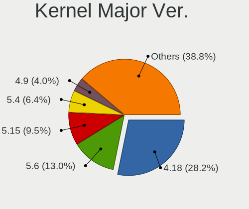

| Version | Computers | Percent |
|---------|-----------|---------|
| 4.18    | 1444      | 40.56%  |
| 5.6     | 548       | 15.39%  |
| 5.4     | 337       | 9.47%   |
| 4.9     | 227       | 6.38%   |
| 5.8     | 117       | 3.29%   |
| 5.11    | 117       | 3.29%   |
| 4.15    | 111       | 3.12%   |
| 5.10    | 108       | 3.03%   |
| 5.1     | 88        | 2.47%   |
| 5.3     | 87        | 2.44%   |
| 5.13    | 76        | 2.13%   |
| 5.0     | 56        | 1.57%   |
| 5.16    | 46        | 1.29%   |
| 5.15    | 36        | 1.01%   |
| 5.9     | 25        | 0.7%    |
| 5.12    | 23        | 0.65%   |
| 4.19    | 23        | 0.65%   |
| 5.14    | 19        | 0.53%   |
| 5.7     | 15        | 0.42%   |
| 5.17    | 10        | 0.28%   |
| 4.13    | 9         | 0.25%   |
| 4.4     | 8         | 0.22%   |
| 5.5     | 7         | 0.2%    |
| 4.7     | 5         | 0.14%   |
| 4.16    | 4         | 0.11%   |
| 5.18    | 2         | 0.06%   |
| 4.5     | 2         | 0.06%   |
| 4.20    | 2         | 0.06%   |
| 4.14    | 2         | 0.06%   |
| 4.1     | 2         | 0.06%   |
| 5.2     | 1         | 0.03%   |
| 4.12    | 1         | 0.03%   |
| 4.10    | 1         | 0.03%   |
| 3.13    | 1         | 0.03%   |

Arch
----

OS architecture (x86_64, i586, etc.)

| Name    | Computers | Percent |
|---------|-----------|---------|
| x86_64  | 2906      | 91.3%   |
| i686    | 270       | 8.48%   |
| armv7l  | 3         | 0.09%   |
| aarch64 | 2         | 0.06%   |
| unknow  | 1         | 0.03%   |
| armv6l  | 1         | 0.03%   |

DE
--

Desktop Environment

| Name            | Computers | Percent |
|-----------------|-----------|---------|
| KDE5            | 2155      | 66.66%  |
| GNOME           | 502       | 15.53%  |
| Unknown         | 225       | 6.96%   |
| XFCE            | 92        | 2.85%   |
| X-Cinnamon      | 68        | 2.1%    |
| MATE            | 45        | 1.39%   |
| KDE             | 36        | 1.11%   |
| Cinnamon        | 25        | 0.77%   |
| Unity           | 17        | 0.53%   |
| KDE4            | 14        | 0.43%   |
| LXQt            | 13        | 0.4%    |
| i3              | 7         | 0.22%   |
| Deepin          | 7         | 0.22%   |
| Budgie          | 6         | 0.19%   |
| Pantheon        | 5         | 0.15%   |
| GNOME Flashback | 5         | 0.15%   |
| LXDE            | 4         | 0.12%   |
| GNOME Classic   | 2         | 0.06%   |
| qtile           | 1         | 0.03%   |
| ICEWM           | 1         | 0.03%   |
| Enlightenment   | 1         | 0.03%   |
| bspwm           | 1         | 0.03%   |
| awesome         | 1         | 0.03%   |

Display Server
--------------

X11 or Wayland

| Name    | Computers | Percent |
|---------|-----------|---------|
| X11     | 2941      | 92.31%  |
| Unknown | 132       | 4.14%   |
| Wayland | 92        | 2.89%   |
| Tty     | 21        | 0.66%   |

Display Manager
---------------

SDDM, LightDM, etc.

| Name    | Computers | Percent |
|---------|-----------|---------|
| SDDM    | 2150      | 66.87%  |
| Unknown | 709       | 22.05%  |
| GDM     | 128       | 3.98%   |
| LightDM | 87        | 2.71%   |
| TDM     | 63        | 1.96%   |
| GDM3    | 57        | 1.77%   |
| KDM     | 14        | 0.44%   |
| SLiM    | 5         | 0.16%   |
| XDM     | 2         | 0.06%   |

OS Lang
-------

Language

| Lang    | Computers | Percent |
|---------|-----------|---------|
| Unknown | 2184      | 67.72%  |
| hu_HU   | 660       | 20.47%  |
| en_US   | 321       | 9.95%   |
| en_GB   | 29        | 0.9%    |
| C       | 15        | 0.47%   |
| de_DE   | 8         | 0.25%   |
| nl_NL   | 2         | 0.06%   |
| ru_UA   | 1         | 0.03%   |
| POSIX   | 1         | 0.03%   |
| fr_FR   | 1         | 0.03%   |
| fr_BE   | 1         | 0.03%   |
| en_AU   | 1         | 0.03%   |
| C.UTF8  | 1         | 0.03%   |

Boot Mode
---------

EFI or BIOS

| Mode | Computers | Percent |
|------|-----------|---------|
| BIOS | 2140      | 65.32%  |
| EFI  | 1136      | 34.68%  |

Filesystem
----------

Type of filesystem

| Type    | Computers | Percent |
|---------|-----------|---------|
| Ext4    | 1811      | 52.74%  |
| Overlay | 1453      | 42.31%  |
| Unknown | 77        | 2.24%   |
| Btrfs   | 66        | 1.92%   |
| Ext2    | 9         | 0.26%   |
| Xfs     | 6         | 0.17%   |
| Zfs     | 5         | 0.15%   |
| Ext3    | 5         | 0.15%   |
| Tmpfs   | 1         | 0.03%   |
| F2fs    | 1         | 0.03%   |

Part. scheme
------------

Scheme of partitioning

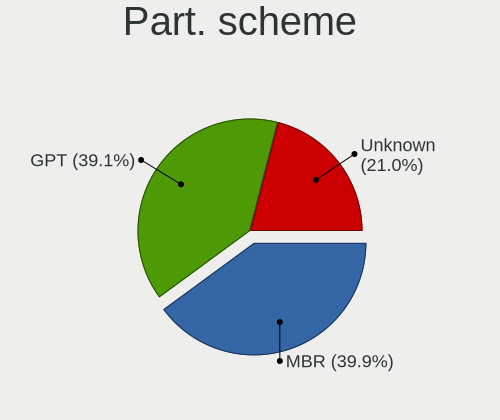

| Type    | Computers | Percent |
|---------|-----------|---------|
| MBR     | 1584      | 48.25%  |
| GPT     | 947       | 28.85%  |
| Unknown | 752       | 22.91%  |

Dual Boot with Linux/BSD
------------------------

Hosting more than one Linux/BSD

| Dual boot | Computers | Percent |
|-----------|-----------|---------|
| No        | 2493      | 73.26%  |
| Yes       | 910       | 26.74%  |

Dual Boot (Win)
---------------

Hosting Linux and Windows

| Dual boot | Computers | Percent |
|-----------|-----------|---------|
| No        | 1775      | 53.16%  |
| Yes       | 1564      | 46.84%  |

Board
-----

Vendor
------

Motherboard manufacturer

| Name                        | Computers | Percent |
|-----------------------------|-----------|---------|
| ASUSTek Computer            | 515       | 16.38%  |
| Hewlett-Packard             | 472       | 15.01%  |
| Dell                        | 442       | 14.06%  |
| Lenovo                      | 439       | 13.96%  |
| Gigabyte Technology         | 263       | 8.37%   |
| ASRock                      | 234       | 7.44%   |
| Acer                        | 223       | 7.09%   |
| MSI                         | 96        | 3.05%   |
| Fujitsu                     | 65        | 2.07%   |
| Fujitsu Siemens             | 59        | 1.88%   |
| Toshiba                     | 50        | 1.59%   |
| Samsung Electronics         | 34        | 1.08%   |
| Packard Bell                | 28        | 0.89%   |
| Intel                       | 26        | 0.83%   |
| Medion                      | 22        | 0.7%    |
| eMachines                   | 18        | 0.57%   |
| Unknown                     | 16        | 0.51%   |
| Foxconn                     | 14        | 0.45%   |
| Apple                       | 14        | 0.45%   |
| Sony                        | 12        | 0.38%   |
| Hungaro Flotta Kft          | 7         | 0.22%   |
| Raspberry Pi Foundation     | 6         | 0.19%   |
| Alcor                       | 6         | 0.19%   |
| Pegatron                    | 5         | 0.16%   |
| Supermicro                  | 4         | 0.13%   |
| HUAWEI                      | 4         | 0.13%   |
| Microsoft                   | 3         | 0.1%    |
| Insyde                      | 3         | 0.1%    |
| Clevo                       | 3         | 0.1%    |
| AOpen                       | 3         | 0.1%    |
| AMI                         | 3         | 0.1%    |
| ABIT                        | 3         | 0.1%    |
| ZOTAC                       | 2         | 0.06%   |
| TUXEDO                      | 2         | 0.06%   |
| Timi                        | 2         | 0.06%   |
| speedmaster                 | 2         | 0.06%   |
| Panasonic                   | 2         | 0.06%   |
| Nvidia                      | 2         | 0.06%   |
| Notebook                    | 2         | 0.06%   |
| NEC Computers               | 2         | 0.06%   |
| Minix                       | 2         | 0.06%   |
| IBM                         | 2         | 0.06%   |
| Gateway                     | 2         | 0.06%   |
| Chuwi                       | 2         | 0.06%   |
| Biostar                     | 2         | 0.06%   |
| AMD                         | 2         | 0.06%   |
| Wistron                     | 1         | 0.03%   |
| Wincor Nixdorf              | 1         | 0.03%   |
| ViewSonic                   | 1         | 0.03%   |
| Valve                       | 1         | 0.03%   |
| Shuttle                     | 1         | 0.03%   |
| Shenzhen Wangang Technology | 1         | 0.03%   |
| Seeed Studio                | 1         | 0.03%   |
| PEAQ                        | 1         | 0.03%   |
| ordissimo                   | 1         | 0.03%   |
| LG Electronics              | 1         | 0.03%   |
| Lex                         | 1         | 0.03%   |
| JW Technology               | 1         | 0.03%   |
| JGINYUE                     | 1         | 0.03%   |
| HPE                         | 1         | 0.03%   |

Model
-----

Motherboard model

| Name                                 | Computers | Percent |
|--------------------------------------|-----------|---------|
| HP 250 G1                            | 41        | 1.3%    |
| ASRock FM2A75M Pro4+                 | 32        | 1.02%   |
| Unknown                              | 26        | 0.83%   |
| ASUS All Series                      | 25        | 0.8%    |
| Dell OptiPlex 3020                   | 17        | 0.54%   |
| Dell Latitude E6410                  | 17        | 0.54%   |
| ASUS P5KPL-AM EPU                    | 12        | 0.38%   |
| Dell OptiPlex 755                    | 11        | 0.35%   |
| Lenovo IdeaPad 100-15IBD 80QQ        | 10        | 0.32%   |
| Lenovo G50-45 80E3                   | 10        | 0.32%   |
| HP 650                               | 10        | 0.32%   |
| Gigabyte G31M-ES2L                   | 10        | 0.32%   |
| Dell OptiPlex 780                    | 10        | 0.32%   |
| Lenovo IdeaPad 330-15IKB 81DE        | 9         | 0.29%   |
| HP Notebook                          | 9         | 0.29%   |
| HP 620                               | 9         | 0.29%   |
| Dell OptiPlex 760                    | 9         | 0.29%   |
| Lenovo ThinkPad T400 2768WGB         | 8         | 0.25%   |
| HP Pavilion 15                       | 8         | 0.25%   |
| Gigabyte H61M-S1                     | 8         | 0.25%   |
| Dell Latitude E6530                  | 8         | 0.25%   |
| Dell Latitude E6420                  | 8         | 0.25%   |
| Dell Latitude E6400                  | 8         | 0.25%   |
| ASRock G41M-VS3                      | 8         | 0.25%   |
| Lenovo G550 20023                    | 7         | 0.22%   |
| HP EliteBook 8460p                   | 7         | 0.22%   |
| HP EliteBook 6930p                   | 7         | 0.22%   |
| Gigabyte 970A-DS3P                   | 7         | 0.22%   |
| Dell Precision WorkStation T3500     | 7         | 0.22%   |
| Dell OptiPlex 7010                   | 7         | 0.22%   |
| ASUS VivoBook 15_ASUS Laptop X540UBR | 7         | 0.22%   |
| Lenovo G580 20150                    | 6         | 0.19%   |
| HP ProDesk 600 G2 SFF                | 6         | 0.19%   |
| HP Pavilion g6                       | 6         | 0.19%   |
| HP EliteBook 8440p                   | 6         | 0.19%   |
| HP EliteBook 2560p                   | 6         | 0.19%   |
| HP Compaq 8000 Elite SFF PC          | 6         | 0.19%   |
| eMachines E525                       | 6         | 0.19%   |
| Dell Vostro 15-3568                  | 6         | 0.19%   |
| Dell OptiPlex 330                    | 6         | 0.19%   |
| Dell Latitude E6430                  | 6         | 0.19%   |
| Dell Latitude E5420                  | 6         | 0.19%   |
| Dell Inspiron N5110                  | 6         | 0.19%   |
| Dell Inspiron 5558                   | 6         | 0.19%   |
| Dell Inspiron 15-3567                | 6         | 0.19%   |
| ASUS X541NA                          | 6         | 0.19%   |
| ASUS VivoBook 15_ASUS Laptop X540UAR | 6         | 0.19%   |
| ASUS K50IJ                           | 6         | 0.19%   |
| ASUS 1011PX                          | 6         | 0.19%   |
| ASRock N68C-S UCC                    | 6         | 0.19%   |
| Toshiba Satellite L300               | 5         | 0.16%   |
| MSI MS-7592                          | 5         | 0.16%   |
| Lenovo Z50-75 80EC                   | 5         | 0.16%   |
| Lenovo Z50-70 20354                  | 5         | 0.16%   |
| Lenovo IdeaPad 110-15IBR 80T7        | 5         | 0.16%   |
| Lenovo IdeaPad 100-15IBY 80MJ        | 5         | 0.16%   |
| Lenovo G505s 20255                   | 5         | 0.16%   |
| Lenovo G50-30 80G0                   | 5         | 0.16%   |
| HP ProBook 6450b                     | 5         | 0.16%   |
| HP EliteBook 8540p                   | 5         | 0.16%   |

Model Family
------------

Motherboard model prefix

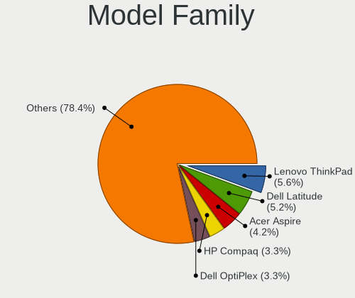

| Name                     | Computers | Percent |
|--------------------------|-----------|---------|
| Lenovo ThinkPad          | 159       | 5.06%   |
| Dell Latitude            | 155       | 4.93%   |
| Acer Aspire              | 148       | 4.71%   |
| HP Compaq                | 113       | 3.59%   |
| Dell OptiPlex            | 109       | 3.47%   |
| Dell Inspiron            | 100       | 3.18%   |
| Lenovo IdeaPad           | 96        | 3.05%   |
| HP EliteBook             | 74        | 2.35%   |
| HP 250                   | 56        | 1.78%   |
| HP ProBook               | 52        | 1.65%   |
| ASUS VivoBook            | 51        | 1.62%   |
| Lenovo ThinkCentre       | 45        | 1.43%   |
| Toshiba Satellite        | 44        | 1.4%    |
| HP Pavilion              | 41        | 1.3%    |
| ASRock FM2A75M           | 32        | 1.02%   |
| ASUS PRIME               | 31        | 0.99%   |
| Packard Bell EasyNote    | 28        | 0.89%   |
| Fujitsu Siemens ESPRIMO  | 28        | 0.89%   |
| Fujitsu ESPRIMO          | 28        | 0.89%   |
| Dell Vostro              | 27        | 0.86%   |
| Unknown                  | 26        | 0.83%   |
| ASUS All                 | 25        | 0.8%    |
| Fujitsu LIFEBOOK         | 23        | 0.73%   |
| Fujitsu Siemens AMILO    | 20        | 0.64%   |
| Dell Precision           | 20        | 0.64%   |
| ASUS P5KPL-AM            | 17        | 0.54%   |
| Acer TravelMate          | 17        | 0.54%   |
| ASUS ROG                 | 15        | 0.48%   |
| HP Laptop                | 14        | 0.45%   |
| Acer Veriton             | 14        | 0.45%   |
| Acer Swift               | 14        | 0.45%   |
| ASUS TUF                 | 12        | 0.38%   |
| Gigabyte B450            | 11        | 0.35%   |
| Lenovo G50-45            | 10        | 0.32%   |
| Lenovo 3000              | 10        | 0.32%   |
| HP 650                   | 10        | 0.32%   |
| Gigabyte G31M-ES2L       | 10        | 0.32%   |
| HP Notebook              | 9         | 0.29%   |
| HP 620                   | 9         | 0.29%   |
| Fujitsu CELSIUS          | 9         | 0.29%   |
| ASUS M5A97               | 9         | 0.29%   |
| Lenovo G580              | 8         | 0.25%   |
| HP ZBook                 | 8         | 0.25%   |
| HP ProDesk               | 8         | 0.25%   |
| Gigabyte H61M-S1         | 8         | 0.25%   |
| Gigabyte B450M           | 8         | 0.25%   |
| ASUS STRIX               | 8         | 0.25%   |
| ASRock G41M-VS3          | 8         | 0.25%   |
| ASRock 970               | 8         | 0.25%   |
| Lenovo Yoga              | 7         | 0.22%   |
| Lenovo G550              | 7         | 0.22%   |
| Hungaro Flotta Kft Navon | 7         | 0.22%   |
| HP Presario              | 7         | 0.22%   |
| Gigabyte H310M           | 7         | 0.22%   |
| Gigabyte 970A-DS3P       | 7         | 0.22%   |
| ASRock N68C-S            | 7         | 0.22%   |
| Acer Extensa             | 7         | 0.22%   |
| RPi Raspberry            | 6         | 0.19%   |
| HP EliteDesk             | 6         | 0.19%   |
| HP 255                   | 6         | 0.19%   |

MFG Year
--------

Motherboard manufacture year

| Year    | Computers | Percent |
|---------|-----------|---------|
| 2013    | 306       | 9.73%   |
| 2011    | 305       | 9.7%    |
| 2010    | 285       | 9.06%   |
| 2012    | 283       | 9%      |
| 2018    | 244       | 7.76%   |
| 2008    | 235       | 7.47%   |
| 2014    | 233       | 7.41%   |
| 2009    | 228       | 7.25%   |
| 2015    | 180       | 5.73%   |
| 2007    | 173       | 5.5%    |
| 2017    | 161       | 5.12%   |
| 2016    | 161       | 5.12%   |
| 2019    | 121       | 3.85%   |
| 2020    | 89        | 2.83%   |
| 2006    | 69        | 2.19%   |
| 2005    | 28        | 0.89%   |
| 2021    | 27        | 0.86%   |
| Unknown | 8         | 0.25%   |
| 2004    | 4         | 0.13%   |
| 2022    | 2         | 0.06%   |
| 2003    | 2         | 0.06%   |

Form Factor
-----------

Physical design of the computer

| Name           | Computers | Percent |
|----------------|-----------|---------|
| Notebook       | 1767      | 56.2%   |
| Desktop        | 1301      | 41.38%  |
| All in one     | 24        | 0.76%   |
| Convertible    | 15        | 0.48%   |
| Mini pc        | 15        | 0.48%   |
| Server         | 9         | 0.29%   |
| Tablet         | 7         | 0.22%   |
| System on chip | 6         | 0.19%   |

Secure Boot
-----------

Enabled or disabled

| State    | Computers | Percent |
|----------|-----------|---------|
| Disabled | 3071      | 97.34%  |
| Enabled  | 84        | 2.66%   |

Coreboot
--------

Have coreboot on board

| Used | Computers | Percent |
|------|-----------|---------|
| No   | 3144      | 100%    |

RAM Size
--------

Total RAM memory

| Size in GB  | Computers | Percent |
|-------------|-----------|---------|
| 3.01-4.0    | 1074      | 33.19%  |
| 4.01-8.0    | 667       | 20.61%  |
| 8.01-16.0   | 564       | 17.43%  |
| 1.01-2.0    | 331       | 10.23%  |
| 16.01-24.0  | 318       | 9.83%   |
| 2.01-3.0    | 114       | 3.52%   |
| 32.01-64.0  | 94        | 2.9%    |
| 0.51-1.0    | 39        | 1.21%   |
| 24.01-32.0  | 20        | 0.62%   |
| 64.01-256.0 | 13        | 0.4%    |
| 0.01-0.5    | 2         | 0.06%   |

RAM Used
--------

Used RAM memory

| Used GB     | Computers | Percent |
|-------------|-----------|---------|
| 0.51-1.0    | 1224      | 33.29%  |
| 1.01-2.0    | 1107      | 30.11%  |
| 0.01-0.5    | 625       | 17%     |
| 2.01-3.0    | 363       | 9.87%   |
| 3.01-4.0    | 161       | 4.38%   |
| 4.01-8.0    | 148       | 4.03%   |
| 8.01-16.0   | 41        | 1.12%   |
| 16.01-24.0  | 6         | 0.16%   |
| 64.01-256.0 | 1         | 0.03%   |
| Unknown     | 1         | 0.03%   |

Total Drives
------------

Number of drives on board

| Drives  | Computers | Percent |
|---------|-----------|---------|
| 1       | 2182      | 65.6%   |
| 2       | 734       | 22.07%  |
| 3       | 223       | 6.7%    |
| 4       | 84        | 2.53%   |
| 0       | 41        | 1.23%   |
| 5       | 37        | 1.11%   |
| 6       | 11        | 0.33%   |
| 7       | 5         | 0.15%   |
| 8       | 3         | 0.09%   |
| 9       | 2         | 0.06%   |
| 14      | 1         | 0.03%   |
| 11      | 1         | 0.03%   |
| 10      | 1         | 0.03%   |
| Unknown | 1         | 0.03%   |

Has CD-ROM
----------

Has CD-ROM on board

| Presented | Computers | Percent |
|-----------|-----------|---------|
| Yes       | 1852      | 57.66%  |
| No        | 1360      | 42.34%  |

Has Ethernet
------------

Has Ethernet on board

| Presented | Computers | Percent |
|-----------|-----------|---------|
| Yes       | 2955      | 93.81%  |
| No        | 195       | 6.19%   |

Has WiFi
--------

Has WiFi module

| Presented | Computers | Percent |
|-----------|-----------|---------|
| Yes       | 2134      | 67.28%  |
| No        | 1038      | 32.72%  |

Has Bluetooth
-------------

Has Bluetooth module

| Presented | Computers | Percent |
|-----------|-----------|---------|
| No        | 1682      | 52.63%  |
| Yes       | 1514      | 47.37%  |

Location
--------

Country
-------

Geographic location (country)

| Country | Computers | Percent |
|---------|-----------|---------|
| Hungary | 3144      | 100%    |

City
----

Geographic location (city)

| City              | Computers | Percent |
|-------------------|-----------|---------|
| Budapest          | 1198      | 33.08%  |
| Pcs             | 82        | 2.26%   |
| Szeged            | 75        | 2.07%   |
| Miskolc           | 71        | 1.96%   |
| Gyr             | 67        | 1.85%   |
| Debrecen          | 65        | 1.79%   |
| Tatabnya        | 55        | 1.52%   |
| Szkesfehrvr | 48        | 1.33%   |
| Szombathely       | 46        | 1.27%   |
| Kecskemt        | 44        | 1.21%   |
| Nyiregyhaza       | 37        | 1.02%   |
| rd              | 37        | 1.02%   |
| Szigetszentmiklos | 34        | 0.94%   |
| Veszprm         | 33        | 0.91%   |
| Zalaegerszeg      | 31        | 0.86%   |
| Szekszrd        | 30        | 0.83%   |
| Karcag            | 30        | 0.83%   |
| Oroshaza          | 25        | 0.69%   |
| Gdll        | 23        | 0.64%   |
| Dunajvros     | 23        | 0.64%   |
| Szolnok           | 22        | 0.61%   |
| Eger              | 21        | 0.58%   |
| Salgotarjan       | 20        | 0.55%   |
| Gyomro            | 19        | 0.52%   |
| Toekoel           | 18        | 0.5%    |
| Hodmezovasarhely  | 18        | 0.5%    |
| Toeroekbalint     | 17        | 0.47%   |
| Sopron            | 17        | 0.47%   |
| Nagykanizsa       | 17        | 0.47%   |
| Ajka              | 17        | 0.47%   |
| Mosonmagyarvr | 16        | 0.44%   |
| Szorgalmatos      | 15        | 0.41%   |
| Sifok           | 15        | 0.41%   |
| Pomaz             | 15        | 0.41%   |
| Kaposvr         | 15        | 0.41%   |
| Hatvan            | 15        | 0.41%   |
| Esztergom         | 15        | 0.41%   |
| Papa              | 14        | 0.39%   |
| Kazincbarcika     | 14        | 0.39%   |
| Cegled            | 14        | 0.39%   |
| Berettyjfalu  | 14        | 0.39%   |
| Bkscsaba      | 14        | 0.39%   |
| Maglod            | 13        | 0.36%   |
| Kiskunfelegyhaza  | 13        | 0.36%   |
| Dunakeszi         | 12        | 0.33%   |
| Baja              | 12        | 0.33%   |
| Veresegyhaz       | 11        | 0.3%    |
| Tiszaujvaros      | 11        | 0.3%    |
| Gyongyos          | 11        | 0.3%    |
| Tata              | 10        | 0.28%   |
| Tarnok            | 10        | 0.28%   |
| Szentendre        | 10        | 0.28%   |
| Monor             | 10        | 0.28%   |
| Mohcs           | 10        | 0.28%   |
| Jaszbereny        | 10        | 0.28%   |
| Budaors           | 10        | 0.28%   |
| Budakeszi         | 10        | 0.28%   |
| Balatonfured      | 10        | 0.28%   |
| Tolna             | 9         | 0.25%   |
| Tiszafured        | 9         | 0.25%   |

Drives
------

Drive Vendor
------------

Hard drive vendors

| Vendor              | Computers | Drives | Percent |
|---------------------|-----------|--------|---------|
| WDC                 | 791       | 1335   | 17.52%  |
| Seagate             | 684       | 1030   | 15.15%  |
| Samsung Electronics | 602       | 927    | 13.33%  |
| Kingston            | 532       | 834    | 11.78%  |
| Toshiba             | 417       | 642    | 9.23%   |
| Hitachi             | 228       | 305    | 5.05%   |
| HGST                | 145       | 212    | 3.21%   |
| Unknown             | 114       | 159    | 2.52%   |
| SanDisk             | 113       | 170    | 2.5%    |
| A-DATA Technology   | 99        | 151    | 2.19%   |
| Intel               | 70        | 105    | 1.55%   |
| SK Hynix            | 66        | 99     | 1.46%   |
| Crucial             | 58        | 93     | 1.28%   |
| Fujitsu             | 56        | 67     | 1.24%   |
| MAXTOR              | 44        | 59     | 0.97%   |
| SPCC                | 42        | 56     | 0.93%   |
| Micron Technology   | 37        | 49     | 0.82%   |
| Apacer              | 28        | 46     | 0.62%   |
| JMicron             | 24        | 26     | 0.53%   |
| OCZ                 | 23        | 29     | 0.51%   |
| China               | 23        | 36     | 0.51%   |
| LITEON              | 18        | 23     | 0.4%    |
| Kingmax             | 18        | 28     | 0.4%    |
| Intenso             | 17        | 26     | 0.38%   |
| Transcend           | 16        | 18     | 0.35%   |
| PNY                 | 16        | 28     | 0.35%   |
| Gigabyte Technology | 16        | 33     | 0.35%   |
| Patriot             | 15        | 23     | 0.33%   |
| KingSpec            | 13        | 14     | 0.29%   |
| Hewlett-Packard     | 13        | 16     | 0.29%   |
| Phison              | 10        | 14     | 0.22%   |
| Team                | 9         | 13     | 0.2%    |
| Zheino              | 8         | 11     | 0.18%   |
| ASMT                | 8         | 10     | 0.18%   |
| Apple               | 8         | 11     | 0.18%   |
| Verbatim            | 7         | 12     | 0.16%   |
| KIOXIA              | 7         | 7      | 0.16%   |
| GOODRAM             | 7         | 8      | 0.16%   |
| Corsair             | 7         | 9      | 0.16%   |
| Silicon Motion      | 5         | 7      | 0.11%   |
| Netac               | 5         | 10     | 0.11%   |
| LITEONIT            | 5         | 7      | 0.11%   |
| USB3.0              | 4         | 8      | 0.09%   |
| IBM/Hitachi         | 4         | 5      | 0.09%   |
| HGST HTS            | 4         | 9      | 0.09%   |
| XPG                 | 3         | 3      | 0.07%   |
| SATAFIRM            | 3         | 3      | 0.07%   |
| QUANTUM             | 3         | 3      | 0.07%   |
| Leven               | 3         | 3      | 0.07%   |
| KingDian            | 3         | 3      | 0.07%   |
| HS-SSD-C100         | 3         | 3      | 0.07%   |
| BHT                 | 3         | 3      | 0.07%   |
| AMD                 | 3         | 3      | 0.07%   |
| Unknown             | 3         | 4      | 0.07%   |
| WDC WDS             | 2         | 2      | 0.04%   |
| WD MediaMax         | 2         | 4      | 0.04%   |
| USB2.0              | 2         | 2      | 0.04%   |
| TO Exter            | 2         | 2      | 0.04%   |
| SSSTC               | 2         | 2      | 0.04%   |
| sobetter            | 2         | 2      | 0.04%   |

Drive Model
-----------

Hard drive models

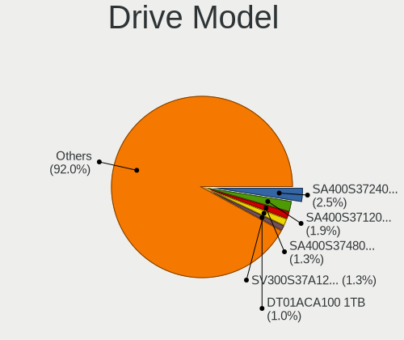

| Model                              | Computers | Percent |
|------------------------------------|-----------|---------|
| Kingston SA400S37240G 240GB SSD    | 118       | 2.41%   |
| Kingston SA400S37120G 120GB SSD    | 115       | 2.35%   |
| Kingston SV300S37A120G 120GB SSD   | 84        | 1.71%   |
| Seagate ST1000LM035-1RK172 1TB     | 51        | 1.04%   |
| Toshiba DT01ACA100 1TB             | 49        | 1%      |
| Toshiba MQ01ABF050 500GB           | 46        | 0.94%   |
| Seagate ST1000LM024 HN-M101MBB 1TB | 43        | 0.88%   |
| Kingston SA400S37480G 480GB SSD    | 42        | 0.86%   |
| Seagate ST500DM002-1BD142 500GB    | 41        | 0.84%   |
| Toshiba MQ01ABD100 1TB             | 40        | 0.82%   |
| Seagate ST500LT012-1DG142 500GB    | 38        | 0.78%   |
| Samsung SSD 850 EVO 250GB          | 35        | 0.71%   |
| Kingston SUV400S37120G 120GB SSD   | 34        | 0.69%   |
| HGST HTS545032A7E380 320GB         | 32        | 0.65%   |
| Toshiba DT01ACA050 500GB           | 30        | 0.61%   |
| Toshiba MQ04ABF100 1TB             | 28        | 0.57%   |
| HGST HTS545050A7E680 500GB         | 28        | 0.57%   |
| A-DATA SU630 240GB SSD             | 28        | 0.57%   |
| WDC WDS240G2G0A-00JH30 240GB SSD   | 25        | 0.51%   |
| Seagate ST380815AS 80GB            | 24        | 0.49%   |
| Samsung SSD 860 EVO 250GB          | 24        | 0.49%   |
| HGST HTS721010A9E630 1TB           | 22        | 0.45%   |
| A-DATA SU700 120GB SSD             | 22        | 0.45%   |
| Seagate ST9320325AS 320GB          | 21        | 0.43%   |
| Samsung HD502HJ 500GB              | 21        | 0.43%   |
| Toshiba HDWD110 1TB                | 20        | 0.41%   |
| Kingston SHFS37A120G 120GB SSD     | 20        | 0.41%   |
| WDC WD10EZEX-08WN4A0 1TB           | 19        | 0.39%   |
| Toshiba HDWD130 3TB                | 17        | 0.35%   |
| Toshiba DT01ACA200 2TB             | 17        | 0.35%   |
| Seagate ST9500325AS 500GB          | 17        | 0.35%   |
| Seagate ST9250315AS 250GB          | 16        | 0.33%   |
| Samsung SSD 850 EVO 500GB          | 16        | 0.33%   |
| Kingston SV300S37A240G 240GB SSD   | 16        | 0.33%   |
| JMicron Generic 128GB              | 16        | 0.33%   |
| WDC WDS120G2G0A-00JH30 120GB SSD   | 15        | 0.31%   |
| Unknown MMC Card  32GB             | 15        | 0.31%   |
| Samsung SSD 860 EVO 500GB          | 15        | 0.31%   |
| Samsung SSD 840 EVO 120GB          | 15        | 0.31%   |
| WDC WD1600BEVT-22ZCT0 160GB        | 14        | 0.29%   |
| WDC WD10JPVX-22JC3T0 1TB           | 14        | 0.29%   |
| Seagate ST3160815AS 160GB          | 14        | 0.29%   |
| Samsung HD322HJ 320GB              | 14        | 0.29%   |
| Samsung HD161HJ 160GB              | 14        | 0.29%   |
| Kingston SH103S3120G 120GB SSD     | 14        | 0.29%   |
| HGST HTS541010A9E680 1TB           | 14        | 0.29%   |
| SPCC Solid State Disk 256GB        | 13        | 0.27%   |
| SPCC Solid State Disk 128GB        | 13        | 0.27%   |
| Seagate ST500LT012-9WS142 500GB    | 13        | 0.27%   |
| Seagate ST2000DM008-2FR102 2TB     | 13        | 0.27%   |
| Seagate M3 Portable 4TB            | 13        | 0.27%   |
| Samsung HD502IJ 500GB              | 13        | 0.27%   |
| Hitachi HDS721050CLA360 500GB      | 13        | 0.27%   |
| WDC WDS240G2G0B-00EPW0 240GB SSD   | 12        | 0.24%   |
| WDC WD10EZEX-22MFCA0 1TB           | 12        | 0.24%   |
| Unknown SD/MMC/MS PRO 999GB        | 12        | 0.24%   |
| Seagate ST3160318AS 160GB          | 12        | 0.24%   |
| Seagate ST1000DM010-2EP102 1TB     | 12        | 0.24%   |
| Kingston SUV400S37240G 240GB SSD   | 12        | 0.24%   |
| HGST HTS541010B7E610 1TB           | 12        | 0.24%   |

HDD Vendor
----------

Hard disk drive vendors

| Vendor              | Computers | Drives | Percent |
|---------------------|-----------|--------|---------|
| WDC                 | 710       | 1178   | 28.13%  |
| Seagate             | 669       | 1006   | 26.51%  |
| Toshiba             | 374       | 572    | 14.82%  |
| Samsung Electronics | 250       | 366    | 9.9%    |
| Hitachi             | 228       | 305    | 9.03%   |
| HGST                | 145       | 212    | 5.74%   |
| Fujitsu             | 56        | 67     | 2.22%   |
| MAXTOR              | 44        | 59     | 1.74%   |
| Unknown             | 13        | 17     | 0.52%   |
| Hewlett-Packard     | 7         | 7      | 0.28%   |
| ASMT                | 7         | 9      | 0.28%   |
| USB3.0              | 4         | 8      | 0.16%   |
| IBM/Hitachi         | 4         | 5      | 0.16%   |
| QUANTUM             | 3         | 3      | 0.12%   |
| Apple               | 3         | 5      | 0.12%   |
| WD MediaMax         | 2         | 4      | 0.08%   |
| ICY BOX             | 2         | 3      | 0.08%   |
| USB                 | 1         | 1      | 0.04%   |
| ExcelStor           | 1         | 1      | 0.04%   |
| Asmedia             | 1         | 1      | 0.04%   |

SSD Vendor
----------

Solid state drive vendors

| Vendor              | Computers | Drives | Percent |
|---------------------|-----------|--------|---------|
| Kingston            | 496       | 769    | 31.57%  |
| Samsung Electronics | 276       | 396    | 17.57%  |
| A-DATA Technology   | 94        | 142    | 5.98%   |
| SanDisk             | 85        | 122    | 5.41%   |
| WDC                 | 81        | 129    | 5.16%   |
| Crucial             | 54        | 87     | 3.44%   |
| Intel               | 53        | 79     | 3.37%   |
| SK Hynix            | 39        | 61     | 2.48%   |
| SPCC                | 35        | 49     | 2.23%   |
| Micron Technology   | 31        | 38     | 1.97%   |
| Apacer              | 27        | 45     | 1.72%   |
| OCZ                 | 23        | 29     | 1.46%   |
| China               | 23        | 36     | 1.46%   |
| Toshiba             | 20        | 32     | 1.27%   |
| LITEON              | 18        | 23     | 1.15%   |
| Kingmax             | 18        | 28     | 1.15%   |
| JMicron             | 17        | 18     | 1.08%   |
| Intenso             | 17        | 26     | 1.08%   |
| PNY                 | 16        | 28     | 1.02%   |
| Transcend           | 15        | 17     | 0.95%   |
| Patriot             | 13        | 20     | 0.83%   |
| Gigabyte Technology | 13        | 29     | 0.83%   |
| KingSpec            | 12        | 13     | 0.76%   |
| Team                | 9         | 13     | 0.57%   |
| Verbatim            | 7         | 12     | 0.45%   |
| GOODRAM             | 7         | 8      | 0.45%   |
| Corsair             | 7         | 9      | 0.45%   |
| Netac               | 5         | 10     | 0.32%   |
| LITEONIT            | 5         | 7      | 0.32%   |
| Hewlett-Packard     | 4         | 4      | 0.25%   |
| Unknown             | 3         | 6      | 0.19%   |
| SATAFIRM            | 3         | 3      | 0.19%   |
| KingDian            | 3         | 3      | 0.19%   |
| HS-SSD-C100         | 3         | 3      | 0.19%   |
| BHT                 | 3         | 3      | 0.19%   |
| Apple               | 3         | 3      | 0.19%   |
| AMD                 | 3         | 3      | 0.19%   |
| WDC WDS             | 2         | 2      | 0.13%   |
| TO Exter            | 2         | 2      | 0.13%   |
| Seagate             | 2         | 2      | 0.13%   |
| Leven               | 2         | 2      | 0.13%   |
| Integral            | 2         | 2      | 0.13%   |
| Zheino              | 1         | 1      | 0.06%   |
| Vaseky              | 1         | 1      | 0.06%   |
| Union Memory        | 1         | 5      | 0.06%   |
| Solid               | 1         | 4      | 0.06%   |
| RECADATA            | 1         | 1      | 0.06%   |
| PLEXTOR             | 1         | 1      | 0.06%   |
| Platinet            | 1         | 1      | 0.06%   |
| Philips             | 1         | 2      | 0.06%   |
| KODAK               | 1         | 1      | 0.06%   |
| KingFast            | 1         | 1      | 0.06%   |
| GALAX               | 1         | 2      | 0.06%   |
| External            | 1         | 1      | 0.06%   |
| EMTEC               | 1         | 1      | 0.06%   |
| EAGET S5            | 1         | 1      | 0.06%   |
| DREVO               | 1         | 2      | 0.06%   |
| BIWIN               | 1         | 5      | 0.06%   |
| Argon               | 1         | 1      | 0.06%   |
| AEROFARA            | 1         | 1      | 0.06%   |

Drive Kind
----------

HDD or SSD

| Kind    | Computers | Drives | Percent |
|---------|-----------|--------|---------|
| HDD     | 2134      | 3829   | 53.26%  |
| SSD     | 1405      | 2347   | 35.06%  |
| NVMe    | 316       | 488    | 7.89%   |
| MMC     | 106       | 159    | 2.65%   |
| Unknown | 46        | 59     | 1.15%   |

Drive Connector
---------------

SATA, SAS, NVMe, etc.

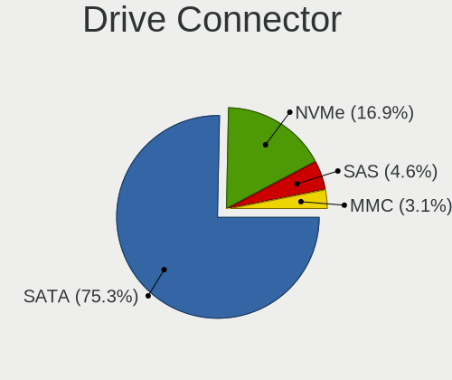

| Type | Computers | Drives | Percent |
|------|-----------|--------|---------|
| SATA | 2893      | 6037   | 84%     |
| NVMe | 316       | 488    | 9.18%   |
| SAS  | 129       | 198    | 3.75%   |
| MMC  | 106       | 159    | 3.08%   |

Drive Size
----------

Size of hard drive

| Size in TB | Computers | Drives | Percent |
|------------|-----------|--------|---------|
| 0.01-0.5   | 2528      | 4526   | 72.92%  |
| 0.51-1.0   | 716       | 1201   | 20.65%  |
| 1.01-2.0   | 129       | 214    | 3.72%   |
| 2.01-3.0   | 41        | 104    | 1.18%   |
| 3.01-4.0   | 36        | 69     | 1.04%   |
| 4.01-10.0  | 13        | 35     | 0.37%   |
| 10.01-20.0 | 4         | 27     | 0.12%   |

Space Total
-----------

Amount of disk space available on the file system

| Size in GB     | Computers | Percent |
|----------------|-----------|---------|
| Unknown        | 1357      | 37.38%  |
| 101-250        | 784       | 21.6%   |
| 251-500        | 491       | 13.53%  |
| 51-100         | 273       | 7.52%   |
| 501-1000       | 229       | 6.31%   |
| 21-50          | 149       | 4.1%    |
| 1-20           | 134       | 3.69%   |
| 1001-2000      | 122       | 3.36%   |
| More than 3000 | 48        | 1.32%   |
| 2001-3000      | 43        | 1.18%   |

Space Used
----------

Amount of used disk space

| Used GB        | Computers | Percent |
|----------------|-----------|---------|
| Unknown        | 1357      | 37.06%  |
| 1-20           | 1283      | 35.04%  |
| 21-50          | 314       | 8.57%   |
| 51-100         | 226       | 6.17%   |
| 101-250        | 201       | 5.49%   |
| 251-500        | 102       | 2.79%   |
| 501-1000       | 97        | 2.65%   |
| 1001-2000      | 54        | 1.47%   |
| More than 3000 | 17        | 0.46%   |
| 2001-3000      | 11        | 0.3%    |

Malfunc. Drives
---------------

Drive models with a malfunction

| Model                               | Computers | Drives | Percent |
|-------------------------------------|-----------|--------|---------|
| HGST HTS545032A7E380 320GB          | 30        | 40     | 3.16%   |
| HGST HTS545050A7E680 500GB          | 19        | 29     | 2%      |
| Kingston SV300S37A120G 120GB SSD    | 17        | 20     | 1.79%   |
| A-DATA Technology SU630 240GB SSD   | 17        | 18     | 1.79%   |
| Seagate ST500DM002-1BD142 500GB     | 14        | 26     | 1.47%   |
| Seagate ST500LT012-1DG142 500GB     | 11        | 14     | 1.16%   |
| Seagate ST9320325AS 320GB           | 10        | 22     | 1.05%   |
| Samsung Electronics HD103UJ 1TB     | 10        | 16     | 1.05%   |
| Seagate ST500LT012-9WS142 500GB     | 9         | 10     | 0.95%   |
| Toshiba MQ01ABF050 500GB            | 8         | 19     | 0.84%   |
| Toshiba DT01ACA050 500GB            | 8         | 9      | 0.84%   |
| Seagate ST9500325AS 500GB           | 8         | 13     | 0.84%   |
| Seagate ST9320423AS 320GB           | 8         | 9      | 0.84%   |
| Seagate ST9250315AS 250GB           | 8         | 13     | 0.84%   |
| Seagate ST1000LM024 HN-M101MBB 1TB  | 8         | 12     | 0.84%   |
| Samsung Electronics HM160HI 160GB   | 7         | 8      | 0.74%   |
| Hitachi HTS545050B9A300 500GB       | 7         | 8      | 0.74%   |
| HGST HTS541010A9E680 1TB            | 7         | 14     | 0.74%   |
| WDC WD5000AAKX-001CA0 500GB         | 6         | 6      | 0.63%   |
| WDC WD5000AADS-00S9B0 500GB         | 6         | 7      | 0.63%   |
| Toshiba MQ01ABD100 1TB              | 6         | 7      | 0.63%   |
| Toshiba DT01ACA100 1TB              | 6         | 12     | 0.63%   |
| Toshiba MQ01ABD050 500GB            | 5         | 5      | 0.53%   |
| Seagate ST3250318AS 250GB           | 5         | 8      | 0.53%   |
| Samsung Electronics HD502HJ 500GB   | 5         | 8      | 0.53%   |
| Samsung Electronics HD321KJ 320GB   | 5         | 5      | 0.53%   |
| Samsung Electronics HD161HJ 160GB   | 5         | 5      | 0.53%   |
| Samsung Electronics HD103SI 1TB     | 5         | 5      | 0.53%   |
| Hitachi HTS541680J9SA00 80GB        | 5         | 5      | 0.53%   |
| HGST HTS545050A7E380 500GB          | 5         | 9      | 0.53%   |
| WDC WD5000AAKS-00UU3A0 500GB        | 4         | 6      | 0.42%   |
| WDC WD10JPVX-22JC3T0 1TB            | 4         | 7      | 0.42%   |
| Seagate ST980811AS 80GB             | 4         | 4      | 0.42%   |
| Seagate ST500LM012 HN-M500MBB 500GB | 4         | 6      | 0.42%   |
| Seagate ST380815AS 80GB             | 4         | 7      | 0.42%   |
| Seagate ST320LT007-9ZV142 320GB     | 4         | 4      | 0.42%   |
| Seagate ST3160815AS 160GB           | 4         | 4      | 0.42%   |
| Seagate ST1000LX015-1U7172 1TB      | 4         | 9      | 0.42%   |
| Seagate ST1000LM035-1RK172 1TB      | 4         | 4      | 0.42%   |
| Samsung Electronics SP2004C 200GB   | 4         | 7      | 0.42%   |
| Samsung Electronics HM321HI 320GB   | 4         | 7      | 0.42%   |
| Samsung Electronics HD161GJ 160GB   | 4         | 5      | 0.42%   |
| Samsung Electronics HD082GJ 80GB    | 4         | 4      | 0.42%   |
| MAXTOR 6Y080M0 81GB                 | 4         | 5      | 0.42%   |
| MAXTOR 2B020H1 20GB                 | 4         | 8      | 0.42%   |
| Kingston SA400S37120G 120GB SSD     | 4         | 7      | 0.42%   |
| Hitachi HTS723232A7A364 320GB       | 4         | 4      | 0.42%   |
| Hitachi HTS545050A7E380 500GB       | 4         | 6      | 0.42%   |
| Hitachi HTS545032B9A300 320GB       | 4         | 5      | 0.42%   |
| Hitachi HTS545025B9A300 250GB       | 4         | 9      | 0.42%   |
| Hitachi HTS545016B9A300 160GB       | 4         | 4      | 0.42%   |
| Hitachi HTS543216L9A300 160GB       | 4         | 4      | 0.42%   |
| Hitachi HTS542516K9SA00 160GB       | 4         | 4      | 0.42%   |
| WDC WDS120G2G0A-00JH30 120GB SSD    | 3         | 3      | 0.32%   |
| WDC WD5000AAKX-08U6AA0 500GB        | 3         | 5      | 0.32%   |
| WDC WD5000AAKX-07U6AA0 500GB        | 3         | 5      | 0.32%   |
| WDC WD3200AAKS-00L9A0 320GB         | 3         | 4      | 0.32%   |
| WDC WD10EZEX-22MFCA0 1TB            | 3         | 3      | 0.32%   |
| WDC WD10EARS-00Y5B1 1TB             | 3         | 6      | 0.32%   |
| WDC WD10EALX-009BA0 1TB             | 3         | 3      | 0.32%   |

Malfunc. Drive Vendor
---------------------

Vendors of faulty drives

| Vendor              | Computers | Drives | Percent |
|---------------------|-----------|--------|---------|
| Seagate             | 201       | 280    | 21.75%  |
| WDC                 | 187       | 280    | 20.24%  |
| Samsung Electronics | 109       | 150    | 11.8%   |
| Hitachi             | 102       | 144    | 11.04%  |
| Toshiba             | 94        | 133    | 10.17%  |
| HGST                | 72        | 105    | 7.79%   |
| Kingston            | 41        | 52     | 4.44%   |
| MAXTOR              | 24        | 38     | 2.6%    |
| A-DATA Technology   | 24        | 30     | 2.6%    |
| Fujitsu             | 18        | 24     | 1.95%   |
| Intel               | 13        | 18     | 1.41%   |
| SK Hynix            | 9         | 13     | 0.97%   |
| SanDisk             | 3         | 4      | 0.32%   |
| IBM/Hitachi         | 3         | 3      | 0.32%   |
| Hewlett-Packard     | 3         | 3      | 0.32%   |
| WD MediaMax         | 2         | 4      | 0.22%   |
| LITEON              | 2         | 2      | 0.22%   |
| KingSpec            | 2         | 2      | 0.22%   |
| Kingmax             | 2         | 2      | 0.22%   |
| Intenso             | 2         | 2      | 0.22%   |
| Apacer              | 2         | 3      | 0.22%   |
| SPCC                | 1         | 1      | 0.11%   |
| SATAFIRM            | 1         | 1      | 0.11%   |
| OCZ                 | 1         | 3      | 0.11%   |
| JMicron             | 1         | 1      | 0.11%   |
| ICY BOX             | 1         | 1      | 0.11%   |
| ExcelStor           | 1         | 1      | 0.11%   |
| Crucial             | 1         | 1      | 0.11%   |
| China               | 1         | 1      | 0.11%   |
| ASMT                | 1         | 1      | 0.11%   |

Malfunc. HDD Vendor
-------------------

Vendors of faulty HDD drives

| Vendor              | Computers | Drives | Percent |
|---------------------|-----------|--------|---------|
| Seagate             | 201       | 280    | 25.03%  |
| WDC                 | 184       | 277    | 22.91%  |
| Samsung Electronics | 103       | 144    | 12.83%  |
| Hitachi             | 102       | 144    | 12.7%   |
| Toshiba             | 89        | 122    | 11.08%  |
| HGST                | 72        | 105    | 8.97%   |
| MAXTOR              | 24        | 38     | 2.99%   |
| Fujitsu             | 18        | 24     | 2.24%   |
| IBM/Hitachi         | 3         | 3      | 0.37%   |
| WD MediaMax         | 2         | 4      | 0.25%   |
| Hewlett-Packard     | 2         | 2      | 0.25%   |
| ICY BOX             | 1         | 1      | 0.12%   |
| ExcelStor           | 1         | 1      | 0.12%   |
| ASMT                | 1         | 1      | 0.12%   |

Malfunc. Drive Kind
-------------------

Kinds of faulty drives

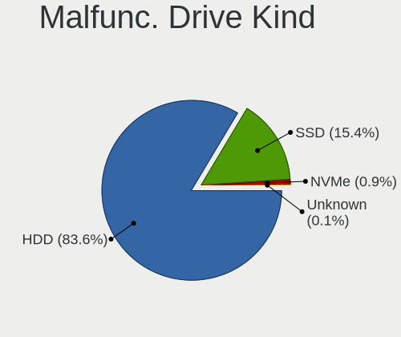

| Kind    | Computers | Drives | Percent |
|---------|-----------|--------|---------|
| HDD     | 737       | 1146   | 86.1%   |
| SSD     | 113       | 151    | 13.2%   |
| NVMe    | 5         | 5      | 0.58%   |
| Unknown | 1         | 1      | 0.12%   |

Failed Drives
-------------

Failed drive models

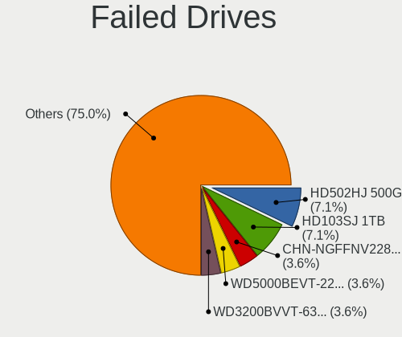

| Model                              | Computers | Drives | Percent |
|------------------------------------|-----------|--------|---------|
| Samsung Electronics HD502HJ 500GB  | 2         | 2      | 9.52%   |
| Zheino CHN-NGFFNV2280-256 256GB    | 1         | 1      | 4.76%   |
| WDC WD5000BEVT-22A0RT0 500GB       | 1         | 2      | 4.76%   |
| WDC WD3200BVVT-63A26Y0 320GB       | 1         | 1      | 4.76%   |
| WDC WD3200BPVT-24JJ5T0 320GB       | 1         | 1      | 4.76%   |
| WDC WD3200BEVT-08A23T1 320GB       | 1         | 1      | 4.76%   |
| WDC WD2500LPCX-24C6HT0 250GB       | 1         | 1      | 4.76%   |
| WDC WD1600BEVT-22ZCT0 160GB        | 1         | 1      | 4.76%   |
| Toshiba MQ01ABD050V 500GB          | 1         | 1      | 4.76%   |
| Toshiba MK6475GSX 640GB            | 1         | 1      | 4.76%   |
| Toshiba MK3275GSX 320GB            | 1         | 1      | 4.76%   |
| Seagate ST9160821AS 160GB          | 1         | 1      | 4.76%   |
| Seagate ST380815AS 80GB            | 1         | 3      | 4.76%   |
| Seagate ST1000LM024 HN-M101MBB 1TB | 1         | 1      | 4.76%   |
| Samsung Electronics SP0802N 80GB   | 1         | 1      | 4.76%   |
| Samsung Electronics HM060HI 64GB   | 1         | 1      | 4.76%   |
| Samsung Electronics HD204UI 2TB    | 1         | 1      | 4.76%   |
| Samsung Electronics HD103SJ 1TB    | 1         | 1      | 4.76%   |
| Hitachi HDS721075CLA332 752GB      | 1         | 1      | 4.76%   |
| Hewlett-Packard SSD EX900 250GB    | 1         | 1      | 4.76%   |

Failed Drive Vendor
-------------------

Failed drive vendors

| Vendor              | Computers | Drives | Percent |
|---------------------|-----------|--------|---------|
| WDC                 | 6         | 7      | 28.57%  |
| Samsung Electronics | 6         | 6      | 28.57%  |
| Toshiba             | 3         | 3      | 14.29%  |
| Seagate             | 3         | 5      | 14.29%  |
| Zheino              | 1         | 1      | 4.76%   |
| Hitachi             | 1         | 1      | 4.76%   |
| Hewlett-Packard     | 1         | 1      | 4.76%   |

Drive Status
------------

Number of failed and malfunc. drives

| Status   | Computers | Drives | Percent |
|----------|-----------|--------|---------|
| Works    | 1853      | 3770   | 51.02%  |
| Detected | 921       | 1785   | 25.36%  |
| Malfunc  | 837       | 1303   | 23.05%  |
| Failed   | 21        | 24     | 0.58%   |

Storage controller
------------------

Storage Vendor
--------------

Storage controller vendors

| Vendor                           | Computers | Percent |
|----------------------------------|-----------|---------|
| Intel                            | 2404      | 67.17%  |
| AMD                              | 549       | 15.34%  |
| Samsung Electronics              | 115       | 3.21%   |
| JMicron Technology               | 77        | 2.15%   |
| Nvidia                           | 65        | 1.82%   |
| ASMedia Technology               | 53        | 1.48%   |
| Sandisk                          | 44        | 1.23%   |
| Kingston Technology Company      | 44        | 1.23%   |
| Marvell Technology Group         | 34        | 0.95%   |
| SK Hynix                         | 24        | 0.67%   |
| Phison Electronics               | 22        | 0.61%   |
| Toshiba America Info Systems     | 21        | 0.59%   |
| VIA Technologies                 | 19        | 0.53%   |
| Silicon Motion                   | 15        | 0.42%   |
| KIOXIA                           | 13        | 0.36%   |
| Silicon Integrated Systems [SiS] | 12        | 0.34%   |
| Silicon Image                    | 12        | 0.34%   |
| LSI Logic / Symbios Logic        | 10        | 0.28%   |
| Micron Technology                | 7         | 0.2%    |
| ADATA Technology                 | 7         | 0.2%    |
| Micron/Crucial Technology        | 6         | 0.17%   |
| Integrated Technology Express    | 4         | 0.11%   |
| Solid State Storage Technology   | 3         | 0.08%   |
| Seagate Technology               | 3         | 0.08%   |
| Broadcom / LSI                   | 3         | 0.08%   |
| Realtek Semiconductor            | 2         | 0.06%   |
| Hewlett-Packard                  | 2         | 0.06%   |
| Adaptec                          | 2         | 0.06%   |
| Promise Technology               | 1         | 0.03%   |
| OCZ Technology Group             | 1         | 0.03%   |
| Lite-On Technology               | 1         | 0.03%   |
| Initio                           | 1         | 0.03%   |
| HighPoint Technologies           | 1         | 0.03%   |
| Apple                            | 1         | 0.03%   |
| 3ware                            | 1         | 0.03%   |

Storage Model
-------------

Storage controller models

| Model                                                                                   | Computers | Percent |
|-----------------------------------------------------------------------------------------|-----------|---------|
| AMD FCH SATA Controller [AHCI mode]                                                     | 327       | 7.25%   |
| Intel 7 Series Chipset Family 6-port SATA Controller [AHCI mode]                        | 185       | 4.1%    |
| Intel NM10/ICH7 Family SATA Controller [IDE mode]                                       | 160       | 3.55%   |
| Intel 8 Series/C220 Series Chipset Family 6-port SATA Controller 1 [AHCI mode]          | 157       | 3.48%   |
| Intel 82801G (ICH7 Family) IDE Controller                                               | 156       | 3.46%   |
| Intel Sunrise Point-LP SATA Controller [AHCI mode]                                      | 154       | 3.41%   |
| Intel 82801IBM/IEM (ICH9M/ICH9M-E) 4 port SATA Controller [AHCI mode]                   | 130       | 2.88%   |
| Intel 6 Series/C200 Series Chipset Family 6 port Mobile SATA AHCI Controller            | 119       | 2.64%   |
| Intel 82801 Mobile SATA Controller [RAID mode]                                          | 103       | 2.28%   |
| AMD SB7x0/SB8x0/SB9x0 SATA Controller [AHCI mode]                                       | 96        | 2.13%   |
| AMD SB7x0/SB8x0/SB9x0 IDE Controller                                                    | 90        | 1.99%   |
| Intel 6 Series/C200 Series Chipset Family 6 port Desktop SATA AHCI Controller           | 81        | 1.8%    |
| Intel 8 Series SATA Controller 1 [AHCI mode]                                            | 79        | 1.75%   |
| Intel 82801HM/HEM (ICH8M/ICH8M-E) IDE Controller                                        | 78        | 1.73%   |
| Intel 5 Series/3400 Series Chipset 6 port SATA AHCI Controller                          | 72        | 1.6%    |
| Intel Q170/Q150/B150/H170/H110/Z170/CM236 Chipset SATA Controller [AHCI Mode]           | 69        | 1.53%   |
| Intel 7 Series/C210 Series Chipset Family 6-port SATA Controller [AHCI mode]            | 67        | 1.48%   |
| Intel Wildcat Point-LP SATA Controller [AHCI Mode]                                      | 66        | 1.46%   |
| AMD FCH IDE Controller                                                                  | 66        | 1.46%   |
| Samsung NVMe SSD Controller SM981/PM981/PM983                                           | 65        | 1.44%   |
| Intel 82801HM/HEM (ICH8M/ICH8M-E) SATA Controller [AHCI mode]                           | 65        | 1.44%   |
| AMD SB7x0/SB8x0/SB9x0 SATA Controller [IDE mode]                                        | 65        | 1.44%   |
| Intel 5 Series/3400 Series Chipset 4 port SATA AHCI Controller                          | 55        | 1.22%   |
| AMD 400 Series Chipset SATA Controller                                                  | 52        | 1.15%   |
| Intel Atom/Celeron/Pentium Processor x5-E8000/J3xxx/N3xxx Series SATA Controller        | 48        | 1.06%   |
| ASMedia ASM1062 Serial ATA Controller                                                   | 48        | 1.06%   |
| Intel 82801I (ICH9 Family) 2 port SATA Controller [IDE mode]                            | 45        | 1%      |
| Intel 4 Series Chipset PT IDER Controller                                               | 45        | 1%      |
| JMicron JMB363 SATA/IDE Controller                                                      | 44        | 0.98%   |
| Intel 200 Series PCH SATA controller [AHCI mode]                                        | 44        | 0.98%   |
| Intel SATA Controller [RAID mode]                                                       | 42        | 0.93%   |
| Intel Celeron/Pentium Silver Processor SATA Controller                                  | 42        | 0.93%   |
| Intel 6 Series/C200 Series Chipset Family Desktop SATA Controller (IDE mode, ports 4-5) | 41        | 0.91%   |
| Intel 6 Series/C200 Series Chipset Family Desktop SATA Controller (IDE mode, ports 0-3) | 41        | 0.91%   |
| Intel Cannon Lake Mobile PCH SATA AHCI Controller                                       | 40        | 0.89%   |
| Intel NM10/ICH7 Family SATA Controller [AHCI mode]                                      | 35        | 0.78%   |
| Intel 5 Series/3400 Series Chipset 4 port SATA IDE Controller                           | 35        | 0.78%   |
| Intel 5 Series/3400 Series Chipset 2 port SATA IDE Controller                           | 35        | 0.78%   |
| Intel 82801JD/DO (ICH10 Family) SATA AHCI Controller                                    | 33        | 0.73%   |
| Intel 82801GBM/GHM (ICH7-M Family) SATA Controller [AHCI mode]                          | 33        | 0.73%   |
| Intel HM170/QM170 Chipset SATA Controller [AHCI Mode]                                   | 31        | 0.69%   |
| Intel Celeron N3350/Pentium N4200/Atom E3900 Series SATA AHCI Controller                | 31        | 0.69%   |
| Intel Atom Processor E3800 Series SATA AHCI Controller                                  | 31        | 0.69%   |
| Intel 82801IBM/IEM (ICH9M/ICH9M-E) 2 port SATA Controller [IDE mode]                    | 28        | 0.62%   |
| Intel 82801IR/IO/IH (ICH9R/DO/DH) 4 port SATA Controller [IDE mode]                     | 26        | 0.58%   |
| Nvidia MCP61 SATA Controller                                                            | 25        | 0.55%   |
| JMicron JMB368 IDE controller                                                           | 25        | 0.55%   |
| Kingston Company A2000 NVMe SSD                                                         | 24        | 0.53%   |
| Samsung NVMe SSD Controller 980                                                         | 23        | 0.51%   |
| Intel 82801GBM/GHM (ICH7-M Family) SATA Controller [IDE mode]                           | 23        | 0.51%   |
| Intel 82Q35 Express PT IDER Controller                                                  | 22        | 0.49%   |
| Samsung NVMe SSD Controller SM961/PM961/SM963                                           | 21        | 0.47%   |
| Intel 82801JD/DO (ICH10 Family) 4-port SATA IDE Controller                              | 21        | 0.47%   |
| Intel 82801JD/DO (ICH10 Family) 2-port SATA IDE Controller                              | 21        | 0.47%   |
| Nvidia MCP61 IDE                                                                        | 20        | 0.44%   |
| Intel Cannon Point-LP SATA Controller [AHCI Mode]                                       | 20        | 0.44%   |
| Intel 82801JI (ICH10 Family) 4 port SATA IDE Controller #1                              | 20        | 0.44%   |
| AMD FCH SATA Controller [IDE mode]                                                      | 20        | 0.44%   |
| Intel 82801JI (ICH10 Family) 2 port SATA IDE Controller #2                              | 19        | 0.42%   |
| Intel 82801IB (ICH9) 2 port SATA Controller [IDE mode]                                  | 19        | 0.42%   |

Storage Kind
------------

Kind of storage controller (IDE, SATA, NVMe, SAS, ...)

| Kind | Computers | Percent |
|------|-----------|---------|
| SATA | 2369      | 62.03%  |
| IDE  | 924       | 24.19%  |
| NVMe | 323       | 8.46%   |
| RAID | 188       | 4.92%   |
| SCSI | 8         | 0.21%   |
| SAS  | 7         | 0.18%   |

Processor
---------

CPU Vendor
----------

Processor vendors

| Vendor       | Computers | Percent |
|--------------|-----------|---------|
| Intel        | 2513      | 79.93%  |
| AMD          | 623       | 19.82%  |
| ARM          | 6         | 0.19%   |
| CentaurHauls | 2         | 0.06%   |

CPU Model
---------

Processor models

| Model                                       | Computers | Percent |
|---------------------------------------------|-----------|---------|
| Intel Core i5-2520M CPU @ 2.50GHz           | 43        | 1.36%   |
| Intel Celeron CPU 1000M @ 1.80GHz           | 41        | 1.3%    |
| Intel Core 2 Duo CPU E8400 @ 3.00GHz        | 38        | 1.2%    |
| AMD A8-6600K APU with Radeon HD Graphics    | 34        | 1.08%   |
| Intel Core i5-7200U CPU @ 2.50GHz           | 29        | 0.92%   |
| Intel Core i5-8250U CPU @ 1.60GHz           | 28        | 0.89%   |
| Intel Core i3-6006U CPU @ 2.00GHz           | 26        | 0.82%   |
| Intel Core i5 CPU M 520 @ 2.40GHz           | 25        | 0.79%   |
| Intel Core i3-5005U CPU @ 2.00GHz           | 25        | 0.79%   |
| Intel Core i5-3470 CPU @ 3.20GHz            | 24        | 0.76%   |
| Intel Celeron CPU N3350 @ 1.10GHz           | 21        | 0.67%   |
| Intel Core 2 Duo CPU P8600 @ 2.40GHz        | 20        | 0.63%   |
| Intel Core i3-2120 CPU @ 3.30GHz            | 19        | 0.6%    |
| Intel Core i5-3320M CPU @ 2.60GHz           | 18        | 0.57%   |
| Intel Core i3-7020U CPU @ 2.30GHz           | 18        | 0.57%   |
| Intel Core 2 Duo CPU E7500 @ 2.93GHz        | 18        | 0.57%   |
| Intel Core i7-8750H CPU @ 2.20GHz           | 17        | 0.54%   |
| Intel Core i5-6500 CPU @ 3.20GHz            | 17        | 0.54%   |
| Intel Core i5-6200U CPU @ 2.30GHz           | 17        | 0.54%   |
| Intel Core i5-5300U CPU @ 2.30GHz           | 17        | 0.54%   |
| Intel Core 2 Duo CPU P8400 @ 2.26GHz        | 17        | 0.54%   |
| Intel Celeron CPU N3060 @ 1.60GHz           | 17        | 0.54%   |
| Intel Core i5-2400 CPU @ 3.10GHz            | 16        | 0.51%   |
| Intel Core i3-2350M CPU @ 2.30GHz           | 16        | 0.51%   |
| Intel Core i5-4590 CPU @ 3.30GHz            | 15        | 0.48%   |
| Intel Core 2 Duo CPU E7300 @ 2.66GHz        | 15        | 0.48%   |
| Intel Atom x5-Z8350 CPU @ 1.44GHz           | 15        | 0.48%   |
| AMD FX-8350 Eight-Core Processor            | 15        | 0.48%   |
| Intel Pentium Dual-Core CPU T4400 @ 2.20GHz | 14        | 0.44%   |
| Intel Core i5-8265U CPU @ 1.60GHz           | 14        | 0.44%   |
| Intel Core i5-4210U CPU @ 1.70GHz           | 14        | 0.44%   |
| Intel Core i3-4160 CPU @ 3.60GHz            | 14        | 0.44%   |
| Intel Core i3-3220 CPU @ 3.30GHz            | 14        | 0.44%   |
| Intel Core 2 Duo CPU T7500 @ 2.20GHz        | 14        | 0.44%   |
| Intel Celeron N4000 CPU @ 1.10GHz           | 14        | 0.44%   |
| AMD FX-6300 Six-Core Processor              | 14        | 0.44%   |
| Intel Core i5-5200U CPU @ 2.20GHz           | 13        | 0.41%   |
| Intel Core i5-4200U CPU @ 1.60GHz           | 13        | 0.41%   |
| Intel Core i3-3110M CPU @ 2.40GHz           | 13        | 0.41%   |
| Intel Core i3-2310M CPU @ 2.10GHz           | 13        | 0.41%   |
| Intel Core i3 CPU M 380 @ 2.53GHz           | 13        | 0.41%   |
| Intel Core i3 CPU M 350 @ 2.27GHz           | 13        | 0.41%   |
| Intel Core 2 Quad CPU Q6600 @ 2.40GHz       | 13        | 0.41%   |
| Intel Atom CPU N270 @ 1.60GHz               | 13        | 0.41%   |
| AMD Ryzen 5 2600 Six-Core Processor         | 13        | 0.41%   |
| Intel Core i7-8565U CPU @ 1.80GHz           | 12        | 0.38%   |
| Intel Core i5-4300U CPU @ 1.90GHz           | 12        | 0.38%   |
| Intel Core i5-3210M CPU @ 2.50GHz           | 12        | 0.38%   |
| Intel Core i5 CPU M 540 @ 2.53GHz           | 12        | 0.38%   |
| Intel Atom CPU N450 @ 1.66GHz               | 12        | 0.38%   |
| Intel Pentium Dual-Core CPU T4500 @ 2.30GHz | 11        | 0.35%   |
| Intel Pentium CPU G3220 @ 3.00GHz           | 11        | 0.35%   |
| Intel Pentium CPU B960 @ 2.20GHz            | 11        | 0.35%   |
| Intel Pentium 4 CPU 3.00GHz                 | 11        | 0.35%   |
| Intel Core i7-7700HQ CPU @ 2.80GHz          | 11        | 0.35%   |
| Intel Core i7-6700HQ CPU @ 2.60GHz          | 11        | 0.35%   |
| Intel Core i7-6600U CPU @ 2.60GHz           | 11        | 0.35%   |
| Intel Core i5-2500K CPU @ 3.30GHz           | 11        | 0.35%   |
| Intel Core i5 CPU M 560 @ 2.67GHz           | 11        | 0.35%   |
| Intel Core i3-4005U CPU @ 1.70GHz           | 11        | 0.35%   |

CPU Model Family
----------------

Processor model prefix

| Model                   | Computers | Percent |
|-------------------------|-----------|---------|
| Intel Core i5           | 666       | 21.13%  |
| Intel Core i3           | 370       | 11.74%  |
| Intel Core 2 Duo        | 294       | 9.33%   |
| Intel Core i7           | 286       | 9.07%   |
| Intel Celeron           | 246       | 7.8%    |
| Intel Pentium           | 145       | 4.6%    |
| Intel Pentium Dual-Core | 91        | 2.89%   |
| Intel Atom              | 85        | 2.7%    |
| AMD A8                  | 74        | 2.35%   |
| AMD Ryzen 5             | 65        | 2.06%   |
| Intel Xeon              | 54        | 1.71%   |
| AMD FX                  | 50        | 1.59%   |
| Intel Core 2 Quad       | 49        | 1.55%   |
| AMD A4                  | 47        | 1.49%   |
| Intel Pentium Dual      | 44        | 1.4%    |
| Intel Core 2            | 43        | 1.36%   |
| AMD Ryzen 7             | 33        | 1.05%   |
| AMD Athlon II X2        | 32        | 1.02%   |
| Other                   | 31        | 0.98%   |
| AMD Ryzen 3             | 31        | 0.98%   |
| AMD Athlon 64 X2        | 29        | 0.92%   |
| AMD A6                  | 28        | 0.89%   |
| AMD A10                 | 22        | 0.7%    |
| Intel Genuine           | 19        | 0.6%    |
| Intel Pentium 4         | 18        | 0.57%   |
| AMD Phenom II X4        | 18        | 0.57%   |
| AMD E1                  | 17        | 0.54%   |
| AMD E                   | 15        | 0.48%   |
| AMD E2                  | 14        | 0.44%   |
| Intel Pentium Silver    | 13        | 0.41%   |
| Intel Celeron Dual-Core | 13        | 0.41%   |
| Intel Pentium D         | 12        | 0.38%   |
| Intel Celeron M         | 11        | 0.35%   |
| AMD Sempron             | 10        | 0.32%   |
| AMD Athlon Dual Core    | 10        | 0.32%   |
| Intel Pentium M         | 9         | 0.29%   |
| AMD Athlon X4           | 9         | 0.29%   |
| AMD Athlon II X4        | 9         | 0.29%   |
| Intel Core Duo          | 8         | 0.25%   |
| AMD Athlon              | 8         | 0.25%   |
| AMD Athlon X2           | 6         | 0.19%   |
| AMD Athlon 64           | 6         | 0.19%   |
| Intel Core i9           | 5         | 0.16%   |
| AMD Turion 64 X2 Mobile | 5         | 0.16%   |
| AMD Phenom II X6        | 5         | 0.16%   |
| AMD C-60                | 5         | 0.16%   |
| ARM BCM                 | 4         | 0.13%   |
| AMD Ryzen 9             | 4         | 0.13%   |
| AMD Ryzen 7 PRO         | 4         | 0.13%   |
| AMD Phenom II X2        | 4         | 0.13%   |
| AMD Phenom              | 4         | 0.13%   |
| AMD Mobile Sempron      | 4         | 0.13%   |
| AMD C-50                | 4         | 0.13%   |
| AMD Athlon II           | 4         | 0.13%   |
| AMD A12                 | 4         | 0.13%   |
| Intel Pentium Gold      | 3         | 0.1%    |
| Intel Celeron D         | 3         | 0.1%    |
| AMD Ryzen 5 PRO         | 3         | 0.1%    |
| AMD GX                  | 3         | 0.1%    |
| AMD Athlon II X3        | 3         | 0.1%    |

CPU Cores
---------

Number of processor cores

| Number | Computers | Percent |
|--------|-----------|---------|
| 2      | 1911      | 60.51%  |
| 4      | 818       | 25.9%   |
| 1      | 209       | 6.62%   |
| 6      | 136       | 4.31%   |
| 8      | 49        | 1.55%   |
| 3      | 26        | 0.82%   |
| 12     | 5         | 0.16%   |
| 16     | 2         | 0.06%   |
| 28     | 1         | 0.03%   |
| 20     | 1         | 0.03%   |

CPU Sockets
-----------

Number of sockets

| Number | Computers | Percent |
|--------|-----------|---------|
| 1      | 3133      | 99.62%  |
| 2      | 12        | 0.38%   |

CPU Threads
-----------

Threads per core (Hyper-Threading)

| Number | Computers | Percent |
|--------|-----------|---------|
| 1      | 1652      | 52.28%  |
| 2      | 1508      | 47.72%  |

CPU Op-Modes
------------

CPU Operation Modes (32-bit, 64-bit)

| Op mode        | Computers | Percent |
|----------------|-----------|---------|
| 32-bit, 64-bit | 3054      | 96.83%  |
| 32-bit         | 59        | 1.87%   |
| Unknown        | 41        | 1.3%    |

CPU Microcode
-------------

Microcode number

| Number     | Computers | Percent |
|------------|-----------|---------|
| Unknown    | 329       | 10.16%  |
| 0x1067a    | 293       | 9.05%   |
| 0x206a7    | 272       | 8.4%    |
| 0x306a9    | 247       | 7.63%   |
| 0x306c3    | 163       | 5.04%   |
| 0x20655    | 109       | 3.37%   |
| 0x6fd      | 94        | 2.9%    |
| 0x06001119 | 85        | 2.63%   |
| 0x40651    | 75        | 2.32%   |
| 0x10676    | 75        | 2.32%   |
| 0x306d4    | 69        | 2.13%   |
| 0x406e3    | 67        | 2.07%   |
| 0x506e3    | 64        | 1.98%   |
| 0x906ea    | 59        | 1.82%   |
| 0x010000c8 | 51        | 1.58%   |
| 0x906e9    | 49        | 1.51%   |
| 0x806e9    | 49        | 1.51%   |
| 0x806ea    | 47        | 1.45%   |
| 0x406c4    | 47        | 1.45%   |
| 0x6fb      | 44        | 1.36%   |
| 0x20652    | 37        | 1.14%   |
| 0x106ca    | 35        | 1.08%   |
| 0x806ec    | 34        | 1.05%   |
| 0x706a1    | 33        | 1.02%   |
| 0x30678    | 30        | 0.93%   |
| 0x506c9    | 26        | 0.8%    |
| 0x05000119 | 26        | 0.8%    |
| 0x6f2      | 24        | 0.74%   |
| 0x0800820d | 24        | 0.74%   |
| 0x06000852 | 24        | 0.74%   |
| 0x6f6      | 23        | 0.71%   |
| 0x106c2    | 23        | 0.71%   |
| 0x07030105 | 23        | 0.71%   |
| 0x406c3    | 21        | 0.65%   |
| 0x0700010f | 21        | 0.65%   |
| 0x806eb    | 20        | 0.62%   |
| 0x106e5    | 20        | 0.62%   |
| 0x06003106 | 20        | 0.62%   |
| 0x806c1    | 18        | 0.56%   |
| 0x0810100b | 17        | 0.53%   |
| 0x03000027 | 16        | 0.49%   |
| 0x10661    | 14        | 0.43%   |
| 0x08701021 | 14        | 0.43%   |
| 0x206c2    | 13        | 0.4%    |
| 0x0600084f | 12        | 0.37%   |
| 0x906eb    | 11        | 0.34%   |
| 0x6ec      | 11        | 0.34%   |
| 0x08108109 | 11        | 0.34%   |
| 0x05000029 | 11        | 0.34%   |
| 0x706e5    | 10        | 0.31%   |
| 0x6d8      | 10        | 0.31%   |
| 0x10677    | 10        | 0.31%   |
| 0x08600106 | 10        | 0.31%   |
| 0x010000db | 10        | 0.31%   |
| 0xf43      | 9         | 0.28%   |
| 0x08001138 | 9         | 0.28%   |
| 0x706a8    | 8         | 0.25%   |
| 0x106a5    | 8         | 0.25%   |
| 0x06006705 | 8         | 0.25%   |
| 0x0600063e | 8         | 0.25%   |

CPU Microarch
-------------

Microarchitecture

| Name            | Computers | Percent |
|-----------------|-----------|---------|
| Penryn          | 385       | 12.25%  |
| KabyLake        | 317       | 10.08%  |
| SandyBridge     | 292       | 9.29%   |
| Haswell         | 263       | 8.37%   |
| IvyBridge       | 259       | 8.24%   |
| Core            | 209       | 6.65%   |
| Westmere        | 161       | 5.12%   |
| Skylake         | 153       | 4.87%   |
| Piledriver      | 128       | 4.07%   |
| Silvermont      | 107       | 3.4%    |
| K10             | 100       | 3.18%   |
| Broadwell       | 76        | 2.42%   |
| Bonnell         | 64        | 2.04%   |
| K8 Hammer       | 63        | 2%      |
| Zen 2           | 46        | 1.46%   |
| Zen+            | 44        | 1.4%    |
| Goldmont plus   | 44        | 1.4%    |
| NetBurst        | 43        | 1.37%   |
| Bobcat          | 41        | 1.3%    |
| Zen             | 38        | 1.21%   |
| Puma            | 37        | 1.18%   |
| P6              | 31        | 0.99%   |
| Goldmont        | 31        | 0.99%   |
| Steamroller     | 30        | 0.95%   |
| Nehalem         | 28        | 0.89%   |
| Excavator       | 26        | 0.83%   |
| Jaguar          | 25        | 0.8%    |
| TigerLake       | 19        | 0.6%    |
| K10 Llano       | 17        | 0.54%   |
| CometLake       | 16        | 0.51%   |
| IceLake         | 14        | 0.45%   |
| Unknown         | 13        | 0.41%   |
| Zen 3           | 10        | 0.32%   |
| Bulldozer       | 9         | 0.29%   |
| K8 & K10 hybrid | 5         | 0.16%   |

Graphics
--------

GPU Vendor
----------

Vendors of graphics cards

| Vendor                                       | Computers | Percent |
|----------------------------------------------|-----------|---------|
| Intel                                        | 1883      | 51.92%  |
| Nvidia                                       | 893       | 24.62%  |
| AMD                                          | 824       | 22.72%  |
| VIA Technologies                             | 11        | 0.3%    |
| Silicon Integrated Systems [SiS]             | 6         | 0.17%   |
| ASPEED Technology                            | 5         | 0.14%   |
| Matrox Electronics Systems                   | 3         | 0.08%   |
| XGI Technology (eXtreme Graphics Innovation) | 1         | 0.03%   |
| ATI Technologies                             | 1         | 0.03%   |

GPU Model
---------

Graphics card models

| Model                                                                                    | Computers | Percent |
|------------------------------------------------------------------------------------------|-----------|---------|
| Intel 2nd Generation Core Processor Family Integrated Graphics Controller                | 216       | 5.62%   |
| Intel 3rd Gen Core processor Graphics Controller                                         | 162       | 4.22%   |
| Intel Mobile 4 Series Chipset Integrated Graphics Controller                             | 131       | 3.41%   |
| Intel Core Processor Integrated Graphics Controller                                      | 96        | 2.5%    |
| Intel Haswell-ULT Integrated Graphics Controller                                         | 80        | 2.08%   |
| Intel Xeon E3-1200 v3/4th Gen Core Processor Integrated Graphics Controller              | 73        | 1.9%    |
| Intel Skylake GT2 [HD Graphics 520]                                                      | 71        | 1.85%   |
| Intel Atom/Celeron/Pentium Processor x5-E8000/J3xxx/N3xxx Integrated Graphics Controller | 70        | 1.82%   |
| Intel HD Graphics 5500                                                                   | 67        | 1.74%   |
| Intel 4 Series Chipset Integrated Graphics Controller                                    | 67        | 1.74%   |
| Intel Mobile 945GM/GMS/GME, 943/940GML Express Integrated Graphics Controller            | 55        | 1.43%   |
| Nvidia GK208B [GeForce GT 710]                                                           | 54        | 1.41%   |
| Intel HD Graphics 530                                                                    | 50        | 1.3%    |
| Intel UHD Graphics 620                                                                   | 48        | 1.25%   |
| Intel Mobile GM965/GL960 Integrated Graphics Controller (secondary)                      | 48        | 1.25%   |
| Intel Mobile GM965/GL960 Integrated Graphics Controller (primary)                        | 48        | 1.25%   |
| Intel HD Graphics 620                                                                    | 48        | 1.25%   |
| Intel Xeon E3-1200 v2/3rd Gen Core processor Graphics Controller                         | 43        | 1.12%   |
| Intel 4th Gen Core Processor Integrated Graphics Controller                              | 42        | 1.09%   |
| Nvidia GT218 [GeForce 210]                                                               | 41        | 1.07%   |
| AMD Ellesmere [Radeon RX 470/480/570/570X/580/580X/590]                                  | 41        | 1.07%   |
| Intel CoffeeLake-H GT2 [UHD Graphics 630]                                                | 38        | 0.99%   |
| Intel Atom Processor Z36xxx/Z37xxx Series Graphics & Display                             | 37        | 0.96%   |
| Intel Mobile 945GM/GMS, 943/940GML Express Integrated Graphics Controller                | 36        | 0.94%   |
| AMD Caicos [Radeon HD 6450/7450/8450 / R5 230 OEM]                                       | 36        | 0.94%   |
| Intel WhiskeyLake-U GT2 [UHD Graphics 620]                                               | 35        | 0.91%   |
| Intel Atom Processor D4xx/D5xx/N4xx/N5xx Integrated Graphics Controller                  | 34        | 0.88%   |
| AMD Richland [Radeon HD 8570D]                                                           | 34        | 0.88%   |
| Intel 82G33/G31 Express Integrated Graphics Controller                                   | 32        | 0.83%   |
| Intel GeminiLake [UHD Graphics 600]                                                      | 31        | 0.81%   |
| Intel HD Graphics 630                                                                    | 29        | 0.75%   |
| AMD Topaz XT [Radeon R7 M260/M265 / M340/M360 / M440/M445 / 530/535 / 620/625 Mobile]    | 28        | 0.73%   |
| Nvidia GP107 [GeForce GTX 1050 Ti]                                                       | 27        | 0.7%    |
| AMD Sun XT [Radeon HD 8670A/8670M/8690M / R5 M330 / M430 / Radeon 520 Mobile]            | 27        | 0.7%    |
| Nvidia GF117M [GeForce 610M/710M/810M/820M / GT 620M/625M/630M/720M]                     | 26        | 0.68%   |
| AMD Cedar [Radeon HD 5000/6000/7350/8350 Series]                                         | 26        | 0.68%   |
| Nvidia GK208BM [GeForce 920M]                                                            | 25        | 0.65%   |
| AMD Raven Ridge [Radeon Vega Series / Radeon Vega Mobile Series]                         | 25        | 0.65%   |
| Intel HD Graphics 500                                                                    | 24        | 0.62%   |
| Intel CometLake-U GT2 [UHD Graphics]                                                     | 22        | 0.57%   |
| Intel 4th Generation Core Processor Family Integrated Graphics Controller                | 22        | 0.57%   |
| AMD Mullins [Radeon R4/R5 Graphics]                                                      | 22        | 0.57%   |
| AMD Renoir                                                                               | 21        | 0.55%   |
| Intel Mobile 945GSE Express Integrated Graphics Controller                               | 20        | 0.52%   |
| Nvidia GP108 [GeForce GT 1030]                                                           | 19        | 0.49%   |
| Nvidia GM107M [GeForce GTX 950M]                                                         | 19        | 0.49%   |
| AMD Oland PRO [Radeon R7 240/340 / Radeon 520]                                           | 19        | 0.49%   |
| Nvidia GP106 [GeForce GTX 1060 6GB]                                                      | 18        | 0.47%   |
| Intel 82945G/GZ Integrated Graphics Controller                                           | 18        | 0.47%   |
| AMD Jet PRO [Radeon R5 M230 / R7 M260DX / Radeon 520 Mobile]                             | 18        | 0.47%   |
| Nvidia GP107M [GeForce GTX 1050 Mobile]                                                  | 17        | 0.44%   |
| Nvidia GF119 [GeForce GT 610]                                                            | 17        | 0.44%   |
| AMD Park [Mobility Radeon HD 5430/5450/5470]                                             | 17        | 0.44%   |
| Nvidia GP108M [GeForce MX150]                                                            | 16        | 0.42%   |
| Nvidia GM108M [GeForce MX110]                                                            | 16        | 0.42%   |
| Intel TigerLake-LP GT2 [Iris Xe Graphics]                                                | 14        | 0.36%   |
| AMD Stoney [Radeon R2/R3/R4/R5 Graphics]                                                 | 14        | 0.36%   |
| AMD Picasso/Raven 2 [Radeon Vega Series / Radeon Vega Mobile Series]                     | 14        | 0.36%   |
| Nvidia GM108M [GeForce MX130]                                                            | 13        | 0.34%   |
| Nvidia GK208B [GeForce GT 730]                                                           | 13        | 0.34%   |

GPU Combo
---------

Combinations of graphics cards

| Name                | Computers | Percent |
|---------------------|-----------|---------|
| 1 x Intel           | 1439      | 45.27%  |
| 1 x AMD             | 624       | 19.63%  |
| 1 x Nvidia          | 551       | 17.33%  |
| Intel + Nvidia      | 324       | 10.19%  |
| 2 x AMD             | 94        | 2.96%   |
| Intel + AMD         | 94        | 2.96%   |
| AMD + Nvidia        | 15        | 0.47%   |
| 1 x VIA             | 11        | 0.35%   |
| Other               | 7         | 0.22%   |
| 1 x SiS             | 6         | 0.19%   |
| 1 x ASPEED          | 4         | 0.13%   |
| 2 x Nvidia          | 3         | 0.09%   |
| 1 x Matrox          | 3         | 0.09%   |
| 1 x Intel + 3 x AMD | 1         | 0.03%   |
| Intel + 2 x Nvidia  | 1         | 0.03%   |
| AMD + XGI           | 1         | 0.03%   |
| AMD + ASPEED        | 1         | 0.03%   |

GPU Driver
----------

Free vs proprietary

| Driver      | Computers | Percent |
|-------------|-----------|---------|
| Free        | 2881      | 90.8%   |
| Proprietary | 207       | 6.52%   |
| Unknown     | 85        | 2.68%   |

GPU Memory
----------

Total video memory

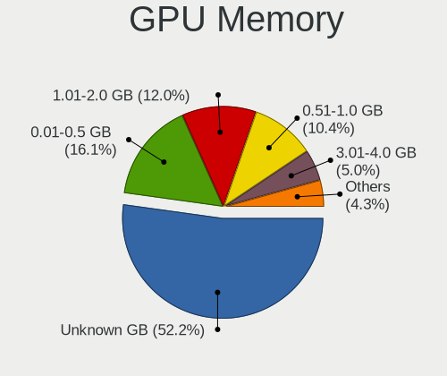

| Size in GB | Computers | Percent |
|------------|-----------|---------|
| Unknown    | 1551      | 47.55%  |
| 0.01-0.5   | 586       | 17.96%  |
| 1.01-2.0   | 463       | 14.19%  |
| 0.51-1.0   | 398       | 12.2%   |
| 3.01-4.0   | 156       | 4.78%   |
| 7.01-8.0   | 45        | 1.38%   |
| 5.01-6.0   | 40        | 1.23%   |
| 2.01-3.0   | 19        | 0.58%   |
| 16.01-24.0 | 2         | 0.06%   |
| 8.01-16.0  | 2         | 0.06%   |

Monitor
-------

Monitor Vendor
--------------

Monitor vendors

| Vendor                  | Computers | Percent |
|-------------------------|-----------|---------|
| Samsung Electronics     | 581       | 17.93%  |
| AU Optronics            | 383       | 11.82%  |
| LG Display              | 379       | 11.69%  |
| Goldstar                | 262       | 8.08%   |
| Chimei Innolux          | 226       | 6.97%   |
| BOE                     | 186       | 5.74%   |
| Dell                    | 125       | 3.86%   |
| Lenovo                  | 93        | 2.87%   |
| Chi Mei Optoelectronics | 92        | 2.84%   |
| Philips                 | 87        | 2.68%   |
| BenQ                    | 77        | 2.38%   |
| Ancor Communications    | 77        | 2.38%   |
| Acer                    | 72        | 2.22%   |
| Hewlett-Packard         | 68        | 2.1%    |
| Fujitsu Siemens         | 43        | 1.33%   |
| LG Philips              | 35        | 1.08%   |
| AOC                     | 28        | 0.86%   |
| HannStar                | 27        | 0.83%   |
| Eizo                    | 23        | 0.71%   |
| Sony                    | 22        | 0.68%   |
| InfoVision              | 22        | 0.68%   |
| LG Electronics          | 19        | 0.59%   |
| HKC                     | 17        | 0.52%   |
| NEC Computers           | 16        | 0.49%   |
| ASUSTek Computer        | 16        | 0.49%   |
| CPT                     | 14        | 0.43%   |
| Toshiba                 | 13        | 0.4%    |
| PANDA                   | 13        | 0.4%    |
| Apple                   | 13        | 0.4%    |
| Vestel Elektronik       | 12        | 0.37%   |
| IBM                     | 12        | 0.37%   |
| Belinea                 | 11        | 0.34%   |
| Panasonic               | 10        | 0.31%   |
| Medion                  | 10        | 0.31%   |
| ViewSonic               | 9         | 0.28%   |
| Unknown                 | 8         | 0.25%   |
| Sharp                   | 8         | 0.25%   |
| Quanta Display          | 7         | 0.22%   |
| Plain Tree Systems      | 7         | 0.22%   |
| OEM                     | 7         | 0.22%   |
| MStar                   | 7         | 0.22%   |
| InnoLux Display         | 7         | 0.22%   |
| Arnos Instruments       | 7         | 0.22%   |
| Videoseven              | 5         | 0.15%   |
| Iiyama                  | 5         | 0.15%   |
| Gericom                 | 5         | 0.15%   |
| FUS                     | 5         | 0.15%   |
| Daewoo                  | 4         | 0.12%   |
| Orion                   | 3         | 0.09%   |
| Onkyo                   | 3         | 0.09%   |
| MiTAC                   | 3         | 0.09%   |
| KTC                     | 3         | 0.09%   |
| Impression              | 3         | 0.09%   |
| ___                     | 2         | 0.06%   |
| ZLS                     | 2         | 0.06%   |
| SKY                     | 2         | 0.06%   |
| RTK                     | 2         | 0.06%   |
| LLL                     | 2         | 0.06%   |
| Lenovo Group Limited    | 2         | 0.06%   |
| GABA                    | 2         | 0.06%   |

Monitor Model
-------------

Monitor models

| Model                                                                    | Computers | Percent |
|--------------------------------------------------------------------------|-----------|---------|
| LG Display LCD Monitor LGD0395 1366x768 344x194mm 15.5-inch              | 49        | 1.48%   |
| Samsung Electronics LCD Monitor SEC5441 1366x768 309x174mm 14.0-inch     | 34        | 1.03%   |
| AU Optronics LCD Monitor AUO38ED 1920x1080 344x193mm 15.5-inch           | 32        | 0.97%   |
| BenQ EW277HDR BNQ7948 1920x1080 598x336mm 27.0-inch                      | 30        | 0.91%   |
| Chimei Innolux LCD Monitor CMN15DB 1366x768 344x193mm 15.5-inch          | 24        | 0.73%   |
| AU Optronics LCD Monitor AUO22EC 1366x768 344x193mm 15.5-inch            | 24        | 0.73%   |
| LG Display LCD Monitor LGD02DC 1366x768 344x194mm 15.5-inch              | 20        | 0.61%   |
| BOE LCD Monitor BOE06A5 1366x768 344x194mm 15.5-inch                     | 19        | 0.58%   |
| Chi Mei Optoelectronics LCD Monitor CMO15A7 1366x768 344x193mm 15.5-inch | 16        | 0.48%   |
| Lenovo LCD Monitor LEN4036 1440x900 304x190mm 14.1-inch                  | 14        | 0.42%   |
| Chimei Innolux LCD Monitor CMN15D5 1920x1080 344x193mm 15.5-inch         | 14        | 0.42%   |
| AU Optronics LCD Monitor AUO26EC 1366x768 344x193mm 15.5-inch            | 14        | 0.42%   |
| LG Display LCD Monitor LGD033A 1366x768 344x194mm 15.5-inch              | 13        | 0.39%   |
| Vestel Elektronik 22W_LCD_TV VES3700 1920x540                            | 12        | 0.36%   |
| Philips PHL 223V5 PHLC0CF 1920x1080 480x270mm 21.7-inch                  | 12        | 0.36%   |
| HKC Checksum: 0x8a (valid) HKC1850 1360x768 304x228mm 15.0-inch          | 12        | 0.36%   |
| Chi Mei Optoelectronics LCD Monitor CMO1592 1366x768 344x193mm 15.5-inch | 12        | 0.36%   |
| BOE LCD Monitor BOE069C 1920x1080 344x193mm 15.5-inch                    | 12        | 0.36%   |
| AU Optronics LCD Monitor AUO21ED 1920x1080 344x194mm 15.5-inch           | 12        | 0.36%   |
| Samsung Electronics SyncMaster SAM011E 1280x1024 338x270mm 17.0-inch     | 11        | 0.33%   |
| Samsung Electronics S19B150 SAM08A2 1366x768 410x230mm 18.5-inch         | 11        | 0.33%   |
| HannStar Hanns.G HX191 HSD0013 1280x1024 376x301mm 19.0-inch             | 11        | 0.33%   |
| Goldstar W1934 GSM4B7A 1440x900 410x256mm 19.0-inch                      | 11        | 0.33%   |
| Chimei Innolux LCD Monitor CMN14D4 1920x1080 309x173mm 13.9-inch         | 11        | 0.33%   |
| BOE LCD Monitor BOE0672 1366x768 344x194mm 15.5-inch                     | 11        | 0.33%   |
| AU Optronics LCD Monitor AUO20EC 1366x768 344x193mm 15.5-inch            | 11        | 0.33%   |
| Samsung Electronics LCD Monitor SEC325A 1366x768 344x194mm 15.5-inch     | 10        | 0.3%    |
| LG Display LP156WH2-TLAA LGD0230 1366x768 344x194mm 15.5-inch            | 10        | 0.3%    |
| Goldstar ULTRAWIDE GSM59F1 2560x1080 673x284mm 28.8-inch                 | 10        | 0.3%    |
| Goldstar 2D HD TV GSM59CA 1366x768 509x286mm 23.0-inch                   | 10        | 0.3%    |
| BOE LCD Monitor BOE0675 1366x768 344x194mm 15.5-inch                     | 10        | 0.3%    |
| AU Optronics LCD Monitor AUO61ED 1920x1080 344x194mm 15.5-inch           | 10        | 0.3%    |
| Philips PHL 243V7 PHLC155 1920x1080 527x296mm 23.8-inch                  | 9         | 0.27%   |
| Goldstar MP59G GSM5B34 1920x1080 480x270mm 21.7-inch                     | 9         | 0.27%   |
| Chimei Innolux LCD Monitor CMN15CA 1366x768 344x193mm 15.5-inch          | 9         | 0.27%   |
| Chi Mei Optoelectronics LCD Monitor CMO15A3 1366x768 344x193mm 15.5-inch | 9         | 0.27%   |
| Samsung Electronics LCD Monitor SEC324A 1366x768 344x194mm 15.5-inch     | 8         | 0.24%   |
| LG Display LCD Monitor LGD0468 1366x768 344x194mm 15.5-inch              | 8         | 0.24%   |
| Chimei Innolux LCD Monitor CMN15C4 1920x1080 344x193mm 15.5-inch         | 8         | 0.24%   |
| Chi Mei Optoelectronics LCD Monitor CMO1526 1280x800 331x207mm 15.4-inch | 8         | 0.24%   |
| AU Optronics LCD Monitor AUO8174 1280x800 331x207mm 15.4-inch            | 8         | 0.24%   |
| AU Optronics LCD Monitor AUO40EC 1366x768 344x193mm 15.5-inch            | 8         | 0.24%   |
| Ancor Communications ASUS VW193D ACI19D5 1440x900 408x255mm 18.9-inch    | 8         | 0.24%   |
| Samsung Electronics S24D330 SAM0D92 1920x1080 531x299mm 24.0-inch        | 7         | 0.21%   |
| Samsung Electronics LCD Monitor SEC3245 1280x800 331x207mm 15.4-inch     | 7         | 0.21%   |
| Samsung Electronics C24F390 SAM0D2C 1920x1080 521x293mm 23.5-inch        | 7         | 0.21%   |
| OEM 185W_LCD_TV OEM3700 1920x540                                         | 7         | 0.21%   |
| MStar Demo MST0030 1920x1080 708x398mm 32.0-inch                         | 7         | 0.21%   |
| LG Philips LP154WX4-TLC8 LPL0120 1280x800 331x207mm 15.4-inch            | 7         | 0.21%   |
| LG Display LCD Monitor LGD03AB 1366x768 344x194mm 15.5-inch              | 7         | 0.21%   |
| LG Display LCD Monitor LGD02AD 1366x768 344x194mm 15.5-inch              | 7         | 0.21%   |
| Goldstar W2234 GSM56B8 1680x1050 474x296mm 22.0-inch                     | 7         | 0.21%   |
| Goldstar HD GSM5ACB 1366x768 410x230mm 18.5-inch                         | 7         | 0.21%   |
| BOE LCD Monitor BOE061D 1366x768 309x173mm 13.9-inch                     | 7         | 0.21%   |
| AU Optronics LCD Monitor AUO70EC 1366x768 344x193mm 15.5-inch            | 7         | 0.21%   |
| AU Optronics LCD Monitor AUO5544 1280x800 303x189mm 14.1-inch            | 7         | 0.21%   |
| AU Optronics LCD Monitor AUO23EC 1366x768 344x193mm 15.5-inch            | 7         | 0.21%   |
| AU Optronics LCD Monitor AUO206C 1366x768 277x156mm 12.5-inch            | 7         | 0.21%   |
| AU Optronics LCD Monitor AUO106C 1366x768 276x155mm 12.5-inch            | 7         | 0.21%   |
| Toshiba TV TSB0108 1920x540                                              | 6         | 0.18%   |

Monitor Resolution
------------------

Monitor screen resolution

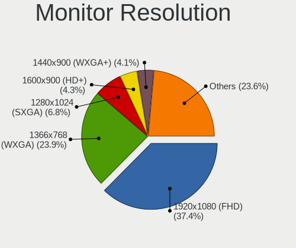

| Resolution         | Computers | Percent |
|--------------------|-----------|---------|
| 1920x1080 (FHD)    | 1062      | 33.72%  |
| 1366x768 (WXGA)    | 852       | 27.06%  |
| 1280x1024 (SXGA)   | 255       | 8.1%    |
| 1280x800 (WXGA)    | 156       | 4.95%   |
| 1440x900 (WXGA+)   | 147       | 4.67%   |
| 1600x900 (HD+)     | 146       | 4.64%   |
| 1680x1050 (WSXGA+) | 130       | 4.13%   |
| 3840x2160 (4K)     | 89        | 2.83%   |
| 1920x1200 (WUXGA)  | 48        | 1.52%   |
| 1024x600           | 38        | 1.21%   |
| 1360x768           | 37        | 1.17%   |
| 1024x768 (XGA)     | 34        | 1.08%   |
| 2560x1440 (QHD)    | 32        | 1.02%   |
| 2560x1080          | 26        | 0.83%   |
| Unknown            | 17        | 0.54%   |
| 1920x540           | 16        | 0.51%   |
| 1600x1200          | 9         | 0.29%   |
| 1280x720 (HD)      | 7         | 0.22%   |
| 3840x1080          | 4         | 0.13%   |
| 3440x1440          | 4         | 0.13%   |
| 2880x1800          | 3         | 0.1%    |
| 2560x1600          | 3         | 0.1%    |
| 2288x1287          | 3         | 0.1%    |
| 1920x1280          | 3         | 0.1%    |
| 1400x1050          | 3         | 0.1%    |
| 3840x1200          | 2         | 0.06%   |
| 3280x1080          | 2         | 0.06%   |
| 2048x1152          | 2         | 0.06%   |
| 1280x960           | 2         | 0.06%   |
| 1280x768           | 2         | 0.06%   |
| 800x1280           | 1         | 0.03%   |
| 7680x2160          | 1         | 0.03%   |
| 3840x1920          | 1         | 0.03%   |
| 3600x1200          | 1         | 0.03%   |
| 3200x1800 (QHD+)   | 1         | 0.03%   |
| 3200x1080          | 1         | 0.03%   |
| 2880x1024          | 1         | 0.03%   |
| 2736x1824          | 1         | 0.03%   |
| 2304x1440          | 1         | 0.03%   |
| 2304x1024          | 1         | 0.03%   |
| 2160x1440          | 1         | 0.03%   |
| 2048x1536          | 1         | 0.03%   |
| 1800x1440          | 1         | 0.03%   |
| 1680x945           | 1         | 0.03%   |
| 1152x864           | 1         | 0.03%   |

Monitor Diagonal
----------------

Diagonal size in inches

| Inches  | Computers | Percent |
|---------|-----------|---------|
| 15      | 1084      | 33.47%  |
| 17      | 241       | 7.44%   |
| 21      | 221       | 6.82%   |
| 19      | 209       | 6.45%   |
| 14      | 209       | 6.45%   |
| 23      | 177       | 5.46%   |
| 13      | 155       | 4.79%   |
| 24      | 140       | 4.32%   |
| 27      | 126       | 3.89%   |
| Unknown | 96        | 2.96%   |
| 22      | 95        | 2.93%   |
| 18      | 94        | 2.9%    |
| 12      | 76        | 2.35%   |
| 10      | 49        | 1.51%   |
| 20      | 44        | 1.36%   |
| 11      | 36        | 1.11%   |
| 34      | 30        | 0.93%   |
| 84      | 23        | 0.71%   |
| 40      | 22        | 0.68%   |
| 31      | 20        | 0.62%   |
| 72      | 19        | 0.59%   |
| 32      | 12        | 0.37%   |
| 65      | 10        | 0.31%   |
| 54      | 7         | 0.22%   |
| 52      | 7         | 0.22%   |
| 55      | 5         | 0.15%   |
| 42      | 5         | 0.15%   |
| 64      | 3         | 0.09%   |
| 48      | 3         | 0.09%   |
| 47      | 3         | 0.09%   |
| 39      | 3         | 0.09%   |
| 8       | 3         | 0.09%   |
| 26      | 2         | 0.06%   |
| 16      | 2         | 0.06%   |
| 60      | 1         | 0.03%   |
| 50      | 1         | 0.03%   |
| 46      | 1         | 0.03%   |
| 41      | 1         | 0.03%   |
| 33      | 1         | 0.03%   |
| 29      | 1         | 0.03%   |
| 9       | 1         | 0.03%   |
| 7       | 1         | 0.03%   |

Monitor Width
-------------

Physical width

| Width in mm | Computers | Percent |
|-------------|-----------|---------|
| 301-350     | 1453      | 45.31%  |
| 401-500     | 521       | 16.25%  |
| 501-600     | 427       | 13.31%  |
| 351-400     | 292       | 9.11%   |
| 201-300     | 229       | 7.14%   |
| Unknown     | 96        | 2.99%   |
| 701-800     | 42        | 1.31%   |
| 1501-2000   | 42        | 1.31%   |
| 1001-1500   | 41        | 1.28%   |
| 601-700     | 27        | 0.84%   |
| 801-900     | 26        | 0.81%   |
| 901-1000    | 6         | 0.19%   |
| 101-200     | 5         | 0.16%   |

Aspect Ratio
------------

Proportional relationship between the width and the height

| Ratio   | Computers | Percent |
|---------|-----------|---------|
| 16/9    | 2148      | 70.75%  |
| 16/10   | 460       | 15.15%  |
| 5/4     | 246       | 8.1%    |
| Unknown | 71        | 2.34%   |
| 4/3     | 63        | 2.08%   |
| 21/9    | 30        | 0.99%   |
| 3/2     | 15        | 0.49%   |
| 6/5     | 2         | 0.07%   |
| 0.62    | 1         | 0.03%   |

Monitor Area
------------

Area in inch

| Area in inch | Computers | Percent |
|----------------|-----------|---------|
| 101-110        | 1073      | 33.27%  |
| 201-250        | 528       | 16.37%  |
| 151-200        | 319       | 9.89%   |
| 81-90          | 302       | 9.36%   |
| 141-150        | 200       | 6.2%    |
| 301-350        | 127       | 3.94%   |
| Unknown        | 96        | 2.98%   |
| 121-130        | 88        | 2.73%   |
| More than 1000 | 79        | 2.45%   |
| 61-70          | 71        | 2.2%    |
| 351-500        | 63        | 1.95%   |
| 71-80          | 59        | 1.83%   |
| 251-300        | 48        | 1.49%   |
| 41-50          | 47        | 1.46%   |
| 51-60          | 38        | 1.18%   |
| 501-1000       | 35        | 1.09%   |
| 131-140        | 27        | 0.84%   |
| 91-100         | 11        | 0.34%   |
| 111-120        | 9         | 0.28%   |
| 1-40           | 5         | 0.16%   |

Pixel Density
-------------

Pixels per inch

| Density       | Computers | Percent |
|---------------|-----------|---------|
| 51-100        | 1250      | 39.73%  |
| 101-120       | 1033      | 32.84%  |
| 121-160       | 626       | 19.9%   |
| Unknown       | 96        | 3.05%   |
| 161-240       | 68        | 2.16%   |
| 1-50          | 62        | 1.97%   |
| More than 240 | 11        | 0.35%   |

Multiple Monitors
-----------------

Total monitors connected

| Total | Computers | Percent |
|-------|-----------|---------|
| 1     | 2820      | 87.71%  |
| 2     | 299       | 9.3%    |
| 0     | 74        | 2.3%    |
| 3     | 22        | 0.68%   |

Network
-------

Net Controller Vendor
---------------------

Controller vendors

| Vendor                            | Computers | Percent |
|-----------------------------------|-----------|---------|
| Realtek Semiconductor             | 1643      | 35.43%  |
| Intel                             | 1207      | 26.03%  |
| Qualcomm Atheros                  | 719       | 15.51%  |
| Broadcom                          | 304       | 6.56%   |
| Broadcom Limited                  | 126       | 2.72%   |
| Ralink                            | 106       | 2.29%   |
| Marvell Technology Group          | 71        | 1.53%   |
| Qualcomm Atheros Communications   | 64        | 1.38%   |
| Ralink Technology                 | 51        | 1.1%    |
| Nvidia                            | 43        | 0.93%   |
| TP-Link                           | 40        | 0.86%   |
| Dell                              | 23        | 0.5%    |
| Samsung Electronics               | 18        | 0.39%   |
| VIA Technologies                  | 17        | 0.37%   |
| Hewlett-Packard                   | 17        | 0.37%   |
| Huawei Technologies               | 16        | 0.35%   |
| Sierra Wireless                   | 14        | 0.3%    |
| Ericsson Business Mobile Networks | 13        | 0.28%   |
| MEDIATEK                          | 12        | 0.26%   |
| ASUSTek Computer                  | 12        | 0.26%   |
| Silicon Integrated Systems [SiS]  | 11        | 0.24%   |
| JMicron Technology                | 11        | 0.24%   |
| Attansic Technology               | 11        | 0.24%   |
| Xiaomi                            | 10        | 0.22%   |
| Belkin Components                 | 7         | 0.15%   |
| ASIX Electronics                  | 6         | 0.13%   |
| IMC Networks                      | 5         | 0.11%   |
| D-Link System                     | 5         | 0.11%   |
| DisplayLink                       | 4         | 0.09%   |
| D-Link                            | 4         | 0.09%   |
| Microchip Technology              | 3         | 0.06%   |
| Edimax Technology                 | 3         | 0.06%   |
| Aquantia                          | 3         | 0.06%   |
| Accton Technology                 | 3         | 0.06%   |
| ZyDAS                             | 2         | 0.04%   |
| Qualcomm                          | 2         | 0.04%   |
| NetGear                           | 2         | 0.04%   |
| Microsoft                         | 2         | 0.04%   |
| Lenovo                            | 2         | 0.04%   |
| Arduino SA                        | 2         | 0.04%   |
| ZTE WCDMA Technologies MSM        | 1         | 0.02%   |
| TRENDnet                          | 1         | 0.02%   |
| Texas Instruments                 | 1         | 0.02%   |
| T & A Mobile Phones               | 1         | 0.02%   |
| Sundance Technology Inc / IC Plus | 1         | 0.02%   |
| Spreadtrum Communications         | 1         | 0.02%   |
| ShenZhen ShanWan Technology       | 1         | 0.02%   |
| Seeed Technology                  | 1         | 0.02%   |
| QLogic                            | 1         | 0.02%   |
| OPPO Electronics                  | 1         | 0.02%   |
| Motorola PCS                      | 1         | 0.02%   |
| Micro Star International          | 1         | 0.02%   |
| Mercucys                          | 1         | 0.02%   |
| LG Electronics                    | 1         | 0.02%   |
| ICS Advent                        | 1         | 0.02%   |
| HMD Global                        | 1         | 0.02%   |
| Hangzhou Silan Microelectronics   | 1         | 0.02%   |
| GoPro                             | 1         | 0.02%   |
| Fujitsu Siemens Computers         | 1         | 0.02%   |
| Davicom Semiconductor             | 1         | 0.02%   |

Net Controller Model
--------------------

Controller models

| Model                                                                   | Computers | Percent |
|-------------------------------------------------------------------------|-----------|---------|
| Realtek RTL8111/8168/8411 PCI Express Gigabit Ethernet Controller       | 1160      | 21.59%  |
| Realtek RTL810xE PCI Express Fast Ethernet controller                   | 304       | 5.66%   |
| Intel 82579LM Gigabit Network Connection (Lewisville)                   | 170       | 3.16%   |
| Qualcomm Atheros AR9285 Wireless Network Adapter (PCI-Express)          | 111       | 2.07%   |
| Qualcomm Atheros QCA9565 / AR9565 Wireless Network Adapter              | 99        | 1.84%   |
| Qualcomm Atheros QCA9377 802.11ac Wireless Network Adapter              | 97        | 1.8%    |
| Qualcomm Atheros AR9485 Wireless Network Adapter                        | 81        | 1.51%   |
| Intel Centrino Advanced-N 6205 [Taylor Peak]                            | 72        | 1.34%   |
| Intel Wireless 7260                                                     | 64        | 1.19%   |
| Realtek RTL8723BE PCIe Wireless Network Adapter                         | 63        | 1.17%   |
| Ralink RT3290 Wireless 802.11n 1T/1R PCIe                               | 63        | 1.17%   |
| Intel Wireless 8265 / 8275                                              | 58        | 1.08%   |
| Intel 82577LM Gigabit Network Connection                                | 58        | 1.08%   |
| Qualcomm Atheros AR242x / AR542x Wireless Network Adapter (PCI-Express) | 57        | 1.06%   |
| Qualcomm Atheros AR9271 802.11n                                         | 55        | 1.02%   |
| Broadcom BCM4313 802.11bgn Wireless Network Adapter                     | 52        | 0.97%   |
| Intel 82567LM Gigabit Network Connection                                | 51        | 0.95%   |
| Qualcomm Atheros QCA8171 Gigabit Ethernet                               | 50        | 0.93%   |
| Intel Wireless 7265                                                     | 50        | 0.93%   |
| Intel PRO/Wireless 3945ABG [Golan] Network Connection                   | 48        | 0.89%   |
| Intel Centrino Advanced-N 6200                                          | 47        | 0.87%   |
| Intel 82567LM-3 Gigabit Network Connection                              | 45        | 0.84%   |
| Intel Ethernet Connection I217-LM                                       | 42        | 0.78%   |
| Realtek RTL-8100/8101L/8139 PCI Fast Ethernet Adapter                   | 41        | 0.76%   |
| Intel Ethernet Connection (2) I219-V                                    | 41        | 0.76%   |
| Intel Wireless 3165                                                     | 38        | 0.71%   |
| Intel Wireless 3160                                                     | 36        | 0.67%   |
| Realtek RTL8188EUS 802.11n Wireless Network Adapter                     | 33        | 0.61%   |
| Intel Wireless 8260                                                     | 32        | 0.6%    |
| Intel Centrino Ultimate-N 6300                                          | 32        | 0.6%    |
| Intel PRO/Wireless 5100 AGN [Shiloh] Network Connection                 | 31        | 0.58%   |
| Intel PRO/Wireless 4965 AG or AGN [Kedron] Network Connection           | 31        | 0.58%   |
| Intel Cannon Lake PCH CNVi WiFi                                         | 31        | 0.58%   |
| Realtek RTL8821CE 802.11ac PCIe Wireless Network Adapter                | 30        | 0.56%   |
| Qualcomm Atheros AR8132 Fast Ethernet                                   | 30        | 0.56%   |
| Qualcomm Atheros AR8121/AR8113/AR8114 Gigabit or Fast Ethernet          | 30        | 0.56%   |
| Intel Wi-Fi 6 AX200                                                     | 30        | 0.56%   |
| Intel 82566DM-2 Gigabit Network Connection                              | 30        | 0.56%   |
| Qualcomm Atheros AR8151 v2.0 Gigabit Ethernet                           | 28        | 0.52%   |
| Realtek RTL8169 PCI Gigabit Ethernet Controller                         | 27        | 0.5%    |
| Realtek RTL8821AE 802.11ac PCIe Wireless Network Adapter                | 26        | 0.48%   |
| Nvidia MCP61 Ethernet                                                   | 25        | 0.47%   |
| Intel WiFi Link 5100                                                    | 25        | 0.47%   |
| Ralink MT7601U Wireless Adapter                                         | 24        | 0.45%   |
| Intel I211 Gigabit Network Connection                                   | 24        | 0.45%   |
| Intel Ethernet Connection I218-LM                                       | 24        | 0.45%   |
| Intel Dual Band Wireless-AC 3168NGW [Stone Peak]                        | 24        | 0.45%   |
| Intel 82579V Gigabit Network Connection                                 | 24        | 0.45%   |
| Broadcom BCM43142 802.11b/g/n                                           | 24        | 0.45%   |
| Broadcom BCM4312 802.11b/g LP-PHY                                       | 24        | 0.45%   |
| Qualcomm Atheros AR8131 Gigabit Ethernet                                | 23        | 0.43%   |
| Qualcomm Atheros AR928X Wireless Network Adapter (PCI-Express)          | 21        | 0.39%   |
| Intel Ethernet Connection (3) I218-LM                                   | 21        | 0.39%   |
| Broadcom NetLink BCM57785 Gigabit Ethernet PCIe                         | 20        | 0.37%   |
| Qualcomm Atheros AR8152 v2.0 Fast Ethernet                              | 19        | 0.35%   |
| Intel Ethernet Connection (2) I219-LM                                   | 19        | 0.35%   |
| Qualcomm Atheros QCA6174 802.11ac Wireless Network Adapter              | 18        | 0.33%   |
| Qualcomm Atheros AR9287 Wireless Network Adapter (PCI-Express)          | 18        | 0.33%   |
| Intel Wi-Fi 6 AX201                                                     | 18        | 0.33%   |
| Intel Ultimate N WiFi Link 5300                                         | 18        | 0.33%   |

Wireless Vendor
---------------

Wireless vendors

| Vendor                          | Computers | Percent |
|---------------------------------|-----------|---------|
| Intel                           | 837       | 37.65%  |
| Qualcomm Atheros                | 547       | 24.61%  |
| Realtek Semiconductor           | 289       | 13%     |
| Broadcom                        | 167       | 7.51%   |
| Ralink                          | 106       | 4.77%   |
| Qualcomm Atheros Communications | 64        | 2.88%   |
| Ralink Technology               | 51        | 2.29%   |
| TP-Link                         | 38        | 1.71%   |
| Broadcom Limited                | 38        | 1.71%   |
| Sierra Wireless                 | 14        | 0.63%   |
| Dell                            | 13        | 0.58%   |
| ASUSTek Computer                | 12        | 0.54%   |
| MEDIATEK                        | 10        | 0.45%   |
| Belkin Components               | 7         | 0.31%   |
| IMC Networks                    | 5         | 0.22%   |
| Hewlett-Packard                 | 3         | 0.13%   |
| Edimax Technology               | 3         | 0.13%   |
| D-Link                          | 3         | 0.13%   |
| ZyDAS                           | 2         | 0.09%   |
| NetGear                         | 2         | 0.09%   |
| Microsoft                       | 2         | 0.09%   |
| D-Link System                   | 2         | 0.09%   |
| VIA Technologies                | 1         | 0.04%   |
| TRENDnet                        | 1         | 0.04%   |
| Texas Instruments               | 1         | 0.04%   |
| Micro Star International        | 1         | 0.04%   |
| Mercucys                        | 1         | 0.04%   |
| Marvell Technology Group        | 1         | 0.04%   |
| Fujitsu Siemens Computers       | 1         | 0.04%   |
| Accton Technology               | 1         | 0.04%   |

Wireless Model
--------------

Wireless models

| Model                                                                         | Computers | Percent |
|-------------------------------------------------------------------------------|-----------|---------|
| Qualcomm Atheros AR9285 Wireless Network Adapter (PCI-Express)                | 111       | 4.97%   |
| Qualcomm Atheros QCA9565 / AR9565 Wireless Network Adapter                    | 99        | 4.43%   |
| Qualcomm Atheros QCA9377 802.11ac Wireless Network Adapter                    | 97        | 4.34%   |
| Qualcomm Atheros AR9485 Wireless Network Adapter                              | 81        | 3.63%   |
| Intel Centrino Advanced-N 6205 [Taylor Peak]                                  | 72        | 3.22%   |
| Intel Wireless 7260                                                           | 64        | 2.87%   |
| Realtek RTL8723BE PCIe Wireless Network Adapter                               | 63        | 2.82%   |
| Ralink RT3290 Wireless 802.11n 1T/1R PCIe                                     | 63        | 2.82%   |
| Intel Wireless 8265 / 8275                                                    | 58        | 2.6%    |
| Qualcomm Atheros AR242x / AR542x Wireless Network Adapter (PCI-Express)       | 57        | 2.55%   |
| Qualcomm Atheros AR9271 802.11n                                               | 55        | 2.46%   |
| Broadcom BCM4313 802.11bgn Wireless Network Adapter                           | 52        | 2.33%   |
| Intel Wireless 7265                                                           | 50        | 2.24%   |
| Intel PRO/Wireless 3945ABG [Golan] Network Connection                         | 48        | 2.15%   |
| Intel Centrino Advanced-N 6200                                                | 47        | 2.1%    |
| Intel Wireless 3165                                                           | 38        | 1.7%    |
| Intel Wireless 3160                                                           | 36        | 1.61%   |
| Realtek RTL8188EUS 802.11n Wireless Network Adapter                           | 33        | 1.48%   |
| Intel Wireless 8260                                                           | 32        | 1.43%   |
| Intel Centrino Ultimate-N 6300                                                | 32        | 1.43%   |
| Intel PRO/Wireless 5100 AGN [Shiloh] Network Connection                       | 31        | 1.39%   |
| Intel PRO/Wireless 4965 AG or AGN [Kedron] Network Connection                 | 31        | 1.39%   |
| Intel Cannon Lake PCH CNVi WiFi                                               | 31        | 1.39%   |
| Realtek RTL8821CE 802.11ac PCIe Wireless Network Adapter                      | 30        | 1.34%   |
| Intel Wi-Fi 6 AX200                                                           | 30        | 1.34%   |
| Realtek RTL8821AE 802.11ac PCIe Wireless Network Adapter                      | 26        | 1.16%   |
| Intel WiFi Link 5100                                                          | 25        | 1.12%   |
| Ralink MT7601U Wireless Adapter                                               | 24        | 1.07%   |
| Intel Dual Band Wireless-AC 3168NGW [Stone Peak]                              | 24        | 1.07%   |
| Broadcom BCM43142 802.11b/g/n                                                 | 24        | 1.07%   |
| Broadcom BCM4312 802.11b/g LP-PHY                                             | 24        | 1.07%   |
| Qualcomm Atheros AR928X Wireless Network Adapter (PCI-Express)                | 21        | 0.94%   |
| Qualcomm Atheros QCA6174 802.11ac Wireless Network Adapter                    | 18        | 0.81%   |
| Qualcomm Atheros AR9287 Wireless Network Adapter (PCI-Express)                | 18        | 0.81%   |
| Intel Wi-Fi 6 AX201                                                           | 18        | 0.81%   |
| Intel Ultimate N WiFi Link 5300                                               | 18        | 0.81%   |
| Intel Dual Band Wireless-AC 3165 Plus Bluetooth                               | 18        | 0.81%   |
| Intel Comet Lake PCH-LP CNVi WiFi                                             | 17        | 0.76%   |
| Broadcom Limited BCM4312 802.11b/g LP-PHY                                     | 17        | 0.76%   |
| Broadcom BCM43228 802.11a/b/g/n                                               | 17        | 0.76%   |
| Intel Gemini Lake PCH CNVi WiFi                                               | 16        | 0.72%   |
| Ralink RT3090 Wireless 802.11n 1T/1R PCIe                                     | 15        | 0.67%   |
| Intel Cannon Point-LP CNVi [Wireless-AC]                                      | 14        | 0.63%   |
| Realtek RTL8822CE 802.11ac PCIe Wireless Network Adapter                      | 13        | 0.58%   |
| Realtek RTL8822BE 802.11a/b/g/n/ac WiFi adapter                               | 13        | 0.58%   |
| Realtek RTL8191SEvB Wireless LAN Controller                                   | 13        | 0.58%   |
| Realtek RTL8188CE 802.11b/g/n WiFi Adapter                                    | 13        | 0.58%   |
| TP-Link TL-WN821N Version 5 RTL8192EU                                         | 12        | 0.54%   |
| Qualcomm Atheros AR9462 Wireless Network Adapter                              | 12        | 0.54%   |
| Intel Centrino Advanced-N 6235                                                | 12        | 0.54%   |
| TP-Link TL-WN722N v2/v3 [Realtek RTL8188EUS]                                  | 10        | 0.45%   |
| Ralink RT5390 Wireless 802.11n 1T/1R PCIe                                     | 10        | 0.45%   |
| Intel Wireless-AC 9260                                                        | 10        | 0.45%   |
| Realtek RTL8192EU 802.11b/g/n WLAN Adapter                                    | 9         | 0.4%    |
| Realtek RTL8188EE Wireless Network Adapter                                    | 9         | 0.4%    |
| Ralink RT5370 Wireless Adapter                                                | 9         | 0.4%    |
| Realtek RTL8723BU 802.11b/g/n WLAN Adapter                                    | 8         | 0.36%   |
| Realtek RTL8188CUS 802.11n WLAN Adapter                                       | 8         | 0.36%   |
| Ralink RT2870/RT3070 Wireless Adapter                                         | 8         | 0.36%   |
| Qualcomm Atheros TP-Link TL-WN322G v3 / TL-WN422G v2 802.11g [Atheros AR9271] | 8         | 0.36%   |

Ethernet Vendor
---------------

Ethernet vendors

| Vendor                            | Computers | Percent |
|-----------------------------------|-----------|---------|
| Realtek Semiconductor             | 1556      | 50.97%  |
| Intel                             | 747       | 24.47%  |
| Qualcomm Atheros                  | 252       | 8.25%   |
| Broadcom                          | 162       | 5.31%   |
| Broadcom Limited                  | 89        | 2.92%   |
| Marvell Technology Group          | 70        | 2.29%   |
| Nvidia                            | 43        | 1.41%   |
| Samsung Electronics               | 17        | 0.56%   |
| VIA Technologies                  | 15        | 0.49%   |
| Huawei Technologies               | 14        | 0.46%   |
| Silicon Integrated Systems [SiS]  | 11        | 0.36%   |
| JMicron Technology                | 11        | 0.36%   |
| Attansic Technology               | 11        | 0.36%   |
| Xiaomi                            | 10        | 0.33%   |
| ASIX Electronics                  | 6         | 0.2%    |
| DisplayLink                       | 4         | 0.13%   |
| Microchip Technology              | 3         | 0.1%    |
| D-Link System                     | 3         | 0.1%    |
| Aquantia                          | 3         | 0.1%    |
| TP-Link                           | 2         | 0.07%   |
| Qualcomm                          | 2         | 0.07%   |
| MediaTek                          | 2         | 0.07%   |
| Lenovo                            | 2         | 0.07%   |
| Accton Technology                 | 2         | 0.07%   |
| ZTE WCDMA Technologies MSM        | 1         | 0.03%   |
| T & A Mobile Phones               | 1         | 0.03%   |
| Sundance Technology Inc / IC Plus | 1         | 0.03%   |
| Spreadtrum Communications         | 1         | 0.03%   |
| QLogic                            | 1         | 0.03%   |
| OPPO Electronics                  | 1         | 0.03%   |
| Motorola PCS                      | 1         | 0.03%   |
| LG Electronics                    | 1         | 0.03%   |
| ICS Advent                        | 1         | 0.03%   |
| HMD Global                        | 1         | 0.03%   |
| Hewlett-Packard                   | 1         | 0.03%   |
| Hangzhou Silan Microelectronics   | 1         | 0.03%   |
| Davicom Semiconductor             | 1         | 0.03%   |
| D-Link                            | 1         | 0.03%   |
| American Megatrends               | 1         | 0.03%   |
| 3DSP                              | 1         | 0.03%   |

Ethernet Model
--------------

Ethernet models

| Model                                                             | Computers | Percent |
|-------------------------------------------------------------------|-----------|---------|
| Realtek RTL8111/8168/8411 PCI Express Gigabit Ethernet Controller | 1160      | 37.58%  |
| Realtek RTL810xE PCI Express Fast Ethernet controller             | 304       | 9.85%   |
| Intel 82579LM Gigabit Network Connection (Lewisville)             | 170       | 5.51%   |
| Intel 82577LM Gigabit Network Connection                          | 58        | 1.88%   |
| Intel 82567LM Gigabit Network Connection                          | 51        | 1.65%   |
| Qualcomm Atheros QCA8171 Gigabit Ethernet                         | 50        | 1.62%   |
| Intel 82567LM-3 Gigabit Network Connection                        | 45        | 1.46%   |
| Intel Ethernet Connection I217-LM                                 | 42        | 1.36%   |
| Realtek RTL-8100/8101L/8139 PCI Fast Ethernet Adapter             | 41        | 1.33%   |
| Intel Ethernet Connection (2) I219-V                              | 41        | 1.33%   |
| Qualcomm Atheros AR8132 Fast Ethernet                             | 30        | 0.97%   |
| Qualcomm Atheros AR8121/AR8113/AR8114 Gigabit or Fast Ethernet    | 30        | 0.97%   |
| Intel 82566DM-2 Gigabit Network Connection                        | 30        | 0.97%   |
| Qualcomm Atheros AR8151 v2.0 Gigabit Ethernet                     | 28        | 0.91%   |
| Realtek RTL8169 PCI Gigabit Ethernet Controller                   | 27        | 0.87%   |
| Nvidia MCP61 Ethernet                                             | 25        | 0.81%   |
| Intel I211 Gigabit Network Connection                             | 24        | 0.78%   |
| Intel Ethernet Connection I218-LM                                 | 24        | 0.78%   |
| Intel 82579V Gigabit Network Connection                           | 24        | 0.78%   |
| Qualcomm Atheros AR8131 Gigabit Ethernet                          | 23        | 0.75%   |
| Intel Ethernet Connection (3) I218-LM                             | 21        | 0.68%   |
| Broadcom NetLink BCM57785 Gigabit Ethernet PCIe                   | 20        | 0.65%   |
| Qualcomm Atheros AR8152 v2.0 Fast Ethernet                        | 19        | 0.62%   |
| Intel Ethernet Connection (2) I219-LM                             | 19        | 0.62%   |
| Broadcom NetXtreme BCM5761 Gigabit Ethernet PCIe                  | 18        | 0.58%   |
| Realtek RTL8153 Gigabit Ethernet Adapter                          | 17        | 0.55%   |
| Intel Ethernet Connection I217-V                                  | 17        | 0.55%   |
| Intel 82566MM Gigabit Network Connection                          | 17        | 0.55%   |
| Qualcomm Atheros QCA8172 Fast Ethernet                            | 16        | 0.52%   |
| Marvell Group 88E8040 PCI-E Fast Ethernet Controller              | 15        | 0.49%   |
| Broadcom NetXtreme BCM5754 Gigabit Ethernet PCI Express           | 15        | 0.49%   |
| Qualcomm Atheros AR8161 Gigabit Ethernet                          | 14        | 0.45%   |
| Intel Ethernet Connection I219-LM                                 | 14        | 0.45%   |
| Intel Ethernet Connection (4) I219-LM                             | 14        | 0.45%   |
| Broadcom Limited NetXtreme BCM5761 Gigabit Ethernet PCIe          | 14        | 0.45%   |
| Broadcom Limited NetLink BCM57780 Gigabit Ethernet PCIe           | 14        | 0.45%   |
| Marvell Group 88E8056 PCI-E Gigabit Ethernet Controller           | 13        | 0.42%   |
| Marvell Group 88E8055 PCI-E Gigabit Ethernet Controller           | 13        | 0.42%   |
| Huawei MAR-LX1A                                                   | 13        | 0.42%   |
| Broadcom NetLink BCM57780 Gigabit Ethernet PCIe                   | 13        | 0.42%   |
| VIA VT6102/VT6103 [Rhine-II]                                      | 12        | 0.39%   |
| Intel 82567LF-3 Gigabit Network Connection                        | 12        | 0.39%   |
| Broadcom NetLink BCM5906M Fast Ethernet PCI Express               | 12        | 0.39%   |
| Broadcom NetLink BCM5787M Gigabit Ethernet PCI Express            | 12        | 0.39%   |
| Broadcom Limited NetLink BCM5787M Gigabit Ethernet PCI Express    | 12        | 0.39%   |
| JMicron JMC250 PCI Express Gigabit Ethernet Controller            | 11        | 0.36%   |
| Intel Ethernet Connection (7) I219-V                              | 11        | 0.36%   |
| Attansic AR8152 v2.0 Fast Ethernet                                | 11        | 0.36%   |
| Silicon Integrated Systems [SiS] 191 Gigabit Ethernet Adapter     | 10        | 0.32%   |
| Qualcomm Atheros Attansic L1 Gigabit Ethernet                     | 10        | 0.32%   |
| Qualcomm Atheros AR8162 Fast Ethernet                             | 10        | 0.32%   |
| Broadcom NetLink BCM5784M Gigabit Ethernet PCIe                   | 10        | 0.32%   |
| Broadcom BCM4401-B0 100Base-TX                                    | 10        | 0.32%   |
| Samsung GT-I9070 (network tethering, USB debugging enabled)       | 9         | 0.29%   |
| Samsung Galaxy series, misc. (tethering mode)                     | 9         | 0.29%   |
| Realtek RTL8152 Fast Ethernet Adapter                             | 9         | 0.29%   |
| Broadcom Limited NetXtreme BCM5754 Gigabit Ethernet PCI Express   | 9         | 0.29%   |
| Xiaomi Mi/Redmi series (RNDIS)                                    | 8         | 0.26%   |
| Intel Ethernet Connection I219-V                                  | 8         | 0.26%   |
| Intel 82574L Gigabit Network Connection                           | 8         | 0.26%   |

Net Controller Kind
-------------------

Ethernet, WiFi or modem

| Kind     | Computers | Percent |
|----------|-----------|---------|
| Ethernet | 2951      | 57.46%  |
| WiFi     | 2132      | 41.51%  |
| Modem    | 52        | 1.01%   |
| Unknown  | 1         | 0.02%   |

Used Controller
---------------

Currently used network controller

| Kind     | Computers | Percent |
|----------|-----------|---------|
| WiFi     | 1702      | 51.31%  |
| Ethernet | 1615      | 48.69%  |

NICs
----

Total network controllers on board

| Total | Computers | Percent |
|-------|-----------|---------|
| 2     | 1778      | 56.39%  |
| 1     | 1299      | 41.2%   |
| 0     | 46        | 1.46%   |
| 3     | 25        | 0.79%   |
| 4     | 5         | 0.16%   |

IPv6
----

IPv6 vs IPv4

| Used | Computers | Percent |
|------|-----------|---------|
| No   | 2840      | 87.63%  |
| Yes  | 401       | 12.37%  |

Bluetooth
---------

Bluetooth Vendor
----------------

Controller vendors

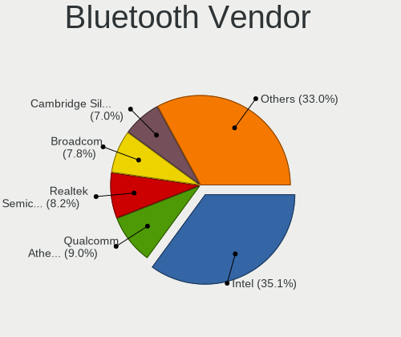

| Vendor                          | Computers | Percent |
|---------------------------------|-----------|---------|
| Intel                           | 490       | 32.15%  |
| Qualcomm Atheros Communications | 157       | 10.3%   |
| Broadcom                        | 138       | 9.06%   |
| Realtek Semiconductor           | 117       | 7.68%   |
| Cambridge Silicon Radio         | 109       | 7.15%   |
| Lite-On Technology              | 79        | 5.18%   |
| Dell                            | 75        | 4.92%   |
| IMC Networks                    | 67        | 4.4%    |
| Hewlett-Packard                 | 67        | 4.4%    |
| Ralink                          | 63        | 4.13%   |
| Foxconn / Hon Hai               | 54        | 3.54%   |
| Toshiba                         | 19        | 1.25%   |
| ASUSTek Computer                | 19        | 1.25%   |
| Apple                           | 11        | 0.72%   |
| Ralink Technology               | 8         | 0.52%   |
| Realtek                         | 7         | 0.46%   |
| Conwise Technology              | 6         | 0.39%   |
| Chicony Electronics             | 5         | 0.33%   |
| Askey Computer                  | 5         | 0.33%   |
| Taiyo Yuden                     | 4         | 0.26%   |
| Integrated System Solution      | 4         | 0.26%   |
| Foxconn International           | 4         | 0.26%   |
| Belkin Components               | 4         | 0.26%   |
| Micro Star International        | 3         | 0.2%    |
| Logitech                        | 2         | 0.13%   |
| Edimax Technology               | 2         | 0.13%   |
| Alps Electric                   | 2         | 0.13%   |
| TP-Link                         | 1         | 0.07%   |
| MediaTek                        | 1         | 0.07%   |
| Fujitsu Siemens Computers       | 1         | 0.07%   |

Bluetooth Model
---------------

Controller models

| Model                                               | Computers | Percent |
|-----------------------------------------------------|-----------|---------|
| Intel Bluetooth wireless interface                  | 284       | 18.6%   |
| Cambridge Silicon Radio Bluetooth Dongle (HCI mode) | 109       | 7.14%   |
| Qualcomm Atheros  Bluetooth Device                  | 76        | 4.98%   |
| Realtek Bluetooth Radio                             | 75        | 4.91%   |
| Intel Bluetooth 9460/9560 Jefferson Peak (JfP)      | 73        | 4.78%   |
| Ralink RT3290 Bluetooth                             | 63        | 4.13%   |
| Dell DW375 Bluetooth Module                         | 38        | 2.49%   |
| Intel AX201 Bluetooth                               | 35        | 2.29%   |
| Lite-On Qualcomm Atheros QCA9377 Bluetooth          | 34        | 2.23%   |
| HP Broadcom 2070 Bluetooth Combo                    | 33        | 2.16%   |
| HP Bluetooth 2.0 Interface [Broadcom BCM2045]       | 31        | 2.03%   |
| Qualcomm Atheros AR3011 Bluetooth                   | 30        | 1.96%   |
| Qualcomm Atheros AR3012 Bluetooth 4.0               | 29        | 1.9%    |
| Intel AX200 Bluetooth                               | 28        | 1.83%   |
| Broadcom BCM2045B (BDC-2.1)                         | 28        | 1.83%   |
| IMC Networks Bluetooth Device                       | 26        | 1.7%    |
| Intel Wireless-AC 3168 Bluetooth                    | 23        | 1.51%   |
| IMC Networks Bluetooth Radio                        | 23        | 1.51%   |
| Intel Centrino Bluetooth Wireless Transceiver       | 20        | 1.31%   |
| Broadcom HP Portable SoftSailing                    | 20        | 1.31%   |
| Foxconn / Hon Hai Bluetooth Device                  | 19        | 1.24%   |
| Realtek RTL8723B Bluetooth                          | 18        | 1.18%   |
| Realtek  Bluetooth 4.2 Adapter                      | 18        | 1.18%   |
| Lite-On Bluetooth Device                            | 18        | 1.18%   |
| Intel Centrino Advanced-N 6230 Bluetooth adapter    | 18        | 1.18%   |
| Dell BCM20702A0 Bluetooth Module                    | 14        | 0.92%   |
| Lite-On Atheros AR3012 Bluetooth                    | 13        | 0.85%   |
| Broadcom BCM2045B (BDC-2.1) [Bluetooth Controller]  | 13        | 0.85%   |
| Broadcom BCM2070 Bluetooth Device                   | 11        | 0.72%   |
| Foxconn / Hon Hai BCM20702A0                        | 9         | 0.59%   |
| Broadcom BCM2045B (BDC-2) [Bluetooth Controller]    | 9         | 0.59%   |
| Toshiba Bluetooth Device                            | 8         | 0.52%   |
| Ralink Motorola BC4 Bluetooth 3.0+HS Adapter        | 8         | 0.52%   |
| Intel Wireless-AC 9260 Bluetooth Adapter            | 8         | 0.52%   |
| Broadcom BCM20702 Bluetooth 4.0 [ThinkPad]          | 8         | 0.52%   |
| Broadcom BCM2045 Bluetooth                          | 8         | 0.52%   |
| Realtek Bluetooth Radio                             | 7         | 0.46%   |
| Qualcomm Atheros QCA61x4 Bluetooth 4.0              | 7         | 0.46%   |
| Qualcomm Atheros Bluetooth                          | 7         | 0.46%   |
| Foxconn / Hon Hai Broadcom Bluetooth 2.1 Device     | 7         | 0.46%   |
| Dell Wireless 360 Bluetooth                         | 7         | 0.46%   |
| Broadcom BCM43142A0 Bluetooth 4.0                   | 7         | 0.46%   |
| Broadcom BCM2046 Bluetooth Device                   | 7         | 0.46%   |
| IMC Networks Atheros AR3012 Bluetooth 4.0 Adapter   | 6         | 0.39%   |
| Conwise CW6622                                      | 6         | 0.39%   |
| Qualcomm Atheros AR3012 Bluetooth                   | 5         | 0.33%   |
| Lite-On Qualcomm Atheros Bluetooth                  | 5         | 0.33%   |
| Dell Wireless 365 Bluetooth                         | 5         | 0.33%   |
| Dell Wireless 355 Bluetooth                         | 5         | 0.33%   |
| Chicony Bluetooth Radio                             | 5         | 0.33%   |
| Broadcom BCM2070 Bluetooth 2.1 + EDR                | 5         | 0.33%   |
| Askey Bluetooth Device                              | 5         | 0.33%   |
| Apple Bluetooth Host Controller                     | 5         | 0.33%   |
| Toshiba Integrated Bluetooth HCI                    | 4         | 0.26%   |
| Taiyo Yuden Bluetooth Device (V2.0+EDR)             | 4         | 0.26%   |
| Realtek 802.11ac WLAN Adapter                       | 4         | 0.26%   |
| IMC Networks Wireless_Device                        | 4         | 0.26%   |
| IMC Networks Bluetooth module                       | 4         | 0.26%   |
| Foxconn International BCM43142A0 Bluetooth module   | 4         | 0.26%   |
| Foxconn / Hon Hai Broadcom BCM20702 Bluetooth       | 4         | 0.26%   |

Sound
-----

Sound Vendor
------------

Sound card vendors

| Vendor                               | Computers | Percent |
|--------------------------------------|-----------|---------|
| Intel                                | 2405      | 60.37%  |
| AMD                                  | 786       | 19.73%  |
| Nvidia                               | 561       | 14.08%  |
| C-Media Electronics                  | 72        | 1.81%   |
| Creative Labs                        | 29        | 0.73%   |
| Logitech                             | 16        | 0.4%    |
| VIA Technologies                     | 14        | 0.35%   |
| Silicon Integrated Systems [SiS]     | 12        | 0.3%    |
| Texas Instruments                    | 11        | 0.28%   |
| JMTek                                | 7         | 0.18%   |
| Generalplus Technology               | 7         | 0.18%   |
| Creative Technology                  | 7         | 0.18%   |
| BEHRINGER International              | 6         | 0.15%   |
| ASUSTek Computer                     | 6         | 0.15%   |
| Kingston Technology                  | 3         | 0.08%   |
| GN Netcom                            | 3         | 0.08%   |
| Tenx Technology                      | 2         | 0.05%   |
| Sennheiser Communications            | 2         | 0.05%   |
| Plantronics                          | 2         | 0.05%   |
| Lenovo                               | 2         | 0.05%   |
| Ensoniq                              | 2         | 0.05%   |
| D&M Holdings (Denon/Marantz)         | 2         | 0.05%   |
| Yamaha                               | 1         | 0.03%   |
| Thesycon Systemsoftware & Consulting | 1         | 0.03%   |
| Syntek                               | 1         | 0.03%   |
| Superlux digit                       | 1         | 0.03%   |
| Sunplus Technology                   | 1         | 0.03%   |
| SteelSeries ApS                      | 1         | 0.03%   |
| SM950T Microphone                    | 1         | 0.03%   |
| Samson Technologies                  | 1         | 0.03%   |
| ROTEL                                | 1         | 0.03%   |
| Reloop                               | 1         | 0.03%   |
| Promethean Limited                   | 1         | 0.03%   |
| PreSonus Audio Electronics           | 1         | 0.03%   |
| Numark                               | 1         | 0.03%   |
| Nektar                               | 1         | 0.03%   |
| MCS                                  | 1         | 0.03%   |
| KORG                                 | 1         | 0.03%   |
| JBL                                  | 1         | 0.03%   |
| Hewlett-Packard                      | 1         | 0.03%   |
| Focusrite-Novation                   | 1         | 0.03%   |
| Elite Silicon                        | 1         | 0.03%   |
| DigiTech                             | 1         | 0.03%   |
| Conexant Systems                     | 1         | 0.03%   |
| Barco Display Systems                | 1         | 0.03%   |
| Avance Logic                         | 1         | 0.03%   |
| AudioQuest                           | 1         | 0.03%   |
| ATI Technologies                     | 1         | 0.03%   |
| AKAI Professional M.I.               | 1         | 0.03%   |

Sound Model
-----------

Sound card models

| Model                                                                                             | Computers | Percent |
|---------------------------------------------------------------------------------------------------|-----------|---------|
| Intel 7 Series/C216 Chipset Family High Definition Audio Controller                               | 279       | 5.9%    |
| Intel 6 Series/C200 Series Chipset Family High Definition Audio Controller                        | 256       | 5.42%   |
| Intel NM10/ICH7 Family High Definition Audio Controller                                           | 244       | 5.16%   |
| Intel 82801I (ICH9 Family) HD Audio Controller                                                    | 224       | 4.74%   |
| AMD FCH Azalia Controller                                                                         | 215       | 4.55%   |
| Intel Sunrise Point-LP HD Audio                                                                   | 188       | 3.98%   |
| AMD SBx00 Azalia (Intel HDA)                                                                      | 174       | 3.68%   |
| Intel 5 Series/3400 Series Chipset High Definition Audio                                          | 164       | 3.47%   |
| Intel 8 Series/C220 Series Chipset High Definition Audio Controller                               | 162       | 3.43%   |
| Intel Xeon E3-1200 v3/4th Gen Core Processor HD Audio Controller                                  | 121       | 2.56%   |
| Intel 82801H (ICH8 Family) HD Audio Controller                                                    | 100       | 2.12%   |
| Intel 8 Series HD Audio Controller                                                                | 83        | 1.76%   |
| Intel Haswell-ULT HD Audio Controller                                                             | 82        | 1.74%   |
| Nvidia GK208 HDMI/DP Audio Controller                                                             | 80        | 1.69%   |
| Intel 100 Series/C230 Series Chipset Family HD Audio Controller                                   | 78        | 1.65%   |
| AMD Trinity HDMI Audio Controller                                                                 | 77        | 1.63%   |
| Intel Broadwell-U Audio Controller                                                                | 76        | 1.61%   |
| Intel Wildcat Point-LP High Definition Audio Controller                                           | 75        | 1.59%   |
| AMD Kabini HDMI/DP Audio                                                                          | 72        | 1.52%   |
| AMD Family 17h/19h HD Audio Controller                                                            | 70        | 1.48%   |
| Nvidia High Definition Audio Controller                                                           | 64        | 1.35%   |
| Intel Cannon Lake PCH cAVS                                                                        | 62        | 1.31%   |
| Intel 82801JD/DO (ICH10 Family) HD Audio Controller                                               | 58        | 1.23%   |
| AMD Oland/Hainan/Cape Verde/Pitcairn HDMI Audio [Radeon HD 7000 Series]                           | 54        | 1.14%   |
| Intel Atom/Celeron/Pentium Processor x5-E8000/J3xxx/N3xxx Series High Definition Audio Controller | 52        | 1.1%    |
| Nvidia GP107GL High Definition Audio Controller                                                   | 50        | 1.06%   |
| Nvidia GF108 High Definition Audio Controller                                                     | 49        | 1.04%   |
| Intel 200 Series PCH HD Audio                                                                     | 49        | 1.04%   |
| AMD Caicos HDMI Audio [Radeon HD 6450 / 7450/8450/8490 OEM / R5 230/235/235X OEM]                 | 49        | 1.04%   |
| AMD Cedar HDMI Audio [Radeon HD 5400/6300/7300 Series]                                            | 45        | 0.95%   |
| Intel Celeron/Pentium Silver Processor High Definition Audio                                      | 44        | 0.93%   |
| AMD Ellesmere HDMI Audio [Radeon RX 470/480 / 570/580/590]                                        | 41        | 0.87%   |
| Intel Cannon Point-LP High Definition Audio Controller                                            | 40        | 0.85%   |
| AMD Wrestler HDMI Audio                                                                           | 40        | 0.85%   |
| Intel 82801JI (ICH10 Family) HD Audio Controller                                                  | 39        | 0.83%   |
| AMD Family 17h (Models 00h-0fh) HD Audio Controller                                               | 39        | 0.83%   |
| Nvidia GP106 High Definition Audio Controller                                                     | 36        | 0.76%   |
| AMD Raven/Raven2/Fenghuang HDMI/DP Audio Controller                                               | 36        | 0.76%   |
| AMD RV710/730 HDMI Audio [Radeon HD 4000 series]                                                  | 35        | 0.74%   |
| Intel Atom Processor Z36xxx/Z37xxx Series High Definition Audio Controller                        | 33        | 0.7%    |
| Intel Celeron N3350/Pentium N4200/Atom E3900 Series Audio Cluster                                 | 31        | 0.66%   |
| Nvidia GF119 HDMI Audio Controller                                                                | 29        | 0.61%   |
| AMD Starship/Matisse HD Audio Controller                                                          | 28        | 0.59%   |
| Nvidia GK107 HDMI Audio Controller                                                                | 27        | 0.57%   |
| AMD Family 15h (Models 60h-6fh) Audio Controller                                                  | 26        | 0.55%   |
| Nvidia MCP61 High Definition Audio                                                                | 24        | 0.51%   |
| AMD Renoir Radeon High Definition Audio Controller                                                | 24        | 0.51%   |
| Intel Comet Lake PCH-LP cAVS                                                                      | 23        | 0.49%   |
| Nvidia TU107 GeForce GTX 1650 High Definition Audio Controller                                    | 20        | 0.42%   |
| AMD Turks HDMI Audio [Radeon HD 6500/6600 / 6700M Series]                                         | 20        | 0.42%   |
| Nvidia GP108 High Definition Audio Controller                                                     | 19        | 0.4%    |
| Intel Tiger Lake-LP Smart Sound Technology Audio Controller                                       | 19        | 0.4%    |
| C-Media Electronics CM108 Audio Controller                                                        | 19        | 0.4%    |
| Intel CM238 HD Audio Controller                                                                   | 18        | 0.38%   |
| Nvidia GM107 High Definition Audio Controller [GeForce 940MX]                                     | 17        | 0.36%   |
| C-Media Electronics CMI8738/CMI8768 PCI Audio                                                     | 17        | 0.36%   |
| AMD Kaveri HDMI/DP Audio Controller                                                               | 17        | 0.36%   |
| AMD Baffin HDMI/DP Audio [Radeon RX 550 640SP / RX 560/560X]                                      | 17        | 0.36%   |
| Nvidia GT216 HDMI Audio Controller                                                                | 16        | 0.34%   |
| Nvidia GP104 High Definition Audio Controller                                                     | 16        | 0.34%   |

Memory
------

Memory Vendor
-------------

Memory module vendors

| Vendor                     | Computers | Percent |
|----------------------------|-----------|---------|
| Samsung Electronics        | 591       | 19.69%  |
| SK Hynix                   | 568       | 18.92%  |
| Unknown                    | 554       | 18.45%  |
| Kingston                   | 469       | 15.62%  |
| Micron Technology          | 234       | 7.79%   |
| Nanya Technology           | 99        | 3.3%    |
| Elpida                     | 77        | 2.56%   |
| Kingmax                    | 66        | 2.2%    |
| Crucial                    | 57        | 1.9%    |
| Corsair                    | 53        | 1.77%   |
| Ramaxel Technology         | 45        | 1.5%    |
| G.Skill                    | 37        | 1.23%   |
| A-DATA Technology          | 29        | 0.97%   |
| CSX                        | 18        | 0.6%    |
| ASint Technology           | 9         | 0.3%    |
| 48spaces                   | 9         | 0.3%    |
| Transcend                  | 8         | 0.27%   |
| Team                       | 8         | 0.27%   |
| Qimonda                    | 8         | 0.27%   |
| Patriot                    | 7         | 0.23%   |
| Unknown (ABCD)             | 6         | 0.2%    |
| Melco                      | 6         | 0.2%    |
| Kingmax Semiconductor      | 6         | 0.2%    |
| Apacer                     | 4         | 0.13%   |
| OCZ                        | 3         | 0.1%    |
| GeIL                       | 3         | 0.1%    |
| Unknown (09D5)             | 2         | 0.07%   |
| Toshiba                    | 2         | 0.07%   |
| Silicon Power              | 2         | 0.07%   |
| Intersil                   | 2         | 0.07%   |
| Infineon                   | 2         | 0.07%   |
| H                          | 2         | 0.07%   |
| Golden Empire              | 2         | 0.07%   |
| Unknown                    | 2         | 0.07%   |
| Unknown (7F7F7F7F7F970000) | 1         | 0.03%   |
| Unigen                     | 1         | 0.03%   |
| Strontium                  | 1         | 0.03%   |
| SHARETRONIC                | 1         | 0.03%   |
| Ramos Technology           | 1         | 0.03%   |
| Princeton                  | 1         | 0.03%   |
| Memory Solution            | 1         | 0.03%   |
| Level One Communication    | 1         | 0.03%   |
| Hyundai lnc                | 1         | 0.03%   |
| GOODRAM                    | 1         | 0.03%   |
| Exceleram                  | 1         | 0.03%   |
| AMI                        | 1         | 0.03%   |

Memory Model
------------

Memory module models

| Model                                                     | Computers | Percent |
|-----------------------------------------------------------|-----------|---------|
| Kingston RAM KHX1600C10D3/4G 4GB DIMM DDR3 1866MT/s       | 41        | 1.23%   |
| Samsung RAM M471B5173EB0-YK0 4GB SODIMM DDR3 1600MT/s     | 39        | 1.17%   |
| SK Hynix RAM HMT451S6BFR8A-PB 4GB SODIMM DDR3 1600MT/s    | 36        | 1.08%   |
| Unknown RAM Module 2048MB DIMM SDRAM                      | 32        | 0.96%   |
| Unknown RAM Module 2048MB DIMM 800MT/s                    | 32        | 0.96%   |
| Samsung RAM M471B5173DB0-YK0 4GB SODIMM DDR3 1600MT/s     | 31        | 0.93%   |
| Samsung RAM M471B5273DH0-CH9 4GB SODIMM DDR3 1334MT/s     | 30        | 0.9%    |
| SK Hynix RAM HMT351S6CFR8C-PB 4GB SODIMM DDR3 1600MT/s    | 28        | 0.84%   |
| Samsung RAM M471B5173QH0-YK0 4GB SODIMM DDR3 1600MT/s     | 27        | 0.81%   |
| Unknown RAM Module 2048MB SODIMM DDR2 667MT/s             | 26        | 0.78%   |
| SK Hynix RAM HMT325S6CFR8A-PB 2048MB SODIMM DDR3 1600MT/s | 24        | 0.72%   |
| Samsung RAM M471A5244CB0-CRC 4GB SODIMM DDR4 2667MT/s     | 22        | 0.66%   |
| Samsung RAM M471B5673FH0-CF8 2048MB SODIMM DDR3 1067MT/s  | 21        | 0.63%   |
| Samsung RAM M471B5773DH0-CH9 2GB SODIMM DDR3 1600MT/s     | 20        | 0.6%    |
| Unknown RAM Module 2048MB DIMM DDR2 800MT/s               | 19        | 0.57%   |
| SK Hynix RAM HMA851S6AFR6N-UH 4GB SODIMM DDR4 2667MT/s    | 19        | 0.57%   |
| Samsung RAM M471B5273DH0-CK0 4096MB SODIMM DDR3 1600MT/s  | 19        | 0.57%   |
| Kingston RAM KHX1600C10D3/8G 4096MB DIMM DDR3 1600MT/s    | 19        | 0.57%   |
| Unknown RAM Module 4096MB DIMM DDR3 1333MT/s              | 17        | 0.51%   |
| SK Hynix RAM HMT451S6AFR8A-PB 4GB SODIMM DDR3 1600MT/s    | 17        | 0.51%   |
| SK Hynix RAM HMT41GS6BFR8A-PB 8GB SODIMM DDR3 1600MT/s    | 17        | 0.51%   |
| Samsung RAM M471B5273CH0-CH9 4GB SODIMM DDR3 1334MT/s     | 17        | 0.51%   |
| Micron RAM 8KTF51264HZ-1G6E1 4GB SODIMM DDR3 1600MT/s     | 17        | 0.51%   |
| Kingston RAM KHX1600C9D3/4GX 4096MB DIMM DDR3 2400MT/s    | 17        | 0.51%   |
| Unknown RAM Module 2048MB SODIMM DDR2                     | 16        | 0.48%   |
| Unknown RAM Module 2048MB DIMM 1333MT/s                   | 16        | 0.48%   |
| Unknown RAM Module 1024MB DIMM 800MT/s                    | 16        | 0.48%   |
| SK Hynix RAM HMA81GS6AFR8N-UH 8GB SODIMM DDR4 2667MT/s    | 16        | 0.48%   |
| Samsung RAM M471B1G73DB0-YK0 8192MB SODIMM DDR3 1600MT/s  | 16        | 0.48%   |
| Unknown RAM Module 4096MB DIMM 1333MT/s                   | 15        | 0.45%   |
| Unknown RAM Module 1024MB SODIMM DDR2 667MT/s             | 15        | 0.45%   |
| Unknown RAM Module 1024MB DIMM SDRAM                      | 15        | 0.45%   |
| SK Hynix RAM HMT325S6EFR8A-PB 2GB SODIMM DDR3 1600MT/s    | 15        | 0.45%   |
| Samsung RAM M471A5244CB0-CTD 4GB SODIMM DDR4 3266MT/s     | 15        | 0.45%   |
| Kingston RAM 99U5584-005.A00LF 4096MB DIMM DDR3 1600MT/s  | 15        | 0.45%   |
| Samsung RAM M471B5773CHS-CH9 2GB SODIMM DDR3 4199MT/s     | 14        | 0.42%   |
| Unknown RAM Module 1024MB SODIMM DDR2                     | 13        | 0.39%   |
| SK Hynix RAM HMT325S6BFR8C-H9 2GB SODIMM DDR3 1600MT/s    | 12        | 0.36%   |
| Unknown RAM Module 2048MB DIMM DDR2 667MT/s               | 11        | 0.33%   |
| SK Hynix RAM HMT351S6EFR8A-PB 4GB SODIMM DDR3 1600MT/s    | 11        | 0.33%   |
| Samsung RAM M378B5773DH0-CH9 2GB DIMM DDR3 1333MT/s       | 11        | 0.33%   |
| Unknown RAM Module 1024MB DIMM DDR2 800MT/s               | 10        | 0.3%    |
| Unknown RAM Module 1024MB DIMM DDR2 667MT/s               | 10        | 0.3%    |
| Samsung RAM M471B5673FH0-CH9 2GB SODIMM DDR3 1334MT/s     | 10        | 0.3%    |
| Samsung RAM M471B1G73QH0-YK0 8192MB SODIMM DDR3 1600MT/s  | 10        | 0.3%    |
| Nanya RAM NT4GC64B8HB0NS-CG 4GB SODIMM DDR3 1334MT/s      | 10        | 0.3%    |
| Nanya RAM NT2GC64B88B0NS-CG 2GB SODIMM DDR3 1334MT/s      | 10        | 0.3%    |
| Micron RAM 8KTF51264AZ-1G6E1 4096MB DIMM DDR3 1600MT/s    | 10        | 0.3%    |
| Kingston RAM KHX3200C16D4/8GX 8192MB DIMM DDR4 3533MT/s   | 10        | 0.3%    |
| Kingston RAM KHX2666C16/8G 8GB DIMM DDR4 3466MT/s         | 10        | 0.3%    |
| ELPIDA RAM EBJ21UE8BDS0-DJ-F 2048MB SODIMM DDR3 1334MT/s  | 10        | 0.3%    |
| Unknown RAM Module 4096MB SODIMM DDR3 1600MT/s            | 9         | 0.27%   |
| Unknown RAM Module 2048MB SODIMM 800MT/s                  | 9         | 0.27%   |
| Samsung RAM M471B5673EH1-CF8 2GB SODIMM DDR3 4199MT/s     | 9         | 0.27%   |
| Samsung RAM M471A1K43DB1-CTD 8GB SODIMM DDR4 2667MT/s     | 9         | 0.27%   |
| Samsung RAM M471A1K43CB1-CRC 8GB SODIMM DDR4 2667MT/s     | 9         | 0.27%   |
| Nanya RAM NT4GC64B8HG0NS-CG 4GB SODIMM DDR3 1334MT/s      | 9         | 0.27%   |
| Micron RAM 8JSF25664HZ-1G4D1 2048MB SODIMM DDR3 1334MT/s  | 9         | 0.27%   |
| Micron RAM 4ATF51264HZ-2G6E1 4GB SODIMM DDR4 2667MT/s     | 9         | 0.27%   |
| Unknown RAM Module 4096MB DIMM 400MT/s                    | 8         | 0.24%   |

Memory Kind
-----------

Memory module kinds

| Kind    | Computers | Percent |
|---------|-----------|---------|
| DDR3    | 1252      | 48.7%   |
| DDR4    | 482       | 18.75%  |
| DDR2    | 359       | 13.96%  |
| SDRAM   | 204       | 7.93%   |
| Unknown | 161       | 6.26%   |
| DDR     | 52        | 2.02%   |
| LPDDR4  | 37        | 1.44%   |
| LPDDR3  | 16        | 0.62%   |
| DRAM    | 8         | 0.31%   |

Memory Form Factor
------------------

Physical design of the memory module

| Name         | Computers | Percent |
|--------------|-----------|---------|
| SODIMM       | 1398      | 56.33%  |
| DIMM         | 1046      | 42.14%  |
| Row Of Chips | 30        | 1.21%   |
| Chip         | 6         | 0.24%   |
| RIMM         | 1         | 0.04%   |
| FB-DIMM      | 1         | 0.04%   |

Memory Size
-----------

Memory module size

| Size    | Computers | Percent |
|---------|-----------|---------|
| 4096    | 1050      | 37.25%  |
| 2048    | 820       | 29.09%  |
| 8192    | 482       | 17.1%   |
| 1024    | 306       | 10.85%  |
| 16384   | 92        | 3.26%   |
| 512     | 49        | 1.74%   |
| 32768   | 14        | 0.5%    |
| 256     | 4         | 0.14%   |
| Unknown | 2         | 0.07%   |

Memory Speed
------------

Memory module speed

| Speed   | Computers | Percent |
|---------|-----------|---------|
| 1600    | 758       | 26.56%  |
| 1333    | 286       | 10.02%  |
| 2667    | 211       | 7.39%   |
| 800     | 205       | 7.18%   |
| 667     | 194       | 6.8%    |
| 1334    | 166       | 5.82%   |
| 2400    | 129       | 4.52%   |
| Unknown | 129       | 4.52%   |
| 2133    | 94        | 3.29%   |
| 1067    | 81        | 2.84%   |
| 3200    | 74        | 2.59%   |
| 1866    | 60        | 2.1%    |
| 533     | 48        | 1.68%   |
| 1867    | 45        | 1.58%   |
| 1066    | 41        | 1.44%   |
| 2048    | 38        | 1.33%   |
| 4199    | 37        | 1.3%    |
| 400     | 28        | 0.98%   |
| 3600    | 19        | 0.67%   |
| 975     | 18        | 0.63%   |
| 1639    | 17        | 0.6%    |
| 3266    | 15        | 0.53%   |
| 3466    | 14        | 0.49%   |
| 1800    | 14        | 0.49%   |
| 333     | 14        | 0.49%   |
| 2933    | 12        | 0.42%   |
| 3000    | 11        | 0.39%   |
| 3533    | 10        | 0.35%   |
| 2666    | 9         | 0.32%   |
| 49926   | 6         | 0.21%   |
| 3151    | 6         | 0.21%   |
| 2000    | 6         | 0.21%   |
| 4267    | 5         | 0.18%   |
| 4266    | 5         | 0.18%   |
| 3400    | 5         | 0.18%   |
| 1776    | 4         | 0.14%   |
| 1400    | 4         | 0.14%   |
| 3733    | 3         | 0.11%   |
| 266     | 3         | 0.11%   |
| 3334    | 2         | 0.07%   |
| 3333    | 2         | 0.07%   |
| 3007    | 2         | 0.07%   |
| 2733    | 2         | 0.07%   |
| 2267    | 2         | 0.07%   |
| 2200    | 2         | 0.07%   |
| 2134    | 2         | 0.07%   |
| 1648    | 2         | 0.07%   |
| 200     | 2         | 0.07%   |
| 66      | 2         | 0.07%   |
| 50410   | 1         | 0.04%   |
| 3467    | 1         | 0.04%   |
| 3066    | 1         | 0.04%   |
| 2800    | 1         | 0.04%   |
| 2747    | 1         | 0.04%   |
| 2465    | 1         | 0.04%   |
| 2448    | 1         | 0.04%   |
| 1904    | 1         | 0.04%   |
| 880     | 1         | 0.04%   |
| 133     | 1         | 0.04%   |

Printers & scanners
-------------------

Printer Vendor
--------------

Printer device vendors

| Vendor                | Computers | Percent |
|-----------------------|-----------|---------|
| Hewlett-Packard       | 52        | 46.85%  |
| Samsung Electronics   | 21        | 18.92%  |
| Canon                 | 14        | 12.61%  |
| Brother Industries    | 9         | 8.11%   |
| Seiko Epson           | 6         | 5.41%   |
| QinHeng Electronics   | 2         | 1.8%    |
| Lexmark International | 2         | 1.8%    |
| Xerox                 | 1         | 0.9%    |
| STMicroelectronics    | 1         | 0.9%    |
| Ricoh                 | 1         | 0.9%    |
| Prolific Technology   | 1         | 0.9%    |
| Oki Data              | 1         | 0.9%    |

Printer Model
-------------

Printer device models

| Model                                                     | Computers | Percent |
|-----------------------------------------------------------|-----------|---------|
| HP DeskJet 2620 All-in-One Printer                        | 8         | 7.14%   |
| HP LaserJet 1020                                          | 6         | 5.36%   |
| Samsung M2020 Series                                      | 5         | 4.46%   |
| HP DeskJet 2130 series                                    | 4         | 3.57%   |
| Samsung ML-1640 Series Laser Printer                      | 3         | 2.68%   |
| HP LaserJet P1005                                         | 3         | 2.68%   |
| HP LaserJet 1018                                          | 3         | 2.68%   |
| Canon LiDE 400                                            | 3         | 2.68%   |
| Brother HL-1110 series                                    | 3         | 2.68%   |
| Samsung SCX-3400 Series                                   | 2         | 1.79%   |
| Samsung ML-2010P Mono Laser Printer                       | 2         | 1.79%   |
| QinHeng CH340S                                            | 2         | 1.79%   |
| HP Officejet J4500 series                                 | 2         | 1.79%   |
| HP LaserJet 1022                                          | 2         | 1.79%   |
| HP LaserJet 1010                                          | 2         | 1.79%   |
| HP LaserJet 1000                                          | 2         | 1.79%   |
| HP DeskJet F4100 Printer series                           | 2         | 1.79%   |
| HP Deskjet F2280 series                                   | 2         | 1.79%   |
| HP Deskjet 3520 series                                    | 2         | 1.79%   |
| HP Deskjet 2050 J510                                      | 2         | 1.79%   |
| Canon TS5100 series                                       | 2         | 1.79%   |
| Brother HL-L2300D series                                  | 2         | 1.79%   |
| Xerox WorkCentre 3119 Series                              | 1         | 0.89%   |
| STMicroelectronics LED badge -- mini LED display -- 11x44 | 1         | 0.89%   |
| Seiko Epson XP-243 245 247 Series                         | 1         | 0.89%   |
| Seiko Epson Stylus NX230/SX235W Series                    | 1         | 0.89%   |
| Seiko Epson Printer                                       | 1         | 0.89%   |
| Seiko Epson ME 320/330 Series [Stylus SX125]              | 1         | 0.89%   |
| Seiko Epson L395 Series                                   | 1         | 0.89%   |
| Seiko Epson L120 Series                                   | 1         | 0.89%   |
| Samsung Xerox Phaser 3117 Laser Printer                   | 1         | 0.89%   |
| Samsung SCX-4650 4x21S Series                             | 1         | 0.89%   |
| Samsung SCX-4623 Series                                   | 1         | 0.89%   |
| Samsung SCX-4200 series                                   | 1         | 0.89%   |
| Samsung ML-1660 Series                                    | 1         | 0.89%   |
| Samsung ML-1630 Series                                    | 1         | 0.89%   |
| Samsung Composite Device                                  | 1         | 0.89%   |
| Samsung CLP-310 Color Laser Printer                       | 1         | 0.89%   |
| Samsung C48x Series Color Laser Multifunction Printer     | 1         | 0.89%   |
| Ricoh SP 112                                              | 1         | 0.89%   |
| Prolific PL2305 Parallel Port                             | 1         | 0.89%   |
| Oki Data USB Device                                       | 1         | 0.89%   |
| Lexmark International Lexmark X203n                       | 1         | 0.89%   |
| Lexmark International InkJet Color Printer                | 1         | 0.89%   |
| HP LaserJet Pro M12a                                      | 1         | 0.89%   |
| HP LaserJet P1102                                         | 1         | 0.89%   |
| HP EWS UPD                                                | 1         | 0.89%   |
| HP DeskJet F2100 Printer series                           | 1         | 0.89%   |
| HP Deskjet D1500 series                                   | 1         | 0.89%   |
| HP DeskJet 959c                                           | 1         | 0.89%   |
| HP DeskJet 840c                                           | 1         | 0.89%   |
| HP DeskJet 5550                                           | 1         | 0.89%   |
| HP DeskJet 5000 series                                    | 1         | 0.89%   |
| HP DeskJet 4530 series                                    | 1         | 0.89%   |
| HP Deskjet 1510                                           | 1         | 0.89%   |
| HP Deskjet 1050 J410                                      | 1         | 0.89%   |
| Canon TS3100 series                                       | 1         | 0.89%   |
| Canon PIXMA MX360                                         | 1         | 0.89%   |
| Canon PIXMA MP280                                         | 1         | 0.89%   |
| Canon PIXMA MG3500 Series                                 | 1         | 0.89%   |

Scanner Vendor
--------------

Scanner device vendors

| Vendor                                         | Computers | Percent |
|------------------------------------------------|-----------|---------|
| Canon                                          | 13        | 61.9%   |
| Hewlett-Packard                                | 3         | 14.29%  |
| Mustek Systems                                 | 2         | 9.52%   |
| UMAX                                           | 1         | 4.76%   |
| Siemens Information and Communication Products | 1         | 4.76%   |
| Seiko Epson                                    | 1         | 4.76%   |

Scanner Model
-------------

Scanner device models

| Model                                                                           | Computers | Percent |
|---------------------------------------------------------------------------------|-----------|---------|
| Canon CanoScan N670U/N676U/LiDE 20                                              | 3         | 14.29%  |
| Canon CanoScan LIDE 25                                                          | 3         | 14.29%  |
| Canon CanoScan LiDE 110                                                         | 3         | 14.29%  |
| Mustek Systems SNAPSCAN e22                                                     | 2         | 9.52%   |
| HP Scanjet 300                                                                  | 2         | 9.52%   |
| UMAX Astra 4400/4450                                                            | 1         | 4.76%   |
| Siemens Information and Communication Products ID-Mouse with Fingerprint Reader | 1         | 4.76%   |
| Seiko Epson Stylus Photo RX500/510                                              | 1         | 4.76%   |
| HP ScanJet 3770                                                                 | 1         | 4.76%   |
| Canon CanoScan N1240U/LiDE 30                                                   | 1         | 4.76%   |
| Canon CanoScan LiDE 120                                                         | 1         | 4.76%   |
| Canon CanoScan LiDE 100                                                         | 1         | 4.76%   |
| Canon CanoScan 4200F                                                            | 1         | 4.76%   |

Camera
------

Camera Vendor
-------------

Camera device vendors

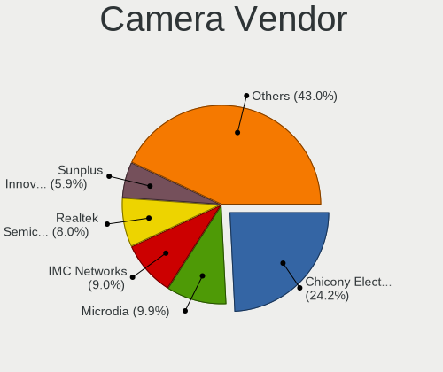

| Vendor                                 | Computers | Percent |
|----------------------------------------|-----------|---------|
| Chicony Electronics                    | 433       | 25.79%  |
| Microdia                               | 163       | 9.71%   |
| IMC Networks                           | 155       | 9.23%   |
| Realtek Semiconductor                  | 140       | 8.34%   |
| Sunplus Innovation Technology          | 110       | 6.55%   |
| Acer                                   | 106       | 6.31%   |
| Suyin                                  | 82        | 4.88%   |
| Quanta                                 | 54        | 3.22%   |
| Cheng Uei Precision Industry (Foxlink) | 54        | 3.22%   |
| Logitech                               | 50        | 2.98%   |
| Syntek                                 | 44        | 2.62%   |
| Silicon Motion                         | 30        | 1.79%   |
| Lenovo                                 | 28        | 1.67%   |
| Lite-On Technology                     | 23        | 1.37%   |
| Z-Star Microelectronics                | 22        | 1.31%   |
| Alcor Micro                            | 21        | 1.25%   |
| Primax Electronics                     | 19        | 1.13%   |
| Ricoh                                  | 16        | 0.95%   |
| Apple                                  | 12        | 0.71%   |
| Samsung Electronics                    | 11        | 0.66%   |
| Microsoft                              | 11        | 0.66%   |
| KYE Systems (Mouse Systems)            | 11        | 0.66%   |
| ALi                                    | 10        | 0.6%    |
| GEMBIRD                                | 7         | 0.42%   |
| OmniVision Technologies                | 6         | 0.36%   |
| Importek                               | 6         | 0.36%   |
| Trust                                  | 5         | 0.3%    |
| Arkmicro Technologies                  | 5         | 0.3%    |
| Luxvisions Innotech Limited            | 4         | 0.24%   |
| Pixart Imaging                         | 3         | 0.18%   |
| LG Electronics                         | 3         | 0.18%   |
| Jieli Technology                       | 3         | 0.18%   |
| DigiTech                               | 3         | 0.18%   |
| Cubeternet                             | 3         | 0.18%   |
| Creative Technology                    | 3         | 0.18%   |
| Aveo Technology                        | 3         | 0.18%   |
| Sunplus Technology                     | 2         | 0.12%   |
| MacroSilicon                           | 2         | 0.12%   |
| Hewlett-Packard                        | 2         | 0.12%   |
| Genesys Logic                          | 2         | 0.12%   |
| Xiaomi                                 | 1         | 0.06%   |
| Unknown                                | 1         | 0.06%   |
| Teslong Camera                         | 1         | 0.06%   |
| Spreadtrum Communications              | 1         | 0.06%   |
| Speed Tech                             | 1         | 0.06%   |
| Sonix Technology                       | 1         | 0.06%   |
| SHENZHEN EMEET TECHNOLOGY              | 1         | 0.06%   |
| Holitech                               | 1         | 0.06%   |
| GoPro                                  | 1         | 0.06%   |
| Generalplus Technology                 | 1         | 0.06%   |
| eMPIA Technology                       | 1         | 0.06%   |
| Alpha Imaging Technology               | 1         | 0.06%   |

Camera Model
------------

Camera device models

| Model                                                       | Computers | Percent |
|-------------------------------------------------------------|-----------|---------|
| IMC Networks USB2.0 VGA UVC WebCam                          | 53        | 3.14%   |
| Chicony Integrated Camera                                   | 46        | 2.73%   |
| Chicony HD WebCam                                           | 44        | 2.61%   |
| Chicony HP Truevision HD                                    | 38        | 2.25%   |
| Microdia Integrated_Webcam_HD                               | 32        | 1.9%    |
| Acer Lenovo EasyCamera                                      | 32        | 1.9%    |
| Chicony USB2.0 VGA UVC WebCam                               | 28        | 1.66%   |
| IMC Networks USB2.0 HD UVC WebCam                           | 25        | 1.48%   |
| Sunplus HP Truevision HD                                    | 24        | 1.42%   |
| Sunplus Integrated_Webcam_HD                                | 23        | 1.36%   |
| Realtek Integrated_Webcam_HD                                | 22        | 1.3%    |
| Chicony Lenovo EasyCamera                                   | 22        | 1.3%    |
| Microdia Integrated Webcam                                  | 21        | 1.25%   |
| Suyin Acer/HP Integrated Webcam [CN0314]                    | 20        | 1.19%   |
| Realtek USB Camera                                          | 19        | 1.13%   |
| IMC Networks EasyCamera                                     | 19        | 1.13%   |
| Sunplus HD WebCam                                           | 18        | 1.07%   |
| Logitech Webcam C270                                        | 18        | 1.07%   |
| Acer Integrated Camera                                      | 18        | 1.07%   |
| Chicony USB2.0 HD UVC WebCam                                | 17        | 1.01%   |
| Quanta VGA WebCam                                           | 16        | 0.95%   |
| Chicony Integrated HP HD Webcam                             | 16        | 0.95%   |
| Chicony FJ Camera                                           | 16        | 0.95%   |
| Chicony EasyCamera                                          | 16        | 0.95%   |
| Realtek Integrated Webcam                                   | 15        | 0.89%   |
| Lenovo Integrated Webcam                                    | 15        | 0.89%   |
| Chicony VGA Webcam                                          | 15        | 0.89%   |
| Microdia Sonix USB 2.0 Camera                               | 14        | 0.83%   |
| Microdia Laptop_Integrated_Webcam_HD                        | 14        | 0.83%   |
| Microdia Camera                                             | 14        | 0.83%   |
| Primax HP HD Webcam [Fixed]                                 | 13        | 0.77%   |
| Chicony HP Webcam [2 MP Macro]                              | 13        | 0.77%   |
| Syntek Lenovo EasyCamera                                    | 12        | 0.71%   |
| Syntek Integrated Camera                                    | 12        | 0.71%   |
| Lenovo Integrated Webcam [R5U877]                           | 12        | 0.71%   |
| Acer Lenovo Integrated Webcam                               | 12        | 0.71%   |
| Syntek EasyCamera                                           | 11        | 0.65%   |
| Realtek USB2.0 VGA UVC WebCam                               | 11        | 0.65%   |
| Realtek Lenovo EasyCamera                                   | 11        | 0.65%   |
| Chicony 2.0M UVC Webcam / CNF7129                           | 11        | 0.65%   |
| Cheng Uei Precision Industry (Foxlink) Webcam               | 11        | 0.65%   |
| Suyin Acer CrystalEye Webcam                                | 10        | 0.59%   |
| Silicon Motion WebCam SC-0311139N                           | 10        | 0.59%   |
| Samsung Galaxy A5 (MTP)                                     | 10        | 0.59%   |
| Realtek Integrated Webcam HD                                | 10        | 0.59%   |
| Realtek Acer 640 x 480 laptop camera                        | 10        | 0.59%   |
| Lite-On Integrated Camera                                   | 9         | 0.53%   |
| IMC Networks UVC VGA Webcam                                 | 9         | 0.53%   |
| IMC Networks Integrated Webcam                              | 9         | 0.53%   |
| IMC Networks Integrated Camera                              | 9         | 0.53%   |
| Chicony HP Webcam                                           | 9         | 0.53%   |
| Chicony HP HD Camera                                        | 9         | 0.53%   |
| ALi Gateway Webcam                                          | 9         | 0.53%   |
| Acer EasyCamera                                             | 9         | 0.53%   |
| Suyin 1.3M WebCam (notebook emachines E730, Acer sub-brand) | 8         | 0.47%   |
| Sunplus HP HD Webcam [Fixed]                                | 8         | 0.47%   |
| Ricoh HD Webcam                                             | 8         | 0.47%   |
| Quanta HD User Facing                                       | 8         | 0.47%   |
| Suyin 1.3M HD WebCam                                        | 7         | 0.42%   |
| Sunplus Asus Webcam                                         | 7         | 0.42%   |

Security
--------

Fingerprint Vendor
------------------

Fingerprint sensor vendors

| Vendor                     | Computers | Percent |
|----------------------------|-----------|---------|
| Validity Sensors           | 86        | 38.39%  |
| AuthenTec                  | 52        | 23.21%  |
| Synaptics                  | 25        | 11.16%  |
| Upek                       | 19        | 8.48%   |
| LighTuning Technology      | 16        | 7.14%   |
| Shenzhen Goodix Technology | 12        | 5.36%   |
| STMicroelectronics         | 9         | 4.02%   |
| Elan Microelectronics      | 5         | 2.23%   |

Fingerprint Model
-----------------

Fingerprint sensor models

| Model                                                                      | Computers | Percent |
|----------------------------------------------------------------------------|-----------|---------|
| AuthenTec AES2810                                                          | 23        | 10.27%  |
| Validity Sensors VFS495 Fingerprint Reader                                 | 20        | 8.93%   |
| Upek Biometric Touchchip/Touchstrip Fingerprint Sensor                     | 19        | 8.48%   |
| AuthenTec AES2501 Fingerprint Sensor                                       | 17        | 7.59%   |
| Validity Sensors VFS471 Fingerprint Reader                                 | 11        | 4.91%   |
| Validity Sensors VFS451 Fingerprint Reader                                 | 11        | 4.91%   |
| LighTuning EgisTec Touch Fingerprint Sensor                                | 10        | 4.46%   |
| STMicroelectronics Fingerprint Reader                                      | 9         | 4.02%   |
| Validity Sensors VFS7500 Touch Fingerprint Sensor                          | 8         | 3.57%   |
| Validity Sensors VFS491                                                    | 8         | 3.57%   |
| Shenzhen Goodix  FingerPrint Device                                        | 7         | 3.13%   |
| Validity Sensors VFS5011 Fingerprint Reader                                | 6         | 2.68%   |
| Validity Sensors VFS 5011 fingerprint sensor                               | 6         | 2.68%   |
| LighTuning Fingerprint Reader                                              | 6         | 2.68%   |
| AuthenTec Fingerprint Sensor                                               | 6         | 2.68%   |
| Synaptics  WBDI                                                            | 5         | 2.23%   |
| Synaptics Prometheus MIS Touch Fingerprint Reader                          | 5         | 2.23%   |
| Shenzhen Goodix Fingerprint Reader                                         | 5         | 2.23%   |
| Validity Sensors Synaptics WBDI                                            | 4         | 1.79%   |
| Synaptics Metallica MIS Touch Fingerprint Reader                           | 4         | 1.79%   |
| Elan ELAN:Fingerprint                                                      | 4         | 1.79%   |
| AuthenTec AES1600                                                          | 4         | 1.79%   |
| Validity Sensors VFS101 Fingerprint Reader                                 | 3         | 1.34%   |
| Validity Sensors Synaptics VFS7552 Touch Fingerprint Sensor with PurePrint | 3         | 1.34%   |
| Synaptics  VFS7552 Touch Fingerprint Sensor with PurePrint                 | 3         | 1.34%   |
| Synaptics  FS7604 Touch Fingerprint Sensor with PurePrint                  | 3         | 1.34%   |
| Unknown                                                                    | 3         | 1.34%   |
| Validity Sensors Swipe Fingerprint Sensor                                  | 2         | 0.89%   |
| Validity Sensors Fingerprint scanner                                       | 2         | 0.89%   |
| Validity Sensors VFS Fingerprint sensor                                    | 1         | 0.45%   |
| Validity Sensors Synaptics VFS7552 Touch Fingerprint Sensor                | 1         | 0.45%   |
| Synaptics WBDI Device                                                      | 1         | 0.45%   |
| Synaptics Metallica MOH Touch Fingerprint Reader                           | 1         | 0.45%   |
| Elan fingerprint sensor [FeinTech FPS00200]                                | 1         | 0.45%   |
| AuthenTec AES2550 Fingerprint Sensor                                       | 1         | 0.45%   |
| AuthenTec AES1660 Fingerprint Sensor                                       | 1         | 0.45%   |

Chipcard Vendor
---------------

Chipcard module vendors

| Vendor                    | Computers | Percent |
|---------------------------|-----------|---------|
| Broadcom                  | 102       | 54.55%  |
| Lenovo                    | 27        | 14.44%  |
| Alcor Micro               | 27        | 14.44%  |
| O2 Micro                  | 24        | 12.83%  |
| Upek                      | 3         | 1.6%    |
| Gemalto (was Gemplus)     | 2         | 1.07%   |
| Yubico.com                | 1         | 0.53%   |
| Aladdin Knowledge Systems | 1         | 0.53%   |

Chipcard Model
--------------

Chipcard module models

| Model                                                                        | Computers | Percent |
|------------------------------------------------------------------------------|-----------|---------|
| Broadcom BCM5880 Secure Applications Processor                               | 58        | 31.02%  |
| Lenovo Integrated Smart Card Reader                                          | 27        | 14.44%  |
| Alcor Micro AU9540 Smartcard Reader                                          | 27        | 14.44%  |
| O2 Micro OZ776 CCID Smartcard Reader                                         | 23        | 12.3%   |
| Broadcom BCM5880 Secure Applications Processor with fingerprint swipe sensor | 21        | 11.23%  |
| Broadcom 58200                                                               | 12        | 6.42%   |
| Broadcom 5880                                                                | 11        | 5.88%   |
| Upek TouchChip Fingerprint Coprocessor (WBF advanced mode)                   | 3         | 1.6%    |
| Yubico.com Yubikey 4/5 U2F+CCID                                              | 1         | 0.53%   |
| O2 Micro Oz776 SmartCard Reader                                              | 1         | 0.53%   |
| Gemalto (was Gemplus) GemPC Twin SmartCard Reader                            | 1         | 0.53%   |
| Gemalto (was Gemplus) GemPC Key SmartCard Reader                             | 1         | 0.53%   |
| Aladdin Knowledge Systems Token JC                                           | 1         | 0.53%   |

Unsupported
-----------

Unsupported Devices
-------------------

Total unsupported devices on board

| Total | Computers | Percent |
|-------|-----------|---------|
| 0     | 2447      | 75.92%  |
| 1     | 663       | 20.57%  |
| 2     | 102       | 3.16%   |
| 3     | 8         | 0.25%   |
| 4     | 2         | 0.06%   |
| 7     | 1         | 0.03%   |

Unsupported Device Types
------------------------

Types of unsupported devices

| Type                     | Computers | Percent |
|--------------------------|-----------|---------|
| Fingerprint reader       | 224       | 25.96%  |
| Graphics card            | 178       | 20.63%  |
| Chipcard                 | 174       | 20.16%  |
| Bluetooth                | 71        | 8.23%   |
| Net/wireless             | 70        | 8.11%   |
| Storage                  | 35        | 4.06%   |
| Multimedia controller    | 29        | 3.36%   |
| Communication controller | 28        | 3.24%   |
| Flash memory             | 14        | 1.62%   |
| Camera                   | 12        | 1.39%   |
| Unassigned class         | 9         | 1.04%   |
| Card reader              | 6         | 0.7%    |
| Sound                    | 3         | 0.35%   |
| Dvb card                 | 3         | 0.35%   |
| Net/ethernet             | 2         | 0.23%   |
| Modem                    | 2         | 0.23%   |
| Storage/raid             | 1         | 0.12%   |
| Network                  | 1         | 0.12%   |
| Firewire controller      | 1         | 0.12%   |

