Linux in Hungary - Tested Hardware & Statistics (Desktops)
----------------------------------------------------------

A project to collect tested hardware configurations for Linux in Hungary.

Anyone can contribute to this report by the [hw-probe](https://github.com/linuxhw/hw-probe) tool:

    sudo -E hw-probe -all -upload

Please contribute! Especially if your hardware is rare.

Contents
--------

* [ Test Cases ](#test-cases)

* [ System ](#system)
  - [ OS                       ](#os)
  - [ OS Family                ](#os-family)
  - [ Kernel                   ](#kernel)
  - [ Kernel Family            ](#kernel-family)
  - [ Kernel Major Ver.        ](#kernel-major-ver)
  - [ Arch                     ](#arch)
  - [ DE                       ](#de)
  - [ Display Server           ](#display-server)
  - [ Display Manager          ](#display-manager)
  - [ OS Lang                  ](#os-lang)
  - [ Boot Mode                ](#boot-mode)
  - [ Filesystem               ](#filesystem)
  - [ Part. scheme             ](#part-scheme)
  - [ Dual Boot with Linux/BSD ](#dual-boot-with-linuxbsd)
  - [ Dual Boot (Win)          ](#dual-boot-win)

* [ Board ](#board)
  - [ Vendor                   ](#vendor)
  - [ Model                    ](#model)
  - [ Model Family             ](#model-family)
  - [ MFG Year                 ](#mfg-year)
  - [ Form Factor              ](#form-factor)
  - [ Secure Boot              ](#secure-boot)
  - [ Coreboot                 ](#coreboot)
  - [ RAM Size                 ](#ram-size)
  - [ RAM Used                 ](#ram-used)
  - [ Total Drives             ](#total-drives)
  - [ Has CD-ROM               ](#has-cd-rom)
  - [ Has Ethernet             ](#has-ethernet)
  - [ Has WiFi                 ](#has-wifi)
  - [ Has Bluetooth            ](#has-bluetooth)

* [ Location ](#location)
  - [ Country                  ](#country)
  - [ City                     ](#city)

* [ Drives ](#drives)
  - [ Drive Vendor             ](#drive-vendor)
  - [ Drive Model              ](#drive-model)
  - [ HDD Vendor               ](#hdd-vendor)
  - [ SSD Vendor               ](#ssd-vendor)
  - [ Drive Kind               ](#drive-kind)
  - [ Drive Connector          ](#drive-connector)
  - [ Drive Size               ](#drive-size)
  - [ Space Total              ](#space-total)
  - [ Space Used               ](#space-used)
  - [ Malfunc. Drives          ](#malfunc-drives)
  - [ Malfunc. Drive Vendor    ](#malfunc-drive-vendor)
  - [ Malfunc. HDD Vendor      ](#malfunc-hdd-vendor)
  - [ Malfunc. Drive Kind      ](#malfunc-drive-kind)
  - [ Failed Drives            ](#failed-drives)
  - [ Failed Drive Vendor      ](#failed-drive-vendor)
  - [ Drive Status             ](#drive-status)

* [ Storage controller ](#storage-controller)
  - [ Storage Vendor           ](#storage-vendor)
  - [ Storage Model            ](#storage-model)
  - [ Storage Kind             ](#storage-kind)

* [ Processor ](#processor)
  - [ CPU Vendor               ](#cpu-vendor)
  - [ CPU Model                ](#cpu-model)
  - [ CPU Model Family         ](#cpu-model-family)
  - [ CPU Cores                ](#cpu-cores)
  - [ CPU Sockets              ](#cpu-sockets)
  - [ CPU Threads              ](#cpu-threads)
  - [ CPU Op-Modes             ](#cpu-op-modes)
  - [ CPU Microcode            ](#cpu-microcode)
  - [ CPU Microarch            ](#cpu-microarch)

* [ Graphics ](#graphics)
  - [ GPU Vendor               ](#gpu-vendor)
  - [ GPU Model                ](#gpu-model)
  - [ GPU Combo                ](#gpu-combo)
  - [ GPU Driver               ](#gpu-driver)
  - [ GPU Memory               ](#gpu-memory)

* [ Monitor ](#monitor)
  - [ Monitor Vendor           ](#monitor-vendor)
  - [ Monitor Model            ](#monitor-model)
  - [ Monitor Resolution       ](#monitor-resolution)
  - [ Monitor Diagonal         ](#monitor-diagonal)
  - [ Monitor Width            ](#monitor-width)
  - [ Aspect Ratio             ](#aspect-ratio)
  - [ Monitor Area             ](#monitor-area)
  - [ Pixel Density            ](#pixel-density)
  - [ Multiple Monitors        ](#multiple-monitors)

* [ Network ](#network)
  - [ Net Controller Vendor    ](#net-controller-vendor)
  - [ Net Controller Model     ](#net-controller-model)
  - [ Wireless Vendor          ](#wireless-vendor)
  - [ Wireless Model           ](#wireless-model)
  - [ Ethernet Vendor          ](#ethernet-vendor)
  - [ Ethernet Model           ](#ethernet-model)
  - [ Net Controller Kind      ](#net-controller-kind)
  - [ Used Controller          ](#used-controller)
  - [ NICs                     ](#nics)
  - [ IPv6                     ](#ipv6)

* [ Bluetooth ](#bluetooth)
  - [ Bluetooth Vendor         ](#bluetooth-vendor)
  - [ Bluetooth Model          ](#bluetooth-model)

* [ Sound ](#sound)
  - [ Sound Vendor             ](#sound-vendor)
  - [ Sound Model              ](#sound-model)

* [ Memory ](#memory)
  - [ Memory Vendor            ](#memory-vendor)
  - [ Memory Model             ](#memory-model)
  - [ Memory Kind              ](#memory-kind)
  - [ Memory Form Factor       ](#memory-form-factor)
  - [ Memory Size              ](#memory-size)
  - [ Memory Speed             ](#memory-speed)

* [ Printers & scanners ](#printers--scanners)
  - [ Printer Vendor           ](#printer-vendor)
  - [ Printer Model            ](#printer-model)
  - [ Scanner Vendor           ](#scanner-vendor)
  - [ Scanner Model            ](#scanner-model)

* [ Camera ](#camera)
  - [ Camera Vendor            ](#camera-vendor)
  - [ Camera Model             ](#camera-model)

* [ Security ](#security)
  - [ Fingerprint Vendor       ](#fingerprint-vendor)
  - [ Fingerprint Model        ](#fingerprint-model)
  - [ Chipcard Vendor          ](#chipcard-vendor)
  - [ Chipcard Model           ](#chipcard-model)

* [ Unsupported ](#unsupported)
  - [ Unsupported Devices      ](#unsupported-devices)
  - [ Unsupported Device Types ](#unsupported-device-types)

Test Cases
----------

Total: 5412

| Vendor        | Model                       | Probe                                                      | Date         |
|---------------|-----------------------------|------------------------------------------------------------|--------------|
| ASRock        | H510M-HDV R2.0              | [8537c67304](https://linux-hardware.org/?probe=8537c67304) | Jan 03, 2026 |
| Gigabyte      | Z77-DS3H                    | [a042cb3c43](https://linux-hardware.org/?probe=a042cb3c43) | Jan 03, 2026 |
| MSI           | MPG Z390 GAMING EDGE AC     | [5646e3ae0f](https://linux-hardware.org/?probe=5646e3ae0f) | Dec 31, 2025 |
| MSI           | MPG Z390 GAMING EDGE AC     | [9857a2d70e](https://linux-hardware.org/?probe=9857a2d70e) | Dec 31, 2025 |
| Gigabyte      | B450M DS3H-CF               | [5dfb646141](https://linux-hardware.org/?probe=5dfb646141) | Dec 31, 2025 |
| Fujitsu       | D3221-A1 S26361-D3221-A1    | [cb0f6ade54](https://linux-hardware.org/?probe=cb0f6ade54) | Dec 31, 2025 |
| MSI           | B450 TOMAHAWK MAX           | [31e4de6ff2](https://linux-hardware.org/?probe=31e4de6ff2) | Dec 31, 2025 |
| Gigabyte      | GA-A55M-DS2                 | [56d1314a4a](https://linux-hardware.org/?probe=56d1314a4a) | Dec 31, 2025 |
| Gigabyte      | Z690 GAMING X DDR4          | [b4b579c78e](https://linux-hardware.org/?probe=b4b579c78e) | Dec 30, 2025 |
| Gigabyte      | P55-UD3                     | [23e605df8c](https://linux-hardware.org/?probe=23e605df8c) | Dec 29, 2025 |
| Gigabyte      | 970A-DS3P                   | [957d64f235](https://linux-hardware.org/?probe=957d64f235) | Dec 29, 2025 |
| Gigabyte      | B150M-D3H-CF                | [034327f050](https://linux-hardware.org/?probe=034327f050) | Dec 27, 2025 |
| ASRock        | H81M-HDS                    | [456543fa7c](https://linux-hardware.org/?probe=456543fa7c) | Dec 27, 2025 |
| Lenovo        | MAHOBAY NOK                 | [824d0b5aee](https://linux-hardware.org/?probe=824d0b5aee) | Dec 27, 2025 |
| ASUSTek       | TUF Gaming X570-PLUS        | [925947014b](https://linux-hardware.org/?probe=925947014b) | Dec 25, 2025 |
| Medion        | MS-7748                     | [6138675751](https://linux-hardware.org/?probe=6138675751) | Dec 25, 2025 |
| ASUSTek       | TUF Gaming B450-PLUS II     | [41df7c4977](https://linux-hardware.org/?probe=41df7c4977) | Dec 24, 2025 |
| ASUSTek       | PRIME H610M-R D4            | [59296ba561](https://linux-hardware.org/?probe=59296ba561) | Dec 24, 2025 |
| Lenovo        | ThinkCentre M58 7373Y2M     | [44b3c79320](https://linux-hardware.org/?probe=44b3c79320) | Dec 24, 2025 |
| HP            | 3396                        | [ff90c16a4e](https://linux-hardware.org/?probe=ff90c16a4e) | Dec 23, 2025 |
| MSI           | MAG X870 TOMAHAWK WIFI      | [420802b86a](https://linux-hardware.org/?probe=420802b86a) | Dec 23, 2025 |
| ASRock        | B560M-HDV R3.0              | [19919a8d47](https://linux-hardware.org/?probe=19919a8d47) | Dec 23, 2025 |
| Dell          | 051FJ8 A02                  | [4dd756647b](https://linux-hardware.org/?probe=4dd756647b) | Dec 21, 2025 |
| ASUSTek       | TUF Gaming B650M-E WIFI     | [bcb57ff80c](https://linux-hardware.org/?probe=bcb57ff80c) | Dec 21, 2025 |
| MSI           | B450 TOMAHAWK MAX           | [895734ccb0](https://linux-hardware.org/?probe=895734ccb0) | Dec 21, 2025 |
| Gigabyte      | A520M K V2                  | [efb402e3c7](https://linux-hardware.org/?probe=efb402e3c7) | Dec 19, 2025 |
| Gigabyte      | X870 GAMING WIFI6           | [c98b175de3](https://linux-hardware.org/?probe=c98b175de3) | Dec 18, 2025 |
| ASUSTek       | TUF Gaming B450-PLUS II     | [0636f1da44](https://linux-hardware.org/?probe=0636f1da44) | Dec 18, 2025 |
| ASUSTek       | PRIME A320M-R               | [cd93d45d08](https://linux-hardware.org/?probe=cd93d45d08) | Dec 18, 2025 |
| Gigabyte      | 970A-DS3P                   | [2fd86393b3](https://linux-hardware.org/?probe=2fd86393b3) | Dec 16, 2025 |
| ASUSTek       | H81M-R                      | [928cbbad35](https://linux-hardware.org/?probe=928cbbad35) | Dec 16, 2025 |
| ASUSTek       | TUF B450M-PRO GAMING        | [205f6767c8](https://linux-hardware.org/?probe=205f6767c8) | Dec 14, 2025 |
| Gigabyte      | 970A-DS3P                   | [3b24c2a2c5](https://linux-hardware.org/?probe=3b24c2a2c5) | Dec 14, 2025 |
| ASUSTek       | Z97-DELUXE                  | [8a3c304b0d](https://linux-hardware.org/?probe=8a3c304b0d) | Dec 14, 2025 |
| Fujitsu       | D3161-A1 S26361-D3161-A1    | [fec1063eda](https://linux-hardware.org/?probe=fec1063eda) | Dec 14, 2025 |
| Fujitsu       | D3161-A1 S26361-D3161-A1    | [853f6f74e2](https://linux-hardware.org/?probe=853f6f74e2) | Dec 13, 2025 |
| HP            | 805D                        | [cbc6dd8170](https://linux-hardware.org/?probe=cbc6dd8170) | Dec 12, 2025 |
| Lenovo        | 0B98401 PRO                 | [28f83b305b](https://linux-hardware.org/?probe=28f83b305b) | Dec 12, 2025 |
| ASRock        | B550M Steel Legend          | [f1f74a7b58](https://linux-hardware.org/?probe=f1f74a7b58) | Dec 10, 2025 |
| ASRock        | B550M Steel Legend          | [6e784d90cd](https://linux-hardware.org/?probe=6e784d90cd) | Dec 10, 2025 |
| Gigabyte      | H610M S2H V2                | [8e52b3affc](https://linux-hardware.org/?probe=8e52b3affc) | Dec 09, 2025 |
| Gigabyte      | H610M S2H V2                | [f1b5bda8fb](https://linux-hardware.org/?probe=f1b5bda8fb) | Dec 09, 2025 |
| MSI           | B450M MORTAR MAX            | [9bdc95206f](https://linux-hardware.org/?probe=9bdc95206f) | Dec 09, 2025 |
| AZW           | Gemini J45                  | [418b032ace](https://linux-hardware.org/?probe=418b032ace) | Dec 08, 2025 |
| AZW           | Gemini J45                  | [5880a600ec](https://linux-hardware.org/?probe=5880a600ec) | Dec 08, 2025 |
| Fujitsu       | D3171-A1 S26361-D3171-A1    | [bb510bb9d0](https://linux-hardware.org/?probe=bb510bb9d0) | Dec 08, 2025 |
| ASRock        | N68C-S UCC                  | [31bd5f7c13](https://linux-hardware.org/?probe=31bd5f7c13) | Dec 08, 2025 |
| ASRock        | B550M-HDV                   | [397ed7d565](https://linux-hardware.org/?probe=397ed7d565) | Dec 06, 2025 |
| ASUSTek       | PRIME H610M-K D4            | [822f9fbc17](https://linux-hardware.org/?probe=822f9fbc17) | Dec 06, 2025 |
| Gigabyte      | B460 HD3                    | [4271d2369b](https://linux-hardware.org/?probe=4271d2369b) | Dec 05, 2025 |
| HP            | 8591                        | [b8f280fa6a](https://linux-hardware.org/?probe=b8f280fa6a) | Dec 04, 2025 |
| Gigabyte      | A520M K V2                  | [b4ad8537b0](https://linux-hardware.org/?probe=b4ad8537b0) | Dec 04, 2025 |
| ASUSTek       | M5A78L-M PLUS/USB3          | [9674a95afd](https://linux-hardware.org/?probe=9674a95afd) | Dec 04, 2025 |
| ASUSTek       | TUF Gaming B650M-E WIFI     | [201832b7e3](https://linux-hardware.org/?probe=201832b7e3) | Dec 04, 2025 |
| ASUSTek       | M5A78L-M PLUS/USB3          | [c9a530bf7a](https://linux-hardware.org/?probe=c9a530bf7a) | Dec 04, 2025 |
| ASUSTek       | H110M-A/M.2                 | [d929eae8f3](https://linux-hardware.org/?probe=d929eae8f3) | Dec 04, 2025 |
| ASUSTek       | H110M-A/M.2                 | [d5e46d60c5](https://linux-hardware.org/?probe=d5e46d60c5) | Dec 04, 2025 |
| ASRock        | N68C-S UCC                  | [cc197d7945](https://linux-hardware.org/?probe=cc197d7945) | Dec 04, 2025 |
| Shuttle       | FH110                       | [3fdeccca55](https://linux-hardware.org/?probe=3fdeccca55) | Nov 29, 2025 |
| ASUSTek       | TUF Gaming B650M-E WIFI     | [6c4f60e386](https://linux-hardware.org/?probe=6c4f60e386) | Nov 29, 2025 |
| Fujitsu       | D3162-C1 S26361-D3162-C1    | [d86cdea371](https://linux-hardware.org/?probe=d86cdea371) | Nov 29, 2025 |
| MSI           | MPG Z390 GAMING EDGE AC     | [fe657bd14e](https://linux-hardware.org/?probe=fe657bd14e) | Nov 28, 2025 |
| MSI           | MPG Z390 GAMING EDGE AC     | [30a0223b4e](https://linux-hardware.org/?probe=30a0223b4e) | Nov 27, 2025 |
| ASUSTek       | P8Z68-V PRO                 | [fe706a9bf2](https://linux-hardware.org/?probe=fe706a9bf2) | Nov 27, 2025 |
| GMKtec        | NucBox K6                   | [edc930733a](https://linux-hardware.org/?probe=edc930733a) | Nov 27, 2025 |
| ASUSTek       | M5A97 R2.0                  | [cf08fe1171](https://linux-hardware.org/?probe=cf08fe1171) | Nov 27, 2025 |
| ASUSTek       | M5A97 R2.0                  | [dd64bc9a44](https://linux-hardware.org/?probe=dd64bc9a44) | Nov 27, 2025 |
| Gigabyte      | B460M DS3H                  | [f0f4e89fd6](https://linux-hardware.org/?probe=f0f4e89fd6) | Nov 27, 2025 |
| Dell          | 09KPNV A00                  | [0a5e2fd00b](https://linux-hardware.org/?probe=0a5e2fd00b) | Nov 26, 2025 |
| Dell          | 0WWJRX A01                  | [106ed3becb](https://linux-hardware.org/?probe=106ed3becb) | Nov 26, 2025 |
| Dell          | 09KPNV A00                  | [133a7a1460](https://linux-hardware.org/?probe=133a7a1460) | Nov 25, 2025 |
| ASRock        | B450M Steel Legend          | [45b61708c3](https://linux-hardware.org/?probe=45b61708c3) | Nov 25, 2025 |
| Lenovo        | Annapurna CRB NO DPK        | [38484237e3](https://linux-hardware.org/?probe=38484237e3) | Nov 23, 2025 |
| Lenovo        | ThinkCentre M58 7373Y2M     | [2fc53e3942](https://linux-hardware.org/?probe=2fc53e3942) | Nov 23, 2025 |
| Lenovo        | ThinkCentre M58 7373Y2M     | [83d17e5420](https://linux-hardware.org/?probe=83d17e5420) | Nov 23, 2025 |
| Lenovo        | ThinkServer TS440           | [dc8e73b4d6](https://linux-hardware.org/?probe=dc8e73b4d6) | Nov 21, 2025 |
| ASUSTek       | M5A78L-M LE                 | [2e86cc7748](https://linux-hardware.org/?probe=2e86cc7748) | Nov 20, 2025 |
| ASUSTek       | TUF Gaming X570-PLUS        | [67154d4c6d](https://linux-hardware.org/?probe=67154d4c6d) | Nov 18, 2025 |
| Gigabyte      | B550 GAMING X V2            | [5669a71d42](https://linux-hardware.org/?probe=5669a71d42) | Nov 17, 2025 |
| HP            | 8265                        | [9522e6ee12](https://linux-hardware.org/?probe=9522e6ee12) | Nov 17, 2025 |
| Lenovo        | ThinkCentre M58e 7303WQG    | [799b65229b](https://linux-hardware.org/?probe=799b65229b) | Nov 15, 2025 |
| Lenovo        | ThinkCentre M58e 7303WQG    | [11b6917f17](https://linux-hardware.org/?probe=11b6917f17) | Nov 15, 2025 |
| MSI           | 880GM-E35                   | [13f04b0256](https://linux-hardware.org/?probe=13f04b0256) | Nov 15, 2025 |
| Lenovo        | 7052-A9G                    | [79514810b3](https://linux-hardware.org/?probe=79514810b3) | Nov 14, 2025 |
| Dell          | 0WWJRX A01                  | [e0c5b35f61](https://linux-hardware.org/?probe=e0c5b35f61) | Nov 14, 2025 |
| Lenovo        | 7052-A9G                    | [43f0e8828f](https://linux-hardware.org/?probe=43f0e8828f) | Nov 14, 2025 |
| Gigabyte      | A320M-H-CF                  | [e23312aef9](https://linux-hardware.org/?probe=e23312aef9) | Nov 13, 2025 |
| Gigabyte      | F2A88XM-HD3                 | [8687d4261b](https://linux-hardware.org/?probe=8687d4261b) | Nov 13, 2025 |
| Lenovo        | ThinkServer TS440           | [6e1775e640](https://linux-hardware.org/?probe=6e1775e640) | Nov 13, 2025 |
| Gigabyte      | F2A88XM-HD3                 | [141450f5d0](https://linux-hardware.org/?probe=141450f5d0) | Nov 13, 2025 |
| ASUSTek       | P8H67                       | [0ce2b75103](https://linux-hardware.org/?probe=0ce2b75103) | Nov 12, 2025 |
| ASUSTek       | P8H67                       | [16ca3850c3](https://linux-hardware.org/?probe=16ca3850c3) | Nov 12, 2025 |
| ASUSTek       | H97-PLUS                    | [9a92ac1dae](https://linux-hardware.org/?probe=9a92ac1dae) | Nov 11, 2025 |
| Gigabyte      | A520M K V2                  | [11d3d81fdc](https://linux-hardware.org/?probe=11d3d81fdc) | Nov 11, 2025 |
| Lenovo        | ThinkCentre M58 7373Y2M     | [516045d7a1](https://linux-hardware.org/?probe=516045d7a1) | Nov 11, 2025 |
| Gigabyte      | B760M D3HP DDR4             | [231dfba397](https://linux-hardware.org/?probe=231dfba397) | Nov 09, 2025 |
| ASUSTek       | PRIME H610M-R D4            | [2415af2fa6](https://linux-hardware.org/?probe=2415af2fa6) | Nov 08, 2025 |
| ASUSTek       | TUF Z390-PLUS GAMING        | [e105506774](https://linux-hardware.org/?probe=e105506774) | Nov 06, 2025 |
| HP            | 339A                        | [1b730cc434](https://linux-hardware.org/?probe=1b730cc434) | Nov 05, 2025 |
| HP            | 339A                        | [dc4a754db8](https://linux-hardware.org/?probe=dc4a754db8) | Nov 05, 2025 |
| ASRock        | B450 Steel Legend           | [09b9333477](https://linux-hardware.org/?probe=09b9333477) | Nov 03, 2025 |
| Gigabyte      | B760M D3HP DDR4             | [a4295e02df](https://linux-hardware.org/?probe=a4295e02df) | Nov 03, 2025 |
| Dell          | 0WWJRX A01                  | [c3e72c7736](https://linux-hardware.org/?probe=c3e72c7736) | Nov 02, 2025 |
| ASUSTek       | PRIME B365M-A               | [4014e55d9f](https://linux-hardware.org/?probe=4014e55d9f) | Nov 02, 2025 |
| ASUSTek       | ROG STRIX X870-A GAMING ... | [c5ca4fb6a2](https://linux-hardware.org/?probe=c5ca4fb6a2) | Oct 31, 2025 |
| Gigabyte      | A320M-S2H-CF                | [abd56b7f73](https://linux-hardware.org/?probe=abd56b7f73) | Oct 30, 2025 |
| ASUSTek       | 970 PRO GAMING/AURA         | [b0c08ff6ad](https://linux-hardware.org/?probe=b0c08ff6ad) | Oct 29, 2025 |
| ASUSTek       | PRIME A320M-R               | [adcdc732f9](https://linux-hardware.org/?probe=adcdc732f9) | Oct 28, 2025 |
| ASUSTek       | PRIME A320M-K               | [ea525129e8](https://linux-hardware.org/?probe=ea525129e8) | Oct 27, 2025 |
| Gigabyte      | H110-D3A-CF                 | [40f6c95bd3](https://linux-hardware.org/?probe=40f6c95bd3) | Oct 27, 2025 |
| Medion        | MS-7748                     | [e1896048e9](https://linux-hardware.org/?probe=e1896048e9) | Oct 27, 2025 |
| ASUSTek       | PRIME H610M-K D4            | [ed3c06b8c8](https://linux-hardware.org/?probe=ed3c06b8c8) | Oct 27, 2025 |
| Medion        | MS-7616                     | [bd1e9d7656](https://linux-hardware.org/?probe=bd1e9d7656) | Oct 26, 2025 |
| MSI           | MS-7255 V2.0                | [75fdbf500c](https://linux-hardware.org/?probe=75fdbf500c) | Oct 25, 2025 |
| MSI           | MS-7255 V2.0                | [980b5212cb](https://linux-hardware.org/?probe=980b5212cb) | Oct 25, 2025 |
| ASUSTek       | H170 PRO GAMING             | [5e9d7387a4](https://linux-hardware.org/?probe=5e9d7387a4) | Oct 24, 2025 |
| MSI           | MAG B550 TOMAHAWK           | [c191947035](https://linux-hardware.org/?probe=c191947035) | Oct 24, 2025 |
| Gigabyte      | GA-MA69VM-S2                | [1702e15b08](https://linux-hardware.org/?probe=1702e15b08) | Oct 24, 2025 |
| Dell          | 0MGK50 A02                  | [50956b6a64](https://linux-hardware.org/?probe=50956b6a64) | Oct 23, 2025 |
| ASUSTek       | TUF B450-PRO GAMING         | [f038f9598f](https://linux-hardware.org/?probe=f038f9598f) | Oct 23, 2025 |
| ASUSTek       | PRIME B365M-A               | [9d3c307d6e](https://linux-hardware.org/?probe=9d3c307d6e) | Oct 22, 2025 |
| ASUSTek       | PRIME A520M-E               | [279bbdb3de](https://linux-hardware.org/?probe=279bbdb3de) | Oct 21, 2025 |
| ASUSTek       | PRIME A520M-E               | [9b38a53a2c](https://linux-hardware.org/?probe=9b38a53a2c) | Oct 21, 2025 |
| ASUSTek       | TUF Z390-PLUS GAMING        | [503837992e](https://linux-hardware.org/?probe=503837992e) | Oct 21, 2025 |
| ASUSTek       | TUF Z390-PLUS GAMING        | [d659db82d1](https://linux-hardware.org/?probe=d659db82d1) | Oct 21, 2025 |
| MSI           | MS-7817                     | [da0ff253e8](https://linux-hardware.org/?probe=da0ff253e8) | Oct 19, 2025 |
| MSI           | MS-7817                     | [2916e72ad0](https://linux-hardware.org/?probe=2916e72ad0) | Oct 19, 2025 |
| Gigabyte      | H110-D3A-CF                 | [fe0d4df345](https://linux-hardware.org/?probe=fe0d4df345) | Oct 19, 2025 |
| Medion        | MS-7748                     | [1f11b699d9](https://linux-hardware.org/?probe=1f11b699d9) | Oct 19, 2025 |
| Lenovo        | ThinkServer TS440           | [2af7993fd1](https://linux-hardware.org/?probe=2af7993fd1) | Oct 19, 2025 |
| ASUSTek       | TUF Gaming Z890-PRO WIFI    | [842d192e46](https://linux-hardware.org/?probe=842d192e46) | Oct 19, 2025 |
| ASUSTek       | P8H77-V LE                  | [d9c113caaf](https://linux-hardware.org/?probe=d9c113caaf) | Oct 18, 2025 |
| HP            | 1998                        | [b5cdf2b127](https://linux-hardware.org/?probe=b5cdf2b127) | Oct 16, 2025 |
| ASUSTek       | M4A785TD-V EVO              | [9c2418fb77](https://linux-hardware.org/?probe=9c2418fb77) | Oct 16, 2025 |
| Gigabyte      | B760M DS3H DDR4             | [8ed1ab8dd6](https://linux-hardware.org/?probe=8ed1ab8dd6) | Oct 16, 2025 |
| Lenovo        | ThinkCentre M58 6258D2G     | [02aa4513de](https://linux-hardware.org/?probe=02aa4513de) | Oct 15, 2025 |
| MSI           | 970A SLI Krait Edition      | [b6d4e1651e](https://linux-hardware.org/?probe=b6d4e1651e) | Oct 15, 2025 |
| GMKtec        | NucBox K6                   | [261aaf22a0](https://linux-hardware.org/?probe=261aaf22a0) | Oct 15, 2025 |
| Gigabyte      | H310M A-CF x.x              | [a78c41c484](https://linux-hardware.org/?probe=a78c41c484) | Oct 14, 2025 |
| ASUSTek       | PRIME H610M-K D4            | [d28fb57bf7](https://linux-hardware.org/?probe=d28fb57bf7) | Oct 13, 2025 |
| HP            | 339A                        | [6f0edfddc6](https://linux-hardware.org/?probe=6f0edfddc6) | Oct 12, 2025 |
| ASUSTek       | P8B75-M                     | [bc1f963689](https://linux-hardware.org/?probe=bc1f963689) | Oct 07, 2025 |
| Gigabyte      | B250M-D3H-CF                | [5900becb94](https://linux-hardware.org/?probe=5900becb94) | Oct 07, 2025 |
| ASUSTek       | ROG STRIX B550-F GAMING     | [854b4626f8](https://linux-hardware.org/?probe=854b4626f8) | Oct 07, 2025 |
| ASRock        | A75 Extreme6                | [d0f7a91e6d](https://linux-hardware.org/?probe=d0f7a91e6d) | Oct 05, 2025 |
| ASRock        | B550M Pro4                  | [84d521f53e](https://linux-hardware.org/?probe=84d521f53e) | Oct 05, 2025 |
| MSI           | 760GM -E51                  | [fce1d9c95d](https://linux-hardware.org/?probe=fce1d9c95d) | Oct 03, 2025 |
| Medion        | MS-7748                     | [9241271cb4](https://linux-hardware.org/?probe=9241271cb4) | Oct 03, 2025 |
| Gigabyte      | F2A68HM-DS2                 | [77eaed70f8](https://linux-hardware.org/?probe=77eaed70f8) | Oct 03, 2025 |
| Medion        | MS-7748                     | [73ac671030](https://linux-hardware.org/?probe=73ac671030) | Oct 03, 2025 |
| Gigabyte      | F2A68HM-DS2                 | [87c06ce29e](https://linux-hardware.org/?probe=87c06ce29e) | Oct 03, 2025 |
| Fujitsu       | D3431-A1 S26361-D3431-A1    | [3075236a3e](https://linux-hardware.org/?probe=3075236a3e) | Oct 02, 2025 |
| Lenovo        | ThinkServer TS440           | [d544aeb0c3](https://linux-hardware.org/?probe=d544aeb0c3) | Oct 02, 2025 |
| Fujitsu       | D3227-A1 S26361-D3227-A1    | [48c93dec65](https://linux-hardware.org/?probe=48c93dec65) | Oct 02, 2025 |
| Dell          | 0JP3NX A01                  | [e58b9b2e44](https://linux-hardware.org/?probe=e58b9b2e44) | Oct 02, 2025 |
| Gigabyte      | AB350M-DS3H V2-CF           | [1133f261ff](https://linux-hardware.org/?probe=1133f261ff) | Oct 01, 2025 |
| Lenovo        | 3141 SDK0J40697 WIN 3305... | [2d32c6c192](https://linux-hardware.org/?probe=2d32c6c192) | Sep 30, 2025 |
| Lenovo        | 3141 SDK0J40697 WIN 3305... | [8e65bc71f2](https://linux-hardware.org/?probe=8e65bc71f2) | Sep 30, 2025 |
| Lenovo        | ThinkServer TS440           | [173f941c64](https://linux-hardware.org/?probe=173f941c64) | Sep 30, 2025 |
| Acer          | TPDS05 R3700                | [674c681ef5](https://linux-hardware.org/?probe=674c681ef5) | Sep 30, 2025 |
| Gigabyte      | H110-D3A-CF                 | [5252f4cf33](https://linux-hardware.org/?probe=5252f4cf33) | Sep 29, 2025 |
| ASUSTek       | PRIME X570-P                | [ea6adc8046](https://linux-hardware.org/?probe=ea6adc8046) | Sep 28, 2025 |
| Dell          | 02YYK5 A00                  | [16e246cc10](https://linux-hardware.org/?probe=16e246cc10) | Sep 27, 2025 |
| Gigabyte      | H110-D3A-CF                 | [b7c3c1ce2f](https://linux-hardware.org/?probe=b7c3c1ce2f) | Sep 27, 2025 |
| ASUSTek       | P8H77-V LE                  | [6b8a5d3e6e](https://linux-hardware.org/?probe=6b8a5d3e6e) | Sep 26, 2025 |
| ASUSTek       | Z97-DELUXE                  | [5406d1e429](https://linux-hardware.org/?probe=5406d1e429) | Sep 24, 2025 |
| Fujitsu       | D3220-A1 S26361-D3220-A1    | [b18fa6c704](https://linux-hardware.org/?probe=b18fa6c704) | Sep 24, 2025 |
| ASUSTek       | P8B75-M                     | [b205f87f4a](https://linux-hardware.org/?probe=b205f87f4a) | Sep 23, 2025 |
| ASRock        | B650M-HDV/M.2               | [3c8eae06aa](https://linux-hardware.org/?probe=3c8eae06aa) | Sep 23, 2025 |
| ASRock        | A320M-HDV R4.0              | [2fd3e4c300](https://linux-hardware.org/?probe=2fd3e4c300) | Sep 22, 2025 |
| Lenovo        | 1036 NO DPK                 | [c69cd663df](https://linux-hardware.org/?probe=c69cd663df) | Sep 21, 2025 |
| MSI           | MAG B550 TOMAHAWK           | [71d10ef4b4](https://linux-hardware.org/?probe=71d10ef4b4) | Sep 20, 2025 |
| MSI           | FM2-A55M-E33                | [f1f2be85e9](https://linux-hardware.org/?probe=f1f2be85e9) | Sep 20, 2025 |
| ASUSTek       | H110M-A/M.2                 | [60c0c5c8c8](https://linux-hardware.org/?probe=60c0c5c8c8) | Sep 19, 2025 |
| ASUSTek       | M5A78L-M PLUS/USB3          | [95a5fb13ca](https://linux-hardware.org/?probe=95a5fb13ca) | Sep 18, 2025 |
| ASRock        | B550M Pro4                  | [28960e2cc3](https://linux-hardware.org/?probe=28960e2cc3) | Sep 17, 2025 |
| Gigabyte      | GA-970A-UD3                 | [b53429647c](https://linux-hardware.org/?probe=b53429647c) | Sep 16, 2025 |
| Medion        | MS-7748                     | [4c94315610](https://linux-hardware.org/?probe=4c94315610) | Sep 16, 2025 |
| Medion        | MS-7748                     | [05e071b9fb](https://linux-hardware.org/?probe=05e071b9fb) | Sep 16, 2025 |
| Gigabyte      | A520M S2H                   | [2848e0076c](https://linux-hardware.org/?probe=2848e0076c) | Sep 16, 2025 |
| Lenovo        | 30BE SDK0J40697 WIN 3305... | [e520800a08](https://linux-hardware.org/?probe=e520800a08) | Sep 16, 2025 |
| Gigabyte      | H61M-S2PV                   | [04bfcf800e](https://linux-hardware.org/?probe=04bfcf800e) | Sep 16, 2025 |
| ASUSTek       | PRIME H610M-K D4            | [2115f934de](https://linux-hardware.org/?probe=2115f934de) | Sep 15, 2025 |
| Fujitsu Si... | D2824-A1 S26361-D2824-A1    | [fc4e46eb94](https://linux-hardware.org/?probe=fc4e46eb94) | Sep 15, 2025 |
| Medion        | MS-7748                     | [25795965ff](https://linux-hardware.org/?probe=25795965ff) | Sep 15, 2025 |
| MSI           | H61M-P21                    | [3e58dbc515](https://linux-hardware.org/?probe=3e58dbc515) | Sep 15, 2025 |
| Lenovo        | 30BE SDK0J40697 WIN 3305... | [ca5004554d](https://linux-hardware.org/?probe=ca5004554d) | Sep 15, 2025 |
| ASRock        | 4X4-V1000                   | [6854283992](https://linux-hardware.org/?probe=6854283992) | Sep 15, 2025 |
| Fujitsu       | D3403-U1 S26361-D3403-U1    | [a9367b75c1](https://linux-hardware.org/?probe=a9367b75c1) | Sep 15, 2025 |
| Lenovo        | SHARKBAY NOK                | [37075f38f1](https://linux-hardware.org/?probe=37075f38f1) | Sep 15, 2025 |
| Dell          | 0HHV7N A00                  | [53506a6a16](https://linux-hardware.org/?probe=53506a6a16) | Sep 15, 2025 |
| ASUSTek       | PRIME A320M-R               | [9cbad25ed5](https://linux-hardware.org/?probe=9cbad25ed5) | Sep 15, 2025 |
| ASUSTek       | H110M-A                     | [e974aee1b9](https://linux-hardware.org/?probe=e974aee1b9) | Sep 14, 2025 |
| ASRock        | B450M Pro4-F                | [52d4e4728a](https://linux-hardware.org/?probe=52d4e4728a) | Sep 14, 2025 |
| Fujitsu       | D3220-A1 S26361-D3220-A1    | [e6d941ec2c](https://linux-hardware.org/?probe=e6d941ec2c) | Sep 14, 2025 |
| Intel         | DH61CR AAG14064-204         | [361ed73055](https://linux-hardware.org/?probe=361ed73055) | Sep 12, 2025 |
| ASUSTek       | PRIME H310M-D R2.0          | [772a7a7653](https://linux-hardware.org/?probe=772a7a7653) | Sep 10, 2025 |
| HP            | 18E5                        | [53b152583f](https://linux-hardware.org/?probe=53b152583f) | Sep 10, 2025 |
| ASRock        | B550M Pro4                  | [7b57de090d](https://linux-hardware.org/?probe=7b57de090d) | Sep 10, 2025 |
| MSI           | H81M-P33                    | [d516081252](https://linux-hardware.org/?probe=d516081252) | Sep 10, 2025 |
| AZW           | Gemini T34-M                | [6844eb1dbf](https://linux-hardware.org/?probe=6844eb1dbf) | Sep 08, 2025 |
| ASUSTek       | PRIME A320M-R               | [cf34df6eaa](https://linux-hardware.org/?probe=cf34df6eaa) | Sep 06, 2025 |
| Fujitsu       | D3430-A1 S26361-D3430-A1    | [79a56aabf3](https://linux-hardware.org/?probe=79a56aabf3) | Sep 06, 2025 |
| AZW           | Gemini T34-M                | [65e7e08bef](https://linux-hardware.org/?probe=65e7e08bef) | Sep 06, 2025 |
| AZW           | Gemini T34-M                | [3a5389f512](https://linux-hardware.org/?probe=3a5389f512) | Sep 06, 2025 |
| ASRock        | A300M-STX                   | [18dda1e480](https://linux-hardware.org/?probe=18dda1e480) | Sep 05, 2025 |
| MSI           | Z270-A PRO                  | [d75b332f2d](https://linux-hardware.org/?probe=d75b332f2d) | Sep 04, 2025 |
| ASUSTek       | PRIME Z390-A                | [50033d1941](https://linux-hardware.org/?probe=50033d1941) | Aug 31, 2025 |
| ASUSTek       | ROG STRIX X670E-E GAMING... | [d00789fa0c](https://linux-hardware.org/?probe=d00789fa0c) | Aug 30, 2025 |
| ASRock        | 4X4-V1000                   | [522a49b0d8](https://linux-hardware.org/?probe=522a49b0d8) | Aug 30, 2025 |
| Lenovo        | ThinkServer TS440           | [4030534b99](https://linux-hardware.org/?probe=4030534b99) | Aug 23, 2025 |
| ASUSTek       | PRIME H610M-K ARGB          | [5deb537b44](https://linux-hardware.org/?probe=5deb537b44) | Aug 23, 2025 |
| Intel         | E5-A99 V1.2                 | [59b3296df2](https://linux-hardware.org/?probe=59b3296df2) | Aug 23, 2025 |
| Dell          | 0D883F A06                  | [fbb9f43060](https://linux-hardware.org/?probe=fbb9f43060) | Aug 22, 2025 |
| ASUSTek       | PRIME H610M-K ARGB          | [24141c2220](https://linux-hardware.org/?probe=24141c2220) | Aug 22, 2025 |
| Alienware     | 0RF96M A02                  | [1dbdfc49a9](https://linux-hardware.org/?probe=1dbdfc49a9) | Aug 19, 2025 |
| HP            | 198E                        | [43c563bed1](https://linux-hardware.org/?probe=43c563bed1) | Aug 18, 2025 |
| ASUSTek       | TUF Gaming B650M-E WIFI     | [e9167fdbfe](https://linux-hardware.org/?probe=e9167fdbfe) | Aug 18, 2025 |
| MSI           | H310M PRO-VD                | [81bdb2bb08](https://linux-hardware.org/?probe=81bdb2bb08) | Aug 17, 2025 |
| Gigabyte      | H81M-HD3                    | [9b64565cb4](https://linux-hardware.org/?probe=9b64565cb4) | Aug 17, 2025 |
| Gigabyte      | H81M-HD3                    | [c7ede8dd9e](https://linux-hardware.org/?probe=c7ede8dd9e) | Aug 17, 2025 |
| Fujitsu       | D3220-A1 S26361-D3220-A1    | [f706b634b1](https://linux-hardware.org/?probe=f706b634b1) | Aug 17, 2025 |
| ASUSTek       | PRIME H610M-K D4            | [b7da8c1300](https://linux-hardware.org/?probe=b7da8c1300) | Aug 16, 2025 |
| Gigabyte      | H81M-HD3                    | [8bc8336ca3](https://linux-hardware.org/?probe=8bc8336ca3) | Aug 14, 2025 |
| ASUSTek       | PRIME B350-PLUS             | [c23c11935b](https://linux-hardware.org/?probe=c23c11935b) | Aug 11, 2025 |
| Unknown       | Unknown                     | [890999be81](https://linux-hardware.org/?probe=890999be81) | Aug 11, 2025 |
| ASUSTek       | STRIX B250G GAMING          | [b1cbe2bf99](https://linux-hardware.org/?probe=b1cbe2bf99) | Aug 10, 2025 |
| ASUSTek       | PRIME A520M-A II            | [fabed6a089](https://linux-hardware.org/?probe=fabed6a089) | Aug 09, 2025 |
| ASUSTek       | PRIME A320M-R               | [7d4dc9a1d1](https://linux-hardware.org/?probe=7d4dc9a1d1) | Aug 09, 2025 |
| Gigabyte      | B550 GAMING X V2            | [6f5772039e](https://linux-hardware.org/?probe=6f5772039e) | Aug 08, 2025 |
| Gigabyte      | H110-D3A-CF                 | [6eea7f411e](https://linux-hardware.org/?probe=6eea7f411e) | Aug 08, 2025 |
| Gigabyte      | H110-D3A-CF                 | [a125410956](https://linux-hardware.org/?probe=a125410956) | Aug 08, 2025 |
| ASUSTek       | PRIME A320M-R               | [2e82243916](https://linux-hardware.org/?probe=2e82243916) | Aug 07, 2025 |
| ASUSTek       | PRIME H610M-K D4            | [d80e97424a](https://linux-hardware.org/?probe=d80e97424a) | Aug 06, 2025 |
| Gigabyte      | B650M S2H                   | [c4a76978d5](https://linux-hardware.org/?probe=c4a76978d5) | Aug 06, 2025 |
| ASUSTek       | PRIME A320M-R               | [6ec4f2073f](https://linux-hardware.org/?probe=6ec4f2073f) | Aug 05, 2025 |
| HP            | 339A                        | [77344af016](https://linux-hardware.org/?probe=77344af016) | Aug 05, 2025 |
| Dell          | 0D883F A06                  | [6ee727896e](https://linux-hardware.org/?probe=6ee727896e) | Aug 05, 2025 |
| Gigabyte      | B450 AORUS ELITE            | [ee10dc63ff](https://linux-hardware.org/?probe=ee10dc63ff) | Aug 05, 2025 |
| Gigabyte      | B450 AORUS ELITE            | [99eb15032f](https://linux-hardware.org/?probe=99eb15032f) | Aug 05, 2025 |
| MSI           | H310M PRO-VD                | [302b100c09](https://linux-hardware.org/?probe=302b100c09) | Aug 04, 2025 |
| Fujitsu       | D2828-A2 S26361-D2828-A2    | [86c845d2a7](https://linux-hardware.org/?probe=86c845d2a7) | Aug 03, 2025 |
| Unknown       | Unknown                     | [560361e811](https://linux-hardware.org/?probe=560361e811) | Jul 31, 2025 |
| HP            | 3029h                       | [40fe7ec9c9](https://linux-hardware.org/?probe=40fe7ec9c9) | Jul 31, 2025 |
| Lenovo        | ThinkStation D20 4158AF8    | [0ab0b1bb5b](https://linux-hardware.org/?probe=0ab0b1bb5b) | Jul 31, 2025 |
| Alienware     | 0TYR0X A00                  | [8c8bc692d2](https://linux-hardware.org/?probe=8c8bc692d2) | Jul 30, 2025 |
| HP            | 1495                        | [211ee5a5e4](https://linux-hardware.org/?probe=211ee5a5e4) | Jul 30, 2025 |
| MSI           | MAG B550 TOMAHAWK           | [0d3765d55d](https://linux-hardware.org/?probe=0d3765d55d) | Jul 30, 2025 |
| Lenovo        | 1036 NO DPK                 | [60f20747d1](https://linux-hardware.org/?probe=60f20747d1) | Jul 30, 2025 |
| ASRock        | B550M-HDV                   | [878a04a232](https://linux-hardware.org/?probe=878a04a232) | Jul 29, 2025 |
| Lenovo        | ThinkServer TS440           | [3dd29d877f](https://linux-hardware.org/?probe=3dd29d877f) | Jul 28, 2025 |
| ASUSTek       | M4A79T Deluxe               | [226bfc5758](https://linux-hardware.org/?probe=226bfc5758) | Jul 27, 2025 |
| HP            | 0A58h                       | [86f1a06802](https://linux-hardware.org/?probe=86f1a06802) | Jul 27, 2025 |
| Lenovo        | 1036 NO DPK                 | [e4c1a300e3](https://linux-hardware.org/?probe=e4c1a300e3) | Jul 27, 2025 |
| MSI           | PRO H610M-E DDR4            | [8d747eeeb8](https://linux-hardware.org/?probe=8d747eeeb8) | Jul 25, 2025 |
| Lenovo        | 3141 SDK0J40697 WIN 3305... | [10520d7997](https://linux-hardware.org/?probe=10520d7997) | Jul 22, 2025 |
| Acer          | RS880M05                    | [b1d04a1df2](https://linux-hardware.org/?probe=b1d04a1df2) | Jul 20, 2025 |
| Acer          | RS880M05                    | [307f816432](https://linux-hardware.org/?probe=307f816432) | Jul 20, 2025 |
| ASUSTek       | ROG STRIX B450-F GAMING     | [5585fdd09f](https://linux-hardware.org/?probe=5585fdd09f) | Jul 20, 2025 |
| Fujitsu       | D3220-A1 S26361-D3220-A1    | [c5371dfea5](https://linux-hardware.org/?probe=c5371dfea5) | Jul 20, 2025 |
| Fujitsu       | D2828-A2 S26361-D2828-A2    | [7627eb4032](https://linux-hardware.org/?probe=7627eb4032) | Jul 20, 2025 |
| ASRock        | B550M Pro4                  | [bee27f8e24](https://linux-hardware.org/?probe=bee27f8e24) | Jul 19, 2025 |
| ASRock        | B550M Pro4                  | [b839e845b7](https://linux-hardware.org/?probe=b839e845b7) | Jul 18, 2025 |
| Gigabyte      | H97M-D3H                    | [3a026fa924](https://linux-hardware.org/?probe=3a026fa924) | Jul 18, 2025 |
| ASRock        | B550M Pro4                  | [56f7896917](https://linux-hardware.org/?probe=56f7896917) | Jul 18, 2025 |
| ASUSTek       | M5A78L-M PLUS/USB3          | [e6fb2b0d46](https://linux-hardware.org/?probe=e6fb2b0d46) | Jul 15, 2025 |
| Dell          | 08NPPY A00                  | [6898dca4d3](https://linux-hardware.org/?probe=6898dca4d3) | Jul 15, 2025 |
| Gigabyte      | H61M-S2PV                   | [82fb278b0b](https://linux-hardware.org/?probe=82fb278b0b) | Jul 11, 2025 |
| Fujitsu       | D3220-A1 S26361-D3220-A1    | [bec285be6a](https://linux-hardware.org/?probe=bec285be6a) | Jul 10, 2025 |
| HP            | 18E5                        | [568a6f646e](https://linux-hardware.org/?probe=568a6f646e) | Jul 08, 2025 |
| HP            | 18E5                        | [05eaf1c771](https://linux-hardware.org/?probe=05eaf1c771) | Jul 08, 2025 |
| ASUSTek       | M5A97 R2.0                  | [4853a88253](https://linux-hardware.org/?probe=4853a88253) | Jul 07, 2025 |
| ASUSTek       | PRIME B450M-A II            | [70ac6bdd70](https://linux-hardware.org/?probe=70ac6bdd70) | Jul 05, 2025 |
| Dell          | 0HY9JP A02                  | [f56dae62bb](https://linux-hardware.org/?probe=f56dae62bb) | Jul 05, 2025 |
| Pegatron      | 2A94                        | [b18e230b34](https://linux-hardware.org/?probe=b18e230b34) | Jul 04, 2025 |
| Gigabyte      | H110-D3A-CF                 | [085bdb461f](https://linux-hardware.org/?probe=085bdb461f) | Jul 04, 2025 |
| ASUSTek       | M4A79T Deluxe               | [3599d9a8cb](https://linux-hardware.org/?probe=3599d9a8cb) | Jul 03, 2025 |
| ASUSTek       | M5A97 R2.0                  | [cdd682b623](https://linux-hardware.org/?probe=cdd682b623) | Jul 03, 2025 |
| Dell          | 03NVJ6 A00                  | [c3d28323f7](https://linux-hardware.org/?probe=c3d28323f7) | Jul 03, 2025 |
| Dell          | 0ND237                      | [8e8e6df5cb](https://linux-hardware.org/?probe=8e8e6df5cb) | Jul 01, 2025 |
| Dell          | 0ND237                      | [bf70019f8e](https://linux-hardware.org/?probe=bf70019f8e) | Jul 01, 2025 |
| ASUSTek       | P5G41T-M LX                 | [3bb06fb7b6](https://linux-hardware.org/?probe=3bb06fb7b6) | Jul 01, 2025 |
| ASUSTek       | ROG STRIX B450-F GAMING ... | [8e895593e5](https://linux-hardware.org/?probe=8e895593e5) | Jun 29, 2025 |
| Gigabyte      | H110-D3A-CF                 | [e6ca8c54dd](https://linux-hardware.org/?probe=e6ca8c54dd) | Jun 29, 2025 |
| Dell          | 02X6YT A03                  | [071c63de5c](https://linux-hardware.org/?probe=071c63de5c) | Jun 28, 2025 |
| Lenovo        | 3141 SDK0J40697 WIN 3305... | [737b20bd9c](https://linux-hardware.org/?probe=737b20bd9c) | Jun 27, 2025 |
| ASUSTek       | TUF X299 MARK 2             | [803d1b9038](https://linux-hardware.org/?probe=803d1b9038) | Jun 26, 2025 |
| ASRock        | H55DE3                      | [98fce8892f](https://linux-hardware.org/?probe=98fce8892f) | Jun 23, 2025 |
| ASRock        | H55DE3                      | [f653b94b6a](https://linux-hardware.org/?probe=f653b94b6a) | Jun 23, 2025 |
| Lenovo        | 1036 NO DPK                 | [6796cdbb60](https://linux-hardware.org/?probe=6796cdbb60) | Jun 20, 2025 |
| Gigabyte      | A320M-S2H-CF                | [4e33530819](https://linux-hardware.org/?probe=4e33530819) | Jun 20, 2025 |
| ASRock        | N68C-GS FX                  | [3624417095](https://linux-hardware.org/?probe=3624417095) | Jun 16, 2025 |
| Fujitsu       | D3431-A1 S26361-D3431-A1    | [e6f3a5a2ef](https://linux-hardware.org/?probe=e6f3a5a2ef) | Jun 14, 2025 |
| HP            | 8265                        | [330c6a4a61](https://linux-hardware.org/?probe=330c6a4a61) | Jun 13, 2025 |
| ASUSTek       | P8B75-M                     | [cd5d421d47](https://linux-hardware.org/?probe=cd5d421d47) | Jun 13, 2025 |
| ASUSTek       | P8B75-M                     | [e0b6bfb6c1](https://linux-hardware.org/?probe=e0b6bfb6c1) | Jun 13, 2025 |
| ASUSTek       | ROG STRIX B650E-F GAMING... | [cf1d41a606](https://linux-hardware.org/?probe=cf1d41a606) | Jun 12, 2025 |
| ASUSTek       | M4A88TD-V EVO/USB3          | [777b7c8702](https://linux-hardware.org/?probe=777b7c8702) | Jun 12, 2025 |
| ASUSTek       | TUF Gaming B460M-PLUS       | [a0297573a1](https://linux-hardware.org/?probe=a0297573a1) | Jun 11, 2025 |
| ASUSTek       | PRIME H310M-D R2.0          | [344ce81839](https://linux-hardware.org/?probe=344ce81839) | Jun 11, 2025 |
| Dell          | 06D7TR A00                  | [d73fbd5014](https://linux-hardware.org/?probe=d73fbd5014) | Jun 10, 2025 |
| Gigabyte      | H55-UD3H                    | [5dba3226c3](https://linux-hardware.org/?probe=5dba3226c3) | Jun 10, 2025 |
| Gigabyte      | B450M DS3H-CF               | [9c30596894](https://linux-hardware.org/?probe=9c30596894) | Jun 10, 2025 |
| Dell          | 0JP3NX A01                  | [3721b09fd7](https://linux-hardware.org/?probe=3721b09fd7) | Jun 10, 2025 |
| HP            | 3397                        | [3455f6b801](https://linux-hardware.org/?probe=3455f6b801) | Jun 09, 2025 |
| HP            | 3397                        | [db2fe1f34e](https://linux-hardware.org/?probe=db2fe1f34e) | Jun 09, 2025 |
| ASUSTek       | PRIME H310M-A R2.0          | [d75f1d317b](https://linux-hardware.org/?probe=d75f1d317b) | Jun 09, 2025 |
| Gigabyte      | B650M S2H                   | [5318cfcbcf](https://linux-hardware.org/?probe=5318cfcbcf) | Jun 07, 2025 |
| ASRock        | AB350M-HDV                  | [9627a3c9a1](https://linux-hardware.org/?probe=9627a3c9a1) | Jun 07, 2025 |
| ASRock        | B450M-HDV R4.0              | [f6ab26b683](https://linux-hardware.org/?probe=f6ab26b683) | Jun 06, 2025 |
| Lenovo        | SHARKBAY 0B98401 PRO        | [1cb0aaeddb](https://linux-hardware.org/?probe=1cb0aaeddb) | Jun 04, 2025 |
| Dell          | 0VD5HY A07                  | [0c6fbdb0ff](https://linux-hardware.org/?probe=0c6fbdb0ff) | Jun 04, 2025 |
| ASUSTek       | ROG STRIX X570-F GAMING     | [da68eef8f6](https://linux-hardware.org/?probe=da68eef8f6) | Jun 03, 2025 |
| HP            | 8184 X4                     | [2902fda187](https://linux-hardware.org/?probe=2902fda187) | Jun 01, 2025 |
| ASUSTek       | ROG STRIX Z490-E GAMING     | [c5ae716555](https://linux-hardware.org/?probe=c5ae716555) | May 31, 2025 |
| ASUSTek       | ROG STRIX Z490-E GAMING     | [ff2591df79](https://linux-hardware.org/?probe=ff2591df79) | May 31, 2025 |
| ASUSTek       | PRIME B650M-K               | [85a902d3f2](https://linux-hardware.org/?probe=85a902d3f2) | May 29, 2025 |
| ASUSTek       | P8Z68-V PRO                 | [b0c22fc2fb](https://linux-hardware.org/?probe=b0c22fc2fb) | May 28, 2025 |
| Fujitsu       | D3220-A1 S26361-D3220-A1    | [71d7b2b288](https://linux-hardware.org/?probe=71d7b2b288) | May 28, 2025 |
| Gigabyte      | H110-D3A-CF                 | [c2da2cad17](https://linux-hardware.org/?probe=c2da2cad17) | May 27, 2025 |
| Gigabyte      | H110-D3A-CF                 | [6645cf157f](https://linux-hardware.org/?probe=6645cf157f) | May 27, 2025 |
| MSI           | MPG Z390 GAMING EDGE AC     | [18a7d5f469](https://linux-hardware.org/?probe=18a7d5f469) | May 24, 2025 |
| ASUSTek       | A_F_K20CE                   | [e6a710f6c8](https://linux-hardware.org/?probe=e6a710f6c8) | May 23, 2025 |
| Gigabyte      | H510M S2H V2                | [057c267048](https://linux-hardware.org/?probe=057c267048) | May 22, 2025 |
| Gigabyte      | GA-78LMT-S2                 | [a4b245eb56](https://linux-hardware.org/?probe=a4b245eb56) | May 22, 2025 |
| HP            | 8265                        | [b2e1421eaa](https://linux-hardware.org/?probe=b2e1421eaa) | May 20, 2025 |
| ASUSTek       | PRIME H270-PLUS             | [4bc95cc4fa](https://linux-hardware.org/?probe=4bc95cc4fa) | May 20, 2025 |
| Gigabyte      | F2A88XM-HD3                 | [c79a2da3cd](https://linux-hardware.org/?probe=c79a2da3cd) | May 18, 2025 |
| ASUSTek       | Z170-K                      | [c9314de9b0](https://linux-hardware.org/?probe=c9314de9b0) | May 17, 2025 |
| Gigabyte      | B650 EAGLE AX               | [35b2e189e3](https://linux-hardware.org/?probe=35b2e189e3) | May 17, 2025 |
| Fujitsu       | D3220-A1 S26361-D3220-A1    | [4ffcba4de4](https://linux-hardware.org/?probe=4ffcba4de4) | May 16, 2025 |
| Fujitsu       | D3220-A1 S26361-D3220-A1    | [0023b589e3](https://linux-hardware.org/?probe=0023b589e3) | May 16, 2025 |
| Fujitsu       | D3220-A1 S26361-D3220-A1    | [591c89ab88](https://linux-hardware.org/?probe=591c89ab88) | May 16, 2025 |
| Dell          | 0D883F A06                  | [2f19052f50](https://linux-hardware.org/?probe=2f19052f50) | May 15, 2025 |
| Dell          | 0D883F A06                  | [520d6b15c5](https://linux-hardware.org/?probe=520d6b15c5) | May 15, 2025 |
| Gigabyte      | H97-D3H-CF                  | [5308fca189](https://linux-hardware.org/?probe=5308fca189) | May 15, 2025 |
| ASUSTek       | TUF Gaming B650M-E WIFI     | [d3805daabb](https://linux-hardware.org/?probe=d3805daabb) | May 14, 2025 |
| ASUSTek       | Z170-K                      | [cc09c4c4bd](https://linux-hardware.org/?probe=cc09c4c4bd) | May 14, 2025 |
| HP            | 18E5                        | [aa0dcea9d8](https://linux-hardware.org/?probe=aa0dcea9d8) | May 14, 2025 |
| Gigabyte      | H97-D3H-CF                  | [12be3932d4](https://linux-hardware.org/?probe=12be3932d4) | May 13, 2025 |
| Dell          | 06D7TR A01                  | [cb10864d4a](https://linux-hardware.org/?probe=cb10864d4a) | May 12, 2025 |
| ASRock        | 4X4-V1000                   | [2f7d59e422](https://linux-hardware.org/?probe=2f7d59e422) | May 11, 2025 |
| ASRock        | H310CM-DVS                  | [74af7bfee8](https://linux-hardware.org/?probe=74af7bfee8) | May 11, 2025 |
| ASUSTek       | H110M-A/M.2                 | [b92e97faa7](https://linux-hardware.org/?probe=b92e97faa7) | May 11, 2025 |
| Gigabyte      | A520M S2H                   | [a1e5a07581](https://linux-hardware.org/?probe=a1e5a07581) | May 11, 2025 |
| ASUSTek       | H110M-A/M.2                 | [f1e1709976](https://linux-hardware.org/?probe=f1e1709976) | May 10, 2025 |
| Dell          | 0JP3NX A01                  | [6e91c996f5](https://linux-hardware.org/?probe=6e91c996f5) | May 10, 2025 |
| Lenovo        | 1730-A1G                    | [f9da2259c2](https://linux-hardware.org/?probe=f9da2259c2) | May 10, 2025 |
| HP            | 198E                        | [f7144f41c5](https://linux-hardware.org/?probe=f7144f41c5) | May 10, 2025 |
| Unknown       | Unknown                     | [7d036ba309](https://linux-hardware.org/?probe=7d036ba309) | May 09, 2025 |
| Gigabyte      | Z270-HD3P-CF                | [fb02baa3f5](https://linux-hardware.org/?probe=fb02baa3f5) | May 08, 2025 |
| GEEKOM        | Mini IT13                   | [4ec9643d63](https://linux-hardware.org/?probe=4ec9643d63) | May 07, 2025 |
| ASUSTek       | SABERTOOTH 990FX R2.0       | [be06de4ff1](https://linux-hardware.org/?probe=be06de4ff1) | May 06, 2025 |
| Gigabyte      | GA-MA78LM-S2                | [5ba0f2ffdd](https://linux-hardware.org/?probe=5ba0f2ffdd) | May 06, 2025 |
| Lenovo        | 1036 NO DPK                 | [6fcd064b46](https://linux-hardware.org/?probe=6fcd064b46) | May 06, 2025 |
| Gigabyte      | H61M-S2PV                   | [291b6fee08](https://linux-hardware.org/?probe=291b6fee08) | May 05, 2025 |
| Intel         | DH61DL AAG14066-206         | [37edf63454](https://linux-hardware.org/?probe=37edf63454) | May 05, 2025 |
| ASUSTek       | TUF Gaming B650M-E WIFI     | [a42a5fdefb](https://linux-hardware.org/?probe=a42a5fdefb) | May 05, 2025 |
| Foxconn       | 2ABF                        | [877f79b530](https://linux-hardware.org/?probe=877f79b530) | May 05, 2025 |
| ASUSTek       | TUF Gaming B650M-E WIFI     | [4c27b8ee2b](https://linux-hardware.org/?probe=4c27b8ee2b) | May 05, 2025 |
| Shuttle       | FH110                       | [cf51cf331e](https://linux-hardware.org/?probe=cf51cf331e) | May 04, 2025 |
| ASUSTek       | Pro WS X570-ACE             | [c89d9a2bf7](https://linux-hardware.org/?probe=c89d9a2bf7) | May 04, 2025 |
| ASUSTek       | ROG CROSSHAIR X670E HERO    | [6bf0cd8d21](https://linux-hardware.org/?probe=6bf0cd8d21) | May 04, 2025 |
| Gigabyte      | H310M A-CF x.x              | [3a667761dd](https://linux-hardware.org/?probe=3a667761dd) | May 03, 2025 |
| Gigabyte      | H310M A-CF x.x              | [9c3efd9ed1](https://linux-hardware.org/?probe=9c3efd9ed1) | May 03, 2025 |
| ASUSTek       | PRIME Z390-A                | [17789d9c23](https://linux-hardware.org/?probe=17789d9c23) | May 02, 2025 |
| ASUSTek       | PRIME Z390-A                | [3baeea28dd](https://linux-hardware.org/?probe=3baeea28dd) | May 02, 2025 |
| ASRock        | B650E Taichi Lite           | [1b51e233ec](https://linux-hardware.org/?probe=1b51e233ec) | May 01, 2025 |
| ASRock        | 775i65G                     | [76e3206967](https://linux-hardware.org/?probe=76e3206967) | Apr 30, 2025 |
| ASRock        | 775i65G                     | [87b4b13178](https://linux-hardware.org/?probe=87b4b13178) | Apr 30, 2025 |
| Dell          | 0200DY A03                  | [9ad2c80a5d](https://linux-hardware.org/?probe=9ad2c80a5d) | Apr 30, 2025 |
| ASUSTek       | PRIME B365-PLUS             | [0d74c47079](https://linux-hardware.org/?probe=0d74c47079) | Apr 30, 2025 |
| ASUSTek       | PRIME B365-PLUS             | [b1b788faa2](https://linux-hardware.org/?probe=b1b788faa2) | Apr 30, 2025 |
| HP            | 18E5                        | [37f833b822](https://linux-hardware.org/?probe=37f833b822) | Apr 30, 2025 |
| HP            | 18E5                        | [63d22e9152](https://linux-hardware.org/?probe=63d22e9152) | Apr 30, 2025 |
| Fujitsu       | D3220-A1 S26361-D3220-A1    | [c06c1221e7](https://linux-hardware.org/?probe=c06c1221e7) | Apr 30, 2025 |
| MSI           | B450 TOMAHAWK MAX II        | [36f5a7c8ab](https://linux-hardware.org/?probe=36f5a7c8ab) | Apr 30, 2025 |
| ASUSTek       | PRIME J4005I-C              | [04a62eddc8](https://linux-hardware.org/?probe=04a62eddc8) | Apr 29, 2025 |
| ASUSTek       | PRIME B365-PLUS             | [baf18ab91b](https://linux-hardware.org/?probe=baf18ab91b) | Apr 29, 2025 |
| ASRock        | H310CM-DVS                  | [5bacd5e1f3](https://linux-hardware.org/?probe=5bacd5e1f3) | Apr 28, 2025 |
| Gigabyte      | H61M-S2PV                   | [b4752ab811](https://linux-hardware.org/?probe=b4752ab811) | Apr 28, 2025 |
| GMKtec        | NucBox K6                   | [dd05989904](https://linux-hardware.org/?probe=dd05989904) | Apr 28, 2025 |
| MSI           | H61M-P21                    | [bd429a9818](https://linux-hardware.org/?probe=bd429a9818) | Apr 28, 2025 |
| Gigabyte      | B450 AORUS PRO-CF           | [b486bd42bd](https://linux-hardware.org/?probe=b486bd42bd) | Apr 27, 2025 |
| Gigabyte      | H310M A-CF x.x              | [c82dadb4c8](https://linux-hardware.org/?probe=c82dadb4c8) | Apr 27, 2025 |
| ASUSTek       | PRIME H310-PLUS             | [9bf015f39e](https://linux-hardware.org/?probe=9bf015f39e) | Apr 27, 2025 |
| Dell          | 0YXT71 A02                  | [e83daee230](https://linux-hardware.org/?probe=e83daee230) | Apr 26, 2025 |
| Packard Be... | IMEDIA S3840                | [a8f8154f75](https://linux-hardware.org/?probe=a8f8154f75) | Apr 26, 2025 |
| Lenovo        | SHARKBAY NOK                | [4aa500ed37](https://linux-hardware.org/?probe=4aa500ed37) | Apr 26, 2025 |
| Dell          | 0HHV7N A00                  | [326667e729](https://linux-hardware.org/?probe=326667e729) | Apr 26, 2025 |
| Fujitsu       | D3220-A1 S26361-D3220-A1    | [8cc73d0a57](https://linux-hardware.org/?probe=8cc73d0a57) | Apr 26, 2025 |
| Gigabyte      | A320M-S2H-CF                | [bc1526a3cb](https://linux-hardware.org/?probe=bc1526a3cb) | Apr 26, 2025 |
| Gigabyte      | F2A88XN-WIFI                | [306787aa7d](https://linux-hardware.org/?probe=306787aa7d) | Apr 26, 2025 |
| Fujitsu       | D3221-A1 S26361-D3221-A1    | [4ed3ae0a2b](https://linux-hardware.org/?probe=4ed3ae0a2b) | Apr 26, 2025 |
| ASRock        | B450M Pro4-F                | [58eae052fe](https://linux-hardware.org/?probe=58eae052fe) | Apr 25, 2025 |
| Gigabyte      | AB350M-DS3H V2-CF           | [9d49172f7c](https://linux-hardware.org/?probe=9d49172f7c) | Apr 25, 2025 |
| ASUSTek       | H81M-PLUS                   | [186cbbfadb](https://linux-hardware.org/?probe=186cbbfadb) | Apr 25, 2025 |
| MSI           | FM2-A55M-E33                | [73b69143ad](https://linux-hardware.org/?probe=73b69143ad) | Apr 25, 2025 |
| Fujitsu       | D3403-U1 S26361-D3403-U1    | [2437dccce3](https://linux-hardware.org/?probe=2437dccce3) | Apr 25, 2025 |
| ASUSTek       | PRIME H610M-K D4            | [7d6f304357](https://linux-hardware.org/?probe=7d6f304357) | Apr 25, 2025 |
| ASUSTek       | H110M-A                     | [1adcadf988](https://linux-hardware.org/?probe=1adcadf988) | Apr 24, 2025 |
| Gigabyte      | B250M-D3H-CF                | [be8a53def3](https://linux-hardware.org/?probe=be8a53def3) | Apr 24, 2025 |
| Gigabyte      | B250M-D3H-CF                | [4e4a2eb857](https://linux-hardware.org/?probe=4e4a2eb857) | Apr 24, 2025 |
| Gigabyte      | Z270-HD3P-CF                | [74603b0aeb](https://linux-hardware.org/?probe=74603b0aeb) | Apr 24, 2025 |
| Fujitsu       | D3220-A1 S26361-D3220-A1    | [aaa39d8356](https://linux-hardware.org/?probe=aaa39d8356) | Apr 24, 2025 |
| Gigabyte      | H110-D3A-CF                 | [9743960bcb](https://linux-hardware.org/?probe=9743960bcb) | Apr 24, 2025 |
| Fujitsu       | D3498-A2 S26361-D3498-A2    | [74a2a6ef39](https://linux-hardware.org/?probe=74a2a6ef39) | Apr 23, 2025 |
| Medion        | B360H4-EM V1.0              | [61c42946f8](https://linux-hardware.org/?probe=61c42946f8) | Apr 22, 2025 |
| Dell          | 0JP3NX A01                  | [76b861385e](https://linux-hardware.org/?probe=76b861385e) | Apr 21, 2025 |
| Dell          | 0JP3NX A01                  | [8d6f80b3aa](https://linux-hardware.org/?probe=8d6f80b3aa) | Apr 21, 2025 |
| HP            | 339A                        | [5dc93050ea](https://linux-hardware.org/?probe=5dc93050ea) | Apr 20, 2025 |
| HP            | 339A                        | [38c93c4a69](https://linux-hardware.org/?probe=38c93c4a69) | Apr 20, 2025 |
| HP            | 8169                        | [745adda0e8](https://linux-hardware.org/?probe=745adda0e8) | Apr 20, 2025 |
| Fujitsu       | D3224-A1 S26361-D3224-A1    | [ec1eb1be37](https://linux-hardware.org/?probe=ec1eb1be37) | Apr 19, 2025 |
| Foxconn       | 2ABF                        | [816745f139](https://linux-hardware.org/?probe=816745f139) | Apr 17, 2025 |
| ASRock        | B550M Pro4                  | [e573560b0a](https://linux-hardware.org/?probe=e573560b0a) | Apr 16, 2025 |
| Lenovo        | 1036 NO DPK                 | [f4d0fbb2d2](https://linux-hardware.org/?probe=f4d0fbb2d2) | Apr 14, 2025 |
| ASUSTek       | PRIME B365-PLUS             | [3a10156f5b](https://linux-hardware.org/?probe=3a10156f5b) | Apr 14, 2025 |
| Fujitsu       | D3403-U1 S26361-D3403-U1    | [749b664a26](https://linux-hardware.org/?probe=749b664a26) | Apr 13, 2025 |
| ASUSTek       | TUF B450-PLUS GAMING        | [5a54c1755a](https://linux-hardware.org/?probe=5a54c1755a) | Apr 13, 2025 |
| ASUSTek       | TUF Gaming B650M-E WIFI     | [af2144afba](https://linux-hardware.org/?probe=af2144afba) | Apr 11, 2025 |
| Gigabyte      | G1.Sniper A88X-CF           | [4a00268a8c](https://linux-hardware.org/?probe=4a00268a8c) | Apr 10, 2025 |
| MSI           | 760GM -E51                  | [0f4de57c86](https://linux-hardware.org/?probe=0f4de57c86) | Apr 09, 2025 |
| Gigabyte      | H61M-S2PV                   | [c8a9c8f6cf](https://linux-hardware.org/?probe=c8a9c8f6cf) | Apr 08, 2025 |
| ASUSTek       | Pro WS X570-ACE             | [24d8545eef](https://linux-hardware.org/?probe=24d8545eef) | Apr 07, 2025 |
| ASRock        | H310CM-DVS                  | [dc572b7690](https://linux-hardware.org/?probe=dc572b7690) | Apr 06, 2025 |
| HP            | 1495                        | [27c23413f9](https://linux-hardware.org/?probe=27c23413f9) | Apr 06, 2025 |
| Gigabyte      | H310M A-CF x.x              | [9361131b79](https://linux-hardware.org/?probe=9361131b79) | Apr 06, 2025 |
| Foxconn       | 2ABF                        | [ee7c684eca](https://linux-hardware.org/?probe=ee7c684eca) | Apr 06, 2025 |
| ASUSTek       | H110M-A                     | [6d7cbee9c1](https://linux-hardware.org/?probe=6d7cbee9c1) | Apr 04, 2025 |
| ASUSTek       | P8Z68-V PRO                 | [c6c167c43e](https://linux-hardware.org/?probe=c6c167c43e) | Apr 03, 2025 |
| Unknown       | Unknown                     | [148f48ba9d](https://linux-hardware.org/?probe=148f48ba9d) | Apr 03, 2025 |
| HP            | 3646h                       | [dc2fd697e1](https://linux-hardware.org/?probe=dc2fd697e1) | Apr 02, 2025 |
| Lenovo        | MAHOBAY NOK                 | [84e4068933](https://linux-hardware.org/?probe=84e4068933) | Apr 02, 2025 |
| ASUSTek       | PRIME H610M-K D4            | [50454ecc5f](https://linux-hardware.org/?probe=50454ecc5f) | Apr 02, 2025 |
| Dell          | 0200DY A03                  | [a331861fad](https://linux-hardware.org/?probe=a331861fad) | Apr 02, 2025 |
| ASUSTek       | ROG STRIX B450-F GAMING ... | [109e4da8a1](https://linux-hardware.org/?probe=109e4da8a1) | Apr 01, 2025 |
| HP            | 1495                        | [d2e93170d9](https://linux-hardware.org/?probe=d2e93170d9) | Apr 01, 2025 |
| HP            | 1495                        | [550b1c800c](https://linux-hardware.org/?probe=550b1c800c) | Mar 31, 2025 |
| Gigabyte      | G31M-ES2L                   | [78f61ac3d1](https://linux-hardware.org/?probe=78f61ac3d1) | Mar 31, 2025 |
| Gigabyte      | G31M-ES2L                   | [618f6295d1](https://linux-hardware.org/?probe=618f6295d1) | Mar 31, 2025 |
| ASUSTek       | ROG STRIX B450-F GAMING ... | [02c2ea2b9c](https://linux-hardware.org/?probe=02c2ea2b9c) | Mar 31, 2025 |
| Gigabyte      | X870 EAGLE WIFI7            | [3745b1c845](https://linux-hardware.org/?probe=3745b1c845) | Mar 31, 2025 |
| ASUSTek       | PRIME H610M-K D4            | [98e6c78c70](https://linux-hardware.org/?probe=98e6c78c70) | Mar 31, 2025 |
| MSI           | 2A9C                        | [ac7b0ba44b](https://linux-hardware.org/?probe=ac7b0ba44b) | Mar 31, 2025 |
| ASRock        | 4X4-V1000                   | [1d27954afc](https://linux-hardware.org/?probe=1d27954afc) | Mar 30, 2025 |
| MSI           | 2A9C                        | [b71f5204dd](https://linux-hardware.org/?probe=b71f5204dd) | Mar 30, 2025 |
| HP            | 805D                        | [a8e74454d6](https://linux-hardware.org/?probe=a8e74454d6) | Mar 29, 2025 |
| Gigabyte      | H77N-WIFI                   | [79b4afd3dd](https://linux-hardware.org/?probe=79b4afd3dd) | Mar 28, 2025 |
| AZW           | EQ                          | [5bdba5eab3](https://linux-hardware.org/?probe=5bdba5eab3) | Mar 28, 2025 |
| Foxconn       | 2ABF                        | [b9bdbe7e0e](https://linux-hardware.org/?probe=b9bdbe7e0e) | Mar 27, 2025 |
| Lenovo        | ThinkCentre M58 6258D2G     | [d96b7ccfc1](https://linux-hardware.org/?probe=d96b7ccfc1) | Mar 27, 2025 |
| ASUSTek       | AM1M-A                      | [c97bb442c7](https://linux-hardware.org/?probe=c97bb442c7) | Mar 26, 2025 |
| Unknown       | 4Core1333-GLAN/M            | [0b18c31ad5](https://linux-hardware.org/?probe=0b18c31ad5) | Mar 26, 2025 |
| Dell          | 0VD5HY A07                  | [508d0ad6d2](https://linux-hardware.org/?probe=508d0ad6d2) | Mar 26, 2025 |
| Dell          | 0VD5HY A07                  | [9a08f5ac17](https://linux-hardware.org/?probe=9a08f5ac17) | Mar 26, 2025 |
| Gigabyte      | F2A88XN-WIFI                | [c607d9a21d](https://linux-hardware.org/?probe=c607d9a21d) | Mar 25, 2025 |
| Unknown       | Unknown                     | [eae0ed4bf6](https://linux-hardware.org/?probe=eae0ed4bf6) | Mar 25, 2025 |
| ASRock        | 4X4-V1000                   | [47af3e837f](https://linux-hardware.org/?probe=47af3e837f) | Mar 25, 2025 |
| ASUSTek       | H110M-A                     | [75bf4b45cb](https://linux-hardware.org/?probe=75bf4b45cb) | Mar 24, 2025 |
| HP            | 805D                        | [6996663441](https://linux-hardware.org/?probe=6996663441) | Mar 24, 2025 |
| Gigabyte      | G41MT-S2                    | [cf88f026af](https://linux-hardware.org/?probe=cf88f026af) | Mar 24, 2025 |
| Gigabyte      | G41MT-S2                    | [de10bcc757](https://linux-hardware.org/?probe=de10bcc757) | Mar 24, 2025 |
| Gigabyte      | H110-D3A-CF                 | [ea2b2d0e5a](https://linux-hardware.org/?probe=ea2b2d0e5a) | Mar 24, 2025 |
| Gigabyte      | H110-D3A-CF                 | [4355c74e23](https://linux-hardware.org/?probe=4355c74e23) | Mar 24, 2025 |
| Dell          | 0HHV7N A00                  | [887323e44c](https://linux-hardware.org/?probe=887323e44c) | Mar 24, 2025 |
| ASUSTek       | H110M-A                     | [766dc51b32](https://linux-hardware.org/?probe=766dc51b32) | Mar 23, 2025 |
| Dell          | 0G919G A01                  | [e793298817](https://linux-hardware.org/?probe=e793298817) | Mar 21, 2025 |
| Unknown       | Unknown                     | [7f69e32f30](https://linux-hardware.org/?probe=7f69e32f30) | Mar 21, 2025 |
| Dell          | 0G919G A01                  | [6c328cc7fe](https://linux-hardware.org/?probe=6c328cc7fe) | Mar 21, 2025 |
| Lenovo        | 3141 SDK0J40697 WIN 3305... | [01da3b7f7b](https://linux-hardware.org/?probe=01da3b7f7b) | Mar 21, 2025 |
| HP            | 845A                        | [3f8889ddd4](https://linux-hardware.org/?probe=3f8889ddd4) | Mar 18, 2025 |
| Lenovo        | 1036 NO DPK                 | [97a62bdcf1](https://linux-hardware.org/?probe=97a62bdcf1) | Mar 18, 2025 |
| Dell          | 0HHV7N A00                  | [04490e878d](https://linux-hardware.org/?probe=04490e878d) | Mar 18, 2025 |
| HP            | 1495                        | [b3222022e5](https://linux-hardware.org/?probe=b3222022e5) | Mar 18, 2025 |
| MSI           | H61M-P21                    | [4239999f52](https://linux-hardware.org/?probe=4239999f52) | Mar 18, 2025 |
| Gigabyte      | AB350M-DS3H V2-CF           | [aa70ff6188](https://linux-hardware.org/?probe=aa70ff6188) | Mar 17, 2025 |
| ASUSTek       | SABERTOOTH 990FX R2.0       | [9658db747c](https://linux-hardware.org/?probe=9658db747c) | Mar 17, 2025 |
| MSI           | B450 GAMING PLUS MAX        | [2a4715142c](https://linux-hardware.org/?probe=2a4715142c) | Mar 17, 2025 |
| Gigabyte      | A520M S2H                   | [150c88813b](https://linux-hardware.org/?probe=150c88813b) | Mar 17, 2025 |
| Fujitsu       | D3403-U1 S26361-D3403-U1    | [11d21fb62a](https://linux-hardware.org/?probe=11d21fb62a) | Mar 17, 2025 |
| ASUSTek       | ROG STRIX B550-F GAMING ... | [5dc44095ff](https://linux-hardware.org/?probe=5dc44095ff) | Mar 16, 2025 |
| Dell          | 0YXT71 A02                  | [5dfcd507c3](https://linux-hardware.org/?probe=5dfcd507c3) | Mar 16, 2025 |
| ASUSTek       | Z97-K                       | [5b2bdbcc48](https://linux-hardware.org/?probe=5b2bdbcc48) | Mar 16, 2025 |
| Dell          | 0YXT71 A02                  | [a843240b75](https://linux-hardware.org/?probe=a843240b75) | Mar 16, 2025 |
| Gigabyte      | F2A88XN-WIFI                | [37fd19dd69](https://linux-hardware.org/?probe=37fd19dd69) | Mar 16, 2025 |
| ASRock        | H510M-H2/M.2 SE             | [6ddaae4125](https://linux-hardware.org/?probe=6ddaae4125) | Mar 15, 2025 |
| HP            | 304Ah                       | [8df45ddcac](https://linux-hardware.org/?probe=8df45ddcac) | Mar 15, 2025 |
| Unknown       | Unknown                     | [f20477690a](https://linux-hardware.org/?probe=f20477690a) | Mar 15, 2025 |
| Acer          | Predator G5910              | [c0054f8ac1](https://linux-hardware.org/?probe=c0054f8ac1) | Mar 14, 2025 |
| Acer          | Predator G5910              | [a51ef0a735](https://linux-hardware.org/?probe=a51ef0a735) | Mar 14, 2025 |
| Gigabyte      | X870I AORUS PRO ICE         | [bc758072bc](https://linux-hardware.org/?probe=bc758072bc) | Mar 14, 2025 |
| Unknown       | Unknown                     | [03cdbcb01e](https://linux-hardware.org/?probe=03cdbcb01e) | Mar 13, 2025 |
| Gigabyte      | H61M-S2PV                   | [b8cbc14bb4](https://linux-hardware.org/?probe=b8cbc14bb4) | Mar 13, 2025 |
| ASRock        | H510M-H2/M.2 SE             | [0a20add373](https://linux-hardware.org/?probe=0a20add373) | Mar 12, 2025 |
| Gigabyte      | H310M A-CF x.x              | [4dd3d4c938](https://linux-hardware.org/?probe=4dd3d4c938) | Mar 12, 2025 |
| ASRock        | B450M Pro4-F                | [38aec8e4ba](https://linux-hardware.org/?probe=38aec8e4ba) | Mar 11, 2025 |
| HP            | 1495                        | [cdd3b0b858](https://linux-hardware.org/?probe=cdd3b0b858) | Mar 11, 2025 |
| ASUSTek       | SABERTOOTH 990FX R2.0       | [8733ec1eb8](https://linux-hardware.org/?probe=8733ec1eb8) | Mar 11, 2025 |
| Gigabyte      | AB350M-DS3H V2-CF           | [335f14f093](https://linux-hardware.org/?probe=335f14f093) | Mar 10, 2025 |
| ASRock        | B550M Pro4                  | [e9e308af23](https://linux-hardware.org/?probe=e9e308af23) | Mar 10, 2025 |
| HP            | 1495                        | [c48dcb7f9b](https://linux-hardware.org/?probe=c48dcb7f9b) | Mar 10, 2025 |
| HP            | 1495                        | [c5876e8d12](https://linux-hardware.org/?probe=c5876e8d12) | Mar 10, 2025 |
| Fujitsu       | D3403-U1 S26361-D3403-U1    | [49ac4ee693](https://linux-hardware.org/?probe=49ac4ee693) | Mar 10, 2025 |
| MSI           | H61M-P21                    | [730e1b1baf](https://linux-hardware.org/?probe=730e1b1baf) | Mar 10, 2025 |
| ASUSTek       | PRIME H610M-K D4            | [b7d1bff116](https://linux-hardware.org/?probe=b7d1bff116) | Mar 10, 2025 |
| ASUSTek       | H110M-A                     | [bd045c2f1c](https://linux-hardware.org/?probe=bd045c2f1c) | Mar 09, 2025 |
| ASUSTek       | TUF Gaming B650M-E WIFI     | [11b50b2bfb](https://linux-hardware.org/?probe=11b50b2bfb) | Mar 09, 2025 |
| HP            | 1495                        | [23e92061af](https://linux-hardware.org/?probe=23e92061af) | Mar 09, 2025 |
| MSI           | FM2-A55M-E33                | [913d2a9954](https://linux-hardware.org/?probe=913d2a9954) | Mar 09, 2025 |
| Dell          | 0HHV7N A00                  | [eff2b3686a](https://linux-hardware.org/?probe=eff2b3686a) | Mar 09, 2025 |
| Lenovo        | SHARKBAY NOK                | [55e2d86a65](https://linux-hardware.org/?probe=55e2d86a65) | Mar 09, 2025 |
| ASRock        | 775i945GZ                   | [a2fd2dca87](https://linux-hardware.org/?probe=a2fd2dca87) | Mar 08, 2025 |
| ASUSTek       | BM6AD_BM1AD_BP1AD           | [9ee9dc5995](https://linux-hardware.org/?probe=9ee9dc5995) | Mar 08, 2025 |
| Dell          | 0NW6H5 A00                  | [7d69c0feb8](https://linux-hardware.org/?probe=7d69c0feb8) | Mar 06, 2025 |
| ASUSTek       | PRIME H310M-D               | [58a8ca90bc](https://linux-hardware.org/?probe=58a8ca90bc) | Mar 06, 2025 |
| Dell          | 0JP3NX A01                  | [d931288e42](https://linux-hardware.org/?probe=d931288e42) | Mar 06, 2025 |
| ASUSTek       | Z170-K                      | [851e647bc0](https://linux-hardware.org/?probe=851e647bc0) | Mar 06, 2025 |
| HP            | 198E                        | [7507134e1b](https://linux-hardware.org/?probe=7507134e1b) | Mar 05, 2025 |
| HP            | 198E                        | [c60a30d4e2](https://linux-hardware.org/?probe=c60a30d4e2) | Mar 05, 2025 |
| Lenovo        | ThinkServer TS440           | [d893a2d027](https://linux-hardware.org/?probe=d893a2d027) | Mar 02, 2025 |
| Gigabyte      | F2A88XM-DS2                 | [2fe8a36821](https://linux-hardware.org/?probe=2fe8a36821) | Mar 02, 2025 |
| Dell          | 0D883F A06                  | [891c6a71f9](https://linux-hardware.org/?probe=891c6a71f9) | Mar 02, 2025 |
| Gigabyte      | F2A88XM-DS2                 | [7d6dc00a94](https://linux-hardware.org/?probe=7d6dc00a94) | Mar 02, 2025 |
| ASUSTek       | ROG CROSSHAIR VIII HERO     | [895d2c2bdc](https://linux-hardware.org/?probe=895d2c2bdc) | Mar 02, 2025 |
| ASRock        | 4X4-V1000                   | [570dbf7feb](https://linux-hardware.org/?probe=570dbf7feb) | Mar 01, 2025 |
| Gigabyte      | Z77-DS3H                    | [d6be2ac5d7](https://linux-hardware.org/?probe=d6be2ac5d7) | Mar 01, 2025 |
| HP            | 82A2                        | [83f95be553](https://linux-hardware.org/?probe=83f95be553) | Feb 28, 2025 |
| ASRock        | X79 Extreme4                | [ee90cd38d7](https://linux-hardware.org/?probe=ee90cd38d7) | Feb 28, 2025 |
| ASUSTek       | P5G41-M SI/DVI              | [6c45eed404](https://linux-hardware.org/?probe=6c45eed404) | Feb 26, 2025 |
| ASUSTek       | PRIME Z390-A                | [68aaa866d4](https://linux-hardware.org/?probe=68aaa866d4) | Feb 26, 2025 |
| MSI           | B450 TOMAHAWK MAX           | [9558db8a96](https://linux-hardware.org/?probe=9558db8a96) | Feb 25, 2025 |
| Gigabyte      | H110-D3A-CF                 | [a95f4dfaa9](https://linux-hardware.org/?probe=a95f4dfaa9) | Feb 24, 2025 |
| ASRock        | B550M-HDV                   | [7678247d54](https://linux-hardware.org/?probe=7678247d54) | Feb 24, 2025 |
| ASRock        | B550 Extreme4               | [f68b8facde](https://linux-hardware.org/?probe=f68b8facde) | Feb 24, 2025 |
| Fujitsu       | D3220-A1 S26361-D3220-A1    | [52948cd1e6](https://linux-hardware.org/?probe=52948cd1e6) | Feb 23, 2025 |
| Gigabyte      | H61M-S2PV                   | [338b8bbe35](https://linux-hardware.org/?probe=338b8bbe35) | Feb 22, 2025 |
| Dell          | 0G919G A01                  | [fdabd00e28](https://linux-hardware.org/?probe=fdabd00e28) | Feb 22, 2025 |
| ASRock        | Q1900DC-ITX                 | [6151c571a7](https://linux-hardware.org/?probe=6151c571a7) | Feb 22, 2025 |
| ASRock        | Q1900DC-ITX                 | [1def657679](https://linux-hardware.org/?probe=1def657679) | Feb 22, 2025 |
| Dell          | 0G919G A01                  | [9d3c212003](https://linux-hardware.org/?probe=9d3c212003) | Feb 22, 2025 |
| ASUSTek       | SABERTOOTH 990FX R2.0       | [87a08c4de0](https://linux-hardware.org/?probe=87a08c4de0) | Feb 22, 2025 |
| Gigabyte      | GA-78LMT-USB3 x.x           | [ba17ca7e53](https://linux-hardware.org/?probe=ba17ca7e53) | Feb 20, 2025 |
| ASRock        | H510M-H2/M.2 SE             | [73d6623eed](https://linux-hardware.org/?probe=73d6623eed) | Feb 19, 2025 |
| Medion        | MS-7748                     | [656cb42dfb](https://linux-hardware.org/?probe=656cb42dfb) | Feb 18, 2025 |
| Fujitsu       | D3601-A1 S26361-D3601-A1    | [6077368133](https://linux-hardware.org/?probe=6077368133) | Feb 18, 2025 |
| Fujitsu       | D3601-A1 S26361-D3601-A1    | [9d62cc6edb](https://linux-hardware.org/?probe=9d62cc6edb) | Feb 17, 2025 |
| ASRock        | X570 Steel Legend           | [7cde997af7](https://linux-hardware.org/?probe=7cde997af7) | Feb 16, 2025 |
| ASUSTek       | TUF Gaming X570-PLUS        | [3e3e8f0169](https://linux-hardware.org/?probe=3e3e8f0169) | Feb 16, 2025 |
| Gigabyte      | H110-D3A-CF                 | [57da500499](https://linux-hardware.org/?probe=57da500499) | Feb 15, 2025 |
| ASRock        | 4X4-V1000                   | [f8aff99319](https://linux-hardware.org/?probe=f8aff99319) | Feb 14, 2025 |
| ASUSTek       | P5G41-M SI/DVI              | [a5d49a68db](https://linux-hardware.org/?probe=a5d49a68db) | Feb 14, 2025 |
| ASUSTek       | PRIME Z390-A                | [a29a2d5a8e](https://linux-hardware.org/?probe=a29a2d5a8e) | Feb 13, 2025 |
| Apple         | Mac-F221BEC8                | [b36c93a323](https://linux-hardware.org/?probe=b36c93a323) | Feb 12, 2025 |
| Fujitsu       | D3401-A1 S26361-D3401-A1    | [0649c8d62f](https://linux-hardware.org/?probe=0649c8d62f) | Feb 10, 2025 |
| Gigabyte      | H310M A-CF x.x              | [1a04466754](https://linux-hardware.org/?probe=1a04466754) | Feb 09, 2025 |
| ASUSTek       | ROG CROSSHAIR X670E HERO    | [2d6b770a60](https://linux-hardware.org/?probe=2d6b770a60) | Feb 09, 2025 |
| Dell          | 06JWJY A00                  | [943e0ddc79](https://linux-hardware.org/?probe=943e0ddc79) | Feb 09, 2025 |
| Medion        | MS-7748                     | [1b782afad3](https://linux-hardware.org/?probe=1b782afad3) | Feb 09, 2025 |
| HP            | 82A2                        | [8314b9e45f](https://linux-hardware.org/?probe=8314b9e45f) | Feb 07, 2025 |
| ASUSTek       | ROG CROSSHAIR X670E HERO    | [1f7e18c8f6](https://linux-hardware.org/?probe=1f7e18c8f6) | Feb 07, 2025 |
| Dell          | 0D883F A06                  | [f361c835ad](https://linux-hardware.org/?probe=f361c835ad) | Feb 06, 2025 |
| Dell          | 0VD5HY A07                  | [5b98f89ca2](https://linux-hardware.org/?probe=5b98f89ca2) | Feb 05, 2025 |
| Dell          | 055H3G A01                  | [2c25f50ae1](https://linux-hardware.org/?probe=2c25f50ae1) | Feb 05, 2025 |
| Dell          | 0VD5HY A07                  | [303ed01fb8](https://linux-hardware.org/?probe=303ed01fb8) | Feb 05, 2025 |
| Dell          | 0VD5HY A07                  | [3376bc2e19](https://linux-hardware.org/?probe=3376bc2e19) | Feb 05, 2025 |
| ASUSTek       | PRIME H510M-D               | [30baeeacea](https://linux-hardware.org/?probe=30baeeacea) | Feb 05, 2025 |
| ASUSTek       | PRIME H510M-D               | [17a646d488](https://linux-hardware.org/?probe=17a646d488) | Feb 05, 2025 |
| ASUSTek       | M5A78L-M PLUS/USB3          | [8b36c84b61](https://linux-hardware.org/?probe=8b36c84b61) | Feb 03, 2025 |
| Lenovo        | 1036 NO DPK                 | [4ee37bcbb8](https://linux-hardware.org/?probe=4ee37bcbb8) | Feb 02, 2025 |
| Fujitsu       | D3164-A1 S26361-D3164-A1    | [57156139f6](https://linux-hardware.org/?probe=57156139f6) | Feb 02, 2025 |
| MSI           | B450 GAMING PLUS MAX        | [1d8f5f684c](https://linux-hardware.org/?probe=1d8f5f684c) | Feb 02, 2025 |
| MSI           | B450 GAMING PLUS MAX        | [0bce1aded5](https://linux-hardware.org/?probe=0bce1aded5) | Feb 02, 2025 |
| Intel         | DG41WV AAE90316-102         | [fba3fd6b63](https://linux-hardware.org/?probe=fba3fd6b63) | Feb 02, 2025 |
| Intel         | DG41WV AAE90316-102         | [95eef21677](https://linux-hardware.org/?probe=95eef21677) | Feb 01, 2025 |
| ASRock        | FM2A88X Pro3+               | [1912ba89f7](https://linux-hardware.org/?probe=1912ba89f7) | Feb 01, 2025 |
| HP            | 3033h                       | [5e3292e1a1](https://linux-hardware.org/?probe=5e3292e1a1) | Feb 01, 2025 |
| Fujitsu Si... | MS-7504VP-PV                | [58a511353d](https://linux-hardware.org/?probe=58a511353d) | Feb 01, 2025 |
| ASRock        | FM2A88X Pro3+               | [52c859fa45](https://linux-hardware.org/?probe=52c859fa45) | Feb 01, 2025 |
| Lenovo        | ThinkServer TS440           | [d28f900a93](https://linux-hardware.org/?probe=d28f900a93) | Feb 01, 2025 |
| ASUSTek       | M5A97 R2.0                  | [867292e595](https://linux-hardware.org/?probe=867292e595) | Feb 01, 2025 |
| ASUSTek       | M5A78L-M PLUS/USB3          | [32d21262e8](https://linux-hardware.org/?probe=32d21262e8) | Jan 31, 2025 |
| MSI           | H110M PRO-VH                | [bd7a3df08a](https://linux-hardware.org/?probe=bd7a3df08a) | Jan 30, 2025 |
| ASUSTek       | P5N73-AM                    | [c4b4f56ed2](https://linux-hardware.org/?probe=c4b4f56ed2) | Jan 30, 2025 |
| MSI           | 760GM -E51                  | [8685bf95c4](https://linux-hardware.org/?probe=8685bf95c4) | Jan 30, 2025 |
| Fujitsu       | D3220-A1 S26361-D3220-A1    | [28f8f5b6b9](https://linux-hardware.org/?probe=28f8f5b6b9) | Jan 30, 2025 |
| HP            | 1905                        | [d5ae394c2a](https://linux-hardware.org/?probe=d5ae394c2a) | Jan 29, 2025 |
| MSI           | MS-7817                     | [fedb1ec567](https://linux-hardware.org/?probe=fedb1ec567) | Jan 29, 2025 |
| MSI           | MS-7817                     | [1ae9d0ba7d](https://linux-hardware.org/?probe=1ae9d0ba7d) | Jan 29, 2025 |
| ASUSTek       | PRIME B450-PLUS             | [05e72704fd](https://linux-hardware.org/?probe=05e72704fd) | Jan 29, 2025 |
| Dell          | XPS 730X                    | [c304d3a1c6](https://linux-hardware.org/?probe=c304d3a1c6) | Jan 28, 2025 |
| Lenovo        | ThinkCentre M58 6258D2G     | [b4500e09fe](https://linux-hardware.org/?probe=b4500e09fe) | Jan 27, 2025 |
| Lenovo        | ThinkCentre M58 6258D2G     | [e1440c0746](https://linux-hardware.org/?probe=e1440c0746) | Jan 27, 2025 |
| Dell          | 0VD5HY A07                  | [d193617914](https://linux-hardware.org/?probe=d193617914) | Jan 27, 2025 |
| Lenovo        | 1036 NO DPK                 | [ab70c270ad](https://linux-hardware.org/?probe=ab70c270ad) | Jan 27, 2025 |
| HP            | 0B4Ch D                     | [ef03253b06](https://linux-hardware.org/?probe=ef03253b06) | Jan 26, 2025 |
| Lenovo        | 1730-A1G                    | [2d7610b1a6](https://linux-hardware.org/?probe=2d7610b1a6) | Jan 26, 2025 |
| Gigabyte      | F2A68HM-DS2                 | [91e4d826f9](https://linux-hardware.org/?probe=91e4d826f9) | Jan 25, 2025 |
| Gigabyte      | F2A68HM-DS2                 | [a0b5d59a8d](https://linux-hardware.org/?probe=a0b5d59a8d) | Jan 25, 2025 |
| Lenovo        | MAHOBAY                     | [78ed955841](https://linux-hardware.org/?probe=78ed955841) | Jan 25, 2025 |
| Dell          | 0NC2VH A01                  | [2886d4ab45](https://linux-hardware.org/?probe=2886d4ab45) | Jan 25, 2025 |
| Dell          | 0JP3NX A01                  | [0bfd1b49f9](https://linux-hardware.org/?probe=0bfd1b49f9) | Jan 25, 2025 |
| Gigabyte      | H77N-WIFI                   | [510b37d2ab](https://linux-hardware.org/?probe=510b37d2ab) | Jan 25, 2025 |
| ASUSTek       | Crosshair IV Formula        | [f23bb82b34](https://linux-hardware.org/?probe=f23bb82b34) | Jan 25, 2025 |
| Gigabyte      | B450M DS3H-CF               | [a4d42a2980](https://linux-hardware.org/?probe=a4d42a2980) | Jan 24, 2025 |
| Intel         | DG41WV AAE90316-102         | [40507bf9bf](https://linux-hardware.org/?probe=40507bf9bf) | Jan 24, 2025 |
| Intel         | DG41WV AAE90316-102         | [eae5ac24ad](https://linux-hardware.org/?probe=eae5ac24ad) | Jan 24, 2025 |
| Fujitsu       | D3430-A1 S26361-D3430-A1    | [981e41b3ac](https://linux-hardware.org/?probe=981e41b3ac) | Jan 24, 2025 |
| Lenovo        | SHARKBAY NOK                | [2730d3188d](https://linux-hardware.org/?probe=2730d3188d) | Jan 24, 2025 |
| ASRock        | B550M Pro4                  | [a38e7dca81](https://linux-hardware.org/?probe=a38e7dca81) | Jan 23, 2025 |
| HP            | 2AB6                        | [3695fda964](https://linux-hardware.org/?probe=3695fda964) | Jan 23, 2025 |
| ASRock        | B550M Pro4                  | [b89df4a726](https://linux-hardware.org/?probe=b89df4a726) | Jan 23, 2025 |
| HP            | 2AB6                        | [3c4d520876](https://linux-hardware.org/?probe=3c4d520876) | Jan 23, 2025 |
| Lenovo        | SHARKBAY NOK                | [01d8dcb9a7](https://linux-hardware.org/?probe=01d8dcb9a7) | Jan 23, 2025 |
| MSI           | B450 TOMAHAWK MAX           | [a1ffb3b82c](https://linux-hardware.org/?probe=a1ffb3b82c) | Jan 23, 2025 |
| HP            | 0B4Ch D                     | [aff460227d](https://linux-hardware.org/?probe=aff460227d) | Jan 19, 2025 |
| MSI           | H81M-P33                    | [7f66cf1eb3](https://linux-hardware.org/?probe=7f66cf1eb3) | Jan 19, 2025 |
| Gigabyte      | B450M DS3H-CF               | [e4158440eb](https://linux-hardware.org/?probe=e4158440eb) | Jan 18, 2025 |
| ASUSTek       | P8Z77-V LE PLUS             | [c646dff6ce](https://linux-hardware.org/?probe=c646dff6ce) | Jan 17, 2025 |
| Dell          | 0NW6H5 A00                  | [0d904b65f2](https://linux-hardware.org/?probe=0d904b65f2) | Jan 16, 2025 |
| ASRock        | H510M-H2/M.2 SE             | [0a1ef57d2b](https://linux-hardware.org/?probe=0a1ef57d2b) | Jan 16, 2025 |
| HP            | 8592                        | [c2b8697ced](https://linux-hardware.org/?probe=c2b8697ced) | Jan 16, 2025 |
| ASUSTek       | PRIME B450-PLUS             | [7069492dd0](https://linux-hardware.org/?probe=7069492dd0) | Jan 15, 2025 |
| Gigabyte      | B85M-HD3                    | [12fa660cc6](https://linux-hardware.org/?probe=12fa660cc6) | Jan 15, 2025 |
| ASRock        | H510M-H2/M.2 SE             | [5b57fb2f91](https://linux-hardware.org/?probe=5b57fb2f91) | Jan 15, 2025 |
| ASRock        | B75M-DGS R2.0               | [0d4ccf7ed8](https://linux-hardware.org/?probe=0d4ccf7ed8) | Jan 15, 2025 |
| AMI           | Cherry Trail CR             | [4f6089ecf6](https://linux-hardware.org/?probe=4f6089ecf6) | Jan 14, 2025 |
| AMI           | Cherry Trail CR             | [c606f24860](https://linux-hardware.org/?probe=c606f24860) | Jan 14, 2025 |
| Dell          | 0HGFJM A00                  | [10a1898523](https://linux-hardware.org/?probe=10a1898523) | Jan 13, 2025 |
| ASUSTek       | Z170 PRO GAMING             | [6cd5a631a8](https://linux-hardware.org/?probe=6cd5a631a8) | Jan 12, 2025 |
| ASUSTek       | Z170 PRO GAMING             | [12c5087369](https://linux-hardware.org/?probe=12c5087369) | Jan 12, 2025 |
| HP            | 0B4Ch D                     | [0f2f9ebc11](https://linux-hardware.org/?probe=0f2f9ebc11) | Jan 11, 2025 |
| ASRock        | B550M Steel Legend          | [caa9e69925](https://linux-hardware.org/?probe=caa9e69925) | Jan 10, 2025 |
| Fujitsu       | D3223-A1 S26361-D3223-A1    | [5e32f2b7d9](https://linux-hardware.org/?probe=5e32f2b7d9) | Jan 10, 2025 |
| ASUSTek       | P7H55-USB3                  | [84b3eaac8d](https://linux-hardware.org/?probe=84b3eaac8d) | Jan 10, 2025 |
| Dell          | 0PU052                      | [7b684eb652](https://linux-hardware.org/?probe=7b684eb652) | Jan 10, 2025 |
| HP            | 1905                        | [85e1cdbe23](https://linux-hardware.org/?probe=85e1cdbe23) | Jan 10, 2025 |
| Dell          | 0PU052                      | [7dec816bed](https://linux-hardware.org/?probe=7dec816bed) | Jan 10, 2025 |
| MSI           | MPG B550I GAMING EDGE MA... | [b7b6f4406a](https://linux-hardware.org/?probe=b7b6f4406a) | Jan 10, 2025 |
| Fujitsu       | D3233-A1 S26361-D3233-A1    | [45d83b933e](https://linux-hardware.org/?probe=45d83b933e) | Jan 09, 2025 |
| Gigabyte      | H77N-WIFI                   | [aa00eb4116](https://linux-hardware.org/?probe=aa00eb4116) | Jan 09, 2025 |
| Gigabyte      | MZBSWAP-00                  | [5e36b2cdba](https://linux-hardware.org/?probe=5e36b2cdba) | Jan 08, 2025 |
| ASUSTek       | H110M-A/M.2                 | [9abcffed1a](https://linux-hardware.org/?probe=9abcffed1a) | Jan 07, 2025 |
| Lenovo        | 3141 SDK0J40697 WIN 3305... | [b4e24a75ff](https://linux-hardware.org/?probe=b4e24a75ff) | Jan 07, 2025 |
| Dell          | 0Y5DDC A00                  | [2110e3da18](https://linux-hardware.org/?probe=2110e3da18) | Jan 06, 2025 |
| Dell          | 0HY9JP A02                  | [3435582f89](https://linux-hardware.org/?probe=3435582f89) | Jan 06, 2025 |
| MSI           | H81M-P33                    | [b7de17909b](https://linux-hardware.org/?probe=b7de17909b) | Jan 06, 2025 |
| Dell          | 0HHV7N A00                  | [cd6ba4805b](https://linux-hardware.org/?probe=cd6ba4805b) | Jan 06, 2025 |
| HP            | 3029h                       | [e46ab5ac4b](https://linux-hardware.org/?probe=e46ab5ac4b) | Jan 05, 2025 |
| MSI           | MS-77311                    | [f7f9b1ae97](https://linux-hardware.org/?probe=f7f9b1ae97) | Jan 04, 2025 |
| ASUSTek       | PRIME B250M-C               | [deab95f2af](https://linux-hardware.org/?probe=deab95f2af) | Jan 03, 2025 |
| HP            | 0B4Ch D                     | [bfc09a54d2](https://linux-hardware.org/?probe=bfc09a54d2) | Jan 02, 2025 |
| HP            | 0B4Ch D                     | [1416c7ff2b](https://linux-hardware.org/?probe=1416c7ff2b) | Jan 02, 2025 |
| Lenovo        | 1730-A1G                    | [7b80b5adbb](https://linux-hardware.org/?probe=7b80b5adbb) | Jan 02, 2025 |
| Lenovo        | 1730-A1G                    | [977ee06a31](https://linux-hardware.org/?probe=977ee06a31) | Jan 02, 2025 |
| Dell          | 0JP3NX A01                  | [a320c35e69](https://linux-hardware.org/?probe=a320c35e69) | Jan 02, 2025 |
| Dell          | 0HGFJM A00                  | [dbf208e240](https://linux-hardware.org/?probe=dbf208e240) | Jan 01, 2025 |
| MSI           | B150M MORTAR                | [798c953e09](https://linux-hardware.org/?probe=798c953e09) | Jan 01, 2025 |
| ASRock        | B650M Pro RS                | [fcdef3ad86](https://linux-hardware.org/?probe=fcdef3ad86) | Jan 01, 2025 |
| Dell          | 02YYK5 A01                  | [97f04c0b58](https://linux-hardware.org/?probe=97f04c0b58) | Jan 01, 2025 |
| HP            | 0B4Ch D                     | [f81870b407](https://linux-hardware.org/?probe=f81870b407) | Dec 31, 2024 |
| HP            | 3029h                       | [8fb8a4860d](https://linux-hardware.org/?probe=8fb8a4860d) | Dec 31, 2024 |
| Fujitsu       | D3220-A1 S26361-D3220-A1    | [079f7f1707](https://linux-hardware.org/?probe=079f7f1707) | Dec 31, 2024 |
| HP            | 0B4Ch D                     | [3aa4052845](https://linux-hardware.org/?probe=3aa4052845) | Dec 31, 2024 |
| ASUSTek       | ROG STRIX Z790-E GAMING ... | [5d24c0c43e](https://linux-hardware.org/?probe=5d24c0c43e) | Dec 30, 2024 |
| ASUSTek       | F1A75-M-PRO R2.0            | [8485c1ce27](https://linux-hardware.org/?probe=8485c1ce27) | Dec 28, 2024 |
| ASUSTek       | PRIME B365M-A               | [cc640facba](https://linux-hardware.org/?probe=cc640facba) | Dec 28, 2024 |
| ASUSTek       | Pro WS X570-ACE             | [b702a2759f](https://linux-hardware.org/?probe=b702a2759f) | Dec 28, 2024 |
| Gigabyte      | 945GCM-S2L                  | [9ad1def3b0](https://linux-hardware.org/?probe=9ad1def3b0) | Dec 27, 2024 |
| Gigabyte      | 945GCM-S2L                  | [28f2ce4fde](https://linux-hardware.org/?probe=28f2ce4fde) | Dec 26, 2024 |
| Gigabyte      | B85M-HD3                    | [83d5947a2c](https://linux-hardware.org/?probe=83d5947a2c) | Dec 24, 2024 |
| Lenovo        | 1730-A1G                    | [bb3794b32b](https://linux-hardware.org/?probe=bb3794b32b) | Dec 23, 2024 |
| Gigabyte      | B75M-D3H                    | [1bb966cb7d](https://linux-hardware.org/?probe=1bb966cb7d) | Dec 21, 2024 |
| ASUSTek       | H97-PLUS                    | [a5bd96f88c](https://linux-hardware.org/?probe=a5bd96f88c) | Dec 17, 2024 |
| ASUSTek       | H97-PLUS                    | [7b2a1e2305](https://linux-hardware.org/?probe=7b2a1e2305) | Dec 17, 2024 |
| HP            | 3397                        | [800fd186e6](https://linux-hardware.org/?probe=800fd186e6) | Dec 16, 2024 |
| HP            | 3397                        | [0bfc475fe7](https://linux-hardware.org/?probe=0bfc475fe7) | Dec 16, 2024 |
| Gigabyte      | F2A68HM-DS2                 | [af28ef87b7](https://linux-hardware.org/?probe=af28ef87b7) | Dec 15, 2024 |
| ASRock        | 4X4-V1000                   | [6a76a8988e](https://linux-hardware.org/?probe=6a76a8988e) | Dec 15, 2024 |
| Unknown       | Unknown                     | [8892a53236](https://linux-hardware.org/?probe=8892a53236) | Dec 15, 2024 |
| Intel         | E5-A99 V1.2                 | [831ca574ef](https://linux-hardware.org/?probe=831ca574ef) | Dec 15, 2024 |
| Intel         | E5-A99 V1.2                 | [7e152bb4f4](https://linux-hardware.org/?probe=7e152bb4f4) | Dec 15, 2024 |
| ASUSTek       | M5A97 LE R2.0               | [a04cae47e6](https://linux-hardware.org/?probe=a04cae47e6) | Dec 15, 2024 |
| Foxconn       | 2ABF                        | [6aa0202528](https://linux-hardware.org/?probe=6aa0202528) | Dec 14, 2024 |
| Foxconn       | 2ABF                        | [7372c37954](https://linux-hardware.org/?probe=7372c37954) | Dec 14, 2024 |
| ASRock        | 4X4-V1000                   | [1741e70741](https://linux-hardware.org/?probe=1741e70741) | Dec 14, 2024 |
| HP            | 3646h                       | [bec40b8a76](https://linux-hardware.org/?probe=bec40b8a76) | Dec 14, 2024 |
| Dell          | 0JP3NX A01                  | [14849f1285](https://linux-hardware.org/?probe=14849f1285) | Dec 14, 2024 |
| HP            | 3646h                       | [6aba49858b](https://linux-hardware.org/?probe=6aba49858b) | Dec 13, 2024 |
| ASRock        | A55M-HVS                    | [6ec5d183ad](https://linux-hardware.org/?probe=6ec5d183ad) | Dec 13, 2024 |
| ASRock        | A55M-HVS                    | [a88f44e9e4](https://linux-hardware.org/?probe=a88f44e9e4) | Dec 13, 2024 |
| Gigabyte      | G41M-Combo                  | [be12e82a19](https://linux-hardware.org/?probe=be12e82a19) | Dec 12, 2024 |
| HP            | 339A                        | [df4384cf2b](https://linux-hardware.org/?probe=df4384cf2b) | Dec 12, 2024 |
| MSI           | B550M-A PRO                 | [0ca583089a](https://linux-hardware.org/?probe=0ca583089a) | Dec 12, 2024 |
| Fujitsu       | D3220-A1 S26361-D3220-A1    | [76eb88a8bd](https://linux-hardware.org/?probe=76eb88a8bd) | Dec 11, 2024 |
| ASUSTek       | P8Z77-V PRO                 | [c8a33130de](https://linux-hardware.org/?probe=c8a33130de) | Dec 11, 2024 |
| HP            | 8105                        | [96072984b0](https://linux-hardware.org/?probe=96072984b0) | Dec 11, 2024 |
| Gigabyte      | G41M-ES2L                   | [ff47572b6b](https://linux-hardware.org/?probe=ff47572b6b) | Dec 11, 2024 |
| Gigabyte      | H310M A-CF x.x              | [3f0128ce11](https://linux-hardware.org/?probe=3f0128ce11) | Dec 10, 2024 |
| Gigabyte      | H310M A-CF x.x              | [4e9d94f35e](https://linux-hardware.org/?probe=4e9d94f35e) | Dec 10, 2024 |
| MSI           | MS-7817                     | [f1e7840d6b](https://linux-hardware.org/?probe=f1e7840d6b) | Dec 10, 2024 |
| MSI           | MS-7817                     | [5311b73ce0](https://linux-hardware.org/?probe=5311b73ce0) | Dec 10, 2024 |
| ASRock        | 960GM-VGS3 FX               | [1302e07a62](https://linux-hardware.org/?probe=1302e07a62) | Dec 09, 2024 |
| ASRock        | 960GM-VGS3 FX               | [15e8e8f4f8](https://linux-hardware.org/?probe=15e8e8f4f8) | Dec 09, 2024 |
| Gigabyte      | B450M GAMING                | [cbf3a10efc](https://linux-hardware.org/?probe=cbf3a10efc) | Dec 08, 2024 |
| Gigabyte      | H310M A-CF x.x              | [491aa7568e](https://linux-hardware.org/?probe=491aa7568e) | Dec 08, 2024 |
| ASUSTek       | P8Z77-V PRO                 | [f13d7b03f6](https://linux-hardware.org/?probe=f13d7b03f6) | Dec 08, 2024 |
| Lenovo        | 1730-A1G                    | [8437ab0ca5](https://linux-hardware.org/?probe=8437ab0ca5) | Dec 08, 2024 |
| Gigabyte      | F2A88XM-HD3                 | [f8b62a20e3](https://linux-hardware.org/?probe=f8b62a20e3) | Dec 08, 2024 |
| Dell          | 0D883F A06                  | [99948b5b1e](https://linux-hardware.org/?probe=99948b5b1e) | Dec 08, 2024 |
| Dell          | 0D883F A06                  | [c5f9a7eb19](https://linux-hardware.org/?probe=c5f9a7eb19) | Dec 08, 2024 |
| HP            | 0B4Ch D                     | [e19a27372d](https://linux-hardware.org/?probe=e19a27372d) | Dec 07, 2024 |
| ASUSTek       | B150M-C                     | [0e25bdfd87](https://linux-hardware.org/?probe=0e25bdfd87) | Dec 07, 2024 |
| ASUSTek       | P8Z77-V LX                  | [56c6e2da15](https://linux-hardware.org/?probe=56c6e2da15) | Dec 07, 2024 |
| Gigabyte      | F2A88XM-HD3                 | [635d67c028](https://linux-hardware.org/?probe=635d67c028) | Dec 07, 2024 |
| ASUSTek       | TUF Gaming H770-PRO WIFI    | [8e7f03f349](https://linux-hardware.org/?probe=8e7f03f349) | Dec 07, 2024 |
| ASUSTek       | P5N73-AM                    | [c1be43689f](https://linux-hardware.org/?probe=c1be43689f) | Dec 06, 2024 |
| ASUSTek       | PRIME Z270-P                | [85d7cd1e9a](https://linux-hardware.org/?probe=85d7cd1e9a) | Dec 06, 2024 |
| Fujitsu       | D3220-A1 S26361-D3220-A1    | [58fc88417b](https://linux-hardware.org/?probe=58fc88417b) | Dec 04, 2024 |
| Dell          | 06D7TR A00                  | [3d82b440f4](https://linux-hardware.org/?probe=3d82b440f4) | Dec 04, 2024 |
| Dell          | 0NW6H5 A00                  | [6f6d7d14a9](https://linux-hardware.org/?probe=6f6d7d14a9) | Dec 04, 2024 |
| ASRock        | B450 Pro4                   | [55e24b5774](https://linux-hardware.org/?probe=55e24b5774) | Dec 04, 2024 |
| ASRock        | B85M Pro4                   | [87cc2b801a](https://linux-hardware.org/?probe=87cc2b801a) | Dec 02, 2024 |
| ASRock        | B85M Pro4                   | [6c15da3e1f](https://linux-hardware.org/?probe=6c15da3e1f) | Dec 02, 2024 |
| Gigabyte      | B450M GAMING                | [b22b8236a5](https://linux-hardware.org/?probe=b22b8236a5) | Dec 02, 2024 |
| Gigabyte      | B75M-D3V                    | [cd9edd2505](https://linux-hardware.org/?probe=cd9edd2505) | Dec 01, 2024 |
| HP            | 3646h                       | [adf6e6dfea](https://linux-hardware.org/?probe=adf6e6dfea) | Dec 01, 2024 |
| HP            | 0B4Ch D                     | [816487e244](https://linux-hardware.org/?probe=816487e244) | Dec 01, 2024 |
| ASRock        | AB350M Pro4                 | [a798b1b4e5](https://linux-hardware.org/?probe=a798b1b4e5) | Dec 01, 2024 |
| Gigabyte      | GA-870A-UD3                 | [2facd09c85](https://linux-hardware.org/?probe=2facd09c85) | Nov 30, 2024 |
| ASUSTek       | PRIME A320M-R               | [f8273a878e](https://linux-hardware.org/?probe=f8273a878e) | Nov 29, 2024 |
| Gigabyte      | F2A68HM-DS2                 | [5a1f3f02f5](https://linux-hardware.org/?probe=5a1f3f02f5) | Nov 28, 2024 |
| Gigabyte      | A320M-S2H-CF                | [cff02d6c2f](https://linux-hardware.org/?probe=cff02d6c2f) | Nov 28, 2024 |
| Dell          | 06D7TR A00                  | [98000e85c4](https://linux-hardware.org/?probe=98000e85c4) | Nov 28, 2024 |
| ASRock        | J4205-ITX                   | [5f4b1f3e08](https://linux-hardware.org/?probe=5f4b1f3e08) | Nov 28, 2024 |
| ASRock        | J4205-ITX                   | [526fad6c40](https://linux-hardware.org/?probe=526fad6c40) | Nov 27, 2024 |
| Gigabyte      | H81M-DS2                    | [5dc1de492f](https://linux-hardware.org/?probe=5dc1de492f) | Nov 27, 2024 |
| HP            | 83E0                        | [ce5cb82673](https://linux-hardware.org/?probe=ce5cb82673) | Nov 27, 2024 |
| HP            | 805D                        | [9ddf70c273](https://linux-hardware.org/?probe=9ddf70c273) | Nov 26, 2024 |
| ASUSTek       | PRIME B365M-A               | [c83451790b](https://linux-hardware.org/?probe=c83451790b) | Nov 26, 2024 |
| HP            | 805D                        | [bcb3dfcc19](https://linux-hardware.org/?probe=bcb3dfcc19) | Nov 26, 2024 |
| Dell          | 0T7D40 A01                  | [3597056176](https://linux-hardware.org/?probe=3597056176) | Nov 26, 2024 |
| Dell          | 0T7D40 A01                  | [ab3c886551](https://linux-hardware.org/?probe=ab3c886551) | Nov 26, 2024 |
| Fujitsu       | D2778-C1 S26361-D2778-C1    | [1f2539c425](https://linux-hardware.org/?probe=1f2539c425) | Nov 24, 2024 |
| ASRock        | B550M Pro4                  | [97763a7a84](https://linux-hardware.org/?probe=97763a7a84) | Nov 24, 2024 |
| MSI           | B450 TOMAHAWK MAX           | [2d53f31dcc](https://linux-hardware.org/?probe=2d53f31dcc) | Nov 24, 2024 |
| ASRock        | B550M Pro4                  | [375c90560b](https://linux-hardware.org/?probe=375c90560b) | Nov 24, 2024 |
| ASUSTek       | P8Z77-V LX                  | [b04b80b8c1](https://linux-hardware.org/?probe=b04b80b8c1) | Nov 24, 2024 |
| Gigabyte      | G41M-Combo                  | [e719982d13](https://linux-hardware.org/?probe=e719982d13) | Nov 23, 2024 |
| Gigabyte      | G41M-Combo                  | [fe480aafdc](https://linux-hardware.org/?probe=fe480aafdc) | Nov 23, 2024 |
| Lenovo        | ThinkServer TS440           | [32d727d9ed](https://linux-hardware.org/?probe=32d727d9ed) | Nov 23, 2024 |
| Gigabyte      | H61M-S1                     | [1490996600](https://linux-hardware.org/?probe=1490996600) | Nov 21, 2024 |
| ASRock        | N68C-S UCC                  | [24b5436040](https://linux-hardware.org/?probe=24b5436040) | Nov 21, 2024 |
| Lenovo        | Tilapia CRB                 | [5e47873483](https://linux-hardware.org/?probe=5e47873483) | Nov 19, 2024 |
| ASUSTek       | 970 PRO GAMING/AURA         | [b0aea64800](https://linux-hardware.org/?probe=b0aea64800) | Nov 18, 2024 |
| ASUSTek       | P5G41-M SI/DVI              | [2c4a36ab8f](https://linux-hardware.org/?probe=2c4a36ab8f) | Nov 17, 2024 |
| Fujitsu       | D3313-A1 S26361-D3313-A1    | [1414aa0ee1](https://linux-hardware.org/?probe=1414aa0ee1) | Nov 16, 2024 |
| ASUSTek       | TUF Gaming B650M-E WIFI     | [b440b56499](https://linux-hardware.org/?probe=b440b56499) | Nov 16, 2024 |
| Lenovo        | ThinkStation D20 4158AF8    | [acd9211269](https://linux-hardware.org/?probe=acd9211269) | Nov 16, 2024 |
| MSI           | MAG B550 TOMAHAWK           | [8e9b066c80](https://linux-hardware.org/?probe=8e9b066c80) | Nov 16, 2024 |
| MSI           | MAG B550 TOMAHAWK           | [0c95c596cd](https://linux-hardware.org/?probe=0c95c596cd) | Nov 16, 2024 |
| HP            | 212B                        | [35097b8ab0](https://linux-hardware.org/?probe=35097b8ab0) | Nov 15, 2024 |
| ASUSTek       | TUF Gaming B650M-E WIFI     | [7c7338c949](https://linux-hardware.org/?probe=7c7338c949) | Nov 15, 2024 |
| Fujitsu       | D3531-A1 S26361-D3531-A1    | [724193b6ec](https://linux-hardware.org/?probe=724193b6ec) | Nov 13, 2024 |
| MSI           | MAG B550 TOMAHAWK           | [c3f50ef03f](https://linux-hardware.org/?probe=c3f50ef03f) | Nov 13, 2024 |
| Gigabyte      | B760M GAMING X DDR4         | [18074774c5](https://linux-hardware.org/?probe=18074774c5) | Nov 10, 2024 |
| ASUSTek       | TUF Gaming B450-PLUS II     | [cc7ab8446b](https://linux-hardware.org/?probe=cc7ab8446b) | Nov 10, 2024 |
| Gigabyte      | H310M A-CF x.x              | [64ef79648d](https://linux-hardware.org/?probe=64ef79648d) | Nov 09, 2024 |
| Gigabyte      | H77N-WIFI                   | [93b16c2f95](https://linux-hardware.org/?probe=93b16c2f95) | Nov 08, 2024 |
| Lenovo        | Annapurna CRB 0B98401 PR... | [3da6bd30af](https://linux-hardware.org/?probe=3da6bd30af) | Nov 07, 2024 |
| Gigabyte      | Z790 AORUS ELITE AX-W       | [1533a22e66](https://linux-hardware.org/?probe=1533a22e66) | Nov 06, 2024 |
| ASRock        | B550 Phantom Gaming 4       | [fb7aa8cee3](https://linux-hardware.org/?probe=fb7aa8cee3) | Nov 05, 2024 |
| Fujitsu       | D3531-A1 S26361-D3531-A1    | [8ddc0c1d89](https://linux-hardware.org/?probe=8ddc0c1d89) | Nov 05, 2024 |
| ASUSTek       | PRIME H270-PRO              | [be403477e6](https://linux-hardware.org/?probe=be403477e6) | Nov 04, 2024 |
| HP            | 18E5                        | [b4c19621ca](https://linux-hardware.org/?probe=b4c19621ca) | Nov 04, 2024 |
| Dell          | 0HGFJM A00                  | [10808c68a3](https://linux-hardware.org/?probe=10808c68a3) | Nov 04, 2024 |
| Dell          | 0D883F A06                  | [a55fa3f5de](https://linux-hardware.org/?probe=a55fa3f5de) | Nov 03, 2024 |
| ASRock        | 4X4-V1000                   | [e4f92f939d](https://linux-hardware.org/?probe=e4f92f939d) | Nov 03, 2024 |
| Dell          | 0D883F A06                  | [ba2871b501](https://linux-hardware.org/?probe=ba2871b501) | Nov 03, 2024 |
| Gigabyte      | B660M GAMING DDR4           | [3e0226aec6](https://linux-hardware.org/?probe=3e0226aec6) | Nov 03, 2024 |
| Gigabyte      | B250M-Gaming 3-CF           | [c2cf996702](https://linux-hardware.org/?probe=c2cf996702) | Nov 03, 2024 |
| Gigabyte      | B250M-Gaming 3-CF           | [5ff13f15c9](https://linux-hardware.org/?probe=5ff13f15c9) | Nov 02, 2024 |
| Fujitsu       | D3162-A1 S26361-D3162-A1    | [20b70c9d30](https://linux-hardware.org/?probe=20b70c9d30) | Nov 02, 2024 |
| Fujitsu       | D3220-A1 S26361-D3220-A1    | [327a5ec885](https://linux-hardware.org/?probe=327a5ec885) | Nov 01, 2024 |
| Gigabyte      | F2A88XN-WIFI                | [b1bb7ebff5](https://linux-hardware.org/?probe=b1bb7ebff5) | Oct 31, 2024 |
| Medion        | MS-7748                     | [dda2d79844](https://linux-hardware.org/?probe=dda2d79844) | Oct 31, 2024 |
| MSI           | MS-7817                     | [bed68b38eb](https://linux-hardware.org/?probe=bed68b38eb) | Oct 30, 2024 |
| ASUSTek       | PRIME B650M-A WIFI II       | [fc46ea6344](https://linux-hardware.org/?probe=fc46ea6344) | Oct 29, 2024 |
| Fujitsu       | D3164-C2 S26361-D3164-C2    | [9fed3b2d74](https://linux-hardware.org/?probe=9fed3b2d74) | Oct 29, 2024 |
| Shuttle       | FH110                       | [c55fa883e2](https://linux-hardware.org/?probe=c55fa883e2) | Oct 28, 2024 |
| MSI           | MS-7345                     | [aa2fdabfba](https://linux-hardware.org/?probe=aa2fdabfba) | Oct 28, 2024 |
| ASUSTek       | PRIME A320M-R               | [23a4fd4923](https://linux-hardware.org/?probe=23a4fd4923) | Oct 25, 2024 |
| ASUSTek       | H110M-A                     | [be07c84e95](https://linux-hardware.org/?probe=be07c84e95) | Oct 25, 2024 |
| MSI           | MS-7817                     | [9023f6d41b](https://linux-hardware.org/?probe=9023f6d41b) | Oct 24, 2024 |
| Gigabyte      | B450M GAMING                | [1cbb55fdfd](https://linux-hardware.org/?probe=1cbb55fdfd) | Oct 24, 2024 |
| Huanan        | X99-QD4 V0.1 693H           | [335bfff363](https://linux-hardware.org/?probe=335bfff363) | Oct 24, 2024 |
| Gigabyte      | B75M-D3H                    | [833b93b860](https://linux-hardware.org/?probe=833b93b860) | Oct 23, 2024 |
| ASUSTek       | PRIME H610M-K D4            | [284f072af5](https://linux-hardware.org/?probe=284f072af5) | Oct 23, 2024 |
| MSI           | MAG B550 TOMAHAWK           | [d416e20028](https://linux-hardware.org/?probe=d416e20028) | Oct 23, 2024 |
| ASUSTek       | TUF Gaming B650M-E WIFI     | [a31f68636f](https://linux-hardware.org/?probe=a31f68636f) | Oct 23, 2024 |
| Lenovo        | 1036 NO DPK                 | [c2bde2f6b0](https://linux-hardware.org/?probe=c2bde2f6b0) | Oct 23, 2024 |
| ASUSTek       | PRIME H610M-K D4            | [f843af5859](https://linux-hardware.org/?probe=f843af5859) | Oct 23, 2024 |
| Lenovo        | 1036 NO DPK                 | [e1a69d185b](https://linux-hardware.org/?probe=e1a69d185b) | Oct 23, 2024 |
| Dell          | 0R230R A00                  | [d5a47b1f8f](https://linux-hardware.org/?probe=d5a47b1f8f) | Oct 22, 2024 |
| ASUSTek       | P5N73-AM                    | [4e2cb09c12](https://linux-hardware.org/?probe=4e2cb09c12) | Oct 22, 2024 |
| Gigabyte      | AB350M-DS3H V2-CF           | [2cbcb598ea](https://linux-hardware.org/?probe=2cbcb598ea) | Oct 22, 2024 |
| Gigabyte      | P61-USB3-B3                 | [9a83f9e71c](https://linux-hardware.org/?probe=9a83f9e71c) | Oct 22, 2024 |
| MSI           | FM2-A55M-E33                | [2ae0dae8a2](https://linux-hardware.org/?probe=2ae0dae8a2) | Oct 22, 2024 |
| Fujitsu       | D3220-A1 S26361-D3220-A1    | [a52ed881b1](https://linux-hardware.org/?probe=a52ed881b1) | Oct 22, 2024 |
| Lenovo        | SHARKBAY NOK                | [b3e5c587ea](https://linux-hardware.org/?probe=b3e5c587ea) | Oct 22, 2024 |
| ASRock        | N68C-S UCC                  | [d7c2f9e86c](https://linux-hardware.org/?probe=d7c2f9e86c) | Oct 22, 2024 |
| ASRock        | 4X4-V1000                   | [4a5d9de5de](https://linux-hardware.org/?probe=4a5d9de5de) | Oct 22, 2024 |
| ASUSTek       | B85M-E/DASH                 | [2ec1f53712](https://linux-hardware.org/?probe=2ec1f53712) | Oct 22, 2024 |
| ASUSTek       | H110M-A                     | [5f2472aaa7](https://linux-hardware.org/?probe=5f2472aaa7) | Oct 21, 2024 |
| Huanan        | X99-QD4 V0.1 693H           | [1152be8474](https://linux-hardware.org/?probe=1152be8474) | Oct 21, 2024 |
| Gigabyte      | H61M-S2PV                   | [2478c2ee64](https://linux-hardware.org/?probe=2478c2ee64) | Oct 20, 2024 |
| ASUSTek       | P5N73-AM                    | [88b9f8e522](https://linux-hardware.org/?probe=88b9f8e522) | Oct 20, 2024 |
| Gigabyte      | B450 I AORUS PRO WIFI-CF    | [519c6c9fce](https://linux-hardware.org/?probe=519c6c9fce) | Oct 19, 2024 |
| Gigabyte      | B450 I AORUS PRO WIFI-CF    | [0b40a221ac](https://linux-hardware.org/?probe=0b40a221ac) | Oct 18, 2024 |
| ASUSTek       | M2N-E                       | [3a2762bede](https://linux-hardware.org/?probe=3a2762bede) | Oct 18, 2024 |
| ASUSTek       | M2N-E                       | [0588174384](https://linux-hardware.org/?probe=0588174384) | Oct 18, 2024 |
| ASUSTek       | ProArt Z690-CREATOR WIFI    | [4f2eeca3f5](https://linux-hardware.org/?probe=4f2eeca3f5) | Oct 17, 2024 |
| HP            | 3648h                       | [0aff8ec887](https://linux-hardware.org/?probe=0aff8ec887) | Oct 17, 2024 |
| Huanan        | X99-QD4 V0.1 693H           | [5a267f0d63](https://linux-hardware.org/?probe=5a267f0d63) | Oct 13, 2024 |
| AMI           | Intel                       | [b063594127](https://linux-hardware.org/?probe=b063594127) | Oct 13, 2024 |
| Gigabyte      | H310M A-CF x.x              | [874bef7155](https://linux-hardware.org/?probe=874bef7155) | Oct 12, 2024 |
| Lenovo        | ThinkCentre M58 6258D2G     | [c908ba3168](https://linux-hardware.org/?probe=c908ba3168) | Oct 12, 2024 |
| Fujitsu       | D3427-A1 S26361-D3427-A1    | [31774f82cc](https://linux-hardware.org/?probe=31774f82cc) | Oct 11, 2024 |
| Fujitsu       | D3427-A1 S26361-D3427-A1    | [f42bacdfa7](https://linux-hardware.org/?probe=f42bacdfa7) | Oct 11, 2024 |
| HP            | 1497                        | [9748a78c93](https://linux-hardware.org/?probe=9748a78c93) | Oct 11, 2024 |
| HP            | 1497                        | [bbe179ab22](https://linux-hardware.org/?probe=bbe179ab22) | Oct 10, 2024 |
| MSI           | MS-7817                     | [2c83298254](https://linux-hardware.org/?probe=2c83298254) | Oct 10, 2024 |
| Fujitsu       | D3171-A1 S26361-D3171-A1    | [c3cffb486b](https://linux-hardware.org/?probe=c3cffb486b) | Oct 10, 2024 |
| ASUSTek       | B150M-C                     | [09809c7c01](https://linux-hardware.org/?probe=09809c7c01) | Oct 10, 2024 |
| ASUSTek       | B150M-C                     | [3c5997535c](https://linux-hardware.org/?probe=3c5997535c) | Oct 10, 2024 |
| HP            | 3648h                       | [0920749527](https://linux-hardware.org/?probe=0920749527) | Oct 09, 2024 |
| Lenovo        | ThinkCentre M58 6258D2G     | [778ade1915](https://linux-hardware.org/?probe=778ade1915) | Oct 08, 2024 |
| Lenovo        | MAHOBAY                     | [76652c9013](https://linux-hardware.org/?probe=76652c9013) | Oct 06, 2024 |
| ASRock        | 970 Extreme3                | [3350145c6a](https://linux-hardware.org/?probe=3350145c6a) | Oct 05, 2024 |
| ASRock        | 970 Extreme3                | [8eaad2bb51](https://linux-hardware.org/?probe=8eaad2bb51) | Oct 04, 2024 |
| Fujitsu Si... | D2721-A1 S26361-D2721-A1    | [0d9d1e3143](https://linux-hardware.org/?probe=0d9d1e3143) | Oct 02, 2024 |
| Fujitsu Si... | D2721-A1 S26361-D2721-A1    | [98c54c08cb](https://linux-hardware.org/?probe=98c54c08cb) | Oct 02, 2024 |
| MSI           | MS-B0A21                    | [dbda14b87c](https://linux-hardware.org/?probe=dbda14b87c) | Oct 01, 2024 |
| Dell          | 0JP3NX A01                  | [cd26982f25](https://linux-hardware.org/?probe=cd26982f25) | Oct 01, 2024 |
| ASUSTek       | PRIME A320M-K               | [685b56cfb0](https://linux-hardware.org/?probe=685b56cfb0) | Sep 29, 2024 |
| ASUSTek       | PRIME A320M-K               | [36245021f3](https://linux-hardware.org/?probe=36245021f3) | Sep 29, 2024 |
| ASUSTek       | PRIME A320M-R               | [6698bffa60](https://linux-hardware.org/?probe=6698bffa60) | Sep 28, 2024 |
| ASRock        | H55M/USB3                   | [ef8c2457d8](https://linux-hardware.org/?probe=ef8c2457d8) | Sep 28, 2024 |
| MSI           | B150M MORTAR                | [c5e69c0af6](https://linux-hardware.org/?probe=c5e69c0af6) | Sep 27, 2024 |
| Gigabyte      | B450M K-CF                  | [5ce8f9d86f](https://linux-hardware.org/?probe=5ce8f9d86f) | Sep 24, 2024 |
| ASRock        | 4X4-V1000                   | [163d361d29](https://linux-hardware.org/?probe=163d361d29) | Sep 24, 2024 |
| Lenovo        | ThinkServer TS440           | [f632484903](https://linux-hardware.org/?probe=f632484903) | Sep 24, 2024 |
| Fujitsu       | D3220-A1 S26361-D3220-A1    | [c319a8c95e](https://linux-hardware.org/?probe=c319a8c95e) | Sep 23, 2024 |
| ASUSTek       | ROG STRIX B650E-I GAMING... | [e024dc88cc](https://linux-hardware.org/?probe=e024dc88cc) | Sep 23, 2024 |
| Gigabyte      | H310M A-CF x.x              | [bfbc14e927](https://linux-hardware.org/?probe=bfbc14e927) | Sep 23, 2024 |
| Gigabyte      | H310M A-CF x.x              | [004b08ef53](https://linux-hardware.org/?probe=004b08ef53) | Sep 23, 2024 |
| Lenovo        | ThinkServer TS440           | [d6f3c76298](https://linux-hardware.org/?probe=d6f3c76298) | Sep 22, 2024 |
| Gigabyte      | EP31-DS3L                   | [38afdbcca5](https://linux-hardware.org/?probe=38afdbcca5) | Sep 21, 2024 |
| ASRock        | J3455-ITX                   | [e8f83c57ae](https://linux-hardware.org/?probe=e8f83c57ae) | Sep 20, 2024 |
| ASUSTek       | TUF Gaming B550M-PLUS       | [6d10eeca51](https://linux-hardware.org/?probe=6d10eeca51) | Sep 20, 2024 |
| ASUSTek       | P8B75-M                     | [f956bdc7c7](https://linux-hardware.org/?probe=f956bdc7c7) | Sep 20, 2024 |
| Gigabyte      | H61M-S2PV                   | [26211343c9](https://linux-hardware.org/?probe=26211343c9) | Sep 19, 2024 |
| ASUSTek       | PRIME H610M-K D4            | [22bb07fac9](https://linux-hardware.org/?probe=22bb07fac9) | Sep 18, 2024 |
| HP            | 8105                        | [6603f1b056](https://linux-hardware.org/?probe=6603f1b056) | Sep 18, 2024 |
| HP            | 3031h                       | [063670bea1](https://linux-hardware.org/?probe=063670bea1) | Sep 17, 2024 |
| HP            | 3031h                       | [1da91bca9f](https://linux-hardware.org/?probe=1da91bca9f) | Sep 17, 2024 |
| ASRock        | 4X4-V1000                   | [a422d276cb](https://linux-hardware.org/?probe=a422d276cb) | Sep 16, 2024 |
| HP            | 3646h                       | [3e05367f15](https://linux-hardware.org/?probe=3e05367f15) | Sep 15, 2024 |
| MSI           | MAG B550 TOMAHAWK           | [f3761f99d3](https://linux-hardware.org/?probe=f3761f99d3) | Sep 14, 2024 |
| MSI           | MAG B550 TOMAHAWK           | [367544541b](https://linux-hardware.org/?probe=367544541b) | Sep 13, 2024 |
| Dell          | 0JP3NX A01                  | [8678ecc8af](https://linux-hardware.org/?probe=8678ecc8af) | Sep 13, 2024 |
| Gigabyte      | GA-970A-UD3                 | [44b396c6f1](https://linux-hardware.org/?probe=44b396c6f1) | Sep 13, 2024 |
| Dell          | 03RT16 A00                  | [881ffc9baa](https://linux-hardware.org/?probe=881ffc9baa) | Sep 12, 2024 |
| ASUSTek       | TUF Gaming B550M-PLUS       | [3e9ec89bb2](https://linux-hardware.org/?probe=3e9ec89bb2) | Sep 11, 2024 |
| MSI           | H81M-P33                    | [309c2f778c](https://linux-hardware.org/?probe=309c2f778c) | Sep 11, 2024 |
| Medion        | MS-7748                     | [310b00a3a5](https://linux-hardware.org/?probe=310b00a3a5) | Sep 10, 2024 |
| Dell          | 0D883F A06                  | [73ba45c13d](https://linux-hardware.org/?probe=73ba45c13d) | Sep 09, 2024 |
| Dell          | 0D883F A06                  | [5cb6d4941a](https://linux-hardware.org/?probe=5cb6d4941a) | Sep 09, 2024 |
| HP            | 3646h                       | [e1f13881e0](https://linux-hardware.org/?probe=e1f13881e0) | Sep 08, 2024 |
| ASUSTek       | PRIME B365M-A               | [e2f1e583a8](https://linux-hardware.org/?probe=e2f1e583a8) | Sep 06, 2024 |
| ASUSTek       | PRIME B365M-A               | [01e21e3a94](https://linux-hardware.org/?probe=01e21e3a94) | Sep 06, 2024 |
| ASRock        | 4X4-V1000                   | [c4df548274](https://linux-hardware.org/?probe=c4df548274) | Sep 05, 2024 |
| ASUSTek       | P5G41T-M LX                 | [f3a12a1000](https://linux-hardware.org/?probe=f3a12a1000) | Sep 05, 2024 |
| ASUSTek       | P5G41T-M LX                 | [b6f76ce650](https://linux-hardware.org/?probe=b6f76ce650) | Sep 05, 2024 |
| Gigabyte      | A320M-S2H-CF                | [e46b3be7d7](https://linux-hardware.org/?probe=e46b3be7d7) | Sep 05, 2024 |
| Gigabyte      | H310M A-CF x.x              | [f058e0e121](https://linux-hardware.org/?probe=f058e0e121) | Sep 05, 2024 |
| ASRock        | 4X4-V1000                   | [7b2170f9e6](https://linux-hardware.org/?probe=7b2170f9e6) | Sep 04, 2024 |
| Gigabyte      | F2A88XM-HD3                 | [1f0d247a7d](https://linux-hardware.org/?probe=1f0d247a7d) | Sep 03, 2024 |
| Gigabyte      | B450M H                     | [f359c18576](https://linux-hardware.org/?probe=f359c18576) | Sep 01, 2024 |
| ASRock        | G41MH/USB3                  | [e076faa995](https://linux-hardware.org/?probe=e076faa995) | Sep 01, 2024 |
| ASRock        | G41MH/USB3                  | [56ac103f26](https://linux-hardware.org/?probe=56ac103f26) | Sep 01, 2024 |
| Dell          | 0HN7XN A00                  | [35b87846b9](https://linux-hardware.org/?probe=35b87846b9) | Sep 01, 2024 |
| Dell          | 0M5DCD A00                  | [674bfb55d7](https://linux-hardware.org/?probe=674bfb55d7) | Sep 01, 2024 |
| ASUSTek       | PRIME Z390-A                | [3856e8c9cb](https://linux-hardware.org/?probe=3856e8c9cb) | Sep 01, 2024 |
| Dell          | 0M5DCD A00                  | [485e76f95f](https://linux-hardware.org/?probe=485e76f95f) | Aug 31, 2024 |
| Fujitsu       | D3220-A1 S26361-D3220-A1    | [e6a913ae8d](https://linux-hardware.org/?probe=e6a913ae8d) | Aug 31, 2024 |
| HP            | 3646h                       | [ff20575292](https://linux-hardware.org/?probe=ff20575292) | Aug 30, 2024 |
| Lenovo        | MAHOBAY                     | [066219d111](https://linux-hardware.org/?probe=066219d111) | Aug 30, 2024 |
| HP            | 0B4Ch D                     | [63640e2f86](https://linux-hardware.org/?probe=63640e2f86) | Aug 29, 2024 |
| HP            | 0B4Ch D                     | [6627c51273](https://linux-hardware.org/?probe=6627c51273) | Aug 29, 2024 |
| Gigabyte      | P55-UD3                     | [cf0af05881](https://linux-hardware.org/?probe=cf0af05881) | Aug 26, 2024 |
| Lenovo        | MAHOBAY                     | [e222263171](https://linux-hardware.org/?probe=e222263171) | Aug 25, 2024 |
| ASRock        | B450M Pro4-F                | [d7523db401](https://linux-hardware.org/?probe=d7523db401) | Aug 25, 2024 |
| ASUSTek       | PRIME B650M-A WIFI II       | [43248f6c75](https://linux-hardware.org/?probe=43248f6c75) | Aug 24, 2024 |
| Fujitsu       | D3220-A1 S26361-D3220-A1    | [8f2d2876e1](https://linux-hardware.org/?probe=8f2d2876e1) | Aug 22, 2024 |
| ASUSTek       | H61M-E                      | [1c0487c1dc](https://linux-hardware.org/?probe=1c0487c1dc) | Aug 21, 2024 |
| Fujitsu Si... | D2721-A1 S26361-D2721-A1    | [5862cffd7e](https://linux-hardware.org/?probe=5862cffd7e) | Aug 20, 2024 |
| ASUSTek       | PRIME B450-PLUS             | [7dc83a52f8](https://linux-hardware.org/?probe=7dc83a52f8) | Aug 20, 2024 |
| Gigabyte      | Z390 GAMING X-CF            | [92fadf0149](https://linux-hardware.org/?probe=92fadf0149) | Aug 19, 2024 |
| ASUSTek       | H61M-E                      | [7eb98ff5d7](https://linux-hardware.org/?probe=7eb98ff5d7) | Aug 18, 2024 |
| HP            | 806A                        | [477bec1878](https://linux-hardware.org/?probe=477bec1878) | Aug 18, 2024 |
| Gigabyte      | H310M A-CF x.x              | [a509a63974](https://linux-hardware.org/?probe=a509a63974) | Aug 17, 2024 |
| Dell          | 0D883F A06                  | [8d7853301d](https://linux-hardware.org/?probe=8d7853301d) | Aug 17, 2024 |
| Dell          | 0D883F A06                  | [b84658a951](https://linux-hardware.org/?probe=b84658a951) | Aug 17, 2024 |
| ASUSTek       | P5G41-M SI/DVI              | [ff689261f9](https://linux-hardware.org/?probe=ff689261f9) | Aug 16, 2024 |
| ASUSTek       | P5G41-M SI/DVI              | [1c2ac5e49e](https://linux-hardware.org/?probe=1c2ac5e49e) | Aug 16, 2024 |
| Gigabyte      | H61M-S2PV                   | [5031301c61](https://linux-hardware.org/?probe=5031301c61) | Aug 16, 2024 |
| MSI           | FM2-A55M-E33                | [9b747e3bd4](https://linux-hardware.org/?probe=9b747e3bd4) | Aug 15, 2024 |
| Fujitsu Si... | D2721-A1 S26361-D2721-A1    | [36ab79a347](https://linux-hardware.org/?probe=36ab79a347) | Aug 15, 2024 |
| Fujitsu       | D3220-A1 S26361-D3220-A1    | [21899d80a8](https://linux-hardware.org/?probe=21899d80a8) | Aug 14, 2024 |
| ASUSTek       | P5G41-M SI/DVI              | [15e1dbbe91](https://linux-hardware.org/?probe=15e1dbbe91) | Aug 13, 2024 |
| ASUSTek       | Maximus VII HERO            | [2063ec62ad](https://linux-hardware.org/?probe=2063ec62ad) | Aug 12, 2024 |
| Gigabyte      | F2A88XN-WIFI                | [ea097380f7](https://linux-hardware.org/?probe=ea097380f7) | Aug 12, 2024 |
| Gigabyte      | F2A88XN-WIFI                | [4533fe6d88](https://linux-hardware.org/?probe=4533fe6d88) | Aug 12, 2024 |
| ASUSTek       | TUF Gaming B660M-E D4       | [e9f261f019](https://linux-hardware.org/?probe=e9f261f019) | Aug 10, 2024 |
| ASUSTek       | TUF Gaming B660M-E D4       | [c3ee93c64c](https://linux-hardware.org/?probe=c3ee93c64c) | Aug 10, 2024 |
| ASRock        | 4X4-V1000                   | [014cfd3666](https://linux-hardware.org/?probe=014cfd3666) | Aug 09, 2024 |
| HP            | 0B4Ch D                     | [ca1b71e2ae](https://linux-hardware.org/?probe=ca1b71e2ae) | Aug 08, 2024 |
| Gigabyte      | P61-USB3-B3                 | [963ce2ad8d](https://linux-hardware.org/?probe=963ce2ad8d) | Aug 08, 2024 |
| ASRock        | 4X4-V1000                   | [fe9749295b](https://linux-hardware.org/?probe=fe9749295b) | Aug 08, 2024 |
| ASRock        | H81M-DGS R2.0               | [d3e0797e5b](https://linux-hardware.org/?probe=d3e0797e5b) | Aug 07, 2024 |
| ASRock        | H81M-DGS R2.0               | [2b569bdccd](https://linux-hardware.org/?probe=2b569bdccd) | Aug 07, 2024 |
| Gigabyte      | H61M-S2PV                   | [07e6b8c1c4](https://linux-hardware.org/?probe=07e6b8c1c4) | Aug 07, 2024 |
| MSI           | MAG B550 TOMAHAWK           | [3f906cffbc](https://linux-hardware.org/?probe=3f906cffbc) | Aug 07, 2024 |
| ASUSTek       | PRIME H610M-K D4            | [c7d8ac8e22](https://linux-hardware.org/?probe=c7d8ac8e22) | Aug 06, 2024 |
| Gigabyte      | H310M A-CF x.x              | [84df7b298d](https://linux-hardware.org/?probe=84df7b298d) | Aug 06, 2024 |
| ASUSTek       | P5Q-EM                      | [a4984bb698](https://linux-hardware.org/?probe=a4984bb698) | Aug 05, 2024 |
| ASRock        | B650M Pro RS                | [ee34cf8d14](https://linux-hardware.org/?probe=ee34cf8d14) | Aug 03, 2024 |
| Fujitsu       | D3028-A1 S26361-D3028-A1    | [bd390404f2](https://linux-hardware.org/?probe=bd390404f2) | Aug 03, 2024 |
| Fujitsu       | D3028-A1 S26361-D3028-A1    | [fde8e6244f](https://linux-hardware.org/?probe=fde8e6244f) | Aug 03, 2024 |
| Fujitsu       | D3171-A1 S26361-D3171-A1    | [5b22bf8657](https://linux-hardware.org/?probe=5b22bf8657) | Aug 03, 2024 |
| Shuttle       | FH110                       | [056120fbd0](https://linux-hardware.org/?probe=056120fbd0) | Aug 02, 2024 |
| Shuttle       | FH110                       | [286239ff53](https://linux-hardware.org/?probe=286239ff53) | Aug 02, 2024 |
| Gigabyte      | H110M-S2V-CF                | [bf3790e50b](https://linux-hardware.org/?probe=bf3790e50b) | Jul 27, 2024 |
| Gigabyte      | H110M-S2V-CF                | [a2bfeb3927](https://linux-hardware.org/?probe=a2bfeb3927) | Jul 27, 2024 |
| Lenovo        | 1730-A1G                    | [2f9748fa6a](https://linux-hardware.org/?probe=2f9748fa6a) | Jul 27, 2024 |
| Lenovo        | 1730-A1G                    | [0237f8e4da](https://linux-hardware.org/?probe=0237f8e4da) | Jul 27, 2024 |
| Lenovo        | SHARKBAY NOK                | [276d7e9e8c](https://linux-hardware.org/?probe=276d7e9e8c) | Jul 26, 2024 |
| AMI           | Intel                       | [c6ba860848](https://linux-hardware.org/?probe=c6ba860848) | Jul 25, 2024 |
| Fujitsu Si... | D2660-A1 S26361-D2660-A1    | [eeeeadfde6](https://linux-hardware.org/?probe=eeeeadfde6) | Jul 25, 2024 |
| ASRock        | G41MH/USB3                  | [81bc78887c](https://linux-hardware.org/?probe=81bc78887c) | Jul 25, 2024 |
| ASRock        | G41MH/USB3                  | [3564068156](https://linux-hardware.org/?probe=3564068156) | Jul 25, 2024 |
| ASRock        | Z370 Extreme4               | [03c9d6db28](https://linux-hardware.org/?probe=03c9d6db28) | Jul 25, 2024 |
| ASRock        | Z370 Extreme4               | [c375bf45c1](https://linux-hardware.org/?probe=c375bf45c1) | Jul 25, 2024 |
| ASRock        | Z390 Pro4                   | [cf1805eb68](https://linux-hardware.org/?probe=cf1805eb68) | Jul 25, 2024 |
| HP            | 212B                        | [aab1b78101](https://linux-hardware.org/?probe=aab1b78101) | Jul 24, 2024 |
| Fujitsu       | D3220-A1 S26361-D3220-A1    | [a912787dd0](https://linux-hardware.org/?probe=a912787dd0) | Jul 23, 2024 |
| Medion        | MS-7748                     | [64469c14f6](https://linux-hardware.org/?probe=64469c14f6) | Jul 23, 2024 |
| Gigabyte      | B550M DS3H                  | [8e508ced64](https://linux-hardware.org/?probe=8e508ced64) | Jul 23, 2024 |
| Medion        | MS-7748                     | [5f9ec92f54](https://linux-hardware.org/?probe=5f9ec92f54) | Jul 22, 2024 |
| MSI           | MAG B550 TOMAHAWK           | [f713639426](https://linux-hardware.org/?probe=f713639426) | Jul 22, 2024 |
| Gigabyte      | F2A58M-DS2                  | [6fb747c775](https://linux-hardware.org/?probe=6fb747c775) | Jul 22, 2024 |
| ASRock        | FM2A85X-ITX                 | [a84b46c611](https://linux-hardware.org/?probe=a84b46c611) | Jul 21, 2024 |
| Gigabyte      | H97M-D3H                    | [f7580eb61e](https://linux-hardware.org/?probe=f7580eb61e) | Jul 21, 2024 |
| ASUSTek       | PRIME A320M-R               | [e946cc82cc](https://linux-hardware.org/?probe=e946cc82cc) | Jul 21, 2024 |
| Dell          | 0M5DCD A00                  | [05a6b7317f](https://linux-hardware.org/?probe=05a6b7317f) | Jul 20, 2024 |
| Dell          | 0M5DCD A00                  | [6d9c28f0f3](https://linux-hardware.org/?probe=6d9c28f0f3) | Jul 20, 2024 |
| ASUSTek       | H110M-A                     | [0841a1a981](https://linux-hardware.org/?probe=0841a1a981) | Jul 18, 2024 |
| Gigabyte      | B450M GAMING                | [bfba7e752e](https://linux-hardware.org/?probe=bfba7e752e) | Jul 18, 2024 |
| Fujitsu       | D3403-U1 S26361-D3403-U1    | [c2451127ea](https://linux-hardware.org/?probe=c2451127ea) | Jul 18, 2024 |
| Lenovo        | 1036 NO DPK                 | [c9eea3ddc0](https://linux-hardware.org/?probe=c9eea3ddc0) | Jul 18, 2024 |
| HP            | 339A                        | [62ee692b26](https://linux-hardware.org/?probe=62ee692b26) | Jul 18, 2024 |
| Foxconn       | 2ABF                        | [ad83a2a53b](https://linux-hardware.org/?probe=ad83a2a53b) | Jul 17, 2024 |
| Lenovo        | 1036 NO DPK                 | [f98bb7f8f0](https://linux-hardware.org/?probe=f98bb7f8f0) | Jul 17, 2024 |
| Acer          | Veriton X6610G              | [a0d69fd57d](https://linux-hardware.org/?probe=a0d69fd57d) | Jul 17, 2024 |
| ASRock        | B550M Pro4                  | [ff45603528](https://linux-hardware.org/?probe=ff45603528) | Jul 17, 2024 |
| Gigabyte      | AB350M-DS3H V2-CF           | [fbd77590c6](https://linux-hardware.org/?probe=fbd77590c6) | Jul 16, 2024 |
| Gigabyte      | H97M-HD3                    | [04560ec9c8](https://linux-hardware.org/?probe=04560ec9c8) | Jul 16, 2024 |
| Lenovo        | SHARKBAY NOK                | [177bf6432a](https://linux-hardware.org/?probe=177bf6432a) | Jul 15, 2024 |
| MSI           | H61M-P21                    | [34fbdae75b](https://linux-hardware.org/?probe=34fbdae75b) | Jul 15, 2024 |
| MSI           | B450 GAMING PLUS MAX        | [3a1a09b9ff](https://linux-hardware.org/?probe=3a1a09b9ff) | Jul 14, 2024 |
| ASUSTek       | M5A97 R2.0                  | [1903d7c2f1](https://linux-hardware.org/?probe=1903d7c2f1) | Jul 13, 2024 |
| ASUSTek       | B85M-E/DASH                 | [3f337466df](https://linux-hardware.org/?probe=3f337466df) | Jul 13, 2024 |
| HP            | 304Ah                       | [1c2dc5a535](https://linux-hardware.org/?probe=1c2dc5a535) | Jul 12, 2024 |
| Dell          | 03TJ75 A03                  | [2441a84279](https://linux-hardware.org/?probe=2441a84279) | Jul 12, 2024 |
| Gigabyte      | H310M A-CF x.x              | [9694054fa1](https://linux-hardware.org/?probe=9694054fa1) | Jul 11, 2024 |
| Gigabyte      | B450M GAMING                | [a2d2862d77](https://linux-hardware.org/?probe=a2d2862d77) | Jul 10, 2024 |
| ASUSTek       | PRIME A320M-R               | [37f9d6aecb](https://linux-hardware.org/?probe=37f9d6aecb) | Jul 10, 2024 |
| Foxconn       | 2ABF                        | [f6d887e1d1](https://linux-hardware.org/?probe=f6d887e1d1) | Jul 10, 2024 |
| HP            | 3029h                       | [dc60c2ec0f](https://linux-hardware.org/?probe=dc60c2ec0f) | Jul 09, 2024 |
| Gigabyte      | GA-870A-UD3                 | [44f606eb68](https://linux-hardware.org/?probe=44f606eb68) | Jul 09, 2024 |
| ASUSTek       | H110M-A                     | [8ac167f783](https://linux-hardware.org/?probe=8ac167f783) | Jul 08, 2024 |
| HP            | 304Ah                       | [4ee01b67ba](https://linux-hardware.org/?probe=4ee01b67ba) | Jul 08, 2024 |
| Fujitsu Si... | D2721-A1 S26361-D2721-A1    | [5f824e560e](https://linux-hardware.org/?probe=5f824e560e) | Jul 08, 2024 |
| Fujitsu Si... | D2721-A1 S26361-D2721-A1    | [0d418fcb80](https://linux-hardware.org/?probe=0d418fcb80) | Jul 08, 2024 |
| Fujitsu       | D3403-U1 S26361-D3403-U1    | [894b8e0662](https://linux-hardware.org/?probe=894b8e0662) | Jul 08, 2024 |
| ASRock        | B550M Pro4                  | [c09c17083f](https://linux-hardware.org/?probe=c09c17083f) | Jul 07, 2024 |
| Gigabyte      | B450M GAMING                | [9317b3e84d](https://linux-hardware.org/?probe=9317b3e84d) | Jul 06, 2024 |
| HP            | 304Ah                       | [7e5c30dfa7](https://linux-hardware.org/?probe=7e5c30dfa7) | Jul 06, 2024 |
| Gigabyte      | B360M D3H-CF                | [0aa2ba0ae2](https://linux-hardware.org/?probe=0aa2ba0ae2) | Jul 06, 2024 |
| Gigabyte      | AB350M-DS3H V2-CF           | [241bc8c16f](https://linux-hardware.org/?probe=241bc8c16f) | Jul 06, 2024 |

...

See full list of test cases in the file [Test_Cases.md](</Location/Hungary/Desktop/Test_Cases.md>).

System
------

OS
--

Installed operating systems

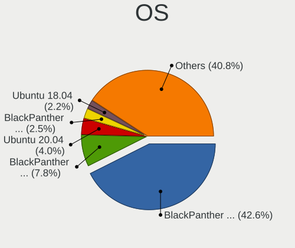

| Name               | Desktops | Percent |
|--------------------|----------|---------|
| BlackPanther 18.1  | 1082     | 42.6%   |
| BlackPanther 22.1  | 199      | 7.83%   |
| Ubuntu 20.04       | 102      | 4.02%   |
| BlackPanther 16.2  | 63       | 2.48%   |
| Ubuntu 18.04       | 57       | 2.24%   |
| Ubuntu 22.04       | 56       | 2.2%    |
| OpenMandriva 4.2   | 37       | 1.46%   |
| Arch Rolling       | 35       | 1.38%   |
| Ubuntu 24.04       | 31       | 1.22%   |
| Debian 12          | 31       | 1.22%   |
| Pop!_OS 22.04      | 22       | 0.87%   |
| OpenMandriva 4.3   | 22       | 0.87%   |
| Debian 11          | 22       | 0.87%   |
| Zorin 16           | 21       | 0.83%   |
| OpenMandriva 24.12 | 21       | 0.83%   |
| ArcoLinux Rolling  | 19       | 0.75%   |
| Zorin 17           | 16       | 0.63%   |
| OpenMandriva 23.03 | 16       | 0.63%   |
| Manjaro            | 16       | 0.63%   |
| OpenMandriva 23.08 | 15       | 0.59%   |
| Linux Mint 22.1    | 15       | 0.59%   |
| Fedora 40          | 14       | 0.55%   |
| Linux Mint 22.2    | 13       | 0.51%   |
| Linux Mint 20.2    | 13       | 0.51%   |
| OpenMandriva 5.0   | 12       | 0.47%   |
| OpenMandriva 4.50  | 12       | 0.47%   |
| Debian 10          | 12       | 0.47%   |
| Ubuntu 19.10       | 11       | 0.43%   |
| Linux Mint 21.3    | 11       | 0.43%   |
| Linux Mint 20      | 11       | 0.43%   |
| Fedora 39          | 11       | 0.43%   |
| Arch               | 11       | 0.43%   |
| Zorin 18           | 10       | 0.39%   |
| Xubuntu 20.04      | 10       | 0.39%   |
| Xubuntu 18.04      | 10       | 0.39%   |
| Ubuntu 21.10       | 9        | 0.35%   |
| Ubuntu 19.04       | 9        | 0.35%   |
| OpenMandriva 25.90 | 9        | 0.35%   |
| Linux Mint 20.3    | 9        | 0.35%   |
| Ubuntu 23.10       | 8        | 0.31%   |

OS Family
---------

OS without a version

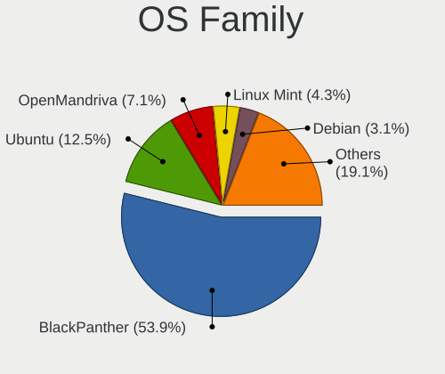

| Name          | Desktops | Percent |
|---------------|----------|---------|
| BlackPanther  | 1291     | 53.86%  |
| Ubuntu        | 300      | 12.52%  |
| OpenMandriva  | 170      | 7.09%   |
| Linux Mint    | 104      | 4.34%   |
| Debian        | 75       | 3.13%   |
| Fedora        | 56       | 2.34%   |
| Zorin         | 51       | 2.13%   |
| Arch          | 48       | 2%      |
| Manjaro       | 35       | 1.46%   |
| Pop!_OS       | 31       | 1.29%   |
| Xubuntu       | 25       | 1.04%   |
| Kubuntu       | 23       | 0.96%   |
| ArcoLinux     | 21       | 0.88%   |
| ROSA          | 14       | 0.58%   |
| Ubuntu MATE   | 13       | 0.54%   |
| Lubuntu       | 10       | 0.42%   |
| KDE neon      | 10       | 0.42%   |
| Nobara        | 9        | 0.38%   |
| Elementary    | 9        | 0.38%   |
| Bazzite       | 9        | 0.38%   |
| Ubuntu Unity  | 7        | 0.29%   |
| openSUSE      | 7        | 0.29%   |
| Gentoo        | 7        | 0.29%   |
| Endless       | 7        | 0.29%   |
| LMDE          | 6        | 0.25%   |
| MX            | 5        | 0.21%   |
| EndeavourOS   | 5        | 0.21%   |
| Devuan        | 4        | 0.17%   |
| CachyOS       | 4        | 0.17%   |
| NixOS         | 3        | 0.13%   |
| Garuda Linux  | 3        | 0.13%   |
| CentOS        | 3        | 0.13%   |
| Xero          | 2        | 0.08%   |
| Ubuntu Budgie | 2        | 0.08%   |
| Slackware     | 2        | 0.08%   |
| Kali          | 2        | 0.08%   |
| Artix         | 2        | 0.08%   |
| AlmaLinux     | 2        | 0.08%   |
| Void Linux    | 1        | 0.04%   |
| TUXEDO OS     | 1        | 0.04%   |

Kernel
------

Version of the Linux kernel

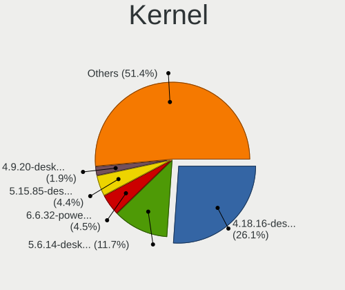

| Version                  | Desktops | Percent |
|--------------------------|----------|---------|
| 4.18.16-desktop-1bP      | 742      | 26.1%   |
| 5.6.14-desktop-2bP       | 332      | 11.68%  |
| 6.6.32-power-1bP         | 128      | 4.5%    |
| 5.15.85-desktop-1bP      | 124      | 4.36%   |
| 4.9.20-desktop-pae-1bP   | 55       | 1.93%   |
| 5.10.14-desktop-1omv4002 | 34       | 1.2%    |
| 6.3.8-desktop-1bP        | 28       | 0.98%   |
| 5.1.15-desktop-1bP       | 27       | 0.95%   |
| 5.16.7-desktop-1omv4003  | 21       | 0.74%   |
| 6.14.2-desktop-3omv2590  | 19       | 0.67%   |
| 6.12.1-desktop-1omv2490  | 18       | 0.63%   |
| 6.3.3-desktop-1bP        | 17       | 0.6%    |
| 6.2.6-desktop-1omv2390   | 16       | 0.56%   |
| 6.6.2-desktop-1omv2390   | 13       | 0.46%   |
| 6.4.11-desktop-1omv2390  | 13       | 0.46%   |
| 5.4.0-42-generic         | 13       | 0.46%   |
| 5.4.0-58-generic         | 12       | 0.42%   |
| 6.6.34-power-1bP         | 11       | 0.39%   |
| 6.4.3-desktop-1bP        | 11       | 0.39%   |
| 6.14.0-37-generic        | 11       | 0.39%   |
| 6.9.3-76060903-generic   | 10       | 0.35%   |
| 5.15.0-56-generic        | 10       | 0.35%   |
| 5.4.0-52-generic         | 8        | 0.28%   |
| 5.4.0-48-generic         | 8        | 0.28%   |
| 5.11.0-27-generic        | 8        | 0.28%   |
| 6.8.0-51-generic         | 7        | 0.25%   |
| 5.18.12-desktop-3omv4090 | 7        | 0.25%   |
| 6.8.0-49-generic         | 6        | 0.21%   |
| 6.2.0-26-generic         | 6        | 0.21%   |
| 5.4.0-47-generic         | 6        | 0.21%   |
| 5.3.0-46-generic         | 6        | 0.21%   |
| 5.15.0-58-generic        | 6        | 0.21%   |
| 5.11.0-43-generic        | 6        | 0.21%   |
| 6.8.0-60-generic         | 5        | 0.18%   |
| 6.8.0-40-generic         | 5        | 0.18%   |
| 6.2.9-desktop-1bP        | 5        | 0.18%   |
| 6.2.0-33-generic         | 5        | 0.18%   |
| 6.14.0-35-generic        | 5        | 0.18%   |
| 6.11.0-26-generic        | 5        | 0.18%   |
| 6.1.1-desktop-1omv2290   | 5        | 0.18%   |

Kernel Family
-------------

Linux kernel without a distro release

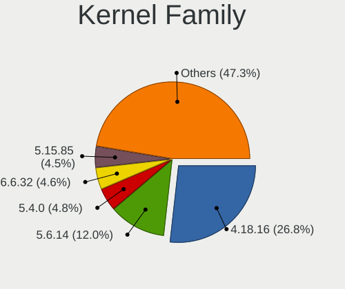

| Version | Desktops | Percent |
|---------|----------|---------|
| 4.18.16 | 742      | 26.77%  |
| 5.6.14  | 333      | 12.01%  |
| 5.4.0   | 133      | 4.8%    |
| 6.6.32  | 128      | 4.62%   |
| 5.15.85 | 124      | 4.47%   |
| 5.15.0  | 77       | 2.78%   |
| 6.8.0   | 60       | 2.16%   |
| 4.9.20  | 58       | 2.09%   |
| 4.15.0  | 45       | 1.62%   |
| 5.11.0  | 44       | 1.59%   |
| 5.8.0   | 36       | 1.3%    |
| 6.14.0  | 34       | 1.23%   |
| 5.10.14 | 34       | 1.23%   |
| 5.13.0  | 31       | 1.12%   |
| 6.1.0   | 30       | 1.08%   |
| 5.3.0   | 30       | 1.08%   |
| 6.5.0   | 29       | 1.05%   |
| 6.3.8   | 28       | 1.01%   |
| 5.1.15  | 28       | 1.01%   |
| 6.2.0   | 24       | 0.87%   |
| 6.14.2  | 22       | 0.79%   |
| 5.0.0   | 22       | 0.79%   |
| 6.11.0  | 21       | 0.76%   |
| 5.16.7  | 21       | 0.76%   |
| 5.10.0  | 21       | 0.76%   |
| 6.2.6   | 19       | 0.69%   |
| 6.12.1  | 19       | 0.69%   |
| 6.3.3   | 17       | 0.61%   |
| 6.9.3   | 16       | 0.58%   |
| 6.6.2   | 15       | 0.54%   |
| 6.4.3   | 13       | 0.47%   |
| 6.4.11  | 13       | 0.47%   |
| 5.19.0  | 13       | 0.47%   |
| 4.19.0  | 13       | 0.47%   |
| 6.6.34  | 11       | 0.4%    |
| 4.18.0  | 9        | 0.32%   |
| 6.9.7   | 7        | 0.25%   |
| 6.1.1   | 7        | 0.25%   |
| 5.18.12 | 7        | 0.25%   |
| 6.7.0   | 6        | 0.22%   |

Kernel Major Ver.
-----------------

Linux kernel major version

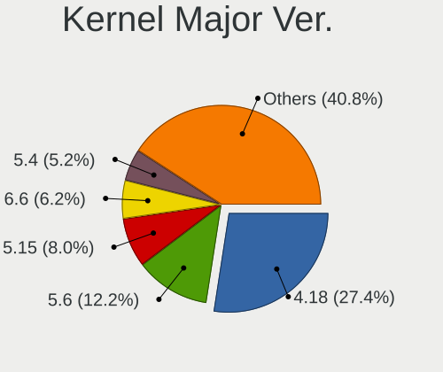

| Version | Desktops | Percent |
|---------|----------|---------|
| 4.18    | 751      | 27.44%  |
| 5.6     | 335      | 12.24%  |
| 5.15    | 220      | 8.04%   |
| 6.6     | 171      | 6.25%   |
| 5.4     | 142      | 5.19%   |
| 6.8     | 74       | 2.7%    |
| 6.14    | 66       | 2.41%   |
| 5.10    | 65       | 2.37%   |
| 4.9     | 65       | 2.37%   |
| 6.2     | 61       | 2.23%   |
| 5.11    | 52       | 1.9%    |
| 6.1     | 49       | 1.79%   |
| 6.12    | 48       | 1.75%   |
| 4.15    | 45       | 1.64%   |
| 6.3     | 44       | 1.61%   |
| 6.5     | 43       | 1.57%   |
| 5.8     | 41       | 1.5%    |
| 5.13    | 39       | 1.42%   |
| 6.11    | 36       | 1.32%   |
| 6.4     | 35       | 1.28%   |
| 6.9     | 32       | 1.17%   |
| 5.3     | 31       | 1.13%   |
| 5.16    | 31       | 1.13%   |
| 5.1     | 31       | 1.13%   |
| 5.19    | 25       | 0.91%   |
| 5.0     | 22       | 0.8%    |
| 6.0     | 17       | 0.62%   |
| 6.13    | 15       | 0.55%   |
| 6.17    | 14       | 0.51%   |
| 6.10    | 14       | 0.51%   |
| 6.7     | 13       | 0.47%   |
| 5.18    | 13       | 0.47%   |
| 5.14    | 13       | 0.47%   |
| 4.19    | 13       | 0.47%   |
| 5.9     | 11       | 0.4%    |
| 6.15    | 10       | 0.37%   |
| 5.7     | 8        | 0.29%   |
| 5.17    | 8        | 0.29%   |
| 5.12    | 8        | 0.29%   |
| 6.16    | 7        | 0.26%   |

Arch
----

OS architecture (x86_64, i586, etc.)

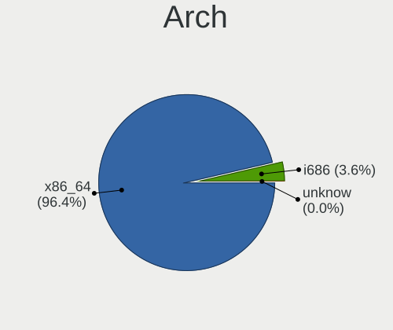

| Name   | Desktops | Percent |
|--------|----------|---------|
| x86_64 | 2223     | 96.36%  |
| i686   | 83       | 3.6%    |
| unknow | 1        | 0.04%   |

DE
--

Desktop Environment

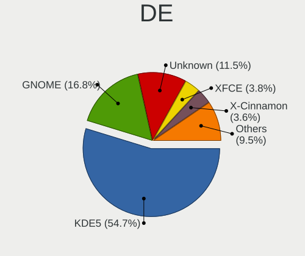

| Name            | Desktops | Percent |
|-----------------|----------|---------|
| KDE5            | 1306     | 54.74%  |
| GNOME           | 401      | 16.81%  |
| Unknown         | 275      | 11.53%  |
| XFCE            | 90       | 3.77%   |
| X-Cinnamon      | 87       | 3.65%   |
| KDE6            | 82       | 3.44%   |
| MATE            | 46       | 1.93%   |
| LXQt            | 26       | 1.09%   |
| KDE             | 15       | 0.63%   |
| Cinnamon        | 11       | 0.46%   |
| Pantheon        | 8        | 0.34%   |
| Unity           | 7        | 0.29%   |
| KDE4            | 6        | 0.25%   |
| i3              | 6        | 0.25%   |
| Hyprland        | 5        | 0.21%   |
| LXDE            | 4        | 0.17%   |
| Deepin          | 3        | 0.13%   |
| Budgie          | 3        | 0.13%   |
| Trinity         | 1        | 0.04%   |
| sway            | 1        | 0.04%   |
| GNOME Flashback | 1        | 0.04%   |
| GNOME Classic   | 1        | 0.04%   |
| Enlightenment   | 1        | 0.04%   |

Display Server
--------------

X11 or Wayland

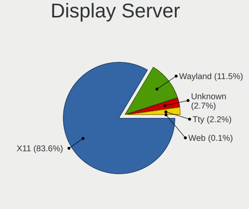

| Name    | Desktops | Percent |
|---------|----------|---------|
| X11     | 1962     | 83.56%  |
| Wayland | 269      | 11.46%  |
| Unknown | 64       | 2.73%   |
| Tty     | 51       | 2.17%   |
| Web     | 2        | 0.09%   |

Display Manager
---------------

SDDM, LightDM, etc.

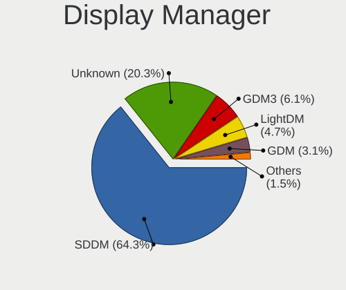

| Name    | Desktops | Percent |
|---------|----------|---------|
| SDDM    | 1517     | 64.31%  |
| Unknown | 478      | 20.26%  |
| GDM3    | 143      | 6.06%   |
| LightDM | 112      | 4.75%   |
| GDM     | 74       | 3.14%   |
| TDM     | 26       | 1.1%    |
| KDM     | 5        | 0.21%   |
| SLiM    | 2        | 0.08%   |
| NODM    | 1        | 0.04%   |
| GREETD  | 1        | 0.04%   |

OS Lang
-------

Language

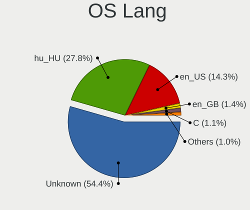

| Lang       | Desktops | Percent |
|------------|----------|---------|
| Unknown    | 1282     | 54.44%  |
| hu_HU      | 654      | 27.77%  |
| en_US      | 336      | 14.27%  |
| en_GB      | 32       | 1.36%   |
| C          | 27       | 1.15%   |
| de_DE      | 13       | 0.55%   |
| ru_RU      | 3        | 0.13%   |
| hu_HU.UTF8 | 2        | 0.08%   |
| sk_SK      | 1        | 0.04%   |
| POSIX      | 1        | 0.04%   |
| fr_FR      | 1        | 0.04%   |
| en_AG      | 1        | 0.04%   |
| el_GR      | 1        | 0.04%   |
| C.UTF8     | 1        | 0.04%   |

Boot Mode
---------

EFI or BIOS

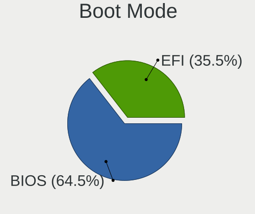

| Mode | Desktops | Percent |
|------|----------|---------|
| BIOS | 1546     | 64.5%   |
| EFI  | 851      | 35.5%   |

Filesystem
----------

Type of filesystem

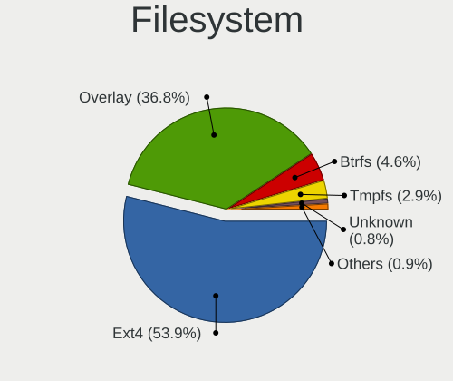

| Type    | Desktops | Percent |
|---------|----------|---------|
| Ext4    | 1373     | 53.93%  |
| Overlay | 938      | 36.84%  |
| Btrfs   | 116      | 4.56%   |
| Tmpfs   | 75       | 2.95%   |
| Unknown | 20       | 0.79%   |
| Xfs     | 13       | 0.51%   |
| Zfs     | 6        | 0.24%   |
| Ext2    | 3        | 0.12%   |
| Rootfs  | 1        | 0.04%   |
| Ext3    | 1        | 0.04%   |

Part. scheme
------------

Scheme of partitioning

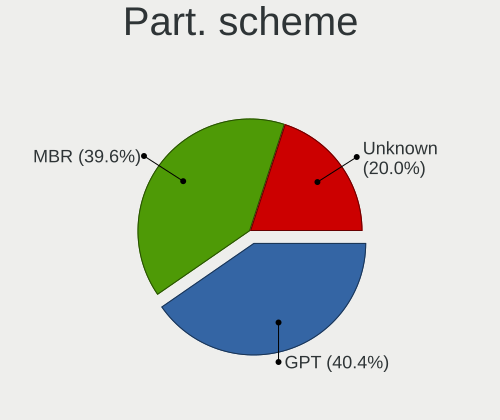

| Type    | Desktops | Percent |
|---------|----------|---------|
| GPT     | 986      | 40.38%  |
| MBR     | 968      | 39.64%  |
| Unknown | 488      | 19.98%  |

Dual Boot with Linux/BSD
------------------------

Hosting more than one Linux/BSD

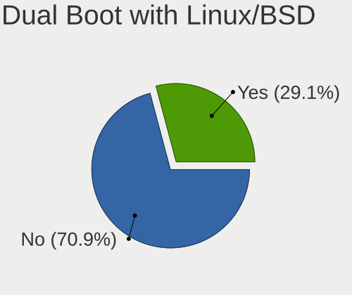

| Dual boot | Desktops | Percent |
|-----------|----------|---------|
| No        | 1775     | 70.86%  |
| Yes       | 730      | 29.14%  |

Dual Boot (Win)
---------------

Hosting Linux and Windows

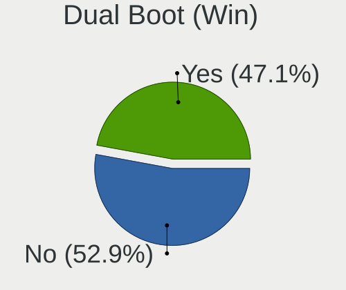

| Dual boot | Desktops | Percent |
|-----------|----------|---------|
| No        | 1304     | 52.9%   |
| Yes       | 1161     | 47.1%   |

Board
-----

Vendor
------

Motherboard manufacturer

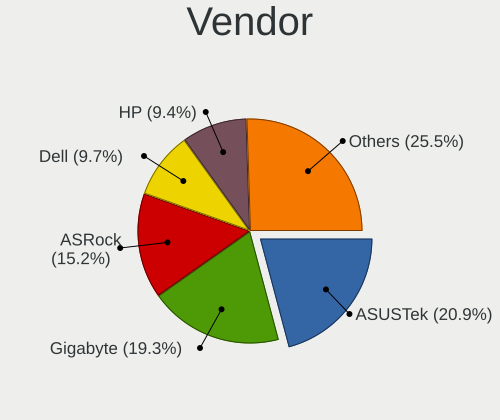

| Name                | Desktops | Percent |
|---------------------|----------|---------|
| ASUSTek Computer    | 478      | 20.87%  |
| Gigabyte Technology | 443      | 19.34%  |
| ASRock              | 348      | 15.2%   |
| Dell                | 221      | 9.65%   |
| Hewlett-Packard     | 216      | 9.43%   |
| MSI                 | 162      | 7.07%   |
| Lenovo              | 115      | 5.02%   |
| Fujitsu             | 94       | 4.1%    |
| Fujitsu Siemens     | 32       | 1.4%    |
| Intel               | 28       | 1.22%   |
| Acer                | 26       | 1.14%   |
| Unknown             | 20       | 0.87%   |
| Foxconn             | 19       | 0.83%   |
| Medion              | 14       | 0.61%   |
| Shuttle             | 8        | 0.35%   |
| Pegatron            | 7        | 0.31%   |
| Huanan              | 6        | 0.26%   |
| AMI                 | 5        | 0.22%   |
| Biostar             | 4        | 0.17%   |
| AZW                 | 4        | 0.17%   |
| GMKtec              | 3        | 0.13%   |
| AOpen               | 3        | 0.13%   |
| ABIT                | 3        | 0.13%   |
| VXL                 | 2        | 0.09%   |
| Nvidia              | 2        | 0.09%   |
| Gateway             | 2        | 0.09%   |
| Apple               | 2        | 0.09%   |
| AMD                 | 2        | 0.09%   |
| Alienware           | 2        | 0.09%   |
| Wistron             | 1        | 0.04%   |
| WinFast             | 1        | 0.04%   |
| Wincor Nixdorf      | 1        | 0.04%   |
| ViewSonic           | 1        | 0.04%   |
| Supermicro          | 1        | 0.04%   |
| Seeed Studio        | 1        | 0.04%   |
| Packard Bell        | 1        | 0.04%   |
| NEC Computers       | 1        | 0.04%   |
| Minix               | 1        | 0.04%   |
| Lex                 | 1        | 0.04%   |
| JW Technology       | 1        | 0.04%   |

Model
-----

Motherboard model

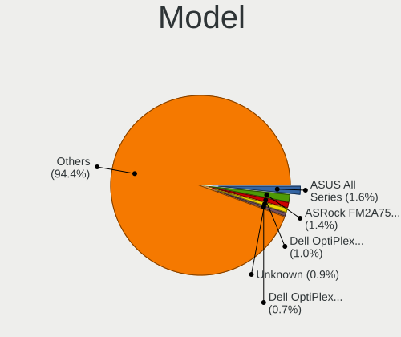

| Name                                | Desktops | Percent |
|-------------------------------------|----------|---------|
| ASUS All Series                     | 36       | 1.57%   |
| ASRock FM2A75M Pro4+                | 33       | 1.44%   |
| Dell OptiPlex 3020                  | 24       | 1.05%   |
| Unknown                             | 20       | 0.87%   |
| Dell OptiPlex 780                   | 16       | 0.7%    |
| Dell OptiPlex 755                   | 15       | 0.66%   |
| MSI MS-7C91                         | 14       | 0.61%   |
| Gigabyte G31M-ES2L                  | 14       | 0.61%   |
| MSI MS-7C02                         | 13       | 0.57%   |
| MSI MS-7680                         | 12       | 0.52%   |
| Dell OptiPlex 760                   | 12       | 0.52%   |
| Dell OptiPlex 7010                  | 12       | 0.52%   |
| ASUS P5KPL-AM EPU                   | 12       | 0.52%   |
| MSI MS-7817                         | 10       | 0.44%   |
| Lenovo ThinkStation D20 4158AF8     | 10       | 0.44%   |
| HP ProDesk 600 G2 SFF               | 10       | 0.44%   |
| HP Compaq Pro 6300 MT               | 10       | 0.44%   |
| Gigabyte H61M-S1                    | 10       | 0.44%   |
| Dell Precision WorkStation T3500    | 10       | 0.44%   |
| ASUS H110M-A                        | 10       | 0.44%   |
| HP EliteDesk 705 G3 SFF             | 9        | 0.39%   |
| HP Compaq 8000 Elite SFF PC         | 9        | 0.39%   |
| Gigabyte 970A-DS3P                  | 9        | 0.39%   |
| Dell OptiPlex 3050                  | 9        | 0.39%   |
| ASUS PRIME A320M-R                  | 9        | 0.39%   |
| ASRock N68C-S UCC                   | 9        | 0.39%   |
| ASRock G41M-VS3                     | 9        | 0.39%   |
| MSI MS-7721                         | 8        | 0.35%   |
| HP Compaq 8200 Elite MT PC          | 8        | 0.35%   |
| Gigabyte B450 AORUS ELITE           | 8        | 0.35%   |
| Fujitsu ESPRIMO E520                | 8        | 0.35%   |
| Dell PowerEdge T20                  | 8        | 0.35%   |
| ASRock B550M Pro4                   | 8        | 0.35%   |
| Lenovo ThinkStation P520 30BFS44D04 | 7        | 0.31%   |
| HP Compaq Elite 8300 SFF            | 7        | 0.31%   |
| Gigabyte F2A88XM-HD3                | 7        | 0.31%   |
| Fujitsu Siemens ESPRIMO E5730       | 7        | 0.31%   |
| Fujitsu ESPRIMO Q556/2              | 7        | 0.31%   |
| Dell Precision Tower 5810           | 7        | 0.31%   |
| ASUS ROG STRIX B450-F GAMING        | 7        | 0.31%   |

Model Family
------------

Motherboard model prefix

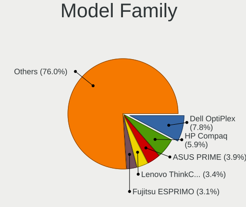

| Name                    | Desktops | Percent |
|-------------------------|----------|---------|
| Dell OptiPlex           | 178      | 7.77%   |
| HP Compaq               | 134      | 5.85%   |
| ASUS PRIME              | 89       | 3.89%   |
| Lenovo ThinkCentre      | 78       | 3.41%   |
| Fujitsu ESPRIMO         | 70       | 3.06%   |
| ASUS TUF                | 40       | 1.75%   |
| ASUS ROG                | 37       | 1.62%   |
| ASUS All                | 36       | 1.57%   |
| ASRock FM2A75M          | 33       | 1.44%   |
| HP EliteDesk            | 30       | 1.31%   |
| Fujitsu Siemens ESPRIMO | 25       | 1.09%   |
| Dell Precision          | 24       | 1.05%   |
| Lenovo ThinkStation     | 21       | 0.92%   |
| HP ProDesk              | 20       | 0.87%   |
| Gigabyte B450           | 20       | 0.87%   |
| Unknown                 | 20       | 0.87%   |
| ASUS P5KPL-AM           | 18       | 0.79%   |
| Acer Veriton            | 18       | 0.79%   |
| Fujitsu CELSIUS         | 16       | 0.7%    |
| MSI MS-7C91             | 14       | 0.61%   |
| Gigabyte G31M-ES2L      | 14       | 0.61%   |
| Gigabyte B450M          | 14       | 0.61%   |
| MSI MS-7C02             | 13       | 0.57%   |
| ASUS M5A97              | 13       | 0.57%   |
| ASUS H110M-A            | 13       | 0.57%   |
| MSI MS-7680             | 12       | 0.52%   |
| Gigabyte H310M          | 12       | 0.52%   |
| ASRock B450M            | 12       | 0.52%   |
| MSI MS-7817             | 10       | 0.44%   |
| Gigabyte H61M-S1        | 10       | 0.44%   |
| ASUS M5A78L-M           | 10       | 0.44%   |
| ASRock N68C-S           | 10       | 0.44%   |
| ASRock B550M            | 10       | 0.44%   |
| ASRock 970              | 10       | 0.44%   |
| Gigabyte 970A-DS3P      | 9        | 0.39%   |
| Dell PowerEdge          | 9        | 0.39%   |
| ASUS P8Z77-V            | 9        | 0.39%   |
| ASRock G41M-VS3         | 9        | 0.39%   |
| MSI MS-7721             | 8        | 0.35%   |
| ASUS P8H61-M            | 8        | 0.35%   |

MFG Year
--------

Motherboard manufacture year

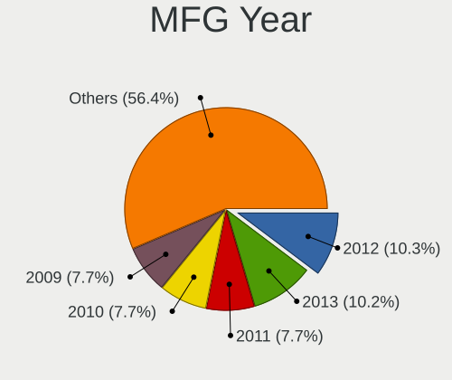

| Year    | Desktops | Percent |
|---------|----------|---------|
| 2012    | 235      | 10.26%  |
| 2013    | 233      | 10.17%  |
| 2011    | 177      | 7.73%   |
| 2010    | 177      | 7.73%   |
| 2009    | 176      | 7.69%   |
| 2014    | 174      | 7.6%    |
| 2018    | 165      | 7.21%   |
| 2008    | 141      | 6.16%   |
| 2007    | 110      | 4.8%    |
| 2020    | 106      | 4.63%   |
| 2017    | 106      | 4.63%   |
| 2015    | 101      | 4.41%   |
| 2019    | 91       | 3.97%   |
| 2016    | 82       | 3.58%   |
| 2021    | 54       | 2.36%   |
| 2006    | 48       | 2.1%    |
| 2023    | 37       | 1.62%   |
| 2022    | 30       | 1.31%   |
| 2005    | 21       | 0.92%   |
| 2024    | 15       | 0.66%   |
| 2004    | 5        | 0.22%   |
| 2003    | 3        | 0.13%   |
| 2025    | 2        | 0.09%   |
| Unknown | 1        | 0.04%   |

Form Factor
-----------

Physical design of the computer

| Name    | Desktops | Percent |
|---------|----------|---------|
| Desktop | 2290     | 100%    |

Secure Boot
-----------

Enabled or disabled

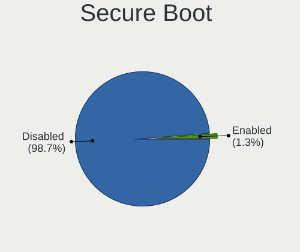

| State    | Desktops | Percent |
|----------|----------|---------|
| Disabled | 2264     | 98.74%  |
| Enabled  | 29       | 1.26%   |

Coreboot
--------

Have coreboot on board

| Used | Desktops | Percent |
|------|----------|---------|
| No   | 2290     | 100%    |

RAM Size
--------

Total RAM memory

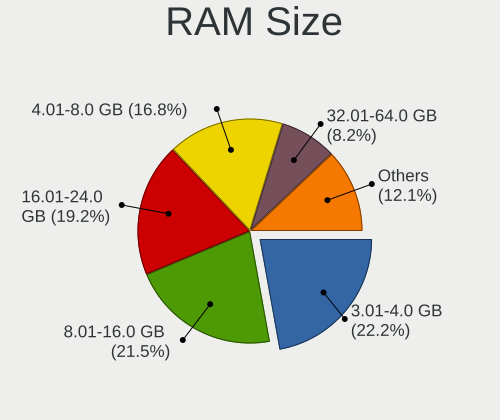

| Size in GB  | Desktops | Percent |
|-------------|----------|---------|
| 3.01-4.0    | 531      | 22.16%  |
| 8.01-16.0   | 516      | 21.54%  |
| 16.01-24.0  | 461      | 19.24%  |
| 4.01-8.0    | 402      | 16.78%  |
| 32.01-64.0  | 197      | 8.22%   |
| 1.01-2.0    | 133      | 5.55%   |
| 24.01-32.0  | 58       | 2.42%   |
| 64.01-256.0 | 51       | 2.13%   |
| 2.01-3.0    | 37       | 1.54%   |
| 0.51-1.0    | 9        | 0.38%   |
| Unknown     | 1        | 0.04%   |

RAM Used
--------

Used RAM memory

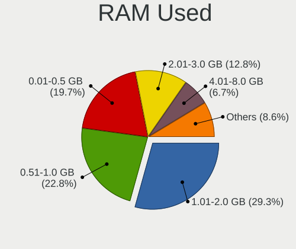

| Used GB     | Desktops | Percent |
|-------------|----------|---------|
| 1.01-2.0    | 815      | 29.32%  |
| 0.51-1.0    | 635      | 22.84%  |
| 0.01-0.5    | 549      | 19.75%  |
| 2.01-3.0    | 355      | 12.77%  |
| 4.01-8.0    | 186      | 6.69%   |
| 3.01-4.0    | 169      | 6.08%   |
| 8.01-16.0   | 54       | 1.94%   |
| 16.01-24.0  | 9        | 0.32%   |
| 32.01-64.0  | 4        | 0.14%   |
| 64.01-256.0 | 2        | 0.07%   |
| Unknown     | 2        | 0.07%   |

Total Drives
------------

Number of drives on board

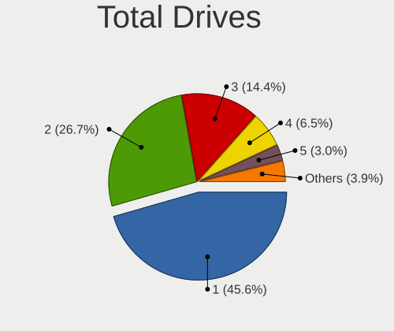

| Drives  | Desktops | Percent |
|---------|----------|---------|
| 1       | 1157     | 45.55%  |
| 2       | 677      | 26.65%  |
| 3       | 365      | 14.37%  |
| 4       | 165      | 6.5%    |
| 5       | 77       | 3.03%   |
| 0       | 37       | 1.46%   |
| 6       | 24       | 0.94%   |
| 7       | 10       | 0.39%   |
| 8       | 9        | 0.35%   |
| 9       | 8        | 0.31%   |
| 10      | 4        | 0.16%   |
| 11      | 3        | 0.12%   |
| 15      | 1        | 0.04%   |
| 13      | 1        | 0.04%   |
| 12      | 1        | 0.04%   |
| Unknown | 1        | 0.04%   |

Has CD-ROM
----------

Has CD-ROM on board

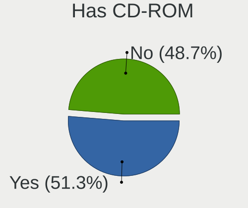

| Presented | Desktops | Percent |
|-----------|----------|---------|
| Yes       | 1221     | 51.3%   |
| No        | 1159     | 48.7%   |

Has Ethernet
------------

Has Ethernet on board

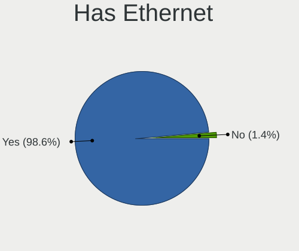

| Presented | Desktops | Percent |
|-----------|----------|---------|
| Yes       | 2257     | 98.56%  |
| No        | 33       | 1.44%   |

Has WiFi
--------

Has WiFi module

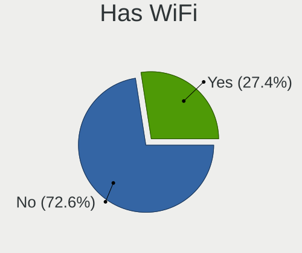

| Presented | Desktops | Percent |
|-----------|----------|---------|
| No        | 1703     | 72.56%  |
| Yes       | 644      | 27.44%  |

Has Bluetooth
-------------

Has Bluetooth module

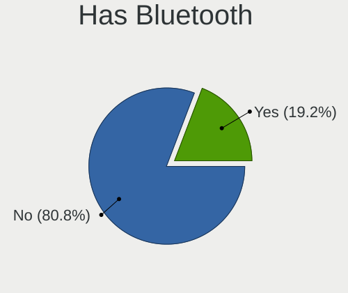

| Presented | Desktops | Percent |
|-----------|----------|---------|
| No        | 1900     | 80.82%  |
| Yes       | 451      | 19.18%  |

Location
--------

Country
-------

Geographic location (country)

| Country | Desktops | Percent |
|---------|----------|---------|
| Hungary | 2290     | 100%    |

City
----

Geographic location (city)

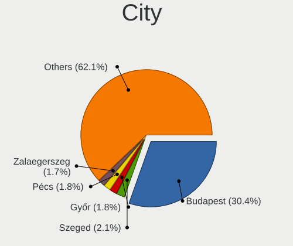

| City              | Desktops | Percent |
|-------------------|----------|---------|
| Budapest          | 815      | 30.42%  |
| Szeged            | 57       | 2.13%   |
| Győr             | 49       | 1.83%   |
| Pécs             | 48       | 1.79%   |
| Zalaegerszeg      | 46       | 1.72%   |
| Miskolc           | 43       | 1.61%   |
| Debrecen          | 42       | 1.57%   |
| Szigetszentmiklos | 40       | 1.49%   |
| Karcag            | 39       | 1.46%   |
| Tatabánya        | 38       | 1.42%   |
| Kecskemét        | 38       | 1.42%   |
| Szombathely       | 33       | 1.23%   |
| Székesfehérvár | 27       | 1.01%   |
| Érd              | 25       | 0.93%   |
| Eger              | 25       | 0.93%   |
| Berettyóújfalu  | 25       | 0.93%   |
| Szentendre        | 24       | 0.9%    |
| Szekszárd        | 23       | 0.86%   |
| Szolnok           | 22       | 0.82%   |
| Gödöllő        | 22       | 0.82%   |
| Nyiregyhaza       | 20       | 0.75%   |
| Oroshaza          | 18       | 0.67%   |
| Toeroekbalint     | 14       | 0.52%   |
| Nagykanizsa       | 14       | 0.52%   |
| Hodmezovasarhely  | 14       | 0.52%   |
| Hatvan            | 14       | 0.52%   |
| Veszprém         | 13       | 0.49%   |
| Veresegyhaz       | 13       | 0.49%   |
| Sopron            | 13       | 0.49%   |
| Esztergom         | 13       | 0.49%   |
| Dunaújváros     | 13       | 0.49%   |
| Sarbogard         | 12       | 0.45%   |
| Mosonmagyaróvár | 12       | 0.45%   |
| Hajduboszormeny   | 12       | 0.45%   |
| Dunakeszi         | 12       | 0.45%   |
| Dunaharaszti      | 12       | 0.45%   |
| Csongrad          | 12       | 0.45%   |
| Biatorbagy        | 12       | 0.45%   |
| Siófok           | 11       | 0.41%   |
| Papa              | 10       | 0.37%   |

Drives
------

Drive Vendor
------------

Hard drive vendors

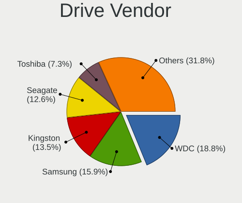

| Vendor                      | Desktops | Drives | Percent |
|-----------------------------|----------|--------|---------|
| WDC                         | 791      | 1817   | 18.79%  |
| Samsung Electronics         | 669      | 1243   | 15.89%  |
| Kingston                    | 570      | 1120   | 13.54%  |
| Seagate                     | 532      | 930    | 12.64%  |
| Toshiba                     | 308      | 598    | 7.32%   |
| Hitachi                     | 140      | 198    | 3.33%   |
| A-DATA Technology           | 121      | 236    | 2.87%   |
| Sandisk                     | 75       | 104    | 1.78%   |
| SPCC                        | 73       | 100    | 1.73%   |
| Crucial                     | 71       | 120    | 1.69%   |
| Maxtor                      | 58       | 75     | 1.38%   |
| Intel                       | 52       | 90     | 1.24%   |
| HGST                        | 44       | 133    | 1.05%   |
| Intenso                     | 40       | 63     | 0.95%   |
| Apacer                      | 40       | 59     | 0.95%   |
| Kingston Technology Company | 36       | 44     | 0.86%   |
| Micron Technology           | 31       | 48     | 0.74%   |
| Patriot                     | 29       | 64     | 0.69%   |
| JMicron Technology          | 27       | 33     | 0.64%   |
| SK hynix                    | 25       | 32     | 0.59%   |
| OCZ                         | 23       | 31     | 0.55%   |
| Unknown                     | 22       | 47     | 0.52%   |
| Fujitsu                     | 22       | 23     | 0.52%   |
| Gigabyte Technology         | 20       | 66     | 0.48%   |
| China                       | 19       | 29     | 0.45%   |
| PNY                         | 16       | 33     | 0.38%   |
| Phison Electronics          | 16       | 26     | 0.38%   |
| Transcend                   | 15       | 21     | 0.36%   |
| Kingmax                     | 15       | 50     | 0.36%   |
| Hewlett-Packard             | 15       | 22     | 0.36%   |
| Verbatim                    | 12       | 18     | 0.29%   |
| XPG                         | 11       | 17     | 0.26%   |
| Netac                       | 11       | 23     | 0.26%   |
| LITEON                      | 11       | 11     | 0.26%   |
| Micron/Crucial Technology   | 10       | 27     | 0.24%   |
| MAXIO Technology (Hangzhou) | 10       | 11     | 0.24%   |
| Corsair                     | 10       | 11     | 0.24%   |
| Team                        | 9        | 11     | 0.21%   |
| KingSpec                    | 9        | 11     | 0.21%   |
| Unknown                     | 9        | 11     | 0.21%   |

Drive Model
-----------

Hard drive models

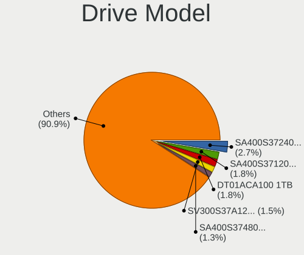

| Model                                             | Desktops | Percent |
|---------------------------------------------------|----------|---------|
| Kingston SA400S37240G 240GB SSD                   | 133      | 2.72%   |
| Kingston SA400S37120G 120GB SSD                   | 89       | 1.82%   |
| Toshiba DT01ACA100 1TB                            | 88       | 1.8%    |
| Kingston SV300S37A120G 120GB SSD                  | 71       | 1.45%   |
| Kingston SA400S37480G 480GB SSD                   | 64       | 1.31%   |
| Seagate ST500DM002-1BD142 500GB                   | 59       | 1.21%   |
| Toshiba DT01ACA050 500GB                          | 46       | 0.94%   |
| Samsung SSD 850 EVO 250GB                         | 37       | 0.76%   |
| Kingston SUV400S37120G 120GB SSD                  | 32       | 0.66%   |
| A-DATA SU630 240GB SSD                            | 32       | 0.66%   |
| SPCC Solid State Disk 256GB                       | 31       | 0.63%   |
| Samsung SSD 860 EVO 250GB                         | 31       | 0.63%   |
| Toshiba HDWD110 1TB                               | 30       | 0.61%   |
| WDC WD10EZEX-08WN4A0 1TB                          | 28       | 0.57%   |
| Toshiba HDWD130 3TB                               | 28       | 0.57%   |
| Samsung NVMe SSD Controller SM981/PM981/PM983 1TB | 28       | 0.57%   |
| Samsung HD502HJ 500GB                             | 28       | 0.57%   |
| Seagate ST2000DM008-2FR102 2TB                    | 26       | 0.53%   |
| A-DATA SU700 120GB SSD                            | 25       | 0.51%   |
| Seagate ST380815AS 80GB                           | 24       | 0.49%   |
| JMicron Generic 320GB                             | 24       | 0.49%   |
| Toshiba DT01ACA200 2TB                            | 23       | 0.47%   |
| Kingston SA400S37960G 960GB SSD                   | 23       | 0.47%   |
| Samsung SSD 860 EVO 500GB                         | 21       | 0.43%   |
| Samsung HD322HJ 320GB                             | 21       | 0.43%   |
| Kingston SHFS37A120G 120GB SSD                    | 21       | 0.43%   |
| WDC WDS240G2G0A-00JH30 240GB SSD                  | 20       | 0.41%   |
| Kingston SV300S37A240G 240GB SSD                  | 20       | 0.41%   |
| Kingston SNV2S500G 500GB                          | 20       | 0.41%   |
| WDC WD10EZEX-22MFCA0 1TB                          | 19       | 0.39%   |
| Seagate ST3160815AS 160GB                         | 19       | 0.39%   |
| Seagate ST3160318AS 160GB                         | 19       | 0.39%   |
| Seagate ST1000DM010-2EP102 1TB                    | 19       | 0.39%   |
| Kingston SV300S37A60G 64GB SSD                    | 18       | 0.37%   |
| WDC WD5000AAKX-22ERMA0 500GB                      | 17       | 0.35%   |
| WDC WD10EZRX-00L4HB0 1TB                          | 17       | 0.35%   |
| Seagate ST1000LM024 HN-M101MBB 1TB                | 17       | 0.35%   |
| Samsung HD502IJ 500GB                             | 17       | 0.35%   |
| Samsung HD161HJ 160GB                             | 17       | 0.35%   |
| Samsung HD501LJ 500GB                             | 16       | 0.33%   |

HDD Vendor
----------

Hard disk drive vendors

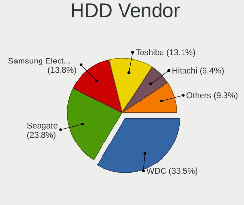

| Vendor              | Desktops | Drives | Percent |
|---------------------|----------|--------|---------|
| WDC                 | 736      | 1633   | 33.55%  |
| Seagate             | 523      | 901    | 23.84%  |
| Samsung Electronics | 303      | 504    | 13.81%  |
| Toshiba             | 288      | 570    | 13.13%  |
| Hitachi             | 140      | 198    | 6.38%   |
| Maxtor              | 58       | 75     | 2.64%   |
| HGST                | 44       | 133    | 2.01%   |
| JMicron Technology  | 24       | 30     | 1.09%   |
| Fujitsu             | 22       | 23     | 1%      |
| HGST HTS            | 7        | 7      | 0.32%   |
| Hewlett-Packard     | 7        | 9      | 0.32%   |
| Unknown             | 5        | 6      | 0.23%   |
| USB3.0              | 4        | 5      | 0.18%   |
| QUANTUM             | 4        | 4      | 0.18%   |
| IBM-D050            | 4        | 18     | 0.18%   |
| External            | 4        | 5      | 0.18%   |
| ICY BOX             | 3        | 6      | 0.14%   |
| WD MediaMax         | 2        | 4      | 0.09%   |
| SATAFIRM            | 2        | 2      | 0.09%   |
| ExcelStor           | 2        | 2      | 0.09%   |
| ASMT                | 2        | 2      | 0.09%   |
| Apple               | 2        | 4      | 0.09%   |
| Unknown             | 2        | 3      | 0.09%   |
| USB                 | 1        | 1      | 0.05%   |
| TO Exter            | 1        | 1      | 0.05%   |
| IBM/Hitachi         | 1        | 1      | 0.05%   |
| HPE                 | 1        | 11     | 0.05%   |
| Dell                | 1        | 3      | 0.05%   |
| ASMedia             | 1        | 2      | 0.05%   |

SSD Vendor
----------

Solid state drive vendors

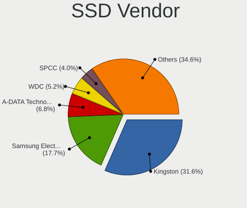

| Vendor              | Desktops | Drives | Percent |
|---------------------|----------|--------|---------|
| Kingston            | 507      | 956    | 31.57%  |
| Samsung Electronics | 285      | 492    | 17.75%  |
| A-DATA Technology   | 110      | 218    | 6.85%   |
| WDC                 | 84       | 171    | 5.23%   |
| SPCC                | 64       | 89     | 3.99%   |
| Crucial             | 61       | 106    | 3.8%    |
| SanDisk             | 53       | 65     | 3.3%    |
| Intel               | 42       | 72     | 2.62%   |
| Intenso             | 37       | 59     | 2.3%    |
| Apacer              | 37       | 56     | 2.3%    |
| Patriot             | 28       | 63     | 1.74%   |
| OCZ                 | 23       | 31     | 1.43%   |
| Micron Technology   | 22       | 37     | 1.37%   |
| China               | 19       | 29     | 1.18%   |
| Toshiba             | 18       | 24     | 1.12%   |
| Gigabyte Technology | 17       | 57     | 1.06%   |
| PNY                 | 16       | 33     | 1%      |
| Transcend           | 14       | 16     | 0.87%   |
| Kingmax             | 14       | 48     | 0.87%   |
| Verbatim            | 11       | 17     | 0.68%   |
| Netac               | 11       | 23     | 0.68%   |
| SK hynix            | 10       | 15     | 0.62%   |
| LITEON              | 10       | 10     | 0.62%   |
| KingSpec            | 9        | 11     | 0.56%   |
| Team                | 8        | 10     | 0.5%    |
| Corsair             | 8        | 9      | 0.5%    |
| Hewlett-Packard     | 6        | 8      | 0.37%   |
| GOODRAM             | 6        | 6      | 0.37%   |
| Unknown             | 5        | 6      | 0.31%   |
| LITEONIT            | 4        | 9      | 0.25%   |
| Lexar               | 4        | 7      | 0.25%   |
| Leven               | 3        | 3      | 0.19%   |
| KODAK               | 3        | 5      | 0.19%   |
| Dahua               | 3        | 4      | 0.19%   |
| ASMT                | 3        | 3      | 0.19%   |
| AMD                 | 3        | 4      | 0.19%   |
| XrayDisk            | 2        | 2      | 0.12%   |
| WDC WDS             | 2        | 2      | 0.12%   |
| KIOXIA-EXCERIA      | 2        | 3      | 0.12%   |
| KingFast            | 2        | 3      | 0.12%   |

Drive Kind
----------

HDD or SSD

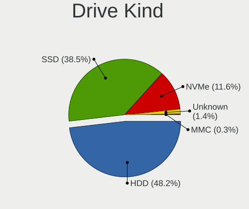

| Kind    | Desktops | Drives | Percent |
|---------|----------|--------|---------|
| HDD     | 1637     | 4163   | 48.16%  |
| SSD     | 1310     | 2837   | 38.54%  |
| NVMe    | 394      | 816    | 11.59%  |
| Unknown | 48       | 93     | 1.41%   |
| MMC     | 10       | 13     | 0.29%   |

Drive Connector
---------------

SATA, SAS, NVMe, etc.

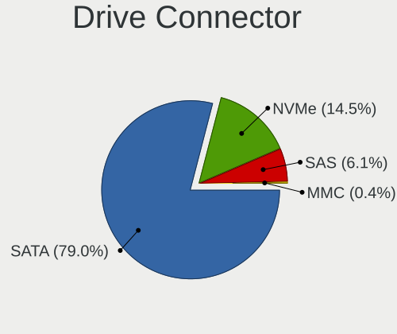

| Type | Desktops | Drives | Percent |
|------|----------|--------|---------|
| SATA | 2146     | 6795   | 79.04%  |
| NVMe | 394      | 815    | 14.51%  |
| SAS  | 165      | 299    | 6.08%   |
| MMC  | 10       | 13     | 0.37%   |

Drive Size
----------

Size of hard drive

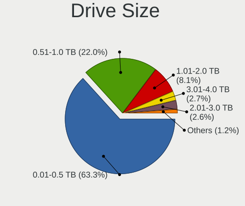

| Size in TB | Desktops | Drives | Percent |
|------------|----------|--------|---------|
| 0.01-0.5   | 1889     | 4498   | 63.26%  |
| 0.51-1.0   | 658      | 1386   | 22.04%  |
| 1.01-2.0   | 243      | 443    | 8.14%   |
| 3.01-4.0   | 82       | 322    | 2.75%   |
| 2.01-3.0   | 77       | 245    | 2.58%   |
| 4.01-10.0  | 30       | 80     | 1%      |
| 10.01-20.0 | 7        | 26     | 0.23%   |

Space Total
-----------

Amount of disk space available on the file system

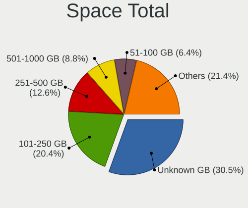

| Size in GB     | Desktops | Percent |
|----------------|----------|---------|
| Unknown        | 837      | 30.53%  |
| 101-250        | 559      | 20.39%  |
| 251-500        | 345      | 12.58%  |
| 501-1000       | 240      | 8.75%   |
| 51-100         | 175      | 6.38%   |
| 1001-2000      | 156      | 5.69%   |
| 1-20           | 137      | 5%      |
| More than 3000 | 120      | 4.38%   |
| 21-50          | 89       | 3.25%   |
| 2001-3000      | 84       | 3.06%   |

Space Used
----------

Amount of used disk space

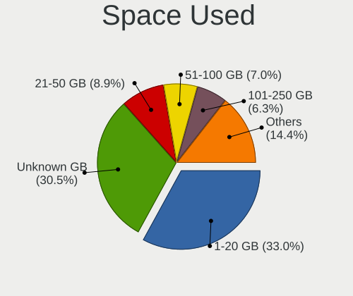

| Used GB        | Desktops | Percent |
|----------------|----------|---------|
| 1-20           | 906      | 32.97%  |
| Unknown        | 837      | 30.46%  |
| 21-50          | 245      | 8.92%   |
| 51-100         | 191      | 6.95%   |
| 101-250        | 172      | 6.26%   |
| 501-1000       | 120      | 4.37%   |
| 251-500        | 110      | 4%      |
| 1001-2000      | 97       | 3.53%   |
| More than 3000 | 43       | 1.56%   |
| 2001-3000      | 25       | 0.91%   |
| 0              | 2        | 0.07%   |

Malfunc. Drives
---------------

Drive models with a malfunction

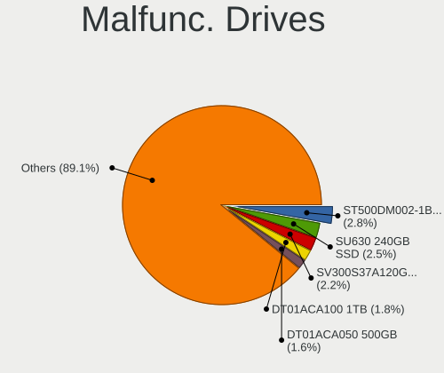

| Model                              | Desktops | Drives | Percent |
|------------------------------------|----------|--------|---------|
| Seagate ST500DM002-1BD142 500GB    | 22       | 39     | 2.85%   |
| A-DATA Technology SU630 240GB SSD  | 19       | 41     | 2.46%   |
| Kingston SV300S37A120G 120GB SSD   | 17       | 18     | 2.2%    |
| Toshiba DT01ACA100 1TB             | 14       | 30     | 1.81%   |
| Toshiba DT01ACA050 500GB           | 12       | 18     | 1.55%   |
| Samsung Electronics HD103UJ 1TB    | 12       | 29     | 1.55%   |
| Seagate ST1000LM024 HN-M101MBB 1TB | 10       | 13     | 1.3%    |
| WDC WD5000AAKX-22ERMA0 500GB       | 8        | 9      | 1.04%   |
| Samsung Electronics HD161HJ 160GB  | 8        | 8      | 1.04%   |
| WDC WD5000AAKX-001CA0 500GB        | 7        | 8      | 0.91%   |
| WDC WD5000AADS-00S9B0 500GB        | 7        | 8      | 0.91%   |
| WDC WD10PURZ-85U8XY0 1TB           | 7        | 15     | 0.91%   |
| Seagate ST500LT012-9WS142 500GB    | 7        | 10     | 0.91%   |
| Samsung Electronics HD321KJ 320GB  | 7        | 8      | 0.91%   |
| WDC WD5000AAKS-00UU3A0 500GB       | 6        | 18     | 0.78%   |
| Seagate ST3250318AS 250GB          | 6        | 10     | 0.78%   |
| Seagate ST3160815AS 160GB          | 6        | 8      | 0.78%   |
| Samsung Electronics SP2004C 200GB  | 6        | 9      | 0.78%   |
| Samsung Electronics HD502HJ 500GB  | 6        | 9      | 0.78%   |
| WDC WD5000AAKX-08U6AA0 500GB       | 5        | 9      | 0.65%   |
| WDC WD3200AAKS-00L9A0 320GB        | 5        | 7      | 0.65%   |
| Seagate ST3160812AS 160GB          | 5        | 5      | 0.65%   |
| Seagate ST3160318AS 160GB          | 5        | 5      | 0.65%   |
| Samsung Electronics SP2504C 250GB  | 5        | 10     | 0.65%   |
| Samsung Electronics HD200HJ 200GB  | 5        | 10     | 0.65%   |
| Samsung Electronics HD103SI 1TB    | 5        | 5      | 0.65%   |
| Maxtor 6Y080M0 81GB                | 5        | 6      | 0.65%   |
| WDC WD5000AAKX-07U6AA0 500GB       | 4        | 6      | 0.52%   |
| WDC WD15EARS-00MVWB0 1TB           | 4        | 12     | 0.52%   |
| WDC WD10EZEX-22MFCA0 1TB           | 4        | 4      | 0.52%   |
| WDC WD10EARS-00Y5B1 1TB            | 4        | 14     | 0.52%   |
| WDC WD10EALX-009BA0 1TB            | 4        | 5      | 0.52%   |
| Seagate ST380815AS 80GB            | 4        | 7      | 0.52%   |
| Samsung Electronics HD161GJ 160GB  | 4        | 5      | 0.52%   |
| Samsung Electronics HD160JJ 160GB  | 4        | 4      | 0.52%   |
| Samsung Electronics HD103SJ 1TB    | 4        | 4      | 0.52%   |
| Samsung Electronics HD082GJ 80GB   | 4        | 4      | 0.52%   |
| Samsung Electronics HD080HJ/ 80GB  | 4        | 4      | 0.52%   |
| Maxtor 6Y080L0 81GB                | 4        | 5      | 0.52%   |
| Maxtor 2B020H1 20GB                | 4        | 8      | 0.52%   |

Malfunc. Drive Vendor
---------------------

Vendors of faulty drives

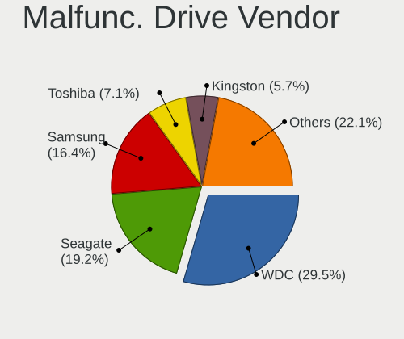

| Vendor                      | Desktops | Drives | Percent |
|-----------------------------|----------|--------|---------|
| WDC                         | 216      | 361    | 29.47%  |
| Seagate                     | 141      | 215    | 19.24%  |
| Samsung Electronics         | 120      | 185    | 16.37%  |
| Toshiba                     | 52       | 90     | 7.09%   |
| Kingston                    | 42       | 59     | 5.73%   |
| Hitachi                     | 40       | 61     | 5.46%   |
| Maxtor                      | 32       | 47     | 4.37%   |
| A-DATA Technology           | 29       | 62     | 3.96%   |
| HGST                        | 11       | 13     | 1.5%    |
| Fujitsu                     | 7        | 7      | 0.95%   |
| Intel                       | 5        | 13     | 0.68%   |
| SK hynix                    | 4        | 7      | 0.55%   |
| LITEON                      | 3        | 3      | 0.41%   |
| Hewlett-Packard             | 3        | 3      | 0.41%   |
| WD MediaMax                 | 2        | 4      | 0.27%   |
| SanDisk                     | 2        | 2      | 0.27%   |
| Patriot                     | 2        | 2      | 0.27%   |
| OCZ                         | 2        | 4      | 0.27%   |
| KingSpec                    | 2        | 2      | 0.27%   |
| Intenso                     | 2        | 2      | 0.27%   |
| ICY BOX                     | 2        | 3      | 0.27%   |
| Solid                       | 1        | 1      | 0.14%   |
| SATAFIRM                    | 1        | 1      | 0.14%   |
| QUANTUM                     | 1        | 1      | 0.14%   |
| Micron Technology           | 1        | 1      | 0.14%   |
| MAXIO Technology (Hangzhou) | 1        | 1      | 0.14%   |
| Leven                       | 1        | 1      | 0.14%   |
| Kingmax                     | 1        | 1      | 0.14%   |
| IBM/Hitachi                 | 1        | 1      | 0.14%   |
| ExcelStor                   | 1        | 1      | 0.14%   |
| Crucial                     | 1        | 4      | 0.14%   |
| China                       | 1        | 1      | 0.14%   |
| BIWIN                       | 1        | 1      | 0.14%   |
| ASMT                        | 1        | 1      | 0.14%   |
| Unknown                     | 1        | 2      | 0.14%   |

Malfunc. HDD Vendor
-------------------

Vendors of faulty HDD drives

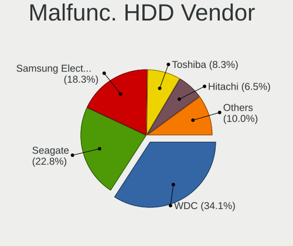

| Vendor              | Desktops | Drives | Percent |
|---------------------|----------|--------|---------|
| WDC                 | 211      | 355    | 34.14%  |
| Seagate             | 141      | 215    | 22.82%  |
| Samsung Electronics | 113      | 174    | 18.28%  |
| Toshiba             | 51       | 89     | 8.25%   |
| Hitachi             | 40       | 61     | 6.47%   |
| Maxtor              | 32       | 47     | 5.18%   |
| HGST                | 11       | 13     | 1.78%   |
| Fujitsu             | 7        | 7      | 1.13%   |
| WD MediaMax         | 2        | 4      | 0.32%   |
| ICY BOX             | 2        | 3      | 0.32%   |
| Hewlett-Packard     | 2        | 2      | 0.32%   |
| SATAFIRM            | 1        | 1      | 0.16%   |
| QUANTUM             | 1        | 1      | 0.16%   |
| IBM/Hitachi         | 1        | 1      | 0.16%   |
| ExcelStor           | 1        | 1      | 0.16%   |
| ASMT                | 1        | 1      | 0.16%   |
| Unknown             | 1        | 2      | 0.16%   |

Malfunc. Drive Kind
-------------------

Kinds of faulty drives

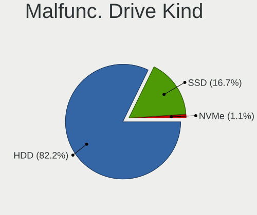

| Kind | Desktops | Drives | Percent |
|------|----------|--------|---------|
| HDD  | 528      | 977    | 82.24%  |
| SSD  | 107      | 177    | 16.67%  |
| NVMe | 7        | 9      | 1.09%   |

Failed Drives
-------------

Failed drive models

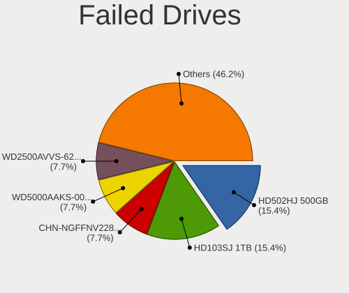

| Model                             | Desktops | Drives | Percent |
|-----------------------------------|----------|--------|---------|
| Samsung Electronics HD502HJ 500GB | 2        | 3      | 15.38%  |
| Samsung Electronics HD103SJ 1TB   | 2        | 3      | 15.38%  |
| Zheino CHN-NGFFNV2280-256 256GB   | 1        | 1      | 7.69%   |
| WDC WD5000AAKS-00UU3A0 500GB      | 1        | 1      | 7.69%   |
| WDC WD2500AVVS-62L2B0 250GB       | 1        | 1      | 7.69%   |
| Seagate ST9160412AS 160GB         | 1        | 1      | 7.69%   |
| Seagate ST380815AS 80GB           | 1        | 3      | 7.69%   |
| Samsung Electronics SP0802N 80GB  | 1        | 1      | 7.69%   |
| Samsung Electronics HD204UI 2TB   | 1        | 1      | 7.69%   |
| Hewlett-Packard SSD EX900 250GB   | 1        | 1      | 7.69%   |
| ExcelStor Technology J8160S 160GB | 1        | 1      | 7.69%   |

Failed Drive Vendor
-------------------

Failed drive vendors

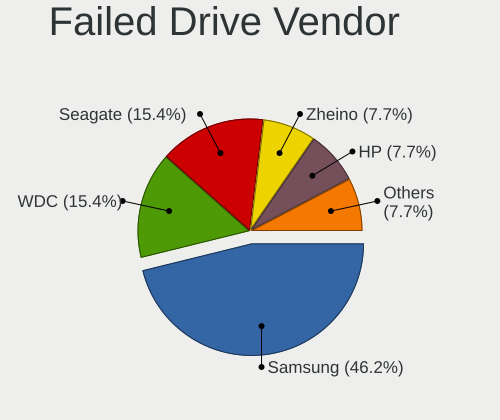

| Vendor              | Desktops | Drives | Percent |
|---------------------|----------|--------|---------|
| Samsung Electronics | 6        | 8      | 46.15%  |
| WDC                 | 2        | 2      | 15.38%  |
| Seagate             | 2        | 4      | 15.38%  |
| Zheino              | 1        | 1      | 7.69%   |
| Hewlett-Packard     | 1        | 1      | 7.69%   |
| ExcelStor           | 1        | 1      | 7.69%   |

Drive Status
------------

Number of failed and malfunc. drives

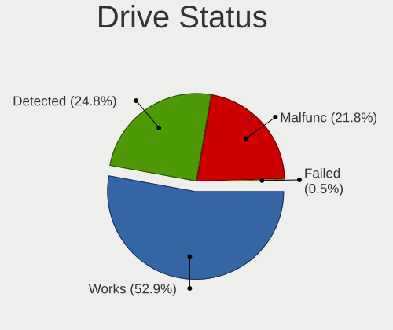

| Status   | Desktops | Drives | Percent |
|----------|----------|--------|---------|
| Works    | 1492     | 4902   | 52.87%  |
| Detected | 701      | 1840   | 24.84%  |
| Malfunc  | 616      | 1163   | 21.83%  |
| Failed   | 13       | 17     | 0.46%   |

Storage controller
------------------

Storage Vendor
--------------

Storage controller vendors

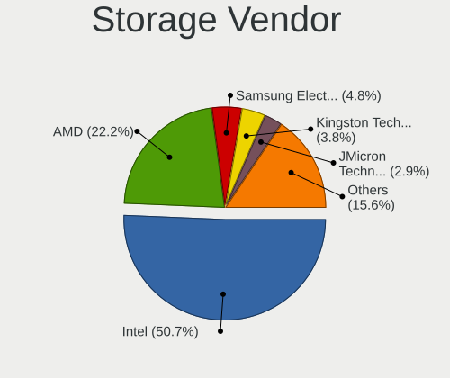

| Vendor                           | Desktops | Percent |
|----------------------------------|----------|---------|
| Intel                            | 1524     | 50.66%  |
| AMD                              | 669      | 22.24%  |
| Samsung Electronics              | 144      | 4.79%   |
| Kingston Technology Company      | 115      | 3.82%   |
| JMicron Technology               | 87       | 2.89%   |
| ASMedia Technology               | 86       | 2.86%   |
| Nvidia                           | 71       | 2.36%   |
| Marvell Technology Group         | 46       | 1.53%   |
| Phison Electronics               | 41       | 1.36%   |
| SanDisk                          | 30       | 1%      |
| VIA Technologies                 | 20       | 0.66%   |
| Silicon Motion                   | 18       | 0.6%    |
| Realtek Semiconductor            | 18       | 0.6%    |
| Micron/Crucial Technology        | 16       | 0.53%   |
| SK hynix                         | 15       | 0.5%    |
| LSI Logic / Symbios Logic        | 15       | 0.5%    |
| ADATA Technology                 | 15       | 0.5%    |
| MAXIO Technology (Hangzhou)      | 14       | 0.47%   |
| Silicon Image                    | 13       | 0.43%   |
| Micron Technology                | 9        | 0.3%    |
| Integrated Technology Express    | 6        | 0.2%    |
| KIOXIA                           | 5        | 0.17%   |
| Toshiba America Info Systems     | 4        | 0.13%   |
| Broadcom / LSI                   | 4        | 0.13%   |
| Shenzhen Longsys Electronics     | 3        | 0.1%    |
| HighPoint Technologies           | 3        | 0.1%    |
| Adaptec                          | 3        | 0.1%    |
| Seagate Technology               | 2        | 0.07%   |
| 3ware                            | 2        | 0.07%   |
| TenaFe                           | 1        | 0.03%   |
| Solidigm                         | 1        | 0.03%   |
| Solid State Storage Technology   | 1        | 0.03%   |
| Silicon Integrated Systems [SiS] | 1        | 0.03%   |
| Promise Technology               | 1        | 0.03%   |
| OCZ Technology Group             | 1        | 0.03%   |
| O2 Micro                         | 1        | 0.03%   |
| Initio                           | 1        | 0.03%   |
| Hewlett-Packard                  | 1        | 0.03%   |
| Unknown                          | 1        | 0.03%   |

Storage Model
-------------

Storage controller models

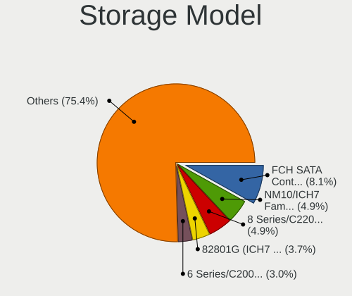

| Model                                                                                   | Desktops | Percent |
|-----------------------------------------------------------------------------------------|----------|---------|
| AMD FCH SATA Controller [AHCI mode]                                                     | 326      | 8.09%   |
| Intel NM10/ICH7 Family SATA Controller [IDE mode]                                       | 199      | 4.94%   |
| Intel 8 Series/C220 Series Chipset Family 6-port SATA Controller 1 [AHCI mode]          | 199      | 4.94%   |
| Intel 82801G (ICH7 Family) IDE Controller                                               | 148      | 3.67%   |
| Intel 6 Series/C200 Series Chipset Family 6 port Desktop SATA AHCI Controller           | 120      | 2.98%   |
| Intel Q170/Q150/B150/H170/H110/Z170/CM236 Chipset SATA Controller [AHCI Mode]           | 116      | 2.88%   |
| AMD 400 Series Chipset SATA Controller                                                  | 114      | 2.83%   |
| Intel 7 Series/C210 Series Chipset Family 6-port SATA Controller [AHCI mode]            | 112      | 2.78%   |
| AMD SB7x0/SB8x0/SB9x0 IDE Controller                                                    | 111      | 2.75%   |
| Intel 200 Series PCH SATA controller [AHCI mode]                                        | 105      | 2.61%   |
| AMD SB7x0/SB8x0/SB9x0 SATA Controller [AHCI mode]                                       | 99       | 2.46%   |
| Samsung NVMe SSD Controller SM981/PM981/PM983                                           | 82       | 2.03%   |
| Intel SATA Controller [RAID mode]                                                       | 77       | 1.91%   |
| AMD SB7x0/SB8x0/SB9x0 SATA Controller [IDE mode]                                        | 77       | 1.91%   |
| AMD 500 Series Chipset SATA Controller                                                  | 76       | 1.89%   |
| ASMedia ASM1061/ASM1062 Serial ATA Controller                                           | 75       | 1.86%   |
| Intel 6 Series/C200 Series Chipset Family Desktop SATA Controller (IDE mode, ports 4-5) | 71       | 1.76%   |
| Intel 6 Series/C200 Series Chipset Family Desktop SATA Controller (IDE mode, ports 0-3) | 71       | 1.76%   |
| AMD FCH IDE Controller                                                                  | 69       | 1.71%   |
| Intel 4 Series Chipset PT IDER Controller                                               | 67       | 1.66%   |
| Intel 82801I (ICH9 Family) 2 port SATA Controller [IDE mode]                            | 55       | 1.36%   |
| JMicron JMB363 SATA/IDE Controller                                                      | 53       | 1.32%   |
| Intel 82801JD/DO (ICH10 Family) SATA AHCI Controller                                    | 52       | 1.29%   |
| Intel Cannon Lake PCH SATA AHCI Controller                                              | 44       | 1.09%   |
| Kingston Company A2000 NVMe SSD [SM2263EN]                                              | 40       | 0.99%   |
| Nvidia MCP61 SATA Controller                                                            | 34       | 0.84%   |
| Intel 82801JI (ICH10 Family) SATA AHCI Controller                                       | 34       | 0.84%   |
| Intel 82801IR/IO/IH (ICH9R/DO/DH) 4 port SATA Controller [IDE mode]                     | 34       | 0.84%   |
| AMD 300 Series Chipset SATA Controller                                                  | 31       | 0.77%   |
| JMicron JMB368 IDE controller                                                           | 30       | 0.74%   |
| AMD A320 Chipset SATA Controller [AHCI mode]                                            | 30       | 0.74%   |
| Nvidia MCP61 IDE                                                                        | 29       | 0.72%   |
| Intel 82Q35 Express PT IDER Controller                                                  | 29       | 0.72%   |
| Samsung NVMe SSD Controller 980 (DRAM-less)                                             | 28       | 0.69%   |
| Intel 82801JD/DO (ICH10 Family) 4-port SATA IDE Controller                              | 28       | 0.69%   |
| Intel 82801JD/DO (ICH10 Family) 2-port SATA IDE Controller                              | 28       | 0.69%   |
| AMD 600 Series Chipset SATA Controller                                                  | 26       | 0.65%   |
| Intel 9 Series Chipset Family SATA Controller [AHCI Mode]                               | 23       | 0.57%   |
| Intel 82801JI (ICH10 Family) 4 port SATA IDE Controller #1                              | 23       | 0.57%   |
| Intel 5 Series/3400 Series Chipset 4 port SATA IDE Controller                           | 23       | 0.57%   |

Storage Kind
------------

Kind of storage controller (IDE, SATA, NVMe, SAS, ...)

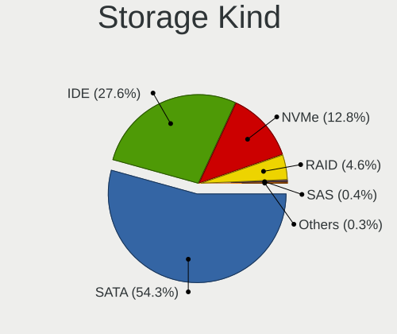

| Kind | Desktops | Percent |
|------|----------|---------|
| SATA | 1684     | 54.29%  |
| IDE  | 856      | 27.6%   |
| NVMe | 398      | 12.83%  |
| RAID | 143      | 4.61%   |
| SAS  | 12       | 0.39%   |
| SCSI | 9        | 0.29%   |

Processor
---------

CPU Vendor
----------

Processor vendors

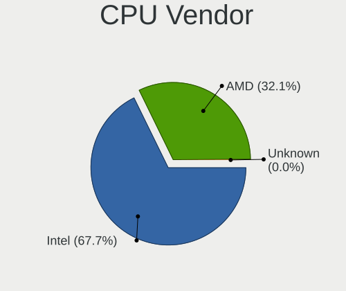

| Vendor       | Desktops | Percent |
|--------------|----------|---------|
| Intel        | 1552     | 67.74%  |
| AMD          | 736      | 32.13%  |
| CentaurHauls | 2        | 0.09%   |
| Unknown      | 1        | 0.04%   |

CPU Model
---------

Processor models

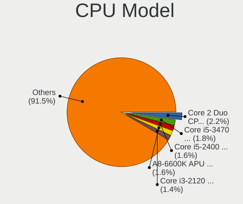

| Model                                       | Desktops | Percent |
|---------------------------------------------|----------|---------|
| Intel Core 2 Duo CPU E8400 @ 3.00GHz        | 50       | 2.16%   |
| Intel Core i5-3470 CPU @ 3.20GHz            | 41       | 1.77%   |
| Intel Core i5-2400 CPU @ 3.10GHz            | 36       | 1.56%   |
| AMD A8-6600K APU with Radeon HD Graphics    | 36       | 1.56%   |
| Intel Core i3-2120 CPU @ 3.30GHz            | 33       | 1.43%   |
| Intel Core i5-6500 CPU @ 3.20GHz            | 32       | 1.38%   |
| Intel Core 2 Duo CPU E7500 @ 2.93GHz        | 32       | 1.38%   |
| Intel Core i5-7500 CPU @ 3.40GHz            | 28       | 1.21%   |
| AMD Ryzen 5 3600 6-Core Processor           | 27       | 1.17%   |
| Intel Core i3-4160 CPU @ 3.60GHz            | 24       | 1.04%   |
| AMD FX-6300 Six-Core Processor              | 22       | 0.95%   |
| Intel Core i5-4590 CPU @ 3.30GHz            | 20       | 0.86%   |
| Intel Core i3-3220 CPU @ 3.30GHz            | 19       | 0.82%   |
| Intel Core 2 Quad CPU Q6600 @ 2.40GHz       | 19       | 0.82%   |
| AMD Ryzen 5 2600 Six-Core Processor         | 19       | 0.82%   |
| AMD FX-8350 Eight-Core Processor            | 19       | 0.82%   |
| AMD Ryzen 7 5700G with Radeon Graphics      | 18       | 0.78%   |
| AMD Ryzen 3 2200G with Radeon Vega Graphics | 18       | 0.78%   |
| Intel Pentium Dual-Core CPU E5700 @ 3.00GHz | 16       | 0.69%   |
| Intel Pentium CPU G3220 @ 3.00GHz           | 16       | 0.69%   |
| Intel Core i5-4460 CPU @ 3.20GHz            | 16       | 0.69%   |
| Intel Core 2 Duo CPU E7300 @ 2.66GHz        | 16       | 0.69%   |
| Intel Core i7-3770 CPU @ 3.40GHz            | 15       | 0.65%   |
| Intel Core i5-4570 CPU @ 3.20GHz            | 15       | 0.65%   |
| Intel Core i7-4790 CPU @ 3.60GHz            | 14       | 0.61%   |
| AMD Ryzen 7 5800X 8-Core Processor          | 14       | 0.61%   |
| Intel Pentium 4 CPU 3.00GHz                 | 13       | 0.56%   |
| Intel Core i7-2600 CPU @ 3.40GHz            | 13       | 0.56%   |
| Intel Core i3-7100 CPU @ 3.90GHz            | 13       | 0.56%   |
| Intel Core i3-4130 CPU @ 3.40GHz            | 13       | 0.56%   |
| Intel Core 2 Quad CPU Q8200 @ 2.33GHz       | 13       | 0.56%   |
| Intel Core 2 Duo CPU E8500 @ 3.16GHz        | 13       | 0.56%   |
| AMD Ryzen 5 5600G with Radeon Graphics      | 13       | 0.56%   |
| Intel Pentium Dual-Core CPU E5400 @ 2.70GHz | 12       | 0.52%   |
| Intel Core i5-3570 CPU @ 3.40GHz            | 12       | 0.52%   |
| Intel Core i3-6100 CPU @ 3.70GHz            | 12       | 0.52%   |
| Intel Core i3-3240 CPU @ 3.40GHz            | 12       | 0.52%   |
| Intel Core i3-2100 CPU @ 3.10GHz            | 12       | 0.52%   |
| Intel Core 2 Duo CPU E6550 @ 2.33GHz        | 12       | 0.52%   |
| AMD Ryzen 7 5700X 8-Core Processor          | 12       | 0.52%   |

CPU Model Family
----------------

Processor model prefix

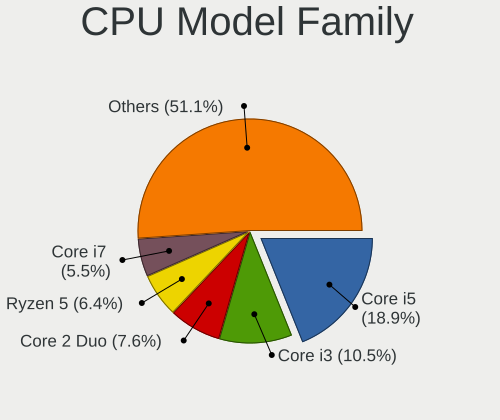

| Model                   | Desktops | Percent |
|-------------------------|----------|---------|
| Intel Core i5           | 436      | 18.91%  |
| Intel Core i3           | 243      | 10.54%  |
| Intel Core 2 Duo        | 175      | 7.59%   |
| AMD Ryzen 5             | 147      | 6.37%   |
| Intel Core i7           | 127      | 5.51%   |
| Intel Xeon              | 117      | 5.07%   |
| AMD Ryzen 7             | 88       | 3.82%   |
| Intel Pentium           | 82       | 3.56%   |
| Intel Celeron           | 81       | 3.51%   |
| AMD FX                  | 71       | 3.08%   |
| Intel Pentium Dual-Core | 69       | 2.99%   |
| Intel Core 2 Quad       | 67       | 2.91%   |
| AMD A8                  | 65       | 2.82%   |
| Other                   | 51       | 2.21%   |
| AMD Athlon II X2        | 46       | 1.99%   |
| AMD Ryzen 3             | 38       | 1.65%   |
| AMD Phenom II X4        | 32       | 1.39%   |
| AMD Athlon 64 X2        | 32       | 1.39%   |
| AMD A4                  | 30       | 1.3%    |
| Intel Core 2            | 25       | 1.08%   |
| Intel Pentium 4         | 24       | 1.04%   |
| Intel Pentium Dual      | 21       | 0.91%   |
| Intel Atom              | 21       | 0.91%   |
| AMD A10                 | 21       | 0.91%   |
| AMD Ryzen 9             | 19       | 0.82%   |
| AMD A6                  | 15       | 0.65%   |
| Intel Pentium D         | 13       | 0.56%   |
| AMD Athlon II X4        | 13       | 0.56%   |
| AMD Athlon X4           | 12       | 0.52%   |
| AMD Athlon Dual Core    | 12       | 0.52%   |
| AMD Athlon              | 12       | 0.52%   |
| AMD Sempron             | 11       | 0.48%   |
| Intel Core i9           | 7        | 0.3%    |
| AMD Ryzen Embedded      | 7        | 0.3%    |
| AMD Phenom II X6        | 7        | 0.3%    |
| AMD GX                  | 6        | 0.26%   |
| AMD Athlon 64           | 6        | 0.26%   |
| AMD PRO A10             | 5        | 0.22%   |
| AMD Phenom II X2        | 5        | 0.22%   |
| Intel Pentium Gold      | 4        | 0.17%   |

CPU Cores
---------

Number of processor cores

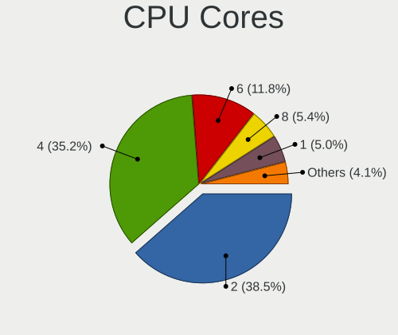

| Number  | Desktops | Percent |
|---------|----------|---------|
| 2       | 893      | 38.54%  |
| 4       | 816      | 35.22%  |
| 6       | 273      | 11.78%  |
| 8       | 126      | 5.44%   |
| 1       | 115      | 4.96%   |
| 3       | 34       | 1.47%   |
| 12      | 19       | 0.82%   |
| 16      | 13       | 0.56%   |
| 10      | 9        | 0.39%   |
| 18      | 6        | 0.26%   |
| 14      | 6        | 0.26%   |
| 20      | 2        | 0.09%   |
| Unknown | 2        | 0.09%   |
| 36      | 1        | 0.04%   |
| 28      | 1        | 0.04%   |
| 24      | 1        | 0.04%   |

CPU Sockets
-----------

Number of sockets

| Number  | Desktops | Percent |
|---------|----------|---------|
| 1       | 2272     | 99.08%  |
| 2       | 20       | 0.87%   |
| Unknown | 1        | 0.04%   |

CPU Threads
-----------

Threads per core (Hyper-Threading)

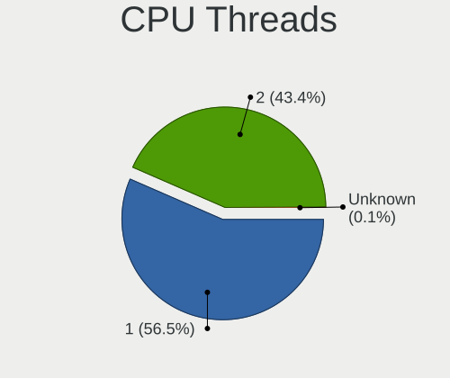

| Number  | Desktops | Percent |
|---------|----------|---------|
| 1       | 1306     | 56.54%  |
| 2       | 1002     | 43.38%  |
| Unknown | 2        | 0.09%   |

CPU Op-Modes
------------

CPU Operation Modes (32-bit, 64-bit)

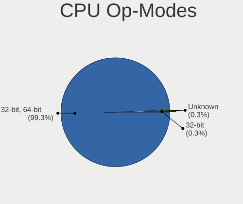

| Op mode        | Desktops | Percent |
|----------------|----------|---------|
| 32-bit, 64-bit | 2278     | 99.35%  |
| Unknown        | 8        | 0.35%   |
| 32-bit         | 7        | 0.31%   |

CPU Microcode
-------------

Microcode number

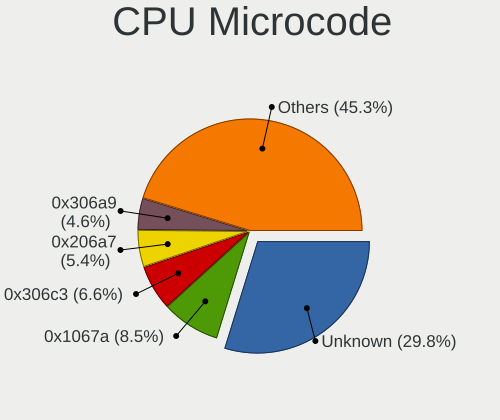

| Number     | Desktops | Percent |
|------------|----------|---------|
| Unknown    | 722      | 29.76%  |
| 0x1067a    | 206      | 8.49%   |
| 0x306c3    | 159      | 6.55%   |
| 0x206a7    | 130      | 5.36%   |
| 0x306a9    | 111      | 4.58%   |
| 0x06001119 | 84       | 3.46%   |
| 0x506e3    | 63       | 2.6%    |
| 0x010000c8 | 63       | 2.6%    |
| 0x906e9    | 49       | 2.02%   |
| 0x10676    | 42       | 1.73%   |
| 0x6fb      | 37       | 1.53%   |
| 0x0800820d | 37       | 1.53%   |
| 0x906ea    | 33       | 1.36%   |
| 0x6fd      | 33       | 1.36%   |
| 0x06000852 | 29       | 1.2%    |
| 0x08101016 | 22       | 0.91%   |
| 0x06003106 | 22       | 0.91%   |
| 0x08701021 | 20       | 0.82%   |
| 0x10677    | 18       | 0.74%   |
| 0x906eb    | 17       | 0.7%    |
| 0x206c2    | 17       | 0.7%    |
| 0x106e5    | 17       | 0.7%    |
| 0xa0653    | 16       | 0.66%   |
| 0x6f2      | 16       | 0.66%   |
| 0x0600084f | 16       | 0.66%   |
| 0x20655    | 15       | 0.62%   |
| 0x08001138 | 15       | 0.62%   |
| 0x106a5    | 12       | 0.49%   |
| 0x0a50000f | 12       | 0.49%   |
| 0x0a20120a | 12       | 0.49%   |
| 0x08108109 | 12       | 0.49%   |
| 0x03000027 | 12       | 0.49%   |
| 0x010000db | 12       | 0.49%   |
| 0xf43      | 11       | 0.45%   |
| 0x0600063e | 11       | 0.45%   |
| 0x0810100b | 10       | 0.41%   |
| 0x010000c7 | 10       | 0.41%   |
| 0x20652    | 9        | 0.37%   |
| 0x0700010f | 9        | 0.37%   |
| 0x0600611a | 9        | 0.37%   |

CPU Microarch
-------------

Microarchitecture

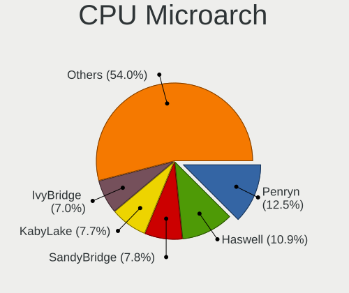

| Name             | Desktops | Percent |
|------------------|----------|---------|
| Penryn           | 287      | 12.49%  |
| Haswell          | 250      | 10.88%  |
| SandyBridge      | 180      | 7.83%   |
| KabyLake         | 177      | 7.7%    |
| IvyBridge        | 162      | 7.05%   |
| Piledriver       | 147      | 6.4%    |
| K10              | 121      | 5.27%   |
| Skylake          | 114      | 4.96%   |
| Core             | 108      | 4.7%    |
| Zen 3            | 90       | 3.92%   |
| Zen 2            | 67       | 2.92%   |
| Zen+             | 61       | 2.65%   |
| Zen              | 61       | 2.65%   |
| K8 Hammer        | 57       | 2.48%   |
| Westmere         | 56       | 2.44%   |
| NetBurst         | 50       | 2.18%   |
| Unknown          | 48       | 2.09%   |
| CometLake        | 33       | 1.44%   |
| Steamroller      | 32       | 1.39%   |
| Nehalem          | 32       | 1.39%   |
| Silvermont       | 23       | 1%      |
| Alderlake Hybrid | 23       | 1%      |
| K10 Llano        | 19       | 0.83%   |
| Excavator        | 16       | 0.7%    |
| Bulldozer        | 16       | 0.7%    |
| Bonnell          | 14       | 0.61%   |
| Jaguar           | 12       | 0.52%   |
| Goldmont plus    | 8        | 0.35%   |
| Icelake          | 7        | 0.3%    |
| Puma             | 6        | 0.26%   |
| Goldmont         | 6        | 0.26%   |
| Broadwell        | 4        | 0.17%   |
| Bobcat           | 4        | 0.17%   |
| Gracemont        | 3        | 0.13%   |
| Tremont          | 1        | 0.04%   |
| Lunarlake Hybrid | 1        | 0.04%   |
| K8 & K10 hybrid  | 1        | 0.04%   |
| K6               | 1        | 0.04%   |

Graphics
--------

GPU Vendor
----------

Vendors of graphics cards

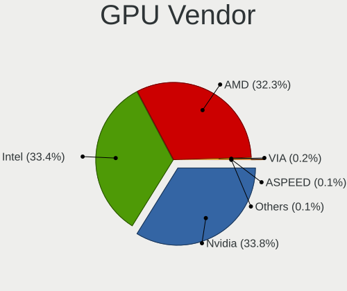

| Vendor                     | Desktops | Percent |
|----------------------------|----------|---------|
| Nvidia                     | 836      | 33.85%  |
| Intel                      | 825      | 33.4%   |
| AMD                        | 797      | 32.27%  |
| VIA Technologies           | 6        | 0.24%   |
| ASPEED Technology          | 3        | 0.12%   |
| ATI Technologies           | 2        | 0.08%   |
| Matrox Electronics Systems | 1        | 0.04%   |

GPU Model
---------

Graphics card models

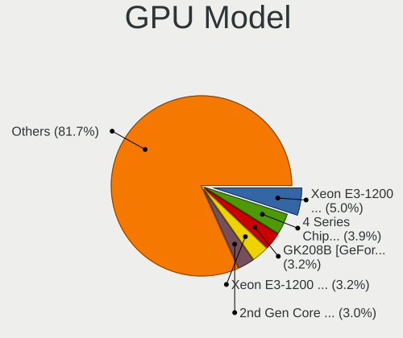

| Model                                                                                    | Desktops | Percent |
|------------------------------------------------------------------------------------------|----------|---------|
| Intel Xeon E3-1200 v3/4th Gen Core Processor Integrated Graphics Controller              | 129      | 5.03%   |
| Intel 4 Series Chipset Integrated Graphics Controller                                    | 99       | 3.86%   |
| Nvidia GK208B [GeForce GT 710]                                                           | 82       | 3.2%    |
| Intel Xeon E3-1200 v2/3rd Gen Core processor Graphics Controller                         | 81       | 3.16%   |
| Intel 2nd Generation Core Processor Family Integrated Graphics Controller                | 78       | 3.04%   |
| AMD Ellesmere [Radeon RX 470/480/570/570X/580/580X/590]                                  | 76       | 2.96%   |
| Intel Skylake-S GT2 [HD Graphics 530]                                                    | 65       | 2.54%   |
| Nvidia GP107 [GeForce GTX 1050 Ti]                                                       | 56       | 2.18%   |
| Nvidia GT218 [GeForce 210]                                                               | 46       | 1.79%   |
| AMD Caicos [Radeon HD 6450/7450/8450 / R5 230 OEM]                                       | 45       | 1.76%   |
| Intel 4th Generation Core Processor Family Integrated Graphics Controller                | 43       | 1.68%   |
| Intel Kaby Lake-S GT2 [HD Graphics 630]                                                  | 42       | 1.64%   |
| Intel CoffeeLake-S GT2 [UHD Graphics 630]                                                | 41       | 1.6%    |
| AMD Cedar [Radeon HD 5000/6000/7350/8350 Series]                                         | 40       | 1.56%   |
| AMD Richland [Radeon HD 8570D]                                                           | 37       | 1.44%   |
| Intel 82G33/G31 Express Integrated Graphics Controller                                   | 36       | 1.4%    |
| Nvidia GP108 [GeForce GT 1030]                                                           | 29       | 1.13%   |
| Nvidia GP106 [GeForce GTX 1060 6GB]                                                      | 29       | 1.13%   |
| AMD Cezanne [Radeon Vega Series / Radeon Vega Mobile Series]                             | 29       | 1.13%   |
| Intel 82945G/GZ Integrated Graphics Controller                                           | 25       | 0.98%   |
| AMD Oland PRO [Radeon R7 240/340 / Radeon 520]                                           | 25       | 0.98%   |
| AMD Raven Ridge [Radeon Vega Series / Radeon Vega Mobile Series]                         | 24       | 0.94%   |
| AMD Lexa PRO [Radeon 540/540X/550/550X / RX 540X/550/550X]                               | 22       | 0.86%   |
| Nvidia GF119 [GeForce GT 610]                                                            | 21       | 0.82%   |
| Nvidia GF108 [GeForce GT 630]                                                            | 21       | 0.82%   |
| Nvidia GK208B [GeForce GT 730]                                                           | 20       | 0.78%   |
| Nvidia GP106 [GeForce GTX 1060 3GB]                                                      | 19       | 0.74%   |
| Intel 82Q35 Express Integrated Graphics Controller                                       | 19       | 0.74%   |
| AMD Kaveri [Radeon R7 Graphics]                                                          | 19       | 0.74%   |
| Nvidia GM107 [GeForce GTX 750 Ti]                                                        | 18       | 0.7%    |
| AMD Cape Verde XT [Radeon HD 7770/8760 / R7 250X]                                        | 18       | 0.7%    |
| AMD Baffin [Radeon RX 550 640SP / RX 560/560X]                                           | 17       | 0.66%   |
| Nvidia TU117 [GeForce GTX 1650]                                                          | 15       | 0.59%   |
| Intel IvyBridge GT2 [HD Graphics 4000]                                                   | 15       | 0.59%   |
| AMD Raphael                                                                              | 15       | 0.59%   |
| Nvidia GP104 [GeForce GTX 1070]                                                          | 13       | 0.51%   |
| Nvidia G94 [GeForce 9600 GT]                                                             | 13       | 0.51%   |
| Intel Atom/Celeron/Pentium Processor x5-E8000/J3xxx/N3xxx Integrated Graphics Controller | 13       | 0.51%   |
| AMD RS880 [Radeon HD 4200]                                                               | 13       | 0.51%   |
| AMD Redwood XT [Radeon HD 5670/5690/5730]                                                | 13       | 0.51%   |

GPU Combo
---------

Combinations of graphics cards

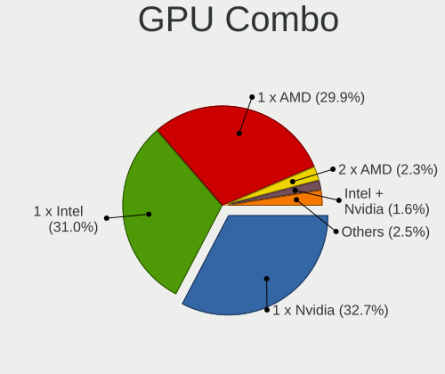

| Name                     | Desktops | Percent |
|--------------------------|----------|---------|
| 1 x Nvidia               | 774      | 32.69%  |
| 1 x Intel                | 733      | 30.95%  |
| 1 x AMD                  | 709      | 29.94%  |
| 2 x AMD                  | 55       | 2.32%   |
| Intel + Nvidia           | 37       | 1.56%   |
| AMD + Nvidia             | 22       | 0.93%   |
| Intel + AMD              | 13       | 0.55%   |
| 2 x Intel                | 7        | 0.3%    |
| 1 x VIA                  | 6        | 0.25%   |
| 2 x Nvidia               | 5        | 0.21%   |
| 1 x ASPEED               | 2        | 0.08%   |
| 1 x Matrox               | 1        | 0.04%   |
| 1 x Intel + 3 x AMD      | 1        | 0.04%   |
| Intel + 2 x Nvidia       | 1        | 0.04%   |
| Intel + AMD + 1 x Nvidia | 1        | 0.04%   |
| AMD + ASPEED             | 1        | 0.04%   |

GPU Driver
----------

Free vs proprietary

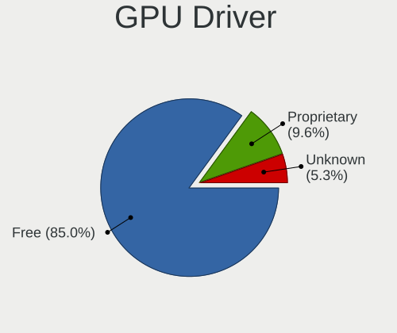

| Driver      | Desktops | Percent |
|-------------|----------|---------|
| Free        | 1989     | 85.04%  |
| Proprietary | 225      | 9.62%   |
| Unknown     | 125      | 5.34%   |

GPU Memory
----------

Total video memory

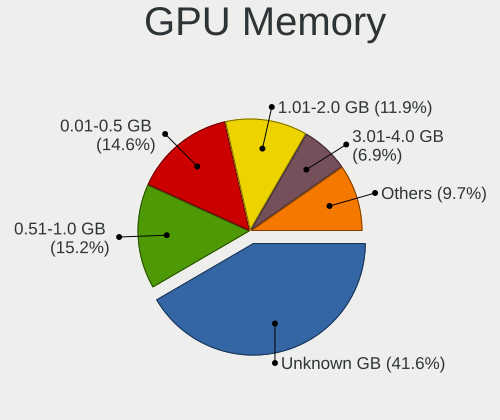

| Size in GB | Desktops | Percent |
|------------|----------|---------|
| Unknown    | 1012     | 41.61%  |
| 0.51-1.0   | 369      | 15.17%  |
| 0.01-0.5   | 356      | 14.64%  |
| 1.01-2.0   | 290      | 11.92%  |
| 3.01-4.0   | 169      | 6.95%   |
| 7.01-8.0   | 111      | 4.56%   |
| 5.01-6.0   | 53       | 2.18%   |
| 8.01-16.0  | 37       | 1.52%   |
| 2.01-3.0   | 30       | 1.23%   |
| 16.01-24.0 | 5        | 0.21%   |

Monitor
-------

Monitor Vendor
--------------

Monitor vendors

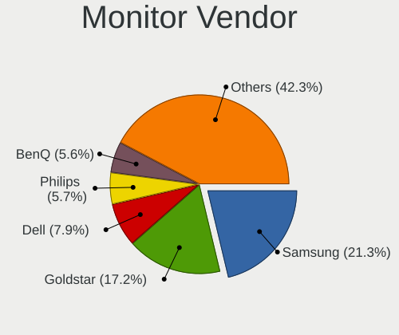

| Vendor                  | Desktops | Percent |
|-------------------------|----------|---------|
| Samsung Electronics     | 502      | 21.27%  |
| Goldstar                | 407      | 17.25%  |
| Dell                    | 186      | 7.88%   |
| Philips                 | 135      | 5.72%   |
| BenQ                    | 132      | 5.59%   |
| Ancor Communications    | 124      | 5.25%   |
| Hewlett-Packard         | 105      | 4.45%   |
| Acer                    | 105      | 4.45%   |
| Fujitsu Siemens         | 67       | 2.84%   |
| AOC                     | 66       | 2.8%    |
| ASUSTek Computer        | 34       | 1.44%   |
| LG Electronics          | 32       | 1.36%   |
| Eizo                    | 29       | 1.23%   |
| Lenovo                  | 27       | 1.14%   |
| HannStar                | 26       | 1.1%    |
| NEC Computers           | 25       | 1.06%   |
| Sony                    | 23       | 0.97%   |
| Vestel Elektronik       | 22       | 0.93%   |
| Unknown                 | 21       | 0.89%   |
| Iiyama                  | 20       | 0.85%   |
| ViewSonic               | 18       | 0.76%   |
| Medion                  | 18       | 0.76%   |
| HKC                     | 17       | 0.72%   |
| Belinea                 | 12       | 0.51%   |
| MStar                   | 11       | 0.47%   |
| Panasonic               | 10       | 0.42%   |
| IBM                     | 10       | 0.42%   |
| Chi Mei Optoelectronics | 10       | 0.42%   |
| MSI                     | 9        | 0.38%   |
| Arnos Instruments       | 9        | 0.38%   |
| OEM                     | 8        | 0.34%   |
| Toshiba                 | 7        | 0.3%    |
| Plain Tree Systems      | 6        | 0.25%   |
| Videoseven              | 5        | 0.21%   |
| NCS                     | 5        | 0.21%   |
| Gericom                 | 5        | 0.21%   |
| FUS                     | 5        | 0.21%   |
| Daewoo                  | 5        | 0.21%   |
| Unknown                 | 5        | 0.21%   |
| KTC                     | 4        | 0.17%   |

Monitor Model
-------------

Monitor models

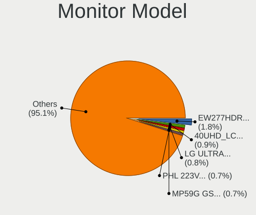

| Model                                                                 | Desktops | Percent |
|-----------------------------------------------------------------------|----------|---------|
| BenQ EW277HDR BNQ7948 1920x1080 598x336mm 27.0-inch                   | 46       | 1.85%   |
| Vestel Elektronik 40UHD_LCD_TV VES3700 3840x2160 880x500mm 39.8-inch  | 22       | 0.88%   |
| Goldstar LG ULTRAWIDE GSM59F1 2560x1080 670x280mm 28.6-inch           | 20       | 0.8%    |
| Philips PHL 223V5 PHLC0CF 1920x1080 477x268mm 21.5-inch               | 17       | 0.68%   |
| Goldstar MP59G GSM5B34 1920x1080 480x270mm 21.7-inch                  | 17       | 0.68%   |
| Goldstar 2D HD TV GSM59CA 1366x768 509x286mm 23.0-inch                | 15       | 0.6%    |
| HannStar Hanns.G HX191 HSD0013 1280x1024 376x301mm 19.0-inch          | 13       | 0.52%   |
| Goldstar ULTRAWIDE GSM76F9 2560x1080 531x298mm 24.0-inch              | 13       | 0.52%   |
| Samsung Electronics SyncMaster SAM011E 1280x1024 338x270mm 17.0-inch  | 12       | 0.48%   |
| Samsung Electronics S24D330 SAM0D92 1920x1080 531x299mm 24.0-inch     | 12       | 0.48%   |
| Samsung Electronics C24F390 SAM0D2C 1920x1080 521x293mm 23.5-inch     | 12       | 0.48%   |
| Philips PHL 243V7 PHLC155 1920x1080 527x296mm 23.8-inch               | 12       | 0.48%   |
| AOC 32G1WG4 AOC3201 1920x1080 697x392mm 31.5-inch                     | 12       | 0.48%   |
| Ancor Communications VW195 ACI19AB 1440x900 408x255mm 18.9-inch       | 12       | 0.48%   |
| Samsung Electronics S19B150 SAM08A2 1366x768 410x230mm 18.5-inch      | 11       | 0.44%   |
| MStar Demo MST0030 1920x1080 708x398mm 32.0-inch                      | 11       | 0.44%   |
| Iiyama PL2473HD IVM6107 1920x1080 521x293mm 23.5-inch                 | 11       | 0.44%   |
| HKC Monitor HKC1850 1360x768 409x230mm 18.5-inch                      | 11       | 0.44%   |
| Goldstar W1934 GSM4B7A 1440x900 410x256mm 19.0-inch                   | 11       | 0.44%   |
| Fujitsu Siemens L19W-9 FUS075C 1440x900 408x255mm 18.9-inch           | 11       | 0.44%   |
| Ancor Communications ASUS VW193D ACI19D5 1440x900 408x255mm 18.9-inch | 11       | 0.44%   |
| Goldstar 2D FHD TV GSM59C6 1920x1080 509x286mm 23.0-inch              | 10       | 0.4%    |
| Unknown LCD Monitor FFFF 2288x1287 2550x2550mm 142.0-inch             | 9        | 0.36%   |
| Goldstar IPS FULLHD GSM5AB7 1920x1080 480x270mm 21.7-inch             | 9        | 0.36%   |
| Goldstar HD GSM5ACB 1366x768 410x230mm 18.5-inch                      | 9        | 0.36%   |
| BenQ GW2255 BNQ78CD 1920x1080 477x268mm 21.5-inch                     | 9        | 0.36%   |
| Samsung Electronics SyncMaster SAM036F 1440x900 428x255mm 19.6-inch   | 8        | 0.32%   |
| Samsung Electronics S24F350 SAM0D20 1920x1080 521x293mm 23.5-inch     | 8        | 0.32%   |
| Philips PHL 244E5 PHLC0C0 1920x1080 527x296mm 23.8-inch               | 8        | 0.32%   |
| OEM 32W_LCD_TV OEM3700 1920x540                                       | 8        | 0.32%   |
| Lenovo LEN L171p LEN24C9 1280x1024 338x270mm 17.0-inch                | 8        | 0.32%   |
| Goldstar W2234 GSM56B8 1680x1050 474x296mm 22.0-inch                  | 8        | 0.32%   |
| Goldstar IPS FULLHD GSM5AB6 1920x1080 480x270mm 21.7-inch             | 8        | 0.32%   |
| Goldstar HDR WFHD GSM7715 2560x1080 798x334mm 34.1-inch               | 8        | 0.32%   |
| Goldstar FULL HD GSM5B54 1920x1080 480x270mm 21.7-inch                | 8        | 0.32%   |
| Ancor Communications VG248 ACI24A5 1920x1080 531x299mm 24.0-inch      | 8        | 0.32%   |
| Samsung Electronics SyncMaster SAM011F 1280x1024 376x301mm 19.0-inch  | 7        | 0.28%   |
| Samsung Electronics S24R35x SAM100E 1920x1080 527x296mm 23.8-inch     | 7        | 0.28%   |
| Philips PHL 226E9Q PHLC17D 1920x1080 480x270mm 21.7-inch              | 7        | 0.28%   |
| Goldstar E2260 GSM57E0 1920x1080 477x268mm 21.5-inch                  | 7        | 0.28%   |

Monitor Resolution
------------------

Monitor screen resolution

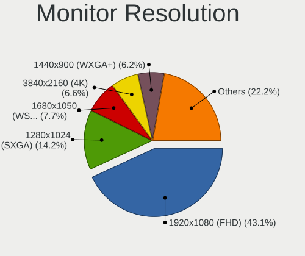

| Resolution         | Desktops | Percent |
|--------------------|----------|---------|
| 1920x1080 (FHD)    | 993      | 43.12%  |
| 1280x1024 (SXGA)   | 327      | 14.2%   |
| 1680x1050 (WSXGA+) | 177      | 7.69%   |
| 3840x2160 (4K)     | 151      | 6.56%   |
| 1440x900 (WXGA+)   | 143      | 6.21%   |
| 1366x768 (WXGA)    | 99       | 4.3%    |
| 2560x1440 (QHD)    | 88       | 3.82%   |
| 2560x1080          | 64       | 2.78%   |
| 1920x1200 (WUXGA)  | 49       | 2.13%   |
| 1600x900 (HD+)     | 39       | 1.69%   |
| 1360x768           | 28       | 1.22%   |
| 1024x768 (XGA)     | 25       | 1.09%   |
| Unknown            | 22       | 0.96%   |
| 3840x1080          | 20       | 0.87%   |
| 1920x540           | 15       | 0.65%   |
| 2288x1287          | 11       | 0.48%   |
| 3440x1440          | 9        | 0.39%   |
| 1600x1200          | 8        | 0.35%   |
| 1280x720 (HD)      | 6        | 0.26%   |
| 2048x1536          | 3        | 0.13%   |
| 3840x1600          | 2        | 0.09%   |
| 3840x1200          | 2        | 0.09%   |
| 3280x1080          | 2        | 0.09%   |
| 2048x1152          | 2        | 0.09%   |
| 1280x960           | 2        | 0.09%   |
| 1152x864           | 2        | 0.09%   |
| 7680x2160          | 1        | 0.04%   |
| 5760x2160          | 1        | 0.04%   |
| 3840x1920          | 1        | 0.04%   |
| 3600x1200          | 1        | 0.04%   |
| 3200x1080          | 1        | 0.04%   |
| 2880x1200          | 1        | 0.04%   |
| 2880x1024          | 1        | 0.04%   |
| 2560x1600          | 1        | 0.04%   |
| 2304x1024          | 1        | 0.04%   |
| 2160x1440          | 1        | 0.04%   |
| 1400x1050          | 1        | 0.04%   |
| 1280x800 (WXGA)    | 1        | 0.04%   |
| 1280x768           | 1        | 0.04%   |
| 1024x600           | 1        | 0.04%   |

Monitor Diagonal
----------------

Diagonal size in inches

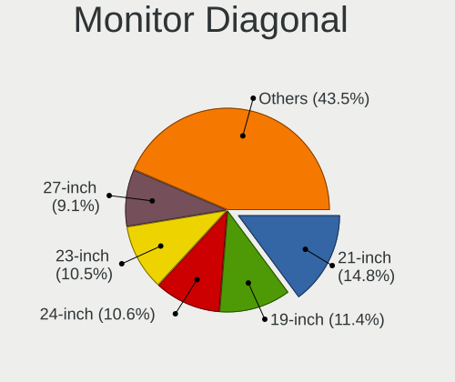

| Inches  | Desktops | Percent |
|---------|----------|---------|
| 21      | 352      | 14.85%  |
| 19      | 271      | 11.43%  |
| 24      | 251      | 10.59%  |
| 23      | 250      | 10.54%  |
| 27      | 215      | 9.07%   |
| 17      | 164      | 6.92%   |
| 22      | 135      | 5.69%   |
| Unknown | 133      | 5.61%   |
| 18      | 126      | 5.31%   |
| 34      | 71       | 2.99%   |
| 31      | 60       | 2.53%   |
| 20      | 54       | 2.28%   |
| 84      | 48       | 2.02%   |
| 15      | 38       | 1.6%    |
| 40      | 21       | 0.89%   |
| 72      | 18       | 0.76%   |
| 54      | 18       | 0.76%   |
| 52      | 14       | 0.59%   |
| 48      | 13       | 0.55%   |
| 32      | 12       | 0.51%   |
| 142     | 9        | 0.38%   |
| 12      | 9        | 0.38%   |
| 65      | 8        | 0.34%   |
| 42      | 8        | 0.34%   |
| 50      | 7        | 0.3%    |
| 46      | 7        | 0.3%    |
| 26      | 7        | 0.3%    |
| 25      | 7        | 0.3%    |
| 63      | 6        | 0.25%   |
| 60      | 4        | 0.17%   |
| 49      | 4        | 0.17%   |
| 33      | 4        | 0.17%   |
| 64      | 3        | 0.13%   |
| 43      | 3        | 0.13%   |
| 14      | 3        | 0.13%   |
| 85      | 2        | 0.08%   |
| 58      | 2        | 0.08%   |
| 39      | 2        | 0.08%   |
| 82      | 1        | 0.04%   |
| 75      | 1        | 0.04%   |

Monitor Width
-------------

Physical width

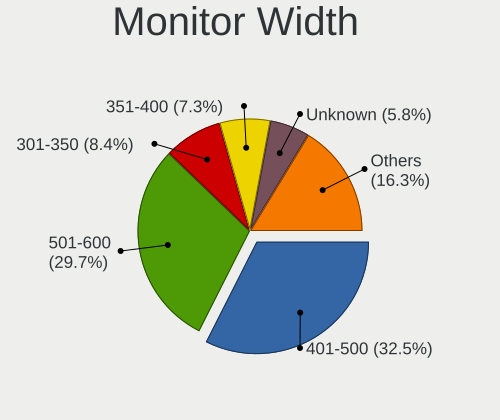

| Width in mm    | Desktops | Percent |
|----------------|----------|---------|
| 401-500        | 750      | 32.45%  |
| 501-600        | 687      | 29.73%  |
| 301-350        | 195      | 8.44%   |
| 351-400        | 169      | 7.31%   |
| Unknown        | 133      | 5.76%   |
| 701-800        | 88       | 3.81%   |
| 1001-1500      | 88       | 3.81%   |
| 601-700        | 72       | 3.12%   |
| 1501-2000      | 70       | 3.03%   |
| 801-900        | 24       | 1.04%   |
| 201-300        | 13       | 0.56%   |
| 901-1000       | 12       | 0.52%   |
| More than 2000 | 9        | 0.39%   |
| 101-200        | 1        | 0.04%   |

Aspect Ratio
------------

Proportional relationship between the width and the height

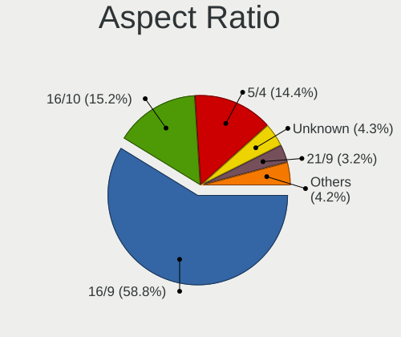

| Ratio   | Desktops | Percent |
|---------|----------|---------|
| 16/9    | 1299     | 58.75%  |
| 16/10   | 337      | 15.24%  |
| 5/4     | 318      | 14.38%  |
| Unknown | 94       | 4.25%   |
| 21/9    | 71       | 3.21%   |
| 4/3     | 52       | 2.35%   |
| 32/9    | 13       | 0.59%   |
| 3/2     | 13       | 0.59%   |
| 1.00    | 9        | 0.41%   |
| 6/5     | 5        | 0.23%   |

Monitor Area
------------

Area in inch²

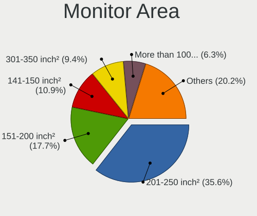

| Area in inch² | Desktops | Percent |
|----------------|----------|---------|
| 201-250        | 829      | 35.56%  |
| 151-200        | 413      | 17.72%  |
| 141-150        | 255      | 10.94%  |
| 301-350        | 218      | 9.35%   |
| More than 1000 | 146      | 6.26%   |
| 351-500        | 146      | 6.26%   |
| Unknown        | 133      | 5.71%   |
| 251-300        | 81       | 3.47%   |
| 501-1000       | 57       | 2.45%   |
| 101-110        | 24       | 1.03%   |
| 111-120        | 15       | 0.64%   |
| 71-80          | 8        | 0.34%   |
| 91-100         | 3        | 0.13%   |
| 81-90          | 1        | 0.04%   |
| 61-70          | 1        | 0.04%   |
| 1-40           | 1        | 0.04%   |

Pixel Density
-------------

Pixels per inch

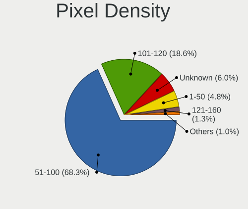

| Density | Desktops | Percent |
|---------|----------|---------|
| 51-100  | 1516     | 68.29%  |
| 101-120 | 413      | 18.6%   |
| Unknown | 133      | 5.99%   |
| 1-50    | 106      | 4.77%   |
| 121-160 | 29       | 1.31%   |
| 161-240 | 23       | 1.04%   |

Multiple Monitors
-----------------

Total monitors connected

| Total | Desktops | Percent |
|-------|----------|---------|
| 1     | 2010     | 85.21%  |
| 2     | 211      | 8.94%   |
| 0     | 106      | 4.49%   |
| 3     | 32       | 1.36%   |

Network
-------

Net Controller Vendor
---------------------

Controller vendors

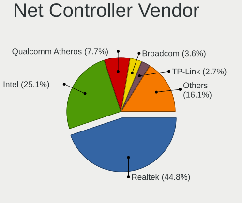

| Vendor                                 | Desktops | Percent |
|----------------------------------------|----------|---------|
| Realtek Semiconductor                  | 1322     | 44.84%  |
| Intel                                  | 741      | 25.14%  |
| Qualcomm Atheros                       | 227      | 7.7%    |
| Broadcom                               | 105      | 3.56%   |
| TP-Link                                | 79       | 2.68%   |
| Qualcomm Atheros Communications        | 72       | 2.44%   |
| Ralink Technology                      | 68       | 2.31%   |
| Broadcom Limited                       | 54       | 1.83%   |
| Nvidia                                 | 50       | 1.7%    |
| Marvell Technology Group               | 29       | 0.98%   |
| Ralink                                 | 22       | 0.75%   |
| MediaTek                               | 19       | 0.64%   |
| VIA Technologies                       | 14       | 0.47%   |
| Samsung Electronics                    | 14       | 0.47%   |
| Xiaomi                                 | 11       | 0.37%   |
| ASUSTek Computer                       | 11       | 0.37%   |
| Microsoft                              | 10       | 0.34%   |
| IMC Networks                           | 10       | 0.34%   |
| Aquantia                               | 9        | 0.31%   |
| Huawei Technologies                    | 8        | 0.27%   |
| D-Link System                          | 8        | 0.27%   |
| D-Link                                 | 7        | 0.24%   |
| Edimax Technology                      | 5        | 0.17%   |
| Belkin Components                      | 5        | 0.17%   |
| Espressif                              | 4        | 0.14%   |
| Accton Technology                      | 4        | 0.14%   |
| Qualcomm                               | 3        | 0.1%    |
| NetGear                                | 3        | 0.1%    |
| Mercucys                               | 3        | 0.1%    |
| ASIX Electronics                       | 3        | 0.1%    |
| ZyDAS                                  | 2        | 0.07%   |
| Sundance Technology Inc / IC Plus      | 2        | 0.07%   |
| QinHeng Electronics                    | 2        | 0.07%   |
| JMicron Technology                     | 2        | 0.07%   |
| DisplayLink                            | 2        | 0.07%   |
| Arduino SA                             | 2        | 0.07%   |
| TRENDnet                               | 1        | 0.03%   |
| Texas Instruments                      | 1        | 0.03%   |
| Sony Ericsson Mobile Communications AB | 1        | 0.03%   |
| Silicon Integrated Systems [SiS]       | 1        | 0.03%   |

Net Controller Model
--------------------

Controller models

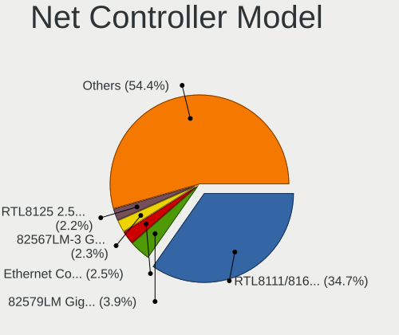

| Model                                                                  | Desktops | Percent |
|------------------------------------------------------------------------|----------|---------|
| Realtek RTL8111/8168/8211/8411 PCI Express Gigabit Ethernet Controller | 1100     | 34.71%  |
| Intel 82579LM Gigabit Network Connection (Lewisville)                  | 123      | 3.88%   |
| Intel Ethernet Connection (2) I219-V                                   | 79       | 2.49%   |
| Intel 82567LM-3 Gigabit Network Connection                             | 72       | 2.27%   |
| Realtek RTL8125 2.5GbE Controller                                      | 70       | 2.21%   |
| Intel Ethernet Connection I217-LM                                      | 65       | 2.05%   |
| Qualcomm Atheros AR9271 802.11n                                        | 63       | 1.99%   |
| Intel I211 Gigabit Network Connection                                  | 54       | 1.7%    |
| Qualcomm Atheros QCA8171 Gigabit Ethernet                              | 48       | 1.51%   |
| Realtek RTL8188EUS 802.11n Wireless Network Adapter                    | 41       | 1.29%   |
| Realtek RTL-8100/8101L/8139 PCI Fast Ethernet Adapter                  | 39       | 1.23%   |
| Intel 82566DM-2 Gigabit Network Connection                             | 38       | 1.2%    |
| Realtek RTL810xE PCI Express Fast Ethernet controller                  | 37       | 1.17%   |
| Intel Ethernet Connection I217-V                                       | 34       | 1.07%   |
| Nvidia MCP61 Ethernet                                                  | 33       | 1.04%   |
| Ralink MT7601U Wireless Adapter                                        | 32       | 1.01%   |
| Intel Ethernet Connection (2) I219-LM                                  | 28       | 0.88%   |
| Intel 82579V Gigabit Network Connection                                | 27       | 0.85%   |
| Broadcom NetXtreme BCM5754 Gigabit Ethernet PCI Express                | 26       | 0.82%   |
| Realtek RTL8169 PCI Gigabit Ethernet Controller                        | 25       | 0.79%   |
| Intel Wi-Fi 6 AX200                                                    | 25       | 0.79%   |
| Intel Ethernet Connection (7) I219-V                                   | 23       | 0.73%   |
| Qualcomm Atheros AR8121/AR8113/AR8114 Gigabit or Fast Ethernet         | 21       | 0.66%   |
| Intel Ethernet Controller I225-V                                       | 20       | 0.63%   |
| Intel Dual Band Wireless-AC 3168NGW [Stone Peak]                       | 20       | 0.63%   |
| Qualcomm Atheros AR8152 v2.0 Fast Ethernet                             | 19       | 0.6%    |
| Qualcomm Atheros AR8131 Gigabit Ethernet                               | 19       | 0.6%    |
| Broadcom NetXtreme BCM5761 Gigabit Ethernet PCIe                       | 19       | 0.6%    |
| TP-Link TL-WN722N v2/v3 [Realtek RTL8188EUS]                           | 17       | 0.54%   |
| Qualcomm Atheros AR9227 Wireless Network Adapter                       | 16       | 0.5%    |
| Ralink RT5370 Wireless Adapter                                         | 15       | 0.47%   |
| Qualcomm Atheros AR8151 v2.0 Gigabit Ethernet                          | 15       | 0.47%   |
| Broadcom Limited NetXtreme BCM5755 Gigabit Ethernet PCI Express        | 15       | 0.47%   |
| Marvell Group 88E8056 PCI-E Gigabit Ethernet Controller                | 14       | 0.44%   |
| Intel Wi-Fi 6E(802.11ax) AX210/AX1675* 2x2 [Typhoon Peak]              | 14       | 0.44%   |
| Intel 82567LF-3 Gigabit Network Connection                             | 14       | 0.44%   |
| TP-Link TL-WN821N v5/v6 [RTL8192EU]                                    | 13       | 0.41%   |
| Qualcomm Atheros AR9485 Wireless Network Adapter                       | 13       | 0.41%   |
| Qualcomm Atheros AR9287 Wireless Network Adapter (PCI-Express)         | 13       | 0.41%   |
| Realtek RTL8188EE Wireless Network Adapter                             | 11       | 0.35%   |

Wireless Vendor
---------------

Wireless vendors

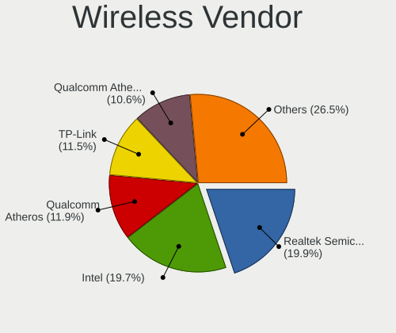

| Vendor                          | Desktops | Percent |
|---------------------------------|----------|---------|
| Realtek Semiconductor           | 135      | 19.85%  |
| Intel                           | 134      | 19.71%  |
| Qualcomm Atheros                | 81       | 11.91%  |
| TP-Link                         | 78       | 11.47%  |
| Qualcomm Atheros Communications | 72       | 10.59%  |
| Ralink Technology               | 68       | 10%     |
| Ralink                          | 22       | 3.24%   |
| MediaTek                        | 17       | 2.5%    |
| ASUSTek Computer                | 11       | 1.62%   |
| Microsoft                       | 10       | 1.47%   |
| IMC Networks                    | 10       | 1.47%   |
| Broadcom                        | 8        | 1.18%   |
| D-Link                          | 6        | 0.88%   |
| Edimax Technology               | 5        | 0.74%   |
| Belkin Components               | 5        | 0.74%   |
| D-Link System                   | 4        | 0.59%   |
| NetGear                         | 3        | 0.44%   |
| Mercucys                        | 3        | 0.44%   |
| ZyDAS                           | 2        | 0.29%   |
| VIA Technologies                | 1        | 0.15%   |
| TRENDnet                        | 1        | 0.15%   |
| Texas Instruments               | 1        | 0.15%   |
| Marvell Technology Group        | 1        | 0.15%   |
| Broadcom Limited                | 1        | 0.15%   |
| Accton Technology               | 1        | 0.15%   |

Wireless Model
--------------

Wireless models

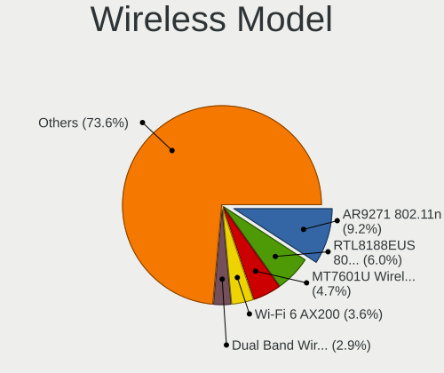

| Model                                                                         | Desktops | Percent |
|-------------------------------------------------------------------------------|----------|---------|
| Qualcomm Atheros AR9271 802.11n                                               | 63       | 9.2%    |
| Realtek RTL8188EUS 802.11n Wireless Network Adapter                           | 41       | 5.99%   |
| Ralink MT7601U Wireless Adapter                                               | 32       | 4.67%   |
| Intel Wi-Fi 6 AX200                                                           | 25       | 3.65%   |
| Intel Dual Band Wireless-AC 3168NGW [Stone Peak]                              | 20       | 2.92%   |
| TP-Link TL-WN722N v2/v3 [Realtek RTL8188EUS]                                  | 17       | 2.48%   |
| Qualcomm Atheros AR9227 Wireless Network Adapter                              | 16       | 2.34%   |
| Ralink RT5370 Wireless Adapter                                                | 15       | 2.19%   |
| Intel Wi-Fi 6E(802.11ax) AX210/AX1675* 2x2 [Typhoon Peak]                     | 14       | 2.04%   |
| TP-Link TL-WN821N v5/v6 [RTL8192EU]                                           | 13       | 1.9%    |
| Qualcomm Atheros AR9485 Wireless Network Adapter                              | 13       | 1.9%    |
| Qualcomm Atheros AR9287 Wireless Network Adapter (PCI-Express)                | 13       | 1.9%    |
| Realtek RTL8188EE Wireless Network Adapter                                    | 11       | 1.61%   |
| Intel Wireless 3165                                                           | 11       | 1.61%   |
| Realtek RTL8192EU 802.11b/g/n WLAN Adapter                                    | 10       | 1.46%   |
| Realtek RTL8188CUS 802.11n WLAN Adapter                                       | 10       | 1.46%   |
| Intel Wireless 7260                                                           | 10       | 1.46%   |
| TP-Link TL-WN823N v2/v3 [Realtek RTL8192EU]                                   | 9        | 1.31%   |
| TP-Link AC600 wireless Realtek RTL8811AU [Archer T2U Nano]                    | 9        | 1.31%   |
| Intel Wi-Fi 5(802.11ac) Wireless-AC 9x6x [Thunder Peak]                       | 9        | 1.31%   |
| Realtek RTL88x2bu [AC1200 Techkey]                                            | 8        | 1.17%   |
| Realtek RTL8192EE PCIe Wireless Network Adapter                               | 8        | 1.17%   |
| Ralink RT2870/RT3070 Wireless Adapter                                         | 8        | 1.17%   |
| Ralink RT2561/RT61 802.11g PCI                                                | 8        | 1.17%   |
| MediaTek MT7922 802.11ax PCI Express Wireless Network Adapter                 | 8        | 1.17%   |
| Intel Wireless 7265                                                           | 8        | 1.17%   |
| Intel Cannon Lake PCH CNVi WiFi                                               | 8        | 1.17%   |
| IMC Networks Mediao 802.11n WLAN [Realtek RTL8191SU]                          | 8        | 1.17%   |
| Realtek 802.11ac NIC                                                          | 7        | 1.02%   |
| Qualcomm Atheros TP-Link TL-WN322G v3 / TL-WN422G v2 802.11g [Atheros AR9271] | 7        | 1.02%   |
| Qualcomm Atheros AR5212/5213/2414 Wireless Network Adapter                    | 7        | 1.02%   |
| Qualcomm Atheros AR2413/AR2414 Wireless Network Adapter [AR5005G(S) 802.11bg] | 7        | 1.02%   |
| TP-Link Archer T4U ver.3                                                      | 6        | 0.88%   |
| Realtek RTL8821CE 802.11ac PCIe Wireless Network Adapter                      | 6        | 0.88%   |
| Ralink RT3090 Wireless 802.11n 1T/1R PCIe                                     | 6        | 0.88%   |
| Qualcomm Atheros AR9285 Wireless Network Adapter (PCI-Express)                | 6        | 0.88%   |
| Microsoft Xbox 360 Wireless Adapter                                           | 6        | 0.88%   |
| TP-Link TL-WN822N Version 4 RTL8192EU                                         | 5        | 0.73%   |
| TP-Link 802.11ac WLAN Adapter                                                 | 5        | 0.73%   |
| Realtek RTL8821AE 802.11ac PCIe Wireless Network Adapter                      | 5        | 0.73%   |

Ethernet Vendor
---------------

Ethernet vendors

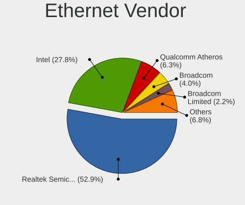

| Vendor                                 | Desktops | Percent |
|----------------------------------------|----------|---------|
| Realtek Semiconductor                  | 1268     | 52.88%  |
| Intel                                  | 666      | 27.77%  |
| Qualcomm Atheros                       | 150      | 6.26%   |
| Broadcom                               | 97       | 4.05%   |
| Broadcom Limited                       | 53       | 2.21%   |
| Nvidia                                 | 50       | 2.09%   |
| Marvell Technology Group               | 28       | 1.17%   |
| Samsung Electronics                    | 14       | 0.58%   |
| VIA Technologies                       | 12       | 0.5%    |
| Xiaomi                                 | 11       | 0.46%   |
| Aquantia                               | 9        | 0.38%   |
| Huawei Technologies                    | 6        | 0.25%   |
| D-Link System                          | 4        | 0.17%   |
| Qualcomm                               | 3        | 0.13%   |
| ASIX Electronics                       | 3        | 0.13%   |
| Accton Technology                      | 3        | 0.13%   |
| Sundance Technology Inc / IC Plus      | 2        | 0.08%   |
| QinHeng Electronics                    | 2        | 0.08%   |
| MediaTek                               | 2        | 0.08%   |
| JMicron Technology                     | 2        | 0.08%   |
| DisplayLink                            | 2        | 0.08%   |
| TP-Link                                | 1        | 0.04%   |
| Sony Ericsson Mobile Communications AB | 1        | 0.04%   |
| Silicon Integrated Systems [SiS]       | 1        | 0.04%   |
| Qualcomm Technologies                  | 1        | 0.04%   |
| QLogic                                 | 1        | 0.04%   |
| OnePlus Technology (Shenzhen)          | 1        | 0.04%   |
| HMD Global                             | 1        | 0.04%   |
| Hangzhou Silan Microelectronics        | 1        | 0.04%   |
| Google                                 | 1        | 0.04%   |
| D-Link                                 | 1        | 0.04%   |
| American Megatrends                    | 1        | 0.04%   |

Ethernet Model
--------------

Ethernet models

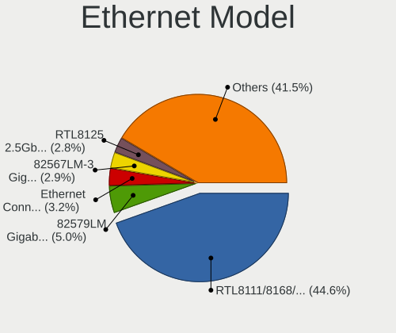

| Model                                                                  | Desktops | Percent |
|------------------------------------------------------------------------|----------|---------|
| Realtek RTL8111/8168/8211/8411 PCI Express Gigabit Ethernet Controller | 1100     | 44.55%  |
| Intel 82579LM Gigabit Network Connection (Lewisville)                  | 123      | 4.98%   |
| Intel Ethernet Connection (2) I219-V                                   | 79       | 3.2%    |
| Intel 82567LM-3 Gigabit Network Connection                             | 72       | 2.92%   |
| Realtek RTL8125 2.5GbE Controller                                      | 70       | 2.84%   |
| Intel Ethernet Connection I217-LM                                      | 65       | 2.63%   |
| Intel I211 Gigabit Network Connection                                  | 54       | 2.19%   |
| Qualcomm Atheros QCA8171 Gigabit Ethernet                              | 48       | 1.94%   |
| Realtek RTL-8100/8101L/8139 PCI Fast Ethernet Adapter                  | 39       | 1.58%   |
| Intel 82566DM-2 Gigabit Network Connection                             | 38       | 1.54%   |
| Realtek RTL810xE PCI Express Fast Ethernet controller                  | 37       | 1.5%    |
| Intel Ethernet Connection I217-V                                       | 34       | 1.38%   |
| Nvidia MCP61 Ethernet                                                  | 33       | 1.34%   |
| Intel Ethernet Connection (2) I219-LM                                  | 28       | 1.13%   |
| Intel 82579V Gigabit Network Connection                                | 27       | 1.09%   |
| Broadcom NetXtreme BCM5754 Gigabit Ethernet PCI Express                | 26       | 1.05%   |
| Realtek RTL8169 PCI Gigabit Ethernet Controller                        | 25       | 1.01%   |
| Intel Ethernet Connection (7) I219-V                                   | 23       | 0.93%   |
| Qualcomm Atheros AR8121/AR8113/AR8114 Gigabit or Fast Ethernet         | 21       | 0.85%   |
| Intel Ethernet Controller I225-V                                       | 20       | 0.81%   |
| Qualcomm Atheros AR8152 v2.0 Fast Ethernet                             | 19       | 0.77%   |
| Qualcomm Atheros AR8131 Gigabit Ethernet                               | 19       | 0.77%   |
| Broadcom NetXtreme BCM5761 Gigabit Ethernet PCIe                       | 19       | 0.77%   |
| Qualcomm Atheros AR8151 v2.0 Gigabit Ethernet                          | 15       | 0.61%   |
| Broadcom Limited NetXtreme BCM5755 Gigabit Ethernet PCI Express        | 15       | 0.61%   |
| Marvell Group 88E8056 PCI-E Gigabit Ethernet Controller                | 14       | 0.57%   |
| Intel 82567LF-3 Gigabit Network Connection                             | 14       | 0.57%   |
| Samsung Galaxy series, misc. (tethering mode)                          | 10       | 0.41%   |
| Xiaomi Mi/Redmi series (RNDIS)                                         | 9        | 0.36%   |
| VIA VT6102/VT6103 [Rhine-II]                                           | 9        | 0.36%   |
| Realtek RTL8152 Fast Ethernet Adapter                                  | 9        | 0.36%   |
| Qualcomm Atheros Attansic L1 Gigabit Ethernet                          | 9        | 0.36%   |
| Intel Ethernet Connection (7) I219-LM                                  | 9        | 0.36%   |
| Intel 82578DM Gigabit Network Connection                               | 9        | 0.36%   |
| Intel 82574L Gigabit Network Connection                                | 9        | 0.36%   |
| Broadcom NetXtreme BCM5762 Gigabit Ethernet PCIe                       | 9        | 0.36%   |
| Broadcom Limited NetXtreme BCM5754 Gigabit Ethernet PCI Express        | 9        | 0.36%   |
| Intel Ethernet Connection (5) I219-LM                                  | 8        | 0.32%   |
| Broadcom Limited NetXtreme BCM5761 Gigabit Ethernet PCIe               | 8        | 0.32%   |
| Realtek RTL-8110SC/8169SC Gigabit Ethernet                             | 7        | 0.28%   |

Net Controller Kind
-------------------

Ethernet, WiFi or modem

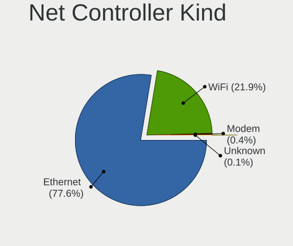

| Kind     | Desktops | Percent |
|----------|----------|---------|
| Ethernet | 2258     | 77.59%  |
| WiFi     | 638      | 21.92%  |
| Modem    | 11       | 0.38%   |
| Unknown  | 3        | 0.1%    |

Used Controller
---------------

Currently used network controller

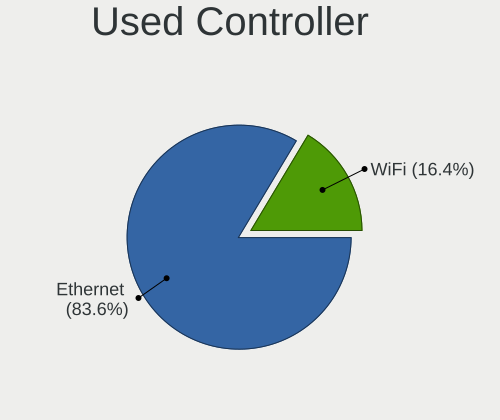

| Kind     | Desktops | Percent |
|----------|----------|---------|
| Ethernet | 1967     | 83.6%   |
| WiFi     | 386      | 16.4%   |

NICs
----

Total network controllers on board

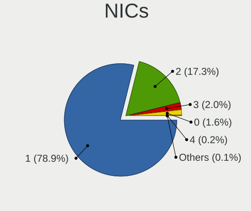

| Total | Desktops | Percent |
|-------|----------|---------|
| 1     | 1822     | 78.87%  |
| 2     | 399      | 17.27%  |
| 3     | 46       | 1.99%   |
| 0     | 37       | 1.6%    |
| 4     | 4        | 0.17%   |
| 6     | 1        | 0.04%   |
| 5     | 1        | 0.04%   |

IPv6
----

IPv6 vs IPv4

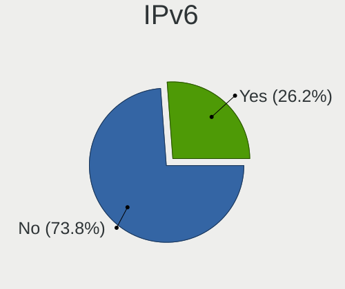

| Used | Desktops | Percent |
|------|----------|---------|
| No   | 1774     | 73.82%  |
| Yes  | 629      | 26.18%  |

Bluetooth
---------

Bluetooth Vendor
----------------

Controller vendors

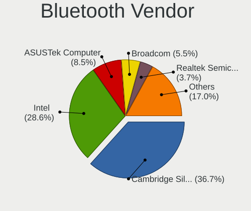

| Vendor                          | Desktops | Percent |
|---------------------------------|----------|---------|
| Cambridge Silicon Radio         | 168      | 36.68%  |
| Intel                           | 131      | 28.6%   |
| ASUSTek Computer                | 39       | 8.52%   |
| Broadcom                        | 25       | 5.46%   |
| Realtek Semiconductor           | 17       | 3.71%   |
| IMC Networks                    | 13       | 2.84%   |
| TP-Link                         | 10       | 2.18%   |
| Qualcomm Atheros Communications | 8        | 1.75%   |
| Foxconn / Hon Hai               | 7        | 1.53%   |
| Conwise Technology              | 7        | 1.53%   |
| Belkin Components               | 7        | 1.53%   |
| MediaTek                        | 6        | 1.31%   |
| Logitech                        | 4        | 0.87%   |
| Integrated System Solution      | 4        | 0.87%   |
| Realtek                         | 2        | 0.44%   |
| Hewlett-Packard                 | 2        | 0.44%   |
| Edimax Technology               | 2        | 0.44%   |
| Roper                           | 1        | 0.22%   |
| Micro Star International        | 1        | 0.22%   |
| Lite-On Technology              | 1        | 0.22%   |
| Apple                           | 1        | 0.22%   |
| Actions                         | 1        | 0.22%   |
| Unknown                         | 1        | 0.22%   |

Bluetooth Model
---------------

Controller models

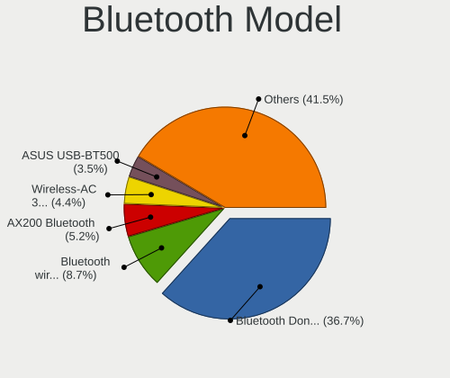

| Model                                                   | Desktops | Percent |
|---------------------------------------------------------|----------|---------|
| Cambridge Silicon Radio Bluetooth Dongle (HCI mode)     | 168      | 36.68%  |
| Intel Bluetooth wireless interface                      | 40       | 8.73%   |
| Intel AX200 Bluetooth                                   | 24       | 5.24%   |
| Intel Wireless-AC 3168 Bluetooth                        | 20       | 4.37%   |
| ASUS ASUS USB-BT500                                     | 16       | 3.49%   |
| Intel AX210 Bluetooth                                   | 14       | 3.06%   |
| ASUS Broadcom BCM20702A0 Bluetooth                      | 12       | 2.62%   |
| Broadcom BCM2035 Bluetooth dongle                       | 11       | 2.4%    |
| TP-Link TP-T@- UB500 Adapter                            | 10       | 2.18%   |
| Realtek Bluetooth Radio                                 | 10       | 2.18%   |
| Intel Wireless-AC 9260 Bluetooth Adapter                | 9        | 1.97%   |
| Intel Bluetooth 9460/9560 Jefferson Peak (JfP)          | 9        | 1.97%   |
| Intel AX201 Bluetooth                                   | 7        | 1.53%   |
| IMC Networks Wireless_Device                            | 7        | 1.53%   |
| Conwise CW6622                                          | 7        | 1.53%   |
| MediaTek Wireless_Device                                | 6        | 1.31%   |
| Foxconn / Hon Hai Wireless_Device                       | 6        | 1.31%   |
| ASUS Bluetooth Radio                                    | 6        | 1.31%   |
| Intel Bluetooth Device                                  | 5        | 1.09%   |
| Qualcomm Atheros  Bluetooth Device                      | 4        | 0.87%   |
| Logitech BT Mini-Receiver (HCI mode)                    | 4        | 0.87%   |
| IMC Networks Bluetooth Radio                            | 4        | 0.87%   |
| Realtek Bluetooth 5.3 Radio                             | 3        | 0.66%   |
| Qualcomm Atheros AR3011 Bluetooth                       | 3        | 0.66%   |
| Intel Centrino Bluetooth Wireless Transceiver           | 3        | 0.66%   |
| Broadcom Bluetooth dongle                               | 3        | 0.66%   |
| Broadcom Bluetooth 3.0 Device                           | 3        | 0.66%   |
| Belkin Components Bluetooth Mini Dongle                 | 3        | 0.66%   |
| Realtek  Bluetooth 4.2 Adapter                          | 2        | 0.44%   |
| Realtek Bluetooth Radio                                 | 2        | 0.44%   |
| Integrated System Solution KY-BT100 Bluetooth Adapter   | 2        | 0.44%   |
| Integrated System Solution Bluetooth Device             | 2        | 0.44%   |
| HP Bluetooth Adapter                                    | 2        | 0.44%   |
| Edimax EW-7611ULB 802.11b/g/n and Bluetooth 4.0 Adapter | 2        | 0.44%   |
| Broadcom HP Portable Bumble Bee                         | 2        | 0.44%   |
| Broadcom BCM20702A0 Bluetooth 4.0                       | 2        | 0.44%   |
| Broadcom BCM2045 Bluetooth                              | 2        | 0.44%   |
| Belkin Components F8T013 Bluetooth Adapter              | 2        | 0.44%   |
| ASUS Qualcomm Bluetooth 4.1                             | 2        | 0.44%   |
| ASUS Bluetooth Adapter                                  | 2        | 0.44%   |

Sound
-----

Sound Vendor
------------

Sound card vendors

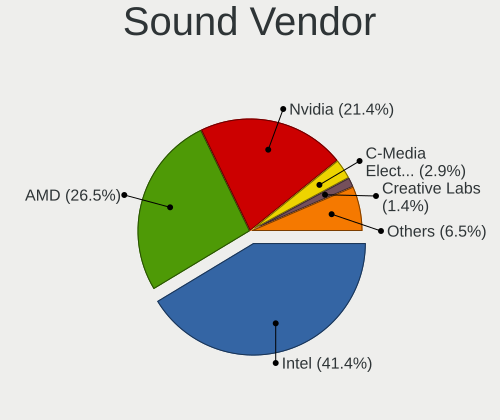

| Vendor                                       | Desktops | Percent |
|----------------------------------------------|----------|---------|
| Intel                                        | 1478     | 41.35%  |
| AMD                                          | 946      | 26.47%  |
| Nvidia                                       | 764      | 21.38%  |
| C-Media Electronics                          | 105      | 2.94%   |
| Creative Labs                                | 50       | 1.4%    |
| Texas Instruments                            | 19       | 0.53%   |
| Logitech                                     | 19       | 0.53%   |
| ASUSTek Computer                             | 16       | 0.45%   |
| JMTek                                        | 13       | 0.36%   |
| VIA Technologies                             | 12       | 0.34%   |
| Generalplus Technology                       | 12       | 0.34%   |
| Creative Technology                          | 11       | 0.31%   |
| SteelSeries ApS                              | 10       | 0.28%   |
| Kingston Technology                          | 9        | 0.25%   |
| GN Netcom                                    | 7        | 0.2%    |
| Razer USA                                    | 6        | 0.17%   |
| Plantronics                                  | 6        | 0.17%   |
| BEHRINGER International                      | 5        | 0.14%   |
| Focusrite-Novation                           | 4        | 0.11%   |
| Zoran Co. Personal Media Division (Nogatech) | 3        | 0.08%   |
| Samson Technologies                          | 3        | 0.08%   |
| Realtek Semiconductor                        | 3        | 0.08%   |
| Ensoniq                                      | 3        | 0.08%   |
| Yamaha                                       | 2        | 0.06%   |
| Walmart                                      | 2        | 0.06%   |
| Thesycon Systemsoftware & Consulting         | 2        | 0.06%   |
| Superlux digit                               | 2        | 0.06%   |
| Sony                                         | 2        | 0.06%   |
| Promethean Limited                           | 2        | 0.06%   |
| Nektar                                       | 2        | 0.06%   |
| Micro Star International                     | 2        | 0.06%   |
| LG Electronics                               | 2        | 0.06%   |
| Jieli Technology                             | 2        | 0.06%   |
| Hewlett-Packard                              | 2        | 0.06%   |
| ESI                                          | 2        | 0.06%   |
| ELMCU                                        | 2        | 0.06%   |
| DigiTech                                     | 2        | 0.06%   |
| ATI Technologies                             | 2        | 0.06%   |
| Astro Gaming                                 | 2        | 0.06%   |
| ZOOM                                         | 1        | 0.03%   |

Sound Model
-----------

Sound card models

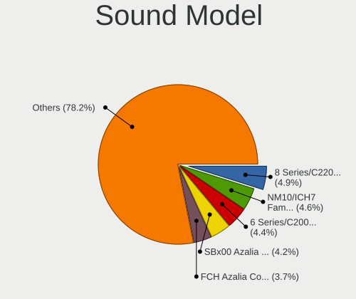

| Model                                                                             | Desktops | Percent |
|-----------------------------------------------------------------------------------|----------|---------|
| Intel 8 Series/C220 Series Chipset High Definition Audio Controller               | 207      | 4.87%   |
| Intel NM10/ICH7 Family High Definition Audio Controller                           | 196      | 4.61%   |
| Intel 6 Series/C200 Series Chipset Family High Definition Audio Controller        | 188      | 4.42%   |
| AMD SBx00 Azalia (Intel HDA)                                                      | 179      | 4.21%   |
| AMD FCH Azalia Controller                                                         | 158      | 3.72%   |
| Intel Xeon E3-1200 v3/4th Gen Core Processor HD Audio Controller                  | 153      | 3.6%    |
| Intel 7 Series/C216 Chipset Family High Definition Audio Controller               | 133      | 3.13%   |
| Intel 200 Series PCH HD Audio                                                     | 116      | 2.73%   |
| AMD Ryzen HD Audio Controller                                                     | 115      | 2.71%   |
| Intel 100 Series/C230 Series Chipset Family HD Audio Controller                   | 113      | 2.66%   |
| Nvidia GK208 HDMI/DP Audio Controller                                             | 111      | 2.61%   |
| AMD Starship/Matisse HD Audio Controller                                          | 106      | 2.49%   |
| Intel 82801JD/DO (ICH10 Family) HD Audio Controller                               | 87       | 2.05%   |
| AMD Oland/Hainan/Cape Verde/Pitcairn HDMI Audio [Radeon HD 7000 Series]           | 79       | 1.86%   |
| AMD Ellesmere HDMI Audio [Radeon RX 470/480 / 570/580/590]                        | 79       | 1.86%   |
| Intel 82801I (ICH9 Family) HD Audio Controller                                    | 72       | 1.69%   |
| Nvidia GP107GL High Definition Audio Controller                                   | 69       | 1.62%   |
| AMD Family 17h (Models 00h-0fh) HD Audio Controller                               | 69       | 1.62%   |
| AMD Trinity HDMI Audio Controller                                                 | 65       | 1.53%   |
| Intel 82801JI (ICH10 Family) HD Audio Controller                                  | 64       | 1.51%   |
| Nvidia High Definition Audio Controller                                           | 62       | 1.46%   |
| AMD Caicos HDMI Audio [Radeon HD 6450 / 7450/8450/8490 OEM / R5 230/235/235X OEM] | 62       | 1.46%   |
| Nvidia GP106 High Definition Audio Controller                                     | 48       | 1.13%   |
| Intel Cannon Lake PCH cAVS                                                        | 46       | 1.08%   |
| AMD Renoir/Cezanne HDMI/DP Audio Controller                                       | 46       | 1.08%   |
| AMD Navi 21/23 HDMI/DP Audio Controller                                           | 46       | 1.08%   |
| AMD Cedar HDMI Audio [Radeon HD 5400/6300/7300 Series]                            | 46       | 1.08%   |
| Nvidia GF108 High Definition Audio Controller                                     | 45       | 1.06%   |
| AMD Baffin HDMI/DP Audio [Radeon RX 550 640SP / RX 560/560X]                      | 44       | 1.04%   |
| Intel 5 Series/3400 Series Chipset High Definition Audio                          | 41       | 0.96%   |
| AMD Raven/Raven2/Fenghuang HDMI/DP Audio Controller                               | 33       | 0.78%   |
| Nvidia MCP61 High Definition Audio                                                | 32       | 0.75%   |
| Nvidia GF119 HDMI Audio Controller                                                | 32       | 0.75%   |
| Nvidia GP108 High Definition Audio Controller                                     | 29       | 0.68%   |
| Nvidia GM107 High Definition Audio Controller [GeForce 940MX]                     | 29       | 0.68%   |
| Nvidia GK107 HDMI Audio Controller                                                | 29       | 0.68%   |
| AMD Kabini HDMI/DP Audio                                                          | 28       | 0.66%   |
| Nvidia TU116 High Definition Audio Controller                                     | 26       | 0.61%   |
| Nvidia GK106 HDMI Audio Controller                                                | 26       | 0.61%   |
| AMD RV710/730 HDMI Audio [Radeon HD 4000 series]                                  | 26       | 0.61%   |

Memory
------

Memory Vendor
-------------

Memory module vendors

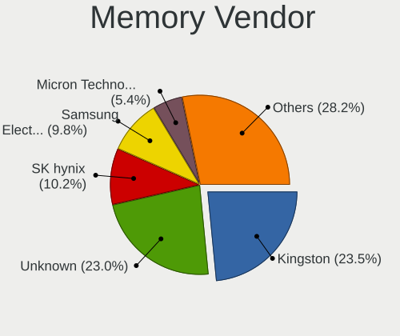

| Vendor                     | Desktops | Percent |
|----------------------------|----------|---------|
| Kingston                   | 513      | 23.47%  |
| Unknown                    | 502      | 22.96%  |
| SK hynix                   | 222      | 10.16%  |
| Samsung Electronics        | 214      | 9.79%   |
| Micron Technology          | 118      | 5.4%    |
| G.Skill                    | 99       | 4.53%   |
| Kingmax                    | 92       | 4.21%   |
| Corsair                    | 91       | 4.16%   |
| Crucial                    | 88       | 4.03%   |
| Nanya Technology           | 52       | 2.38%   |
| Team                       | 25       | 1.14%   |
| Elpida                     | 23       | 1.05%   |
| CSX                        | 16       | 0.73%   |
| Ramaxel Technology         | 14       | 0.64%   |
| Patriot                    | 13       | 0.59%   |
| A-DATA Technology          | 12       | 0.55%   |
| Hikvision                  | 8        | 0.37%   |
| Transcend                  | 6        | 0.27%   |
| Qimonda                    | 6        | 0.27%   |
| Melco                      | 6        | 0.27%   |
| Unknown                    | 6        | 0.27%   |
| Apacer                     | 5        | 0.23%   |
| OCZ                        | 4        | 0.18%   |
| Kingmax Semiconductor      | 4        | 0.18%   |
| GeIL                       | 4        | 0.18%   |
| Toshiba                    | 3        | 0.14%   |
| Unknown (ABCD)             | 2        | 0.09%   |
| Unknown (0x0E9D)           | 2        | 0.09%   |
| Unknown (0BF7)             | 2        | 0.09%   |
| Silicon Power              | 2        | 0.09%   |
| Intersil                   | 2        | 0.09%   |
| H                          | 2        | 0.09%   |
| Golden Empire              | 2        | 0.09%   |
| 48spaces                   | 2        | 0.09%   |
| ZION                       | 1        | 0.05%   |
| Unknown (AB)               | 1        | 0.05%   |
| Unknown (7F7F7F7F7F970000) | 1        | 0.05%   |
| Unknown (09D5)             | 1        | 0.05%   |
| Unigen                     | 1        | 0.05%   |
| Toshiba-0098               | 1        | 0.05%   |

Memory Model
------------

Memory module models

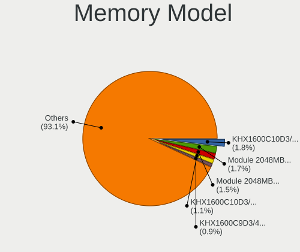

| Model                                                  | Desktops | Percent |
|--------------------------------------------------------|----------|---------|
| Kingston RAM KHX1600C10D3/4G 4GB DIMM DDR3 1866MT/s    | 46       | 1.81%   |
| Unknown RAM Module 2048MB DIMM 800MT/s                 | 44       | 1.74%   |
| Unknown RAM Module 2048MB DIMM SDRAM                   | 37       | 1.46%   |
| Kingston RAM KHX1600C10D3/8G 8GB DIMM DDR3 2133MT/s    | 27       | 1.06%   |
| Kingston RAM KHX1600C9D3/4GX 4GB DIMM DDR3 1867MT/s    | 22       | 0.87%   |
| Unknown RAM Module 4096MB DIMM DDR3 1333MT/s           | 20       | 0.79%   |
| Unknown RAM Module 2048MB DIMM DDR2 800MT/s            | 19       | 0.75%   |
| Unknown RAM Module 1024MB DIMM SDRAM                   | 19       | 0.75%   |
| G.Skill RAM F4-3200C16-8GIS 8GB DIMM DDR4 3600MT/s     | 19       | 0.75%   |
| Unknown RAM Module 1024MB DIMM 800MT/s                 | 18       | 0.71%   |
| Kingston RAM 99U5584-005.A00LF 4GB DIMM DDR3 1600MT/s  | 18       | 0.71%   |
| G.Skill RAM F4-3000C16-8GISB 8GB DIMM DDR4 3200MT/s    | 18       | 0.71%   |
| Unknown RAM Module 2048MB DIMM 1333MT/s                | 16       | 0.63%   |
| Kingston RAM KHX3200C16D4/8GX 8GB DIMM DDR4 3733MT/s   | 16       | 0.63%   |
| Kingston RAM KHX2666C16/8G 8GiB DIMM DDR4 3466MT/s     | 16       | 0.63%   |
| Unknown RAM Module 4096MB DIMM 1333MT/s                | 15       | 0.59%   |
| Samsung RAM M378B5273DH0-CH9 4GB DIMM DDR3 2133MT/s    | 15       | 0.59%   |
| Kingston RAM KF3200C16D4/8GX 8GiB DIMM DDR4 3600MT/s   | 15       | 0.59%   |
| Kingston RAM KF3200C16D4/16GX 16GB DIMM DDR4 3733MT/s  | 15       | 0.59%   |
| Unknown RAM Module 1024MB DIMM DDR2 667MT/s            | 14       | 0.55%   |
| Unknown RAM Module 2048MB DIMM DDR2 667MT/s            | 13       | 0.51%   |
| SK hynix RAM HMT451U6AFR8C-PB 4GB DIMM DDR3 1600MT/s   | 13       | 0.51%   |
| Samsung RAM M378B5773DH0-CH9 2GB DIMM DDR3 1333MT/s    | 13       | 0.51%   |
| Samsung RAM M378B5173QH0-CK0 4GB DIMM DDR3             | 13       | 0.51%   |
| Micron RAM 8KTF51264AZ-1G6E1 4GB DIMM DDR3 1600MT/s    | 13       | 0.51%   |
| Unknown RAM Module 4GB DIMM 1333MT/s                   | 12       | 0.47%   |
| Samsung RAM M378B5773CH0-CH9 2GB DIMM DDR3 1867MT/s    | 12       | 0.47%   |
| Samsung RAM M378B5173DB0-CK0 4096MB DIMM DDR3 1600MT/s | 12       | 0.47%   |
| Micron RAM 8JTF51264AZ-1G6E1 4GB DIMM DDR3 1600MT/s    | 12       | 0.47%   |
| SK hynix RAM HMT151R7BFR4C-H9 4GB DIMM DDR3 1333MT/s   | 11       | 0.43%   |
| Kingston RAM KHX2400C15/8G 8GB DIMM DDR4 3400MT/s      | 11       | 0.43%   |
| Unknown RAM Module 4096MB DIMM SDRAM                   | 10       | 0.39%   |
| Unknown RAM Module 4096MB DIMM 400MT/s                 | 10       | 0.39%   |
| Unknown RAM Module 1024MB DIMM DDR2 800MT/s            | 10       | 0.39%   |
| Unknown RAM Module 1024MB DIMM 667MT/s                 | 10       | 0.39%   |
| Kingston RAM KHX2400C15D4/4G 4GB DIMM DDR4 3151MT/s    | 10       | 0.39%   |
| Kingston RAM KHX1866C10D3/8G 8GB DIMM DDR3 1867MT/s    | 10       | 0.39%   |
| Kingmax RAM FLFF65F-C8KF9 4GB DIMM DDR3 1333MT/s       | 10       | 0.39%   |
| Unknown RAM Module 4096MB DIMM 1600MT/s                | 9        | 0.35%   |
| Unknown RAM Module 2048MB DIMM 667MT/s                 | 9        | 0.35%   |

Memory Kind
-----------

Memory module kinds

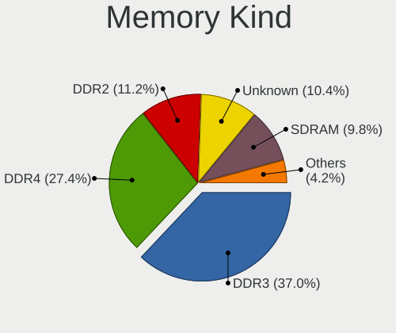

| Kind    | Desktops | Percent |
|---------|----------|---------|
| DDR3    | 700      | 37.04%  |
| DDR4    | 517      | 27.35%  |
| DDR2    | 211      | 11.16%  |
| Unknown | 197      | 10.42%  |
| SDRAM   | 185      | 9.79%   |
| DDR     | 42       | 2.22%   |
| DDR5    | 32       | 1.69%   |
| LPDDR4  | 5        | 0.26%   |
| DRAM    | 1        | 0.05%   |

Memory Form Factor
------------------

Physical design of the memory module

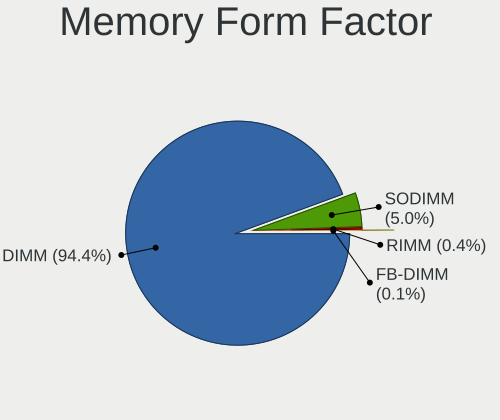

| Name         | Desktops | Percent |
|--------------|----------|---------|
| DIMM         | 1706     | 94.41%  |
| SODIMM       | 91       | 5.04%   |
| RIMM         | 7        | 0.39%   |
| Row Of Chips | 2        | 0.11%   |
| FB-DIMM      | 1        | 0.06%   |

Memory Size
-----------

Memory module size

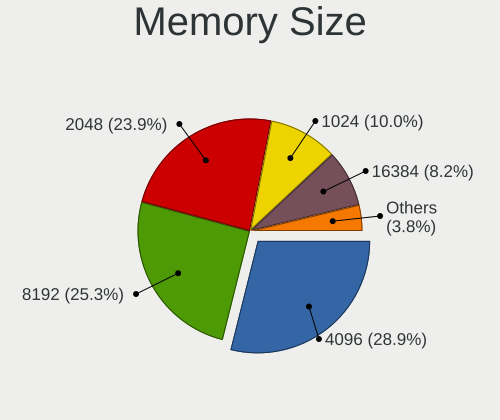

| Size  | Desktops | Percent |
|-------|----------|---------|
| 4096  | 607      | 28.9%   |
| 8192  | 531      | 25.29%  |
| 2048  | 501      | 23.86%  |
| 1024  | 210      | 10%     |
| 16384 | 172      | 8.19%   |
| 32768 | 41       | 1.95%   |
| 512   | 32       | 1.52%   |
| 256   | 4        | 0.19%   |
| 65536 | 1        | 0.05%   |
| 49152 | 1        | 0.05%   |

Memory Speed
------------

Memory module speed

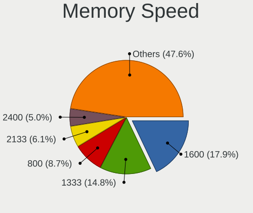

| Speed   | Desktops | Percent |
|---------|----------|---------|
| 1600    | 385      | 17.89%  |
| 1333    | 318      | 14.78%  |
| 800     | 187      | 8.69%   |
| 2133    | 131      | 6.09%   |
| 2400    | 107      | 4.97%   |
| 667     | 102      | 4.74%   |
| 3200    | 91       | 4.23%   |
| Unknown | 91       | 4.23%   |
| 3600    | 84       | 3.9%    |
| 1866    | 79       | 3.67%   |
| 2667    | 59       | 2.74%   |
| 3733    | 39       | 1.81%   |
| 400     | 38       | 1.77%   |
| 1066    | 33       | 1.53%   |
| 2666    | 28       | 1.3%    |
| 1867    | 28       | 1.3%    |
| 3000    | 24       | 1.12%   |
| 533     | 23       | 1.07%   |
| 3400    | 20       | 0.93%   |
| 1800    | 20       | 0.93%   |
| 1067    | 20       | 0.93%   |
| 3466    | 16       | 0.74%   |
| 2048    | 16       | 0.74%   |
| 6000    | 15       | 0.7%    |
| 2000    | 15       | 0.7%    |
| 2933    | 13       | 0.6%    |
| 1639    | 11       | 0.51%   |
| 3800    | 10       | 0.46%   |
| 3333    | 10       | 0.46%   |
| 3151    | 10       | 0.46%   |
| 49926   | 8        | 0.37%   |
| 1648    | 8        | 0.37%   |
| 1334    | 8        | 0.37%   |
| 2200    | 7        | 0.33%   |
| 3933    | 6        | 0.28%   |
| 3334    | 6        | 0.28%   |
| 3266    | 6        | 0.28%   |
| 333     | 6        | 0.28%   |
| 5600    | 5        | 0.23%   |
| 1400    | 5        | 0.23%   |

Printers & scanners
-------------------

Printer Vendor
--------------

Printer device vendors

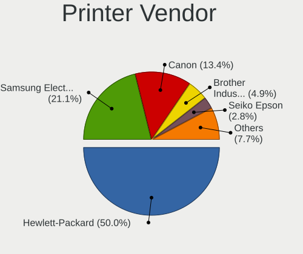

| Vendor                | Desktops | Percent |
|-----------------------|----------|---------|
| Hewlett-Packard       | 71       | 50%     |
| Samsung Electronics   | 30       | 21.13%  |
| Canon                 | 19       | 13.38%  |
| Brother Industries    | 7        | 4.93%   |
| Seiko Epson           | 4        | 2.82%   |
| Xerox                 | 2        | 1.41%   |
| QinHeng Electronics   | 2        | 1.41%   |
| Lexmark International | 2        | 1.41%   |
| Dymo-CoStar           | 2        | 1.41%   |
| STMicroelectronics    | 1        | 0.7%    |
| Prolific Technology   | 1        | 0.7%    |
| Graphtec America      | 1        | 0.7%    |

Printer Model
-------------

Printer device models

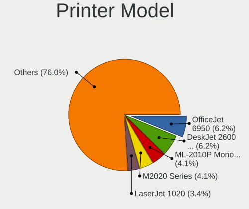

| Model                                                     | Desktops | Percent |
|-----------------------------------------------------------|----------|---------|
| HP OfficeJet 6950                                         | 9        | 6.16%   |
| HP DeskJet 2600 series                                    | 9        | 6.16%   |
| Samsung ML-2010P Mono Laser Printer                       | 6        | 4.11%   |
| Samsung M2020 Series                                      | 6        | 4.11%   |
| HP LaserJet 1020                                          | 5        | 3.42%   |
| Samsung ML-1640 Series Laser Printer                      | 4        | 2.74%   |
| HP LaserJet 1010                                          | 4        | 2.74%   |
| HP Deskjet 2050 J510                                      | 4        | 2.74%   |
| Canon LiDE 300                                            | 4        | 2.74%   |
| Samsung ML-1660 Series                                    | 3        | 2.05%   |
| Samsung C48x Series                                       | 3        | 2.05%   |
| HP DeskJet 2130 series                                    | 3        | 2.05%   |
| Canon LiDE 400                                            | 3        | 2.05%   |
| Samsung SCX-3400 Series                                   | 2        | 1.37%   |
| QinHeng CH340S                                            | 2        | 1.37%   |
| HP LaserJet P1102                                         | 2        | 1.37%   |
| HP LaserJet P1005                                         | 2        | 1.37%   |
| HP LaserJet 1018                                          | 2        | 1.37%   |
| HP LaserJet 1000                                          | 2        | 1.37%   |
| HP DeskJet F4100 Printer series                           | 2        | 1.37%   |
| HP Deskjet F2280 series                                   | 2        | 1.37%   |
| HP DeskJet F2100 Printer series                           | 2        | 1.37%   |
| HP DeskJet 840c                                           | 2        | 1.37%   |
| HP Deskjet 3520 series                                    | 2        | 1.37%   |
| HP DeskJet 2700 series                                    | 2        | 1.37%   |
| HP Deskjet 1050 J410                                      | 2        | 1.37%   |
| Dymo-CoStar LabelWriter 450                               | 2        | 1.37%   |
| Canon TS5100 series                                       | 2        | 1.37%   |
| Canon PIXMA MG3600 Series                                 | 2        | 1.37%   |
| Brother HL-L2300D series                                  | 2        | 1.37%   |
| Brother HL-1110 series                                    | 2        | 1.37%   |
| Xerox WorkCentre 3119 Series                              | 1        | 0.68%   |
| Xerox Phaser 3020                                         | 1        | 0.68%   |
| STMicroelectronics LED badge -- mini LED display -- 11x44 | 1        | 0.68%   |
| Seiko Epson Stylus NX230/SX235W Series                    | 1        | 0.68%   |
| Seiko Epson Printer                                       | 1        | 0.68%   |
| Seiko Epson ME 320/330 Series [Stylus SX125]              | 1        | 0.68%   |
| Seiko Epson L3050 Series                                  | 1        | 0.68%   |
| Samsung SCX-4650 4x21S Series                             | 1        | 0.68%   |
| Samsung SCX-4623 Series                                   | 1        | 0.68%   |

Scanner Vendor
--------------

Scanner device vendors

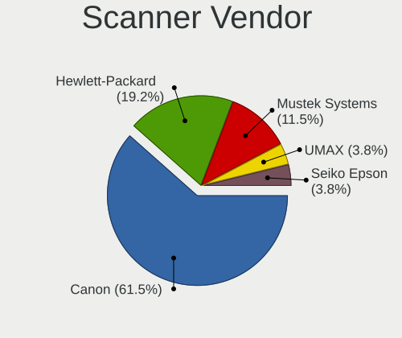

| Vendor          | Desktops | Percent |
|-----------------|----------|---------|
| Canon           | 16       | 61.54%  |
| Hewlett-Packard | 5        | 19.23%  |
| Mustek Systems  | 3        | 11.54%  |
| UMAX            | 1        | 3.85%   |
| Seiko Epson     | 1        | 3.85%   |

Scanner Model
-------------

Scanner device models

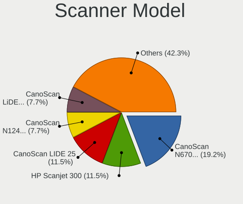

| Model                                      | Desktops | Percent |
|--------------------------------------------|----------|---------|
| Canon CanoScan N670U/N676U/LiDE 20         | 5        | 19.23%  |
| HP HP Scanjet 300                          | 3        | 11.54%  |
| Canon CanoScan LIDE 25                     | 3        | 11.54%  |
| Canon CanoScan N1240U/LiDE 30              | 2        | 7.69%   |
| Canon CanoScan LiDE 120                    | 2        | 7.69%   |
| Canon CanoScan LiDE 110                    | 2        | 7.69%   |
| UMAX Astra 4400/4450                       | 1        | 3.85%   |
| Seiko Epson GT-6600U [Perfection 610]      | 1        | 3.85%   |
| Mustek Systems SNAPSCAN e22                | 1        | 3.85%   |
| Mustek Systems ScanExpress A3 USB 1200 PRO | 1        | 3.85%   |
| Mustek Systems BearPaw 1200 CU Plus        | 1        | 3.85%   |
| HP ScanJet 3770                            | 1        | 3.85%   |
| HP ScanJet 2400c                           | 1        | 3.85%   |
| Canon CanoScan LiDE 220                    | 1        | 3.85%   |
| Canon CanoScan LiDE 100                    | 1        | 3.85%   |

Camera
------

Camera Vendor
-------------

Camera device vendors

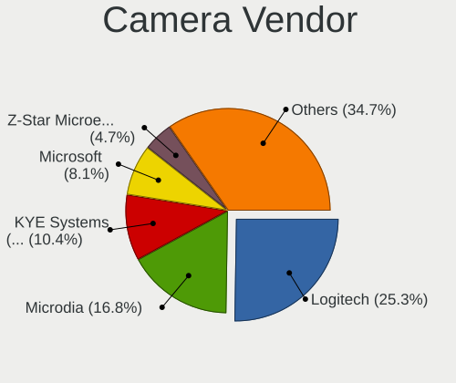

| Vendor                        | Desktops | Percent |
|-------------------------------|----------|---------|
| Logitech                      | 75       | 25.25%  |
| Microdia                      | 50       | 16.84%  |
| KYE Systems (Mouse Systems)   | 31       | 10.44%  |
| Microsoft                     | 24       | 8.08%   |
| Z-Star Microelectronics       | 14       | 4.71%   |
| GEMBIRD                       | 11       | 3.7%    |
| Sunplus Innovation Technology | 8        | 2.69%   |
| Trust                         | 6        | 2.02%   |
| Samsung Electronics           | 6        | 2.02%   |
| MacroSilicon                  | 5        | 1.68%   |
| Generalplus Technology        | 5        | 1.68%   |
| Aveo Technology               | 5        | 1.68%   |
| Arkmicro Technologies         | 5        | 1.68%   |
| Pixart Imaging                | 4        | 1.35%   |
| LG Electronics                | 4        | 1.35%   |
| Cubeternet                    | 4        | 1.35%   |
| Creative Technology           | 4        | 1.35%   |
| Chicony Electronics           | 4        | 1.35%   |
| Apple                         | 4        | 1.35%   |
| Realtek Semiconductor         | 3        | 1.01%   |
| Unknown                       | 2        | 0.67%   |
| Sonix Technology              | 2        | 0.67%   |
| Jieli Technology              | 2        | 0.67%   |
| IMC Networks                  | 2        | 0.67%   |
| Hewlett-Packard               | 2        | 0.67%   |
| ANYKA                         | 2        | 0.67%   |
| Xiongmai                      | 1        | 0.34%   |
| webcamvendor                  | 1        | 0.34%   |
| Teslong Camera                | 1        | 0.34%   |
| Syntek                        | 1        | 0.34%   |
| Suyin                         | 1        | 0.34%   |
| Silicon Motion                | 1        | 0.34%   |
| Quanta                        | 1        | 0.34%   |
| OmniVision Technologies       | 1        | 0.34%   |
| NextDrive Cam                 | 1        | 0.34%   |
| Luxvisions Innotech Limited   | 1        | 0.34%   |
| Huawei Technologies           | 1        | 0.34%   |
| AVerMedia Technologies        | 1        | 0.34%   |
| Alcor Micro                   | 1        | 0.34%   |

Camera Model
------------

Camera device models

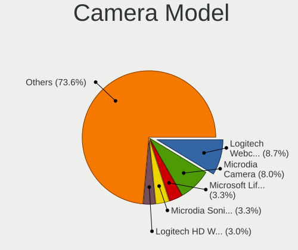

| Model                                                 | Desktops | Percent |
|-------------------------------------------------------|----------|---------|
| Logitech Webcam C270                                  | 26       | 8.7%    |
| Microdia Camera                                       | 24       | 8.03%   |
| Microsoft LifeCam HD-3000                             | 10       | 3.34%   |
| Microdia Sonix USB 2.0 Camera                         | 10       | 3.34%   |
| Logitech HD Webcam C525                               | 9        | 3.01%   |
| GEMBIRD Generic UVC 1.00 camera [AppoTech AX2311]     | 9        | 3.01%   |
| KYE Systems (Mouse Systems) FaceCam 320X              | 8        | 2.68%   |
| Logitech Webcam C600                                  | 7        | 2.34%   |
| Logitech Webcam C170                                  | 7        | 2.34%   |
| KYE Systems (Mouse Systems) FaceCam 1000X             | 7        | 2.34%   |
| Z-Star Venus USB2.0 Camera                            | 6        | 2.01%   |
| Sunplus FULL HD webcam                                | 6        | 2.01%   |
| Samsung Galaxy series, misc. (MTP mode)               | 6        | 2.01%   |
| Microdia USB 2.0 Camera                               | 6        | 2.01%   |
| Z-Star A4 TECH USB2.0 PC Camera E                     | 5        | 1.67%   |
| KYE Systems (Mouse Systems) USB 2.0 HD1080P PC Camera | 5        | 1.67%   |
| KYE Systems (Mouse Systems) iSlim 321R                | 5        | 1.67%   |
| Arkmicro USB2.0 PC CAMERA                             | 5        | 1.67%   |
| KYE Systems (Mouse Systems) Genius FaceCam 320        | 4        | 1.34%   |
| Apple iPhone 5/5C/5S/6/SE/7/8/X                       | 4        | 1.34%   |
| Pixart Imaging GE 1.3 MP MiniCam Pro                  | 3        | 1%      |
| Microsoft LifeCam VX-700                              | 3        | 1%      |
| Microsoft LifeCam VX-2000                             | 3        | 1%      |
| Microsoft LifeCam Studio                              | 3        | 1%      |
| Microdia Webcam Vitade AF                             | 3        | 1%      |
| MacroSilicon USB Video                                | 3        | 1%      |
| Logitech C920 PRO HD Webcam                           | 3        | 1%      |
| Cubeternet USB2.0 Camera                              | 3        | 1%      |
| Creative Live! Cam Chat HD [VF0700/VF0790]            | 3        | 1%      |
| Aveo USB2.0 Camera                                    | 3        | 1%      |
| Z-Star Saturn USB 2.0 Camera                          | 2        | 0.67%   |
| Unknown HD camera                                     | 2        | 0.67%   |
| Trust Full HD Webcam                                  | 2        | 0.67%   |
| Trust 17676 Webcam                                    | 2        | 0.67%   |
| Microsoft LifeCam VX-800                              | 2        | 0.67%   |
| Microdia Integrated Camera                            | 2        | 0.67%   |
| Microdia Defender G-Lens 2577 HD720p Camera           | 2        | 0.67%   |
| MacroSilicon MS210x Video Grabber [EasierCAP]         | 2        | 0.67%   |
| Logitech Webcam C310                                  | 2        | 0.67%   |
| Logitech Webcam C200                                  | 2        | 0.67%   |

Security
--------

Fingerprint Vendor
------------------

Fingerprint sensor vendors

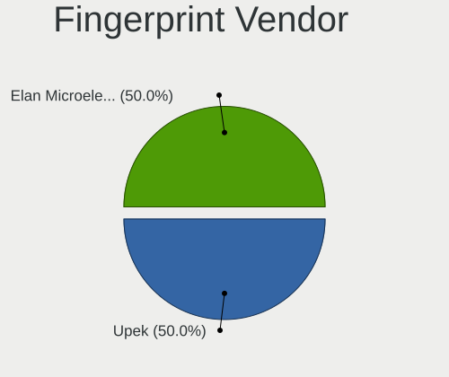

| Vendor                | Desktops | Percent |
|-----------------------|----------|---------|
| Upek                  | 1        | 50%     |
| Elan Microelectronics | 1        | 50%     |

Fingerprint Model
-----------------

Fingerprint sensor models

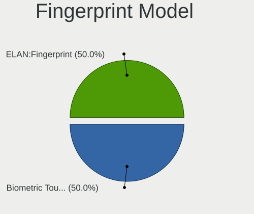

| Model                                                  | Desktops | Percent |
|--------------------------------------------------------|----------|---------|
| Upek Biometric Touchchip/Touchstrip Fingerprint Sensor | 1        | 50%     |
| Elan fingerprint sensor [FeinTech FPS00200]            | 1        | 50%     |

Chipcard Vendor
---------------

Chipcard module vendors

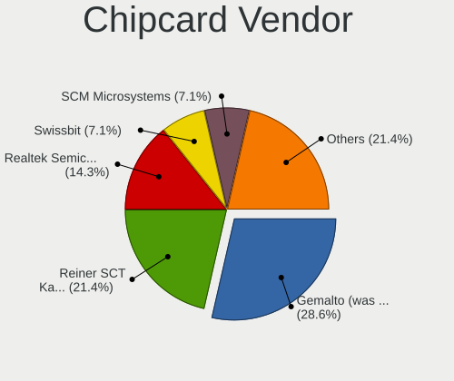

| Vendor                    | Desktops | Percent |
|---------------------------|----------|---------|
| Gemalto (was Gemplus)     | 4        | 28.57%  |
| Reiner SCT Kartensysteme  | 3        | 21.43%  |
| Realtek Semiconductor     | 2        | 14.29%  |
| Swissbit                  | 1        | 7.14%   |
| SCM Microsystems          | 1        | 7.14%   |
| OmniKey                   | 1        | 7.14%   |
| Aladdin Knowledge Systems | 1        | 7.14%   |
| Advanced Card Systems     | 1        | 7.14%   |

Chipcard Model
--------------

Chipcard module models

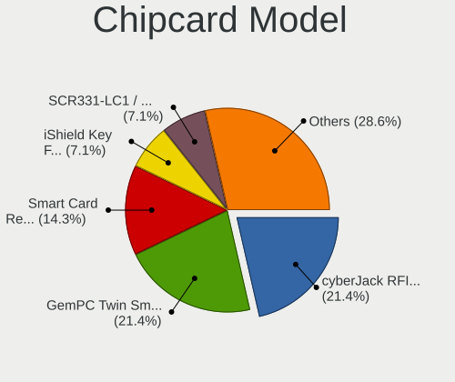

| Model                                                                      | Desktops | Percent |
|----------------------------------------------------------------------------|----------|---------|
| Reiner SCT Kartensysteme cyberJack RFID basis contactless smartcard reader | 3        | 21.43%  |
| Gemalto (was Gemplus) GemPC Twin SmartCard Reader                          | 3        | 21.43%  |
| Realtek Semiconductor Smart Card Reader Interface                          | 2        | 14.29%  |
| Swissbit iShield Key FIDO2                                                 | 1        | 7.14%   |
| SCM Microsystems SCR331-LC1 / SCR3310 SmartCard Reader                     | 1        | 7.14%   |
| OmniKey CardMan 3121 (HID Technologies)                                    | 1        | 7.14%   |
| Gemalto (was Gemplus) GemPC Key SmartCard Reader                           | 1        | 7.14%   |
| Aladdin Knowledge Systems Token JC                                         | 1        | 7.14%   |
| Advanced Card Systems ACR1252 Dual Reader                                  | 1        | 7.14%   |

Unsupported
-----------

Unsupported Devices
-------------------

Total unsupported devices on board

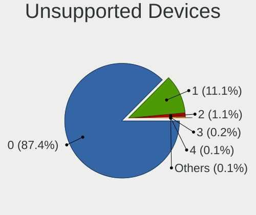

| Total | Desktops | Percent |
|-------|----------|---------|
| 0     | 2066     | 87.43%  |
| 1     | 262      | 11.09%  |
| 2     | 26       | 1.1%    |
| 3     | 4        | 0.17%   |
| 4     | 3        | 0.13%   |
| 10    | 1        | 0.04%   |
| 5     | 1        | 0.04%   |

Unsupported Device Types
------------------------

Types of unsupported devices

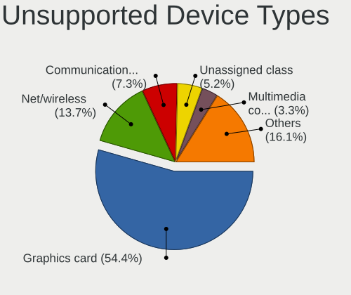

| Type                     | Desktops | Percent |
|--------------------------|----------|---------|
| Graphics card            | 179      | 54.41%  |
| Net/wireless             | 45       | 13.68%  |
| Communication controller | 24       | 7.29%   |
| Unassigned class         | 17       | 5.17%   |
| Multimedia controller    | 11       | 3.34%   |
| Chipcard                 | 9        | 2.74%   |
| Storage/raid             | 8        | 2.43%   |
| Sound                    | 8        | 2.43%   |
| Camera                   | 7        | 2.13%   |
| Net/ethernet             | 5        | 1.52%   |
| Storage/ide              | 4        | 1.22%   |
| Card reader              | 3        | 0.91%   |
| Bluetooth                | 3        | 0.91%   |
| Fingerprint reader       | 2        | 0.61%   |
| Storage/ata              | 1        | 0.3%    |
| Storage                  | 1        | 0.3%    |
| Network                  | 1        | 0.3%    |
| Dvb card                 | 1        | 0.3%    |

