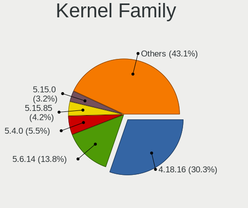
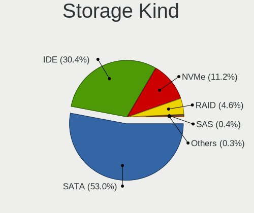
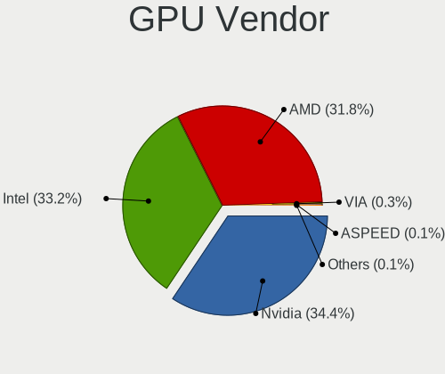
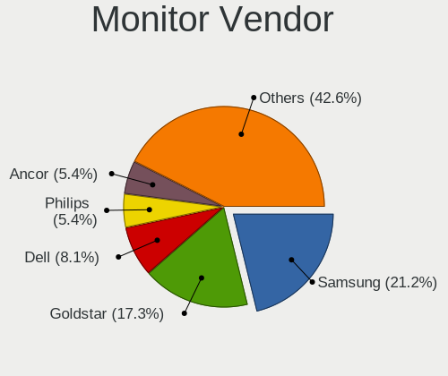
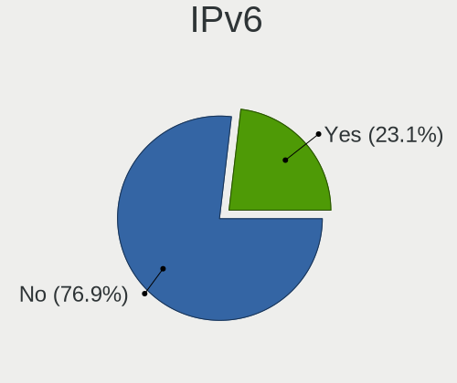
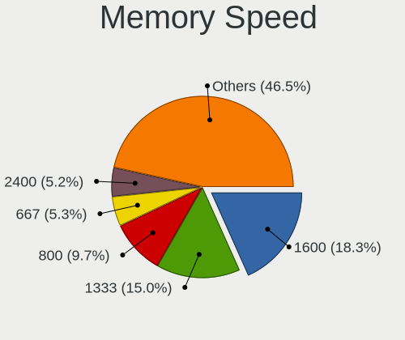
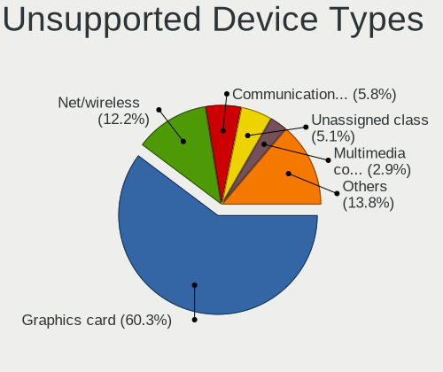

Linux in Hungary - Tested Hardware & Statistics (Desktops)
----------------------------------------------------------

A project to collect tested hardware configurations for Linux in Hungary.

Anyone can contribute to this report by the [hw-probe](https://github.com/linuxhw/hw-probe) tool:

    sudo -E hw-probe -all -upload

Please contribute! Especially if your hardware is rare.

Contents
--------

* [ Test Cases ](#test-cases)

* [ System ](#system)
  - [ OS                       ](#os)
  - [ OS Family                ](#os-family)
  - [ Kernel                   ](#kernel)
  - [ Kernel Family            ](#kernel-family)
  - [ Kernel Major Ver.        ](#kernel-major-ver)
  - [ Arch                     ](#arch)
  - [ DE                       ](#de)
  - [ Display Server           ](#display-server)
  - [ Display Manager          ](#display-manager)
  - [ OS Lang                  ](#os-lang)
  - [ Boot Mode                ](#boot-mode)
  - [ Filesystem               ](#filesystem)
  - [ Part. scheme             ](#part-scheme)
  - [ Dual Boot with Linux/BSD ](#dual-boot-with-linuxbsd)
  - [ Dual Boot (Win)          ](#dual-boot-win)

* [ Board ](#board)
  - [ Vendor                   ](#vendor)
  - [ Model                    ](#model)
  - [ Model Family             ](#model-family)
  - [ MFG Year                 ](#mfg-year)
  - [ Form Factor              ](#form-factor)
  - [ Secure Boot              ](#secure-boot)
  - [ Coreboot                 ](#coreboot)
  - [ RAM Size                 ](#ram-size)
  - [ RAM Used                 ](#ram-used)
  - [ Total Drives             ](#total-drives)
  - [ Has CD-ROM               ](#has-cd-rom)
  - [ Has Ethernet             ](#has-ethernet)
  - [ Has WiFi                 ](#has-wifi)
  - [ Has Bluetooth            ](#has-bluetooth)

* [ Location ](#location)
  - [ Country                  ](#country)
  - [ City                     ](#city)

* [ Drives ](#drives)
  - [ Drive Vendor             ](#drive-vendor)
  - [ Drive Model              ](#drive-model)
  - [ HDD Vendor               ](#hdd-vendor)
  - [ SSD Vendor               ](#ssd-vendor)
  - [ Drive Kind               ](#drive-kind)
  - [ Drive Connector          ](#drive-connector)
  - [ Drive Size               ](#drive-size)
  - [ Space Total              ](#space-total)
  - [ Space Used               ](#space-used)
  - [ Malfunc. Drives          ](#malfunc-drives)
  - [ Malfunc. Drive Vendor    ](#malfunc-drive-vendor)
  - [ Malfunc. HDD Vendor      ](#malfunc-hdd-vendor)
  - [ Malfunc. Drive Kind      ](#malfunc-drive-kind)
  - [ Failed Drives            ](#failed-drives)
  - [ Failed Drive Vendor      ](#failed-drive-vendor)
  - [ Drive Status             ](#drive-status)

* [ Storage controller ](#storage-controller)
  - [ Storage Vendor           ](#storage-vendor)
  - [ Storage Model            ](#storage-model)
  - [ Storage Kind             ](#storage-kind)

* [ Processor ](#processor)
  - [ CPU Vendor               ](#cpu-vendor)
  - [ CPU Model                ](#cpu-model)
  - [ CPU Model Family         ](#cpu-model-family)
  - [ CPU Cores                ](#cpu-cores)
  - [ CPU Sockets              ](#cpu-sockets)
  - [ CPU Threads              ](#cpu-threads)
  - [ CPU Op-Modes             ](#cpu-op-modes)
  - [ CPU Microcode            ](#cpu-microcode)
  - [ CPU Microarch            ](#cpu-microarch)

* [ Graphics ](#graphics)
  - [ GPU Vendor               ](#gpu-vendor)
  - [ GPU Model                ](#gpu-model)
  - [ GPU Combo                ](#gpu-combo)
  - [ GPU Driver               ](#gpu-driver)
  - [ GPU Memory               ](#gpu-memory)

* [ Monitor ](#monitor)
  - [ Monitor Vendor           ](#monitor-vendor)
  - [ Monitor Model            ](#monitor-model)
  - [ Monitor Resolution       ](#monitor-resolution)
  - [ Monitor Diagonal         ](#monitor-diagonal)
  - [ Monitor Width            ](#monitor-width)
  - [ Aspect Ratio             ](#aspect-ratio)
  - [ Monitor Area             ](#monitor-area)
  - [ Pixel Density            ](#pixel-density)
  - [ Multiple Monitors        ](#multiple-monitors)

* [ Network ](#network)
  - [ Net Controller Vendor    ](#net-controller-vendor)
  - [ Net Controller Model     ](#net-controller-model)
  - [ Wireless Vendor          ](#wireless-vendor)
  - [ Wireless Model           ](#wireless-model)
  - [ Ethernet Vendor          ](#ethernet-vendor)
  - [ Ethernet Model           ](#ethernet-model)
  - [ Net Controller Kind      ](#net-controller-kind)
  - [ Used Controller          ](#used-controller)
  - [ NICs                     ](#nics)
  - [ IPv6                     ](#ipv6)

* [ Bluetooth ](#bluetooth)
  - [ Bluetooth Vendor         ](#bluetooth-vendor)
  - [ Bluetooth Model          ](#bluetooth-model)

* [ Sound ](#sound)
  - [ Sound Vendor             ](#sound-vendor)
  - [ Sound Model              ](#sound-model)

* [ Memory ](#memory)
  - [ Memory Vendor            ](#memory-vendor)
  - [ Memory Model             ](#memory-model)
  - [ Memory Kind              ](#memory-kind)
  - [ Memory Form Factor       ](#memory-form-factor)
  - [ Memory Size              ](#memory-size)
  - [ Memory Speed             ](#memory-speed)

* [ Printers & scanners ](#printers--scanners)
  - [ Printer Vendor           ](#printer-vendor)
  - [ Printer Model            ](#printer-model)
  - [ Scanner Vendor           ](#scanner-vendor)
  - [ Scanner Model            ](#scanner-model)

* [ Camera ](#camera)
  - [ Camera Vendor            ](#camera-vendor)
  - [ Camera Model             ](#camera-model)

* [ Security ](#security)
  - [ Fingerprint Vendor       ](#fingerprint-vendor)
  - [ Fingerprint Model        ](#fingerprint-model)
  - [ Chipcard Vendor          ](#chipcard-vendor)
  - [ Chipcard Model           ](#chipcard-model)

* [ Unsupported ](#unsupported)
  - [ Unsupported Devices      ](#unsupported-devices)
  - [ Unsupported Device Types ](#unsupported-device-types)

Test Cases
----------

Total: 3573

| Vendor        | Model                       | Probe                                                      | Date         |
|---------------|-----------------------------|------------------------------------------------------------|--------------|
| HP            | 339A                        | [cd104d3996](https://linux-hardware.org/?probe=cd104d3996) | Oct 01, 2023 |
| HP            | 1494                        | [5250e1dc1c](https://linux-hardware.org/?probe=5250e1dc1c) | Oct 01, 2023 |
| Lenovo        | ThinkCentre M55p 8811ZD4    | [710dea5f88](https://linux-hardware.org/?probe=710dea5f88) | Sep 30, 2023 |
| Gigabyte      | H110M-S2H-CF                | [3513d5bcf3](https://linux-hardware.org/?probe=3513d5bcf3) | Sep 28, 2023 |
| ASRock        | B550M Pro4                  | [a355202f8a](https://linux-hardware.org/?probe=a355202f8a) | Sep 28, 2023 |
| ASUSTek       | D700MD                      | [91740e63b9](https://linux-hardware.org/?probe=91740e63b9) | Sep 27, 2023 |
| Lenovo        | ThinkServer TS440           | [11efb68800](https://linux-hardware.org/?probe=11efb68800) | Sep 26, 2023 |
| ASUSTek       | P5KPL-AM EPU                | [4cbe33187c](https://linux-hardware.org/?probe=4cbe33187c) | Sep 26, 2023 |
| ASUSTek       | PRIME B365M-A               | [a3fc0915cd](https://linux-hardware.org/?probe=a3fc0915cd) | Sep 26, 2023 |
| Dell          | 0GY6Y8 A01                  | [3ffed1f144](https://linux-hardware.org/?probe=3ffed1f144) | Sep 26, 2023 |
| Dell          | 0GY6Y8 A01                  | [e6eff7d60d](https://linux-hardware.org/?probe=e6eff7d60d) | Sep 25, 2023 |
| ASRock        | B550M Pro4                  | [263bf34c40](https://linux-hardware.org/?probe=263bf34c40) | Sep 25, 2023 |
| MSI           | B85M-E33                    | [1e246dda8b](https://linux-hardware.org/?probe=1e246dda8b) | Sep 25, 2023 |
| HP            | 09F8h                       | [3d8c4a9ace](https://linux-hardware.org/?probe=3d8c4a9ace) | Sep 25, 2023 |
| HP            | 09F8h                       | [f844e52238](https://linux-hardware.org/?probe=f844e52238) | Sep 25, 2023 |
| HP            | 09F8h                       | [d2ade2ea70](https://linux-hardware.org/?probe=d2ade2ea70) | Sep 24, 2023 |
| Lenovo        | SDK0E50510 WIN              | [f94c540fde](https://linux-hardware.org/?probe=f94c540fde) | Sep 24, 2023 |
| ASRock        | G41M-VS3                    | [1dd60939d2](https://linux-hardware.org/?probe=1dd60939d2) | Sep 24, 2023 |
| ASUSTek       | PRIME B365M-A               | [ce1b08cdf9](https://linux-hardware.org/?probe=ce1b08cdf9) | Sep 23, 2023 |
| Gigabyte      | H110N-CF                    | [7655a31997](https://linux-hardware.org/?probe=7655a31997) | Sep 23, 2023 |
| HP            | 1497                        | [cbbd6a0182](https://linux-hardware.org/?probe=cbbd6a0182) | Sep 23, 2023 |
| MSI           | MS-7309                     | [356be353d5](https://linux-hardware.org/?probe=356be353d5) | Sep 23, 2023 |
| ASUSTek       | PRIME B365M-A               | [b519a4adea](https://linux-hardware.org/?probe=b519a4adea) | Sep 23, 2023 |
| Fujitsu       | D2828-A2 S26361-D2828-A2    | [8d7c00fcd2](https://linux-hardware.org/?probe=8d7c00fcd2) | Sep 23, 2023 |
| Gigabyte      | A520M S2H                   | [134cfff173](https://linux-hardware.org/?probe=134cfff173) | Sep 22, 2023 |
| ASRock        | B550M Pro4                  | [daa9128e32](https://linux-hardware.org/?probe=daa9128e32) | Sep 22, 2023 |
| Gigabyte      | H97-D3H-CF                  | [61ce9ed478](https://linux-hardware.org/?probe=61ce9ed478) | Sep 22, 2023 |
| Gigabyte      | H110M-S2V-CF                | [96ba82f38e](https://linux-hardware.org/?probe=96ba82f38e) | Sep 22, 2023 |
| Gigabyte      | EP31-DS3L                   | [701abaeb8f](https://linux-hardware.org/?probe=701abaeb8f) | Sep 22, 2023 |
| ASUSTek       | M5A97 EVO R2.0              | [ff935c4dbe](https://linux-hardware.org/?probe=ff935c4dbe) | Sep 22, 2023 |
| ASRock        | B85M                        | [5b78620442](https://linux-hardware.org/?probe=5b78620442) | Sep 22, 2023 |
| Fujitsu       | D2778-B1 S26361-D2778-B1    | [60976010ac](https://linux-hardware.org/?probe=60976010ac) | Sep 21, 2023 |
| ASUSTek       | H110M-A                     | [b21f53b9e1](https://linux-hardware.org/?probe=b21f53b9e1) | Sep 21, 2023 |
| Gigabyte      | AB350M-DS3H V2-CF           | [d1b966125a](https://linux-hardware.org/?probe=d1b966125a) | Sep 21, 2023 |
| ASUSTek       | PRIME Z370-A II             | [d348acd6c8](https://linux-hardware.org/?probe=d348acd6c8) | Sep 21, 2023 |
| Lenovo        | SDK0E50510 WIN              | [6b9f9348c0](https://linux-hardware.org/?probe=6b9f9348c0) | Sep 21, 2023 |
| HP            | 1495                        | [9c5926d73b](https://linux-hardware.org/?probe=9c5926d73b) | Sep 21, 2023 |
| Gigabyte      | J4005ND2P-CF                | [f3deee7792](https://linux-hardware.org/?probe=f3deee7792) | Sep 20, 2023 |
| Lenovo        | 1730-A1G                    | [9f9580c81f](https://linux-hardware.org/?probe=9f9580c81f) | Sep 19, 2023 |
| HP            | 8298                        | [006592d87f](https://linux-hardware.org/?probe=006592d87f) | Sep 19, 2023 |
| Lenovo        | 1730-A1G                    | [e58cd05ca6](https://linux-hardware.org/?probe=e58cd05ca6) | Sep 19, 2023 |
| Gigabyte      | H310M A-CF x.x              | [12a4225b04](https://linux-hardware.org/?probe=12a4225b04) | Sep 18, 2023 |
| Dell          | 0D883F A06                  | [851a7301bc](https://linux-hardware.org/?probe=851a7301bc) | Sep 18, 2023 |
| Dell          | 0D883F A06                  | [8ee590e888](https://linux-hardware.org/?probe=8ee590e888) | Sep 18, 2023 |
| Gigabyte      | H310M A-CF x.x              | [42ade99539](https://linux-hardware.org/?probe=42ade99539) | Sep 18, 2023 |
| HP            | 1494                        | [f7dcc5924c](https://linux-hardware.org/?probe=f7dcc5924c) | Sep 17, 2023 |
| HP            | 1494                        | [35c90d3fb2](https://linux-hardware.org/?probe=35c90d3fb2) | Sep 17, 2023 |
| AZW           | U59                         | [2bc9b4b184](https://linux-hardware.org/?probe=2bc9b4b184) | Sep 17, 2023 |
| Dell          | 0R230R A00                  | [92ff22e072](https://linux-hardware.org/?probe=92ff22e072) | Sep 17, 2023 |
| Dell          | 0R230R A00                  | [7d679bbf7f](https://linux-hardware.org/?probe=7d679bbf7f) | Sep 17, 2023 |
| Dell          | 0VHWTR A02                  | [c34520d1c2](https://linux-hardware.org/?probe=c34520d1c2) | Sep 16, 2023 |
| Huanan        | X99-QD4 V1.0                | [ae9c2e3978](https://linux-hardware.org/?probe=ae9c2e3978) | Sep 16, 2023 |
| Huanan        | X99-QD4 V1.0                | [8076be0adb](https://linux-hardware.org/?probe=8076be0adb) | Sep 16, 2023 |
| Dell          | 0K240Y A01                  | [bd5fae0639](https://linux-hardware.org/?probe=bd5fae0639) | Sep 15, 2023 |
| HP            | 0B4Ch D                     | [781590255d](https://linux-hardware.org/?probe=781590255d) | Sep 15, 2023 |
| HP            | 0B4Ch D                     | [382acd4186](https://linux-hardware.org/?probe=382acd4186) | Sep 15, 2023 |
| Gigabyte      | P67A-D3-B3                  | [14a4828110](https://linux-hardware.org/?probe=14a4828110) | Sep 14, 2023 |
| Lenovo        | ThinkServer TS440           | [8ffd465a75](https://linux-hardware.org/?probe=8ffd465a75) | Sep 14, 2023 |
| HP            | 8265                        | [1e16a47683](https://linux-hardware.org/?probe=1e16a47683) | Sep 13, 2023 |
| ASRock        | G41M-VS3                    | [bc19e0cdbb](https://linux-hardware.org/?probe=bc19e0cdbb) | Sep 13, 2023 |
| Dell          | 02N3WF A01                  | [9bd19e6fbf](https://linux-hardware.org/?probe=9bd19e6fbf) | Sep 12, 2023 |
| Dell          | 0HY9JP A02                  | [ef0bc2bd79](https://linux-hardware.org/?probe=ef0bc2bd79) | Sep 12, 2023 |
| Dell          | 0HY9JP A02                  | [5907e59551](https://linux-hardware.org/?probe=5907e59551) | Sep 11, 2023 |
| Fujitsu Si... | D2721-A1 S26361-D2721-A1    | [60b271e896](https://linux-hardware.org/?probe=60b271e896) | Sep 11, 2023 |
| HP            | 8265                        | [f7e98e0f58](https://linux-hardware.org/?probe=f7e98e0f58) | Sep 10, 2023 |
| HP            | 3047h                       | [1070c2f57a](https://linux-hardware.org/?probe=1070c2f57a) | Sep 10, 2023 |
| HP            | 3047h                       | [746e154eaf](https://linux-hardware.org/?probe=746e154eaf) | Sep 10, 2023 |
| ASRock        | 775i945GZ                   | [31f5d64453](https://linux-hardware.org/?probe=31f5d64453) | Sep 10, 2023 |
| ASRock        | 775i945GZ                   | [625c711748](https://linux-hardware.org/?probe=625c711748) | Sep 10, 2023 |
| ASUSTek       | PRIME B450-PLUS             | [9c9441fa1c](https://linux-hardware.org/?probe=9c9441fa1c) | Sep 10, 2023 |
| ASUSTek       | PRIME B450-PLUS             | [2706096498](https://linux-hardware.org/?probe=2706096498) | Sep 10, 2023 |
| MSI           | B350M MORTAR                | [71f9c8579d](https://linux-hardware.org/?probe=71f9c8579d) | Sep 10, 2023 |
| HP            | 339A                        | [f19d37b028](https://linux-hardware.org/?probe=f19d37b028) | Sep 10, 2023 |
| HP            | 339A                        | [794685ff75](https://linux-hardware.org/?probe=794685ff75) | Sep 10, 2023 |
| ASUSTek       | CG8270                      | [a8db1b43ce](https://linux-hardware.org/?probe=a8db1b43ce) | Sep 09, 2023 |
| AZW           | U59                         | [e199a9df01](https://linux-hardware.org/?probe=e199a9df01) | Sep 09, 2023 |
| ASUSTek       | CG8270                      | [26b9818094](https://linux-hardware.org/?probe=26b9818094) | Sep 09, 2023 |
| HP            | 1497                        | [e420bbd661](https://linux-hardware.org/?probe=e420bbd661) | Sep 09, 2023 |
| HP            | 1497                        | [6de463b204](https://linux-hardware.org/?probe=6de463b204) | Sep 09, 2023 |
| ASUSTek       | M5A97 EVO R2.0              | [8a383606e3](https://linux-hardware.org/?probe=8a383606e3) | Sep 08, 2023 |
| MSI           | FM2-A85XMA-E35              | [ea1d2d5910](https://linux-hardware.org/?probe=ea1d2d5910) | Sep 08, 2023 |
| Gigabyte      | Z390 UD V2                  | [598ed8c100](https://linux-hardware.org/?probe=598ed8c100) | Sep 08, 2023 |
| Gigabyte      | A520M S2H                   | [49adfda956](https://linux-hardware.org/?probe=49adfda956) | Sep 08, 2023 |
| ASUSTek       | P5KPL-VM                    | [97d9faccab](https://linux-hardware.org/?probe=97d9faccab) | Sep 07, 2023 |
| ASUSTek       | P5KPL-VM                    | [3112302ff6](https://linux-hardware.org/?probe=3112302ff6) | Sep 07, 2023 |
| ASUSTek       | PRIME B365M-A               | [898930f2b1](https://linux-hardware.org/?probe=898930f2b1) | Sep 07, 2023 |
| Gigabyte      | A520M S2H                   | [132fa17be7](https://linux-hardware.org/?probe=132fa17be7) | Sep 06, 2023 |
| Gigabyte      | A520M S2H                   | [36e10816ea](https://linux-hardware.org/?probe=36e10816ea) | Sep 06, 2023 |
| Fujitsu Si... | D2721-A1 S26361-D2721-A1    | [c19df6a939](https://linux-hardware.org/?probe=c19df6a939) | Sep 06, 2023 |
| Lenovo        | SDK0E50510 WIN              | [4e04252ac1](https://linux-hardware.org/?probe=4e04252ac1) | Sep 06, 2023 |
| Huanan        | X99-QD4 V1.0                | [86a4e0d5b8](https://linux-hardware.org/?probe=86a4e0d5b8) | Sep 06, 2023 |
| Gigabyte      | B450M GAMING                | [d729a17611](https://linux-hardware.org/?probe=d729a17611) | Sep 06, 2023 |
| Gigabyte      | B450M GAMING                | [857d41cc6a](https://linux-hardware.org/?probe=857d41cc6a) | Sep 06, 2023 |
| ASUSTek       | PRIME B365M-A               | [65bbed09ce](https://linux-hardware.org/?probe=65bbed09ce) | Sep 06, 2023 |
| Dell          | 042P49 A00                  | [b9dddc1ef8](https://linux-hardware.org/?probe=b9dddc1ef8) | Sep 06, 2023 |
| Gigabyte      | H61M-S1                     | [8f2ba921b5](https://linux-hardware.org/?probe=8f2ba921b5) | Sep 05, 2023 |
| ASRock        | H310CM-DVS                  | [6d7631e83a](https://linux-hardware.org/?probe=6d7631e83a) | Sep 05, 2023 |
| ASRock        | H310CM-DVS                  | [304ccb5f7e](https://linux-hardware.org/?probe=304ccb5f7e) | Sep 05, 2023 |
| Gigabyte      | F2A88XM-D3HP                | [6d1d81c7b3](https://linux-hardware.org/?probe=6d1d81c7b3) | Sep 05, 2023 |
| Fujitsu Si... | D2721-A1 S26361-D2721-A1    | [4297e9f110](https://linux-hardware.org/?probe=4297e9f110) | Sep 05, 2023 |
| Gigabyte      | H61M-S1                     | [e6eb36b583](https://linux-hardware.org/?probe=e6eb36b583) | Sep 05, 2023 |
| Gigabyte      | H61M-S1                     | [7647c25446](https://linux-hardware.org/?probe=7647c25446) | Sep 05, 2023 |
| Huanan        | X99-QD4 V1.0                | [9051992ac5](https://linux-hardware.org/?probe=9051992ac5) | Sep 05, 2023 |
| HP            | 1495                        | [272f11edff](https://linux-hardware.org/?probe=272f11edff) | Sep 05, 2023 |
| HP            | 0B4Ch D                     | [25b4eff820](https://linux-hardware.org/?probe=25b4eff820) | Sep 05, 2023 |
| Dell          | 0VHWTR A02                  | [8e4830d581](https://linux-hardware.org/?probe=8e4830d581) | Sep 04, 2023 |
| MSI           | H61M-P21                    | [9eddb8442b](https://linux-hardware.org/?probe=9eddb8442b) | Sep 04, 2023 |
| Gigabyte      | G31M-S2C                    | [c1a456e342](https://linux-hardware.org/?probe=c1a456e342) | Sep 04, 2023 |
| MSI           | B85M-E33                    | [13b7edd351](https://linux-hardware.org/?probe=13b7edd351) | Sep 04, 2023 |
| Fujitsu       | D3403-U1 S26361-D3403-U1    | [6dd9f72144](https://linux-hardware.org/?probe=6dd9f72144) | Sep 04, 2023 |
| Gigabyte      | H510M H                     | [f235f2e7ef](https://linux-hardware.org/?probe=f235f2e7ef) | Sep 04, 2023 |
| Gigabyte      | A520M S2H                   | [a6957d8672](https://linux-hardware.org/?probe=a6957d8672) | Sep 03, 2023 |
| Gigabyte      | A520M S2H                   | [8bbf469df8](https://linux-hardware.org/?probe=8bbf469df8) | Sep 03, 2023 |
| Fujitsu Si... | D2721-A1 S26361-D2721-A1    | [c450c306b1](https://linux-hardware.org/?probe=c450c306b1) | Sep 03, 2023 |
| Fujitsu Si... | D2721-A1 S26361-D2721-A1    | [f56611f610](https://linux-hardware.org/?probe=f56611f610) | Sep 03, 2023 |
| AZW           | U59                         | [98e1e109a5](https://linux-hardware.org/?probe=98e1e109a5) | Sep 03, 2023 |
| ASUSTek       | PRIME B365M-A               | [29553c1c51](https://linux-hardware.org/?probe=29553c1c51) | Sep 03, 2023 |
| Huanan        | X99-QD4 V1.0                | [adaa4a1718](https://linux-hardware.org/?probe=adaa4a1718) | Sep 02, 2023 |
| Gigabyte      | F2A88XM-D3HP                | [b6a5325068](https://linux-hardware.org/?probe=b6a5325068) | Sep 02, 2023 |
| ASUSTek       | H110M-R                     | [ab9746582a](https://linux-hardware.org/?probe=ab9746582a) | Sep 02, 2023 |
| ASUSTek       | H110M-R                     | [091c787432](https://linux-hardware.org/?probe=091c787432) | Sep 02, 2023 |
| ASUSTek       | PRIME B450-PLUS             | [f8bb43e243](https://linux-hardware.org/?probe=f8bb43e243) | Sep 01, 2023 |
| ASUSTek       | PRIME B450-PLUS             | [e705d0ef10](https://linux-hardware.org/?probe=e705d0ef10) | Sep 01, 2023 |
| ASRock        | H81M-HDS                    | [d5df2de977](https://linux-hardware.org/?probe=d5df2de977) | Sep 01, 2023 |
| Gigabyte      | H110M-S2H-CF                | [e3bd6a8273](https://linux-hardware.org/?probe=e3bd6a8273) | Aug 31, 2023 |
| Gigabyte      | H110M-S2H-CF                | [37523b5aa3](https://linux-hardware.org/?probe=37523b5aa3) | Aug 31, 2023 |
| MSI           | MS-7817                     | [badd4016f3](https://linux-hardware.org/?probe=badd4016f3) | Aug 31, 2023 |
| HP            | 339A                        | [4b43fa6951](https://linux-hardware.org/?probe=4b43fa6951) | Aug 31, 2023 |
| MSI           | P43i                        | [b7c88acd7e](https://linux-hardware.org/?probe=b7c88acd7e) | Aug 31, 2023 |
| HP            | 0B4Ch D                     | [47cb0a10f7](https://linux-hardware.org/?probe=47cb0a10f7) | Aug 31, 2023 |
| Dell          | 0TY915                      | [5ad1572cf2](https://linux-hardware.org/?probe=5ad1572cf2) | Aug 31, 2023 |
| Dell          | 0TY915                      | [e66372d79b](https://linux-hardware.org/?probe=e66372d79b) | Aug 31, 2023 |
| Dell          | 0XPDFK A00                  | [b7df67e39a](https://linux-hardware.org/?probe=b7df67e39a) | Aug 31, 2023 |
| HP            | 8265                        | [2c26b2823c](https://linux-hardware.org/?probe=2c26b2823c) | Aug 30, 2023 |
| Dell          | 0DR845                      | [2b4ff07956](https://linux-hardware.org/?probe=2b4ff07956) | Aug 30, 2023 |
| Gigabyte      | AB350M-DS3H V2-CF           | [ebfb32e1a8](https://linux-hardware.org/?probe=ebfb32e1a8) | Aug 29, 2023 |
| Fujitsu       | D2778-B1 S26361-D2778-B1    | [cc92a730bc](https://linux-hardware.org/?probe=cc92a730bc) | Aug 29, 2023 |
| Fujitsu       | D2828-A2 S26361-D2828-A2    | [33fbfa4413](https://linux-hardware.org/?probe=33fbfa4413) | Aug 29, 2023 |
| Dell          | 0M5DCD A00                  | [8a109f7691](https://linux-hardware.org/?probe=8a109f7691) | Aug 29, 2023 |
| Dell          | 0M5DCD A00                  | [c806d70c9d](https://linux-hardware.org/?probe=c806d70c9d) | Aug 29, 2023 |
| ASUSTek       | H110M-K                     | [3869234a03](https://linux-hardware.org/?probe=3869234a03) | Aug 28, 2023 |
| Lenovo        | SDK0E50510 WIN              | [ebf28922af](https://linux-hardware.org/?probe=ebf28922af) | Aug 28, 2023 |
| Lenovo        | ThinkStation D20 4158AF8    | [39db55a5e2](https://linux-hardware.org/?probe=39db55a5e2) | Aug 28, 2023 |
| HP            | 339A                        | [56775507f8](https://linux-hardware.org/?probe=56775507f8) | Aug 28, 2023 |
| Gigabyte      | H110M-S2V-CF                | [21b85ec9f3](https://linux-hardware.org/?probe=21b85ec9f3) | Aug 28, 2023 |
| Gigabyte      | B450M GAMING                | [9b898e43e7](https://linux-hardware.org/?probe=9b898e43e7) | Aug 28, 2023 |
| Gigabyte      | B450M GAMING                | [43c8f5f7bd](https://linux-hardware.org/?probe=43c8f5f7bd) | Aug 28, 2023 |
| ASUSTek       | H110M-A                     | [c7ee25be08](https://linux-hardware.org/?probe=c7ee25be08) | Aug 27, 2023 |
| Gigabyte      | H97-D3H-CF                  | [579e64039e](https://linux-hardware.org/?probe=579e64039e) | Aug 27, 2023 |
| ASRock        | B85M                        | [e1030ad449](https://linux-hardware.org/?probe=e1030ad449) | Aug 27, 2023 |
| ASUSTek       | H110M-K                     | [bfaf77795d](https://linux-hardware.org/?probe=bfaf77795d) | Aug 27, 2023 |
| Fujitsu       | D2828-A2 S26361-D2828-A2    | [7a3378b6eb](https://linux-hardware.org/?probe=7a3378b6eb) | Aug 27, 2023 |
| HP            | 3047h                       | [28037f3ded](https://linux-hardware.org/?probe=28037f3ded) | Aug 26, 2023 |
| HP            | 3047h                       | [dd6e5ce100](https://linux-hardware.org/?probe=dd6e5ce100) | Aug 26, 2023 |
| HP            | 8265                        | [39f6952188](https://linux-hardware.org/?probe=39f6952188) | Aug 26, 2023 |
| ASRock        | B85M                        | [70af81b1a1](https://linux-hardware.org/?probe=70af81b1a1) | Aug 26, 2023 |
| ASUSTek       | H110M-A                     | [56f9a82624](https://linux-hardware.org/?probe=56f9a82624) | Aug 26, 2023 |
| Gigabyte      | H110M-S2V-CF                | [855ad99ea5](https://linux-hardware.org/?probe=855ad99ea5) | Aug 26, 2023 |
| MSI           | P43i                        | [3f3ea5ff94](https://linux-hardware.org/?probe=3f3ea5ff94) | Aug 26, 2023 |
| ASUSTek       | PRIME B365M-A               | [e226d45872](https://linux-hardware.org/?probe=e226d45872) | Aug 26, 2023 |
| Gigabyte      | GA-880GMA-UD2H              | [7db44bc8af](https://linux-hardware.org/?probe=7db44bc8af) | Aug 26, 2023 |
| ASRock        | G41M-VS3                    | [b1e5815ba9](https://linux-hardware.org/?probe=b1e5815ba9) | Aug 26, 2023 |
| ASUSTek       | H81M-E                      | [5e884e12a0](https://linux-hardware.org/?probe=5e884e12a0) | Aug 26, 2023 |
| MSI           | MS-7817                     | [9b7cfe20df](https://linux-hardware.org/?probe=9b7cfe20df) | Aug 25, 2023 |
| Gigabyte      | H97-D3H-CF                  | [675c426397](https://linux-hardware.org/?probe=675c426397) | Aug 25, 2023 |
| ASRock        | H81M-HDS                    | [9d18657882](https://linux-hardware.org/?probe=9d18657882) | Aug 22, 2023 |
| HP            | 0B4Ch D                     | [4cb50f9265](https://linux-hardware.org/?probe=4cb50f9265) | Aug 22, 2023 |
| Dell          | 08NPPY A00                  | [7a206bdd57](https://linux-hardware.org/?probe=7a206bdd57) | Aug 21, 2023 |
| Gigabyte      | H310M A-CF x.x              | [76d74daf52](https://linux-hardware.org/?probe=76d74daf52) | Aug 19, 2023 |
| Gigabyte      | H310M A-CF x.x              | [2f0cd6e6d3](https://linux-hardware.org/?probe=2f0cd6e6d3) | Aug 19, 2023 |
| Dell          | 0D883F A06                  | [25fbe59866](https://linux-hardware.org/?probe=25fbe59866) | Aug 19, 2023 |
| Dell          | 0D883F A06                  | [a6cf8bf5f2](https://linux-hardware.org/?probe=a6cf8bf5f2) | Aug 19, 2023 |
| Dell          | 03NVJ6 A00                  | [97a587e6ad](https://linux-hardware.org/?probe=97a587e6ad) | Aug 19, 2023 |
| Dell          | 03NVJ6 A00                  | [5ac356a22f](https://linux-hardware.org/?probe=5ac356a22f) | Aug 19, 2023 |
| Gigabyte      | Z390 UD V2                  | [9f5242decc](https://linux-hardware.org/?probe=9f5242decc) | Aug 19, 2023 |
| ASRock        | B550M-ITX/ac                | [53a81617e7](https://linux-hardware.org/?probe=53a81617e7) | Aug 19, 2023 |
| Gigabyte      | B450M GAMING                | [68bfd376a0](https://linux-hardware.org/?probe=68bfd376a0) | Aug 18, 2023 |
| MSI           | MAG B550 TOMAHAWK           | [84cbd742a1](https://linux-hardware.org/?probe=84cbd742a1) | Aug 17, 2023 |
| Gigabyte      | B450 AORUS ELITE            | [c093ae6eb5](https://linux-hardware.org/?probe=c093ae6eb5) | Aug 17, 2023 |
| Gigabyte      | Z390 UD V2                  | [79d8f79efe](https://linux-hardware.org/?probe=79d8f79efe) | Aug 17, 2023 |
| HP            | 1495                        | [1d04585fac](https://linux-hardware.org/?probe=1d04585fac) | Aug 16, 2023 |
| Dell          | 0NW6H5 A00                  | [8f1803298d](https://linux-hardware.org/?probe=8f1803298d) | Aug 15, 2023 |
| Lenovo        | SDK0E50510 WIN              | [7b48c318ed](https://linux-hardware.org/?probe=7b48c318ed) | Aug 15, 2023 |
| ASRock        | B760M PG Riptide            | [0d11484b59](https://linux-hardware.org/?probe=0d11484b59) | Aug 15, 2023 |
| ASUSTek       | P8B75-M                     | [aa3414ebdc](https://linux-hardware.org/?probe=aa3414ebdc) | Aug 14, 2023 |
| ASUSTek       | PRIME Z390-P                | [013e2fdac5](https://linux-hardware.org/?probe=013e2fdac5) | Aug 14, 2023 |
| Huanan        | X99-QD4 V1.0                | [72977f6f8a](https://linux-hardware.org/?probe=72977f6f8a) | Aug 13, 2023 |
| HP            | 0B4Ch D                     | [b718d1c1f8](https://linux-hardware.org/?probe=b718d1c1f8) | Aug 13, 2023 |
| HP            | 1495                        | [837afb7bfa](https://linux-hardware.org/?probe=837afb7bfa) | Aug 12, 2023 |
| HP            | 1495                        | [9e8b73f16e](https://linux-hardware.org/?probe=9e8b73f16e) | Aug 11, 2023 |
| Huanan        | X99-QD4 V1.0                | [17e503622d](https://linux-hardware.org/?probe=17e503622d) | Aug 11, 2023 |
| Lenovo        | SDK0E50510 WIN              | [485a8bf15d](https://linux-hardware.org/?probe=485a8bf15d) | Aug 10, 2023 |
| HP            | 1495                        | [6c458bf059](https://linux-hardware.org/?probe=6c458bf059) | Aug 10, 2023 |
| HP            | 0AA4h                       | [e4da6a6aaf](https://linux-hardware.org/?probe=e4da6a6aaf) | Aug 09, 2023 |
| HP            | 0AA4h                       | [4081f7bbda](https://linux-hardware.org/?probe=4081f7bbda) | Aug 09, 2023 |
| ASRock        | H81M-HDS                    | [64dc45c007](https://linux-hardware.org/?probe=64dc45c007) | Aug 07, 2023 |
| Huanan        | X99-QD4 V1.0                | [b62c8c40f5](https://linux-hardware.org/?probe=b62c8c40f5) | Aug 07, 2023 |
| Gigabyte      | J4005ND2P-CF                | [f3644b56ad](https://linux-hardware.org/?probe=f3644b56ad) | Aug 06, 2023 |
| Lenovo        | SDK0E50510 WIN              | [35bb5f3e65](https://linux-hardware.org/?probe=35bb5f3e65) | Aug 06, 2023 |
| Huanan        | X99-QD4 V1.0                | [9aaaaec131](https://linux-hardware.org/?probe=9aaaaec131) | Aug 05, 2023 |
| HP            | 1588h                       | [1e041c2365](https://linux-hardware.org/?probe=1e041c2365) | Aug 05, 2023 |
| HP            | 1495                        | [17ae98cda8](https://linux-hardware.org/?probe=17ae98cda8) | Aug 05, 2023 |
| ASUSTek       | PRIME A320M-K               | [91b8e07f0d](https://linux-hardware.org/?probe=91b8e07f0d) | Aug 04, 2023 |
| HP            | 1495                        | [75dae4c3a6](https://linux-hardware.org/?probe=75dae4c3a6) | Aug 04, 2023 |
| MSI           | P43i                        | [683b26e344](https://linux-hardware.org/?probe=683b26e344) | Aug 03, 2023 |
| Medion        | MS-7748                     | [413b9e74a6](https://linux-hardware.org/?probe=413b9e74a6) | Aug 03, 2023 |
| Huanan        | X99-QD4 V1.0                | [e47b01848a](https://linux-hardware.org/?probe=e47b01848a) | Aug 03, 2023 |
| ASUSTek       | TUF Gaming B550M-PLUS       | [c94a18b924](https://linux-hardware.org/?probe=c94a18b924) | Aug 02, 2023 |
| ASRock        | Z77 Extreme4                | [52c54dc66e](https://linux-hardware.org/?probe=52c54dc66e) | Aug 02, 2023 |
| Fujitsu       | D3403-U1 S26361-D3403-U1    | [99cae22846](https://linux-hardware.org/?probe=99cae22846) | Aug 02, 2023 |
| Huanan        | X99-QD4 V1.0                | [56573f8499](https://linux-hardware.org/?probe=56573f8499) | Aug 01, 2023 |
| Gigabyte      | F2A88XM-D3HP                | [6202f3b97e](https://linux-hardware.org/?probe=6202f3b97e) | Jul 31, 2023 |
| Dell          | 0WMJ54 A01                  | [908f49c376](https://linux-hardware.org/?probe=908f49c376) | Jul 31, 2023 |
| ASUSTek       | H110M-R                     | [471516b82e](https://linux-hardware.org/?probe=471516b82e) | Jul 29, 2023 |
| Lenovo        | SDK0E50510 WIN              | [385c97c1d3](https://linux-hardware.org/?probe=385c97c1d3) | Jul 28, 2023 |
| HP            | 1495                        | [b4e2031d1e](https://linux-hardware.org/?probe=b4e2031d1e) | Jul 27, 2023 |
| MSI           | MAG B550 TOMAHAWK           | [ea550fb04c](https://linux-hardware.org/?probe=ea550fb04c) | Jul 26, 2023 |
| MSI           | MAG B550 TOMAHAWK           | [5b17937c10](https://linux-hardware.org/?probe=5b17937c10) | Jul 26, 2023 |
| Dell          | 0D883F A06                  | [ebaacb8057](https://linux-hardware.org/?probe=ebaacb8057) | Jul 26, 2023 |
| Dell          | 0D883F A06                  | [3988b909c7](https://linux-hardware.org/?probe=3988b909c7) | Jul 26, 2023 |
| ASUSTek       | Z170 PRO GAMING             | [de48c51732](https://linux-hardware.org/?probe=de48c51732) | Jul 26, 2023 |
| ASUSTek       | Z170 PRO GAMING             | [f2bef973eb](https://linux-hardware.org/?probe=f2bef973eb) | Jul 26, 2023 |
| Lenovo        | SDK0E50510 WIN              | [04a75d9e0c](https://linux-hardware.org/?probe=04a75d9e0c) | Jul 26, 2023 |
| HP            | 8265                        | [96a99f0e8f](https://linux-hardware.org/?probe=96a99f0e8f) | Jul 25, 2023 |
| ASUSTek       | UN45                        | [ea2bebc887](https://linux-hardware.org/?probe=ea2bebc887) | Jul 25, 2023 |
| Acer          | Veriton M4610G              | [aef65d0501](https://linux-hardware.org/?probe=aef65d0501) | Jul 25, 2023 |
| Lenovo        | SDK0E50510 WIN              | [4c5c8def02](https://linux-hardware.org/?probe=4c5c8def02) | Jul 24, 2023 |
| Gigabyte      | G31M-S2C                    | [828f20c8bb](https://linux-hardware.org/?probe=828f20c8bb) | Jul 24, 2023 |
| Acer          | Veriton M4610G              | [57cdc7820f](https://linux-hardware.org/?probe=57cdc7820f) | Jul 23, 2023 |
| Gigabyte      | G31M-ES2L                   | [91d19df4b4](https://linux-hardware.org/?probe=91d19df4b4) | Jul 23, 2023 |
| HP            | 8265                        | [0e5a193692](https://linux-hardware.org/?probe=0e5a193692) | Jul 23, 2023 |
| HP            | 1495                        | [a9bd3f59e8](https://linux-hardware.org/?probe=a9bd3f59e8) | Jul 23, 2023 |
| Dell          | 0PU052                      | [43454a5114](https://linux-hardware.org/?probe=43454a5114) | Jul 22, 2023 |
| Dell          | 0PU052                      | [b1ba2d4239](https://linux-hardware.org/?probe=b1ba2d4239) | Jul 22, 2023 |
| ASUSTek       | TUF Gaming X570-PLUS        | [c8fa0f7219](https://linux-hardware.org/?probe=c8fa0f7219) | Jul 19, 2023 |
| Huanan        | X99-QD4 V1.0                | [fc1e32f937](https://linux-hardware.org/?probe=fc1e32f937) | Jul 17, 2023 |
| MSI           | B85M-E33                    | [6d2ee4521b](https://linux-hardware.org/?probe=6d2ee4521b) | Jul 17, 2023 |
| MSI           | B85M-E33                    | [a8bbbd8c49](https://linux-hardware.org/?probe=a8bbbd8c49) | Jul 17, 2023 |
| Gigabyte      | Z97MX-Gaming 5              | [f04f199334](https://linux-hardware.org/?probe=f04f199334) | Jul 16, 2023 |
| ASUSTek       | CROSSHAIR VI HERO           | [2330d7d072](https://linux-hardware.org/?probe=2330d7d072) | Jul 15, 2023 |
| Huanan        | X99-QD4 V1.0                | [b5588d7209](https://linux-hardware.org/?probe=b5588d7209) | Jul 15, 2023 |
| Dell          | 0GY6Y8 A01                  | [a562b6518f](https://linux-hardware.org/?probe=a562b6518f) | Jul 15, 2023 |
| Gigabyte      | H310M A-CF x.x              | [655cb31a8a](https://linux-hardware.org/?probe=655cb31a8a) | Jul 14, 2023 |
| DFI           | WL051                       | [bfe00b9eeb](https://linux-hardware.org/?probe=bfe00b9eeb) | Jul 14, 2023 |
| Lenovo        | SDK0E50510 WIN              | [0d773629f2](https://linux-hardware.org/?probe=0d773629f2) | Jul 14, 2023 |
| Dell          | 0VHWTR A02                  | [e695d46a05](https://linux-hardware.org/?probe=e695d46a05) | Jul 14, 2023 |
| Dell          | 0VHWTR A02                  | [93a455ac9b](https://linux-hardware.org/?probe=93a455ac9b) | Jul 14, 2023 |
| MSI           | B150M ECO                   | [84601cd9dc](https://linux-hardware.org/?probe=84601cd9dc) | Jul 14, 2023 |
| Gigabyte      | B450M GAMING                | [2f3da717f3](https://linux-hardware.org/?probe=2f3da717f3) | Jul 12, 2023 |
| Gigabyte      | B450M GAMING                | [bfe4c07a40](https://linux-hardware.org/?probe=bfe4c07a40) | Jul 12, 2023 |
| ASRock        | A520M-ITX/ac                | [1c7a630efb](https://linux-hardware.org/?probe=1c7a630efb) | Jul 12, 2023 |
| ASUSTek       | CROSSHAIR VI HERO           | [84088522ca](https://linux-hardware.org/?probe=84088522ca) | Jul 11, 2023 |
| Lenovo        | 30D2 SDK0J40697 WIN 3305... | [08ae4ea22e](https://linux-hardware.org/?probe=08ae4ea22e) | Jul 09, 2023 |
| ASUSTek       | PRIME B450-PLUS             | [657750190f](https://linux-hardware.org/?probe=657750190f) | Jul 08, 2023 |
| ASUSTek       | PRIME B450-PLUS             | [81dd9a0120](https://linux-hardware.org/?probe=81dd9a0120) | Jul 08, 2023 |
| Fujitsu       | D3162-A1 S26361-D3162-A1    | [6965fec932](https://linux-hardware.org/?probe=6965fec932) | Jul 08, 2023 |
| Fujitsu       | D3162-A1 S26361-D3162-A1    | [4e6e8dc45b](https://linux-hardware.org/?probe=4e6e8dc45b) | Jul 08, 2023 |
| ASUSTek       | CROSSHAIR VI HERO           | [59c2893e1a](https://linux-hardware.org/?probe=59c2893e1a) | Jul 08, 2023 |
| Gigabyte      | X570S UD                    | [cd368fbd36](https://linux-hardware.org/?probe=cd368fbd36) | Jul 07, 2023 |
| Gigabyte      | H61M-S2PV                   | [5a62a75599](https://linux-hardware.org/?probe=5a62a75599) | Jul 05, 2023 |
| Lenovo        | SDK0E50510 WIN              | [bd3b079d0d](https://linux-hardware.org/?probe=bd3b079d0d) | Jul 04, 2023 |
| ASRock        | FM2A75M Pro4+               | [7390114024](https://linux-hardware.org/?probe=7390114024) | Jul 03, 2023 |
| Lenovo        | SDK0E50510 WIN              | [84a32e1b42](https://linux-hardware.org/?probe=84a32e1b42) | Jul 03, 2023 |
| Fujitsu Si... | D2721-A1 S26361-D2721-A1    | [9393d317b6](https://linux-hardware.org/?probe=9393d317b6) | Jul 03, 2023 |
| Fujitsu Si... | D2721-A1 S26361-D2721-A1    | [2a7725896c](https://linux-hardware.org/?probe=2a7725896c) | Jul 03, 2023 |
| ASUSTek       | CROSSHAIR VI HERO           | [cac603cdf3](https://linux-hardware.org/?probe=cac603cdf3) | Jul 03, 2023 |
| Fujitsu       | D3162-A1 S26361-D3162-A1    | [5f6fc07aaa](https://linux-hardware.org/?probe=5f6fc07aaa) | Jul 03, 2023 |
| Lenovo        | SDK0E50510 WIN              | [eb7ec8410d](https://linux-hardware.org/?probe=eb7ec8410d) | Jul 02, 2023 |
| AOpen         | D1009 A1A4                  | [2819e086aa](https://linux-hardware.org/?probe=2819e086aa) | Jul 02, 2023 |
| Dell          | 0D883F A06                  | [b27b2b3825](https://linux-hardware.org/?probe=b27b2b3825) | Jul 01, 2023 |
| Dell          | 0D883F A06                  | [e50079b95e](https://linux-hardware.org/?probe=e50079b95e) | Jul 01, 2023 |
| Lenovo        | SDK0E50510 WIN              | [ca1817783e](https://linux-hardware.org/?probe=ca1817783e) | Jul 01, 2023 |
| ASUSTek       | TUF Gaming B550M-E WIFI     | [916b60f6f7](https://linux-hardware.org/?probe=916b60f6f7) | Jun 30, 2023 |
| Fujitsu Si... | D2721-A1 S26361-D2721-A1    | [908af533fc](https://linux-hardware.org/?probe=908af533fc) | Jun 30, 2023 |
| ASUSTek       | P8Z77-V DELUXE              | [a7bcb95d10](https://linux-hardware.org/?probe=a7bcb95d10) | Jun 30, 2023 |
| Fujitsu Si... | D2721-A1 S26361-D2721-A1    | [298a4bf290](https://linux-hardware.org/?probe=298a4bf290) | Jun 30, 2023 |
| ASRock        | G41M-VS3                    | [344a5eda20](https://linux-hardware.org/?probe=344a5eda20) | Jun 28, 2023 |
| Lenovo        | SDK0E50510 WIN              | [565c1ea1c2](https://linux-hardware.org/?probe=565c1ea1c2) | Jun 28, 2023 |
| Lenovo        | SDK0E50510 WIN              | [545a2c4e26](https://linux-hardware.org/?probe=545a2c4e26) | Jun 28, 2023 |
| Dell          | 0D883F A06                  | [b26a7fb008](https://linux-hardware.org/?probe=b26a7fb008) | Jun 25, 2023 |
| Dell          | 0D883F A06                  | [04f61a169e](https://linux-hardware.org/?probe=04f61a169e) | Jun 25, 2023 |
| Lenovo        | SDK0E50510 WIN              | [839490cb5a](https://linux-hardware.org/?probe=839490cb5a) | Jun 25, 2023 |
| Lenovo        | SHARKBAY No DPK             | [75cab0a675](https://linux-hardware.org/?probe=75cab0a675) | Jun 24, 2023 |
| HP            | 8265                        | [863a585141](https://linux-hardware.org/?probe=863a585141) | Jun 23, 2023 |
| ASRock        | FM2A75M Pro4+               | [a3f0d3cbc6](https://linux-hardware.org/?probe=a3f0d3cbc6) | Jun 21, 2023 |
| ASRock        | FM2A75M Pro4+               | [8cfeb06220](https://linux-hardware.org/?probe=8cfeb06220) | Jun 21, 2023 |
| Gigabyte      | B450M GAMING                | [a6f14223ae](https://linux-hardware.org/?probe=a6f14223ae) | Jun 20, 2023 |
| Gigabyte      | B450M GAMING                | [076a78c151](https://linux-hardware.org/?probe=076a78c151) | Jun 20, 2023 |
| Fujitsu       | D3403-U1 S26361-D3403-U1    | [d09be5d97c](https://linux-hardware.org/?probe=d09be5d97c) | Jun 20, 2023 |
| Gigabyte      | B365 M AORUS ELITE-CF       | [320272d785](https://linux-hardware.org/?probe=320272d785) | Jun 19, 2023 |
| ASRock        | J4125-ITX                   | [b4c617c995](https://linux-hardware.org/?probe=b4c617c995) | Jun 19, 2023 |
| Dell          | 0WMJ54 A01                  | [0cbbe081c8](https://linux-hardware.org/?probe=0cbbe081c8) | Jun 19, 2023 |
| Dell          | 0WMJ54 A01                  | [41c5ad600b](https://linux-hardware.org/?probe=41c5ad600b) | Jun 19, 2023 |
| Gigabyte      | B365 M AORUS ELITE-CF       | [3dacc56dd5](https://linux-hardware.org/?probe=3dacc56dd5) | Jun 18, 2023 |
| Gigabyte      | G31M-ES2L                   | [b90840dbba](https://linux-hardware.org/?probe=b90840dbba) | Jun 18, 2023 |
| ASRock        | G41M-VS3                    | [6bd02aa0f2](https://linux-hardware.org/?probe=6bd02aa0f2) | Jun 18, 2023 |
| ASRock        | A520M-HDV                   | [e0d2c8f040](https://linux-hardware.org/?probe=e0d2c8f040) | Jun 18, 2023 |
| Gigabyte      | X570 GAMING X               | [fa9508da6e](https://linux-hardware.org/?probe=fa9508da6e) | Jun 17, 2023 |
| Fujitsu       | D3162-A1 S26361-D3162-A1    | [24624ec732](https://linux-hardware.org/?probe=24624ec732) | Jun 17, 2023 |
| ASRock        | A520M-HDV                   | [4f97748920](https://linux-hardware.org/?probe=4f97748920) | Jun 16, 2023 |
| Dell          | 0WMJ54 A01                  | [11c34f6cde](https://linux-hardware.org/?probe=11c34f6cde) | Jun 16, 2023 |
| Lenovo        | SDK0E50510 WIN              | [6adbb0811a](https://linux-hardware.org/?probe=6adbb0811a) | Jun 15, 2023 |
| ASUSTek       | PRIME B365M-A               | [bab5e06a26](https://linux-hardware.org/?probe=bab5e06a26) | Jun 15, 2023 |
| MSI           | MAG B550 TOMAHAWK           | [b560ba8109](https://linux-hardware.org/?probe=b560ba8109) | Jun 14, 2023 |
| MSI           | MAG B550 TOMAHAWK           | [9111abbf0e](https://linux-hardware.org/?probe=9111abbf0e) | Jun 14, 2023 |
| Fujitsu Si... | MS-7504VP-PV                | [817c9acfa2](https://linux-hardware.org/?probe=817c9acfa2) | Jun 14, 2023 |
| MSI           | 970A-G46                    | [95a0297b20](https://linux-hardware.org/?probe=95a0297b20) | Jun 14, 2023 |
| MSI           | 970A-G46                    | [76441700d5](https://linux-hardware.org/?probe=76441700d5) | Jun 14, 2023 |
| MSI           | MS-7309                     | [fc85dd07ed](https://linux-hardware.org/?probe=fc85dd07ed) | Jun 14, 2023 |
| ASUSTek       | PRIME B365M-A               | [807fe357c7](https://linux-hardware.org/?probe=807fe357c7) | Jun 13, 2023 |
| Fujitsu       | D2778-B1 S26361-D2778-B1    | [6385fdf921](https://linux-hardware.org/?probe=6385fdf921) | Jun 13, 2023 |
| Dell          | 0WMJ54 A01                  | [9e5b8610e3](https://linux-hardware.org/?probe=9e5b8610e3) | Jun 13, 2023 |
| HP            | 339A                        | [a8e90edbdb](https://linux-hardware.org/?probe=a8e90edbdb) | Jun 13, 2023 |
| ASRock        | X370 Gaming-ITX/ac          | [9347870cd0](https://linux-hardware.org/?probe=9347870cd0) | Jun 13, 2023 |
| Gigabyte      | AB350M-DS3H V2-CF           | [0c2fae415b](https://linux-hardware.org/?probe=0c2fae415b) | Jun 12, 2023 |
| ASUSTek       | H110M-A                     | [a6333257c7](https://linux-hardware.org/?probe=a6333257c7) | Jun 12, 2023 |
| Fujitsu       | D2828-A2 S26361-D2828-A2    | [7d188dbdfa](https://linux-hardware.org/?probe=7d188dbdfa) | Jun 12, 2023 |
| Fujitsu       | D2828-A2 S26361-D2828-A2    | [75b330369d](https://linux-hardware.org/?probe=75b330369d) | Jun 12, 2023 |
| Gigabyte      | F2A88XM-D3HP                | [9e9746b2bc](https://linux-hardware.org/?probe=9e9746b2bc) | Jun 12, 2023 |
| ASUSTek       | M5A97 EVO R2.0              | [b2e6e1ed18](https://linux-hardware.org/?probe=b2e6e1ed18) | Jun 12, 2023 |
| Gigabyte      | H110M-S2V-CF                | [5e96ddeeac](https://linux-hardware.org/?probe=5e96ddeeac) | Jun 12, 2023 |
| ASUSTek       | ROG STRIX B550-F GAMING     | [85902981fd](https://linux-hardware.org/?probe=85902981fd) | Jun 11, 2023 |
| HP            | 8265                        | [fb5cbd10fa](https://linux-hardware.org/?probe=fb5cbd10fa) | Jun 11, 2023 |
| Gigabyte      | P35-S3G                     | [71339b40ec](https://linux-hardware.org/?probe=71339b40ec) | Jun 10, 2023 |
| MSI           | MS-7309                     | [9c6db3b61d](https://linux-hardware.org/?probe=9c6db3b61d) | Jun 10, 2023 |
| Fujitsu       | D2828-A2 S26361-D2828-A2    | [dfac11ccad](https://linux-hardware.org/?probe=dfac11ccad) | Jun 10, 2023 |
| Gigabyte      | P67A-D3-B3                  | [142fc47b59](https://linux-hardware.org/?probe=142fc47b59) | Jun 09, 2023 |
| Gigabyte      | G41M-ES2L                   | [22e9021ae3](https://linux-hardware.org/?probe=22e9021ae3) | Jun 09, 2023 |
| HP            | 18E7                        | [d80810b7f8](https://linux-hardware.org/?probe=d80810b7f8) | Jun 08, 2023 |
| Gigabyte      | G41M-ES2L                   | [a707a562b8](https://linux-hardware.org/?probe=a707a562b8) | Jun 08, 2023 |
| Fujitsu       | D3403-U1 S26361-D3403-U1    | [9de320e96f](https://linux-hardware.org/?probe=9de320e96f) | Jun 08, 2023 |
| ASRock        | B85M-HDS                    | [e563fa3fe2](https://linux-hardware.org/?probe=e563fa3fe2) | Jun 07, 2023 |
| ASUSTek       | H110M-A                     | [a9ca37ac88](https://linux-hardware.org/?probe=a9ca37ac88) | Jun 07, 2023 |
| Gigabyte      | GA-880GM-D2H                | [328aaf23c9](https://linux-hardware.org/?probe=328aaf23c9) | Jun 07, 2023 |
| ASUSTek       | NARRA2                      | [e33a2ba9dc](https://linux-hardware.org/?probe=e33a2ba9dc) | Jun 07, 2023 |
| Fujitsu Si... | MS-7504VP-PV                | [3c89a2a6a2](https://linux-hardware.org/?probe=3c89a2a6a2) | Jun 07, 2023 |
| ASUSTek       | NARRA2                      | [e05fc7beed](https://linux-hardware.org/?probe=e05fc7beed) | Jun 07, 2023 |
| Gigabyte      | Z270N-WIFI-CF               | [26be42ecb8](https://linux-hardware.org/?probe=26be42ecb8) | Jun 07, 2023 |
| Gigabyte      | Z270N-WIFI-CF               | [6ba5aae544](https://linux-hardware.org/?probe=6ba5aae544) | Jun 07, 2023 |
| ASUSTek       | PRIME B365M-A               | [c33a9e5ccb](https://linux-hardware.org/?probe=c33a9e5ccb) | Jun 06, 2023 |
| Gigabyte      | AB350M-DS3H V2-CF           | [fa3bffbe76](https://linux-hardware.org/?probe=fa3bffbe76) | Jun 05, 2023 |
| MSI           | MAG B550 TOMAHAWK           | [0b48c563e5](https://linux-hardware.org/?probe=0b48c563e5) | Jun 05, 2023 |
| MSI           | MAG B550 TOMAHAWK           | [6f1c2a6a61](https://linux-hardware.org/?probe=6f1c2a6a61) | Jun 05, 2023 |
| Gigabyte      | G31M-ES2L                   | [6f15ff21e4](https://linux-hardware.org/?probe=6f15ff21e4) | Jun 05, 2023 |
| Dell          | 0VD5HY A07                  | [4e11e5ab66](https://linux-hardware.org/?probe=4e11e5ab66) | Jun 05, 2023 |
| Dell          | 055H3G A01                  | [3fc296df33](https://linux-hardware.org/?probe=3fc296df33) | Jun 05, 2023 |
| Gigabyte      | H77N-WIFI                   | [8dce973d6b](https://linux-hardware.org/?probe=8dce973d6b) | Jun 02, 2023 |
| ASUSTek       | PRIME B365M-A               | [0005e56720](https://linux-hardware.org/?probe=0005e56720) | May 31, 2023 |
| MSI           | MAG B550 TOMAHAWK           | [03d2cac76c](https://linux-hardware.org/?probe=03d2cac76c) | May 29, 2023 |
| MSI           | MAG B550 TOMAHAWK           | [54d3fad8f3](https://linux-hardware.org/?probe=54d3fad8f3) | May 29, 2023 |
| HP            | 8265                        | [a554e3bddf](https://linux-hardware.org/?probe=a554e3bddf) | May 29, 2023 |
| Gigabyte      | H81M-S2H                    | [e681025f33](https://linux-hardware.org/?probe=e681025f33) | May 29, 2023 |
| HP            | 8265                        | [66f0a2d631](https://linux-hardware.org/?probe=66f0a2d631) | May 29, 2023 |
| Gigabyte      | H81M-S2H                    | [68ec8b84a1](https://linux-hardware.org/?probe=68ec8b84a1) | May 29, 2023 |
| ASUSTek       | PRIME B365M-A               | [8c6f8829e2](https://linux-hardware.org/?probe=8c6f8829e2) | May 29, 2023 |
| ASUSTek       | TUF Gaming H770-PRO WIFI    | [6729d5ffa7](https://linux-hardware.org/?probe=6729d5ffa7) | May 29, 2023 |
| MSI           | MAG B550 TOMAHAWK           | [035161324d](https://linux-hardware.org/?probe=035161324d) | May 28, 2023 |
| MSI           | MAG B550 TOMAHAWK           | [8656657a77](https://linux-hardware.org/?probe=8656657a77) | May 28, 2023 |
| Dell          | 0D883F A06                  | [82fa1dfa46](https://linux-hardware.org/?probe=82fa1dfa46) | May 28, 2023 |
| Dell          | 0D883F A06                  | [c301857917](https://linux-hardware.org/?probe=c301857917) | May 28, 2023 |
| Lenovo        | ThinkStation D20 4158AF8    | [1718d8d65e](https://linux-hardware.org/?probe=1718d8d65e) | May 28, 2023 |
| Fujitsu Si... | D2824-A1 S26361-D2824-A1    | [3900a03a2c](https://linux-hardware.org/?probe=3900a03a2c) | May 27, 2023 |
| ASUSTek       | M5A97 EVO R2.0              | [0aac24410d](https://linux-hardware.org/?probe=0aac24410d) | May 27, 2023 |
| HP            | 8265                        | [33488b045e](https://linux-hardware.org/?probe=33488b045e) | May 26, 2023 |
| Dell          | 0WMJ54 A01                  | [d26d09ef64](https://linux-hardware.org/?probe=d26d09ef64) | May 26, 2023 |
| ASUSTek       | PRIME B450-PLUS             | [512abef14b](https://linux-hardware.org/?probe=512abef14b) | May 25, 2023 |
| ASUSTek       | PRIME B450-PLUS             | [d93a5e7c70](https://linux-hardware.org/?probe=d93a5e7c70) | May 25, 2023 |
| ASRock        | G41M-VS3                    | [575d3814e9](https://linux-hardware.org/?probe=575d3814e9) | May 25, 2023 |
| ASRock        | G41M-VS3                    | [d7d112d2f0](https://linux-hardware.org/?probe=d7d112d2f0) | May 25, 2023 |
| MSI           | A520M-A PRO                 | [6f1a19d503](https://linux-hardware.org/?probe=6f1a19d503) | May 25, 2023 |
| Gigabyte      | G31M-ES2L                   | [5798ed934b](https://linux-hardware.org/?probe=5798ed934b) | May 22, 2023 |
| Gigabyte      | B450M GAMING                | [9320baf9c8](https://linux-hardware.org/?probe=9320baf9c8) | May 22, 2023 |
| Medion        | MS-7748                     | [84765690f5](https://linux-hardware.org/?probe=84765690f5) | May 22, 2023 |
| Gigabyte      | B450M GAMING                | [88ffb8b020](https://linux-hardware.org/?probe=88ffb8b020) | May 22, 2023 |
| Gigabyte      | G31M-ES2L                   | [5f83edfb1e](https://linux-hardware.org/?probe=5f83edfb1e) | May 22, 2023 |
| HP            | 8265                        | [5ce02f4648](https://linux-hardware.org/?probe=5ce02f4648) | May 22, 2023 |
| Gigabyte      | G31M-ES2L                   | [c0330d366f](https://linux-hardware.org/?probe=c0330d366f) | May 21, 2023 |
| Gigabyte      | F2A88XM-D3HP                | [2ab72e28d7](https://linux-hardware.org/?probe=2ab72e28d7) | May 21, 2023 |
| Medion        | MS-7748                     | [dc5431a93b](https://linux-hardware.org/?probe=dc5431a93b) | May 21, 2023 |
| MSI           | MS-7309                     | [0b5d330939](https://linux-hardware.org/?probe=0b5d330939) | May 21, 2023 |
| Medion        | MS-7748                     | [d2fa9ef11a](https://linux-hardware.org/?probe=d2fa9ef11a) | May 21, 2023 |
| ASUSTek       | P8B75-M                     | [313fb9c88a](https://linux-hardware.org/?probe=313fb9c88a) | May 21, 2023 |
| ASUSTek       | H110M-K                     | [74122892bc](https://linux-hardware.org/?probe=74122892bc) | May 21, 2023 |
| ASUSTek       | H110M-K                     | [4e4024bced](https://linux-hardware.org/?probe=4e4024bced) | May 21, 2023 |
| Gigabyte      | G31M-ES2L                   | [562bec5076](https://linux-hardware.org/?probe=562bec5076) | May 20, 2023 |
| Gigabyte      | M61SME-S2                   | [1d729ae4ea](https://linux-hardware.org/?probe=1d729ae4ea) | May 19, 2023 |
| Lenovo        | ThinkStation D20 4158AF8    | [c791e54f97](https://linux-hardware.org/?probe=c791e54f97) | May 19, 2023 |
| Lenovo        | SDK0E50510 WIN              | [edbc15eb75](https://linux-hardware.org/?probe=edbc15eb75) | May 18, 2023 |
| Lenovo        | SDK0E50510 WIN              | [4587e40310](https://linux-hardware.org/?probe=4587e40310) | May 18, 2023 |
| ASRock        | B85M-HDS                    | [411344a862](https://linux-hardware.org/?probe=411344a862) | May 18, 2023 |
| Gigabyte      | H110M-S2V-CF                | [75c2a22eb5](https://linux-hardware.org/?probe=75c2a22eb5) | May 18, 2023 |
| ASRock        | B85M-HDS                    | [868d98e4f4](https://linux-hardware.org/?probe=868d98e4f4) | May 18, 2023 |
| Gigabyte      | M61SME-S2                   | [b3b39b07a5](https://linux-hardware.org/?probe=b3b39b07a5) | May 18, 2023 |
| Gigabyte      | GA-A75M-D2H                 | [ad477b9698](https://linux-hardware.org/?probe=ad477b9698) | May 17, 2023 |
| ASUSTek       | M5A97 R2.0                  | [5d77e9825a](https://linux-hardware.org/?probe=5d77e9825a) | May 17, 2023 |
| Gigabyte      | GA-990X-Gaming SLI-CF       | [a7f0d5509c](https://linux-hardware.org/?probe=a7f0d5509c) | May 17, 2023 |
| Gigabyte      | GA-990X-Gaming SLI-CF       | [30c42f6f19](https://linux-hardware.org/?probe=30c42f6f19) | May 17, 2023 |
| Dell          | 0GY6Y8 A01                  | [6b606c0c57](https://linux-hardware.org/?probe=6b606c0c57) | May 16, 2023 |
| Gigabyte      | F2A88XM-D3HP                | [f9672e78a2](https://linux-hardware.org/?probe=f9672e78a2) | May 16, 2023 |
| Dell          | 0782GW A00                  | [3699048599](https://linux-hardware.org/?probe=3699048599) | May 16, 2023 |
| ASUSTek       | PRIME X370-PRO              | [f977ce9be3](https://linux-hardware.org/?probe=f977ce9be3) | May 15, 2023 |
| Lenovo        | ThinkStation D20 4158AF8    | [d3bc261952](https://linux-hardware.org/?probe=d3bc261952) | May 15, 2023 |
| ASUSTek       | M5A97 EVO R2.0              | [8661cb20d2](https://linux-hardware.org/?probe=8661cb20d2) | May 14, 2023 |
| ASUSTek       | PRIME X370-PRO              | [ba63571489](https://linux-hardware.org/?probe=ba63571489) | May 14, 2023 |
| ASUSTek       | PRIME B365M-A               | [d72abd1f09](https://linux-hardware.org/?probe=d72abd1f09) | May 14, 2023 |
| ASUSTek       | M2A-MX                      | [43c0de16a2](https://linux-hardware.org/?probe=43c0de16a2) | May 14, 2023 |
| Unknown       | Unknown                     | [e172257a22](https://linux-hardware.org/?probe=e172257a22) | May 13, 2023 |
| Gigabyte      | B450M GAMING                | [60ac4f3964](https://linux-hardware.org/?probe=60ac4f3964) | May 13, 2023 |
| Gigabyte      | B450M GAMING                | [1e8aca1c49](https://linux-hardware.org/?probe=1e8aca1c49) | May 13, 2023 |
| ASRock        | B365M Pro4                  | [264720475a](https://linux-hardware.org/?probe=264720475a) | May 13, 2023 |
| HP            | 8055                        | [7f692f60e6](https://linux-hardware.org/?probe=7f692f60e6) | May 12, 2023 |
| ASUSTek       | P5Q-E                       | [9efa5d994b](https://linux-hardware.org/?probe=9efa5d994b) | May 12, 2023 |
| Gigabyte      | P67A-D3-B3                  | [024b4d4f97](https://linux-hardware.org/?probe=024b4d4f97) | May 12, 2023 |
| Medion        | MS-7748                     | [c5b24a357f](https://linux-hardware.org/?probe=c5b24a357f) | May 12, 2023 |
| Dell          | 0D883F A06                  | [e69c9bb60f](https://linux-hardware.org/?probe=e69c9bb60f) | May 11, 2023 |
| Dell          | 0D883F A06                  | [17cf022069](https://linux-hardware.org/?probe=17cf022069) | May 11, 2023 |
| MSI           | A75MA-P35                   | [18b29879dd](https://linux-hardware.org/?probe=18b29879dd) | May 11, 2023 |
| MSI           | A75MA-P35                   | [abcfdbcbfc](https://linux-hardware.org/?probe=abcfdbcbfc) | May 11, 2023 |
| Lenovo        | ThinkStation D20 4158AF8    | [56d9faa756](https://linux-hardware.org/?probe=56d9faa756) | May 10, 2023 |
| Fujitsu Si... | MS-7504VP-PV                | [78b60f4ad9](https://linux-hardware.org/?probe=78b60f4ad9) | May 09, 2023 |
| Dell          | 08NPPY A00                  | [6c55bc2118](https://linux-hardware.org/?probe=6c55bc2118) | May 09, 2023 |
| Gigabyte      | GA-A75M-D2H                 | [3d378ca82d](https://linux-hardware.org/?probe=3d378ca82d) | May 09, 2023 |
| Gigabyte      | GA-A75M-D2H                 | [4d3e8cb0e9](https://linux-hardware.org/?probe=4d3e8cb0e9) | May 09, 2023 |
| Gigabyte      | H110M-S2V-CF                | [fc9004551b](https://linux-hardware.org/?probe=fc9004551b) | May 09, 2023 |
| Gigabyte      | Z270N-WIFI-CF               | [65b039a3f5](https://linux-hardware.org/?probe=65b039a3f5) | May 08, 2023 |
| ASUSTek       | H110M-K                     | [e5c5cd0fcf](https://linux-hardware.org/?probe=e5c5cd0fcf) | May 08, 2023 |
| Fujitsu Si... | MS-7504VP-PV                | [1d06735e36](https://linux-hardware.org/?probe=1d06735e36) | May 08, 2023 |
| Dell          | 0VD5HY A07                  | [d17791f116](https://linux-hardware.org/?probe=d17791f116) | May 08, 2023 |
| MSI           | B550M PRO-VDH WIFI          | [76748da9cd](https://linux-hardware.org/?probe=76748da9cd) | May 08, 2023 |
| Lenovo        | SHARKBAY 0B98401 PRO        | [7a1ffd8bd2](https://linux-hardware.org/?probe=7a1ffd8bd2) | May 07, 2023 |
| HP            | 339A                        | [3b40b9b869](https://linux-hardware.org/?probe=3b40b9b869) | May 07, 2023 |
| HP            | 339A                        | [b0200f5262](https://linux-hardware.org/?probe=b0200f5262) | May 07, 2023 |
| Lenovo        | ThinkStation D20 4158AF8    | [8c80fd3109](https://linux-hardware.org/?probe=8c80fd3109) | May 07, 2023 |
| Fujitsu Si... | MS-7504VP-PV                | [58de65fdbd](https://linux-hardware.org/?probe=58de65fdbd) | May 06, 2023 |
| HP            | 3033h                       | [a322bec919](https://linux-hardware.org/?probe=a322bec919) | May 06, 2023 |
| ASRock        | G41M-VS3                    | [e9a4f752c5](https://linux-hardware.org/?probe=e9a4f752c5) | May 06, 2023 |
| ASRock        | G41M-VS3                    | [2bd846964e](https://linux-hardware.org/?probe=2bd846964e) | May 06, 2023 |
| Fujitsu       | D2778-B1 S26361-D2778-B1    | [1495984c3f](https://linux-hardware.org/?probe=1495984c3f) | May 06, 2023 |
| Fujitsu       | D3162-A1 S26361-D3162-A1    | [78bb45767d](https://linux-hardware.org/?probe=78bb45767d) | May 06, 2023 |
| Lenovo        | SDK0E50510 WIN              | [e409298467](https://linux-hardware.org/?probe=e409298467) | May 05, 2023 |
| HP            | 339A                        | [920b722009](https://linux-hardware.org/?probe=920b722009) | May 05, 2023 |
| Fujitsu Si... | MS-7504VP-PV                | [3678c25be6](https://linux-hardware.org/?probe=3678c25be6) | May 04, 2023 |
| Gigabyte      | H110M-S2V-CF                | [61d04b0e4c](https://linux-hardware.org/?probe=61d04b0e4c) | May 04, 2023 |
| Lenovo        | SDK0E50510 WIN              | [6014477aa0](https://linux-hardware.org/?probe=6014477aa0) | May 04, 2023 |
| ASUSTek       | PRIME B365M-A               | [ba51ad63e8](https://linux-hardware.org/?probe=ba51ad63e8) | May 04, 2023 |
| Fujitsu       | D2828-A2 S26361-D2828-A2    | [b7b6981f65](https://linux-hardware.org/?probe=b7b6981f65) | May 04, 2023 |
| Lenovo        | ThinkStation C30 1097A34    | [0eb86a808a](https://linux-hardware.org/?probe=0eb86a808a) | May 03, 2023 |
| Gigabyte      | AB350M-DS3H V2-CF           | [117d914e84](https://linux-hardware.org/?probe=117d914e84) | May 03, 2023 |
| ASUSTek       | H110M-A                     | [3aed695405](https://linux-hardware.org/?probe=3aed695405) | May 03, 2023 |
| Fujitsu       | D3061-A1 S26361-D3061-A1    | [8fab6deff5](https://linux-hardware.org/?probe=8fab6deff5) | May 03, 2023 |
| MSI           | MS-7817                     | [71aac2d171](https://linux-hardware.org/?probe=71aac2d171) | May 02, 2023 |
| MSI           | MS-7817                     | [b9689d9c27](https://linux-hardware.org/?probe=b9689d9c27) | May 02, 2023 |
| Fujitsu       | D2618-C1 S26361-D2618-C1    | [bdb1e8c4a7](https://linux-hardware.org/?probe=bdb1e8c4a7) | May 02, 2023 |
| Fujitsu       | D2618-C1 S26361-D2618-C1    | [735d6f53e9](https://linux-hardware.org/?probe=735d6f53e9) | May 02, 2023 |
| HP            | 8265                        | [b2c0b909f0](https://linux-hardware.org/?probe=b2c0b909f0) | May 02, 2023 |
| HP            | 8265                        | [05641bda97](https://linux-hardware.org/?probe=05641bda97) | May 02, 2023 |
| HP            | 8265                        | [5fca5b8edd](https://linux-hardware.org/?probe=5fca5b8edd) | May 01, 2023 |
| Fujitsu       | D2828-A2 S26361-D2828-A2    | [8bf9a1841e](https://linux-hardware.org/?probe=8bf9a1841e) | Apr 30, 2023 |
| Fujitsu       | D2828-A2 S26361-D2828-A2    | [7afb6268da](https://linux-hardware.org/?probe=7afb6268da) | Apr 30, 2023 |
| Gigabyte      | AB350M-DS3H V2-CF           | [292f489feb](https://linux-hardware.org/?probe=292f489feb) | Apr 29, 2023 |
| HP            | 8265                        | [5cdb9f6a93](https://linux-hardware.org/?probe=5cdb9f6a93) | Apr 28, 2023 |
| ASUSTek       | TUF Gaming B460-PLUS        | [b2616ea409](https://linux-hardware.org/?probe=b2616ea409) | Apr 28, 2023 |
| HP            | 8265                        | [71a48b0229](https://linux-hardware.org/?probe=71a48b0229) | Apr 27, 2023 |
| ASUSTek       | P8P67 LE                    | [e46f340908](https://linux-hardware.org/?probe=e46f340908) | Apr 25, 2023 |
| Dell          | 0KYJ8C A00                  | [1e8226d149](https://linux-hardware.org/?probe=1e8226d149) | Apr 25, 2023 |
| ASUSTek       | M3A                         | [c16000b1e4](https://linux-hardware.org/?probe=c16000b1e4) | Apr 25, 2023 |
| Gigabyte      | G41MT-S2                    | [89464ddc07](https://linux-hardware.org/?probe=89464ddc07) | Apr 22, 2023 |
| Gigabyte      | F2A88XM-HD3                 | [bf4fe08c1f](https://linux-hardware.org/?probe=bf4fe08c1f) | Apr 21, 2023 |
| MSI           | MS-7817                     | [337a6f2676](https://linux-hardware.org/?probe=337a6f2676) | Apr 20, 2023 |
| Gigabyte      | B450M GAMING                | [201add17b6](https://linux-hardware.org/?probe=201add17b6) | Apr 20, 2023 |
| Gigabyte      | B450M GAMING                | [12fa5cb019](https://linux-hardware.org/?probe=12fa5cb019) | Apr 20, 2023 |
| HP            | 8265                        | [edff983879](https://linux-hardware.org/?probe=edff983879) | Apr 20, 2023 |
| Gigabyte      | P67A-D3-B3                  | [b44e010551](https://linux-hardware.org/?probe=b44e010551) | Apr 20, 2023 |
| Foxconn       | 2ABF                        | [53d3a8d066](https://linux-hardware.org/?probe=53d3a8d066) | Apr 19, 2023 |
| Dell          | 08NPPY A00                  | [6780931a5d](https://linux-hardware.org/?probe=6780931a5d) | Apr 19, 2023 |
| ASUSTek       | P5QC                        | [7d47aa511b](https://linux-hardware.org/?probe=7d47aa511b) | Apr 18, 2023 |
| Fujitsu       | D2618-C1 S26361-D2618-C1    | [211aa29e44](https://linux-hardware.org/?probe=211aa29e44) | Apr 18, 2023 |
| Lenovo        | ThinkStation D20 4158AF8    | [f0a442ee36](https://linux-hardware.org/?probe=f0a442ee36) | Apr 17, 2023 |
| ASRock        | A520M-HVS                   | [264d99482b](https://linux-hardware.org/?probe=264d99482b) | Apr 17, 2023 |
| Fujitsu       | D2618-C1 S26361-D2618-C1    | [6d8f13d1df](https://linux-hardware.org/?probe=6d8f13d1df) | Apr 16, 2023 |
| ASRock        | A520M-HVS                   | [a0d799e140](https://linux-hardware.org/?probe=a0d799e140) | Apr 16, 2023 |
| Fujitsu Si... | D2660-A1 S26361-D2660-A1    | [a8d5f3a546](https://linux-hardware.org/?probe=a8d5f3a546) | Apr 15, 2023 |
| MSI           | FM2-A55M-E33                | [17beff29fa](https://linux-hardware.org/?probe=17beff29fa) | Apr 15, 2023 |
| MSI           | FM2-A55M-E33                | [53070e97ae](https://linux-hardware.org/?probe=53070e97ae) | Apr 15, 2023 |
| Dell          | 0HY9JP A02                  | [25a1ee5a25](https://linux-hardware.org/?probe=25a1ee5a25) | Apr 15, 2023 |
| Lenovo        | MAHOBAY NOK                 | [5efa4919ef](https://linux-hardware.org/?probe=5efa4919ef) | Apr 14, 2023 |
| ASUSTek       | M5A78L-M LX3                | [1a2b2a323f](https://linux-hardware.org/?probe=1a2b2a323f) | Apr 14, 2023 |
| ASUSTek       | M5A78L-M LX3                | [c54473354b](https://linux-hardware.org/?probe=c54473354b) | Apr 14, 2023 |
| HP            | 8265                        | [d50c7e97cb](https://linux-hardware.org/?probe=d50c7e97cb) | Apr 13, 2023 |
| ASUSTek       | PRIME X399-A                | [b821e02641](https://linux-hardware.org/?probe=b821e02641) | Apr 13, 2023 |
| ASUSTek       | ROG STRIX X399-E GAMING     | [ecefe27269](https://linux-hardware.org/?probe=ecefe27269) | Apr 13, 2023 |
| Fujitsu Si... | D2660-A1 S26361-D2660-A1    | [ef975644ad](https://linux-hardware.org/?probe=ef975644ad) | Apr 12, 2023 |
| Fujitsu       | D3431-A1 S26361-D3431-A1    | [5394679f59](https://linux-hardware.org/?probe=5394679f59) | Apr 12, 2023 |
| Fujitsu       | D3431-A1 S26361-D3431-A1    | [ce3dac0358](https://linux-hardware.org/?probe=ce3dac0358) | Apr 12, 2023 |
| Gigabyte      | H310M S2H x.x               | [203aeef6a1](https://linux-hardware.org/?probe=203aeef6a1) | Apr 12, 2023 |
| Gigabyte      | H61M-S2PV                   | [28e5e7ba81](https://linux-hardware.org/?probe=28e5e7ba81) | Apr 09, 2023 |
| Gigabyte      | H61M-S2PV                   | [4688a4353a](https://linux-hardware.org/?probe=4688a4353a) | Apr 09, 2023 |
| Lenovo        | SDK0E50510 WIN              | [776313bab4](https://linux-hardware.org/?probe=776313bab4) | Apr 09, 2023 |
| ASUSTek       | M5A97 EVO R2.0              | [1ae6e29131](https://linux-hardware.org/?probe=1ae6e29131) | Apr 09, 2023 |
| ASUSTek       | M5A97 EVO R2.0              | [1fd391d90b](https://linux-hardware.org/?probe=1fd391d90b) | Apr 09, 2023 |
| Fujitsu       | D3162-A1 S26361-D3162-A1    | [eca06b42fa](https://linux-hardware.org/?probe=eca06b42fa) | Apr 09, 2023 |
| Shuttle       | B10IE01                     | [9888356d3d](https://linux-hardware.org/?probe=9888356d3d) | Apr 08, 2023 |
| HP            | 8055                        | [6eebbfc5bd](https://linux-hardware.org/?probe=6eebbfc5bd) | Apr 08, 2023 |
| Dell          | 0D883F A06                  | [7ebca35151](https://linux-hardware.org/?probe=7ebca35151) | Apr 08, 2023 |
| HP            | 8055                        | [f937179590](https://linux-hardware.org/?probe=f937179590) | Apr 08, 2023 |
| Gigabyte      | GA-78LMT-USB3               | [2d355e87d7](https://linux-hardware.org/?probe=2d355e87d7) | Apr 07, 2023 |
| Gigabyte      | Z270N-WIFI-CF               | [0db60d0843](https://linux-hardware.org/?probe=0db60d0843) | Apr 06, 2023 |
| Dell          | 0D883F A06                  | [9a6876e458](https://linux-hardware.org/?probe=9a6876e458) | Apr 06, 2023 |
| Gigabyte      | Z270N-WIFI-CF               | [37e8de5b1b](https://linux-hardware.org/?probe=37e8de5b1b) | Apr 06, 2023 |
| Dell          | 0HY9JP A00                  | [c8dd0aae14](https://linux-hardware.org/?probe=c8dd0aae14) | Apr 06, 2023 |
| HP            | 8265                        | [487cae97c1](https://linux-hardware.org/?probe=487cae97c1) | Apr 05, 2023 |
| Gigabyte      | B550M DS3H                  | [7a5ee5da76](https://linux-hardware.org/?probe=7a5ee5da76) | Apr 04, 2023 |
| Gigabyte      | H410M S2 V3                 | [fdff0f112e](https://linux-hardware.org/?probe=fdff0f112e) | Apr 04, 2023 |
| MSI           | H81M-E33                    | [34b04c305a](https://linux-hardware.org/?probe=34b04c305a) | Apr 03, 2023 |
| Gigabyte      | P67A-D3-B3                  | [024b88194a](https://linux-hardware.org/?probe=024b88194a) | Apr 03, 2023 |
| Fujitsu       | D3061-B1 S26361-D3061-B1    | [851f006807](https://linux-hardware.org/?probe=851f006807) | Apr 03, 2023 |
| Gigabyte      | H61M-S2PV                   | [1994529ccc](https://linux-hardware.org/?probe=1994529ccc) | Apr 02, 2023 |
| HP            | 2820h                       | [8303a62d9a](https://linux-hardware.org/?probe=8303a62d9a) | Apr 02, 2023 |
| HP            | 2820h                       | [142a0ab5b0](https://linux-hardware.org/?probe=142a0ab5b0) | Apr 02, 2023 |
| Gigabyte      | H410M S2 V3                 | [b908036588](https://linux-hardware.org/?probe=b908036588) | Apr 02, 2023 |
| HP            | 8265                        | [b1e10a48ef](https://linux-hardware.org/?probe=b1e10a48ef) | Apr 01, 2023 |
| ASUSTek       | M5A97 LE R2.0               | [4f9739adf7](https://linux-hardware.org/?probe=4f9739adf7) | Apr 01, 2023 |
| ASUSTek       | B250 MINING EXPERT          | [da86fa8f75](https://linux-hardware.org/?probe=da86fa8f75) | Apr 01, 2023 |
| ASRock        | H67DE3                      | [b055ccc048](https://linux-hardware.org/?probe=b055ccc048) | Mar 31, 2023 |
| ASRock        | H67DE3                      | [c82ba90d70](https://linux-hardware.org/?probe=c82ba90d70) | Mar 31, 2023 |
| Gigabyte      | H77N-WIFI                   | [24b14fa9bb](https://linux-hardware.org/?probe=24b14fa9bb) | Mar 30, 2023 |
| Dell          | 0K240Y A01                  | [ca97d61896](https://linux-hardware.org/?probe=ca97d61896) | Mar 29, 2023 |
| Dell          | 0K240Y A01                  | [4071aa0407](https://linux-hardware.org/?probe=4071aa0407) | Mar 29, 2023 |
| WinFast       | 6100M2MA FAB1.0             | [bed481b8ce](https://linux-hardware.org/?probe=bed481b8ce) | Mar 28, 2023 |
| ASUSTek       | P5G41T-M LX                 | [3f2f66842c](https://linux-hardware.org/?probe=3f2f66842c) | Mar 28, 2023 |
| Intel         | DN2820FYK H24582-203        | [11c83c2356](https://linux-hardware.org/?probe=11c83c2356) | Mar 27, 2023 |
| Intel         | DN2820FYK H24582-203        | [ee7de6c56e](https://linux-hardware.org/?probe=ee7de6c56e) | Mar 27, 2023 |
| Gigabyte      | H310M A-CF x.x              | [42f3323eed](https://linux-hardware.org/?probe=42f3323eed) | Mar 27, 2023 |
| Gigabyte      | H310M A-CF x.x              | [f24b69538d](https://linux-hardware.org/?probe=f24b69538d) | Mar 27, 2023 |
| ASUSTek       | PRIME B450M-A               | [2077f4f3ab](https://linux-hardware.org/?probe=2077f4f3ab) | Mar 27, 2023 |
| HP            | 8437                        | [cdc32d8d8b](https://linux-hardware.org/?probe=cdc32d8d8b) | Mar 25, 2023 |
| HP            | 8437                        | [6fbb459a03](https://linux-hardware.org/?probe=6fbb459a03) | Mar 25, 2023 |
| MSI           | G41M-P26                    | [b51977b3e0](https://linux-hardware.org/?probe=b51977b3e0) | Mar 24, 2023 |
| MSI           | G41M-P26                    | [a3f7279278](https://linux-hardware.org/?probe=a3f7279278) | Mar 24, 2023 |
| MSI           | MAG B550 TOMAHAWK           | [5d056a33d2](https://linux-hardware.org/?probe=5d056a33d2) | Mar 24, 2023 |
| MSI           | MAG B550 TOMAHAWK           | [7000eb0f54](https://linux-hardware.org/?probe=7000eb0f54) | Mar 22, 2023 |
| ASUSTek       | PRIME B365M-A               | [a5b4163b7b](https://linux-hardware.org/?probe=a5b4163b7b) | Mar 20, 2023 |
| HP            | 339A                        | [44b186c1a1](https://linux-hardware.org/?probe=44b186c1a1) | Mar 19, 2023 |
| Gigabyte      | H310M A-CF x.x              | [41d461b7c7](https://linux-hardware.org/?probe=41d461b7c7) | Mar 19, 2023 |
| ASUSTek       | PRIME B365M-A               | [0b8157ef19](https://linux-hardware.org/?probe=0b8157ef19) | Mar 19, 2023 |
| Lenovo        | ThinkServer TS440           | [f34d8572e9](https://linux-hardware.org/?probe=f34d8572e9) | Mar 18, 2023 |
| Gigabyte      | B450M GAMING                | [f955acfdcd](https://linux-hardware.org/?probe=f955acfdcd) | Mar 18, 2023 |
| MSI           | A55M-E33                    | [88511d02b5](https://linux-hardware.org/?probe=88511d02b5) | Mar 17, 2023 |
| MSI           | A55M-E33                    | [17422a4444](https://linux-hardware.org/?probe=17422a4444) | Mar 17, 2023 |
| Gigabyte      | H310M A-CF x.x              | [a2fe86f9f4](https://linux-hardware.org/?probe=a2fe86f9f4) | Mar 17, 2023 |
| ASUSTek       | PRIME B365M-A               | [afb256fb37](https://linux-hardware.org/?probe=afb256fb37) | Mar 16, 2023 |
| ASUSTek       | PRIME B365M-A               | [63015b2f93](https://linux-hardware.org/?probe=63015b2f93) | Mar 16, 2023 |
| Dell          | 0D883F A06                  | [c5b3c4f484](https://linux-hardware.org/?probe=c5b3c4f484) | Mar 15, 2023 |
| Dell          | 0D883F A06                  | [809ad5e6ec](https://linux-hardware.org/?probe=809ad5e6ec) | Mar 15, 2023 |
| Gigabyte      | B450M GAMING                | [0f5be9d999](https://linux-hardware.org/?probe=0f5be9d999) | Mar 15, 2023 |
| Gigabyte      | AB350M-DS3H V2-CF           | [cbb7c488cc](https://linux-hardware.org/?probe=cbb7c488cc) | Mar 15, 2023 |
| Gigabyte      | EG41MFT-US2H                | [992f5c7e77](https://linux-hardware.org/?probe=992f5c7e77) | Mar 15, 2023 |
| Gigabyte      | EG41MFT-US2H                | [fd4d8fac5f](https://linux-hardware.org/?probe=fd4d8fac5f) | Mar 15, 2023 |
| Gigabyte      | H310M A-CF x.x              | [fbd3d08c57](https://linux-hardware.org/?probe=fbd3d08c57) | Mar 14, 2023 |
| ASUSTek       | P7H55D-M EVO                | [c628d02374](https://linux-hardware.org/?probe=c628d02374) | Mar 13, 2023 |
| ASUSTek       | P7H55D-M EVO                | [93effe5e22](https://linux-hardware.org/?probe=93effe5e22) | Mar 13, 2023 |
| ASRock        | H81M-VG4                    | [f3354208de](https://linux-hardware.org/?probe=f3354208de) | Mar 11, 2023 |
| ASRock        | H81M-VG4                    | [dfe2fe939b](https://linux-hardware.org/?probe=dfe2fe939b) | Mar 11, 2023 |
| MSI           | B350 TOMAHAWK               | [9a0daebfc5](https://linux-hardware.org/?probe=9a0daebfc5) | Mar 10, 2023 |
| ASUSTek       | TUF Gaming B550-PLUS WIF... | [447f2ec783](https://linux-hardware.org/?probe=447f2ec783) | Mar 09, 2023 |
| Lenovo        | MAHOBAY NOK                 | [d8face90be](https://linux-hardware.org/?probe=d8face90be) | Mar 09, 2023 |
| ASUSTek       | P7H55D-M EVO                | [5bd46158a2](https://linux-hardware.org/?probe=5bd46158a2) | Mar 09, 2023 |
| ASUSTek       | V-P7H55E                    | [58123ca697](https://linux-hardware.org/?probe=58123ca697) | Mar 09, 2023 |
| ASUSTek       | P7H55D-M EVO                | [119aa3cec3](https://linux-hardware.org/?probe=119aa3cec3) | Mar 09, 2023 |
| ASUSTek       | V-P7H55E                    | [9d2a7db234](https://linux-hardware.org/?probe=9d2a7db234) | Mar 09, 2023 |
| Gigabyte      | B450 GAMING X               | [6f7b473b62](https://linux-hardware.org/?probe=6f7b473b62) | Mar 08, 2023 |
| ASUSTek       | AM1M-A                      | [f3cffe6df3](https://linux-hardware.org/?probe=f3cffe6df3) | Mar 06, 2023 |
| Dell          | 0D883F A06                  | [da9dedfafa](https://linux-hardware.org/?probe=da9dedfafa) | Mar 05, 2023 |
| ASUSTek       | TUF Gaming B660M-E D4       | [5d94a30450](https://linux-hardware.org/?probe=5d94a30450) | Mar 05, 2023 |
| Dell          | 0D883F A06                  | [31d91c2f18](https://linux-hardware.org/?probe=31d91c2f18) | Mar 05, 2023 |
| HP            | 8597                        | [17c1e6efd7](https://linux-hardware.org/?probe=17c1e6efd7) | Mar 05, 2023 |
| ASUSTek       | H110M-A/M.2                 | [3c4bf3c1bd](https://linux-hardware.org/?probe=3c4bf3c1bd) | Mar 05, 2023 |
| ASUSTek       | TUF Gaming B660M-E D4       | [277d16fb2a](https://linux-hardware.org/?probe=277d16fb2a) | Mar 02, 2023 |
| MSI           | H110M PRO-VH                | [9b0b5b79f0](https://linux-hardware.org/?probe=9b0b5b79f0) | Mar 01, 2023 |
| Lenovo        | 7052-A9G                    | [677c1ecc11](https://linux-hardware.org/?probe=677c1ecc11) | Feb 28, 2023 |
| Lenovo        | 7052-A9G                    | [4f30a3b58d](https://linux-hardware.org/?probe=4f30a3b58d) | Feb 28, 2023 |
| ASUSTek       | P8H61-M LX2                 | [b4efb334ea](https://linux-hardware.org/?probe=b4efb334ea) | Feb 28, 2023 |
| Intel         | DN2820FYK H24582-203        | [28e2b31136](https://linux-hardware.org/?probe=28e2b31136) | Feb 27, 2023 |
| Intel         | DN2820FYK H24582-203        | [ad2f612788](https://linux-hardware.org/?probe=ad2f612788) | Feb 27, 2023 |
| Dell          | 0K240Y A01                  | [9548586341](https://linux-hardware.org/?probe=9548586341) | Feb 27, 2023 |
| Dell          | 0K240Y A01                  | [9cdb0f865a](https://linux-hardware.org/?probe=9cdb0f865a) | Feb 27, 2023 |
| Dell          | 0UP453                      | [e45bff8252](https://linux-hardware.org/?probe=e45bff8252) | Feb 26, 2023 |
| ASUSTek       | AM1M-A                      | [5f15361f57](https://linux-hardware.org/?probe=5f15361f57) | Feb 25, 2023 |
| Dell          | 0M5DCD A00                  | [3259617752](https://linux-hardware.org/?probe=3259617752) | Feb 23, 2023 |
| Lenovo        | 7052-A9G                    | [f2c76dc169](https://linux-hardware.org/?probe=f2c76dc169) | Feb 22, 2023 |
| Lenovo        | 7052-A9G                    | [fab92ac66f](https://linux-hardware.org/?probe=fab92ac66f) | Feb 22, 2023 |
| Gigabyte      | H77N-WIFI                   | [f1b85863bc](https://linux-hardware.org/?probe=f1b85863bc) | Feb 20, 2023 |
| ASRock        | H61M-DGS R2.0               | [3d8b32f453](https://linux-hardware.org/?probe=3d8b32f453) | Feb 20, 2023 |
| ASUSTek       | TUF Gaming X570-PLUS        | [42099690a6](https://linux-hardware.org/?probe=42099690a6) | Feb 19, 2023 |
| Dell          | 0K240Y A01                  | [5fc896968e](https://linux-hardware.org/?probe=5fc896968e) | Feb 19, 2023 |
| ASUSTek       | PRIME B365M-A               | [c96027c178](https://linux-hardware.org/?probe=c96027c178) | Feb 19, 2023 |
| ASUSTek       | PRIME B365M-A               | [54d3430de9](https://linux-hardware.org/?probe=54d3430de9) | Feb 19, 2023 |
| HP            | 3031h                       | [f3d2748999](https://linux-hardware.org/?probe=f3d2748999) | Feb 17, 2023 |
| Dell          | 0UT806                      | [0d1cdcdbe9](https://linux-hardware.org/?probe=0d1cdcdbe9) | Feb 16, 2023 |
| Lenovo        | ThinkCentre M58p 9728W47    | [9d197fed1d](https://linux-hardware.org/?probe=9d197fed1d) | Feb 16, 2023 |
| Gigabyte      | H97M-D3H                    | [2ae439ec07](https://linux-hardware.org/?probe=2ae439ec07) | Feb 15, 2023 |
| Fujitsu       | D3041-A1 S26361-D3041-A1    | [995da369f0](https://linux-hardware.org/?probe=995da369f0) | Feb 14, 2023 |
| Fujitsu       | D3041-A1 S26361-D3041-A1    | [1e3c885566](https://linux-hardware.org/?probe=1e3c885566) | Feb 13, 2023 |
| Gigabyte      | B450M GAMING                | [9538925092](https://linux-hardware.org/?probe=9538925092) | Feb 13, 2023 |
| ASRock        | 4Core1600P35-WiFi+          | [7901a0c0ec](https://linux-hardware.org/?probe=7901a0c0ec) | Feb 13, 2023 |
| ASRock        | 4Core1600P35-WiFi+          | [fc5af11584](https://linux-hardware.org/?probe=fc5af11584) | Feb 13, 2023 |
| ASUSTek       | ROG Maximus X HERO          | [65815ad972](https://linux-hardware.org/?probe=65815ad972) | Feb 13, 2023 |
| Gigabyte      | H55-UD3H                    | [0d0c742e0e](https://linux-hardware.org/?probe=0d0c742e0e) | Feb 12, 2023 |
| GIADA         | SHARKBAY JHS60C             | [71ce3b4e41](https://linux-hardware.org/?probe=71ce3b4e41) | Feb 09, 2023 |
| Gigabyte      | B450M GAMING                | [05a6c712af](https://linux-hardware.org/?probe=05a6c712af) | Feb 09, 2023 |
| Gigabyte      | B450M GAMING                | [4c34dd05d8](https://linux-hardware.org/?probe=4c34dd05d8) | Feb 09, 2023 |
| GIADA         | SHARKBAY JHS60C             | [91ca210b25](https://linux-hardware.org/?probe=91ca210b25) | Feb 09, 2023 |
| Fujitsu       | D3041-A1 S26361-D3041-A1    | [37aec8a881](https://linux-hardware.org/?probe=37aec8a881) | Feb 08, 2023 |
| HP            | 2129                        | [80920d0d75](https://linux-hardware.org/?probe=80920d0d75) | Feb 08, 2023 |
| ASUSTek       | P5G41-M SI/DVI              | [d7568a0cef](https://linux-hardware.org/?probe=d7568a0cef) | Feb 07, 2023 |
| ASUSTek       | AM1M-A                      | [560142c79d](https://linux-hardware.org/?probe=560142c79d) | Feb 07, 2023 |
| ASUSTek       | PRIME B350-PLUS             | [0374aed4ef](https://linux-hardware.org/?probe=0374aed4ef) | Feb 06, 2023 |
| ASUSTek       | PRIME B350-PLUS             | [1031465bf3](https://linux-hardware.org/?probe=1031465bf3) | Feb 06, 2023 |
| ASUSTek       | AM1M-A                      | [a1aa0cc1e1](https://linux-hardware.org/?probe=a1aa0cc1e1) | Feb 06, 2023 |
| ASUSTek       | PRIME Z270-P                | [8884f6f6dd](https://linux-hardware.org/?probe=8884f6f6dd) | Feb 05, 2023 |
| Gigabyte      | AB350M-DS3H V2-CF           | [349dc10d17](https://linux-hardware.org/?probe=349dc10d17) | Feb 05, 2023 |
| Dell          | 0D883F A06                  | [4fd635a0c1](https://linux-hardware.org/?probe=4fd635a0c1) | Feb 04, 2023 |
| Gigabyte      | H61M-S2PV                   | [62e5203c26](https://linux-hardware.org/?probe=62e5203c26) | Feb 04, 2023 |
| MSI           | MS-7817                     | [8ce9e243df](https://linux-hardware.org/?probe=8ce9e243df) | Feb 04, 2023 |
| MSI           | MS-7817                     | [bc7ccb9f9c](https://linux-hardware.org/?probe=bc7ccb9f9c) | Feb 04, 2023 |
| ASUSTek       | ROG STRIX B650E-F GAMING... | [bb7b67d9ef](https://linux-hardware.org/?probe=bb7b67d9ef) | Feb 04, 2023 |
| Gigabyte      | AB350M-DS3H V2-CF           | [b77d4e1211](https://linux-hardware.org/?probe=b77d4e1211) | Feb 02, 2023 |
| Gigabyte      | AB350M-DS3H V2-CF           | [0e7aba127e](https://linux-hardware.org/?probe=0e7aba127e) | Feb 02, 2023 |
| HP            | 21EF                        | [0aacd43b02](https://linux-hardware.org/?probe=0aacd43b02) | Jan 31, 2023 |
| Fujitsu       | D3041-A1 S26361-D3041-A1    | [4762c2a35b](https://linux-hardware.org/?probe=4762c2a35b) | Jan 31, 2023 |
| Gigabyte      | H61M-S2PV                   | [4aa843346a](https://linux-hardware.org/?probe=4aa843346a) | Jan 31, 2023 |
| Fujitsu       | D3041-A1 S26361-D3041-A1    | [00fcd39954](https://linux-hardware.org/?probe=00fcd39954) | Jan 31, 2023 |
| Lenovo        | NO DPK                      | [35edbda29f](https://linux-hardware.org/?probe=35edbda29f) | Jan 30, 2023 |
| Lenovo        | NO DPK                      | [e21e3e152b](https://linux-hardware.org/?probe=e21e3e152b) | Jan 30, 2023 |
| Gigabyte      | H61M-S2PV                   | [a3e79a2330](https://linux-hardware.org/?probe=a3e79a2330) | Jan 30, 2023 |
| Gigabyte      | H61M-S2PV                   | [5181ba0a3d](https://linux-hardware.org/?probe=5181ba0a3d) | Jan 30, 2023 |
| Dell          | 0D883F A06                  | [5fe35cda58](https://linux-hardware.org/?probe=5fe35cda58) | Jan 29, 2023 |
| Dell          | 0D883F A06                  | [ec1220585a](https://linux-hardware.org/?probe=ec1220585a) | Jan 29, 2023 |
| Gigabyte      | AB350M-DS3H V2-CF           | [f3530a6a1f](https://linux-hardware.org/?probe=f3530a6a1f) | Jan 28, 2023 |
| ASUSTek       | PRIME B365M-A               | [60fffa5422](https://linux-hardware.org/?probe=60fffa5422) | Jan 25, 2023 |
| MSI           | MS-7817                     | [93d29f37d8](https://linux-hardware.org/?probe=93d29f37d8) | Jan 24, 2023 |
| MSI           | MS-7817                     | [db9c2416af](https://linux-hardware.org/?probe=db9c2416af) | Jan 24, 2023 |
| ASUSTek       | ProArt Z690-CREATOR WIFI    | [123c1db6ac](https://linux-hardware.org/?probe=123c1db6ac) | Jan 23, 2023 |
| ASUSTek       | ProArt Z690-CREATOR WIFI    | [48ee4a3eef](https://linux-hardware.org/?probe=48ee4a3eef) | Jan 23, 2023 |
| ASUSTek       | PRIME B365M-A               | [6727a94c5e](https://linux-hardware.org/?probe=6727a94c5e) | Jan 23, 2023 |
| ASUSTek       | PRIME B365M-A               | [b3e3fd8775](https://linux-hardware.org/?probe=b3e3fd8775) | Jan 23, 2023 |
| ASUSTek       | PRIME B365M-A               | [561b2897e2](https://linux-hardware.org/?probe=561b2897e2) | Jan 23, 2023 |
| Acer          | RS880M05                    | [c7e3fe60e1](https://linux-hardware.org/?probe=c7e3fe60e1) | Jan 23, 2023 |
| Fujitsu       | D2828-A2 S26361-D2828-A2    | [00f2a52261](https://linux-hardware.org/?probe=00f2a52261) | Jan 22, 2023 |
| Gigabyte      | M52LT-D3                    | [b53ddd69a6](https://linux-hardware.org/?probe=b53ddd69a6) | Jan 22, 2023 |
| Fujitsu       | D2828-A2 S26361-D2828-A2    | [dcecec2239](https://linux-hardware.org/?probe=dcecec2239) | Jan 22, 2023 |
| Gigabyte      | A320M-S2H V2-CF             | [2851ee7994](https://linux-hardware.org/?probe=2851ee7994) | Jan 22, 2023 |
| Gigabyte      | X470 AORUS ULTRA GAMING-... | [4584e904f8](https://linux-hardware.org/?probe=4584e904f8) | Jan 21, 2023 |
| Dell          | 0XCR8D A03                  | [1abe984576](https://linux-hardware.org/?probe=1abe984576) | Jan 21, 2023 |
| Gigabyte      | H61M-D2-B3                  | [e261893ec4](https://linux-hardware.org/?probe=e261893ec4) | Jan 20, 2023 |
| MSI           | MAG B550 TOMAHAWK           | [0c77a64f45](https://linux-hardware.org/?probe=0c77a64f45) | Jan 18, 2023 |
| MSI           | H510M-A PRO                 | [221830de98](https://linux-hardware.org/?probe=221830de98) | Jan 17, 2023 |
| MSI           | MS-7817                     | [8eac0961cc](https://linux-hardware.org/?probe=8eac0961cc) | Jan 17, 2023 |
| MSI           | MS-7817                     | [14ae598595](https://linux-hardware.org/?probe=14ae598595) | Jan 17, 2023 |
| Gigabyte      | P67A-D3-B3                  | [3117124412](https://linux-hardware.org/?probe=3117124412) | Jan 16, 2023 |
| Gigabyte      | H61M-S2PV                   | [61f16ccc60](https://linux-hardware.org/?probe=61f16ccc60) | Jan 15, 2023 |
| ASUSTek       | H81M-C                      | [25f5800974](https://linux-hardware.org/?probe=25f5800974) | Jan 15, 2023 |
| ASUSTek       | H81M-C                      | [f1516ea54d](https://linux-hardware.org/?probe=f1516ea54d) | Jan 15, 2023 |
| Fujitsu       | D2828-A2 S26361-D2828-A2    | [1eb9f8fa55](https://linux-hardware.org/?probe=1eb9f8fa55) | Jan 14, 2023 |
| Fujitsu       | D2828-A2 S26361-D2828-A2    | [79d2961429](https://linux-hardware.org/?probe=79d2961429) | Jan 14, 2023 |
| Gigabyte      | B450 AORUS ELITE            | [c541b9f1cd](https://linux-hardware.org/?probe=c541b9f1cd) | Jan 14, 2023 |
| ASUSTek       | B85M-G                      | [8c2c6b3355](https://linux-hardware.org/?probe=8c2c6b3355) | Jan 13, 2023 |
| HP            | 8265                        | [ff276ee116](https://linux-hardware.org/?probe=ff276ee116) | Jan 11, 2023 |
| Dell          | 0K240Y A01                  | [2baa58c11e](https://linux-hardware.org/?probe=2baa58c11e) | Jan 10, 2023 |
| HP            | 3032h                       | [1e729e9b75](https://linux-hardware.org/?probe=1e729e9b75) | Jan 09, 2023 |
| Lenovo        | ThinkCentre M58p 9728W47    | [cdf4eb72bb](https://linux-hardware.org/?probe=cdf4eb72bb) | Jan 09, 2023 |
| ASUSTek       | PRIME H410M-R               | [cfc6e0c455](https://linux-hardware.org/?probe=cfc6e0c455) | Jan 08, 2023 |
| VXL           | M6V90AI-VL                  | [1ad8dbaae1](https://linux-hardware.org/?probe=1ad8dbaae1) | Jan 08, 2023 |
| ASUSTek       | H110M-A                     | [8866a21a4b](https://linux-hardware.org/?probe=8866a21a4b) | Jan 08, 2023 |
| HP            | 3029h                       | [8d20c516df](https://linux-hardware.org/?probe=8d20c516df) | Jan 08, 2023 |
| ASUSTek       | H81M-C                      | [ca27e27e15](https://linux-hardware.org/?probe=ca27e27e15) | Jan 06, 2023 |
| ASUSTek       | H81M-C                      | [7535d6b22b](https://linux-hardware.org/?probe=7535d6b22b) | Jan 05, 2023 |
| Gigabyte      | GA-MA69VM-S2                | [b1132f1491](https://linux-hardware.org/?probe=b1132f1491) | Jan 04, 2023 |
| ASRock        | 760GM-HDV                   | [f994e91031](https://linux-hardware.org/?probe=f994e91031) | Jan 04, 2023 |
| ASRock        | AB350M Pro4                 | [42b1f8124d](https://linux-hardware.org/?probe=42b1f8124d) | Jan 03, 2023 |
| Gigabyte      | AB350N-Gaming WIFI-CF       | [7125f2d1da](https://linux-hardware.org/?probe=7125f2d1da) | Jan 02, 2023 |
| Fujitsu       | D2828-A2 S26361-D2828-A2    | [8268625d25](https://linux-hardware.org/?probe=8268625d25) | Jan 02, 2023 |
| MSI           | MS-7817                     | [658352807e](https://linux-hardware.org/?probe=658352807e) | Jan 01, 2023 |
| MSI           | MS-7817                     | [135f56eb99](https://linux-hardware.org/?probe=135f56eb99) | Jan 01, 2023 |
| ASUSTek       | TUF Gaming B660M-E D4       | [a294963db9](https://linux-hardware.org/?probe=a294963db9) | Jan 01, 2023 |
| Lenovo        | ThinkCentre M58p 9728W47    | [68bc291efd](https://linux-hardware.org/?probe=68bc291efd) | Dec 31, 2022 |
| Gigabyte      | B450 AORUS ELITE V2         | [4b3cfd1d9c](https://linux-hardware.org/?probe=4b3cfd1d9c) | Dec 30, 2022 |
| ASUSTek       | TUF Gaming B560M-PLUS       | [b38e3cc51e](https://linux-hardware.org/?probe=b38e3cc51e) | Dec 30, 2022 |
| Gigabyte      | B450M GAMING                | [199a8927b8](https://linux-hardware.org/?probe=199a8927b8) | Dec 29, 2022 |
| Gigabyte      | B450M GAMING                | [012f398d07](https://linux-hardware.org/?probe=012f398d07) | Dec 29, 2022 |
| ASUSTek       | TUF Gaming B560M-PLUS       | [adb13e2649](https://linux-hardware.org/?probe=adb13e2649) | Dec 29, 2022 |
| ASUSTek       | ROG STRIX B550-A GAMING     | [447852c33b](https://linux-hardware.org/?probe=447852c33b) | Dec 28, 2022 |
| ASRock        | Z370 Extreme4               | [8b02482c16](https://linux-hardware.org/?probe=8b02482c16) | Dec 26, 2022 |
| Gigabyte      | G41MT-S2PT                  | [14611d6c99](https://linux-hardware.org/?probe=14611d6c99) | Dec 26, 2022 |
| ASUSTek       | M5A97 EVO R2.0              | [3f022cb1a7](https://linux-hardware.org/?probe=3f022cb1a7) | Dec 24, 2022 |
| ASUSTek       | M5A97 EVO R2.0              | [7c5a7b9036](https://linux-hardware.org/?probe=7c5a7b9036) | Dec 24, 2022 |
| Dell          | 0PTTT9 A01                  | [4618f09759](https://linux-hardware.org/?probe=4618f09759) | Dec 23, 2022 |
| Gigabyte      | Z690 UD AX                  | [95a82c6f4d](https://linux-hardware.org/?probe=95a82c6f4d) | Dec 19, 2022 |
| Gigabyte      | B450M GAMING                | [3b2deb36cb](https://linux-hardware.org/?probe=3b2deb36cb) | Dec 19, 2022 |
| ASRock        | B550M Pro4                  | [6bfb0295df](https://linux-hardware.org/?probe=6bfb0295df) | Dec 19, 2022 |
| ASRock        | AM1H-ITX                    | [88fc771e47](https://linux-hardware.org/?probe=88fc771e47) | Dec 18, 2022 |
| Gigabyte      | B450M GAMING                | [477947ea20](https://linux-hardware.org/?probe=477947ea20) | Dec 17, 2022 |
| HP            | 2215                        | [78151a5e1b](https://linux-hardware.org/?probe=78151a5e1b) | Dec 16, 2022 |
| Fujitsu       | D2901-A1 S26361-D2901-A1    | [d9ee8a9854](https://linux-hardware.org/?probe=d9ee8a9854) | Dec 16, 2022 |
| ASUSTek       | B75M-A                      | [e350e12e7c](https://linux-hardware.org/?probe=e350e12e7c) | Dec 15, 2022 |
| Gigabyte      | F2A88XM-HD3                 | [96929b34ef](https://linux-hardware.org/?probe=96929b34ef) | Dec 15, 2022 |
| ASRock        | H310M-HDV/M.2               | [76dff63f5c](https://linux-hardware.org/?probe=76dff63f5c) | Dec 15, 2022 |
| ASUSTek       | P5PL2-E                     | [d304b202fc](https://linux-hardware.org/?probe=d304b202fc) | Dec 14, 2022 |
| HP            | 18E4                        | [fece9d45b4](https://linux-hardware.org/?probe=fece9d45b4) | Dec 14, 2022 |
| VXL           | M6V90AI-VL                  | [a16094bb41](https://linux-hardware.org/?probe=a16094bb41) | Dec 14, 2022 |
| ASUSTek       | M5A97 EVO R2.0              | [a7c03c5bfd](https://linux-hardware.org/?probe=a7c03c5bfd) | Dec 14, 2022 |
| ASUSTek       | M5A97 EVO R2.0              | [42eef61903](https://linux-hardware.org/?probe=42eef61903) | Dec 14, 2022 |
| ASUSTek       | TUF Gaming X570-PLUS        | [466ea5976d](https://linux-hardware.org/?probe=466ea5976d) | Dec 13, 2022 |
| ASUSTek       | GL10DH                      | [ca2fb9f1a2](https://linux-hardware.org/?probe=ca2fb9f1a2) | Dec 13, 2022 |
| ASUSTek       | GL10DH                      | [5c148c3a41](https://linux-hardware.org/?probe=5c148c3a41) | Dec 13, 2022 |
| Gigabyte      | F2A68HM-DS2                 | [976923f807](https://linux-hardware.org/?probe=976923f807) | Dec 12, 2022 |
| Biostar       | A320MH                      | [31cc96d1d3](https://linux-hardware.org/?probe=31cc96d1d3) | Dec 11, 2022 |
| HP            | 1589                        | [4aa31e9d16](https://linux-hardware.org/?probe=4aa31e9d16) | Dec 11, 2022 |
| HP            | 8265                        | [da426053be](https://linux-hardware.org/?probe=da426053be) | Dec 11, 2022 |
| Dell          | 0GY6Y8 A01                  | [afda77c820](https://linux-hardware.org/?probe=afda77c820) | Dec 10, 2022 |
| Dell          | 0HY9JP A02                  | [94a6153aeb](https://linux-hardware.org/?probe=94a6153aeb) | Dec 09, 2022 |
| ASUSTek       | P7H55D-M PRO                | [dfe2221b21](https://linux-hardware.org/?probe=dfe2221b21) | Dec 06, 2022 |
| ASUSTek       | M5A97 EVO R2.0              | [639497d7e0](https://linux-hardware.org/?probe=639497d7e0) | Dec 05, 2022 |
| ASUSTek       | M5A97 EVO R2.0              | [6a477d4759](https://linux-hardware.org/?probe=6a477d4759) | Dec 05, 2022 |
| Lenovo        | Tilapia CRB                 | [a32aaf0f8c](https://linux-hardware.org/?probe=a32aaf0f8c) | Dec 05, 2022 |
| ASRock        | N68C-S UCC                  | [cdd460e503](https://linux-hardware.org/?probe=cdd460e503) | Dec 04, 2022 |
| ASUSTek       | H110M-A                     | [6136553624](https://linux-hardware.org/?probe=6136553624) | Dec 03, 2022 |
| ASUSTek       | H110M-A                     | [9ac464aa29](https://linux-hardware.org/?probe=9ac464aa29) | Dec 03, 2022 |
| Gigabyte      | B85M-D3H                    | [5e58cb10a5](https://linux-hardware.org/?probe=5e58cb10a5) | Dec 02, 2022 |
| Gigabyte      | B85M-D3H                    | [81315b2876](https://linux-hardware.org/?probe=81315b2876) | Dec 02, 2022 |
| ASRock        | AB350 Pro4                  | [de19b92dda](https://linux-hardware.org/?probe=de19b92dda) | Nov 30, 2022 |
| Lenovo        | SDK0E50510 WIN              | [76b79932d5](https://linux-hardware.org/?probe=76b79932d5) | Nov 29, 2022 |
| MSI           | D2414 S26361-D2414-A10      | [ef1367a574](https://linux-hardware.org/?probe=ef1367a574) | Nov 29, 2022 |
| ASUSTek       | ProArt X670E-CREATOR WIF... | [6d835027fa](https://linux-hardware.org/?probe=6d835027fa) | Nov 29, 2022 |
| MSI           | MS-7817                     | [3a740dd46a](https://linux-hardware.org/?probe=3a740dd46a) | Nov 28, 2022 |
| MSI           | MS-7817                     | [48ae0e1997](https://linux-hardware.org/?probe=48ae0e1997) | Nov 28, 2022 |
| ASUSTek       | PRIME A320M-K               | [c56c5e5a10](https://linux-hardware.org/?probe=c56c5e5a10) | Nov 28, 2022 |
| ASUSTek       | PRIME A320M-K               | [e853b09dfa](https://linux-hardware.org/?probe=e853b09dfa) | Nov 28, 2022 |
| Fujitsu       | D2828-A2 S26361-D2828-A2    | [550b448753](https://linux-hardware.org/?probe=550b448753) | Nov 27, 2022 |
| ASUSTek       | H110M-A                     | [03d5c6e735](https://linux-hardware.org/?probe=03d5c6e735) | Nov 23, 2022 |
| Gigabyte      | B450M GAMING                | [ac5deb8230](https://linux-hardware.org/?probe=ac5deb8230) | Nov 22, 2022 |
| Gigabyte      | B450M GAMING                | [ffc3ff8f31](https://linux-hardware.org/?probe=ffc3ff8f31) | Nov 22, 2022 |
| ASUSTek       | Maximus VI GENE             | [62b0cb4c94](https://linux-hardware.org/?probe=62b0cb4c94) | Nov 22, 2022 |
| ASUSTek       | Maximus VI GENE             | [26e7d04331](https://linux-hardware.org/?probe=26e7d04331) | Nov 22, 2022 |
| ASRock        | Z590M-ITX/ax                | [f01dec11e4](https://linux-hardware.org/?probe=f01dec11e4) | Nov 21, 2022 |
| ASUSTek       | M5A97 EVO R2.0              | [855f11c57b](https://linux-hardware.org/?probe=855f11c57b) | Nov 21, 2022 |
| Gigabyte      | GA-MA770-UD3                | [b963fb74e2](https://linux-hardware.org/?probe=b963fb74e2) | Nov 21, 2022 |
| Fujitsu       | D3220-A1 S26361-D3220-A1    | [34f72bd414](https://linux-hardware.org/?probe=34f72bd414) | Nov 20, 2022 |
| MSI           | MS-7817                     | [b2c48fde2c](https://linux-hardware.org/?probe=b2c48fde2c) | Nov 20, 2022 |
| MSI           | MS-7817                     | [ffc17a7303](https://linux-hardware.org/?probe=ffc17a7303) | Nov 20, 2022 |
| ASUSTek       | P8H61-M LX2                 | [4db9e36520](https://linux-hardware.org/?probe=4db9e36520) | Nov 20, 2022 |
| ASUSTek       | P8H61-M LX2                 | [716649aa59](https://linux-hardware.org/?probe=716649aa59) | Nov 20, 2022 |
| ASUSTek       | H110M-A                     | [fd460bcba6](https://linux-hardware.org/?probe=fd460bcba6) | Nov 18, 2022 |
| ASUSTek       | B150M-A/M.2                 | [3e906bb29a](https://linux-hardware.org/?probe=3e906bb29a) | Nov 17, 2022 |
| Lenovo        | ThinkServer TS440           | [9fe9bc94a0](https://linux-hardware.org/?probe=9fe9bc94a0) | Nov 14, 2022 |
| ASUSTek       | P8H61-M LX3 PLUS R2.0       | [e7820d3dfb](https://linux-hardware.org/?probe=e7820d3dfb) | Nov 13, 2022 |
| ASUSTek       | AM1M-A                      | [11bffbe5e4](https://linux-hardware.org/?probe=11bffbe5e4) | Nov 12, 2022 |
| Acer          | Veriton M2631 V:1.0         | [9ed32f5227](https://linux-hardware.org/?probe=9ed32f5227) | Nov 12, 2022 |
| Acer          | Veriton M2631 V:1.0         | [99a2e00654](https://linux-hardware.org/?probe=99a2e00654) | Nov 11, 2022 |
| Gigabyte      | Z77X-D3H                    | [a697dc0e99](https://linux-hardware.org/?probe=a697dc0e99) | Nov 11, 2022 |
| Gigabyte      | H61M-S1                     | [718971a0f8](https://linux-hardware.org/?probe=718971a0f8) | Nov 11, 2022 |
| Gigabyte      | H61M-S1                     | [b0f1fc9e0f](https://linux-hardware.org/?probe=b0f1fc9e0f) | Nov 11, 2022 |
| Lenovo        | ThinkCentre M58p 9728W47    | [48e81f1349](https://linux-hardware.org/?probe=48e81f1349) | Nov 10, 2022 |
| ASUSTek       | AM1M-A                      | [1af38f67c6](https://linux-hardware.org/?probe=1af38f67c6) | Nov 10, 2022 |
| ASUSTek       | PRIME Z370-P II             | [7a41c26bea](https://linux-hardware.org/?probe=7a41c26bea) | Nov 09, 2022 |
| Gigabyte      | P67A-D3-B3                  | [a5492a9260](https://linux-hardware.org/?probe=a5492a9260) | Nov 07, 2022 |
| ASRock        | 4CoreDual-SATA2             | [e1a81edea7](https://linux-hardware.org/?probe=e1a81edea7) | Nov 05, 2022 |
| ASUSTek       | PRIME A520M-K               | [52c7829518](https://linux-hardware.org/?probe=52c7829518) | Nov 05, 2022 |
| Fujitsu       | D2828-A2 S26361-D2828-A2    | [a9bb64111f](https://linux-hardware.org/?probe=a9bb64111f) | Nov 05, 2022 |
| Gigabyte      | H61M-S1                     | [d5125861d0](https://linux-hardware.org/?probe=d5125861d0) | Nov 03, 2022 |
| ASRock        | 4CoreDual-SATA2             | [0a598dc332](https://linux-hardware.org/?probe=0a598dc332) | Nov 02, 2022 |
| Dell          | 0K240Y A01                  | [41707b16d1](https://linux-hardware.org/?probe=41707b16d1) | Nov 02, 2022 |
| Fujitsu       | D2828-A2 S26361-D2828-A2    | [cf394ed108](https://linux-hardware.org/?probe=cf394ed108) | Nov 01, 2022 |
| ASRock        | 4CoreDual-SATA2             | [446799aa8e](https://linux-hardware.org/?probe=446799aa8e) | Nov 01, 2022 |
| MSI           | B450 TOMAHAWK MAX           | [183545ed4e](https://linux-hardware.org/?probe=183545ed4e) | Oct 31, 2022 |
| Gigabyte      | GA-MA770-UD3                | [e49d4af683](https://linux-hardware.org/?probe=e49d4af683) | Oct 31, 2022 |
| Gigabyte      | GA-MA770-UD3                | [52a6d45e82](https://linux-hardware.org/?probe=52a6d45e82) | Oct 29, 2022 |
| Dell          | 0K240Y A01                  | [4be40e9739](https://linux-hardware.org/?probe=4be40e9739) | Oct 27, 2022 |
| Dell          | 0K240Y A01                  | [fc26c82789](https://linux-hardware.org/?probe=fc26c82789) | Oct 27, 2022 |
| Lenovo        | ThinkServer TS440           | [acdfb9b02e](https://linux-hardware.org/?probe=acdfb9b02e) | Oct 26, 2022 |
| ASRock        | B450M Pro4                  | [23a298a9a5](https://linux-hardware.org/?probe=23a298a9a5) | Oct 23, 2022 |
| Gigabyte      | G41MT-S2PT                  | [1ad0ed065f](https://linux-hardware.org/?probe=1ad0ed065f) | Oct 21, 2022 |
| ASUSTek       | TUF Gaming B560M-PLUS       | [4ab8d609e7](https://linux-hardware.org/?probe=4ab8d609e7) | Oct 16, 2022 |
| Dell          | 0WR7PY A02                  | [8c1b258565](https://linux-hardware.org/?probe=8c1b258565) | Oct 16, 2022 |
| ASUSTek       | TUF Gaming B560M-PLUS       | [8781d340f7](https://linux-hardware.org/?probe=8781d340f7) | Oct 16, 2022 |
| ASRock        | 4CoreDual-SATA2             | [a0c85cb9ab](https://linux-hardware.org/?probe=a0c85cb9ab) | Oct 15, 2022 |
| ASUSTek       | ProArt Z690-CREATOR WIFI    | [365f1a9123](https://linux-hardware.org/?probe=365f1a9123) | Oct 15, 2022 |
| Fujitsu       | D3313-S4 S26361-D3313-S4    | [e92144b22a](https://linux-hardware.org/?probe=e92144b22a) | Oct 15, 2022 |
| ASRock        | 4CoreDual-SATA2             | [9743b0896c](https://linux-hardware.org/?probe=9743b0896c) | Oct 13, 2022 |
| ASUSTek       | ROG STRIX B550-A GAMING     | [ec470df515](https://linux-hardware.org/?probe=ec470df515) | Oct 11, 2022 |
| Gigabyte      | G41MT-S2PT                  | [e5720c01a5](https://linux-hardware.org/?probe=e5720c01a5) | Oct 10, 2022 |
| Gigabyte      | P67A-D3-B3                  | [000e5389a8](https://linux-hardware.org/?probe=000e5389a8) | Oct 10, 2022 |
| Dell          | 003KPJ A00                  | [e151f6645b](https://linux-hardware.org/?probe=e151f6645b) | Oct 08, 2022 |
| HP            | 3047h                       | [b29b0b1ef4](https://linux-hardware.org/?probe=b29b0b1ef4) | Oct 07, 2022 |
| ASUSTek       | M4A785TD-V EVO              | [c7ae238295](https://linux-hardware.org/?probe=c7ae238295) | Oct 07, 2022 |
| ASUSTek       | ROG STRIX B450-F GAMING     | [f19e278e43](https://linux-hardware.org/?probe=f19e278e43) | Oct 06, 2022 |
| Gigabyte      | P67A-D3-B3                  | [73c9f25932](https://linux-hardware.org/?probe=73c9f25932) | Oct 04, 2022 |
| Lenovo        | ThinkServer TS440           | [1031dfcd50](https://linux-hardware.org/?probe=1031dfcd50) | Oct 03, 2022 |
| ASUSTek       | PRIME B460M-A               | [0b1bf36485](https://linux-hardware.org/?probe=0b1bf36485) | Oct 02, 2022 |
| ASUSTek       | M5A78L LE                   | [1b2683c634](https://linux-hardware.org/?probe=1b2683c634) | Sep 30, 2022 |
| ASUSTek       | M5A78L LE                   | [8762386a2b](https://linux-hardware.org/?probe=8762386a2b) | Sep 30, 2022 |
| HP            | 3047h                       | [9426ee3f59](https://linux-hardware.org/?probe=9426ee3f59) | Sep 28, 2022 |
| ASUSTek       | P7H55D-M PRO                | [9ff56b2438](https://linux-hardware.org/?probe=9ff56b2438) | Sep 24, 2022 |
| ASUSTek       | P7H55D-M PRO                | [3ba342d57a](https://linux-hardware.org/?probe=3ba342d57a) | Sep 24, 2022 |
| Gigabyte      | H61M-S1                     | [b28077e806](https://linux-hardware.org/?probe=b28077e806) | Sep 23, 2022 |
| ASUSTek       | PRIME A320M-K               | [d62d1ed9fd](https://linux-hardware.org/?probe=d62d1ed9fd) | Sep 21, 2022 |
| Fujitsu       | D3400-A1 S26361-D3400-A1    | [5cf5ac2512](https://linux-hardware.org/?probe=5cf5ac2512) | Sep 21, 2022 |
| ASUSTek       | PRIME H310M-D R2.0          | [588c189149](https://linux-hardware.org/?probe=588c189149) | Sep 16, 2022 |
| ASUSTek       | PRIME H310M-D R2.0          | [4b94d21772](https://linux-hardware.org/?probe=4b94d21772) | Sep 16, 2022 |
| ASUSTek       | P5PL2-E                     | [84bfb7d319](https://linux-hardware.org/?probe=84bfb7d319) | Sep 15, 2022 |
| ASUSTek       | P7P55D                      | [10c83deaa9](https://linux-hardware.org/?probe=10c83deaa9) | Sep 15, 2022 |
| ASUSTek       | P7P55D                      | [4b6fca3ab4](https://linux-hardware.org/?probe=4b6fca3ab4) | Sep 15, 2022 |
| Gigabyte      | G41MT-S2PT                  | [8366bd494c](https://linux-hardware.org/?probe=8366bd494c) | Sep 14, 2022 |
| ASUSTek       | PRIME B250-PRO              | [98422dda65](https://linux-hardware.org/?probe=98422dda65) | Sep 14, 2022 |
| Dell          | 0PC5F7 A03                  | [161958a208](https://linux-hardware.org/?probe=161958a208) | Sep 14, 2022 |
| HP            | 3648h                       | [8ed24fd9d4](https://linux-hardware.org/?probe=8ed24fd9d4) | Sep 13, 2022 |
| ASUSTek       | P7P55D                      | [4a7057f627](https://linux-hardware.org/?probe=4a7057f627) | Sep 13, 2022 |
| MSI           | MAG B550 TOMAHAWK           | [b251a95678](https://linux-hardware.org/?probe=b251a95678) | Sep 12, 2022 |
| MSI           | MAG B550 TOMAHAWK           | [b3c2018879](https://linux-hardware.org/?probe=b3c2018879) | Sep 12, 2022 |
| Lenovo        | SHARKBAY NOK                | [f10e559655](https://linux-hardware.org/?probe=f10e559655) | Sep 11, 2022 |
| Lenovo        | ThinkServer TS440           | [cf028f9b8c](https://linux-hardware.org/?probe=cf028f9b8c) | Sep 10, 2022 |
| HP            | 3396                        | [964f32cccf](https://linux-hardware.org/?probe=964f32cccf) | Sep 10, 2022 |
| Gigabyte      | P67A-D3-B3                  | [eba0d1ad0c](https://linux-hardware.org/?probe=eba0d1ad0c) | Sep 09, 2022 |
| HP            | 18E4                        | [1e8addf905](https://linux-hardware.org/?probe=1e8addf905) | Sep 08, 2022 |
| HP            | 805D                        | [fdf50a9e36](https://linux-hardware.org/?probe=fdf50a9e36) | Sep 05, 2022 |
| Gigabyte      | P67A-D3-B3                  | [8c34a6ec8c](https://linux-hardware.org/?probe=8c34a6ec8c) | Sep 05, 2022 |
| Gigabyte      | F2A78M-D3H                  | [5b0da32c82](https://linux-hardware.org/?probe=5b0da32c82) | Sep 03, 2022 |
| ASUSTek       | PRIME A320M-K               | [7cfd7da775](https://linux-hardware.org/?probe=7cfd7da775) | Sep 03, 2022 |
| ASUSTek       | PRIME A320M-K               | [6552f796e2](https://linux-hardware.org/?probe=6552f796e2) | Sep 01, 2022 |
| HP            | 1589                        | [fce9004571](https://linux-hardware.org/?probe=fce9004571) | Sep 01, 2022 |
| ASUSTek       | V-M3N8200                   | [f593540c1c](https://linux-hardware.org/?probe=f593540c1c) | Sep 01, 2022 |
| ASUSTek       | V-M3N8200                   | [f3cc0c0bd5](https://linux-hardware.org/?probe=f3cc0c0bd5) | Sep 01, 2022 |
| Gigabyte      | B550M DS3H                  | [2e6d572c33](https://linux-hardware.org/?probe=2e6d572c33) | Aug 30, 2022 |
| Lenovo        | Dory CRB                    | [aa633e1f74](https://linux-hardware.org/?probe=aa633e1f74) | Aug 26, 2022 |
| Lenovo        | Dory CRB                    | [34492f12b7](https://linux-hardware.org/?probe=34492f12b7) | Aug 26, 2022 |
| ASUSTek       | A7N8X2.0                    | [f063b3e61a](https://linux-hardware.org/?probe=f063b3e61a) | Aug 25, 2022 |
| Gigabyte      | Z68A-D3H-B3                 | [e75751c55b](https://linux-hardware.org/?probe=e75751c55b) | Aug 24, 2022 |
| ASUSTek       | A7N8X2.0                    | [56416fa002](https://linux-hardware.org/?probe=56416fa002) | Aug 23, 2022 |
| Shuttle       | FS81                        | [4c3be1b1a6](https://linux-hardware.org/?probe=4c3be1b1a6) | Aug 21, 2022 |
| Gigabyte      | G31M-ES2L                   | [c51689de69](https://linux-hardware.org/?probe=c51689de69) | Aug 16, 2022 |
| ASUSTek       | ProArt Z690-CREATOR WIFI    | [3bdf8d4582](https://linux-hardware.org/?probe=3bdf8d4582) | Aug 14, 2022 |
| ASUSTek       | ProArt Z690-CREATOR WIFI    | [507fa4d8dc](https://linux-hardware.org/?probe=507fa4d8dc) | Aug 13, 2022 |
| ASUSTek       | ProArt Z690-CREATOR WIFI    | [bc105e1507](https://linux-hardware.org/?probe=bc105e1507) | Aug 13, 2022 |
| MSI           | B450 TOMAHAWK MAX           | [27cd96982f](https://linux-hardware.org/?probe=27cd96982f) | Aug 10, 2022 |
| HP            | 1589                        | [0519e046d2](https://linux-hardware.org/?probe=0519e046d2) | Aug 08, 2022 |
| ASUSTek       | ROG STRIX Z390-E GAMING     | [7b8b4b5616](https://linux-hardware.org/?probe=7b8b4b5616) | Aug 08, 2022 |
| ASUSTek       | AM1M-A                      | [e778ebd72b](https://linux-hardware.org/?probe=e778ebd72b) | Aug 08, 2022 |
| ASUSTek       | AM1M-A                      | [687f213628](https://linux-hardware.org/?probe=687f213628) | Aug 05, 2022 |
| HP            | 1589                        | [738de77596](https://linux-hardware.org/?probe=738de77596) | Aug 03, 2022 |
| Lenovo        | SDK0E50510 WIN              | [566648ca6d](https://linux-hardware.org/?probe=566648ca6d) | Aug 02, 2022 |
| ASRock        | FM2A75M Pro4+               | [a446c446ae](https://linux-hardware.org/?probe=a446c446ae) | Aug 02, 2022 |
| Gigabyte      | H81M-DS2V                   | [0645ed0b9e](https://linux-hardware.org/?probe=0645ed0b9e) | Jul 31, 2022 |
| Gigabyte      | H81M-DS2V                   | [f5e17ecf3d](https://linux-hardware.org/?probe=f5e17ecf3d) | Jul 31, 2022 |
| Gigabyte      | H77-DS3H                    | [a6889e4564](https://linux-hardware.org/?probe=a6889e4564) | Jul 31, 2022 |
| ASRock        | FM2A75M Pro4+               | [9cb3ed38a5](https://linux-hardware.org/?probe=9cb3ed38a5) | Jul 30, 2022 |
| Gigabyte      | H81M-HD3                    | [0f83741c2e](https://linux-hardware.org/?probe=0f83741c2e) | Jul 30, 2022 |
| ASUSTek       | ROG CROSSHAIR VIII FORMU... | [aa6ae1c12f](https://linux-hardware.org/?probe=aa6ae1c12f) | Jul 30, 2022 |
| ASUSTek       | ROG CROSSHAIR VIII FORMU... | [6d72261de7](https://linux-hardware.org/?probe=6d72261de7) | Jul 30, 2022 |
| Gigabyte      | G41MT-S2P                   | [ea545ae9ed](https://linux-hardware.org/?probe=ea545ae9ed) | Jul 29, 2022 |
| ASUSTek       | PRIME B450M-A               | [9194a07c08](https://linux-hardware.org/?probe=9194a07c08) | Jul 28, 2022 |
| Lenovo        | Dory CRB                    | [1aa1f63a2d](https://linux-hardware.org/?probe=1aa1f63a2d) | Jul 25, 2022 |
| Lenovo        | Dory CRB                    | [81e755d9a1](https://linux-hardware.org/?probe=81e755d9a1) | Jul 25, 2022 |
| Dell          | 054KM3 A00                  | [f84c50a2ae](https://linux-hardware.org/?probe=f84c50a2ae) | Jul 25, 2022 |
| Dell          | 054KM3 A00                  | [37fc6a278e](https://linux-hardware.org/?probe=37fc6a278e) | Jul 25, 2022 |
| Fujitsu       | D2901-A1 S26361-D2901-A1    | [aa952e11aa](https://linux-hardware.org/?probe=aa952e11aa) | Jul 24, 2022 |
| MSI           | X58 Pro-E                   | [a448d7e654](https://linux-hardware.org/?probe=a448d7e654) | Jul 21, 2022 |
| MSI           | X58 Pro-E                   | [af97aaa970](https://linux-hardware.org/?probe=af97aaa970) | Jul 21, 2022 |
| Dell          | 054KM3 A00                  | [228194fb04](https://linux-hardware.org/?probe=228194fb04) | Jul 21, 2022 |
| Dell          | 054KM3 A00                  | [406a93be76](https://linux-hardware.org/?probe=406a93be76) | Jul 21, 2022 |
| Dell          | 09KPNV A00                  | [711546ab63](https://linux-hardware.org/?probe=711546ab63) | Jul 21, 2022 |
| ASUSTek       | PRIME A320M-K               | [09a3fc75e9](https://linux-hardware.org/?probe=09a3fc75e9) | Jul 18, 2022 |
| Gigabyte      | F2A88XM-DS2                 | [fcbd85f698](https://linux-hardware.org/?probe=fcbd85f698) | Jul 17, 2022 |
| ASUSTek       | M4A78                       | [d04747e05b](https://linux-hardware.org/?probe=d04747e05b) | Jul 17, 2022 |
| Dell          | 054KM3 A00                  | [2c14be3e6c](https://linux-hardware.org/?probe=2c14be3e6c) | Jul 17, 2022 |
| Gigabyte      | F2A88XM-DS2                 | [391df88f80](https://linux-hardware.org/?probe=391df88f80) | Jul 17, 2022 |
| Dell          | 09KPNV A00                  | [c47ecbd03f](https://linux-hardware.org/?probe=c47ecbd03f) | Jul 16, 2022 |
| AOpen         | D1009 A1A4                  | [d8edf66887](https://linux-hardware.org/?probe=d8edf66887) | Jul 13, 2022 |
| ASRock        | B365M Pro4                  | [5701f5019e](https://linux-hardware.org/?probe=5701f5019e) | Jul 13, 2022 |
| ASRock        | B450M Pro4                  | [0cdcc2c0e0](https://linux-hardware.org/?probe=0cdcc2c0e0) | Jul 10, 2022 |
| Dell          | 0UT806                      | [7d63f287bc](https://linux-hardware.org/?probe=7d63f287bc) | Jul 08, 2022 |
| Gigabyte      | B450M GAMING                | [b7cc7cee98](https://linux-hardware.org/?probe=b7cc7cee98) | Jul 05, 2022 |
| Fujitsu       | D3028-A1 S26361-D3028-A1    | [64cb4f60fb](https://linux-hardware.org/?probe=64cb4f60fb) | Jul 04, 2022 |
| Dell          | 0C27VV A01                  | [bc4f34c375](https://linux-hardware.org/?probe=bc4f34c375) | Jul 04, 2022 |
| Dell          | 0C27VV A01                  | [03cd99ca9f](https://linux-hardware.org/?probe=03cd99ca9f) | Jul 04, 2022 |
| ASRock        | B365M Pro4                  | [8b2e08891d](https://linux-hardware.org/?probe=8b2e08891d) | Jul 03, 2022 |
| Fujitsu       | D2828-A2 S26361-D2828-A2    | [98c7e055a3](https://linux-hardware.org/?probe=98c7e055a3) | Jul 03, 2022 |
| ASUSTek       | TUF Gaming B550-PLUS        | [ffde44eef6](https://linux-hardware.org/?probe=ffde44eef6) | Jul 02, 2022 |
| Gigabyte      | H61M-S1                     | [a38b0e0209](https://linux-hardware.org/?probe=a38b0e0209) | Jul 02, 2022 |
| Biostar       | TZ77XE3                     | [7b597af136](https://linux-hardware.org/?probe=7b597af136) | Jul 02, 2022 |
| ASUSTek       | P8H77-V LE                  | [0ecaca17cb](https://linux-hardware.org/?probe=0ecaca17cb) | Jun 30, 2022 |
| ASUSTek       | PRIME B460M-A               | [b63dffc595](https://linux-hardware.org/?probe=b63dffc595) | Jun 27, 2022 |
| Fujitsu       | D2828-A2 S26361-D2828-A2    | [4889364145](https://linux-hardware.org/?probe=4889364145) | Jun 26, 2022 |
| Dell          | 0TY915                      | [d6faa2c9f1](https://linux-hardware.org/?probe=d6faa2c9f1) | Jun 25, 2022 |
| Lenovo        | ThinkServer TS440           | [e68364c28e](https://linux-hardware.org/?probe=e68364c28e) | Jun 24, 2022 |
| Gigabyte      | H410M S2 V2                 | [c37f67ba4b](https://linux-hardware.org/?probe=c37f67ba4b) | Jun 23, 2022 |
| HP            | 339A                        | [4f244ada14](https://linux-hardware.org/?probe=4f244ada14) | Jun 19, 2022 |
| ASUSTek       | M5A97 R2.0                  | [707f314c74](https://linux-hardware.org/?probe=707f314c74) | Jun 19, 2022 |
| ASUSTek       | PRIME A320M-K               | [7c094dc326](https://linux-hardware.org/?probe=7c094dc326) | Jun 19, 2022 |
| Lenovo        | ThinkServer TS440           | [42bf4b080d](https://linux-hardware.org/?probe=42bf4b080d) | Jun 19, 2022 |
| Fujitsu       | D2828-A2 S26361-D2828-A2    | [3b5fb60639](https://linux-hardware.org/?probe=3b5fb60639) | Jun 19, 2022 |
| Intel         | X79 V2.72B                  | [fbd8e560b4](https://linux-hardware.org/?probe=fbd8e560b4) | Jun 18, 2022 |
| ASUSTek       | A7N8X2.0                    | [0078dfa592](https://linux-hardware.org/?probe=0078dfa592) | Jun 17, 2022 |
| Dell          | 0VD5HY A07                  | [6a66d72bc1](https://linux-hardware.org/?probe=6a66d72bc1) | Jun 14, 2022 |
| Dell          | 0VD5HY A07                  | [5d7c3bee0c](https://linux-hardware.org/?probe=5d7c3bee0c) | Jun 14, 2022 |
| Gigabyte      | H87M-HD3                    | [eadd724efa](https://linux-hardware.org/?probe=eadd724efa) | Jun 10, 2022 |
| Gigabyte      | F2A88XM-HD3                 | [f57b643831](https://linux-hardware.org/?probe=f57b643831) | Jun 08, 2022 |
| Lenovo        | SDK0E50510 WIN              | [0c00fb9fe4](https://linux-hardware.org/?probe=0c00fb9fe4) | Jun 07, 2022 |
| Lenovo        | SDK0E50510 WIN              | [4b8eab59e2](https://linux-hardware.org/?probe=4b8eab59e2) | Jun 07, 2022 |
| Gigabyte      | H77N-WIFI                   | [a989dee1a0](https://linux-hardware.org/?probe=a989dee1a0) | Jun 06, 2022 |
| Gigabyte      | H61M-S2PV                   | [63b4cd5c56](https://linux-hardware.org/?probe=63b4cd5c56) | Jun 05, 2022 |
| ASRock        | G41MH/USB3                  | [8cb0243666](https://linux-hardware.org/?probe=8cb0243666) | Jun 02, 2022 |
| ASUSTek       | M5A78L-M PLUS/USB3          | [a02283c272](https://linux-hardware.org/?probe=a02283c272) | Jun 01, 2022 |
| ASUSTek       | M5A78L-M PLUS/USB3          | [2bb0b663d7](https://linux-hardware.org/?probe=2bb0b663d7) | Jun 01, 2022 |
| Lenovo        | ThinkCentre A57 98517HG     | [254fda14c1](https://linux-hardware.org/?probe=254fda14c1) | May 30, 2022 |
| Gigabyte      | B450M GAMING                | [2f4ff624ba](https://linux-hardware.org/?probe=2f4ff624ba) | May 29, 2022 |
| Gigabyte      | B450M GAMING                | [726cb8d22e](https://linux-hardware.org/?probe=726cb8d22e) | May 29, 2022 |
| ASRock        | B450M-HDV R4.0              | [b6d663fde6](https://linux-hardware.org/?probe=b6d663fde6) | May 29, 2022 |
| Gigabyte      | H61M-S1                     | [444e61772c](https://linux-hardware.org/?probe=444e61772c) | May 29, 2022 |
| Gigabyte      | H61M-S1                     | [09b39cf91e](https://linux-hardware.org/?probe=09b39cf91e) | May 29, 2022 |
| Gigabyte      | H81M-S                      | [143b8e7ea9](https://linux-hardware.org/?probe=143b8e7ea9) | May 29, 2022 |
| Gigabyte      | G41MT-S2                    | [255d32d2b3](https://linux-hardware.org/?probe=255d32d2b3) | May 28, 2022 |
| ASUSTek       | P5Q DELUXE                  | [65bb3086df](https://linux-hardware.org/?probe=65bb3086df) | May 28, 2022 |
| ASUSTek       | P5Q DELUXE                  | [fcff479318](https://linux-hardware.org/?probe=fcff479318) | May 28, 2022 |
| Gigabyte      | B560M H                     | [7e17227514](https://linux-hardware.org/?probe=7e17227514) | May 27, 2022 |
| Gigabyte      | H61M-S1                     | [3db842adc9](https://linux-hardware.org/?probe=3db842adc9) | May 27, 2022 |
| Gigabyte      | A320M-S2H-CF                | [293f5586bd](https://linux-hardware.org/?probe=293f5586bd) | May 25, 2022 |
| Dell          | 0PU052                      | [4e3e3cc0fd](https://linux-hardware.org/?probe=4e3e3cc0fd) | May 24, 2022 |
| Lenovo        | SDK0E50510 WIN              | [1f8b067cca](https://linux-hardware.org/?probe=1f8b067cca) | May 23, 2022 |
| ASRock        | B365M Pro4-F                | [4cbbeda22c](https://linux-hardware.org/?probe=4cbbeda22c) | May 22, 2022 |
| Fujitsu       | D2828-A2 S26361-D2828-A2    | [43d5dce3ee](https://linux-hardware.org/?probe=43d5dce3ee) | May 22, 2022 |
| Lenovo        | SDK0E50510 WIN              | [6efef2bd1e](https://linux-hardware.org/?probe=6efef2bd1e) | May 22, 2022 |
| ASRock        | A75M-ITX                    | [6287159bfa](https://linux-hardware.org/?probe=6287159bfa) | May 20, 2022 |
| JGINYUE       | X99M-PLUS V2 V2.0           | [de7a2328c3](https://linux-hardware.org/?probe=de7a2328c3) | May 20, 2022 |
| Lenovo        | SDK0E50510 WIN              | [0044468fc2](https://linux-hardware.org/?probe=0044468fc2) | May 19, 2022 |
| Lenovo        | SDK0E50510 WIN              | [ae6f7ab64b](https://linux-hardware.org/?probe=ae6f7ab64b) | May 19, 2022 |
| Gigabyte      | F2A88XM-D3H                 | [cf5954d738](https://linux-hardware.org/?probe=cf5954d738) | May 18, 2022 |
| ASUSTek       | P8B75-M LX PLUS             | [5995dc5192](https://linux-hardware.org/?probe=5995dc5192) | May 18, 2022 |
| Lenovo        | SDK0E50510 WIN              | [26837853fd](https://linux-hardware.org/?probe=26837853fd) | May 17, 2022 |
| Gigabyte      | H61M-S1                     | [153c3cb471](https://linux-hardware.org/?probe=153c3cb471) | May 16, 2022 |
| HP            | 1589                        | [fb9e076bb8](https://linux-hardware.org/?probe=fb9e076bb8) | May 15, 2022 |
| Lenovo        | ThinkServer TS440           | [bde3f15809](https://linux-hardware.org/?probe=bde3f15809) | May 15, 2022 |
| Unknown       | NF-MCP78                    | [0265fc0430](https://linux-hardware.org/?probe=0265fc0430) | May 14, 2022 |
| MSI           | B85M-P32                    | [9585181994](https://linux-hardware.org/?probe=9585181994) | May 14, 2022 |
| Gigabyte      | B450M GAMING                | [146d11b8f2](https://linux-hardware.org/?probe=146d11b8f2) | May 10, 2022 |
| Gigabyte      | B450M GAMING                | [6c4bf376bd](https://linux-hardware.org/?probe=6c4bf376bd) | May 10, 2022 |
| ASUSTek       | PRIME B365M-A               | [5a694d9de8](https://linux-hardware.org/?probe=5a694d9de8) | May 10, 2022 |
| ASUSTek       | PRIME B365M-A               | [af7f41e61f](https://linux-hardware.org/?probe=af7f41e61f) | May 10, 2022 |
| ASRock        | AB350 Pro4                  | [fdc78a778b](https://linux-hardware.org/?probe=fdc78a778b) | May 09, 2022 |
| Fujitsu       | D2828-A2 S26361-D2828-A2    | [f1bdc60827](https://linux-hardware.org/?probe=f1bdc60827) | May 08, 2022 |
| Gigabyte      | H61M-S1                     | [e4030c65d7](https://linux-hardware.org/?probe=e4030c65d7) | May 07, 2022 |
| Gigabyte      | F2A88XM-D3H                 | [4c4a006287](https://linux-hardware.org/?probe=4c4a006287) | May 07, 2022 |
| Intel         | X79 V2.72B                  | [87dd767f71](https://linux-hardware.org/?probe=87dd767f71) | May 05, 2022 |
| Gigabyte      | X48-DS5                     | [72a1aaf67d](https://linux-hardware.org/?probe=72a1aaf67d) | May 05, 2022 |
| HP            | 1850                        | [1a2271c939](https://linux-hardware.org/?probe=1a2271c939) | May 01, 2022 |
| Dell          | 0TY915                      | [7de07e1186](https://linux-hardware.org/?probe=7de07e1186) | May 01, 2022 |
| Fujitsu Si... | D2660-A1 S26361-D2660-A1    | [bb192229b3](https://linux-hardware.org/?probe=bb192229b3) | Apr 30, 2022 |
| Fujitsu Si... | D2660-A1 S26361-D2660-A1    | [a5ce52429c](https://linux-hardware.org/?probe=a5ce52429c) | Apr 30, 2022 |
| MSI           | MPG B550 GAMING PLUS        | [af2b0de49b](https://linux-hardware.org/?probe=af2b0de49b) | Apr 29, 2022 |
| ASUSTek       | TUF Z390-PLUS GAMING        | [919872f97b](https://linux-hardware.org/?probe=919872f97b) | Apr 28, 2022 |
| ASUSTek       | B85M-E                      | [05896f4d55](https://linux-hardware.org/?probe=05896f4d55) | Apr 27, 2022 |
| ASUSTek       | B85M-E                      | [c4ccc166be](https://linux-hardware.org/?probe=c4ccc166be) | Apr 27, 2022 |
| ASRock        | FM2A75M Pro4+               | [0fc510a45a](https://linux-hardware.org/?probe=0fc510a45a) | Apr 26, 2022 |
| ASRock        | FM2A75M Pro4+               | [2ccbcae022](https://linux-hardware.org/?probe=2ccbcae022) | Apr 23, 2022 |
| ASRock        | FM2A75M Pro4+               | [ec77795911](https://linux-hardware.org/?probe=ec77795911) | Apr 23, 2022 |
| MSI           | B350M MORTAR ARCTIC         | [6c6203c7ff](https://linux-hardware.org/?probe=6c6203c7ff) | Apr 22, 2022 |
| ASRock        | Z87 Pro4                    | [0c4cc8712f](https://linux-hardware.org/?probe=0c4cc8712f) | Apr 22, 2022 |
| Gigabyte      | A320M-S2H-CF                | [9b742eb785](https://linux-hardware.org/?probe=9b742eb785) | Apr 20, 2022 |
| ASUSTek       | M5A78L-M LX V2              | [f830e867e5](https://linux-hardware.org/?probe=f830e867e5) | Apr 20, 2022 |
| HP            | 339A                        | [229032eb98](https://linux-hardware.org/?probe=229032eb98) | Apr 19, 2022 |
| Dell          | 0WR7PY A01                  | [6fa162f829](https://linux-hardware.org/?probe=6fa162f829) | Apr 19, 2022 |
| Lenovo        | ThinkCentre A57 98517HG     | [d624a31b69](https://linux-hardware.org/?probe=d624a31b69) | Apr 18, 2022 |
| ASRock        | ConRoe1333-D667             | [d2bba273a0](https://linux-hardware.org/?probe=d2bba273a0) | Apr 15, 2022 |
| ASUSTek       | Z97-K                       | [4852dde595](https://linux-hardware.org/?probe=4852dde595) | Apr 15, 2022 |
| ASUSTek       | M4A78 PRO                   | [9ed3f59682](https://linux-hardware.org/?probe=9ed3f59682) | Apr 14, 2022 |
| ASUSTek       | M5A97 R2.0                  | [0dddcf5626](https://linux-hardware.org/?probe=0dddcf5626) | Apr 13, 2022 |
| Gigabyte      | GA-MA74GM-S2                | [5e30e0e56d](https://linux-hardware.org/?probe=5e30e0e56d) | Apr 12, 2022 |
| Gigabyte      | GA-MA74GM-S2                | [67175f0019](https://linux-hardware.org/?probe=67175f0019) | Apr 12, 2022 |
| Gigabyte      | GA-MA74GM-S2                | [c11ab04912](https://linux-hardware.org/?probe=c11ab04912) | Apr 12, 2022 |
| Dell          | 055H3G A01                  | [a41b7fbf00](https://linux-hardware.org/?probe=a41b7fbf00) | Apr 10, 2022 |
| ASRock        | Z270 Professional Gaming... | [9129317f19](https://linux-hardware.org/?probe=9129317f19) | Apr 10, 2022 |
| Dell          | 0WMJ54 A01                  | [64ac971253](https://linux-hardware.org/?probe=64ac971253) | Apr 10, 2022 |
| Apple         | Mac-F4208DC8 PVT            | [3d91f855bc](https://linux-hardware.org/?probe=3d91f855bc) | Apr 09, 2022 |
| Lenovo        | ThinkCentre M70e 0832A26    | [6130d7e1e6](https://linux-hardware.org/?probe=6130d7e1e6) | Apr 09, 2022 |
| Gigabyte      | G41MT-S2PT                  | [7dde5fefd1](https://linux-hardware.org/?probe=7dde5fefd1) | Apr 09, 2022 |
| ASUSTek       | TUF Gaming B550M-PLUS       | [b0840dd295](https://linux-hardware.org/?probe=b0840dd295) | Apr 09, 2022 |
| ASUSTek       | B85M-G                      | [c58e24cff5](https://linux-hardware.org/?probe=c58e24cff5) | Apr 07, 2022 |
| Gigabyte      | H87M-HD3                    | [76eb57cf5e](https://linux-hardware.org/?probe=76eb57cf5e) | Apr 05, 2022 |
| ASRock        | B85M                        | [5e03e9532d](https://linux-hardware.org/?probe=5e03e9532d) | Apr 04, 2022 |
| Gigabyte      | G41MT-S2PT                  | [9d1398934f](https://linux-hardware.org/?probe=9d1398934f) | Apr 04, 2022 |
| Gigabyte      | H61M-DS2                    | [10ccb633ee](https://linux-hardware.org/?probe=10ccb633ee) | Apr 04, 2022 |
| ASRock        | B75 Pro3                    | [01c8b92976](https://linux-hardware.org/?probe=01c8b92976) | Mar 31, 2022 |
| Lenovo        | ThinkCentre M91p 4524AS3    | [c338f4ffd4](https://linux-hardware.org/?probe=c338f4ffd4) | Mar 31, 2022 |
| HP            | 18E7                        | [4503b657fe](https://linux-hardware.org/?probe=4503b657fe) | Mar 30, 2022 |
| Gigabyte      | B450M GAMING                | [6cff18109b](https://linux-hardware.org/?probe=6cff18109b) | Mar 28, 2022 |
| Gigabyte      | B450M GAMING                | [b650c90413](https://linux-hardware.org/?probe=b650c90413) | Mar 28, 2022 |
| ASUSTek       | AM1M-A                      | [2f7bece339](https://linux-hardware.org/?probe=2f7bece339) | Mar 27, 2022 |
| Fujitsu       | D3161-A1 S26361-D3161-A1    | [5d62943116](https://linux-hardware.org/?probe=5d62943116) | Mar 27, 2022 |
| Lenovo        | ThinkServer TS440           | [a356a33d0a](https://linux-hardware.org/?probe=a356a33d0a) | Mar 27, 2022 |
| Gigabyte      | H61M-D2-B3                  | [e807733708](https://linux-hardware.org/?probe=e807733708) | Mar 26, 2022 |
| Gigabyte      | H61M-D2-B3                  | [59df12dc12](https://linux-hardware.org/?probe=59df12dc12) | Mar 26, 2022 |
| Lenovo        | ThinkCentre M91p 4524AS3    | [7e1b536f6b](https://linux-hardware.org/?probe=7e1b536f6b) | Mar 26, 2022 |

...

See full list of test cases in the file [Test_Cases.md](</Location/Hungary/Desktop/Test_Cases.md>).

System
------

OS
--

Installed operating systems

| Name               | Desktops | Percent |
|--------------------|----------|---------|
| BlackPanther 18.1  | 919      | 53.43%  |
| Ubuntu 20.04       | 99       | 5.76%   |
| BlackPanther 16.2  | 63       | 3.66%   |
| Ubuntu 18.04       | 56       | 3.26%   |
| OpenMandriva 4.2   | 37       | 2.15%   |
| Ubuntu 22.04       | 30       | 1.74%   |
| OpenMandriva 4.3   | 21       | 1.22%   |
| Zorin 16           | 19       | 1.1%    |
| Debian 11          | 19       | 1.1%    |
| Arch Rolling       | 16       | 0.93%   |
| BlackPanther 22.1  | 15       | 0.87%   |
| OpenMandriva 23.03 | 13       | 0.76%   |
| Linux Mint 20.2    | 13       | 0.76%   |
| OpenMandriva 4.50  | 12       | 0.7%    |
| Debian 10          | 12       | 0.7%    |
| Ubuntu 19.10       | 11       | 0.64%   |
| Arch               | 11       | 0.64%   |
| Xubuntu 20.04      | 10       | 0.58%   |
| Linux Mint 20      | 10       | 0.58%   |
| Xubuntu 18.04      | 9        | 0.52%   |
| Ubuntu 21.10       | 9        | 0.52%   |
| Ubuntu 19.04       | 9        | 0.52%   |
| Manjaro            | 8        | 0.47%   |
| Linux Mint 20.3    | 8        | 0.47%   |
| ArcoLinux Rolling  | 8        | 0.47%   |
| Pop!_OS 22.04      | 7        | 0.41%   |
| OpenMandriva 4.90  | 7        | 0.41%   |
| Linux Mint 21.1    | 7        | 0.41%   |
| Linux Mint 20.1    | 7        | 0.41%   |
| Linux Mint 19.3    | 7        | 0.41%   |
| Fedora 38          | 7        | 0.41%   |
| Zorin 15           | 6        | 0.35%   |
| Ubuntu 21.04       | 6        | 0.35%   |
| Ubuntu 20.10       | 6        | 0.35%   |
| OpenMandriva 23.08 | 6        | 0.35%   |
| Kubuntu 20.04      | 6        | 0.35%   |
| KDE neon 20.04     | 6        | 0.35%   |
| Fedora 36          | 6        | 0.35%   |
| OpenMandriva 23.01 | 5        | 0.29%   |
| Lubuntu 20.04      | 5        | 0.29%   |

OS Family
---------

OS without a version

| Name          | Desktops | Percent |
|---------------|----------|---------|
| BlackPanther  | 976      | 59.12%  |
| Ubuntu        | 227      | 13.75%  |
| OpenMandriva  | 98       | 5.94%   |
| Linux Mint    | 57       | 3.45%   |
| Debian        | 38       | 2.3%    |
| Arch          | 27       | 1.64%   |
| Zorin         | 25       | 1.51%   |
| Fedora        | 25       | 1.51%   |
| Xubuntu       | 22       | 1.33%   |
| Manjaro       | 21       | 1.27%   |
| Kubuntu       | 18       | 1.09%   |
| Pop!_OS       | 16       | 0.97%   |
| Ubuntu MATE   | 12       | 0.73%   |
| ROSA          | 10       | 0.61%   |
| ArcoLinux     | 10       | 0.61%   |
| Lubuntu       | 8        | 0.48%   |
| Ubuntu Unity  | 7        | 0.42%   |
| KDE neon      | 7        | 0.42%   |
| Endless       | 7        | 0.42%   |
| openSUSE      | 5        | 0.3%    |
| Gentoo        | 5        | 0.3%    |
| EndeavourOS   | 5        | 0.3%    |
| Nobara        | 3        | 0.18%   |
| MX            | 2        | 0.12%   |
| LMDE          | 2        | 0.12%   |
| Elementary    | 2        | 0.12%   |
| CentOS        | 2        | 0.12%   |
| AlmaLinux     | 2        | 0.12%   |
| Xero          | 1        | 0.06%   |
| Ubuntu Budgie | 1        | 0.06%   |
| risiOS        | 1        | 0.06%   |
| Reborn OS     | 1        | 0.06%   |
| Q4OS          | 1        | 0.06%   |
| NixOS         | 1        | 0.06%   |
| Linux Lite    | 1        | 0.06%   |
| Kali          | 1        | 0.06%   |
| Garuda Linux  | 1        | 0.06%   |
| Clear Linux   | 1        | 0.06%   |
| Archcraft     | 1        | 0.06%   |
| antergos      | 1        | 0.06%   |

Kernel
------

Version of the Linux kernel

| Version                  | Desktops | Percent |
|--------------------------|----------|---------|
| 4.18.16-desktop-1bP      | 690      | 36.05%  |
| 5.6.14-desktop-2bP       | 294      | 15.36%  |
| 4.9.20-desktop-pae-1bP   | 55       | 2.87%   |
| 5.10.14-desktop-1omv4002 | 34       | 1.78%   |
| 5.1.15-desktop-1bP       | 27       | 1.41%   |
| 5.16.7-desktop-1omv4003  | 20       | 1.04%   |
| 5.15.85-desktop-1bP      | 18       | 0.94%   |
| 6.2.6-desktop-1omv2390   | 13       | 0.68%   |
| 5.4.0-42-generic         | 13       | 0.68%   |
| 5.4.0-58-generic         | 12       | 0.63%   |
| 5.15.0-56-generic        | 9        | 0.47%   |
| 6.3.3-desktop-1bP        | 8        | 0.42%   |
| 5.4.0-52-generic         | 8        | 0.42%   |
| 5.4.0-48-generic         | 8        | 0.42%   |
| 5.11.0-27-generic        | 8        | 0.42%   |
| 5.18.12-desktop-3omv4090 | 7        | 0.37%   |
| 5.8.0-43-generic         | 6        | 0.31%   |
| 5.4.0-47-generic         | 6        | 0.31%   |
| 5.3.0-46-generic         | 6        | 0.31%   |
| 5.15.0-58-generic        | 6        | 0.31%   |
| 5.11.0-43-generic        | 6        | 0.31%   |
| 4.15.0-43-generic        | 6        | 0.31%   |
| 6.4.11-desktop-1omv2390  | 5        | 0.26%   |
| 6.1.1-desktop-1omv2290   | 5        | 0.26%   |
| 5.8.0-44-generic         | 5        | 0.26%   |
| 5.4.0-91-generic         | 5        | 0.26%   |
| 5.15.0-47-generic        | 5        | 0.26%   |
| 5.12.4-desktop-1omv4050  | 5        | 0.26%   |
| 5.11.0-37-generic        | 5        | 0.26%   |
| 5.0.0-37-generic         | 5        | 0.26%   |
| 6.3.8-desktop-1bP        | 4        | 0.21%   |
| 6.2.0-26-generic         | 4        | 0.21%   |
| 5.8.0-7630-generic       | 4        | 0.21%   |
| 5.4.0-88-generic         | 4        | 0.21%   |
| 5.4.0-54-generic         | 4        | 0.21%   |
| 5.4.0-53-generic         | 4        | 0.21%   |
| 5.4.0-40-generic         | 4        | 0.21%   |
| 5.4.0-37-generic         | 4        | 0.21%   |
| 5.4.0-31-generic         | 4        | 0.21%   |
| 5.4.0-100-generic        | 4        | 0.21%   |

Kernel Family
-------------

Linux kernel without a distro release

| Version | Desktops | Percent |
|---------|----------|---------|
| 4.18.16 | 690      | 36.96%  |
| 5.6.14  | 295      | 15.8%   |
| 5.4.0   | 129      | 6.91%   |
| 4.9.20  | 58       | 3.11%   |
| 5.15.0  | 54       | 2.89%   |
| 5.11.0  | 44       | 2.36%   |
| 4.15.0  | 44       | 2.36%   |
| 5.8.0   | 36       | 1.93%   |
| 5.10.14 | 34       | 1.82%   |
| 5.3.0   | 30       | 1.61%   |
| 5.13.0  | 30       | 1.61%   |
| 5.1.15  | 28       | 1.5%    |
| 5.0.0   | 22       | 1.18%   |
| 5.16.7  | 20       | 1.07%   |
| 5.15.85 | 18       | 0.96%   |
| 5.10.0  | 17       | 0.91%   |
| 6.2.6   | 16       | 0.86%   |
| 4.19.0  | 13       | 0.7%    |
| 5.19.0  | 12       | 0.64%   |
| 6.2.0   | 9        | 0.48%   |
| 6.3.3   | 8        | 0.43%   |
| 4.18.0  | 8        | 0.43%   |
| 6.1.1   | 7        | 0.37%   |
| 5.18.12 | 7        | 0.37%   |
| 6.4.11  | 5        | 0.27%   |
| 6.0.12  | 5        | 0.27%   |
| 5.14.0  | 5        | 0.27%   |
| 5.12.4  | 5        | 0.27%   |
| 6.4.3   | 4        | 0.21%   |
| 6.3.8   | 4        | 0.21%   |
| 5.9.16  | 4        | 0.21%   |
| 5.16.0  | 4        | 0.21%   |
| 5.13.13 | 4        | 0.21%   |
| 6.2.9   | 3        | 0.16%   |
| 6.1.0   | 3        | 0.16%   |
| 6.0.8   | 3        | 0.16%   |
| 6.0.10  | 3        | 0.16%   |
| 5.19.5  | 3        | 0.16%   |
| 5.19.12 | 3        | 0.16%   |
| 5.18.5  | 3        | 0.16%   |

Kernel Major Ver.
-----------------

Linux kernel major version

| Version | Desktops | Percent |
|---------|----------|---------|
| 4.18    | 698      | 37.65%  |
| 5.6     | 297      | 16.02%  |
| 5.4     | 138      | 7.44%   |
| 5.15    | 89       | 4.8%    |
| 4.9     | 63       | 3.4%    |
| 5.10    | 60       | 3.24%   |
| 5.11    | 52       | 2.8%    |
| 4.15    | 44       | 2.37%   |
| 6.2     | 41       | 2.21%   |
| 5.8     | 41       | 2.21%   |
| 5.13    | 38       | 2.05%   |
| 5.3     | 31       | 1.67%   |
| 5.1     | 31       | 1.67%   |
| 5.16    | 30       | 1.62%   |
| 5.19    | 24       | 1.29%   |
| 5.0     | 22       | 1.19%   |
| 6.1     | 18       | 0.97%   |
| 6.0     | 17       | 0.92%   |
| 6.4     | 14       | 0.76%   |
| 6.3     | 14       | 0.76%   |
| 5.18    | 13       | 0.7%    |
| 4.19    | 13       | 0.7%    |
| 5.14    | 12       | 0.65%   |
| 5.9     | 11       | 0.59%   |
| 5.7     | 8        | 0.43%   |
| 5.17    | 8        | 0.43%   |
| 5.12    | 8        | 0.43%   |
| 6.5     | 3        | 0.16%   |
| 5.5     | 3        | 0.16%   |
| 4.7     | 3        | 0.16%   |
| 4.4     | 2        | 0.11%   |
| 4.20    | 2        | 0.11%   |
| 4.5     | 1        | 0.05%   |
| 4.14    | 1        | 0.05%   |
| 4.12    | 1        | 0.05%   |
| 4.10    | 1        | 0.05%   |
| 4.1     | 1        | 0.05%   |
| 3.13    | 1        | 0.05%   |

Arch
----

OS architecture (x86_64, i586, etc.)

| Name   | Desktops | Percent |
|--------|----------|---------|
| x86_64 | 1528     | 94.91%  |
| i686   | 81       | 5.03%   |
| unknow | 1        | 0.06%   |

DE
--

Desktop Environment

| Name            | Desktops | Percent |
|-----------------|----------|---------|
| KDE5            | 1088     | 66.42%  |
| GNOME           | 254      | 15.51%  |
| Unknown         | 101      | 6.17%   |
| XFCE            | 58       | 3.54%   |
| X-Cinnamon      | 40       | 2.44%   |
| MATE            | 32       | 1.95%   |
| LXQt            | 16       | 0.98%   |
| KDE             | 11       | 0.67%   |
| Cinnamon        | 9        | 0.55%   |
| Unity           | 7        | 0.43%   |
| KDE4            | 5        | 0.31%   |
| i3              | 5        | 0.31%   |
| LXDE            | 3        | 0.18%   |
| Deepin          | 3        | 0.18%   |
| Trinity         | 1        | 0.06%   |
| Pantheon        | 1        | 0.06%   |
| GNOME Flashback | 1        | 0.06%   |
| GNOME Classic   | 1        | 0.06%   |
| Enlightenment   | 1        | 0.06%   |
| Budgie          | 1        | 0.06%   |

Display Server
--------------

X11 or Wayland

| Name    | Desktops | Percent |
|---------|----------|---------|
| X11     | 1463     | 90.7%   |
| Wayland | 79       | 4.9%    |
| Unknown | 48       | 2.98%   |
| Tty     | 21       | 1.3%    |
| Web     | 2        | 0.12%   |

Display Manager
---------------

SDDM, LightDM, etc.

| Name    | Desktops | Percent |
|---------|----------|---------|
| SDDM    | 1096     | 67.03%  |
| Unknown | 319      | 19.51%  |
| GDM3    | 69       | 4.22%   |
| LightDM | 64       | 3.91%   |
| GDM     | 54       | 3.3%    |
| TDM     | 26       | 1.59%   |
| KDM     | 5        | 0.31%   |
| SLiM    | 2        | 0.12%   |

OS Lang
-------

Language

| Lang       | Desktops | Percent |
|------------|----------|---------|
| Unknown    | 1027     | 62.93%  |
| hu_HU      | 363      | 22.24%  |
| en_US      | 195      | 11.95%  |
| en_GB      | 21       | 1.29%   |
| C          | 11       | 0.67%   |
| de_DE      | 8        | 0.49%   |
| hu_HU.UTF8 | 2        | 0.12%   |
| ru_RU      | 1        | 0.06%   |
| POSIX      | 1        | 0.06%   |
| en_AG      | 1        | 0.06%   |
| el_GR      | 1        | 0.06%   |
| C.UTF8     | 1        | 0.06%   |

Boot Mode
---------

EFI or BIOS

| Mode | Desktops | Percent |
|------|----------|---------|
| BIOS | 1176     | 70.8%   |
| EFI  | 485      | 29.2%   |

Filesystem
----------

Type of filesystem

| Type    | Desktops | Percent |
|---------|----------|---------|
| Ext4    | 871      | 49.71%  |
| Overlay | 793      | 45.26%  |
| Btrfs   | 43       | 2.45%   |
| Unknown | 18       | 1.03%   |
| Tmpfs   | 11       | 0.63%   |
| Xfs     | 7        | 0.4%    |
| Zfs     | 5        | 0.29%   |
| Ext2    | 3        | 0.17%   |
| Ext3    | 1        | 0.06%   |

Part. scheme
------------

Scheme of partitioning

| Type    | Desktops | Percent |
|---------|----------|---------|
| MBR     | 804      | 47.77%  |
| GPT     | 531      | 31.55%  |
| Unknown | 348      | 20.68%  |

Dual Boot with Linux/BSD
------------------------

Hosting more than one Linux/BSD

| Dual boot | Desktops | Percent |
|-----------|----------|---------|
| No        | 1198     | 68.77%  |
| Yes       | 544      | 31.23%  |

Dual Boot (Win)
---------------

Hosting Linux and Windows

| Dual boot | Desktops | Percent |
|-----------|----------|---------|
| Yes       | 883      | 51.79%  |
| No        | 822      | 48.21%  |

Board
-----

Vendor
------

Motherboard manufacturer

| Name                | Desktops | Percent |
|---------------------|----------|---------|
| Gigabyte Technology | 323      | 20.28%  |
| ASUSTek Computer    | 322      | 20.21%  |
| ASRock              | 261      | 16.38%  |
| Dell                | 159      | 9.98%   |
| Hewlett-Packard     | 148      | 9.29%   |
| MSI                 | 100      | 6.28%   |
| Lenovo              | 68       | 4.27%   |
| Fujitsu             | 52       | 3.26%   |
| Fujitsu Siemens     | 29       | 1.82%   |
| Intel               | 23       | 1.44%   |
| Acer                | 22       | 1.38%   |
| Foxconn             | 15       | 0.94%   |
| Unknown             | 14       | 0.88%   |
| Medion              | 8        | 0.5%    |
| Pegatron            | 5        | 0.31%   |
| Biostar             | 4        | 0.25%   |
| Shuttle             | 3        | 0.19%   |
| Huanan              | 3        | 0.19%   |
| AOpen               | 3        | 0.19%   |
| ABIT                | 3        | 0.19%   |
| VXL                 | 2        | 0.13%   |
| Nvidia              | 2        | 0.13%   |
| Gateway             | 2        | 0.13%   |
| AMD                 | 2        | 0.13%   |
| Wistron             | 1        | 0.06%   |
| WinFast             | 1        | 0.06%   |
| Wincor Nixdorf      | 1        | 0.06%   |
| ViewSonic           | 1        | 0.06%   |
| Supermicro          | 1        | 0.06%   |
| Seeed Studio        | 1        | 0.06%   |
| NEC Computers       | 1        | 0.06%   |
| Minix               | 1        | 0.06%   |
| Lex                 | 1        | 0.06%   |
| JW Technology       | 1        | 0.06%   |
| JGINYUE             | 1        | 0.06%   |
| IBM                 | 1        | 0.06%   |
| Hampoo              | 1        | 0.06%   |
| GIADA               | 1        | 0.06%   |
| ECS                 | 1        | 0.06%   |
| DFI                 | 1        | 0.06%   |

Model
-----

Motherboard model

| Name                               | Desktops | Percent |
|------------------------------------|----------|---------|
| ASRock FM2A75M Pro4+               | 33       | 2.07%   |
| ASUS All Series                    | 28       | 1.76%   |
| Dell OptiPlex 3020                 | 23       | 1.44%   |
| Unknown                            | 14       | 0.88%   |
| Gigabyte G31M-ES2L                 | 13       | 0.82%   |
| Dell OptiPlex 755                  | 13       | 0.82%   |
| ASUS P5KPL-AM EPU                  | 12       | 0.75%   |
| Dell OptiPlex 780                  | 11       | 0.69%   |
| Gigabyte H61M-S1                   | 9        | 0.56%   |
| Dell OptiPlex 760                  | 9        | 0.56%   |
| Dell Precision WorkStation T3500   | 8        | 0.5%    |
| Dell OptiPlex 7010                 | 8        | 0.5%    |
| ASRock G41M-VS3                    | 8        | 0.5%    |
| MSI MS-7817                        | 7        | 0.44%   |
| HP ProDesk 600 G2 SFF              | 7        | 0.44%   |
| Gigabyte 970A-DS3P                 | 7        | 0.44%   |
| ASRock N68C-S UCC                  | 7        | 0.44%   |
| MSI MS-7592                        | 6        | 0.38%   |
| HP EliteDesk 705 G3 SFF            | 6        | 0.38%   |
| HP Compaq dc5800 Small Form Factor | 6        | 0.38%   |
| HP Compaq 8000 Elite SFF PC        | 6        | 0.38%   |
| Gigabyte B450 AORUS ELITE          | 6        | 0.38%   |
| Fujitsu Siemens ESPRIMO E5730      | 6        | 0.38%   |
| Dell OptiPlex 330                  | 6        | 0.38%   |
| Acer Veriton M430                  | 6        | 0.38%   |
| MSI MS-7C02                        | 5        | 0.31%   |
| HP Compaq Pro 6300 MT              | 5        | 0.31%   |
| HP Compaq Elite 8300 SFF           | 5        | 0.31%   |
| HP Compaq dc5850 Small Form Factor | 5        | 0.31%   |
| Gigabyte H81M-S1                   | 5        | 0.31%   |
| Gigabyte G41MT-S2PT                | 5        | 0.31%   |
| Fujitsu ESPRIMO P910               | 5        | 0.31%   |
| Foxconn Pro 3500 Series            | 5        | 0.31%   |
| Dell OptiPlex 9020                 | 5        | 0.31%   |
| Dell OptiPlex 745                  | 5        | 0.31%   |
| Dell OptiPlex 3010                 | 5        | 0.31%   |
| ASUS PRIME A320M-K                 | 5        | 0.31%   |
| ASUS H110M-K                       | 5        | 0.31%   |
| ASRock FM2A68M-HD+                 | 5        | 0.31%   |
| ASRock 970 Pro3 R2.0               | 5        | 0.31%   |

Model Family
------------

Motherboard model prefix

| Name                    | Desktops | Percent |
|-------------------------|----------|---------|
| Dell OptiPlex           | 131      | 8.22%   |
| HP Compaq               | 100      | 6.28%   |
| Lenovo ThinkCentre      | 51       | 3.2%    |
| ASUS PRIME              | 46       | 2.89%   |
| Fujitsu ESPRIMO         | 38       | 2.39%   |
| ASRock FM2A75M          | 33       | 2.07%   |
| ASUS All                | 28       | 1.76%   |
| Fujitsu Siemens ESPRIMO | 23       | 1.44%   |
| ASUS TUF                | 19       | 1.19%   |
| ASUS ROG                | 18       | 1.13%   |
| ASUS P5KPL-AM           | 17       | 1.07%   |
| Acer Veriton            | 16       | 1%      |
| HP EliteDesk            | 15       | 0.94%   |
| Gigabyte B450           | 15       | 0.94%   |
| Dell Precision          | 15       | 0.94%   |
| Unknown                 | 14       | 0.88%   |
| Gigabyte G31M-ES2L      | 13       | 0.82%   |
| HP ProDesk              | 11       | 0.69%   |
| Gigabyte H61M-S1        | 9        | 0.56%   |
| Gigabyte H310M          | 9        | 0.56%   |
| Gigabyte B450M          | 9        | 0.56%   |
| Fujitsu CELSIUS         | 9        | 0.56%   |
| ASUS M5A97              | 9        | 0.56%   |
| ASRock N68C-S           | 8        | 0.5%    |
| ASRock G41M-VS3         | 8        | 0.5%    |
| ASRock 970              | 8        | 0.5%    |
| MSI MS-7817             | 7        | 0.44%   |
| Gigabyte 970A-DS3P      | 7        | 0.44%   |
| ASUS M5A78L-M           | 7        | 0.44%   |
| MSI MS-7592             | 6        | 0.38%   |
| ASUS P8H61-M            | 6        | 0.38%   |
| ASUS H110M-A            | 6        | 0.38%   |
| ASRock Z77              | 6        | 0.38%   |
| ASRock B450M            | 6        | 0.38%   |
| MSI MS-7C02             | 5        | 0.31%   |
| Lenovo ThinkStation     | 5        | 0.31%   |
| Gigabyte H81M-S1        | 5        | 0.31%   |
| Gigabyte G41MT-S2PT     | 5        | 0.31%   |
| Foxconn Pro             | 5        | 0.31%   |
| Dell Vostro             | 5        | 0.31%   |

MFG Year
--------

Motherboard manufacture year

| Year    | Desktops | Percent |
|---------|----------|---------|
| 2012    | 167      | 10.48%  |
| 2013    | 162      | 10.17%  |
| 2010    | 140      | 8.79%   |
| 2014    | 139      | 8.73%   |
| 2009    | 135      | 8.47%   |
| 2011    | 130      | 8.16%   |
| 2008    | 127      | 7.97%   |
| 2018    | 110      | 6.91%   |
| 2007    | 93       | 5.84%   |
| 2017    | 70       | 4.39%   |
| 2015    | 69       | 4.33%   |
| 2016    | 50       | 3.14%   |
| 2019    | 47       | 2.95%   |
| 2006    | 45       | 2.82%   |
| 2020    | 42       | 2.64%   |
| 2021    | 25       | 1.57%   |
| 2005    | 18       | 1.13%   |
| 2022    | 12       | 0.75%   |
| 2023    | 4        | 0.25%   |
| 2004    | 4        | 0.25%   |
| 2003    | 3        | 0.19%   |
| Unknown | 1        | 0.06%   |

Form Factor
-----------

Physical design of the computer

| Name    | Desktops | Percent |
|---------|----------|---------|
| Desktop | 1593     | 100%    |

Secure Boot
-----------

Enabled or disabled

| State    | Desktops | Percent |
|----------|----------|---------|
| Disabled | 1583     | 99.19%  |
| Enabled  | 13       | 0.81%   |

Coreboot
--------

Have coreboot on board

| Used | Desktops | Percent |
|------|----------|---------|
| No   | 1593     | 100%    |

RAM Size
--------

Total RAM memory

| Size in GB  | Desktops | Percent |
|-------------|----------|---------|
| 3.01-4.0    | 454      | 27.4%   |
| 8.01-16.0   | 385      | 23.23%  |
| 4.01-8.0    | 279      | 16.84%  |
| 16.01-24.0  | 250      | 15.09%  |
| 1.01-2.0    | 123      | 7.42%   |
| 32.01-64.0  | 82       | 4.95%   |
| 2.01-3.0    | 34       | 2.05%   |
| 64.01-256.0 | 24       | 1.45%   |
| 24.01-32.0  | 18       | 1.09%   |
| 0.51-1.0    | 8        | 0.48%   |

RAM Used
--------

Used RAM memory

| Used GB     | Desktops | Percent |
|-------------|----------|---------|
| 0.51-1.0    | 506      | 26.82%  |
| 1.01-2.0    | 504      | 26.71%  |
| 0.01-0.5    | 488      | 25.86%  |
| 2.01-3.0    | 191      | 10.12%  |
| 3.01-4.0    | 85       | 4.5%    |
| 4.01-8.0    | 84       | 4.45%   |
| 8.01-16.0   | 20       | 1.06%   |
| 16.01-24.0  | 6        | 0.32%   |
| 32.01-64.0  | 1        | 0.05%   |
| 64.01-256.0 | 1        | 0.05%   |
| Unknown     | 1        | 0.05%   |

Total Drives
------------

Number of drives on board

| Drives  | Desktops | Percent |
|---------|----------|---------|
| 1       | 832      | 47.54%  |
| 2       | 471      | 26.91%  |
| 3       | 240      | 13.71%  |
| 4       | 104      | 5.94%   |
| 5       | 45       | 2.57%   |
| 0       | 27       | 1.54%   |
| 6       | 13       | 0.74%   |
| 8       | 6        | 0.34%   |
| 7       | 5        | 0.29%   |
| 9       | 3        | 0.17%   |
| 10      | 2        | 0.11%   |
| 11      | 1        | 0.06%   |
| Unknown | 1        | 0.06%   |

Has CD-ROM
----------

Has CD-ROM on board

| Presented | Desktops | Percent |
|-----------|----------|---------|
| Yes       | 940      | 56.97%  |
| No        | 710      | 43.03%  |

Has Ethernet
------------

Has Ethernet on board

| Presented | Desktops | Percent |
|-----------|----------|---------|
| Yes       | 1570     | 98.56%  |
| No        | 23       | 1.44%   |

Has WiFi
--------

Has WiFi module

| Presented | Desktops | Percent |
|-----------|----------|---------|
| No        | 1207     | 74%     |
| Yes       | 424      | 26%     |

Has Bluetooth
-------------

Has Bluetooth module

| Presented | Desktops | Percent |
|-----------|----------|---------|
| No        | 1384     | 85.12%  |
| Yes       | 242      | 14.88%  |

Location
--------

Country
-------

Geographic location (country)

| Country | Desktops | Percent |
|---------|----------|---------|
| Hungary | 1593     | 100%    |

City
----

Geographic location (city)

| City              | Desktops | Percent |
|-------------------|----------|---------|
| Budapest          | 561      | 30.24%  |
| Pcs             | 41       | 2.21%   |
| Szeged            | 40       | 2.16%   |
| Gyr             | 35       | 1.89%   |
| Miskolc           | 30       | 1.62%   |
| Debrecen          | 30       | 1.62%   |
| Tatabnya        | 26       | 1.4%    |
| Kecskemt        | 25       | 1.35%   |
| Szombathely       | 24       | 1.29%   |
| Zalaegerszeg      | 22       | 1.19%   |
| Karcag            | 22       | 1.19%   |
| Szigetszentmiklos | 21       | 1.13%   |
| rd              | 21       | 1.13%   |
| Eger              | 21       | 1.13%   |
| Szkesfehrvr | 20       | 1.08%   |
| Szekszrd        | 17       | 0.92%   |
| Oroshaza          | 17       | 0.92%   |
| Gdll        | 16       | 0.86%   |
| Berettyjfalu  | 15       | 0.81%   |
| Nyiregyhaza       | 14       | 0.75%   |
| Toeroekbalint     | 11       | 0.59%   |
| Szolnok           | 11       | 0.59%   |
| Nagykanizsa       | 11       | 0.59%   |
| Mosonmagyarvr | 11       | 0.59%   |
| Hodmezovasarhely  | 11       | 0.59%   |
| Esztergom         | 11       | 0.59%   |
| Papa              | 10       | 0.54%   |
| Tiszafured        | 9        | 0.49%   |
| Szentendre        | 9        | 0.49%   |
| Mohcs           | 9        | 0.49%   |
| Hatvan            | 9        | 0.49%   |
| Gyomro            | 9        | 0.49%   |
| Ajka              | 9        | 0.49%   |
| Veresegyhaz       | 8        | 0.43%   |
| Sifok           | 8        | 0.43%   |
| Hajduboszormeny   | 8        | 0.43%   |
| Dunajvros     | 8        | 0.43%   |
| Dunakeszi         | 8        | 0.43%   |
| Dunaharaszti      | 8        | 0.43%   |
| Baja              | 8        | 0.43%   |

Drives
------

Drive Vendor
------------

Hard drive vendors

| Vendor                      | Desktops | Drives | Percent |
|-----------------------------|----------|--------|---------|
| WDC                         | 572      | 1224   | 20.5%   |
| Samsung Electronics         | 452      | 789    | 16.2%   |
| Seagate                     | 399      | 638    | 14.3%   |
| Kingston                    | 376      | 688    | 13.48%  |
| Toshiba                     | 215      | 395    | 7.71%   |
| Hitachi                     | 113      | 156    | 4.05%   |
| A-DATA Technology           | 83       | 142    | 2.97%   |
| Maxtor                      | 51       | 67     | 1.83%   |
| SanDisk                     | 46       | 53     | 1.65%   |
| SPCC                        | 37       | 51     | 1.33%   |
| Crucial                     | 36       | 61     | 1.29%   |
| HGST                        | 24       | 65     | 0.86%   |
| Intel                       | 23       | 44     | 0.82%   |
| OCZ                         | 21       | 27     | 0.75%   |
| Fujitsu                     | 20       | 20     | 0.72%   |
| Apacer                      | 20       | 27     | 0.72%   |
| Patriot                     | 16       | 36     | 0.57%   |
| Intenso                     | 16       | 20     | 0.57%   |
| China                       | 15       | 22     | 0.54%   |
| Unknown                     | 13       | 19     | 0.47%   |
| Transcend                   | 12       | 16     | 0.43%   |
| Hewlett-Packard             | 12       | 16     | 0.43%   |
| Gigabyte Technology         | 12       | 38     | 0.43%   |
| PNY                         | 11       | 19     | 0.39%   |
| Micron Technology           | 11       | 13     | 0.39%   |
| SK hynix                    | 10       | 14     | 0.36%   |
| JMicron Technology          | 10       | 13     | 0.36%   |
| Kingston Technology Company | 9        | 9      | 0.32%   |
| KingSpec                    | 9        | 10     | 0.32%   |
| Kingmax                     | 9        | 29     | 0.32%   |
| LITEON                      | 7        | 7      | 0.25%   |
| Zheino                      | 6        | 16     | 0.22%   |
| Verbatim                    | 6        | 10     | 0.22%   |
| Team                        | 6        | 8      | 0.22%   |
| Phison                      | 6        | 9      | 0.22%   |
| Corsair                     | 6        | 7      | 0.22%   |
| Unknown                     | 5        | 5      | 0.18%   |
| Silicon Motion              | 4        | 5      | 0.14%   |
| QUANTUM                     | 4        | 4      | 0.14%   |
| Phison Electronics          | 4        | 4      | 0.14%   |

Drive Model
-----------

Hard drive models

| Model                            | Desktops | Percent |
|----------------------------------|----------|---------|
| Kingston SA400S37240G 240GB SSD  | 84       | 2.61%   |
| Kingston SA400S37120G 120GB SSD  | 68       | 2.11%   |
| Kingston SV300S37A120G 120GB SSD | 59       | 1.83%   |
| Toshiba DT01ACA100 1TB           | 54       | 1.68%   |
| Seagate ST500DM002-1BD142 500GB  | 52       | 1.61%   |
| Toshiba DT01ACA050 500GB         | 36       | 1.12%   |
| Kingston SA400S37480G 480GB SSD  | 33       | 1.02%   |
| A-DATA SU630 240GB SSD           | 28       | 0.87%   |
| Seagate ST380815AS 80GB          | 24       | 0.75%   |
| Kingston SUV400S37120G 120GB SSD | 24       | 0.75%   |
| Samsung HD502HJ 500GB            | 23       | 0.71%   |
| Samsung SSD 850 EVO 250GB        | 22       | 0.68%   |
| WDC WD10EZEX-08WN4A0 1TB         | 21       | 0.65%   |
| Toshiba HDWD130 3TB              | 21       | 0.65%   |
| Toshiba HDWD110 1TB              | 21       | 0.65%   |
| Toshiba DT01ACA200 2TB           | 21       | 0.65%   |
| A-DATA SU700 120GB SSD           | 20       | 0.62%   |
| Samsung SSD 860 EVO 250GB        | 19       | 0.59%   |
| SPCC Solid State Disk 256GB      | 17       | 0.53%   |
| Seagate ST2000DM008-2FR102 2TB   | 17       | 0.53%   |
| Samsung HD322HJ 320GB            | 17       | 0.53%   |
| Seagate ST3160815AS 160GB        | 16       | 0.5%    |
| Kingston SHFS37A120G 120GB SSD   | 16       | 0.5%    |
| Samsung SSD 860 EVO 500GB        | 15       | 0.47%   |
| Samsung HD502IJ 500GB            | 15       | 0.47%   |
| Samsung HD161HJ 160GB            | 15       | 0.47%   |
| Hitachi HDS721050CLA360 500GB    | 15       | 0.47%   |
| Seagate ST1000DM010-2EP102 1TB   | 14       | 0.43%   |
| Kingston SV300S37A240G 240GB SSD | 14       | 0.43%   |
| WDC WD10EZRX-00L4HB0 1TB         | 13       | 0.4%    |
| WDC WD10EZEX-22MFCA0 1TB         | 13       | 0.4%    |
| Kingston SV300S37A60G 64GB SSD   | 13       | 0.4%    |
| WDC WDS240G2G0B-00EPW0 240GB SSD | 12       | 0.37%   |
| WDC WDS240G2G0A-00JH30 240GB SSD | 12       | 0.37%   |
| Seagate ST3160318AS 160GB        | 12       | 0.37%   |
| Samsung HD501LJ 500GB            | 12       | 0.37%   |
| Samsung HD103UJ 1TB              | 12       | 0.37%   |
| WDC WD5000AAKX-22ERMA0 500GB     | 11       | 0.34%   |
| WDC WD5000AADS-00S9B0 500GB      | 11       | 0.34%   |
| WDC WD10EZRZ-00HTKB0 1TB         | 11       | 0.34%   |

HDD Vendor
----------

Hard disk drive vendors

| Vendor              | Desktops | Drives | Percent |
|---------------------|----------|--------|---------|
| WDC                 | 534      | 1112   | 32.94%  |
| Seagate             | 394      | 629    | 24.31%  |
| Samsung Electronics | 246      | 396    | 15.18%  |
| Toshiba             | 204      | 382    | 12.58%  |
| Hitachi             | 113      | 156    | 6.97%   |
| Maxtor              | 51       | 67     | 3.15%   |
| HGST                | 24       | 65     | 1.48%   |
| Fujitsu             | 20       | 20     | 1.23%   |
| Hewlett-Packard     | 7        | 7      | 0.43%   |
| Unknown             | 4        | 5      | 0.25%   |
| Quantum             | 4        | 4      | 0.25%   |
| HGST HTS            | 4        | 4      | 0.25%   |
| USB3.0              | 3        | 4      | 0.19%   |
| WD MediaMax         | 2        | 4      | 0.12%   |
| ICY BOX             | 2        | 4      | 0.12%   |
| Apple               | 2        | 3      | 0.12%   |
| USB                 | 1        | 1      | 0.06%   |
| IBM/Hitachi         | 1        | 1      | 0.06%   |
| External            | 1        | 1      | 0.06%   |
| ExcelStor           | 1        | 1      | 0.06%   |
| Dell                | 1        | 1      | 0.06%   |
| ASMT                | 1        | 1      | 0.06%   |
| Unknown             | 1        | 1      | 0.06%   |

SSD Vendor
----------

Solid state drive vendors

| Vendor              | Desktops | Drives | Percent |
|---------------------|----------|--------|---------|
| Kingston            | 348      | 619    | 34.56%  |
| Samsung Electronics | 175      | 288    | 17.38%  |
| A-DATA Technology   | 76       | 128    | 7.55%   |
| WDC                 | 53       | 101    | 5.26%   |
| SanDisk             | 35       | 38     | 3.48%   |
| Crucial             | 32       | 56     | 3.18%   |
| SPCC                | 30       | 43     | 2.98%   |
| OCZ                 | 21       | 27     | 2.09%   |
| Apacer              | 20       | 27     | 1.99%   |
| Intel               | 17       | 33     | 1.69%   |
| Patriot             | 15       | 35     | 1.49%   |
| China               | 15       | 22     | 1.49%   |
| Intenso             | 13       | 16     | 1.29%   |
| Toshiba             | 12       | 13     | 1.19%   |
| Transcend           | 11       | 13     | 1.09%   |
| PNY                 | 11       | 19     | 1.09%   |
| Gigabyte Technology | 10       | 35     | 0.99%   |
| Micron Technology   | 9        | 11     | 0.89%   |
| KingSpec            | 9        | 10     | 0.89%   |
| Kingmax             | 9        | 29     | 0.89%   |
| JMicron Technology  | 8        | 11     | 0.79%   |
| SK hynix            | 7        | 11     | 0.7%    |
| LITEON              | 7        | 7      | 0.7%    |
| Verbatim            | 6        | 10     | 0.6%    |
| Team                | 6        | 8      | 0.6%    |
| Corsair             | 5        | 6      | 0.5%    |
| Netac               | 4        | 10     | 0.4%    |
| GOODRAM             | 4        | 4      | 0.4%    |
| Hewlett-Packard     | 3        | 4      | 0.3%    |
| Unknown             | 3        | 3      | 0.3%    |
| SATAFIRM            | 2        | 2      | 0.2%    |
| Leven               | 2        | 2      | 0.2%    |
| KingFast            | 2        | 2      | 0.2%    |
| KingDian            | 2        | 2      | 0.2%    |
| Integral            | 2        | 2      | 0.2%    |
| ASMT                | 2        | 2      | 0.2%    |
| AMD                 | 2        | 2      | 0.2%    |
| 2-Power             | 2        | 4      | 0.2%    |
| WDC WDS             | 1        | 1      | 0.1%    |
| Vaseky              | 1        | 1      | 0.1%    |

Drive Kind
----------

HDD or SSD

| Kind    | Desktops | Drives | Percent |
|---------|----------|--------|---------|
| HDD     | 1231     | 2869   | 53.92%  |
| SSD     | 845      | 1679   | 37.01%  |
| NVMe    | 172      | 311    | 7.53%   |
| Unknown | 28       | 40     | 1.23%   |
| MMC     | 7        | 9      | 0.31%   |

Drive Connector
---------------

SATA, SAS, NVMe, etc.

| Type | Desktops | Drives | Percent |
|------|----------|--------|---------|
| SATA | 1532     | 4449   | 85.4%   |
| NVMe | 172      | 311    | 9.59%   |
| SAS  | 83       | 139    | 4.63%   |
| MMC  | 7        | 9      | 0.39%   |

Drive Size
----------

Size of hard drive

| Size in TB      | Desktops | Drives | Percent |
|-----------------|----------|--------|---------|
| 0.01-0.5        | 1373     | 3062   | 66.59%  |
| 0.51-1.0        | 422      | 855    | 20.47%  |
| 1.01-2.0        | 145      | 258    | 7.03%   |
| 2.01-3.0        | 55       | 182    | 2.67%   |
| 3.01-4.0        | 44       | 128    | 2.13%   |
| 4.01-10.0       | 17       | 45     | 0.82%   |
| 10.01-20.0      | 4        | 16     | 0.19%   |
| More than 100.0 | 2        | 2      | 0.1%    |

Space Total
-----------

Amount of disk space available on the file system

| Size in GB     | Desktops | Percent |
|----------------|----------|---------|
| Unknown        | 724      | 38.88%  |
| 101-250        | 332      | 17.83%  |
| 251-500        | 204      | 10.96%  |
| 51-100         | 128      | 6.87%   |
| 501-1000       | 127      | 6.82%   |
| 1-20           | 91       | 4.89%   |
| 1001-2000      | 84       | 4.51%   |
| 21-50          | 73       | 3.92%   |
| More than 3000 | 61       | 3.28%   |
| 2001-3000      | 38       | 2.04%   |

Space Used
----------

Amount of used disk space

| Used GB        | Desktops | Percent |
|----------------|----------|---------|
| Unknown        | 724      | 38.9%   |
| 1-20           | 582      | 31.27%  |
| 21-50          | 144      | 7.74%   |
| 51-100         | 108      | 5.8%    |
| 101-250        | 93       | 5%      |
| 501-1000       | 69       | 3.71%   |
| 251-500        | 61       | 3.28%   |
| 1001-2000      | 44       | 2.36%   |
| More than 3000 | 24       | 1.29%   |
| 2001-3000      | 12       | 0.64%   |

Malfunc. Drives
---------------

Drive models with a malfunction

| Model                             | Desktops | Drives | Percent |
|-----------------------------------|----------|--------|---------|
| Seagate ST500DM002-1BD142 500GB   | 19       | 34     | 3.2%    |
| A-DATA Technology SU630 240GB SSD | 18       | 27     | 3.03%   |
| Kingston SV300S37A120G 120GB SSD  | 15       | 15     | 2.53%   |
| Toshiba DT01ACA050 500GB          | 10       | 13     | 1.68%   |
| Samsung Electronics HD103UJ 1TB   | 10       | 21     | 1.68%   |
| WDC WD5000AADS-00S9B0 500GB       | 7        | 8      | 1.18%   |
| Toshiba DT01ACA100 1TB            | 7        | 13     | 1.18%   |
| WDC WD5000AAKX-001CA0 500GB       | 6        | 6      | 1.01%   |
| Samsung Electronics HD161HJ 160GB | 6        | 6      | 1.01%   |
| WDC WD5000AAKX-08U6AA0 500GB      | 5        | 8      | 0.84%   |
| WDC WD5000AAKS-00UU3A0 500GB      | 5        | 10     | 0.84%   |
| Seagate ST500LT012-9WS142 500GB   | 5        | 6      | 0.84%   |
| Seagate ST3250318AS 250GB         | 5        | 9      | 0.84%   |
| Seagate ST3160815AS 160GB         | 5        | 6      | 0.84%   |
| Samsung Electronics HD502HJ 500GB | 5        | 8      | 0.84%   |
| Samsung Electronics HD321KJ 320GB | 5        | 5      | 0.84%   |
| Samsung Electronics HD103SI 1TB   | 5        | 5      | 0.84%   |
| Maxtor 6Y080M0 80GB               | 5        | 6      | 0.84%   |
| WDC WD15EARS-00MVWB0 1TB          | 4        | 9      | 0.67%   |
| WDC WD10PURZ-85U8XY0 1TB          | 4        | 9      | 0.67%   |
| WDC WD10EARS-00Y5B1 1TB           | 4        | 8      | 0.67%   |
| WDC WD10EALX-009BA0 1TB           | 4        | 5      | 0.67%   |
| Seagate ST380815AS 80GB           | 4        | 7      | 0.67%   |
| Seagate ST3160812AS 160GB         | 4        | 4      | 0.67%   |
| Seagate ST3160318AS 160GB         | 4        | 4      | 0.67%   |
| Samsung Electronics SP2504C 250GB | 4        | 7      | 0.67%   |
| Samsung Electronics SP2004C 200GB | 4        | 7      | 0.67%   |
| Samsung Electronics HD161GJ 160GB | 4        | 5      | 0.67%   |
| Samsung Electronics HD082GJ 80GB  | 4        | 4      | 0.67%   |
| Samsung Electronics HD080HJ 80GB  | 4        | 4      | 0.67%   |
| Maxtor 2B020H1 20GB               | 4        | 8      | 0.67%   |
| Hitachi HTS545050B9A300 500GB     | 4        | 6      | 0.67%   |
| WDC WD5000AAKX-07U6AA0 500GB      | 3        | 5      | 0.51%   |
| WDC WD3200AAKS-00L9A0 320GB       | 3        | 4      | 0.51%   |
| WDC WD10EZEX-22MFCA0 1TB          | 3        | 3      | 0.51%   |
| SK hynix SC210 2.5 7MM 128GB SSD  | 3        | 6      | 0.51%   |
| Seagate ST4000DM000-1F2168 4TB    | 3        | 8      | 0.51%   |
| Seagate ST3500320AS 500GB         | 3        | 4      | 0.51%   |
| Samsung Electronics SP1203N 120GB | 3        | 3      | 0.51%   |
| Samsung Electronics HD642JJ 640GB | 3        | 6      | 0.51%   |

Malfunc. Drive Vendor
---------------------

Vendors of faulty drives

| Vendor              | Desktops | Drives | Percent |
|---------------------|----------|--------|---------|
| WDC                 | 160      | 263    | 28.32%  |
| Seagate             | 113      | 163    | 20%     |
| Samsung Electronics | 98       | 147    | 17.35%  |
| Toshiba             | 34       | 52     | 6.02%   |
| Hitachi             | 34       | 50     | 6.02%   |
| Kingston            | 33       | 37     | 5.84%   |
| Maxtor              | 28       | 42     | 4.96%   |
| A-DATA Technology   | 23       | 37     | 4.07%   |
| HGST                | 7        | 8      | 1.24%   |
| Fujitsu             | 7        | 7      | 1.24%   |
| SK hynix            | 3        | 6      | 0.53%   |
| Intel               | 3        | 6      | 0.53%   |
| Hewlett-Packard     | 3        | 3      | 0.53%   |
| WD MediaMax         | 2        | 4      | 0.35%   |
| KingSpec            | 2        | 2      | 0.35%   |
| Intenso             | 2        | 2      | 0.35%   |
| SATAFIRM            | 1        | 1      | 0.18%   |
| SanDisk             | 1        | 1      | 0.18%   |
| QUANTUM             | 1        | 1      | 0.18%   |
| Patriot             | 1        | 1      | 0.18%   |
| OCZ                 | 1        | 3      | 0.18%   |
| LITEON              | 1        | 1      | 0.18%   |
| Leven               | 1        | 1      | 0.18%   |
| Kingmax             | 1        | 1      | 0.18%   |
| ICY BOX             | 1        | 2      | 0.18%   |
| IBM/Hitachi         | 1        | 1      | 0.18%   |
| ExcelStor           | 1        | 1      | 0.18%   |
| China               | 1        | 1      | 0.18%   |
| ASMT                | 1        | 1      | 0.18%   |

Malfunc. HDD Vendor
-------------------

Vendors of faulty HDD drives

| Vendor              | Desktops | Drives | Percent |
|---------------------|----------|--------|---------|
| WDC                 | 157      | 259    | 32.57%  |
| Seagate             | 113      | 163    | 23.44%  |
| Samsung Electronics | 94       | 142    | 19.5%   |
| Hitachi             | 34       | 50     | 7.05%   |
| Toshiba             | 33       | 51     | 6.85%   |
| Maxtor              | 28       | 42     | 5.81%   |
| HGST                | 7        | 8      | 1.45%   |
| Fujitsu             | 7        | 7      | 1.45%   |
| WD MediaMax         | 2        | 4      | 0.41%   |
| Hewlett-Packard     | 2        | 2      | 0.41%   |
| QUANTUM             | 1        | 1      | 0.21%   |
| ICY BOX             | 1        | 2      | 0.21%   |
| IBM/Hitachi         | 1        | 1      | 0.21%   |
| ExcelStor           | 1        | 1      | 0.21%   |
| ASMT                | 1        | 1      | 0.21%   |

Malfunc. Drive Kind
-------------------

Kinds of faulty drives

| Kind | Desktops | Drives | Percent |
|------|----------|--------|---------|
| HDD  | 416      | 734    | 83.7%   |
| SSD  | 78       | 108    | 15.69%  |
| NVMe | 3        | 3      | 0.6%    |

Failed Drives
-------------

Failed drive models

| Model                             | Desktops | Drives | Percent |
|-----------------------------------|----------|--------|---------|
| Samsung Electronics HD502HJ 500GB | 2        | 3      | 22.22%  |
| Samsung Electronics HD103SJ 1TB   | 2        | 3      | 22.22%  |
| Zheino CHN-NGFFNV2280-256 256GB   | 1        | 1      | 11.11%  |
| Seagate ST380815AS 80GB           | 1        | 3      | 11.11%  |
| Samsung Electronics SP0802N 80GB  | 1        | 1      | 11.11%  |
| Samsung Electronics HD204UI 2TB   | 1        | 1      | 11.11%  |
| Hewlett-Packard SSD EX900 250GB   | 1        | 1      | 11.11%  |

Failed Drive Vendor
-------------------

Failed drive vendors

| Vendor              | Desktops | Drives | Percent |
|---------------------|----------|--------|---------|
| Samsung Electronics | 6        | 8      | 66.67%  |
| Zheino              | 1        | 1      | 11.11%  |
| Seagate             | 1        | 3      | 11.11%  |
| Hewlett-Packard     | 1        | 1      | 11.11%  |

Drive Status
------------

Number of failed and malfunc. drives

| Status   | Desktops | Drives | Percent |
|----------|----------|--------|---------|
| Works    | 1022     | 2906   | 52.2%   |
| Malfunc  | 475      | 845    | 24.26%  |
| Detected | 452      | 1144   | 23.08%  |
| Failed   | 9        | 13     | 0.46%   |

Storage controller
------------------

Storage Vendor
--------------

Storage controller vendors

| Vendor                           | Desktops | Percent |
|----------------------------------|----------|---------|
| Intel                            | 1080     | 53.92%  |
| AMD                              | 436      | 21.77%  |
| JMicron Technology               | 76       | 3.79%   |
| Samsung Electronics              | 71       | 3.54%   |
| ASMedia Technology               | 64       | 3.2%    |
| Nvidia                           | 61       | 3.05%   |
| Kingston Technology Company      | 46       | 2.3%    |
| Marvell Technology Group         | 39       | 1.95%   |
| Phison Electronics               | 21       | 1.05%   |
| SanDisk                          | 18       | 0.9%    |
| VIA Technologies                 | 14       | 0.7%    |
| Silicon Motion                   | 14       | 0.7%    |
| Silicon Image                    | 11       | 0.55%   |
| LSI Logic / Symbios Logic        | 10       | 0.5%    |
| ADATA Technology                 | 8        | 0.4%    |
| Integrated Technology Express    | 5        | 0.25%   |
| Realtek Semiconductor            | 4        | 0.2%    |
| Micron/Crucial Technology        | 4        | 0.2%    |
| SK hynix                         | 3        | 0.15%   |
| Broadcom / LSI                   | 3        | 0.15%   |
| Micron Technology                | 2        | 0.1%    |
| HighPoint Technologies           | 2        | 0.1%    |
| Adaptec                          | 2        | 0.1%    |
| Silicon Integrated Systems [SiS] | 1        | 0.05%   |
| Seagate Technology               | 1        | 0.05%   |
| Promise Technology               | 1        | 0.05%   |
| OCZ Technology Group             | 1        | 0.05%   |
| MAXIO Technology (Hangzhou)      | 1        | 0.05%   |
| KIOXIA                           | 1        | 0.05%   |
| Initio                           | 1        | 0.05%   |
| Hewlett-Packard                  | 1        | 0.05%   |
| 3ware                            | 1        | 0.05%   |

Storage Model
-------------

Storage controller models

| Model                                                                                   | Desktops | Percent |
|-----------------------------------------------------------------------------------------|----------|---------|
| AMD FCH SATA Controller [AHCI mode]                                                     | 231      | 8.26%   |
| Intel NM10/ICH7 Family SATA Controller [IDE mode]                                       | 176      | 6.29%   |
| Intel 8 Series/C220 Series Chipset Family 6-port SATA Controller 1 [AHCI mode]          | 137      | 4.9%    |
| Intel 82801G (ICH7 Family) IDE Controller                                               | 133      | 4.76%   |
| Intel 6 Series/C200 Series Chipset Family 6 port Desktop SATA AHCI Controller           | 92       | 3.29%   |
| AMD SB7x0/SB8x0/SB9x0 IDE Controller                                                    | 87       | 3.11%   |
| Intel 7 Series/C210 Series Chipset Family 6-port SATA Controller [AHCI mode]            | 79       | 2.83%   |
| Intel Q170/Q150/B150/H170/H110/Z170/CM236 Chipset SATA Controller [AHCI Mode]           | 74       | 2.65%   |
| AMD SB7x0/SB8x0/SB9x0 SATA Controller [AHCI mode]                                       | 72       | 2.58%   |
| AMD 400 Series Chipset SATA Controller                                                  | 65       | 2.32%   |
| AMD SB7x0/SB8x0/SB9x0 SATA Controller [IDE mode]                                        | 64       | 2.29%   |
| AMD FCH IDE Controller                                                                  | 64       | 2.29%   |
| Intel 200 Series PCH SATA controller [AHCI mode]                                        | 59       | 2.11%   |
| ASMedia ASM1062 Serial ATA Controller                                                   | 56       | 2%      |
| Intel 4 Series Chipset PT IDER Controller                                               | 52       | 1.86%   |
| Intel SATA Controller [RAID mode]                                                       | 50       | 1.79%   |
| Intel 6 Series/C200 Series Chipset Family Desktop SATA Controller (IDE mode, ports 4-5) | 50       | 1.79%   |
| Intel 6 Series/C200 Series Chipset Family Desktop SATA Controller (IDE mode, ports 0-3) | 50       | 1.79%   |
| Samsung NVMe SSD Controller SM981/PM981/PM983                                           | 48       | 1.72%   |
| Intel 82801I (ICH9 Family) 2 port SATA Controller [IDE mode]                            | 48       | 1.72%   |
| JMicron JMB363 SATA/IDE Controller                                                      | 43       | 1.54%   |
| Intel 82801JD/DO (ICH10 Family) SATA AHCI Controller                                    | 36       | 1.29%   |
| Nvidia MCP61 SATA Controller                                                            | 29       | 1.04%   |
| JMicron JMB368 IDE controller                                                           | 29       | 1.04%   |
| AMD 500 Series Chipset SATA Controller                                                  | 29       | 1.04%   |
| Kingston Company A2000 NVMe SSD                                                         | 28       | 1%      |
| Intel 82801IR/IO/IH (ICH9R/DO/DH) 4 port SATA Controller [IDE mode]                     | 28       | 1%      |
| Intel 82Q35 Express PT IDER Controller                                                  | 25       | 0.89%   |
| Nvidia MCP61 IDE                                                                        | 24       | 0.86%   |
| Intel 82801JD/DO (ICH10 Family) 4-port SATA IDE Controller                              | 23       | 0.82%   |
| Intel 82801JD/DO (ICH10 Family) 2-port SATA IDE Controller                              | 23       | 0.82%   |
| Intel Cannon Lake PCH SATA AHCI Controller                                              | 22       | 0.79%   |
| Intel 82801JI (ICH10 Family) SATA AHCI Controller                                       | 22       | 0.79%   |
| AMD 300 Series Chipset SATA Controller                                                  | 21       | 0.75%   |
| Intel 82801JI (ICH10 Family) 4 port SATA IDE Controller #1                              | 20       | 0.72%   |
| Intel 82801JI (ICH10 Family) 2 port SATA IDE Controller #2                              | 20       | 0.72%   |
| Intel 82801IB (ICH9) 2 port SATA Controller [IDE mode]                                  | 20       | 0.72%   |
| Intel 82801IR/IO/IH (ICH9R/DO/DH) 6 port SATA Controller [AHCI mode]                    | 19       | 0.68%   |
| Intel 5 Series/3400 Series Chipset 4 port SATA IDE Controller                           | 18       | 0.64%   |
| Intel 5 Series/3400 Series Chipset 2 port SATA IDE Controller                           | 18       | 0.64%   |

Storage Kind
------------

Kind of storage controller (IDE, SATA, NVMe, SAS, ...)

| Kind | Desktops | Percent |
|------|----------|---------|
| SATA | 1103     | 52.62%  |
| IDE  | 709      | 33.83%  |
| NVMe | 174      | 8.3%    |
| RAID | 93       | 4.44%   |
| SAS  | 9        | 0.43%   |
| SCSI | 8        | 0.38%   |

Processor
---------

CPU Vendor
----------

Processor vendors

| Vendor       | Desktops | Percent |
|--------------|----------|---------|
| Intel        | 1098     | 68.93%  |
| AMD          | 493      | 30.95%  |
| CentaurHauls | 2        | 0.13%   |

CPU Model
---------

Processor models

| Model                                       | Desktops | Percent |
|---------------------------------------------|----------|---------|
| Intel Core 2 Duo CPU E8400 @ 3.00GHz        | 39       | 2.43%   |
| AMD A8-6600K APU with Radeon HD Graphics    | 36       | 2.25%   |
| Intel Core i5-3470 CPU @ 3.20GHz            | 28       | 1.75%   |
| Intel Core i5-2400 CPU @ 3.10GHz            | 23       | 1.43%   |
| Intel Core i3-2120 CPU @ 3.30GHz            | 23       | 1.43%   |
| Intel Core i3-4160 CPU @ 3.60GHz            | 21       | 1.31%   |
| Intel Core 2 Duo CPU E7500 @ 2.93GHz        | 21       | 1.31%   |
| Intel Core i5-6500 CPU @ 3.20GHz            | 20       | 1.25%   |
| Intel Core i5-4590 CPU @ 3.30GHz            | 16       | 1%      |
| Intel Core i3-3220 CPU @ 3.30GHz            | 16       | 1%      |
| Intel Core 2 Duo CPU E7300 @ 2.66GHz        | 16       | 1%      |
| AMD Ryzen 5 2600 Six-Core Processor         | 16       | 1%      |
| AMD FX-8350 Eight-Core Processor            | 16       | 1%      |
| AMD FX-6300 Six-Core Processor              | 16       | 1%      |
| Intel Pentium Dual-Core CPU E5700 @ 3.00GHz | 15       | 0.94%   |
| Intel Pentium CPU G3220 @ 3.00GHz           | 14       | 0.87%   |
| Intel Core 2 Quad CPU Q6600 @ 2.40GHz       | 14       | 0.87%   |
| Intel Core i5-4570 CPU @ 3.20GHz            | 13       | 0.81%   |
| Intel Core i5-7500 CPU @ 3.40GHz            | 12       | 0.75%   |
| AMD Ryzen 5 3600 6-Core Processor           | 12       | 0.75%   |
| Intel Pentium 4 CPU 3.00GHz                 | 11       | 0.69%   |
| Intel Core i5-2500K CPU @ 3.30GHz           | 11       | 0.69%   |
| Intel Core 2 Duo CPU E8500 @ 3.16GHz        | 11       | 0.69%   |
| Intel Core 2 Duo CPU E6550 @ 2.33GHz        | 11       | 0.69%   |
| Intel Pentium Dual-Core CPU E5400 @ 2.70GHz | 10       | 0.62%   |
| Intel Core i5-4460 CPU @ 3.20GHz            | 10       | 0.62%   |
| Intel Core i3-2100 CPU @ 3.10GHz            | 10       | 0.62%   |
| AMD Ryzen 5 1600 Six-Core Processor         | 10       | 0.62%   |
| Intel Core i5 CPU 650 @ 3.20GHz             | 9        | 0.56%   |
| Intel Core i3-3240 CPU @ 3.40GHz            | 9        | 0.56%   |
| Intel Core 2 Quad CPU Q8200 @ 2.33GHz       | 9        | 0.56%   |
| AMD Ryzen 3 2200G with Radeon Vega Graphics | 9        | 0.56%   |
| AMD Athlon II X2 260 Processor              | 9        | 0.56%   |
| Intel Pentium Dual-Core CPU E5300 @ 2.60GHz | 8        | 0.5%    |
| Intel Core i7-3770 CPU @ 3.40GHz            | 8        | 0.5%    |
| Intel Core i3-7100 CPU @ 3.90GHz            | 8        | 0.5%    |
| Intel Core i3-4130 CPU @ 3.40GHz            | 8        | 0.5%    |
| Intel Core 2 Quad CPU Q9400 @ 2.66GHz       | 8        | 0.5%    |
| Intel Core 2 Quad CPU Q9300 @ 2.50GHz       | 8        | 0.5%    |
| Intel Celeron CPU E3400 @ 2.60GHz           | 8        | 0.5%    |

CPU Model Family
----------------

Processor model prefix

| Model                   | Desktops | Percent |
|-------------------------|----------|---------|
| Intel Core i5           | 273      | 17.09%  |
| Intel Core i3           | 174      | 10.9%   |
| Intel Core 2 Duo        | 144      | 9.02%   |
| Intel Core i7           | 79       | 4.95%   |
| AMD Ryzen 5             | 73       | 4.57%   |
| Intel Pentium           | 68       | 4.26%   |
| Intel Xeon              | 67       | 4.2%    |
| Intel Celeron           | 67       | 4.2%    |
| Intel Pentium Dual-Core | 58       | 3.63%   |
| AMD A8                  | 55       | 3.44%   |
| Intel Core 2 Quad       | 53       | 3.32%   |
| AMD FX                  | 50       | 3.13%   |
| AMD Athlon II X2        | 40       | 2.5%    |
| AMD Ryzen 7             | 33       | 2.07%   |
| AMD Athlon 64 X2        | 30       | 1.88%   |
| AMD Ryzen 3             | 25       | 1.57%   |
| Intel Core 2            | 23       | 1.44%   |
| AMD A4                  | 22       | 1.38%   |
| Other                   | 21       | 1.31%   |
| Intel Pentium 4         | 21       | 1.31%   |
| AMD Phenom II X4        | 20       | 1.25%   |
| Intel Pentium Dual      | 18       | 1.13%   |
| Intel Atom              | 17       | 1.06%   |
| AMD A10                 | 17       | 1.06%   |
| AMD A6                  | 14       | 0.88%   |
| Intel Pentium D         | 12       | 0.75%   |
| AMD Sempron             | 11       | 0.69%   |
| AMD Athlon II X4        | 11       | 0.69%   |
| AMD Athlon Dual Core    | 11       | 0.69%   |
| AMD Athlon X4           | 9        | 0.56%   |
| AMD Athlon              | 9        | 0.56%   |
| AMD Ryzen 9             | 8        | 0.5%    |
| AMD Athlon 64           | 6        | 0.38%   |
| AMD Phenom II X6        | 5        | 0.31%   |
| AMD Phenom II X2        | 5        | 0.31%   |
| AMD GX                  | 5        | 0.31%   |
| Intel Celeron D         | 4        | 0.25%   |
| AMD Phenom              | 4        | 0.25%   |
| Intel Pentium Gold      | 3        | 0.19%   |
| Intel Genuine           | 3        | 0.19%   |

CPU Cores
---------

Number of processor cores

| Number  | Desktops | Percent |
|---------|----------|---------|
| 2       | 736      | 45.86%  |
| 4       | 529      | 32.96%  |
| 6       | 133      | 8.29%   |
| 1       | 99       | 6.17%   |
| 8       | 53       | 3.3%    |
| 3       | 29       | 1.81%   |
| 12      | 11       | 0.69%   |
| 16      | 6        | 0.37%   |
| 10      | 4        | 0.25%   |
| 36      | 1        | 0.06%   |
| 28      | 1        | 0.06%   |
| 18      | 1        | 0.06%   |
| 14      | 1        | 0.06%   |
| Unknown | 1        | 0.06%   |

CPU Sockets
-----------

Number of sockets

| Number | Desktops | Percent |
|--------|----------|---------|
| 1      | 1584     | 99.31%  |
| 2      | 11       | 0.69%   |

CPU Threads
-----------

Threads per core (Hyper-Threading)

| Number  | Desktops | Percent |
|---------|----------|---------|
| 1       | 969      | 60.6%   |
| 2       | 629      | 39.34%  |
| Unknown | 1        | 0.06%   |

CPU Op-Modes
------------

CPU Operation Modes (32-bit, 64-bit)

| Op mode        | Desktops | Percent |
|----------------|----------|---------|
| 32-bit, 64-bit | 1582     | 99.18%  |
| 32-bit         | 7        | 0.44%   |
| Unknown        | 6        | 0.38%   |

CPU Microcode
-------------

Microcode number

| Number     | Desktops | Percent |
|------------|----------|---------|
| Unknown    | 235      | 14.21%  |
| 0x1067a    | 178      | 10.76%  |
| 0x306c3    | 140      | 8.46%   |
| 0x206a7    | 118      | 7.13%   |
| 0x306a9    | 98       | 5.93%   |
| 0x06001119 | 78       | 4.72%   |
| 0x506e3    | 52       | 3.14%   |
| 0x010000c8 | 50       | 3.02%   |
| 0x10676    | 39       | 2.36%   |
| 0x906e9    | 37       | 2.24%   |
| 0x0800820d | 32       | 1.93%   |
| 0x6fd      | 31       | 1.87%   |
| 0x6fb      | 31       | 1.87%   |
| 0x906ea    | 27       | 1.63%   |
| 0x06000852 | 26       | 1.57%   |
| 0x08701021 | 19       | 1.15%   |
| 0x6f2      | 16       | 0.97%   |
| 0x106e5    | 15       | 0.91%   |
| 0x10677    | 15       | 0.91%   |
| 0x06003106 | 15       | 0.91%   |
| 0x206c2    | 14       | 0.85%   |
| 0x08001138 | 14       | 0.85%   |
| 0x0600084f | 14       | 0.85%   |
| 0x906eb    | 13       | 0.79%   |
| 0x20655    | 13       | 0.79%   |
| 0xf43      | 11       | 0.67%   |
| 0xa0653    | 11       | 0.67%   |
| 0x106a5    | 11       | 0.67%   |
| 0x03000027 | 11       | 0.67%   |
| 0x08108109 | 10       | 0.6%    |
| 0x0810100b | 10       | 0.6%    |
| 0x010000db | 10       | 0.6%    |
| 0x20652    | 9        | 0.54%   |
| 0x6f6      | 8        | 0.48%   |
| 0x0600063e | 8        | 0.48%   |
| 0x010000c7 | 8        | 0.48%   |
| 0xf41      | 7        | 0.42%   |
| 0x0700010f | 7        | 0.42%   |
| 0x0600611a | 7        | 0.42%   |
| 0x06003104 | 7        | 0.42%   |

CPU Microarch
-------------

Microarchitecture

| Name             | Desktops | Percent |
|------------------|----------|---------|
| Penryn           | 238      | 14.92%  |
| Haswell          | 167      | 10.47%  |
| SandyBridge      | 138      | 8.65%   |
| Piledriver       | 122      | 7.65%   |
| IvyBridge        | 109      | 6.83%   |
| KabyLake         | 105      | 6.58%   |
| K10              | 99       | 6.21%   |
| Core             | 95       | 5.96%   |
| Skylake          | 67       | 4.2%    |
| K8 Hammer        | 54       | 3.39%   |
| Zen+             | 48       | 3.01%   |
| NetBurst         | 46       | 2.88%   |
| Zen 2            | 41       | 2.57%   |
| Westmere         | 38       | 2.38%   |
| Zen              | 35       | 2.19%   |
| Nehalem          | 27       | 1.69%   |
| Steamroller      | 24       | 1.5%    |
| Zen 3            | 19       | 1.19%   |
| Silvermont       | 17       | 1.07%   |
| CometLake        | 17       | 1.07%   |
| Bonnell          | 13       | 0.82%   |
| K10 Llano        | 12       | 0.75%   |
| Excavator        | 10       | 0.63%   |
| Jaguar           | 9        | 0.56%   |
| Bulldozer        | 9        | 0.56%   |
| Unknown          | 9        | 0.56%   |
| Goldmont plus    | 7        | 0.44%   |
| Puma             | 6        | 0.38%   |
| Alderlake Hybrid | 5        | 0.31%   |
| Icelake          | 3        | 0.19%   |
| Bobcat           | 2        | 0.13%   |
| Tremont          | 1        | 0.06%   |
| K8 & K10 hybrid  | 1        | 0.06%   |
| K6               | 1        | 0.06%   |
| Goldmont         | 1        | 0.06%   |

Graphics
--------

GPU Vendor
----------

Vendors of graphics cards

| Vendor                     | Desktops | Percent |
|----------------------------|----------|---------|
| Nvidia                     | 586      | 34.43%  |
| Intel                      | 566      | 33.25%  |
| AMD                        | 538      | 31.61%  |
| VIA Technologies           | 6        | 0.35%   |
| ASPEED Technology          | 3        | 0.18%   |
| ATI Technologies           | 2        | 0.12%   |
| Matrox Electronics Systems | 1        | 0.06%   |

GPU Model
---------

Graphics card models

| Model                                                                       | Desktops | Percent |
|-----------------------------------------------------------------------------|----------|---------|
| Intel Xeon E3-1200 v3/4th Gen Core Processor Integrated Graphics Controller | 81       | 4.57%   |
| Intel 4 Series Chipset Integrated Graphics Controller                       | 77       | 4.35%   |
| Intel 2nd Generation Core Processor Family Integrated Graphics Controller   | 61       | 3.44%   |
| Nvidia GK208B [GeForce GT 710]                                              | 60       | 3.39%   |
| AMD Ellesmere [Radeon RX 470/480/570/570X/580/580X/590]                     | 53       | 2.99%   |
| Intel Xeon E3-1200 v2/3rd Gen Core processor Graphics Controller            | 52       | 2.94%   |
| Intel HD Graphics 530                                                       | 43       | 2.43%   |
| Nvidia GT218 [GeForce 210]                                                  | 41       | 2.32%   |
| AMD Richland [Radeon HD 8570D]                                              | 37       | 2.09%   |
| AMD Caicos [Radeon HD 6450/7450/8450 / R5 230 OEM]                          | 37       | 2.09%   |
| Intel 82G33/G31 Express Integrated Graphics Controller                      | 34       | 1.92%   |
| Nvidia GP107 [GeForce GTX 1050 Ti]                                          | 33       | 1.86%   |
| Intel 4th Generation Core Processor Family Integrated Graphics Controller   | 32       | 1.81%   |
| AMD Cedar [Radeon HD 5000/6000/7350/8350 Series]                            | 31       | 1.75%   |
| Intel CoffeeLake-S GT2 [UHD Graphics 630]                                   | 22       | 1.24%   |
| Intel 82945G/GZ Integrated Graphics Controller                              | 22       | 1.24%   |
| Nvidia GP108 [GeForce GT 1030]                                              | 21       | 1.19%   |
| Nvidia GP106 [GeForce GTX 1060 6GB]                                         | 21       | 1.19%   |
| AMD Oland PRO [Radeon R7 240/340 / Radeon 520]                              | 20       | 1.13%   |
| Intel HD Graphics 630                                                       | 19       | 1.07%   |
| Nvidia GF119 [GeForce GT 610]                                               | 18       | 1.02%   |
| Nvidia GK208B [GeForce GT 730]                                              | 16       | 0.9%    |
| Nvidia GF108 [GeForce GT 630]                                               | 15       | 0.85%   |
| Intel 82Q35 Express Integrated Graphics Controller                          | 15       | 0.85%   |
| Nvidia GM107 [GeForce GTX 750 Ti]                                           | 13       | 0.73%   |
| AMD Redwood XT [Radeon HD 5670/5690/5730]                                   | 13       | 0.73%   |
| AMD Kaveri [Radeon R7 Graphics]                                             | 13       | 0.73%   |
| Nvidia GP106 [GeForce GTX 1060 3GB]                                         | 12       | 0.68%   |
| Intel IvyBridge GT2 [HD Graphics 4000]                                      | 12       | 0.68%   |
| AMD RV710 [Radeon HD 4350/4550]                                             | 12       | 0.68%   |
| AMD RS880 [Radeon HD 4200]                                                  | 12       | 0.68%   |
| AMD Raven Ridge [Radeon Vega Series / Radeon Vega Mobile Series]            | 12       | 0.68%   |
| Nvidia G94 [GeForce 9600 GT]                                                | 11       | 0.62%   |
| AMD Lexa PRO [Radeon 540/540X/550/550X / RX 540X/550/550X]                  | 11       | 0.62%   |
| AMD Cape Verde XT [Radeon HD 7770/8760 / R7 250X]                           | 11       | 0.62%   |
| Nvidia TU117 [GeForce GTX 1650]                                             | 10       | 0.56%   |
| Nvidia GP104 [GeForce GTX 1070]                                             | 10       | 0.56%   |
| Nvidia GM206 [GeForce GTX 960]                                              | 10       | 0.56%   |
| Nvidia GP107 [GeForce GTX 1050]                                             | 9        | 0.51%   |
| Intel Core Processor Integrated Graphics Controller                         | 9        | 0.51%   |

GPU Combo
---------

Combinations of graphics cards

| Name                     | Desktops | Percent |
|--------------------------|----------|---------|
| 1 x Nvidia               | 553      | 33.72%  |
| 1 x Intel                | 509      | 31.04%  |
| 1 x AMD                  | 481      | 29.33%  |
| 2 x AMD                  | 45       | 2.74%   |
| Intel + Nvidia           | 20       | 1.22%   |
| Intel + AMD              | 7        | 0.43%   |
| AMD + Nvidia             | 7        | 0.43%   |
| 1 x VIA                  | 6        | 0.37%   |
| 2 x Nvidia               | 4        | 0.24%   |
| 1 x ASPEED               | 2        | 0.12%   |
| 2 x Intel                | 1        | 0.06%   |
| 1 x Matrox               | 1        | 0.06%   |
| 1 x Intel + 3 x AMD      | 1        | 0.06%   |
| Intel + 2 x Nvidia       | 1        | 0.06%   |
| Intel + AMD + 1 x Nvidia | 1        | 0.06%   |
| AMD + ASPEED             | 1        | 0.06%   |

GPU Driver
----------

Free vs proprietary

| Driver      | Desktops | Percent |
|-------------|----------|---------|
| Free        | 1390     | 85.96%  |
| Proprietary | 154      | 9.52%   |
| Unknown     | 73       | 4.51%   |

GPU Memory
----------

Total video memory

| Size in GB | Desktops | Percent |
|------------|----------|---------|
| Unknown    | 626      | 37.33%  |
| 0.51-1.0   | 317      | 18.9%   |
| 0.01-0.5   | 284      | 16.94%  |
| 1.01-2.0   | 222      | 13.24%  |
| 3.01-4.0   | 98       | 5.84%   |
| 7.01-8.0   | 69       | 4.11%   |
| 5.01-6.0   | 33       | 1.97%   |
| 2.01-3.0   | 18       | 1.07%   |
| 8.01-16.0  | 7        | 0.42%   |
| 16.01-24.0 | 3        | 0.18%   |

Monitor
-------

Monitor Vendor
--------------

Monitor vendors

| Vendor                  | Desktops | Percent |
|-------------------------|----------|---------|
| Samsung Electronics     | 354      | 22.24%  |
| Goldstar                | 266      | 16.71%  |
| Dell                    | 117      | 7.35%   |
| Ancor Communications    | 93       | 5.84%   |
| Philips                 | 86       | 5.4%    |
| BenQ                    | 85       | 5.34%   |
| Acer                    | 77       | 4.84%   |
| Hewlett-Packard         | 75       | 4.71%   |
| Fujitsu Siemens         | 43       | 2.7%    |
| AOC                     | 33       | 2.07%   |
| LG Electronics          | 22       | 1.38%   |
| Eizo                    | 22       | 1.38%   |
| HannStar                | 21       | 1.32%   |
| Lenovo                  | 20       | 1.26%   |
| Sony                    | 17       | 1.07%   |
| NEC Computers           | 16       | 1.01%   |
| Vestel Elektronik       | 15       | 0.94%   |
| HKC                     | 15       | 0.94%   |
| ASUSTek Computer        | 15       | 0.94%   |
| Medion                  | 13       | 0.82%   |
| ViewSonic               | 12       | 0.75%   |
| Unknown                 | 12       | 0.75%   |
| Belinea                 | 11       | 0.69%   |
| IBM                     | 10       | 0.63%   |
| Arnos Instruments       | 9        | 0.57%   |
| Chi Mei Optoelectronics | 8        | 0.5%    |
| Iiyama                  | 7        | 0.44%   |
| Toshiba                 | 6        | 0.38%   |
| Panasonic               | 6        | 0.38%   |
| OEM                     | 6        | 0.38%   |
| Videoseven              | 5        | 0.31%   |
| Plain Tree Systems      | 5        | 0.31%   |
| MStar                   | 5        | 0.31%   |
| Gericom                 | 5        | 0.31%   |
| FUS                     | 5        | 0.31%   |
| NCS                     | 4        | 0.25%   |
| KTC                     | 4        | 0.25%   |
| Orion                   | 3        | 0.19%   |
| Impression              | 3        | 0.19%   |
| Daewoo                  | 3        | 0.19%   |

Monitor Model
-------------

Monitor models

| Model                                                                    | Desktops | Percent |
|--------------------------------------------------------------------------|----------|---------|
| BenQ EW277HDR BNQ7948 1920x1080 598x336mm 27.0-inch                      | 31       | 1.87%   |
| Vestel Elektronik 32W_LCD_TV VES3700 1920x1080 710x400mm 32.1-inch       | 15       | 0.9%    |
| Philips PHL 223V5 PHLC0CF 1920x1080 477x268mm 21.5-inch                  | 12       | 0.72%   |
| Samsung Electronics S19B150 SAM08A2 1366x768 410x230mm 18.5-inch         | 11       | 0.66%   |
| HKC '' HKC1850 1360x768 409x230mm 18.5-inch                              | 11       | 0.66%   |
| HannStar Hanns.G HQ191 HSD0013 1280x1024 376x301mm 19.0-inch             | 11       | 0.66%   |
| Ancor Communications VW195 ACI19AB 1440x900 408x255mm 18.9-inch          | 11       | 0.66%   |
| Samsung Electronics SyncMaster SAM011E 1280x1024 338x270mm 17.0-inch     | 10       | 0.6%    |
| Philips PHL 243V7 PHLC155 1920x1080 527x296mm 23.8-inch                  | 10       | 0.6%    |
| Goldstar W1934 GSM4B7A 1440x900 410x256mm 19.0-inch                      | 10       | 0.6%    |
| Ancor Communications ASUS VW193D ACI19D5 1440x900 408x255mm 18.9-inch    | 10       | 0.6%    |
| Goldstar ULTRAWIDE GSM59F1 2560x1080 673x284mm 28.8-inch                 | 9        | 0.54%   |
| Goldstar MP59G GSM5B34 1920x1080 480x270mm 21.7-inch                     | 9        | 0.54%   |
| Samsung Electronics S24D330 SAM0D92 1920x1080 531x299mm 24.0-inch        | 8        | 0.48%   |
| Goldstar HD GSM5ACB 1366x768 410x230mm 18.5-inch                         | 8        | 0.48%   |
| Goldstar 2D HD TV GSM59CA 1366x768 509x286mm 23.0-inch                   | 8        | 0.48%   |
| Samsung Electronics SyncMaster SAM036F 1440x900 428x255mm 19.6-inch      | 7        | 0.42%   |
| Samsung Electronics C24F390 SAM0D2C 1920x1080 521x293mm 23.5-inch        | 7        | 0.42%   |
| Goldstar W2234 GSM56B8 1680x1050 474x296mm 22.0-inch                     | 7        | 0.42%   |
| Goldstar IPS FULLHD GSM5AB6 1920x1080 480x270mm 21.7-inch                | 7        | 0.42%   |
| Goldstar FULL HD GSM5B54 1920x1080 480x270mm 21.7-inch                   | 7        | 0.42%   |
| OEM 22_LCD_TV OEM3700 1920x540                                           | 6        | 0.36%   |
| Lenovo LEN L171 LEN24C9 1280x1024 337x270mm 17.0-inch                    | 6        | 0.36%   |
| Goldstar ULTRAWIDE GSM76F9 2560x1080 798x334mm 34.1-inch                 | 6        | 0.36%   |
| Eizo S2202W ENC1976 1680x1050 474x297mm 22.0-inch                        | 6        | 0.36%   |
| Chi Mei Optoelectronics CMC 19" AD CMO0198 1280x1024 338x270mm 17.0-inch | 6        | 0.36%   |
| Samsung Electronics SyncMaster SAM01E1 1280x1024 380x300mm 19.1-inch     | 5        | 0.3%    |
| Samsung Electronics SyncMaster SAM01B7 1280x1024 338x270mm 17.0-inch     | 5        | 0.3%    |
| Samsung Electronics LCD Monitor SyncMaster 1280x1024                     | 5        | 0.3%    |
| MStar Demo MST0030 1360x765 1150x650mm 52.0-inch                         | 5        | 0.3%    |
| Iiyama PL2473HD IVM6107 1920x1080 521x293mm 23.5-inch                    | 5        | 0.3%    |
| Goldstar IPS FULLHD GSM5AB7 1920x1080 480x270mm 21.7-inch                | 5        | 0.3%    |
| Goldstar FULL HD GSM5B55 1920x1080 480x270mm 21.7-inch                   | 5        | 0.3%    |
| Goldstar FULL HD GSM5ABA 1920x1080 480x270mm 21.7-inch                   | 5        | 0.3%    |
| Ancor Communications ASUS VW228 ACI22E2 1920x1080 521x293mm 23.5-inch    | 5        | 0.3%    |
| Ancor Communications ASUS VS228 ACI22FD 1920x1080 476x268mm 21.5-inch    | 5        | 0.3%    |
| Unknown LCD Monitor SAMSUNG 1920x1080                                    | 4        | 0.24%   |
| Toshiba TV TSB0108 1920x540                                              | 4        | 0.24%   |
| Samsung Electronics SyncMaster SAM010B 1280x1024 338x270mm 17.0-inch     | 4        | 0.24%   |
| Samsung Electronics SMB1920NW SAM06A5 1440x900 408x255mm 18.9-inch       | 4        | 0.24%   |

Monitor Resolution
------------------

Monitor screen resolution

| Resolution         | Desktops | Percent |
|--------------------|----------|---------|
| 1920x1080 (FHD)    | 634      | 40.69%  |
| 1280x1024 (SXGA)   | 274      | 17.59%  |
| 1680x1050 (WSXGA+) | 133      | 8.54%   |
| 1440x900 (WXGA+)   | 111      | 7.12%   |
| 3840x2160 (4K)     | 78       | 5.01%   |
| 1366x768 (WXGA)    | 64       | 4.11%   |
| 2560x1440 (QHD)    | 38       | 2.44%   |
| 1360x768           | 35       | 2.25%   |
| 2560x1080          | 28       | 1.8%    |
| 1920x1200 (WUXGA)  | 28       | 1.8%    |
| 1600x900 (HD+)     | 23       | 1.48%   |
| 1024x768 (XGA)     | 23       | 1.48%   |
| Unknown            | 21       | 1.35%   |
| 1920x540           | 12       | 0.77%   |
| 3840x1080          | 10       | 0.64%   |
| 1600x1200          | 8        | 0.51%   |
| 1280x720 (HD)      | 6        | 0.39%   |
| 2288x1287          | 4        | 0.26%   |
| 3440x1440          | 3        | 0.19%   |
| 3840x1200          | 2        | 0.13%   |
| 3280x1080          | 2        | 0.13%   |
| 2048x1536          | 2        | 0.13%   |
| 2048x1152          | 2        | 0.13%   |
| 1280x960           | 2        | 0.13%   |
| 1152x864           | 2        | 0.13%   |
| 7680x2160          | 1        | 0.06%   |
| 5760x2160          | 1        | 0.06%   |
| 3840x1920          | 1        | 0.06%   |
| 3600x1200          | 1        | 0.06%   |
| 3200x1080          | 1        | 0.06%   |
| 2880x1200          | 1        | 0.06%   |
| 2880x1024          | 1        | 0.06%   |
| 2560x1600          | 1        | 0.06%   |
| 2304x1024          | 1        | 0.06%   |
| 1400x1050          | 1        | 0.06%   |
| 1280x800 (WXGA)    | 1        | 0.06%   |
| 1280x768           | 1        | 0.06%   |
| 1024x600           | 1        | 0.06%   |

Monitor Diagonal
----------------

Diagonal size in inches

| Inches  | Desktops | Percent |
|---------|----------|---------|
| 19      | 235      | 14.75%  |
| 21      | 225      | 14.12%  |
| 23      | 157      | 9.86%   |
| 24      | 141      | 8.85%   |
| 17      | 135      | 8.47%   |
| 27      | 123      | 7.72%   |
| Unknown | 105      | 6.59%   |
| 22      | 103      | 6.47%   |
| 18      | 88       | 5.52%   |
| 20      | 42       | 2.64%   |
| 15      | 38       | 2.39%   |
| 84      | 31       | 1.95%   |
| 34      | 30       | 1.88%   |
| 31      | 27       | 1.69%   |
| 72      | 15       | 0.94%   |
| 40      | 15       | 0.94%   |
| 54      | 8        | 0.5%    |
| 32      | 8        | 0.5%    |
| 12      | 8        | 0.5%    |
| 42      | 7        | 0.44%   |
| 65      | 6        | 0.38%   |
| 52      | 5        | 0.31%   |
| 46      | 5        | 0.31%   |
| 60      | 4        | 0.25%   |
| 64      | 3        | 0.19%   |
| 49      | 3        | 0.19%   |
| 48      | 3        | 0.19%   |
| 25      | 3        | 0.19%   |
| 14      | 3        | 0.19%   |
| 142     | 2        | 0.13%   |
| 75      | 2        | 0.13%   |
| 58      | 2        | 0.13%   |
| 39      | 2        | 0.13%   |
| 63      | 1        | 0.06%   |
| 55      | 1        | 0.06%   |
| 50      | 1        | 0.06%   |
| 47      | 1        | 0.06%   |
| 44      | 1        | 0.06%   |
| 43      | 1        | 0.06%   |
| 26      | 1        | 0.06%   |

Monitor Width
-------------

Physical width

| Width in mm    | Desktops | Percent |
|----------------|----------|---------|
| 401-500        | 537      | 34.36%  |
| 501-600        | 408      | 26.1%   |
| 301-350        | 164      | 10.49%  |
| 351-400        | 147      | 9.4%    |
| Unknown        | 105      | 6.72%   |
| 1501-2000      | 48       | 3.07%   |
| 1001-1500      | 43       | 2.75%   |
| 701-800        | 38       | 2.43%   |
| 601-700        | 32       | 2.05%   |
| 801-900        | 17       | 1.09%   |
| 201-300        | 12       | 0.77%   |
| 901-1000       | 9        | 0.58%   |
| More than 2000 | 2        | 0.13%   |
| 101-200        | 1        | 0.06%   |

Aspect Ratio
------------

Proportional relationship between the width and the height

| Ratio   | Desktops | Percent |
|---------|----------|---------|
| 16/9    | 817      | 54.32%  |
| 5/4     | 265      | 17.62%  |
| 16/10   | 245      | 16.29%  |
| Unknown | 78       | 5.19%   |
| 4/3     | 52       | 3.46%   |
| 21/9    | 30       | 1.99%   |
| 3/2     | 8        | 0.53%   |
| 6/5     | 4        | 0.27%   |
| 32/9    | 3        | 0.2%    |
| 1.00    | 2        | 0.13%   |

Monitor Area
------------

Area in inch

| Area in inch | Desktops | Percent |
|----------------|----------|---------|
| 201-250        | 523      | 33.29%  |
| 151-200        | 337      | 21.45%  |
| 141-150        | 202      | 12.86%  |
| 301-350        | 123      | 7.83%   |
| Unknown        | 105      | 6.68%   |
| More than 1000 | 84       | 5.35%   |
| 351-500        | 64       | 4.07%   |
| 251-300        | 47       | 2.99%   |
| 501-1000       | 35       | 2.23%   |
| 101-110        | 24       | 1.53%   |
| 111-120        | 14       | 0.89%   |
| 71-80          | 7        | 0.45%   |
| 91-100         | 3        | 0.19%   |
| 81-90          | 1        | 0.06%   |
| 61-70          | 1        | 0.06%   |
| 1-40           | 1        | 0.06%   |

Pixel Density
-------------

Pixels per inch

| Density | Desktops | Percent |
|---------|----------|---------|
| 51-100  | 1043     | 69.81%  |
| 101-120 | 255      | 17.07%  |
| Unknown | 105      | 7.03%   |
| 1-50    | 57       | 3.82%   |
| 121-160 | 19       | 1.27%   |
| 161-240 | 15       | 1%      |

Multiple Monitors
-----------------

Total monitors connected

| Total | Desktops | Percent |
|-------|----------|---------|
| 1     | 1416     | 86.55%  |
| 2     | 139      | 8.5%    |
| 0     | 67       | 4.1%    |
| 3     | 14       | 0.86%   |

Network
-------

Net Controller Vendor
---------------------

Controller vendors

| Vendor                                 | Desktops | Percent |
|----------------------------------------|----------|---------|
| Realtek Semiconductor                  | 907      | 44.83%  |
| Intel                                  | 448      | 22.15%  |
| Qualcomm Atheros                       | 182      | 9%      |
| Broadcom                               | 80       | 3.95%   |
| Qualcomm Atheros Communications        | 62       | 3.06%   |
| Ralink Technology                      | 51       | 2.52%   |
| Broadcom Limited                       | 46       | 2.27%   |
| Nvidia                                 | 42       | 2.08%   |
| TP-Link                                | 41       | 2.03%   |
| Marvell Technology Group               | 26       | 1.29%   |
| Ralink                                 | 18       | 0.89%   |
| VIA Technologies                       | 12       | 0.59%   |
| Samsung Electronics                    | 12       | 0.59%   |
| ASUSTek Computer                       | 11       | 0.54%   |
| Aquantia                               | 9        | 0.44%   |
| Xiaomi                                 | 7        | 0.35%   |
| Huawei Technologies                    | 7        | 0.35%   |
| D-Link System                          | 6        | 0.3%    |
| IMC Networks                           | 5        | 0.25%   |
| Edimax Technology                      | 5        | 0.25%   |
| Belkin Components                      | 5        | 0.25%   |
| MediaTek                               | 4        | 0.2%    |
| Accton Technology                      | 4        | 0.2%    |
| Qualcomm                               | 3        | 0.15%   |
| Microsoft                              | 3        | 0.15%   |
| ZyDAS                                  | 2        | 0.1%    |
| Sundance Technology Inc / IC Plus      | 2        | 0.1%    |
| JMicron Technology                     | 2        | 0.1%    |
| D-Link                                 | 2        | 0.1%    |
| ASIX Electronics                       | 2        | 0.1%    |
| Arduino SA                             | 2        | 0.1%    |
| TRENDnet                               | 1        | 0.05%   |
| Texas Instruments                      | 1        | 0.05%   |
| Sony Ericsson Mobile Communications AB | 1        | 0.05%   |
| Silicon Integrated Systems [SiS]       | 1        | 0.05%   |
| ShenZhen ShanWan Technology            | 1        | 0.05%   |
| Seeed Technology                       | 1        | 0.05%   |
| QLogic                                 | 1        | 0.05%   |
| OnePlus Technology (Shenzhen)          | 1        | 0.05%   |
| NetGear                                | 1        | 0.05%   |

Net Controller Model
--------------------

Controller models

| Model                                                             | Desktops | Percent |
|-------------------------------------------------------------------|----------|---------|
| Realtek RTL8111/8168/8411 PCI Express Gigabit Ethernet Controller | 759      | 35.19%  |
| Intel 82579LM Gigabit Network Connection (Lewisville)             | 85       | 3.94%   |
| Qualcomm Atheros AR9271 802.11n                                   | 54       | 2.5%    |
| Intel Ethernet Connection (2) I219-V                              | 50       | 2.32%   |
| Intel 82567LM-3 Gigabit Network Connection                        | 50       | 2.32%   |
| Qualcomm Atheros QCA8171 Gigabit Ethernet                         | 47       | 2.18%   |
| Realtek RTL810xE PCI Express Fast Ethernet controller             | 35       | 1.62%   |
| Realtek RTL-8100/8101L/8139 PCI Fast Ethernet Adapter             | 35       | 1.62%   |
| Intel 82566DM-2 Gigabit Network Connection                        | 34       | 1.58%   |
| Intel I211 Gigabit Network Connection                             | 32       | 1.48%   |
| Intel Ethernet Connection I217-LM                                 | 30       | 1.39%   |
| Realtek RTL8188EUS 802.11n Wireless Network Adapter               | 28       | 1.3%    |
| Nvidia MCP61 Ethernet                                             | 28       | 1.3%    |
| Realtek RTL8169 PCI Gigabit Ethernet Controller                   | 24       | 1.11%   |
| Ralink MT7601U Wireless Adapter                                   | 22       | 1.02%   |
| Qualcomm Atheros AR8121/AR8113/AR8114 Gigabit or Fast Ethernet    | 21       | 0.97%   |
| Realtek RTL8125 2.5GbE Controller                                 | 18       | 0.83%   |
| Qualcomm Atheros AR8131 Gigabit Ethernet                          | 16       | 0.74%   |
| Intel 82579V Gigabit Network Connection                           | 16       | 0.74%   |
| Broadcom NetXtreme BCM5761 Gigabit Ethernet PCIe                  | 16       | 0.74%   |
| Broadcom NetXtreme BCM5754 Gigabit Ethernet PCI Express           | 16       | 0.74%   |
| Intel Ethernet Connection I217-V                                  | 15       | 0.7%    |
| Marvell Group 88E8056 PCI-E Gigabit Ethernet Controller           | 14       | 0.65%   |
| Intel 82567LF-3 Gigabit Network Connection                        | 13       | 0.6%    |
| TP-Link TL-WN821N Version 5 RTL8192EU                             | 12       | 0.56%   |
| TP-Link TL-WN722N v2/v3 [Realtek RTL8188EUS]                      | 12       | 0.56%   |
| Qualcomm Atheros AR9227 Wireless Network Adapter                  | 12       | 0.56%   |
| Intel Ethernet Connection (2) I219-LM                             | 12       | 0.56%   |
| Ralink RT5370 Wireless Adapter                                    | 11       | 0.51%   |
| Intel Ethernet Connection (7) I219-V                              | 11       | 0.51%   |
| Qualcomm Atheros AR9485 Wireless Network Adapter                  | 10       | 0.46%   |
| Qualcomm Atheros AR8152 v2.0 Fast Ethernet                        | 10       | 0.46%   |
| Qualcomm Atheros AR8151 v2.0 Gigabit Ethernet                     | 10       | 0.46%   |
| Intel Dual Band Wireless-AC 3168NGW [Stone Peak]                  | 10       | 0.46%   |
| Qualcomm Atheros Attansic L1 Gigabit Ethernet                     | 9        | 0.42%   |
| Intel Wi-Fi 6 AX200                                               | 9        | 0.42%   |
| Intel Ethernet Controller I225-V                                  | 9        | 0.42%   |
| Broadcom Limited NetXtreme BCM5754 Gigabit Ethernet PCI Express   | 9        | 0.42%   |
| Samsung Galaxy series, misc. (tethering mode)                     | 8        | 0.37%   |
| Realtek RTL8192EU 802.11b/g/n WLAN Adapter                        | 8        | 0.37%   |

Wireless Vendor
---------------

Wireless vendors

| Vendor                          | Desktops | Percent |
|---------------------------------|----------|---------|
| Realtek Semiconductor           | 90       | 20.32%  |
| Intel                           | 71       | 16.03%  |
| Qualcomm Atheros Communications | 62       | 14%     |
| Qualcomm Atheros                | 59       | 13.32%  |
| Ralink Technology               | 51       | 11.51%  |
| TP-Link                         | 41       | 9.26%   |
| Ralink                          | 18       | 4.06%   |
| ASUSTek Computer                | 11       | 2.48%   |
| Broadcom                        | 6        | 1.35%   |
| IMC Networks                    | 5        | 1.13%   |
| Edimax Technology               | 5        | 1.13%   |
| Belkin Components               | 5        | 1.13%   |
| Microsoft                       | 3        | 0.68%   |
| MediaTek                        | 3        | 0.68%   |
| ZyDAS                           | 2        | 0.45%   |
| D-Link System                   | 2        | 0.45%   |
| VIA Technologies                | 1        | 0.23%   |
| TRENDnet                        | 1        | 0.23%   |
| Texas Instruments               | 1        | 0.23%   |
| NetGear                         | 1        | 0.23%   |
| Mercucys                        | 1        | 0.23%   |
| Marvell Technology Group        | 1        | 0.23%   |
| D-Link                          | 1        | 0.23%   |
| Broadcom Limited                | 1        | 0.23%   |
| Accton Technology               | 1        | 0.23%   |

Wireless Model
--------------

Wireless models

| Model                                                                         | Desktops | Percent |
|-------------------------------------------------------------------------------|----------|---------|
| Qualcomm Atheros AR9271 802.11n                                               | 54       | 12.08%  |
| Realtek RTL8188EUS 802.11n Wireless Network Adapter                           | 28       | 6.26%   |
| Ralink MT7601U Wireless Adapter                                               | 22       | 4.92%   |
| TP-Link TL-WN821N Version 5 RTL8192EU                                         | 12       | 2.68%   |
| TP-Link TL-WN722N v2/v3 [Realtek RTL8188EUS]                                  | 12       | 2.68%   |
| Qualcomm Atheros AR9227 Wireless Network Adapter                              | 12       | 2.68%   |
| Ralink RT5370 Wireless Adapter                                                | 11       | 2.46%   |
| Qualcomm Atheros AR9485 Wireless Network Adapter                              | 10       | 2.24%   |
| Intel Dual Band Wireless-AC 3168NGW [Stone Peak]                              | 10       | 2.24%   |
| Intel Wi-Fi 6 AX200                                                           | 9        | 2.01%   |
| Realtek RTL8192EU 802.11b/g/n WLAN Adapter                                    | 8        | 1.79%   |
| Ralink RT2870/RT3070 Wireless Adapter                                         | 8        | 1.79%   |
| Realtek RTL8192EE PCIe Wireless Network Adapter                               | 7        | 1.57%   |
| Realtek RTL8188EE Wireless Network Adapter                                    | 7        | 1.57%   |
| Ralink RT2561/RT61 802.11g PCI                                                | 7        | 1.57%   |
| Qualcomm Atheros TP-Link TL-WN322G v3 / TL-WN422G v2 802.11g [Atheros AR9271] | 7        | 1.57%   |
| Qualcomm Atheros AR9287 Wireless Network Adapter (PCI-Express)                | 7        | 1.57%   |
| Qualcomm Atheros AR5212/5213/2414 Wireless Network Adapter                    | 7        | 1.57%   |
| Intel Wireless 7260                                                           | 7        | 1.57%   |
| Intel Wireless-AC 9260                                                        | 6        | 1.34%   |
| Intel Wireless 3165                                                           | 6        | 1.34%   |
| Intel Wi-Fi 6 AX210/AX211/AX411 160MHz                                        | 6        | 1.34%   |
| Realtek RTL88x2bu [AC1200 Techkey]                                            | 5        | 1.12%   |
| Realtek RTL8192CU 802.11n WLAN Adapter                                        | 5        | 1.12%   |
| Realtek RTL8188CUS 802.11n WLAN Adapter                                       | 5        | 1.12%   |
| Realtek 802.11ac NIC                                                          | 5        | 1.12%   |
| Ralink RT2070 Wireless Adapter                                                | 5        | 1.12%   |
| Intel Wireless 7265                                                           | 5        | 1.12%   |
| TP-Link Archer T4U ver.3                                                      | 4        | 0.89%   |
| TP-Link Archer T2U PLUS [RTL8821AU]                                           | 4        | 0.89%   |
| Realtek RTL8821AE 802.11ac PCIe Wireless Network Adapter                      | 4        | 0.89%   |
| Ralink RT3090 Wireless 802.11n 1T/1R PCIe                                     | 4        | 0.89%   |
| Qualcomm Atheros AR2413/AR2414 Wireless Network Adapter [AR5005G(S) 802.11bg] | 4        | 0.89%   |
| Intel Wireless 3160                                                           | 4        | 0.89%   |
| Intel Cannon Lake PCH CNVi WiFi                                               | 4        | 0.89%   |
| IMC Networks Mediao 802.11n WLAN [Realtek RTL8191SU]                          | 4        | 0.89%   |
| Realtek RTL8191SU 802.11n WLAN Adapter                                        | 3        | 0.67%   |
| Ralink RT2501/RT2573 Wireless Adapter                                         | 3        | 0.67%   |
| Qualcomm Atheros QCA6174 802.11ac Wireless Network Adapter                    | 3        | 0.67%   |
| Qualcomm Atheros AR9285 Wireless Network Adapter (PCI-Express)                | 3        | 0.67%   |

Ethernet Vendor
---------------

Ethernet vendors

| Vendor                                 | Desktops | Percent |
|----------------------------------------|----------|---------|
| Realtek Semiconductor                  | 869      | 52.19%  |
| Intel                                  | 413      | 24.8%   |
| Qualcomm Atheros                       | 127      | 7.63%   |
| Broadcom                               | 74       | 4.44%   |
| Broadcom Limited                       | 45       | 2.7%    |
| Nvidia                                 | 42       | 2.52%   |
| Marvell Technology Group               | 25       | 1.5%    |
| Samsung Electronics                    | 12       | 0.72%   |
| VIA Technologies                       | 10       | 0.6%    |
| Aquantia                               | 9        | 0.54%   |
| Xiaomi                                 | 7        | 0.42%   |
| Huawei Technologies                    | 5        | 0.3%    |
| D-Link System                          | 4        | 0.24%   |
| Qualcomm                               | 3        | 0.18%   |
| Accton Technology                      | 3        | 0.18%   |
| Sundance Technology Inc / IC Plus      | 2        | 0.12%   |
| JMicron Technology                     | 2        | 0.12%   |
| ASIX Electronics                       | 2        | 0.12%   |
| Sony Ericsson Mobile Communications AB | 1        | 0.06%   |
| Silicon Integrated Systems [SiS]       | 1        | 0.06%   |
| QLogic                                 | 1        | 0.06%   |
| OnePlus Technology (Shenzhen)          | 1        | 0.06%   |
| MediaTek                               | 1        | 0.06%   |
| HMD Global                             | 1        | 0.06%   |
| Hangzhou Silan Microelectronics        | 1        | 0.06%   |
| Google                                 | 1        | 0.06%   |
| DisplayLink                            | 1        | 0.06%   |
| D-Link                                 | 1        | 0.06%   |
| American Megatrends                    | 1        | 0.06%   |

Ethernet Model
--------------

Ethernet models

| Model                                                             | Desktops | Percent |
|-------------------------------------------------------------------|----------|---------|
| Realtek RTL8111/8168/8411 PCI Express Gigabit Ethernet Controller | 759      | 44.59%  |
| Intel 82579LM Gigabit Network Connection (Lewisville)             | 85       | 4.99%   |
| Intel Ethernet Connection (2) I219-V                              | 50       | 2.94%   |
| Intel 82567LM-3 Gigabit Network Connection                        | 50       | 2.94%   |
| Qualcomm Atheros QCA8171 Gigabit Ethernet                         | 47       | 2.76%   |
| Realtek RTL810xE PCI Express Fast Ethernet controller             | 35       | 2.06%   |
| Realtek RTL-8100/8101L/8139 PCI Fast Ethernet Adapter             | 35       | 2.06%   |
| Intel 82566DM-2 Gigabit Network Connection                        | 34       | 2%      |
| Intel I211 Gigabit Network Connection                             | 32       | 1.88%   |
| Intel Ethernet Connection I217-LM                                 | 30       | 1.76%   |
| Nvidia MCP61 Ethernet                                             | 28       | 1.65%   |
| Realtek RTL8169 PCI Gigabit Ethernet Controller                   | 24       | 1.41%   |
| Qualcomm Atheros AR8121/AR8113/AR8114 Gigabit or Fast Ethernet    | 21       | 1.23%   |
| Realtek RTL8125 2.5GbE Controller                                 | 18       | 1.06%   |
| Qualcomm Atheros AR8131 Gigabit Ethernet                          | 16       | 0.94%   |
| Intel 82579V Gigabit Network Connection                           | 16       | 0.94%   |
| Broadcom NetXtreme BCM5761 Gigabit Ethernet PCIe                  | 16       | 0.94%   |
| Broadcom NetXtreme BCM5754 Gigabit Ethernet PCI Express           | 16       | 0.94%   |
| Intel Ethernet Connection I217-V                                  | 15       | 0.88%   |
| Marvell Group 88E8056 PCI-E Gigabit Ethernet Controller           | 14       | 0.82%   |
| Intel 82567LF-3 Gigabit Network Connection                        | 13       | 0.76%   |
| Intel Ethernet Connection (2) I219-LM                             | 12       | 0.71%   |
| Intel Ethernet Connection (7) I219-V                              | 11       | 0.65%   |
| Qualcomm Atheros AR8152 v2.0 Fast Ethernet                        | 10       | 0.59%   |
| Qualcomm Atheros AR8151 v2.0 Gigabit Ethernet                     | 10       | 0.59%   |
| Qualcomm Atheros Attansic L1 Gigabit Ethernet                     | 9        | 0.53%   |
| Intel Ethernet Controller I225-V                                  | 9        | 0.53%   |
| Broadcom Limited NetXtreme BCM5754 Gigabit Ethernet PCI Express   | 9        | 0.53%   |
| Samsung Galaxy series, misc. (tethering mode)                     | 8        | 0.47%   |
| Intel 82574L Gigabit Network Connection                           | 8        | 0.47%   |
| Broadcom Limited NetXtreme BCM5761 Gigabit Ethernet PCIe          | 8        | 0.47%   |
| Broadcom Limited NetXtreme BCM5755 Gigabit Ethernet PCI Express   | 8        | 0.47%   |
| VIA VT6102/VT6103 [Rhine-II]                                      | 7        | 0.41%   |
| Intel 82578DM Gigabit Network Connection                          | 7        | 0.41%   |
| Xiaomi Mi/Redmi series (RNDIS)                                    | 6        | 0.35%   |
| Realtek RTL8152 Fast Ethernet Adapter                             | 6        | 0.35%   |
| Realtek RTL-8110SC/8169SC Gigabit Ethernet                        | 6        | 0.35%   |
| Broadcom NetXtreme BCM5762 Gigabit Ethernet PCIe                  | 6        | 0.35%   |
| Broadcom NetXtreme BCM5751 Gigabit Ethernet PCI Express           | 6        | 0.35%   |
| Broadcom Limited NetXtreme BCM5751 Gigabit Ethernet PCI Express   | 6        | 0.35%   |

Net Controller Kind
-------------------

Ethernet, WiFi or modem

| Kind     | Desktops | Percent |
|----------|----------|---------|
| Ethernet | 1570     | 78.54%  |
| WiFi     | 422      | 21.11%  |
| Modem    | 6        | 0.3%    |
| Unknown  | 1        | 0.05%   |

Used Controller
---------------

Currently used network controller

| Kind     | Desktops | Percent |
|----------|----------|---------|
| Ethernet | 1357     | 83.41%  |
| WiFi     | 270      | 16.59%  |

NICs
----

Total network controllers on board

| Total | Desktops | Percent |
|-------|----------|---------|
| 1     | 1309     | 81.46%  |
| 2     | 243      | 15.12%  |
| 3     | 26       | 1.62%   |
| 0     | 24       | 1.49%   |
| 4     | 4        | 0.25%   |
| 5     | 1        | 0.06%   |

IPv6
----

IPv6 vs IPv4

| Used | Desktops | Percent |
|------|----------|---------|
| No   | 1352     | 81.35%  |
| Yes  | 310      | 18.65%  |

Bluetooth
---------

Bluetooth Vendor
----------------

Controller vendors

| Vendor                          | Desktops | Percent |
|---------------------------------|----------|---------|
| Cambridge Silicon Radio         | 105      | 43.21%  |
| Intel                           | 70       | 28.81%  |
| ASUSTek Computer                | 15       | 6.17%   |
| Broadcom                        | 13       | 5.35%   |
| Conwise Technology              | 6        | 2.47%   |
| Realtek Semiconductor           | 5        | 2.06%   |
| Qualcomm Atheros Communications | 4        | 1.65%   |
| Logitech                        | 4        | 1.65%   |
| Integrated System Solution      | 4        | 1.65%   |
| IMC Networks                    | 4        | 1.65%   |
| Belkin Components               | 4        | 1.65%   |
| TP-Link                         | 2        | 0.82%   |
| Hewlett-Packard                 | 2        | 0.82%   |
| Edimax Technology               | 2        | 0.82%   |
| MediaTek                        | 1        | 0.41%   |
| Lite-On Technology              | 1        | 0.41%   |
| Foxconn / Hon Hai               | 1        | 0.41%   |

Bluetooth Model
---------------

Controller models

| Model                                                   | Desktops | Percent |
|---------------------------------------------------------|----------|---------|
| Cambridge Silicon Radio Bluetooth Dongle (HCI mode)     | 105      | 43.21%  |
| Intel Bluetooth wireless interface                      | 26       | 10.7%   |
| Intel Wireless-AC 3168 Bluetooth                        | 10       | 4.12%   |
| Intel AX200 Bluetooth                                   | 9        | 3.7%    |
| Intel Wireless-AC 9260 Bluetooth Adapter                | 6        | 2.47%   |
| Intel Bluetooth 9460/9560 Jefferson Peak (JfP)          | 6        | 2.47%   |
| Intel AX210 Bluetooth                                   | 6        | 2.47%   |
| Conwise CW6622                                          | 6        | 2.47%   |
| Logitech BT Mini-Receiver (HCI mode)                    | 4        | 1.65%   |
| Intel AX201 Bluetooth                                   | 4        | 1.65%   |
| ASUS Broadcom BCM20702A0 Bluetooth                      | 4        | 1.65%   |
| ASUS Bluetooth Radio                                    | 4        | 1.65%   |
| ASUS ASUS USB-BT500                                     | 4        | 1.65%   |
| Intel Centrino Bluetooth Wireless Transceiver           | 3        | 1.23%   |
| Broadcom Bluetooth dongle                               | 3        | 1.23%   |
| TP-Link UB5A Adapter                                    | 2        | 0.82%   |
| Realtek  Bluetooth 4.2 Adapter                          | 2        | 0.82%   |
| Qualcomm Atheros  Bluetooth Device                      | 2        | 0.82%   |
| Integrated System Solution KY-BT100 Bluetooth Adapter   | 2        | 0.82%   |
| Integrated System Solution Bluetooth Device             | 2        | 0.82%   |
| HP Bluetooth Adapter                                    | 2        | 0.82%   |
| Edimax EW-7611ULB 802.11b/g/n and Bluetooth 4.0 Adapter | 2        | 0.82%   |
| Broadcom HP Portable Bumble Bee                         | 2        | 0.82%   |
| Broadcom Bluetooth 3.0 Device                           | 2        | 0.82%   |
| Broadcom BCM20702A0 Bluetooth 4.0                       | 2        | 0.82%   |
| Broadcom BCM2035 Bluetooth dongle                       | 2        | 0.82%   |
| Belkin Components F8T013 Bluetooth Adapter              | 2        | 0.82%   |
| ASUS Qualcomm Bluetooth 4.1                             | 2        | 0.82%   |
| Realtek RTL8821A Bluetooth                              | 1        | 0.41%   |
| Realtek RTL8723B Bluetooth                              | 1        | 0.41%   |
| Realtek Bluetooth Radio                                 | 1        | 0.41%   |
| Qualcomm Atheros QCA61x4 Bluetooth 4.0                  | 1        | 0.41%   |
| Qualcomm Atheros AR3011 Bluetooth                       | 1        | 0.41%   |
| MediaTek Wireless_Device                                | 1        | 0.41%   |
| Lite-On Bluetooth Device                                | 1        | 0.41%   |
| IMC Networks Wireless_Device                            | 1        | 0.41%   |
| IMC Networks Bluetooth Radio                            | 1        | 0.41%   |
| IMC Networks Bluetooth Device                           | 1        | 0.41%   |
| IMC Networks BCM20702A0                                 | 1        | 0.41%   |
| Foxconn / Hon Hai Wireless_Device                       | 1        | 0.41%   |

Sound
-----

Sound Vendor
------------

Sound card vendors

| Vendor                               | Desktops | Percent |
|--------------------------------------|----------|---------|
| Intel                                | 1036     | 42.29%  |
| AMD                                  | 642      | 26.2%   |
| Nvidia                               | 526      | 21.47%  |
| C-Media Electronics                  | 80       | 3.27%   |
| Creative Labs                        | 40       | 1.63%   |
| Texas Instruments                    | 14       | 0.57%   |
| Logitech                             | 12       | 0.49%   |
| VIA Technologies                     | 9        | 0.37%   |
| Generalplus Technology               | 8        | 0.33%   |
| JMTek                                | 7        | 0.29%   |
| ASUSTek Computer                     | 7        | 0.29%   |
| Kingston Technology                  | 6        | 0.24%   |
| Creative Technology                  | 5        | 0.2%    |
| BEHRINGER International              | 5        | 0.2%    |
| SteelSeries ApS                      | 4        | 0.16%   |
| Plantronics                          | 4        | 0.16%   |
| Samson Technologies                  | 3        | 0.12%   |
| Focusrite-Novation                   | 3        | 0.12%   |
| Ensoniq                              | 3        | 0.12%   |
| Yamaha                               | 2        | 0.08%   |
| Promethean Limited                   | 2        | 0.08%   |
| GN Netcom                            | 2        | 0.08%   |
| ATI Technologies                     | 2        | 0.08%   |
| Thesycon Systemsoftware & Consulting | 1        | 0.04%   |
| Tenx Technology                      | 1        | 0.04%   |
| Syntek                               | 1        | 0.04%   |
| Superlux digit                       | 1        | 0.04%   |
| Sunplus Technology                   | 1        | 0.04%   |
| SM950T Microphone                    | 1        | 0.04%   |
| Silicon Integrated Systems [SiS]     | 1        | 0.04%   |
| Rotel                                | 1        | 0.04%   |
| Realtek Semiconductor                | 1        | 0.04%   |
| Nektar                               | 1        | 0.04%   |
| MCS                                  | 1        | 0.04%   |
| LG Electronics                       | 1        | 0.04%   |
| KORG                                 | 1        | 0.04%   |
| JBL                                  | 1        | 0.04%   |
| Hewlett-Packard                      | 1        | 0.04%   |
| Hangzhou Worlde                      | 1        | 0.04%   |
| ESI                                  | 1        | 0.04%   |

Sound Model
-----------

Sound card models

| Model                                                                             | Desktops | Percent |
|-----------------------------------------------------------------------------------|----------|---------|
| Intel NM10/ICH7 Family High Definition Audio Controller                           | 172      | 5.99%   |
| AMD SBx00 Azalia (Intel HDA)                                                      | 143      | 4.98%   |
| Intel 8 Series/C220 Series Chipset High Definition Audio Controller               | 141      | 4.91%   |
| Intel 6 Series/C200 Series Chipset Family High Definition Audio Controller        | 139      | 4.84%   |
| AMD FCH Azalia Controller                                                         | 129      | 4.49%   |
| Intel Xeon E3-1200 v3/4th Gen Core Processor HD Audio Controller                  | 98       | 3.41%   |
| Intel 7 Series/C216 Chipset Family High Definition Audio Controller               | 91       | 3.17%   |
| Nvidia GK208 HDMI/DP Audio Controller                                             | 84       | 2.92%   |
| Intel 100 Series/C230 Series Chipset Family HD Audio Controller                   | 70       | 2.44%   |
| Intel 200 Series PCH HD Audio                                                     | 66       | 2.3%    |
| Intel 82801JD/DO (ICH10 Family) HD Audio Controller                               | 64       | 2.23%   |
| AMD Trinity HDMI Audio Controller                                                 | 64       | 2.23%   |
| Intel 82801I (ICH9 Family) HD Audio Controller                                    | 63       | 2.19%   |
| AMD Family 17h (Models 00h-0fh) HD Audio Controller                               | 57       | 1.98%   |
| AMD Oland/Hainan/Cape Verde/Pitcairn HDMI Audio [Radeon HD 7000 Series]           | 56       | 1.95%   |
| AMD Ellesmere HDMI Audio [Radeon RX 470/480 / 570/580/590]                        | 55       | 1.92%   |
| Nvidia High Definition Audio Controller                                           | 52       | 1.81%   |
| AMD Caicos HDMI Audio [Radeon HD 6450 / 7450/8450/8490 OEM / R5 230/235/235X OEM] | 52       | 1.81%   |
| Intel 82801JI (ICH10 Family) HD Audio Controller                                  | 48       | 1.67%   |
| Nvidia GP107GL High Definition Audio Controller                                   | 44       | 1.53%   |
| AMD Starship/Matisse HD Audio Controller                                          | 44       | 1.53%   |
| AMD Family 17h/19h HD Audio Controller                                            | 38       | 1.32%   |
| AMD Cedar HDMI Audio [Radeon HD 5400/6300/7300 Series]                            | 37       | 1.29%   |
| Nvidia GF108 High Definition Audio Controller                                     | 36       | 1.25%   |
| Nvidia GP106 High Definition Audio Controller                                     | 33       | 1.15%   |
| Intel 5 Series/3400 Series Chipset High Definition Audio                          | 33       | 1.15%   |
| Nvidia MCP61 High Definition Audio                                                | 28       | 0.97%   |
| Nvidia GF119 HDMI Audio Controller                                                | 26       | 0.91%   |
| Intel Cannon Lake PCH cAVS                                                        | 23       | 0.8%    |
| AMD RV710/730 HDMI Audio [Radeon HD 4000 series]                                  | 23       | 0.8%    |
| AMD Baffin HDMI/DP Audio [Radeon RX 550 640SP / RX 560/560X]                      | 23       | 0.8%    |
| Nvidia GK107 HDMI Audio Controller                                                | 22       | 0.77%   |
| Nvidia GP108 High Definition Audio Controller                                     | 21       | 0.73%   |
| AMD Kabini HDMI/DP Audio                                                          | 21       | 0.73%   |
| Intel 82801H (ICH8 Family) HD Audio Controller                                    | 20       | 0.7%    |
| C-Media Electronics CMI8738/CMI8768 PCI Audio                                     | 20       | 0.7%    |
| Nvidia GM107 High Definition Audio Controller [GeForce 940MX]                     | 19       | 0.66%   |
| AMD Raven/Raven2/Fenghuang HDMI/DP Audio Controller                               | 19       | 0.66%   |
| AMD Juniper HDMI Audio [Radeon HD 5700 Series]                                    | 18       | 0.63%   |
| Nvidia GP104 High Definition Audio Controller                                     | 17       | 0.59%   |

Memory
------

Memory Vendor
-------------

Memory module vendors

| Vendor                       | Desktops | Percent |
|------------------------------|----------|---------|
| Unknown                      | 416      | 26.8%   |
| Kingston                     | 361      | 23.26%  |
| SK hynix                     | 156      | 10.05%  |
| Samsung Electronics          | 149      | 9.6%    |
| Micron Technology            | 82       | 5.28%   |
| Kingmax                      | 60       | 3.87%   |
| Corsair                      | 54       | 3.48%   |
| G.Skill                      | 49       | 3.16%   |
| Crucial                      | 48       | 3.09%   |
| Nanya Technology             | 44       | 2.84%   |
| Elpida                       | 21       | 1.35%   |
| CSX                          | 15       | 0.97%   |
| Team                         | 12       | 0.77%   |
| Ramaxel Technology           | 11       | 0.71%   |
| Patriot                      | 8        | 0.52%   |
| Melco                        | 6        | 0.39%   |
| A-DATA Technology            | 6        | 0.39%   |
| Transcend                    | 5        | 0.32%   |
| Qimonda                      | 4        | 0.26%   |
| OCZ                          | 4        | 0.26%   |
| Kingmax Semiconductor        | 4        | 0.26%   |
| GeIL                         | 4        | 0.26%   |
| Apacer                       | 3        | 0.19%   |
| Silicon Power                | 2        | 0.13%   |
| Intersil                     | 2        | 0.13%   |
| H                            | 2        | 0.13%   |
| Golden Empire                | 2        | 0.13%   |
| 48spaces                     | 2        | 0.13%   |
| Unknown                      | 2        | 0.13%   |
| ZION                         | 1        | 0.06%   |
| Unknown (ABCD)               | 1        | 0.06%   |
| Unknown (7F7F7F7F7F970000)   | 1        | 0.06%   |
| Unknown (09D5)               | 1        | 0.06%   |
| Unigen                       | 1        | 0.06%   |
| Toshiba-0098                 | 1        | 0.06%   |
| Toshiba                      | 1        | 0.06%   |
| SGS/Thomson                  | 1        | 0.06%   |
| Ramos Technology             | 1        | 0.06%   |
| Princeton                    | 1        | 0.06%   |
| Patriot Memory (PDP Systems) | 1        | 0.06%   |

Memory Model
------------

Memory module models

| Model                                                  | Desktops | Percent |
|--------------------------------------------------------|----------|---------|
| Kingston RAM KHX1600C10D3/4G 4GB DIMM DDR3 1600MT/s    | 44       | 2.44%   |
| Unknown RAM Module 2048MB DIMM 800MT/s                 | 37       | 2.05%   |
| Unknown RAM Module 2048MB DIMM SDRAM                   | 34       | 1.89%   |
| Kingston RAM KHX1600C10D3/8G 8GB DIMM DDR3 1648MT/s    | 22       | 1.22%   |
| Kingston RAM KHX1600C9D3/4GX 4GB DIMM DDR3 1600MT/s    | 21       | 1.17%   |
| Unknown RAM Module 4096MB DIMM DDR3 1333MT/s           | 19       | 1.05%   |
| Unknown RAM Module 2048MB DIMM DDR2 800MT/s            | 19       | 1.05%   |
| Unknown RAM Module 1024MB DIMM SDRAM                   | 18       | 1%      |
| Unknown RAM Module 1024MB DIMM 800MT/s                 | 17       | 0.94%   |
| Unknown RAM Module 2048MB DIMM 1333MT/s                | 16       | 0.89%   |
| Kingston RAM 99U5584-005.A00LF 4GB DIMM DDR3 1600MT/s  | 16       | 0.89%   |
| Unknown RAM Module 4096MB DIMM 1333MT/s                | 15       | 0.83%   |
| Unknown RAM Module 2048MB DIMM DDR2 667MT/s            | 13       | 0.72%   |
| Unknown RAM Module 1024MB DIMM DDR2 667MT/s            | 13       | 0.72%   |
| Micron RAM 8KTF51264AZ-1G6E1 4GB DIMM DDR3 1600MT/s    | 13       | 0.72%   |
| Samsung RAM M378B5773DH0-CH9 2GB DIMM DDR3 1333MT/s    | 12       | 0.67%   |
| Kingston RAM KHX3200C16D4/8GX 8GB DIMM DDR4 3600MT/s   | 12       | 0.67%   |
| Kingston RAM KHX2666C16/8G 8GB DIMM DDR4 3466MT/s      | 12       | 0.67%   |
| G.Skill RAM F4-3000C16-8GISB 8192MB DIMM DDR4 3200MT/s | 11       | 0.61%   |
| Unknown RAM Module 1024MB DIMM DDR2 800MT/s            | 10       | 0.56%   |
| Samsung RAM M378B5273DH0-CH9 4GB DIMM DDR3 2133MT/s    | 9        | 0.5%    |
| Samsung RAM M378B5173QH0-CK0 4GB DIMM DDR3 1600MT/s    | 9        | 0.5%    |
| Micron RAM 8JTF51264AZ-1G6E1 4GB DIMM DDR3 1600MT/s    | 9        | 0.5%    |
| Unknown RAM Module 4096MB DIMM 400MT/s                 | 8        | 0.44%   |
| Unknown RAM Module 4096MB DIMM 1600MT/s                | 8        | 0.44%   |
| Unknown RAM Module 2048MB DIMM 667MT/s                 | 8        | 0.44%   |
| SK hynix RAM HMT351U6CFR8C-PB 4GB DIMM DDR3 1800MT/s   | 8        | 0.44%   |
| Samsung RAM M378B5673FH0-CH9 2GB DIMM DDR3 1600MT/s    | 8        | 0.44%   |
| Samsung RAM M378B5673EH1-CH9 2048MB DIMM DDR3 1333MT/s | 8        | 0.44%   |
| Samsung RAM M3 78T5663QZ3-CF7 2GB DIMM DDR2 800MT/s    | 8        | 0.44%   |
| Kingston RAM KHX2400C15D4/4G 4GB DIMM DDR4 3151MT/s    | 8        | 0.44%   |
| Kingston RAM KHX1866C10D3/8G 8GB DIMM DDR3 2133MT/s    | 8        | 0.44%   |
| G.Skill RAM F4-3200C16-8GIS 8GB DIMM DDR4 3200MT/s     | 8        | 0.44%   |
| Unknown RAM Module 512MB DIMM SDRAM                    | 7        | 0.39%   |
| Unknown RAM Module 4096MB DIMM SDRAM                   | 7        | 0.39%   |
| Unknown RAM Module 2048MB DIMM 400MT/s                 | 7        | 0.39%   |
| Unknown RAM Module 1024MB DIMM 667MT/s                 | 7        | 0.39%   |
| SK hynix RAM HMT451U6AFR8C-PB 4GB DIMM DDR3 1600MT/s   | 7        | 0.39%   |
| Samsung RAM M378B5773CH0-CH9 2GB DIMM DDR3 1867MT/s    | 7        | 0.39%   |
| Unknown RAM Module 8192MB DIMM 1333MT/s                | 6        | 0.33%   |

Memory Kind
-----------

Memory module kinds

| Kind    | Desktops | Percent |
|---------|----------|---------|
| DDR3    | 519      | 38.47%  |
| DDR4    | 288      | 21.35%  |
| DDR2    | 182      | 13.49%  |
| Unknown | 162      | 12.01%  |
| SDRAM   | 148      | 10.97%  |
| DDR     | 41       | 3.04%   |
| DDR5    | 7        | 0.52%   |
| LPDDR4  | 1        | 0.07%   |
| DRAM    | 1        | 0.07%   |

Memory Form Factor
------------------

Physical design of the memory module

| Name    | Desktops | Percent |
|---------|----------|---------|
| DIMM    | 1246     | 96.66%  |
| SODIMM  | 40       | 3.1%    |
| RIMM    | 2        | 0.16%   |
| FB-DIMM | 1        | 0.08%   |

Memory Size
-----------

Memory module size

| Size  | Desktops | Percent |
|-------|----------|---------|
| 4096  | 481      | 32%     |
| 2048  | 427      | 28.41%  |
| 8192  | 285      | 18.96%  |
| 1024  | 188      | 12.51%  |
| 16384 | 67       | 4.46%   |
| 512   | 32       | 2.13%   |
| 32768 | 19       | 1.26%   |
| 256   | 4        | 0.27%   |

Memory Speed
------------

Memory module speed

| Speed   | Desktops | Percent |
|---------|----------|---------|
| 1600    | 270      | 17.79%  |
| 1333    | 231      | 15.22%  |
| 800     | 162      | 10.67%  |
| 667     | 95       | 6.26%   |
| 2400    | 79       | 5.2%    |
| Unknown | 79       | 5.2%    |
| 2133    | 68       | 4.48%   |
| 1866    | 66       | 4.35%   |
| 3200    | 51       | 3.36%   |
| 3600    | 43       | 2.83%   |
| 1867    | 38       | 2.5%    |
| 400     | 33       | 2.17%   |
| 2667    | 30       | 1.98%   |
| 1066    | 29       | 1.91%   |
| 533     | 23       | 1.52%   |
| 1800    | 19       | 1.25%   |
| 2048    | 14       | 0.92%   |
| 2933    | 13       | 0.86%   |
| 1067    | 13       | 0.86%   |
| 3466    | 12       | 0.79%   |
| 3400    | 12       | 0.79%   |
| 3000    | 11       | 0.72%   |
| 2666    | 11       | 0.72%   |
| 1639    | 10       | 0.66%   |
| 2000    | 9        | 0.59%   |
| 3151    | 8        | 0.53%   |
| 49926   | 7        | 0.46%   |
| 1648    | 7        | 0.46%   |
| 1334    | 6        | 0.4%    |
| 5808    | 5        | 0.33%   |
| 3733    | 4        | 0.26%   |
| 3334    | 4        | 0.26%   |
| 3333    | 4        | 0.26%   |
| 1400    | 4        | 0.26%   |
| 333     | 4        | 0.26%   |
| 2733    | 3        | 0.2%    |
| 2134    | 3        | 0.2%    |
| 1331    | 3        | 0.2%    |
| 266     | 3        | 0.2%    |
| 3933    | 2        | 0.13%   |

Printers & scanners
-------------------

Printer Vendor
--------------

Printer device vendors

| Vendor                | Desktops | Percent |
|-----------------------|----------|---------|
| Hewlett-Packard       | 46       | 48.42%  |
| Samsung Electronics   | 22       | 23.16%  |
| Canon                 | 12       | 12.63%  |
| Brother Industries    | 5        | 5.26%   |
| Seiko Epson           | 4        | 4.21%   |
| QinHeng Electronics   | 2        | 2.11%   |
| Xerox                 | 1        | 1.05%   |
| STMicroelectronics    | 1        | 1.05%   |
| Prolific Technology   | 1        | 1.05%   |
| Lexmark International | 1        | 1.05%   |

Printer Model
-------------

Printer device models

| Model                                                     | Desktops | Percent |
|-----------------------------------------------------------|----------|---------|
| HP DeskJet 2600 series                                    | 8        | 8.25%   |
| Samsung ML-2010P Mono Laser Printer                       | 5        | 5.15%   |
| Samsung M2020 Series                                      | 5        | 5.15%   |
| Samsung ML-1640 Series Laser Printer                      | 4        | 4.12%   |
| HP LaserJet 1020                                          | 4        | 4.12%   |
| HP Deskjet 2050 J510                                      | 3        | 3.09%   |
| Samsung SCX-3400 Series                                   | 2        | 2.06%   |
| QinHeng CH340S                                            | 2        | 2.06%   |
| HP LaserJet P1005                                         | 2        | 2.06%   |
| HP LaserJet 1018                                          | 2        | 2.06%   |
| HP LaserJet 1010                                          | 2        | 2.06%   |
| HP LaserJet 1000                                          | 2        | 2.06%   |
| HP DeskJet F4100 Printer series                           | 2        | 2.06%   |
| HP Deskjet F2280 series                                   | 2        | 2.06%   |
| HP DeskJet F2100 Printer series                           | 2        | 2.06%   |
| HP DeskJet 840c                                           | 2        | 2.06%   |
| HP Deskjet 3520 series                                    | 2        | 2.06%   |
| HP DeskJet 2130 series                                    | 2        | 2.06%   |
| Canon TS5100 series                                       | 2        | 2.06%   |
| Canon LiDE 400                                            | 2        | 2.06%   |
| Brother HL-1110 series                                    | 2        | 2.06%   |
| Xerox WorkCentre 3119 Series                              | 1        | 1.03%   |
| STMicroelectronics LED badge -- mini LED display -- 11x44 | 1        | 1.03%   |
| Seiko Epson Stylus NX230/SX235W Series                    | 1        | 1.03%   |
| Seiko Epson Printer                                       | 1        | 1.03%   |
| Seiko Epson ME 320/330 Series [Stylus SX125]              | 1        | 1.03%   |
| Seiko Epson L396 Series                                   | 1        | 1.03%   |
| Samsung SCX-4650 4x21S Series                             | 1        | 1.03%   |
| Samsung SCX-4623 Series                                   | 1        | 1.03%   |
| Samsung ML-1660 Series                                    | 1        | 1.03%   |
| Samsung ML-1630 Series                                    | 1        | 1.03%   |
| Samsung CLP-310 Color Laser Printer                       | 1        | 1.03%   |
| Samsung C48x Series                                       | 1        | 1.03%   |
| Prolific PL2305 Parallel Port                             | 1        | 1.03%   |
| Lexmark International InkJet Color Printer                | 1        | 1.03%   |
| HP Smart Install                                          | 1        | 1.03%   |
| HP LaserJet Pro M12a                                      | 1        | 1.03%   |
| HP LaserJet P1102                                         | 1        | 1.03%   |
| HP LaserJet M14-M17                                       | 1        | 1.03%   |
| HP LaserJet 2600n                                         | 1        | 1.03%   |

Scanner Vendor
--------------

Scanner device vendors

| Vendor          | Desktops | Percent |
|-----------------|----------|---------|
| Canon           | 12       | 66.67%  |
| Hewlett-Packard | 4        | 22.22%  |
| UMAX            | 1        | 5.56%   |
| Mustek Systems  | 1        | 5.56%   |

Scanner Model
-------------

Scanner device models

| Model                              | Desktops | Percent |
|------------------------------------|----------|---------|
| Canon CanoScan N670U/N676U/LiDE 20 | 4        | 22.22%  |
| HP Scanjet 300                     | 2        | 11.11%  |
| Canon CanoScan LIDE 25             | 2        | 11.11%  |
| Canon CanoScan LiDE 120            | 2        | 11.11%  |
| Canon CanoScan LiDE 110            | 2        | 11.11%  |
| UMAX Astra 4400/4450               | 1        | 5.56%   |
| Mustek Systems SNAPSCAN e22        | 1        | 5.56%   |
| HP ScanJet 3770                    | 1        | 5.56%   |
| HP ScanJet 2400c                   | 1        | 5.56%   |
| Canon CanoScan N1240U/LiDE 30      | 1        | 5.56%   |
| Canon CanoScan LiDE 100            | 1        | 5.56%   |

Camera
------

Camera Vendor
-------------

Camera device vendors

| Vendor                        | Desktops | Percent |
|-------------------------------|----------|---------|
| Logitech                      | 49       | 23.56%  |
| Microdia                      | 34       | 16.35%  |
| Microsoft                     | 17       | 8.17%   |
| KYE Systems (Mouse Systems)   | 17       | 8.17%   |
| Z-Star Microelectronics       | 14       | 6.73%   |
| GEMBIRD                       | 10       | 4.81%   |
| Trust                         | 6        | 2.88%   |
| Samsung Electronics           | 5        | 2.4%    |
| Aveo Technology               | 5        | 2.4%    |
| Arkmicro Technologies         | 5        | 2.4%    |
| Pixart Imaging                | 4        | 1.92%   |
| LG Electronics                | 4        | 1.92%   |
| Generalplus Technology        | 4        | 1.92%   |
| Realtek Semiconductor         | 3        | 1.44%   |
| Cubeternet                    | 3        | 1.44%   |
| Creative Technology           | 3        | 1.44%   |
| Chicony Electronics           | 3        | 1.44%   |
| Apple                         | 3        | 1.44%   |
| Sunplus Innovation Technology | 2        | 0.96%   |
| MacroSilicon                  | 2        | 0.96%   |
| Jieli Technology              | 2        | 0.96%   |
| IMC Networks                  | 2        | 0.96%   |
| Hewlett-Packard               | 2        | 0.96%   |
| Xiongmai                      | 1        | 0.48%   |
| Unknown                       | 1        | 0.48%   |
| Teslong Camera                | 1        | 0.48%   |
| Sonix Technology              | 1        | 0.48%   |
| Silicon Motion                | 1        | 0.48%   |
| OmniVision Technologies       | 1        | 0.48%   |
| AVerMedia Technologies        | 1        | 0.48%   |
| ANYKA                         | 1        | 0.48%   |
| Alcor Micro                   | 1        | 0.48%   |

Camera Model
------------

Camera device models

| Model                                                 | Desktops | Percent |
|-------------------------------------------------------|----------|---------|
| Logitech Webcam C270                                  | 17       | 8.13%   |
| Microdia Camera                                       | 15       | 7.18%   |
| Microdia Sonix USB 2.0 Camera                         | 8        | 3.83%   |
| GEMBIRD Generic UVC 1.00 camera [AppoTech AX2311]     | 8        | 3.83%   |
| Microsoft LifeCam HD-3000                             | 7        | 3.35%   |
| Logitech Webcam C600                                  | 7        | 3.35%   |
| Z-Star Venus USB2.0 Camera                            | 6        | 2.87%   |
| Z-Star A4 tech USB2.0 Camera                          | 5        | 2.39%   |
| Samsung Galaxy series, misc. (MTP mode)               | 5        | 2.39%   |
| Logitech Webcam C170                                  | 5        | 2.39%   |
| Logitech HD Webcam C525                               | 5        | 2.39%   |
| KYE Systems (Mouse Systems) iSlim 321R                | 5        | 2.39%   |
| Arkmicro USB2.0 PC CAMERA                             | 5        | 2.39%   |
| Microdia USB 2.0 Camera                               | 4        | 1.91%   |
| KYE Systems (Mouse Systems) Genius FaceCam 320        | 4        | 1.91%   |
| Pixart Imaging GE 1.3 MP MiniCam Pro                  | 3        | 1.44%   |
| Microsoft LifeCam VX-2000                             | 3        | 1.44%   |
| KYE Systems (Mouse Systems) PC-LM1E Camera            | 3        | 1.44%   |
| Aveo USB2.0 Camera                                    | 3        | 1.44%   |
| Apple iPhone 5/5C/5S/6/SE/7/8/X/XR                    | 3        | 1.44%   |
| Z-Star Saturn USB 2.0 Camera                          | 2        | 0.96%   |
| Trust Full HD Webcam                                  | 2        | 0.96%   |
| Trust 17676 Webcam                                    | 2        | 0.96%   |
| Microsoft LifeCam VX-800                              | 2        | 0.96%   |
| Microsoft LifeCam Studio                              | 2        | 0.96%   |
| Microdia Webcam Vitade AF                             | 2        | 0.96%   |
| Microdia Integrated Camera                            | 2        | 0.96%   |
| Microdia Defender G-Lens 2577 HD720p Camera           | 2        | 0.96%   |
| MacroSilicon MS210x Video Grabber [EasierCAP]         | 2        | 0.96%   |
| Logitech Webcam C200                                  | 2        | 0.96%   |
| Logitech QuickCam Pro 9000                            | 2        | 0.96%   |
| Logitech QuickCam Communicate Deluxe/S7500            | 2        | 0.96%   |
| LG LM-X420xxx/G2/G3 Android Phone (MTP/download mode) | 2        | 0.96%   |
| KYE Systems (Mouse Systems) Genius WideCam F100       | 2        | 0.96%   |
| KYE Systems (Mouse Systems) FaceCam 1000X             | 2        | 0.96%   |
| Jieli USB PHY 2.0                                     | 2        | 0.96%   |
| Generalplus CAMERA - UVC                              | 2        | 0.96%   |
| GEMBIRD USB2.0 PC CAMERA                              | 2        | 0.96%   |
| Cubeternet USB2.0 Camera                              | 2        | 0.96%   |
| Creative Live! Cam Chat HD [VF0700/VF0790]            | 2        | 0.96%   |

Security
--------

Fingerprint Vendor
------------------

Fingerprint sensor vendors

| Vendor                | Desktops | Percent |
|-----------------------|----------|---------|
| Upek                  | 1        | 50%     |
| Elan Microelectronics | 1        | 50%     |

Fingerprint Model
-----------------

Fingerprint sensor models

| Model                                                  | Desktops | Percent |
|--------------------------------------------------------|----------|---------|
| Upek Biometric Touchchip/Touchstrip Fingerprint Sensor | 1        | 50%     |
| Elan fingerprint sensor [FeinTech FPS00200]            | 1        | 50%     |

Chipcard Vendor
---------------

Chipcard module vendors

| Vendor                    | Desktops | Percent |
|---------------------------|----------|---------|
| Reiner SCT Kartensysteme  | 1        | 20%     |
| OmniKey                   | 1        | 20%     |
| Gemalto (was Gemplus)     | 1        | 20%     |
| Aladdin Knowledge Systems | 1        | 20%     |
| Advanced Card Systems     | 1        | 20%     |

Chipcard Model
--------------

Chipcard module models

| Model                                                                      | Desktops | Percent |
|----------------------------------------------------------------------------|----------|---------|
| Reiner SCT Kartensysteme cyberJack RFID basis contactless smartcard reader | 1        | 20%     |
| OmniKey CardMan 3121 (HID Technologies)                                    | 1        | 20%     |
| Gemalto (was Gemplus) GemPC Twin SmartCard Reader                          | 1        | 20%     |
| Aladdin Knowledge Systems Token JC                                         | 1        | 20%     |
| Advanced Card Systems ACR1252 Dual Reader                                  | 1        | 20%     |

Unsupported
-----------

Unsupported Devices
-------------------

Total unsupported devices on board

| Total | Desktops | Percent |
|-------|----------|---------|
| 0     | 1435     | 87.55%  |
| 1     | 185      | 11.29%  |
| 2     | 15       | 0.92%   |
| 3     | 2        | 0.12%   |
| 5     | 1        | 0.06%   |
| 4     | 1        | 0.06%   |

Unsupported Device Types
------------------------

Types of unsupported devices

| Type                     | Desktops | Percent |
|--------------------------|----------|---------|
| Graphics card            | 131      | 59.55%  |
| Net/wireless             | 27       | 12.27%  |
| Communication controller | 15       | 6.82%   |
| Unassigned class         | 9        | 4.09%   |
| Multimedia controller    | 9        | 4.09%   |
| Camera                   | 5        | 2.27%   |
| Storage/raid             | 4        | 1.82%   |
| Sound                    | 3        | 1.36%   |
| Net/ethernet             | 3        | 1.36%   |
| Chipcard                 | 3        | 1.36%   |
| Fingerprint reader       | 2        | 0.91%   |
| Card reader              | 2        | 0.91%   |
| Bluetooth                | 2        | 0.91%   |
| Storage/ide              | 1        | 0.45%   |
| Storage/ata              | 1        | 0.45%   |
| Storage                  | 1        | 0.45%   |
| Network                  | 1        | 0.45%   |
| Dvb card                 | 1        | 0.45%   |

