Linux in Hungary - Tested Hardware & Statistics (Desktops)
----------------------------------------------------------

A project to collect tested hardware configurations for Linux in Hungary.

Anyone can contribute to this report by the [hw-probe](https://github.com/linuxhw/hw-probe) tool:

    sudo -E hw-probe -all -upload

Please contribute! Especially if your hardware is rare.

Contents
--------

* [ Test Cases ](#test-cases)

* [ System ](#system)
  - [ OS                       ](#os)
  - [ OS Family                ](#os-family)
  - [ Kernel                   ](#kernel)
  - [ Kernel Family            ](#kernel-family)
  - [ Kernel Major Ver.        ](#kernel-major-ver)
  - [ Arch                     ](#arch)
  - [ DE                       ](#de)
  - [ Display Server           ](#display-server)
  - [ Display Manager          ](#display-manager)
  - [ OS Lang                  ](#os-lang)
  - [ Boot Mode                ](#boot-mode)
  - [ Filesystem               ](#filesystem)
  - [ Part. scheme             ](#part-scheme)
  - [ Dual Boot with Linux/BSD ](#dual-boot-with-linuxbsd)
  - [ Dual Boot (Win)          ](#dual-boot-win)

* [ Board ](#board)
  - [ Vendor                   ](#vendor)
  - [ Model                    ](#model)
  - [ Model Family             ](#model-family)
  - [ MFG Year                 ](#mfg-year)
  - [ Form Factor              ](#form-factor)
  - [ Secure Boot              ](#secure-boot)
  - [ Coreboot                 ](#coreboot)
  - [ RAM Size                 ](#ram-size)
  - [ RAM Used                 ](#ram-used)
  - [ Total Drives             ](#total-drives)
  - [ Has CD-ROM               ](#has-cd-rom)
  - [ Has Ethernet             ](#has-ethernet)
  - [ Has WiFi                 ](#has-wifi)
  - [ Has Bluetooth            ](#has-bluetooth)

* [ Location ](#location)
  - [ Country                  ](#country)
  - [ City                     ](#city)

* [ Drives ](#drives)
  - [ Drive Vendor             ](#drive-vendor)
  - [ Drive Model              ](#drive-model)
  - [ HDD Vendor               ](#hdd-vendor)
  - [ SSD Vendor               ](#ssd-vendor)
  - [ Drive Kind               ](#drive-kind)
  - [ Drive Connector          ](#drive-connector)
  - [ Drive Size               ](#drive-size)
  - [ Space Total              ](#space-total)
  - [ Space Used               ](#space-used)
  - [ Malfunc. Drives          ](#malfunc-drives)
  - [ Malfunc. Drive Vendor    ](#malfunc-drive-vendor)
  - [ Malfunc. HDD Vendor      ](#malfunc-hdd-vendor)
  - [ Malfunc. Drive Kind      ](#malfunc-drive-kind)
  - [ Failed Drives            ](#failed-drives)
  - [ Failed Drive Vendor      ](#failed-drive-vendor)
  - [ Drive Status             ](#drive-status)

* [ Storage controller ](#storage-controller)
  - [ Storage Vendor           ](#storage-vendor)
  - [ Storage Model            ](#storage-model)
  - [ Storage Kind             ](#storage-kind)

* [ Processor ](#processor)
  - [ CPU Vendor               ](#cpu-vendor)
  - [ CPU Model                ](#cpu-model)
  - [ CPU Model Family         ](#cpu-model-family)
  - [ CPU Cores                ](#cpu-cores)
  - [ CPU Sockets              ](#cpu-sockets)
  - [ CPU Threads              ](#cpu-threads)
  - [ CPU Op-Modes             ](#cpu-op-modes)
  - [ CPU Microcode            ](#cpu-microcode)
  - [ CPU Microarch            ](#cpu-microarch)

* [ Graphics ](#graphics)
  - [ GPU Vendor               ](#gpu-vendor)
  - [ GPU Model                ](#gpu-model)
  - [ GPU Combo                ](#gpu-combo)
  - [ GPU Driver               ](#gpu-driver)
  - [ GPU Memory               ](#gpu-memory)

* [ Monitor ](#monitor)
  - [ Monitor Vendor           ](#monitor-vendor)
  - [ Monitor Model            ](#monitor-model)
  - [ Monitor Resolution       ](#monitor-resolution)
  - [ Monitor Diagonal         ](#monitor-diagonal)
  - [ Monitor Width            ](#monitor-width)
  - [ Aspect Ratio             ](#aspect-ratio)
  - [ Monitor Area             ](#monitor-area)
  - [ Pixel Density            ](#pixel-density)
  - [ Multiple Monitors        ](#multiple-monitors)

* [ Network ](#network)
  - [ Net Controller Vendor    ](#net-controller-vendor)
  - [ Net Controller Model     ](#net-controller-model)
  - [ Wireless Vendor          ](#wireless-vendor)
  - [ Wireless Model           ](#wireless-model)
  - [ Ethernet Vendor          ](#ethernet-vendor)
  - [ Ethernet Model           ](#ethernet-model)
  - [ Net Controller Kind      ](#net-controller-kind)
  - [ Used Controller          ](#used-controller)
  - [ NICs                     ](#nics)
  - [ IPv6                     ](#ipv6)

* [ Bluetooth ](#bluetooth)
  - [ Bluetooth Vendor         ](#bluetooth-vendor)
  - [ Bluetooth Model          ](#bluetooth-model)

* [ Sound ](#sound)
  - [ Sound Vendor             ](#sound-vendor)
  - [ Sound Model              ](#sound-model)

* [ Memory ](#memory)
  - [ Memory Vendor            ](#memory-vendor)
  - [ Memory Model             ](#memory-model)
  - [ Memory Kind              ](#memory-kind)
  - [ Memory Form Factor       ](#memory-form-factor)
  - [ Memory Size              ](#memory-size)
  - [ Memory Speed             ](#memory-speed)

* [ Printers & scanners ](#printers--scanners)
  - [ Printer Vendor           ](#printer-vendor)
  - [ Printer Model            ](#printer-model)
  - [ Scanner Vendor           ](#scanner-vendor)
  - [ Scanner Model            ](#scanner-model)

* [ Camera ](#camera)
  - [ Camera Vendor            ](#camera-vendor)
  - [ Camera Model             ](#camera-model)

* [ Security ](#security)
  - [ Fingerprint Vendor       ](#fingerprint-vendor)
  - [ Fingerprint Model        ](#fingerprint-model)
  - [ Chipcard Vendor          ](#chipcard-vendor)
  - [ Chipcard Model           ](#chipcard-model)

* [ Unsupported ](#unsupported)
  - [ Unsupported Devices      ](#unsupported-devices)
  - [ Unsupported Device Types ](#unsupported-device-types)

Test Cases
----------

Total: 2750

| Vendor        | Model                       | Probe                                                      | Date         |
|---------------|-----------------------------|------------------------------------------------------------|--------------|
| ASUSTek       | PRIME A320M-K               | [6552f796e2](https://linux-hardware.org/?probe=6552f796e2) | Sep 01, 2022 |
| HP            | 1589                        | [fce9004571](https://linux-hardware.org/?probe=fce9004571) | Sep 01, 2022 |
| ASUSTek       | V-M3N8200                   | [f593540c1c](https://linux-hardware.org/?probe=f593540c1c) | Sep 01, 2022 |
| ASUSTek       | V-M3N8200                   | [f3cc0c0bd5](https://linux-hardware.org/?probe=f3cc0c0bd5) | Sep 01, 2022 |
| Gigabyte      | B550M DS3H                  | [2e6d572c33](https://linux-hardware.org/?probe=2e6d572c33) | Aug 30, 2022 |
| Lenovo        | Dory CRB                    | [aa633e1f74](https://linux-hardware.org/?probe=aa633e1f74) | Aug 26, 2022 |
| Lenovo        | Dory CRB                    | [34492f12b7](https://linux-hardware.org/?probe=34492f12b7) | Aug 26, 2022 |
| ASUSTek       | A7N8X2.0                    | [f063b3e61a](https://linux-hardware.org/?probe=f063b3e61a) | Aug 25, 2022 |
| Gigabyte      | Z68A-D3H-B3                 | [e75751c55b](https://linux-hardware.org/?probe=e75751c55b) | Aug 24, 2022 |
| ASUSTek       | A7N8X2.0                    | [56416fa002](https://linux-hardware.org/?probe=56416fa002) | Aug 23, 2022 |
| Shuttle       | FS81                        | [4c3be1b1a6](https://linux-hardware.org/?probe=4c3be1b1a6) | Aug 21, 2022 |
| Gigabyte      | G31M-ES2L                   | [c51689de69](https://linux-hardware.org/?probe=c51689de69) | Aug 16, 2022 |
| ASUSTek       | ProArt Z690-CREATOR WIFI    | [3bdf8d4582](https://linux-hardware.org/?probe=3bdf8d4582) | Aug 14, 2022 |
| ASUSTek       | ProArt Z690-CREATOR WIFI    | [507fa4d8dc](https://linux-hardware.org/?probe=507fa4d8dc) | Aug 13, 2022 |
| ASUSTek       | ProArt Z690-CREATOR WIFI    | [bc105e1507](https://linux-hardware.org/?probe=bc105e1507) | Aug 13, 2022 |
| MSI           | B450 TOMAHAWK MAX           | [27cd96982f](https://linux-hardware.org/?probe=27cd96982f) | Aug 10, 2022 |
| HP            | 1589                        | [0519e046d2](https://linux-hardware.org/?probe=0519e046d2) | Aug 08, 2022 |
| ASUSTek       | ROG STRIX Z390-E GAMING     | [7b8b4b5616](https://linux-hardware.org/?probe=7b8b4b5616) | Aug 08, 2022 |
| ASUSTek       | AM1M-A                      | [e778ebd72b](https://linux-hardware.org/?probe=e778ebd72b) | Aug 08, 2022 |
| ASUSTek       | AM1M-A                      | [687f213628](https://linux-hardware.org/?probe=687f213628) | Aug 05, 2022 |
| HP            | 1589                        | [738de77596](https://linux-hardware.org/?probe=738de77596) | Aug 03, 2022 |
| Lenovo        | SDK0E50510 WIN              | [566648ca6d](https://linux-hardware.org/?probe=566648ca6d) | Aug 02, 2022 |
| ASRock        | FM2A75M Pro4+               | [a446c446ae](https://linux-hardware.org/?probe=a446c446ae) | Aug 02, 2022 |
| Gigabyte      | H81M-DS2V                   | [0645ed0b9e](https://linux-hardware.org/?probe=0645ed0b9e) | Jul 31, 2022 |
| Gigabyte      | H81M-DS2V                   | [f5e17ecf3d](https://linux-hardware.org/?probe=f5e17ecf3d) | Jul 31, 2022 |
| Gigabyte      | H77-DS3H                    | [a6889e4564](https://linux-hardware.org/?probe=a6889e4564) | Jul 31, 2022 |
| ASRock        | FM2A75M Pro4+               | [9cb3ed38a5](https://linux-hardware.org/?probe=9cb3ed38a5) | Jul 30, 2022 |
| Gigabyte      | H81M-HD3                    | [0f83741c2e](https://linux-hardware.org/?probe=0f83741c2e) | Jul 30, 2022 |
| ASUSTek       | ROG CROSSHAIR VIII FORMU... | [aa6ae1c12f](https://linux-hardware.org/?probe=aa6ae1c12f) | Jul 30, 2022 |
| ASUSTek       | ROG CROSSHAIR VIII FORMU... | [9fca3b5564](https://linux-hardware.org/?probe=9fca3b5564) | Jul 30, 2022 |
| ASUSTek       | ROG CROSSHAIR VIII FORMU... | [6d72261de7](https://linux-hardware.org/?probe=6d72261de7) | Jul 30, 2022 |
| Gigabyte      | G41MT-S2P                   | [ea545ae9ed](https://linux-hardware.org/?probe=ea545ae9ed) | Jul 29, 2022 |
| ASUSTek       | PRIME B450M-A               | [9194a07c08](https://linux-hardware.org/?probe=9194a07c08) | Jul 28, 2022 |
| Lenovo        | Dory CRB                    | [1aa1f63a2d](https://linux-hardware.org/?probe=1aa1f63a2d) | Jul 25, 2022 |
| Lenovo        | Dory CRB                    | [81e755d9a1](https://linux-hardware.org/?probe=81e755d9a1) | Jul 25, 2022 |
| Dell          | 054KM3 A00                  | [f84c50a2ae](https://linux-hardware.org/?probe=f84c50a2ae) | Jul 25, 2022 |
| Dell          | 054KM3 A00                  | [37fc6a278e](https://linux-hardware.org/?probe=37fc6a278e) | Jul 25, 2022 |
| Fujitsu       | D2901-A1 S26361-D2901-A1    | [aa952e11aa](https://linux-hardware.org/?probe=aa952e11aa) | Jul 24, 2022 |
| MSI           | X58 Pro-E                   | [a448d7e654](https://linux-hardware.org/?probe=a448d7e654) | Jul 21, 2022 |
| MSI           | X58 Pro-E                   | [af97aaa970](https://linux-hardware.org/?probe=af97aaa970) | Jul 21, 2022 |
| Dell          | 054KM3 A00                  | [228194fb04](https://linux-hardware.org/?probe=228194fb04) | Jul 21, 2022 |
| Dell          | 054KM3 A00                  | [406a93be76](https://linux-hardware.org/?probe=406a93be76) | Jul 21, 2022 |
| Dell          | 09KPNV A00                  | [711546ab63](https://linux-hardware.org/?probe=711546ab63) | Jul 21, 2022 |
| Dell          | 054KM3 A00                  | [9f4d40e584](https://linux-hardware.org/?probe=9f4d40e584) | Jul 20, 2022 |
| Dell          | 054KM3 A00                  | [aa049999f0](https://linux-hardware.org/?probe=aa049999f0) | Jul 20, 2022 |
| ASUSTek       | PRIME A320M-K               | [982c8b834d](https://linux-hardware.org/?probe=982c8b834d) | Jul 18, 2022 |
| ASUSTek       | PRIME A320M-K               | [09a3fc75e9](https://linux-hardware.org/?probe=09a3fc75e9) | Jul 18, 2022 |
| Gigabyte      | F2A88XM-DS2                 | [fcbd85f698](https://linux-hardware.org/?probe=fcbd85f698) | Jul 17, 2022 |
| ASUSTek       | M4A78                       | [d04747e05b](https://linux-hardware.org/?probe=d04747e05b) | Jul 17, 2022 |
| Dell          | 054KM3 A00                  | [2c14be3e6c](https://linux-hardware.org/?probe=2c14be3e6c) | Jul 17, 2022 |
| Gigabyte      | F2A88XM-DS2                 | [391df88f80](https://linux-hardware.org/?probe=391df88f80) | Jul 17, 2022 |
| Dell          | 09KPNV A00                  | [c47ecbd03f](https://linux-hardware.org/?probe=c47ecbd03f) | Jul 16, 2022 |
| AOpen         | D1009 A1A4                  | [d8edf66887](https://linux-hardware.org/?probe=d8edf66887) | Jul 13, 2022 |
| ASRock        | B365M Pro4                  | [5701f5019e](https://linux-hardware.org/?probe=5701f5019e) | Jul 13, 2022 |
| ASRock        | B450M Pro4                  | [0cdcc2c0e0](https://linux-hardware.org/?probe=0cdcc2c0e0) | Jul 10, 2022 |
| Dell          | 0UT806                      | [7d63f287bc](https://linux-hardware.org/?probe=7d63f287bc) | Jul 08, 2022 |
| Gigabyte      | B450M GAMING                | [b7cc7cee98](https://linux-hardware.org/?probe=b7cc7cee98) | Jul 05, 2022 |
| Fujitsu       | D3028-A1 S26361-D3028-A1    | [64cb4f60fb](https://linux-hardware.org/?probe=64cb4f60fb) | Jul 04, 2022 |
| Dell          | 0C27VV A01                  | [bc4f34c375](https://linux-hardware.org/?probe=bc4f34c375) | Jul 04, 2022 |
| Dell          | 0C27VV A01                  | [03cd99ca9f](https://linux-hardware.org/?probe=03cd99ca9f) | Jul 04, 2022 |
| ASRock        | B365M Pro4                  | [8b2e08891d](https://linux-hardware.org/?probe=8b2e08891d) | Jul 03, 2022 |
| Fujitsu       | D2828-A2 S26361-D2828-A2    | [98c7e055a3](https://linux-hardware.org/?probe=98c7e055a3) | Jul 03, 2022 |
| ASUSTek       | TUF Gaming B550-PLUS        | [ffde44eef6](https://linux-hardware.org/?probe=ffde44eef6) | Jul 02, 2022 |
| Gigabyte      | H61M-S1                     | [a38b0e0209](https://linux-hardware.org/?probe=a38b0e0209) | Jul 02, 2022 |
| Biostar       | TZ77XE3                     | [7b597af136](https://linux-hardware.org/?probe=7b597af136) | Jul 02, 2022 |
| ASUSTek       | P8H77-V LE                  | [0ecaca17cb](https://linux-hardware.org/?probe=0ecaca17cb) | Jun 30, 2022 |
| ASUSTek       | PRIME B460M-A               | [b63dffc595](https://linux-hardware.org/?probe=b63dffc595) | Jun 27, 2022 |
| Fujitsu       | D2828-A2 S26361-D2828-A2    | [4889364145](https://linux-hardware.org/?probe=4889364145) | Jun 26, 2022 |
| Dell          | 0TY915                      | [d6faa2c9f1](https://linux-hardware.org/?probe=d6faa2c9f1) | Jun 25, 2022 |
| Lenovo        | ThinkServer TS440           | [e68364c28e](https://linux-hardware.org/?probe=e68364c28e) | Jun 24, 2022 |
| Gigabyte      | H410M S2 V2                 | [c37f67ba4b](https://linux-hardware.org/?probe=c37f67ba4b) | Jun 23, 2022 |
| HP            | 339A                        | [4f244ada14](https://linux-hardware.org/?probe=4f244ada14) | Jun 19, 2022 |
| ASUSTek       | M5A97 R2.0                  | [707f314c74](https://linux-hardware.org/?probe=707f314c74) | Jun 19, 2022 |
| ASUSTek       | PRIME A320M-K               | [7c094dc326](https://linux-hardware.org/?probe=7c094dc326) | Jun 19, 2022 |
| Lenovo        | ThinkServer TS440           | [42bf4b080d](https://linux-hardware.org/?probe=42bf4b080d) | Jun 19, 2022 |
| Fujitsu       | D2828-A2 S26361-D2828-A2    | [3b5fb60639](https://linux-hardware.org/?probe=3b5fb60639) | Jun 19, 2022 |
| Intel         | X79 V2.72B                  | [fbd8e560b4](https://linux-hardware.org/?probe=fbd8e560b4) | Jun 18, 2022 |
| Intel         | X79 V2.72B                  | [f0873d6264](https://linux-hardware.org/?probe=f0873d6264) | Jun 18, 2022 |
| ASUSTek       | A7N8X2.0                    | [0078dfa592](https://linux-hardware.org/?probe=0078dfa592) | Jun 17, 2022 |
| Dell          | 0VD5HY A07                  | [6a66d72bc1](https://linux-hardware.org/?probe=6a66d72bc1) | Jun 14, 2022 |
| Dell          | 0VD5HY A07                  | [5d7c3bee0c](https://linux-hardware.org/?probe=5d7c3bee0c) | Jun 14, 2022 |
| Gigabyte      | H87M-HD3                    | [eadd724efa](https://linux-hardware.org/?probe=eadd724efa) | Jun 10, 2022 |
| Gigabyte      | F2A88XM-HD3                 | [f57b643831](https://linux-hardware.org/?probe=f57b643831) | Jun 08, 2022 |
| Lenovo        | SDK0E50510 WIN              | [0c00fb9fe4](https://linux-hardware.org/?probe=0c00fb9fe4) | Jun 07, 2022 |
| Lenovo        | SDK0E50510 WIN              | [4b8eab59e2](https://linux-hardware.org/?probe=4b8eab59e2) | Jun 07, 2022 |
| Gigabyte      | H77N-WIFI                   | [a989dee1a0](https://linux-hardware.org/?probe=a989dee1a0) | Jun 06, 2022 |
| Gigabyte      | H61M-S2PV                   | [63b4cd5c56](https://linux-hardware.org/?probe=63b4cd5c56) | Jun 05, 2022 |
| ASRock        | G41MH/USB3                  | [8cb0243666](https://linux-hardware.org/?probe=8cb0243666) | Jun 02, 2022 |
| ASUSTek       | M5A78L-M PLUS/USB3          | [a02283c272](https://linux-hardware.org/?probe=a02283c272) | Jun 01, 2022 |
| ASUSTek       | M5A78L-M PLUS/USB3          | [2bb0b663d7](https://linux-hardware.org/?probe=2bb0b663d7) | Jun 01, 2022 |
| Lenovo        | ThinkCentre A57 98517HG     | [254fda14c1](https://linux-hardware.org/?probe=254fda14c1) | May 30, 2022 |
| Gigabyte      | B450M GAMING                | [2f4ff624ba](https://linux-hardware.org/?probe=2f4ff624ba) | May 29, 2022 |
| Gigabyte      | B450M GAMING                | [726cb8d22e](https://linux-hardware.org/?probe=726cb8d22e) | May 29, 2022 |
| ASRock        | B450M-HDV R4.0              | [b6d663fde6](https://linux-hardware.org/?probe=b6d663fde6) | May 29, 2022 |
| Gigabyte      | H61M-S1                     | [444e61772c](https://linux-hardware.org/?probe=444e61772c) | May 29, 2022 |
| Gigabyte      | H61M-S1                     | [09b39cf91e](https://linux-hardware.org/?probe=09b39cf91e) | May 29, 2022 |
| Gigabyte      | H81M-S                      | [143b8e7ea9](https://linux-hardware.org/?probe=143b8e7ea9) | May 29, 2022 |
| Gigabyte      | G41MT-S2                    | [255d32d2b3](https://linux-hardware.org/?probe=255d32d2b3) | May 28, 2022 |
| ASUSTek       | P5Q DELUXE                  | [65bb3086df](https://linux-hardware.org/?probe=65bb3086df) | May 28, 2022 |
| ASUSTek       | P5Q DELUXE                  | [fcff479318](https://linux-hardware.org/?probe=fcff479318) | May 28, 2022 |
| Gigabyte      | B560M H                     | [7e17227514](https://linux-hardware.org/?probe=7e17227514) | May 27, 2022 |
| Gigabyte      | H61M-S1                     | [3db842adc9](https://linux-hardware.org/?probe=3db842adc9) | May 27, 2022 |
| Gigabyte      | A320M-S2H-CF                | [293f5586bd](https://linux-hardware.org/?probe=293f5586bd) | May 25, 2022 |
| Dell          | 0PU052                      | [4e3e3cc0fd](https://linux-hardware.org/?probe=4e3e3cc0fd) | May 24, 2022 |
| Lenovo        | SDK0E50510 WIN              | [1f8b067cca](https://linux-hardware.org/?probe=1f8b067cca) | May 23, 2022 |
| ASRock        | B365M Pro4-F                | [4cbbeda22c](https://linux-hardware.org/?probe=4cbbeda22c) | May 22, 2022 |
| Fujitsu       | D2828-A2 S26361-D2828-A2    | [43d5dce3ee](https://linux-hardware.org/?probe=43d5dce3ee) | May 22, 2022 |
| Lenovo        | SDK0E50510 WIN              | [6efef2bd1e](https://linux-hardware.org/?probe=6efef2bd1e) | May 22, 2022 |
| ASRock        | A75M-ITX                    | [6287159bfa](https://linux-hardware.org/?probe=6287159bfa) | May 20, 2022 |
| JGINYUE       | X99M-PLUS V2 V2.0           | [de7a2328c3](https://linux-hardware.org/?probe=de7a2328c3) | May 20, 2022 |
| Lenovo        | SDK0E50510 WIN              | [0044468fc2](https://linux-hardware.org/?probe=0044468fc2) | May 19, 2022 |
| Lenovo        | SDK0E50510 WIN              | [ae6f7ab64b](https://linux-hardware.org/?probe=ae6f7ab64b) | May 19, 2022 |
| Gigabyte      | F2A88XM-D3H                 | [cf5954d738](https://linux-hardware.org/?probe=cf5954d738) | May 18, 2022 |
| ASUSTek       | P8B75-M LX PLUS             | [5995dc5192](https://linux-hardware.org/?probe=5995dc5192) | May 18, 2022 |
| Lenovo        | SDK0E50510 WIN              | [26837853fd](https://linux-hardware.org/?probe=26837853fd) | May 17, 2022 |
| Gigabyte      | H61M-S1                     | [153c3cb471](https://linux-hardware.org/?probe=153c3cb471) | May 16, 2022 |
| HP            | 1589                        | [fb9e076bb8](https://linux-hardware.org/?probe=fb9e076bb8) | May 15, 2022 |
| Lenovo        | ThinkServer TS440           | [bde3f15809](https://linux-hardware.org/?probe=bde3f15809) | May 15, 2022 |
| Unknown       | NF-MCP78                    | [0265fc0430](https://linux-hardware.org/?probe=0265fc0430) | May 14, 2022 |
| MSI           | B85M-P32                    | [9585181994](https://linux-hardware.org/?probe=9585181994) | May 14, 2022 |
| Gigabyte      | B450M GAMING                | [146d11b8f2](https://linux-hardware.org/?probe=146d11b8f2) | May 10, 2022 |
| Gigabyte      | B450M GAMING                | [6c4bf376bd](https://linux-hardware.org/?probe=6c4bf376bd) | May 10, 2022 |
| ASUSTek       | PRIME B365M-A               | [5a694d9de8](https://linux-hardware.org/?probe=5a694d9de8) | May 10, 2022 |
| ASUSTek       | PRIME B365M-A               | [af7f41e61f](https://linux-hardware.org/?probe=af7f41e61f) | May 10, 2022 |
| ASRock        | AB350 Pro4                  | [fdc78a778b](https://linux-hardware.org/?probe=fdc78a778b) | May 09, 2022 |
| Fujitsu       | D2828-A2 S26361-D2828-A2    | [f1bdc60827](https://linux-hardware.org/?probe=f1bdc60827) | May 08, 2022 |
| Gigabyte      | H61M-S1                     | [e4030c65d7](https://linux-hardware.org/?probe=e4030c65d7) | May 07, 2022 |
| Gigabyte      | F2A88XM-D3H                 | [4c4a006287](https://linux-hardware.org/?probe=4c4a006287) | May 07, 2022 |
| Intel         | X79 V2.72B                  | [87dd767f71](https://linux-hardware.org/?probe=87dd767f71) | May 05, 2022 |
| Gigabyte      | X48-DS5                     | [72a1aaf67d](https://linux-hardware.org/?probe=72a1aaf67d) | May 05, 2022 |
| HP            | 1850                        | [1a2271c939](https://linux-hardware.org/?probe=1a2271c939) | May 01, 2022 |
| Dell          | 0TY915                      | [7de07e1186](https://linux-hardware.org/?probe=7de07e1186) | May 01, 2022 |
| Fujitsu Si... | D2660-A1 S26361-D2660-A1    | [bb192229b3](https://linux-hardware.org/?probe=bb192229b3) | Apr 30, 2022 |
| Fujitsu Si... | D2660-A1 S26361-D2660-A1    | [a5ce52429c](https://linux-hardware.org/?probe=a5ce52429c) | Apr 30, 2022 |
| MSI           | MPG B550 GAMING PLUS        | [af2b0de49b](https://linux-hardware.org/?probe=af2b0de49b) | Apr 29, 2022 |
| ASUSTek       | TUF Z390-PLUS GAMING        | [919872f97b](https://linux-hardware.org/?probe=919872f97b) | Apr 28, 2022 |
| ASUSTek       | B85M-E                      | [05896f4d55](https://linux-hardware.org/?probe=05896f4d55) | Apr 27, 2022 |
| ASUSTek       | B85M-E                      | [c4ccc166be](https://linux-hardware.org/?probe=c4ccc166be) | Apr 27, 2022 |
| ASRock        | FM2A75M Pro4+               | [0fc510a45a](https://linux-hardware.org/?probe=0fc510a45a) | Apr 26, 2022 |
| ASRock        | FM2A75M Pro4+               | [2ccbcae022](https://linux-hardware.org/?probe=2ccbcae022) | Apr 23, 2022 |
| ASRock        | FM2A75M Pro4+               | [ec77795911](https://linux-hardware.org/?probe=ec77795911) | Apr 23, 2022 |
| MSI           | B350M MORTAR ARCTIC         | [6c6203c7ff](https://linux-hardware.org/?probe=6c6203c7ff) | Apr 22, 2022 |
| ASRock        | Z87 Pro4                    | [0c4cc8712f](https://linux-hardware.org/?probe=0c4cc8712f) | Apr 22, 2022 |
| Gigabyte      | A320M-S2H-CF                | [9b742eb785](https://linux-hardware.org/?probe=9b742eb785) | Apr 20, 2022 |
| ASUSTek       | M5A78L-M LX V2              | [f830e867e5](https://linux-hardware.org/?probe=f830e867e5) | Apr 20, 2022 |
| HP            | 339A                        | [229032eb98](https://linux-hardware.org/?probe=229032eb98) | Apr 19, 2022 |
| Dell          | 0WR7PY A01                  | [6fa162f829](https://linux-hardware.org/?probe=6fa162f829) | Apr 19, 2022 |
| Lenovo        | ThinkCentre A57 98517HG     | [d624a31b69](https://linux-hardware.org/?probe=d624a31b69) | Apr 18, 2022 |
| ASRock        | ConRoe1333-D667             | [d2bba273a0](https://linux-hardware.org/?probe=d2bba273a0) | Apr 15, 2022 |
| ASUSTek       | Z97-K                       | [4852dde595](https://linux-hardware.org/?probe=4852dde595) | Apr 15, 2022 |
| ASUSTek       | M4A78 PRO                   | [9ed3f59682](https://linux-hardware.org/?probe=9ed3f59682) | Apr 14, 2022 |
| ASUSTek       | M5A97 R2.0                  | [0dddcf5626](https://linux-hardware.org/?probe=0dddcf5626) | Apr 13, 2022 |
| Gigabyte      | GA-MA74GM-S2                | [5e30e0e56d](https://linux-hardware.org/?probe=5e30e0e56d) | Apr 12, 2022 |
| Gigabyte      | GA-MA74GM-S2                | [67175f0019](https://linux-hardware.org/?probe=67175f0019) | Apr 12, 2022 |
| Gigabyte      | GA-MA74GM-S2                | [c11ab04912](https://linux-hardware.org/?probe=c11ab04912) | Apr 12, 2022 |
| Dell          | 055H3G A01                  | [a41b7fbf00](https://linux-hardware.org/?probe=a41b7fbf00) | Apr 10, 2022 |
| ASRock        | Z270 Professional Gaming... | [9129317f19](https://linux-hardware.org/?probe=9129317f19) | Apr 10, 2022 |
| Dell          | 0WMJ54 A01                  | [64ac971253](https://linux-hardware.org/?probe=64ac971253) | Apr 10, 2022 |
| Apple         | Mac-F4208DC8 PVT            | [3d91f855bc](https://linux-hardware.org/?probe=3d91f855bc) | Apr 09, 2022 |
| Lenovo        | ThinkCentre M70e 0832A26    | [6130d7e1e6](https://linux-hardware.org/?probe=6130d7e1e6) | Apr 09, 2022 |
| Gigabyte      | G41MT-S2PT                  | [7dde5fefd1](https://linux-hardware.org/?probe=7dde5fefd1) | Apr 09, 2022 |
| ASUSTek       | TUF Gaming B550M-PLUS       | [b0840dd295](https://linux-hardware.org/?probe=b0840dd295) | Apr 09, 2022 |
| ASUSTek       | B85M-G                      | [c58e24cff5](https://linux-hardware.org/?probe=c58e24cff5) | Apr 07, 2022 |
| Gigabyte      | H87M-HD3                    | [76eb57cf5e](https://linux-hardware.org/?probe=76eb57cf5e) | Apr 05, 2022 |
| ASRock        | B85M                        | [5e03e9532d](https://linux-hardware.org/?probe=5e03e9532d) | Apr 04, 2022 |
| Gigabyte      | G41MT-S2PT                  | [9d1398934f](https://linux-hardware.org/?probe=9d1398934f) | Apr 04, 2022 |
| Gigabyte      | H61M-DS2                    | [10ccb633ee](https://linux-hardware.org/?probe=10ccb633ee) | Apr 04, 2022 |
| ASRock        | B75 Pro3                    | [01c8b92976](https://linux-hardware.org/?probe=01c8b92976) | Mar 31, 2022 |
| Lenovo        | ThinkCentre M91p 4524AS3    | [c338f4ffd4](https://linux-hardware.org/?probe=c338f4ffd4) | Mar 31, 2022 |
| HP            | 18E7                        | [4503b657fe](https://linux-hardware.org/?probe=4503b657fe) | Mar 30, 2022 |
| Gigabyte      | B450M GAMING                | [6cff18109b](https://linux-hardware.org/?probe=6cff18109b) | Mar 28, 2022 |
| Gigabyte      | B450M GAMING                | [b650c90413](https://linux-hardware.org/?probe=b650c90413) | Mar 28, 2022 |
| ASUSTek       | AM1M-A                      | [2f7bece339](https://linux-hardware.org/?probe=2f7bece339) | Mar 27, 2022 |
| Fujitsu       | D3161-A1 S26361-D3161-A1    | [5d62943116](https://linux-hardware.org/?probe=5d62943116) | Mar 27, 2022 |
| Lenovo        | ThinkServer TS440           | [a356a33d0a](https://linux-hardware.org/?probe=a356a33d0a) | Mar 27, 2022 |
| Gigabyte      | H61M-D2-B3                  | [e807733708](https://linux-hardware.org/?probe=e807733708) | Mar 26, 2022 |
| Gigabyte      | H61M-D2-B3                  | [59df12dc12](https://linux-hardware.org/?probe=59df12dc12) | Mar 26, 2022 |
| Lenovo        | ThinkCentre M91p 4524AS3    | [7e1b536f6b](https://linux-hardware.org/?probe=7e1b536f6b) | Mar 26, 2022 |
| Lenovo        | ThinkCentre M70e 0832A26    | [fd041828d0](https://linux-hardware.org/?probe=fd041828d0) | Mar 26, 2022 |
| ASUSTek       | M5A78L-M PLUS/USB3          | [d2e30b1d8b](https://linux-hardware.org/?probe=d2e30b1d8b) | Mar 22, 2022 |
| ASUSTek       | M5A78L-M PLUS/USB3          | [72e8662f26](https://linux-hardware.org/?probe=72e8662f26) | Mar 22, 2022 |
| ASRock        | FM2A75 Pro4+                | [0d7edce12d](https://linux-hardware.org/?probe=0d7edce12d) | Mar 21, 2022 |
| MSI           | A320M BAZOOKA               | [0c12287476](https://linux-hardware.org/?probe=0c12287476) | Mar 21, 2022 |
| ASUSTek       | P5B                         | [0ec5966c98](https://linux-hardware.org/?probe=0ec5966c98) | Mar 21, 2022 |
| Gigabyte      | GA-78LMT-USB3 R2            | [399ab158b9](https://linux-hardware.org/?probe=399ab158b9) | Mar 19, 2022 |
| Gigabyte      | GA-78LMT-USB3 R2            | [661d9fcffa](https://linux-hardware.org/?probe=661d9fcffa) | Mar 18, 2022 |
| MSI           | X470 GAMING PRO CARBON      | [46af9af40c](https://linux-hardware.org/?probe=46af9af40c) | Mar 17, 2022 |
| MSI           | X470 GAMING PRO CARBON      | [1b697ade27](https://linux-hardware.org/?probe=1b697ade27) | Mar 17, 2022 |
| ASUSTek       | Rampage III Extreme         | [6533ff3270](https://linux-hardware.org/?probe=6533ff3270) | Mar 16, 2022 |
| ASUSTek       | Rampage III Extreme         | [1e13431147](https://linux-hardware.org/?probe=1e13431147) | Mar 16, 2022 |
| HP            | 1589                        | [41622b6b2d](https://linux-hardware.org/?probe=41622b6b2d) | Mar 14, 2022 |
| HP            | 1589                        | [95af16db2e](https://linux-hardware.org/?probe=95af16db2e) | Mar 13, 2022 |
| Dell          | 0GM819                      | [e06d400f29](https://linux-hardware.org/?probe=e06d400f29) | Mar 13, 2022 |
| ASRock        | FM2A75M Pro4+               | [912b670e0f](https://linux-hardware.org/?probe=912b670e0f) | Mar 12, 2022 |
| ASRock        | FM2A75M Pro4+               | [64f83fa328](https://linux-hardware.org/?probe=64f83fa328) | Mar 12, 2022 |
| Acer          | Veriton M4610G              | [ec980460ed](https://linux-hardware.org/?probe=ec980460ed) | Mar 12, 2022 |
| Lenovo        | ThinkServer TS440           | [ec0e6e5114](https://linux-hardware.org/?probe=ec0e6e5114) | Mar 11, 2022 |
| Gigabyte      | H61M-S2PV                   | [71e8b113b4](https://linux-hardware.org/?probe=71e8b113b4) | Mar 09, 2022 |
| Gigabyte      | H61M-S2PV                   | [0148e15f51](https://linux-hardware.org/?probe=0148e15f51) | Mar 09, 2022 |
| MSI           | B550M PRO-VDH WIFI          | [5b31db42d4](https://linux-hardware.org/?probe=5b31db42d4) | Mar 08, 2022 |
| HP            | 1589                        | [eceb34c7fa](https://linux-hardware.org/?probe=eceb34c7fa) | Mar 08, 2022 |
| Lenovo        | Dory CRB                    | [e8cfaeca24](https://linux-hardware.org/?probe=e8cfaeca24) | Mar 08, 2022 |
| Fujitsu Si... | MS-7504VP-PV                | [8dcdbb2b22](https://linux-hardware.org/?probe=8dcdbb2b22) | Mar 07, 2022 |
| ASUSTek       | M5A78L-M PLUS/USB3          | [378234e501](https://linux-hardware.org/?probe=378234e501) | Mar 07, 2022 |
| ASUSTek       | P8H61-M LE/USB3             | [3cb51f5689](https://linux-hardware.org/?probe=3cb51f5689) | Mar 04, 2022 |
| Gigabyte      | B450M S2H V2                | [000ae29fb1](https://linux-hardware.org/?probe=000ae29fb1) | Mar 03, 2022 |
| Apple         | Mac-F4208DC8 PVT            | [3d54b5db38](https://linux-hardware.org/?probe=3d54b5db38) | Mar 03, 2022 |
| MSI           | B450 GAMING PLUS MAX        | [eb3d721453](https://linux-hardware.org/?probe=eb3d721453) | Mar 02, 2022 |
| Gigabyte      | H61M-D2-B3                  | [ad003c1394](https://linux-hardware.org/?probe=ad003c1394) | Mar 02, 2022 |
| Gigabyte      | H61M-D2-B3                  | [8225572009](https://linux-hardware.org/?probe=8225572009) | Mar 02, 2022 |
| ASRock        | B450M Pro4                  | [b18f6804d6](https://linux-hardware.org/?probe=b18f6804d6) | Mar 02, 2022 |
| HP            | 339A                        | [59d197fac4](https://linux-hardware.org/?probe=59d197fac4) | Mar 01, 2022 |
| Gigabyte      | A320M-S2H-CF                | [a94729eaf7](https://linux-hardware.org/?probe=a94729eaf7) | Mar 01, 2022 |
| ASUSTek       | B75M-PLUS                   | [e479ffd9d5](https://linux-hardware.org/?probe=e479ffd9d5) | Feb 27, 2022 |
| ASUSTek       | B75M-PLUS                   | [96e4cf1606](https://linux-hardware.org/?probe=96e4cf1606) | Feb 27, 2022 |
| ASUSTek       | P5QC                        | [8d2d104db6](https://linux-hardware.org/?probe=8d2d104db6) | Feb 26, 2022 |
| HP            | 3396                        | [c9cce866c4](https://linux-hardware.org/?probe=c9cce866c4) | Feb 25, 2022 |
| Gigabyte      | B450M H                     | [fbed153592](https://linux-hardware.org/?probe=fbed153592) | Feb 25, 2022 |
| Gigabyte      | MCMLUCB-00                  | [d2bce2bda0](https://linux-hardware.org/?probe=d2bce2bda0) | Feb 25, 2022 |
| Gigabyte      | B85M-DS3H-A                 | [e1284695f2](https://linux-hardware.org/?probe=e1284695f2) | Feb 24, 2022 |
| Gigabyte      | B85M-DS3H-A                 | [c7c60ad7ac](https://linux-hardware.org/?probe=c7c60ad7ac) | Feb 24, 2022 |
| Fujitsu       | D3164-C2 S26361-D3164-C2    | [9d9c4fe241](https://linux-hardware.org/?probe=9d9c4fe241) | Feb 23, 2022 |
| Fujitsu       | D3164-C2 S26361-D3164-C2    | [84b8eefa6d](https://linux-hardware.org/?probe=84b8eefa6d) | Feb 23, 2022 |
| Gigabyte      | F2A88XM-HD3P                | [4b90c1398d](https://linux-hardware.org/?probe=4b90c1398d) | Feb 23, 2022 |
| Fujitsu       | D3162-A1 S26361-D3162-A1    | [ee84460851](https://linux-hardware.org/?probe=ee84460851) | Feb 20, 2022 |
| Fujitsu       | D3162-A1 S26361-D3162-A1    | [158e5bd3bb](https://linux-hardware.org/?probe=158e5bd3bb) | Feb 20, 2022 |
| Lenovo        | MAHOBAY NO DPK              | [1ddb502787](https://linux-hardware.org/?probe=1ddb502787) | Feb 19, 2022 |
| ASRock        | 970 Pro3 R2.0               | [fde5d3aa86](https://linux-hardware.org/?probe=fde5d3aa86) | Feb 19, 2022 |
| Gigabyte      | Z490I AORUS ULTRA           | [7ecf132718](https://linux-hardware.org/?probe=7ecf132718) | Feb 19, 2022 |
| Gigabyte      | Z68MX-UD2H-B3               | [4ee5a962df](https://linux-hardware.org/?probe=4ee5a962df) | Feb 18, 2022 |
| Gigabyte      | B85M-D3H                    | [7b5e16621e](https://linux-hardware.org/?probe=7b5e16621e) | Feb 18, 2022 |
| Gigabyte      | B85M-D3H                    | [85a5aca2eb](https://linux-hardware.org/?probe=85a5aca2eb) | Feb 18, 2022 |
| Medion        | MS-7748                     | [0f9283e5e9](https://linux-hardware.org/?probe=0f9283e5e9) | Feb 17, 2022 |
| ASUSTek       | P5KPL-AM IN/ROEM/SI         | [8b373bbfec](https://linux-hardware.org/?probe=8b373bbfec) | Feb 17, 2022 |
| Medion        | MS-7748                     | [72e17bd510](https://linux-hardware.org/?probe=72e17bd510) | Feb 17, 2022 |
| HP            | 2820h                       | [ecf8b8bc60](https://linux-hardware.org/?probe=ecf8b8bc60) | Feb 17, 2022 |
| HP            | 2820h                       | [89f7abcbf4](https://linux-hardware.org/?probe=89f7abcbf4) | Feb 17, 2022 |
| MSI           | B85M-P32                    | [e0a962d224](https://linux-hardware.org/?probe=e0a962d224) | Feb 15, 2022 |
| ASRock        | B550M Pro4                  | [5897907111](https://linux-hardware.org/?probe=5897907111) | Feb 15, 2022 |
| ASUSTek       | Crosshair IV Formula        | [f33f7c184e](https://linux-hardware.org/?probe=f33f7c184e) | Feb 14, 2022 |
| MSI           | H61M-P20                    | [63dbb68d31](https://linux-hardware.org/?probe=63dbb68d31) | Feb 14, 2022 |
| ASRock        | B450 Gaming-ITX/ac          | [3d320cc4d6](https://linux-hardware.org/?probe=3d320cc4d6) | Feb 13, 2022 |
| MSI           | H61M-P20                    | [d0996e1c65](https://linux-hardware.org/?probe=d0996e1c65) | Feb 13, 2022 |
| ASUSTek       | P5KPL-AM IN/ROEM/SI         | [7968062d45](https://linux-hardware.org/?probe=7968062d45) | Feb 13, 2022 |
| Intel         | DG45ID AAE27729-308         | [91f90c2997](https://linux-hardware.org/?probe=91f90c2997) | Feb 12, 2022 |
| ASRock        | B550M Pro4                  | [18b9c160a9](https://linux-hardware.org/?probe=18b9c160a9) | Feb 12, 2022 |
| Gigabyte      | AB350M-D3H-CF               | [406bd79f86](https://linux-hardware.org/?probe=406bd79f86) | Feb 11, 2022 |
| Gigabyte      | H61M-D2-B3                  | [4a05dcdd20](https://linux-hardware.org/?probe=4a05dcdd20) | Feb 11, 2022 |
| MSI           | MS-7253                     | [c6d4e8933e](https://linux-hardware.org/?probe=c6d4e8933e) | Feb 10, 2022 |
| MSI           | MS-7253                     | [ee60e146a7](https://linux-hardware.org/?probe=ee60e146a7) | Feb 10, 2022 |
| Fujitsu Si... | D2811-A1 S26361-D2811-A1    | [b56694aaf5](https://linux-hardware.org/?probe=b56694aaf5) | Feb 09, 2022 |
| Gigabyte      | H310M H x.x                 | [1ca3e5ad44](https://linux-hardware.org/?probe=1ca3e5ad44) | Feb 08, 2022 |
| Dell          | 0GM819                      | [473d90da33](https://linux-hardware.org/?probe=473d90da33) | Feb 08, 2022 |
| Gigabyte      | H110M-S2V-CF                | [f424a1b3be](https://linux-hardware.org/?probe=f424a1b3be) | Feb 08, 2022 |
| Gigabyte      | F2A88XM-HD3                 | [a76a47a11f](https://linux-hardware.org/?probe=a76a47a11f) | Feb 07, 2022 |
| HP            | 0A64h                       | [98ed15aae2](https://linux-hardware.org/?probe=98ed15aae2) | Feb 07, 2022 |
| HP            | 0A64h                       | [668921361e](https://linux-hardware.org/?probe=668921361e) | Feb 07, 2022 |
| Gigabyte      | F2A88XM-HD3                 | [071fcc6209](https://linux-hardware.org/?probe=071fcc6209) | Feb 07, 2022 |
| HP            | 805D                        | [c60a6bdbbe](https://linux-hardware.org/?probe=c60a6bdbbe) | Feb 07, 2022 |
| HP            | 805D                        | [c744f9c342](https://linux-hardware.org/?probe=c744f9c342) | Feb 07, 2022 |
| Fujitsu       | D2778-B1 S26361-D2778-B1    | [43f1fc6098](https://linux-hardware.org/?probe=43f1fc6098) | Feb 06, 2022 |
| HP            | 843C                        | [65121c676e](https://linux-hardware.org/?probe=65121c676e) | Feb 06, 2022 |
| Fujitsu       | D3161-A1 S26361-D3161-A1    | [f45c4ae60c](https://linux-hardware.org/?probe=f45c4ae60c) | Feb 05, 2022 |
| ASRock        | G31M-S                      | [2b4d2d640f](https://linux-hardware.org/?probe=2b4d2d640f) | Feb 05, 2022 |
| Gigabyte      | H81M-S                      | [2f6399fd27](https://linux-hardware.org/?probe=2f6399fd27) | Feb 04, 2022 |
| ASUSTek       | M5A97 R2.0                  | [548f756c0e](https://linux-hardware.org/?probe=548f756c0e) | Feb 04, 2022 |
| Unknown       | Unknown                     | [f9a64bf682](https://linux-hardware.org/?probe=f9a64bf682) | Feb 04, 2022 |
| HP            | 805D                        | [a1c655471b](https://linux-hardware.org/?probe=a1c655471b) | Feb 04, 2022 |
| HP            | 805D                        | [1d5437358e](https://linux-hardware.org/?probe=1d5437358e) | Feb 04, 2022 |
| Unknown       | Unknown                     | [e4e8e488a2](https://linux-hardware.org/?probe=e4e8e488a2) | Feb 04, 2022 |
| HP            | 2820h                       | [29ca2cd67e](https://linux-hardware.org/?probe=29ca2cd67e) | Feb 04, 2022 |
| HP            | 2820h                       | [81782756a3](https://linux-hardware.org/?probe=81782756a3) | Feb 04, 2022 |
| ASUSTek       | VM40B                       | [81ae77ad68](https://linux-hardware.org/?probe=81ae77ad68) | Feb 03, 2022 |
| ASUSTek       | VM40B                       | [3f29251c4f](https://linux-hardware.org/?probe=3f29251c4f) | Feb 03, 2022 |
| Gigabyte      | P67A-D3-B3                  | [e490dd8875](https://linux-hardware.org/?probe=e490dd8875) | Feb 02, 2022 |
| ASUSTek       | AM1M-A                      | [7967848128](https://linux-hardware.org/?probe=7967848128) | Feb 01, 2022 |
| Lenovo        | NOK                         | [fbc8b16f78](https://linux-hardware.org/?probe=fbc8b16f78) | Feb 01, 2022 |
| ASRock        | H170M Pro4S                 | [efb4e3254e](https://linux-hardware.org/?probe=efb4e3254e) | Jan 31, 2022 |
| HP            | 18E7                        | [fb9b13b49b](https://linux-hardware.org/?probe=fb9b13b49b) | Jan 30, 2022 |
| Fujitsu       | D3161-A1 S26361-D3161-A1    | [fc9ddc34b0](https://linux-hardware.org/?probe=fc9ddc34b0) | Jan 30, 2022 |
| Gigabyte      | P35-S3G                     | [21f5490cc5](https://linux-hardware.org/?probe=21f5490cc5) | Jan 30, 2022 |
| Gigabyte      | B150M-D3H-CF                | [ab6c348741](https://linux-hardware.org/?probe=ab6c348741) | Jan 30, 2022 |
| Fujitsu       | D3012-A1 S26361-D3012-A1    | [88218319a7](https://linux-hardware.org/?probe=88218319a7) | Jan 30, 2022 |
| Fujitsu       | D3012-A1 S26361-D3012-A1    | [1ddd377c2c](https://linux-hardware.org/?probe=1ddd377c2c) | Jan 30, 2022 |
| Lenovo        | Dory CRB                    | [6c48175227](https://linux-hardware.org/?probe=6c48175227) | Jan 30, 2022 |
| Gigabyte      | H61M-D2-B3                  | [19f3d984b0](https://linux-hardware.org/?probe=19f3d984b0) | Jan 30, 2022 |
| ASUSTek       | PRIME H370-PLUS             | [c5e9f1b68c](https://linux-hardware.org/?probe=c5e9f1b68c) | Jan 29, 2022 |
| Lenovo        | ThinkServer TS440           | [eaef3cbdab](https://linux-hardware.org/?probe=eaef3cbdab) | Jan 29, 2022 |
| Gigabyte      | Z270N-WIFI-CF               | [78f310c42a](https://linux-hardware.org/?probe=78f310c42a) | Jan 27, 2022 |
| Dell          | 02YYK5 A00                  | [af828f5f84](https://linux-hardware.org/?probe=af828f5f84) | Jan 26, 2022 |
| ASRock        | H170M Pro4S                 | [0c900f67d0](https://linux-hardware.org/?probe=0c900f67d0) | Jan 26, 2022 |
| Lenovo        | 3098 SDK0E50510 WIN         | [781a92f9a4](https://linux-hardware.org/?probe=781a92f9a4) | Jan 26, 2022 |
| Lenovo        | 3098 SDK0E50510 WIN         | [205214c3d2](https://linux-hardware.org/?probe=205214c3d2) | Jan 26, 2022 |
| Dell          | 02YYK5 A00                  | [d357a59431](https://linux-hardware.org/?probe=d357a59431) | Jan 26, 2022 |
| Unknown       | Unknown                     | [018c871f94](https://linux-hardware.org/?probe=018c871f94) | Jan 25, 2022 |
| Medion        | MS-7748                     | [859e4baa04](https://linux-hardware.org/?probe=859e4baa04) | Jan 24, 2022 |
| Fujitsu       | D3220-A1 S26361-D3220-A1    | [b1cfd38100](https://linux-hardware.org/?probe=b1cfd38100) | Jan 23, 2022 |
| ASUSTek       | P8B75-M LX                  | [dc2c32aac2](https://linux-hardware.org/?probe=dc2c32aac2) | Jan 23, 2022 |
| ASUSTek       | VM40B                       | [35ab4cf978](https://linux-hardware.org/?probe=35ab4cf978) | Jan 22, 2022 |
| MSI           | B150M ECO                   | [d484e899ef](https://linux-hardware.org/?probe=d484e899ef) | Jan 22, 2022 |
| Lenovo        | ThinkServer TS440           | [b736a56c19](https://linux-hardware.org/?probe=b736a56c19) | Jan 21, 2022 |
| Lenovo        | ThinkServer TS440           | [1f5146de0a](https://linux-hardware.org/?probe=1f5146de0a) | Jan 21, 2022 |
| HP            | 3647h                       | [8c83ed4e1a](https://linux-hardware.org/?probe=8c83ed4e1a) | Jan 21, 2022 |
| ASUSTek       | VM40B                       | [64aa40b399](https://linux-hardware.org/?probe=64aa40b399) | Jan 21, 2022 |
| Gigabyte      | P35-S3G                     | [64049e547a](https://linux-hardware.org/?probe=64049e547a) | Jan 21, 2022 |
| ASUSTek       | P6T7 WS SUPERCOMPUTER       | [918378014c](https://linux-hardware.org/?probe=918378014c) | Jan 21, 2022 |
| ASUSTek       | P6T7 WS SUPERCOMPUTER       | [d258269f4e](https://linux-hardware.org/?probe=d258269f4e) | Jan 20, 2022 |
| Fujitsu       | D2901-A1 S26361-D2901-A1    | [586012f45e](https://linux-hardware.org/?probe=586012f45e) | Jan 20, 2022 |
| HP            | 3647h                       | [b393fe2f3a](https://linux-hardware.org/?probe=b393fe2f3a) | Jan 19, 2022 |
| HP            | 3029h                       | [21048ac4b2](https://linux-hardware.org/?probe=21048ac4b2) | Jan 19, 2022 |
| Gigabyte      | H61M-S2PV                   | [330f414282](https://linux-hardware.org/?probe=330f414282) | Jan 18, 2022 |
| ASUSTek       | H81M-C                      | [a28c50c71f](https://linux-hardware.org/?probe=a28c50c71f) | Jan 17, 2022 |
| MSI           | 890GXM-G65                  | [62c8eab51c](https://linux-hardware.org/?probe=62c8eab51c) | Jan 16, 2022 |
| MSI           | X570-A PRO                  | [acd5f363d7](https://linux-hardware.org/?probe=acd5f363d7) | Jan 16, 2022 |
| MSI           | 890GXM-G65                  | [e59fd1ba13](https://linux-hardware.org/?probe=e59fd1ba13) | Jan 16, 2022 |
| ASUSTek       | TUF B450-PRO GAMING         | [fe9b500730](https://linux-hardware.org/?probe=fe9b500730) | Jan 15, 2022 |
| Lenovo        | 0B98401 PRO                 | [a3711dfcf9](https://linux-hardware.org/?probe=a3711dfcf9) | Jan 15, 2022 |
| Lenovo        | 0B98401 PRO                 | [c973a9bc0d](https://linux-hardware.org/?probe=c973a9bc0d) | Jan 15, 2022 |
| Lenovo        | ThinkServer TS440           | [bae7c1cd50](https://linux-hardware.org/?probe=bae7c1cd50) | Jan 15, 2022 |
| ASRock        | G31M-VS                     | [016c34dc7a](https://linux-hardware.org/?probe=016c34dc7a) | Jan 13, 2022 |
| ASRock        | G31M-VS                     | [c9d6ddaddc](https://linux-hardware.org/?probe=c9d6ddaddc) | Jan 13, 2022 |
| Gigabyte      | H77N-WIFI                   | [010543afde](https://linux-hardware.org/?probe=010543afde) | Jan 13, 2022 |
| Medion        | MS-7748                     | [a5a11345ba](https://linux-hardware.org/?probe=a5a11345ba) | Jan 12, 2022 |
| ASRock        | G41M-VS3                    | [8709398c0f](https://linux-hardware.org/?probe=8709398c0f) | Jan 11, 2022 |
| ASRock        | G41M-VS3                    | [9915e534b9](https://linux-hardware.org/?probe=9915e534b9) | Jan 11, 2022 |
| ASRock        | G31M-VS                     | [cbf7421335](https://linux-hardware.org/?probe=cbf7421335) | Jan 11, 2022 |
| Medion        | MS-7646                     | [9bc224fcf4](https://linux-hardware.org/?probe=9bc224fcf4) | Jan 10, 2022 |
| ASUSTek       | ROG STRIX B550-F GAMING     | [c2c5bfd879](https://linux-hardware.org/?probe=c2c5bfd879) | Jan 10, 2022 |
| Gigabyte      | F2A88XN-WIFI                | [d3117e8b94](https://linux-hardware.org/?probe=d3117e8b94) | Jan 10, 2022 |
| Gigabyte      | F2A88XN-WIFI                | [2a515d8620](https://linux-hardware.org/?probe=2a515d8620) | Jan 10, 2022 |
| ASUSTek       | PRIME B460M-A               | [34fad0ad77](https://linux-hardware.org/?probe=34fad0ad77) | Jan 09, 2022 |
| ASRock        | B450 Pro4                   | [56ebb4b643](https://linux-hardware.org/?probe=56ebb4b643) | Jan 09, 2022 |
| Unknown       | NF-MCP78                    | [b1cca5c515](https://linux-hardware.org/?probe=b1cca5c515) | Jan 06, 2022 |
| ASUSTek       | PRIME H370-PLUS             | [4af527ae61](https://linux-hardware.org/?probe=4af527ae61) | Jan 05, 2022 |
| Gigabyte      | B450M GAMING                | [0c8a502a11](https://linux-hardware.org/?probe=0c8a502a11) | Jan 04, 2022 |
| Intel         | HURONRIVER                  | [85b441d7cb](https://linux-hardware.org/?probe=85b441d7cb) | Jan 04, 2022 |
| ASUSTek       | B85M-E                      | [6ef9b69e18](https://linux-hardware.org/?probe=6ef9b69e18) | Jan 04, 2022 |
| ASUSTek       | B85M-E                      | [c2d49cd216](https://linux-hardware.org/?probe=c2d49cd216) | Jan 04, 2022 |
| MSI           | MPG X570 GAMING PRO CARB... | [50551cf5c6](https://linux-hardware.org/?probe=50551cf5c6) | Jan 03, 2022 |
| Gigabyte      | H310M H x.x                 | [45f7689f8d](https://linux-hardware.org/?probe=45f7689f8d) | Jan 03, 2022 |
| HP            | 2215                        | [e3e3c6590f](https://linux-hardware.org/?probe=e3e3c6590f) | Jan 02, 2022 |
| Acer          | RS880M05                    | [6d398453c9](https://linux-hardware.org/?probe=6d398453c9) | Jan 02, 2022 |
| Gigabyte      | H61M-S2PV                   | [f527f05637](https://linux-hardware.org/?probe=f527f05637) | Jan 02, 2022 |
| HP            | 3029h                       | [94547ef9f8](https://linux-hardware.org/?probe=94547ef9f8) | Jan 01, 2022 |
| MSI           | H61M-P31/W8                 | [4c7df047c4](https://linux-hardware.org/?probe=4c7df047c4) | Jan 01, 2022 |
| Gigabyte      | H87-HD3                     | [f25dd3b960](https://linux-hardware.org/?probe=f25dd3b960) | Dec 31, 2021 |
| ASUSTek       | H110M-A/M.2                 | [667da7e2b7](https://linux-hardware.org/?probe=667da7e2b7) | Dec 31, 2021 |
| ASUSTek       | H110M-A/M.2                 | [8d180dcd18](https://linux-hardware.org/?probe=8d180dcd18) | Dec 30, 2021 |
| ASUSTek       | H110M-A/M.2                 | [9c9af63993](https://linux-hardware.org/?probe=9c9af63993) | Dec 30, 2021 |
| ASUSTek       | M5A78L-M LE/USB3            | [649d41e3f8](https://linux-hardware.org/?probe=649d41e3f8) | Dec 29, 2021 |
| ASUSTek       | M5A78L-M LE/USB3            | [4d94e6a36c](https://linux-hardware.org/?probe=4d94e6a36c) | Dec 29, 2021 |
| ASUSTek       | PRIME H310M-E R2.0          | [3b7ee11eda](https://linux-hardware.org/?probe=3b7ee11eda) | Dec 29, 2021 |
| Lenovo        | Dory CRB                    | [b5d2b24d12](https://linux-hardware.org/?probe=b5d2b24d12) | Dec 29, 2021 |
| ASUSTek       | PRIME H310M-E R2.0          | [01bfccb835](https://linux-hardware.org/?probe=01bfccb835) | Dec 29, 2021 |
| ASRock        | 4Core1600P35-WiFi+          | [a3af4e5057](https://linux-hardware.org/?probe=a3af4e5057) | Dec 28, 2021 |
| ASRock        | 4Core1600P35-WiFi+          | [bae2ef5b28](https://linux-hardware.org/?probe=bae2ef5b28) | Dec 28, 2021 |
| Medion        | MS-7646                     | [ab5dc2c634](https://linux-hardware.org/?probe=ab5dc2c634) | Dec 27, 2021 |
| Lenovo        | No DPK                      | [373571fe93](https://linux-hardware.org/?probe=373571fe93) | Dec 27, 2021 |
| Lenovo        | No DPK                      | [393b6187f9](https://linux-hardware.org/?probe=393b6187f9) | Dec 27, 2021 |
| Gigabyte      | Z97-HD3                     | [8768948189](https://linux-hardware.org/?probe=8768948189) | Dec 26, 2021 |
| Gigabyte      | EG41MF-US2H                 | [82d9c23e0a](https://linux-hardware.org/?probe=82d9c23e0a) | Dec 25, 2021 |
| MSI           | B450 TOMAHAWK MAX           | [c62bd7f367](https://linux-hardware.org/?probe=c62bd7f367) | Dec 25, 2021 |
| Gigabyte      | G31M-S2L                    | [4c00491c87](https://linux-hardware.org/?probe=4c00491c87) | Dec 25, 2021 |
| Dell          | 0M858N A01                  | [ecc633d588](https://linux-hardware.org/?probe=ecc633d588) | Dec 24, 2021 |
| Dell          | 0M858N A01                  | [3889da20c0](https://linux-hardware.org/?probe=3889da20c0) | Dec 23, 2021 |
| Dell          | 0M858N A01                  | [5f084eff7c](https://linux-hardware.org/?probe=5f084eff7c) | Dec 23, 2021 |
| Acer          | MCP73VE NVIDIA MCP73        | [db48e82f65](https://linux-hardware.org/?probe=db48e82f65) | Dec 23, 2021 |
| ASUSTek       | PRIME A320M-K               | [9820c373d7](https://linux-hardware.org/?probe=9820c373d7) | Dec 23, 2021 |
| Gigabyte      | P67A-D3-B3                  | [8d4aef89ae](https://linux-hardware.org/?probe=8d4aef89ae) | Dec 22, 2021 |
| ASUSTek       | PRIME A320M-K               | [c09ffa2786](https://linux-hardware.org/?probe=c09ffa2786) | Dec 22, 2021 |
| Dell          | 0XPDFK A00                  | [5c8f9aee8c](https://linux-hardware.org/?probe=5c8f9aee8c) | Dec 21, 2021 |
| Dell          | 0XPDFK A00                  | [1ed5e7631a](https://linux-hardware.org/?probe=1ed5e7631a) | Dec 21, 2021 |
| Seeed Stud... | ODYSSEY-X86J41X5 SD-BS-C... | [e6d6c1a347](https://linux-hardware.org/?probe=e6d6c1a347) | Dec 21, 2021 |
| Gigabyte      | H61M-DS2 DVI                | [02ccd7fb7d](https://linux-hardware.org/?probe=02ccd7fb7d) | Dec 21, 2021 |
| ASRock        | B365M Pro4                  | [96a31c2b3c](https://linux-hardware.org/?probe=96a31c2b3c) | Dec 21, 2021 |
| Gigabyte      | B450 AORUS ELITE            | [75bff2c415](https://linux-hardware.org/?probe=75bff2c415) | Dec 20, 2021 |
| ASRock        | H170M Pro4S                 | [bcd4acf346](https://linux-hardware.org/?probe=bcd4acf346) | Dec 20, 2021 |
| HP            | 1905                        | [e153d159bf](https://linux-hardware.org/?probe=e153d159bf) | Dec 20, 2021 |
| Gigabyte      | H81M-S1                     | [389e039b0e](https://linux-hardware.org/?probe=389e039b0e) | Dec 19, 2021 |
| ASRock        | G31M-VS                     | [af2a2e4db9](https://linux-hardware.org/?probe=af2a2e4db9) | Dec 19, 2021 |
| ASUSTek       | PRIME B460M-A               | [c2f0152b2b](https://linux-hardware.org/?probe=c2f0152b2b) | Dec 19, 2021 |
| Gigabyte      | H87M-HD3                    | [906e50ad1d](https://linux-hardware.org/?probe=906e50ad1d) | Dec 19, 2021 |
| Acer          | Veriton M4630G V:1.0        | [e17d64b34b](https://linux-hardware.org/?probe=e17d64b34b) | Dec 18, 2021 |
| ASUSTek       | P5B-MX/WiFi-AP              | [97a556a1b1](https://linux-hardware.org/?probe=97a556a1b1) | Dec 18, 2021 |
| Acer          | Veriton M4630G V:1.0        | [e91c344097](https://linux-hardware.org/?probe=e91c344097) | Dec 18, 2021 |
| ASRock        | AM1B-ITX                    | [e66952c0c4](https://linux-hardware.org/?probe=e66952c0c4) | Dec 18, 2021 |
| Lenovo        | Dory CRB                    | [a6f93a8b7f](https://linux-hardware.org/?probe=a6f93a8b7f) | Dec 17, 2021 |
| Gigabyte      | A520M S2H                   | [c266bd78d7](https://linux-hardware.org/?probe=c266bd78d7) | Dec 17, 2021 |
| Gigabyte      | A520M S2H                   | [b23ba421f5](https://linux-hardware.org/?probe=b23ba421f5) | Dec 17, 2021 |
| Foxconn       | 2ABF                        | [a27e441ee7](https://linux-hardware.org/?probe=a27e441ee7) | Dec 17, 2021 |
| Lenovo        | MAHOBAY NO DPK              | [c52d7dc596](https://linux-hardware.org/?probe=c52d7dc596) | Dec 17, 2021 |
| Lenovo        | MAHOBAY NO DPK              | [a58123c368](https://linux-hardware.org/?probe=a58123c368) | Dec 17, 2021 |
| Foxconn       | 2ABF                        | [eb78990a42](https://linux-hardware.org/?probe=eb78990a42) | Dec 17, 2021 |
| MSI           | B460M-A PRO                 | [5cd26fcd62](https://linux-hardware.org/?probe=5cd26fcd62) | Dec 15, 2021 |
| MSI           | B460M-A PRO                 | [eb08e1c888](https://linux-hardware.org/?probe=eb08e1c888) | Dec 15, 2021 |
| ASRock        | FM2A75M Pro4+               | [88d54712f5](https://linux-hardware.org/?probe=88d54712f5) | Dec 15, 2021 |
| ASRock        | B450M Pro4                  | [83f2efe2b5](https://linux-hardware.org/?probe=83f2efe2b5) | Dec 15, 2021 |
| ASRock        | AM1B-ITX                    | [7b567d7211](https://linux-hardware.org/?probe=7b567d7211) | Dec 14, 2021 |
| Gigabyte      | P67A-D3-B3                  | [481ac9664e](https://linux-hardware.org/?probe=481ac9664e) | Dec 14, 2021 |
| Fujitsu Si... | D2724-A1 S26361-D2724-A1    | [3760c1b2c2](https://linux-hardware.org/?probe=3760c1b2c2) | Dec 14, 2021 |
| Gigabyte      | G31M-ES2L                   | [f03b1893e9](https://linux-hardware.org/?probe=f03b1893e9) | Dec 14, 2021 |
| Dell          | 0KP561                      | [a39e88c6a1](https://linux-hardware.org/?probe=a39e88c6a1) | Dec 14, 2021 |
| ASUSTek       | PRIME H310M-E R2.0          | [79238447b1](https://linux-hardware.org/?probe=79238447b1) | Dec 14, 2021 |
| ASRock        | B450M Pro4-F                | [ffca94642e](https://linux-hardware.org/?probe=ffca94642e) | Dec 13, 2021 |
| ASUSTek       | P5QC                        | [b471a79340](https://linux-hardware.org/?probe=b471a79340) | Dec 13, 2021 |
| ASUSTek       | P5QC                        | [8e659f2b89](https://linux-hardware.org/?probe=8e659f2b89) | Dec 12, 2021 |
| ASRock        | FM2A75M Pro4+               | [bb9e6067a6](https://linux-hardware.org/?probe=bb9e6067a6) | Dec 12, 2021 |
| ASRock        | FM2A75M Pro4+               | [06bcf3473b](https://linux-hardware.org/?probe=06bcf3473b) | Dec 12, 2021 |
| ASUSTek       | TUF X470-PLUS GAMING        | [de13fff449](https://linux-hardware.org/?probe=de13fff449) | Dec 08, 2021 |
| ASUSTek       | TUF X470-PLUS GAMING        | [782e5be1e8](https://linux-hardware.org/?probe=782e5be1e8) | Dec 08, 2021 |
| Gigabyte      | B450 AORUS ELITE            | [82e5fa3606](https://linux-hardware.org/?probe=82e5fa3606) | Dec 08, 2021 |
| Lenovo        | ThinkCentre M57 6081A86     | [74828f0e8c](https://linux-hardware.org/?probe=74828f0e8c) | Dec 06, 2021 |
| ASUSTek       | P5QL PRO                    | [fb041fdb69](https://linux-hardware.org/?probe=fb041fdb69) | Dec 05, 2021 |
| Foxconn       | 2ABF                        | [6f668098a9](https://linux-hardware.org/?probe=6f668098a9) | Dec 05, 2021 |
| ASUSTek       | M4A88TD-V EVO/USB3          | [d9f0e2da32](https://linux-hardware.org/?probe=d9f0e2da32) | Dec 05, 2021 |
| Fujitsu       | D3313-S6 S26361-D3313-S6    | [40d466140f](https://linux-hardware.org/?probe=40d466140f) | Dec 03, 2021 |
| Gigabyte      | H87M-HD3                    | [4624f9164d](https://linux-hardware.org/?probe=4624f9164d) | Dec 02, 2021 |
| Fujitsu       | D2912-A1 S26361-D2912-A1    | [a9ef047f21](https://linux-hardware.org/?probe=a9ef047f21) | Dec 02, 2021 |
| Gigabyte      | G41MT-S2PT                  | [77e63c266d](https://linux-hardware.org/?probe=77e63c266d) | Dec 02, 2021 |
| Foxconn       | 2ABF                        | [f194eb6d68](https://linux-hardware.org/?probe=f194eb6d68) | Dec 01, 2021 |
| ASRock        | FM2A75M Pro4+               | [ca55fa2fac](https://linux-hardware.org/?probe=ca55fa2fac) | Nov 30, 2021 |
| ASUSTek       | P5B-PLUS Series             | [ab546ec9e3](https://linux-hardware.org/?probe=ab546ec9e3) | Nov 30, 2021 |
| Fujitsu       | D3162-A1 S26361-D3162-A1    | [e065a179a8](https://linux-hardware.org/?probe=e065a179a8) | Nov 30, 2021 |
| Fujitsu       | D3162-A1 S26361-D3162-A1    | [fd4ce799f3](https://linux-hardware.org/?probe=fd4ce799f3) | Nov 30, 2021 |
| ASUSTek       | P5B-PLUS Series             | [7ac4ce7fff](https://linux-hardware.org/?probe=7ac4ce7fff) | Nov 30, 2021 |
| Medion        | MS-7646                     | [44d5c45bcb](https://linux-hardware.org/?probe=44d5c45bcb) | Nov 29, 2021 |
| ASRock        | G31M-VS                     | [b042297ea5](https://linux-hardware.org/?probe=b042297ea5) | Nov 29, 2021 |
| ASUSTek       | H81M-D                      | [b08d192653](https://linux-hardware.org/?probe=b08d192653) | Nov 28, 2021 |
| ASUSTek       | H81M-D                      | [822d1d4f8c](https://linux-hardware.org/?probe=822d1d4f8c) | Nov 28, 2021 |
| Gigabyte      | H87-HD3                     | [82c0604f4c](https://linux-hardware.org/?probe=82c0604f4c) | Nov 28, 2021 |
| Minix         | D2700-HD V1.0               | [53f8729986](https://linux-hardware.org/?probe=53f8729986) | Nov 28, 2021 |
| Dell          | 0K240Y A01                  | [db19440955](https://linux-hardware.org/?probe=db19440955) | Nov 27, 2021 |
| HP            | 339A                        | [e12ad89244](https://linux-hardware.org/?probe=e12ad89244) | Nov 27, 2021 |
| HP            | 339A                        | [94bb470b5e](https://linux-hardware.org/?probe=94bb470b5e) | Nov 27, 2021 |
| ASRock        | A75M-ITX                    | [4b8d23a09d](https://linux-hardware.org/?probe=4b8d23a09d) | Nov 24, 2021 |
| ASUSTek       | TUF Gaming B550-PLUS        | [29efd53713](https://linux-hardware.org/?probe=29efd53713) | Nov 23, 2021 |
| HP            | 805D                        | [38636001e3](https://linux-hardware.org/?probe=38636001e3) | Nov 22, 2021 |
| Gigabyte      | H510M H                     | [0c1d0d8398](https://linux-hardware.org/?probe=0c1d0d8398) | Nov 22, 2021 |
| Medion        | MS-7748                     | [76cc89176e](https://linux-hardware.org/?probe=76cc89176e) | Nov 22, 2021 |
| Medion        | MS-7748                     | [acf3d75c25](https://linux-hardware.org/?probe=acf3d75c25) | Nov 22, 2021 |
| ASRock        | ION3D-HT                    | [915f7c5918](https://linux-hardware.org/?probe=915f7c5918) | Nov 21, 2021 |
| ASRock        | ION3D-HT                    | [2ca36fa3fc](https://linux-hardware.org/?probe=2ca36fa3fc) | Nov 21, 2021 |
| Dell          | 0GY6Y8 A01                  | [341c878a77](https://linux-hardware.org/?probe=341c878a77) | Nov 21, 2021 |
| ASRock        | B85M Pro4                   | [b628dc0d86](https://linux-hardware.org/?probe=b628dc0d86) | Nov 21, 2021 |
| ASRock        | B85M Pro4                   | [0000384b9e](https://linux-hardware.org/?probe=0000384b9e) | Nov 20, 2021 |
| ASUSTek       | P5PL2-E                     | [00ec0123c5](https://linux-hardware.org/?probe=00ec0123c5) | Nov 20, 2021 |
| ASUSTek       | M2N                         | [cc4cf29780](https://linux-hardware.org/?probe=cc4cf29780) | Nov 20, 2021 |
| ASUSTek       | PRIME Z590M-PLUS            | [ad117f68b3](https://linux-hardware.org/?probe=ad117f68b3) | Nov 20, 2021 |
| ASUSTek       | P5PL2-E                     | [12db2d9ccc](https://linux-hardware.org/?probe=12db2d9ccc) | Nov 19, 2021 |
| Gigabyte      | B450M S2H                   | [7781307d3c](https://linux-hardware.org/?probe=7781307d3c) | Nov 18, 2021 |
| ASUSTek       | PRIME H270-PLUS             | [050f65927b](https://linux-hardware.org/?probe=050f65927b) | Nov 17, 2021 |
| Gigabyte      | B150M-HD3-CF                | [c35117afe2](https://linux-hardware.org/?probe=c35117afe2) | Nov 17, 2021 |
| ASUSTek       | PRIME H270-PLUS             | [a809aa1e3c](https://linux-hardware.org/?probe=a809aa1e3c) | Nov 17, 2021 |
| HP            | 304Bh                       | [0983c3daf2](https://linux-hardware.org/?probe=0983c3daf2) | Nov 16, 2021 |
| ASUSTek       | PRIME A320M-R               | [2932e00969](https://linux-hardware.org/?probe=2932e00969) | Nov 15, 2021 |
| HP            | 3047h                       | [13eea6a00c](https://linux-hardware.org/?probe=13eea6a00c) | Nov 15, 2021 |
| Fujitsu       | D3220-A1 S26361-D3220-A1    | [7d1fd58f75](https://linux-hardware.org/?probe=7d1fd58f75) | Nov 14, 2021 |
| ASRock        | FM2A88X Extreme4+           | [fed47693de](https://linux-hardware.org/?probe=fed47693de) | Nov 14, 2021 |
| Fujitsu Si... | D1561 S26361-D1561          | [8bbf7045eb](https://linux-hardware.org/?probe=8bbf7045eb) | Nov 13, 2021 |
| Fujitsu       | D3221-A1 S26361-D3221-A1    | [57d648d573](https://linux-hardware.org/?probe=57d648d573) | Nov 11, 2021 |
| Fujitsu       | D3221-A1 S26361-D3221-A1    | [9234274a5e](https://linux-hardware.org/?probe=9234274a5e) | Nov 11, 2021 |
| ASUSTek       | H110-PLUS                   | [a6bfcee068](https://linux-hardware.org/?probe=a6bfcee068) | Nov 11, 2021 |
| ASUSTek       | H110-PLUS                   | [e50d021703](https://linux-hardware.org/?probe=e50d021703) | Nov 11, 2021 |
| Gigabyte      | H110M-S2H-CF                | [a180319758](https://linux-hardware.org/?probe=a180319758) | Nov 08, 2021 |
| Gigabyte      | F2A88XM-D3H                 | [6f5959b193](https://linux-hardware.org/?probe=6f5959b193) | Nov 08, 2021 |
| ASRock        | B365M Pro4                  | [ed60292a3d](https://linux-hardware.org/?probe=ed60292a3d) | Nov 08, 2021 |
| ASUSTek       | P6T7 WS SUPERCOMPUTER       | [fd49440f09](https://linux-hardware.org/?probe=fd49440f09) | Nov 06, 2021 |
| Dell          | 0HH807                      | [60b8032ffc](https://linux-hardware.org/?probe=60b8032ffc) | Nov 05, 2021 |
| Dell          | 09KPNV A00                  | [2ccec65f9c](https://linux-hardware.org/?probe=2ccec65f9c) | Nov 05, 2021 |
| Dell          | 0HH807                      | [4b5694433e](https://linux-hardware.org/?probe=4b5694433e) | Nov 05, 2021 |
| Gigabyte      | GA-E350N                    | [7a1569cd1b](https://linux-hardware.org/?probe=7a1569cd1b) | Nov 04, 2021 |
| Gigabyte      | GA-E350N                    | [636653cd60](https://linux-hardware.org/?probe=636653cd60) | Nov 04, 2021 |
| ASRock        | G31M-GS                     | [4c527af865](https://linux-hardware.org/?probe=4c527af865) | Nov 04, 2021 |
| Dell          | 09KPNV A00                  | [36cb1f25d5](https://linux-hardware.org/?probe=36cb1f25d5) | Nov 03, 2021 |
| Dell          | 0XCR8D A02                  | [cb9a694f6a](https://linux-hardware.org/?probe=cb9a694f6a) | Nov 02, 2021 |
| MSI           | B150M MORTAR                | [cc32b13112](https://linux-hardware.org/?probe=cc32b13112) | Nov 02, 2021 |
| ASUSTek       | PRIME A320M-R               | [f47dd27f3d](https://linux-hardware.org/?probe=f47dd27f3d) | Nov 02, 2021 |
| Gigabyte      | J4005ND2P-CF                | [9f1fa5a3cf](https://linux-hardware.org/?probe=9f1fa5a3cf) | Nov 01, 2021 |
| Gigabyte      | J4005ND2P-CF                | [29a98234db](https://linux-hardware.org/?probe=29a98234db) | Nov 01, 2021 |
| ASRock        | A75M-ITX                    | [9d3864e6ee](https://linux-hardware.org/?probe=9d3864e6ee) | Nov 01, 2021 |
| Dell          | 051FJ8 A00                  | [304737ad06](https://linux-hardware.org/?probe=304737ad06) | Nov 01, 2021 |
| Dell          | 051FJ8 A00                  | [ee0915d7d7](https://linux-hardware.org/?probe=ee0915d7d7) | Nov 01, 2021 |
| ASUSTek       | P5KPL-AM IN/ROEM/SI         | [183f547eb4](https://linux-hardware.org/?probe=183f547eb4) | Nov 01, 2021 |
| Gigabyte      | GA-E6010N                   | [3c81474040](https://linux-hardware.org/?probe=3c81474040) | Nov 01, 2021 |
| Gigabyte      | GA-E6010N                   | [2a2aaffd43](https://linux-hardware.org/?probe=2a2aaffd43) | Nov 01, 2021 |
| ASUSTek       | P5KPL-AM IN/ROEM/SI         | [29f9ae21ee](https://linux-hardware.org/?probe=29f9ae21ee) | Nov 01, 2021 |
| Lenovo        | 7052-A9G                    | [40df1b0b1a](https://linux-hardware.org/?probe=40df1b0b1a) | Nov 01, 2021 |
| Lenovo        | 7052-A9G                    | [af48c29603](https://linux-hardware.org/?probe=af48c29603) | Nov 01, 2021 |
| Gigabyte      | A320M-S2H-CF                | [e52e9002d0](https://linux-hardware.org/?probe=e52e9002d0) | Oct 31, 2021 |
| Medion        | B75MA-P45                   | [c483a48272](https://linux-hardware.org/?probe=c483a48272) | Oct 30, 2021 |
| Gigabyte      | EX58-UD3R                   | [45661425ff](https://linux-hardware.org/?probe=45661425ff) | Oct 30, 2021 |
| Fujitsu       | D3162-A1 S26361-D3162-A1    | [79a9123be0](https://linux-hardware.org/?probe=79a9123be0) | Oct 29, 2021 |
| Gigabyte      | B560M H                     | [be8b71d264](https://linux-hardware.org/?probe=be8b71d264) | Oct 29, 2021 |
| AOpen         | D1009 A1A4                  | [af51adb4bb](https://linux-hardware.org/?probe=af51adb4bb) | Oct 28, 2021 |
| ASUSTek       | H81M-C                      | [67b9ea1699](https://linux-hardware.org/?probe=67b9ea1699) | Oct 28, 2021 |
| Intel         | D945GCCR AAD78647-300       | [d41d75c998](https://linux-hardware.org/?probe=d41d75c998) | Oct 28, 2021 |
| ASRock        | FM2A75M Pro4+               | [7b85c81082](https://linux-hardware.org/?probe=7b85c81082) | Oct 27, 2021 |
| ASRock        | FM2A75M Pro4+               | [5e6e002dd7](https://linux-hardware.org/?probe=5e6e002dd7) | Oct 27, 2021 |
| ASRock        | FM2A68M-DG3+                | [0564545bcd](https://linux-hardware.org/?probe=0564545bcd) | Oct 27, 2021 |
| ASRock        | FM2A68M-DG3+                | [59e7bb5715](https://linux-hardware.org/?probe=59e7bb5715) | Oct 27, 2021 |
| HP            | ProLiant MicroServer        | [e1358c7c92](https://linux-hardware.org/?probe=e1358c7c92) | Oct 26, 2021 |
| Gigabyte      | EP41-UD3L                   | [77c4005bd9](https://linux-hardware.org/?probe=77c4005bd9) | Oct 26, 2021 |
| ASRock        | FM2A75M Pro4+               | [2575618c9d](https://linux-hardware.org/?probe=2575618c9d) | Oct 24, 2021 |
| ASRock        | FM2A75M Pro4+               | [219c9e69dd](https://linux-hardware.org/?probe=219c9e69dd) | Oct 24, 2021 |
| Acer          | Aspire X1935                | [b4ed3c0529](https://linux-hardware.org/?probe=b4ed3c0529) | Oct 24, 2021 |
| Dell          | 042P49 A00                  | [7bb7c6c3cb](https://linux-hardware.org/?probe=7bb7c6c3cb) | Oct 23, 2021 |
| ASRock        | A75M-ITX                    | [c2ea35ef30](https://linux-hardware.org/?probe=c2ea35ef30) | Oct 22, 2021 |
| ASRock        | G31M-GS                     | [28e9f5e95f](https://linux-hardware.org/?probe=28e9f5e95f) | Oct 22, 2021 |
| ASRock        | G31M-GS                     | [94acb8fa87](https://linux-hardware.org/?probe=94acb8fa87) | Oct 21, 2021 |
| Dell          | 040DDP A01                  | [c401dcdeb5](https://linux-hardware.org/?probe=c401dcdeb5) | Oct 21, 2021 |
| Lenovo        | ThinkCentre M57 6066A11     | [f094a159cc](https://linux-hardware.org/?probe=f094a159cc) | Oct 21, 2021 |
| Gigabyte      | A320M-H-CF                  | [1ee663a97d](https://linux-hardware.org/?probe=1ee663a97d) | Oct 20, 2021 |
| ASRock        | AB350M-HDV R3.0             | [ac305398b3](https://linux-hardware.org/?probe=ac305398b3) | Oct 20, 2021 |
| Dell          | 042P49 A00                  | [534a66a78e](https://linux-hardware.org/?probe=534a66a78e) | Oct 18, 2021 |
| Gigabyte      | B450M DS3H-CF               | [a33e68304f](https://linux-hardware.org/?probe=a33e68304f) | Oct 17, 2021 |
| ASRock        | M3A785GXH/128M              | [9268bda6a2](https://linux-hardware.org/?probe=9268bda6a2) | Oct 17, 2021 |
| Dell          | 0HH807                      | [79fdffe8ec](https://linux-hardware.org/?probe=79fdffe8ec) | Oct 17, 2021 |
| ASRock        | A320M-HDV R3.0              | [e5f58b5d76](https://linux-hardware.org/?probe=e5f58b5d76) | Oct 17, 2021 |
| ASRock        | A320M-HDV R3.0              | [4bf3c6eea6](https://linux-hardware.org/?probe=4bf3c6eea6) | Oct 17, 2021 |
| HP            | 3048h                       | [66aba742a1](https://linux-hardware.org/?probe=66aba742a1) | Oct 16, 2021 |
| HP            | 3048h                       | [e10815e28b](https://linux-hardware.org/?probe=e10815e28b) | Oct 16, 2021 |
| Gigabyte      | Z590 AORUS ELITE AX         | [2dc6a1d295](https://linux-hardware.org/?probe=2dc6a1d295) | Oct 16, 2021 |
| Gigabyte      | Z590 AORUS ELITE AX         | [1112150233](https://linux-hardware.org/?probe=1112150233) | Oct 16, 2021 |
| ASRock        | P67 Extreme4                | [fb4d76caab](https://linux-hardware.org/?probe=fb4d76caab) | Oct 16, 2021 |
| Gigabyte      | GA-78LMT-USB3 R2            | [4c78e0cb2b](https://linux-hardware.org/?probe=4c78e0cb2b) | Oct 15, 2021 |
| Fujitsu       | D2901-A1 S26361-D2901-A1    | [8fe0fccc66](https://linux-hardware.org/?probe=8fe0fccc66) | Oct 15, 2021 |
| Fujitsu       | D2901-A1 S26361-D2901-A1    | [42d90aa70b](https://linux-hardware.org/?probe=42d90aa70b) | Oct 15, 2021 |
| ASRock        | Z370 Pro4                   | [4603126532](https://linux-hardware.org/?probe=4603126532) | Oct 15, 2021 |
| Gigabyte      | GA-MA790X-UD4P              | [5c680571ad](https://linux-hardware.org/?probe=5c680571ad) | Oct 15, 2021 |
| HP            | 3047h                       | [f66ec61e22](https://linux-hardware.org/?probe=f66ec61e22) | Oct 14, 2021 |
| Fujitsu       | D2901-A1 S26361-D2901-A1    | [8cb5f6619c](https://linux-hardware.org/?probe=8cb5f6619c) | Oct 14, 2021 |
| Fujitsu Si... | D1561 S26361-D1561          | [467c3682c1](https://linux-hardware.org/?probe=467c3682c1) | Oct 13, 2021 |
| MSI           | A320M BAZOOKA               | [acfde1543b](https://linux-hardware.org/?probe=acfde1543b) | Oct 13, 2021 |
| Gigabyte      | H61M-D2-B3                  | [1005ec2531](https://linux-hardware.org/?probe=1005ec2531) | Oct 13, 2021 |
| Fujitsu       | D3162-A1 S26361-D3162-A1    | [297e015743](https://linux-hardware.org/?probe=297e015743) | Oct 13, 2021 |
| Gigabyte      | Z590 UD AC                  | [ec7ba8e11a](https://linux-hardware.org/?probe=ec7ba8e11a) | Oct 12, 2021 |
| ASUSTek       | M5A97 R2.0                  | [4342f43c87](https://linux-hardware.org/?probe=4342f43c87) | Oct 12, 2021 |
| ASUSTek       | P5G41T-M LX                 | [da72dae510](https://linux-hardware.org/?probe=da72dae510) | Oct 12, 2021 |
| ASUSTek       | ROG DOMINUS EXTREME         | [0adc8fc04d](https://linux-hardware.org/?probe=0adc8fc04d) | Oct 12, 2021 |
| ASUSTek       | ROG DOMINUS EXTREME         | [b977489e9c](https://linux-hardware.org/?probe=b977489e9c) | Oct 12, 2021 |
| Gigabyte      | X99-UD3-CF                  | [347d6df600](https://linux-hardware.org/?probe=347d6df600) | Oct 12, 2021 |
| ASRock        | AB350M-HDV R3.0             | [a214b95fb1](https://linux-hardware.org/?probe=a214b95fb1) | Oct 11, 2021 |
| ASUSTek       | P5G41T-M LX                 | [3d26775340](https://linux-hardware.org/?probe=3d26775340) | Oct 11, 2021 |
| Dell          | 0HH807                      | [692c125ea1](https://linux-hardware.org/?probe=692c125ea1) | Oct 10, 2021 |
| Gigabyte      | H61M-S1                     | [d7a1eaa74f](https://linux-hardware.org/?probe=d7a1eaa74f) | Oct 10, 2021 |
| Gigabyte      | H61M-S1                     | [e7294698d5](https://linux-hardware.org/?probe=e7294698d5) | Oct 10, 2021 |
| Fujitsu       | D3220-A1 S26361-D3220-A1    | [a9ceb4591e](https://linux-hardware.org/?probe=a9ceb4591e) | Oct 09, 2021 |
| Fujitsu       | D3220-A1 S26361-D3220-A1    | [7c210a60ab](https://linux-hardware.org/?probe=7c210a60ab) | Oct 09, 2021 |
| ASUSTek       | PRIME B450M-A               | [34bd8d1731](https://linux-hardware.org/?probe=34bd8d1731) | Oct 08, 2021 |
| HP            | 1850                        | [f015e1d723](https://linux-hardware.org/?probe=f015e1d723) | Oct 08, 2021 |
| ASUSTek       | PRIME B450M-A               | [cede000cfe](https://linux-hardware.org/?probe=cede000cfe) | Oct 08, 2021 |
| ASRock        | H110 Pro BTC+               | [e099edf338](https://linux-hardware.org/?probe=e099edf338) | Oct 08, 2021 |
| Gigabyte      | P67A-D3-B3                  | [679674342a](https://linux-hardware.org/?probe=679674342a) | Oct 08, 2021 |
| Gigabyte      | GA-78LMT-USB3 R2            | [b4f0a3ac81](https://linux-hardware.org/?probe=b4f0a3ac81) | Oct 07, 2021 |
| Dell          | 042P49 A00                  | [ae38db7950](https://linux-hardware.org/?probe=ae38db7950) | Oct 07, 2021 |
| Gigabyte      | H61M-S2PV                   | [96f0badb1a](https://linux-hardware.org/?probe=96f0badb1a) | Oct 07, 2021 |
| Gigabyte      | H61M-S2PV                   | [c78f82b137](https://linux-hardware.org/?probe=c78f82b137) | Oct 07, 2021 |
| Unknown       | NF-MCP78                    | [89eef3c1a9](https://linux-hardware.org/?probe=89eef3c1a9) | Oct 06, 2021 |
| Dell          | 04YP6J A02                  | [8c5232840e](https://linux-hardware.org/?probe=8c5232840e) | Oct 06, 2021 |
| ASUSTek       | PRIME B365M-A               | [c0bcda2558](https://linux-hardware.org/?probe=c0bcda2558) | Oct 05, 2021 |
| Gigabyte      | H81M-S                      | [c5c52cc683](https://linux-hardware.org/?probe=c5c52cc683) | Oct 05, 2021 |
| ASRock        | FM2A78M-ITX+                | [ac327f6ccd](https://linux-hardware.org/?probe=ac327f6ccd) | Oct 03, 2021 |
| ASUSTek       | P5K-E                       | [047ba385fb](https://linux-hardware.org/?probe=047ba385fb) | Oct 03, 2021 |
| Unknown       | NF-MCP78                    | [acd7f5af32](https://linux-hardware.org/?probe=acd7f5af32) | Oct 03, 2021 |
| HP            | 3648h                       | [a21990541e](https://linux-hardware.org/?probe=a21990541e) | Oct 02, 2021 |
| ASUSTek       | Crosshair IV Formula        | [37ab8645f2](https://linux-hardware.org/?probe=37ab8645f2) | Oct 02, 2021 |
| ASUSTek       | P5KPL-AM IN/ROEM/SI         | [b3820e4c5b](https://linux-hardware.org/?probe=b3820e4c5b) | Oct 01, 2021 |
| ASRock        | H61M-VG4                    | [33c6d2d214](https://linux-hardware.org/?probe=33c6d2d214) | Sep 30, 2021 |
| ASRock        | H61M-VG4                    | [6325e87df9](https://linux-hardware.org/?probe=6325e87df9) | Sep 30, 2021 |
| HP            | 339A                        | [b5af0617de](https://linux-hardware.org/?probe=b5af0617de) | Sep 30, 2021 |
| HP            | 339A                        | [40f2319534](https://linux-hardware.org/?probe=40f2319534) | Sep 30, 2021 |
| MSI           | G31M3-L V2                  | [2c6743db1a](https://linux-hardware.org/?probe=2c6743db1a) | Sep 29, 2021 |
| ASRock        | FM2A75M Pro4+               | [ea770dbf08](https://linux-hardware.org/?probe=ea770dbf08) | Sep 28, 2021 |
| ASRock        | FM2A75M Pro4+               | [117bf7a43d](https://linux-hardware.org/?probe=117bf7a43d) | Sep 28, 2021 |
| ASRock        | FM2A68M-HD+                 | [a9ea3df1de](https://linux-hardware.org/?probe=a9ea3df1de) | Sep 28, 2021 |
| HP            | ProLiant MicroServer        | [531a56dc7a](https://linux-hardware.org/?probe=531a56dc7a) | Sep 26, 2021 |
| Lenovo        | SDK0E50510 WIN              | [f8502b5c83](https://linux-hardware.org/?probe=f8502b5c83) | Sep 25, 2021 |
| Fujitsu       | D3220-A1 S26361-D3220-A1    | [08d8affc67](https://linux-hardware.org/?probe=08d8affc67) | Sep 25, 2021 |
| Fujitsu       | D3012-A1 S26361-D3012-A1    | [e051a4f0a5](https://linux-hardware.org/?probe=e051a4f0a5) | Sep 25, 2021 |
| ASUSTek       | P5KPL-AM IN/ROEM/SI         | [5c9a5f607c](https://linux-hardware.org/?probe=5c9a5f607c) | Sep 24, 2021 |
| Gigabyte      | P67A-D3-B3                  | [b0fc31da96](https://linux-hardware.org/?probe=b0fc31da96) | Sep 22, 2021 |
| ASUSTek       | Crosshair IV Formula        | [9476202052](https://linux-hardware.org/?probe=9476202052) | Sep 22, 2021 |
| HP            | 213D A01                    | [8d4dd8359c](https://linux-hardware.org/?probe=8d4dd8359c) | Sep 21, 2021 |
| Gigabyte      | H61M-DS2H                   | [16783c2955](https://linux-hardware.org/?probe=16783c2955) | Sep 21, 2021 |
| Gigabyte      | H61M-DS2                    | [0d52c3d318](https://linux-hardware.org/?probe=0d52c3d318) | Sep 20, 2021 |
| Lenovo        | SDK0E50510 WIN              | [59da5f6189](https://linux-hardware.org/?probe=59da5f6189) | Sep 19, 2021 |
| Dell          | 042P49 A00                  | [aac5ee2d08](https://linux-hardware.org/?probe=aac5ee2d08) | Sep 18, 2021 |
| Intel         | DG41RQ AAE54511-205         | [8830ef3d59](https://linux-hardware.org/?probe=8830ef3d59) | Sep 17, 2021 |
| Intel         | DG41RQ AAE54511-205         | [c6d04492c3](https://linux-hardware.org/?probe=c6d04492c3) | Sep 17, 2021 |
| ASRock        | Z590M-ITX/ax                | [2496caf8c3](https://linux-hardware.org/?probe=2496caf8c3) | Sep 17, 2021 |
| ASUSTek       | P7P55D                      | [9b2fccd56c](https://linux-hardware.org/?probe=9b2fccd56c) | Sep 17, 2021 |
| ASRock        | Z590M-ITX/ax                | [8027337fff](https://linux-hardware.org/?probe=8027337fff) | Sep 16, 2021 |
| ASRock        | B365M Pro4                  | [220ff38d46](https://linux-hardware.org/?probe=220ff38d46) | Sep 16, 2021 |
| ASUSTek       | H81M-C                      | [535e1cd490](https://linux-hardware.org/?probe=535e1cd490) | Sep 14, 2021 |
| Gigabyte      | Z68P-DS3                    | [1ddd2fcf1d](https://linux-hardware.org/?probe=1ddd2fcf1d) | Sep 14, 2021 |
| ASRock        | 945GCM-S                    | [03499bb636](https://linux-hardware.org/?probe=03499bb636) | Sep 13, 2021 |
| Gigabyte      | H81M-S1                     | [9776910346](https://linux-hardware.org/?probe=9776910346) | Sep 12, 2021 |
| Gigabyte      | H81M-S1                     | [2ff1e76c4c](https://linux-hardware.org/?probe=2ff1e76c4c) | Sep 12, 2021 |
| ASUSTek       | P5KPL-AM EPU                | [9127bc0d0a](https://linux-hardware.org/?probe=9127bc0d0a) | Sep 12, 2021 |
| Gigabyte      | H110M-S2HP-CF               | [88b4dd396f](https://linux-hardware.org/?probe=88b4dd396f) | Sep 12, 2021 |
| Gigabyte      | M57SLI-S4                   | [e55af94449](https://linux-hardware.org/?probe=e55af94449) | Sep 12, 2021 |
| ASUSTek       | V-M3N8200                   | [4ee51bb086](https://linux-hardware.org/?probe=4ee51bb086) | Sep 11, 2021 |
| Gigabyte      | M57SLI-S4                   | [146ac97e70](https://linux-hardware.org/?probe=146ac97e70) | Sep 11, 2021 |
| Dell          | 042P49 A00                  | [58329f197b](https://linux-hardware.org/?probe=58329f197b) | Sep 10, 2021 |
| ASUSTek       | TUF Gaming X570-PLUS        | [3a4a448af4](https://linux-hardware.org/?probe=3a4a448af4) | Sep 10, 2021 |
| Dell          | 0WMJ54 A01                  | [fb3d977ed2](https://linux-hardware.org/?probe=fb3d977ed2) | Sep 09, 2021 |
| HP            | 1850                        | [411bf15eca](https://linux-hardware.org/?probe=411bf15eca) | Sep 08, 2021 |
| Fujitsu       | D2778-B1 S26361-D2778-B1    | [a3ecb14c0c](https://linux-hardware.org/?probe=a3ecb14c0c) | Sep 07, 2021 |
| ASUSTek       | TUF Z390-PLUS GAMING        | [e72963a1b5](https://linux-hardware.org/?probe=e72963a1b5) | Sep 06, 2021 |
| Intel         | DG35EC AAE29266-206         | [ea929e2d7e](https://linux-hardware.org/?probe=ea929e2d7e) | Sep 06, 2021 |
| ASUSTek       | F1A75-M PRO                 | [a3e8627869](https://linux-hardware.org/?probe=a3e8627869) | Sep 04, 2021 |
| Apple         | Mac-F4208DC8 PVT            | [c0df973810](https://linux-hardware.org/?probe=c0df973810) | Sep 04, 2021 |
| ASRock        | 4CoreDual-SATA2             | [cad3b9b0f1](https://linux-hardware.org/?probe=cad3b9b0f1) | Sep 04, 2021 |
| Fujitsu       | D3221-A1 S26361-D3221-A1    | [c6d512b026](https://linux-hardware.org/?probe=c6d512b026) | Sep 03, 2021 |
| ASUSTek       | H110M-A                     | [ccec98ba3b](https://linux-hardware.org/?probe=ccec98ba3b) | Sep 03, 2021 |
| Dell          | 0C27VV A01                  | [4954befff2](https://linux-hardware.org/?probe=4954befff2) | Sep 03, 2021 |
| HP            | 1497                        | [b0391f5e3b](https://linux-hardware.org/?probe=b0391f5e3b) | Sep 03, 2021 |
| ASUSTek       | PRIME A320M-R               | [6c6942f44c](https://linux-hardware.org/?probe=6c6942f44c) | Sep 03, 2021 |
| Gigabyte      | B450 AORUS M                | [03bcbe2a20](https://linux-hardware.org/?probe=03bcbe2a20) | Sep 02, 2021 |
| ASRock        | B550 Phantom Gaming 4       | [ff69ae3970](https://linux-hardware.org/?probe=ff69ae3970) | Sep 01, 2021 |
| ASUSTek       | F1A75-M PRO                 | [7462e7862f](https://linux-hardware.org/?probe=7462e7862f) | Sep 01, 2021 |
| Gigabyte      | B450 AORUS M                | [22d55b215b](https://linux-hardware.org/?probe=22d55b215b) | Sep 01, 2021 |
| Gigabyte      | B85-HD3                     | [3692a01aed](https://linux-hardware.org/?probe=3692a01aed) | Aug 31, 2021 |
| ASRock        | FM2A68M-DG3+                | [1c39c6a6a7](https://linux-hardware.org/?probe=1c39c6a6a7) | Aug 31, 2021 |
| ASRock        | FM2A75M Pro4+               | [fd885351b2](https://linux-hardware.org/?probe=fd885351b2) | Aug 31, 2021 |
| ASRock        | FM2A55M-DGS                 | [4e5483f8ac](https://linux-hardware.org/?probe=4e5483f8ac) | Aug 30, 2021 |
| Lenovo        | ThinkCentre A57 98517HG     | [01068c79df](https://linux-hardware.org/?probe=01068c79df) | Aug 29, 2021 |
| Gigabyte      | H170-D3HP-CF                | [64087c4ed2](https://linux-hardware.org/?probe=64087c4ed2) | Aug 29, 2021 |
| Unknown       | T3 MRD V1.1                 | [9acb786639](https://linux-hardware.org/?probe=9acb786639) | Aug 28, 2021 |
| ASUSTek       | PRIME A320M-K               | [f7a948129f](https://linux-hardware.org/?probe=f7a948129f) | Aug 28, 2021 |
| Gigabyte      | G41MT-S2PT                  | [d9b8d68a27](https://linux-hardware.org/?probe=d9b8d68a27) | Aug 27, 2021 |
| Dell          | 0HN7XN A01                  | [af8a3aac02](https://linux-hardware.org/?probe=af8a3aac02) | Aug 27, 2021 |
| Gigabyte      | A320M-H-CF                  | [5cee16a454](https://linux-hardware.org/?probe=5cee16a454) | Aug 27, 2021 |
| ASUSTek       | A8N-SLI                     | [f43dbdd84f](https://linux-hardware.org/?probe=f43dbdd84f) | Aug 27, 2021 |
| Dell          | 0KP561                      | [945a17243f](https://linux-hardware.org/?probe=945a17243f) | Aug 27, 2021 |
| ASRock        | AB350 Gaming K4             | [f25ecb1f4d](https://linux-hardware.org/?probe=f25ecb1f4d) | Aug 25, 2021 |
| ASUSTek       | PRIME A320M-R               | [743bb647e8](https://linux-hardware.org/?probe=743bb647e8) | Aug 25, 2021 |
| MSI           | B450 TOMAHAWK MAX           | [4ca08670f9](https://linux-hardware.org/?probe=4ca08670f9) | Aug 24, 2021 |
| MSI           | B450 TOMAHAWK MAX           | [c2083e6b60](https://linux-hardware.org/?probe=c2083e6b60) | Aug 24, 2021 |
| Foxconn       | 2ABF                        | [0ea76af952](https://linux-hardware.org/?probe=0ea76af952) | Aug 24, 2021 |
| Foxconn       | 2ABF                        | [c276a9ab0a](https://linux-hardware.org/?probe=c276a9ab0a) | Aug 24, 2021 |
| ASUSTek       | PRIME A320M-R               | [aa83132d79](https://linux-hardware.org/?probe=aa83132d79) | Aug 23, 2021 |
| Gigabyte      | GA-MA790X-UD4P              | [4951e3a5e3](https://linux-hardware.org/?probe=4951e3a5e3) | Aug 22, 2021 |
| Dell          | 0KP561                      | [b136ea3e88](https://linux-hardware.org/?probe=b136ea3e88) | Aug 21, 2021 |
| Fujitsu       | D3118-A2 S26361-D3118-A2    | [8e8715b0cd](https://linux-hardware.org/?probe=8e8715b0cd) | Aug 19, 2021 |
| Fujitsu       | D3220-A1 S26361-D3220-A1    | [63cbb9e7fd](https://linux-hardware.org/?probe=63cbb9e7fd) | Aug 19, 2021 |
| ASUSTek       | ROG STRIX B450-F GAMING     | [46614b6e2e](https://linux-hardware.org/?probe=46614b6e2e) | Aug 18, 2021 |
| Wistron       | ProLiant ML110 G6           | [a43f59c4ab](https://linux-hardware.org/?probe=a43f59c4ab) | Aug 18, 2021 |
| Gigabyte      | G41MT-S2PT                  | [0cebce03bb](https://linux-hardware.org/?probe=0cebce03bb) | Aug 17, 2021 |
| ASUSTek       | PRIME B365M-A               | [5a5a31dc0b](https://linux-hardware.org/?probe=5a5a31dc0b) | Aug 16, 2021 |
| ASUSTek       | PRIME B365M-A               | [0c67b898b6](https://linux-hardware.org/?probe=0c67b898b6) | Aug 16, 2021 |
| Dell          | 0C27VV A01                  | [c811f7984e](https://linux-hardware.org/?probe=c811f7984e) | Aug 15, 2021 |
| Dell          | 0C27VV A01                  | [6c7f7a7f72](https://linux-hardware.org/?probe=6c7f7a7f72) | Aug 15, 2021 |
| ASUSTek       | P6T7 WS SUPERCOMPUTER       | [337dd88949](https://linux-hardware.org/?probe=337dd88949) | Aug 14, 2021 |
| ASRock        | FM2A68M-HD+                 | [45c59105c4](https://linux-hardware.org/?probe=45c59105c4) | Aug 12, 2021 |
| Lenovo        | ThinkStation C30 1097A34    | [8841f4eb25](https://linux-hardware.org/?probe=8841f4eb25) | Aug 11, 2021 |
| ASRock        | J3160-ITX                   | [682890974b](https://linux-hardware.org/?probe=682890974b) | Aug 11, 2021 |
| HP            | ProLiant MicroServer        | [f7472b1017](https://linux-hardware.org/?probe=f7472b1017) | Aug 11, 2021 |
| Gigabyte      | GA-MA790X-UD4P              | [77f7e27f04](https://linux-hardware.org/?probe=77f7e27f04) | Aug 11, 2021 |
| ASUSTek       | H110M-K                     | [4746c16098](https://linux-hardware.org/?probe=4746c16098) | Aug 10, 2021 |
| ASRock        | B75 Pro3                    | [c32fcf3e07](https://linux-hardware.org/?probe=c32fcf3e07) | Aug 08, 2021 |
| ASRock        | B75 Pro3                    | [b6fb908c5e](https://linux-hardware.org/?probe=b6fb908c5e) | Aug 08, 2021 |
| ASUSTek       | M2A-MX                      | [9aa2ff4ca2](https://linux-hardware.org/?probe=9aa2ff4ca2) | Aug 07, 2021 |
| Lenovo        | ThinkStation D20 4158AF8    | [f3a8efacf0](https://linux-hardware.org/?probe=f3a8efacf0) | Aug 07, 2021 |
| ASRock        | B85M                        | [a3363aaf61](https://linux-hardware.org/?probe=a3363aaf61) | Aug 06, 2021 |
| ASRock        | B85M                        | [d2667fd78f](https://linux-hardware.org/?probe=d2667fd78f) | Aug 06, 2021 |
| Gigabyte      | H310M S2H x.x               | [5324364e30](https://linux-hardware.org/?probe=5324364e30) | Aug 05, 2021 |
| Gigabyte      | H310M S2H x.x               | [3464207bf9](https://linux-hardware.org/?probe=3464207bf9) | Aug 05, 2021 |
| Dell          | 0GM819                      | [6dd45e20cc](https://linux-hardware.org/?probe=6dd45e20cc) | Aug 05, 2021 |
| Gigabyte      | G41MT-S2                    | [88dc4d9a30](https://linux-hardware.org/?probe=88dc4d9a30) | Aug 02, 2021 |
| Gigabyte      | G41MT-S2                    | [bebba22bf9](https://linux-hardware.org/?probe=bebba22bf9) | Aug 02, 2021 |
| ASUSTek       | B75M-A                      | [a5019e4b32](https://linux-hardware.org/?probe=a5019e4b32) | Aug 01, 2021 |
| Gigabyte      | EP45-UD3                    | [c2ed86e850](https://linux-hardware.org/?probe=c2ed86e850) | Aug 01, 2021 |
| ASRock        | 4CoreDual-SATA2             | [5b17caa94d](https://linux-hardware.org/?probe=5b17caa94d) | Aug 01, 2021 |
| Gigabyte      | EP45-UD3                    | [6775219be1](https://linux-hardware.org/?probe=6775219be1) | Aug 01, 2021 |
| ASUSTek       | B75M-A                      | [314c09e02e](https://linux-hardware.org/?probe=314c09e02e) | Aug 01, 2021 |
| Gigabyte      | B450 AORUS ELITE            | [f656370ab1](https://linux-hardware.org/?probe=f656370ab1) | Jul 31, 2021 |
| Gigabyte      | B450 AORUS ELITE            | [a282d834c3](https://linux-hardware.org/?probe=a282d834c3) | Jul 31, 2021 |
| Foxconn       | G41MXP/G41MXP-V             | [bbc2a8730c](https://linux-hardware.org/?probe=bbc2a8730c) | Jul 31, 2021 |
| Foxconn       | G41MXP/G41MXP-V             | [2fcda4fa72](https://linux-hardware.org/?probe=2fcda4fa72) | Jul 31, 2021 |
| MSI           | B450I GAMING PLUS AC        | [cacd4b91a5](https://linux-hardware.org/?probe=cacd4b91a5) | Jul 31, 2021 |
| MSI           | B450I GAMING PLUS AC        | [1caefe66d6](https://linux-hardware.org/?probe=1caefe66d6) | Jul 31, 2021 |
| Gigabyte      | P85-D3                      | [5ba8f24eda](https://linux-hardware.org/?probe=5ba8f24eda) | Jul 30, 2021 |
| Lenovo        | ThinkCentre M57p 9196AB5    | [171501e566](https://linux-hardware.org/?probe=171501e566) | Jul 30, 2021 |
| ASUSTek       | PRIME B365M-A               | [b72fa42ea7](https://linux-hardware.org/?probe=b72fa42ea7) | Jul 29, 2021 |
| Gigabyte      | 970A-DS3P                   | [a8abc9f29f](https://linux-hardware.org/?probe=a8abc9f29f) | Jul 29, 2021 |
| Dell          | 0VD5HY A00                  | [f4115403fe](https://linux-hardware.org/?probe=f4115403fe) | Jul 28, 2021 |
| Gigabyte      | 970A-DS3P                   | [fde3c4fa9f](https://linux-hardware.org/?probe=fde3c4fa9f) | Jul 28, 2021 |
| Gigabyte      | 970A-DS3P                   | [f3daafb698](https://linux-hardware.org/?probe=f3daafb698) | Jul 27, 2021 |
| ASUSTek       | M5A97 EVO R2.0              | [da264c335c](https://linux-hardware.org/?probe=da264c335c) | Jul 27, 2021 |
| ASUSTek       | M5A97 EVO R2.0              | [4279830fce](https://linux-hardware.org/?probe=4279830fce) | Jul 27, 2021 |
| ASUSTek       | M5A97 R2.0                  | [fe0953d7db](https://linux-hardware.org/?probe=fe0953d7db) | Jul 27, 2021 |
| ASUSTek       | P7P55D                      | [1895c9117e](https://linux-hardware.org/?probe=1895c9117e) | Jul 26, 2021 |
| ASRock        | B250M Pro4                  | [5b604a949d](https://linux-hardware.org/?probe=5b604a949d) | Jul 26, 2021 |
| ASRock        | B250M Pro4                  | [d8f05d9acc](https://linux-hardware.org/?probe=d8f05d9acc) | Jul 26, 2021 |
| MSI           | 2A9Ch                       | [93ee78c8d1](https://linux-hardware.org/?probe=93ee78c8d1) | Jul 25, 2021 |
| Gigabyte      | H110N-CF                    | [2a85c9961c](https://linux-hardware.org/?probe=2a85c9961c) | Jul 25, 2021 |
| ASUSTek       | P5QC                        | [1964e96f5b](https://linux-hardware.org/?probe=1964e96f5b) | Jul 25, 2021 |
| ASRock        | B250M Pro4                  | [a85901b6d4](https://linux-hardware.org/?probe=a85901b6d4) | Jul 24, 2021 |
| ASRock        | B250M Pro4                  | [c2e8f0fec8](https://linux-hardware.org/?probe=c2e8f0fec8) | Jul 24, 2021 |
| Unknown       | 775i65G                     | [b92a942f9e](https://linux-hardware.org/?probe=b92a942f9e) | Jul 23, 2021 |
| HP            | 8055                        | [1b9ebeb8fa](https://linux-hardware.org/?probe=1b9ebeb8fa) | Jul 23, 2021 |
| Lenovo        | ThinkCentre M57 6066A11     | [54a35ebdd2](https://linux-hardware.org/?probe=54a35ebdd2) | Jul 22, 2021 |
| Gigabyte      | H81M-HD3                    | [c3ddc34552](https://linux-hardware.org/?probe=c3ddc34552) | Jul 22, 2021 |
| ASUSTek       | H81M-E                      | [4c55d81b47](https://linux-hardware.org/?probe=4c55d81b47) | Jul 22, 2021 |
| ASRock        | B250M Pro4                  | [ca9889003b](https://linux-hardware.org/?probe=ca9889003b) | Jul 22, 2021 |
| ASUSTek       | H81M-E                      | [df85b3a98b](https://linux-hardware.org/?probe=df85b3a98b) | Jul 22, 2021 |
| Lenovo        | ThinkCentre M57 6066A11     | [33d0133c6f](https://linux-hardware.org/?probe=33d0133c6f) | Jul 22, 2021 |
| ASUSTek       | PRIME B365M-A               | [68b7c3ed61](https://linux-hardware.org/?probe=68b7c3ed61) | Jul 19, 2021 |
| Gigabyte      | G41MT-S2PT                  | [83c0a37711](https://linux-hardware.org/?probe=83c0a37711) | Jul 18, 2021 |
| Gigabyte      | H61M-DS2                    | [9bec640779](https://linux-hardware.org/?probe=9bec640779) | Jul 18, 2021 |
| Gigabyte      | 970A-DS3P                   | [d079295fab](https://linux-hardware.org/?probe=d079295fab) | Jul 18, 2021 |
| Gigabyte      | 970A-DS3P                   | [b623dba68b](https://linux-hardware.org/?probe=b623dba68b) | Jul 18, 2021 |
| HP            | 0A68h                       | [0d65da8218](https://linux-hardware.org/?probe=0d65da8218) | Jul 18, 2021 |
| HP            | 0A68h                       | [5abf71b3b5](https://linux-hardware.org/?probe=5abf71b3b5) | Jul 18, 2021 |
| ASUSTek       | H110M-A                     | [58d78b8e65](https://linux-hardware.org/?probe=58d78b8e65) | Jul 17, 2021 |
| MSI           | G41M-P28                    | [3ee9259ce1](https://linux-hardware.org/?probe=3ee9259ce1) | Jul 17, 2021 |
| ASUSTek       | P5KPL-AM SE                 | [f03b137212](https://linux-hardware.org/?probe=f03b137212) | Jul 17, 2021 |
| HP            | 1850                        | [7a7e737a89](https://linux-hardware.org/?probe=7a7e737a89) | Jul 17, 2021 |
| ASUSTek       | M2N68-AM Plus               | [0a56fa942f](https://linux-hardware.org/?probe=0a56fa942f) | Jul 17, 2021 |
| ASUSTek       | M2N68-AM Plus               | [5291ceb2e8](https://linux-hardware.org/?probe=5291ceb2e8) | Jul 17, 2021 |
| HP            | 3029h                       | [cdd0072823](https://linux-hardware.org/?probe=cdd0072823) | Jul 17, 2021 |
| ASUSTek       | P7P55D                      | [1fdccf0b8c](https://linux-hardware.org/?probe=1fdccf0b8c) | Jul 16, 2021 |
| ASUSTek       | P7P55D                      | [732e6e2b14](https://linux-hardware.org/?probe=732e6e2b14) | Jul 16, 2021 |
| ASUSTek       | P7P55D                      | [764653dba1](https://linux-hardware.org/?probe=764653dba1) | Jul 16, 2021 |
| HP            | ProLiant MicroServer        | [ca7c4b4967](https://linux-hardware.org/?probe=ca7c4b4967) | Jul 16, 2021 |
| ASUSTek       | M2N68-AM Plus               | [0369488ec1](https://linux-hardware.org/?probe=0369488ec1) | Jul 15, 2021 |
| Acer          | MCP73VE NVIDIA MCP73        | [fded86e377](https://linux-hardware.org/?probe=fded86e377) | Jul 14, 2021 |
| Acer          | Veriton X4630G              | [080363027e](https://linux-hardware.org/?probe=080363027e) | Jul 14, 2021 |
| Acer          | Veriton X4630G              | [5fa2645a1f](https://linux-hardware.org/?probe=5fa2645a1f) | Jul 14, 2021 |
| ASUSTek       | P7P55D                      | [384f2488c8](https://linux-hardware.org/?probe=384f2488c8) | Jul 13, 2021 |
| Gigabyte      | H81M-HD3                    | [0d72e1d70d](https://linux-hardware.org/?probe=0d72e1d70d) | Jul 12, 2021 |
| Lenovo        | Tilapia CRB                 | [da1f0d65ec](https://linux-hardware.org/?probe=da1f0d65ec) | Jul 12, 2021 |
| ASRock        | B450M Pro4-F                | [b8a9b28642](https://linux-hardware.org/?probe=b8a9b28642) | Jul 11, 2021 |
| ASUSTek       | VC65R                       | [790c5f73db](https://linux-hardware.org/?probe=790c5f73db) | Jul 09, 2021 |
| ASUSTek       | M2N68-AM Plus               | [222c467b30](https://linux-hardware.org/?probe=222c467b30) | Jul 08, 2021 |
| HP            | 3047h                       | [e78150909f](https://linux-hardware.org/?probe=e78150909f) | Jul 08, 2021 |
| MSI           | B150M ECO                   | [c97e6af0f2](https://linux-hardware.org/?probe=c97e6af0f2) | Jul 07, 2021 |
| Fujitsu       | D2991-A1 S26361-D2991-A1    | [33b70fad34](https://linux-hardware.org/?probe=33b70fad34) | Jul 06, 2021 |
| ASUSTek       | PRIME H370-PLUS             | [500b07927d](https://linux-hardware.org/?probe=500b07927d) | Jul 06, 2021 |
| ASUSTek       | P7P55-M                     | [3248d46b49](https://linux-hardware.org/?probe=3248d46b49) | Jul 06, 2021 |
| ASUSTek       | P7P55-M                     | [c4e2ad4152](https://linux-hardware.org/?probe=c4e2ad4152) | Jul 06, 2021 |
| ASRock        | 970M Pro3                   | [afcf713572](https://linux-hardware.org/?probe=afcf713572) | Jul 05, 2021 |
| Gigabyte      | EP45-UD3                    | [0bb7172bae](https://linux-hardware.org/?probe=0bb7172bae) | Jul 05, 2021 |
| ASRock        | 970M Pro3                   | [0601bffa1e](https://linux-hardware.org/?probe=0601bffa1e) | Jul 04, 2021 |
| ASUSTek       | P7P55D                      | [7a537952d2](https://linux-hardware.org/?probe=7a537952d2) | Jul 04, 2021 |
| ASRock        | B450 Pro4                   | [cddc04f9bf](https://linux-hardware.org/?probe=cddc04f9bf) | Jul 04, 2021 |
| Dell          | 0KP561                      | [7f73e68ddf](https://linux-hardware.org/?probe=7f73e68ddf) | Jul 03, 2021 |
| ASUSTek       | P7P55D                      | [fd6c20bc63](https://linux-hardware.org/?probe=fd6c20bc63) | Jul 03, 2021 |
| ASUSTek       | H110M-A                     | [7f5ac19a94](https://linux-hardware.org/?probe=7f5ac19a94) | Jul 01, 2021 |
| Dell          | 055H3G A01                  | [15d111f1ae](https://linux-hardware.org/?probe=15d111f1ae) | Jul 01, 2021 |
| ASRock        | B450 Pro4                   | [1164a5f913](https://linux-hardware.org/?probe=1164a5f913) | Jul 01, 2021 |
| ASRock        | AB350M-HDV R3.0             | [03fe042535](https://linux-hardware.org/?probe=03fe042535) | Jul 01, 2021 |
| ASUSTek       | H110M-R                     | [3f18260d1c](https://linux-hardware.org/?probe=3f18260d1c) | Jun 30, 2021 |
| ASUSTek       | PRIME A320M-R               | [78c94a5398](https://linux-hardware.org/?probe=78c94a5398) | Jun 29, 2021 |
| Gigabyte      | GA-MA770-UD3                | [34d2885e24](https://linux-hardware.org/?probe=34d2885e24) | Jun 28, 2021 |
| Lenovo        | 7052-A9G                    | [596f502ebb](https://linux-hardware.org/?probe=596f502ebb) | Jun 27, 2021 |
| Lenovo        | 7052-A9G                    | [619feb575b](https://linux-hardware.org/?probe=619feb575b) | Jun 27, 2021 |
| Gigabyte      | 945GCM-S2L                  | [602f35c3ff](https://linux-hardware.org/?probe=602f35c3ff) | Jun 27, 2021 |
| ASUSTek       | P7P55-M                     | [53556ddcf3](https://linux-hardware.org/?probe=53556ddcf3) | Jun 27, 2021 |
| Pegatron      | Benicia                     | [2e2484cb24](https://linux-hardware.org/?probe=2e2484cb24) | Jun 26, 2021 |
| Gigabyte      | 945GCM-S2L                  | [770971c70a](https://linux-hardware.org/?probe=770971c70a) | Jun 26, 2021 |
| Gigabyte      | B450M GAMING                | [437db234e1](https://linux-hardware.org/?probe=437db234e1) | Jun 26, 2021 |
| Pegatron      | 2A73                        | [45e9b6e0ca](https://linux-hardware.org/?probe=45e9b6e0ca) | Jun 26, 2021 |
| Pegatron      | 2A73                        | [af6808a93c](https://linux-hardware.org/?probe=af6808a93c) | Jun 26, 2021 |
| ASUSTek       | PRIME A320M-R               | [9b6d40dbd1](https://linux-hardware.org/?probe=9b6d40dbd1) | Jun 25, 2021 |
| Lenovo        | ThinkCentre M81 5048BC8     | [1e44038d9f](https://linux-hardware.org/?probe=1e44038d9f) | Jun 25, 2021 |
| ASUSTek       | AM1M-A                      | [7926f5f9ec](https://linux-hardware.org/?probe=7926f5f9ec) | Jun 25, 2021 |
| Lenovo        | ThinkCentre M81 5048BC8     | [c7b597d184](https://linux-hardware.org/?probe=c7b597d184) | Jun 25, 2021 |
| ASRock        | FM2A68M-HD+                 | [1e37b435ea](https://linux-hardware.org/?probe=1e37b435ea) | Jun 23, 2021 |
| ASUSTek       | TUF X470-PLUS GAMING        | [f3de105f7c](https://linux-hardware.org/?probe=f3de105f7c) | Jun 23, 2021 |
| ASUSTek       | P7P55D-E                    | [e2e01634fe](https://linux-hardware.org/?probe=e2e01634fe) | Jun 21, 2021 |
| ASUSTek       | TUF X470-PLUS GAMING        | [29be4d18e9](https://linux-hardware.org/?probe=29be4d18e9) | Jun 20, 2021 |
| ASUSTek       | P7P55D-E                    | [c9bfcd2d0e](https://linux-hardware.org/?probe=c9bfcd2d0e) | Jun 20, 2021 |
| ASUSTek       | ROG Maximus X HERO          | [c13134fc57](https://linux-hardware.org/?probe=c13134fc57) | Jun 19, 2021 |
| ASUSTek       | P7P55D-E                    | [69dba0a341](https://linux-hardware.org/?probe=69dba0a341) | Jun 19, 2021 |
| ASRock        | G41M-VS3                    | [761cc9a0fd](https://linux-hardware.org/?probe=761cc9a0fd) | Jun 18, 2021 |
| ASRock        | G41M-VS3                    | [a4cae20589](https://linux-hardware.org/?probe=a4cae20589) | Jun 17, 2021 |
| Lenovo        | NOK                         | [7cd1c48ff7](https://linux-hardware.org/?probe=7cd1c48ff7) | Jun 17, 2021 |
| Lenovo        | NOK                         | [4a5ca01289](https://linux-hardware.org/?probe=4a5ca01289) | Jun 17, 2021 |
| ASUSTek       | CM6330_CM6630_CM6730_CM6... | [07a7bd0dcf](https://linux-hardware.org/?probe=07a7bd0dcf) | Jun 17, 2021 |
| ASUSTek       | CM6330_CM6630_CM6730_CM6... | [430e051485](https://linux-hardware.org/?probe=430e051485) | Jun 17, 2021 |
| Lenovo        | SDK0E50510 WIN              | [ffa931b206](https://linux-hardware.org/?probe=ffa931b206) | Jun 17, 2021 |
| ASUSTek       | M2N68-AM Plus               | [4f3b7ea314](https://linux-hardware.org/?probe=4f3b7ea314) | Jun 17, 2021 |
| ASUSTek       | M2N68-AM Plus               | [3ffaaf7165](https://linux-hardware.org/?probe=3ffaaf7165) | Jun 17, 2021 |
| Gigabyte      | 945GCM-S2L                  | [342ae79c5a](https://linux-hardware.org/?probe=342ae79c5a) | Jun 16, 2021 |
| ASUSTek       | M5A97 PLUS                  | [987ef5946e](https://linux-hardware.org/?probe=987ef5946e) | Jun 16, 2021 |
| ASUSTek       | M5A97 PLUS                  | [d6831d4bd5](https://linux-hardware.org/?probe=d6831d4bd5) | Jun 16, 2021 |
| ASUSTek       | P7P55D-E                    | [fd58a1c56f](https://linux-hardware.org/?probe=fd58a1c56f) | Jun 15, 2021 |
| ASUSTek       | PRIME A320M-K               | [96353190ff](https://linux-hardware.org/?probe=96353190ff) | Jun 15, 2021 |
| Gigabyte      | 945GCM-S2C                  | [c7e324e6c2](https://linux-hardware.org/?probe=c7e324e6c2) | Jun 14, 2021 |
| Gigabyte      | GA-MA770-UD3                | [6fa1ce0161](https://linux-hardware.org/?probe=6fa1ce0161) | Jun 14, 2021 |
| Gigabyte      | 945GCM-S2C                  | [be08e30ca5](https://linux-hardware.org/?probe=be08e30ca5) | Jun 14, 2021 |
| Lenovo        | MAHOBAY NOK                 | [3f3b75a76d](https://linux-hardware.org/?probe=3f3b75a76d) | Jun 13, 2021 |
| Lenovo        | MAHOBAY NOK                 | [34f6b01cd3](https://linux-hardware.org/?probe=34f6b01cd3) | Jun 13, 2021 |
| ASRock        | B550M Pro4                  | [a18d8c2f61](https://linux-hardware.org/?probe=a18d8c2f61) | Jun 12, 2021 |
| Lenovo        | ThinkCentre M57e 9488Y25    | [41310d3373](https://linux-hardware.org/?probe=41310d3373) | Jun 12, 2021 |
| Pegatron      | Benicia                     | [63b3d6c67e](https://linux-hardware.org/?probe=63b3d6c67e) | Jun 10, 2021 |
| Pegatron      | Benicia                     | [5233f7f85c](https://linux-hardware.org/?probe=5233f7f85c) | Jun 10, 2021 |
| ASRock        | G41M-VS3                    | [6b978deb9d](https://linux-hardware.org/?probe=6b978deb9d) | Jun 09, 2021 |
| Fujitsu       | D2778-B1 S26361-D2778-B1    | [2e1cf6ba65](https://linux-hardware.org/?probe=2e1cf6ba65) | Jun 09, 2021 |
| Gigabyte      | EP45-UD3                    | [0e24e807e1](https://linux-hardware.org/?probe=0e24e807e1) | Jun 08, 2021 |
| HP            | 8054                        | [ec649716ce](https://linux-hardware.org/?probe=ec649716ce) | Jun 08, 2021 |
| Gigabyte      | P55-US3L                    | [46186d595e](https://linux-hardware.org/?probe=46186d595e) | Jun 08, 2021 |
| Gigabyte      | P55-US3L                    | [e04be7a5d4](https://linux-hardware.org/?probe=e04be7a5d4) | Jun 08, 2021 |
| HP            | 8054                        | [132b21848b](https://linux-hardware.org/?probe=132b21848b) | Jun 08, 2021 |
| ASRock        | B550M Pro4                  | [b69db7738f](https://linux-hardware.org/?probe=b69db7738f) | Jun 07, 2021 |
| HP            | 1998                        | [ced90ab9e8](https://linux-hardware.org/?probe=ced90ab9e8) | Jun 06, 2021 |
| Fujitsu       | D2778-B1 S26361-D2778-B1    | [f35d5a648d](https://linux-hardware.org/?probe=f35d5a648d) | Jun 06, 2021 |
| Dell          | 0M5DCD A00                  | [0fe7ee6fef](https://linux-hardware.org/?probe=0fe7ee6fef) | Jun 06, 2021 |
| Dell          | 0M5DCD A00                  | [9eb9a008db](https://linux-hardware.org/?probe=9eb9a008db) | Jun 06, 2021 |
| Medion        | MS-7646                     | [3bd37e342e](https://linux-hardware.org/?probe=3bd37e342e) | Jun 05, 2021 |
| Medion        | MS-7646                     | [28a12de5d3](https://linux-hardware.org/?probe=28a12de5d3) | Jun 05, 2021 |
| ASUSTek       | M5A97 LE R2.0               | [e7e821c4a7](https://linux-hardware.org/?probe=e7e821c4a7) | Jun 04, 2021 |
| HP            | 8054                        | [8ee390f293](https://linux-hardware.org/?probe=8ee390f293) | Jun 04, 2021 |
| HP            | 8054                        | [e11f83223c](https://linux-hardware.org/?probe=e11f83223c) | Jun 04, 2021 |
| ASRock        | G41M-GS                     | [32c5a6d38f](https://linux-hardware.org/?probe=32c5a6d38f) | Jun 03, 2021 |
| ASRock        | G41M-GS                     | [dde78b5387](https://linux-hardware.org/?probe=dde78b5387) | Jun 03, 2021 |
| ASRock        | ConRoe1333-D667             | [6a899d4598](https://linux-hardware.org/?probe=6a899d4598) | Jun 02, 2021 |
| ASRock        | FM2A75 Pro4-M               | [a42b9e9b4c](https://linux-hardware.org/?probe=a42b9e9b4c) | Jun 01, 2021 |
| ASRock        | G41M-GS                     | [87c40fcd51](https://linux-hardware.org/?probe=87c40fcd51) | May 31, 2021 |
| ASRock        | FM2A75 Pro4-M               | [3d65247771](https://linux-hardware.org/?probe=3d65247771) | May 31, 2021 |
| ASUSTek       | P5KPL-AM EPU                | [441067c1c2](https://linux-hardware.org/?probe=441067c1c2) | May 31, 2021 |
| Gigabyte      | F2A55M-DS2                  | [14f43dc84d](https://linux-hardware.org/?probe=14f43dc84d) | May 31, 2021 |
| Gigabyte      | F2A55M-DS2                  | [04ecf95ef8](https://linux-hardware.org/?probe=04ecf95ef8) | May 31, 2021 |
| HP            | 0A68h                       | [0959557733](https://linux-hardware.org/?probe=0959557733) | May 30, 2021 |
| ASUSTek       | P5KPL-AM EPU                | [e9fc8eb1f1](https://linux-hardware.org/?probe=e9fc8eb1f1) | May 30, 2021 |
| ASRock        | FM2A58M-DG3+                | [9d17b2ff73](https://linux-hardware.org/?probe=9d17b2ff73) | May 30, 2021 |
| ASUSTek       | M5A78L-M LX3                | [08ed9af2b9](https://linux-hardware.org/?probe=08ed9af2b9) | May 29, 2021 |
| MSI           | B150M MORTAR                | [20c36e7f2a](https://linux-hardware.org/?probe=20c36e7f2a) | May 29, 2021 |
| MSI           | B150M MORTAR                | [bcc715ad42](https://linux-hardware.org/?probe=bcc715ad42) | May 29, 2021 |
| ASUSTek       | P5KPL-AM EPU                | [4999ecd668](https://linux-hardware.org/?probe=4999ecd668) | May 28, 2021 |
| Gigabyte      | B450 I AORUS PRO WIFI-CF    | [f04a4bb553](https://linux-hardware.org/?probe=f04a4bb553) | May 28, 2021 |
| ASUSTek       | TUF Gaming B460M-PLUS       | [fa7e68c037](https://linux-hardware.org/?probe=fa7e68c037) | May 28, 2021 |
| Gigabyte      | H81M-S                      | [f5747f7378](https://linux-hardware.org/?probe=f5747f7378) | May 28, 2021 |
| Gigabyte      | H81M-S                      | [09333861d3](https://linux-hardware.org/?probe=09333861d3) | May 28, 2021 |
| Gigabyte      | EP31-DS3L                   | [f39bcb5de8](https://linux-hardware.org/?probe=f39bcb5de8) | May 28, 2021 |
| ASRock        | G41M-VS3                    | [b9b144530e](https://linux-hardware.org/?probe=b9b144530e) | May 27, 2021 |
| Gigabyte      | P67A-D3-B3                  | [2ab2dabd84](https://linux-hardware.org/?probe=2ab2dabd84) | May 26, 2021 |
| ASUSTek       | M3A-H/HDMI                  | [7165a5413a](https://linux-hardware.org/?probe=7165a5413a) | May 25, 2021 |
| MSI           | A320M PRO-E                 | [dfa36657a7](https://linux-hardware.org/?probe=dfa36657a7) | May 25, 2021 |
| MSI           | A320M PRO-E                 | [052e68d307](https://linux-hardware.org/?probe=052e68d307) | May 25, 2021 |
| ASRock        | Z170M Extreme4              | [f850d90312](https://linux-hardware.org/?probe=f850d90312) | May 24, 2021 |
| ASRock        | Z170M Extreme4              | [6b18cfc1f9](https://linux-hardware.org/?probe=6b18cfc1f9) | May 24, 2021 |
| Gigabyte      | G31M-S2L                    | [17db6d39fe](https://linux-hardware.org/?probe=17db6d39fe) | May 24, 2021 |
| Gigabyte      | G31M-S2L                    | [69341df289](https://linux-hardware.org/?probe=69341df289) | May 24, 2021 |
| HP            | 0AA8h                       | [c0e9143e13](https://linux-hardware.org/?probe=c0e9143e13) | May 23, 2021 |
| Fujitsu       | D3011-A1 S26361-D3011-A1    | [a9b9eb3480](https://linux-hardware.org/?probe=a9b9eb3480) | May 22, 2021 |
| Fujitsu       | D3011-A1 S26361-D3011-A1    | [79ca888dc3](https://linux-hardware.org/?probe=79ca888dc3) | May 22, 2021 |
| Gigabyte      | H170-D3HP-CF                | [6ceb83052e](https://linux-hardware.org/?probe=6ceb83052e) | May 20, 2021 |
| ASUSTek       | M5A78L-M PLUS/USB3          | [0f9bda5ad3](https://linux-hardware.org/?probe=0f9bda5ad3) | May 20, 2021 |
| Dell          | 0GM819                      | [bb967fb5bb](https://linux-hardware.org/?probe=bb967fb5bb) | May 20, 2021 |
| Gigabyte      | H61M-S1                     | [1237be5bd5](https://linux-hardware.org/?probe=1237be5bd5) | May 18, 2021 |
| ASUSTek       | M2N68-AM Plus               | [e77c8b3902](https://linux-hardware.org/?probe=e77c8b3902) | May 18, 2021 |
| ASUSTek       | M2N68-AM Plus               | [a74749d6f3](https://linux-hardware.org/?probe=a74749d6f3) | May 18, 2021 |
| Gigabyte      | M57SLI-S4                   | [deea9868fb](https://linux-hardware.org/?probe=deea9868fb) | May 17, 2021 |
| Dell          | 08NPPY A00                  | [d6f702a0ce](https://linux-hardware.org/?probe=d6f702a0ce) | May 17, 2021 |
| ASUSTek       | H110M-R                     | [936833e558](https://linux-hardware.org/?probe=936833e558) | May 16, 2021 |
| ASUSTek       | ROG STRIX B550-F GAMING     | [f03b19461f](https://linux-hardware.org/?probe=f03b19461f) | May 16, 2021 |
| ASUSTek       | ROG STRIX B550-F GAMING     | [529e915984](https://linux-hardware.org/?probe=529e915984) | May 16, 2021 |
| MSI           | MS-7312                     | [46a65e835d](https://linux-hardware.org/?probe=46a65e835d) | May 16, 2021 |
| ASUSTek       | P9X79 WS                    | [71e296f6e0](https://linux-hardware.org/?probe=71e296f6e0) | May 15, 2021 |
| ASUSTek       | M2N-E                       | [5eb35e54f9](https://linux-hardware.org/?probe=5eb35e54f9) | May 14, 2021 |
| ASUSTek       | M2N-E                       | [6d079f811a](https://linux-hardware.org/?probe=6d079f811a) | May 14, 2021 |
| Gigabyte      | Z97N-WIFI                   | [3719049bcb](https://linux-hardware.org/?probe=3719049bcb) | May 13, 2021 |
| ASUSTek       | P5W DH Deluxe               | [7b73e4a20f](https://linux-hardware.org/?probe=7b73e4a20f) | May 11, 2021 |
| ASUSTek       | P5W DH Deluxe               | [e840ee6854](https://linux-hardware.org/?probe=e840ee6854) | May 11, 2021 |
| Lenovo        | NOK                         | [749127a8a5](https://linux-hardware.org/?probe=749127a8a5) | May 11, 2021 |
| ASUSTek       | H110M-R                     | [6838dc41d6](https://linux-hardware.org/?probe=6838dc41d6) | May 09, 2021 |
| ASUSTek       | H110M-R                     | [e160ab52a1](https://linux-hardware.org/?probe=e160ab52a1) | May 09, 2021 |
| Fujitsu Si... | D2811-A1 S26361-D2811-A1    | [aed3f5dadf](https://linux-hardware.org/?probe=aed3f5dadf) | May 09, 2021 |
| Acer          | Predator G3610              | [a32f68c5fd](https://linux-hardware.org/?probe=a32f68c5fd) | May 08, 2021 |
| Acer          | Predator G3610              | [e824f3cdd4](https://linux-hardware.org/?probe=e824f3cdd4) | May 08, 2021 |
| Acer          | RS880M05                    | [fb8f612ec3](https://linux-hardware.org/?probe=fb8f612ec3) | May 08, 2021 |
| Acer          | RS880M05                    | [089679ad9f](https://linux-hardware.org/?probe=089679ad9f) | May 08, 2021 |
| Intel         | DH55TC AAE70932-302         | [15ff525efc](https://linux-hardware.org/?probe=15ff525efc) | May 07, 2021 |
| ASRock        | G31M-GS                     | [6e383b2696](https://linux-hardware.org/?probe=6e383b2696) | May 07, 2021 |
| Gigabyte      | MZAPLBP-00                  | [7741641346](https://linux-hardware.org/?probe=7741641346) | May 07, 2021 |
| Intel         | DH55TC AAE70932-302         | [5ad81d36fd](https://linux-hardware.org/?probe=5ad81d36fd) | May 07, 2021 |
| Fujitsu       | D3220-A1 S26361-D3220-A1    | [73fd34e4a9](https://linux-hardware.org/?probe=73fd34e4a9) | May 07, 2021 |
| Dell          | 06D7TR A00                  | [9db6c930c1](https://linux-hardware.org/?probe=9db6c930c1) | May 06, 2021 |
| Gigabyte      | Z68X-UD3H-B3                | [4b74fbc44d](https://linux-hardware.org/?probe=4b74fbc44d) | May 06, 2021 |
| Gigabyte      | Z68X-UD3H-B3                | [63a05aa6f3](https://linux-hardware.org/?probe=63a05aa6f3) | May 06, 2021 |
| ASUSTek       | A88X-PLUS                   | [b233d9d079](https://linux-hardware.org/?probe=b233d9d079) | May 05, 2021 |
| Lenovo        | MAHOBAY NO DPK              | [03938b1fb9](https://linux-hardware.org/?probe=03938b1fb9) | May 05, 2021 |
| ASUSTek       | A88X-PLUS                   | [ebe95650e8](https://linux-hardware.org/?probe=ebe95650e8) | May 05, 2021 |
| Gigabyte      | GA-MA770-UD3                | [2f2e4e3ccc](https://linux-hardware.org/?probe=2f2e4e3ccc) | May 04, 2021 |
| Gigabyte      | GA-MA770-UD3                | [5d43e628f4](https://linux-hardware.org/?probe=5d43e628f4) | May 04, 2021 |
| Lenovo        | MAHOBAY NO DPK              | [e9a6af506f](https://linux-hardware.org/?probe=e9a6af506f) | May 04, 2021 |
| ASRock        | FM2A68M-DG3+                | [56d18e1b25](https://linux-hardware.org/?probe=56d18e1b25) | May 02, 2021 |
| ASUSTek       | Maximus VII HERO            | [f91f457178](https://linux-hardware.org/?probe=f91f457178) | Apr 30, 2021 |
| ASUSTek       | Maximus VII HERO            | [9d47f4035f](https://linux-hardware.org/?probe=9d47f4035f) | Apr 30, 2021 |
| Gigabyte      | H310M S2H x.x               | [4260340e8d](https://linux-hardware.org/?probe=4260340e8d) | Apr 29, 2021 |
| HP            | 1494                        | [a79136c0eb](https://linux-hardware.org/?probe=a79136c0eb) | Apr 29, 2021 |
| Lenovo        | NO DPK                      | [d6273dfd6c](https://linux-hardware.org/?probe=d6273dfd6c) | Apr 28, 2021 |
| ASUSTek       | ROG STRIX Z370-F GAMING     | [d4a67740c8](https://linux-hardware.org/?probe=d4a67740c8) | Apr 28, 2021 |
| ASRock        | FM2A75M Pro4+               | [ce8423f26b](https://linux-hardware.org/?probe=ce8423f26b) | Apr 26, 2021 |
| ASRock        | FM2A75M Pro4+               | [d3c1bab446](https://linux-hardware.org/?probe=d3c1bab446) | Apr 25, 2021 |
| Fujitsu       | D3011-A1 S26361-D3011-A1    | [59d1a825fd](https://linux-hardware.org/?probe=59d1a825fd) | Apr 25, 2021 |
| Dell          | 0HY9JP A02                  | [15562c77d6](https://linux-hardware.org/?probe=15562c77d6) | Apr 25, 2021 |
| ASUSTek       | PRIME A320M-K               | [8a607b7d4e](https://linux-hardware.org/?probe=8a607b7d4e) | Apr 25, 2021 |
| ASUSTek       | PRIME A320M-K               | [5116c82924](https://linux-hardware.org/?probe=5116c82924) | Apr 25, 2021 |
| ASUSTek       | PRIME H410M-R               | [8bdbfb46b1](https://linux-hardware.org/?probe=8bdbfb46b1) | Apr 25, 2021 |
| ASUSTek       | H81M-D                      | [6eecc39763](https://linux-hardware.org/?probe=6eecc39763) | Apr 25, 2021 |
| ASUSTek       | H81M-D                      | [a4d0fd5ce8](https://linux-hardware.org/?probe=a4d0fd5ce8) | Apr 25, 2021 |
| ASUSTek       | ROG STRIX B450-F GAMING     | [8afd041673](https://linux-hardware.org/?probe=8afd041673) | Apr 25, 2021 |
| ASUSTek       | ROG STRIX B450-F GAMING     | [c3df47b276](https://linux-hardware.org/?probe=c3df47b276) | Apr 25, 2021 |
| Gigabyte      | Z68MA-D2H-B3                | [f6e266a897](https://linux-hardware.org/?probe=f6e266a897) | Apr 25, 2021 |
| Gigabyte      | G41MT-S2PT                  | [79c635f579](https://linux-hardware.org/?probe=79c635f579) | Apr 24, 2021 |
| Gigabyte      | G41M-ES2L                   | [d388bb85a4](https://linux-hardware.org/?probe=d388bb85a4) | Apr 23, 2021 |
| Gigabyte      | G41M-ES2L                   | [3cb9983956](https://linux-hardware.org/?probe=3cb9983956) | Apr 23, 2021 |
| ASRock        | FM2A75M Pro4+               | [07e689fbd8](https://linux-hardware.org/?probe=07e689fbd8) | Apr 22, 2021 |
| Gigabyte      | H170-D3HP-CF                | [c970ef4e84](https://linux-hardware.org/?probe=c970ef4e84) | Apr 21, 2021 |
| ASUSTek       | TUF B450-PRO GAMING         | [0329d04e62](https://linux-hardware.org/?probe=0329d04e62) | Apr 20, 2021 |
| ASRock        | H87M                        | [1155908299](https://linux-hardware.org/?probe=1155908299) | Apr 20, 2021 |
| ASRock        | H87M                        | [fc2678ea38](https://linux-hardware.org/?probe=fc2678ea38) | Apr 20, 2021 |
| Dell          | 06D7TR A00                  | [907d14ed71](https://linux-hardware.org/?probe=907d14ed71) | Apr 20, 2021 |
| ASRock        | A320M-HDV R3.0              | [b4ca18e121](https://linux-hardware.org/?probe=b4ca18e121) | Apr 20, 2021 |
| ECS           | GLKM-MINI                   | [11d8fcf22b](https://linux-hardware.org/?probe=11d8fcf22b) | Apr 19, 2021 |
| ASRock        | FM2A75M Pro4+               | [41234fe11d](https://linux-hardware.org/?probe=41234fe11d) | Apr 19, 2021 |
| MSI           | B75MA-P33                   | [5db26fac48](https://linux-hardware.org/?probe=5db26fac48) | Apr 18, 2021 |
| Gigabyte      | H61M-S1                     | [fbf399c3f2](https://linux-hardware.org/?probe=fbf399c3f2) | Apr 18, 2021 |
| Acer          | Aspire X1935                | [95f1a36a27](https://linux-hardware.org/?probe=95f1a36a27) | Apr 18, 2021 |
| Acer          | Aspire X1935                | [7b73b9a448](https://linux-hardware.org/?probe=7b73b9a448) | Apr 18, 2021 |
| MSI           | Z97 GAMING 5                | [254c55fa75](https://linux-hardware.org/?probe=254c55fa75) | Apr 18, 2021 |
| ASUSTek       | H110M-A                     | [974505179e](https://linux-hardware.org/?probe=974505179e) | Apr 17, 2021 |
| Gigabyte      | B450M S2H                   | [5777c5cd05](https://linux-hardware.org/?probe=5777c5cd05) | Apr 17, 2021 |
| Pegatron      | 2AB6                        | [24bc39e404](https://linux-hardware.org/?probe=24bc39e404) | Apr 15, 2021 |
| ASRock        | FM2A88M Extreme4+           | [4d012c7f4f](https://linux-hardware.org/?probe=4d012c7f4f) | Apr 15, 2021 |
| Dell          | 00V62H A01                  | [57eda985a5](https://linux-hardware.org/?probe=57eda985a5) | Apr 15, 2021 |
| Dell          | 00V62H A01                  | [421e94fefc](https://linux-hardware.org/?probe=421e94fefc) | Apr 15, 2021 |
| ASRock        | FM2A58M-HD+ R2.0            | [9166558a28](https://linux-hardware.org/?probe=9166558a28) | Apr 15, 2021 |
| ASUSTek       | P7P55D-E                    | [de55e1fa15](https://linux-hardware.org/?probe=de55e1fa15) | Apr 15, 2021 |
| Gigabyte      | B360M D3H-CF                | [cb623f42c8](https://linux-hardware.org/?probe=cb623f42c8) | Apr 14, 2021 |
| ASUSTek       | P5QL-E                      | [8c2bad9def](https://linux-hardware.org/?probe=8c2bad9def) | Apr 14, 2021 |
| Fujitsu Si... | D2679-A1 S26361-D2679-Ax... | [7b01144675](https://linux-hardware.org/?probe=7b01144675) | Apr 14, 2021 |
| ASRock        | FM2A88M Extreme4+           | [208222668f](https://linux-hardware.org/?probe=208222668f) | Apr 13, 2021 |
| Dell          | 0M863N A00                  | [886b00db8f](https://linux-hardware.org/?probe=886b00db8f) | Apr 13, 2021 |
| Dell          | 0M863N A00                  | [c6e44b31d8](https://linux-hardware.org/?probe=c6e44b31d8) | Apr 13, 2021 |
| ASUSTek       | P8P67 LE                    | [77a21fd6d4](https://linux-hardware.org/?probe=77a21fd6d4) | Apr 12, 2021 |
| ASRock        | FM2A58M-DG3+                | [5a0e980c67](https://linux-hardware.org/?probe=5a0e980c67) | Apr 12, 2021 |
| Medion        | B75MA-P45                   | [1def72a934](https://linux-hardware.org/?probe=1def72a934) | Apr 12, 2021 |
| Gigabyte      | G41MT-S2PT                  | [234051e81a](https://linux-hardware.org/?probe=234051e81a) | Apr 11, 2021 |
| ASRock        | FM2A58M-VG3+ R2.0           | [42111c7f31](https://linux-hardware.org/?probe=42111c7f31) | Apr 11, 2021 |
| ASRock        | FM2A58M-VG3+ R2.0           | [8f18113228](https://linux-hardware.org/?probe=8f18113228) | Apr 11, 2021 |
| HP            | 3029h                       | [dc37ffe8c1](https://linux-hardware.org/?probe=dc37ffe8c1) | Apr 11, 2021 |
| HP            | 3029h                       | [d5ccc89bde](https://linux-hardware.org/?probe=d5ccc89bde) | Apr 11, 2021 |
| ASUSTek       | P7P55D                      | [6dcd3425df](https://linux-hardware.org/?probe=6dcd3425df) | Apr 10, 2021 |
| Gigabyte      | EG41MFT-US2H                | [d65c720c55](https://linux-hardware.org/?probe=d65c720c55) | Apr 10, 2021 |
| Gigabyte      | EG41MFT-US2H                | [a195ef1fc9](https://linux-hardware.org/?probe=a195ef1fc9) | Apr 10, 2021 |
| Gigabyte      | P35-S3G                     | [05eea3dc23](https://linux-hardware.org/?probe=05eea3dc23) | Apr 09, 2021 |
| Gigabyte      | GA-MA785GT-UD3H             | [17192d4f10](https://linux-hardware.org/?probe=17192d4f10) | Apr 09, 2021 |
| Gigabyte      | GA-MA785GT-UD3H             | [7b26933952](https://linux-hardware.org/?probe=7b26933952) | Apr 09, 2021 |
| Gigabyte      | H81M-S1                     | [2c5c543960](https://linux-hardware.org/?probe=2c5c543960) | Apr 08, 2021 |
| ASUSTek       | A8V-VM SE                   | [d58077c2d7](https://linux-hardware.org/?probe=d58077c2d7) | Apr 08, 2021 |
| ASUSTek       | A8V-VM SE                   | [02c4f1df7c](https://linux-hardware.org/?probe=02c4f1df7c) | Apr 08, 2021 |
| Gigabyte      | H81M-S1                     | [317db0318e](https://linux-hardware.org/?probe=317db0318e) | Apr 08, 2021 |
| Dell          | 0PU052                      | [a9116acf5f](https://linux-hardware.org/?probe=a9116acf5f) | Apr 07, 2021 |
| Dell          | 0PU052                      | [26560b13ed](https://linux-hardware.org/?probe=26560b13ed) | Apr 07, 2021 |
| Dell          | 0TY915                      | [e7c2c731b4](https://linux-hardware.org/?probe=e7c2c731b4) | Apr 06, 2021 |
| Dell          | 0782GW A00                  | [e06d5efa51](https://linux-hardware.org/?probe=e06d5efa51) | Apr 06, 2021 |
| Dell          | 0TY915                      | [0cf451f67e](https://linux-hardware.org/?probe=0cf451f67e) | Apr 06, 2021 |
| Gigabyte      | P35-S3G                     | [7b63b052fa](https://linux-hardware.org/?probe=7b63b052fa) | Apr 05, 2021 |
| ASRock        | H61M-VG4                    | [be17bb94cd](https://linux-hardware.org/?probe=be17bb94cd) | Apr 05, 2021 |
| ASUSTek       | M4A88TD-V EVO/USB3          | [cfaa22a0a1](https://linux-hardware.org/?probe=cfaa22a0a1) | Apr 05, 2021 |
| ASUSTek       | P5G41-M SI/DVI              | [9f40039537](https://linux-hardware.org/?probe=9f40039537) | Apr 05, 2021 |
| Fujitsu Si... | P5GD1-FM                    | [d82ece259f](https://linux-hardware.org/?probe=d82ece259f) | Apr 04, 2021 |
| ASUSTek       | M5A97 EVO R2.0              | [2bf102b13f](https://linux-hardware.org/?probe=2bf102b13f) | Apr 04, 2021 |
| ASUSTek       | M5A97 EVO R2.0              | [2d7543cf2f](https://linux-hardware.org/?probe=2d7543cf2f) | Apr 04, 2021 |
| ASUSTek       | P7P55D-E                    | [e023fc9987](https://linux-hardware.org/?probe=e023fc9987) | Apr 04, 2021 |
| MSI           | MS-7267                     | [d16e8a4364](https://linux-hardware.org/?probe=d16e8a4364) | Apr 03, 2021 |
| Lenovo        | Annapurna CRB 0B98401 PR... | [4360090c45](https://linux-hardware.org/?probe=4360090c45) | Apr 02, 2021 |
| Dell          | 0782GW A00                  | [de98ed0c81](https://linux-hardware.org/?probe=de98ed0c81) | Apr 02, 2021 |
| Fujitsu Si... | MS-7504VP-PV                | [56863bbca2](https://linux-hardware.org/?probe=56863bbca2) | Apr 02, 2021 |
| Fujitsu Si... | MS-7504VP-PV                | [3585968a8e](https://linux-hardware.org/?probe=3585968a8e) | Apr 02, 2021 |
| Dell          | 0782GW A00                  | [4095cea800](https://linux-hardware.org/?probe=4095cea800) | Apr 02, 2021 |
| HP            | 0A68h                       | [c0e4be6882](https://linux-hardware.org/?probe=c0e4be6882) | Apr 02, 2021 |
| ASRock        | FM2A68M-DG3+                | [65a6eb9037](https://linux-hardware.org/?probe=65a6eb9037) | Apr 02, 2021 |
| ASUSTek       | P7P55D-E                    | [b304fab7e4](https://linux-hardware.org/?probe=b304fab7e4) | Apr 02, 2021 |
| ASUSTek       | H110M-K                     | [b87f9e09e8](https://linux-hardware.org/?probe=b87f9e09e8) | Apr 01, 2021 |
| MSI           | MS-1672 Ver                 | [c630018fea](https://linux-hardware.org/?probe=c630018fea) | Mar 31, 2021 |
| MSI           | MS-1672 Ver                 | [d72651aaf4](https://linux-hardware.org/?probe=d72651aaf4) | Mar 31, 2021 |
| HP            | 3646h                       | [833b887480](https://linux-hardware.org/?probe=833b887480) | Mar 30, 2021 |
| HP            | 3646h                       | [e01de4d7fb](https://linux-hardware.org/?probe=e01de4d7fb) | Mar 30, 2021 |
| Lenovo        | ThinkStation D20 4158AF8    | [83ecde57ce](https://linux-hardware.org/?probe=83ecde57ce) | Mar 29, 2021 |
| ASUSTek       | Z170-K                      | [48b797e6b3](https://linux-hardware.org/?probe=48b797e6b3) | Mar 29, 2021 |
| ASUSTek       | M5A97 EVO R2.0              | [fa7f30a3be](https://linux-hardware.org/?probe=fa7f30a3be) | Mar 29, 2021 |
| MSI           | H61M-P22                    | [c37830a039](https://linux-hardware.org/?probe=c37830a039) | Mar 28, 2021 |
| MSI           | H61M-P22                    | [be1952aa88](https://linux-hardware.org/?probe=be1952aa88) | Mar 28, 2021 |
| ASRock        | FM2A68M-DG3+                | [aea274cf47](https://linux-hardware.org/?probe=aea274cf47) | Mar 28, 2021 |
| HP            | 1497                        | [9372e381c6](https://linux-hardware.org/?probe=9372e381c6) | Mar 28, 2021 |
| MSI           | H61M-P22                    | [9b8a067f4c](https://linux-hardware.org/?probe=9b8a067f4c) | Mar 28, 2021 |
| ASUSTek       | ROG STRIX B450-F GAMING     | [0faec227c9](https://linux-hardware.org/?probe=0faec227c9) | Mar 27, 2021 |
| ASUSTek       | ROG STRIX B450-F GAMING     | [add6a586b3](https://linux-hardware.org/?probe=add6a586b3) | Mar 27, 2021 |
| ASUSTek       | H61M-K                      | [766fff8092](https://linux-hardware.org/?probe=766fff8092) | Mar 27, 2021 |
| ASUSTek       | H61M-K                      | [72e7d5ad88](https://linux-hardware.org/?probe=72e7d5ad88) | Mar 27, 2021 |
| ASUSTek       | P7P55D-E                    | [3128c1e8f5](https://linux-hardware.org/?probe=3128c1e8f5) | Mar 27, 2021 |
| Dell          | 042P49 A02                  | [d48888aa81](https://linux-hardware.org/?probe=d48888aa81) | Mar 26, 2021 |
| HP            | 0A68h                       | [dcbdfe3c5a](https://linux-hardware.org/?probe=dcbdfe3c5a) | Mar 26, 2021 |
| ASUSTek       | M5A99FX PRO R2.0            | [f433b76235](https://linux-hardware.org/?probe=f433b76235) | Mar 24, 2021 |
| MSI           | A320M PRO-VD/S              | [ec282075ee](https://linux-hardware.org/?probe=ec282075ee) | Mar 23, 2021 |
| Dell          | 0PU052                      | [ba513ddcba](https://linux-hardware.org/?probe=ba513ddcba) | Mar 22, 2021 |
| Dell          | 0PU052                      | [78fe8701c5](https://linux-hardware.org/?probe=78fe8701c5) | Mar 22, 2021 |
| ASUSTek       | M4A89GTD-PRO/USB3           | [121278ea8f](https://linux-hardware.org/?probe=121278ea8f) | Mar 22, 2021 |
| ASUSTek       | Maximus VIII RANGER         | [fe7b25a75f](https://linux-hardware.org/?probe=fe7b25a75f) | Mar 21, 2021 |
| ASUSTek       | Maximus VIII RANGER         | [dd3488f2d2](https://linux-hardware.org/?probe=dd3488f2d2) | Mar 21, 2021 |
| Dell          | 0TY915                      | [d34cf6173e](https://linux-hardware.org/?probe=d34cf6173e) | Mar 20, 2021 |
| ASRock        | H110 Pro BTC+               | [a2f1801155](https://linux-hardware.org/?probe=a2f1801155) | Mar 20, 2021 |
| Fujitsu       | D3161-A1 S26361-D3161-A1    | [6ee42938bc](https://linux-hardware.org/?probe=6ee42938bc) | Mar 20, 2021 |
| ASUSTek       | P7P55D-E                    | [f55ed3635d](https://linux-hardware.org/?probe=f55ed3635d) | Mar 20, 2021 |
| ASRock        | FM2A55M-HD+                 | [6388310990](https://linux-hardware.org/?probe=6388310990) | Mar 20, 2021 |
| ASUSTek       | M4A89GTD-PRO/USB3           | [f813e5a50c](https://linux-hardware.org/?probe=f813e5a50c) | Mar 20, 2021 |
| HP            | 339A                        | [12cb32a420](https://linux-hardware.org/?probe=12cb32a420) | Mar 19, 2021 |
| MSI           | B85M-P32                    | [f8c9f3c56e](https://linux-hardware.org/?probe=f8c9f3c56e) | Mar 19, 2021 |
| MSI           | 2A9Ch                       | [f1c12e8608](https://linux-hardware.org/?probe=f1c12e8608) | Mar 18, 2021 |
| Dell          | 0M5DCD A00                  | [3002b8f729](https://linux-hardware.org/?probe=3002b8f729) | Mar 18, 2021 |
| Dell          | 0M5DCD A00                  | [ade377ef77](https://linux-hardware.org/?probe=ade377ef77) | Mar 18, 2021 |
| MSI           | B85M-P32                    | [99bdc6f9ba](https://linux-hardware.org/?probe=99bdc6f9ba) | Mar 18, 2021 |
| ASRock        | H61M-VG3                    | [d64d38cec9](https://linux-hardware.org/?probe=d64d38cec9) | Mar 17, 2021 |
| ASRock        | H61M-VG3                    | [a38af98605](https://linux-hardware.org/?probe=a38af98605) | Mar 17, 2021 |
| ASUSTek       | P7P55D-E                    | [8d0393f186](https://linux-hardware.org/?probe=8d0393f186) | Mar 17, 2021 |
| HP            | 3031h                       | [ee5e7baf77](https://linux-hardware.org/?probe=ee5e7baf77) | Mar 16, 2021 |
| ASRock        | G31M-VS                     | [ccfde471fd](https://linux-hardware.org/?probe=ccfde471fd) | Mar 16, 2021 |
| Fujitsu       | D3221-A1 S26361-D3221-A1    | [23ff636844](https://linux-hardware.org/?probe=23ff636844) | Mar 16, 2021 |
| Dell          | 0R230R A00                  | [0d46e69761](https://linux-hardware.org/?probe=0d46e69761) | Mar 15, 2021 |
| ASUSTek       | ROG STRIX X470-F GAMING     | [c55a1dd601](https://linux-hardware.org/?probe=c55a1dd601) | Mar 15, 2021 |
| Dell          | 0R230R A00                  | [6c49839368](https://linux-hardware.org/?probe=6c49839368) | Mar 15, 2021 |
| Gigabyte      | G31M-ES2L                   | [486007a1f1](https://linux-hardware.org/?probe=486007a1f1) | Mar 14, 2021 |
| Gigabyte      | G31M-ES2L                   | [c2283c8b91](https://linux-hardware.org/?probe=c2283c8b91) | Mar 14, 2021 |
| ASUSTek       | P5G41-M SI/DVI              | [842365a9e6](https://linux-hardware.org/?probe=842365a9e6) | Mar 14, 2021 |
| ASUSTek       | P5KPL-AM EPU                | [53069dd8e1](https://linux-hardware.org/?probe=53069dd8e1) | Mar 14, 2021 |
| Dell          | 0HN7XN A00                  | [23ea37daa8](https://linux-hardware.org/?probe=23ea37daa8) | Mar 14, 2021 |
| Gigabyte      | H61M-S1                     | [099abf0789](https://linux-hardware.org/?probe=099abf0789) | Mar 13, 2021 |
| ASUSTek       | TUF Gaming B450M-PRO II     | [531005b30b](https://linux-hardware.org/?probe=531005b30b) | Mar 13, 2021 |
| MSI           | B450I GAMING PLUS AC        | [118b74b50e](https://linux-hardware.org/?probe=118b74b50e) | Mar 13, 2021 |
| Dell          | 0XPDFK A00                  | [7f05c0b214](https://linux-hardware.org/?probe=7f05c0b214) | Mar 12, 2021 |
| ASUSTek       | P-P5G41                     | [ff6aa83006](https://linux-hardware.org/?probe=ff6aa83006) | Mar 12, 2021 |
| HP            | 8299                        | [9963fbf8ca](https://linux-hardware.org/?probe=9963fbf8ca) | Mar 12, 2021 |
| ASRock        | G31M-S                      | [2b7f8c8404](https://linux-hardware.org/?probe=2b7f8c8404) | Mar 12, 2021 |
| Dell          | 04YP6J A02                  | [c8792cd53b](https://linux-hardware.org/?probe=c8792cd53b) | Mar 11, 2021 |
| ASUSTek       | P-P5G41                     | [a5c166847a](https://linux-hardware.org/?probe=a5c166847a) | Mar 11, 2021 |
| Lenovo        | ThinkStation D20 4158AF8    | [b18ebb71d3](https://linux-hardware.org/?probe=b18ebb71d3) | Mar 11, 2021 |
| ASUSTek       | PRIME H310M-R R2.0          | [5d4a9de827](https://linux-hardware.org/?probe=5d4a9de827) | Mar 10, 2021 |
| ASUSTek       | PRIME H310M-R R2.0          | [b17e775d08](https://linux-hardware.org/?probe=b17e775d08) | Mar 10, 2021 |
| Dell          | 0XPDFK A00                  | [f3530946b9](https://linux-hardware.org/?probe=f3530946b9) | Mar 10, 2021 |
| ASRock        | FM2A88X Extreme4+           | [043ee03fa9](https://linux-hardware.org/?probe=043ee03fa9) | Mar 09, 2021 |
| Unknown       | 775i915P-SATA2              | [1ea5a05d39](https://linux-hardware.org/?probe=1ea5a05d39) | Mar 09, 2021 |
| ASRock        | FM2A75M Pro4+               | [abdb93f81d](https://linux-hardware.org/?probe=abdb93f81d) | Mar 09, 2021 |
| ASRock        | FM2A75M Pro4+               | [3033b2cec8](https://linux-hardware.org/?probe=3033b2cec8) | Mar 08, 2021 |
| Gigabyte      | H61M-S1                     | [3a07fa5f91](https://linux-hardware.org/?probe=3a07fa5f91) | Mar 08, 2021 |
| Fujitsu       | D3220-A1 S26361-D3220-A1    | [18208ab02a](https://linux-hardware.org/?probe=18208ab02a) | Mar 08, 2021 |
| ASUSTek       | P8H77-V LE                  | [6a540a3e0a](https://linux-hardware.org/?probe=6a540a3e0a) | Mar 08, 2021 |
| ASUSTek       | P8H77-V LE                  | [48b282d4c6](https://linux-hardware.org/?probe=48b282d4c6) | Mar 08, 2021 |
| Gigabyte      | Z370 HD3P-CF                | [987afdd30b](https://linux-hardware.org/?probe=987afdd30b) | Mar 08, 2021 |
| Dell          | 0R64DJ A00                  | [fd717d72f0](https://linux-hardware.org/?probe=fd717d72f0) | Mar 07, 2021 |
| Dell          | 0R64DJ A00                  | [d8fce99678](https://linux-hardware.org/?probe=d8fce99678) | Mar 07, 2021 |
| ASRock        | 960GM-VGS3 FX               | [a9e44e7341](https://linux-hardware.org/?probe=a9e44e7341) | Mar 07, 2021 |
| ASRock        | 960GM-VGS3 FX               | [60f46c5a79](https://linux-hardware.org/?probe=60f46c5a79) | Mar 07, 2021 |
| Gigabyte      | P61-USB3-B3                 | [ba1ff74c2f](https://linux-hardware.org/?probe=ba1ff74c2f) | Mar 07, 2021 |
| Fujitsu Si... | D2151-A1 S26361-D2151-A1    | [2dc8e6ca3c](https://linux-hardware.org/?probe=2dc8e6ca3c) | Mar 07, 2021 |
| Gigabyte      | P61-USB3-B3                 | [6edd9b32e5](https://linux-hardware.org/?probe=6edd9b32e5) | Mar 07, 2021 |
| Gigabyte      | B75-D3V                     | [f9b9af98d9](https://linux-hardware.org/?probe=f9b9af98d9) | Mar 06, 2021 |
| Gigabyte      | H61M-S2V-B3                 | [bfed440ce0](https://linux-hardware.org/?probe=bfed440ce0) | Mar 06, 2021 |
| Lenovo        | ThinkCentre M81 0385BE3     | [96cb8ca55d](https://linux-hardware.org/?probe=96cb8ca55d) | Mar 06, 2021 |
| HP            | 3029h                       | [bb440e1164](https://linux-hardware.org/?probe=bb440e1164) | Mar 05, 2021 |
| Fujitsu       | D3041-A1 S26361-D3041-A1    | [e14e02e2c4](https://linux-hardware.org/?probe=e14e02e2c4) | Mar 05, 2021 |
| Fujitsu       | D3162-A1 S26361-D3162-A1    | [f5e8a2f432](https://linux-hardware.org/?probe=f5e8a2f432) | Mar 05, 2021 |
| HP            | 1495                        | [224a2e7834](https://linux-hardware.org/?probe=224a2e7834) | Mar 05, 2021 |
| HP            | 1495                        | [e532c3854a](https://linux-hardware.org/?probe=e532c3854a) | Mar 05, 2021 |
| HP            | 3029h                       | [8ee3ab9d3e](https://linux-hardware.org/?probe=8ee3ab9d3e) | Mar 05, 2021 |
| ASRock        | AB350M-HDV R3.0             | [36d6c1f0ed](https://linux-hardware.org/?probe=36d6c1f0ed) | Mar 04, 2021 |
| Gigabyte      | B360N WIFI-CF               | [a85b058510](https://linux-hardware.org/?probe=a85b058510) | Mar 04, 2021 |
| ASUSTek       | P7P55D-E                    | [2865207935](https://linux-hardware.org/?probe=2865207935) | Mar 04, 2021 |
| Acer          | RS880M05                    | [fcf184d823](https://linux-hardware.org/?probe=fcf184d823) | Mar 04, 2021 |
| Dell          | 0KP561                      | [dc46e34af6](https://linux-hardware.org/?probe=dc46e34af6) | Mar 04, 2021 |
| MSI           | FM2-A55M-E33                | [11cc209d6b](https://linux-hardware.org/?probe=11cc209d6b) | Mar 03, 2021 |
| Unknown       | Unknown                     | [745c41cc7d](https://linux-hardware.org/?probe=745c41cc7d) | Mar 03, 2021 |
| Gigabyte      | EG41MFT-US2H                | [1a3d1161ba](https://linux-hardware.org/?probe=1a3d1161ba) | Mar 03, 2021 |
| Gigabyte      | EG41MFT-US2H                | [10887ea451](https://linux-hardware.org/?probe=10887ea451) | Mar 03, 2021 |
| Dell          | 0XPDFK A00                  | [2c6ea47b06](https://linux-hardware.org/?probe=2c6ea47b06) | Mar 02, 2021 |
| ASRock        | H81M-VG4                    | [76c8a31a08](https://linux-hardware.org/?probe=76c8a31a08) | Mar 02, 2021 |
| Dell          | 0XPDFK A00                  | [7a9a146dc3](https://linux-hardware.org/?probe=7a9a146dc3) | Mar 02, 2021 |
| Gigabyte      | P61-USB3-B3                 | [282c9c1167](https://linux-hardware.org/?probe=282c9c1167) | Mar 02, 2021 |
| Gigabyte      | B450M S2H                   | [8a019a55e9](https://linux-hardware.org/?probe=8a019a55e9) | Mar 01, 2021 |
| Fujitsu       | D3041-A1 S26361-D3041-A1    | [c119c000a6](https://linux-hardware.org/?probe=c119c000a6) | Mar 01, 2021 |
| ASUSTek       | H110M-K                     | [7733a70583](https://linux-hardware.org/?probe=7733a70583) | Mar 01, 2021 |
| HP            | 3029h                       | [ad816c7052](https://linux-hardware.org/?probe=ad816c7052) | Feb 28, 2021 |
| HP            | 3029h                       | [1a227f4b02](https://linux-hardware.org/?probe=1a227f4b02) | Feb 28, 2021 |
| Dell          | 0M5DCD A00                  | [71c6e1995d](https://linux-hardware.org/?probe=71c6e1995d) | Feb 28, 2021 |
| ASUSTek       | P5G41-M SI/DVI              | [c7d29cab2b](https://linux-hardware.org/?probe=c7d29cab2b) | Feb 28, 2021 |
| ASRock        | H370M-ITX/ac                | [abc233d3dd](https://linux-hardware.org/?probe=abc233d3dd) | Feb 28, 2021 |
| ASUSTek       | P5K SE                      | [31e7b7fb77](https://linux-hardware.org/?probe=31e7b7fb77) | Feb 28, 2021 |
| ASUSTek       | P5K SE                      | [586e5e8728](https://linux-hardware.org/?probe=586e5e8728) | Feb 28, 2021 |
| Gigabyte      | Z270-HD3P-CF                | [bbb98caaae](https://linux-hardware.org/?probe=bbb98caaae) | Feb 27, 2021 |
| Foxconn       | G41MXP/G41MXP-V             | [d83f5f230c](https://linux-hardware.org/?probe=d83f5f230c) | Feb 27, 2021 |
| Foxconn       | G41MXP/G41MXP-V             | [6006210374](https://linux-hardware.org/?probe=6006210374) | Feb 27, 2021 |
| Gigabyte      | Z270-HD3P-CF                | [5a4701e6ab](https://linux-hardware.org/?probe=5a4701e6ab) | Feb 27, 2021 |
| ASUSTek       | P8H61-M LX3 PLUS R2.0       | [465cf49a51](https://linux-hardware.org/?probe=465cf49a51) | Feb 27, 2021 |
| Gigabyte      | H55M-UD2H                   | [86dbe382d6](https://linux-hardware.org/?probe=86dbe382d6) | Feb 27, 2021 |
| ASRock        | H370M-ITX/ac                | [2079831e86](https://linux-hardware.org/?probe=2079831e86) | Feb 27, 2021 |
| ASUSTek       | P8H61-M LX3 PLUS R2.0       | [570849b72e](https://linux-hardware.org/?probe=570849b72e) | Feb 27, 2021 |
| MSI           | G41M-P26                    | [f663f69a03](https://linux-hardware.org/?probe=f663f69a03) | Feb 27, 2021 |
| MSI           | G41M-P26                    | [a23b0d2e71](https://linux-hardware.org/?probe=a23b0d2e71) | Feb 27, 2021 |
| MSI           | B450 TOMAHAWK MAX           | [b7a99185d6](https://linux-hardware.org/?probe=b7a99185d6) | Feb 27, 2021 |
| Gigabyte      | EG41MFT-US2H                | [70ff19df1f](https://linux-hardware.org/?probe=70ff19df1f) | Feb 27, 2021 |
| Gigabyte      | M61PME-S2P                  | [576b644b34](https://linux-hardware.org/?probe=576b644b34) | Feb 27, 2021 |
| Lenovo        | ThinkCentre M81 0385BE3     | [08ec409a9e](https://linux-hardware.org/?probe=08ec409a9e) | Feb 26, 2021 |
| ASUSTek       | SABERTOOTH X79              | [21a3be2645](https://linux-hardware.org/?probe=21a3be2645) | Feb 26, 2021 |
| ASUSTek       | SABERTOOTH X79              | [7132f8a064](https://linux-hardware.org/?probe=7132f8a064) | Feb 26, 2021 |
| Lenovo        | ThinkCentre M81 0385BE3     | [01f7d196db](https://linux-hardware.org/?probe=01f7d196db) | Feb 26, 2021 |
| Acer          | RS880M05                    | [52bbc50495](https://linux-hardware.org/?probe=52bbc50495) | Feb 26, 2021 |
| Acer          | RS880M05                    | [eef2ec526a](https://linux-hardware.org/?probe=eef2ec526a) | Feb 26, 2021 |
| Gigabyte      | M61PME-S2P                  | [d65ef501a1](https://linux-hardware.org/?probe=d65ef501a1) | Feb 26, 2021 |
| HP            | 1495                        | [18cb54ab11](https://linux-hardware.org/?probe=18cb54ab11) | Feb 26, 2021 |
| ASUSTek       | M5A78L/USB3                 | [415bedf3b2](https://linux-hardware.org/?probe=415bedf3b2) | Feb 26, 2021 |
| ASRock        | 4Core1600-D800              | [f75f8a5709](https://linux-hardware.org/?probe=f75f8a5709) | Feb 26, 2021 |
| HP            | 1495                        | [c90fb7a486](https://linux-hardware.org/?probe=c90fb7a486) | Feb 26, 2021 |
| ASRock        | 4Core1600-D800              | [0bea1c97eb](https://linux-hardware.org/?probe=0bea1c97eb) | Feb 25, 2021 |
| Dell          | 03NVJ6 A03                  | [02d8ea1b99](https://linux-hardware.org/?probe=02d8ea1b99) | Feb 25, 2021 |
| ASRock        | Z77 Extreme4-M              | [468703701c](https://linux-hardware.org/?probe=468703701c) | Feb 25, 2021 |
| ASRock        | X570 Phantom Gaming 4S      | [a7136fe7bb](https://linux-hardware.org/?probe=a7136fe7bb) | Feb 24, 2021 |
| ASUSTek       | B5LD2-TVM                   | [7312cef556](https://linux-hardware.org/?probe=7312cef556) | Feb 23, 2021 |
| ASUSTek       | B5LD2-TVM                   | [cc9bca4618](https://linux-hardware.org/?probe=cc9bca4618) | Feb 23, 2021 |
| ASRock        | Z77 Extreme4-M              | [d56bbf29fc](https://linux-hardware.org/?probe=d56bbf29fc) | Feb 23, 2021 |
| Dell          | 0KP561                      | [27f2ecdcdc](https://linux-hardware.org/?probe=27f2ecdcdc) | Feb 22, 2021 |
| ASUSTek       | A88XM-A                     | [25e8d7e6e1](https://linux-hardware.org/?probe=25e8d7e6e1) | Feb 22, 2021 |
| ASUSTek       | M5A78L/USB3                 | [16a51e99f7](https://linux-hardware.org/?probe=16a51e99f7) | Feb 22, 2021 |
| ASUSTek       | P5K                         | [eabf755eaf](https://linux-hardware.org/?probe=eabf755eaf) | Feb 21, 2021 |
| MSI           | 2A9Ch                       | [f81b02b989](https://linux-hardware.org/?probe=f81b02b989) | Feb 20, 2021 |
| NEC Comput... | GA-8I945PM                  | [e462d670d4](https://linux-hardware.org/?probe=e462d670d4) | Feb 20, 2021 |
| ASUSTek       | P5K                         | [74d025dcbd](https://linux-hardware.org/?probe=74d025dcbd) | Feb 19, 2021 |
| Lenovo        | 0385-BE3                    | [1261170f27](https://linux-hardware.org/?probe=1261170f27) | Feb 19, 2021 |
| Lenovo        | 0385-BE3                    | [cface29ae3](https://linux-hardware.org/?probe=cface29ae3) | Feb 19, 2021 |
| Gigabyte      | 945GCM-S2L                  | [ffd1c6e248](https://linux-hardware.org/?probe=ffd1c6e248) | Feb 19, 2021 |
| Gigabyte      | Z170-HD3 DDR3-CF            | [6138f9b79a](https://linux-hardware.org/?probe=6138f9b79a) | Feb 18, 2021 |
| Fujitsu       | D3012-A1 S26361-D3012-A1    | [a5c687c788](https://linux-hardware.org/?probe=a5c687c788) | Feb 18, 2021 |
| Gigabyte      | 945GCM-S2L                  | [d1fc0d621c](https://linux-hardware.org/?probe=d1fc0d621c) | Feb 17, 2021 |
| MSI           | B460M-A PRO                 | [e692ace041](https://linux-hardware.org/?probe=e692ace041) | Feb 17, 2021 |
| ASUSTek       | PRIME H310M-E R2.0          | [9da48b0891](https://linux-hardware.org/?probe=9da48b0891) | Feb 17, 2021 |
| Gigabyte      | GA-78LMT-USB3               | [ab98b73d62](https://linux-hardware.org/?probe=ab98b73d62) | Feb 17, 2021 |
| MSI           | FM2-A55M-E33                | [114e38fd23](https://linux-hardware.org/?probe=114e38fd23) | Feb 15, 2021 |
| ASRock        | FM2A68M-DG3+                | [508d752d8f](https://linux-hardware.org/?probe=508d752d8f) | Feb 15, 2021 |
| ASUSTek       | PRIME X470-PRO              | [72064cec12](https://linux-hardware.org/?probe=72064cec12) | Feb 15, 2021 |
| MSI           | MS-7267                     | [6bf114a22f](https://linux-hardware.org/?probe=6bf114a22f) | Feb 15, 2021 |
| MSI           | MS-7267                     | [78e4d03c89](https://linux-hardware.org/?probe=78e4d03c89) | Feb 15, 2021 |
| ASRock        | H81M-HDS                    | [6dfb511cfa](https://linux-hardware.org/?probe=6dfb511cfa) | Feb 15, 2021 |
| ASRock        | H81M-HDS                    | [f6eea0cc62](https://linux-hardware.org/?probe=f6eea0cc62) | Feb 15, 2021 |
| ASUSTek       | PRIME A320M-K               | [a73d476102](https://linux-hardware.org/?probe=a73d476102) | Feb 15, 2021 |
| Gigabyte      | F2A88XM-HD3                 | [d23e0ad00f](https://linux-hardware.org/?probe=d23e0ad00f) | Feb 14, 2021 |
| Gigabyte      | F2A88XM-HD3                 | [47639fc60d](https://linux-hardware.org/?probe=47639fc60d) | Feb 14, 2021 |
| ASUSTek       | VM62                        | [fd5d5343f1](https://linux-hardware.org/?probe=fd5d5343f1) | Feb 14, 2021 |
| ASRock        | Z77 Extreme4                | [22fb4249a8](https://linux-hardware.org/?probe=22fb4249a8) | Feb 14, 2021 |
| Dell          | OptiPlex 745                | [1ffb2345d9](https://linux-hardware.org/?probe=1ffb2345d9) | Feb 14, 2021 |
| ASRock        | 970 Extreme3                | [3b74077a5b](https://linux-hardware.org/?probe=3b74077a5b) | Feb 14, 2021 |
| HP            | 339A                        | [16640d2961](https://linux-hardware.org/?probe=16640d2961) | Feb 14, 2021 |
| Pegatron      | 2A99h                       | [b4908fab8a](https://linux-hardware.org/?probe=b4908fab8a) | Feb 14, 2021 |
| Pegatron      | 2A99h                       | [9773881e45](https://linux-hardware.org/?probe=9773881e45) | Feb 14, 2021 |
| ASRock        | B85 Pro4                    | [e5b190431d](https://linux-hardware.org/?probe=e5b190431d) | Feb 13, 2021 |
| HP            | 0AA8h                       | [435f709db3](https://linux-hardware.org/?probe=435f709db3) | Feb 13, 2021 |
| ASUSTek       | P5KPL-CM                    | [902e9db778](https://linux-hardware.org/?probe=902e9db778) | Feb 13, 2021 |
| ASUSTek       | P5KPL-CM                    | [0c6358a507](https://linux-hardware.org/?probe=0c6358a507) | Feb 13, 2021 |
| ASRock        | 980DE3/U3S3 R2.0            | [6b7fa11ae0](https://linux-hardware.org/?probe=6b7fa11ae0) | Feb 13, 2021 |
| ASRock        | FM2A68M-HD+                 | [7f7899209a](https://linux-hardware.org/?probe=7f7899209a) | Feb 13, 2021 |
| ASRock        | B85 Pro4                    | [dfeef3ee66](https://linux-hardware.org/?probe=dfeef3ee66) | Feb 13, 2021 |
| ASUSTek       | PRIME X370-PRO              | [1d15b94110](https://linux-hardware.org/?probe=1d15b94110) | Feb 13, 2021 |
| Dell          | 0GDG8Y A00                  | [8cea9c9afe](https://linux-hardware.org/?probe=8cea9c9afe) | Feb 12, 2021 |
| MSI           | B450M BAZOOKA V2            | [0d6e169e25](https://linux-hardware.org/?probe=0d6e169e25) | Feb 12, 2021 |
| Dell          | OptiPlex 745                | [900a495a17](https://linux-hardware.org/?probe=900a495a17) | Feb 12, 2021 |
| Gigabyte      | B85M-DS3H                   | [6024201ea8](https://linux-hardware.org/?probe=6024201ea8) | Feb 11, 2021 |
| Gigabyte      | B450M GAMING                | [82ccfec58a](https://linux-hardware.org/?probe=82ccfec58a) | Feb 10, 2021 |
| Gigabyte      | G31M-ES2L                   | [556d565291](https://linux-hardware.org/?probe=556d565291) | Feb 10, 2021 |
| ASRock        | ConRoe1333-D667             | [cd69633569](https://linux-hardware.org/?probe=cd69633569) | Feb 10, 2021 |
| ASRock        | ConRoe1333-D667             | [2a0bd07cfa](https://linux-hardware.org/?probe=2a0bd07cfa) | Feb 10, 2021 |
| Gigabyte      | MZBSWMP-00                  | [98d8eb9dd2](https://linux-hardware.org/?probe=98d8eb9dd2) | Feb 10, 2021 |
| Medion        | B75MA-P45                   | [26e5bf9f08](https://linux-hardware.org/?probe=26e5bf9f08) | Feb 10, 2021 |
| Fujitsu       | D3011-A1 S26361-D3011-A1    | [aadc2b1f61](https://linux-hardware.org/?probe=aadc2b1f61) | Feb 09, 2021 |
| ASRock        | H110 Pro BTC+               | [fa5aaee132](https://linux-hardware.org/?probe=fa5aaee132) | Feb 09, 2021 |
| ASUSTek       | PRIME B250M-A               | [f532d2f8ee](https://linux-hardware.org/?probe=f532d2f8ee) | Feb 09, 2021 |
| ASUSTek       | PRIME B250M-A               | [f31f4a1c74](https://linux-hardware.org/?probe=f31f4a1c74) | Feb 09, 2021 |
| Dell          | 0C27VV A01                  | [6b2fa68118](https://linux-hardware.org/?probe=6b2fa68118) | Feb 09, 2021 |
| Gigabyte      | H77N-WIFI                   | [8469853bc1](https://linux-hardware.org/?probe=8469853bc1) | Feb 08, 2021 |
| Gigabyte      | P67A-D3-B3                  | [f0d87db846](https://linux-hardware.org/?probe=f0d87db846) | Feb 08, 2021 |
| Gigabyte      | H77N-WIFI                   | [7b44703f86](https://linux-hardware.org/?probe=7b44703f86) | Feb 08, 2021 |
| ASUSTek       | P5K-VM                      | [7bdf714af6](https://linux-hardware.org/?probe=7bdf714af6) | Feb 08, 2021 |
| Dell          | 06D7TR A00                  | [c4f7207a30](https://linux-hardware.org/?probe=c4f7207a30) | Feb 08, 2021 |
| ASUSTek       | P5K-VM                      | [d05dc6ce57](https://linux-hardware.org/?probe=d05dc6ce57) | Feb 08, 2021 |
| ASRock        | G41M-VS3                    | [d672c0276f](https://linux-hardware.org/?probe=d672c0276f) | Feb 07, 2021 |
| ASRock        | G41M-VS3                    | [b543686e92](https://linux-hardware.org/?probe=b543686e92) | Feb 07, 2021 |
| Fujitsu       | D3011-A1 S26361-D3011-A1    | [4a97f0b328](https://linux-hardware.org/?probe=4a97f0b328) | Feb 06, 2021 |
| ASUSTek       | H81-PLUS                    | [5e5a94b1a6](https://linux-hardware.org/?probe=5e5a94b1a6) | Feb 06, 2021 |
| Dell          | 0PP150 A00                  | [662ec4f699](https://linux-hardware.org/?probe=662ec4f699) | Feb 06, 2021 |
| Dell          | 0PP150 A00                  | [0409cf039e](https://linux-hardware.org/?probe=0409cf039e) | Feb 06, 2021 |
| Dell          | 0Y5DDC A00                  | [16a1be9e84](https://linux-hardware.org/?probe=16a1be9e84) | Feb 05, 2021 |
| ASRock        | H55M/USB3                   | [ee39675a0e](https://linux-hardware.org/?probe=ee39675a0e) | Feb 05, 2021 |
| Dell          | 0HN7XN A00                  | [f00b8013f0](https://linux-hardware.org/?probe=f00b8013f0) | Feb 05, 2021 |
| Gigabyte      | P35-DS3R                    | [330e6f5ed7](https://linux-hardware.org/?probe=330e6f5ed7) | Feb 05, 2021 |
| ASUSTek       | H81-PLUS                    | [614c109865](https://linux-hardware.org/?probe=614c109865) | Feb 05, 2021 |
| Gigabyte      | B450M GAMING                | [30fbe6ac06](https://linux-hardware.org/?probe=30fbe6ac06) | Feb 05, 2021 |
| Dell          | 0Y5DDC A00                  | [47e9e7d806](https://linux-hardware.org/?probe=47e9e7d806) | Feb 04, 2021 |
| Gigabyte      | GA-MA770-UD3                | [df4338099c](https://linux-hardware.org/?probe=df4338099c) | Feb 04, 2021 |
| Gigabyte      | P35-DS3R                    | [8b1e721389](https://linux-hardware.org/?probe=8b1e721389) | Feb 04, 2021 |
| ASUSTek       | PRIME A320M-R               | [2fa040a2a1](https://linux-hardware.org/?probe=2fa040a2a1) | Feb 04, 2021 |
| ASRock        | N68C-S UCC                  | [6bd3837896](https://linux-hardware.org/?probe=6bd3837896) | Feb 03, 2021 |
| ASUSTek       | H110M-A                     | [becf5103d5](https://linux-hardware.org/?probe=becf5103d5) | Feb 03, 2021 |
| Dell          | 0GY6Y8 A01                  | [fb2ea268a1](https://linux-hardware.org/?probe=fb2ea268a1) | Feb 03, 2021 |
| Dell          | 0GY6Y8 A01                  | [bc87273065](https://linux-hardware.org/?probe=bc87273065) | Feb 03, 2021 |
| Dell          | 0TY915                      | [40ba7ea7f9](https://linux-hardware.org/?probe=40ba7ea7f9) | Feb 02, 2021 |
| Fujitsu       | D3012-A1 S26361-D3012-A1    | [240526ca39](https://linux-hardware.org/?probe=240526ca39) | Feb 01, 2021 |
| Foxconn       | 2ABF                        | [06084ca03e](https://linux-hardware.org/?probe=06084ca03e) | Feb 01, 2021 |
| ASRock        | FM2A75M Pro4+               | [d828125a68](https://linux-hardware.org/?probe=d828125a68) | Feb 01, 2021 |
| HP            | 3032h                       | [0dea1c4a74](https://linux-hardware.org/?probe=0dea1c4a74) | Jan 31, 2021 |
| HP            | 3032h                       | [a720153d5b](https://linux-hardware.org/?probe=a720153d5b) | Jan 31, 2021 |
| ASUSTek       | H110M-A                     | [6810d211c0](https://linux-hardware.org/?probe=6810d211c0) | Jan 31, 2021 |
| ASUSTek       | H110M-A                     | [c4a25b7501](https://linux-hardware.org/?probe=c4a25b7501) | Jan 31, 2021 |
| ViewSonic     | VPC221 C                    | [a890f1fe70](https://linux-hardware.org/?probe=a890f1fe70) | Jan 30, 2021 |
| ViewSonic     | VPC221 C                    | [8b0fb63937](https://linux-hardware.org/?probe=8b0fb63937) | Jan 30, 2021 |
| ASUSTek       | PRIME A320M-R               | [df3848fb87](https://linux-hardware.org/?probe=df3848fb87) | Jan 30, 2021 |
| HP            | 1850                        | [19288ca451](https://linux-hardware.org/?probe=19288ca451) | Jan 29, 2021 |
| MSI           | FM2-A55M-E33                | [5bc93141c0](https://linux-hardware.org/?probe=5bc93141c0) | Jan 29, 2021 |
| ASRock        | Z87 Extreme4                | [552f932229](https://linux-hardware.org/?probe=552f932229) | Jan 28, 2021 |
| Foxconn       | 2ABF                        | [bdd918fa48](https://linux-hardware.org/?probe=bdd918fa48) | Jan 28, 2021 |
| HP            | 1850                        | [5a7aa9c583](https://linux-hardware.org/?probe=5a7aa9c583) | Jan 28, 2021 |
| HP            | 1850                        | [786dfaf821](https://linux-hardware.org/?probe=786dfaf821) | Jan 28, 2021 |
| ASRock        | Q1900-ITX                   | [4e81062adc](https://linux-hardware.org/?probe=4e81062adc) | Jan 28, 2021 |
| Foxconn       | G41MX/G41MX-K 2.0 1.0       | [edfc992892](https://linux-hardware.org/?probe=edfc992892) | Jan 28, 2021 |
| MSI           | H81M-P33                    | [f2892bac62](https://linux-hardware.org/?probe=f2892bac62) | Jan 27, 2021 |
| Foxconn       | G41MX/G41MX-K 2.0 1.0       | [596c0f4645](https://linux-hardware.org/?probe=596c0f4645) | Jan 27, 2021 |
| Lenovo        | ThinkStation S10 6483AS4    | [c84ecfd3b0](https://linux-hardware.org/?probe=c84ecfd3b0) | Jan 27, 2021 |
| Lenovo        | ThinkStation S10 6483AS4    | [8cd11b427e](https://linux-hardware.org/?probe=8cd11b427e) | Jan 27, 2021 |
| ASUSTek       | M2N                         | [ae1c6a9ac7](https://linux-hardware.org/?probe=ae1c6a9ac7) | Jan 27, 2021 |
| ASRock        | Q1900-ITX                   | [13b812eb69](https://linux-hardware.org/?probe=13b812eb69) | Jan 27, 2021 |
| ASUSTek       | M2N                         | [1af963ba22](https://linux-hardware.org/?probe=1af963ba22) | Jan 27, 2021 |
| Gigabyte      | B450M GAMING                | [fd487cdc73](https://linux-hardware.org/?probe=fd487cdc73) | Jan 27, 2021 |
| ASUSTek       | M2N                         | [219619a6e4](https://linux-hardware.org/?probe=219619a6e4) | Jan 26, 2021 |
| HP            | 3031h                       | [efd65d2c43](https://linux-hardware.org/?probe=efd65d2c43) | Jan 26, 2021 |
| ASUSTek       | M2N                         | [00c312592e](https://linux-hardware.org/?probe=00c312592e) | Jan 26, 2021 |
| ASRock        | Q1900-ITX                   | [c3d236c0ba](https://linux-hardware.org/?probe=c3d236c0ba) | Jan 26, 2021 |
| ASRock        | H55M/USB3                   | [a99ca54fea](https://linux-hardware.org/?probe=a99ca54fea) | Jan 26, 2021 |
| HP            | 2AFA                        | [b134df65e0](https://linux-hardware.org/?probe=b134df65e0) | Jan 26, 2021 |
| Dell          | 0YH299                      | [6f463264fc](https://linux-hardware.org/?probe=6f463264fc) | Jan 25, 2021 |
| HP            | 2AFA                        | [b45e107e10](https://linux-hardware.org/?probe=b45e107e10) | Jan 25, 2021 |
| ASUSTek       | P5QL PRO                    | [a056713353](https://linux-hardware.org/?probe=a056713353) | Jan 25, 2021 |
| Dell          | 0VD5HY A07                  | [be8d192dd2](https://linux-hardware.org/?probe=be8d192dd2) | Jan 25, 2021 |
| ASUSTek       | Maximus VIII HERO           | [546d5ef86a](https://linux-hardware.org/?probe=546d5ef86a) | Jan 25, 2021 |
| Gigabyte      | B450 AORUS M                | [71f658769f](https://linux-hardware.org/?probe=71f658769f) | Jan 24, 2021 |
| Dell          | 0R64DJ A00                  | [808d8559fa](https://linux-hardware.org/?probe=808d8559fa) | Jan 24, 2021 |
| Gigabyte      | 965P-DS3                    | [ac7fd78ab8](https://linux-hardware.org/?probe=ac7fd78ab8) | Jan 24, 2021 |
| Dell          | 0R64DJ A00                  | [53bf8f540e](https://linux-hardware.org/?probe=53bf8f540e) | Jan 24, 2021 |
| Gigabyte      | 965P-DS3                    | [1cc1a3144c](https://linux-hardware.org/?probe=1cc1a3144c) | Jan 24, 2021 |
| Fujitsu       | D3220-A1 S26361-D3220-A1    | [deef1cb537](https://linux-hardware.org/?probe=deef1cb537) | Jan 24, 2021 |
| Lenovo        | ThinkStation S10 6483AS4    | [c71d2ac4f2](https://linux-hardware.org/?probe=c71d2ac4f2) | Jan 23, 2021 |
| Lenovo        | ThinkStation S10 6483AS4    | [e46f368705](https://linux-hardware.org/?probe=e46f368705) | Jan 23, 2021 |
| HP            | 3646h                       | [06924779f4](https://linux-hardware.org/?probe=06924779f4) | Jan 23, 2021 |
| HP            | 3646h                       | [6acdcfbb99](https://linux-hardware.org/?probe=6acdcfbb99) | Jan 23, 2021 |
| ASUSTek       | H81M2                       | [4ebe4d7827](https://linux-hardware.org/?probe=4ebe4d7827) | Jan 23, 2021 |
| ASRock        | FM2A55M-HD+                 | [00d97593a6](https://linux-hardware.org/?probe=00d97593a6) | Jan 23, 2021 |
| Dell          | 0YH299                      | [2894a5398e](https://linux-hardware.org/?probe=2894a5398e) | Jan 23, 2021 |
| ASUSTek       | H81M2                       | [a5bda7d920](https://linux-hardware.org/?probe=a5bda7d920) | Jan 22, 2021 |
| Lenovo        | ThinkCentre M70e 00P5607    | [113f6c70f7](https://linux-hardware.org/?probe=113f6c70f7) | Jan 22, 2021 |
| Lenovo        | ThinkCentre M70e 00P5607    | [a19d7886a6](https://linux-hardware.org/?probe=a19d7886a6) | Jan 22, 2021 |
| Lenovo        | ThinkCentre M70e 00P5607    | [7adbe4d9d2](https://linux-hardware.org/?probe=7adbe4d9d2) | Jan 22, 2021 |
| Lenovo        | 0.1                         | [38203d0c6f](https://linux-hardware.org/?probe=38203d0c6f) | Jan 21, 2021 |
| Gigabyte      | B450 AORUS M                | [10786f1d06](https://linux-hardware.org/?probe=10786f1d06) | Jan 21, 2021 |
| ASRock        | B85 Pro4                    | [969ee304a4](https://linux-hardware.org/?probe=969ee304a4) | Jan 21, 2021 |
| HP            | 0A64h                       | [30e56a9643](https://linux-hardware.org/?probe=30e56a9643) | Jan 21, 2021 |
| HP            | 0A64h                       | [754b765201](https://linux-hardware.org/?probe=754b765201) | Jan 21, 2021 |
| Shuttle       | FS35V4                      | [d8027f8f42](https://linux-hardware.org/?probe=d8027f8f42) | Jan 20, 2021 |
| Dell          | 0KP561                      | [c3a9c228e7](https://linux-hardware.org/?probe=c3a9c228e7) | Jan 20, 2021 |
| Fujitsu       | D3220-A1 S26361-D3220-A1    | [28c8065636](https://linux-hardware.org/?probe=28c8065636) | Jan 20, 2021 |
| Dell          | 0M5DCD A00                  | [e986b15bc6](https://linux-hardware.org/?probe=e986b15bc6) | Jan 19, 2021 |
| ASRock        | FM2A78 Pro4+                | [5537b1b40a](https://linux-hardware.org/?probe=5537b1b40a) | Jan 19, 2021 |
| ASRock        | Q1900-ITX                   | [f611f6333b](https://linux-hardware.org/?probe=f611f6333b) | Jan 19, 2021 |
| HP            | 3031h                       | [dd4dd72cd8](https://linux-hardware.org/?probe=dd4dd72cd8) | Jan 19, 2021 |
| Lenovo        | 30D0 SDK0J40697 WIN 3305... | [c83f82ee0d](https://linux-hardware.org/?probe=c83f82ee0d) | Jan 18, 2021 |
| ASUSTek       | M4A89GTD-PRO/USB3           | [a69186697c](https://linux-hardware.org/?probe=a69186697c) | Jan 18, 2021 |
| ASRock        | FM2A78 Pro4+                | [e56bf3dac2](https://linux-hardware.org/?probe=e56bf3dac2) | Jan 18, 2021 |
| Gigabyte      | H81M-S1                     | [9665ed4b60](https://linux-hardware.org/?probe=9665ed4b60) | Jan 18, 2021 |
| ASRock        | 939A790GMH                  | [2636b5d0d7](https://linux-hardware.org/?probe=2636b5d0d7) | Jan 18, 2021 |
| Fujitsu Si... | D2824-A1 S26361-D2824-A1    | [a7e58a7caf](https://linux-hardware.org/?probe=a7e58a7caf) | Jan 17, 2021 |
| Fujitsu Si... | D2824-A1 S26361-D2824-A1    | [a19c18392e](https://linux-hardware.org/?probe=a19c18392e) | Jan 17, 2021 |
| ASUSTek       | P5QLD PRO                   | [08cb968ea2](https://linux-hardware.org/?probe=08cb968ea2) | Jan 17, 2021 |
| ASUSTek       | H110M-A/M.2                 | [7fa3d653a2](https://linux-hardware.org/?probe=7fa3d653a2) | Jan 17, 2021 |
| ASUSTek       | H110M-A/M.2                 | [2f37ed2d23](https://linux-hardware.org/?probe=2f37ed2d23) | Jan 17, 2021 |
| Lenovo        | SDK0E50510 WIN              | [32d47af9b0](https://linux-hardware.org/?probe=32d47af9b0) | Jan 17, 2021 |
| Fujitsu       | D3221-A1 S26361-D3221-A1    | [570b255237](https://linux-hardware.org/?probe=570b255237) | Jan 17, 2021 |
| ASRock        | B75 Pro3-M                  | [17cf91c718](https://linux-hardware.org/?probe=17cf91c718) | Jan 16, 2021 |
| ASRock        | B75 Pro3-M                  | [7f45e62dec](https://linux-hardware.org/?probe=7f45e62dec) | Jan 16, 2021 |
| ASUSTek       | H81M-E                      | [36dbdc1b25](https://linux-hardware.org/?probe=36dbdc1b25) | Jan 16, 2021 |
| ASUSTek       | H81M-E                      | [38f45f70f7](https://linux-hardware.org/?probe=38f45f70f7) | Jan 16, 2021 |
| Acer          | RS880M05                    | [b83d095629](https://linux-hardware.org/?probe=b83d095629) | Jan 16, 2021 |
| Acer          | RS880M05                    | [a7ed75d39d](https://linux-hardware.org/?probe=a7ed75d39d) | Jan 16, 2021 |
| ASUSTek       | PRIME X370-PRO              | [80843cdff7](https://linux-hardware.org/?probe=80843cdff7) | Jan 16, 2021 |
| HP            | 2820h                       | [8e0cabde28](https://linux-hardware.org/?probe=8e0cabde28) | Jan 15, 2021 |
| ASUSTek       | PRIME A320M-K               | [9b86ad6bb7](https://linux-hardware.org/?probe=9b86ad6bb7) | Jan 15, 2021 |
| Lenovo        | SDK0E50510 WIN              | [8d2816e9b4](https://linux-hardware.org/?probe=8d2816e9b4) | Jan 14, 2021 |
| ASRock        | AB350M Pro4                 | [953ed48735](https://linux-hardware.org/?probe=953ed48735) | Jan 14, 2021 |
| Intel         | DQ67SW AAG12527-310         | [bf6619209b](https://linux-hardware.org/?probe=bf6619209b) | Jan 14, 2021 |
| Intel         | DQ67SW AAG12527-310         | [708c294716](https://linux-hardware.org/?probe=708c294716) | Jan 14, 2021 |
| Intel         | DQ67SW AAG12527-310         | [c768ad1f5b](https://linux-hardware.org/?probe=c768ad1f5b) | Jan 14, 2021 |
| Lenovo        | ThinkCentre A57 98517HG     | [ca60008f75](https://linux-hardware.org/?probe=ca60008f75) | Jan 14, 2021 |
| ASUSTek       | PRIME X370-PRO              | [39d22905d9](https://linux-hardware.org/?probe=39d22905d9) | Jan 13, 2021 |
| Gigabyte      | P35-S3G                     | [fed9162d5b](https://linux-hardware.org/?probe=fed9162d5b) | Jan 13, 2021 |
| ASUSTek       | P5KPL-AM EPU                | [3c2569f07f](https://linux-hardware.org/?probe=3c2569f07f) | Jan 13, 2021 |
| ASUSTek       | F1A75-M                     | [97ea2f8be4](https://linux-hardware.org/?probe=97ea2f8be4) | Jan 13, 2021 |
| ASUSTek       | P5KPL-AM EPU                | [23df31b0d6](https://linux-hardware.org/?probe=23df31b0d6) | Jan 13, 2021 |
| ASUSTek       | P5KPL-AM EPU                | [42e40779e2](https://linux-hardware.org/?probe=42e40779e2) | Jan 13, 2021 |
| ASUSTek       | P8B75-M LX PLUS             | [4b601239a6](https://linux-hardware.org/?probe=4b601239a6) | Jan 12, 2021 |
| Dell          | 0WMJ54 A01                  | [8860210ffa](https://linux-hardware.org/?probe=8860210ffa) | Jan 12, 2021 |
| Dell          | 0WMJ54 A01                  | [841d3a3805](https://linux-hardware.org/?probe=841d3a3805) | Jan 12, 2021 |
| ASRock        | A320M-DVS R4.0              | [087c4ba756](https://linux-hardware.org/?probe=087c4ba756) | Jan 11, 2021 |
| Dell          | 0KP561                      | [ce575abe57](https://linux-hardware.org/?probe=ce575abe57) | Jan 11, 2021 |
| ASUSTek       | ROG STRIX B550-F GAMING     | [29c6000cca](https://linux-hardware.org/?probe=29c6000cca) | Jan 10, 2021 |
| IBM           | 8114WGW                     | [23e77f7d28](https://linux-hardware.org/?probe=23e77f7d28) | Jan 10, 2021 |
| IBM           | 8114WGW                     | [58741328a6](https://linux-hardware.org/?probe=58741328a6) | Jan 10, 2021 |
| Gigabyte      | M57SLI-S4                   | [9d8998369e](https://linux-hardware.org/?probe=9d8998369e) | Jan 10, 2021 |
| Gigabyte      | M57SLI-S4                   | [08fbe2f45c](https://linux-hardware.org/?probe=08fbe2f45c) | Jan 10, 2021 |
| ASUSTek       | P5KPL-AM EPU                | [6babd7a19e](https://linux-hardware.org/?probe=6babd7a19e) | Jan 10, 2021 |
| Unknown       | X79                         | [a895be79c6](https://linux-hardware.org/?probe=a895be79c6) | Jan 10, 2021 |
| Lenovo        | ThinkCentre A57 98517HG     | [911fcd5ab5](https://linux-hardware.org/?probe=911fcd5ab5) | Jan 09, 2021 |
| HP            | 0A58h                       | [a3d6c49a3c](https://linux-hardware.org/?probe=a3d6c49a3c) | Jan 09, 2021 |
| ASUSTek       | ROG STRIX B550-F GAMING     | [19eebbcd7f](https://linux-hardware.org/?probe=19eebbcd7f) | Jan 09, 2021 |
| MSI           | MS-7418 100                 | [6f28d27a3d](https://linux-hardware.org/?probe=6f28d27a3d) | Jan 09, 2021 |
| MSI           | MS-7418 100                 | [c2e9c19171](https://linux-hardware.org/?probe=c2e9c19171) | Jan 09, 2021 |
| Lenovo        | ThinkCentre M58p 6137B28    | [62fa506663](https://linux-hardware.org/?probe=62fa506663) | Jan 08, 2021 |
| HP            | 0A58h                       | [96ef1be072](https://linux-hardware.org/?probe=96ef1be072) | Jan 08, 2021 |
| Dell          | 0KP561                      | [11c64df4ed](https://linux-hardware.org/?probe=11c64df4ed) | Jan 08, 2021 |
| Gigabyte      | P35-S3G                     | [22fecd3fdb](https://linux-hardware.org/?probe=22fecd3fdb) | Jan 08, 2021 |
| Acer          | Veriton X2631G V:1.0        | [2d2bc2f5ef](https://linux-hardware.org/?probe=2d2bc2f5ef) | Jan 08, 2021 |
| IBM           | 8114WGW                     | [50d01bdac4](https://linux-hardware.org/?probe=50d01bdac4) | Jan 07, 2021 |
| HP            | 2820h                       | [a25f5f2706](https://linux-hardware.org/?probe=a25f5f2706) | Jan 06, 2021 |
| ASUSTek       | P8H61-M LX3 PLUS R2.0       | [860d7e3d8d](https://linux-hardware.org/?probe=860d7e3d8d) | Jan 06, 2021 |
| ASRock        | H55M/USB3                   | [abf76c1388](https://linux-hardware.org/?probe=abf76c1388) | Jan 06, 2021 |
| HP            | 3029h                       | [4b898f3196](https://linux-hardware.org/?probe=4b898f3196) | Jan 06, 2021 |
| HP            | 3029h                       | [3506371338](https://linux-hardware.org/?probe=3506371338) | Jan 06, 2021 |
| Shuttle       | FS35V4                      | [df13cdfbaa](https://linux-hardware.org/?probe=df13cdfbaa) | Jan 06, 2021 |
| ASRock        | FM2A68M-HD+                 | [526feae278](https://linux-hardware.org/?probe=526feae278) | Jan 06, 2021 |
| ASRock        | FM2A68M-HD+                 | [154717ed6b](https://linux-hardware.org/?probe=154717ed6b) | Jan 06, 2021 |
| ASUSTek       | M5A78L-M LE/USB3            | [97755e07c8](https://linux-hardware.org/?probe=97755e07c8) | Jan 06, 2021 |
| ASRock        | B450 Gaming-ITX/ac          | [690aaca54b](https://linux-hardware.org/?probe=690aaca54b) | Jan 06, 2021 |
| Gigabyte      | Z97X-SLI-CF                 | [412c32c92a](https://linux-hardware.org/?probe=412c32c92a) | Jan 05, 2021 |
| Gigabyte      | Z97X-SLI-CF                 | [2a3e6f5a0b](https://linux-hardware.org/?probe=2a3e6f5a0b) | Jan 05, 2021 |
| Gigabyte      | H81M-HD3                    | [9c0917a9e4](https://linux-hardware.org/?probe=9c0917a9e4) | Jan 05, 2021 |
| Lex           | CedarView                   | [0eeef2ac7e](https://linux-hardware.org/?probe=0eeef2ac7e) | Jan 04, 2021 |
| Lex           | CedarView                   | [f76577566d](https://linux-hardware.org/?probe=f76577566d) | Jan 04, 2021 |
| ASRock        | FM2A58M-DG3+                | [1afae7873e](https://linux-hardware.org/?probe=1afae7873e) | Jan 03, 2021 |
| Lenovo        | ThinkCentre M70e 00P5607    | [608905b30a](https://linux-hardware.org/?probe=608905b30a) | Jan 03, 2021 |
| Gigabyte      | P35-DS3                     | [9606024510](https://linux-hardware.org/?probe=9606024510) | Jan 03, 2021 |
| Gigabyte      | P35-DS3                     | [eb5351b6ae](https://linux-hardware.org/?probe=eb5351b6ae) | Jan 03, 2021 |
| Gigabyte      | P67A-D3-B3                  | [5f0f9f8e65](https://linux-hardware.org/?probe=5f0f9f8e65) | Jan 03, 2021 |
| Dell          | 0TY915                      | [e852279ad8](https://linux-hardware.org/?probe=e852279ad8) | Jan 03, 2021 |
| Lenovo        | Tilapia CRB                 | [e63b9efb47](https://linux-hardware.org/?probe=e63b9efb47) | Jan 03, 2021 |
| Gigabyte      | H61MS                       | [709fe094a6](https://linux-hardware.org/?probe=709fe094a6) | Jan 02, 2021 |
| MSI           | B150M ECO                   | [87a4d6defb](https://linux-hardware.org/?probe=87a4d6defb) | Jan 02, 2021 |
| Gigabyte      | H61MS                       | [0e32fc1c20](https://linux-hardware.org/?probe=0e32fc1c20) | Jan 02, 2021 |
| HP            | 09CCh                       | [f7c09f2e29](https://linux-hardware.org/?probe=f7c09f2e29) | Jan 02, 2021 |
| HP            | 09CCh                       | [1a330114f0](https://linux-hardware.org/?probe=1a330114f0) | Jan 02, 2021 |
| Gigabyte      | F2A88XM-HD3P                | [3a98ccdd53](https://linux-hardware.org/?probe=3a98ccdd53) | Jan 01, 2021 |
| HP            | 1850                        | [8fffd39166](https://linux-hardware.org/?probe=8fffd39166) | Jan 01, 2021 |
| ASRock        | H81M-VG4 R2.0               | [5f0927d93c](https://linux-hardware.org/?probe=5f0927d93c) | Jan 01, 2021 |
| ASRock        | H81M-VG4 R2.0               | [9cca0ad607](https://linux-hardware.org/?probe=9cca0ad607) | Jan 01, 2021 |
| Dell          | 0GM819                      | [5a8eb2cb67](https://linux-hardware.org/?probe=5a8eb2cb67) | Dec 31, 2020 |
| Dell          | 0GM819                      | [0026329cf2](https://linux-hardware.org/?probe=0026329cf2) | Dec 31, 2020 |
| ASRock        | 760GM-GS3                   | [f295d578c1](https://linux-hardware.org/?probe=f295d578c1) | Dec 31, 2020 |
| Gigabyte      | H61M-S2V-B3                 | [cbcfbb7998](https://linux-hardware.org/?probe=cbcfbb7998) | Dec 31, 2020 |
| Gigabyte      | H61M-S2V-B3                 | [7fea7d117e](https://linux-hardware.org/?probe=7fea7d117e) | Dec 31, 2020 |
| HP            | 2820h                       | [7f5e2fdcfb](https://linux-hardware.org/?probe=7f5e2fdcfb) | Dec 30, 2020 |
| Wincor Nix... | G1-CPU-IMP Motherboard_G... | [135e652baa](https://linux-hardware.org/?probe=135e652baa) | Dec 30, 2020 |
| ASUSTek       | AM1M-A                      | [95a55bc85e](https://linux-hardware.org/?probe=95a55bc85e) | Dec 30, 2020 |
| Dell          | 0HY9JP A02                  | [a562ab51c9](https://linux-hardware.org/?probe=a562ab51c9) | Dec 30, 2020 |
| HP            | 3029h                       | [edc69be8eb](https://linux-hardware.org/?probe=edc69be8eb) | Dec 29, 2020 |
| Gigabyte      | GA-MA790XT-UD4P             | [a18a514dfb](https://linux-hardware.org/?probe=a18a514dfb) | Dec 29, 2020 |
| Gigabyte      | GA-MA790XT-UD4P             | [5d201b140d](https://linux-hardware.org/?probe=5d201b140d) | Dec 29, 2020 |
| Fujitsu Si... | MS-7504VP-PV                | [fd352757f9](https://linux-hardware.org/?probe=fd352757f9) | Dec 29, 2020 |
| Gigabyte      | X48-DS5                     | [3d4b7464c7](https://linux-hardware.org/?probe=3d4b7464c7) | Dec 29, 2020 |
| Gigabyte      | HA65M-UD3H-B3               | [b04db0446c](https://linux-hardware.org/?probe=b04db0446c) | Dec 29, 2020 |
| Gigabyte      | HA65M-UD3H-B3               | [07d2cddba0](https://linux-hardware.org/?probe=07d2cddba0) | Dec 29, 2020 |
| Gigabyte      | EP45-UD3LR                  | [60caf837f2](https://linux-hardware.org/?probe=60caf837f2) | Dec 28, 2020 |
| ASUSTek       | ROG STRIX B550-F GAMING     | [1d07c3c3ed](https://linux-hardware.org/?probe=1d07c3c3ed) | Dec 28, 2020 |
| ASUSTek       | V-P5G41E                    | [94141a3c2f](https://linux-hardware.org/?probe=94141a3c2f) | Dec 28, 2020 |
| Gigabyte      | GA-880GMA-UD2H              | [4967060223](https://linux-hardware.org/?probe=4967060223) | Dec 28, 2020 |
| Gigabyte      | GA-880GMA-UD2H              | [addfe94ec1](https://linux-hardware.org/?probe=addfe94ec1) | Dec 28, 2020 |
| Gigabyte      | H61MS                       | [7e17e98eed](https://linux-hardware.org/?probe=7e17e98eed) | Dec 27, 2020 |
| ASUSTek       | ROG STRIX B450-F GAMING     | [f18a7d122d](https://linux-hardware.org/?probe=f18a7d122d) | Dec 27, 2020 |
| Gigabyte      | P67A-D3-B3                  | [8a78cc974c](https://linux-hardware.org/?probe=8a78cc974c) | Dec 27, 2020 |
| Fujitsu       | D2828-A2 S26361-D2828-A2    | [55440b9bde](https://linux-hardware.org/?probe=55440b9bde) | Dec 27, 2020 |
| Gigabyte      | B85-HD3                     | [ca74c75c06](https://linux-hardware.org/?probe=ca74c75c06) | Dec 27, 2020 |
| ASRock        | FM2A55M-HD+                 | [f4229d1074](https://linux-hardware.org/?probe=f4229d1074) | Dec 27, 2020 |
| Gigabyte      | B85-HD3                     | [99a2dbb10a](https://linux-hardware.org/?probe=99a2dbb10a) | Dec 27, 2020 |
| ASRock        | FM2A75M Pro4+               | [f243799579](https://linux-hardware.org/?probe=f243799579) | Dec 26, 2020 |
| ASRock        | FM2A75M Pro4+               | [8d58203bed](https://linux-hardware.org/?probe=8d58203bed) | Dec 26, 2020 |
| Gigabyte      | H81M-S2H                    | [d20c51ce8a](https://linux-hardware.org/?probe=d20c51ce8a) | Dec 26, 2020 |
| Dell          | OptiPlex 745                | [5cc4b4c291](https://linux-hardware.org/?probe=5cc4b4c291) | Dec 26, 2020 |
| ASUSTek       | P5ND2 SE                    | [d8af790f9c](https://linux-hardware.org/?probe=d8af790f9c) | Dec 26, 2020 |
| ASUSTek       | P5ND2 SE                    | [55e2b6554b](https://linux-hardware.org/?probe=55e2b6554b) | Dec 26, 2020 |
| MSI           | G41M-P28                    | [3fa9d8ebcb](https://linux-hardware.org/?probe=3fa9d8ebcb) | Dec 26, 2020 |
| MSI           | G41M-P28                    | [8d6231fc5a](https://linux-hardware.org/?probe=8d6231fc5a) | Dec 26, 2020 |
| MSI           | B450M PRO-M2 MAX            | [98ffb21eb5](https://linux-hardware.org/?probe=98ffb21eb5) | Dec 25, 2020 |
| HP            | 2820h                       | [83e16dfb59](https://linux-hardware.org/?probe=83e16dfb59) | Dec 25, 2020 |
| Gigabyte      | H81M-S1                     | [86db0ee050](https://linux-hardware.org/?probe=86db0ee050) | Dec 25, 2020 |
| ASRock        | A55M-HVS                    | [42f3b7e695](https://linux-hardware.org/?probe=42f3b7e695) | Dec 25, 2020 |
| Fujitsu       | D3162-A1 S26361-D3162-A1    | [ba2362a179](https://linux-hardware.org/?probe=ba2362a179) | Dec 24, 2020 |
| Fujitsu       | D3162-A1 S26361-D3162-A1    | [592b9305d3](https://linux-hardware.org/?probe=592b9305d3) | Dec 24, 2020 |
| ASUSTek       | P5KPL-AM SE                 | [d1697d43e3](https://linux-hardware.org/?probe=d1697d43e3) | Dec 24, 2020 |
| Fujitsu Si... | D2841-A1 S26361-D2841-A1    | [b89aab997a](https://linux-hardware.org/?probe=b89aab997a) | Dec 24, 2020 |
| ASUSTek       | PRIME H310M-R R2.0          | [8d470b59c5](https://linux-hardware.org/?probe=8d470b59c5) | Dec 24, 2020 |
| ASUSTek       | P8B75-M LX                  | [483ec6044f](https://linux-hardware.org/?probe=483ec6044f) | Dec 24, 2020 |
| Gigabyte      | GA-880GMA-UD2H              | [34d999ce70](https://linux-hardware.org/?probe=34d999ce70) | Dec 24, 2020 |
| Gigabyte      | H81M-S1                     | [b36252595f](https://linux-hardware.org/?probe=b36252595f) | Dec 23, 2020 |
| Dell          | 040DDP A01                  | [03f4bfc5af](https://linux-hardware.org/?probe=03f4bfc5af) | Dec 23, 2020 |
| Gigabyte      | P67A-D3-B3                  | [7a1485381d](https://linux-hardware.org/?probe=7a1485381d) | Dec 23, 2020 |
| ASUSTek       | Rampage Formula             | [582082294f](https://linux-hardware.org/?probe=582082294f) | Dec 23, 2020 |
| ASUSTek       | Rampage Formula             | [b7d28c4ce9](https://linux-hardware.org/?probe=b7d28c4ce9) | Dec 23, 2020 |
| Fujitsu       | D2618-C1 S26361-D2618-C1    | [ad12d1e2b9](https://linux-hardware.org/?probe=ad12d1e2b9) | Dec 23, 2020 |
| Fujitsu       | D2618-C1 S26361-D2618-C1    | [8685c5ed9a](https://linux-hardware.org/?probe=8685c5ed9a) | Dec 23, 2020 |
| ASRock        | 970M Pro3                   | [8902b96f21](https://linux-hardware.org/?probe=8902b96f21) | Dec 23, 2020 |
| Gigabyte      | GA-990FXA-UD3               | [191e84568a](https://linux-hardware.org/?probe=191e84568a) | Dec 22, 2020 |
| ASRock        | A75 Extreme6                | [d47e328ee9](https://linux-hardware.org/?probe=d47e328ee9) | Dec 22, 2020 |
| Supermicro    | X7SPA-HF                    | [ef90389802](https://linux-hardware.org/?probe=ef90389802) | Dec 22, 2020 |
| Supermicro    | X7SPA-HF                    | [5ae94ea120](https://linux-hardware.org/?probe=5ae94ea120) | Dec 22, 2020 |
| ASUSTek       | PRIME H310M-K R2.0          | [6ad4a89b27](https://linux-hardware.org/?probe=6ad4a89b27) | Dec 22, 2020 |
| Gigabyte      | G31M-S2C                    | [f2fb2391a2](https://linux-hardware.org/?probe=f2fb2391a2) | Dec 22, 2020 |
| Gigabyte      | G31M-S2C                    | [67cdbb722b](https://linux-hardware.org/?probe=67cdbb722b) | Dec 22, 2020 |
| MSI           | H81M-P33                    | [2b59929656](https://linux-hardware.org/?probe=2b59929656) | Dec 22, 2020 |
| MSI           | H81M-P33                    | [abae1fac44](https://linux-hardware.org/?probe=abae1fac44) | Dec 22, 2020 |
| HP            | 1850                        | [b249bd74d9](https://linux-hardware.org/?probe=b249bd74d9) | Dec 21, 2020 |
| HP            | 1850                        | [b8f61f6551](https://linux-hardware.org/?probe=b8f61f6551) | Dec 21, 2020 |
| Fujitsu Si... | D2824-A1 S26361-D2824-A1    | [a076ad4a22](https://linux-hardware.org/?probe=a076ad4a22) | Dec 20, 2020 |
| ASUSTek       | F1A75-M                     | [06d970e484](https://linux-hardware.org/?probe=06d970e484) | Dec 20, 2020 |
| ASUSTek       | F1A75-M                     | [cd5ea8ef5e](https://linux-hardware.org/?probe=cd5ea8ef5e) | Dec 20, 2020 |
| ASUSTek       | H81M-K                      | [b24c86c61a](https://linux-hardware.org/?probe=b24c86c61a) | Dec 19, 2020 |
| ASUSTek       | P5KPL-SE                    | [e57035bfc4](https://linux-hardware.org/?probe=e57035bfc4) | Dec 19, 2020 |
| ASUSTek       | P5KPL-SE                    | [953f707801](https://linux-hardware.org/?probe=953f707801) | Dec 19, 2020 |
| Fujitsu Si... | D2151-A1 S26361-D2151-A1    | [25895fd0a9](https://linux-hardware.org/?probe=25895fd0a9) | Dec 19, 2020 |
| Gigabyte      | 8I945P-G                    | [a6cfd98040](https://linux-hardware.org/?probe=a6cfd98040) | Dec 19, 2020 |
| ASUSTek       | P5K PRO                     | [5445b6993c](https://linux-hardware.org/?probe=5445b6993c) | Dec 19, 2020 |
| Gigabyte      | 8I945P-G                    | [59903503d8](https://linux-hardware.org/?probe=59903503d8) | Dec 19, 2020 |
| ASUSTek       | P5K PRO                     | [293e72d003](https://linux-hardware.org/?probe=293e72d003) | Dec 19, 2020 |
| Fujitsu       | D3012-A1 S26361-D3012-A1    | [29c8d5d253](https://linux-hardware.org/?probe=29c8d5d253) | Dec 19, 2020 |
| ASRock        | 970M Pro3                   | [b34c4eb0f0](https://linux-hardware.org/?probe=b34c4eb0f0) | Dec 19, 2020 |
| HP            | 18E4                        | [9f8e7c186f](https://linux-hardware.org/?probe=9f8e7c186f) | Dec 19, 2020 |
| ASUSTek       | H110M-A/M.2                 | [c55caa2036](https://linux-hardware.org/?probe=c55caa2036) | Dec 19, 2020 |
| ASRock        | 970M Pro3                   | [ac7801360e](https://linux-hardware.org/?probe=ac7801360e) | Dec 18, 2020 |
| ASRock        | 970M Pro3                   | [806cc99d6a](https://linux-hardware.org/?probe=806cc99d6a) | Dec 18, 2020 |
| Gigabyte      | H310M H x.x                 | [0c17b07f2d](https://linux-hardware.org/?probe=0c17b07f2d) | Dec 18, 2020 |
| Gigabyte      | G31M-ES2L                   | [5ce8cc8f4e](https://linux-hardware.org/?probe=5ce8cc8f4e) | Dec 18, 2020 |
| MSI           | MAG Z390M MORTAR            | [7ae12c1a68](https://linux-hardware.org/?probe=7ae12c1a68) | Dec 16, 2020 |
| Gigabyte      | EP45-UD3LR                  | [4470cf02b9](https://linux-hardware.org/?probe=4470cf02b9) | Dec 16, 2020 |
| ASUSTek       | PRIME H310M-E R2.0          | [25b160a081](https://linux-hardware.org/?probe=25b160a081) | Dec 16, 2020 |
| HP            | 3398                        | [1a769f8caa](https://linux-hardware.org/?probe=1a769f8caa) | Dec 16, 2020 |
| HP            | 3398                        | [67a39608da](https://linux-hardware.org/?probe=67a39608da) | Dec 16, 2020 |
| Gigabyte      | B550M AORUS PRO             | [9a8f1a8636](https://linux-hardware.org/?probe=9a8f1a8636) | Dec 15, 2020 |
| Lenovo        | ThinkCentre M70e 00P5607    | [b0592cba0d](https://linux-hardware.org/?probe=b0592cba0d) | Dec 15, 2020 |
| ASRock        | ConRoe1333-D667             | [875b32c93a](https://linux-hardware.org/?probe=875b32c93a) | Dec 15, 2020 |
| ASRock        | B450 Gaming K4              | [260c01ec7c](https://linux-hardware.org/?probe=260c01ec7c) | Dec 15, 2020 |
| Gigabyte      | G31M-ES2L                   | [69171f27d3](https://linux-hardware.org/?probe=69171f27d3) | Dec 13, 2020 |
| Gigabyte      | G31M-ES2L                   | [dd397330cd](https://linux-hardware.org/?probe=dd397330cd) | Dec 13, 2020 |
| ASRock        | N68C-S UCC                  | [4f394cdaa8](https://linux-hardware.org/?probe=4f394cdaa8) | Dec 13, 2020 |
| ASRock        | N68C-S UCC                  | [ed2c6b06d4](https://linux-hardware.org/?probe=ed2c6b06d4) | Dec 13, 2020 |
| ASRock        | FM2A75M Pro4+               | [89044de0b9](https://linux-hardware.org/?probe=89044de0b9) | Dec 13, 2020 |
| ASRock        | G31M-GS                     | [f51f75944e](https://linux-hardware.org/?probe=f51f75944e) | Dec 12, 2020 |
| Gigabyte      | B450M GAMING                | [b418913a85](https://linux-hardware.org/?probe=b418913a85) | Dec 11, 2020 |
| ASUSTek       | P5L13L-X                    | [408a0a1460](https://linux-hardware.org/?probe=408a0a1460) | Dec 11, 2020 |
| MSI           | A320M BAZOOKA               | [9298e5fb24](https://linux-hardware.org/?probe=9298e5fb24) | Dec 10, 2020 |
| Gigabyte      | H61M-S2PV                   | [8a2b334be0](https://linux-hardware.org/?probe=8a2b334be0) | Dec 09, 2020 |
| Lenovo        | ThinkStation D20 4158AF8    | [b275827ec8](https://linux-hardware.org/?probe=b275827ec8) | Dec 08, 2020 |
| ASUSTek       | P8Z77-V                     | [f6b281bfe8](https://linux-hardware.org/?probe=f6b281bfe8) | Dec 08, 2020 |
| HP            | 2820h                       | [c318a3bef2](https://linux-hardware.org/?probe=c318a3bef2) | Dec 08, 2020 |
| HP            | 2820h                       | [a37424c811](https://linux-hardware.org/?probe=a37424c811) | Dec 08, 2020 |
| ASRock        | 970 Pro3 R2.0               | [dd07e49e09](https://linux-hardware.org/?probe=dd07e49e09) | Dec 08, 2020 |
| ASRock        | 970 Pro3 R2.0               | [8ade4bcf0b](https://linux-hardware.org/?probe=8ade4bcf0b) | Dec 08, 2020 |
| ASRock        | J4105M                      | [a11d8e59e0](https://linux-hardware.org/?probe=a11d8e59e0) | Dec 08, 2020 |
| ASRock        | J4105M                      | [ebd8ad3f41](https://linux-hardware.org/?probe=ebd8ad3f41) | Dec 08, 2020 |
| ASRock        | J4105-ITX                   | [0fe9076bf2](https://linux-hardware.org/?probe=0fe9076bf2) | Dec 08, 2020 |
| ASUSTek       | M4A785TD-V EVO              | [997274b093](https://linux-hardware.org/?probe=997274b093) | Dec 07, 2020 |
| ASUSTek       | M4A785TD-V EVO              | [d3349741ea](https://linux-hardware.org/?probe=d3349741ea) | Dec 07, 2020 |
| MSI           | 2A9C                        | [b486a6b9d7](https://linux-hardware.org/?probe=b486a6b9d7) | Dec 07, 2020 |
| ASRock        | N68C-S UCC                  | [e95ac52242](https://linux-hardware.org/?probe=e95ac52242) | Dec 07, 2020 |
| MSI           | 970A SLI Krait Edition      | [1bec700189](https://linux-hardware.org/?probe=1bec700189) | Dec 07, 2020 |
| MSI           | 970A SLI Krait Edition      | [8d56de5850](https://linux-hardware.org/?probe=8d56de5850) | Dec 07, 2020 |
| Gigabyte      | X570 AORUS PRO              | [14e81e9a29](https://linux-hardware.org/?probe=14e81e9a29) | Dec 06, 2020 |
| ASRock        | N68-VS3 UCC                 | [0bce949e82](https://linux-hardware.org/?probe=0bce949e82) | Dec 06, 2020 |
| ASRock        | N68-VS3 UCC                 | [23b6389bb5](https://linux-hardware.org/?probe=23b6389bb5) | Dec 06, 2020 |
| MSI           | K9A2 Platinum               | [45cb99f887](https://linux-hardware.org/?probe=45cb99f887) | Dec 06, 2020 |
| HP            | 3048h                       | [828def5c74](https://linux-hardware.org/?probe=828def5c74) | Dec 06, 2020 |
| HP            | 2820h                       | [52d0a3c8f2](https://linux-hardware.org/?probe=52d0a3c8f2) | Dec 06, 2020 |
| MSI           | K9A2 Platinum               | [6cbb89a067](https://linux-hardware.org/?probe=6cbb89a067) | Dec 06, 2020 |
| Lenovo        | ThinkCentre M81 5048W6L     | [53d51fe945](https://linux-hardware.org/?probe=53d51fe945) | Dec 06, 2020 |
| Gigabyte      | P35-S3G                     | [692adc3a2f](https://linux-hardware.org/?probe=692adc3a2f) | Dec 06, 2020 |
| Gigabyte      | P35-S3G                     | [70a929f8db](https://linux-hardware.org/?probe=70a929f8db) | Dec 05, 2020 |
| ASUSTek       | M5A97 EVO R2.0              | [d593f66ed0](https://linux-hardware.org/?probe=d593f66ed0) | Dec 04, 2020 |
| ASUSTek       | P7P55D-E                    | [e80bdbc2e1](https://linux-hardware.org/?probe=e80bdbc2e1) | Dec 04, 2020 |
| ASUSTek       | PRIME X570-PRO              | [e431f31b9d](https://linux-hardware.org/?probe=e431f31b9d) | Dec 04, 2020 |
| Fujitsu       | D3041-A1 S26361-D3041-A1    | [601a149d94](https://linux-hardware.org/?probe=601a149d94) | Dec 03, 2020 |
| ASUSTek       | M2N68-AM SE2                | [5d85b9810b](https://linux-hardware.org/?probe=5d85b9810b) | Dec 03, 2020 |
| HP            | 3048h                       | [4ac8c18e85](https://linux-hardware.org/?probe=4ac8c18e85) | Dec 03, 2020 |
| ASUSTek       | PRIME X570-PRO              | [c585ad0e8f](https://linux-hardware.org/?probe=c585ad0e8f) | Dec 03, 2020 |
| ASUSTek       | M2N68-AM SE2                | [4ff7dc1309](https://linux-hardware.org/?probe=4ff7dc1309) | Dec 02, 2020 |
| ASUSTek       | PRIME B460M-A               | [6303ca2690](https://linux-hardware.org/?probe=6303ca2690) | Dec 02, 2020 |
| Dell          | 0YP693 A02                  | [01238c1850](https://linux-hardware.org/?probe=01238c1850) | Dec 02, 2020 |
| Dell          | 0YP693 A02                  | [5314a8b4a8](https://linux-hardware.org/?probe=5314a8b4a8) | Dec 02, 2020 |
| HP            | 2820h                       | [2b81fdbd35](https://linux-hardware.org/?probe=2b81fdbd35) | Dec 02, 2020 |
| MSI           | B150M ECO                   | [e04d48b463](https://linux-hardware.org/?probe=e04d48b463) | Dec 01, 2020 |
| ASRock        | J4105-ITX                   | [54f377b79c](https://linux-hardware.org/?probe=54f377b79c) | Dec 01, 2020 |
| ASRock        | 775i65G                     | [f2f798e7d5](https://linux-hardware.org/?probe=f2f798e7d5) | Nov 30, 2020 |
| Gigabyte      | B85M-D2V                    | [3c79523685](https://linux-hardware.org/?probe=3c79523685) | Nov 30, 2020 |
| ASRock        | FM2A75M-DGS                 | [186d46eaef](https://linux-hardware.org/?probe=186d46eaef) | Nov 29, 2020 |
| ASRock        | FM2A75M-DGS                 | [6f5ffb97dd](https://linux-hardware.org/?probe=6f5ffb97dd) | Nov 29, 2020 |
| ASRock        | A55M-HVS                    | [7f4b731977](https://linux-hardware.org/?probe=7f4b731977) | Nov 29, 2020 |
| ASRock        | A55M-HVS                    | [5eb57e13e0](https://linux-hardware.org/?probe=5eb57e13e0) | Nov 29, 2020 |
| Gigabyte      | B450 I AORUS PRO WIFI-CF    | [fb7b61efeb](https://linux-hardware.org/?probe=fb7b61efeb) | Nov 29, 2020 |
| Gigabyte      | B450 I AORUS PRO WIFI-CF    | [83385d4cb2](https://linux-hardware.org/?probe=83385d4cb2) | Nov 29, 2020 |
| Lenovo        | ThinkStation D20 4158AF8    | [faaa54a9f3](https://linux-hardware.org/?probe=faaa54a9f3) | Nov 29, 2020 |
| Dell          | 040DDP A01                  | [0f1fa15267](https://linux-hardware.org/?probe=0f1fa15267) | Nov 29, 2020 |
| ASUSTek       | H81M-C                      | [7cd37a74d2](https://linux-hardware.org/?probe=7cd37a74d2) | Nov 29, 2020 |
| ASUSTek       | H81M-C                      | [70c9816d91](https://linux-hardware.org/?probe=70c9816d91) | Nov 29, 2020 |
| Gigabyte      | P55-USB3                    | [531929a157](https://linux-hardware.org/?probe=531929a157) | Nov 29, 2020 |
| Fujitsu       | D3041-A1 S26361-D3041-A1    | [7ce1e4cda5](https://linux-hardware.org/?probe=7ce1e4cda5) | Nov 29, 2020 |
| ASRock        | 775i65G                     | [ef10bba67d](https://linux-hardware.org/?probe=ef10bba67d) | Nov 28, 2020 |
| ASRock        | H61M/U3S3                   | [47db146daa](https://linux-hardware.org/?probe=47db146daa) | Nov 28, 2020 |
| ASRock        | 4CoreDual-SATA2             | [97ff570a12](https://linux-hardware.org/?probe=97ff570a12) | Nov 28, 2020 |
| Lenovo        | ThinkCentre A57 98517HG     | [ea82055cdf](https://linux-hardware.org/?probe=ea82055cdf) | Nov 28, 2020 |
| Lenovo        | ThinkCentre A57 98517HG     | [202a9c807d](https://linux-hardware.org/?probe=202a9c807d) | Nov 27, 2020 |
| Gigabyte      | B450M GAMING                | [375183f973](https://linux-hardware.org/?probe=375183f973) | Nov 27, 2020 |
| Gigabyte      | B250M-DS3H-CF               | [7dc891b5da](https://linux-hardware.org/?probe=7dc891b5da) | Nov 27, 2020 |
| ASUSTek       | P8Z68-V                     | [fe834e29f3](https://linux-hardware.org/?probe=fe834e29f3) | Nov 26, 2020 |
| HP            | 2820h                       | [7437a44e85](https://linux-hardware.org/?probe=7437a44e85) | Nov 26, 2020 |
| ASRock        | H61M/U3S3                   | [03fd0c20fb](https://linux-hardware.org/?probe=03fd0c20fb) | Nov 26, 2020 |
| HP            | 3647h                       | [b9665168e4](https://linux-hardware.org/?probe=b9665168e4) | Nov 25, 2020 |
| HP            | 3647h                       | [de930bc482](https://linux-hardware.org/?probe=de930bc482) | Nov 25, 2020 |
| Gigabyte      | H81M-S2PV                   | [1c5cc4c12e](https://linux-hardware.org/?probe=1c5cc4c12e) | Nov 25, 2020 |
| Acer          | EQ45M                       | [57e49b49b9](https://linux-hardware.org/?probe=57e49b49b9) | Nov 25, 2020 |
| ASRock        | FM2A88M Extreme4+           | [ae3944c6d4](https://linux-hardware.org/?probe=ae3944c6d4) | Nov 24, 2020 |
| ASRock        | FM2A88M Extreme4+           | [66c233e21b](https://linux-hardware.org/?probe=66c233e21b) | Nov 24, 2020 |
| Lenovo        | MAHOBAY NOK                 | [206565ab57](https://linux-hardware.org/?probe=206565ab57) | Nov 22, 2020 |
| ASRock        | A320M-DVS R4.0              | [08ecc9bd0a](https://linux-hardware.org/?probe=08ecc9bd0a) | Nov 22, 2020 |
| Lenovo        | ThinkCentre M81 5048W6L     | [82dc8dedbc](https://linux-hardware.org/?probe=82dc8dedbc) | Nov 21, 2020 |
| ASRock        | FM2A75M Pro4+               | [31bfb892a1](https://linux-hardware.org/?probe=31bfb892a1) | Nov 21, 2020 |
| ASRock        | FM2A75M Pro4+               | [0f143d2ec2](https://linux-hardware.org/?probe=0f143d2ec2) | Nov 21, 2020 |
| Gigabyte      | H61M-D2-B3                  | [686b5cf363](https://linux-hardware.org/?probe=686b5cf363) | Nov 21, 2020 |
| HP            | 18E4                        | [a43f795819](https://linux-hardware.org/?probe=a43f795819) | Nov 20, 2020 |
| Lenovo        | NOK                         | [d8fba0824b](https://linux-hardware.org/?probe=d8fba0824b) | Nov 20, 2020 |
| ASUSTek       | P5KPL-AM EPU                | [3636b69934](https://linux-hardware.org/?probe=3636b69934) | Nov 20, 2020 |
| ASUSTek       | P5KPL-AM EPU                | [ad913e1253](https://linux-hardware.org/?probe=ad913e1253) | Nov 20, 2020 |
| ASUSTek       | P8Z77-V LX                  | [5917ab5ae7](https://linux-hardware.org/?probe=5917ab5ae7) | Nov 20, 2020 |
| Lenovo        | NOK                         | [426eb39a37](https://linux-hardware.org/?probe=426eb39a37) | Nov 19, 2020 |
| Dell          | 0WMJ54 A01                  | [efab8f12f3](https://linux-hardware.org/?probe=efab8f12f3) | Nov 19, 2020 |
| ASUSTek       | VM40B                       | [ba4edb0b7e](https://linux-hardware.org/?probe=ba4edb0b7e) | Nov 19, 2020 |
| ASUSTek       | M2V-TVM                     | [de37d829be](https://linux-hardware.org/?probe=de37d829be) | Nov 19, 2020 |
| ASUSTek       | M2V-TVM                     | [b1d691d00b](https://linux-hardware.org/?probe=b1d691d00b) | Nov 19, 2020 |
| Pegatron      | 2A84h                       | [dcb3db3dc7](https://linux-hardware.org/?probe=dcb3db3dc7) | Nov 17, 2020 |
| Pegatron      | 2A84h                       | [ad6ad53e39](https://linux-hardware.org/?probe=ad6ad53e39) | Nov 17, 2020 |
| ASRock        | FM2A75M Pro4+               | [e88edcd3e7](https://linux-hardware.org/?probe=e88edcd3e7) | Nov 16, 2020 |
| Gigabyte      | X570 AORUS PRO              | [794ed64b65](https://linux-hardware.org/?probe=794ed64b65) | Nov 16, 2020 |
| Lenovo        | 422218G                     | [e8751c86aa](https://linux-hardware.org/?probe=e8751c86aa) | Nov 15, 2020 |
| MSI           | B150M ECO                   | [2821e604de](https://linux-hardware.org/?probe=2821e604de) | Nov 15, 2020 |
| Lenovo        | 422218G                     | [2f0f1c4470](https://linux-hardware.org/?probe=2f0f1c4470) | Nov 15, 2020 |
| Dell          | OptiPlex 745                | [5b3eb2a1f2](https://linux-hardware.org/?probe=5b3eb2a1f2) | Nov 15, 2020 |
| ASUSTek       | AM1M-A                      | [cd094b38e6](https://linux-hardware.org/?probe=cd094b38e6) | Nov 15, 2020 |
| ASUSTek       | VM62                        | [d597cf70fc](https://linux-hardware.org/?probe=d597cf70fc) | Nov 14, 2020 |
| ASUSTek       | VM62                        | [68bd9a369f](https://linux-hardware.org/?probe=68bd9a369f) | Nov 14, 2020 |
| MSI           | Z170A-G43 PLUS              | [3700ff2dd4](https://linux-hardware.org/?probe=3700ff2dd4) | Nov 14, 2020 |
| Fujitsu       | D3028-A1 S26361-D3028-A1    | [89cc43bdfa](https://linux-hardware.org/?probe=89cc43bdfa) | Nov 12, 2020 |
| Fujitsu       | D3028-A1 S26361-D3028-A1    | [a0b8d783c9](https://linux-hardware.org/?probe=a0b8d783c9) | Nov 12, 2020 |
| ASUSTek       | Crosshair IV Formula        | [c0190c4a27](https://linux-hardware.org/?probe=c0190c4a27) | Nov 12, 2020 |
| Lenovo        | SHARKBAY 0B98401 PRO        | [0e723d5875](https://linux-hardware.org/?probe=0e723d5875) | Nov 11, 2020 |
| ASUSTek       | VC65R                       | [c65085ae62](https://linux-hardware.org/?probe=c65085ae62) | Nov 10, 2020 |
| HP            | 0A58h                       | [c295262448](https://linux-hardware.org/?probe=c295262448) | Nov 10, 2020 |
| ASRock        | B250M Pro4                  | [325bd2152e](https://linux-hardware.org/?probe=325bd2152e) | Nov 10, 2020 |
| ASUSTek       | AM1M-A                      | [69d69060fd](https://linux-hardware.org/?probe=69d69060fd) | Nov 10, 2020 |
| Gigabyte      | H170-D3HP-CF                | [5b499e2547](https://linux-hardware.org/?probe=5b499e2547) | Nov 09, 2020 |
| Gigabyte      | B450M GAMING                | [b74f006f02](https://linux-hardware.org/?probe=b74f006f02) | Nov 08, 2020 |
| ASUSTek       | PRIME H310M-K R2.0          | [c3c9e9f176](https://linux-hardware.org/?probe=c3c9e9f176) | Nov 08, 2020 |
| ASUSTek       | P5W DH Deluxe               | [b93553445c](https://linux-hardware.org/?probe=b93553445c) | Nov 08, 2020 |
| Lenovo        | ThinkCentre M91p 4524BL8    | [1f42ec099a](https://linux-hardware.org/?probe=1f42ec099a) | Nov 08, 2020 |
| Fujitsu       | D2828-A2 S26361-D2828-A2    | [0792d87f2a](https://linux-hardware.org/?probe=0792d87f2a) | Nov 08, 2020 |
| Lenovo        | ThinkCentre M91p 4524BL8    | [932fca82c4](https://linux-hardware.org/?probe=932fca82c4) | Nov 08, 2020 |
| ASUSTek       | P5W DH Deluxe               | [6ec5e8572f](https://linux-hardware.org/?probe=6ec5e8572f) | Nov 08, 2020 |
| Fujitsu       | D2828-A2 S26361-D2828-A2    | [1142236102](https://linux-hardware.org/?probe=1142236102) | Nov 08, 2020 |
| MSI           | Z170A-G43 PLUS              | [53e9351edb](https://linux-hardware.org/?probe=53e9351edb) | Nov 07, 2020 |
| HP            | 0A58h                       | [d6c33285c6](https://linux-hardware.org/?probe=d6c33285c6) | Nov 07, 2020 |
| ASUSTek       | PRIME H310M-K R2.0          | [0b2427d3d0](https://linux-hardware.org/?probe=0b2427d3d0) | Nov 07, 2020 |
| ASRock        | FM2A88M Extreme4+           | [10435e9fb1](https://linux-hardware.org/?probe=10435e9fb1) | Nov 07, 2020 |
| ASRock        | H61M-DGS                    | [2e846e0119](https://linux-hardware.org/?probe=2e846e0119) | Nov 07, 2020 |
| MSI           | Z170A-G43 PLUS              | [0a68be2f37](https://linux-hardware.org/?probe=0a68be2f37) | Nov 07, 2020 |
| ASRock        | 4Core1600Twins-P35          | [e9a72adf4e](https://linux-hardware.org/?probe=e9a72adf4e) | Nov 07, 2020 |
| Lenovo        | ThinkCentre M70e 0832W2F    | [fd1a79cc6c](https://linux-hardware.org/?probe=fd1a79cc6c) | Nov 06, 2020 |
| ASUSTek       | VM40B                       | [2c71096a81](https://linux-hardware.org/?probe=2c71096a81) | Nov 06, 2020 |
| ASUSTek       | H97M-PLUS                   | [8c3349a881](https://linux-hardware.org/?probe=8c3349a881) | Nov 06, 2020 |
| ASUSTek       | H97M-PLUS                   | [6e89444357](https://linux-hardware.org/?probe=6e89444357) | Nov 06, 2020 |
| ASUSTek       | AM1M-A                      | [5569efe134](https://linux-hardware.org/?probe=5569efe134) | Nov 06, 2020 |
| ASRock        | 4Core1600Twins-P35          | [77158b3210](https://linux-hardware.org/?probe=77158b3210) | Nov 05, 2020 |
| ASUSTek       | P8P67-M PRO                 | [45a8acd5b2](https://linux-hardware.org/?probe=45a8acd5b2) | Nov 05, 2020 |
| Gigabyte      | H61M-S2V-B3                 | [6793a49002](https://linux-hardware.org/?probe=6793a49002) | Nov 04, 2020 |
| Gigabyte      | EP43-S3L                    | [741039b069](https://linux-hardware.org/?probe=741039b069) | Nov 04, 2020 |
| Gigabyte      | EP43-S3L                    | [a28d76592e](https://linux-hardware.org/?probe=a28d76592e) | Nov 04, 2020 |
| Gigabyte      | H61M-S2V-B3                 | [76e0a7fa89](https://linux-hardware.org/?probe=76e0a7fa89) | Nov 03, 2020 |
| ASRock        | 4Core1600Twins-P35          | [2f1791e919](https://linux-hardware.org/?probe=2f1791e919) | Nov 03, 2020 |
| ASRock        | FM2A88M Extreme4+           | [ebe686719c](https://linux-hardware.org/?probe=ebe686719c) | Nov 03, 2020 |
| ASUSTek       | PRIME B550M-K               | [1347703b51](https://linux-hardware.org/?probe=1347703b51) | Nov 02, 2020 |
| ASUSTek       | PRIME H310-PLUS             | [135dbee973](https://linux-hardware.org/?probe=135dbee973) | Nov 02, 2020 |
| MSI           | MS-7358 Fab D               | [2d8f396a9b](https://linux-hardware.org/?probe=2d8f396a9b) | Nov 02, 2020 |
| MSI           | MS-7358 Fab D               | [0cb5a24b6f](https://linux-hardware.org/?probe=0cb5a24b6f) | Nov 02, 2020 |
| ASUSTek       | VM40B                       | [2b3cd0c708](https://linux-hardware.org/?probe=2b3cd0c708) | Nov 01, 2020 |
| Gigabyte      | B450M GAMING                | [1f965a2cf7](https://linux-hardware.org/?probe=1f965a2cf7) | Nov 01, 2020 |
| HP            | 1850                        | [a733ac9274](https://linux-hardware.org/?probe=a733ac9274) | Nov 01, 2020 |
| HP            | 0AA8h                       | [f619ee9af9](https://linux-hardware.org/?probe=f619ee9af9) | Oct 31, 2020 |
| Intel         | STK1AW32SC H91596-300       | [64ad81c366](https://linux-hardware.org/?probe=64ad81c366) | Oct 31, 2020 |
| ASUSTek       | VC65R                       | [978bd5311c](https://linux-hardware.org/?probe=978bd5311c) | Oct 31, 2020 |
| HP            | 304Ah                       | [ebc4ca37d5](https://linux-hardware.org/?probe=ebc4ca37d5) | Oct 30, 2020 |
| Gigabyte      | F2A88XM-HD3P                | [d150084b1b](https://linux-hardware.org/?probe=d150084b1b) | Oct 30, 2020 |
| ASUSTek       | VM40B                       | [e9a355f409](https://linux-hardware.org/?probe=e9a355f409) | Oct 30, 2020 |
| ASRock        | Z270 Professional Gaming... | [fb6756a6e4](https://linux-hardware.org/?probe=fb6756a6e4) | Oct 30, 2020 |
| ASRock        | Z270 Professional Gaming... | [2d03558d03](https://linux-hardware.org/?probe=2d03558d03) | Oct 30, 2020 |
| ASUSTek       | P8H77-M                     | [80331aea58](https://linux-hardware.org/?probe=80331aea58) | Oct 29, 2020 |
| ASUSTek       | P5QPL-AM                    | [1338af8cf4](https://linux-hardware.org/?probe=1338af8cf4) | Oct 29, 2020 |
| ASUSTek       | P5QPL-AM                    | [0bb9ff50db](https://linux-hardware.org/?probe=0bb9ff50db) | Oct 29, 2020 |
| Hampoo        | Cherry Trail CR             | [e5e14eef33](https://linux-hardware.org/?probe=e5e14eef33) | Oct 28, 2020 |
| ASRock        | H61M/U3S3                   | [0c5bda9187](https://linux-hardware.org/?probe=0c5bda9187) | Oct 28, 2020 |
| HP            | 1850                        | [2f3a6428a6](https://linux-hardware.org/?probe=2f3a6428a6) | Oct 27, 2020 |
| ASRock        | 4CoreDual-SATA2             | [aae93f28df](https://linux-hardware.org/?probe=aae93f28df) | Oct 27, 2020 |
| ASUSTek       | PRIME H310M-E R2.0          | [d33892be33](https://linux-hardware.org/?probe=d33892be33) | Oct 27, 2020 |
| Gigabyte      | B450M GAMING                | [12ae1addf9](https://linux-hardware.org/?probe=12ae1addf9) | Oct 27, 2020 |
| Hampoo        | Cherry Trail CR             | [38ef76b4bc](https://linux-hardware.org/?probe=38ef76b4bc) | Oct 26, 2020 |
| ASUSTek       | H81M-K                      | [b19f7bc600](https://linux-hardware.org/?probe=b19f7bc600) | Oct 26, 2020 |
| ASUSTek       | VM40B                       | [6a7f838a83](https://linux-hardware.org/?probe=6a7f838a83) | Oct 26, 2020 |
| Dell          | 042P49 A01                  | [6c22e31a94](https://linux-hardware.org/?probe=6c22e31a94) | Oct 26, 2020 |
| ASRock        | 4CoreDual-SATA2             | [271db90fcb](https://linux-hardware.org/?probe=271db90fcb) | Oct 25, 2020 |
| ASUSTek       | P5L8L-SE                    | [3b4678fabb](https://linux-hardware.org/?probe=3b4678fabb) | Oct 25, 2020 |
| ASUSTek       | P5KPL-AM EPU                | [097f3426dc](https://linux-hardware.org/?probe=097f3426dc) | Oct 25, 2020 |
| ASRock        | FM2A75M Pro4+               | [9cd65590fd](https://linux-hardware.org/?probe=9cd65590fd) | Oct 25, 2020 |
| ASRock        | FM2A75M Pro4+               | [98860e5701](https://linux-hardware.org/?probe=98860e5701) | Oct 25, 2020 |
| HP            | 3398                        | [20aaa59537](https://linux-hardware.org/?probe=20aaa59537) | Oct 25, 2020 |
| ASUSTek       | PRIME H310M-R R2.0          | [5713d10c6d](https://linux-hardware.org/?probe=5713d10c6d) | Oct 24, 2020 |
| ASUSTek       | PRIME H310M-R R2.0          | [a451765aaf](https://linux-hardware.org/?probe=a451765aaf) | Oct 24, 2020 |
| ASRock        | 970 Extreme3 R2.0           | [e22bdb9189](https://linux-hardware.org/?probe=e22bdb9189) | Oct 24, 2020 |
| ASUSTek       | PRIME H310M-R R2.0          | [db20da9b6a](https://linux-hardware.org/?probe=db20da9b6a) | Oct 23, 2020 |
| ASRock        | H61M/U3S3                   | [d130da1e76](https://linux-hardware.org/?probe=d130da1e76) | Oct 23, 2020 |
| ASUSTek       | M5A97 EVO R2.0              | [cea7ae0f95](https://linux-hardware.org/?probe=cea7ae0f95) | Oct 22, 2020 |
| ASUSTek       | M5A97 EVO R2.0              | [cf184ea849](https://linux-hardware.org/?probe=cf184ea849) | Oct 22, 2020 |
| ASUSTek       | PRIME B450M-K               | [695daa9c8f](https://linux-hardware.org/?probe=695daa9c8f) | Oct 22, 2020 |
| ASUSTek       | PRIME B450M-K               | [ab1f8208ae](https://linux-hardware.org/?probe=ab1f8208ae) | Oct 22, 2020 |
| ASUSTek       | P5K-VM                      | [af305d00a3](https://linux-hardware.org/?probe=af305d00a3) | Oct 22, 2020 |
| ASUSTek       | P5K-VM                      | [5f9c7c3490](https://linux-hardware.org/?probe=5f9c7c3490) | Oct 22, 2020 |
| ASRock        | N68C-S UCC                  | [5fdd86a28f](https://linux-hardware.org/?probe=5fdd86a28f) | Oct 21, 2020 |
| Lenovo        | ThinkCentre M91p 7034BN4    | [da9e80b6db](https://linux-hardware.org/?probe=da9e80b6db) | Oct 21, 2020 |
| Lenovo        | ThinkCentre M58p 7188A18    | [0f0d908d63](https://linux-hardware.org/?probe=0f0d908d63) | Oct 21, 2020 |
| Lenovo        | SHARKBAY 0B98401 PRO        | [97f024a85d](https://linux-hardware.org/?probe=97f024a85d) | Oct 21, 2020 |
| ASRock        | FM2A75M Pro4+               | [5bdec309ad](https://linux-hardware.org/?probe=5bdec309ad) | Oct 20, 2020 |
| ASRock        | Z77 Pro4-M                  | [d883f12b7e](https://linux-hardware.org/?probe=d883f12b7e) | Oct 20, 2020 |
| ASRock        | Z77 Pro4-M                  | [0fbe8cd0b8](https://linux-hardware.org/?probe=0fbe8cd0b8) | Oct 20, 2020 |
| ASRock        | FM2A75M Pro4+               | [98e1d9c192](https://linux-hardware.org/?probe=98e1d9c192) | Oct 20, 2020 |
| Hampoo        | Cherry Trail CR             | [0cf6bf3f67](https://linux-hardware.org/?probe=0cf6bf3f67) | Oct 20, 2020 |
| ASUSTek       | EX-B250-V7                  | [302be75641](https://linux-hardware.org/?probe=302be75641) | Oct 20, 2020 |
| ASRock        | N68-GS3 UCC                 | [a44f119468](https://linux-hardware.org/?probe=a44f119468) | Oct 19, 2020 |
| ASUSTek       | EX-B250-V7                  | [cbea1841d3](https://linux-hardware.org/?probe=cbea1841d3) | Oct 19, 2020 |
| Dell          | 02YYK5 A01                  | [9d97541a4b](https://linux-hardware.org/?probe=9d97541a4b) | Oct 19, 2020 |
| HP            | 3033h                       | [efeb6a6d6e](https://linux-hardware.org/?probe=efeb6a6d6e) | Oct 19, 2020 |
| HP            | 3033h                       | [0755c4ed5e](https://linux-hardware.org/?probe=0755c4ed5e) | Oct 19, 2020 |
| ASUSTek       | M5A97 EVO R2.0              | [8dacc3f9c1](https://linux-hardware.org/?probe=8dacc3f9c1) | Oct 19, 2020 |
| AMD           | 970A-DS3                    | [7315358808](https://linux-hardware.org/?probe=7315358808) | Oct 19, 2020 |
| AMD           | 970A-DS3                    | [96a5977301](https://linux-hardware.org/?probe=96a5977301) | Oct 19, 2020 |
| AMD           | 970A-DS3                    | [4dedfea6de](https://linux-hardware.org/?probe=4dedfea6de) | Oct 19, 2020 |
| Dell          | 0T656F A02                  | [81efabe78a](https://linux-hardware.org/?probe=81efabe78a) | Oct 18, 2020 |
| Fujitsu       | D2828-A2 S26361-D2828-A2    | [e06544fb7b](https://linux-hardware.org/?probe=e06544fb7b) | Oct 18, 2020 |
| Fujitsu       | D3221-A1 S26361-D3221-A1    | [24639202a2](https://linux-hardware.org/?probe=24639202a2) | Oct 18, 2020 |
| ASUSTek       | H110M-A/M.2                 | [37204f15e5](https://linux-hardware.org/?probe=37204f15e5) | Oct 18, 2020 |
| Fujitsu       | D3162-C1 S26361-D3162-C1    | [56c8beb1d7](https://linux-hardware.org/?probe=56c8beb1d7) | Oct 18, 2020 |
| Fujitsu       | D3162-C1 S26361-D3162-C1    | [efd0679aac](https://linux-hardware.org/?probe=efd0679aac) | Oct 18, 2020 |
| Lenovo        | SHARKBAY 0B98401 PRO        | [3aff1bcf8d](https://linux-hardware.org/?probe=3aff1bcf8d) | Oct 18, 2020 |
| ASUSTek       | H110M-A                     | [627d514d22](https://linux-hardware.org/?probe=627d514d22) | Oct 18, 2020 |
| Dell          | 0T656F A02                  | [62d710469f](https://linux-hardware.org/?probe=62d710469f) | Oct 17, 2020 |
| ASRock        | N68C-S UCC                  | [5978ac778c](https://linux-hardware.org/?probe=5978ac778c) | Oct 17, 2020 |
| ASUSTek       | P5KPL-AM EPU                | [e5b14268e0](https://linux-hardware.org/?probe=e5b14268e0) | Oct 17, 2020 |
| ASRock        | N68C-S UCC                  | [bce5cc2728](https://linux-hardware.org/?probe=bce5cc2728) | Oct 17, 2020 |
| MSI           | B75MA-P45                   | [d7314e8823](https://linux-hardware.org/?probe=d7314e8823) | Oct 17, 2020 |
| MSI           | B75MA-P45                   | [62a8f140da](https://linux-hardware.org/?probe=62a8f140da) | Oct 17, 2020 |
| ASRock        | N68-GS3 UCC                 | [fc6b8552e4](https://linux-hardware.org/?probe=fc6b8552e4) | Oct 17, 2020 |
| ASUSTek       | H110M-A/M.2                 | [d7a8f2a1d0](https://linux-hardware.org/?probe=d7a8f2a1d0) | Oct 17, 2020 |
| Gigabyte      | B85M-DS3H                   | [7e46e0df2f](https://linux-hardware.org/?probe=7e46e0df2f) | Oct 17, 2020 |
| ASRock        | FM2A75M Pro4+               | [90bb3b1ca5](https://linux-hardware.org/?probe=90bb3b1ca5) | Oct 16, 2020 |
| HP            | 339A                        | [ba855d32f3](https://linux-hardware.org/?probe=ba855d32f3) | Oct 16, 2020 |
| Intel         | DQ67SW AAG12527-309         | [1c0439405a](https://linux-hardware.org/?probe=1c0439405a) | Oct 16, 2020 |
| Intel         | DQ67SW AAG12527-309         | [fb513b8e84](https://linux-hardware.org/?probe=fb513b8e84) | Oct 16, 2020 |
| ASRock        | FM2A75M Pro4+               | [e79c942be9](https://linux-hardware.org/?probe=e79c942be9) | Oct 16, 2020 |
| Fujitsu Si... | D2584-A1 S26361-D2584-A1    | [6a4fc6c458](https://linux-hardware.org/?probe=6a4fc6c458) | Oct 16, 2020 |
| Fujitsu Si... | D2584-A1 S26361-D2584-A1    | [c642cb82a1](https://linux-hardware.org/?probe=c642cb82a1) | Oct 16, 2020 |
| Intel         | DH67CL AAG10212-208         | [d46d33e509](https://linux-hardware.org/?probe=d46d33e509) | Oct 16, 2020 |
| ASRock        | 960GM-GS3 FX                | [bd68438511](https://linux-hardware.org/?probe=bd68438511) | Oct 15, 2020 |
| Fujitsu       | D3221-A1 S26361-D3221-A1    | [f0a945a01d](https://linux-hardware.org/?probe=f0a945a01d) | Oct 15, 2020 |
| ASRock        | 960GM-GS3 FX                | [e76b366e33](https://linux-hardware.org/?probe=e76b366e33) | Oct 15, 2020 |
| ASRock        | FM2A75M Pro4+               | [89b27d00da](https://linux-hardware.org/?probe=89b27d00da) | Oct 13, 2020 |
| Lenovo        | ThinkCentre M58e 7408BA5    | [505cd9e4f6](https://linux-hardware.org/?probe=505cd9e4f6) | Oct 13, 2020 |
| Dell          | 0DR845                      | [b2c55a7204](https://linux-hardware.org/?probe=b2c55a7204) | Oct 13, 2020 |
| Dell          | 0DR845                      | [b7b41da521](https://linux-hardware.org/?probe=b7b41da521) | Oct 13, 2020 |
| ASRock        | FM2A88M Extreme4+           | [748c9f73cb](https://linux-hardware.org/?probe=748c9f73cb) | Oct 12, 2020 |
| HP            | 3397                        | [ad8f96cd61](https://linux-hardware.org/?probe=ad8f96cd61) | Oct 12, 2020 |
| Gigabyte      | MZBSWAP-00                  | [5b56790b14](https://linux-hardware.org/?probe=5b56790b14) | Oct 12, 2020 |
| MSI           | A320M BAZOOKA               | [aa0a4ef80c](https://linux-hardware.org/?probe=aa0a4ef80c) | Oct 12, 2020 |
| MSI           | A320M BAZOOKA               | [63db09b0f0](https://linux-hardware.org/?probe=63db09b0f0) | Oct 12, 2020 |
| ASRock        | FM2A88M Extreme4+           | [d8c9b9ba28](https://linux-hardware.org/?probe=d8c9b9ba28) | Oct 12, 2020 |
| Unknown       | Unknown                     | [da81950abc](https://linux-hardware.org/?probe=da81950abc) | Oct 11, 2020 |
| ASUSTek       | H110M-K                     | [720a976b7c](https://linux-hardware.org/?probe=720a976b7c) | Oct 11, 2020 |
| ASRock        | FM2A88M Extreme4+           | [cee27ab5a4](https://linux-hardware.org/?probe=cee27ab5a4) | Oct 11, 2020 |
| Fujitsu       | D3011-A1 S26361-D3011-A1    | [4e795089dc](https://linux-hardware.org/?probe=4e795089dc) | Oct 11, 2020 |
| HP            | 09F0h                       | [0d992692e6](https://linux-hardware.org/?probe=0d992692e6) | Oct 11, 2020 |
| ASRock        | FM2A75M Pro4+               | [4277540b39](https://linux-hardware.org/?probe=4277540b39) | Oct 10, 2020 |
| ASRock        | FM2A75M Pro4+               | [90ca07ab0e](https://linux-hardware.org/?probe=90ca07ab0e) | Oct 10, 2020 |
| HP            | 0AACh                       | [d806cc10c8](https://linux-hardware.org/?probe=d806cc10c8) | Oct 10, 2020 |
| ASRock        | FM2A75M Pro4+               | [cadc2ee814](https://linux-hardware.org/?probe=cadc2ee814) | Oct 10, 2020 |
| ASRock        | FM2A75M Pro4+               | [68700c4bad](https://linux-hardware.org/?probe=68700c4bad) | Oct 09, 2020 |
| ASRock        | FM2A75M Pro4+               | [f3bff6b04c](https://linux-hardware.org/?probe=f3bff6b04c) | Oct 09, 2020 |
| Gateway       | DT55                        | [e6fabe6d7f](https://linux-hardware.org/?probe=e6fabe6d7f) | Oct 09, 2020 |
| ASUSTek       | M2N                         | [0356749684](https://linux-hardware.org/?probe=0356749684) | Oct 09, 2020 |
| ASUSTek       | STRIX Z270E GAMING          | [2bffdc3022](https://linux-hardware.org/?probe=2bffdc3022) | Oct 08, 2020 |
| HP            | 3646h                       | [241750bbc1](https://linux-hardware.org/?probe=241750bbc1) | Oct 08, 2020 |
| MSI           | MS-7309                     | [7082e7cd50](https://linux-hardware.org/?probe=7082e7cd50) | Oct 08, 2020 |
| MSI           | MS-7309                     | [7a145a6308](https://linux-hardware.org/?probe=7a145a6308) | Oct 08, 2020 |
| Intel         | DQ67EP AAG12529-309         | [5ccd8517ea](https://linux-hardware.org/?probe=5ccd8517ea) | Oct 07, 2020 |
| Intel         | DQ67EP AAG12529-309         | [9dda3c79bf](https://linux-hardware.org/?probe=9dda3c79bf) | Oct 07, 2020 |
| ASUSTek       | PRIME B450M-K               | [56a7b50799](https://linux-hardware.org/?probe=56a7b50799) | Oct 07, 2020 |
| MSI           | 2A9C                        | [f052f2dd77](https://linux-hardware.org/?probe=f052f2dd77) | Oct 07, 2020 |
| Dell          | 0DR845                      | [21cea91d8f](https://linux-hardware.org/?probe=21cea91d8f) | Oct 07, 2020 |
| Lenovo        | ThinkCentre M57 6087AG9     | [03389daf9a](https://linux-hardware.org/?probe=03389daf9a) | Oct 07, 2020 |
| MSI           | K9A2 Platinum               | [d0cdd4c83e](https://linux-hardware.org/?probe=d0cdd4c83e) | Oct 06, 2020 |
| MSI           | K9A2 Platinum               | [410dc6ff65](https://linux-hardware.org/?probe=410dc6ff65) | Oct 06, 2020 |
| Dell          | 0GM819                      | [141783f41a](https://linux-hardware.org/?probe=141783f41a) | Oct 06, 2020 |
| ASRock        | FM2A88M Extreme4+           | [21bfc55bfc](https://linux-hardware.org/?probe=21bfc55bfc) | Oct 05, 2020 |
| ASUSTek       | AM1M-A                      | [b2afcb034c](https://linux-hardware.org/?probe=b2afcb034c) | Oct 05, 2020 |
| ASUSTek       | PRIME B450M-K               | [6dcaddbbd7](https://linux-hardware.org/?probe=6dcaddbbd7) | Oct 05, 2020 |
| ASRock        | M3N78D                      | [0842908af8](https://linux-hardware.org/?probe=0842908af8) | Oct 04, 2020 |
| ASUSTek       | PRIME B450M-K               | [b0ba40bed7](https://linux-hardware.org/?probe=b0ba40bed7) | Oct 04, 2020 |
| Fujitsu       | D2828-A2 S26361-D2828-A2    | [7a30a89148](https://linux-hardware.org/?probe=7a30a89148) | Oct 04, 2020 |
| Gigabyte      | H81M-S2H                    | [6838480a4d](https://linux-hardware.org/?probe=6838480a4d) | Oct 04, 2020 |
| Fujitsu       | D2828-A2 S26361-D2828-A2    | [447ee5f200](https://linux-hardware.org/?probe=447ee5f200) | Oct 04, 2020 |
| Acer          | Revo RL80                   | [e1335e8e27](https://linux-hardware.org/?probe=e1335e8e27) | Oct 04, 2020 |
| ASRock        | M3N78D                      | [870d5f8ace](https://linux-hardware.org/?probe=870d5f8ace) | Oct 03, 2020 |
| Gigabyte      | B250M-D2V-CF                | [2599615935](https://linux-hardware.org/?probe=2599615935) | Oct 03, 2020 |
| Gigabyte      | B250M-D2V-CF                | [270f4b417a](https://linux-hardware.org/?probe=270f4b417a) | Oct 03, 2020 |
| ASUSTek       | PRIME Z370-A                | [953ba0670d](https://linux-hardware.org/?probe=953ba0670d) | Oct 02, 2020 |
| Gigabyte      | X48-DS5                     | [56eb410dfe](https://linux-hardware.org/?probe=56eb410dfe) | Oct 02, 2020 |
| ASUSTek       | M2N-SLI DELUXE              | [2a8db862cf](https://linux-hardware.org/?probe=2a8db862cf) | Oct 02, 2020 |
| HP            | 3646h                       | [9cc081cfa5](https://linux-hardware.org/?probe=9cc081cfa5) | Oct 02, 2020 |
| Dell          | 0JP3NX A01                  | [7393134ea6](https://linux-hardware.org/?probe=7393134ea6) | Oct 01, 2020 |
| Gigabyte      | H61MA-D3V                   | [42e242b122](https://linux-hardware.org/?probe=42e242b122) | Oct 01, 2020 |
| Gigabyte      | H55M-S2H                    | [3df13a6547](https://linux-hardware.org/?probe=3df13a6547) | Oct 01, 2020 |
| Gigabyte      | H55M-S2H                    | [f3d91b4dec](https://linux-hardware.org/?probe=f3d91b4dec) | Oct 01, 2020 |
| MSI           | H67MA-E35                   | [92f2cb0a50](https://linux-hardware.org/?probe=92f2cb0a50) | Sep 30, 2020 |
| MSI           | H67MA-E35                   | [4ef940269c](https://linux-hardware.org/?probe=4ef940269c) | Sep 30, 2020 |
| Lenovo        | ThinkCentre M91p 7034BN4    | [ad25d6db51](https://linux-hardware.org/?probe=ad25d6db51) | Sep 30, 2020 |
| ASUSTek       | P8B75-M LX PLUS             | [9f128c321d](https://linux-hardware.org/?probe=9f128c321d) | Sep 30, 2020 |
| HP            | 2B4B                        | [9b275b5130](https://linux-hardware.org/?probe=9b275b5130) | Sep 30, 2020 |
| ASUSTek       | P5G-MX                      | [e2d8583e4f](https://linux-hardware.org/?probe=e2d8583e4f) | Sep 29, 2020 |
| Dell          | 0GM819                      | [f6078f8321](https://linux-hardware.org/?probe=f6078f8321) | Sep 29, 2020 |
| Gigabyte      | H61MA-D3V                   | [d81b396a54](https://linux-hardware.org/?probe=d81b396a54) | Sep 29, 2020 |
| Dell          | 0GM819                      | [2905f47997](https://linux-hardware.org/?probe=2905f47997) | Sep 28, 2020 |
| ASRock        | AM2NF3-VSTA                 | [c71633fd43](https://linux-hardware.org/?probe=c71633fd43) | Sep 28, 2020 |
| Gigabyte      | 970A-DS3P                   | [8dc871b0cb](https://linux-hardware.org/?probe=8dc871b0cb) | Sep 28, 2020 |
| ASRock        | FM2A75M Pro4+               | [1d3a043f51](https://linux-hardware.org/?probe=1d3a043f51) | Sep 28, 2020 |
| ABIT          | IL8                         | [008e2c39d0](https://linux-hardware.org/?probe=008e2c39d0) | Sep 28, 2020 |
| ABIT          | IL8                         | [aa685c4b87](https://linux-hardware.org/?probe=aa685c4b87) | Sep 28, 2020 |
| Gigabyte      | H61M-S2V-B3                 | [09acee1d64](https://linux-hardware.org/?probe=09acee1d64) | Sep 28, 2020 |
| Dell          | 0GM819                      | [e8fc7174ff](https://linux-hardware.org/?probe=e8fc7174ff) | Sep 27, 2020 |
| Gigabyte      | MZGLKDP-00                  | [07b81a2502](https://linux-hardware.org/?probe=07b81a2502) | Sep 27, 2020 |
| Gigabyte      | MZGLKDP-00                  | [ae2969ad3e](https://linux-hardware.org/?probe=ae2969ad3e) | Sep 27, 2020 |
| ABIT          | IL8                         | [c6da31310e](https://linux-hardware.org/?probe=c6da31310e) | Sep 27, 2020 |
| HP            | 0AACh                       | [f2f91e8a9d](https://linux-hardware.org/?probe=f2f91e8a9d) | Sep 26, 2020 |
| Dell          | 0Y2MRG A00                  | [fe94a4bb83](https://linux-hardware.org/?probe=fe94a4bb83) | Sep 26, 2020 |
| Dell          | 048DY8 A00                  | [e3347c4b5a](https://linux-hardware.org/?probe=e3347c4b5a) | Sep 26, 2020 |
| Dell          | 0R230R A00                  | [6a40372c8f](https://linux-hardware.org/?probe=6a40372c8f) | Sep 25, 2020 |
| HP            | 3646h                       | [3adc6344b9](https://linux-hardware.org/?probe=3adc6344b9) | Sep 24, 2020 |
| ASRock        | FM2A88M Extreme4+           | [bd0c22ad1a](https://linux-hardware.org/?probe=bd0c22ad1a) | Sep 23, 2020 |
| ASUSTek       | Z170 PRO GAMING             | [1e029e2ae3](https://linux-hardware.org/?probe=1e029e2ae3) | Sep 23, 2020 |
| Foxconn       | H55M-S                      | [debe3aa457](https://linux-hardware.org/?probe=debe3aa457) | Sep 23, 2020 |
| Foxconn       | H55M-S                      | [4d3a138b55](https://linux-hardware.org/?probe=4d3a138b55) | Sep 23, 2020 |
| Lenovo        | ThinkServer TS140           | [bb4d8abbcb](https://linux-hardware.org/?probe=bb4d8abbcb) | Sep 23, 2020 |
| ASUSTek       | PRIME A320M-R               | [9f1815040c](https://linux-hardware.org/?probe=9f1815040c) | Sep 22, 2020 |
| Gigabyte      | F2A88XM-HD3P                | [b21765acb6](https://linux-hardware.org/?probe=b21765acb6) | Sep 22, 2020 |
| Gigabyte      | GA-MA78GM-S2H               | [f7dcf9f65c](https://linux-hardware.org/?probe=f7dcf9f65c) | Sep 20, 2020 |
| Gigabyte      | GA-MA78GM-S2H               | [cdc2868bf5](https://linux-hardware.org/?probe=cdc2868bf5) | Sep 20, 2020 |
| Dell          | 0TY915                      | [a0af838736](https://linux-hardware.org/?probe=a0af838736) | Sep 20, 2020 |
| Dell          | 0TY915                      | [7bcbdfafb1](https://linux-hardware.org/?probe=7bcbdfafb1) | Sep 20, 2020 |
| ASUSTek       | P5QL PRO                    | [f720340d6c](https://linux-hardware.org/?probe=f720340d6c) | Sep 20, 2020 |
| MSI           | B450M MORTAR MAX            | [e7728895a3](https://linux-hardware.org/?probe=e7728895a3) | Sep 20, 2020 |
| HP            | 2ADE                        | [5540608873](https://linux-hardware.org/?probe=5540608873) | Sep 20, 2020 |
| HP            | 2ADE                        | [716f0b0ff8](https://linux-hardware.org/?probe=716f0b0ff8) | Sep 20, 2020 |
| ASRock        | A55M-HVS                    | [7eb86b51bb](https://linux-hardware.org/?probe=7eb86b51bb) | Sep 20, 2020 |
| ASRock        | B450M Pro4-F                | [3338df304f](https://linux-hardware.org/?probe=3338df304f) | Sep 19, 2020 |
| ASRock        | H81M-VG4                    | [6088fc2394](https://linux-hardware.org/?probe=6088fc2394) | Sep 18, 2020 |
| ASRock        | Z270 Professional Gaming... | [6f7ec72603](https://linux-hardware.org/?probe=6f7ec72603) | Sep 18, 2020 |
| ASUSTek       | P5PL2-E                     | [034f119364](https://linux-hardware.org/?probe=034f119364) | Sep 17, 2020 |
| ASRock        | AM2NF3-VSTA                 | [7de59c54e2](https://linux-hardware.org/?probe=7de59c54e2) | Sep 17, 2020 |
| ASUSTek       | P8Z77-V                     | [8115d3bd72](https://linux-hardware.org/?probe=8115d3bd72) | Sep 17, 2020 |
| Lenovo        | ThinkCentre M91p 7034BN4    | [19fbf440bd](https://linux-hardware.org/?probe=19fbf440bd) | Sep 16, 2020 |
| ABIT          | F-I90HD                     | [3b4fba4f76](https://linux-hardware.org/?probe=3b4fba4f76) | Sep 15, 2020 |
| ABIT          | F-I90HD                     | [fa3222f6f2](https://linux-hardware.org/?probe=fa3222f6f2) | Sep 15, 2020 |
| ASUSTek       | H97-PLUS                    | [2728213546](https://linux-hardware.org/?probe=2728213546) | Sep 14, 2020 |
| ASUSTek       | H97-PLUS                    | [c84c3d3653](https://linux-hardware.org/?probe=c84c3d3653) | Sep 14, 2020 |
| Dell          | 0T656F A02                  | [e571934792](https://linux-hardware.org/?probe=e571934792) | Sep 14, 2020 |
| ASRock        | N68-VS3 UCC                 | [3db1c50f81](https://linux-hardware.org/?probe=3db1c50f81) | Sep 13, 2020 |
| HP            | 2820h                       | [e846a8fdc1](https://linux-hardware.org/?probe=e846a8fdc1) | Sep 13, 2020 |
| Dell          | 0KP561                      | [02690907c0](https://linux-hardware.org/?probe=02690907c0) | Sep 12, 2020 |
| Gigabyte      | X570 GAMING X               | [3fa9b2d5a3](https://linux-hardware.org/?probe=3fa9b2d5a3) | Sep 11, 2020 |
| Gigabyte      | X570 GAMING X               | [a6aa94288b](https://linux-hardware.org/?probe=a6aa94288b) | Sep 11, 2020 |
| ASRock        | 945GCM-S                    | [ea20683c56](https://linux-hardware.org/?probe=ea20683c56) | Sep 10, 2020 |
| Lenovo        | ThinkServer TS140           | [00e9c00fc4](https://linux-hardware.org/?probe=00e9c00fc4) | Sep 10, 2020 |
| Lenovo        | ThinkServer TS140           | [aa9d119ef8](https://linux-hardware.org/?probe=aa9d119ef8) | Sep 10, 2020 |
| Dell          | 0HH807                      | [7d7ee67969](https://linux-hardware.org/?probe=7d7ee67969) | Sep 10, 2020 |
| Lenovo        | SHARKBAY SDK0E50510 PRO ... | [290a511ed4](https://linux-hardware.org/?probe=290a511ed4) | Sep 09, 2020 |
| ASUSTek       | P5Q                         | [f67a33edb0](https://linux-hardware.org/?probe=f67a33edb0) | Sep 09, 2020 |
| ASRock        | N68-S3 UCC                  | [93c7826f5a](https://linux-hardware.org/?probe=93c7826f5a) | Sep 08, 2020 |
| ASRock        | N68-S3 UCC                  | [d2b4e2eee2](https://linux-hardware.org/?probe=d2b4e2eee2) | Sep 08, 2020 |
| ASRock        | 945GCM-S                    | [ea976442ff](https://linux-hardware.org/?probe=ea976442ff) | Sep 08, 2020 |
| ASRock        | 945GCM-S                    | [45fa5763dc](https://linux-hardware.org/?probe=45fa5763dc) | Sep 08, 2020 |
| ASUSTek       | P5Q                         | [68a53d1511](https://linux-hardware.org/?probe=68a53d1511) | Sep 08, 2020 |
| Gigabyte      | B360N WIFI-CF               | [35cfdd6e2f](https://linux-hardware.org/?probe=35cfdd6e2f) | Sep 07, 2020 |
| Fujitsu Si... | D2804-A1 S26361-D2804-A1    | [71689e8e33](https://linux-hardware.org/?probe=71689e8e33) | Sep 07, 2020 |
| Gigabyte      | H61M-S2V-B3                 | [a37c1863f7](https://linux-hardware.org/?probe=a37c1863f7) | Sep 07, 2020 |
| ASRock        | 970 Extreme3 R2.0           | [93307c26cd](https://linux-hardware.org/?probe=93307c26cd) | Sep 07, 2020 |
| Gigabyte      | F2A88XM-DS2                 | [a72ed6239a](https://linux-hardware.org/?probe=a72ed6239a) | Sep 06, 2020 |
| HP            | 2820h                       | [94ee523a7f](https://linux-hardware.org/?probe=94ee523a7f) | Sep 06, 2020 |
| Gigabyte      | F2A88XM-DS2                 | [9893916a95](https://linux-hardware.org/?probe=9893916a95) | Sep 06, 2020 |
| ASUSTek       | M5A97 LE R2.0               | [3d2f901492](https://linux-hardware.org/?probe=3d2f901492) | Sep 06, 2020 |
| Fujitsu       | D3220-A1 S26361-D3220-A1    | [bccec91b12](https://linux-hardware.org/?probe=bccec91b12) | Sep 05, 2020 |
| ASUSTek       | AM1M-A                      | [8861d72b80](https://linux-hardware.org/?probe=8861d72b80) | Sep 04, 2020 |
| MSI           | G31M3-F V2                  | [f7201af112](https://linux-hardware.org/?probe=f7201af112) | Sep 04, 2020 |
| ASUSTek       | M5A97 LE R2.0               | [c278fa5bfe](https://linux-hardware.org/?probe=c278fa5bfe) | Sep 04, 2020 |
| ASUSTek       | AM1M-A                      | [110f93b52c](https://linux-hardware.org/?probe=110f93b52c) | Sep 04, 2020 |
| Fujitsu       | D3220-A1 S26361-D3220-A1    | [81072b442a](https://linux-hardware.org/?probe=81072b442a) | Sep 04, 2020 |
| ASRock        | Z270 Professional Gaming... | [05aff16c45](https://linux-hardware.org/?probe=05aff16c45) | Sep 03, 2020 |
| MSI           | G31M3-F V2                  | [e29a7853b6](https://linux-hardware.org/?probe=e29a7853b6) | Sep 02, 2020 |
| Gigabyte      | H61M-S1                     | [bace7e0044](https://linux-hardware.org/?probe=bace7e0044) | Sep 02, 2020 |
| Gigabyte      | H61M-S1                     | [5fecaf10f7](https://linux-hardware.org/?probe=5fecaf10f7) | Sep 02, 2020 |
| Fujitsu       | D3162-A1 S26361-D3162-A1    | [d62134bc38](https://linux-hardware.org/?probe=d62134bc38) | Sep 01, 2020 |
| Fujitsu       | D3162-A1 S26361-D3162-A1    | [d7efcacb33](https://linux-hardware.org/?probe=d7efcacb33) | Sep 01, 2020 |
| HP            | 3031h                       | [c2edafaa68](https://linux-hardware.org/?probe=c2edafaa68) | Sep 01, 2020 |
| Fujitsu       | D3220-A1 S26361-D3220-A1    | [aa076e6629](https://linux-hardware.org/?probe=aa076e6629) | Aug 31, 2020 |
| ASUSTek       | Maximus VIII RANGER         | [693ca5075d](https://linux-hardware.org/?probe=693ca5075d) | Aug 30, 2020 |
| HP            | 09F0h                       | [3b29ee3fd4](https://linux-hardware.org/?probe=3b29ee3fd4) | Aug 30, 2020 |
| HP            | 09F0h                       | [09d010b9ae](https://linux-hardware.org/?probe=09d010b9ae) | Aug 30, 2020 |
| Dell          | 0C27VV A01                  | [91433a9c70](https://linux-hardware.org/?probe=91433a9c70) | Aug 30, 2020 |
| HP            | 3047h                       | [57656e7ba8](https://linux-hardware.org/?probe=57656e7ba8) | Aug 29, 2020 |
| ASRock        | Z370 Killer SLI             | [1244135ba6](https://linux-hardware.org/?probe=1244135ba6) | Aug 29, 2020 |
| ASRock        | H81M-VG4                    | [87458c1f63](https://linux-hardware.org/?probe=87458c1f63) | Aug 29, 2020 |
| ASRock        | H81M-VG4                    | [585584fb38](https://linux-hardware.org/?probe=585584fb38) | Aug 29, 2020 |
| Gigabyte      | B85M-D3H                    | [434541db06](https://linux-hardware.org/?probe=434541db06) | Aug 29, 2020 |
| Dell          | 0782GW A00                  | [03bfdc1a33](https://linux-hardware.org/?probe=03bfdc1a33) | Aug 28, 2020 |
| ASRock        | FM2A75M Pro4+               | [ff6551cb4e](https://linux-hardware.org/?probe=ff6551cb4e) | Aug 28, 2020 |
| ASRock        | FM2A75M Pro4+               | [a36530f996](https://linux-hardware.org/?probe=a36530f996) | Aug 28, 2020 |
| Lenovo        | SHARKBAY 0B98401 PRO        | [0fe5bfbee7](https://linux-hardware.org/?probe=0fe5bfbee7) | Aug 28, 2020 |
| ASRock        | FM2A75M Pro4+               | [86560d42d8](https://linux-hardware.org/?probe=86560d42d8) | Aug 28, 2020 |
| ASRock        | FM2A75M Pro4+               | [39d36638c9](https://linux-hardware.org/?probe=39d36638c9) | Aug 28, 2020 |
| Lenovo        | SHARKBAY 0B98401 PRO        | [f06fab9291](https://linux-hardware.org/?probe=f06fab9291) | Aug 28, 2020 |
| ASRock        | 970 Pro3 R2.0               | [232460fae7](https://linux-hardware.org/?probe=232460fae7) | Aug 27, 2020 |
| ASRock        | 970 Pro3 R2.0               | [d55dbedba0](https://linux-hardware.org/?probe=d55dbedba0) | Aug 27, 2020 |
| Lenovo        | ThinkCentre M55e 9637V3E    | [7927886a68](https://linux-hardware.org/?probe=7927886a68) | Aug 26, 2020 |
| ASUSTek       | P5KPL-AM SE                 | [92580a13f5](https://linux-hardware.org/?probe=92580a13f5) | Aug 26, 2020 |
| ASRock        | A320M-DVS R4.0              | [22467d7e8b](https://linux-hardware.org/?probe=22467d7e8b) | Aug 26, 2020 |
| Fujitsu       | D3220-A1 S26361-D3220-A1    | [9c29b00911](https://linux-hardware.org/?probe=9c29b00911) | Aug 26, 2020 |
| ASUSTek       | P5KPL-AM SE                 | [78592df384](https://linux-hardware.org/?probe=78592df384) | Aug 26, 2020 |
| ASUSTek       | Maximus VIII RANGER         | [31ff878740](https://linux-hardware.org/?probe=31ff878740) | Aug 25, 2020 |
| Gigabyte      | X570 AORUS PRO              | [0faed02af4](https://linux-hardware.org/?probe=0faed02af4) | Aug 25, 2020 |
| HP            | 3031h                       | [8d684e591f](https://linux-hardware.org/?probe=8d684e591f) | Aug 25, 2020 |
| Lenovo        | SHARKBAY NOK                | [877f4bd195](https://linux-hardware.org/?probe=877f4bd195) | Aug 25, 2020 |
| Lenovo        | SHARKBAY NOK                | [acae2f1c50](https://linux-hardware.org/?probe=acae2f1c50) | Aug 25, 2020 |
| Gigabyte      | P61-USB3-B3                 | [9ecd34fe2e](https://linux-hardware.org/?probe=9ecd34fe2e) | Aug 24, 2020 |
| Lenovo        | ThinkCentre M58e 7408BA5    | [5c00a0d413](https://linux-hardware.org/?probe=5c00a0d413) | Aug 23, 2020 |
| Lenovo        | ThinkCentre M58e 7408BA5    | [0b4aa4ca34](https://linux-hardware.org/?probe=0b4aa4ca34) | Aug 23, 2020 |
| Gigabyte      | B450 AORUS M                | [662336896f](https://linux-hardware.org/?probe=662336896f) | Aug 23, 2020 |
| Gigabyte      | B85M-DS3H                   | [4d190a0b79](https://linux-hardware.org/?probe=4d190a0b79) | Aug 22, 2020 |
| ASUSTek       | P5KPL-AM SE                 | [2f2cd90fee](https://linux-hardware.org/?probe=2f2cd90fee) | Aug 22, 2020 |
| Gigabyte      | B450 AORUS M                | [87be7d55ee](https://linux-hardware.org/?probe=87be7d55ee) | Aug 20, 2020 |
| Gigabyte      | B85M-DS3H                   | [9b84f5c56d](https://linux-hardware.org/?probe=9b84f5c56d) | Aug 20, 2020 |
| HP            | 0A64h                       | [09736ec014](https://linux-hardware.org/?probe=09736ec014) | Aug 20, 2020 |
| ASUSTek       | M5A97 R2.0                  | [216727a6bd](https://linux-hardware.org/?probe=216727a6bd) | Aug 19, 2020 |
| HP            | 21EF                        | [bc9d42df4a](https://linux-hardware.org/?probe=bc9d42df4a) | Aug 19, 2020 |
| HP            | 21EF                        | [64e7df4bb9](https://linux-hardware.org/?probe=64e7df4bb9) | Aug 19, 2020 |
| MSI           | H67MA-E35                   | [4b8b630472](https://linux-hardware.org/?probe=4b8b630472) | Aug 19, 2020 |
| ASRock        | H110M-HDV R3.0              | [b3d54f6eae](https://linux-hardware.org/?probe=b3d54f6eae) | Aug 18, 2020 |
| Dell          | 0M5DCD A00                  | [0f39a82fcf](https://linux-hardware.org/?probe=0f39a82fcf) | Aug 18, 2020 |
| Dell          | 0TY565                      | [3c1f0efe58](https://linux-hardware.org/?probe=3c1f0efe58) | Aug 18, 2020 |
| Dell          | 0TY565                      | [24460fa374](https://linux-hardware.org/?probe=24460fa374) | Aug 18, 2020 |
| Gigabyte      | B450 GAMING X               | [cc5c0b0ef3](https://linux-hardware.org/?probe=cc5c0b0ef3) | Aug 18, 2020 |
| Gigabyte      | B450 GAMING X               | [7a88c254fb](https://linux-hardware.org/?probe=7a88c254fb) | Aug 18, 2020 |
| Gigabyte      | M68M-S2P                    | [d81b12825f](https://linux-hardware.org/?probe=d81b12825f) | Aug 18, 2020 |
| Gigabyte      | M68M-S2P                    | [e5e453d4ee](https://linux-hardware.org/?probe=e5e453d4ee) | Aug 18, 2020 |
| MSI           | 870A-G54                    | [fe52fdc14e](https://linux-hardware.org/?probe=fe52fdc14e) | Aug 18, 2020 |
| ASUSTek       | A88X-PRO                    | [5b93129aff](https://linux-hardware.org/?probe=5b93129aff) | Aug 18, 2020 |
| Lenovo        | ThinkCentre M91p 7005A97    | [e331ccf06e](https://linux-hardware.org/?probe=e331ccf06e) | Aug 18, 2020 |
| Lenovo        | ThinkCentre M91p 7005A97    | [7976b1e1a5](https://linux-hardware.org/?probe=7976b1e1a5) | Aug 18, 2020 |
| HP            | 1494                        | [2a4871f0b1](https://linux-hardware.org/?probe=2a4871f0b1) | Aug 18, 2020 |
| Gigabyte      | EP31-DS3L                   | [fa34875d1f](https://linux-hardware.org/?probe=fa34875d1f) | Aug 18, 2020 |
| Gigabyte      | H81M-S2H                    | [ebcb51fd6a](https://linux-hardware.org/?probe=ebcb51fd6a) | Aug 18, 2020 |
| MSI           | 870A-G54                    | [db045621cd](https://linux-hardware.org/?probe=db045621cd) | Aug 18, 2020 |
| ASRock        | FM2A75M Pro4+               | [a689aaa0b0](https://linux-hardware.org/?probe=a689aaa0b0) | Aug 17, 2020 |
| ASRock        | FM2A75M Pro4+               | [9f99a6d0a2](https://linux-hardware.org/?probe=9f99a6d0a2) | Aug 17, 2020 |
| Gigabyte      | EP31-DS3L                   | [1b99508676](https://linux-hardware.org/?probe=1b99508676) | Aug 17, 2020 |
| MSI           | 760GM -E51                  | [3f37580f3f](https://linux-hardware.org/?probe=3f37580f3f) | Aug 17, 2020 |
| MSI           | 760GM -E51                  | [5f9062b119](https://linux-hardware.org/?probe=5f9062b119) | Aug 17, 2020 |
| HP            | 3032h                       | [a51111cef5](https://linux-hardware.org/?probe=a51111cef5) | Aug 17, 2020 |
| Fujitsu       | D3220-A1 S26361-D3220-A1    | [3d8c960f2b](https://linux-hardware.org/?probe=3d8c960f2b) | Aug 17, 2020 |
| ASRock        | FM2A75M Pro4+               | [1dc2ae1f3d](https://linux-hardware.org/?probe=1dc2ae1f3d) | Aug 15, 2020 |
| ABIT          | IL8                         | [4f59d75b3e](https://linux-hardware.org/?probe=4f59d75b3e) | Aug 15, 2020 |
| ASRock        | H81 Pro BTC R2.0            | [79cff83ed2](https://linux-hardware.org/?probe=79cff83ed2) | Aug 15, 2020 |
| ASUSTek       | P5K                         | [f5f7c64a4b](https://linux-hardware.org/?probe=f5f7c64a4b) | Aug 15, 2020 |
| ASUSTek       | P5K                         | [e75a7ecc71](https://linux-hardware.org/?probe=e75a7ecc71) | Aug 15, 2020 |
| ASRock        | FM2A85X Extreme4            | [01908c3d01](https://linux-hardware.org/?probe=01908c3d01) | Aug 15, 2020 |
| ASRock        | FM2A85X Extreme4            | [0643f403ff](https://linux-hardware.org/?probe=0643f403ff) | Aug 15, 2020 |
| ASRock        | 945GCM-S                    | [70fdd7aaa7](https://linux-hardware.org/?probe=70fdd7aaa7) | Aug 15, 2020 |
| ASRock        | Z77 Extreme4-M              | [e8127d929e](https://linux-hardware.org/?probe=e8127d929e) | Aug 15, 2020 |
| ASRock        | Z77 Extreme4-M              | [d50ee79f61](https://linux-hardware.org/?probe=d50ee79f61) | Aug 15, 2020 |
| MSI           | 870A-G54                    | [3e2cbc53f7](https://linux-hardware.org/?probe=3e2cbc53f7) | Aug 15, 2020 |
| ASRock        | 945GCM-S                    | [c4119749d3](https://linux-hardware.org/?probe=c4119749d3) | Aug 14, 2020 |
| ASUSTek       | M2N-MX SE                   | [718c95f99d](https://linux-hardware.org/?probe=718c95f99d) | Aug 13, 2020 |
| Fujitsu       | D3220-A1 S26361-D3220-A1    | [aa3690c11e](https://linux-hardware.org/?probe=aa3690c11e) | Aug 13, 2020 |
| Fujitsu Si... | D2824-A1 S26361-D2824-A1    | [fa2d57b6e1](https://linux-hardware.org/?probe=fa2d57b6e1) | Aug 13, 2020 |
| Dell          | 0MN1TX A03                  | [b86f5e25b6](https://linux-hardware.org/?probe=b86f5e25b6) | Aug 12, 2020 |
| ASUSTek       | P5LD2-VM                    | [b7a6e48dfd](https://linux-hardware.org/?probe=b7a6e48dfd) | Aug 12, 2020 |
| ASRock        | 945GCM-S                    | [1b4999d718](https://linux-hardware.org/?probe=1b4999d718) | Aug 12, 2020 |
| ASRock        | 945GCM-S                    | [d26fb201c6](https://linux-hardware.org/?probe=d26fb201c6) | Aug 12, 2020 |
| Gigabyte      | G41M-ES2L                   | [fdb3226f5a](https://linux-hardware.org/?probe=fdb3226f5a) | Aug 12, 2020 |
| Gigabyte      | G41M-ES2L                   | [391c86924b](https://linux-hardware.org/?probe=391c86924b) | Aug 11, 2020 |
| Foxconn       | 2A8C                        | [f0593b10e6](https://linux-hardware.org/?probe=f0593b10e6) | Aug 11, 2020 |
| Foxconn       | 2A8C                        | [174e5da334](https://linux-hardware.org/?probe=174e5da334) | Aug 11, 2020 |
| Gigabyte      | B360N WIFI-CF               | [d71b2e9af6](https://linux-hardware.org/?probe=d71b2e9af6) | Aug 10, 2020 |
| Gigabyte      | P55-USB3                    | [c9a09717f5](https://linux-hardware.org/?probe=c9a09717f5) | Aug 09, 2020 |
| Unknown       | Unknown                     | [cac38ad57b](https://linux-hardware.org/?probe=cac38ad57b) | Aug 08, 2020 |
| Gigabyte      | P55-USB3                    | [7b2575cd8b](https://linux-hardware.org/?probe=7b2575cd8b) | Aug 08, 2020 |
| Gigabyte      | PH67-DS3-B3                 | [d3f8ea2959](https://linux-hardware.org/?probe=d3f8ea2959) | Aug 08, 2020 |
| Gigabyte      | PH67-DS3-B3                 | [37cde24e51](https://linux-hardware.org/?probe=37cde24e51) | Aug 08, 2020 |
| ASUSTek       | A88XM-PLUS                  | [5ce36fc195](https://linux-hardware.org/?probe=5ce36fc195) | Aug 07, 2020 |
| Gigabyte      | GA-78LMT-USB3 SEx           | [f72b099883](https://linux-hardware.org/?probe=f72b099883) | Aug 07, 2020 |
| Gigabyte      | GA-78LMT-USB3 SEx           | [2cd5ca5dc8](https://linux-hardware.org/?probe=2cd5ca5dc8) | Aug 07, 2020 |
| Dell          | 0C27VV A01                  | [c5d97db12a](https://linux-hardware.org/?probe=c5d97db12a) | Aug 06, 2020 |
| Fujitsu       | D2618-C1 S26361-D2618-C1    | [b2f8fb00d2](https://linux-hardware.org/?probe=b2f8fb00d2) | Aug 06, 2020 |
| ASRock        | 880GM-LE                    | [889e3debf5](https://linux-hardware.org/?probe=889e3debf5) | Aug 06, 2020 |
| Unknown       | 4Core1333-eSATA2            | [6c98b08f20](https://linux-hardware.org/?probe=6c98b08f20) | Aug 06, 2020 |
| HP            | ProLiant MicroServer        | [ff52284235](https://linux-hardware.org/?probe=ff52284235) | Aug 05, 2020 |
| HP            | ProLiant MicroServer        | [e4d516d280](https://linux-hardware.org/?probe=e4d516d280) | Aug 05, 2020 |
| Gigabyte      | Z370 AORUS Gaming 5-CF      | [393f2687a1](https://linux-hardware.org/?probe=393f2687a1) | Aug 05, 2020 |
| Gigabyte      | Z370 AORUS Gaming 5-CF      | [0582a3bfb5](https://linux-hardware.org/?probe=0582a3bfb5) | Aug 05, 2020 |
| Dell          | 0C27VV A01                  | [1dcafe483a](https://linux-hardware.org/?probe=1dcafe483a) | Aug 04, 2020 |
| MSI           | 2A9C                        | [4c1f2ac9e7](https://linux-hardware.org/?probe=4c1f2ac9e7) | Aug 04, 2020 |
| ASUSTek       | STRIX H270I GAMING          | [3172951074](https://linux-hardware.org/?probe=3172951074) | Aug 03, 2020 |
| MSI           | A320M PRO-E                 | [2f6073428b](https://linux-hardware.org/?probe=2f6073428b) | Aug 03, 2020 |
| MSI           | A320M PRO-E                 | [b417f503ca](https://linux-hardware.org/?probe=b417f503ca) | Aug 03, 2020 |
| HP            | 3032h                       | [ae7a96563e](https://linux-hardware.org/?probe=ae7a96563e) | Aug 03, 2020 |
| Gigabyte      | 8I915GMF                    | [1640fa1306](https://linux-hardware.org/?probe=1640fa1306) | Aug 02, 2020 |
| ASRock        | 970M Pro3                   | [852e2a5211](https://linux-hardware.org/?probe=852e2a5211) | Aug 02, 2020 |
| Gigabyte      | B360N WIFI-CF               | [199424d4a0](https://linux-hardware.org/?probe=199424d4a0) | Aug 02, 2020 |
| ASRock        | 970M Pro3                   | [b1224f87ef](https://linux-hardware.org/?probe=b1224f87ef) | Aug 01, 2020 |
| Dell          | 0YP693 A02                  | [87c804f90a](https://linux-hardware.org/?probe=87c804f90a) | Aug 01, 2020 |
| Dell          | 0YP693 A02                  | [1b9e67c6ac](https://linux-hardware.org/?probe=1b9e67c6ac) | Aug 01, 2020 |
| Gigabyte      | H170-D3HP-CF                | [25353149f4](https://linux-hardware.org/?probe=25353149f4) | Aug 01, 2020 |
| Gigabyte      | H170-D3HP-CF                | [4f3a95ebc2](https://linux-hardware.org/?probe=4f3a95ebc2) | Aug 01, 2020 |
| MSI           | 2A9C                        | [dc0f85769a](https://linux-hardware.org/?probe=dc0f85769a) | Aug 01, 2020 |
| ASRock        | H110M-HDV R3.0              | [1bfb1a21e2](https://linux-hardware.org/?probe=1bfb1a21e2) | Jul 31, 2020 |
| HP            | 0A64h                       | [4840f60304](https://linux-hardware.org/?probe=4840f60304) | Jul 31, 2020 |
| HP            | 3397                        | [d0075e1c66](https://linux-hardware.org/?probe=d0075e1c66) | Jul 29, 2020 |
| ASRock        | Z370 Gaming K6              | [d2b117ce8f](https://linux-hardware.org/?probe=d2b117ce8f) | Jul 29, 2020 |
| HP            | 3397                        | [b1758cd724](https://linux-hardware.org/?probe=b1758cd724) | Jul 29, 2020 |
| ASUSTek       | P8Z77-V LX2                 | [9fcf6bec59](https://linux-hardware.org/?probe=9fcf6bec59) | Jul 29, 2020 |
| MSI           | 2A9C                        | [011795706b](https://linux-hardware.org/?probe=011795706b) | Jul 28, 2020 |
| MSI           | H110M PRO-VD                | [9c61fc1174](https://linux-hardware.org/?probe=9c61fc1174) | Jul 27, 2020 |
| HP            | 3397                        | [ff77bd35fc](https://linux-hardware.org/?probe=ff77bd35fc) | Jul 27, 2020 |
| Dell          | 0GY6Y8 A02                  | [1c101ad7ed](https://linux-hardware.org/?probe=1c101ad7ed) | Jul 27, 2020 |
| Medion        | B75MA-P45                   | [76ebe37688](https://linux-hardware.org/?probe=76ebe37688) | Jul 26, 2020 |
| ASUSTek       | PRIME B550M-K               | [af74715e7f](https://linux-hardware.org/?probe=af74715e7f) | Jul 25, 2020 |
| ASUSTek       | PRIME B550M-K               | [38d7ad1ec6](https://linux-hardware.org/?probe=38d7ad1ec6) | Jul 24, 2020 |
| Gigabyte      | P55-USB3                    | [d82eabf22d](https://linux-hardware.org/?probe=d82eabf22d) | Jul 24, 2020 |
| Acer          | Revo 70                     | [2165f3ed5a](https://linux-hardware.org/?probe=2165f3ed5a) | Jul 24, 2020 |
| Acer          | Revo 70                     | [7f227506b2](https://linux-hardware.org/?probe=7f227506b2) | Jul 24, 2020 |
| Gigabyte      | H61M-D2-B3                  | [251b1af376](https://linux-hardware.org/?probe=251b1af376) | Jul 23, 2020 |
| Dell          | 08WKV3 A00                  | [05a9a07ee6](https://linux-hardware.org/?probe=05a9a07ee6) | Jul 23, 2020 |
| ASUSTek       | PRIME A320M-R               | [e5e81d86f8](https://linux-hardware.org/?probe=e5e81d86f8) | Jul 22, 2020 |
| ASUSTek       | PRIME A320M-R               | [ef328ad6f5](https://linux-hardware.org/?probe=ef328ad6f5) | Jul 22, 2020 |
| Fujitsu       | D3220-A1 S26361-D3220-A1    | [33edc05ea1](https://linux-hardware.org/?probe=33edc05ea1) | Jul 22, 2020 |
| ASRock        | 970 Extreme3 R2.0           | [58fd584cac](https://linux-hardware.org/?probe=58fd584cac) | Jul 22, 2020 |
| ASUSTek       | M5A97 R2.0                  | [57076d5dea](https://linux-hardware.org/?probe=57076d5dea) | Jul 21, 2020 |
| Unknown       | SKYBAY                      | [eae408aac8](https://linux-hardware.org/?probe=eae408aac8) | Jul 21, 2020 |
| MSI           | H81M-P33                    | [b3d4f0e7de](https://linux-hardware.org/?probe=b3d4f0e7de) | Jul 21, 2020 |
| MSI           | H81M-P33                    | [921cf0840a](https://linux-hardware.org/?probe=921cf0840a) | Jul 21, 2020 |
| Gigabyte      | B85M-DS3H                   | [be165d3b32](https://linux-hardware.org/?probe=be165d3b32) | Jul 21, 2020 |
| ASRock        | H61M-VG4                    | [8f3bdd22c9](https://linux-hardware.org/?probe=8f3bdd22c9) | Jul 19, 2020 |
| Acer          | RS880M05                    | [558840528d](https://linux-hardware.org/?probe=558840528d) | Jul 19, 2020 |
| MSI           | H110M PRO-VD                | [c2160c6bbd](https://linux-hardware.org/?probe=c2160c6bbd) | Jul 19, 2020 |
| Dell          | 0WG864                      | [57017d9751](https://linux-hardware.org/?probe=57017d9751) | Jul 19, 2020 |
| ASUSTek       | M5A97 R2.0                  | [9d69493a63](https://linux-hardware.org/?probe=9d69493a63) | Jul 18, 2020 |
| ASUSTek       | VM40B                       | [8a1e26281e](https://linux-hardware.org/?probe=8a1e26281e) | Jul 18, 2020 |
| ASUSTek       | VM40B                       | [b4e37ad8d4](https://linux-hardware.org/?probe=b4e37ad8d4) | Jul 18, 2020 |
| ASRock        | FM2A58M-VG3+ R2.0           | [18294281b8](https://linux-hardware.org/?probe=18294281b8) | Jul 17, 2020 |
| ASRock        | H61M-VG4                    | [326fe38162](https://linux-hardware.org/?probe=326fe38162) | Jul 17, 2020 |
| ASUSTek       | PRIME B550M-K               | [c5e6addebb](https://linux-hardware.org/?probe=c5e6addebb) | Jul 17, 2020 |
| ASUSTek       | SABERTOOTH X58              | [683c309aef](https://linux-hardware.org/?probe=683c309aef) | Jul 16, 2020 |
| ASUSTek       | SABERTOOTH X58              | [fd090d55ee](https://linux-hardware.org/?probe=fd090d55ee) | Jul 16, 2020 |
| Gigabyte      | Z270-HD3P-CF                | [14b35fa973](https://linux-hardware.org/?probe=14b35fa973) | Jul 15, 2020 |
| Gigabyte      | Z270-HD3P-CF                | [e73d6b9695](https://linux-hardware.org/?probe=e73d6b9695) | Jul 15, 2020 |
| Dell          | 0WMJ54 A01                  | [d1739b30ff](https://linux-hardware.org/?probe=d1739b30ff) | Jul 13, 2020 |
| Dell          | 0WMJ54 A01                  | [e194a84474](https://linux-hardware.org/?probe=e194a84474) | Jul 13, 2020 |
| Medion        | B75MA-P45                   | [653bfde125](https://linux-hardware.org/?probe=653bfde125) | Jul 12, 2020 |
| HP            | 339A                        | [0f20e771d7](https://linux-hardware.org/?probe=0f20e771d7) | Jul 12, 2020 |
| HP            | 339A                        | [1c989fdd21](https://linux-hardware.org/?probe=1c989fdd21) | Jul 12, 2020 |
| Gigabyte      | X48-DS5                     | [186a5f354f](https://linux-hardware.org/?probe=186a5f354f) | Jul 11, 2020 |
| Dell          | 0Y2MRG A00                  | [18352e9ee5](https://linux-hardware.org/?probe=18352e9ee5) | Jul 11, 2020 |
| Gigabyte      | H61M-S2V-B3                 | [f8cdfb01d3](https://linux-hardware.org/?probe=f8cdfb01d3) | Jul 11, 2020 |
| Gigabyte      | 970A-DS3P                   | [d9e8d336dd](https://linux-hardware.org/?probe=d9e8d336dd) | Jul 10, 2020 |
| ASUSTek       | H110M-R                     | [dc1736982c](https://linux-hardware.org/?probe=dc1736982c) | Jul 10, 2020 |
| ASUSTek       | H110M-R                     | [8994d66047](https://linux-hardware.org/?probe=8994d66047) | Jul 10, 2020 |
| ASUSTek       | P5G41T-M LX3                | [9eb845703c](https://linux-hardware.org/?probe=9eb845703c) | Jul 09, 2020 |
| Intel         | DH61BE AAG14062-212         | [304bf0f19e](https://linux-hardware.org/?probe=304bf0f19e) | Jul 08, 2020 |
| ASUSTek       | B150 PRO GAMING             | [f5d3c0e198](https://linux-hardware.org/?probe=f5d3c0e198) | Jul 08, 2020 |
| Gigabyte      | 970A-DS3P                   | [e9154c6e5f](https://linux-hardware.org/?probe=e9154c6e5f) | Jul 08, 2020 |
| Gigabyte      | B450 AORUS ELITE            | [3b83d81575](https://linux-hardware.org/?probe=3b83d81575) | Jul 06, 2020 |
| Foxconn       | H61M/H61M-S                 | [433fa2d995](https://linux-hardware.org/?probe=433fa2d995) | Jul 06, 2020 |
| Foxconn       | H61M/H61M-S                 | [6463942cf1](https://linux-hardware.org/?probe=6463942cf1) | Jul 06, 2020 |
| Fujitsu Si... | D2312-A3 S26361-D2312-A3    | [2233b1466b](https://linux-hardware.org/?probe=2233b1466b) | Jul 06, 2020 |
| Fujitsu Si... | D2312-A3 S26361-D2312-A3    | [c70f8ee92e](https://linux-hardware.org/?probe=c70f8ee92e) | Jul 06, 2020 |
| Lenovo        | MAHOBAY NO DPK              | [096ded673b](https://linux-hardware.org/?probe=096ded673b) | Jul 06, 2020 |
| Lenovo        | MAHOBAY NO DPK              | [5e05e7ff38](https://linux-hardware.org/?probe=5e05e7ff38) | Jul 06, 2020 |
| HP            | 3646h                       | [8a64d62abf](https://linux-hardware.org/?probe=8a64d62abf) | Jul 05, 2020 |
| Gigabyte      | GA-78LMT-S2P                | [f09dae18ba](https://linux-hardware.org/?probe=f09dae18ba) | Jul 05, 2020 |
| Biostar       | X470NH                      | [00f710fa13](https://linux-hardware.org/?probe=00f710fa13) | Jul 05, 2020 |
| Lenovo        | ThinkCentre M91p 7034BN4    | [52ee6c252f](https://linux-hardware.org/?probe=52ee6c252f) | Jul 03, 2020 |
| Gigabyte      | X570 GAMING X               | [d9da78a524](https://linux-hardware.org/?probe=d9da78a524) | Jul 03, 2020 |
| Lenovo        | ThinkCentre M70e 0832W2F    | [4965543d87](https://linux-hardware.org/?probe=4965543d87) | Jul 02, 2020 |
| Foxconn       | CALI                        | [88399e8ee7](https://linux-hardware.org/?probe=88399e8ee7) | Jul 01, 2020 |
| ASRock        | A320M-DVS R4.0              | [003dafed13](https://linux-hardware.org/?probe=003dafed13) | Jun 30, 2020 |
| HP            | 3029h                       | [83bd0d970c](https://linux-hardware.org/?probe=83bd0d970c) | Jun 30, 2020 |
| MSI           | D2415 S26361-D2415-A10      | [cdeb87380b](https://linux-hardware.org/?probe=cdeb87380b) | Jun 30, 2020 |
| ASRock        | Z68 Pro3 Gen3               | [ad6bb0997e](https://linux-hardware.org/?probe=ad6bb0997e) | Jun 29, 2020 |
| MSI           | P67A-C45                    | [0f64b14506](https://linux-hardware.org/?probe=0f64b14506) | Jun 29, 2020 |
| ASRock        | H110 Pro BTC+               | [58cd657886](https://linux-hardware.org/?probe=58cd657886) | Jun 29, 2020 |
| Gigabyte      | EP41T-UD3L                  | [703487796e](https://linux-hardware.org/?probe=703487796e) | Jun 28, 2020 |
| Gigabyte      | EP41T-UD3L                  | [baf075d199](https://linux-hardware.org/?probe=baf075d199) | Jun 28, 2020 |
| Gigabyte      | Z87-HD3                     | [3eff281cc0](https://linux-hardware.org/?probe=3eff281cc0) | Jun 27, 2020 |
| ASRock        | Z68 Pro3 Gen3               | [45ef0e585d](https://linux-hardware.org/?probe=45ef0e585d) | Jun 27, 2020 |
| Nvidia        | NF-MCP68                    | [91542aad5f](https://linux-hardware.org/?probe=91542aad5f) | Jun 27, 2020 |
| Gigabyte      | X48-DS5                     | [a2d6a8c38a](https://linux-hardware.org/?probe=a2d6a8c38a) | Jun 26, 2020 |
| ASRock        | FM2A75M-DGS R2.0            | [80a8998cb8](https://linux-hardware.org/?probe=80a8998cb8) | Jun 26, 2020 |
| ASRock        | FM2A75M-DGS R2.0            | [84df17703a](https://linux-hardware.org/?probe=84df17703a) | Jun 26, 2020 |
| MSI           | H61M-P21                    | [1753985522](https://linux-hardware.org/?probe=1753985522) | Jun 26, 2020 |
| Gigabyte      | X570 AORUS PRO              | [be903f651a](https://linux-hardware.org/?probe=be903f651a) | Jun 26, 2020 |
| Gigabyte      | H61M-D2-B3                  | [62b0e47d2a](https://linux-hardware.org/?probe=62b0e47d2a) | Jun 25, 2020 |
| Lenovo        | ThinkCentre M91p 7034BN4    | [4cfa441478](https://linux-hardware.org/?probe=4cfa441478) | Jun 25, 2020 |
| Gigabyte      | GA-MA78G-DS3H               | [bda2dd72e6](https://linux-hardware.org/?probe=bda2dd72e6) | Jun 25, 2020 |
| Gigabyte      | GA-MA78G-DS3H               | [4eb0e60de1](https://linux-hardware.org/?probe=4eb0e60de1) | Jun 25, 2020 |
| HP            | 1850                        | [351b79f932](https://linux-hardware.org/?probe=351b79f932) | Jun 24, 2020 |
| Gigabyte      | B450 AORUS M                | [a75952edd6](https://linux-hardware.org/?probe=a75952edd6) | Jun 23, 2020 |
| Dell          | 0M863N A01                  | [6fb10808ff](https://linux-hardware.org/?probe=6fb10808ff) | Jun 23, 2020 |
| Fujitsu       | D3162-A1 S26361-D3162-A1    | [05203fd4b0](https://linux-hardware.org/?probe=05203fd4b0) | Jun 23, 2020 |
| Fujitsu       | D3162-A1 S26361-D3162-A1    | [17ee730f3d](https://linux-hardware.org/?probe=17ee730f3d) | Jun 23, 2020 |
| Gigabyte      | X570 AORUS PRO              | [1bc1f63a04](https://linux-hardware.org/?probe=1bc1f63a04) | Jun 23, 2020 |
| ASUSTek       | M4A89GTD-PRO/USB3           | [3f1f0d4ed8](https://linux-hardware.org/?probe=3f1f0d4ed8) | Jun 23, 2020 |
| ASRock        | FM2A88M Extreme4+           | [220f1e42b1](https://linux-hardware.org/?probe=220f1e42b1) | Jun 23, 2020 |
| ASRock        | FM2A88M Extreme4+           | [8fd6e1e576](https://linux-hardware.org/?probe=8fd6e1e576) | Jun 23, 2020 |
| Gigabyte      | X570 AORUS PRO              | [81290d1d4d](https://linux-hardware.org/?probe=81290d1d4d) | Jun 22, 2020 |
| Gigabyte      | GA-MA785GT-UD3H             | [35447ed97f](https://linux-hardware.org/?probe=35447ed97f) | Jun 22, 2020 |
| Gigabyte      | GA-MA785GT-UD3H             | [ca88228ba9](https://linux-hardware.org/?probe=ca88228ba9) | Jun 21, 2020 |
| Gigabyte      | PH67A-D3-B3                 | [3e05bb7530](https://linux-hardware.org/?probe=3e05bb7530) | Jun 21, 2020 |
| Dell          | 0GM819                      | [eb0fd36373](https://linux-hardware.org/?probe=eb0fd36373) | Jun 21, 2020 |
| ASRock        | B75 Pro3-M                  | [a39c4402b9](https://linux-hardware.org/?probe=a39c4402b9) | Jun 21, 2020 |
| Lenovo        | ThinkCentre Edge71 1607P... | [8eb537a6d3](https://linux-hardware.org/?probe=8eb537a6d3) | Jun 21, 2020 |
| Lenovo        | ThinkCentre Edge71 1607P... | [47c887c7d4](https://linux-hardware.org/?probe=47c887c7d4) | Jun 21, 2020 |
| Gigabyte      | H55M-UD2H                   | [e750ad6b0b](https://linux-hardware.org/?probe=e750ad6b0b) | Jun 21, 2020 |
| Gigabyte      | PH67A-D3-B3                 | [be889b4fdc](https://linux-hardware.org/?probe=be889b4fdc) | Jun 20, 2020 |
| ASUSTek       | B85M-G                      | [6788469cfa](https://linux-hardware.org/?probe=6788469cfa) | Jun 20, 2020 |
| ASUSTek       | B150M-A/M.2                 | [c2232bc3f1](https://linux-hardware.org/?probe=c2232bc3f1) | Jun 20, 2020 |
| HP            | 0A58h                       | [1b66a4905e](https://linux-hardware.org/?probe=1b66a4905e) | Jun 20, 2020 |
| Gigabyte      | H61M-D2-B3                  | [b4b5575636](https://linux-hardware.org/?probe=b4b5575636) | Jun 20, 2020 |
| ASUSTek       | P7H55                       | [edf862d7bb](https://linux-hardware.org/?probe=edf862d7bb) | Jun 19, 2020 |
| ASRock        | FM2A58M-DG3+                | [6ebaa1d0f5](https://linux-hardware.org/?probe=6ebaa1d0f5) | Jun 18, 2020 |
| ASRock        | FM2A58M-DG3+                | [11f017d1e1](https://linux-hardware.org/?probe=11f017d1e1) | Jun 18, 2020 |
| ASUSTek       | P7H55                       | [fa29e65a3c](https://linux-hardware.org/?probe=fa29e65a3c) | Jun 18, 2020 |
| Dell          | 0TY565                      | [988acd56a8](https://linux-hardware.org/?probe=988acd56a8) | Jun 18, 2020 |
| HP            | 0A58h                       | [97c6bb1757](https://linux-hardware.org/?probe=97c6bb1757) | Jun 18, 2020 |
| HP            | 0A58h                       | [068b85afb8](https://linux-hardware.org/?probe=068b85afb8) | Jun 18, 2020 |
| Gigabyte      | H61M-D2-B3                  | [0ecde27264](https://linux-hardware.org/?probe=0ecde27264) | Jun 17, 2020 |
| Gigabyte      | X570 GAMING X               | [2ea2fd9fb1](https://linux-hardware.org/?probe=2ea2fd9fb1) | Jun 17, 2020 |
| Dell          | 06D7TR A00                  | [d13b915d47](https://linux-hardware.org/?probe=d13b915d47) | Jun 17, 2020 |
| MSI           | D2415 S26361-D2415-A10      | [047a92b8b5](https://linux-hardware.org/?probe=047a92b8b5) | Jun 17, 2020 |
| Gigabyte      | X570 GAMING X               | [d4ac7faeda](https://linux-hardware.org/?probe=d4ac7faeda) | Jun 17, 2020 |
| MSI           | MS-7181                     | [d25a89846d](https://linux-hardware.org/?probe=d25a89846d) | Jun 16, 2020 |
| MSI           | MS-7181                     | [97cdb0c04e](https://linux-hardware.org/?probe=97cdb0c04e) | Jun 16, 2020 |
| ASUSTek       | P5VD2-MX                    | [365dba79bc](https://linux-hardware.org/?probe=365dba79bc) | Jun 16, 2020 |
| ASRock        | ConRoe1333-D667             | [48a1f71def](https://linux-hardware.org/?probe=48a1f71def) | Jun 16, 2020 |
| Acer          | Veriton M6610G              | [1a1bd11ada](https://linux-hardware.org/?probe=1a1bd11ada) | Jun 16, 2020 |
| Gigabyte      | X48-DS5                     | [30e353d201](https://linux-hardware.org/?probe=30e353d201) | Jun 15, 2020 |
| Dell          | 0M5DCD A00                  | [0f8b820257](https://linux-hardware.org/?probe=0f8b820257) | Jun 15, 2020 |
| Dell          | 0TY915                      | [8640fb5dc7](https://linux-hardware.org/?probe=8640fb5dc7) | Jun 14, 2020 |
| Fujitsu       | D3162-C1 S26361-D3162-C1    | [02a1b5e0f6](https://linux-hardware.org/?probe=02a1b5e0f6) | Jun 14, 2020 |
| Fujitsu       | D3162-C1 S26361-D3162-C1    | [ac49772b1d](https://linux-hardware.org/?probe=ac49772b1d) | Jun 14, 2020 |
| Gigabyte      | H61M-D2-B3                  | [96b7fa4452](https://linux-hardware.org/?probe=96b7fa4452) | Jun 14, 2020 |
| Dell          | 0Y2MRG A00                  | [76265587cd](https://linux-hardware.org/?probe=76265587cd) | Jun 13, 2020 |
| Intel         | D410PT AAE76528-400         | [a064945524](https://linux-hardware.org/?probe=a064945524) | Jun 12, 2020 |
| Gigabyte      | B85M-HD3                    | [6f4faa0e9e](https://linux-hardware.org/?probe=6f4faa0e9e) | Jun 12, 2020 |
| Gigabyte      | B85M-HD3                    | [8004b67232](https://linux-hardware.org/?probe=8004b67232) | Jun 12, 2020 |
| Gigabyte      | GA-MA785G-UD3H              | [d2f25e942a](https://linux-hardware.org/?probe=d2f25e942a) | Jun 11, 2020 |
| HP            | 2820h                       | [9d0345b894](https://linux-hardware.org/?probe=9d0345b894) | Jun 11, 2020 |
| Gigabyte      | H310M S2V x.x               | [304460088b](https://linux-hardware.org/?probe=304460088b) | Jun 11, 2020 |
| Gigabyte      | H310M S2V x.x               | [8cc6b80fc1](https://linux-hardware.org/?probe=8cc6b80fc1) | Jun 11, 2020 |
| Gigabyte      | P35-DQ6                     | [54fb93fb5d](https://linux-hardware.org/?probe=54fb93fb5d) | Jun 09, 2020 |
| Dell          | 0WG233                      | [089bb652ab](https://linux-hardware.org/?probe=089bb652ab) | Jun 08, 2020 |
| ASUSTek       | P7P55 LX                    | [e45f158bd0](https://linux-hardware.org/?probe=e45f158bd0) | Jun 07, 2020 |
| ASUSTek       | P7P55 LX                    | [0717dbbb74](https://linux-hardware.org/?probe=0717dbbb74) | Jun 07, 2020 |
| Intel         | D410PT AAE76528-400         | [f55796e03b](https://linux-hardware.org/?probe=f55796e03b) | Jun 07, 2020 |
| Gigabyte      | B85M-DS3H                   | [f341c781e8](https://linux-hardware.org/?probe=f341c781e8) | Jun 07, 2020 |
| Lenovo        | SHARKBAY SDK0E50510 WIN     | [9e2ad1669c](https://linux-hardware.org/?probe=9e2ad1669c) | Jun 07, 2020 |
| Lenovo        | SHARKBAY SDK0E50510 WIN     | [a3fbb6d89b](https://linux-hardware.org/?probe=a3fbb6d89b) | Jun 07, 2020 |
| Dell          | 048DY8 A00                  | [e52110bdf4](https://linux-hardware.org/?probe=e52110bdf4) | Jun 06, 2020 |
| Dell          | 0M5DCD A00                  | [e15a2d0ac4](https://linux-hardware.org/?probe=e15a2d0ac4) | Jun 06, 2020 |
| Dell          | 0M5DCD A00                  | [2a8ab8703b](https://linux-hardware.org/?probe=2a8ab8703b) | Jun 06, 2020 |
| Dell          | OptiPlex 745                | [d2804b8ec2](https://linux-hardware.org/?probe=d2804b8ec2) | Jun 06, 2020 |
| HP            | 1850                        | [d427e66a14](https://linux-hardware.org/?probe=d427e66a14) | Jun 06, 2020 |
| ASRock        | H81M-HDS R2.0               | [b39e737c91](https://linux-hardware.org/?probe=b39e737c91) | Jun 06, 2020 |
| ASRock        | H81M-HDS R2.0               | [8fcff0197b](https://linux-hardware.org/?probe=8fcff0197b) | Jun 06, 2020 |
| Dell          | OptiPlex 745                | [2bd9e6fda9](https://linux-hardware.org/?probe=2bd9e6fda9) | Jun 06, 2020 |
| Gigabyte      | EP35-DS3                    | [3196193d8b](https://linux-hardware.org/?probe=3196193d8b) | Jun 06, 2020 |
| Gigabyte      | GA-990X-Gaming SLI-CF       | [09af92c9ea](https://linux-hardware.org/?probe=09af92c9ea) | Jun 05, 2020 |
| HP            | 0A68h                       | [bea8f18224](https://linux-hardware.org/?probe=bea8f18224) | Jun 05, 2020 |
| MSI           | H61M-P21                    | [aa87e3626b](https://linux-hardware.org/?probe=aa87e3626b) | Jun 04, 2020 |
| MSI           | H61M-P21                    | [a9652634ec](https://linux-hardware.org/?probe=a9652634ec) | Jun 04, 2020 |
| Gigabyte      | GA-990X-Gaming SLI-CF       | [10a7069b4e](https://linux-hardware.org/?probe=10a7069b4e) | Jun 04, 2020 |
| HP            | 0A68h                       | [9e276af568](https://linux-hardware.org/?probe=9e276af568) | Jun 04, 2020 |
| Unknown       | 4Core1333-eSATA2            | [62bc4d7f7d](https://linux-hardware.org/?probe=62bc4d7f7d) | Jun 03, 2020 |
| ASUSTek       | P5G41T-M LX                 | [397b26ccfe](https://linux-hardware.org/?probe=397b26ccfe) | Jun 03, 2020 |
| ASRock        | FM2A85X Extreme4            | [b48d2a4cd9](https://linux-hardware.org/?probe=b48d2a4cd9) | Jun 03, 2020 |
| Unknown       | 4Core1333-eSATA2            | [0d2380ada7](https://linux-hardware.org/?probe=0d2380ada7) | Jun 02, 2020 |
| HP            | 097Ch                       | [f665df7ad5](https://linux-hardware.org/?probe=f665df7ad5) | Jun 02, 2020 |
| ASUSTek       | PRIME H310M-D               | [6fae6abb2f](https://linux-hardware.org/?probe=6fae6abb2f) | Jun 01, 2020 |
| MSI           | H61M-P20                    | [ec9052e283](https://linux-hardware.org/?probe=ec9052e283) | Jun 01, 2020 |
| Dell          | 09KPNV A00                  | [b282563e32](https://linux-hardware.org/?probe=b282563e32) | May 31, 2020 |
| Gigabyte      | B450M GAMING                | [6a8f24bad0](https://linux-hardware.org/?probe=6a8f24bad0) | May 31, 2020 |
| Gigabyte      | B450M GAMING                | [23fd764706](https://linux-hardware.org/?probe=23fd764706) | May 31, 2020 |
| Dell          | 09KPNV A00                  | [2752d3dcff](https://linux-hardware.org/?probe=2752d3dcff) | May 31, 2020 |
| Dell          | 09KPNV A00                  | [5bda3f3a4f](https://linux-hardware.org/?probe=5bda3f3a4f) | May 31, 2020 |
| MSI           | H61M-P20                    | [98f90876db](https://linux-hardware.org/?probe=98f90876db) | May 31, 2020 |
| Dell          | 09KPNV A00                  | [499d8fa679](https://linux-hardware.org/?probe=499d8fa679) | May 31, 2020 |
| Intel         | DH55TC AAE70932-302         | [a8f06d0420](https://linux-hardware.org/?probe=a8f06d0420) | May 30, 2020 |
| Intel         | DH55TC AAE70932-302         | [81568885c3](https://linux-hardware.org/?probe=81568885c3) | May 30, 2020 |
| Dell          | 0R230R A00                  | [0584719f13](https://linux-hardware.org/?probe=0584719f13) | May 29, 2020 |
| Gigabyte      | B450M GAMING                | [d4357635ce](https://linux-hardware.org/?probe=d4357635ce) | May 28, 2020 |
| ASRock        | 945GCM-S                    | [244f0e6d6a](https://linux-hardware.org/?probe=244f0e6d6a) | May 28, 2020 |
| Intel         | D2700MUD AAG32419-602       | [4ae3dd9399](https://linux-hardware.org/?probe=4ae3dd9399) | May 28, 2020 |
| Intel         | D2700MUD AAG32419-602       | [78dcc87dfe](https://linux-hardware.org/?probe=78dcc87dfe) | May 27, 2020 |
| Gigabyte      | GA-990FXA-UD3               | [2afab59422](https://linux-hardware.org/?probe=2afab59422) | May 27, 2020 |
| Gigabyte      | GA-990FXA-UD3               | [374deb158c](https://linux-hardware.org/?probe=374deb158c) | May 27, 2020 |
| Gigabyte      | GA-990FXA-UD3               | [9505b023cc](https://linux-hardware.org/?probe=9505b023cc) | May 27, 2020 |
| ASUSTek       | M4A88T-V EVO/USB3           | [d0fedaae46](https://linux-hardware.org/?probe=d0fedaae46) | May 27, 2020 |
| ASUSTek       | M4A88T-V EVO/USB3           | [51b969527f](https://linux-hardware.org/?probe=51b969527f) | May 26, 2020 |
| HP            | 0AA8h                       | [70a7e4b65a](https://linux-hardware.org/?probe=70a7e4b65a) | May 26, 2020 |
| Gigabyte      | B450M GAMING                | [d3a1d57b15](https://linux-hardware.org/?probe=d3a1d57b15) | May 26, 2020 |
| ASUSTek       | P8H61/USB3 R2.0             | [c82a52b1cd](https://linux-hardware.org/?probe=c82a52b1cd) | May 26, 2020 |
| ASUSTek       | P8H61/USB3 R2.0             | [0d806b4124](https://linux-hardware.org/?probe=0d806b4124) | May 26, 2020 |
| Nvidia        | MCP68                       | [a63a6a75c5](https://linux-hardware.org/?probe=a63a6a75c5) | May 25, 2020 |
| Nvidia        | MCP68                       | [78afe79d52](https://linux-hardware.org/?probe=78afe79d52) | May 25, 2020 |
| Lenovo        | MAHOBAY NO DPK              | [e5d70d8f6a](https://linux-hardware.org/?probe=e5d70d8f6a) | May 25, 2020 |
| Gigabyte      | B450M DS3H-CF               | [6836c978ad](https://linux-hardware.org/?probe=6836c978ad) | May 25, 2020 |
| MSI           | MS-91F7                     | [d29e402f33](https://linux-hardware.org/?probe=d29e402f33) | May 25, 2020 |
| MSI           | MS-91F7                     | [0963f84bc4](https://linux-hardware.org/?probe=0963f84bc4) | May 25, 2020 |
| Nvidia        | MCP68                       | [268ad9be05](https://linux-hardware.org/?probe=268ad9be05) | May 24, 2020 |
| Gigabyte      | H310M S2H x.x               | [1de1bf731d](https://linux-hardware.org/?probe=1de1bf731d) | May 24, 2020 |
| AOpen         | D1001 C26361-D1001          | [1c0ca9ced6](https://linux-hardware.org/?probe=1c0ca9ced6) | May 24, 2020 |
| Gigabyte      | B85M-DS3H                   | [6c7cf70a64](https://linux-hardware.org/?probe=6c7cf70a64) | May 24, 2020 |
| ASUSTek       | B150M-A/M.2                 | [29d1eaa5e4](https://linux-hardware.org/?probe=29d1eaa5e4) | May 23, 2020 |
| ASRock        | FM2A75M Pro4+               | [e7104e00c1](https://linux-hardware.org/?probe=e7104e00c1) | May 23, 2020 |
| ASRock        | ConRoe1333-D667             | [6aa7bb073f](https://linux-hardware.org/?probe=6aa7bb073f) | May 23, 2020 |
| Gigabyte      | B450M GAMING                | [4f88e968d1](https://linux-hardware.org/?probe=4f88e968d1) | May 23, 2020 |
| ASUSTek       | M5A78L-M/USB3               | [3ae68ae8b3](https://linux-hardware.org/?probe=3ae68ae8b3) | May 23, 2020 |
| ASRock        | ConRoe1333-D667             | [b09224d20b](https://linux-hardware.org/?probe=b09224d20b) | May 23, 2020 |
| HP            | 805D                        | [8e091a16b4](https://linux-hardware.org/?probe=8e091a16b4) | May 23, 2020 |
| HP            | 805D                        | [571a03e352](https://linux-hardware.org/?probe=571a03e352) | May 23, 2020 |
| ASUSTek       | M5A78L-M/USB3               | [87119c172f](https://linux-hardware.org/?probe=87119c172f) | May 23, 2020 |
| HP            | 3397                        | [0de6fcebad](https://linux-hardware.org/?probe=0de6fcebad) | May 22, 2020 |
| ASRock        | FM2A75M Pro4+               | [91b5090414](https://linux-hardware.org/?probe=91b5090414) | May 22, 2020 |
| ASRock        | FM2A75M Pro4+               | [51be377917](https://linux-hardware.org/?probe=51be377917) | May 22, 2020 |
| HP            | 3029h                       | [6973f646df](https://linux-hardware.org/?probe=6973f646df) | May 22, 2020 |
| Gigabyte      | B450 AORUS ELITE            | [15cdcb0e85](https://linux-hardware.org/?probe=15cdcb0e85) | May 22, 2020 |
| Gigabyte      | B450 AORUS ELITE            | [730c7a37b9](https://linux-hardware.org/?probe=730c7a37b9) | May 22, 2020 |
| Gigabyte      | B450 AORUS ELITE            | [b5f12fb2ab](https://linux-hardware.org/?probe=b5f12fb2ab) | May 22, 2020 |
| ASRockRack    | E3C246D2I                   | [c6e1ff1bed](https://linux-hardware.org/?probe=c6e1ff1bed) | May 21, 2020 |
| HP            | 2820h                       | [ccc5401d6a](https://linux-hardware.org/?probe=ccc5401d6a) | May 20, 2020 |
| Gigabyte      | B450M GAMING                | [fc2b12a66e](https://linux-hardware.org/?probe=fc2b12a66e) | May 20, 2020 |
| ASRock        | Z77 Extreme6                | [4e3da96b18](https://linux-hardware.org/?probe=4e3da96b18) | May 16, 2020 |
| ASRock        | AM2NF3-VSTA                 | [eedcb504a5](https://linux-hardware.org/?probe=eedcb504a5) | May 16, 2020 |
| ASRock        | FM2A55M-HD+                 | [21581b7a2e](https://linux-hardware.org/?probe=21581b7a2e) | May 16, 2020 |
| Gigabyte      | H87-HD3                     | [a0ebabac77](https://linux-hardware.org/?probe=a0ebabac77) | May 13, 2020 |
| ASRock        | G31M-GS                     | [e5d8e75ade](https://linux-hardware.org/?probe=e5d8e75ade) | May 12, 2020 |
| Fujitsu Si... | D2584-A1 S26361-D2584-A1    | [4951f4a759](https://linux-hardware.org/?probe=4951f4a759) | May 11, 2020 |
| Fujitsu Si... | D2584-A1 S26361-D2584-A1    | [1b9e4e9933](https://linux-hardware.org/?probe=1b9e4e9933) | May 11, 2020 |
| Medion        | BTDD-LT                     | [609d3add72](https://linux-hardware.org/?probe=609d3add72) | May 10, 2020 |
| Dell          | 0G919G A00                  | [2c2977305c](https://linux-hardware.org/?probe=2c2977305c) | May 10, 2020 |
| Gigabyte      | Z270-HD3P-CF                | [be7fbc1d42](https://linux-hardware.org/?probe=be7fbc1d42) | May 09, 2020 |
| Dell          | 0200DY A02                  | [dbac228d18](https://linux-hardware.org/?probe=dbac228d18) | May 09, 2020 |
| ASRock        | A75M                        | [2e85af4e5b](https://linux-hardware.org/?probe=2e85af4e5b) | May 09, 2020 |
| ASUSTek       | M5A97 EVO R2.0              | [2b1ccb0b4a](https://linux-hardware.org/?probe=2b1ccb0b4a) | May 09, 2020 |
| Gigabyte      | B85M-DS3H-A                 | [aa3395ca1a](https://linux-hardware.org/?probe=aa3395ca1a) | May 08, 2020 |
| Gigabyte      | B85M-DS3H-A                 | [0cc551aaad](https://linux-hardware.org/?probe=0cc551aaad) | May 08, 2020 |
| Gigabyte      | B85M-DS3H-A                 | [f53d4b63eb](https://linux-hardware.org/?probe=f53d4b63eb) | May 08, 2020 |
| MSI           | B250M PRO-VD                | [73ef693c29](https://linux-hardware.org/?probe=73ef693c29) | May 07, 2020 |
| Gigabyte      | B85M-DS3H-A                 | [26910b671f](https://linux-hardware.org/?probe=26910b671f) | May 07, 2020 |
| Lenovo        | ThinkCentre M91p 7005A97    | [223e49e28f](https://linux-hardware.org/?probe=223e49e28f) | May 07, 2020 |
| Lenovo        | MAHOBAY NO DPK              | [74777586df](https://linux-hardware.org/?probe=74777586df) | May 06, 2020 |
| Dell          | OptiPlex 745                | [bdb82fd659](https://linux-hardware.org/?probe=bdb82fd659) | May 06, 2020 |
| Gigabyte      | F2A88XM-DS2                 | [22157da54c](https://linux-hardware.org/?probe=22157da54c) | May 06, 2020 |
| Gigabyte      | GA-MA770-UD3                | [47f0c7d1ec](https://linux-hardware.org/?probe=47f0c7d1ec) | May 06, 2020 |
| Gigabyte      | F2A88XM-D3HP                | [d56b178862](https://linux-hardware.org/?probe=d56b178862) | May 05, 2020 |
| ASRock        | N68C-S                      | [cabcd6f399](https://linux-hardware.org/?probe=cabcd6f399) | May 05, 2020 |
| AOpen         | MX46-533V II 9189U10061     | [b3aa6162d7](https://linux-hardware.org/?probe=b3aa6162d7) | May 05, 2020 |
| Dell          | 0KP561                      | [3385afbcbd](https://linux-hardware.org/?probe=3385afbcbd) | May 05, 2020 |
| HP            | 8437                        | [9f17960810](https://linux-hardware.org/?probe=9f17960810) | May 05, 2020 |
| Gigabyte      | EP45-UD3LR                  | [b0bcf3c3b6](https://linux-hardware.org/?probe=b0bcf3c3b6) | May 04, 2020 |
| ASRock        | A75M                        | [8bf21836ee](https://linux-hardware.org/?probe=8bf21836ee) | May 04, 2020 |
| ASUSTek       | PRIME H310M-K               | [8d9043d913](https://linux-hardware.org/?probe=8d9043d913) | May 04, 2020 |
| MSI           | MS-7309                     | [7cfdb8bd23](https://linux-hardware.org/?probe=7cfdb8bd23) | May 04, 2020 |
| Gigabyte      | EP43-UD3L                   | [cac663abe7](https://linux-hardware.org/?probe=cac663abe7) | May 04, 2020 |
| Fujitsu       | D2778-B1 S26361-D2778-B1    | [1830daefb4](https://linux-hardware.org/?probe=1830daefb4) | May 04, 2020 |
| ASRock        | G41MH/USB3                  | [410c8e3e77](https://linux-hardware.org/?probe=410c8e3e77) | May 04, 2020 |
| ASRock        | B360M Pro4                  | [3033dbc553](https://linux-hardware.org/?probe=3033dbc553) | May 04, 2020 |
| Gigabyte      | F2A68HM-S1                  | [9b8aac27c8](https://linux-hardware.org/?probe=9b8aac27c8) | May 04, 2020 |
| Gigabyte      | H61M-S1                     | [08fbb5b309](https://linux-hardware.org/?probe=08fbb5b309) | May 03, 2020 |
| Gigabyte      | H61M-S1                     | [e28310ff61](https://linux-hardware.org/?probe=e28310ff61) | May 03, 2020 |
| Lenovo        | ThinkStation C30 1097A34    | [4ffff27d89](https://linux-hardware.org/?probe=4ffff27d89) | May 03, 2020 |
| Gigabyte      | GA-78LMT-S2 sex             | [5691b1de29](https://linux-hardware.org/?probe=5691b1de29) | May 03, 2020 |
| Gigabyte      | EP31-DS3L                   | [83e7207b24](https://linux-hardware.org/?probe=83e7207b24) | May 03, 2020 |
| Acer          | Veriton X4630G              | [581706208c](https://linux-hardware.org/?probe=581706208c) | May 03, 2020 |
| Gigabyte      | H61M-S1                     | [0f981f1eea](https://linux-hardware.org/?probe=0f981f1eea) | May 03, 2020 |
| Gigabyte      | F2A88XM-HD3                 | [c490360e64](https://linux-hardware.org/?probe=c490360e64) | May 02, 2020 |
| Dell          | 0G919G A00                  | [760413b86b](https://linux-hardware.org/?probe=760413b86b) | May 02, 2020 |
| ASRock        | 990FX Extreme3              | [e79492e240](https://linux-hardware.org/?probe=e79492e240) | May 02, 2020 |
| Gigabyte      | H81M-S2PV                   | [8d5d4111dc](https://linux-hardware.org/?probe=8d5d4111dc) | May 02, 2020 |
| ASUSTek       | P5KPL-AM EPU                | [ba26f93db6](https://linux-hardware.org/?probe=ba26f93db6) | Apr 29, 2020 |
| ASUSTek       | P5KPL-AM EPU                | [86dad4f916](https://linux-hardware.org/?probe=86dad4f916) | Apr 29, 2020 |
| Dell          | 0GM819                      | [0356cdcb28](https://linux-hardware.org/?probe=0356cdcb28) | Apr 29, 2020 |
| Lenovo        | SHARKBAY NOK                | [72beed60ff](https://linux-hardware.org/?probe=72beed60ff) | Apr 28, 2020 |
| ASUSTek       | M4A89GTD-PRO/USB3           | [a983ae46a7](https://linux-hardware.org/?probe=a983ae46a7) | Apr 27, 2020 |
| MSI           | KA790GX MS-7551             | [0b976bce4c](https://linux-hardware.org/?probe=0b976bce4c) | Apr 27, 2020 |
| ASRock        | B360M Pro4                  | [e98ab9b6fc](https://linux-hardware.org/?probe=e98ab9b6fc) | Apr 27, 2020 |
| ASRock        | FM2A75M Pro4+               | [4a8d807616](https://linux-hardware.org/?probe=4a8d807616) | Apr 26, 2020 |
| Gigabyte      | G41MT-S2                    | [5a19783b49](https://linux-hardware.org/?probe=5a19783b49) | Apr 26, 2020 |
| Lenovo        | MAHOBAY NO DPK              | [a1a241bc05](https://linux-hardware.org/?probe=a1a241bc05) | Apr 26, 2020 |
| Dell          | 0200DY A00                  | [df67d1b28d](https://linux-hardware.org/?probe=df67d1b28d) | Apr 25, 2020 |
| Gigabyte      | GA-MA770T-UD3P              | [7533fc1b29](https://linux-hardware.org/?probe=7533fc1b29) | Apr 25, 2020 |
| Gigabyte      | H77-DS3H                    | [db379070b8](https://linux-hardware.org/?probe=db379070b8) | Apr 24, 2020 |
| ASRock        | Q1900M                      | [53dee430a5](https://linux-hardware.org/?probe=53dee430a5) | Apr 24, 2020 |
| Gigabyte      | B85M-D3H                    | [994fed61af](https://linux-hardware.org/?probe=994fed61af) | Apr 23, 2020 |
| Acer          | Veriton X4630G              | [ac357b93bf](https://linux-hardware.org/?probe=ac357b93bf) | Apr 22, 2020 |
| Dell          | 06D7TR A00                  | [aa971cfd4b](https://linux-hardware.org/?probe=aa971cfd4b) | Apr 22, 2020 |
| Dell          | 06D7TR A00                  | [f983529eec](https://linux-hardware.org/?probe=f983529eec) | Apr 22, 2020 |
| Fujitsu       | D3220-A1 S26361-D3220-A1    | [aa8fc1aa34](https://linux-hardware.org/?probe=aa8fc1aa34) | Apr 22, 2020 |
| Gigabyte      | 970A-DS3P                   | [c1a8c29477](https://linux-hardware.org/?probe=c1a8c29477) | Apr 21, 2020 |
| Gigabyte      | H87-HD3                     | [c742624426](https://linux-hardware.org/?probe=c742624426) | Apr 21, 2020 |
| Acer          | Veriton M430G               | [03bbff6929](https://linux-hardware.org/?probe=03bbff6929) | Apr 21, 2020 |
| ASRock        | 970M Pro3                   | [50df03c6ff](https://linux-hardware.org/?probe=50df03c6ff) | Apr 21, 2020 |
| Dell          | 042P49 A02                  | [5391e5c5dc](https://linux-hardware.org/?probe=5391e5c5dc) | Apr 19, 2020 |
| Lenovo        | MAHOBAY NO DPK              | [0c8e163b40](https://linux-hardware.org/?probe=0c8e163b40) | Apr 19, 2020 |
| Lenovo        | MAHOBAY NO DPK              | [02a84d0f1d](https://linux-hardware.org/?probe=02a84d0f1d) | Apr 19, 2020 |
| Lenovo        | GA-6UASV2 E1_2              | [c5eda2e389](https://linux-hardware.org/?probe=c5eda2e389) | Apr 19, 2020 |
| Fujitsu       | D3161-A1 S26361-D3161-A1    | [aacf5affa5](https://linux-hardware.org/?probe=aacf5affa5) | Apr 19, 2020 |
| Gigabyte      | 8I915GMF                    | [bceb2d2260](https://linux-hardware.org/?probe=bceb2d2260) | Apr 18, 2020 |
| MSI           | B250M PRO-VD                | [103a5133a6](https://linux-hardware.org/?probe=103a5133a6) | Apr 18, 2020 |
| ASUSTek       | H97M-E                      | [0eb92b3f9d](https://linux-hardware.org/?probe=0eb92b3f9d) | Apr 16, 2020 |
| Dell          | 0KP561                      | [ed90a749dc](https://linux-hardware.org/?probe=ed90a749dc) | Apr 16, 2020 |
| ASRock        | AM1B-ITX                    | [950cf08b8d](https://linux-hardware.org/?probe=950cf08b8d) | Apr 16, 2020 |
| ASUSTek       | P8H61-M LE/USB3             | [0cdb524c91](https://linux-hardware.org/?probe=0cdb524c91) | Apr 16, 2020 |
| MSI           | 2A9C                        | [9d0a4cf244](https://linux-hardware.org/?probe=9d0a4cf244) | Apr 16, 2020 |
| ASRock        | G31M-GS                     | [bcb96ad603](https://linux-hardware.org/?probe=bcb96ad603) | Apr 16, 2020 |
| MSI           | H110M PRO-VH                | [3cc5681d93](https://linux-hardware.org/?probe=3cc5681d93) | Apr 16, 2020 |
| Intel         | D945GCLF AAE27042-400       | [61c5f944be](https://linux-hardware.org/?probe=61c5f944be) | Apr 16, 2020 |
| ASRock        | Z170 Pro4S                  | [6250030934](https://linux-hardware.org/?probe=6250030934) | Apr 15, 2020 |
| Dell          | 0HY9JP A00                  | [df446f0bc1](https://linux-hardware.org/?probe=df446f0bc1) | Apr 15, 2020 |
| Gigabyte      | F2A88XM-DS2                 | [f0d7bfc065](https://linux-hardware.org/?probe=f0d7bfc065) | Apr 15, 2020 |
| ASRock        | AM1B-ITX                    | [c893c486cd](https://linux-hardware.org/?probe=c893c486cd) | Apr 15, 2020 |
| ASRock        | G31M-GS                     | [3881c5ce5a](https://linux-hardware.org/?probe=3881c5ce5a) | Apr 15, 2020 |
| ASRock        | H61M-VG4                    | [40dd006884](https://linux-hardware.org/?probe=40dd006884) | Apr 15, 2020 |
| ASRock        | FM2A75M Pro4+               | [d4f6406407](https://linux-hardware.org/?probe=d4f6406407) | Apr 13, 2020 |
| Acer          | Veriton M430G               | [5d8156e960](https://linux-hardware.org/?probe=5d8156e960) | Apr 13, 2020 |
| ASUSTek       | TUF B450-PRO GAMING         | [38d9d8a2ff](https://linux-hardware.org/?probe=38d9d8a2ff) | Apr 12, 2020 |
| Fujitsu       | D3220-A1 S26361-D3220-A1    | [7d7b25dd75](https://linux-hardware.org/?probe=7d7b25dd75) | Apr 12, 2020 |
| Gigabyte      | H370 HD3-CF                 | [9634efa8fc](https://linux-hardware.org/?probe=9634efa8fc) | Apr 11, 2020 |
| ASUSTek       | P5KPL-AM SE                 | [e61531c165](https://linux-hardware.org/?probe=e61531c165) | Apr 11, 2020 |
| Gigabyte      | GA-MA770T-UD3P              | [b14249f625](https://linux-hardware.org/?probe=b14249f625) | Apr 11, 2020 |
| Dell          | 0G919G A00                  | [d3a750acf4](https://linux-hardware.org/?probe=d3a750acf4) | Apr 10, 2020 |
| ASRock        | 775i65G                     | [fbfc4fe893](https://linux-hardware.org/?probe=fbfc4fe893) | Apr 10, 2020 |
| Unknown       | Grantsdale                  | [dfa4e88318](https://linux-hardware.org/?probe=dfa4e88318) | Apr 10, 2020 |
| ASRock        | AM1H-ITX                    | [9500032555](https://linux-hardware.org/?probe=9500032555) | Apr 10, 2020 |
| Medion        | MS-7621                     | [52ea662142](https://linux-hardware.org/?probe=52ea662142) | Apr 10, 2020 |
| Medion        | BTDD-LT                     | [3b4b1a5f7d](https://linux-hardware.org/?probe=3b4b1a5f7d) | Apr 09, 2020 |
| MSI           | G41M-P33 Combo              | [eb76cf6e0c](https://linux-hardware.org/?probe=eb76cf6e0c) | Apr 09, 2020 |
| ASUSTek       | H81M-K                      | [489ddbea76](https://linux-hardware.org/?probe=489ddbea76) | Apr 09, 2020 |
| ASRock        | 775i65G                     | [e975466092](https://linux-hardware.org/?probe=e975466092) | Apr 09, 2020 |
| MSI           | B75MA-E31                   | [55b55a423e](https://linux-hardware.org/?probe=55b55a423e) | Apr 09, 2020 |
| MSI           | 2A9C                        | [7b6f0ccd95](https://linux-hardware.org/?probe=7b6f0ccd95) | Apr 07, 2020 |
| Gigabyte      | H81M-S1                     | [1456dadf51](https://linux-hardware.org/?probe=1456dadf51) | Apr 07, 2020 |
| Dell          | 0G919G A00                  | [3fa66ff631](https://linux-hardware.org/?probe=3fa66ff631) | Apr 07, 2020 |
| Biostar       | A68N-5600                   | [e79dc47c20](https://linux-hardware.org/?probe=e79dc47c20) | Apr 06, 2020 |
| ASRock        | G31M-VS2                    | [4b7ea48222](https://linux-hardware.org/?probe=4b7ea48222) | Apr 06, 2020 |
| Fujitsu Si... | D2811-A1 S26361-D2811-A1    | [da5999e663](https://linux-hardware.org/?probe=da5999e663) | Apr 06, 2020 |
| ASRock        | G31M-VS2                    | [81f31049d1](https://linux-hardware.org/?probe=81f31049d1) | Apr 06, 2020 |
| HP            | 3029h                       | [1304bf1b14](https://linux-hardware.org/?probe=1304bf1b14) | Apr 06, 2020 |
| Gigabyte      | H81M-S1                     | [77c92d2c10](https://linux-hardware.org/?probe=77c92d2c10) | Apr 05, 2020 |
| Fujitsu       | D3221-A1 S26361-D3221-A1    | [be035268c0](https://linux-hardware.org/?probe=be035268c0) | Apr 04, 2020 |
| ASUSTek       | P7H55D-M PRO                | [3f3a1965f7](https://linux-hardware.org/?probe=3f3a1965f7) | Apr 04, 2020 |
| Gigabyte      | GA-K8N-SLi / GA-K8N-SLi-... | [0dd8a8ecde](https://linux-hardware.org/?probe=0dd8a8ecde) | Apr 04, 2020 |
| ASRock        | AM1H-ITX                    | [c402f22ce4](https://linux-hardware.org/?probe=c402f22ce4) | Apr 03, 2020 |
| Gigabyte      | P55A-UD3                    | [2944f8975c](https://linux-hardware.org/?probe=2944f8975c) | Apr 02, 2020 |
| Acer          | Revo RL80                   | [8c43ce295e](https://linux-hardware.org/?probe=8c43ce295e) | Apr 02, 2020 |
| Dell          | 0XCR8D A01                  | [983f0825b0](https://linux-hardware.org/?probe=983f0825b0) | Apr 01, 2020 |
| Lenovo        | ThinkStation C30 1097A34    | [0f20cfc65b](https://linux-hardware.org/?probe=0f20cfc65b) | Apr 01, 2020 |
| Lenovo        | ThinkCentre M91p 7034BN4    | [09dff69b00](https://linux-hardware.org/?probe=09dff69b00) | Apr 01, 2020 |
| Gigabyte      | G33-DS3R                    | [8d8dbbb606](https://linux-hardware.org/?probe=8d8dbbb606) | Apr 01, 2020 |
| ASUSTek       | TUF B450-PRO GAMING         | [1ed0be4f9c](https://linux-hardware.org/?probe=1ed0be4f9c) | Apr 01, 2020 |
| Lenovo        | ThinkCentre M58e 7408BA5    | [7ae7ddc0ad](https://linux-hardware.org/?probe=7ae7ddc0ad) | Apr 01, 2020 |
| Gigabyte      | G33-DS3R                    | [475a3308c4](https://linux-hardware.org/?probe=475a3308c4) | Apr 01, 2020 |
| Foxconn       | 2A8C                        | [59327a6f4d](https://linux-hardware.org/?probe=59327a6f4d) | Apr 01, 2020 |
| Foxconn       | 2A8C                        | [95aa83cac6](https://linux-hardware.org/?probe=95aa83cac6) | Mar 31, 2020 |
| Gigabyte      | F2A68HM-S1                  | [8515ea2455](https://linux-hardware.org/?probe=8515ea2455) | Mar 31, 2020 |
| ASRock        | G41M-VS3                    | [a0709e5483](https://linux-hardware.org/?probe=a0709e5483) | Mar 30, 2020 |
| Lenovo        | ThinkCentre M58e 7408BA5    | [77e8903bdd](https://linux-hardware.org/?probe=77e8903bdd) | Mar 30, 2020 |
| MSI           | 2AE0                        | [0705d58342](https://linux-hardware.org/?probe=0705d58342) | Mar 28, 2020 |
| MSI           | 2AE0                        | [75b8000f1c](https://linux-hardware.org/?probe=75b8000f1c) | Mar 28, 2020 |
| ASRock        | N68C-S                      | [8a270eef2d](https://linux-hardware.org/?probe=8a270eef2d) | Mar 28, 2020 |
| HP            | 3397                        | [895428438d](https://linux-hardware.org/?probe=895428438d) | Mar 28, 2020 |
| HP            | 3397                        | [ddc078cdeb](https://linux-hardware.org/?probe=ddc078cdeb) | Mar 28, 2020 |
| Dell          | 0WG864                      | [092ae3a8ca](https://linux-hardware.org/?probe=092ae3a8ca) | Mar 27, 2020 |
| ASRock        | G41MH/USB3                  | [d37ba048d3](https://linux-hardware.org/?probe=d37ba048d3) | Mar 27, 2020 |
| Gigabyte      | F2A88XM-DS2                 | [e130228725](https://linux-hardware.org/?probe=e130228725) | Mar 27, 2020 |
| HP            | 1497                        | [d869d0be03](https://linux-hardware.org/?probe=d869d0be03) | Mar 26, 2020 |
| ASRock        | Z370 Pro4                   | [9c4d0774ba](https://linux-hardware.org/?probe=9c4d0774ba) | Mar 26, 2020 |
| ASUSTek       | P5VD2-MX                    | [a31126ee51](https://linux-hardware.org/?probe=a31126ee51) | Mar 25, 2020 |
| ASUSTek       | P5Q3 DELUXE                 | [08312011fd](https://linux-hardware.org/?probe=08312011fd) | Mar 25, 2020 |
| Gigabyte      | EP43-UD3L                   | [470edbd94b](https://linux-hardware.org/?probe=470edbd94b) | Mar 25, 2020 |
| Gigabyte      | EP43-UD3L                   | [47511c9915](https://linux-hardware.org/?probe=47511c9915) | Mar 25, 2020 |
| Gigabyte      | EP43-UD3L                   | [cf3ad18bca](https://linux-hardware.org/?probe=cf3ad18bca) | Mar 25, 2020 |
| ASUSTek       | P5Q3 DELUXE                 | [512b5601e0](https://linux-hardware.org/?probe=512b5601e0) | Mar 24, 2020 |
| ASRock        | G31M-VS2                    | [b5acc75bfb](https://linux-hardware.org/?probe=b5acc75bfb) | Mar 24, 2020 |
| ASUSTek       | F1A75-M                     | [b46119f6fb](https://linux-hardware.org/?probe=b46119f6fb) | Mar 24, 2020 |
| ASRock        | A320M-HDV R3.0              | [51766bf144](https://linux-hardware.org/?probe=51766bf144) | Mar 24, 2020 |
| HP            | 0B54h D                     | [bf11433e47](https://linux-hardware.org/?probe=bf11433e47) | Mar 23, 2020 |
| Gigabyte      | H87-HD3                     | [f59f23bdd3](https://linux-hardware.org/?probe=f59f23bdd3) | Mar 23, 2020 |
| Lenovo        | 422218G                     | [baeb2d7dd2](https://linux-hardware.org/?probe=baeb2d7dd2) | Mar 22, 2020 |
| Lenovo        | ThinkCentre M91p 7034BN4    | [6ee3f6bbfb](https://linux-hardware.org/?probe=6ee3f6bbfb) | Mar 20, 2020 |
| Gigabyte      | EG41MF-US2H                 | [58be925c9d](https://linux-hardware.org/?probe=58be925c9d) | Mar 20, 2020 |
| Gigabyte      | H370 HD3-CF                 | [22d0af9e39](https://linux-hardware.org/?probe=22d0af9e39) | Mar 19, 2020 |
| ASRock        | AB350M Pro4                 | [5e9cdbe0be](https://linux-hardware.org/?probe=5e9cdbe0be) | Mar 18, 2020 |
| ASRock        | B450M-HDV R4.0              | [8974122020](https://linux-hardware.org/?probe=8974122020) | Mar 18, 2020 |
| ASRock        | Q1900-ITX                   | [7d21e68b79](https://linux-hardware.org/?probe=7d21e68b79) | Mar 18, 2020 |
| ASRock        | Q1900-ITX                   | [2fcc6ff485](https://linux-hardware.org/?probe=2fcc6ff485) | Mar 18, 2020 |
| MSI           | G41M-P28                    | [e0e5303d64](https://linux-hardware.org/?probe=e0e5303d64) | Mar 18, 2020 |
| HP            | 0AECh D                     | [c1406e47fc](https://linux-hardware.org/?probe=c1406e47fc) | Mar 17, 2020 |
| HP            | 0AECh D                     | [a0e6c86c2f](https://linux-hardware.org/?probe=a0e6c86c2f) | Mar 17, 2020 |
| ASUSTek       | H81M-K                      | [357ef699ea](https://linux-hardware.org/?probe=357ef699ea) | Mar 16, 2020 |
| Gigabyte      | G31M-ES2L                   | [8ba82e2e8d](https://linux-hardware.org/?probe=8ba82e2e8d) | Mar 16, 2020 |
| Gigabyte      | 970A-DS3P                   | [bbc61676ac](https://linux-hardware.org/?probe=bbc61676ac) | Mar 16, 2020 |
| Lenovo        | MAHOBAY NO DPK              | [7c4fe57683](https://linux-hardware.org/?probe=7c4fe57683) | Mar 15, 2020 |
| ABIT          | IS7/IS7-G/IS7-E             | [b118ea1ce4](https://linux-hardware.org/?probe=b118ea1ce4) | Mar 15, 2020 |
| ASRock        | Z87 Extreme4                | [3eb84f3f86](https://linux-hardware.org/?probe=3eb84f3f86) | Mar 15, 2020 |
| ASUSTek       | M5A97 LE R2.0               | [c4d60ec0fa](https://linux-hardware.org/?probe=c4d60ec0fa) | Mar 15, 2020 |
| Dell          | 0XPDFK A01                  | [5c4431524f](https://linux-hardware.org/?probe=5c4431524f) | Mar 14, 2020 |
| Fujitsu       | D2904-A1 S26361-D2904-A1    | [f80d654625](https://linux-hardware.org/?probe=f80d654625) | Mar 14, 2020 |
| Gigabyte      | 970A-DS3P                   | [33ec5f4005](https://linux-hardware.org/?probe=33ec5f4005) | Mar 14, 2020 |
| ASRock        | G31M-VS2                    | [0a3179c53c](https://linux-hardware.org/?probe=0a3179c53c) | Mar 13, 2020 |
| ASUSTek       | H81M-K                      | [d71b0c1077](https://linux-hardware.org/?probe=d71b0c1077) | Mar 13, 2020 |
| ASUSTek       | H81M-K                      | [ff5493d27a](https://linux-hardware.org/?probe=ff5493d27a) | Mar 13, 2020 |
| ASRock        | G31M-GS                     | [189e4067a4](https://linux-hardware.org/?probe=189e4067a4) | Mar 13, 2020 |
| ASUSTek       | P5QL PRO                    | [f92287e136](https://linux-hardware.org/?probe=f92287e136) | Mar 13, 2020 |
| ASUSTek       | B85M-G                      | [df53cdfac3](https://linux-hardware.org/?probe=df53cdfac3) | Mar 12, 2020 |
| Dell          | 0XR1GT A00                  | [03f6c2bbcc](https://linux-hardware.org/?probe=03f6c2bbcc) | Mar 12, 2020 |
| Dell          | 0C5706                      | [b19e0d975b](https://linux-hardware.org/?probe=b19e0d975b) | Mar 12, 2020 |
| Dell          | 0XR1GT A00                  | [101868bc6c](https://linux-hardware.org/?probe=101868bc6c) | Mar 12, 2020 |
| ASRock        | AB350M Pro4                 | [b8cc654e29](https://linux-hardware.org/?probe=b8cc654e29) | Mar 11, 2020 |
| ASUSTek       | P5QC                        | [3715398619](https://linux-hardware.org/?probe=3715398619) | Mar 11, 2020 |
| Gigabyte      | F2A88XM-D3H                 | [8b3423f348](https://linux-hardware.org/?probe=8b3423f348) | Mar 11, 2020 |
| Gigabyte      | B85M-DS3H-A                 | [854f0c2de3](https://linux-hardware.org/?probe=854f0c2de3) | Mar 10, 2020 |
| Intel         | Tiger Hill                  | [0ae4c5ec4b](https://linux-hardware.org/?probe=0ae4c5ec4b) | Mar 09, 2020 |
| MSI           | B250M PRO-VD                | [b49f8ab6d0](https://linux-hardware.org/?probe=b49f8ab6d0) | Mar 09, 2020 |
| Gigabyte      | P35-DS3L                    | [5478da9fd6](https://linux-hardware.org/?probe=5478da9fd6) | Mar 08, 2020 |
| Fujitsu       | D3041-A1 S26361-D3041-A1    | [5878b67a81](https://linux-hardware.org/?probe=5878b67a81) | Mar 07, 2020 |
| Fujitsu       | D3041-A1 S26361-D3041-A1    | [04dfb5e5a2](https://linux-hardware.org/?probe=04dfb5e5a2) | Mar 07, 2020 |
| Dell          | 0C27VV A01                  | [43aac1d7c4](https://linux-hardware.org/?probe=43aac1d7c4) | Mar 07, 2020 |
| Dell          | 0C27VV A01                  | [a5884a1930](https://linux-hardware.org/?probe=a5884a1930) | Mar 06, 2020 |
| Gigabyte      | G31M-ES2L                   | [666a66e485](https://linux-hardware.org/?probe=666a66e485) | Mar 06, 2020 |
| Gigabyte      | GA-78LMT-S2 sex             | [d0d7bd62e2](https://linux-hardware.org/?probe=d0d7bd62e2) | Mar 06, 2020 |
| Gigabyte      | H61M-S1                     | [18a544138b](https://linux-hardware.org/?probe=18a544138b) | Mar 06, 2020 |
| Gigabyte      | GA-78LMT-S2 sex             | [2e653902e5](https://linux-hardware.org/?probe=2e653902e5) | Mar 06, 2020 |
| MSI           | A75A-G55                    | [502c4eb91b](https://linux-hardware.org/?probe=502c4eb91b) | Mar 06, 2020 |
| MSI           | A75A-G55                    | [53562d07f5](https://linux-hardware.org/?probe=53562d07f5) | Mar 06, 2020 |
| Gigabyte      | F2A78M-DS2                  | [9bf5218aca](https://linux-hardware.org/?probe=9bf5218aca) | Mar 05, 2020 |
| Fujitsu Si... | D2348-A3 S26361-D2348-A3    | [84ec3f020a](https://linux-hardware.org/?probe=84ec3f020a) | Mar 05, 2020 |
| Dell          | 0TT708 A00                  | [7743d04676](https://linux-hardware.org/?probe=7743d04676) | Mar 05, 2020 |
| HP            | 21EF                        | [dd87b1615d](https://linux-hardware.org/?probe=dd87b1615d) | Mar 04, 2020 |
| Gigabyte      | F2A68HM-DS2                 | [9016da2644](https://linux-hardware.org/?probe=9016da2644) | Mar 04, 2020 |
| ASUSTek       | H81M-K                      | [a59429d76e](https://linux-hardware.org/?probe=a59429d76e) | Mar 04, 2020 |
| ASUSTek       | P5QL PRO                    | [e36a40e75a](https://linux-hardware.org/?probe=e36a40e75a) | Mar 04, 2020 |
| ASUSTek       | H81M-K                      | [2ac18cc96a](https://linux-hardware.org/?probe=2ac18cc96a) | Mar 03, 2020 |
| Dell          | 0KP561                      | [7bdf2b45c1](https://linux-hardware.org/?probe=7bdf2b45c1) | Mar 03, 2020 |
| Gigabyte      | F2A88XN-WIFI                | [10dd68d71b](https://linux-hardware.org/?probe=10dd68d71b) | Mar 03, 2020 |
| Lenovo        | ThinkCentre M58e 7408BA5    | [fa66cf47ae](https://linux-hardware.org/?probe=fa66cf47ae) | Mar 03, 2020 |
| Fujitsu       | D2779 S26361-D2779-A1       | [fbf2f78670](https://linux-hardware.org/?probe=fbf2f78670) | Mar 02, 2020 |
| ASRock        | N68C-S                      | [5e8b83aa68](https://linux-hardware.org/?probe=5e8b83aa68) | Mar 02, 2020 |
| MSI           | B250M PRO-VD                | [e18d1ca354](https://linux-hardware.org/?probe=e18d1ca354) | Mar 02, 2020 |
| Dell          | 09KPNV A01                  | [54cf729cb9](https://linux-hardware.org/?probe=54cf729cb9) | Mar 02, 2020 |
| Gigabyte      | GA-MA770-UD3                | [3390d676c6](https://linux-hardware.org/?probe=3390d676c6) | Mar 02, 2020 |
| HP            | 805D                        | [05954ea77f](https://linux-hardware.org/?probe=05954ea77f) | Mar 02, 2020 |
| ASRock        | AM2NF3-VSTA                 | [5b0b87d0a9](https://linux-hardware.org/?probe=5b0b87d0a9) | Mar 02, 2020 |
| HP            | 805D                        | [14c309a72f](https://linux-hardware.org/?probe=14c309a72f) | Mar 02, 2020 |
| Foxconn       | 2ABF                        | [fe38e4b908](https://linux-hardware.org/?probe=fe38e4b908) | Mar 02, 2020 |
| Dell          | 0WMJ54 A01                  | [bd3ec3eee5](https://linux-hardware.org/?probe=bd3ec3eee5) | Mar 02, 2020 |
| Acer          | RS780DV                     | [ef0a6517b6](https://linux-hardware.org/?probe=ef0a6517b6) | Mar 02, 2020 |
| ASUSTek       | M2A-VM                      | [b4e3abcfcb](https://linux-hardware.org/?probe=b4e3abcfcb) | Mar 01, 2020 |
| ASRock        | Q1900M                      | [5eab76fb78](https://linux-hardware.org/?probe=5eab76fb78) | Mar 01, 2020 |
| HP            | 3646h                       | [ae60fd4959](https://linux-hardware.org/?probe=ae60fd4959) | Mar 01, 2020 |
| HP            | 3646h                       | [7806415a28](https://linux-hardware.org/?probe=7806415a28) | Mar 01, 2020 |
| HP            | 3646h                       | [7b8530d745](https://linux-hardware.org/?probe=7b8530d745) | Mar 01, 2020 |
| ASRock        | G31M-S                      | [e9ba013583](https://linux-hardware.org/?probe=e9ba013583) | Mar 01, 2020 |
| ASUSTek       | ROG STRIX B360-I GAMING     | [add0daa22e](https://linux-hardware.org/?probe=add0daa22e) | Feb 29, 2020 |
| ASRock        | N68C-S UCC                  | [f7906630cb](https://linux-hardware.org/?probe=f7906630cb) | Feb 29, 2020 |
| HP            | 3646h                       | [63b42d49b8](https://linux-hardware.org/?probe=63b42d49b8) | Feb 29, 2020 |
| ASRock        | B250M Pro4                  | [340249df16](https://linux-hardware.org/?probe=340249df16) | Feb 29, 2020 |
| ASRock        | N68C-S UCC                  | [6613f0148f](https://linux-hardware.org/?probe=6613f0148f) | Feb 28, 2020 |
| Unknown       | Grantsdale                  | [b0be9e4d97](https://linux-hardware.org/?probe=b0be9e4d97) | Feb 28, 2020 |
| Dell          | 0HY9JP A02                  | [2f3f425adc](https://linux-hardware.org/?probe=2f3f425adc) | Feb 28, 2020 |
| ASUSTek       | P5KPL-AM EPU                | [e9ae9df4c4](https://linux-hardware.org/?probe=e9ae9df4c4) | Feb 27, 2020 |
| ASUSTek       | PRIME B250M-PLUS            | [2d632ac0f4](https://linux-hardware.org/?probe=2d632ac0f4) | Feb 26, 2020 |
| Intel         | Tiger Hill                  | [e6d200288c](https://linux-hardware.org/?probe=e6d200288c) | Feb 26, 2020 |
| Intel         | Tiger Hill                  | [628ba818a6](https://linux-hardware.org/?probe=628ba818a6) | Feb 26, 2020 |
| Gigabyte      | P35C-DS3R                   | [db933c65f5](https://linux-hardware.org/?probe=db933c65f5) | Feb 26, 2020 |
| Medion        | BTDD-LT                     | [638c6f038f](https://linux-hardware.org/?probe=638c6f038f) | Feb 26, 2020 |
| Medion        | BTDD-LT                     | [92cc746b77](https://linux-hardware.org/?probe=92cc746b77) | Feb 25, 2020 |
| Gigabyte      | H81M-S1                     | [f55ea621f1](https://linux-hardware.org/?probe=f55ea621f1) | Feb 25, 2020 |
| ASUSTek       | P5QC                        | [15bea0f7ef](https://linux-hardware.org/?probe=15bea0f7ef) | Feb 25, 2020 |
| Lenovo        | ThinkCentre M91p 7034W39    | [6508f3b3de](https://linux-hardware.org/?probe=6508f3b3de) | Feb 25, 2020 |
| Dell          | 09KPNV A01                  | [3dd1aacc86](https://linux-hardware.org/?probe=3dd1aacc86) | Feb 25, 2020 |
| ASRock        | G31M-GS                     | [68d836854f](https://linux-hardware.org/?probe=68d836854f) | Feb 24, 2020 |
| Dell          | 09KPNV A01                  | [5aa3680a9b](https://linux-hardware.org/?probe=5aa3680a9b) | Feb 24, 2020 |
| ASUSTek       | B85M-G                      | [06bd8d6bd6](https://linux-hardware.org/?probe=06bd8d6bd6) | Feb 23, 2020 |
| Gigabyte      | GA-MA790XT-UD4P             | [b8ef2c6b77](https://linux-hardware.org/?probe=b8ef2c6b77) | Feb 23, 2020 |
| ASUSTek       | B85M-G                      | [781d1254e7](https://linux-hardware.org/?probe=781d1254e7) | Feb 23, 2020 |
| Gigabyte      | GA-MA790GP-DS4H             | [9176ca7ade](https://linux-hardware.org/?probe=9176ca7ade) | Feb 22, 2020 |
| Gigabyte      | EP45C-DS3                   | [106fbaef5d](https://linux-hardware.org/?probe=106fbaef5d) | Feb 22, 2020 |
| Gigabyte      | GA-MA790GP-DS4H             | [9492639998](https://linux-hardware.org/?probe=9492639998) | Feb 22, 2020 |
| Gigabyte      | GA-MA790GP-DS4H             | [0c047a8819](https://linux-hardware.org/?probe=0c047a8819) | Feb 21, 2020 |
| Dell          | 0KP561                      | [81560a6e0d](https://linux-hardware.org/?probe=81560a6e0d) | Feb 21, 2020 |
| ASRock        | AB350M Pro4                 | [8774b96cbf](https://linux-hardware.org/?probe=8774b96cbf) | Feb 20, 2020 |
| Dell          | 0TT708 A00                  | [bfcf19a99e](https://linux-hardware.org/?probe=bfcf19a99e) | Feb 16, 2020 |
| Foxconn       | H55M-S                      | [aa2d1d7406](https://linux-hardware.org/?probe=aa2d1d7406) | Feb 14, 2020 |
| Foxconn       | H55M-S                      | [05640a2af3](https://linux-hardware.org/?probe=05640a2af3) | Feb 14, 2020 |
| MSI           | X99A GODLIKE GAMING         | [97691ef76e](https://linux-hardware.org/?probe=97691ef76e) | Feb 12, 2020 |
| Foxconn       | 2ABF                        | [85ed3b84ca](https://linux-hardware.org/?probe=85ed3b84ca) | Feb 12, 2020 |
| ASUSTek       | P8H77-V LE                  | [da29e22bbb](https://linux-hardware.org/?probe=da29e22bbb) | Feb 11, 2020 |
| ASRock        | FM2A75M Pro4+               | [a528b632ca](https://linux-hardware.org/?probe=a528b632ca) | Feb 11, 2020 |
| Gigabyte      | G31M-S2C                    | [bb84033a66](https://linux-hardware.org/?probe=bb84033a66) | Feb 10, 2020 |
| Gigabyte      | G31M-S2C                    | [2df893fb18](https://linux-hardware.org/?probe=2df893fb18) | Feb 10, 2020 |
| Gigabyte      | P35-DQ6                     | [8c269a548f](https://linux-hardware.org/?probe=8c269a548f) | Feb 10, 2020 |
| Fujitsu Si... | D2824-A1 S26361-D2824-A1    | [e9f4778226](https://linux-hardware.org/?probe=e9f4778226) | Feb 08, 2020 |
| Gigabyte      | F2A88XM-D3HP                | [9ce0dbc930](https://linux-hardware.org/?probe=9ce0dbc930) | Feb 08, 2020 |
| Gigabyte      | H310M H x.x                 | [a9c97b1540](https://linux-hardware.org/?probe=a9c97b1540) | Feb 08, 2020 |
| MSI           | B250M PRO-VD                | [9eb3e576fb](https://linux-hardware.org/?probe=9eb3e576fb) | Feb 07, 2020 |
| Dell          | 0G919G A00                  | [137b6b0d2a](https://linux-hardware.org/?probe=137b6b0d2a) | Feb 07, 2020 |
| ASRock        | AM2NF3-VSTA                 | [96fe96017e](https://linux-hardware.org/?probe=96fe96017e) | Feb 07, 2020 |
| Biostar       | A68N-5600                   | [d92974a53c](https://linux-hardware.org/?probe=d92974a53c) | Feb 07, 2020 |
| Gigabyte      | F2A88XM-D3HP                | [3801f1520f](https://linux-hardware.org/?probe=3801f1520f) | Feb 06, 2020 |
| Dell          | 0WMJ54 A01                  | [02c42952b3](https://linux-hardware.org/?probe=02c42952b3) | Feb 06, 2020 |
| ASRock        | G41M-VS3                    | [4587adc4c5](https://linux-hardware.org/?probe=4587adc4c5) | Feb 06, 2020 |
| Gigabyte      | B85M-D3H                    | [b434a0b708](https://linux-hardware.org/?probe=b434a0b708) | Feb 06, 2020 |
| ASRock        | FM2A88X Extreme4+           | [7d26f4def6](https://linux-hardware.org/?probe=7d26f4def6) | Feb 05, 2020 |
| Gigabyte      | F2A88XM-D3H                 | [edb3f68be5](https://linux-hardware.org/?probe=edb3f68be5) | Feb 05, 2020 |
| Fujitsu       | D2778-B1 S26361-D2778-B1    | [30f5ca101c](https://linux-hardware.org/?probe=30f5ca101c) | Feb 04, 2020 |
| ASUSTek       | P5KPL-AM SE                 | [61e291bf0c](https://linux-hardware.org/?probe=61e291bf0c) | Feb 04, 2020 |
| Dell          | 0KP561                      | [576fba867e](https://linux-hardware.org/?probe=576fba867e) | Feb 04, 2020 |
| Dell          | 0TP412                      | [5247fc03ca](https://linux-hardware.org/?probe=5247fc03ca) | Feb 04, 2020 |
| Dell          | 0782GW A00                  | [478bfba497](https://linux-hardware.org/?probe=478bfba497) | Feb 04, 2020 |
| Gigabyte      | GA-MA770-UD3                | [04b0db4b58](https://linux-hardware.org/?probe=04b0db4b58) | Feb 04, 2020 |
| Fujitsu Si... | D2164-A1 S26361-D2164-A1    | [e6f8a90050](https://linux-hardware.org/?probe=e6f8a90050) | Feb 03, 2020 |
| ASUSTek       | P5PL2-E                     | [bd55accb4c](https://linux-hardware.org/?probe=bd55accb4c) | Feb 03, 2020 |
| ASUSTek       | H110M-K                     | [622b7a3dee](https://linux-hardware.org/?probe=622b7a3dee) | Feb 03, 2020 |
| Dell          | 0WMJ54 A01                  | [7f7efd49fc](https://linux-hardware.org/?probe=7f7efd49fc) | Feb 03, 2020 |
| Dell          | 0HD5W2 A01                  | [5b57faacb3](https://linux-hardware.org/?probe=5b57faacb3) | Feb 02, 2020 |
| Dell          | 0200DY A02                  | [a0e7134f27](https://linux-hardware.org/?probe=a0e7134f27) | Feb 02, 2020 |
| ASRock        | FM2A75M Pro4+               | [639d05e8ca](https://linux-hardware.org/?probe=639d05e8ca) | Feb 02, 2020 |
| MSI           | MS-7235                     | [4996362c08](https://linux-hardware.org/?probe=4996362c08) | Feb 02, 2020 |
| Unknown       | Grantsdale                  | [96839adf3b](https://linux-hardware.org/?probe=96839adf3b) | Feb 02, 2020 |
| Gigabyte      | 8I945P-G                    | [f7aa76550f](https://linux-hardware.org/?probe=f7aa76550f) | Feb 02, 2020 |
| Gigabyte      | M61SME-S2L                  | [faa2bc00af](https://linux-hardware.org/?probe=faa2bc00af) | Feb 02, 2020 |
| ASUSTek       | P5KPL-AM EPU                | [8f6b07f385](https://linux-hardware.org/?probe=8f6b07f385) | Feb 01, 2020 |
| ASRock        | Z370 Killer SLI             | [185355318b](https://linux-hardware.org/?probe=185355318b) | Feb 01, 2020 |
| ASUSTek       | Rampage Formula             | [64a38474bb](https://linux-hardware.org/?probe=64a38474bb) | Feb 01, 2020 |
| Lenovo        | ThinkStation D20 4158AF8    | [e8594271ec](https://linux-hardware.org/?probe=e8594271ec) | Feb 01, 2020 |
| MSI           | MS-7235                     | [35905c368f](https://linux-hardware.org/?probe=35905c368f) | Jan 31, 2020 |
| Dell          | 0KRC95 A02                  | [e077e6e6f3](https://linux-hardware.org/?probe=e077e6e6f3) | Jan 31, 2020 |
| ASUSTek       | P5QL PRO                    | [70173edba6](https://linux-hardware.org/?probe=70173edba6) | Jan 30, 2020 |
| HP            | 3646h                       | [88714f1a1c](https://linux-hardware.org/?probe=88714f1a1c) | Jan 30, 2020 |
| Gigabyte      | F2A78M-DS2                  | [e6290bd6cd](https://linux-hardware.org/?probe=e6290bd6cd) | Jan 30, 2020 |
| ASUSTek       | H81M-K                      | [e5cfa8b5e0](https://linux-hardware.org/?probe=e5cfa8b5e0) | Jan 30, 2020 |
| ASRock        | AB350M Pro4                 | [682337fa07](https://linux-hardware.org/?probe=682337fa07) | Jan 30, 2020 |
| ASRock        | AM2NF3-VSTA                 | [9409628f68](https://linux-hardware.org/?probe=9409628f68) | Jan 29, 2020 |
| HP            | 805D                        | [a4c82f982b](https://linux-hardware.org/?probe=a4c82f982b) | Jan 29, 2020 |
| ASRock        | G31M-VS2                    | [2d1a5855a9](https://linux-hardware.org/?probe=2d1a5855a9) | Jan 28, 2020 |
| MSI           | B250M PRO-VD                | [d420f4bed6](https://linux-hardware.org/?probe=d420f4bed6) | Jan 28, 2020 |
| ASUSTek       | Rampage Formula             | [24ffb75a0c](https://linux-hardware.org/?probe=24ffb75a0c) | Jan 27, 2020 |
| ASRock        | Z87 Extreme4                | [ae8912bab5](https://linux-hardware.org/?probe=ae8912bab5) | Jan 27, 2020 |
| Dell          | 0GM819                      | [4cc6cd3ff2](https://linux-hardware.org/?probe=4cc6cd3ff2) | Jan 27, 2020 |
| HP            | 3032h                       | [a801cc0937](https://linux-hardware.org/?probe=a801cc0937) | Jan 27, 2020 |
| Dell          | 0GM819                      | [f2a87fde9d](https://linux-hardware.org/?probe=f2a87fde9d) | Jan 26, 2020 |
| MSI           | H81M-P33                    | [85bd53f948](https://linux-hardware.org/?probe=85bd53f948) | Jan 26, 2020 |
| ASUSTek       | M5A97 EVO R2.0              | [f8d0e807a6](https://linux-hardware.org/?probe=f8d0e807a6) | Jan 26, 2020 |
| Gigabyte      | 970A-DS3P                   | [31ab244a21](https://linux-hardware.org/?probe=31ab244a21) | Jan 26, 2020 |
| HP            | 3396                        | [66ba1b5063](https://linux-hardware.org/?probe=66ba1b5063) | Jan 24, 2020 |
| HP            | 3032h                       | [4a8ccf93b2](https://linux-hardware.org/?probe=4a8ccf93b2) | Jan 24, 2020 |
| HP            | 3396                        | [1b3d970c9e](https://linux-hardware.org/?probe=1b3d970c9e) | Jan 24, 2020 |
| Gigabyte      | X299 UD4 Pro-CF             | [1fece67cf3](https://linux-hardware.org/?probe=1fece67cf3) | Jan 24, 2020 |
| ASRock        | G41C-VS                     | [dda22dfc2e](https://linux-hardware.org/?probe=dda22dfc2e) | Jan 24, 2020 |
| ASUSTek       | P5KPL-AM SE                 | [4a7b5d27b5](https://linux-hardware.org/?probe=4a7b5d27b5) | Jan 23, 2020 |
| Biostar       | A68N-5600                   | [db3f99c921](https://linux-hardware.org/?probe=db3f99c921) | Jan 23, 2020 |
| Gigabyte      | EP35C-DS3R                  | [8ca85b8257](https://linux-hardware.org/?probe=8ca85b8257) | Jan 22, 2020 |
| Gigabyte      | EP35C-DS3R                  | [1f9019db1c](https://linux-hardware.org/?probe=1f9019db1c) | Jan 22, 2020 |
| Intel         | D865PERL AAC27648-208       | [8dde2e3a60](https://linux-hardware.org/?probe=8dde2e3a60) | Jan 21, 2020 |
| MSI           | X99A GODLIKE GAMING         | [3679af57a2](https://linux-hardware.org/?probe=3679af57a2) | Jan 21, 2020 |
| MSI           | MS-7512                     | [b7d7f20c0e](https://linux-hardware.org/?probe=b7d7f20c0e) | Jan 21, 2020 |
| Lenovo        | ThinkCentre M58 7637A2G     | [e999ca863f](https://linux-hardware.org/?probe=e999ca863f) | Jan 21, 2020 |
| Fujitsu       | D3162-A1 S26361-D3162-A1    | [62b9063656](https://linux-hardware.org/?probe=62b9063656) | Jan 20, 2020 |
| ASRock        | AM2NF3-VSTA                 | [9cd2ada4ce](https://linux-hardware.org/?probe=9cd2ada4ce) | Jan 20, 2020 |
| ASUSTek       | M2N68-VM                    | [eb650535b3](https://linux-hardware.org/?probe=eb650535b3) | Jan 19, 2020 |
| ASUSTek       | P7P55D                      | [a8bfe861d7](https://linux-hardware.org/?probe=a8bfe861d7) | Jan 19, 2020 |
| Dell          | 0200DY A02                  | [d0d3fe4adb](https://linux-hardware.org/?probe=d0d3fe4adb) | Jan 18, 2020 |
| Dell          | 0200DY A02                  | [f382376dfa](https://linux-hardware.org/?probe=f382376dfa) | Jan 18, 2020 |
| ASRock        | B250M Pro4                  | [21ec202d81](https://linux-hardware.org/?probe=21ec202d81) | Jan 18, 2020 |
| ASRock        | G31M-GS                     | [7c9dc9760b](https://linux-hardware.org/?probe=7c9dc9760b) | Jan 18, 2020 |
| ASRock        | G31M-GS                     | [3b097fbc34](https://linux-hardware.org/?probe=3b097fbc34) | Jan 18, 2020 |
| HP            | 3031h                       | [2b0f42037b](https://linux-hardware.org/?probe=2b0f42037b) | Jan 17, 2020 |
| Gigabyte      | H110M-S2H-CF                | [1219560727](https://linux-hardware.org/?probe=1219560727) | Jan 17, 2020 |
| Dell          | 0YP806 A01                  | [c1d9e414ad](https://linux-hardware.org/?probe=c1d9e414ad) | Jan 17, 2020 |
| HP            | 339A                        | [db979dd171](https://linux-hardware.org/?probe=db979dd171) | Jan 17, 2020 |
| Dell          | 0YP806 A01                  | [97691c0107](https://linux-hardware.org/?probe=97691c0107) | Jan 17, 2020 |
| HP            | 339A                        | [6475339ad2](https://linux-hardware.org/?probe=6475339ad2) | Jan 16, 2020 |
| Fujitsu Si... | D2584-A1 S26361-D2584-A1    | [fb3615fcdf](https://linux-hardware.org/?probe=fb3615fcdf) | Jan 16, 2020 |
| Dell          | 0WMJ54 A01                  | [947d46dc7c](https://linux-hardware.org/?probe=947d46dc7c) | Jan 16, 2020 |
| Gigabyte      | G31M-ES2L                   | [6302a14b81](https://linux-hardware.org/?probe=6302a14b81) | Jan 15, 2020 |
| Fujitsu Si... | D2348-A3 S26361-D2348-A3    | [55b0050b9b](https://linux-hardware.org/?probe=55b0050b9b) | Jan 15, 2020 |
| Gigabyte      | B450 AORUS M                | [808e60b5b5](https://linux-hardware.org/?probe=808e60b5b5) | Jan 14, 2020 |
| Gigabyte      | B450 AORUS M                | [58e0859d56](https://linux-hardware.org/?probe=58e0859d56) | Jan 14, 2020 |
| ASUSTek       | P5KPL-AM EPU                | [374a067bf0](https://linux-hardware.org/?probe=374a067bf0) | Jan 14, 2020 |
| MSI           | H67MA-E35                   | [870e0018ef](https://linux-hardware.org/?probe=870e0018ef) | Jan 14, 2020 |
| Gigabyte      | F2A88XM-D3H                 | [afec6f0b5b](https://linux-hardware.org/?probe=afec6f0b5b) | Jan 13, 2020 |
| Fujitsu       | D3061-A1 S26361-D3061-A1    | [e520af4c44](https://linux-hardware.org/?probe=e520af4c44) | Jan 13, 2020 |
| ASUSTek       | P5K-VM                      | [dba7460d61](https://linux-hardware.org/?probe=dba7460d61) | Jan 13, 2020 |
| Dell          | 0PU052                      | [f068dba431](https://linux-hardware.org/?probe=f068dba431) | Jan 11, 2020 |
| ASUSTek       | M4A785TD-V EVO              | [c3ff0e23b2](https://linux-hardware.org/?probe=c3ff0e23b2) | Jan 11, 2020 |
| ASUSTek       | M4A89GTD-PRO/USB3           | [bef2f09978](https://linux-hardware.org/?probe=bef2f09978) | Jan 11, 2020 |
| ASUSTek       | ROG STRIX B360-I GAMING     | [09c9561014](https://linux-hardware.org/?probe=09c9561014) | Jan 10, 2020 |
| ASUSTek       | M2A-VM                      | [48a088c74c](https://linux-hardware.org/?probe=48a088c74c) | Jan 10, 2020 |
| ASUSTek       | M2N68-AM Plus               | [745c1b5361](https://linux-hardware.org/?probe=745c1b5361) | Jan 10, 2020 |
| Gigabyte      | F2A68HM-DS2                 | [2e13303b9f](https://linux-hardware.org/?probe=2e13303b9f) | Jan 09, 2020 |
| ASUSTek       | PRIME H310M-R R2.0          | [cf74b1c03f](https://linux-hardware.org/?probe=cf74b1c03f) | Jan 09, 2020 |
| ASUSTek       | PRIME H310M-R R2.0          | [099b69c4ad](https://linux-hardware.org/?probe=099b69c4ad) | Jan 09, 2020 |
| MSI           | H110M PRO-VH                | [df0060a0a7](https://linux-hardware.org/?probe=df0060a0a7) | Jan 09, 2020 |
| HP            | 8437                        | [b035e8fd82](https://linux-hardware.org/?probe=b035e8fd82) | Jan 09, 2020 |
| Fujitsu Si... | D2724-A1 S26361-D2724-A1    | [59ccb56b50](https://linux-hardware.org/?probe=59ccb56b50) | Jan 09, 2020 |
| ASRock        | Z170 Pro4S                  | [de1c4852de](https://linux-hardware.org/?probe=de1c4852de) | Jan 08, 2020 |
| Dell          | 0200DY A00                  | [a70f5b226f](https://linux-hardware.org/?probe=a70f5b226f) | Jan 08, 2020 |
| ASUSTek       | P5QD TURBO                  | [d57f520ad2](https://linux-hardware.org/?probe=d57f520ad2) | Jan 07, 2020 |
| Gigabyte      | H310M H x.x                 | [65293ab1dc](https://linux-hardware.org/?probe=65293ab1dc) | Jan 07, 2020 |
| Dell          | 0GXM1W A01                  | [5b2f8d7043](https://linux-hardware.org/?probe=5b2f8d7043) | Jan 07, 2020 |
| HP            | 3396                        | [00c311fbf5](https://linux-hardware.org/?probe=00c311fbf5) | Jan 07, 2020 |
| Dell          | 0M863N A01                  | [8f69a8ddec](https://linux-hardware.org/?probe=8f69a8ddec) | Jan 07, 2020 |
| Gigabyte      | B85M-DS3H-A                 | [1258abbf80](https://linux-hardware.org/?probe=1258abbf80) | Jan 07, 2020 |
| Lenovo        | ThinkStation D20 4158AF8    | [e0a989f366](https://linux-hardware.org/?probe=e0a989f366) | Jan 07, 2020 |
| Gigabyte      | H61MA-D3V                   | [f9e3b4e261](https://linux-hardware.org/?probe=f9e3b4e261) | Jan 07, 2020 |
| Gigabyte      | H61MA-D3V                   | [cba1c193e9](https://linux-hardware.org/?probe=cba1c193e9) | Jan 07, 2020 |
| Gigabyte      | F2A68HM-DS2                 | [f1428f587a](https://linux-hardware.org/?probe=f1428f587a) | Jan 07, 2020 |
| ASUSTek       | PRIME H310M-K               | [2cf358dc55](https://linux-hardware.org/?probe=2cf358dc55) | Jan 06, 2020 |
| ASUSTek       | ROG STRIX B360-I GAMING     | [a1c8351a77](https://linux-hardware.org/?probe=a1c8351a77) | Jan 06, 2020 |
| Foxconn       | 2ABF                        | [2b19147c53](https://linux-hardware.org/?probe=2b19147c53) | Jan 06, 2020 |
| Dell          | 0WMJ54 A01                  | [5ef31c6516](https://linux-hardware.org/?probe=5ef31c6516) | Jan 06, 2020 |
| Gigabyte      | H61M-S1                     | [1b5b547c6b](https://linux-hardware.org/?probe=1b5b547c6b) | Jan 06, 2020 |
| Fujitsu       | D3162-A1 S26361-D3162-A1    | [08234de33e](https://linux-hardware.org/?probe=08234de33e) | Jan 06, 2020 |
| Dell          | 0WMJ54 A01                  | [925871b7de](https://linux-hardware.org/?probe=925871b7de) | Jan 06, 2020 |
| Dell          | 0WMJ54 A01                  | [8ac556b9bd](https://linux-hardware.org/?probe=8ac556b9bd) | Jan 06, 2020 |
| ASRock        | G41M-VS3                    | [36a34aa61a](https://linux-hardware.org/?probe=36a34aa61a) | Jan 06, 2020 |
| Gigabyte      | H61M-S1                     | [f9398ae13a](https://linux-hardware.org/?probe=f9398ae13a) | Jan 06, 2020 |
| Dell          | 0WMJ54 A01                  | [05c10fb9fe](https://linux-hardware.org/?probe=05c10fb9fe) | Jan 06, 2020 |
| Dell          | 0WMJ54 A01                  | [11845033c0](https://linux-hardware.org/?probe=11845033c0) | Jan 06, 2020 |
| Dell          | 0WMJ54 A01                  | [155b634cc7](https://linux-hardware.org/?probe=155b634cc7) | Jan 06, 2020 |
| Dell          | 0WMJ54 A01                  | [cff4ef69b4](https://linux-hardware.org/?probe=cff4ef69b4) | Jan 06, 2020 |
| Gigabyte      | H61M-S1                     | [a10dcec574](https://linux-hardware.org/?probe=a10dcec574) | Jan 06, 2020 |
| Gigabyte      | H61M-S1                     | [e4ab3ad52c](https://linux-hardware.org/?probe=e4ab3ad52c) | Jan 06, 2020 |
| ASRock        | G41M-VS3                    | [28bf87a956](https://linux-hardware.org/?probe=28bf87a956) | Jan 06, 2020 |
| Dell          | 0WMJ54 A01                  | [85401aa502](https://linux-hardware.org/?probe=85401aa502) | Jan 06, 2020 |
| Gateway       | DT55                        | [cfb139bb81](https://linux-hardware.org/?probe=cfb139bb81) | Jan 06, 2020 |
| Dell          | 0G919G A00                  | [f087630fde](https://linux-hardware.org/?probe=f087630fde) | Jan 05, 2020 |
| Dell          | 0G919G A00                  | [bc96feabf9](https://linux-hardware.org/?probe=bc96feabf9) | Jan 05, 2020 |
| ASRock        | Z170 Pro4S                  | [fa51428cba](https://linux-hardware.org/?probe=fa51428cba) | Jan 05, 2020 |
| Lenovo        | ThinkStation C30 1097A34    | [bf6c4cdce8](https://linux-hardware.org/?probe=bf6c4cdce8) | Jan 05, 2020 |
| Gigabyte      | 8I945GZME-RH                | [ac3d92a245](https://linux-hardware.org/?probe=ac3d92a245) | Jan 05, 2020 |
| ASRock        | G41M-VS3                    | [5020c48b61](https://linux-hardware.org/?probe=5020c48b61) | Jan 05, 2020 |
| ASRock        | A320M-HDV R3.0              | [c6666c31b6](https://linux-hardware.org/?probe=c6666c31b6) | Jan 05, 2020 |
| Gigabyte      | GA-78LMT-S2 sex             | [198b6b3425](https://linux-hardware.org/?probe=198b6b3425) | Jan 05, 2020 |
| ASRock        | 985GM-GS3 FX                | [2d2b3a2e74](https://linux-hardware.org/?probe=2d2b3a2e74) | Jan 05, 2020 |
| ASUSTek       | H81M-E                      | [1a08198334](https://linux-hardware.org/?probe=1a08198334) | Jan 05, 2020 |
| Dell          | 0XG309                      | [2494996ddb](https://linux-hardware.org/?probe=2494996ddb) | Jan 05, 2020 |
| ASRock        | 960GM-VGS3 FX               | [4f0c86d8d3](https://linux-hardware.org/?probe=4f0c86d8d3) | Jan 05, 2020 |
| Dell          | 0GM819                      | [e58a01697c](https://linux-hardware.org/?probe=e58a01697c) | Jan 05, 2020 |
| Fujitsu Si... | D2804-A1 S26361-D2804-A1    | [09a6dcdab2](https://linux-hardware.org/?probe=09a6dcdab2) | Jan 05, 2020 |
| Gigabyte      | F2A68HM-DS2                 | [68e1c7fd57](https://linux-hardware.org/?probe=68e1c7fd57) | Jan 05, 2020 |
| MSI           | A320M BAZOOKA               | [598f1c03cd](https://linux-hardware.org/?probe=598f1c03cd) | Jan 05, 2020 |
| Gigabyte      | GA-990FXA-UD7               | [c0709972a2](https://linux-hardware.org/?probe=c0709972a2) | Jan 05, 2020 |
| Intel         | D510MO AAE76523-302         | [e20797f817](https://linux-hardware.org/?probe=e20797f817) | Jan 05, 2020 |
| Lenovo        | ThinkCentre M58 7638WCR     | [84f9bf0c5c](https://linux-hardware.org/?probe=84f9bf0c5c) | Jan 05, 2020 |
| Fujitsu Si... | D2348-A3 S26361-D2348-A3    | [1f939d858c](https://linux-hardware.org/?probe=1f939d858c) | Jan 04, 2020 |
| Gigabyte      | P35-DS3L                    | [9e904a9804](https://linux-hardware.org/?probe=9e904a9804) | Jan 04, 2020 |
| Gigabyte      | G31M-ES2L                   | [8a4be7c1f6](https://linux-hardware.org/?probe=8a4be7c1f6) | Jan 04, 2020 |
| ASRock        | 970 Pro3 R2.0               | [d3bb98a0be](https://linux-hardware.org/?probe=d3bb98a0be) | Jan 03, 2020 |
| MSI           | MS-7512                     | [065787419a](https://linux-hardware.org/?probe=065787419a) | Jan 03, 2020 |
| MSI           | MS-7512                     | [d42b0d54d2](https://linux-hardware.org/?probe=d42b0d54d2) | Jan 03, 2020 |
| ASRock        | Q1900M                      | [4a3a7291a1](https://linux-hardware.org/?probe=4a3a7291a1) | Jan 03, 2020 |
| Gigabyte      | H61M-S1                     | [243108bc97](https://linux-hardware.org/?probe=243108bc97) | Jan 03, 2020 |
| Gigabyte      | B85M-DS3H-A                 | [004c1a0baf](https://linux-hardware.org/?probe=004c1a0baf) | Jan 03, 2020 |
| Gigabyte      | G41M-ES2L                   | [f8d3a4bf80](https://linux-hardware.org/?probe=f8d3a4bf80) | Jan 03, 2020 |
| ASRock        | G31M-S                      | [a8ccfc2e80](https://linux-hardware.org/?probe=a8ccfc2e80) | Jan 02, 2020 |
| ASRock        | Z390 Pro4                   | [0e862fd2d6](https://linux-hardware.org/?probe=0e862fd2d6) | Jan 02, 2020 |
| ASUSTek       | P5KPL-AM SE                 | [e30d543139](https://linux-hardware.org/?probe=e30d543139) | Jan 01, 2020 |
| MSI           | MS-7309                     | [190ae47aa5](https://linux-hardware.org/?probe=190ae47aa5) | Jan 01, 2020 |
| Dell          | 0KRC95 A00                  | [6249b02b05](https://linux-hardware.org/?probe=6249b02b05) | Jan 01, 2020 |
| ASRock        | FM2A75M Pro4+               | [a34130d175](https://linux-hardware.org/?probe=a34130d175) | Jan 01, 2020 |
| ASRock        | Z77 Extreme6                | [79777938cc](https://linux-hardware.org/?probe=79777938cc) | Jan 01, 2020 |
| ASRock        | Z77 Extreme6                | [e740684fae](https://linux-hardware.org/?probe=e740684fae) | Jan 01, 2020 |
| Dell          | 0200DY A00                  | [e0dcfcb943](https://linux-hardware.org/?probe=e0dcfcb943) | Dec 31, 2019 |
| ASUSTek       | P5B-Deluxe                  | [67857f326b](https://linux-hardware.org/?probe=67857f326b) | Dec 31, 2019 |
| Gigabyte      | B85M-DS3H-A                 | [6f1d3d24fe](https://linux-hardware.org/?probe=6f1d3d24fe) | Dec 31, 2019 |
| Fujitsu Si... | D2824-A1 S26361-D2824-A1    | [2f54d7da7c](https://linux-hardware.org/?probe=2f54d7da7c) | Dec 30, 2019 |
| Dell          | 0D881F A05                  | [55a7a64cea](https://linux-hardware.org/?probe=55a7a64cea) | Dec 30, 2019 |
| Dell          | 0D517D A00                  | [06871b93f3](https://linux-hardware.org/?probe=06871b93f3) | Dec 30, 2019 |
| ASRock        | FM2A75M Pro4+               | [d98cea0645](https://linux-hardware.org/?probe=d98cea0645) | Dec 30, 2019 |
| Gigabyte      | H110M-H-CF                  | [7eb8735a7a](https://linux-hardware.org/?probe=7eb8735a7a) | Dec 30, 2019 |
| Acer          | RS780DV                     | [74e84415d0](https://linux-hardware.org/?probe=74e84415d0) | Dec 30, 2019 |
| Fujitsu       | D2779 S26361-D2779-A1       | [cbfb00c84c](https://linux-hardware.org/?probe=cbfb00c84c) | Dec 29, 2019 |
| HP            | 2820h                       | [f4e25b42a6](https://linux-hardware.org/?probe=f4e25b42a6) | Dec 29, 2019 |
| Gigabyte      | F2A88XM-HD3                 | [893e8b188e](https://linux-hardware.org/?probe=893e8b188e) | Dec 29, 2019 |
| Gigabyte      | B85M-DS3H-A                 | [faa0b910ce](https://linux-hardware.org/?probe=faa0b910ce) | Dec 29, 2019 |
| Dell          | 0WF810                      | [40ab07572f](https://linux-hardware.org/?probe=40ab07572f) | Dec 29, 2019 |
| ASRock        | FM2A75M Pro4+               | [3d3abd7ea4](https://linux-hardware.org/?probe=3d3abd7ea4) | Dec 29, 2019 |
| Dell          | 0C27VV A01                  | [ca0d101745](https://linux-hardware.org/?probe=ca0d101745) | Dec 29, 2019 |
| Dell          | 0C27VV A01                  | [c1554851d9](https://linux-hardware.org/?probe=c1554851d9) | Dec 29, 2019 |
| Lenovo        | ThinkCentre M91p 7005A97    | [57c70b578d](https://linux-hardware.org/?probe=57c70b578d) | Dec 28, 2019 |
| Dell          | 0TT708 A00                  | [715bc6715c](https://linux-hardware.org/?probe=715bc6715c) | Dec 28, 2019 |
| Gigabyte      | EP45-UD3LR                  | [d3789c0929](https://linux-hardware.org/?probe=d3789c0929) | Dec 28, 2019 |
| Lenovo        | ThinkStation C30 1097A34    | [4f9734f3e1](https://linux-hardware.org/?probe=4f9734f3e1) | Dec 28, 2019 |
| ASRock        | AB350M Pro4                 | [047939ed07](https://linux-hardware.org/?probe=047939ed07) | Dec 28, 2019 |
| Lenovo        | ThinkCentre M57 6087AG9     | [eb64fb1359](https://linux-hardware.org/?probe=eb64fb1359) | Dec 28, 2019 |
| ASRock        | FM2A68M-HD+                 | [9ce4cda52f](https://linux-hardware.org/?probe=9ce4cda52f) | Dec 28, 2019 |
| ASRock        | FM2A55M-DGS                 | [d442b6378b](https://linux-hardware.org/?probe=d442b6378b) | Dec 28, 2019 |
| ASUSTek       | H81M-K                      | [280ee82001](https://linux-hardware.org/?probe=280ee82001) | Dec 28, 2019 |
| Foxconn       | G31MX Series                | [d49c2c8a27](https://linux-hardware.org/?probe=d49c2c8a27) | Dec 28, 2019 |
| ASRock        | FM2A55M-DGS                 | [3a6c3a00b3](https://linux-hardware.org/?probe=3a6c3a00b3) | Dec 28, 2019 |
| Gigabyte      | H81M-S2PV                   | [5f661395d7](https://linux-hardware.org/?probe=5f661395d7) | Dec 27, 2019 |
| Lenovo        | ThinkStation C30 1097A34    | [3da5dfaee7](https://linux-hardware.org/?probe=3da5dfaee7) | Dec 27, 2019 |
| ASUSTek       | M4A785TD-M EVO              | [19646a6bad](https://linux-hardware.org/?probe=19646a6bad) | Dec 27, 2019 |
| HP            | 21EF                        | [9244a8b3f2](https://linux-hardware.org/?probe=9244a8b3f2) | Dec 27, 2019 |
| ASRock        | A320M-HDV R3.0              | [e66a801f9a](https://linux-hardware.org/?probe=e66a801f9a) | Dec 27, 2019 |
| ASUSTek       | P5QL PRO                    | [0108a3d40a](https://linux-hardware.org/?probe=0108a3d40a) | Dec 27, 2019 |
| Gigabyte      | G31M-ES2L                   | [8ea96be24d](https://linux-hardware.org/?probe=8ea96be24d) | Dec 26, 2019 |
| ASUSTek       | P5Q3 DELUXE                 | [17ee95a77a](https://linux-hardware.org/?probe=17ee95a77a) | Dec 26, 2019 |
| Gigabyte      | F2A68HM-DS2                 | [0cabeb6c95](https://linux-hardware.org/?probe=0cabeb6c95) | Dec 26, 2019 |
| Gigabyte      | EP31-DS3L                   | [aba2a5e5e6](https://linux-hardware.org/?probe=aba2a5e5e6) | Dec 26, 2019 |
| Gigabyte      | P35-S3                      | [d87e2ed1bc](https://linux-hardware.org/?probe=d87e2ed1bc) | Dec 26, 2019 |
| Gigabyte      | F2A88XM-D3HP                | [646d568712](https://linux-hardware.org/?probe=646d568712) | Dec 26, 2019 |
| ASUSTek       | P5PL2-E                     | [53d2ef8d02](https://linux-hardware.org/?probe=53d2ef8d02) | Dec 26, 2019 |
| Lenovo        | ThinkStation C30 1097A34    | [7e1e79d0b1](https://linux-hardware.org/?probe=7e1e79d0b1) | Dec 26, 2019 |
| Gigabyte      | P35-DS3L                    | [e818a123c5](https://linux-hardware.org/?probe=e818a123c5) | Dec 25, 2019 |
| Gigabyte      | GA-MA78LMT-US2H             | [ee209bfcd3](https://linux-hardware.org/?probe=ee209bfcd3) | Dec 25, 2019 |
| ASRock        | G41MH/USB3                  | [c0d7396586](https://linux-hardware.org/?probe=c0d7396586) | Dec 25, 2019 |
| ASRock        | N68C-S                      | [ec1f6c8a0b](https://linux-hardware.org/?probe=ec1f6c8a0b) | Dec 25, 2019 |
| Dell          | 0WK833                      | [b54a538301](https://linux-hardware.org/?probe=b54a538301) | Dec 25, 2019 |
| Dell          | 0782GW A00                  | [ebf0a97d73](https://linux-hardware.org/?probe=ebf0a97d73) | Dec 25, 2019 |
| Dell          | 0HY9JP A02                  | [2d378e81be](https://linux-hardware.org/?probe=2d378e81be) | Dec 25, 2019 |
| ASRock        | FM2A55M-DGS                 | [8230399cc0](https://linux-hardware.org/?probe=8230399cc0) | Dec 25, 2019 |
| Fujitsu       | D2778-B1 S26361-D2778-B1    | [71f9b6c386](https://linux-hardware.org/?probe=71f9b6c386) | Dec 25, 2019 |
| ASRock        | FM2A88X Extreme6+           | [ffbfb70794](https://linux-hardware.org/?probe=ffbfb70794) | Dec 22, 2019 |
| MSI           | H61M-P20                    | [7fd884e502](https://linux-hardware.org/?probe=7fd884e502) | Dec 21, 2019 |
| MSI           | H61M-P20                    | [e50b6ba10c](https://linux-hardware.org/?probe=e50b6ba10c) | Dec 21, 2019 |
| Dell          | 0M858N A00                  | [b532d7e443](https://linux-hardware.org/?probe=b532d7e443) | Dec 14, 2019 |
| Dell          | 0M858N A00                  | [a74908ee91](https://linux-hardware.org/?probe=a74908ee91) | Dec 06, 2019 |
| Dell          | 0M858N A00                  | [dc458be8fe](https://linux-hardware.org/?probe=dc458be8fe) | Dec 05, 2019 |
| Gigabyte      | H310M S2H                   | [afb5954a29](https://linux-hardware.org/?probe=afb5954a29) | Nov 29, 2019 |
| ASUSTek       | P8H77-V LE                  | [4c70357e1f](https://linux-hardware.org/?probe=4c70357e1f) | Nov 19, 2019 |
| Intel         | SE7320EP2 D11950-401        | [97cc3c4274](https://linux-hardware.org/?probe=97cc3c4274) | Nov 18, 2019 |
| Gigabyte      | G31M-ES2L                   | [9582de835c](https://linux-hardware.org/?probe=9582de835c) | Nov 18, 2019 |
| Gigabyte      | G31M-ES2L                   | [fb99d2ad4c](https://linux-hardware.org/?probe=fb99d2ad4c) | Nov 17, 2019 |
| Gigabyte      | EP43-DS3                    | [ecfc1f0361](https://linux-hardware.org/?probe=ecfc1f0361) | Nov 14, 2019 |
| JW Technol... | IP35-PRO                    | [40dd457351](https://linux-hardware.org/?probe=40dd457351) | Nov 13, 2019 |
| ASRock        | FM2A88X Extreme6+           | [df964f11df](https://linux-hardware.org/?probe=df964f11df) | Nov 04, 2019 |
| Fujitsu       | D3220-A1 S26361-D3220-A1    | [49830db3bb](https://linux-hardware.org/?probe=49830db3bb) | Oct 22, 2019 |
| Fujitsu       | D3220-A1 S26361-D3220-A1    | [c32948fead](https://linux-hardware.org/?probe=c32948fead) | Oct 18, 2019 |
| Dell          | 0GDG8Y A00                  | [c3a9c46a83](https://linux-hardware.org/?probe=c3a9c46a83) | Oct 11, 2019 |
| ASUSTek       | H81M-K                      | [c3b8ba9447](https://linux-hardware.org/?probe=c3b8ba9447) | Oct 07, 2019 |
| Gigabyte      | EP45-UD3LR                  | [06b82328f2](https://linux-hardware.org/?probe=06b82328f2) | Sep 15, 2019 |
| ASUSTek       | STRIX B250I GAMING          | [2a69203aea](https://linux-hardware.org/?probe=2a69203aea) | Sep 08, 2019 |
| ASRock        | Z68 Extreme3 Gen3           | [87023a5650](https://linux-hardware.org/?probe=87023a5650) | Sep 03, 2019 |
| ASUSTek       | STRIX B250I GAMING          | [1d01821ebb](https://linux-hardware.org/?probe=1d01821ebb) | Sep 03, 2019 |
| ASUSTek       | STRIX B250I GAMING          | [85cb2c3e8a](https://linux-hardware.org/?probe=85cb2c3e8a) | Sep 02, 2019 |
| AMI           | Cherry Trail CR             | [47b6ce2272](https://linux-hardware.org/?probe=47b6ce2272) | Aug 31, 2019 |
| Acer          | Veriton M6620G v1.0         | [a26ff47e37](https://linux-hardware.org/?probe=a26ff47e37) | Aug 26, 2019 |
| Gigabyte      | 990XA-UD3                   | [beae8db6c8](https://linux-hardware.org/?probe=beae8db6c8) | Aug 15, 2019 |
| Gigabyte      | H270M-DS3H-CF               | [da9fc95411](https://linux-hardware.org/?probe=da9fc95411) | Aug 14, 2019 |
| ASRock        | N68C-S UCC                  | [ea0df7046a](https://linux-hardware.org/?probe=ea0df7046a) | Aug 10, 2019 |
| Gigabyte      | P55-UD3L                    | [dfa574a8dc](https://linux-hardware.org/?probe=dfa574a8dc) | Aug 09, 2019 |
| Fujitsu       | D3220-A1 S26361-D3220-A1    | [3a8349d5b4](https://linux-hardware.org/?probe=3a8349d5b4) | Aug 04, 2019 |
| Fujitsu       | D3220-A1 S26361-D3220-A1    | [49963ab535](https://linux-hardware.org/?probe=49963ab535) | Aug 02, 2019 |
| Gigabyte      | H67A-USB3-B3                | [e9efd83068](https://linux-hardware.org/?probe=e9efd83068) | Aug 01, 2019 |
| HP            | 1588h                       | [082313cdb6](https://linux-hardware.org/?probe=082313cdb6) | Jul 17, 2019 |
| Unknown       | YL-J1900-V1                 | [bae419604e](https://linux-hardware.org/?probe=bae419604e) | Jul 13, 2019 |
| Fujitsu       | D2779 S26361-D2779-A1       | [c99beffe65](https://linux-hardware.org/?probe=c99beffe65) | Jul 02, 2019 |
| ASUSTek       | SABERTOOTH 990FX R2.0       | [8f38d85dbf](https://linux-hardware.org/?probe=8f38d85dbf) | Jul 02, 2019 |
| Gigabyte      | F2A55M-S1                   | [c542826775](https://linux-hardware.org/?probe=c542826775) | Jun 22, 2019 |
| Gigabyte      | F2A55M-S1                   | [c40ca1e69f](https://linux-hardware.org/?probe=c40ca1e69f) | Jun 22, 2019 |
| HP            | 1588h                       | [2db832327e](https://linux-hardware.org/?probe=2db832327e) | Jun 13, 2019 |
| ASRock        | FM2A88X Extreme6+           | [e0521fa1d6](https://linux-hardware.org/?probe=e0521fa1d6) | Jun 07, 2019 |
| ASUSTek       | BM6820_BM6620_BP6320-8      | [df31d1bcaa](https://linux-hardware.org/?probe=df31d1bcaa) | May 20, 2019 |
| ASUSTek       | BM6820_BM6620_BP6320-8      | [4916ec0f5b](https://linux-hardware.org/?probe=4916ec0f5b) | May 20, 2019 |
| Dell          | 09KPNV A00                  | [4de9debd76](https://linux-hardware.org/?probe=4de9debd76) | May 17, 2019 |
| MSI           | B150 PC MATE                | [32625a3743](https://linux-hardware.org/?probe=32625a3743) | May 03, 2019 |
| ASUSTek       | B150M-A                     | [b8d65bf075](https://linux-hardware.org/?probe=b8d65bf075) | May 01, 2019 |
| Fujitsu Si... | D2824-A1 S26361-D2824-A1    | [cdaec9b4a5](https://linux-hardware.org/?probe=cdaec9b4a5) | May 01, 2019 |
| Intel         | DG41RQ AAE54511-205         | [7a9acc5785](https://linux-hardware.org/?probe=7a9acc5785) | Apr 21, 2019 |
| Dell          | 0GDG8Y A00                  | [e0bcc5d5c8](https://linux-hardware.org/?probe=e0bcc5d5c8) | Apr 19, 2019 |
| Gigabyte      | B75M-D3V                    | [e616d22aa4](https://linux-hardware.org/?probe=e616d22aa4) | Apr 19, 2019 |
| ASRock        | 970 Pro3 R2.0               | [6d346ff24d](https://linux-hardware.org/?probe=6d346ff24d) | Apr 06, 2019 |
| Gigabyte      | G31M-S2C                    | [ed5f6f31ba](https://linux-hardware.org/?probe=ed5f6f31ba) | Mar 18, 2019 |
| Dell          | 0GDG8Y A00                  | [d5d4ec6571](https://linux-hardware.org/?probe=d5d4ec6571) | Mar 12, 2019 |
| ASUSTek       | A88XM-E                     | [1fe8ef0552](https://linux-hardware.org/?probe=1fe8ef0552) | Feb 26, 2019 |
| Dell          | 0M8D4W A01                  | [8e1795e35b](https://linux-hardware.org/?probe=8e1795e35b) | Feb 21, 2019 |
| ASUSTek       | Z97-PRO                     | [2ef85cf057](https://linux-hardware.org/?probe=2ef85cf057) | Feb 03, 2019 |
| ASUSTek       | P5G41-M                     | [446a72d28e](https://linux-hardware.org/?probe=446a72d28e) | Feb 02, 2019 |
| Unknown       | SKYBAY                      | [0ef152cf67](https://linux-hardware.org/?probe=0ef152cf67) | Jan 30, 2019 |
| Unknown       | SKYBAY                      | [3acb1af522](https://linux-hardware.org/?probe=3acb1af522) | Jan 22, 2019 |
| ASRock        | 880GMH/USB3                 | [31e162f721](https://linux-hardware.org/?probe=31e162f721) | Jan 16, 2019 |
| ASRock        | 880GMH/USB3                 | [544456049f](https://linux-hardware.org/?probe=544456049f) | Jan 16, 2019 |
| Fujitsu Si... | D2824-A1 S26361-D2824-A1    | [a4d46a40fe](https://linux-hardware.org/?probe=a4d46a40fe) | Jan 07, 2019 |
| ASRock        | Z87E-ITX                    | [0ca691b45a](https://linux-hardware.org/?probe=0ca691b45a) | Jan 04, 2019 |
| ASRock        | Z87E-ITX                    | [1d95828948](https://linux-hardware.org/?probe=1d95828948) | Jan 04, 2019 |
| ASUSTek       | P10S-I Series               | [0541e6691d](https://linux-hardware.org/?probe=0541e6691d) | Dec 27, 2018 |
| Dell          | 0J8G6F A02                  | [edc4af2350](https://linux-hardware.org/?probe=edc4af2350) | Nov 23, 2018 |
| Gigabyte      | Z370 HD3P-CF                | [f8f2fae723](https://linux-hardware.org/?probe=f8f2fae723) | Nov 20, 2018 |
| Gigabyte      | Z370 HD3P-CF                | [bd592933fd](https://linux-hardware.org/?probe=bd592933fd) | Nov 20, 2018 |
| ASUSTek       | H81M-K                      | [3ba6dbe4b9](https://linux-hardware.org/?probe=3ba6dbe4b9) | Oct 23, 2018 |
| Dell          | 0YP693 A02                  | [75b43a1d50](https://linux-hardware.org/?probe=75b43a1d50) | Oct 19, 2018 |
| Gigabyte      | Z77P-D3                     | [0cd6038e29](https://linux-hardware.org/?probe=0cd6038e29) | Sep 23, 2018 |
| MSI           | MS-7235                     | [4a6b13baea](https://linux-hardware.org/?probe=4a6b13baea) | Sep 01, 2018 |
| Gigabyte      | EP35-DS3                    | [f7e44ca3e6](https://linux-hardware.org/?probe=f7e44ca3e6) | Mar 24, 2018 |
| ASUSTek       | P5KPL-VM                    | [49729faae2](https://linux-hardware.org/?probe=49729faae2) | Jan 23, 2018 |
| ASUSTek       | P5KPL-VM                    | [9093889f2f](https://linux-hardware.org/?probe=9093889f2f) | Jan 23, 2018 |
| Dell          | 0VD5HY A00                  | [f801fab1ad](https://linux-hardware.org/?probe=f801fab1ad) | May 14, 2016 |

...

See full list of test cases in the file [Test_Cases.md](</Location/Hungary/Desktop/Test_Cases.md>).

System
------

OS
--

Installed operating systems

| Name                         | Desktops | Percent |
|------------------------------|----------|---------|
| BlackPanther 18.1            | 830      | 58.16%  |
| Ubuntu 20.04                 | 93       | 6.52%   |
| BlackPanther 16.2            | 63       | 4.41%   |
| Ubuntu 18.04                 | 58       | 4.06%   |
| OpenMandriva 4.2             | 35       | 2.45%   |
| OpenMandriva 4.3             | 15       | 1.05%   |
| Debian 11                    | 15       | 1.05%   |
| Linux Mint 20.2              | 13       | 0.91%   |
| Debian 10                    | 12       | 0.84%   |
| Arch Rolling                 | 12       | 0.84%   |
| Zorin 16                     | 11       | 0.77%   |
| Ubuntu 19.10                 | 11       | 0.77%   |
| Arch                         | 11       | 0.77%   |
| Xubuntu 20.04                | 9        | 0.63%   |
| Xubuntu 18.04                | 9        | 0.63%   |
| Ubuntu 21.10                 | 9        | 0.63%   |
| Ubuntu 19.04                 | 9        | 0.63%   |
| Linux Mint 20                | 9        | 0.63%   |
| Ubuntu 20.10                 | 7        | 0.49%   |
| Zorin 15                     | 6        | 0.42%   |
| Ubuntu 22.04                 | 6        | 0.42%   |
| Ubuntu 21.04                 | 6        | 0.42%   |
| OpenMandriva 4.50            | 6        | 0.42%   |
| Linux Mint 20.3              | 6        | 0.42%   |
| Linux Mint 20.1              | 6        | 0.42%   |
| Linux Mint 19.3              | 6        | 0.42%   |
| Kubuntu 20.04                | 6        | 0.42%   |
| KDE neon 20.04               | 6        | 0.42%   |
| Ubuntu 16.04                 | 5        | 0.35%   |
| Manjaro                      | 5        | 0.35%   |
| Lubuntu 20.04                | 5        | 0.35%   |
| Fedora 32                    | 5        | 0.35%   |
| Pop!_OS 20.10                | 4        | 0.28%   |
| OpenMandriva 4.90            | 4        | 0.28%   |
| Fedora 35                    | 4        | 0.28%   |
| Ubuntu 18.10                 | 3        | 0.21%   |
| ROSA R10                     | 3        | 0.21%   |
| Pop!_OS 21.10                | 3        | 0.21%   |
| Pop!_OS 21.04                | 3        | 0.21%   |
| Linux Mint 19                | 3        | 0.21%   |
| Kubuntu 21.10                | 3        | 0.21%   |
| Kubuntu 21.04                | 3        | 0.21%   |
| Kubuntu 18.04                | 3        | 0.21%   |
| Fedora 34                    | 3        | 0.21%   |
| Fedora 33                    | 3        | 0.21%   |
| Fedora 31                    | 3        | 0.21%   |
| Ubuntu MATE 21.04            | 2        | 0.14%   |
| Ubuntu MATE 20.04            | 2        | 0.14%   |
| Ubuntu MATE 18.04            | 2        | 0.14%   |
| ROSA R11.1                   | 2        | 0.14%   |
| openSUSE Tumbleweed-XXXXXXXX | 2        | 0.14%   |
| Manjaro 21.0.7               | 2        | 0.14%   |
| LMDE 4                       | 2        | 0.14%   |
| Linux Mint 19.2              | 2        | 0.14%   |
| Linux Mint 19.1              | 2        | 0.14%   |
| Kubuntu 20.10                | 2        | 0.14%   |
| Gentoo 2.6                   | 2        | 0.14%   |
| Fedora 36                    | 2        | 0.14%   |
| Endless 3.8.1                | 2        | 0.14%   |
| EndeavourOS Rolling          | 2        | 0.14%   |

OS Family
---------

OS without a version

| Name          | Desktops | Percent |
|---------------|----------|---------|
| BlackPanther  | 877      | 63.6%   |
| Ubuntu        | 197      | 14.29%  |
| OpenMandriva  | 59       | 4.28%   |
| Linux Mint    | 43       | 3.12%   |
| Debian        | 30       | 2.18%   |
| Arch          | 23       | 1.67%   |
| Xubuntu       | 20       | 1.45%   |
| Zorin         | 17       | 1.23%   |
| Kubuntu       | 17       | 1.23%   |
| Manjaro       | 15       | 1.09%   |
| Fedora        | 13       | 0.94%   |
| Pop!_OS       | 10       | 0.73%   |
| Lubuntu       | 7        | 0.51%   |
| KDE neon      | 7        | 0.51%   |
| Ubuntu MATE   | 6        | 0.44%   |
| ROSA          | 6        | 0.44%   |
| Endless       | 5        | 0.36%   |
| openSUSE      | 4        | 0.29%   |
| ArcoLinux     | 4        | 0.29%   |
| Gentoo        | 3        | 0.22%   |
| MX            | 2        | 0.15%   |
| LMDE          | 2        | 0.15%   |
| EndeavourOS   | 2        | 0.15%   |
| Ubuntu Budgie | 1        | 0.07%   |
| Reborn OS     | 1        | 0.07%   |
| Nobara        | 1        | 0.07%   |
| NixOS         | 1        | 0.07%   |
| Kali          | 1        | 0.07%   |
| Elementary    | 1        | 0.07%   |
| Clear Linux   | 1        | 0.07%   |
| CentOS        | 1        | 0.07%   |
| Archcraft     | 1        | 0.07%   |
| antergos      | 1        | 0.07%   |

Kernel
------

Version of the Linux kernel

| Version                  | Desktops | Percent |
|--------------------------|----------|---------|
| 4.18.16-desktop-1bP      | 643      | 41.06%  |
| 5.6.14-desktop-2bP       | 239      | 15.26%  |
| 4.9.20-desktop-pae-1bP   | 55       | 3.51%   |
| 5.10.14-desktop-1omv4002 | 33       | 2.11%   |
| 5.1.15-desktop-1bP       | 27       | 1.72%   |
| 5.16.7-desktop-1omv4003  | 15       | 0.96%   |
| 5.4.0-42-generic         | 13       | 0.83%   |
| 5.4.0-58-generic         | 12       | 0.77%   |
| 5.4.0-52-generic         | 8        | 0.51%   |
| 5.4.0-48-generic         | 8        | 0.51%   |
| 5.11.0-27-generic        | 7        | 0.45%   |
| 5.8.0-43-generic         | 6        | 0.38%   |
| 5.4.0-47-generic         | 6        | 0.38%   |
| 5.3.0-46-generic         | 6        | 0.38%   |
| 5.11.0-43-generic        | 6        | 0.38%   |
| 4.15.0-43-generic        | 6        | 0.38%   |
| 5.8.0-44-generic         | 5        | 0.32%   |
| 5.4.0-91-generic         | 5        | 0.32%   |
| 5.12.4-desktop-1omv4050  | 5        | 0.32%   |
| 5.11.0-37-generic        | 5        | 0.32%   |
| 5.0.0-37-generic         | 5        | 0.32%   |
| 5.8.0-7630-generic       | 4        | 0.26%   |
| 5.4.0-88-generic         | 4        | 0.26%   |
| 5.4.0-54-generic         | 4        | 0.26%   |
| 5.4.0-53-generic         | 4        | 0.26%   |
| 5.4.0-40-generic         | 4        | 0.26%   |
| 5.4.0-37-generic         | 4        | 0.26%   |
| 5.4.0-31-generic         | 4        | 0.26%   |
| 5.4.0-100-generic        | 4        | 0.26%   |
| 5.18.12-desktop-3omv4090 | 4        | 0.26%   |
| 5.13.13-arch1-1          | 4        | 0.26%   |
| 5.13.0-41-generic        | 4        | 0.26%   |
| 5.13.0-30-generic        | 4        | 0.26%   |
| 5.13.0-27-generic        | 4        | 0.26%   |
| 5.11.0-41-generic        | 4        | 0.26%   |
| 5.11.0-38-generic        | 4        | 0.26%   |
| 5.11.0-34-generic        | 4        | 0.26%   |
| 5.10.0-8-amd64           | 4        | 0.26%   |
| 5.0.0-25-generic         | 4        | 0.26%   |
| 5.9.16-1-MANJARO         | 3        | 0.19%   |
| 5.8.0-59-generic         | 3        | 0.19%   |
| 5.8.0-53-generic         | 3        | 0.19%   |
| 5.8.0-50-generic         | 3        | 0.19%   |
| 5.4.0-73-generic         | 3        | 0.19%   |
| 5.4.0-72-generic         | 3        | 0.19%   |
| 5.4.0-65-generic         | 3        | 0.19%   |
| 5.4.0-56-generic         | 3        | 0.19%   |
| 5.4.0-51-generic         | 3        | 0.19%   |
| 5.4.0-39-generic         | 3        | 0.19%   |
| 5.4.0-29-generic         | 3        | 0.19%   |
| 5.4.0-113-generic        | 3        | 0.19%   |
| 5.4.0-110-generic        | 3        | 0.19%   |
| 5.3.0-40-generic         | 3        | 0.19%   |
| 5.3.0-26-generic         | 3        | 0.19%   |
| 5.13.0-39-generic        | 3        | 0.19%   |
| 5.13.0-22-generic        | 3        | 0.19%   |
| 5.0.0-36-generic         | 3        | 0.19%   |
| 5.0.0-23-generic         | 3        | 0.19%   |
| 4.9.20-desktop-1bP       | 3        | 0.19%   |
| 4.7.0-desktop-1bP        | 3        | 0.19%   |

Kernel Family
-------------

Linux kernel without a distro release

| Version | Desktops | Percent |
|---------|----------|---------|
| 4.18.16 | 643      | 42.14%  |
| 5.6.14  | 240      | 15.73%  |
| 5.4.0   | 120      | 7.86%   |
| 4.9.20  | 58       | 3.8%    |
| 5.11.0  | 43       | 2.82%   |
| 4.15.0  | 42       | 2.75%   |
| 5.8.0   | 36       | 2.36%   |
| 5.10.14 | 33       | 2.16%   |
| 5.13.0  | 30       | 1.97%   |
| 5.3.0   | 29       | 1.9%    |
| 5.1.15  | 28       | 1.83%   |
| 5.0.0   | 22       | 1.44%   |
| 5.16.7  | 15       | 0.98%   |
| 4.19.0  | 13       | 0.85%   |
| 5.10.0  | 12       | 0.79%   |
| 5.15.0  | 10       | 0.66%   |
| 4.18.0  | 7        | 0.46%   |
| 5.12.4  | 5        | 0.33%   |
| 5.9.16  | 4        | 0.26%   |
| 5.18.12 | 4        | 0.26%   |
| 5.16.0  | 4        | 0.26%   |
| 5.13.13 | 4        | 0.26%   |
| 5.18.5  | 3        | 0.2%    |
| 5.14.9  | 3        | 0.2%    |
| 5.14.0  | 3        | 0.2%    |
| 4.7.0   | 3        | 0.2%    |
| 5.9.14  | 2        | 0.13%   |
| 5.9.1   | 2        | 0.13%   |
| 5.7.0   | 2        | 0.13%   |
| 5.6.12  | 2        | 0.13%   |
| 5.5.8   | 2        | 0.13%   |
| 5.4.80  | 2        | 0.13%   |
| 5.17.1  | 2        | 0.13%   |
| 5.16.15 | 2        | 0.13%   |
| 5.15.5  | 2        | 0.13%   |
| 5.14.10 | 2        | 0.13%   |
| 5.13.19 | 2        | 0.13%   |
| 4.9.60  | 2        | 0.13%   |
| 4.4.0   | 2        | 0.13%   |
| 5.9.8   | 1        | 0.07%   |
| 5.9.6   | 1        | 0.07%   |
| 5.9.12  | 1        | 0.07%   |
| 5.9.10  | 1        | 0.07%   |
| 5.8.4   | 1        | 0.07%   |
| 5.8.14  | 1        | 0.07%   |
| 5.8.11  | 1        | 0.07%   |
| 5.8.10  | 1        | 0.07%   |
| 5.8.1   | 1        | 0.07%   |
| 5.7.9   | 1        | 0.07%   |
| 5.7.8   | 1        | 0.07%   |
| 5.7.7   | 1        | 0.07%   |
| 5.7.6   | 1        | 0.07%   |
| 5.7.15  | 1        | 0.07%   |
| 5.7.11  | 1        | 0.07%   |
| 5.6.11  | 1        | 0.07%   |
| 5.6.0   | 1        | 0.07%   |
| 5.5.17  | 1        | 0.07%   |
| 5.4.83  | 1        | 0.07%   |
| 5.4.7   | 1        | 0.07%   |
| 5.4.65  | 1        | 0.07%   |

Kernel Major Ver.
-----------------

Linux kernel major version

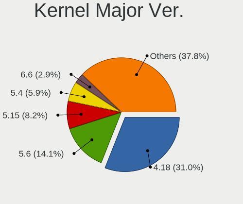

| Version | Desktops | Percent |
|---------|----------|---------|
| 4.18    | 650      | 42.79%  |
| 5.6     | 242      | 15.93%  |
| 5.4     | 128      | 8.43%   |
| 4.9     | 63       | 4.15%   |
| 5.10    | 53       | 3.49%   |
| 5.11    | 50       | 3.29%   |
| 4.15    | 42       | 2.76%   |
| 5.8     | 41       | 2.7%    |
| 5.13    | 38       | 2.5%    |
| 5.1     | 31       | 2.04%   |
| 5.3     | 30       | 1.97%   |
| 5.16    | 24       | 1.58%   |
| 5.15    | 22       | 1.45%   |
| 5.0     | 22       | 1.45%   |
| 4.19    | 13       | 0.86%   |
| 5.9     | 11       | 0.72%   |
| 5.18    | 10       | 0.66%   |
| 5.14    | 9        | 0.59%   |
| 5.7     | 8        | 0.53%   |
| 5.12    | 8        | 0.53%   |
| 5.17    | 7        | 0.46%   |
| 5.5     | 3        | 0.2%    |
| 4.7     | 3        | 0.2%    |
| 4.4     | 2        | 0.13%   |
| 4.20    | 2        | 0.13%   |
| 5.19    | 1        | 0.07%   |
| 4.5     | 1        | 0.07%   |
| 4.14    | 1        | 0.07%   |
| 4.12    | 1        | 0.07%   |
| 4.10    | 1        | 0.07%   |
| 4.1     | 1        | 0.07%   |
| 3.13    | 1        | 0.07%   |

Arch
----

OS architecture (x86_64, i586, etc.)

| Name   | Desktops | Percent |
|--------|----------|---------|
| x86_64 | 1270     | 94%     |
| i686   | 80       | 5.92%   |
| unknow | 1        | 0.07%   |

DE
--

Desktop Environment

| Name            | Desktops | Percent |
|-----------------|----------|---------|
| KDE5            | 953      | 69.51%  |
| GNOME           | 187      | 13.64%  |
| Unknown         | 84       | 6.13%   |
| XFCE            | 46       | 3.36%   |
| X-Cinnamon      | 27       | 1.97%   |
| MATE            | 21       | 1.53%   |
| KDE             | 11       | 0.8%    |
| LXQt            | 8        | 0.58%   |
| Cinnamon        | 8        | 0.58%   |
| Unity           | 7        | 0.51%   |
| KDE4            | 5        | 0.36%   |
| i3              | 4        | 0.29%   |
| LXDE            | 3        | 0.22%   |
| Deepin          | 3        | 0.22%   |
| GNOME Flashback | 1        | 0.07%   |
| GNOME Classic   | 1        | 0.07%   |
| Enlightenment   | 1        | 0.07%   |
| Budgie          | 1        | 0.07%   |

Display Server
--------------

X11 or Wayland

| Name    | Desktops | Percent |
|---------|----------|---------|
| X11     | 1258     | 93.53%  |
| Unknown | 45       | 3.35%   |
| Wayland | 28       | 2.08%   |
| Tty     | 14       | 1.04%   |

Display Manager
---------------

SDDM, LightDM, etc.

| Name    | Desktops | Percent |
|---------|----------|---------|
| SDDM    | 951      | 69.72%  |
| Unknown | 277      | 20.31%  |
| LightDM | 38       | 2.79%   |
| GDM3    | 33       | 2.42%   |
| GDM     | 33       | 2.42%   |
| TDM     | 25       | 1.83%   |
| KDM     | 5        | 0.37%   |
| SLiM    | 2        | 0.15%   |

OS Lang
-------

Language

| Lang    | Desktops | Percent |
|---------|----------|---------|
| Unknown | 926      | 67.64%  |
| hu_HU   | 275      | 20.09%  |
| en_US   | 140      | 10.23%  |
| en_GB   | 14       | 1.02%   |
| C       | 6        | 0.44%   |
| de_DE   | 5        | 0.37%   |
| POSIX   | 1        | 0.07%   |
| en_AG   | 1        | 0.07%   |
| C.UTF8  | 1        | 0.07%   |

Boot Mode
---------

EFI or BIOS

| Mode | Desktops | Percent |
|------|----------|---------|
| BIOS | 1018     | 73.4%   |
| EFI  | 369      | 26.6%   |

Filesystem
----------

Type of filesystem

| Type    | Desktops | Percent |
|---------|----------|---------|
| Ext4    | 717      | 49.31%  |
| Overlay | 683      | 46.97%  |
| Btrfs   | 24       | 1.65%   |
| Unknown | 18       | 1.24%   |
| Xfs     | 4        | 0.28%   |
| Zfs     | 3        | 0.21%   |
| Ext2    | 3        | 0.21%   |
| Tmpfs   | 1        | 0.07%   |
| Ext3    | 1        | 0.07%   |

Part. scheme
------------

Scheme of partitioning

| Type    | Desktops | Percent |
|---------|----------|---------|
| MBR     | 714      | 51.22%  |
| GPT     | 375      | 26.9%   |
| Unknown | 305      | 21.88%  |

Dual Boot with Linux/BSD
------------------------

Hosting more than one Linux/BSD

| Dual boot | Desktops | Percent |
|-----------|----------|---------|
| No        | 1009     | 69.3%   |
| Yes       | 447      | 30.7%   |

Dual Boot (Win)
---------------

Hosting Linux and Windows

| Dual boot | Desktops | Percent |
|-----------|----------|---------|
| Yes       | 755      | 53.17%  |
| No        | 665      | 46.83%  |

Board
-----

Vendor
------

Motherboard manufacturer

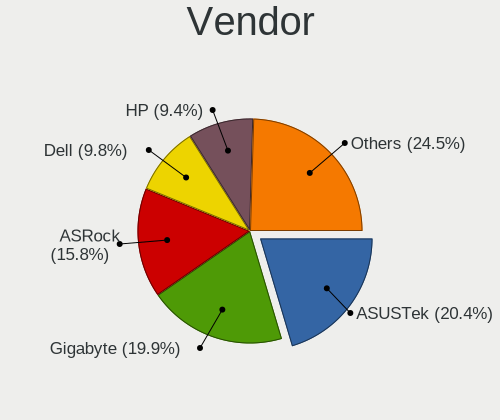

| Name                | Desktops | Percent |
|---------------------|----------|---------|
| Gigabyte Technology | 271      | 20.3%   |
| ASUSTek Computer    | 264      | 19.78%  |
| ASRock              | 236      | 17.68%  |
| Dell                | 132      | 9.89%   |
| Hewlett-Packard     | 116      | 8.69%   |
| MSI                 | 79       | 5.92%   |
| Lenovo              | 58       | 4.34%   |
| Fujitsu             | 40       | 3%      |
| Fujitsu Siemens     | 25       | 1.87%   |
| Intel               | 21       | 1.57%   |
| Acer                | 20       | 1.5%    |
| Foxconn             | 14       | 1.05%   |
| Unknown             | 13       | 0.97%   |
| Medion              | 8        | 0.6%    |
| Pegatron            | 5        | 0.37%   |
| Biostar             | 3        | 0.22%   |
| AOpen               | 3        | 0.22%   |
| ABIT                | 3        | 0.22%   |
| Shuttle             | 2        | 0.15%   |
| Nvidia              | 2        | 0.15%   |
| Gateway             | 2        | 0.15%   |
| AMD                 | 2        | 0.15%   |
| Wistron             | 1        | 0.07%   |
| Wincor Nixdorf      | 1        | 0.07%   |
| ViewSonic           | 1        | 0.07%   |
| Supermicro          | 1        | 0.07%   |
| Seeed Studio        | 1        | 0.07%   |
| NEC Computers       | 1        | 0.07%   |
| Minix               | 1        | 0.07%   |
| Lex                 | 1        | 0.07%   |
| JW Technology       | 1        | 0.07%   |
| JGINYUE             | 1        | 0.07%   |
| IBM                 | 1        | 0.07%   |
| Hampoo              | 1        | 0.07%   |
| ECS                 | 1        | 0.07%   |
| ASRockRack          | 1        | 0.07%   |
| Apple               | 1        | 0.07%   |
| AMI                 | 1        | 0.07%   |

Model
-----

Motherboard model

| Name                               | Desktops | Percent |
|------------------------------------|----------|---------|
| ASRock FM2A75M Pro4+               | 33       | 2.47%   |
| ASUS All Series                    | 25       | 1.87%   |
| Dell OptiPlex 3020                 | 17       | 1.27%   |
| Unknown                            | 13       | 0.97%   |
| ASUS P5KPL-AM EPU                  | 12       | 0.9%    |
| Gigabyte G31M-ES2L                 | 11       | 0.82%   |
| Dell OptiPlex 755                  | 11       | 0.82%   |
| Dell OptiPlex 780                  | 10       | 0.75%   |
| Dell OptiPlex 760                  | 9        | 0.67%   |
| Gigabyte H61M-S1                   | 8        | 0.6%    |
| Dell Precision WorkStation T3500   | 8        | 0.6%    |
| ASRock G41M-VS3                    | 8        | 0.6%    |
| Gigabyte 970A-DS3P                 | 7        | 0.52%   |
| Dell OptiPlex 7010                 | 7        | 0.52%   |
| HP ProDesk 600 G2 SFF              | 6        | 0.45%   |
| HP Compaq 8000 Elite SFF PC        | 6        | 0.45%   |
| Dell OptiPlex 330                  | 6        | 0.45%   |
| ASRock N68C-S UCC                  | 6        | 0.45%   |
| MSI MS-7592                        | 5        | 0.37%   |
| HP Compaq Elite 8300 SFF           | 5        | 0.37%   |
| HP Compaq dc5850 Small Form Factor | 5        | 0.37%   |
| HP Compaq dc5800 Small Form Factor | 5        | 0.37%   |
| Gigabyte H81M-S1                   | 5        | 0.37%   |
| Fujitsu Siemens ESPRIMO E5730      | 5        | 0.37%   |
| Foxconn Pro 3500 Series            | 5        | 0.37%   |
| Dell OptiPlex 745                  | 5        | 0.37%   |
| Dell OptiPlex 3010                 | 5        | 0.37%   |
| ASUS PRIME A320M-K                 | 5        | 0.37%   |
| ASRock FM2A68M-HD+                 | 5        | 0.37%   |
| ASRock 970 Pro3 R2.0               | 5        | 0.37%   |
| Acer Veriton M430                  | 5        | 0.37%   |
| MSI MS-7C02                        | 4        | 0.3%    |
| Medion Pentino G-Series            | 4        | 0.3%    |
| HP Compaq Pro 6305 SFF             | 4        | 0.3%    |
| HP Compaq Pro 6300 MT              | 4        | 0.3%    |
| HP Compaq dc5850 Microtower        | 4        | 0.3%    |
| Gigabyte X48-DS5                   | 4        | 0.3%    |
| Gigabyte P67A-D3-B3                | 4        | 0.3%    |
| Gigabyte B85M-DS3H-A               | 4        | 0.3%    |
| Gigabyte B450 AORUS M              | 4        | 0.3%    |
| Gigabyte B450 AORUS ELITE          | 4        | 0.3%    |
| Fujitsu ESPRIMO P910               | 4        | 0.3%    |
| Dell PowerEdge T20                 | 4        | 0.3%    |
| Dell OptiPlex 740 Enhanced         | 4        | 0.3%    |
| ASUS PRIME B365M-A                 | 4        | 0.3%    |
| ASUS P5KPL-AM SE                   | 4        | 0.3%    |
| ASUS H110M-K                       | 4        | 0.3%    |
| ASRock H110 Pro BTC+               | 4        | 0.3%    |
| ASRock FM2A68M-DG3+                | 4        | 0.3%    |
| ASRock ConRoe1333-D667             | 4        | 0.3%    |
| ASRock 970M Pro3                   | 4        | 0.3%    |
| ASRock 945GCM-S                    | 4        | 0.3%    |
| MSI MS-7817                        | 3        | 0.22%   |
| MSI MS-7788                        | 3        | 0.22%   |
| MSI MS-7680                        | 3        | 0.22%   |
| HP ProLiant MicroServer            | 3        | 0.22%   |
| HP Compaq Pro 6305 MT              | 3        | 0.22%   |
| HP Compaq Pro 6300 SFF             | 3        | 0.22%   |
| HP Compaq Elite 8300 CMT           | 3        | 0.22%   |
| HP Compaq dc7900 Small Form Factor | 3        | 0.22%   |

Model Family
------------

Motherboard model prefix

| Name                    | Desktops | Percent |
|-------------------------|----------|---------|
| Dell OptiPlex           | 108      | 8.09%   |
| HP Compaq               | 86       | 6.44%   |
| Lenovo ThinkCentre      | 45       | 3.37%   |
| ASUS PRIME              | 34       | 2.55%   |
| ASRock FM2A75M          | 33       | 2.47%   |
| Fujitsu ESPRIMO         | 29       | 2.17%   |
| ASUS All                | 25       | 1.87%   |
| Fujitsu Siemens ESPRIMO | 19       | 1.42%   |
| ASUS P5KPL-AM           | 17       | 1.27%   |
| Acer Veriton            | 14       | 1.05%   |
| Unknown                 | 13       | 0.97%   |
| Dell Precision          | 12       | 0.9%    |
| ASUS ROG                | 12       | 0.9%    |
| Gigabyte G31M-ES2L      | 11       | 0.82%   |
| Gigabyte B450           | 11       | 0.82%   |
| ASUS TUF                | 10       | 0.75%   |
| ASUS M5A97              | 9        | 0.67%   |
| HP ProDesk              | 8        | 0.6%    |
| Gigabyte H61M-S1        | 8        | 0.6%    |
| Gigabyte B450M          | 8        | 0.6%    |
| Fujitsu CELSIUS         | 8        | 0.6%    |
| ASRock G41M-VS3         | 8        | 0.6%    |
| ASRock 970              | 8        | 0.6%    |
| Gigabyte H310M          | 7        | 0.52%   |
| Gigabyte 970A-DS3P      | 7        | 0.52%   |
| ASRock N68C-S           | 7        | 0.52%   |
| HP EliteDesk            | 6        | 0.45%   |
| ASUS M5A78L-M           | 6        | 0.45%   |
| MSI MS-7592             | 5        | 0.37%   |
| Gigabyte H81M-S1        | 5        | 0.37%   |
| Foxconn Pro             | 5        | 0.37%   |
| Dell PowerEdge          | 5        | 0.37%   |
| ASUS H110M-A            | 5        | 0.37%   |
| ASRock Z77              | 5        | 0.37%   |
| ASRock FM2A68M-HD+      | 5        | 0.37%   |
| ASRock B450M            | 5        | 0.37%   |
| ASRock B450             | 5        | 0.37%   |
| MSI MS-7C02             | 4        | 0.3%    |
| Medion Pentino          | 4        | 0.3%    |
| Lenovo ThinkStation     | 4        | 0.3%    |
| Gigabyte X48-DS5        | 4        | 0.3%    |
| Gigabyte P67A-D3-B3     | 4        | 0.3%    |
| Gigabyte B85M-DS3H-A    | 4        | 0.3%    |
| Dell Vostro             | 4        | 0.3%    |
| ASUS P8H61-M            | 4        | 0.3%    |
| ASUS M2N68-AM           | 4        | 0.3%    |
| ASUS H110M-K            | 4        | 0.3%    |
| ASRock Z370             | 4        | 0.3%    |
| ASRock H110             | 4        | 0.3%    |
| ASRock FM2A68M-DG3+     | 4        | 0.3%    |
| ASRock ConRoe1333-D667  | 4        | 0.3%    |
| ASRock B75              | 4        | 0.3%    |
| ASRock 970M             | 4        | 0.3%    |
| ASRock 945GCM-S         | 4        | 0.3%    |
| Pegatron Compaq         | 3        | 0.22%   |
| MSI Pro                 | 3        | 0.22%   |
| MSI MS-7817             | 3        | 0.22%   |
| MSI MS-7788             | 3        | 0.22%   |
| MSI MS-7680             | 3        | 0.22%   |
| HP ProLiant             | 3        | 0.22%   |

MFG Year
--------

Motherboard manufacture year

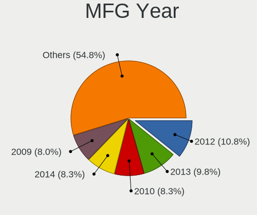

| Year    | Desktops | Percent |
|---------|----------|---------|
| 2012    | 151      | 11.31%  |
| 2013    | 139      | 10.41%  |
| 2010    | 124      | 9.29%   |
| 2014    | 120      | 8.99%   |
| 2009    | 120      | 8.99%   |
| 2008    | 117      | 8.76%   |
| 2011    | 108      | 8.09%   |
| 2018    | 89       | 6.67%   |
| 2007    | 87       | 6.52%   |
| 2015    | 54       | 4.04%   |
| 2017    | 46       | 3.45%   |
| 2016    | 41       | 3.07%   |
| 2019    | 37       | 2.77%   |
| 2006    | 36       | 2.7%    |
| 2020    | 27       | 2.02%   |
| 2005    | 17       | 1.27%   |
| 2021    | 13       | 0.97%   |
| 2004    | 4        | 0.3%    |
| 2003    | 3        | 0.22%   |
| 2022    | 1        | 0.07%   |
| Unknown | 1        | 0.07%   |

Form Factor
-----------

Physical design of the computer

| Name    | Desktops | Percent |
|---------|----------|---------|
| Desktop | 1335     | 100%    |

Secure Boot
-----------

Enabled or disabled

| State    | Desktops | Percent |
|----------|----------|---------|
| Disabled | 1328     | 99.33%  |
| Enabled  | 9        | 0.67%   |

Coreboot
--------

Have coreboot on board

| Used | Desktops | Percent |
|------|----------|---------|
| No   | 1335     | 100%    |

RAM Size
--------

Total RAM memory

| Size in GB  | Desktops | Percent |
|-------------|----------|---------|
| 3.01-4.0    | 397      | 28.81%  |
| 8.01-16.0   | 337      | 24.46%  |
| 4.01-8.0    | 225      | 16.33%  |
| 16.01-24.0  | 192      | 13.93%  |
| 1.01-2.0    | 109      | 7.91%   |
| 32.01-64.0  | 55       | 3.99%   |
| 2.01-3.0    | 30       | 2.18%   |
| 64.01-256.0 | 13       | 0.94%   |
| 24.01-32.0  | 12       | 0.87%   |
| 0.51-1.0    | 8        | 0.58%   |

RAM Used
--------

Used RAM memory

| Used GB     | Desktops | Percent |
|-------------|----------|---------|
| 0.51-1.0    | 440      | 28.3%   |
| 0.01-0.5    | 438      | 28.17%  |
| 1.01-2.0    | 404      | 25.98%  |
| 2.01-3.0    | 138      | 8.87%   |
| 4.01-8.0    | 57       | 3.67%   |
| 3.01-4.0    | 57       | 3.67%   |
| 8.01-16.0   | 14       | 0.9%    |
| 16.01-24.0  | 5        | 0.32%   |
| 64.01-256.0 | 1        | 0.06%   |
| Unknown     | 1        | 0.06%   |

Total Drives
------------

Number of drives on board

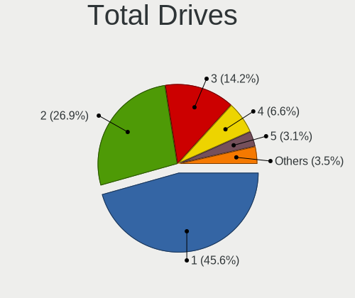

| Drives  | Desktops | Percent |
|---------|----------|---------|
| 1       | 710      | 48.93%  |
| 2       | 377      | 25.98%  |
| 3       | 197      | 13.58%  |
| 4       | 82       | 5.65%   |
| 5       | 37       | 2.55%   |
| 0       | 22       | 1.52%   |
| 6       | 11       | 0.76%   |
| 7       | 5        | 0.34%   |
| 8       | 4        | 0.28%   |
| 9       | 3        | 0.21%   |
| 11      | 1        | 0.07%   |
| 10      | 1        | 0.07%   |
| Unknown | 1        | 0.07%   |

Has CD-ROM
----------

Has CD-ROM on board

| Presented | Desktops | Percent |
|-----------|----------|---------|
| Yes       | 808      | 58.34%  |
| No        | 577      | 41.66%  |

Has Ethernet
------------

Has Ethernet on board

| Presented | Desktops | Percent |
|-----------|----------|---------|
| Yes       | 1319     | 98.8%   |
| No        | 16       | 1.2%    |

Has WiFi
--------

Has WiFi module

| Presented | Desktops | Percent |
|-----------|----------|---------|
| No        | 1026     | 75.16%  |
| Yes       | 339      | 24.84%  |

Has Bluetooth
-------------

Has Bluetooth module

| Presented | Desktops | Percent |
|-----------|----------|---------|
| No        | 1183     | 86.92%  |
| Yes       | 178      | 13.08%  |

Location
--------

Country
-------

Geographic location (country)

| Country | Desktops | Percent |
|---------|----------|---------|
| Hungary | 1335     | 100%    |

City
----

Geographic location (city)

| City              | Desktops | Percent |
|-------------------|----------|---------|
| Budapest          | 462      | 30.18%  |
| Pcs             | 38       | 2.48%   |
| Szeged            | 36       | 2.35%   |
| Gyr             | 28       | 1.83%   |
| Miskolc           | 27       | 1.76%   |
| Debrecen          | 25       | 1.63%   |
| Kecskemt        | 23       | 1.5%    |
| Tatabnya        | 22       | 1.44%   |
| Szombathely       | 22       | 1.44%   |
| Karcag            | 22       | 1.44%   |
| rd              | 17       | 1.11%   |
| Eger              | 17       | 1.11%   |
| Oroshaza          | 16       | 1.05%   |
| Szigetszentmiklos | 15       | 0.98%   |
| Szekszrd        | 15       | 0.98%   |
| Szkesfehrvr | 15       | 0.98%   |
| Nyiregyhaza       | 13       | 0.85%   |
| Gdll        | 13       | 0.85%   |
| Zalaegerszeg      | 11       | 0.72%   |
| Toeroekbalint     | 10       | 0.65%   |
| Mosonmagyarvr | 10       | 0.65%   |
| Hodmezovasarhely  | 10       | 0.65%   |
| Esztergom         | 10       | 0.65%   |
| Tiszafured        | 9        | 0.59%   |
| Papa              | 9        | 0.59%   |
| Nagykanizsa       | 9        | 0.59%   |
| Berettyjfalu  | 9        | 0.59%   |
| Ajka              | 9        | 0.59%   |
| Sifok           | 8        | 0.52%   |
| Gyomro            | 8        | 0.52%   |
| Szolnok           | 7        | 0.46%   |
| Salgotarjan       | 7        | 0.46%   |
| Mohcs           | 7        | 0.46%   |
| Hatvan            | 7        | 0.46%   |
| Dunajvros     | 7        | 0.46%   |
| Dunakeszi         | 7        | 0.46%   |
| Veresegyhaz       | 6        | 0.39%   |
| Sopron            | 6        | 0.39%   |
| Nagyatad          | 6        | 0.39%   |
| Hajduszoboszlo    | 6        | 0.39%   |
| Gyongyos          | 6        | 0.39%   |
| God               | 6        | 0.39%   |
| Dunaharaszti      | 6        | 0.39%   |
| Baja              | 6        | 0.39%   |
| Szentlorinc       | 5        | 0.33%   |
| Szentes           | 5        | 0.33%   |
| Mako              | 5        | 0.33%   |
| Cegled            | 5        | 0.33%   |
| Budaors           | 5        | 0.33%   |
| Biatorbagy        | 5        | 0.33%   |
| Bkscsaba      | 5        | 0.33%   |
| Balatonfured      | 5        | 0.33%   |
| Veszprm         | 4        | 0.26%   |
| Tolna             | 4        | 0.26%   |
| Szentendre        | 4        | 0.26%   |
| Szada             | 4        | 0.26%   |
| Sandorfalva       | 4        | 0.26%   |
| Nagykoros         | 4        | 0.26%   |
| Kunszentmiklos    | 4        | 0.26%   |
| Kisvarda          | 4        | 0.26%   |

Drives
------

Drive Vendor
------------

Hard drive vendors

| Vendor              | Desktops | Drives | Percent |
|---------------------|----------|--------|---------|
| WDC                 | 492      | 942    | 21.4%   |
| Samsung Electronics | 374      | 597    | 16.27%  |
| Seagate             | 344      | 542    | 14.96%  |
| Kingston            | 303      | 522    | 13.18%  |
| Toshiba             | 185      | 315    | 8.05%   |
| Hitachi             | 101      | 135    | 4.39%   |
| A-DATA Technology   | 72       | 115    | 3.13%   |
| Maxtor              | 46       | 61     | 2%      |
| SanDisk             | 30       | 33     | 1.3%    |
| Crucial             | 28       | 40     | 1.22%   |
| SPCC                | 25       | 36     | 1.09%   |
| OCZ                 | 17       | 23     | 0.74%   |
| Intel               | 17       | 32     | 0.74%   |
| HGST                | 17       | 34     | 0.74%   |
| Fujitsu             | 17       | 17     | 0.74%   |
| China               | 13       | 20     | 0.57%   |
| Hewlett-Packard     | 12       | 15     | 0.52%   |
| Unknown             | 11       | 17     | 0.48%   |
| Patriot             | 11       | 18     | 0.48%   |
| Intenso             | 11       | 13     | 0.48%   |
| Gigabyte Technology | 11       | 26     | 0.48%   |
| Apacer              | 10       | 15     | 0.43%   |
| Transcend           | 9        | 11     | 0.39%   |
| SK hynix            | 8        | 11     | 0.35%   |
| Kingmax             | 8        | 18     | 0.35%   |
| PNY                 | 7        | 14     | 0.3%    |
| Zheino              | 6        | 9      | 0.26%   |
| Phison              | 6        | 9      | 0.26%   |
| Micron Technology   | 6        | 7      | 0.26%   |
| KingSpec            | 6        | 6      | 0.26%   |
| JMicron Technology  | 6        | 8      | 0.26%   |
| Corsair             | 6        | 7      | 0.26%   |
| Team                | 5        | 7      | 0.22%   |
| Verbatim            | 4        | 8      | 0.17%   |
| Netac               | 4        | 9      | 0.17%   |
| LITEON              | 4        | 4      | 0.17%   |
| USB3.0              | 3        | 4      | 0.13%   |
| Silicon Motion      | 3        | 4      | 0.13%   |
| Quantum             | 3        | 3      | 0.13%   |
| ASMT                | 3        | 3      | 0.13%   |
| WD MediaMax         | 2        | 4      | 0.09%   |
| SATAFIRM            | 2        | 2      | 0.09%   |
| Leven               | 2        | 2      | 0.09%   |
| KingDian            | 2        | 2      | 0.09%   |
| Integral            | 2        | 2      | 0.09%   |
| ICY BOX             | 2        | 3      | 0.09%   |
| HGST HTS            | 2        | 2      | 0.09%   |
| GOODRAM             | 2        | 2      | 0.09%   |
| Apple               | 2        | 3      | 0.09%   |
| AMD                 | 2        | 2      | 0.09%   |
| XPG                 | 1        | 1      | 0.04%   |
| WDC WDS             | 1        | 1      | 0.04%   |
| Vaseky              | 1        | 1      | 0.04%   |
| USB2.0              | 1        | 1      | 0.04%   |
| USB                 | 1        | 1      | 0.04%   |
| TO Exter            | 1        | 1      | 0.04%   |
| SSD 120G            | 1        | 1      | 0.04%   |
| sobetter            | 1        | 1      | 0.04%   |
| ROG                 | 1        | 1      | 0.04%   |
| RECADATA            | 1        | 1      | 0.04%   |

Drive Model
-----------

Hard drive models

| Model                            | Desktops | Percent |
|----------------------------------|----------|---------|
| Kingston SA400S37120G 120GB SSD  | 66       | 2.53%   |
| Kingston SA400S37240G 240GB SSD  | 63       | 2.41%   |
| Kingston SV300S37A120G 120GB SSD | 54       | 2.07%   |
| Toshiba DT01ACA100 1TB           | 49       | 1.88%   |
| Seagate ST500DM002-1BD142 500GB  | 42       | 1.61%   |
| Toshiba DT01ACA050 500GB         | 31       | 1.19%   |
| A-DATA SU630 240GB SSD           | 28       | 1.07%   |
| Seagate ST380815AS 80GB          | 24       | 0.92%   |
| Kingston SUV400S37120G 120GB SSD | 23       | 0.88%   |
| Toshiba HDWD110 1TB              | 21       | 0.8%    |
| Samsung HD502HJ 500GB            | 21       | 0.8%    |
| A-DATA SU700 120GB SSD           | 20       | 0.77%   |
| WDC WD10EZEX-08WN4A0 1TB         | 19       | 0.73%   |
| Toshiba DT01ACA200 2TB           | 17       | 0.65%   |
| Samsung SSD 860 EVO 250GB        | 17       | 0.65%   |
| Toshiba HDWD130 3TB              | 16       | 0.61%   |
| Samsung SSD 850 EVO 250GB        | 15       | 0.57%   |
| Kingston SHFS37A120G 120GB SSD   | 15       | 0.57%   |
| Kingston SA400S37480G 480GB SSD  | 15       | 0.57%   |
| Seagate ST3160815AS 160GB        | 14       | 0.54%   |
| Seagate ST2000DM008-2FR102 2TB   | 14       | 0.54%   |
| Samsung HD322HJ 320GB            | 14       | 0.54%   |
| Samsung HD161HJ 160GB            | 14       | 0.54%   |
| Hitachi HDS721050CLA360 500GB    | 14       | 0.54%   |
| Samsung HD502IJ 500GB            | 13       | 0.5%    |
| WDC WDS240G2G0B-00EPW0 240GB SSD | 12       | 0.46%   |
| WDC WD10EZEX-22MFCA0 1TB         | 12       | 0.46%   |
| Seagate ST3160318AS 160GB        | 12       | 0.46%   |
| Seagate ST1000DM010-2EP102 1TB   | 12       | 0.46%   |
| Kingston SV300S37A240G 240GB SSD | 12       | 0.46%   |
| WDC WDS240G2G0A-00JH30 240GB SSD | 11       | 0.42%   |
| WDC WD5000AAKX-22ERMA0 500GB     | 11       | 0.42%   |
| WDC WD10EZRX-00L4HB0 1TB         | 11       | 0.42%   |
| Seagate ST3250318AS 250GB        | 11       | 0.42%   |
| Samsung HD501LJ 500GB            | 11       | 0.42%   |
| Samsung HD103UJ 1TB              | 11       | 0.42%   |
| WDC WD5000AAKX-001CA0 500GB      | 10       | 0.38%   |
| WDC WD10EZRZ-00HTKB0 1TB         | 10       | 0.38%   |
| WDC WD10EZEX-00BN5A0 1TB         | 10       | 0.38%   |
| Samsung SSD 840 EVO 120GB        | 10       | 0.38%   |
| Samsung HD160JJ 160GB            | 10       | 0.38%   |
| Samsung HD082GJ 80GB             | 10       | 0.38%   |
| Kingston SH103S3120G 120GB SSD   | 10       | 0.38%   |
| Fujitsu MHZ2160BH G2 160GB       | 10       | 0.38%   |
| WDC WD5000AADS-00S9B0 500GB      | 9        | 0.34%   |
| SPCC Solid State Disk 256GB      | 9        | 0.34%   |
| Samsung SSD 850 EVO 500GB        | 9        | 0.34%   |
| Samsung HD154UI 1TB              | 9        | 0.34%   |
| Samsung HD103SJ 1TB              | 9        | 0.34%   |
| Kingston SV300S37A60G 64GB SSD   | 9        | 0.34%   |
| WDC WDS120G2G0A-00JH30 120GB SSD | 8        | 0.31%   |
| WDC WD5000AAKX-60U6AA0 500GB     | 8        | 0.31%   |
| Toshiba DT01ACA300 3TB           | 8        | 0.31%   |
| Samsung HD321KJ 320GB            | 8        | 0.31%   |
| Kingston SUV400S37240G 240GB SSD | 8        | 0.31%   |
| WDC WDS500G2B0A-00SM50 500GB SSD | 7        | 0.27%   |
| WDC WD5000AZRX-00L4HB0 500GB     | 7        | 0.27%   |
| WDC WD20EZRZ-00Z5HB0 2TB         | 7        | 0.27%   |
| WDC WD20EZRX-00D8PB0 2TB         | 7        | 0.27%   |
| WDC WD20EARX-00PASB0 2TB         | 7        | 0.27%   |

HDD Vendor
----------

Hard disk drive vendors

| Vendor              | Desktops | Drives | Percent |
|---------------------|----------|--------|---------|
| WDC                 | 459      | 859    | 32.53%  |
| Seagate             | 339      | 533    | 24.03%  |
| Samsung Electronics | 224      | 337    | 15.88%  |
| Toshiba             | 177      | 306    | 12.54%  |
| Hitachi             | 101      | 135    | 7.16%   |
| Maxtor              | 46       | 61     | 3.26%   |
| HGST                | 17       | 34     | 1.2%    |
| Fujitsu             | 17       | 17     | 1.2%    |
| Hewlett-Packard     | 7        | 7      | 0.5%    |
| USB3.0              | 3        | 4      | 0.21%   |
| Unknown             | 3        | 4      | 0.21%   |
| Quantum             | 3        | 3      | 0.21%   |
| ASMT                | 3        | 3      | 0.21%   |
| WD MediaMax         | 2        | 4      | 0.14%   |
| SATAFIRM            | 2        | 2      | 0.14%   |
| ICY BOX             | 2        | 3      | 0.14%   |
| Apple               | 2        | 3      | 0.14%   |
| USB                 | 1        | 1      | 0.07%   |
| IBM/Hitachi         | 1        | 1      | 0.07%   |
| ExcelStor           | 1        | 1      | 0.07%   |
| ASMedia             | 1        | 1      | 0.07%   |

SSD Vendor
----------

Solid state drive vendors

| Vendor              | Desktops | Drives | Percent |
|---------------------|----------|--------|---------|
| Kingston            | 282      | 475    | 35.74%  |
| Samsung Electronics | 134      | 196    | 16.98%  |
| A-DATA Technology   | 69       | 108    | 8.75%   |
| WDC                 | 47       | 78     | 5.96%   |
| SanDisk             | 28       | 30     | 3.55%   |
| Crucial             | 24       | 35     | 3.04%   |
| SPCC                | 19       | 29     | 2.41%   |
| OCZ                 | 17       | 23     | 2.15%   |
| Intel               | 13       | 24     | 1.65%   |
| China               | 13       | 20     | 1.65%   |
| Patriot             | 10       | 17     | 1.27%   |
| Intenso             | 10       | 12     | 1.27%   |
| Apacer              | 10       | 15     | 1.27%   |
| Toshiba             | 9        | 9      | 1.14%   |
| Gigabyte Technology | 9        | 23     | 1.14%   |
| Transcend           | 8        | 10     | 1.01%   |
| Kingmax             | 8        | 18     | 1.01%   |
| PNY                 | 7        | 14     | 0.89%   |
| KingSpec            | 6        | 6      | 0.76%   |
| Team                | 5        | 7      | 0.63%   |
| SK hynix            | 5        | 8      | 0.63%   |
| Micron Technology   | 5        | 6      | 0.63%   |
| JMicron Technology  | 5        | 7      | 0.63%   |
| Corsair             | 5        | 6      | 0.63%   |
| Verbatim            | 4        | 8      | 0.51%   |
| Netac               | 4        | 9      | 0.51%   |
| LITEON              | 4        | 4      | 0.51%   |
| Hewlett-Packard     | 3        | 3      | 0.38%   |
| KingDian            | 2        | 2      | 0.25%   |
| Integral            | 2        | 2      | 0.25%   |
| GOODRAM             | 2        | 2      | 0.25%   |
| AMD                 | 2        | 2      | 0.25%   |
| WDC WDS             | 1        | 1      | 0.13%   |
| Vaseky              | 1        | 1      | 0.13%   |
| Unknown             | 1        | 2      | 0.13%   |
| TO Exter            | 1        | 1      | 0.13%   |
| Seagate             | 1        | 1      | 0.13%   |
| RECADATA            | 1        | 1      | 0.13%   |
| Platinet            | 1        | 1      | 0.13%   |
| Leven               | 1        | 1      | 0.13%   |
| KODAK               | 1        | 1      | 0.13%   |
| KingFast            | 1        | 1      | 0.13%   |
| HS-SSD-C100         | 1        | 1      | 0.13%   |
| GALAX               | 1        | 2      | 0.13%   |
| Emtec               | 1        | 1      | 0.13%   |
| EAGET S5            | 1        | 1      | 0.13%   |
| Drevo               | 1        | 2      | 0.13%   |
| BIWIN               | 1        | 5      | 0.13%   |
| 2-Power             | 1        | 1      | 0.13%   |
| Unknown             | 1        | 1      | 0.13%   |

Drive Kind
----------

HDD or SSD

| Kind    | Desktops | Drives | Percent |
|---------|----------|--------|---------|
| HDD     | 1061     | 2319   | 56.35%  |
| SSD     | 679      | 1233   | 36.06%  |
| NVMe    | 113      | 188    | 6%      |
| Unknown | 23       | 29     | 1.22%   |
| MMC     | 7        | 9      | 0.37%   |

Drive Connector
---------------

SATA, SAS, NVMe, etc.

| Type | Desktops | Drives | Percent |
|------|----------|--------|---------|
| SATA | 1292     | 3481   | 87.83%  |
| NVMe | 112      | 187    | 7.61%   |
| SAS  | 60       | 101    | 4.08%   |
| MMC  | 7        | 9      | 0.48%   |

Drive Size
----------

Size of hard drive

| Size in TB | Desktops | Drives | Percent |
|------------|----------|--------|---------|
| 0.01-0.5   | 1183     | 2500   | 68.58%  |
| 0.51-1.0   | 346      | 647    | 20.06%  |
| 1.01-2.0   | 109      | 181    | 6.32%   |
| 2.01-3.0   | 39       | 107    | 2.26%   |
| 3.01-4.0   | 33       | 68     | 1.91%   |
| 4.01-10.0  | 11       | 33     | 0.64%   |
| 10.01-20.0 | 4        | 16     | 0.23%   |

Space Total
-----------

Amount of disk space available on the file system

| Size in GB     | Desktops | Percent |
|----------------|----------|---------|
| Unknown        | 642      | 41.63%  |
| 101-250        | 285      | 18.48%  |
| 251-500        | 160      | 10.38%  |
| 51-100         | 113      | 7.33%   |
| 501-1000       | 84       | 5.45%   |
| 1001-2000      | 70       | 4.54%   |
| 1-20           | 61       | 3.96%   |
| 21-50          | 59       | 3.83%   |
| More than 3000 | 42       | 2.72%   |
| 2001-3000      | 26       | 1.69%   |

Space Used
----------

Amount of used disk space

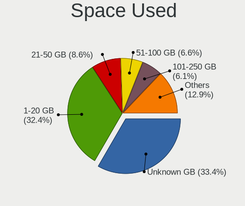

| Used GB        | Desktops | Percent |
|----------------|----------|---------|
| Unknown        | 642      | 41.91%  |
| 1-20           | 486      | 31.72%  |
| 21-50          | 103      | 6.72%   |
| 51-100         | 77       | 5.03%   |
| 101-250        | 70       | 4.57%   |
| 501-1000       | 53       | 3.46%   |
| 251-500        | 43       | 2.81%   |
| 1001-2000      | 31       | 2.02%   |
| More than 3000 | 17       | 1.11%   |
| 2001-3000      | 10       | 0.65%   |

Malfunc. Drives
---------------

Drive models with a malfunction

| Model                             | Desktops | Drives | Percent |
|-----------------------------------|----------|--------|---------|
| A-DATA Technology SU630 240GB SSD | 18       | 21     | 3.44%   |
| Seagate ST500DM002-1BD142 500GB   | 15       | 29     | 2.87%   |
| Kingston SV300S37A120G 120GB SSD  | 13       | 13     | 2.49%   |
| Samsung Electronics HD103UJ 1TB   | 10       | 16     | 1.91%   |
| Toshiba DT01ACA050 500GB          | 8        | 9      | 1.53%   |
| WDC WD5000AAKX-001CA0 500GB       | 6        | 6      | 1.15%   |
| WDC WD5000AADS-00S9B0 500GB       | 6        | 7      | 1.15%   |
| Toshiba DT01ACA100 1TB            | 6        | 12     | 1.15%   |
| Seagate ST3250318AS 250GB         | 5        | 8      | 0.96%   |
| Samsung Electronics HD502HJ 500GB | 5        | 8      | 0.96%   |
| Samsung Electronics HD321KJ 320GB | 5        | 5      | 0.96%   |
| Samsung Electronics HD161HJ 160GB | 5        | 5      | 0.96%   |
| Samsung Electronics HD103SI 1TB   | 5        | 5      | 0.96%   |
| Maxtor 6Y080M0 81GB               | 5        | 6      | 0.96%   |
| WDC WD5000AAKS-00UU3A0 500GB      | 4        | 6      | 0.76%   |
| Seagate ST380815AS 80GB           | 4        | 7      | 0.76%   |
| Seagate ST3160815AS 160GB         | 4        | 4      | 0.76%   |
| Samsung Electronics SP2504C 250GB | 4        | 5      | 0.76%   |
| Samsung Electronics SP2004C 200GB | 4        | 7      | 0.76%   |
| Samsung Electronics HD161GJ 160GB | 4        | 5      | 0.76%   |
| Samsung Electronics HD082GJ 80GB  | 4        | 4      | 0.76%   |
| Maxtor 2B020H1 20GB               | 4        | 8      | 0.76%   |
| WDC WD5000AAKX-08U6AA0 500GB      | 3        | 5      | 0.57%   |
| WDC WD5000AAKX-07U6AA0 500GB      | 3        | 5      | 0.57%   |
| WDC WD3200AAKS-00L9A0 320GB       | 3        | 4      | 0.57%   |
| WDC WD15EARS-00MVWB0 1TB          | 3        | 5      | 0.57%   |
| WDC WD10EZEX-22MFCA0 1TB          | 3        | 3      | 0.57%   |
| WDC WD10EARS-00Y5B1 1TB           | 3        | 6      | 0.57%   |
| WDC WD10EALX-009BA0 1TB           | 3        | 3      | 0.57%   |
| SK hynix SC210 2.5 7MM 128GB SSD  | 3        | 6      | 0.57%   |
| Seagate ST500LT012-9WS142 500GB   | 3        | 3      | 0.57%   |
| Seagate ST4000DM000-1F2168 4TB    | 3        | 8      | 0.57%   |
| Seagate ST3500320AS 500GB         | 3        | 4      | 0.57%   |
| Seagate ST3160812AS 160GB         | 3        | 3      | 0.57%   |
| Seagate ST3160318AS 160GB         | 3        | 3      | 0.57%   |
| Samsung Electronics SP1203N 120GB | 3        | 3      | 0.57%   |
| Samsung Electronics HD642JJ 640GB | 3        | 6      | 0.57%   |
| Samsung Electronics HD502IJ 500GB | 3        | 4      | 0.57%   |
| Samsung Electronics HD501LJ 500GB | 3        | 4      | 0.57%   |
| Samsung Electronics HD322HJ 320GB | 3        | 3      | 0.57%   |
| Samsung Electronics HD160JJ 160GB | 3        | 3      | 0.57%   |
| Samsung Electronics HD080HJ 80GB  | 3        | 3      | 0.57%   |
| Maxtor 6Y080L0 82GB               | 3        | 4      | 0.57%   |
| Maxtor 6E040L0 41GB               | 3        | 4      | 0.57%   |
| Hitachi HTS545050B9A300 500GB     | 3        | 3      | 0.57%   |
| Hitachi HDP725050GLA360 500GB     | 3        | 3      | 0.57%   |
| WDC WD800AAJS-75M0A0 80GB         | 2        | 3      | 0.38%   |
| WDC WD6400AAVS-00G9B1 640GB       | 2        | 2      | 0.38%   |
| WDC WD5000AZRX-00L4HB0 500GB      | 2        | 2      | 0.38%   |
| WDC WD5000AVCS-632DY1 500GB       | 2        | 4      | 0.38%   |
| WDC WD5000AAKX-22ERMA0 500GB      | 2        | 3      | 0.38%   |
| WDC WD5000AAKX-221CA1 500GB       | 2        | 2      | 0.38%   |
| WDC WD5000AAKX-08ERMA0 500GB      | 2        | 4      | 0.38%   |
| WDC WD5000AAKX-00ERMA0 500GB      | 2        | 2      | 0.38%   |
| WDC WD5000AAKS-22A7B0 500GB       | 2        | 2      | 0.38%   |
| WDC WD5000AAKS-00A7B2 500GB       | 2        | 3      | 0.38%   |
| WDC WD3200AAKS-00UU3A0 320GB      | 2        | 2      | 0.38%   |
| WDC WD20EZRZ-00Z5HB0 2TB          | 2        | 3      | 0.38%   |
| WDC WD20EARX-00PASB0 2TB          | 2        | 2      | 0.38%   |
| WDC WD10EZRX-00A8LB0 1TB          | 2        | 4      | 0.38%   |

Malfunc. Drive Vendor
---------------------

Vendors of faulty drives

| Vendor              | Desktops | Drives | Percent |
|---------------------|----------|--------|---------|
| WDC                 | 140      | 221    | 28.06%  |
| Seagate             | 97       | 139    | 19.44%  |
| Samsung Electronics | 93       | 131    | 18.64%  |
| Toshiba             | 30       | 40     | 6.01%   |
| Hitachi             | 30       | 43     | 6.01%   |
| Kingston            | 28       | 31     | 5.61%   |
| Maxtor              | 26       | 40     | 5.21%   |
| A-DATA Technology   | 22       | 30     | 4.41%   |
| HGST                | 7        | 8      | 1.4%    |
| Fujitsu             | 4        | 4      | 0.8%    |
| SK hynix            | 3        | 6      | 0.6%    |
| Hewlett-Packard     | 3        | 3      | 0.6%    |
| WD MediaMax         | 2        | 4      | 0.4%    |
| KingSpec            | 2        | 2      | 0.4%    |
| SATAFIRM            | 1        | 1      | 0.2%    |
| SanDisk             | 1        | 1      | 0.2%    |
| OCZ                 | 1        | 3      | 0.2%    |
| LITEON              | 1        | 1      | 0.2%    |
| Kingmax             | 1        | 1      | 0.2%    |
| Intenso             | 1        | 1      | 0.2%    |
| Intel               | 1        | 1      | 0.2%    |
| ICY BOX             | 1        | 1      | 0.2%    |
| IBM/Hitachi         | 1        | 1      | 0.2%    |
| ExcelStor           | 1        | 1      | 0.2%    |
| China               | 1        | 1      | 0.2%    |
| ASMT                | 1        | 1      | 0.2%    |

Malfunc. HDD Vendor
-------------------

Vendors of faulty HDD drives

| Vendor              | Desktops | Drives | Percent |
|---------------------|----------|--------|---------|
| WDC                 | 138      | 219    | 32.09%  |
| Seagate             | 97       | 139    | 22.56%  |
| Samsung Electronics | 90       | 128    | 20.93%  |
| Hitachi             | 30       | 43     | 6.98%   |
| Toshiba             | 29       | 39     | 6.74%   |
| Maxtor              | 26       | 40     | 6.05%   |
| HGST                | 7        | 8      | 1.63%   |
| Fujitsu             | 4        | 4      | 0.93%   |
| WD MediaMax         | 2        | 4      | 0.47%   |
| Hewlett-Packard     | 2        | 2      | 0.47%   |
| SATAFIRM            | 1        | 1      | 0.23%   |
| ICY BOX             | 1        | 1      | 0.23%   |
| IBM/Hitachi         | 1        | 1      | 0.23%   |
| ExcelStor           | 1        | 1      | 0.23%   |
| ASMT                | 1        | 1      | 0.23%   |

Malfunc. Drive Kind
-------------------

Kinds of faulty drives

| Kind | Desktops | Drives | Percent |
|------|----------|--------|---------|
| HDD  | 370      | 631    | 84.67%  |
| SSD  | 65       | 83     | 14.87%  |
| NVMe | 2        | 2      | 0.46%   |

Failed Drives
-------------

Failed drive models

| Model                             | Desktops | Drives | Percent |
|-----------------------------------|----------|--------|---------|
| Samsung Electronics HD502HJ 500GB | 2        | 2      | 25%     |
| Zheino CHN-NGFFNV2280-256 256GB   | 1        | 1      | 12.5%   |
| Seagate ST380815AS 80GB           | 1        | 3      | 12.5%   |
| Samsung Electronics SP0802N 80GB  | 1        | 1      | 12.5%   |
| Samsung Electronics HD204UI 2TB   | 1        | 1      | 12.5%   |
| Samsung Electronics HD103SJ 1TB   | 1        | 2      | 12.5%   |
| Hewlett-Packard SSD EX900 250GB   | 1        | 1      | 12.5%   |

Failed Drive Vendor
-------------------

Failed drive vendors

| Vendor              | Desktops | Drives | Percent |
|---------------------|----------|--------|---------|
| Samsung Electronics | 5        | 6      | 62.5%   |
| Zheino              | 1        | 1      | 12.5%   |
| Seagate             | 1        | 3      | 12.5%   |
| Hewlett-Packard     | 1        | 1      | 12.5%   |

Drive Status
------------

Number of failed and malfunc. drives

| Status   | Desktops | Drives | Percent |
|----------|----------|--------|---------|
| Works    | 843      | 2124   | 51.28%  |
| Malfunc  | 422      | 716    | 25.67%  |
| Detected | 371      | 927    | 22.57%  |
| Failed   | 8        | 11     | 0.49%   |

Storage controller
------------------

Storage Vendor
--------------

Storage controller vendors

| Vendor                           | Desktops | Percent |
|----------------------------------|----------|---------|
| Intel                            | 910      | 55.15%  |
| AMD                              | 355      | 21.52%  |
| JMicron Technology               | 73       | 4.42%   |
| Nvidia                           | 54       | 3.27%   |
| ASMedia Technology               | 53       | 3.21%   |
| Samsung Electronics              | 46       | 2.79%   |
| Marvell Technology Group         | 34       | 2.06%   |
| Kingston Technology Company      | 29       | 1.76%   |
| Phison Electronics               | 17       | 1.03%   |
| VIA Technologies                 | 12       | 0.73%   |
| Silicon Motion                   | 12       | 0.73%   |
| Silicon Image                    | 10       | 0.61%   |
| LSI Logic / Symbios Logic        | 9        | 0.55%   |
| SanDisk                          | 6        | 0.36%   |
| Micron/Crucial Technology        | 4        | 0.24%   |
| Integrated Technology Express    | 4        | 0.24%   |
| ADATA Technology                 | 4        | 0.24%   |
| SK hynix                         | 3        | 0.18%   |
| Broadcom / LSI                   | 2        | 0.12%   |
| Adaptec                          | 2        | 0.12%   |
| Silicon Integrated Systems [SiS] | 1        | 0.06%   |
| Seagate Technology               | 1        | 0.06%   |
| Realtek Semiconductor            | 1        | 0.06%   |
| Promise Technology               | 1        | 0.06%   |
| OCZ Technology Group             | 1        | 0.06%   |
| Micron Technology                | 1        | 0.06%   |
| KIOXIA                           | 1        | 0.06%   |
| Initio                           | 1        | 0.06%   |
| HighPoint Technologies           | 1        | 0.06%   |
| Hewlett-Packard                  | 1        | 0.06%   |
| 3ware                            | 1        | 0.06%   |

Storage Model
-------------

Storage controller models

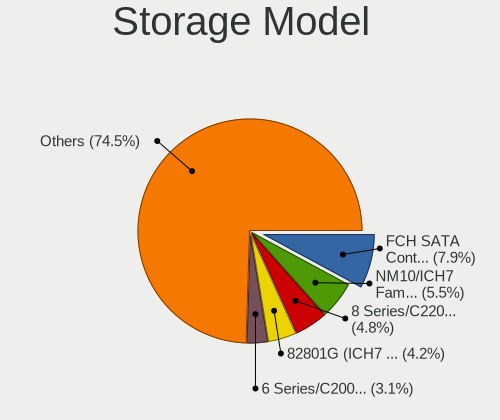

| Model                                                                                   | Desktops | Percent |
|-----------------------------------------------------------------------------------------|----------|---------|
| AMD FCH SATA Controller [AHCI mode]                                                     | 188      | 8.02%   |
| Intel NM10/ICH7 Family SATA Controller [IDE mode]                                       | 157      | 6.7%    |
| Intel 82801G (ICH7 Family) IDE Controller                                               | 122      | 5.2%    |
| Intel 8 Series/C220 Series Chipset Family 6-port SATA Controller 1 [AHCI mode]          | 112      | 4.78%   |
| AMD SB7x0/SB8x0/SB9x0 IDE Controller                                                    | 80       | 3.41%   |
| Intel 6 Series/C200 Series Chipset Family 6 port Desktop SATA AHCI Controller           | 79       | 3.37%   |
| Intel 7 Series/C210 Series Chipset Family 6-port SATA Controller [AHCI mode]            | 69       | 2.94%   |
| AMD SB7x0/SB8x0/SB9x0 SATA Controller [AHCI mode]                                       | 64       | 2.73%   |
| AMD FCH IDE Controller                                                                  | 63       | 2.69%   |
| AMD SB7x0/SB8x0/SB9x0 SATA Controller [IDE mode]                                        | 59       | 2.52%   |
| Intel Q170/Q150/B150/H170/H110/Z170/CM236 Chipset SATA Controller [AHCI Mode]           | 58       | 2.47%   |
| AMD 400 Series Chipset SATA Controller                                                  | 54       | 2.3%    |
| Intel 4 Series Chipset PT IDER Controller                                               | 47       | 2%      |
| ASMedia ASM1062 Serial ATA Controller                                                   | 47       | 2%      |
| Intel 82801I (ICH9 Family) 2 port SATA Controller [IDE mode]                            | 45       | 1.92%   |
| JMicron JMB363 SATA/IDE Controller                                                      | 43       | 1.83%   |
| Intel 6 Series/C200 Series Chipset Family Desktop SATA Controller (IDE mode, ports 4-5) | 43       | 1.83%   |
| Intel 6 Series/C200 Series Chipset Family Desktop SATA Controller (IDE mode, ports 0-3) | 43       | 1.83%   |
| Intel 200 Series PCH SATA controller [AHCI mode]                                        | 43       | 1.83%   |
| Intel SATA Controller [RAID mode]                                                       | 42       | 1.79%   |
| Intel 82801JD/DO (ICH10 Family) SATA AHCI Controller                                    | 33       | 1.41%   |
| Samsung NVMe SSD Controller SM981/PM981/PM983                                           | 32       | 1.36%   |
| JMicron JMB368 IDE controller                                                           | 26       | 1.11%   |
| Intel 82801IR/IO/IH (ICH9R/DO/DH) 4 port SATA Controller [IDE mode]                     | 26       | 1.11%   |
| Nvidia MCP61 SATA Controller                                                            | 25       | 1.07%   |
| Intel 82Q35 Express PT IDER Controller                                                  | 22       | 0.94%   |
| Intel 82801JD/DO (ICH10 Family) 4-port SATA IDE Controller                              | 22       | 0.94%   |
| Intel 82801JD/DO (ICH10 Family) 2-port SATA IDE Controller                              | 22       | 0.94%   |
| Nvidia MCP61 IDE                                                                        | 20       | 0.85%   |
| Kingston Company A2000 NVMe SSD                                                         | 20       | 0.85%   |
| Intel 82801JI (ICH10 Family) 4 port SATA IDE Controller #1                              | 20       | 0.85%   |
| Intel 82801JI (ICH10 Family) 2 port SATA IDE Controller #2                              | 20       | 0.85%   |
| Intel 82801IB (ICH9) 2 port SATA Controller [IDE mode]                                  | 19       | 0.81%   |
| Intel 82801JI (ICH10 Family) SATA AHCI Controller                                       | 18       | 0.77%   |
| Intel 82801IR/IO/IH (ICH9R/DO/DH) 6 port SATA Controller [AHCI mode]                    | 17       | 0.72%   |
| AMD FCH SATA Controller D                                                               | 17       | 0.72%   |
| Intel Cannon Lake PCH SATA AHCI Controller                                              | 16       | 0.68%   |
| Intel 5 Series/3400 Series Chipset 6 port SATA AHCI Controller                          | 16       | 0.68%   |
| Intel 5 Series/3400 Series Chipset 4 port SATA IDE Controller                           | 15       | 0.64%   |
| Intel 5 Series/3400 Series Chipset 2 port SATA IDE Controller                           | 15       | 0.64%   |
| Intel 82801H (ICH8 Family) 4 port SATA Controller [IDE mode]                            | 14       | 0.6%    |
| AMD 500 Series Chipset SATA Controller                                                  | 13       | 0.55%   |
| Intel 82801HR/HO/HH (ICH8R/DO/DH) 2 port SATA Controller [IDE mode]                     | 12       | 0.51%   |
| AMD FCH SATA Controller [IDE mode]                                                      | 12       | 0.51%   |
| Silicon Motion SM2263EN/SM2263XT SSD Controller                                         | 11       | 0.47%   |
| Intel 9 Series Chipset Family SATA Controller [AHCI Mode]                               | 10       | 0.43%   |
| Intel 7 Series/C210 Series Chipset Family 4-port SATA Controller [IDE mode]             | 10       | 0.43%   |
| Intel 7 Series/C210 Series Chipset Family 2-port SATA Controller [IDE mode]             | 10       | 0.43%   |
| AMD SB600 Non-Raid-5 SATA                                                               | 10       | 0.43%   |
| AMD SB600 IDE                                                                           | 10       | 0.43%   |
| Intel NM10/ICH7 Family SATA Controller [AHCI mode]                                      | 9        | 0.38%   |
| VIA VT82C586A/B/VT82C686/A/B/VT823x/A/C PIPC Bus Master IDE                             | 8        | 0.34%   |
| Marvell Group 88SE6111/6121 SATA II / PATA Controller                                   | 8        | 0.34%   |
| Intel 82801FB/FW (ICH6/ICH6W) SATA Controller                                           | 8        | 0.34%   |
| Samsung NVMe SSD Controller SM961/PM961/SM963                                           | 7        | 0.3%    |
| Nvidia MCP51 Serial ATA Controller                                                      | 7        | 0.3%    |
| Intel 82801FB/FBM/FR/FW/FRW (ICH6 Family) IDE Controller                                | 7        | 0.3%    |
| AMD 300 Series Chipset SATA Controller                                                  | 7        | 0.3%    |
| Samsung NVMe SSD Controller PM9A1/PM9A3/980PRO                                          | 6        | 0.26%   |
| Phison E12 NVMe Controller                                                              | 6        | 0.26%   |

Storage Kind
------------

Kind of storage controller (IDE, SATA, NVMe, SAS, ...)

| Kind | Desktops | Percent |
|------|----------|---------|
| SATA | 897      | 51.43%  |
| IDE  | 643      | 36.87%  |
| NVMe | 115      | 6.59%   |
| RAID | 75       | 4.3%    |
| SCSI | 8        | 0.46%   |
| SAS  | 6        | 0.34%   |

Processor
---------

CPU Vendor
----------

Processor vendors

| Vendor | Desktops | Percent |
|--------|----------|---------|
| Intel  | 928      | 69.51%  |
| AMD    | 407      | 30.49%  |

CPU Model
---------

Processor models

| Model                                         | Desktops | Percent |
|-----------------------------------------------|----------|---------|
| Intel Core 2 Duo CPU E8400 @ 3.00GHz          | 38       | 2.84%   |
| AMD A8-6600K APU with Radeon HD Graphics      | 36       | 2.69%   |
| Intel Core i5-3470 CPU @ 3.20GHz              | 25       | 1.87%   |
| Intel Core i3-2120 CPU @ 3.30GHz              | 19       | 1.42%   |
| Intel Core 2 Duo CPU E7500 @ 2.93GHz          | 19       | 1.42%   |
| Intel Core i5-6500 CPU @ 3.20GHz              | 16       | 1.19%   |
| Intel Core i5-2400 CPU @ 3.10GHz              | 16       | 1.19%   |
| Intel Core i5-4590 CPU @ 3.30GHz              | 15       | 1.12%   |
| Intel Core 2 Duo CPU E7300 @ 2.66GHz          | 15       | 1.12%   |
| AMD FX-8350 Eight-Core Processor              | 15       | 1.12%   |
| Intel Core i3-4160 CPU @ 3.60GHz              | 14       | 1.04%   |
| Intel Core i3-3220 CPU @ 3.30GHz              | 14       | 1.04%   |
| AMD FX-6300 Six-Core Processor                | 14       | 1.04%   |
| Intel Core 2 Quad CPU Q6600 @ 2.40GHz         | 13       | 0.97%   |
| AMD Ryzen 5 2600 Six-Core Processor           | 13       | 0.97%   |
| Intel Pentium Dual-Core CPU E5700 @ 3.00GHz   | 12       | 0.9%    |
| Intel Pentium CPU G3220 @ 3.00GHz             | 12       | 0.9%    |
| Intel Pentium 4 CPU 3.00GHz                   | 11       | 0.82%   |
| Intel Core i5-2500K CPU @ 3.30GHz             | 11       | 0.82%   |
| Intel Pentium Dual-Core CPU E5400 @ 2.70GHz   | 10       | 0.75%   |
| Intel Core 2 Duo CPU E6550 @ 2.33GHz          | 10       | 0.75%   |
| Intel Core i5-4570 CPU @ 3.20GHz              | 9        | 0.67%   |
| Intel Core i5 CPU 650 @ 3.20GHz               | 9        | 0.67%   |
| Intel Core i3-2100 CPU @ 3.10GHz              | 9        | 0.67%   |
| Intel Core 2 Quad CPU Q8200 @ 2.33GHz         | 9        | 0.67%   |
| Intel Core 2 Duo CPU E8500 @ 3.16GHz          | 9        | 0.67%   |
| Intel Pentium Dual-Core CPU E5300 @ 2.60GHz   | 8        | 0.6%    |
| Intel Core i3-7100 CPU @ 3.90GHz              | 8        | 0.6%    |
| Intel Core 2 Quad CPU Q9400 @ 2.66GHz         | 8        | 0.6%    |
| Intel Celeron CPU E3400 @ 2.60GHz             | 8        | 0.6%    |
| AMD Ryzen 5 3600 6-Core Processor             | 8        | 0.6%    |
| AMD Ryzen 3 2200G with Radeon Vega Graphics   | 8        | 0.6%    |
| Intel Pentium Dual CPU E2180 @ 2.00GHz        | 7        | 0.52%   |
| Intel Pentium CPU G840 @ 2.80GHz              | 7        | 0.52%   |
| Intel Core i5-4460 CPU @ 3.20GHz              | 7        | 0.52%   |
| Intel Core i5-3570 CPU @ 3.40GHz              | 7        | 0.52%   |
| Intel Core i5-2300 CPU @ 2.80GHz              | 7        | 0.52%   |
| Intel Core i3-8100 CPU @ 3.60GHz              | 7        | 0.52%   |
| Intel Core i3-3240 CPU @ 3.40GHz              | 7        | 0.52%   |
| Intel Core 2 Duo CPU E7200 @ 2.53GHz          | 7        | 0.52%   |
| AMD Ryzen 7 3700X 8-Core Processor            | 7        | 0.52%   |
| AMD Ryzen 5 1600 Six-Core Processor           | 7        | 0.52%   |
| AMD Ryzen 3 1200 Quad-Core Processor          | 7        | 0.52%   |
| AMD Athlon X4 860K Quad Core Processor        | 7        | 0.52%   |
| AMD Athlon II X2 260 Processor                | 7        | 0.52%   |
| AMD A8-7600 Radeon R7, 10 Compute Cores 4C+6G | 7        | 0.52%   |
| AMD A4-5300 APU with Radeon HD Graphics       | 7        | 0.52%   |
| Intel Pentium Dual-Core CPU E5500 @ 2.80GHz   | 6        | 0.45%   |
| Intel Core i7-6700K CPU @ 4.00GHz             | 6        | 0.45%   |
| Intel Core i7-3770 CPU @ 3.40GHz              | 6        | 0.45%   |
| Intel Core i7-2600 CPU @ 3.40GHz              | 6        | 0.45%   |
| Intel Core i5-8400 CPU @ 2.80GHz              | 6        | 0.45%   |
| Intel Core i5-7500 CPU @ 3.40GHz              | 6        | 0.45%   |
| Intel Core i5-2500 CPU @ 3.30GHz              | 6        | 0.45%   |
| Intel Core i5 CPU 750 @ 2.67GHz               | 6        | 0.45%   |
| Intel Core 2 Duo CPU E8200 @ 2.66GHz          | 6        | 0.45%   |
| Intel Core 2 Duo CPU E7400 @ 2.80GHz          | 6        | 0.45%   |
| Intel Core 2 CPU 6300 @ 1.86GHz               | 6        | 0.45%   |
| AMD Athlon II X2 250 Processor                | 6        | 0.45%   |
| Intel Pentium Dual-Core CPU E6500 @ 2.93GHz   | 5        | 0.37%   |

CPU Model Family
----------------

Processor model prefix

| Model                   | Desktops | Percent |
|-------------------------|----------|---------|
| Intel Core i5           | 227      | 16.98%  |
| Intel Core 2 Duo        | 133      | 9.95%   |
| Intel Core i3           | 130      | 9.72%   |
| Intel Core i7           | 63       | 4.71%   |
| Intel Pentium           | 62       | 4.64%   |
| Intel Celeron           | 59       | 4.41%   |
| Intel Pentium Dual-Core | 55       | 4.11%   |
| AMD A8                  | 54       | 4.04%   |
| Intel Xeon              | 53       | 3.96%   |
| Intel Core 2 Quad       | 48       | 3.59%   |
| AMD Ryzen 5             | 48       | 3.59%   |
| AMD FX                  | 46       | 3.44%   |
| AMD Athlon II X2        | 33       | 2.47%   |
| AMD Athlon 64 X2        | 27       | 2.02%   |
| AMD Ryzen 3             | 23       | 1.72%   |
| AMD Ryzen 7             | 21       | 1.57%   |
| Intel Core 2            | 20       | 1.5%    |
| AMD A4                  | 20       | 1.5%    |
| Intel Pentium 4         | 19       | 1.42%   |
| AMD Phenom II X4        | 18       | 1.35%   |
| Intel Pentium Dual      | 16       | 1.2%    |
| Intel Atom              | 15       | 1.12%   |
| AMD A10                 | 13       | 0.97%   |
| Intel Pentium D         | 12       | 0.9%    |
| AMD A6                  | 12       | 0.9%    |
| AMD Sempron             | 10       | 0.75%   |
| AMD Athlon Dual Core    | 10       | 0.75%   |
| AMD Athlon X4           | 9        | 0.67%   |
| AMD Athlon II X4        | 9        | 0.67%   |
| AMD Athlon              | 9        | 0.67%   |
| Other                   | 7        | 0.52%   |
| AMD Athlon 64           | 6        | 0.45%   |
| AMD Phenom II X6        | 5        | 0.37%   |
| AMD Ryzen 9             | 4        | 0.3%    |
| AMD Phenom II X2        | 4        | 0.3%    |
| AMD Phenom              | 4        | 0.3%    |
| Intel Pentium Gold      | 3        | 0.22%   |
| Intel Genuine           | 3        | 0.22%   |
| Intel Celeron D         | 3        | 0.22%   |
| AMD GX                  | 3        | 0.22%   |
| AMD Athlon X2           | 3        | 0.22%   |
| AMD Athlon II X3        | 3        | 0.22%   |
| Intel Core i9           | 2        | 0.15%   |
| AMD Turion II Neo       | 2        | 0.15%   |
| AMD Phenom II X3        | 2        | 0.15%   |
| AMD E                   | 2        | 0.15%   |
| Intel Core 2 Extreme    | 1        | 0.07%   |
| AMD Ryzen 5 PRO         | 1        | 0.07%   |
| AMD PRO A8              | 1        | 0.07%   |
| AMD Opteron             | 1        | 0.07%   |
| AMD E1                  | 1        | 0.07%   |
| AMD Athlon II Neo       | 1        | 0.07%   |
| AMD A12                 | 1        | 0.07%   |

CPU Cores
---------

Number of processor cores

| Number  | Desktops | Percent |
|---------|----------|---------|
| 2       | 641      | 47.76%  |
| 4       | 452      | 33.68%  |
| 6       | 93       | 6.93%   |
| 1       | 86       | 6.41%   |
| 8       | 33       | 2.46%   |
| 3       | 26       | 1.94%   |
| 12      | 6        | 0.45%   |
| 16      | 3        | 0.22%   |
| 28      | 1        | 0.07%   |
| Unknown | 1        | 0.07%   |

CPU Sockets
-----------

Number of sockets

| Number | Desktops | Percent |
|--------|----------|---------|
| 1      | 1328     | 99.4%   |
| 2      | 8        | 0.6%    |

CPU Threads
-----------

Threads per core (Hyper-Threading)

| Number  | Desktops | Percent |
|---------|----------|---------|
| 1       | 849      | 63.36%  |
| 2       | 490      | 36.57%  |
| Unknown | 1        | 0.07%   |

CPU Op-Modes
------------

CPU Operation Modes (32-bit, 64-bit)

| Op mode        | Desktops | Percent |
|----------------|----------|---------|
| 32-bit, 64-bit | 1323     | 99.03%  |
| 32-bit         | 7        | 0.52%   |
| Unknown        | 6        | 0.45%   |

CPU Microcode
-------------

Microcode number

| Number     | Desktops | Percent |
|------------|----------|---------|
| 0x1067a    | 170      | 12.35%  |
| Unknown    | 149      | 10.83%  |
| 0x306c3    | 119      | 8.65%   |
| 0x206a7    | 104      | 7.56%   |
| 0x306a9    | 90       | 6.54%   |
| 0x06001119 | 75       | 5.45%   |
| 0x506e3    | 45       | 3.27%   |
| 0x010000c8 | 44       | 3.2%    |
| 0x10676    | 38       | 2.76%   |
| 0x906e9    | 31       | 2.25%   |
| 0x6fd      | 28       | 2.03%   |
| 0x6fb      | 27       | 1.96%   |
| 0x0800820d | 25       | 1.82%   |
| 0x06000852 | 24       | 1.74%   |
| 0x906ea    | 23       | 1.67%   |
| 0x106e5    | 15       | 1.09%   |
| 0x08701021 | 15       | 1.09%   |
| 0x6f2      | 14       | 1.02%   |
| 0x06003106 | 13       | 0.94%   |
| 0x206c2    | 12       | 0.87%   |
| 0x0600084f | 12       | 0.87%   |
| 0x906eb    | 11       | 0.8%    |
| 0x20655    | 11       | 0.8%    |
| 0xf43      | 10       | 0.73%   |
| 0x106a5    | 10       | 0.73%   |
| 0x10677    | 10       | 0.73%   |
| 0x08001138 | 10       | 0.73%   |
| 0x03000027 | 10       | 0.73%   |
| 0x010000db | 10       | 0.73%   |
| 0x0810100b | 9        | 0.65%   |
| 0xa0653    | 8        | 0.58%   |
| 0x6f6      | 8        | 0.58%   |
| 0x08108109 | 8        | 0.58%   |
| 0x0600063e | 8        | 0.58%   |
| 0xf41      | 7        | 0.51%   |
| 0x20652    | 7        | 0.51%   |
| 0x0700010f | 7        | 0.51%   |
| 0xf47      | 6        | 0.44%   |
| 0x906ec    | 6        | 0.44%   |
| 0x08701013 | 6        | 0.44%   |
| 0x06003104 | 6        | 0.44%   |
| 0xf65      | 5        | 0.36%   |
| 0x706a1    | 5        | 0.36%   |
| 0x406c4    | 5        | 0.36%   |
| 0x10661    | 5        | 0.36%   |
| 0x010000dc | 5        | 0.36%   |
| 0x010000c7 | 5        | 0.36%   |
| 0x30661    | 4        | 0.29%   |
| 0x206d7    | 4        | 0.29%   |
| 0x106ca    | 4        | 0.29%   |
| 0x08101016 | 4        | 0.29%   |
| 0x01000095 | 4        | 0.29%   |
| 0xf64      | 3        | 0.22%   |
| 0xf49      | 3        | 0.22%   |
| 0xf29      | 3        | 0.22%   |
| 0xa0671    | 3        | 0.22%   |
| 0x306f2    | 3        | 0.22%   |
| 0x30678    | 3        | 0.22%   |
| 0x30673    | 3        | 0.22%   |
| 0x106c2    | 3        | 0.22%   |

CPU Microarch
-------------

Microarchitecture

| Name            | Desktops | Percent |
|-----------------|----------|---------|
| Penryn          | 221      | 16.55%  |
| Haswell         | 133      | 9.96%   |
| SandyBridge     | 119      | 8.91%   |
| Piledriver      | 114      | 8.54%   |
| IvyBridge       | 96       | 7.19%   |
| K10             | 87       | 6.52%   |
| Core            | 84       | 6.29%   |
| KabyLake        | 79       | 5.92%   |
| Skylake         | 51       | 3.82%   |
| K8 Hammer       | 49       | 3.67%   |
| NetBurst        | 43       | 3.22%   |
| Zen+            | 38       | 2.85%   |
| Westmere        | 30       | 2.25%   |
| Zen 2           | 28       | 2.1%    |
| Zen             | 26       | 1.95%   |
| Nehalem         | 25       | 1.87%   |
| Steamroller     | 21       | 1.57%   |
| Silvermont      | 13       | 0.97%   |
| CometLake       | 11       | 0.82%   |
| Bonnell         | 11       | 0.82%   |
| K10 Llano       | 10       | 0.75%   |
| Bulldozer       | 9        | 0.67%   |
| Jaguar          | 8        | 0.6%    |
| Zen 3           | 6        | 0.45%   |
| Goldmont plus   | 6        | 0.45%   |
| Puma            | 4        | 0.3%    |
| Excavator       | 3        | 0.22%   |
| Unknown         | 3        | 0.22%   |
| Icelake         | 2        | 0.15%   |
| Bobcat          | 2        | 0.15%   |
| K8 & K10 hybrid | 1        | 0.07%   |
| K6              | 1        | 0.07%   |
| Goldmont        | 1        | 0.07%   |

Graphics
--------

GPU Vendor
----------

Vendors of graphics cards

| Vendor                     | Desktops | Percent |
|----------------------------|----------|---------|
| Nvidia                     | 482      | 34.02%  |
| Intel                      | 470      | 33.17%  |
| AMD                        | 455      | 32.11%  |
| VIA Technologies           | 4        | 0.28%   |
| ASPEED Technology          | 3        | 0.21%   |
| ATI Technologies           | 2        | 0.14%   |
| Matrox Electronics Systems | 1        | 0.07%   |

GPU Model
---------

Graphics card models

| Model                                                                                    | Desktops | Percent |
|------------------------------------------------------------------------------------------|----------|---------|
| Intel Xeon E3-1200 v3/4th Gen Core Processor Integrated Graphics Controller              | 72       | 4.87%   |
| Intel 4 Series Chipset Integrated Graphics Controller                                    | 70       | 4.74%   |
| Nvidia GK208B [GeForce GT 710]                                                           | 53       | 3.59%   |
| Intel 2nd Generation Core Processor Family Integrated Graphics Controller                | 52       | 3.52%   |
| Intel Xeon E3-1200 v2/3rd Gen Core processor Graphics Controller                         | 44       | 2.98%   |
| AMD Ellesmere [Radeon RX 470/480/570/570X/580/580X/590]                                  | 42       | 2.84%   |
| Nvidia GT218 [GeForce 210]                                                               | 40       | 2.71%   |
| AMD Richland [Radeon HD 8570D]                                                           | 36       | 2.44%   |
| AMD Caicos [Radeon HD 6450/7450/8450 / R5 230 OEM]                                       | 36       | 2.44%   |
| Intel 82G33/G31 Express Integrated Graphics Controller                                   | 33       | 2.23%   |
| Intel HD Graphics 530                                                                    | 29       | 1.96%   |
| Nvidia GP107 [GeForce GTX 1050 Ti]                                                       | 27       | 1.83%   |
| AMD Cedar [Radeon HD 5000/6000/7350/8350 Series]                                         | 26       | 1.76%   |
| Intel 4th Generation Core Processor Family Integrated Graphics Controller                | 22       | 1.49%   |
| Nvidia GP108 [GeForce GT 1030]                                                           | 21       | 1.42%   |
| Intel 82945G/GZ Integrated Graphics Controller                                           | 19       | 1.29%   |
| AMD Oland PRO [Radeon R7 240/340 / Radeon 520]                                           | 19       | 1.29%   |
| Nvidia GP106 [GeForce GTX 1060 6GB]                                                      | 18       | 1.22%   |
| Nvidia GF119 [GeForce GT 610]                                                            | 17       | 1.15%   |
| Nvidia GK208B [GeForce GT 730]                                                           | 13       | 0.88%   |
| Intel HD Graphics 630                                                                    | 13       | 0.88%   |
| Intel CoffeeLake-S GT2 [UHD Graphics 630]                                                | 13       | 0.88%   |
| Intel 82Q35 Express Integrated Graphics Controller                                       | 13       | 0.88%   |
| Nvidia GF108 [GeForce GT 630]                                                            | 12       | 0.81%   |
| AMD Redwood XT [Radeon HD 5670/5690/5730]                                                | 12       | 0.81%   |
| AMD Raven Ridge [Radeon Vega Series / Radeon Vega Mobile Series]                         | 12       | 0.81%   |
| Nvidia GP106 [GeForce GTX 1060 3GB]                                                      | 11       | 0.74%   |
| Intel IvyBridge GT2 [HD Graphics 4000]                                                   | 11       | 0.74%   |
| AMD Cape Verde XT [Radeon HD 7770/8760 / R7 250X]                                        | 11       | 0.74%   |
| Nvidia GM107 [GeForce GTX 750 Ti]                                                        | 10       | 0.68%   |
| AMD RV710 [Radeon HD 4350/4550]                                                          | 10       | 0.68%   |
| AMD Kaveri [Radeon R7 Graphics]                                                          | 10       | 0.68%   |
| Nvidia G94 [GeForce 9600 GT]                                                             | 9        | 0.61%   |
| AMD RS880 [Radeon HD 4200]                                                               | 9        | 0.61%   |
| Nvidia G84 [GeForce 8600 GT]                                                             | 8        | 0.54%   |
| AMD Turks XT [Radeon HD 6670/7670]                                                       | 8        | 0.54%   |
| AMD RS880 [Radeon HD 4250]                                                               | 8        | 0.54%   |
| AMD RS780C [Radeon 3100]                                                                 | 8        | 0.54%   |
| AMD Lexa PRO [Radeon 540/540X/550/550X / RX 540X/550/550X]                               | 8        | 0.54%   |
| Nvidia GP104 [GeForce GTX 1070]                                                          | 7        | 0.47%   |
| Nvidia GM206 [GeForce GTX 960]                                                           | 7        | 0.47%   |
| Nvidia C61 [GeForce 7025 / nForce 630a]                                                  | 7        | 0.47%   |
| Intel Atom/Celeron/Pentium Processor x5-E8000/J3xxx/N3xxx Integrated Graphics Controller | 7        | 0.47%   |
| Intel 82Q963/Q965 Integrated Graphics Controller                                         | 7        | 0.47%   |
| AMD Trinity 2 [Radeon HD 7480D]                                                          | 7        | 0.47%   |
| AMD Picasso/Raven 2 [Radeon Vega Series / Radeon Vega Mobile Series]                     | 7        | 0.47%   |
| Nvidia TU117 [GeForce GTX 1650]                                                          | 6        | 0.41%   |
| Nvidia GP107 [GeForce GTX 1050]                                                          | 6        | 0.41%   |
| Nvidia GK107 [GeForce GTX 650]                                                           | 6        | 0.41%   |
| Intel GeminiLake [UHD Graphics 600]                                                      | 6        | 0.41%   |
| Intel Atom Processor Z36xxx/Z37xxx Series Graphics & Display                             | 6        | 0.41%   |
| AMD RV620 LE [Radeon HD 3450]                                                            | 6        | 0.41%   |
| AMD RS780L [Radeon 3000]                                                                 | 6        | 0.41%   |
| AMD Richland [Radeon HD 8470D]                                                           | 6        | 0.41%   |
| AMD Caicos XT [Radeon HD 7470/8470 / R5 235/310 OEM]                                     | 6        | 0.41%   |
| AMD Baffin [Radeon RX 550 640SP / RX 560/560X]                                           | 6        | 0.41%   |
| Nvidia TU116 [GeForce GTX 1660 SUPER]                                                    | 5        | 0.34%   |
| Nvidia GM204 [GeForce GTX 970]                                                           | 5        | 0.34%   |
| Nvidia GK104 [GeForce GTX 760]                                                           | 5        | 0.34%   |
| Nvidia GF108 [GeForce GT 730]                                                            | 5        | 0.34%   |

GPU Combo
---------

Combinations of graphics cards

| Name                | Desktops | Percent |
|---------------------|----------|---------|
| 1 x Nvidia          | 458      | 33.48%  |
| 1 x Intel           | 422      | 30.85%  |
| 1 x AMD             | 406      | 29.68%  |
| 2 x AMD             | 43       | 3.14%   |
| Intel + Nvidia      | 16       | 1.17%   |
| Intel + AMD         | 6        | 0.44%   |
| 1 x VIA             | 4        | 0.29%   |
| AMD + Nvidia        | 4        | 0.29%   |
| 2 x Nvidia          | 3        | 0.22%   |
| 1 x ASPEED          | 2        | 0.15%   |
| 1 x Matrox          | 1        | 0.07%   |
| 1 x Intel + 3 x AMD | 1        | 0.07%   |
| Intel + 2 x Nvidia  | 1        | 0.07%   |
| AMD + ASPEED        | 1        | 0.07%   |

GPU Driver
----------

Free vs proprietary

| Driver      | Desktops | Percent |
|-------------|----------|---------|
| Free        | 1175     | 87.04%  |
| Proprietary | 121      | 8.96%   |
| Unknown     | 54       | 4%      |

GPU Memory
----------

Total video memory

| Size in GB | Desktops | Percent |
|------------|----------|---------|
| Unknown    | 499      | 35.69%  |
| 0.51-1.0   | 287      | 20.53%  |
| 0.01-0.5   | 241      | 17.24%  |
| 1.01-2.0   | 203      | 14.52%  |
| 3.01-4.0   | 77       | 5.51%   |
| 7.01-8.0   | 43       | 3.08%   |
| 5.01-6.0   | 27       | 1.93%   |
| 2.01-3.0   | 17       | 1.22%   |
| 16.01-24.0 | 2        | 0.14%   |
| 8.01-16.0  | 2        | 0.14%   |

Monitor
-------

Monitor Vendor
--------------

Monitor vendors

| Vendor                  | Desktops | Percent |
|-------------------------|----------|---------|
| Samsung Electronics     | 298      | 22.46%  |
| Goldstar                | 227      | 17.11%  |
| Dell                    | 98       | 7.39%   |
| Ancor Communications    | 76       | 5.73%   |
| Philips                 | 73       | 5.5%    |
| BenQ                    | 73       | 5.5%    |
| Acer                    | 63       | 4.75%   |
| Hewlett-Packard         | 57       | 4.3%    |
| Fujitsu Siemens         | 39       | 2.94%   |
| AOC                     | 24       | 1.81%   |
| Eizo                    | 21       | 1.58%   |
| Lenovo                  | 20       | 1.51%   |
| LG Electronics          | 19       | 1.43%   |
| HannStar                | 19       | 1.43%   |
| Sony                    | 15       | 1.13%   |
| HKC                     | 15       | 1.13%   |
| NEC Computers           | 13       | 0.98%   |
| Vestel Elektronik       | 11       | 0.83%   |
| Belinea                 | 10       | 0.75%   |
| ASUSTek Computer        | 10       | 0.75%   |
| Medion                  | 9        | 0.68%   |
| IBM                     | 9        | 0.68%   |
| ViewSonic               | 8        | 0.6%    |
| Unknown                 | 8        | 0.6%    |
| Arnos Instruments       | 7        | 0.53%   |
| Toshiba                 | 6        | 0.45%   |
| Panasonic               | 6        | 0.45%   |
| Videoseven              | 5        | 0.38%   |
| Plain Tree Systems      | 5        | 0.38%   |
| OEM                     | 5        | 0.38%   |
| MStar                   | 5        | 0.38%   |
| Gericom                 | 5        | 0.38%   |
| FUS                     | 5        | 0.38%   |
| Iiyama                  | 4        | 0.3%    |
| Orion                   | 3        | 0.23%   |
| KTC                     | 3        | 0.23%   |
| Impression              | 3        | 0.23%   |
| Daewoo                  | 3        | 0.23%   |
| Chi Mei Optoelectronics | 3        | 0.23%   |
| ___                     | 2        | 0.15%   |
| ZLS                     | 2        | 0.15%   |
| Onkyo                   | 2        | 0.15%   |
| LLL                     | 2        | 0.15%   |
| InnoLux Display         | 2        | 0.15%   |
| GABA                    | 2        | 0.15%   |
| Unknown                 | 2        | 0.15%   |
| WYT                     | 1        | 0.08%   |
| Unknown (XXX)           | 1        | 0.08%   |
| Unknown (ADA)           | 1        | 0.08%   |
| UMC                     | 1        | 0.08%   |
| SHI                     | 1        | 0.08%   |
| S2-Tek                  | 1        | 0.08%   |
| RTK                     | 1        | 0.08%   |
| PRI                     | 1        | 0.08%   |
| PKB                     | 1        | 0.08%   |
| MiTAC                   | 1        | 0.08%   |
| Marantz                 | 1        | 0.08%   |
| LMV                     | 1        | 0.08%   |
| LG Display              | 1        | 0.08%   |
| Lenovo Group Limited    | 1        | 0.08%   |

Monitor Model
-------------

Monitor models

| Model                                                                  | Desktops | Percent |
|------------------------------------------------------------------------|----------|---------|
| BenQ EW277HDR BNQ7948 1920x1080 598x336mm 27.0-inch                    | 31       | 2.26%   |
| Vestel Elektronik 50UHD_LCD_TV VES3700 3840x2160 1872x1053mm 84.6-inch | 11       | 0.8%    |
| HKC Monitor HKC1850 1360x768 409x230mm 18.5-inch                       | 11       | 0.8%    |
| HannStar Hanns.G HQ191 HSD0013 1280x1024 376x301mm 19.0-inch           | 11       | 0.8%    |
| Samsung Electronics S19B150 SAM08A2 1366x768 410x230mm 18.5-inch       | 10       | 0.73%   |
| Philips PHL 223V5 PHLC0CF 1920x1080 477x268mm 21.5-inch                | 10       | 0.73%   |
| Goldstar W1934 GSM4B7A 1440x900 410x256mm 19.0-inch                    | 10       | 0.73%   |
| Samsung Electronics SyncMaster SAM011E 1280x1024 338x270mm 17.0-inch   | 9        | 0.66%   |
| Goldstar ULTRAWIDE GSM59F1 2560x1080 673x284mm 28.8-inch               | 9        | 0.66%   |
| Philips PHL 243V7 PHLC155 1920x1080 527x296mm 23.8-inch                | 8        | 0.58%   |
| Goldstar HD GSM5ACB 1366x768 410x230mm 18.5-inch                       | 8        | 0.58%   |
| Ancor Communications ASUS VW193D ACI19D5 1440x900 408x255mm 18.9-inch  | 8        | 0.58%   |
| Goldstar W2234 GSM56B8 1680x1050 474x296mm 22.0-inch                   | 7        | 0.51%   |
| Goldstar MP59G GSM5B34 1920x1080 480x270mm 21.7-inch                   | 7        | 0.51%   |
| Goldstar 2D HD TV GSM59CA 1366x768 509x286mm 23.0-inch                 | 7        | 0.51%   |
| Samsung Electronics SyncMaster SAM036F 1440x900 428x255mm 19.6-inch    | 6        | 0.44%   |
| Samsung Electronics S24D330 SAM0D92 1920x1080 531x299mm 24.0-inch      | 6        | 0.44%   |
| Samsung Electronics C24F390 SAM0D2C 1920x1080 520x290mm 23.4-inch      | 6        | 0.44%   |
| Lenovo LEN L171 LEN24C9 1280x1024 337x270mm 17.0-inch                  | 6        | 0.44%   |
| Goldstar FULL HD GSM5B54 1920x1080 480x270mm 21.7-inch                 | 6        | 0.44%   |
| Eizo S2202W ENC1976 1680x1050 474x297mm 22.0-inch                      | 6        | 0.44%   |
| Ancor Communications VW195 ACI19AB 1440x900 408x255mm 18.9-inch        | 6        | 0.44%   |
| Samsung Electronics SyncMaster SAM01E1 1280x1024 376x301mm 19.0-inch   | 5        | 0.36%   |
| Samsung Electronics LCD Monitor SyncMaster 1280x1024                   | 5        | 0.36%   |
| OEM 32_LCD_TV OEM3700 1920x540                                         | 5        | 0.36%   |
| MStar Demo MST0030 1920x540 708x398mm 32.0-inch                        | 5        | 0.36%   |
| Goldstar IPS FULLHD GSM5AB6 1920x1080 480x270mm 21.7-inch              | 5        | 0.36%   |
| Ancor Communications ASUS VS228 ACI22FD 1920x1080 476x268mm 21.5-inch  | 5        | 0.36%   |
| Toshiba TV TSB0108 1920x1080 708x398mm 32.0-inch                       | 4        | 0.29%   |
| Samsung Electronics SMB1920NW SAM06A5 1440x900 408x255mm 18.9-inch     | 4        | 0.29%   |
| Samsung Electronics C24F390 SAM0D2D 1920x1080 520x290mm 23.4-inch      | 4        | 0.29%   |
| Philips PHL 273V7 PHLC156 1920x1080 598x336mm 27.0-inch                | 4        | 0.29%   |
| Philips FTV PHL01EA 1920x1080 1440x810mm 65.0-inch                     | 4        | 0.29%   |
| Hewlett-Packard P222va HWP322B 1920x1080 477x268mm 21.5-inch           | 4        | 0.29%   |
| Hewlett-Packard L1950 HWP26E7 1280x1024 380x300mm 19.1-inch            | 4        | 0.29%   |
| Hewlett-Packard L1740 HWP2648 1280x1024 337x270mm 17.0-inch            | 4        | 0.29%   |
| Goldstar ULTRAWIDE GSM76F9 2560x1080 531x298mm 24.0-inch               | 4        | 0.29%   |
| Goldstar LG FULL HD GSM5ABA 1920x1080 480x270mm 21.7-inch              | 4        | 0.29%   |
| Goldstar E2350 GSM5790 1920x1080 510x290mm 23.1-inch                   | 4        | 0.29%   |
| AOC 2041 AOC2041 1600x900 443x249mm 20.0-inch                          | 4        | 0.29%   |
| Ancor Communications VC279 ACI27C4 1920x1080 598x336mm 27.0-inch       | 4        | 0.29%   |
| Ancor Communications ASUS VW228 ACI22E2 1920x1080 521x293mm 23.5-inch  | 4        | 0.29%   |
| Acer AL1716 ACRAD46 1280x1024 338x270mm 17.0-inch                      | 4        | 0.29%   |
| Unknown LCD Monitor SAMSUNG 1920x1080                                  | 3        | 0.22%   |
| Sony TV SNY4803 1920x1080 1107x623mm 50.0-inch                         | 3        | 0.22%   |
| Samsung Electronics SyncMaster SAM03E1 1440x900 410x257mm 19.1-inch    | 3        | 0.22%   |
| Samsung Electronics SyncMaster SAM021D 1680x1050 433x271mm 20.1-inch   | 3        | 0.22%   |
| Samsung Electronics SyncMaster SAM01B7 1280x1024 338x270mm 17.0-inch   | 3        | 0.22%   |
| Samsung Electronics SyncMaster SAM011F 1280x1024 376x301mm 19.0-inch   | 3        | 0.22%   |
| Samsung Electronics SyncMaster SAM010B 1280x1024 340x270mm 17.1-inch   | 3        | 0.22%   |
| Samsung Electronics S/M 755DF SAM1156 1600x1200 320x240mm 15.7-inch    | 3        | 0.22%   |
| Samsung Electronics LCD Monitor SAM0D49 1920x1080 885x498mm 40.0-inch  | 3        | 0.22%   |
| Philips 197EL PHLC08B 1366x768 410x230mm 18.5-inch                     | 3        | 0.22%   |
| NEC Computers LCD195VXM+ NEC66C1 1280x1024 376x301mm 19.0-inch         | 3        | 0.22%   |
| Lenovo LT2252p Wide LEN0A0C 1680x1050 474x296mm 22.0-inch              | 3        | 0.22%   |
| Impression R19W11 IMP1911 1440x900 410x257mm 19.1-inch                 | 3        | 0.22%   |
| IBM L171 IBM24C9 1280x1024 337x270mm 17.0-inch                         | 3        | 0.22%   |
| HKC LCD Monitor HKC2160 1920x1080 360x270mm 17.7-inch                  | 3        | 0.22%   |
| Hewlett-Packard LP1965 HWP2692 1280x1024 380x300mm 19.1-inch           | 3        | 0.22%   |
| Goldstar W1942 GSM4B6F 1440x900 408x255mm 18.9-inch                    | 3        | 0.22%   |

Monitor Resolution
------------------

Monitor screen resolution

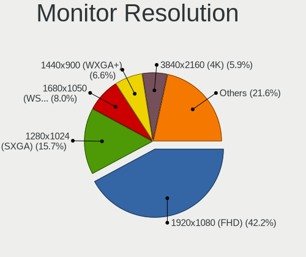

| Resolution         | Desktops | Percent |
|--------------------|----------|---------|
| 1920x1080 (FHD)    | 519      | 40.05%  |
| 1280x1024 (SXGA)   | 240      | 18.52%  |
| 1680x1050 (WSXGA+) | 114      | 8.8%    |
| 1440x900 (WXGA+)   | 95       | 7.33%   |
| 3840x2160 (4K)     | 59       | 4.55%   |
| 1366x768 (WXGA)    | 56       | 4.32%   |
| 1360x768           | 32       | 2.47%   |
| 2560x1440 (QHD)    | 23       | 1.77%   |
| 2560x1080          | 23       | 1.77%   |
| 1920x1200 (WUXGA)  | 23       | 1.77%   |
| 1024x768 (XGA)     | 20       | 1.54%   |
| 1600x900 (HD+)     | 19       | 1.47%   |
| Unknown            | 19       | 1.47%   |
| 1920x540           | 11       | 0.85%   |
| 1600x1200          | 8        | 0.62%   |
| 3840x1080          | 6        | 0.46%   |
| 1280x720 (HD)      | 6        | 0.46%   |
| 3440x1440          | 3        | 0.23%   |
| 3840x1200          | 2        | 0.15%   |
| 3280x1080          | 2        | 0.15%   |
| 2288x1287          | 2        | 0.15%   |
| 2048x1152          | 2        | 0.15%   |
| 1280x960           | 2        | 0.15%   |
| 7680x2160          | 1        | 0.08%   |
| 3840x1920          | 1        | 0.08%   |
| 3600x1200          | 1        | 0.08%   |
| 3200x1080          | 1        | 0.08%   |
| 2880x1024          | 1        | 0.08%   |
| 2304x1024          | 1        | 0.08%   |
| 2048x1536          | 1        | 0.08%   |
| 1400x1050          | 1        | 0.08%   |
| 1280x800 (WXGA)    | 1        | 0.08%   |
| 1152x864           | 1        | 0.08%   |

Monitor Diagonal
----------------

Diagonal size in inches

| Inches  | Desktops | Percent |
|---------|----------|---------|
| 19      | 199      | 15.08%  |
| 21      | 186      | 14.09%  |
| 23      | 134      | 10.15%  |
| 17      | 119      | 9.02%   |
| 27      | 103      | 7.8%    |
| 24      | 103      | 7.8%    |
| 22      | 86       | 6.52%   |
| Unknown | 86       | 6.52%   |
| 18      | 77       | 5.83%   |
| 20      | 39       | 2.95%   |
| 15      | 33       | 2.5%    |
| 34      | 25       | 1.89%   |
| 84      | 22       | 1.67%   |
| 31      | 18       | 1.36%   |
| 40      | 16       | 1.21%   |
| 72      | 14       | 1.06%   |
| 32      | 9        | 0.68%   |
| 65      | 7        | 0.53%   |
| 54      | 6        | 0.45%   |
| 52      | 5        | 0.38%   |
| 42      | 5        | 0.38%   |
| 55      | 4        | 0.3%    |
| 64      | 3        | 0.23%   |
| 47      | 3        | 0.23%   |
| 46      | 3        | 0.23%   |
| 14      | 3        | 0.23%   |
| 12      | 3        | 0.23%   |
| 48      | 2        | 0.15%   |
| 39      | 2        | 0.15%   |
| 60      | 1        | 0.08%   |
| 50      | 1        | 0.08%   |
| 26      | 1        | 0.08%   |
| 13      | 1        | 0.08%   |
| 7       | 1        | 0.08%   |

Monitor Width
-------------

Physical width

| Width in mm | Desktops | Percent |
|-------------|----------|---------|
| 401-500     | 455      | 35.05%  |
| 501-600     | 326      | 25.12%  |
| 301-350     | 144      | 11.09%  |
| 351-400     | 129      | 9.94%   |
| Unknown     | 86       | 6.63%   |
| 1501-2000   | 36       | 2.77%   |
| 1001-1500   | 35       | 2.7%    |
| 701-800     | 34       | 2.62%   |
| 601-700     | 22       | 1.69%   |
| 801-900     | 18       | 1.39%   |
| 201-300     | 7        | 0.54%   |
| 901-1000    | 5        | 0.39%   |
| 101-200     | 1        | 0.08%   |

Aspect Ratio
------------

Proportional relationship between the width and the height

| Ratio   | Desktops | Percent |
|---------|----------|---------|
| 16/9    | 673      | 53.63%  |
| 5/4     | 230      | 18.33%  |
| 16/10   | 207      | 16.49%  |
| Unknown | 66       | 5.26%   |
| 4/3     | 44       | 3.51%   |
| 21/9    | 25       | 1.99%   |
| 3/2     | 6        | 0.48%   |
| 6/5     | 4        | 0.32%   |

Monitor Area
------------

Area in inch

| Area in inch | Desktops | Percent |
|----------------|----------|---------|
| 201-250        | 427      | 32.72%  |
| 151-200        | 291      | 22.3%   |
| 141-150        | 178      | 13.64%  |
| 301-350        | 103      | 7.89%   |
| Unknown        | 86       | 6.59%   |
| More than 1000 | 65       | 4.98%   |
| 351-500        | 52       | 3.98%   |
| 251-300        | 33       | 2.53%   |
| 501-1000       | 29       | 2.22%   |
| 101-110        | 22       | 1.69%   |
| 111-120        | 11       | 0.84%   |
| 91-100         | 3        | 0.23%   |
| 71-80          | 2        | 0.15%   |
| 81-90          | 1        | 0.08%   |
| 61-70          | 1        | 0.08%   |
| 1-40           | 1        | 0.08%   |

Pixel Density
-------------

Pixels per inch

| Density | Desktops | Percent |
|---------|----------|---------|
| 51-100  | 874      | 69.98%  |
| 101-120 | 214      | 17.13%  |
| Unknown | 86       | 6.89%   |
| 1-50    | 50       | 4%      |
| 121-160 | 16       | 1.28%   |
| 161-240 | 9        | 0.72%   |

Multiple Monitors
-----------------

Total monitors connected

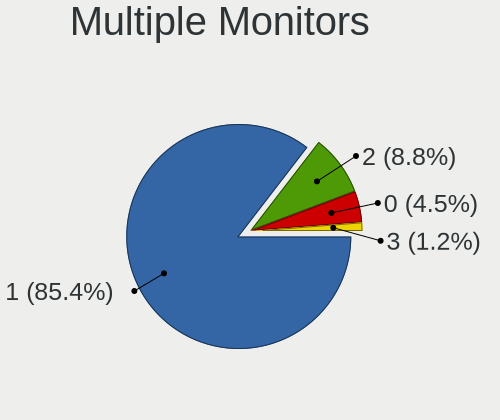

| Total | Desktops | Percent |
|-------|----------|---------|
| 1     | 1195     | 87.55%  |
| 2     | 111      | 8.13%   |
| 0     | 49       | 3.59%   |
| 3     | 10       | 0.73%   |

Network
-------

Net Controller Vendor
---------------------

Controller vendors

| Vendor                            | Desktops | Percent |
|-----------------------------------|----------|---------|
| Realtek Semiconductor             | 751      | 44.81%  |
| Intel                             | 359      | 21.42%  |
| Qualcomm Atheros                  | 158      | 9.43%   |
| Broadcom                          | 61       | 3.64%   |
| Qualcomm Atheros Communications   | 57       | 3.4%    |
| Ralink Technology                 | 43       | 2.57%   |
| Broadcom Limited                  | 43       | 2.57%   |
| Nvidia                            | 38       | 2.27%   |
| TP-Link                           | 32       | 1.91%   |
| Marvell Technology Group          | 25       | 1.49%   |
| Ralink                            | 15       | 0.89%   |
| VIA Technologies                  | 12       | 0.72%   |
| ASUSTek Computer                  | 10       | 0.6%    |
| Xiaomi                            | 6        | 0.36%   |
| Samsung Electronics               | 6        | 0.36%   |
| D-Link System                     | 6        | 0.36%   |
| Aquantia                          | 6        | 0.36%   |
| IMC Networks                      | 5        | 0.3%    |
| Belkin Components                 | 5        | 0.3%    |
| Huawei Technologies               | 4        | 0.24%   |
| Accton Technology                 | 4        | 0.24%   |
| Edimax Technology                 | 3        | 0.18%   |
| ZyDAS                             | 2        | 0.12%   |
| Qualcomm                          | 2        | 0.12%   |
| Microsoft                         | 2        | 0.12%   |
| D-Link                            | 2        | 0.12%   |
| ASIX Electronics                  | 2        | 0.12%   |
| Arduino SA                        | 2        | 0.12%   |
| TRENDnet                          | 1        | 0.06%   |
| Texas Instruments                 | 1        | 0.06%   |
| Sundance Technology Inc / IC Plus | 1        | 0.06%   |
| Silicon Integrated Systems [SiS]  | 1        | 0.06%   |
| ShenZhen ShanWan Technology       | 1        | 0.06%   |
| Seeed Technology                  | 1        | 0.06%   |
| QLogic                            | 1        | 0.06%   |
| NetGear                           | 1        | 0.06%   |
| Mercucys                          | 1        | 0.06%   |
| MediaTek                          | 1        | 0.06%   |
| JMicron Technology                | 1        | 0.06%   |
| HMD Global                        | 1        | 0.06%   |
| Hangzhou Silan Microelectronics   | 1        | 0.06%   |
| DisplayLink                       | 1        | 0.06%   |
| American Megatrends               | 1        | 0.06%   |

Net Controller Model
--------------------

Controller models

| Model                                                                         | Desktops | Percent |
|-------------------------------------------------------------------------------|----------|---------|
| Realtek RTL8111/8168/8411 PCI Express Gigabit Ethernet Controller             | 626      | 35.19%  |
| Intel 82579LM Gigabit Network Connection (Lewisville)                         | 71       | 3.99%   |
| Qualcomm Atheros AR9271 802.11n                                               | 50       | 2.81%   |
| Qualcomm Atheros QCA8171 Gigabit Ethernet                                     | 46       | 2.59%   |
| Intel 82567LM-3 Gigabit Network Connection                                    | 46       | 2.59%   |
| Intel Ethernet Connection (2) I219-V                                          | 41       | 2.3%    |
| Realtek RTL810xE PCI Express Fast Ethernet controller                         | 34       | 1.91%   |
| Realtek RTL-8100/8101L/8139 PCI Fast Ethernet Adapter                         | 30       | 1.69%   |
| Intel 82566DM-2 Gigabit Network Connection                                    | 30       | 1.69%   |
| Nvidia MCP61 Ethernet                                                         | 25       | 1.41%   |
| Realtek RTL8188EUS 802.11n Wireless Network Adapter                           | 24       | 1.35%   |
| Intel Ethernet Connection I217-LM                                             | 24       | 1.35%   |
| Realtek RTL8169 PCI Gigabit Ethernet Controller                               | 23       | 1.29%   |
| Intel I211 Gigabit Network Connection                                         | 23       | 1.29%   |
| Qualcomm Atheros AR8121/AR8113/AR8114 Gigabit or Fast Ethernet                | 21       | 1.18%   |
| Ralink MT7601U Wireless Adapter                                               | 20       | 1.12%   |
| Broadcom NetXtreme BCM5754 Gigabit Ethernet PCI Express                       | 15       | 0.84%   |
| Qualcomm Atheros AR8131 Gigabit Ethernet                                      | 13       | 0.73%   |
| Marvell Group 88E8056 PCI-E Gigabit Ethernet Controller                       | 13       | 0.73%   |
| Intel Ethernet Connection I217-V                                              | 13       | 0.73%   |
| Intel 82579V Gigabit Network Connection                                       | 13       | 0.73%   |
| Intel 82567LF-3 Gigabit Network Connection                                    | 12       | 0.67%   |
| Broadcom NetXtreme BCM5761 Gigabit Ethernet PCIe                              | 12       | 0.67%   |
| TP-Link TL-WN722N v2                                                          | 11       | 0.62%   |
| TP-Link TL-WN821N v5/v6 [RTL8192EU]                                           | 10       | 0.56%   |
| Qualcomm Atheros AR8151 v2.0 Gigabit Ethernet                                 | 10       | 0.56%   |
| Intel Ethernet Connection (7) I219-V                                          | 10       | 0.56%   |
| Intel Ethernet Connection (2) I219-LM                                         | 10       | 0.56%   |
| Qualcomm Atheros AR9485 Wireless Network Adapter                              | 9        | 0.51%   |
| Qualcomm Atheros AR8152 v2.0 Fast Ethernet                                    | 9        | 0.51%   |
| Broadcom Limited NetXtreme BCM5754 Gigabit Ethernet PCI Express               | 9        | 0.51%   |
| Qualcomm Atheros AR9227 Wireless Network Adapter                              | 8        | 0.45%   |
| Intel 82574L Gigabit Network Connection                                       | 8        | 0.45%   |
| Broadcom Limited NetXtreme BCM5761 Gigabit Ethernet PCIe                      | 8        | 0.45%   |
| VIA VT6102/VT6103 [Rhine-II]                                                  | 7        | 0.39%   |
| Realtek RTL8192EU 802.11b/g/n WLAN Adapter                                    | 7        | 0.39%   |
| Ralink RT2870/RT3070 Wireless Adapter                                         | 7        | 0.39%   |
| Qualcomm Atheros Attansic L1 Gigabit Ethernet                                 | 7        | 0.39%   |
| Intel Dual Band Wireless-AC 3168NGW [Stone Peak]                              | 7        | 0.39%   |
| Intel 82578DM Gigabit Network Connection                                      | 7        | 0.39%   |
| Broadcom Limited NetXtreme BCM5755 Gigabit Ethernet PCI Express               | 7        | 0.39%   |
| Realtek RTL8125 2.5GbE Controller                                             | 6        | 0.34%   |
| Ralink RT5370 Wireless Adapter                                                | 6        | 0.34%   |
| Qualcomm Atheros TP-Link TL-WN322G v3 / TL-WN422G v2 802.11g [Atheros AR9271] | 6        | 0.34%   |
| Qualcomm Atheros AR5212/5213/2414 Wireless Network Adapter                    | 6        | 0.34%   |
| Intel Wi-Fi 6 AX200                                                           | 6        | 0.34%   |
| Broadcom Limited NetXtreme BCM5751 Gigabit Ethernet PCI Express               | 6        | 0.34%   |
| Broadcom Limited NetLink BCM5787 Gigabit Ethernet PCI Express                 | 6        | 0.34%   |
| Xiaomi Mi/Redmi series (RNDIS)                                                | 5        | 0.28%   |
| Realtek RTL8192EE PCIe Wireless Network Adapter                               | 5        | 0.28%   |
| Realtek RTL8188CUS 802.11n WLAN Adapter                                       | 5        | 0.28%   |
| Realtek RTL8152 Fast Ethernet Adapter                                         | 5        | 0.28%   |
| Realtek RTL-8110SC/8169SC Gigabit Ethernet                                    | 5        | 0.28%   |
| Ralink RT2070 Wireless Adapter                                                | 5        | 0.28%   |
| Ralink RT2561/RT61 802.11g PCI                                                | 5        | 0.28%   |
| Marvell Group 88E8057 PCI-E Gigabit Ethernet Controller                       | 5        | 0.28%   |
| Intel Wireless 7260                                                           | 5        | 0.28%   |
| Broadcom NetXtreme BCM5751 Gigabit Ethernet PCI Express                       | 5        | 0.28%   |
| TP-Link Archer T2U PLUS [RTL8821AU]                                           | 4        | 0.22%   |
| Samsung GT-I9070 (network tethering, USB debugging enabled)                   | 4        | 0.22%   |

Wireless Vendor
---------------

Wireless vendors

| Vendor                          | Desktops | Percent |
|---------------------------------|----------|---------|
| Realtek Semiconductor           | 71       | 20.11%  |
| Qualcomm Atheros Communications | 57       | 16.15%  |
| Intel                           | 48       | 13.6%   |
| Qualcomm Atheros                | 45       | 12.75%  |
| Ralink Technology               | 43       | 12.18%  |
| TP-Link                         | 32       | 9.07%   |
| Ralink                          | 15       | 4.25%   |
| ASUSTek Computer                | 10       | 2.83%   |
| IMC Networks                    | 5        | 1.42%   |
| Belkin Components               | 5        | 1.42%   |
| Broadcom                        | 4        | 1.13%   |
| Edimax Technology               | 3        | 0.85%   |
| ZyDAS                           | 2        | 0.57%   |
| Microsoft                       | 2        | 0.57%   |
| D-Link System                   | 2        | 0.57%   |
| VIA Technologies                | 1        | 0.28%   |
| TRENDnet                        | 1        | 0.28%   |
| Texas Instruments               | 1        | 0.28%   |
| NetGear                         | 1        | 0.28%   |
| Mercucys                        | 1        | 0.28%   |
| Marvell Technology Group        | 1        | 0.28%   |
| D-Link                          | 1        | 0.28%   |
| Broadcom Limited                | 1        | 0.28%   |
| Accton Technology               | 1        | 0.28%   |

Wireless Model
--------------

Wireless models

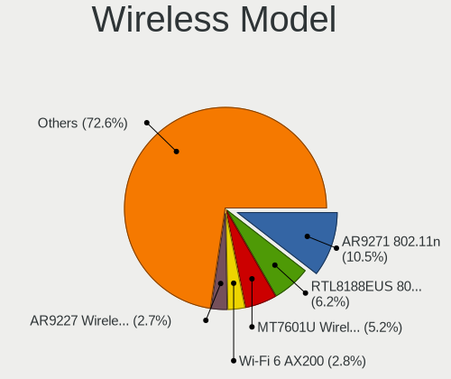

| Model                                                                             | Desktops | Percent |
|-----------------------------------------------------------------------------------|----------|---------|
| Qualcomm Atheros AR9271 802.11n                                                   | 50       | 14.04%  |
| Realtek RTL8188EUS 802.11n Wireless Network Adapter                               | 24       | 6.74%   |
| Ralink MT7601U Wireless Adapter                                                   | 20       | 5.62%   |
| TP-Link TL-WN722N v2                                                              | 11       | 3.09%   |
| TP-Link TL-WN821N v5/v6 [RTL8192EU]                                               | 10       | 2.81%   |
| Qualcomm Atheros AR9485 Wireless Network Adapter                                  | 9        | 2.53%   |
| Qualcomm Atheros AR9227 Wireless Network Adapter                                  | 8        | 2.25%   |
| Realtek RTL8192EU 802.11b/g/n WLAN Adapter                                        | 7        | 1.97%   |
| Ralink RT2870/RT3070 Wireless Adapter                                             | 7        | 1.97%   |
| Intel Dual Band Wireless-AC 3168NGW [Stone Peak]                                  | 7        | 1.97%   |
| Ralink RT5370 Wireless Adapter                                                    | 6        | 1.69%   |
| Qualcomm Atheros TP-Link TL-WN322G v3 / TL-WN422G v2 802.11g [Atheros AR9271]     | 6        | 1.69%   |
| Qualcomm Atheros AR5212/5213/2414 Wireless Network Adapter                        | 6        | 1.69%   |
| Intel Wi-Fi 6 AX200                                                               | 6        | 1.69%   |
| Realtek RTL8192EE PCIe Wireless Network Adapter                                   | 5        | 1.4%    |
| Realtek RTL8188CUS 802.11n WLAN Adapter                                           | 5        | 1.4%    |
| Ralink RT2070 Wireless Adapter                                                    | 5        | 1.4%    |
| Ralink RT2561/RT61 802.11g PCI                                                    | 5        | 1.4%    |
| Intel Wireless 7260                                                               | 5        | 1.4%    |
| TP-Link Archer T2U PLUS [RTL8821AU]                                               | 4        | 1.12%   |
| Realtek RTL8192CU 802.11n WLAN Adapter                                            | 4        | 1.12%   |
| Realtek RTL8188EE Wireless Network Adapter                                        | 4        | 1.12%   |
| Realtek 802.11ac NIC                                                              | 4        | 1.12%   |
| Qualcomm Atheros AR2413/AR2414 Wireless Network Adapter [AR5005G(S) 802.11bg]     | 4        | 1.12%   |
| Intel Wireless-AC 9260                                                            | 4        | 1.12%   |
| Intel Wireless 3165                                                               | 4        | 1.12%   |
| Intel Wireless 3160                                                               | 4        | 1.12%   |
| IMC Networks Mediao 802.11n WLAN [Realtek RTL8191SU]                              | 4        | 1.12%   |
| Realtek RTL88x2bu [AC1200 Techkey]                                                | 3        | 0.84%   |
| Realtek RTL8821AE 802.11ac PCIe Wireless Network Adapter                          | 3        | 0.84%   |
| Realtek RTL8191SU 802.11n WLAN Adapter                                            | 3        | 0.84%   |
| Ralink RT2501/RT2573 Wireless Adapter                                             | 3        | 0.84%   |
| Ralink RT3090 Wireless 802.11n 1T/1R PCIe                                         | 3        | 0.84%   |
| Qualcomm Atheros QCA6174 802.11ac Wireless Network Adapter                        | 3        | 0.84%   |
| Qualcomm Atheros AR9285 Wireless Network Adapter (PCI-Express)                    | 3        | 0.84%   |
| Qualcomm Atheros AR242x / AR542x Wireless Network Adapter (PCI-Express)           | 3        | 0.84%   |
| Intel Wireless 7265                                                               | 3        | 0.84%   |
| Intel Wi-Fi 6 AX210/AX211/AX411 160MHz                                            | 3        | 0.84%   |
| Intel Cannon Lake PCH CNVi WiFi                                                   | 3        | 0.84%   |
| Belkin Components F5D7050 Wireless G Adapter v4000 [Zydas ZD1211B]                | 3        | 0.84%   |
| ASUS N10 Nano 802.11n Network Adapter [Realtek RTL8192CU]                         | 3        | 0.84%   |
| ZyDAS ZD1211B 802.11g                                                             | 2        | 0.56%   |
| TP-Link TL-WN823N v2/v3 [Realtek RTL8192EU]                                       | 2        | 0.56%   |
| TP-Link Archer T4U ver.3                                                          | 2        | 0.56%   |
| Realtek RTL8187 Wireless Adapter                                                  | 2        | 0.56%   |
| Ralink MT7610U ("Archer T2U" 2.4G+5G WLAN Adapter                                 | 2        | 0.56%   |
| Ralink RT2500 Wireless 802.11bg                                                   | 2        | 0.56%   |
| Qualcomm Atheros AR9287 Wireless Network Adapter (PCI-Express)                    | 2        | 0.56%   |
| Qualcomm Atheros AR922X Wireless Network Adapter                                  | 2        | 0.56%   |
| Intel Wireless 8265 / 8275                                                        | 2        | 0.56%   |
| Intel Tiger Lake PCH CNVi WiFi                                                    | 2        | 0.56%   |
| Intel Centrino Advanced-N 6235                                                    | 2        | 0.56%   |
| D-Link System AirPlus G DWL-G122 Wireless Adapter(rev.C1) [Ralink RT2571W]        | 2        | 0.56%   |
| Belkin Components F5D8053 N Wireless USB Adapter v3000 [Ralink RT2870]            | 2        | 0.56%   |
| ASUS USB-N14 802.11b/g/n (2x2) Wireless Adapter [Ralink RT5372]                   | 2        | 0.56%   |
| ASUS Realtek 8188EUS [USB-N10 Nano]                                               | 2        | 0.56%   |
| VIA VIA VNT-6656 [WiFi 802.11b/g USB Dongle]                                      | 1        | 0.28%   |
| TRENDnet TEW-648UBM 802.11n 150Mbps Micro Wireless N Adapter [Realtek RTL8188CUS] | 1        | 0.28%   |
| TP-Link TL-WN822N Version 4 RTL8192EU                                             | 1        | 0.28%   |
| TP-Link Archer T4U v2 [Realtek RTL8812AU]                                         | 1        | 0.28%   |

Ethernet Vendor
---------------

Ethernet vendors

| Vendor                            | Desktops | Percent |
|-----------------------------------|----------|---------|
| Realtek Semiconductor             | 719      | 51.84%  |
| Intel                             | 338      | 24.37%  |
| Qualcomm Atheros                  | 117      | 8.44%   |
| Broadcom                          | 57       | 4.11%   |
| Broadcom Limited                  | 42       | 3.03%   |
| Nvidia                            | 38       | 2.74%   |
| Marvell Technology Group          | 24       | 1.73%   |
| VIA Technologies                  | 10       | 0.72%   |
| Xiaomi                            | 6        | 0.43%   |
| Samsung Electronics               | 6        | 0.43%   |
| Aquantia                          | 6        | 0.43%   |
| D-Link System                     | 4        | 0.29%   |
| Huawei Technologies               | 3        | 0.22%   |
| Accton Technology                 | 3        | 0.22%   |
| Qualcomm                          | 2        | 0.14%   |
| ASIX Electronics                  | 2        | 0.14%   |
| Sundance Technology Inc / IC Plus | 1        | 0.07%   |
| Silicon Integrated Systems [SiS]  | 1        | 0.07%   |
| QLogic                            | 1        | 0.07%   |
| MediaTek                          | 1        | 0.07%   |
| JMicron Technology                | 1        | 0.07%   |
| HMD Global                        | 1        | 0.07%   |
| Hangzhou Silan Microelectronics   | 1        | 0.07%   |
| DisplayLink                       | 1        | 0.07%   |
| D-Link                            | 1        | 0.07%   |
| American Megatrends               | 1        | 0.07%   |

Ethernet Model
--------------

Ethernet models

| Model                                                             | Desktops | Percent |
|-------------------------------------------------------------------|----------|---------|
| Realtek RTL8111/8168/8411 PCI Express Gigabit Ethernet Controller | 626      | 44.21%  |
| Intel 82579LM Gigabit Network Connection (Lewisville)             | 71       | 5.01%   |
| Qualcomm Atheros QCA8171 Gigabit Ethernet                         | 46       | 3.25%   |
| Intel 82567LM-3 Gigabit Network Connection                        | 46       | 3.25%   |
| Intel Ethernet Connection (2) I219-V                              | 41       | 2.9%    |
| Realtek RTL810xE PCI Express Fast Ethernet controller             | 34       | 2.4%    |
| Realtek RTL-8100/8101L/8139 PCI Fast Ethernet Adapter             | 30       | 2.12%   |
| Intel 82566DM-2 Gigabit Network Connection                        | 30       | 2.12%   |
| Nvidia MCP61 Ethernet                                             | 25       | 1.77%   |
| Intel Ethernet Connection I217-LM                                 | 24       | 1.69%   |
| Realtek RTL8169 PCI Gigabit Ethernet Controller                   | 23       | 1.62%   |
| Intel I211 Gigabit Network Connection                             | 23       | 1.62%   |
| Qualcomm Atheros AR8121/AR8113/AR8114 Gigabit or Fast Ethernet    | 21       | 1.48%   |
| Broadcom NetXtreme BCM5754 Gigabit Ethernet PCI Express           | 15       | 1.06%   |
| Qualcomm Atheros AR8131 Gigabit Ethernet                          | 13       | 0.92%   |
| Marvell Group 88E8056 PCI-E Gigabit Ethernet Controller           | 13       | 0.92%   |
| Intel Ethernet Connection I217-V                                  | 13       | 0.92%   |
| Intel 82579V Gigabit Network Connection                           | 13       | 0.92%   |
| Intel 82567LF-3 Gigabit Network Connection                        | 12       | 0.85%   |
| Broadcom NetXtreme BCM5761 Gigabit Ethernet PCIe                  | 12       | 0.85%   |
| Qualcomm Atheros AR8151 v2.0 Gigabit Ethernet                     | 10       | 0.71%   |
| Intel Ethernet Connection (7) I219-V                              | 10       | 0.71%   |
| Intel Ethernet Connection (2) I219-LM                             | 10       | 0.71%   |
| Qualcomm Atheros AR8152 v2.0 Fast Ethernet                        | 9        | 0.64%   |
| Broadcom Limited NetXtreme BCM5754 Gigabit Ethernet PCI Express   | 9        | 0.64%   |
| Intel 82574L Gigabit Network Connection                           | 8        | 0.56%   |
| Broadcom Limited NetXtreme BCM5761 Gigabit Ethernet PCIe          | 8        | 0.56%   |
| VIA VT6102/VT6103 [Rhine-II]                                      | 7        | 0.49%   |
| Qualcomm Atheros Attansic L1 Gigabit Ethernet                     | 7        | 0.49%   |
| Intel 82578DM Gigabit Network Connection                          | 7        | 0.49%   |
| Broadcom Limited NetXtreme BCM5755 Gigabit Ethernet PCI Express   | 7        | 0.49%   |
| Realtek RTL8125 2.5GbE Controller                                 | 6        | 0.42%   |
| Broadcom Limited NetXtreme BCM5751 Gigabit Ethernet PCI Express   | 6        | 0.42%   |
| Broadcom Limited NetLink BCM5787 Gigabit Ethernet PCI Express     | 6        | 0.42%   |
| Xiaomi Mi/Redmi series (RNDIS)                                    | 5        | 0.35%   |
| Realtek RTL8152 Fast Ethernet Adapter                             | 5        | 0.35%   |
| Realtek RTL-8110SC/8169SC Gigabit Ethernet                        | 5        | 0.35%   |
| Marvell Group 88E8057 PCI-E Gigabit Ethernet Controller           | 5        | 0.35%   |
| Broadcom NetXtreme BCM5751 Gigabit Ethernet PCI Express           | 5        | 0.35%   |
| Samsung GT-I9070 (network tethering, USB debugging enabled)       | 4        | 0.28%   |
| Realtek RTL8153 Gigabit Ethernet Adapter                          | 4        | 0.28%   |
| Qualcomm Atheros AR8151 v1.0 Gigabit Ethernet                     | 4        | 0.28%   |
| Marvell Group 88E8001 Gigabit Ethernet Controller                 | 4        | 0.28%   |
| Intel Ethernet Controller I225-V                                  | 4        | 0.28%   |
| Intel Ethernet Connection (2) I218-V                              | 4        | 0.28%   |
| Broadcom NetXtreme BCM5723 Gigabit Ethernet PCIe                  | 4        | 0.28%   |
| Broadcom NetLink BCM5787 Gigabit Ethernet PCI Express             | 4        | 0.28%   |
| Broadcom NetLink BCM57781 Gigabit Ethernet PCIe                   | 4        | 0.28%   |
| Broadcom NetLink BCM57780 Gigabit Ethernet PCIe                   | 4        | 0.28%   |
| VIA VT6105/VT6106S [Rhine-III]                                    | 3        | 0.21%   |
| Samsung Galaxy series, misc. (tethering mode)                     | 3        | 0.21%   |
| Nvidia MCP55 Ethernet                                             | 3        | 0.21%   |
| Intel 82566DM Gigabit Network Connection                          | 3        | 0.21%   |
| Qualcomm Atheros AR8161 Gigabit Ethernet                          | 2        | 0.14%   |
| Qualcomm Atheros AR8132 Fast Ethernet                             | 2        | 0.14%   |
| Nvidia MCP77 Ethernet                                             | 2        | 0.14%   |
| Nvidia MCP73 Ethernet                                             | 2        | 0.14%   |
| Nvidia CK804 Ethernet Controller                                  | 2        | 0.14%   |
| Marvell Group 88E8053 PCI-E Gigabit Ethernet Controller           | 2        | 0.14%   |
| Intel PRO/100 VE Network Connection                               | 2        | 0.14%   |

Net Controller Kind
-------------------

Ethernet, WiFi or modem

| Kind     | Desktops | Percent |
|----------|----------|---------|
| Ethernet | 1319     | 79.36%  |
| WiFi     | 337      | 20.28%  |
| Modem    | 5        | 0.3%    |
| Unknown  | 1        | 0.06%   |

Used Controller
---------------

Currently used network controller

| Kind     | Desktops | Percent |
|----------|----------|---------|
| Ethernet | 1140     | 83.64%  |
| WiFi     | 223      | 16.36%  |

NICs
----

Total network controllers on board

| Total | Desktops | Percent |
|-------|----------|---------|
| 1     | 1119     | 83.26%  |
| 2     | 186      | 13.84%  |
| 0     | 19       | 1.41%   |
| 3     | 17       | 1.26%   |
| 4     | 3        | 0.22%   |

IPv6
----

IPv6 vs IPv4

| Used | Desktops | Percent |
|------|----------|---------|
| No   | 1188     | 86.34%  |
| Yes  | 188      | 13.66%  |

Bluetooth
---------

Bluetooth Vendor
----------------

Controller vendors

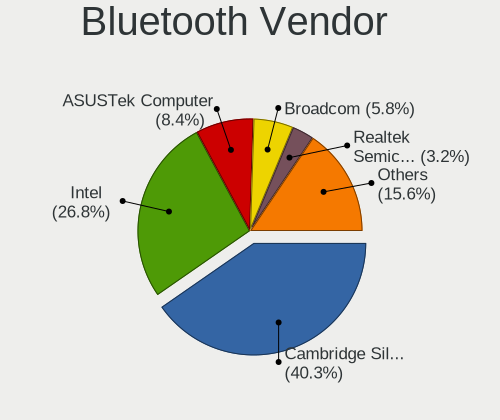

| Vendor                          | Desktops | Percent |
|---------------------------------|----------|---------|
| Cambridge Silicon Radio         | 84       | 47.19%  |
| Intel                           | 47       | 26.4%   |
| Broadcom                        | 11       | 6.18%   |
| ASUSTek Computer                | 8        | 4.49%   |
| Conwise Technology              | 6        | 3.37%   |
| Integrated System Solution      | 4        | 2.25%   |
| Realtek Semiconductor           | 3        | 1.69%   |
| Belkin Components               | 3        | 1.69%   |
| Qualcomm Atheros Communications | 2        | 1.12%   |
| Logitech                        | 2        | 1.12%   |
| IMC Networks                    | 2        | 1.12%   |
| Hewlett-Packard                 | 2        | 1.12%   |
| Edimax Technology               | 2        | 1.12%   |
| TP-Link                         | 1        | 0.56%   |
| Lite-On Technology              | 1        | 0.56%   |

Bluetooth Model
---------------

Controller models

| Model                                                 | Desktops | Percent |
|-------------------------------------------------------|----------|---------|
| Cambridge Silicon Radio Bluetooth Dongle (HCI mode)   | 84       | 47.19%  |
| Intel Bluetooth wireless interface                    | 18       | 10.11%  |
| Intel Wireless-AC 3168 Bluetooth                      | 7        | 3.93%   |
| Intel AX200 Bluetooth                                 | 6        | 3.37%   |
| Conwise CW6622                                        | 6        | 3.37%   |
| Intel Bluetooth 9460/9560 Jefferson Peak (JfP)        | 5        | 2.81%   |
| Intel Wireless-AC 9260 Bluetooth Adapter              | 4        | 2.25%   |
| Intel AX210 Bluetooth                                 | 3        | 1.69%   |
| Broadcom Bluetooth dongle                             | 3        | 1.69%   |
| ASUS Bluetooth Radio                                  | 3        | 1.69%   |
| Logitech BT Mini-Receiver (HCI mode)                  | 2        | 1.12%   |
| Intel Centrino Bluetooth Wireless Transceiver         | 2        | 1.12%   |
| Intel AX201 Bluetooth                                 | 2        | 1.12%   |
| Integrated System Solution KY-BT100 Bluetooth Adapter | 2        | 1.12%   |
| Integrated System Solution Bluetooth Device           | 2        | 1.12%   |
| HP Bluetooth Adapter                                  | 2        | 1.12%   |
| Edimax Wi-Fi N150 Bluetooth4.0 USB Adapter            | 2        | 1.12%   |
| Broadcom BCM20702A0 Bluetooth 4.0                     | 2        | 1.12%   |
| Broadcom BCM2035 Bluetooth dongle                     | 2        | 1.12%   |
| ASUS Qualcomm Bluetooth 4.1                           | 2        | 1.12%   |
| ASUS Broadcom BCM20702A0 Bluetooth                    | 2        | 1.12%   |
| TP-Link UB500 Adapter                                 | 1        | 0.56%   |
| Realtek RTL8723B Bluetooth                            | 1        | 0.56%   |
| Realtek  Bluetooth 4.2 Adapter                        | 1        | 0.56%   |
| Realtek Bluetooth Radio                               | 1        | 0.56%   |
| Qualcomm Atheros QCA61x4 Bluetooth 4.0                | 1        | 0.56%   |
| Qualcomm Atheros AR3011 Bluetooth                     | 1        | 0.56%   |
| Lite-On Bluetooth Device                              | 1        | 0.56%   |
| IMC Networks Bluetooth Device                         | 1        | 0.56%   |
| IMC Networks BCM20702A0                               | 1        | 0.56%   |
| Broadcom HP Portable Bumble Bee                       | 1        | 0.56%   |
| Broadcom Bluetooth 3.0 Device                         | 1        | 0.56%   |
| Broadcom BCM92046DG-CL1ROM Bluetooth 2.1 Adapter      | 1        | 0.56%   |
| Broadcom BCM2045 Bluetooth                            | 1        | 0.56%   |
| Belkin Components F8T065BF Mini Bluetooth 4.0 Adapter | 1        | 0.56%   |
| Belkin Components F8T013 Bluetooth Adapter            | 1        | 0.56%   |
| Belkin Components Bluetooth Mini Dongle               | 1        | 0.56%   |
| ASUS Bluetooth Adapter                                | 1        | 0.56%   |

Sound
-----

Sound Vendor
------------

Sound card vendors

| Vendor                               | Desktops | Percent |
|--------------------------------------|----------|---------|
| Intel                                | 870      | 42.98%  |
| AMD                                  | 530      | 26.19%  |
| Nvidia                               | 431      | 21.29%  |
| C-Media Electronics                  | 68       | 3.36%   |
| Creative Labs                        | 31       | 1.53%   |
| Logitech                             | 11       | 0.54%   |
| Texas Instruments                    | 9        | 0.44%   |
| VIA Technologies                     | 7        | 0.35%   |
| JMTek                                | 7        | 0.35%   |
| Generalplus Technology               | 7        | 0.35%   |
| Creative Technology                  | 5        | 0.25%   |
| BEHRINGER International              | 5        | 0.25%   |
| Kingston Technology                  | 4        | 0.2%    |
| ASUSTek Computer                     | 4        | 0.2%    |
| SteelSeries ApS                      | 3        | 0.15%   |
| GN Netcom                            | 2        | 0.1%    |
| Ensoniq                              | 2        | 0.1%    |
| ATI Technologies                     | 2        | 0.1%    |
| Yamaha                               | 1        | 0.05%   |
| Thesycon Systemsoftware & Consulting | 1        | 0.05%   |
| Tenx Technology                      | 1        | 0.05%   |
| Syntek                               | 1        | 0.05%   |
| Superlux digit                       | 1        | 0.05%   |
| Sunplus Technology                   | 1        | 0.05%   |
| SM950T Microphone                    | 1        | 0.05%   |
| Silicon Integrated Systems [SiS]     | 1        | 0.05%   |
| Sennheiser Communications            | 1        | 0.05%   |
| Samson Technologies                  | 1        | 0.05%   |
| Rotel                                | 1        | 0.05%   |
| Promethean Limited                   | 1        | 0.05%   |
| Plantronics                          | 1        | 0.05%   |
| Nektar                               | 1        | 0.05%   |
| MCS                                  | 1        | 0.05%   |
| KORG                                 | 1        | 0.05%   |
| JBL                                  | 1        | 0.05%   |
| Hewlett-Packard                      | 1        | 0.05%   |
| Hangzhou Worlde                      | 1        | 0.05%   |
| Focusrite-Novation                   | 1        | 0.05%   |
| Elite Silicon                        | 1        | 0.05%   |
| DigiTech                             | 1        | 0.05%   |
| D&M Holdings (Denon/Marantz)         | 1        | 0.05%   |
| Conexant Systems                     | 1        | 0.05%   |
| Barco Display Systems                | 1        | 0.05%   |
| Avance Logic                         | 1        | 0.05%   |

Sound Model
-----------

Sound card models

| Model                                                                             | Desktops | Percent |
|-----------------------------------------------------------------------------------|----------|---------|
| Intel NM10/ICH7 Family High Definition Audio Controller                           | 154      | 6.5%    |
| AMD SBx00 Azalia (Intel HDA)                                                      | 128      | 5.4%    |
| Intel 6 Series/C200 Series Chipset Family High Definition Audio Controller        | 120      | 5.06%   |
| AMD FCH Azalia Controller                                                         | 117      | 4.93%   |
| Intel 8 Series/C220 Series Chipset High Definition Audio Controller               | 114      | 4.81%   |
| Intel Xeon E3-1200 v3/4th Gen Core Processor HD Audio Controller                  | 80       | 3.37%   |
| Intel 7 Series/C216 Chipset Family High Definition Audio Controller               | 80       | 3.37%   |
| Nvidia GK208 HDMI/DP Audio Controller                                             | 70       | 2.95%   |
| AMD Trinity HDMI Audio Controller                                                 | 62       | 2.61%   |
| Intel 82801JD/DO (ICH10 Family) HD Audio Controller                               | 59       | 2.49%   |
| Intel 82801I (ICH9 Family) HD Audio Controller                                    | 59       | 2.49%   |
| Intel 100 Series/C230 Series Chipset Family HD Audio Controller                   | 54       | 2.28%   |
| AMD Oland/Hainan/Cape Verde/Pitcairn HDMI Audio [Radeon HD 7000 Series]           | 52       | 2.19%   |
| Nvidia High Definition Audio Controller                                           | 50       | 2.11%   |
| AMD Caicos HDMI Audio [Radeon HD 6450 / 7450/8450/8490 OEM / R5 230/235/235X OEM] | 49       | 2.07%   |
| Intel 200 Series PCH HD Audio                                                     | 48       | 2.02%   |
| AMD Ellesmere HDMI Audio [Radeon RX 470/480 / 570/580/590]                        | 42       | 1.77%   |
| Intel 82801JI (ICH10 Family) HD Audio Controller                                  | 41       | 1.73%   |
| AMD Family 17h (Models 00h-0fh) HD Audio Controller                               | 41       | 1.73%   |
| Nvidia GP107GL High Definition Audio Controller                                   | 35       | 1.48%   |
| AMD Cedar HDMI Audio [Radeon HD 5400/6300/7300 Series]                            | 32       | 1.35%   |
| Nvidia GF108 High Definition Audio Controller                                     | 31       | 1.31%   |
| Nvidia GP106 High Definition Audio Controller                                     | 29       | 1.22%   |
| Intel 5 Series/3400 Series Chipset High Definition Audio                          | 29       | 1.22%   |
| AMD Starship/Matisse HD Audio Controller                                          | 29       | 1.22%   |
| Nvidia MCP61 High Definition Audio                                                | 24       | 1.01%   |
| Nvidia GF119 HDMI Audio Controller                                                | 24       | 1.01%   |
| AMD Family 17h/19h HD Audio Controller                                            | 23       | 0.97%   |
| Nvidia GP108 High Definition Audio Controller                                     | 21       | 0.89%   |
| Nvidia GK107 HDMI Audio Controller                                                | 20       | 0.84%   |
| Intel 82801H (ICH8 Family) HD Audio Controller                                    | 19       | 0.8%    |
| AMD RV710/730 HDMI Audio [Radeon HD 4000 series]                                  | 19       | 0.8%    |
| AMD Raven/Raven2/Fenghuang HDMI/DP Audio Controller                               | 18       | 0.76%   |
| Intel Cannon Lake PCH cAVS                                                        | 17       | 0.72%   |
| C-Media Electronics CMI8738/CMI8768 PCI Audio                                     | 17       | 0.72%   |
| AMD Baffin HDMI/DP Audio [Radeon RX 550 640SP / RX 560/560X]                      | 17       | 0.72%   |
| C-Media Electronics CMI8788 [Oxygen HD Audio]                                     | 16       | 0.67%   |
| C-Media Electronics CM108 Audio Controller                                        | 16       | 0.67%   |
| AMD Juniper HDMI Audio [Radeon HD 5700 Series]                                    | 15       | 0.63%   |
| Nvidia GM107 High Definition Audio Controller [GeForce 940MX]                     | 14       | 0.59%   |
| AMD Redwood HDMI Audio [Radeon HD 5000 Series]                                    | 14       | 0.59%   |
| AMD Turks HDMI Audio [Radeon HD 6500/6600 / 6700M Series]                         | 13       | 0.55%   |
| Nvidia GP104 High Definition Audio Controller                                     | 12       | 0.51%   |
| AMD Kabini HDMI/DP Audio                                                          | 12       | 0.51%   |
| Nvidia GK106 HDMI Audio Controller                                                | 10       | 0.42%   |
| Nvidia MCP72XE/MCP72P/MCP78U/MCP78S High Definition Audio                         | 9        | 0.38%   |
| Nvidia GF116 High Definition Audio Controller                                     | 9        | 0.38%   |
| Intel 9 Series Chipset Family HD Audio Controller                                 | 9        | 0.38%   |
| Texas Instruments PCM2902 Audio Codec                                             | 8        | 0.34%   |
| Nvidia TU116 High Definition Audio Controller                                     | 8        | 0.34%   |
| Nvidia GM206 High Definition Audio Controller                                     | 8        | 0.34%   |
| Nvidia GK104 HDMI Audio Controller                                                | 8        | 0.34%   |
| Creative Labs Sound Core3D [Sound Blaster Recon3D / Z-Series]                     | 8        | 0.34%   |
| Creative Labs CA0106/CA0111 [SB Live!/Audigy/X-Fi Series]                         | 8        | 0.34%   |
| AMD Kaveri HDMI/DP Audio Controller                                               | 8        | 0.34%   |
| Nvidia MCP51 High Definition Audio                                                | 7        | 0.3%    |
| JMTek USB PnP Audio Device                                                        | 7        | 0.3%    |
| Intel C600/X79 series chipset High Definition Audio Controller                    | 7        | 0.3%    |
| Generalplus Technology USB Audio Device                                           | 7        | 0.3%    |
| AMD BeaverCreek HDMI Audio [Radeon HD 6500D and 6400G-6600G series]               | 7        | 0.3%    |

Memory
------

Memory Vendor
-------------

Memory module vendors

| Vendor                     | Desktops | Percent |
|----------------------------|----------|---------|
| Unknown                    | 371      | 28.39%  |
| Kingston                   | 292      | 22.34%  |
| SK hynix                   | 130      | 9.95%   |
| Samsung Electronics        | 123      | 9.41%   |
| Micron Technology          | 68       | 5.2%    |
| Kingmax                    | 52       | 3.98%   |
| Corsair                    | 45       | 3.44%   |
| Nanya Technology           | 42       | 3.21%   |
| Crucial                    | 39       | 2.98%   |
| G.Skill                    | 38       | 2.91%   |
| Elpida                     | 18       | 1.38%   |
| CSX                        | 15       | 1.15%   |
| Team                       | 9        | 0.69%   |
| Ramaxel Technology         | 9        | 0.69%   |
| A-DATA Technology          | 6        | 0.46%   |
| Melco                      | 5        | 0.38%   |
| Transcend                  | 4        | 0.31%   |
| Patriot                    | 4        | 0.31%   |
| Kingmax Semiconductor      | 4        | 0.31%   |
| Qimonda                    | 3        | 0.23%   |
| OCZ                        | 3        | 0.23%   |
| GeIL                       | 3        | 0.23%   |
| Silicon Power              | 2        | 0.15%   |
| Intersil                   | 2        | 0.15%   |
| H                          | 2        | 0.15%   |
| Golden Empire              | 2        | 0.15%   |
| 48spaces                   | 2        | 0.15%   |
| Unknown (ABCD)             | 1        | 0.08%   |
| Unknown (7F7F7F7F7F970000) | 1        | 0.08%   |
| Unknown (09D5)             | 1        | 0.08%   |
| Unigen                     | 1        | 0.08%   |
| Toshiba                    | 1        | 0.08%   |
| Ramos Technology           | 1        | 0.08%   |
| Princeton                  | 1        | 0.08%   |
| Level One Communication    | 1        | 0.08%   |
| Hyundai lnc                | 1        | 0.08%   |
| Goodram                    | 1        | 0.08%   |
| Exceleram                  | 1        | 0.08%   |
| Apacer                     | 1        | 0.08%   |
| AMI                        | 1        | 0.08%   |
| Unknown                    | 1        | 0.08%   |

Memory Model
------------

Memory module models

| Model                                                  | Desktops | Percent |
|--------------------------------------------------------|----------|---------|
| Kingston RAM KHX1600C10D3/4G 4GB DIMM DDR3 1866MT/s    | 42       | 2.77%   |
| Unknown RAM Module 2048MB DIMM 800MT/s                 | 33       | 2.17%   |
| Unknown RAM Module 2048MB DIMM SDRAM                   | 32       | 2.11%   |
| Unknown RAM Module 2048MB DIMM DDR2 800MT/s            | 19       | 1.25%   |
| Kingston RAM KHX1600C10D3/8G 8GB DIMM DDR3 1600MT/s    | 19       | 1.25%   |
| Kingston RAM KHX1600C9D3/4GX 4GB DIMM DDR3 2400MT/s    | 17       | 1.12%   |
| Unknown RAM Module 4096MB DIMM DDR3 1333MT/s           | 16       | 1.05%   |
| Unknown RAM Module 2048MB DIMM 1333MT/s                | 16       | 1.05%   |
| Unknown RAM Module 1024MB DIMM SDRAM                   | 16       | 1.05%   |
| Unknown RAM Module 1024MB DIMM 800MT/s                 | 16       | 1.05%   |
| Kingston RAM 99U5584-005.A00LF 4GB DIMM DDR3 1600MT/s  | 16       | 1.05%   |
| Unknown RAM Module 4096MB DIMM 1333MT/s                | 15       | 0.99%   |
| Samsung RAM M378B5773DH0-CH9 2GB DIMM DDR3 1333MT/s    | 12       | 0.79%   |
| Unknown RAM Module 2048MB DIMM DDR2 667MT/s            | 11       | 0.72%   |
| Unknown RAM Module 1024MB DIMM DDR2 667MT/s            | 11       | 0.72%   |
| Kingston RAM KHX2666C16/8G 8GB DIMM DDR4 3466MT/s      | 11       | 0.72%   |
| Unknown RAM Module 1024MB DIMM DDR2 800MT/s            | 10       | 0.66%   |
| Micron RAM 8KTF51264AZ-1G6E1 4096MB DIMM DDR3 1600MT/s | 10       | 0.66%   |
| Kingston RAM KHX3200C16D4/8GX 8GB DIMM DDR4 3600MT/s   | 10       | 0.66%   |
| Unknown RAM Module 4096MB DIMM 400MT/s                 | 8        | 0.53%   |
| SK hynix RAM HMT351U6CFR8C-PB 4GB DIMM DDR3 1800MT/s   | 8        | 0.53%   |
| G.Skill RAM F4-3000C16-8GISB 8GB DIMM DDR4 3200MT/s    | 8        | 0.53%   |
| Unknown RAM Module 512MB DIMM SDRAM                    | 7        | 0.46%   |
| Unknown RAM Module 4096MB DIMM SDRAM                   | 7        | 0.46%   |
| Unknown RAM Module 2048MB DIMM 667MT/s                 | 7        | 0.46%   |
| Unknown RAM Module 1024MB DIMM 667MT/s                 | 7        | 0.46%   |
| SK hynix RAM HMT125U6TFR8C-H9 2GB DIMM DDR3 1333MT/s   | 7        | 0.46%   |
| Samsung RAM M378B5773CH0-CH9 2GB DIMM DDR3 1867MT/s    | 7        | 0.46%   |
| Samsung RAM M378B5673FH0-CH9 2048MB DIMM DDR3 1600MT/s | 7        | 0.46%   |
| Samsung RAM M378B5673EH1-CH9 2GB DIMM DDR3 1333MT/s    | 7        | 0.46%   |
| Samsung RAM M378B5273DH0-CH9 4096MB DIMM DDR3 2133MT/s | 7        | 0.46%   |
| Samsung RAM M3 78T5663QZ3-CF7 2GB DIMM DDR2 1639MT/s   | 7        | 0.46%   |
| Micron RAM 8JTF51264AZ-1G6E1 4096MB DIMM DDR3 1600MT/s | 7        | 0.46%   |
| Kingston RAM KHX1866C10D3/8G 8GB DIMM DDR3 1867MT/s    | 7        | 0.46%   |
| Unknown RAM Module 8192MB DIMM 1333MT/s                | 6        | 0.4%    |
| Unknown RAM Module 4096MB DIMM 1600MT/s                | 6        | 0.4%    |
| Unknown RAM Module 2048MB DIMM 400MT/s                 | 6        | 0.4%    |
| SK hynix RAM HYMP564U64CP8-Y5 512MB DIMM DDR2 667MT/s  | 6        | 0.4%    |
| SK hynix RAM HMT451U6AFR8C-PB 4GB DIMM DDR3            | 6        | 0.4%    |
| SK hynix RAM HMT351U6EFR8C-PB 4GB DIMM DDR3 1800MT/s   | 6        | 0.4%    |
| Samsung RAM M378B5173QH0-CK0 4GB DIMM DDR3 1866MT/s    | 6        | 0.4%    |
| Samsung RAM M3 78T5663EH3-CF7 2GB DIMM DDR2 800MT/s    | 6        | 0.4%    |
| Nanya RAM M2Y2G64TU8HD5B-AC 2048MB DIMM DDR2 800MT/s   | 6        | 0.4%    |
| Kingston RAM KHX2400C15D4/4G 4GB DIMM DDR4 3151MT/s    | 6        | 0.4%    |
| Kingmax RAM FLFE85F-C8KM9 2048MB DIMM 1333MT/s         | 6        | 0.4%    |
| G.Skill RAM F4-3200C16-8GIS 8192MB DIMM DDR4 3200MT/s  | 6        | 0.4%    |
| Unknown RAM Module 4096MB DIMM DDR 1333MT/s            | 5        | 0.33%   |
| Unknown RAM Module 2048MB DIMM SDRAM 800MT/s           | 5        | 0.33%   |
| Unknown RAM Module 2048MB DIMM DDR 1333MT/s            | 5        | 0.33%   |
| Unknown RAM Module 2048MB DIMM 1066MT/s                | 5        | 0.33%   |
| Unknown RAM Module 1024MB DIMM DDR2                    | 5        | 0.33%   |
| SK hynix RAM Module 4096MB DIMM DDR3 1333MT/s          | 5        | 0.33%   |
| SK hynix RAM HYMP125U64CP8-S6 2GB DIMM DDR2 49926MT/s  | 5        | 0.33%   |
| Samsung RAM M378B5273CH0-CK0 4096MB DIMM DDR3 2000MT/s | 5        | 0.33%   |
| Samsung RAM M3 78T2863EHS-CF7 1024MB DIMM DDR2 800MT/s | 5        | 0.33%   |
| Nanya RAM NT2GC64B8HC0NF-CG 2048MB DIMM 1333MT/s       | 5        | 0.33%   |
| Nanya RAM Module 2048MB DIMM DDR3 1333MT/s             | 5        | 0.33%   |
| Elpida RAM EBJ21UE8BDF0-DJ-F 2GB DIMM DDR3 1333MT/s    | 5        | 0.33%   |
| Elpida RAM EBE10UE8ACWA-8G-E 1GB DIMM DDR 800MT/s      | 5        | 0.33%   |
| CSX RAM V01D3LF4GB26826813 4GB DIMM DDR3 1333MT/s      | 5        | 0.33%   |

Memory Kind
-----------

Memory module kinds

| Kind    | Desktops | Percent |
|---------|----------|---------|
| DDR3    | 448      | 39.47%  |
| DDR4    | 201      | 17.71%  |
| DDR2    | 167      | 14.71%  |
| Unknown | 144      | 12.69%  |
| SDRAM   | 137      | 12.07%  |
| DDR     | 36       | 3.17%   |
| LPDDR4  | 1        | 0.09%   |
| DRAM    | 1        | 0.09%   |

Memory Form Factor
------------------

Physical design of the memory module

| Name    | Desktops | Percent |
|---------|----------|---------|
| DIMM    | 1051     | 97.41%  |
| SODIMM  | 26       | 2.41%   |
| RIMM    | 1        | 0.09%   |
| FB-DIMM | 1        | 0.09%   |

Memory Size
-----------

Memory module size

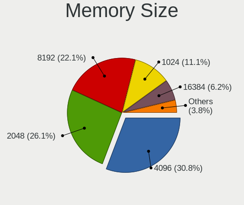

| Size  | Desktops | Percent |
|-------|----------|---------|
| 4096  | 401      | 31.72%  |
| 2048  | 383      | 30.3%   |
| 8192  | 226      | 17.88%  |
| 1024  | 168      | 13.29%  |
| 16384 | 39       | 3.09%   |
| 512   | 32       | 2.53%   |
| 32768 | 11       | 0.87%   |
| 256   | 4        | 0.32%   |

Memory Speed
------------

Memory module speed

| Speed   | Desktops | Percent |
|---------|----------|---------|
| 1600    | 233      | 18.26%  |
| 1333    | 201      | 15.75%  |
| 800     | 153      | 11.99%  |
| 667     | 80       | 6.27%   |
| Unknown | 75       | 5.88%   |
| 1866    | 59       | 4.62%   |
| 2400    | 58       | 4.55%   |
| 2133    | 52       | 4.08%   |
| 3200    | 36       | 2.82%   |
| 1867    | 35       | 2.74%   |
| 3600    | 31       | 2.43%   |
| 400     | 27       | 2.12%   |
| 1066    | 25       | 1.96%   |
| 533     | 23       | 1.8%    |
| 2667    | 21       | 1.65%   |
| 3466    | 15       | 1.18%   |
| 1800    | 14       | 1.1%    |
| 2048    | 13       | 1.02%   |
| 2933    | 12       | 0.94%   |
| 3000    | 11       | 0.86%   |
| 1067    | 11       | 0.86%   |
| 2000    | 9        | 0.71%   |
| 1639    | 9        | 0.71%   |
| 2666    | 8        | 0.63%   |
| 49926   | 6        | 0.47%   |
| 3400    | 6        | 0.47%   |
| 3151    | 6        | 0.47%   |
| 1334    | 4        | 0.31%   |
| 333     | 4        | 0.31%   |
| 2733    | 3        | 0.24%   |
| 1400    | 3        | 0.24%   |
| 266     | 3        | 0.24%   |
| 4000    | 2        | 0.16%   |
| 3733    | 2        | 0.16%   |
| 3334    | 2        | 0.16%   |
| 3333    | 2        | 0.16%   |
| 3007    | 2        | 0.16%   |
| 2200    | 2        | 0.16%   |
| 2134    | 2        | 0.16%   |
| 1648    | 2        | 0.16%   |
| 66      | 2        | 0.16%   |
| 50410   | 1        | 0.08%   |
| 4199    | 1        | 0.08%   |
| 3467    | 1        | 0.08%   |
| 3066    | 1        | 0.08%   |
| 2800    | 1        | 0.08%   |
| 2747    | 1        | 0.08%   |
| 2465    | 1        | 0.08%   |
| 2448    | 1        | 0.08%   |
| 1904    | 1        | 0.08%   |
| 880     | 1        | 0.08%   |
| 200     | 1        | 0.08%   |
| 133     | 1        | 0.08%   |

Printers & scanners
-------------------

Printer Vendor
--------------

Printer device vendors

| Vendor                | Desktops | Percent |
|-----------------------|----------|---------|
| Hewlett-Packard       | 40       | 45.45%  |
| Samsung Electronics   | 21       | 23.86%  |
| Canon                 | 12       | 13.64%  |
| Brother Industries    | 5        | 5.68%   |
| Seiko Epson           | 4        | 4.55%   |
| QinHeng Electronics   | 2        | 2.27%   |
| Xerox                 | 1        | 1.14%   |
| STMicroelectronics    | 1        | 1.14%   |
| Prolific Technology   | 1        | 1.14%   |
| Lexmark International | 1        | 1.14%   |

Printer Model
-------------

Printer device models

| Model                                                     | Desktops | Percent |
|-----------------------------------------------------------|----------|---------|
| HP DeskJet 2620 All-in-One Printer                        | 8        | 8.99%   |
| Samsung ML-2010P Mono Laser Printer                       | 5        | 5.62%   |
| Samsung M2020 Series                                      | 5        | 5.62%   |
| HP LaserJet 1020                                          | 4        | 4.49%   |
| Samsung ML-1640 Series Laser Printer                      | 3        | 3.37%   |
| Samsung SCX-3400 Series                                   | 2        | 2.25%   |
| QinHeng CH340S                                            | 2        | 2.25%   |
| HP LaserJet P1005                                         | 2        | 2.25%   |
| HP LaserJet 1018                                          | 2        | 2.25%   |
| HP LaserJet 1010                                          | 2        | 2.25%   |
| HP LaserJet 1000                                          | 2        | 2.25%   |
| HP DeskJet F4100 Printer series                           | 2        | 2.25%   |
| HP Deskjet F2280 series                                   | 2        | 2.25%   |
| HP Deskjet 3520 series                                    | 2        | 2.25%   |
| HP DeskJet 2130 series                                    | 2        | 2.25%   |
| HP Deskjet 2050 J510                                      | 2        | 2.25%   |
| Canon TS5100 series                                       | 2        | 2.25%   |
| Canon LiDE 400                                            | 2        | 2.25%   |
| Brother HL-1110 series                                    | 2        | 2.25%   |
| Xerox WorkCentre 3119 Series                              | 1        | 1.12%   |
| STMicroelectronics LED badge -- mini LED display -- 11x44 | 1        | 1.12%   |
| Seiko Epson Stylus NX230/SX235W Series                    | 1        | 1.12%   |
| Seiko Epson Printer                                       | 1        | 1.12%   |
| Seiko Epson ME 320/330 Series [Stylus SX125]              | 1        | 1.12%   |
| Seiko Epson L395 Series                                   | 1        | 1.12%   |
| Samsung SCX-4650 4x21S Series                             | 1        | 1.12%   |
| Samsung SCX-4623 Series                                   | 1        | 1.12%   |
| Samsung ML-1660 Series                                    | 1        | 1.12%   |
| Samsung ML-1630 Series                                    | 1        | 1.12%   |
| Samsung CLP-310 Color Laser Printer                       | 1        | 1.12%   |
| Samsung C48x Series Color Laser Multifunction Printer     | 1        | 1.12%   |
| Prolific PL2305 Parallel Port                             | 1        | 1.12%   |
| Lexmark International InkJet Color Printer                | 1        | 1.12%   |
| HP LaserJet Pro M12a                                      | 1        | 1.12%   |
| HP LaserJet 1022                                          | 1        | 1.12%   |
| HP EWS UPD                                                | 1        | 1.12%   |
| HP DeskJet F2100 Printer series                           | 1        | 1.12%   |
| HP Deskjet D1500 series                                   | 1        | 1.12%   |
| HP DeskJet 959c                                           | 1        | 1.12%   |
| HP DeskJet 840c                                           | 1        | 1.12%   |
| HP DeskJet 5000 series                                    | 1        | 1.12%   |
| HP DeskJet 4530 series                                    | 1        | 1.12%   |
| HP Deskjet 1050 J410                                      | 1        | 1.12%   |
| Canon TS3100 series                                       | 1        | 1.12%   |
| Canon PIXMA MX360                                         | 1        | 1.12%   |
| Canon PIXMA MP280                                         | 1        | 1.12%   |
| Canon PIXMA MG3500 Series                                 | 1        | 1.12%   |
| Canon PIXMA MG2500 Series                                 | 1        | 1.12%   |
| Canon MG5700 series                                       | 1        | 1.12%   |
| Canon CanoScan LiDE 300                                   | 1        | 1.12%   |
| Canon BJC-2110 Color Printer                              | 1        | 1.12%   |
| Brother MFC-L2710DN series                                | 1        | 1.12%   |
| Brother HL-L2370DN series                                 | 1        | 1.12%   |
| Brother HL-L2300D series                                  | 1        | 1.12%   |
| Brother DCP-T510W                                         | 1        | 1.12%   |

Scanner Vendor
--------------

Scanner device vendors

| Vendor          | Desktops | Percent |
|-----------------|----------|---------|
| Canon           | 10       | 66.67%  |
| Hewlett-Packard | 3        | 20%     |
| UMAX            | 1        | 6.67%   |
| Mustek Systems  | 1        | 6.67%   |

Scanner Model
-------------

Scanner device models

| Model                              | Desktops | Percent |
|------------------------------------|----------|---------|
| Canon CanoScan N670U/N676U/LiDE 20 | 3        | 20%     |
| HP Scanjet 300                     | 2        | 13.33%  |
| Canon CanoScan LIDE 25             | 2        | 13.33%  |
| Canon CanoScan LiDE 110            | 2        | 13.33%  |
| UMAX Astra 4400/4450               | 1        | 6.67%   |
| Mustek Systems SNAPSCAN e22        | 1        | 6.67%   |
| HP ScanJet 3770                    | 1        | 6.67%   |
| Canon CanoScan N1240U/LiDE 30      | 1        | 6.67%   |
| Canon CanoScan LiDE 120            | 1        | 6.67%   |
| Canon CanoScan LiDE 100            | 1        | 6.67%   |

Camera
------

Camera Vendor
-------------

Camera device vendors

| Vendor                      | Desktops | Percent |
|-----------------------------|----------|---------|
| Logitech                    | 43       | 27.39%  |
| Microdia                    | 27       | 17.2%   |
| Microsoft                   | 12       | 7.64%   |
| KYE Systems (Mouse Systems) | 12       | 7.64%   |
| Z-Star Microelectronics     | 10       | 6.37%   |
| Trust                       | 5        | 3.18%   |
| Arkmicro Technologies       | 5        | 3.18%   |
| Samsung Electronics         | 4        | 2.55%   |
| GEMBIRD                     | 4        | 2.55%   |
| Pixart Imaging              | 3        | 1.91%   |
| LG Electronics              | 3        | 1.91%   |
| Cubeternet                  | 3        | 1.91%   |
| Creative Technology         | 3        | 1.91%   |
| Chicony Electronics         | 3        | 1.91%   |
| Aveo Technology             | 3        | 1.91%   |
| MacroSilicon                | 2        | 1.27%   |
| Jieli Technology            | 2        | 1.27%   |
| Hewlett-Packard             | 2        | 1.27%   |
| Apple                       | 2        | 1.27%   |
| Unknown                     | 1        | 0.64%   |
| Teslong Camera              | 1        | 0.64%   |
| Sonix Technology            | 1        | 0.64%   |
| Silicon Motion              | 1        | 0.64%   |
| Realtek Semiconductor       | 1        | 0.64%   |
| OmniVision Technologies     | 1        | 0.64%   |
| IMC Networks                | 1        | 0.64%   |
| Generalplus Technology      | 1        | 0.64%   |
| Alcor Micro                 | 1        | 0.64%   |

Camera Model
------------

Camera device models

| Model                                                 | Desktops | Percent |
|-------------------------------------------------------|----------|---------|
| Logitech Webcam C270                                  | 16       | 10.13%  |
| Microdia Camera                                       | 14       | 8.86%   |
| Logitech Webcam C600                                  | 7        | 4.43%   |
| Microsoft LifeCam HD-3000                             | 6        | 3.8%    |
| Microdia Sonix USB 2.0 Camera                         | 6        | 3.8%    |
| Arkmicro USB2.0 PC CAMERA                             | 5        | 3.16%   |
| Z-Star Venus USB2.0 Camera                            | 4        | 2.53%   |
| Z-Star A4 TECH USB2.0 PC Camera E                     | 4        | 2.53%   |
| Samsung Galaxy series, misc. (MTP mode)               | 4        | 2.53%   |
| Microdia USB 2.0 Camera                               | 4        | 2.53%   |
| Logitech Webcam C170                                  | 4        | 2.53%   |
| Logitech HD Webcam C525                               | 4        | 2.53%   |
| KYE Systems (Mouse Systems) Genius FaceCam 320        | 4        | 2.53%   |
| Microsoft LifeCam VX-2000                             | 3        | 1.9%    |
| Trust 17676 Webcam                                    | 2        | 1.27%   |
| Pixart Imaging GE 1.3 MP MiniCam Pro                  | 2        | 1.27%   |
| Microsoft LifeCam Studio                              | 2        | 1.27%   |
| Microdia Defender G-Lens 2577 HD720p Camera           | 2        | 1.27%   |
| MacroSilicon MS210x Video Grabber [EasierCAP]         | 2        | 1.27%   |
| Logitech QuickCam Pro 9000                            | 2        | 1.27%   |
| Logitech QuickCam Communicate Deluxe/S7500            | 2        | 1.27%   |
| LG LM-X420xxx/G2/G3 Android Phone (MTP/download mode) | 2        | 1.27%   |
| KYE Systems (Mouse Systems) PC-LM1E Camera            | 2        | 1.27%   |
| KYE Systems (Mouse Systems) Genius WideCam F100       | 2        | 1.27%   |
| KYE Systems (Mouse Systems) FaceCam 1000X             | 2        | 1.27%   |
| Jieli USB PHY 2.0                                     | 2        | 1.27%   |
| GEMBIRD USB2.0 PC CAMERA                              | 2        | 1.27%   |
| GEMBIRD Generic UVC 1.00 camera [AppoTech AX2311]     | 2        | 1.27%   |
| Cubeternet USB2.0 Camera                              | 2        | 1.27%   |
| Creative Live! Cam Chat HD [VF0700]                   | 2        | 1.27%   |
| Aveo USB2.0 Camera                                    | 2        | 1.27%   |
| Apple iPhone 5/5C/5S/6/SE                             | 2        | 1.27%   |
| Z-Star Saturn USB 2.0 Camera                          | 1        | 0.63%   |
| Z-Star A4 TECH HD PC Camera                           | 1        | 0.63%   |
| Unknown HD camera                                     | 1        | 0.63%   |
| Trust Webcam                                          | 1        | 0.63%   |
| Trust WB-8300X 2MP Webcam                             | 1        | 0.63%   |
| Trust Full HD Webcam                                  | 1        | 0.63%   |
| Teslong Camera Teslong Camera                         | 1        | 0.63%   |
| Sonix USB 2.0 Camera                                  | 1        | 0.63%   |
| Silicon Motion Silicon Motion SM371 Camera            | 1        | 0.63%   |
| Realtek FULL HD 1080P Webcam                          | 1        | 0.63%   |
| Pixart Imaging Webcam Genius iLook 300                | 1        | 0.63%   |
| OmniVision Monitor Webcam                             | 1        | 0.63%   |
| Microsoft LifeCam VX-800                              | 1        | 0.63%   |
| Microdia Webcam Vitade AF                             | 1        | 0.63%   |
| Logitech Webcam C310                                  | 1        | 0.63%   |
| Logitech Webcam C300                                  | 1        | 0.63%   |
| Logitech Webcam C250                                  | 1        | 0.63%   |
| Logitech Webcam C210                                  | 1        | 0.63%   |
| Logitech Webcam C200                                  | 1        | 0.63%   |
| Logitech QuickCam Communicate Deluxe                  | 1        | 0.63%   |
| Logitech Mic (Fusion)                                 | 1        | 0.63%   |
| Logitech Logitech Webcam C100                         | 1        | 0.63%   |
| Logitech BRIO Ultra HD Webcam                         | 1        | 0.63%   |
| LG Mouse Scanner LSM-150 [LG Smart Scan Mouse]        | 1        | 0.63%   |
| KYE Systems (Mouse Systems) iSlim 321R                | 1        | 0.63%   |
| KYE Systems (Mouse Systems) FaceCam 320X              | 1        | 0.63%   |
| IMC Networks USB 2.0 Camera                           | 1        | 0.63%   |
| HP Webcam HD 2300                                     | 1        | 0.63%   |

Security
--------

Fingerprint Vendor
------------------

Fingerprint sensor vendors

| Vendor                | Desktops | Percent |
|-----------------------|----------|---------|
| Upek                  | 1        | 50%     |
| Elan Microelectronics | 1        | 50%     |

Fingerprint Model
-----------------

Fingerprint sensor models

| Model                                                  | Desktops | Percent |
|--------------------------------------------------------|----------|---------|
| Upek Biometric Touchchip/Touchstrip Fingerprint Sensor | 1        | 50%     |
| Elan fingerprint sensor [FeinTech FPS00200]            | 1        | 50%     |

Chipcard Vendor
---------------

Chipcard module vendors

| Vendor                    | Desktops | Percent |
|---------------------------|----------|---------|
| Gemalto (was Gemplus)     | 1        | 50%     |
| Aladdin Knowledge Systems | 1        | 50%     |

Chipcard Model
--------------

Chipcard module models

| Model                                             | Desktops | Percent |
|---------------------------------------------------|----------|---------|
| Gemalto (was Gemplus) GemPC Twin SmartCard Reader | 1        | 50%     |
| Aladdin Knowledge Systems Token JC                | 1        | 50%     |

Unsupported
-----------

Unsupported Devices
-------------------

Total unsupported devices on board

| Total | Desktops | Percent |
|-------|----------|---------|
| 0     | 1222     | 89.46%  |
| 1     | 132      | 9.66%   |
| 2     | 10       | 0.73%   |
| 4     | 1        | 0.07%   |
| 3     | 1        | 0.07%   |

Unsupported Device Types
------------------------

Types of unsupported devices

| Type                     | Desktops | Percent |
|--------------------------|----------|---------|
| Graphics card            | 91       | 59.87%  |
| Net/wireless             | 20       | 13.16%  |
| Communication controller | 11       | 7.24%   |
| Unassigned class         | 7        | 4.61%   |
| Multimedia controller    | 6        | 3.95%   |
| Camera                   | 4        | 2.63%   |
| Storage/raid             | 2        | 1.32%   |
| Net/ethernet             | 2        | 1.32%   |
| Fingerprint reader       | 2        | 1.32%   |
| Card reader              | 2        | 1.32%   |
| Storage                  | 1        | 0.66%   |
| Sound                    | 1        | 0.66%   |
| Dvb card                 | 1        | 0.66%   |
| Chipcard                 | 1        | 0.66%   |
| Bluetooth                | 1        | 0.66%   |

