Linux in Hungary - Tested Hardware & Statistics (Desktops)
----------------------------------------------------------

A project to collect tested hardware configurations for Linux in Hungary.

Anyone can contribute to this report by the [hw-probe](https://github.com/linuxhw/hw-probe) tool:

    sudo -E hw-probe -all -upload

Please contribute! Especially if your hardware is rare.

Contents
--------

* [ Test Cases ](#test-cases)

* [ System ](#system)
  - [ OS                       ](#os)
  - [ OS Family                ](#os-family)
  - [ Kernel                   ](#kernel)
  - [ Kernel Family            ](#kernel-family)
  - [ Kernel Major Ver.        ](#kernel-major-ver)
  - [ Arch                     ](#arch)
  - [ DE                       ](#de)
  - [ Display Server           ](#display-server)
  - [ Display Manager          ](#display-manager)
  - [ OS Lang                  ](#os-lang)
  - [ Boot Mode                ](#boot-mode)
  - [ Filesystem               ](#filesystem)
  - [ Part. scheme             ](#part-scheme)
  - [ Dual Boot with Linux/BSD ](#dual-boot-with-linuxbsd)
  - [ Dual Boot (Win)          ](#dual-boot-win)

* [ Board ](#board)
  - [ Vendor                   ](#vendor)
  - [ Model                    ](#model)
  - [ Model Family             ](#model-family)
  - [ MFG Year                 ](#mfg-year)
  - [ Form Factor              ](#form-factor)
  - [ Secure Boot              ](#secure-boot)
  - [ Coreboot                 ](#coreboot)
  - [ RAM Size                 ](#ram-size)
  - [ RAM Used                 ](#ram-used)
  - [ Total Drives             ](#total-drives)
  - [ Has CD-ROM               ](#has-cd-rom)
  - [ Has Ethernet             ](#has-ethernet)
  - [ Has WiFi                 ](#has-wifi)
  - [ Has Bluetooth            ](#has-bluetooth)

* [ Location ](#location)
  - [ Country                  ](#country)
  - [ City                     ](#city)

* [ Drives ](#drives)
  - [ Drive Vendor             ](#drive-vendor)
  - [ Drive Model              ](#drive-model)
  - [ HDD Vendor               ](#hdd-vendor)
  - [ SSD Vendor               ](#ssd-vendor)
  - [ Drive Kind               ](#drive-kind)
  - [ Drive Connector          ](#drive-connector)
  - [ Drive Size               ](#drive-size)
  - [ Space Total              ](#space-total)
  - [ Space Used               ](#space-used)
  - [ Malfunc. Drives          ](#malfunc-drives)
  - [ Malfunc. Drive Vendor    ](#malfunc-drive-vendor)
  - [ Malfunc. HDD Vendor      ](#malfunc-hdd-vendor)
  - [ Malfunc. Drive Kind      ](#malfunc-drive-kind)
  - [ Failed Drives            ](#failed-drives)
  - [ Failed Drive Vendor      ](#failed-drive-vendor)
  - [ Drive Status             ](#drive-status)

* [ Storage controller ](#storage-controller)
  - [ Storage Vendor           ](#storage-vendor)
  - [ Storage Model            ](#storage-model)
  - [ Storage Kind             ](#storage-kind)

* [ Processor ](#processor)
  - [ CPU Vendor               ](#cpu-vendor)
  - [ CPU Model                ](#cpu-model)
  - [ CPU Model Family         ](#cpu-model-family)
  - [ CPU Cores                ](#cpu-cores)
  - [ CPU Sockets              ](#cpu-sockets)
  - [ CPU Threads              ](#cpu-threads)
  - [ CPU Op-Modes             ](#cpu-op-modes)
  - [ CPU Microcode            ](#cpu-microcode)
  - [ CPU Microarch            ](#cpu-microarch)

* [ Graphics ](#graphics)
  - [ GPU Vendor               ](#gpu-vendor)
  - [ GPU Model                ](#gpu-model)
  - [ GPU Combo                ](#gpu-combo)
  - [ GPU Driver               ](#gpu-driver)
  - [ GPU Memory               ](#gpu-memory)

* [ Monitor ](#monitor)
  - [ Monitor Vendor           ](#monitor-vendor)
  - [ Monitor Model            ](#monitor-model)
  - [ Monitor Resolution       ](#monitor-resolution)
  - [ Monitor Diagonal         ](#monitor-diagonal)
  - [ Monitor Width            ](#monitor-width)
  - [ Aspect Ratio             ](#aspect-ratio)
  - [ Monitor Area             ](#monitor-area)
  - [ Pixel Density            ](#pixel-density)
  - [ Multiple Monitors        ](#multiple-monitors)

* [ Network ](#network)
  - [ Net Controller Vendor    ](#net-controller-vendor)
  - [ Net Controller Model     ](#net-controller-model)
  - [ Wireless Vendor          ](#wireless-vendor)
  - [ Wireless Model           ](#wireless-model)
  - [ Ethernet Vendor          ](#ethernet-vendor)
  - [ Ethernet Model           ](#ethernet-model)
  - [ Net Controller Kind      ](#net-controller-kind)
  - [ Used Controller          ](#used-controller)
  - [ NICs                     ](#nics)
  - [ IPv6                     ](#ipv6)

* [ Bluetooth ](#bluetooth)
  - [ Bluetooth Vendor         ](#bluetooth-vendor)
  - [ Bluetooth Model          ](#bluetooth-model)

* [ Sound ](#sound)
  - [ Sound Vendor             ](#sound-vendor)
  - [ Sound Model              ](#sound-model)

* [ Memory ](#memory)
  - [ Memory Vendor            ](#memory-vendor)
  - [ Memory Model             ](#memory-model)
  - [ Memory Kind              ](#memory-kind)
  - [ Memory Form Factor       ](#memory-form-factor)
  - [ Memory Size              ](#memory-size)
  - [ Memory Speed             ](#memory-speed)

* [ Printers & scanners ](#printers--scanners)
  - [ Printer Vendor           ](#printer-vendor)
  - [ Printer Model            ](#printer-model)
  - [ Scanner Vendor           ](#scanner-vendor)
  - [ Scanner Model            ](#scanner-model)

* [ Camera ](#camera)
  - [ Camera Vendor            ](#camera-vendor)
  - [ Camera Model             ](#camera-model)

* [ Security ](#security)
  - [ Fingerprint Vendor       ](#fingerprint-vendor)
  - [ Fingerprint Model        ](#fingerprint-model)
  - [ Chipcard Vendor          ](#chipcard-vendor)
  - [ Chipcard Model           ](#chipcard-model)

* [ Unsupported ](#unsupported)
  - [ Unsupported Devices      ](#unsupported-devices)
  - [ Unsupported Device Types ](#unsupported-device-types)

Test Cases
----------

Total: 4765

| Vendor        | Model                       | Probe                                                      | Date         |
|---------------|-----------------------------|------------------------------------------------------------|--------------|
| Dell          | 0HHV7N A00                  | [cd6ba4805b](https://linux-hardware.org/?probe=cd6ba4805b) | Jan 06, 2025 |
| HP            | 3029h                       | [e46ab5ac4b](https://linux-hardware.org/?probe=e46ab5ac4b) | Jan 05, 2025 |
| MSI           | MS-77311                    | [f7f9b1ae97](https://linux-hardware.org/?probe=f7f9b1ae97) | Jan 04, 2025 |
| ASUSTek       | PRIME B250M-C               | [deab95f2af](https://linux-hardware.org/?probe=deab95f2af) | Jan 03, 2025 |
| HP            | 0B4Ch D                     | [bfc09a54d2](https://linux-hardware.org/?probe=bfc09a54d2) | Jan 02, 2025 |
| HP            | 0B4Ch D                     | [1416c7ff2b](https://linux-hardware.org/?probe=1416c7ff2b) | Jan 02, 2025 |
| Lenovo        | 1730-A1G                    | [7b80b5adbb](https://linux-hardware.org/?probe=7b80b5adbb) | Jan 02, 2025 |
| Lenovo        | 1730-A1G                    | [977ee06a31](https://linux-hardware.org/?probe=977ee06a31) | Jan 02, 2025 |
| Dell          | 0JP3NX A01                  | [a320c35e69](https://linux-hardware.org/?probe=a320c35e69) | Jan 02, 2025 |
| Dell          | 0HGFJM A00                  | [dbf208e240](https://linux-hardware.org/?probe=dbf208e240) | Jan 01, 2025 |
| MSI           | B150M MORTAR                | [798c953e09](https://linux-hardware.org/?probe=798c953e09) | Jan 01, 2025 |
| ASRock        | B650M Pro RS                | [fcdef3ad86](https://linux-hardware.org/?probe=fcdef3ad86) | Jan 01, 2025 |
| Dell          | 02YYK5 A01                  | [97f04c0b58](https://linux-hardware.org/?probe=97f04c0b58) | Jan 01, 2025 |
| HP            | 0B4Ch D                     | [f81870b407](https://linux-hardware.org/?probe=f81870b407) | Dec 31, 2024 |
| HP            | 3029h                       | [8fb8a4860d](https://linux-hardware.org/?probe=8fb8a4860d) | Dec 31, 2024 |
| Fujitsu       | D3220-A1 S26361-D3220-A1    | [079f7f1707](https://linux-hardware.org/?probe=079f7f1707) | Dec 31, 2024 |
| HP            | 0B4Ch D                     | [3aa4052845](https://linux-hardware.org/?probe=3aa4052845) | Dec 31, 2024 |
| ASUSTek       | ROG STRIX Z790-E GAMING ... | [5d24c0c43e](https://linux-hardware.org/?probe=5d24c0c43e) | Dec 30, 2024 |
| ASUSTek       | F1A75-M-PRO R2.0            | [8485c1ce27](https://linux-hardware.org/?probe=8485c1ce27) | Dec 28, 2024 |
| ASUSTek       | PRIME B365M-A               | [cc640facba](https://linux-hardware.org/?probe=cc640facba) | Dec 28, 2024 |
| ASUSTek       | Pro WS X570-ACE             | [b702a2759f](https://linux-hardware.org/?probe=b702a2759f) | Dec 28, 2024 |
| Gigabyte      | 945GCM-S2L                  | [9ad1def3b0](https://linux-hardware.org/?probe=9ad1def3b0) | Dec 27, 2024 |
| Gigabyte      | 945GCM-S2L                  | [28f2ce4fde](https://linux-hardware.org/?probe=28f2ce4fde) | Dec 26, 2024 |
| Gigabyte      | B85M-HD3                    | [83d5947a2c](https://linux-hardware.org/?probe=83d5947a2c) | Dec 24, 2024 |
| Lenovo        | 1730-A1G                    | [bb3794b32b](https://linux-hardware.org/?probe=bb3794b32b) | Dec 23, 2024 |
| Gigabyte      | B75M-D3H                    | [1bb966cb7d](https://linux-hardware.org/?probe=1bb966cb7d) | Dec 21, 2024 |
| ASUSTek       | H97-PLUS                    | [a5bd96f88c](https://linux-hardware.org/?probe=a5bd96f88c) | Dec 17, 2024 |
| ASUSTek       | H97-PLUS                    | [7b2a1e2305](https://linux-hardware.org/?probe=7b2a1e2305) | Dec 17, 2024 |
| HP            | 3397                        | [800fd186e6](https://linux-hardware.org/?probe=800fd186e6) | Dec 16, 2024 |
| HP            | 3397                        | [0bfc475fe7](https://linux-hardware.org/?probe=0bfc475fe7) | Dec 16, 2024 |
| Gigabyte      | F2A68HM-DS2                 | [af28ef87b7](https://linux-hardware.org/?probe=af28ef87b7) | Dec 15, 2024 |
| ASRock        | 4X4-V1000                   | [6a76a8988e](https://linux-hardware.org/?probe=6a76a8988e) | Dec 15, 2024 |
| Unknown       | Unknown                     | [8892a53236](https://linux-hardware.org/?probe=8892a53236) | Dec 15, 2024 |
| Intel         | E5-A99 V1.2                 | [831ca574ef](https://linux-hardware.org/?probe=831ca574ef) | Dec 15, 2024 |
| Intel         | E5-A99 V1.2                 | [7e152bb4f4](https://linux-hardware.org/?probe=7e152bb4f4) | Dec 15, 2024 |
| ASUSTek       | M5A97 LE R2.0               | [a04cae47e6](https://linux-hardware.org/?probe=a04cae47e6) | Dec 15, 2024 |
| Foxconn       | 2ABF                        | [6aa0202528](https://linux-hardware.org/?probe=6aa0202528) | Dec 14, 2024 |
| Foxconn       | 2ABF                        | [7372c37954](https://linux-hardware.org/?probe=7372c37954) | Dec 14, 2024 |
| ASRock        | 4X4-V1000                   | [1741e70741](https://linux-hardware.org/?probe=1741e70741) | Dec 14, 2024 |
| HP            | 3646h                       | [bec40b8a76](https://linux-hardware.org/?probe=bec40b8a76) | Dec 14, 2024 |
| Dell          | 0JP3NX A01                  | [14849f1285](https://linux-hardware.org/?probe=14849f1285) | Dec 14, 2024 |
| HP            | 3646h                       | [6aba49858b](https://linux-hardware.org/?probe=6aba49858b) | Dec 13, 2024 |
| ASRock        | A55M-HVS                    | [6ec5d183ad](https://linux-hardware.org/?probe=6ec5d183ad) | Dec 13, 2024 |
| ASRock        | A55M-HVS                    | [a88f44e9e4](https://linux-hardware.org/?probe=a88f44e9e4) | Dec 13, 2024 |
| Gigabyte      | G41M-Combo                  | [be12e82a19](https://linux-hardware.org/?probe=be12e82a19) | Dec 12, 2024 |
| HP            | 339A                        | [df4384cf2b](https://linux-hardware.org/?probe=df4384cf2b) | Dec 12, 2024 |
| MSI           | B550M-A PRO                 | [0ca583089a](https://linux-hardware.org/?probe=0ca583089a) | Dec 12, 2024 |
| Fujitsu       | D3220-A1 S26361-D3220-A1    | [76eb88a8bd](https://linux-hardware.org/?probe=76eb88a8bd) | Dec 11, 2024 |
| ASUSTek       | P8Z77-V PRO                 | [c8a33130de](https://linux-hardware.org/?probe=c8a33130de) | Dec 11, 2024 |
| HP            | 8105                        | [96072984b0](https://linux-hardware.org/?probe=96072984b0) | Dec 11, 2024 |
| Gigabyte      | G41M-ES2L                   | [ff47572b6b](https://linux-hardware.org/?probe=ff47572b6b) | Dec 11, 2024 |
| Gigabyte      | H310M A-CF x.x              | [3f0128ce11](https://linux-hardware.org/?probe=3f0128ce11) | Dec 10, 2024 |
| Gigabyte      | H310M A-CF x.x              | [4e9d94f35e](https://linux-hardware.org/?probe=4e9d94f35e) | Dec 10, 2024 |
| MSI           | MS-7817                     | [f1e7840d6b](https://linux-hardware.org/?probe=f1e7840d6b) | Dec 10, 2024 |
| MSI           | MS-7817                     | [5311b73ce0](https://linux-hardware.org/?probe=5311b73ce0) | Dec 10, 2024 |
| ASRock        | 960GM-VGS3 FX               | [1302e07a62](https://linux-hardware.org/?probe=1302e07a62) | Dec 09, 2024 |
| ASRock        | 960GM-VGS3 FX               | [15e8e8f4f8](https://linux-hardware.org/?probe=15e8e8f4f8) | Dec 09, 2024 |
| Gigabyte      | B450M GAMING                | [cbf3a10efc](https://linux-hardware.org/?probe=cbf3a10efc) | Dec 08, 2024 |
| Gigabyte      | H310M A-CF x.x              | [491aa7568e](https://linux-hardware.org/?probe=491aa7568e) | Dec 08, 2024 |
| ASUSTek       | P8Z77-V PRO                 | [f13d7b03f6](https://linux-hardware.org/?probe=f13d7b03f6) | Dec 08, 2024 |
| Lenovo        | 1730-A1G                    | [8437ab0ca5](https://linux-hardware.org/?probe=8437ab0ca5) | Dec 08, 2024 |
| Gigabyte      | F2A88XM-HD3                 | [f8b62a20e3](https://linux-hardware.org/?probe=f8b62a20e3) | Dec 08, 2024 |
| Dell          | 0D883F A06                  | [99948b5b1e](https://linux-hardware.org/?probe=99948b5b1e) | Dec 08, 2024 |
| Dell          | 0D883F A06                  | [c5f9a7eb19](https://linux-hardware.org/?probe=c5f9a7eb19) | Dec 08, 2024 |
| HP            | 0B4Ch D                     | [e19a27372d](https://linux-hardware.org/?probe=e19a27372d) | Dec 07, 2024 |
| ASUSTek       | B150M-C                     | [0e25bdfd87](https://linux-hardware.org/?probe=0e25bdfd87) | Dec 07, 2024 |
| ASUSTek       | P8Z77-V LX                  | [56c6e2da15](https://linux-hardware.org/?probe=56c6e2da15) | Dec 07, 2024 |
| Gigabyte      | F2A88XM-HD3                 | [635d67c028](https://linux-hardware.org/?probe=635d67c028) | Dec 07, 2024 |
| ASUSTek       | TUF Gaming H770-PRO WIFI    | [8e7f03f349](https://linux-hardware.org/?probe=8e7f03f349) | Dec 07, 2024 |
| ASUSTek       | P5N73-AM                    | [c1be43689f](https://linux-hardware.org/?probe=c1be43689f) | Dec 06, 2024 |
| ASUSTek       | PRIME Z270-P                | [85d7cd1e9a](https://linux-hardware.org/?probe=85d7cd1e9a) | Dec 06, 2024 |
| Fujitsu       | D3220-A1 S26361-D3220-A1    | [58fc88417b](https://linux-hardware.org/?probe=58fc88417b) | Dec 04, 2024 |
| Dell          | 06D7TR A00                  | [3d82b440f4](https://linux-hardware.org/?probe=3d82b440f4) | Dec 04, 2024 |
| Dell          | 0NW6H5 A00                  | [6f6d7d14a9](https://linux-hardware.org/?probe=6f6d7d14a9) | Dec 04, 2024 |
| ASRock        | B450 Pro4                   | [55e24b5774](https://linux-hardware.org/?probe=55e24b5774) | Dec 04, 2024 |
| ASRock        | B85M Pro4                   | [87cc2b801a](https://linux-hardware.org/?probe=87cc2b801a) | Dec 02, 2024 |
| ASRock        | B85M Pro4                   | [6c15da3e1f](https://linux-hardware.org/?probe=6c15da3e1f) | Dec 02, 2024 |
| Gigabyte      | B450M GAMING                | [b22b8236a5](https://linux-hardware.org/?probe=b22b8236a5) | Dec 02, 2024 |
| Gigabyte      | B75M-D3V                    | [cd9edd2505](https://linux-hardware.org/?probe=cd9edd2505) | Dec 01, 2024 |
| HP            | 3646h                       | [adf6e6dfea](https://linux-hardware.org/?probe=adf6e6dfea) | Dec 01, 2024 |
| HP            | 0B4Ch D                     | [816487e244](https://linux-hardware.org/?probe=816487e244) | Dec 01, 2024 |
| ASRock        | AB350M Pro4                 | [a798b1b4e5](https://linux-hardware.org/?probe=a798b1b4e5) | Dec 01, 2024 |
| Gigabyte      | GA-870A-UD3                 | [2facd09c85](https://linux-hardware.org/?probe=2facd09c85) | Nov 30, 2024 |
| ASUSTek       | PRIME A320M-R               | [f8273a878e](https://linux-hardware.org/?probe=f8273a878e) | Nov 29, 2024 |
| Gigabyte      | F2A68HM-DS2                 | [5a1f3f02f5](https://linux-hardware.org/?probe=5a1f3f02f5) | Nov 28, 2024 |
| Gigabyte      | A320M-S2H-CF                | [cff02d6c2f](https://linux-hardware.org/?probe=cff02d6c2f) | Nov 28, 2024 |
| Dell          | 06D7TR A00                  | [98000e85c4](https://linux-hardware.org/?probe=98000e85c4) | Nov 28, 2024 |
| ASRock        | J4205-ITX                   | [5f4b1f3e08](https://linux-hardware.org/?probe=5f4b1f3e08) | Nov 28, 2024 |
| ASRock        | J4205-ITX                   | [526fad6c40](https://linux-hardware.org/?probe=526fad6c40) | Nov 27, 2024 |
| Gigabyte      | H81M-DS2                    | [5dc1de492f](https://linux-hardware.org/?probe=5dc1de492f) | Nov 27, 2024 |
| HP            | 83E0                        | [ce5cb82673](https://linux-hardware.org/?probe=ce5cb82673) | Nov 27, 2024 |
| HP            | 805D                        | [9ddf70c273](https://linux-hardware.org/?probe=9ddf70c273) | Nov 26, 2024 |
| ASUSTek       | PRIME B365M-A               | [c83451790b](https://linux-hardware.org/?probe=c83451790b) | Nov 26, 2024 |
| HP            | 805D                        | [bcb3dfcc19](https://linux-hardware.org/?probe=bcb3dfcc19) | Nov 26, 2024 |
| Dell          | 0T7D40 A01                  | [3597056176](https://linux-hardware.org/?probe=3597056176) | Nov 26, 2024 |
| Dell          | 0T7D40 A01                  | [ab3c886551](https://linux-hardware.org/?probe=ab3c886551) | Nov 26, 2024 |
| Fujitsu       | D2778-C1 S26361-D2778-C1    | [1f2539c425](https://linux-hardware.org/?probe=1f2539c425) | Nov 24, 2024 |
| ASRock        | B550M Pro4                  | [97763a7a84](https://linux-hardware.org/?probe=97763a7a84) | Nov 24, 2024 |
| MSI           | B450 TOMAHAWK MAX           | [2d53f31dcc](https://linux-hardware.org/?probe=2d53f31dcc) | Nov 24, 2024 |
| ASRock        | B550M Pro4                  | [375c90560b](https://linux-hardware.org/?probe=375c90560b) | Nov 24, 2024 |
| ASUSTek       | P8Z77-V LX                  | [b04b80b8c1](https://linux-hardware.org/?probe=b04b80b8c1) | Nov 24, 2024 |
| Gigabyte      | G41M-Combo                  | [e719982d13](https://linux-hardware.org/?probe=e719982d13) | Nov 23, 2024 |
| Gigabyte      | G41M-Combo                  | [fe480aafdc](https://linux-hardware.org/?probe=fe480aafdc) | Nov 23, 2024 |
| Lenovo        | ThinkServer TS440           | [32d727d9ed](https://linux-hardware.org/?probe=32d727d9ed) | Nov 23, 2024 |
| Gigabyte      | H61M-S1                     | [1490996600](https://linux-hardware.org/?probe=1490996600) | Nov 21, 2024 |
| ASRock        | N68C-S UCC                  | [24b5436040](https://linux-hardware.org/?probe=24b5436040) | Nov 21, 2024 |
| Lenovo        | Tilapia CRB                 | [5e47873483](https://linux-hardware.org/?probe=5e47873483) | Nov 19, 2024 |
| ASUSTek       | 970 PRO GAMING/AURA         | [b0aea64800](https://linux-hardware.org/?probe=b0aea64800) | Nov 18, 2024 |
| ASUSTek       | P5G41-M SI/DVI              | [2c4a36ab8f](https://linux-hardware.org/?probe=2c4a36ab8f) | Nov 17, 2024 |
| Fujitsu       | D3313-A1 S26361-D3313-A1    | [1414aa0ee1](https://linux-hardware.org/?probe=1414aa0ee1) | Nov 16, 2024 |
| ASUSTek       | TUF Gaming B650M-E WIFI     | [b440b56499](https://linux-hardware.org/?probe=b440b56499) | Nov 16, 2024 |
| Lenovo        | ThinkStation D20 4158AF8    | [acd9211269](https://linux-hardware.org/?probe=acd9211269) | Nov 16, 2024 |
| MSI           | MAG B550 TOMAHAWK           | [8e9b066c80](https://linux-hardware.org/?probe=8e9b066c80) | Nov 16, 2024 |
| MSI           | MAG B550 TOMAHAWK           | [0c95c596cd](https://linux-hardware.org/?probe=0c95c596cd) | Nov 16, 2024 |
| HP            | 212B                        | [35097b8ab0](https://linux-hardware.org/?probe=35097b8ab0) | Nov 15, 2024 |
| ASUSTek       | TUF Gaming B650M-E WIFI     | [7c7338c949](https://linux-hardware.org/?probe=7c7338c949) | Nov 15, 2024 |
| Fujitsu       | D3531-A1 S26361-D3531-A1    | [724193b6ec](https://linux-hardware.org/?probe=724193b6ec) | Nov 13, 2024 |
| MSI           | MAG B550 TOMAHAWK           | [c3f50ef03f](https://linux-hardware.org/?probe=c3f50ef03f) | Nov 13, 2024 |
| Gigabyte      | B760M GAMING X DDR4         | [18074774c5](https://linux-hardware.org/?probe=18074774c5) | Nov 10, 2024 |
| ASUSTek       | TUF Gaming B450-PLUS II     | [cc7ab8446b](https://linux-hardware.org/?probe=cc7ab8446b) | Nov 10, 2024 |
| Gigabyte      | H310M A-CF x.x              | [64ef79648d](https://linux-hardware.org/?probe=64ef79648d) | Nov 09, 2024 |
| Gigabyte      | H77N-WIFI                   | [93b16c2f95](https://linux-hardware.org/?probe=93b16c2f95) | Nov 08, 2024 |
| Lenovo        | Annapurna CRB 0B98401 PR... | [3da6bd30af](https://linux-hardware.org/?probe=3da6bd30af) | Nov 07, 2024 |
| Gigabyte      | Z790 AORUS ELITE AX-W       | [1533a22e66](https://linux-hardware.org/?probe=1533a22e66) | Nov 06, 2024 |
| ASRock        | B550 Phantom Gaming 4       | [fb7aa8cee3](https://linux-hardware.org/?probe=fb7aa8cee3) | Nov 05, 2024 |
| Fujitsu       | D3531-A1 S26361-D3531-A1    | [8ddc0c1d89](https://linux-hardware.org/?probe=8ddc0c1d89) | Nov 05, 2024 |
| ASUSTek       | PRIME H270-PRO              | [be403477e6](https://linux-hardware.org/?probe=be403477e6) | Nov 04, 2024 |
| HP            | 18E5                        | [b4c19621ca](https://linux-hardware.org/?probe=b4c19621ca) | Nov 04, 2024 |
| Dell          | 0HGFJM A00                  | [10808c68a3](https://linux-hardware.org/?probe=10808c68a3) | Nov 04, 2024 |
| Dell          | 0D883F A06                  | [a55fa3f5de](https://linux-hardware.org/?probe=a55fa3f5de) | Nov 03, 2024 |
| ASRock        | 4X4-V1000                   | [e4f92f939d](https://linux-hardware.org/?probe=e4f92f939d) | Nov 03, 2024 |
| Dell          | 0D883F A06                  | [ba2871b501](https://linux-hardware.org/?probe=ba2871b501) | Nov 03, 2024 |
| Gigabyte      | B660M GAMING DDR4           | [3e0226aec6](https://linux-hardware.org/?probe=3e0226aec6) | Nov 03, 2024 |
| Gigabyte      | B250M-Gaming 3-CF           | [c2cf996702](https://linux-hardware.org/?probe=c2cf996702) | Nov 03, 2024 |
| Gigabyte      | B250M-Gaming 3-CF           | [5ff13f15c9](https://linux-hardware.org/?probe=5ff13f15c9) | Nov 02, 2024 |
| Fujitsu       | D3162-A1 S26361-D3162-A1    | [20b70c9d30](https://linux-hardware.org/?probe=20b70c9d30) | Nov 02, 2024 |
| Fujitsu       | D3220-A1 S26361-D3220-A1    | [327a5ec885](https://linux-hardware.org/?probe=327a5ec885) | Nov 01, 2024 |
| Gigabyte      | F2A88XN-WIFI                | [b1bb7ebff5](https://linux-hardware.org/?probe=b1bb7ebff5) | Oct 31, 2024 |
| Medion        | MS-7748                     | [dda2d79844](https://linux-hardware.org/?probe=dda2d79844) | Oct 31, 2024 |
| MSI           | MS-7817                     | [bed68b38eb](https://linux-hardware.org/?probe=bed68b38eb) | Oct 30, 2024 |
| ASUSTek       | PRIME B650M-A WIFI II       | [fc46ea6344](https://linux-hardware.org/?probe=fc46ea6344) | Oct 29, 2024 |
| Fujitsu       | D3164-C2 S26361-D3164-C2    | [9fed3b2d74](https://linux-hardware.org/?probe=9fed3b2d74) | Oct 29, 2024 |
| Shuttle       | FH110                       | [c55fa883e2](https://linux-hardware.org/?probe=c55fa883e2) | Oct 28, 2024 |
| MSI           | MS-7345                     | [aa2fdabfba](https://linux-hardware.org/?probe=aa2fdabfba) | Oct 28, 2024 |
| ASUSTek       | PRIME A320M-R               | [23a4fd4923](https://linux-hardware.org/?probe=23a4fd4923) | Oct 25, 2024 |
| ASUSTek       | H110M-A                     | [be07c84e95](https://linux-hardware.org/?probe=be07c84e95) | Oct 25, 2024 |
| MSI           | MS-7817                     | [9023f6d41b](https://linux-hardware.org/?probe=9023f6d41b) | Oct 24, 2024 |
| Gigabyte      | B450M GAMING                | [1cbb55fdfd](https://linux-hardware.org/?probe=1cbb55fdfd) | Oct 24, 2024 |
| Huanan        | X99-QD4 V0.1 693H           | [335bfff363](https://linux-hardware.org/?probe=335bfff363) | Oct 24, 2024 |
| Gigabyte      | B75M-D3H                    | [833b93b860](https://linux-hardware.org/?probe=833b93b860) | Oct 23, 2024 |
| ASUSTek       | PRIME H610M-K D4            | [284f072af5](https://linux-hardware.org/?probe=284f072af5) | Oct 23, 2024 |
| MSI           | MAG B550 TOMAHAWK           | [d416e20028](https://linux-hardware.org/?probe=d416e20028) | Oct 23, 2024 |
| ASUSTek       | TUF Gaming B650M-E WIFI     | [a31f68636f](https://linux-hardware.org/?probe=a31f68636f) | Oct 23, 2024 |
| Lenovo        | 1036 NO DPK                 | [c2bde2f6b0](https://linux-hardware.org/?probe=c2bde2f6b0) | Oct 23, 2024 |
| ASUSTek       | PRIME H610M-K D4            | [f843af5859](https://linux-hardware.org/?probe=f843af5859) | Oct 23, 2024 |
| Lenovo        | 1036 NO DPK                 | [e1a69d185b](https://linux-hardware.org/?probe=e1a69d185b) | Oct 23, 2024 |
| Dell          | 0R230R A00                  | [d5a47b1f8f](https://linux-hardware.org/?probe=d5a47b1f8f) | Oct 22, 2024 |
| ASUSTek       | P5N73-AM                    | [4e2cb09c12](https://linux-hardware.org/?probe=4e2cb09c12) | Oct 22, 2024 |
| Gigabyte      | AB350M-DS3H V2-CF           | [2cbcb598ea](https://linux-hardware.org/?probe=2cbcb598ea) | Oct 22, 2024 |
| Gigabyte      | P61-USB3-B3                 | [9a83f9e71c](https://linux-hardware.org/?probe=9a83f9e71c) | Oct 22, 2024 |
| MSI           | FM2-A55M-E33                | [2ae0dae8a2](https://linux-hardware.org/?probe=2ae0dae8a2) | Oct 22, 2024 |
| Fujitsu       | D3220-A1 S26361-D3220-A1    | [a52ed881b1](https://linux-hardware.org/?probe=a52ed881b1) | Oct 22, 2024 |
| Lenovo        | SHARKBAY NOK                | [b3e5c587ea](https://linux-hardware.org/?probe=b3e5c587ea) | Oct 22, 2024 |
| ASRock        | N68C-S UCC                  | [d7c2f9e86c](https://linux-hardware.org/?probe=d7c2f9e86c) | Oct 22, 2024 |
| ASRock        | 4X4-V1000                   | [4a5d9de5de](https://linux-hardware.org/?probe=4a5d9de5de) | Oct 22, 2024 |
| ASUSTek       | B85M-E/DASH                 | [2ec1f53712](https://linux-hardware.org/?probe=2ec1f53712) | Oct 22, 2024 |
| ASUSTek       | H110M-A                     | [5f2472aaa7](https://linux-hardware.org/?probe=5f2472aaa7) | Oct 21, 2024 |
| Huanan        | X99-QD4 V0.1 693H           | [1152be8474](https://linux-hardware.org/?probe=1152be8474) | Oct 21, 2024 |
| Gigabyte      | H61M-S2PV                   | [2478c2ee64](https://linux-hardware.org/?probe=2478c2ee64) | Oct 20, 2024 |
| ASUSTek       | P5N73-AM                    | [88b9f8e522](https://linux-hardware.org/?probe=88b9f8e522) | Oct 20, 2024 |
| Gigabyte      | B450 I AORUS PRO WIFI-CF    | [519c6c9fce](https://linux-hardware.org/?probe=519c6c9fce) | Oct 19, 2024 |
| Gigabyte      | B450 I AORUS PRO WIFI-CF    | [0b40a221ac](https://linux-hardware.org/?probe=0b40a221ac) | Oct 18, 2024 |
| ASUSTek       | M2N-E                       | [3a2762bede](https://linux-hardware.org/?probe=3a2762bede) | Oct 18, 2024 |
| ASUSTek       | M2N-E                       | [0588174384](https://linux-hardware.org/?probe=0588174384) | Oct 18, 2024 |
| ASUSTek       | ProArt Z690-CREATOR WIFI    | [4f2eeca3f5](https://linux-hardware.org/?probe=4f2eeca3f5) | Oct 17, 2024 |
| HP            | 3648h                       | [0aff8ec887](https://linux-hardware.org/?probe=0aff8ec887) | Oct 17, 2024 |
| Huanan        | X99-QD4 V0.1 693H           | [5a267f0d63](https://linux-hardware.org/?probe=5a267f0d63) | Oct 13, 2024 |
| AMI           | Intel                       | [b063594127](https://linux-hardware.org/?probe=b063594127) | Oct 13, 2024 |
| Gigabyte      | H310M A-CF x.x              | [874bef7155](https://linux-hardware.org/?probe=874bef7155) | Oct 12, 2024 |
| Lenovo        | ThinkCentre M58 6258D2G     | [c908ba3168](https://linux-hardware.org/?probe=c908ba3168) | Oct 12, 2024 |
| Fujitsu       | D3427-A1 S26361-D3427-A1    | [31774f82cc](https://linux-hardware.org/?probe=31774f82cc) | Oct 11, 2024 |
| Fujitsu       | D3427-A1 S26361-D3427-A1    | [f42bacdfa7](https://linux-hardware.org/?probe=f42bacdfa7) | Oct 11, 2024 |
| HP            | 1497                        | [9748a78c93](https://linux-hardware.org/?probe=9748a78c93) | Oct 11, 2024 |
| HP            | 1497                        | [bbe179ab22](https://linux-hardware.org/?probe=bbe179ab22) | Oct 10, 2024 |
| MSI           | MS-7817                     | [2c83298254](https://linux-hardware.org/?probe=2c83298254) | Oct 10, 2024 |
| Fujitsu       | D3171-A1 S26361-D3171-A1    | [c3cffb486b](https://linux-hardware.org/?probe=c3cffb486b) | Oct 10, 2024 |
| ASUSTek       | B150M-C                     | [09809c7c01](https://linux-hardware.org/?probe=09809c7c01) | Oct 10, 2024 |
| ASUSTek       | B150M-C                     | [3c5997535c](https://linux-hardware.org/?probe=3c5997535c) | Oct 10, 2024 |
| HP            | 3648h                       | [0920749527](https://linux-hardware.org/?probe=0920749527) | Oct 09, 2024 |
| Lenovo        | ThinkCentre M58 6258D2G     | [778ade1915](https://linux-hardware.org/?probe=778ade1915) | Oct 08, 2024 |
| Lenovo        | MAHOBAY                     | [76652c9013](https://linux-hardware.org/?probe=76652c9013) | Oct 06, 2024 |
| ASRock        | 970 Extreme3                | [3350145c6a](https://linux-hardware.org/?probe=3350145c6a) | Oct 05, 2024 |
| ASRock        | 970 Extreme3                | [8eaad2bb51](https://linux-hardware.org/?probe=8eaad2bb51) | Oct 04, 2024 |
| Fujitsu Si... | D2721-A1 S26361-D2721-A1    | [0d9d1e3143](https://linux-hardware.org/?probe=0d9d1e3143) | Oct 02, 2024 |
| Fujitsu Si... | D2721-A1 S26361-D2721-A1    | [98c54c08cb](https://linux-hardware.org/?probe=98c54c08cb) | Oct 02, 2024 |
| MSI           | MS-B0A21                    | [dbda14b87c](https://linux-hardware.org/?probe=dbda14b87c) | Oct 01, 2024 |
| Dell          | 0JP3NX A01                  | [cd26982f25](https://linux-hardware.org/?probe=cd26982f25) | Oct 01, 2024 |
| ASUSTek       | PRIME A320M-K               | [685b56cfb0](https://linux-hardware.org/?probe=685b56cfb0) | Sep 29, 2024 |
| ASUSTek       | PRIME A320M-K               | [36245021f3](https://linux-hardware.org/?probe=36245021f3) | Sep 29, 2024 |
| ASUSTek       | PRIME A320M-R               | [6698bffa60](https://linux-hardware.org/?probe=6698bffa60) | Sep 28, 2024 |
| ASRock        | H55M/USB3                   | [ef8c2457d8](https://linux-hardware.org/?probe=ef8c2457d8) | Sep 28, 2024 |
| MSI           | B150M MORTAR                | [c5e69c0af6](https://linux-hardware.org/?probe=c5e69c0af6) | Sep 27, 2024 |
| Gigabyte      | B450M K-CF                  | [5ce8f9d86f](https://linux-hardware.org/?probe=5ce8f9d86f) | Sep 24, 2024 |
| ASRock        | 4X4-V1000                   | [163d361d29](https://linux-hardware.org/?probe=163d361d29) | Sep 24, 2024 |
| Lenovo        | ThinkServer TS440           | [f632484903](https://linux-hardware.org/?probe=f632484903) | Sep 24, 2024 |
| Fujitsu       | D3220-A1 S26361-D3220-A1    | [c319a8c95e](https://linux-hardware.org/?probe=c319a8c95e) | Sep 23, 2024 |
| ASUSTek       | ROG STRIX B650E-I GAMING... | [e024dc88cc](https://linux-hardware.org/?probe=e024dc88cc) | Sep 23, 2024 |
| Gigabyte      | H310M A-CF x.x              | [bfbc14e927](https://linux-hardware.org/?probe=bfbc14e927) | Sep 23, 2024 |
| Gigabyte      | H310M A-CF x.x              | [004b08ef53](https://linux-hardware.org/?probe=004b08ef53) | Sep 23, 2024 |
| Lenovo        | ThinkServer TS440           | [d6f3c76298](https://linux-hardware.org/?probe=d6f3c76298) | Sep 22, 2024 |
| Gigabyte      | EP31-DS3L                   | [38afdbcca5](https://linux-hardware.org/?probe=38afdbcca5) | Sep 21, 2024 |
| ASRock        | J3455-ITX                   | [e8f83c57ae](https://linux-hardware.org/?probe=e8f83c57ae) | Sep 20, 2024 |
| ASUSTek       | TUF Gaming B550M-PLUS       | [6d10eeca51](https://linux-hardware.org/?probe=6d10eeca51) | Sep 20, 2024 |
| ASUSTek       | P8B75-M                     | [f956bdc7c7](https://linux-hardware.org/?probe=f956bdc7c7) | Sep 20, 2024 |
| Gigabyte      | H61M-S2PV                   | [26211343c9](https://linux-hardware.org/?probe=26211343c9) | Sep 19, 2024 |
| ASUSTek       | PRIME H610M-K D4            | [22bb07fac9](https://linux-hardware.org/?probe=22bb07fac9) | Sep 18, 2024 |
| HP            | 8105                        | [6603f1b056](https://linux-hardware.org/?probe=6603f1b056) | Sep 18, 2024 |
| HP            | 3031h                       | [063670bea1](https://linux-hardware.org/?probe=063670bea1) | Sep 17, 2024 |
| HP            | 3031h                       | [1da91bca9f](https://linux-hardware.org/?probe=1da91bca9f) | Sep 17, 2024 |
| ASRock        | 4X4-V1000                   | [a422d276cb](https://linux-hardware.org/?probe=a422d276cb) | Sep 16, 2024 |
| HP            | 3646h                       | [3e05367f15](https://linux-hardware.org/?probe=3e05367f15) | Sep 15, 2024 |
| MSI           | MAG B550 TOMAHAWK           | [f3761f99d3](https://linux-hardware.org/?probe=f3761f99d3) | Sep 14, 2024 |
| MSI           | MAG B550 TOMAHAWK           | [367544541b](https://linux-hardware.org/?probe=367544541b) | Sep 13, 2024 |
| Dell          | 0JP3NX A01                  | [8678ecc8af](https://linux-hardware.org/?probe=8678ecc8af) | Sep 13, 2024 |
| Gigabyte      | GA-970A-UD3                 | [44b396c6f1](https://linux-hardware.org/?probe=44b396c6f1) | Sep 13, 2024 |
| Dell          | 03RT16 A00                  | [881ffc9baa](https://linux-hardware.org/?probe=881ffc9baa) | Sep 12, 2024 |
| ASUSTek       | TUF Gaming B550M-PLUS       | [3e9ec89bb2](https://linux-hardware.org/?probe=3e9ec89bb2) | Sep 11, 2024 |
| MSI           | H81M-P33                    | [309c2f778c](https://linux-hardware.org/?probe=309c2f778c) | Sep 11, 2024 |
| Medion        | MS-7748                     | [310b00a3a5](https://linux-hardware.org/?probe=310b00a3a5) | Sep 10, 2024 |
| Dell          | 0D883F A06                  | [73ba45c13d](https://linux-hardware.org/?probe=73ba45c13d) | Sep 09, 2024 |
| Dell          | 0D883F A06                  | [5cb6d4941a](https://linux-hardware.org/?probe=5cb6d4941a) | Sep 09, 2024 |
| HP            | 3646h                       | [e1f13881e0](https://linux-hardware.org/?probe=e1f13881e0) | Sep 08, 2024 |
| ASUSTek       | PRIME B365M-A               | [e2f1e583a8](https://linux-hardware.org/?probe=e2f1e583a8) | Sep 06, 2024 |
| ASUSTek       | PRIME B365M-A               | [01e21e3a94](https://linux-hardware.org/?probe=01e21e3a94) | Sep 06, 2024 |
| ASRock        | 4X4-V1000                   | [c4df548274](https://linux-hardware.org/?probe=c4df548274) | Sep 05, 2024 |
| ASUSTek       | P5G41T-M LX                 | [f3a12a1000](https://linux-hardware.org/?probe=f3a12a1000) | Sep 05, 2024 |
| ASUSTek       | P5G41T-M LX                 | [b6f76ce650](https://linux-hardware.org/?probe=b6f76ce650) | Sep 05, 2024 |
| Gigabyte      | A320M-S2H-CF                | [e46b3be7d7](https://linux-hardware.org/?probe=e46b3be7d7) | Sep 05, 2024 |
| Gigabyte      | H310M A-CF x.x              | [f058e0e121](https://linux-hardware.org/?probe=f058e0e121) | Sep 05, 2024 |
| ASRock        | 4X4-V1000                   | [7b2170f9e6](https://linux-hardware.org/?probe=7b2170f9e6) | Sep 04, 2024 |
| Gigabyte      | F2A88XM-HD3                 | [1f0d247a7d](https://linux-hardware.org/?probe=1f0d247a7d) | Sep 03, 2024 |
| Gigabyte      | B450M H                     | [f359c18576](https://linux-hardware.org/?probe=f359c18576) | Sep 01, 2024 |
| ASRock        | G41MH/USB3                  | [e076faa995](https://linux-hardware.org/?probe=e076faa995) | Sep 01, 2024 |
| ASRock        | G41MH/USB3                  | [56ac103f26](https://linux-hardware.org/?probe=56ac103f26) | Sep 01, 2024 |
| Dell          | 0HN7XN A00                  | [35b87846b9](https://linux-hardware.org/?probe=35b87846b9) | Sep 01, 2024 |
| Dell          | 0M5DCD A00                  | [674bfb55d7](https://linux-hardware.org/?probe=674bfb55d7) | Sep 01, 2024 |
| ASUSTek       | PRIME Z390-A                | [3856e8c9cb](https://linux-hardware.org/?probe=3856e8c9cb) | Sep 01, 2024 |
| Dell          | 0M5DCD A00                  | [485e76f95f](https://linux-hardware.org/?probe=485e76f95f) | Aug 31, 2024 |
| Fujitsu       | D3220-A1 S26361-D3220-A1    | [e6a913ae8d](https://linux-hardware.org/?probe=e6a913ae8d) | Aug 31, 2024 |
| HP            | 3646h                       | [ff20575292](https://linux-hardware.org/?probe=ff20575292) | Aug 30, 2024 |
| Lenovo        | MAHOBAY                     | [066219d111](https://linux-hardware.org/?probe=066219d111) | Aug 30, 2024 |
| HP            | 0B4Ch D                     | [63640e2f86](https://linux-hardware.org/?probe=63640e2f86) | Aug 29, 2024 |
| HP            | 0B4Ch D                     | [6627c51273](https://linux-hardware.org/?probe=6627c51273) | Aug 29, 2024 |
| Gigabyte      | P55-UD3                     | [cf0af05881](https://linux-hardware.org/?probe=cf0af05881) | Aug 26, 2024 |
| Lenovo        | MAHOBAY                     | [e222263171](https://linux-hardware.org/?probe=e222263171) | Aug 25, 2024 |
| ASRock        | B450M Pro4-F                | [d7523db401](https://linux-hardware.org/?probe=d7523db401) | Aug 25, 2024 |
| ASUSTek       | PRIME B650M-A WIFI II       | [43248f6c75](https://linux-hardware.org/?probe=43248f6c75) | Aug 24, 2024 |
| Fujitsu       | D3220-A1 S26361-D3220-A1    | [8f2d2876e1](https://linux-hardware.org/?probe=8f2d2876e1) | Aug 22, 2024 |
| ASUSTek       | H61M-E                      | [1c0487c1dc](https://linux-hardware.org/?probe=1c0487c1dc) | Aug 21, 2024 |
| Fujitsu Si... | D2721-A1 S26361-D2721-A1    | [5862cffd7e](https://linux-hardware.org/?probe=5862cffd7e) | Aug 20, 2024 |
| ASUSTek       | PRIME B450-PLUS             | [7dc83a52f8](https://linux-hardware.org/?probe=7dc83a52f8) | Aug 20, 2024 |
| Gigabyte      | Z390 GAMING X-CF            | [92fadf0149](https://linux-hardware.org/?probe=92fadf0149) | Aug 19, 2024 |
| ASUSTek       | H61M-E                      | [7eb98ff5d7](https://linux-hardware.org/?probe=7eb98ff5d7) | Aug 18, 2024 |
| HP            | 806A                        | [477bec1878](https://linux-hardware.org/?probe=477bec1878) | Aug 18, 2024 |
| Gigabyte      | H310M A-CF x.x              | [a509a63974](https://linux-hardware.org/?probe=a509a63974) | Aug 17, 2024 |
| Dell          | 0D883F A06                  | [8d7853301d](https://linux-hardware.org/?probe=8d7853301d) | Aug 17, 2024 |
| Dell          | 0D883F A06                  | [b84658a951](https://linux-hardware.org/?probe=b84658a951) | Aug 17, 2024 |
| ASUSTek       | P5G41-M SI/DVI              | [ff689261f9](https://linux-hardware.org/?probe=ff689261f9) | Aug 16, 2024 |
| ASUSTek       | P5G41-M SI/DVI              | [1c2ac5e49e](https://linux-hardware.org/?probe=1c2ac5e49e) | Aug 16, 2024 |
| Gigabyte      | H61M-S2PV                   | [5031301c61](https://linux-hardware.org/?probe=5031301c61) | Aug 16, 2024 |
| MSI           | FM2-A55M-E33                | [9b747e3bd4](https://linux-hardware.org/?probe=9b747e3bd4) | Aug 15, 2024 |
| Fujitsu Si... | D2721-A1 S26361-D2721-A1    | [36ab79a347](https://linux-hardware.org/?probe=36ab79a347) | Aug 15, 2024 |
| Fujitsu       | D3220-A1 S26361-D3220-A1    | [21899d80a8](https://linux-hardware.org/?probe=21899d80a8) | Aug 14, 2024 |
| ASUSTek       | P5G41-M SI/DVI              | [15e1dbbe91](https://linux-hardware.org/?probe=15e1dbbe91) | Aug 13, 2024 |
| ASUSTek       | Maximus VII HERO            | [2063ec62ad](https://linux-hardware.org/?probe=2063ec62ad) | Aug 12, 2024 |
| Gigabyte      | F2A88XN-WIFI                | [ea097380f7](https://linux-hardware.org/?probe=ea097380f7) | Aug 12, 2024 |
| Gigabyte      | F2A88XN-WIFI                | [4533fe6d88](https://linux-hardware.org/?probe=4533fe6d88) | Aug 12, 2024 |
| ASUSTek       | TUF Gaming B660M-E D4       | [e9f261f019](https://linux-hardware.org/?probe=e9f261f019) | Aug 10, 2024 |
| ASUSTek       | TUF Gaming B660M-E D4       | [c3ee93c64c](https://linux-hardware.org/?probe=c3ee93c64c) | Aug 10, 2024 |
| ASRock        | 4X4-V1000                   | [014cfd3666](https://linux-hardware.org/?probe=014cfd3666) | Aug 09, 2024 |
| HP            | 0B4Ch D                     | [ca1b71e2ae](https://linux-hardware.org/?probe=ca1b71e2ae) | Aug 08, 2024 |
| Gigabyte      | P61-USB3-B3                 | [963ce2ad8d](https://linux-hardware.org/?probe=963ce2ad8d) | Aug 08, 2024 |
| ASRock        | 4X4-V1000                   | [fe9749295b](https://linux-hardware.org/?probe=fe9749295b) | Aug 08, 2024 |
| ASRock        | H81M-DGS R2.0               | [d3e0797e5b](https://linux-hardware.org/?probe=d3e0797e5b) | Aug 07, 2024 |
| ASRock        | H81M-DGS R2.0               | [2b569bdccd](https://linux-hardware.org/?probe=2b569bdccd) | Aug 07, 2024 |
| Gigabyte      | H61M-S2PV                   | [07e6b8c1c4](https://linux-hardware.org/?probe=07e6b8c1c4) | Aug 07, 2024 |
| MSI           | MAG B550 TOMAHAWK           | [3f906cffbc](https://linux-hardware.org/?probe=3f906cffbc) | Aug 07, 2024 |
| ASUSTek       | PRIME H610M-K D4            | [c7d8ac8e22](https://linux-hardware.org/?probe=c7d8ac8e22) | Aug 06, 2024 |
| Gigabyte      | H310M A-CF x.x              | [84df7b298d](https://linux-hardware.org/?probe=84df7b298d) | Aug 06, 2024 |
| ASUSTek       | P5Q-EM                      | [a4984bb698](https://linux-hardware.org/?probe=a4984bb698) | Aug 05, 2024 |
| ASRock        | B650M Pro RS                | [ee34cf8d14](https://linux-hardware.org/?probe=ee34cf8d14) | Aug 03, 2024 |
| Fujitsu       | D3028-A1 S26361-D3028-A1    | [bd390404f2](https://linux-hardware.org/?probe=bd390404f2) | Aug 03, 2024 |
| Fujitsu       | D3028-A1 S26361-D3028-A1    | [fde8e6244f](https://linux-hardware.org/?probe=fde8e6244f) | Aug 03, 2024 |
| Fujitsu       | D3171-A1 S26361-D3171-A1    | [5b22bf8657](https://linux-hardware.org/?probe=5b22bf8657) | Aug 03, 2024 |
| Shuttle       | FH110                       | [056120fbd0](https://linux-hardware.org/?probe=056120fbd0) | Aug 02, 2024 |
| Shuttle       | FH110                       | [286239ff53](https://linux-hardware.org/?probe=286239ff53) | Aug 02, 2024 |
| Gigabyte      | H110M-S2V-CF                | [bf3790e50b](https://linux-hardware.org/?probe=bf3790e50b) | Jul 27, 2024 |
| Gigabyte      | H110M-S2V-CF                | [a2bfeb3927](https://linux-hardware.org/?probe=a2bfeb3927) | Jul 27, 2024 |
| Lenovo        | 1730-A1G                    | [2f9748fa6a](https://linux-hardware.org/?probe=2f9748fa6a) | Jul 27, 2024 |
| Lenovo        | 1730-A1G                    | [0237f8e4da](https://linux-hardware.org/?probe=0237f8e4da) | Jul 27, 2024 |
| Lenovo        | SHARKBAY NOK                | [276d7e9e8c](https://linux-hardware.org/?probe=276d7e9e8c) | Jul 26, 2024 |
| AMI           | Intel                       | [c6ba860848](https://linux-hardware.org/?probe=c6ba860848) | Jul 25, 2024 |
| Fujitsu Si... | D2660-A1 S26361-D2660-A1    | [eeeeadfde6](https://linux-hardware.org/?probe=eeeeadfde6) | Jul 25, 2024 |
| ASRock        | G41MH/USB3                  | [81bc78887c](https://linux-hardware.org/?probe=81bc78887c) | Jul 25, 2024 |
| ASRock        | G41MH/USB3                  | [3564068156](https://linux-hardware.org/?probe=3564068156) | Jul 25, 2024 |
| ASRock        | Z370 Extreme4               | [03c9d6db28](https://linux-hardware.org/?probe=03c9d6db28) | Jul 25, 2024 |
| ASRock        | Z370 Extreme4               | [c375bf45c1](https://linux-hardware.org/?probe=c375bf45c1) | Jul 25, 2024 |
| ASRock        | Z390 Pro4                   | [cf1805eb68](https://linux-hardware.org/?probe=cf1805eb68) | Jul 25, 2024 |
| HP            | 212B                        | [aab1b78101](https://linux-hardware.org/?probe=aab1b78101) | Jul 24, 2024 |
| Fujitsu       | D3220-A1 S26361-D3220-A1    | [a912787dd0](https://linux-hardware.org/?probe=a912787dd0) | Jul 23, 2024 |
| Medion        | MS-7748                     | [64469c14f6](https://linux-hardware.org/?probe=64469c14f6) | Jul 23, 2024 |
| Gigabyte      | B550M DS3H                  | [8e508ced64](https://linux-hardware.org/?probe=8e508ced64) | Jul 23, 2024 |
| Medion        | MS-7748                     | [5f9ec92f54](https://linux-hardware.org/?probe=5f9ec92f54) | Jul 22, 2024 |
| MSI           | MAG B550 TOMAHAWK           | [f713639426](https://linux-hardware.org/?probe=f713639426) | Jul 22, 2024 |
| Gigabyte      | F2A58M-DS2                  | [6fb747c775](https://linux-hardware.org/?probe=6fb747c775) | Jul 22, 2024 |
| ASRock        | FM2A85X-ITX                 | [a84b46c611](https://linux-hardware.org/?probe=a84b46c611) | Jul 21, 2024 |
| Gigabyte      | H97M-D3H                    | [f7580eb61e](https://linux-hardware.org/?probe=f7580eb61e) | Jul 21, 2024 |
| ASUSTek       | PRIME A320M-R               | [e946cc82cc](https://linux-hardware.org/?probe=e946cc82cc) | Jul 21, 2024 |
| Dell          | 0M5DCD A00                  | [05a6b7317f](https://linux-hardware.org/?probe=05a6b7317f) | Jul 20, 2024 |
| Dell          | 0M5DCD A00                  | [6d9c28f0f3](https://linux-hardware.org/?probe=6d9c28f0f3) | Jul 20, 2024 |
| ASUSTek       | H110M-A                     | [0841a1a981](https://linux-hardware.org/?probe=0841a1a981) | Jul 18, 2024 |
| Gigabyte      | B450M GAMING                | [bfba7e752e](https://linux-hardware.org/?probe=bfba7e752e) | Jul 18, 2024 |
| Fujitsu       | D3403-U1 S26361-D3403-U1    | [c2451127ea](https://linux-hardware.org/?probe=c2451127ea) | Jul 18, 2024 |
| Lenovo        | 1036 NO DPK                 | [c9eea3ddc0](https://linux-hardware.org/?probe=c9eea3ddc0) | Jul 18, 2024 |
| HP            | 339A                        | [62ee692b26](https://linux-hardware.org/?probe=62ee692b26) | Jul 18, 2024 |
| Foxconn       | 2ABF                        | [ad83a2a53b](https://linux-hardware.org/?probe=ad83a2a53b) | Jul 17, 2024 |
| Lenovo        | 1036 NO DPK                 | [f98bb7f8f0](https://linux-hardware.org/?probe=f98bb7f8f0) | Jul 17, 2024 |
| Acer          | Veriton X6610G              | [a0d69fd57d](https://linux-hardware.org/?probe=a0d69fd57d) | Jul 17, 2024 |
| ASRock        | B550M Pro4                  | [ff45603528](https://linux-hardware.org/?probe=ff45603528) | Jul 17, 2024 |
| Gigabyte      | AB350M-DS3H V2-CF           | [fbd77590c6](https://linux-hardware.org/?probe=fbd77590c6) | Jul 16, 2024 |
| Gigabyte      | H97M-HD3                    | [04560ec9c8](https://linux-hardware.org/?probe=04560ec9c8) | Jul 16, 2024 |
| Lenovo        | SHARKBAY NOK                | [177bf6432a](https://linux-hardware.org/?probe=177bf6432a) | Jul 15, 2024 |
| MSI           | H61M-P21                    | [34fbdae75b](https://linux-hardware.org/?probe=34fbdae75b) | Jul 15, 2024 |
| MSI           | B450 GAMING PLUS MAX        | [3a1a09b9ff](https://linux-hardware.org/?probe=3a1a09b9ff) | Jul 14, 2024 |
| ASUSTek       | M5A97 R2.0                  | [1903d7c2f1](https://linux-hardware.org/?probe=1903d7c2f1) | Jul 13, 2024 |
| ASUSTek       | B85M-E/DASH                 | [3f337466df](https://linux-hardware.org/?probe=3f337466df) | Jul 13, 2024 |
| HP            | 304Ah                       | [1c2dc5a535](https://linux-hardware.org/?probe=1c2dc5a535) | Jul 12, 2024 |
| Dell          | 03TJ75 A03                  | [2441a84279](https://linux-hardware.org/?probe=2441a84279) | Jul 12, 2024 |
| Gigabyte      | H310M A-CF x.x              | [9694054fa1](https://linux-hardware.org/?probe=9694054fa1) | Jul 11, 2024 |
| Gigabyte      | B450M GAMING                | [a2d2862d77](https://linux-hardware.org/?probe=a2d2862d77) | Jul 10, 2024 |
| ASUSTek       | PRIME A320M-R               | [37f9d6aecb](https://linux-hardware.org/?probe=37f9d6aecb) | Jul 10, 2024 |
| Foxconn       | 2ABF                        | [f6d887e1d1](https://linux-hardware.org/?probe=f6d887e1d1) | Jul 10, 2024 |
| HP            | 3029h                       | [dc60c2ec0f](https://linux-hardware.org/?probe=dc60c2ec0f) | Jul 09, 2024 |
| Gigabyte      | GA-870A-UD3                 | [44f606eb68](https://linux-hardware.org/?probe=44f606eb68) | Jul 09, 2024 |
| ASUSTek       | H110M-A                     | [8ac167f783](https://linux-hardware.org/?probe=8ac167f783) | Jul 08, 2024 |
| HP            | 304Ah                       | [4ee01b67ba](https://linux-hardware.org/?probe=4ee01b67ba) | Jul 08, 2024 |
| Fujitsu Si... | D2721-A1 S26361-D2721-A1    | [5f824e560e](https://linux-hardware.org/?probe=5f824e560e) | Jul 08, 2024 |
| Fujitsu Si... | D2721-A1 S26361-D2721-A1    | [0d418fcb80](https://linux-hardware.org/?probe=0d418fcb80) | Jul 08, 2024 |
| Fujitsu       | D3403-U1 S26361-D3403-U1    | [894b8e0662](https://linux-hardware.org/?probe=894b8e0662) | Jul 08, 2024 |
| ASRock        | B550M Pro4                  | [c09c17083f](https://linux-hardware.org/?probe=c09c17083f) | Jul 07, 2024 |
| Gigabyte      | B450M GAMING                | [9317b3e84d](https://linux-hardware.org/?probe=9317b3e84d) | Jul 06, 2024 |
| HP            | 304Ah                       | [7e5c30dfa7](https://linux-hardware.org/?probe=7e5c30dfa7) | Jul 06, 2024 |
| Gigabyte      | B360M D3H-CF                | [0aa2ba0ae2](https://linux-hardware.org/?probe=0aa2ba0ae2) | Jul 06, 2024 |
| Gigabyte      | AB350M-DS3H V2-CF           | [241bc8c16f](https://linux-hardware.org/?probe=241bc8c16f) | Jul 06, 2024 |
| AMI           | Cherry Trail CR             | [44ee494f81](https://linux-hardware.org/?probe=44ee494f81) | Jul 06, 2024 |
| ASUSTek       | H110M-A                     | [e1f03f7315](https://linux-hardware.org/?probe=e1f03f7315) | Jul 05, 2024 |
| ASUSTek       | B85M-E/DASH                 | [e5d5d9bd26](https://linux-hardware.org/?probe=e5d5d9bd26) | Jul 05, 2024 |
| Fujitsu       | D3403-U1 S26361-D3403-U1    | [51393e3078](https://linux-hardware.org/?probe=51393e3078) | Jul 05, 2024 |
| HP            | 304Ah                       | [2e4778cef9](https://linux-hardware.org/?probe=2e4778cef9) | Jul 05, 2024 |
| Gigabyte      | P61-USB3-B3                 | [e33c41ab47](https://linux-hardware.org/?probe=e33c41ab47) | Jul 05, 2024 |
| Fujitsu       | D3220-A1 S26361-D3220-A1    | [94c565fdd8](https://linux-hardware.org/?probe=94c565fdd8) | Jul 04, 2024 |
| AMI           | Intel                       | [d9a4578451](https://linux-hardware.org/?probe=d9a4578451) | Jul 04, 2024 |
| Lenovo        | 1036 NO DPK                 | [bb1959d7ec](https://linux-hardware.org/?probe=bb1959d7ec) | Jul 04, 2024 |
| HP            | 0AA8h                       | [d757e2f98f](https://linux-hardware.org/?probe=d757e2f98f) | Jul 04, 2024 |
| Medion        | MS-7748                     | [3e1a512e70](https://linux-hardware.org/?probe=3e1a512e70) | Jul 04, 2024 |
| Lenovo        | ThinkCentre M58 6258D2G     | [ee88f5d2e7](https://linux-hardware.org/?probe=ee88f5d2e7) | Jul 03, 2024 |
| Gigabyte      | H310M A-CF x.x              | [da88e89b8a](https://linux-hardware.org/?probe=da88e89b8a) | Jul 03, 2024 |
| Lenovo        | SHARKBAY NOK                | [bea51624aa](https://linux-hardware.org/?probe=bea51624aa) | Jul 03, 2024 |
| HP            | 1588h                       | [6e10017621](https://linux-hardware.org/?probe=6e10017621) | Jul 03, 2024 |
| ASUSTek       | PRIME A320M-R               | [3281acef4d](https://linux-hardware.org/?probe=3281acef4d) | Jul 02, 2024 |
| Lenovo        | ThinkCentre M58 6258D2G     | [1202efc028](https://linux-hardware.org/?probe=1202efc028) | Jun 30, 2024 |
| MSI           | MAG Z590 TOMAHAWK WIFI      | [5068fe7d02](https://linux-hardware.org/?probe=5068fe7d02) | Jun 30, 2024 |
| Lenovo        | SHARKBAY NOK                | [7055960e2f](https://linux-hardware.org/?probe=7055960e2f) | Jun 30, 2024 |
| Fujitsu Si... | D2721-A1 S26361-D2721-A1    | [57f9fb8233](https://linux-hardware.org/?probe=57f9fb8233) | Jun 29, 2024 |
| Dell          | 0M5DCD A00                  | [a7c1176c97](https://linux-hardware.org/?probe=a7c1176c97) | Jun 29, 2024 |
| Lenovo        | 1730-A1G                    | [e59e681f5f](https://linux-hardware.org/?probe=e59e681f5f) | Jun 29, 2024 |
| Lenovo        | 1730-A1G                    | [b9f00b08d6](https://linux-hardware.org/?probe=b9f00b08d6) | Jun 29, 2024 |
| Dell          | 0M5DCD A00                  | [4469e32777](https://linux-hardware.org/?probe=4469e32777) | Jun 29, 2024 |
| ASUSTek       | PRIME A320M-K               | [2825c82b88](https://linux-hardware.org/?probe=2825c82b88) | Jun 29, 2024 |
| ASUSTek       | ROG STRIX B450-F GAMING     | [b23ddd687d](https://linux-hardware.org/?probe=b23ddd687d) | Jun 29, 2024 |
| ASUSTek       | H61M-K                      | [d754c40b67](https://linux-hardware.org/?probe=d754c40b67) | Jun 28, 2024 |
| Gigabyte      | A520M S2H                   | [f31c64c53f](https://linux-hardware.org/?probe=f31c64c53f) | Jun 28, 2024 |
| ASRock        | B550M Pro4                  | [c05463ed8c](https://linux-hardware.org/?probe=c05463ed8c) | Jun 27, 2024 |
| HP            | 339A                        | [4e8656c45c](https://linux-hardware.org/?probe=4e8656c45c) | Jun 27, 2024 |
| ASUSTek       | PRIME H610M-K D4            | [88674cc88c](https://linux-hardware.org/?probe=88674cc88c) | Jun 26, 2024 |
| Gigabyte      | H61M-S2PV                   | [452372da60](https://linux-hardware.org/?probe=452372da60) | Jun 26, 2024 |
| ASUSTek       | PRIME A520M-K               | [b2f4ec3a3a](https://linux-hardware.org/?probe=b2f4ec3a3a) | Jun 25, 2024 |
| Dell          | 0VD5HY A07                  | [e727d4984d](https://linux-hardware.org/?probe=e727d4984d) | Jun 24, 2024 |
| Lenovo        | ThinkStation D20 4158AF8    | [68dad3008c](https://linux-hardware.org/?probe=68dad3008c) | Jun 24, 2024 |
| Dell          | 0VD5HY A07                  | [315931e6fe](https://linux-hardware.org/?probe=315931e6fe) | Jun 24, 2024 |
| Dell          | 00V62H A01                  | [ce7763c951](https://linux-hardware.org/?probe=ce7763c951) | Jun 23, 2024 |
| Foxconn       | 2ABF                        | [077530ceed](https://linux-hardware.org/?probe=077530ceed) | Jun 22, 2024 |
| Foxconn       | 2ABF                        | [27289dbbc2](https://linux-hardware.org/?probe=27289dbbc2) | Jun 21, 2024 |
| Gigabyte      | F2A88XM-DS2                 | [53cf9070ae](https://linux-hardware.org/?probe=53cf9070ae) | Jun 20, 2024 |
| ASUSTek       | Pro WS X570-ACE             | [a114a32ca4](https://linux-hardware.org/?probe=a114a32ca4) | Jun 20, 2024 |
| MSI           | MAG B550 TOMAHAWK           | [d453d72cbd](https://linux-hardware.org/?probe=d453d72cbd) | Jun 19, 2024 |
| ASUSTek       | PRIME A520M-E               | [c16cfcbcc5](https://linux-hardware.org/?probe=c16cfcbcc5) | Jun 18, 2024 |
| Gigabyte      | B450M S2H                   | [d21193fa01](https://linux-hardware.org/?probe=d21193fa01) | Jun 17, 2024 |
| Gigabyte      | G41M-Combo                  | [147b8d13a1](https://linux-hardware.org/?probe=147b8d13a1) | Jun 17, 2024 |
| ASRock        | Z390 Pro4                   | [42ac7a1fdd](https://linux-hardware.org/?probe=42ac7a1fdd) | Jun 17, 2024 |
| Fujitsu       | D3220-A1 S26361-D3220-A1    | [ee84a32a43](https://linux-hardware.org/?probe=ee84a32a43) | Jun 16, 2024 |
| MSI           | 880GM-E41                   | [1688f3e6ec](https://linux-hardware.org/?probe=1688f3e6ec) | Jun 15, 2024 |
| ASRock        | B550M-ITX/ac                | [fcde97c954](https://linux-hardware.org/?probe=fcde97c954) | Jun 14, 2024 |
| MSI           | MS-7140                     | [f4ddf964e2](https://linux-hardware.org/?probe=f4ddf964e2) | Jun 14, 2024 |
| ASRock        | B550M Pro4                  | [5dfb8aad16](https://linux-hardware.org/?probe=5dfb8aad16) | Jun 14, 2024 |
| ASUSTek       | P8H61-M LX3 PLUS R2.0       | [2689cb3210](https://linux-hardware.org/?probe=2689cb3210) | Jun 14, 2024 |
| MSI           | H81M-P33                    | [daffcc546f](https://linux-hardware.org/?probe=daffcc546f) | Jun 13, 2024 |
| ASRock        | B550M Pro4                  | [71a0e443db](https://linux-hardware.org/?probe=71a0e443db) | Jun 13, 2024 |
| Gigabyte      | F2A88XM-DS2                 | [cd2b6b5a96](https://linux-hardware.org/?probe=cd2b6b5a96) | Jun 12, 2024 |
| HP            | 8594                        | [bbb7c809e8](https://linux-hardware.org/?probe=bbb7c809e8) | Jun 12, 2024 |
| ASRock        | AB350M-HDV                  | [52dbd25e4c](https://linux-hardware.org/?probe=52dbd25e4c) | Jun 12, 2024 |
| Dell          | 0D883F A06                  | [079225b3fa](https://linux-hardware.org/?probe=079225b3fa) | Jun 12, 2024 |
| Lenovo        | SHARKBAY NOK                | [d0ad7e441c](https://linux-hardware.org/?probe=d0ad7e441c) | Jun 11, 2024 |
| ASUSTek       | P5G41T-M LX                 | [2a6829a2f7](https://linux-hardware.org/?probe=2a6829a2f7) | Jun 10, 2024 |
| Gigabyte      | H310M A-CF x.x              | [c711afbafc](https://linux-hardware.org/?probe=c711afbafc) | Jun 08, 2024 |
| Dell          | 02YYK5 A00                  | [68f871a73b](https://linux-hardware.org/?probe=68f871a73b) | Jun 07, 2024 |
| Gigabyte      | H97N-WIFI                   | [f2859ff34a](https://linux-hardware.org/?probe=f2859ff34a) | Jun 07, 2024 |
| ASUSTek       | M5A78L-M PLUS/USB3          | [2d4ca599f0](https://linux-hardware.org/?probe=2d4ca599f0) | Jun 06, 2024 |
| Gigabyte      | B460M DS3H V2               | [657d3ce622](https://linux-hardware.org/?probe=657d3ce622) | Jun 04, 2024 |
| Medion        | MS-7748                     | [8da5b84f14](https://linux-hardware.org/?probe=8da5b84f14) | Jun 03, 2024 |
| ASUSTek       | TUF Gaming B650M-E WIFI     | [068bb70c47](https://linux-hardware.org/?probe=068bb70c47) | Jun 02, 2024 |
| ASRock        | 960GM-VGS3 FX               | [238dab9e16](https://linux-hardware.org/?probe=238dab9e16) | Jun 01, 2024 |
| Gigabyte      | Z77X-UD5H                   | [29e83fd9d4](https://linux-hardware.org/?probe=29e83fd9d4) | Jun 01, 2024 |
| Gigabyte      | B760M DS3H                  | [e31a124d8f](https://linux-hardware.org/?probe=e31a124d8f) | Jun 01, 2024 |
| Lenovo        | 1036 NO DPK                 | [cebf97eec0](https://linux-hardware.org/?probe=cebf97eec0) | May 31, 2024 |
| MSI           | MAG B550 TOMAHAWK           | [c149b1e744](https://linux-hardware.org/?probe=c149b1e744) | May 31, 2024 |
| ASUSTek       | PRIME A520M-K               | [dc62a04668](https://linux-hardware.org/?probe=dc62a04668) | May 29, 2024 |
| MSI           | MAG B550 TOMAHAWK           | [03b2af62ce](https://linux-hardware.org/?probe=03b2af62ce) | May 28, 2024 |
| Dell          | 0VHWTR A02                  | [ad1a0ed72b](https://linux-hardware.org/?probe=ad1a0ed72b) | May 28, 2024 |
| ASRock        | B365M Phantom Gaming 4      | [517f623f65](https://linux-hardware.org/?probe=517f623f65) | May 27, 2024 |
| ASRock        | B365M Phantom Gaming 4      | [40e95df3b4](https://linux-hardware.org/?probe=40e95df3b4) | May 27, 2024 |
| Dell          | 00V62H A01                  | [be4ffeac93](https://linux-hardware.org/?probe=be4ffeac93) | May 25, 2024 |
| Fujitsu Si... | D2721-A1 S26361-D2721-A1    | [f241c2c732](https://linux-hardware.org/?probe=f241c2c732) | May 22, 2024 |
| HP            | 0B4Ch D                     | [8fd2dd1d53](https://linux-hardware.org/?probe=8fd2dd1d53) | May 21, 2024 |
| HP            | 0B4Ch D                     | [12c9e86045](https://linux-hardware.org/?probe=12c9e86045) | May 21, 2024 |
| Gigabyte      | B450 AORUS ELITE            | [0ba549a6c5](https://linux-hardware.org/?probe=0ba549a6c5) | May 21, 2024 |
| Gigabyte      | F2A88XN-WIFI                | [cd94ebefb1](https://linux-hardware.org/?probe=cd94ebefb1) | May 20, 2024 |
| Lenovo        | ThinkStation C30 1097A34    | [438ad0c3e2](https://linux-hardware.org/?probe=438ad0c3e2) | May 20, 2024 |
| Lenovo        | ThinkStation C30 1097A34    | [3a559c71f1](https://linux-hardware.org/?probe=3a559c71f1) | May 20, 2024 |
| Gigabyte      | H310M A-CF x.x              | [26cce211b7](https://linux-hardware.org/?probe=26cce211b7) | May 20, 2024 |
| Gigabyte      | H310M A-CF x.x              | [490e30cf9a](https://linux-hardware.org/?probe=490e30cf9a) | May 20, 2024 |
| Dell          | 0D883F A06                  | [6cee89fe3e](https://linux-hardware.org/?probe=6cee89fe3e) | May 19, 2024 |
| HP            | 1495                        | [7e67c6b901](https://linux-hardware.org/?probe=7e67c6b901) | May 18, 2024 |
| Gigabyte      | P67A-D3-B3                  | [9bcfdc38a6](https://linux-hardware.org/?probe=9bcfdc38a6) | May 17, 2024 |
| Lenovo        | ThinkStation D20 4158AF8    | [a11388c91d](https://linux-hardware.org/?probe=a11388c91d) | May 16, 2024 |
| Gigabyte      | A520M S2H                   | [1d5d18b2c5](https://linux-hardware.org/?probe=1d5d18b2c5) | May 16, 2024 |
| Gigabyte      | AB350M-DS3H V2-CF           | [d3ac0dd23b](https://linux-hardware.org/?probe=d3ac0dd23b) | May 15, 2024 |
| Gigabyte      | F2A88XM-HD3                 | [b131839670](https://linux-hardware.org/?probe=b131839670) | May 15, 2024 |
| Gigabyte      | B450M GAMING                | [a78c5b9bb0](https://linux-hardware.org/?probe=a78c5b9bb0) | May 15, 2024 |
| Dell          | 0TY565                      | [a151e79876](https://linux-hardware.org/?probe=a151e79876) | May 15, 2024 |
| ASUSTek       | PRIME A320M-R               | [ffd28789be](https://linux-hardware.org/?probe=ffd28789be) | May 15, 2024 |
| Dell          | 0M858N A01                  | [e829626861](https://linux-hardware.org/?probe=e829626861) | May 14, 2024 |
| ASUSTek       | P5PL2                       | [fba00cbc3b](https://linux-hardware.org/?probe=fba00cbc3b) | May 14, 2024 |
| ASUSTek       | P5PL2                       | [299b8ee2c4](https://linux-hardware.org/?probe=299b8ee2c4) | May 14, 2024 |
| ASRock        | G41M-VS3                    | [49d869ab09](https://linux-hardware.org/?probe=49d869ab09) | May 14, 2024 |
| HP            | 1495                        | [479a944647](https://linux-hardware.org/?probe=479a944647) | May 14, 2024 |
| ASUSTek       | H110M-K                     | [ec1cf7d3a7](https://linux-hardware.org/?probe=ec1cf7d3a7) | May 13, 2024 |
| Lenovo        | SHARKBAY 0B98401 WIN        | [5a380a95a7](https://linux-hardware.org/?probe=5a380a95a7) | May 13, 2024 |
| Gigabyte      | H97-D3H-CF                  | [d960436ffd](https://linux-hardware.org/?probe=d960436ffd) | May 13, 2024 |
| ASUSTek       | P8H61-M                     | [f917bfd935](https://linux-hardware.org/?probe=f917bfd935) | May 13, 2024 |
| Fujitsu       | D3220-A1 S26361-D3220-A1    | [16e661b316](https://linux-hardware.org/?probe=16e661b316) | May 13, 2024 |
| ASUSTek       | M5A97 EVO R2.0              | [0b368a7c31](https://linux-hardware.org/?probe=0b368a7c31) | May 13, 2024 |
| ASUSTek       | V-P7H55E                    | [53226b04a1](https://linux-hardware.org/?probe=53226b04a1) | May 13, 2024 |
| Fujitsu       | D3403-U1 S26361-D3403-U1    | [5634be510c](https://linux-hardware.org/?probe=5634be510c) | May 13, 2024 |
| MSI           | H61M-P21                    | [f2b1198573](https://linux-hardware.org/?probe=f2b1198573) | May 13, 2024 |
| ASUSTek       | M5A78L-M LX3                | [0cf487339e](https://linux-hardware.org/?probe=0cf487339e) | May 13, 2024 |
| ASUSTek       | M5A78L-M LX3                | [c2ca637fb0](https://linux-hardware.org/?probe=c2ca637fb0) | May 13, 2024 |
| ASUSTek       | PRIME H610M-K D4            | [806df98697](https://linux-hardware.org/?probe=806df98697) | May 13, 2024 |
| HP            | 339A                        | [d226354020](https://linux-hardware.org/?probe=d226354020) | May 12, 2024 |
| ASUSTek       | PRIME A520M-E               | [38f64dd422](https://linux-hardware.org/?probe=38f64dd422) | May 12, 2024 |
| ASUSTek       | M5A78L-M PLUS/USB3          | [cfa00a5d7a](https://linux-hardware.org/?probe=cfa00a5d7a) | May 12, 2024 |
| HP            | 1497                        | [d75445b909](https://linux-hardware.org/?probe=d75445b909) | May 12, 2024 |
| Gigabyte      | G41M-Combo                  | [e0f1b89130](https://linux-hardware.org/?probe=e0f1b89130) | May 12, 2024 |
| Gigabyte      | H110M-S2V-CF                | [ffe1372ffa](https://linux-hardware.org/?probe=ffe1372ffa) | May 12, 2024 |
| Fujitsu       | D2778-B1 S26361-D2778-B1    | [7298f5a42c](https://linux-hardware.org/?probe=7298f5a42c) | May 11, 2024 |
| MSI           | P43i                        | [51fe0060b1](https://linux-hardware.org/?probe=51fe0060b1) | May 11, 2024 |
| ASUSTek       | A88XM-E                     | [bf26bf2028](https://linux-hardware.org/?probe=bf26bf2028) | May 11, 2024 |
| Lenovo        | 36C7 SDK0J40697 WIN 3305... | [29ae07a4b2](https://linux-hardware.org/?probe=29ae07a4b2) | May 11, 2024 |
| Lenovo        | ThinkCentre M58 9960ALU     | [122d9a348a](https://linux-hardware.org/?probe=122d9a348a) | May 11, 2024 |
| ASUSTek       | PRIME B250M-PLUS            | [1c054115b1](https://linux-hardware.org/?probe=1c054115b1) | May 11, 2024 |
| Fujitsu       | D2828-A2 S26361-D2828-A2    | [d42f60f8b8](https://linux-hardware.org/?probe=d42f60f8b8) | May 11, 2024 |
| ASUSTek       | Pro WS X570-ACE             | [62c5375519](https://linux-hardware.org/?probe=62c5375519) | May 11, 2024 |
| Gigabyte      | P61-USB3-B3                 | [1cb5ba39ca](https://linux-hardware.org/?probe=1cb5ba39ca) | May 10, 2024 |
| ASUSTek       | PRIME B250M-PLUS            | [432b3aeaeb](https://linux-hardware.org/?probe=432b3aeaeb) | May 10, 2024 |
| ASUSTek       | PRIME B250M-PLUS            | [03cb58bfd8](https://linux-hardware.org/?probe=03cb58bfd8) | May 10, 2024 |
| ASUSTek       | H110M-A                     | [0d9c011ed5](https://linux-hardware.org/?probe=0d9c011ed5) | May 10, 2024 |
| Dell          | 0M5DCD A00                  | [be5bd35f96](https://linux-hardware.org/?probe=be5bd35f96) | May 09, 2024 |
| HP            | 0B4Ch D                     | [c1829c21ab](https://linux-hardware.org/?probe=c1829c21ab) | May 09, 2024 |
| Gigabyte      | H97-D3H-CF                  | [d00919d989](https://linux-hardware.org/?probe=d00919d989) | May 09, 2024 |
| HP            | 805D                        | [208bd3b9dd](https://linux-hardware.org/?probe=208bd3b9dd) | May 09, 2024 |
| Dell          | 00V62H A01                  | [2ea426bed2](https://linux-hardware.org/?probe=2ea426bed2) | May 08, 2024 |
| Dell          | 00V62H A01                  | [bc8a5150c3](https://linux-hardware.org/?probe=bc8a5150c3) | May 08, 2024 |
| Dell          | 0M858N A01                  | [9b34c8bbc2](https://linux-hardware.org/?probe=9b34c8bbc2) | May 08, 2024 |
| Lenovo        | 1036 NO DPK                 | [ea4077ed1b](https://linux-hardware.org/?probe=ea4077ed1b) | May 08, 2024 |
| Fujitsu       | D3403-U1 S26361-D3403-U1    | [75811cd1df](https://linux-hardware.org/?probe=75811cd1df) | May 08, 2024 |
| HP            | 1495                        | [89464c1187](https://linux-hardware.org/?probe=89464c1187) | May 08, 2024 |
| ASRock        | B550M Pro4                  | [41c99b8030](https://linux-hardware.org/?probe=41c99b8030) | May 08, 2024 |
| Gigabyte      | F2A88XM-HD3                 | [14bb67e07a](https://linux-hardware.org/?probe=14bb67e07a) | May 07, 2024 |
| ASUSTek       | H110M-A                     | [e4868e57a3](https://linux-hardware.org/?probe=e4868e57a3) | May 07, 2024 |
| ASUSTek       | PRIME A320M-R               | [8b5ef47376](https://linux-hardware.org/?probe=8b5ef47376) | May 07, 2024 |
| ASRock        | Z390 Pro4                   | [ee53393400](https://linux-hardware.org/?probe=ee53393400) | May 07, 2024 |
| ASUSTek       | H110M-K                     | [373b9bdb5c](https://linux-hardware.org/?probe=373b9bdb5c) | May 07, 2024 |
| ASUSTek       | P5K3 Deluxe                 | [b03bf61625](https://linux-hardware.org/?probe=b03bf61625) | May 07, 2024 |
| Gigabyte      | H110M-S2V-CF                | [22eb41201e](https://linux-hardware.org/?probe=22eb41201e) | May 07, 2024 |
| Huanan        | X99-QD4 V0.1 693H           | [e8e1e2e2f8](https://linux-hardware.org/?probe=e8e1e2e2f8) | May 07, 2024 |
| MSI           | MAG B550 TOMAHAWK           | [07a4ffe918](https://linux-hardware.org/?probe=07a4ffe918) | May 07, 2024 |
| Lenovo        | SHARKBAY NOK                | [f696d03152](https://linux-hardware.org/?probe=f696d03152) | May 07, 2024 |
| Gigabyte      | A520M S2H                   | [c14a7e4724](https://linux-hardware.org/?probe=c14a7e4724) | May 07, 2024 |
| ASUSTek       | TUF Gaming B560M-PLUS       | [ec3b3b1daa](https://linux-hardware.org/?probe=ec3b3b1daa) | May 07, 2024 |
| ASUSTek       | A88XM-E                     | [bba7d20511](https://linux-hardware.org/?probe=bba7d20511) | May 07, 2024 |
| Gigabyte      | H97M-HD3                    | [7548e25e9d](https://linux-hardware.org/?probe=7548e25e9d) | May 06, 2024 |
| Huanan        | X99-QD4 V0.1 693H           | [c23f1deec5](https://linux-hardware.org/?probe=c23f1deec5) | May 06, 2024 |
| ASRock        | 970 Extreme3                | [78a7df5736](https://linux-hardware.org/?probe=78a7df5736) | May 05, 2024 |
| MSI           | MAG B550 TOMAHAWK           | [b1077f633d](https://linux-hardware.org/?probe=b1077f633d) | May 04, 2024 |
| HP            | 339A                        | [a5f44d3bdb](https://linux-hardware.org/?probe=a5f44d3bdb) | May 04, 2024 |
| Gigabyte      | H81M-S1                     | [b0e189e984](https://linux-hardware.org/?probe=b0e189e984) | May 03, 2024 |
| Gigabyte      | H81M-S1                     | [8bc865780b](https://linux-hardware.org/?probe=8bc865780b) | May 03, 2024 |
| HP            | 8298                        | [da2ba36ce9](https://linux-hardware.org/?probe=da2ba36ce9) | May 02, 2024 |
| MSI           | MAG B550 TOMAHAWK           | [ff55d733a4](https://linux-hardware.org/?probe=ff55d733a4) | May 01, 2024 |
| Acer          | RS880M05                    | [bc549ed290](https://linux-hardware.org/?probe=bc549ed290) | Apr 30, 2024 |
| HP            | 0B4Ch D                     | [db2b347526](https://linux-hardware.org/?probe=db2b347526) | Apr 30, 2024 |
| Fujitsu       | D3061-A1 S26361-D3061-A1    | [120693fd0b](https://linux-hardware.org/?probe=120693fd0b) | Apr 29, 2024 |
| HP            | 0B4Ch D                     | [a4057cd447](https://linux-hardware.org/?probe=a4057cd447) | Apr 28, 2024 |
| Fujitsu       | D2628-C1 S26361-D2628-C1    | [1456965e8a](https://linux-hardware.org/?probe=1456965e8a) | Apr 28, 2024 |
| ASRock        | Z390 Pro4                   | [b50024c729](https://linux-hardware.org/?probe=b50024c729) | Apr 28, 2024 |
| HP            | 3029h                       | [1ae766a3ba](https://linux-hardware.org/?probe=1ae766a3ba) | Apr 28, 2024 |
| Gigabyte      | B450M GAMING                | [f81c1dea8d](https://linux-hardware.org/?probe=f81c1dea8d) | Apr 27, 2024 |
| Gigabyte      | B450M GAMING                | [0edf4e838c](https://linux-hardware.org/?probe=0edf4e838c) | Apr 27, 2024 |
| Dell          | 0D883F A06                  | [a82d507833](https://linux-hardware.org/?probe=a82d507833) | Apr 27, 2024 |
| Dell          | 0200DY A03                  | [96991fe0ba](https://linux-hardware.org/?probe=96991fe0ba) | Apr 27, 2024 |
| ASUSTek       | A88XM-E                     | [96107974e8](https://linux-hardware.org/?probe=96107974e8) | Apr 25, 2024 |
| Lenovo        | 1036 NO DPK                 | [e69292ead4](https://linux-hardware.org/?probe=e69292ead4) | Apr 25, 2024 |
| ASRock        | B550M Pro4                  | [60952c8e62](https://linux-hardware.org/?probe=60952c8e62) | Apr 24, 2024 |
| Gigabyte      | H310M A-CF x.x              | [250df2037f](https://linux-hardware.org/?probe=250df2037f) | Apr 24, 2024 |
| AMI           | Intel                       | [e1b1d85e3c](https://linux-hardware.org/?probe=e1b1d85e3c) | Apr 23, 2024 |
| Dell          | 0200DY A03                  | [a838cb0e0d](https://linux-hardware.org/?probe=a838cb0e0d) | Apr 23, 2024 |
| HP            | 1494                        | [82c9d00df1](https://linux-hardware.org/?probe=82c9d00df1) | Apr 22, 2024 |
| Dell          | 0HY9JP A02                  | [08e7641b37](https://linux-hardware.org/?probe=08e7641b37) | Apr 22, 2024 |
| Gigabyte      | B550 GAMING X V2            | [0a1f16fa6a](https://linux-hardware.org/?probe=0a1f16fa6a) | Apr 22, 2024 |
| Lenovo        | 1036 NO DPK                 | [1462b6d76a](https://linux-hardware.org/?probe=1462b6d76a) | Apr 22, 2024 |
| ASUSTek       | PRIME H610M-K D4            | [91735d80f4](https://linux-hardware.org/?probe=91735d80f4) | Apr 22, 2024 |
| ASUSTek       | PRIME H610M-K D4            | [ff2ff25197](https://linux-hardware.org/?probe=ff2ff25197) | Apr 22, 2024 |
| Dell          | 0TY565                      | [f5c8cf7e9b](https://linux-hardware.org/?probe=f5c8cf7e9b) | Apr 21, 2024 |
| HP            | 82A2                        | [1eeebb4829](https://linux-hardware.org/?probe=1eeebb4829) | Apr 20, 2024 |
| Lenovo        | ThinkStation D20 4158AF8    | [8b93f4607f](https://linux-hardware.org/?probe=8b93f4607f) | Apr 20, 2024 |
| ASUSTek       | PRIME A320M-R               | [b10f7daaa1](https://linux-hardware.org/?probe=b10f7daaa1) | Apr 20, 2024 |
| ASUSTek       | P8Z77-V LK                  | [c2290882c6](https://linux-hardware.org/?probe=c2290882c6) | Apr 18, 2024 |
| MSI           | X58 Pro-E                   | [4411cb9e36](https://linux-hardware.org/?probe=4411cb9e36) | Apr 18, 2024 |
| ASRock        | B450M Pro4                  | [36dcccf3ea](https://linux-hardware.org/?probe=36dcccf3ea) | Apr 17, 2024 |
| Dell          | 0VHWTR A02                  | [4e32c7cfca](https://linux-hardware.org/?probe=4e32c7cfca) | Apr 15, 2024 |
| ASUSTek       | M4A77TD PRO                 | [1a2f03a742](https://linux-hardware.org/?probe=1a2f03a742) | Apr 14, 2024 |
| Gigabyte      | B660M GAMING DDR4           | [88ad8806c3](https://linux-hardware.org/?probe=88ad8806c3) | Apr 13, 2024 |
| Gigabyte      | B365 M AORUS ELITE-CF       | [b00ebd6fcc](https://linux-hardware.org/?probe=b00ebd6fcc) | Apr 13, 2024 |
| HP            | 8265                        | [c4d4cdac41](https://linux-hardware.org/?probe=c4d4cdac41) | Apr 13, 2024 |
| ASRock        | B460M Pro4                  | [51a2126e7d](https://linux-hardware.org/?probe=51a2126e7d) | Apr 12, 2024 |
| Gigabyte      | H310M A-CF x.x              | [5bc49637b9](https://linux-hardware.org/?probe=5bc49637b9) | Apr 12, 2024 |
| ASUSTek       | H110I-PLUS                  | [c2d65f19ca](https://linux-hardware.org/?probe=c2d65f19ca) | Apr 12, 2024 |
| ASRock        | H310CM-HDV/M.2              | [a0aec56216](https://linux-hardware.org/?probe=a0aec56216) | Apr 11, 2024 |
| ASUSTek       | P8Z77-V LX                  | [c108665460](https://linux-hardware.org/?probe=c108665460) | Apr 11, 2024 |
| Fujitsu       | D3220-A1 S26361-D3220-A1    | [5fb89da542](https://linux-hardware.org/?probe=5fb89da542) | Apr 11, 2024 |
| Fujitsu       | D3220-A1 S26361-D3220-A1    | [74dd149115](https://linux-hardware.org/?probe=74dd149115) | Apr 11, 2024 |
| ASUSTek       | M5A97 R2.0                  | [eadf15884b](https://linux-hardware.org/?probe=eadf15884b) | Apr 10, 2024 |
| Gigabyte      | F2A88XN-WIFI                | [dd15f5797f](https://linux-hardware.org/?probe=dd15f5797f) | Apr 09, 2024 |
| Gigabyte      | F2A88XN-WIFI                | [2d897e4ab7](https://linux-hardware.org/?probe=2d897e4ab7) | Apr 09, 2024 |
| ASUSTek       | PRIME A320M-R               | [eb77201fa8](https://linux-hardware.org/?probe=eb77201fa8) | Apr 09, 2024 |
| Gigabyte      | B75M-D3H                    | [fa4c48c242](https://linux-hardware.org/?probe=fa4c48c242) | Apr 09, 2024 |
| ASUSTek       | ROG Maximus X CODE          | [446576913d](https://linux-hardware.org/?probe=446576913d) | Apr 08, 2024 |
| ASUSTek       | P5G41T-M LX                 | [67249f5ab0](https://linux-hardware.org/?probe=67249f5ab0) | Apr 08, 2024 |
| ASUSTek       | M4A785TD-V EVO              | [2dbe37af95](https://linux-hardware.org/?probe=2dbe37af95) | Apr 07, 2024 |
| HP            | 8265                        | [601051ee6c](https://linux-hardware.org/?probe=601051ee6c) | Apr 07, 2024 |
| Gigabyte      | H61M-S1                     | [7fe942c453](https://linux-hardware.org/?probe=7fe942c453) | Apr 07, 2024 |
| Dell          | 0D883F A06                  | [74170027e8](https://linux-hardware.org/?probe=74170027e8) | Apr 07, 2024 |
| ASUSTek       | PRIME B365M-A               | [50b8d3eaf1](https://linux-hardware.org/?probe=50b8d3eaf1) | Apr 07, 2024 |
| HP            | 8265                        | [b08747219b](https://linux-hardware.org/?probe=b08747219b) | Apr 06, 2024 |
| Dell          | 02YYK5 A01                  | [e407d84cc9](https://linux-hardware.org/?probe=e407d84cc9) | Apr 06, 2024 |
| ASUSTek       | TUF Gaming B460-PLUS        | [3c7ff2a204](https://linux-hardware.org/?probe=3c7ff2a204) | Apr 05, 2024 |
| ASRock        | Z370 Extreme4               | [6354d3d2a2](https://linux-hardware.org/?probe=6354d3d2a2) | Apr 05, 2024 |
| ASRock        | Z370 Extreme4               | [f6925b3c88](https://linux-hardware.org/?probe=f6925b3c88) | Apr 05, 2024 |
| Lenovo        | Annapurna CRB 0B98401 PR... | [102e8ee904](https://linux-hardware.org/?probe=102e8ee904) | Apr 05, 2024 |
| Fujitsu       | D3220-A1 S26361-D3220-A1    | [95a657f223](https://linux-hardware.org/?probe=95a657f223) | Apr 03, 2024 |
| ASRock        | 4CoreDual-SATA2             | [469a404c91](https://linux-hardware.org/?probe=469a404c91) | Apr 03, 2024 |
| Dell          | 0YP693 A02                  | [3c0b19e9f2](https://linux-hardware.org/?probe=3c0b19e9f2) | Apr 03, 2024 |
| Dell          | 0YP693 A02                  | [48ec750bd0](https://linux-hardware.org/?probe=48ec750bd0) | Apr 03, 2024 |
| Dell          | 0773VG A02                  | [2db2c160ae](https://linux-hardware.org/?probe=2db2c160ae) | Apr 03, 2024 |
| ASUSTek       | PRIME B450-PLUS             | [b4d733040a](https://linux-hardware.org/?probe=b4d733040a) | Mar 31, 2024 |
| ASUSTek       | PRIME B450-PLUS             | [b4555fa57d](https://linux-hardware.org/?probe=b4555fa57d) | Mar 31, 2024 |
| ASUSTek       | Pro WS X570-ACE             | [bc68546a92](https://linux-hardware.org/?probe=bc68546a92) | Mar 31, 2024 |
| Gigabyte      | H77N-WIFI                   | [3a99c46a79](https://linux-hardware.org/?probe=3a99c46a79) | Mar 30, 2024 |
| ASUSTek       | PRIME A320M-R               | [c0736cef30](https://linux-hardware.org/?probe=c0736cef30) | Mar 29, 2024 |
| ASRock        | 980DE3/U3S3 R2.0            | [31798dfffc](https://linux-hardware.org/?probe=31798dfffc) | Mar 29, 2024 |
| Gigabyte      | Z390 M GAMING-CF            | [8e4b596d1a](https://linux-hardware.org/?probe=8e4b596d1a) | Mar 29, 2024 |
| Gigabyte      | Z390 M GAMING-CF            | [ae47f9ded9](https://linux-hardware.org/?probe=ae47f9ded9) | Mar 29, 2024 |
| ASUSTek       | TUF Gaming B550M-E WIFI     | [8de5850e62](https://linux-hardware.org/?probe=8de5850e62) | Mar 29, 2024 |
| ASUSTek       | H110M-A                     | [d7699c7455](https://linux-hardware.org/?probe=d7699c7455) | Mar 29, 2024 |
| ASRock        | 4CoreDual-SATA2             | [30817e9020](https://linux-hardware.org/?probe=30817e9020) | Mar 29, 2024 |
| ASRock        | 4CoreDual-SATA2             | [cbccd74400](https://linux-hardware.org/?probe=cbccd74400) | Mar 29, 2024 |
| Lenovo        | 1036 NO DPK                 | [ba8b769eb3](https://linux-hardware.org/?probe=ba8b769eb3) | Mar 29, 2024 |
| Fujitsu       | D2778-C1 S26361-D2778-C1    | [368a738712](https://linux-hardware.org/?probe=368a738712) | Mar 28, 2024 |
| Fujitsu       | D3162-A1 S26361-D3162-A1    | [84c4c90a3f](https://linux-hardware.org/?probe=84c4c90a3f) | Mar 27, 2024 |
| Lenovo        | ThinkServer TS440           | [063d6aafdb](https://linux-hardware.org/?probe=063d6aafdb) | Mar 27, 2024 |
| MSI           | MPG X570 GAMING PLUS        | [be86cf3fb9](https://linux-hardware.org/?probe=be86cf3fb9) | Mar 26, 2024 |
| Fujitsu       | D3162-A1 S26361-D3162-A1    | [6c186bed7b](https://linux-hardware.org/?probe=6c186bed7b) | Mar 26, 2024 |
| HP            | 1495                        | [806af03d1c](https://linux-hardware.org/?probe=806af03d1c) | Mar 26, 2024 |
| ASRock        | B550M Pro4                  | [e9c2053699](https://linux-hardware.org/?probe=e9c2053699) | Mar 25, 2024 |
| Dell          | 01TKCC A01                  | [65070b32f2](https://linux-hardware.org/?probe=65070b32f2) | Mar 25, 2024 |
| ASRock        | N68C-GS FX                  | [793650d556](https://linux-hardware.org/?probe=793650d556) | Mar 25, 2024 |
| HP            | 339A                        | [a07dca6a8c](https://linux-hardware.org/?probe=a07dca6a8c) | Mar 25, 2024 |
| Dell          | 0K240Y A01                  | [eff3389fdb](https://linux-hardware.org/?probe=eff3389fdb) | Mar 25, 2024 |
| HP            | 1495                        | [50e1e9d3da](https://linux-hardware.org/?probe=50e1e9d3da) | Mar 25, 2024 |
| MSI           | P43i                        | [d56d55fd40](https://linux-hardware.org/?probe=d56d55fd40) | Mar 24, 2024 |
| Fujitsu       | D2828-A2 S26361-D2828-A2    | [fa1a2097f6](https://linux-hardware.org/?probe=fa1a2097f6) | Mar 24, 2024 |
| Gigabyte      | P67A-D3-B3                  | [1f06fd5eea](https://linux-hardware.org/?probe=1f06fd5eea) | Mar 24, 2024 |
| ASRock        | B85M                        | [4c906767aa](https://linux-hardware.org/?probe=4c906767aa) | Mar 24, 2024 |
| Gigabyte      | B550M DS3H                  | [920a3d2b6b](https://linux-hardware.org/?probe=920a3d2b6b) | Mar 23, 2024 |
| Dell          | 0M858N A01                  | [fa3478bb8f](https://linux-hardware.org/?probe=fa3478bb8f) | Mar 23, 2024 |
| Gigabyte      | B85N PHOENIX-CF             | [1f9a0b4802](https://linux-hardware.org/?probe=1f9a0b4802) | Mar 23, 2024 |
| Gigabyte      | B85N PHOENIX-CF             | [1ee4446988](https://linux-hardware.org/?probe=1ee4446988) | Mar 23, 2024 |
| ASUSTek       | M5A78L-M PLUS/USB3          | [3d39374ca9](https://linux-hardware.org/?probe=3d39374ca9) | Mar 23, 2024 |
| Gigabyte      | H310M A-CF x.x              | [ef274edd0e](https://linux-hardware.org/?probe=ef274edd0e) | Mar 23, 2024 |
| Fujitsu       | D2778-C1 S26361-D2778-C1    | [1368766d06](https://linux-hardware.org/?probe=1368766d06) | Mar 23, 2024 |
| Fujitsu       | D2828-A2 S26361-D2828-A2    | [5cf4153f8c](https://linux-hardware.org/?probe=5cf4153f8c) | Mar 23, 2024 |
| Gigabyte      | A520M S2H                   | [11901df61a](https://linux-hardware.org/?probe=11901df61a) | Mar 23, 2024 |
| Gigabyte      | H97-D3H-CF                  | [76ee872777](https://linux-hardware.org/?probe=76ee872777) | Mar 22, 2024 |
| ASUSTek       | H110M-A                     | [2d969a527b](https://linux-hardware.org/?probe=2d969a527b) | Mar 22, 2024 |
| Gigabyte      | B250-HD3P-CF                | [a562caa39d](https://linux-hardware.org/?probe=a562caa39d) | Mar 22, 2024 |
| Gigabyte      | P61-USB3-B3                 | [bd7ae42260](https://linux-hardware.org/?probe=bd7ae42260) | Mar 22, 2024 |
| ASRock        | FM2A75M Pro4+               | [52f8addde4](https://linux-hardware.org/?probe=52f8addde4) | Mar 22, 2024 |
| Dell          | 0200DY A03                  | [0838a0e911](https://linux-hardware.org/?probe=0838a0e911) | Mar 21, 2024 |
| ASUSTek       | PRIME B250M-PLUS            | [4276c6c62c](https://linux-hardware.org/?probe=4276c6c62c) | Mar 21, 2024 |
| Gigabyte      | AB350M-DS3H V2-CF           | [c8b0e932f7](https://linux-hardware.org/?probe=c8b0e932f7) | Mar 21, 2024 |
| Gigabyte      | H97M-HD3                    | [e80f6ad755](https://linux-hardware.org/?probe=e80f6ad755) | Mar 21, 2024 |
| MSI           | A320M-A PRO MAX             | [faff855b6c](https://linux-hardware.org/?probe=faff855b6c) | Mar 21, 2024 |
| Gigabyte      | H110M-S2V-CF                | [be31fe508d](https://linux-hardware.org/?probe=be31fe508d) | Mar 21, 2024 |
| Fujitsu       | D3403-U1 S26361-D3403-U1    | [9d36d6bf2a](https://linux-hardware.org/?probe=9d36d6bf2a) | Mar 21, 2024 |
| MSI           | H61M-P21                    | [feba614c1c](https://linux-hardware.org/?probe=feba614c1c) | Mar 21, 2024 |
| Gigabyte      | F2A88XN-WIFI                | [5de3598ad6](https://linux-hardware.org/?probe=5de3598ad6) | Mar 21, 2024 |
| Fujitsu       | D3003-C1 S26361-D3003-C1    | [a58bb79ea5](https://linux-hardware.org/?probe=a58bb79ea5) | Mar 20, 2024 |
| Fujitsu       | D3003-C1 S26361-D3003-C1    | [98cfbdc7b2](https://linux-hardware.org/?probe=98cfbdc7b2) | Mar 20, 2024 |
| ASUSTek       | PRIME A320M-R               | [50369a26af](https://linux-hardware.org/?probe=50369a26af) | Mar 19, 2024 |
| Gigabyte      | B450 AORUS ELITE            | [9010c8e968](https://linux-hardware.org/?probe=9010c8e968) | Mar 19, 2024 |
| Foxconn       | 2ABF                        | [cec4a4b661](https://linux-hardware.org/?probe=cec4a4b661) | Mar 19, 2024 |
| ASUSTek       | PRIME A520M-E               | [fe6517ecf5](https://linux-hardware.org/?probe=fe6517ecf5) | Mar 18, 2024 |
| ASUSTek       | PRIME A520M-E               | [151ae9cdaf](https://linux-hardware.org/?probe=151ae9cdaf) | Mar 18, 2024 |
| ASUSTek       | G15DK                       | [1265b31544](https://linux-hardware.org/?probe=1265b31544) | Mar 18, 2024 |
| Gigabyte      | P35-DS3R                    | [0e8135e5be](https://linux-hardware.org/?probe=0e8135e5be) | Mar 17, 2024 |
| Gigabyte      | P35-DS3R                    | [37d7839fa0](https://linux-hardware.org/?probe=37d7839fa0) | Mar 17, 2024 |
| ASUSTek       | PRIME B650M-A WIFI II       | [598011953e](https://linux-hardware.org/?probe=598011953e) | Mar 16, 2024 |
| Gigabyte      | Z170-Gaming K3-CF           | [e6b3e23ce6](https://linux-hardware.org/?probe=e6b3e23ce6) | Mar 16, 2024 |
| Gigabyte      | Z390 UD V2                  | [cc72fc2c00](https://linux-hardware.org/?probe=cc72fc2c00) | Mar 16, 2024 |
| MSI           | A320M-A PRO MAX             | [1d1cd6ea78](https://linux-hardware.org/?probe=1d1cd6ea78) | Mar 15, 2024 |
| Dell          | 0D883F A06                  | [6d25f1767a](https://linux-hardware.org/?probe=6d25f1767a) | Mar 15, 2024 |
| Dell          | 0K240Y A01                  | [01dc917dc9](https://linux-hardware.org/?probe=01dc917dc9) | Mar 15, 2024 |
| Gigabyte      | B250M-Gaming 3-CF           | [53e053987b](https://linux-hardware.org/?probe=53e053987b) | Mar 15, 2024 |
| ASUSTek       | PRIME H410M-A               | [5a5a67a0da](https://linux-hardware.org/?probe=5a5a67a0da) | Mar 14, 2024 |
| Fujitsu       | D3061-A1 S26361-D3061-A1    | [996e768c3b](https://linux-hardware.org/?probe=996e768c3b) | Mar 14, 2024 |
| Fujitsu       | D3061-A1 S26361-D3061-A1    | [86d3affb55](https://linux-hardware.org/?probe=86d3affb55) | Mar 14, 2024 |
| Medion        | MS-7748                     | [2936ceb830](https://linux-hardware.org/?probe=2936ceb830) | Mar 14, 2024 |
| ASUSTek       | PRIME A320M-R               | [f3d5cd78e2](https://linux-hardware.org/?probe=f3d5cd78e2) | Mar 14, 2024 |
| ASUSTek       | PRIME H410M-A               | [ad72304437](https://linux-hardware.org/?probe=ad72304437) | Mar 13, 2024 |
| Lenovo        | 1730-A1G                    | [7c5c30e4d7](https://linux-hardware.org/?probe=7c5c30e4d7) | Mar 13, 2024 |
| Lenovo        | SHARKBAY NOK                | [ebf6bd7140](https://linux-hardware.org/?probe=ebf6bd7140) | Mar 13, 2024 |
| Gigabyte      | B450M GAMING                | [712f217722](https://linux-hardware.org/?probe=712f217722) | Mar 12, 2024 |
| Gigabyte      | P61-USB3-B3                 | [b632a864a7](https://linux-hardware.org/?probe=b632a864a7) | Mar 11, 2024 |
| Gigabyte      | B85M-HD3G                   | [61d1a0a769](https://linux-hardware.org/?probe=61d1a0a769) | Mar 11, 2024 |
| Gigabyte      | B85M-HD3G                   | [827f0d1418](https://linux-hardware.org/?probe=827f0d1418) | Mar 11, 2024 |
| ASUSTek       | A88XM-E                     | [6dc26a8c1b](https://linux-hardware.org/?probe=6dc26a8c1b) | Mar 11, 2024 |
| Gigabyte      | B75M-D3H                    | [e350a0f21a](https://linux-hardware.org/?probe=e350a0f21a) | Mar 10, 2024 |
| Gigabyte      | B250M-Gaming 3-CF           | [dfa4480394](https://linux-hardware.org/?probe=dfa4480394) | Mar 10, 2024 |
| ASUSTek       | PRIME B250M-PLUS            | [7f8abbb276](https://linux-hardware.org/?probe=7f8abbb276) | Mar 09, 2024 |
| Gigabyte      | H110M-S2V-CF                | [9eecf787b4](https://linux-hardware.org/?probe=9eecf787b4) | Mar 09, 2024 |
| Dell          | 0VHWTR A02                  | [414f810f95](https://linux-hardware.org/?probe=414f810f95) | Mar 08, 2024 |
| ASRock        | H81M-VG4                    | [96f9d92727](https://linux-hardware.org/?probe=96f9d92727) | Mar 08, 2024 |
| ASRock        | H470M-HDV                   | [b780951a3d](https://linux-hardware.org/?probe=b780951a3d) | Mar 08, 2024 |
| ASRock        | H470M-HDV                   | [8a4ca76c85](https://linux-hardware.org/?probe=8a4ca76c85) | Mar 08, 2024 |
| ASUSTek       | PRIME A320M-K               | [bf70b84d81](https://linux-hardware.org/?probe=bf70b84d81) | Mar 08, 2024 |
| HP            | 805D                        | [853e435928](https://linux-hardware.org/?probe=853e435928) | Mar 08, 2024 |
| Lenovo        | SHARKBAY NOK                | [4076eb2209](https://linux-hardware.org/?probe=4076eb2209) | Mar 07, 2024 |
| ASUSTek       | PRIME A320M-K               | [90d69200ef](https://linux-hardware.org/?probe=90d69200ef) | Mar 07, 2024 |
| Gigabyte      | H97M-HD3                    | [1b028e3789](https://linux-hardware.org/?probe=1b028e3789) | Mar 07, 2024 |
| Medion        | MS-7748                     | [77a10d77ea](https://linux-hardware.org/?probe=77a10d77ea) | Mar 07, 2024 |
| ASUSTek       | PRIME B650M-A WIFI II       | [d5ee5ee229](https://linux-hardware.org/?probe=d5ee5ee229) | Mar 06, 2024 |
| Lenovo        | ThinkStation C30 1097A34    | [c9d0284a9b](https://linux-hardware.org/?probe=c9d0284a9b) | Mar 06, 2024 |
| MSI           | MPG X570 GAMING PLUS        | [abace2521d](https://linux-hardware.org/?probe=abace2521d) | Mar 05, 2024 |
| ASUSTek       | H110M-A                     | [695e54f273](https://linux-hardware.org/?probe=695e54f273) | Mar 05, 2024 |
| Gigabyte      | B450 GAMING X               | [ab4aeaa345](https://linux-hardware.org/?probe=ab4aeaa345) | Mar 03, 2024 |
| ASRock        | G41M-VS3                    | [03a42b8972](https://linux-hardware.org/?probe=03a42b8972) | Mar 03, 2024 |
| HP            | 3047h                       | [fb25a061b8](https://linux-hardware.org/?probe=fb25a061b8) | Mar 03, 2024 |
| HP            | 3047h                       | [171fc32e0a](https://linux-hardware.org/?probe=171fc32e0a) | Mar 03, 2024 |
| Dell          | 0200DY A03                  | [b06d040c63](https://linux-hardware.org/?probe=b06d040c63) | Mar 03, 2024 |
| ASUSTek       | Pro WS X570-ACE             | [c9c10a188e](https://linux-hardware.org/?probe=c9c10a188e) | Mar 02, 2024 |
| Gigabyte      | B450M GAMING                | [5ffab2a305](https://linux-hardware.org/?probe=5ffab2a305) | Mar 02, 2024 |
| Lenovo        | MAHOBAY NOK                 | [862d4553c0](https://linux-hardware.org/?probe=862d4553c0) | Mar 01, 2024 |
| ASRock        | B550M Pro4                  | [795e44e4cf](https://linux-hardware.org/?probe=795e44e4cf) | Feb 28, 2024 |
| ASRock        | H81M-VG4                    | [031f559cf7](https://linux-hardware.org/?probe=031f559cf7) | Feb 27, 2024 |
| HP            | 1497                        | [8fc0f49c19](https://linux-hardware.org/?probe=8fc0f49c19) | Feb 26, 2024 |
| Gigabyte      | H310M A-CF x.x              | [af6ad45d24](https://linux-hardware.org/?probe=af6ad45d24) | Feb 25, 2024 |
| Lenovo        | 1730-A1G                    | [a6ca9cff31](https://linux-hardware.org/?probe=a6ca9cff31) | Feb 25, 2024 |
| HP            | 304Ah                       | [0c2c06e76f](https://linux-hardware.org/?probe=0c2c06e76f) | Feb 25, 2024 |
| HP            | 304Ah                       | [98ce8f9cf7](https://linux-hardware.org/?probe=98ce8f9cf7) | Feb 25, 2024 |
| Gigabyte      | F2A88XN-WIFI                | [bf94f23691](https://linux-hardware.org/?probe=bf94f23691) | Feb 24, 2024 |
| Dell          | 0M3F6C A01                  | [a6d9ac4ceb](https://linux-hardware.org/?probe=a6d9ac4ceb) | Feb 24, 2024 |
| Fujitsu       | D3220-A1 S26361-D3220-A1    | [6a9db010d9](https://linux-hardware.org/?probe=6a9db010d9) | Feb 24, 2024 |
| Fujitsu       | D3222-A1 S26361-D3222-A1    | [2ae75f745e](https://linux-hardware.org/?probe=2ae75f745e) | Feb 23, 2024 |
| Dell          | 0D883F A06                  | [2f2b1cd47c](https://linux-hardware.org/?probe=2f2b1cd47c) | Feb 21, 2024 |
| HP            | 8265                        | [530f502c52](https://linux-hardware.org/?probe=530f502c52) | Feb 20, 2024 |
| Gigabyte      | G31M-S2C                    | [678ad5ec54](https://linux-hardware.org/?probe=678ad5ec54) | Feb 20, 2024 |
| ASRock        | FM2A75M Pro4+               | [cbc49630c4](https://linux-hardware.org/?probe=cbc49630c4) | Feb 19, 2024 |
| Lenovo        | ThinkStation D20 4158AF8    | [3279f823cb](https://linux-hardware.org/?probe=3279f823cb) | Feb 19, 2024 |
| Lenovo        | ThinkStation D20 4158AF8    | [c301bbef33](https://linux-hardware.org/?probe=c301bbef33) | Feb 19, 2024 |
| Gigabyte      | H77N-WIFI                   | [6c0119ee26](https://linux-hardware.org/?probe=6c0119ee26) | Feb 19, 2024 |
| Gigabyte      | H310M A-CF x.x              | [5df2e64ba9](https://linux-hardware.org/?probe=5df2e64ba9) | Feb 18, 2024 |
| Gigabyte      | EP31-DS3L                   | [a2f2f76c2e](https://linux-hardware.org/?probe=a2f2f76c2e) | Feb 18, 2024 |
| Fujitsu       | D3220-A1 S26361-D3220-A1    | [ad35cbf450](https://linux-hardware.org/?probe=ad35cbf450) | Feb 17, 2024 |
| HP            | 3047h                       | [45ba601c69](https://linux-hardware.org/?probe=45ba601c69) | Feb 16, 2024 |
| Fujitsu       | D3236-S1 S26361-D3236-S1    | [0a9db7ec56](https://linux-hardware.org/?probe=0a9db7ec56) | Feb 16, 2024 |
| ASRock        | B85M                        | [c9300aa54b](https://linux-hardware.org/?probe=c9300aa54b) | Feb 16, 2024 |
| Gigabyte      | A520M S2H                   | [ff0aa6019c](https://linux-hardware.org/?probe=ff0aa6019c) | Feb 16, 2024 |
| Fujitsu       | D3222-A1 S26361-D3222-A1    | [0139a8dd1b](https://linux-hardware.org/?probe=0139a8dd1b) | Feb 15, 2024 |
| Gigabyte      | F2A88XM-HD3                 | [b116cf57b4](https://linux-hardware.org/?probe=b116cf57b4) | Feb 15, 2024 |
| Lenovo        | 1036 NO DPK                 | [125c31fd2c](https://linux-hardware.org/?probe=125c31fd2c) | Feb 15, 2024 |
| ASRock        | Z77 Extreme4                | [be56fe1029](https://linux-hardware.org/?probe=be56fe1029) | Feb 14, 2024 |
| HP            | 8265                        | [e4997d7fc2](https://linux-hardware.org/?probe=e4997d7fc2) | Feb 14, 2024 |
| HP            | 339A                        | [69c4f45b66](https://linux-hardware.org/?probe=69c4f45b66) | Feb 14, 2024 |
| Gigabyte      | G41MT-ES2L                  | [60cdce8ae3](https://linux-hardware.org/?probe=60cdce8ae3) | Feb 14, 2024 |
| Gigabyte      | H97-D3H-CF                  | [a5117dd4fd](https://linux-hardware.org/?probe=a5117dd4fd) | Feb 13, 2024 |
| ASUSTek       | PRIME B365M-A               | [2955560f16](https://linux-hardware.org/?probe=2955560f16) | Feb 13, 2024 |
| ASRock        | N68C-GS FX                  | [81bc175b9c](https://linux-hardware.org/?probe=81bc175b9c) | Feb 13, 2024 |
| ASRock        | B550M Pro4                  | [39aa1a05dd](https://linux-hardware.org/?probe=39aa1a05dd) | Feb 13, 2024 |
| HP            | 1495                        | [047dcce2b9](https://linux-hardware.org/?probe=047dcce2b9) | Feb 12, 2024 |
| Dell          | 0200DY A03                  | [6075938249](https://linux-hardware.org/?probe=6075938249) | Feb 12, 2024 |
| Gigabyte      | H61M-S2PV                   | [1f1cba872e](https://linux-hardware.org/?probe=1f1cba872e) | Feb 11, 2024 |
| Gigabyte      | P67A-D3-B3                  | [a1b482c4e5](https://linux-hardware.org/?probe=a1b482c4e5) | Feb 11, 2024 |
| ASUSTek       | P8Z77-V LX                  | [1db2b9826c](https://linux-hardware.org/?probe=1db2b9826c) | Feb 11, 2024 |
| Gigabyte      | H61M-S2PV                   | [214f3483d2](https://linux-hardware.org/?probe=214f3483d2) | Feb 11, 2024 |
| ASUSTek       | M5A78L-M PLUS/USB3          | [4086a071b2](https://linux-hardware.org/?probe=4086a071b2) | Feb 11, 2024 |
| Lenovo        | ThinkCentre M58 9960ALU     | [2eaa6f55a6](https://linux-hardware.org/?probe=2eaa6f55a6) | Feb 11, 2024 |
| Fujitsu       | D2828-A2 S26361-D2828-A2    | [db64b21f5a](https://linux-hardware.org/?probe=db64b21f5a) | Feb 11, 2024 |
| Dell          | 0TY565                      | [d7a498944b](https://linux-hardware.org/?probe=d7a498944b) | Feb 11, 2024 |
| Intel         | DG35EC AAE29266-210         | [38bd2900f7](https://linux-hardware.org/?probe=38bd2900f7) | Feb 10, 2024 |
| Intel         | DG35EC AAE29266-210         | [5e6e7740d9](https://linux-hardware.org/?probe=5e6e7740d9) | Feb 10, 2024 |
| Gigabyte      | H110M-S2V-CF                | [02056c1523](https://linux-hardware.org/?probe=02056c1523) | Feb 10, 2024 |
| HP            | 8265                        | [e83158cda7](https://linux-hardware.org/?probe=e83158cda7) | Feb 10, 2024 |
| ASUSTek       | PRIME A320M-R               | [73ec818c35](https://linux-hardware.org/?probe=73ec818c35) | Feb 10, 2024 |
| ASUSTek       | M5A97 EVO R2.0              | [377976b6a3](https://linux-hardware.org/?probe=377976b6a3) | Feb 10, 2024 |
| Fujitsu       | D3313-S4 S26361-D3313-S4    | [e07a96da14](https://linux-hardware.org/?probe=e07a96da14) | Feb 10, 2024 |
| Lenovo        | 36C7 SDK0J40697 WIN 3305... | [edb250e20a](https://linux-hardware.org/?probe=edb250e20a) | Feb 10, 2024 |
| ASUSTek       | H110M-K                     | [5002d94a38](https://linux-hardware.org/?probe=5002d94a38) | Feb 09, 2024 |
| ASRock        | 775i945GZ                   | [38891b0920](https://linux-hardware.org/?probe=38891b0920) | Feb 09, 2024 |
| Fujitsu       | D2778-B1 S26361-D2778-B1    | [e9f7f560fe](https://linux-hardware.org/?probe=e9f7f560fe) | Feb 09, 2024 |
| Acer          | RS880M05                    | [c69fcadae3](https://linux-hardware.org/?probe=c69fcadae3) | Feb 09, 2024 |
| HP            | 1495                        | [6fff4b1751](https://linux-hardware.org/?probe=6fff4b1751) | Feb 09, 2024 |
| ASUSTek       | P5G41T-M LX3                | [fd10cd8983](https://linux-hardware.org/?probe=fd10cd8983) | Feb 09, 2024 |
| ASUSTek       | P5G41T-M LX3                | [ae6f0a23e2](https://linux-hardware.org/?probe=ae6f0a23e2) | Feb 09, 2024 |
| Dell          | 0M858N A01                  | [e57e9094b4](https://linux-hardware.org/?probe=e57e9094b4) | Feb 08, 2024 |
| MSI           | P43i                        | [b4c30541fa](https://linux-hardware.org/?probe=b4c30541fa) | Feb 08, 2024 |
| Acer          | RS880M05                    | [f0581e65cc](https://linux-hardware.org/?probe=f0581e65cc) | Feb 08, 2024 |
| ASUSTek       | H110M-A                     | [4515105b8d](https://linux-hardware.org/?probe=4515105b8d) | Feb 08, 2024 |
| Gigabyte      | AB350M-DS3H V2-CF           | [742d19f797](https://linux-hardware.org/?probe=742d19f797) | Feb 08, 2024 |
| Gigabyte      | H110M-S2V-CF                | [84a355a004](https://linux-hardware.org/?probe=84a355a004) | Feb 08, 2024 |
| Fujitsu       | D3403-U1 S26361-D3403-U1    | [90a5d44bde](https://linux-hardware.org/?probe=90a5d44bde) | Feb 08, 2024 |
| MSI           | A320M-A PRO MAX             | [986691347b](https://linux-hardware.org/?probe=986691347b) | Feb 07, 2024 |
| Dell          | 0VHWTR A02                  | [d37b4c9999](https://linux-hardware.org/?probe=d37b4c9999) | Feb 07, 2024 |
| Gigabyte      | Z390 UD V2                  | [1538e99333](https://linux-hardware.org/?probe=1538e99333) | Feb 07, 2024 |
| Fujitsu       | D3222-A1 S26361-D3222-A1    | [d1be9e4f66](https://linux-hardware.org/?probe=d1be9e4f66) | Feb 07, 2024 |
| Lenovo        | 1730-A1G                    | [9f50a00ce2](https://linux-hardware.org/?probe=9f50a00ce2) | Feb 07, 2024 |
| Lenovo        | 1730-A1G                    | [52d70892db](https://linux-hardware.org/?probe=52d70892db) | Feb 07, 2024 |
| HP            | 1495                        | [72869998f4](https://linux-hardware.org/?probe=72869998f4) | Feb 07, 2024 |
| ASUSTek       | M5A97 EVO R2.0              | [0c0a1d2651](https://linux-hardware.org/?probe=0c0a1d2651) | Feb 06, 2024 |
| HP            | 0B4Ch D                     | [9258e387e7](https://linux-hardware.org/?probe=9258e387e7) | Feb 06, 2024 |
| Lenovo        | 1036 NO DPK                 | [90b0945a98](https://linux-hardware.org/?probe=90b0945a98) | Feb 06, 2024 |
| Dell          | 0M858N A01                  | [efe0f9fc26](https://linux-hardware.org/?probe=efe0f9fc26) | Feb 05, 2024 |
| Gigabyte      | AB350M-DS3H V2-CF           | [5013c4bba6](https://linux-hardware.org/?probe=5013c4bba6) | Feb 05, 2024 |
| Gigabyte      | H310M A-CF x.x              | [e9ae02c21e](https://linux-hardware.org/?probe=e9ae02c21e) | Feb 05, 2024 |
| Gigabyte      | A520M S2H                   | [a5467dc900](https://linux-hardware.org/?probe=a5467dc900) | Feb 04, 2024 |
| Dell          | 0D883F A06                  | [79200de704](https://linux-hardware.org/?probe=79200de704) | Feb 04, 2024 |
| ASUSTek       | M5A78L-M PLUS/USB3          | [ca1fce3f2f](https://linux-hardware.org/?probe=ca1fce3f2f) | Feb 04, 2024 |
| Dell          | 0D883F A06                  | [553aeec0a5](https://linux-hardware.org/?probe=553aeec0a5) | Feb 04, 2024 |
| ASUSTek       | PRIME A320M-R               | [533592b8f0](https://linux-hardware.org/?probe=533592b8f0) | Feb 04, 2024 |
| ASUSTek       | H110M-A                     | [684ac8da19](https://linux-hardware.org/?probe=684ac8da19) | Feb 04, 2024 |
| Dell          | 0200DY A03                  | [07d45f5532](https://linux-hardware.org/?probe=07d45f5532) | Feb 03, 2024 |
| Gigabyte      | H97-D3H-CF                  | [9c4309b1ea](https://linux-hardware.org/?probe=9c4309b1ea) | Feb 03, 2024 |
| Fujitsu       | D3220-A1 S26361-D3220-A1    | [6068e871ed](https://linux-hardware.org/?probe=6068e871ed) | Feb 03, 2024 |
| ASUSTek       | PRIME A320M-K               | [dfa3229b6d](https://linux-hardware.org/?probe=dfa3229b6d) | Feb 03, 2024 |
| Fujitsu       | D2828-A2 S26361-D2828-A2    | [5eb37a9fb2](https://linux-hardware.org/?probe=5eb37a9fb2) | Feb 03, 2024 |
| HP            | 1497                        | [ae90a32790](https://linux-hardware.org/?probe=ae90a32790) | Feb 02, 2024 |
| Gigabyte      | G31M-S2C                    | [b0e201e74a](https://linux-hardware.org/?probe=b0e201e74a) | Feb 02, 2024 |
| ASUSTek       | M5A97 EVO R2.0              | [4009a96bd4](https://linux-hardware.org/?probe=4009a96bd4) | Feb 02, 2024 |
| ASUSTek       | M5A97 EVO R2.0              | [ab60a0a3b4](https://linux-hardware.org/?probe=ab60a0a3b4) | Feb 02, 2024 |
| ASRock        | B550M Pro4                  | [ce95a21f31](https://linux-hardware.org/?probe=ce95a21f31) | Feb 01, 2024 |
| Lenovo        | Annapurna CRB 0B98401 PR... | [1cee0ab81d](https://linux-hardware.org/?probe=1cee0ab81d) | Feb 01, 2024 |
| ASUSTek       | H110M-A                     | [ef9ec58561](https://linux-hardware.org/?probe=ef9ec58561) | Jan 31, 2024 |
| ASUSTek       | PRIME A320M-R               | [c85924bf6f](https://linux-hardware.org/?probe=c85924bf6f) | Jan 31, 2024 |
| Gigabyte      | F2A88XN-WIFI                | [aad32e443a](https://linux-hardware.org/?probe=aad32e443a) | Jan 31, 2024 |
| ASUSTek       | PRIME A320M-R               | [4995dfcd57](https://linux-hardware.org/?probe=4995dfcd57) | Jan 31, 2024 |
| MSI           | MS-7817                     | [e67644d160](https://linux-hardware.org/?probe=e67644d160) | Jan 31, 2024 |
| ASRock        | B550M Pro4                  | [562a7e84b6](https://linux-hardware.org/?probe=562a7e84b6) | Jan 31, 2024 |
| Dell          | 0TY565                      | [7b0be6d329](https://linux-hardware.org/?probe=7b0be6d329) | Jan 31, 2024 |
| Dell          | 0TY565                      | [a1dd2e6d5d](https://linux-hardware.org/?probe=a1dd2e6d5d) | Jan 31, 2024 |
| Dell          | 06D7TR A01                  | [34d3eaffac](https://linux-hardware.org/?probe=34d3eaffac) | Jan 31, 2024 |
| Fujitsu       | D2778-B1 S26361-D2778-B1    | [2f08f48285](https://linux-hardware.org/?probe=2f08f48285) | Jan 31, 2024 |
| HP            | 8265                        | [77473b5bd8](https://linux-hardware.org/?probe=77473b5bd8) | Jan 30, 2024 |
| HP            | 1495                        | [1c71a50dfc](https://linux-hardware.org/?probe=1c71a50dfc) | Jan 30, 2024 |
| ASUSTek       | H110M-A                     | [e72fb50bf3](https://linux-hardware.org/?probe=e72fb50bf3) | Jan 29, 2024 |
| Dell          | 0M858N A01                  | [ea55d99987](https://linux-hardware.org/?probe=ea55d99987) | Jan 29, 2024 |
| MSI           | P43i                        | [ff8e7e4853](https://linux-hardware.org/?probe=ff8e7e4853) | Jan 29, 2024 |
| Gigabyte      | AB350M-DS3H V2-CF           | [bf9584029c](https://linux-hardware.org/?probe=bf9584029c) | Jan 29, 2024 |
| Gigabyte      | P67A-D3-B3                  | [5241c055ad](https://linux-hardware.org/?probe=5241c055ad) | Jan 29, 2024 |
| ASRock        | B85M                        | [2f1c8ac5f5](https://linux-hardware.org/?probe=2f1c8ac5f5) | Jan 29, 2024 |
| ASUSTek       | PRIME B365M-A               | [f046e20a98](https://linux-hardware.org/?probe=f046e20a98) | Jan 29, 2024 |
| HP            | 3396                        | [b59e0b4023](https://linux-hardware.org/?probe=b59e0b4023) | Jan 29, 2024 |
| Dell          | 0200DY A03                  | [26d8100c96](https://linux-hardware.org/?probe=26d8100c96) | Jan 28, 2024 |
| Lenovo        | 1036 NO DPK                 | [aa54fcaee1](https://linux-hardware.org/?probe=aa54fcaee1) | Jan 28, 2024 |
| Gigabyte      | X570 AORUS XTREME           | [32a41e8aff](https://linux-hardware.org/?probe=32a41e8aff) | Jan 28, 2024 |
| ASRock        | B75M-DGS R2.0               | [cff86cc0d9](https://linux-hardware.org/?probe=cff86cc0d9) | Jan 27, 2024 |
| Gigabyte      | H61M-S2PV                   | [b313d408fc](https://linux-hardware.org/?probe=b313d408fc) | Jan 27, 2024 |
| MSI           | MS-7817                     | [53d14e5734](https://linux-hardware.org/?probe=53d14e5734) | Jan 26, 2024 |
| ASUSTek       | P5LD2-X/1333                | [6175179da0](https://linux-hardware.org/?probe=6175179da0) | Jan 26, 2024 |
| ASUSTek       | PRIME Z270-A                | [710334dba6](https://linux-hardware.org/?probe=710334dba6) | Jan 26, 2024 |
| Gigabyte      | H61M-S2PV                   | [ec7c2fd28c](https://linux-hardware.org/?probe=ec7c2fd28c) | Jan 26, 2024 |
| HP            | 1497                        | [70ed07412a](https://linux-hardware.org/?probe=70ed07412a) | Jan 26, 2024 |
| Fujitsu       | D2778-B1 S26361-D2778-B1    | [f1397d3500](https://linux-hardware.org/?probe=f1397d3500) | Jan 26, 2024 |
| Fujitsu Si... | D2660-A1 S26361-D2660-A1    | [919e1d0d1a](https://linux-hardware.org/?probe=919e1d0d1a) | Jan 25, 2024 |
| ASRock        | FM2A75M Pro4+               | [b13e328c84](https://linux-hardware.org/?probe=b13e328c84) | Jan 25, 2024 |
| ASUSTek       | PRIME Z270-A                | [8e84a9a187](https://linux-hardware.org/?probe=8e84a9a187) | Jan 25, 2024 |
| Fujitsu       | D3222-A1 S26361-D3222-A1    | [ecec004de9](https://linux-hardware.org/?probe=ecec004de9) | Jan 25, 2024 |
| Gigabyte      | Z390 UD V2                  | [43e8fec21d](https://linux-hardware.org/?probe=43e8fec21d) | Jan 25, 2024 |
| ASUSTek       | H110M-K                     | [e187cbf4f0](https://linux-hardware.org/?probe=e187cbf4f0) | Jan 24, 2024 |
| HP            | 821D                        | [c56ee90d6b](https://linux-hardware.org/?probe=c56ee90d6b) | Jan 24, 2024 |
| Fujitsu       | D3222-A1 S26361-D3222-A1    | [9aa36d0ef2](https://linux-hardware.org/?probe=9aa36d0ef2) | Jan 24, 2024 |
| Gigabyte      | A520M S2H                   | [3c14c44a2e](https://linux-hardware.org/?probe=3c14c44a2e) | Jan 24, 2024 |
| Fujitsu       | D2828-A2 S26361-D2828-A2    | [5cc29f2f4d](https://linux-hardware.org/?probe=5cc29f2f4d) | Jan 24, 2024 |
| Gigabyte      | H97-D3H-CF                  | [5b4d20246c](https://linux-hardware.org/?probe=5b4d20246c) | Jan 23, 2024 |
| Gigabyte      | B660M GAMING DDR4           | [4c6536c12f](https://linux-hardware.org/?probe=4c6536c12f) | Jan 23, 2024 |
| MSI           | P43i                        | [96ed9e6412](https://linux-hardware.org/?probe=96ed9e6412) | Jan 23, 2024 |
| Gigabyte      | AB350M-DS3H V2-CF           | [d3cf795f5d](https://linux-hardware.org/?probe=d3cf795f5d) | Jan 22, 2024 |
| Dell          | 0K240Y A01                  | [ea975a38d2](https://linux-hardware.org/?probe=ea975a38d2) | Jan 22, 2024 |
| Fujitsu       | D3403-U1 S26361-D3403-U1    | [448b20e8f3](https://linux-hardware.org/?probe=448b20e8f3) | Jan 22, 2024 |
| Gigabyte      | B85N PHOENIX-CF             | [f18016d0b6](https://linux-hardware.org/?probe=f18016d0b6) | Jan 22, 2024 |
| Gigabyte      | B85N PHOENIX-CF             | [f55473c84d](https://linux-hardware.org/?probe=f55473c84d) | Jan 22, 2024 |
| HP            | 0B4Ch D                     | [382a956d11](https://linux-hardware.org/?probe=382a956d11) | Jan 22, 2024 |
| Dell          | 0GY6Y8 A01                  | [70ed7265d7](https://linux-hardware.org/?probe=70ed7265d7) | Jan 22, 2024 |
| MSI           | B450 TOMAHAWK MAX           | [41a62ec1d4](https://linux-hardware.org/?probe=41a62ec1d4) | Jan 21, 2024 |
| HP            | 0B4Ch D                     | [ac643dc1d4](https://linux-hardware.org/?probe=ac643dc1d4) | Jan 21, 2024 |
| ASRock        | N68C-S UCC                  | [dc2724d2ca](https://linux-hardware.org/?probe=dc2724d2ca) | Jan 20, 2024 |
| Gigabyte      | B450M S2H                   | [5f1537cd10](https://linux-hardware.org/?probe=5f1537cd10) | Jan 19, 2024 |
| Medion        | MS-7748                     | [0da6204fe7](https://linux-hardware.org/?probe=0da6204fe7) | Jan 19, 2024 |
| ASUSTek       | PRIME A320M-R               | [314cb08407](https://linux-hardware.org/?probe=314cb08407) | Jan 18, 2024 |
| Lenovo        | 1036 NO DPK                 | [fe04dc8528](https://linux-hardware.org/?probe=fe04dc8528) | Jan 18, 2024 |
| ASRock        | B550M-HDV                   | [382d54efe4](https://linux-hardware.org/?probe=382d54efe4) | Jan 18, 2024 |
| ASRock        | B550M-HDV                   | [f2ae4fae96](https://linux-hardware.org/?probe=f2ae4fae96) | Jan 18, 2024 |
| ASUSTek       | P5LD2-X/1333                | [7670d862e1](https://linux-hardware.org/?probe=7670d862e1) | Jan 17, 2024 |
| ASRock        | FM2A75M Pro4+               | [8b6cc378c3](https://linux-hardware.org/?probe=8b6cc378c3) | Jan 16, 2024 |
| Gigabyte      | Z790 UD AX                  | [8d2af876bf](https://linux-hardware.org/?probe=8d2af876bf) | Jan 15, 2024 |
| Dell          | 0GM819                      | [b55d9b9a52](https://linux-hardware.org/?probe=b55d9b9a52) | Jan 14, 2024 |
| Gigabyte      | H61M-S2PV                   | [3e4a544656](https://linux-hardware.org/?probe=3e4a544656) | Jan 13, 2024 |
| Fujitsu Si... | D2660-A1 S26361-D2660-A1    | [ea74a34365](https://linux-hardware.org/?probe=ea74a34365) | Jan 13, 2024 |
| ASUSTek       | A58M-K                      | [574d526af4](https://linux-hardware.org/?probe=574d526af4) | Jan 13, 2024 |
| ASUSTek       | PRIME Z390-A                | [bcbcc04761](https://linux-hardware.org/?probe=bcbcc04761) | Jan 13, 2024 |
| ASRock        | B550M Pro4                  | [f4660fbf02](https://linux-hardware.org/?probe=f4660fbf02) | Jan 12, 2024 |
| Gigabyte      | H310M A-CF x.x              | [4b838199f5](https://linux-hardware.org/?probe=4b838199f5) | Jan 11, 2024 |
| Gigabyte      | H310M A-CF x.x              | [cb71ddc06e](https://linux-hardware.org/?probe=cb71ddc06e) | Jan 11, 2024 |
| Medion        | MS-7748                     | [fd6786798c](https://linux-hardware.org/?probe=fd6786798c) | Jan 11, 2024 |
| Fujitsu       | D3220-A1 S26361-D3220-A1    | [13954507ba](https://linux-hardware.org/?probe=13954507ba) | Jan 10, 2024 |
| ASRock        | N68C-S UCC                  | [fb39fef7a4](https://linux-hardware.org/?probe=fb39fef7a4) | Jan 09, 2024 |
| Fujitsu Si... | D2721-A1 S26361-D2721-A1    | [177fdc1d8d](https://linux-hardware.org/?probe=177fdc1d8d) | Jan 08, 2024 |
| Dell          | 0T0MHW A02                  | [a71fc6258c](https://linux-hardware.org/?probe=a71fc6258c) | Jan 08, 2024 |
| HP            | 339A                        | [7f31e925d5](https://linux-hardware.org/?probe=7f31e925d5) | Jan 07, 2024 |
| Dell          | 0200DY A03                  | [398cb20c88](https://linux-hardware.org/?probe=398cb20c88) | Jan 07, 2024 |
| ASUSTek       | H110M-A                     | [d24e2d377c](https://linux-hardware.org/?probe=d24e2d377c) | Jan 07, 2024 |
| Lenovo        | ThinkStation C30 1097A34    | [db15f78582](https://linux-hardware.org/?probe=db15f78582) | Jan 06, 2024 |
| ASUSTek       | VM42                        | [78596515e5](https://linux-hardware.org/?probe=78596515e5) | Jan 06, 2024 |
| Gigabyte      | GA-MA78GPM-DS2H             | [22e4df864b](https://linux-hardware.org/?probe=22e4df864b) | Jan 06, 2024 |
| HP            | 8265                        | [227d139424](https://linux-hardware.org/?probe=227d139424) | Jan 05, 2024 |
| ASUSTek       | A88XM-E                     | [671224ec71](https://linux-hardware.org/?probe=671224ec71) | Jan 05, 2024 |
| Lenovo        | 312A NOK                    | [0a4ab17035](https://linux-hardware.org/?probe=0a4ab17035) | Jan 05, 2024 |
| Lenovo        | 312A NOK                    | [a6bd11e06b](https://linux-hardware.org/?probe=a6bd11e06b) | Jan 05, 2024 |
| ASUSTek       | B75M-A                      | [f18bf0c881](https://linux-hardware.org/?probe=f18bf0c881) | Jan 04, 2024 |
| Dell          | 0M858N A01                  | [115fd937a1](https://linux-hardware.org/?probe=115fd937a1) | Jan 04, 2024 |
| ASRock        | B85M                        | [093643c0f0](https://linux-hardware.org/?probe=093643c0f0) | Jan 04, 2024 |
| ASRock        | G41M-VS3                    | [4a19917cf2](https://linux-hardware.org/?probe=4a19917cf2) | Jan 04, 2024 |
| ASRock        | H61M/U3S3                   | [e6f1a43f8e](https://linux-hardware.org/?probe=e6f1a43f8e) | Jan 03, 2024 |
| Fujitsu       | D3220-A1 S26361-D3220-A1    | [76a2205872](https://linux-hardware.org/?probe=76a2205872) | Jan 03, 2024 |
| MSI           | MAG B550M MORTAR WIFI       | [74e244eb6c](https://linux-hardware.org/?probe=74e244eb6c) | Jan 02, 2024 |
| MSI           | MAG B550M MORTAR WIFI       | [7f438185af](https://linux-hardware.org/?probe=7f438185af) | Jan 02, 2024 |
| Gigabyte      | F2A88XM-HD3                 | [79b5e7c7b0](https://linux-hardware.org/?probe=79b5e7c7b0) | Jan 01, 2024 |
| ASUSTek       | P8H67-M EVO                 | [7c95d175bb](https://linux-hardware.org/?probe=7c95d175bb) | Jan 01, 2024 |
| Gigabyte      | P67A-D3-B3                  | [28494e9d46](https://linux-hardware.org/?probe=28494e9d46) | Jan 01, 2024 |
| Gigabyte      | F2A88XM-HD3                 | [23eb635b4e](https://linux-hardware.org/?probe=23eb635b4e) | Jan 01, 2024 |
| ASUSTek       | PRIME A320M-R               | [da76fd5108](https://linux-hardware.org/?probe=da76fd5108) | Jan 01, 2024 |
| ASUSTek       | PRIME A320M-R               | [d646e8d5fb](https://linux-hardware.org/?probe=d646e8d5fb) | Jan 01, 2024 |
| MSI           | P43i                        | [a31ae3403f](https://linux-hardware.org/?probe=a31ae3403f) | Dec 31, 2023 |
| ASRock        | FM2A55M-HD+                 | [d60c82646d](https://linux-hardware.org/?probe=d60c82646d) | Dec 31, 2023 |
| AMI           | Intel                       | [532ef0e65e](https://linux-hardware.org/?probe=532ef0e65e) | Dec 31, 2023 |
| MSI           | A320M-A PRO MAX             | [e89341eb95](https://linux-hardware.org/?probe=e89341eb95) | Dec 31, 2023 |
| MSI           | A320M-A PRO MAX             | [b24918bdbc](https://linux-hardware.org/?probe=b24918bdbc) | Dec 31, 2023 |
| Gigabyte      | AB350M-DS3H V2-CF           | [f59bee0805](https://linux-hardware.org/?probe=f59bee0805) | Dec 31, 2023 |
| Gigabyte      | Z390 UD V2                  | [c7c5239d23](https://linux-hardware.org/?probe=c7c5239d23) | Dec 31, 2023 |
| ASUSTek       | Pro WS X570-ACE             | [99950d43fc](https://linux-hardware.org/?probe=99950d43fc) | Dec 31, 2023 |
| HP            | 339A                        | [f109c46a8a](https://linux-hardware.org/?probe=f109c46a8a) | Dec 31, 2023 |
| ASUSTek       | H110M-A                     | [f2fd99d70d](https://linux-hardware.org/?probe=f2fd99d70d) | Dec 30, 2023 |
| Dell          | 0TY565                      | [97111d45ea](https://linux-hardware.org/?probe=97111d45ea) | Dec 30, 2023 |
| ASUSTek       | M5A78L-M PLUS/USB3          | [6cb0db7e23](https://linux-hardware.org/?probe=6cb0db7e23) | Dec 30, 2023 |
| Gigabyte      | EP31-DS3L                   | [428843cfe5](https://linux-hardware.org/?probe=428843cfe5) | Dec 30, 2023 |
| ASUSTek       | Pro WS X570-ACE             | [a2ba669444](https://linux-hardware.org/?probe=a2ba669444) | Dec 30, 2023 |
| ASUSTek       | ROG STRIX X670E-I GAMING... | [b1b1057a4b](https://linux-hardware.org/?probe=b1b1057a4b) | Dec 30, 2023 |
| Gigabyte      | H310M A-CF x.x              | [85efe53330](https://linux-hardware.org/?probe=85efe53330) | Dec 29, 2023 |
| ASUSTek       | PRIME B365M-A               | [d094c3b4e3](https://linux-hardware.org/?probe=d094c3b4e3) | Dec 29, 2023 |
| HP            | ProLiant MicroServer        | [30f06f373e](https://linux-hardware.org/?probe=30f06f373e) | Dec 29, 2023 |
| HP            | 3033h                       | [05bb2e9644](https://linux-hardware.org/?probe=05bb2e9644) | Dec 29, 2023 |
| Fujitsu       | D2828-A2 S26361-D2828-A2    | [780047716e](https://linux-hardware.org/?probe=780047716e) | Dec 29, 2023 |
| ASUSTek       | PRIME A320M-R               | [d5b19de2f0](https://linux-hardware.org/?probe=d5b19de2f0) | Dec 29, 2023 |
| Gigabyte      | H97-D3H-CF                  | [0d64ace463](https://linux-hardware.org/?probe=0d64ace463) | Dec 29, 2023 |
| Gigabyte      | A520M S2H                   | [8cc62b9497](https://linux-hardware.org/?probe=8cc62b9497) | Dec 28, 2023 |
| ASUSTek       | H81M-E                      | [9cd2a6ed45](https://linux-hardware.org/?probe=9cd2a6ed45) | Dec 28, 2023 |
| ASUSTek       | H110M-K                     | [b3a423171f](https://linux-hardware.org/?probe=b3a423171f) | Dec 28, 2023 |
| Fujitsu       | D2778-B1 S26361-D2778-B1    | [5b652d7eba](https://linux-hardware.org/?probe=5b652d7eba) | Dec 28, 2023 |
| HP            | 1495                        | [91f12e4a03](https://linux-hardware.org/?probe=91f12e4a03) | Dec 28, 2023 |
| ASUSTek       | PRIME A320M-R               | [b30cb3fc14](https://linux-hardware.org/?probe=b30cb3fc14) | Dec 28, 2023 |
| ASUSTek       | M5A97 EVO R2.0              | [6023618793](https://linux-hardware.org/?probe=6023618793) | Dec 27, 2023 |
| HP            | 1497                        | [9c80dd9de3](https://linux-hardware.org/?probe=9c80dd9de3) | Dec 27, 2023 |
| HP            | 3048h                       | [94e268312a](https://linux-hardware.org/?probe=94e268312a) | Dec 27, 2023 |
| Gigabyte      | B550 GAMING X V2            | [452b67f058](https://linux-hardware.org/?probe=452b67f058) | Dec 27, 2023 |
| Dell          | 0RW199                      | [906719d239](https://linux-hardware.org/?probe=906719d239) | Dec 27, 2023 |
| ASUSTek       | H110M-A                     | [6add1ba46c](https://linux-hardware.org/?probe=6add1ba46c) | Dec 27, 2023 |
| MSI           | Z97 GAMING 5                | [3b0901d1a4](https://linux-hardware.org/?probe=3b0901d1a4) | Dec 27, 2023 |
| Medion        | MS-7748                     | [029849e475](https://linux-hardware.org/?probe=029849e475) | Dec 27, 2023 |
| ASUSTek       | H81M-E                      | [55173f5056](https://linux-hardware.org/?probe=55173f5056) | Dec 26, 2023 |
| Fujitsu       | D3220-A1 S26361-D3220-A1    | [8c5b941b48](https://linux-hardware.org/?probe=8c5b941b48) | Dec 26, 2023 |
| Fujitsu       | D3162-A1 S26361-D3162-A1    | [0535c48b0a](https://linux-hardware.org/?probe=0535c48b0a) | Dec 26, 2023 |
| Gigabyte      | H61M-S2PV                   | [a8007743a8](https://linux-hardware.org/?probe=a8007743a8) | Dec 25, 2023 |
| Gigabyte      | H61M-S2PV                   | [2825577fd0](https://linux-hardware.org/?probe=2825577fd0) | Dec 25, 2023 |
| MSI           | H110M PRO-VD                | [624b1cbd0b](https://linux-hardware.org/?probe=624b1cbd0b) | Dec 24, 2023 |
| Medion        | MS-7748                     | [4df862d09e](https://linux-hardware.org/?probe=4df862d09e) | Dec 24, 2023 |
| Gigabyte      | B550 GAMING X V2            | [0102708c19](https://linux-hardware.org/?probe=0102708c19) | Dec 24, 2023 |
| MSI           | H110M PRO-VD                | [121d2e0b06](https://linux-hardware.org/?probe=121d2e0b06) | Dec 24, 2023 |
| ASUSTek       | H110M-A                     | [63306d22b2](https://linux-hardware.org/?probe=63306d22b2) | Dec 23, 2023 |
| ASUSTek       | PRIME B450-PLUS             | [a32ea319ca](https://linux-hardware.org/?probe=a32ea319ca) | Dec 23, 2023 |
| ASUSTek       | PRIME B450-PLUS             | [852693eb71](https://linux-hardware.org/?probe=852693eb71) | Dec 22, 2023 |
| Gigabyte      | H87M-HD3                    | [00781519db](https://linux-hardware.org/?probe=00781519db) | Dec 22, 2023 |
| Gigabyte      | B660M GAMING DDR4           | [544fdd3054](https://linux-hardware.org/?probe=544fdd3054) | Dec 21, 2023 |
| ASUSTek       | H110M-A                     | [3b149d0e20](https://linux-hardware.org/?probe=3b149d0e20) | Dec 21, 2023 |
| ASRock        | B550M Pro4                  | [0f7957917e](https://linux-hardware.org/?probe=0f7957917e) | Dec 21, 2023 |
| ASUSTek       | M4A785TD-M EVO              | [ae2fef5c99](https://linux-hardware.org/?probe=ae2fef5c99) | Dec 20, 2023 |
| Dell          | 09KPNV A00                  | [e696fd9ae0](https://linux-hardware.org/?probe=e696fd9ae0) | Dec 20, 2023 |
| Gigabyte      | H370M DS3H-CF               | [4b6f645ef6](https://linux-hardware.org/?probe=4b6f645ef6) | Dec 20, 2023 |
| ASRock        | B450M-HDV R4.0              | [02d834a147](https://linux-hardware.org/?probe=02d834a147) | Dec 19, 2023 |
| Gigabyte      | F2A88XM-HD3                 | [d688c80ef7](https://linux-hardware.org/?probe=d688c80ef7) | Dec 18, 2023 |
| ASRock        | B450M-HDV R4.0              | [da0af8ac25](https://linux-hardware.org/?probe=da0af8ac25) | Dec 18, 2023 |
| Gigabyte      | F2A88XM-HD3                 | [b4c4267477](https://linux-hardware.org/?probe=b4c4267477) | Dec 17, 2023 |
| Fujitsu       | D3220-A1 S26361-D3220-A1    | [4302968166](https://linux-hardware.org/?probe=4302968166) | Dec 17, 2023 |
| Fujitsu       | D3220-A1 S26361-D3220-A1    | [0eb62b79e1](https://linux-hardware.org/?probe=0eb62b79e1) | Dec 17, 2023 |
| HP            | 1497                        | [20ba1e3df2](https://linux-hardware.org/?probe=20ba1e3df2) | Dec 17, 2023 |
| Lenovo        | 1036 NO DPK                 | [2262526770](https://linux-hardware.org/?probe=2262526770) | Dec 17, 2023 |
| Lenovo        | 1036 NO DPK                 | [ed366a10ca](https://linux-hardware.org/?probe=ed366a10ca) | Dec 17, 2023 |
| Lenovo        | 1036 NO DPK                 | [9b32bafcb5](https://linux-hardware.org/?probe=9b32bafcb5) | Dec 17, 2023 |
| Gigabyte      | F2A88XM-HD3                 | [6d3774729f](https://linux-hardware.org/?probe=6d3774729f) | Dec 16, 2023 |
| Gigabyte      | H310M A-CF x.x              | [24522df925](https://linux-hardware.org/?probe=24522df925) | Dec 16, 2023 |
| Gigabyte      | H310M A-CF x.x              | [528bd3903d](https://linux-hardware.org/?probe=528bd3903d) | Dec 16, 2023 |
| ASRock        | B450M-HDV R4.0              | [e93c46f2e9](https://linux-hardware.org/?probe=e93c46f2e9) | Dec 16, 2023 |
| ASRock        | B450M-HDV R4.0              | [25eb2af58f](https://linux-hardware.org/?probe=25eb2af58f) | Dec 16, 2023 |
| Lenovo        | 1036 NO DPK                 | [08f10e4a70](https://linux-hardware.org/?probe=08f10e4a70) | Dec 15, 2023 |
| Fujitsu       | D3222-A1 S26361-D3222-A1    | [7701847681](https://linux-hardware.org/?probe=7701847681) | Dec 15, 2023 |
| Gigabyte      | F2A88XM-HD3                 | [470281aedd](https://linux-hardware.org/?probe=470281aedd) | Dec 15, 2023 |
| HP            | 0B4Ch D                     | [e40498b1d1](https://linux-hardware.org/?probe=e40498b1d1) | Dec 14, 2023 |
| HP            | 0B4Ch D                     | [bb8a731dab](https://linux-hardware.org/?probe=bb8a731dab) | Dec 14, 2023 |
| ASRock        | B550M Pro4                  | [9d0aff4b01](https://linux-hardware.org/?probe=9d0aff4b01) | Dec 13, 2023 |
| Gigabyte      | B450M GAMING                | [02b6b32440](https://linux-hardware.org/?probe=02b6b32440) | Dec 13, 2023 |
| Gigabyte      | B450M GAMING                | [016f269490](https://linux-hardware.org/?probe=016f269490) | Dec 13, 2023 |
| Gigabyte      | P35-DS3R                    | [d55fed29c1](https://linux-hardware.org/?probe=d55fed29c1) | Dec 13, 2023 |
| Gigabyte      | P35-DS3R                    | [fc0fe04fab](https://linux-hardware.org/?probe=fc0fe04fab) | Dec 13, 2023 |
| ASRock        | B550M Pro4                  | [e196db2480](https://linux-hardware.org/?probe=e196db2480) | Dec 13, 2023 |
| HP            | 1495                        | [9fb4cb4ac8](https://linux-hardware.org/?probe=9fb4cb4ac8) | Dec 12, 2023 |
| ASUSTek       | M5A97 EVO R2.0              | [2199e3dc0f](https://linux-hardware.org/?probe=2199e3dc0f) | Dec 12, 2023 |
| Dell          | 0GXM1W A02                  | [3184d3c38b](https://linux-hardware.org/?probe=3184d3c38b) | Dec 11, 2023 |
| HP            | 3033h                       | [3dddd6881a](https://linux-hardware.org/?probe=3dddd6881a) | Dec 11, 2023 |
| HP            | 802E                        | [606309324b](https://linux-hardware.org/?probe=606309324b) | Dec 11, 2023 |
| Gigabyte      | H61MA-D3V                   | [1b2d2135d4](https://linux-hardware.org/?probe=1b2d2135d4) | Dec 09, 2023 |
| Intel         | DH61CR AAG14064-204         | [a319465535](https://linux-hardware.org/?probe=a319465535) | Dec 09, 2023 |
| ASUSTek       | Pro WS X570-ACE             | [bdff414c43](https://linux-hardware.org/?probe=bdff414c43) | Dec 09, 2023 |
| MSI           | H110M PRO-VD                | [a691f52012](https://linux-hardware.org/?probe=a691f52012) | Dec 08, 2023 |
| MSI           | H110M PRO-VD                | [aa3ae99bf2](https://linux-hardware.org/?probe=aa3ae99bf2) | Dec 08, 2023 |
| Lenovo        | 1036 NO DPK                 | [6be53926db](https://linux-hardware.org/?probe=6be53926db) | Dec 08, 2023 |
| Fujitsu       | D3222-A1 S26361-D3222-A1    | [1c2750202f](https://linux-hardware.org/?probe=1c2750202f) | Dec 08, 2023 |
| Fujitsu       | D3222-A1 S26361-D3222-A1    | [ba4f3255bc](https://linux-hardware.org/?probe=ba4f3255bc) | Dec 08, 2023 |
| Gigabyte      | X570 AORUS ELITE            | [ae2fdd9470](https://linux-hardware.org/?probe=ae2fdd9470) | Dec 08, 2023 |
| Gigabyte      | G31M-S2C                    | [dc50493c88](https://linux-hardware.org/?probe=dc50493c88) | Dec 08, 2023 |
| Gigabyte      | G31M-S2C                    | [9f5a520013](https://linux-hardware.org/?probe=9f5a520013) | Dec 08, 2023 |
| ASUSTek       | PRIME A520M-K               | [a6f429594d](https://linux-hardware.org/?probe=a6f429594d) | Dec 07, 2023 |
| Dell          | 0TY565                      | [f037c10bc9](https://linux-hardware.org/?probe=f037c10bc9) | Dec 07, 2023 |
| HP            | 09F8h                       | [c988ff1e96](https://linux-hardware.org/?probe=c988ff1e96) | Dec 07, 2023 |
| MSI           | B460M PRO                   | [107b14c2d9](https://linux-hardware.org/?probe=107b14c2d9) | Dec 06, 2023 |
| Medion        | MS-7748                     | [1f11eab8f8](https://linux-hardware.org/?probe=1f11eab8f8) | Dec 06, 2023 |
| Gigabyte      | X570 AORUS ELITE            | [e9436c2809](https://linux-hardware.org/?probe=e9436c2809) | Dec 06, 2023 |
| ASUSTek       | H110M-K                     | [2ebb7abc4c](https://linux-hardware.org/?probe=2ebb7abc4c) | Dec 06, 2023 |
| ASUSTek       | Pro WS X570-ACE             | [d658b900e7](https://linux-hardware.org/?probe=d658b900e7) | Dec 05, 2023 |
| HP            | 1495                        | [626fcfb788](https://linux-hardware.org/?probe=626fcfb788) | Dec 05, 2023 |
| Medion        | MS-7748                     | [8c5106d00b](https://linux-hardware.org/?probe=8c5106d00b) | Dec 05, 2023 |
| Gigabyte      | Z390 UD V2                  | [2d85fb4799](https://linux-hardware.org/?probe=2d85fb4799) | Dec 05, 2023 |
| ASRock        | 960GC-GS FX                 | [524de55da0](https://linux-hardware.org/?probe=524de55da0) | Dec 04, 2023 |
| HP            | 339A                        | [b596b82bf1](https://linux-hardware.org/?probe=b596b82bf1) | Dec 04, 2023 |
| Dell          | 0PU052                      | [a436be0e88](https://linux-hardware.org/?probe=a436be0e88) | Dec 04, 2023 |

...

See full list of test cases in the file [Test_Cases.md](</Location/Hungary/Desktop/Test_Cases.md>).

System
------

OS
--

Installed operating systems

| Name               | Desktops | Percent |
|--------------------|----------|---------|
| BlackPanther 18.1  | 1034     | 47.94%  |
| Ubuntu 20.04       | 101      | 4.68%   |
| BlackPanther 22.1  | 89       | 4.13%   |
| BlackPanther 16.2  | 63       | 2.92%   |
| Ubuntu 18.04       | 56       | 2.6%    |
| Ubuntu 22.04       | 50       | 2.32%   |
| OpenMandriva 4.2   | 37       | 1.72%   |
| Arch Rolling       | 26       | 1.21%   |
| OpenMandriva 4.3   | 22       | 1.02%   |
| Debian 12          | 22       | 1.02%   |
| Debian 11          | 21       | 0.97%   |
| Zorin 16           | 20       | 0.93%   |
| Pop!_OS 22.04      | 18       | 0.83%   |
| Ubuntu 24.04       | 16       | 0.74%   |
| OpenMandriva 23.03 | 16       | 0.74%   |
| ArcoLinux Rolling  | 16       | 0.74%   |
| OpenMandriva 23.08 | 14       | 0.65%   |
| Fedora 40          | 14       | 0.65%   |
| Manjaro            | 13       | 0.6%    |
| Linux Mint 20.2    | 13       | 0.6%    |
| OpenMandriva 4.50  | 12       | 0.56%   |
| Debian 10          | 12       | 0.56%   |
| Ubuntu 19.10       | 11       | 0.51%   |
| Linux Mint 20      | 11       | 0.51%   |
| Fedora 39          | 11       | 0.51%   |
| Arch               | 11       | 0.51%   |
| Xubuntu 20.04      | 10       | 0.46%   |
| Xubuntu 18.04      | 10       | 0.46%   |
| OpenMandriva 5.0   | 10       | 0.46%   |
| Zorin 17           | 9        | 0.42%   |
| Ubuntu 21.10       | 9        | 0.42%   |
| Ubuntu 19.04       | 9        | 0.42%   |
| Linux Mint 21.3    | 9        | 0.42%   |
| Ubuntu 23.10       | 8        | 0.37%   |
| Linux Mint 21.1    | 8        | 0.37%   |
| Linux Mint 20.3    | 8        | 0.37%   |
| OpenMandriva 4.90  | 7        | 0.32%   |
| Linux Mint 20.1    | 7        | 0.32%   |
| Linux Mint 19.3    | 7        | 0.32%   |
| Fedora 38          | 7        | 0.32%   |

OS Family
---------

OS without a version

| Name          | Desktops | Percent |
|---------------|----------|---------|
| BlackPanther  | 1144     | 55.97%  |
| Ubuntu        | 275      | 13.45%  |
| OpenMandriva  | 126      | 6.16%   |
| Linux Mint    | 75       | 3.67%   |
| Debian        | 59       | 2.89%   |
| Fedora        | 46       | 2.25%   |
| Arch          | 37       | 1.81%   |
| Zorin         | 34       | 1.66%   |
| Pop!_OS       | 27       | 1.32%   |
| Manjaro       | 26       | 1.27%   |
| Xubuntu       | 25       | 1.22%   |
| Kubuntu       | 20       | 0.98%   |
| ArcoLinux     | 18       | 0.88%   |
| ROSA          | 13       | 0.64%   |
| Ubuntu MATE   | 12       | 0.59%   |
| KDE neon      | 11       | 0.54%   |
| Lubuntu       | 9        | 0.44%   |
| Ubuntu Unity  | 7        | 0.34%   |
| openSUSE      | 7        | 0.34%   |
| Nobara        | 7        | 0.34%   |
| Gentoo        | 7        | 0.34%   |
| Endless       | 7        | 0.34%   |
| Elementary    | 7        | 0.34%   |
| LMDE          | 5        | 0.24%   |
| EndeavourOS   | 5        | 0.24%   |
| MX            | 4        | 0.2%    |
| Garuda Linux  | 3        | 0.15%   |
| Devuan        | 3        | 0.15%   |
| CentOS        | 3        | 0.15%   |
| Xero          | 2        | 0.1%    |
| AlmaLinux     | 2        | 0.1%    |
| Void Linux    | 1        | 0.05%   |
| Ubuntu Budgie | 1        | 0.05%   |
| SteamOS       | 1        | 0.05%   |
| Sparky        | 1        | 0.05%   |
| Slackware     | 1        | 0.05%   |
| risiOS        | 1        | 0.05%   |
| Redcore       | 1        | 0.05%   |
| Reborn OS     | 1        | 0.05%   |
| Q4OS          | 1        | 0.05%   |

Kernel
------

Version of the Linux kernel

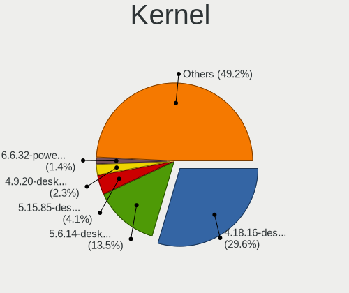

| Version                  | Desktops | Percent |
|--------------------------|----------|---------|
| 4.18.16-desktop-1bP      | 718      | 29.57%  |
| 5.6.14-desktop-2bP       | 327      | 13.47%  |
| 5.15.85-desktop-1bP      | 99       | 4.08%   |
| 4.9.20-desktop-pae-1bP   | 55       | 2.27%   |
| 6.6.32-power-1bP         | 34       | 1.4%    |
| 5.10.14-desktop-1omv4002 | 34       | 1.4%    |
| 6.3.8-desktop-1bP        | 28       | 1.15%   |
| 5.1.15-desktop-1bP       | 27       | 1.11%   |
| 5.16.7-desktop-1omv4003  | 21       | 0.86%   |
| 6.3.3-desktop-1bP        | 16       | 0.66%   |
| 6.2.6-desktop-1omv2390   | 16       | 0.66%   |
| 6.4.11-desktop-1omv2390  | 13       | 0.54%   |
| 5.4.0-42-generic         | 13       | 0.54%   |
| 5.4.0-58-generic         | 12       | 0.49%   |
| 6.6.2-desktop-1omv2390   | 11       | 0.45%   |
| 5.15.0-56-generic        | 9        | 0.37%   |
| 6.9.3-76060903-generic   | 8        | 0.33%   |
| 6.6.34-power-1bP         | 8        | 0.33%   |
| 6.4.3-desktop-1bP        | 8        | 0.33%   |
| 5.4.0-52-generic         | 8        | 0.33%   |
| 5.4.0-48-generic         | 8        | 0.33%   |
| 5.11.0-27-generic        | 8        | 0.33%   |
| 5.18.12-desktop-3omv4090 | 7        | 0.29%   |
| 5.4.0-47-generic         | 6        | 0.25%   |
| 5.3.0-46-generic         | 6        | 0.25%   |
| 5.15.0-58-generic        | 6        | 0.25%   |
| 5.11.0-43-generic        | 6        | 0.25%   |
| 6.8.0-49-generic         | 5        | 0.21%   |
| 6.8.0-40-generic         | 5        | 0.21%   |
| 6.2.0-33-generic         | 5        | 0.21%   |
| 6.2.0-26-generic         | 5        | 0.21%   |
| 6.1.1-desktop-1omv2290   | 5        | 0.21%   |
| 5.8.0-44-generic         | 5        | 0.21%   |
| 5.8.0-43-generic         | 5        | 0.21%   |
| 5.4.0-91-generic         | 5        | 0.21%   |
| 5.15.0-76-generic        | 5        | 0.21%   |
| 5.15.0-47-generic        | 5        | 0.21%   |
| 5.12.4-desktop-1omv4050  | 5        | 0.21%   |
| 5.11.0-37-generic        | 5        | 0.21%   |
| 5.0.0-37-generic         | 5        | 0.21%   |

Kernel Family
-------------

Linux kernel without a distro release

| Version | Desktops | Percent |
|---------|----------|---------|
| 4.18.16 | 718      | 30.27%  |
| 5.6.14  | 328      | 13.83%  |
| 5.4.0   | 130      | 5.48%   |
| 5.15.85 | 99       | 4.17%   |
| 5.15.0  | 75       | 3.16%   |
| 4.9.20  | 58       | 2.45%   |
| 4.15.0  | 45       | 1.9%    |
| 5.11.0  | 44       | 1.85%   |
| 5.8.0   | 36       | 1.52%   |
| 6.6.32  | 34       | 1.43%   |
| 5.10.14 | 34       | 1.43%   |
| 5.13.0  | 31       | 1.31%   |
| 5.3.0   | 30       | 1.26%   |
| 6.8.0   | 29       | 1.22%   |
| 6.3.8   | 28       | 1.18%   |
| 5.1.15  | 28       | 1.18%   |
| 6.5.0   | 27       | 1.14%   |
| 6.1.0   | 24       | 1.01%   |
| 6.2.0   | 23       | 0.97%   |
| 5.0.0   | 22       | 0.93%   |
| 5.16.7  | 21       | 0.89%   |
| 6.2.6   | 19       | 0.8%    |
| 5.10.0  | 19       | 0.8%    |
| 6.3.3   | 16       | 0.67%   |
| 6.9.3   | 13       | 0.55%   |
| 6.6.2   | 13       | 0.55%   |
| 6.4.11  | 13       | 0.55%   |
| 5.19.0  | 13       | 0.55%   |
| 4.19.0  | 13       | 0.55%   |
| 6.4.3   | 10       | 0.42%   |
| 4.18.0  | 9        | 0.38%   |
| 6.6.34  | 8        | 0.34%   |
| 6.9.7   | 7        | 0.3%    |
| 6.1.1   | 7        | 0.3%    |
| 5.18.12 | 7        | 0.3%    |
| 6.7.0   | 6        | 0.25%   |
| 6.12.1  | 5        | 0.21%   |
| 6.0.12  | 5        | 0.21%   |
| 5.14.0  | 5        | 0.21%   |
| 5.12.4  | 5        | 0.21%   |

Kernel Major Ver.
-----------------

Linux kernel major version

| Version | Desktops | Percent |
|---------|----------|---------|
| 4.18    | 727      | 31.02%  |
| 5.6     | 330      | 14.08%  |
| 5.15    | 192      | 8.19%   |
| 5.4     | 139      | 5.93%   |
| 6.6     | 69       | 2.94%   |
| 4.9     | 65       | 2.77%   |
| 5.10    | 63       | 2.69%   |
| 6.2     | 59       | 2.52%   |
| 5.11    | 52       | 2.22%   |
| 4.15    | 45       | 1.92%   |
| 6.8     | 43       | 1.83%   |
| 6.3     | 43       | 1.83%   |
| 6.1     | 43       | 1.83%   |
| 6.5     | 41       | 1.75%   |
| 5.8     | 41       | 1.75%   |
| 5.13    | 39       | 1.66%   |
| 6.4     | 31       | 1.32%   |
| 5.3     | 31       | 1.32%   |
| 5.16    | 31       | 1.32%   |
| 5.1     | 31       | 1.32%   |
| 6.9     | 29       | 1.24%   |
| 5.19    | 25       | 1.07%   |
| 5.0     | 22       | 0.94%   |
| 6.0     | 17       | 0.73%   |
| 6.11    | 16       | 0.68%   |
| 6.7     | 13       | 0.55%   |
| 5.18    | 13       | 0.55%   |
| 4.19    | 13       | 0.55%   |
| 5.14    | 12       | 0.51%   |
| 6.10    | 11       | 0.47%   |
| 5.9     | 11       | 0.47%   |
| 5.7     | 8        | 0.34%   |
| 5.17    | 8        | 0.34%   |
| 5.12    | 8        | 0.34%   |
| 6.12    | 7        | 0.3%    |
| 5.5     | 3        | 0.13%   |
| 4.7     | 3        | 0.13%   |
| 4.4     | 2        | 0.09%   |
| 4.20    | 2        | 0.09%   |
| 4.5     | 1        | 0.04%   |

Arch
----

OS architecture (x86_64, i586, etc.)

| Name   | Desktops | Percent |
|--------|----------|---------|
| x86_64 | 1893     | 95.75%  |
| i686   | 83       | 4.2%    |
| unknow | 1        | 0.05%   |

DE
--

Desktop Environment

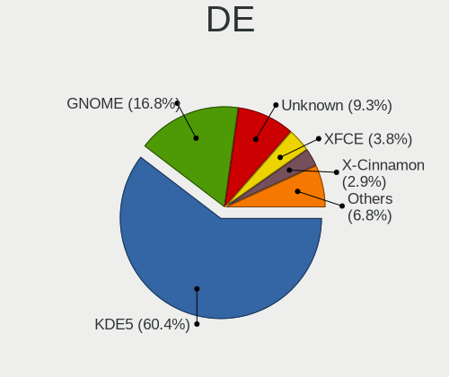

| Name            | Desktops | Percent |
|-----------------|----------|---------|
| KDE5            | 1227     | 60.38%  |
| GNOME           | 342      | 16.83%  |
| Unknown         | 188      | 9.25%   |
| XFCE            | 77       | 3.79%   |
| X-Cinnamon      | 59       | 2.9%    |
| MATE            | 40       | 1.97%   |
| LXQt            | 23       | 1.13%   |
| KDE6            | 16       | 0.79%   |
| KDE             | 11       | 0.54%   |
| Cinnamon        | 10       | 0.49%   |
| Unity           | 7        | 0.34%   |
| Pantheon        | 6        | 0.3%    |
| i3              | 6        | 0.3%    |
| KDE4            | 5        | 0.25%   |
| LXDE            | 3        | 0.15%   |
| Hyprland        | 3        | 0.15%   |
| Deepin          | 3        | 0.15%   |
| Trinity         | 1        | 0.05%   |
| sway            | 1        | 0.05%   |
| GNOME Flashback | 1        | 0.05%   |
| GNOME Classic   | 1        | 0.05%   |
| Enlightenment   | 1        | 0.05%   |
| Budgie          | 1        | 0.05%   |

Display Server
--------------

X11 or Wayland

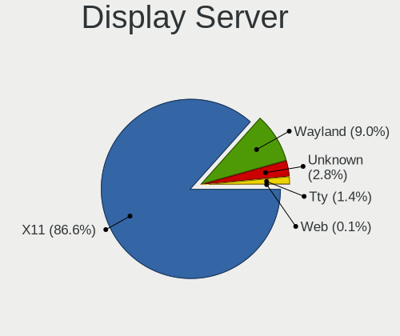

| Name    | Desktops | Percent |
|---------|----------|---------|
| X11     | 1733     | 86.61%  |
| Wayland | 181      | 9.05%   |
| Unknown | 57       | 2.85%   |
| Tty     | 28       | 1.4%    |
| Web     | 2        | 0.1%    |

Display Manager
---------------

SDDM, LightDM, etc.

| Name    | Desktops | Percent |
|---------|----------|---------|
| SDDM    | 1308     | 64.88%  |
| Unknown | 395      | 19.59%  |
| GDM3    | 119      | 5.9%    |
| LightDM | 93       | 4.61%   |
| GDM     | 66       | 3.27%   |
| TDM     | 26       | 1.29%   |
| KDM     | 5        | 0.25%   |
| SLiM    | 2        | 0.1%    |
| NODM    | 1        | 0.05%   |
| GREETD  | 1        | 0.05%   |

OS Lang
-------

Language

| Lang       | Desktops | Percent |
|------------|----------|---------|
| Unknown    | 1195     | 59.28%  |
| hu_HU      | 481      | 23.86%  |
| en_US      | 272      | 13.49%  |
| en_GB      | 28       | 1.39%   |
| C          | 20       | 0.99%   |
| de_DE      | 11       | 0.55%   |
| hu_HU.UTF8 | 2        | 0.1%    |
| sk_SK      | 1        | 0.05%   |
| ru_RU      | 1        | 0.05%   |
| POSIX      | 1        | 0.05%   |
| fr_FR      | 1        | 0.05%   |
| en_AG      | 1        | 0.05%   |
| el_GR      | 1        | 0.05%   |
| C.UTF8     | 1        | 0.05%   |

Boot Mode
---------

EFI or BIOS

| Mode | Desktops | Percent |
|------|----------|---------|
| BIOS | 1381     | 67.43%  |
| EFI  | 667      | 32.57%  |

Filesystem
----------

Type of filesystem

| Type    | Desktops | Percent |
|---------|----------|---------|
| Ext4    | 1137     | 52.01%  |
| Overlay | 875      | 40.03%  |
| Btrfs   | 85       | 3.89%   |
| Tmpfs   | 50       | 2.29%   |
| Unknown | 19       | 0.87%   |
| Xfs     | 11       | 0.5%    |
| Zfs     | 5        | 0.23%   |
| Ext2    | 3        | 0.14%   |
| Ext3    | 1        | 0.05%   |

Part. scheme
------------

Scheme of partitioning

| Type    | Desktops | Percent |
|---------|----------|---------|
| MBR     | 900      | 43.1%   |
| GPT     | 775      | 37.12%  |
| Unknown | 413      | 19.78%  |

Dual Boot with Linux/BSD
------------------------

Hosting more than one Linux/BSD

| Dual boot | Desktops | Percent |
|-----------|----------|---------|
| No        | 1506     | 69.88%  |
| Yes       | 649      | 30.12%  |

Dual Boot (Win)
---------------

Hosting Linux and Windows

| Dual boot | Desktops | Percent |
|-----------|----------|---------|
| No        | 1066     | 50.35%  |
| Yes       | 1051     | 49.65%  |

Board
-----

Vendor
------

Motherboard manufacturer

| Name                | Desktops | Percent |
|---------------------|----------|---------|
| ASUSTek Computer    | 400      | 20.41%  |
| Gigabyte Technology | 391      | 19.95%  |
| ASRock              | 310      | 15.82%  |
| Dell                | 193      | 9.85%   |
| Hewlett-Packard     | 185      | 9.44%   |
| MSI                 | 139      | 7.09%   |
| Lenovo              | 94       | 4.8%    |
| Fujitsu             | 69       | 3.52%   |
| Fujitsu Siemens     | 30       | 1.53%   |
| Intel               | 26       | 1.33%   |
| Acer                | 23       | 1.17%   |
| Foxconn             | 17       | 0.87%   |
| Unknown             | 15       | 0.77%   |
| Medion              | 9        | 0.46%   |
| Shuttle             | 6        | 0.31%   |
| Pegatron            | 6        | 0.31%   |
| Huanan              | 6        | 0.31%   |
| Biostar             | 4        | 0.2%    |
| AMI                 | 4        | 0.2%    |
| AOpen               | 3        | 0.15%   |
| ABIT                | 3        | 0.15%   |
| VXL                 | 2        | 0.1%    |
| Nvidia              | 2        | 0.1%    |
| Gateway             | 2        | 0.1%    |
| AMD                 | 2        | 0.1%    |
| Wistron             | 1        | 0.05%   |
| WinFast             | 1        | 0.05%   |
| Wincor Nixdorf      | 1        | 0.05%   |
| ViewSonic           | 1        | 0.05%   |
| Supermicro          | 1        | 0.05%   |
| Seeed Studio        | 1        | 0.05%   |
| NEC Computers       | 1        | 0.05%   |
| Minix               | 1        | 0.05%   |
| Lex                 | 1        | 0.05%   |
| JW Technology       | 1        | 0.05%   |
| JGINYUE             | 1        | 0.05%   |
| IBM                 | 1        | 0.05%   |
| Hampoo              | 1        | 0.05%   |
| GIADA               | 1        | 0.05%   |
| ECS                 | 1        | 0.05%   |

Model
-----

Motherboard model

| Name                               | Desktops | Percent |
|------------------------------------|----------|---------|
| ASRock FM2A75M Pro4+               | 33       | 1.68%   |
| ASUS All Series                    | 31       | 1.58%   |
| Dell OptiPlex 3020                 | 24       | 1.22%   |
| Unknown                            | 15       | 0.77%   |
| Dell OptiPlex 755                  | 14       | 0.71%   |
| Gigabyte G31M-ES2L                 | 13       | 0.66%   |
| Dell OptiPlex 780                  | 13       | 0.66%   |
| MSI MS-7C91                        | 12       | 0.61%   |
| ASUS P5KPL-AM EPU                  | 12       | 0.61%   |
| Dell OptiPlex 760                  | 11       | 0.56%   |
| MSI MS-7817                        | 10       | 0.51%   |
| Gigabyte H61M-S1                   | 10       | 0.51%   |
| Dell OptiPlex 7010                 | 10       | 0.51%   |
| MSI MS-7C02                        | 9        | 0.46%   |
| MSI MS-7680                        | 9        | 0.46%   |
| Lenovo ThinkStation D20 4158AF8    | 9        | 0.46%   |
| HP ProDesk 600 G2 SFF              | 9        | 0.46%   |
| Dell Precision WorkStation T3500   | 9        | 0.46%   |
| ASRock G41M-VS3                    | 9        | 0.46%   |
| HP Compaq Pro 6300 MT              | 8        | 0.41%   |
| HP Compaq 8000 Elite SFF PC        | 8        | 0.41%   |
| Gigabyte B450 AORUS ELITE          | 8        | 0.41%   |
| ASRock N68C-S UCC                  | 8        | 0.41%   |
| HP Compaq Elite 8300 SFF           | 7        | 0.36%   |
| Gigabyte 970A-DS3P                 | 7        | 0.36%   |
| ASUS H110M-K                       | 7        | 0.36%   |
| ASRock B550M Pro4                  | 7        | 0.36%   |
| MSI MS-7592                        | 6        | 0.31%   |
| HP EliteDesk 705 G3 SFF            | 6        | 0.31%   |
| HP Compaq dc5800 Small Form Factor | 6        | 0.31%   |
| Gigabyte H81M-S1                   | 6        | 0.31%   |
| Fujitsu Siemens ESPRIMO E5730      | 6        | 0.31%   |
| Fujitsu ESPRIMO P910               | 6        | 0.31%   |
| Dell Precision Tower 5810          | 6        | 0.31%   |
| Dell OptiPlex 9020                 | 6        | 0.31%   |
| Dell OptiPlex 745                  | 6        | 0.31%   |
| Dell OptiPlex 330                  | 6        | 0.31%   |
| ASUS ROG STRIX B450-F GAMING       | 6        | 0.31%   |
| ASUS PRIME A320M-K                 | 6        | 0.31%   |
| ASUS H110M-A                       | 6        | 0.31%   |

Model Family
------------

Motherboard model prefix

| Name                    | Desktops | Percent |
|-------------------------|----------|---------|
| Dell OptiPlex           | 157      | 8.01%   |
| HP Compaq               | 120      | 6.12%   |
| Lenovo ThinkCentre      | 64       | 3.27%   |
| ASUS PRIME              | 64       | 3.27%   |
| Fujitsu ESPRIMO         | 48       | 2.45%   |
| ASRock FM2A75M          | 33       | 1.68%   |
| ASUS All                | 31       | 1.58%   |
| ASUS TUF                | 30       | 1.53%   |
| ASUS ROG                | 25       | 1.28%   |
| Fujitsu Siemens ESPRIMO | 24       | 1.22%   |
| Dell Precision          | 21       | 1.07%   |
| HP EliteDesk            | 20       | 1.02%   |
| Gigabyte B450           | 19       | 0.97%   |
| ASUS P5KPL-AM           | 18       | 0.92%   |
| HP ProDesk              | 17       | 0.87%   |
| Acer Veriton            | 17       | 0.87%   |
| Lenovo ThinkStation     | 16       | 0.82%   |
| Unknown                 | 15       | 0.77%   |
| Gigabyte G31M-ES2L      | 13       | 0.66%   |
| Fujitsu CELSIUS         | 13       | 0.66%   |
| MSI MS-7C91             | 12       | 0.61%   |
| Gigabyte H310M          | 12       | 0.61%   |
| Gigabyte B450M          | 12       | 0.61%   |
| ASUS M5A97              | 11       | 0.56%   |
| MSI MS-7817             | 10       | 0.51%   |
| Gigabyte H61M-S1        | 10       | 0.51%   |
| ASRock 970              | 10       | 0.51%   |
| MSI MS-7C02             | 9        | 0.46%   |
| MSI MS-7680             | 9        | 0.46%   |
| ASRock N68C-S           | 9        | 0.46%   |
| ASRock G41M-VS3         | 9        | 0.46%   |
| ASUS P8Z77-V            | 8        | 0.41%   |
| ASUS P8H61-M            | 8        | 0.41%   |
| ASUS M5A78L-M           | 8        | 0.41%   |
| ASUS H110M-A            | 8        | 0.41%   |
| ASRock B450M            | 8        | 0.41%   |
| Gigabyte 970A-DS3P      | 7        | 0.36%   |
| ASUS H110M-K            | 7        | 0.36%   |
| ASRock B550M            | 7        | 0.36%   |
| ASRock B450             | 7        | 0.36%   |

MFG Year
--------

Motherboard manufacture year

| Year    | Desktops | Percent |
|---------|----------|---------|
| 2012    | 212      | 10.82%  |
| 2013    | 192      | 9.8%    |
| 2010    | 163      | 8.32%   |
| 2014    | 162      | 8.27%   |
| 2009    | 157      | 8.01%   |
| 2011    | 154      | 7.86%   |
| 2008    | 136      | 6.94%   |
| 2018    | 133      | 6.79%   |
| 2007    | 107      | 5.46%   |
| 2017    | 88       | 4.49%   |
| 2015    | 84       | 4.29%   |
| 2020    | 78       | 3.98%   |
| 2019    | 71       | 3.62%   |
| 2016    | 67       | 3.42%   |
| 2006    | 47       | 2.4%    |
| 2021    | 42       | 2.14%   |
| 2005    | 20       | 1.02%   |
| 2023    | 18       | 0.92%   |
| 2022    | 17       | 0.87%   |
| 2024    | 4        | 0.2%    |
| 2004    | 4        | 0.2%    |
| 2003    | 3        | 0.15%   |
| Unknown | 1        | 0.05%   |

Form Factor
-----------

Physical design of the computer

| Name    | Desktops | Percent |
|---------|----------|---------|
| Desktop | 1960     | 100%    |

Secure Boot
-----------

Enabled or disabled

| State    | Desktops | Percent |
|----------|----------|---------|
| Disabled | 1937     | 98.68%  |
| Enabled  | 26       | 1.32%   |

Coreboot
--------

Have coreboot on board

| Used | Desktops | Percent |
|------|----------|---------|
| No   | 1960     | 100%    |

RAM Size
--------

Total RAM memory

| Size in GB  | Desktops | Percent |
|-------------|----------|---------|
| 3.01-4.0    | 505      | 24.66%  |
| 8.01-16.0   | 455      | 22.22%  |
| 4.01-8.0    | 349      | 17.04%  |
| 16.01-24.0  | 347      | 16.94%  |
| 32.01-64.0  | 148      | 7.23%   |
| 1.01-2.0    | 129      | 6.3%    |
| 64.01-256.0 | 37       | 1.81%   |
| 24.01-32.0  | 36       | 1.76%   |
| 2.01-3.0    | 34       | 1.66%   |
| 0.51-1.0    | 8        | 0.39%   |

RAM Used
--------

Used RAM memory

| Used GB     | Desktops | Percent |
|-------------|----------|---------|
| 1.01-2.0    | 676      | 28.25%  |
| 0.51-1.0    | 595      | 24.86%  |
| 0.01-0.5    | 530      | 22.15%  |
| 2.01-3.0    | 281      | 11.74%  |
| 4.01-8.0    | 135      | 5.64%   |
| 3.01-4.0    | 127      | 5.31%   |
| 8.01-16.0   | 38       | 1.59%   |
| 16.01-24.0  | 7        | 0.29%   |
| 64.01-256.0 | 2        | 0.08%   |
| 32.01-64.0  | 1        | 0.04%   |
| Unknown     | 1        | 0.04%   |

Total Drives
------------

Number of drives on board

| Drives  | Desktops | Percent |
|---------|----------|---------|
| 1       | 993      | 45.63%  |
| 2       | 585      | 26.88%  |
| 3       | 310      | 14.25%  |
| 4       | 143      | 6.57%   |
| 5       | 68       | 3.13%   |
| 0       | 33       | 1.52%   |
| 6       | 18       | 0.83%   |
| 7       | 8        | 0.37%   |
| 8       | 7        | 0.32%   |
| 9       | 6        | 0.28%   |
| 11      | 2        | 0.09%   |
| 10      | 2        | 0.09%   |
| Unknown | 1        | 0.05%   |

Has CD-ROM
----------

Has CD-ROM on board

| Presented | Desktops | Percent |
|-----------|----------|---------|
| Yes       | 1098     | 53.85%  |
| No        | 941      | 46.15%  |

Has Ethernet
------------

Has Ethernet on board

| Presented | Desktops | Percent |
|-----------|----------|---------|
| Yes       | 1931     | 98.52%  |
| No        | 29       | 1.48%   |

Has WiFi
--------

Has WiFi module

| Presented | Desktops | Percent |
|-----------|----------|---------|
| No        | 1473     | 73.43%  |
| Yes       | 533      | 26.57%  |

Has Bluetooth
-------------

Has Bluetooth module

| Presented | Desktops | Percent |
|-----------|----------|---------|
| No        | 1664     | 82.91%  |
| Yes       | 343      | 17.09%  |

Location
--------

Country
-------

Geographic location (country)

| Country | Desktops | Percent |
|---------|----------|---------|
| Hungary | 1960     | 100%    |

City
----

Geographic location (city)

| City              | Desktops | Percent |
|-------------------|----------|---------|
| Budapest          | 686      | 29.75%  |
| Szeged            | 55       | 2.39%   |
| Pcs             | 46       | 1.99%   |
| Gyr             | 44       | 1.91%   |
| Zalaegerszeg      | 39       | 1.69%   |
| Debrecen          | 39       | 1.69%   |
| Tatabnya        | 35       | 1.52%   |
| Miskolc           | 35       | 1.52%   |
| Kecskemt        | 33       | 1.43%   |
| Szigetszentmiklos | 30       | 1.3%    |
| Szombathely       | 28       | 1.21%   |
| rd              | 24       | 1.04%   |
| Eger              | 24       | 1.04%   |
| Karcag            | 23       | 1%      |
| Szkesfehrvr | 22       | 0.95%   |
| Szekszrd        | 21       | 0.91%   |
| Berettyjfalu  | 20       | 0.87%   |
| Szolnok           | 19       | 0.82%   |
| Gdll        | 19       | 0.82%   |
| Oroshaza          | 18       | 0.78%   |
| Nyiregyhaza       | 18       | 0.78%   |
| Szentendre        | 16       | 0.69%   |
| Toeroekbalint     | 14       | 0.61%   |
| Nagykanizsa       | 13       | 0.56%   |
| Hodmezovasarhely  | 13       | 0.56%   |
| Veresegyhaz       | 12       | 0.52%   |
| Mosonmagyarvr | 12       | 0.52%   |
| Esztergom         | 12       | 0.52%   |
| Dunakeszi         | 12       | 0.52%   |
| Sopron            | 11       | 0.48%   |
| Sifok           | 11       | 0.48%   |
| Hatvan            | 11       | 0.48%   |
| Hajduboszormeny   | 11       | 0.48%   |
| Biatorbagy        | 11       | 0.48%   |
| Papa              | 10       | 0.43%   |
| Mohcs           | 10       | 0.43%   |
| Gyomro            | 10       | 0.43%   |
| Dunajvros     | 10       | 0.43%   |
| Dunaharaszti      | 10       | 0.43%   |
| Veszprm         | 9        | 0.39%   |

Drives
------

Drive Vendor
------------

Hard drive vendors

| Vendor                      | Desktops | Drives | Percent |
|-----------------------------|----------|--------|---------|
| WDC                         | 704      | 1619   | 19.69%  |
| Samsung Electronics         | 573      | 1083   | 16.02%  |
| Kingston                    | 483      | 970    | 13.51%  |
| Seagate                     | 476      | 797    | 13.31%  |
| Toshiba                     | 264      | 519    | 7.38%   |
| Hitachi                     | 131      | 186    | 3.66%   |
| A-DATA Technology           | 105      | 199    | 2.94%   |
| SanDisk                     | 62       | 86     | 1.73%   |
| Maxtor                      | 56       | 73     | 1.57%   |
| Crucial                     | 55       | 102    | 1.54%   |
| SPCC                        | 54       | 79     | 1.51%   |
| Intel                       | 39       | 66     | 1.09%   |
| HGST                        | 37       | 109    | 1.03%   |
| Apacer                      | 32       | 47     | 0.89%   |
| Intenso                     | 30       | 50     | 0.84%   |
| JMicron Technology          | 24       | 29     | 0.67%   |
| Kingston Technology Company | 23       | 29     | 0.64%   |
| Fujitsu                     | 22       | 22     | 0.62%   |
| Patriot                     | 21       | 45     | 0.59%   |
| OCZ                         | 21       | 28     | 0.59%   |
| Unknown                     | 19       | 40     | 0.53%   |
| Gigabyte Technology         | 18       | 60     | 0.5%    |
| China                       | 18       | 28     | 0.5%    |
| Micron Technology           | 17       | 30     | 0.48%   |
| SK hynix                    | 16       | 21     | 0.45%   |
| PNY                         | 15       | 29     | 0.42%   |
| Transcend                   | 13       | 19     | 0.36%   |
| Kingmax                     | 13       | 46     | 0.36%   |
| Hewlett-Packard             | 12       | 18     | 0.34%   |
| Verbatim                    | 10       | 15     | 0.28%   |
| Phison Electronics          | 9        | 13     | 0.25%   |
| KingSpec                    | 9        | 11     | 0.25%   |
| Corsair                     | 9        | 10     | 0.25%   |
| XPG                         | 8        | 14     | 0.22%   |
| Netac                       | 8        | 19     | 0.22%   |
| LITEON                      | 8        | 8      | 0.22%   |
| Unknown                     | 8        | 8      | 0.22%   |
| Team                        | 7        | 9      | 0.2%    |
| Zheino                      | 6        | 25     | 0.17%   |
| Silicon Motion              | 6        | 7      | 0.17%   |

Drive Model
-----------

Hard drive models

| Model                                               | Desktops | Percent |
|-----------------------------------------------------|----------|---------|
| Kingston SA400S37240G 240GB SSD                     | 108      | 2.6%    |
| Kingston SA400S37120G 120GB SSD                     | 83       | 2%      |
| Toshiba DT01ACA100 1TB                              | 77       | 1.85%   |
| Kingston SV300S37A120G 120GB SSD                    | 64       | 1.54%   |
| Seagate ST500DM002-1BD142 500GB                     | 56       | 1.35%   |
| Kingston SA400S37480G 480GB SSD                     | 45       | 1.08%   |
| Toshiba DT01ACA050 500GB                            | 43       | 1.03%   |
| Samsung SSD 850 EVO 250GB                           | 33       | 0.79%   |
| A-DATA SU630 240GB SSD                              | 31       | 0.75%   |
| Samsung HD502HJ 500GB                               | 28       | 0.67%   |
| Kingston SUV400S37120G 120GB SSD                    | 28       | 0.67%   |
| WDC WD10EZEX-08WN4A0 1TB                            | 27       | 0.65%   |
| Toshiba HDWD110 1TB                                 | 25       | 0.6%    |
| Samsung SSD 860 EVO 250GB                           | 25       | 0.6%    |
| Seagate ST380815AS 80GB                             | 24       | 0.58%   |
| Toshiba HDWD130 3TB                                 | 23       | 0.55%   |
| SPCC Solid State Disk 256GB                         | 23       | 0.55%   |
| Seagate ST2000DM008-2FR102 2TB                      | 23       | 0.55%   |
| Toshiba DT01ACA200 2TB                              | 22       | 0.53%   |
| JMicron Generic 500GB                               | 22       | 0.53%   |
| A-DATA SU700 120GB SSD                              | 21       | 0.51%   |
| Kingston SHFS37A120G 120GB SSD                      | 20       | 0.48%   |
| WDC WDS240G2G0A-00JH30 240GB SSD                    | 18       | 0.43%   |
| Seagate ST3160318AS 160GB                           | 18       | 0.43%   |
| Samsung SSD 860 EVO 500GB                           | 18       | 0.43%   |
| Samsung NVMe SSD Controller SM981/PM981/PM983 512GB | 18       | 0.43%   |
| Samsung HD322HJ 320GB                               | 18       | 0.43%   |
| Kingston SV300S37A240G 240GB SSD                    | 18       | 0.43%   |
| WDC WD10EZEX-22MFCA0 1TB                            | 17       | 0.41%   |
| Seagate ST3160815AS 160GB                           | 17       | 0.41%   |
| Kingston SA400S37960G 960GB SSD                     | 17       | 0.41%   |
| WDC WD10EZRX-00L4HB0 1TB                            | 16       | 0.38%   |
| Seagate ST1000DM010-2EP102 1TB                      | 16       | 0.38%   |
| Samsung HD502IJ 500GB                               | 16       | 0.38%   |
| Hitachi HDS721050CLA360 500GB                       | 16       | 0.38%   |
| WDC WD20EZRZ-00Z5HB0 2TB                            | 15       | 0.36%   |
| Seagate ST1000LM024 HN-M101MBB 1TB                  | 15       | 0.36%   |
| Samsung HD161HJ 160GB                               | 15       | 0.36%   |
| Samsung HD103UJ 1TB                                 | 15       | 0.36%   |
| Seagate ST3250318AS 250GB                           | 14       | 0.34%   |

HDD Vendor
----------

Hard disk drive vendors

| Vendor              | Desktops | Drives | Percent |
|---------------------|----------|--------|---------|
| WDC                 | 658      | 1456   | 33.35%  |
| Seagate             | 470      | 780    | 23.82%  |
| Samsung Electronics | 278      | 473    | 14.09%  |
| Toshiba             | 251      | 501    | 12.72%  |
| Hitachi             | 131      | 186    | 6.64%   |
| Maxtor              | 56       | 73     | 2.84%   |
| HGST                | 37       | 109    | 1.88%   |
| JMicron Technology  | 22       | 27     | 1.12%   |
| Fujitsu             | 22       | 22     | 1.12%   |
| Hewlett-Packard     | 7        | 9      | 0.35%   |
| HGST HTS            | 6        | 6      | 0.3%    |
| Unknown             | 5        | 6      | 0.25%   |
| QUANTUM             | 4        | 4      | 0.2%    |
| USB3.0              | 3        | 4      | 0.15%   |
| ICY BOX             | 3        | 6      | 0.15%   |
| External            | 3        | 4      | 0.15%   |
| ASMT                | 3        | 3      | 0.15%   |
| WD MediaMax         | 2        | 4      | 0.1%    |
| IBM-D050            | 2        | 4      | 0.1%    |
| ExcelStor           | 2        | 2      | 0.1%    |
| Apple               | 2        | 3      | 0.1%    |
| Unknown             | 2        | 2      | 0.1%    |
| USB                 | 1        | 1      | 0.05%   |
| TO Exter            | 1        | 1      | 0.05%   |
| IBM/Hitachi         | 1        | 1      | 0.05%   |
| Dell                | 1        | 3      | 0.05%   |

SSD Vendor
----------

Solid state drive vendors

| Vendor              | Desktops | Drives | Percent |
|---------------------|----------|--------|---------|
| Kingston            | 429      | 830    | 32.6%   |
| Samsung Electronics | 234      | 415    | 17.78%  |
| A-DATA Technology   | 95       | 182    | 7.22%   |
| WDC                 | 71       | 150    | 5.4%    |
| Crucial             | 48       | 91     | 3.65%   |
| SanDisk             | 46       | 55     | 3.5%    |
| SPCC                | 45       | 68     | 3.42%   |
| Intel               | 32       | 53     | 2.43%   |
| Apacer              | 31       | 46     | 2.36%   |
| Intenso             | 27       | 46     | 2.05%   |
| OCZ                 | 21       | 28     | 1.6%    |
| Patriot             | 20       | 44     | 1.52%   |
| China               | 18       | 28     | 1.37%   |
| PNY                 | 15       | 29     | 1.14%   |
| Gigabyte Technology | 15       | 52     | 1.14%   |
| Micron Technology   | 14       | 27     | 1.06%   |
| Toshiba             | 13       | 17     | 0.99%   |
| Transcend           | 12       | 14     | 0.91%   |
| Kingmax             | 12       | 44     | 0.91%   |
| Verbatim            | 9        | 14     | 0.68%   |
| KingSpec            | 9        | 11     | 0.68%   |
| SK hynix            | 8        | 13     | 0.61%   |
| Netac               | 8        | 19     | 0.61%   |
| LITEON              | 8        | 8      | 0.61%   |
| Team                | 7        | 9      | 0.53%   |
| Corsair             | 7        | 8      | 0.53%   |
| GOODRAM             | 5        | 5      | 0.38%   |
| Unknown             | 4        | 4      | 0.3%    |
| Leven               | 3        | 3      | 0.23%   |
| Hewlett-Packard     | 3        | 4      | 0.23%   |
| AMD                 | 3        | 3      | 0.23%   |
| SATAFIRM            | 2        | 2      | 0.15%   |
| KODAK               | 2        | 2      | 0.15%   |
| KingFast            | 2        | 3      | 0.15%   |
| KingDian            | 2        | 2      | 0.15%   |
| Integral            | 2        | 2      | 0.15%   |
| Dahua               | 2        | 3      | 0.15%   |
| BIWIN               | 2        | 6      | 0.15%   |
| Biostar             | 2        | 3      | 0.15%   |
| 2-Power             | 2        | 4      | 0.15%   |

Drive Kind
----------

HDD or SSD

| Kind    | Desktops | Drives | Percent |
|---------|----------|--------|---------|
| HDD     | 1475     | 3690   | 50.91%  |
| SSD     | 1085     | 2381   | 37.45%  |
| NVMe    | 292      | 613    | 10.08%  |
| Unknown | 37       | 72     | 1.28%   |
| MMC     | 8        | 10     | 0.28%   |

Drive Connector
---------------

SATA, SAS, NVMe, etc.

| Type | Desktops | Drives | Percent |
|------|----------|--------|---------|
| SATA | 1858     | 5908   | 81.28%  |
| NVMe | 292      | 612    | 12.77%  |
| SAS  | 128      | 236    | 5.6%    |
| MMC  | 8        | 10     | 0.35%   |

Drive Size
----------

Size of hard drive

| Size in TB | Desktops | Drives | Percent |
|------------|----------|--------|---------|
| 0.01-0.5   | 1647     | 3960   | 63.71%  |
| 0.51-1.0   | 560      | 1183   | 21.66%  |
| 1.01-2.0   | 207      | 380    | 8.01%   |
| 3.01-4.0   | 68       | 217    | 2.63%   |
| 2.01-3.0   | 68       | 232    | 2.63%   |
| 4.01-10.0  | 30       | 75     | 1.16%   |
| 10.01-20.0 | 5        | 24     | 0.19%   |

Space Total
-----------

Amount of disk space available on the file system

| Size in GB     | Desktops | Percent |
|----------------|----------|---------|
| Unknown        | 786      | 33.35%  |
| 101-250        | 459      | 19.47%  |
| 251-500        | 283      | 12.01%  |
| 501-1000       | 188      | 7.98%   |
| 51-100         | 158      | 6.7%    |
| 1001-2000      | 129      | 5.47%   |
| 1-20           | 122      | 5.18%   |
| More than 3000 | 96       | 4.07%   |
| 21-50          | 83       | 3.52%   |
| 2001-3000      | 53       | 2.25%   |

Space Used
----------

Amount of used disk space

| Used GB        | Desktops | Percent |
|----------------|----------|---------|
| Unknown        | 786      | 33.38%  |
| 1-20           | 764      | 32.44%  |
| 21-50          | 203      | 8.62%   |
| 51-100         | 155      | 6.58%   |
| 101-250        | 144      | 6.11%   |
| 501-1000       | 95       | 4.03%   |
| 251-500        | 84       | 3.57%   |
| 1001-2000      | 71       | 3.01%   |
| More than 3000 | 34       | 1.44%   |
| 2001-3000      | 18       | 0.76%   |
| 0              | 1        | 0.04%   |

Malfunc. Drives
---------------

Drive models with a malfunction

| Model                              | Desktops | Drives | Percent |
|------------------------------------|----------|--------|---------|
| Seagate ST500DM002-1BD142 500GB    | 20       | 37     | 2.82%   |
| A-DATA Technology SU630 240GB SSD  | 19       | 41     | 2.68%   |
| Kingston SV300S37A120G 120GB SSD   | 16       | 17     | 2.26%   |
| Samsung Electronics HD103UJ 1TB    | 12       | 29     | 1.69%   |
| Toshiba DT01ACA100 1TB             | 11       | 24     | 1.55%   |
| Toshiba DT01ACA050 500GB           | 11       | 15     | 1.55%   |
| Seagate ST1000LM024 HN-M101MBB 1TB | 9        | 12     | 1.27%   |
| WDC WD5000AAKX-001CA0 500GB        | 7        | 8      | 0.99%   |
| WDC WD5000AADS-00S9B0 500GB        | 7        | 8      | 0.99%   |
| Samsung Electronics HD321KJ 320GB  | 7        | 8      | 0.99%   |
| WDC WD5000AAKS-00UU3A0 500GB       | 6        | 18     | 0.85%   |
| Seagate ST3250318AS 250GB          | 6        | 10     | 0.85%   |
| Seagate ST3160815AS 160GB          | 6        | 8      | 0.85%   |
| Samsung Electronics HD502HJ 500GB  | 6        | 9      | 0.85%   |
| Samsung Electronics HD161HJ 160GB  | 6        | 6      | 0.85%   |
| WDC WD5000AAKX-08U6AA0 500GB       | 5        | 9      | 0.71%   |
| WDC WD3200AAKS-00L9A0 320GB        | 5        | 7      | 0.71%   |
| WDC WD10PURZ-85U8XY0 1TB           | 5        | 13     | 0.71%   |
| Seagate ST500LT012-9WS142 500GB    | 5        | 6      | 0.71%   |
| Seagate ST3160318AS 160GB          | 5        | 5      | 0.71%   |
| Samsung Electronics SP2504C 250GB  | 5        | 10     | 0.71%   |
| Samsung Electronics HD200HJ 200GB  | 5        | 10     | 0.71%   |
| Samsung Electronics HD103SI 1TB    | 5        | 5      | 0.71%   |
| Maxtor 6Y080M0 82GB                | 5        | 6      | 0.71%   |
| WDC WD5000AAKX-22ERMA0 500GB       | 4        | 5      | 0.56%   |
| WDC WD5000AAKX-07U6AA0 500GB       | 4        | 6      | 0.56%   |
| WDC WD15EARS-00MVWB0 1TB           | 4        | 12     | 0.56%   |
| WDC WD10EARS-00Y5B1 1TB            | 4        | 14     | 0.56%   |
| WDC WD10EALX-009BA0 1TB            | 4        | 5      | 0.56%   |
| Seagate ST380815AS 80GB            | 4        | 7      | 0.56%   |
| Seagate ST3160812AS 160GB          | 4        | 4      | 0.56%   |
| Samsung Electronics SP2004C 200GB  | 4        | 7      | 0.56%   |
| Samsung Electronics HD161GJ 160GB  | 4        | 5      | 0.56%   |
| Samsung Electronics HD103SJ 1TB    | 4        | 4      | 0.56%   |
| Samsung Electronics HD082GJ 80GB   | 4        | 4      | 0.56%   |
| Samsung Electronics HD080HJ/ 80GB  | 4        | 4      | 0.56%   |
| Maxtor 2B020H1 20GB                | 4        | 8      | 0.56%   |
| Hitachi HTS545050B9A300 500GB      | 4        | 6      | 0.56%   |
| WDC WD5000AZLX-75K2TA0 500GB       | 3        | 5      | 0.42%   |
| WDC WD5000AAKX-60U6AA0 500GB       | 3        | 4      | 0.42%   |

Malfunc. Drive Vendor
---------------------

Vendors of faulty drives

| Vendor              | Desktops | Drives | Percent |
|---------------------|----------|--------|---------|
| WDC                 | 195      | 333    | 29.1%   |
| Seagate             | 131      | 194    | 19.55%  |
| Samsung Electronics | 111      | 173    | 16.57%  |
| Toshiba             | 45       | 78     | 6.72%   |
| Hitachi             | 39       | 59     | 5.82%   |
| Kingston            | 38       | 52     | 5.67%   |
| Maxtor              | 31       | 46     | 4.63%   |
| A-DATA Technology   | 27       | 59     | 4.03%   |
| HGST                | 10       | 11     | 1.49%   |
| Fujitsu             | 7        | 7      | 1.04%   |
| Intel               | 5        | 13     | 0.75%   |
| SK hynix            | 3        | 6      | 0.45%   |
| Hewlett-Packard     | 3        | 3      | 0.45%   |
| WD MediaMax         | 2        | 4      | 0.3%    |
| SanDisk             | 2        | 2      | 0.3%    |
| KingSpec            | 2        | 2      | 0.3%    |
| Intenso             | 2        | 2      | 0.3%    |
| ICY BOX             | 2        | 3      | 0.3%    |
| Solid               | 1        | 1      | 0.15%   |
| SATAFIRM            | 1        | 1      | 0.15%   |
| QUANTUM             | 1        | 1      | 0.15%   |
| Patriot             | 1        | 1      | 0.15%   |
| OCZ                 | 1        | 3      | 0.15%   |
| LITEON              | 1        | 1      | 0.15%   |
| Leven               | 1        | 1      | 0.15%   |
| Kingmax             | 1        | 1      | 0.15%   |
| IBM/Hitachi         | 1        | 1      | 0.15%   |
| ExcelStor           | 1        | 1      | 0.15%   |
| Crucial             | 1        | 4      | 0.15%   |
| China               | 1        | 1      | 0.15%   |
| BIWIN               | 1        | 1      | 0.15%   |
| ASMT                | 1        | 1      | 0.15%   |
| Unknown             | 1        | 1      | 0.15%   |

Malfunc. HDD Vendor
-------------------

Vendors of faulty HDD drives

| Vendor              | Desktops | Drives | Percent |
|---------------------|----------|--------|---------|
| WDC                 | 191      | 328    | 33.45%  |
| Seagate             | 131      | 194    | 22.94%  |
| Samsung Electronics | 107      | 167    | 18.74%  |
| Toshiba             | 44       | 77     | 7.71%   |
| Hitachi             | 39       | 59     | 6.83%   |
| Maxtor              | 31       | 46     | 5.43%   |
| HGST                | 10       | 11     | 1.75%   |
| Fujitsu             | 7        | 7      | 1.23%   |
| WD MediaMax         | 2        | 4      | 0.35%   |
| ICY BOX             | 2        | 3      | 0.35%   |
| Hewlett-Packard     | 2        | 2      | 0.35%   |
| QUANTUM             | 1        | 1      | 0.18%   |
| IBM/Hitachi         | 1        | 1      | 0.18%   |
| ExcelStor           | 1        | 1      | 0.18%   |
| ASMT                | 1        | 1      | 0.18%   |
| Unknown             | 1        | 1      | 0.18%   |

Malfunc. Drive Kind
-------------------

Kinds of faulty drives

| Kind | Desktops | Drives | Percent |
|------|----------|--------|---------|
| HDD  | 485      | 903    | 83.19%  |
| SSD  | 94       | 160    | 16.12%  |
| NVMe | 4        | 4      | 0.69%   |

Failed Drives
-------------

Failed drive models

| Model                             | Desktops | Drives | Percent |
|-----------------------------------|----------|--------|---------|
| Samsung Electronics HD502HJ 500GB | 2        | 3      | 16.67%  |
| Samsung Electronics HD103SJ 1TB   | 2        | 3      | 16.67%  |
| Zheino CHN-NGFFNV2280-256 256GB   | 1        | 1      | 8.33%   |
| WDC WD2500AVVS-62L2B0 250GB       | 1        | 1      | 8.33%   |
| Seagate ST9160412AS 160GB         | 1        | 1      | 8.33%   |
| Seagate ST380815AS 80GB           | 1        | 3      | 8.33%   |
| Samsung Electronics SP0802N 80GB  | 1        | 1      | 8.33%   |
| Samsung Electronics HD204UI 2TB   | 1        | 1      | 8.33%   |
| Hewlett-Packard SSD EX900 250GB   | 1        | 1      | 8.33%   |
| ExcelStor Technology J8160S 165GB | 1        | 1      | 8.33%   |

Failed Drive Vendor
-------------------

Failed drive vendors

| Vendor              | Desktops | Drives | Percent |
|---------------------|----------|--------|---------|
| Samsung Electronics | 6        | 8      | 50%     |
| Seagate             | 2        | 4      | 16.67%  |
| Zheino              | 1        | 1      | 8.33%   |
| WDC                 | 1        | 1      | 8.33%   |
| Hewlett-Packard     | 1        | 1      | 8.33%   |
| ExcelStor           | 1        | 1      | 8.33%   |

Drive Status
------------

Number of failed and malfunc. drives

| Status   | Desktops | Drives | Percent |
|----------|----------|--------|---------|
| Works    | 1278     | 4168   | 52.46%  |
| Detected | 586      | 1515   | 24.06%  |
| Malfunc  | 560      | 1067   | 22.99%  |
| Failed   | 12       | 16     | 0.49%   |

Storage controller
------------------

Storage Vendor
--------------

Storage controller vendors

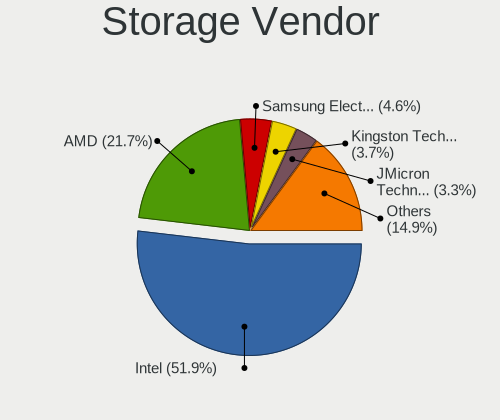

| Vendor                           | Desktops | Percent |
|----------------------------------|----------|---------|
| Intel                            | 1317     | 51.85%  |
| AMD                              | 552      | 21.73%  |
| Samsung Electronics              | 116      | 4.57%   |
| Kingston Technology Company      | 93       | 3.66%   |
| JMicron Technology               | 84       | 3.31%   |
| ASMedia Technology               | 76       | 2.99%   |
| Nvidia                           | 68       | 2.68%   |
| Marvell Technology Group         | 44       | 1.73%   |
| Phison Electronics               | 30       | 1.18%   |
| SanDisk                          | 24       | 0.94%   |
| Silicon Motion                   | 17       | 0.67%   |
| VIA Technologies                 | 16       | 0.63%   |
| LSI Logic / Symbios Logic        | 13       | 0.51%   |
| Silicon Image                    | 12       | 0.47%   |
| Realtek Semiconductor            | 12       | 0.47%   |
| ADATA Technology                 | 12       | 0.47%   |
| SK hynix                         | 8        | 0.31%   |
| Micron/Crucial Technology        | 8        | 0.31%   |
| Integrated Technology Express    | 5        | 0.2%    |
| KIOXIA                           | 4        | 0.16%   |
| Micron Technology                | 3        | 0.12%   |
| MAXIO Technology (Hangzhou)      | 3        | 0.12%   |
| HighPoint Technologies           | 3        | 0.12%   |
| Broadcom / LSI                   | 3        | 0.12%   |
| Adaptec                          | 3        | 0.12%   |
| Seagate Technology               | 2        | 0.08%   |
| 3ware                            | 2        | 0.08%   |
| Toshiba America Info Systems     | 1        | 0.04%   |
| TenaFe                           | 1        | 0.04%   |
| Silicon Integrated Systems [SiS] | 1        | 0.04%   |
| Shenzhen Longsys Electronics     | 1        | 0.04%   |
| Promise Technology               | 1        | 0.04%   |
| OCZ Technology Group             | 1        | 0.04%   |
| O2 Micro                         | 1        | 0.04%   |
| Initio                           | 1        | 0.04%   |
| Hewlett-Packard                  | 1        | 0.04%   |
| Unknown                          | 1        | 0.04%   |

Storage Model
-------------

Storage controller models

| Model                                                                                   | Desktops | Percent |
|-----------------------------------------------------------------------------------------|----------|---------|
| AMD FCH SATA Controller [AHCI mode]                                                     | 274      | 7.88%   |
| Intel NM10/ICH7 Family SATA Controller [IDE mode]                                       | 192      | 5.53%   |
| Intel 8 Series/C220 Series Chipset Family 6-port SATA Controller 1 [AHCI mode]          | 168      | 4.83%   |
| Intel 82801G (ICH7 Family) IDE Controller                                               | 145      | 4.17%   |
| Intel 6 Series/C200 Series Chipset Family 6 port Desktop SATA AHCI Controller           | 107      | 3.08%   |
| AMD SB7x0/SB8x0/SB9x0 IDE Controller                                                    | 100      | 2.88%   |
| Intel 7 Series/C210 Series Chipset Family 6-port SATA Controller [AHCI mode]            | 98       | 2.82%   |
| Intel Q170/Q150/B150/H170/H110/Z170/CM236 Chipset SATA Controller [AHCI Mode]           | 93       | 2.68%   |
| AMD SB7x0/SB8x0/SB9x0 SATA Controller [AHCI mode]                                       | 88       | 2.53%   |
| AMD 400 Series Chipset SATA Controller                                                  | 88       | 2.53%   |
| Intel 200 Series PCH SATA controller [AHCI mode]                                        | 84       | 2.42%   |
| AMD SB7x0/SB8x0/SB9x0 SATA Controller [IDE mode]                                        | 70       | 2.01%   |
| Samsung NVMe SSD Controller SM981/PM981/PM983                                           | 68       | 1.96%   |
| Intel SATA Controller [RAID mode]                                                       | 67       | 1.93%   |
| ASMedia ASM1061/ASM1062 Serial ATA Controller                                           | 67       | 1.93%   |
| AMD FCH IDE Controller                                                                  | 67       | 1.93%   |
| Intel 6 Series/C200 Series Chipset Family Desktop SATA Controller (IDE mode, ports 4-5) | 62       | 1.78%   |
| Intel 6 Series/C200 Series Chipset Family Desktop SATA Controller (IDE mode, ports 0-3) | 62       | 1.78%   |
| Intel 4 Series Chipset PT IDER Controller                                               | 61       | 1.76%   |
| AMD 500 Series Chipset SATA Controller                                                  | 58       | 1.67%   |
| Intel 82801I (ICH9 Family) 2 port SATA Controller [IDE mode]                            | 55       | 1.58%   |
| JMicron JMB363 SATA/IDE Controller                                                      | 50       | 1.44%   |
| Intel 82801JD/DO (ICH10 Family) SATA AHCI Controller                                    | 44       | 1.27%   |
| Kingston Company A2000 NVMe SSD [SM2263EN]                                              | 37       | 1.06%   |
| Intel 82801IR/IO/IH (ICH9R/DO/DH) 4 port SATA Controller [IDE mode]                     | 34       | 0.98%   |
| Intel Cannon Lake PCH SATA AHCI Controller                                              | 33       | 0.95%   |
| Nvidia MCP61 SATA Controller                                                            | 32       | 0.92%   |
| JMicron JMB368 IDE controller                                                           | 30       | 0.86%   |
| Intel 82801JI (ICH10 Family) SATA AHCI Controller                                       | 30       | 0.86%   |
| Intel 82Q35 Express PT IDER Controller                                                  | 28       | 0.81%   |
| Intel 82801JD/DO (ICH10 Family) 4-port SATA IDE Controller                              | 28       | 0.81%   |
| Intel 82801JD/DO (ICH10 Family) 2-port SATA IDE Controller                              | 28       | 0.81%   |
| Nvidia MCP61 IDE                                                                        | 27       | 0.78%   |
| AMD 300 Series Chipset SATA Controller                                                  | 25       | 0.72%   |
| Samsung NVMe SSD Controller 980 (DRAM-less)                                             | 23       | 0.66%   |
| AMD A320 Chipset SATA Controller [AHCI mode]                                            | 23       | 0.66%   |
| Intel 82801JI (ICH10 Family) 4 port SATA IDE Controller #1                              | 22       | 0.63%   |
| Intel 82801JI (ICH10 Family) 2 port SATA IDE Controller #2                              | 22       | 0.63%   |
| Intel 82801IB (ICH9) 2 port SATA Controller [IDE mode]                                  | 21       | 0.6%    |
| Intel 9 Series Chipset Family SATA Controller [AHCI Mode]                               | 20       | 0.58%   |

Storage Kind
------------

Kind of storage controller (IDE, SATA, NVMe, SAS, ...)

| Kind | Desktops | Percent |
|------|----------|---------|
| SATA | 1396     | 52.98%  |
| IDE  | 802      | 30.44%  |
| NVMe | 295      | 11.2%   |
| RAID | 122      | 4.63%   |
| SAS  | 11       | 0.42%   |
| SCSI | 9        | 0.34%   |

Processor
---------

CPU Vendor
----------

Processor vendors

| Vendor       | Desktops | Percent |
|--------------|----------|---------|
| Intel        | 1343     | 68.52%  |
| AMD          | 615      | 31.38%  |
| CentaurHauls | 2        | 0.1%    |

CPU Model
---------

Processor models

| Model                                       | Desktops | Percent |
|---------------------------------------------|----------|---------|
| Intel Core 2 Duo CPU E8400 @ 3.00GHz        | 48       | 2.43%   |
| AMD A8-6600K APU with Radeon HD Graphics    | 36       | 1.82%   |
| Intel Core i5-3470 CPU @ 3.20GHz            | 34       | 1.72%   |
| Intel Core i3-2120 CPU @ 3.30GHz            | 29       | 1.47%   |
| Intel Core i5-2400 CPU @ 3.10GHz            | 28       | 1.41%   |
| Intel Core 2 Duo CPU E7500 @ 2.93GHz        | 28       | 1.41%   |
| Intel Core i5-6500 CPU @ 3.20GHz            | 26       | 1.31%   |
| Intel Core i5-7500 CPU @ 3.40GHz            | 23       | 1.16%   |
| Intel Core i3-4160 CPU @ 3.60GHz            | 23       | 1.16%   |
| AMD FX-6300 Six-Core Processor              | 20       | 1.01%   |
| Intel Core i5-4590 CPU @ 3.30GHz            | 19       | 0.96%   |
| Intel Core 2 Quad CPU Q6600 @ 2.40GHz       | 19       | 0.96%   |
| AMD Ryzen 5 3600 6-Core Processor           | 18       | 0.91%   |
| AMD Ryzen 5 2600 Six-Core Processor         | 18       | 0.91%   |
| Intel Core i3-3220 CPU @ 3.30GHz            | 17       | 0.86%   |
| AMD FX-8350 Eight-Core Processor            | 17       | 0.86%   |
| Intel Pentium Dual-Core CPU E5700 @ 3.00GHz | 16       | 0.81%   |
| Intel Core 2 Duo CPU E7300 @ 2.66GHz        | 16       | 0.81%   |
| Intel Pentium CPU G3220 @ 3.00GHz           | 15       | 0.76%   |
| Intel Core i5-4570 CPU @ 3.20GHz            | 14       | 0.71%   |
| AMD Ryzen 7 5700G with Radeon Graphics      | 14       | 0.71%   |
| Intel Pentium 4 CPU 3.00GHz                 | 13       | 0.66%   |
| Intel Pentium Dual-Core CPU E5400 @ 2.70GHz | 12       | 0.61%   |
| Intel Core i3-7100 CPU @ 3.90GHz            | 12       | 0.61%   |
| Intel Core i3-4130 CPU @ 3.40GHz            | 12       | 0.61%   |
| Intel Core 2 Quad CPU Q8200 @ 2.33GHz       | 12       | 0.61%   |
| Intel Core 2 Duo CPU E8500 @ 3.16GHz        | 12       | 0.61%   |
| AMD Ryzen 5 1600 Six-Core Processor         | 12       | 0.61%   |
| AMD Ryzen 3 2200G with Radeon Vega Graphics | 12       | 0.61%   |
| Intel Core i5-4460 CPU @ 3.20GHz            | 11       | 0.56%   |
| Intel Core i5-3570 CPU @ 3.40GHz            | 11       | 0.56%   |
| Intel Core i5-2500K CPU @ 3.30GHz           | 11       | 0.56%   |
| Intel Core i3-3240 CPU @ 3.40GHz            | 11       | 0.56%   |
| Intel Core i3-2100 CPU @ 3.10GHz            | 11       | 0.56%   |
| Intel Core 2 Duo CPU E6550 @ 2.33GHz        | 11       | 0.56%   |
| Intel Core i7-3770 CPU @ 3.40GHz            | 10       | 0.51%   |
| Intel Core i7-2600 CPU @ 3.40GHz            | 10       | 0.51%   |
| Intel Core i5 CPU 650 @ 3.20GHz             | 10       | 0.51%   |
| Intel Core 2 Quad CPU Q9400 @ 2.66GHz       | 10       | 0.51%   |
| AMD Ryzen 7 5800X 8-Core Processor          | 10       | 0.51%   |

CPU Model Family
----------------

Processor model prefix

| Model                   | Desktops | Percent |
|-------------------------|----------|---------|
| Intel Core i5           | 355      | 17.99%  |
| Intel Core i3           | 212      | 10.75%  |
| Intel Core 2 Duo        | 166      | 8.41%   |
| AMD Ryzen 5             | 112      | 5.68%   |
| Intel Xeon              | 100      | 5.07%   |
| Intel Core i7           | 99       | 5.02%   |
| Intel Pentium           | 79       | 4%      |
| Intel Celeron           | 74       | 3.75%   |
| Intel Core 2 Quad       | 65       | 3.29%   |
| Intel Pentium Dual-Core | 62       | 3.14%   |
| AMD FX                  | 60       | 3.04%   |
| AMD A8                  | 60       | 3.04%   |
| AMD Ryzen 7             | 59       | 2.99%   |
| AMD Athlon II X2        | 44       | 2.23%   |
| Other                   | 34       | 1.72%   |
| AMD Athlon 64 X2        | 32       | 1.62%   |
| AMD Ryzen 3             | 31       | 1.57%   |
| AMD Phenom II X4        | 29       | 1.47%   |
| AMD A4                  | 26       | 1.32%   |
| Intel Pentium 4         | 24       | 1.22%   |
| Intel Core 2            | 24       | 1.22%   |
| AMD A10                 | 20       | 1.01%   |
| Intel Pentium Dual      | 19       | 0.96%   |
| Intel Atom              | 18       | 0.91%   |
| AMD Ryzen 9             | 14       | 0.71%   |
| AMD A6                  | 14       | 0.71%   |
| AMD Athlon II X4        | 13       | 0.66%   |
| Intel Pentium D         | 12       | 0.61%   |
| AMD Athlon Dual Core    | 12       | 0.61%   |
| AMD Sempron             | 11       | 0.56%   |
| AMD Athlon X4           | 11       | 0.56%   |
| AMD Athlon              | 10       | 0.51%   |
| AMD GX                  | 6        | 0.3%    |
| AMD Athlon 64           | 6        | 0.3%    |
| AMD Phenom II X6        | 5        | 0.25%   |
| AMD Phenom II X2        | 5        | 0.25%   |
| Intel Core i9           | 4        | 0.2%    |
| Intel Celeron D         | 4        | 0.2%    |
| AMD PRO A10             | 4        | 0.2%    |
| AMD Phenom              | 4        | 0.2%    |

CPU Cores
---------

Number of processor cores

| Number  | Desktops | Percent |
|---------|----------|---------|
| 2       | 826      | 41.65%  |
| 4       | 676      | 34.09%  |
| 6       | 205      | 10.34%  |
| 1       | 109      | 5.5%    |
| 8       | 88       | 4.44%   |
| 3       | 33       | 1.66%   |
| 12      | 15       | 0.76%   |
| 16      | 12       | 0.61%   |
| 18      | 6        | 0.3%    |
| 14      | 5        | 0.25%   |
| 10      | 5        | 0.25%   |
| 36      | 1        | 0.05%   |
| 28      | 1        | 0.05%   |
| Unknown | 1        | 0.05%   |

CPU Sockets
-----------

Number of sockets

| Number | Desktops | Percent |
|--------|----------|---------|
| 1      | 1943     | 99.03%  |
| 2      | 19       | 0.97%   |

CPU Threads
-----------

Threads per core (Hyper-Threading)

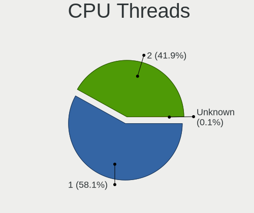

| Number  | Desktops | Percent |
|---------|----------|---------|
| 1       | 1148     | 58.07%  |
| 2       | 828      | 41.88%  |
| Unknown | 1        | 0.05%   |

CPU Op-Modes
------------

CPU Operation Modes (32-bit, 64-bit)

| Op mode        | Desktops | Percent |
|----------------|----------|---------|
| 32-bit, 64-bit | 1949     | 99.34%  |
| 32-bit         | 7        | 0.36%   |
| Unknown        | 6        | 0.31%   |

CPU Microcode
-------------

Microcode number

| Number     | Desktops | Percent |
|------------|----------|---------|
| Unknown    | 468      | 22.6%   |
| 0x1067a    | 197      | 9.51%   |
| 0x306c3    | 156      | 7.53%   |
| 0x206a7    | 128      | 6.18%   |
| 0x306a9    | 108      | 5.21%   |
| 0x06001119 | 81       | 3.91%   |
| 0x010000c8 | 59       | 2.85%   |
| 0x506e3    | 57       | 2.75%   |
| 0x906e9    | 47       | 2.27%   |
| 0x10676    | 42       | 2.03%   |
| 0x6fb      | 36       | 1.74%   |
| 0x0800820d | 35       | 1.69%   |
| 0x906ea    | 32       | 1.55%   |
| 0x6fd      | 32       | 1.55%   |
| 0x06000852 | 29       | 1.4%    |
| 0x08701021 | 20       | 0.97%   |
| 0x06003106 | 20       | 0.97%   |
| 0x10677    | 17       | 0.82%   |
| 0xa0653    | 16       | 0.77%   |
| 0x906eb    | 16       | 0.77%   |
| 0x6f2      | 16       | 0.77%   |
| 0x206c2    | 15       | 0.72%   |
| 0x106e5    | 15       | 0.72%   |
| 0x08001138 | 15       | 0.72%   |
| 0x0600084f | 15       | 0.72%   |
| 0x20655    | 14       | 0.68%   |
| 0x106a5    | 12       | 0.58%   |
| 0x03000027 | 12       | 0.58%   |
| 0xf43      | 11       | 0.53%   |
| 0x0600063e | 11       | 0.53%   |
| 0x010000db | 11       | 0.53%   |
| 0x08108109 | 10       | 0.48%   |
| 0x0810100b | 10       | 0.48%   |
| 0x010000c7 | 10       | 0.48%   |
| 0x20652    | 9        | 0.43%   |
| 0x0a50000f | 9        | 0.43%   |
| 0x0a20120a | 9        | 0.43%   |
| 0x6f6      | 8        | 0.39%   |
| 0x08101016 | 8        | 0.39%   |
| 0x0700010f | 8        | 0.39%   |

CPU Microarch
-------------

Microarchitecture

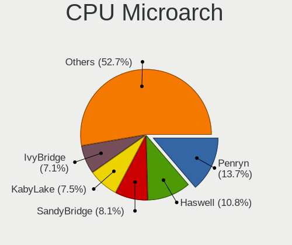

| Name             | Desktops | Percent |
|------------------|----------|---------|
| Penryn           | 270      | 13.73%  |
| Haswell          | 213      | 10.83%  |
| SandyBridge      | 160      | 8.14%   |
| KabyLake         | 148      | 7.53%   |
| IvyBridge        | 139      | 7.07%   |
| Piledriver       | 135      | 6.87%   |
| K10              | 113      | 5.75%   |
| Core             | 104      | 5.29%   |
| Skylake          | 83       | 4.22%   |
| Zen 3            | 61       | 3.1%    |
| Zen+             | 57       | 2.9%    |
| K8 Hammer        | 57       | 2.9%    |
| Zen 2            | 51       | 2.59%   |
| Westmere         | 49       | 2.49%   |
| NetBurst         | 49       | 2.49%   |
| Zen              | 42       | 2.14%   |
| Steamroller      | 29       | 1.48%   |
| Nehalem          | 29       | 1.48%   |
| CometLake        | 26       | 1.32%   |
| Unknown          | 23       | 1.17%   |
| Silvermont       | 19       | 0.97%   |
| K10 Llano        | 15       | 0.76%   |
| Bulldozer        | 13       | 0.66%   |
| Bonnell          | 13       | 0.66%   |
| Alderlake Hybrid | 13       | 0.66%   |
| Excavator        | 12       | 0.61%   |
| Jaguar           | 11       | 0.56%   |
| Goldmont plus    | 7        | 0.36%   |
| Puma             | 6        | 0.31%   |
| IceLake          | 5        | 0.25%   |
| Bobcat           | 4        | 0.2%    |
| Goldmont         | 3        | 0.15%   |
| Broadwell        | 3        | 0.15%   |
| Tremont          | 1        | 0.05%   |
| K8 & K10 hybrid  | 1        | 0.05%   |
| K6               | 1        | 0.05%   |
| Gracemont        | 1        | 0.05%   |

Graphics
--------

GPU Vendor
----------

Vendors of graphics cards

| Vendor                     | Desktops | Percent |
|----------------------------|----------|---------|
| Nvidia                     | 727      | 34.39%  |
| Intel                      | 702      | 33.21%  |
| AMD                        | 673      | 31.84%  |
| VIA Technologies           | 6        | 0.28%   |
| ASPEED Technology          | 3        | 0.14%   |
| ATI Technologies           | 2        | 0.09%   |
| Matrox Electronics Systems | 1        | 0.05%   |

GPU Model
---------

Graphics card models

| Model                                                                       | Desktops | Percent |
|-----------------------------------------------------------------------------|----------|---------|
| Intel Xeon E3-1200 v3/4th Gen Core Processor Integrated Graphics Controller | 104      | 4.73%   |
| Intel 4 Series Chipset Integrated Graphics Controller                       | 90       | 4.1%    |
| Intel 2nd Generation Core Processor Family Integrated Graphics Controller   | 74       | 3.37%   |
| Nvidia GK208B [GeForce GT 710]                                              | 72       | 3.28%   |
| Intel Xeon E3-1200 v2/3rd Gen Core processor Graphics Controller            | 70       | 3.19%   |
| AMD Ellesmere [Radeon RX 470/480/570/570X/580/580X/590]                     | 66       | 3%      |
| Intel HD Graphics 530                                                       | 51       | 2.32%   |
| Nvidia GT218 [GeForce 210]                                                  | 44       | 2%      |
| Nvidia GP107 [GeForce GTX 1050 Ti]                                          | 43       | 1.96%   |
| AMD Caicos [Radeon HD 6450/7450/8450 / R5 230 OEM]                          | 41       | 1.87%   |
| Intel 4th Generation Core Processor Family Integrated Graphics Controller   | 38       | 1.73%   |
| AMD Richland [Radeon HD 8570D]                                              | 37       | 1.68%   |
| Intel 82G33/G31 Express Integrated Graphics Controller                      | 35       | 1.59%   |
| AMD Cedar [Radeon HD 5000/6000/7350/8350 Series]                            | 34       | 1.55%   |
| Intel CoffeeLake-S GT2 [UHD Graphics 630]                                   | 33       | 1.5%    |
| Intel HD Graphics 630                                                       | 30       | 1.37%   |
| Nvidia GP106 [GeForce GTX 1060 6GB]                                         | 27       | 1.23%   |
| Nvidia GP108 [GeForce GT 1030]                                              | 25       | 1.14%   |
| Intel 82945G/GZ Integrated Graphics Controller                              | 24       | 1.09%   |
| AMD Cezanne [Radeon Vega Series / Radeon Vega Mobile Series]                | 22       | 1%      |
| AMD Oland PRO [Radeon R7 240/340 / Radeon 520]                              | 21       | 0.96%   |
| Nvidia GF119 [GeForce GT 610]                                               | 20       | 0.91%   |
| Nvidia GF108 [GeForce GT 630]                                               | 19       | 0.86%   |
| Intel 82Q35 Express Integrated Graphics Controller                          | 19       | 0.86%   |
| AMD Lexa PRO [Radeon 540/540X/550/550X / RX 540X/550/550X]                  | 19       | 0.86%   |
| Nvidia GK208B [GeForce GT 730]                                              | 18       | 0.82%   |
| AMD Cape Verde XT [Radeon HD 7770/8760 / R7 250X]                           | 17       | 0.77%   |
| Nvidia GP106 [GeForce GTX 1060 3GB]                                         | 16       | 0.73%   |
| Nvidia GM107 [GeForce GTX 750 Ti]                                           | 16       | 0.73%   |
| AMD Kaveri [Radeon R7 Graphics]                                             | 16       | 0.73%   |
| Intel IvyBridge GT2 [HD Graphics 4000]                                      | 14       | 0.64%   |
| Nvidia TU117 [GeForce GTX 1650]                                             | 13       | 0.59%   |
| Nvidia G94 [GeForce 9600 GT]                                                | 13       | 0.59%   |
| AMD RS880 [Radeon HD 4200]                                                  | 13       | 0.59%   |
| AMD Redwood XT [Radeon HD 5670/5690/5730]                                   | 13       | 0.59%   |
| AMD Raven Ridge [Radeon Vega Series / Radeon Vega Mobile Series]            | 13       | 0.59%   |
| AMD RV710 [Radeon HD 4350/4550]                                             | 12       | 0.55%   |
| Nvidia GP104 [GeForce GTX 1070]                                             | 11       | 0.5%    |
| Nvidia GM206 [GeForce GTX 960]                                              | 11       | 0.5%    |
| Nvidia G84 [GeForce 8600 GT]                                                | 11       | 0.5%    |

GPU Combo
---------

Combinations of graphics cards

| Name                     | Desktops | Percent |
|--------------------------|----------|---------|
| 1 x Nvidia               | 676      | 33.3%   |
| 1 x Intel                | 628      | 30.94%  |
| 1 x AMD                  | 603      | 29.7%   |
| 2 x AMD                  | 47       | 2.32%   |
| Intel + Nvidia           | 30       | 1.48%   |
| AMD + Nvidia             | 16       | 0.79%   |
| Intel + AMD              | 9        | 0.44%   |
| 1 x VIA                  | 6        | 0.3%    |
| 2 x Nvidia               | 5        | 0.25%   |
| 2 x Intel                | 3        | 0.15%   |
| 1 x ASPEED               | 2        | 0.1%    |
| 1 x Matrox               | 1        | 0.05%   |
| 1 x Intel + 3 x AMD      | 1        | 0.05%   |
| Intel + 2 x Nvidia       | 1        | 0.05%   |
| Intel + AMD + 1 x Nvidia | 1        | 0.05%   |
| AMD + ASPEED             | 1        | 0.05%   |

GPU Driver
----------

Free vs proprietary

| Driver      | Desktops | Percent |
|-------------|----------|---------|
| Free        | 1694     | 84.74%  |
| Proprietary | 202      | 10.11%  |
| Unknown     | 103      | 5.15%   |

GPU Memory
----------

Total video memory

| Size in GB | Desktops | Percent |
|------------|----------|---------|
| Unknown    | 831      | 39.84%  |
| 0.51-1.0   | 347      | 16.63%  |
| 0.01-0.5   | 328      | 15.72%  |
| 1.01-2.0   | 260      | 12.46%  |
| 3.01-4.0   | 139      | 6.66%   |
| 7.01-8.0   | 86       | 4.12%   |
| 5.01-6.0   | 45       | 2.16%   |
| 8.01-16.0  | 24       | 1.15%   |
| 2.01-3.0   | 23       | 1.1%    |
| 16.01-24.0 | 3        | 0.14%   |

Monitor
-------

Monitor Vendor
--------------

Monitor vendors

| Vendor                  | Desktops | Percent |
|-------------------------|----------|---------|
| Samsung Electronics     | 427      | 21.2%   |
| Goldstar                | 349      | 17.33%  |
| Dell                    | 164      | 8.14%   |
| Philips                 | 109      | 5.41%   |
| Ancor Communications    | 108      | 5.36%   |
| BenQ                    | 106      | 5.26%   |
| Hewlett-Packard         | 95       | 4.72%   |
| Acer                    | 92       | 4.57%   |
| Fujitsu Siemens         | 61       | 3.03%   |
| AOC                     | 51       | 2.53%   |
| LG Electronics          | 28       | 1.39%   |
| Lenovo                  | 26       | 1.29%   |
| ASUSTek Computer        | 24       | 1.19%   |
| HannStar                | 23       | 1.14%   |
| Eizo                    | 23       | 1.14%   |
| Sony                    | 20       | 0.99%   |
| Iiyama                  | 20       | 0.99%   |
| Vestel Elektronik       | 19       | 0.94%   |
| NEC Computers           | 18       | 0.89%   |
| HKC                     | 17       | 0.84%   |
| ViewSonic               | 15       | 0.74%   |
| Unknown                 | 15       | 0.74%   |
| Medion                  | 15       | 0.74%   |
| Belinea                 | 11       | 0.55%   |
| IBM                     | 10       | 0.5%    |
| Chi Mei Optoelectronics | 10       | 0.5%    |
| Panasonic               | 9        | 0.45%   |
| Arnos Instruments       | 9        | 0.45%   |
| MStar                   | 8        | 0.4%    |
| Toshiba                 | 7        | 0.35%   |
| OEM                     | 7        | 0.35%   |
| Plain Tree Systems      | 6        | 0.3%    |
| Videoseven              | 5        | 0.25%   |
| NCS                     | 5        | 0.25%   |
| Gericom                 | 5        | 0.25%   |
| FUS                     | 5        | 0.25%   |
| MSI                     | 4        | 0.2%    |
| KTC                     | 4        | 0.2%    |
| ___                     | 3        | 0.15%   |
| Unknown (XXX)           | 3        | 0.15%   |

Monitor Model
-------------

Monitor models

| Model                                                                 | Desktops | Percent |
|-----------------------------------------------------------------------|----------|---------|
| BenQ EW277HDR BNQ7948 1920x1080 598x336mm 27.0-inch                   | 32       | 1.51%   |
| Vestel Elektronik 49FHD_LCD_TV VES3700 1920x1080 1280x720mm 57.8-inch | 19       | 0.9%    |
| Philips PHL 223V5 PHLC0CF 1920x1080 480x270mm 21.7-inch               | 15       | 0.71%   |
| Goldstar MP59G GSM5B34 1920x1080 480x270mm 21.7-inch                  | 15       | 0.71%   |
| Goldstar ULTRAWIDE GSM59F1 2560x1080 677x290mm 29.0-inch              | 14       | 0.66%   |
| Goldstar 2D HD TV GSM59CA 1366x768 509x286mm 23.0-inch                | 13       | 0.61%   |
| Ancor Communications VW195 ACI19AB 1440x900 408x255mm 18.9-inch       | 12       | 0.57%   |
| Samsung Electronics SyncMaster SAM011E 1280x1024 338x270mm 17.0-inch  | 11       | 0.52%   |
| Samsung Electronics S19B150 SAM08A2 1366x768 410x230mm 18.5-inch      | 11       | 0.52%   |
| Philips PHL 243V7 PHLC155 1920x1080 527x296mm 23.8-inch               | 11       | 0.52%   |
| Iiyama PL2473HD IVM6107 1920x1080 521x293mm 23.5-inch                 | 11       | 0.52%   |
| HKC Monitor HKC1850 1366x768 409x230mm 18.5-inch                      | 11       | 0.52%   |
| HannStar HannsG HS191D HSD0013 1280x1024 376x301mm 19.0-inch          | 11       | 0.52%   |
| Goldstar W1934 GSM4B7A 1440x900 410x256mm 19.0-inch                   | 11       | 0.52%   |
| Goldstar ULTRAWIDE GSM76F9 2560x1080 531x298mm 24.0-inch              | 11       | 0.52%   |
| Ancor Communications ASUS VW193D ACI19D5 1440x900 408x255mm 18.9-inch | 11       | 0.52%   |
| Samsung Electronics C24F390 SAM0D2C 1920x1080 521x293mm 23.5-inch     | 10       | 0.47%   |
| Samsung Electronics S24D330 SAM0D92 1920x1080 531x299mm 24.0-inch     | 9        | 0.42%   |
| AOC Q32G1WG4 AOC3201 2560x1440 697x393mm 31.5-inch                    | 9        | 0.42%   |
| Samsung Electronics SyncMaster SAM036F 1440x900 428x255mm 19.6-inch   | 8        | 0.38%   |
| MStar Demo MST0030 1920x1080 708x398mm 32.0-inch                      | 8        | 0.38%   |
| Lenovo LEN L171p LEN24C9 1280x1024 338x270mm 17.0-inch                | 8        | 0.38%   |
| Goldstar W2234 GSM56B8 1680x1050 474x296mm 22.0-inch                  | 8        | 0.38%   |
| Goldstar IPS FULLHD GSM5AB6 1920x1080 480x270mm 21.7-inch             | 8        | 0.38%   |
| Goldstar HD GSM5ACB 1366x768 410x230mm 18.5-inch                      | 8        | 0.38%   |
| Goldstar FULL HD GSM5B54 1920x1080 480x270mm 21.7-inch                | 8        | 0.38%   |
| BenQ GW2255 BNQ78CD 1920x1080 477x268mm 21.5-inch                     | 8        | 0.38%   |
| Philips PHL 226E9Q PHLC17D 1920x1080 477x268mm 21.5-inch              | 7        | 0.33%   |
| OEM 215_LCD_TV OEM3700 1920x1080                                      | 7        | 0.33%   |
| Goldstar IPS FULLHD GSM5AB7 1920x1080 480x270mm 21.7-inch             | 7        | 0.33%   |
| Goldstar 2D FHD TV GSM59C6 1920x1080 509x286mm 23.0-inch              | 7        | 0.33%   |
| Fujitsu Siemens L19W-9 FUS075C 1440x900 408x255mm 18.9-inch           | 7        | 0.33%   |
| Samsung Electronics SyncMaster SAM01E1 1280x1024 376x301mm 19.0-inch  | 6        | 0.28%   |
| Samsung Electronics S24F350 SAM0D20 1920x1080 521x293mm 23.5-inch     | 6        | 0.28%   |
| Goldstar HDR WFHD GSM7715 2560x1080 798x334mm 34.1-inch               | 6        | 0.28%   |
| Goldstar E2260 GSM57E0 1920x1080 477x268mm 21.5-inch                  | 6        | 0.28%   |
| Eizo S2202W ENC1976 1680x1050 474x297mm 22.0-inch                     | 6        | 0.28%   |
| Chi Mei Optoelectronics CMC 19 CMO0198 1280x1024 376x301mm 19.0-inch  | 6        | 0.28%   |
| Samsung Electronics SyncMaster SAM01B7 1280x1024 338x270mm 17.0-inch  | 5        | 0.24%   |
| Samsung Electronics SME1920N SAM06A3 1366x768 410x230mm 18.5-inch     | 5        | 0.24%   |

Monitor Resolution
------------------

Monitor screen resolution

| Resolution         | Desktops | Percent |
|--------------------|----------|---------|
| 1920x1080 (FHD)    | 827      | 42.15%  |
| 1280x1024 (SXGA)   | 309      | 15.75%  |
| 1680x1050 (WSXGA+) | 156      | 7.95%   |
| 1440x900 (WXGA+)   | 130      | 6.63%   |
| 3840x2160 (4K)     | 116      | 5.91%   |
| 1366x768 (WXGA)    | 91       | 4.64%   |
| 2560x1440 (QHD)    | 59       | 3.01%   |
| 2560x1080          | 48       | 2.45%   |
| 1920x1200 (WUXGA)  | 41       | 2.09%   |
| 1600x900 (HD+)     | 32       | 1.63%   |
| 1360x768           | 27       | 1.38%   |
| 1024x768 (XGA)     | 24       | 1.22%   |
| Unknown            | 21       | 1.07%   |
| 3840x1080          | 16       | 0.82%   |
| 1920x540           | 13       | 0.66%   |
| 1600x1200          | 8        | 0.41%   |
| 3440x1440          | 7        | 0.36%   |
| 2288x1287          | 6        | 0.31%   |
| 1280x720 (HD)      | 6        | 0.31%   |
| 3840x1200          | 2        | 0.1%    |
| 3280x1080          | 2        | 0.1%    |
| 2048x1536          | 2        | 0.1%    |
| 2048x1152          | 2        | 0.1%    |
| 1280x960           | 2        | 0.1%    |
| 1152x864           | 2        | 0.1%    |
| 7680x2160          | 1        | 0.05%   |
| 5760x2160          | 1        | 0.05%   |
| 3840x1920          | 1        | 0.05%   |
| 3840x1600          | 1        | 0.05%   |
| 3600x1200          | 1        | 0.05%   |
| 3200x1080          | 1        | 0.05%   |
| 2880x1200          | 1        | 0.05%   |
| 2880x1024          | 1        | 0.05%   |
| 2304x1024          | 1        | 0.05%   |
| 1400x1050          | 1        | 0.05%   |
| 1280x800 (WXGA)    | 1        | 0.05%   |
| 1280x768           | 1        | 0.05%   |
| 1024x600           | 1        | 0.05%   |

Monitor Diagonal
----------------

Diagonal size in inches

| Inches  | Desktops | Percent |
|---------|----------|---------|
| 21      | 301      | 14.89%  |
| 19      | 256      | 12.66%  |
| 23      | 219      | 10.83%  |
| 24      | 187      | 9.25%   |
| 27      | 162      | 8.01%   |
| 17      | 154      | 7.62%   |
| Unknown | 122      | 6.03%   |
| 22      | 120      | 5.93%   |
| 18      | 111      | 5.49%   |
| 34      | 55       | 2.72%   |
| 20      | 49       | 2.42%   |
| 31      | 48       | 2.37%   |
| 84      | 39       | 1.93%   |
| 15      | 38       | 1.88%   |
| 72      | 19       | 0.94%   |
| 40      | 17       | 0.84%   |
| 54      | 16       | 0.79%   |
| 32      | 11       | 0.54%   |
| 52      | 10       | 0.49%   |
| 12      | 9        | 0.45%   |
| 48      | 8        | 0.4%    |
| 42      | 8        | 0.4%    |
| 65      | 6        | 0.3%    |
| 26      | 6        | 0.3%    |
| 46      | 5        | 0.25%   |
| 25      | 5        | 0.25%   |
| 142     | 4        | 0.2%    |
| 60      | 4        | 0.2%    |
| 49      | 4        | 0.2%    |
| 64      | 3        | 0.15%   |
| 50      | 3        | 0.15%   |
| 33      | 3        | 0.15%   |
| 14      | 3        | 0.15%   |
| 85      | 2        | 0.1%    |
| 58      | 2        | 0.1%    |
| 55      | 2        | 0.1%    |
| 39      | 2        | 0.1%    |
| 63      | 1        | 0.05%   |
| 62      | 1        | 0.05%   |
| 47      | 1        | 0.05%   |

Monitor Width
-------------

Physical width

| Width in mm    | Desktops | Percent |
|----------------|----------|---------|
| 401-500        | 662      | 33.54%  |
| 501-600        | 548      | 27.76%  |
| 301-350        | 186      | 9.42%   |
| 351-400        | 157      | 7.95%   |
| Unknown        | 122      | 6.18%   |
| 701-800        | 70       | 3.55%   |
| 1001-1500      | 65       | 3.29%   |
| 1501-2000      | 60       | 3.04%   |
| 601-700        | 57       | 2.89%   |
| 801-900        | 19       | 0.96%   |
| 201-300        | 13       | 0.66%   |
| 901-1000       | 10       | 0.51%   |
| More than 2000 | 4        | 0.2%    |
| 101-200        | 1        | 0.05%   |

Aspect Ratio
------------

Proportional relationship between the width and the height

| Ratio   | Desktops | Percent |
|---------|----------|---------|
| 16/9    | 1069     | 56.65%  |
| 5/4     | 298      | 15.79%  |
| 16/10   | 297      | 15.74%  |
| Unknown | 88       | 4.66%   |
| 21/9    | 55       | 2.91%   |
| 4/3     | 51       | 2.7%    |
| 3/2     | 11       | 0.58%   |
| 32/9    | 9        | 0.48%   |
| 6/5     | 5        | 0.26%   |
| 1.00    | 4        | 0.21%   |

Monitor Area
------------

Area in inch

| Area in inch | Desktops | Percent |
|----------------|----------|---------|
| 201-250        | 691      | 34.78%  |
| 151-200        | 382      | 19.22%  |
| 141-150        | 236      | 11.88%  |
| 301-350        | 164      | 8.25%   |
| Unknown        | 122      | 6.14%   |
| 351-500        | 116      | 5.84%   |
| More than 1000 | 113      | 5.69%   |
| 251-300        | 65       | 3.27%   |
| 501-1000       | 45       | 2.26%   |
| 101-110        | 24       | 1.21%   |
| 111-120        | 15       | 0.75%   |
| 71-80          | 8        | 0.4%    |
| 91-100         | 3        | 0.15%   |
| 81-90          | 1        | 0.05%   |
| 61-70          | 1        | 0.05%   |
| 1-40           | 1        | 0.05%   |

Pixel Density
-------------

Pixels per inch

| Density | Desktops | Percent |
|---------|----------|---------|
| 51-100  | 1303     | 68.91%  |
| 101-120 | 347      | 18.35%  |
| Unknown | 122      | 6.45%   |
| 1-50    | 78       | 4.12%   |
| 121-160 | 25       | 1.32%   |
| 161-240 | 16       | 0.85%   |

Multiple Monitors
-----------------

Total monitors connected

| Total | Desktops | Percent |
|-------|----------|---------|
| 1     | 1726     | 85.45%  |
| 2     | 178      | 8.81%   |
| 0     | 91       | 4.5%    |
| 3     | 25       | 1.24%   |

Network
-------

Net Controller Vendor
---------------------

Controller vendors

| Vendor                                 | Desktops | Percent |
|----------------------------------------|----------|---------|
| Realtek Semiconductor                  | 1121     | 44.84%  |
| Intel                                  | 591      | 23.64%  |
| Qualcomm Atheros                       | 212      | 8.48%   |
| Broadcom                               | 95       | 3.8%    |
| Qualcomm Atheros Communications        | 68       | 2.72%   |
| Ralink Technology                      | 62       | 2.48%   |
| TP-Link                                | 60       | 2.4%    |
| Broadcom Limited                       | 53       | 2.12%   |
| Nvidia                                 | 47       | 1.88%   |
| Marvell Technology Group               | 26       | 1.04%   |
| Ralink                                 | 20       | 0.8%    |
| VIA Technologies                       | 13       | 0.52%   |
| Samsung Electronics                    | 12       | 0.48%   |
| ASUSTek Computer                       | 11       | 0.44%   |
| MediaTek                               | 10       | 0.4%    |
| Xiaomi                                 | 9        | 0.36%   |
| Aquantia                               | 9        | 0.36%   |
| Huawei Technologies                    | 8        | 0.32%   |
| D-Link System                          | 7        | 0.28%   |
| Microsoft                              | 6        | 0.24%   |
| IMC Networks                           | 6        | 0.24%   |
| Edimax Technology                      | 5        | 0.2%    |
| D-Link                                 | 5        | 0.2%    |
| Belkin Components                      | 5        | 0.2%    |
| Accton Technology                      | 4        | 0.16%   |
| Qualcomm                               | 3        | 0.12%   |
| ASIX Electronics                       | 3        | 0.12%   |
| ZyDAS                                  | 2        | 0.08%   |
| Sundance Technology Inc / IC Plus      | 2        | 0.08%   |
| NetGear                                | 2        | 0.08%   |
| Mercucys                               | 2        | 0.08%   |
| JMicron Technology                     | 2        | 0.08%   |
| Arduino SA                             | 2        | 0.08%   |
| TRENDnet                               | 1        | 0.04%   |
| Texas Instruments                      | 1        | 0.04%   |
| Sony Ericsson Mobile Communications AB | 1        | 0.04%   |
| Silicon Integrated Systems [SiS]       | 1        | 0.04%   |
| ShenZhen ShanWan Technology            | 1        | 0.04%   |
| Seeed Technology                       | 1        | 0.04%   |
| QLogic                                 | 1        | 0.04%   |

Net Controller Model
--------------------

Controller models

| Model                                                                  | Desktops | Percent |
|------------------------------------------------------------------------|----------|---------|
| Realtek RTL8111/8168/8211/8411 PCI Express Gigabit Ethernet Controller | 933      | 34.74%  |
| Intel 82579LM Gigabit Network Connection (Lewisville)                  | 103      | 3.83%   |
| Intel Ethernet Connection (2) I219-V                                   | 67       | 2.49%   |
| Intel 82567LM-3 Gigabit Network Connection                             | 64       | 2.38%   |
| Qualcomm Atheros AR9271 802.11n                                        | 59       | 2.2%    |
| Intel Ethernet Connection I217-LM                                      | 50       | 1.86%   |
| Realtek RTL8125 2.5GbE Controller                                      | 49       | 1.82%   |
| Qualcomm Atheros QCA8171 Gigabit Ethernet                              | 48       | 1.79%   |
| Intel I211 Gigabit Network Connection                                  | 43       | 1.6%    |
| Realtek RTL810xE PCI Express Fast Ethernet controller                  | 37       | 1.38%   |
| Realtek RTL-8100/8101L/8139 PCI Fast Ethernet Adapter                  | 37       | 1.38%   |
| Intel 82566DM-2 Gigabit Network Connection                             | 37       | 1.38%   |
| Realtek RTL8188EUS 802.11n Wireless Network Adapter                    | 35       | 1.3%    |
| Nvidia MCP61 Ethernet                                                  | 31       | 1.15%   |
| Ralink MT7601U Wireless Adapter                                        | 29       | 1.08%   |
| Realtek RTL8169 PCI Gigabit Ethernet Controller                        | 25       | 0.93%   |
| Broadcom NetXtreme BCM5754 Gigabit Ethernet PCI Express                | 25       | 0.93%   |
| Qualcomm Atheros AR8121/AR8113/AR8114 Gigabit or Fast Ethernet         | 21       | 0.78%   |
| Intel Ethernet Connection I217-V                                       | 21       | 0.78%   |
| Intel Ethernet Connection (2) I219-LM                                  | 21       | 0.78%   |
| Intel 82579V Gigabit Network Connection                                | 21       | 0.78%   |
| Intel Ethernet Connection (7) I219-V                                   | 19       | 0.71%   |
| Qualcomm Atheros AR8131 Gigabit Ethernet                               | 18       | 0.67%   |
| Broadcom NetXtreme BCM5761 Gigabit Ethernet PCIe                       | 18       | 0.67%   |
| Qualcomm Atheros AR8152 v2.0 Fast Ethernet                             | 16       | 0.6%    |
| Intel Wi-Fi 6 AX200                                                    | 16       | 0.6%    |
| Qualcomm Atheros AR9227 Wireless Network Adapter                       | 15       | 0.56%   |
| TP-Link TL-WN722N v2/v3 [Realtek RTL8188EUS]                           | 14       | 0.52%   |
| Ralink RT5370 Wireless Adapter                                         | 14       | 0.52%   |
| Qualcomm Atheros AR8151 v2.0 Gigabit Ethernet                          | 14       | 0.52%   |
| Marvell Group 88E8056 PCI-E Gigabit Ethernet Controller                | 14       | 0.52%   |
| Broadcom Limited NetXtreme BCM5755 Gigabit Ethernet PCI Express        | 14       | 0.52%   |
| Qualcomm Atheros AR9485 Wireless Network Adapter                       | 13       | 0.48%   |
| Intel Dual Band Wireless-AC 3168NGW [Stone Peak]                       | 13       | 0.48%   |
| Intel 82567LF-3 Gigabit Network Connection                             | 13       | 0.48%   |
| TP-Link TL-WN821N v5/v6 [RTL8192EU]                                    | 12       | 0.45%   |
| Intel Ethernet Controller I225-V                                       | 12       | 0.45%   |
| Realtek RTL8192EU 802.11b/g/n WLAN Adapter                             | 9        | 0.34%   |
| Realtek RTL8188CUS 802.11n WLAN Adapter                                | 9        | 0.34%   |
| Qualcomm Atheros Attansic L1 Gigabit Ethernet                          | 9        | 0.34%   |

Wireless Vendor
---------------

Wireless vendors

| Vendor                          | Desktops | Percent |
|---------------------------------|----------|---------|
| Realtek Semiconductor           | 117      | 20.97%  |
| Intel                           | 96       | 17.2%   |
| Qualcomm Atheros                | 72       | 12.9%   |
| Qualcomm Atheros Communications | 68       | 12.19%  |
| Ralink Technology               | 62       | 11.11%  |
| TP-Link                         | 59       | 10.57%  |
| Ralink                          | 20       | 3.58%   |
| ASUSTek Computer                | 11       | 1.97%   |
| Microsoft                       | 6        | 1.08%   |
| MediaTek                        | 6        | 1.08%   |
| IMC Networks                    | 6        | 1.08%   |
| Broadcom                        | 6        | 1.08%   |
| Edimax Technology               | 5        | 0.9%    |
| Belkin Components               | 5        | 0.9%    |
| D-Link                          | 4        | 0.72%   |
| D-Link System                   | 3        | 0.54%   |
| ZyDAS                           | 2        | 0.36%   |
| NetGear                         | 2        | 0.36%   |
| Mercucys                        | 2        | 0.36%   |
| VIA Technologies                | 1        | 0.18%   |
| TRENDnet                        | 1        | 0.18%   |
| Texas Instruments               | 1        | 0.18%   |
| Marvell Technology Group        | 1        | 0.18%   |
| Broadcom Limited                | 1        | 0.18%   |
| Accton Technology               | 1        | 0.18%   |

Wireless Model
--------------

Wireless models

| Model                                                                         | Desktops | Percent |
|-------------------------------------------------------------------------------|----------|---------|
| Qualcomm Atheros AR9271 802.11n                                               | 59       | 10.48%  |
| Realtek RTL8188EUS 802.11n Wireless Network Adapter                           | 35       | 6.22%   |
| Ralink MT7601U Wireless Adapter                                               | 29       | 5.15%   |
| Intel Wi-Fi 6 AX200                                                           | 16       | 2.84%   |
| Qualcomm Atheros AR9227 Wireless Network Adapter                              | 15       | 2.66%   |
| TP-Link TL-WN722N v2/v3 [Realtek RTL8188EUS]                                  | 14       | 2.49%   |
| Ralink RT5370 Wireless Adapter                                                | 14       | 2.49%   |
| Qualcomm Atheros AR9485 Wireless Network Adapter                              | 13       | 2.31%   |
| Intel Dual Band Wireless-AC 3168NGW [Stone Peak]                              | 13       | 2.31%   |
| TP-Link TL-WN821N v5/v6 [RTL8192EU]                                           | 12       | 2.13%   |
| Realtek RTL8192EU 802.11b/g/n WLAN Adapter                                    | 9        | 1.6%    |
| Realtek RTL8188CUS 802.11n WLAN Adapter                                       | 9        | 1.6%    |
| Qualcomm Atheros AR9287 Wireless Network Adapter (PCI-Express)                | 9        | 1.6%    |
| Intel Wi-Fi 6E(802.11ax) AX210/AX1675* 2x2 [Typhoon Peak]                     | 9        | 1.6%    |
| Realtek RTL8192EE PCIe Wireless Network Adapter                               | 8        | 1.42%   |
| Ralink RT2870/RT3070 Wireless Adapter                                         | 8        | 1.42%   |
| Ralink RT2561/RT61 802.11g PCI                                                | 8        | 1.42%   |
| Intel Wireless 7260                                                           | 8        | 1.42%   |
| Intel Wireless 3165                                                           | 8        | 1.42%   |
| Intel Wi-Fi 5(802.11ac) Wireless-AC 9x6x [Thunder Peak]                       | 8        | 1.42%   |
| TP-Link AC600 wireless Realtek RTL8811AU [Archer T2U Nano]                    | 7        | 1.24%   |
| Realtek RTL88x2bu [AC1200 Techkey]                                            | 7        | 1.24%   |
| Realtek RTL8188EE Wireless Network Adapter                                    | 7        | 1.24%   |
| Qualcomm Atheros TP-Link TL-WN322G v3 / TL-WN422G v2 802.11g [Atheros AR9271] | 7        | 1.24%   |
| Qualcomm Atheros AR5212/5213/2414 Wireless Network Adapter                    | 7        | 1.24%   |
| TP-Link Archer T4U ver.3                                                      | 6        | 1.07%   |
| Realtek 802.11ac NIC                                                          | 6        | 1.07%   |
| Intel Wireless 7265                                                           | 6        | 1.07%   |
| Realtek RTL8821CE 802.11ac PCIe Wireless Network Adapter                      | 5        | 0.89%   |
| Realtek RTL8821AE 802.11ac PCIe Wireless Network Adapter                      | 5        | 0.89%   |
| Realtek RTL8192CU 802.11n WLAN Adapter                                        | 5        | 0.89%   |
| Ralink RT2070 Wireless Adapter                                                | 5        | 0.89%   |
| Qualcomm Atheros AR9285 Wireless Network Adapter (PCI-Express)                | 5        | 0.89%   |
| Qualcomm Atheros AR2413/AR2414 Wireless Network Adapter [AR5005G(S) 802.11bg] | 5        | 0.89%   |
| Intel Cannon Lake PCH CNVi WiFi                                               | 5        | 0.89%   |
| IMC Networks Mediao 802.11n WLAN [Realtek RTL8191SU]                          | 5        | 0.89%   |
| TP-Link TL-WN823N v2/v3 [Realtek RTL8192EU]                                   | 4        | 0.71%   |
| TP-Link Archer T2U PLUS [RTL8821AU]                                           | 4        | 0.71%   |
| Realtek RTL8191SU 802.11n WLAN Adapter                                        | 4        | 0.71%   |
| Ralink RT2501/RT2573 Wireless Adapter                                         | 4        | 0.71%   |

Ethernet Vendor
---------------

Ethernet vendors

| Vendor                                 | Desktops | Percent |
|----------------------------------------|----------|---------|
| Realtek Semiconductor                  | 1074     | 52.42%  |
| Intel                                  | 543      | 26.5%   |
| Qualcomm Atheros                       | 144      | 7.03%   |
| Broadcom                               | 89       | 4.34%   |
| Broadcom Limited                       | 52       | 2.54%   |
| Nvidia                                 | 47       | 2.29%   |
| Marvell Technology Group               | 25       | 1.22%   |
| VIA Technologies                       | 11       | 0.54%   |
| Xiaomi                                 | 9        | 0.44%   |
| Aquantia                               | 9        | 0.44%   |
| Samsung Electronics                    | 8        | 0.39%   |
| Huawei Technologies                    | 6        | 0.29%   |
| MediaTek                               | 4        | 0.2%    |
| D-Link System                          | 4        | 0.2%    |
| Qualcomm                               | 3        | 0.15%   |
| ASIX Electronics                       | 3        | 0.15%   |
| Accton Technology                      | 3        | 0.15%   |
| Sundance Technology Inc / IC Plus      | 2        | 0.1%    |
| JMicron Technology                     | 2        | 0.1%    |
| TP-Link                                | 1        | 0.05%   |
| Sony Ericsson Mobile Communications AB | 1        | 0.05%   |
| Silicon Integrated Systems [SiS]       | 1        | 0.05%   |
| QLogic                                 | 1        | 0.05%   |
| OnePlus Technology (Shenzhen)          | 1        | 0.05%   |
| HMD Global                             | 1        | 0.05%   |
| Hangzhou Silan Microelectronics        | 1        | 0.05%   |
| Google                                 | 1        | 0.05%   |
| DisplayLink                            | 1        | 0.05%   |
| D-Link                                 | 1        | 0.05%   |
| American Megatrends                    | 1        | 0.05%   |

Ethernet Model
--------------

Ethernet models

| Model                                                                  | Desktops | Percent |
|------------------------------------------------------------------------|----------|---------|
| Realtek RTL8111/8168/8211/8411 PCI Express Gigabit Ethernet Controller | 933      | 44.3%   |
| Intel 82579LM Gigabit Network Connection (Lewisville)                  | 103      | 4.89%   |
| Intel Ethernet Connection (2) I219-V                                   | 67       | 3.18%   |
| Intel 82567LM-3 Gigabit Network Connection                             | 64       | 3.04%   |
| Intel Ethernet Connection I217-LM                                      | 50       | 2.37%   |
| Realtek RTL8125 2.5GbE Controller                                      | 49       | 2.33%   |
| Qualcomm Atheros QCA8171 Gigabit Ethernet                              | 48       | 2.28%   |
| Intel I211 Gigabit Network Connection                                  | 43       | 2.04%   |
| Realtek RTL810xE PCI Express Fast Ethernet controller                  | 37       | 1.76%   |
| Realtek RTL-8100/8101L/8139 PCI Fast Ethernet Adapter                  | 37       | 1.76%   |
| Intel 82566DM-2 Gigabit Network Connection                             | 37       | 1.76%   |
| Nvidia MCP61 Ethernet                                                  | 31       | 1.47%   |
| Realtek RTL8169 PCI Gigabit Ethernet Controller                        | 25       | 1.19%   |
| Broadcom NetXtreme BCM5754 Gigabit Ethernet PCI Express                | 25       | 1.19%   |
| Qualcomm Atheros AR8121/AR8113/AR8114 Gigabit or Fast Ethernet         | 21       | 1%      |
| Intel Ethernet Connection I217-V                                       | 21       | 1%      |
| Intel Ethernet Connection (2) I219-LM                                  | 21       | 1%      |
| Intel 82579V Gigabit Network Connection                                | 21       | 1%      |
| Intel Ethernet Connection (7) I219-V                                   | 19       | 0.9%    |
| Qualcomm Atheros AR8131 Gigabit Ethernet                               | 18       | 0.85%   |
| Broadcom NetXtreme BCM5761 Gigabit Ethernet PCIe                       | 18       | 0.85%   |
| Qualcomm Atheros AR8152 v2.0 Fast Ethernet                             | 16       | 0.76%   |
| Qualcomm Atheros AR8151 v2.0 Gigabit Ethernet                          | 14       | 0.66%   |
| Marvell Group 88E8056 PCI-E Gigabit Ethernet Controller                | 14       | 0.66%   |
| Broadcom Limited NetXtreme BCM5755 Gigabit Ethernet PCI Express        | 14       | 0.66%   |
| Intel 82567LF-3 Gigabit Network Connection                             | 13       | 0.62%   |
| Intel Ethernet Controller I225-V                                       | 12       | 0.57%   |
| Qualcomm Atheros Attansic L1 Gigabit Ethernet                          | 9        | 0.43%   |
| Broadcom Limited NetXtreme BCM5754 Gigabit Ethernet PCI Express        | 9        | 0.43%   |
| Xiaomi Mi/Redmi series (RNDIS)                                         | 8        | 0.38%   |
| VIA VT6102/VT6103 [Rhine-II]                                           | 8        | 0.38%   |
| Samsung Galaxy series, misc. (tethering mode)                          | 8        | 0.38%   |
| Realtek RTL8152 Fast Ethernet Adapter                                  | 8        | 0.38%   |
| Intel 82578DM Gigabit Network Connection                               | 8        | 0.38%   |
| Intel 82574L Gigabit Network Connection                                | 8        | 0.38%   |
| Broadcom Limited NetXtreme BCM5761 Gigabit Ethernet PCIe               | 8        | 0.38%   |
| Realtek RTL-8110SC/8169SC Gigabit Ethernet                             | 7        | 0.33%   |
| Intel I210 Gigabit Network Connection                                  | 6        | 0.28%   |
| Intel Ethernet Connection (5) I219-LM                                  | 6        | 0.28%   |
| Broadcom NetXtreme BCM5764M Gigabit Ethernet PCIe                      | 6        | 0.28%   |

Net Controller Kind
-------------------

Ethernet, WiFi or modem

| Kind     | Desktops | Percent |
|----------|----------|---------|
| Ethernet | 1932     | 78.03%  |
| WiFi     | 528      | 21.32%  |
| Modem    | 13       | 0.53%   |
| Unknown  | 3        | 0.12%   |

Used Controller
---------------

Currently used network controller

| Kind     | Desktops | Percent |
|----------|----------|---------|
| Ethernet | 1684     | 83.61%  |
| WiFi     | 329      | 16.34%  |
| Modem    | 1        | 0.05%   |

NICs
----

Total network controllers on board

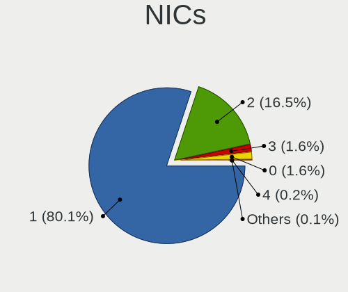

| Total | Desktops | Percent |
|-------|----------|---------|
| 1     | 1582     | 80.06%  |
| 2     | 327      | 16.55%  |
| 3     | 31       | 1.57%   |
| 0     | 31       | 1.57%   |
| 4     | 4        | 0.2%    |
| 5     | 1        | 0.05%   |

IPv6
----

IPv6 vs IPv4

| Used | Desktops | Percent |
|------|----------|---------|
| No   | 1581     | 76.86%  |
| Yes  | 476      | 23.14%  |

Bluetooth
---------

Bluetooth Vendor
----------------

Controller vendors

| Vendor                          | Desktops | Percent |
|---------------------------------|----------|---------|
| Cambridge Silicon Radio         | 140      | 40.35%  |
| Intel                           | 93       | 26.8%   |
| ASUSTek Computer                | 29       | 8.36%   |
| Broadcom                        | 20       | 5.76%   |
| Realtek Semiconductor           | 11       | 3.17%   |
| IMC Networks                    | 10       | 2.88%   |
| Conwise Technology              | 7        | 2.02%   |
| Belkin Components               | 7        | 2.02%   |
| Qualcomm Atheros Communications | 6        | 1.73%   |
| TP-Link                         | 5        | 1.44%   |
| Logitech                        | 4        | 1.15%   |
| Integrated System Solution      | 4        | 1.15%   |
| Foxconn / Hon Hai               | 3        | 0.86%   |
| MediaTek                        | 2        | 0.58%   |
| Hewlett-Packard                 | 2        | 0.58%   |
| Edimax Technology               | 2        | 0.58%   |
| Roper                           | 1        | 0.29%   |
| Lite-On Technology              | 1        | 0.29%   |

Bluetooth Model
---------------

Controller models

| Model                                                   | Desktops | Percent |
|---------------------------------------------------------|----------|---------|
| Cambridge Silicon Radio Bluetooth Dongle (HCI mode)     | 140      | 40.35%  |
| Intel Bluetooth wireless interface                      | 30       | 8.65%   |
| Intel AX200 Bluetooth                                   | 15       | 4.32%   |
| Intel Wireless-AC 3168 Bluetooth                        | 13       | 3.75%   |
| ASUS ASUS USB-BT500                                     | 12       | 3.46%   |
| Intel AX210 Bluetooth                                   | 9        | 2.59%   |
| Intel Wireless-AC 9260 Bluetooth Adapter                | 8        | 2.31%   |
| ASUS Broadcom BCM20702A0 Bluetooth                      | 8        | 2.31%   |
| Intel Bluetooth 9460/9560 Jefferson Peak (JfP)          | 7        | 2.02%   |
| Conwise CW6622                                          | 7        | 2.02%   |
| Broadcom BCM2035 Bluetooth dongle                       | 7        | 2.02%   |
| Realtek Bluetooth Radio                                 | 6        | 1.73%   |
| ASUS Bluetooth Radio                                    | 6        | 1.73%   |
| TP-Link TP-Link Bluetooth USB Adapter                   | 5        | 1.44%   |
| Intel AX201 Bluetooth                                   | 5        | 1.44%   |
| Logitech BT Mini-Receiver (HCI mode)                    | 4        | 1.15%   |
| IMC Networks Wireless_Device                            | 4        | 1.15%   |
| IMC Networks Bluetooth Radio                            | 4        | 1.15%   |
| Qualcomm Atheros  Bluetooth Device                      | 3        | 0.86%   |
| Intel Centrino Bluetooth Wireless Transceiver           | 3        | 0.86%   |
| Intel AX211 Bluetooth                                   | 3        | 0.86%   |
| Foxconn / Hon Hai Wireless_Device                       | 3        | 0.86%   |
| Broadcom Bluetooth dongle                               | 3        | 0.86%   |
| Broadcom Bluetooth 3.0 Device                           | 3        | 0.86%   |
| Belkin Components Bluetooth Mini Dongle                 | 3        | 0.86%   |
| Realtek  Bluetooth 4.2 Adapter                          | 2        | 0.58%   |
| Qualcomm Atheros AR3011 Bluetooth                       | 2        | 0.58%   |
| MediaTek Wireless_Device                                | 2        | 0.58%   |
| Integrated System Solution KY-BT100 Bluetooth Adapter   | 2        | 0.58%   |
| Integrated System Solution Bluetooth Device             | 2        | 0.58%   |
| HP Bluetooth Adapter                                    | 2        | 0.58%   |
| Edimax EW-7611ULB 802.11b/g/n and Bluetooth 4.0 Adapter | 2        | 0.58%   |
| Broadcom HP Portable Bumble Bee                         | 2        | 0.58%   |
| Broadcom BCM20702A0 Bluetooth 4.0                       | 2        | 0.58%   |
| Broadcom BCM2045 Bluetooth                              | 2        | 0.58%   |
| Belkin Components F8T013 Bluetooth Adapter              | 2        | 0.58%   |
| ASUS Qualcomm Bluetooth 4.1                             | 2        | 0.58%   |
| Roper Class 1 Bluetooth Dongle                          | 1        | 0.29%   |
| Realtek RTL8821A Bluetooth                              | 1        | 0.29%   |
| Realtek RTL8723B Bluetooth                              | 1        | 0.29%   |

Sound
-----

Sound Vendor
------------

Sound card vendors

| Vendor                                       | Desktops | Percent |
|----------------------------------------------|----------|---------|
| Intel                                        | 1271     | 41.7%   |
| AMD                                          | 800      | 26.25%  |
| Nvidia                                       | 658      | 21.59%  |
| C-Media Electronics                          | 96       | 3.15%   |
| Creative Labs                                | 47       | 1.54%   |
| Texas Instruments                            | 18       | 0.59%   |
| Logitech                                     | 14       | 0.46%   |
| JMTek                                        | 12       | 0.39%   |
| Generalplus Technology                       | 12       | 0.39%   |
| VIA Technologies                             | 11       | 0.36%   |
| ASUSTek Computer                             | 10       | 0.33%   |
| Kingston Technology                          | 8        | 0.26%   |
| Creative Technology                          | 7        | 0.23%   |
| SteelSeries ApS                              | 6        | 0.2%    |
| Razer USA                                    | 5        | 0.16%   |
| Plantronics                                  | 5        | 0.16%   |
| GN Netcom                                    | 5        | 0.16%   |
| BEHRINGER International                      | 5        | 0.16%   |
| Samson Technologies                          | 3        | 0.1%    |
| Focusrite-Novation                           | 3        | 0.1%    |
| Ensoniq                                      | 3        | 0.1%    |
| Yamaha                                       | 2        | 0.07%   |
| Promethean Limited                           | 2        | 0.07%   |
| LG Electronics                               | 2        | 0.07%   |
| ESI                                          | 2        | 0.07%   |
| ELMCU                                        | 2        | 0.07%   |
| DigiTech                                     | 2        | 0.07%   |
| ATI Technologies                             | 2        | 0.07%   |
| Zoran Co. Personal Media Division (Nogatech) | 1        | 0.03%   |
| ZOOM                                         | 1        | 0.03%   |
| Thesycon Systemsoftware & Consulting         | 1        | 0.03%   |
| Tenx Technology                              | 1        | 0.03%   |
| Syntek                                       | 1        | 0.03%   |
| Superlux digit                               | 1        | 0.03%   |
| Sunplus Technology                           | 1        | 0.03%   |
| SM950T Microphone                            | 1        | 0.03%   |
| Silicon Integrated Systems [SiS]             | 1        | 0.03%   |
| Rotel                                        | 1        | 0.03%   |
| Realtek Semiconductor                        | 1        | 0.03%   |
| Pixart Imaging                               | 1        | 0.03%   |

Sound Model
-----------

Sound card models

| Model                                                                             | Desktops | Percent |
|-----------------------------------------------------------------------------------|----------|---------|
| Intel NM10/ICH7 Family High Definition Audio Controller                           | 189      | 5.26%   |
| Intel 8 Series/C220 Series Chipset High Definition Audio Controller               | 174      | 4.84%   |
| Intel 6 Series/C200 Series Chipset Family High Definition Audio Controller        | 165      | 4.59%   |
| AMD SBx00 Azalia (Intel HDA)                                                      | 162      | 4.51%   |
| AMD FCH Azalia Controller                                                         | 146      | 4.06%   |
| Intel Xeon E3-1200 v3/4th Gen Core Processor HD Audio Controller                  | 124      | 3.45%   |
| Intel 7 Series/C216 Chipset Family High Definition Audio Controller               | 116      | 3.23%   |
| Nvidia GK208 HDMI/DP Audio Controller                                             | 99       | 2.75%   |
| Intel 200 Series PCH HD Audio                                                     | 92       | 2.56%   |
| Intel 100 Series/C230 Series Chipset Family HD Audio Controller                   | 89       | 2.48%   |
| Intel 82801JD/DO (ICH10 Family) HD Audio Controller                               | 78       | 2.17%   |
| AMD Family 17h/19h/1ah HD Audio Controller                                        | 74       | 2.06%   |
| AMD Starship/Matisse HD Audio Controller                                          | 72       | 2%      |
| Intel 82801I (ICH9 Family) HD Audio Controller                                    | 71       | 1.98%   |
| AMD Oland/Hainan/Cape Verde/Pitcairn HDMI Audio [Radeon HD 7000 Series]           | 69       | 1.92%   |
| AMD Ellesmere HDMI Audio [Radeon RX 470/480 / 570/580/590]                        | 68       | 1.89%   |
| AMD Trinity HDMI Audio Controller                                                 | 65       | 1.81%   |
| AMD Family 17h (Models 00h-0fh) HD Audio Controller                               | 64       | 1.78%   |
| Nvidia High Definition Audio Controller                                           | 59       | 1.64%   |
| Intel 82801JI (ICH10 Family) HD Audio Controller                                  | 59       | 1.64%   |
| AMD Caicos HDMI Audio [Radeon HD 6450 / 7450/8450/8490 OEM / R5 230/235/235X OEM] | 56       | 1.56%   |
| Nvidia GP107GL High Definition Audio Controller                                   | 54       | 1.5%    |
| Nvidia GP106 High Definition Audio Controller                                     | 43       | 1.2%    |
| Nvidia GF108 High Definition Audio Controller                                     | 42       | 1.17%   |
| AMD Cedar HDMI Audio [Radeon HD 5400/6300/7300 Series]                            | 40       | 1.11%   |
| AMD Renoir Radeon High Definition Audio Controller                                | 36       | 1%      |
| Intel Cannon Lake PCH cAVS                                                        | 35       | 0.97%   |
| Intel 5 Series/3400 Series Chipset High Definition Audio                          | 35       | 0.97%   |
| AMD Baffin HDMI/DP Audio [Radeon RX 550 640SP / RX 560/560X]                      | 34       | 0.95%   |
| Nvidia GF119 HDMI Audio Controller                                                | 31       | 0.86%   |
| Nvidia MCP61 High Definition Audio                                                | 30       | 0.83%   |
| AMD Navi 21/23 HDMI/DP Audio Controller                                           | 30       | 0.83%   |
| Nvidia GK107 HDMI Audio Controller                                                | 26       | 0.72%   |
| Nvidia GP108 High Definition Audio Controller                                     | 25       | 0.7%    |
| Nvidia GM107 High Definition Audio Controller [GeForce 940MX]                     | 25       | 0.7%    |
| AMD RV710/730 HDMI Audio [Radeon HD 4000 series]                                  | 25       | 0.7%    |
| AMD Kabini HDMI/DP Audio                                                          | 24       | 0.67%   |
| AMD Juniper HDMI Audio [Radeon HD 5700 Series]                                    | 23       | 0.64%   |
| Intel 82801H (ICH8 Family) HD Audio Controller                                    | 22       | 0.61%   |
| AMD Raven/Raven2/Fenghuang HDMI/DP Audio Controller                               | 22       | 0.61%   |

Memory
------

Memory Vendor
-------------

Memory module vendors

| Vendor                     | Desktops | Percent |
|----------------------------|----------|---------|
| Unknown                    | 467      | 24.58%  |
| Kingston                   | 454      | 23.89%  |
| SK hynix                   | 196      | 10.32%  |
| Samsung Electronics        | 183      | 9.63%   |
| Micron Technology          | 101      | 5.32%   |
| Kingmax                    | 81       | 4.26%   |
| G.Skill                    | 71       | 3.74%   |
| Crucial                    | 70       | 3.68%   |
| Corsair                    | 68       | 3.58%   |
| Nanya Technology           | 48       | 2.53%   |
| Elpida                     | 22       | 1.16%   |
| Team                       | 20       | 1.05%   |
| CSX                        | 15       | 0.79%   |
| Patriot                    | 13       | 0.68%   |
| Ramaxel Technology         | 12       | 0.63%   |
| A-DATA Technology          | 8        | 0.42%   |
| Transcend                  | 6        | 0.32%   |
| Melco                      | 6        | 0.32%   |
| Qimonda                    | 5        | 0.26%   |
| OCZ                        | 4        | 0.21%   |
| Kingmax Semiconductor      | 4        | 0.21%   |
| Hikvision                  | 4        | 0.21%   |
| GeIL                       | 4        | 0.21%   |
| Apacer                     | 4        | 0.21%   |
| Unknown                    | 3        | 0.16%   |
| Toshiba                    | 2        | 0.11%   |
| Silicon Power              | 2        | 0.11%   |
| Intersil                   | 2        | 0.11%   |
| H                          | 2        | 0.11%   |
| Golden Empire              | 2        | 0.11%   |
| 48spaces                   | 2        | 0.11%   |
| ZION                       | 1        | 0.05%   |
| Unknown (ABCD)             | 1        | 0.05%   |
| Unknown (7F7F7F7F7F970000) | 1        | 0.05%   |
| Unknown (0x0E9D)           | 1        | 0.05%   |
| Unknown (09D5)             | 1        | 0.05%   |
| Unigen                     | 1        | 0.05%   |
| Toshiba-0098               | 1        | 0.05%   |
| SGS/Thomson                | 1        | 0.05%   |
| Ramos Technology           | 1        | 0.05%   |

Memory Model
------------

Memory module models

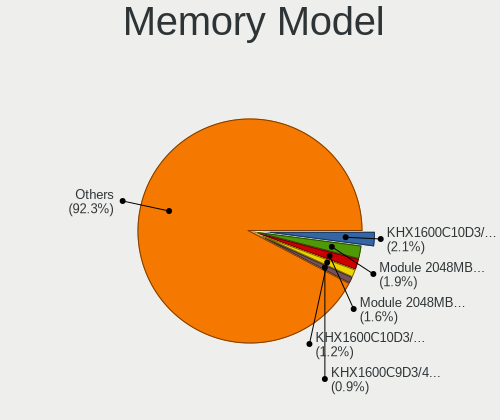

| Model                                                  | Desktops | Percent |
|--------------------------------------------------------|----------|---------|
| Kingston RAM KHX1600C10D3/4G 4GB DIMM DDR3 1600MT/s    | 46       | 2.07%   |
| Unknown RAM Module 2048MB DIMM 800MT/s                 | 43       | 1.94%   |
| Unknown RAM Module 2048MB DIMM SDRAM                   | 35       | 1.58%   |
| Kingston RAM KHX1600C10D3/8G 8GB DIMM DDR3 1600MT/s    | 26       | 1.17%   |
| Kingston RAM KHX1600C9D3/4GX 4GB DIMM DDR3 1800MT/s    | 21       | 0.95%   |
| Unknown RAM Module 4096MB DIMM DDR3 1333MT/s           | 20       | 0.9%    |
| Unknown RAM Module 2048MB DIMM DDR2 800MT/s            | 19       | 0.86%   |
| Unknown RAM Module 1024MB DIMM SDRAM                   | 18       | 0.81%   |
| Kingston RAM 99U5584-005.A00LF 4GB DIMM DDR3 1600MT/s  | 18       | 0.81%   |
| Unknown RAM Module 1024MB DIMM 800MT/s                 | 17       | 0.77%   |
| Unknown RAM Module 2048MB DIMM 1333MT/s                | 16       | 0.72%   |
| Unknown RAM Module 4096MB DIMM 1333MT/s                | 15       | 0.68%   |
| Kingston RAM KHX3200C16D4/8GX 8GB DIMM DDR4 3733MT/s   | 15       | 0.68%   |
| Kingston RAM KHX2666C16/8G 8GB DIMM DDR4 3466MT/s      | 15       | 0.68%   |
| G.Skill RAM F4-3000C16-8GISB 8GB DIMM DDR4 3200MT/s    | 15       | 0.68%   |
| Unknown RAM Module 1024MB DIMM DDR2 667MT/s            | 14       | 0.63%   |
| Unknown RAM Module 2048MB DIMM DDR2 667MT/s            | 13       | 0.59%   |
| Micron RAM 8KTF51264AZ-1G6E1 4GB DIMM DDR3 1600MT/s    | 13       | 0.59%   |
| Samsung RAM M378B5773DH0-CH9 2048MB DIMM DDR3 1333MT/s | 12       | 0.54%   |
| Samsung RAM M378B5273DH0-CH9 4GB DIMM DDR3 2133MT/s    | 12       | 0.54%   |
| Micron RAM 8JTF51264AZ-1G6E1 4GB DIMM 1600MT/s         | 12       | 0.54%   |
| Unknown RAM Module 4GB DIMM 1333MT/s                   | 11       | 0.5%    |
| SK hynix RAM HMT451U6AFR8C-PB 4GB DIMM DDR3 1600MT/s   | 11       | 0.5%    |
| Samsung RAM M378B5173DB0-CK0 4096MB DIMM DDR3 1600MT/s | 11       | 0.5%    |
| G.Skill RAM F4-3200C16-8GIS 8GB DIMM DDR4 3200MT/s     | 11       | 0.5%    |
| Unknown RAM Module 1024MB DIMM DDR2 800MT/s            | 10       | 0.45%   |
| Unknown RAM Module 1024MB DIMM 667MT/s                 | 10       | 0.45%   |
| SK hynix RAM HMT151R7BFR4C-H9 4GB DIMM DDR3 1333MT/s   | 10       | 0.45%   |
| Samsung RAM M378B5773CH0-CH9 2GB DIMM DDR3 1867MT/s    | 10       | 0.45%   |
| Samsung RAM M378B5173QH0-CK0 4GB DIMM DDR3 1600MT/s    | 10       | 0.45%   |
| Kingston RAM KF3200C16D4/16GX 16GB DIMM DDR4 3200MT/s  | 10       | 0.45%   |
| Unknown RAM Module 4096MB DIMM SDRAM                   | 9        | 0.41%   |
| Unknown RAM Module 4096MB DIMM 400MT/s                 | 9        | 0.41%   |
| Unknown RAM Module 2048MB DIMM 667MT/s                 | 9        | 0.41%   |
| Kingston RAM KHX2400C15D4/4G 4GB DIMM DDR4 3151MT/s    | 9        | 0.41%   |
| Kingston RAM KHX1866C10D3/8G 8GB DIMM DDR3 2133MT/s    | 9        | 0.41%   |
| Kingmax RAM FLFE85F-C8KM9 2GB DIMM DDR3 1333MT/s       | 9        | 0.41%   |
| Unknown RAM Module 4096MB DIMM DDR3 1600MT/s           | 8        | 0.36%   |
| Unknown RAM Module 4096MB DIMM 1600MT/s                | 8        | 0.36%   |
| Unknown RAM Module 2048MB DIMM 400MT/s                 | 8        | 0.36%   |

Memory Kind
-----------

Memory module kinds

| Kind    | Desktops | Percent |
|---------|----------|---------|
| DDR3    | 629      | 38.33%  |
| DDR4    | 402      | 24.5%   |
| DDR2    | 202      | 12.31%  |
| Unknown | 185      | 11.27%  |
| SDRAM   | 161      | 9.81%   |
| DDR     | 42       | 2.56%   |
| DDR5    | 16       | 0.98%   |
| LPDDR4  | 3        | 0.18%   |
| DRAM    | 1        | 0.06%   |

Memory Form Factor
------------------

Physical design of the memory module

| Name         | Desktops | Percent |
|--------------|----------|---------|
| DIMM         | 1501     | 95.67%  |
| SODIMM       | 59       | 3.76%   |
| RIMM         | 6        | 0.38%   |
| Row Of Chips | 2        | 0.13%   |
| FB-DIMM      | 1        | 0.06%   |

Memory Size
-----------

Memory module size

| Size  | Desktops | Percent |
|-------|----------|---------|
| 4096  | 562      | 30.78%  |
| 2048  | 476      | 26.07%  |
| 8192  | 404      | 22.12%  |
| 1024  | 202      | 11.06%  |
| 16384 | 113      | 6.19%   |
| 32768 | 33       | 1.81%   |
| 512   | 32       | 1.75%   |
| 256   | 4        | 0.22%   |

Memory Speed
------------

Memory module speed

| Speed   | Desktops | Percent |
|---------|----------|---------|
| 1600    | 341      | 18.3%   |
| 1333    | 279      | 14.98%  |
| 800     | 181      | 9.72%   |
| 667     | 99       | 5.31%   |
| 2400    | 96       | 5.15%   |
| 2133    | 87       | 4.67%   |
| Unknown | 87       | 4.67%   |
| 3200    | 83       | 4.46%   |
| 1866    | 73       | 3.92%   |
| 1867    | 51       | 2.74%   |
| 3600    | 47       | 2.52%   |
| 2667    | 41       | 2.2%    |
| 400     | 36       | 1.93%   |
| 1066    | 33       | 1.77%   |
| 2666    | 23       | 1.23%   |
| 533     | 23       | 1.23%   |
| 3733    | 22       | 1.18%   |
| 1800    | 21       | 1.13%   |
| 3000    | 18       | 0.97%   |
| 2933    | 17       | 0.91%   |
| 3400    | 16       | 0.86%   |
| 2048    | 16       | 0.86%   |
| 3466    | 15       | 0.81%   |
| 1067    | 15       | 0.81%   |
| 2000    | 10       | 0.54%   |
| 1639    | 10       | 0.54%   |
| 3151    | 9        | 0.48%   |
| 49926   | 8        | 0.43%   |
| 3800    | 7        | 0.38%   |
| 1648    | 7        | 0.38%   |
| 1334    | 6        | 0.32%   |
| 333     | 6        | 0.32%   |
| 6000    | 5        | 0.27%   |
| 5808    | 5        | 0.27%   |
| 3933    | 5        | 0.27%   |
| 3334    | 5        | 0.27%   |
| 2200    | 5        | 0.27%   |
| 3333    | 4        | 0.21%   |
| 1400    | 4        | 0.21%   |
| 5900    | 3        | 0.16%   |

Printers & scanners
-------------------

Printer Vendor
--------------

Printer device vendors

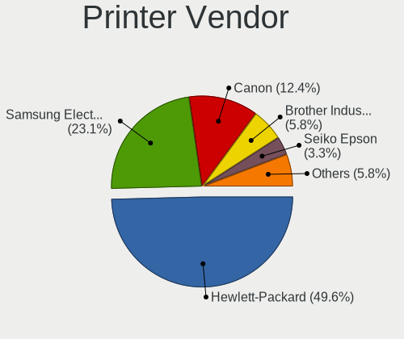

| Vendor                | Desktops | Percent |
|-----------------------|----------|---------|
| Hewlett-Packard       | 60       | 49.59%  |
| Samsung Electronics   | 28       | 23.14%  |
| Canon                 | 15       | 12.4%   |
| Brother Industries    | 7        | 5.79%   |
| Seiko Epson           | 4        | 3.31%   |
| QinHeng Electronics   | 2        | 1.65%   |
| Lexmark International | 2        | 1.65%   |
| Xerox                 | 1        | 0.83%   |
| STMicroelectronics    | 1        | 0.83%   |
| Prolific Technology   | 1        | 0.83%   |

Printer Model
-------------

Printer device models

| Model                                                     | Desktops | Percent |
|-----------------------------------------------------------|----------|---------|
| HP DeskJet 2620 All-in-One Printer                        | 9        | 7.32%   |
| Samsung ML-2010P Mono Laser Printer                       | 6        | 4.88%   |
| Samsung M2020 Series                                      | 6        | 4.88%   |
| HP OfficeJet 6950                                         | 5        | 4.07%   |
| HP LaserJet 1020                                          | 5        | 4.07%   |
| Samsung ML-1640 Series Laser Printer                      | 4        | 3.25%   |
| Samsung C48x Series Color Laser Multifunction Printer     | 3        | 2.44%   |
| HP Deskjet 2050 J510                                      | 3        | 2.44%   |
| Samsung SCX-3400 Series                                   | 2        | 1.63%   |
| Samsung ML-1660 Series                                    | 2        | 1.63%   |
| QinHeng CH340S                                            | 2        | 1.63%   |
| HP LaserJet P1005                                         | 2        | 1.63%   |
| HP LaserJet 1018                                          | 2        | 1.63%   |
| HP LaserJet 1010                                          | 2        | 1.63%   |
| HP LaserJet 1000                                          | 2        | 1.63%   |
| HP DeskJet F4100 Printer series                           | 2        | 1.63%   |
| HP Deskjet F2280 series                                   | 2        | 1.63%   |
| HP DeskJet F2100 Printer series                           | 2        | 1.63%   |
| HP DeskJet 840c                                           | 2        | 1.63%   |
| HP Deskjet 3520 series                                    | 2        | 1.63%   |
| HP DeskJet 2130 series                                    | 2        | 1.63%   |
| HP Deskjet 1050 J410                                      | 2        | 1.63%   |
| Canon TS5100 series                                       | 2        | 1.63%   |
| Canon PIXMA MG3600 Series                                 | 2        | 1.63%   |
| Canon LiDE 400                                            | 2        | 1.63%   |
| Canon CanoScan LiDE 300                                   | 2        | 1.63%   |
| Brother HL-L2300D series                                  | 2        | 1.63%   |
| Brother HL-1110 series                                    | 2        | 1.63%   |
| Xerox WorkCentre 3119 Series                              | 1        | 0.81%   |
| STMicroelectronics LED badge -- mini LED display -- 11x44 | 1        | 0.81%   |
| Seiko Epson Stylus NX230/SX235W Series                    | 1        | 0.81%   |
| Seiko Epson Printer                                       | 1        | 0.81%   |
| Seiko Epson ME 320/330 Series [Stylus SX125]              | 1        | 0.81%   |
| Seiko Epson ET-2600 Series                                | 1        | 0.81%   |
| Samsung SCX-4650 4x21S Series                             | 1        | 0.81%   |
| Samsung SCX-4623 Series                                   | 1        | 0.81%   |
| Samsung ML-1630 Series                                    | 1        | 0.81%   |
| Samsung M2070 Series                                      | 1        | 0.81%   |
| Samsung CLP-310 Color Laser Printer                       | 1        | 0.81%   |
| Prolific PL2305 Parallel Port                             | 1        | 0.81%   |

Scanner Vendor
--------------

Scanner device vendors

| Vendor          | Desktops | Percent |
|-----------------|----------|---------|
| Canon           | 15       | 62.5%   |
| Hewlett-Packard | 4        | 16.67%  |
| Mustek Systems  | 3        | 12.5%   |
| UMAX            | 1        | 4.17%   |
| Seiko Epson     | 1        | 4.17%   |

Scanner Model
-------------

Scanner device models

| Model                                      | Desktops | Percent |
|--------------------------------------------|----------|---------|
| Canon CanoScan N670U/N676U/LiDE 20         | 5        | 20.83%  |
| Canon CanoScan LIDE 25                     | 3        | 12.5%   |
| HP Scanjet 300                             | 2        | 8.33%   |
| Canon CanoScan LiDE 120                    | 2        | 8.33%   |
| Canon CanoScan LiDE 110                    | 2        | 8.33%   |
| UMAX Astra 4400/4450                       | 1        | 4.17%   |
| Seiko Epson GT-6600U [Perfection 610]      | 1        | 4.17%   |
| Mustek Systems SNAPSCAN e22                | 1        | 4.17%   |
| Mustek Systems ScanExpress A3 USB 1200 PRO | 1        | 4.17%   |
| Mustek Systems BearPaw 1200 CU Plus        | 1        | 4.17%   |
| HP ScanJet 3770                            | 1        | 4.17%   |
| HP ScanJet 2400c                           | 1        | 4.17%   |
| Canon CanoScan N1240U/LiDE 30              | 1        | 4.17%   |
| Canon CanoScan LiDE 220                    | 1        | 4.17%   |
| Canon CanoScan LiDE 100                    | 1        | 4.17%   |

Camera
------

Camera Vendor
-------------

Camera device vendors

| Vendor                        | Desktops | Percent |
|-------------------------------|----------|---------|
| Logitech                      | 65       | 25.1%   |
| Microdia                      | 44       | 16.99%  |
| KYE Systems (Mouse Systems)   | 22       | 8.49%   |
| Microsoft                     | 21       | 8.11%   |
| Z-Star Microelectronics       | 14       | 5.41%   |
| GEMBIRD                       | 11       | 4.25%   |
| Trust                         | 6        | 2.32%   |
| Samsung Electronics           | 6        | 2.32%   |
| Sunplus Innovation Technology | 5        | 1.93%   |
| MacroSilicon                  | 5        | 1.93%   |
| Generalplus Technology        | 5        | 1.93%   |
| Aveo Technology               | 5        | 1.93%   |
| Arkmicro Technologies         | 5        | 1.93%   |
| Pixart Imaging                | 4        | 1.54%   |
| LG Electronics                | 4        | 1.54%   |
| Cubeternet                    | 4        | 1.54%   |
| Creative Technology           | 4        | 1.54%   |
| Realtek Semiconductor         | 3        | 1.16%   |
| Chicony Electronics           | 3        | 1.16%   |
| Apple                         | 3        | 1.16%   |
| Unknown                       | 2        | 0.77%   |
| Jieli Technology              | 2        | 0.77%   |
| IMC Networks                  | 2        | 0.77%   |
| Hewlett-Packard               | 2        | 0.77%   |
| ANYKA                         | 2        | 0.77%   |
| Xiongmai                      | 1        | 0.39%   |
| Teslong Camera                | 1        | 0.39%   |
| Syntek                        | 1        | 0.39%   |
| Sonix Technology              | 1        | 0.39%   |
| Silicon Motion                | 1        | 0.39%   |
| OmniVision Technologies       | 1        | 0.39%   |
| Luxvisions Innotech Limited   | 1        | 0.39%   |
| Huawei Technologies           | 1        | 0.39%   |
| AVerMedia Technologies        | 1        | 0.39%   |
| Alcor Micro                   | 1        | 0.39%   |

Camera Model
------------

Camera device models

| Model                                             | Desktops | Percent |
|---------------------------------------------------|----------|---------|
| Logitech Webcam C270                              | 24       | 9.2%    |
| Microdia Camera                                   | 21       | 8.05%   |
| Microsoft LifeCam HD-3000                         | 9        | 3.45%   |
| Microdia Sonix USB 2.0 Camera                     | 9        | 3.45%   |
| GEMBIRD Generic UVC 1.00 camera [AppoTech AX2311] | 9        | 3.45%   |
| Microdia USB 2.0 Camera                           | 7        | 2.68%   |
| Logitech Webcam C600                              | 7        | 2.68%   |
| Logitech Webcam C170                              | 7        | 2.68%   |
| Z-Star Venus USB2.0 Camera                        | 6        | 2.3%    |
| Samsung Galaxy series, misc. (MTP mode)           | 6        | 2.3%    |
| Logitech HD Webcam C525                           | 6        | 2.3%    |
| Z-Star Vimicro USB Camera (Altair)                | 5        | 1.92%   |
| KYE Systems (Mouse Systems) iSlim 321R            | 5        | 1.92%   |
| KYE Systems (Mouse Systems) FaceCam 1000X         | 5        | 1.92%   |
| Arkmicro USB2.0 PC CAMERA                         | 5        | 1.92%   |
| Logitech HD Pro Webcam C920                       | 4        | 1.53%   |
| KYE Systems (Mouse Systems) PC-LM1E Camera        | 4        | 1.53%   |
| KYE Systems (Mouse Systems) Genius FaceCam 320    | 4        | 1.53%   |
| Aveo USB2.0 Camera                                | 4        | 1.53%   |
| Sunplus FULL HD webcam                            | 3        | 1.15%   |
| Pixart Imaging GE 1.3 MP MiniCam Pro              | 3        | 1.15%   |
| Microsoft LifeCam VX-2000                         | 3        | 1.15%   |
| Microsoft LifeCam Studio                          | 3        | 1.15%   |
| MacroSilicon USB Video                            | 3        | 1.15%   |
| Generalplus GENERAL WEBCAM                        | 3        | 1.15%   |
| Cubeternet USB2.0 Camera                          | 3        | 1.15%   |
| Creative Live! Cam Chat HD [VF0700/VF0790]        | 3        | 1.15%   |
| Apple iPhone 5/5C/5S/6/SE/7/8/X/XR                | 3        | 1.15%   |
| Z-Star Saturn USB 2.0 Camera                      | 2        | 0.77%   |
| Unknown HD camera                                 | 2        | 0.77%   |
| Trust Trust Full HD Webcam                        | 2        | 0.77%   |
| Trust 17676 Webcam                                | 2        | 0.77%   |
| Microsoft LifeCam VX-800                          | 2        | 0.77%   |
| Microsoft LifeCam VX-700                          | 2        | 0.77%   |
| Microdia Webcam Vitade AF                         | 2        | 0.77%   |
| Microdia Integrated Camera                        | 2        | 0.77%   |
| Microdia Defender G-Lens 2577 HD720p Camera       | 2        | 0.77%   |
| MacroSilicon MS210x Video Grabber [EasierCAP]     | 2        | 0.77%   |
| Logitech Webcam C200                              | 2        | 0.77%   |
| Logitech QuickCam Pro 9000                        | 2        | 0.77%   |

Security
--------

Fingerprint Vendor
------------------

Fingerprint sensor vendors

| Vendor                | Desktops | Percent |
|-----------------------|----------|---------|
| Upek                  | 1        | 50%     |
| Elan Microelectronics | 1        | 50%     |

Fingerprint Model
-----------------

Fingerprint sensor models

| Model                                                  | Desktops | Percent |
|--------------------------------------------------------|----------|---------|
| Upek Biometric Touchchip/Touchstrip Fingerprint Sensor | 1        | 50%     |
| Elan fingerprint sensor [FeinTech FPS00200]            | 1        | 50%     |

Chipcard Vendor
---------------

Chipcard module vendors

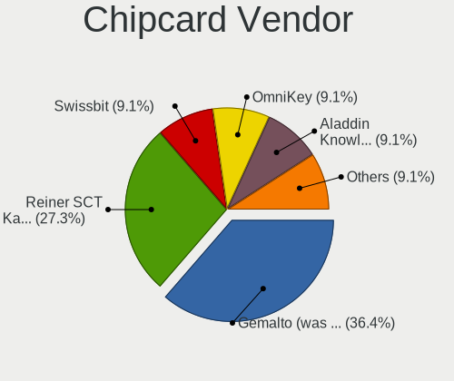

| Vendor                    | Desktops | Percent |
|---------------------------|----------|---------|
| Gemalto (was Gemplus)     | 4        | 36.36%  |
| Reiner SCT Kartensysteme  | 3        | 27.27%  |
| Swissbit                  | 1        | 9.09%   |
| OmniKey                   | 1        | 9.09%   |
| Aladdin Knowledge Systems | 1        | 9.09%   |
| Advanced Card Systems     | 1        | 9.09%   |

Chipcard Model
--------------

Chipcard module models

| Model                                                                      | Desktops | Percent |
|----------------------------------------------------------------------------|----------|---------|
| Reiner SCT Kartensysteme cyberJack RFID basis contactless smartcard reader | 3        | 27.27%  |
| Gemalto (was Gemplus) GemPC Twin SmartCard Reader                          | 3        | 27.27%  |
| Swissbit iShield Key Pro                                                   | 1        | 9.09%   |
| OmniKey CardMan 3121 (HID Technologies)                                    | 1        | 9.09%   |
| Gemalto (was Gemplus) GemPC Key SmartCard Reader                           | 1        | 9.09%   |
| Aladdin Knowledge Systems Token JC                                         | 1        | 9.09%   |
| Advanced Card Systems ACR1252 Dual Reader                                  | 1        | 9.09%   |

Unsupported
-----------

Unsupported Devices
-------------------

Total unsupported devices on board

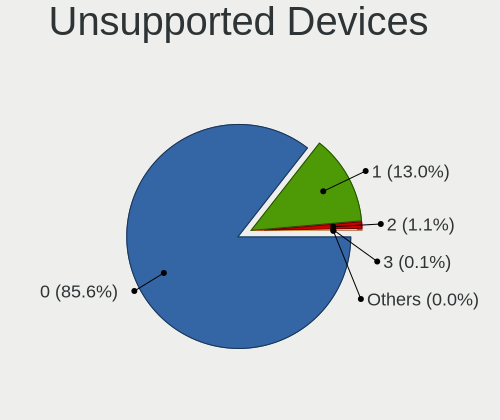

| Total | Desktops | Percent |
|-------|----------|---------|
| 0     | 1732     | 85.57%  |
| 1     | 264      | 13.04%  |
| 2     | 22       | 1.09%   |
| 3     | 3        | 0.15%   |
| 4     | 2        | 0.1%    |
| 5     | 1        | 0.05%   |

Unsupported Device Types
------------------------

Types of unsupported devices

| Type                     | Desktops | Percent |
|--------------------------|----------|---------|
| Graphics card            | 188      | 60.26%  |
| Net/wireless             | 38       | 12.18%  |
| Communication controller | 18       | 5.77%   |
| Unassigned class         | 16       | 5.13%   |
| Multimedia controller    | 9        | 2.88%   |
| Camera                   | 7        | 2.24%   |
| Storage/raid             | 6        | 1.92%   |
| Chipcard                 | 6        | 1.92%   |
| Sound                    | 5        | 1.6%    |
| Storage/ide              | 4        | 1.28%   |
| Net/ethernet             | 3        | 0.96%   |
| Card reader              | 3        | 0.96%   |
| Bluetooth                | 3        | 0.96%   |
| Fingerprint reader       | 2        | 0.64%   |
| Storage/ata              | 1        | 0.32%   |
| Storage                  | 1        | 0.32%   |
| Network                  | 1        | 0.32%   |
| Dvb card                 | 1        | 0.32%   |

