Linux in Hungary - Tested Hardware & Statistics (Desktops)
----------------------------------------------------------

A project to collect tested hardware configurations for Linux in Hungary.

Anyone can contribute to this report by the [hw-probe](https://github.com/linuxhw/hw-probe) tool:

    sudo -E hw-probe -all -upload

Please contribute! Especially if your hardware is rare.

Contents
--------

* [ Test Cases ](#test-cases)

* [ System ](#system)
  - [ OS                       ](#os)
  - [ OS Family                ](#os-family)
  - [ Kernel                   ](#kernel)
  - [ Kernel Family            ](#kernel-family)
  - [ Kernel Major Ver.        ](#kernel-major-ver)
  - [ Arch                     ](#arch)
  - [ DE                       ](#de)
  - [ Display Server           ](#display-server)
  - [ Display Manager          ](#display-manager)
  - [ OS Lang                  ](#os-lang)
  - [ Boot Mode                ](#boot-mode)
  - [ Filesystem               ](#filesystem)
  - [ Part. scheme             ](#part-scheme)
  - [ Dual Boot with Linux/BSD ](#dual-boot-with-linuxbsd)
  - [ Dual Boot (Win)          ](#dual-boot-win)

* [ Board ](#board)
  - [ Vendor                   ](#vendor)
  - [ Model                    ](#model)
  - [ Model Family             ](#model-family)
  - [ MFG Year                 ](#mfg-year)
  - [ Form Factor              ](#form-factor)
  - [ Secure Boot              ](#secure-boot)
  - [ Coreboot                 ](#coreboot)
  - [ RAM Size                 ](#ram-size)
  - [ RAM Used                 ](#ram-used)
  - [ Total Drives             ](#total-drives)
  - [ Has CD-ROM               ](#has-cd-rom)
  - [ Has Ethernet             ](#has-ethernet)
  - [ Has WiFi                 ](#has-wifi)
  - [ Has Bluetooth            ](#has-bluetooth)

* [ Location ](#location)
  - [ Country                  ](#country)
  - [ City                     ](#city)

* [ Drives ](#drives)
  - [ Drive Vendor             ](#drive-vendor)
  - [ Drive Model              ](#drive-model)
  - [ HDD Vendor               ](#hdd-vendor)
  - [ SSD Vendor               ](#ssd-vendor)
  - [ Drive Kind               ](#drive-kind)
  - [ Drive Connector          ](#drive-connector)
  - [ Drive Size               ](#drive-size)
  - [ Space Total              ](#space-total)
  - [ Space Used               ](#space-used)
  - [ Malfunc. Drives          ](#malfunc-drives)
  - [ Malfunc. Drive Vendor    ](#malfunc-drive-vendor)
  - [ Malfunc. HDD Vendor      ](#malfunc-hdd-vendor)
  - [ Malfunc. Drive Kind      ](#malfunc-drive-kind)
  - [ Failed Drives            ](#failed-drives)
  - [ Failed Drive Vendor      ](#failed-drive-vendor)
  - [ Drive Status             ](#drive-status)

* [ Storage controller ](#storage-controller)
  - [ Storage Vendor           ](#storage-vendor)
  - [ Storage Model            ](#storage-model)
  - [ Storage Kind             ](#storage-kind)

* [ Processor ](#processor)
  - [ CPU Vendor               ](#cpu-vendor)
  - [ CPU Model                ](#cpu-model)
  - [ CPU Model Family         ](#cpu-model-family)
  - [ CPU Cores                ](#cpu-cores)
  - [ CPU Sockets              ](#cpu-sockets)
  - [ CPU Threads              ](#cpu-threads)
  - [ CPU Op-Modes             ](#cpu-op-modes)
  - [ CPU Microcode            ](#cpu-microcode)
  - [ CPU Microarch            ](#cpu-microarch)

* [ Graphics ](#graphics)
  - [ GPU Vendor               ](#gpu-vendor)
  - [ GPU Model                ](#gpu-model)
  - [ GPU Combo                ](#gpu-combo)
  - [ GPU Driver               ](#gpu-driver)
  - [ GPU Memory               ](#gpu-memory)

* [ Monitor ](#monitor)
  - [ Monitor Vendor           ](#monitor-vendor)
  - [ Monitor Model            ](#monitor-model)
  - [ Monitor Resolution       ](#monitor-resolution)
  - [ Monitor Diagonal         ](#monitor-diagonal)
  - [ Monitor Width            ](#monitor-width)
  - [ Aspect Ratio             ](#aspect-ratio)
  - [ Monitor Area             ](#monitor-area)
  - [ Pixel Density            ](#pixel-density)
  - [ Multiple Monitors        ](#multiple-monitors)

* [ Network ](#network)
  - [ Net Controller Vendor    ](#net-controller-vendor)
  - [ Net Controller Model     ](#net-controller-model)
  - [ Wireless Vendor          ](#wireless-vendor)
  - [ Wireless Model           ](#wireless-model)
  - [ Ethernet Vendor          ](#ethernet-vendor)
  - [ Ethernet Model           ](#ethernet-model)
  - [ Net Controller Kind      ](#net-controller-kind)
  - [ Used Controller          ](#used-controller)
  - [ NICs                     ](#nics)
  - [ IPv6                     ](#ipv6)

* [ Bluetooth ](#bluetooth)
  - [ Bluetooth Vendor         ](#bluetooth-vendor)
  - [ Bluetooth Model          ](#bluetooth-model)

* [ Sound ](#sound)
  - [ Sound Vendor             ](#sound-vendor)
  - [ Sound Model              ](#sound-model)

* [ Memory ](#memory)
  - [ Memory Vendor            ](#memory-vendor)
  - [ Memory Model             ](#memory-model)
  - [ Memory Kind              ](#memory-kind)
  - [ Memory Form Factor       ](#memory-form-factor)
  - [ Memory Size              ](#memory-size)
  - [ Memory Speed             ](#memory-speed)

* [ Printers & scanners ](#printers--scanners)
  - [ Printer Vendor           ](#printer-vendor)
  - [ Printer Model            ](#printer-model)
  - [ Scanner Vendor           ](#scanner-vendor)
  - [ Scanner Model            ](#scanner-model)

* [ Camera ](#camera)
  - [ Camera Vendor            ](#camera-vendor)
  - [ Camera Model             ](#camera-model)

* [ Security ](#security)
  - [ Fingerprint Vendor       ](#fingerprint-vendor)
  - [ Fingerprint Model        ](#fingerprint-model)
  - [ Chipcard Vendor          ](#chipcard-vendor)
  - [ Chipcard Model           ](#chipcard-model)

* [ Unsupported ](#unsupported)
  - [ Unsupported Devices      ](#unsupported-devices)
  - [ Unsupported Device Types ](#unsupported-device-types)

Test Cases
----------

Total: 3881

| Vendor        | Model                       | Probe                                                      | Date         |
|---------------|-----------------------------|------------------------------------------------------------|--------------|
| Gigabyte      | F2A88XM-HD3                 | [79b5e7c7b0](https://linux-hardware.org/?probe=79b5e7c7b0) | Jan 01, 2024 |
| ASUSTek       | P8H67-M EVO                 | [7c95d175bb](https://linux-hardware.org/?probe=7c95d175bb) | Jan 01, 2024 |
| Gigabyte      | P67A-D3-B3                  | [28494e9d46](https://linux-hardware.org/?probe=28494e9d46) | Jan 01, 2024 |
| Gigabyte      | F2A88XM-HD3                 | [23eb635b4e](https://linux-hardware.org/?probe=23eb635b4e) | Jan 01, 2024 |
| ASUSTek       | PRIME A320M-R               | [da76fd5108](https://linux-hardware.org/?probe=da76fd5108) | Jan 01, 2024 |
| ASUSTek       | PRIME A320M-R               | [d646e8d5fb](https://linux-hardware.org/?probe=d646e8d5fb) | Jan 01, 2024 |
| MSI           | P43i                        | [a31ae3403f](https://linux-hardware.org/?probe=a31ae3403f) | Dec 31, 2023 |
| ASRock        | FM2A55M-HD+                 | [d60c82646d](https://linux-hardware.org/?probe=d60c82646d) | Dec 31, 2023 |
| AMI           | Intel                       | [532ef0e65e](https://linux-hardware.org/?probe=532ef0e65e) | Dec 31, 2023 |
| MSI           | A320M-A PRO MAX             | [e89341eb95](https://linux-hardware.org/?probe=e89341eb95) | Dec 31, 2023 |
| MSI           | A320M-A PRO MAX             | [b24918bdbc](https://linux-hardware.org/?probe=b24918bdbc) | Dec 31, 2023 |
| Gigabyte      | AB350M-DS3H V2-CF           | [f59bee0805](https://linux-hardware.org/?probe=f59bee0805) | Dec 31, 2023 |
| Gigabyte      | Z390 UD V2                  | [c7c5239d23](https://linux-hardware.org/?probe=c7c5239d23) | Dec 31, 2023 |
| ASUSTek       | Pro WS X570-ACE             | [99950d43fc](https://linux-hardware.org/?probe=99950d43fc) | Dec 31, 2023 |
| HP            | 339A                        | [f109c46a8a](https://linux-hardware.org/?probe=f109c46a8a) | Dec 31, 2023 |
| ASUSTek       | H110M-A                     | [f2fd99d70d](https://linux-hardware.org/?probe=f2fd99d70d) | Dec 30, 2023 |
| Dell          | 0TY565                      | [97111d45ea](https://linux-hardware.org/?probe=97111d45ea) | Dec 30, 2023 |
| ASUSTek       | M5A78L-M PLUS/USB3          | [6cb0db7e23](https://linux-hardware.org/?probe=6cb0db7e23) | Dec 30, 2023 |
| Gigabyte      | EP31-DS3L                   | [428843cfe5](https://linux-hardware.org/?probe=428843cfe5) | Dec 30, 2023 |
| ASUSTek       | Pro WS X570-ACE             | [a2ba669444](https://linux-hardware.org/?probe=a2ba669444) | Dec 30, 2023 |
| ASUSTek       | ROG STRIX X670E-I GAMING... | [b1b1057a4b](https://linux-hardware.org/?probe=b1b1057a4b) | Dec 30, 2023 |
| Gigabyte      | H310M A-CF x.x              | [85efe53330](https://linux-hardware.org/?probe=85efe53330) | Dec 29, 2023 |
| ASUSTek       | PRIME B365M-A               | [d094c3b4e3](https://linux-hardware.org/?probe=d094c3b4e3) | Dec 29, 2023 |
| HP            | ProLiant MicroServer        | [30f06f373e](https://linux-hardware.org/?probe=30f06f373e) | Dec 29, 2023 |
| HP            | 3033h                       | [05bb2e9644](https://linux-hardware.org/?probe=05bb2e9644) | Dec 29, 2023 |
| Fujitsu       | D2828-A2 S26361-D2828-A2    | [780047716e](https://linux-hardware.org/?probe=780047716e) | Dec 29, 2023 |
| ASUSTek       | PRIME A320M-R               | [d5b19de2f0](https://linux-hardware.org/?probe=d5b19de2f0) | Dec 29, 2023 |
| Gigabyte      | H97-D3H-CF                  | [0d64ace463](https://linux-hardware.org/?probe=0d64ace463) | Dec 29, 2023 |
| Gigabyte      | A520M S2H                   | [8cc62b9497](https://linux-hardware.org/?probe=8cc62b9497) | Dec 28, 2023 |
| ASUSTek       | H81M-E                      | [9cd2a6ed45](https://linux-hardware.org/?probe=9cd2a6ed45) | Dec 28, 2023 |
| ASUSTek       | H110M-K                     | [b3a423171f](https://linux-hardware.org/?probe=b3a423171f) | Dec 28, 2023 |
| Fujitsu       | D2778-B1 S26361-D2778-B1    | [5b652d7eba](https://linux-hardware.org/?probe=5b652d7eba) | Dec 28, 2023 |
| HP            | 1495                        | [91f12e4a03](https://linux-hardware.org/?probe=91f12e4a03) | Dec 28, 2023 |
| ASUSTek       | PRIME A320M-R               | [b30cb3fc14](https://linux-hardware.org/?probe=b30cb3fc14) | Dec 28, 2023 |
| ASUSTek       | M5A97 EVO R2.0              | [6023618793](https://linux-hardware.org/?probe=6023618793) | Dec 27, 2023 |
| HP            | 1497                        | [9c80dd9de3](https://linux-hardware.org/?probe=9c80dd9de3) | Dec 27, 2023 |
| HP            | 3048h                       | [94e268312a](https://linux-hardware.org/?probe=94e268312a) | Dec 27, 2023 |
| Gigabyte      | B550 GAMING X V2            | [452b67f058](https://linux-hardware.org/?probe=452b67f058) | Dec 27, 2023 |
| Dell          | 0RW199                      | [906719d239](https://linux-hardware.org/?probe=906719d239) | Dec 27, 2023 |
| ASUSTek       | H110M-A                     | [6add1ba46c](https://linux-hardware.org/?probe=6add1ba46c) | Dec 27, 2023 |
| MSI           | Z97 GAMING 5                | [3b0901d1a4](https://linux-hardware.org/?probe=3b0901d1a4) | Dec 27, 2023 |
| Medion        | MS-7748                     | [029849e475](https://linux-hardware.org/?probe=029849e475) | Dec 27, 2023 |
| ASUSTek       | H81M-E                      | [55173f5056](https://linux-hardware.org/?probe=55173f5056) | Dec 26, 2023 |
| Fujitsu       | D3220-A1 S26361-D3220-A1    | [8c5b941b48](https://linux-hardware.org/?probe=8c5b941b48) | Dec 26, 2023 |
| Fujitsu       | D3162-A1 S26361-D3162-A1    | [0535c48b0a](https://linux-hardware.org/?probe=0535c48b0a) | Dec 26, 2023 |
| Gigabyte      | H61M-S2PV                   | [a8007743a8](https://linux-hardware.org/?probe=a8007743a8) | Dec 25, 2023 |
| Gigabyte      | H61M-S2PV                   | [2825577fd0](https://linux-hardware.org/?probe=2825577fd0) | Dec 25, 2023 |
| MSI           | H110M PRO-VD                | [624b1cbd0b](https://linux-hardware.org/?probe=624b1cbd0b) | Dec 24, 2023 |
| Medion        | MS-7748                     | [4df862d09e](https://linux-hardware.org/?probe=4df862d09e) | Dec 24, 2023 |
| Gigabyte      | B550 GAMING X V2            | [0102708c19](https://linux-hardware.org/?probe=0102708c19) | Dec 24, 2023 |
| MSI           | H110M PRO-VD                | [121d2e0b06](https://linux-hardware.org/?probe=121d2e0b06) | Dec 24, 2023 |
| ASUSTek       | H110M-A                     | [63306d22b2](https://linux-hardware.org/?probe=63306d22b2) | Dec 23, 2023 |
| ASUSTek       | PRIME B450-PLUS             | [a32ea319ca](https://linux-hardware.org/?probe=a32ea319ca) | Dec 23, 2023 |
| ASUSTek       | PRIME B450-PLUS             | [852693eb71](https://linux-hardware.org/?probe=852693eb71) | Dec 22, 2023 |
| Gigabyte      | H87M-HD3                    | [00781519db](https://linux-hardware.org/?probe=00781519db) | Dec 22, 2023 |
| Gigabyte      | B660M GAMING DDR4           | [544fdd3054](https://linux-hardware.org/?probe=544fdd3054) | Dec 21, 2023 |
| ASUSTek       | H110M-A                     | [3b149d0e20](https://linux-hardware.org/?probe=3b149d0e20) | Dec 21, 2023 |
| ASRock        | B550M Pro4                  | [0f7957917e](https://linux-hardware.org/?probe=0f7957917e) | Dec 21, 2023 |
| ASUSTek       | M4A785TD-M EVO              | [ae2fef5c99](https://linux-hardware.org/?probe=ae2fef5c99) | Dec 20, 2023 |
| Dell          | 09KPNV A00                  | [e696fd9ae0](https://linux-hardware.org/?probe=e696fd9ae0) | Dec 20, 2023 |
| Gigabyte      | H370M DS3H-CF               | [4b6f645ef6](https://linux-hardware.org/?probe=4b6f645ef6) | Dec 20, 2023 |
| ASRock        | B450M-HDV R4.0              | [02d834a147](https://linux-hardware.org/?probe=02d834a147) | Dec 19, 2023 |
| Gigabyte      | F2A88XM-HD3                 | [d688c80ef7](https://linux-hardware.org/?probe=d688c80ef7) | Dec 18, 2023 |
| ASRock        | B450M-HDV R4.0              | [da0af8ac25](https://linux-hardware.org/?probe=da0af8ac25) | Dec 18, 2023 |
| Gigabyte      | F2A88XM-HD3                 | [b4c4267477](https://linux-hardware.org/?probe=b4c4267477) | Dec 17, 2023 |
| Fujitsu       | D3220-A1 S26361-D3220-A1    | [4302968166](https://linux-hardware.org/?probe=4302968166) | Dec 17, 2023 |
| Fujitsu       | D3220-A1 S26361-D3220-A1    | [0eb62b79e1](https://linux-hardware.org/?probe=0eb62b79e1) | Dec 17, 2023 |
| HP            | 1497                        | [20ba1e3df2](https://linux-hardware.org/?probe=20ba1e3df2) | Dec 17, 2023 |
| Lenovo        | 1036 NO DPK                 | [2262526770](https://linux-hardware.org/?probe=2262526770) | Dec 17, 2023 |
| Lenovo        | 1036 NO DPK                 | [ed366a10ca](https://linux-hardware.org/?probe=ed366a10ca) | Dec 17, 2023 |
| Lenovo        | 1036 NO DPK                 | [9b32bafcb5](https://linux-hardware.org/?probe=9b32bafcb5) | Dec 17, 2023 |
| Gigabyte      | F2A88XM-HD3                 | [6d3774729f](https://linux-hardware.org/?probe=6d3774729f) | Dec 16, 2023 |
| Gigabyte      | H310M A-CF x.x              | [24522df925](https://linux-hardware.org/?probe=24522df925) | Dec 16, 2023 |
| Gigabyte      | H310M A-CF x.x              | [528bd3903d](https://linux-hardware.org/?probe=528bd3903d) | Dec 16, 2023 |
| ASRock        | B450M-HDV R4.0              | [e93c46f2e9](https://linux-hardware.org/?probe=e93c46f2e9) | Dec 16, 2023 |
| ASRock        | B450M-HDV R4.0              | [25eb2af58f](https://linux-hardware.org/?probe=25eb2af58f) | Dec 16, 2023 |
| Lenovo        | 1036 NO DPK                 | [08f10e4a70](https://linux-hardware.org/?probe=08f10e4a70) | Dec 15, 2023 |
| Fujitsu       | D3222-A1 S26361-D3222-A1    | [7701847681](https://linux-hardware.org/?probe=7701847681) | Dec 15, 2023 |
| Gigabyte      | F2A88XM-HD3                 | [470281aedd](https://linux-hardware.org/?probe=470281aedd) | Dec 15, 2023 |
| HP            | 0B4Ch D                     | [e40498b1d1](https://linux-hardware.org/?probe=e40498b1d1) | Dec 14, 2023 |
| HP            | 0B4Ch D                     | [bb8a731dab](https://linux-hardware.org/?probe=bb8a731dab) | Dec 14, 2023 |
| ASRock        | B550M Pro4                  | [9d0aff4b01](https://linux-hardware.org/?probe=9d0aff4b01) | Dec 13, 2023 |
| Gigabyte      | B450M GAMING                | [02b6b32440](https://linux-hardware.org/?probe=02b6b32440) | Dec 13, 2023 |
| Gigabyte      | B450M GAMING                | [016f269490](https://linux-hardware.org/?probe=016f269490) | Dec 13, 2023 |
| Gigabyte      | P35-DS3R                    | [d55fed29c1](https://linux-hardware.org/?probe=d55fed29c1) | Dec 13, 2023 |
| Gigabyte      | P35-DS3R                    | [fc0fe04fab](https://linux-hardware.org/?probe=fc0fe04fab) | Dec 13, 2023 |
| ASRock        | B550M Pro4                  | [e196db2480](https://linux-hardware.org/?probe=e196db2480) | Dec 13, 2023 |
| HP            | 1495                        | [9fb4cb4ac8](https://linux-hardware.org/?probe=9fb4cb4ac8) | Dec 12, 2023 |
| ASUSTek       | M5A97 EVO R2.0              | [2199e3dc0f](https://linux-hardware.org/?probe=2199e3dc0f) | Dec 12, 2023 |
| Dell          | 0GXM1W A02                  | [3184d3c38b](https://linux-hardware.org/?probe=3184d3c38b) | Dec 11, 2023 |
| HP            | 3033h                       | [3dddd6881a](https://linux-hardware.org/?probe=3dddd6881a) | Dec 11, 2023 |
| HP            | 802E                        | [606309324b](https://linux-hardware.org/?probe=606309324b) | Dec 11, 2023 |
| Gigabyte      | H61MA-D3V                   | [1b2d2135d4](https://linux-hardware.org/?probe=1b2d2135d4) | Dec 09, 2023 |
| Intel         | DH61CR AAG14064-204         | [a319465535](https://linux-hardware.org/?probe=a319465535) | Dec 09, 2023 |
| ASUSTek       | Pro WS X570-ACE             | [bdff414c43](https://linux-hardware.org/?probe=bdff414c43) | Dec 09, 2023 |
| MSI           | H110M PRO-VD                | [a691f52012](https://linux-hardware.org/?probe=a691f52012) | Dec 08, 2023 |
| MSI           | H110M PRO-VD                | [aa3ae99bf2](https://linux-hardware.org/?probe=aa3ae99bf2) | Dec 08, 2023 |
| Lenovo        | 1036 NO DPK                 | [6be53926db](https://linux-hardware.org/?probe=6be53926db) | Dec 08, 2023 |
| Fujitsu       | D3222-A1 S26361-D3222-A1    | [1c2750202f](https://linux-hardware.org/?probe=1c2750202f) | Dec 08, 2023 |
| Fujitsu       | D3222-A1 S26361-D3222-A1    | [ba4f3255bc](https://linux-hardware.org/?probe=ba4f3255bc) | Dec 08, 2023 |
| Gigabyte      | X570 AORUS ELITE            | [ae2fdd9470](https://linux-hardware.org/?probe=ae2fdd9470) | Dec 08, 2023 |
| Gigabyte      | G31M-S2C                    | [dc50493c88](https://linux-hardware.org/?probe=dc50493c88) | Dec 08, 2023 |
| Gigabyte      | G31M-S2C                    | [9f5a520013](https://linux-hardware.org/?probe=9f5a520013) | Dec 08, 2023 |
| ASUSTek       | PRIME A520M-K               | [a6f429594d](https://linux-hardware.org/?probe=a6f429594d) | Dec 07, 2023 |
| Dell          | 0TY565                      | [f037c10bc9](https://linux-hardware.org/?probe=f037c10bc9) | Dec 07, 2023 |
| HP            | 09F8h                       | [c988ff1e96](https://linux-hardware.org/?probe=c988ff1e96) | Dec 07, 2023 |
| MSI           | B460M PRO                   | [107b14c2d9](https://linux-hardware.org/?probe=107b14c2d9) | Dec 06, 2023 |
| Medion        | MS-7748                     | [1f11eab8f8](https://linux-hardware.org/?probe=1f11eab8f8) | Dec 06, 2023 |
| Gigabyte      | X570 AORUS ELITE            | [e9436c2809](https://linux-hardware.org/?probe=e9436c2809) | Dec 06, 2023 |
| ASUSTek       | H110M-K                     | [2ebb7abc4c](https://linux-hardware.org/?probe=2ebb7abc4c) | Dec 06, 2023 |
| ASUSTek       | Pro WS X570-ACE             | [d658b900e7](https://linux-hardware.org/?probe=d658b900e7) | Dec 05, 2023 |
| HP            | 1495                        | [626fcfb788](https://linux-hardware.org/?probe=626fcfb788) | Dec 05, 2023 |
| Medion        | MS-7748                     | [8c5106d00b](https://linux-hardware.org/?probe=8c5106d00b) | Dec 05, 2023 |
| Gigabyte      | Z390 UD V2                  | [2d85fb4799](https://linux-hardware.org/?probe=2d85fb4799) | Dec 05, 2023 |
| ASRock        | 960GC-GS FX                 | [524de55da0](https://linux-hardware.org/?probe=524de55da0) | Dec 04, 2023 |
| HP            | 339A                        | [b596b82bf1](https://linux-hardware.org/?probe=b596b82bf1) | Dec 04, 2023 |
| Dell          | 0PU052                      | [a436be0e88](https://linux-hardware.org/?probe=a436be0e88) | Dec 04, 2023 |
| ASRock        | H310CM-DVS                  | [1bf52989ef](https://linux-hardware.org/?probe=1bf52989ef) | Dec 03, 2023 |
| Gigabyte      | P67A-D3-B3                  | [77472c25c8](https://linux-hardware.org/?probe=77472c25c8) | Dec 03, 2023 |
| ASUSTek       | H110M-K                     | [e21f4b08b1](https://linux-hardware.org/?probe=e21f4b08b1) | Dec 03, 2023 |
| Lenovo        | 0B98401 PRO                 | [3f49a16307](https://linux-hardware.org/?probe=3f49a16307) | Dec 02, 2023 |
| Gigabyte      | B550M DS3H AC               | [62cff9080d](https://linux-hardware.org/?probe=62cff9080d) | Dec 02, 2023 |
| Gigabyte      | GA-870A-UD3                 | [0ae66633bc](https://linux-hardware.org/?probe=0ae66633bc) | Dec 01, 2023 |
| Fujitsu       | D2828-A2 S26361-D2828-A2    | [b70c84adcf](https://linux-hardware.org/?probe=b70c84adcf) | Dec 01, 2023 |
| Gigabyte      | A520M S2H                   | [cdfe1883bc](https://linux-hardware.org/?probe=cdfe1883bc) | Nov 30, 2023 |
| HP            | 18E7                        | [845881d2cd](https://linux-hardware.org/?probe=845881d2cd) | Nov 30, 2023 |
| HP            | 18E7                        | [f09d697221](https://linux-hardware.org/?probe=f09d697221) | Nov 30, 2023 |
| Gigabyte      | AB350M-DS3H V2-CF           | [18ce09355c](https://linux-hardware.org/?probe=18ce09355c) | Nov 28, 2023 |
| ASRock        | B365 Phantom Gaming 4       | [b3de42156e](https://linux-hardware.org/?probe=b3de42156e) | Nov 28, 2023 |
| Gigabyte      | H110M-S2V-CF                | [875f72f0f7](https://linux-hardware.org/?probe=875f72f0f7) | Nov 28, 2023 |
| HP            | 1495                        | [17732cf790](https://linux-hardware.org/?probe=17732cf790) | Nov 28, 2023 |
| Dell          | 0K240Y A01                  | [d5440204b6](https://linux-hardware.org/?probe=d5440204b6) | Nov 28, 2023 |
| Fujitsu       | D3403-U1 S26361-D3403-U1    | [05686c86bb](https://linux-hardware.org/?probe=05686c86bb) | Nov 28, 2023 |
| MSI           | P43i                        | [3291b84f5e](https://linux-hardware.org/?probe=3291b84f5e) | Nov 27, 2023 |
| Gigabyte      | H97-D3H-CF                  | [5e1e9b6a9e](https://linux-hardware.org/?probe=5e1e9b6a9e) | Nov 27, 2023 |
| MSI           | B450 TOMAHAWK MAX           | [77e8b3479a](https://linux-hardware.org/?probe=77e8b3479a) | Nov 27, 2023 |
| ASUSTek       | PRIME X370-PRO              | [cd7362b85e](https://linux-hardware.org/?probe=cd7362b85e) | Nov 27, 2023 |
| ASUSTek       | M5A78L-M PLUS/USB3          | [159ce7eba2](https://linux-hardware.org/?probe=159ce7eba2) | Nov 27, 2023 |
| ASUSTek       | M5A78L-M PLUS/USB3          | [bfc194ba14](https://linux-hardware.org/?probe=bfc194ba14) | Nov 27, 2023 |
| ASRock        | B85M                        | [0d3f6ceeea](https://linux-hardware.org/?probe=0d3f6ceeea) | Nov 27, 2023 |
| MSI           | H61M-P21                    | [5c106c49f4](https://linux-hardware.org/?probe=5c106c49f4) | Nov 27, 2023 |
| ASUSTek       | M5A97 EVO R2.0              | [1e0fa8c965](https://linux-hardware.org/?probe=1e0fa8c965) | Nov 27, 2023 |
| Gigabyte      | F2A88XN-WIFI                | [c9dd5240c4](https://linux-hardware.org/?probe=c9dd5240c4) | Nov 26, 2023 |
| Gigabyte      | H61M-S1                     | [4618c61b6c](https://linux-hardware.org/?probe=4618c61b6c) | Nov 26, 2023 |
| ASRock        | G41M-VS3                    | [c2e61e0cf9](https://linux-hardware.org/?probe=c2e61e0cf9) | Nov 26, 2023 |
| ASUSTek       | PRIME B365M-A               | [200ddef2b0](https://linux-hardware.org/?probe=200ddef2b0) | Nov 26, 2023 |
| Fujitsu       | D2778-B1 S26361-D2778-B1    | [250bd9f1df](https://linux-hardware.org/?probe=250bd9f1df) | Nov 26, 2023 |
| ASRock        | B365 Phantom Gaming 4       | [97dfb05d56](https://linux-hardware.org/?probe=97dfb05d56) | Nov 26, 2023 |
| Lenovo        | ThinkCentre M58 9960ALU     | [61b5003420](https://linux-hardware.org/?probe=61b5003420) | Nov 25, 2023 |
| HP            | 339A                        | [35c70dde9e](https://linux-hardware.org/?probe=35c70dde9e) | Nov 25, 2023 |
| Lenovo        | ThinkCentre M58 9960ALU     | [c02d4a69b7](https://linux-hardware.org/?probe=c02d4a69b7) | Nov 25, 2023 |
| Gigabyte      | J4005ND2P-CF                | [04b5574c35](https://linux-hardware.org/?probe=04b5574c35) | Nov 24, 2023 |
| Lenovo        | SDK0E50510 WIN              | [86b63c1acf](https://linux-hardware.org/?probe=86b63c1acf) | Nov 24, 2023 |
| Lenovo        | SDK0E50510 WIN              | [8c071d6cda](https://linux-hardware.org/?probe=8c071d6cda) | Nov 24, 2023 |
| ASRock        | B550M Pro4                  | [4a05411844](https://linux-hardware.org/?probe=4a05411844) | Nov 24, 2023 |
| ASUSTek       | PRIME A320M-R               | [cbdb153211](https://linux-hardware.org/?probe=cbdb153211) | Nov 24, 2023 |
| Gigabyte      | GA-MA78GPM-DS2H             | [aed927ecb5](https://linux-hardware.org/?probe=aed927ecb5) | Nov 24, 2023 |
| Fujitsu       | D3220-A1 S26361-D3220-A1    | [977d9e09f1](https://linux-hardware.org/?probe=977d9e09f1) | Nov 23, 2023 |
| Gigabyte      | F2A88XM-D3HP                | [b99f6e4f94](https://linux-hardware.org/?probe=b99f6e4f94) | Nov 23, 2023 |
| HP            | 1494                        | [3ff4bec1f2](https://linux-hardware.org/?probe=3ff4bec1f2) | Nov 23, 2023 |
| HP            | 1495                        | [630e59993e](https://linux-hardware.org/?probe=630e59993e) | Nov 23, 2023 |
| Fujitsu       | D3220-A1 S26361-D3220-A1    | [3e89253fa2](https://linux-hardware.org/?probe=3e89253fa2) | Nov 22, 2023 |
| Dell          | 0TY565                      | [bf643a514f](https://linux-hardware.org/?probe=bf643a514f) | Nov 22, 2023 |
| Fujitsu       | D3220-A1 S26361-D3220-A1    | [667c79209d](https://linux-hardware.org/?probe=667c79209d) | Nov 21, 2023 |
| ASUSTek       | PRIME H310M-R R2.0          | [7c048e0f1a](https://linux-hardware.org/?probe=7c048e0f1a) | Nov 21, 2023 |
| ASUSTek       | ROG STRIX B450-F GAMING     | [32e985afeb](https://linux-hardware.org/?probe=32e985afeb) | Nov 21, 2023 |
| Fujitsu       | D3220-A1 S26361-D3220-A1    | [d2a213e349](https://linux-hardware.org/?probe=d2a213e349) | Nov 21, 2023 |
| Lenovo        | ThinkStation D20 4158AF8    | [d5cdc3089f](https://linux-hardware.org/?probe=d5cdc3089f) | Nov 21, 2023 |
| Gigabyte      | X470 AORUS ULTRA GAMING-... | [e1e3a4bb80](https://linux-hardware.org/?probe=e1e3a4bb80) | Nov 20, 2023 |
| Dell          | 0XPDFK A00                  | [280e97cc34](https://linux-hardware.org/?probe=280e97cc34) | Nov 20, 2023 |
| ASRock        | B550M Pro4                  | [c00a7584bf](https://linux-hardware.org/?probe=c00a7584bf) | Nov 18, 2023 |
| Gigabyte      | B450M GAMING                | [dbf835efbb](https://linux-hardware.org/?probe=dbf835efbb) | Nov 17, 2023 |
| Lenovo        | SDK0E50510 WIN              | [795b0f6741](https://linux-hardware.org/?probe=795b0f6741) | Nov 16, 2023 |
| Dell          | 0TY565                      | [bd5ec5457e](https://linux-hardware.org/?probe=bd5ec5457e) | Nov 16, 2023 |
| Fujitsu       | D3403-U1 S26361-D3403-U1    | [c79a431698](https://linux-hardware.org/?probe=c79a431698) | Nov 15, 2023 |
| Dell          | 05WXFV A03                  | [ecab18e943](https://linux-hardware.org/?probe=ecab18e943) | Nov 14, 2023 |
| ASUSTek       | M5A78L-M PLUS/USB3          | [d5cb68f63d](https://linux-hardware.org/?probe=d5cb68f63d) | Nov 12, 2023 |
| ASUSTek       | PRIME A320M-R               | [e02cd94d67](https://linux-hardware.org/?probe=e02cd94d67) | Nov 10, 2023 |
| MSI           | H81M-E33                    | [2a5463be7c](https://linux-hardware.org/?probe=2a5463be7c) | Nov 10, 2023 |
| Gigabyte      | Z390 UD V2                  | [2106c14823](https://linux-hardware.org/?probe=2106c14823) | Nov 10, 2023 |
| ASUSTek       | PRIME A320M-R               | [ce2c43cb86](https://linux-hardware.org/?probe=ce2c43cb86) | Nov 10, 2023 |
| Fujitsu       | D2618-C1 S26361-D2618-C1    | [f45397a161](https://linux-hardware.org/?probe=f45397a161) | Nov 09, 2023 |
| Fujitsu       | D2618-C1 S26361-D2618-C1    | [5e0d19391e](https://linux-hardware.org/?probe=5e0d19391e) | Nov 09, 2023 |
| ASUSTek       | PRIME B365M-A               | [1399a1f267](https://linux-hardware.org/?probe=1399a1f267) | Nov 09, 2023 |
| Gigabyte      | Z390 UD V2                  | [7cdb83cd7a](https://linux-hardware.org/?probe=7cdb83cd7a) | Nov 09, 2023 |
| Gigabyte      | Z97MX-Gaming 5              | [4c8dc5f59a](https://linux-hardware.org/?probe=4c8dc5f59a) | Nov 08, 2023 |
| Gigabyte      | Z97MX-Gaming 5              | [420d0d1ddc](https://linux-hardware.org/?probe=420d0d1ddc) | Nov 08, 2023 |
| Dell          | 02YYK5 A01                  | [e475e8c7d9](https://linux-hardware.org/?probe=e475e8c7d9) | Nov 08, 2023 |
| Lenovo        | 1036 NO DPK                 | [ae88c578fa](https://linux-hardware.org/?probe=ae88c578fa) | Nov 08, 2023 |
| Fujitsu       | D3403-U1 S26361-D3403-U1    | [9c7020c9cc](https://linux-hardware.org/?probe=9c7020c9cc) | Nov 08, 2023 |
| Lenovo        | SDK0E50510 WIN              | [72a7ba6dde](https://linux-hardware.org/?probe=72a7ba6dde) | Nov 08, 2023 |
| ASUSTek       | PRIME B365M-A               | [813b0c06e0](https://linux-hardware.org/?probe=813b0c06e0) | Nov 08, 2023 |
| Dell          | 0TY565                      | [086bd4ec8f](https://linux-hardware.org/?probe=086bd4ec8f) | Nov 06, 2023 |
| Lenovo        | 1036 NO DPK                 | [6e0b8b9df9](https://linux-hardware.org/?probe=6e0b8b9df9) | Nov 06, 2023 |
| Lenovo        | SDK0E50510 WIN              | [038e8719ec](https://linux-hardware.org/?probe=038e8719ec) | Nov 05, 2023 |
| Lenovo        | SDK0E50510 WIN              | [1e59a67f24](https://linux-hardware.org/?probe=1e59a67f24) | Nov 05, 2023 |
| Gigabyte      | B650M DS3H                  | [a424739d4f](https://linux-hardware.org/?probe=a424739d4f) | Nov 05, 2023 |
| HP            | 8265                        | [f6b38e869b](https://linux-hardware.org/?probe=f6b38e869b) | Nov 04, 2023 |
| HP            | 8265                        | [49cb61db2e](https://linux-hardware.org/?probe=49cb61db2e) | Nov 04, 2023 |
| Dell          | 0VHWTR A02                  | [7663b608dd](https://linux-hardware.org/?probe=7663b608dd) | Nov 03, 2023 |
| Gigabyte      | H61M-S1                     | [3b14b40bc9](https://linux-hardware.org/?probe=3b14b40bc9) | Nov 02, 2023 |
| ASUSTek       | ProArt Z690-CREATOR WIFI    | [41d5ec4633](https://linux-hardware.org/?probe=41d5ec4633) | Nov 02, 2023 |
| Lenovo        | Annapurna CRB 0B98401 PR... | [dacdb79776](https://linux-hardware.org/?probe=dacdb79776) | Nov 01, 2023 |
| Gigabyte      | H61M-DS2                    | [877ab8782b](https://linux-hardware.org/?probe=877ab8782b) | Nov 01, 2023 |
| Gigabyte      | EP31-DS3L                   | [0a33a8b925](https://linux-hardware.org/?probe=0a33a8b925) | Nov 01, 2023 |
| MSI           | P43i                        | [847f1890e2](https://linux-hardware.org/?probe=847f1890e2) | Nov 01, 2023 |
| ASRock        | X570M Pro4                  | [ad5e8f91e5](https://linux-hardware.org/?probe=ad5e8f91e5) | Nov 01, 2023 |
| ASRock        | G41M-VS3                    | [1d5b98622d](https://linux-hardware.org/?probe=1d5b98622d) | Oct 31, 2023 |
| ASRock        | G41M-VS3                    | [1a0da2bf85](https://linux-hardware.org/?probe=1a0da2bf85) | Oct 31, 2023 |
| Gigabyte      | H81M-HD3                    | [5f6ce5dbfb](https://linux-hardware.org/?probe=5f6ce5dbfb) | Oct 31, 2023 |
| Gigabyte      | GA-MA78GPM-DS2H             | [4cf4e845eb](https://linux-hardware.org/?probe=4cf4e845eb) | Oct 30, 2023 |
| Dell          | 0D883F A06                  | [1813899897](https://linux-hardware.org/?probe=1813899897) | Oct 30, 2023 |
| Dell          | 0D883F A06                  | [6cf499a771](https://linux-hardware.org/?probe=6cf499a771) | Oct 30, 2023 |
| Lenovo        | 1730-A1G                    | [2a5fda7baf](https://linux-hardware.org/?probe=2a5fda7baf) | Oct 30, 2023 |
| Lenovo        | 1730-A1G                    | [7d99dba1af](https://linux-hardware.org/?probe=7d99dba1af) | Oct 30, 2023 |
| ASUSTek       | H81M-E                      | [b48b015b4c](https://linux-hardware.org/?probe=b48b015b4c) | Oct 29, 2023 |
| ASRock        | AM1B-M                      | [098a155bab](https://linux-hardware.org/?probe=098a155bab) | Oct 29, 2023 |
| Dell          | 0HHV7N A00                  | [85e507b8b2](https://linux-hardware.org/?probe=85e507b8b2) | Oct 29, 2023 |
| Fujitsu       | D3222-A1 S26361-D3222-A1    | [2c3cefb71a](https://linux-hardware.org/?probe=2c3cefb71a) | Oct 28, 2023 |
| MSI           | MS-7817                     | [06344ac320](https://linux-hardware.org/?probe=06344ac320) | Oct 27, 2023 |
| MSI           | MS-7817                     | [dc9cc99096](https://linux-hardware.org/?probe=dc9cc99096) | Oct 27, 2023 |
| ASUSTek       | PRIME A320M-R               | [0306fca319](https://linux-hardware.org/?probe=0306fca319) | Oct 27, 2023 |
| ASUSTek       | M5A97 LE R2.0               | [b58a3b7e3a](https://linux-hardware.org/?probe=b58a3b7e3a) | Oct 26, 2023 |
| ASUSTek       | M5A97 LE R2.0               | [220d49592e](https://linux-hardware.org/?probe=220d49592e) | Oct 26, 2023 |
| Gigabyte      | GA-A75M-D2H                 | [64693f6b03](https://linux-hardware.org/?probe=64693f6b03) | Oct 26, 2023 |
| Gigabyte      | GA-A75M-D2H                 | [7a96d2e495](https://linux-hardware.org/?probe=7a96d2e495) | Oct 26, 2023 |
| Fujitsu       | D3222-A1 S26361-D3222-A1    | [828dbad92c](https://linux-hardware.org/?probe=828dbad92c) | Oct 25, 2023 |
| Gigabyte      | GA-MA78GPM-DS2H             | [4f6c606196](https://linux-hardware.org/?probe=4f6c606196) | Oct 24, 2023 |
| MSI           | MAG B550 TOMAHAWK           | [7e2c80a1d7](https://linux-hardware.org/?probe=7e2c80a1d7) | Oct 24, 2023 |
| HP            | 339A                        | [119fec0a9d](https://linux-hardware.org/?probe=119fec0a9d) | Oct 24, 2023 |
| HP            | 339A                        | [b35bc69c82](https://linux-hardware.org/?probe=b35bc69c82) | Oct 24, 2023 |
| Gigabyte      | F2A88XN-WIFI                | [50bdbf100d](https://linux-hardware.org/?probe=50bdbf100d) | Oct 23, 2023 |
| MSI           | MAG B550 TOMAHAWK           | [3824135292](https://linux-hardware.org/?probe=3824135292) | Oct 23, 2023 |
| Gigabyte      | F2A88XN-WIFI                | [875d62cbac](https://linux-hardware.org/?probe=875d62cbac) | Oct 23, 2023 |
| ASRock        | B760M PG Riptide            | [d1f12415b9](https://linux-hardware.org/?probe=d1f12415b9) | Oct 23, 2023 |
| ASUSTek       | TUF Gaming B550M-E          | [3eafc2c647](https://linux-hardware.org/?probe=3eafc2c647) | Oct 21, 2023 |
| Dell          | 0D883F A06                  | [f687230e43](https://linux-hardware.org/?probe=f687230e43) | Oct 21, 2023 |
| ASUSTek       | P5KPL-AM                    | [b5bf9b7639](https://linux-hardware.org/?probe=b5bf9b7639) | Oct 21, 2023 |
| ASRock        | B450 Steel Legend           | [d3036ca319](https://linux-hardware.org/?probe=d3036ca319) | Oct 20, 2023 |
| HP            | 3397                        | [7622910000](https://linux-hardware.org/?probe=7622910000) | Oct 20, 2023 |
| ASUSTek       | H110M-A                     | [2cff132417](https://linux-hardware.org/?probe=2cff132417) | Oct 19, 2023 |
| Gigabyte      | B450M GAMING                | [dad965a109](https://linux-hardware.org/?probe=dad965a109) | Oct 19, 2023 |
| Lenovo        | 1036 NO DPK                 | [0733e9c4ae](https://linux-hardware.org/?probe=0733e9c4ae) | Oct 19, 2023 |
| Gigabyte      | B450M GAMING                | [8ca65eabee](https://linux-hardware.org/?probe=8ca65eabee) | Oct 19, 2023 |
| MSI           | H61M-P21                    | [ba5fb8f49c](https://linux-hardware.org/?probe=ba5fb8f49c) | Oct 19, 2023 |
| ASRock        | B550M Pro4                  | [330170d5d7](https://linux-hardware.org/?probe=330170d5d7) | Oct 19, 2023 |
| ASRock        | B550M Pro4                  | [e6840ccb2f](https://linux-hardware.org/?probe=e6840ccb2f) | Oct 19, 2023 |
| Dell          | 0K240Y A01                  | [e57b8986ab](https://linux-hardware.org/?probe=e57b8986ab) | Oct 18, 2023 |
| Gigabyte      | Z370 HD3P-CF                | [0994d6d9a2](https://linux-hardware.org/?probe=0994d6d9a2) | Oct 18, 2023 |
| Gigabyte      | J4005ND2P-CF                | [23efcaf7a2](https://linux-hardware.org/?probe=23efcaf7a2) | Oct 18, 2023 |
| Lenovo        | ThinkStation D20 4158AF8    | [ce65c73e40](https://linux-hardware.org/?probe=ce65c73e40) | Oct 18, 2023 |
| ASUSTek       | PRIME B360-PLUS             | [c9f674352d](https://linux-hardware.org/?probe=c9f674352d) | Oct 17, 2023 |
| Gigabyte      | F2A88XM-D3HP                | [64e28141f8](https://linux-hardware.org/?probe=64e28141f8) | Oct 17, 2023 |
| HP            | 8265                        | [4e8e0ea26a](https://linux-hardware.org/?probe=4e8e0ea26a) | Oct 17, 2023 |
| Fujitsu       | D3403-U1 S26361-D3403-U1    | [9e3034f710](https://linux-hardware.org/?probe=9e3034f710) | Oct 17, 2023 |
| Fujitsu       | D3403-U1 S26361-D3403-U1    | [ea34b890ed](https://linux-hardware.org/?probe=ea34b890ed) | Oct 17, 2023 |
| HP            | 8265                        | [8f4c84f4f4](https://linux-hardware.org/?probe=8f4c84f4f4) | Oct 16, 2023 |
| Gigabyte      | MFLP3CP-00                  | [e2ddb858a9](https://linux-hardware.org/?probe=e2ddb858a9) | Oct 16, 2023 |
| ASUSTek       | PRIME B365M-A               | [b7fb2c5300](https://linux-hardware.org/?probe=b7fb2c5300) | Oct 16, 2023 |
| MSI           | MAG B550 TOMAHAWK           | [707b8c0acd](https://linux-hardware.org/?probe=707b8c0acd) | Oct 15, 2023 |
| ASUSTek       | PRIME B365M-A               | [59a2975041](https://linux-hardware.org/?probe=59a2975041) | Oct 15, 2023 |
| HP            | 2820h                       | [6b9bbe3a64](https://linux-hardware.org/?probe=6b9bbe3a64) | Oct 15, 2023 |
| ASUSTek       | P8B75-M                     | [7fba4999fa](https://linux-hardware.org/?probe=7fba4999fa) | Oct 12, 2023 |
| ASRock        | H310CM-DVS                  | [1ae8fcd28c](https://linux-hardware.org/?probe=1ae8fcd28c) | Oct 12, 2023 |
| Medion        | MS-7748                     | [8b625acaae](https://linux-hardware.org/?probe=8b625acaae) | Oct 12, 2023 |
| Pegatron      | 2AB6                        | [50fbeed34d](https://linux-hardware.org/?probe=50fbeed34d) | Oct 11, 2023 |
| Pegatron      | 2AB6                        | [e97e82006c](https://linux-hardware.org/?probe=e97e82006c) | Oct 11, 2023 |
| Dell          | 0D883F A06                  | [d1e2846467](https://linux-hardware.org/?probe=d1e2846467) | Oct 11, 2023 |
| HP            | 0AA8h                       | [5b821194a7](https://linux-hardware.org/?probe=5b821194a7) | Oct 11, 2023 |
| Lenovo        | MAHOBAY NOK                 | [83ed978b53](https://linux-hardware.org/?probe=83ed978b53) | Oct 11, 2023 |
| HP            | 0AA8h                       | [d88c5dced7](https://linux-hardware.org/?probe=d88c5dced7) | Oct 11, 2023 |
| MSI           | MS-7817                     | [ed5e21c562](https://linux-hardware.org/?probe=ed5e21c562) | Oct 10, 2023 |
| Gigabyte      | B660M GAMING DDR4           | [abca75fa11](https://linux-hardware.org/?probe=abca75fa11) | Oct 10, 2023 |
| Gigabyte      | GA-MA78GPM-DS2H             | [2cba957b98](https://linux-hardware.org/?probe=2cba957b98) | Oct 09, 2023 |
| Gigabyte      | H310M A-CF x.x              | [be9975c532](https://linux-hardware.org/?probe=be9975c532) | Oct 09, 2023 |
| Gigabyte      | H310M A-CF x.x              | [c3d3003248](https://linux-hardware.org/?probe=c3d3003248) | Oct 09, 2023 |
| Gigabyte      | P67A-D3-B3                  | [d935714c39](https://linux-hardware.org/?probe=d935714c39) | Oct 08, 2023 |
| HP            | ProLiant MicroServer        | [1c7c472122](https://linux-hardware.org/?probe=1c7c472122) | Oct 07, 2023 |
| MSI           | H97 GUARD-PRO               | [ffb2b71ce7](https://linux-hardware.org/?probe=ffb2b71ce7) | Oct 07, 2023 |
| ASUSTek       | H110M-K                     | [5fad8d4e39](https://linux-hardware.org/?probe=5fad8d4e39) | Oct 07, 2023 |
| MSI           | H97 GUARD-PRO               | [047ec55668](https://linux-hardware.org/?probe=047ec55668) | Oct 07, 2023 |
| Lenovo        | 36C7 SDK0J40697 WIN 3305... | [29adc32704](https://linux-hardware.org/?probe=29adc32704) | Oct 07, 2023 |
| ASRock        | 775i945GZ                   | [ef1dd349c2](https://linux-hardware.org/?probe=ef1dd349c2) | Oct 07, 2023 |
| ASRock        | 775i945GZ                   | [168713fd05](https://linux-hardware.org/?probe=168713fd05) | Oct 07, 2023 |
| ASUSTek       | PRIME A320M-R               | [2043b1ed85](https://linux-hardware.org/?probe=2043b1ed85) | Oct 07, 2023 |
| Gigabyte      | H61MA-D3V                   | [53f61c91bf](https://linux-hardware.org/?probe=53f61c91bf) | Oct 07, 2023 |
| Lenovo        | SDK0E50510 WIN              | [ceaac5726a](https://linux-hardware.org/?probe=ceaac5726a) | Oct 07, 2023 |
| ASUSTek       | H110M-A                     | [a2cc2d051e](https://linux-hardware.org/?probe=a2cc2d051e) | Oct 06, 2023 |
| Gigabyte      | B75M-D3H                    | [c585e7e5c4](https://linux-hardware.org/?probe=c585e7e5c4) | Oct 06, 2023 |
| Gigabyte      | B75M-D3H                    | [276b8cea5f](https://linux-hardware.org/?probe=276b8cea5f) | Oct 06, 2023 |
| Medion        | MS-7748                     | [01b345394a](https://linux-hardware.org/?probe=01b345394a) | Oct 06, 2023 |
| MSI           | B450 TOMAHAWK MAX           | [c074bb832e](https://linux-hardware.org/?probe=c074bb832e) | Oct 06, 2023 |
| Gigabyte      | B660M GAMING DDR4           | [9e00c6f4b0](https://linux-hardware.org/?probe=9e00c6f4b0) | Oct 06, 2023 |
| HP            | 8265                        | [6fffe02648](https://linux-hardware.org/?probe=6fffe02648) | Oct 05, 2023 |
| HP            | 8265                        | [fe09b6a8e0](https://linux-hardware.org/?probe=fe09b6a8e0) | Oct 04, 2023 |
| ASUSTek       | PRIME A320M-R               | [d247c129c4](https://linux-hardware.org/?probe=d247c129c4) | Oct 04, 2023 |
| HP            | 1825                        | [d326bc59ff](https://linux-hardware.org/?probe=d326bc59ff) | Oct 04, 2023 |
| Gigabyte      | GA-MA790X-UD3P              | [d6cc456788](https://linux-hardware.org/?probe=d6cc456788) | Oct 04, 2023 |
| Fujitsu Si... | D2721-A1 S26361-D2721-A1    | [78c456d55d](https://linux-hardware.org/?probe=78c456d55d) | Oct 04, 2023 |
| Lenovo        | 30D2 SDK0J40697 WIN 3305... | [74c8e5eadf](https://linux-hardware.org/?probe=74c8e5eadf) | Oct 03, 2023 |
| Lenovo        | 36C7 SDK0J40697 WIN 3305... | [2c0427d154](https://linux-hardware.org/?probe=2c0427d154) | Oct 03, 2023 |
| ASUSTek       | TUF B450M-PRO GAMING        | [0a765bb242](https://linux-hardware.org/?probe=0a765bb242) | Oct 03, 2023 |
| Gigabyte      | GA-MA790X-UD3P              | [ee08a8d73a](https://linux-hardware.org/?probe=ee08a8d73a) | Oct 02, 2023 |
| Gigabyte      | GA-MA78GPM-DS2H             | [913fafd8a7](https://linux-hardware.org/?probe=913fafd8a7) | Oct 02, 2023 |
| Lenovo        | SDK0E50510 WIN              | [c64f3bbdbd](https://linux-hardware.org/?probe=c64f3bbdbd) | Oct 02, 2023 |
| HP            | 1494                        | [1c5842d2b7](https://linux-hardware.org/?probe=1c5842d2b7) | Oct 01, 2023 |
| HP            | 1494                        | [4ffbf86079](https://linux-hardware.org/?probe=4ffbf86079) | Oct 01, 2023 |
| HP            | 8298                        | [0f73d73d00](https://linux-hardware.org/?probe=0f73d73d00) | Oct 01, 2023 |
| HP            | 339A                        | [cd104d3996](https://linux-hardware.org/?probe=cd104d3996) | Oct 01, 2023 |
| HP            | 1494                        | [5250e1dc1c](https://linux-hardware.org/?probe=5250e1dc1c) | Oct 01, 2023 |
| Lenovo        | ThinkCentre M55p 8811ZD4    | [710dea5f88](https://linux-hardware.org/?probe=710dea5f88) | Sep 30, 2023 |
| Gigabyte      | H110M-S2H-CF                | [3513d5bcf3](https://linux-hardware.org/?probe=3513d5bcf3) | Sep 28, 2023 |
| ASRock        | B550M Pro4                  | [a355202f8a](https://linux-hardware.org/?probe=a355202f8a) | Sep 28, 2023 |
| ASUSTek       | D700MD                      | [91740e63b9](https://linux-hardware.org/?probe=91740e63b9) | Sep 27, 2023 |
| Lenovo        | ThinkServer TS440           | [11efb68800](https://linux-hardware.org/?probe=11efb68800) | Sep 26, 2023 |
| ASUSTek       | P5KPL-AM EPU                | [4cbe33187c](https://linux-hardware.org/?probe=4cbe33187c) | Sep 26, 2023 |
| ASUSTek       | PRIME B365M-A               | [a3fc0915cd](https://linux-hardware.org/?probe=a3fc0915cd) | Sep 26, 2023 |
| Dell          | 0GY6Y8 A01                  | [3ffed1f144](https://linux-hardware.org/?probe=3ffed1f144) | Sep 26, 2023 |
| Dell          | 0GY6Y8 A01                  | [e6eff7d60d](https://linux-hardware.org/?probe=e6eff7d60d) | Sep 25, 2023 |
| ASRock        | B550M Pro4                  | [263bf34c40](https://linux-hardware.org/?probe=263bf34c40) | Sep 25, 2023 |
| MSI           | B85M-E33                    | [1e246dda8b](https://linux-hardware.org/?probe=1e246dda8b) | Sep 25, 2023 |
| HP            | 09F8h                       | [3d8c4a9ace](https://linux-hardware.org/?probe=3d8c4a9ace) | Sep 25, 2023 |
| HP            | 09F8h                       | [f844e52238](https://linux-hardware.org/?probe=f844e52238) | Sep 25, 2023 |
| HP            | 09F8h                       | [d2ade2ea70](https://linux-hardware.org/?probe=d2ade2ea70) | Sep 24, 2023 |
| Lenovo        | SDK0E50510 WIN              | [f94c540fde](https://linux-hardware.org/?probe=f94c540fde) | Sep 24, 2023 |
| ASRock        | G41M-VS3                    | [1dd60939d2](https://linux-hardware.org/?probe=1dd60939d2) | Sep 24, 2023 |
| ASUSTek       | PRIME B365M-A               | [ce1b08cdf9](https://linux-hardware.org/?probe=ce1b08cdf9) | Sep 23, 2023 |
| Gigabyte      | H110N-CF                    | [7655a31997](https://linux-hardware.org/?probe=7655a31997) | Sep 23, 2023 |
| HP            | 1497                        | [cbbd6a0182](https://linux-hardware.org/?probe=cbbd6a0182) | Sep 23, 2023 |
| MSI           | MS-7309                     | [356be353d5](https://linux-hardware.org/?probe=356be353d5) | Sep 23, 2023 |
| ASUSTek       | PRIME B365M-A               | [b519a4adea](https://linux-hardware.org/?probe=b519a4adea) | Sep 23, 2023 |
| Fujitsu       | D2828-A2 S26361-D2828-A2    | [8d7c00fcd2](https://linux-hardware.org/?probe=8d7c00fcd2) | Sep 23, 2023 |
| Gigabyte      | A520M S2H                   | [134cfff173](https://linux-hardware.org/?probe=134cfff173) | Sep 22, 2023 |
| ASRock        | B550M Pro4                  | [daa9128e32](https://linux-hardware.org/?probe=daa9128e32) | Sep 22, 2023 |
| Gigabyte      | H97-D3H-CF                  | [61ce9ed478](https://linux-hardware.org/?probe=61ce9ed478) | Sep 22, 2023 |
| Gigabyte      | H110M-S2V-CF                | [96ba82f38e](https://linux-hardware.org/?probe=96ba82f38e) | Sep 22, 2023 |
| Gigabyte      | EP31-DS3L                   | [701abaeb8f](https://linux-hardware.org/?probe=701abaeb8f) | Sep 22, 2023 |
| ASUSTek       | M5A97 EVO R2.0              | [ff935c4dbe](https://linux-hardware.org/?probe=ff935c4dbe) | Sep 22, 2023 |
| ASRock        | B85M                        | [5b78620442](https://linux-hardware.org/?probe=5b78620442) | Sep 22, 2023 |
| Fujitsu       | D2778-B1 S26361-D2778-B1    | [60976010ac](https://linux-hardware.org/?probe=60976010ac) | Sep 21, 2023 |
| ASUSTek       | H110M-A                     | [b21f53b9e1](https://linux-hardware.org/?probe=b21f53b9e1) | Sep 21, 2023 |
| Gigabyte      | AB350M-DS3H V2-CF           | [d1b966125a](https://linux-hardware.org/?probe=d1b966125a) | Sep 21, 2023 |
| ASUSTek       | PRIME Z370-A II             | [d348acd6c8](https://linux-hardware.org/?probe=d348acd6c8) | Sep 21, 2023 |
| Lenovo        | SDK0E50510 WIN              | [6b9f9348c0](https://linux-hardware.org/?probe=6b9f9348c0) | Sep 21, 2023 |
| HP            | 1495                        | [9c5926d73b](https://linux-hardware.org/?probe=9c5926d73b) | Sep 21, 2023 |
| Gigabyte      | J4005ND2P-CF                | [f3deee7792](https://linux-hardware.org/?probe=f3deee7792) | Sep 20, 2023 |
| Lenovo        | 1730-A1G                    | [9f9580c81f](https://linux-hardware.org/?probe=9f9580c81f) | Sep 19, 2023 |
| HP            | 8298                        | [006592d87f](https://linux-hardware.org/?probe=006592d87f) | Sep 19, 2023 |
| Lenovo        | 1730-A1G                    | [e58cd05ca6](https://linux-hardware.org/?probe=e58cd05ca6) | Sep 19, 2023 |
| Gigabyte      | H310M A-CF x.x              | [12a4225b04](https://linux-hardware.org/?probe=12a4225b04) | Sep 18, 2023 |
| Dell          | 0D883F A06                  | [851a7301bc](https://linux-hardware.org/?probe=851a7301bc) | Sep 18, 2023 |
| Dell          | 0D883F A06                  | [8ee590e888](https://linux-hardware.org/?probe=8ee590e888) | Sep 18, 2023 |
| Gigabyte      | H310M A-CF x.x              | [42ade99539](https://linux-hardware.org/?probe=42ade99539) | Sep 18, 2023 |
| HP            | 1494                        | [f7dcc5924c](https://linux-hardware.org/?probe=f7dcc5924c) | Sep 17, 2023 |
| HP            | 1494                        | [35c90d3fb2](https://linux-hardware.org/?probe=35c90d3fb2) | Sep 17, 2023 |
| AZW           | U59                         | [2bc9b4b184](https://linux-hardware.org/?probe=2bc9b4b184) | Sep 17, 2023 |
| Dell          | 0R230R A00                  | [92ff22e072](https://linux-hardware.org/?probe=92ff22e072) | Sep 17, 2023 |
| Dell          | 0R230R A00                  | [7d679bbf7f](https://linux-hardware.org/?probe=7d679bbf7f) | Sep 17, 2023 |
| Dell          | 0VHWTR A02                  | [c34520d1c2](https://linux-hardware.org/?probe=c34520d1c2) | Sep 16, 2023 |
| Huanan        | X99-QD4 V1.0                | [ae9c2e3978](https://linux-hardware.org/?probe=ae9c2e3978) | Sep 16, 2023 |
| Huanan        | X99-QD4 V1.0                | [8076be0adb](https://linux-hardware.org/?probe=8076be0adb) | Sep 16, 2023 |
| Dell          | 0K240Y A01                  | [bd5fae0639](https://linux-hardware.org/?probe=bd5fae0639) | Sep 15, 2023 |
| HP            | 0B4Ch D                     | [781590255d](https://linux-hardware.org/?probe=781590255d) | Sep 15, 2023 |
| HP            | 0B4Ch D                     | [382acd4186](https://linux-hardware.org/?probe=382acd4186) | Sep 15, 2023 |
| Gigabyte      | P67A-D3-B3                  | [14a4828110](https://linux-hardware.org/?probe=14a4828110) | Sep 14, 2023 |
| Lenovo        | ThinkServer TS440           | [8ffd465a75](https://linux-hardware.org/?probe=8ffd465a75) | Sep 14, 2023 |
| HP            | 8265                        | [1e16a47683](https://linux-hardware.org/?probe=1e16a47683) | Sep 13, 2023 |
| ASRock        | G41M-VS3                    | [bc19e0cdbb](https://linux-hardware.org/?probe=bc19e0cdbb) | Sep 13, 2023 |
| Dell          | 02N3WF A01                  | [9bd19e6fbf](https://linux-hardware.org/?probe=9bd19e6fbf) | Sep 12, 2023 |
| Dell          | 0HY9JP A02                  | [ef0bc2bd79](https://linux-hardware.org/?probe=ef0bc2bd79) | Sep 12, 2023 |
| Dell          | 0HY9JP A02                  | [5907e59551](https://linux-hardware.org/?probe=5907e59551) | Sep 11, 2023 |
| Fujitsu Si... | D2721-A1 S26361-D2721-A1    | [60b271e896](https://linux-hardware.org/?probe=60b271e896) | Sep 11, 2023 |
| HP            | 8265                        | [f7e98e0f58](https://linux-hardware.org/?probe=f7e98e0f58) | Sep 10, 2023 |
| HP            | 3047h                       | [1070c2f57a](https://linux-hardware.org/?probe=1070c2f57a) | Sep 10, 2023 |
| HP            | 3047h                       | [746e154eaf](https://linux-hardware.org/?probe=746e154eaf) | Sep 10, 2023 |
| ASRock        | 775i945GZ                   | [31f5d64453](https://linux-hardware.org/?probe=31f5d64453) | Sep 10, 2023 |
| ASRock        | 775i945GZ                   | [625c711748](https://linux-hardware.org/?probe=625c711748) | Sep 10, 2023 |
| ASUSTek       | PRIME B450-PLUS             | [9c9441fa1c](https://linux-hardware.org/?probe=9c9441fa1c) | Sep 10, 2023 |
| ASUSTek       | PRIME B450-PLUS             | [2706096498](https://linux-hardware.org/?probe=2706096498) | Sep 10, 2023 |
| MSI           | B350M MORTAR                | [71f9c8579d](https://linux-hardware.org/?probe=71f9c8579d) | Sep 10, 2023 |
| HP            | 339A                        | [f19d37b028](https://linux-hardware.org/?probe=f19d37b028) | Sep 10, 2023 |
| HP            | 339A                        | [794685ff75](https://linux-hardware.org/?probe=794685ff75) | Sep 10, 2023 |
| ASUSTek       | CG8270                      | [a8db1b43ce](https://linux-hardware.org/?probe=a8db1b43ce) | Sep 09, 2023 |
| AZW           | U59                         | [e199a9df01](https://linux-hardware.org/?probe=e199a9df01) | Sep 09, 2023 |
| ASUSTek       | CG8270                      | [26b9818094](https://linux-hardware.org/?probe=26b9818094) | Sep 09, 2023 |
| HP            | 1497                        | [e420bbd661](https://linux-hardware.org/?probe=e420bbd661) | Sep 09, 2023 |
| HP            | 1497                        | [6de463b204](https://linux-hardware.org/?probe=6de463b204) | Sep 09, 2023 |
| ASUSTek       | M5A97 EVO R2.0              | [8a383606e3](https://linux-hardware.org/?probe=8a383606e3) | Sep 08, 2023 |
| MSI           | FM2-A85XMA-E35              | [ea1d2d5910](https://linux-hardware.org/?probe=ea1d2d5910) | Sep 08, 2023 |
| Gigabyte      | Z390 UD V2                  | [598ed8c100](https://linux-hardware.org/?probe=598ed8c100) | Sep 08, 2023 |
| Gigabyte      | A520M S2H                   | [49adfda956](https://linux-hardware.org/?probe=49adfda956) | Sep 08, 2023 |
| ASUSTek       | P5KPL-VM                    | [97d9faccab](https://linux-hardware.org/?probe=97d9faccab) | Sep 07, 2023 |
| ASUSTek       | P5KPL-VM                    | [3112302ff6](https://linux-hardware.org/?probe=3112302ff6) | Sep 07, 2023 |
| ASUSTek       | PRIME B365M-A               | [898930f2b1](https://linux-hardware.org/?probe=898930f2b1) | Sep 07, 2023 |
| Gigabyte      | A520M S2H                   | [132fa17be7](https://linux-hardware.org/?probe=132fa17be7) | Sep 06, 2023 |
| Gigabyte      | A520M S2H                   | [36e10816ea](https://linux-hardware.org/?probe=36e10816ea) | Sep 06, 2023 |
| Fujitsu Si... | D2721-A1 S26361-D2721-A1    | [c19df6a939](https://linux-hardware.org/?probe=c19df6a939) | Sep 06, 2023 |
| Lenovo        | SDK0E50510 WIN              | [4e04252ac1](https://linux-hardware.org/?probe=4e04252ac1) | Sep 06, 2023 |
| Huanan        | X99-QD4 V1.0                | [86a4e0d5b8](https://linux-hardware.org/?probe=86a4e0d5b8) | Sep 06, 2023 |
| Gigabyte      | B450M GAMING                | [d729a17611](https://linux-hardware.org/?probe=d729a17611) | Sep 06, 2023 |
| Gigabyte      | B450M GAMING                | [857d41cc6a](https://linux-hardware.org/?probe=857d41cc6a) | Sep 06, 2023 |
| ASUSTek       | PRIME B365M-A               | [65bbed09ce](https://linux-hardware.org/?probe=65bbed09ce) | Sep 06, 2023 |
| Dell          | 042P49 A00                  | [b9dddc1ef8](https://linux-hardware.org/?probe=b9dddc1ef8) | Sep 06, 2023 |
| Gigabyte      | H61M-S1                     | [8f2ba921b5](https://linux-hardware.org/?probe=8f2ba921b5) | Sep 05, 2023 |
| ASRock        | H310CM-DVS                  | [6d7631e83a](https://linux-hardware.org/?probe=6d7631e83a) | Sep 05, 2023 |
| ASRock        | H310CM-DVS                  | [304ccb5f7e](https://linux-hardware.org/?probe=304ccb5f7e) | Sep 05, 2023 |
| Gigabyte      | F2A88XM-D3HP                | [6d1d81c7b3](https://linux-hardware.org/?probe=6d1d81c7b3) | Sep 05, 2023 |
| Fujitsu Si... | D2721-A1 S26361-D2721-A1    | [4297e9f110](https://linux-hardware.org/?probe=4297e9f110) | Sep 05, 2023 |
| Gigabyte      | H61M-S1                     | [e6eb36b583](https://linux-hardware.org/?probe=e6eb36b583) | Sep 05, 2023 |
| Gigabyte      | H61M-S1                     | [7647c25446](https://linux-hardware.org/?probe=7647c25446) | Sep 05, 2023 |
| Huanan        | X99-QD4 V1.0                | [9051992ac5](https://linux-hardware.org/?probe=9051992ac5) | Sep 05, 2023 |
| HP            | 1495                        | [272f11edff](https://linux-hardware.org/?probe=272f11edff) | Sep 05, 2023 |
| HP            | 0B4Ch D                     | [25b4eff820](https://linux-hardware.org/?probe=25b4eff820) | Sep 05, 2023 |
| Dell          | 0VHWTR A02                  | [8e4830d581](https://linux-hardware.org/?probe=8e4830d581) | Sep 04, 2023 |
| MSI           | H61M-P21                    | [9eddb8442b](https://linux-hardware.org/?probe=9eddb8442b) | Sep 04, 2023 |
| Dell          | 0TY565                      | [c1a456e342](https://linux-hardware.org/?probe=c1a456e342) | Sep 04, 2023 |
| MSI           | B85M-E33                    | [13b7edd351](https://linux-hardware.org/?probe=13b7edd351) | Sep 04, 2023 |
| Fujitsu       | D3403-U1 S26361-D3403-U1    | [6dd9f72144](https://linux-hardware.org/?probe=6dd9f72144) | Sep 04, 2023 |
| Gigabyte      | H510M H                     | [f235f2e7ef](https://linux-hardware.org/?probe=f235f2e7ef) | Sep 04, 2023 |
| Gigabyte      | A520M S2H                   | [a6957d8672](https://linux-hardware.org/?probe=a6957d8672) | Sep 03, 2023 |
| Gigabyte      | A520M S2H                   | [8bbf469df8](https://linux-hardware.org/?probe=8bbf469df8) | Sep 03, 2023 |
| Fujitsu Si... | D2721-A1 S26361-D2721-A1    | [c450c306b1](https://linux-hardware.org/?probe=c450c306b1) | Sep 03, 2023 |
| Fujitsu Si... | D2721-A1 S26361-D2721-A1    | [f56611f610](https://linux-hardware.org/?probe=f56611f610) | Sep 03, 2023 |
| AZW           | U59                         | [98e1e109a5](https://linux-hardware.org/?probe=98e1e109a5) | Sep 03, 2023 |
| ASUSTek       | PRIME B365M-A               | [29553c1c51](https://linux-hardware.org/?probe=29553c1c51) | Sep 03, 2023 |
| Huanan        | X99-QD4 V1.0                | [adaa4a1718](https://linux-hardware.org/?probe=adaa4a1718) | Sep 02, 2023 |
| Gigabyte      | F2A88XM-D3HP                | [b6a5325068](https://linux-hardware.org/?probe=b6a5325068) | Sep 02, 2023 |
| ASUSTek       | H110M-R                     | [ab9746582a](https://linux-hardware.org/?probe=ab9746582a) | Sep 02, 2023 |
| ASUSTek       | H110M-R                     | [091c787432](https://linux-hardware.org/?probe=091c787432) | Sep 02, 2023 |
| ASUSTek       | PRIME B450-PLUS             | [f8bb43e243](https://linux-hardware.org/?probe=f8bb43e243) | Sep 01, 2023 |
| ASUSTek       | PRIME B450-PLUS             | [e705d0ef10](https://linux-hardware.org/?probe=e705d0ef10) | Sep 01, 2023 |
| ASRock        | H81M-HDS                    | [d5df2de977](https://linux-hardware.org/?probe=d5df2de977) | Sep 01, 2023 |
| Gigabyte      | H110M-S2H-CF                | [e3bd6a8273](https://linux-hardware.org/?probe=e3bd6a8273) | Aug 31, 2023 |
| Gigabyte      | H110M-S2H-CF                | [37523b5aa3](https://linux-hardware.org/?probe=37523b5aa3) | Aug 31, 2023 |
| MSI           | MS-7817                     | [badd4016f3](https://linux-hardware.org/?probe=badd4016f3) | Aug 31, 2023 |
| HP            | 339A                        | [4b43fa6951](https://linux-hardware.org/?probe=4b43fa6951) | Aug 31, 2023 |
| MSI           | P43i                        | [b7c88acd7e](https://linux-hardware.org/?probe=b7c88acd7e) | Aug 31, 2023 |
| HP            | 0B4Ch D                     | [47cb0a10f7](https://linux-hardware.org/?probe=47cb0a10f7) | Aug 31, 2023 |
| Dell          | 0TY915                      | [5ad1572cf2](https://linux-hardware.org/?probe=5ad1572cf2) | Aug 31, 2023 |
| Dell          | 0TY915                      | [e66372d79b](https://linux-hardware.org/?probe=e66372d79b) | Aug 31, 2023 |
| Dell          | 0XPDFK A00                  | [b7df67e39a](https://linux-hardware.org/?probe=b7df67e39a) | Aug 31, 2023 |
| HP            | 8265                        | [2c26b2823c](https://linux-hardware.org/?probe=2c26b2823c) | Aug 30, 2023 |
| Dell          | 0DR845                      | [2b4ff07956](https://linux-hardware.org/?probe=2b4ff07956) | Aug 30, 2023 |
| Gigabyte      | AB350M-DS3H V2-CF           | [ebfb32e1a8](https://linux-hardware.org/?probe=ebfb32e1a8) | Aug 29, 2023 |
| Fujitsu       | D2778-B1 S26361-D2778-B1    | [cc92a730bc](https://linux-hardware.org/?probe=cc92a730bc) | Aug 29, 2023 |
| Fujitsu       | D2828-A2 S26361-D2828-A2    | [33fbfa4413](https://linux-hardware.org/?probe=33fbfa4413) | Aug 29, 2023 |
| Dell          | 0M5DCD A00                  | [8a109f7691](https://linux-hardware.org/?probe=8a109f7691) | Aug 29, 2023 |
| Dell          | 0M5DCD A00                  | [c806d70c9d](https://linux-hardware.org/?probe=c806d70c9d) | Aug 29, 2023 |
| ASUSTek       | H110M-K                     | [3869234a03](https://linux-hardware.org/?probe=3869234a03) | Aug 28, 2023 |
| Lenovo        | SDK0E50510 WIN              | [ebf28922af](https://linux-hardware.org/?probe=ebf28922af) | Aug 28, 2023 |
| Lenovo        | ThinkStation D20 4158AF8    | [39db55a5e2](https://linux-hardware.org/?probe=39db55a5e2) | Aug 28, 2023 |
| HP            | 339A                        | [56775507f8](https://linux-hardware.org/?probe=56775507f8) | Aug 28, 2023 |
| Gigabyte      | H110M-S2V-CF                | [21b85ec9f3](https://linux-hardware.org/?probe=21b85ec9f3) | Aug 28, 2023 |
| Gigabyte      | B450M GAMING                | [9b898e43e7](https://linux-hardware.org/?probe=9b898e43e7) | Aug 28, 2023 |
| Gigabyte      | B450M GAMING                | [43c8f5f7bd](https://linux-hardware.org/?probe=43c8f5f7bd) | Aug 28, 2023 |
| ASUSTek       | H110M-A                     | [c7ee25be08](https://linux-hardware.org/?probe=c7ee25be08) | Aug 27, 2023 |
| Gigabyte      | H97-D3H-CF                  | [579e64039e](https://linux-hardware.org/?probe=579e64039e) | Aug 27, 2023 |
| ASRock        | B85M                        | [e1030ad449](https://linux-hardware.org/?probe=e1030ad449) | Aug 27, 2023 |
| ASUSTek       | H110M-K                     | [bfaf77795d](https://linux-hardware.org/?probe=bfaf77795d) | Aug 27, 2023 |
| Fujitsu       | D2828-A2 S26361-D2828-A2    | [7a3378b6eb](https://linux-hardware.org/?probe=7a3378b6eb) | Aug 27, 2023 |
| HP            | 3047h                       | [28037f3ded](https://linux-hardware.org/?probe=28037f3ded) | Aug 26, 2023 |
| HP            | 3047h                       | [dd6e5ce100](https://linux-hardware.org/?probe=dd6e5ce100) | Aug 26, 2023 |
| HP            | 8265                        | [39f6952188](https://linux-hardware.org/?probe=39f6952188) | Aug 26, 2023 |
| ASRock        | B85M                        | [70af81b1a1](https://linux-hardware.org/?probe=70af81b1a1) | Aug 26, 2023 |
| ASUSTek       | H110M-A                     | [56f9a82624](https://linux-hardware.org/?probe=56f9a82624) | Aug 26, 2023 |
| Gigabyte      | H110M-S2V-CF                | [855ad99ea5](https://linux-hardware.org/?probe=855ad99ea5) | Aug 26, 2023 |
| MSI           | P43i                        | [3f3ea5ff94](https://linux-hardware.org/?probe=3f3ea5ff94) | Aug 26, 2023 |
| ASUSTek       | PRIME B365M-A               | [e226d45872](https://linux-hardware.org/?probe=e226d45872) | Aug 26, 2023 |
| Gigabyte      | GA-880GMA-UD2H              | [7db44bc8af](https://linux-hardware.org/?probe=7db44bc8af) | Aug 26, 2023 |
| ASRock        | G41M-VS3                    | [b1e5815ba9](https://linux-hardware.org/?probe=b1e5815ba9) | Aug 26, 2023 |
| ASUSTek       | H81M-E                      | [5e884e12a0](https://linux-hardware.org/?probe=5e884e12a0) | Aug 26, 2023 |
| MSI           | MS-7817                     | [9b7cfe20df](https://linux-hardware.org/?probe=9b7cfe20df) | Aug 25, 2023 |
| Gigabyte      | H97-D3H-CF                  | [675c426397](https://linux-hardware.org/?probe=675c426397) | Aug 25, 2023 |
| ASRock        | H81M-HDS                    | [9d18657882](https://linux-hardware.org/?probe=9d18657882) | Aug 22, 2023 |
| HP            | 0B4Ch D                     | [4cb50f9265](https://linux-hardware.org/?probe=4cb50f9265) | Aug 22, 2023 |
| Dell          | 08NPPY A00                  | [7a206bdd57](https://linux-hardware.org/?probe=7a206bdd57) | Aug 21, 2023 |
| Gigabyte      | H310M A-CF x.x              | [76d74daf52](https://linux-hardware.org/?probe=76d74daf52) | Aug 19, 2023 |
| Gigabyte      | H310M A-CF x.x              | [2f0cd6e6d3](https://linux-hardware.org/?probe=2f0cd6e6d3) | Aug 19, 2023 |
| Dell          | 0D883F A06                  | [25fbe59866](https://linux-hardware.org/?probe=25fbe59866) | Aug 19, 2023 |
| Dell          | 0D883F A06                  | [a6cf8bf5f2](https://linux-hardware.org/?probe=a6cf8bf5f2) | Aug 19, 2023 |
| Dell          | 03NVJ6 A00                  | [97a587e6ad](https://linux-hardware.org/?probe=97a587e6ad) | Aug 19, 2023 |
| Dell          | 03NVJ6 A00                  | [5ac356a22f](https://linux-hardware.org/?probe=5ac356a22f) | Aug 19, 2023 |
| Gigabyte      | Z390 UD V2                  | [9f5242decc](https://linux-hardware.org/?probe=9f5242decc) | Aug 19, 2023 |
| ASRock        | B550M-ITX/ac                | [53a81617e7](https://linux-hardware.org/?probe=53a81617e7) | Aug 19, 2023 |
| Gigabyte      | B450M GAMING                | [68bfd376a0](https://linux-hardware.org/?probe=68bfd376a0) | Aug 18, 2023 |
| MSI           | MAG B550 TOMAHAWK           | [84cbd742a1](https://linux-hardware.org/?probe=84cbd742a1) | Aug 17, 2023 |
| Gigabyte      | B450 AORUS ELITE            | [c093ae6eb5](https://linux-hardware.org/?probe=c093ae6eb5) | Aug 17, 2023 |
| Gigabyte      | Z390 UD V2                  | [79d8f79efe](https://linux-hardware.org/?probe=79d8f79efe) | Aug 17, 2023 |
| HP            | 1495                        | [1d04585fac](https://linux-hardware.org/?probe=1d04585fac) | Aug 16, 2023 |
| Dell          | 0NW6H5 A00                  | [8f1803298d](https://linux-hardware.org/?probe=8f1803298d) | Aug 15, 2023 |
| Lenovo        | SDK0E50510 WIN              | [7b48c318ed](https://linux-hardware.org/?probe=7b48c318ed) | Aug 15, 2023 |
| ASRock        | B760M PG Riptide            | [0d11484b59](https://linux-hardware.org/?probe=0d11484b59) | Aug 15, 2023 |
| ASUSTek       | P8B75-M                     | [aa3414ebdc](https://linux-hardware.org/?probe=aa3414ebdc) | Aug 14, 2023 |
| ASUSTek       | PRIME Z390-P                | [013e2fdac5](https://linux-hardware.org/?probe=013e2fdac5) | Aug 14, 2023 |
| Huanan        | X99-QD4 V1.0                | [72977f6f8a](https://linux-hardware.org/?probe=72977f6f8a) | Aug 13, 2023 |
| HP            | 0B4Ch D                     | [b718d1c1f8](https://linux-hardware.org/?probe=b718d1c1f8) | Aug 13, 2023 |
| HP            | 1495                        | [837afb7bfa](https://linux-hardware.org/?probe=837afb7bfa) | Aug 12, 2023 |
| HP            | 1495                        | [9e8b73f16e](https://linux-hardware.org/?probe=9e8b73f16e) | Aug 11, 2023 |
| Huanan        | X99-QD4 V1.0                | [17e503622d](https://linux-hardware.org/?probe=17e503622d) | Aug 11, 2023 |
| Lenovo        | SDK0E50510 WIN              | [485a8bf15d](https://linux-hardware.org/?probe=485a8bf15d) | Aug 10, 2023 |
| HP            | 1495                        | [6c458bf059](https://linux-hardware.org/?probe=6c458bf059) | Aug 10, 2023 |
| HP            | 0AA4h                       | [e4da6a6aaf](https://linux-hardware.org/?probe=e4da6a6aaf) | Aug 09, 2023 |
| HP            | 0AA4h                       | [4081f7bbda](https://linux-hardware.org/?probe=4081f7bbda) | Aug 09, 2023 |
| ASRock        | H81M-HDS                    | [64dc45c007](https://linux-hardware.org/?probe=64dc45c007) | Aug 07, 2023 |
| Huanan        | X99-QD4 V1.0                | [b62c8c40f5](https://linux-hardware.org/?probe=b62c8c40f5) | Aug 07, 2023 |
| Gigabyte      | J4005ND2P-CF                | [f3644b56ad](https://linux-hardware.org/?probe=f3644b56ad) | Aug 06, 2023 |
| Lenovo        | SDK0E50510 WIN              | [35bb5f3e65](https://linux-hardware.org/?probe=35bb5f3e65) | Aug 06, 2023 |
| Huanan        | X99-QD4 V1.0                | [9aaaaec131](https://linux-hardware.org/?probe=9aaaaec131) | Aug 05, 2023 |
| HP            | 1588h                       | [1e041c2365](https://linux-hardware.org/?probe=1e041c2365) | Aug 05, 2023 |
| HP            | 1495                        | [17ae98cda8](https://linux-hardware.org/?probe=17ae98cda8) | Aug 05, 2023 |
| ASUSTek       | PRIME A320M-K               | [91b8e07f0d](https://linux-hardware.org/?probe=91b8e07f0d) | Aug 04, 2023 |
| HP            | 1495                        | [75dae4c3a6](https://linux-hardware.org/?probe=75dae4c3a6) | Aug 04, 2023 |
| MSI           | P43i                        | [683b26e344](https://linux-hardware.org/?probe=683b26e344) | Aug 03, 2023 |
| Medion        | MS-7748                     | [413b9e74a6](https://linux-hardware.org/?probe=413b9e74a6) | Aug 03, 2023 |
| Huanan        | X99-QD4 V1.0                | [e47b01848a](https://linux-hardware.org/?probe=e47b01848a) | Aug 03, 2023 |
| ASUSTek       | TUF Gaming B550M-PLUS       | [c94a18b924](https://linux-hardware.org/?probe=c94a18b924) | Aug 02, 2023 |
| ASRock        | Z77 Extreme4                | [52c54dc66e](https://linux-hardware.org/?probe=52c54dc66e) | Aug 02, 2023 |
| Fujitsu       | D3403-U1 S26361-D3403-U1    | [99cae22846](https://linux-hardware.org/?probe=99cae22846) | Aug 02, 2023 |
| Huanan        | X99-QD4 V1.0                | [56573f8499](https://linux-hardware.org/?probe=56573f8499) | Aug 01, 2023 |
| Gigabyte      | F2A88XM-D3HP                | [6202f3b97e](https://linux-hardware.org/?probe=6202f3b97e) | Jul 31, 2023 |
| Dell          | 0WMJ54 A01                  | [908f49c376](https://linux-hardware.org/?probe=908f49c376) | Jul 31, 2023 |
| ASUSTek       | H110M-R                     | [471516b82e](https://linux-hardware.org/?probe=471516b82e) | Jul 29, 2023 |
| Lenovo        | SDK0E50510 WIN              | [385c97c1d3](https://linux-hardware.org/?probe=385c97c1d3) | Jul 28, 2023 |
| HP            | 1495                        | [b4e2031d1e](https://linux-hardware.org/?probe=b4e2031d1e) | Jul 27, 2023 |
| MSI           | MAG B550 TOMAHAWK           | [ea550fb04c](https://linux-hardware.org/?probe=ea550fb04c) | Jul 26, 2023 |
| MSI           | MAG B550 TOMAHAWK           | [5b17937c10](https://linux-hardware.org/?probe=5b17937c10) | Jul 26, 2023 |
| Dell          | 0D883F A06                  | [ebaacb8057](https://linux-hardware.org/?probe=ebaacb8057) | Jul 26, 2023 |
| Dell          | 0D883F A06                  | [3988b909c7](https://linux-hardware.org/?probe=3988b909c7) | Jul 26, 2023 |
| ASUSTek       | Z170 PRO GAMING             | [de48c51732](https://linux-hardware.org/?probe=de48c51732) | Jul 26, 2023 |
| ASUSTek       | Z170 PRO GAMING             | [f2bef973eb](https://linux-hardware.org/?probe=f2bef973eb) | Jul 26, 2023 |
| Lenovo        | SDK0E50510 WIN              | [04a75d9e0c](https://linux-hardware.org/?probe=04a75d9e0c) | Jul 26, 2023 |
| HP            | 8265                        | [96a99f0e8f](https://linux-hardware.org/?probe=96a99f0e8f) | Jul 25, 2023 |
| ASUSTek       | UN45                        | [ea2bebc887](https://linux-hardware.org/?probe=ea2bebc887) | Jul 25, 2023 |
| Acer          | Veriton M4610G              | [aef65d0501](https://linux-hardware.org/?probe=aef65d0501) | Jul 25, 2023 |
| Lenovo        | SDK0E50510 WIN              | [4c5c8def02](https://linux-hardware.org/?probe=4c5c8def02) | Jul 24, 2023 |
| Dell          | 0TY565                      | [828f20c8bb](https://linux-hardware.org/?probe=828f20c8bb) | Jul 24, 2023 |
| Acer          | Veriton M4610G              | [57cdc7820f](https://linux-hardware.org/?probe=57cdc7820f) | Jul 23, 2023 |
| Gigabyte      | G31M-ES2L                   | [91d19df4b4](https://linux-hardware.org/?probe=91d19df4b4) | Jul 23, 2023 |
| HP            | 8265                        | [0e5a193692](https://linux-hardware.org/?probe=0e5a193692) | Jul 23, 2023 |
| HP            | 1495                        | [a9bd3f59e8](https://linux-hardware.org/?probe=a9bd3f59e8) | Jul 23, 2023 |
| Dell          | 0PU052                      | [43454a5114](https://linux-hardware.org/?probe=43454a5114) | Jul 22, 2023 |
| Dell          | 0PU052                      | [b1ba2d4239](https://linux-hardware.org/?probe=b1ba2d4239) | Jul 22, 2023 |
| ASUSTek       | TUF Gaming X570-PLUS        | [c8fa0f7219](https://linux-hardware.org/?probe=c8fa0f7219) | Jul 19, 2023 |
| Huanan        | X99-QD4 V1.0                | [fc1e32f937](https://linux-hardware.org/?probe=fc1e32f937) | Jul 17, 2023 |
| MSI           | B85M-E33                    | [6d2ee4521b](https://linux-hardware.org/?probe=6d2ee4521b) | Jul 17, 2023 |
| MSI           | B85M-E33                    | [a8bbbd8c49](https://linux-hardware.org/?probe=a8bbbd8c49) | Jul 17, 2023 |
| Gigabyte      | Z97MX-Gaming 5              | [f04f199334](https://linux-hardware.org/?probe=f04f199334) | Jul 16, 2023 |
| ASUSTek       | CROSSHAIR VI HERO           | [2330d7d072](https://linux-hardware.org/?probe=2330d7d072) | Jul 15, 2023 |
| Huanan        | X99-QD4 V1.0                | [b5588d7209](https://linux-hardware.org/?probe=b5588d7209) | Jul 15, 2023 |
| Dell          | 0GY6Y8 A01                  | [a562b6518f](https://linux-hardware.org/?probe=a562b6518f) | Jul 15, 2023 |
| Gigabyte      | H310M A-CF x.x              | [655cb31a8a](https://linux-hardware.org/?probe=655cb31a8a) | Jul 14, 2023 |
| DFI           | WL051                       | [bfe00b9eeb](https://linux-hardware.org/?probe=bfe00b9eeb) | Jul 14, 2023 |
| Lenovo        | SDK0E50510 WIN              | [0d773629f2](https://linux-hardware.org/?probe=0d773629f2) | Jul 14, 2023 |
| Dell          | 0VHWTR A02                  | [e695d46a05](https://linux-hardware.org/?probe=e695d46a05) | Jul 14, 2023 |
| Dell          | 0VHWTR A02                  | [93a455ac9b](https://linux-hardware.org/?probe=93a455ac9b) | Jul 14, 2023 |
| MSI           | B150M ECO                   | [84601cd9dc](https://linux-hardware.org/?probe=84601cd9dc) | Jul 14, 2023 |
| Gigabyte      | B450M GAMING                | [2f3da717f3](https://linux-hardware.org/?probe=2f3da717f3) | Jul 12, 2023 |
| Gigabyte      | B450M GAMING                | [bfe4c07a40](https://linux-hardware.org/?probe=bfe4c07a40) | Jul 12, 2023 |
| ASRock        | A520M-ITX/ac                | [1c7a630efb](https://linux-hardware.org/?probe=1c7a630efb) | Jul 12, 2023 |
| ASUSTek       | CROSSHAIR VI HERO           | [84088522ca](https://linux-hardware.org/?probe=84088522ca) | Jul 11, 2023 |
| Lenovo        | 30D2 SDK0J40697 WIN 3305... | [08ae4ea22e](https://linux-hardware.org/?probe=08ae4ea22e) | Jul 09, 2023 |
| ASUSTek       | PRIME B450-PLUS             | [657750190f](https://linux-hardware.org/?probe=657750190f) | Jul 08, 2023 |
| ASUSTek       | PRIME B450-PLUS             | [81dd9a0120](https://linux-hardware.org/?probe=81dd9a0120) | Jul 08, 2023 |
| Fujitsu       | D3162-A1 S26361-D3162-A1    | [6965fec932](https://linux-hardware.org/?probe=6965fec932) | Jul 08, 2023 |
| Fujitsu       | D3162-A1 S26361-D3162-A1    | [4e6e8dc45b](https://linux-hardware.org/?probe=4e6e8dc45b) | Jul 08, 2023 |
| ASUSTek       | CROSSHAIR VI HERO           | [59c2893e1a](https://linux-hardware.org/?probe=59c2893e1a) | Jul 08, 2023 |
| Gigabyte      | X570S UD                    | [cd368fbd36](https://linux-hardware.org/?probe=cd368fbd36) | Jul 07, 2023 |
| Gigabyte      | H61M-S2PV                   | [5a62a75599](https://linux-hardware.org/?probe=5a62a75599) | Jul 05, 2023 |
| Lenovo        | SDK0E50510 WIN              | [bd3b079d0d](https://linux-hardware.org/?probe=bd3b079d0d) | Jul 04, 2023 |
| ASRock        | FM2A75M Pro4+               | [7390114024](https://linux-hardware.org/?probe=7390114024) | Jul 03, 2023 |
| Lenovo        | SDK0E50510 WIN              | [84a32e1b42](https://linux-hardware.org/?probe=84a32e1b42) | Jul 03, 2023 |
| Fujitsu Si... | D2721-A1 S26361-D2721-A1    | [9393d317b6](https://linux-hardware.org/?probe=9393d317b6) | Jul 03, 2023 |
| Fujitsu Si... | D2721-A1 S26361-D2721-A1    | [2a7725896c](https://linux-hardware.org/?probe=2a7725896c) | Jul 03, 2023 |
| ASUSTek       | CROSSHAIR VI HERO           | [cac603cdf3](https://linux-hardware.org/?probe=cac603cdf3) | Jul 03, 2023 |
| Fujitsu       | D3162-A1 S26361-D3162-A1    | [5f6fc07aaa](https://linux-hardware.org/?probe=5f6fc07aaa) | Jul 03, 2023 |
| Lenovo        | SDK0E50510 WIN              | [eb7ec8410d](https://linux-hardware.org/?probe=eb7ec8410d) | Jul 02, 2023 |
| AOpen         | D1009 A1A4                  | [2819e086aa](https://linux-hardware.org/?probe=2819e086aa) | Jul 02, 2023 |
| Dell          | 0D883F A06                  | [b27b2b3825](https://linux-hardware.org/?probe=b27b2b3825) | Jul 01, 2023 |
| Dell          | 0D883F A06                  | [e50079b95e](https://linux-hardware.org/?probe=e50079b95e) | Jul 01, 2023 |
| Lenovo        | SDK0E50510 WIN              | [ca1817783e](https://linux-hardware.org/?probe=ca1817783e) | Jul 01, 2023 |
| ASUSTek       | TUF Gaming B550M-E WIFI     | [916b60f6f7](https://linux-hardware.org/?probe=916b60f6f7) | Jun 30, 2023 |
| Fujitsu Si... | D2721-A1 S26361-D2721-A1    | [908af533fc](https://linux-hardware.org/?probe=908af533fc) | Jun 30, 2023 |
| ASUSTek       | P8Z77-V DELUXE              | [a7bcb95d10](https://linux-hardware.org/?probe=a7bcb95d10) | Jun 30, 2023 |
| Fujitsu Si... | D2721-A1 S26361-D2721-A1    | [298a4bf290](https://linux-hardware.org/?probe=298a4bf290) | Jun 30, 2023 |
| ASRock        | G41M-VS3                    | [344a5eda20](https://linux-hardware.org/?probe=344a5eda20) | Jun 28, 2023 |
| Lenovo        | SDK0E50510 WIN              | [565c1ea1c2](https://linux-hardware.org/?probe=565c1ea1c2) | Jun 28, 2023 |
| Lenovo        | SDK0E50510 WIN              | [545a2c4e26](https://linux-hardware.org/?probe=545a2c4e26) | Jun 28, 2023 |
| Dell          | 0D883F A06                  | [b26a7fb008](https://linux-hardware.org/?probe=b26a7fb008) | Jun 25, 2023 |
| Dell          | 0D883F A06                  | [04f61a169e](https://linux-hardware.org/?probe=04f61a169e) | Jun 25, 2023 |
| Lenovo        | SDK0E50510 WIN              | [839490cb5a](https://linux-hardware.org/?probe=839490cb5a) | Jun 25, 2023 |
| Lenovo        | SHARKBAY No DPK             | [75cab0a675](https://linux-hardware.org/?probe=75cab0a675) | Jun 24, 2023 |
| HP            | 8265                        | [863a585141](https://linux-hardware.org/?probe=863a585141) | Jun 23, 2023 |
| ASRock        | FM2A75M Pro4+               | [a3f0d3cbc6](https://linux-hardware.org/?probe=a3f0d3cbc6) | Jun 21, 2023 |
| ASRock        | FM2A75M Pro4+               | [8cfeb06220](https://linux-hardware.org/?probe=8cfeb06220) | Jun 21, 2023 |
| Gigabyte      | B450M GAMING                | [a6f14223ae](https://linux-hardware.org/?probe=a6f14223ae) | Jun 20, 2023 |
| Gigabyte      | B450M GAMING                | [076a78c151](https://linux-hardware.org/?probe=076a78c151) | Jun 20, 2023 |
| Fujitsu       | D3403-U1 S26361-D3403-U1    | [d09be5d97c](https://linux-hardware.org/?probe=d09be5d97c) | Jun 20, 2023 |
| Gigabyte      | B365 M AORUS ELITE-CF       | [320272d785](https://linux-hardware.org/?probe=320272d785) | Jun 19, 2023 |
| ASRock        | J4125-ITX                   | [b4c617c995](https://linux-hardware.org/?probe=b4c617c995) | Jun 19, 2023 |
| Dell          | 0WMJ54 A01                  | [0cbbe081c8](https://linux-hardware.org/?probe=0cbbe081c8) | Jun 19, 2023 |
| Dell          | 0WMJ54 A01                  | [41c5ad600b](https://linux-hardware.org/?probe=41c5ad600b) | Jun 19, 2023 |
| Gigabyte      | B365 M AORUS ELITE-CF       | [3dacc56dd5](https://linux-hardware.org/?probe=3dacc56dd5) | Jun 18, 2023 |
| Gigabyte      | G31M-ES2L                   | [b90840dbba](https://linux-hardware.org/?probe=b90840dbba) | Jun 18, 2023 |
| ASRock        | G41M-VS3                    | [6bd02aa0f2](https://linux-hardware.org/?probe=6bd02aa0f2) | Jun 18, 2023 |
| ASRock        | A520M-HDV                   | [e0d2c8f040](https://linux-hardware.org/?probe=e0d2c8f040) | Jun 18, 2023 |
| Gigabyte      | X570 GAMING X               | [fa9508da6e](https://linux-hardware.org/?probe=fa9508da6e) | Jun 17, 2023 |
| Fujitsu       | D3162-A1 S26361-D3162-A1    | [24624ec732](https://linux-hardware.org/?probe=24624ec732) | Jun 17, 2023 |
| ASRock        | A520M-HDV                   | [4f97748920](https://linux-hardware.org/?probe=4f97748920) | Jun 16, 2023 |
| Dell          | 0WMJ54 A01                  | [11c34f6cde](https://linux-hardware.org/?probe=11c34f6cde) | Jun 16, 2023 |
| Lenovo        | SDK0E50510 WIN              | [6adbb0811a](https://linux-hardware.org/?probe=6adbb0811a) | Jun 15, 2023 |
| ASUSTek       | PRIME B365M-A               | [bab5e06a26](https://linux-hardware.org/?probe=bab5e06a26) | Jun 15, 2023 |
| MSI           | MAG B550 TOMAHAWK           | [b560ba8109](https://linux-hardware.org/?probe=b560ba8109) | Jun 14, 2023 |
| MSI           | MAG B550 TOMAHAWK           | [9111abbf0e](https://linux-hardware.org/?probe=9111abbf0e) | Jun 14, 2023 |
| Fujitsu Si... | MS-7504VP-PV                | [817c9acfa2](https://linux-hardware.org/?probe=817c9acfa2) | Jun 14, 2023 |
| MSI           | 970A-G46                    | [95a0297b20](https://linux-hardware.org/?probe=95a0297b20) | Jun 14, 2023 |
| MSI           | 970A-G46                    | [76441700d5](https://linux-hardware.org/?probe=76441700d5) | Jun 14, 2023 |
| MSI           | MS-7309                     | [fc85dd07ed](https://linux-hardware.org/?probe=fc85dd07ed) | Jun 14, 2023 |
| ASUSTek       | PRIME B365M-A               | [807fe357c7](https://linux-hardware.org/?probe=807fe357c7) | Jun 13, 2023 |
| Fujitsu       | D2778-B1 S26361-D2778-B1    | [6385fdf921](https://linux-hardware.org/?probe=6385fdf921) | Jun 13, 2023 |
| Dell          | 0WMJ54 A01                  | [9e5b8610e3](https://linux-hardware.org/?probe=9e5b8610e3) | Jun 13, 2023 |
| HP            | 339A                        | [a8e90edbdb](https://linux-hardware.org/?probe=a8e90edbdb) | Jun 13, 2023 |
| ASRock        | X370 Gaming-ITX/ac          | [9347870cd0](https://linux-hardware.org/?probe=9347870cd0) | Jun 13, 2023 |
| Gigabyte      | AB350M-DS3H V2-CF           | [0c2fae415b](https://linux-hardware.org/?probe=0c2fae415b) | Jun 12, 2023 |
| ASUSTek       | H110M-A                     | [a6333257c7](https://linux-hardware.org/?probe=a6333257c7) | Jun 12, 2023 |
| Fujitsu       | D2828-A2 S26361-D2828-A2    | [7d188dbdfa](https://linux-hardware.org/?probe=7d188dbdfa) | Jun 12, 2023 |
| Fujitsu       | D2828-A2 S26361-D2828-A2    | [75b330369d](https://linux-hardware.org/?probe=75b330369d) | Jun 12, 2023 |
| Gigabyte      | F2A88XM-D3HP                | [9e9746b2bc](https://linux-hardware.org/?probe=9e9746b2bc) | Jun 12, 2023 |
| ASUSTek       | M5A97 EVO R2.0              | [b2e6e1ed18](https://linux-hardware.org/?probe=b2e6e1ed18) | Jun 12, 2023 |
| Gigabyte      | H110M-S2V-CF                | [5e96ddeeac](https://linux-hardware.org/?probe=5e96ddeeac) | Jun 12, 2023 |
| ASUSTek       | ROG STRIX B550-F GAMING     | [85902981fd](https://linux-hardware.org/?probe=85902981fd) | Jun 11, 2023 |
| HP            | 8265                        | [fb5cbd10fa](https://linux-hardware.org/?probe=fb5cbd10fa) | Jun 11, 2023 |
| Gigabyte      | P35-S3G                     | [71339b40ec](https://linux-hardware.org/?probe=71339b40ec) | Jun 10, 2023 |
| MSI           | MS-7309                     | [9c6db3b61d](https://linux-hardware.org/?probe=9c6db3b61d) | Jun 10, 2023 |
| Fujitsu       | D2828-A2 S26361-D2828-A2    | [dfac11ccad](https://linux-hardware.org/?probe=dfac11ccad) | Jun 10, 2023 |
| Gigabyte      | P67A-D3-B3                  | [142fc47b59](https://linux-hardware.org/?probe=142fc47b59) | Jun 09, 2023 |
| Gigabyte      | G41M-ES2L                   | [22e9021ae3](https://linux-hardware.org/?probe=22e9021ae3) | Jun 09, 2023 |
| HP            | 18E7                        | [d80810b7f8](https://linux-hardware.org/?probe=d80810b7f8) | Jun 08, 2023 |
| Gigabyte      | G41M-ES2L                   | [a707a562b8](https://linux-hardware.org/?probe=a707a562b8) | Jun 08, 2023 |
| Fujitsu       | D3403-U1 S26361-D3403-U1    | [9de320e96f](https://linux-hardware.org/?probe=9de320e96f) | Jun 08, 2023 |
| ASRock        | B85M-HDS                    | [e563fa3fe2](https://linux-hardware.org/?probe=e563fa3fe2) | Jun 07, 2023 |
| ASUSTek       | H110M-A                     | [a9ca37ac88](https://linux-hardware.org/?probe=a9ca37ac88) | Jun 07, 2023 |
| Gigabyte      | GA-880GM-D2H                | [328aaf23c9](https://linux-hardware.org/?probe=328aaf23c9) | Jun 07, 2023 |
| ASUSTek       | NARRA2                      | [e33a2ba9dc](https://linux-hardware.org/?probe=e33a2ba9dc) | Jun 07, 2023 |
| Fujitsu Si... | MS-7504VP-PV                | [3c89a2a6a2](https://linux-hardware.org/?probe=3c89a2a6a2) | Jun 07, 2023 |
| ASUSTek       | NARRA2                      | [e05fc7beed](https://linux-hardware.org/?probe=e05fc7beed) | Jun 07, 2023 |
| Gigabyte      | Z270N-WIFI-CF               | [26be42ecb8](https://linux-hardware.org/?probe=26be42ecb8) | Jun 07, 2023 |
| Gigabyte      | Z270N-WIFI-CF               | [6ba5aae544](https://linux-hardware.org/?probe=6ba5aae544) | Jun 07, 2023 |
| ASUSTek       | PRIME B365M-A               | [c33a9e5ccb](https://linux-hardware.org/?probe=c33a9e5ccb) | Jun 06, 2023 |
| Gigabyte      | AB350M-DS3H V2-CF           | [fa3bffbe76](https://linux-hardware.org/?probe=fa3bffbe76) | Jun 05, 2023 |
| MSI           | MAG B550 TOMAHAWK           | [0b48c563e5](https://linux-hardware.org/?probe=0b48c563e5) | Jun 05, 2023 |
| MSI           | MAG B550 TOMAHAWK           | [6f1c2a6a61](https://linux-hardware.org/?probe=6f1c2a6a61) | Jun 05, 2023 |
| Gigabyte      | G31M-ES2L                   | [6f15ff21e4](https://linux-hardware.org/?probe=6f15ff21e4) | Jun 05, 2023 |
| Dell          | 0VD5HY A07                  | [4e11e5ab66](https://linux-hardware.org/?probe=4e11e5ab66) | Jun 05, 2023 |
| Dell          | 055H3G A01                  | [3fc296df33](https://linux-hardware.org/?probe=3fc296df33) | Jun 05, 2023 |
| Gigabyte      | H77N-WIFI                   | [8dce973d6b](https://linux-hardware.org/?probe=8dce973d6b) | Jun 02, 2023 |
| ASUSTek       | PRIME B365M-A               | [0005e56720](https://linux-hardware.org/?probe=0005e56720) | May 31, 2023 |
| MSI           | MAG B550 TOMAHAWK           | [03d2cac76c](https://linux-hardware.org/?probe=03d2cac76c) | May 29, 2023 |
| MSI           | MAG B550 TOMAHAWK           | [54d3fad8f3](https://linux-hardware.org/?probe=54d3fad8f3) | May 29, 2023 |
| HP            | 8265                        | [a554e3bddf](https://linux-hardware.org/?probe=a554e3bddf) | May 29, 2023 |
| Gigabyte      | H81M-S2H                    | [e681025f33](https://linux-hardware.org/?probe=e681025f33) | May 29, 2023 |
| HP            | 8265                        | [66f0a2d631](https://linux-hardware.org/?probe=66f0a2d631) | May 29, 2023 |
| Gigabyte      | H81M-S2H                    | [68ec8b84a1](https://linux-hardware.org/?probe=68ec8b84a1) | May 29, 2023 |
| ASUSTek       | PRIME B365M-A               | [8c6f8829e2](https://linux-hardware.org/?probe=8c6f8829e2) | May 29, 2023 |
| ASUSTek       | TUF Gaming H770-PRO WIFI    | [6729d5ffa7](https://linux-hardware.org/?probe=6729d5ffa7) | May 29, 2023 |
| MSI           | MAG B550 TOMAHAWK           | [035161324d](https://linux-hardware.org/?probe=035161324d) | May 28, 2023 |
| MSI           | MAG B550 TOMAHAWK           | [8656657a77](https://linux-hardware.org/?probe=8656657a77) | May 28, 2023 |
| Dell          | 0D883F A06                  | [82fa1dfa46](https://linux-hardware.org/?probe=82fa1dfa46) | May 28, 2023 |
| Dell          | 0D883F A06                  | [c301857917](https://linux-hardware.org/?probe=c301857917) | May 28, 2023 |
| Lenovo        | ThinkStation D20 4158AF8    | [1718d8d65e](https://linux-hardware.org/?probe=1718d8d65e) | May 28, 2023 |
| Fujitsu Si... | D2824-A1 S26361-D2824-A1    | [3900a03a2c](https://linux-hardware.org/?probe=3900a03a2c) | May 27, 2023 |
| ASUSTek       | M5A97 EVO R2.0              | [0aac24410d](https://linux-hardware.org/?probe=0aac24410d) | May 27, 2023 |
| HP            | 8265                        | [33488b045e](https://linux-hardware.org/?probe=33488b045e) | May 26, 2023 |
| Dell          | 0WMJ54 A01                  | [d26d09ef64](https://linux-hardware.org/?probe=d26d09ef64) | May 26, 2023 |
| ASUSTek       | PRIME B450-PLUS             | [512abef14b](https://linux-hardware.org/?probe=512abef14b) | May 25, 2023 |
| ASUSTek       | PRIME B450-PLUS             | [d93a5e7c70](https://linux-hardware.org/?probe=d93a5e7c70) | May 25, 2023 |
| ASRock        | G41M-VS3                    | [575d3814e9](https://linux-hardware.org/?probe=575d3814e9) | May 25, 2023 |
| ASRock        | G41M-VS3                    | [d7d112d2f0](https://linux-hardware.org/?probe=d7d112d2f0) | May 25, 2023 |
| MSI           | A520M-A PRO                 | [6f1a19d503](https://linux-hardware.org/?probe=6f1a19d503) | May 25, 2023 |
| Gigabyte      | G31M-ES2L                   | [5798ed934b](https://linux-hardware.org/?probe=5798ed934b) | May 22, 2023 |
| Gigabyte      | B450M GAMING                | [9320baf9c8](https://linux-hardware.org/?probe=9320baf9c8) | May 22, 2023 |
| Medion        | MS-7748                     | [84765690f5](https://linux-hardware.org/?probe=84765690f5) | May 22, 2023 |
| Gigabyte      | B450M GAMING                | [88ffb8b020](https://linux-hardware.org/?probe=88ffb8b020) | May 22, 2023 |
| Gigabyte      | G31M-ES2L                   | [5f83edfb1e](https://linux-hardware.org/?probe=5f83edfb1e) | May 22, 2023 |
| HP            | 8265                        | [5ce02f4648](https://linux-hardware.org/?probe=5ce02f4648) | May 22, 2023 |
| Gigabyte      | G31M-ES2L                   | [c0330d366f](https://linux-hardware.org/?probe=c0330d366f) | May 21, 2023 |
| Gigabyte      | F2A88XM-D3HP                | [2ab72e28d7](https://linux-hardware.org/?probe=2ab72e28d7) | May 21, 2023 |
| Medion        | MS-7748                     | [dc5431a93b](https://linux-hardware.org/?probe=dc5431a93b) | May 21, 2023 |
| MSI           | MS-7309                     | [0b5d330939](https://linux-hardware.org/?probe=0b5d330939) | May 21, 2023 |
| Medion        | MS-7748                     | [d2fa9ef11a](https://linux-hardware.org/?probe=d2fa9ef11a) | May 21, 2023 |
| ASUSTek       | P8B75-M                     | [313fb9c88a](https://linux-hardware.org/?probe=313fb9c88a) | May 21, 2023 |
| ASUSTek       | H110M-K                     | [74122892bc](https://linux-hardware.org/?probe=74122892bc) | May 21, 2023 |
| ASUSTek       | H110M-K                     | [4e4024bced](https://linux-hardware.org/?probe=4e4024bced) | May 21, 2023 |
| Gigabyte      | G31M-ES2L                   | [562bec5076](https://linux-hardware.org/?probe=562bec5076) | May 20, 2023 |
| Gigabyte      | M61SME-S2                   | [1d729ae4ea](https://linux-hardware.org/?probe=1d729ae4ea) | May 19, 2023 |
| Lenovo        | ThinkStation D20 4158AF8    | [c791e54f97](https://linux-hardware.org/?probe=c791e54f97) | May 19, 2023 |
| Lenovo        | SDK0E50510 WIN              | [edbc15eb75](https://linux-hardware.org/?probe=edbc15eb75) | May 18, 2023 |
| Lenovo        | SDK0E50510 WIN              | [4587e40310](https://linux-hardware.org/?probe=4587e40310) | May 18, 2023 |
| ASRock        | B85M-HDS                    | [411344a862](https://linux-hardware.org/?probe=411344a862) | May 18, 2023 |
| Gigabyte      | H110M-S2V-CF                | [75c2a22eb5](https://linux-hardware.org/?probe=75c2a22eb5) | May 18, 2023 |
| ASRock        | B85M-HDS                    | [868d98e4f4](https://linux-hardware.org/?probe=868d98e4f4) | May 18, 2023 |
| Gigabyte      | M61SME-S2                   | [b3b39b07a5](https://linux-hardware.org/?probe=b3b39b07a5) | May 18, 2023 |
| Gigabyte      | GA-A75M-D2H                 | [ad477b9698](https://linux-hardware.org/?probe=ad477b9698) | May 17, 2023 |
| ASUSTek       | M5A97 R2.0                  | [5d77e9825a](https://linux-hardware.org/?probe=5d77e9825a) | May 17, 2023 |
| Gigabyte      | GA-990X-Gaming SLI-CF       | [a7f0d5509c](https://linux-hardware.org/?probe=a7f0d5509c) | May 17, 2023 |
| Gigabyte      | GA-990X-Gaming SLI-CF       | [30c42f6f19](https://linux-hardware.org/?probe=30c42f6f19) | May 17, 2023 |
| Dell          | 0GY6Y8 A01                  | [6b606c0c57](https://linux-hardware.org/?probe=6b606c0c57) | May 16, 2023 |
| Gigabyte      | F2A88XM-D3HP                | [f9672e78a2](https://linux-hardware.org/?probe=f9672e78a2) | May 16, 2023 |
| Dell          | 0782GW A00                  | [3699048599](https://linux-hardware.org/?probe=3699048599) | May 16, 2023 |
| ASUSTek       | PRIME X370-PRO              | [f977ce9be3](https://linux-hardware.org/?probe=f977ce9be3) | May 15, 2023 |
| Lenovo        | ThinkStation D20 4158AF8    | [d3bc261952](https://linux-hardware.org/?probe=d3bc261952) | May 15, 2023 |
| ASUSTek       | M5A97 EVO R2.0              | [8661cb20d2](https://linux-hardware.org/?probe=8661cb20d2) | May 14, 2023 |
| ASUSTek       | PRIME X370-PRO              | [ba63571489](https://linux-hardware.org/?probe=ba63571489) | May 14, 2023 |
| ASUSTek       | PRIME B365M-A               | [d72abd1f09](https://linux-hardware.org/?probe=d72abd1f09) | May 14, 2023 |
| ASUSTek       | M2A-MX                      | [43c0de16a2](https://linux-hardware.org/?probe=43c0de16a2) | May 14, 2023 |
| Unknown       | Unknown                     | [e172257a22](https://linux-hardware.org/?probe=e172257a22) | May 13, 2023 |
| Gigabyte      | B450M GAMING                | [60ac4f3964](https://linux-hardware.org/?probe=60ac4f3964) | May 13, 2023 |
| Gigabyte      | B450M GAMING                | [1e8aca1c49](https://linux-hardware.org/?probe=1e8aca1c49) | May 13, 2023 |
| ASRock        | B365M Pro4                  | [264720475a](https://linux-hardware.org/?probe=264720475a) | May 13, 2023 |
| HP            | 8055                        | [7f692f60e6](https://linux-hardware.org/?probe=7f692f60e6) | May 12, 2023 |
| ASUSTek       | P5Q-E                       | [9efa5d994b](https://linux-hardware.org/?probe=9efa5d994b) | May 12, 2023 |
| Gigabyte      | P67A-D3-B3                  | [024b4d4f97](https://linux-hardware.org/?probe=024b4d4f97) | May 12, 2023 |
| Medion        | MS-7748                     | [c5b24a357f](https://linux-hardware.org/?probe=c5b24a357f) | May 12, 2023 |
| Dell          | 0D883F A06                  | [e69c9bb60f](https://linux-hardware.org/?probe=e69c9bb60f) | May 11, 2023 |
| Dell          | 0D883F A06                  | [17cf022069](https://linux-hardware.org/?probe=17cf022069) | May 11, 2023 |
| MSI           | A75MA-P35                   | [18b29879dd](https://linux-hardware.org/?probe=18b29879dd) | May 11, 2023 |
| MSI           | A75MA-P35                   | [abcfdbcbfc](https://linux-hardware.org/?probe=abcfdbcbfc) | May 11, 2023 |
| Lenovo        | ThinkStation D20 4158AF8    | [56d9faa756](https://linux-hardware.org/?probe=56d9faa756) | May 10, 2023 |
| Fujitsu Si... | MS-7504VP-PV                | [78b60f4ad9](https://linux-hardware.org/?probe=78b60f4ad9) | May 09, 2023 |
| Dell          | 08NPPY A00                  | [6c55bc2118](https://linux-hardware.org/?probe=6c55bc2118) | May 09, 2023 |
| Gigabyte      | GA-A75M-D2H                 | [3d378ca82d](https://linux-hardware.org/?probe=3d378ca82d) | May 09, 2023 |
| Gigabyte      | GA-A75M-D2H                 | [4d3e8cb0e9](https://linux-hardware.org/?probe=4d3e8cb0e9) | May 09, 2023 |
| Gigabyte      | H110M-S2V-CF                | [fc9004551b](https://linux-hardware.org/?probe=fc9004551b) | May 09, 2023 |
| Gigabyte      | Z270N-WIFI-CF               | [65b039a3f5](https://linux-hardware.org/?probe=65b039a3f5) | May 08, 2023 |
| ASUSTek       | H110M-K                     | [e5c5cd0fcf](https://linux-hardware.org/?probe=e5c5cd0fcf) | May 08, 2023 |
| Fujitsu Si... | MS-7504VP-PV                | [1d06735e36](https://linux-hardware.org/?probe=1d06735e36) | May 08, 2023 |
| Dell          | 0VD5HY A07                  | [d17791f116](https://linux-hardware.org/?probe=d17791f116) | May 08, 2023 |
| MSI           | B550M PRO-VDH WIFI          | [76748da9cd](https://linux-hardware.org/?probe=76748da9cd) | May 08, 2023 |
| Lenovo        | SHARKBAY 0B98401 PRO        | [7a1ffd8bd2](https://linux-hardware.org/?probe=7a1ffd8bd2) | May 07, 2023 |
| HP            | 339A                        | [3b40b9b869](https://linux-hardware.org/?probe=3b40b9b869) | May 07, 2023 |
| HP            | 339A                        | [b0200f5262](https://linux-hardware.org/?probe=b0200f5262) | May 07, 2023 |
| Lenovo        | ThinkStation D20 4158AF8    | [8c80fd3109](https://linux-hardware.org/?probe=8c80fd3109) | May 07, 2023 |
| Fujitsu Si... | MS-7504VP-PV                | [58de65fdbd](https://linux-hardware.org/?probe=58de65fdbd) | May 06, 2023 |
| HP            | 3033h                       | [a322bec919](https://linux-hardware.org/?probe=a322bec919) | May 06, 2023 |
| ASRock        | G41M-VS3                    | [e9a4f752c5](https://linux-hardware.org/?probe=e9a4f752c5) | May 06, 2023 |
| ASRock        | G41M-VS3                    | [2bd846964e](https://linux-hardware.org/?probe=2bd846964e) | May 06, 2023 |
| Fujitsu       | D2778-B1 S26361-D2778-B1    | [1495984c3f](https://linux-hardware.org/?probe=1495984c3f) | May 06, 2023 |
| Fujitsu       | D3162-A1 S26361-D3162-A1    | [78bb45767d](https://linux-hardware.org/?probe=78bb45767d) | May 06, 2023 |
| Lenovo        | SDK0E50510 WIN              | [e409298467](https://linux-hardware.org/?probe=e409298467) | May 05, 2023 |
| HP            | 339A                        | [920b722009](https://linux-hardware.org/?probe=920b722009) | May 05, 2023 |
| Fujitsu Si... | MS-7504VP-PV                | [3678c25be6](https://linux-hardware.org/?probe=3678c25be6) | May 04, 2023 |
| Gigabyte      | H110M-S2V-CF                | [61d04b0e4c](https://linux-hardware.org/?probe=61d04b0e4c) | May 04, 2023 |
| Lenovo        | SDK0E50510 WIN              | [6014477aa0](https://linux-hardware.org/?probe=6014477aa0) | May 04, 2023 |
| ASUSTek       | PRIME B365M-A               | [ba51ad63e8](https://linux-hardware.org/?probe=ba51ad63e8) | May 04, 2023 |
| Fujitsu       | D2828-A2 S26361-D2828-A2    | [b7b6981f65](https://linux-hardware.org/?probe=b7b6981f65) | May 04, 2023 |
| Lenovo        | ThinkStation C30 1097A34    | [0eb86a808a](https://linux-hardware.org/?probe=0eb86a808a) | May 03, 2023 |
| Gigabyte      | AB350M-DS3H V2-CF           | [117d914e84](https://linux-hardware.org/?probe=117d914e84) | May 03, 2023 |
| ASUSTek       | H110M-A                     | [3aed695405](https://linux-hardware.org/?probe=3aed695405) | May 03, 2023 |
| Fujitsu       | D3061-A1 S26361-D3061-A1    | [8fab6deff5](https://linux-hardware.org/?probe=8fab6deff5) | May 03, 2023 |
| MSI           | MS-7817                     | [71aac2d171](https://linux-hardware.org/?probe=71aac2d171) | May 02, 2023 |
| MSI           | MS-7817                     | [b9689d9c27](https://linux-hardware.org/?probe=b9689d9c27) | May 02, 2023 |
| Fujitsu       | D2618-C1 S26361-D2618-C1    | [bdb1e8c4a7](https://linux-hardware.org/?probe=bdb1e8c4a7) | May 02, 2023 |
| Fujitsu       | D2618-C1 S26361-D2618-C1    | [735d6f53e9](https://linux-hardware.org/?probe=735d6f53e9) | May 02, 2023 |
| HP            | 8265                        | [b2c0b909f0](https://linux-hardware.org/?probe=b2c0b909f0) | May 02, 2023 |
| HP            | 8265                        | [05641bda97](https://linux-hardware.org/?probe=05641bda97) | May 02, 2023 |
| HP            | 8265                        | [5fca5b8edd](https://linux-hardware.org/?probe=5fca5b8edd) | May 01, 2023 |
| Fujitsu       | D2828-A2 S26361-D2828-A2    | [8bf9a1841e](https://linux-hardware.org/?probe=8bf9a1841e) | Apr 30, 2023 |
| Fujitsu       | D2828-A2 S26361-D2828-A2    | [7afb6268da](https://linux-hardware.org/?probe=7afb6268da) | Apr 30, 2023 |
| Gigabyte      | AB350M-DS3H V2-CF           | [292f489feb](https://linux-hardware.org/?probe=292f489feb) | Apr 29, 2023 |
| HP            | 8265                        | [5cdb9f6a93](https://linux-hardware.org/?probe=5cdb9f6a93) | Apr 28, 2023 |
| ASUSTek       | TUF Gaming B460-PLUS        | [b2616ea409](https://linux-hardware.org/?probe=b2616ea409) | Apr 28, 2023 |
| HP            | 8265                        | [71a48b0229](https://linux-hardware.org/?probe=71a48b0229) | Apr 27, 2023 |
| ASUSTek       | P8P67 LE                    | [e46f340908](https://linux-hardware.org/?probe=e46f340908) | Apr 25, 2023 |
| Dell          | 0KYJ8C A00                  | [1e8226d149](https://linux-hardware.org/?probe=1e8226d149) | Apr 25, 2023 |
| ASUSTek       | M3A                         | [c16000b1e4](https://linux-hardware.org/?probe=c16000b1e4) | Apr 25, 2023 |
| Gigabyte      | G41MT-S2                    | [89464ddc07](https://linux-hardware.org/?probe=89464ddc07) | Apr 22, 2023 |
| Gigabyte      | F2A88XM-HD3                 | [bf4fe08c1f](https://linux-hardware.org/?probe=bf4fe08c1f) | Apr 21, 2023 |
| MSI           | MS-7817                     | [337a6f2676](https://linux-hardware.org/?probe=337a6f2676) | Apr 20, 2023 |
| Gigabyte      | B450M GAMING                | [201add17b6](https://linux-hardware.org/?probe=201add17b6) | Apr 20, 2023 |
| Gigabyte      | B450M GAMING                | [12fa5cb019](https://linux-hardware.org/?probe=12fa5cb019) | Apr 20, 2023 |
| HP            | 8265                        | [edff983879](https://linux-hardware.org/?probe=edff983879) | Apr 20, 2023 |
| Gigabyte      | P67A-D3-B3                  | [b44e010551](https://linux-hardware.org/?probe=b44e010551) | Apr 20, 2023 |
| Foxconn       | 2ABF                        | [53d3a8d066](https://linux-hardware.org/?probe=53d3a8d066) | Apr 19, 2023 |
| Dell          | 08NPPY A00                  | [6780931a5d](https://linux-hardware.org/?probe=6780931a5d) | Apr 19, 2023 |
| ASUSTek       | P5QC                        | [7d47aa511b](https://linux-hardware.org/?probe=7d47aa511b) | Apr 18, 2023 |
| Fujitsu       | D2618-C1 S26361-D2618-C1    | [211aa29e44](https://linux-hardware.org/?probe=211aa29e44) | Apr 18, 2023 |
| Lenovo        | ThinkStation D20 4158AF8    | [f0a442ee36](https://linux-hardware.org/?probe=f0a442ee36) | Apr 17, 2023 |
| ASRock        | A520M-HVS                   | [264d99482b](https://linux-hardware.org/?probe=264d99482b) | Apr 17, 2023 |
| Fujitsu       | D2618-C1 S26361-D2618-C1    | [6d8f13d1df](https://linux-hardware.org/?probe=6d8f13d1df) | Apr 16, 2023 |
| ASRock        | A520M-HVS                   | [a0d799e140](https://linux-hardware.org/?probe=a0d799e140) | Apr 16, 2023 |
| Fujitsu Si... | D2660-A1 S26361-D2660-A1    | [a8d5f3a546](https://linux-hardware.org/?probe=a8d5f3a546) | Apr 15, 2023 |
| MSI           | FM2-A55M-E33                | [17beff29fa](https://linux-hardware.org/?probe=17beff29fa) | Apr 15, 2023 |
| MSI           | FM2-A55M-E33                | [53070e97ae](https://linux-hardware.org/?probe=53070e97ae) | Apr 15, 2023 |
| Dell          | 0HY9JP A02                  | [25a1ee5a25](https://linux-hardware.org/?probe=25a1ee5a25) | Apr 15, 2023 |
| Lenovo        | MAHOBAY NOK                 | [5efa4919ef](https://linux-hardware.org/?probe=5efa4919ef) | Apr 14, 2023 |
| ASUSTek       | M5A78L-M LX3                | [1a2b2a323f](https://linux-hardware.org/?probe=1a2b2a323f) | Apr 14, 2023 |
| ASUSTek       | M5A78L-M LX3                | [c54473354b](https://linux-hardware.org/?probe=c54473354b) | Apr 14, 2023 |
| HP            | 8265                        | [d50c7e97cb](https://linux-hardware.org/?probe=d50c7e97cb) | Apr 13, 2023 |
| ASUSTek       | PRIME X399-A                | [b821e02641](https://linux-hardware.org/?probe=b821e02641) | Apr 13, 2023 |
| ASUSTek       | ROG STRIX X399-E GAMING     | [ecefe27269](https://linux-hardware.org/?probe=ecefe27269) | Apr 13, 2023 |
| Fujitsu Si... | D2660-A1 S26361-D2660-A1    | [ef975644ad](https://linux-hardware.org/?probe=ef975644ad) | Apr 12, 2023 |
| Fujitsu       | D3431-A1 S26361-D3431-A1    | [5394679f59](https://linux-hardware.org/?probe=5394679f59) | Apr 12, 2023 |
| Fujitsu       | D3431-A1 S26361-D3431-A1    | [ce3dac0358](https://linux-hardware.org/?probe=ce3dac0358) | Apr 12, 2023 |
| Gigabyte      | H310M S2H x.x               | [203aeef6a1](https://linux-hardware.org/?probe=203aeef6a1) | Apr 12, 2023 |
| Gigabyte      | H61M-S2PV                   | [28e5e7ba81](https://linux-hardware.org/?probe=28e5e7ba81) | Apr 09, 2023 |
| Gigabyte      | H61M-S2PV                   | [4688a4353a](https://linux-hardware.org/?probe=4688a4353a) | Apr 09, 2023 |
| Lenovo        | SDK0E50510 WIN              | [776313bab4](https://linux-hardware.org/?probe=776313bab4) | Apr 09, 2023 |
| ASUSTek       | M5A97 EVO R2.0              | [1ae6e29131](https://linux-hardware.org/?probe=1ae6e29131) | Apr 09, 2023 |
| ASUSTek       | M5A97 EVO R2.0              | [1fd391d90b](https://linux-hardware.org/?probe=1fd391d90b) | Apr 09, 2023 |
| Fujitsu       | D3162-A1 S26361-D3162-A1    | [eca06b42fa](https://linux-hardware.org/?probe=eca06b42fa) | Apr 09, 2023 |
| Shuttle       | B10IE01                     | [9888356d3d](https://linux-hardware.org/?probe=9888356d3d) | Apr 08, 2023 |
| HP            | 8055                        | [6eebbfc5bd](https://linux-hardware.org/?probe=6eebbfc5bd) | Apr 08, 2023 |
| Dell          | 0D883F A06                  | [7ebca35151](https://linux-hardware.org/?probe=7ebca35151) | Apr 08, 2023 |
| HP            | 8055                        | [f937179590](https://linux-hardware.org/?probe=f937179590) | Apr 08, 2023 |
| Gigabyte      | GA-78LMT-USB3               | [2d355e87d7](https://linux-hardware.org/?probe=2d355e87d7) | Apr 07, 2023 |
| Gigabyte      | Z270N-WIFI-CF               | [0db60d0843](https://linux-hardware.org/?probe=0db60d0843) | Apr 06, 2023 |
| Dell          | 0D883F A06                  | [9a6876e458](https://linux-hardware.org/?probe=9a6876e458) | Apr 06, 2023 |
| Gigabyte      | Z270N-WIFI-CF               | [37e8de5b1b](https://linux-hardware.org/?probe=37e8de5b1b) | Apr 06, 2023 |
| Dell          | 0HY9JP A00                  | [c8dd0aae14](https://linux-hardware.org/?probe=c8dd0aae14) | Apr 06, 2023 |
| HP            | 8265                        | [487cae97c1](https://linux-hardware.org/?probe=487cae97c1) | Apr 05, 2023 |
| Gigabyte      | B550M DS3H                  | [7a5ee5da76](https://linux-hardware.org/?probe=7a5ee5da76) | Apr 04, 2023 |
| Gigabyte      | H410M S2 V3                 | [fdff0f112e](https://linux-hardware.org/?probe=fdff0f112e) | Apr 04, 2023 |
| MSI           | H81M-E33                    | [34b04c305a](https://linux-hardware.org/?probe=34b04c305a) | Apr 03, 2023 |
| Gigabyte      | P67A-D3-B3                  | [024b88194a](https://linux-hardware.org/?probe=024b88194a) | Apr 03, 2023 |
| Fujitsu       | D3061-B1 S26361-D3061-B1    | [851f006807](https://linux-hardware.org/?probe=851f006807) | Apr 03, 2023 |
| Gigabyte      | H61M-S2PV                   | [1994529ccc](https://linux-hardware.org/?probe=1994529ccc) | Apr 02, 2023 |
| HP            | 2820h                       | [8303a62d9a](https://linux-hardware.org/?probe=8303a62d9a) | Apr 02, 2023 |
| HP            | 2820h                       | [142a0ab5b0](https://linux-hardware.org/?probe=142a0ab5b0) | Apr 02, 2023 |
| Gigabyte      | H410M S2 V3                 | [b908036588](https://linux-hardware.org/?probe=b908036588) | Apr 02, 2023 |
| HP            | 8265                        | [b1e10a48ef](https://linux-hardware.org/?probe=b1e10a48ef) | Apr 01, 2023 |
| ASUSTek       | M5A97 LE R2.0               | [4f9739adf7](https://linux-hardware.org/?probe=4f9739adf7) | Apr 01, 2023 |
| ASUSTek       | B250 MINING EXPERT          | [da86fa8f75](https://linux-hardware.org/?probe=da86fa8f75) | Apr 01, 2023 |
| ASRock        | H67DE3                      | [b055ccc048](https://linux-hardware.org/?probe=b055ccc048) | Mar 31, 2023 |
| ASRock        | H67DE3                      | [c82ba90d70](https://linux-hardware.org/?probe=c82ba90d70) | Mar 31, 2023 |
| Gigabyte      | H77N-WIFI                   | [24b14fa9bb](https://linux-hardware.org/?probe=24b14fa9bb) | Mar 30, 2023 |
| Dell          | 0K240Y A01                  | [ca97d61896](https://linux-hardware.org/?probe=ca97d61896) | Mar 29, 2023 |
| Dell          | 0K240Y A01                  | [4071aa0407](https://linux-hardware.org/?probe=4071aa0407) | Mar 29, 2023 |
| WinFast       | 6100M2MA FAB1.0             | [bed481b8ce](https://linux-hardware.org/?probe=bed481b8ce) | Mar 28, 2023 |
| ASUSTek       | P5G41T-M LX                 | [3f2f66842c](https://linux-hardware.org/?probe=3f2f66842c) | Mar 28, 2023 |
| Intel         | DN2820FYK H24582-203        | [11c83c2356](https://linux-hardware.org/?probe=11c83c2356) | Mar 27, 2023 |
| Intel         | DN2820FYK H24582-203        | [ee7de6c56e](https://linux-hardware.org/?probe=ee7de6c56e) | Mar 27, 2023 |
| Gigabyte      | H310M A-CF x.x              | [42f3323eed](https://linux-hardware.org/?probe=42f3323eed) | Mar 27, 2023 |
| Gigabyte      | H310M A-CF x.x              | [f24b69538d](https://linux-hardware.org/?probe=f24b69538d) | Mar 27, 2023 |
| ASUSTek       | PRIME B450M-A               | [2077f4f3ab](https://linux-hardware.org/?probe=2077f4f3ab) | Mar 27, 2023 |
| HP            | 8437                        | [cdc32d8d8b](https://linux-hardware.org/?probe=cdc32d8d8b) | Mar 25, 2023 |
| HP            | 8437                        | [6fbb459a03](https://linux-hardware.org/?probe=6fbb459a03) | Mar 25, 2023 |
| MSI           | G41M-P26                    | [b51977b3e0](https://linux-hardware.org/?probe=b51977b3e0) | Mar 24, 2023 |
| MSI           | G41M-P26                    | [a3f7279278](https://linux-hardware.org/?probe=a3f7279278) | Mar 24, 2023 |
| MSI           | MAG B550 TOMAHAWK           | [5d056a33d2](https://linux-hardware.org/?probe=5d056a33d2) | Mar 24, 2023 |
| MSI           | MAG B550 TOMAHAWK           | [7000eb0f54](https://linux-hardware.org/?probe=7000eb0f54) | Mar 22, 2023 |
| ASUSTek       | PRIME B365M-A               | [a5b4163b7b](https://linux-hardware.org/?probe=a5b4163b7b) | Mar 20, 2023 |
| HP            | 339A                        | [44b186c1a1](https://linux-hardware.org/?probe=44b186c1a1) | Mar 19, 2023 |
| Gigabyte      | H310M A-CF x.x              | [41d461b7c7](https://linux-hardware.org/?probe=41d461b7c7) | Mar 19, 2023 |
| ASUSTek       | PRIME B365M-A               | [0b8157ef19](https://linux-hardware.org/?probe=0b8157ef19) | Mar 19, 2023 |
| Lenovo        | ThinkServer TS440           | [f34d8572e9](https://linux-hardware.org/?probe=f34d8572e9) | Mar 18, 2023 |
| Gigabyte      | B450M GAMING                | [f955acfdcd](https://linux-hardware.org/?probe=f955acfdcd) | Mar 18, 2023 |
| MSI           | A55M-E33                    | [88511d02b5](https://linux-hardware.org/?probe=88511d02b5) | Mar 17, 2023 |
| MSI           | A55M-E33                    | [17422a4444](https://linux-hardware.org/?probe=17422a4444) | Mar 17, 2023 |
| Gigabyte      | H310M A-CF x.x              | [a2fe86f9f4](https://linux-hardware.org/?probe=a2fe86f9f4) | Mar 17, 2023 |
| ASUSTek       | PRIME B365M-A               | [afb256fb37](https://linux-hardware.org/?probe=afb256fb37) | Mar 16, 2023 |
| ASUSTek       | PRIME B365M-A               | [63015b2f93](https://linux-hardware.org/?probe=63015b2f93) | Mar 16, 2023 |
| Dell          | 0D883F A06                  | [c5b3c4f484](https://linux-hardware.org/?probe=c5b3c4f484) | Mar 15, 2023 |
| Dell          | 0D883F A06                  | [809ad5e6ec](https://linux-hardware.org/?probe=809ad5e6ec) | Mar 15, 2023 |
| Gigabyte      | B450M GAMING                | [0f5be9d999](https://linux-hardware.org/?probe=0f5be9d999) | Mar 15, 2023 |
| Gigabyte      | AB350M-DS3H V2-CF           | [cbb7c488cc](https://linux-hardware.org/?probe=cbb7c488cc) | Mar 15, 2023 |
| Gigabyte      | EG41MFT-US2H                | [992f5c7e77](https://linux-hardware.org/?probe=992f5c7e77) | Mar 15, 2023 |
| Gigabyte      | EG41MFT-US2H                | [fd4d8fac5f](https://linux-hardware.org/?probe=fd4d8fac5f) | Mar 15, 2023 |
| Gigabyte      | H310M A-CF x.x              | [fbd3d08c57](https://linux-hardware.org/?probe=fbd3d08c57) | Mar 14, 2023 |
| ASUSTek       | P7H55D-M EVO                | [c628d02374](https://linux-hardware.org/?probe=c628d02374) | Mar 13, 2023 |
| ASUSTek       | P7H55D-M EVO                | [93effe5e22](https://linux-hardware.org/?probe=93effe5e22) | Mar 13, 2023 |
| ASRock        | H81M-VG4                    | [f3354208de](https://linux-hardware.org/?probe=f3354208de) | Mar 11, 2023 |
| ASRock        | H81M-VG4                    | [dfe2fe939b](https://linux-hardware.org/?probe=dfe2fe939b) | Mar 11, 2023 |
| MSI           | B350 TOMAHAWK               | [9a0daebfc5](https://linux-hardware.org/?probe=9a0daebfc5) | Mar 10, 2023 |
| ASUSTek       | TUF Gaming B550-PLUS WIF... | [447f2ec783](https://linux-hardware.org/?probe=447f2ec783) | Mar 09, 2023 |
| Lenovo        | MAHOBAY NOK                 | [d8face90be](https://linux-hardware.org/?probe=d8face90be) | Mar 09, 2023 |
| ASUSTek       | P7H55D-M EVO                | [5bd46158a2](https://linux-hardware.org/?probe=5bd46158a2) | Mar 09, 2023 |
| ASUSTek       | V-P7H55E                    | [58123ca697](https://linux-hardware.org/?probe=58123ca697) | Mar 09, 2023 |
| ASUSTek       | P7H55D-M EVO                | [119aa3cec3](https://linux-hardware.org/?probe=119aa3cec3) | Mar 09, 2023 |
| ASUSTek       | V-P7H55E                    | [9d2a7db234](https://linux-hardware.org/?probe=9d2a7db234) | Mar 09, 2023 |
| Gigabyte      | B450 GAMING X               | [6f7b473b62](https://linux-hardware.org/?probe=6f7b473b62) | Mar 08, 2023 |
| ASUSTek       | AM1M-A                      | [f3cffe6df3](https://linux-hardware.org/?probe=f3cffe6df3) | Mar 06, 2023 |
| Dell          | 0D883F A06                  | [da9dedfafa](https://linux-hardware.org/?probe=da9dedfafa) | Mar 05, 2023 |
| ASUSTek       | TUF Gaming B660M-E D4       | [5d94a30450](https://linux-hardware.org/?probe=5d94a30450) | Mar 05, 2023 |
| Dell          | 0D883F A06                  | [31d91c2f18](https://linux-hardware.org/?probe=31d91c2f18) | Mar 05, 2023 |
| HP            | 8597                        | [17c1e6efd7](https://linux-hardware.org/?probe=17c1e6efd7) | Mar 05, 2023 |
| ASUSTek       | H110M-A/M.2                 | [3c4bf3c1bd](https://linux-hardware.org/?probe=3c4bf3c1bd) | Mar 05, 2023 |
| ASUSTek       | TUF Gaming B660M-E D4       | [277d16fb2a](https://linux-hardware.org/?probe=277d16fb2a) | Mar 02, 2023 |
| MSI           | H110M PRO-VH                | [9b0b5b79f0](https://linux-hardware.org/?probe=9b0b5b79f0) | Mar 01, 2023 |
| Lenovo        | 7052-A9G                    | [677c1ecc11](https://linux-hardware.org/?probe=677c1ecc11) | Feb 28, 2023 |
| Lenovo        | 7052-A9G                    | [4f30a3b58d](https://linux-hardware.org/?probe=4f30a3b58d) | Feb 28, 2023 |
| ASUSTek       | P8H61-M LX2                 | [b4efb334ea](https://linux-hardware.org/?probe=b4efb334ea) | Feb 28, 2023 |
| Intel         | DN2820FYK H24582-203        | [28e2b31136](https://linux-hardware.org/?probe=28e2b31136) | Feb 27, 2023 |
| Intel         | DN2820FYK H24582-203        | [ad2f612788](https://linux-hardware.org/?probe=ad2f612788) | Feb 27, 2023 |
| Dell          | 0K240Y A01                  | [9548586341](https://linux-hardware.org/?probe=9548586341) | Feb 27, 2023 |
| Dell          | 0K240Y A01                  | [9cdb0f865a](https://linux-hardware.org/?probe=9cdb0f865a) | Feb 27, 2023 |
| Dell          | 0UP453                      | [e45bff8252](https://linux-hardware.org/?probe=e45bff8252) | Feb 26, 2023 |
| ASUSTek       | AM1M-A                      | [5f15361f57](https://linux-hardware.org/?probe=5f15361f57) | Feb 25, 2023 |
| Dell          | 0M5DCD A00                  | [3259617752](https://linux-hardware.org/?probe=3259617752) | Feb 23, 2023 |
| Lenovo        | 7052-A9G                    | [f2c76dc169](https://linux-hardware.org/?probe=f2c76dc169) | Feb 22, 2023 |
| Lenovo        | 7052-A9G                    | [fab92ac66f](https://linux-hardware.org/?probe=fab92ac66f) | Feb 22, 2023 |
| Gigabyte      | H77N-WIFI                   | [f1b85863bc](https://linux-hardware.org/?probe=f1b85863bc) | Feb 20, 2023 |
| ASRock        | H61M-DGS R2.0               | [3d8b32f453](https://linux-hardware.org/?probe=3d8b32f453) | Feb 20, 2023 |
| ASUSTek       | TUF Gaming X570-PLUS        | [42099690a6](https://linux-hardware.org/?probe=42099690a6) | Feb 19, 2023 |
| Dell          | 0K240Y A01                  | [5fc896968e](https://linux-hardware.org/?probe=5fc896968e) | Feb 19, 2023 |
| ASUSTek       | PRIME B365M-A               | [c96027c178](https://linux-hardware.org/?probe=c96027c178) | Feb 19, 2023 |
| ASUSTek       | PRIME B365M-A               | [54d3430de9](https://linux-hardware.org/?probe=54d3430de9) | Feb 19, 2023 |
| HP            | 3031h                       | [f3d2748999](https://linux-hardware.org/?probe=f3d2748999) | Feb 17, 2023 |
| Dell          | 0UT806                      | [0d1cdcdbe9](https://linux-hardware.org/?probe=0d1cdcdbe9) | Feb 16, 2023 |
| Lenovo        | ThinkCentre M58p 9728W47    | [9d197fed1d](https://linux-hardware.org/?probe=9d197fed1d) | Feb 16, 2023 |
| Gigabyte      | H97M-D3H                    | [2ae439ec07](https://linux-hardware.org/?probe=2ae439ec07) | Feb 15, 2023 |
| Fujitsu       | D3041-A1 S26361-D3041-A1    | [995da369f0](https://linux-hardware.org/?probe=995da369f0) | Feb 14, 2023 |
| Fujitsu       | D3041-A1 S26361-D3041-A1    | [1e3c885566](https://linux-hardware.org/?probe=1e3c885566) | Feb 13, 2023 |
| Gigabyte      | B450M GAMING                | [9538925092](https://linux-hardware.org/?probe=9538925092) | Feb 13, 2023 |
| ASRock        | 4Core1600P35-WiFi+          | [7901a0c0ec](https://linux-hardware.org/?probe=7901a0c0ec) | Feb 13, 2023 |
| ASRock        | 4Core1600P35-WiFi+          | [fc5af11584](https://linux-hardware.org/?probe=fc5af11584) | Feb 13, 2023 |
| ASUSTek       | ROG Maximus X HERO          | [65815ad972](https://linux-hardware.org/?probe=65815ad972) | Feb 13, 2023 |
| Gigabyte      | H55-UD3H                    | [0d0c742e0e](https://linux-hardware.org/?probe=0d0c742e0e) | Feb 12, 2023 |
| GIADA         | SHARKBAY JHS60C             | [71ce3b4e41](https://linux-hardware.org/?probe=71ce3b4e41) | Feb 09, 2023 |
| Gigabyte      | B450M GAMING                | [05a6c712af](https://linux-hardware.org/?probe=05a6c712af) | Feb 09, 2023 |
| Gigabyte      | B450M GAMING                | [4c34dd05d8](https://linux-hardware.org/?probe=4c34dd05d8) | Feb 09, 2023 |
| GIADA         | SHARKBAY JHS60C             | [91ca210b25](https://linux-hardware.org/?probe=91ca210b25) | Feb 09, 2023 |
| Fujitsu       | D3041-A1 S26361-D3041-A1    | [37aec8a881](https://linux-hardware.org/?probe=37aec8a881) | Feb 08, 2023 |
| HP            | 2129                        | [80920d0d75](https://linux-hardware.org/?probe=80920d0d75) | Feb 08, 2023 |
| ASUSTek       | P5G41-M SI/DVI              | [d7568a0cef](https://linux-hardware.org/?probe=d7568a0cef) | Feb 07, 2023 |
| ASUSTek       | AM1M-A                      | [560142c79d](https://linux-hardware.org/?probe=560142c79d) | Feb 07, 2023 |
| ASUSTek       | PRIME B350-PLUS             | [0374aed4ef](https://linux-hardware.org/?probe=0374aed4ef) | Feb 06, 2023 |
| ASUSTek       | PRIME B350-PLUS             | [1031465bf3](https://linux-hardware.org/?probe=1031465bf3) | Feb 06, 2023 |
| ASUSTek       | AM1M-A                      | [a1aa0cc1e1](https://linux-hardware.org/?probe=a1aa0cc1e1) | Feb 06, 2023 |
| ASUSTek       | PRIME Z270-P                | [8884f6f6dd](https://linux-hardware.org/?probe=8884f6f6dd) | Feb 05, 2023 |
| Gigabyte      | AB350M-DS3H V2-CF           | [349dc10d17](https://linux-hardware.org/?probe=349dc10d17) | Feb 05, 2023 |
| Dell          | 0D883F A06                  | [4fd635a0c1](https://linux-hardware.org/?probe=4fd635a0c1) | Feb 04, 2023 |
| Gigabyte      | H61M-S2PV                   | [62e5203c26](https://linux-hardware.org/?probe=62e5203c26) | Feb 04, 2023 |
| MSI           | MS-7817                     | [8ce9e243df](https://linux-hardware.org/?probe=8ce9e243df) | Feb 04, 2023 |
| MSI           | MS-7817                     | [bc7ccb9f9c](https://linux-hardware.org/?probe=bc7ccb9f9c) | Feb 04, 2023 |
| ASUSTek       | ROG STRIX B650E-F GAMING... | [bb7b67d9ef](https://linux-hardware.org/?probe=bb7b67d9ef) | Feb 04, 2023 |
| Gigabyte      | AB350M-DS3H V2-CF           | [b77d4e1211](https://linux-hardware.org/?probe=b77d4e1211) | Feb 02, 2023 |
| Gigabyte      | AB350M-DS3H V2-CF           | [0e7aba127e](https://linux-hardware.org/?probe=0e7aba127e) | Feb 02, 2023 |
| HP            | 21EF                        | [0aacd43b02](https://linux-hardware.org/?probe=0aacd43b02) | Jan 31, 2023 |
| Fujitsu       | D3041-A1 S26361-D3041-A1    | [4762c2a35b](https://linux-hardware.org/?probe=4762c2a35b) | Jan 31, 2023 |
| Gigabyte      | H61M-S2PV                   | [4aa843346a](https://linux-hardware.org/?probe=4aa843346a) | Jan 31, 2023 |
| Fujitsu       | D3041-A1 S26361-D3041-A1    | [00fcd39954](https://linux-hardware.org/?probe=00fcd39954) | Jan 31, 2023 |
| Lenovo        | NO DPK                      | [35edbda29f](https://linux-hardware.org/?probe=35edbda29f) | Jan 30, 2023 |
| Lenovo        | NO DPK                      | [e21e3e152b](https://linux-hardware.org/?probe=e21e3e152b) | Jan 30, 2023 |
| Gigabyte      | H61M-S2PV                   | [a3e79a2330](https://linux-hardware.org/?probe=a3e79a2330) | Jan 30, 2023 |
| Gigabyte      | H61M-S2PV                   | [5181ba0a3d](https://linux-hardware.org/?probe=5181ba0a3d) | Jan 30, 2023 |
| Dell          | 0D883F A06                  | [5fe35cda58](https://linux-hardware.org/?probe=5fe35cda58) | Jan 29, 2023 |
| Dell          | 0D883F A06                  | [ec1220585a](https://linux-hardware.org/?probe=ec1220585a) | Jan 29, 2023 |
| Gigabyte      | AB350M-DS3H V2-CF           | [f3530a6a1f](https://linux-hardware.org/?probe=f3530a6a1f) | Jan 28, 2023 |
| ASUSTek       | PRIME B365M-A               | [60fffa5422](https://linux-hardware.org/?probe=60fffa5422) | Jan 25, 2023 |
| MSI           | MS-7817                     | [93d29f37d8](https://linux-hardware.org/?probe=93d29f37d8) | Jan 24, 2023 |
| MSI           | MS-7817                     | [db9c2416af](https://linux-hardware.org/?probe=db9c2416af) | Jan 24, 2023 |
| ASUSTek       | ProArt Z690-CREATOR WIFI    | [123c1db6ac](https://linux-hardware.org/?probe=123c1db6ac) | Jan 23, 2023 |
| ASUSTek       | ProArt Z690-CREATOR WIFI    | [48ee4a3eef](https://linux-hardware.org/?probe=48ee4a3eef) | Jan 23, 2023 |
| ASUSTek       | PRIME B365M-A               | [6727a94c5e](https://linux-hardware.org/?probe=6727a94c5e) | Jan 23, 2023 |
| ASUSTek       | PRIME B365M-A               | [b3e3fd8775](https://linux-hardware.org/?probe=b3e3fd8775) | Jan 23, 2023 |
| ASUSTek       | PRIME B365M-A               | [561b2897e2](https://linux-hardware.org/?probe=561b2897e2) | Jan 23, 2023 |
| Acer          | RS880M05                    | [c7e3fe60e1](https://linux-hardware.org/?probe=c7e3fe60e1) | Jan 23, 2023 |
| Fujitsu       | D2828-A2 S26361-D2828-A2    | [00f2a52261](https://linux-hardware.org/?probe=00f2a52261) | Jan 22, 2023 |
| Gigabyte      | M52LT-D3                    | [b53ddd69a6](https://linux-hardware.org/?probe=b53ddd69a6) | Jan 22, 2023 |
| Fujitsu       | D2828-A2 S26361-D2828-A2    | [dcecec2239](https://linux-hardware.org/?probe=dcecec2239) | Jan 22, 2023 |
| Gigabyte      | A320M-S2H V2-CF             | [2851ee7994](https://linux-hardware.org/?probe=2851ee7994) | Jan 22, 2023 |
| Gigabyte      | X470 AORUS ULTRA GAMING-... | [4584e904f8](https://linux-hardware.org/?probe=4584e904f8) | Jan 21, 2023 |
| Dell          | 0XCR8D A03                  | [1abe984576](https://linux-hardware.org/?probe=1abe984576) | Jan 21, 2023 |
| Gigabyte      | H61M-D2-B3                  | [e261893ec4](https://linux-hardware.org/?probe=e261893ec4) | Jan 20, 2023 |
| MSI           | MAG B550 TOMAHAWK           | [0c77a64f45](https://linux-hardware.org/?probe=0c77a64f45) | Jan 18, 2023 |
| MSI           | H510M-A PRO                 | [221830de98](https://linux-hardware.org/?probe=221830de98) | Jan 17, 2023 |
| MSI           | MS-7817                     | [8eac0961cc](https://linux-hardware.org/?probe=8eac0961cc) | Jan 17, 2023 |
| MSI           | MS-7817                     | [14ae598595](https://linux-hardware.org/?probe=14ae598595) | Jan 17, 2023 |
| Gigabyte      | P67A-D3-B3                  | [3117124412](https://linux-hardware.org/?probe=3117124412) | Jan 16, 2023 |
| Gigabyte      | H61M-S2PV                   | [61f16ccc60](https://linux-hardware.org/?probe=61f16ccc60) | Jan 15, 2023 |
| ASUSTek       | H81M-C                      | [25f5800974](https://linux-hardware.org/?probe=25f5800974) | Jan 15, 2023 |
| ASUSTek       | H81M-C                      | [f1516ea54d](https://linux-hardware.org/?probe=f1516ea54d) | Jan 15, 2023 |
| Fujitsu       | D2828-A2 S26361-D2828-A2    | [1eb9f8fa55](https://linux-hardware.org/?probe=1eb9f8fa55) | Jan 14, 2023 |
| Fujitsu       | D2828-A2 S26361-D2828-A2    | [79d2961429](https://linux-hardware.org/?probe=79d2961429) | Jan 14, 2023 |
| Gigabyte      | B450 AORUS ELITE            | [c541b9f1cd](https://linux-hardware.org/?probe=c541b9f1cd) | Jan 14, 2023 |
| ASUSTek       | B85M-G                      | [8c2c6b3355](https://linux-hardware.org/?probe=8c2c6b3355) | Jan 13, 2023 |
| HP            | 8265                        | [ff276ee116](https://linux-hardware.org/?probe=ff276ee116) | Jan 11, 2023 |
| Dell          | 0K240Y A01                  | [2baa58c11e](https://linux-hardware.org/?probe=2baa58c11e) | Jan 10, 2023 |
| HP            | 3032h                       | [1e729e9b75](https://linux-hardware.org/?probe=1e729e9b75) | Jan 09, 2023 |
| Lenovo        | ThinkCentre M58p 9728W47    | [cdf4eb72bb](https://linux-hardware.org/?probe=cdf4eb72bb) | Jan 09, 2023 |
| ASUSTek       | PRIME H410M-R               | [cfc6e0c455](https://linux-hardware.org/?probe=cfc6e0c455) | Jan 08, 2023 |
| VXL           | M6V90AI-VL                  | [1ad8dbaae1](https://linux-hardware.org/?probe=1ad8dbaae1) | Jan 08, 2023 |
| ASUSTek       | H110M-A                     | [8866a21a4b](https://linux-hardware.org/?probe=8866a21a4b) | Jan 08, 2023 |
| HP            | 3029h                       | [8d20c516df](https://linux-hardware.org/?probe=8d20c516df) | Jan 08, 2023 |
| ASUSTek       | H81M-C                      | [ca27e27e15](https://linux-hardware.org/?probe=ca27e27e15) | Jan 06, 2023 |
| ASUSTek       | H81M-C                      | [7535d6b22b](https://linux-hardware.org/?probe=7535d6b22b) | Jan 05, 2023 |
| Gigabyte      | GA-MA69VM-S2                | [b1132f1491](https://linux-hardware.org/?probe=b1132f1491) | Jan 04, 2023 |
| ASRock        | 760GM-HDV                   | [f994e91031](https://linux-hardware.org/?probe=f994e91031) | Jan 04, 2023 |
| ASRock        | AB350M Pro4                 | [42b1f8124d](https://linux-hardware.org/?probe=42b1f8124d) | Jan 03, 2023 |
| Gigabyte      | AB350N-Gaming WIFI-CF       | [7125f2d1da](https://linux-hardware.org/?probe=7125f2d1da) | Jan 02, 2023 |
| Fujitsu       | D2828-A2 S26361-D2828-A2    | [8268625d25](https://linux-hardware.org/?probe=8268625d25) | Jan 02, 2023 |
| MSI           | MS-7817                     | [658352807e](https://linux-hardware.org/?probe=658352807e) | Jan 01, 2023 |
| MSI           | MS-7817                     | [135f56eb99](https://linux-hardware.org/?probe=135f56eb99) | Jan 01, 2023 |
| ASUSTek       | TUF Gaming B660M-E D4       | [a294963db9](https://linux-hardware.org/?probe=a294963db9) | Jan 01, 2023 |
| Lenovo        | ThinkCentre M58p 9728W47    | [68bc291efd](https://linux-hardware.org/?probe=68bc291efd) | Dec 31, 2022 |
| Gigabyte      | B450 AORUS ELITE V2         | [4b3cfd1d9c](https://linux-hardware.org/?probe=4b3cfd1d9c) | Dec 30, 2022 |
| ASUSTek       | TUF Gaming B560M-PLUS       | [b38e3cc51e](https://linux-hardware.org/?probe=b38e3cc51e) | Dec 30, 2022 |
| Gigabyte      | B450M GAMING                | [199a8927b8](https://linux-hardware.org/?probe=199a8927b8) | Dec 29, 2022 |
| Gigabyte      | B450M GAMING                | [012f398d07](https://linux-hardware.org/?probe=012f398d07) | Dec 29, 2022 |
| ASUSTek       | TUF Gaming B560M-PLUS       | [adb13e2649](https://linux-hardware.org/?probe=adb13e2649) | Dec 29, 2022 |
| ASUSTek       | ROG STRIX B550-A GAMING     | [447852c33b](https://linux-hardware.org/?probe=447852c33b) | Dec 28, 2022 |
| ASRock        | Z370 Extreme4               | [8b02482c16](https://linux-hardware.org/?probe=8b02482c16) | Dec 26, 2022 |

...

See full list of test cases in the file [Test_Cases.md](</Location/Hungary/Desktop/Test_Cases.md>).

System
------

OS
--

Installed operating systems

| Name               | Desktops | Percent |
|--------------------|----------|---------|
| BlackPanther 18.1  | 944      | 52.15%  |
| Ubuntu 20.04       | 99       | 5.47%   |
| BlackPanther 16.2  | 63       | 3.48%   |
| Ubuntu 18.04       | 56       | 3.09%   |
| OpenMandriva 4.2   | 37       | 2.04%   |
| Ubuntu 22.04       | 36       | 1.99%   |
| BlackPanther 22.1  | 24       | 1.33%   |
| OpenMandriva 4.3   | 21       | 1.16%   |
| Debian 11          | 20       | 1.1%    |
| Zorin 16           | 19       | 1.05%   |
| Arch Rolling       | 19       | 1.05%   |
| OpenMandriva 23.03 | 13       | 0.72%   |
| Linux Mint 20.2    | 13       | 0.72%   |
| OpenMandriva 4.50  | 12       | 0.66%   |
| Debian 10          | 12       | 0.66%   |
| Ubuntu 19.10       | 11       | 0.61%   |
| Arch               | 11       | 0.61%   |
| Xubuntu 20.04      | 10       | 0.55%   |
| Manjaro            | 10       | 0.55%   |
| Linux Mint 20      | 10       | 0.55%   |
| Xubuntu 18.04      | 9        | 0.5%    |
| Ubuntu 21.10       | 9        | 0.5%    |
| Ubuntu 19.04       | 9        | 0.5%    |
| OpenMandriva 23.08 | 9        | 0.5%    |
| Pop!_OS 22.04      | 8        | 0.44%   |
| Linux Mint 21.1    | 8        | 0.44%   |
| Linux Mint 20.3    | 8        | 0.44%   |
| Debian 12          | 8        | 0.44%   |
| ArcoLinux Rolling  | 8        | 0.44%   |
| OpenMandriva 4.90  | 7        | 0.39%   |
| Linux Mint 20.1    | 7        | 0.39%   |
| Linux Mint 19.3    | 7        | 0.39%   |
| Fedora 39          | 7        | 0.39%   |
| Fedora 38          | 7        | 0.39%   |
| Zorin 15           | 6        | 0.33%   |
| Ubuntu 21.04       | 6        | 0.33%   |
| Ubuntu 20.10       | 6        | 0.33%   |
| OpenMandriva 5.0   | 6        | 0.33%   |
| Kubuntu 20.04      | 6        | 0.33%   |
| KDE neon 20.04     | 6        | 0.33%   |

OS Family
---------

OS without a version

| Name          | Desktops | Percent |
|---------------|----------|---------|
| BlackPanther  | 1008     | 58.13%  |
| Ubuntu        | 238      | 13.73%  |
| OpenMandriva  | 106      | 6.11%   |
| Linux Mint    | 62       | 3.58%   |
| Debian        | 44       | 2.54%   |
| Fedora        | 32       | 1.85%   |
| Arch          | 30       | 1.73%   |
| Zorin         | 25       | 1.44%   |
| Xubuntu       | 23       | 1.33%   |
| Manjaro       | 23       | 1.33%   |
| Kubuntu       | 18       | 1.04%   |
| Pop!_OS       | 17       | 0.98%   |
| Ubuntu MATE   | 12       | 0.69%   |
| ROSA          | 10       | 0.58%   |
| ArcoLinux     | 10       | 0.58%   |
| Lubuntu       | 8        | 0.46%   |
| Ubuntu Unity  | 7        | 0.4%    |
| KDE neon      | 7        | 0.4%    |
| Endless       | 7        | 0.4%    |
| Gentoo        | 6        | 0.35%   |
| openSUSE      | 5        | 0.29%   |
| EndeavourOS   | 5        | 0.29%   |
| Nobara        | 4        | 0.23%   |
| LMDE          | 4        | 0.23%   |
| MX            | 2        | 0.12%   |
| Elementary    | 2        | 0.12%   |
| CentOS        | 2        | 0.12%   |
| AlmaLinux     | 2        | 0.12%   |
| Xero          | 1        | 0.06%   |
| Void Linux    | 1        | 0.06%   |
| Ubuntu Budgie | 1        | 0.06%   |
| SteamOS       | 1        | 0.06%   |
| risiOS        | 1        | 0.06%   |
| Reborn OS     | 1        | 0.06%   |
| Q4OS          | 1        | 0.06%   |
| NixOS         | 1        | 0.06%   |
| Linux Lite    | 1        | 0.06%   |
| Kali          | 1        | 0.06%   |
| Garuda Linux  | 1        | 0.06%   |
| Clear Linux   | 1        | 0.06%   |

Kernel
------

Version of the Linux kernel

| Version                  | Desktops | Percent |
|--------------------------|----------|---------|
| 4.18.16-desktop-1bP      | 697      | 34.33%  |
| 5.6.14-desktop-2bP       | 308      | 15.17%  |
| 4.9.20-desktop-pae-1bP   | 55       | 2.71%   |
| 5.15.85-desktop-1bP      | 34       | 1.67%   |
| 5.10.14-desktop-1omv4002 | 34       | 1.67%   |
| 5.1.15-desktop-1bP       | 27       | 1.33%   |
| 5.16.7-desktop-1omv4003  | 20       | 0.99%   |
| 6.2.6-desktop-1omv2390   | 13       | 0.64%   |
| 5.4.0-42-generic         | 13       | 0.64%   |
| 5.4.0-58-generic         | 12       | 0.59%   |
| 6.3.8-desktop-1bP        | 10       | 0.49%   |
| 6.4.11-desktop-1omv2390  | 9        | 0.44%   |
| 6.3.3-desktop-1bP        | 9        | 0.44%   |
| 5.15.0-56-generic        | 9        | 0.44%   |
| 5.4.0-52-generic         | 8        | 0.39%   |
| 5.4.0-48-generic         | 8        | 0.39%   |
| 5.11.0-27-generic        | 8        | 0.39%   |
| 5.18.12-desktop-3omv4090 | 7        | 0.34%   |
| 6.6.2-desktop-1omv2390   | 6        | 0.3%    |
| 5.8.0-43-generic         | 6        | 0.3%    |
| 5.4.0-47-generic         | 6        | 0.3%    |
| 5.3.0-46-generic         | 6        | 0.3%    |
| 5.15.0-58-generic        | 6        | 0.3%    |
| 5.11.0-43-generic        | 6        | 0.3%    |
| 4.15.0-43-generic        | 6        | 0.3%    |
| 6.2.0-26-generic         | 5        | 0.25%   |
| 6.1.1-desktop-1omv2290   | 5        | 0.25%   |
| 5.8.0-44-generic         | 5        | 0.25%   |
| 5.4.0-91-generic         | 5        | 0.25%   |
| 5.15.0-47-generic        | 5        | 0.25%   |
| 5.12.4-desktop-1omv4050  | 5        | 0.25%   |
| 5.11.0-37-generic        | 5        | 0.25%   |
| 5.0.0-37-generic         | 5        | 0.25%   |
| 6.4.3-desktop-1bP        | 4        | 0.2%    |
| 6.2.9-desktop-1bP        | 4        | 0.2%    |
| 5.8.0-7630-generic       | 4        | 0.2%    |
| 5.4.0-88-generic         | 4        | 0.2%    |
| 5.4.0-54-generic         | 4        | 0.2%    |
| 5.4.0-53-generic         | 4        | 0.2%    |
| 5.4.0-40-generic         | 4        | 0.2%    |

Kernel Family
-------------

Linux kernel without a distro release

| Version | Desktops | Percent |
|---------|----------|---------|
| 4.18.16 | 697      | 35.18%  |
| 5.6.14  | 309      | 15.6%   |
| 5.4.0   | 129      | 6.51%   |
| 5.15.0  | 59       | 2.98%   |
| 4.9.20  | 58       | 2.93%   |
| 5.11.0  | 44       | 2.22%   |
| 4.15.0  | 44       | 2.22%   |
| 5.8.0   | 36       | 1.82%   |
| 5.15.85 | 34       | 1.72%   |
| 5.10.14 | 34       | 1.72%   |
| 5.13.0  | 31       | 1.56%   |
| 5.3.0   | 30       | 1.51%   |
| 5.1.15  | 28       | 1.41%   |
| 5.0.0   | 22       | 1.11%   |
| 5.16.7  | 20       | 1.01%   |
| 6.2.0   | 18       | 0.91%   |
| 5.10.0  | 18       | 0.91%   |
| 6.2.6   | 16       | 0.81%   |
| 4.19.0  | 13       | 0.66%   |
| 5.19.0  | 12       | 0.61%   |
| 6.3.8   | 10       | 0.5%    |
| 6.4.11  | 9        | 0.45%   |
| 6.3.3   | 9        | 0.45%   |
| 6.6.2   | 8        | 0.4%    |
| 6.1.0   | 8        | 0.4%    |
| 4.18.0  | 8        | 0.4%    |
| 6.1.1   | 7        | 0.35%   |
| 5.18.12 | 7        | 0.35%   |
| 6.4.3   | 6        | 0.3%    |
| 6.5.0   | 5        | 0.25%   |
| 6.0.12  | 5        | 0.25%   |
| 5.14.0  | 5        | 0.25%   |
| 5.12.4  | 5        | 0.25%   |
| 6.2.9   | 4        | 0.2%    |
| 5.9.16  | 4        | 0.2%    |
| 5.16.0  | 4        | 0.2%    |
| 5.13.13 | 4        | 0.2%    |
| 6.6.6   | 3        | 0.15%   |
| 6.6.4   | 3        | 0.15%   |
| 6.6.1   | 3        | 0.15%   |

Kernel Major Ver.
-----------------

Linux kernel major version

| Version | Desktops | Percent |
|---------|----------|---------|
| 4.18    | 705      | 35.9%   |
| 5.6     | 311      | 15.84%  |
| 5.4     | 138      | 7.03%   |
| 5.15    | 110      | 5.6%    |
| 4.9     | 63       | 3.21%   |
| 5.10    | 61       | 3.11%   |
| 5.11    | 52       | 2.65%   |
| 6.2     | 51       | 2.6%    |
| 4.15    | 44       | 2.24%   |
| 5.8     | 41       | 2.09%   |
| 5.13    | 39       | 1.99%   |
| 5.3     | 31       | 1.58%   |
| 5.1     | 31       | 1.58%   |
| 5.16    | 30       | 1.53%   |
| 6.1     | 26       | 1.32%   |
| 5.19    | 24       | 1.22%   |
| 6.4     | 22       | 1.12%   |
| 5.0     | 22       | 1.12%   |
| 6.6     | 19       | 0.97%   |
| 6.3     | 19       | 0.97%   |
| 6.5     | 18       | 0.92%   |
| 6.0     | 17       | 0.87%   |
| 5.18    | 13       | 0.66%   |
| 4.19    | 13       | 0.66%   |
| 5.14    | 12       | 0.61%   |
| 5.9     | 11       | 0.56%   |
| 5.7     | 8        | 0.41%   |
| 5.17    | 8        | 0.41%   |
| 5.12    | 8        | 0.41%   |
| 5.5     | 3        | 0.15%   |
| 4.7     | 3        | 0.15%   |
| 4.4     | 2        | 0.1%    |
| 4.20    | 2        | 0.1%    |
| 6.7     | 1        | 0.05%   |
| 4.5     | 1        | 0.05%   |
| 4.14    | 1        | 0.05%   |
| 4.12    | 1        | 0.05%   |
| 4.10    | 1        | 0.05%   |
| 4.1     | 1        | 0.05%   |
| 3.13    | 1        | 0.05%   |

Arch
----

OS architecture (x86_64, i586, etc.)

| Name   | Desktops | Percent |
|--------|----------|---------|
| x86_64 | 1609     | 95.15%  |
| i686   | 81       | 4.79%   |
| unknow | 1        | 0.06%   |

DE
--

Desktop Environment

| Name            | Desktops | Percent |
|-----------------|----------|---------|
| KDE5            | 1125     | 65.33%  |
| GNOME           | 277      | 16.09%  |
| Unknown         | 114      | 6.62%   |
| XFCE            | 60       | 3.48%   |
| X-Cinnamon      | 46       | 2.67%   |
| MATE            | 34       | 1.97%   |
| LXQt            | 16       | 0.93%   |
| KDE             | 11       | 0.64%   |
| Cinnamon        | 9        | 0.52%   |
| Unity           | 7        | 0.41%   |
| KDE4            | 5        | 0.29%   |
| i3              | 5        | 0.29%   |
| LXDE            | 3        | 0.17%   |
| Deepin          | 3        | 0.17%   |
| Trinity         | 1        | 0.06%   |
| sway            | 1        | 0.06%   |
| Pantheon        | 1        | 0.06%   |
| GNOME Flashback | 1        | 0.06%   |
| GNOME Classic   | 1        | 0.06%   |
| Enlightenment   | 1        | 0.06%   |
| Budgie          | 1        | 0.06%   |

Display Server
--------------

X11 or Wayland

| Name    | Desktops | Percent |
|---------|----------|---------|
| X11     | 1516     | 89.28%  |
| Wayland | 106      | 6.24%   |
| Unknown | 51       | 3%      |
| Tty     | 23       | 1.35%   |
| Web     | 2        | 0.12%   |

Display Manager
---------------

SDDM, LightDM, etc.

| Name    | Desktops | Percent |
|---------|----------|---------|
| SDDM    | 1137     | 66.22%  |
| Unknown | 340      | 19.8%   |
| GDM3    | 80       | 4.66%   |
| LightDM | 69       | 4.02%   |
| GDM     | 58       | 3.38%   |
| TDM     | 26       | 1.51%   |
| KDM     | 5        | 0.29%   |
| SLiM    | 2        | 0.12%   |

OS Lang
-------

Language

| Lang       | Desktops | Percent |
|------------|----------|---------|
| Unknown    | 1059     | 61.68%  |
| hu_HU      | 392      | 22.83%  |
| en_US      | 216      | 12.58%  |
| en_GB      | 23       | 1.34%   |
| C          | 12       | 0.7%    |
| de_DE      | 8        | 0.47%   |
| hu_HU.UTF8 | 2        | 0.12%   |
| ru_RU      | 1        | 0.06%   |
| POSIX      | 1        | 0.06%   |
| en_AG      | 1        | 0.06%   |
| el_GR      | 1        | 0.06%   |
| C.UTF8     | 1        | 0.06%   |

Boot Mode
---------

EFI or BIOS

| Mode | Desktops | Percent |
|------|----------|---------|
| BIOS | 1218     | 69.72%  |
| EFI  | 529      | 30.28%  |

Filesystem
----------

Type of filesystem

| Type    | Desktops | Percent |
|---------|----------|---------|
| Ext4    | 911      | 49.38%  |
| Overlay | 822      | 44.55%  |
| Btrfs   | 55       | 2.98%   |
| Tmpfs   | 21       | 1.14%   |
| Unknown | 19       | 1.03%   |
| Xfs     | 8        | 0.43%   |
| Zfs     | 5        | 0.27%   |
| Ext2    | 3        | 0.16%   |
| Ext3    | 1        | 0.05%   |

Part. scheme
------------

Scheme of partitioning

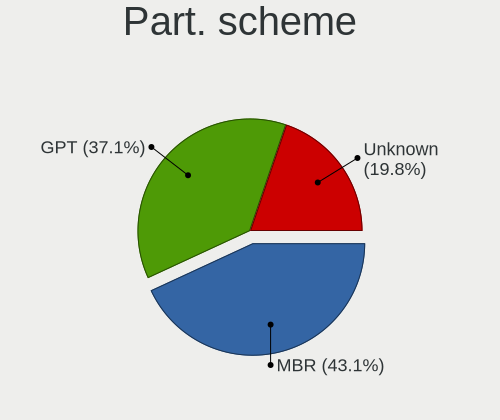

| Type    | Desktops | Percent |
|---------|----------|---------|
| MBR     | 823      | 46.42%  |
| GPT     | 585      | 32.99%  |
| Unknown | 365      | 20.59%  |

Dual Boot with Linux/BSD
------------------------

Hosting more than one Linux/BSD

| Dual boot | Desktops | Percent |
|-----------|----------|---------|
| No        | 1262     | 68.85%  |
| Yes       | 571      | 31.15%  |

Dual Boot (Win)
---------------

Hosting Linux and Windows

| Dual boot | Desktops | Percent |
|-----------|----------|---------|
| Yes       | 916      | 51.2%   |
| No        | 873      | 48.8%   |

Board
-----

Vendor
------

Motherboard manufacturer

| Name                | Desktops | Percent |
|---------------------|----------|---------|
| Gigabyte Technology | 338      | 20.19%  |
| ASUSTek Computer    | 334      | 19.95%  |
| ASRock              | 270      | 16.13%  |
| Dell                | 167      | 9.98%   |
| Hewlett-Packard     | 160      | 9.56%   |
| MSI                 | 111      | 6.63%   |
| Lenovo              | 75       | 4.48%   |
| Fujitsu             | 56       | 3.35%   |
| Fujitsu Siemens     | 29       | 1.73%   |
| Intel               | 24       | 1.43%   |
| Acer                | 22       | 1.31%   |
| Foxconn             | 15       | 0.9%    |
| Unknown             | 14       | 0.84%   |
| Medion              | 8        | 0.48%   |
| Pegatron            | 6        | 0.36%   |
| Biostar             | 4        | 0.24%   |
| Shuttle             | 3        | 0.18%   |
| Huanan              | 3        | 0.18%   |
| AOpen               | 3        | 0.18%   |
| ABIT                | 3        | 0.18%   |
| VXL                 | 2        | 0.12%   |
| Nvidia              | 2        | 0.12%   |
| Gateway             | 2        | 0.12%   |
| AMI                 | 2        | 0.12%   |
| AMD                 | 2        | 0.12%   |
| Wistron             | 1        | 0.06%   |
| WinFast             | 1        | 0.06%   |
| Wincor Nixdorf      | 1        | 0.06%   |
| ViewSonic           | 1        | 0.06%   |
| Supermicro          | 1        | 0.06%   |
| Seeed Studio        | 1        | 0.06%   |
| NEC Computers       | 1        | 0.06%   |
| Minix               | 1        | 0.06%   |
| Lex                 | 1        | 0.06%   |
| JW Technology       | 1        | 0.06%   |
| JGINYUE             | 1        | 0.06%   |
| IBM                 | 1        | 0.06%   |
| Hampoo              | 1        | 0.06%   |
| GIADA               | 1        | 0.06%   |
| ECS                 | 1        | 0.06%   |

Model
-----

Motherboard model

| Name                               | Desktops | Percent |
|------------------------------------|----------|---------|
| ASRock FM2A75M Pro4+               | 33       | 1.97%   |
| ASUS All Series                    | 28       | 1.67%   |
| Dell OptiPlex 3020                 | 23       | 1.37%   |
| Unknown                            | 14       | 0.84%   |
| Gigabyte G31M-ES2L                 | 13       | 0.78%   |
| Dell OptiPlex 755                  | 13       | 0.78%   |
| ASUS P5KPL-AM EPU                  | 12       | 0.72%   |
| Dell OptiPlex 780                  | 11       | 0.66%   |
| Gigabyte H61M-S1                   | 9        | 0.54%   |
| Dell Precision WorkStation T3500   | 9        | 0.54%   |
| Dell OptiPlex 760                  | 9        | 0.54%   |
| Dell OptiPlex 7010                 | 9        | 0.54%   |
| MSI MS-7817                        | 8        | 0.48%   |
| ASRock G41M-VS3                    | 8        | 0.48%   |
| MSI MS-7C02                        | 7        | 0.42%   |
| HP ProDesk 600 G2 SFF              | 7        | 0.42%   |
| Gigabyte 970A-DS3P                 | 7        | 0.42%   |
| ASRock N68C-S UCC                  | 7        | 0.42%   |
| MSI MS-7680                        | 6        | 0.36%   |
| MSI MS-7592                        | 6        | 0.36%   |
| HP EliteDesk 705 G3 SFF            | 6        | 0.36%   |
| HP Compaq Pro 6300 MT              | 6        | 0.36%   |
| HP Compaq Elite 8300 SFF           | 6        | 0.36%   |
| HP Compaq dc5800 Small Form Factor | 6        | 0.36%   |
| HP Compaq 8000 Elite SFF PC        | 6        | 0.36%   |
| Gigabyte B450 AORUS ELITE          | 6        | 0.36%   |
| Fujitsu Siemens ESPRIMO E5730      | 6        | 0.36%   |
| Fujitsu ESPRIMO P910               | 6        | 0.36%   |
| Dell OptiPlex 745                  | 6        | 0.36%   |
| Dell OptiPlex 330                  | 6        | 0.36%   |
| Acer Veriton M430                  | 6        | 0.36%   |
| Lenovo ThinkStation D20 4158AF8    | 5        | 0.3%    |
| HP Compaq dc5850 Small Form Factor | 5        | 0.3%    |
| Gigabyte H81M-S1                   | 5        | 0.3%    |
| Gigabyte G41MT-S2PT                | 5        | 0.3%    |
| Foxconn Pro 3500 Series            | 5        | 0.3%    |
| Dell OptiPlex 9020                 | 5        | 0.3%    |
| Dell OptiPlex 3010                 | 5        | 0.3%    |
| ASUS ROG STRIX B450-F GAMING       | 5        | 0.3%    |
| ASUS PRIME A320M-K                 | 5        | 0.3%    |

Model Family
------------

Motherboard model prefix

| Name                    | Desktops | Percent |
|-------------------------|----------|---------|
| Dell OptiPlex           | 135      | 8.06%   |
| HP Compaq               | 107      | 6.39%   |
| Lenovo ThinkCentre      | 53       | 3.17%   |
| ASUS PRIME              | 49       | 2.93%   |
| Fujitsu ESPRIMO         | 42       | 2.51%   |
| ASRock FM2A75M          | 33       | 1.97%   |
| ASUS All                | 28       | 1.67%   |
| Fujitsu Siemens ESPRIMO | 23       | 1.37%   |
| ASUS TUF                | 21       | 1.25%   |
| ASUS ROG                | 20       | 1.19%   |
| Dell Precision          | 19       | 1.14%   |
| ASUS P5KPL-AM           | 18       | 1.08%   |
| HP EliteDesk            | 17       | 1.02%   |
| Acer Veriton            | 16       | 0.96%   |
| Gigabyte B450           | 15       | 0.9%    |
| Unknown                 | 14       | 0.84%   |
| Gigabyte G31M-ES2L      | 13       | 0.78%   |
| HP ProDesk              | 12       | 0.72%   |
| Lenovo ThinkStation     | 10       | 0.6%    |
| ASUS M5A97              | 10       | 0.6%    |
| Gigabyte H61M-S1        | 9        | 0.54%   |
| Gigabyte H310M          | 9        | 0.54%   |
| Gigabyte B450M          | 9        | 0.54%   |
| Fujitsu CELSIUS         | 9        | 0.54%   |
| MSI MS-7817             | 8        | 0.48%   |
| ASRock N68C-S           | 8        | 0.48%   |
| ASRock G41M-VS3         | 8        | 0.48%   |
| ASRock 970              | 8        | 0.48%   |
| MSI MS-7C02             | 7        | 0.42%   |
| Gigabyte 970A-DS3P      | 7        | 0.42%   |
| ASUS M5A78L-M           | 7        | 0.42%   |
| MSI MS-7680             | 6        | 0.36%   |
| MSI MS-7592             | 6        | 0.36%   |
| ASUS P8H61-M            | 6        | 0.36%   |
| ASUS H110M-A            | 6        | 0.36%   |
| ASRock Z77              | 6        | 0.36%   |
| ASRock B450M            | 6        | 0.36%   |
| ASRock B450             | 6        | 0.36%   |
| Gigabyte X570           | 5        | 0.3%    |
| Gigabyte H81M-S1        | 5        | 0.3%    |

MFG Year
--------

Motherboard manufacture year

| Year    | Desktops | Percent |
|---------|----------|---------|
| 2012    | 176      | 10.51%  |
| 2013    | 167      | 9.98%   |
| 2014    | 146      | 8.72%   |
| 2010    | 145      | 8.66%   |
| 2009    | 139      | 8.3%    |
| 2011    | 136      | 8.12%   |
| 2008    | 131      | 7.83%   |
| 2018    | 118      | 7.05%   |
| 2007    | 97       | 5.79%   |
| 2015    | 72       | 4.3%    |
| 2017    | 70       | 4.18%   |
| 2019    | 56       | 3.35%   |
| 2016    | 52       | 3.11%   |
| 2020    | 50       | 2.99%   |
| 2006    | 45       | 2.69%   |
| 2021    | 28       | 1.67%   |
| 2005    | 19       | 1.14%   |
| 2022    | 13       | 0.78%   |
| 2023    | 6        | 0.36%   |
| 2004    | 4        | 0.24%   |
| 2003    | 3        | 0.18%   |
| Unknown | 1        | 0.06%   |

Form Factor
-----------

Physical design of the computer

| Name    | Desktops | Percent |
|---------|----------|---------|
| Desktop | 1674     | 100%    |

Secure Boot
-----------

Enabled or disabled

| State    | Desktops | Percent |
|----------|----------|---------|
| Disabled | 1659     | 98.93%  |
| Enabled  | 18       | 1.07%   |

Coreboot
--------

Have coreboot on board

| Used | Desktops | Percent |
|------|----------|---------|
| No   | 1674     | 100%    |

RAM Size
--------

Total RAM memory

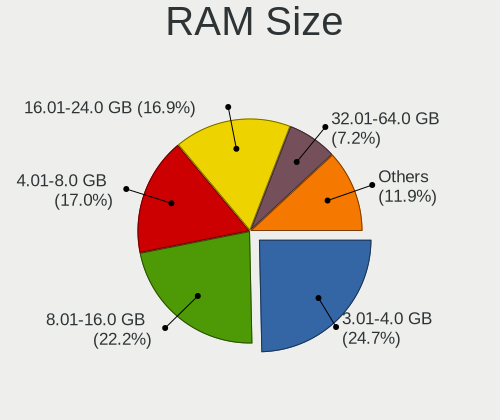

| Size in GB  | Desktops | Percent |
|-------------|----------|---------|
| 3.01-4.0    | 463      | 26.53%  |
| 8.01-16.0   | 403      | 23.09%  |
| 4.01-8.0    | 295      | 16.91%  |
| 16.01-24.0  | 272      | 15.59%  |
| 1.01-2.0    | 123      | 7.05%   |
| 32.01-64.0  | 98       | 5.62%   |
| 2.01-3.0    | 34       | 1.95%   |
| 64.01-256.0 | 26       | 1.49%   |
| 24.01-32.0  | 23       | 1.32%   |
| 0.51-1.0    | 8        | 0.46%   |

RAM Used
--------

Used RAM memory

| Used GB     | Desktops | Percent |
|-------------|----------|---------|
| 1.01-2.0    | 541      | 26.96%  |
| 0.51-1.0    | 524      | 26.11%  |
| 0.01-0.5    | 502      | 25.01%  |
| 2.01-3.0    | 212      | 10.56%  |
| 3.01-4.0    | 100      | 4.98%   |
| 4.01-8.0    | 95       | 4.73%   |
| 8.01-16.0   | 23       | 1.15%   |
| 16.01-24.0  | 6        | 0.3%    |
| 64.01-256.0 | 2        | 0.1%    |
| 32.01-64.0  | 1        | 0.05%   |
| Unknown     | 1        | 0.05%   |

Total Drives
------------

Number of drives on board

| Drives  | Desktops | Percent |
|---------|----------|---------|
| 1       | 862      | 46.9%   |
| 2       | 494      | 26.88%  |
| 3       | 254      | 13.82%  |
| 4       | 114      | 6.2%    |
| 5       | 50       | 2.72%   |
| 0       | 28       | 1.52%   |
| 6       | 13       | 0.71%   |
| 8       | 7        | 0.38%   |
| 7       | 7        | 0.38%   |
| 9       | 4        | 0.22%   |
| 11      | 2        | 0.11%   |
| 10      | 2        | 0.11%   |
| Unknown | 1        | 0.05%   |

Has CD-ROM
----------

Has CD-ROM on board

| Presented | Desktops | Percent |
|-----------|----------|---------|
| Yes       | 972      | 55.96%  |
| No        | 765      | 44.04%  |

Has Ethernet
------------

Has Ethernet on board

| Presented | Desktops | Percent |
|-----------|----------|---------|
| Yes       | 1649     | 98.51%  |
| No        | 25       | 1.49%   |

Has WiFi
--------

Has WiFi module

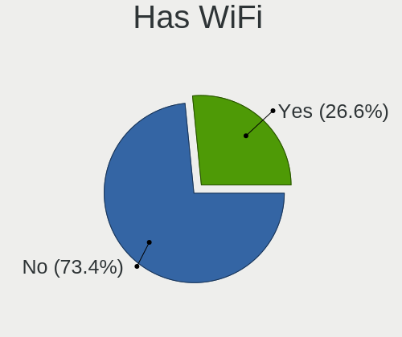

| Presented | Desktops | Percent |
|-----------|----------|---------|
| No        | 1266     | 73.78%  |
| Yes       | 450      | 26.22%  |

Has Bluetooth
-------------

Has Bluetooth module

| Presented | Desktops | Percent |
|-----------|----------|---------|
| No        | 1445     | 84.55%  |
| Yes       | 264      | 15.45%  |

Location
--------

Country
-------

Geographic location (country)

| Country | Desktops | Percent |
|---------|----------|---------|
| Hungary | 1674     | 100%    |

City
----

Geographic location (city)

| City              | Desktops | Percent |
|-------------------|----------|---------|
| Budapest          | 584      | 29.78%  |
| Pcs             | 44       | 2.24%   |
| Gyr             | 42       | 2.14%   |
| Szeged            | 41       | 2.09%   |
| Debrecen          | 31       | 1.58%   |
| Miskolc           | 30       | 1.53%   |
| Tatabnya        | 29       | 1.48%   |
| Zalaegerszeg      | 27       | 1.38%   |
| Kecskemt        | 27       | 1.38%   |
| Szombathely       | 24       | 1.22%   |
| Szigetszentmiklos | 24       | 1.22%   |
| Karcag            | 23       | 1.17%   |
| rd              | 23       | 1.17%   |
| Eger              | 23       | 1.17%   |
| Szkesfehrvr | 20       | 1.02%   |
| Szekszrd        | 18       | 0.92%   |
| Gdll        | 18       | 0.92%   |
| Oroshaza          | 17       | 0.87%   |
| Berettyjfalu  | 15       | 0.76%   |
| Toeroekbalint     | 14       | 0.71%   |
| Szolnok           | 14       | 0.71%   |
| Nyiregyhaza       | 14       | 0.71%   |
| Nagykanizsa       | 12       | 0.61%   |
| Hodmezovasarhely  | 12       | 0.61%   |
| Szentendre        | 11       | 0.56%   |
| Mosonmagyarvr | 11       | 0.56%   |
| Esztergom         | 11       | 0.56%   |
| Sifok           | 10       | 0.51%   |
| Papa              | 10       | 0.51%   |
| Tiszafured        | 9        | 0.46%   |
| Mohcs           | 9        | 0.46%   |
| Hatvan            | 9        | 0.46%   |
| Gyomro            | 9        | 0.46%   |
| Dunaharaszti      | 9        | 0.46%   |
| Ajka              | 9        | 0.46%   |
| Veresegyhaz       | 8        | 0.41%   |
| Sopron            | 8        | 0.41%   |
| Hajduboszormeny   | 8        | 0.41%   |
| Dunajvros     | 8        | 0.41%   |
| Dunakeszi         | 8        | 0.41%   |

Drives
------

Drive Vendor
------------

Hard drive vendors

| Vendor                      | Desktops | Drives | Percent |
|-----------------------------|----------|--------|---------|
| WDC                         | 601      | 1329   | 20.2%   |
| Samsung Electronics         | 488      | 871    | 16.4%   |
| Seagate                     | 417      | 676    | 14.02%  |
| Kingston                    | 396      | 753    | 13.31%  |
| Toshiba                     | 227      | 428    | 7.63%   |
| Hitachi                     | 116      | 165    | 3.9%    |
| A-DATA Technology           | 90       | 155    | 3.03%   |
| Maxtor                      | 52       | 68     | 1.75%   |
| SanDisk                     | 47       | 59     | 1.58%   |
| SPCC                        | 41       | 59     | 1.38%   |
| Crucial                     | 40       | 67     | 1.34%   |
| Intel                       | 29       | 51     | 0.97%   |
| HGST                        | 27       | 75     | 0.91%   |
| Apacer                      | 24       | 32     | 0.81%   |
| OCZ                         | 21       | 27     | 0.71%   |
| Fujitsu                     | 21       | 21     | 0.71%   |
| Intenso                     | 18       | 24     | 0.61%   |
| China                       | 17       | 25     | 0.57%   |
| Unknown                     | 16       | 27     | 0.54%   |
| Patriot                     | 16       | 38     | 0.54%   |
| Gigabyte Technology         | 14       | 43     | 0.47%   |
| Transcend                   | 12       | 18     | 0.4%    |
| PNY                         | 12       | 23     | 0.4%    |
| Hewlett-Packard             | 12       | 16     | 0.4%    |
| SK hynix                    | 11       | 16     | 0.37%   |
| Micron Technology           | 11       | 15     | 0.37%   |
| Kingston Technology Company | 11       | 12     | 0.37%   |
| JMicron Technology          | 11       | 14     | 0.37%   |
| KingSpec                    | 9        | 10     | 0.3%    |
| Kingmax                     | 9        | 31     | 0.3%    |
| Verbatim                    | 7        | 11     | 0.24%   |
| LITEON                      | 7        | 7      | 0.24%   |
| Corsair                     | 7        | 8      | 0.24%   |
| Zheino                      | 6        | 19     | 0.2%    |
| XPG                         | 6        | 9      | 0.2%    |
| Team                        | 6        | 8      | 0.2%    |
| Phison                      | 6        | 9      | 0.2%    |
| Silicon Motion              | 5        | 6      | 0.17%   |
| Phison Electronics          | 5        | 6      | 0.17%   |
| Netac                       | 5        | 11     | 0.17%   |

Drive Model
-----------

Hard drive models

| Model                            | Desktops | Percent |
|----------------------------------|----------|---------|
| Kingston SA400S37240G 240GB SSD  | 91       | 2.65%   |
| Kingston SA400S37120G 120GB SSD  | 71       | 2.07%   |
| Kingston SV300S37A120G 120GB SSD | 60       | 1.75%   |
| Toshiba DT01ACA100 1TB           | 57       | 1.66%   |
| Seagate ST500DM002-1BD142 500GB  | 54       | 1.57%   |
| Toshiba DT01ACA050 500GB         | 40       | 1.16%   |
| Kingston SA400S37480G 480GB SSD  | 34       | 0.99%   |
| A-DATA SU630 240GB SSD           | 29       | 0.84%   |
| Samsung SSD 850 EVO 250GB        | 26       | 0.76%   |
| Kingston SUV400S37120G 120GB SSD | 25       | 0.73%   |
| Seagate ST380815AS 80GB          | 24       | 0.7%    |
| Samsung HD502HJ 500GB            | 24       | 0.7%    |
| Toshiba HDWD130 3TB              | 23       | 0.67%   |
| Samsung SSD 860 EVO 250GB        | 22       | 0.64%   |
| WDC WD10EZEX-08WN4A0 1TB         | 21       | 0.61%   |
| Toshiba HDWD110 1TB              | 21       | 0.61%   |
| Toshiba DT01ACA200 2TB           | 21       | 0.61%   |
| A-DATA SU700 120GB SSD           | 20       | 0.58%   |
| SPCC Solid State Disk 256GB      | 18       | 0.52%   |
| Seagate ST2000DM008-2FR102 2TB   | 17       | 0.49%   |
| Samsung HD322HJ 320GB            | 17       | 0.49%   |
| Seagate ST3160815AS 160GB        | 16       | 0.47%   |
| Samsung SSD 860 EVO 500GB        | 16       | 0.47%   |
| Kingston SHFS37A120G 120GB SSD   | 16       | 0.47%   |
| WDC WD10EZEX-22MFCA0 1TB         | 15       | 0.44%   |
| Samsung HD502IJ 500GB            | 15       | 0.44%   |
| Samsung HD161HJ 160GB            | 15       | 0.44%   |
| Kingston SV300S37A240G 240GB SSD | 15       | 0.44%   |
| Hitachi HDS721050CLA360 500GB    | 15       | 0.44%   |
| WDC WDS240G2G0A-00JH30 240GB SSD | 14       | 0.41%   |
| WDC WD10EZRX-00L4HB0 1TB         | 14       | 0.41%   |
| Seagate ST1000DM010-2EP102 1TB   | 14       | 0.41%   |
| Samsung HD154UI 1TB              | 13       | 0.38%   |
| Kingston SV300S37A60G 64GB SSD   | 13       | 0.38%   |
| WDC WDS240G2G0B-00EPW0 240GB SSD | 12       | 0.35%   |
| Seagate ST3250318AS 250GB        | 12       | 0.35%   |
| Seagate ST3160318AS 160GB        | 12       | 0.35%   |
| Samsung HD501LJ 500GB            | 12       | 0.35%   |
| Samsung HD103UJ 1TB              | 12       | 0.35%   |
| Samsung HD103SJ 1TB              | 12       | 0.35%   |

HDD Vendor
----------

Hard disk drive vendors

| Vendor              | Desktops | Drives | Percent |
|---------------------|----------|--------|---------|
| WDC                 | 562      | 1202   | 33.08%  |
| Seagate             | 412      | 667    | 24.25%  |
| Samsung Electronics | 256      | 417    | 15.07%  |
| Toshiba             | 216      | 415    | 12.71%  |
| Hitachi             | 116      | 165    | 6.83%   |
| Maxtor              | 52       | 68     | 3.06%   |
| HGST                | 27       | 75     | 1.59%   |
| Fujitsu             | 21       | 21     | 1.24%   |
| Hewlett-Packard     | 7        | 7      | 0.41%   |
| Unknown             | 4        | 5      | 0.24%   |
| Quantum             | 4        | 4      | 0.24%   |
| HGST HTS            | 4        | 4      | 0.24%   |
| USB3.0              | 3        | 4      | 0.18%   |
| WD MediaMax         | 2        | 4      | 0.12%   |
| ICY BOX             | 2        | 4      | 0.12%   |
| External            | 2        | 3      | 0.12%   |
| Apple               | 2        | 3      | 0.12%   |
| USB                 | 1        | 1      | 0.06%   |
| TO Exter            | 1        | 1      | 0.06%   |
| IBM/Hitachi         | 1        | 1      | 0.06%   |
| ExcelStor           | 1        | 1      | 0.06%   |
| Dell                | 1        | 1      | 0.06%   |
| ASMT                | 1        | 1      | 0.06%   |
| Unknown             | 1        | 1      | 0.06%   |

SSD Vendor
----------

Solid state drive vendors

| Vendor              | Desktops | Drives | Percent |
|---------------------|----------|--------|---------|
| Kingston            | 363      | 672    | 33.49%  |
| Samsung Electronics | 197      | 335    | 18.17%  |
| A-DATA Technology   | 82       | 140    | 7.56%   |
| WDC                 | 57       | 116    | 5.26%   |
| SanDisk             | 36       | 40     | 3.32%   |
| Crucial             | 36       | 62     | 3.32%   |
| SPCC                | 32       | 49     | 2.95%   |
| Apacer              | 24       | 32     | 2.21%   |
| Intel               | 23       | 40     | 2.12%   |
| OCZ                 | 21       | 27     | 1.94%   |
| China               | 17       | 25     | 1.57%   |
| Patriot             | 15       | 37     | 1.38%   |
| Intenso             | 15       | 20     | 1.38%   |
| Toshiba             | 12       | 13     | 1.11%   |
| PNY                 | 12       | 23     | 1.11%   |
| Transcend           | 11       | 13     | 1.01%   |
| Gigabyte Technology | 11       | 38     | 1.01%   |
| Micron Technology   | 9        | 13     | 0.83%   |
| KingSpec            | 9        | 10     | 0.83%   |
| Kingmax             | 9        | 31     | 0.83%   |
| JMicron Technology  | 9        | 12     | 0.83%   |
| SK hynix            | 7        | 12     | 0.65%   |
| LITEON              | 7        | 7      | 0.65%   |
| Verbatim            | 6        | 10     | 0.55%   |
| Team                | 6        | 8      | 0.55%   |
| Corsair             | 6        | 7      | 0.55%   |
| Netac               | 5        | 11     | 0.46%   |
| GOODRAM             | 5        | 5      | 0.46%   |
| Hewlett-Packard     | 3        | 4      | 0.28%   |
| Unknown             | 3        | 3      | 0.28%   |
| SATAFIRM            | 2        | 2      | 0.18%   |
| Leven               | 2        | 2      | 0.18%   |
| KingFast            | 2        | 2      | 0.18%   |
| KingDian            | 2        | 2      | 0.18%   |
| Integral            | 2        | 2      | 0.18%   |
| Biostar             | 2        | 2      | 0.18%   |
| ASMT                | 2        | 2      | 0.18%   |
| AMD                 | 2        | 2      | 0.18%   |
| 2-Power             | 2        | 4      | 0.18%   |
| XrayDisk            | 1        | 1      | 0.09%   |

Drive Kind
----------

HDD or SSD

| Kind    | Desktops | Drives | Percent |
|---------|----------|--------|---------|
| HDD     | 1282     | 3075   | 52.93%  |
| SSD     | 902      | 1864   | 37.24%  |
| NVMe    | 199      | 376    | 8.22%   |
| Unknown | 32       | 49     | 1.32%   |
| MMC     | 7        | 9      | 0.29%   |

Drive Connector
---------------

SATA, SAS, NVMe, etc.

| Type | Desktops | Drives | Percent |
|------|----------|--------|---------|
| SATA | 1604     | 4828   | 84.38%  |
| NVMe | 199      | 376    | 10.47%  |
| SAS  | 91       | 160    | 4.79%   |
| MMC  | 7        | 9      | 0.37%   |

Drive Size
----------

Size of hard drive

| Size in TB      | Desktops | Drives | Percent |
|-----------------|----------|--------|---------|
| 0.01-0.5        | 1426     | 3254   | 64.88%  |
| 0.51-1.0        | 464      | 943    | 21.11%  |
| 1.01-2.0        | 171      | 307    | 7.78%   |
| 2.01-3.0        | 61       | 208    | 2.78%   |
| 3.01-4.0        | 49       | 144    | 2.23%   |
| 4.01-10.0       | 20       | 57     | 0.91%   |
| 10.01-20.0      | 5        | 24     | 0.23%   |
| More than 100.0 | 2        | 2      | 0.09%   |

Space Total
-----------

Amount of disk space available on the file system

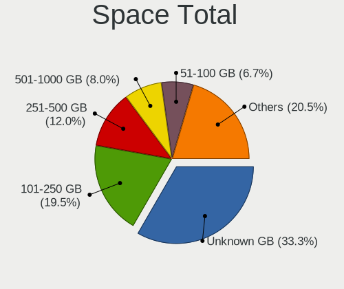

| Size in GB     | Desktops | Percent |
|----------------|----------|---------|
| Unknown        | 750      | 38.11%  |
| 101-250        | 351      | 17.84%  |
| 251-500        | 215      | 10.92%  |
| 501-1000       | 138      | 7.01%   |
| 51-100         | 137      | 6.96%   |
| 1-20           | 97       | 4.93%   |
| 1001-2000      | 95       | 4.83%   |
| 21-50          | 73       | 3.71%   |
| More than 3000 | 70       | 3.56%   |
| 2001-3000      | 42       | 2.13%   |

Space Used
----------

Amount of used disk space

| Used GB        | Desktops | Percent |
|----------------|----------|---------|
| Unknown        | 750      | 38.03%  |
| 1-20           | 609      | 30.88%  |
| 21-50          | 159      | 8.06%   |
| 51-100         | 116      | 5.88%   |
| 101-250        | 101      | 5.12%   |
| 501-1000       | 77       | 3.9%    |
| 251-500        | 68       | 3.45%   |
| 1001-2000      | 50       | 2.54%   |
| More than 3000 | 30       | 1.52%   |
| 2001-3000      | 12       | 0.61%   |

Malfunc. Drives
---------------

Drive models with a malfunction

| Model                              | Desktops | Drives | Percent |
|------------------------------------|----------|--------|---------|
| Seagate ST500DM002-1BD142 500GB    | 19       | 35     | 3.04%   |
| A-DATA Technology SU630 240GB SSD  | 19       | 29     | 3.04%   |
| Kingston SV300S37A120G 120GB SSD   | 16       | 16     | 2.56%   |
| Toshiba DT01ACA050 500GB           | 11       | 14     | 1.76%   |
| Samsung Electronics HD103UJ 1TB    | 10       | 24     | 1.6%    |
| WDC WD5000AAKX-001CA0 500GB        | 7        | 7      | 1.12%   |
| WDC WD5000AADS-00S9B0 500GB        | 7        | 8      | 1.12%   |
| Toshiba DT01ACA100 1TB             | 7        | 15     | 1.12%   |
| Samsung Electronics HD321KJ 320GB  | 6        | 6      | 0.96%   |
| Samsung Electronics HD161HJ 160GB  | 6        | 6      | 0.96%   |
| WDC WD5000AAKX-08U6AA0 500GB       | 5        | 9      | 0.8%    |
| WDC WD5000AAKS-00UU3A0 500GB       | 5        | 11     | 0.8%    |
| Seagate ST500LT012-9WS142 500GB    | 5        | 6      | 0.8%    |
| Seagate ST3250318AS 250GB          | 5        | 9      | 0.8%    |
| Seagate ST3160815AS 160GB          | 5        | 6      | 0.8%    |
| Samsung Electronics SP2504C 250GB  | 5        | 8      | 0.8%    |
| Samsung Electronics HD502HJ 500GB  | 5        | 8      | 0.8%    |
| Samsung Electronics HD103SI 1TB    | 5        | 5      | 0.8%    |
| Maxtor 6Y080M0 82GB                | 5        | 6      | 0.8%    |
| WDC WD3200AAKS-00L9A0 320GB        | 4        | 6      | 0.64%   |
| WDC WD15EARS-00MVWB0 1TB           | 4        | 9      | 0.64%   |
| WDC WD10PURZ-85U8XY0 1TB           | 4        | 11     | 0.64%   |
| WDC WD10EARS-00Y5B1 1TB            | 4        | 10     | 0.64%   |
| WDC WD10EALX-009BA0 1TB            | 4        | 5      | 0.64%   |
| Seagate ST380815AS 80GB            | 4        | 7      | 0.64%   |
| Seagate ST3160812AS 160GB          | 4        | 4      | 0.64%   |
| Seagate ST3160318AS 160GB          | 4        | 4      | 0.64%   |
| Seagate ST1000LM024 HN-M101MBB 1TB | 4        | 5      | 0.64%   |
| Samsung Electronics SP2004C 200GB  | 4        | 7      | 0.64%   |
| Samsung Electronics HD161GJ 160GB  | 4        | 5      | 0.64%   |
| Samsung Electronics HD082GJ 80GB   | 4        | 4      | 0.64%   |
| Samsung Electronics HD080HJ 80GB   | 4        | 4      | 0.64%   |
| Maxtor 2B020H1 20GB                | 4        | 8      | 0.64%   |
| Hitachi HTS545050B9A300 500GB      | 4        | 6      | 0.64%   |
| WDC WD5000AAKX-07U6AA0 500GB       | 3        | 5      | 0.48%   |
| WDC WD10EZEX-22MFCA0 1TB           | 3        | 3      | 0.48%   |
| SK hynix SC210 2.5 7MM 128GB SSD   | 3        | 6      | 0.48%   |
| Seagate ST4000DM000-1F2168 4TB     | 3        | 8      | 0.48%   |
| Seagate ST3500418AS 500GB          | 3        | 5      | 0.48%   |
| Seagate ST3500320AS 500GB          | 3        | 4      | 0.48%   |

Malfunc. Drive Vendor
---------------------

Vendors of faulty drives

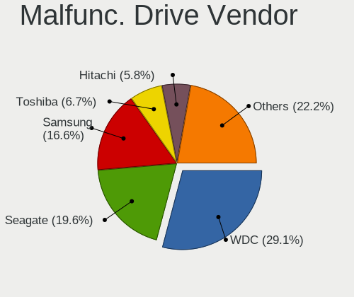

| Vendor              | Desktops | Drives | Percent |
|---------------------|----------|--------|---------|
| WDC                 | 165      | 279    | 27.82%  |
| Seagate             | 119      | 171    | 20.07%  |
| Samsung Electronics | 102      | 154    | 17.2%   |
| Toshiba             | 36       | 60     | 6.07%   |
| Kingston            | 36       | 42     | 6.07%   |
| Hitachi             | 36       | 53     | 6.07%   |
| Maxtor              | 29       | 43     | 4.89%   |
| A-DATA Technology   | 25       | 41     | 4.22%   |
| HGST                | 8        | 9      | 1.35%   |
| Fujitsu             | 7        | 7      | 1.18%   |
| Intel               | 5        | 9      | 0.84%   |
| SK hynix            | 3        | 6      | 0.51%   |
| Hewlett-Packard     | 3        | 3      | 0.51%   |
| WD MediaMax         | 2        | 4      | 0.34%   |
| KingSpec            | 2        | 2      | 0.34%   |
| Intenso             | 2        | 2      | 0.34%   |
| SATAFIRM            | 1        | 1      | 0.17%   |
| SanDisk             | 1        | 1      | 0.17%   |
| QUANTUM             | 1        | 1      | 0.17%   |
| Patriot             | 1        | 1      | 0.17%   |
| OCZ                 | 1        | 3      | 0.17%   |
| LITEON              | 1        | 1      | 0.17%   |
| Leven               | 1        | 1      | 0.17%   |
| Kingmax             | 1        | 1      | 0.17%   |
| ICY BOX             | 1        | 2      | 0.17%   |
| IBM/Hitachi         | 1        | 1      | 0.17%   |
| ExcelStor           | 1        | 1      | 0.17%   |
| China               | 1        | 1      | 0.17%   |
| ASMT                | 1        | 1      | 0.17%   |

Malfunc. HDD Vendor
-------------------

Vendors of faulty HDD drives

| Vendor              | Desktops | Drives | Percent |
|---------------------|----------|--------|---------|
| WDC                 | 162      | 275    | 32.21%  |
| Seagate             | 119      | 171    | 23.66%  |
| Samsung Electronics | 98       | 149    | 19.48%  |
| Hitachi             | 36       | 53     | 7.16%   |
| Toshiba             | 35       | 59     | 6.96%   |
| Maxtor              | 29       | 43     | 5.77%   |
| HGST                | 8        | 9      | 1.59%   |
| Fujitsu             | 7        | 7      | 1.39%   |
| WD MediaMax         | 2        | 4      | 0.4%    |
| Hewlett-Packard     | 2        | 2      | 0.4%    |
| QUANTUM             | 1        | 1      | 0.2%    |
| ICY BOX             | 1        | 2      | 0.2%    |
| IBM/Hitachi         | 1        | 1      | 0.2%    |
| ExcelStor           | 1        | 1      | 0.2%    |
| ASMT                | 1        | 1      | 0.2%    |

Malfunc. Drive Kind
-------------------

Kinds of faulty drives

| Kind | Desktops | Drives | Percent |
|------|----------|--------|---------|
| HDD  | 431      | 778    | 83.04%  |
| SSD  | 85       | 120    | 16.38%  |
| NVMe | 3        | 3      | 0.58%   |

Failed Drives
-------------

Failed drive models

| Model                             | Desktops | Drives | Percent |
|-----------------------------------|----------|--------|---------|
| Samsung Electronics HD502HJ 500GB | 2        | 3      | 22.22%  |
| Samsung Electronics HD103SJ 1TB   | 2        | 3      | 22.22%  |
| Zheino CHN-NGFFNV2280-256 256GB   | 1        | 1      | 11.11%  |
| Seagate ST380815AS 80GB           | 1        | 3      | 11.11%  |
| Samsung Electronics SP0802N 80GB  | 1        | 1      | 11.11%  |
| Samsung Electronics HD204UI 2TB   | 1        | 1      | 11.11%  |
| Hewlett-Packard SSD EX900 250GB   | 1        | 1      | 11.11%  |

Failed Drive Vendor
-------------------

Failed drive vendors

| Vendor              | Desktops | Drives | Percent |
|---------------------|----------|--------|---------|
| Samsung Electronics | 6        | 8      | 66.67%  |
| Zheino              | 1        | 1      | 11.11%  |
| Seagate             | 1        | 3      | 11.11%  |
| Hewlett-Packard     | 1        | 1      | 11.11%  |

Drive Status
------------

Number of failed and malfunc. drives

| Status   | Desktops | Drives | Percent |
|----------|----------|--------|---------|
| Works    | 1076     | 3218   | 52.08%  |
| Malfunc  | 497      | 901    | 24.06%  |
| Detected | 484      | 1241   | 23.43%  |
| Failed   | 9        | 13     | 0.44%   |

Storage controller
------------------

Storage Vendor
--------------

Storage controller vendors

| Vendor                           | Desktops | Percent |
|----------------------------------|----------|---------|
| Intel                            | 1129     | 53.25%  |
| AMD                              | 467      | 22.03%  |
| JMicron Technology               | 79       | 3.73%   |
| Samsung Electronics              | 78       | 3.68%   |
| ASMedia Technology               | 67       | 3.16%   |
| Nvidia                           | 61       | 2.88%   |
| Kingston Technology Company      | 53       | 2.5%    |
| Marvell Technology Group         | 40       | 1.89%   |
| Phison Electronics               | 24       | 1.13%   |
| SanDisk                          | 18       | 0.85%   |
| Silicon Motion                   | 15       | 0.71%   |
| VIA Technologies                 | 14       | 0.66%   |
| Silicon Image                    | 12       | 0.57%   |
| ADATA Technology                 | 12       | 0.57%   |
| LSI Logic / Symbios Logic        | 10       | 0.47%   |
| Realtek Semiconductor            | 7        | 0.33%   |
| Integrated Technology Express    | 5        | 0.24%   |
| SK hynix                         | 4        | 0.19%   |
| Micron/Crucial Technology        | 4        | 0.19%   |
| Broadcom / LSI                   | 3        | 0.14%   |
| Micron Technology                | 2        | 0.09%   |
| MAXIO Technology (Hangzhou)      | 2        | 0.09%   |
| KIOXIA                           | 2        | 0.09%   |
| HighPoint Technologies           | 2        | 0.09%   |
| Adaptec                          | 2        | 0.09%   |
| TenaFe                           | 1        | 0.05%   |
| Silicon Integrated Systems [SiS] | 1        | 0.05%   |
| Seagate Technology               | 1        | 0.05%   |
| Promise Technology               | 1        | 0.05%   |
| OCZ Technology Group             | 1        | 0.05%   |
| Initio                           | 1        | 0.05%   |
| Hewlett-Packard                  | 1        | 0.05%   |
| 3ware                            | 1        | 0.05%   |

Storage Model
-------------

Storage controller models

| Model                                                                                   | Desktops | Percent |
|-----------------------------------------------------------------------------------------|----------|---------|
| AMD FCH SATA Controller [AHCI mode]                                                     | 246      | 8.34%   |
| Intel NM10/ICH7 Family SATA Controller [IDE mode]                                       | 179      | 6.07%   |
| Intel 8 Series/C220 Series Chipset Family 6-port SATA Controller 1 [AHCI mode]          | 145      | 4.91%   |
| Intel 82801G (ICH7 Family) IDE Controller                                               | 135      | 4.57%   |
| Intel 6 Series/C200 Series Chipset Family 6 port Desktop SATA AHCI Controller           | 95       | 3.22%   |
| AMD SB7x0/SB8x0/SB9x0 IDE Controller                                                    | 92       | 3.12%   |
| Intel 7 Series/C210 Series Chipset Family 6-port SATA Controller [AHCI mode]            | 83       | 2.81%   |
| AMD SB7x0/SB8x0/SB9x0 SATA Controller [AHCI mode]                                       | 76       | 2.58%   |
| Intel Q170/Q150/B150/H170/H110/Z170/CM236 Chipset SATA Controller [AHCI Mode]           | 75       | 2.54%   |
| AMD 400 Series Chipset SATA Controller                                                  | 73       | 2.47%   |
| AMD SB7x0/SB8x0/SB9x0 SATA Controller [IDE mode]                                        | 67       | 2.27%   |
| AMD FCH IDE Controller                                                                  | 65       | 2.2%    |
| Intel 200 Series PCH SATA controller [AHCI mode]                                        | 64       | 2.17%   |
| ASMedia ASM1062 Serial ATA Controller                                                   | 58       | 1.97%   |
| Intel 6 Series/C200 Series Chipset Family Desktop SATA Controller (IDE mode, ports 4-5) | 54       | 1.83%   |
| Intel 6 Series/C200 Series Chipset Family Desktop SATA Controller (IDE mode, ports 0-3) | 54       | 1.83%   |
| Intel 4 Series Chipset PT IDER Controller                                               | 54       | 1.83%   |
| Samsung NVMe SSD Controller SM981/PM981/PM983                                           | 52       | 1.76%   |
| Intel SATA Controller [RAID mode]                                                       | 52       | 1.76%   |
| Intel 82801I (ICH9 Family) 2 port SATA Controller [IDE mode]                            | 51       | 1.73%   |
| JMicron JMB363 SATA/IDE Controller                                                      | 46       | 1.56%   |
| Intel 82801JD/DO (ICH10 Family) SATA AHCI Controller                                    | 37       | 1.25%   |
| AMD 500 Series Chipset SATA Controller                                                  | 35       | 1.19%   |
| Intel 82801IR/IO/IH (ICH9R/DO/DH) 4 port SATA Controller [IDE mode]                     | 30       | 1.02%   |
| Nvidia MCP61 SATA Controller                                                            | 29       | 0.98%   |
| Kingston Company A2000 NVMe SSD SM2263EN                                                | 29       | 0.98%   |
| JMicron JMB368 IDE controller                                                           | 29       | 0.98%   |
| Intel 82Q35 Express PT IDER Controller                                                  | 26       | 0.88%   |
| Nvidia MCP61 IDE                                                                        | 24       | 0.81%   |
| Intel Cannon Lake PCH SATA AHCI Controller                                              | 24       | 0.81%   |
| Intel 82801JI (ICH10 Family) SATA AHCI Controller                                       | 24       | 0.81%   |
| Intel 82801JD/DO (ICH10 Family) 4-port SATA IDE Controller                              | 24       | 0.81%   |
| Intel 82801JD/DO (ICH10 Family) 2-port SATA IDE Controller                              | 24       | 0.81%   |
| AMD 300 Series Chipset SATA Controller                                                  | 22       | 0.75%   |
| Intel 82801IB (ICH9) 2 port SATA Controller [IDE mode]                                  | 21       | 0.71%   |
| Intel 82801JI (ICH10 Family) 4 port SATA IDE Controller #1                              | 20       | 0.68%   |
| Intel 82801JI (ICH10 Family) 2 port SATA IDE Controller #2                              | 20       | 0.68%   |
| Intel 82801IR/IO/IH (ICH9R/DO/DH) 6 port SATA Controller [AHCI mode]                    | 19       | 0.64%   |
| AMD FCH SATA Controller D                                                               | 19       | 0.64%   |
| Intel 5 Series/3400 Series Chipset 4 port SATA IDE Controller                           | 18       | 0.61%   |

Storage Kind
------------

Kind of storage controller (IDE, SATA, NVMe, SAS, ...)

| Kind | Desktops | Percent |
|------|----------|---------|
| SATA | 1169     | 52.66%  |
| IDE  | 732      | 32.97%  |
| NVMe | 202      | 9.1%    |
| RAID | 99       | 4.46%   |
| SAS  | 10       | 0.45%   |
| SCSI | 8        | 0.36%   |

Processor
---------

CPU Vendor
----------

Processor vendors

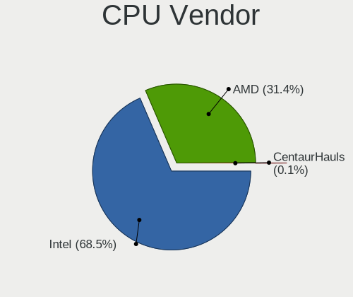

| Vendor       | Desktops | Percent |
|--------------|----------|---------|
| Intel        | 1148     | 68.58%  |
| AMD          | 524      | 31.3%   |
| CentaurHauls | 2        | 0.12%   |

CPU Model
---------

Processor models

| Model                                       | Desktops | Percent |
|---------------------------------------------|----------|---------|
| Intel Core 2 Duo CPU E8400 @ 3.00GHz        | 42       | 2.49%   |
| AMD A8-6600K APU with Radeon HD Graphics    | 36       | 2.13%   |
| Intel Core i5-3470 CPU @ 3.20GHz            | 30       | 1.78%   |
| Intel Core i5-2400 CPU @ 3.10GHz            | 24       | 1.42%   |
| Intel Core i3-2120 CPU @ 3.30GHz            | 23       | 1.36%   |
| Intel Core i3-4160 CPU @ 3.60GHz            | 22       | 1.3%    |
| Intel Core 2 Duo CPU E7500 @ 2.93GHz        | 22       | 1.3%    |
| Intel Core i5-6500 CPU @ 3.20GHz            | 20       | 1.18%   |
| AMD FX-6300 Six-Core Processor              | 17       | 1.01%   |
| Intel Core i5-4590 CPU @ 3.30GHz            | 16       | 0.95%   |
| Intel Core i3-3220 CPU @ 3.30GHz            | 16       | 0.95%   |
| Intel Core 2 Quad CPU Q6600 @ 2.40GHz       | 16       | 0.95%   |
| Intel Core 2 Duo CPU E7300 @ 2.66GHz        | 16       | 0.95%   |
| AMD Ryzen 5 2600 Six-Core Processor         | 16       | 0.95%   |
| AMD FX-8350 Eight-Core Processor            | 16       | 0.95%   |
| Intel Pentium Dual-Core CPU E5700 @ 3.00GHz | 15       | 0.89%   |
| Intel Pentium CPU G3220 @ 3.00GHz           | 14       | 0.83%   |
| Intel Core i5-7500 CPU @ 3.40GHz            | 14       | 0.83%   |
| Intel Core i5-4570 CPU @ 3.20GHz            | 13       | 0.77%   |
| AMD Ryzen 5 3600 6-Core Processor           | 13       | 0.77%   |
| Intel Pentium 4 CPU 3.00GHz                 | 12       | 0.71%   |
| Intel Core i5-2500K CPU @ 3.30GHz           | 11       | 0.65%   |
| Intel Core i3-2100 CPU @ 3.10GHz            | 11       | 0.65%   |
| Intel Core 2 Duo CPU E8500 @ 3.16GHz        | 11       | 0.65%   |
| Intel Core 2 Duo CPU E6550 @ 2.33GHz        | 11       | 0.65%   |
| AMD Ryzen 5 1600 Six-Core Processor         | 11       | 0.65%   |
| Intel Pentium Dual-Core CPU E5400 @ 2.70GHz | 10       | 0.59%   |
| Intel Core i5-4460 CPU @ 3.20GHz            | 10       | 0.59%   |
| Intel Core i3-4130 CPU @ 3.40GHz            | 10       | 0.59%   |
| Intel Core 2 Quad CPU Q8200 @ 2.33GHz       | 10       | 0.59%   |
| AMD Athlon II X2 260 Processor              | 10       | 0.59%   |
| Intel Core i5 CPU 650 @ 3.20GHz             | 9        | 0.53%   |
| Intel Core i3-8100 CPU @ 3.60GHz            | 9        | 0.53%   |
| Intel Core i3-3240 CPU @ 3.40GHz            | 9        | 0.53%   |
| AMD Ryzen 3 2200G with Radeon Vega Graphics | 9        | 0.53%   |
| Intel Pentium Dual-Core CPU E5300 @ 2.60GHz | 8        | 0.47%   |
| Intel Pentium CPU G840 @ 2.80GHz            | 8        | 0.47%   |
| Intel Core i7-3770 CPU @ 3.40GHz            | 8        | 0.47%   |
| Intel Core i7-2600 CPU @ 3.40GHz            | 8        | 0.47%   |
| Intel Core i5-3570 CPU @ 3.40GHz            | 8        | 0.47%   |

CPU Model Family
----------------

Processor model prefix

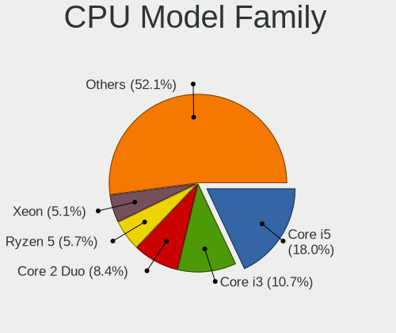

| Model                   | Desktops | Percent |
|-------------------------|----------|---------|
| Intel Core i5           | 291      | 17.3%   |
| Intel Core i3           | 182      | 10.82%  |
| Intel Core 2 Duo        | 149      | 8.86%   |
| Intel Core i7           | 84       | 4.99%   |
| AMD Ryzen 5             | 81       | 4.82%   |
| Intel Xeon              | 77       | 4.58%   |
| Intel Pentium           | 69       | 4.1%    |
| Intel Celeron           | 67       | 3.98%   |
| Intel Pentium Dual-Core | 58       | 3.45%   |
| Intel Core 2 Quad       | 56       | 3.33%   |
| AMD A8                  | 55       | 3.27%   |
| AMD FX                  | 51       | 3.03%   |
| AMD Athlon II X2        | 42       | 2.5%    |
| AMD Ryzen 7             | 41       | 2.44%   |
| AMD Athlon 64 X2        | 30       | 1.78%   |
| AMD Ryzen 3             | 26       | 1.55%   |
| AMD Phenom II X4        | 24       | 1.43%   |
| Other                   | 23       | 1.37%   |
| Intel Core 2            | 23       | 1.37%   |
| AMD A4                  | 23       | 1.37%   |
| Intel Pentium 4         | 22       | 1.31%   |
| Intel Pentium Dual      | 18       | 1.07%   |
| AMD A10                 | 18       | 1.07%   |
| Intel Atom              | 17       | 1.01%   |
| AMD A6                  | 14       | 0.83%   |
| Intel Pentium D         | 12       | 0.71%   |
| AMD Sempron             | 11       | 0.65%   |
| AMD Ryzen 9             | 11       | 0.65%   |
| AMD Athlon II X4        | 11       | 0.65%   |
| AMD Athlon Dual Core    | 11       | 0.65%   |
| AMD Athlon              | 10       | 0.59%   |
| AMD Athlon X4           | 9        | 0.54%   |
| AMD Athlon 64           | 6        | 0.36%   |
| AMD Phenom II X6        | 5        | 0.3%    |
| AMD Phenom II X2        | 5        | 0.3%    |
| AMD GX                  | 5        | 0.3%    |
| Intel Celeron D         | 4        | 0.24%   |
| AMD Phenom              | 4        | 0.24%   |
| Intel Pentium Gold      | 3        | 0.18%   |
| Intel Genuine           | 3        | 0.18%   |

CPU Cores
---------

Number of processor cores

| Number  | Desktops | Percent |
|---------|----------|---------|
| 2       | 752      | 44.55%  |
| 4       | 561      | 33.23%  |
| 6       | 148      | 8.77%   |
| 1       | 101      | 5.98%   |
| 8       | 64       | 3.79%   |
| 3       | 30       | 1.78%   |
| 12      | 13       | 0.77%   |
| 16      | 9        | 0.53%   |
| 10      | 4        | 0.24%   |
| 18      | 2        | 0.12%   |
| 36      | 1        | 0.06%   |
| 28      | 1        | 0.06%   |
| 14      | 1        | 0.06%   |
| Unknown | 1        | 0.06%   |

CPU Sockets
-----------

Number of sockets

| Number | Desktops | Percent |
|--------|----------|---------|
| 1      | 1662     | 99.16%  |
| 2      | 14       | 0.84%   |

CPU Threads
-----------

Threads per core (Hyper-Threading)

| Number  | Desktops | Percent |
|---------|----------|---------|
| 1       | 1007     | 59.83%  |
| 2       | 675      | 40.11%  |
| Unknown | 1        | 0.06%   |

CPU Op-Modes
------------

CPU Operation Modes (32-bit, 64-bit)

| Op mode        | Desktops | Percent |
|----------------|----------|---------|
| 32-bit, 64-bit | 1663     | 99.22%  |
| 32-bit         | 7        | 0.42%   |
| Unknown        | 6        | 0.36%   |

CPU Microcode
-------------

Microcode number

| Number     | Desktops | Percent |
|------------|----------|---------|
| Unknown    | 283      | 16.22%  |
| 0x1067a    | 181      | 10.37%  |
| 0x306c3    | 145      | 8.31%   |
| 0x206a7    | 121      | 6.93%   |
| 0x306a9    | 99       | 5.67%   |
| 0x06001119 | 78       | 4.47%   |
| 0x010000c8 | 53       | 3.04%   |
| 0x506e3    | 52       | 2.98%   |
| 0x10676    | 40       | 2.29%   |
| 0x906e9    | 38       | 2.18%   |
| 0x0800820d | 34       | 1.95%   |
| 0x6fb      | 33       | 1.89%   |
| 0x6fd      | 31       | 1.78%   |
| 0x906ea    | 28       | 1.6%    |
| 0x06000852 | 27       | 1.55%   |
| 0x08701021 | 20       | 1.15%   |
| 0x6f2      | 16       | 0.92%   |
| 0x06003106 | 16       | 0.92%   |
| 0x106e5    | 15       | 0.86%   |
| 0x10677    | 15       | 0.86%   |
| 0x08001138 | 15       | 0.86%   |
| 0x906eb    | 14       | 0.8%    |
| 0x206c2    | 14       | 0.8%    |
| 0x0600084f | 14       | 0.8%    |
| 0x20655    | 13       | 0.74%   |
| 0x03000027 | 12       | 0.69%   |
| 0xf43      | 11       | 0.63%   |
| 0xa0653    | 11       | 0.63%   |
| 0x106a5    | 11       | 0.63%   |
| 0x010000db | 11       | 0.63%   |
| 0x08108109 | 10       | 0.57%   |
| 0x0810100b | 10       | 0.57%   |
| 0x20652    | 9        | 0.52%   |
| 0x6f6      | 8        | 0.46%   |
| 0x0700010f | 8        | 0.46%   |
| 0x0600063e | 8        | 0.46%   |
| 0x010000c7 | 8        | 0.46%   |
| 0xf41      | 7        | 0.4%    |
| 0x0600611a | 7        | 0.4%    |
| 0x06003104 | 7        | 0.4%    |

CPU Microarch
-------------

Microarchitecture

| Name             | Desktops | Percent |
|------------------|----------|---------|
| Penryn           | 244      | 14.55%  |
| Haswell          | 178      | 10.61%  |
| SandyBridge      | 144      | 8.59%   |
| Piledriver       | 124      | 7.39%   |
| IvyBridge        | 116      | 6.92%   |
| KabyLake         | 112      | 6.68%   |
| K10              | 106      | 6.32%   |
| Core             | 97       | 5.78%   |
| Skylake          | 70       | 4.17%   |
| K8 Hammer        | 54       | 3.22%   |
| Zen+             | 51       | 3.04%   |
| NetBurst         | 47       | 2.8%    |
| Zen 2            | 44       | 2.62%   |
| Westmere         | 41       | 2.44%   |
| Zen              | 36       | 2.15%   |
| Zen 3            | 30       | 1.79%   |
| Nehalem          | 27       | 1.61%   |
| Steamroller      | 25       | 1.49%   |
| CometLake        | 18       | 1.07%   |
| Silvermont       | 17       | 1.01%   |
| Bonnell          | 13       | 0.78%   |
| K10 Llano        | 12       | 0.72%   |
| Excavator        | 11       | 0.66%   |
| Unknown          | 11       | 0.66%   |
| Jaguar           | 10       | 0.6%    |
| Bulldozer        | 9        | 0.54%   |
| Goldmont plus    | 7        | 0.42%   |
| Alderlake Hybrid | 7        | 0.42%   |
| Puma             | 6        | 0.36%   |
| Icelake          | 4        | 0.24%   |
| Bobcat           | 2        | 0.12%   |
| Tremont          | 1        | 0.06%   |
| K8 & K10 hybrid  | 1        | 0.06%   |
| K6               | 1        | 0.06%   |
| Goldmont         | 1        | 0.06%   |

Graphics
--------

GPU Vendor
----------

Vendors of graphics cards

| Vendor                     | Desktops | Percent |
|----------------------------|----------|---------|
| Nvidia                     | 614      | 34.26%  |
| Intel                      | 593      | 33.09%  |
| AMD                        | 573      | 31.98%  |
| VIA Technologies           | 6        | 0.33%   |
| ASPEED Technology          | 3        | 0.17%   |
| ATI Technologies           | 2        | 0.11%   |
| Matrox Electronics Systems | 1        | 0.06%   |

GPU Model
---------

Graphics card models

| Model                                                                       | Desktops | Percent |
|-----------------------------------------------------------------------------|----------|---------|
| Intel Xeon E3-1200 v3/4th Gen Core Processor Integrated Graphics Controller | 85       | 4.55%   |
| Intel 4 Series Chipset Integrated Graphics Controller                       | 77       | 4.12%   |
| Intel 2nd Generation Core Processor Family Integrated Graphics Controller   | 66       | 3.54%   |
| Nvidia GK208B [GeForce GT 710]                                              | 64       | 3.43%   |
| AMD Ellesmere [Radeon RX 470/480/570/570X/580/580X/590]                     | 58       | 3.11%   |
| Intel Xeon E3-1200 v2/3rd Gen Core processor Graphics Controller            | 56       | 3%      |
| Intel HD Graphics 530                                                       | 44       | 2.36%   |
| Nvidia GT218 [GeForce 210]                                                  | 41       | 2.2%    |
| AMD Richland [Radeon HD 8570D]                                              | 37       | 1.98%   |
| AMD Caicos [Radeon HD 6450/7450/8450 / R5 230 OEM]                          | 37       | 1.98%   |
| Intel 82G33/G31 Express Integrated Graphics Controller                      | 35       | 1.87%   |
| Intel 4th Generation Core Processor Family Integrated Graphics Controller   | 35       | 1.87%   |
| Nvidia GP107 [GeForce GTX 1050 Ti]                                          | 34       | 1.82%   |
| AMD Cedar [Radeon HD 5000/6000/7350/8350 Series]                            | 31       | 1.66%   |
| Intel CoffeeLake-S GT2 [UHD Graphics 630]                                   | 23       | 1.23%   |
| Intel 82945G/GZ Integrated Graphics Controller                              | 23       | 1.23%   |
| Nvidia GP108 [GeForce GT 1030]                                              | 21       | 1.12%   |
| Nvidia GP106 [GeForce GTX 1060 6GB]                                         | 21       | 1.12%   |
| Nvidia GF119 [GeForce GT 610]                                               | 20       | 1.07%   |
| Intel HD Graphics 630                                                       | 20       | 1.07%   |
| AMD Oland PRO [Radeon R7 240/340 / Radeon 520]                              | 20       | 1.07%   |
| Intel 82Q35 Express Integrated Graphics Controller                          | 17       | 0.91%   |
| Nvidia GK208B [GeForce GT 730]                                              | 16       | 0.86%   |
| Nvidia GF108 [GeForce GT 630]                                               | 15       | 0.8%    |
| Nvidia GP106 [GeForce GTX 1060 3GB]                                         | 14       | 0.75%   |
| Nvidia GM107 [GeForce GTX 750 Ti]                                           | 14       | 0.75%   |
| AMD Kaveri [Radeon R7 Graphics]                                             | 14       | 0.75%   |
| AMD Redwood XT [Radeon HD 5670/5690/5730]                                   | 13       | 0.7%    |
| Nvidia G94 [GeForce 9600 GT]                                                | 12       | 0.64%   |
| Intel IvyBridge GT2 [HD Graphics 4000]                                      | 12       | 0.64%   |
| AMD RV710 [Radeon HD 4350/4550]                                             | 12       | 0.64%   |
| AMD RS880 [Radeon HD 4200]                                                  | 12       | 0.64%   |
| AMD Raven Ridge [Radeon Vega Series / Radeon Vega Mobile Series]            | 12       | 0.64%   |
| AMD Lexa PRO [Radeon 540/540X/550/550X / RX 540X/550/550X]                  | 12       | 0.64%   |
| AMD Cape Verde XT [Radeon HD 7770/8760 / R7 250X]                           | 11       | 0.59%   |
| Nvidia TU117 [GeForce GTX 1650]                                             | 10       | 0.54%   |
| Nvidia TU116 [GeForce GTX 1660 SUPER]                                       | 10       | 0.54%   |
| Nvidia GP104 [GeForce GTX 1070]                                             | 10       | 0.54%   |
| Nvidia GM206 [GeForce GTX 960]                                              | 10       | 0.54%   |
| Nvidia GP107 [GeForce GTX 1050]                                             | 9        | 0.48%   |

GPU Combo
---------

Combinations of graphics cards

| Name                     | Desktops | Percent |
|--------------------------|----------|---------|
| 1 x Nvidia               | 577      | 33.45%  |
| 1 x Intel                | 532      | 30.84%  |
| 1 x AMD                  | 514      | 29.8%   |
| 2 x AMD                  | 45       | 2.61%   |
| Intel + Nvidia           | 22       | 1.28%   |
| AMD + Nvidia             | 9        | 0.52%   |
| Intel + AMD              | 7        | 0.41%   |
| 1 x VIA                  | 6        | 0.35%   |
| 2 x Nvidia               | 5        | 0.29%   |
| 1 x ASPEED               | 2        | 0.12%   |
| 2 x Intel                | 1        | 0.06%   |
| 1 x Matrox               | 1        | 0.06%   |
| 1 x Intel + 3 x AMD      | 1        | 0.06%   |
| Intel + 2 x Nvidia       | 1        | 0.06%   |
| Intel + AMD + 1 x Nvidia | 1        | 0.06%   |
| AMD + ASPEED             | 1        | 0.06%   |

GPU Driver
----------

Free vs proprietary

| Driver      | Desktops | Percent |
|-------------|----------|---------|
| Free        | 1460     | 85.83%  |
| Proprietary | 160      | 9.41%   |
| Unknown     | 81       | 4.76%   |

GPU Memory
----------

Total video memory

| Size in GB | Desktops | Percent |
|------------|----------|---------|
| Unknown    | 670      | 37.87%  |
| 0.51-1.0   | 325      | 18.37%  |
| 0.01-0.5   | 296      | 16.73%  |
| 1.01-2.0   | 230      | 13%     |
| 3.01-4.0   | 105      | 5.94%   |
| 7.01-8.0   | 76       | 4.3%    |
| 5.01-6.0   | 36       | 2.04%   |
| 2.01-3.0   | 19       | 1.07%   |
| 8.01-16.0  | 9        | 0.51%   |
| 16.01-24.0 | 3        | 0.17%   |

Monitor
-------

Monitor Vendor
--------------

Monitor vendors

| Vendor                  | Desktops | Percent |
|-------------------------|----------|---------|
| Samsung Electronics     | 368      | 21.92%  |
| Goldstar                | 281      | 16.74%  |
| Dell                    | 125      | 7.44%   |
| Ancor Communications    | 97       | 5.78%   |
| BenQ                    | 92       | 5.48%   |
| Philips                 | 88       | 5.24%   |
| Hewlett-Packard         | 79       | 4.71%   |
| Acer                    | 79       | 4.71%   |
| Fujitsu Siemens         | 47       | 2.8%    |
| AOC                     | 38       | 2.26%   |
| LG Electronics          | 26       | 1.55%   |
| Lenovo                  | 23       | 1.37%   |
| Eizo                    | 22       | 1.31%   |
| HannStar                | 21       | 1.25%   |
| Vestel Elektronik       | 17       | 1.01%   |
| Sony                    | 17       | 1.01%   |
| NEC Computers           | 17       | 1.01%   |
| ASUSTek Computer        | 16       | 0.95%   |
| HKC                     | 15       | 0.89%   |
| ViewSonic               | 14       | 0.83%   |
| Unknown                 | 13       | 0.77%   |
| Medion                  | 13       | 0.77%   |
| Belinea                 | 11       | 0.66%   |
| IBM                     | 10       | 0.6%    |
| Arnos Instruments       | 9        | 0.54%   |
| Panasonic               | 8        | 0.48%   |
| Chi Mei Optoelectronics | 8        | 0.48%   |
| Iiyama                  | 7        | 0.42%   |
| Toshiba                 | 6        | 0.36%   |
| Plain Tree Systems      | 6        | 0.36%   |
| OEM                     | 6        | 0.36%   |
| Videoseven              | 5        | 0.3%    |
| NCS                     | 5        | 0.3%    |
| MStar                   | 5        | 0.3%    |
| Gericom                 | 5        | 0.3%    |
| FUS                     | 5        | 0.3%    |
| KTC                     | 4        | 0.24%   |
| ___                     | 3        | 0.18%   |
| Orion                   | 3        | 0.18%   |
| Impression              | 3        | 0.18%   |

Monitor Model
-------------

Monitor models

| Model                                                                    | Desktops | Percent |
|--------------------------------------------------------------------------|----------|---------|
| BenQ EW277HDR BNQ7948 1920x1080 598x336mm 27.0-inch                      | 32       | 1.82%   |
| Vestel Elektronik 55UHD_LCD_TV VES3700 3840x2160 1872x1053mm 84.6-inch   | 17       | 0.97%   |
| Philips PHL 223V5 PHLC0CF 1920x1080 480x270mm 21.7-inch                  | 13       | 0.74%   |
| Samsung Electronics S19B150 SAM08A2 1366x768 410x230mm 18.5-inch         | 11       | 0.63%   |
| HKC '' HKC1850 1360x768 304x228mm 15.0-inch                              | 11       | 0.63%   |
| HannStar Hanns.G HQ191 HSD0013 1280x1024 376x301mm 19.0-inch             | 11       | 0.63%   |
| Ancor Communications VW195 ACI19AB 1440x900 408x255mm 18.9-inch          | 11       | 0.63%   |
| Samsung Electronics SyncMaster SAM011E 1280x1024 338x270mm 17.0-inch     | 10       | 0.57%   |
| Philips PHL 243V7 PHLC155 1920x1080 527x296mm 23.8-inch                  | 10       | 0.57%   |
| Goldstar W1934 GSM4B7A 1440x900 410x256mm 19.0-inch                      | 10       | 0.57%   |
| Goldstar ULTRAWIDE GSM59F1 2560x1080 673x284mm 28.8-inch                 | 10       | 0.57%   |
| Ancor Communications ASUS VW193D ACI19D5 1440x900 408x255mm 18.9-inch    | 10       | 0.57%   |
| Samsung Electronics S24D330 SAM0D92 1920x1080 531x299mm 24.0-inch        | 9        | 0.51%   |
| Goldstar MP59G GSM5B34 1920x1080 480x270mm 21.7-inch                     | 9        | 0.51%   |
| Goldstar 2D HD TV GSM59CA 1366x768 509x286mm 23.0-inch                   | 9        | 0.51%   |
| Samsung Electronics C24F390 SAM0D2C 1920x1080 521x293mm 23.5-inch        | 8        | 0.45%   |
| Goldstar W2234 GSM56B8 1680x1050 474x296mm 22.0-inch                     | 8        | 0.45%   |
| Goldstar ULTRAWIDE GSM76F9 2560x1080 531x298mm 24.0-inch                 | 8        | 0.45%   |
| Goldstar IPS FULLHD GSM5AB6 1920x1080 480x270mm 21.7-inch                | 8        | 0.45%   |
| Goldstar HD GSM5ACB 1366x768 410x230mm 18.5-inch                         | 8        | 0.45%   |
| Samsung Electronics SyncMaster SAM036F 1440x900 428x255mm 19.6-inch      | 7        | 0.4%    |
| Lenovo LEN L171 LEN24C9 1280x1024 337x270mm 17.0-inch                    | 7        | 0.4%    |
| Goldstar FHD GSM5B54 1920x1080 480x270mm 21.7-inch                       | 7        | 0.4%    |
| Samsung Electronics SyncMaster SAM01E1 1280x1024 380x300mm 19.1-inch     | 6        | 0.34%   |
| OEM 26W_LCD_TV OEM3700 1920x540                                          | 6        | 0.34%   |
| Eizo S2202W ENC1976 1680x1050 474x297mm 22.0-inch                        | 6        | 0.34%   |
| Chi Mei Optoelectronics CMC 19" AD CMO0198 1280x1024 338x270mm 17.0-inch | 6        | 0.34%   |
| AOC Q32G1WG4 AOC3201 2560x1440 697x393mm 31.5-inch                       | 6        | 0.34%   |
| Samsung Electronics SyncMaster SAM01B7 1280x1024 340x270mm 17.1-inch     | 5        | 0.28%   |
| Samsung Electronics LCD Monitor SyncMaster 1280x1024                     | 5        | 0.28%   |
| NCS LCD Monitor NCS2275 1920x1080 256x192mm 12.6-inch                    | 5        | 0.28%   |
| MStar TV MST0030 1920x1080 708x398mm 32.0-inch                           | 5        | 0.28%   |
| Iiyama PL2473HD IVM6107 1920x1080 521x293mm 23.5-inch                    | 5        | 0.28%   |
| Goldstar TV GSM2412 1920x1080 940x530mm 42.5-inch                        | 5        | 0.28%   |
| Goldstar MP59G GSM5B35 1920x1080 480x270mm 21.7-inch                     | 5        | 0.28%   |
| Goldstar LG IPS FULLHD GSM5AB7 1920x1080 480x270mm 21.7-inch             | 5        | 0.28%   |
| Goldstar FULL HD GSM5B55 1920x1080 480x270mm 21.7-inch                   | 5        | 0.28%   |
| Goldstar FULL HD GSM5ABA 1920x1080 480x270mm 21.7-inch                   | 5        | 0.28%   |
| BenQ GW2255 BNQ78CD 1920x1080 477x268mm 21.5-inch                        | 5        | 0.28%   |
| Ancor Communications ASUS VW228 ACI22E2 1920x1080 521x293mm 23.5-inch    | 5        | 0.28%   |

Monitor Resolution
------------------

Monitor screen resolution

| Resolution         | Desktops | Percent |
|--------------------|----------|---------|
| 1920x1080 (FHD)    | 675      | 41.13%  |
| 1280x1024 (SXGA)   | 280      | 17.06%  |
| 1680x1050 (WSXGA+) | 137      | 8.35%   |
| 1440x900 (WXGA+)   | 116      | 7.07%   |
| 3840x2160 (4K)     | 91       | 5.55%   |
| 1366x768 (WXGA)    | 67       | 4.08%   |
| 2560x1440 (QHD)    | 41       | 2.5%    |
| 1360x768           | 35       | 2.13%   |
| 2560x1080          | 33       | 2.01%   |
| 1920x1200 (WUXGA)  | 30       | 1.83%   |
| 1024x768 (XGA)     | 24       | 1.46%   |
| 1600x900 (HD+)     | 23       | 1.4%    |
| Unknown            | 21       | 1.28%   |
| 1920x540           | 12       | 0.73%   |
| 3840x1080          | 10       | 0.61%   |
| 1600x1200          | 8        | 0.49%   |
| 1280x720 (HD)      | 6        | 0.37%   |
| 2288x1287          | 4        | 0.24%   |
| 3440x1440          | 3        | 0.18%   |
| 3840x1200          | 2        | 0.12%   |
| 3280x1080          | 2        | 0.12%   |
| 2048x1536          | 2        | 0.12%   |
| 2048x1152          | 2        | 0.12%   |
| 1280x960           | 2        | 0.12%   |
| 1152x864           | 2        | 0.12%   |
| 7680x2160          | 1        | 0.06%   |
| 5760x2160          | 1        | 0.06%   |
| 3840x1920          | 1        | 0.06%   |
| 3600x1200          | 1        | 0.06%   |
| 3200x1080          | 1        | 0.06%   |
| 2880x1200          | 1        | 0.06%   |
| 2880x1024          | 1        | 0.06%   |
| 2560x1600          | 1        | 0.06%   |
| 2304x1024          | 1        | 0.06%   |
| 1400x1050          | 1        | 0.06%   |
| 1280x800 (WXGA)    | 1        | 0.06%   |
| 1280x768           | 1        | 0.06%   |
| 1024x600           | 1        | 0.06%   |

Monitor Diagonal
----------------

Diagonal size in inches

| Inches  | Desktops | Percent |
|---------|----------|---------|
| 21      | 245      | 14.56%  |
| 19      | 239      | 14.2%   |
| 23      | 169      | 10.04%  |
| 24      | 147      | 8.73%   |
| 17      | 139      | 8.26%   |
| 27      | 130      | 7.72%   |
| Unknown | 109      | 6.48%   |
| 22      | 105      | 6.24%   |
| 18      | 92       | 5.47%   |
| 20      | 42       | 2.5%    |
| 15      | 38       | 2.26%   |
| 31      | 36       | 2.14%   |
| 34      | 35       | 2.08%   |
| 84      | 34       | 2.02%   |
| 72      | 16       | 0.95%   |
| 40      | 16       | 0.95%   |
| 54      | 11       | 0.65%   |
| 12      | 9        | 0.53%   |
| 42      | 8        | 0.48%   |
| 32      | 8        | 0.48%   |
| 65      | 6        | 0.36%   |
| 52      | 5        | 0.3%    |
| 46      | 5        | 0.3%    |
| 60      | 4        | 0.24%   |
| 25      | 4        | 0.24%   |
| 64      | 3        | 0.18%   |
| 49      | 3        | 0.18%   |
| 48      | 3        | 0.18%   |
| 14      | 3        | 0.18%   |
| 142     | 2        | 0.12%   |
| 85      | 2        | 0.12%   |
| 58      | 2        | 0.12%   |
| 39      | 2        | 0.12%   |
| 26      | 2        | 0.12%   |
| 63      | 1        | 0.06%   |
| 55      | 1        | 0.06%   |
| 50      | 1        | 0.06%   |
| 47      | 1        | 0.06%   |
| 44      | 1        | 0.06%   |
| 43      | 1        | 0.06%   |

Monitor Width
-------------

Physical width

| Width in mm    | Desktops | Percent |
|----------------|----------|---------|
| 401-500        | 564      | 34.22%  |
| 501-600        | 431      | 26.15%  |
| 301-350        | 168      | 10.19%  |
| 351-400        | 149      | 9.04%   |
| Unknown        | 109      | 6.61%   |
| 1501-2000      | 52       | 3.16%   |
| 1001-1500      | 46       | 2.79%   |
| 701-800        | 44       | 2.67%   |
| 601-700        | 41       | 2.49%   |
| 801-900        | 18       | 1.09%   |
| 201-300        | 13       | 0.79%   |
| 901-1000       | 10       | 0.61%   |
| More than 2000 | 2        | 0.12%   |
| 101-200        | 1        | 0.06%   |

Aspect Ratio
------------

Proportional relationship between the width and the height

| Ratio   | Desktops | Percent |
|---------|----------|---------|
| 16/9    | 868      | 54.83%  |
| 5/4     | 271      | 17.12%  |
| 16/10   | 254      | 16.05%  |
| Unknown | 82       | 5.18%   |
| 4/3     | 54       | 3.41%   |
| 21/9    | 35       | 2.21%   |
| 3/2     | 10       | 0.63%   |
| 6/5     | 4        | 0.25%   |
| 32/9    | 3        | 0.19%   |
| 1.00    | 2        | 0.13%   |

Monitor Area
------------

Area in inch

| Area in inch | Desktops | Percent |
|----------------|----------|---------|
| 201-250        | 557      | 33.53%  |
| 151-200        | 347      | 20.89%  |
| 141-150        | 208      | 12.52%  |
| 301-350        | 131      | 7.89%   |
| Unknown        | 109      | 6.56%   |
| More than 1000 | 91       | 5.48%   |
| 351-500        | 78       | 4.7%    |
| 251-300        | 50       | 3.01%   |
| 501-1000       | 38       | 2.29%   |
| 101-110        | 24       | 1.44%   |
| 111-120        | 14       | 0.84%   |
| 71-80          | 8        | 0.48%   |
| 91-100         | 3        | 0.18%   |
| 81-90          | 1        | 0.06%   |
| 61-70          | 1        | 0.06%   |
| 1-40           | 1        | 0.06%   |

Pixel Density
-------------

Pixels per inch

| Density | Desktops | Percent |
|---------|----------|---------|
| 51-100  | 1092     | 69.33%  |
| 101-120 | 277      | 17.59%  |
| Unknown | 109      | 6.92%   |
| 1-50    | 60       | 3.81%   |
| 121-160 | 21       | 1.33%   |
| 161-240 | 16       | 1.02%   |

Multiple Monitors
-----------------

Total monitors connected

| Total | Desktops | Percent |
|-------|----------|---------|
| 1     | 1478     | 85.73%  |
| 2     | 152      | 8.82%   |
| 0     | 79       | 4.58%   |
| 3     | 15       | 0.87%   |

Network
-------

Net Controller Vendor
---------------------

Controller vendors

| Vendor                                 | Desktops | Percent |
|----------------------------------------|----------|---------|
| Realtek Semiconductor                  | 949      | 44.45%  |
| Intel                                  | 482      | 22.58%  |
| Qualcomm Atheros                       | 188      | 8.81%   |
| Broadcom                               | 86       | 4.03%   |
| Qualcomm Atheros Communications        | 64       | 3%      |
| Ralink Technology                      | 58       | 2.72%   |
| Broadcom Limited                       | 49       | 2.3%    |
| TP-Link                                | 45       | 2.11%   |
| Nvidia                                 | 42       | 1.97%   |
| Marvell Technology Group               | 26       | 1.22%   |
| Ralink                                 | 19       | 0.89%   |
| VIA Technologies                       | 12       | 0.56%   |
| Samsung Electronics                    | 12       | 0.56%   |
| ASUSTek Computer                       | 11       | 0.52%   |
| Aquantia                               | 9        | 0.42%   |
| Xiaomi                                 | 7        | 0.33%   |
| Huawei Technologies                    | 7        | 0.33%   |
| D-Link System                          | 6        | 0.28%   |
| Microsoft                              | 5        | 0.23%   |
| MediaTek                               | 5        | 0.23%   |
| IMC Networks                           | 5        | 0.23%   |
| Edimax Technology                      | 5        | 0.23%   |
| Belkin Components                      | 5        | 0.23%   |
| Accton Technology                      | 4        | 0.19%   |
| Qualcomm                               | 3        | 0.14%   |
| D-Link                                 | 3        | 0.14%   |
| ASIX Electronics                       | 3        | 0.14%   |
| ZyDAS                                  | 2        | 0.09%   |
| Sundance Technology Inc / IC Plus      | 2        | 0.09%   |
| NetGear                                | 2        | 0.09%   |
| JMicron Technology                     | 2        | 0.09%   |
| Arduino SA                             | 2        | 0.09%   |
| TRENDnet                               | 1        | 0.05%   |
| Texas Instruments                      | 1        | 0.05%   |
| Sony Ericsson Mobile Communications AB | 1        | 0.05%   |
| Silicon Integrated Systems [SiS]       | 1        | 0.05%   |
| ShenZhen ShanWan Technology            | 1        | 0.05%   |
| Seeed Technology                       | 1        | 0.05%   |
| QLogic                                 | 1        | 0.05%   |
| OnePlus Technology (Shenzhen)          | 1        | 0.05%   |

Net Controller Model
--------------------

Controller models

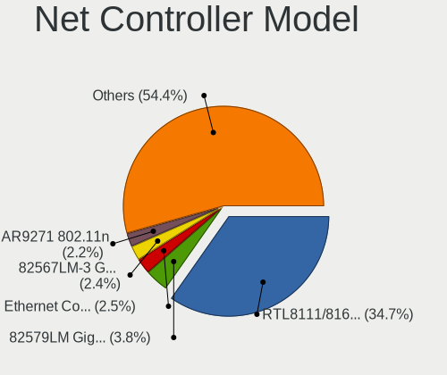

| Model                                                             | Desktops | Percent |
|-------------------------------------------------------------------|----------|---------|
| Realtek RTL8111/8168/8411 PCI Express Gigabit Ethernet Controller | 795      | 34.9%   |
| Intel 82579LM Gigabit Network Connection (Lewisville)             | 90       | 3.95%   |
| Qualcomm Atheros AR9271 802.11n                                   | 56       | 2.46%   |
| Intel 82567LM-3 Gigabit Network Connection                        | 52       | 2.28%   |
| Intel Ethernet Connection (2) I219-V                              | 51       | 2.24%   |
| Qualcomm Atheros QCA8171 Gigabit Ethernet                         | 47       | 2.06%   |
| Intel I211 Gigabit Network Connection                             | 37       | 1.62%   |
| Intel Ethernet Connection I217-LM                                 | 37       | 1.62%   |
| Realtek RTL810xE PCI Express Fast Ethernet controller             | 36       | 1.58%   |
| Intel 82566DM-2 Gigabit Network Connection                        | 36       | 1.58%   |
| Realtek RTL-8100/8101L/8139 PCI Fast Ethernet Adapter             | 35       | 1.54%   |
| Realtek RTL8188EUS 802.11n Wireless Network Adapter               | 30       | 1.32%   |
| Nvidia MCP61 Ethernet                                             | 28       | 1.23%   |
| Ralink MT7601U Wireless Adapter                                   | 27       | 1.19%   |
| Realtek RTL8169 PCI Gigabit Ethernet Controller                   | 24       | 1.05%   |
| Realtek RTL8125 2.5GbE Controller                                 | 22       | 0.97%   |
| Qualcomm Atheros AR8121/AR8113/AR8114 Gigabit or Fast Ethernet    | 21       | 0.92%   |
| Broadcom NetXtreme BCM5754 Gigabit Ethernet PCI Express           | 20       | 0.88%   |
| Intel 82579V Gigabit Network Connection                           | 17       | 0.75%   |
| Broadcom NetXtreme BCM5761 Gigabit Ethernet PCIe                  | 17       | 0.75%   |
| Qualcomm Atheros AR8131 Gigabit Ethernet                          | 16       | 0.7%    |
| Intel Ethernet Connection I217-V                                  | 16       | 0.7%    |
| Intel Ethernet Connection (2) I219-LM                             | 15       | 0.66%   |
| Marvell Group 88E8056 PCI-E Gigabit Ethernet Controller           | 14       | 0.61%   |
| TP-Link TL-WN722N v2/v3 [Realtek RTL8188EUS]                      | 13       | 0.57%   |
| Qualcomm Atheros AR9227 Wireless Network Adapter                  | 13       | 0.57%   |
| Intel 82567LF-3 Gigabit Network Connection                        | 13       | 0.57%   |
| TP-Link TL-WN821N Version 5 RTL8192EU                             | 12       | 0.53%   |
| Ralink RT5370 Wireless Adapter                                    | 12       | 0.53%   |
| Qualcomm Atheros AR8152 v2.0 Fast Ethernet                        | 12       | 0.53%   |
| Intel Ethernet Connection (7) I219-V                              | 12       | 0.53%   |
| Qualcomm Atheros AR9485 Wireless Network Adapter                  | 10       | 0.44%   |
| Qualcomm Atheros AR8151 v2.0 Gigabit Ethernet                     | 10       | 0.44%   |
| Intel Wi-Fi 6 AX200                                               | 10       | 0.44%   |
| Intel Ethernet Controller I225-V                                  | 10       | 0.44%   |
| Intel Dual Band Wireless-AC 3168NGW [Stone Peak]                  | 10       | 0.44%   |
| Broadcom Limited NetXtreme BCM5755 Gigabit Ethernet PCI Express   | 10       | 0.44%   |
| Qualcomm Atheros Attansic L1 Gigabit Ethernet                     | 9        | 0.4%    |
| Broadcom Limited NetXtreme BCM5754 Gigabit Ethernet PCI Express   | 9        | 0.4%    |
| Samsung Galaxy series, misc. (tethering mode)                     | 8        | 0.35%   |

Wireless Vendor
---------------

Wireless vendors

| Vendor                          | Desktops | Percent |
|---------------------------------|----------|---------|
| Realtek Semiconductor           | 96       | 20.3%   |
| Intel                           | 75       | 15.86%  |
| Qualcomm Atheros Communications | 64       | 13.53%  |
| Qualcomm Atheros                | 62       | 13.11%  |
| Ralink Technology               | 58       | 12.26%  |
| TP-Link                         | 45       | 9.51%   |
| Ralink                          | 19       | 4.02%   |
| ASUSTek Computer                | 11       | 2.33%   |
| Broadcom                        | 6        | 1.27%   |
| Microsoft                       | 5        | 1.06%   |
| IMC Networks                    | 5        | 1.06%   |
| Belkin Components               | 5        | 1.06%   |
| MediaTek                        | 4        | 0.85%   |
| Edimax Technology               | 3        | 0.63%   |
| ZyDAS                           | 2        | 0.42%   |
| NetGear                         | 2        | 0.42%   |
| D-Link System                   | 2        | 0.42%   |
| D-Link                          | 2        | 0.42%   |
| VIA Technologies                | 1        | 0.21%   |
| TRENDnet                        | 1        | 0.21%   |
| Texas Instruments               | 1        | 0.21%   |
| Mercucys                        | 1        | 0.21%   |
| Marvell Technology Group        | 1        | 0.21%   |
| Broadcom Limited                | 1        | 0.21%   |
| Accton Technology               | 1        | 0.21%   |

Wireless Model
--------------

Wireless models

| Model                                                                         | Desktops | Percent |
|-------------------------------------------------------------------------------|----------|---------|
| Qualcomm Atheros AR9271 802.11n                                               | 56       | 11.74%  |
| Realtek RTL8188EUS 802.11n Wireless Network Adapter                           | 30       | 6.29%   |
| Ralink MT7601U Wireless Adapter                                               | 27       | 5.66%   |
| TP-Link TL-WN722N v2/v3 [Realtek RTL8188EUS]                                  | 13       | 2.73%   |
| Qualcomm Atheros AR9227 Wireless Network Adapter                              | 13       | 2.73%   |
| TP-Link TL-WN821N Version 5 RTL8192EU                                         | 12       | 2.52%   |
| Ralink RT5370 Wireless Adapter                                                | 12       | 2.52%   |
| Qualcomm Atheros AR9485 Wireless Network Adapter                              | 10       | 2.1%    |
| Intel Wi-Fi 6 AX200                                                           | 10       | 2.1%    |
| Intel Dual Band Wireless-AC 3168NGW [Stone Peak]                              | 10       | 2.1%    |
| Realtek RTL8192EU 802.11b/g/n WLAN Adapter                                    | 8        | 1.68%   |
| Ralink RT2870/RT3070 Wireless Adapter                                         | 8        | 1.68%   |
| Ralink RT2561/RT61 802.11g PCI                                                | 8        | 1.68%   |
| Intel Wireless 7260                                                           | 8        | 1.68%   |
| Realtek RTL8192EE PCIe Wireless Network Adapter                               | 7        | 1.47%   |
| Realtek RTL8188EE Wireless Network Adapter                                    | 7        | 1.47%   |
| Qualcomm Atheros TP-Link TL-WN322G v3 / TL-WN422G v2 802.11g [Atheros AR9271] | 7        | 1.47%   |
| Qualcomm Atheros AR9287 Wireless Network Adapter (PCI-Express)                | 7        | 1.47%   |
| Qualcomm Atheros AR5212/5213/2414 Wireless Network Adapter                    | 7        | 1.47%   |
| Intel Wireless 3165                                                           | 7        | 1.47%   |
| Realtek 802.11ac NIC                                                          | 6        | 1.26%   |
| Intel Wireless-AC 9260                                                        | 6        | 1.26%   |
| Intel Wi-Fi 6 AX210/AX211/AX411 160MHz                                        | 6        | 1.26%   |
| TP-Link Archer T4U ver.3                                                      | 5        | 1.05%   |
| Realtek RTL88x2bu [AC1200 Techkey]                                            | 5        | 1.05%   |
| Realtek RTL8192CU 802.11n WLAN Adapter                                        | 5        | 1.05%   |
| Realtek RTL8188CUS 802.11n WLAN Adapter                                       | 5        | 1.05%   |
| Ralink RT2070 Wireless Adapter                                                | 5        | 1.05%   |
| Intel Wireless 7265                                                           | 5        | 1.05%   |
| TP-Link Archer T2U PLUS [RTL8821AU]                                           | 4        | 0.84%   |
| Realtek RTL8821CE 802.11ac PCIe Wireless Network Adapter                      | 4        | 0.84%   |
| Realtek RTL8821AE 802.11ac PCIe Wireless Network Adapter                      | 4        | 0.84%   |
| Ralink RT3090 Wireless 802.11n 1T/1R PCIe                                     | 4        | 0.84%   |
| Qualcomm Atheros AR9285 Wireless Network Adapter (PCI-Express)                | 4        | 0.84%   |
| Qualcomm Atheros AR2413/AR2414 Wireless Network Adapter [AR5005G(S) 802.11bg] | 4        | 0.84%   |
| Intel Wireless 3160                                                           | 4        | 0.84%   |
| Intel Cannon Lake PCH CNVi WiFi                                               | 4        | 0.84%   |
| IMC Networks Mediao 802.11n WLAN [Realtek RTL8191SU]                          | 4        | 0.84%   |
| TP-Link TL-WN823N v2/v3 [Realtek RTL8192EU]                                   | 3        | 0.63%   |
| TP-Link AC600 wireless Realtek RTL8811AU [Archer T2U Nano]                    | 3        | 0.63%   |

Ethernet Vendor
---------------

Ethernet vendors

| Vendor                                 | Desktops | Percent |
|----------------------------------------|----------|---------|
| Realtek Semiconductor                  | 909      | 51.97%  |
| Intel                                  | 446      | 25.5%   |
| Qualcomm Atheros                       | 130      | 7.43%   |
| Broadcom                               | 80       | 4.57%   |
| Broadcom Limited                       | 48       | 2.74%   |
| Nvidia                                 | 42       | 2.4%    |
| Marvell Technology Group               | 25       | 1.43%   |
| VIA Technologies                       | 10       | 0.57%   |
| Aquantia                               | 9        | 0.51%   |
| Samsung Electronics                    | 8        | 0.46%   |
| Xiaomi                                 | 7        | 0.4%    |
| Huawei Technologies                    | 5        | 0.29%   |
| D-Link System                          | 4        | 0.23%   |
| Qualcomm                               | 3        | 0.17%   |
| ASIX Electronics                       | 3        | 0.17%   |
| Accton Technology                      | 3        | 0.17%   |
| Sundance Technology Inc / IC Plus      | 2        | 0.11%   |
| JMicron Technology                     | 2        | 0.11%   |
| Edimax Technology                      | 2        | 0.11%   |
| Sony Ericsson Mobile Communications AB | 1        | 0.06%   |
| Silicon Integrated Systems [SiS]       | 1        | 0.06%   |
| QLogic                                 | 1        | 0.06%   |
| OnePlus Technology (Shenzhen)          | 1        | 0.06%   |
| MediaTek                               | 1        | 0.06%   |
| HMD Global                             | 1        | 0.06%   |
| Hangzhou Silan Microelectronics        | 1        | 0.06%   |
| Google                                 | 1        | 0.06%   |
| DisplayLink                            | 1        | 0.06%   |
| D-Link                                 | 1        | 0.06%   |
| American Megatrends                    | 1        | 0.06%   |

Ethernet Model
--------------

Ethernet models

| Model                                                             | Desktops | Percent |
|-------------------------------------------------------------------|----------|---------|
| Realtek RTL8111/8168/8411 PCI Express Gigabit Ethernet Controller | 795      | 44.49%  |
| Intel 82579LM Gigabit Network Connection (Lewisville)             | 90       | 5.04%   |
| Intel 82567LM-3 Gigabit Network Connection                        | 52       | 2.91%   |
| Intel Ethernet Connection (2) I219-V                              | 51       | 2.85%   |
| Qualcomm Atheros QCA8171 Gigabit Ethernet                         | 47       | 2.63%   |
| Intel I211 Gigabit Network Connection                             | 37       | 2.07%   |
| Intel Ethernet Connection I217-LM                                 | 37       | 2.07%   |
| Realtek RTL810xE PCI Express Fast Ethernet controller             | 36       | 2.01%   |
| Intel 82566DM-2 Gigabit Network Connection                        | 36       | 2.01%   |
| Realtek RTL-8100/8101L/8139 PCI Fast Ethernet Adapter             | 35       | 1.96%   |
| Nvidia MCP61 Ethernet                                             | 28       | 1.57%   |
| Realtek RTL8169 PCI Gigabit Ethernet Controller                   | 24       | 1.34%   |
| Realtek RTL8125 2.5GbE Controller                                 | 22       | 1.23%   |
| Qualcomm Atheros AR8121/AR8113/AR8114 Gigabit or Fast Ethernet    | 21       | 1.18%   |
| Broadcom NetXtreme BCM5754 Gigabit Ethernet PCI Express           | 20       | 1.12%   |
| Intel 82579V Gigabit Network Connection                           | 17       | 0.95%   |
| Broadcom NetXtreme BCM5761 Gigabit Ethernet PCIe                  | 17       | 0.95%   |
| Qualcomm Atheros AR8131 Gigabit Ethernet                          | 16       | 0.9%    |
| Intel Ethernet Connection I217-V                                  | 16       | 0.9%    |
| Intel Ethernet Connection (2) I219-LM                             | 15       | 0.84%   |
| Marvell Group 88E8056 PCI-E Gigabit Ethernet Controller           | 14       | 0.78%   |
| Intel 82567LF-3 Gigabit Network Connection                        | 13       | 0.73%   |
| Qualcomm Atheros AR8152 v2.0 Fast Ethernet                        | 12       | 0.67%   |
| Intel Ethernet Connection (7) I219-V                              | 12       | 0.67%   |
| Qualcomm Atheros AR8151 v2.0 Gigabit Ethernet                     | 10       | 0.56%   |
| Intel Ethernet Controller I225-V                                  | 10       | 0.56%   |
| Broadcom Limited NetXtreme BCM5755 Gigabit Ethernet PCI Express   | 10       | 0.56%   |
| Qualcomm Atheros Attansic L1 Gigabit Ethernet                     | 9        | 0.5%    |
| Broadcom Limited NetXtreme BCM5754 Gigabit Ethernet PCI Express   | 9        | 0.5%    |
| Samsung Galaxy series, misc. (tethering mode)                     | 8        | 0.45%   |
| Intel 82574L Gigabit Network Connection                           | 8        | 0.45%   |
| Broadcom Limited NetXtreme BCM5761 Gigabit Ethernet PCIe          | 8        | 0.45%   |
| VIA VT6102/VT6103 [Rhine-II]                                      | 7        | 0.39%   |
| Intel 82578DM Gigabit Network Connection                          | 7        | 0.39%   |
| Xiaomi Mi/Redmi series (RNDIS)                                    | 6        | 0.34%   |
| Realtek RTL8152 Fast Ethernet Adapter                             | 6        | 0.34%   |
| Realtek RTL-8110SC/8169SC Gigabit Ethernet                        | 6        | 0.34%   |
| Broadcom NetXtreme BCM5762 Gigabit Ethernet PCIe                  | 6        | 0.34%   |
| Broadcom NetXtreme BCM5751 Gigabit Ethernet PCI Express           | 6        | 0.34%   |
| Broadcom Limited NetXtreme BCM5751 Gigabit Ethernet PCI Express   | 6        | 0.34%   |

Net Controller Kind
-------------------

Ethernet, WiFi or modem

| Kind     | Desktops | Percent |
|----------|----------|---------|
| Ethernet | 1649     | 78.19%  |
| WiFi     | 447      | 21.19%  |
| Modem    | 11       | 0.52%   |
| Unknown  | 2        | 0.09%   |

Used Controller
---------------

Currently used network controller

| Kind     | Desktops | Percent |
|----------|----------|---------|
| Ethernet | 1426     | 83.29%  |
| WiFi     | 285      | 16.65%  |
| Modem    | 1        | 0.06%   |

NICs
----

Total network controllers on board

| Total | Desktops | Percent |
|-------|----------|---------|
| 1     | 1371     | 81.22%  |
| 2     | 259      | 15.34%  |
| 3     | 27       | 1.6%    |
| 0     | 26       | 1.54%   |
| 4     | 4        | 0.24%   |
| 5     | 1        | 0.06%   |

IPv6
----

IPv6 vs IPv4

| Used | Desktops | Percent |
|------|----------|---------|
| No   | 1402     | 80.16%  |
| Yes  | 347      | 19.84%  |

Bluetooth
---------

Bluetooth Vendor
----------------

Controller vendors

| Vendor                          | Desktops | Percent |
|---------------------------------|----------|---------|
| Cambridge Silicon Radio         | 114      | 43.02%  |
| Intel                           | 73       | 27.55%  |
| ASUSTek Computer                | 17       | 6.42%   |
| Broadcom                        | 15       | 5.66%   |
| Conwise Technology              | 7        | 2.64%   |
| Realtek Semiconductor           | 6        | 2.26%   |
| IMC Networks                    | 5        | 1.89%   |
| Belkin Components               | 5        | 1.89%   |
| Qualcomm Atheros Communications | 4        | 1.51%   |
| Logitech                        | 4        | 1.51%   |
| Integrated System Solution      | 4        | 1.51%   |
| TP-Link                         | 2        | 0.75%   |
| MediaTek                        | 2        | 0.75%   |
| Hewlett-Packard                 | 2        | 0.75%   |
| Foxconn / Hon Hai               | 2        | 0.75%   |
| Edimax Technology               | 2        | 0.75%   |
| Lite-On Technology              | 1        | 0.38%   |

Bluetooth Model
---------------

Controller models

| Model                                                   | Desktops | Percent |
|---------------------------------------------------------|----------|---------|
| Cambridge Silicon Radio Bluetooth Dongle (HCI mode)     | 114      | 43.02%  |
| Intel Bluetooth wireless interface                      | 27       | 10.19%  |
| Intel Wireless-AC 3168 Bluetooth                        | 10       | 3.77%   |
| Intel AX200 Bluetooth                                   | 10       | 3.77%   |
| Conwise CW6622                                          | 7        | 2.64%   |
| Intel Wireless-AC 9260 Bluetooth Adapter                | 6        | 2.26%   |
| Intel Bluetooth 9460/9560 Jefferson Peak (JfP)          | 6        | 2.26%   |
| Intel AX210 Bluetooth                                   | 6        | 2.26%   |
| Intel Bluetooth Device                                  | 5        | 1.89%   |
| ASUS Broadcom BCM20702A0 Bluetooth                      | 5        | 1.89%   |
| ASUS Bluetooth Device                                   | 5        | 1.89%   |
| Logitech BT Mini-Receiver (HCI mode)                    | 4        | 1.51%   |
| ASUS Bluetooth Radio                                    | 4        | 1.51%   |
| Intel Centrino Bluetooth Wireless Transceiver           | 3        | 1.13%   |
| Broadcom Bluetooth dongle                               | 3        | 1.13%   |
| Broadcom Bluetooth 3.0 Device                           | 3        | 1.13%   |
| TP-Link UB500 Adapter                                   | 2        | 0.75%   |
| Realtek  Bluetooth 4.2 Adapter                          | 2        | 0.75%   |
| Realtek Bluetooth Radio                                 | 2        | 0.75%   |
| Qualcomm Atheros  Bluetooth Device                      | 2        | 0.75%   |
| MediaTek Wireless_Device                                | 2        | 0.75%   |
| Integrated System Solution KY-BT100 Bluetooth Adapter   | 2        | 0.75%   |
| Integrated System Solution Bluetooth Device             | 2        | 0.75%   |
| IMC Networks Bluetooth Radio                            | 2        | 0.75%   |
| HP Bluetooth Adapter                                    | 2        | 0.75%   |
| Foxconn / Hon Hai Wireless_Device                       | 2        | 0.75%   |
| Edimax EW-7611ULB 802.11b/g/n and Bluetooth 4.0 Adapter | 2        | 0.75%   |
| Broadcom HP Portable Bumble Bee                         | 2        | 0.75%   |
| Broadcom BCM20702A0 Bluetooth 4.0                       | 2        | 0.75%   |
| Broadcom BCM2045 Bluetooth                              | 2        | 0.75%   |
| Broadcom BCM2035 Bluetooth dongle                       | 2        | 0.75%   |
| Belkin Components F8T013 Bluetooth Adapter              | 2        | 0.75%   |
| ASUS Qualcomm Bluetooth 4.1                             | 2        | 0.75%   |
| Realtek RTL8821A Bluetooth                              | 1        | 0.38%   |
| Realtek RTL8723B Bluetooth                              | 1        | 0.38%   |
| Qualcomm Atheros QCA61x4 Bluetooth 4.0                  | 1        | 0.38%   |
| Qualcomm Atheros AR3011 Bluetooth                       | 1        | 0.38%   |
| Lite-On Bluetooth Device                                | 1        | 0.38%   |
| IMC Networks Wireless_Device                            | 1        | 0.38%   |
| IMC Networks Bluetooth Device                           | 1        | 0.38%   |

Sound
-----

Sound Vendor
------------

Sound card vendors

| Vendor                               | Desktops | Percent |
|--------------------------------------|----------|---------|
| Intel                                | 1084     | 42.06%  |
| AMD                                  | 680      | 26.39%  |
| Nvidia                               | 549      | 21.3%   |
| C-Media Electronics                  | 85       | 3.3%    |
| Creative Labs                        | 41       | 1.59%   |
| Texas Instruments                    | 15       | 0.58%   |
| Logitech                             | 12       | 0.47%   |
| VIA Technologies                     | 10       | 0.39%   |
| Generalplus Technology               | 9        | 0.35%   |
| JMTek                                | 8        | 0.31%   |
| ASUSTek Computer                     | 8        | 0.31%   |
| Kingston Technology                  | 7        | 0.27%   |
| Plantronics                          | 5        | 0.19%   |
| Creative Technology                  | 5        | 0.19%   |
| BEHRINGER International              | 5        | 0.19%   |
| SteelSeries ApS                      | 4        | 0.16%   |
| Samson Technologies                  | 3        | 0.12%   |
| GN Netcom                            | 3        | 0.12%   |
| Focusrite-Novation                   | 3        | 0.12%   |
| Ensoniq                              | 3        | 0.12%   |
| Yamaha                               | 2        | 0.08%   |
| Promethean Limited                   | 2        | 0.08%   |
| ELMCU                                | 2        | 0.08%   |
| ATI Technologies                     | 2        | 0.08%   |
| Thesycon Systemsoftware & Consulting | 1        | 0.04%   |
| Tenx Technology                      | 1        | 0.04%   |
| Syntek                               | 1        | 0.04%   |
| Superlux digit                       | 1        | 0.04%   |
| Sunplus Technology                   | 1        | 0.04%   |
| SM950T Microphone                    | 1        | 0.04%   |
| Silicon Integrated Systems [SiS]     | 1        | 0.04%   |
| Rotel                                | 1        | 0.04%   |
| Realtek Semiconductor                | 1        | 0.04%   |
| Nektar                               | 1        | 0.04%   |
| MCS                                  | 1        | 0.04%   |
| LG Electronics                       | 1        | 0.04%   |
| KORG                                 | 1        | 0.04%   |
| JBL                                  | 1        | 0.04%   |
| Honda Tsushin Kogyo                  | 1        | 0.04%   |
| Hewlett-Packard                      | 1        | 0.04%   |

Sound Model
-----------

Sound card models

| Model                                                                             | Desktops | Percent |
|-----------------------------------------------------------------------------------|----------|---------|
| Intel NM10/ICH7 Family High Definition Audio Controller                           | 175      | 5.77%   |
| AMD SBx00 Azalia (Intel HDA)                                                      | 149      | 4.91%   |
| Intel 8 Series/C220 Series Chipset High Definition Audio Controller               | 148      | 4.88%   |
| Intel 6 Series/C200 Series Chipset Family High Definition Audio Controller        | 146      | 4.81%   |
| AMD FCH Azalia Controller                                                         | 132      | 4.35%   |
| Intel Xeon E3-1200 v3/4th Gen Core Processor HD Audio Controller                  | 104      | 3.43%   |
| Intel 7 Series/C216 Chipset Family High Definition Audio Controller               | 96       | 3.16%   |
| Nvidia GK208 HDMI/DP Audio Controller                                             | 89       | 2.93%   |
| Intel 100 Series/C230 Series Chipset Family HD Audio Controller                   | 72       | 2.37%   |
| Intel 200 Series PCH HD Audio                                                     | 71       | 2.34%   |
| Intel 82801JD/DO (ICH10 Family) HD Audio Controller                               | 66       | 2.18%   |
| Intel 82801I (ICH9 Family) HD Audio Controller                                    | 66       | 2.18%   |
| AMD Trinity HDMI Audio Controller                                                 | 65       | 2.14%   |
| AMD Family 17h (Models 00h-0fh) HD Audio Controller                               | 60       | 1.98%   |
| AMD Ellesmere HDMI Audio [Radeon RX 470/480 / 570/580/590]                        | 60       | 1.98%   |
| AMD Oland/Hainan/Cape Verde/Pitcairn HDMI Audio [Radeon HD 7000 Series]           | 59       | 1.94%   |
| AMD Starship/Matisse HD Audio Controller                                          | 53       | 1.75%   |
| Nvidia High Definition Audio Controller                                           | 52       | 1.71%   |
| AMD Caicos HDMI Audio [Radeon HD 6450 / 7450/8450/8490 OEM / R5 230/235/235X OEM] | 52       | 1.71%   |
| Intel 82801JI (ICH10 Family) HD Audio Controller                                  | 51       | 1.68%   |
| Nvidia GP107GL High Definition Audio Controller                                   | 45       | 1.48%   |
| AMD Family 17h/19h HD Audio Controller                                            | 44       | 1.45%   |
| AMD Cedar HDMI Audio [Radeon HD 5400/6300/7300 Series]                            | 37       | 1.22%   |
| Nvidia GF108 High Definition Audio Controller                                     | 36       | 1.19%   |
| Nvidia GP106 High Definition Audio Controller                                     | 35       | 1.15%   |
| Intel 5 Series/3400 Series Chipset High Definition Audio                          | 33       | 1.09%   |
| Nvidia MCP61 High Definition Audio                                                | 28       | 0.92%   |
| Nvidia GF119 HDMI Audio Controller                                                | 28       | 0.92%   |
| Intel Cannon Lake PCH cAVS                                                        | 25       | 0.82%   |
| AMD Baffin HDMI/DP Audio [Radeon RX 550 640SP / RX 560/560X]                      | 25       | 0.82%   |
| Nvidia GK107 HDMI Audio Controller                                                | 24       | 0.79%   |
| AMD RV710/730 HDMI Audio [Radeon HD 4000 series]                                  | 23       | 0.76%   |
| AMD Kabini HDMI/DP Audio                                                          | 22       | 0.73%   |
| Nvidia GP108 High Definition Audio Controller                                     | 21       | 0.69%   |
| Nvidia GM107 High Definition Audio Controller [GeForce 940MX]                     | 21       | 0.69%   |
| Intel 82801H (ICH8 Family) HD Audio Controller                                    | 21       | 0.69%   |
| C-Media Electronics CMI8738/CMI8768 PCI Audio                                     | 20       | 0.66%   |
| AMD Juniper HDMI Audio [Radeon HD 5700 Series]                                    | 20       | 0.66%   |
| AMD Raven/Raven2/Fenghuang HDMI/DP Audio Controller                               | 19       | 0.63%   |
| C-Media Electronics CMI8788 [Oxygen HD Audio]                                     | 18       | 0.59%   |

Memory
------

Memory Vendor
-------------

Memory module vendors

| Vendor                       | Desktops | Percent |
|------------------------------|----------|---------|
| Unknown                      | 427      | 26.33%  |
| Kingston                     | 376      | 23.18%  |
| SK hynix                     | 164      | 10.11%  |
| Samsung Electronics          | 160      | 9.86%   |
| Micron Technology            | 84       | 5.18%   |
| Kingmax                      | 66       | 4.07%   |
| Corsair                      | 57       | 3.51%   |
| Crucial                      | 54       | 3.33%   |
| G.Skill                      | 52       | 3.21%   |
| Nanya Technology             | 46       | 2.84%   |
| Elpida                       | 21       | 1.29%   |
| CSX                          | 15       | 0.92%   |
| Team                         | 14       | 0.86%   |
| Ramaxel Technology           | 11       | 0.68%   |
| Patriot                      | 8        | 0.49%   |
| Transcend                    | 6        | 0.37%   |
| Melco                        | 6        | 0.37%   |
| A-DATA Technology            | 6        | 0.37%   |
| Qimonda                      | 4        | 0.25%   |
| OCZ                          | 4        | 0.25%   |
| Kingmax Semiconductor        | 4        | 0.25%   |
| GeIL                         | 4        | 0.25%   |
| Apacer                       | 3        | 0.18%   |
| Silicon Power                | 2        | 0.12%   |
| Intersil                     | 2        | 0.12%   |
| H                            | 2        | 0.12%   |
| Golden Empire                | 2        | 0.12%   |
| 48spaces                     | 2        | 0.12%   |
| Unknown                      | 2        | 0.12%   |
| ZION                         | 1        | 0.06%   |
| Unknown (ABCD)               | 1        | 0.06%   |
| Unknown (7F7F7F7F7F970000)   | 1        | 0.06%   |
| Unknown (09D5)               | 1        | 0.06%   |
| Unigen                       | 1        | 0.06%   |
| Toshiba-0098                 | 1        | 0.06%   |
| Toshiba                      | 1        | 0.06%   |
| SGS/Thomson                  | 1        | 0.06%   |
| Ramos Technology             | 1        | 0.06%   |
| Princeton                    | 1        | 0.06%   |
| Patriot Memory (PDP Systems) | 1        | 0.06%   |

Memory Model
------------

Memory module models

| Model                                                  | Desktops | Percent |
|--------------------------------------------------------|----------|---------|
| Kingston RAM KHX1600C10D3/4G 4GB DIMM DDR3 1600MT/s    | 44       | 2.34%   |
| Unknown RAM Module 2048MB DIMM 800MT/s                 | 40       | 2.12%   |
| Unknown RAM Module 2048MB DIMM SDRAM                   | 34       | 1.8%    |
| Kingston RAM KHX1600C10D3/8G 8GB DIMM DDR3 1648MT/s    | 22       | 1.17%   |
| Kingston RAM KHX1600C9D3/4GX 4096MB DIMM DDR3 1600MT/s | 21       | 1.11%   |
| Unknown RAM Module 4096MB DIMM DDR3 1333MT/s           | 19       | 1.01%   |
| Unknown RAM Module 2048MB DIMM DDR2 800MT/s            | 19       | 1.01%   |
| Unknown RAM Module 1024MB DIMM SDRAM                   | 18       | 0.96%   |
| Unknown RAM Module 1024MB DIMM 800MT/s                 | 17       | 0.9%    |
| Unknown RAM Module 2048MB DIMM 1333MT/s                | 16       | 0.85%   |
| Kingston RAM 99U5584-005.A00LF 4GB DIMM DDR3 1600MT/s  | 16       | 0.85%   |
| Unknown RAM Module 4096MB DIMM 1333MT/s                | 15       | 0.8%    |
| Unknown RAM Module 2048MB DIMM DDR2 667MT/s            | 13       | 0.69%   |
| Unknown RAM Module 1024MB DIMM DDR2 667MT/s            | 13       | 0.69%   |
| Micron RAM 8KTF51264AZ-1G6E1 4GB DIMM DDR3 1600MT/s    | 13       | 0.69%   |
| Kingston RAM KHX3200C16D4/8GX 8GB DIMM DDR4 3733MT/s   | 13       | 0.69%   |
| Kingston RAM KHX2666C16/8G 8GB DIMM DDR4 3466MT/s      | 13       | 0.69%   |
| Samsung RAM M378B5773DH0-CH9 2GB DIMM DDR3 1333MT/s    | 12       | 0.64%   |
| G.Skill RAM F4-3000C16-8GISB 8192MB DIMM DDR4 3200MT/s | 11       | 0.58%   |
| Unknown RAM Module 1024MB DIMM DDR2 800MT/s            | 10       | 0.53%   |
| Samsung RAM M378B5273DH0-CH9 4096MB DIMM DDR2 2133MT/s | 10       | 0.53%   |
| Samsung RAM M378B5173QH0-CK0 4GB DIMM DDR3 1600MT/s    | 10       | 0.53%   |
| Unknown RAM Module 1024MB DIMM 667MT/s                 | 9        | 0.48%   |
| Samsung RAM M378B5173DB0-CK0 4GB DIMM DDR3 1600MT/s    | 9        | 0.48%   |
| Micron RAM 8JTF51264AZ-1G6E1 4GB DIMM DDR3 1600MT/s    | 9        | 0.48%   |
| Unknown RAM Module 4GB DIMM 1333MT/s                   | 8        | 0.42%   |
| Unknown RAM Module 4096MB DIMM 400MT/s                 | 8        | 0.42%   |
| Unknown RAM Module 4096MB DIMM 1600MT/s                | 8        | 0.42%   |
| Unknown RAM Module 2048MB DIMM 667MT/s                 | 8        | 0.42%   |
| SK hynix RAM HMT351U6CFR8C-PB 4GB DIMM DDR3 1800MT/s   | 8        | 0.42%   |
| Samsung RAM M378B5773CH0-CH9 2GB DIMM DDR3 1867MT/s    | 8        | 0.42%   |
| Samsung RAM M378B5673FH0-CH9 2GB DIMM DDR3 1600MT/s    | 8        | 0.42%   |
| Samsung RAM M378B5673EH1-CH9 2GB DIMM DDR3 1333MT/s    | 8        | 0.42%   |
| Samsung RAM M3 78T5663QZ3-CF7 2GB DIMM DDR2 800MT/s    | 8        | 0.42%   |
| Kingston RAM KHX2400C15D4/4G 4GB DIMM DDR4 3151MT/s    | 8        | 0.42%   |
| Kingston RAM KHX1866C10D3/8G 8GB DIMM DDR3 2133MT/s    | 8        | 0.42%   |
| G.Skill RAM F4-3200C16-8GIS 8GB DIMM DDR4 3200MT/s     | 8        | 0.42%   |
| Unknown RAM Module 512MB DIMM SDRAM                    | 7        | 0.37%   |
| Unknown RAM Module 4096MB DIMM SDRAM                   | 7        | 0.37%   |
| Unknown RAM Module 2048MB DIMM 400MT/s                 | 7        | 0.37%   |

Memory Kind
-----------

Memory module kinds

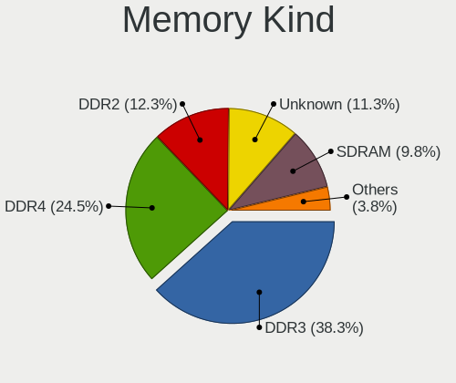

| Kind    | Desktops | Percent |
|---------|----------|---------|
| DDR3    | 538      | 38.13%  |
| DDR4    | 313      | 22.18%  |
| DDR2    | 188      | 13.32%  |
| Unknown | 170      | 12.05%  |
| SDRAM   | 150      | 10.63%  |
| DDR     | 42       | 2.98%   |
| DDR5    | 7        | 0.5%    |
| LPDDR4  | 2        | 0.14%   |
| DRAM    | 1        | 0.07%   |

Memory Form Factor
------------------

Physical design of the memory module

| Name         | Desktops | Percent |
|--------------|----------|---------|
| DIMM         | 1298     | 96.43%  |
| SODIMM       | 42       | 3.12%   |
| RIMM         | 4        | 0.3%    |
| Row Of Chips | 1        | 0.07%   |
| FB-DIMM      | 1        | 0.07%   |

Memory Size
-----------

Memory module size

| Size  | Desktops | Percent |
|-------|----------|---------|
| 4096  | 497      | 31.74%  |
| 2048  | 436      | 27.84%  |
| 8192  | 309      | 19.73%  |
| 1024  | 191      | 12.2%   |
| 16384 | 75       | 4.79%   |
| 512   | 32       | 2.04%   |
| 32768 | 22       | 1.4%    |
| 256   | 4        | 0.26%   |

Memory Speed
------------

Memory module speed

| Speed   | Desktops | Percent |
|---------|----------|---------|
| 1600    | 278      | 17.51%  |
| 1333    | 240      | 15.11%  |
| 800     | 168      | 10.58%  |
| 667     | 97       | 6.11%   |
| 2400    | 80       | 5.04%   |
| Unknown | 79       | 4.97%   |
| 2133    | 74       | 4.66%   |
| 1866    | 67       | 4.22%   |
| 3200    | 56       | 3.53%   |
| 1867    | 41       | 2.58%   |
| 3600    | 36       | 2.27%   |
| 2667    | 33       | 2.08%   |
| 400     | 33       | 2.08%   |
| 1066    | 29       | 1.83%   |
| 533     | 23       | 1.45%   |
| 1800    | 19       | 1.2%    |
| 3733    | 18       | 1.13%   |
| 2666    | 16       | 1.01%   |
| 2933    | 15       | 0.94%   |
| 2048    | 15       | 0.94%   |
| 3400    | 14       | 0.88%   |
| 3000    | 14       | 0.88%   |
| 1067    | 14       | 0.88%   |
| 3466    | 13       | 0.82%   |
| 1639    | 10       | 0.63%   |
| 2000    | 9        | 0.57%   |
| 49926   | 8        | 0.5%    |
| 3151    | 8        | 0.5%    |
| 1648    | 7        | 0.44%   |
| 1334    | 6        | 0.38%   |
| 5808    | 5        | 0.31%   |
| 3334    | 5        | 0.31%   |
| 3333    | 4        | 0.25%   |
| 1400    | 4        | 0.25%   |
| 333     | 4        | 0.25%   |
| 3933    | 3        | 0.19%   |
| 2733    | 3        | 0.19%   |
| 2200    | 3        | 0.19%   |
| 2134    | 3        | 0.19%   |
| 1331    | 3        | 0.19%   |

Printers & scanners
-------------------

Printer Vendor
--------------

Printer device vendors

| Vendor                | Desktops | Percent |
|-----------------------|----------|---------|
| Hewlett-Packard       | 52       | 50.49%  |
| Samsung Electronics   | 24       | 23.3%   |
| Canon                 | 12       | 11.65%  |
| Brother Industries    | 5        | 4.85%   |
| Seiko Epson           | 4        | 3.88%   |
| QinHeng Electronics   | 2        | 1.94%   |
| Xerox                 | 1        | 0.97%   |
| STMicroelectronics    | 1        | 0.97%   |
| Prolific Technology   | 1        | 0.97%   |
| Lexmark International | 1        | 0.97%   |

Printer Model
-------------

Printer device models

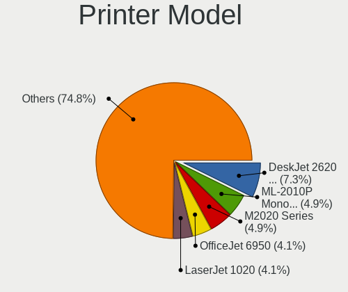

| Model                                                     | Desktops | Percent |
|-----------------------------------------------------------|----------|---------|
| HP DeskJet 2600 series                                    | 9        | 8.57%   |
| Samsung ML-2010P Mono Laser Printer                       | 5        | 4.76%   |
| Samsung M2020 Series                                      | 5        | 4.76%   |
| Samsung ML-1640 Series Laser Printer                      | 4        | 3.81%   |
| HP LaserJet 1020                                          | 4        | 3.81%   |
| HP Deskjet 2050 J510                                      | 3        | 2.86%   |
| Samsung SCX-3400 Series                                   | 2        | 1.9%    |
| Samsung C48x Series                                       | 2        | 1.9%    |
| QinHeng CH340S                                            | 2        | 1.9%    |
| HP OfficeJet 6950                                         | 2        | 1.9%    |
| HP LaserJet P1005                                         | 2        | 1.9%    |
| HP LaserJet 1018                                          | 2        | 1.9%    |
| HP LaserJet 1010                                          | 2        | 1.9%    |
| HP LaserJet 1000                                          | 2        | 1.9%    |
| HP DeskJet F4100 Printer series                           | 2        | 1.9%    |
| HP Deskjet F2280 series                                   | 2        | 1.9%    |
| HP DeskJet F2100 Printer series                           | 2        | 1.9%    |
| HP DeskJet 840c                                           | 2        | 1.9%    |
| HP Deskjet 3520 series                                    | 2        | 1.9%    |
| HP DeskJet 2130 series                                    | 2        | 1.9%    |
| Canon TS5100 series                                       | 2        | 1.9%    |
| Canon LiDE 400                                            | 2        | 1.9%    |
| Brother HL-1110 series                                    | 2        | 1.9%    |
| Xerox WorkCentre 3119 Series                              | 1        | 0.95%   |
| STMicroelectronics LED badge -- mini LED display -- 11x44 | 1        | 0.95%   |
| Seiko Epson Stylus NX230/SX235W Series                    | 1        | 0.95%   |
| Seiko Epson Printer                                       | 1        | 0.95%   |
| Seiko Epson ME 320/330 Series [Stylus SX125]              | 1        | 0.95%   |
| Seiko Epson ET-2600 Series                                | 1        | 0.95%   |
| Samsung SCX-4650 4x21S Series                             | 1        | 0.95%   |
| Samsung SCX-4623 Series                                   | 1        | 0.95%   |
| Samsung ML-1660 Series                                    | 1        | 0.95%   |
| Samsung ML-1630 Series                                    | 1        | 0.95%   |
| Samsung M2070 Series                                      | 1        | 0.95%   |
| Samsung CLP-310 Color Laser Printer                       | 1        | 0.95%   |
| Prolific PL2305 Parallel Port                             | 1        | 0.95%   |
| Lexmark International InkJet Color Printer                | 1        | 0.95%   |
| HP Smart Install                                          | 1        | 0.95%   |
| HP LaserJet Pro M12a                                      | 1        | 0.95%   |
| HP LaserJet P1102                                         | 1        | 0.95%   |

Scanner Vendor
--------------

Scanner device vendors

| Vendor          | Desktops | Percent |
|-----------------|----------|---------|
| Canon           | 14       | 70%     |
| Hewlett-Packard | 4        | 20%     |
| UMAX            | 1        | 5%      |
| Mustek Systems  | 1        | 5%      |

Scanner Model
-------------

Scanner device models

| Model                              | Desktops | Percent |
|------------------------------------|----------|---------|
| Canon CanoScan N670U/N676U/LiDE 20 | 5        | 25%     |
| HP Scanjet 300                     | 2        | 10%     |
| Canon CanoScan LIDE 25             | 2        | 10%     |
| Canon CanoScan LiDE 120            | 2        | 10%     |
| Canon CanoScan LiDE 110            | 2        | 10%     |
| UMAX Astra 4400/4450               | 1        | 5%      |
| Mustek Systems SNAPSCAN e22        | 1        | 5%      |
| HP ScanJet 3770                    | 1        | 5%      |
| HP ScanJet 2400c                   | 1        | 5%      |
| Canon CanoScan N1240U/LiDE 30      | 1        | 5%      |
| Canon CanoScan LiDE 220            | 1        | 5%      |
| Canon CanoScan LiDE 100            | 1        | 5%      |

Camera
------

Camera Vendor
-------------

Camera device vendors

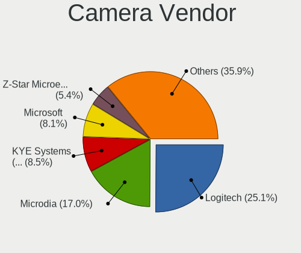

| Vendor                        | Desktops | Percent |
|-------------------------------|----------|---------|
| Logitech                      | 54       | 24.43%  |
| Microdia                      | 37       | 16.74%  |
| Microsoft                     | 18       | 8.14%   |
| KYE Systems (Mouse Systems)   | 17       | 7.69%   |
| Z-Star Microelectronics       | 14       | 6.33%   |
| GEMBIRD                       | 10       | 4.52%   |
| Trust                         | 6        | 2.71%   |
| Samsung Electronics           | 6        | 2.71%   |
| Aveo Technology               | 5        | 2.26%   |
| Arkmicro Technologies         | 5        | 2.26%   |
| Pixart Imaging                | 4        | 1.81%   |
| LG Electronics                | 4        | 1.81%   |
| Generalplus Technology        | 4        | 1.81%   |
| Sunplus Innovation Technology | 3        | 1.36%   |
| Realtek Semiconductor         | 3        | 1.36%   |
| MacroSilicon                  | 3        | 1.36%   |
| Cubeternet                    | 3        | 1.36%   |
| Creative Technology           | 3        | 1.36%   |
| Chicony Electronics           | 3        | 1.36%   |
| Apple                         | 3        | 1.36%   |
| Unknown                       | 2        | 0.9%    |
| Jieli Technology              | 2        | 0.9%    |
| IMC Networks                  | 2        | 0.9%    |
| Hewlett-Packard               | 2        | 0.9%    |
| Xiongmai                      | 1        | 0.45%   |
| Teslong Camera                | 1        | 0.45%   |
| Sonix Technology              | 1        | 0.45%   |
| Silicon Motion                | 1        | 0.45%   |
| OmniVision Technologies       | 1        | 0.45%   |
| AVerMedia Technologies        | 1        | 0.45%   |
| ANYKA                         | 1        | 0.45%   |
| Alcor Micro                   | 1        | 0.45%   |

Camera Model
------------

Camera device models

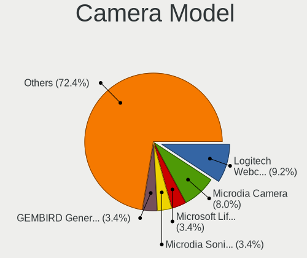

| Model                                                 | Desktops | Percent |
|-------------------------------------------------------|----------|---------|
| Logitech Webcam C270                                  | 19       | 8.56%   |
| Microdia Camera                                       | 17       | 7.66%   |
| Microdia Sonix USB 2.0 Camera                         | 8        | 3.6%    |
| GEMBIRD Generic UVC 1.00 camera [AppoTech AX2311]     | 8        | 3.6%    |
| Microsoft LifeCam HD-3000                             | 7        | 3.15%   |
| Logitech Webcam C600                                  | 7        | 3.15%   |
| Z-Star Venus USB2.0 Camera                            | 6        | 2.7%    |
| Samsung Galaxy series, misc. (MTP mode)               | 6        | 2.7%    |
| Z-Star A4 TECH USB2.0 PC Camera E                     | 5        | 2.25%   |
| Logitech Webcam C170                                  | 5        | 2.25%   |
| Logitech HD Webcam C525                               | 5        | 2.25%   |
| KYE Systems (Mouse Systems) iSlim 321R                | 5        | 2.25%   |
| Arkmicro USB2.0 PC CAMERA                             | 5        | 2.25%   |
| KYE Systems (Mouse Systems) Genius FaceCam 320        | 4        | 1.8%    |
| Pixart Imaging GE 1.3 MP MiniCam Pro                  | 3        | 1.35%   |
| Microsoft LifeCam VX-2000                             | 3        | 1.35%   |
| Microsoft LifeCam Studio                              | 3        | 1.35%   |
| Microdia USB Camera                                   | 3        | 1.35%   |
| KYE Systems (Mouse Systems) Genius Webcam             | 3        | 1.35%   |
| Aveo USB2.0 Camera                                    | 3        | 1.35%   |
| Apple iPhone 5/5C/5S/6/SE                             | 3        | 1.35%   |
| Z-Star Saturn USB 2.0 Camera                          | 2        | 0.9%    |
| Unknown HD camera                                     | 2        | 0.9%    |
| Trust Full HD Webcam                                  | 2        | 0.9%    |
| Trust 17676 Webcam                                    | 2        | 0.9%    |
| Sunplus Full HD webcam                                | 2        | 0.9%    |
| Microsoft LifeCam VX-800                              | 2        | 0.9%    |
| Microdia Webcam Vitade AF                             | 2        | 0.9%    |
| Microdia USB 2.0 Camera                               | 2        | 0.9%    |
| Microdia Integrated Camera                            | 2        | 0.9%    |
| Microdia Defender G-Lens 2577 HD720p Camera           | 2        | 0.9%    |
| MacroSilicon MS210x Video Grabber [EasierCAP]         | 2        | 0.9%    |
| Logitech Webcam C200                                  | 2        | 0.9%    |
| Logitech QuickCam Pro 9000                            | 2        | 0.9%    |
| Logitech QuickCam Communicate Deluxe/S7500            | 2        | 0.9%    |
| Logitech C920 PRO HD Webcam                           | 2        | 0.9%    |
| LG LM-X420xxx/G2/G3 Android Phone (MTP/download mode) | 2        | 0.9%    |
| KYE Systems (Mouse Systems) Genius WideCam F100       | 2        | 0.9%    |
| KYE Systems (Mouse Systems) FaceCam 1000X             | 2        | 0.9%    |
| Jieli USB PHY 2.0                                     | 2        | 0.9%    |

Security
--------

Fingerprint Vendor
------------------

Fingerprint sensor vendors

| Vendor                | Desktops | Percent |
|-----------------------|----------|---------|
| Upek                  | 1        | 50%     |
| Elan Microelectronics | 1        | 50%     |

Fingerprint Model
-----------------

Fingerprint sensor models

| Model                                                  | Desktops | Percent |
|--------------------------------------------------------|----------|---------|
| Upek Biometric Touchchip/Touchstrip Fingerprint Sensor | 1        | 50%     |
| Elan fingerprint sensor [FeinTech FPS00200]            | 1        | 50%     |

Chipcard Vendor
---------------

Chipcard module vendors

| Vendor                    | Desktops | Percent |
|---------------------------|----------|---------|
| Gemalto (was Gemplus)     | 3        | 37.5%   |
| Reiner SCT Kartensysteme  | 2        | 25%     |
| OmniKey                   | 1        | 12.5%   |
| Aladdin Knowledge Systems | 1        | 12.5%   |
| Advanced Card Systems     | 1        | 12.5%   |

Chipcard Model
--------------

Chipcard module models

| Model                                                                      | Desktops | Percent |
|----------------------------------------------------------------------------|----------|---------|
| Reiner SCT Kartensysteme cyberJack RFID basis contactless smartcard reader | 2        | 25%     |
| Gemalto (was Gemplus) GemPC Twin SmartCard Reader                          | 2        | 25%     |
| OmniKey CardMan 3121 (HID Technologies)                                    | 1        | 12.5%   |
| Gemalto (was Gemplus) GemPC Key SmartCard Reader                           | 1        | 12.5%   |
| Aladdin Knowledge Systems Token JC                                         | 1        | 12.5%   |
| Advanced Card Systems ACR1252 Dual Reader                                  | 1        | 12.5%   |

Unsupported
-----------

Unsupported Devices
-------------------

Total unsupported devices on board

| Total | Desktops | Percent |
|-------|----------|---------|
| 0     | 1498     | 86.84%  |
| 1     | 207      | 12%     |
| 2     | 16       | 0.93%   |
| 3     | 2        | 0.12%   |
| 5     | 1        | 0.06%   |
| 4     | 1        | 0.06%   |

Unsupported Device Types
------------------------

Types of unsupported devices

| Type                     | Desktops | Percent |
|--------------------------|----------|---------|
| Graphics card            | 145      | 59.43%  |
| Net/wireless             | 30       | 12.3%   |
| Communication controller | 16       | 6.56%   |
| Unassigned class         | 12       | 4.92%   |
| Multimedia controller    | 9        | 3.69%   |
| Storage/raid             | 5        | 2.05%   |
| Camera                   | 5        | 2.05%   |
| Chipcard                 | 4        | 1.64%   |
| Sound                    | 3        | 1.23%   |
| Net/ethernet             | 3        | 1.23%   |
| Storage/ide              | 2        | 0.82%   |
| Fingerprint reader       | 2        | 0.82%   |
| Card reader              | 2        | 0.82%   |
| Bluetooth                | 2        | 0.82%   |
| Storage/ata              | 1        | 0.41%   |
| Storage                  | 1        | 0.41%   |
| Network                  | 1        | 0.41%   |
| Dvb card                 | 1        | 0.41%   |

