Linux in Hungary - Tested Hardware & Statistics (Notebooks)
-----------------------------------------------------------

A project to collect tested hardware configurations for Linux in Hungary.

Anyone can contribute to this report by the [hw-probe](https://github.com/linuxhw/hw-probe) tool:

    sudo -E hw-probe -all -upload

Please contribute! Especially if your hardware is rare.

Contents
--------

* [ Test Cases ](#test-cases)

* [ System ](#system)
  - [ OS                       ](#os)
  - [ OS Family                ](#os-family)
  - [ Kernel                   ](#kernel)
  - [ Kernel Family            ](#kernel-family)
  - [ Kernel Major Ver.        ](#kernel-major-ver)
  - [ Arch                     ](#arch)
  - [ DE                       ](#de)
  - [ Display Server           ](#display-server)
  - [ Display Manager          ](#display-manager)
  - [ OS Lang                  ](#os-lang)
  - [ Boot Mode                ](#boot-mode)
  - [ Filesystem               ](#filesystem)
  - [ Part. scheme             ](#part-scheme)
  - [ Dual Boot with Linux/BSD ](#dual-boot-with-linuxbsd)
  - [ Dual Boot (Win)          ](#dual-boot-win)

* [ Board ](#board)
  - [ Vendor                   ](#vendor)
  - [ Model                    ](#model)
  - [ Model Family             ](#model-family)
  - [ MFG Year                 ](#mfg-year)
  - [ Form Factor              ](#form-factor)
  - [ Secure Boot              ](#secure-boot)
  - [ Coreboot                 ](#coreboot)
  - [ RAM Size                 ](#ram-size)
  - [ RAM Used                 ](#ram-used)
  - [ Total Drives             ](#total-drives)
  - [ Has CD-ROM               ](#has-cd-rom)
  - [ Has Ethernet             ](#has-ethernet)
  - [ Has WiFi                 ](#has-wifi)
  - [ Has Bluetooth            ](#has-bluetooth)

* [ Location ](#location)
  - [ Country                  ](#country)
  - [ City                     ](#city)

* [ Drives ](#drives)
  - [ Drive Vendor             ](#drive-vendor)
  - [ Drive Model              ](#drive-model)
  - [ HDD Vendor               ](#hdd-vendor)
  - [ SSD Vendor               ](#ssd-vendor)
  - [ Drive Kind               ](#drive-kind)
  - [ Drive Connector          ](#drive-connector)
  - [ Drive Size               ](#drive-size)
  - [ Space Total              ](#space-total)
  - [ Space Used               ](#space-used)
  - [ Malfunc. Drives          ](#malfunc-drives)
  - [ Malfunc. Drive Vendor    ](#malfunc-drive-vendor)
  - [ Malfunc. HDD Vendor      ](#malfunc-hdd-vendor)
  - [ Malfunc. Drive Kind      ](#malfunc-drive-kind)
  - [ Failed Drives            ](#failed-drives)
  - [ Failed Drive Vendor      ](#failed-drive-vendor)
  - [ Drive Status             ](#drive-status)

* [ Storage controller ](#storage-controller)
  - [ Storage Vendor           ](#storage-vendor)
  - [ Storage Model            ](#storage-model)
  - [ Storage Kind             ](#storage-kind)

* [ Processor ](#processor)
  - [ CPU Vendor               ](#cpu-vendor)
  - [ CPU Model                ](#cpu-model)
  - [ CPU Model Family         ](#cpu-model-family)
  - [ CPU Cores                ](#cpu-cores)
  - [ CPU Sockets              ](#cpu-sockets)
  - [ CPU Threads              ](#cpu-threads)
  - [ CPU Op-Modes             ](#cpu-op-modes)
  - [ CPU Microcode            ](#cpu-microcode)
  - [ CPU Microarch            ](#cpu-microarch)

* [ Graphics ](#graphics)
  - [ GPU Vendor               ](#gpu-vendor)
  - [ GPU Model                ](#gpu-model)
  - [ GPU Combo                ](#gpu-combo)
  - [ GPU Driver               ](#gpu-driver)
  - [ GPU Memory               ](#gpu-memory)

* [ Monitor ](#monitor)
  - [ Monitor Vendor           ](#monitor-vendor)
  - [ Monitor Model            ](#monitor-model)
  - [ Monitor Resolution       ](#monitor-resolution)
  - [ Monitor Diagonal         ](#monitor-diagonal)
  - [ Monitor Width            ](#monitor-width)
  - [ Aspect Ratio             ](#aspect-ratio)
  - [ Monitor Area             ](#monitor-area)
  - [ Pixel Density            ](#pixel-density)
  - [ Multiple Monitors        ](#multiple-monitors)

* [ Network ](#network)
  - [ Net Controller Vendor    ](#net-controller-vendor)
  - [ Net Controller Model     ](#net-controller-model)
  - [ Wireless Vendor          ](#wireless-vendor)
  - [ Wireless Model           ](#wireless-model)
  - [ Ethernet Vendor          ](#ethernet-vendor)
  - [ Ethernet Model           ](#ethernet-model)
  - [ Net Controller Kind      ](#net-controller-kind)
  - [ Used Controller          ](#used-controller)
  - [ NICs                     ](#nics)
  - [ IPv6                     ](#ipv6)

* [ Bluetooth ](#bluetooth)
  - [ Bluetooth Vendor         ](#bluetooth-vendor)
  - [ Bluetooth Model          ](#bluetooth-model)

* [ Sound ](#sound)
  - [ Sound Vendor             ](#sound-vendor)
  - [ Sound Model              ](#sound-model)

* [ Memory ](#memory)
  - [ Memory Vendor            ](#memory-vendor)
  - [ Memory Model             ](#memory-model)
  - [ Memory Kind              ](#memory-kind)
  - [ Memory Form Factor       ](#memory-form-factor)
  - [ Memory Size              ](#memory-size)
  - [ Memory Speed             ](#memory-speed)

* [ Printers & scanners ](#printers--scanners)
  - [ Printer Vendor           ](#printer-vendor)
  - [ Printer Model            ](#printer-model)
  - [ Scanner Vendor           ](#scanner-vendor)
  - [ Scanner Model            ](#scanner-model)

* [ Camera ](#camera)
  - [ Camera Vendor            ](#camera-vendor)
  - [ Camera Model             ](#camera-model)

* [ Security ](#security)
  - [ Fingerprint Vendor       ](#fingerprint-vendor)
  - [ Fingerprint Model        ](#fingerprint-model)
  - [ Chipcard Vendor          ](#chipcard-vendor)
  - [ Chipcard Model           ](#chipcard-model)

* [ Unsupported ](#unsupported)
  - [ Unsupported Devices      ](#unsupported-devices)
  - [ Unsupported Device Types ](#unsupported-device-types)

Test Cases
----------

Total: 6892

| Vendor        | Model                       | Probe                                                      | Date         |
|---------------|-----------------------------|------------------------------------------------------------|--------------|
| Lenovo        | IdeaPad 330-15IKB 81DE      | [c6451c69d3](https://linux-hardware.org/?probe=c6451c69d3) | Jan 03, 2026 |
| Dell          | Inspiron 3521               | [cd3b444121](https://linux-hardware.org/?probe=cd3b444121) | Jan 03, 2026 |
| Lenovo        | ThinkPad T430 2349KB4       | [8e572aee26](https://linux-hardware.org/?probe=8e572aee26) | Jan 03, 2026 |
| Dell          | Latitude E6410              | [242be79a5b](https://linux-hardware.org/?probe=242be79a5b) | Jan 02, 2026 |
| Dell          | Latitude E6520              | [68c8a0914f](https://linux-hardware.org/?probe=68c8a0914f) | Jan 01, 2026 |
| ASUSTek       | X550CC                      | [c7aeb3aac1](https://linux-hardware.org/?probe=c7aeb3aac1) | Dec 31, 2025 |
| Lenovo        | ThinkPad T450 20BUA0AEHV    | [824c8bdc38](https://linux-hardware.org/?probe=824c8bdc38) | Dec 31, 2025 |
| Lenovo        | IdeaPad Gaming 3 15ARH7 ... | [47117fefda](https://linux-hardware.org/?probe=47117fefda) | Dec 30, 2025 |
| Dell          | Vostro 5471                 | [493c761f0b](https://linux-hardware.org/?probe=493c761f0b) | Dec 29, 2025 |
| HP            | Pavilion Gaming Laptop 1... | [a6a0b5b1bf](https://linux-hardware.org/?probe=a6a0b5b1bf) | Dec 27, 2025 |
| Lenovo        | ThinkPad P1 Gen 2 20QUS0... | [a23c411797](https://linux-hardware.org/?probe=a23c411797) | Dec 26, 2025 |
| HP            | Laptop 15-bs1xx             | [14fc3f560e](https://linux-hardware.org/?probe=14fc3f560e) | Dec 26, 2025 |
| Samsung       | RV409/RV509/RV709           | [b7b1a6b4d3](https://linux-hardware.org/?probe=b7b1a6b4d3) | Dec 26, 2025 |
| ASUSTek       | X555LJ                      | [aaf3fdfc13](https://linux-hardware.org/?probe=aaf3fdfc13) | Dec 26, 2025 |
| Apple         | MacBookPro13,3              | [664658422b](https://linux-hardware.org/?probe=664658422b) | Dec 25, 2025 |
| Lenovo        | ThinkPad T450 20BUS06E00    | [7ff61d7afe](https://linux-hardware.org/?probe=7ff61d7afe) | Dec 25, 2025 |
| Lenovo        | ThinkPad X201 3680AV3       | [d0696c7e47](https://linux-hardware.org/?probe=d0696c7e47) | Dec 24, 2025 |
| Medion        | Akoya E1317T                | [b27563db99](https://linux-hardware.org/?probe=b27563db99) | Dec 24, 2025 |
| Acer          | Aspire E1-532               | [dd001f8488](https://linux-hardware.org/?probe=dd001f8488) | Dec 24, 2025 |
| Acer          | Aspire E1-532               | [7e9927a22e](https://linux-hardware.org/?probe=7e9927a22e) | Dec 24, 2025 |
| Dell          | Inspiron 1090               | [f2d741e6fb](https://linux-hardware.org/?probe=f2d741e6fb) | Dec 24, 2025 |
| HP            | EliteBook 860 16 inch G1... | [9219479764](https://linux-hardware.org/?probe=9219479764) | Dec 23, 2025 |
| Dell          | Inspiron 1090               | [d23876fe70](https://linux-hardware.org/?probe=d23876fe70) | Dec 23, 2025 |
| ASUSTek       | Zenbook UM3402YA_UM3402Y... | [bc666af633](https://linux-hardware.org/?probe=bc666af633) | Dec 23, 2025 |
| ASUSTek       | X550CC                      | [7bfdbf7d1f](https://linux-hardware.org/?probe=7bfdbf7d1f) | Dec 21, 2025 |
| Lenovo        | G50-80 80L0                 | [d703cc2721](https://linux-hardware.org/?probe=d703cc2721) | Dec 21, 2025 |
| ASUSTek       | K53SV                       | [337805ccd3](https://linux-hardware.org/?probe=337805ccd3) | Dec 21, 2025 |
| ASUSTek       | N751JX                      | [af6fb83aa3](https://linux-hardware.org/?probe=af6fb83aa3) | Dec 19, 2025 |
| Lenovo        | Legion Pro 5 16IAX10 83F... | [481a69d244](https://linux-hardware.org/?probe=481a69d244) | Dec 18, 2025 |
| HP            | EliteBook X G1a 14 inch ... | [d29a73eb09](https://linux-hardware.org/?probe=d29a73eb09) | Dec 17, 2025 |
| Lenovo        | ThinkPad X390 20Q1S17N0A    | [272a478de9](https://linux-hardware.org/?probe=272a478de9) | Dec 17, 2025 |
| Lenovo        | ThinkPad T460 20FMS0HG0G    | [f21ef35e60](https://linux-hardware.org/?probe=f21ef35e60) | Dec 17, 2025 |
| Hungaro Fl... | Navon Loop 360              | [f1806ac0ae](https://linux-hardware.org/?probe=f1806ac0ae) | Dec 16, 2025 |
| Lenovo        | ThinkPad T590 20N5S8LT00    | [2b3e384034](https://linux-hardware.org/?probe=2b3e384034) | Dec 14, 2025 |
| Dell          | Latitude E6410              | [270d84c5b3](https://linux-hardware.org/?probe=270d84c5b3) | Dec 14, 2025 |
| Toshiba       | dynabook AB65/NW            | [6a30be8d77](https://linux-hardware.org/?probe=6a30be8d77) | Dec 13, 2025 |
| Toshiba       | dynabook AB65/NW            | [08df5561b8](https://linux-hardware.org/?probe=08df5561b8) | Dec 13, 2025 |
| Lenovo        | G505 20240                  | [62e6541053](https://linux-hardware.org/?probe=62e6541053) | Dec 13, 2025 |
| Lenovo        | E50-80 80J2                 | [a1f0305f36](https://linux-hardware.org/?probe=a1f0305f36) | Dec 12, 2025 |
| Lenovo        | Legion Pro 5 16IAX10 83F... | [16b300d679](https://linux-hardware.org/?probe=16b300d679) | Dec 10, 2025 |
| Lenovo        | ThinkPad E15 Gen 2 20TD0... | [ed7522d48f](https://linux-hardware.org/?probe=ed7522d48f) | Dec 10, 2025 |
| Medion        | E7218                       | [563f9c6a39](https://linux-hardware.org/?probe=563f9c6a39) | Dec 10, 2025 |
| Dell          | Latitude E6510              | [0e61ffb576](https://linux-hardware.org/?probe=0e61ffb576) | Dec 09, 2025 |
| Dell          | Latitude E5540              | [fd12b61341](https://linux-hardware.org/?probe=fd12b61341) | Dec 07, 2025 |
| Dell          | Latitude E5540              | [bbb4b51060](https://linux-hardware.org/?probe=bbb4b51060) | Dec 07, 2025 |
| MSI           | Modern 15 F13MG             | [2006f3e322](https://linux-hardware.org/?probe=2006f3e322) | Dec 07, 2025 |
| ASUSTek       | GL552JX                     | [c8dd297254](https://linux-hardware.org/?probe=c8dd297254) | Dec 07, 2025 |
| ASUSTek       | GL552JX                     | [75b70e396b](https://linux-hardware.org/?probe=75b70e396b) | Dec 06, 2025 |
| Dell          | Inspiron 7577               | [ecbba5f869](https://linux-hardware.org/?probe=ecbba5f869) | Dec 06, 2025 |
| HP            | 250 G5 Notebook PC          | [4d2c756ea1](https://linux-hardware.org/?probe=4d2c756ea1) | Dec 04, 2025 |
| Dell          | Latitude E6410              | [38f6da9c45](https://linux-hardware.org/?probe=38f6da9c45) | Dec 02, 2025 |
| Dell          | Latitude E6410              | [1997c92ee2](https://linux-hardware.org/?probe=1997c92ee2) | Dec 02, 2025 |
| Lenovo        | ThinkPad L13 Gen 2 20VJ0... | [fa8f514840](https://linux-hardware.org/?probe=fa8f514840) | Dec 01, 2025 |
| Lenovo        | ThinkPad L13 Gen 2 20VJ0... | [ec3647c4c3](https://linux-hardware.org/?probe=ec3647c4c3) | Dec 01, 2025 |
| ASUSTek       | X550CA                      | [47c7b887e8](https://linux-hardware.org/?probe=47c7b887e8) | Dec 01, 2025 |
| ASUSTek       | X55U                        | [a448a593cb](https://linux-hardware.org/?probe=a448a593cb) | Nov 30, 2025 |
| Chuwi         | CoreBook X                  | [ddc7a165e3](https://linux-hardware.org/?probe=ddc7a165e3) | Nov 30, 2025 |
| Dell          | Inspiron N5110              | [138ab0b50b](https://linux-hardware.org/?probe=138ab0b50b) | Nov 30, 2025 |
| Acer          | TravelMate 5710             | [700a96dc3c](https://linux-hardware.org/?probe=700a96dc3c) | Nov 30, 2025 |
| Dell          | Latitude E5540              | [f6c018e24b](https://linux-hardware.org/?probe=f6c018e24b) | Nov 29, 2025 |
| Dell          | Latitude E6330              | [f526fe3d3b](https://linux-hardware.org/?probe=f526fe3d3b) | Nov 29, 2025 |
| eMachines     | E725                        | [2c1fb3a233](https://linux-hardware.org/?probe=2c1fb3a233) | Nov 28, 2025 |
| ASUSTek       | X751MD                      | [2671a9b5f1](https://linux-hardware.org/?probe=2671a9b5f1) | Nov 28, 2025 |
| MSI           | Thin 15 B12UCX              | [ab5b6b682e](https://linux-hardware.org/?probe=ab5b6b682e) | Nov 28, 2025 |
| Dell          | Latitude E5540              | [5d616bcf7e](https://linux-hardware.org/?probe=5d616bcf7e) | Nov 28, 2025 |
| Lenovo        | IdeaPad Slim 5 16AHP10 8... | [0b6e0402bc](https://linux-hardware.org/?probe=0b6e0402bc) | Nov 28, 2025 |
| Dell          | Latitude E5540              | [a646884c9f](https://linux-hardware.org/?probe=a646884c9f) | Nov 28, 2025 |
| Dell          | Latitude E5540              | [8e7bd4a66c](https://linux-hardware.org/?probe=8e7bd4a66c) | Nov 28, 2025 |
| Valve         | Jupiter                     | [aa93ff05ef](https://linux-hardware.org/?probe=aa93ff05ef) | Nov 26, 2025 |
| Lenovo        | ThinkPad X395 20NMS0YG00    | [71167bb09b](https://linux-hardware.org/?probe=71167bb09b) | Nov 26, 2025 |
| Lenovo        | ThinkPad X395 20NMS0YG00    | [7042d35808](https://linux-hardware.org/?probe=7042d35808) | Nov 26, 2025 |
| Unknown       | F16pro(F1P3)                | [7bafed87f6](https://linux-hardware.org/?probe=7bafed87f6) | Nov 26, 2025 |
| Apple         | MacBookPro8,1               | [72ec26acbc](https://linux-hardware.org/?probe=72ec26acbc) | Nov 25, 2025 |
| Lenovo        | Legion 7 16ACHg6 82N6       | [d3743fba62](https://linux-hardware.org/?probe=d3743fba62) | Nov 23, 2025 |
| Dell          | Inspiron 3537               | [ec14711d6a](https://linux-hardware.org/?probe=ec14711d6a) | Nov 23, 2025 |
| ASUSTek       | VivoBook_ASUSLaptop X150... | [3594a51801](https://linux-hardware.org/?probe=3594a51801) | Nov 22, 2025 |
| Acer          | Aspire 7741                 | [cd2d423ced](https://linux-hardware.org/?probe=cd2d423ced) | Nov 21, 2025 |
| ASUSTek       | X550LN                      | [dfad240177](https://linux-hardware.org/?probe=dfad240177) | Nov 21, 2025 |
| Lenovo        | ThinkPad L13 Gen 2 20VJ0... | [08a0993e67](https://linux-hardware.org/?probe=08a0993e67) | Nov 19, 2025 |
| HP            | 250 G4 Notebook PC          | [9e02eab8d1](https://linux-hardware.org/?probe=9e02eab8d1) | Nov 19, 2025 |
| HP            | 250 G4 Notebook PC          | [7f2c55ddfb](https://linux-hardware.org/?probe=7f2c55ddfb) | Nov 19, 2025 |
| HP            | Pavilion Gaming Laptop 1... | [5d02665035](https://linux-hardware.org/?probe=5d02665035) | Nov 17, 2025 |
| ASUSTek       | X550CC                      | [926ab955fd](https://linux-hardware.org/?probe=926ab955fd) | Nov 17, 2025 |
| ASUSTek       | X550CC                      | [1e29b809f3](https://linux-hardware.org/?probe=1e29b809f3) | Nov 16, 2025 |
| Lenovo        | ThinkPad T500 2241AK5       | [66f3264266](https://linux-hardware.org/?probe=66f3264266) | Nov 15, 2025 |
| Lenovo        | IdeaPad Gaming 3 15ARH7 ... | [3e2cfbce02](https://linux-hardware.org/?probe=3e2cfbce02) | Nov 14, 2025 |
| HP            | ProBook 4330s               | [d51cd47a23](https://linux-hardware.org/?probe=d51cd47a23) | Nov 13, 2025 |
| Lenovo        | B50-30 20382                | [ea71357d4d](https://linux-hardware.org/?probe=ea71357d4d) | Nov 11, 2025 |
| Acer          | Aspire A515-57              | [fb7910ba9f](https://linux-hardware.org/?probe=fb7910ba9f) | Nov 09, 2025 |
| Hungaro Fl... | Navon NEX 1401              | [f92292d876](https://linux-hardware.org/?probe=f92292d876) | Nov 09, 2025 |
| Dell          | Latitude D520               | [8620e93725](https://linux-hardware.org/?probe=8620e93725) | Nov 09, 2025 |
| Dell          | Latitude D520               | [cedde6aede](https://linux-hardware.org/?probe=cedde6aede) | Nov 09, 2025 |
| Lenovo        | IdeaPad Z570 10246ZG        | [b1d9b9bfca](https://linux-hardware.org/?probe=b1d9b9bfca) | Nov 08, 2025 |
| Apple         | MacBookPro9,2               | [c77a34a051](https://linux-hardware.org/?probe=c77a34a051) | Nov 08, 2025 |
| Acer          | Nitro AN515-55              | [6658339fc8](https://linux-hardware.org/?probe=6658339fc8) | Nov 08, 2025 |
| Lenovo        | ThinkPad T430 2349KB4       | [d51ae95fb1](https://linux-hardware.org/?probe=d51ae95fb1) | Nov 07, 2025 |
| Acer          | Nitro AN515-55              | [9cffe189f8](https://linux-hardware.org/?probe=9cffe189f8) | Nov 07, 2025 |
| ASUSTek       | TUF Gaming FX504GD_FX80G... | [9240200ecd](https://linux-hardware.org/?probe=9240200ecd) | Nov 07, 2025 |
| ASUSTek       | TUF Gaming FX504GD_FX80G... | [c2e7607b2e](https://linux-hardware.org/?probe=c2e7607b2e) | Nov 07, 2025 |
| ASUSTek       | VivoBook_ASUSLaptop M150... | [c4f20bfd6d](https://linux-hardware.org/?probe=c4f20bfd6d) | Nov 06, 2025 |
| HP            | Notebook                    | [aceda69631](https://linux-hardware.org/?probe=aceda69631) | Nov 06, 2025 |
| Acer          | E1-510                      | [09cbd42b47](https://linux-hardware.org/?probe=09cbd42b47) | Nov 06, 2025 |
| HP            | ProBook 4510s               | [fd27e132f7](https://linux-hardware.org/?probe=fd27e132f7) | Nov 06, 2025 |
| Lenovo        | ThinkPad T490s 20NYSCP80... | [035dab1336](https://linux-hardware.org/?probe=035dab1336) | Nov 05, 2025 |
| eMachines     | E725                        | [18c27b1c01](https://linux-hardware.org/?probe=18c27b1c01) | Nov 04, 2025 |
| Notebook      | NS5x_NS7xPU                 | [051ef5c3ac](https://linux-hardware.org/?probe=051ef5c3ac) | Nov 03, 2025 |
| ASUSTek       | X540LA                      | [0a24b142d1](https://linux-hardware.org/?probe=0a24b142d1) | Nov 02, 2025 |
| HP            | Unknown                     | [d221a53a75](https://linux-hardware.org/?probe=d221a53a75) | Nov 01, 2025 |
| Toshiba       | Satellite C50-A             | [c7965f86b0](https://linux-hardware.org/?probe=c7965f86b0) | Oct 31, 2025 |
| Lenovo        | ThinkPad T480s 20L8S2FV0... | [ae34af1544](https://linux-hardware.org/?probe=ae34af1544) | Oct 31, 2025 |
| HP            | Unknown                     | [7eb8cca147](https://linux-hardware.org/?probe=7eb8cca147) | Oct 31, 2025 |
| Dell          | Latitude E6410              | [22c560edf5](https://linux-hardware.org/?probe=22c560edf5) | Oct 31, 2025 |
| eMachines     | E725                        | [71b0bdfb9f](https://linux-hardware.org/?probe=71b0bdfb9f) | Oct 30, 2025 |
| ASUSTek       | TUF Gaming FX505DU          | [766d856abd](https://linux-hardware.org/?probe=766d856abd) | Oct 30, 2025 |
| Lenovo        | ThinkPad X13 Gen 6 21RNS... | [c92de75aee](https://linux-hardware.org/?probe=c92de75aee) | Oct 29, 2025 |
| HP            | Victus by Gaming Laptop ... | [c056d7e704](https://linux-hardware.org/?probe=c056d7e704) | Oct 28, 2025 |
| Acer          | Aspire E1-532               | [34e22bee15](https://linux-hardware.org/?probe=34e22bee15) | Oct 28, 2025 |
| Acer          | Aspire E1-532               | [d170b4d470](https://linux-hardware.org/?probe=d170b4d470) | Oct 28, 2025 |
| Sony          | SVS1313E4E                  | [bb4b4dd34d](https://linux-hardware.org/?probe=bb4b4dd34d) | Oct 28, 2025 |
| HP            | EliteBook 840 G8 Noteboo... | [fe9688d5e8](https://linux-hardware.org/?probe=fe9688d5e8) | Oct 26, 2025 |
| Dell          | Precision M4600             | [aad3f4497a](https://linux-hardware.org/?probe=aad3f4497a) | Oct 24, 2025 |
| Dell          | Latitude 7480               | [4e8a4e4cad](https://linux-hardware.org/?probe=4e8a4e4cad) | Oct 24, 2025 |
| Apple         | MacBookPro7,1               | [46ec025516](https://linux-hardware.org/?probe=46ec025516) | Oct 24, 2025 |
| MSI           | Modern 15 A11MU             | [7a9b63ad95](https://linux-hardware.org/?probe=7a9b63ad95) | Oct 24, 2025 |
| Fujitsu Si... | AMILO Xi 3650               | [eb320d6a4d](https://linux-hardware.org/?probe=eb320d6a4d) | Oct 24, 2025 |
| Lenovo        | ThinkPad T450 20BUS06E00    | [e341736187](https://linux-hardware.org/?probe=e341736187) | Oct 23, 2025 |
| Lenovo        | ThinkPad T450 20BUS06E00    | [d62888629a](https://linux-hardware.org/?probe=d62888629a) | Oct 23, 2025 |
| HP            | EliteBook 820 G4            | [7d517b6b5e](https://linux-hardware.org/?probe=7d517b6b5e) | Oct 23, 2025 |
| HP            | EliteBook 820 G4            | [6e4e569ec1](https://linux-hardware.org/?probe=6e4e569ec1) | Oct 23, 2025 |
| ASUSTek       | K52Je                       | [95211612e4](https://linux-hardware.org/?probe=95211612e4) | Oct 23, 2025 |
| HP            | Compaq 6730s                | [276bfb5c96](https://linux-hardware.org/?probe=276bfb5c96) | Oct 22, 2025 |
| ASUSTek       | ASUS Vivobook S 14 S5406... | [7bcd7202e3](https://linux-hardware.org/?probe=7bcd7202e3) | Oct 21, 2025 |
| Dell          | Inspiron 1501               | [4a315d201d](https://linux-hardware.org/?probe=4a315d201d) | Oct 20, 2025 |
| Dell          | Inspiron 1501               | [d76b2ee333](https://linux-hardware.org/?probe=d76b2ee333) | Oct 20, 2025 |
| Lenovo        | Z50-75 80EC                 | [610bb70eda](https://linux-hardware.org/?probe=610bb70eda) | Oct 19, 2025 |
| Dell          | Latitude E5520              | [80967414b0](https://linux-hardware.org/?probe=80967414b0) | Oct 18, 2025 |
| MSI           | GE62 6QD                    | [1666c5d756](https://linux-hardware.org/?probe=1666c5d756) | Oct 17, 2025 |
| Sony          | SVS1311K9EB                 | [875176e301](https://linux-hardware.org/?probe=875176e301) | Oct 17, 2025 |
| Lenovo        | IdeaPad Z510 20287          | [c6d4858445](https://linux-hardware.org/?probe=c6d4858445) | Oct 17, 2025 |
| eMachines     | E725                        | [4945fc576e](https://linux-hardware.org/?probe=4945fc576e) | Oct 17, 2025 |
| Lenovo        | IdeaPad Z510 20287          | [ee4c6863cc](https://linux-hardware.org/?probe=ee4c6863cc) | Oct 17, 2025 |
| Acer          | Aspire A315-59              | [5c96296a01](https://linux-hardware.org/?probe=5c96296a01) | Oct 17, 2025 |
| Lenovo        | IdeaPad Gaming 3 15ARH7 ... | [374d1e159a](https://linux-hardware.org/?probe=374d1e159a) | Oct 17, 2025 |
| Lenovo        | ThinkPad L560 20F2S1TP00    | [59d01628f8](https://linux-hardware.org/?probe=59d01628f8) | Oct 16, 2025 |
| Lenovo        | Yoga Pro 7 14IMH9 83E2      | [3cc5b667e7](https://linux-hardware.org/?probe=3cc5b667e7) | Oct 16, 2025 |
| Medion        | E7225 MD99146               | [055e6197a2](https://linux-hardware.org/?probe=055e6197a2) | Oct 16, 2025 |
| ASUSTek       | K53SV                       | [8e9cc72d9c](https://linux-hardware.org/?probe=8e9cc72d9c) | Oct 15, 2025 |
| NVISEN        | MU01                        | [7874871299](https://linux-hardware.org/?probe=7874871299) | Oct 15, 2025 |
| Dell          | Latitude 5591               | [10f52af27d](https://linux-hardware.org/?probe=10f52af27d) | Oct 14, 2025 |
| Valve         | Galileo                     | [03deb69b26](https://linux-hardware.org/?probe=03deb69b26) | Oct 14, 2025 |
| Valve         | Galileo                     | [a469bcb5e1](https://linux-hardware.org/?probe=a469bcb5e1) | Oct 14, 2025 |
| ASUSTek       | G551JW                      | [62fb8a443a](https://linux-hardware.org/?probe=62fb8a443a) | Oct 13, 2025 |
| ASUSTek       | G551JW                      | [5ed4de863f](https://linux-hardware.org/?probe=5ed4de863f) | Oct 13, 2025 |
| HUAWEI        | HKD-WXX                     | [654c223066](https://linux-hardware.org/?probe=654c223066) | Oct 12, 2025 |
| Dell          | Latitude 7480               | [2eac75e1d6](https://linux-hardware.org/?probe=2eac75e1d6) | Oct 12, 2025 |
| Framework     | Laptop                      | [9dedd2b2c5](https://linux-hardware.org/?probe=9dedd2b2c5) | Oct 09, 2025 |
| Lenovo        | ThinkPad T450 20BUS06E00    | [32a5d8e1f8](https://linux-hardware.org/?probe=32a5d8e1f8) | Oct 09, 2025 |
| Dell          | Latitude D520               | [f1076b578a](https://linux-hardware.org/?probe=f1076b578a) | Oct 09, 2025 |
| Dell          | Latitude D520               | [810ebf8897](https://linux-hardware.org/?probe=810ebf8897) | Oct 09, 2025 |
| TrekStor      | Surfbook A13B               | [fe199b3b2a](https://linux-hardware.org/?probe=fe199b3b2a) | Oct 07, 2025 |
| ASUSTek       | ASUS EXPERTBOOK B3302CEA... | [cd56bae06c](https://linux-hardware.org/?probe=cd56bae06c) | Oct 07, 2025 |
| Acer          | Aspire SW3-013              | [790defceb8](https://linux-hardware.org/?probe=790defceb8) | Oct 06, 2025 |
| Lenovo        | ThinkPad L15 Gen 2 20X4S... | [b66345c089](https://linux-hardware.org/?probe=b66345c089) | Oct 05, 2025 |
| Toshiba       | Satellite Pro A120          | [00ecba7fd4](https://linux-hardware.org/?probe=00ecba7fd4) | Oct 05, 2025 |
| HP            | 250 G1                      | [a6b9a4116e](https://linux-hardware.org/?probe=a6b9a4116e) | Oct 05, 2025 |
| Dell          | Latitude 5590               | [68cc652767](https://linux-hardware.org/?probe=68cc652767) | Oct 04, 2025 |
| Sony          | SVS1311K9EB                 | [e48ce95d78](https://linux-hardware.org/?probe=e48ce95d78) | Oct 04, 2025 |
| HP            | Pavilion Gaming Laptop 1... | [009d5ff191](https://linux-hardware.org/?probe=009d5ff191) | Oct 03, 2025 |
| HP            | EliteBook 840 G5            | [68bceb1ac9](https://linux-hardware.org/?probe=68bceb1ac9) | Oct 03, 2025 |
| HP            | EliteBook 840 G5            | [f51c3ead9c](https://linux-hardware.org/?probe=f51c3ead9c) | Oct 03, 2025 |
| Dell          | Inspiron 3737               | [8d03cf76d5](https://linux-hardware.org/?probe=8d03cf76d5) | Oct 03, 2025 |
| Dell          | Latitude 5290 2-in-1        | [43f2089e18](https://linux-hardware.org/?probe=43f2089e18) | Oct 02, 2025 |
| Acer          | Swift SF314-511             | [6af597a3fb](https://linux-hardware.org/?probe=6af597a3fb) | Sep 30, 2025 |
| ASUSTek       | N501JW                      | [a6fc9dc112](https://linux-hardware.org/?probe=a6fc9dc112) | Sep 30, 2025 |
| ASUSTek       | N501JW                      | [c57314f48c](https://linux-hardware.org/?probe=c57314f48c) | Sep 30, 2025 |
| Medion        | E14302                      | [f25b907eb1](https://linux-hardware.org/?probe=f25b907eb1) | Sep 29, 2025 |
| ASUSTek       | K53SV                       | [cbd3b954e9](https://linux-hardware.org/?probe=cbd3b954e9) | Sep 29, 2025 |
| Acer          | Extensa 7630EZ              | [8c7f4b8182](https://linux-hardware.org/?probe=8c7f4b8182) | Sep 29, 2025 |
| ASUSTek       | K52Jr                       | [ebd100c700](https://linux-hardware.org/?probe=ebd100c700) | Sep 28, 2025 |
| ASUSTek       | K52Jr                       | [03eb120b31](https://linux-hardware.org/?probe=03eb120b31) | Sep 28, 2025 |
| ONE-NETBOO... | ONEXPLAYER X1Pro            | [38f01c2b08](https://linux-hardware.org/?probe=38f01c2b08) | Sep 27, 2025 |
| Dell          | Latitude 5480               | [78c7fa2d94](https://linux-hardware.org/?probe=78c7fa2d94) | Sep 25, 2025 |
| Dell          | Latitude 5480               | [5146cce2eb](https://linux-hardware.org/?probe=5146cce2eb) | Sep 25, 2025 |
| Dell          | Inspiron 15-3567            | [7f8c3e1d0a](https://linux-hardware.org/?probe=7f8c3e1d0a) | Sep 24, 2025 |
| Dell          | Studio 1557                 | [63ac338f9d](https://linux-hardware.org/?probe=63ac338f9d) | Sep 24, 2025 |
| ASUSTek       | VivoBook_ASUSLaptop M350... | [206d030303](https://linux-hardware.org/?probe=206d030303) | Sep 24, 2025 |
| HP            | ProBook 640 G2              | [da321eb533](https://linux-hardware.org/?probe=da321eb533) | Sep 23, 2025 |
| Acer          | Nitro AN515-45              | [de6ee4dc38](https://linux-hardware.org/?probe=de6ee4dc38) | Sep 22, 2025 |
| Lenovo        | IdeaPad 3 17ALC6 82KV       | [e04391f10a](https://linux-hardware.org/?probe=e04391f10a) | Sep 21, 2025 |
| Acer          | Aspire ES1-523              | [de2cc8bc95](https://linux-hardware.org/?probe=de2cc8bc95) | Sep 21, 2025 |
| Acer          | Aspire ES1-523              | [74dbf65e76](https://linux-hardware.org/?probe=74dbf65e76) | Sep 21, 2025 |
| ASUSTek       | X550LN                      | [84db8b188e](https://linux-hardware.org/?probe=84db8b188e) | Sep 21, 2025 |
| Dell          | Latitude 5501               | [393ae130c5](https://linux-hardware.org/?probe=393ae130c5) | Sep 21, 2025 |
| ASUSTek       | ASUS V16 V3607VH_V3607VH    | [9d18be4221](https://linux-hardware.org/?probe=9d18be4221) | Sep 21, 2025 |
| Valve         | Jupiter                     | [bc8dd43b57](https://linux-hardware.org/?probe=bc8dd43b57) | Sep 20, 2025 |
| Lenovo        | IdeaPad Slim 5 14ABR8 82... | [139ec07fa9](https://linux-hardware.org/?probe=139ec07fa9) | Sep 20, 2025 |
| Dell          | Latitude 5590               | [6fbaadc760](https://linux-hardware.org/?probe=6fbaadc760) | Sep 20, 2025 |
| HP            | EliteBook 820 G4            | [3b9cde4084](https://linux-hardware.org/?probe=3b9cde4084) | Sep 20, 2025 |
| Dell          | Latitude 5300               | [fd3f70070b](https://linux-hardware.org/?probe=fd3f70070b) | Sep 19, 2025 |
| Dell          | Latitude E5250              | [4f2be0aabd](https://linux-hardware.org/?probe=4f2be0aabd) | Sep 18, 2025 |
| Dell          | Latitude 5300               | [9c6489b4c4](https://linux-hardware.org/?probe=9c6489b4c4) | Sep 18, 2025 |
| Lenovo        | LOQ 15ARP9 83JC             | [3cd7bc61c5](https://linux-hardware.org/?probe=3cd7bc61c5) | Sep 17, 2025 |
| Lenovo        | IdeaPad 700-15ISK 80RU      | [a9e8ecc3e8](https://linux-hardware.org/?probe=a9e8ecc3e8) | Sep 17, 2025 |
| Lenovo        | B50-30 20382                | [b36e75577d](https://linux-hardware.org/?probe=b36e75577d) | Sep 16, 2025 |
| HP            | ProBook 6560b               | [fa091976fb](https://linux-hardware.org/?probe=fa091976fb) | Sep 16, 2025 |
| Dell          | Inspiron 17 7000 Series ... | [3fa0c5261d](https://linux-hardware.org/?probe=3fa0c5261d) | Sep 16, 2025 |
| Dell          | Latitude E7270              | [792299a461](https://linux-hardware.org/?probe=792299a461) | Sep 15, 2025 |
| Lenovo        | ThinkPad T430 2349KB4       | [af83210032](https://linux-hardware.org/?probe=af83210032) | Sep 15, 2025 |
| Lenovo        | ThinkPad L430 246834G       | [9c4562f911](https://linux-hardware.org/?probe=9c4562f911) | Sep 15, 2025 |
| Lenovo        | V15-ADA 82C7                | [7e97bf610f](https://linux-hardware.org/?probe=7e97bf610f) | Sep 15, 2025 |
| HP            | EliteBook 8470p             | [f9c6456eff](https://linux-hardware.org/?probe=f9c6456eff) | Sep 15, 2025 |
| Dell          | Inspiron 3593               | [ad04400422](https://linux-hardware.org/?probe=ad04400422) | Sep 15, 2025 |
| ASUSTek       | X55U                        | [fac8eca0e4](https://linux-hardware.org/?probe=fac8eca0e4) | Sep 15, 2025 |
| Acer          | Predator PHN18-71           | [7430791ffa](https://linux-hardware.org/?probe=7430791ffa) | Sep 15, 2025 |
| Medion        | E7218                       | [078a536d80](https://linux-hardware.org/?probe=078a536d80) | Sep 15, 2025 |
| Dell          | Vostro 3500                 | [f971e347b9](https://linux-hardware.org/?probe=f971e347b9) | Sep 15, 2025 |
| Lenovo        | ThinkPad T410 2537VFQ       | [5a20a62327](https://linux-hardware.org/?probe=5a20a62327) | Sep 15, 2025 |
| Fujitsu       | LIFEBOOK A555               | [683d61e84a](https://linux-hardware.org/?probe=683d61e84a) | Sep 15, 2025 |
| Acer          | Aspire E1-771               | [a34097be51](https://linux-hardware.org/?probe=a34097be51) | Sep 15, 2025 |
| HP            | 650                         | [1c337e4911](https://linux-hardware.org/?probe=1c337e4911) | Sep 15, 2025 |
| Lenovo        | ThinkPad X230 2333A91       | [a5037524fb](https://linux-hardware.org/?probe=a5037524fb) | Sep 15, 2025 |
| HP            | Laptop 15-dw1xxx            | [6077336cd3](https://linux-hardware.org/?probe=6077336cd3) | Sep 14, 2025 |
| eMachines     | E725                        | [edc2efe34c](https://linux-hardware.org/?probe=edc2efe34c) | Sep 14, 2025 |
| Acer          | Aspire A515-57              | [3ea4c6abc2](https://linux-hardware.org/?probe=3ea4c6abc2) | Sep 14, 2025 |
| HP            | EliteBook 8440p             | [7a3dc41222](https://linux-hardware.org/?probe=7a3dc41222) | Sep 14, 2025 |
| eMachines     | E725                        | [d6204fdc16](https://linux-hardware.org/?probe=d6204fdc16) | Sep 14, 2025 |
| Dell          | Latitude E6410              | [6ae8363268](https://linux-hardware.org/?probe=6ae8363268) | Sep 14, 2025 |
| Dell          | Studio 1557                 | [040a8a262d](https://linux-hardware.org/?probe=040a8a262d) | Sep 12, 2025 |
| Dell          | Latitude 5480               | [0723bc9a92](https://linux-hardware.org/?probe=0723bc9a92) | Sep 11, 2025 |
| HP            | 245 14 inch G9 Notebook ... | [97447ee26b](https://linux-hardware.org/?probe=97447ee26b) | Sep 09, 2025 |
| Dell          | Inspiron 7520               | [9c25cb94ee](https://linux-hardware.org/?probe=9c25cb94ee) | Sep 08, 2025 |
| Apple         | MacBookPro6,1               | [7535fb433d](https://linux-hardware.org/?probe=7535fb433d) | Sep 07, 2025 |
| HP            | EliteBook Folio 9480m       | [cfe9c5a713](https://linux-hardware.org/?probe=cfe9c5a713) | Sep 06, 2025 |
| Lenovo        | ThinkPad X13 Gen 6 21RNS... | [ba484024a5](https://linux-hardware.org/?probe=ba484024a5) | Sep 06, 2025 |
| Lenovo        | IdeaPad 1 15IJL7 82LX       | [b1abe7bde4](https://linux-hardware.org/?probe=b1abe7bde4) | Sep 06, 2025 |
| Lenovo        | IdeaPad 1 15IJL7 82LX       | [1c2cb0d362](https://linux-hardware.org/?probe=1c2cb0d362) | Sep 06, 2025 |
| ASUSTek       | X705UDR                     | [667d880eaf](https://linux-hardware.org/?probe=667d880eaf) | Sep 05, 2025 |
| MSI           | Modern 15 B7M               | [19fea35344](https://linux-hardware.org/?probe=19fea35344) | Sep 04, 2025 |
| Lenovo        | ThinkPad T440 20B7S00H01    | [25473d79fc](https://linux-hardware.org/?probe=25473d79fc) | Sep 04, 2025 |
| HP            | EliteBook Folio 1040 G1     | [0d505eda74](https://linux-hardware.org/?probe=0d505eda74) | Sep 03, 2025 |
| HP            | EliteBook Folio 1040 G1     | [88df7a3453](https://linux-hardware.org/?probe=88df7a3453) | Aug 31, 2025 |
| Dell          | Vostro 1015                 | [8e6b13e494](https://linux-hardware.org/?probe=8e6b13e494) | Aug 31, 2025 |
| HP            | Unknown                     | [3092072864](https://linux-hardware.org/?probe=3092072864) | Aug 31, 2025 |
| Dell          | Latitude E6420              | [60db13d1eb](https://linux-hardware.org/?probe=60db13d1eb) | Aug 30, 2025 |
| Lenovo        | IdeaPad Slim 3 15AMN8 82... | [a7941fad40](https://linux-hardware.org/?probe=a7941fad40) | Aug 25, 2025 |
| Dell          | Latitude 3340               | [f8945e1163](https://linux-hardware.org/?probe=f8945e1163) | Aug 25, 2025 |
| Lenovo        | Legion 5 15ACH6H 82JU       | [95d8993955](https://linux-hardware.org/?probe=95d8993955) | Aug 25, 2025 |
| Medion        | E14302                      | [269998ee36](https://linux-hardware.org/?probe=269998ee36) | Aug 25, 2025 |
| HP            | 255R 15.6 inch G10          | [c5f5cbdfb5](https://linux-hardware.org/?probe=c5f5cbdfb5) | Aug 25, 2025 |
| ASUSTek       | X555LJ                      | [f15565c2ff](https://linux-hardware.org/?probe=f15565c2ff) | Aug 24, 2025 |
| Lenovo        | ThinkPad T470 W10DG 20JN... | [7d88d08298](https://linux-hardware.org/?probe=7d88d08298) | Aug 24, 2025 |
| Lenovo        | B50-30 20382                | [48e73132cb](https://linux-hardware.org/?probe=48e73132cb) | Aug 23, 2025 |
| Lenovo        | ThinkPad T470 W10DG 20JN... | [f6c9d8f5a0](https://linux-hardware.org/?probe=f6c9d8f5a0) | Aug 20, 2025 |
| ASUSTek       | ASUS V16 V3607VH_V3607VH    | [e303b36082](https://linux-hardware.org/?probe=e303b36082) | Aug 19, 2025 |
| Dell          | Latitude 7400               | [ca5e255a1a](https://linux-hardware.org/?probe=ca5e255a1a) | Aug 19, 2025 |
| ASUSTek       | ASUS TUF Gaming F17 FX70... | [acad220011](https://linux-hardware.org/?probe=acad220011) | Aug 18, 2025 |
| Lenovo        | ThinkPad T410 2537AF8       | [47b1980205](https://linux-hardware.org/?probe=47b1980205) | Aug 17, 2025 |
| HP            | Compaq CQ58                 | [9e2ca3f824](https://linux-hardware.org/?probe=9e2ca3f824) | Aug 16, 2025 |
| HP            | Compaq CQ58                 | [7d228b5565](https://linux-hardware.org/?probe=7d228b5565) | Aug 16, 2025 |
| Dell          | Inspiron 5758               | [0db5950a4d](https://linux-hardware.org/?probe=0db5950a4d) | Aug 16, 2025 |
| Dell          | Inspiron 3542               | [0cb7989616](https://linux-hardware.org/?probe=0cb7989616) | Aug 16, 2025 |
| Dell          | Inspiron 3542               | [608731d671](https://linux-hardware.org/?probe=608731d671) | Aug 16, 2025 |
| ASUSTek       | ZenBook UX425UA_UM425UA     | [a258e30109](https://linux-hardware.org/?probe=a258e30109) | Aug 15, 2025 |
| ASUSTek       | ZenBook UX425UA_UM425UA     | [79b81f3a64](https://linux-hardware.org/?probe=79b81f3a64) | Aug 15, 2025 |
| ASUSTek       | GL552JX                     | [033d044500](https://linux-hardware.org/?probe=033d044500) | Aug 14, 2025 |
| MSI           | Modern 15 B7M               | [b17cd254ee](https://linux-hardware.org/?probe=b17cd254ee) | Aug 13, 2025 |
| Acer          | Aspire E5-571G              | [2e4ccbe3c4](https://linux-hardware.org/?probe=2e4ccbe3c4) | Aug 12, 2025 |
| Acer          | Aspire A315-59              | [41651adf25](https://linux-hardware.org/?probe=41651adf25) | Aug 11, 2025 |
| Acer          | Aspire A515-57              | [6290d08bff](https://linux-hardware.org/?probe=6290d08bff) | Aug 11, 2025 |
| Dell          | Inspiron 5758               | [8c7bbf4146](https://linux-hardware.org/?probe=8c7bbf4146) | Aug 10, 2025 |
| ASUSTek       | ASUS EXPERTBOOK PM1503CD... | [8c6b8c5ed7](https://linux-hardware.org/?probe=8c6b8c5ed7) | Aug 09, 2025 |
| Lenovo        | ThinkPad T470 W10DG 20JN... | [f047d69500](https://linux-hardware.org/?probe=f047d69500) | Aug 09, 2025 |
| Dell          | Inspiron 1545               | [215c742858](https://linux-hardware.org/?probe=215c742858) | Aug 08, 2025 |
| HP            | ProBook 440 G6              | [3d88dbbdbd](https://linux-hardware.org/?probe=3d88dbbdbd) | Aug 07, 2025 |
| ASUSTek       | Vivobook Go E1504GAB_E15... | [6615204bf8](https://linux-hardware.org/?probe=6615204bf8) | Aug 07, 2025 |
| ASUSTek       | Vivobook Go E1504GAB_E15... | [933ebd8306](https://linux-hardware.org/?probe=933ebd8306) | Aug 06, 2025 |
| ASUSTek       | N501JW                      | [31cfd96f50](https://linux-hardware.org/?probe=31cfd96f50) | Aug 06, 2025 |
| ASUSTek       | N501JW                      | [5a230265a2](https://linux-hardware.org/?probe=5a230265a2) | Aug 06, 2025 |
| Dell          | Latitude 5520               | [4e91bc76a2](https://linux-hardware.org/?probe=4e91bc76a2) | Aug 05, 2025 |
| Dell          | Inspiron 7537               | [605c4fe80e](https://linux-hardware.org/?probe=605c4fe80e) | Aug 05, 2025 |
| Unknown       | Unknown                     | [e538b02861](https://linux-hardware.org/?probe=e538b02861) | Aug 05, 2025 |
| HP            | Laptop 15-bs1xx             | [a4e29ffcad](https://linux-hardware.org/?probe=a4e29ffcad) | Aug 03, 2025 |
| HP            | EliteBook 8460p             | [efb98b5155](https://linux-hardware.org/?probe=efb98b5155) | Aug 03, 2025 |
| ASUSTek       | Vivobook Go E1504GAB_E15... | [49004a7575](https://linux-hardware.org/?probe=49004a7575) | Aug 01, 2025 |
| Lenovo        | ThinkPad X220 42912WG       | [06c2f3bb92](https://linux-hardware.org/?probe=06c2f3bb92) | Jul 31, 2025 |
| Acer          | Aspire A315-59              | [c8ee725d68](https://linux-hardware.org/?probe=c8ee725d68) | Jul 31, 2025 |
| Lenovo        | ThinkPad X220 42912WG       | [835376df90](https://linux-hardware.org/?probe=835376df90) | Jul 30, 2025 |
| HP            | ProBook 650 G4              | [04d1fc9905](https://linux-hardware.org/?probe=04d1fc9905) | Jul 29, 2025 |
| Lenovo        | IdeaPad 3 15IAU7 82RK       | [6d7d1f6240](https://linux-hardware.org/?probe=6d7d1f6240) | Jul 29, 2025 |
| Samsung       | RF510/RF410/RF710           | [03d63c61ea](https://linux-hardware.org/?probe=03d63c61ea) | Jul 28, 2025 |
| Samsung       | RF510/RF410/RF710           | [ac2beb3613](https://linux-hardware.org/?probe=ac2beb3613) | Jul 28, 2025 |
| HP            | ProBook 6460b               | [3ea0c3db97](https://linux-hardware.org/?probe=3ea0c3db97) | Jul 26, 2025 |
| ASUSTek       | ASUS V16 V3607VH_V3607VH    | [260393025d](https://linux-hardware.org/?probe=260393025d) | Jul 25, 2025 |
| Apple         | MacBookPro7,1               | [78bf64aa11](https://linux-hardware.org/?probe=78bf64aa11) | Jul 22, 2025 |
| Lenovo        | IdeaPad 320-15ISK 80XH      | [6591e085d4](https://linux-hardware.org/?probe=6591e085d4) | Jul 21, 2025 |
| Acer          | Nitro ANV15-51              | [29bf3d541a](https://linux-hardware.org/?probe=29bf3d541a) | Jul 21, 2025 |
| Lenovo        | ThinkPad T430 23444TG       | [9c28c015ad](https://linux-hardware.org/?probe=9c28c015ad) | Jul 19, 2025 |
| Lenovo        | Legion 5 Pro 16IAH7H 82R... | [9eff834a0a](https://linux-hardware.org/?probe=9eff834a0a) | Jul 18, 2025 |
| Lenovo        | ThinkPad T430 2349KB4       | [67e311a9f6](https://linux-hardware.org/?probe=67e311a9f6) | Jul 17, 2025 |
| Dell          | Latitude E7270              | [e4314d040d](https://linux-hardware.org/?probe=e4314d040d) | Jul 16, 2025 |
| HP            | EliteBook 8470p             | [543bb5c5ee](https://linux-hardware.org/?probe=543bb5c5ee) | Jul 16, 2025 |
| HP            | EliteBook 8470p             | [ceb27b6e9a](https://linux-hardware.org/?probe=ceb27b6e9a) | Jul 16, 2025 |
| Lenovo        | IdeaPad 1 15IGL7 82V7       | [1af47143bb](https://linux-hardware.org/?probe=1af47143bb) | Jul 12, 2025 |
| Lenovo        | IdeaPad 1 15IGL7 82V7       | [c2df7e3fa3](https://linux-hardware.org/?probe=c2df7e3fa3) | Jul 12, 2025 |
| Valve         | Galileo                     | [f0b54f25ea](https://linux-hardware.org/?probe=f0b54f25ea) | Jul 10, 2025 |
| HP            | 625                         | [b8fdf242f0](https://linux-hardware.org/?probe=b8fdf242f0) | Jul 08, 2025 |
| Samsung       | RV409/RV509/RV709           | [5ed2ad897f](https://linux-hardware.org/?probe=5ed2ad897f) | Jul 08, 2025 |
| HP            | ProBook 6460b               | [3fe6783bd3](https://linux-hardware.org/?probe=3fe6783bd3) | Jul 05, 2025 |
| ASUSTek       | X55C                        | [95e8182816](https://linux-hardware.org/?probe=95e8182816) | Jul 04, 2025 |
| Lenovo        | Z50-75 80EC                 | [49792f4f4a](https://linux-hardware.org/?probe=49792f4f4a) | Jul 04, 2025 |
| Medion        | E14302                      | [17a459423e](https://linux-hardware.org/?probe=17a459423e) | Jul 04, 2025 |
| Fujitsu Si... | AMILO Xi 3650               | [89eba71be3](https://linux-hardware.org/?probe=89eba71be3) | Jul 04, 2025 |
| Lenovo        | IdeaPad 510-15IKB 80SV      | [911d88a076](https://linux-hardware.org/?probe=911d88a076) | Jul 03, 2025 |
| Dell          | Inspiron 1545               | [4926a6faa2](https://linux-hardware.org/?probe=4926a6faa2) | Jul 01, 2025 |
| ASUSTek       | GL552JX                     | [c969e18d0a](https://linux-hardware.org/?probe=c969e18d0a) | Jun 30, 2025 |
| Samsung       | RV409/RV509/RV709           | [bffbff9e57](https://linux-hardware.org/?probe=bffbff9e57) | Jun 30, 2025 |
| Lenovo        | G50-30 80G0                 | [956febf29f](https://linux-hardware.org/?probe=956febf29f) | Jun 30, 2025 |
| Lenovo        | G710 20252                  | [49fac4c627](https://linux-hardware.org/?probe=49fac4c627) | Jun 30, 2025 |
| Lenovo        | G710 20252                  | [82acb1f8fe](https://linux-hardware.org/?probe=82acb1f8fe) | Jun 30, 2025 |
| Dell          | Latitude E5510              | [67396eae0e](https://linux-hardware.org/?probe=67396eae0e) | Jun 27, 2025 |
| HP            | Pavilion Gaming Laptop 1... | [2dc21923c1](https://linux-hardware.org/?probe=2dc21923c1) | Jun 27, 2025 |
| Apple         | MacBookPro7,1               | [b1fb949357](https://linux-hardware.org/?probe=b1fb949357) | Jun 25, 2025 |
| Lenovo        | IdeaPad 100-15IBY 80MJ      | [c8a5e7deb2](https://linux-hardware.org/?probe=c8a5e7deb2) | Jun 25, 2025 |
| Dell          | Latitude E6410              | [9d385d5632](https://linux-hardware.org/?probe=9d385d5632) | Jun 23, 2025 |
| Dell          | Latitude E6420              | [5f6e251f73](https://linux-hardware.org/?probe=5f6e251f73) | Jun 22, 2025 |
| Lenovo        | B50-30 20382                | [668d64232a](https://linux-hardware.org/?probe=668d64232a) | Jun 21, 2025 |
| Lenovo        | G580 20157                  | [ed63d8804c](https://linux-hardware.org/?probe=ed63d8804c) | Jun 21, 2025 |
| Dell          | Vostro 1015                 | [b02811122e](https://linux-hardware.org/?probe=b02811122e) | Jun 21, 2025 |
| Dell          | Vostro 1015                 | [d9ac7aac16](https://linux-hardware.org/?probe=d9ac7aac16) | Jun 21, 2025 |
| ASUSTek       | X550LN                      | [962e0adddc](https://linux-hardware.org/?probe=962e0adddc) | Jun 21, 2025 |
| ASUSTek       | X550LN                      | [00d9eb320b](https://linux-hardware.org/?probe=00d9eb320b) | Jun 21, 2025 |
| Valve         | Galileo                     | [dbdfe0ac0d](https://linux-hardware.org/?probe=dbdfe0ac0d) | Jun 20, 2025 |
| ASUSTek       | X751SJ                      | [bbb3431d7f](https://linux-hardware.org/?probe=bbb3431d7f) | Jun 20, 2025 |
| ASUSTek       | X751SJ                      | [d978cd6457](https://linux-hardware.org/?probe=d978cd6457) | Jun 19, 2025 |
| Dell          | Inspiron 3737               | [72c7b46de3](https://linux-hardware.org/?probe=72c7b46de3) | Jun 19, 2025 |
| Dell          | Inspiron 3737               | [d5832b1bbf](https://linux-hardware.org/?probe=d5832b1bbf) | Jun 19, 2025 |
| Dell          | Latitude E6410              | [4d3cb385e0](https://linux-hardware.org/?probe=4d3cb385e0) | Jun 19, 2025 |
| Dell          | Latitude E6400              | [8a093f4a39](https://linux-hardware.org/?probe=8a093f4a39) | Jun 18, 2025 |
| Dell          | Latitude E6400              | [32a0caf253](https://linux-hardware.org/?probe=32a0caf253) | Jun 18, 2025 |
| Dell          | Latitude E6330              | [030f477e0b](https://linux-hardware.org/?probe=030f477e0b) | Jun 18, 2025 |
| HP            | ProBook 640 G8 Notebook ... | [18cf122e76](https://linux-hardware.org/?probe=18cf122e76) | Jun 18, 2025 |
| MSI           | Modern 15 B7M               | [1b5b16e727](https://linux-hardware.org/?probe=1b5b16e727) | Jun 17, 2025 |
| MSI           | Modern 15 B7M               | [6a7f08fe5f](https://linux-hardware.org/?probe=6a7f08fe5f) | Jun 17, 2025 |
| ASUSTek       | VivoBook_ASUSLaptop M350... | [b29f181637](https://linux-hardware.org/?probe=b29f181637) | Jun 16, 2025 |
| Toshiba       | Satellite C660D             | [71ea73548e](https://linux-hardware.org/?probe=71ea73548e) | Jun 15, 2025 |
| Dell          | Latitude E6430              | [86ffff11fd](https://linux-hardware.org/?probe=86ffff11fd) | Jun 15, 2025 |
| Dell          | Latitude E5470              | [4767add647](https://linux-hardware.org/?probe=4767add647) | Jun 14, 2025 |
| Dell          | Inspiron 5558               | [3294904e18](https://linux-hardware.org/?probe=3294904e18) | Jun 14, 2025 |
| HP            | 255 G4 Notebook PC          | [4c0326bf1a](https://linux-hardware.org/?probe=4c0326bf1a) | Jun 12, 2025 |
| Alcor         | Intel Education Tablet      | [72f8d189c6](https://linux-hardware.org/?probe=72f8d189c6) | Jun 12, 2025 |
| Alcor         | Intel Education Tablet      | [edda2e60bf](https://linux-hardware.org/?probe=edda2e60bf) | Jun 12, 2025 |
| ASUSTek       | K52Jr                       | [12d4d4dd66](https://linux-hardware.org/?probe=12d4d4dd66) | Jun 12, 2025 |
| ASUSTek       | K52Jr                       | [cd02a20aac](https://linux-hardware.org/?probe=cd02a20aac) | Jun 12, 2025 |
| Lenovo        | Legion 5 Pro 16IAH7H 82R... | [07f522f3e7](https://linux-hardware.org/?probe=07f522f3e7) | Jun 11, 2025 |
| ASUSTek       | VivoBook 15_ASUS Laptop ... | [68668100e3](https://linux-hardware.org/?probe=68668100e3) | Jun 11, 2025 |
| Lenovo        | B50-30 20382                | [e5d53352da](https://linux-hardware.org/?probe=e5d53352da) | Jun 10, 2025 |
| ASUSTek       | X551MA                      | [f5afeb1823](https://linux-hardware.org/?probe=f5afeb1823) | Jun 10, 2025 |
| Lenovo        | E31-80 80MX                 | [4296b7cd9b](https://linux-hardware.org/?probe=4296b7cd9b) | Jun 09, 2025 |
| HP            | 255 15.6 inch G10           | [3ccf1d3fa9](https://linux-hardware.org/?probe=3ccf1d3fa9) | Jun 09, 2025 |
| Google        | Cyan                        | [82fe9c857c](https://linux-hardware.org/?probe=82fe9c857c) | Jun 08, 2025 |
| Acer          | Aspire ES1-131              | [894e8d7caa](https://linux-hardware.org/?probe=894e8d7caa) | Jun 08, 2025 |
| Lenovo        | ThinkPad T430 2349KB4       | [df2e59d5da](https://linux-hardware.org/?probe=df2e59d5da) | Jun 07, 2025 |
| ASUSTek       | VivoBook_ASUSLaptop M150... | [5c21835d7d](https://linux-hardware.org/?probe=5c21835d7d) | Jun 07, 2025 |
| Dell          | Latitude 5501               | [e97cbfc463](https://linux-hardware.org/?probe=e97cbfc463) | Jun 07, 2025 |
| HP            | 255 G5 Notebook PC          | [29adc5eea2](https://linux-hardware.org/?probe=29adc5eea2) | Jun 07, 2025 |
| Dell          | Inspiron N5040              | [f6dc483c14](https://linux-hardware.org/?probe=f6dc483c14) | Jun 06, 2025 |
| Dell          | Latitude E6420              | [af98729479](https://linux-hardware.org/?probe=af98729479) | Jun 05, 2025 |
| Lenovo        | ThinkPad T530 2429NL6       | [1f8ec53fb4](https://linux-hardware.org/?probe=1f8ec53fb4) | Jun 05, 2025 |
| HP            | EliteBook 840 G3            | [2d0ab5ec11](https://linux-hardware.org/?probe=2d0ab5ec11) | Jun 04, 2025 |
| Lenovo        | ThinkPad X270 20HMS10600    | [232b7a579b](https://linux-hardware.org/?probe=232b7a579b) | Jun 03, 2025 |
| Acer          | Swift SF314-43              | [ae73e771be](https://linux-hardware.org/?probe=ae73e771be) | Jun 03, 2025 |
| Lenovo        | ThinkPad W530 2463A58       | [69df5346e5](https://linux-hardware.org/?probe=69df5346e5) | Jun 03, 2025 |
| Lenovo        | ThinkPad X270 20HMS10600    | [c831c3cead](https://linux-hardware.org/?probe=c831c3cead) | Jun 03, 2025 |
| HP            | ProBook 6560b               | [157d6dcfb4](https://linux-hardware.org/?probe=157d6dcfb4) | Jun 02, 2025 |
| Samsung       | RV411/RV511/E3511/S3511/... | [437267ee5d](https://linux-hardware.org/?probe=437267ee5d) | Jun 02, 2025 |
| Dell          | Inspiron 5570               | [30ea684389](https://linux-hardware.org/?probe=30ea684389) | Jun 02, 2025 |
| Lenovo        | ThinkPad T420 4236WRF       | [ebb46c2e30](https://linux-hardware.org/?probe=ebb46c2e30) | Jun 01, 2025 |
| Dell          | Latitude E6410              | [a382aa51d1](https://linux-hardware.org/?probe=a382aa51d1) | May 31, 2025 |
| Lenovo        | V330-15IKB 81AX             | [4917369be4](https://linux-hardware.org/?probe=4917369be4) | May 31, 2025 |
| Acer          | Aspire A315-24P             | [bd182bcfc5](https://linux-hardware.org/?probe=bd182bcfc5) | May 31, 2025 |
| Lenovo        | ThinkPad T500 2241AK5       | [e8717948d2](https://linux-hardware.org/?probe=e8717948d2) | May 31, 2025 |
| Lenovo        | V330-15IKB 81AX             | [a4064f96b5](https://linux-hardware.org/?probe=a4064f96b5) | May 29, 2025 |
| Dell          | Inspiron 5570               | [9880dd7721](https://linux-hardware.org/?probe=9880dd7721) | May 29, 2025 |
| HP            | Laptop 17-cp2xxx            | [73c78eed44](https://linux-hardware.org/?probe=73c78eed44) | May 29, 2025 |
| Lenovo        | ThinkPad T480 20L6SJ0C38    | [f979d16d8e](https://linux-hardware.org/?probe=f979d16d8e) | May 28, 2025 |
| Dell          | Inspiron 7566               | [de576ea79b](https://linux-hardware.org/?probe=de576ea79b) | May 26, 2025 |
| Dell          | Precision M4500             | [6d9cdfe8d3](https://linux-hardware.org/?probe=6d9cdfe8d3) | May 25, 2025 |
| Dell          | Inspiron 3521               | [a0a47ad90c](https://linux-hardware.org/?probe=a0a47ad90c) | May 24, 2025 |
| Dell          | Inspiron 3521               | [4931b62ecc](https://linux-hardware.org/?probe=4931b62ecc) | May 24, 2025 |
| HP            | Presario CQ56               | [d1451ee8fa](https://linux-hardware.org/?probe=d1451ee8fa) | May 24, 2025 |
| Dell          | Precision M4500             | [f20320678b](https://linux-hardware.org/?probe=f20320678b) | May 24, 2025 |
| Sony          | SVF1521A1EW                 | [1e04c7ec48](https://linux-hardware.org/?probe=1e04c7ec48) | May 23, 2025 |
| Acer          | Aspire 5736Z                | [4210c202d7](https://linux-hardware.org/?probe=4210c202d7) | May 23, 2025 |
| Dell          | Latitude 5495               | [8cf3a2059e](https://linux-hardware.org/?probe=8cf3a2059e) | May 21, 2025 |
| Dell          | Latitude 5495               | [c0bfda6e67](https://linux-hardware.org/?probe=c0bfda6e67) | May 21, 2025 |
| Toshiba       | Satellite A200              | [de4ffc6396](https://linux-hardware.org/?probe=de4ffc6396) | May 21, 2025 |
| HP            | 250 G6 Notebook PC          | [1b5d9827b4](https://linux-hardware.org/?probe=1b5d9827b4) | May 18, 2025 |
| Acer          | Aspire A315-24P             | [57235e1770](https://linux-hardware.org/?probe=57235e1770) | May 18, 2025 |
| ASUSTek       | X550LN                      | [b1ca9b5b66](https://linux-hardware.org/?probe=b1ca9b5b66) | May 17, 2025 |
| HP            | ProBook 430 G5              | [f0d6b68e6e](https://linux-hardware.org/?probe=f0d6b68e6e) | May 16, 2025 |
| HP            | ProBook 430 G5              | [db1782751e](https://linux-hardware.org/?probe=db1782751e) | May 16, 2025 |
| Toshiba       | Satellite C660D             | [6865a50ecf](https://linux-hardware.org/?probe=6865a50ecf) | May 15, 2025 |
| Lenovo        | G570 4334                   | [3b285c383a](https://linux-hardware.org/?probe=3b285c383a) | May 15, 2025 |
| Dell          | Vostro 1015                 | [0db3a28443](https://linux-hardware.org/?probe=0db3a28443) | May 15, 2025 |
| Dell          | Inspiron 5758               | [c94ee70f0c](https://linux-hardware.org/?probe=c94ee70f0c) | May 15, 2025 |
| Lenovo        | ThinkPad X395 20NMS1FJ00    | [caed8c68ed](https://linux-hardware.org/?probe=caed8c68ed) | May 14, 2025 |
| Lenovo        | ThinkPad T14s Gen 6 21M1... | [43cdc36379](https://linux-hardware.org/?probe=43cdc36379) | May 14, 2025 |
| Dell          | Latitude E6410              | [743ceeffeb](https://linux-hardware.org/?probe=743ceeffeb) | May 14, 2025 |
| HP            | 255 15.6 inch G10           | [a80c0737b3](https://linux-hardware.org/?probe=a80c0737b3) | May 14, 2025 |
| Gigabyte      | GB-BSCE-3955                | [1e671a5253](https://linux-hardware.org/?probe=1e671a5253) | May 13, 2025 |
| Gigabyte      | GB-BSCE-3955                | [7012d17d5a](https://linux-hardware.org/?probe=7012d17d5a) | May 13, 2025 |
| Hungaro Fl... | Navon Stark NX14 PRO 201... | [53dd7cb707](https://linux-hardware.org/?probe=53dd7cb707) | May 13, 2025 |
| Dell          | Latitude 5480               | [00f6d9b934](https://linux-hardware.org/?probe=00f6d9b934) | May 12, 2025 |
| Lenovo        | ThinkPad X1 Carbon Gen 8... | [0b1a5e14db](https://linux-hardware.org/?probe=0b1a5e14db) | May 11, 2025 |
| Lenovo        | ThinkPad T520 4242CF2       | [825dbe48ff](https://linux-hardware.org/?probe=825dbe48ff) | May 10, 2025 |
| Lenovo        | ThinkPad T520 4242CF2       | [fb42a5952b](https://linux-hardware.org/?probe=fb42a5952b) | May 10, 2025 |
| Lenovo        | G710 20252                  | [ec790e2699](https://linux-hardware.org/?probe=ec790e2699) | May 09, 2025 |
| Lenovo        | G710 20252                  | [139bd25196](https://linux-hardware.org/?probe=139bd25196) | May 09, 2025 |
| Lenovo        | Yoga Pro 7 14IMH9 83E2      | [7509db1cbb](https://linux-hardware.org/?probe=7509db1cbb) | May 08, 2025 |
| Lenovo        | ThinkPad L430 246834G       | [73576db868](https://linux-hardware.org/?probe=73576db868) | May 07, 2025 |
| Dell          | Latitude E5440              | [6542a8feb9](https://linux-hardware.org/?probe=6542a8feb9) | May 07, 2025 |
| MSI           | Modern 15 B7M               | [841164b561](https://linux-hardware.org/?probe=841164b561) | May 06, 2025 |
| Lenovo        | ThinkPad X270 20HN005NHV    | [200756dc1a](https://linux-hardware.org/?probe=200756dc1a) | May 06, 2025 |
| Lenovo        | ThinkPad X270 20HN005NHV    | [5d47c53c87](https://linux-hardware.org/?probe=5d47c53c87) | May 06, 2025 |
| Dell          | Latitude 5430               | [97dc956e14](https://linux-hardware.org/?probe=97dc956e14) | May 05, 2025 |
| Dell          | Latitude E5250              | [8a9fd6443b](https://linux-hardware.org/?probe=8a9fd6443b) | May 04, 2025 |
| HP            | 250 G1                      | [ddb43a810d](https://linux-hardware.org/?probe=ddb43a810d) | May 04, 2025 |
| Dell          | Inspiron 5758               | [901f5e2d71](https://linux-hardware.org/?probe=901f5e2d71) | May 04, 2025 |
| Dell          | Vostro 3520                 | [599e824134](https://linux-hardware.org/?probe=599e824134) | May 04, 2025 |
| ASUSTek       | X200MA                      | [9348ff924b](https://linux-hardware.org/?probe=9348ff924b) | May 03, 2025 |
| Lenovo        | ThinkPad T14 Gen 1 20S1S... | [ec82e05dfc](https://linux-hardware.org/?probe=ec82e05dfc) | May 03, 2025 |
| Dell          | Vostro 3500                 | [64680c4a59](https://linux-hardware.org/?probe=64680c4a59) | May 03, 2025 |
| HP            | 550                         | [a6b54e0c99](https://linux-hardware.org/?probe=a6b54e0c99) | May 03, 2025 |
| Lenovo        | ThinkPad P1 Gen 2 20QUS0... | [9bd1c2e2bf](https://linux-hardware.org/?probe=9bd1c2e2bf) | May 02, 2025 |
| ASUSTek       | X55U                        | [c21f6cdf28](https://linux-hardware.org/?probe=c21f6cdf28) | May 02, 2025 |
| Lenovo        | ThinkPad T450 20BUS06E00    | [b93bf5bca6](https://linux-hardware.org/?probe=b93bf5bca6) | May 01, 2025 |
| ASUSTek       | ASUS Zenbook S 14 UX5406... | [55bd845ae4](https://linux-hardware.org/?probe=55bd845ae4) | May 01, 2025 |
| ASUSTek       | ASUS Zenbook S 14 UX5406... | [9ee4c34448](https://linux-hardware.org/?probe=9ee4c34448) | May 01, 2025 |
| HP            | Laptop 15-dw1xxx            | [41caad61bc](https://linux-hardware.org/?probe=41caad61bc) | Apr 30, 2025 |
| Lenovo        | G575 20081                  | [17a300b2c2](https://linux-hardware.org/?probe=17a300b2c2) | Apr 29, 2025 |
| ASUSTek       | ASUS Zenbook S 14 UX5406... | [484d90bffe](https://linux-hardware.org/?probe=484d90bffe) | Apr 29, 2025 |
| Fujitsu Si... | AMILO Li1705                | [c2541bb700](https://linux-hardware.org/?probe=c2541bb700) | Apr 29, 2025 |
| Lenovo        | ThinkPad X230 23258J6       | [a01ef13d9a](https://linux-hardware.org/?probe=a01ef13d9a) | Apr 29, 2025 |
| MSI           | Modern 15 B7M               | [b53f6a27d7](https://linux-hardware.org/?probe=b53f6a27d7) | Apr 28, 2025 |
| Lenovo        | ThinkPad T430 2349KB4       | [1e8f7e6f57](https://linux-hardware.org/?probe=1e8f7e6f57) | Apr 28, 2025 |
| ASUSTek       | X540NA                      | [4cf6f592a3](https://linux-hardware.org/?probe=4cf6f592a3) | Apr 28, 2025 |
| ASUSTek       | VivoBook_ASUSLaptop X515... | [20cdbc6de0](https://linux-hardware.org/?probe=20cdbc6de0) | Apr 28, 2025 |
| Fujitsu       | LIFEBOOK A555               | [b534ad5b35](https://linux-hardware.org/?probe=b534ad5b35) | Apr 28, 2025 |
| Acer          | Aspire E5-575G              | [f5302240fa](https://linux-hardware.org/?probe=f5302240fa) | Apr 27, 2025 |
| Lenovo        | IdeaPad 700-15ISK 80RU      | [96c9e79f53](https://linux-hardware.org/?probe=96c9e79f53) | Apr 27, 2025 |
| Lenovo        | IdeaPad 5 14ALC05 82LM      | [19768ea881](https://linux-hardware.org/?probe=19768ea881) | Apr 27, 2025 |
| Fujitsu Si... | AMILO Xi 3650               | [ad0a1225d3](https://linux-hardware.org/?probe=ad0a1225d3) | Apr 27, 2025 |
| Acer          | Aspire E5-575G              | [be4d2af6b1](https://linux-hardware.org/?probe=be4d2af6b1) | Apr 27, 2025 |
| ASUSTek       | TUF Gaming FX505DU          | [4b4cda959e](https://linux-hardware.org/?probe=4b4cda959e) | Apr 26, 2025 |
| Lenovo        | V15-ADA 82C7                | [2b6d2a9703](https://linux-hardware.org/?probe=2b6d2a9703) | Apr 26, 2025 |
| HP            | 255 15.6 inch G9 Noteboo... | [575682fa8b](https://linux-hardware.org/?probe=575682fa8b) | Apr 26, 2025 |
| Dell          | Latitude 5590               | [5b66ca4d06](https://linux-hardware.org/?probe=5b66ca4d06) | Apr 26, 2025 |
| Lenovo        | ThinkPad X240 20AL007NMS    | [4e3e242158](https://linux-hardware.org/?probe=4e3e242158) | Apr 26, 2025 |
| HP            | EliteBook 8470p             | [c9ed835948](https://linux-hardware.org/?probe=c9ed835948) | Apr 26, 2025 |
| Lenovo        | ThinkPad T410 2537VFQ       | [efb9d02227](https://linux-hardware.org/?probe=efb9d02227) | Apr 26, 2025 |
| HP            | 630                         | [35f7220390](https://linux-hardware.org/?probe=35f7220390) | Apr 26, 2025 |
| Dell          | Inspiron 17 7000 Series ... | [a4951c3466](https://linux-hardware.org/?probe=a4951c3466) | Apr 25, 2025 |
| Fujitsu       | LIFEBOOK S782               | [228df98641](https://linux-hardware.org/?probe=228df98641) | Apr 25, 2025 |
| Lenovo        | ThinkPad T14 Gen 1 20S1S... | [22eda21dcc](https://linux-hardware.org/?probe=22eda21dcc) | Apr 25, 2025 |
| Lenovo        | ThinkPad X230 2333A91       | [295b5cc4f9](https://linux-hardware.org/?probe=295b5cc4f9) | Apr 24, 2025 |
| HP            | Pavilion 15                 | [b5e2360996](https://linux-hardware.org/?probe=b5e2360996) | Apr 24, 2025 |
| NVISEN        | MU01                        | [2441c3712a](https://linux-hardware.org/?probe=2441c3712a) | Apr 24, 2025 |
| Acer          | Aspire E1-771               | [6070eb9b91](https://linux-hardware.org/?probe=6070eb9b91) | Apr 24, 2025 |
| Acer          | Predator PHN18-71           | [a558f4690f](https://linux-hardware.org/?probe=a558f4690f) | Apr 23, 2025 |
| Lenovo        | Legion 7 16ACHg6 82N6       | [e80bc230e3](https://linux-hardware.org/?probe=e80bc230e3) | Apr 22, 2025 |
| HP            | ProBook 440 14 inch G9 N... | [f8d41f4f0e](https://linux-hardware.org/?probe=f8d41f4f0e) | Apr 22, 2025 |
| Acer          | Aspire E1-571               | [ed684d9a6b](https://linux-hardware.org/?probe=ed684d9a6b) | Apr 21, 2025 |
| ASUSTek       | ASUS TUF Gaming F15 FX50... | [12d100eafd](https://linux-hardware.org/?probe=12d100eafd) | Apr 21, 2025 |
| HP            | Laptop 15-bs0xx             | [bf0f9b6778](https://linux-hardware.org/?probe=bf0f9b6778) | Apr 20, 2025 |
| Lenovo        | ThinkPad L470 W10DG 20JV... | [88f7d3a167](https://linux-hardware.org/?probe=88f7d3a167) | Apr 20, 2025 |
| Lenovo        | LOQ 15ARP9 83JC             | [245d5ffe6e](https://linux-hardware.org/?probe=245d5ffe6e) | Apr 18, 2025 |
| ASUSTek       | X200MA                      | [76e006bd27](https://linux-hardware.org/?probe=76e006bd27) | Apr 17, 2025 |
| Lenovo        | G710 20252                  | [5ec83a9676](https://linux-hardware.org/?probe=5ec83a9676) | Apr 17, 2025 |
| Lenovo        | G710 20252                  | [b2aeea4e69](https://linux-hardware.org/?probe=b2aeea4e69) | Apr 17, 2025 |
| Lenovo        | IdeaPad Gaming 3 15ACH6 ... | [0d1e34f5d6](https://linux-hardware.org/?probe=0d1e34f5d6) | Apr 15, 2025 |
| HP            | 250 G5 Notebook PC          | [e01c65cb9f](https://linux-hardware.org/?probe=e01c65cb9f) | Apr 15, 2025 |
| HP            | Laptop 15-bs0xx             | [892ab91628](https://linux-hardware.org/?probe=892ab91628) | Apr 15, 2025 |
| ASUSTek       | K52Jr                       | [3b34d92848](https://linux-hardware.org/?probe=3b34d92848) | Apr 14, 2025 |
| ASUSTek       | K52Jr                       | [ad2c732111](https://linux-hardware.org/?probe=ad2c732111) | Apr 14, 2025 |
| Lenovo        | ThinkPad T410 2537V2F       | [c00af7f001](https://linux-hardware.org/?probe=c00af7f001) | Apr 13, 2025 |
| Lenovo        | ThinkPad T430 2349KB4       | [2d904dc6d0](https://linux-hardware.org/?probe=2d904dc6d0) | Apr 13, 2025 |
| HP            | 625                         | [2a13f37417](https://linux-hardware.org/?probe=2a13f37417) | Apr 13, 2025 |
| Dell          | Latitude 5410               | [f3ce7d80c3](https://linux-hardware.org/?probe=f3ce7d80c3) | Apr 13, 2025 |
| Dell          | Latitude 5495               | [4e28736db5](https://linux-hardware.org/?probe=4e28736db5) | Apr 13, 2025 |
| Acer          | Aspire 5732Z                | [67424aa74a](https://linux-hardware.org/?probe=67424aa74a) | Apr 11, 2025 |
| Dell          | Latitude E5550              | [acafc2bbf2](https://linux-hardware.org/?probe=acafc2bbf2) | Apr 09, 2025 |
| Lenovo        | LOQ 15ARP9 83JC             | [5fbf8cb421](https://linux-hardware.org/?probe=5fbf8cb421) | Apr 08, 2025 |
| HP            | EliteBook 8570p             | [296cc8929b](https://linux-hardware.org/?probe=296cc8929b) | Apr 07, 2025 |
| Lenovo        | ThinkPad T430 2349KB4       | [951159657e](https://linux-hardware.org/?probe=951159657e) | Apr 06, 2025 |
| Acer          | Aspire 5732Z                | [b83e416163](https://linux-hardware.org/?probe=b83e416163) | Apr 06, 2025 |
| Lenovo        | ThinkPad W530 2463A58       | [e85e051446](https://linux-hardware.org/?probe=e85e051446) | Apr 03, 2025 |
| Dell          | Inspiron 3593               | [80dd5263f9](https://linux-hardware.org/?probe=80dd5263f9) | Apr 02, 2025 |
| HP            | 255 15.6 inch G10           | [8017aec638](https://linux-hardware.org/?probe=8017aec638) | Apr 01, 2025 |
| Lenovo        | ThinkPad P1 Gen 2 20QUS0... | [b7e083552d](https://linux-hardware.org/?probe=b7e083552d) | Mar 31, 2025 |
| Dell          | Latitude 5501               | [d1e6de93ba](https://linux-hardware.org/?probe=d1e6de93ba) | Mar 31, 2025 |
| Lenovo        | ThinkPad T530 2429NL6       | [f25de18b16](https://linux-hardware.org/?probe=f25de18b16) | Mar 30, 2025 |
| Dell          | Latitude E6410              | [5e17eea694](https://linux-hardware.org/?probe=5e17eea694) | Mar 30, 2025 |
| Lenovo        | G50-30 80G0                 | [2dc7248470](https://linux-hardware.org/?probe=2dc7248470) | Mar 30, 2025 |
| Lenovo        | G50-30 80G0                 | [62ca8d6998](https://linux-hardware.org/?probe=62ca8d6998) | Mar 30, 2025 |
| Dell          | Latitude E6410              | [f252509fe9](https://linux-hardware.org/?probe=f252509fe9) | Mar 30, 2025 |
| HP            | EliteBook 8440p             | [6a6ffd12b0](https://linux-hardware.org/?probe=6a6ffd12b0) | Mar 30, 2025 |
| HP            | 250 G1                      | [2487a5472f](https://linux-hardware.org/?probe=2487a5472f) | Mar 30, 2025 |
| HP            | 650                         | [eb0859d52b](https://linux-hardware.org/?probe=eb0859d52b) | Mar 30, 2025 |
| Lenovo        | ThinkPad T530 2429NL6       | [68958e00d0](https://linux-hardware.org/?probe=68958e00d0) | Mar 29, 2025 |
| HP            | ProBook 4730s               | [30744b7b16](https://linux-hardware.org/?probe=30744b7b16) | Mar 29, 2025 |
| HP            | Presario CQ56               | [859a5a3eeb](https://linux-hardware.org/?probe=859a5a3eeb) | Mar 29, 2025 |
| ASUSTek       | X55U                        | [61f75a3d62](https://linux-hardware.org/?probe=61f75a3d62) | Mar 29, 2025 |
| HP            | 255 15.6 inch G10           | [891d5b76e4](https://linux-hardware.org/?probe=891d5b76e4) | Mar 29, 2025 |
| HP            | EliteBook 8440p             | [3da2635e2f](https://linux-hardware.org/?probe=3da2635e2f) | Mar 28, 2025 |
| MSI           | CR610                       | [482c6e7610](https://linux-hardware.org/?probe=482c6e7610) | Mar 27, 2025 |
| MSI           | CR610                       | [2e07626988](https://linux-hardware.org/?probe=2e07626988) | Mar 27, 2025 |
| Dell          | Latitude E6410              | [24f98e62bb](https://linux-hardware.org/?probe=24f98e62bb) | Mar 27, 2025 |
| Lenovo        | B50-30 20382                | [8783b47570](https://linux-hardware.org/?probe=8783b47570) | Mar 26, 2025 |
| Acer          | Aspire A515-57              | [98b15c293d](https://linux-hardware.org/?probe=98b15c293d) | Mar 26, 2025 |
| Dell          | Latitude E6410              | [8247721163](https://linux-hardware.org/?probe=8247721163) | Mar 26, 2025 |
| Dell          | Inspiron 17 7000 Series ... | [1525a28b12](https://linux-hardware.org/?probe=1525a28b12) | Mar 25, 2025 |
| Acer          | Aspire A515-56G             | [582e9954a5](https://linux-hardware.org/?probe=582e9954a5) | Mar 25, 2025 |
| Lenovo        | ThinkPad X220 Tablet 429... | [10e9f4deb7](https://linux-hardware.org/?probe=10e9f4deb7) | Mar 25, 2025 |
| NVISEN        | MU01                        | [aae4bb413b](https://linux-hardware.org/?probe=aae4bb413b) | Mar 25, 2025 |
| Dell          | Latitude 5480               | [7d6e1b9567](https://linux-hardware.org/?probe=7d6e1b9567) | Mar 25, 2025 |
| Dell          | Latitude 5590               | [17bba5c408](https://linux-hardware.org/?probe=17bba5c408) | Mar 24, 2025 |
| HP            | EliteBook 8470p             | [4118f5fbb8](https://linux-hardware.org/?probe=4118f5fbb8) | Mar 24, 2025 |
| Lenovo        | LOQ 15ARP9 83JC             | [015d9e0db2](https://linux-hardware.org/?probe=015d9e0db2) | Mar 24, 2025 |
| Lenovo        | ThinkPad T410 2537VFQ       | [9b918bc637](https://linux-hardware.org/?probe=9b918bc637) | Mar 24, 2025 |
| ASUSTek       | VivoBook_ASUSLaptop X515... | [bcb18e73ca](https://linux-hardware.org/?probe=bcb18e73ca) | Mar 24, 2025 |
| Lenovo        | IdeaPad 700-15ISK 80RU      | [18213a727a](https://linux-hardware.org/?probe=18213a727a) | Mar 24, 2025 |
| Acer          | Aspire ES1-531              | [c2b5178ee7](https://linux-hardware.org/?probe=c2b5178ee7) | Mar 23, 2025 |
| Lenovo        | ThinkPad X230 2333A91       | [fec90acf54](https://linux-hardware.org/?probe=fec90acf54) | Mar 23, 2025 |
| Insyde        | Braswell                    | [b6e3de943f](https://linux-hardware.org/?probe=b6e3de943f) | Mar 23, 2025 |
| HP            | 250 G1                      | [1c1794d0f5](https://linux-hardware.org/?probe=1c1794d0f5) | Mar 23, 2025 |
| HP            | 650                         | [9dcd5a5a9a](https://linux-hardware.org/?probe=9dcd5a5a9a) | Mar 23, 2025 |
| Dell          | Inspiron 5566               | [826249b271](https://linux-hardware.org/?probe=826249b271) | Mar 23, 2025 |
| Dell          | Precision 3520              | [b321c3a06e](https://linux-hardware.org/?probe=b321c3a06e) | Mar 22, 2025 |
| Lenovo        | ThinkPad T450 20BUS06E00    | [42b1a73a7c](https://linux-hardware.org/?probe=42b1a73a7c) | Mar 22, 2025 |
| HP            | 650                         | [24aec22e59](https://linux-hardware.org/?probe=24aec22e59) | Mar 22, 2025 |
| ASUSTek       | X555LJ                      | [0827c90f30](https://linux-hardware.org/?probe=0827c90f30) | Mar 21, 2025 |
| Acer          | Aspire A315-24P             | [285b87d0de](https://linux-hardware.org/?probe=285b87d0de) | Mar 21, 2025 |
| Lenovo        | G710 20252                  | [dbb66ba292](https://linux-hardware.org/?probe=dbb66ba292) | Mar 20, 2025 |
| Fujitsu       | LIFEBOOK A555               | [c7eb370b4f](https://linux-hardware.org/?probe=c7eb370b4f) | Mar 20, 2025 |
| Medion        | E14302                      | [61c1667232](https://linux-hardware.org/?probe=61c1667232) | Mar 19, 2025 |
| Dell          | Inspiron 17 7000 Series ... | [9c3cd8e7c7](https://linux-hardware.org/?probe=9c3cd8e7c7) | Mar 19, 2025 |
| Lenovo        | G710 20252                  | [485f62fcd3](https://linux-hardware.org/?probe=485f62fcd3) | Mar 19, 2025 |
| ASUSTek       | X55U                        | [a20529ef84](https://linux-hardware.org/?probe=a20529ef84) | Mar 19, 2025 |
| Lenovo        | ThinkPad L430 246834G       | [b3dfbe7d9a](https://linux-hardware.org/?probe=b3dfbe7d9a) | Mar 18, 2025 |
| Acer          | Swift SF314-43              | [34de4ea2cb](https://linux-hardware.org/?probe=34de4ea2cb) | Mar 18, 2025 |
| Lenovo        | ThinkPad X230 2333A91       | [e6d157ba7c](https://linux-hardware.org/?probe=e6d157ba7c) | Mar 18, 2025 |
| Lenovo        | B50-30 20382                | [bec7f687e3](https://linux-hardware.org/?probe=bec7f687e3) | Mar 18, 2025 |
| Acer          | Aspire E1-771               | [2aa6abe25d](https://linux-hardware.org/?probe=2aa6abe25d) | Mar 18, 2025 |
| Toshiba       | Satellite C660D             | [efdad55a83](https://linux-hardware.org/?probe=efdad55a83) | Mar 17, 2025 |
| Dell          | Latitude E6410              | [772a783a43](https://linux-hardware.org/?probe=772a783a43) | Mar 17, 2025 |
| Lenovo        | IdeaPad Slim 3 15IRU8 82... | [28a5cde47d](https://linux-hardware.org/?probe=28a5cde47d) | Mar 17, 2025 |
| Lenovo        | ThinkPad X280 20KES35J00    | [385d4fec85](https://linux-hardware.org/?probe=385d4fec85) | Mar 17, 2025 |
| Lenovo        | IdeaPad 700-15ISK 80RU      | [f0ad2588c3](https://linux-hardware.org/?probe=f0ad2588c3) | Mar 17, 2025 |
| NVISEN        | MU01                        | [3de549bce6](https://linux-hardware.org/?probe=3de549bce6) | Mar 17, 2025 |
| Acer          | Predator PHN18-71           | [577bde2b53](https://linux-hardware.org/?probe=577bde2b53) | Mar 17, 2025 |
| Lenovo        | ThinkPad T450 20BUS06E00    | [21c024d9be](https://linux-hardware.org/?probe=21c024d9be) | Mar 16, 2025 |
| Lenovo        | ThinkPad P1 Gen 2 20QUS0... | [a65238e28a](https://linux-hardware.org/?probe=a65238e28a) | Mar 16, 2025 |
| HP            | Pavilion dv6500             | [c4abebc573](https://linux-hardware.org/?probe=c4abebc573) | Mar 15, 2025 |
| HP            | 250 G5 Notebook PC          | [a5c2967a77](https://linux-hardware.org/?probe=a5c2967a77) | Mar 15, 2025 |
| HP            | 250 G1                      | [04a14026e8](https://linux-hardware.org/?probe=04a14026e8) | Mar 15, 2025 |
| Dell          | Latitude 5590               | [1552f77812](https://linux-hardware.org/?probe=1552f77812) | Mar 14, 2025 |
| Nbook HX      | Unknown                     | [3b6350234e](https://linux-hardware.org/?probe=3b6350234e) | Mar 14, 2025 |
| MSI           | Thin 15 B12VE               | [34783acbf0](https://linux-hardware.org/?probe=34783acbf0) | Mar 13, 2025 |
| ASUSTek       | ASUS TUF Gaming F15 FX50... | [817693fcc9](https://linux-hardware.org/?probe=817693fcc9) | Mar 13, 2025 |
| Acer          | Aspire A315-24P             | [088af71c23](https://linux-hardware.org/?probe=088af71c23) | Mar 13, 2025 |
| HP            | 650                         | [02662dd9d9](https://linux-hardware.org/?probe=02662dd9d9) | Mar 13, 2025 |
| Dell          | Inspiron 3521               | [7c23ad9ffe](https://linux-hardware.org/?probe=7c23ad9ffe) | Mar 12, 2025 |
| Dell          | Latitude 5501               | [df8d8db639](https://linux-hardware.org/?probe=df8d8db639) | Mar 12, 2025 |
| HP            | Laptop 15-bs0xx             | [118a83c5c5](https://linux-hardware.org/?probe=118a83c5c5) | Mar 12, 2025 |
| Lenovo        | B50-30 20382                | [9b33b91135](https://linux-hardware.org/?probe=9b33b91135) | Mar 12, 2025 |
| Toshiba       | Satellite C660D             | [ca78a9ca38](https://linux-hardware.org/?probe=ca78a9ca38) | Mar 11, 2025 |
| Fujitsu       | LIFEBOOK S782               | [55bd313c50](https://linux-hardware.org/?probe=55bd313c50) | Mar 11, 2025 |
| ASUSTek       | X550LN                      | [7910a791dc](https://linux-hardware.org/?probe=7910a791dc) | Mar 11, 2025 |
| Fujitsu       | LIFEBOOK A555               | [e38396f21b](https://linux-hardware.org/?probe=e38396f21b) | Mar 10, 2025 |
| Dell          | Vostro 3500                 | [02a1923c41](https://linux-hardware.org/?probe=02a1923c41) | Mar 10, 2025 |
| Lenovo        | IdeaPad 3 15IAU7 82RK       | [047ac47e5e](https://linux-hardware.org/?probe=047ac47e5e) | Mar 10, 2025 |
| Lenovo        | IdeaPad 700-15ISK 80RU      | [f393a8a788](https://linux-hardware.org/?probe=f393a8a788) | Mar 10, 2025 |
| Dell          | Latitude 7490               | [69aab9f406](https://linux-hardware.org/?probe=69aab9f406) | Mar 10, 2025 |
| Dell          | Latitude 7490               | [b34eba5d7c](https://linux-hardware.org/?probe=b34eba5d7c) | Mar 10, 2025 |
| ASUSTek       | F80Q                        | [73e9f87bf8](https://linux-hardware.org/?probe=73e9f87bf8) | Mar 10, 2025 |
| Lenovo        | ThinkPad X230 2333A91       | [8654989ca6](https://linux-hardware.org/?probe=8654989ca6) | Mar 10, 2025 |
| ASUSTek       | Vivobook Go E1504GA_E150... | [a554a02fe0](https://linux-hardware.org/?probe=a554a02fe0) | Mar 09, 2025 |
| Lenovo        | V15-ADA 82C7                | [cd2455be6e](https://linux-hardware.org/?probe=cd2455be6e) | Mar 09, 2025 |
| Lenovo        | IdeaPad Slim 3 15IRU8 82... | [97f5ecb3f9](https://linux-hardware.org/?probe=97f5ecb3f9) | Mar 09, 2025 |
| Acer          | Aspire A515-57              | [882003ca3e](https://linux-hardware.org/?probe=882003ca3e) | Mar 09, 2025 |
| HP            | Laptop 15-dw1xxx            | [c9f02df683](https://linux-hardware.org/?probe=c9f02df683) | Mar 09, 2025 |
| Dell          | Inspiron 3593               | [68cab72efb](https://linux-hardware.org/?probe=68cab72efb) | Mar 09, 2025 |
| Toshiba       | Satellite C660D             | [befb44ccce](https://linux-hardware.org/?probe=befb44ccce) | Mar 09, 2025 |
| HP            | EliteBook 8470p             | [a0f75de40d](https://linux-hardware.org/?probe=a0f75de40d) | Mar 09, 2025 |
| ASUSTek       | TUF Gaming FX505DU          | [185f330d66](https://linux-hardware.org/?probe=185f330d66) | Mar 09, 2025 |
| eMachines     | E525                        | [477a0e1034](https://linux-hardware.org/?probe=477a0e1034) | Mar 09, 2025 |
| Dell          | Latitude E6230              | [f804eab0f3](https://linux-hardware.org/?probe=f804eab0f3) | Mar 09, 2025 |
| eMachines     | E525                        | [e8aed61a1e](https://linux-hardware.org/?probe=e8aed61a1e) | Mar 09, 2025 |
| ASUSTek       | X55U                        | [b0ce945dc4](https://linux-hardware.org/?probe=b0ce945dc4) | Mar 09, 2025 |
| ASUSTek       | VivoBook_ASUSLaptop X515... | [00ba0aa52d](https://linux-hardware.org/?probe=00ba0aa52d) | Mar 09, 2025 |
| Lenovo        | ThinkPad T410 2537VFQ       | [5602ea0517](https://linux-hardware.org/?probe=5602ea0517) | Mar 09, 2025 |
| Insyde        | Braswell                    | [b5ec72fe20](https://linux-hardware.org/?probe=b5ec72fe20) | Mar 08, 2025 |
| Acer          | Aspire E1-571               | [f4b449618c](https://linux-hardware.org/?probe=f4b449618c) | Mar 08, 2025 |
| HP            | Laptop 15-db0xxx            | [0c2783e4ef](https://linux-hardware.org/?probe=0c2783e4ef) | Mar 08, 2025 |
| HP            | ProBook 6475b               | [3ffaf8ab72](https://linux-hardware.org/?probe=3ffaf8ab72) | Mar 07, 2025 |
| ASUSTek       | X751SA                      | [f8d0edb7f6](https://linux-hardware.org/?probe=f8d0edb7f6) | Mar 06, 2025 |
| Dell          | Latitude 5495               | [61536a6dce](https://linux-hardware.org/?probe=61536a6dce) | Mar 04, 2025 |
| HP            | Compaq CQ58                 | [c450103ae6](https://linux-hardware.org/?probe=c450103ae6) | Mar 04, 2025 |
| Sony          | VPCYB3V1E                   | [5d4bfadb21](https://linux-hardware.org/?probe=5d4bfadb21) | Mar 04, 2025 |
| MSI           | Modern 15 B7M               | [fbcf663904](https://linux-hardware.org/?probe=fbcf663904) | Mar 04, 2025 |
| Dell          | Inspiron 3521               | [9391b389cb](https://linux-hardware.org/?probe=9391b389cb) | Mar 02, 2025 |
| Lenovo        | IdeaPad Z565 4311           | [02526476ac](https://linux-hardware.org/?probe=02526476ac) | Mar 02, 2025 |
| Lenovo        | ThinkPad T400 6474W66       | [02d1f01d4f](https://linux-hardware.org/?probe=02d1f01d4f) | Mar 02, 2025 |
| Lenovo        | ThinkPad L470 W10DG 20JV... | [05289ae412](https://linux-hardware.org/?probe=05289ae412) | Mar 02, 2025 |
| Lenovo        | Z710 20250                  | [debb80ef70](https://linux-hardware.org/?probe=debb80ef70) | Mar 02, 2025 |
| Lenovo        | G500 20236                  | [4b1676cff3](https://linux-hardware.org/?probe=4b1676cff3) | Mar 02, 2025 |
| Lenovo        | ThinkPad X220 Tablet 429... | [3688bbddf2](https://linux-hardware.org/?probe=3688bbddf2) | Mar 01, 2025 |
| Acer          | Aspire 5735                 | [98f6685e11](https://linux-hardware.org/?probe=98f6685e11) | Mar 01, 2025 |
| Dell          | Vostro 3520                 | [b9becf455d](https://linux-hardware.org/?probe=b9becf455d) | Mar 01, 2025 |
| MSI           | GL62 7QF                    | [140bbd1e1f](https://linux-hardware.org/?probe=140bbd1e1f) | Mar 01, 2025 |
| Dell          | Latitude E5250              | [6de46ef8ad](https://linux-hardware.org/?probe=6de46ef8ad) | Mar 01, 2025 |
| Dell          | Latitude 5440               | [345475e6f1](https://linux-hardware.org/?probe=345475e6f1) | Feb 28, 2025 |
| HP            | Laptop 14-bs0xx             | [6c16b3e986](https://linux-hardware.org/?probe=6c16b3e986) | Feb 27, 2025 |
| Toshiba       | Satellite Pro C850-1D5      | [dbdf6cbe43](https://linux-hardware.org/?probe=dbdf6cbe43) | Feb 27, 2025 |
| ASUSTek       | VivoBook_ASUSLaptop M150... | [2a3205529c](https://linux-hardware.org/?probe=2a3205529c) | Feb 27, 2025 |
| ASUSTek       | VivoBook_ASUSLaptop M150... | [7649d0fd27](https://linux-hardware.org/?probe=7649d0fd27) | Feb 27, 2025 |
| Lenovo        | B50-30 20382                | [c013aa387a](https://linux-hardware.org/?probe=c013aa387a) | Feb 26, 2025 |
| Dell          | Latitude E5430 non-vPro     | [a87854df4e](https://linux-hardware.org/?probe=a87854df4e) | Feb 26, 2025 |
| Dell          | Latitude E6410              | [66d9a71075](https://linux-hardware.org/?probe=66d9a71075) | Feb 25, 2025 |
| ASUSTek       | Vivobook Go E1504GAB_E15... | [81361131a3](https://linux-hardware.org/?probe=81361131a3) | Feb 25, 2025 |
| ASUSTek       | Vivobook Go E1504GAB_E15... | [a274de3943](https://linux-hardware.org/?probe=a274de3943) | Feb 25, 2025 |
| Lenovo        | ThinkPad T500 2241AK5       | [4544e4630f](https://linux-hardware.org/?probe=4544e4630f) | Feb 25, 2025 |
| Fujitsu       | LIFEBOOK U745               | [6ba3a98ef6](https://linux-hardware.org/?probe=6ba3a98ef6) | Feb 25, 2025 |
| Lenovo        | ThinkPad W530 2463A58       | [d4dee9c9b1](https://linux-hardware.org/?probe=d4dee9c9b1) | Feb 25, 2025 |
| Toshiba       | Satellite Pro C850-1D5      | [0915e28586](https://linux-hardware.org/?probe=0915e28586) | Feb 23, 2025 |
| Dell          | Latitude E5530 non-vPro     | [a7b5ef8795](https://linux-hardware.org/?probe=a7b5ef8795) | Feb 23, 2025 |
| ASUSTek       | ASUS TUF Gaming F15 FX50... | [199e2a59ca](https://linux-hardware.org/?probe=199e2a59ca) | Feb 23, 2025 |
| Sony          | SVF1532L1EB                 | [22afea11ac](https://linux-hardware.org/?probe=22afea11ac) | Feb 22, 2025 |
| ASUSTek       | ZenBook UX325EA_UX325EA     | [733f3f010b](https://linux-hardware.org/?probe=733f3f010b) | Feb 19, 2025 |
| ASUSTek       | ZenBook UX325EA_UX325EA     | [9be4c4eb27](https://linux-hardware.org/?probe=9be4c4eb27) | Feb 19, 2025 |
| Lenovo        | ThinkPad W530 2463A58       | [3c207d503d](https://linux-hardware.org/?probe=3c207d503d) | Feb 19, 2025 |
| Dell          | Latitude E6230              | [66b35fdafd](https://linux-hardware.org/?probe=66b35fdafd) | Feb 19, 2025 |
| ASUSTek       | ROG Strix G512LI_G512LI     | [904396e789](https://linux-hardware.org/?probe=904396e789) | Feb 18, 2025 |
| ASUSTek       | X55U                        | [1c1498bd6e](https://linux-hardware.org/?probe=1c1498bd6e) | Feb 16, 2025 |
| Dell          | Vostro 3520                 | [db870fbd13](https://linux-hardware.org/?probe=db870fbd13) | Feb 15, 2025 |
| Dell          | Inspiron 5748               | [bd5333494b](https://linux-hardware.org/?probe=bd5333494b) | Feb 14, 2025 |
| HP            | ProBook 650 G4              | [65dcc6b889](https://linux-hardware.org/?probe=65dcc6b889) | Feb 14, 2025 |
| Lenovo        | ThinkPad T14s Gen 2i 20W... | [8b32881785](https://linux-hardware.org/?probe=8b32881785) | Feb 14, 2025 |
| Lenovo        | ThinkPad T14s Gen 2i 20W... | [e2e5b08b1e](https://linux-hardware.org/?probe=e2e5b08b1e) | Feb 14, 2025 |
| Lenovo        | ThinkPad T14s Gen 1 20T0... | [390c97cb79](https://linux-hardware.org/?probe=390c97cb79) | Feb 14, 2025 |
| Dell          | Precision 5540              | [cc905ba0d1](https://linux-hardware.org/?probe=cc905ba0d1) | Feb 13, 2025 |
| ASUSTek       | VivoBook_ASUSLaptop X421... | [216c75817b](https://linux-hardware.org/?probe=216c75817b) | Feb 12, 2025 |
| ASUSTek       | ASUS TUF Gaming F15 FX50... | [9e3330b595](https://linux-hardware.org/?probe=9e3330b595) | Feb 12, 2025 |
| ASUSTek       | ZenBook UX425UA_UM425UA     | [6f4ae704ce](https://linux-hardware.org/?probe=6f4ae704ce) | Feb 11, 2025 |
| Lenovo        | ThinkPad T480s 20L8002WM... | [d10f281335](https://linux-hardware.org/?probe=d10f281335) | Feb 11, 2025 |
| ASUSTek       | X550LN                      | [83bd92b78c](https://linux-hardware.org/?probe=83bd92b78c) | Feb 11, 2025 |
| HP            | EliteBook 820 G1            | [b2115934fe](https://linux-hardware.org/?probe=b2115934fe) | Feb 10, 2025 |
| HP            | EliteBook 820 G1            | [e8d2a31194](https://linux-hardware.org/?probe=e8d2a31194) | Feb 10, 2025 |
| Medion        | E7218                       | [e8b3c20b72](https://linux-hardware.org/?probe=e8b3c20b72) | Feb 10, 2025 |
| Lenovo        | ThinkPad T495s 20QJ000FH... | [a4636758ba](https://linux-hardware.org/?probe=a4636758ba) | Feb 10, 2025 |
| Lenovo        | ThinkPad T400 6474W66       | [413198a9cb](https://linux-hardware.org/?probe=413198a9cb) | Feb 09, 2025 |
| Lenovo        | ThinkPad T61 8896WAT        | [f43cc6d519](https://linux-hardware.org/?probe=f43cc6d519) | Feb 09, 2025 |
| Lenovo        | IdeaPad Gaming 3 15ACH6 ... | [65943fda55](https://linux-hardware.org/?probe=65943fda55) | Feb 09, 2025 |
| Lenovo        | IdeaPad 510-15IKB 80SV      | [677faf9bbb](https://linux-hardware.org/?probe=677faf9bbb) | Feb 09, 2025 |
| Lenovo        | ThinkPad T500 2241AK5       | [f06f78bda8](https://linux-hardware.org/?probe=f06f78bda8) | Feb 08, 2025 |
| Dell          | Latitude E6430              | [f570345571](https://linux-hardware.org/?probe=f570345571) | Feb 08, 2025 |
| HP            | Pavilion dv9700             | [028208c58e](https://linux-hardware.org/?probe=028208c58e) | Feb 08, 2025 |
| Sony          | SVF1532L1EB                 | [93da1375fc](https://linux-hardware.org/?probe=93da1375fc) | Feb 08, 2025 |
| Dell          | Studio 1747                 | [02aadd2d57](https://linux-hardware.org/?probe=02aadd2d57) | Feb 07, 2025 |
| Packard Be... | EasyNote TK36               | [d6c759c81a](https://linux-hardware.org/?probe=d6c759c81a) | Feb 07, 2025 |
| Dell          | Studio 1747                 | [f37f8caf63](https://linux-hardware.org/?probe=f37f8caf63) | Feb 07, 2025 |
| Lenovo        | G560 20042                  | [a859547cf5](https://linux-hardware.org/?probe=a859547cf5) | Feb 07, 2025 |
| Acer          | Aspire ES1-571              | [aa2c7b9a3a](https://linux-hardware.org/?probe=aa2c7b9a3a) | Feb 07, 2025 |
| Acer          | Aspire ES1-571              | [054537a352](https://linux-hardware.org/?probe=054537a352) | Feb 06, 2025 |
| Acer          | Aspire ES1-512              | [2ef5a52438](https://linux-hardware.org/?probe=2ef5a52438) | Feb 06, 2025 |
| ASUSTek       | K50IE                       | [96bf168f71](https://linux-hardware.org/?probe=96bf168f71) | Feb 06, 2025 |
| Dell          | Latitude E5530 non-vPro     | [1d57c82f81](https://linux-hardware.org/?probe=1d57c82f81) | Feb 06, 2025 |
| Packard Be... | EasyNote TK36               | [c97227fce0](https://linux-hardware.org/?probe=c97227fce0) | Feb 04, 2025 |
| Acer          | Aspire E1-771               | [4cb1a9fa26](https://linux-hardware.org/?probe=4cb1a9fa26) | Feb 04, 2025 |
| Acer          | Aspire E1-771               | [337d6ec94c](https://linux-hardware.org/?probe=337d6ec94c) | Feb 04, 2025 |
| eMachines     | E725                        | [71e7b77ce5](https://linux-hardware.org/?probe=71e7b77ce5) | Feb 03, 2025 |
| Dell          | Latitude 5520               | [4d91240ac3](https://linux-hardware.org/?probe=4d91240ac3) | Feb 03, 2025 |
| ASUSTek       | VivoBook_ASUSLaptop X150... | [3336d05d1e](https://linux-hardware.org/?probe=3336d05d1e) | Feb 03, 2025 |
| Dell          | Latitude E5250              | [34e972df7d](https://linux-hardware.org/?probe=34e972df7d) | Feb 02, 2025 |
| Acer          | Aspire ES1-512              | [6b7b7570d3](https://linux-hardware.org/?probe=6b7b7570d3) | Feb 02, 2025 |
| Dell          | Latitude E5540              | [449696d249](https://linux-hardware.org/?probe=449696d249) | Feb 02, 2025 |
| ASUSTek       | K50IE                       | [8c8b79a1bd](https://linux-hardware.org/?probe=8c8b79a1bd) | Feb 02, 2025 |
| Toshiba       | Satellite C50-B             | [1cfedc145b](https://linux-hardware.org/?probe=1cfedc145b) | Feb 01, 2025 |
| ASUSTek       | K54C                        | [a6c16b9147](https://linux-hardware.org/?probe=a6c16b9147) | Feb 01, 2025 |
| Lenovo        | G50-80 80E5                 | [abeccf15aa](https://linux-hardware.org/?probe=abeccf15aa) | Feb 01, 2025 |
| Lenovo        | ThinkPad P50 20EQS20D00     | [9cb74fbf3d](https://linux-hardware.org/?probe=9cb74fbf3d) | Jan 31, 2025 |
| Lenovo        | ThinkPad P50 20EQS20D00     | [9eb93c4f69](https://linux-hardware.org/?probe=9eb93c4f69) | Jan 31, 2025 |
| Toshiba       | Satellite C50-B             | [dccb2efb48](https://linux-hardware.org/?probe=dccb2efb48) | Jan 31, 2025 |
| Lenovo        | ThinkPad T14 Gen 1 20S1S... | [c368606f48](https://linux-hardware.org/?probe=c368606f48) | Jan 31, 2025 |
| Acer          | Aspire A315-24P             | [82447664e1](https://linux-hardware.org/?probe=82447664e1) | Jan 31, 2025 |
| ASUSTek       | K54C                        | [2ea23fac6f](https://linux-hardware.org/?probe=2ea23fac6f) | Jan 31, 2025 |
| Acer          | Aspire A315-24P             | [d0c76b1097](https://linux-hardware.org/?probe=d0c76b1097) | Jan 30, 2025 |
| Acer          | Predator PH517-51           | [389ee8dc79](https://linux-hardware.org/?probe=389ee8dc79) | Jan 30, 2025 |
| ASUSTek       | VivoBook_ASUSLaptop X421... | [4fdf461438](https://linux-hardware.org/?probe=4fdf461438) | Jan 29, 2025 |
| ASUSTek       | ASUS TUF Gaming A15 FA50... | [ab4abe627e](https://linux-hardware.org/?probe=ab4abe627e) | Jan 29, 2025 |
| ASUSTek       | X55U                        | [9f5987dd85](https://linux-hardware.org/?probe=9f5987dd85) | Jan 29, 2025 |
| Lenovo        | ThinkPad T530 2429NL6       | [0f3f6b96cf](https://linux-hardware.org/?probe=0f3f6b96cf) | Jan 29, 2025 |
| Fujitsu       | LIFEBOOK E751               | [a094215bbc](https://linux-hardware.org/?probe=a094215bbc) | Jan 28, 2025 |
| Dell          | Latitude E7270              | [9099d9c960](https://linux-hardware.org/?probe=9099d9c960) | Jan 27, 2025 |
| Acer          | Aspire A515-51G             | [aee477d844](https://linux-hardware.org/?probe=aee477d844) | Jan 26, 2025 |
| Acer          | Aspire A515-51G             | [9e2e6059b1](https://linux-hardware.org/?probe=9e2e6059b1) | Jan 26, 2025 |
| ASUSTek       | ZenBook UX425UA_UM425UA     | [085df313c5](https://linux-hardware.org/?probe=085df313c5) | Jan 26, 2025 |
| ASUSTek       | VivoBook_ASUSLaptop M340... | [dacdf7b257](https://linux-hardware.org/?probe=dacdf7b257) | Jan 26, 2025 |
| ASUSTek       | ZenBook UX425UA_UM425UA     | [e280d84de6](https://linux-hardware.org/?probe=e280d84de6) | Jan 26, 2025 |
| ASUSTek       | ZenBook UX425UA_UM425UA     | [25851ae8f5](https://linux-hardware.org/?probe=25851ae8f5) | Jan 25, 2025 |
| Lenovo        | IdeaPad S145-15IIL 81W8     | [ff6cb4a911](https://linux-hardware.org/?probe=ff6cb4a911) | Jan 25, 2025 |
| Lenovo        | ThinkPad T420 4236S3T       | [e408257990](https://linux-hardware.org/?probe=e408257990) | Jan 25, 2025 |
| ASUSTek       | Zenbook UM5302TA_UM5302T... | [9d1dc5ca5f](https://linux-hardware.org/?probe=9d1dc5ca5f) | Jan 25, 2025 |
| ASUSTek       | X550LN                      | [c0c9acb4e7](https://linux-hardware.org/?probe=c0c9acb4e7) | Jan 25, 2025 |
| ASUSTek       | X550LN                      | [4ade7e81c6](https://linux-hardware.org/?probe=4ade7e81c6) | Jan 25, 2025 |
| ASUSTek       | ASUS TUF Gaming A15 FA50... | [e35f212395](https://linux-hardware.org/?probe=e35f212395) | Jan 24, 2025 |
| Apple         | MacBookPro10,2              | [43ba3065b1](https://linux-hardware.org/?probe=43ba3065b1) | Jan 24, 2025 |
| HP            | Compaq 6730s                | [9510fc828e](https://linux-hardware.org/?probe=9510fc828e) | Jan 23, 2025 |
| ASUSTek       | VivoBook_ASUSLaptop X421... | [924b5e6ff9](https://linux-hardware.org/?probe=924b5e6ff9) | Jan 23, 2025 |
| ASUSTek       | VivoBook_ASUSLaptop X512... | [28d3d34bdd](https://linux-hardware.org/?probe=28d3d34bdd) | Jan 23, 2025 |
| ASUSTek       | VivoBook_ASUSLaptop X512... | [1b94b57439](https://linux-hardware.org/?probe=1b94b57439) | Jan 23, 2025 |
| Dell          | Latitude E5440              | [1875783a9a](https://linux-hardware.org/?probe=1875783a9a) | Jan 23, 2025 |
| Lenovo        | IdeaPad 110-15IBR 80T7      | [c0c648a10e](https://linux-hardware.org/?probe=c0c648a10e) | Jan 23, 2025 |
| Lenovo        | IdeaPad 110-15IBR 80T7      | [14b2feef0c](https://linux-hardware.org/?probe=14b2feef0c) | Jan 23, 2025 |
| Acer          | Predator PH517-51           | [e8262c6a0a](https://linux-hardware.org/?probe=e8262c6a0a) | Jan 22, 2025 |
| Dell          | XPS M1330                   | [1b61e7b15d](https://linux-hardware.org/?probe=1b61e7b15d) | Jan 21, 2025 |
| Packard Be... | EasyNote TE11HC             | [5f247b7cbe](https://linux-hardware.org/?probe=5f247b7cbe) | Jan 20, 2025 |
| Lenovo        | IP 5 Pro 14ARH7             | [e000157e7d](https://linux-hardware.org/?probe=e000157e7d) | Jan 20, 2025 |
| ASUSTek       | ASUS TUF Gaming F15 FX50... | [fe43bf9a80](https://linux-hardware.org/?probe=fe43bf9a80) | Jan 20, 2025 |
| ASUSTek       | ASUS TUF Gaming F15 FX50... | [2fe60d0626](https://linux-hardware.org/?probe=2fe60d0626) | Jan 20, 2025 |
| ASUSTek       | ASUS TUF Gaming A15 FA50... | [6aa6df71c0](https://linux-hardware.org/?probe=6aa6df71c0) | Jan 20, 2025 |
| Fujitsu       | LIFEBOOK S782               | [4cdad005c5](https://linux-hardware.org/?probe=4cdad005c5) | Jan 20, 2025 |
| Fujitsu       | LIFEBOOK S782               | [e80160ff38](https://linux-hardware.org/?probe=e80160ff38) | Jan 19, 2025 |
| Acer          | Aspire A315-24P             | [50ab22e796](https://linux-hardware.org/?probe=50ab22e796) | Jan 19, 2025 |
| Acer          | Aspire A315-24P             | [01f69f9217](https://linux-hardware.org/?probe=01f69f9217) | Jan 19, 2025 |
| Apple         | MacBook5,2                  | [0f9c19b05e](https://linux-hardware.org/?probe=0f9c19b05e) | Jan 19, 2025 |
| Unknown       | Unknown                     | [6131aecba5](https://linux-hardware.org/?probe=6131aecba5) | Jan 18, 2025 |
| Packard Be... | EasyNote TE11HC             | [4676e0f2c7](https://linux-hardware.org/?probe=4676e0f2c7) | Jan 17, 2025 |
| ASUSTek       | VivoBook_ASUSLaptop X515... | [802256495c](https://linux-hardware.org/?probe=802256495c) | Jan 17, 2025 |
| HP            | Laptop 15-bs0xx             | [597d686bb1](https://linux-hardware.org/?probe=597d686bb1) | Jan 17, 2025 |
| eMachines     | E725                        | [e4512466f4](https://linux-hardware.org/?probe=e4512466f4) | Jan 17, 2025 |
| eMachines     | E725                        | [4590f23677](https://linux-hardware.org/?probe=4590f23677) | Jan 17, 2025 |
| ASUSTek       | K61IC                       | [b919bbaeca](https://linux-hardware.org/?probe=b919bbaeca) | Jan 17, 2025 |
| ASUSTek       | K54C                        | [178044cd2d](https://linux-hardware.org/?probe=178044cd2d) | Jan 16, 2025 |
| ASUSTek       | ROG Flow X13 GV301QC_GV3... | [f38a3c713e](https://linux-hardware.org/?probe=f38a3c713e) | Jan 16, 2025 |
| Acer          | Aspire ES1-512              | [e7f0d7d11a](https://linux-hardware.org/?probe=e7f0d7d11a) | Jan 16, 2025 |
| ASUSTek       | K54C                        | [99eae3dfb0](https://linux-hardware.org/?probe=99eae3dfb0) | Jan 16, 2025 |
| Toshiba       | Satellite C660D             | [71395e22db](https://linux-hardware.org/?probe=71395e22db) | Jan 15, 2025 |
| Toshiba       | Satellite C660D             | [48c490476b](https://linux-hardware.org/?probe=48c490476b) | Jan 15, 2025 |
| Acer          | Aspire A315-24P             | [cf3cb3c40b](https://linux-hardware.org/?probe=cf3cb3c40b) | Jan 15, 2025 |
| Dell          | Latitude E5440              | [b64cc36b2c](https://linux-hardware.org/?probe=b64cc36b2c) | Jan 14, 2025 |
| Lenovo        | ThinkBook 16 G7 IML 21MS    | [78f4cab3ce](https://linux-hardware.org/?probe=78f4cab3ce) | Jan 13, 2025 |
| eMachines     | eME730                      | [5f57d41d62](https://linux-hardware.org/?probe=5f57d41d62) | Jan 12, 2025 |
| Lenovo        | ThinkPad P50 20EQS2CC00     | [a1a3370551](https://linux-hardware.org/?probe=a1a3370551) | Jan 12, 2025 |
| HP            | Pavilion Gaming Laptop 1... | [6140892a2d](https://linux-hardware.org/?probe=6140892a2d) | Jan 12, 2025 |
| HP            | 250 G1                      | [b04f39d821](https://linux-hardware.org/?probe=b04f39d821) | Jan 11, 2025 |
| HP            | 250 G1                      | [2c73feefdd](https://linux-hardware.org/?probe=2c73feefdd) | Jan 11, 2025 |
| Lenovo        | ThinkPad X395 20NMS0YG00    | [8e4add28ef](https://linux-hardware.org/?probe=8e4add28ef) | Jan 11, 2025 |
| Lenovo        | ThinkPad X220 4291J60       | [bc1e888f05](https://linux-hardware.org/?probe=bc1e888f05) | Jan 11, 2025 |
| Lenovo        | ThinkPad X220 4291J60       | [71879afaf6](https://linux-hardware.org/?probe=71879afaf6) | Jan 11, 2025 |
| Framework     | Laptop                      | [489ffcf28d](https://linux-hardware.org/?probe=489ffcf28d) | Jan 11, 2025 |
| Lenovo        | ThinkPad X395 20NMS0YG00    | [ef99cee8b9](https://linux-hardware.org/?probe=ef99cee8b9) | Jan 10, 2025 |
| MSI           | Modern 15 A11MU             | [64d4f1a18a](https://linux-hardware.org/?probe=64d4f1a18a) | Jan 09, 2025 |
| HP            | 625                         | [cae0dedacf](https://linux-hardware.org/?probe=cae0dedacf) | Jan 09, 2025 |
| Lenovo        | ThinkPad L430 2466EN8       | [caf3dbc0cf](https://linux-hardware.org/?probe=caf3dbc0cf) | Jan 09, 2025 |
| Toshiba       | Satellite C50-A             | [d926820138](https://linux-hardware.org/?probe=d926820138) | Jan 09, 2025 |
| Acer          | Aspire A315-24P             | [ea9295963c](https://linux-hardware.org/?probe=ea9295963c) | Jan 08, 2025 |
| Lenovo        | Legion 5 15ARH05H 82B1      | [65863655ac](https://linux-hardware.org/?probe=65863655ac) | Jan 08, 2025 |
| Lenovo        | IdeaPad 3-15ITL6 82H8       | [45ae2cf02b](https://linux-hardware.org/?probe=45ae2cf02b) | Jan 08, 2025 |
| Lenovo        | IdeaPad 3-15ITL6 82H8       | [99962133bb](https://linux-hardware.org/?probe=99962133bb) | Jan 08, 2025 |
| ASUSTek       | X402CA                      | [b461d07447](https://linux-hardware.org/?probe=b461d07447) | Jan 07, 2025 |
| Acer          | Aspire ES1-512              | [87e69aef4a](https://linux-hardware.org/?probe=87e69aef4a) | Jan 07, 2025 |
| Acer          | Aspire E5-571G              | [dca9f61420](https://linux-hardware.org/?probe=dca9f61420) | Jan 07, 2025 |
| Lenovo        | ThinkBook 15-IIL 20SM       | [62c61470d1](https://linux-hardware.org/?probe=62c61470d1) | Jan 06, 2025 |
| ASUSTek       | VivoBook S13 X330FN_S330... | [50ff12c678](https://linux-hardware.org/?probe=50ff12c678) | Jan 06, 2025 |
| ASUSTek       | X71Sr                       | [c76c5d5a1c](https://linux-hardware.org/?probe=c76c5d5a1c) | Jan 05, 2025 |
| Lenovo        | IdeaPad 3-15ITL6 82H8       | [58de0987c9](https://linux-hardware.org/?probe=58de0987c9) | Jan 05, 2025 |
| Lenovo        | IdeaPad 3-15ITL6 82H8       | [f033408474](https://linux-hardware.org/?probe=f033408474) | Jan 05, 2025 |
| Lenovo        | ThinkPad R400 7440EL1       | [dd61c503c2](https://linux-hardware.org/?probe=dd61c503c2) | Jan 04, 2025 |
| ASUSTek       | K50IE                       | [ff1622416c](https://linux-hardware.org/?probe=ff1622416c) | Jan 04, 2025 |
| ASUSTek       | K50IE                       | [42c7d66495](https://linux-hardware.org/?probe=42c7d66495) | Jan 04, 2025 |
| Fujitsu       | LIFEBOOK U745               | [518b2a257e](https://linux-hardware.org/?probe=518b2a257e) | Jan 03, 2025 |
| Fujitsu       | LIFEBOOK U745               | [28629fe967](https://linux-hardware.org/?probe=28629fe967) | Jan 03, 2025 |
| ASUSTek       | X71Sr                       | [c17afe99ee](https://linux-hardware.org/?probe=c17afe99ee) | Jan 03, 2025 |
| HP            | EliteBook 8470p             | [63e91f06ef](https://linux-hardware.org/?probe=63e91f06ef) | Jan 02, 2025 |
| ASUSTek       | Vivobook Go E1404FA_E140... | [d65b464077](https://linux-hardware.org/?probe=d65b464077) | Jan 02, 2025 |
| Lenovo        | Yoga Pro 7 14IMH9 83E2      | [ea461f99c2](https://linux-hardware.org/?probe=ea461f99c2) | Jan 02, 2025 |
| Lenovo        | IdeaPad Slim 5 16ABR8 82... | [a03031641a](https://linux-hardware.org/?probe=a03031641a) | Jan 02, 2025 |
| Lenovo        | G510 20238                  | [ebd16410b8](https://linux-hardware.org/?probe=ebd16410b8) | Jan 01, 2025 |
| Apple         | MacBook7,1                  | [cee1ead4a5](https://linux-hardware.org/?probe=cee1ead4a5) | Jan 01, 2025 |
| HP            | EliteBook 8470p             | [e489955373](https://linux-hardware.org/?probe=e489955373) | Jan 01, 2025 |
| MSI           | EX600                       | [7cf72a2ecd](https://linux-hardware.org/?probe=7cf72a2ecd) | Jan 01, 2025 |
| MSI           | EX600                       | [1e51dc5052](https://linux-hardware.org/?probe=1e51dc5052) | Jan 01, 2025 |
| Acer          | Aspire A315-21              | [48fa2fd34a](https://linux-hardware.org/?probe=48fa2fd34a) | Dec 30, 2024 |
| Dell          | Latitude E6410              | [a9b5de08b4](https://linux-hardware.org/?probe=a9b5de08b4) | Dec 30, 2024 |
| HP            | Pavilion Gaming Laptop 1... | [cd3975c657](https://linux-hardware.org/?probe=cd3975c657) | Dec 28, 2024 |
| HP            | Laptop 15-bs0xx             | [3734fe1027](https://linux-hardware.org/?probe=3734fe1027) | Dec 28, 2024 |
| HP            | Laptop 15-bs0xx             | [3078dcda8e](https://linux-hardware.org/?probe=3078dcda8e) | Dec 28, 2024 |
| HP            | EliteBook 8540p             | [3fba3ebc56](https://linux-hardware.org/?probe=3fba3ebc56) | Dec 27, 2024 |
| MSI           | CR610                       | [cdac4d6ac5](https://linux-hardware.org/?probe=cdac4d6ac5) | Dec 27, 2024 |
| Acer          | Aspire VN7-791G             | [710d266100](https://linux-hardware.org/?probe=710d266100) | Dec 26, 2024 |
| Acer          | Aspire A317-52              | [75800ca5ab](https://linux-hardware.org/?probe=75800ca5ab) | Dec 25, 2024 |
| Acer          | Aspire A317-52              | [7893251832](https://linux-hardware.org/?probe=7893251832) | Dec 25, 2024 |
| HP            | HDX 16                      | [17ec6d80db](https://linux-hardware.org/?probe=17ec6d80db) | Dec 25, 2024 |
| Dell          | Inspiron 5748               | [b2fd13a760](https://linux-hardware.org/?probe=b2fd13a760) | Dec 25, 2024 |
| HP            | HDX 16                      | [cae2b345f8](https://linux-hardware.org/?probe=cae2b345f8) | Dec 25, 2024 |
| Fujitsu Si... | AMILO Li 2727               | [582307f2f4](https://linux-hardware.org/?probe=582307f2f4) | Dec 24, 2024 |
| Fujitsu Si... | AMILO Li 2727               | [9485bf3c97](https://linux-hardware.org/?probe=9485bf3c97) | Dec 24, 2024 |
| ASUSTek       | Vivobook Go E1404FA_E140... | [b67b195148](https://linux-hardware.org/?probe=b67b195148) | Dec 24, 2024 |
| Dell          | Vostro 1015                 | [a9e17cca23](https://linux-hardware.org/?probe=a9e17cca23) | Dec 24, 2024 |
| Dell          | Vostro 1015                 | [13644c036c](https://linux-hardware.org/?probe=13644c036c) | Dec 24, 2024 |
| Valve         | Jupiter                     | [7f72a25dab](https://linux-hardware.org/?probe=7f72a25dab) | Dec 24, 2024 |
| ASUSTek       | VivoBook S13 X330FN_S330... | [b9714a1c2f](https://linux-hardware.org/?probe=b9714a1c2f) | Dec 23, 2024 |
| ASUSTek       | X200MA                      | [9ca1965839](https://linux-hardware.org/?probe=9ca1965839) | Dec 22, 2024 |
| Lenovo        | ThinkPad L430 246834G       | [cbc0d50579](https://linux-hardware.org/?probe=cbc0d50579) | Dec 20, 2024 |
| ASUSTek       | ROG Strix G512LU_G512LU     | [914e64e86c](https://linux-hardware.org/?probe=914e64e86c) | Dec 20, 2024 |
| ASUSTek       | VivoBook_ASUSLaptop M350... | [9748115a00](https://linux-hardware.org/?probe=9748115a00) | Dec 20, 2024 |
| ASUSTek       | VivoBook_ASUSLaptop M350... | [09a86b3e16](https://linux-hardware.org/?probe=09a86b3e16) | Dec 20, 2024 |
| Dell          | Latitude 5500               | [23faa70238](https://linux-hardware.org/?probe=23faa70238) | Dec 20, 2024 |
| Dell          | Latitude E6410              | [b51666dd6f](https://linux-hardware.org/?probe=b51666dd6f) | Dec 19, 2024 |
| HP            | ProBook 440 G5              | [c5a9ba7441](https://linux-hardware.org/?probe=c5a9ba7441) | Dec 19, 2024 |
| HP            | ProBook 440 G5              | [da60bd4ae5](https://linux-hardware.org/?probe=da60bd4ae5) | Dec 19, 2024 |
| Acer          | Aspire ES1-512              | [2dd67e963d](https://linux-hardware.org/?probe=2dd67e963d) | Dec 19, 2024 |
| ASUSTek       | K50IE                       | [e19aa860da](https://linux-hardware.org/?probe=e19aa860da) | Dec 18, 2024 |
| ASUSTek       | TUF Gaming FX505DD          | [b9f8f7b1b7](https://linux-hardware.org/?probe=b9f8f7b1b7) | Dec 18, 2024 |
| ASUSTek       | ZenBook UX425UA_UM425UA     | [7e82e5049a](https://linux-hardware.org/?probe=7e82e5049a) | Dec 17, 2024 |
| Dell          | Latitude E5570              | [54e9a1a0b3](https://linux-hardware.org/?probe=54e9a1a0b3) | Dec 17, 2024 |
| HP            | EliteBook 850 G3            | [e01e3eeaf1](https://linux-hardware.org/?probe=e01e3eeaf1) | Dec 16, 2024 |
| Lenovo        | ThinkPad T520 4242A25       | [85c87ae6e1](https://linux-hardware.org/?probe=85c87ae6e1) | Dec 16, 2024 |
| Fujitsu Si... | AMILO Xi 3650               | [62988b3cd2](https://linux-hardware.org/?probe=62988b3cd2) | Dec 15, 2024 |
| Toshiba       | Satellite Pro A120          | [11c52f70d5](https://linux-hardware.org/?probe=11c52f70d5) | Dec 15, 2024 |
| HP            | 250 G1                      | [bdcc1c77b0](https://linux-hardware.org/?probe=bdcc1c77b0) | Dec 15, 2024 |
| Dell          | Latitude 5590               | [308f71f2dd](https://linux-hardware.org/?probe=308f71f2dd) | Dec 14, 2024 |
| Acer          | Aspire ES1-512              | [28c96de064](https://linux-hardware.org/?probe=28c96de064) | Dec 12, 2024 |
| Acer          | Aspire E5-571G              | [b81f4da779](https://linux-hardware.org/?probe=b81f4da779) | Dec 12, 2024 |
| Dell          | G15 5511                    | [fd366d5886](https://linux-hardware.org/?probe=fd366d5886) | Dec 12, 2024 |
| Acer          | Aspire 5732Z                | [fd6a7390c7](https://linux-hardware.org/?probe=fd6a7390c7) | Dec 10, 2024 |
| Acer          | Aspire E5-571G              | [4e3d903b5d](https://linux-hardware.org/?probe=4e3d903b5d) | Dec 10, 2024 |
| ASUSTek       | ZenBook UX425UA_UM425UA     | [d48355806f](https://linux-hardware.org/?probe=d48355806f) | Dec 10, 2024 |
| Lenovo        | ThinkPad T410 2537KR6       | [9fde9fe106](https://linux-hardware.org/?probe=9fde9fe106) | Dec 09, 2024 |
| ASUSTek       | Zenbook UX3402ZA_UX3402Z... | [f7111f6986](https://linux-hardware.org/?probe=f7111f6986) | Dec 09, 2024 |
| HP            | ZBook 17 G5                 | [0f14052159](https://linux-hardware.org/?probe=0f14052159) | Dec 09, 2024 |
| Lenovo        | Z710 20250                  | [9ec30a66d1](https://linux-hardware.org/?probe=9ec30a66d1) | Dec 08, 2024 |
| Lenovo        | G550 20023                  | [f8b607f0af](https://linux-hardware.org/?probe=f8b607f0af) | Dec 08, 2024 |
| Acer          | Aspire A315-54K             | [fa1d301771](https://linux-hardware.org/?probe=fa1d301771) | Dec 08, 2024 |
| Lenovo        | ThinkPad T14 Gen 5 21ML0... | [875b1f63f7](https://linux-hardware.org/?probe=875b1f63f7) | Dec 08, 2024 |
| HP            | Pavilion Gaming Laptop 1... | [769c4b5be5](https://linux-hardware.org/?probe=769c4b5be5) | Dec 07, 2024 |
| Lenovo        | G550 20023                  | [efcb2e6de7](https://linux-hardware.org/?probe=efcb2e6de7) | Dec 07, 2024 |
| HP            | 620                         | [debb6026ee](https://linux-hardware.org/?probe=debb6026ee) | Dec 07, 2024 |
| Valve         | Galileo                     | [cff59fadd6](https://linux-hardware.org/?probe=cff59fadd6) | Dec 07, 2024 |
| Valve         | Galileo                     | [b2e558b6d3](https://linux-hardware.org/?probe=b2e558b6d3) | Dec 07, 2024 |
| HP            | 255 15.6 inch G10           | [917eafba30](https://linux-hardware.org/?probe=917eafba30) | Dec 06, 2024 |
| ASUSTek       | Zenbook UM3402YA_UM3402Y... | [2616e6e6d0](https://linux-hardware.org/?probe=2616e6e6d0) | Dec 06, 2024 |
| HP            | ProBook 4320s               | [f920f58d1e](https://linux-hardware.org/?probe=f920f58d1e) | Dec 02, 2024 |
| Dell          | Latitude E6230              | [0d86402acb](https://linux-hardware.org/?probe=0d86402acb) | Dec 01, 2024 |
| Dell          | Inspiron 17 7000 Series ... | [d588437f56](https://linux-hardware.org/?probe=d588437f56) | Dec 01, 2024 |
| eMachines     | E725                        | [c90258d992](https://linux-hardware.org/?probe=c90258d992) | Dec 01, 2024 |
| eMachines     | E725                        | [e6b68a13a8](https://linux-hardware.org/?probe=e6b68a13a8) | Dec 01, 2024 |
| Lenovo        | LOQ 15APH8 82XT             | [6b97a4fbe3](https://linux-hardware.org/?probe=6b97a4fbe3) | Nov 30, 2024 |
| Samsung       | 300E4A/300E5A/300E7A/343... | [c400fc86cb](https://linux-hardware.org/?probe=c400fc86cb) | Nov 30, 2024 |
| ASUSTek       | X55U                        | [b227d1be26](https://linux-hardware.org/?probe=b227d1be26) | Nov 30, 2024 |
| Dell          | Inspiron 15-3573            | [9f15756447](https://linux-hardware.org/?probe=9f15756447) | Nov 30, 2024 |
| Dell          | Inspiron 15-3573            | [ffd2440975](https://linux-hardware.org/?probe=ffd2440975) | Nov 30, 2024 |
| Samsung       | 300E4A/300E5A/300E7A/343... | [cdeefac044](https://linux-hardware.org/?probe=cdeefac044) | Nov 30, 2024 |
| ASUSTek       | X401U                       | [a311a92d34](https://linux-hardware.org/?probe=a311a92d34) | Nov 30, 2024 |
| ASUSTek       | ASUS Zenbook S 16 UM5606... | [f58545f3eb](https://linux-hardware.org/?probe=f58545f3eb) | Nov 30, 2024 |
| ASUSTek       | X541UAK                     | [f1806e93b3](https://linux-hardware.org/?probe=f1806e93b3) | Nov 30, 2024 |
| ASUSTek       | X401U                       | [b43b40d15d](https://linux-hardware.org/?probe=b43b40d15d) | Nov 30, 2024 |
| HP            | EliteBook 860 16 inch G1... | [2449152a7d](https://linux-hardware.org/?probe=2449152a7d) | Nov 27, 2024 |
| Lenovo        | IdeaPad 510-15IKB 80SV      | [fb7f3e2d23](https://linux-hardware.org/?probe=fb7f3e2d23) | Nov 24, 2024 |
| HP            | 255 15.6 inch G10           | [96f5e9c69f](https://linux-hardware.org/?probe=96f5e9c69f) | Nov 24, 2024 |
| ASUSTek       | ASUS TUF Gaming A15 FA50... | [e7dd6ffefe](https://linux-hardware.org/?probe=e7dd6ffefe) | Nov 24, 2024 |
| ASUSTek       | K50IE                       | [554cc7d2da](https://linux-hardware.org/?probe=554cc7d2da) | Nov 24, 2024 |
| Dell          | Vostro 3500                 | [97daaed0c7](https://linux-hardware.org/?probe=97daaed0c7) | Nov 24, 2024 |
| ASUSTek       | K50IE                       | [9de648a95f](https://linux-hardware.org/?probe=9de648a95f) | Nov 23, 2024 |
| Lenovo        | ThinkPad X280 20KES35J00    | [72a362e0ce](https://linux-hardware.org/?probe=72a362e0ce) | Nov 23, 2024 |
| Toshiba       | PORTEGE Z930                | [a6549dee5e](https://linux-hardware.org/?probe=a6549dee5e) | Nov 22, 2024 |
| Toshiba       | PORTEGE Z930                | [b1a189cb58](https://linux-hardware.org/?probe=b1a189cb58) | Nov 22, 2024 |
| HP            | ProBook 455 G3              | [25089d730d](https://linux-hardware.org/?probe=25089d730d) | Nov 22, 2024 |
| ASUSTek       | ASUS EXPERTBOOK B1502CVA... | [78da17b375](https://linux-hardware.org/?probe=78da17b375) | Nov 22, 2024 |
| Apple         | MacBookPro11,1              | [a315c80c2c](https://linux-hardware.org/?probe=a315c80c2c) | Nov 22, 2024 |
| ONE-NETBOO... | ONEXPLAYER X1 A             | [e7d1e0404d](https://linux-hardware.org/?probe=e7d1e0404d) | Nov 22, 2024 |
| ASUSTek       | K50IE                       | [88afa62033](https://linux-hardware.org/?probe=88afa62033) | Nov 21, 2024 |
| Dell          | Latitude 5521               | [f892afbbbb](https://linux-hardware.org/?probe=f892afbbbb) | Nov 21, 2024 |
| Dell          | Latitude 5501               | [d5ff7909f7](https://linux-hardware.org/?probe=d5ff7909f7) | Nov 21, 2024 |
| Acer          | Aspire 5742G                | [c117d227dd](https://linux-hardware.org/?probe=c117d227dd) | Nov 21, 2024 |
| Acer          | Aspire 5742G                | [87ecfdfb41](https://linux-hardware.org/?probe=87ecfdfb41) | Nov 20, 2024 |
| Dell          | Latitude E7270              | [3aa67229b8](https://linux-hardware.org/?probe=3aa67229b8) | Nov 20, 2024 |
| Insyde        | Braswell                    | [317bc41ff8](https://linux-hardware.org/?probe=317bc41ff8) | Nov 20, 2024 |
| Sony          | VGN-FS315M                  | [4619d1639e](https://linux-hardware.org/?probe=4619d1639e) | Nov 20, 2024 |
| Sony          | VGN-FS315M                  | [1e6166f9c8](https://linux-hardware.org/?probe=1e6166f9c8) | Nov 20, 2024 |
| Fujitsu       | LIFEBOOK E782               | [cfb43c6627](https://linux-hardware.org/?probe=cfb43c6627) | Nov 20, 2024 |
| Fujitsu       | LIFEBOOK E782               | [4ebc12b553](https://linux-hardware.org/?probe=4ebc12b553) | Nov 20, 2024 |
| Packard Be... | EasyNote TS44HR             | [43524f1599](https://linux-hardware.org/?probe=43524f1599) | Nov 19, 2024 |
| Valve         | Jupiter                     | [0d1a908294](https://linux-hardware.org/?probe=0d1a908294) | Nov 19, 2024 |
| Valve         | Jupiter                     | [2262bd5974](https://linux-hardware.org/?probe=2262bd5974) | Nov 19, 2024 |
| HP            | Compaq 6710b (KE121EA#AK... | [e02fd427cb](https://linux-hardware.org/?probe=e02fd427cb) | Nov 19, 2024 |
| ASUSTek       | VivoBook_ASUSLaptop M350... | [ad9200ca27](https://linux-hardware.org/?probe=ad9200ca27) | Nov 19, 2024 |
| Alcor Digi... | Snugbook N1431              | [404711d5c8](https://linux-hardware.org/?probe=404711d5c8) | Nov 19, 2024 |
| ASUSTek       | VivoBook_ASUSLaptop X150... | [b3bb11147d](https://linux-hardware.org/?probe=b3bb11147d) | Nov 18, 2024 |
| Samsung       | RV415/RV515/E3415           | [03e8547704](https://linux-hardware.org/?probe=03e8547704) | Nov 18, 2024 |
| Dell          | Vostro 3501                 | [188f410ab2](https://linux-hardware.org/?probe=188f410ab2) | Nov 18, 2024 |
| Apple         | MacBookPro9,2               | [0bb978b3d6](https://linux-hardware.org/?probe=0bb978b3d6) | Nov 18, 2024 |
| Lenovo        | ThinkPad P50 20EQS2CC00     | [ee47266bd4](https://linux-hardware.org/?probe=ee47266bd4) | Nov 17, 2024 |
| HP            | Pavilion Gaming Laptop 1... | [4bcb60287c](https://linux-hardware.org/?probe=4bcb60287c) | Nov 17, 2024 |
| Apple         | MacBookAir7,2               | [b899e73287](https://linux-hardware.org/?probe=b899e73287) | Nov 16, 2024 |
| Toshiba       | Satellite Pro L550          | [f41b33701f](https://linux-hardware.org/?probe=f41b33701f) | Nov 16, 2024 |
| ASUSTek       | X550LN                      | [f0d77d344b](https://linux-hardware.org/?probe=f0d77d344b) | Nov 15, 2024 |
| HP            | 255 15.6 inch G10           | [9dbc6684d7](https://linux-hardware.org/?probe=9dbc6684d7) | Nov 15, 2024 |
| ASUSTek       | ASUS Vivobook S 16 M5606... | [892844a02f](https://linux-hardware.org/?probe=892844a02f) | Nov 14, 2024 |
| Lenovo        | ThinkPad P50 20EQS2CC00     | [8815cf243a](https://linux-hardware.org/?probe=8815cf243a) | Nov 14, 2024 |
| ASUSTek       | ASUS TUF Gaming A15 FA50... | [f8db86e6a1](https://linux-hardware.org/?probe=f8db86e6a1) | Nov 14, 2024 |
| Toshiba       | Satellite Pro L550          | [d39da20aec](https://linux-hardware.org/?probe=d39da20aec) | Nov 14, 2024 |
| Lenovo        | IdeaPad Slim 3 15IRU8 82... | [a32fbc9189](https://linux-hardware.org/?probe=a32fbc9189) | Nov 14, 2024 |
| ASUSTek       | X541NA                      | [820c94c4ff](https://linux-hardware.org/?probe=820c94c4ff) | Nov 13, 2024 |
| HP            | ProBook 640 G8 Notebook ... | [10250cdc16](https://linux-hardware.org/?probe=10250cdc16) | Nov 12, 2024 |
| Google        | Kefka                       | [bf5cd8a623](https://linux-hardware.org/?probe=bf5cd8a623) | Nov 12, 2024 |
| Google        | Kefka                       | [affed9dd1e](https://linux-hardware.org/?probe=affed9dd1e) | Nov 12, 2024 |
| Dell          | Latitude E7270              | [dba418a89f](https://linux-hardware.org/?probe=dba418a89f) | Nov 12, 2024 |
| Acer          | Aspire A315-59              | [03934c9214](https://linux-hardware.org/?probe=03934c9214) | Nov 12, 2024 |
| Acer          | Aspire A315-59              | [6db55188fa](https://linux-hardware.org/?probe=6db55188fa) | Nov 12, 2024 |
| Apple         | MacBookAir7,2               | [9f8aadd091](https://linux-hardware.org/?probe=9f8aadd091) | Nov 11, 2024 |
| Dell          | Latitude E6230              | [73b9f97d94](https://linux-hardware.org/?probe=73b9f97d94) | Nov 10, 2024 |
| Acer          | Aspire ES1-512              | [4df45b6f5a](https://linux-hardware.org/?probe=4df45b6f5a) | Nov 08, 2024 |
| ASUSTek       | ZenBook UX425UA_UM425UA     | [455db089b7](https://linux-hardware.org/?probe=455db089b7) | Nov 08, 2024 |
| HP            | EliteBook Folio 9480m       | [2f9be02490](https://linux-hardware.org/?probe=2f9be02490) | Nov 08, 2024 |
| ASUSTek       | VivoBook_ASUSLaptop M150... | [ebfc91a2f1](https://linux-hardware.org/?probe=ebfc91a2f1) | Nov 07, 2024 |
| Acer          | Predator PT14-51            | [89ab08c4d5](https://linux-hardware.org/?probe=89ab08c4d5) | Nov 07, 2024 |
| Packard Be... | EasyNote TK11BZ             | [610e6cd0aa](https://linux-hardware.org/?probe=610e6cd0aa) | Nov 07, 2024 |
| Packard Be... | EasyNote TK11BZ             | [1a19aa0d42](https://linux-hardware.org/?probe=1a19aa0d42) | Nov 07, 2024 |
| HP            | Laptop 15-db0xxx            | [47b6df1477](https://linux-hardware.org/?probe=47b6df1477) | Nov 07, 2024 |
| Toshiba       | Satellite L650              | [49f804a9fc](https://linux-hardware.org/?probe=49f804a9fc) | Nov 07, 2024 |
| HP            | 350 G1                      | [f52136f10e](https://linux-hardware.org/?probe=f52136f10e) | Nov 07, 2024 |
| HP            | 350 G1                      | [7f383cc1f3](https://linux-hardware.org/?probe=7f383cc1f3) | Nov 07, 2024 |
| Dell          | Latitude 5591               | [d16add27b6](https://linux-hardware.org/?probe=d16add27b6) | Nov 07, 2024 |
| Toshiba       | Satellite L650              | [5d1d0b74f1](https://linux-hardware.org/?probe=5d1d0b74f1) | Nov 06, 2024 |
| HP            | Laptop 15-db0xxx            | [9d2ab8f727](https://linux-hardware.org/?probe=9d2ab8f727) | Nov 06, 2024 |
| ASUSTek       | TUF Gaming FX505DU          | [81def84e4a](https://linux-hardware.org/?probe=81def84e4a) | Nov 06, 2024 |
| Acer          | Swift SF114-32              | [1b4911b735](https://linux-hardware.org/?probe=1b4911b735) | Nov 05, 2024 |
| ASUSTek       | ZenBook UX425UA_UM425UA     | [c7e836cc68](https://linux-hardware.org/?probe=c7e836cc68) | Nov 05, 2024 |
| Dell          | Precision M6500             | [e588051942](https://linux-hardware.org/?probe=e588051942) | Nov 05, 2024 |
| Dell          | Precision M6500             | [e4897c55f4](https://linux-hardware.org/?probe=e4897c55f4) | Nov 05, 2024 |
| Acer          | Swift SF315-51G             | [aaa4dc76a1](https://linux-hardware.org/?probe=aaa4dc76a1) | Nov 03, 2024 |
| Lenovo        | E31-80 80MX                 | [9819e05017](https://linux-hardware.org/?probe=9819e05017) | Nov 03, 2024 |
| Acer          | Aspire ES1-571              | [f307a1d91c](https://linux-hardware.org/?probe=f307a1d91c) | Nov 02, 2024 |
| Lenovo        | ThinkPad T470 20HES2130Q    | [aa38d6e195](https://linux-hardware.org/?probe=aa38d6e195) | Nov 02, 2024 |
| HP            | EliteBook 2570p             | [7f904ff9f5](https://linux-hardware.org/?probe=7f904ff9f5) | Nov 01, 2024 |
| Lenovo        | ThinkPad T420 4236B87       | [168db3bc7f](https://linux-hardware.org/?probe=168db3bc7f) | Nov 01, 2024 |
| HP            | Pavilion Laptop 15-eh1xx... | [104f24fde1](https://linux-hardware.org/?probe=104f24fde1) | Nov 01, 2024 |
| HP            | 250 G1                      | [ea7fd9f0ad](https://linux-hardware.org/?probe=ea7fd9f0ad) | Nov 01, 2024 |
| Lenovo        | ThinkPad T420 4236B87       | [0726eeb9fe](https://linux-hardware.org/?probe=0726eeb9fe) | Oct 31, 2024 |
| ASUSTek       | X705UDR                     | [de92715772](https://linux-hardware.org/?probe=de92715772) | Oct 31, 2024 |
| Dell          | Latitude E6420              | [ba00de1a36](https://linux-hardware.org/?probe=ba00de1a36) | Oct 30, 2024 |
| Lenovo        | G40-30 80FY                 | [2af3b2835a](https://linux-hardware.org/?probe=2af3b2835a) | Oct 30, 2024 |
| Lenovo        | Flex 2-15 20405             | [6cd71b170f](https://linux-hardware.org/?probe=6cd71b170f) | Oct 29, 2024 |
| ASUSTek       | X555LJ                      | [9e5c496f61](https://linux-hardware.org/?probe=9e5c496f61) | Oct 28, 2024 |
| Dell          | Latitude E6430              | [3a0bf739f0](https://linux-hardware.org/?probe=3a0bf739f0) | Oct 28, 2024 |
| Dell          | Inspiron 17 7000 Series ... | [3c9f89ea2c](https://linux-hardware.org/?probe=3c9f89ea2c) | Oct 27, 2024 |
| HP            | Pavilion Gaming Laptop 1... | [523b7a9651](https://linux-hardware.org/?probe=523b7a9651) | Oct 27, 2024 |
| ASUSTek       | K40IE                       | [5ace026500](https://linux-hardware.org/?probe=5ace026500) | Oct 26, 2024 |
| Acer          | Aspire E5-571G              | [0801976824](https://linux-hardware.org/?probe=0801976824) | Oct 26, 2024 |
| ASUSTek       | ASUS Vivobook S 16 M5606... | [452e0bd4d1](https://linux-hardware.org/?probe=452e0bd4d1) | Oct 26, 2024 |
| HP            | 250 G5 Notebook PC          | [3d903fc0d5](https://linux-hardware.org/?probe=3d903fc0d5) | Oct 25, 2024 |
| Lenovo        | ThinkPad X1 Carbon 6th 2... | [0b5556922c](https://linux-hardware.org/?probe=0b5556922c) | Oct 25, 2024 |
| Lenovo        | IdeaPad 3 15IAU7 82RK       | [29ef72f5d5](https://linux-hardware.org/?probe=29ef72f5d5) | Oct 24, 2024 |
| Dell          | Inspiron 5558               | [b4d01e9fbd](https://linux-hardware.org/?probe=b4d01e9fbd) | Oct 24, 2024 |
| eMachines     | E725                        | [362f51d14e](https://linux-hardware.org/?probe=362f51d14e) | Oct 23, 2024 |
| HP            | 650                         | [f849b8c96e](https://linux-hardware.org/?probe=f849b8c96e) | Oct 23, 2024 |
| Acer          | Swift SF114-34              | [81302e7270](https://linux-hardware.org/?probe=81302e7270) | Oct 23, 2024 |
| ASUSTek       | K54HR                       | [794912c4c5](https://linux-hardware.org/?probe=794912c4c5) | Oct 22, 2024 |
| NVISEN        | MU01                        | [d383333ed3](https://linux-hardware.org/?probe=d383333ed3) | Oct 22, 2024 |
| Dell          | Latitude 5480               | [35580984a7](https://linux-hardware.org/?probe=35580984a7) | Oct 22, 2024 |
| Lenovo        | ThinkPad L480 20LTS1Q200    | [6c24b43d59](https://linux-hardware.org/?probe=6c24b43d59) | Oct 22, 2024 |
| HP            | Presario CQ57               | [c061615cbe](https://linux-hardware.org/?probe=c061615cbe) | Oct 22, 2024 |
| Lenovo        | IdeaPad 3 14ALC6 82KT       | [8a84646569](https://linux-hardware.org/?probe=8a84646569) | Oct 21, 2024 |
| ASUSTek       | X551MA                      | [26585357e5](https://linux-hardware.org/?probe=26585357e5) | Oct 21, 2024 |
| Dell          | Latitude 5501               | [017aaa4343](https://linux-hardware.org/?probe=017aaa4343) | Oct 21, 2024 |
| Acer          | Predator PHN18-71           | [96aa39db09](https://linux-hardware.org/?probe=96aa39db09) | Oct 20, 2024 |
| eMachines     | E725                        | [7b02f8a301](https://linux-hardware.org/?probe=7b02f8a301) | Oct 20, 2024 |
| Toshiba       | PORTEGE Z20t-C              | [b07a566014](https://linux-hardware.org/?probe=b07a566014) | Oct 20, 2024 |
| Toshiba       | PORTEGE Z20t-C              | [2c1d79c7b6](https://linux-hardware.org/?probe=2c1d79c7b6) | Oct 20, 2024 |
| Dell          | Latitude 5510               | [5b7ffc59c4](https://linux-hardware.org/?probe=5b7ffc59c4) | Oct 20, 2024 |
| ASUSTek       | K40IE                       | [acd27b1027](https://linux-hardware.org/?probe=acd27b1027) | Oct 19, 2024 |
| Acer          | Swift SF314-43              | [f19e331117](https://linux-hardware.org/?probe=f19e331117) | Oct 19, 2024 |
| Timi          | Xiaomi Book Pro 14 2022     | [6e59218d2a](https://linux-hardware.org/?probe=6e59218d2a) | Oct 19, 2024 |
| Lenovo        | ThinkPad X1 Carbon Gen 8... | [7f65e73f36](https://linux-hardware.org/?probe=7f65e73f36) | Oct 18, 2024 |
| Fujitsu Si... | AMILO Li 2727               | [ffe04d97c2](https://linux-hardware.org/?probe=ffe04d97c2) | Oct 17, 2024 |
| Fujitsu Si... | AMILO Li 2727               | [83cf97184f](https://linux-hardware.org/?probe=83cf97184f) | Oct 17, 2024 |
| ASUSTek       | X556UQK                     | [5352e1a931](https://linux-hardware.org/?probe=5352e1a931) | Oct 16, 2024 |
| Lenovo        | ThinkPad T470s W10DG 20J... | [0bdda39e37](https://linux-hardware.org/?probe=0bdda39e37) | Oct 16, 2024 |
| ASUSTek       | VivoBook_ASUSLaptop M350... | [d6137f1d53](https://linux-hardware.org/?probe=d6137f1d53) | Oct 13, 2024 |
| Lenovo        | IdeaPad 3 15ALC6 82KU       | [14c88c6e79](https://linux-hardware.org/?probe=14c88c6e79) | Oct 13, 2024 |
| Acer          | Aspire ES1-571              | [2421f59e29](https://linux-hardware.org/?probe=2421f59e29) | Oct 12, 2024 |
| Samsung       | RF510/RF410/RF710           | [e905d56a2d](https://linux-hardware.org/?probe=e905d56a2d) | Oct 12, 2024 |
| Samsung       | RF510/RF410/RF710           | [7b87f88a5a](https://linux-hardware.org/?probe=7b87f88a5a) | Oct 12, 2024 |
| HP            | EliteBook 640 14 inch G1... | [eb78247aef](https://linux-hardware.org/?probe=eb78247aef) | Oct 11, 2024 |
| Lenovo        | IdeaPad Slim 5 16ABR8 82... | [da3ad9fe6c](https://linux-hardware.org/?probe=da3ad9fe6c) | Oct 10, 2024 |
| HP            | ProBook 650 G1              | [2906c94383](https://linux-hardware.org/?probe=2906c94383) | Oct 09, 2024 |
| Lenovo        | ThinkPad T490 20N2005VMX    | [68bfe7b560](https://linux-hardware.org/?probe=68bfe7b560) | Oct 09, 2024 |
| Lenovo        | IdeaPad 3 15ALC6 82KU       | [64d275f237](https://linux-hardware.org/?probe=64d275f237) | Oct 07, 2024 |
| Lenovo        | IdeaPad 3 15ALC6 82KU       | [86f0b268b4](https://linux-hardware.org/?probe=86f0b268b4) | Oct 07, 2024 |

...

See full list of test cases in the file [Test_Cases.md](</Location/Hungary/Notebook/Test_Cases.md>).

System
------

OS
--

Installed operating systems

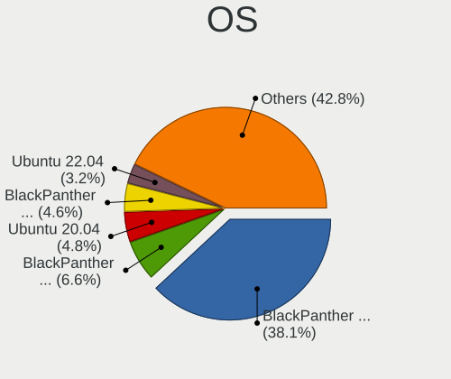

| Name                         | Notebooks | Percent |
|------------------------------|-----------|---------|
| BlackPanther 18.1            | 1327      | 38.07%  |
| BlackPanther 22.1            | 229       | 6.57%   |
| Ubuntu 20.04                 | 168       | 4.82%   |
| BlackPanther 16.2            | 159       | 4.56%   |
| Ubuntu 22.04                 | 111       | 3.18%   |
| Ubuntu 18.04                 | 100       | 2.87%   |
| Ubuntu 24.04                 | 72        | 2.07%   |
| Debian 12                    | 34        | 0.98%   |
| Arch Rolling                 | 31        | 0.89%   |
| Pop!_OS 22.04                | 29        | 0.83%   |
| Debian 11                    | 26        | 0.75%   |
| ArcoLinux Rolling            | 24        | 0.69%   |
| Linux Mint 21.1              | 23        | 0.66%   |
| openSUSE Tumbleweed-XXXXXXXX | 21        | 0.6%    |
| OpenMandriva 4.2             | 21        | 0.6%    |
| Linux Mint 21.3              | 21        | 0.6%    |
| Linux Mint 20.2              | 19        | 0.55%   |
| Zorin 17                     | 18        | 0.52%   |
| OpenMandriva 4.3             | 18        | 0.52%   |
| OpenMandriva 25.90           | 18        | 0.52%   |
| Linux Mint 22.1              | 18        | 0.52%   |
| Linux Mint 21.2              | 18        | 0.52%   |
| Kubuntu 22.04                | 17        | 0.49%   |
| Fedora 38                    | 17        | 0.49%   |
| Zorin 16                     | 16        | 0.46%   |
| OpenMandriva 23.08           | 16        | 0.46%   |
| Linux Mint 19.3              | 16        | 0.46%   |
| OpenMandriva 5.0             | 15        | 0.43%   |
| Fedora 39                    | 15        | 0.43%   |
| Fedora 41                    | 14        | 0.4%    |
| Manjaro                      | 13        | 0.37%   |
| Linux Mint 20.3              | 13        | 0.37%   |
| Kubuntu 20.04                | 13        | 0.37%   |
| KDE neon 20.04               | 13        | 0.37%   |
| Arch                         | 13        | 0.37%   |
| Ubuntu 21.04                 | 11        | 0.32%   |
| Ubuntu 19.10                 | 11        | 0.32%   |
| Linux Mint 21                | 11        | 0.32%   |
| Fedora 37                    | 11        | 0.32%   |
| Ubuntu 21.10                 | 10        | 0.29%   |

OS Family
---------

OS without a version

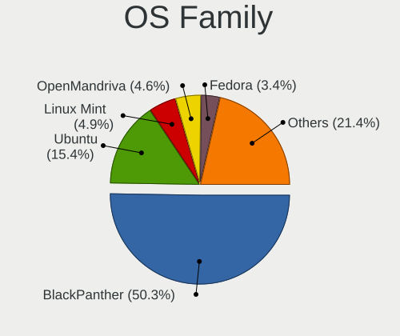

| Name          | Notebooks | Percent |
|---------------|-----------|---------|
| BlackPanther  | 1647      | 50.26%  |
| Ubuntu        | 504       | 15.38%  |
| Linux Mint    | 161       | 4.91%   |
| OpenMandriva  | 152       | 4.64%   |
| Fedora        | 111       | 3.39%   |
| Debian        | 85        | 2.59%   |
| Endless       | 77        | 2.35%   |
| Pop!_OS       | 46        | 1.4%    |
| Zorin         | 45        | 1.37%   |
| Arch          | 45        | 1.37%   |
| Manjaro       | 41        | 1.25%   |
| Kubuntu       | 41        | 1.25%   |
| openSUSE      | 29        | 0.88%   |
| KDE neon      | 28        | 0.85%   |
| Xubuntu       | 27        | 0.82%   |
| ArcoLinux     | 26        | 0.79%   |
| SteamOS       | 19        | 0.58%   |
| ROSA          | 18        | 0.55%   |
| Elementary    | 16        | 0.49%   |
| Kali          | 13        | 0.4%    |
| Lubuntu       | 12        | 0.37%   |
| Ubuntu MATE   | 10        | 0.31%   |
| EndeavourOS   | 10        | 0.31%   |
| MX            | 9         | 0.27%   |
| Ubuntu Unity  | 8         | 0.24%   |
| Nobara        | 8         | 0.24%   |
| LMDE          | 8         | 0.24%   |
| Xero          | 6         | 0.18%   |
| Gentoo        | 6         | 0.18%   |
| Bazzite       | 6         | 0.18%   |
| Ubuntu Budgie | 5         | 0.15%   |
| NixOS         | 4         | 0.12%   |
| Garuda Linux  | 4         | 0.12%   |
| TUXEDO OS     | 3         | 0.09%   |
| Q4OS          | 3         | 0.09%   |
| Devuan        | 3         | 0.09%   |
| Clear Linux   | 3         | 0.09%   |
| CachyOS       | 3         | 0.09%   |
| UbuntuDDE     | 2         | 0.06%   |
| Ubuntu Studio | 2         | 0.06%   |

Kernel
------

Version of the Linux kernel

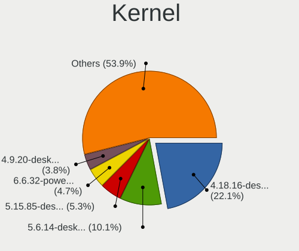

| Version                  | Notebooks | Percent |
|--------------------------|-----------|---------|
| 4.18.16-desktop-1bP      | 861       | 22.08%  |
| 5.6.14-desktop-2bP       | 395       | 10.13%  |
| 5.15.85-desktop-1bP      | 205       | 5.26%   |
| 6.6.32-power-1bP         | 185       | 4.74%   |
| 4.9.20-desktop-pae-1bP   | 150       | 3.85%   |
| 5.1.15-desktop-1bP       | 57        | 1.46%   |
| 6.14.2-desktop-3omv2590  | 31        | 0.8%    |
| 5.4.0-42-generic         | 28        | 0.72%   |
| 6.3.8-desktop-1bP        | 24        | 0.62%   |
| 5.8.0-14-generic         | 23        | 0.59%   |
| 6.6.34-power-1bP         | 20        | 0.51%   |
| 6.6.2-desktop-1omv2390   | 20        | 0.51%   |
| 5.10.14-desktop-1omv4002 | 20        | 0.51%   |
| 5.16.7-desktop-1omv4003  | 17        | 0.44%   |
| 5.4.0-58-generic         | 14        | 0.36%   |
| 4.18.0-15-generic        | 14        | 0.36%   |
| 5.3.0-28-generic         | 12        | 0.31%   |
| 5.15.0-43-generic        | 12        | 0.31%   |
| 6.4.11-desktop-1omv2390  | 11        | 0.28%   |
| 5.4.0-52-generic         | 11        | 0.28%   |
| 5.4.0-48-generic         | 11        | 0.28%   |
| 5.4.0-19-generic         | 11        | 0.28%   |
| 5.15.0-52-generic        | 11        | 0.28%   |
| 5.11.0-27-generic        | 11        | 0.28%   |
| 6.8.0-45-generic         | 10        | 0.26%   |
| 6.8.0-40-generic         | 10        | 0.26%   |
| 6.8.0-52-generic         | 9         | 0.23%   |
| 6.12.1-desktop-1omv2490  | 9         | 0.23%   |
| 5.4.0-40-generic         | 9         | 0.23%   |
| 5.4.0-29-generic         | 9         | 0.23%   |
| 5.15.0-76-generic        | 9         | 0.23%   |
| 5.15.0-58-generic        | 9         | 0.23%   |
| 5.15.0-41-generic        | 9         | 0.23%   |
| 5.11.0-34-generic        | 9         | 0.23%   |
| 6.9.3-76060903-generic   | 8         | 0.21%   |
| 6.8.0-51-generic         | 8         | 0.21%   |
| 6.5.0-21-generic         | 8         | 0.21%   |
| 6.2.6-desktop-1omv2390   | 8         | 0.21%   |
| 6.14.0-33-generic        | 8         | 0.21%   |
| 6.12.9-desktop-1omv2490  | 8         | 0.21%   |

Kernel Family
-------------

Linux kernel without a distro release

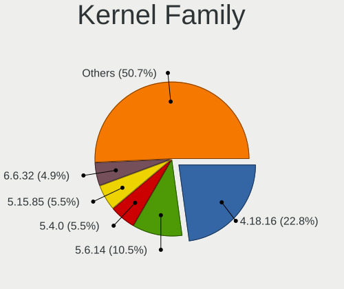

| Version | Notebooks | Percent |
|---------|-----------|---------|
| 4.18.16 | 861       | 22.84%  |
| 5.6.14  | 397       | 10.53%  |
| 5.4.0   | 208       | 5.52%   |
| 5.15.85 | 206       | 5.47%   |
| 6.6.32  | 185       | 4.91%   |
| 5.15.0  | 164       | 4.35%   |
| 4.9.20  | 158       | 4.19%   |
| 6.8.0   | 107       | 2.84%   |
| 4.15.0  | 71        | 1.88%   |
| 5.8.0   | 61        | 1.62%   |
| 6.5.0   | 59        | 1.57%   |
| 5.1.15  | 57        | 1.51%   |
| 5.11.0  | 56        | 1.49%   |
| 5.3.0   | 51        | 1.35%   |
| 5.13.0  | 51        | 1.35%   |
| 5.10.0  | 43        | 1.14%   |
| 6.1.0   | 41        | 1.09%   |
| 6.2.0   | 40        | 1.06%   |
| 6.14.0  | 37        | 0.98%   |
| 5.19.0  | 35        | 0.93%   |
| 6.14.2  | 34        | 0.9%    |
| 5.0.0   | 33        | 0.88%   |
| 4.18.0  | 31        | 0.82%   |
| 6.3.8   | 26        | 0.69%   |
| 6.11.0  | 22        | 0.58%   |
| 6.6.2   | 21        | 0.56%   |
| 6.6.34  | 20        | 0.53%   |
| 5.10.14 | 20        | 0.53%   |
| 5.16.7  | 18        | 0.48%   |
| 6.4.11  | 13        | 0.34%   |
| 6.2.6   | 11        | 0.29%   |
| 6.1.1   | 10        | 0.27%   |
| 4.19.0  | 10        | 0.27%   |
| 6.9.3   | 9         | 0.24%   |
| 6.12.9  | 9         | 0.24%   |
| 6.12.1  | 9         | 0.24%   |
| 6.2.9   | 8         | 0.21%   |
| 4.13.0  | 8         | 0.21%   |
| 6.6.11  | 7         | 0.19%   |
| 6.3.3   | 7         | 0.19%   |

Kernel Major Ver.
-----------------

Linux kernel major version

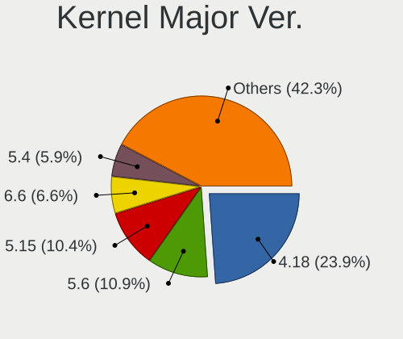

| Version | Notebooks | Percent |
|---------|-----------|---------|
| 4.18    | 891       | 23.87%  |
| 5.6     | 407       | 10.91%  |
| 5.15    | 388       | 10.4%   |
| 6.6     | 247       | 6.62%   |
| 5.4     | 220       | 5.89%   |
| 4.9     | 166       | 4.45%   |
| 6.8     | 119       | 3.19%   |
| 6.14    | 82        | 2.2%    |
| 6.5     | 78        | 2.09%   |
| 6.1     | 78        | 2.09%   |
| 5.10    | 77        | 2.06%   |
| 5.8     | 71        | 1.9%    |
| 4.15    | 71        | 1.9%    |
| 6.2     | 69        | 1.85%   |
| 5.11    | 66        | 1.77%   |
| 5.1     | 57        | 1.53%   |
| 5.3     | 56        | 1.5%    |
| 5.13    | 55        | 1.47%   |
| 6.12    | 49        | 1.31%   |
| 6.11    | 44        | 1.18%   |
| 5.19    | 44        | 1.18%   |
| 6.3     | 43        | 1.15%   |
| 6.4     | 40        | 1.07%   |
| 5.16    | 36        | 0.96%   |
| 5.0     | 33        | 0.88%   |
| 6.10    | 24        | 0.64%   |
| 6.9     | 22        | 0.59%   |
| 6.17    | 20        | 0.54%   |
| 6.13    | 17        | 0.46%   |
| 5.14    | 17        | 0.46%   |
| 6.0     | 15        | 0.4%    |
| 5.12    | 15        | 0.4%    |
| 5.9     | 13        | 0.35%   |
| 6.7     | 12        | 0.32%   |
| 5.18    | 12        | 0.32%   |
| 4.19    | 11        | 0.29%   |
| 6.15    | 9         | 0.24%   |
| 6.16    | 8         | 0.21%   |
| 5.17    | 8         | 0.21%   |
| 4.13    | 8         | 0.21%   |

Arch
----

OS architecture (x86_64, i586, etc.)

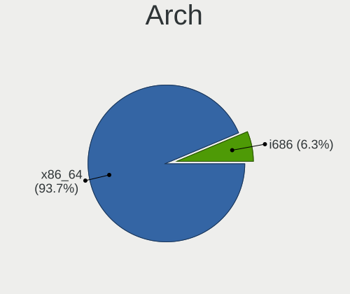

| Name   | Notebooks | Percent |
|--------|-----------|---------|
| x86_64 | 2977      | 93.68%  |
| i686   | 201       | 6.32%   |

DE
--

Desktop Environment

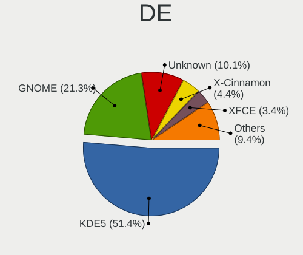

| Name            | Notebooks | Percent |
|-----------------|-----------|---------|
| KDE5            | 1686      | 51.36%  |
| GNOME           | 698       | 21.26%  |
| Unknown         | 333       | 10.14%  |
| X-Cinnamon      | 145       | 4.42%   |
| XFCE            | 112       | 3.41%   |
| KDE6            | 105       | 3.2%    |
| MATE            | 44        | 1.34%   |
| KDE             | 34        | 1.04%   |
| LXQt            | 21        | 0.64%   |
| Cinnamon        | 21        | 0.64%   |
| Pantheon        | 16        | 0.49%   |
| KDE4            | 9         | 0.27%   |
| Unity           | 8         | 0.24%   |
| i3              | 7         | 0.21%   |
| Budgie          | 7         | 0.21%   |
| Hyprland        | 6         | 0.18%   |
| GNOME Flashback | 5         | 0.15%   |
| LXDE            | 4         | 0.12%   |
| Deepin          | 4         | 0.12%   |
| GNOME Classic   | 3         | 0.09%   |
| Endless:GNOME   | 3         | 0.09%   |
| COSMIC          | 3         | 0.09%   |
| Trinity         | 1         | 0.03%   |
| qtile           | 1         | 0.03%   |
| openbox         | 1         | 0.03%   |
| ICEWM           | 1         | 0.03%   |
| Enlightenment   | 1         | 0.03%   |
| DDE             | 1         | 0.03%   |
| BunsenLabs      | 1         | 0.03%   |
| bspwm           | 1         | 0.03%   |
| awesome         | 1         | 0.03%   |

Display Server
--------------

X11 or Wayland

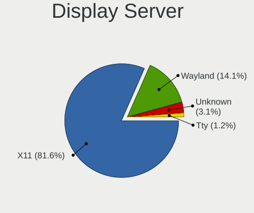

| Name    | Notebooks | Percent |
|---------|-----------|---------|
| X11     | 2646      | 81.59%  |
| Wayland | 458       | 14.12%  |
| Unknown | 99        | 3.05%   |
| Tty     | 40        | 1.23%   |

Display Manager
---------------

SDDM, LightDM, etc.

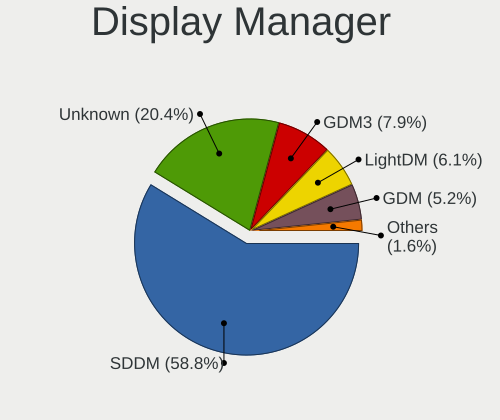

| Name           | Notebooks | Percent |
|----------------|-----------|---------|
| SDDM           | 1917      | 58.77%  |
| Unknown        | 666       | 20.42%  |
| GDM3           | 259       | 7.94%   |
| LightDM        | 198       | 6.07%   |
| GDM            | 169       | 5.18%   |
| TDM            | 35        | 1.07%   |
| KDM            | 9         | 0.28%   |
| SLiM           | 4         | 0.12%   |
| XDM            | 3         | 0.09%   |
| LXDM           | 1         | 0.03%   |
| COSMIC-GREETER | 1         | 0.03%   |

OS Lang
-------

Language

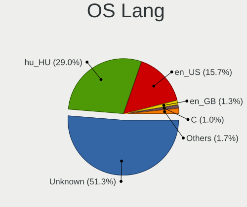

| Lang         | Notebooks | Percent |
|--------------|-----------|---------|
| Unknown      | 1664      | 51.29%  |
| hu_HU        | 941       | 29.01%  |
| en_US        | 510       | 15.72%  |
| en_GB        | 43        | 1.33%   |
| C            | 32        | 0.99%   |
| de_DE        | 20        | 0.62%   |
| POSIX        | 5         | 0.15%   |
| nl_NL        | 5         | 0.15%   |
| en_AU        | 4         | 0.12%   |
| ru_UA        | 3         | 0.09%   |
| de_AT        | 3         | 0.09%   |
| ru_RU        | 2         | 0.06%   |
| it_IT        | 2         | 0.06%   |
| en_IN        | 2         | 0.06%   |
| C.UTF8       | 2         | 0.06%   |
| fr_BE        | 1         | 0.03%   |
| en_ZA        | 1         | 0.03%   |
| en_US@custom | 1         | 0.03%   |
| en_US.UTF8   | 1         | 0.03%   |
| en_IL        | 1         | 0.03%   |
| en_DK        | 1         | 0.03%   |

Boot Mode
---------

EFI or BIOS

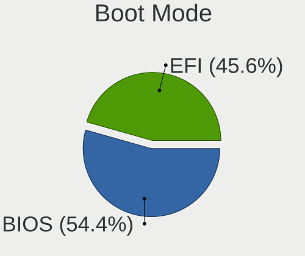

| Mode | Notebooks | Percent |
|------|-----------|---------|
| BIOS | 1787      | 54.38%  |
| EFI  | 1499      | 45.62%  |

Filesystem
----------

Type of filesystem

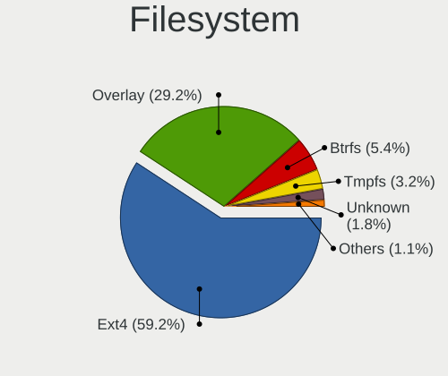

| Type    | Notebooks | Percent |
|---------|-----------|---------|
| Ext4    | 2062      | 59.24%  |
| Overlay | 1018      | 29.24%  |
| Btrfs   | 189       | 5.43%   |
| Tmpfs   | 112       | 3.22%   |
| Unknown | 61        | 1.75%   |
| Xfs     | 14        | 0.4%    |
| Zfs     | 7         | 0.2%    |
| Ext2    | 6         | 0.17%   |
| Ext3    | 5         | 0.14%   |
| F2fs    | 4         | 0.11%   |
| Rootfs  | 2         | 0.06%   |
| XXXXXXX | 1         | 0.03%   |

Part. scheme
------------

Scheme of partitioning

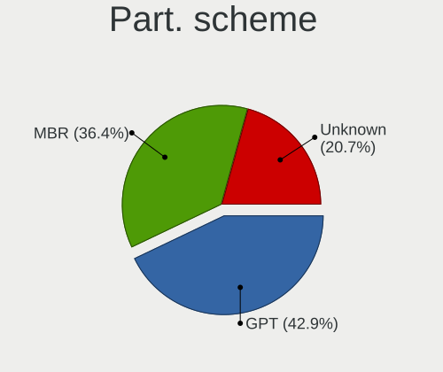

| Type    | Notebooks | Percent |
|---------|-----------|---------|
| GPT     | 1422      | 42.91%  |
| MBR     | 1205      | 36.36%  |
| Unknown | 687       | 20.73%  |

Dual Boot with Linux/BSD
------------------------

Hosting more than one Linux/BSD

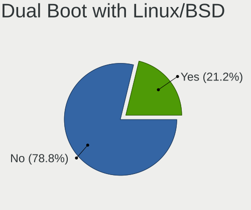

| Dual boot | Notebooks | Percent |
|-----------|-----------|---------|
| No        | 2680      | 78.78%  |
| Yes       | 722       | 21.22%  |

Dual Boot (Win)
---------------

Hosting Linux and Windows

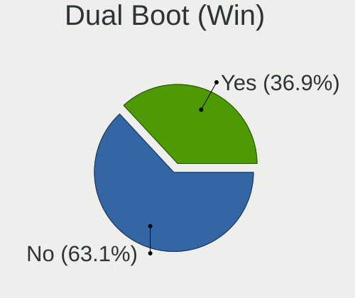

| Dual boot | Notebooks | Percent |
|-----------|-----------|---------|
| No        | 2116      | 63.11%  |
| Yes       | 1237      | 36.89%  |

Board
-----

Vendor
------

Motherboard manufacturer

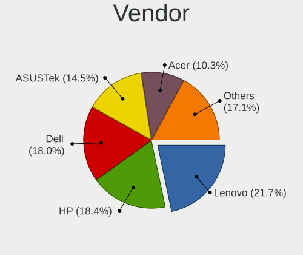

| Name                | Notebooks | Percent |
|---------------------|-----------|---------|
| Lenovo              | 684       | 21.69%  |
| Hewlett-Packard     | 581       | 18.43%  |
| Dell                | 567       | 17.98%  |
| ASUSTek Computer    | 456       | 14.46%  |
| Acer                | 325       | 10.31%  |
| Toshiba             | 81        | 2.57%   |
| Samsung Electronics | 53        | 1.68%   |
| Fujitsu             | 48        | 1.52%   |
| Fujitsu Siemens     | 42        | 1.33%   |
| Packard Bell        | 40        | 1.27%   |
| MSI                 | 37        | 1.17%   |
| Apple               | 31        | 0.98%   |
| Sony                | 26        | 0.82%   |
| eMachines           | 25        | 0.79%   |
| Medion              | 23        | 0.73%   |
| Valve               | 20        | 0.63%   |
| Hungaro Flotta Kft  | 11        | 0.35%   |
| Alcor               | 10        | 0.32%   |
| HUAWEI              | 8         | 0.25%   |
| Unknown             | 8         | 0.25%   |
| Google              | 6         | 0.19%   |
| Gigabyte Technology | 5         | 0.16%   |
| TUXEDO              | 4         | 0.13%   |
| Timi                | 4         | 0.13%   |
| Notebook            | 4         | 0.13%   |
| Insyde              | 4         | 0.13%   |
| NVISEN              | 3         | 0.1%    |
| LG Electronics      | 3         | 0.1%    |
| Intel               | 3         | 0.1%    |
| Clevo               | 3         | 0.1%    |
| speedmaster         | 2         | 0.06%   |
| Panasonic           | 2         | 0.06%   |
| ONE-NETBOOK         | 2         | 0.06%   |
| Mediacom            | 2         | 0.06%   |
| Jumper              | 2         | 0.06%   |
| Zebra Technologies  | 1         | 0.03%   |
| XIAOMI              | 1         | 0.03%   |
| UMAX                | 1         | 0.03%   |
| TrekStor            | 1         | 0.03%   |
| THD                 | 1         | 0.03%   |

Model
-----

Motherboard model

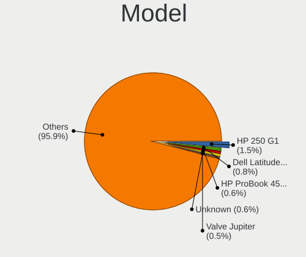

| Name                                | Notebooks | Percent |
|-------------------------------------|-----------|---------|
| HP 250 G1                           | 47        | 1.49%   |
| Dell Latitude E6410                 | 26        | 0.82%   |
| HP ProBook 455 G1                   | 20        | 0.63%   |
| Unknown                             | 20        | 0.63%   |
| Valve Jupiter                       | 16        | 0.51%   |
| HP Notebook                         | 16        | 0.51%   |
| Dell Latitude 5480                  | 14        | 0.44%   |
| Lenovo IdeaPad 330-15IKB 81DE       | 13        | 0.41%   |
| HP 650                              | 13        | 0.41%   |
| Dell Latitude E6400                 | 13        | 0.41%   |
| HP EliteBook 8460p                  | 12        | 0.38%   |
| HP 620                              | 12        | 0.38%   |
| Dell Inspiron 7737                  | 12        | 0.38%   |
| Lenovo IdeaPad 100-15IBD 80QQ       | 11        | 0.35%   |
| Lenovo G50-45 80E3                  | 11        | 0.35%   |
| HP EliteBook 8470p                  | 11        | 0.35%   |
| Dell Latitude E6430                 | 11        | 0.35%   |
| HP Pavilion 15                      | 10        | 0.32%   |
| Dell Vostro 1015                    | 10        | 0.32%   |
| Dell Inspiron 3542                  | 10        | 0.32%   |
| Lenovo Z50-75 80EC                  | 9         | 0.29%   |
| Lenovo ThinkPad T400 2768WGB        | 9         | 0.29%   |
| HP Pavilion Gaming Laptop 15-ec1xxx | 9         | 0.29%   |
| Dell Latitude E6420                 | 9         | 0.29%   |
| Dell Inspiron 3521                  | 9         | 0.29%   |
| Dell Inspiron 15-3567               | 9         | 0.29%   |
| ASUS X541NA                         | 9         | 0.29%   |
| Lenovo IdeaPad 700-15ISK 80RU       | 8         | 0.25%   |
| Lenovo IdeaPad 100-15IBY 80MJ       | 8         | 0.25%   |
| Lenovo G550 20023                   | 8         | 0.25%   |
| HP ProBook 640 G8 Notebook PC       | 8         | 0.25%   |
| HP EliteBook 8440p                  | 8         | 0.25%   |
| HP EliteBook 6930p                  | 8         | 0.25%   |
| eMachines E525                      | 8         | 0.25%   |
| Dell Vostro 3500                    | 8         | 0.25%   |
| Dell Latitude E6530                 | 8         | 0.25%   |
| Acer Aspire E5-571G                 | 8         | 0.25%   |
| Acer Aspire A315-24P                | 8         | 0.25%   |
| Lenovo Z50-70 20354                 | 7         | 0.22%   |
| Lenovo G580 20150                   | 7         | 0.22%   |

Model Family
------------

Motherboard model prefix

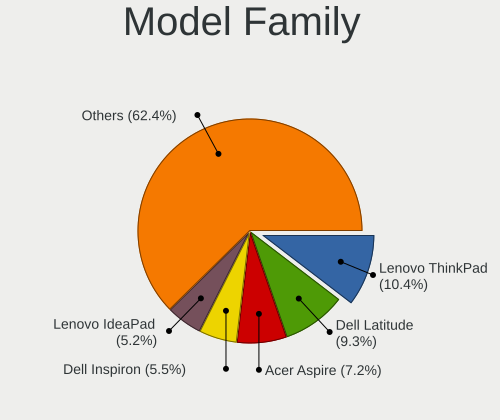

| Name                     | Notebooks | Percent |
|--------------------------|-----------|---------|
| Lenovo ThinkPad          | 328       | 10.4%   |
| Dell Latitude            | 293       | 9.29%   |
| Acer Aspire              | 227       | 7.2%    |
| Dell Inspiron            | 174       | 5.52%   |
| Lenovo IdeaPad           | 165       | 5.23%   |
| HP EliteBook             | 124       | 3.93%   |
| HP ProBook               | 104       | 3.3%    |
| ASUS VivoBook            | 89        | 2.82%   |
| HP 250                   | 78        | 2.47%   |
| Toshiba Satellite        | 70        | 2.22%   |
| HP Pavilion              | 60        | 1.9%    |
| Dell Vostro              | 46        | 1.46%   |
| Fujitsu LIFEBOOK         | 45        | 1.43%   |
| HP Compaq                | 44        | 1.4%    |
| Packard Bell EasyNote    | 40        | 1.27%   |
| ASUS ASUS                | 35        | 1.11%   |
| HP Laptop                | 33        | 1.05%   |
| Acer TravelMate          | 26        | 0.82%   |
| Fujitsu Siemens AMILO    | 24        | 0.76%   |
| Acer Swift               | 23        | 0.73%   |
| ASUS ZenBook             | 20        | 0.63%   |
| ASUS ROG                 | 20        | 0.63%   |
| Unknown                  | 20        | 0.63%   |
| HP 255                   | 18        | 0.57%   |
| Dell Precision           | 18        | 0.57%   |
| Valve Jupiter            | 16        | 0.51%   |
| HP Notebook              | 16        | 0.51%   |
| Lenovo Legion            | 15        | 0.48%   |
| Lenovo Yoga              | 13        | 0.41%   |
| HP 650                   | 13        | 0.41%   |
| Acer Nitro               | 13        | 0.41%   |
| HP ZBook                 | 12        | 0.38%   |
| HP Presario              | 12        | 0.38%   |
| HP 620                   | 12        | 0.38%   |
| Fujitsu Siemens ESPRIMO  | 12        | 0.38%   |
| Dell XPS                 | 12        | 0.38%   |
| Lenovo G50-45            | 11        | 0.35%   |
| Hungaro Flotta Kft Navon | 11        | 0.35%   |
| Acer Predator            | 11        | 0.35%   |
| Lenovo G580              | 10        | 0.32%   |

MFG Year
--------

Motherboard manufacture year

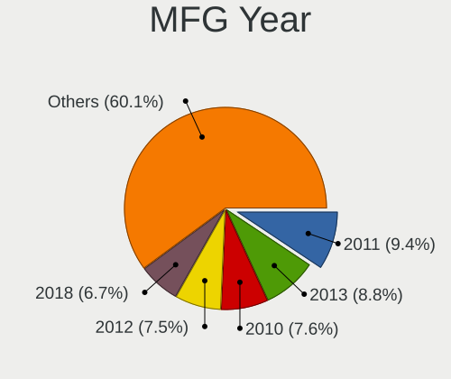

| Year    | Notebooks | Percent |
|---------|-----------|---------|
| 2011    | 295       | 9.36%   |
| 2013    | 277       | 8.79%   |
| 2010    | 239       | 7.58%   |
| 2012    | 235       | 7.45%   |
| 2018    | 212       | 6.72%   |
| 2014    | 211       | 6.69%   |
| 2015    | 201       | 6.37%   |
| 2017    | 195       | 6.18%   |
| 2008    | 177       | 5.61%   |
| 2009    | 174       | 5.52%   |
| 2016    | 165       | 5.23%   |
| 2019    | 139       | 4.41%   |
| 2021    | 135       | 4.28%   |
| 2020    | 127       | 4.03%   |
| 2007    | 111       | 3.52%   |
| 2022    | 89        | 2.82%   |
| 2023    | 61        | 1.93%   |
| 2006    | 48        | 1.52%   |
| 2024    | 39        | 1.24%   |
| 2005    | 11        | 0.35%   |
| 2025    | 8         | 0.25%   |
| Unknown | 3         | 0.1%    |
| 2003    | 1         | 0.03%   |

Form Factor
-----------

Physical design of the computer

| Name     | Notebooks | Percent |
|----------|-----------|---------|
| Notebook | 3153      | 100%    |

Secure Boot
-----------

Enabled or disabled

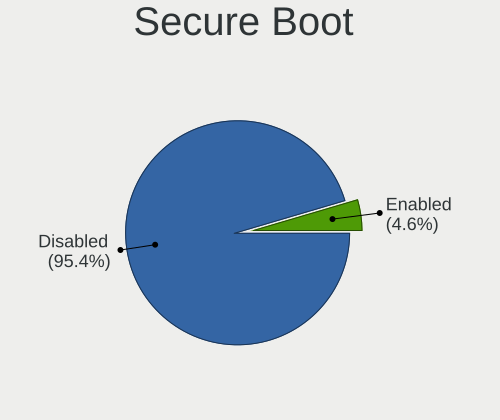

| State    | Notebooks | Percent |
|----------|-----------|---------|
| Disabled | 3029      | 95.43%  |
| Enabled  | 145       | 4.57%   |

Coreboot
--------

Have coreboot on board

| Used | Notebooks | Percent |
|------|-----------|---------|
| No   | 3147      | 99.81%  |
| Yes  | 6         | 0.19%   |

RAM Size
--------

Total RAM memory

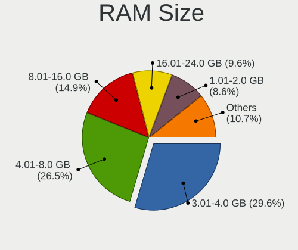

| Size in GB  | Notebooks | Percent |
|-------------|-----------|---------|
| 3.01-4.0    | 964       | 29.57%  |
| 4.01-8.0    | 864       | 26.5%   |
| 8.01-16.0   | 487       | 14.94%  |
| 16.01-24.0  | 314       | 9.63%   |
| 1.01-2.0    | 281       | 8.62%   |
| 32.01-64.0  | 152       | 4.66%   |
| 2.01-3.0    | 115       | 3.53%   |
| 24.01-32.0  | 36        | 1.1%    |
| 0.51-1.0    | 35        | 1.07%   |
| 64.01-256.0 | 9         | 0.28%   |
| Unknown     | 2         | 0.06%   |
| 0.01-0.5    | 1         | 0.03%   |

RAM Used
--------

Used RAM memory

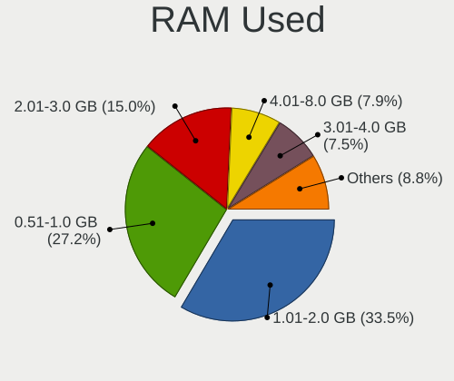

| Used GB    | Notebooks | Percent |
|------------|-----------|---------|
| 1.01-2.0   | 1264      | 33.48%  |
| 0.51-1.0   | 1027      | 27.21%  |
| 2.01-3.0   | 567       | 15.02%  |
| 4.01-8.0   | 300       | 7.95%   |
| 3.01-4.0   | 283       | 7.5%    |
| 0.01-0.5   | 228       | 6.04%   |
| 8.01-16.0  | 91        | 2.41%   |
| 16.01-24.0 | 12        | 0.32%   |
| Unknown    | 2         | 0.05%   |
| 32.01-64.0 | 1         | 0.03%   |

Total Drives
------------

Number of drives on board

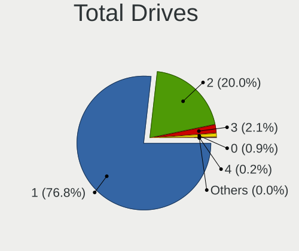

| Drives | Notebooks | Percent |
|--------|-----------|---------|
| 1      | 2530      | 76.78%  |
| 2      | 658       | 19.97%  |
| 3      | 68        | 2.06%   |
| 0      | 31        | 0.94%   |
| 4      | 7         | 0.21%   |
| 5      | 1         | 0.03%   |

Has CD-ROM
----------

Has CD-ROM on board

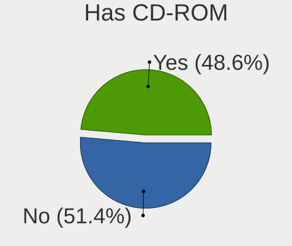

| Presented | Notebooks | Percent |
|-----------|-----------|---------|
| No        | 1640      | 51.38%  |
| Yes       | 1552      | 48.62%  |

Has Ethernet
------------

Has Ethernet on board

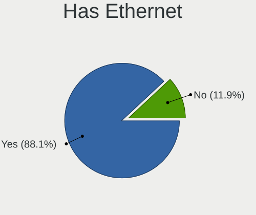

| Presented | Notebooks | Percent |
|-----------|-----------|---------|
| Yes       | 2786      | 88.05%  |
| No        | 378       | 11.95%  |

Has WiFi
--------

Has WiFi module

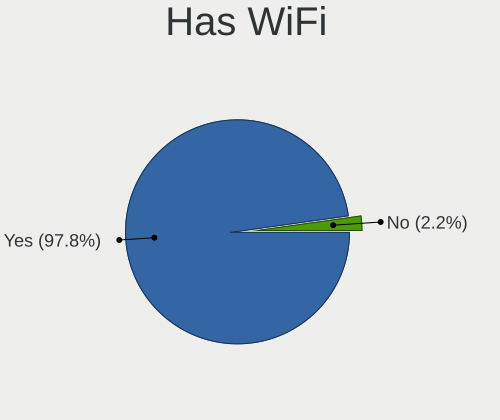

| Presented | Notebooks | Percent |
|-----------|-----------|---------|
| Yes       | 3086      | 97.78%  |
| No        | 70        | 2.22%   |

Has Bluetooth
-------------

Has Bluetooth module

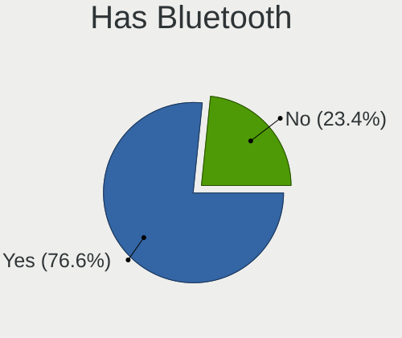

| Presented | Notebooks | Percent |
|-----------|-----------|---------|
| Yes       | 2458      | 76.62%  |
| No        | 750       | 23.38%  |

Location
--------

Country
-------

Geographic location (country)

| Country | Notebooks | Percent |
|---------|-----------|---------|
| Hungary | 3153      | 100%    |

City
----

Geographic location (city)

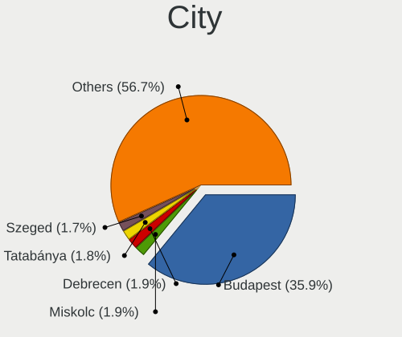

| City              | Notebooks | Percent |
|-------------------|-----------|---------|
| Budapest          | 1338      | 35.94%  |
| Miskolc           | 71        | 1.91%   |
| Debrecen          | 70        | 1.88%   |
| Tatabánya        | 68        | 1.83%   |
| Szeged            | 64        | 1.72%   |
| Pécs             | 64        | 1.72%   |
| Győr             | 63        | 1.69%   |
| Kecskemét        | 56        | 1.5%    |
| Szigetszentmiklos | 47        | 1.26%   |
| Zalaegerszeg      | 46        | 1.24%   |
| Szombathely       | 42        | 1.13%   |
| Érd              | 41        | 1.1%    |
| Veszprém         | 40        | 1.07%   |
| Székesfehérvár | 40        | 1.07%   |
| Nyiregyhaza       | 40        | 1.07%   |
| Szolnok           | 34        | 0.91%   |
| Cegled            | 28        | 0.75%   |
| Pomaz             | 27        | 0.73%   |
| Berettyóújfalu  | 23        | 0.62%   |
| Szekszárd        | 22        | 0.59%   |
| Dunaújváros     | 22        | 0.59%   |
| Salgotarjan       | 20        | 0.54%   |
| Gödöllő        | 20        | 0.54%   |
| Sopron            | 19        | 0.51%   |
| Oroshaza          | 19        | 0.51%   |
| Gyomro            | 19        | 0.51%   |
| Kaposvár         | 18        | 0.48%   |
| Tamasi            | 17        | 0.46%   |
| Hatvan            | 16        | 0.43%   |
| Toeroekbalint     | 15        | 0.4%    |
| Toekoel           | 15        | 0.4%    |
| Solymar           | 15        | 0.4%    |
| Monor             | 15        | 0.4%    |
| Kazincbarcika     | 14        | 0.38%   |
| Bicske            | 14        | 0.38%   |
| Nagykanizsa       | 13        | 0.35%   |
| Tiszaujvaros      | 12        | 0.32%   |
| Szorgalmatos      | 12        | 0.32%   |
| Mosonmagyaróvár | 12        | 0.32%   |
| Karcag            | 12        | 0.32%   |

Drives
------

Drive Vendor
------------

Hard drive vendors

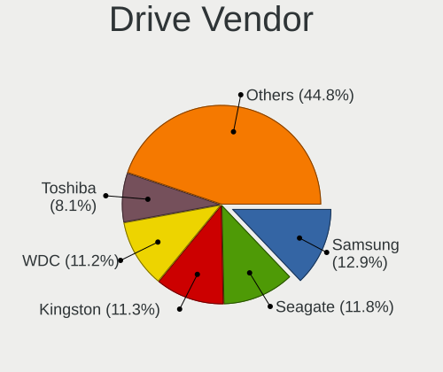

| Vendor                      | Notebooks | Drives | Percent |
|-----------------------------|-----------|--------|---------|
| Samsung Electronics         | 513       | 867    | 12.9%   |
| Seagate                     | 468       | 755    | 11.77%  |
| Kingston                    | 448       | 728    | 11.26%  |
| WDC                         | 445       | 658    | 11.19%  |
| Toshiba                     | 321       | 482    | 8.07%   |
| SanDisk                     | 182       | 272    | 4.58%   |
| HGST                        | 179       | 280    | 4.5%    |
| Hitachi                     | 167       | 253    | 4.2%    |
| Unknown                     | 157       | 225    | 3.95%   |
| SK hynix                    | 133       | 204    | 3.34%   |
| Intel                       | 98        | 153    | 2.46%   |
| Micron Technology           | 91        | 132    | 2.29%   |
| A-DATA Technology           | 65        | 94     | 1.63%   |
| Crucial                     | 55        | 82     | 1.38%   |
| Fujitsu                     | 54        | 76     | 1.36%   |
| SPCC                        | 50        | 82     | 1.26%   |
| Kingston Technology Company | 36        | 56     | 0.91%   |
| Apacer                      | 36        | 58     | 0.91%   |
| JMicron Technology          | 30        | 32     | 0.75%   |
| KIOXIA                      | 28        | 40     | 0.7%    |
| Intenso                     | 26        | 60     | 0.65%   |
| China                       | 21        | 35     | 0.53%   |
| LITEON                      | 20        | 28     | 0.5%    |
| Verbatim                    | 17        | 41     | 0.43%   |
| Kingmax                     | 15        | 19     | 0.38%   |
| PNY                         | 14        | 29     | 0.35%   |
| Unknown                     | 14        | 27     | 0.35%   |
| Team                        | 13        | 23     | 0.33%   |
| Patriot                     | 13        | 20     | 0.33%   |
| Apple                       | 13        | 24     | 0.33%   |
| Phison Electronics          | 12        | 14     | 0.3%    |
| LITEONIT                    | 12        | 22     | 0.3%    |
| Gigabyte Technology         | 12        | 17     | 0.3%    |
| Transcend                   | 10        | 11     | 0.25%   |
| SSSTC                       | 10        | 24     | 0.25%   |
| Silicon Motion              | 9         | 12     | 0.23%   |
| KingSpec                    | 8         | 9      | 0.2%    |
| SOLIDIGM                    | 7         | 11     | 0.18%   |
| Phison                      | 7         | 13     | 0.18%   |
| Dahua                       | 7         | 11     | 0.18%   |

Drive Model
-----------

Hard drive models

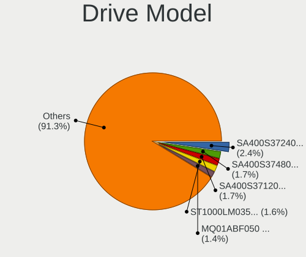

| Model                                              | Notebooks | Percent |
|----------------------------------------------------|-----------|---------|
| Kingston SA400S37240G 240GB SSD                    | 97        | 2.35%   |
| Kingston SA400S37480G 480GB SSD                    | 70        | 1.7%    |
| Kingston SA400S37120G 120GB SSD                    | 69        | 1.67%   |
| Seagate ST1000LM035-1RK172 1TB                     | 65        | 1.58%   |
| Toshiba MQ01ABF050 500GB                           | 59        | 1.43%   |
| Seagate ST1000LM024 HN-M101MBB 1TB                 | 51        | 1.24%   |
| Toshiba MQ01ABD100 1TB                             | 45        | 1.09%   |
| Seagate ST500LT012-1DG142 500GB                    | 41        | 0.99%   |
| Kingston SV300S37A120G 120GB SSD                   | 39        | 0.95%   |
| HGST HTS545032A7E380 320GB                         | 36        | 0.87%   |
| Samsung SSD 850 EVO 250GB                          | 31        | 0.75%   |
| HGST HTS725050A7E630 500GB                         | 30        | 0.73%   |
| Samsung NVMe SSD Controller SM981/PM981/PM983 1TB  | 28        | 0.68%   |
| SanDisk NVMe SSD Drive 512GB                       | 27        | 0.65%   |
| HGST HTS721010A9E630 1TB                           | 27        | 0.65%   |
| HGST HTS545050A7E680 500GB                         | 27        | 0.65%   |
| Toshiba MQ04ABF100 1TB                             | 26        | 0.63%   |
| Seagate ST9500325AS 500GB                          | 25        | 0.61%   |
| Seagate ST9320325AS 320GB                          | 24        | 0.58%   |
| Samsung SSD 860 EVO 500GB                          | 24        | 0.58%   |
| Kingston SA400S37960G 960GB SSD                    | 23        | 0.56%   |
| Kingston SUV400S37120G 120GB SSD                   | 22        | 0.53%   |
| Unknown MMC Card  32GB                             | 20        | 0.48%   |
| HGST HTS541010A9E680 1TB                           | 20        | 0.48%   |
| WDC WDS240G2G0A-00JH30 240GB SSD                   | 19        | 0.46%   |
| Samsung SSD 860 EVO 250GB                          | 17        | 0.41%   |
| JMicron Generic 320GB                              | 17        | 0.41%   |
| SPCC Solid State Disk 256GB                        | 16        | 0.39%   |
| Seagate ST9250315AS 250GB                          | 16        | 0.39%   |
| WDC WD1600BEVT-22ZCT0 160GB                        | 15        | 0.36%   |
| WDC WD10JPVX-22JC3T0 1TB                           | 15        | 0.36%   |
| Unknown MMC Card  64GB                             | 15        | 0.36%   |
| Seagate ST500LT012-9WS142 500GB                    | 15        | 0.36%   |
| Samsung SSD 850 EVO 500GB                          | 15        | 0.36%   |
| SPCC Solid State Disk 128GB                        | 14        | 0.34%   |
| Samsung NVMe SSD Controller PM9A1/PM9A3/980PRO 1TB | 14        | 0.34%   |
| Unknown                                            | 14        | 0.34%   |
| WDC WD5000LPCX-24C6HT0 500GB                       | 13        | 0.32%   |
| Micron 2450_MTFDKBA512TFK 512GB                    | 13        | 0.32%   |
| Kingston Company SNV2S1000G 1TB                    | 13        | 0.32%   |

HDD Vendor
----------

Hard disk drive vendors

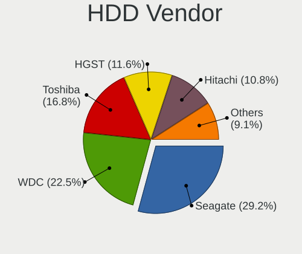

| Vendor              | Notebooks | Drives | Percent |
|---------------------|-----------|--------|---------|
| Seagate             | 450       | 730    | 29.22%  |
| WDC                 | 346       | 519    | 22.47%  |
| Toshiba             | 258       | 377    | 16.75%  |
| HGST                | 179       | 280    | 11.62%  |
| Hitachi             | 167       | 253    | 10.84%  |
| Fujitsu             | 54        | 76     | 3.51%   |
| Samsung Electronics | 39        | 51     | 2.53%   |
| JMicron Technology  | 17        | 18     | 1.1%    |
| Unknown             | 10        | 20     | 0.65%   |
| TO Exter            | 4         | 5      | 0.26%   |
| IBM/Hitachi         | 4         | 5      | 0.26%   |
| Initio              | 2         | 3      | 0.13%   |
| HGST HTS            | 2         | 7      | 0.13%   |
| USB3.0              | 1         | 1      | 0.06%   |
| Space ke            | 1         | 1      | 0.06%   |
| SATAFIRM            | 1         | 1      | 0.06%   |
| ICY BOX             | 1         | 1      | 0.06%   |
| CSD                 | 1         | 2      | 0.06%   |
| AXAGON              | 1         | 1      | 0.06%   |
| ASMT                | 1         | 2      | 0.06%   |
| ASMedia             | 1         | 3      | 0.06%   |

SSD Vendor
----------

Solid state drive vendors

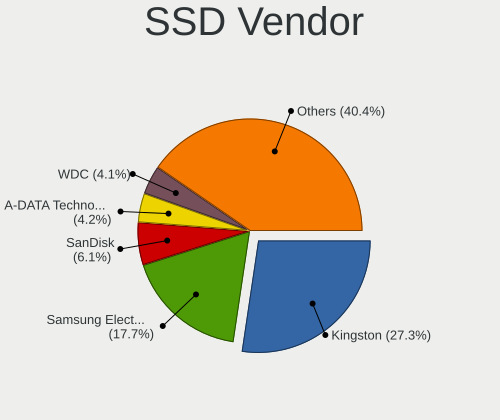

| Vendor              | Notebooks | Drives | Percent |
|---------------------|-----------|--------|---------|
| Kingston            | 396       | 640    | 27.35%  |
| Samsung Electronics | 257       | 453    | 17.75%  |
| SanDisk             | 89        | 135    | 6.15%   |
| A-DATA Technology   | 61        | 89     | 4.21%   |
| WDC                 | 60        | 88     | 4.14%   |
| Intel               | 60        | 97     | 4.14%   |
| Crucial             | 51        | 78     | 3.52%   |
| SPCC                | 47        | 78     | 3.25%   |
| Micron Technology   | 47        | 66     | 3.25%   |
| SK hynix            | 41        | 71     | 2.83%   |
| Apacer              | 33        | 53     | 2.28%   |
| Intenso             | 26        | 60     | 1.8%    |
| Toshiba             | 21        | 35     | 1.45%   |
| China               | 21        | 35     | 1.45%   |
| LITEON              | 18        | 20     | 1.24%   |
| Verbatim            | 17        | 41     | 1.17%   |
| Kingmax             | 15        | 19     | 1.04%   |
| PNY                 | 14        | 29     | 0.97%   |
| Team                | 12        | 22     | 0.83%   |
| LITEONIT            | 12        | 22     | 0.83%   |
| Patriot             | 11        | 15     | 0.76%   |
| Transcend           | 10        | 11     | 0.69%   |
| Gigabyte Technology | 10        | 15     | 0.69%   |
| Apple               | 9         | 19     | 0.62%   |
| KingSpec            | 7         | 8      | 0.48%   |
| Dahua               | 7         | 11     | 0.48%   |
| OCZ                 | 6         | 6      | 0.41%   |
| Seagate             | 5         | 5      | 0.35%   |
| Netac               | 5         | 6      | 0.35%   |
| GOODRAM             | 5         | 6      | 0.35%   |
| Leven               | 4         | 4      | 0.28%   |
| FORESEE             | 4         | 4      | 0.28%   |
| Corsair             | 4         | 5      | 0.28%   |
| ASMT                | 4         | 6      | 0.28%   |
| SPCC Sol            | 3         | 3      | 0.21%   |
| SATA SSD            | 3         | 3      | 0.21%   |
| LVCARDS             | 3         | 5      | 0.21%   |
| Go-Infinity         | 3         | 3      | 0.21%   |
| EAGET               | 3         | 3      | 0.21%   |
| BHT                 | 3         | 3      | 0.21%   |

Drive Kind
----------

HDD or SSD

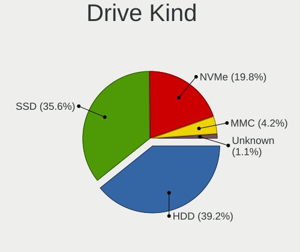

| Kind    | Notebooks | Drives | Percent |
|---------|-----------|--------|---------|
| HDD     | 1464      | 2356   | 39.25%  |
| SSD     | 1329      | 2335   | 35.63%  |
| NVMe    | 737       | 1213   | 19.76%  |
| MMC     | 158       | 234    | 4.24%   |
| Unknown | 42        | 51     | 1.13%   |

Drive Connector
---------------

SATA, SAS, NVMe, etc.

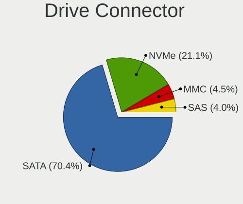

| Type | Notebooks | Drives | Percent |
|------|-----------|--------|---------|
| SATA | 2459      | 4546   | 70.44%  |
| NVMe | 735       | 1205   | 21.05%  |
| MMC  | 158       | 234    | 4.53%   |
| SAS  | 139       | 204    | 3.98%   |

Drive Size
----------

Size of hard drive

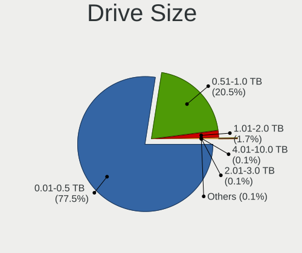

| Size in TB | Notebooks | Drives | Percent |
|------------|-----------|--------|---------|
| 0.01-0.5   | 2092      | 3673   | 77.45%  |
| 0.51-1.0   | 553       | 916    | 20.47%  |
| 1.01-2.0   | 47        | 90     | 1.74%   |
| 2.01-3.0   | 3         | 6      | 0.11%   |
| 4.01-10.0  | 3         | 3      | 0.11%   |
| 3.01-4.0   | 2         | 2      | 0.07%   |
| 10.01-20.0 | 1         | 1      | 0.04%   |

Space Total
-----------

Amount of disk space available on the file system

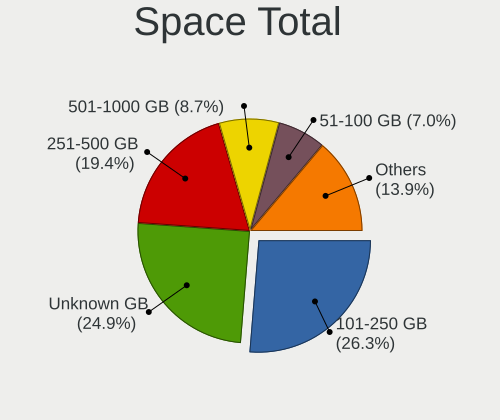

| Size in GB     | Notebooks | Percent |
|----------------|-----------|---------|
| 101-250        | 968       | 26.29%  |
| Unknown        | 915       | 24.85%  |
| 251-500        | 714       | 19.39%  |
| 501-1000       | 319       | 8.66%   |
| 51-100         | 256       | 6.95%   |
| 1-20           | 158       | 4.29%   |
| 1001-2000      | 157       | 4.26%   |
| 21-50          | 133       | 3.61%   |
| 2001-3000      | 39        | 1.06%   |
| More than 3000 | 23        | 0.62%   |

Space Used
----------

Amount of used disk space

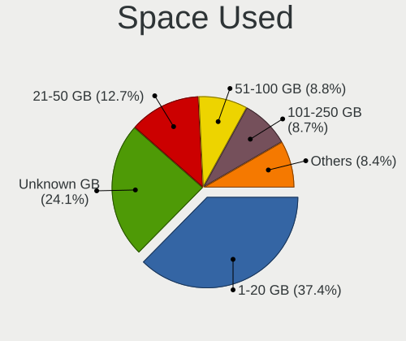

| Used GB        | Notebooks | Percent |
|----------------|-----------|---------|
| 1-20           | 1419      | 37.38%  |
| Unknown        | 915       | 24.1%   |
| 21-50          | 483       | 12.72%  |
| 51-100         | 333       | 8.77%   |
| 101-250        | 329       | 8.67%   |
| 251-500        | 153       | 4.03%   |
| 501-1000       | 97        | 2.56%   |
| 1001-2000      | 51        | 1.34%   |
| 2001-3000      | 8         | 0.21%   |
| 0              | 5         | 0.13%   |
| More than 3000 | 3         | 0.08%   |

Malfunc. Drives
---------------

Drive models with a malfunction

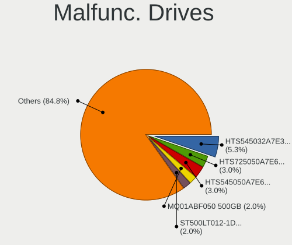

| Model                                   | Notebooks | Drives | Percent |
|-----------------------------------------|-----------|--------|---------|
| HGST HTS545032A7E380 320GB              | 34        | 63     | 5.28%   |
| HGST HTS725050A7E630 500GB              | 19        | 28     | 2.95%   |
| HGST HTS545050A7E680 500GB              | 19        | 28     | 2.95%   |
| Toshiba MQ01ABF050 500GB                | 13        | 32     | 2.02%   |
| Seagate ST500LT012-1DG142 500GB         | 13        | 29     | 2.02%   |
| Seagate ST9320325AS 320GB               | 12        | 27     | 1.86%   |
| Seagate ST1000LM024 HN-M101MBB 1TB      | 11        | 15     | 1.71%   |
| Seagate ST9500325AS 500GB               | 10        | 20     | 1.55%   |
| Seagate ST500LT012-9WS142 500GB         | 10        | 11     | 1.55%   |
| HGST HTS541010A9E680 1TB                | 10        | 27     | 1.55%   |
| HGST HTS545050A7E380 500GB              | 8         | 15     | 1.24%   |
| Toshiba MQ01ABD100 1TB                  | 7         | 9      | 1.09%   |
| Seagate ST9320423AS 320GB               | 7         | 7      | 1.09%   |
| Seagate ST9250315AS 250GB               | 7         | 9      | 1.09%   |
| Kingston SV300S37A120G 120GB SSD        | 7         | 12     | 1.09%   |
| Toshiba MQ01ABD050 500GB                | 6         | 8      | 0.93%   |
| Seagate ST500LM000-SSHD-8GB             | 6         | 9      | 0.93%   |
| Seagate ST1000LM035-1RK172 1TB          | 6         | 8      | 0.93%   |
| Samsung Electronics HM321HI 320GB       | 6         | 12     | 0.93%   |
| Samsung Electronics HM160HI 160GB       | 6         | 7      | 0.93%   |
| Hitachi HTS545050A7E380 500GB           | 6         | 10     | 0.93%   |
| Hitachi HTS545016B9A300 160GB           | 6         | 6      | 0.93%   |
| Seagate ST9500420AS 500GB               | 5         | 16     | 0.78%   |
| Seagate ST320LT007-9ZV142 320GB         | 5         | 5      | 0.78%   |
| Intel SSDSC2BF180A4L 180GB              | 5         | 10     | 0.78%   |
| Hitachi HTS723232A7A364 320GB           | 5         | 5      | 0.78%   |
| Hitachi HTS547550A9E384 500GB           | 5         | 24     | 0.78%   |
| Hitachi HTS545050B9A300 500GB           | 5         | 9      | 0.78%   |
| Hitachi HTS545032B9A300 320GB           | 5         | 6      | 0.78%   |
| Hitachi HTS542516K9SA00 160GB           | 5         | 5      | 0.78%   |
| WDC WD3200BPVT-22JJ5T0 320GB            | 4         | 4      | 0.62%   |
| WDC WD10JPVX-22JC3T0 1TB                | 4         | 7      | 0.62%   |
| Toshiba KSG60ZMV256G M.2 2280 256GB SSD | 4         | 7      | 0.62%   |
| Seagate ST1000LX015-1U7172 1TB          | 4         | 12     | 0.62%   |
| Kingston SA400S37240G 240GB SSD         | 4         | 6      | 0.62%   |
| Hitachi HTS543232A7A384 320GB           | 4         | 6      | 0.62%   |
| Hitachi HTS543216L9A300 160GB           | 4         | 4      | 0.62%   |
| Hitachi HTS541680J9SA00 80GB            | 4         | 4      | 0.62%   |
| Fujitsu MHZ2500BT G1 500GB              | 4         | 6      | 0.62%   |
| WDC WD7500BPKX-60HPJT0 752GB            | 3         | 3      | 0.47%   |

Malfunc. Drive Vendor
---------------------

Vendors of faulty drives

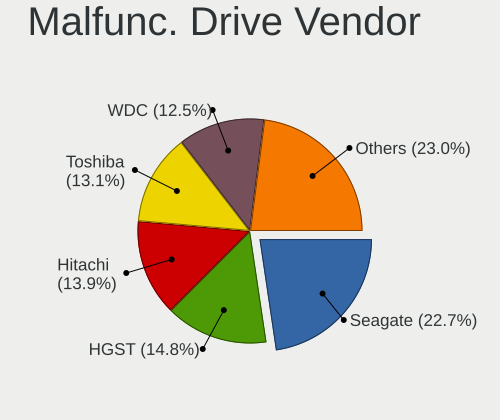

| Vendor              | Notebooks | Drives | Percent |
|---------------------|-----------|--------|---------|
| Seagate             | 145       | 234    | 22.66%  |
| HGST                | 95        | 170    | 14.84%  |
| Hitachi             | 89        | 144    | 13.91%  |
| Toshiba             | 84        | 133    | 13.13%  |
| WDC                 | 80        | 110    | 12.5%   |
| Samsung Electronics | 28        | 60     | 4.38%   |
| Kingston            | 26        | 42     | 4.06%   |
| Fujitsu             | 22        | 34     | 3.44%   |
| Intel               | 21        | 38     | 3.28%   |
| SK hynix            | 12        | 15     | 1.88%   |
| A-DATA Technology   | 6         | 6      | 0.94%   |
| SPCC                | 4         | 5      | 0.63%   |
| SanDisk             | 4         | 5      | 0.63%   |
| China               | 4         | 4      | 0.63%   |
| Micron Technology   | 2         | 2      | 0.31%   |
| Intenso             | 2         | 2      | 0.31%   |
| IBM/Hitachi         | 2         | 2      | 0.31%   |
| WDC WDS4            | 1         | 1      | 0.16%   |
| Team                | 1         | 1      | 0.16%   |
| R580                | 1         | 1      | 0.16%   |
| OCZ-AGIL            | 1         | 1      | 0.16%   |
| LITEON              | 1         | 1      | 0.16%   |
| Kingmax             | 1         | 1      | 0.16%   |
| KING                | 1         | 1      | 0.16%   |
| JMicron Technology  | 1         | 1      | 0.16%   |
| Initio              | 1         | 2      | 0.16%   |
| ICY BOX             | 1         | 1      | 0.16%   |
| CSD                 | 1         | 2      | 0.16%   |
| Crucial             | 1         | 1      | 0.16%   |
| Apple               | 1         | 11     | 0.16%   |
| Apacer              | 1         | 2      | 0.16%   |

Malfunc. HDD Vendor
-------------------

Vendors of faulty HDD drives

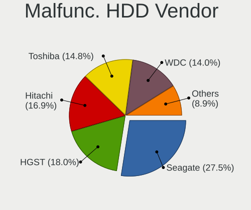

| Vendor              | Notebooks | Drives | Percent |
|---------------------|-----------|--------|---------|
| Seagate             | 145       | 234    | 27.46%  |
| HGST                | 95        | 170    | 17.99%  |
| Hitachi             | 89        | 144    | 16.86%  |
| Toshiba             | 78        | 119    | 14.77%  |
| WDC                 | 74        | 104    | 14.02%  |
| Fujitsu             | 22        | 34     | 4.17%   |
| Samsung Electronics | 20        | 29     | 3.79%   |
| IBM/Hitachi         | 2         | 2      | 0.38%   |
| Initio              | 1         | 2      | 0.19%   |
| ICY BOX             | 1         | 1      | 0.19%   |
| CSD                 | 1         | 2      | 0.19%   |

Malfunc. Drive Kind
-------------------

Kinds of faulty drives

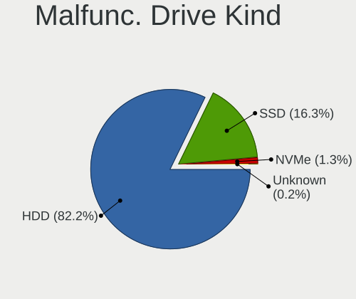

| Kind    | Notebooks | Drives | Percent |
|---------|-----------|--------|---------|
| HDD     | 513       | 841    | 82.21%  |
| SSD     | 102       | 181    | 16.35%  |
| NVMe    | 8         | 10     | 1.28%   |
| Unknown | 1         | 1      | 0.16%   |

Failed Drives
-------------

Failed drive models

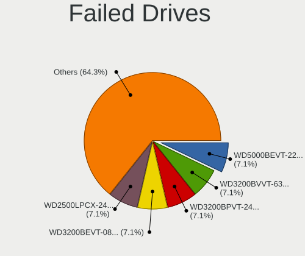

| Model                              | Notebooks | Drives | Percent |
|------------------------------------|-----------|--------|---------|
| WDC WD5000BEVT-22A0RT0 500GB       | 1         | 7      | 6.67%   |
| WDC WD3200BVVT-63A26Y0 320GB       | 1         | 1      | 6.67%   |
| WDC WD3200BPVT-24JJ5T0 320GB       | 1         | 1      | 6.67%   |
| WDC WD3200BEVT-08A23T1 320GB       | 1         | 1      | 6.67%   |
| WDC WD2500LPCX-24C6HT0 250GB       | 1         | 1      | 6.67%   |
| WDC WD1600BEVT-22ZCT0 160GB        | 1         | 1      | 6.67%   |
| Toshiba MQ01ABD050V 500GB          | 1         | 1      | 6.67%   |
| Toshiba MK6475GSX 640GB            | 1         | 1      | 6.67%   |
| Toshiba MK3275GSX 320GB            | 1         | 1      | 6.67%   |
| Seagate ST9160821AS 160GB          | 1         | 1      | 6.67%   |
| Seagate ST1000LM024 HN-M101MBB 1TB | 1         | 1      | 6.67%   |
| Samsung Electronics SSD 980 500GB  | 1         | 1      | 6.67%   |
| Samsung Electronics HM060HI 64GB   | 1         | 1      | 6.67%   |
| Intel SSDPEKKW256G7 256GB          | 1         | 1      | 6.67%   |
| Hitachi HTS723232A7A364 320GB      | 1         | 1      | 6.67%   |

Failed Drive Vendor
-------------------

Failed drive vendors

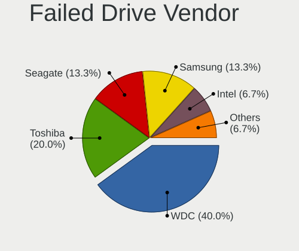

| Vendor              | Notebooks | Drives | Percent |
|---------------------|-----------|--------|---------|
| WDC                 | 6         | 12     | 40%     |
| Toshiba             | 3         | 3      | 20%     |
| Seagate             | 2         | 2      | 13.33%  |
| Samsung Electronics | 2         | 2      | 13.33%  |
| Intel               | 1         | 1      | 6.67%   |
| Hitachi             | 1         | 1      | 6.67%   |

Drive Status
------------

Number of failed and malfunc. drives

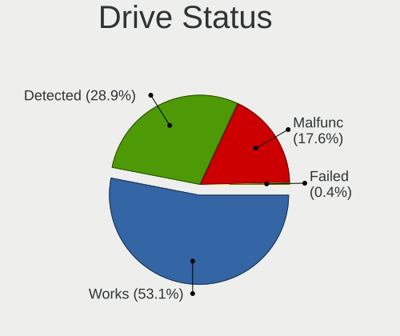

| Status   | Notebooks | Drives | Percent |
|----------|-----------|--------|---------|
| Works    | 1850      | 3457   | 53.05%  |
| Detected | 1007      | 1678   | 28.88%  |
| Malfunc  | 615       | 1033   | 17.64%  |
| Failed   | 15        | 21     | 0.43%   |

Storage controller
------------------

Storage Vendor
--------------

Storage controller vendors

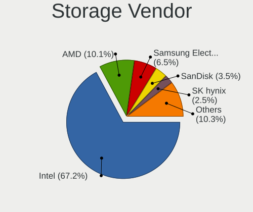

| Vendor                           | Notebooks | Percent |
|----------------------------------|-----------|---------|
| Intel                            | 2403      | 67.16%  |
| AMD                              | 361       | 10.09%  |
| Samsung Electronics              | 232       | 6.48%   |
| SanDisk                          | 125       | 3.49%   |
| SK hynix                         | 89        | 2.49%   |
| Kingston Technology Company      | 89        | 2.49%   |
| Toshiba America Info Systems     | 44        | 1.23%   |
| Micron Technology                | 44        | 1.23%   |
| KIOXIA                           | 27        | 0.75%   |
| Nvidia                           | 24        | 0.67%   |
| Phison Electronics               | 23        | 0.64%   |
| Silicon Integrated Systems [SiS] | 14        | 0.39%   |
| Solidigm                         | 13        | 0.36%   |
| Solid State Storage Technology   | 12        | 0.34%   |
| Silicon Motion                   | 10        | 0.28%   |
| VIA Technologies                 | 8         | 0.22%   |
| Micron/Crucial Technology        | 8         | 0.22%   |
| ADATA Technology                 | 8         | 0.22%   |
| MAXIO Technology (Hangzhou)      | 6         | 0.17%   |
| JMicron Technology               | 6         | 0.17%   |
| Union Memory (Shenzhen)          | 4         | 0.11%   |
| Realtek Semiconductor            | 4         | 0.11%   |
| Apple                            | 4         | 0.11%   |
| Silicon Image                    | 3         | 0.08%   |
| Seagate Technology               | 3         | 0.08%   |
| O2 Micro                         | 3         | 0.08%   |
| Lite-On Technology               | 3         | 0.08%   |
| Shenzhen Longsys Electronics     | 2         | 0.06%   |
| Lenovo                           | 2         | 0.06%   |
| Biwin Storage Technology         | 2         | 0.06%   |
| Shenzhen Techwinsemi Technology  | 1         | 0.03%   |
| Unknown                          | 1         | 0.03%   |

Storage Model
-------------

Storage controller models

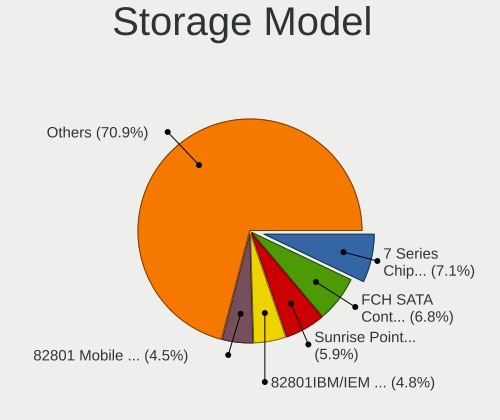

| Model                                                                            | Notebooks | Percent |
|----------------------------------------------------------------------------------|-----------|---------|
| Intel 7 Series Chipset Family 6-port SATA Controller [AHCI mode]                 | 281       | 7.09%   |
| AMD FCH SATA Controller [AHCI mode]                                              | 268       | 6.76%   |
| Intel Sunrise Point-LP SATA Controller [AHCI mode]                               | 234       | 5.91%   |
| Intel 82801IBM/IEM (ICH9M/ICH9M-E) 4 port SATA Controller [AHCI mode]            | 189       | 4.77%   |
| Intel 82801 Mobile SATA Controller [RAID mode]                                   | 179       | 4.52%   |
| Intel 6 Series/C200 Series Chipset Family 6 port Mobile SATA AHCI Controller     | 179       | 4.52%   |
| Intel 8 Series SATA Controller 1 [AHCI mode]                                     | 143       | 3.61%   |
| Intel Wildcat Point-LP SATA Controller [AHCI Mode]                               | 113       | 2.85%   |
| Intel 82801HM/HEM (ICH8M/ICH8M-E) IDE Controller                                 | 102       | 2.57%   |
| Intel 82801HM/HEM (ICH8M/ICH8M-E) SATA Controller [AHCI mode]                    | 90        | 2.27%   |
| Intel 5 Series/3400 Series Chipset 4 port SATA AHCI Controller                   | 86        | 2.17%   |
| Samsung NVMe SSD Controller SM981/PM981/PM983                                    | 81        | 2.04%   |
| Intel 5 Series/3400 Series Chipset 6 port SATA AHCI Controller                   | 81        | 2.04%   |
| Samsung NVMe SSD Controller 980 (DRAM-less)                                      | 80        | 2.02%   |
| Intel Volume Management Device NVMe RAID Controller                              | 75        | 1.89%   |
| Intel 8 Series/C220 Series Chipset Family 6-port SATA Controller 1 [AHCI mode]   | 71        | 1.79%   |
| AMD SB7x0/SB8x0/SB9x0 SATA Controller [AHCI mode]                                | 61        | 1.54%   |
| Intel Atom/Celeron/Pentium Processor x5-E8000/J3xxx/N3xxx Series SATA Controller | 60        | 1.51%   |
| Intel Cannon Lake Mobile PCH SATA AHCI Controller                                | 59        | 1.49%   |
| Intel Atom Processor E3800 Series SATA AHCI Controller                           | 58        | 1.46%   |
| Intel HM170/QM170 Chipset SATA Controller [AHCI Mode]                            | 48        | 1.21%   |
| Intel Celeron N3350/Pentium N4200/Atom E3900 Series SATA AHCI Controller         | 47        | 1.19%   |
| Intel 82801G (ICH7 Family) IDE Controller                                        | 40        | 1.01%   |
| Intel 82801IBM/IEM (ICH9M/ICH9M-E) 2 port SATA Controller [IDE mode]             | 39        | 0.98%   |
| Intel 82801GBM/GHM (ICH7-M Family) SATA Controller [AHCI mode]                   | 37        | 0.93%   |
| Intel Celeron/Pentium Silver Processor SATA Controller                           | 33        | 0.83%   |
| Intel NM10/ICH7 Family SATA Controller [AHCI mode]                               | 30        | 0.76%   |
| SK hynix Gold P31/BC711/PC711 NVMe Solid State Drive                             | 29        | 0.73%   |
| Intel Tiger Lake-LP SATA Controller                                              | 28        | 0.71%   |
| Intel 82801GBM/GHM (ICH7-M Family) SATA Controller [IDE mode]                    | 28        | 0.71%   |
| Kingston Company NV2 NVMe SSD [SM2267XT] (DRAM-less)                             | 27        | 0.68%   |
| Intel Alder Lake-P SATA AHCI Controller                                          | 26        | 0.66%   |
| Intel 5 Series/3400 Series Chipset 4 port SATA IDE Controller                    | 26        | 0.66%   |
| Intel 5 Series/3400 Series Chipset 2 port SATA IDE Controller                    | 26        | 0.66%   |
| Samsung NVMe SSD Controller SM961/PM961/SM963                                    | 25        | 0.63%   |
| Intel Ice Lake-LP SATA Controller [AHCI mode]                                    | 25        | 0.63%   |
| KIOXIA NVMe SSD Controller BG4 (DRAM-less)                                       | 24        | 0.61%   |
| Intel Comet Lake SATA AHCI Controller                                            | 23        | 0.58%   |
| SanDisk WD SN560/SN740/SN770/SN5000 NVMe SSD                                     | 22        | 0.56%   |
| SanDisk Ultra 3D / WD PC SN530, IX SN530, Blue SN550 NVMe SSD (DRAM-less)        | 22        | 0.56%   |

Storage Kind
------------

Kind of storage controller (IDE, SATA, NVMe, SAS, ...)

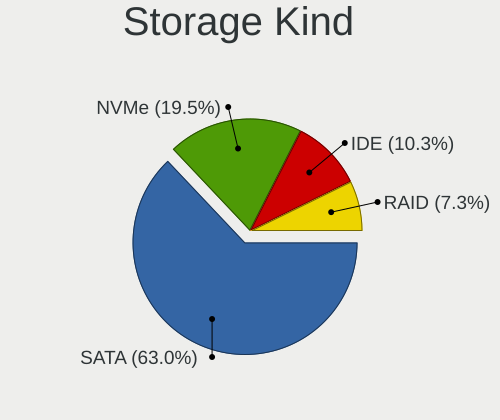

| Kind | Notebooks | Percent |
|------|-----------|---------|
| SATA | 2377      | 62.95%  |
| NVMe | 737       | 19.52%  |
| IDE  | 388       | 10.28%  |
| RAID | 274       | 7.26%   |

Processor
---------

CPU Vendor
----------

Processor vendors

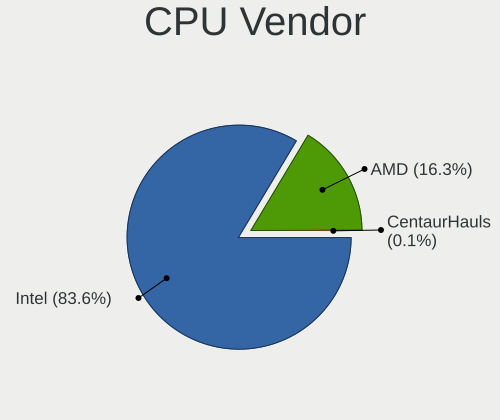

| Vendor       | Notebooks | Percent |
|--------------|-----------|---------|
| Intel        | 2636      | 83.6%   |
| AMD          | 515       | 16.33%  |
| CentaurHauls | 2         | 0.06%   |

CPU Model
---------

Processor models

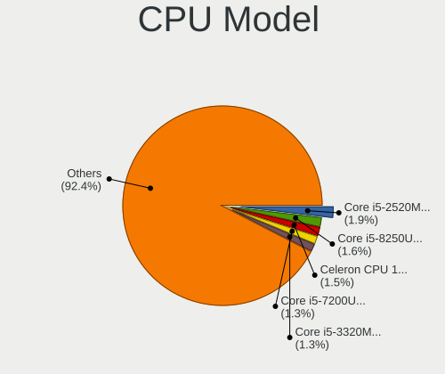

| Model                                       | Notebooks | Percent |
|---------------------------------------------|-----------|---------|
| Intel Core i5-2520M CPU @ 2.50GHz           | 59        | 1.87%   |
| Intel Core i5-8250U CPU @ 1.60GHz           | 50        | 1.58%   |
| Intel Celeron CPU 1000M @ 1.80GHz           | 47        | 1.49%   |
| Intel Core i5-7200U CPU @ 2.50GHz           | 42        | 1.33%   |
| Intel Core i5-3320M CPU @ 2.60GHz           | 41        | 1.3%    |
| Intel Core i3-5005U CPU @ 2.00GHz           | 39        | 1.23%   |
| Intel Core i5 CPU M 520 @ 2.40GHz           | 37        | 1.17%   |
| Intel 11th Gen Core i5-1135G7 @ 2.40GHz     | 34        | 1.08%   |
| Intel Core i5-5300U CPU @ 2.30GHz           | 32        | 1.01%   |
| Intel Celeron CPU N3350 @ 1.10GHz           | 31        | 0.98%   |
| Intel Core i5-6200U CPU @ 2.30GHz           | 29        | 0.92%   |
| Intel Core 2 Duo CPU P8600 @ 2.40GHz        | 28        | 0.89%   |
| Intel Core i5-6300U CPU @ 2.40GHz           | 27        | 0.85%   |
| Intel Core i3-6006U CPU @ 2.00GHz           | 27        | 0.85%   |
| Intel Core i5-3210M CPU @ 2.50GHz           | 26        | 0.82%   |
| Intel Celeron CPU N3060 @ 1.60GHz           | 25        | 0.79%   |
| Intel Core i7-8750H CPU @ 2.20GHz           | 23        | 0.73%   |
| Intel Core i5-4210U CPU @ 1.70GHz           | 23        | 0.73%   |
| Intel Core i5-4200U CPU @ 1.60GHz           | 22        | 0.7%    |
| Intel Core i3-7020U CPU @ 2.30GHz           | 22        | 0.7%    |
| Intel Core 2 Duo CPU P8400 @ 2.26GHz        | 22        | 0.7%    |
| Intel Core i3-2310M CPU @ 2.10GHz           | 21        | 0.66%   |
| Intel Pentium Dual-Core CPU T4500 @ 2.30GHz | 20        | 0.63%   |
| Intel Core i7-6600U CPU @ 2.60GHz           | 20        | 0.63%   |
| Intel Core i5-8265U CPU @ 1.60GHz           | 20        | 0.63%   |
| Intel Core i5-5200U CPU @ 2.20GHz           | 20        | 0.63%   |
| Intel Core i5-4300U CPU @ 1.90GHz           | 20        | 0.63%   |
| Intel Core i5 CPU M 560 @ 2.67GHz           | 20        | 0.63%   |
| Intel 11th Gen Core i3-1115G4 @ 3.00GHz     | 20        | 0.63%   |
| AMD A10-5750M APU with Radeon HD Graphics   | 20        | 0.63%   |
| Intel Pentium Dual-Core CPU T4400 @ 2.20GHz | 19        | 0.6%    |
| Intel Core i5-2540M CPU @ 2.60GHz           | 19        | 0.6%    |
| Intel Core i3 CPU M 350 @ 2.27GHz           | 19        | 0.6%    |
| Intel Core 2 Duo CPU T7500 @ 2.20GHz        | 19        | 0.6%    |
| Intel Celeron CPU N2840 @ 2.16GHz           | 19        | 0.6%    |
| Intel Core i3-3110M CPU @ 2.40GHz           | 18        | 0.57%   |
| Intel Core i3-1005G1 CPU @ 1.20GHz          | 18        | 0.57%   |
| Intel Core i7-7700HQ CPU @ 2.80GHz          | 17        | 0.54%   |
| Intel Core i5-3340M CPU @ 2.70GHz           | 17        | 0.54%   |
| Intel Core i3-4005U CPU @ 1.70GHz           | 17        | 0.54%   |

CPU Model Family
----------------

Processor model prefix

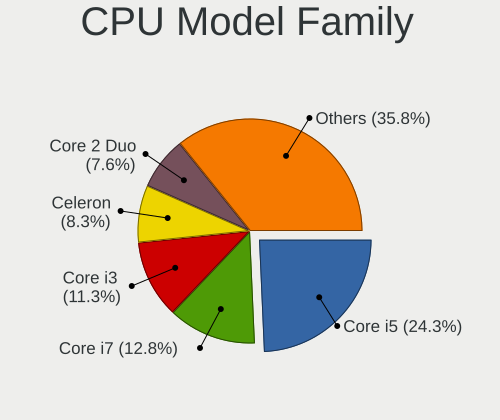

| Model                   | Notebooks | Percent |
|-------------------------|-----------|---------|
| Intel Core i5           | 768       | 24.3%   |
| Intel Core i7           | 404       | 12.78%  |
| Intel Core i3           | 356       | 11.27%  |
| Intel Celeron           | 261       | 8.26%   |
| Intel Core 2 Duo        | 241       | 7.63%   |
| Other                   | 201       | 6.36%   |
| Intel Pentium           | 117       | 3.7%    |
| Intel Atom              | 84        | 2.66%   |
| AMD Ryzen 5             | 83        | 2.63%   |
| AMD Ryzen 7             | 72        | 2.28%   |
| Intel Pentium Dual-Core | 58        | 1.84%   |
| AMD A4                  | 34        | 1.08%   |
| Intel Pentium Dual      | 33        | 1.04%   |
| AMD Ryzen 3             | 33        | 1.04%   |
| AMD A10                 | 33        | 1.04%   |
| Intel Core 2            | 30        | 0.95%   |
| AMD E                   | 29        | 0.92%   |
| AMD A8                  | 27        | 0.85%   |
| AMD E1                  | 22        | 0.7%    |
| Intel Genuine           | 21        | 0.66%   |
| AMD E2                  | 20        | 0.63%   |
| AMD A6                  | 20        | 0.63%   |
| Intel Pentium Silver    | 17        | 0.54%   |
| Intel Celeron Dual-Core | 16        | 0.51%   |
| Intel Celeron M         | 14        | 0.44%   |
| AMD Ryzen 5 PRO         | 12        | 0.38%   |
| Intel Core i9           | 11        | 0.35%   |
| AMD Ryzen 9             | 11        | 0.35%   |
| Intel Pentium M         | 10        | 0.32%   |
| Intel Core              | 10        | 0.32%   |
| AMD Ryzen 7 PRO         | 9         | 0.28%   |
| AMD FX                  | 9         | 0.28%   |
| Intel Core Duo          | 8         | 0.25%   |
| AMD Turion 64 X2 Mobile | 7         | 0.22%   |
| AMD Athlon II           | 7         | 0.22%   |
| AMD C-50                | 6         | 0.19%   |
| AMD Mobile Sempron      | 5         | 0.16%   |
| AMD C-60                | 5         | 0.16%   |
| AMD Athlon II Dual-Core | 5         | 0.16%   |
| AMD Athlon X2           | 4         | 0.13%   |

CPU Cores
---------

Number of processor cores

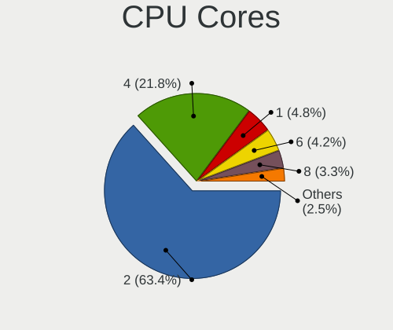

| Number | Notebooks | Percent |
|--------|-----------|---------|
| 2      | 2004      | 63.36%  |
| 4      | 691       | 21.85%  |
| 1      | 153       | 4.84%   |
| 6      | 133       | 4.2%    |
| 8      | 104       | 3.29%   |
| 10     | 35        | 1.11%   |
| 12     | 15        | 0.47%   |
| 14     | 14        | 0.44%   |
| 24     | 8         | 0.25%   |
| 16     | 4         | 0.13%   |
| 9      | 1         | 0.03%   |
| 3      | 1         | 0.03%   |

CPU Sockets
-----------

Number of sockets

| Number | Notebooks | Percent |
|--------|-----------|---------|
| 1      | 3153      | 100%    |

CPU Threads
-----------

Threads per core (Hyper-Threading)

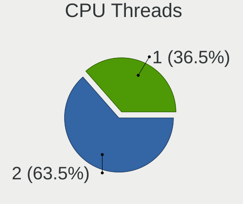

| Number | Notebooks | Percent |
|--------|-----------|---------|
| 2      | 2015      | 63.54%  |
| 1      | 1156      | 36.46%  |

CPU Op-Modes
------------

CPU Operation Modes (32-bit, 64-bit)

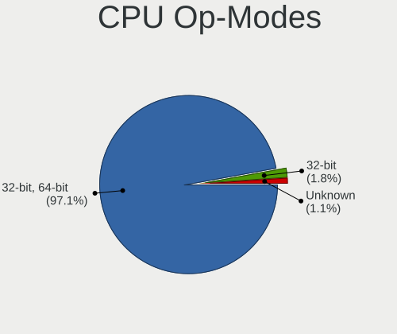

| Op mode        | Notebooks | Percent |
|----------------|-----------|---------|
| 32-bit, 64-bit | 3073      | 97.12%  |
| 32-bit         | 57        | 1.8%    |
| Unknown        | 34        | 1.07%   |

CPU Microcode
-------------

Microcode number

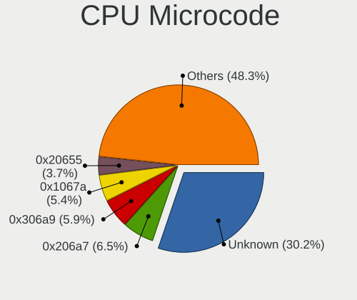

| Number     | Notebooks | Percent |
|------------|-----------|---------|
| Unknown    | 1004      | 30.21%  |
| 0x206a7    | 215       | 6.47%   |
| 0x306a9    | 197       | 5.93%   |
| 0x1067a    | 179       | 5.39%   |
| 0x20655    | 123       | 3.7%    |
| 0x40651    | 106       | 3.19%   |
| 0x406e3    | 96        | 2.89%   |
| 0x306d4    | 90        | 2.71%   |
| 0x6fd      | 81        | 2.44%   |
| 0x806e9    | 65        | 1.96%   |
| 0x306c3    | 61        | 1.84%   |
| 0x806ea    | 56        | 1.69%   |
| 0x406c4    | 50        | 1.5%    |
| 0x10676    | 43        | 1.29%   |
| 0x906ea    | 42        | 1.26%   |
| 0x806ec    | 42        | 1.26%   |
| 0x806c1    | 40        | 1.2%    |
| 0x30678    | 40        | 1.2%    |
| 0x20652    | 39        | 1.17%   |
| 0x106ca    | 37        | 1.11%   |
| 0x05000119 | 34        | 1.02%   |
| 0x506c9    | 31        | 0.93%   |
| 0x06001119 | 31        | 0.93%   |
| 0x07030105 | 27        | 0.81%   |
| 0x706a1    | 25        | 0.75%   |
| 0x906e9    | 23        | 0.69%   |
| 0x406c3    | 22        | 0.66%   |
| 0x806eb    | 20        | 0.6%    |
| 0x506e3    | 20        | 0.6%    |
| 0x106c2    | 20        | 0.6%    |
| 0x706e5    | 19        | 0.57%   |
| 0x6fb      | 19        | 0.57%   |
| 0x6f6      | 19        | 0.57%   |
| 0x0a50000c | 18        | 0.54%   |
| 0x0700010f | 17        | 0.51%   |
| 0x08600106 | 16        | 0.48%   |
| 0x05000029 | 16        | 0.48%   |
| 0x010000c8 | 14        | 0.42%   |
| 0x6f2      | 13        | 0.39%   |
| 0x08108109 | 13        | 0.39%   |

CPU Microarch
-------------

Microarchitecture

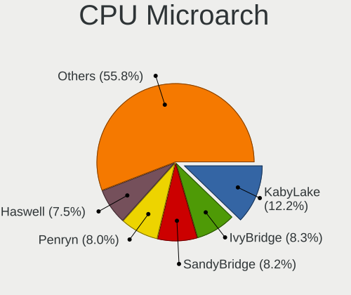

| Name              | Notebooks | Percent |
|-------------------|-----------|---------|
| KabyLake          | 385       | 12.2%   |
| IvyBridge         | 262       | 8.3%    |
| SandyBridge       | 259       | 8.21%   |
| Penryn            | 251       | 7.96%   |
| Haswell           | 236       | 7.48%   |
| Westmere          | 191       | 6.05%   |
| Core              | 169       | 5.36%   |
| Skylake           | 163       | 5.17%   |
| Silvermont        | 152       | 4.82%   |
| Unknown           | 134       | 4.25%   |
| Broadwell         | 131       | 4.15%   |
| TigerLake         | 81        | 2.57%   |
| Bobcat            | 66        | 2.09%   |
| Bonnell           | 60        | 1.9%    |
| Zen 3             | 57        | 1.81%   |
| Alderlake Hybrid  | 51        | 1.62%   |
| Goldmont          | 47        | 1.49%   |
| Icelake           | 46        | 1.46%   |
| Zen 2             | 43        | 1.36%   |
| Puma              | 39        | 1.24%   |
| Piledriver        | 38        | 1.2%    |
| Goldmont plus     | 35        | 1.11%   |
| P6                | 34        | 1.08%   |
| Zen+              | 33        | 1.05%   |
| Excavator         | 32        | 1.01%   |
| K10               | 24        | 0.76%   |
| Jaguar            | 22        | 0.7%    |
| Zen               | 21        | 0.67%   |
| K8 Hammer         | 18        | 0.57%   |
| CometLake         | 16        | 0.51%   |
| Steamroller       | 15        | 0.48%   |
| Nehalem           | 12        | 0.38%   |
| K10 Llano         | 8         | 0.25%   |
| Meteorlake Hybrid | 6         | 0.19%   |
| K8 & K10 hybrid   | 6         | 0.19%   |
| Gracemont         | 5         | 0.16%   |
| Tremont           | 3         | 0.1%    |
| NetBurst          | 2         | 0.06%   |
| Lunarlake Hybrid  | 2         | 0.06%   |

Graphics
--------

GPU Vendor
----------

Vendors of graphics cards

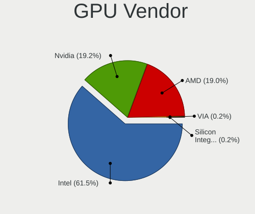

| Vendor                           | Notebooks | Percent |
|----------------------------------|-----------|---------|
| Intel                            | 2378      | 61.48%  |
| Nvidia                           | 741       | 19.16%  |
| AMD                              | 733       | 18.95%  |
| VIA Technologies                 | 8         | 0.21%   |
| Silicon Integrated Systems [SiS] | 8         | 0.21%   |

GPU Model
---------

Graphics card models

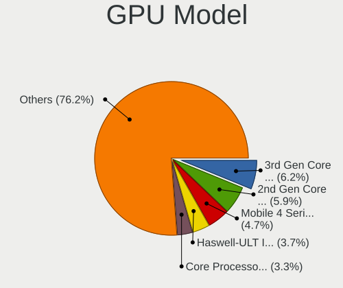

| Model                                                                                    | Notebooks | Percent |
|------------------------------------------------------------------------------------------|-----------|---------|
| Intel 3rd Gen Core processor Graphics Controller                                         | 252       | 6.19%   |
| Intel 2nd Generation Core Processor Family Integrated Graphics Controller                | 242       | 5.94%   |
| Intel Mobile 4 Series Chipset Integrated Graphics Controller                             | 191       | 4.69%   |
| Intel Haswell-ULT Integrated Graphics Controller                                         | 152       | 3.73%   |
| Intel Core Processor Integrated Graphics Controller                                      | 133       | 3.27%   |
| Intel Broadwell-U GT2 [HD Graphics 5500]                                                 | 119       | 2.92%   |
| Intel Skylake-U GT2 [HD Graphics 520]                                                    | 117       | 2.87%   |
| Intel Kaby Lake-R GT2 [UHD Graphics 620]                                                 | 91        | 2.23%   |
| Intel Atom/Celeron/Pentium Processor x5-E8000/J3xxx/N3xxx Integrated Graphics Controller | 86        | 2.11%   |
| Intel Kaby Lake-U GT2 [HD Graphics 620]                                                  | 82        | 2.01%   |
| Intel 4th Gen Core Processor Integrated Graphics Controller                              | 70        | 1.72%   |
| Intel Atom Processor Z36xxx/Z37xxx Series Graphics & Display                             | 66        | 1.62%   |
| Intel Mobile 945GM/GMS/GME, 943/940GML Express Integrated Graphics Controller            | 64        | 1.57%   |
| Intel Mobile GM965/GL960 Integrated Graphics Controller (secondary)                      | 63        | 1.55%   |
| Intel Mobile GM965/GL960 Integrated Graphics Controller (primary)                        | 63        | 1.55%   |
| Intel TigerLake-LP GT2 [Iris Xe Graphics]                                                | 58        | 1.42%   |
| Intel CoffeeLake-H GT2 [UHD Graphics 630]                                                | 58        | 1.42%   |
| Nvidia GF117M [GeForce 610M/710M/810M/820M / GT 620M/625M/630M/720M]                     | 50        | 1.23%   |
| Intel WhiskeyLake-U GT2 [UHD Graphics 620]                                               | 50        | 1.23%   |
| AMD Topaz XT [Radeon R7 M260/M265 / M340/M360 / M440/M445 / 530/535 / 620/625 Mobile]    | 46        | 1.13%   |
| Intel Mobile 945GM/GMS, 943/940GML Express Integrated Graphics Controller                | 44        | 1.08%   |
| Intel CometLake-U GT2 [UHD Graphics]                                                     | 41        | 1.01%   |
| AMD Renoir [Radeon Vega Series / Radeon Vega Mobile Series]                              | 41        | 1.01%   |
| Intel Atom Processor D4xx/D5xx/N4xx/N5xx Integrated Graphics Controller                  | 39        | 0.96%   |
| Intel Apollo Lake GT1 [HD Graphics 500]                                                  | 37        | 0.91%   |
| AMD Sun XT [Radeon HD 8670A/8670M/8690M / R5 M330 / M430 / Radeon 520 Mobile]            | 36        | 0.88%   |
| AMD Cezanne [Radeon Vega Series / Radeon Vega Mobile Series]                             | 35        | 0.86%   |
| Intel Skylake-H GT2 [HD Graphics 530]                                                    | 34        | 0.83%   |
| Nvidia GM107M [GeForce GTX 950M]                                                         | 33        | 0.81%   |
| Nvidia GK208BM [GeForce 920M]                                                            | 33        | 0.81%   |
| AMD Picasso/Raven 2 [Radeon Vega Series / Radeon Vega Mobile Series]                     | 32        | 0.79%   |
| Intel Iris Plus Graphics G1 (Ice Lake)                                                   | 26        | 0.64%   |
| Intel Kaby Lake-H GT2 [HD Graphics 630]                                                  | 25        | 0.61%   |
| AMD Mullins [Radeon R4/R5 Graphics]                                                      | 25        | 0.61%   |
| AMD Seymour [Radeon HD 6400M/7400M Series]                                               | 24        | 0.59%   |
| AMD Lucienne                                                                             | 24        | 0.59%   |
| AMD Jet PRO [Radeon R5 M230 / R7 M260DX / Radeon 520/610 Mobile]                         | 24        | 0.59%   |
| Nvidia GP107M [GeForce GTX 1050 Mobile]                                                  | 23        | 0.56%   |
| Nvidia GM108M [GeForce 840M]                                                             | 23        | 0.56%   |
| Intel Tiger Lake-LP GT2 [UHD Graphics G4]                                                | 23        | 0.56%   |

GPU Combo
---------

Combinations of graphics cards

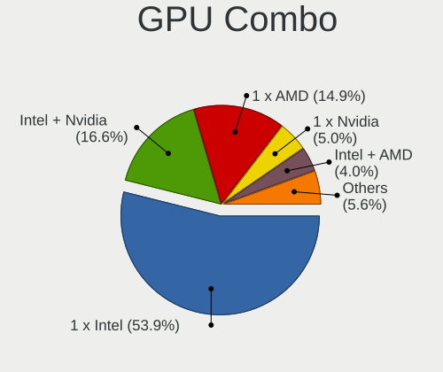

| Name           | Notebooks | Percent |
|----------------|-----------|---------|
| 1 x Intel      | 1706      | 53.9%   |
| Intel + Nvidia | 525       | 16.59%  |
| 1 x AMD        | 473       | 14.94%  |
| 1 x Nvidia     | 157       | 4.96%   |
| Intel + AMD    | 128       | 4.04%   |
| 2 x AMD        | 73        | 2.31%   |
| AMD + Nvidia   | 59        | 1.86%   |
| 2 x Intel      | 26        | 0.82%   |
| 1 x VIA        | 8         | 0.25%   |
| 1 x SiS        | 8         | 0.25%   |
| Other          | 1         | 0.03%   |
| 2 x Nvidia     | 1         | 0.03%   |

GPU Driver
----------

Free vs proprietary

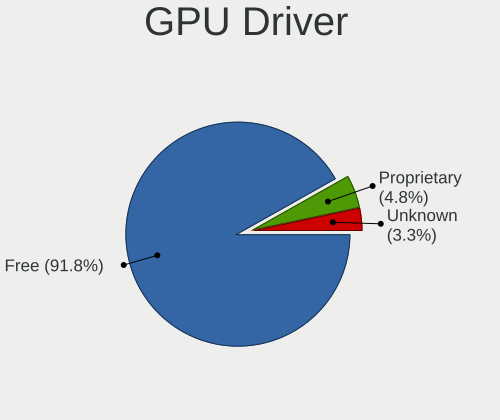

| Driver      | Notebooks | Percent |
|-------------|-----------|---------|
| Free        | 2922      | 91.83%  |
| Proprietary | 154       | 4.84%   |
| Unknown     | 106       | 3.33%   |

GPU Memory
----------

Total video memory

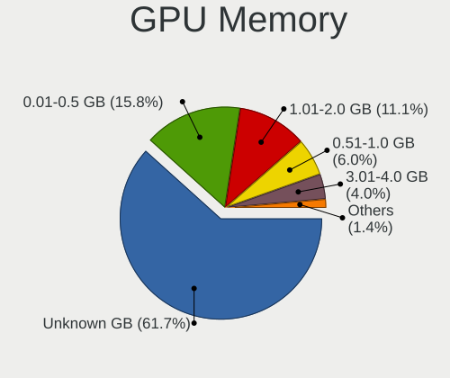

| Size in GB | Notebooks | Percent |
|------------|-----------|---------|
| Unknown    | 2008      | 61.67%  |
| 0.01-0.5   | 513       | 15.76%  |
| 1.01-2.0   | 363       | 11.15%  |
| 0.51-1.0   | 195       | 5.99%   |
| 3.01-4.0   | 131       | 4.02%   |
| 5.01-6.0   | 23        | 0.71%   |
| 7.01-8.0   | 16        | 0.49%   |
| 2.01-3.0   | 5         | 0.15%   |
| 8.01-16.0  | 2         | 0.06%   |

Monitor
-------

Monitor Vendor
--------------

Monitor vendors

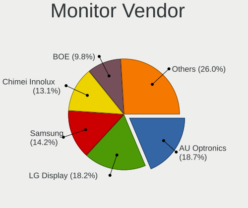

| Vendor                  | Notebooks | Percent |
|-------------------------|-----------|---------|
| AU Optronics            | 649       | 18.65%  |
| LG Display              | 633       | 18.19%  |
| Samsung Electronics     | 495       | 14.23%  |
| Chimei Innolux          | 456       | 13.11%  |
| BOE                     | 342       | 9.83%   |
| Chi Mei Optoelectronics | 127       | 3.65%   |
| Lenovo                  | 117       | 3.36%   |
| Goldstar                | 87        | 2.5%    |
| Dell                    | 57        | 1.64%   |
| PANDA                   | 46        | 1.32%   |
| LG Philips              | 45        | 1.29%   |
| InfoVision              | 36        | 1.03%   |
| Apple                   | 32        | 0.92%   |
| Philips                 | 23        | 0.66%   |
| Sharp                   | 21        | 0.6%    |
| BenQ                    | 21        | 0.6%    |
| AOC                     | 21        | 0.6%    |
| Hewlett-Packard         | 19        | 0.55%   |
| CPT                     | 19        | 0.55%   |
| Valve                   | 18        | 0.52%   |
| Acer                    | 17        | 0.49%   |
| Sony                    | 16        | 0.46%   |
| Toshiba                 | 15        | 0.43%   |
| HannStar                | 15        | 0.43%   |
| ASUSTek Computer        | 13        | 0.37%   |
| InnoLux Display         | 10        | 0.29%   |
| Fujitsu Siemens         | 10        | 0.29%   |
| Ancor Communications    | 10        | 0.29%   |
| Vestel Elektronik       | 8         | 0.23%   |
| Quanta Display          | 8         | 0.23%   |
| CSO                     | 7         | 0.2%    |
| TMX                     | 6         | 0.17%   |
| Panasonic               | 4         | 0.11%   |
| NEC Computers           | 4         | 0.11%   |
| MSI                     | 4         | 0.11%   |
| IBM                     | 4         | 0.11%   |
| Xerox                   | 3         | 0.09%   |
| Unknown (XXX)           | 3         | 0.09%   |
| OEM                     | 3         | 0.09%   |
| Mi                      | 3         | 0.09%   |

Monitor Model
-------------

Monitor models

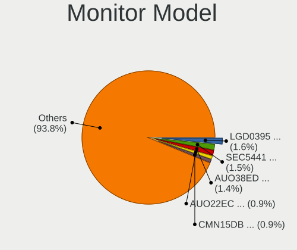

| Model                                                                    | Notebooks | Percent |
|--------------------------------------------------------------------------|-----------|---------|
| LG Display LCD Monitor LGD0395 1366x768 344x194mm 15.5-inch              | 55        | 1.56%   |
| Samsung Electronics LCD Monitor SEC5441 1280x800 331x207mm 15.4-inch     | 52        | 1.48%   |
| AU Optronics LCD Monitor AUO38ED 1920x1080 344x193mm 15.5-inch           | 48        | 1.36%   |
| AU Optronics LCD Monitor AUO22EC 1366x768 344x193mm 15.5-inch            | 32        | 0.91%   |
| Chimei Innolux LCD Monitor CMN15DB 1366x768 344x193mm 15.5-inch          | 31        | 0.88%   |
| LG Display LCD Monitor LGD02DC 1366x768 344x194mm 15.5-inch              | 27        | 0.77%   |
| BOE LCD Monitor BOE06A5 1366x768 344x194mm 15.5-inch                     | 26        | 0.74%   |
| Chimei Innolux LCD Monitor CMN14D4 1920x1080 309x173mm 13.9-inch         | 25        | 0.71%   |
| Chi Mei Optoelectronics LCD Monitor CMO15A7 1366x768 344x193mm 15.5-inch | 25        | 0.71%   |
| Chimei Innolux LCD Monitor CMN15E7 1920x1080 344x193mm 15.5-inch         | 22        | 0.63%   |
| Chimei Innolux LCD Monitor CMN15D5 1920x1080 344x193mm 15.5-inch         | 22        | 0.63%   |
| AU Optronics LCD Monitor AUO106C 1366x768 276x155mm 12.5-inch            | 22        | 0.63%   |
| Lenovo LCD Monitor LEN4036 1440x900 303x190mm 14.1-inch                  | 21        | 0.6%    |
| Chimei Innolux LCD Monitor CMN15F5 1920x1080 344x193mm 15.5-inch         | 21        | 0.6%    |
| AU Optronics LCD Monitor AUO21ED 1920x1080 344x193mm 15.5-inch           | 20        | 0.57%   |
| Chimei Innolux LCD Monitor CMN14C9 1920x1080 309x173mm 13.9-inch         | 19        | 0.54%   |
| LG Display LP156WH2-TLAA LGD0230 1366x768 344x194mm 15.5-inch            | 18        | 0.51%   |
| AU Optronics LCD Monitor AUO26EC 1366x768 344x193mm 15.5-inch            | 18        | 0.51%   |
| LG Display LCD Monitor LGD033A 1366x768 344x194mm 15.5-inch              | 17        | 0.48%   |
| Chi Mei Optoelectronics LCD Monitor CMO1592 1366x768 344x193mm 15.5-inch | 17        | 0.48%   |
| Samsung Electronics LCD Monitor SEC325A 1366x768 344x194mm 15.5-inch     | 15        | 0.43%   |
| BOE LCD Monitor BOE0672 1366x768 344x194mm 15.5-inch                     | 15        | 0.43%   |
| Valve ANX7530 U VLV3001 800x1280 100x150mm 7.1-inch                      | 14        | 0.4%    |
| BOE LCD Monitor BOE0687 1920x1080 344x193mm 15.5-inch                    | 14        | 0.4%    |
| AU Optronics LCD Monitor AUO20EC 1366x768 344x193mm 15.5-inch            | 14        | 0.4%    |
| Chimei Innolux LCD Monitor CMN15BC 1366x768 344x193mm 15.5-inch          | 13        | 0.37%   |
| BOE LCD Monitor BOE069C 1920x1080 344x193mm 15.5-inch                    | 13        | 0.37%   |
| AU Optronics LCD Monitor AUO10EC 1366x768 344x193mm 15.5-inch            | 13        | 0.37%   |
| Chimei Innolux LCD Monitor CMN15CA 1366x768 344x193mm 15.5-inch          | 12        | 0.34%   |
| Chimei Innolux LCD Monitor CMN15BF 1366x768 344x194mm 15.5-inch          | 12        | 0.34%   |
| Chimei Innolux LCD Monitor CMN1521 1920x1080 344x193mm 15.5-inch         | 12        | 0.34%   |
| AU Optronics LCD Monitor AUO313C 1366x768 309x173mm 13.9-inch            | 12        | 0.34%   |
| Samsung Electronics LCD Monitor SEC324A 1366x768 344x194mm 15.5-inch     | 11        | 0.31%   |
| LG Display LCD Monitor LGD03AB 1366x768 344x194mm 15.5-inch              | 11        | 0.31%   |
| LG Display LCD Monitor LGD0365 1600x900 382x215mm 17.3-inch              | 11        | 0.31%   |
| LG Display LCD Monitor LGD033E 1366x768 309x174mm 14.0-inch              | 11        | 0.31%   |
| Lenovo LCD Monitor LEN40B1 1600x900 345x194mm 15.6-inch                  | 11        | 0.31%   |
| Chimei Innolux LCD Monitor CMN15C4 1920x1080 344x193mm 15.5-inch         | 11        | 0.31%   |
| Chimei Innolux LCD Monitor CMN1482 1600x900 309x174mm 14.0-inch          | 11        | 0.31%   |
| Chi Mei Optoelectronics LCD Monitor CMO15A1 1366x768 344x193mm 15.5-inch | 11        | 0.31%   |

Monitor Resolution
------------------

Monitor screen resolution

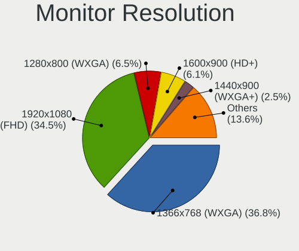

| Resolution         | Notebooks | Percent |
|--------------------|-----------|---------|
| 1366x768 (WXGA)    | 1227      | 36.77%  |
| 1920x1080 (FHD)    | 1152      | 34.52%  |
| 1280x800 (WXGA)    | 216       | 6.47%   |
| 1600x900 (HD+)     | 205       | 6.14%   |
| 1440x900 (WXGA+)   | 82        | 2.46%   |
| 3840x2160 (4K)     | 76        | 2.28%   |
| 1920x1200 (WUXGA)  | 57        | 1.71%   |
| 1024x600           | 43        | 1.29%   |
| 2560x1440 (QHD)    | 39        | 1.17%   |
| 1680x1050 (WSXGA+) | 31        | 0.93%   |
| 2560x1600          | 29        | 0.87%   |
| 1280x1024 (SXGA)   | 28        | 0.84%   |
| 2880x1800          | 27        | 0.81%   |
| 800x1280           | 19        | 0.57%   |
| 1024x768 (XGA)     | 18        | 0.54%   |
| 2560x1080          | 12        | 0.36%   |
| 1360x768           | 8         | 0.24%   |
| 3440x1440          | 7         | 0.21%   |
| 1920x540           | 7         | 0.21%   |
| 3840x1080          | 5         | 0.15%   |
| 2880x1620          | 5         | 0.15%   |
| 3200x2000          | 4         | 0.12%   |
| 2160x1440          | 4         | 0.12%   |
| 1400x1050          | 4         | 0.12%   |
| 3840x2400          | 3         | 0.09%   |
| 1680x945           | 3         | 0.09%   |
| 1600x2560          | 3         | 0.09%   |
| 2288x1287          | 2         | 0.06%   |
| 1920x1280          | 2         | 0.06%   |
| 1600x1200          | 2         | 0.06%   |
| 1280x768           | 2         | 0.06%   |
| Unknown            | 2         | 0.06%   |
| 5760x2160          | 1         | 0.03%   |
| 504x315            | 1         | 0.03%   |
| 4093x4093          | 1         | 0.03%   |
| 400x1280           | 1         | 0.03%   |
| 3456x2160          | 1         | 0.03%   |
| 3200x1800 (QHD+)   | 1         | 0.03%   |
| 3072x1920          | 1         | 0.03%   |
| 2560x2880          | 1         | 0.03%   |

Monitor Diagonal
----------------

Diagonal size in inches

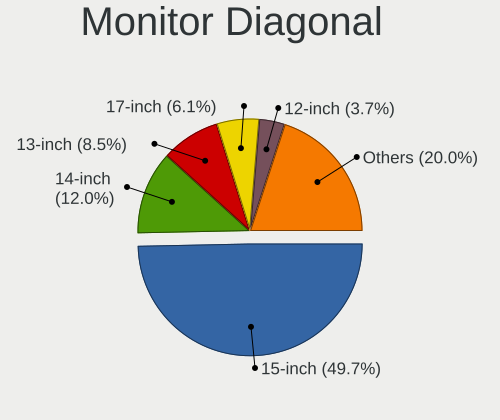

| Inches  | Notebooks | Percent |
|---------|-----------|---------|
| 15      | 1737      | 49.67%  |
| 14      | 421       | 12.04%  |
| 13      | 297       | 8.49%   |
| 17      | 214       | 6.12%   |
| 12      | 129       | 3.69%   |
| 24      | 81        | 2.32%   |
| 21      | 81        | 2.32%   |
| 23      | 78        | 2.23%   |
| 27      | 69        | 1.97%   |
| 11      | 53        | 1.52%   |
| 10      | 53        | 1.52%   |
| 18      | 38        | 1.09%   |
| 16      | 34        | 0.97%   |
| 19      | 21        | 0.6%    |
| 31      | 19        | 0.54%   |
| 7       | 19        | 0.54%   |
| 22      | 16        | 0.46%   |
| Unknown | 16        | 0.46%   |
| 84      | 14        | 0.4%    |
| 54      | 14        | 0.4%    |
| 34      | 13        | 0.37%   |
| 20      | 8         | 0.23%   |
| 32      | 7         | 0.2%    |
| 48      | 6         | 0.17%   |
| 40      | 6         | 0.17%   |
| 72      | 5         | 0.14%   |
| 63      | 5         | 0.14%   |
| 55      | 5         | 0.14%   |
| 25      | 5         | 0.14%   |
| 29      | 4         | 0.11%   |
| 8       | 4         | 0.11%   |
| 65      | 3         | 0.09%   |
| 42      | 3         | 0.09%   |
| 33      | 3         | 0.09%   |
| 75      | 2         | 0.06%   |
| 39      | 2         | 0.06%   |
| 142     | 1         | 0.03%   |
| 60      | 1         | 0.03%   |
| 58      | 1         | 0.03%   |
| 52      | 1         | 0.03%   |

Monitor Width
-------------

Physical width

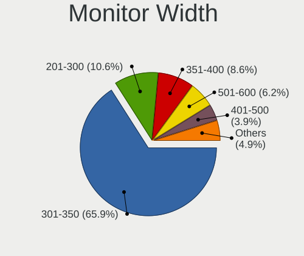

| Width in mm    | Notebooks | Percent |
|----------------|-----------|---------|
| 301-350        | 2290      | 65.94%  |
| 201-300        | 367       | 10.57%  |
| 351-400        | 298       | 8.58%   |
| 501-600        | 214       | 6.16%   |
| 401-500        | 135       | 3.89%   |
| 1001-1500      | 38        | 1.09%   |
| 601-700        | 33        | 0.95%   |
| 701-800        | 23        | 0.66%   |
| 1501-2000      | 20        | 0.58%   |
| 1-100          | 19        | 0.55%   |
| Unknown        | 16        | 0.46%   |
| 801-900        | 7         | 0.2%    |
| 101-200        | 6         | 0.17%   |
| 901-1000       | 6         | 0.17%   |
| More than 2000 | 1         | 0.03%   |

Aspect Ratio
------------

Proportional relationship between the width and the height

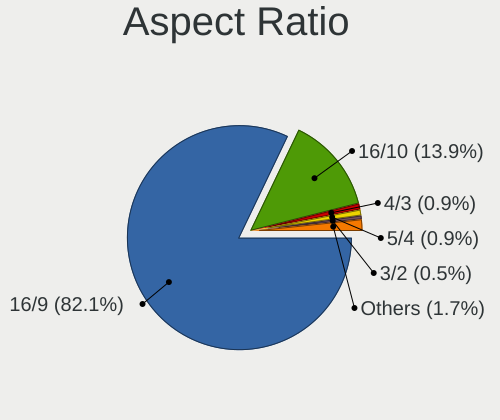

| Ratio   | Notebooks | Percent |
|---------|-----------|---------|
| 16/9    | 2598      | 82.11%  |
| 16/10   | 441       | 13.94%  |
| 4/3     | 28        | 0.88%   |
| 5/4     | 27        | 0.85%   |
| 3/2     | 17        | 0.54%   |
| 21/9    | 16        | 0.51%   |
| 0.67    | 14        | 0.44%   |
| Unknown | 9         | 0.28%   |
| 32/9    | 5         | 0.16%   |
| 0.62    | 4         | 0.13%   |
| 6/5     | 1         | 0.03%   |
| 1.00    | 1         | 0.03%   |
| 0.89    | 1         | 0.03%   |
| 0.63    | 1         | 0.03%   |
| 0.31    | 1         | 0.03%   |

Monitor Area
------------

Area in inch²

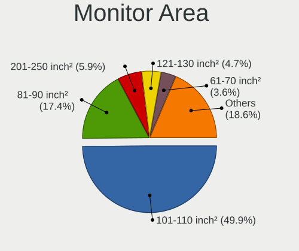

| Area in inch² | Notebooks | Percent |
|----------------|-----------|---------|
| 101-110        | 1739      | 49.87%  |
| 81-90          | 605       | 17.35%  |
| 201-250        | 205       | 5.88%   |
| 121-130        | 164       | 4.7%    |
| 61-70          | 126       | 3.61%   |
| 71-80          | 105       | 3.01%   |
| 301-350        | 72        | 2.06%   |
| More than 1000 | 53        | 1.52%   |
| 51-60          | 53        | 1.52%   |
| 41-50          | 53        | 1.52%   |
| 141-150        | 47        | 1.35%   |
| 151-200        | 45        | 1.29%   |
| 351-500        | 44        | 1.26%   |
| 131-140        | 42        | 1.2%    |
| 251-300        | 34        | 0.98%   |
| 1-40           | 25        | 0.72%   |
| 111-120        | 25        | 0.72%   |
| 501-1000       | 19        | 0.54%   |
| Unknown        | 16        | 0.46%   |
| 91-100         | 15        | 0.43%   |

Pixel Density
-------------

Pixels per inch

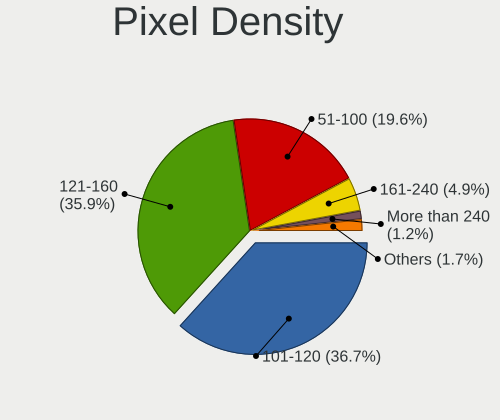

| Density       | Notebooks | Percent |
|---------------|-----------|---------|
| 101-120       | 1261      | 36.72%  |
| 121-160       | 1234      | 35.93%  |
| 51-100        | 672       | 19.57%  |
| 161-240       | 167       | 4.86%   |
| More than 240 | 42        | 1.22%   |
| 1-50          | 42        | 1.22%   |
| Unknown       | 16        | 0.47%   |

Multiple Monitors
-----------------

Total monitors connected

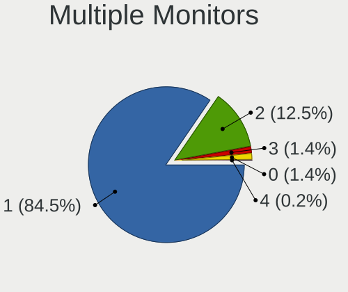

| Total | Notebooks | Percent |
|-------|-----------|---------|
| 1     | 2751      | 84.54%  |
| 2     | 408       | 12.54%  |
| 3     | 45        | 1.38%   |
| 0     | 44        | 1.35%   |
| 4     | 6         | 0.18%   |

Network
-------

Net Controller Vendor
---------------------

Controller vendors

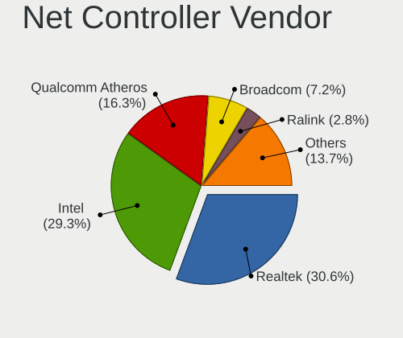

| Vendor                            | Notebooks | Percent |
|-----------------------------------|-----------|---------|
| Realtek Semiconductor             | 1571      | 30.62%  |
| Intel                             | 1503      | 29.3%   |
| Qualcomm Atheros                  | 837       | 16.32%  |
| Broadcom                          | 370       | 7.21%   |
| Ralink                            | 144       | 2.81%   |
| Broadcom Limited                  | 118       | 2.3%    |
| MediaTek                          | 109       | 2.12%   |
| Marvell Technology Group          | 67        | 1.31%   |
| Dell                              | 42        | 0.82%   |
| TP-Link                           | 34        | 0.66%   |
| Ericsson Business Mobile Networks | 27        | 0.53%   |
| DisplayLink                       | 27        | 0.53%   |
| Hewlett-Packard                   | 25        | 0.49%   |
| Sierra Wireless                   | 23        | 0.45%   |
| Shenzhen Goodix Technology        | 19        | 0.37%   |
| Samsung Electronics               | 18        | 0.35%   |
| Huawei Technologies               | 18        | 0.35%   |
| Xiaomi                            | 15        | 0.29%   |
| JMicron Technology                | 15        | 0.29%   |
| ASIX Electronics                  | 15        | 0.29%   |
| Ralink Technology                 | 14        | 0.27%   |
| Attansic Technology               | 13        | 0.25%   |
| Silicon Integrated Systems [SiS]  | 12        | 0.23%   |
| Qualcomm Atheros Communications   | 12        | 0.23%   |
| Nvidia                            | 11        | 0.21%   |
| Qualcomm                          | 7         | 0.14%   |
| QinHeng Electronics               | 7         | 0.14%   |
| Lenovo                            | 7         | 0.14%   |
| VIA Technologies                  | 6         | 0.12%   |
| ASUSTek Computer                  | 5         | 0.1%    |
| Fibocom                           | 3         | 0.06%   |
| D-Link                            | 3         | 0.06%   |
| Apple                             | 3         | 0.06%   |
| ZTE WCDMA Technologies MSM        | 2         | 0.04%   |
| Toshiba                           | 2         | 0.04%   |
| T & A Mobile Phones               | 2         | 0.04%   |
| Qualcomm Technologies             | 2         | 0.04%   |
| NetGear                           | 2         | 0.04%   |
| Compal Electronics                | 2         | 0.04%   |
| Belkin Components                 | 2         | 0.04%   |

Net Controller Model
--------------------

Controller models

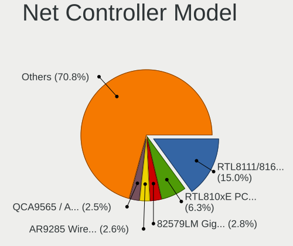

| Model                                                                   | Notebooks | Percent |
|-------------------------------------------------------------------------|-----------|---------|
| Realtek RTL8111/8168/8211/8411 PCI Express Gigabit Ethernet Controller  | 941       | 15%     |
| Realtek RTL810xE PCI Express Fast Ethernet controller                   | 396       | 6.31%   |
| Intel 82579LM Gigabit Network Connection (Lewisville)                   | 178       | 2.84%   |
| Qualcomm Atheros AR9285 Wireless Network Adapter (PCI-Express)          | 162       | 2.58%   |
| Qualcomm Atheros QCA9565 / AR9565 Wireless Network Adapter              | 157       | 2.5%    |
| Qualcomm Atheros QCA9377 802.11ac Wireless Network Adapter              | 138       | 2.2%    |
| Intel Wireless 8265 / 8275                                              | 128       | 2.04%   |
| Intel Centrino Advanced-N 6205 [Taylor Peak]                            | 115       | 1.83%   |
| Intel Wireless 7260                                                     | 103       | 1.64%   |
| Ralink RT3290 Wireless 802.11n 1T/1R PCIe                               | 100       | 1.59%   |
| Qualcomm Atheros AR9485 Wireless Network Adapter                        | 92        | 1.47%   |
| Intel Wireless 7265                                                     | 92        | 1.47%   |
| Intel 82577LM Gigabit Network Connection                                | 87        | 1.39%   |
| Realtek RTL8723BE PCIe Wireless Network Adapter                         | 83        | 1.32%   |
| Broadcom BCM4313 802.11bgn Wireless Network Adapter                     | 77        | 1.23%   |
| Realtek RTL8822CE 802.11ac PCIe Wireless Network Adapter                | 75        | 1.2%    |
| Intel Centrino Ultimate-N 6300                                          | 70        | 1.12%   |
| Qualcomm Atheros AR242x / AR542x Wireless Network Adapter (PCI-Express) | 66        | 1.05%   |
| Intel PRO/Wireless 3945ABG [Golan] Network Connection                   | 66        | 1.05%   |
| Intel Centrino Advanced-N 6200                                          | 66        | 1.05%   |
| Intel 82567LM Gigabit Network Connection                                | 64        | 1.02%   |
| Intel Wireless 8260                                                     | 61        | 0.97%   |
| Intel Wireless 3165                                                     | 61        | 0.97%   |
| Realtek RTL8153 Gigabit Ethernet Adapter                                | 59        | 0.94%   |
| Intel Wi-Fi 6 AX201                                                     | 58        | 0.92%   |
| MediaTek MT7921 802.11ax PCIe Wireless Network Adapter [Filogic 330]    | 53        | 0.84%   |
| Intel Ethernet Connection (4) I219-LM                                   | 50        | 0.8%    |
| Realtek RTL8821CE 802.11ac PCIe Wireless Network Adapter                | 48        | 0.77%   |
| Intel Ethernet Connection I218-LM                                       | 46        | 0.73%   |
| Intel Wi-Fi 6 AX200                                                     | 45        | 0.72%   |
| Intel Wireless 3160                                                     | 44        | 0.7%    |
| Intel PRO/Wireless 4965 AG or AGN [Kedron] Network Connection           | 44        | 0.7%    |
| Intel Cannon Lake PCH CNVi WiFi                                         | 44        | 0.7%    |
| Broadcom BCM43142 802.11b/g/n                                           | 44        | 0.7%    |
| Intel PRO/Wireless 5100 AGN [Shiloh] Network Connection                 | 43        | 0.69%   |
| Intel Ethernet Connection (3) I218-LM                                   | 41        | 0.65%   |
| Intel WiFi Link 5100                                                    | 38        | 0.61%   |
| Qualcomm Atheros QCA6174 802.11ac Wireless Network Adapter              | 36        | 0.57%   |
| Qualcomm Atheros AR8132 Fast Ethernet                                   | 36        | 0.57%   |
| Intel Ethernet Connection I219-LM                                       | 36        | 0.57%   |

Wireless Vendor
---------------

Wireless vendors

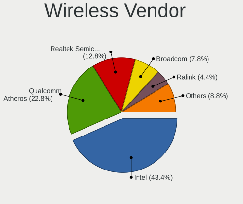

| Vendor                          | Notebooks | Percent |
|---------------------------------|-----------|---------|
| Intel                           | 1406      | 43.37%  |
| Qualcomm Atheros                | 740       | 22.83%  |
| Realtek Semiconductor           | 416       | 12.83%  |
| Broadcom                        | 252       | 7.77%   |
| Ralink                          | 144       | 4.44%   |
| MediaTek                        | 97        | 2.99%   |
| Broadcom Limited                | 59        | 1.82%   |
| Dell                            | 26        | 0.8%    |
| Sierra Wireless                 | 23        | 0.71%   |
| TP-Link                         | 20        | 0.62%   |
| Ralink Technology               | 14        | 0.43%   |
| Qualcomm Atheros Communications | 12        | 0.37%   |
| Qualcomm                        | 6         | 0.19%   |
| ASUSTek Computer                | 5         | 0.15%   |
| Hewlett-Packard                 | 4         | 0.12%   |
| Fibocom                         | 3         | 0.09%   |
| D-Link                          | 3         | 0.09%   |
| Qualcomm Technologies           | 2         | 0.06%   |
| NetGear                         | 2         | 0.06%   |
| Belkin Components               | 2         | 0.06%   |
| Texas Instruments               | 1         | 0.03%   |
| Realtek                         | 1         | 0.03%   |
| Microsoft                       | 1         | 0.03%   |
| Micro Star International        | 1         | 0.03%   |
| Fujitsu Siemens Computers       | 1         | 0.03%   |
| Edimax Technology               | 1         | 0.03%   |

Wireless Model
--------------

Wireless models

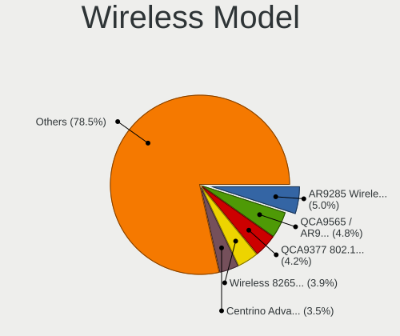

| Model                                                                   | Notebooks | Percent |
|-------------------------------------------------------------------------|-----------|---------|
| Qualcomm Atheros AR9285 Wireless Network Adapter (PCI-Express)          | 162       | 4.98%   |
| Qualcomm Atheros QCA9565 / AR9565 Wireless Network Adapter              | 157       | 4.83%   |
| Qualcomm Atheros QCA9377 802.11ac Wireless Network Adapter              | 138       | 4.24%   |
| Intel Wireless 8265 / 8275                                              | 128       | 3.93%   |
| Intel Centrino Advanced-N 6205 [Taylor Peak]                            | 115       | 3.54%   |
| Intel Wireless 7260                                                     | 103       | 3.17%   |
| Ralink RT3290 Wireless 802.11n 1T/1R PCIe                               | 100       | 3.07%   |
| Qualcomm Atheros AR9485 Wireless Network Adapter                        | 92        | 2.83%   |
| Intel Wireless 7265                                                     | 92        | 2.83%   |
| Realtek RTL8723BE PCIe Wireless Network Adapter                         | 83        | 2.55%   |
| Broadcom BCM4313 802.11bgn Wireless Network Adapter                     | 77        | 2.37%   |
| Realtek RTL8822CE 802.11ac PCIe Wireless Network Adapter                | 75        | 2.31%   |
| Intel Centrino Ultimate-N 6300                                          | 70        | 2.15%   |
| Qualcomm Atheros AR242x / AR542x Wireless Network Adapter (PCI-Express) | 66        | 2.03%   |
| Intel PRO/Wireless 3945ABG [Golan] Network Connection                   | 66        | 2.03%   |
| Intel Centrino Advanced-N 6200                                          | 66        | 2.03%   |
| Intel Wireless 8260                                                     | 61        | 1.88%   |
| Intel Wireless 3165                                                     | 61        | 1.88%   |
| Intel Wi-Fi 6 AX201                                                     | 58        | 1.78%   |
| MediaTek MT7921 802.11ax PCIe Wireless Network Adapter [Filogic 330]    | 53        | 1.63%   |
| Realtek RTL8821CE 802.11ac PCIe Wireless Network Adapter                | 48        | 1.48%   |
| Intel Wi-Fi 6 AX200                                                     | 45        | 1.38%   |
| Intel Wireless 3160                                                     | 44        | 1.35%   |
| Intel PRO/Wireless 4965 AG or AGN [Kedron] Network Connection           | 44        | 1.35%   |
| Intel Cannon Lake PCH CNVi WiFi                                         | 44        | 1.35%   |
| Broadcom BCM43142 802.11b/g/n                                           | 44        | 1.35%   |
| Intel PRO/Wireless 5100 AGN [Shiloh] Network Connection                 | 43        | 1.32%   |
| Intel WiFi Link 5100                                                    | 38        | 1.17%   |
| Qualcomm Atheros QCA6174 802.11ac Wireless Network Adapter              | 36        | 1.11%   |
| Realtek RTL8821AE 802.11ac PCIe Wireless Network Adapter                | 33        | 1.01%   |
| Intel Comet Lake PCH-LP CNVi WiFi                                       | 32        | 0.98%   |
| Broadcom Limited BCM4312 802.11b/g LP-PHY                               | 30        | 0.92%   |
| Intel Cannon Point-LP CNVi [Wireless-AC]                                | 28        | 0.86%   |
| Qualcomm Atheros AR9287 Wireless Network Adapter (PCI-Express)          | 27        | 0.83%   |
| Broadcom BCM43228 802.11a/b/g/n                                         | 27        | 0.83%   |
| Broadcom BCM4312 802.11b/g LP-PHY                                       | 27        | 0.83%   |
| Qualcomm Atheros AR928X Wireless Network Adapter (PCI-Express)          | 26        | 0.8%    |
| Realtek RTL8188CE 802.11b/g/n WiFi Adapter                              | 24        | 0.74%   |
| Qualcomm Atheros AR9462 Wireless Network Adapter                        | 22        | 0.68%   |
| Intel Dual Band Wireless-AC 3168NGW [Stone Peak]                        | 22        | 0.68%   |

Ethernet Vendor
---------------

Ethernet vendors

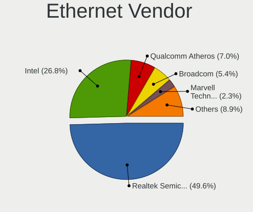

| Vendor                           | Notebooks | Percent |
|----------------------------------|-----------|---------|
| Realtek Semiconductor            | 1436      | 49.57%  |
| Intel                            | 775       | 26.75%  |
| Qualcomm Atheros                 | 203       | 7.01%   |
| Broadcom                         | 157       | 5.42%   |
| Marvell Technology Group         | 67        | 2.31%   |
| Broadcom Limited                 | 60        | 2.07%   |
| DisplayLink                      | 27        | 0.93%   |
| Huawei Technologies              | 16        | 0.55%   |
| Xiaomi                           | 15        | 0.52%   |
| Samsung Electronics              | 15        | 0.52%   |
| JMicron Technology               | 15        | 0.52%   |
| ASIX Electronics                 | 15        | 0.52%   |
| TP-Link                          | 14        | 0.48%   |
| Attansic Technology              | 13        | 0.45%   |
| Silicon Integrated Systems [SiS] | 12        | 0.41%   |
| Nvidia                           | 11        | 0.38%   |
| MediaTek                         | 11        | 0.38%   |
| Lenovo                           | 7         | 0.24%   |
| VIA Technologies                 | 6         | 0.21%   |
| QinHeng Electronics              | 6         | 0.21%   |
| Apple                            | 3         | 0.1%    |
| T & A Mobile Phones              | 2         | 0.07%   |
| Hewlett-Packard                  | 2         | 0.07%   |
| Spreadtrum Communications        | 1         | 0.03%   |
| Qualcomm                         | 1         | 0.03%   |
| OPPO Electronics                 | 1         | 0.03%   |
| Motorola PCS                     | 1         | 0.03%   |
| LG Electronics                   | 1         | 0.03%   |
| ICS Advent                       | 1         | 0.03%   |
| Davicom Semiconductor            | 1         | 0.03%   |
| Compal Electronics               | 1         | 0.03%   |
| 3DSP                             | 1         | 0.03%   |

Ethernet Model
--------------

Ethernet models

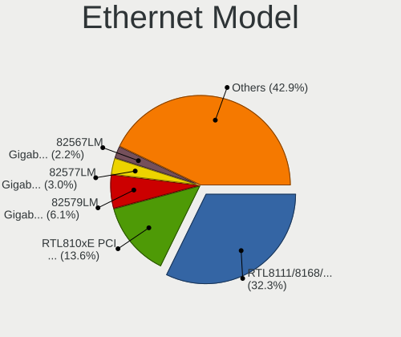

| Model                                                                  | Notebooks | Percent |
|------------------------------------------------------------------------|-----------|---------|
| Realtek RTL8111/8168/8211/8411 PCI Express Gigabit Ethernet Controller | 941       | 32.26%  |
| Realtek RTL810xE PCI Express Fast Ethernet controller                  | 396       | 13.58%  |
| Intel 82579LM Gigabit Network Connection (Lewisville)                  | 178       | 6.1%    |
| Intel 82577LM Gigabit Network Connection                               | 87        | 2.98%   |
| Intel 82567LM Gigabit Network Connection                               | 64        | 2.19%   |
| Realtek RTL8153 Gigabit Ethernet Adapter                               | 59        | 2.02%   |
| Intel Ethernet Connection (4) I219-LM                                  | 50        | 1.71%   |
| Intel Ethernet Connection I218-LM                                      | 46        | 1.58%   |
| Intel Ethernet Connection (3) I218-LM                                  | 41        | 1.41%   |
| Qualcomm Atheros AR8132 Fast Ethernet                                  | 36        | 1.23%   |
| Intel Ethernet Connection I219-LM                                      | 36        | 1.23%   |
| Qualcomm Atheros AR8151 v2.0 Gigabit Ethernet                          | 35        | 1.2%    |
| Broadcom NetLink BCM57785 Gigabit Ethernet PCIe                        | 31        | 1.06%   |
| Marvell Group 88E8040 PCI-E Fast Ethernet Controller                   | 24        | 0.82%   |
| Intel 82566MM Gigabit Network Connection                               | 23        | 0.79%   |
| Intel Ethernet Connection I217-LM                                      | 22        | 0.75%   |
| Intel Ethernet Connection (4) I219-V                                   | 21        | 0.72%   |
| Intel Ethernet Connection (13) I219-V                                  | 20        | 0.69%   |
| Qualcomm Atheros QCA8172 Fast Ethernet                                 | 19        | 0.65%   |
| DisplayLink USB3 to HDMI                                               | 19        | 0.65%   |
| Qualcomm Atheros AR8161 Gigabit Ethernet                               | 18        | 0.62%   |
| Qualcomm Atheros AR8131 Gigabit Ethernet                               | 18        | 0.62%   |
| Marvell Group 88E8055 PCI-E Gigabit Ethernet Controller                | 18        | 0.62%   |
| Broadcom Limited NetLink BCM57780 Gigabit Ethernet PCIe                | 18        | 0.62%   |
| Broadcom Limited NetLink BCM5787M Gigabit Ethernet PCI Express         | 17        | 0.58%   |
| Intel 82579V Gigabit Network Connection                                | 16        | 0.55%   |
| Broadcom NetLink BCM57780 Gigabit Ethernet PCIe                        | 16        | 0.55%   |
| JMicron JMC250 PCI Express Gigabit Ethernet Controller                 | 15        | 0.51%   |
| Broadcom NetLink BCM5787M Gigabit Ethernet PCI Express                 | 15        | 0.51%   |
| Realtek RTL-8100/8101L/8139 PCI Fast Ethernet Adapter                  | 14        | 0.48%   |
| Intel Ethernet Connection I219-V                                       | 14        | 0.48%   |
| Intel Ethernet Connection (7) I219-LM                                  | 14        | 0.48%   |
| Intel Alder Lake-P PCH CNVi WiFi                                       | 14        | 0.48%   |
| Xiaomi Mi/Redmi series (RNDIS)                                         | 13        | 0.45%   |
| Realtek RTL8152 Fast Ethernet Adapter                                  | 13        | 0.45%   |
| Qualcomm Atheros AR8162 Fast Ethernet                                  | 13        | 0.45%   |
| Qualcomm Atheros AR8152 v2.0 Fast Ethernet                             | 13        | 0.45%   |
| Qualcomm Atheros AR8121/AR8113/AR8114 Gigabit or Fast Ethernet         | 13        | 0.45%   |
| Intel Ethernet Connection (2) I219-LM                                  | 13        | 0.45%   |
| Broadcom NetLink BCM5906M Fast Ethernet PCI Express                    | 13        | 0.45%   |

Net Controller Kind
-------------------

Ethernet, WiFi or modem

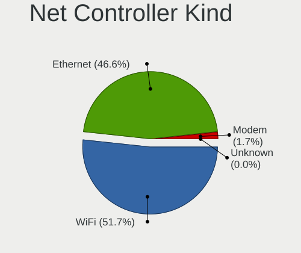

| Kind     | Notebooks | Percent |
|----------|-----------|---------|
| WiFi     | 3087      | 51.69%  |
| Ethernet | 2781      | 46.57%  |
| Modem    | 103       | 1.72%   |
| Unknown  | 1         | 0.02%   |

Used Controller
---------------

Currently used network controller

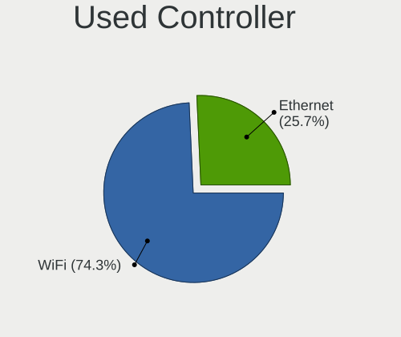

| Kind     | Notebooks | Percent |
|----------|-----------|---------|
| WiFi     | 2547      | 74.28%  |
| Ethernet | 882       | 25.72%  |

NICs
----

Total network controllers on board

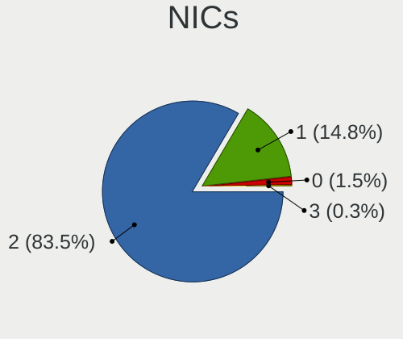

| Total | Notebooks | Percent |
|-------|-----------|---------|
| 2     | 2638      | 83.51%  |
| 1     | 466       | 14.75%  |
| 0     | 46        | 1.46%   |
| 3     | 9         | 0.28%   |

IPv6
----

IPv6 vs IPv4

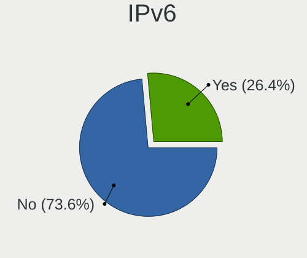

| Used | Notebooks | Percent |
|------|-----------|---------|
| No   | 2441      | 73.57%  |
| Yes  | 877       | 26.43%  |

Bluetooth
---------

Bluetooth Vendor
----------------

Controller vendors

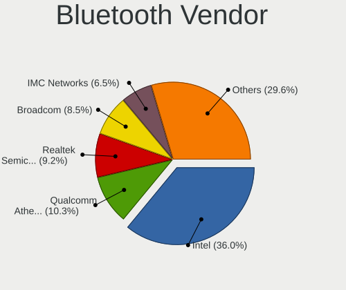

| Vendor                          | Notebooks | Percent |
|---------------------------------|-----------|---------|
| Intel                           | 892       | 35.97%  |
| Qualcomm Atheros Communications | 256       | 10.32%  |
| Realtek Semiconductor           | 227       | 9.15%   |
| Broadcom                        | 210       | 8.47%   |
| IMC Networks                    | 162       | 6.53%   |
| Lite-On Technology              | 127       | 5.12%   |
| Dell                            | 117       | 4.72%   |
| Foxconn / Hon Hai               | 110       | 4.44%   |
| Ralink                          | 100       | 4.03%   |
| Hewlett-Packard                 | 92        | 3.71%   |
| Cambridge Silicon Radio         | 40        | 1.61%   |
| Toshiba                         | 32        | 1.29%   |
| Apple                           | 27        | 1.09%   |
| ASUSTek Computer                | 16        | 0.65%   |
| Ralink Technology               | 13        | 0.52%   |
| Askey Computer                  | 10        | 0.4%    |
| Realtek                         | 9         | 0.36%   |
| MediaTek                        | 8         | 0.32%   |
| Chicony Electronics             | 8         | 0.32%   |
| Foxconn International           | 5         | 0.2%    |
| Taiyo Yuden                     | 4         | 0.16%   |
| Micro Star International        | 4         | 0.16%   |
| TP-Link                         | 3         | 0.12%   |
| Alps Electric                   | 3         | 0.12%   |
| Opticis                         | 2         | 0.08%   |
| USI                             | 1         | 0.04%   |
| Quectel Wireless Solutions      | 1         | 0.04%   |
| Fujitsu Siemens Computers       | 1         | 0.04%   |

Bluetooth Model
---------------

Controller models

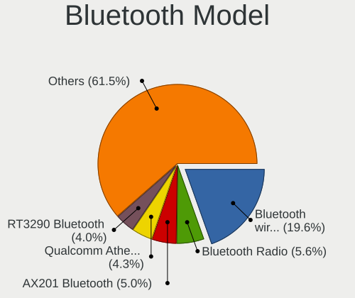

| Model                                               | Notebooks | Percent |
|-----------------------------------------------------|-----------|---------|
| Intel Bluetooth wireless interface                  | 486       | 19.57%  |
| Realtek Bluetooth Radio                             | 140       | 5.64%   |
| Intel AX201 Bluetooth                               | 124       | 4.99%   |
| Qualcomm Atheros  Bluetooth Device                  | 107       | 4.31%   |
| Ralink RT3290 Bluetooth                             | 100       | 4.03%   |
| Intel Bluetooth 9460/9560 Jefferson Peak (JfP)      | 99        | 3.99%   |
| Dell DW375 Bluetooth Module                         | 59        | 2.38%   |
| IMC Networks Bluetooth Radio                        | 56        | 2.26%   |
| IMC Networks Wireless_Device                        | 51        | 2.05%   |
| HP Broadcom 2070 Bluetooth Combo                    | 51        | 2.05%   |
| Qualcomm Atheros AR3012 Bluetooth 4.0               | 48        | 1.93%   |
| Broadcom BCM2045B (BDC-2.1)                         | 48        | 1.93%   |
| Qualcomm Atheros AR3011 Bluetooth                   | 47        | 1.89%   |
| Lite-On Qualcomm Atheros QCA9377 Bluetooth          | 43        | 1.73%   |
| Intel Bluetooth Device                              | 43        | 1.73%   |
| Intel AX200 Bluetooth                               | 41        | 1.65%   |
| Cambridge Silicon Radio Bluetooth Dongle (HCI mode) | 40        | 1.61%   |
| HP Bluetooth 2.0 Interface [Broadcom BCM2045]       | 39        | 1.57%   |
| IMC Networks Bluetooth Device                       | 34        | 1.37%   |
| Intel Centrino Bluetooth Wireless Transceiver       | 32        | 1.29%   |
| Broadcom HP Portable SoftSailing                    | 32        | 1.29%   |
| Broadcom BCM20702 Bluetooth 4.0 [ThinkPad]          | 32        | 1.29%   |
| Realtek  Bluetooth 4.2 Adapter                      | 30        | 1.21%   |
| Realtek RTL8821A Bluetooth                          | 27        | 1.09%   |
| Foxconn / Hon Hai Bluetooth Device                  | 27        | 1.09%   |
| Realtek RTL8723B Bluetooth                          | 26        | 1.05%   |
| Lite-On Atheros AR3012 Bluetooth                    | 25        | 1.01%   |
| Lite-On Bluetooth Device                            | 24        | 0.97%   |
| Qualcomm Atheros AR9462 Bluetooth                   | 23        | 0.93%   |
| Intel Centrino Advanced-N 6230 Bluetooth adapter    | 22        | 0.89%   |
| Intel Wireless-AC 3168 Bluetooth                    | 21        | 0.85%   |
| Dell BCM20702A0 Bluetooth Module                    | 19        | 0.77%   |
| Apple Bluetooth Host Controller                     | 18        | 0.72%   |
| Foxconn / Hon Hai BCM20702A0                        | 15        | 0.6%    |
| Broadcom BCM2070 Bluetooth Device                   | 15        | 0.6%    |
| Toshiba Bluetooth Device                            | 14        | 0.56%   |
| Lite-On Wireless_Device                             | 14        | 0.56%   |
| Broadcom BCM2045B (BDC-2.1) [Bluetooth Controller]  | 14        | 0.56%   |
| Ralink Motorola BC4 Bluetooth 3.0+HS Adapter        | 13        | 0.52%   |
| Qualcomm Atheros QCA61x4 Bluetooth 4.0              | 13        | 0.52%   |

Sound
-----

Sound Vendor
------------

Sound card vendors

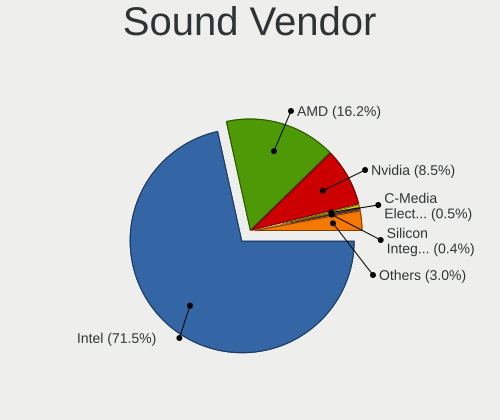

| Vendor                                       | Notebooks | Percent |
|----------------------------------------------|-----------|---------|
| Intel                                        | 2570      | 71.55%  |
| AMD                                          | 581       | 16.17%  |
| Nvidia                                       | 304       | 8.46%   |
| C-Media Electronics                          | 17        | 0.47%   |
| Silicon Integrated Systems [SiS]             | 14        | 0.39%   |
| Logitech                                     | 11        | 0.31%   |
| VIA Technologies                             | 8         | 0.22%   |
| Lenovo                                       | 8         | 0.22%   |
| ASUSTek Computer                             | 8         | 0.22%   |
| Hewlett-Packard                              | 6         | 0.17%   |
| Realtek Semiconductor                        | 5         | 0.14%   |
| Texas Instruments                            | 4         | 0.11%   |
| Kingston Technology                          | 4         | 0.11%   |
| Zoran Co. Personal Media Division (Nogatech) | 3         | 0.08%   |
| Plantronics                                  | 3         | 0.08%   |
| Creative Technology                          | 3         | 0.08%   |
| Apple                                        | 3         | 0.08%   |
| Sony                                         | 2         | 0.06%   |
| Nordic Semiconductor ASA                     | 2         | 0.06%   |
| JMTek                                        | 2         | 0.06%   |
| GN Netcom                                    | 2         | 0.06%   |
| Generalplus Technology                       | 2         | 0.06%   |
| ESS Technology                               | 2         | 0.06%   |
| DSEA A/S                                     | 2         | 0.06%   |
| Dell                                         | 2         | 0.06%   |
| BEHRINGER International                      | 2         | 0.06%   |
| Audio-Technica                               | 2         | 0.06%   |
| Universal Audio                              | 1         | 0.03%   |
| Trust                                        | 1         | 0.03%   |
| Tenx Technology                              | 1         | 0.03%   |
| TEAC                                         | 1         | 0.03%   |
| SteelSeries ApS                              | 1         | 0.03%   |
| Samson Technologies                          | 1         | 0.03%   |
| Razer USA                                    | 1         | 0.03%   |
| PreSonus Audio Electronics                   | 1         | 0.03%   |
| Numark                                       | 1         | 0.03%   |
| NAETechnologies                             | 1         | 0.03%   |
| M-Audio                                      | 1         | 0.03%   |
| KTMicro                                      | 1         | 0.03%   |
| Jieli Technology                             | 1         | 0.03%   |

Sound Model
-----------

Sound card models

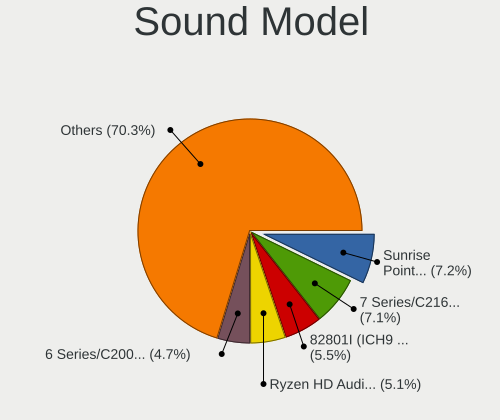

| Model                                                                                             | Notebooks | Percent |
|---------------------------------------------------------------------------------------------------|-----------|---------|
| Intel Sunrise Point-LP HD Audio                                                                   | 318       | 7.25%   |
| Intel 7 Series/C216 Chipset Family High Definition Audio Controller                               | 313       | 7.13%   |
| Intel 82801I (ICH9 Family) HD Audio Controller                                                    | 240       | 5.47%   |
| AMD Ryzen HD Audio Controller                                                                     | 225       | 5.13%   |
| Intel 6 Series/C200 Series Chipset Family High Definition Audio Controller                        | 208       | 4.74%   |
| Intel 5 Series/3400 Series Chipset High Definition Audio                                          | 203       | 4.63%   |
| Intel 8 Series HD Audio Controller                                                                | 156       | 3.55%   |
| Intel Haswell-ULT HD Audio Controller                                                             | 155       | 3.53%   |
| AMD FCH Azalia Controller                                                                         | 150       | 3.42%   |
| Intel Broadwell-U Audio Controller                                                                | 131       | 2.98%   |
| Intel Wildcat Point-LP High Definition Audio Controller                                           | 130       | 2.96%   |
| Intel 82801H (ICH8 Family) HD Audio Controller                                                    | 112       | 2.55%   |
| Intel NM10/ICH7 Family High Definition Audio Controller                                           | 110       | 2.51%   |
| AMD Renoir/Cezanne HDMI/DP Audio Controller                                                       | 101       | 2.3%    |
| Intel Tiger Lake-LP Smart Sound Technology Audio Controller                                       | 81        | 1.85%   |
| Intel 8 Series/C220 Series Chipset High Definition Audio Controller                               | 80        | 1.82%   |
| AMD SBx00 Azalia (Intel HDA)                                                                      | 77        | 1.75%   |
| AMD Kabini HDMI/DP Audio                                                                          | 76        | 1.73%   |
| Intel Xeon E3-1200 v3/4th Gen Core Processor HD Audio Controller                                  | 69        | 1.57%   |
| Intel Cannon Lake PCH cAVS                                                                        | 68        | 1.55%   |
| Intel Atom/Celeron/Pentium Processor x5-E8000/J3xxx/N3xxx Series High Definition Audio Controller | 68        | 1.55%   |
| AMD Radeon High Definition Audio Controller                                                       | 66        | 1.5%    |
| Intel Atom Processor Z36xxx/Z37xxx Series High Definition Audio Controller                        | 60        | 1.37%   |
| AMD Wrestler HDMI Audio                                                                           | 55        | 1.25%   |
| Intel Cannon Point-LP High Definition Audio Controller                                            | 52        | 1.18%   |
| Intel Alder Lake PCH-P High Definition Audio Controller                                           | 50        | 1.14%   |
| AMD Raven/Raven2/Fenghuang HDMI/DP Audio Controller                                               | 48        | 1.09%   |
| Intel Celeron N3350/Pentium N4200/Atom E3900 Series Audio Cluster                                 | 47        | 1.07%   |
| Intel Comet Lake PCH-LP cAVS                                                                      | 42        | 0.96%   |
| Intel 100 Series/C230 Series Chipset Family HD Audio Controller                                   | 38        | 0.87%   |
| AMD Trinity HDMI Audio Controller                                                                 | 38        | 0.87%   |
| Intel Ice Lake-LP Smart Sound Technology Audio Controller                                         | 37        | 0.84%   |
| Intel Celeron/Pentium Silver Processor High Definition Audio                                      | 35        | 0.8%    |
| AMD Family 15h (Models 60h-6fh) Audio Controller                                                  | 32        | 0.73%   |
| Nvidia TU107 GeForce GTX 1650 High Definition Audio Controller                                    | 31        | 0.71%   |
| Nvidia GF108 High Definition Audio Controller                                                     | 28        | 0.64%   |
| Intel CM238 HD Audio Controller                                                                   | 28        | 0.64%   |
| Nvidia High Definition Audio Controller                                                           | 25        | 0.57%   |
| AMD RV710/730 HDMI Audio [Radeon HD 4000 series]                                                  | 23        | 0.52%   |
| Nvidia GA107 High Definition Audio Controller                                                     | 21        | 0.48%   |

Memory
------

Memory Vendor
-------------

Memory module vendors

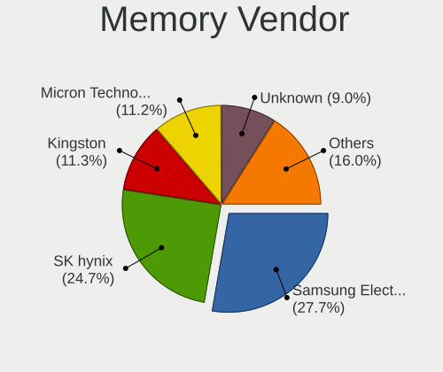

| Vendor                       | Notebooks | Percent |
|------------------------------|-----------|---------|
| Samsung Electronics          | 838       | 27.72%  |
| SK hynix                     | 747       | 24.71%  |
| Kingston                     | 341       | 11.28%  |
| Micron Technology            | 340       | 11.25%  |
| Unknown                      | 272       | 9%      |
| Nanya Technology             | 76        | 2.51%   |
| Elpida                       | 76        | 2.51%   |
| Ramaxel Technology           | 71        | 2.35%   |
| A-DATA Technology            | 53        | 1.75%   |
| Crucial                      | 43        | 1.42%   |
| Kingmax                      | 19        | 0.63%   |
| Corsair                      | 12        | 0.4%    |
| ASint Technology             | 12        | 0.4%    |
| Unknown                      | 11        | 0.36%   |
| Unknown (ABCD)               | 10        | 0.33%   |
| Qimonda                      | 10        | 0.33%   |
| Transcend                    | 9         | 0.3%    |
| 48spaces                     | 9         | 0.3%    |
| Hikvision                    | 8         | 0.26%   |
| Team                         | 7         | 0.23%   |
| Apacer                       | 7         | 0.23%   |
| Patriot                      | 6         | 0.2%    |
| Kingmax Semiconductor        | 6         | 0.2%    |
| Toshiba                      | 5         | 0.17%   |
| G.Skill                      | 5         | 0.17%   |
| PUSKILL                      | 4         | 0.13%   |
| Unknown (0x0080)             | 3         | 0.1%    |
| SHARETRONIC                  | 3         | 0.1%    |
| CSX                          | 3         | 0.1%    |
| Melco                        | 2         | 0.07%   |
| Infineon                     | 2         | 0.07%   |
| Wilk                         | 1         | 0.03%   |
| Unknown (8A5B)               | 1         | 0.03%   |
| Unknown (0x8325)             | 1         | 0.03%   |
| Unknown (09D5)               | 1         | 0.03%   |
| Unifosa                      | 1         | 0.03%   |
| Teclast                      | 1         | 0.03%   |
| Strontium                    | 1         | 0.03%   |
| Patriot Memory (PDP Systems) | 1         | 0.03%   |
| Netlist                      | 1         | 0.03%   |

Memory Model
------------

Memory module models

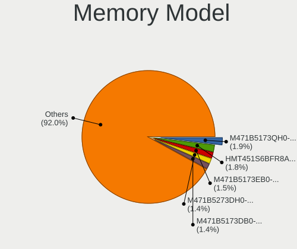

| Model                                                     | Notebooks | Percent |
|-----------------------------------------------------------|-----------|---------|
| Samsung RAM M471B5173QH0-YK0 4GB SODIMM DDR3 1600MT/s     | 61        | 1.87%   |
| SK hynix RAM HMT451S6BFR8A-PB 4GB SODIMM DDR3 1600MT/s    | 59        | 1.81%   |
| Samsung RAM M471B5173EB0-YK0 4GB SODIMM DDR3 1600MT/s     | 50        | 1.54%   |
| Samsung RAM M471B5273DH0-CH9 4GB SODIMM DDR3 1600MT/s     | 45        | 1.38%   |
| Samsung RAM M471B5173DB0-YK0 4GB SODIMM DDR3 1600MT/s     | 45        | 1.38%   |
| SK hynix RAM HMT351S6EFR8A-PB 4GB SODIMM DDR3 1600MT/s    | 39        | 1.2%    |
| Samsung RAM M471B5773DH0-CH9 2GB SODIMM DDR3 1600MT/s     | 35        | 1.08%   |
| Unknown RAM Module 2048MB SODIMM DDR2 667MT/s             | 34        | 1.04%   |
| Samsung RAM M471B5273CH0-CH9 4GB SODIMM DDR3 1334MT/s     | 34        | 1.04%   |
| Samsung RAM M471B5773CHS-CH9 2GB SODIMM DDR3 4199MT/s     | 32        | 0.98%   |
| SK hynix RAM HMT41GS6BFR8A-PB 8GB SODIMM DDR3 2667MT/s    | 31        | 0.95%   |
| Samsung RAM M471B5673FH0-CF8 2048MB SODIMM DDR3 1067MT/s  | 31        | 0.95%   |
| SK hynix RAM HMT325S6CFR8A-PB 2GB SODIMM DDR3 1600MT/s    | 26        | 0.8%    |
| SK hynix RAM HMA81GS6AFR8N-UH 8GB SODIMM DDR4 2667MT/s    | 26        | 0.8%    |
| Samsung RAM M471B1G73DB0-YK0 8GB SODIMM DDR3 1600MT/s     | 25        | 0.77%   |
| Samsung RAM M471A5244CB0-CRC 4GB SODIMM DDR4 2667MT/s     | 25        | 0.77%   |
| Samsung RAM M471B5273DH0-CK0 4GB SODIMM DDR3 2400MT/s     | 24        | 0.74%   |
| SK hynix RAM HMA851S6AFR6N-UH 4GB SODIMM DDR4 2667MT/s    | 23        | 0.71%   |
| Micron RAM 8KTF51264HZ-1G6E1 4GB SODIMM DDR3 1600MT/s     | 23        | 0.71%   |
| Samsung RAM M471A5244CB0-CTD 4GB SODIMM DDR4 3266MT/s     | 22        | 0.68%   |
| SK hynix RAM HMT351S6CFR8C-PB 4GB SODIMM DDR3 1600MT/s    | 21        | 0.65%   |
| Samsung RAM M471A1G44AB0-CWE 8GiB SODIMM DDR4 3200MT/s    | 20        | 0.61%   |
| SK hynix RAM HMT451S6AFR8A-PB 4GB SODIMM DDR3 1600MT/s    | 19        | 0.58%   |
| SK hynix RAM HMT351S6EFR8C-PB 4GB SODIMM DDR3 1600MT/s    | 19        | 0.58%   |
| Unknown RAM Module 1024MB SODIMM DDR2 667MT/s             | 18        | 0.55%   |
| Unknown RAM Module 2048MB SODIMM DDR2                     | 17        | 0.52%   |
| Samsung RAM M471B1G73EB0-YK0 8192MB SODIMM DDR3 1600MT/s  | 17        | 0.52%   |
| Unknown RAM Module 1024MB SODIMM DDR2                     | 16        | 0.49%   |
| SK hynix RAM HMT325S6EFR8A-PB 2GB SODIMM DDR3 1600MT/s    | 16        | 0.49%   |
| Samsung RAM M471B5673FH0-CH9 2048MB SODIMM DDR3 1600MT/s  | 16        | 0.49%   |
| Samsung RAM M471A1K43CB1-CRC 8GB SODIMM DDR4 8400MT/s     | 16        | 0.49%   |
| SK hynix RAM HMT351S6BFR8C-H9 4GB SODIMM 1334MT/s         | 15        | 0.46%   |
| SK hynix RAM HMT325S6BFR8C-H9 2GB SODIMM DDR3 1600MT/s    | 15        | 0.46%   |
| SK hynix RAM HMA81GS6DJR8N-XN 8GB SODIMM DDR4 3200MT/s    | 15        | 0.46%   |
| Micron RAM 8JSF25664HZ-1G4D1 2GB SODIMM DDR3 1334MT/s     | 15        | 0.46%   |
| SK hynix RAM HMT351S6CFR8C-PB 4096MB SODIMM DDR3 1600MT/s | 14        | 0.43%   |
| SK hynix RAM HMT351S6BFR8C-H9 4GB SODIMM DDR3 1333MT/s    | 14        | 0.43%   |
| Samsung RAM M471B5673EH1-CF8 2GB SODIMM 4199MT/s          | 14        | 0.43%   |
| Samsung RAM M471A1K43EB1-CWE 8GB SODIMM DDR4 3200MT/s     | 14        | 0.43%   |
| Samsung RAM M471A1K43DB1-CTD 8GB SODIMM DDR4 2667MT/s     | 14        | 0.43%   |

Memory Kind
-----------

Memory module kinds

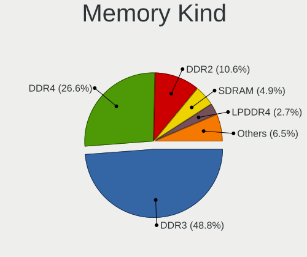

| Kind    | Notebooks | Percent |
|---------|-----------|---------|
| DDR3    | 1238      | 48.8%   |
| DDR4    | 674       | 26.57%  |
| DDR2    | 269       | 10.6%   |
| SDRAM   | 124       | 4.89%   |
| LPDDR4  | 68        | 2.68%   |
| LPDDR5  | 37        | 1.46%   |
| DDR5    | 34        | 1.34%   |
| Unknown | 32        | 1.26%   |
| LPDDR3  | 29        | 1.14%   |
| DDR     | 22        | 0.87%   |
| DRAM    | 10        | 0.39%   |

Memory Form Factor
------------------

Physical design of the memory module

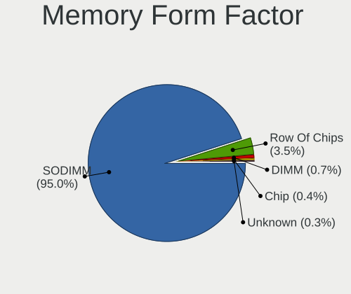

| Name         | Notebooks | Percent |
|--------------|-----------|---------|
| SODIMM       | 2345      | 95.02%  |
| Row Of Chips | 87        | 3.53%   |
| DIMM         | 18        | 0.73%   |
| Chip         | 10        | 0.41%   |
| Unknown      | 8         | 0.32%   |

Memory Size
-----------

Memory module size

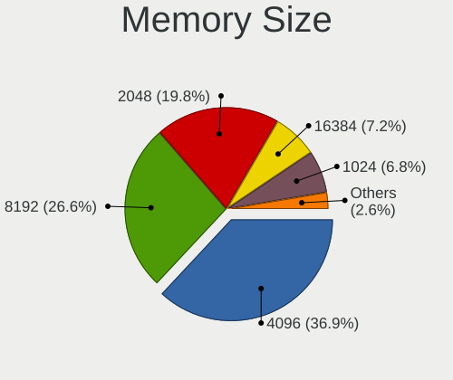

| Size    | Notebooks | Percent |
|---------|-----------|---------|
| 4096    | 1032      | 36.95%  |
| 8192    | 744       | 26.64%  |
| 2048    | 553       | 19.8%   |
| 16384   | 201       | 7.2%    |
| 1024    | 189       | 6.77%   |
| 32768   | 46        | 1.65%   |
| 512     | 26        | 0.93%   |
| Unknown | 2         | 0.07%   |

Memory Speed
------------

Memory module speed

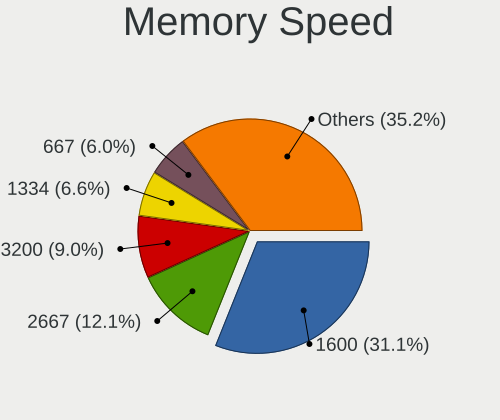

| Speed   | Notebooks | Percent |
|---------|-----------|---------|
| 1600    | 867       | 31.08%  |
| 2667    | 338       | 12.11%  |
| 3200    | 251       | 9%      |
| 1334    | 183       | 6.56%   |
| 667     | 168       | 6.02%   |
| 2400    | 153       | 5.48%   |
| 1333    | 127       | 4.55%   |
| 1067    | 94        | 3.37%   |
| 4199    | 74        | 2.65%   |
| Unknown | 74        | 2.65%   |
| 2133    | 70        | 2.51%   |
| 800     | 68        | 2.44%   |
| 2048    | 37        | 1.33%   |
| 533     | 32        | 1.15%   |
| 975     | 30        | 1.08%   |
| 1066    | 23        | 0.82%   |
| 6400    | 22        | 0.79%   |
| 3266    | 22        | 0.79%   |
| 8400    | 19        | 0.68%   |
| 5600    | 19        | 0.68%   |
| 4266    | 19        | 0.68%   |
| 4800    | 17        | 0.61%   |
| 1867    | 17        | 0.61%   |
| 4267    | 12        | 0.43%   |
| 333     | 12        | 0.43%   |
| 1639    | 10        | 0.36%   |
| 7500    | 7         | 0.25%   |
| 1866    | 4         | 0.14%   |
| 1776    | 4         | 0.14%   |
| 8533    | 3         | 0.11%   |
| 400     | 3         | 0.11%   |
| 8000    | 2         | 0.07%   |
| 3733    | 2         | 0.07%   |
| 2267    | 2         | 0.07%   |
| 7467    | 1         | 0.04%   |
| 2134    | 1         | 0.04%   |
| 1400    | 1         | 0.04%   |
| 266     | 1         | 0.04%   |
| 200     | 1         | 0.04%   |

Printers & scanners
-------------------

Printer Vendor
--------------

Printer device vendors

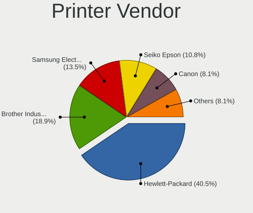

| Vendor                | Notebooks | Percent |
|-----------------------|-----------|---------|
| Hewlett-Packard       | 15        | 40.54%  |
| Brother Industries    | 7         | 18.92%  |
| Samsung Electronics   | 5         | 13.51%  |
| Seiko Epson           | 4         | 10.81%  |
| Canon                 | 3         | 8.11%   |
| Ricoh                 | 1         | 2.7%    |
| Oki Data              | 1         | 2.7%    |
| Lexmark International | 1         | 2.7%    |

Printer Model
-------------

Printer device models

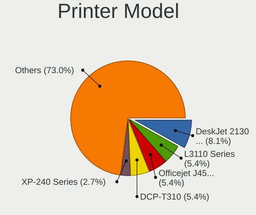

| Model                                   | Notebooks | Percent |
|-----------------------------------------|-----------|---------|
| HP DeskJet 2130 series                  | 3         | 8.11%   |
| Seiko Epson L3110 Series                | 2         | 5.41%   |
| HP Officejet J4500 series               | 2         | 5.41%   |
| Brother DCP-T310                        | 2         | 5.41%   |
| Seiko Epson XP-240 Series               | 1         | 2.7%    |
| Seiko Epson L405 Series                 | 1         | 2.7%    |
| Samsung Xerox Phaser 3117 Laser Printer | 1         | 2.7%    |
| Samsung SCX-4623 Series                 | 1         | 2.7%    |
| Samsung SCX-4200 series                 | 1         | 2.7%    |
| Samsung M2070 Series                    | 1         | 2.7%    |
| Samsung Composite Device                | 1         | 2.7%    |
| Ricoh SP 112                            | 1         | 2.7%    |
| Oki Data USB Device                     | 1         | 2.7%    |
| Lexmark International Lexmark X203n     | 1         | 2.7%    |
| HP LaserJet P1102                       | 1         | 2.7%    |
| HP LaserJet P1005                       | 1         | 2.7%    |
| HP LaserJet 1150                        | 1         | 2.7%    |
| HP LaserJet 1022                        | 1         | 2.7%    |
| HP LaserJet 1020                        | 1         | 2.7%    |
| HP LaserJet 1018                        | 1         | 2.7%    |
| HP DeskJet 5550                         | 1         | 2.7%    |
| HP DeskJet 4100 series                  | 1         | 2.7%    |
| HP DeskJet 2300 series                  | 1         | 2.7%    |
| HP Deskjet 1510                         | 1         | 2.7%    |
| Canon TS3400 series                     | 1         | 2.7%    |
| Canon PIXMA MG2500 Series               | 1         | 2.7%    |
| Canon LiDE 400                          | 1         | 2.7%    |
| Brother PTUSB Printing                  | 1         | 2.7%    |
| Brother HL-1110 series                  | 1         | 2.7%    |
| Brother DCP-L2600D                      | 1         | 2.7%    |
| Brother DCP-L2500D                      | 1         | 2.7%    |
| Brother DCP-1610W                       | 1         | 2.7%    |

Scanner Vendor
--------------

Scanner device vendors

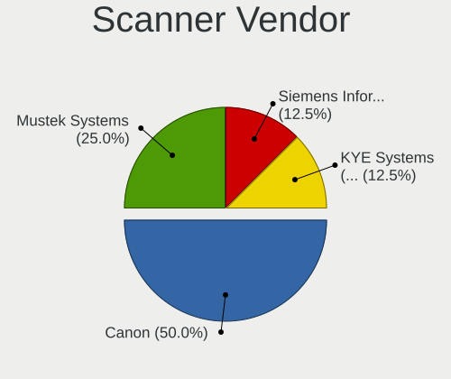

| Vendor                                         | Notebooks | Percent |
|------------------------------------------------|-----------|---------|
| Canon                                          | 4         | 50%     |
| Mustek Systems                                 | 2         | 25%     |
| Siemens Information and Communication Products | 1         | 12.5%   |
| KYE Systems (Mouse Systems)                    | 1         | 12.5%   |

Scanner Model
-------------

Scanner device models

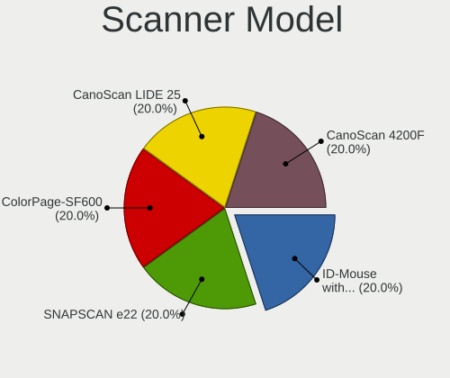

| Model                                                                           | Notebooks | Percent |
|---------------------------------------------------------------------------------|-----------|---------|
| Canon CanoScan LiDE 120                                                         | 2         | 25%     |
| Siemens Information and Communication Products ID-Mouse with Fingerprint Reader | 1         | 12.5%   |
| Mustek Systems SNAPSCAN e22                                                     | 1         | 12.5%   |
| Mustek Systems BearPaw 2400 CU Plus                                             | 1         | 12.5%   |
| KYE Systems (Mouse Systems) ColorPage-SF600                                     | 1         | 12.5%   |
| Canon CanoScan LIDE 25                                                          | 1         | 12.5%   |
| Canon CanoScan 4200F                                                            | 1         | 12.5%   |

Camera
------

Camera Vendor
-------------

Camera device vendors

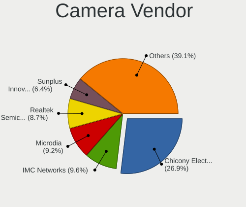

| Vendor                                 | Notebooks | Percent |
|----------------------------------------|-----------|---------|
| Chicony Electronics                    | 744       | 26.9%   |
| IMC Networks                           | 266       | 9.62%   |
| Microdia                               | 255       | 9.22%   |
| Realtek Semiconductor                  | 242       | 8.75%   |
| Sunplus Innovation Technology          | 177       | 6.4%    |
| Bison Electronics                      | 170       | 6.15%   |
| Suyin                                  | 120       | 4.34%   |
| Quanta                                 | 120       | 4.34%   |
| Cheng Uei Precision Industry (Foxlink) | 93        | 3.36%   |
| Syntek                                 | 78        | 2.82%   |
| Lite-On Technology                     | 67        | 2.42%   |
| Silicon Motion                         | 48        | 1.74%   |
| Lenovo                                 | 44        | 1.59%   |
| Luxvisions Innotech Limited            | 42        | 1.52%   |
| Alcor Micro                            | 36        | 1.3%    |
| Apple                                  | 35        | 1.27%   |
| Ricoh                                  | 33        | 1.19%   |
| Primax Electronics                     | 23        | 0.83%   |
| Sonix Technology                       | 21        | 0.76%   |
| Logitech                               | 19        | 0.69%   |
| Samsung Electronics                    | 15        | 0.54%   |
| Z-Star Microelectronics                | 14        | 0.51%   |
| ALi                                    | 13        | 0.47%   |
| Acer                                   | 13        | 0.47%   |
| Importek                               | 12        | 0.43%   |
| KYE Systems (Mouse Systems)            | 11        | 0.4%    |
| Shinetech                              | 8         | 0.29%   |
| OmniVision Technologies                | 8         | 0.29%   |
| GEMBIRD                                | 6         | 0.22%   |
| icSpring                               | 4         | 0.14%   |
| DigiTech                               | 4         | 0.14%   |
| Sunplus Technology                     | 3         | 0.11%   |
| SunplusIT                              | 2         | 0.07%   |
| MacroSilicon                           | 2         | 0.07%   |
| Genesys Logic                          | 2         | 0.07%   |
| Xiaomi                                 | 1         | 0.04%   |
| Sunplus IT                             | 1         | 0.04%   |
| Spreadtrum Communications              | 1         | 0.04%   |
| Speed Tech                             | 1         | 0.04%   |
| Shine-optics                           | 1         | 0.04%   |

Camera Model
------------

Camera device models

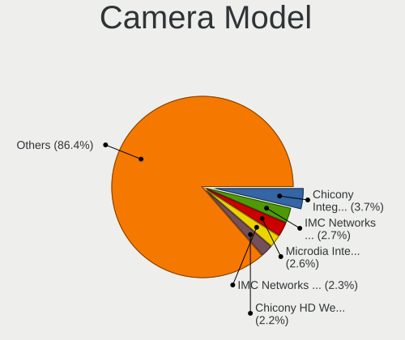

| Model                                         | Notebooks | Percent |
|-----------------------------------------------|-----------|---------|
| Chicony Integrated Camera                     | 103       | 3.72%   |
| IMC Networks USB2.0 HD UVC WebCam             | 76        | 2.74%   |
| Microdia Integrated_Webcam_HD                 | 72        | 2.6%    |
| IMC Networks USB2.0 VGA UVC WebCam            | 63        | 2.27%   |
| Chicony HD Webcam                             | 62        | 2.24%   |
| Bison Lenovo EasyCamera                       | 52        | 1.88%   |
| Realtek Integrated_Webcam_HD                  | 50        | 1.8%    |
| Chicony HP Truevision HD                      | 47        | 1.7%    |
| Sunplus Integrated_Webcam_HD                  | 44        | 1.59%   |
| Microdia Integrated Webcam                    | 37        | 1.33%   |
| Chicony USB2.0 VGA UVC WebCam                 | 37        | 1.33%   |
| Realtek USB Camera                            | 32        | 1.15%   |
| Bison Integrated Camera                       | 32        | 1.15%   |
| Chicony Integrated HP HD Webcam               | 30        | 1.08%   |
| Suyin Acer/HP Integrated Webcam [CN0314]      | 29        | 1.05%   |
| IMC Networks Integrated Camera                | 29        | 1.05%   |
| Syntek Integrated Camera                      | 28        | 1.01%   |
| Chicony USB2.0 HD UVC WebCam                  | 28        | 1.01%   |
| Sunplus HD WebCam                             | 27        | 0.97%   |
| Chicony FJ Camera                             | 27        | 0.97%   |
| Lite-On Integrated Camera                     | 25        | 0.9%    |
| Chicony Lenovo EasyCamera                     | 25        | 0.9%    |
| Sunplus HP Truevision HD                      | 24        | 0.87%   |
| Realtek Integrated Webcam HD                  | 24        | 0.87%   |
| IMC Networks EasyCamera                       | 22        | 0.79%   |
| Cheng Uei Precision Industry (Foxlink) Webcam | 22        | 0.79%   |
| Realtek Integrated Webcam                     | 21        | 0.76%   |
| Quanta HD Webcam                              | 21        | 0.76%   |
| Lite-On HP HD Webcam                          | 21        | 0.76%   |
| Chicony VGA Webcam                            | 21        | 0.76%   |
| Chicony EasyCamera                            | 21        | 0.76%   |
| Realtek Lenovo EasyCamera                     | 20        | 0.72%   |
| Lenovo Integrated Webcam [R5U877]             | 20        | 0.72%   |
| Lenovo Integrated Webcam                      | 20        | 0.72%   |
| Chicony HD User Facing                        | 19        | 0.69%   |
| Chicony 2.0M UVC Webcam / CNF7129             | 19        | 0.69%   |
| Syntek Lenovo EasyCamera                      | 18        | 0.65%   |
| Quanta VGA WebCam                             | 18        | 0.65%   |
| Quanta HD User Facing                         | 17        | 0.61%   |
| Microdia Integrated HD Webcam                 | 17        | 0.61%   |

Security
--------

Fingerprint Vendor
------------------

Fingerprint sensor vendors

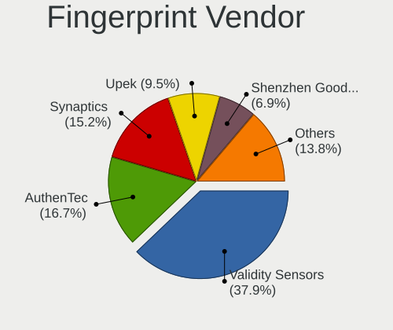

| Vendor                             | Notebooks | Percent |
|------------------------------------|-----------|---------|
| Validity Sensors                   | 159       | 37.86%  |
| AuthenTec                          | 70        | 16.67%  |
| Synaptics                          | 64        | 15.24%  |
| Upek                               | 40        | 9.52%   |
| Shenzhen Goodix Technology         | 29        | 6.9%    |
| LighTuning Technology              | 22        | 5.24%   |
| STMicroelectronics                 | 15        | 3.57%   |
| Elan Microelectronics              | 12        | 2.86%   |
| Realtek USB2.0 Finger Print Bridge | 5         | 1.19%   |
| HOLTEK                             | 4         | 0.95%   |

Fingerprint Model
-----------------

Fingerprint sensor models

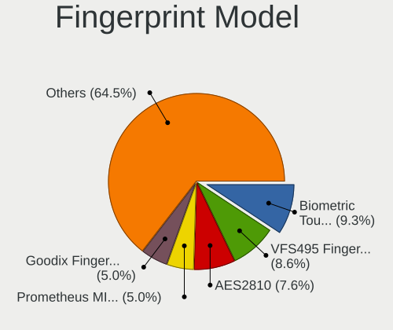

| Model                                                                      | Notebooks | Percent |
|----------------------------------------------------------------------------|-----------|---------|
| Upek Biometric Touchchip/Touchstrip Fingerprint Sensor                     | 39        | 9.29%   |
| Validity Sensors VFS495 Fingerprint Reader                                 | 36        | 8.57%   |
| AuthenTec AES2810                                                          | 32        | 7.62%   |
| Synaptics Prometheus MIS Touch Fingerprint Reader                          | 21        | 5%      |
| Shenzhen Goodix  FingerPrint Device                                        | 21        | 5%      |
| Validity Sensors VFS491                                                    | 19        | 4.52%   |
| AuthenTec AES2501 Fingerprint Sensor                                       | 19        | 4.52%   |
| Validity Sensors VFS471 Fingerprint Reader                                 | 18        | 4.29%   |
| Validity Sensors VFS5011 Fingerprint Reader                                | 16        | 3.81%   |
| Validity Sensors VFS451 Fingerprint Reader                                 | 15        | 3.57%   |
| Validity Sensors Synaptics WBDI                                            | 15        | 3.57%   |
| STMicroelectronics Fingerprint Reader                                      | 15        | 3.57%   |
| Validity Sensors VFS7500 Touch Fingerprint Sensor                          | 13        | 3.1%    |
| Synaptics Metallica MIS Touch Fingerprint Reader                           | 13        | 3.1%    |
| LighTuning EgisTec Touch Fingerprint Sensor                                | 13        | 3.1%    |
| Validity Sensors VFS 5011 fingerprint sensor                               | 11        | 2.62%   |
| LighTuning Fingerprint Reader                                              | 9         | 2.14%   |
| AuthenTec Fingerprint Sensor                                               | 8         | 1.9%    |
| Synaptics FS7604 Touch Fingerprint Sensor with PurePrint                   | 7         | 1.67%   |
| Shenzhen Goodix Fingerprint Reader                                         | 7         | 1.67%   |
| Elan ELAN:Fingerprint                                                      | 7         | 1.67%   |
| Validity Sensors Synaptics VFS7552 Touch Fingerprint Sensor with PurePrint | 6         | 1.43%   |
| Synaptics UWP WBDI Device                                                  | 5         | 1.19%   |
| Synaptics  WBDI                                                            | 5         | 1.19%   |
| Synaptics  FS7604 Touch Fingerprint Sensor with PurePrint                  | 5         | 1.19%   |
| Realtek USB2.0 Finger Print Bridge FocalTech Fingerprint Device            | 5         | 1.19%   |
| Elan ELAN:ARM-M4                                                           | 5         | 1.19%   |
| AuthenTec AES1600                                                          | 5         | 1.19%   |
| Validity Sensors VFS101 Fingerprint Reader                                 | 4         | 0.95%   |
| Synaptics Fingerprint reader [HP G6]                                       | 4         | 0.95%   |
| HOLTEK FocalTech Fingerprint Device                                        | 4         | 0.95%   |
| AuthenTec AES1660 Fingerprint Sensor                                       | 4         | 0.95%   |
| Validity Sensors Swipe Fingerprint Sensor                                  | 2         | 0.48%   |
| Validity Sensors Fingerprint scanner                                       | 2         | 0.48%   |
| AuthenTec AES2550 Fingerprint Sensor                                       | 2         | 0.48%   |
| Validity Sensors VFS301 Fingerprint Reader                                 | 1         | 0.24%   |
| Validity Sensors VFS Fingerprint sensor                                    | 1         | 0.24%   |
| Upek TCS5B Fingerprint sensor                                              | 1         | 0.24%   |
| Synaptics WBDI Fingerprint Reader USB 086                                  | 1         | 0.24%   |
| Synaptics WBDI Device                                                      | 1         | 0.24%   |

Chipcard Vendor
---------------

Chipcard module vendors

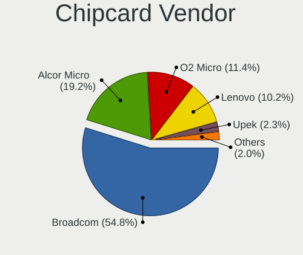

| Vendor                | Notebooks | Percent |
|-----------------------|-----------|---------|
| Broadcom              | 188       | 54.81%  |
| Alcor Micro           | 66        | 19.24%  |
| O2 Micro              | 39        | 11.37%  |
| Lenovo                | 35        | 10.2%   |
| Upek                  | 8         | 2.33%   |
| Gemalto (was Gemplus) | 4         | 1.17%   |
| Yubico.com            | 1         | 0.29%   |
| Chicony Electronics   | 1         | 0.29%   |
| Advanced Card Systems | 1         | 0.29%   |

Chipcard Model
--------------

Chipcard module models

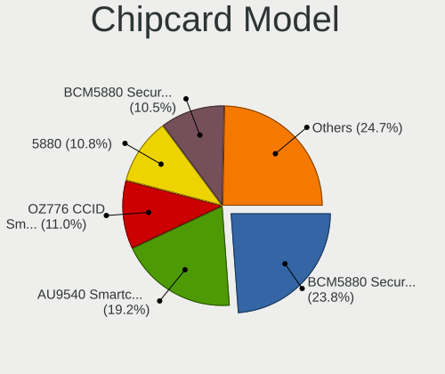

| Model                                                                        | Notebooks | Percent |
|------------------------------------------------------------------------------|-----------|---------|
| Broadcom BCM5880 Secure Applications Processor                               | 82        | 23.84%  |
| Alcor Micro AU9540 Smartcard Reader                                          | 66        | 19.19%  |
| O2 Micro OZ776 CCID Smartcard Reader                                         | 38        | 11.05%  |
| Broadcom 5880                                                                | 37        | 10.76%  |
| Broadcom BCM5880 Secure Applications Processor with fingerprint swipe sensor | 36        | 10.47%  |
| Lenovo Integrated Smart Card Reader                                          | 35        | 10.17%  |
| Broadcom BCM58200 ControlVault 3 (FingerPrint sensor + Contacted SmartCard)  | 25        | 7.27%   |
| Broadcom 58200                                                               | 9         | 2.62%   |
| Upek TouchChip Fingerprint Coprocessor (WBF advanced mode)                   | 8         | 2.33%   |
| Gemalto (was Gemplus) GemPC Key SmartCard Reader                             | 2         | 0.58%   |
| Gemalto (was Gemplus) Compact Smart Card Reader Writer                       | 2         | 0.58%   |
| Yubico.com Yubikey 4/5 U2F+CCID                                              | 1         | 0.29%   |
| O2 Micro Oz776 SmartCard Reader                                              | 1         | 0.29%   |
| Chicony Electronics HP Skylab USB Smartcard Keyboard                         | 1         | 0.29%   |
| Advanced Card Systems ACR1252 Dual Reader                                    | 1         | 0.29%   |

Unsupported
-----------

Unsupported Devices
-------------------

Total unsupported devices on board

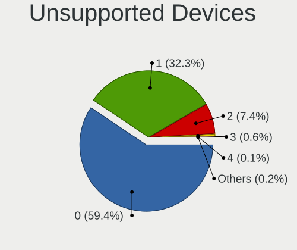

| Total | Notebooks | Percent |
|-------|-----------|---------|
| 0     | 1934      | 59.4%   |
| 1     | 1051      | 32.28%  |
| 2     | 242       | 7.43%   |
| 3     | 20        | 0.61%   |
| 4     | 4         | 0.12%   |
| 5     | 2         | 0.06%   |
| 10    | 1         | 0.03%   |
| 9     | 1         | 0.03%   |
| 7     | 1         | 0.03%   |

Unsupported Device Types
------------------------

Types of unsupported devices

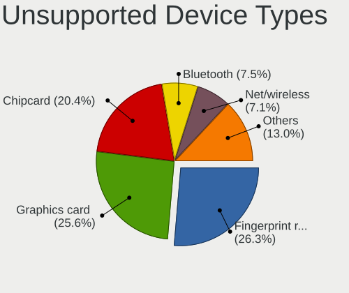

| Type                     | Notebooks | Percent |
|--------------------------|-----------|---------|
| Fingerprint reader       | 416       | 26.35%  |
| Graphics card            | 405       | 25.65%  |
| Chipcard                 | 322       | 20.39%  |
| Bluetooth                | 118       | 7.47%   |
| Net/wireless             | 112       | 7.09%   |
| Storage                  | 52        | 3.29%   |
| Multimedia controller    | 43        | 2.72%   |
| Camera                   | 33        | 2.09%   |
| Communication controller | 23        | 1.46%   |
| Flash memory             | 18        | 1.14%   |
| Sound                    | 11        | 0.7%    |
| Card reader              | 9         | 0.57%   |
| Net/ethernet             | 7         | 0.44%   |
| Modem                    | 3         | 0.19%   |
| Storage/ata              | 2         | 0.13%   |
| Network                  | 2         | 0.13%   |
| Dvb card                 | 2         | 0.13%   |
| Firewire controller      | 1         | 0.06%   |

