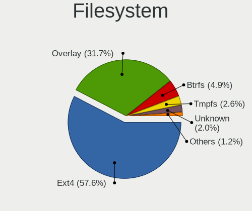
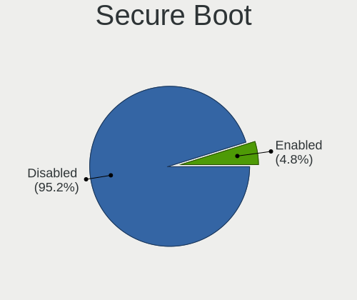
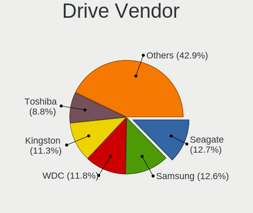
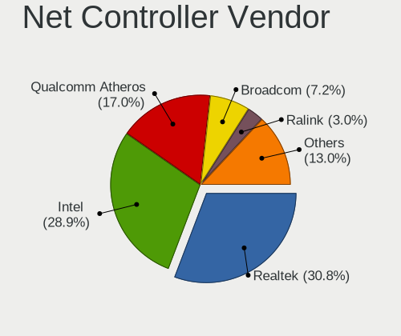
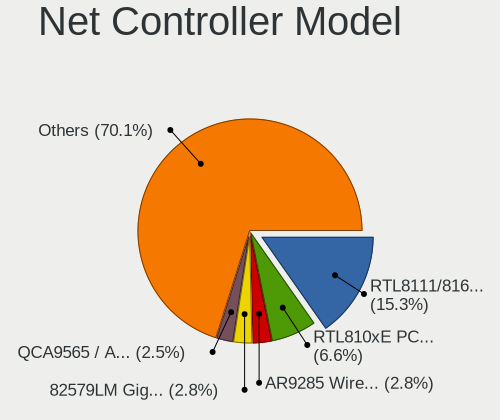
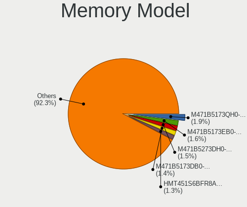

Linux in Hungary - Tested Hardware & Statistics (Notebooks)
-----------------------------------------------------------

A project to collect tested hardware configurations for Linux in Hungary.

Anyone can contribute to this report by the [hw-probe](https://github.com/linuxhw/hw-probe) tool:

    sudo -E hw-probe -all -upload

Please contribute! Especially if your hardware is rare.

Contents
--------

* [ Test Cases ](#test-cases)

* [ System ](#system)
  - [ OS                       ](#os)
  - [ OS Family                ](#os-family)
  - [ Kernel                   ](#kernel)
  - [ Kernel Family            ](#kernel-family)
  - [ Kernel Major Ver.        ](#kernel-major-ver)
  - [ Arch                     ](#arch)
  - [ DE                       ](#de)
  - [ Display Server           ](#display-server)
  - [ Display Manager          ](#display-manager)
  - [ OS Lang                  ](#os-lang)
  - [ Boot Mode                ](#boot-mode)
  - [ Filesystem               ](#filesystem)
  - [ Part. scheme             ](#part-scheme)
  - [ Dual Boot with Linux/BSD ](#dual-boot-with-linuxbsd)
  - [ Dual Boot (Win)          ](#dual-boot-win)

* [ Board ](#board)
  - [ Vendor                   ](#vendor)
  - [ Model                    ](#model)
  - [ Model Family             ](#model-family)
  - [ MFG Year                 ](#mfg-year)
  - [ Form Factor              ](#form-factor)
  - [ Secure Boot              ](#secure-boot)
  - [ Coreboot                 ](#coreboot)
  - [ RAM Size                 ](#ram-size)
  - [ RAM Used                 ](#ram-used)
  - [ Total Drives             ](#total-drives)
  - [ Has CD-ROM               ](#has-cd-rom)
  - [ Has Ethernet             ](#has-ethernet)
  - [ Has WiFi                 ](#has-wifi)
  - [ Has Bluetooth            ](#has-bluetooth)

* [ Location ](#location)
  - [ Country                  ](#country)
  - [ City                     ](#city)

* [ Drives ](#drives)
  - [ Drive Vendor             ](#drive-vendor)
  - [ Drive Model              ](#drive-model)
  - [ HDD Vendor               ](#hdd-vendor)
  - [ SSD Vendor               ](#ssd-vendor)
  - [ Drive Kind               ](#drive-kind)
  - [ Drive Connector          ](#drive-connector)
  - [ Drive Size               ](#drive-size)
  - [ Space Total              ](#space-total)
  - [ Space Used               ](#space-used)
  - [ Malfunc. Drives          ](#malfunc-drives)
  - [ Malfunc. Drive Vendor    ](#malfunc-drive-vendor)
  - [ Malfunc. HDD Vendor      ](#malfunc-hdd-vendor)
  - [ Malfunc. Drive Kind      ](#malfunc-drive-kind)
  - [ Failed Drives            ](#failed-drives)
  - [ Failed Drive Vendor      ](#failed-drive-vendor)
  - [ Drive Status             ](#drive-status)

* [ Storage controller ](#storage-controller)
  - [ Storage Vendor           ](#storage-vendor)
  - [ Storage Model            ](#storage-model)
  - [ Storage Kind             ](#storage-kind)

* [ Processor ](#processor)
  - [ CPU Vendor               ](#cpu-vendor)
  - [ CPU Model                ](#cpu-model)
  - [ CPU Model Family         ](#cpu-model-family)
  - [ CPU Cores                ](#cpu-cores)
  - [ CPU Sockets              ](#cpu-sockets)
  - [ CPU Threads              ](#cpu-threads)
  - [ CPU Op-Modes             ](#cpu-op-modes)
  - [ CPU Microcode            ](#cpu-microcode)
  - [ CPU Microarch            ](#cpu-microarch)

* [ Graphics ](#graphics)
  - [ GPU Vendor               ](#gpu-vendor)
  - [ GPU Model                ](#gpu-model)
  - [ GPU Combo                ](#gpu-combo)
  - [ GPU Driver               ](#gpu-driver)
  - [ GPU Memory               ](#gpu-memory)

* [ Monitor ](#monitor)
  - [ Monitor Vendor           ](#monitor-vendor)
  - [ Monitor Model            ](#monitor-model)
  - [ Monitor Resolution       ](#monitor-resolution)
  - [ Monitor Diagonal         ](#monitor-diagonal)
  - [ Monitor Width            ](#monitor-width)
  - [ Aspect Ratio             ](#aspect-ratio)
  - [ Monitor Area             ](#monitor-area)
  - [ Pixel Density            ](#pixel-density)
  - [ Multiple Monitors        ](#multiple-monitors)

* [ Network ](#network)
  - [ Net Controller Vendor    ](#net-controller-vendor)
  - [ Net Controller Model     ](#net-controller-model)
  - [ Wireless Vendor          ](#wireless-vendor)
  - [ Wireless Model           ](#wireless-model)
  - [ Ethernet Vendor          ](#ethernet-vendor)
  - [ Ethernet Model           ](#ethernet-model)
  - [ Net Controller Kind      ](#net-controller-kind)
  - [ Used Controller          ](#used-controller)
  - [ NICs                     ](#nics)
  - [ IPv6                     ](#ipv6)

* [ Bluetooth ](#bluetooth)
  - [ Bluetooth Vendor         ](#bluetooth-vendor)
  - [ Bluetooth Model          ](#bluetooth-model)

* [ Sound ](#sound)
  - [ Sound Vendor             ](#sound-vendor)
  - [ Sound Model              ](#sound-model)

* [ Memory ](#memory)
  - [ Memory Vendor            ](#memory-vendor)
  - [ Memory Model             ](#memory-model)
  - [ Memory Kind              ](#memory-kind)
  - [ Memory Form Factor       ](#memory-form-factor)
  - [ Memory Size              ](#memory-size)
  - [ Memory Speed             ](#memory-speed)

* [ Printers & scanners ](#printers--scanners)
  - [ Printer Vendor           ](#printer-vendor)
  - [ Printer Model            ](#printer-model)
  - [ Scanner Vendor           ](#scanner-vendor)
  - [ Scanner Model            ](#scanner-model)

* [ Camera ](#camera)
  - [ Camera Vendor            ](#camera-vendor)
  - [ Camera Model             ](#camera-model)

* [ Security ](#security)
  - [ Fingerprint Vendor       ](#fingerprint-vendor)
  - [ Fingerprint Model        ](#fingerprint-model)
  - [ Chipcard Vendor          ](#chipcard-vendor)
  - [ Chipcard Model           ](#chipcard-model)

* [ Unsupported ](#unsupported)
  - [ Unsupported Devices      ](#unsupported-devices)
  - [ Unsupported Device Types ](#unsupported-device-types)

Test Cases
----------

Total: 4992

| Vendor        | Model                       | Probe                                                      | Date         |
|---------------|-----------------------------|------------------------------------------------------------|--------------|
| HP            | ZBook Fury 17.3 inch G8 ... | [65ddbd761c](https://linux-hardware.org/?probe=65ddbd761c) | Jan 02, 2024 |
| eMachines     | E725                        | [1c62e8a613](https://linux-hardware.org/?probe=1c62e8a613) | Jan 02, 2024 |
| eMachines     | E725                        | [6485437ffb](https://linux-hardware.org/?probe=6485437ffb) | Jan 01, 2024 |
| ASUSTek       | K54HR                       | [c84a5fe9d7](https://linux-hardware.org/?probe=c84a5fe9d7) | Jan 01, 2024 |
| ASUSTek       | K54HR                       | [03ce083285](https://linux-hardware.org/?probe=03ce083285) | Jan 01, 2024 |
| eMachines     | E525                        | [a99f0e3394](https://linux-hardware.org/?probe=a99f0e3394) | Jan 01, 2024 |
| Dell          | Inspiron 15-3567            | [54e9b80fb3](https://linux-hardware.org/?probe=54e9b80fb3) | Jan 01, 2024 |
| Dell          | Inspiron 15-3567            | [c67f642893](https://linux-hardware.org/?probe=c67f642893) | Jan 01, 2024 |
| Fujitsu       | LIFEBOOK A530               | [044d66edb4](https://linux-hardware.org/?probe=044d66edb4) | Jan 01, 2024 |
| Lenovo        | ThinkPad T410 2537BF9       | [5d62cfc80b](https://linux-hardware.org/?probe=5d62cfc80b) | Jan 01, 2024 |
| Apple         | MacBookPro8,1               | [85665aae4c](https://linux-hardware.org/?probe=85665aae4c) | Dec 31, 2023 |
| ASUSTek       | K54HR                       | [0e5edd355d](https://linux-hardware.org/?probe=0e5edd355d) | Dec 31, 2023 |
| ASUSTek       | 1001PX                      | [e0e36774e8](https://linux-hardware.org/?probe=e0e36774e8) | Dec 31, 2023 |
| Dell          | Inspiron 5567               | [c271898460](https://linux-hardware.org/?probe=c271898460) | Dec 31, 2023 |
| Dell          | Latitude E6540              | [aa122de07a](https://linux-hardware.org/?probe=aa122de07a) | Dec 31, 2023 |
| HP            | ProBook 450 G1              | [a83eb9d306](https://linux-hardware.org/?probe=a83eb9d306) | Dec 31, 2023 |
| HP            | 250 G1                      | [da6bcc5b27](https://linux-hardware.org/?probe=da6bcc5b27) | Dec 31, 2023 |
| HP            | EliteBook 840 G8 Noteboo... | [1258df680a](https://linux-hardware.org/?probe=1258df680a) | Dec 31, 2023 |
| Dell          | Latitude 5480               | [3d096bf8e4](https://linux-hardware.org/?probe=3d096bf8e4) | Dec 31, 2023 |
| Lenovo        | ThinkPad T400 2768WGB       | [9894c7bf9f](https://linux-hardware.org/?probe=9894c7bf9f) | Dec 31, 2023 |
| HP            | Laptop 15s-fq5xxx           | [b5bf7051ef](https://linux-hardware.org/?probe=b5bf7051ef) | Dec 31, 2023 |
| Lenovo        | IdeaPad 330-15IKB 81DE      | [4582e28453](https://linux-hardware.org/?probe=4582e28453) | Dec 31, 2023 |
| Dell          | Latitude E5520              | [bdc879aa29](https://linux-hardware.org/?probe=bdc879aa29) | Dec 30, 2023 |
| Dell          | Inspiron 17 7000 Series ... | [63794eecd3](https://linux-hardware.org/?probe=63794eecd3) | Dec 29, 2023 |
| ASUSTek       | ROG Strix G513QY_G513QY     | [988bd71a05](https://linux-hardware.org/?probe=988bd71a05) | Dec 29, 2023 |
| HP            | Pavilion dv5                | [f347184b5c](https://linux-hardware.org/?probe=f347184b5c) | Dec 29, 2023 |
| Dell          | Latitude 5480               | [ddcc69c02c](https://linux-hardware.org/?probe=ddcc69c02c) | Dec 29, 2023 |
| Dell          | Latitude E6220              | [c106ee001b](https://linux-hardware.org/?probe=c106ee001b) | Dec 29, 2023 |
| Lenovo        | IdeaPad 110-15ACL 80TJ      | [55a9c00e34](https://linux-hardware.org/?probe=55a9c00e34) | Dec 29, 2023 |
| ASUSTek       | K54HR                       | [ce4e5d4a5b](https://linux-hardware.org/?probe=ce4e5d4a5b) | Dec 29, 2023 |
| HP            | 250 G1                      | [c0c195904c](https://linux-hardware.org/?probe=c0c195904c) | Dec 29, 2023 |
| Lenovo        | IdeaPad 110-15ACL 80TJ      | [bb3e77da36](https://linux-hardware.org/?probe=bb3e77da36) | Dec 29, 2023 |
| ASUSTek       | Vivobook Go E1504GAB_E15... | [6fa8529cff](https://linux-hardware.org/?probe=6fa8529cff) | Dec 29, 2023 |
| Dell          | Inspiron 5558               | [be6a80140f](https://linux-hardware.org/?probe=be6a80140f) | Dec 29, 2023 |
| eMachines     | E725                        | [b3be8d374c](https://linux-hardware.org/?probe=b3be8d374c) | Dec 28, 2023 |
| Lenovo        | ThinkPad X250 20CLS1JN00    | [fd565ed585](https://linux-hardware.org/?probe=fd565ed585) | Dec 28, 2023 |
| ASUSTek       | K54HR                       | [dca5908bc4](https://linux-hardware.org/?probe=dca5908bc4) | Dec 28, 2023 |
| HP            | EliteBook Folio 9480m       | [45adbe7c2a](https://linux-hardware.org/?probe=45adbe7c2a) | Dec 28, 2023 |
| Lenovo        | IdeaPad 110-15ACL 80TJ      | [324bfb9f22](https://linux-hardware.org/?probe=324bfb9f22) | Dec 28, 2023 |
| HP            | Laptop 15-dw1xxx            | [86c11fc47f](https://linux-hardware.org/?probe=86c11fc47f) | Dec 28, 2023 |
| Lenovo        | ThinkPad X230 2333A91       | [ecd05eabd6](https://linux-hardware.org/?probe=ecd05eabd6) | Dec 28, 2023 |
| Lenovo        | IdeaPad 320-17ABR 80YN      | [88fe73b44c](https://linux-hardware.org/?probe=88fe73b44c) | Dec 28, 2023 |
| ASUSTek       | UL80VT                      | [d9e57db214](https://linux-hardware.org/?probe=d9e57db214) | Dec 28, 2023 |
| ASUSTek       | UL80VT                      | [8532e3dcca](https://linux-hardware.org/?probe=8532e3dcca) | Dec 28, 2023 |
| Apple         | MacBookAir5,2               | [14b41c4c72](https://linux-hardware.org/?probe=14b41c4c72) | Dec 28, 2023 |
| Lenovo        | G70-70 80HW                 | [3b6b661f7d](https://linux-hardware.org/?probe=3b6b661f7d) | Dec 28, 2023 |
| Acer          | TravelMate P215-52          | [4191cc3d32](https://linux-hardware.org/?probe=4191cc3d32) | Dec 28, 2023 |
| eMachines     | E725                        | [1b90f2bf06](https://linux-hardware.org/?probe=1b90f2bf06) | Dec 27, 2023 |
| HP            | Pavilion Gaming Laptop 1... | [594935ef8c](https://linux-hardware.org/?probe=594935ef8c) | Dec 27, 2023 |
| Lenovo        | IdeaPad 700-15ISK 80RU      | [6ce71dea49](https://linux-hardware.org/?probe=6ce71dea49) | Dec 27, 2023 |
| HP            | EliteBook 8570w             | [4cd7501dc7](https://linux-hardware.org/?probe=4cd7501dc7) | Dec 27, 2023 |
| ASUSTek       | X55U                        | [a29a0b8a23](https://linux-hardware.org/?probe=a29a0b8a23) | Dec 27, 2023 |
| Lenovo        | ThinkPad T410 2537VFQ       | [9d710b8199](https://linux-hardware.org/?probe=9d710b8199) | Dec 27, 2023 |
| Dell          | Inspiron 7737               | [b0bde36cc7](https://linux-hardware.org/?probe=b0bde36cc7) | Dec 27, 2023 |
| HP            | EliteBook 2540p             | [a23b223ac4](https://linux-hardware.org/?probe=a23b223ac4) | Dec 27, 2023 |
| Lenovo        | IdeaPad 3-15ITL6 82H8       | [b465280108](https://linux-hardware.org/?probe=b465280108) | Dec 27, 2023 |
| Lenovo        | IdeaPad 3-15ITL6 82H8       | [67849c584b](https://linux-hardware.org/?probe=67849c584b) | Dec 26, 2023 |
| HP            | ProBook 455 G3              | [9e47611108](https://linux-hardware.org/?probe=9e47611108) | Dec 26, 2023 |
| Acer          | Aspire E1-532               | [c7d5bac798](https://linux-hardware.org/?probe=c7d5bac798) | Dec 26, 2023 |
| ASUSTek       | ZenBook UX433FN_UX433FN     | [2197c3b926](https://linux-hardware.org/?probe=2197c3b926) | Dec 26, 2023 |
| Dell          | Latitude E6520              | [634e14ff4c](https://linux-hardware.org/?probe=634e14ff4c) | Dec 25, 2023 |
| Dell          | Latitude E6520              | [fa25376a64](https://linux-hardware.org/?probe=fa25376a64) | Dec 25, 2023 |
| ASUSTek       | X55U                        | [a467fa6d5e](https://linux-hardware.org/?probe=a467fa6d5e) | Dec 25, 2023 |
| Lenovo        | IdeaPad 320-17ABR 80YN      | [4b67581412](https://linux-hardware.org/?probe=4b67581412) | Dec 25, 2023 |
| Sony          | VPCS13V9E                   | [61230cc69b](https://linux-hardware.org/?probe=61230cc69b) | Dec 24, 2023 |
| Lenovo        | IdeaPad 320-17ABR 80YN      | [fd501fc946](https://linux-hardware.org/?probe=fd501fc946) | Dec 23, 2023 |
| ASUSTek       | Vivobook Go E1504GAB_E15... | [1947533de1](https://linux-hardware.org/?probe=1947533de1) | Dec 23, 2023 |
| Sony          | VPCS13V9E                   | [05f387de9b](https://linux-hardware.org/?probe=05f387de9b) | Dec 23, 2023 |
| Lenovo        | IdeaPad 320-17ABR 80YN      | [7d9fabde46](https://linux-hardware.org/?probe=7d9fabde46) | Dec 23, 2023 |
| Samsung       | 300E4C/300E5C/300E7C        | [bf31061d97](https://linux-hardware.org/?probe=bf31061d97) | Dec 23, 2023 |
| Samsung       | 300E4C/300E5C/300E7C        | [a4ecaaf236](https://linux-hardware.org/?probe=a4ecaaf236) | Dec 23, 2023 |
| Dell          | Latitude E6410              | [7e14c30601](https://linux-hardware.org/?probe=7e14c30601) | Dec 23, 2023 |
| Fujitsu Si... | ESPRIMO Mobile U9210        | [2cc486fed2](https://linux-hardware.org/?probe=2cc486fed2) | Dec 23, 2023 |
| Acer          | Aspire A515-45              | [acab7c340a](https://linux-hardware.org/?probe=acab7c340a) | Dec 22, 2023 |
| HP            | Notebook                    | [bb4cdbdf05](https://linux-hardware.org/?probe=bb4cdbdf05) | Dec 22, 2023 |
| HP            | Notebook                    | [1b95abcc1b](https://linux-hardware.org/?probe=1b95abcc1b) | Dec 22, 2023 |
| Dell          | Inspiron 3537               | [e4c0a2d0d7](https://linux-hardware.org/?probe=e4c0a2d0d7) | Dec 22, 2023 |
| HP            | EliteBook 840 G8 Noteboo... | [b8f11e5aeb](https://linux-hardware.org/?probe=b8f11e5aeb) | Dec 22, 2023 |
| Dell          | Inspiron 3537               | [41b209e906](https://linux-hardware.org/?probe=41b209e906) | Dec 22, 2023 |
| HP            | EliteBook 840 G8 Noteboo... | [7d521242f4](https://linux-hardware.org/?probe=7d521242f4) | Dec 22, 2023 |
| ASUSTek       | Vivobook Go E1504GAB_E15... | [e7c2d69943](https://linux-hardware.org/?probe=e7c2d69943) | Dec 22, 2023 |
| Acer          | TravelMate P215-41-G2       | [476ef9075c](https://linux-hardware.org/?probe=476ef9075c) | Dec 21, 2023 |
| Lenovo        | G70-70 80HW                 | [b5d6e26b97](https://linux-hardware.org/?probe=b5d6e26b97) | Dec 21, 2023 |
| Dell          | Inspiron 5559               | [7666e1047d](https://linux-hardware.org/?probe=7666e1047d) | Dec 21, 2023 |
| eMachines     | E725                        | [7b9f0ee917](https://linux-hardware.org/?probe=7b9f0ee917) | Dec 20, 2023 |
| eMachines     | E725                        | [950542e12b](https://linux-hardware.org/?probe=950542e12b) | Dec 20, 2023 |
| Dell          | Latitude E5540              | [af5e30a046](https://linux-hardware.org/?probe=af5e30a046) | Dec 20, 2023 |
| HUAWEI        | KLVD-WXX9                   | [ff06842733](https://linux-hardware.org/?probe=ff06842733) | Dec 20, 2023 |
| Dell          | Latitude D630               | [914826699f](https://linux-hardware.org/?probe=914826699f) | Dec 20, 2023 |
| HUAWEI        | KLVD-WXX9                   | [5eca78aa43](https://linux-hardware.org/?probe=5eca78aa43) | Dec 19, 2023 |
| Mediacom      | GTZS                        | [f326507469](https://linux-hardware.org/?probe=f326507469) | Dec 19, 2023 |
| Lenovo        | Yoga 900-13ISK 80MK         | [3cc3621576](https://linux-hardware.org/?probe=3cc3621576) | Dec 19, 2023 |
| Apple         | MacBookPro5,4               | [da996ce093](https://linux-hardware.org/?probe=da996ce093) | Dec 18, 2023 |
| Apple         | MacBookPro5,4               | [ee0f91ec22](https://linux-hardware.org/?probe=ee0f91ec22) | Dec 18, 2023 |
| HP            | Compaq 6710b                | [8a4026815f](https://linux-hardware.org/?probe=8a4026815f) | Dec 18, 2023 |
| HP            | Compaq 6710b                | [01324b2772](https://linux-hardware.org/?probe=01324b2772) | Dec 18, 2023 |
| Lenovo        | ThinkBook 15-IIL 20SM       | [dec9660b8e](https://linux-hardware.org/?probe=dec9660b8e) | Dec 18, 2023 |
| Fujitsu       | LIFEBOOK A512               | [a7d805aa7c](https://linux-hardware.org/?probe=a7d805aa7c) | Dec 18, 2023 |
| Fujitsu       | LIFEBOOK A512               | [72663c66da](https://linux-hardware.org/?probe=72663c66da) | Dec 18, 2023 |
| Samsung       | RV409/RV509/RV709           | [7f55b490b8](https://linux-hardware.org/?probe=7f55b490b8) | Dec 18, 2023 |
| Lenovo        | G70-70 80HW                 | [dc86fb0437](https://linux-hardware.org/?probe=dc86fb0437) | Dec 18, 2023 |
| Acer          | Aspire 7738                 | [1333627761](https://linux-hardware.org/?probe=1333627761) | Dec 17, 2023 |
| Acer          | Aspire 7738                 | [96b31f90ac](https://linux-hardware.org/?probe=96b31f90ac) | Dec 17, 2023 |
| ASUSTek       | K53BY                       | [db6b177a99](https://linux-hardware.org/?probe=db6b177a99) | Dec 17, 2023 |
| Dell          | Latitude E6430              | [4a12bf0db8](https://linux-hardware.org/?probe=4a12bf0db8) | Dec 16, 2023 |
| Lenovo        | ThinkPad T410 2537AL8       | [8749a1d67d](https://linux-hardware.org/?probe=8749a1d67d) | Dec 16, 2023 |
| Lenovo        | ThinkPad T410 2537AL8       | [9e40928011](https://linux-hardware.org/?probe=9e40928011) | Dec 15, 2023 |
| HP            | EliteBook 840 G8 Noteboo... | [5c1d3d831c](https://linux-hardware.org/?probe=5c1d3d831c) | Dec 15, 2023 |
| ASUSTek       | X553MA                      | [1bd6eab773](https://linux-hardware.org/?probe=1bd6eab773) | Dec 15, 2023 |
| Apple         | MacBookPro11,3              | [106c5c6ec4](https://linux-hardware.org/?probe=106c5c6ec4) | Dec 15, 2023 |
| Apple         | MacBookPro5,4               | [89a318eaa6](https://linux-hardware.org/?probe=89a318eaa6) | Dec 14, 2023 |
| Apple         | MacBookPro5,4               | [1160e51426](https://linux-hardware.org/?probe=1160e51426) | Dec 14, 2023 |
| HP            | EliteBook 840 G8 Noteboo... | [a3ef12171e](https://linux-hardware.org/?probe=a3ef12171e) | Dec 13, 2023 |
| HP            | EliteBook 840 G8 Noteboo... | [3cfb1663a2](https://linux-hardware.org/?probe=3cfb1663a2) | Dec 13, 2023 |
| Acer          | Aspire A515-51G             | [00de2ee3d8](https://linux-hardware.org/?probe=00de2ee3d8) | Dec 12, 2023 |
| ASUSTek       | K51AE                       | [382bc13632](https://linux-hardware.org/?probe=382bc13632) | Dec 12, 2023 |
| Acer          | Aspire A515-51G             | [13c7114723](https://linux-hardware.org/?probe=13c7114723) | Dec 12, 2023 |
| Lenovo        | G505s 20255                 | [446bcccc18](https://linux-hardware.org/?probe=446bcccc18) | Dec 11, 2023 |
| ASUSTek       | K54L                        | [a50a95f076](https://linux-hardware.org/?probe=a50a95f076) | Dec 11, 2023 |
| Dell          | Latitude 5480               | [cdc50c85ce](https://linux-hardware.org/?probe=cdc50c85ce) | Dec 10, 2023 |
| HP            | Pavilion dv7                | [853bcfa739](https://linux-hardware.org/?probe=853bcfa739) | Dec 10, 2023 |
| HP            | Pavilion dv7                | [354a9cc9b6](https://linux-hardware.org/?probe=354a9cc9b6) | Dec 10, 2023 |
| Acer          | Nitro AN515-51              | [5c9d12b2c0](https://linux-hardware.org/?probe=5c9d12b2c0) | Dec 10, 2023 |
| Toshiba       | PORTEGE Z930                | [5ad98ef7f6](https://linux-hardware.org/?probe=5ad98ef7f6) | Dec 10, 2023 |
| Valve         | Jupiter                     | [4c72e88035](https://linux-hardware.org/?probe=4c72e88035) | Dec 10, 2023 |
| Valve         | Jupiter                     | [9f822d68bb](https://linux-hardware.org/?probe=9f822d68bb) | Dec 10, 2023 |
| Acer          | Aspire E5-575G              | [2c8df80a5f](https://linux-hardware.org/?probe=2c8df80a5f) | Dec 09, 2023 |
| ASUSTek       | 1215B                       | [65223dfc53](https://linux-hardware.org/?probe=65223dfc53) | Dec 09, 2023 |
| eMachines     | E525                        | [0b83a89d59](https://linux-hardware.org/?probe=0b83a89d59) | Dec 09, 2023 |
| Dell          | Latitude 5480               | [0dd9110b39](https://linux-hardware.org/?probe=0dd9110b39) | Dec 09, 2023 |
| eMachines     | E725                        | [7c8234f296](https://linux-hardware.org/?probe=7c8234f296) | Dec 08, 2023 |
| HP            | Notebook                    | [4d688ddd0c](https://linux-hardware.org/?probe=4d688ddd0c) | Dec 08, 2023 |
| Lenovo        | ThinkBook 15-IIL 20SM       | [b848110f65](https://linux-hardware.org/?probe=b848110f65) | Dec 08, 2023 |
| ASUSTek       | X541NA                      | [82c95b312a](https://linux-hardware.org/?probe=82c95b312a) | Dec 07, 2023 |
| HP            | ProBook 640 G8 Notebook ... | [ba710398bd](https://linux-hardware.org/?probe=ba710398bd) | Dec 06, 2023 |
| Lenovo        | ThinkPad T470 W10DG 20JN... | [c72f209121](https://linux-hardware.org/?probe=c72f209121) | Dec 05, 2023 |
| HP            | ProBook 640 G8 Notebook ... | [4389884ac0](https://linux-hardware.org/?probe=4389884ac0) | Dec 05, 2023 |
| Fujitsu Si... | ESPRIMO Mobile U9210        | [84cbb3e6b5](https://linux-hardware.org/?probe=84cbb3e6b5) | Dec 05, 2023 |
| Toshiba       | Satellite A300              | [5817017508](https://linux-hardware.org/?probe=5817017508) | Dec 04, 2023 |
| HP            | Laptop 15-ra0xx             | [5726a3acac](https://linux-hardware.org/?probe=5726a3acac) | Dec 03, 2023 |
| Dell          | Latitude E6230              | [4c2a286dd8](https://linux-hardware.org/?probe=4c2a286dd8) | Dec 03, 2023 |
| Dell          | Latitude E6230              | [6ac9013399](https://linux-hardware.org/?probe=6ac9013399) | Dec 03, 2023 |
| Acer          | Aspire 7738                 | [f41b4f3bd4](https://linux-hardware.org/?probe=f41b4f3bd4) | Dec 02, 2023 |
| Acer          | Aspire 7738                 | [fc1e5f26f3](https://linux-hardware.org/?probe=fc1e5f26f3) | Dec 02, 2023 |
| ASUSTek       | X550LN                      | [5f4856fdab](https://linux-hardware.org/?probe=5f4856fdab) | Dec 01, 2023 |
| HP            | ProBook 640 G8 Notebook ... | [71ecd72ded](https://linux-hardware.org/?probe=71ecd72ded) | Dec 01, 2023 |
| Lenovo        | ThinkPad T400 2768WGB       | [dd5b07ee50](https://linux-hardware.org/?probe=dd5b07ee50) | Dec 01, 2023 |
| Acer          | Aspire 5750ZG               | [6578e9c195](https://linux-hardware.org/?probe=6578e9c195) | Dec 01, 2023 |
| Acer          | Nitro AN515-51              | [116d65dc76](https://linux-hardware.org/?probe=116d65dc76) | Dec 01, 2023 |
| Dell          | Inspiron 5558               | [49c6f0b57f](https://linux-hardware.org/?probe=49c6f0b57f) | Dec 01, 2023 |
| Acer          | Aspire V5-591G              | [fcb901f377](https://linux-hardware.org/?probe=fcb901f377) | Nov 30, 2023 |
| Lenovo        | IdeaPad 700-15ISK 80RU      | [ff4348f86f](https://linux-hardware.org/?probe=ff4348f86f) | Nov 30, 2023 |
| HP            | 620                         | [3b69da88c5](https://linux-hardware.org/?probe=3b69da88c5) | Nov 30, 2023 |
| Dell          | Latitude E5470              | [7b9aba2d2c](https://linux-hardware.org/?probe=7b9aba2d2c) | Nov 30, 2023 |
| Dell          | Latitude E5470              | [83a0b4f237](https://linux-hardware.org/?probe=83a0b4f237) | Nov 30, 2023 |
| Lenovo        | G550 20023                  | [dab859b1f5](https://linux-hardware.org/?probe=dab859b1f5) | Nov 30, 2023 |
| Lenovo        | G550 20023                  | [6115cb75f9](https://linux-hardware.org/?probe=6115cb75f9) | Nov 30, 2023 |
| ASUSTek       | K54HR                       | [ca91d466bf](https://linux-hardware.org/?probe=ca91d466bf) | Nov 29, 2023 |
| Lenovo        | IdeaPad 320-15ABR 80XS      | [2ad6007c7f](https://linux-hardware.org/?probe=2ad6007c7f) | Nov 29, 2023 |
| MSI           | Modern 15 A5M               | [c0e81cdc2c](https://linux-hardware.org/?probe=c0e81cdc2c) | Nov 29, 2023 |
| Acer          | Swift SF114-34              | [1d9149c4e9](https://linux-hardware.org/?probe=1d9149c4e9) | Nov 28, 2023 |
| Lenovo        | ThinkPad X230 2333A91       | [ce03712596](https://linux-hardware.org/?probe=ce03712596) | Nov 28, 2023 |
| HP            | Presario CQ57               | [d8178138ad](https://linux-hardware.org/?probe=d8178138ad) | Nov 28, 2023 |
| ASUSTek       | K54HR                       | [d75b3fd958](https://linux-hardware.org/?probe=d75b3fd958) | Nov 28, 2023 |
| HP            | 250 G1                      | [01e4d8a87b](https://linux-hardware.org/?probe=01e4d8a87b) | Nov 28, 2023 |
| Fujitsu       | LIFEBOOK A555               | [988c87ee59](https://linux-hardware.org/?probe=988c87ee59) | Nov 28, 2023 |
| eMachines     | E725                        | [5035b9380f](https://linux-hardware.org/?probe=5035b9380f) | Nov 28, 2023 |
| Lenovo        | IdeaPad 110-15ACL 80TJ      | [ee62c7d97a](https://linux-hardware.org/?probe=ee62c7d97a) | Nov 28, 2023 |
| Dell          | Inspiron 5567               | [b67bf4064d](https://linux-hardware.org/?probe=b67bf4064d) | Nov 28, 2023 |
| HP            | 620                         | [80b7a22522](https://linux-hardware.org/?probe=80b7a22522) | Nov 28, 2023 |
| Acer          | TravelMate P215-52          | [ada0d60fb5](https://linux-hardware.org/?probe=ada0d60fb5) | Nov 27, 2023 |
| MSI           | CR620                       | [336d403e1b](https://linux-hardware.org/?probe=336d403e1b) | Nov 27, 2023 |
| Lenovo        | ThinkPad T410 2537VFQ       | [f6574b2aaa](https://linux-hardware.org/?probe=f6574b2aaa) | Nov 27, 2023 |
| HP            | 250 G1                      | [16a3ccd98e](https://linux-hardware.org/?probe=16a3ccd98e) | Nov 27, 2023 |
| Apple         | MacBookAir5,2               | [d828fc6b62](https://linux-hardware.org/?probe=d828fc6b62) | Nov 27, 2023 |
| Lenovo        | ThinkPad X250 20CLS1JN00    | [a83678b03b](https://linux-hardware.org/?probe=a83678b03b) | Nov 27, 2023 |
| eMachines     | E725                        | [fd646483cd](https://linux-hardware.org/?probe=fd646483cd) | Nov 26, 2023 |
| Lenovo        | IdeaPad 330-15IKB 81DE      | [bb7da237ac](https://linux-hardware.org/?probe=bb7da237ac) | Nov 26, 2023 |
| Dell          | Latitude E7240              | [0da1cb9f68](https://linux-hardware.org/?probe=0da1cb9f68) | Nov 26, 2023 |
| HP            | 250 G1                      | [1d14f29955](https://linux-hardware.org/?probe=1d14f29955) | Nov 26, 2023 |
| Dell          | Latitude 5480               | [748c349ec3](https://linux-hardware.org/?probe=748c349ec3) | Nov 26, 2023 |
| HP            | EliteBook 8570w             | [4ded3f7409](https://linux-hardware.org/?probe=4ded3f7409) | Nov 26, 2023 |
| Dell          | Latitude 7390               | [b68d99c176](https://linux-hardware.org/?probe=b68d99c176) | Nov 26, 2023 |
| ASUSTek       | X55U                        | [ba9269363a](https://linux-hardware.org/?probe=ba9269363a) | Nov 26, 2023 |
| HP            | 650                         | [00a115705f](https://linux-hardware.org/?probe=00a115705f) | Nov 26, 2023 |
| ASUSTek       | Zenbook UM3402YA_UM3402Y... | [78b8e2f560](https://linux-hardware.org/?probe=78b8e2f560) | Nov 26, 2023 |
| Dell          | Inspiron 3593               | [557aba57b5](https://linux-hardware.org/?probe=557aba57b5) | Nov 26, 2023 |
| ASUSTek       | VivoBook_ASUSLaptop M340... | [332eec50ca](https://linux-hardware.org/?probe=332eec50ca) | Nov 26, 2023 |
| ASUSTek       | Zenbook UM3402YA_UM3402Y... | [189d6b3a6f](https://linux-hardware.org/?probe=189d6b3a6f) | Nov 25, 2023 |
| Lenovo        | ThinkPad X201 3680WFQ       | [3b6eaf2c6e](https://linux-hardware.org/?probe=3b6eaf2c6e) | Nov 25, 2023 |
| Valve         | Jupiter                     | [3e59300230](https://linux-hardware.org/?probe=3e59300230) | Nov 25, 2023 |
| Lenovo        | IdeaPad 330-15IKB 81DE      | [efa6660bf5](https://linux-hardware.org/?probe=efa6660bf5) | Nov 25, 2023 |
| ASUSTek       | X55U                        | [02daf65c45](https://linux-hardware.org/?probe=02daf65c45) | Nov 24, 2023 |
| Toshiba       | PORTEGE Z930                | [74b3fd6470](https://linux-hardware.org/?probe=74b3fd6470) | Nov 24, 2023 |
| Dell          | Latitude E6220              | [c252669c37](https://linux-hardware.org/?probe=c252669c37) | Nov 24, 2023 |
| Lenovo        | ThinkBook 15-IIL 20SM       | [5d6b4323e5](https://linux-hardware.org/?probe=5d6b4323e5) | Nov 24, 2023 |
| Samsung       | RV415/RV515/E3415           | [c66c77566e](https://linux-hardware.org/?probe=c66c77566e) | Nov 24, 2023 |
| Samsung       | 300E4C/300E5C/300E7C        | [73f8815e36](https://linux-hardware.org/?probe=73f8815e36) | Nov 24, 2023 |
| Sony          | SVS13118GBB                 | [2eb3722ea1](https://linux-hardware.org/?probe=2eb3722ea1) | Nov 24, 2023 |
| Sony          | SVS13118GBB                 | [65ac45c622](https://linux-hardware.org/?probe=65ac45c622) | Nov 24, 2023 |
| Toshiba       | PORTEGE Z930                | [cdd0c24ab1](https://linux-hardware.org/?probe=cdd0c24ab1) | Nov 23, 2023 |
| HP            | Notebook                    | [a4488a0c34](https://linux-hardware.org/?probe=a4488a0c34) | Nov 23, 2023 |
| HP            | Pavilion Gaming Laptop 1... | [fd89a2eed5](https://linux-hardware.org/?probe=fd89a2eed5) | Nov 23, 2023 |
| Dell          | Latitude E5520              | [603704ca41](https://linux-hardware.org/?probe=603704ca41) | Nov 23, 2023 |
| HP            | Presario CQ57               | [1aaa046b20](https://linux-hardware.org/?probe=1aaa046b20) | Nov 22, 2023 |
| Dell          | Inspiron 17 7000 Series ... | [ce2d61136c](https://linux-hardware.org/?probe=ce2d61136c) | Nov 22, 2023 |
| Dell          | Inspiron 7737               | [c5551bb38d](https://linux-hardware.org/?probe=c5551bb38d) | Nov 22, 2023 |
| HP            | ProBook 640 G8 Notebook ... | [feccf655c5](https://linux-hardware.org/?probe=feccf655c5) | Nov 21, 2023 |
| ASUSTek       | X540NV                      | [c4d533ed88](https://linux-hardware.org/?probe=c4d533ed88) | Nov 21, 2023 |
| Acer          | Nitro AN517-55              | [c34bec8c5f](https://linux-hardware.org/?probe=c34bec8c5f) | Nov 21, 2023 |
| Lenovo        | Legion 5 15IMH05H 81Y6      | [2964062ee1](https://linux-hardware.org/?probe=2964062ee1) | Nov 21, 2023 |
| HP            | Pavilion Gaming Laptop 1... | [91a346655b](https://linux-hardware.org/?probe=91a346655b) | Nov 21, 2023 |
| Lenovo        | ThinkPad L15 Gen 3 21C4S... | [e5d9227cf4](https://linux-hardware.org/?probe=e5d9227cf4) | Nov 20, 2023 |
| Samsung       | RV415/RV515/E3415           | [7920ff517f](https://linux-hardware.org/?probe=7920ff517f) | Nov 20, 2023 |
| HP            | ProBook 640 G8 Notebook ... | [6269fd26e0](https://linux-hardware.org/?probe=6269fd26e0) | Nov 20, 2023 |
| HP            | Pavilion Gaming Laptop 1... | [6a2ddf8e53](https://linux-hardware.org/?probe=6a2ddf8e53) | Nov 19, 2023 |
| Acer          | Aspire A515-44              | [d17022be69](https://linux-hardware.org/?probe=d17022be69) | Nov 19, 2023 |
| ASUSTek       | VivoBook_ASUSLaptop M340... | [08f1313c20](https://linux-hardware.org/?probe=08f1313c20) | Nov 19, 2023 |
| Dell          | Inspiron 3542               | [488ac4cac6](https://linux-hardware.org/?probe=488ac4cac6) | Nov 18, 2023 |
| Dell          | Inspiron 3542               | [cbdd99c4fc](https://linux-hardware.org/?probe=cbdd99c4fc) | Nov 18, 2023 |
| HP            | Victus by Gaming Laptop ... | [d086db0563](https://linux-hardware.org/?probe=d086db0563) | Nov 18, 2023 |
| XIAOMI        | Redmi Book Pro 15 2023      | [f73e299a89](https://linux-hardware.org/?probe=f73e299a89) | Nov 18, 2023 |
| Valve         | Jupiter                     | [82eedfb8be](https://linux-hardware.org/?probe=82eedfb8be) | Nov 18, 2023 |
| Lenovo        | ThinkPad X220 4290KV8       | [cb34220afb](https://linux-hardware.org/?probe=cb34220afb) | Nov 17, 2023 |
| Dell          | Latitude E6230              | [230d462f11](https://linux-hardware.org/?probe=230d462f11) | Nov 17, 2023 |
| Dell          | Latitude E6230              | [0e87890c4c](https://linux-hardware.org/?probe=0e87890c4c) | Nov 17, 2023 |
| HP            | EliteBook 8570w             | [2c22b9f725](https://linux-hardware.org/?probe=2c22b9f725) | Nov 16, 2023 |
| HP            | EliteBook 8570w             | [4b06d87b96](https://linux-hardware.org/?probe=4b06d87b96) | Nov 15, 2023 |
| ASUSTek       | ASUS EXPERTBOOK P2451FA_... | [373b5a5156](https://linux-hardware.org/?probe=373b5a5156) | Nov 15, 2023 |
| Lenovo        | ThinkPad T420 4236B87       | [55665c76e2](https://linux-hardware.org/?probe=55665c76e2) | Nov 14, 2023 |
| HP            | ProBook 640 G8 Notebook ... | [39186e5754](https://linux-hardware.org/?probe=39186e5754) | Nov 13, 2023 |
| HP            | Pavilion Gaming Laptop 1... | [22c504ad97](https://linux-hardware.org/?probe=22c504ad97) | Nov 13, 2023 |
| HP            | ProBook 640 G8 Notebook ... | [aa66857d17](https://linux-hardware.org/?probe=aa66857d17) | Nov 13, 2023 |
| Fujitsu       | LIFEBOOK E782               | [134168eaaf](https://linux-hardware.org/?probe=134168eaaf) | Nov 12, 2023 |
| Fujitsu       | LIFEBOOK E782               | [15fa930dc4](https://linux-hardware.org/?probe=15fa930dc4) | Nov 12, 2023 |
| Fujitsu       | LIFEBOOK E744               | [2f9f860b8f](https://linux-hardware.org/?probe=2f9f860b8f) | Nov 12, 2023 |
| Dell          | Inspiron 5558               | [84d60633b1](https://linux-hardware.org/?probe=84d60633b1) | Nov 12, 2023 |
| HP            | 255 G1                      | [988c1c2454](https://linux-hardware.org/?probe=988c1c2454) | Nov 12, 2023 |
| Dell          | Inspiron 5558               | [bf78e4de12](https://linux-hardware.org/?probe=bf78e4de12) | Nov 12, 2023 |
| HP            | 255 G1                      | [9aa30be183](https://linux-hardware.org/?probe=9aa30be183) | Nov 12, 2023 |
| Dell          | Latitude E6520              | [4d1bb1f947](https://linux-hardware.org/?probe=4d1bb1f947) | Nov 11, 2023 |
| Dell          | Latitude 3540               | [a28b72369b](https://linux-hardware.org/?probe=a28b72369b) | Nov 11, 2023 |
| Dell          | Inspiron 5570               | [8ab7ca4fa6](https://linux-hardware.org/?probe=8ab7ca4fa6) | Nov 11, 2023 |
| Dell          | Latitude E6520              | [ecbec01a36](https://linux-hardware.org/?probe=ecbec01a36) | Nov 11, 2023 |
| Fujitsu       | LIFEBOOK E744               | [85c42caa7f](https://linux-hardware.org/?probe=85c42caa7f) | Nov 11, 2023 |
| Dell          | Vostro 3500                 | [6de94ed555](https://linux-hardware.org/?probe=6de94ed555) | Nov 11, 2023 |
| Teclast       | F6 Pro                      | [81d39ab601](https://linux-hardware.org/?probe=81d39ab601) | Nov 11, 2023 |
| HP            | EliteBook 6930p             | [dbd9eda227](https://linux-hardware.org/?probe=dbd9eda227) | Nov 10, 2023 |
| Lenovo        | ThinkPad T14s Gen 3 21CR... | [e55b3ab6db](https://linux-hardware.org/?probe=e55b3ab6db) | Nov 10, 2023 |
| Lenovo        | ThinkPad E470 20H1006NHV    | [a43db58ab7](https://linux-hardware.org/?probe=a43db58ab7) | Nov 10, 2023 |
| Lenovo        | ThinkPad T480s 20L7001MH... | [f5c3846dce](https://linux-hardware.org/?probe=f5c3846dce) | Nov 10, 2023 |
| Lenovo        | ThinkPad T420 4236B87       | [a1ba3b47c2](https://linux-hardware.org/?probe=a1ba3b47c2) | Nov 10, 2023 |
| HP            | ProBook 640 G8 Notebook ... | [b6ce2c01d3](https://linux-hardware.org/?probe=b6ce2c01d3) | Nov 10, 2023 |
| Acer          | Nitro AN515-51              | [8dda111b6a](https://linux-hardware.org/?probe=8dda111b6a) | Nov 09, 2023 |
| Medion        | E7220                       | [2a13846d8f](https://linux-hardware.org/?probe=2a13846d8f) | Nov 09, 2023 |
| Medion        | E7220                       | [f0e0b97ea6](https://linux-hardware.org/?probe=f0e0b97ea6) | Nov 08, 2023 |
| Dell          | XPS 15 9560                 | [a48d1ad818](https://linux-hardware.org/?probe=a48d1ad818) | Nov 08, 2023 |
| ASUSTek       | ROG Zephyrus G14 GA402XV... | [b8a00231d6](https://linux-hardware.org/?probe=b8a00231d6) | Nov 08, 2023 |
| Dell          | Latitude D520               | [de71d8ccf8](https://linux-hardware.org/?probe=de71d8ccf8) | Nov 08, 2023 |
| Dell          | Latitude D520               | [5beff5a82d](https://linux-hardware.org/?probe=5beff5a82d) | Nov 08, 2023 |
| Lenovo        | V15-ADA 82C7                | [eecf9896e7](https://linux-hardware.org/?probe=eecf9896e7) | Nov 07, 2023 |
| HP            | EliteBook 8460p             | [a8792eb2aa](https://linux-hardware.org/?probe=a8792eb2aa) | Nov 07, 2023 |
| Acer          | Aspire 7738                 | [06df3c94e1](https://linux-hardware.org/?probe=06df3c94e1) | Nov 07, 2023 |
| HP            | HDX 16                      | [faeb7886e4](https://linux-hardware.org/?probe=faeb7886e4) | Nov 07, 2023 |
| HP            | HDX 16                      | [321b191f5f](https://linux-hardware.org/?probe=321b191f5f) | Nov 07, 2023 |
| Dell          | Latitude 5540               | [9ff5e6f1e6](https://linux-hardware.org/?probe=9ff5e6f1e6) | Nov 07, 2023 |
| Lenovo        | ThinkPad E14 20RA002UHV     | [79a037e80b](https://linux-hardware.org/?probe=79a037e80b) | Nov 06, 2023 |
| Dell          | Vostro 1015                 | [c4d9d2cd13](https://linux-hardware.org/?probe=c4d9d2cd13) | Nov 06, 2023 |
| Dell          | Latitude E6410              | [ebdd852a85](https://linux-hardware.org/?probe=ebdd852a85) | Nov 05, 2023 |
| Dell          | Latitude D520               | [99c85f2153](https://linux-hardware.org/?probe=99c85f2153) | Nov 05, 2023 |
| Dell          | Latitude D520               | [d56819f452](https://linux-hardware.org/?probe=d56819f452) | Nov 05, 2023 |
| HP            | 650                         | [5b72d0e471](https://linux-hardware.org/?probe=5b72d0e471) | Nov 05, 2023 |
| Medion        | E7220                       | [a8643a8082](https://linux-hardware.org/?probe=a8643a8082) | Nov 05, 2023 |
| HP            | Pavilion Gaming Laptop 1... | [b1c2db4297](https://linux-hardware.org/?probe=b1c2db4297) | Nov 05, 2023 |
| Medion        | E7220                       | [f093abab73](https://linux-hardware.org/?probe=f093abab73) | Nov 05, 2023 |
| HP            | Pavilion dv5                | [6a122b29a9](https://linux-hardware.org/?probe=6a122b29a9) | Nov 05, 2023 |
| Dell          | Vostro 3500                 | [08d79042a7](https://linux-hardware.org/?probe=08d79042a7) | Nov 04, 2023 |
| HP            | 650                         | [c472e54502](https://linux-hardware.org/?probe=c472e54502) | Nov 04, 2023 |
| ASUSTek       | K53U                        | [eb44961984](https://linux-hardware.org/?probe=eb44961984) | Nov 04, 2023 |
| Dell          | Inspiron 3542               | [f36f4e888c](https://linux-hardware.org/?probe=f36f4e888c) | Nov 04, 2023 |
| Dell          | Latitude E7470              | [343fdc858a](https://linux-hardware.org/?probe=343fdc858a) | Nov 03, 2023 |
| Lenovo        | IdeaPad C340-14API 81N6     | [3a8d337535](https://linux-hardware.org/?probe=3a8d337535) | Nov 03, 2023 |
| HP            | EliteBook Folio 9480m       | [3d5b8068af](https://linux-hardware.org/?probe=3d5b8068af) | Nov 01, 2023 |
| HP            | EliteBook Folio 9480m       | [135443bd2d](https://linux-hardware.org/?probe=135443bd2d) | Nov 01, 2023 |
| HP            | Pavilion Gaming Laptop 1... | [f8a1a5a5fa](https://linux-hardware.org/?probe=f8a1a5a5fa) | Nov 01, 2023 |
| HP            | Pavilion Notebook           | [c0617fe23d](https://linux-hardware.org/?probe=c0617fe23d) | Nov 01, 2023 |
| Lenovo        | ThinkPad P15 Gen 1 20SUA... | [701a08bdb6](https://linux-hardware.org/?probe=701a08bdb6) | Oct 31, 2023 |
| Dell          | Inspiron 5558               | [a6c79e3211](https://linux-hardware.org/?probe=a6c79e3211) | Oct 31, 2023 |
| Valve         | Jupiter                     | [9749e20de1](https://linux-hardware.org/?probe=9749e20de1) | Oct 31, 2023 |
| Dell          | Inspiron 5558               | [2327e785db](https://linux-hardware.org/?probe=2327e785db) | Oct 31, 2023 |
| HP            | 255 15.6 inch G9 Noteboo... | [b1394cc278](https://linux-hardware.org/?probe=b1394cc278) | Oct 30, 2023 |
| Fujitsu Si... | AMILO Si 2636               | [bc3acc8006](https://linux-hardware.org/?probe=bc3acc8006) | Oct 30, 2023 |
| Samsung       | RV411/RV511/E3511/S3511/... | [abd35a7e37](https://linux-hardware.org/?probe=abd35a7e37) | Oct 30, 2023 |
| HP            | Notebook                    | [dae22f458b](https://linux-hardware.org/?probe=dae22f458b) | Oct 30, 2023 |
| HP            | Notebook                    | [373777c65a](https://linux-hardware.org/?probe=373777c65a) | Oct 30, 2023 |
| Dell          | Inspiron 1545               | [9902963d1d](https://linux-hardware.org/?probe=9902963d1d) | Oct 29, 2023 |
| Dell          | Inspiron 1545               | [39c5db1614](https://linux-hardware.org/?probe=39c5db1614) | Oct 29, 2023 |
| Lenovo        | ThinkPad X250 20CMS04J00    | [773098b9e5](https://linux-hardware.org/?probe=773098b9e5) | Oct 29, 2023 |
| Dell          | Inspiron 15-3573            | [de8470b056](https://linux-hardware.org/?probe=de8470b056) | Oct 29, 2023 |
| ASUSTek       | K54C                        | [d36a0a583b](https://linux-hardware.org/?probe=d36a0a583b) | Oct 29, 2023 |
| Lenovo        | ThinkPad T420 4236W1Y       | [2ff5cba7a7](https://linux-hardware.org/?probe=2ff5cba7a7) | Oct 29, 2023 |
| Dell          | Inspiron 15-3573            | [db205eed37](https://linux-hardware.org/?probe=db205eed37) | Oct 29, 2023 |
| Acer          | Nitro AN515-57              | [5d047c6d80](https://linux-hardware.org/?probe=5d047c6d80) | Oct 28, 2023 |
| Dell          | Inspiron 3521               | [67aa25e9ff](https://linux-hardware.org/?probe=67aa25e9ff) | Oct 28, 2023 |
| TELECOMITA... | M7x0S                       | [feabc7e111](https://linux-hardware.org/?probe=feabc7e111) | Oct 28, 2023 |
| ASUSTek       | X101                        | [dab1a6368d](https://linux-hardware.org/?probe=dab1a6368d) | Oct 27, 2023 |
| Dell          | Inspiron N5010              | [5d60a750af](https://linux-hardware.org/?probe=5d60a750af) | Oct 27, 2023 |
| Dell          | Inspiron N5010              | [6ca7ed2683](https://linux-hardware.org/?probe=6ca7ed2683) | Oct 27, 2023 |
| HP            | HDX 16                      | [e2c3147b80](https://linux-hardware.org/?probe=e2c3147b80) | Oct 27, 2023 |
| Dell          | Latitude 3590               | [2d288fa42e](https://linux-hardware.org/?probe=2d288fa42e) | Oct 27, 2023 |
| HP            | HDX 16                      | [9ec532aa3c](https://linux-hardware.org/?probe=9ec532aa3c) | Oct 27, 2023 |
| Lenovo        | ThinkPad E15 Gen 2 20TD0... | [181d68d988](https://linux-hardware.org/?probe=181d68d988) | Oct 27, 2023 |
| Dell          | Latitude 5480               | [200d747791](https://linux-hardware.org/?probe=200d747791) | Oct 27, 2023 |
| Lenovo        | G505 20240                  | [efe15b2600](https://linux-hardware.org/?probe=efe15b2600) | Oct 26, 2023 |
| Lenovo        | G505 20240                  | [9d4b52edfe](https://linux-hardware.org/?probe=9d4b52edfe) | Oct 26, 2023 |
| Lenovo        | G50-30 80G0                 | [5e16db7192](https://linux-hardware.org/?probe=5e16db7192) | Oct 26, 2023 |
| Lenovo        | G50-30 80G0                 | [a2731cd16e](https://linux-hardware.org/?probe=a2731cd16e) | Oct 26, 2023 |
| Fujitsu       | LIFEBOOK A512               | [f6b735de42](https://linux-hardware.org/?probe=f6b735de42) | Oct 25, 2023 |
| ASUSTek       | 1015BX                      | [676f3b81ce](https://linux-hardware.org/?probe=676f3b81ce) | Oct 25, 2023 |
| Lenovo        | G505s 20255                 | [4bc0dc73b1](https://linux-hardware.org/?probe=4bc0dc73b1) | Oct 25, 2023 |
| Fujitsu       | LIFEBOOK A512               | [3deed5f633](https://linux-hardware.org/?probe=3deed5f633) | Oct 24, 2023 |
| HP            | 250 G8 Notebook PC          | [410e22edf0](https://linux-hardware.org/?probe=410e22edf0) | Oct 24, 2023 |
| ASUSTek       | ASUS TUF Gaming A15 FA50... | [b838b1d016](https://linux-hardware.org/?probe=b838b1d016) | Oct 23, 2023 |
| Acer          | TravelMate P215-52          | [b834df3a83](https://linux-hardware.org/?probe=b834df3a83) | Oct 23, 2023 |
| Acer          | TravelMate P215-52          | [a62011100d](https://linux-hardware.org/?probe=a62011100d) | Oct 23, 2023 |
| Lenovo        | ThinkPad T420 4236B87       | [86dc35496a](https://linux-hardware.org/?probe=86dc35496a) | Oct 23, 2023 |
| HP            | Notebook                    | [d06318071f](https://linux-hardware.org/?probe=d06318071f) | Oct 22, 2023 |
| Lenovo        | IdeaPad 330-15IKB 81DE      | [2ae3b33ae8](https://linux-hardware.org/?probe=2ae3b33ae8) | Oct 22, 2023 |
| Lenovo        | IdeaPad 330-15IKB 81DE      | [5f54128707](https://linux-hardware.org/?probe=5f54128707) | Oct 22, 2023 |
| Dell          | Latitude E6540              | [5249645843](https://linux-hardware.org/?probe=5249645843) | Oct 22, 2023 |
| Lenovo        | ThinkPad T420 4236B87       | [e681e567ad](https://linux-hardware.org/?probe=e681e567ad) | Oct 22, 2023 |
| HP            | Pavilion 17                 | [f72b1f8c83](https://linux-hardware.org/?probe=f72b1f8c83) | Oct 21, 2023 |
| HP            | Pavilion Laptop 14-ec0xx... | [0d9d598232](https://linux-hardware.org/?probe=0d9d598232) | Oct 21, 2023 |
| Lenovo        | ThinkPad X201 3680V5T       | [b30e261022](https://linux-hardware.org/?probe=b30e261022) | Oct 20, 2023 |
| Dell          | Latitude E7470              | [4870f90403](https://linux-hardware.org/?probe=4870f90403) | Oct 20, 2023 |
| Lenovo        | ThinkPad X230 2333A91       | [6e43e8e97a](https://linux-hardware.org/?probe=6e43e8e97a) | Oct 20, 2023 |
| Lenovo        | ThinkPad X230 2333A91       | [1ba3f61a85](https://linux-hardware.org/?probe=1ba3f61a85) | Oct 20, 2023 |
| Lenovo        | E50-80 80J2                 | [539584b79f](https://linux-hardware.org/?probe=539584b79f) | Oct 20, 2023 |
| Lenovo        | ThinkPad T420 4236B87       | [ba440cffa8](https://linux-hardware.org/?probe=ba440cffa8) | Oct 20, 2023 |
| Fujitsu       | LIFEBOOK A512               | [91503bb9a7](https://linux-hardware.org/?probe=91503bb9a7) | Oct 19, 2023 |
| Fujitsu       | LIFEBOOK A512               | [74d8675dfc](https://linux-hardware.org/?probe=74d8675dfc) | Oct 19, 2023 |
| Fujitsu       | LIFEBOOK A3510              | [a3bc73fa83](https://linux-hardware.org/?probe=a3bc73fa83) | Oct 19, 2023 |
| Sony          | VPCS13V9E                   | [af74c8aeff](https://linux-hardware.org/?probe=af74c8aeff) | Oct 19, 2023 |
| Dell          | Latitude E6230              | [6b95eceb6d](https://linux-hardware.org/?probe=6b95eceb6d) | Oct 18, 2023 |
| Dell          | Latitude E6230              | [80ef815864](https://linux-hardware.org/?probe=80ef815864) | Oct 18, 2023 |
| ASUSTek       | Vivobook Go E1504FA_E150... | [0c5f7a1b92](https://linux-hardware.org/?probe=0c5f7a1b92) | Oct 18, 2023 |
| Fujitsu       | LIFEBOOK A555               | [6495c7be9b](https://linux-hardware.org/?probe=6495c7be9b) | Oct 18, 2023 |
| Lenovo        | V15-ADA 82C7                | [9cf2098fd0](https://linux-hardware.org/?probe=9cf2098fd0) | Oct 17, 2023 |
| Dell          | Latitude E6430              | [54d411b12d](https://linux-hardware.org/?probe=54d411b12d) | Oct 17, 2023 |
| HP            | Notebook                    | [62bc59c216](https://linux-hardware.org/?probe=62bc59c216) | Oct 17, 2023 |
| HP            | Notebook                    | [4ee408f659](https://linux-hardware.org/?probe=4ee408f659) | Oct 17, 2023 |
| ASUSTek       | Vivobook Go E1504FA_E150... | [a0dc919ac2](https://linux-hardware.org/?probe=a0dc919ac2) | Oct 17, 2023 |
| Lenovo        | ThinkPad T61 889855G        | [d2cf744079](https://linux-hardware.org/?probe=d2cf744079) | Oct 17, 2023 |
| Dell          | Inspiron 7737               | [4f8ecd431c](https://linux-hardware.org/?probe=4f8ecd431c) | Oct 17, 2023 |
| ASUSTek       | ASUS TUF Gaming F15 FX50... | [58d5c291fc](https://linux-hardware.org/?probe=58d5c291fc) | Oct 16, 2023 |
| Dell          | Latitude E7470              | [59258fc186](https://linux-hardware.org/?probe=59258fc186) | Oct 15, 2023 |
| Acer          | Aspire ES1-571              | [031455773c](https://linux-hardware.org/?probe=031455773c) | Oct 14, 2023 |
| Acer          | Aspire 5750ZG               | [23a48d0873](https://linux-hardware.org/?probe=23a48d0873) | Oct 13, 2023 |
| Acer          | Aspire 5750ZG               | [da6b006c58](https://linux-hardware.org/?probe=da6b006c58) | Oct 13, 2023 |
| Dell          | Latitude 7490               | [b5e38fe27e](https://linux-hardware.org/?probe=b5e38fe27e) | Oct 13, 2023 |
| Dell          | Vostro 3500                 | [7af22eb528](https://linux-hardware.org/?probe=7af22eb528) | Oct 12, 2023 |
| ASUSTek       | X55U                        | [82866b3b8b](https://linux-hardware.org/?probe=82866b3b8b) | Oct 11, 2023 |
| Lenovo        | ThinkPad T420 4236B87       | [55e5cd7abc](https://linux-hardware.org/?probe=55e5cd7abc) | Oct 11, 2023 |
| Dell          | Inspiron 5558               | [da6724b430](https://linux-hardware.org/?probe=da6724b430) | Oct 11, 2023 |
| eMachines     | E725                        | [1efc1e7a3a](https://linux-hardware.org/?probe=1efc1e7a3a) | Oct 10, 2023 |
| Dell          | Latitude 5531               | [1a27e5ee19](https://linux-hardware.org/?probe=1a27e5ee19) | Oct 10, 2023 |
| Dell          | Inspiron 17 7000 Series ... | [602dbf9ee0](https://linux-hardware.org/?probe=602dbf9ee0) | Oct 10, 2023 |
| ASUSTek       | X200MA                      | [731177232b](https://linux-hardware.org/?probe=731177232b) | Oct 09, 2023 |
| ASUSTek       | K51AE                       | [9c3d05354e](https://linux-hardware.org/?probe=9c3d05354e) | Oct 09, 2023 |
| Lenovo        | IdeaPad 110-15ISK 80UD      | [d3bd6d1c84](https://linux-hardware.org/?probe=d3bd6d1c84) | Oct 08, 2023 |
| Lenovo        | IdeaPad 110-15ISK 80UD      | [af810081c9](https://linux-hardware.org/?probe=af810081c9) | Oct 08, 2023 |
| eMachines     | E525                        | [4eb2312418](https://linux-hardware.org/?probe=4eb2312418) | Oct 08, 2023 |
| Lenovo        | ThinkPad T450 20BUS0VH08    | [584a2bec33](https://linux-hardware.org/?probe=584a2bec33) | Oct 07, 2023 |
| Dell          | Inspiron 5558               | [996c50cad3](https://linux-hardware.org/?probe=996c50cad3) | Oct 07, 2023 |
| Lenovo        | ThinkPad X220 4291C84       | [92cc269d09](https://linux-hardware.org/?probe=92cc269d09) | Oct 05, 2023 |
| Dell          | Latitude 7490               | [ff1fcbaff6](https://linux-hardware.org/?probe=ff1fcbaff6) | Oct 04, 2023 |
| Dell          | Latitude 7490               | [7eca4901d4](https://linux-hardware.org/?probe=7eca4901d4) | Oct 04, 2023 |
| Dell          | Inspiron 17 7000 Series ... | [aefdc00927](https://linux-hardware.org/?probe=aefdc00927) | Oct 03, 2023 |
| HP            | ProBook 6570b               | [77a44e0363](https://linux-hardware.org/?probe=77a44e0363) | Oct 03, 2023 |
| ASUSTek       | X55U                        | [029b7ab708](https://linux-hardware.org/?probe=029b7ab708) | Oct 01, 2023 |
| HP            | ProBook 640 G8 Notebook ... | [4567599161](https://linux-hardware.org/?probe=4567599161) | Sep 29, 2023 |
| HP            | ProBook 640 G8 Notebook ... | [526458167b](https://linux-hardware.org/?probe=526458167b) | Sep 29, 2023 |
| Dell          | Inspiron 3542               | [b7faf1054b](https://linux-hardware.org/?probe=b7faf1054b) | Sep 29, 2023 |
| Acer          | Swift SF114-34              | [9d618e345a](https://linux-hardware.org/?probe=9d618e345a) | Sep 29, 2023 |
| Dell          | Inspiron 5559               | [ea6622fcde](https://linux-hardware.org/?probe=ea6622fcde) | Sep 28, 2023 |
| Dell          | Inspiron 5559               | [a7e3c38a52](https://linux-hardware.org/?probe=a7e3c38a52) | Sep 28, 2023 |
| eMachines     | E725                        | [2c76723d59](https://linux-hardware.org/?probe=2c76723d59) | Sep 28, 2023 |
| Zebra Tech... | 10-WLAN-1                   | [9959efdb76](https://linux-hardware.org/?probe=9959efdb76) | Sep 27, 2023 |
| HP            | 250 G1                      | [0ec87fea6c](https://linux-hardware.org/?probe=0ec87fea6c) | Sep 27, 2023 |
| Dell          | Inspiron 5558               | [e8577ce363](https://linux-hardware.org/?probe=e8577ce363) | Sep 27, 2023 |
| ASUSTek       | X550LN                      | [390c16a341](https://linux-hardware.org/?probe=390c16a341) | Sep 26, 2023 |
| HP            | Pavilion Laptop 14-ec0xx... | [6b0a58d94c](https://linux-hardware.org/?probe=6b0a58d94c) | Sep 25, 2023 |
| HP            | 250 G1                      | [1aa0ca441a](https://linux-hardware.org/?probe=1aa0ca441a) | Sep 25, 2023 |
| ASUSTek       | X550CL                      | [9a2c66690c](https://linux-hardware.org/?probe=9a2c66690c) | Sep 25, 2023 |
| Apple         | MacBookAir5,2               | [137fbb8afb](https://linux-hardware.org/?probe=137fbb8afb) | Sep 25, 2023 |
| Fujitsu       | LIFEBOOK A530               | [dc76c26d4e](https://linux-hardware.org/?probe=dc76c26d4e) | Sep 24, 2023 |
| ASUSTek       | G750JX                      | [dc6cea804c](https://linux-hardware.org/?probe=dc6cea804c) | Sep 24, 2023 |
| Lenovo        | IdeaPad 700-15ISK 80RU      | [fcdc931f2b](https://linux-hardware.org/?probe=fcdc931f2b) | Sep 24, 2023 |
| Toshiba       | Satellite C55-A-1NV         | [2d441ed803](https://linux-hardware.org/?probe=2d441ed803) | Sep 24, 2023 |
| HP            | ProBook 640 G8 Notebook ... | [0c9651a144](https://linux-hardware.org/?probe=0c9651a144) | Sep 24, 2023 |
| HP            | Notebook                    | [b222ca41de](https://linux-hardware.org/?probe=b222ca41de) | Sep 24, 2023 |
| Lenovo        | ThinkPad T400 2768WGB       | [b4a2e6cb0a](https://linux-hardware.org/?probe=b4a2e6cb0a) | Sep 24, 2023 |
| Dell          | Inspiron 5558               | [22a7b0cc9c](https://linux-hardware.org/?probe=22a7b0cc9c) | Sep 24, 2023 |
| Lenovo        | ThinkPad T410 2537VFQ       | [8d4bdbafa8](https://linux-hardware.org/?probe=8d4bdbafa8) | Sep 23, 2023 |
| Lenovo        | Y50-70 20378                | [d967e2d2a3](https://linux-hardware.org/?probe=d967e2d2a3) | Sep 23, 2023 |
| Lenovo        | Y50-70 20378                | [477998353b](https://linux-hardware.org/?probe=477998353b) | Sep 23, 2023 |
| HP            | Compaq 6710b (KE121EA#AK... | [a5b9ab6a07](https://linux-hardware.org/?probe=a5b9ab6a07) | Sep 23, 2023 |
| HP            | 650                         | [3c45902b7c](https://linux-hardware.org/?probe=3c45902b7c) | Sep 23, 2023 |
| Lenovo        | IdeaPad Slim 3 15AMN8 82... | [c933242918](https://linux-hardware.org/?probe=c933242918) | Sep 22, 2023 |
| Dell          | Latitude 7390               | [1aab1b313f](https://linux-hardware.org/?probe=1aab1b313f) | Sep 22, 2023 |
| HP            | 250 G1                      | [44dde35a76](https://linux-hardware.org/?probe=44dde35a76) | Sep 22, 2023 |
| Dell          | Latitude E5520              | [ae034f7a6b](https://linux-hardware.org/?probe=ae034f7a6b) | Sep 22, 2023 |
| HP            | Laptop 15-dw1xxx            | [18581b1af5](https://linux-hardware.org/?probe=18581b1af5) | Sep 22, 2023 |
| Acer          | Aspire E5-575G              | [bb5eff384a](https://linux-hardware.org/?probe=bb5eff384a) | Sep 22, 2023 |
| Lenovo        | IdeaPad 330-15IKB 81DE      | [942f5325d2](https://linux-hardware.org/?probe=942f5325d2) | Sep 22, 2023 |
| Lenovo        | ThinkPad X250 20CLS1JN00    | [c71bb49dcd](https://linux-hardware.org/?probe=c71bb49dcd) | Sep 21, 2023 |
| Dell          | Inspiron 5567               | [25e14aaf2b](https://linux-hardware.org/?probe=25e14aaf2b) | Sep 21, 2023 |
| Dell          | Latitude E7240              | [3e8e36e3ea](https://linux-hardware.org/?probe=3e8e36e3ea) | Sep 21, 2023 |
| ASUSTek       | K54HR                       | [8552d31b3c](https://linux-hardware.org/?probe=8552d31b3c) | Sep 21, 2023 |
| Samsung       | 300E4C/300E5C/300E7C        | [32e2046699](https://linux-hardware.org/?probe=32e2046699) | Sep 21, 2023 |
| Lenovo        | IdeaPad 110-15ACL 80TJ      | [22733fb7ba](https://linux-hardware.org/?probe=22733fb7ba) | Sep 21, 2023 |
| Dell          | Inspiron 3576               | [a76faead17](https://linux-hardware.org/?probe=a76faead17) | Sep 21, 2023 |
| Dell          | Latitude E6220              | [dd26ec3c45](https://linux-hardware.org/?probe=dd26ec3c45) | Sep 21, 2023 |
| Dell          | Inspiron 15-3567            | [cff5fbdefd](https://linux-hardware.org/?probe=cff5fbdefd) | Sep 21, 2023 |
| HP            | Pavilion Gaming Laptop 1... | [9f1f1562ed](https://linux-hardware.org/?probe=9f1f1562ed) | Sep 21, 2023 |
| Fujitsu Si... | AMILO Li3910                | [14714d058e](https://linux-hardware.org/?probe=14714d058e) | Sep 19, 2023 |
| Dell          | Latitude E6430              | [d83d7bbfa8](https://linux-hardware.org/?probe=d83d7bbfa8) | Sep 18, 2023 |
| Acer          | Aspire A315-59              | [d00d3fed03](https://linux-hardware.org/?probe=d00d3fed03) | Sep 18, 2023 |
| ASUSTek       | VivoBook_ASUSLaptop M350... | [3bb8e84b6b](https://linux-hardware.org/?probe=3bb8e84b6b) | Sep 17, 2023 |
| Jumper        | EZbook                      | [bd0a13e867](https://linux-hardware.org/?probe=bd0a13e867) | Sep 16, 2023 |
| Dell          | Latitude E6220              | [8a341bd0e2](https://linux-hardware.org/?probe=8a341bd0e2) | Sep 16, 2023 |
| HP            | 650                         | [f648ca59f3](https://linux-hardware.org/?probe=f648ca59f3) | Sep 16, 2023 |
| Lenovo        | ThinkPad T450 20BVA01QHV    | [4f0a2bdfdc](https://linux-hardware.org/?probe=4f0a2bdfdc) | Sep 15, 2023 |
| Apple         | MacBookPro16,2              | [601a3eed6e](https://linux-hardware.org/?probe=601a3eed6e) | Sep 15, 2023 |
| Acer          | Swift SF314-43              | [ae2f1fa903](https://linux-hardware.org/?probe=ae2f1fa903) | Sep 15, 2023 |
| Dell          | Latitude 7390               | [c2529c08a4](https://linux-hardware.org/?probe=c2529c08a4) | Sep 14, 2023 |
| Dell          | Inspiron 3593               | [04d9ccd10f](https://linux-hardware.org/?probe=04d9ccd10f) | Sep 14, 2023 |
| HP            | 250 G1                      | [05483d5695](https://linux-hardware.org/?probe=05483d5695) | Sep 14, 2023 |
| Insyde        | Braswell                    | [1fb0864056](https://linux-hardware.org/?probe=1fb0864056) | Sep 14, 2023 |
| Lenovo        | IdeaPad Slim 3 15AMN8 82... | [fcac50bfba](https://linux-hardware.org/?probe=fcac50bfba) | Sep 13, 2023 |
| HP            | ProBook 640 G8 Notebook ... | [8dba4d978a](https://linux-hardware.org/?probe=8dba4d978a) | Sep 13, 2023 |
| Dell          | Latitude E6430              | [79cf77c6ba](https://linux-hardware.org/?probe=79cf77c6ba) | Sep 12, 2023 |
| Dell          | Latitude E6220              | [f34fd65819](https://linux-hardware.org/?probe=f34fd65819) | Sep 12, 2023 |
| Dell          | Inspiron 5558               | [ec4efd4d4d](https://linux-hardware.org/?probe=ec4efd4d4d) | Sep 11, 2023 |
| HP            | 245 14 inch G9 Notebook ... | [e72c31a6fc](https://linux-hardware.org/?probe=e72c31a6fc) | Sep 11, 2023 |
| Dell          | Inspiron 15-3567            | [933a72acff](https://linux-hardware.org/?probe=933a72acff) | Sep 10, 2023 |
| HP            | Notebook                    | [231eb17318](https://linux-hardware.org/?probe=231eb17318) | Sep 10, 2023 |
| Lenovo        | Yoga S740-14IIL 81RS        | [5fc8984800](https://linux-hardware.org/?probe=5fc8984800) | Sep 10, 2023 |
| Dell          | Vostro 1015                 | [06e4b83617](https://linux-hardware.org/?probe=06e4b83617) | Sep 09, 2023 |
| Lenovo        | IdeaPad Gaming 3 15ACH6 ... | [0f8249e50f](https://linux-hardware.org/?probe=0f8249e50f) | Sep 09, 2023 |
| Lenovo        | ThinkPad X395 20NMS0YG00    | [b3697e5a7e](https://linux-hardware.org/?probe=b3697e5a7e) | Sep 09, 2023 |
| Lenovo        | IdeaPad 700-15ISK 80RU      | [7f678086c3](https://linux-hardware.org/?probe=7f678086c3) | Sep 08, 2023 |
| Toshiba       | Satellite C55-A-1NV         | [d0f37c70e7](https://linux-hardware.org/?probe=d0f37c70e7) | Sep 08, 2023 |
| Dell          | Vostro 1015                 | [9c672d2801](https://linux-hardware.org/?probe=9c672d2801) | Sep 07, 2023 |
| Dell          | Latitude E6540              | [2832b1dd0d](https://linux-hardware.org/?probe=2832b1dd0d) | Sep 06, 2023 |
| ASUSTek       | X200MA                      | [e5a99beac7](https://linux-hardware.org/?probe=e5a99beac7) | Sep 06, 2023 |
| Dell          | Latitude 7490               | [2a945e76de](https://linux-hardware.org/?probe=2a945e76de) | Sep 05, 2023 |
| Lenovo        | G570 4334                   | [ce571e2d16](https://linux-hardware.org/?probe=ce571e2d16) | Sep 05, 2023 |
| Dell          | Latitude 7390               | [4d913a8444](https://linux-hardware.org/?probe=4d913a8444) | Sep 05, 2023 |
| Acer          | TravelMate P215-41-G2       | [6a1b31cf59](https://linux-hardware.org/?probe=6a1b31cf59) | Sep 05, 2023 |
| Dell          | Inspiron 5379               | [cafe064514](https://linux-hardware.org/?probe=cafe064514) | Sep 05, 2023 |
| Lenovo        | ThinkPad T520 4243WCR       | [181ef642cd](https://linux-hardware.org/?probe=181ef642cd) | Sep 05, 2023 |
| Dell          | Inspiron 15-3567            | [2fe06014b3](https://linux-hardware.org/?probe=2fe06014b3) | Sep 05, 2023 |
| Dell          | Latitude 7390               | [2c6e7f955b](https://linux-hardware.org/?probe=2c6e7f955b) | Sep 05, 2023 |
| HP            | Notebook                    | [76a4d54b3b](https://linux-hardware.org/?probe=76a4d54b3b) | Sep 04, 2023 |
| Dell          | Latitude 7390               | [cdee70b142](https://linux-hardware.org/?probe=cdee70b142) | Sep 04, 2023 |
| HP            | Laptop 15-dw1xxx            | [435d20add8](https://linux-hardware.org/?probe=435d20add8) | Sep 04, 2023 |
| Lenovo        | IdeaPad 5 Pro 16ARH7 82S... | [daeb81e2f6](https://linux-hardware.org/?probe=daeb81e2f6) | Sep 04, 2023 |
| eMachines     | E725                        | [cb1c5bd673](https://linux-hardware.org/?probe=cb1c5bd673) | Sep 03, 2023 |
| HP            | ProBook 640 G8 Notebook ... | [90fb74ac63](https://linux-hardware.org/?probe=90fb74ac63) | Sep 03, 2023 |
| HP            | ProBook 640 G8 Notebook ... | [3e196c9509](https://linux-hardware.org/?probe=3e196c9509) | Sep 03, 2023 |
| Packard Be... | EasyNote TJ65               | [55bb236bde](https://linux-hardware.org/?probe=55bb236bde) | Sep 03, 2023 |
| Lenovo        | ThinkPad T480 20L6S2KV20    | [248ef69016](https://linux-hardware.org/?probe=248ef69016) | Sep 03, 2023 |
| Dell          | Inspiron 5558               | [87cb36af8d](https://linux-hardware.org/?probe=87cb36af8d) | Sep 03, 2023 |
| Lenovo        | G565 20071                  | [289dd0308b](https://linux-hardware.org/?probe=289dd0308b) | Sep 02, 2023 |
| HP            | 255 G2                      | [27b48aa011](https://linux-hardware.org/?probe=27b48aa011) | Sep 02, 2023 |
| Acer          | Aspire 5715Z                | [22c3bee6fa](https://linux-hardware.org/?probe=22c3bee6fa) | Sep 02, 2023 |
| Dell          | Inspiron 7737               | [c1ad093dbb](https://linux-hardware.org/?probe=c1ad093dbb) | Sep 02, 2023 |
| Dell          | Inspiron 5379               | [1cbc463a43](https://linux-hardware.org/?probe=1cbc463a43) | Sep 02, 2023 |
| ASUSTek       | ASUS EXPERTBOOK B1400CEA... | [5e95785b8e](https://linux-hardware.org/?probe=5e95785b8e) | Sep 01, 2023 |
| Lenovo        | IdeaPad Gaming 3 15ACH6 ... | [c37cbe9bd9](https://linux-hardware.org/?probe=c37cbe9bd9) | Sep 01, 2023 |
| ASUSTek       | X550CL                      | [e1eb9c4b56](https://linux-hardware.org/?probe=e1eb9c4b56) | Sep 01, 2023 |
| Lenovo        | IdeaPad 330-15IKB 81DE      | [458b3b6310](https://linux-hardware.org/?probe=458b3b6310) | Aug 31, 2023 |
| HP            | Pavilion Gaming Laptop 1... | [4d1e47297b](https://linux-hardware.org/?probe=4d1e47297b) | Aug 30, 2023 |
| ASUSTek       | K52JB                       | [ddcb97361b](https://linux-hardware.org/?probe=ddcb97361b) | Aug 30, 2023 |
| Dell          | Inspiron 5567               | [0eddf6dfcd](https://linux-hardware.org/?probe=0eddf6dfcd) | Aug 30, 2023 |
| Dell          | Latitude E7240              | [ba4d78320f](https://linux-hardware.org/?probe=ba4d78320f) | Aug 30, 2023 |
| Apple         | MacBookAir5,2               | [8e595f3214](https://linux-hardware.org/?probe=8e595f3214) | Aug 30, 2023 |
| HP            | Pavilion Gaming Laptop 1... | [41797b2df4](https://linux-hardware.org/?probe=41797b2df4) | Aug 30, 2023 |
| HP            | 250 G1                      | [6821396f96](https://linux-hardware.org/?probe=6821396f96) | Aug 29, 2023 |
| Lenovo        | IdeaPad 110-15ACL 80TJ      | [0f7047f2c2](https://linux-hardware.org/?probe=0f7047f2c2) | Aug 29, 2023 |
| Acer          | Aspire E5-575G              | [9c733aac9d](https://linux-hardware.org/?probe=9c733aac9d) | Aug 28, 2023 |
| GPD           | G1619-01                    | [0e12028a4d](https://linux-hardware.org/?probe=0e12028a4d) | Aug 28, 2023 |
| Apple         | MacBookAir5,2               | [635743c7d4](https://linux-hardware.org/?probe=635743c7d4) | Aug 28, 2023 |
| Lenovo        | ThinkPad X220 4291C84       | [623b0f76d1](https://linux-hardware.org/?probe=623b0f76d1) | Aug 28, 2023 |
| Lenovo        | ThinkPad X250 20CLS1JN00    | [cb57dd666e](https://linux-hardware.org/?probe=cb57dd666e) | Aug 28, 2023 |
| eMachines     | E725                        | [415b4166b9](https://linux-hardware.org/?probe=415b4166b9) | Aug 27, 2023 |
| eMachines     | E725                        | [edb02e1501](https://linux-hardware.org/?probe=edb02e1501) | Aug 27, 2023 |
| Lenovo        | ThinkPad X250 20CLS0MN0A    | [4cfb3bf1b1](https://linux-hardware.org/?probe=4cfb3bf1b1) | Aug 27, 2023 |
| ASUSTek       | K54HR                       | [28217feff7](https://linux-hardware.org/?probe=28217feff7) | Aug 27, 2023 |
| Dell          | Inspiron 17 7000 Series ... | [7f67a243d7](https://linux-hardware.org/?probe=7f67a243d7) | Aug 27, 2023 |
| HP            | Compaq 6730b (NB025EA#AB... | [3f742c8393](https://linux-hardware.org/?probe=3f742c8393) | Aug 27, 2023 |
| HP            | Compaq 6730b (NB025EA#AB... | [3b462ade1a](https://linux-hardware.org/?probe=3b462ade1a) | Aug 27, 2023 |
| HP            | 250 G1                      | [27baf9b755](https://linux-hardware.org/?probe=27baf9b755) | Aug 27, 2023 |
| HP            | EliteBook 2540p             | [6641de7018](https://linux-hardware.org/?probe=6641de7018) | Aug 27, 2023 |
| Apple         | MacBookPro16,2              | [f153f48649](https://linux-hardware.org/?probe=f153f48649) | Aug 27, 2023 |
| HP            | 650                         | [ed399f8cfb](https://linux-hardware.org/?probe=ed399f8cfb) | Aug 27, 2023 |
| ASUSTek       | X550CL                      | [679808ec60](https://linux-hardware.org/?probe=679808ec60) | Aug 26, 2023 |
| Lenovo        | ThinkPad X250 20CLS1JN00    | [e8e1a3d429](https://linux-hardware.org/?probe=e8e1a3d429) | Aug 26, 2023 |
| Lenovo        | ThinkPad T470 20HES58A1L    | [b1fe190515](https://linux-hardware.org/?probe=b1fe190515) | Aug 26, 2023 |
| Lenovo        | ThinkPad T470 20HES58A1L    | [bc1cdf2ce7](https://linux-hardware.org/?probe=bc1cdf2ce7) | Aug 26, 2023 |
| Lenovo        | ThinkPad T410 2537VFQ       | [d8b8b7565b](https://linux-hardware.org/?probe=d8b8b7565b) | Aug 26, 2023 |
| HP            | 250 G1                      | [d2989d3be0](https://linux-hardware.org/?probe=d2989d3be0) | Aug 26, 2023 |
| Dell          | Inspiron 5558               | [8a59de1138](https://linux-hardware.org/?probe=8a59de1138) | Aug 26, 2023 |
| ASUSTek       | K54HR                       | [55da0d1667](https://linux-hardware.org/?probe=55da0d1667) | Aug 26, 2023 |
| Dell          | Latitude E6410              | [20134aee31](https://linux-hardware.org/?probe=20134aee31) | Aug 25, 2023 |
| Dell          | Latitude E5520              | [6e27e77275](https://linux-hardware.org/?probe=6e27e77275) | Aug 25, 2023 |
| Acer          | Nitro AN515-45              | [de7752b138](https://linux-hardware.org/?probe=de7752b138) | Aug 25, 2023 |
| Fujitsu       | LIFEBOOK A555               | [1dc34b7cc5](https://linux-hardware.org/?probe=1dc34b7cc5) | Aug 25, 2023 |
| Lenovo        | IdeaPad 110-15ACL 80TJ      | [7d90deb5b1](https://linux-hardware.org/?probe=7d90deb5b1) | Aug 25, 2023 |
| Mediacom      | GTZS                        | [8b40b2b9fc](https://linux-hardware.org/?probe=8b40b2b9fc) | Aug 24, 2023 |
| Dell          | Latitude E6220              | [6afbb8e146](https://linux-hardware.org/?probe=6afbb8e146) | Aug 24, 2023 |
| HP            | ProBook 450 G1              | [1bb6f8d738](https://linux-hardware.org/?probe=1bb6f8d738) | Aug 24, 2023 |
| Gigabyte      | G5 MD                       | [74fe0374b3](https://linux-hardware.org/?probe=74fe0374b3) | Aug 23, 2023 |
| Dell          | Precision M6600             | [60acc9bcb0](https://linux-hardware.org/?probe=60acc9bcb0) | Aug 23, 2023 |
| HP            | Presario CQ57               | [bfc59ff9cd](https://linux-hardware.org/?probe=bfc59ff9cd) | Aug 22, 2023 |
| ASUSTek       | K55A                        | [090e4d0a73](https://linux-hardware.org/?probe=090e4d0a73) | Aug 20, 2023 |
| Dell          | Latitude E6230              | [7888184dd0](https://linux-hardware.org/?probe=7888184dd0) | Aug 19, 2023 |
| Dell          | Latitude E6230              | [1672d92536](https://linux-hardware.org/?probe=1672d92536) | Aug 19, 2023 |
| HP            | Notebook                    | [661cb258ef](https://linux-hardware.org/?probe=661cb258ef) | Aug 19, 2023 |
| Acer          | Swift SF114-32              | [c6f3f044c9](https://linux-hardware.org/?probe=c6f3f044c9) | Aug 19, 2023 |
| Acer          | Swift SF114-32              | [9734816ff1](https://linux-hardware.org/?probe=9734816ff1) | Aug 19, 2023 |
| Dell          | Precision M6600             | [15df8fbaaf](https://linux-hardware.org/?probe=15df8fbaaf) | Aug 18, 2023 |
| ASUSTek       | UX331UA                     | [b48511c64c](https://linux-hardware.org/?probe=b48511c64c) | Aug 16, 2023 |
| ASUSTek       | X550LN                      | [810d33b380](https://linux-hardware.org/?probe=810d33b380) | Aug 16, 2023 |
| Dell          | Latitude E6410              | [9cc0b91505](https://linux-hardware.org/?probe=9cc0b91505) | Aug 14, 2023 |
| HP            | 250 G5 Notebook PC          | [d5b2c3b80a](https://linux-hardware.org/?probe=d5b2c3b80a) | Aug 14, 2023 |
| Fujitsu       | LIFEBOOK A3510              | [3e830ffabc](https://linux-hardware.org/?probe=3e830ffabc) | Aug 12, 2023 |
| Acer          | Aspire E1-532               | [84cbdf027b](https://linux-hardware.org/?probe=84cbdf027b) | Aug 12, 2023 |
| Dell          | Latitude E6430              | [8037585070](https://linux-hardware.org/?probe=8037585070) | Aug 12, 2023 |
| ASUSTek       | K55A                        | [bf260cea2c](https://linux-hardware.org/?probe=bf260cea2c) | Aug 11, 2023 |
| Acer          | Aspire ES1-111M             | [3c7140c389](https://linux-hardware.org/?probe=3c7140c389) | Aug 11, 2023 |
| HP            | Notebook                    | [59e006f729](https://linux-hardware.org/?probe=59e006f729) | Aug 09, 2023 |
| ASUSTek       | X540LJ                      | [e28870563c](https://linux-hardware.org/?probe=e28870563c) | Aug 09, 2023 |
| Lenovo        | ThinkPad T470 20HES0FW00    | [914ff5745c](https://linux-hardware.org/?probe=914ff5745c) | Aug 08, 2023 |
| Google        | Dragonair                   | [45d7954a65](https://linux-hardware.org/?probe=45d7954a65) | Aug 08, 2023 |
| Google        | Dragonair                   | [d78af70cf3](https://linux-hardware.org/?probe=d78af70cf3) | Aug 08, 2023 |
| Lenovo        | IdeaPad 100-15IBY 80MJ      | [6601d0d136](https://linux-hardware.org/?probe=6601d0d136) | Aug 07, 2023 |
| HP            | Notebook                    | [5cfbf14023](https://linux-hardware.org/?probe=5cfbf14023) | Aug 07, 2023 |
| Valve         | Jupiter                     | [96b8677500](https://linux-hardware.org/?probe=96b8677500) | Aug 05, 2023 |
| Dell          | Inspiron 15-3567            | [cf49ab1496](https://linux-hardware.org/?probe=cf49ab1496) | Aug 04, 2023 |
| Dell          | Inspiron 15-3567            | [49e694bb22](https://linux-hardware.org/?probe=49e694bb22) | Aug 04, 2023 |
| Lenovo        | V15-ADA 82C7                | [effe3c3d6d](https://linux-hardware.org/?probe=effe3c3d6d) | Aug 04, 2023 |
| Dell          | Latitude E6420              | [4f67a219dc](https://linux-hardware.org/?probe=4f67a219dc) | Aug 04, 2023 |
| HP            | Laptop 17-ak0xx             | [30b14bc4f6](https://linux-hardware.org/?probe=30b14bc4f6) | Aug 04, 2023 |
| HP            | Laptop 17-ak0xx             | [0e36ac41e4](https://linux-hardware.org/?probe=0e36ac41e4) | Aug 04, 2023 |
| ASUSTek       | Zenbook UM3402YA_UM3402Y... | [39fbf6393c](https://linux-hardware.org/?probe=39fbf6393c) | Aug 03, 2023 |
| Acer          | Aspire ES1-533              | [4c45ace98b](https://linux-hardware.org/?probe=4c45ace98b) | Aug 03, 2023 |
| Acer          | Aspire ES1-533              | [b7ffeb681e](https://linux-hardware.org/?probe=b7ffeb681e) | Aug 03, 2023 |
| ASUSTek       | Zenbook UM3402YA_UM3402Y... | [a6c2e042e4](https://linux-hardware.org/?probe=a6c2e042e4) | Aug 03, 2023 |
| ASUSTek       | X541NA                      | [b8ece2fce1](https://linux-hardware.org/?probe=b8ece2fce1) | Aug 03, 2023 |
| Fujitsu       | LIFEBOOK A3510              | [7281304bf0](https://linux-hardware.org/?probe=7281304bf0) | Aug 02, 2023 |
| HP            | Notebook                    | [b73fa31837](https://linux-hardware.org/?probe=b73fa31837) | Aug 02, 2023 |
| Lenovo        | G580 20150                  | [8aaca0803f](https://linux-hardware.org/?probe=8aaca0803f) | Jul 31, 2023 |
| HP            | EliteBook 860 16 inch G1... | [9ce45f234a](https://linux-hardware.org/?probe=9ce45f234a) | Jul 31, 2023 |
| HP            | Notebook                    | [329c725795](https://linux-hardware.org/?probe=329c725795) | Jul 31, 2023 |
| ASUSTek       | VivoBook_ASUSLaptop X513... | [5bf8462b77](https://linux-hardware.org/?probe=5bf8462b77) | Jul 30, 2023 |
| ASUSTek       | VivoBook_ASUSLaptop X513... | [250fc62328](https://linux-hardware.org/?probe=250fc62328) | Jul 30, 2023 |
| Dell          | Inspiron 17 7000 Series ... | [c3b01ce24d](https://linux-hardware.org/?probe=c3b01ce24d) | Jul 30, 2023 |
| Dell          | Inspiron 17 7000 Series ... | [8e26feba38](https://linux-hardware.org/?probe=8e26feba38) | Jul 30, 2023 |
| Fujitsu       | LIFEBOOK A512               | [7bcd0d7683](https://linux-hardware.org/?probe=7bcd0d7683) | Jul 30, 2023 |
| Dell          | Inspiron 7737               | [6fd92e6150](https://linux-hardware.org/?probe=6fd92e6150) | Jul 29, 2023 |
| ASUSTek       | X550CL                      | [3c326304ab](https://linux-hardware.org/?probe=3c326304ab) | Jul 29, 2023 |
| ASUSTek       | X550CL                      | [4e19477a40](https://linux-hardware.org/?probe=4e19477a40) | Jul 29, 2023 |
| Fujitsu       | LIFEBOOK A512               | [404f75d04c](https://linux-hardware.org/?probe=404f75d04c) | Jul 28, 2023 |
| HP            | ProBook 640 G8 Notebook ... | [19d341d49d](https://linux-hardware.org/?probe=19d341d49d) | Jul 28, 2023 |
| HP            | ProBook 640 G8 Notebook ... | [a7c322fa40](https://linux-hardware.org/?probe=a7c322fa40) | Jul 28, 2023 |
| Lenovo        | ThinkBook 15 G2 ITL 20VE    | [32b57e4adb](https://linux-hardware.org/?probe=32b57e4adb) | Jul 26, 2023 |
| Lenovo        | ThinkPad T500 2056CL8       | [180a80b4fe](https://linux-hardware.org/?probe=180a80b4fe) | Jul 26, 2023 |
| Acer          | Aspire A515-45              | [58d8bbebcd](https://linux-hardware.org/?probe=58d8bbebcd) | Jul 26, 2023 |
| HP            | Presario CQ56               | [e0e6c2bce2](https://linux-hardware.org/?probe=e0e6c2bce2) | Jul 26, 2023 |
| HP            | Presario CQ56               | [21c97fcc9c](https://linux-hardware.org/?probe=21c97fcc9c) | Jul 26, 2023 |
| Lenovo        | IdeaPad 110-15ACL 80TJ      | [1711396786](https://linux-hardware.org/?probe=1711396786) | Jul 25, 2023 |
| Apple         | MacBookPro5,2               | [e367e06cac](https://linux-hardware.org/?probe=e367e06cac) | Jul 25, 2023 |
| Toshiba       | Satellite C660              | [11a6a3a607](https://linux-hardware.org/?probe=11a6a3a607) | Jul 23, 2023 |
| Acer          | Aspire ES1-571              | [8f2c838141](https://linux-hardware.org/?probe=8f2c838141) | Jul 22, 2023 |
| ASUSTek       | X550CL                      | [c4da72acde](https://linux-hardware.org/?probe=c4da72acde) | Jul 21, 2023 |
| ASUSTek       | X550CL                      | [2d8ae98d9c](https://linux-hardware.org/?probe=2d8ae98d9c) | Jul 21, 2023 |
| Acer          | Aspire ES1-571              | [e022b7bd64](https://linux-hardware.org/?probe=e022b7bd64) | Jul 21, 2023 |
| Dell          | Latitude E6420              | [35d8d85f3c](https://linux-hardware.org/?probe=35d8d85f3c) | Jul 21, 2023 |
| Dell          | Inspiron 7737               | [1faafe201d](https://linux-hardware.org/?probe=1faafe201d) | Jul 19, 2023 |
| Dell          | Inspiron 15-3567            | [4b0ce11ac5](https://linux-hardware.org/?probe=4b0ce11ac5) | Jul 18, 2023 |
| Dell          | Inspiron 15-3567            | [4f7745f5de](https://linux-hardware.org/?probe=4f7745f5de) | Jul 18, 2023 |
| Acer          | Aspire 8930                 | [8b9534387b](https://linux-hardware.org/?probe=8b9534387b) | Jul 17, 2023 |
| Dell          | Inspiron 17 7000 Series ... | [b6925518be](https://linux-hardware.org/?probe=b6925518be) | Jul 16, 2023 |
| HP            | EliteBook 8570w             | [05a330fa6c](https://linux-hardware.org/?probe=05a330fa6c) | Jul 16, 2023 |
| Acer          | Aspire E5-573G              | [3cc36162b8](https://linux-hardware.org/?probe=3cc36162b8) | Jul 16, 2023 |
| HP            | ProBook 640 G8 Notebook ... | [60947b35a4](https://linux-hardware.org/?probe=60947b35a4) | Jul 16, 2023 |
| HP            | ProBook 640 G8 Notebook ... | [856a25b9d5](https://linux-hardware.org/?probe=856a25b9d5) | Jul 16, 2023 |
| Dell          | Inspiron 17 7000 Series ... | [1ccdf38dfa](https://linux-hardware.org/?probe=1ccdf38dfa) | Jul 16, 2023 |
| Samsung       | RV411/RV511/E3511/S3511/... | [71045dea53](https://linux-hardware.org/?probe=71045dea53) | Jul 16, 2023 |
| Hungaro Fl... | Navon Loop 360              | [b4325e403a](https://linux-hardware.org/?probe=b4325e403a) | Jul 15, 2023 |
| Lenovo        | ThinkPad R400 7440EL1       | [8cc38e55a2](https://linux-hardware.org/?probe=8cc38e55a2) | Jul 15, 2023 |
| Lenovo        | ThinkPad R400 7440EL1       | [c0101c7ae1](https://linux-hardware.org/?probe=c0101c7ae1) | Jul 15, 2023 |
| Acer          | Aspire 6930G                | [ba12b5ff3e](https://linux-hardware.org/?probe=ba12b5ff3e) | Jul 14, 2023 |
| HP            | Victus by Laptop 16-e0xx... | [2b75a3a2b7](https://linux-hardware.org/?probe=2b75a3a2b7) | Jul 13, 2023 |
| RM            | Mobile ONE WIDESCREEN       | [34e242c377](https://linux-hardware.org/?probe=34e242c377) | Jul 13, 2023 |
| RM            | Mobile ONE WIDESCREEN       | [bc67d71f5f](https://linux-hardware.org/?probe=bc67d71f5f) | Jul 13, 2023 |
| Dell          | G3 3590                     | [089bfa3da7](https://linux-hardware.org/?probe=089bfa3da7) | Jul 13, 2023 |
| HP            | EliteBook 8570w             | [5d1ed4c0a4](https://linux-hardware.org/?probe=5d1ed4c0a4) | Jul 12, 2023 |
| Fujitsu       | LIFEBOOK U745               | [c23f2219b4](https://linux-hardware.org/?probe=c23f2219b4) | Jul 12, 2023 |
| Fujitsu       | LIFEBOOK U745               | [e169b67c63](https://linux-hardware.org/?probe=e169b67c63) | Jul 12, 2023 |
| Toshiba       | Satellite C55-A-1NV         | [8528943b9e](https://linux-hardware.org/?probe=8528943b9e) | Jul 11, 2023 |
| Toshiba       | Satellite C55-A-1NV         | [1f9c336539](https://linux-hardware.org/?probe=1f9c336539) | Jul 11, 2023 |
| ASUSTek       | VivoBook_ASUSLaptop M650... | [ecc4006807](https://linux-hardware.org/?probe=ecc4006807) | Jul 11, 2023 |
| HP            | ProBook 4730s               | [0b6a6c7260](https://linux-hardware.org/?probe=0b6a6c7260) | Jul 11, 2023 |
| ASUSTek       | VivoBook_ASUSLaptop M650... | [732d09609d](https://linux-hardware.org/?probe=732d09609d) | Jul 10, 2023 |
| eMachines     | E725                        | [69e7b54469](https://linux-hardware.org/?probe=69e7b54469) | Jul 10, 2023 |
| eMachines     | E725                        | [307f75ef0a](https://linux-hardware.org/?probe=307f75ef0a) | Jul 09, 2023 |
| Lenovo        | B50-30 20382                | [fe0bc25044](https://linux-hardware.org/?probe=fe0bc25044) | Jul 09, 2023 |
| Lenovo        | B50-30 20382                | [70e2ac254a](https://linux-hardware.org/?probe=70e2ac254a) | Jul 09, 2023 |
| ASUSTek       | ROG Zephyrus G14 GA401IV... | [69c5198a22](https://linux-hardware.org/?probe=69c5198a22) | Jul 08, 2023 |
| eMachines     | E725                        | [c70b217933](https://linux-hardware.org/?probe=c70b217933) | Jul 08, 2023 |
| Dell          | Latitude E6220              | [d853b49fc7](https://linux-hardware.org/?probe=d853b49fc7) | Jul 08, 2023 |
| ASUSTek       | ROG Zephyrus G14 GA401IV... | [393ad4fc5d](https://linux-hardware.org/?probe=393ad4fc5d) | Jul 07, 2023 |
| Lenovo        | 20RD001FHV                  | [79166ca12f](https://linux-hardware.org/?probe=79166ca12f) | Jul 07, 2023 |
| Lenovo        | 20RD001FHV                  | [de3ed49995](https://linux-hardware.org/?probe=de3ed49995) | Jul 07, 2023 |
| Lenovo        | ThinkPad X270 20HMS10600    | [5d03b4b2ad](https://linux-hardware.org/?probe=5d03b4b2ad) | Jul 07, 2023 |
| Sony          | VPCYB3V1E                   | [2dd9b76ce0](https://linux-hardware.org/?probe=2dd9b76ce0) | Jul 06, 2023 |
| Acer          | Aspire E5-575G              | [713b52b0c5](https://linux-hardware.org/?probe=713b52b0c5) | Jul 05, 2023 |
| HP            | EliteBook Folio 9480m       | [d992b0a60f](https://linux-hardware.org/?probe=d992b0a60f) | Jul 05, 2023 |
| Samsung       | 300E4C/300E5C/300E7C        | [11537fb0f5](https://linux-hardware.org/?probe=11537fb0f5) | Jul 04, 2023 |
| Lenovo        | Yoga Slim 7 Pro 16IAH7 8... | [ad57a8dd50](https://linux-hardware.org/?probe=ad57a8dd50) | Jul 04, 2023 |
| Acer          | Aspire E5-575G              | [fe616ea0ed](https://linux-hardware.org/?probe=fe616ea0ed) | Jul 03, 2023 |
| Dell          | Inspiron 5558               | [22879dbc9e](https://linux-hardware.org/?probe=22879dbc9e) | Jul 03, 2023 |
| Dell          | Inspiron 5558               | [496b83b6b8](https://linux-hardware.org/?probe=496b83b6b8) | Jul 03, 2023 |
| eMachines     | E725                        | [ca2b670023](https://linux-hardware.org/?probe=ca2b670023) | Jul 03, 2023 |
| Dell          | Inspiron 15-3567            | [efa8ecd790](https://linux-hardware.org/?probe=efa8ecd790) | Jul 03, 2023 |
| Dell          | Inspiron 15-3567            | [72af61849b](https://linux-hardware.org/?probe=72af61849b) | Jul 03, 2023 |
| eMachines     | E725                        | [622425a84f](https://linux-hardware.org/?probe=622425a84f) | Jul 02, 2023 |
| Dell          | Inspiron 15-3567            | [ef1c856eb5](https://linux-hardware.org/?probe=ef1c856eb5) | Jul 02, 2023 |
| ASUSTek       | Strix GL704GW_GL704GW       | [cb42a3f59d](https://linux-hardware.org/?probe=cb42a3f59d) | Jul 01, 2023 |
| Lenovo        | ThinkPad T400 2768WGB       | [b98b20a82c](https://linux-hardware.org/?probe=b98b20a82c) | Jul 01, 2023 |
| Lenovo        | ThinkPad T400 2768WGB       | [6484578658](https://linux-hardware.org/?probe=6484578658) | Jul 01, 2023 |
| HP            | EliteBook 2570p             | [c55a78c98a](https://linux-hardware.org/?probe=c55a78c98a) | Jul 01, 2023 |
| Lenovo        | ThinkPad T400 2768WGB       | [55bfc9f544](https://linux-hardware.org/?probe=55bfc9f544) | Jul 01, 2023 |
| HP            | 650                         | [279f48a7df](https://linux-hardware.org/?probe=279f48a7df) | Jul 01, 2023 |
| HP            | Notebook                    | [552c6713e1](https://linux-hardware.org/?probe=552c6713e1) | Jun 30, 2023 |
| LG Electro... | 16Z90P-G.AA55H              | [9d40263129](https://linux-hardware.org/?probe=9d40263129) | Jun 30, 2023 |
| LG Electro... | 16Z90P-G.AA55H              | [4e47d108a0](https://linux-hardware.org/?probe=4e47d108a0) | Jun 29, 2023 |
| ASUSTek       | ROG Zephyrus G15 GA502IV... | [76e11b36e9](https://linux-hardware.org/?probe=76e11b36e9) | Jun 28, 2023 |
| Dell          | Inspiron 15-3567            | [d3f7bcfb2c](https://linux-hardware.org/?probe=d3f7bcfb2c) | Jun 27, 2023 |
| HP            | Pavilion Gaming Laptop 1... | [1efefadbdf](https://linux-hardware.org/?probe=1efefadbdf) | Jun 27, 2023 |
| HP            | Pavilion Gaming Laptop 1... | [e304e9beeb](https://linux-hardware.org/?probe=e304e9beeb) | Jun 27, 2023 |
| Dell          | Inspiron 5558               | [126187748f](https://linux-hardware.org/?probe=126187748f) | Jun 27, 2023 |
| eMachines     | E725                        | [e1ed487442](https://linux-hardware.org/?probe=e1ed487442) | Jun 26, 2023 |
| ASUSTek       | K53SJ                       | [922c017262](https://linux-hardware.org/?probe=922c017262) | Jun 26, 2023 |
| ASUSTek       | K53SJ                       | [fe211e4239](https://linux-hardware.org/?probe=fe211e4239) | Jun 26, 2023 |
| eMachines     | E725                        | [909f61c87a](https://linux-hardware.org/?probe=909f61c87a) | Jun 26, 2023 |
| HP            | Notebook                    | [ce52423528](https://linux-hardware.org/?probe=ce52423528) | Jun 26, 2023 |
| Dell          | Latitude E5470              | [c463ab7b16](https://linux-hardware.org/?probe=c463ab7b16) | Jun 26, 2023 |
| Lenovo        | IdeaPad 330-15AST 81D6      | [604d6b2b6f](https://linux-hardware.org/?probe=604d6b2b6f) | Jun 26, 2023 |
| Lenovo        | Y50-70 20378                | [bf911964a8](https://linux-hardware.org/?probe=bf911964a8) | Jun 26, 2023 |
| Dell          | Inspiron 5558               | [43849169cb](https://linux-hardware.org/?probe=43849169cb) | Jun 25, 2023 |
| Dell          | Latitude E5470              | [e8f8b7e986](https://linux-hardware.org/?probe=e8f8b7e986) | Jun 25, 2023 |
| Dell          | Latitude E5470              | [e218b300b7](https://linux-hardware.org/?probe=e218b300b7) | Jun 25, 2023 |
| HP            | EliteBook 2540p             | [2b3a2327fb](https://linux-hardware.org/?probe=2b3a2327fb) | Jun 24, 2023 |
| HP            | Pavilion Gaming Laptop 1... | [186b2c5cb7](https://linux-hardware.org/?probe=186b2c5cb7) | Jun 24, 2023 |
| ASUSTek       | VivoBook_ASUSLaptop X415... | [84239b2594](https://linux-hardware.org/?probe=84239b2594) | Jun 23, 2023 |
| HP            | Notebook                    | [6710ed8c9c](https://linux-hardware.org/?probe=6710ed8c9c) | Jun 21, 2023 |
| Dell          | Inspiron 5570               | [d661316023](https://linux-hardware.org/?probe=d661316023) | Jun 21, 2023 |
| Dell          | Latitude E6410              | [1d89edd254](https://linux-hardware.org/?probe=1d89edd254) | Jun 20, 2023 |
| Dell          | Latitude E6410              | [5230b985a8](https://linux-hardware.org/?probe=5230b985a8) | Jun 20, 2023 |
| Dell          | Latitude E6400              | [9dca1fab41](https://linux-hardware.org/?probe=9dca1fab41) | Jun 20, 2023 |
| Lenovo        | G585 20137                  | [0a36c0985d](https://linux-hardware.org/?probe=0a36c0985d) | Jun 20, 2023 |
| Lenovo        | G585 20137                  | [0ccace2cfb](https://linux-hardware.org/?probe=0ccace2cfb) | Jun 20, 2023 |
| eMachines     | E725                        | [4317f04272](https://linux-hardware.org/?probe=4317f04272) | Jun 19, 2023 |
| Dell          | Latitude E7470              | [645538d81e](https://linux-hardware.org/?probe=645538d81e) | Jun 19, 2023 |
| Lenovo        | V15-ADA 82C7                | [0423e23a21](https://linux-hardware.org/?probe=0423e23a21) | Jun 19, 2023 |
| Lenovo        | G50-45 80E3                 | [1f1209bd20](https://linux-hardware.org/?probe=1f1209bd20) | Jun 19, 2023 |
| Dell          | Inspiron 7737               | [8ccea52f65](https://linux-hardware.org/?probe=8ccea52f65) | Jun 19, 2023 |
| Lenovo        | IdeaPad 330-15IKB 81DE      | [bbc5301e6b](https://linux-hardware.org/?probe=bbc5301e6b) | Jun 17, 2023 |
| Dell          | Inspiron 5558               | [a1bb681c50](https://linux-hardware.org/?probe=a1bb681c50) | Jun 17, 2023 |
| ASUSTek       | K54HR                       | [6fd4c94830](https://linux-hardware.org/?probe=6fd4c94830) | Jun 16, 2023 |
| Dell          | Inspiron 15-3567            | [6d154340b0](https://linux-hardware.org/?probe=6d154340b0) | Jun 16, 2023 |
| eMachines     | E725                        | [c2ffc64913](https://linux-hardware.org/?probe=c2ffc64913) | Jun 15, 2023 |
| eMachines     | E725                        | [6a88f4f2be](https://linux-hardware.org/?probe=6a88f4f2be) | Jun 14, 2023 |
| Dell          | Latitude 7390               | [aad70ac5b5](https://linux-hardware.org/?probe=aad70ac5b5) | Jun 14, 2023 |
| Dell          | Latitude 7390               | [b718d8d672](https://linux-hardware.org/?probe=b718d8d672) | Jun 14, 2023 |
| Samsung       | RV410/RV510/S3510/E3510     | [26493eeedc](https://linux-hardware.org/?probe=26493eeedc) | Jun 13, 2023 |
| HP            | ProBook 640 G8 Notebook ... | [03f59dc88a](https://linux-hardware.org/?probe=03f59dc88a) | Jun 13, 2023 |
| Samsung       | RV410/RV510/S3510/E3510     | [e68c648de4](https://linux-hardware.org/?probe=e68c648de4) | Jun 13, 2023 |
| HP            | Laptop 15-dw1xxx            | [058f5805e3](https://linux-hardware.org/?probe=058f5805e3) | Jun 13, 2023 |
| HP            | Pavilion Gaming Laptop 1... | [8c939c89a3](https://linux-hardware.org/?probe=8c939c89a3) | Jun 13, 2023 |
| Dell          | Latitude E5520              | [a86c677685](https://linux-hardware.org/?probe=a86c677685) | Jun 13, 2023 |
| HP            | 250 G1                      | [f8406758e3](https://linux-hardware.org/?probe=f8406758e3) | Jun 13, 2023 |
| HP            | 250 G1                      | [477f9bbabd](https://linux-hardware.org/?probe=477f9bbabd) | Jun 13, 2023 |
| HP            | Notebook                    | [aa5016380c](https://linux-hardware.org/?probe=aa5016380c) | Jun 13, 2023 |
| Acer          | TravelMate P259-G2-M        | [abc5444c45](https://linux-hardware.org/?probe=abc5444c45) | Jun 12, 2023 |
| Lenovo        | ThinkPad X200 74595FG       | [6d6fb0c276](https://linux-hardware.org/?probe=6d6fb0c276) | Jun 12, 2023 |
| Apple         | MacBookAir5,2               | [4b84ec2ade](https://linux-hardware.org/?probe=4b84ec2ade) | Jun 12, 2023 |
| HP            | Pavilion 17                 | [e6279cb0df](https://linux-hardware.org/?probe=e6279cb0df) | Jun 12, 2023 |
| Dell          | Latitude E6230              | [c46f103733](https://linux-hardware.org/?probe=c46f103733) | Jun 11, 2023 |
| Dell          | Latitude E6230              | [390606f3f6](https://linux-hardware.org/?probe=390606f3f6) | Jun 11, 2023 |
| Dell          | Inspiron 17 7000 Series ... | [43d52c8efe](https://linux-hardware.org/?probe=43d52c8efe) | Jun 11, 2023 |
| HP            | 250 G1                      | [e229888d41](https://linux-hardware.org/?probe=e229888d41) | Jun 11, 2023 |
| Lenovo        | V15-ADA 82C7                | [aee2df0fb7](https://linux-hardware.org/?probe=aee2df0fb7) | Jun 11, 2023 |
| Dell          | Latitude E6400              | [c1f065966d](https://linux-hardware.org/?probe=c1f065966d) | Jun 11, 2023 |
| Dell          | Inspiron 7737               | [eff8eec9d8](https://linux-hardware.org/?probe=eff8eec9d8) | Jun 11, 2023 |
| Acer          | Swift SF314-43              | [823925da4a](https://linux-hardware.org/?probe=823925da4a) | Jun 11, 2023 |
| Acer          | Aspire E5-572G              | [6f58cbafdd](https://linux-hardware.org/?probe=6f58cbafdd) | Jun 10, 2023 |
| Dell          | Inspiron 17 7000 Series ... | [068826c25b](https://linux-hardware.org/?probe=068826c25b) | Jun 10, 2023 |
| Acer          | Nitro AN515-44              | [c74a9048c0](https://linux-hardware.org/?probe=c74a9048c0) | Jun 10, 2023 |
| HP            | 250 G1                      | [1b9c881cae](https://linux-hardware.org/?probe=1b9c881cae) | Jun 10, 2023 |
| HP            | 250 G1                      | [0591407196](https://linux-hardware.org/?probe=0591407196) | Jun 10, 2023 |
| HP            | Pavilion dv6                | [1388a433de](https://linux-hardware.org/?probe=1388a433de) | Jun 10, 2023 |
| Valve         | Jupiter                     | [d2df298764](https://linux-hardware.org/?probe=d2df298764) | Jun 10, 2023 |
| ASUSTek       | K54HR                       | [6eada916c0](https://linux-hardware.org/?probe=6eada916c0) | Jun 10, 2023 |
| HP            | Victus by Laptop 16-e0xx... | [9cb24f9445](https://linux-hardware.org/?probe=9cb24f9445) | Jun 09, 2023 |
| Acer          | Aspire 8930                 | [f8eb3278fe](https://linux-hardware.org/?probe=f8eb3278fe) | Jun 09, 2023 |
| Dell          | Inspiron 7737               | [6f7077634a](https://linux-hardware.org/?probe=6f7077634a) | Jun 08, 2023 |
| Google        | Edgar                       | [bec197cb98](https://linux-hardware.org/?probe=bec197cb98) | Jun 07, 2023 |
| Dell          | Latitude E6420              | [011dadb850](https://linux-hardware.org/?probe=011dadb850) | Jun 07, 2023 |
| Dell          | Latitude E6420              | [a1c7c69a05](https://linux-hardware.org/?probe=a1c7c69a05) | Jun 07, 2023 |
| Lenovo        | ThinkPad X200 74595FG       | [26f1962805](https://linux-hardware.org/?probe=26f1962805) | Jun 07, 2023 |
| HP            | EliteBook 2540p             | [96a6ae8f4d](https://linux-hardware.org/?probe=96a6ae8f4d) | Jun 07, 2023 |
| Apple         | MacBookAir5,2               | [8ef73cacf2](https://linux-hardware.org/?probe=8ef73cacf2) | Jun 07, 2023 |
| Lenovo        | G585 20137                  | [6eeacffa3c](https://linux-hardware.org/?probe=6eeacffa3c) | Jun 07, 2023 |
| HP            | 250 G1                      | [f5c0548f17](https://linux-hardware.org/?probe=f5c0548f17) | Jun 07, 2023 |
| Lenovo        | ThinkPad X270 W10DG 20K5... | [9afe34cdd8](https://linux-hardware.org/?probe=9afe34cdd8) | Jun 06, 2023 |
| ASUSTek       | K73SJ                       | [a77a12f870](https://linux-hardware.org/?probe=a77a12f870) | Jun 06, 2023 |
| ASUSTek       | ASUS TUF Gaming F15 FX50... | [4c3091f9ff](https://linux-hardware.org/?probe=4c3091f9ff) | Jun 06, 2023 |
| Lenovo        | IdeaPad 330-15IKB 81DE      | [bb5f9c1964](https://linux-hardware.org/?probe=bb5f9c1964) | Jun 06, 2023 |
| HP            | 250 G1                      | [f6cab30981](https://linux-hardware.org/?probe=f6cab30981) | Jun 06, 2023 |
| eMachines     | E725                        | [4e50fbb5a2](https://linux-hardware.org/?probe=4e50fbb5a2) | Jun 05, 2023 |
| Dell          | Latitude E5520              | [ab87df9910](https://linux-hardware.org/?probe=ab87df9910) | Jun 05, 2023 |
| Lenovo        | IdeaPad 330-15IKB 81DE      | [e1fabecae3](https://linux-hardware.org/?probe=e1fabecae3) | Jun 04, 2023 |
| Lenovo        | IdeaPad 330-15IKB 81DE      | [66ed048f40](https://linux-hardware.org/?probe=66ed048f40) | Jun 04, 2023 |
| Lenovo        | V15-ADA 82C7                | [0fb6670b07](https://linux-hardware.org/?probe=0fb6670b07) | Jun 03, 2023 |
| Samsung       | RV411/RV511/E3511/S3511/... | [bcf794dd14](https://linux-hardware.org/?probe=bcf794dd14) | Jun 03, 2023 |
| Dell          | Inspiron 5558               | [746c0d0644](https://linux-hardware.org/?probe=746c0d0644) | Jun 03, 2023 |
| Lenovo        | ThinkPad E15 20RD003KHV     | [3903b22ffd](https://linux-hardware.org/?probe=3903b22ffd) | Jun 02, 2023 |
| Dell          | Inspiron 5558               | [c747f45c48](https://linux-hardware.org/?probe=c747f45c48) | Jun 02, 2023 |
| ASUSTek       | ASUS EXPERTBOOK B1500CEA... | [c0d0a7cb50](https://linux-hardware.org/?probe=c0d0a7cb50) | Jun 01, 2023 |
| MSI           | U200                        | [a217267eb0](https://linux-hardware.org/?probe=a217267eb0) | Jun 01, 2023 |
| Fujitsu       | LIFEBOOK A555               | [f7e3bde58c](https://linux-hardware.org/?probe=f7e3bde58c) | Jun 01, 2023 |
| Samsung       | 300E4C/300E5C/300E7C        | [871cbcbb88](https://linux-hardware.org/?probe=871cbcbb88) | May 31, 2023 |
| HP            | Notebook                    | [7d7934f727](https://linux-hardware.org/?probe=7d7934f727) | May 31, 2023 |
| HP            | Notebook                    | [161aaf4150](https://linux-hardware.org/?probe=161aaf4150) | May 31, 2023 |
| Samsung       | 300E4C/300E5C/300E7C        | [f0d7ab6b7e](https://linux-hardware.org/?probe=f0d7ab6b7e) | May 31, 2023 |
| Lenovo        | ThinkPad X270 20HMS1RM02    | [8f39bcbb17](https://linux-hardware.org/?probe=8f39bcbb17) | May 30, 2023 |
| ASUSTek       | X550CL                      | [ac1e17e897](https://linux-hardware.org/?probe=ac1e17e897) | May 30, 2023 |
| HP            | Pavilion Laptop 14-ce3xx... | [62764248cb](https://linux-hardware.org/?probe=62764248cb) | May 29, 2023 |
| Lenovo        | IdeaPad L340-15API 81LW     | [8e09d71949](https://linux-hardware.org/?probe=8e09d71949) | May 29, 2023 |
| Lenovo        | IdeaPad 100-15IBD 80QQ      | [deaa4b357c](https://linux-hardware.org/?probe=deaa4b357c) | May 29, 2023 |
| ASUSTek       | VivoBook S13 X330FN         | [e94b6fbf06](https://linux-hardware.org/?probe=e94b6fbf06) | May 29, 2023 |
| Lenovo        | IdeaPad 100-15IBD 80QQ      | [af312b5e91](https://linux-hardware.org/?probe=af312b5e91) | May 29, 2023 |
| ASUSTek       | ASUS EXPERTBOOK B1400CEA... | [f068d88c01](https://linux-hardware.org/?probe=f068d88c01) | May 27, 2023 |
| Lenovo        | ThinkPad T400 2768WGB       | [447ea38d26](https://linux-hardware.org/?probe=447ea38d26) | May 27, 2023 |
| Lenovo        | ThinkPad T400 2768WGB       | [57dcd55314](https://linux-hardware.org/?probe=57dcd55314) | May 27, 2023 |
| Acer          | TravelMate 6292             | [0a4cb3e4b3](https://linux-hardware.org/?probe=0a4cb3e4b3) | May 25, 2023 |
| Toshiba       | Satellite M50D-A            | [9f7a16aa7b](https://linux-hardware.org/?probe=9f7a16aa7b) | May 25, 2023 |
| Toshiba       | Satellite M50D-A            | [bbb23b2823](https://linux-hardware.org/?probe=bbb23b2823) | May 25, 2023 |
| HP            | Pavilion 17                 | [792ac6919d](https://linux-hardware.org/?probe=792ac6919d) | May 24, 2023 |
| Fujitsu       | LIFEBOOK A555               | [920a4901d9](https://linux-hardware.org/?probe=920a4901d9) | May 24, 2023 |
| Acer          | Aspire A315-58              | [43069955ee](https://linux-hardware.org/?probe=43069955ee) | May 23, 2023 |
| Unknown       | Unknown                     | [da302bee4e](https://linux-hardware.org/?probe=da302bee4e) | May 23, 2023 |
| HP            | 250 G6 Notebook PC          | [431f2db1fc](https://linux-hardware.org/?probe=431f2db1fc) | May 23, 2023 |
| Lenovo        | V15-ADA 82C7                | [5fff4f66c1](https://linux-hardware.org/?probe=5fff4f66c1) | May 22, 2023 |
| Lenovo        | IdeaPad 100-15IBD 80QQ      | [44b6477648](https://linux-hardware.org/?probe=44b6477648) | May 22, 2023 |
| eMachines     | E725                        | [c75d7eb314](https://linux-hardware.org/?probe=c75d7eb314) | May 22, 2023 |
| eMachines     | E725                        | [f32fb866fa](https://linux-hardware.org/?probe=f32fb866fa) | May 22, 2023 |
| Lenovo        | IdeaPad 100-15IBD 80QQ      | [0ab3a9817b](https://linux-hardware.org/?probe=0ab3a9817b) | May 21, 2023 |
| Lenovo        | V15-ADA 82C7                | [6e859c48e1](https://linux-hardware.org/?probe=6e859c48e1) | May 21, 2023 |
| Dell          | Inspiron 5558               | [958b40f42c](https://linux-hardware.org/?probe=958b40f42c) | May 21, 2023 |
| Dell          | Inspiron 5558               | [5043ac245f](https://linux-hardware.org/?probe=5043ac245f) | May 21, 2023 |
| Sony          | VGN-FW21Z                   | [aac218a1e0](https://linux-hardware.org/?probe=aac218a1e0) | May 20, 2023 |
| Dell          | Inspiron 15-3567            | [7db14b0f6f](https://linux-hardware.org/?probe=7db14b0f6f) | May 20, 2023 |
| Lenovo        | ThinkPad L15 Gen 1 20U7S... | [2e78e77fef](https://linux-hardware.org/?probe=2e78e77fef) | May 19, 2023 |
| eMachines     | E725                        | [517ba05822](https://linux-hardware.org/?probe=517ba05822) | May 19, 2023 |
| HP            | 250 G2                      | [e3b94752ac](https://linux-hardware.org/?probe=e3b94752ac) | May 19, 2023 |
| Dell          | Latitude D630               | [9526ff1765](https://linux-hardware.org/?probe=9526ff1765) | May 19, 2023 |
| HP            | 625                         | [8e34027a91](https://linux-hardware.org/?probe=8e34027a91) | May 18, 2023 |
| Dell          | Latitude D630               | [7a7497a4b3](https://linux-hardware.org/?probe=7a7497a4b3) | May 18, 2023 |
| Fujitsu       | LIFEBOOK A555               | [400b91098c](https://linux-hardware.org/?probe=400b91098c) | May 18, 2023 |
| Alcor Digi... | Snugbook N1431              | [a04e4c387e](https://linux-hardware.org/?probe=a04e4c387e) | May 17, 2023 |
| Unknown       | Unknown                     | [0323142e79](https://linux-hardware.org/?probe=0323142e79) | May 17, 2023 |
| Unknown       | Unknown                     | [d734e52f59](https://linux-hardware.org/?probe=d734e52f59) | May 17, 2023 |
| Lenovo        | V15-ADA 82C7                | [6856deb5d7](https://linux-hardware.org/?probe=6856deb5d7) | May 16, 2023 |
| HP            | ProBook 640 G8 Notebook ... | [e228d9926b](https://linux-hardware.org/?probe=e228d9926b) | May 16, 2023 |
| HP            | Compaq Presario CQ60        | [e01dbddbd0](https://linux-hardware.org/?probe=e01dbddbd0) | May 16, 2023 |
| HP            | Compaq Presario CQ60        | [72db5ccefc](https://linux-hardware.org/?probe=72db5ccefc) | May 15, 2023 |
| HP            | ProBook 640 G8 Notebook ... | [f286932235](https://linux-hardware.org/?probe=f286932235) | May 15, 2023 |
| Dell          | Latitude 5490               | [0a6ee8c111](https://linux-hardware.org/?probe=0a6ee8c111) | May 14, 2023 |
| eMachines     | E725                        | [32c12bfb05](https://linux-hardware.org/?probe=32c12bfb05) | May 14, 2023 |
| Acer          | Aspire A717-72G             | [1ab0673015](https://linux-hardware.org/?probe=1ab0673015) | May 14, 2023 |
| Acer          | Aspire A717-72G             | [62a46acc18](https://linux-hardware.org/?probe=62a46acc18) | May 14, 2023 |
| eMachines     | E725                        | [8768af826f](https://linux-hardware.org/?probe=8768af826f) | May 14, 2023 |
| Lenovo        | G580 20150                  | [f6cf41154f](https://linux-hardware.org/?probe=f6cf41154f) | May 14, 2023 |
| eMachines     | E725                        | [fed9273467](https://linux-hardware.org/?probe=fed9273467) | May 14, 2023 |
| HP            | ProBook 640 G8 Notebook ... | [ae4ee3c43d](https://linux-hardware.org/?probe=ae4ee3c43d) | May 13, 2023 |
| HP            | ProBook 640 G8 Notebook ... | [0ae54cb7c4](https://linux-hardware.org/?probe=0ae54cb7c4) | May 13, 2023 |
| Dell          | Latitude 5480               | [63cd615fa8](https://linux-hardware.org/?probe=63cd615fa8) | May 13, 2023 |
| HP            | Notebook                    | [9840f334f5](https://linux-hardware.org/?probe=9840f334f5) | May 13, 2023 |
| Fujitsu       | LIFEBOOK E756               | [d0f5ee2781](https://linux-hardware.org/?probe=d0f5ee2781) | May 13, 2023 |
| HP            | Notebook                    | [db9aaf4ce9](https://linux-hardware.org/?probe=db9aaf4ce9) | May 13, 2023 |
| eMachines     | E725                        | [52848aa6bd](https://linux-hardware.org/?probe=52848aa6bd) | May 13, 2023 |
| Toshiba       | Satellite C55-A-1NV         | [d06987bfd6](https://linux-hardware.org/?probe=d06987bfd6) | May 12, 2023 |
| ASUSTek       | VivoBook_ASUSLaptop M650... | [a7e9891909](https://linux-hardware.org/?probe=a7e9891909) | May 12, 2023 |
| HP            | Notebook                    | [bc25329bce](https://linux-hardware.org/?probe=bc25329bce) | May 12, 2023 |
| HP            | Notebook                    | [d527d781af](https://linux-hardware.org/?probe=d527d781af) | May 11, 2023 |
| eMachines     | E725                        | [94e51437e6](https://linux-hardware.org/?probe=94e51437e6) | May 11, 2023 |
| Lenovo        | V15-ADA 82C7                | [0c8d19bdf0](https://linux-hardware.org/?probe=0c8d19bdf0) | May 10, 2023 |
| Dell          | Inspiron 5558               | [dbc75c5600](https://linux-hardware.org/?probe=dbc75c5600) | May 10, 2023 |
| Dell          | Inspiron 5558               | [396be908b5](https://linux-hardware.org/?probe=396be908b5) | May 10, 2023 |
| Dell          | Latitude E6440              | [ea902a82a4](https://linux-hardware.org/?probe=ea902a82a4) | May 10, 2023 |
| HP            | 250 G1                      | [09879bd463](https://linux-hardware.org/?probe=09879bd463) | May 10, 2023 |
| Apple         | MacBookAir5,2               | [bd3934d526](https://linux-hardware.org/?probe=bd3934d526) | May 10, 2023 |
| Lenovo        | ThinkPad T440s 20ARS06C0... | [543cce00c7](https://linux-hardware.org/?probe=543cce00c7) | May 09, 2023 |
| Fujitsu       | LIFEBOOK U745               | [7a97cdf93b](https://linux-hardware.org/?probe=7a97cdf93b) | May 09, 2023 |
| Dell          | Inspiron 7737               | [f900658289](https://linux-hardware.org/?probe=f900658289) | May 09, 2023 |
| Fujitsu       | LIFEBOOK E756               | [90bec72fa7](https://linux-hardware.org/?probe=90bec72fa7) | May 09, 2023 |
| Acer          | V5-131                      | [d68eaead66](https://linux-hardware.org/?probe=d68eaead66) | May 08, 2023 |
| Lenovo        | G570 20079                  | [bd15eaa1e6](https://linux-hardware.org/?probe=bd15eaa1e6) | May 08, 2023 |
| Lenovo        | IdeaPad L340-15API 81LW     | [8bbe8f0a3f](https://linux-hardware.org/?probe=8bbe8f0a3f) | May 08, 2023 |
| Lenovo        | IdeaPad 700-15ISK 80RU      | [ad9af07a7c](https://linux-hardware.org/?probe=ad9af07a7c) | May 08, 2023 |
| eMachines     | E725                        | [bb9c7992f8](https://linux-hardware.org/?probe=bb9c7992f8) | May 08, 2023 |
| HP            | Laptop 15-dw1xxx            | [1f677501c0](https://linux-hardware.org/?probe=1f677501c0) | May 07, 2023 |
| HP            | 650                         | [3ece9ca18a](https://linux-hardware.org/?probe=3ece9ca18a) | May 07, 2023 |
| Acer          | TravelMate P215-52          | [b76e0e7397](https://linux-hardware.org/?probe=b76e0e7397) | May 06, 2023 |
| Acer          | TravelMate P215-52          | [5cad7b7e28](https://linux-hardware.org/?probe=5cad7b7e28) | May 06, 2023 |
| ASUSTek       | K53BY                       | [6a9ae368ba](https://linux-hardware.org/?probe=6a9ae368ba) | May 06, 2023 |
| eMachines     | E725                        | [15807b1086](https://linux-hardware.org/?probe=15807b1086) | May 06, 2023 |
| eMachines     | E725                        | [290d356d4c](https://linux-hardware.org/?probe=290d356d4c) | May 05, 2023 |
| HP            | Victus by Laptop 16-e0xx... | [9a0649d500](https://linux-hardware.org/?probe=9a0649d500) | May 05, 2023 |
| Fujitsu       | LIFEBOOK A555               | [9640ef7fa5](https://linux-hardware.org/?probe=9640ef7fa5) | May 05, 2023 |
| Lenovo        | ThinkPad T500 2056CL8       | [df56d361ef](https://linux-hardware.org/?probe=df56d361ef) | May 05, 2023 |
| ASUSTek       | X550CC                      | [0e338f138d](https://linux-hardware.org/?probe=0e338f138d) | May 04, 2023 |
| ASUSTek       | K54HR                       | [4114d6e81c](https://linux-hardware.org/?probe=4114d6e81c) | May 04, 2023 |
| Lenovo        | G50-30 80G0                 | [b322652461](https://linux-hardware.org/?probe=b322652461) | May 04, 2023 |
| Dell          | Latitude 5490               | [c2d5f80f6e](https://linux-hardware.org/?probe=c2d5f80f6e) | May 04, 2023 |
| Lenovo        | ThinkPad T420 4236W8L       | [aaad7b3a55](https://linux-hardware.org/?probe=aaad7b3a55) | May 04, 2023 |
| Lenovo        | ThinkPad X200 74595FG       | [45035a5981](https://linux-hardware.org/?probe=45035a5981) | May 04, 2023 |
| ASUSTek       | K54HR                       | [77cbfa62cd](https://linux-hardware.org/?probe=77cbfa62cd) | May 04, 2023 |
| Lenovo        | ThinkPad X250 20CLS1JN00    | [438c1a31ea](https://linux-hardware.org/?probe=438c1a31ea) | May 04, 2023 |
| HP            | ProBook 640 G8 Notebook ... | [182df1bb15](https://linux-hardware.org/?probe=182df1bb15) | May 04, 2023 |
| Acer          | Aspire 8930                 | [6e2629de4d](https://linux-hardware.org/?probe=6e2629de4d) | May 03, 2023 |
| Lenovo        | E50-80 80J2                 | [c82dd5d579](https://linux-hardware.org/?probe=c82dd5d579) | May 03, 2023 |
| Dell          | Latitude E5520              | [0861e85947](https://linux-hardware.org/?probe=0861e85947) | May 03, 2023 |
| Lenovo        | IdeaPad 110-15ACL 80TJ      | [7e731cb85c](https://linux-hardware.org/?probe=7e731cb85c) | May 03, 2023 |
| Lenovo        | ThinkPad P1 Gen 4i 20Y30... | [43e6345cb8](https://linux-hardware.org/?probe=43e6345cb8) | May 03, 2023 |
| Lenovo        | V15-ADA 82C7                | [c8a19f5567](https://linux-hardware.org/?probe=c8a19f5567) | May 02, 2023 |
| Fujitsu       | LIFEBOOK A555               | [2280876e20](https://linux-hardware.org/?probe=2280876e20) | May 02, 2023 |
| Dell          | Inspiron 7737               | [9fcb4f708c](https://linux-hardware.org/?probe=9fcb4f708c) | May 02, 2023 |
| HP            | ProBook 640 G8 Notebook ... | [31e13940be](https://linux-hardware.org/?probe=31e13940be) | May 01, 2023 |
| ASUSTek       | X550CC                      | [cc784397f9](https://linux-hardware.org/?probe=cc784397f9) | May 01, 2023 |
| Valve         | Jupiter                     | [07ef050535](https://linux-hardware.org/?probe=07ef050535) | May 01, 2023 |
| Lenovo        | ThinkPad T420 4236W8L       | [96a8ba3062](https://linux-hardware.org/?probe=96a8ba3062) | May 01, 2023 |
| Lenovo        | ThinkPad T420 4236W8L       | [856577ad04](https://linux-hardware.org/?probe=856577ad04) | May 01, 2023 |
| HP            | ProBook 640 G8 Notebook ... | [f84a692777](https://linux-hardware.org/?probe=f84a692777) | Apr 30, 2023 |
| eMachines     | E725                        | [282c0c9f11](https://linux-hardware.org/?probe=282c0c9f11) | Apr 30, 2023 |
| ASUSTek       | VivoBook_ASUSLaptop X509... | [558cde0a43](https://linux-hardware.org/?probe=558cde0a43) | Apr 30, 2023 |
| eMachines     | E725                        | [25da91560d](https://linux-hardware.org/?probe=25da91560d) | Apr 30, 2023 |
| Lenovo        | ThinkPad T420 4236W8L       | [25c6042b4e](https://linux-hardware.org/?probe=25c6042b4e) | Apr 30, 2023 |
| Lenovo        | ThinkPad T420 4236W8L       | [230f3dd04b](https://linux-hardware.org/?probe=230f3dd04b) | Apr 30, 2023 |
| HP            | ProBook 640 G8 Notebook ... | [9d5cd21a8f](https://linux-hardware.org/?probe=9d5cd21a8f) | Apr 30, 2023 |
| HP            | ProBook 640 G8 Notebook ... | [9bb7a9b712](https://linux-hardware.org/?probe=9bb7a9b712) | Apr 30, 2023 |
| Dell          | Inspiron 5558               | [ada78ae33d](https://linux-hardware.org/?probe=ada78ae33d) | Apr 28, 2023 |
| Dell          | Inspiron 5558               | [9c2dd52f1e](https://linux-hardware.org/?probe=9c2dd52f1e) | Apr 28, 2023 |
| ASUSTek       | K52JB                       | [e9237f0d53](https://linux-hardware.org/?probe=e9237f0d53) | Apr 27, 2023 |
| eMachines     | E725                        | [668de483ca](https://linux-hardware.org/?probe=668de483ca) | Apr 27, 2023 |
| Acer          | Swift SF114-32              | [13d7dc019c](https://linux-hardware.org/?probe=13d7dc019c) | Apr 26, 2023 |
| Dell          | Inspiron 5558               | [9dd9301581](https://linux-hardware.org/?probe=9dd9301581) | Apr 26, 2023 |
| Lenovo        | G580 20150                  | [5d8b07dbbd](https://linux-hardware.org/?probe=5d8b07dbbd) | Apr 25, 2023 |
| Dell          | Inspiron 5570               | [dd27aa0575](https://linux-hardware.org/?probe=dd27aa0575) | Apr 25, 2023 |
| Dell          | Inspiron 5570               | [e0eef23b19](https://linux-hardware.org/?probe=e0eef23b19) | Apr 25, 2023 |
| ASUSTek       | VivoBook 15_ASUS Laptop ... | [7d5bd7e8fa](https://linux-hardware.org/?probe=7d5bd7e8fa) | Apr 25, 2023 |
| ASUSTek       | VivoBook 15_ASUS Laptop ... | [24bf298df5](https://linux-hardware.org/?probe=24bf298df5) | Apr 25, 2023 |
| Lenovo        | ThinkPad E15 20RD003KHV     | [b402183807](https://linux-hardware.org/?probe=b402183807) | Apr 24, 2023 |
| Lenovo        | 20RD001FHV                  | [782ded0435](https://linux-hardware.org/?probe=782ded0435) | Apr 24, 2023 |
| Lenovo        | ThinkPad T400 2768WGB       | [6b9130ca88](https://linux-hardware.org/?probe=6b9130ca88) | Apr 23, 2023 |
| Dell          | Latitude E6230              | [3ec9acadaa](https://linux-hardware.org/?probe=3ec9acadaa) | Apr 23, 2023 |
| Dell          | Latitude E6230              | [8114b606fb](https://linux-hardware.org/?probe=8114b606fb) | Apr 23, 2023 |
| Lenovo        | ThinkPad T420 4236B87       | [f855722ff3](https://linux-hardware.org/?probe=f855722ff3) | Apr 23, 2023 |
| Lenovo        | ThinkPad E15 20RD003KHV     | [090405a4a7](https://linux-hardware.org/?probe=090405a4a7) | Apr 22, 2023 |
| Alcor Digi... | Snugbook N1431              | [eeb69d730b](https://linux-hardware.org/?probe=eeb69d730b) | Apr 22, 2023 |
| Dell          | Inspiron M5040              | [ae29855106](https://linux-hardware.org/?probe=ae29855106) | Apr 22, 2023 |
| Dell          | Inspiron 5558               | [174aa789ca](https://linux-hardware.org/?probe=174aa789ca) | Apr 22, 2023 |
| ASUSTek       | ASUS TUF Gaming F17 FX70... | [918115dc84](https://linux-hardware.org/?probe=918115dc84) | Apr 21, 2023 |
| Sony          | VPCS13V9E                   | [c0f35fa0d2](https://linux-hardware.org/?probe=c0f35fa0d2) | Apr 21, 2023 |
| Dell          | Latitude D630               | [4e4c4f519b](https://linux-hardware.org/?probe=4e4c4f519b) | Apr 18, 2023 |
| Samsung       | RV411/RV511/E3511/S3511/... | [bd73c6ceb9](https://linux-hardware.org/?probe=bd73c6ceb9) | Apr 18, 2023 |
| ASUSTek       | K52JB                       | [70a0b986fa](https://linux-hardware.org/?probe=70a0b986fa) | Apr 18, 2023 |
| Fujitsu       | LIFEBOOK U745               | [fd7551020f](https://linux-hardware.org/?probe=fd7551020f) | Apr 17, 2023 |
| Sony          | VPCS13V9E                   | [40d1573897](https://linux-hardware.org/?probe=40d1573897) | Apr 16, 2023 |
| ASUSTek       | Zenbook UM3402YA_UM3402Y... | [5ef76fe165](https://linux-hardware.org/?probe=5ef76fe165) | Apr 15, 2023 |
| Samsung       | RV411/RV511/E3511/S3511/... | [f9b8914504](https://linux-hardware.org/?probe=f9b8914504) | Apr 15, 2023 |
| Fujitsu       | LIFEBOOK U745               | [3c0ca40bc5](https://linux-hardware.org/?probe=3c0ca40bc5) | Apr 15, 2023 |
| Toshiba       | Satellite M50D-A            | [17fc6af63a](https://linux-hardware.org/?probe=17fc6af63a) | Apr 15, 2023 |
| Lenovo        | ThinkPad P52 20MAS1LH00     | [06ba20dc47](https://linux-hardware.org/?probe=06ba20dc47) | Apr 15, 2023 |
| HP            | ProBook 650 G3              | [00526690c9](https://linux-hardware.org/?probe=00526690c9) | Apr 15, 2023 |
| Acer          | Extensa 5635Z               | [b3c99bf352](https://linux-hardware.org/?probe=b3c99bf352) | Apr 14, 2023 |
| eMachines     | E725                        | [bd87462ced](https://linux-hardware.org/?probe=bd87462ced) | Apr 13, 2023 |
| Lenovo        | ThinkPad T420 4236B87       | [6d2971f926](https://linux-hardware.org/?probe=6d2971f926) | Apr 13, 2023 |
| ASUSTek       | ROG Zephyrus M16 GU603ZM... | [a8184cfc25](https://linux-hardware.org/?probe=a8184cfc25) | Apr 13, 2023 |
| eMachines     | E725                        | [7cd5cba939](https://linux-hardware.org/?probe=7cd5cba939) | Apr 13, 2023 |
| ASUSTek       | ROG Zephyrus M16 GU603ZM... | [e75be02a84](https://linux-hardware.org/?probe=e75be02a84) | Apr 12, 2023 |
| THD           | PX1 01                      | [c2c6b63123](https://linux-hardware.org/?probe=c2c6b63123) | Apr 12, 2023 |
| Dell          | Inspiron 1525               | [50e64adbb3](https://linux-hardware.org/?probe=50e64adbb3) | Apr 12, 2023 |
| THD           | PX1 01                      | [f4efc1c20d](https://linux-hardware.org/?probe=f4efc1c20d) | Apr 12, 2023 |
| Dell          | Latitude D630               | [8c211bb7c5](https://linux-hardware.org/?probe=8c211bb7c5) | Apr 12, 2023 |
| Lenovo        | IdeaPad 5 Pro 16ACH6 82L... | [5662df110d](https://linux-hardware.org/?probe=5662df110d) | Apr 11, 2023 |
| Dell          | Inspiron M5030              | [a5dd0e262b](https://linux-hardware.org/?probe=a5dd0e262b) | Apr 10, 2023 |
| Dell          | Inspiron M5030              | [03fb4c2b22](https://linux-hardware.org/?probe=03fb4c2b22) | Apr 10, 2023 |
| Lenovo        | ThinkPad X201 3680WFQ       | [f90c2d47c7](https://linux-hardware.org/?probe=f90c2d47c7) | Apr 10, 2023 |
| Acer          | Aspire ES1-531              | [f36574c96a](https://linux-hardware.org/?probe=f36574c96a) | Apr 09, 2023 |
| Lenovo        | ThinkPad T61 7659AB7        | [0b2f9a23ee](https://linux-hardware.org/?probe=0b2f9a23ee) | Apr 09, 2023 |
| Dell          | Inspiron 5558               | [57ed286290](https://linux-hardware.org/?probe=57ed286290) | Apr 09, 2023 |
| Lenovo        | ThinkPad T60 2008VW7        | [de0d5654c0](https://linux-hardware.org/?probe=de0d5654c0) | Apr 07, 2023 |
| Dell          | Latitude 5431               | [d85ac2917b](https://linux-hardware.org/?probe=d85ac2917b) | Apr 07, 2023 |
| Lenovo        | ThinkPad T400 2768WGB       | [ae224a45a1](https://linux-hardware.org/?probe=ae224a45a1) | Apr 06, 2023 |
| ASUSTek       | VivoBook_ASUS Laptop E40... | [a451cfcce3](https://linux-hardware.org/?probe=a451cfcce3) | Apr 05, 2023 |
| Lenovo        | ThinkPad T400 2768WGB       | [1e40d6be20](https://linux-hardware.org/?probe=1e40d6be20) | Apr 04, 2023 |
| HP            | Notebook                    | [d8951b66b8](https://linux-hardware.org/?probe=d8951b66b8) | Apr 03, 2023 |
| HP            | Notebook                    | [05bdafdb5a](https://linux-hardware.org/?probe=05bdafdb5a) | Apr 03, 2023 |
| HP            | 250 G6 Notebook PC          | [c32ab093ae](https://linux-hardware.org/?probe=c32ab093ae) | Apr 01, 2023 |
| ASUSTek       | K52JB                       | [0e18c3546c](https://linux-hardware.org/?probe=0e18c3546c) | Apr 01, 2023 |
| HP            | Notebook                    | [7b9f1f44c9](https://linux-hardware.org/?probe=7b9f1f44c9) | Mar 31, 2023 |
| HP            | Notebook                    | [ad90621225](https://linux-hardware.org/?probe=ad90621225) | Mar 31, 2023 |
| Lenovo        | ThinkPad T470s 20HGS07D0... | [7a8b075b23](https://linux-hardware.org/?probe=7a8b075b23) | Mar 29, 2023 |
| Dell          | Inspiron 5558               | [796d0b6775](https://linux-hardware.org/?probe=796d0b6775) | Mar 28, 2023 |
| Lenovo        | ThinkPad T420 4236W8L       | [bc301a57a0](https://linux-hardware.org/?probe=bc301a57a0) | Mar 27, 2023 |
| Lenovo        | ThinkPad T420 4236W8L       | [e31b586083](https://linux-hardware.org/?probe=e31b586083) | Mar 27, 2023 |
| Dell          | Inspiron 5558               | [fd675e2bf8](https://linux-hardware.org/?probe=fd675e2bf8) | Mar 27, 2023 |
| ASUSTek       | K56CA                       | [43f064cb46](https://linux-hardware.org/?probe=43f064cb46) | Mar 27, 2023 |
| Toshiba       | Satellite L650              | [5006536f60](https://linux-hardware.org/?probe=5006536f60) | Mar 27, 2023 |
| eMachines     | E725                        | [5212ab8375](https://linux-hardware.org/?probe=5212ab8375) | Mar 26, 2023 |
| eMachines     | E725                        | [8e1945a2c2](https://linux-hardware.org/?probe=8e1945a2c2) | Mar 26, 2023 |
| Dell          | Latitude 5480               | [a663d3bc84](https://linux-hardware.org/?probe=a663d3bc84) | Mar 26, 2023 |
| Lenovo        | ThinkPad E15 Gen 4 21E60... | [bb1915d1c3](https://linux-hardware.org/?probe=bb1915d1c3) | Mar 26, 2023 |
| Lenovo        | ThinkPad E15 Gen 4 21E60... | [23df41ca86](https://linux-hardware.org/?probe=23df41ca86) | Mar 26, 2023 |
| Lenovo        | ThinkPad E15 20RD003KHV     | [8701ff9985](https://linux-hardware.org/?probe=8701ff9985) | Mar 26, 2023 |
| Lenovo        | IdeaPad 700-15ISK 80RU      | [8a92687be7](https://linux-hardware.org/?probe=8a92687be7) | Mar 26, 2023 |
| Lenovo        | G570 20079                  | [ed6328937a](https://linux-hardware.org/?probe=ed6328937a) | Mar 24, 2023 |
| Dell          | Vostro 3500                 | [a375452089](https://linux-hardware.org/?probe=a375452089) | Mar 23, 2023 |
| ASUSTek       | ROG STRIX B450-F GAMING ... | [f8f47e3220](https://linux-hardware.org/?probe=f8f47e3220) | Mar 23, 2023 |
| eMachines     | E725                        | [a5d9ff191b](https://linux-hardware.org/?probe=a5d9ff191b) | Mar 23, 2023 |
| eMachines     | E725                        | [4204fbff83](https://linux-hardware.org/?probe=4204fbff83) | Mar 23, 2023 |
| Dell          | Latitude E6420              | [6da9274d93](https://linux-hardware.org/?probe=6da9274d93) | Mar 22, 2023 |
| Lenovo        | ThinkPad X270 20HMS10600    | [5e97d4fdf3](https://linux-hardware.org/?probe=5e97d4fdf3) | Mar 22, 2023 |
| ASUSTek       | X550LN                      | [182b5af958](https://linux-hardware.org/?probe=182b5af958) | Mar 22, 2023 |
| ASUSTek       | X550LN                      | [e46c856c11](https://linux-hardware.org/?probe=e46c856c11) | Mar 22, 2023 |
| THD           | PX1 01                      | [d210243a53](https://linux-hardware.org/?probe=d210243a53) | Mar 20, 2023 |
| THD           | PX1 01                      | [246c888564](https://linux-hardware.org/?probe=246c888564) | Mar 20, 2023 |
| Lenovo        | G50-30 80G0                 | [255de14ecc](https://linux-hardware.org/?probe=255de14ecc) | Mar 19, 2023 |
| Dell          | Inspiron 5558               | [79324bb5ca](https://linux-hardware.org/?probe=79324bb5ca) | Mar 19, 2023 |
| Lenovo        | IdeaPad 700-15ISK 80RU      | [1ee17b12bd](https://linux-hardware.org/?probe=1ee17b12bd) | Mar 19, 2023 |
| Dell          | Inspiron 5558               | [aad9ecc316](https://linux-hardware.org/?probe=aad9ecc316) | Mar 19, 2023 |
| Acer          | Swift SF113-31              | [f1db5ada96](https://linux-hardware.org/?probe=f1db5ada96) | Mar 18, 2023 |
| Toshiba       | Satellite C50-B             | [338da8730f](https://linux-hardware.org/?probe=338da8730f) | Mar 18, 2023 |
| HP            | Notebook                    | [aa27725a50](https://linux-hardware.org/?probe=aa27725a50) | Mar 18, 2023 |
| HP            | Notebook                    | [a3496c8509](https://linux-hardware.org/?probe=a3496c8509) | Mar 18, 2023 |
| HP            | Laptop 17-ak0xx             | [32fbf8242d](https://linux-hardware.org/?probe=32fbf8242d) | Mar 17, 2023 |
| Dell          | Inspiron 5558               | [b0fa0d95b6](https://linux-hardware.org/?probe=b0fa0d95b6) | Mar 17, 2023 |
| Dell          | Inspiron 5558               | [871677af38](https://linux-hardware.org/?probe=871677af38) | Mar 17, 2023 |
| eMachines     | E725                        | [0ea3d3a0ca](https://linux-hardware.org/?probe=0ea3d3a0ca) | Mar 17, 2023 |
| ASUSTek       | X550LN                      | [105acd2203](https://linux-hardware.org/?probe=105acd2203) | Mar 16, 2023 |
| Dell          | Inspiron 14 5425            | [1128b14745](https://linux-hardware.org/?probe=1128b14745) | Mar 16, 2023 |
| ASUSTek       | VivoBook_ASUSLaptop X571... | [b606e7c92f](https://linux-hardware.org/?probe=b606e7c92f) | Mar 16, 2023 |
| Dell          | Inspiron 5559               | [966cfad104](https://linux-hardware.org/?probe=966cfad104) | Mar 15, 2023 |
| ASUSTek       | T100HAN                     | [b8585e81f9](https://linux-hardware.org/?probe=b8585e81f9) | Mar 15, 2023 |
| Dell          | Inspiron 5559               | [2aa85f401e](https://linux-hardware.org/?probe=2aa85f401e) | Mar 15, 2023 |
| HP            | ProBook 640 G8 Notebook ... | [d7fbdbbc9f](https://linux-hardware.org/?probe=d7fbdbbc9f) | Mar 15, 2023 |
| HP            | ProBook 640 G8 Notebook ... | [34a0e74a78](https://linux-hardware.org/?probe=34a0e74a78) | Mar 15, 2023 |
| Sony          | VPCEB4L1E                   | [d91d243c75](https://linux-hardware.org/?probe=d91d243c75) | Mar 14, 2023 |
| Lenovo        | G570 20079                  | [aad6765ba3](https://linux-hardware.org/?probe=aad6765ba3) | Mar 14, 2023 |
| HP            | Laptop 17-ak0xx             | [0acca6eb92](https://linux-hardware.org/?probe=0acca6eb92) | Mar 14, 2023 |
| HP            | EliteBook 840 G1            | [cbb20e87cb](https://linux-hardware.org/?probe=cbb20e87cb) | Mar 14, 2023 |
| Lenovo        | IdeaPad 710S-13ISK 80SW     | [7f06c80526](https://linux-hardware.org/?probe=7f06c80526) | Mar 14, 2023 |
| HP            | ZBook Studio G4             | [2e04fad893](https://linux-hardware.org/?probe=2e04fad893) | Mar 13, 2023 |
| Lenovo        | ThinkPad X1 Carbon 6th 2... | [ad61830c15](https://linux-hardware.org/?probe=ad61830c15) | Mar 12, 2023 |
| Insyde        | BayTrail                    | [8d0337a8ee](https://linux-hardware.org/?probe=8d0337a8ee) | Mar 12, 2023 |
| eMachines     | E725                        | [9a49d6defc](https://linux-hardware.org/?probe=9a49d6defc) | Mar 12, 2023 |
| HP            | ProBook 450 15.6 inch G9... | [3f007adfc7](https://linux-hardware.org/?probe=3f007adfc7) | Mar 10, 2023 |
| Fujitsu       | LIFEBOOK AH530              | [eca94a98c0](https://linux-hardware.org/?probe=eca94a98c0) | Mar 09, 2023 |
| eMachines     | E725                        | [a4a1665906](https://linux-hardware.org/?probe=a4a1665906) | Mar 09, 2023 |
| HP            | Laptop 15s-eq1xxx           | [fc2ee93757](https://linux-hardware.org/?probe=fc2ee93757) | Mar 08, 2023 |
| HP            | Laptop 15s-eq1xxx           | [e1ce357347](https://linux-hardware.org/?probe=e1ce357347) | Mar 08, 2023 |
| eMachines     | E725                        | [8efce0fe6f](https://linux-hardware.org/?probe=8efce0fe6f) | Mar 08, 2023 |
| HP            | Laptop 17-ak0xx             | [cda5fafaf9](https://linux-hardware.org/?probe=cda5fafaf9) | Mar 07, 2023 |
| HP            | Laptop 17-ak0xx             | [c27eecca48](https://linux-hardware.org/?probe=c27eecca48) | Mar 07, 2023 |
| ASUSTek       | ASUS TUF Gaming F15 FX50... | [85701c7290](https://linux-hardware.org/?probe=85701c7290) | Mar 07, 2023 |
| Fujitsu       | LIFEBOOK AH530              | [5f336adb00](https://linux-hardware.org/?probe=5f336adb00) | Mar 07, 2023 |
| Toshiba       | Satellite L650              | [ee9717cba3](https://linux-hardware.org/?probe=ee9717cba3) | Mar 07, 2023 |
| Toshiba       | Satellite L650              | [77f0d6b014](https://linux-hardware.org/?probe=77f0d6b014) | Mar 07, 2023 |
| Toshiba       | Satellite L650              | [267c62f49a](https://linux-hardware.org/?probe=267c62f49a) | Mar 07, 2023 |
| MSI           | Katana GF66 11UD            | [f464d5be92](https://linux-hardware.org/?probe=f464d5be92) | Mar 07, 2023 |
| ASUSTek       | GL552JX                     | [c8cff8908f](https://linux-hardware.org/?probe=c8cff8908f) | Mar 07, 2023 |
| ASUSTek       | ASUS P1512CEA_P1512CEA      | [ef2488509b](https://linux-hardware.org/?probe=ef2488509b) | Mar 06, 2023 |
| Alcor         | SnugBook Q series           | [3b3c4fd9fd](https://linux-hardware.org/?probe=3b3c4fd9fd) | Mar 05, 2023 |
| Lenovo        | Y50-70 20378                | [c564adb32c](https://linux-hardware.org/?probe=c564adb32c) | Mar 04, 2023 |

...

See full list of test cases in the file [Test_Cases.md](</Location/Hungary/Notebook/Test_Cases.md>).

System
------

OS
--

Installed operating systems

| Name                         | Notebooks | Percent |
|------------------------------|-----------|---------|
| BlackPanther 18.1            | 1120      | 44.82%  |
| Ubuntu 20.04                 | 163       | 6.52%   |
| BlackPanther 16.2            | 159       | 6.36%   |
| Ubuntu 18.04                 | 96        | 3.84%   |
| Ubuntu 22.04                 | 88        | 3.52%   |
| Debian 11                    | 26        | 1.04%   |
| Linux Mint 21.1              | 22        | 0.88%   |
| OpenMandriva 4.2             | 21        | 0.84%   |
| Linux Mint 20.2              | 19        | 0.76%   |
| OpenMandriva 4.3             | 17        | 0.68%   |
| Fedora 38                    | 17        | 0.68%   |
| Linux Mint 19.3              | 16        | 0.64%   |
| ArcoLinux Rolling            | 16        | 0.64%   |
| Kubuntu 22.04                | 15        | 0.6%    |
| Arch Rolling                 | 15        | 0.6%    |
| Zorin 16                     | 14        | 0.56%   |
| Linux Mint 21.2              | 13        | 0.52%   |
| Linux Mint 20.3              | 13        | 0.52%   |
| KDE neon 20.04               | 13        | 0.52%   |
| Arch                         | 13        | 0.52%   |
| Pop!_OS 22.04                | 12        | 0.48%   |
| openSUSE Tumbleweed-XXXXXXXX | 12        | 0.48%   |
| Kubuntu 20.04                | 12        | 0.48%   |
| BlackPanther 22.1            | 12        | 0.48%   |
| Ubuntu 21.04                 | 11        | 0.44%   |
| Ubuntu 19.10                 | 11        | 0.44%   |
| Linux Mint 21                | 11        | 0.44%   |
| Fedora 37                    | 11        | 0.44%   |
| Ubuntu 21.10                 | 10        | 0.4%    |
| Fedora 36                    | 10        | 0.4%    |
| Fedora 35                    | 10        | 0.4%    |
| Fedora 33                    | 10        | 0.4%    |
| Debian 12                    | 10        | 0.4%    |
| Ubuntu 19.04                 | 9         | 0.36%   |
| OpenMandriva 23.08           | 9         | 0.36%   |
| OpenMandriva 23.03           | 9         | 0.36%   |
| Manjaro                      | 9         | 0.36%   |
| Linux Mint 20.1              | 9         | 0.36%   |
| Linux Mint 20                | 9         | 0.36%   |
| Endless 3.9.5                | 9         | 0.36%   |

OS Family
---------

OS without a version

| Name          | Notebooks | Percent |
|---------------|-----------|---------|
| BlackPanther  | 1264      | 53.11%  |
| Ubuntu        | 396       | 16.64%  |
| Linux Mint    | 107       | 4.5%    |
| OpenMandriva  | 75        | 3.15%   |
| Endless       | 74        | 3.11%   |
| Fedora        | 72        | 3.03%   |
| Debian        | 53        | 2.23%   |
| Kubuntu       | 33        | 1.39%   |
| Manjaro       | 31        | 1.3%    |
| Arch          | 27        | 1.13%   |
| Pop!_OS       | 26        | 1.09%   |
| Xubuntu       | 22        | 0.92%   |
| Zorin         | 20        | 0.84%   |
| KDE neon      | 19        | 0.8%    |
| openSUSE      | 18        | 0.76%   |
| ArcoLinux     | 18        | 0.76%   |
| ROSA          | 12        | 0.5%    |
| Lubuntu       | 10        | 0.42%   |
| Kali          | 10        | 0.42%   |
| SteamOS       | 9         | 0.38%   |
| Elementary    | 9         | 0.38%   |
| Ubuntu Unity  | 8         | 0.34%   |
| EndeavourOS   | 7         | 0.29%   |
| Xero          | 6         | 0.25%   |
| Ubuntu MATE   | 5         | 0.21%   |
| Ubuntu Budgie | 5         | 0.21%   |
| Gentoo        | 4         | 0.17%   |
| LMDE          | 3         | 0.13%   |
| Devuan        | 3         | 0.13%   |
| Clear Linux   | 3         | 0.13%   |
| UbuntuDDE     | 2         | 0.08%   |
| Rocky Linux   | 2         | 0.08%   |
| Q4OS          | 2         | 0.08%   |
| Nobara        | 2         | 0.08%   |
| MX            | 2         | 0.08%   |
| antiX         | 2         | 0.08%   |
| Ultramarine   | 1         | 0.04%   |
| UHU           | 1         | 0.04%   |
| Ubuntu Studio | 1         | 0.04%   |
| TUXEDO OS     | 1         | 0.04%   |

Kernel
------

Version of the Linux kernel

| Version                  | Notebooks | Percent |
|--------------------------|-----------|---------|
| 4.18.16-desktop-1bP      | 803       | 28.82%  |
| 5.6.14-desktop-2bP       | 362       | 12.99%  |
| 4.9.20-desktop-pae-1bP   | 150       | 5.38%   |
| 5.1.15-desktop-1bP       | 57        | 2.05%   |
| 5.15.85-desktop-1bP      | 55        | 1.97%   |
| 5.4.0-42-generic         | 28        | 1.01%   |
| 5.8.0-14-generic         | 23        | 0.83%   |
| 5.10.14-desktop-1omv4002 | 20        | 0.72%   |
| 5.16.7-desktop-1omv4003  | 16        | 0.57%   |
| 5.4.0-58-generic         | 14        | 0.5%    |
| 4.18.0-15-generic        | 14        | 0.5%    |
| 5.3.0-28-generic         | 12        | 0.43%   |
| 5.15.0-43-generic        | 12        | 0.43%   |
| 5.4.0-52-generic         | 11        | 0.39%   |
| 5.4.0-48-generic         | 11        | 0.39%   |
| 5.4.0-19-generic         | 11        | 0.39%   |
| 5.15.0-52-generic        | 11        | 0.39%   |
| 5.11.0-27-generic        | 11        | 0.39%   |
| 6.3.8-desktop-1bP        | 9         | 0.32%   |
| 5.4.0-40-generic         | 9         | 0.32%   |
| 5.4.0-29-generic         | 9         | 0.32%   |
| 5.15.0-58-generic        | 9         | 0.32%   |
| 5.15.0-41-generic        | 9         | 0.32%   |
| 5.11.0-34-generic        | 9         | 0.32%   |
| 6.6.2-desktop-1omv2390   | 8         | 0.29%   |
| 6.2.6-desktop-1omv2390   | 8         | 0.29%   |
| 6.1.1-desktop-1omv2290   | 8         | 0.29%   |
| 5.19.0-35-generic        | 8         | 0.29%   |
| 5.15.0-76-generic        | 8         | 0.29%   |
| 6.4.11-desktop-1omv2390  | 7         | 0.25%   |
| 5.4.0-54-generic         | 7         | 0.25%   |
| 5.4.0-26-generic         | 7         | 0.25%   |
| 5.15.0-53-generic        | 7         | 0.25%   |
| 5.15.0-46-generic        | 7         | 0.25%   |
| 5.8.0-53-generic         | 6         | 0.22%   |
| 5.4.0-91-generic         | 6         | 0.22%   |
| 5.4.0-81-generic         | 6         | 0.22%   |
| 5.4.0-39-generic         | 6         | 0.22%   |
| 5.3.0-23-generic         | 6         | 0.22%   |
| 5.15.0-67-generic        | 6         | 0.22%   |

Kernel Family
-------------

Linux kernel without a distro release

| Version | Notebooks | Percent |
|---------|-----------|---------|
| 4.18.16 | 803       | 29.75%  |
| 5.6.14  | 363       | 13.45%  |
| 5.4.0   | 202       | 7.48%   |
| 4.9.20  | 158       | 5.85%   |
| 5.15.0  | 133       | 4.93%   |
| 4.15.0  | 69        | 2.56%   |
| 5.8.0   | 61        | 2.26%   |
| 5.1.15  | 57        | 2.11%   |
| 5.15.85 | 56        | 2.07%   |
| 5.11.0  | 56        | 2.07%   |
| 5.3.0   | 51        | 1.89%   |
| 5.13.0  | 51        | 1.89%   |
| 5.10.0  | 40        | 1.48%   |
| 5.19.0  | 35        | 1.3%    |
| 5.0.0   | 33        | 1.22%   |
| 6.2.0   | 31        | 1.15%   |
| 4.18.0  | 31        | 1.15%   |
| 5.10.14 | 20        | 0.74%   |
| 6.1.0   | 17        | 0.63%   |
| 5.16.7  | 17        | 0.63%   |
| 6.3.8   | 11        | 0.41%   |
| 6.2.6   | 11        | 0.41%   |
| 6.1.1   | 10        | 0.37%   |
| 6.6.2   | 9         | 0.33%   |
| 6.4.11  | 9         | 0.33%   |
| 4.19.0  | 9         | 0.33%   |
| 6.2.9   | 8         | 0.3%    |
| 4.13.0  | 8         | 0.3%    |
| 6.5.0   | 7         | 0.26%   |
| 5.9.0   | 6         | 0.22%   |
| 5.14.0  | 6         | 0.22%   |
| 4.4.0   | 6         | 0.22%   |
| 6.5.6   | 5         | 0.19%   |
| 6.5.5   | 5         | 0.19%   |
| 5.16.0  | 5         | 0.19%   |
| 6.4.3   | 4         | 0.15%   |
| 6.3.5   | 4         | 0.15%   |
| 6.2.14  | 4         | 0.15%   |
| 5.15.12 | 4         | 0.15%   |
| 5.12.9  | 4         | 0.15%   |

Kernel Major Ver.
-----------------

Linux kernel major version

| Version | Notebooks | Percent |
|---------|-----------|---------|
| 4.18    | 833       | 31.06%  |
| 5.6     | 373       | 13.91%  |
| 5.4     | 214       | 7.98%   |
| 5.15    | 206       | 7.68%   |
| 4.9     | 166       | 6.19%   |
| 5.10    | 73        | 2.72%   |
| 5.8     | 71        | 2.65%   |
| 4.15    | 69        | 2.57%   |
| 5.11    | 66        | 2.46%   |
| 6.2     | 60        | 2.24%   |
| 5.1     | 57        | 2.13%   |
| 5.3     | 56        | 2.09%   |
| 5.13    | 55        | 2.05%   |
| 6.1     | 50        | 1.86%   |
| 5.19    | 44        | 1.64%   |
| 5.16    | 35        | 1.3%    |
| 5.0     | 33        | 1.23%   |
| 6.4     | 31        | 1.16%   |
| 6.5     | 26        | 0.97%   |
| 6.3     | 24        | 0.89%   |
| 6.6     | 18        | 0.67%   |
| 5.14    | 15        | 0.56%   |
| 5.12    | 15        | 0.56%   |
| 5.9     | 13        | 0.48%   |
| 6.0     | 12        | 0.45%   |
| 5.18    | 12        | 0.45%   |
| 4.19    | 10        | 0.37%   |
| 5.17    | 9         | 0.34%   |
| 4.13    | 8         | 0.3%    |
| 5.7     | 7         | 0.26%   |
| 4.4     | 6         | 0.22%   |
| 5.5     | 4         | 0.15%   |
| 4.16    | 4         | 0.15%   |
| 4.7     | 2         | 0.07%   |
| 6.7     | 1         | 0.04%   |
| 5.2     | 1         | 0.04%   |
| 4.14    | 1         | 0.04%   |
| 4.1     | 1         | 0.04%   |
| 3.16    | 1         | 0.04%   |

Arch
----

OS architecture (x86_64, i586, etc.)

| Name   | Notebooks | Percent |
|--------|-----------|---------|
| x86_64 | 2121      | 91.46%  |
| i686   | 198       | 8.54%   |

DE
--

Desktop Environment

| Name            | Notebooks | Percent |
|-----------------|-----------|---------|
| KDE5            | 1415      | 59.35%  |
| GNOME           | 490       | 20.55%  |
| Unknown         | 165       | 6.92%   |
| X-Cinnamon      | 90        | 3.78%   |
| XFCE            | 81        | 3.4%    |
| MATE            | 33        | 1.38%   |
| KDE             | 27        | 1.13%   |
| Cinnamon        | 19        | 0.8%    |
| LXQt            | 13        | 0.55%   |
| Pantheon        | 9         | 0.38%   |
| KDE4            | 9         | 0.38%   |
| Unity           | 8         | 0.34%   |
| Budgie          | 7         | 0.29%   |
| GNOME Flashback | 4         | 0.17%   |
| Deepin          | 4         | 0.17%   |
| i3              | 3         | 0.13%   |
| LXDE            | 2         | 0.08%   |
| qtile           | 1         | 0.04%   |
| ICEWM           | 1         | 0.04%   |
| GNOME Classic   | 1         | 0.04%   |
| bspwm           | 1         | 0.04%   |
| awesome         | 1         | 0.04%   |

Display Server
--------------

X11 or Wayland

| Name    | Notebooks | Percent |
|---------|-----------|---------|
| X11     | 2041      | 86.78%  |
| Wayland | 211       | 8.97%   |
| Unknown | 93        | 3.95%   |
| Tty     | 7         | 0.3%    |

Display Manager
---------------

SDDM, LightDM, etc.

| Name    | Notebooks | Percent |
|---------|-----------|---------|
| SDDM    | 1417      | 59.79%  |
| Unknown | 513       | 21.65%  |
| GDM3    | 140       | 5.91%   |
| GDM     | 128       | 5.4%    |
| LightDM | 123       | 5.19%   |
| TDM     | 34        | 1.43%   |
| KDM     | 9         | 0.38%   |
| SLiM    | 4         | 0.17%   |
| XDM     | 2         | 0.08%   |

OS Lang
-------

Language

| Lang    | Notebooks | Percent |
|---------|-----------|---------|
| Unknown | 1380      | 58.38%  |
| hu_HU   | 577       | 24.41%  |
| en_US   | 325       | 13.75%  |
| en_GB   | 33        | 1.4%    |
| C       | 19        | 0.8%    |
| de_DE   | 9         | 0.38%   |
| ru_UA   | 3         | 0.13%   |
| POSIX   | 3         | 0.13%   |
| en_AU   | 3         | 0.13%   |
| ru_RU   | 2         | 0.08%   |
| nl_NL   | 2         | 0.08%   |
| it_IT   | 2         | 0.08%   |
| fr_BE   | 1         | 0.04%   |
| en_ZA   | 1         | 0.04%   |
| en_IN   | 1         | 0.04%   |
| en_IL   | 1         | 0.04%   |
| de_AT   | 1         | 0.04%   |
| C.UTF8  | 1         | 0.04%   |

Boot Mode
---------

EFI or BIOS

| Mode | Notebooks | Percent |
|------|-----------|---------|
| BIOS | 1368      | 57.07%  |
| EFI  | 1029      | 42.93%  |

Filesystem
----------

Type of filesystem

| Type    | Notebooks | Percent |
|---------|-----------|---------|
| Ext4    | 1404      | 55.56%  |
| Overlay | 892       | 35.3%   |
| Btrfs   | 104       | 4.12%   |
| Unknown | 61        | 2.41%   |
| Tmpfs   | 35        | 1.39%   |
| Xfs     | 10        | 0.4%    |
| Zfs     | 6         | 0.24%   |
| Ext3    | 6         | 0.24%   |
| Ext2    | 6         | 0.24%   |
| F2fs    | 2         | 0.08%   |
| XXXXXXX | 1         | 0.04%   |

Part. scheme
------------

Scheme of partitioning

| Type    | Notebooks | Percent |
|---------|-----------|---------|
| MBR     | 1002      | 41.4%   |
| GPT     | 877       | 36.24%  |
| Unknown | 541       | 22.36%  |

Dual Boot with Linux/BSD
------------------------

Hosting more than one Linux/BSD

| Dual boot | Notebooks | Percent |
|-----------|-----------|---------|
| No        | 1917      | 77.58%  |
| Yes       | 554       | 22.42%  |

Dual Boot (Win)
---------------

Hosting Linux and Windows

| Dual boot | Notebooks | Percent |
|-----------|-----------|---------|
| No        | 1442      | 58.98%  |
| Yes       | 1003      | 41.02%  |

Board
-----

Vendor
------

Motherboard manufacturer

| Name                | Notebooks | Percent |
|---------------------|-----------|---------|
| Lenovo              | 481       | 20.97%  |
| Hewlett-Packard     | 436       | 19.01%  |
| Dell                | 405       | 17.65%  |
| ASUSTek Computer    | 335       | 14.6%   |
| Acer                | 246       | 10.72%  |
| Toshiba             | 60        | 2.62%   |
| Samsung Electronics | 42        | 1.83%   |
| Fujitsu Siemens     | 38        | 1.66%   |
| Fujitsu             | 37        | 1.61%   |
| Packard Bell        | 30        | 1.31%   |
| MSI                 | 22        | 0.96%   |
| eMachines           | 22        | 0.96%   |
| Sony                | 17        | 0.74%   |
| Apple               | 16        | 0.7%    |
| Medion              | 15        | 0.65%   |
| Valve               | 9         | 0.39%   |
| Alcor               | 8         | 0.35%   |
| Hungaro Flotta Kft  | 7         | 0.31%   |
| HUAWEI              | 7         | 0.31%   |
| Unknown             | 6         | 0.26%   |
| Insyde              | 4         | 0.17%   |
| Timi                | 3         | 0.13%   |
| Intel               | 3         | 0.13%   |
| Gigabyte Technology | 3         | 0.13%   |
| Clevo               | 3         | 0.13%   |
| TUXEDO              | 2         | 0.09%   |
| speedmaster         | 2         | 0.09%   |
| Panasonic           | 2         | 0.09%   |
| Notebook            | 2         | 0.09%   |
| Mediacom            | 2         | 0.09%   |
| LG Electronics      | 2         | 0.09%   |
| Google              | 2         | 0.09%   |
| Zebra Technologies  | 1         | 0.04%   |
| XIAOMI              | 1         | 0.04%   |
| UMAX                | 1         | 0.04%   |
| THD                 | 1         | 0.04%   |
| TELECOMITALIA       | 1         | 0.04%   |
| Teclast             | 1         | 0.04%   |
| TCL Communication   | 1         | 0.04%   |
| RM                  | 1         | 0.04%   |

Model
-----

Motherboard model

| Name                                 | Notebooks | Percent |
|--------------------------------------|-----------|---------|
| HP 250 G1                            | 41        | 1.79%   |
| Dell Latitude E6410                  | 19        | 0.83%   |
| Unknown                              | 15        | 0.65%   |
| HP Notebook                          | 14        | 0.61%   |
| HP 650                               | 13        | 0.57%   |
| Lenovo IdeaPad 330-15IKB 81DE        | 11        | 0.48%   |
| Lenovo IdeaPad 100-15IBD 80QQ        | 11        | 0.48%   |
| Lenovo G50-45 80E3                   | 11        | 0.48%   |
| HP 620                               | 11        | 0.48%   |
| Dell Latitude E6400                  | 10        | 0.44%   |
| Valve Jupiter                        | 9         | 0.39%   |
| Lenovo ThinkPad T400 2768WGB         | 9         | 0.39%   |
| HP EliteBook 8460p                   | 9         | 0.39%   |
| Dell Latitude 5480                   | 9         | 0.39%   |
| HP Pavilion 15                       | 8         | 0.35%   |
| HP EliteBook 6930p                   | 8         | 0.35%   |
| Dell Latitude E6530                  | 8         | 0.35%   |
| Dell Latitude E6430                  | 8         | 0.35%   |
| Dell Latitude E6420                  | 8         | 0.35%   |
| Dell Inspiron 7737                   | 8         | 0.35%   |
| Dell Inspiron 3542                   | 8         | 0.35%   |
| Dell Inspiron 15-3567                | 8         | 0.35%   |
| ASUS X541NA                          | 8         | 0.35%   |
| Lenovo Z50-75 80EC                   | 7         | 0.31%   |
| Lenovo G580 20150                    | 7         | 0.31%   |
| Lenovo G550 20023                    | 7         | 0.31%   |
| eMachines E525                       | 7         | 0.31%   |
| ASUS VivoBook 15_ASUS Laptop X540UBR | 7         | 0.31%   |
| ASUS VivoBook 15_ASUS Laptop X540UAR | 7         | 0.31%   |
| Lenovo Z50-70 20354                  | 6         | 0.26%   |
| Lenovo IdeaPad 100-15IBY 80MJ        | 6         | 0.26%   |
| Lenovo G50-30 80G0                   | 6         | 0.26%   |
| HP Pavilion g6                       | 6         | 0.26%   |
| HP EliteBook 8470p                   | 6         | 0.26%   |
| HP EliteBook 8440p                   | 6         | 0.26%   |
| HP EliteBook 2560p                   | 6         | 0.26%   |
| HP 250 G6 Notebook PC                | 6         | 0.26%   |
| eMachines E725                       | 6         | 0.26%   |
| Dell Vostro 15-3568                  | 6         | 0.26%   |
| Dell Latitude E7450                  | 6         | 0.26%   |

Model Family
------------

Motherboard model prefix

| Name                    | Notebooks | Percent |
|-------------------------|-----------|---------|
| Lenovo ThinkPad         | 218       | 9.5%    |
| Dell Latitude           | 204       | 8.89%   |
| Acer Aspire             | 173       | 7.54%   |
| Dell Inspiron           | 129       | 5.62%   |
| Lenovo IdeaPad          | 117       | 5.1%    |
| HP EliteBook            | 96        | 4.18%   |
| ASUS VivoBook           | 69        | 3.01%   |
| HP 250                  | 64        | 2.79%   |
| HP ProBook              | 61        | 2.66%   |
| Toshiba Satellite       | 52        | 2.27%   |
| HP Pavilion             | 44        | 1.92%   |
| HP Compaq               | 39        | 1.7%    |
| Fujitsu LIFEBOOK        | 34        | 1.48%   |
| Dell Vostro             | 33        | 1.44%   |
| Packard Bell EasyNote   | 30        | 1.31%   |
| Fujitsu Siemens AMILO   | 22        | 0.96%   |
| Acer TravelMate         | 22        | 0.96%   |
| HP Laptop               | 19        | 0.83%   |
| Acer Swift              | 17        | 0.74%   |
| ASUS ROG                | 15        | 0.65%   |
| Unknown                 | 15        | 0.65%   |
| HP Notebook             | 14        | 0.61%   |
| ASUS ASUS               | 14        | 0.61%   |
| HP 650                  | 13        | 0.57%   |
| Dell Precision          | 12        | 0.52%   |
| ASUS ZenBook            | 12        | 0.52%   |
| Lenovo G50-45           | 11        | 0.48%   |
| HP ZBook                | 11        | 0.48%   |
| HP 620                  | 11        | 0.48%   |
| HP 255                  | 11        | 0.48%   |
| Fujitsu Siemens ESPRIMO | 10        | 0.44%   |
| Valve Jupiter           | 9         | 0.39%   |
| Lenovo Yoga             | 9         | 0.39%   |
| Lenovo G580             | 9         | 0.39%   |
| Lenovo 3000             | 9         | 0.39%   |
| HP Presario             | 9         | 0.39%   |
| Acer Nitro              | 9         | 0.39%   |
| ASUS X541NA             | 8         | 0.35%   |
| Acer Extensa            | 8         | 0.35%   |
| Lenovo Z50-75           | 7         | 0.31%   |

MFG Year
--------

Motherboard manufacture year

| Year    | Notebooks | Percent |
|---------|-----------|---------|
| 2011    | 235       | 10.24%  |
| 2013    | 199       | 8.67%   |
| 2010    | 196       | 8.54%   |
| 2018    | 179       | 7.8%    |
| 2012    | 168       | 7.32%   |
| 2014    | 149       | 6.5%    |
| 2017    | 144       | 6.28%   |
| 2015    | 143       | 6.23%   |
| 2008    | 140       | 6.1%    |
| 2016    | 138       | 6.02%   |
| 2009    | 131       | 5.71%   |
| 2007    | 103       | 4.49%   |
| 2019    | 100       | 4.36%   |
| 2020    | 85        | 3.71%   |
| 2021    | 75        | 3.27%   |
| 2022    | 41        | 1.79%   |
| 2006    | 39        | 1.7%    |
| 2023    | 15        | 0.65%   |
| 2005    | 11        | 0.48%   |
| Unknown | 3         | 0.13%   |

Form Factor
-----------

Physical design of the computer

| Name     | Notebooks | Percent |
|----------|-----------|---------|
| Notebook | 2294      | 100%    |

Secure Boot
-----------

Enabled or disabled

| State    | Notebooks | Percent |
|----------|-----------|---------|
| Disabled | 2189      | 94.8%   |
| Enabled  | 120       | 5.2%    |

Coreboot
--------

Have coreboot on board

| Used | Notebooks | Percent |
|------|-----------|---------|
| No   | 2292      | 99.91%  |
| Yes  | 2         | 0.09%   |

RAM Size
--------

Total RAM memory

| Size in GB  | Notebooks | Percent |
|-------------|-----------|---------|
| 3.01-4.0    | 778       | 32.81%  |
| 4.01-8.0    | 596       | 25.14%  |
| 8.01-16.0   | 311       | 13.12%  |
| 1.01-2.0    | 254       | 10.71%  |
| 16.01-24.0  | 193       | 8.14%   |
| 2.01-3.0    | 99        | 4.18%   |
| 32.01-64.0  | 83        | 3.5%    |
| 0.51-1.0    | 31        | 1.31%   |
| 24.01-32.0  | 21        | 0.89%   |
| 64.01-256.0 | 2         | 0.08%   |
| Unknown     | 2         | 0.08%   |
| 0.01-0.5    | 1         | 0.04%   |

RAM Used
--------

Used RAM memory

| Used GB    | Notebooks | Percent |
|------------|-----------|---------|
| 1.01-2.0   | 887       | 32.48%  |
| 0.51-1.0   | 882       | 32.3%   |
| 2.01-3.0   | 352       | 12.89%  |
| 0.01-0.5   | 202       | 7.4%    |
| 4.01-8.0   | 179       | 6.55%   |
| 3.01-4.0   | 171       | 6.26%   |
| 8.01-16.0  | 51        | 1.87%   |
| 16.01-24.0 | 4         | 0.15%   |
| Unknown    | 2         | 0.07%   |
| 32.01-64.0 | 1         | 0.04%   |

Total Drives
------------

Number of drives on board

| Drives | Notebooks | Percent |
|--------|-----------|---------|
| 1      | 1855      | 77.58%  |
| 2      | 460       | 19.24%  |
| 3      | 45        | 1.88%   |
| 0      | 24        | 1%      |
| 4      | 6         | 0.25%   |
| 5      | 1         | 0.04%   |

Has CD-ROM
----------

Has CD-ROM on board

| Presented | Notebooks | Percent |
|-----------|-----------|---------|
| Yes       | 1213      | 52.26%  |
| No        | 1108      | 47.74%  |

Has Ethernet
------------

Has Ethernet on board

| Presented | Notebooks | Percent |
|-----------|-----------|---------|
| Yes       | 2049      | 89.13%  |
| No        | 250       | 10.87%  |

Has WiFi
--------

Has WiFi module

| Presented | Notebooks | Percent |
|-----------|-----------|---------|
| Yes       | 2262      | 98.52%  |
| No        | 34        | 1.48%   |

Has Bluetooth
-------------

Has Bluetooth module

| Presented | Notebooks | Percent |
|-----------|-----------|---------|
| Yes       | 1736      | 74.38%  |
| No        | 598       | 25.62%  |

Location
--------

Country
-------

Geographic location (country)

| Country | Notebooks | Percent |
|---------|-----------|---------|
| Hungary | 2294      | 100%    |

City
----

Geographic location (city)

| City              | Notebooks | Percent |
|-------------------|-----------|---------|
| Budapest          | 973       | 35.59%  |
| Debrecen          | 56        | 2.05%   |
| Szeged            | 54        | 1.98%   |
| Pcs             | 53        | 1.94%   |
| Miskolc           | 53        | 1.94%   |
| Tatabnya        | 51        | 1.87%   |
| Gyr             | 42        | 1.54%   |
| Szkesfehrvr | 37        | 1.35%   |
| Szombathely       | 36        | 1.32%   |
| Veszprm         | 34        | 1.24%   |
| Szigetszentmiklos | 31        | 1.13%   |
| Kecskemt        | 29        | 1.06%   |
| Zalaegerszeg      | 28        | 1.02%   |
| Nyiregyhaza       | 27        | 0.99%   |
| rd              | 27        | 0.99%   |
| Szolnok           | 26        | 0.95%   |
| Dunajvros     | 20        | 0.73%   |
| Szekszrd        | 18        | 0.66%   |
| Toekoel           | 16        | 0.59%   |
| Salgotarjan       | 16        | 0.59%   |
| Pomaz             | 15        | 0.55%   |
| Toeroekbalint     | 14        | 0.51%   |
| Cegled            | 14        | 0.51%   |
| Sopron            | 13        | 0.48%   |
| Kazincbarcika     | 13        | 0.48%   |
| Gdll        | 13        | 0.48%   |
| Szorgalmatos      | 12        | 0.44%   |
| Gyomro            | 12        | 0.44%   |
| Tiszaujvaros      | 11        | 0.4%    |
| Oroshaza          | 11        | 0.4%    |
| Nagykanizsa       | 11        | 0.4%    |
| Monor             | 11        | 0.4%    |
| Kaposvr         | 11        | 0.4%    |
| Hatvan            | 11        | 0.4%    |
| Solymar           | 10        | 0.37%   |
| Maglod            | 10        | 0.37%   |
| Kiskunfelegyhaza  | 10        | 0.37%   |
| Karcag            | 10        | 0.37%   |
| Fot               | 10        | 0.37%   |
| Bicske            | 10        | 0.37%   |

Drives
------

Drive Vendor
------------

Hard drive vendors

| Vendor                      | Notebooks | Drives | Percent |
|-----------------------------|-----------|--------|---------|
| Seagate                     | 401       | 624    | 13.94%  |
| WDC                         | 363       | 535    | 12.62%  |
| Samsung Electronics         | 345       | 548    | 11.99%  |
| Kingston                    | 314       | 492    | 10.91%  |
| Toshiba                     | 273       | 409    | 9.49%   |
| Hitachi                     | 146       | 209    | 5.07%   |
| HGST                        | 142       | 214    | 4.94%   |
| Unknown                     | 108       | 159    | 3.75%   |
| SanDisk                     | 108       | 171    | 3.75%   |
| SK hynix                    | 84        | 123    | 2.92%   |
| Intel                       | 75        | 111    | 2.61%   |
| Micron Technology           | 48        | 69     | 1.67%   |
| Fujitsu                     | 47        | 61     | 1.63%   |
| Crucial                     | 40        | 61     | 1.39%   |
| A-DATA Technology           | 38        | 54     | 1.32%   |
| SPCC                        | 29        | 45     | 1.01%   |
| Apacer                      | 24        | 40     | 0.83%   |
| JMicron Technology          | 21        | 23     | 0.73%   |
| LITEON                      | 18        | 23     | 0.63%   |
| Intenso                     | 15        | 36     | 0.52%   |
| KIOXIA                      | 14        | 21     | 0.49%   |
| China                       | 14        | 27     | 0.49%   |
| Kingston Technology Company | 13        | 13     | 0.45%   |
| PNY                         | 12        | 20     | 0.42%   |
| Kingmax                     | 12        | 12     | 0.42%   |
| Patriot                     | 9         | 13     | 0.31%   |
| LITEONIT                    | 9         | 14     | 0.31%   |
| Gigabyte Technology         | 9         | 12     | 0.31%   |
| Apple                       | 9         | 16     | 0.31%   |
| Unknown                     | 8         | 14     | 0.28%   |
| Transcend                   | 7         | 7      | 0.24%   |
| KingSpec                    | 7         | 8      | 0.24%   |
| Verbatim                    | 6         | 16     | 0.21%   |
| Phison                      | 6         | 7      | 0.21%   |
| OCZ                         | 6         | 6      | 0.21%   |
| Team                        | 5         | 10     | 0.17%   |
| SSSTC                       | 5         | 15     | 0.17%   |
| Silicon Motion              | 5         | 6      | 0.17%   |
| GOODRAM                     | 5         | 6      | 0.17%   |
| ASMT                        | 5         | 7      | 0.17%   |

Drive Model
-----------

Hard drive models

| Model                                               | Notebooks | Percent |
|-----------------------------------------------------|-----------|---------|
| Kingston SA400S37240G 240GB SSD                     | 70        | 2.35%   |
| Kingston SA400S37120G 120GB SSD                     | 62        | 2.08%   |
| Seagate ST1000LM035-1RK172 1TB                      | 59        | 1.98%   |
| Toshiba MQ01ABF050 500GB                            | 48        | 1.61%   |
| Seagate ST1000LM024 HN-M101MBB 1TB                  | 44        | 1.47%   |
| Kingston SA400S37480G 480GB SSD                     | 42        | 1.41%   |
| Toshiba MQ01ABD100 1TB                              | 41        | 1.37%   |
| Seagate ST500LT012-1DG142 500GB                     | 36        | 1.21%   |
| Kingston SV300S37A120G 120GB SSD                    | 33        | 1.11%   |
| HGST HTS545032A7E380 320GB                          | 33        | 1.11%   |
| Toshiba MQ04ABF100 1TB                              | 25        | 0.84%   |
| HGST HTS545050A7E680 500GB                          | 25        | 0.84%   |
| Seagate ST9320325AS 320GB                           | 24        | 0.8%    |
| Samsung SSD 850 EVO 250GB                           | 24        | 0.8%    |
| HGST HTS721010A9E630 1TB                            | 20        | 0.67%   |
| Seagate ST9500325AS 500GB                           | 18        | 0.6%    |
| Kingston SUV400S37120G 120GB SSD                    | 17        | 0.57%   |
| WDC WDS240G2G0A-00JH30 240GB SSD                    | 16        | 0.54%   |
| Samsung SSD 860 EVO 500GB                           | 16        | 0.54%   |
| HGST HTS541010A9E680 1TB                            | 16        | 0.54%   |
| Seagate ST9250315AS 250GB                           | 15        | 0.5%    |
| WDC WD1600BEVT-22ZCT0 160GB                         | 13        | 0.44%   |
| WDC WD10JPVX-22JC3T0 1TB                            | 13        | 0.44%   |
| Unknown MMC Card  32GB                              | 12        | 0.4%    |
| Seagate ST500LT012-9WS142 500GB                     | 12        | 0.4%    |
| SanDisk NVMe SSD Drive 512GB                        | 12        | 0.4%    |
| JMicron Generic 2TB                                 | 12        | 0.4%    |
| HGST HTS725050A7E630 500GB                          | 12        | 0.4%    |
| HGST HTS545050A7E380 500GB                          | 12        | 0.4%    |
| WDC WD5000LPCX-24VHAT0 500GB                        | 11        | 0.37%   |
| WDC WD5000LPCX-24C6HT0 500GB                        | 11        | 0.37%   |
| WDC WD10JPVX-60JC3T0 1TB                            | 11        | 0.37%   |
| SPCC Solid State Disk 128GB                         | 11        | 0.37%   |
| Seagate M3 Portable 2TB                             | 11        | 0.37%   |
| Samsung NVMe SSD Drive 512GB                        | 11        | 0.37%   |
| WDC WD10SPZX-21Z10T0 1TB                            | 10        | 0.34%   |
| Toshiba MQ01ABD050 500GB                            | 10        | 0.34%   |
| Samsung NVMe SSD Controller SM981/PM981/PM983 512GB | 10        | 0.34%   |
| Kingston SA400S37960G 960GB SSD                     | 10        | 0.34%   |
| WDC WD5000LPVX-22V0TT0 500GB                        | 9         | 0.3%    |

HDD Vendor
----------

Hard disk drive vendors

| Vendor              | Notebooks | Drives | Percent |
|---------------------|-----------|--------|---------|
| Seagate             | 390       | 606    | 30.14%  |
| WDC                 | 296       | 435    | 22.87%  |
| Toshiba             | 221       | 319    | 17.08%  |
| Hitachi             | 146       | 209    | 11.28%  |
| HGST                | 142       | 214    | 10.97%  |
| Fujitsu             | 47        | 61     | 3.63%   |
| Samsung Electronics | 33        | 40     | 2.55%   |
| Unknown             | 6         | 11     | 0.46%   |
| IBM/Hitachi         | 3         | 4      | 0.23%   |
| TO Exter            | 2         | 2      | 0.15%   |
| Initio              | 2         | 3      | 0.15%   |
| HGST HTS            | 2         | 7      | 0.15%   |
| Space ke            | 1         | 1      | 0.08%   |
| JMicron Technology  | 1         | 1      | 0.08%   |
| CSD                 | 1         | 2      | 0.08%   |
| AXAGON              | 1         | 1      | 0.08%   |

SSD Vendor
----------

Solid state drive vendors

| Vendor              | Notebooks | Drives | Percent |
|---------------------|-----------|--------|---------|
| Kingston            | 286       | 446    | 28.09%  |
| Samsung Electronics | 187       | 310    | 18.37%  |
| SanDisk             | 66        | 105    | 6.48%   |
| Intel               | 47        | 73     | 4.62%   |
| WDC                 | 41        | 63     | 4.03%   |
| Crucial             | 38        | 59     | 3.73%   |
| A-DATA Technology   | 36        | 52     | 3.54%   |
| SK hynix            | 34        | 56     | 3.34%   |
| Micron Technology   | 31        | 46     | 3.05%   |
| SPCC                | 27        | 43     | 2.65%   |
| Apacer              | 22        | 36     | 2.16%   |
| Toshiba             | 18        | 32     | 1.77%   |
| LITEON              | 17        | 19     | 1.67%   |
| Intenso             | 15        | 36     | 1.47%   |
| China               | 14        | 27     | 1.38%   |
| JMicron Technology  | 13        | 14     | 1.28%   |
| PNY                 | 12        | 20     | 1.18%   |
| Kingmax             | 12        | 12     | 1.18%   |
| LITEONIT            | 9         | 14     | 0.88%   |
| Gigabyte Technology | 8         | 11     | 0.79%   |
| Transcend           | 7         | 7      | 0.69%   |
| Patriot             | 7         | 9      | 0.69%   |
| Verbatim            | 6         | 16     | 0.59%   |
| OCZ                 | 6         | 6      | 0.59%   |
| KingSpec            | 6         | 7      | 0.59%   |
| Apple               | 6         | 12     | 0.59%   |
| GOODRAM             | 5         | 6      | 0.49%   |
| Team                | 4         | 9      | 0.39%   |
| ASMT                | 4         | 6      | 0.39%   |
| Corsair             | 3         | 4      | 0.29%   |
| BHT                 | 3         | 3      | 0.29%   |
| Unknown             | 2         | 4      | 0.2%    |
| Union Memory        | 2         | 6      | 0.2%    |
| Indilinx            | 2         | 3      | 0.2%    |
| HS-SSD-C100         | 2         | 2      | 0.2%    |
| Dahua               | 2         | 3      | 0.2%    |
| Zheino              | 1         | 1      | 0.1%    |
| Solid               | 1         | 7      | 0.1%    |
| ShiJi               | 1         | 1      | 0.1%    |
| Seagate             | 1         | 1      | 0.1%    |

Drive Kind
----------

HDD or SSD

| Kind    | Notebooks | Drives | Percent |
|---------|-----------|--------|---------|
| HDD     | 1234      | 1916   | 45.45%  |
| SSD     | 935       | 1604   | 34.44%  |
| NVMe    | 401       | 631    | 14.77%  |
| MMC     | 114       | 173    | 4.2%    |
| Unknown | 31        | 36     | 1.14%   |

Drive Connector
---------------

SATA, SAS, NVMe, etc.

| Type | Notebooks | Drives | Percent |
|------|-----------|--------|---------|
| SATA | 1915      | 3429   | 76.2%   |
| NVMe | 401       | 630    | 15.96%  |
| MMC  | 114       | 173    | 4.54%   |
| SAS  | 83        | 128    | 3.3%    |

Drive Size
----------

Size of hard drive

| Size in TB | Notebooks | Drives | Percent |
|------------|-----------|--------|---------|
| 0.01-0.5   | 1604      | 2708   | 76.13%  |
| 0.51-1.0   | 455       | 739    | 21.59%  |
| 1.01-2.0   | 40        | 63     | 1.9%    |
| 4.01-10.0  | 3         | 3      | 0.14%   |
| 3.01-4.0   | 2         | 2      | 0.09%   |
| 2.01-3.0   | 2         | 4      | 0.09%   |
| 10.01-20.0 | 1         | 1      | 0.05%   |

Space Total
-----------

Amount of disk space available on the file system

| Size in GB     | Notebooks | Percent |
|----------------|-----------|---------|
| Unknown        | 815       | 30.47%  |
| 101-250        | 662       | 24.75%  |
| 251-500        | 447       | 16.71%  |
| 501-1000       | 201       | 7.51%   |
| 51-100         | 195       | 7.29%   |
| 1-20           | 124       | 4.64%   |
| 21-50          | 100       | 3.74%   |
| 1001-2000      | 89        | 3.33%   |
| 2001-3000      | 26        | 0.97%   |
| More than 3000 | 16        | 0.6%    |

Space Used
----------

Amount of used disk space

| Used GB        | Notebooks | Percent |
|----------------|-----------|---------|
| 1-20           | 997       | 36.29%  |
| Unknown        | 815       | 29.67%  |
| 21-50          | 300       | 10.92%  |
| 51-100         | 231       | 8.41%   |
| 101-250        | 201       | 7.32%   |
| 251-500        | 99        | 3.6%    |
| 501-1000       | 65        | 2.37%   |
| 1001-2000      | 34        | 1.24%   |
| 2001-3000      | 3         | 0.11%   |
| More than 3000 | 2         | 0.07%   |

Malfunc. Drives
---------------

Drive models with a malfunction

| Model                                   | Notebooks | Drives | Percent |
|-----------------------------------------|-----------|--------|---------|
| HGST HTS545032A7E380 320GB              | 31        | 51     | 5.93%   |
| HGST HTS545050A7E680 500GB              | 18        | 27     | 3.44%   |
| Seagate ST9320325AS 320GB               | 12        | 26     | 2.29%   |
| Seagate ST500LT012-1DG142 500GB         | 12        | 19     | 2.29%   |
| Toshiba MQ01ABF050 500GB                | 11        | 29     | 2.1%    |
| Seagate ST1000LM024 HN-M101MBB 1TB      | 9         | 13     | 1.72%   |
| Seagate ST500LT012-9WS142 500GB         | 8         | 9      | 1.53%   |
| HGST HTS545050A7E380 500GB              | 8         | 12     | 1.53%   |
| Toshiba MQ01ABD100 1TB                  | 7         | 9      | 1.34%   |
| Seagate ST9500325AS 500GB               | 7         | 16     | 1.34%   |
| Seagate ST9320423AS 320GB               | 7         | 7      | 1.34%   |
| Seagate ST9250315AS 250GB               | 7         | 9      | 1.34%   |
| Kingston SV300S37A120G 120GB SSD        | 7         | 11     | 1.34%   |
| Samsung Electronics HM160HI 160GB       | 6         | 7      | 1.15%   |
| Hitachi HTS545016B9A300 160GB           | 6         | 6      | 1.15%   |
| HGST HTS541010A9E680 1TB                | 6         | 18     | 1.15%   |
| Toshiba MQ01ABD050 500GB                | 5         | 6      | 0.96%   |
| Seagate ST500LM000-SSHD-8GB             | 5         | 6      | 0.96%   |
| Seagate ST1000LM035-1RK172 1TB          | 5         | 6      | 0.96%   |
| Hitachi HTS723232A7A364 320GB           | 5         | 5      | 0.96%   |
| Hitachi HTS547550A9E384 500GB           | 5         | 20     | 0.96%   |
| Hitachi HTS545050A7E380 500GB           | 5         | 8      | 0.96%   |
| Hitachi HTS545032B9A300 320GB           | 5         | 6      | 0.96%   |
| WDC WD10JPVX-22JC3T0 1TB                | 4         | 7      | 0.76%   |
| Toshiba KSG60ZMV256G M.2 2280 256GB SSD | 4         | 7      | 0.76%   |
| Seagate ST320LT007-9ZV142 320GB         | 4         | 4      | 0.76%   |
| Seagate ST1000LX015-1U7172 1TB          | 4         | 12     | 0.76%   |
| Hitachi HTS545050B9A300 500GB           | 4         | 7      | 0.76%   |
| Hitachi HTS543216L9A300 160GB           | 4         | 4      | 0.76%   |
| Hitachi HTS542516K9SA00 160GB           | 4         | 4      | 0.76%   |
| Hitachi HTS541680J9SA00 80GB            | 4         | 4      | 0.76%   |
| HGST HTS725050A7E630 500GB              | 4         | 4      | 0.76%   |
| Toshiba MQ01ABF032 320GB                | 3         | 3      | 0.57%   |
| Seagate ST980811AS 80GB                 | 3         | 3      | 0.57%   |
| Seagate ST9250410AS 250GB               | 3         | 3      | 0.57%   |
| Seagate ST500LM021-1KJ152 500GB         | 3         | 3      | 0.57%   |
| Seagate ST500LM012 HN-M500MBB 500GB     | 3         | 4      | 0.57%   |
| Samsung Electronics HM321HI 320GB       | 3         | 5      | 0.57%   |
| Kingston SA400S37120G 120GB SSD         | 3         | 8      | 0.57%   |
| Hitachi HTS545025B9A300 250GB           | 3         | 8      | 0.57%   |

Malfunc. Drive Vendor
---------------------

Vendors of faulty drives

| Vendor              | Notebooks | Drives | Percent |
|---------------------|-----------|--------|---------|
| Seagate             | 128       | 190    | 24.62%  |
| Hitachi             | 81        | 125    | 15.58%  |
| Toshiba             | 74        | 116    | 14.23%  |
| HGST                | 72        | 121    | 13.85%  |
| WDC                 | 61        | 86     | 11.73%  |
| Samsung Electronics | 22        | 39     | 4.23%   |
| Kingston            | 20        | 32     | 3.85%   |
| Fujitsu             | 18        | 26     | 3.46%   |
| Intel               | 15        | 28     | 2.88%   |
| SK hynix            | 7         | 8      | 1.35%   |
| SanDisk             | 3         | 4      | 0.58%   |
| A-DATA Technology   | 3         | 3      | 0.58%   |
| Intenso             | 2         | 2      | 0.38%   |
| IBM/Hitachi         | 2         | 2      | 0.38%   |
| SPCC                | 1         | 1      | 0.19%   |
| R580                | 1         | 1      | 0.19%   |
| OCZ-AGIL            | 1         | 1      | 0.19%   |
| LITEON              | 1         | 1      | 0.19%   |
| Kingmax             | 1         | 1      | 0.19%   |
| JMicron Technology  | 1         | 1      | 0.19%   |
| Initio              | 1         | 2      | 0.19%   |
| CSD                 | 1         | 2      | 0.19%   |
| Crucial             | 1         | 1      | 0.19%   |
| China               | 1         | 1      | 0.19%   |
| Apple               | 1         | 7      | 0.19%   |
| Apacer              | 1         | 2      | 0.19%   |

Malfunc. HDD Vendor
-------------------

Vendors of faulty HDD drives

| Vendor              | Notebooks | Drives | Percent |
|---------------------|-----------|--------|---------|
| Seagate             | 128       | 190    | 28.76%  |
| Hitachi             | 81        | 125    | 18.2%   |
| HGST                | 72        | 121    | 16.18%  |
| Toshiba             | 68        | 102    | 15.28%  |
| WDC                 | 58        | 83     | 13.03%  |
| Fujitsu             | 18        | 26     | 4.04%   |
| Samsung Electronics | 16        | 21     | 3.6%    |
| IBM/Hitachi         | 2         | 2      | 0.45%   |
| Initio              | 1         | 2      | 0.22%   |
| CSD                 | 1         | 2      | 0.22%   |

Malfunc. Drive Kind
-------------------

Kinds of faulty drives

| Kind    | Notebooks | Drives | Percent |
|---------|-----------|--------|---------|
| HDD     | 434       | 674    | 85.27%  |
| SSD     | 70        | 123    | 13.75%  |
| NVMe    | 4         | 5      | 0.79%   |
| Unknown | 1         | 1      | 0.2%    |

Failed Drives
-------------

Failed drive models

| Model                              | Notebooks | Drives | Percent |
|------------------------------------|-----------|--------|---------|
| WDC WD5000BEVT-22A0RT0 500GB       | 1         | 7      | 7.14%   |
| WDC WD3200BVVT-63A26Y0 320GB       | 1         | 1      | 7.14%   |
| WDC WD3200BPVT-24JJ5T0 320GB       | 1         | 1      | 7.14%   |
| WDC WD3200BEVT-08A23T1 320GB       | 1         | 1      | 7.14%   |
| WDC WD2500LPCX-24C6HT0 250GB       | 1         | 1      | 7.14%   |
| WDC WD1600BEVT-22ZCT0 160GB        | 1         | 1      | 7.14%   |
| Toshiba MQ01ABD050V 500GB          | 1         | 1      | 7.14%   |
| Toshiba MK6475GSX 640GB            | 1         | 1      | 7.14%   |
| Toshiba MK3275GSX 320GB            | 1         | 1      | 7.14%   |
| Seagate ST9160821AS 160GB          | 1         | 1      | 7.14%   |
| Seagate ST1000LM024 HN-M101MBB 1TB | 1         | 1      | 7.14%   |
| Samsung Electronics HM060HI 64GB   | 1         | 1      | 7.14%   |
| Intel SSDPEKKW256G7 256GB          | 1         | 1      | 7.14%   |
| Hitachi HTS723232A7A364 320GB      | 1         | 1      | 7.14%   |

Failed Drive Vendor
-------------------

Failed drive vendors

| Vendor              | Notebooks | Drives | Percent |
|---------------------|-----------|--------|---------|
| WDC                 | 6         | 12     | 42.86%  |
| Toshiba             | 3         | 3      | 21.43%  |
| Seagate             | 2         | 2      | 14.29%  |
| Samsung Electronics | 1         | 1      | 7.14%   |
| Intel               | 1         | 1      | 7.14%   |
| Hitachi             | 1         | 1      | 7.14%   |

Drive Status
------------

Number of failed and malfunc. drives

| Status   | Notebooks | Drives | Percent |
|----------|-----------|--------|---------|
| Works    | 1307      | 2370   | 51.62%  |
| Detected | 710       | 1167   | 28.04%  |
| Malfunc  | 501       | 803    | 19.79%  |
| Failed   | 14        | 20     | 0.55%   |

Storage controller
------------------

Storage Vendor
--------------

Storage controller vendors

| Vendor                           | Notebooks | Percent |
|----------------------------------|-----------|---------|
| Intel                            | 1821      | 71.89%  |
| AMD                              | 265       | 10.46%  |
| Samsung Electronics              | 136       | 5.37%   |
| SanDisk                          | 64        | 2.53%   |
| SK hynix                         | 47        | 1.86%   |
| Kingston Technology Company      | 41        | 1.62%   |
| Toshiba America Info Systems     | 33        | 1.3%    |
| Micron Technology                | 17        | 0.67%   |
| KIOXIA                           | 17        | 0.67%   |
| Silicon Integrated Systems [SiS] | 14        | 0.55%   |
| Phison Electronics               | 14        | 0.55%   |
| Nvidia                           | 13        | 0.51%   |
| VIA Technologies                 | 7         | 0.28%   |
| Solid State Storage Technology   | 7         | 0.28%   |
| Silicon Motion                   | 6         | 0.24%   |
| Micron/Crucial Technology        | 5         | 0.2%    |
| JMicron Technology               | 5         | 0.2%    |
| Silicon Image                    | 3         | 0.12%   |
| Apple                            | 3         | 0.12%   |
| ADATA Technology                 | 3         | 0.12%   |
| Union Memory (Shenzhen)          | 2         | 0.08%   |
| Solidigm                         | 2         | 0.08%   |
| Seagate Technology               | 2         | 0.08%   |
| Lite-On Technology               | 2         | 0.08%   |
| Shenzhen Longsys Electronics     | 1         | 0.04%   |
| Realtek Semiconductor            | 1         | 0.04%   |
| O2 Micro                         | 1         | 0.04%   |
| MAXIO Technology (Hangzhou)      | 1         | 0.04%   |

Storage Model
-------------

Storage controller models

| Model                                                                            | Notebooks | Percent |
|----------------------------------------------------------------------------------|-----------|---------|
| Intel 7 Series Chipset Family 6-port SATA Controller [AHCI mode]                 | 204       | 7.14%   |
| AMD FCH SATA Controller [AHCI mode]                                              | 189       | 6.62%   |
| Intel Sunrise Point-LP SATA Controller [AHCI mode]                               | 185       | 6.48%   |
| Intel 82801IBM/IEM (ICH9M/ICH9M-E) 4 port SATA Controller [AHCI mode]            | 159       | 5.57%   |
| Intel 6 Series/C200 Series Chipset Family 6 port Mobile SATA AHCI Controller     | 139       | 4.87%   |
| Intel 82801 Mobile SATA Controller [RAID mode]                                   | 124       | 4.34%   |
| Intel 8 Series SATA Controller 1 [AHCI mode]                                     | 99        | 3.47%   |
| Intel 82801HM/HEM (ICH8M/ICH8M-E) IDE Controller                                 | 91        | 3.19%   |
| Intel Wildcat Point-LP SATA Controller [AHCI Mode]                               | 81        | 2.84%   |
| Intel 82801HM/HEM (ICH8M/ICH8M-E) SATA Controller [AHCI mode]                    | 78        | 2.73%   |
| Intel 5 Series/3400 Series Chipset 4 port SATA AHCI Controller                   | 69        | 2.42%   |
| Intel 5 Series/3400 Series Chipset 6 port SATA AHCI Controller                   | 65        | 2.28%   |
| Intel 8 Series/C220 Series Chipset Family 6-port SATA Controller 1 [AHCI mode]   | 56        | 1.96%   |
| Samsung NVMe SSD Controller SM981/PM981/PM983                                    | 52        | 1.82%   |
| Samsung NVMe SSD Controller 980 (DRAM-less)                                      | 51        | 1.79%   |
| Intel Cannon Lake Mobile PCH SATA AHCI Controller                                | 49        | 1.72%   |
| AMD SB7x0/SB8x0/SB9x0 SATA Controller [AHCI mode]                                | 47        | 1.65%   |
| Intel Atom/Celeron/Pentium Processor x5-E8000/J3xxx/N3xxx Series SATA Controller | 46        | 1.61%   |
| Intel Volume Management Device NVMe RAID Controller                              | 38        | 1.33%   |
| Intel 82801G (ICH7 Family) IDE Controller                                        | 38        | 1.33%   |
| Intel HM170/QM170 Chipset SATA Controller [AHCI Mode]                            | 37        | 1.3%    |
| Intel Celeron N3350/Pentium N4200/Atom E3900 Series SATA AHCI Controller         | 37        | 1.3%    |
| Intel 82801GBM/GHM (ICH7-M Family) SATA Controller [AHCI mode]                   | 35        | 1.23%   |
| Intel Atom Processor E3800 Series SATA AHCI Controller                           | 33        | 1.16%   |
| Intel 82801IBM/IEM (ICH9M/ICH9M-E) 2 port SATA Controller [IDE mode]             | 33        | 1.16%   |
| Intel Celeron/Pentium Silver Processor SATA Controller                           | 31        | 1.09%   |
| Intel NM10/ICH7 Family SATA Controller [AHCI mode]                               | 27        | 0.95%   |
| Intel 82801GBM/GHM (ICH7-M Family) SATA Controller [IDE mode]                    | 24        | 0.84%   |
| Intel 5 Series/3400 Series Chipset 4 port SATA IDE Controller                    | 22        | 0.77%   |
| Intel 5 Series/3400 Series Chipset 2 port SATA IDE Controller                    | 22        | 0.77%   |
| Intel Tiger Lake-LP SATA Controller                                              | 20        | 0.7%    |
| Intel Comet Lake SATA AHCI Controller                                            | 20        | 0.7%    |
| Intel Ice Lake-LP SATA Controller [AHCI mode]                                    | 18        | 0.63%   |
| Intel 82801HM/HEM (ICH8M/ICH8M-E) SATA Controller [IDE mode]                     | 18        | 0.63%   |
| Intel Cannon Point-LP SATA Controller [AHCI Mode]                                | 17        | 0.6%    |
| SK hynix Gold P31/BC711/PC711 NVMe Solid State Drive                             | 16        | 0.56%   |
| SanDisk Ultra 3D / WD Blue SN550 NVMe SSD                                        | 16        | 0.56%   |
| Samsung NVMe SSD Controller SM961/PM961/SM963                                    | 16        | 0.56%   |
| KIOXIA NVMe SSD Controller BG4 (DRAM-less)                                       | 15        | 0.53%   |
| Intel Mobile 4 Series Chipset PT IDER Controller                                 | 15        | 0.53%   |

Storage Kind
------------

Kind of storage controller (IDE, SATA, NVMe, SAS, ...)

| Kind | Notebooks | Percent |
|------|-----------|---------|
| SATA | 1805      | 66.41%  |
| NVMe | 404       | 14.86%  |
| IDE  | 341       | 12.55%  |
| RAID | 168       | 6.18%   |

Processor
---------

CPU Vendor
----------

Processor vendors

| Vendor       | Notebooks | Percent |
|--------------|-----------|---------|
| Intel        | 1957      | 85.31%  |
| AMD          | 335       | 14.6%   |
| CentaurHauls | 2         | 0.09%   |

CPU Model
---------

Processor models

| Model                                       | Notebooks | Percent |
|---------------------------------------------|-----------|---------|
| Intel Core i5-2520M CPU @ 2.50GHz           | 50        | 2.17%   |
| Intel Celeron CPU 1000M @ 1.80GHz           | 42        | 1.83%   |
| Intel Core i5-7200U CPU @ 2.50GHz           | 37        | 1.61%   |
| Intel Core i5-8250U CPU @ 1.60GHz           | 35        | 1.52%   |
| Intel Core i5 CPU M 520 @ 2.40GHz           | 28        | 1.22%   |
| Intel Core i3-5005U CPU @ 2.00GHz           | 28        | 1.22%   |
| Intel Core i3-6006U CPU @ 2.00GHz           | 27        | 1.17%   |
| Intel Celeron CPU N3350 @ 1.10GHz           | 24        | 1.04%   |
| Intel Core i5-5300U CPU @ 2.30GHz           | 23        | 1%      |
| Intel Core 2 Duo CPU P8600 @ 2.40GHz        | 23        | 1%      |
| Intel Core i7-8750H CPU @ 2.20GHz           | 21        | 0.91%   |
| Intel Core i3-7020U CPU @ 2.30GHz           | 21        | 0.91%   |
| Intel Core i5-6200U CPU @ 2.30GHz           | 20        | 0.87%   |
| Intel Core i5-3320M CPU @ 2.60GHz           | 20        | 0.87%   |
| Intel 11th Gen Core i5-1135G7 @ 2.40GHz     | 19        | 0.83%   |
| Intel Core 2 Duo CPU T7500 @ 2.20GHz        | 18        | 0.78%   |
| Intel Core 2 Duo CPU P8400 @ 2.26GHz        | 18        | 0.78%   |
| Intel Celeron CPU N3060 @ 1.60GHz           | 18        | 0.78%   |
| Intel Core i5-5200U CPU @ 2.20GHz           | 17        | 0.74%   |
| Intel Pentium Dual-Core CPU T4400 @ 2.20GHz | 16        | 0.7%    |
| Intel Core i7-6600U CPU @ 2.60GHz           | 16        | 0.7%    |
| Intel Core i5-8265U CPU @ 1.60GHz           | 16        | 0.7%    |
| Intel Core i5-4200U CPU @ 1.60GHz           | 16        | 0.7%    |
| Intel Core i3-2350M CPU @ 2.30GHz           | 16        | 0.7%    |
| Intel Core i5-6300U CPU @ 2.40GHz           | 15        | 0.65%   |
| Intel Core i5-4210U CPU @ 1.70GHz           | 15        | 0.65%   |
| Intel Core i3-3110M CPU @ 2.40GHz           | 15        | 0.65%   |
| Intel Core i3-2310M CPU @ 2.10GHz           | 15        | 0.65%   |
| Intel Core i3 CPU M 380 @ 2.53GHz           | 15        | 0.65%   |
| Intel Core i3 CPU M 350 @ 2.27GHz           | 15        | 0.65%   |
| Intel Pentium Dual-Core CPU T4500 @ 2.30GHz | 14        | 0.61%   |
| Intel Core i7-7700HQ CPU @ 2.80GHz          | 14        | 0.61%   |
| Intel Core i5 CPU M 560 @ 2.67GHz           | 14        | 0.61%   |
| Intel Core i5 CPU M 540 @ 2.53GHz           | 14        | 0.61%   |
| Intel Celeron CPU N2840 @ 2.16GHz           | 14        | 0.61%   |
| Intel Core i5-3210M CPU @ 2.50GHz           | 13        | 0.57%   |
| Intel Core i3-4005U CPU @ 1.70GHz           | 13        | 0.57%   |
| Intel Core 2 Duo CPU P8700 @ 2.53GHz        | 13        | 0.57%   |
| Intel Celeron N4000 CPU @ 1.10GHz           | 13        | 0.57%   |
| Intel Atom x5-Z8350 CPU @ 1.44GHz           | 13        | 0.57%   |

CPU Model Family
----------------

Processor model prefix

| Model                   | Notebooks | Percent |
|-------------------------|-----------|---------|
| Intel Core i5           | 544       | 23.66%  |
| Intel Core i7           | 299       | 13.01%  |
| Intel Core i3           | 281       | 12.22%  |
| Intel Celeron           | 202       | 8.79%   |
| Intel Core 2 Duo        | 197       | 8.57%   |
| Intel Pentium           | 93        | 4.05%   |
| Other                   | 87        | 3.78%   |
| Intel Atom              | 76        | 3.31%   |
| Intel Pentium Dual-Core | 46        | 2%      |
| AMD Ryzen 5             | 44        | 1.91%   |
| AMD Ryzen 7             | 34        | 1.48%   |
| Intel Pentium Dual      | 31        | 1.35%   |
| AMD A4                  | 30        | 1.3%    |
| AMD A8                  | 26        | 1.13%   |
| Intel Core 2            | 25        | 1.09%   |
| AMD E                   | 21        | 0.91%   |
| Intel Genuine           | 20        | 0.87%   |
| AMD E1                  | 19        | 0.83%   |
| AMD A6                  | 18        | 0.78%   |
| Intel Pentium Silver    | 17        | 0.74%   |
| AMD E2                  | 16        | 0.7%    |
| Intel Celeron Dual-Core | 14        | 0.61%   |
| AMD Ryzen 3             | 14        | 0.61%   |
| Intel Celeron M         | 13        | 0.57%   |
| AMD A10                 | 13        | 0.57%   |
| Intel Pentium M         | 9         | 0.39%   |
| Intel Core Duo          | 8         | 0.35%   |
| AMD Ryzen 7 PRO         | 7         | 0.3%    |
| AMD FX                  | 7         | 0.3%    |
| AMD Athlon II           | 7         | 0.3%    |
| AMD Turion 64 X2 Mobile | 6         | 0.26%   |
| AMD Ryzen 9             | 6         | 0.26%   |
| AMD Ryzen 5 PRO         | 5         | 0.22%   |
| AMD C-60                | 5         | 0.22%   |
| AMD C-50                | 5         | 0.22%   |
| AMD Athlon II Dual-Core | 5         | 0.22%   |
| AMD Mobile Sempron      | 4         | 0.17%   |
| AMD Athlon X2           | 4         | 0.17%   |
| Intel Core i9           | 3         | 0.13%   |
| AMD Athlon 64 X2        | 3         | 0.13%   |

CPU Cores
---------

Number of processor cores

| Number | Notebooks | Percent |
|--------|-----------|---------|
| 2      | 1535      | 66.65%  |
| 4      | 476       | 20.67%  |
| 1      | 137       | 5.95%   |
| 6      | 85        | 3.69%   |
| 8      | 50        | 2.17%   |
| 10     | 10        | 0.43%   |
| 14     | 5         | 0.22%   |
| 12     | 4         | 0.17%   |
| 9      | 1         | 0.04%   |

CPU Sockets
-----------

Number of sockets

| Number | Notebooks | Percent |
|--------|-----------|---------|
| 1      | 2294      | 100%    |

CPU Threads
-----------

Threads per core (Hyper-Threading)

| Number | Notebooks | Percent |
|--------|-----------|---------|
| 2      | 1367      | 59.2%   |
| 1      | 942       | 40.8%   |

CPU Op-Modes
------------

CPU Operation Modes (32-bit, 64-bit)

| Op mode        | Notebooks | Percent |
|----------------|-----------|---------|
| 32-bit, 64-bit | 2218      | 96.23%  |
| 32-bit         | 54        | 2.34%   |
| Unknown        | 33        | 1.43%   |

CPU Microcode
-------------

Microcode number

| Number     | Notebooks | Percent |
|------------|-----------|---------|
| Unknown    | 365       | 15.26%  |
| 0x206a7    | 191       | 7.98%   |
| 0x306a9    | 176       | 7.36%   |
| 0x1067a    | 156       | 6.52%   |
| 0x20655    | 111       | 4.64%   |
| 0x40651    | 89        | 3.72%   |
| 0x406e3    | 80        | 3.34%   |
| 0x306d4    | 80        | 3.34%   |
| 0x6fd      | 75        | 3.14%   |
| 0x806e9    | 59        | 2.47%   |
| 0x806ea    | 53        | 2.22%   |
| 0x306c3    | 52        | 2.17%   |
| 0x406c4    | 43        | 1.8%    |
| 0x10676    | 41        | 1.71%   |
| 0x906ea    | 40        | 1.67%   |
| 0x806ec    | 38        | 1.59%   |
| 0x20652    | 36        | 1.51%   |
| 0x806c1    | 34        | 1.42%   |
| 0x106ca    | 34        | 1.42%   |
| 0x30678    | 32        | 1.34%   |
| 0x05000119 | 30        | 1.25%   |
| 0x506c9    | 29        | 1.21%   |
| 0x706a1    | 25        | 1.05%   |
| 0x07030105 | 25        | 1.05%   |
| 0x906e9    | 21        | 0.88%   |
| 0x806eb    | 20        | 0.84%   |
| 0x406c3    | 20        | 0.84%   |
| 0x706e5    | 19        | 0.79%   |
| 0x6fb      | 19        | 0.79%   |
| 0x106c2    | 19        | 0.79%   |
| 0x0a50000c | 19        | 0.79%   |
| 0x506e3    | 18        | 0.75%   |
| 0x0700010f | 17        | 0.71%   |
| 0x6f6      | 16        | 0.67%   |
| 0x08600106 | 16        | 0.67%   |
| 0x06001119 | 13        | 0.54%   |
| 0x6ec      | 12        | 0.5%    |
| 0x05000029 | 12        | 0.5%    |
| 0x6f2      | 11        | 0.46%   |
| 0x010000c8 | 11        | 0.46%   |

CPU Microarch
-------------

Microarchitecture

| Name             | Notebooks | Percent |
|------------------|-----------|---------|
| KabyLake         | 295       | 12.85%  |
| Penryn           | 203       | 8.85%   |
| SandyBridge      | 201       | 8.76%   |
| IvyBridge        | 189       | 8.24%   |
| Haswell          | 165       | 7.19%   |
| Westmere         | 156       | 6.8%    |
| Core             | 147       | 6.41%   |
| Skylake          | 120       | 5.23%   |
| Silvermont       | 106       | 4.62%   |
| Broadwell        | 95        | 4.14%   |
| Bonnell          | 56        | 2.44%   |
| Bobcat           | 50        | 2.18%   |
| TigerLake        | 43        | 1.87%   |
| Unknown          | 41        | 1.79%   |
| Puma             | 37        | 1.61%   |
| Goldmont         | 37        | 1.61%   |
| P6               | 33        | 1.44%   |
| IceLake          | 33        | 1.44%   |
| Goldmont plus    | 33        | 1.44%   |
| Zen 3            | 31        | 1.35%   |
| Zen 2            | 30        | 1.31%   |
| Excavator        | 28        | 1.22%   |
| Jaguar           | 20        | 0.87%   |
| K10              | 19        | 0.83%   |
| Piledriver       | 18        | 0.78%   |
| K8 Hammer        | 16        | 0.7%    |
| Zen+             | 15        | 0.65%   |
| Zen              | 15        | 0.65%   |
| Alderlake Hybrid | 15        | 0.65%   |
| Steamroller      | 13        | 0.57%   |
| CometLake        | 12        | 0.52%   |
| K10 Llano        | 7         | 0.31%   |
| K8 & K10 hybrid  | 6         | 0.26%   |
| Nehalem          | 5         | 0.22%   |
| Tremont          | 3         | 0.13%   |
| NetBurst         | 1         | 0.04%   |
| Gracemont        | 1         | 0.04%   |

Graphics
--------

GPU Vendor
----------

Vendors of graphics cards

| Vendor                           | Notebooks | Percent |
|----------------------------------|-----------|---------|
| Intel                            | 1752      | 62.22%  |
| Nvidia                           | 536       | 19.03%  |
| AMD                              | 513       | 18.22%  |
| Silicon Integrated Systems [SiS] | 8         | 0.28%   |
| VIA Technologies                 | 7         | 0.25%   |

GPU Model
---------

Graphics card models

| Model                                                                                    | Notebooks | Percent |
|------------------------------------------------------------------------------------------|-----------|---------|
| Intel 2nd Generation Core Processor Family Integrated Graphics Controller                | 190       | 6.33%   |
| Intel 3rd Gen Core processor Graphics Controller                                         | 179       | 5.96%   |
| Intel Mobile 4 Series Chipset Integrated Graphics Controller                             | 158       | 5.26%   |
| Intel Core Processor Integrated Graphics Controller                                      | 108       | 3.6%    |
| Intel Haswell-ULT Integrated Graphics Controller                                         | 100       | 3.33%   |
| Intel Skylake GT2 [HD Graphics 520]                                                      | 88        | 2.93%   |
| Intel HD Graphics 5500                                                                   | 84        | 2.8%    |
| Intel HD Graphics 620                                                                    | 80        | 2.66%   |
| Intel Atom/Celeron/Pentium Processor x5-E8000/J3xxx/N3xxx Integrated Graphics Controller | 66        | 2.2%    |
| Intel UHD Graphics 620                                                                   | 64        | 2.13%   |
| Intel Mobile GM965/GL960 Integrated Graphics Controller (secondary)                      | 60        | 2%      |
| Intel Mobile GM965/GL960 Integrated Graphics Controller (primary)                        | 60        | 2%      |
| Intel Mobile 945GM/GMS/GME, 943/940GML Express Integrated Graphics Controller            | 58        | 1.93%   |
| Intel 4th Gen Core Processor Integrated Graphics Controller                              | 53        | 1.77%   |
| Intel CoffeeLake-H GT2 [UHD Graphics 630]                                                | 46        | 1.53%   |
| Intel Atom Processor Z36xxx/Z37xxx Series Graphics & Display                             | 40        | 1.33%   |
| Intel WhiskeyLake-U GT2 [UHD Graphics 620]                                               | 39        | 1.3%    |
| Intel Mobile 945GM/GMS, 943/940GML Express Integrated Graphics Controller                | 39        | 1.3%    |
| AMD Topaz XT [Radeon R7 M260/M265 / M340/M360 / M440/M445 / 530/535 / 620/625 Mobile]    | 37        | 1.23%   |
| Intel Atom Processor D4xx/D5xx/N4xx/N5xx Integrated Graphics Controller                  | 36        | 1.2%    |
| Nvidia GF117M [GeForce 610M/710M/810M/820M / GT 620M/625M/630M/720M]                     | 33        | 1.1%    |
| Intel TigerLake-LP GT2 [Iris Xe Graphics]                                                | 33        | 1.1%    |
| AMD Sun XT [Radeon HD 8670A/8670M/8690M / R5 M330 / M430 / Radeon 520 Mobile]            | 32        | 1.07%   |
| AMD Renoir [Radeon RX Vega 6 (Ryzen 4000/5000 Mobile Series)]                            | 30        | 1%      |
| Intel HD Graphics 500                                                                    | 28        | 0.93%   |
| Nvidia GK208BM [GeForce 920M]                                                            | 27        | 0.9%    |
| Intel CometLake-U GT2 [UHD Graphics]                                                     | 27        | 0.9%    |
| Intel HD Graphics 530                                                                    | 23        | 0.77%   |
| AMD Mullins [Radeon R4/R5 Graphics]                                                      | 23        | 0.77%   |
| AMD Cezanne [Radeon Vega Series / Radeon Vega Mobile Series]                             | 23        | 0.77%   |
| Nvidia GM107M [GeForce GTX 950M]                                                         | 22        | 0.73%   |
| AMD Jet PRO [Radeon R5 M230 / R7 M260DX / Radeon 520/610 Mobile]                         | 21        | 0.7%    |
| Intel HD Graphics 630                                                                    | 20        | 0.67%   |
| Nvidia GP108M [GeForce MX150]                                                            | 19        | 0.63%   |
| Intel Mobile 945GSE Express Integrated Graphics Controller                               | 19        | 0.63%   |
| Intel GeminiLake [UHD Graphics 600]                                                      | 19        | 0.63%   |
| Nvidia GP107M [GeForce GTX 1050 Mobile]                                                  | 18        | 0.6%    |
| Nvidia TU117M [GeForce GTX 1650 Mobile / Max-Q]                                          | 17        | 0.57%   |
| Intel Iris Plus Graphics G1 (Ice Lake)                                                   | 17        | 0.57%   |
| AMD Seymour [Radeon HD 6400M/7400M Series]                                               | 17        | 0.57%   |

GPU Combo
---------

Combinations of graphics cards

| Name           | Notebooks | Percent |
|----------------|-----------|---------|
| 1 x Intel      | 1255      | 54.57%  |
| Intel + Nvidia | 386       | 16.78%  |
| 1 x AMD        | 314       | 13.65%  |
| 1 x Nvidia     | 121       | 5.26%   |
| Intel + AMD    | 106       | 4.61%   |
| 2 x AMD        | 65        | 2.83%   |
| AMD + Nvidia   | 29        | 1.26%   |
| 1 x SiS        | 8         | 0.35%   |
| 2 x Intel      | 7         | 0.3%    |
| 1 x VIA        | 7         | 0.3%    |
| Other          | 1         | 0.04%   |
| 2 x Nvidia     | 1         | 0.04%   |

GPU Driver
----------

Free vs proprietary

| Driver      | Notebooks | Percent |
|-------------|-----------|---------|
| Free        | 2143      | 92.53%  |
| Proprietary | 134       | 5.79%   |
| Unknown     | 39        | 1.68%   |

GPU Memory
----------

Total video memory

| Size in GB | Notebooks | Percent |
|------------|-----------|---------|
| Unknown    | 1380      | 58.23%  |
| 0.01-0.5   | 417       | 17.59%  |
| 1.01-2.0   | 304       | 12.83%  |
| 0.51-1.0   | 141       | 5.95%   |
| 3.01-4.0   | 101       | 4.26%   |
| 5.01-6.0   | 16        | 0.68%   |
| 7.01-8.0   | 5         | 0.21%   |
| 2.01-3.0   | 4         | 0.17%   |
| 8.01-16.0  | 2         | 0.08%   |

Monitor
-------

Monitor Vendor
--------------

Monitor vendors

| Vendor                  | Notebooks | Percent |
|-------------------------|-----------|---------|
| LG Display              | 484       | 19.53%  |
| AU Optronics            | 460       | 18.56%  |
| Samsung Electronics     | 352       | 14.21%  |
| Chimei Innolux          | 303       | 12.23%  |
| BOE                     | 253       | 10.21%  |
| Chi Mei Optoelectronics | 107       | 4.32%   |
| Lenovo                  | 85        | 3.43%   |
| Goldstar                | 55        | 2.22%   |
| LG Philips              | 38        | 1.53%   |
| Dell                    | 33        | 1.33%   |
| InfoVision              | 27        | 1.09%   |
| PANDA                   | 20        | 0.81%   |
| Apple                   | 17        | 0.69%   |
| Hewlett-Packard         | 16        | 0.65%   |
| Philips                 | 15        | 0.61%   |
| BenQ                    | 15        | 0.61%   |
| CPT                     | 14        | 0.56%   |
| Acer                    | 14        | 0.56%   |
| HannStar                | 13        | 0.52%   |
| AOC                     | 13        | 0.52%   |
| Sharp                   | 11        | 0.44%   |
| ASUSTek Computer        | 10        | 0.4%    |
| Toshiba                 | 9         | 0.36%   |
| Sony                    | 9         | 0.36%   |
| Quanta Display          | 8         | 0.32%   |
| InnoLux Display         | 8         | 0.32%   |
| Valve                   | 7         | 0.28%   |
| Ancor Communications    | 7         | 0.28%   |
| Vestel Elektronik       | 6         | 0.24%   |
| Fujitsu Siemens         | 6         | 0.24%   |
| TMX                     | 4         | 0.16%   |
| Panasonic               | 4         | 0.16%   |
| IBM                     | 4         | 0.16%   |
| CSO                     | 4         | 0.16%   |
| NEC Computers           | 3         | 0.12%   |
| Eizo                    | 3         | 0.12%   |
| ViewSonic               | 2         | 0.08%   |
| SKY                     | 2         | 0.08%   |
| Plain Tree Systems      | 2         | 0.08%   |
| OEM                     | 2         | 0.08%   |

Monitor Model
-------------

Monitor models

| Model                                                                    | Notebooks | Percent |
|--------------------------------------------------------------------------|-----------|---------|
| LG Display LCD Monitor LGD0395 1366x768 344x194mm 15.5-inch              | 50        | 2%      |
| AU Optronics LCD Monitor AUO38ED 1920x1080 344x193mm 15.5-inch           | 41        | 1.64%   |
| Samsung Electronics LCD Monitor SEC5441 1366x768 344x194mm 15.5-inch     | 38        | 1.52%   |
| Chimei Innolux LCD Monitor CMN15DB 1366x768 344x193mm 15.5-inch          | 26        | 1.04%   |
| AU Optronics LCD Monitor AUO22EC 1366x768 344x193mm 15.5-inch            | 24        | 0.96%   |
| LG Display LCD Monitor LGD02DC 1366x768 344x194mm 15.5-inch              | 23        | 0.92%   |
| BOE LCD Monitor BOE06A5 1366x768 344x194mm 15.5-inch                     | 23        | 0.92%   |
| Chi Mei Optoelectronics LCD Monitor CMO15A7 1366x768 344x193mm 15.5-inch | 20        | 0.8%    |
| Lenovo LCD Monitor LEN4036 1440x900 303x190mm 14.1-inch                  | 16        | 0.64%   |
| Chimei Innolux LCD Monitor CMN14D4 1920x1080 309x173mm 13.9-inch         | 16        | 0.64%   |
| AU Optronics LCD Monitor AUO26EC 1366x768 344x193mm 15.5-inch            | 16        | 0.64%   |
| AU Optronics LCD Monitor AUO21ED 1920x1080 344x193mm 15.5-inch           | 15        | 0.6%    |
| LG Display LP156WH2-TLAA LGD0230 1366x768 344x194mm 15.5-inch            | 14        | 0.56%   |
| LG Display LCD Monitor LGD033A 1366x768 344x194mm 15.5-inch              | 14        | 0.56%   |
| Chimei Innolux LCD Monitor CMN15D5 1920x1080 344x193mm 15.5-inch         | 14        | 0.56%   |
| Chimei Innolux LCD Monitor CMN15E7 1920x1080 344x193mm 15.5-inch         | 13        | 0.52%   |
| Chi Mei Optoelectronics LCD Monitor CMO1592 1366x768 344x193mm 15.5-inch | 13        | 0.52%   |
| BOE LCD Monitor BOE069C 1920x1080 344x193mm 15.5-inch                    | 12        | 0.48%   |
| BOE LCD Monitor BOE0672 1366x768 344x194mm 15.5-inch                     | 12        | 0.48%   |
| AU Optronics LCD Monitor AUO20EC 1366x768 344x193mm 15.5-inch            | 12        | 0.48%   |
| AU Optronics LCD Monitor AUO106C 1366x768 277x156mm 12.5-inch            | 12        | 0.48%   |
| Samsung Electronics LCD Monitor SEC325A 1366x768 344x194mm 15.5-inch     | 11        | 0.44%   |
| Chimei Innolux LCD Monitor CMN15CA 1366x768 344x193mm 15.5-inch          | 11        | 0.44%   |
| BOE LCD Monitor BOE0687 1920x1080 344x193mm 15.5-inch                    | 11        | 0.44%   |
| BOE LCD Monitor BOE0675 1366x768 344x194mm 15.5-inch                     | 11        | 0.44%   |
| Samsung Electronics LCD Monitor SEC324A 1366x768 344x194mm 15.5-inch     | 10        | 0.4%    |
| LG Display LCD Monitor LGD02AD 1366x768 344x194mm 15.5-inch              | 10        | 0.4%    |
| LG Display LCD Monitor LGD0468 1366x768 344x194mm 15.5-inch              | 9         | 0.36%   |
| LG Display LCD Monitor LGD03AB 1366x768 344x194mm 15.5-inch              | 9         | 0.36%   |
| Chimei Innolux LCD Monitor CMN15C4 1920x1080 344x193mm 15.5-inch         | 9         | 0.36%   |
| AU Optronics LCD Monitor AUO8174 1280x800 331x207mm 15.4-inch            | 9         | 0.36%   |
| AU Optronics LCD Monitor AUO23EC 1366x768 344x193mm 15.5-inch            | 9         | 0.36%   |
| Samsung Electronics LCD Monitor SDC4171 2880x1800 302x189mm 14.0-inch    | 8         | 0.32%   |
| LG Philips LP154WX4-TLC8 LPL0120 1280x800 331x207mm 15.4-inch            | 8         | 0.32%   |
| Lenovo LCD Monitor LEN4035 1280x800 303x189mm 14.1-inch                  | 8         | 0.32%   |
| Chi Mei Optoelectronics LCD Monitor CMO15A3 1366x768 344x193mm 15.5-inch | 8         | 0.32%   |
| Chi Mei Optoelectronics LCD Monitor CMO15A1 1366x768 344x193mm 15.5-inch | 8         | 0.32%   |
| Chi Mei Optoelectronics LCD Monitor CMO1526 1280x800 331x207mm 15.4-inch | 8         | 0.32%   |
| BOE LCD Monitor BOE061D 1366x768 309x173mm 13.9-inch                     | 8         | 0.32%   |
| AU Optronics LCD Monitor AUO46EC 1366x768 344x193mm 15.5-inch            | 8         | 0.32%   |

Monitor Resolution
------------------

Monitor screen resolution

| Resolution         | Notebooks | Percent |
|--------------------|-----------|---------|
| 1366x768 (WXGA)    | 937       | 39.24%  |
| 1920x1080 (FHD)    | 754       | 31.57%  |
| 1280x800 (WXGA)    | 183       | 7.66%   |
| 1600x900 (HD+)     | 154       | 6.45%   |
| 1440x900 (WXGA+)   | 63        | 2.64%   |
| 3840x2160 (4K)     | 47        | 1.97%   |
| 1024x600           | 41        | 1.72%   |
| 1920x1200 (WUXGA)  | 31        | 1.3%    |
| 1680x1050 (WSXGA+) | 25        | 1.05%   |
| 2560x1440 (QHD)    | 24        | 1.01%   |
| 1280x1024 (SXGA)   | 18        | 0.75%   |
| 1024x768 (XGA)     | 18        | 0.75%   |
| 2880x1800          | 13        | 0.54%   |
| 2560x1600          | 12        | 0.5%    |
| 800x1280           | 8         | 0.34%   |
| 2560x1080          | 8         | 0.34%   |
| 1360x768           | 8         | 0.34%   |
| 1920x540           | 6         | 0.25%   |
| 3440x1440          | 4         | 0.17%   |
| 1400x1050          | 4         | 0.17%   |
| 3840x2400          | 3         | 0.13%   |
| 3200x2000          | 3         | 0.13%   |
| 2880x1620          | 3         | 0.13%   |
| 2160x1440          | 3         | 0.13%   |
| 1680x945           | 3         | 0.13%   |
| 2288x1287          | 2         | 0.08%   |
| 1600x1200          | 2         | 0.08%   |
| 1280x768           | 2         | 0.08%   |
| 5760x2160          | 1         | 0.04%   |
| 4093x4093          | 1         | 0.04%   |
| 3200x1800 (QHD+)   | 1         | 0.04%   |
| 2304x1440          | 1         | 0.04%   |
| 1920x1280          | 1         | 0.04%   |
| 1800x1440          | 1         | 0.04%   |
| 1600x2560          | 1         | 0.04%   |
| 1280x720 (HD)      | 1         | 0.04%   |
| Unknown            | 1         | 0.04%   |

Monitor Diagonal
----------------

Diagonal size in inches

| Inches  | Notebooks | Percent |
|---------|-----------|---------|
| 15      | 1305      | 52.45%  |
| 14      | 297       | 11.94%  |
| 13      | 195       | 7.84%   |
| 17      | 150       | 6.03%   |
| 12      | 92        | 3.7%    |
| 24      | 54        | 2.17%   |
| 23      | 51        | 2.05%   |
| 10      | 49        | 1.97%   |
| 21      | 47        | 1.89%   |
| 11      | 40        | 1.61%   |
| 27      | 38        | 1.53%   |
| 18      | 26        | 1.05%   |
| 16      | 16        | 0.64%   |
| 19      | 14        | 0.56%   |
| Unknown | 13        | 0.52%   |
| 22      | 11        | 0.44%   |
| 34      | 10        | 0.4%    |
| 31      | 9         | 0.36%   |
| 20      | 9         | 0.36%   |
| 84      | 8         | 0.32%   |
| 7       | 7         | 0.28%   |
| 72      | 5         | 0.2%    |
| 54      | 5         | 0.2%    |
| 32      | 5         | 0.2%    |
| 40      | 4         | 0.16%   |
| 25      | 4         | 0.16%   |
| 8       | 4         | 0.16%   |
| 65      | 3         | 0.12%   |
| 33      | 2         | 0.08%   |
| 29      | 2         | 0.08%   |
| 142     | 1         | 0.04%   |
| 60      | 1         | 0.04%   |
| 58      | 1         | 0.04%   |
| 52      | 1         | 0.04%   |
| 49      | 1         | 0.04%   |
| 48      | 1         | 0.04%   |
| 43      | 1         | 0.04%   |
| 42      | 1         | 0.04%   |
| 41      | 1         | 0.04%   |
| 39      | 1         | 0.04%   |

Monitor Width
-------------

Physical width

| Width in mm    | Notebooks | Percent |
|----------------|-----------|---------|
| 301-350        | 1680      | 67.93%  |
| 201-300        | 264       | 10.68%  |
| 351-400        | 206       | 8.33%   |
| 501-600        | 141       | 5.7%    |
| 401-500        | 90        | 3.64%   |
| 701-800        | 17        | 0.69%   |
| 601-700        | 14        | 0.57%   |
| 1501-2000      | 13        | 0.53%   |
| 1001-1500      | 13        | 0.53%   |
| Unknown        | 13        | 0.53%   |
| 1-100          | 8         | 0.32%   |
| 801-900        | 5         | 0.2%    |
| 101-200        | 5         | 0.2%    |
| 901-1000       | 3         | 0.12%   |
| More than 2000 | 1         | 0.04%   |

Aspect Ratio
------------

Proportional relationship between the width and the height

| Ratio   | Notebooks | Percent |
|---------|-----------|---------|
| 16/9    | 1864      | 81.75%  |
| 16/10   | 331       | 14.52%  |
| 4/3     | 28        | 1.23%   |
| 5/4     | 17        | 0.75%   |
| 3/2     | 11        | 0.48%   |
| 21/9    | 11        | 0.48%   |
| Unknown | 8         | 0.35%   |
| 0.67    | 7         | 0.31%   |
| 6/5     | 1         | 0.04%   |
| 1.00    | 1         | 0.04%   |
| 0.63    | 1         | 0.04%   |

Monitor Area
------------

Area in inch

| Area in inch | Notebooks | Percent |
|----------------|-----------|---------|
| 101-110        | 1304      | 52.56%  |
| 81-90          | 419       | 16.89%  |
| 201-250        | 127       | 5.12%   |
| 121-130        | 113       | 4.55%   |
| 61-70          | 90        | 3.63%   |
| 71-80          | 69        | 2.78%   |
| 41-50          | 49        | 1.98%   |
| 51-60          | 40        | 1.61%   |
| 301-350        | 40        | 1.61%   |
| 151-200        | 36        | 1.45%   |
| 131-140        | 33        | 1.33%   |
| 141-150        | 31        | 1.25%   |
| More than 1000 | 26        | 1.05%   |
| 351-500        | 26        | 1.05%   |
| 251-300        | 25        | 1.01%   |
| 1-40           | 13        | 0.52%   |
| Unknown        | 13        | 0.52%   |
| 91-100         | 10        | 0.4%    |
| 111-120        | 9         | 0.36%   |
| 501-1000       | 8         | 0.32%   |

Pixel Density
-------------

Pixels per inch

| Density       | Notebooks | Percent |
|---------------|-----------|---------|
| 101-120       | 972       | 39.74%  |
| 121-160       | 841       | 34.38%  |
| 51-100        | 479       | 19.58%  |
| 161-240       | 92        | 3.76%   |
| More than 240 | 29        | 1.19%   |
| 1-50          | 20        | 0.82%   |
| Unknown       | 13        | 0.53%   |

Multiple Monitors
-----------------

Total monitors connected

| Total | Notebooks | Percent |
|-------|-----------|---------|
| 1     | 2036      | 86.02%  |
| 2     | 272       | 11.49%  |
| 0     | 34        | 1.44%   |
| 3     | 20        | 0.84%   |
| 4     | 5         | 0.21%   |

Network
-------

Net Controller Vendor
---------------------

Controller vendors

| Vendor                            | Notebooks | Percent |
|-----------------------------------|-----------|---------|
| Realtek Semiconductor             | 1146      | 30.48%  |
| Intel                             | 1088      | 28.94%  |
| Qualcomm Atheros                  | 669       | 17.79%  |
| Broadcom                          | 284       | 7.55%   |
| Ralink                            | 103       | 2.74%   |
| Broadcom Limited                  | 100       | 2.66%   |
| MediaTek                          | 51        | 1.36%   |
| Marvell Technology Group          | 50        | 1.33%   |
| Dell                              | 29        | 0.77%   |
| Hewlett-Packard                   | 21        | 0.56%   |
| Ericsson Business Mobile Networks | 20        | 0.53%   |
| TP-Link                           | 17        | 0.45%   |
| Sierra Wireless                   | 17        | 0.45%   |
| Huawei Technologies               | 15        | 0.4%    |
| Samsung Electronics               | 14        | 0.37%   |
| Attansic Technology               | 13        | 0.35%   |
| Silicon Integrated Systems [SiS]  | 12        | 0.32%   |
| JMicron Technology                | 12        | 0.32%   |
| DisplayLink                       | 12        | 0.32%   |
| Ralink Technology                 | 11        | 0.29%   |
| Xiaomi                            | 10        | 0.27%   |
| Qualcomm Atheros Communications   | 7         | 0.19%   |
| Nvidia                            | 7         | 0.19%   |
| ASIX Electronics                  | 7         | 0.19%   |
| VIA Technologies                  | 5         | 0.13%   |
| Lenovo                            | 5         | 0.13%   |
| ASUSTek Computer                  | 4         | 0.11%   |
| Qualcomm                          | 3         | 0.08%   |
| D-Link                            | 3         | 0.08%   |
| ZTE WCDMA Technologies MSM        | 2         | 0.05%   |
| Toshiba                           | 2         | 0.05%   |
| NetGear                           | 2         | 0.05%   |
| Belkin Components                 | 2         | 0.05%   |
| Apple                             | 2         | 0.05%   |
| WEMOS.CC                          | 1         | 0.03%   |
| Spreadtrum Communications         | 1         | 0.03%   |
| QinHeng Electronics               | 1         | 0.03%   |
| OPPO Electronics                  | 1         | 0.03%   |
| Motorola PCS                      | 1         | 0.03%   |
| Microsoft                         | 1         | 0.03%   |

Net Controller Model
--------------------

Controller models

| Model                                                                   | Notebooks | Percent |
|-------------------------------------------------------------------------|-----------|---------|
| Realtek RTL8111/8168/8411 PCI Express Gigabit Ethernet Controller       | 674       | 14.78%  |
| Realtek RTL810xE PCI Express Fast Ethernet controller                   | 329       | 7.21%   |
| Qualcomm Atheros AR9285 Wireless Network Adapter (PCI-Express)          | 132       | 2.89%   |
| Intel 82579LM Gigabit Network Connection (Lewisville)                   | 126       | 2.76%   |
| Qualcomm Atheros QCA9565 / AR9565 Wireless Network Adapter              | 119       | 2.61%   |
| Qualcomm Atheros QCA9377 802.11ac Wireless Network Adapter              | 111       | 2.43%   |
| Intel Wireless 8265 / 8275                                              | 89        | 1.95%   |
| Intel Centrino Advanced-N 6205 [Taylor Peak]                            | 82        | 1.8%    |
| Qualcomm Atheros AR9485 Wireless Network Adapter                        | 80        | 1.75%   |
| Realtek RTL8723BE PCIe Wireless Network Adapter                         | 73        | 1.6%    |
| Intel Wireless 7260                                                     | 72        | 1.58%   |
| Ralink RT3290 Wireless 802.11n 1T/1R PCIe                               | 68        | 1.49%   |
| Intel 82577LM Gigabit Network Connection                                | 67        | 1.47%   |
| Intel Wireless 7265                                                     | 65        | 1.43%   |
| Broadcom BCM4313 802.11bgn Wireless Network Adapter                     | 63        | 1.38%   |
| Qualcomm Atheros AR242x / AR542x Wireless Network Adapter (PCI-Express) | 62        | 1.36%   |
| Intel PRO/Wireless 3945ABG [Golan] Network Connection                   | 56        | 1.23%   |
| Intel 82567LM Gigabit Network Connection                                | 55        | 1.21%   |
| Intel Centrino Advanced-N 6200                                          | 54        | 1.18%   |
| Intel Wireless 3165                                                     | 45        | 0.99%   |
| Intel Centrino Ultimate-N 6300                                          | 42        | 0.92%   |
| Intel PRO/Wireless 4965 AG or AGN [Kedron] Network Connection           | 40        | 0.88%   |
| Intel Wireless 8260                                                     | 39        | 0.86%   |
| Intel PRO/Wireless 5100 AGN [Shiloh] Network Connection                 | 37        | 0.81%   |
| Intel Ethernet Connection (4) I219-LM                                   | 36        | 0.79%   |
| Intel Cannon Lake PCH CNVi WiFi                                         | 36        | 0.79%   |
| Realtek RTL8822CE 802.11ac PCIe Wireless Network Adapter                | 35        | 0.77%   |
| Intel Wireless 3160                                                     | 35        | 0.77%   |
| Intel Wi-Fi 6 AX201                                                     | 35        | 0.77%   |
| Intel Wi-Fi 6 AX200                                                     | 34        | 0.75%   |
| Qualcomm Atheros AR8132 Fast Ethernet                                   | 33        | 0.72%   |
| MediaTek MT7921 802.11ax PCI Express Wireless Network Adapter           | 32        | 0.7%    |
| Intel WiFi Link 5100                                                    | 32        | 0.7%    |
| Broadcom BCM43142 802.11b/g/n                                           | 31        | 0.68%   |
| Realtek RTL8821CE 802.11ac PCIe Wireless Network Adapter                | 30        | 0.66%   |
| Intel Ethernet Connection (3) I218-LM                                   | 30        | 0.66%   |
| Intel Ethernet Connection I218-LM                                       | 28        | 0.61%   |
| Realtek RTL8153 Gigabit Ethernet Adapter                                | 26        | 0.57%   |
| Realtek RTL8821AE 802.11ac PCIe Wireless Network Adapter                | 25        | 0.55%   |
| Qualcomm Atheros QCA6174 802.11ac Wireless Network Adapter              | 25        | 0.55%   |

Wireless Vendor
---------------

Wireless vendors

| Vendor                            | Notebooks | Percent |
|-----------------------------------|-----------|---------|
| Intel                             | 1024      | 43.17%  |
| Qualcomm Atheros                  | 593       | 25%     |
| Realtek Semiconductor             | 273       | 11.51%  |
| Broadcom                          | 191       | 8.05%   |
| Ralink                            | 103       | 4.34%   |
| MediaTek                          | 49        | 2.07%   |
| Broadcom Limited                  | 48        | 2.02%   |
| Dell                              | 21        | 0.89%   |
| Sierra Wireless                   | 17        | 0.72%   |
| TP-Link                           | 11        | 0.46%   |
| Ralink Technology                 | 11        | 0.46%   |
| Qualcomm Atheros Communications   | 7         | 0.3%    |
| Ericsson Business Mobile Networks | 4         | 0.17%   |
| ASUSTek Computer                  | 4         | 0.17%   |
| Hewlett-Packard                   | 3         | 0.13%   |
| D-Link                            | 3         | 0.13%   |
| Qualcomm                          | 2         | 0.08%   |
| NetGear                           | 2         | 0.08%   |
| Belkin Components                 | 2         | 0.08%   |
| Microsoft                         | 1         | 0.04%   |
| Micro Star International          | 1         | 0.04%   |
| Fujitsu Siemens Computers         | 1         | 0.04%   |
| Edimax Technology                 | 1         | 0.04%   |

Wireless Model
--------------

Wireless models

| Model                                                                   | Notebooks | Percent |
|-------------------------------------------------------------------------|-----------|---------|
| Qualcomm Atheros AR9285 Wireless Network Adapter (PCI-Express)          | 132       | 5.54%   |
| Qualcomm Atheros QCA9565 / AR9565 Wireless Network Adapter              | 119       | 5%      |
| Qualcomm Atheros QCA9377 802.11ac Wireless Network Adapter              | 111       | 4.66%   |
| Intel Wireless 8265 / 8275                                              | 89        | 3.74%   |
| Intel Centrino Advanced-N 6205 [Taylor Peak]                            | 82        | 3.44%   |
| Qualcomm Atheros AR9485 Wireless Network Adapter                        | 80        | 3.36%   |
| Realtek RTL8723BE PCIe Wireless Network Adapter                         | 73        | 3.06%   |
| Intel Wireless 7260                                                     | 72        | 3.02%   |
| Ralink RT3290 Wireless 802.11n 1T/1R PCIe                               | 68        | 2.85%   |
| Intel Wireless 7265                                                     | 65        | 2.73%   |
| Broadcom BCM4313 802.11bgn Wireless Network Adapter                     | 63        | 2.64%   |
| Qualcomm Atheros AR242x / AR542x Wireless Network Adapter (PCI-Express) | 62        | 2.6%    |
| Intel PRO/Wireless 3945ABG [Golan] Network Connection                   | 56        | 2.35%   |
| Intel Centrino Advanced-N 6200                                          | 54        | 2.27%   |
| Intel Wireless 3165                                                     | 45        | 1.89%   |
| Intel Centrino Ultimate-N 6300                                          | 42        | 1.76%   |
| Intel PRO/Wireless 4965 AG or AGN [Kedron] Network Connection           | 40        | 1.68%   |
| Intel Wireless 8260                                                     | 39        | 1.64%   |
| Intel PRO/Wireless 5100 AGN [Shiloh] Network Connection                 | 37        | 1.55%   |
| Intel Cannon Lake PCH CNVi WiFi                                         | 36        | 1.51%   |
| Realtek RTL8822CE 802.11ac PCIe Wireless Network Adapter                | 35        | 1.47%   |
| Intel Wireless 3160                                                     | 35        | 1.47%   |
| Intel Wi-Fi 6 AX201                                                     | 35        | 1.47%   |
| Intel Wi-Fi 6 AX200                                                     | 34        | 1.43%   |
| MediaTek MT7921 802.11ax PCI Express Wireless Network Adapter           | 32        | 1.34%   |
| Intel WiFi Link 5100                                                    | 32        | 1.34%   |
| Broadcom BCM43142 802.11b/g/n                                           | 31        | 1.3%    |
| Realtek RTL8821CE 802.11ac PCIe Wireless Network Adapter                | 30        | 1.26%   |
| Realtek RTL8821AE 802.11ac PCIe Wireless Network Adapter                | 25        | 1.05%   |
| Qualcomm Atheros QCA6174 802.11ac Wireless Network Adapter              | 25        | 1.05%   |
| Broadcom BCM4312 802.11b/g LP-PHY                                       | 25        | 1.05%   |
| Intel Comet Lake PCH-LP CNVi WiFi                                       | 23        | 0.97%   |
| Broadcom Limited BCM4312 802.11b/g LP-PHY                               | 22        | 0.92%   |
| Qualcomm Atheros AR928X Wireless Network Adapter (PCI-Express)          | 21        | 0.88%   |
| Intel Ultimate N WiFi Link 5300                                         | 20        | 0.84%   |
| Qualcomm Atheros AR9287 Wireless Network Adapter (PCI-Express)          | 18        | 0.76%   |
| Intel Dual Band Wireless-AC 3168NGW [Stone Peak]                        | 18        | 0.76%   |
| Intel Dual Band Wireless-AC 3165 Plus Bluetooth                         | 18        | 0.76%   |
| Intel Cannon Point-LP CNVi [Wireless-AC]                                | 17        | 0.71%   |
| Broadcom BCM43228 802.11a/b/g/n                                         | 17        | 0.71%   |

Ethernet Vendor
---------------

Ethernet vendors

| Vendor                           | Notebooks | Percent |
|----------------------------------|-----------|---------|
| Realtek Semiconductor            | 1062      | 50.31%  |
| Intel                            | 534       | 25.3%   |
| Qualcomm Atheros                 | 168       | 7.96%   |
| Broadcom                         | 117       | 5.54%   |
| Broadcom Limited                 | 53        | 2.51%   |
| Marvell Technology Group         | 50        | 2.37%   |
| Huawei Technologies              | 14        | 0.66%   |
| Attansic Technology              | 13        | 0.62%   |
| Silicon Integrated Systems [SiS] | 12        | 0.57%   |
| JMicron Technology               | 12        | 0.57%   |
| DisplayLink                      | 12        | 0.57%   |
| Xiaomi                           | 10        | 0.47%   |
| Samsung Electronics              | 8         | 0.38%   |
| Nvidia                           | 7         | 0.33%   |
| ASIX Electronics                 | 7         | 0.33%   |
| TP-Link                          | 6         | 0.28%   |
| VIA Technologies                 | 5         | 0.24%   |
| Lenovo                           | 5         | 0.24%   |
| ZTE WCDMA Technologies MSM       | 2         | 0.09%   |
| MediaTek                         | 2         | 0.09%   |
| Hewlett-Packard                  | 2         | 0.09%   |
| Apple                            | 2         | 0.09%   |
| Spreadtrum Communications        | 1         | 0.05%   |
| Qualcomm                         | 1         | 0.05%   |
| OPPO Electronics                 | 1         | 0.05%   |
| Motorola PCS                     | 1         | 0.05%   |
| LG Electronics                   | 1         | 0.05%   |
| ICS Advent                       | 1         | 0.05%   |
| Davicom Semiconductor            | 1         | 0.05%   |
| 3DSP                             | 1         | 0.05%   |

Ethernet Model
--------------

Ethernet models

| Model                                                             | Notebooks | Percent |
|-------------------------------------------------------------------|-----------|---------|
| Realtek RTL8111/8168/8411 PCI Express Gigabit Ethernet Controller | 674       | 31.81%  |
| Realtek RTL810xE PCI Express Fast Ethernet controller             | 329       | 15.53%  |
| Intel 82579LM Gigabit Network Connection (Lewisville)             | 126       | 5.95%   |
| Intel 82577LM Gigabit Network Connection                          | 67        | 3.16%   |
| Intel 82567LM Gigabit Network Connection                          | 55        | 2.6%    |
| Intel Ethernet Connection (4) I219-LM                             | 36        | 1.7%    |
| Qualcomm Atheros AR8132 Fast Ethernet                             | 33        | 1.56%   |
| Intel Ethernet Connection (3) I218-LM                             | 30        | 1.42%   |
| Intel Ethernet Connection I218-LM                                 | 28        | 1.32%   |
| Realtek RTL8153 Gigabit Ethernet Adapter                          | 26        | 1.23%   |
| Qualcomm Atheros AR8151 v2.0 Gigabit Ethernet                     | 24        | 1.13%   |
| Broadcom NetLink BCM57785 Gigabit Ethernet PCIe                   | 23        | 1.09%   |
| Intel 82566MM Gigabit Network Connection                          | 22        | 1.04%   |
| Intel Ethernet Connection I219-LM                                 | 21        | 0.99%   |
| Intel Ethernet Connection I217-LM                                 | 19        | 0.9%    |
| Marvell Group 88E8040 PCI-E Fast Ethernet Controller              | 17        | 0.8%    |
| Broadcom Limited NetLink BCM5787M Gigabit Ethernet PCI Express    | 17        | 0.8%    |
| Qualcomm Atheros QCA8172 Fast Ethernet                            | 16        | 0.76%   |
| Qualcomm Atheros AR8131 Gigabit Ethernet                          | 16        | 0.76%   |
| Marvell Group 88E8055 PCI-E Gigabit Ethernet Controller           | 15        | 0.71%   |
| Realtek RTL-8100/8101L/8139 PCI Fast Ethernet Adapter             | 14        | 0.66%   |
| Broadcom NetLink BCM5787M Gigabit Ethernet PCI Express            | 14        | 0.66%   |
| Broadcom Limited NetLink BCM57780 Gigabit Ethernet PCIe           | 14        | 0.66%   |
| Qualcomm Atheros AR8161 Gigabit Ethernet                          | 13        | 0.61%   |
| Attansic AR8152 v2.0 Fast Ethernet                                | 13        | 0.61%   |
| Silicon Integrated Systems [SiS] 191 Gigabit Ethernet Adapter     | 12        | 0.57%   |
| Qualcomm Atheros AR8162 Fast Ethernet                             | 12        | 0.57%   |
| Qualcomm Atheros AR8121/AR8113/AR8114 Gigabit or Fast Ethernet    | 12        | 0.57%   |
| JMicron JMC250 PCI Express Gigabit Ethernet Controller            | 12        | 0.57%   |
| Intel 82579V Gigabit Network Connection                           | 12        | 0.57%   |
| Huawei MAR-LX1M                                                   | 12        | 0.57%   |
| Broadcom NetLink BCM5906M Fast Ethernet PCI Express               | 12        | 0.57%   |
| Qualcomm Atheros AR8152 v2.0 Fast Ethernet                        | 11        | 0.52%   |
| Broadcom NetLink BCM57780 Gigabit Ethernet PCIe                   | 11        | 0.52%   |
| Broadcom BCM4401-B0 100Base-TX                                    | 11        | 0.52%   |
| Broadcom NetLink BCM5784M Gigabit Ethernet PCIe                   | 10        | 0.47%   |
| Xiaomi Mi/Redmi series (RNDIS)                                    | 9         | 0.42%   |
| Realtek RTL8152 Fast Ethernet Adapter                             | 9         | 0.42%   |
| Qualcomm Atheros AR8152 v1.1 Fast Ethernet                        | 9         | 0.42%   |
| Intel Ethernet Connection (4) I219-V                              | 9         | 0.42%   |

Net Controller Kind
-------------------

Ethernet, WiFi or modem

| Kind     | Notebooks | Percent |
|----------|-----------|---------|
| WiFi     | 2262      | 51.8%   |
| Ethernet | 2045      | 46.83%  |
| Modem    | 59        | 1.35%   |
| Unknown  | 1         | 0.02%   |

Used Controller
---------------

Currently used network controller

| Kind     | Notebooks | Percent |
|----------|-----------|---------|
| WiFi     | 1874      | 74.93%  |
| Ethernet | 627       | 25.07%  |

NICs
----

Total network controllers on board

| Total | Notebooks | Percent |
|-------|-----------|---------|
| 2     | 1969      | 85.65%  |
| 1     | 289       | 12.57%  |
| 0     | 34        | 1.48%   |
| 3     | 7         | 0.3%    |

IPv6
----

IPv6 vs IPv4

| Used | Notebooks | Percent |
|------|-----------|---------|
| No   | 1949      | 81.01%  |
| Yes  | 457       | 18.99%  |

Bluetooth
---------

Bluetooth Vendor
----------------

Controller vendors

| Vendor                          | Notebooks | Percent |
|---------------------------------|-----------|---------|
| Intel                           | 611       | 34.95%  |
| Qualcomm Atheros Communications | 193       | 11.04%  |
| Broadcom                        | 159       | 9.1%    |
| Realtek Semiconductor           | 145       | 8.3%    |
| Lite-On Technology              | 100       | 5.72%   |
| IMC Networks                    | 100       | 5.72%   |
| Dell                            | 88        | 5.03%   |
| Hewlett-Packard                 | 75        | 4.29%   |
| Foxconn / Hon Hai               | 71        | 4.06%   |
| Ralink                          | 68        | 3.89%   |
| Cambridge Silicon Radio         | 32        | 1.83%   |
| Toshiba                         | 25        | 1.43%   |
| ASUSTek Computer                | 13        | 0.74%   |
| Apple                           | 13        | 0.74%   |
| Ralink Technology               | 10        | 0.57%   |
| Askey Computer                  | 9         | 0.51%   |
| Realtek                         | 8         | 0.46%   |
| Chicony Electronics             | 6         | 0.34%   |
| Taiyo Yuden                     | 4         | 0.23%   |
| MediaTek                        | 4         | 0.23%   |
| Foxconn International           | 4         | 0.23%   |
| Micro Star International        | 3         | 0.17%   |
| Alps Electric                   | 3         | 0.17%   |
| USI                             | 1         | 0.06%   |
| TP-Link                         | 1         | 0.06%   |
| Opticis                         | 1         | 0.06%   |
| Fujitsu Siemens Computers       | 1         | 0.06%   |

Bluetooth Model
---------------

Controller models

| Model                                               | Notebooks | Percent |
|-----------------------------------------------------|-----------|---------|
| Intel Bluetooth wireless interface                  | 347       | 19.82%  |
| Realtek Bluetooth Radio                             | 83        | 4.74%   |
| Intel Bluetooth Device                              | 82        | 4.68%   |
| Intel Bluetooth 9460/9560 Jefferson Peak (JfP)      | 81        | 4.63%   |
| Qualcomm Atheros  Bluetooth Device                  | 79        | 4.51%   |
| Ralink RT3290 Bluetooth                             | 68        | 3.88%   |
| Dell DW375 Bluetooth Module                         | 44        | 2.51%   |
| Qualcomm Atheros AR3012 Bluetooth 4.0               | 38        | 2.17%   |
| Lite-On Qualcomm Atheros QCA9377 Bluetooth          | 38        | 2.17%   |
| HP Broadcom 2070 Bluetooth Combo                    | 38        | 2.17%   |
| Broadcom BCM2045B (BDC-2.1)                         | 37        | 2.11%   |
| HP Bluetooth 2.0 Interface [Broadcom BCM2045]       | 35        | 2%      |
| Qualcomm Atheros AR3011 Bluetooth                   | 33        | 1.88%   |
| Cambridge Silicon Radio Bluetooth Dongle (HCI mode) | 32        | 1.83%   |
| Intel AX200 Bluetooth                               | 30        | 1.71%   |
| IMC Networks Wireless_Device                        | 26        | 1.48%   |
| Broadcom HP Portable SoftSailing                    | 25        | 1.43%   |
| Intel Centrino Bluetooth Wireless Transceiver       | 24        | 1.37%   |
| IMC Networks Bluetooth Device                       | 24        | 1.37%   |
| IMC Networks Bluetooth Radio                        | 23        | 1.31%   |
| Realtek RTL8723B Bluetooth                          | 22        | 1.26%   |
| Lite-On Bluetooth Device                            | 22        | 1.26%   |
| Realtek RTL8821A Bluetooth                          | 20        | 1.14%   |
| Intel Centrino Advanced-N 6230 Bluetooth adapter    | 20        | 1.14%   |
| Foxconn / Hon Hai Bluetooth Device                  | 20        | 1.14%   |
| Qualcomm Atheros AR9462 Bluetooth                   | 18        | 1.03%   |
| Realtek  Bluetooth 4.2 Adapter                      | 17        | 0.97%   |
| Intel Wireless-AC 3168 Bluetooth                    | 17        | 0.97%   |
| Lite-On Atheros AR3012 Bluetooth                    | 15        | 0.86%   |
| Dell BCM20702A0 Bluetooth Module                    | 14        | 0.8%    |
| Broadcom Broadcom BCM2070 Bluetooth Device          | 14        | 0.8%    |
| Broadcom BCM2045B (BDC-2.1) [Bluetooth Controller]  | 14        | 0.8%    |
| Broadcom BCM2045B (BDC-2) [Bluetooth Controller]    | 12        | 0.69%   |
| Toshiba Bluetooth Device                            | 11        | 0.63%   |
| Broadcom BCM20702 Bluetooth 4.0 [ThinkPad]          | 11        | 0.63%   |
| Ralink Motorola BC4 Bluetooth 3.0+HS Adapter        | 10        | 0.57%   |
| Foxconn / Hon Hai BCM20702A0                        | 10        | 0.57%   |
| IMC Networks Atheros AR3012 Bluetooth 4.0 Adapter   | 9         | 0.51%   |
| IMC Networks 802.11ac WLAN Adapter                  | 9         | 0.51%   |
| Dell Wireless 360 Bluetooth                         | 9         | 0.51%   |

Sound
-----

Sound Vendor
------------

Sound card vendors

| Vendor                           | Notebooks | Percent |
|----------------------------------|-----------|---------|
| Intel                            | 1908      | 73.98%  |
| AMD                              | 382       | 14.81%  |
| Nvidia                           | 203       | 7.87%   |
| Silicon Integrated Systems [SiS] | 14        | 0.54%   |
| C-Media Electronics              | 11        | 0.43%   |
| Logitech                         | 8         | 0.31%   |
| VIA Technologies                 | 7         | 0.27%   |
| Lenovo                           | 5         | 0.19%   |
| ASUSTek Computer                 | 5         | 0.19%   |
| Texas Instruments                | 3         | 0.12%   |
| Plantronics                      | 3         | 0.12%   |
| Hewlett-Packard                  | 3         | 0.12%   |
| Realtek Semiconductor            | 2         | 0.08%   |
| GN Netcom                        | 2         | 0.08%   |
| Generalplus Technology           | 2         | 0.08%   |
| Creative Technology              | 2         | 0.08%   |
| Apple                            | 2         | 0.08%   |
| Tenx Technology                  | 1         | 0.04%   |
| TEAC                             | 1         | 0.04%   |
| Sony                             | 1         | 0.04%   |
| Samson Technologies              | 1         | 0.04%   |
| PreSonus Audio Electronics       | 1         | 0.04%   |
| Numark                           | 1         | 0.04%   |
| NAETechnologies                 | 1         | 0.04%   |
| Kingston Technology              | 1         | 0.04%   |
| JMTek                            | 1         | 0.04%   |
| Huawei Technologies              | 1         | 0.04%   |
| Focusrite-Novation               | 1         | 0.04%   |
| DSEA A/S                         | 1         | 0.04%   |
| Corsair                          | 1         | 0.04%   |
| Cooler Master                    | 1         | 0.04%   |
| AudioQuest                       | 1         | 0.04%   |
| Audio-Technica                   | 1         | 0.04%   |
| AKAI Professional M.I.           | 1         | 0.04%   |

Sound Model
-----------

Sound card models

| Model                                                                                             | Notebooks | Percent |
|---------------------------------------------------------------------------------------------------|-----------|---------|
| Intel Sunrise Point-LP HD Audio                                                                   | 240       | 7.68%   |
| Intel 7 Series/C216 Chipset Family High Definition Audio Controller                               | 229       | 7.33%   |
| Intel 82801I (ICH9 Family) HD Audio Controller                                                    | 201       | 6.43%   |
| Intel 6 Series/C200 Series Chipset Family High Definition Audio Controller                        | 161       | 5.15%   |
| Intel 5 Series/3400 Series Chipset High Definition Audio                                          | 161       | 5.15%   |
| AMD FCH Azalia Controller                                                                         | 116       | 3.71%   |
| AMD Family 17h/19h HD Audio Controller                                                            | 109       | 3.49%   |
| Intel 8 Series HD Audio Controller                                                                | 103       | 3.3%    |
| Intel Haswell-ULT HD Audio Controller                                                             | 102       | 3.27%   |
| Intel NM10/ICH7 Family High Definition Audio Controller                                           | 101       | 3.23%   |
| Intel 82801H (ICH8 Family) HD Audio Controller                                                    | 97        | 3.1%    |
| Intel Broadwell-U Audio Controller                                                                | 95        | 3.04%   |
| Intel Wildcat Point-LP High Definition Audio Controller                                           | 94        | 3.01%   |
| AMD Kabini HDMI/DP Audio                                                                          | 69        | 2.21%   |
| Intel 8 Series/C220 Series Chipset High Definition Audio Controller                               | 62        | 1.98%   |
| AMD SBx00 Azalia (Intel HDA)                                                                      | 62        | 1.98%   |
| AMD Renoir Radeon High Definition Audio Controller                                                | 60        | 1.92%   |
| Intel Cannon Lake PCH cAVS                                                                        | 56        | 1.79%   |
| Intel Xeon E3-1200 v3/4th Gen Core Processor HD Audio Controller                                  | 52        | 1.66%   |
| Intel Atom/Celeron/Pentium Processor x5-E8000/J3xxx/N3xxx Series High Definition Audio Controller | 51        | 1.63%   |
| AMD Wrestler HDMI Audio                                                                           | 46        | 1.47%   |
| Intel Tiger Lake-LP Smart Sound Technology Audio Controller                                       | 43        | 1.38%   |
| Intel Cannon Point-LP High Definition Audio Controller                                            | 41        | 1.31%   |
| Intel Celeron N3350/Pentium N4200/Atom E3900 Series Audio Cluster                                 | 37        | 1.18%   |
| Intel Atom Processor Z36xxx/Z37xxx Series High Definition Audio Controller                        | 35        | 1.12%   |
| Intel Celeron/Pentium Silver Processor High Definition Audio                                      | 33        | 1.06%   |
| Intel Comet Lake PCH-LP cAVS                                                                      | 28        | 0.9%    |
| AMD Family 15h (Models 60h-6fh) Audio Controller                                                  | 28        | 0.9%    |
| AMD Raven/Raven2/Fenghuang HDMI/DP Audio Controller                                               | 27        | 0.86%   |
| Intel 100 Series/C230 Series Chipset Family HD Audio Controller                                   | 26        | 0.83%   |
| Intel Ice Lake-LP Smart Sound Technology Audio Controller                                         | 24        | 0.77%   |
| Nvidia GF108 High Definition Audio Controller                                                     | 23        | 0.74%   |
| Intel CM238 HD Audio Controller                                                                   | 23        | 0.74%   |
| Nvidia TU107 GeForce GTX 1650 High Definition Audio Controller                                    | 21        | 0.67%   |
| AMD Rembrandt Radeon High Definition Audio Controller                                             | 20        | 0.64%   |
| Nvidia High Definition Audio Controller                                                           | 19        | 0.61%   |
| Nvidia GP107GL High Definition Audio Controller                                                   | 18        | 0.58%   |
| Intel Alder Lake PCH-P High Definition Audio Controller                                           | 18        | 0.58%   |
| AMD Trinity HDMI Audio Controller                                                                 | 18        | 0.58%   |
| AMD RV710/730 HDMI Audio [Radeon HD 4000 series]                                                  | 17        | 0.54%   |

Memory
------

Memory Vendor
-------------

Memory module vendors

| Vendor                | Notebooks | Percent |
|-----------------------|-----------|---------|
| Samsung Electronics   | 592       | 27.21%  |
| SK hynix              | 537       | 24.68%  |
| Kingston              | 245       | 11.26%  |
| Micron Technology     | 227       | 10.43%  |
| Unknown               | 224       | 10.29%  |
| Elpida                | 68        | 3.13%   |
| Nanya Technology      | 63        | 2.9%    |
| Ramaxel Technology    | 50        | 2.3%    |
| A-DATA Technology     | 34        | 1.56%   |
| Crucial               | 28        | 1.29%   |
| Kingmax               | 17        | 0.78%   |
| Corsair               | 10        | 0.46%   |
| ASint Technology      | 10        | 0.46%   |
| Qimonda               | 8         | 0.37%   |
| 48spaces              | 8         | 0.37%   |
| Unknown (ABCD)        | 7         | 0.32%   |
| Transcend             | 6         | 0.28%   |
| Patriot               | 5         | 0.23%   |
| Apacer                | 5         | 0.23%   |
| Unknown               | 5         | 0.23%   |
| Toshiba               | 3         | 0.14%   |
| Team                  | 3         | 0.14%   |
| PUSKILL               | 3         | 0.14%   |
| Kingmax Semiconductor | 3         | 0.14%   |
| G.Skill               | 3         | 0.14%   |
| Melco                 | 2         | 0.09%   |
| Infineon              | 2         | 0.09%   |
| CSX                   | 2         | 0.09%   |
| Unknown (8A5B)        | 1         | 0.05%   |
| Unknown (09D5)        | 1         | 0.05%   |
| Strontium             | 1         | 0.05%   |
| SHARETRONIC           | 1         | 0.05%   |
| Memory Solution       | 1         | 0.05%   |
| Hikvision             | 1         | 0.05%   |

Memory Model
------------

Memory module models

| Model                                                     | Notebooks | Percent |
|-----------------------------------------------------------|-----------|---------|
| Samsung RAM M471B5173EB0-YK0 4GB SODIMM DDR3 1600MT/s     | 43        | 1.84%   |
| SK hynix RAM HMT451S6BFR8A-PB 4GB SODIMM DDR3 1600MT/s    | 42        | 1.8%    |
| Samsung RAM M471B5273DH0-CH9 4096MB SODIMM DDR3 1334MT/s  | 37        | 1.58%   |
| Samsung RAM M471B5173QH0-YK0 4GB SODIMM DDR3 1600MT/s     | 35        | 1.5%    |
| Unknown RAM Module 2048MB SODIMM DDR2 667MT/s             | 33        | 1.41%   |
| SK hynix RAM HMT351S6CFR8C-PB 4GB SODIMM DDR3 1600MT/s    | 33        | 1.41%   |
| Samsung RAM M471B5173DB0-YK0 4GB SODIMM DDR3 1600MT/s     | 33        | 1.41%   |
| Samsung RAM M471B5673FH0-CF8 2GB SODIMM 1067MT/s          | 26        | 1.11%   |
| SK hynix RAM HMT325S6CFR8A-PB 2048MB SODIMM DDR3 1600MT/s | 25        | 1.07%   |
| SK hynix RAM HMT41GS6BFR8A-PB 8GB SODIMM DDR3 1600MT/s    | 23        | 0.99%   |
| Samsung RAM M471B5773DH0-CH9 2048MB SODIMM DDR3 1600MT/s  | 23        | 0.99%   |
| Samsung RAM M471B5273CH0-CH9 4096MB SODIMM DDR3 1334MT/s  | 23        | 0.99%   |
| SK hynix RAM HMA81GS6AFR8N-UH 8GB SODIMM DDR4 2667MT/s    | 22        | 0.94%   |
| Samsung RAM M471B5273DH0-CK0 4GB SODIMM DDR3 1600MT/s     | 21        | 0.9%    |
| Samsung RAM M471B1G73DB0-YK0 8GB SODIMM DDR3 1600MT/s     | 21        | 0.9%    |
| Samsung RAM M471A5244CB0-CRC 4096MB SODIMM DDR4 2667MT/s  | 21        | 0.9%    |
| SK hynix RAM HMA851S6AFR6N-UH 4096MB SODIMM DDR4 2667MT/s | 19        | 0.81%   |
| Samsung RAM M471B5773CHS-CH9 2GB SODIMM DDR3 4199MT/s     | 19        | 0.81%   |
| Micron RAM 8KTF51264HZ-1G6E1 4096MB SODIMM DDR3 1600MT/s  | 19        | 0.81%   |
| SK hynix RAM HMT351S6EFR8A-PB 4GB SODIMM DDR3 1600MT/s    | 18        | 0.77%   |
| Samsung RAM M471A5244CB0-CTD 4GB SODIMM DDR4 3266MT/s     | 18        | 0.77%   |
| Unknown RAM Module 2048MB SODIMM DDR2                     | 16        | 0.69%   |
| Unknown RAM Module 1024MB SODIMM DDR2 667MT/s             | 16        | 0.69%   |
| Unknown RAM Module 1024MB SODIMM DDR2                     | 15        | 0.64%   |
| SK hynix RAM HMT325S6EFR8A-PB 2048MB SODIMM DDR3 1600MT/s | 15        | 0.64%   |
| SK hynix RAM HMT325S6BFR8C-H9 2GB SODIMM DDR3 1600MT/s    | 14        | 0.6%    |
| Micron RAM 8JSF25664HZ-1G4D1 2GB SODIMM DDR3 1334MT/s     | 12        | 0.51%   |
| SK hynix RAM HMT351S6BFR8C-H9 4GB SODIMM DDR3 1333MT/s    | 11        | 0.47%   |
| Samsung RAM M471B5673FH0-CH9 2048MB SODIMM DDR3 1334MT/s  | 11        | 0.47%   |
| Samsung RAM M471B1G73QH0-YK0 8GB SODIMM DDR3 1867MT/s     | 11        | 0.47%   |
| Samsung RAM M471A1K43CB1-CRC 8GB SODIMM DDR4 2667MT/s     | 11        | 0.47%   |
| Nanya RAM NT2GC64B88B0NS-CG 2GB SODIMM DDR3 1334MT/s      | 11        | 0.47%   |
| Micron RAM 4ATF51264HZ-2G6E1 4GB SODIMM DDR4 2667MT/s     | 11        | 0.47%   |
| Elpida RAM EBJ21UE8BDS0-DJ-F 2GB SODIMM DDR3 1334MT/s     | 11        | 0.47%   |
| Unknown RAM Module 4096MB SODIMM DDR3 1600MT/s            | 10        | 0.43%   |
| Unknown RAM Module 2048MB SODIMM 800MT/s                  | 10        | 0.43%   |
| SK hynix RAM HMT451S6AFR8A-PB 4GB SODIMM DDR3 1600MT/s    | 10        | 0.43%   |
| Samsung RAM M471A1K43DB1-CTD 8GB SODIMM DDR4 2667MT/s     | 10        | 0.43%   |
| Nanya RAM NT4GC64B8HG0NS-CG 4GB SODIMM DDR3 1334MT/s      | 10        | 0.43%   |
| Nanya RAM NT4GC64B8HB0NS-CG 4GB SODIMM DDR3 1334MT/s      | 10        | 0.43%   |

Memory Kind
-----------

Memory module kinds

| Kind    | Notebooks | Percent |
|---------|-----------|---------|
| DDR3    | 951       | 52.14%  |
| DDR4    | 417       | 22.86%  |
| DDR2    | 234       | 12.83%  |
| SDRAM   | 89        | 4.88%   |
| LPDDR4  | 44        | 2.41%   |
| Unknown | 26        | 1.43%   |
| LPDDR3  | 20        | 1.1%    |
| DDR     | 20        | 1.1%    |
| DRAM    | 9         | 0.49%   |
| DDR5    | 8         | 0.44%   |
| LPDDR5  | 6         | 0.33%   |

Memory Form Factor
------------------

Physical design of the memory module

| Name         | Notebooks | Percent |
|--------------|-----------|---------|
| SODIMM       | 1713      | 96.18%  |
| Row Of Chips | 42        | 2.36%   |
| DIMM         | 15        | 0.84%   |
| Chip         | 8         | 0.45%   |
| Unknown      | 3         | 0.17%   |

Memory Size
-----------

Memory module size

| Size    | Notebooks | Percent |
|---------|-----------|---------|
| 4096    | 738       | 36.75%  |
| 2048    | 506       | 25.2%   |
| 8192    | 445       | 22.16%  |
| 1024    | 163       | 8.12%   |
| 16384   | 109       | 5.43%   |
| 32768   | 24        | 1.2%    |
| 512     | 21        | 1.05%   |
| Unknown | 2         | 0.1%    |

Memory Speed
------------

Memory module speed

| Speed   | Notebooks | Percent |
|---------|-----------|---------|
| 1600    | 641       | 31.94%  |
| 2667    | 229       | 11.41%  |
| 1334    | 191       | 9.52%   |
| 667     | 145       | 7.22%   |
| 3200    | 122       | 6.08%   |
| 1333    | 96        | 4.78%   |
| 2400    | 89        | 4.43%   |
| 1067    | 78        | 3.89%   |
| Unknown | 64        | 3.19%   |
| 800     | 57        | 2.84%   |
| 2133    | 47        | 2.34%   |
| 4199    | 45        | 2.24%   |
| 2048    | 34        | 1.69%   |
| 533     | 27        | 1.35%   |
| 975     | 23        | 1.15%   |
| 1066    | 20        | 1%      |
| 3266    | 18        | 0.9%    |
| 1867    | 13        | 0.65%   |
| 333     | 12        | 0.6%    |
| 4800    | 9         | 0.45%   |
| 4266    | 9         | 0.45%   |
| 1639    | 8         | 0.4%    |
| 6400    | 6         | 0.3%    |
| 4267    | 5         | 0.25%   |
| 1776    | 4         | 0.2%    |
| 8400    | 3         | 0.15%   |
| 3733    | 2         | 0.1%    |
| 2267    | 2         | 0.1%    |
| 1866    | 2         | 0.1%    |
| 400     | 2         | 0.1%    |
| 5600    | 1         | 0.05%   |
| 2134    | 1         | 0.05%   |
| 1400    | 1         | 0.05%   |
| 200     | 1         | 0.05%   |

Printers & scanners
-------------------

Printer Vendor
--------------

Printer device vendors

| Vendor                | Notebooks | Percent |
|-----------------------|-----------|---------|
| Hewlett-Packard       | 12        | 52.17%  |
| Samsung Electronics   | 3         | 13.04%  |
| Brother Industries    | 3         | 13.04%  |
| Seiko Epson           | 1         | 4.35%   |
| Ricoh                 | 1         | 4.35%   |
| Oki Data              | 1         | 4.35%   |
| Lexmark International | 1         | 4.35%   |
| Canon                 | 1         | 4.35%   |

Printer Model
-------------

Printer device models

| Model                                   | Notebooks | Percent |
|-----------------------------------------|-----------|---------|
| HP Officejet J4500 series               | 2         | 8.7%    |
| HP DeskJet 2130 series                  | 2         | 8.7%    |
| Seiko Epson XP-240 Series               | 1         | 4.35%   |
| Samsung Xerox Phaser 3117 Laser Printer | 1         | 4.35%   |
| Samsung SCX-4200 series                 | 1         | 4.35%   |
| Samsung Composite Device                | 1         | 4.35%   |
| Ricoh SP 112                            | 1         | 4.35%   |
| Oki Data USB Device                     | 1         | 4.35%   |
| Lexmark International Lexmark X203n     | 1         | 4.35%   |
| HP LaserJet P1102                       | 1         | 4.35%   |
| HP LaserJet P1005                       | 1         | 4.35%   |
| HP LaserJet 1150                        | 1         | 4.35%   |
| HP LaserJet 1022                        | 1         | 4.35%   |
| HP LaserJet 1020                        | 1         | 4.35%   |
| HP LaserJet 1018                        | 1         | 4.35%   |
| HP DeskJet 5550                         | 1         | 4.35%   |
| HP Deskjet 1510                         | 1         | 4.35%   |
| Canon LiDE 400                          | 1         | 4.35%   |
| Brother PTUSB Printing                  | 1         | 4.35%   |
| Brother HL-1110 series                  | 1         | 4.35%   |
| Brother DCP-1610W                       | 1         | 4.35%   |

Scanner Vendor
--------------

Scanner device vendors

| Vendor                                         | Notebooks | Percent |
|------------------------------------------------|-----------|---------|
| Canon                                          | 2         | 40%     |
| Siemens Information and Communication Products | 1         | 20%     |
| Mustek Systems                                 | 1         | 20%     |
| KYE Systems (Mouse Systems)                    | 1         | 20%     |

Scanner Model
-------------

Scanner device models

| Model                                                                           | Notebooks | Percent |
|---------------------------------------------------------------------------------|-----------|---------|
| Siemens Information and Communication Products ID-Mouse with Fingerprint Reader | 1         | 20%     |
| Mustek Systems SNAPSCAN e22                                                     | 1         | 20%     |
| KYE Systems (Mouse Systems) ColorPage-SF600                                     | 1         | 20%     |
| Canon CanoScan LIDE 25                                                          | 1         | 20%     |
| Canon CanoScan 4200F                                                            | 1         | 20%     |

Camera
------

Camera Vendor
-------------

Camera device vendors

| Vendor                                 | Notebooks | Percent |
|----------------------------------------|-----------|---------|
| Chicony Electronics                    | 532       | 27.13%  |
| IMC Networks                           | 207       | 10.56%  |
| Microdia                               | 180       | 9.18%   |
| Realtek Semiconductor                  | 175       | 8.92%   |
| Sunplus Innovation Technology          | 133       | 6.78%   |
| Suyin                                  | 96        | 4.9%    |
| Bison Electronics                      | 89        | 4.54%   |
| Quanta                                 | 84        | 4.28%   |
| Cheng Uei Precision Industry (Foxlink) | 69        | 3.52%   |
| Syntek                                 | 54        | 2.75%   |
| Silicon Motion                         | 38        | 1.94%   |
| Lite-On Technology                     | 38        | 1.94%   |
| Lenovo                                 | 34        | 1.73%   |
| Acer                                   | 33        | 1.68%   |
| Alcor Micro                            | 23        | 1.17%   |
| Ricoh                                  | 22        | 1.12%   |
| Primax Electronics                     | 21        | 1.07%   |
| Apple                                  | 19        | 0.97%   |
| Luxvisions Innotech Limited            | 15        | 0.76%   |
| Z-Star Microelectronics                | 11        | 0.56%   |
| Sonix Technology                       | 11        | 0.56%   |
| Logitech                               | 11        | 0.56%   |
| ALi                                    | 11        | 0.56%   |
| Samsung Electronics                    | 9         | 0.46%   |
| Importek                               | 9         | 0.46%   |
| OmniVision Technologies                | 6         | 0.31%   |
| GEMBIRD                                | 5         | 0.25%   |
| icSpring                               | 3         | 0.15%   |
| DigiTech                               | 3         | 0.15%   |
| Sunplus Technology                     | 2         | 0.1%    |
| KYE Systems (Mouse Systems)            | 2         | 0.1%    |
| Genesys Logic                          | 2         | 0.1%    |
| Xiaomi                                 | 1         | 0.05%   |
| SunplusIT                              | 1         | 0.05%   |
| Spreadtrum Communications              | 1         | 0.05%   |
| Speed Tech                             | 1         | 0.05%   |
| ShineTech                              | 1         | 0.05%   |
| SHENZHEN EMEET TECHNOLOGY              | 1         | 0.05%   |
| MacroSilicon                           | 1         | 0.05%   |
| Holitech                               | 1         | 0.05%   |

Camera Model
------------

Camera device models

| Model                                         | Notebooks | Percent |
|-----------------------------------------------|-----------|---------|
| Chicony Integrated Camera                     | 65        | 3.31%   |
| IMC Networks USB2.0 VGA UVC WebCam            | 59        | 3%      |
| Microdia Integrated_Webcam_HD                 | 51        | 2.6%    |
| Chicony HD WebCam                             | 48        | 2.44%   |
| IMC Networks USB2.0 HD UVC WebCam             | 46        | 2.34%   |
| Chicony HP Truevision HD                      | 40        | 2.04%   |
| Sunplus Integrated_Webcam_HD                  | 35        | 1.78%   |
| Chicony USB2.0 VGA UVC WebCam                 | 30        | 1.53%   |
| Realtek USB Camera                            | 29        | 1.48%   |
| Realtek Integrated_Webcam_HD                  | 29        | 1.48%   |
| Suyin Acer/HP Integrated Webcam [CN0314]      | 26        | 1.32%   |
| Microdia Integrated Webcam                    | 26        | 1.32%   |
| Bison Lenovo EasyCamera                       | 26        | 1.32%   |
| Sunplus HP Truevision HD                      | 24        | 1.22%   |
| Chicony Lenovo EasyCamera                     | 24        | 1.22%   |
| Chicony FJ Camera                             | 22        | 1.12%   |
| Bison Integrated Camera                       | 22        | 1.12%   |
| Sunplus HD WebCam                             | 19        | 0.97%   |
| Lenovo Integrated Webcam                      | 19        | 0.97%   |
| IMC Networks Integrated Camera                | 19        | 0.97%   |
| IMC Networks EasyCamera                       | 19        | 0.97%   |
| Chicony USB2.0 HD UVC WebCam                  | 19        | 0.97%   |
| Chicony Integrated HP HD Webcam               | 19        | 0.97%   |
| Chicony VGA Webcam                            | 18        | 0.92%   |
| Chicony EasyCamera                            | 18        | 0.92%   |
| Realtek Integrated Webcam HD                  | 17        | 0.87%   |
| Realtek Integrated Webcam                     | 17        | 0.87%   |
| Quanta VGA Webcam                             | 17        | 0.87%   |
| Cheng Uei Precision Industry (Foxlink) Webcam | 16        | 0.81%   |
| Realtek Lenovo EasyCamera                     | 15        | 0.76%   |
| Primax HP HD Webcam [Fixed]                   | 15        | 0.76%   |
| Microdia Laptop_Integrated_Webcam_HD          | 15        | 0.76%   |
| Lite-On Integrated Camera                     | 15        | 0.76%   |
| Syntek Lenovo EasyCamera                      | 14        | 0.71%   |
| Syntek Integrated Camera                      | 14        | 0.71%   |
| Syntek EasyCamera                             | 14        | 0.71%   |
| Lenovo Integrated Webcam [R5U877]             | 14        | 0.71%   |
| Chicony HP Webcam [2 MP Macro]                | 14        | 0.71%   |
| Quanta HD User Facing                         | 13        | 0.66%   |
| Chicony HD User Facing                        | 13        | 0.66%   |

Security
--------

Fingerprint Vendor
------------------

Fingerprint sensor vendors

| Vendor                             | Notebooks | Percent |
|------------------------------------|-----------|---------|
| Validity Sensors                   | 111       | 37%     |
| AuthenTec                          | 58        | 19.33%  |
| Synaptics                          | 38        | 12.67%  |
| Upek                               | 28        | 9.33%   |
| Shenzhen Goodix Technology         | 24        | 8%      |
| LighTuning Technology              | 17        | 5.67%   |
| STMicroelectronics                 | 12        | 4%      |
| Elan Microelectronics              | 8         | 2.67%   |
| Realtek USB2.0 Finger Print Bridge | 4         | 1.33%   |

Fingerprint Model
-----------------

Fingerprint sensor models

| Model                                                                      | Notebooks | Percent |
|----------------------------------------------------------------------------|-----------|---------|
| Upek Biometric Touchchip/Touchstrip Fingerprint Sensor                     | 27        | 9%      |
| Validity Sensors VFS495 Fingerprint Reader                                 | 26        | 8.67%   |
| AuthenTec AES2810                                                          | 24        | 8%      |
| AuthenTec AES2501 Fingerprint Sensor                                       | 19        | 6.33%   |
| Shenzhen Goodix  Fingerprint Device                                        | 16        | 5.33%   |
| Validity Sensors VFS471 Fingerprint Reader                                 | 13        | 4.33%   |
| Validity Sensors VFS491                                                    | 12        | 4%      |
| Validity Sensors VFS451 Fingerprint Reader                                 | 12        | 4%      |
| STMicroelectronics Fingerprint Reader                                      | 12        | 4%      |
| LighTuning EgisTec Touch Fingerprint Sensor                                | 10        | 3.33%   |
| Validity Sensors VFS7500 Touch Fingerprint Sensor                          | 9         | 3%      |
| Validity Sensors VFS5011 Fingerprint Reader                                | 9         | 3%      |
| Validity Sensors Synaptics WBDI                                            | 9         | 3%      |
| Synaptics Metallica MIS Touch Fingerprint Reader                           | 9         | 3%      |
| Synaptics Prometheus MIS Touch Fingerprint Reader                          | 8         | 2.67%   |
| Validity Sensors VFS 5011 fingerprint sensor                               | 7         | 2.33%   |
| Shenzhen Goodix Fingerprint Reader                                         | 7         | 2.33%   |
| LighTuning Fingerprint Reader                                              | 7         | 2.33%   |
| Elan ELAN:Fingerprint                                                      | 7         | 2.33%   |
| AuthenTec Fingerprint Sensor                                               | 7         | 2.33%   |
| Synaptics FS7604 Touch Fingerprint Sensor with PurePrint                   | 5         | 1.67%   |
| AuthenTec AES1600                                                          | 5         | 1.67%   |
| Validity Sensors VFS101 Fingerprint Reader                                 | 4         | 1.33%   |
| Validity Sensors Synaptics VFS7552 Touch Fingerprint Sensor with PurePrint | 4         | 1.33%   |
| Synaptics  WBDI                                                            | 4         | 1.33%   |
| Synaptics  FS7604 Touch Fingerprint Sensor with PurePrint                  | 4         | 1.33%   |
| Synaptics Fingerprint reader [HP G6]                                       | 4         | 1.33%   |
| Realtek USB2.0 Finger Print Bridge FocalTech Fingerprint Device            | 4         | 1.33%   |
| Validity Sensors Swipe Fingerprint Sensor                                  | 2         | 0.67%   |
| Validity Sensors Fingerprint scanner                                       | 2         | 0.67%   |
| Synaptics UWP WBDI Device                                                  | 2         | 0.67%   |
| AuthenTec AES2550 Fingerprint Sensor                                       | 2         | 0.67%   |
| Validity Sensors VFS301 Fingerprint Reader                                 | 1         | 0.33%   |
| Validity Sensors VFS Fingerprint sensor                                    | 1         | 0.33%   |
| Upek TCS5B Fingerprint sensor                                              | 1         | 0.33%   |
| Synaptics WBDI Device                                                      | 1         | 0.33%   |
| Synaptics Metallica MOH Touch Fingerprint Reader                           | 1         | 0.33%   |
| Shenzhen Goodix FingerPrint                                                | 1         | 0.33%   |
| Elan ELAN:ARM-M4                                                           | 1         | 0.33%   |
| AuthenTec AES1660 Fingerprint Sensor                                       | 1         | 0.33%   |

Chipcard Vendor
---------------

Chipcard module vendors

| Vendor                | Notebooks | Percent |
|-----------------------|-----------|---------|
| Broadcom              | 130       | 56.03%  |
| Alcor Micro           | 36        | 15.52%  |
| Lenovo                | 30        | 12.93%  |
| O2 Micro              | 29        | 12.5%   |
| Upek                  | 3         | 1.29%   |
| Gemalto (was Gemplus) | 2         | 0.86%   |
| Yubico.com            | 1         | 0.43%   |
| Chicony Electronics   | 1         | 0.43%   |

Chipcard Model
--------------

Chipcard module models

| Model                                                                        | Notebooks | Percent |
|------------------------------------------------------------------------------|-----------|---------|
| Broadcom BCM5880 Secure Applications Processor                               | 65        | 28.02%  |
| Alcor Micro AU9540 Smartcard Reader                                          | 36        | 15.52%  |
| Lenovo Integrated Smart Card Reader                                          | 30        | 12.93%  |
| O2 Micro OZ776 CCID Smartcard Reader                                         | 28        | 12.07%  |
| Broadcom BCM5880 Secure Applications Processor with fingerprint swipe sensor | 27        | 11.64%  |
| Broadcom 5880                                                                | 21        | 9.05%   |
| Broadcom 58200                                                               | 17        | 7.33%   |
| Upek TouchChip Fingerprint Coprocessor (WBF advanced mode)                   | 3         | 1.29%   |
| Yubico.com Yubikey 4/5 U2F+CCID                                              | 1         | 0.43%   |
| O2 Micro Oz776 SmartCard Reader                                              | 1         | 0.43%   |
| Gemalto (was Gemplus) GemPC Key SmartCard Reader                             | 1         | 0.43%   |
| Gemalto (was Gemplus) Compact Smart Card Reader Writer                       | 1         | 0.43%   |
| Chicony Electronics HP Skylab USB Smartcard Keyboard                         | 1         | 0.43%   |

Unsupported
-----------

Unsupported Devices
-------------------

Total unsupported devices on board

| Total | Notebooks | Percent |
|-------|-----------|---------|
| 0     | 1493      | 63.16%  |
| 1     | 705       | 29.82%  |
| 2     | 147       | 6.22%   |
| 3     | 14        | 0.59%   |
| 10    | 1         | 0.04%   |
| 9     | 1         | 0.04%   |
| 7     | 1         | 0.04%   |
| 5     | 1         | 0.04%   |
| 4     | 1         | 0.04%   |

Unsupported Device Types
------------------------

Types of unsupported devices

| Type                     | Notebooks | Percent |
|--------------------------|-----------|---------|
| Fingerprint reader       | 298       | 28.93%  |
| Chipcard                 | 217       | 21.07%  |
| Graphics card            | 211       | 20.49%  |
| Bluetooth                | 79        | 7.67%   |
| Net/wireless             | 67        | 6.5%    |
| Storage                  | 39        | 3.79%   |
| Multimedia controller    | 34        | 3.3%    |
| Camera                   | 24        | 2.33%   |
| Flash memory             | 18        | 1.75%   |
| Communication controller | 18        | 1.75%   |
| Sound                    | 7         | 0.68%   |
| Card reader              | 6         | 0.58%   |
| Net/ethernet             | 4         | 0.39%   |
| Storage/ata              | 2         | 0.19%   |
| Network                  | 2         | 0.19%   |
| Modem                    | 2         | 0.19%   |
| Firewire controller      | 1         | 0.1%    |
| Dvb card                 | 1         | 0.1%    |

