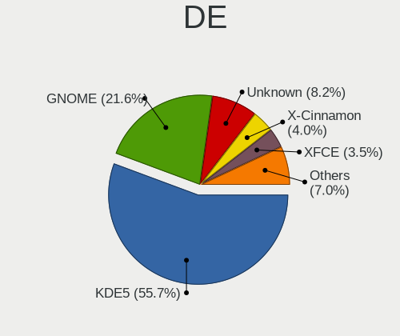
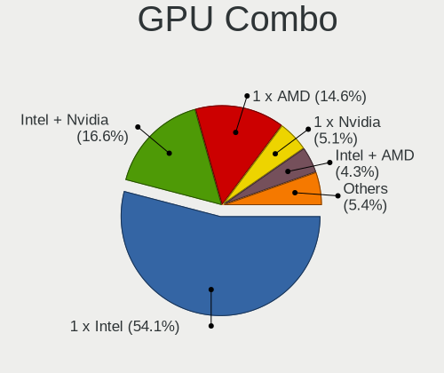
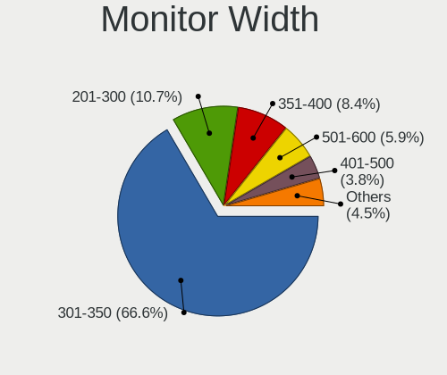
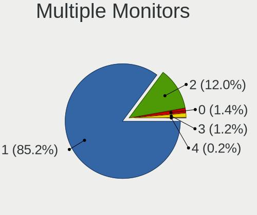
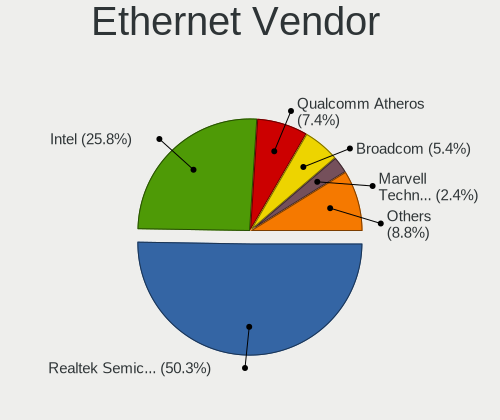
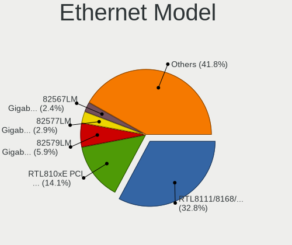
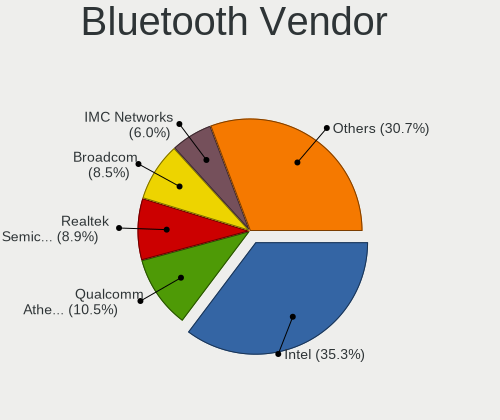

Linux in Hungary - Tested Hardware & Statistics (Notebooks)
-----------------------------------------------------------

A project to collect tested hardware configurations for Linux in Hungary.

Anyone can contribute to this report by the [hw-probe](https://github.com/linuxhw/hw-probe) tool:

    sudo -E hw-probe -all -upload

Please contribute! Especially if your hardware is rare.

Contents
--------

* [ Test Cases ](#test-cases)

* [ System ](#system)
  - [ OS                       ](#os)
  - [ OS Family                ](#os-family)
  - [ Kernel                   ](#kernel)
  - [ Kernel Family            ](#kernel-family)
  - [ Kernel Major Ver.        ](#kernel-major-ver)
  - [ Arch                     ](#arch)
  - [ DE                       ](#de)
  - [ Display Server           ](#display-server)
  - [ Display Manager          ](#display-manager)
  - [ OS Lang                  ](#os-lang)
  - [ Boot Mode                ](#boot-mode)
  - [ Filesystem               ](#filesystem)
  - [ Part. scheme             ](#part-scheme)
  - [ Dual Boot with Linux/BSD ](#dual-boot-with-linuxbsd)
  - [ Dual Boot (Win)          ](#dual-boot-win)

* [ Board ](#board)
  - [ Vendor                   ](#vendor)
  - [ Model                    ](#model)
  - [ Model Family             ](#model-family)
  - [ MFG Year                 ](#mfg-year)
  - [ Form Factor              ](#form-factor)
  - [ Secure Boot              ](#secure-boot)
  - [ Coreboot                 ](#coreboot)
  - [ RAM Size                 ](#ram-size)
  - [ RAM Used                 ](#ram-used)
  - [ Total Drives             ](#total-drives)
  - [ Has CD-ROM               ](#has-cd-rom)
  - [ Has Ethernet             ](#has-ethernet)
  - [ Has WiFi                 ](#has-wifi)
  - [ Has Bluetooth            ](#has-bluetooth)

* [ Location ](#location)
  - [ Country                  ](#country)
  - [ City                     ](#city)

* [ Drives ](#drives)
  - [ Drive Vendor             ](#drive-vendor)
  - [ Drive Model              ](#drive-model)
  - [ HDD Vendor               ](#hdd-vendor)
  - [ SSD Vendor               ](#ssd-vendor)
  - [ Drive Kind               ](#drive-kind)
  - [ Drive Connector          ](#drive-connector)
  - [ Drive Size               ](#drive-size)
  - [ Space Total              ](#space-total)
  - [ Space Used               ](#space-used)
  - [ Malfunc. Drives          ](#malfunc-drives)
  - [ Malfunc. Drive Vendor    ](#malfunc-drive-vendor)
  - [ Malfunc. HDD Vendor      ](#malfunc-hdd-vendor)
  - [ Malfunc. Drive Kind      ](#malfunc-drive-kind)
  - [ Failed Drives            ](#failed-drives)
  - [ Failed Drive Vendor      ](#failed-drive-vendor)
  - [ Drive Status             ](#drive-status)

* [ Storage controller ](#storage-controller)
  - [ Storage Vendor           ](#storage-vendor)
  - [ Storage Model            ](#storage-model)
  - [ Storage Kind             ](#storage-kind)

* [ Processor ](#processor)
  - [ CPU Vendor               ](#cpu-vendor)
  - [ CPU Model                ](#cpu-model)
  - [ CPU Model Family         ](#cpu-model-family)
  - [ CPU Cores                ](#cpu-cores)
  - [ CPU Sockets              ](#cpu-sockets)
  - [ CPU Threads              ](#cpu-threads)
  - [ CPU Op-Modes             ](#cpu-op-modes)
  - [ CPU Microcode            ](#cpu-microcode)
  - [ CPU Microarch            ](#cpu-microarch)

* [ Graphics ](#graphics)
  - [ GPU Vendor               ](#gpu-vendor)
  - [ GPU Model                ](#gpu-model)
  - [ GPU Combo                ](#gpu-combo)
  - [ GPU Driver               ](#gpu-driver)
  - [ GPU Memory               ](#gpu-memory)

* [ Monitor ](#monitor)
  - [ Monitor Vendor           ](#monitor-vendor)
  - [ Monitor Model            ](#monitor-model)
  - [ Monitor Resolution       ](#monitor-resolution)
  - [ Monitor Diagonal         ](#monitor-diagonal)
  - [ Monitor Width            ](#monitor-width)
  - [ Aspect Ratio             ](#aspect-ratio)
  - [ Monitor Area             ](#monitor-area)
  - [ Pixel Density            ](#pixel-density)
  - [ Multiple Monitors        ](#multiple-monitors)

* [ Network ](#network)
  - [ Net Controller Vendor    ](#net-controller-vendor)
  - [ Net Controller Model     ](#net-controller-model)
  - [ Wireless Vendor          ](#wireless-vendor)
  - [ Wireless Model           ](#wireless-model)
  - [ Ethernet Vendor          ](#ethernet-vendor)
  - [ Ethernet Model           ](#ethernet-model)
  - [ Net Controller Kind      ](#net-controller-kind)
  - [ Used Controller          ](#used-controller)
  - [ NICs                     ](#nics)
  - [ IPv6                     ](#ipv6)

* [ Bluetooth ](#bluetooth)
  - [ Bluetooth Vendor         ](#bluetooth-vendor)
  - [ Bluetooth Model          ](#bluetooth-model)

* [ Sound ](#sound)
  - [ Sound Vendor             ](#sound-vendor)
  - [ Sound Model              ](#sound-model)

* [ Memory ](#memory)
  - [ Memory Vendor            ](#memory-vendor)
  - [ Memory Model             ](#memory-model)
  - [ Memory Kind              ](#memory-kind)
  - [ Memory Form Factor       ](#memory-form-factor)
  - [ Memory Size              ](#memory-size)
  - [ Memory Speed             ](#memory-speed)

* [ Printers & scanners ](#printers--scanners)
  - [ Printer Vendor           ](#printer-vendor)
  - [ Printer Model            ](#printer-model)
  - [ Scanner Vendor           ](#scanner-vendor)
  - [ Scanner Model            ](#scanner-model)

* [ Camera ](#camera)
  - [ Camera Vendor            ](#camera-vendor)
  - [ Camera Model             ](#camera-model)

* [ Security ](#security)
  - [ Fingerprint Vendor       ](#fingerprint-vendor)
  - [ Fingerprint Model        ](#fingerprint-model)
  - [ Chipcard Vendor          ](#chipcard-vendor)
  - [ Chipcard Model           ](#chipcard-model)

* [ Unsupported ](#unsupported)
  - [ Unsupported Devices      ](#unsupported-devices)
  - [ Unsupported Device Types ](#unsupported-device-types)

Test Cases
----------

Total: 4344

| Vendor        | Model                       | Probe                                                      | Date         |
|---------------|-----------------------------|------------------------------------------------------------|--------------|
| HP            | Notebook                    | [552c6713e1](https://linux-hardware.org/?probe=552c6713e1) | Jun 30, 2023 |
| LG Electro... | 16Z90P-G.AA55H              | [9d40263129](https://linux-hardware.org/?probe=9d40263129) | Jun 30, 2023 |
| LG Electro... | 16Z90P-G.AA55H              | [4e47d108a0](https://linux-hardware.org/?probe=4e47d108a0) | Jun 29, 2023 |
| ASUSTek       | ROG Zephyrus G15 GA502IV... | [76e11b36e9](https://linux-hardware.org/?probe=76e11b36e9) | Jun 28, 2023 |
| Dell          | Inspiron 15-3567            | [d3f7bcfb2c](https://linux-hardware.org/?probe=d3f7bcfb2c) | Jun 27, 2023 |
| HP            | Pavilion Gaming Laptop 1... | [1efefadbdf](https://linux-hardware.org/?probe=1efefadbdf) | Jun 27, 2023 |
| HP            | Pavilion Gaming Laptop 1... | [e304e9beeb](https://linux-hardware.org/?probe=e304e9beeb) | Jun 27, 2023 |
| Dell          | Inspiron 5558               | [126187748f](https://linux-hardware.org/?probe=126187748f) | Jun 27, 2023 |
| eMachines     | E725                        | [e1ed487442](https://linux-hardware.org/?probe=e1ed487442) | Jun 26, 2023 |
| ASUSTek       | K53SJ                       | [922c017262](https://linux-hardware.org/?probe=922c017262) | Jun 26, 2023 |
| ASUSTek       | K53SJ                       | [fe211e4239](https://linux-hardware.org/?probe=fe211e4239) | Jun 26, 2023 |
| eMachines     | E725                        | [909f61c87a](https://linux-hardware.org/?probe=909f61c87a) | Jun 26, 2023 |
| HP            | Notebook                    | [ce52423528](https://linux-hardware.org/?probe=ce52423528) | Jun 26, 2023 |
| Dell          | Latitude E5470              | [c463ab7b16](https://linux-hardware.org/?probe=c463ab7b16) | Jun 26, 2023 |
| Lenovo        | IdeaPad 330-15AST 81D6      | [604d6b2b6f](https://linux-hardware.org/?probe=604d6b2b6f) | Jun 26, 2023 |
| Lenovo        | Y50-70 20378                | [bf911964a8](https://linux-hardware.org/?probe=bf911964a8) | Jun 26, 2023 |
| Dell          | Inspiron 5558               | [43849169cb](https://linux-hardware.org/?probe=43849169cb) | Jun 25, 2023 |
| Dell          | Latitude E5470              | [e8f8b7e986](https://linux-hardware.org/?probe=e8f8b7e986) | Jun 25, 2023 |
| Dell          | Latitude E5470              | [e218b300b7](https://linux-hardware.org/?probe=e218b300b7) | Jun 25, 2023 |
| HP            | EliteBook 2540p             | [2b3a2327fb](https://linux-hardware.org/?probe=2b3a2327fb) | Jun 24, 2023 |
| HP            | Pavilion Gaming Laptop 1... | [186b2c5cb7](https://linux-hardware.org/?probe=186b2c5cb7) | Jun 24, 2023 |
| ASUSTek       | VivoBook_ASUSLaptop X415... | [84239b2594](https://linux-hardware.org/?probe=84239b2594) | Jun 23, 2023 |
| HP            | Notebook                    | [6710ed8c9c](https://linux-hardware.org/?probe=6710ed8c9c) | Jun 21, 2023 |
| Dell          | Inspiron 5570               | [d661316023](https://linux-hardware.org/?probe=d661316023) | Jun 21, 2023 |
| Dell          | Latitude E6410              | [1d89edd254](https://linux-hardware.org/?probe=1d89edd254) | Jun 20, 2023 |
| Dell          | Latitude E6410              | [5230b985a8](https://linux-hardware.org/?probe=5230b985a8) | Jun 20, 2023 |
| Dell          | Latitude E6400              | [9dca1fab41](https://linux-hardware.org/?probe=9dca1fab41) | Jun 20, 2023 |
| Lenovo        | G585 20137                  | [0a36c0985d](https://linux-hardware.org/?probe=0a36c0985d) | Jun 20, 2023 |
| Lenovo        | G585 20137                  | [0ccace2cfb](https://linux-hardware.org/?probe=0ccace2cfb) | Jun 20, 2023 |
| eMachines     | E725                        | [4317f04272](https://linux-hardware.org/?probe=4317f04272) | Jun 19, 2023 |
| Dell          | Latitude E7470              | [645538d81e](https://linux-hardware.org/?probe=645538d81e) | Jun 19, 2023 |
| Lenovo        | V15-ADA 82C7                | [0423e23a21](https://linux-hardware.org/?probe=0423e23a21) | Jun 19, 2023 |
| Lenovo        | G50-45 80E3                 | [1f1209bd20](https://linux-hardware.org/?probe=1f1209bd20) | Jun 19, 2023 |
| Dell          | Inspiron 7737               | [8ccea52f65](https://linux-hardware.org/?probe=8ccea52f65) | Jun 19, 2023 |
| Lenovo        | IdeaPad 330-15IKB 81DE      | [bbc5301e6b](https://linux-hardware.org/?probe=bbc5301e6b) | Jun 17, 2023 |
| Dell          | Inspiron 5558               | [a1bb681c50](https://linux-hardware.org/?probe=a1bb681c50) | Jun 17, 2023 |
| ASUSTek       | K54HR                       | [6fd4c94830](https://linux-hardware.org/?probe=6fd4c94830) | Jun 16, 2023 |
| Dell          | Inspiron 15-3567            | [6d154340b0](https://linux-hardware.org/?probe=6d154340b0) | Jun 16, 2023 |
| eMachines     | E725                        | [c2ffc64913](https://linux-hardware.org/?probe=c2ffc64913) | Jun 15, 2023 |
| eMachines     | E725                        | [6a88f4f2be](https://linux-hardware.org/?probe=6a88f4f2be) | Jun 14, 2023 |
| Dell          | Latitude 7390               | [aad70ac5b5](https://linux-hardware.org/?probe=aad70ac5b5) | Jun 14, 2023 |
| Dell          | Latitude 7390               | [b718d8d672](https://linux-hardware.org/?probe=b718d8d672) | Jun 14, 2023 |
| Samsung       | RV410/RV510/S3510/E3510     | [26493eeedc](https://linux-hardware.org/?probe=26493eeedc) | Jun 13, 2023 |
| HP            | ProBook 640 G8 Notebook ... | [03f59dc88a](https://linux-hardware.org/?probe=03f59dc88a) | Jun 13, 2023 |
| Samsung       | RV410/RV510/S3510/E3510     | [e68c648de4](https://linux-hardware.org/?probe=e68c648de4) | Jun 13, 2023 |
| HP            | Laptop 15-dw1xxx            | [058f5805e3](https://linux-hardware.org/?probe=058f5805e3) | Jun 13, 2023 |
| HP            | Pavilion Gaming Laptop 1... | [8c939c89a3](https://linux-hardware.org/?probe=8c939c89a3) | Jun 13, 2023 |
| Dell          | Latitude E5520              | [a86c677685](https://linux-hardware.org/?probe=a86c677685) | Jun 13, 2023 |
| HP            | 250 G1                      | [f8406758e3](https://linux-hardware.org/?probe=f8406758e3) | Jun 13, 2023 |
| HP            | 250 G1                      | [477f9bbabd](https://linux-hardware.org/?probe=477f9bbabd) | Jun 13, 2023 |
| HP            | Notebook                    | [aa5016380c](https://linux-hardware.org/?probe=aa5016380c) | Jun 13, 2023 |
| Acer          | TravelMate P259-G2-M        | [abc5444c45](https://linux-hardware.org/?probe=abc5444c45) | Jun 12, 2023 |
| Lenovo        | ThinkPad X200 74595FG       | [6d6fb0c276](https://linux-hardware.org/?probe=6d6fb0c276) | Jun 12, 2023 |
| Apple         | MacBookAir5,2               | [4b84ec2ade](https://linux-hardware.org/?probe=4b84ec2ade) | Jun 12, 2023 |
| HP            | Pavilion 17                 | [e6279cb0df](https://linux-hardware.org/?probe=e6279cb0df) | Jun 12, 2023 |
| Dell          | Latitude E6230              | [c46f103733](https://linux-hardware.org/?probe=c46f103733) | Jun 11, 2023 |
| Dell          | Latitude E6230              | [390606f3f6](https://linux-hardware.org/?probe=390606f3f6) | Jun 11, 2023 |
| Dell          | Inspiron 17 7000 Series ... | [43d52c8efe](https://linux-hardware.org/?probe=43d52c8efe) | Jun 11, 2023 |
| HP            | 250 G1                      | [e229888d41](https://linux-hardware.org/?probe=e229888d41) | Jun 11, 2023 |
| Lenovo        | V15-ADA 82C7                | [aee2df0fb7](https://linux-hardware.org/?probe=aee2df0fb7) | Jun 11, 2023 |
| Dell          | Latitude E6400              | [c1f065966d](https://linux-hardware.org/?probe=c1f065966d) | Jun 11, 2023 |
| Dell          | Inspiron 7737               | [eff8eec9d8](https://linux-hardware.org/?probe=eff8eec9d8) | Jun 11, 2023 |
| Acer          | Swift SF314-43              | [823925da4a](https://linux-hardware.org/?probe=823925da4a) | Jun 11, 2023 |
| Acer          | Aspire E5-572G              | [6f58cbafdd](https://linux-hardware.org/?probe=6f58cbafdd) | Jun 10, 2023 |
| Dell          | Inspiron 17 7000 Series ... | [068826c25b](https://linux-hardware.org/?probe=068826c25b) | Jun 10, 2023 |
| Acer          | Nitro AN515-44              | [c74a9048c0](https://linux-hardware.org/?probe=c74a9048c0) | Jun 10, 2023 |
| HP            | 250 G1                      | [1b9c881cae](https://linux-hardware.org/?probe=1b9c881cae) | Jun 10, 2023 |
| HP            | 250 G1                      | [0591407196](https://linux-hardware.org/?probe=0591407196) | Jun 10, 2023 |
| HP            | Pavilion dv6                | [1388a433de](https://linux-hardware.org/?probe=1388a433de) | Jun 10, 2023 |
| Valve         | Jupiter                     | [d2df298764](https://linux-hardware.org/?probe=d2df298764) | Jun 10, 2023 |
| ASUSTek       | K54HR                       | [6eada916c0](https://linux-hardware.org/?probe=6eada916c0) | Jun 10, 2023 |
| HP            | Victus by Laptop 16-e0xx... | [9cb24f9445](https://linux-hardware.org/?probe=9cb24f9445) | Jun 09, 2023 |
| Acer          | Aspire 8930                 | [f8eb3278fe](https://linux-hardware.org/?probe=f8eb3278fe) | Jun 09, 2023 |
| Dell          | Inspiron 7737               | [6f7077634a](https://linux-hardware.org/?probe=6f7077634a) | Jun 08, 2023 |
| Google        | Edgar                       | [bec197cb98](https://linux-hardware.org/?probe=bec197cb98) | Jun 07, 2023 |
| Dell          | Latitude E6420              | [011dadb850](https://linux-hardware.org/?probe=011dadb850) | Jun 07, 2023 |
| Dell          | Latitude E6420              | [a1c7c69a05](https://linux-hardware.org/?probe=a1c7c69a05) | Jun 07, 2023 |
| Lenovo        | ThinkPad X200 74595FG       | [26f1962805](https://linux-hardware.org/?probe=26f1962805) | Jun 07, 2023 |
| HP            | EliteBook 2540p             | [96a6ae8f4d](https://linux-hardware.org/?probe=96a6ae8f4d) | Jun 07, 2023 |
| Apple         | MacBookAir5,2               | [8ef73cacf2](https://linux-hardware.org/?probe=8ef73cacf2) | Jun 07, 2023 |
| Lenovo        | G585 20137                  | [6eeacffa3c](https://linux-hardware.org/?probe=6eeacffa3c) | Jun 07, 2023 |
| HP            | 250 G1                      | [f5c0548f17](https://linux-hardware.org/?probe=f5c0548f17) | Jun 07, 2023 |
| Lenovo        | ThinkPad X270 W10DG 20K5... | [9afe34cdd8](https://linux-hardware.org/?probe=9afe34cdd8) | Jun 06, 2023 |
| ASUSTek       | K73SJ                       | [a77a12f870](https://linux-hardware.org/?probe=a77a12f870) | Jun 06, 2023 |
| ASUSTek       | ASUS TUF Gaming F15 FX50... | [4c3091f9ff](https://linux-hardware.org/?probe=4c3091f9ff) | Jun 06, 2023 |
| Lenovo        | IdeaPad 330-15IKB 81DE      | [bb5f9c1964](https://linux-hardware.org/?probe=bb5f9c1964) | Jun 06, 2023 |
| HP            | 250 G1                      | [f6cab30981](https://linux-hardware.org/?probe=f6cab30981) | Jun 06, 2023 |
| eMachines     | E725                        | [4e50fbb5a2](https://linux-hardware.org/?probe=4e50fbb5a2) | Jun 05, 2023 |
| Dell          | Latitude E5520              | [ab87df9910](https://linux-hardware.org/?probe=ab87df9910) | Jun 05, 2023 |
| Lenovo        | IdeaPad 330-15IKB 81DE      | [e1fabecae3](https://linux-hardware.org/?probe=e1fabecae3) | Jun 04, 2023 |
| Lenovo        | IdeaPad 330-15IKB 81DE      | [66ed048f40](https://linux-hardware.org/?probe=66ed048f40) | Jun 04, 2023 |
| Lenovo        | V15-ADA 82C7                | [0fb6670b07](https://linux-hardware.org/?probe=0fb6670b07) | Jun 03, 2023 |
| Samsung       | RV411/RV511/E3511/S3511/... | [bcf794dd14](https://linux-hardware.org/?probe=bcf794dd14) | Jun 03, 2023 |
| Dell          | Inspiron 5558               | [746c0d0644](https://linux-hardware.org/?probe=746c0d0644) | Jun 03, 2023 |
| Lenovo        | ThinkPad E15 20RD003KHV     | [3903b22ffd](https://linux-hardware.org/?probe=3903b22ffd) | Jun 02, 2023 |
| Dell          | Inspiron 5558               | [c747f45c48](https://linux-hardware.org/?probe=c747f45c48) | Jun 02, 2023 |
| ASUSTek       | ASUS EXPERTBOOK B1500CEA... | [c0d0a7cb50](https://linux-hardware.org/?probe=c0d0a7cb50) | Jun 01, 2023 |
| MSI           | U200                        | [a217267eb0](https://linux-hardware.org/?probe=a217267eb0) | Jun 01, 2023 |
| Fujitsu       | LIFEBOOK A555               | [f7e3bde58c](https://linux-hardware.org/?probe=f7e3bde58c) | Jun 01, 2023 |
| Samsung       | 300E4C/300E5C/300E7C        | [871cbcbb88](https://linux-hardware.org/?probe=871cbcbb88) | May 31, 2023 |
| HP            | Notebook                    | [7d7934f727](https://linux-hardware.org/?probe=7d7934f727) | May 31, 2023 |
| HP            | Notebook                    | [161aaf4150](https://linux-hardware.org/?probe=161aaf4150) | May 31, 2023 |
| Samsung       | 300E4C/300E5C/300E7C        | [f0d7ab6b7e](https://linux-hardware.org/?probe=f0d7ab6b7e) | May 31, 2023 |
| Lenovo        | ThinkPad X270 20HMS1RM02    | [8f39bcbb17](https://linux-hardware.org/?probe=8f39bcbb17) | May 30, 2023 |
| ASUSTek       | X550CL                      | [ac1e17e897](https://linux-hardware.org/?probe=ac1e17e897) | May 30, 2023 |
| HP            | Pavilion Laptop 14-ce3xx... | [62764248cb](https://linux-hardware.org/?probe=62764248cb) | May 29, 2023 |
| Lenovo        | IdeaPad L340-15API 81LW     | [8e09d71949](https://linux-hardware.org/?probe=8e09d71949) | May 29, 2023 |
| Lenovo        | IdeaPad 100-15IBD 80QQ      | [deaa4b357c](https://linux-hardware.org/?probe=deaa4b357c) | May 29, 2023 |
| ASUSTek       | VivoBook S13 X330FN         | [e94b6fbf06](https://linux-hardware.org/?probe=e94b6fbf06) | May 29, 2023 |
| Lenovo        | IdeaPad 100-15IBD 80QQ      | [af312b5e91](https://linux-hardware.org/?probe=af312b5e91) | May 29, 2023 |
| ASUSTek       | ASUS EXPERTBOOK B1400CEA... | [f068d88c01](https://linux-hardware.org/?probe=f068d88c01) | May 27, 2023 |
| Lenovo        | ThinkPad T400 2768WGB       | [447ea38d26](https://linux-hardware.org/?probe=447ea38d26) | May 27, 2023 |
| Lenovo        | ThinkPad T400 2768WGB       | [57dcd55314](https://linux-hardware.org/?probe=57dcd55314) | May 27, 2023 |
| Acer          | TravelMate 6292             | [0a4cb3e4b3](https://linux-hardware.org/?probe=0a4cb3e4b3) | May 25, 2023 |
| Toshiba       | Satellite M50D-A            | [9f7a16aa7b](https://linux-hardware.org/?probe=9f7a16aa7b) | May 25, 2023 |
| Toshiba       | Satellite M50D-A            | [bbb23b2823](https://linux-hardware.org/?probe=bbb23b2823) | May 25, 2023 |
| HP            | Pavilion 17                 | [792ac6919d](https://linux-hardware.org/?probe=792ac6919d) | May 24, 2023 |
| Fujitsu       | LIFEBOOK A555               | [920a4901d9](https://linux-hardware.org/?probe=920a4901d9) | May 24, 2023 |
| Acer          | Aspire A315-58              | [43069955ee](https://linux-hardware.org/?probe=43069955ee) | May 23, 2023 |
| Unknown       | Unknown                     | [da302bee4e](https://linux-hardware.org/?probe=da302bee4e) | May 23, 2023 |
| HP            | 250 G6 Notebook PC          | [431f2db1fc](https://linux-hardware.org/?probe=431f2db1fc) | May 23, 2023 |
| Lenovo        | V15-ADA 82C7                | [5fff4f66c1](https://linux-hardware.org/?probe=5fff4f66c1) | May 22, 2023 |
| Lenovo        | IdeaPad 100-15IBD 80QQ      | [44b6477648](https://linux-hardware.org/?probe=44b6477648) | May 22, 2023 |
| eMachines     | E725                        | [c75d7eb314](https://linux-hardware.org/?probe=c75d7eb314) | May 22, 2023 |
| eMachines     | E725                        | [f32fb866fa](https://linux-hardware.org/?probe=f32fb866fa) | May 22, 2023 |
| Lenovo        | IdeaPad 100-15IBD 80QQ      | [0ab3a9817b](https://linux-hardware.org/?probe=0ab3a9817b) | May 21, 2023 |
| Lenovo        | V15-ADA 82C7                | [6e859c48e1](https://linux-hardware.org/?probe=6e859c48e1) | May 21, 2023 |
| Dell          | Inspiron 5558               | [958b40f42c](https://linux-hardware.org/?probe=958b40f42c) | May 21, 2023 |
| Dell          | Inspiron 5558               | [5043ac245f](https://linux-hardware.org/?probe=5043ac245f) | May 21, 2023 |
| Sony          | VGN-FW21Z                   | [aac218a1e0](https://linux-hardware.org/?probe=aac218a1e0) | May 20, 2023 |
| Dell          | Inspiron 15-3567            | [7db14b0f6f](https://linux-hardware.org/?probe=7db14b0f6f) | May 20, 2023 |
| Lenovo        | ThinkPad L15 Gen 1 20U7S... | [2e78e77fef](https://linux-hardware.org/?probe=2e78e77fef) | May 19, 2023 |
| eMachines     | E725                        | [517ba05822](https://linux-hardware.org/?probe=517ba05822) | May 19, 2023 |
| HP            | 250 G2                      | [e3b94752ac](https://linux-hardware.org/?probe=e3b94752ac) | May 19, 2023 |
| Dell          | Latitude D630               | [9526ff1765](https://linux-hardware.org/?probe=9526ff1765) | May 19, 2023 |
| HP            | 625                         | [8e34027a91](https://linux-hardware.org/?probe=8e34027a91) | May 18, 2023 |
| Dell          | Latitude D630               | [7a7497a4b3](https://linux-hardware.org/?probe=7a7497a4b3) | May 18, 2023 |
| Fujitsu       | LIFEBOOK A555               | [400b91098c](https://linux-hardware.org/?probe=400b91098c) | May 18, 2023 |
| Alcor Digi... | Snugbook N1431              | [a04e4c387e](https://linux-hardware.org/?probe=a04e4c387e) | May 17, 2023 |
| Unknown       | Unknown                     | [0323142e79](https://linux-hardware.org/?probe=0323142e79) | May 17, 2023 |
| Unknown       | Unknown                     | [d734e52f59](https://linux-hardware.org/?probe=d734e52f59) | May 17, 2023 |
| Lenovo        | V15-ADA 82C7                | [6856deb5d7](https://linux-hardware.org/?probe=6856deb5d7) | May 16, 2023 |
| HP            | ProBook 640 G8 Notebook ... | [e228d9926b](https://linux-hardware.org/?probe=e228d9926b) | May 16, 2023 |
| HP            | Compaq Presario CQ60        | [e01dbddbd0](https://linux-hardware.org/?probe=e01dbddbd0) | May 16, 2023 |
| HP            | Compaq Presario CQ60        | [72db5ccefc](https://linux-hardware.org/?probe=72db5ccefc) | May 15, 2023 |
| HP            | ProBook 640 G8 Notebook ... | [f286932235](https://linux-hardware.org/?probe=f286932235) | May 15, 2023 |
| Dell          | Latitude 5490               | [0a6ee8c111](https://linux-hardware.org/?probe=0a6ee8c111) | May 14, 2023 |
| eMachines     | E725                        | [32c12bfb05](https://linux-hardware.org/?probe=32c12bfb05) | May 14, 2023 |
| Acer          | Aspire A717-72G             | [1ab0673015](https://linux-hardware.org/?probe=1ab0673015) | May 14, 2023 |
| Acer          | Aspire A717-72G             | [62a46acc18](https://linux-hardware.org/?probe=62a46acc18) | May 14, 2023 |
| eMachines     | E725                        | [8768af826f](https://linux-hardware.org/?probe=8768af826f) | May 14, 2023 |
| Lenovo        | G580 20150                  | [f6cf41154f](https://linux-hardware.org/?probe=f6cf41154f) | May 14, 2023 |
| eMachines     | E725                        | [fed9273467](https://linux-hardware.org/?probe=fed9273467) | May 14, 2023 |
| HP            | ProBook 640 G8 Notebook ... | [ae4ee3c43d](https://linux-hardware.org/?probe=ae4ee3c43d) | May 13, 2023 |
| HP            | ProBook 640 G8 Notebook ... | [0ae54cb7c4](https://linux-hardware.org/?probe=0ae54cb7c4) | May 13, 2023 |
| Dell          | Latitude 5480               | [63cd615fa8](https://linux-hardware.org/?probe=63cd615fa8) | May 13, 2023 |
| HP            | Notebook                    | [9840f334f5](https://linux-hardware.org/?probe=9840f334f5) | May 13, 2023 |
| Fujitsu       | LIFEBOOK E756               | [d0f5ee2781](https://linux-hardware.org/?probe=d0f5ee2781) | May 13, 2023 |
| HP            | Notebook                    | [db9aaf4ce9](https://linux-hardware.org/?probe=db9aaf4ce9) | May 13, 2023 |
| eMachines     | E725                        | [52848aa6bd](https://linux-hardware.org/?probe=52848aa6bd) | May 13, 2023 |
| Toshiba       | Satellite C55-A-1NV         | [d06987bfd6](https://linux-hardware.org/?probe=d06987bfd6) | May 12, 2023 |
| ASUSTek       | VivoBook_ASUSLaptop M650... | [a7e9891909](https://linux-hardware.org/?probe=a7e9891909) | May 12, 2023 |
| HP            | Notebook                    | [bc25329bce](https://linux-hardware.org/?probe=bc25329bce) | May 12, 2023 |
| HP            | Notebook                    | [d527d781af](https://linux-hardware.org/?probe=d527d781af) | May 11, 2023 |
| eMachines     | E725                        | [94e51437e6](https://linux-hardware.org/?probe=94e51437e6) | May 11, 2023 |
| Lenovo        | V15-ADA 82C7                | [0c8d19bdf0](https://linux-hardware.org/?probe=0c8d19bdf0) | May 10, 2023 |
| Dell          | Inspiron 5558               | [dbc75c5600](https://linux-hardware.org/?probe=dbc75c5600) | May 10, 2023 |
| Dell          | Inspiron 5558               | [396be908b5](https://linux-hardware.org/?probe=396be908b5) | May 10, 2023 |
| Dell          | Latitude E6440              | [ea902a82a4](https://linux-hardware.org/?probe=ea902a82a4) | May 10, 2023 |
| HP            | 250 G1                      | [09879bd463](https://linux-hardware.org/?probe=09879bd463) | May 10, 2023 |
| Apple         | MacBookAir5,2               | [bd3934d526](https://linux-hardware.org/?probe=bd3934d526) | May 10, 2023 |
| Lenovo        | ThinkPad T440s 20ARS06C0... | [543cce00c7](https://linux-hardware.org/?probe=543cce00c7) | May 09, 2023 |
| Fujitsu       | LIFEBOOK U745               | [7a97cdf93b](https://linux-hardware.org/?probe=7a97cdf93b) | May 09, 2023 |
| Dell          | Inspiron 7737               | [f900658289](https://linux-hardware.org/?probe=f900658289) | May 09, 2023 |
| Fujitsu       | LIFEBOOK E756               | [90bec72fa7](https://linux-hardware.org/?probe=90bec72fa7) | May 09, 2023 |
| Acer          | V5-131                      | [d68eaead66](https://linux-hardware.org/?probe=d68eaead66) | May 08, 2023 |
| Lenovo        | G570 20079                  | [bd15eaa1e6](https://linux-hardware.org/?probe=bd15eaa1e6) | May 08, 2023 |
| Lenovo        | IdeaPad L340-15API 81LW     | [8bbe8f0a3f](https://linux-hardware.org/?probe=8bbe8f0a3f) | May 08, 2023 |
| Lenovo        | IdeaPad 700-15ISK 80RU      | [ad9af07a7c](https://linux-hardware.org/?probe=ad9af07a7c) | May 08, 2023 |
| eMachines     | E725                        | [bb9c7992f8](https://linux-hardware.org/?probe=bb9c7992f8) | May 08, 2023 |
| HP            | Laptop 15-dw1xxx            | [1f677501c0](https://linux-hardware.org/?probe=1f677501c0) | May 07, 2023 |
| HP            | 650                         | [3ece9ca18a](https://linux-hardware.org/?probe=3ece9ca18a) | May 07, 2023 |
| Acer          | TravelMate P215-52          | [b76e0e7397](https://linux-hardware.org/?probe=b76e0e7397) | May 06, 2023 |
| Acer          | TravelMate P215-52          | [5cad7b7e28](https://linux-hardware.org/?probe=5cad7b7e28) | May 06, 2023 |
| ASUSTek       | K53BY                       | [6a9ae368ba](https://linux-hardware.org/?probe=6a9ae368ba) | May 06, 2023 |
| eMachines     | E725                        | [15807b1086](https://linux-hardware.org/?probe=15807b1086) | May 06, 2023 |
| eMachines     | E725                        | [290d356d4c](https://linux-hardware.org/?probe=290d356d4c) | May 05, 2023 |
| HP            | Victus by Laptop 16-e0xx... | [9a0649d500](https://linux-hardware.org/?probe=9a0649d500) | May 05, 2023 |
| Fujitsu       | LIFEBOOK A555               | [9640ef7fa5](https://linux-hardware.org/?probe=9640ef7fa5) | May 05, 2023 |
| Lenovo        | ThinkPad T500 2056CL8       | [df56d361ef](https://linux-hardware.org/?probe=df56d361ef) | May 05, 2023 |
| ASUSTek       | X550CC                      | [0e338f138d](https://linux-hardware.org/?probe=0e338f138d) | May 04, 2023 |
| ASUSTek       | K54HR                       | [4114d6e81c](https://linux-hardware.org/?probe=4114d6e81c) | May 04, 2023 |
| Lenovo        | G50-30 80G0                 | [b322652461](https://linux-hardware.org/?probe=b322652461) | May 04, 2023 |
| Dell          | Latitude 5490               | [c2d5f80f6e](https://linux-hardware.org/?probe=c2d5f80f6e) | May 04, 2023 |
| Lenovo        | ThinkPad T420 4236W8L       | [aaad7b3a55](https://linux-hardware.org/?probe=aaad7b3a55) | May 04, 2023 |
| Lenovo        | ThinkPad X200 74595FG       | [45035a5981](https://linux-hardware.org/?probe=45035a5981) | May 04, 2023 |
| ASUSTek       | K54HR                       | [77cbfa62cd](https://linux-hardware.org/?probe=77cbfa62cd) | May 04, 2023 |
| Lenovo        | ThinkPad X250 20CLS1JN00    | [438c1a31ea](https://linux-hardware.org/?probe=438c1a31ea) | May 04, 2023 |
| HP            | ProBook 640 G8 Notebook ... | [182df1bb15](https://linux-hardware.org/?probe=182df1bb15) | May 04, 2023 |
| Acer          | Aspire 8930                 | [6e2629de4d](https://linux-hardware.org/?probe=6e2629de4d) | May 03, 2023 |
| Lenovo        | E50-80 80J2                 | [c82dd5d579](https://linux-hardware.org/?probe=c82dd5d579) | May 03, 2023 |
| Dell          | Latitude E5520              | [0861e85947](https://linux-hardware.org/?probe=0861e85947) | May 03, 2023 |
| Lenovo        | IdeaPad 110-15ACL 80TJ      | [7e731cb85c](https://linux-hardware.org/?probe=7e731cb85c) | May 03, 2023 |
| Lenovo        | ThinkPad P1 Gen 4i 20Y30... | [43e6345cb8](https://linux-hardware.org/?probe=43e6345cb8) | May 03, 2023 |
| Lenovo        | V15-ADA 82C7                | [c8a19f5567](https://linux-hardware.org/?probe=c8a19f5567) | May 02, 2023 |
| Fujitsu       | LIFEBOOK A555               | [2280876e20](https://linux-hardware.org/?probe=2280876e20) | May 02, 2023 |
| Dell          | Inspiron 7737               | [9fcb4f708c](https://linux-hardware.org/?probe=9fcb4f708c) | May 02, 2023 |
| HP            | ProBook 640 G8 Notebook ... | [31e13940be](https://linux-hardware.org/?probe=31e13940be) | May 01, 2023 |
| ASUSTek       | X550CC                      | [cc784397f9](https://linux-hardware.org/?probe=cc784397f9) | May 01, 2023 |
| Valve         | Jupiter                     | [07ef050535](https://linux-hardware.org/?probe=07ef050535) | May 01, 2023 |
| Lenovo        | ThinkPad T420 4236W8L       | [96a8ba3062](https://linux-hardware.org/?probe=96a8ba3062) | May 01, 2023 |
| Lenovo        | ThinkPad T420 4236W8L       | [856577ad04](https://linux-hardware.org/?probe=856577ad04) | May 01, 2023 |
| HP            | ProBook 640 G8 Notebook ... | [f84a692777](https://linux-hardware.org/?probe=f84a692777) | Apr 30, 2023 |
| eMachines     | E725                        | [282c0c9f11](https://linux-hardware.org/?probe=282c0c9f11) | Apr 30, 2023 |
| ASUSTek       | VivoBook_ASUSLaptop X509... | [558cde0a43](https://linux-hardware.org/?probe=558cde0a43) | Apr 30, 2023 |
| eMachines     | E725                        | [25da91560d](https://linux-hardware.org/?probe=25da91560d) | Apr 30, 2023 |
| Lenovo        | ThinkPad T420 4236W8L       | [25c6042b4e](https://linux-hardware.org/?probe=25c6042b4e) | Apr 30, 2023 |
| Lenovo        | ThinkPad T420 4236W8L       | [230f3dd04b](https://linux-hardware.org/?probe=230f3dd04b) | Apr 30, 2023 |
| HP            | ProBook 640 G8 Notebook ... | [9d5cd21a8f](https://linux-hardware.org/?probe=9d5cd21a8f) | Apr 30, 2023 |
| HP            | ProBook 640 G8 Notebook ... | [9bb7a9b712](https://linux-hardware.org/?probe=9bb7a9b712) | Apr 30, 2023 |
| Dell          | Inspiron 5558               | [ada78ae33d](https://linux-hardware.org/?probe=ada78ae33d) | Apr 28, 2023 |
| Dell          | Inspiron 5558               | [9c2dd52f1e](https://linux-hardware.org/?probe=9c2dd52f1e) | Apr 28, 2023 |
| ASUSTek       | K52JB                       | [e9237f0d53](https://linux-hardware.org/?probe=e9237f0d53) | Apr 27, 2023 |
| eMachines     | E725                        | [668de483ca](https://linux-hardware.org/?probe=668de483ca) | Apr 27, 2023 |
| Acer          | Swift SF114-32              | [13d7dc019c](https://linux-hardware.org/?probe=13d7dc019c) | Apr 26, 2023 |
| Dell          | Inspiron 5558               | [9dd9301581](https://linux-hardware.org/?probe=9dd9301581) | Apr 26, 2023 |
| Lenovo        | G580 20150                  | [5d8b07dbbd](https://linux-hardware.org/?probe=5d8b07dbbd) | Apr 25, 2023 |
| Dell          | Inspiron 5570               | [dd27aa0575](https://linux-hardware.org/?probe=dd27aa0575) | Apr 25, 2023 |
| Dell          | Inspiron 5570               | [e0eef23b19](https://linux-hardware.org/?probe=e0eef23b19) | Apr 25, 2023 |
| ASUSTek       | VivoBook 15_ASUS Laptop ... | [7d5bd7e8fa](https://linux-hardware.org/?probe=7d5bd7e8fa) | Apr 25, 2023 |
| ASUSTek       | VivoBook 15_ASUS Laptop ... | [24bf298df5](https://linux-hardware.org/?probe=24bf298df5) | Apr 25, 2023 |
| Lenovo        | ThinkPad E15 20RD003KHV     | [b402183807](https://linux-hardware.org/?probe=b402183807) | Apr 24, 2023 |
| Lenovo        | 20RD001FHV                  | [782ded0435](https://linux-hardware.org/?probe=782ded0435) | Apr 24, 2023 |
| Lenovo        | ThinkPad T400 2768WGB       | [6b9130ca88](https://linux-hardware.org/?probe=6b9130ca88) | Apr 23, 2023 |
| Dell          | Latitude E6230              | [3ec9acadaa](https://linux-hardware.org/?probe=3ec9acadaa) | Apr 23, 2023 |
| Dell          | Latitude E6230              | [8114b606fb](https://linux-hardware.org/?probe=8114b606fb) | Apr 23, 2023 |
| Lenovo        | ThinkPad T420 4236B87       | [f855722ff3](https://linux-hardware.org/?probe=f855722ff3) | Apr 23, 2023 |
| Lenovo        | ThinkPad E15 20RD003KHV     | [090405a4a7](https://linux-hardware.org/?probe=090405a4a7) | Apr 22, 2023 |
| Alcor Digi... | Snugbook N1431              | [eeb69d730b](https://linux-hardware.org/?probe=eeb69d730b) | Apr 22, 2023 |
| Dell          | Inspiron M5040              | [ae29855106](https://linux-hardware.org/?probe=ae29855106) | Apr 22, 2023 |
| Dell          | Inspiron 5558               | [174aa789ca](https://linux-hardware.org/?probe=174aa789ca) | Apr 22, 2023 |
| ASUSTek       | ASUS TUF Gaming F17 FX70... | [918115dc84](https://linux-hardware.org/?probe=918115dc84) | Apr 21, 2023 |
| Sony          | VPCS13V9E                   | [c0f35fa0d2](https://linux-hardware.org/?probe=c0f35fa0d2) | Apr 21, 2023 |
| Dell          | Latitude D630               | [4e4c4f519b](https://linux-hardware.org/?probe=4e4c4f519b) | Apr 18, 2023 |
| Samsung       | RV411/RV511/E3511/S3511/... | [bd73c6ceb9](https://linux-hardware.org/?probe=bd73c6ceb9) | Apr 18, 2023 |
| ASUSTek       | K52JB                       | [70a0b986fa](https://linux-hardware.org/?probe=70a0b986fa) | Apr 18, 2023 |
| Fujitsu       | LIFEBOOK U745               | [fd7551020f](https://linux-hardware.org/?probe=fd7551020f) | Apr 17, 2023 |
| Sony          | VPCS13V9E                   | [40d1573897](https://linux-hardware.org/?probe=40d1573897) | Apr 16, 2023 |
| ASUSTek       | Zenbook UM3402YA_UM3402Y... | [5ef76fe165](https://linux-hardware.org/?probe=5ef76fe165) | Apr 15, 2023 |
| Samsung       | RV411/RV511/E3511/S3511/... | [f9b8914504](https://linux-hardware.org/?probe=f9b8914504) | Apr 15, 2023 |
| Fujitsu       | LIFEBOOK U745               | [3c0ca40bc5](https://linux-hardware.org/?probe=3c0ca40bc5) | Apr 15, 2023 |
| Toshiba       | Satellite M50D-A            | [17fc6af63a](https://linux-hardware.org/?probe=17fc6af63a) | Apr 15, 2023 |
| Lenovo        | ThinkPad P52 20MAS1LH00     | [06ba20dc47](https://linux-hardware.org/?probe=06ba20dc47) | Apr 15, 2023 |
| HP            | ProBook 650 G3              | [00526690c9](https://linux-hardware.org/?probe=00526690c9) | Apr 15, 2023 |
| Acer          | Extensa 5635Z               | [b3c99bf352](https://linux-hardware.org/?probe=b3c99bf352) | Apr 14, 2023 |
| eMachines     | E725                        | [bd87462ced](https://linux-hardware.org/?probe=bd87462ced) | Apr 13, 2023 |
| Lenovo        | ThinkPad T420 4236B87       | [6d2971f926](https://linux-hardware.org/?probe=6d2971f926) | Apr 13, 2023 |
| ASUSTek       | ROG Zephyrus M16 GU603ZM... | [a8184cfc25](https://linux-hardware.org/?probe=a8184cfc25) | Apr 13, 2023 |
| eMachines     | E725                        | [7cd5cba939](https://linux-hardware.org/?probe=7cd5cba939) | Apr 13, 2023 |
| ASUSTek       | ROG Zephyrus M16 GU603ZM... | [e75be02a84](https://linux-hardware.org/?probe=e75be02a84) | Apr 12, 2023 |
| THD           | PX1 01                      | [c2c6b63123](https://linux-hardware.org/?probe=c2c6b63123) | Apr 12, 2023 |
| Dell          | Inspiron 1525               | [50e64adbb3](https://linux-hardware.org/?probe=50e64adbb3) | Apr 12, 2023 |
| THD           | PX1 01                      | [f4efc1c20d](https://linux-hardware.org/?probe=f4efc1c20d) | Apr 12, 2023 |
| Dell          | Latitude D630               | [8c211bb7c5](https://linux-hardware.org/?probe=8c211bb7c5) | Apr 12, 2023 |
| Lenovo        | IdeaPad 5 Pro 16ACH6 82L... | [5662df110d](https://linux-hardware.org/?probe=5662df110d) | Apr 11, 2023 |
| Dell          | Inspiron M5030              | [a5dd0e262b](https://linux-hardware.org/?probe=a5dd0e262b) | Apr 10, 2023 |
| Dell          | Inspiron M5030              | [03fb4c2b22](https://linux-hardware.org/?probe=03fb4c2b22) | Apr 10, 2023 |
| Lenovo        | ThinkPad X201 3680WFQ       | [f90c2d47c7](https://linux-hardware.org/?probe=f90c2d47c7) | Apr 10, 2023 |
| Acer          | Aspire ES1-531              | [f36574c96a](https://linux-hardware.org/?probe=f36574c96a) | Apr 09, 2023 |
| Lenovo        | ThinkPad T61 7659AB7        | [0b2f9a23ee](https://linux-hardware.org/?probe=0b2f9a23ee) | Apr 09, 2023 |
| Dell          | Inspiron 5558               | [57ed286290](https://linux-hardware.org/?probe=57ed286290) | Apr 09, 2023 |
| Lenovo        | ThinkPad T60 2008VW7        | [de0d5654c0](https://linux-hardware.org/?probe=de0d5654c0) | Apr 07, 2023 |
| Dell          | Latitude 5431               | [d85ac2917b](https://linux-hardware.org/?probe=d85ac2917b) | Apr 07, 2023 |
| Lenovo        | ThinkPad T400 2768WGB       | [ae224a45a1](https://linux-hardware.org/?probe=ae224a45a1) | Apr 06, 2023 |
| ASUSTek       | VivoBook_ASUS Laptop E40... | [a451cfcce3](https://linux-hardware.org/?probe=a451cfcce3) | Apr 05, 2023 |
| Lenovo        | ThinkPad T400 2768WGB       | [1e40d6be20](https://linux-hardware.org/?probe=1e40d6be20) | Apr 04, 2023 |
| HP            | Notebook                    | [d8951b66b8](https://linux-hardware.org/?probe=d8951b66b8) | Apr 03, 2023 |
| HP            | Notebook                    | [05bdafdb5a](https://linux-hardware.org/?probe=05bdafdb5a) | Apr 03, 2023 |
| HP            | 250 G6 Notebook PC          | [c32ab093ae](https://linux-hardware.org/?probe=c32ab093ae) | Apr 01, 2023 |
| ASUSTek       | K52JB                       | [0e18c3546c](https://linux-hardware.org/?probe=0e18c3546c) | Apr 01, 2023 |
| HP            | Notebook                    | [7b9f1f44c9](https://linux-hardware.org/?probe=7b9f1f44c9) | Mar 31, 2023 |
| HP            | Notebook                    | [ad90621225](https://linux-hardware.org/?probe=ad90621225) | Mar 31, 2023 |
| Lenovo        | ThinkPad T470s 20HGS07D0... | [7a8b075b23](https://linux-hardware.org/?probe=7a8b075b23) | Mar 29, 2023 |
| Dell          | Inspiron 5558               | [796d0b6775](https://linux-hardware.org/?probe=796d0b6775) | Mar 28, 2023 |
| Lenovo        | ThinkPad T420 4236W8L       | [bc301a57a0](https://linux-hardware.org/?probe=bc301a57a0) | Mar 27, 2023 |
| Lenovo        | ThinkPad T420 4236W8L       | [e31b586083](https://linux-hardware.org/?probe=e31b586083) | Mar 27, 2023 |
| Dell          | Inspiron 5558               | [fd675e2bf8](https://linux-hardware.org/?probe=fd675e2bf8) | Mar 27, 2023 |
| ASUSTek       | K56CA                       | [43f064cb46](https://linux-hardware.org/?probe=43f064cb46) | Mar 27, 2023 |
| Toshiba       | Satellite L650              | [5006536f60](https://linux-hardware.org/?probe=5006536f60) | Mar 27, 2023 |
| eMachines     | E725                        | [5212ab8375](https://linux-hardware.org/?probe=5212ab8375) | Mar 26, 2023 |
| eMachines     | E725                        | [8e1945a2c2](https://linux-hardware.org/?probe=8e1945a2c2) | Mar 26, 2023 |
| Dell          | Latitude 5480               | [a663d3bc84](https://linux-hardware.org/?probe=a663d3bc84) | Mar 26, 2023 |
| Lenovo        | ThinkPad E15 Gen 4 21E60... | [bb1915d1c3](https://linux-hardware.org/?probe=bb1915d1c3) | Mar 26, 2023 |
| Lenovo        | ThinkPad E15 Gen 4 21E60... | [23df41ca86](https://linux-hardware.org/?probe=23df41ca86) | Mar 26, 2023 |
| Lenovo        | ThinkPad E15 20RD003KHV     | [8701ff9985](https://linux-hardware.org/?probe=8701ff9985) | Mar 26, 2023 |
| Lenovo        | IdeaPad 700-15ISK 80RU      | [8a92687be7](https://linux-hardware.org/?probe=8a92687be7) | Mar 26, 2023 |
| Lenovo        | G570 20079                  | [ed6328937a](https://linux-hardware.org/?probe=ed6328937a) | Mar 24, 2023 |
| Dell          | Vostro 3500                 | [a375452089](https://linux-hardware.org/?probe=a375452089) | Mar 23, 2023 |
| ASUSTek       | ROG STRIX B450-F GAMING ... | [f8f47e3220](https://linux-hardware.org/?probe=f8f47e3220) | Mar 23, 2023 |
| eMachines     | E725                        | [a5d9ff191b](https://linux-hardware.org/?probe=a5d9ff191b) | Mar 23, 2023 |
| eMachines     | E725                        | [4204fbff83](https://linux-hardware.org/?probe=4204fbff83) | Mar 23, 2023 |
| Dell          | Latitude E6420              | [6da9274d93](https://linux-hardware.org/?probe=6da9274d93) | Mar 22, 2023 |
| Lenovo        | ThinkPad X270 20HMS10600    | [5e97d4fdf3](https://linux-hardware.org/?probe=5e97d4fdf3) | Mar 22, 2023 |
| ASUSTek       | X550LN                      | [182b5af958](https://linux-hardware.org/?probe=182b5af958) | Mar 22, 2023 |
| ASUSTek       | X550LN                      | [e46c856c11](https://linux-hardware.org/?probe=e46c856c11) | Mar 22, 2023 |
| THD           | PX1 01                      | [d210243a53](https://linux-hardware.org/?probe=d210243a53) | Mar 20, 2023 |
| THD           | PX1 01                      | [246c888564](https://linux-hardware.org/?probe=246c888564) | Mar 20, 2023 |
| Lenovo        | G50-30 80G0                 | [255de14ecc](https://linux-hardware.org/?probe=255de14ecc) | Mar 19, 2023 |
| Dell          | Inspiron 5558               | [79324bb5ca](https://linux-hardware.org/?probe=79324bb5ca) | Mar 19, 2023 |
| Lenovo        | IdeaPad 700-15ISK 80RU      | [1ee17b12bd](https://linux-hardware.org/?probe=1ee17b12bd) | Mar 19, 2023 |
| Dell          | Inspiron 5558               | [aad9ecc316](https://linux-hardware.org/?probe=aad9ecc316) | Mar 19, 2023 |
| Acer          | Swift SF113-31              | [f1db5ada96](https://linux-hardware.org/?probe=f1db5ada96) | Mar 18, 2023 |
| Toshiba       | Satellite C50-B             | [338da8730f](https://linux-hardware.org/?probe=338da8730f) | Mar 18, 2023 |
| HP            | Notebook                    | [aa27725a50](https://linux-hardware.org/?probe=aa27725a50) | Mar 18, 2023 |
| HP            | Notebook                    | [a3496c8509](https://linux-hardware.org/?probe=a3496c8509) | Mar 18, 2023 |
| HP            | Laptop 17-ak0xx             | [32fbf8242d](https://linux-hardware.org/?probe=32fbf8242d) | Mar 17, 2023 |
| Dell          | Inspiron 5558               | [b0fa0d95b6](https://linux-hardware.org/?probe=b0fa0d95b6) | Mar 17, 2023 |
| Dell          | Inspiron 5558               | [871677af38](https://linux-hardware.org/?probe=871677af38) | Mar 17, 2023 |
| eMachines     | E725                        | [0ea3d3a0ca](https://linux-hardware.org/?probe=0ea3d3a0ca) | Mar 17, 2023 |
| ASUSTek       | X550LN                      | [105acd2203](https://linux-hardware.org/?probe=105acd2203) | Mar 16, 2023 |
| Dell          | Inspiron 14 5425            | [1128b14745](https://linux-hardware.org/?probe=1128b14745) | Mar 16, 2023 |
| ASUSTek       | VivoBook_ASUSLaptop X571... | [b606e7c92f](https://linux-hardware.org/?probe=b606e7c92f) | Mar 16, 2023 |
| Dell          | Inspiron 5559               | [966cfad104](https://linux-hardware.org/?probe=966cfad104) | Mar 15, 2023 |
| ASUSTek       | T100HAN                     | [b8585e81f9](https://linux-hardware.org/?probe=b8585e81f9) | Mar 15, 2023 |
| Dell          | Inspiron 5559               | [2aa85f401e](https://linux-hardware.org/?probe=2aa85f401e) | Mar 15, 2023 |
| HP            | ProBook 640 G8 Notebook ... | [d7fbdbbc9f](https://linux-hardware.org/?probe=d7fbdbbc9f) | Mar 15, 2023 |
| HP            | ProBook 640 G8 Notebook ... | [34a0e74a78](https://linux-hardware.org/?probe=34a0e74a78) | Mar 15, 2023 |
| Sony          | VPCEB4L1E                   | [d91d243c75](https://linux-hardware.org/?probe=d91d243c75) | Mar 14, 2023 |
| Lenovo        | G570 20079                  | [aad6765ba3](https://linux-hardware.org/?probe=aad6765ba3) | Mar 14, 2023 |
| HP            | Laptop 17-ak0xx             | [0acca6eb92](https://linux-hardware.org/?probe=0acca6eb92) | Mar 14, 2023 |
| HP            | EliteBook 840 G1            | [cbb20e87cb](https://linux-hardware.org/?probe=cbb20e87cb) | Mar 14, 2023 |
| Lenovo        | IdeaPad 710S-13ISK 80SW     | [7f06c80526](https://linux-hardware.org/?probe=7f06c80526) | Mar 14, 2023 |
| HP            | ZBook Studio G4             | [2e04fad893](https://linux-hardware.org/?probe=2e04fad893) | Mar 13, 2023 |
| Lenovo        | ThinkPad X1 Carbon 6th 2... | [ad61830c15](https://linux-hardware.org/?probe=ad61830c15) | Mar 12, 2023 |
| Insyde        | BayTrail                    | [8d0337a8ee](https://linux-hardware.org/?probe=8d0337a8ee) | Mar 12, 2023 |
| eMachines     | E725                        | [9a49d6defc](https://linux-hardware.org/?probe=9a49d6defc) | Mar 12, 2023 |
| HP            | ProBook 450 15.6 inch G9... | [3f007adfc7](https://linux-hardware.org/?probe=3f007adfc7) | Mar 10, 2023 |
| Fujitsu       | LIFEBOOK AH530              | [eca94a98c0](https://linux-hardware.org/?probe=eca94a98c0) | Mar 09, 2023 |
| eMachines     | E725                        | [a4a1665906](https://linux-hardware.org/?probe=a4a1665906) | Mar 09, 2023 |
| HP            | Laptop 15s-eq1xxx           | [fc2ee93757](https://linux-hardware.org/?probe=fc2ee93757) | Mar 08, 2023 |
| HP            | Laptop 15s-eq1xxx           | [e1ce357347](https://linux-hardware.org/?probe=e1ce357347) | Mar 08, 2023 |
| eMachines     | E725                        | [8efce0fe6f](https://linux-hardware.org/?probe=8efce0fe6f) | Mar 08, 2023 |
| HP            | Laptop 17-ak0xx             | [cda5fafaf9](https://linux-hardware.org/?probe=cda5fafaf9) | Mar 07, 2023 |
| HP            | Laptop 17-ak0xx             | [c27eecca48](https://linux-hardware.org/?probe=c27eecca48) | Mar 07, 2023 |
| ASUSTek       | ASUS TUF Gaming F15 FX50... | [85701c7290](https://linux-hardware.org/?probe=85701c7290) | Mar 07, 2023 |
| Fujitsu       | LIFEBOOK AH530              | [5f336adb00](https://linux-hardware.org/?probe=5f336adb00) | Mar 07, 2023 |
| Toshiba       | Satellite L650              | [ee9717cba3](https://linux-hardware.org/?probe=ee9717cba3) | Mar 07, 2023 |
| Toshiba       | Satellite L650              | [77f0d6b014](https://linux-hardware.org/?probe=77f0d6b014) | Mar 07, 2023 |
| Toshiba       | Satellite L650              | [267c62f49a](https://linux-hardware.org/?probe=267c62f49a) | Mar 07, 2023 |
| MSI           | Katana GF66 11UD            | [f464d5be92](https://linux-hardware.org/?probe=f464d5be92) | Mar 07, 2023 |
| ASUSTek       | GL552JX                     | [c8cff8908f](https://linux-hardware.org/?probe=c8cff8908f) | Mar 07, 2023 |
| ASUSTek       | ASUS P1512CEA_P1512CEA      | [ef2488509b](https://linux-hardware.org/?probe=ef2488509b) | Mar 06, 2023 |
| Alcor         | SnugBook Q series           | [3b3c4fd9fd](https://linux-hardware.org/?probe=3b3c4fd9fd) | Mar 05, 2023 |
| Lenovo        | Y50-70 20378                | [c564adb32c](https://linux-hardware.org/?probe=c564adb32c) | Mar 04, 2023 |
| HP            | 650                         | [f595da7b8c](https://linux-hardware.org/?probe=f595da7b8c) | Mar 04, 2023 |
| HP            | 650                         | [9d0b38c967](https://linux-hardware.org/?probe=9d0b38c967) | Mar 04, 2023 |
| Dell          | Inspiron 3584               | [4b6e4a874b](https://linux-hardware.org/?probe=4b6e4a874b) | Mar 04, 2023 |
| HP            | Compaq 6720s                | [b422954b5a](https://linux-hardware.org/?probe=b422954b5a) | Mar 03, 2023 |
| Lenovo        | ThinkPad X270 20HMS10600    | [4bab3eb831](https://linux-hardware.org/?probe=4bab3eb831) | Mar 03, 2023 |
| Lenovo        | ThinkPad X270 20HMS10600    | [da2fc6826a](https://linux-hardware.org/?probe=da2fc6826a) | Mar 01, 2023 |
| Fujitsu Si... | AMILO Li3910                | [f29ead8551](https://linux-hardware.org/?probe=f29ead8551) | Mar 01, 2023 |
| TCL Commun... | 8090                        | [d1f86443c7](https://linux-hardware.org/?probe=d1f86443c7) | Feb 28, 2023 |
| ASUSTek       | Zenbook UX5401ZA_UX5401Z... | [5aad25779a](https://linux-hardware.org/?probe=5aad25779a) | Feb 28, 2023 |
| Acer          | Nitro AN515-51              | [984b6e660d](https://linux-hardware.org/?probe=984b6e660d) | Feb 28, 2023 |
| Lenovo        | ThinkPad X270 20HMS10600    | [3fa4d926e0](https://linux-hardware.org/?probe=3fa4d926e0) | Feb 28, 2023 |
| HP            | Notebook                    | [7e64e6bc1b](https://linux-hardware.org/?probe=7e64e6bc1b) | Feb 27, 2023 |
| Dell          | Latitude 3510               | [de938c4962](https://linux-hardware.org/?probe=de938c4962) | Feb 27, 2023 |
| Acer          | Nitro AN515-51              | [e5fa16c859](https://linux-hardware.org/?probe=e5fa16c859) | Feb 25, 2023 |
| HP            | Unknown                     | [18a8d556cb](https://linux-hardware.org/?probe=18a8d556cb) | Feb 25, 2023 |
| Dell          | Vostro 14-5459              | [1f96898a48](https://linux-hardware.org/?probe=1f96898a48) | Feb 25, 2023 |
| HP            | Unknown                     | [dc26b08a65](https://linux-hardware.org/?probe=dc26b08a65) | Feb 25, 2023 |
| ASUSTek       | X550LN                      | [6ebe283b1c](https://linux-hardware.org/?probe=6ebe283b1c) | Feb 25, 2023 |
| Dell          | XPS 13 9310                 | [1b60ef35ce](https://linux-hardware.org/?probe=1b60ef35ce) | Feb 24, 2023 |
| Lenovo        | ThinkPad T410 2537CS0       | [8d4b399341](https://linux-hardware.org/?probe=8d4b399341) | Feb 23, 2023 |
| ASUSTek       | VivoBook_ASUSLaptop X150... | [4d2d4ca208](https://linux-hardware.org/?probe=4d2d4ca208) | Feb 23, 2023 |
| Lenovo        | ThinkPad E14 20RA0036HV     | [eef601ff61](https://linux-hardware.org/?probe=eef601ff61) | Feb 23, 2023 |
| HP            | Laptop 15-dw1xxx            | [bf47e38ec4](https://linux-hardware.org/?probe=bf47e38ec4) | Feb 22, 2023 |
| Acer          | Nitro AN515-51              | [c2be84fb6c](https://linux-hardware.org/?probe=c2be84fb6c) | Feb 21, 2023 |
| HP            | 250 G3                      | [638d8fa72b](https://linux-hardware.org/?probe=638d8fa72b) | Feb 21, 2023 |
| HP            | 250 G3                      | [eaf1a8a9ca](https://linux-hardware.org/?probe=eaf1a8a9ca) | Feb 21, 2023 |
| HP            | Laptop 17-ak0xx             | [d282ac975d](https://linux-hardware.org/?probe=d282ac975d) | Feb 21, 2023 |
| eMachines     | E725                        | [d982b1aa72](https://linux-hardware.org/?probe=d982b1aa72) | Feb 20, 2023 |
| Acer          | Nitro AN515-51              | [5df682e5d6](https://linux-hardware.org/?probe=5df682e5d6) | Feb 20, 2023 |
| HP            | EliteBook 735 G5            | [19d29283ed](https://linux-hardware.org/?probe=19d29283ed) | Feb 20, 2023 |
| HP            | EliteBook 735 G5            | [8d1bb46519](https://linux-hardware.org/?probe=8d1bb46519) | Feb 20, 2023 |
| ASUSTek       | K52F                        | [2cbb8f3f38](https://linux-hardware.org/?probe=2cbb8f3f38) | Feb 20, 2023 |
| ASUSTek       | X541NA                      | [b9ddd17e6c](https://linux-hardware.org/?probe=b9ddd17e6c) | Feb 19, 2023 |
| HP            | Laptop 15-dw1xxx            | [22dfb58516](https://linux-hardware.org/?probe=22dfb58516) | Feb 19, 2023 |
| Toshiba       | Satellite Pro L300          | [c2168db120](https://linux-hardware.org/?probe=c2168db120) | Feb 18, 2023 |
| Dell          | Inspiron 5558               | [40f71233c4](https://linux-hardware.org/?probe=40f71233c4) | Feb 17, 2023 |
| Dell          | Inspiron 5558               | [44e9817292](https://linux-hardware.org/?probe=44e9817292) | Feb 17, 2023 |
| HP            | Pavilion Gaming Laptop 1... | [a4f7bc0d84](https://linux-hardware.org/?probe=a4f7bc0d84) | Feb 17, 2023 |
| HP            | Pavilion Gaming Laptop 1... | [a6bde6db60](https://linux-hardware.org/?probe=a6bde6db60) | Feb 17, 2023 |
| ASUSTek       | VivoBook 12_ASUS Laptop ... | [6d7740ca9d](https://linux-hardware.org/?probe=6d7740ca9d) | Feb 17, 2023 |
| HP            | EliteBook 840 G5            | [fb9eb2345d](https://linux-hardware.org/?probe=fb9eb2345d) | Feb 16, 2023 |
| Fujitsu       | LIFEBOOK U745               | [4f0e88ce52](https://linux-hardware.org/?probe=4f0e88ce52) | Feb 16, 2023 |
| Fujitsu       | LIFEBOOK U745               | [eac8d6ab9d](https://linux-hardware.org/?probe=eac8d6ab9d) | Feb 16, 2023 |
| HP            | 250 G1                      | [a673746c67](https://linux-hardware.org/?probe=a673746c67) | Feb 16, 2023 |
| HP            | 250 G1                      | [cc5e272ca9](https://linux-hardware.org/?probe=cc5e272ca9) | Feb 16, 2023 |
| HP            | Pavilion Gaming Laptop 1... | [33b1f65ec0](https://linux-hardware.org/?probe=33b1f65ec0) | Feb 15, 2023 |
| Lenovo        | Z710 20250                  | [7b40745c7f](https://linux-hardware.org/?probe=7b40745c7f) | Feb 14, 2023 |
| Lenovo        | Z710 20250                  | [903deba17a](https://linux-hardware.org/?probe=903deba17a) | Feb 14, 2023 |
| HP            | Pavilion dv5                | [fd6bd7275b](https://linux-hardware.org/?probe=fd6bd7275b) | Feb 14, 2023 |
| Fujitsu Si... | STYLISTIC ST5112            | [2334fc688f](https://linux-hardware.org/?probe=2334fc688f) | Feb 14, 2023 |
| Fujitsu Si... | STYLISTIC ST5112            | [e2f49b2fe4](https://linux-hardware.org/?probe=e2f49b2fe4) | Feb 14, 2023 |
| Dell          | Inspiron 15-3567            | [6fe738fa6d](https://linux-hardware.org/?probe=6fe738fa6d) | Feb 13, 2023 |
| Dell          | Inspiron 15-3567            | [122eded37e](https://linux-hardware.org/?probe=122eded37e) | Feb 13, 2023 |
| Dell          | Latitude 5420               | [60cc86374d](https://linux-hardware.org/?probe=60cc86374d) | Feb 12, 2023 |
| Dell          | Latitude 5420               | [63a576e744](https://linux-hardware.org/?probe=63a576e744) | Feb 12, 2023 |
| Acer          | TravelMate 8571             | [609cc404fb](https://linux-hardware.org/?probe=609cc404fb) | Feb 12, 2023 |
| HP            | Compaq 6910p                | [328acaf5ee](https://linux-hardware.org/?probe=328acaf5ee) | Feb 12, 2023 |
| ASUSTek       | K52F                        | [ee35b00a7e](https://linux-hardware.org/?probe=ee35b00a7e) | Feb 12, 2023 |
| ASUSTek       | X541UAK                     | [e27e733bc0](https://linux-hardware.org/?probe=e27e733bc0) | Feb 12, 2023 |
| ASUSTek       | K52F                        | [364c41f9aa](https://linux-hardware.org/?probe=364c41f9aa) | Feb 11, 2023 |
| HP            | Laptop 14s-fq0xxx           | [eb1f7dfd26](https://linux-hardware.org/?probe=eb1f7dfd26) | Feb 10, 2023 |
| Dell          | Latitude E6230              | [d0a04b130a](https://linux-hardware.org/?probe=d0a04b130a) | Feb 09, 2023 |
| Dell          | Latitude E6230              | [11a1ba46f3](https://linux-hardware.org/?probe=11a1ba46f3) | Feb 09, 2023 |
| MSI           | GX70 3CC                    | [c9abc5f038](https://linux-hardware.org/?probe=c9abc5f038) | Feb 07, 2023 |
| Acer          | Aspire A515-57G             | [dd6c2cbcc6](https://linux-hardware.org/?probe=dd6c2cbcc6) | Feb 07, 2023 |
| Acer          | Aspire A515-57G             | [470857588f](https://linux-hardware.org/?probe=470857588f) | Feb 07, 2023 |
| ASUSTek       | X541UAK                     | [62acbef04d](https://linux-hardware.org/?probe=62acbef04d) | Feb 07, 2023 |
| HP            | Unknown                     | [eb01c0393d](https://linux-hardware.org/?probe=eb01c0393d) | Feb 07, 2023 |
| HP            | Unknown                     | [db607a1e03](https://linux-hardware.org/?probe=db607a1e03) | Feb 07, 2023 |
| Lenovo        | ThinkPad T490 20N3S11B0V    | [3b35d51bfb](https://linux-hardware.org/?probe=3b35d51bfb) | Feb 06, 2023 |
| Lenovo        | ThinkPad T410 2537CS0       | [8b6fbfa8f5](https://linux-hardware.org/?probe=8b6fbfa8f5) | Feb 04, 2023 |
| Acer          | Aspire A515-51G             | [2b37c84303](https://linux-hardware.org/?probe=2b37c84303) | Feb 04, 2023 |
| Lenovo        | ThinkPad L15 Gen 2 20X4S... | [a9e735ed75](https://linux-hardware.org/?probe=a9e735ed75) | Feb 03, 2023 |
| Dell          | Latitude D630               | [a1ea4874cf](https://linux-hardware.org/?probe=a1ea4874cf) | Feb 03, 2023 |
| Dell          | Vostro 15-3568              | [caf63a9d0f](https://linux-hardware.org/?probe=caf63a9d0f) | Feb 02, 2023 |
| Dell          | Latitude D630               | [7f34868246](https://linux-hardware.org/?probe=7f34868246) | Feb 02, 2023 |
| Lenovo        | IdeaPad C340-14API 81N6     | [6294616fc6](https://linux-hardware.org/?probe=6294616fc6) | Feb 01, 2023 |
| Dell          | Inspiron 7737               | [fb42f48fbe](https://linux-hardware.org/?probe=fb42f48fbe) | Feb 01, 2023 |
| eMachines     | E725                        | [4b1805b3f6](https://linux-hardware.org/?probe=4b1805b3f6) | Feb 01, 2023 |
| HP            | EliteBook 8570p             | [2f7f3a5b93](https://linux-hardware.org/?probe=2f7f3a5b93) | Feb 01, 2023 |
| Apple         | MacBookAir5,2               | [8a90f64e68](https://linux-hardware.org/?probe=8a90f64e68) | Feb 01, 2023 |
| HP            | 250 G1                      | [41f3eccf2e](https://linux-hardware.org/?probe=41f3eccf2e) | Feb 01, 2023 |
| Apple         | MacBookAir5,2               | [2bdd007ce6](https://linux-hardware.org/?probe=2bdd007ce6) | Feb 01, 2023 |
| HP            | 250 G1                      | [345cb01bcc](https://linux-hardware.org/?probe=345cb01bcc) | Feb 01, 2023 |
| Acer          | Aspire A315-21G             | [1a3af834c9](https://linux-hardware.org/?probe=1a3af834c9) | Feb 01, 2023 |
| Acer          | Aspire A315-21G             | [78f5b5c42b](https://linux-hardware.org/?probe=78f5b5c42b) | Feb 01, 2023 |
| Lenovo        | Y50-70 20378                | [04c77927f5](https://linux-hardware.org/?probe=04c77927f5) | Jan 31, 2023 |
| Lenovo        | Y50-70 20378                | [5dc21f30b5](https://linux-hardware.org/?probe=5dc21f30b5) | Jan 31, 2023 |
| Lenovo        | G580 20150                  | [339aef175f](https://linux-hardware.org/?probe=339aef175f) | Jan 30, 2023 |
| Lenovo        | G580 20150                  | [e0b08d335b](https://linux-hardware.org/?probe=e0b08d335b) | Jan 30, 2023 |
| Lenovo        | ThinkPad W510 431924G       | [c899463c77](https://linux-hardware.org/?probe=c899463c77) | Jan 30, 2023 |
| HP            | ProBook 4520s               | [6a16110b08](https://linux-hardware.org/?probe=6a16110b08) | Jan 29, 2023 |
| HP            | ProBook 4520s               | [e973aeb114](https://linux-hardware.org/?probe=e973aeb114) | Jan 29, 2023 |
| Samsung       | N102S                       | [c23908cf42](https://linux-hardware.org/?probe=c23908cf42) | Jan 28, 2023 |
| Lenovo        | ThinkPad T480 20L6SF8C00    | [4ab453f835](https://linux-hardware.org/?probe=4ab453f835) | Jan 28, 2023 |
| Lenovo        | IdeaPad C340-14API 81N6     | [c6770f3828](https://linux-hardware.org/?probe=c6770f3828) | Jan 28, 2023 |
| HP            | ProBook 430 G6              | [24fd7df5b6](https://linux-hardware.org/?probe=24fd7df5b6) | Jan 28, 2023 |
| Lenovo        | G580 20150                  | [7597b19143](https://linux-hardware.org/?probe=7597b19143) | Jan 26, 2023 |
| Lenovo        | IdeaPad 700-15ISK 80RU      | [4804425adc](https://linux-hardware.org/?probe=4804425adc) | Jan 25, 2023 |
| Acer          | Aspire A517-53G             | [2a1ad07cce](https://linux-hardware.org/?probe=2a1ad07cce) | Jan 25, 2023 |
| Acer          | Aspire A515-57G             | [2b83e8779f](https://linux-hardware.org/?probe=2b83e8779f) | Jan 25, 2023 |
| Acer          | Aspire A515-57G             | [cc3599afd2](https://linux-hardware.org/?probe=cc3599afd2) | Jan 24, 2023 |
| Dell          | Latitude 5480               | [0e21cc929a](https://linux-hardware.org/?probe=0e21cc929a) | Jan 24, 2023 |
| UMAX          | VisionBook 14Wr Plus        | [16e64883d7](https://linux-hardware.org/?probe=16e64883d7) | Jan 24, 2023 |
| HP            | EliteBook Folio 9480m       | [39c54a5f09](https://linux-hardware.org/?probe=39c54a5f09) | Jan 24, 2023 |
| HP            | EliteBook Folio 9480m       | [ae139e78a0](https://linux-hardware.org/?probe=ae139e78a0) | Jan 22, 2023 |
| HP            | EliteBook Folio 9480m       | [d43d26ff9f](https://linux-hardware.org/?probe=d43d26ff9f) | Jan 22, 2023 |
| ASUSTek       | VivoBook 12_ASUS Laptop ... | [53fb561c53](https://linux-hardware.org/?probe=53fb561c53) | Jan 21, 2023 |
| Acer          | Aspire A317-33              | [b7147af4f6](https://linux-hardware.org/?probe=b7147af4f6) | Jan 20, 2023 |
| HP            | Pavilion Gaming Laptop 1... | [7aa00b2d9f](https://linux-hardware.org/?probe=7aa00b2d9f) | Jan 19, 2023 |
| Acer          | Nitro AN515-42              | [d6a24ede85](https://linux-hardware.org/?probe=d6a24ede85) | Jan 19, 2023 |
| Dell          | Latitude 5420               | [cb511c0f82](https://linux-hardware.org/?probe=cb511c0f82) | Jan 18, 2023 |
| Lenovo        | Yoga 500-14IHW 80N5         | [e233e8d6d2](https://linux-hardware.org/?probe=e233e8d6d2) | Jan 18, 2023 |
| Acer          | TravelMate 8571             | [2933c64a6d](https://linux-hardware.org/?probe=2933c64a6d) | Jan 15, 2023 |
| Acer          | TravelMate 8571             | [ad01651917](https://linux-hardware.org/?probe=ad01651917) | Jan 15, 2023 |
| HP            | EliteBook 745 G3            | [c20a339ddb](https://linux-hardware.org/?probe=c20a339ddb) | Jan 15, 2023 |
| Acer          | TravelMate B117-M           | [c760a021bf](https://linux-hardware.org/?probe=c760a021bf) | Jan 14, 2023 |
| Acer          | TravelMate B117-M           | [bee982f325](https://linux-hardware.org/?probe=bee982f325) | Jan 14, 2023 |
| HP            | ZBook 17 G3                 | [6c53f137fd](https://linux-hardware.org/?probe=6c53f137fd) | Jan 14, 2023 |
| Dell          | Inspiron 5558               | [798c78aaf7](https://linux-hardware.org/?probe=798c78aaf7) | Jan 14, 2023 |
| ASUSTek       | X550LN                      | [d412367e44](https://linux-hardware.org/?probe=d412367e44) | Jan 13, 2023 |
| ASUSTek       | X550LN                      | [196ba30ef7](https://linux-hardware.org/?probe=196ba30ef7) | Jan 13, 2023 |
| Fujitsu       | LIFEBOOK T730               | [f9ba03526e](https://linux-hardware.org/?probe=f9ba03526e) | Jan 13, 2023 |
| Lenovo        | IdeaPad 330-15IKB 81DE      | [61f80cd38a](https://linux-hardware.org/?probe=61f80cd38a) | Jan 13, 2023 |
| UMAX          | VisionBook 14Wr Plus        | [10f4ae9765](https://linux-hardware.org/?probe=10f4ae9765) | Jan 12, 2023 |
| UMAX          | VisionBook 14Wr Plus        | [48531d8e05](https://linux-hardware.org/?probe=48531d8e05) | Jan 12, 2023 |
| Fujitsu       | LIFEBOOK U745               | [e3eb62db83](https://linux-hardware.org/?probe=e3eb62db83) | Jan 12, 2023 |
| Fujitsu       | LIFEBOOK U745               | [b36d8e79ea](https://linux-hardware.org/?probe=b36d8e79ea) | Jan 12, 2023 |
| HP            | ProBook 4535s               | [47cd489d8b](https://linux-hardware.org/?probe=47cd489d8b) | Jan 11, 2023 |
| Lenovo        | G50-45 80E3                 | [80f84b2854](https://linux-hardware.org/?probe=80f84b2854) | Jan 11, 2023 |
| HP            | EliteBook 8460p             | [a941237bf3](https://linux-hardware.org/?probe=a941237bf3) | Jan 11, 2023 |
| HP            | EliteBook 2540p             | [9eebe49454](https://linux-hardware.org/?probe=9eebe49454) | Jan 11, 2023 |
| HP            | EliteBook 2540p             | [106e3d9073](https://linux-hardware.org/?probe=106e3d9073) | Jan 11, 2023 |
| Lenovo        | IdeaPad S145-15IIL 81W8     | [1ebf7a4a09](https://linux-hardware.org/?probe=1ebf7a4a09) | Jan 11, 2023 |
| Lenovo        | G580 20150                  | [b1fb0a1f64](https://linux-hardware.org/?probe=b1fb0a1f64) | Jan 10, 2023 |
| ASUSTek       | Strix 15 GL503GE            | [07b77ef803](https://linux-hardware.org/?probe=07b77ef803) | Jan 09, 2023 |
| Acer          | A515-44G                    | [0589eb53fa](https://linux-hardware.org/?probe=0589eb53fa) | Jan 08, 2023 |
| HP            | Laptop 17-ak0xx             | [beef7a74d4](https://linux-hardware.org/?probe=beef7a74d4) | Jan 08, 2023 |
| HP            | ProBook 6570b               | [ac7eff1b5e](https://linux-hardware.org/?probe=ac7eff1b5e) | Jan 08, 2023 |
| HP            | ProBook 6570b               | [819a1c02df](https://linux-hardware.org/?probe=819a1c02df) | Jan 08, 2023 |
| HP            | Laptop 17-ak0xx             | [ffed123536](https://linux-hardware.org/?probe=ffed123536) | Jan 07, 2023 |
| HP            | Pavilion 15                 | [f946892969](https://linux-hardware.org/?probe=f946892969) | Jan 07, 2023 |
| Lenovo        | G580 20150                  | [daad153e9a](https://linux-hardware.org/?probe=daad153e9a) | Jan 06, 2023 |
| HP            | 255 G5 Notebook PC          | [7c62a0a238](https://linux-hardware.org/?probe=7c62a0a238) | Jan 06, 2023 |
| Dell          | Inspiron 5558               | [1473e6f0d9](https://linux-hardware.org/?probe=1473e6f0d9) | Jan 06, 2023 |
| Dell          | Inspiron 5558               | [74f479bd3e](https://linux-hardware.org/?probe=74f479bd3e) | Jan 06, 2023 |
| Dell          | Latitude E6420              | [8b590c65fc](https://linux-hardware.org/?probe=8b590c65fc) | Jan 05, 2023 |
| Dell          | Latitude 5430               | [4e8033e0f6](https://linux-hardware.org/?probe=4e8033e0f6) | Jan 05, 2023 |
| Lenovo        | G580 20150                  | [9a16949691](https://linux-hardware.org/?probe=9a16949691) | Jan 05, 2023 |
| Lenovo        | G580 20150                  | [b7119b52a7](https://linux-hardware.org/?probe=b7119b52a7) | Jan 05, 2023 |
| Lenovo        | ThinkPad T410 2537BF9       | [30195a4ca0](https://linux-hardware.org/?probe=30195a4ca0) | Jan 04, 2023 |
| Lenovo        | ThinkPad T410 2537BF9       | [2e29dd8142](https://linux-hardware.org/?probe=2e29dd8142) | Jan 04, 2023 |
| HP            | Pavilion Gaming Laptop 1... | [4247d8d8b0](https://linux-hardware.org/?probe=4247d8d8b0) | Jan 04, 2023 |
| HP            | 255 G5 Notebook PC          | [cdb140b891](https://linux-hardware.org/?probe=cdb140b891) | Jan 03, 2023 |
| HP            | Pavilion Gaming Laptop 1... | [ed9ddacdce](https://linux-hardware.org/?probe=ed9ddacdce) | Jan 01, 2023 |
| Lenovo        | G565 20071                  | [e974b446ae](https://linux-hardware.org/?probe=e974b446ae) | Jan 01, 2023 |
| Lenovo        | IdeaPad 330-15IKB 81DE      | [cc19d2cf24](https://linux-hardware.org/?probe=cc19d2cf24) | Dec 31, 2022 |
| HP            | Pavilion Gaming Laptop 1... | [e0f696a9b9](https://linux-hardware.org/?probe=e0f696a9b9) | Dec 31, 2022 |
| Lenovo        | ThinkPad T410 2537BF9       | [f83ed1dd39](https://linux-hardware.org/?probe=f83ed1dd39) | Dec 30, 2022 |
| Dell          | G15 5520                    | [2e82f45fb6](https://linux-hardware.org/?probe=2e82f45fb6) | Dec 30, 2022 |
| HP            | Pavilion Gaming Laptop 1... | [6c00206f7e](https://linux-hardware.org/?probe=6c00206f7e) | Dec 30, 2022 |
| Dell          | Latitude 5480               | [e02be15b45](https://linux-hardware.org/?probe=e02be15b45) | Dec 30, 2022 |
| Dell          | Latitude 5480               | [5afd8e73be](https://linux-hardware.org/?probe=5afd8e73be) | Dec 30, 2022 |
| HP            | EliteBook 2540p             | [279718a62f](https://linux-hardware.org/?probe=279718a62f) | Dec 30, 2022 |
| Dell          | Latitude 5480               | [64aa4b9161](https://linux-hardware.org/?probe=64aa4b9161) | Dec 30, 2022 |
| Dell          | Vostro 1015                 | [fd48487066](https://linux-hardware.org/?probe=fd48487066) | Dec 30, 2022 |
| ASUSTek       | TUF Gaming FX705GM_FX705... | [c286883155](https://linux-hardware.org/?probe=c286883155) | Dec 29, 2022 |
| Dell          | Latitude 5480               | [b578e196dd](https://linux-hardware.org/?probe=b578e196dd) | Dec 29, 2022 |
| Dell          | Latitude E6230              | [a8df3d8262](https://linux-hardware.org/?probe=a8df3d8262) | Dec 29, 2022 |
| Dell          | Latitude E6230              | [a57d2f5ccb](https://linux-hardware.org/?probe=a57d2f5ccb) | Dec 29, 2022 |
| Dell          | Vostro 1015                 | [11e78b0f9b](https://linux-hardware.org/?probe=11e78b0f9b) | Dec 29, 2022 |
| Dell          | Latitude 5480               | [4b2fda33f4](https://linux-hardware.org/?probe=4b2fda33f4) | Dec 28, 2022 |
| Dell          | Latitude 5480               | [abcd3bea2f](https://linux-hardware.org/?probe=abcd3bea2f) | Dec 28, 2022 |
| Acer          | Aspire E5-573G              | [6e1255aa44](https://linux-hardware.org/?probe=6e1255aa44) | Dec 28, 2022 |
| Lenovo        | IdeaPadFlex 15 20309        | [5cbcee30c7](https://linux-hardware.org/?probe=5cbcee30c7) | Dec 28, 2022 |
| Lenovo        | IdeaPadFlex 15 20309        | [743ed4d93a](https://linux-hardware.org/?probe=743ed4d93a) | Dec 27, 2022 |
| HP            | Pavilion Gaming Laptop 1... | [819f9be803](https://linux-hardware.org/?probe=819f9be803) | Dec 27, 2022 |
| HP            | Pavilion Gaming Laptop 1... | [ad4d919e36](https://linux-hardware.org/?probe=ad4d919e36) | Dec 27, 2022 |
| Lenovo        | ThinkPad X1 Carbon 6th 2... | [eb5e0b8201](https://linux-hardware.org/?probe=eb5e0b8201) | Dec 27, 2022 |
| Lenovo        | ThinkPad X1 Carbon 6th 2... | [4ea69511df](https://linux-hardware.org/?probe=4ea69511df) | Dec 27, 2022 |
| Acer          | Aspire A515-51G             | [56ceb67978](https://linux-hardware.org/?probe=56ceb67978) | Dec 26, 2022 |
| Acer          | Aspire A515-51G             | [e44b069b44](https://linux-hardware.org/?probe=e44b069b44) | Dec 26, 2022 |
| HP            | Compaq 610                  | [198b4d0586](https://linux-hardware.org/?probe=198b4d0586) | Dec 25, 2022 |
| HP            | Compaq 610                  | [0e9ab46e66](https://linux-hardware.org/?probe=0e9ab46e66) | Dec 25, 2022 |
| ASUSTek       | X550LN                      | [207f82e19c](https://linux-hardware.org/?probe=207f82e19c) | Dec 25, 2022 |
| Dell          | Inspiron N5010              | [389475ec30](https://linux-hardware.org/?probe=389475ec30) | Dec 25, 2022 |
| Lenovo        | ThinkBook 15-IIL 20SM       | [81fcc00d18](https://linux-hardware.org/?probe=81fcc00d18) | Dec 24, 2022 |
| Lenovo        | ThinkPad R61 8918DMG        | [d40595761e](https://linux-hardware.org/?probe=d40595761e) | Dec 24, 2022 |
| HP            | Compaq 6730b (NB034ET#UU... | [304e2ca750](https://linux-hardware.org/?probe=304e2ca750) | Dec 24, 2022 |
| Dell          | Latitude 7490               | [d5223c073b](https://linux-hardware.org/?probe=d5223c073b) | Dec 23, 2022 |
| eMachines     | E725                        | [86939210d0](https://linux-hardware.org/?probe=86939210d0) | Dec 22, 2022 |
| ASUSTek       | Zenbook UM5302TA_UM5302T... | [6db25ba5ca](https://linux-hardware.org/?probe=6db25ba5ca) | Dec 22, 2022 |
| HP            | Laptop 17-ak0xx             | [7e77870894](https://linux-hardware.org/?probe=7e77870894) | Dec 21, 2022 |
| HP            | Laptop 17-ak0xx             | [04c205c943](https://linux-hardware.org/?probe=04c205c943) | Dec 21, 2022 |
| Dell          | Latitude E6230              | [80012cb415](https://linux-hardware.org/?probe=80012cb415) | Dec 19, 2022 |
| Lenovo        | ThinkPad T450 20BUS0QT02    | [439cd38614](https://linux-hardware.org/?probe=439cd38614) | Dec 18, 2022 |
| Acer          | Swift SF114-32              | [757b666913](https://linux-hardware.org/?probe=757b666913) | Dec 18, 2022 |
| ASUSTek       | Zenbook UM5302TA_UM5302T... | [56e75d70fa](https://linux-hardware.org/?probe=56e75d70fa) | Dec 18, 2022 |
| Dell          | Latitude E6230              | [ba7fa25841](https://linux-hardware.org/?probe=ba7fa25841) | Dec 17, 2022 |
| ASUSTek       | ASUS EXPERTBOOK B1400CEA... | [a481e4a590](https://linux-hardware.org/?probe=a481e4a590) | Dec 17, 2022 |
| Dell          | Inspiron M5030              | [265739601c](https://linux-hardware.org/?probe=265739601c) | Dec 16, 2022 |
| HP            | Laptop 17-ak0xx             | [0ed9c8a241](https://linux-hardware.org/?probe=0ed9c8a241) | Dec 16, 2022 |
| ASUSTek       | X550LN                      | [d09c34a000](https://linux-hardware.org/?probe=d09c34a000) | Dec 16, 2022 |
| HP            | EliteBook 850 G4            | [0a2fc94b9a](https://linux-hardware.org/?probe=0a2fc94b9a) | Dec 14, 2022 |
| Dell          | Inspiron 14 5401            | [0138a1b2d4](https://linux-hardware.org/?probe=0138a1b2d4) | Dec 13, 2022 |
| Lenovo        | E50-80 80J2                 | [9dc9070ae6](https://linux-hardware.org/?probe=9dc9070ae6) | Dec 13, 2022 |
| Lenovo        | E50-80 80J2                 | [cf9f4d4a79](https://linux-hardware.org/?probe=cf9f4d4a79) | Dec 13, 2022 |
| Acer          | Extensa 5630                | [ec4f446d23](https://linux-hardware.org/?probe=ec4f446d23) | Dec 11, 2022 |
| HP            | 255 G7 Notebook PC          | [b7a944c773](https://linux-hardware.org/?probe=b7a944c773) | Dec 11, 2022 |
| HP            | 650                         | [add4ca69e3](https://linux-hardware.org/?probe=add4ca69e3) | Dec 11, 2022 |
| HP            | 650                         | [9bb3729969](https://linux-hardware.org/?probe=9bb3729969) | Dec 11, 2022 |
| Acer          | TravelMate 8571             | [63aa77ba8d](https://linux-hardware.org/?probe=63aa77ba8d) | Dec 10, 2022 |
| ASUSTek       | K54HR                       | [32870f2fa3](https://linux-hardware.org/?probe=32870f2fa3) | Dec 10, 2022 |
| ASUSTek       | K54HR                       | [fac8091847](https://linux-hardware.org/?probe=fac8091847) | Dec 10, 2022 |
| Dell          | Inspiron 3542               | [eb1d437253](https://linux-hardware.org/?probe=eb1d437253) | Dec 10, 2022 |
| Dell          | Inspiron 13-5378            | [2a7d96e2eb](https://linux-hardware.org/?probe=2a7d96e2eb) | Dec 10, 2022 |
| ASUSTek       | X200MA                      | [1cb00c612b](https://linux-hardware.org/?probe=1cb00c612b) | Dec 09, 2022 |
| HP            | Laptop 15-db0xxx            | [9617825518](https://linux-hardware.org/?probe=9617825518) | Dec 09, 2022 |
| HP            | Laptop 15-db0xxx            | [7b1075fd9b](https://linux-hardware.org/?probe=7b1075fd9b) | Dec 09, 2022 |
| Acer          | TravelMate 8571             | [89270d1f7c](https://linux-hardware.org/?probe=89270d1f7c) | Dec 08, 2022 |
| Acer          | Nitro AN515-51              | [177d3d8e16](https://linux-hardware.org/?probe=177d3d8e16) | Dec 08, 2022 |
| Dell          | Inspiron M5030              | [f73021e3c7](https://linux-hardware.org/?probe=f73021e3c7) | Dec 08, 2022 |
| Lenovo        | ThinkPad E15 20RD003KHV     | [ea74cd284c](https://linux-hardware.org/?probe=ea74cd284c) | Dec 08, 2022 |
| ASUSTek       | K54HR                       | [66433bdc5e](https://linux-hardware.org/?probe=66433bdc5e) | Dec 07, 2022 |
| Acer          | TravelMate 8571             | [9e7f0672b2](https://linux-hardware.org/?probe=9e7f0672b2) | Dec 06, 2022 |
| Lenovo        | ThinkPad T470 20HES0E71M    | [85fc801717](https://linux-hardware.org/?probe=85fc801717) | Dec 05, 2022 |
| HP            | EliteBook 840 G6            | [f8e5635371](https://linux-hardware.org/?probe=f8e5635371) | Dec 04, 2022 |
| ASUSTek       | K54HR                       | [264d0d02bb](https://linux-hardware.org/?probe=264d0d02bb) | Dec 04, 2022 |
| Acer          | TravelMate 8571             | [df032cacb6](https://linux-hardware.org/?probe=df032cacb6) | Dec 03, 2022 |
| HP            | Pavilion Gaming Laptop 1... | [32dbbbf380](https://linux-hardware.org/?probe=32dbbbf380) | Dec 03, 2022 |
| Dell          | Latitude E6220              | [8c99ad2bde](https://linux-hardware.org/?probe=8c99ad2bde) | Dec 02, 2022 |
| Lenovo        | ThinkPad E15 20RD003KHV     | [bdc64a5196](https://linux-hardware.org/?probe=bdc64a5196) | Dec 02, 2022 |
| Dell          | Latitude E5520              | [1b3b69b19f](https://linux-hardware.org/?probe=1b3b69b19f) | Nov 28, 2022 |
| Sony          | VPCYB3V1E                   | [8fc84889a5](https://linux-hardware.org/?probe=8fc84889a5) | Nov 28, 2022 |
| ASUSTek       | ROG Zephyrus G15 GA503RM... | [83a97530e1](https://linux-hardware.org/?probe=83a97530e1) | Nov 26, 2022 |
| ASUSTek       | VivoBook_ASUSLaptop M350... | [cd9478ab62](https://linux-hardware.org/?probe=cd9478ab62) | Nov 26, 2022 |
| Dell          | Latitude E5520              | [ce72f1c2a9](https://linux-hardware.org/?probe=ce72f1c2a9) | Nov 25, 2022 |
| HP            | 650                         | [15c69c43ca](https://linux-hardware.org/?probe=15c69c43ca) | Nov 24, 2022 |
| Dell          | Latitude E6540              | [5c474a2cdb](https://linux-hardware.org/?probe=5c474a2cdb) | Nov 24, 2022 |
| Samsung       | 300E5EV/300E4EV/270E5EV/... | [adcb4db30d](https://linux-hardware.org/?probe=adcb4db30d) | Nov 24, 2022 |
| Acer          | Aspire A315-57G             | [93dc021b03](https://linux-hardware.org/?probe=93dc021b03) | Nov 23, 2022 |
| HP            | Compaq 6720s                | [63a0e0161c](https://linux-hardware.org/?probe=63a0e0161c) | Nov 22, 2022 |
| Lenovo        | G580 20150                  | [6e28c07a6c](https://linux-hardware.org/?probe=6e28c07a6c) | Nov 22, 2022 |
| Acer          | Aspire A315-57G             | [fd41589a1a](https://linux-hardware.org/?probe=fd41589a1a) | Nov 22, 2022 |
| Lenovo        | Z50-70 20354                | [4de72c5631](https://linux-hardware.org/?probe=4de72c5631) | Nov 20, 2022 |
| Valve         | Jupiter                     | [dd6f589d44](https://linux-hardware.org/?probe=dd6f589d44) | Nov 20, 2022 |
| HP            | EliteBook 840 G4            | [943027284b](https://linux-hardware.org/?probe=943027284b) | Nov 17, 2022 |
| ASUSTek       | VivoBook_ASUSLaptop X421... | [733e52cbdb](https://linux-hardware.org/?probe=733e52cbdb) | Nov 15, 2022 |
| Lenovo        | ThinkBook 15-IIL 20SM       | [3e46bbaa1b](https://linux-hardware.org/?probe=3e46bbaa1b) | Nov 15, 2022 |
| Lenovo        | ThinkBook 15-IIL 20SM       | [cf97226a28](https://linux-hardware.org/?probe=cf97226a28) | Nov 15, 2022 |
| Lenovo        | ThinkPad T450s 20BW000DH... | [b9913c760a](https://linux-hardware.org/?probe=b9913c760a) | Nov 14, 2022 |
| HP            | Unknown                     | [f76118ac5f](https://linux-hardware.org/?probe=f76118ac5f) | Nov 13, 2022 |
| HP            | Unknown                     | [8cd95516d0](https://linux-hardware.org/?probe=8cd95516d0) | Nov 13, 2022 |
| HP            | 650                         | [100707d1eb](https://linux-hardware.org/?probe=100707d1eb) | Nov 13, 2022 |
| Fujitsu       | LIFEBOOK E752               | [be50b73bfe](https://linux-hardware.org/?probe=be50b73bfe) | Nov 12, 2022 |
| Fujitsu       | LIFEBOOK E752               | [affbec4acb](https://linux-hardware.org/?probe=affbec4acb) | Nov 12, 2022 |
| Lenovo        | Y520-15IKBM 80YY            | [36b3c3d634](https://linux-hardware.org/?probe=36b3c3d634) | Nov 09, 2022 |
| Acer          | Aspire A315-42              | [8f4c16021c](https://linux-hardware.org/?probe=8f4c16021c) | Nov 09, 2022 |
| HP            | 625                         | [2d8090e61e](https://linux-hardware.org/?probe=2d8090e61e) | Nov 08, 2022 |
| Unknown       | Unknown                     | [010a383efa](https://linux-hardware.org/?probe=010a383efa) | Nov 07, 2022 |
| ASUSTek       | ASUS TUF Gaming A15 FA50... | [da41b87b7c](https://linux-hardware.org/?probe=da41b87b7c) | Nov 07, 2022 |
| ASUSTek       | F5V                         | [877e968b61](https://linux-hardware.org/?probe=877e968b61) | Nov 07, 2022 |
| HP            | 650                         | [fd3b93e8fb](https://linux-hardware.org/?probe=fd3b93e8fb) | Nov 05, 2022 |
| Dell          | Latitude 3420               | [f30c035ae6](https://linux-hardware.org/?probe=f30c035ae6) | Nov 05, 2022 |
| Dell          | Latitude E7250              | [0c36cbc6ca](https://linux-hardware.org/?probe=0c36cbc6ca) | Nov 03, 2022 |
| ASUSTek       | VivoBook 12_ASUS Laptop ... | [c83f37c114](https://linux-hardware.org/?probe=c83f37c114) | Nov 01, 2022 |
| Dell          | G5 5587                     | [a4e32e9eb8](https://linux-hardware.org/?probe=a4e32e9eb8) | Nov 01, 2022 |
| Dell          | Inspiron 5558               | [416655ce7d](https://linux-hardware.org/?probe=416655ce7d) | Oct 30, 2022 |
| Dell          | Inspiron 5558               | [ae71fe1a19](https://linux-hardware.org/?probe=ae71fe1a19) | Oct 30, 2022 |
| Lenovo        | ThinkPad W510 431965U       | [56dd93206a](https://linux-hardware.org/?probe=56dd93206a) | Oct 29, 2022 |
| Lenovo        | V15 G2 ALC 82KD             | [aea626acae](https://linux-hardware.org/?probe=aea626acae) | Oct 29, 2022 |
| Dell          | Inspiron 7737               | [f352df76ef](https://linux-hardware.org/?probe=f352df76ef) | Oct 29, 2022 |
| Phoenix/Si... | M7x0S                       | [8b27fc5eb3](https://linux-hardware.org/?probe=8b27fc5eb3) | Oct 29, 2022 |
| ASUSTek       | ROG Zephyrus M16 GU603HM... | [3b67700f14](https://linux-hardware.org/?probe=3b67700f14) | Oct 28, 2022 |
| HP            | Compaq nx6310 (EY589ES#A... | [a80d2e7626](https://linux-hardware.org/?probe=a80d2e7626) | Oct 27, 2022 |
| Fujitsu       | LIFEBOOK U745               | [7cb792e432](https://linux-hardware.org/?probe=7cb792e432) | Oct 27, 2022 |
| Fujitsu       | LIFEBOOK U745               | [0c33d71210](https://linux-hardware.org/?probe=0c33d71210) | Oct 27, 2022 |
| ASUSTek       | K55VJ                       | [eac363d110](https://linux-hardware.org/?probe=eac363d110) | Oct 25, 2022 |
| ALLDOCUBE     | i1402A                      | [22c255e8cd](https://linux-hardware.org/?probe=22c255e8cd) | Oct 25, 2022 |
| Lenovo        | ThinkBook 15-IIL 20SM       | [e5d5599bc7](https://linux-hardware.org/?probe=e5d5599bc7) | Oct 25, 2022 |
| Lenovo        | ThinkBook 15-IIL 20SM       | [9cc8a69671](https://linux-hardware.org/?probe=9cc8a69671) | Oct 25, 2022 |
| Dell          | Vostro 3501                 | [df16ec68c3](https://linux-hardware.org/?probe=df16ec68c3) | Oct 24, 2022 |
| Dell          | Vostro 3501                 | [996a5a3b8d](https://linux-hardware.org/?probe=996a5a3b8d) | Oct 24, 2022 |
| HP            | Compaq 6910p (GH717AW#AB... | [02d31506a2](https://linux-hardware.org/?probe=02d31506a2) | Oct 24, 2022 |
| Lenovo        | IdeaPad 330-15IKB 81DE      | [c24c3f0836](https://linux-hardware.org/?probe=c24c3f0836) | Oct 23, 2022 |
| Dell          | Latitude E6230              | [73ee8be4e9](https://linux-hardware.org/?probe=73ee8be4e9) | Oct 23, 2022 |
| Dell          | Latitude E6230              | [52ee15a8f5](https://linux-hardware.org/?probe=52ee15a8f5) | Oct 23, 2022 |
| ASUSTek       | ROG Zephyrus G14 GA402RK... | [bd25fa1073](https://linux-hardware.org/?probe=bd25fa1073) | Oct 23, 2022 |
| Dell          | Latitude 7390               | [71f8a9e59b](https://linux-hardware.org/?probe=71f8a9e59b) | Oct 22, 2022 |
| HP            | EliteBook 845 G7 Noteboo... | [0cf70c348b](https://linux-hardware.org/?probe=0cf70c348b) | Oct 21, 2022 |
| Lenovo        | ThinkPad E14 Gen 2 20TA0... | [238c40d2e4](https://linux-hardware.org/?probe=238c40d2e4) | Oct 19, 2022 |
| ASUSTek       | ROG Strix G513QY_G513QY     | [680823db07](https://linux-hardware.org/?probe=680823db07) | Oct 19, 2022 |
| Alcor Digi... | Snugbook N1431              | [eb7940e5a4](https://linux-hardware.org/?probe=eb7940e5a4) | Oct 19, 2022 |
| eMachines     | E725                        | [ea21ca2d78](https://linux-hardware.org/?probe=ea21ca2d78) | Oct 19, 2022 |
| Alcor Digi... | Snugbook N1431              | [098e362854](https://linux-hardware.org/?probe=098e362854) | Oct 19, 2022 |
| eMachines     | E725                        | [6d5ddca6c9](https://linux-hardware.org/?probe=6d5ddca6c9) | Oct 18, 2022 |
| Lenovo        | ThinkPad T490 20N2S29E00    | [dd61a6ea26](https://linux-hardware.org/?probe=dd61a6ea26) | Oct 18, 2022 |
| Dell          | Inspiron 3584               | [c80df2b63c](https://linux-hardware.org/?probe=c80df2b63c) | Oct 17, 2022 |
| Acer          | Aspire A717-71G             | [969c0ac771](https://linux-hardware.org/?probe=969c0ac771) | Oct 17, 2022 |
| eMachines     | E725                        | [f365f1eaa7](https://linux-hardware.org/?probe=f365f1eaa7) | Oct 17, 2022 |
| eMachines     | E725                        | [7003528b88](https://linux-hardware.org/?probe=7003528b88) | Oct 17, 2022 |
| ASUSTek       | GL552VW                     | [a49ebeea02](https://linux-hardware.org/?probe=a49ebeea02) | Oct 17, 2022 |
| HP            | OMEN Laptop 15-en0xxx       | [528fc3c5ec](https://linux-hardware.org/?probe=528fc3c5ec) | Oct 17, 2022 |
| Unknown       | Unknown                     | [07a141abbb](https://linux-hardware.org/?probe=07a141abbb) | Oct 14, 2022 |
| eMachines     | E725                        | [77e7244d88](https://linux-hardware.org/?probe=77e7244d88) | Oct 14, 2022 |
| eMachines     | E725                        | [34538c32c5](https://linux-hardware.org/?probe=34538c32c5) | Oct 14, 2022 |
| Lenovo        | Z50-75 80EC                 | [b36e579d37](https://linux-hardware.org/?probe=b36e579d37) | Oct 14, 2022 |
| Unknown       | Unknown                     | [0d8c24c367](https://linux-hardware.org/?probe=0d8c24c367) | Oct 13, 2022 |
| Lenovo        | ThinkPad E15 20RD003KHV     | [f4d09b3dae](https://linux-hardware.org/?probe=f4d09b3dae) | Oct 13, 2022 |
| Lenovo        | ThinkPad SL510 2847CXG      | [5680d8a827](https://linux-hardware.org/?probe=5680d8a827) | Oct 12, 2022 |
| Acer          | Aspire A515-45              | [3ba623cebe](https://linux-hardware.org/?probe=3ba623cebe) | Oct 12, 2022 |
| Dell          | Latitude 5410               | [e468acae5c](https://linux-hardware.org/?probe=e468acae5c) | Oct 11, 2022 |
| Lenovo        | ThinkPad W530 2463A58       | [dc933df0a9](https://linux-hardware.org/?probe=dc933df0a9) | Oct 10, 2022 |
| ASUSTek       | X550VX                      | [63a8f1baa1](https://linux-hardware.org/?probe=63a8f1baa1) | Oct 10, 2022 |
| ASUSTek       | X550VX                      | [7f9e9ab40b](https://linux-hardware.org/?probe=7f9e9ab40b) | Oct 10, 2022 |
| HP            | EliteBook 845 G7 Noteboo... | [5268977f64](https://linux-hardware.org/?probe=5268977f64) | Oct 09, 2022 |
| ASUSTek       | F3Sv                        | [042104bbc2](https://linux-hardware.org/?probe=042104bbc2) | Oct 08, 2022 |
| Lenovo        | V145-15AST 81MT             | [91163f885b](https://linux-hardware.org/?probe=91163f885b) | Oct 07, 2022 |
| Lenovo        | ThinkPad T460s 20FAS30L0... | [ea6a5c970c](https://linux-hardware.org/?probe=ea6a5c970c) | Oct 07, 2022 |
| ASUSTek       | ROG Zephyrus G15 GA503QM... | [7f186dfabd](https://linux-hardware.org/?probe=7f186dfabd) | Oct 07, 2022 |
| ASUSTek       | ROG Zephyrus G15 GA503QM... | [6bae0e4f18](https://linux-hardware.org/?probe=6bae0e4f18) | Oct 07, 2022 |
| eMachines     | E725                        | [9a77e04f3c](https://linux-hardware.org/?probe=9a77e04f3c) | Oct 05, 2022 |
| eMachines     | E725                        | [e413d82fa5](https://linux-hardware.org/?probe=e413d82fa5) | Oct 05, 2022 |
| Dell          | Inspiron 5593               | [33e28ce993](https://linux-hardware.org/?probe=33e28ce993) | Oct 05, 2022 |
| Lenovo        | ThinkPad T410 2537CS0       | [c6a45619c4](https://linux-hardware.org/?probe=c6a45619c4) | Oct 03, 2022 |
| Toshiba       | Satellite M50D-A            | [6eaada1ab0](https://linux-hardware.org/?probe=6eaada1ab0) | Oct 03, 2022 |
| Lenovo        | ThinkPad X230 2325Y5L       | [7c5c62cc90](https://linux-hardware.org/?probe=7c5c62cc90) | Oct 03, 2022 |
| HP            | EliteBook 850 G1            | [7bb0235bd2](https://linux-hardware.org/?probe=7bb0235bd2) | Oct 03, 2022 |
| Dell          | Latitude D630               | [90dc2dddf8](https://linux-hardware.org/?probe=90dc2dddf8) | Oct 02, 2022 |
| Sony          | SVS13118GBB                 | [48dd8fb419](https://linux-hardware.org/?probe=48dd8fb419) | Oct 01, 2022 |
| Dell          | Latitude D630               | [d00c756052](https://linux-hardware.org/?probe=d00c756052) | Oct 01, 2022 |
| Sony          | SVS13118GBB                 | [75e6dbe3d2](https://linux-hardware.org/?probe=75e6dbe3d2) | Oct 01, 2022 |
| ASUSTek       | Strix 15 GL503GE            | [e48bab666f](https://linux-hardware.org/?probe=e48bab666f) | Oct 01, 2022 |
| Sony          | SVS13118GBB                 | [0e0ca26d00](https://linux-hardware.org/?probe=0e0ca26d00) | Sep 30, 2022 |
| Sony          | SVS13118GBB                 | [12868cf90f](https://linux-hardware.org/?probe=12868cf90f) | Sep 30, 2022 |
| Lenovo        | IdeaPad 320-17ABR 80YN      | [1ff8e037f4](https://linux-hardware.org/?probe=1ff8e037f4) | Sep 30, 2022 |
| Acer          | Aspire E5-521               | [a55d68e93c](https://linux-hardware.org/?probe=a55d68e93c) | Sep 30, 2022 |
| Acer          | Aspire A715-72G             | [8b7e129d4a](https://linux-hardware.org/?probe=8b7e129d4a) | Sep 29, 2022 |
| HUAWEI        | BOHK-WAX9X                  | [65f56cc48b](https://linux-hardware.org/?probe=65f56cc48b) | Sep 29, 2022 |
| Lenovo        | IdeaPad 3 15ARE 81W4        | [b784552e84](https://linux-hardware.org/?probe=b784552e84) | Sep 28, 2022 |
| eMachines     | E725                        | [04c9a24d86](https://linux-hardware.org/?probe=04c9a24d86) | Sep 28, 2022 |
| eMachines     | E725                        | [f99f2244c7](https://linux-hardware.org/?probe=f99f2244c7) | Sep 28, 2022 |
| Acer          | Aspire E1-531               | [b7d37d0c6f](https://linux-hardware.org/?probe=b7d37d0c6f) | Sep 27, 2022 |
| Acer          | Aspire E1-531               | [90856d2122](https://linux-hardware.org/?probe=90856d2122) | Sep 27, 2022 |
| ASUSTek       | 1015BX                      | [5190c360db](https://linux-hardware.org/?probe=5190c360db) | Sep 25, 2022 |
| HP            | 650                         | [f835e52a64](https://linux-hardware.org/?probe=f835e52a64) | Sep 25, 2022 |
| HP            | Compaq 6710b (KE125ET#AB... | [fc7831b371](https://linux-hardware.org/?probe=fc7831b371) | Sep 23, 2022 |
| HP            | Compaq 6710b (KE125ET#AB... | [15cffbb03b](https://linux-hardware.org/?probe=15cffbb03b) | Sep 23, 2022 |
| Fujitsu       | LIFEBOOK U745               | [0570d2318c](https://linux-hardware.org/?probe=0570d2318c) | Sep 23, 2022 |
| ASUSTek       | ROG Strix G513QY_G513QY     | [4d47a6bfcf](https://linux-hardware.org/?probe=4d47a6bfcf) | Sep 22, 2022 |
| ASUSTek       | K54HR                       | [dbf0f3b1c8](https://linux-hardware.org/?probe=dbf0f3b1c8) | Sep 21, 2022 |
| ASUSTek       | K54HR                       | [25fd2ae90c](https://linux-hardware.org/?probe=25fd2ae90c) | Sep 21, 2022 |
| HP            | 250 G8 Notebook PC          | [17945ad430](https://linux-hardware.org/?probe=17945ad430) | Sep 21, 2022 |
| HP            | 250 G8 Notebook PC          | [49c7f8f204](https://linux-hardware.org/?probe=49c7f8f204) | Sep 21, 2022 |
| Toshiba       | Satellite L450              | [20b85987c4](https://linux-hardware.org/?probe=20b85987c4) | Sep 20, 2022 |
| Toshiba       | Satellite L450              | [9f694612d3](https://linux-hardware.org/?probe=9f694612d3) | Sep 20, 2022 |
| ASUSTek       | X550CL                      | [16d313fefa](https://linux-hardware.org/?probe=16d313fefa) | Sep 20, 2022 |
| eMachines     | E725                        | [141723a3e2](https://linux-hardware.org/?probe=141723a3e2) | Sep 16, 2022 |
| eMachines     | E725                        | [bf27205286](https://linux-hardware.org/?probe=bf27205286) | Sep 15, 2022 |
| Acer          | Aspire 5310                 | [963a5bcade](https://linux-hardware.org/?probe=963a5bcade) | Sep 15, 2022 |
| Dell          | Latitude 7480               | [a9432965f4](https://linux-hardware.org/?probe=a9432965f4) | Sep 15, 2022 |
| Timi          | RedmiBook Pro 15S           | [20b9167fee](https://linux-hardware.org/?probe=20b9167fee) | Sep 11, 2022 |
| HP            | EliteBook 860 16 inch G9... | [080ffe37b9](https://linux-hardware.org/?probe=080ffe37b9) | Sep 08, 2022 |
| Dell          | Latitude E6230              | [41c1130440](https://linux-hardware.org/?probe=41c1130440) | Sep 07, 2022 |
| Dell          | Latitude E6230              | [5e0436a64a](https://linux-hardware.org/?probe=5e0436a64a) | Sep 07, 2022 |
| Lenovo        | IdeaPad 110-15ISK 80UD      | [32715c6eb9](https://linux-hardware.org/?probe=32715c6eb9) | Sep 06, 2022 |
| Lenovo        | IdeaPad 110-15ISK 80UD      | [cbc35f08cb](https://linux-hardware.org/?probe=cbc35f08cb) | Sep 06, 2022 |
| Dell          | Latitude 7490               | [4a59725d2d](https://linux-hardware.org/?probe=4a59725d2d) | Sep 05, 2022 |
| Mediacom      | GTZS                        | [d62a43f91e](https://linux-hardware.org/?probe=d62a43f91e) | Sep 04, 2022 |
| HP            | 650                         | [526b86a559](https://linux-hardware.org/?probe=526b86a559) | Sep 04, 2022 |
| HP            | 650                         | [6f184e96df](https://linux-hardware.org/?probe=6f184e96df) | Sep 04, 2022 |
| HP            | OMEN Laptop 15-en0xxx       | [e4a4630b4e](https://linux-hardware.org/?probe=e4a4630b4e) | Sep 01, 2022 |
| eMachines     | E725                        | [3e5c01d133](https://linux-hardware.org/?probe=3e5c01d133) | Aug 28, 2022 |
| Lenovo        | IdeaPad 110-15ISK 80UD      | [1dd156b433](https://linux-hardware.org/?probe=1dd156b433) | Aug 27, 2022 |
| Lenovo        | ThinkPad T420s 4173RT4      | [a10cbdb73b](https://linux-hardware.org/?probe=a10cbdb73b) | Aug 27, 2022 |
| Lenovo        | ThinkPad T420s 4173RT4      | [562d827323](https://linux-hardware.org/?probe=562d827323) | Aug 27, 2022 |
| eMachines     | E725                        | [b73baa0850](https://linux-hardware.org/?probe=b73baa0850) | Aug 25, 2022 |
| Lenovo        | IdeaPad 110-15ISK 80UD      | [72888e9acb](https://linux-hardware.org/?probe=72888e9acb) | Aug 25, 2022 |
| ASUSTek       | ASUS TUF Gaming A15 FA50... | [92be7f3368](https://linux-hardware.org/?probe=92be7f3368) | Aug 24, 2022 |
| Lenovo        | IdeaPad 5 14ALC05 82LM      | [421ab76c43](https://linux-hardware.org/?probe=421ab76c43) | Aug 24, 2022 |
| Lenovo        | Legion Y540-15IRH-PG0 81... | [c7d603acb8](https://linux-hardware.org/?probe=c7d603acb8) | Aug 24, 2022 |
| Lenovo        | ThinkPad T410 2537BF9       | [be0227ed47](https://linux-hardware.org/?probe=be0227ed47) | Aug 23, 2022 |
| Dell          | Latitude D630               | [be9c4025cb](https://linux-hardware.org/?probe=be9c4025cb) | Aug 23, 2022 |
| Apple         | MacBookPro8,1               | [88bb92c310](https://linux-hardware.org/?probe=88bb92c310) | Aug 22, 2022 |
| ASUSTek       | 1015BX                      | [94f3284833](https://linux-hardware.org/?probe=94f3284833) | Aug 21, 2022 |
| HP            | ZBook Fury 17.3 inch G8 ... | [8b1d8459e2](https://linux-hardware.org/?probe=8b1d8459e2) | Aug 20, 2022 |
| HP            | 620                         | [d3b1eb8b4e](https://linux-hardware.org/?probe=d3b1eb8b4e) | Aug 20, 2022 |
| ASUSTek       | ROG Strix G513QM_G513QM     | [0cef35b44a](https://linux-hardware.org/?probe=0cef35b44a) | Aug 20, 2022 |
| Lenovo        | ThinkPad X220 4290L39       | [31a7893b95](https://linux-hardware.org/?probe=31a7893b95) | Aug 20, 2022 |
| HP            | 620                         | [259635c419](https://linux-hardware.org/?probe=259635c419) | Aug 19, 2022 |
| Dell          | Latitude 5580               | [5c9db9ff58](https://linux-hardware.org/?probe=5c9db9ff58) | Aug 18, 2022 |
| Lenovo        | G50-80 80E5                 | [1a392021c7](https://linux-hardware.org/?probe=1a392021c7) | Aug 18, 2022 |
| Lenovo        | G580 20150                  | [3c18536e95](https://linux-hardware.org/?probe=3c18536e95) | Aug 18, 2022 |
| HUAWEI        | NBLB-WAX9N                  | [9003287b49](https://linux-hardware.org/?probe=9003287b49) | Aug 17, 2022 |
| Dell          | Latitude 5420               | [0dec3e9676](https://linux-hardware.org/?probe=0dec3e9676) | Aug 15, 2022 |
| Lenovo        | IdeaPad 110-15ISK 80UD      | [6649d66a82](https://linux-hardware.org/?probe=6649d66a82) | Aug 15, 2022 |
| Lenovo        | G50-80 80E5                 | [132a476896](https://linux-hardware.org/?probe=132a476896) | Aug 14, 2022 |
| eMachines     | E725                        | [928cfd8881](https://linux-hardware.org/?probe=928cfd8881) | Aug 13, 2022 |
| eMachines     | E725                        | [e1d0d38a1c](https://linux-hardware.org/?probe=e1d0d38a1c) | Aug 13, 2022 |
| Lenovo        | IdeaPad 320-15ABR 80XS      | [1d7c1c5212](https://linux-hardware.org/?probe=1d7c1c5212) | Aug 13, 2022 |
| Lenovo        | IdeaPad 320-15ABR 80XS      | [70b0d2bb45](https://linux-hardware.org/?probe=70b0d2bb45) | Aug 13, 2022 |
| Lenovo        | ThinkPad E15 20RD003KHV     | [5d50a29ca9](https://linux-hardware.org/?probe=5d50a29ca9) | Aug 13, 2022 |
| Lenovo        | Legion 5 17ACH6H 82JY       | [4c3d230572](https://linux-hardware.org/?probe=4c3d230572) | Aug 10, 2022 |
| Dell          | Latitude E7450              | [f2d8a030f4](https://linux-hardware.org/?probe=f2d8a030f4) | Aug 08, 2022 |
| Acer          | Nitro AN515-55              | [01e6e21efb](https://linux-hardware.org/?probe=01e6e21efb) | Aug 06, 2022 |
| eMachines     | E520 V1.10                  | [a5c7ca58d9](https://linux-hardware.org/?probe=a5c7ca58d9) | Aug 06, 2022 |
| Dell          | Inspiron 15-3567            | [2ac3b9a2f1](https://linux-hardware.org/?probe=2ac3b9a2f1) | Aug 06, 2022 |
| Dell          | Precision 7530              | [40854a027f](https://linux-hardware.org/?probe=40854a027f) | Aug 05, 2022 |
| Fujitsu       | LIFEBOOK U745               | [c6d5fcceee](https://linux-hardware.org/?probe=c6d5fcceee) | Aug 05, 2022 |
| Fujitsu       | LIFEBOOK U745               | [0e067ccc56](https://linux-hardware.org/?probe=0e067ccc56) | Aug 05, 2022 |
| eMachines     | E725                        | [8028786618](https://linux-hardware.org/?probe=8028786618) | Aug 04, 2022 |
| HP            | Notebook                    | [81b05860ab](https://linux-hardware.org/?probe=81b05860ab) | Aug 04, 2022 |
| Apple         | MacBookAir7,2               | [3e5f261f2a](https://linux-hardware.org/?probe=3e5f261f2a) | Aug 04, 2022 |
| HP            | 625                         | [1c59a9a3d3](https://linux-hardware.org/?probe=1c59a9a3d3) | Aug 03, 2022 |
| HP            | 625                         | [02db8f5852](https://linux-hardware.org/?probe=02db8f5852) | Aug 03, 2022 |
| ASUSTek       | X550JX                      | [469c737a9b](https://linux-hardware.org/?probe=469c737a9b) | Aug 03, 2022 |
| eMachines     | E725                        | [fe35b6624b](https://linux-hardware.org/?probe=fe35b6624b) | Aug 02, 2022 |
| eMachines     | E725                        | [25d51b3945](https://linux-hardware.org/?probe=25d51b3945) | Aug 02, 2022 |
| ASUSTek       | X550JX                      | [edf8c765aa](https://linux-hardware.org/?probe=edf8c765aa) | Aug 02, 2022 |
| eMachines     | E520 V1.10                  | [bb16305e18](https://linux-hardware.org/?probe=bb16305e18) | Aug 01, 2022 |
| HP            | EliteBook 8470p             | [a1d5593420](https://linux-hardware.org/?probe=a1d5593420) | Aug 01, 2022 |
| Packard Be... | EasyNote TM85               | [a6df06f9e5](https://linux-hardware.org/?probe=a6df06f9e5) | Jul 31, 2022 |
| Samsung       | RV415/RV515                 | [5bb2e2b3e9](https://linux-hardware.org/?probe=5bb2e2b3e9) | Jul 31, 2022 |
| HP            | EliteBook 8470p             | [0cecb854f4](https://linux-hardware.org/?probe=0cecb854f4) | Jul 31, 2022 |
| HP            | EliteBook 8470p             | [5e73e33a77](https://linux-hardware.org/?probe=5e73e33a77) | Jul 31, 2022 |
| ASUSTek       | Zenbook UX5401ZA_UX5401Z... | [b8daa2d973](https://linux-hardware.org/?probe=b8daa2d973) | Jul 30, 2022 |
| HP            | 250 G2                      | [43d1d3ae24](https://linux-hardware.org/?probe=43d1d3ae24) | Jul 30, 2022 |
| ASUSTek       | Zenbook UM3402YA_UM3402Y... | [e5e5cc4bbc](https://linux-hardware.org/?probe=e5e5cc4bbc) | Jul 29, 2022 |
| ASUSTek       | Zenbook UM3402YA_UM3402Y... | [486ef751f0](https://linux-hardware.org/?probe=486ef751f0) | Jul 29, 2022 |
| Lenovo        | Z50-75 80EC                 | [44f505647d](https://linux-hardware.org/?probe=44f505647d) | Jul 29, 2022 |
| HUAWEI        | WRT-WX9                     | [ed09406e6c](https://linux-hardware.org/?probe=ed09406e6c) | Jul 28, 2022 |
| Lenovo        | ThinkPad W510 431965U       | [ab6b15eef4](https://linux-hardware.org/?probe=ab6b15eef4) | Jul 28, 2022 |
| MSI           | GF63 Thin 9SC               | [323db48d16](https://linux-hardware.org/?probe=323db48d16) | Jul 27, 2022 |
| Dell          | Vostro 5471                 | [be2f2c9f98](https://linux-hardware.org/?probe=be2f2c9f98) | Jul 27, 2022 |
| Lenovo        | ThinkPad W510 431965U       | [8ba9959c19](https://linux-hardware.org/?probe=8ba9959c19) | Jul 27, 2022 |
| eMachines     | E725                        | [ca033cf053](https://linux-hardware.org/?probe=ca033cf053) | Jul 26, 2022 |
| Dell          | Inspiron 15-3567            | [06fd282e9d](https://linux-hardware.org/?probe=06fd282e9d) | Jul 25, 2022 |
| eMachines     | E725                        | [b975298e85](https://linux-hardware.org/?probe=b975298e85) | Jul 25, 2022 |
| Alcor         | Intel Education Tablet      | [a04ad41c5a](https://linux-hardware.org/?probe=a04ad41c5a) | Jul 24, 2022 |
| Alcor         | Intel Education Tablet      | [700f83a555](https://linux-hardware.org/?probe=700f83a555) | Jul 24, 2022 |
| Dell          | Latitude D630               | [a9fc5a41aa](https://linux-hardware.org/?probe=a9fc5a41aa) | Jul 24, 2022 |
| Toshiba       | Satellite C650D             | [50e201ffd2](https://linux-hardware.org/?probe=50e201ffd2) | Jul 24, 2022 |
| Dell          | Latitude D630               | [7476af3363](https://linux-hardware.org/?probe=7476af3363) | Jul 23, 2022 |
| Dell          | Precision 3561              | [ca88539127](https://linux-hardware.org/?probe=ca88539127) | Jul 22, 2022 |
| ASUSTek       | Strix 15 GL503GE            | [e543e58f00](https://linux-hardware.org/?probe=e543e58f00) | Jul 22, 2022 |
| Dell          | Precision M4400             | [cf3bbe255a](https://linux-hardware.org/?probe=cf3bbe255a) | Jul 20, 2022 |
| ASUSTek       | 1215P                       | [3bb44d06d1](https://linux-hardware.org/?probe=3bb44d06d1) | Jul 20, 2022 |
| Dell          | Latitude E6420              | [77501652df](https://linux-hardware.org/?probe=77501652df) | Jul 18, 2022 |
| Dell          | Vostro 3500                 | [27a7c25204](https://linux-hardware.org/?probe=27a7c25204) | Jul 17, 2022 |
| Acer          | Swift SF314-43              | [61b8fb7c41](https://linux-hardware.org/?probe=61b8fb7c41) | Jul 17, 2022 |
| eMachines     | E725                        | [771942dd5e](https://linux-hardware.org/?probe=771942dd5e) | Jul 15, 2022 |
| HP            | 255 G5 Notebook PC          | [86b8dc8c6d](https://linux-hardware.org/?probe=86b8dc8c6d) | Jul 15, 2022 |
| ASUSTek       | ASUS TUF Gaming F15 FX50... | [23077c70b2](https://linux-hardware.org/?probe=23077c70b2) | Jul 14, 2022 |
| ASUSTek       | ASUS TUF Gaming F15 FX50... | [10192c3d0b](https://linux-hardware.org/?probe=10192c3d0b) | Jul 14, 2022 |
| HP            | 255 G5 Notebook PC          | [fa6486dcd9](https://linux-hardware.org/?probe=fa6486dcd9) | Jul 13, 2022 |
| eMachines     | E725                        | [27fb6a6cab](https://linux-hardware.org/?probe=27fb6a6cab) | Jul 12, 2022 |
| Lenovo        | ThinkPad T400 2768WGB       | [6998a6fb37](https://linux-hardware.org/?probe=6998a6fb37) | Jul 10, 2022 |
| HP            | Laptop 14s-fq0xxx           | [5a009407d9](https://linux-hardware.org/?probe=5a009407d9) | Jul 09, 2022 |
| ASUSTek       | VivoBook_ASUSLaptop X530... | [9ae6c29438](https://linux-hardware.org/?probe=9ae6c29438) | Jul 08, 2022 |
| Dell          | Inspiron 1564               | [0fbabbb83d](https://linux-hardware.org/?probe=0fbabbb83d) | Jul 08, 2022 |
| Dell          | Inspiron 3593               | [d34d56c473](https://linux-hardware.org/?probe=d34d56c473) | Jul 05, 2022 |
| Lenovo        | ThinkPad W510 431924G       | [d65b149a5f](https://linux-hardware.org/?probe=d65b149a5f) | Jul 04, 2022 |
| eMachines     | E725                        | [18d7561b19](https://linux-hardware.org/?probe=18d7561b19) | Jul 04, 2022 |
| ASUSTek       | VivoBook_ASUSLaptop M340... | [a2df072a44](https://linux-hardware.org/?probe=a2df072a44) | Jul 03, 2022 |
| eMachines     | E725                        | [8ba1579921](https://linux-hardware.org/?probe=8ba1579921) | Jul 01, 2022 |
| eMachines     | E725                        | [874b6bd7de](https://linux-hardware.org/?probe=874b6bd7de) | Jul 01, 2022 |
| eMachines     | E725                        | [021bcca061](https://linux-hardware.org/?probe=021bcca061) | Jun 30, 2022 |
| eMachines     | E725                        | [b8b332e92f](https://linux-hardware.org/?probe=b8b332e92f) | Jun 30, 2022 |
| HP            | EliteBook 8470p             | [96b07cbbd5](https://linux-hardware.org/?probe=96b07cbbd5) | Jun 30, 2022 |
| Dell          | Inspiron 5537               | [9758b4dcff](https://linux-hardware.org/?probe=9758b4dcff) | Jun 30, 2022 |
| HP            | EliteBook 840 G2            | [018b6945e1](https://linux-hardware.org/?probe=018b6945e1) | Jun 28, 2022 |
| Lenovo        | ThinkBook 15-IIL 20SM       | [95db2f9536](https://linux-hardware.org/?probe=95db2f9536) | Jun 27, 2022 |
| eMachines     | E725                        | [3b272a4e25](https://linux-hardware.org/?probe=3b272a4e25) | Jun 26, 2022 |
| Acer          | Swift SF114-32              | [25e6653354](https://linux-hardware.org/?probe=25e6653354) | Jun 26, 2022 |
| Dell          | Latitude E5500              | [8002c78586](https://linux-hardware.org/?probe=8002c78586) | Jun 25, 2022 |
| Lenovo        | IdeaPad S540-14API 81NH     | [8f9e6e12b1](https://linux-hardware.org/?probe=8f9e6e12b1) | Jun 25, 2022 |
| Dell          | Latitude E7450              | [a03ea66786](https://linux-hardware.org/?probe=a03ea66786) | Jun 24, 2022 |
| Lenovo        | IdeaPad 320-17ABR 80YN      | [a26161ba2f](https://linux-hardware.org/?probe=a26161ba2f) | Jun 23, 2022 |
| Dell          | Latitude D630               | [60c9b1089c](https://linux-hardware.org/?probe=60c9b1089c) | Jun 23, 2022 |
| Dell          | Latitude E5500              | [ad849dbfe7](https://linux-hardware.org/?probe=ad849dbfe7) | Jun 22, 2022 |
| ASUSTek       | VivoBook_ASUSLaptop M340... | [f3ebefa03f](https://linux-hardware.org/?probe=f3ebefa03f) | Jun 21, 2022 |
| HP            | 255 G5 Notebook PC          | [d230e8311a](https://linux-hardware.org/?probe=d230e8311a) | Jun 21, 2022 |
| HP            | 255 G5 Notebook PC          | [7d1b0cfc99](https://linux-hardware.org/?probe=7d1b0cfc99) | Jun 21, 2022 |
| eMachines     | E725                        | [6e81be09d2](https://linux-hardware.org/?probe=6e81be09d2) | Jun 19, 2022 |
| Lenovo        | IdeaPad 100-15IBY 80MJ      | [73f958fb35](https://linux-hardware.org/?probe=73f958fb35) | Jun 17, 2022 |
| HP            | OMEN Laptop 15-en0xxx       | [a7431ef0c5](https://linux-hardware.org/?probe=a7431ef0c5) | Jun 17, 2022 |
| Lenovo        | IdeaPad 320-15IAP 80XR      | [e9eb39efa4](https://linux-hardware.org/?probe=e9eb39efa4) | Jun 16, 2022 |
| Lenovo        | ThinkPad E15 20RD003KHV     | [d4ad64d715](https://linux-hardware.org/?probe=d4ad64d715) | Jun 15, 2022 |
| Lenovo        | IdeaPad 320-15IAP 80XR      | [bffb7f61cb](https://linux-hardware.org/?probe=bffb7f61cb) | Jun 15, 2022 |
| HP            | x2 210                      | [8f6739cda0](https://linux-hardware.org/?probe=8f6739cda0) | Jun 15, 2022 |
| HP            | ProBook 4540s               | [934a74329f](https://linux-hardware.org/?probe=934a74329f) | Jun 14, 2022 |
| ASUSTek       | Zenbook UX5401ZA_UX5401Z... | [2b87adfa9f](https://linux-hardware.org/?probe=2b87adfa9f) | Jun 13, 2022 |
| Dell          | Inspiron 15-3567            | [013de61252](https://linux-hardware.org/?probe=013de61252) | Jun 12, 2022 |
| Dell          | Inspiron 15-3567            | [ad093b7b31](https://linux-hardware.org/?probe=ad093b7b31) | Jun 11, 2022 |
| Dell          | Latitude E6540              | [b1cc75656e](https://linux-hardware.org/?probe=b1cc75656e) | Jun 11, 2022 |
| HUAWEI        | WRT-WX9                     | [13dcf888fe](https://linux-hardware.org/?probe=13dcf888fe) | Jun 10, 2022 |
| ASUSTek       | ZenBook UX325EA_UX325EA     | [eb4a496e95](https://linux-hardware.org/?probe=eb4a496e95) | Jun 09, 2022 |
| ASUSTek       | ZenBook UX325EA_UX325EA     | [24b293410c](https://linux-hardware.org/?probe=24b293410c) | Jun 09, 2022 |
| HP            | OMEN Laptop 15-en0xxx       | [158a18f6d1](https://linux-hardware.org/?probe=158a18f6d1) | Jun 09, 2022 |
| HP            | Compaq 6710b (KE121EA#AK... | [940eb51107](https://linux-hardware.org/?probe=940eb51107) | Jun 09, 2022 |
| Lenovo        | Z50-70 20354                | [57582f68b6](https://linux-hardware.org/?probe=57582f68b6) | Jun 08, 2022 |
| Lenovo        | ThinkBook 14-IIL 20SL       | [fce3696537](https://linux-hardware.org/?probe=fce3696537) | Jun 08, 2022 |
| Lenovo        | Z50-70 20354                | [870233669c](https://linux-hardware.org/?probe=870233669c) | Jun 07, 2022 |
| Lenovo        | ThinkPad X61 Tablet 7762... | [d2efe762b7](https://linux-hardware.org/?probe=d2efe762b7) | Jun 06, 2022 |
| Lenovo        | IdeaPad S145-15IIL 81W8     | [5f64f824aa](https://linux-hardware.org/?probe=5f64f824aa) | Jun 05, 2022 |
| Medion        | P6630                       | [c1de1611b8](https://linux-hardware.org/?probe=c1de1611b8) | Jun 04, 2022 |
| Lenovo        | IdeaPad S145-15IIL 81W8     | [b563da5d39](https://linux-hardware.org/?probe=b563da5d39) | Jun 04, 2022 |
| HP            | ProBook 650 G2              | [a580e923a7](https://linux-hardware.org/?probe=a580e923a7) | Jun 03, 2022 |
| HP            | ProBook 640 G8 Notebook ... | [15e4cca5bc](https://linux-hardware.org/?probe=15e4cca5bc) | Jun 03, 2022 |
| HP            | ProBook 640 G8 Notebook ... | [b99a9b1bce](https://linux-hardware.org/?probe=b99a9b1bce) | Jun 03, 2022 |
| HP            | ProBook 650 G2              | [27063b3b3a](https://linux-hardware.org/?probe=27063b3b3a) | Jun 03, 2022 |
| HP            | ProBook 640 G8 Notebook ... | [96768b6e5c](https://linux-hardware.org/?probe=96768b6e5c) | Jun 02, 2022 |
| HP            | Pavilion Laptop 14-ce0xx... | [d11a49f42b](https://linux-hardware.org/?probe=d11a49f42b) | Jun 02, 2022 |
| HP            | Pavilion Laptop 14-ce0xx... | [968decd1af](https://linux-hardware.org/?probe=968decd1af) | Jun 02, 2022 |
| Dell          | Latitude E6400              | [cea3337908](https://linux-hardware.org/?probe=cea3337908) | Jun 01, 2022 |
| HP            | 255 G5 Notebook PC          | [4ff7c85a84](https://linux-hardware.org/?probe=4ff7c85a84) | May 31, 2022 |
| HP            | 255 G5 Notebook PC          | [c65fb5ddb9](https://linux-hardware.org/?probe=c65fb5ddb9) | May 31, 2022 |
| HP            | OMEN Laptop 15-en0xxx       | [956299505f](https://linux-hardware.org/?probe=956299505f) | May 31, 2022 |
| HP            | EliteBook 8470p             | [6b22d31e8e](https://linux-hardware.org/?probe=6b22d31e8e) | May 31, 2022 |
| ASUSTek       | K53U                        | [efd067c3a8](https://linux-hardware.org/?probe=efd067c3a8) | May 30, 2022 |
| ASUSTek       | K53U                        | [a26756238b](https://linux-hardware.org/?probe=a26756238b) | May 30, 2022 |
| Dell          | Latitude E6230              | [068d9b4143](https://linux-hardware.org/?probe=068d9b4143) | May 29, 2022 |
| Dell          | Latitude E6230              | [c50bb14e9a](https://linux-hardware.org/?probe=c50bb14e9a) | May 29, 2022 |
| Medion        | P6630                       | [7f5b714dfc](https://linux-hardware.org/?probe=7f5b714dfc) | May 28, 2022 |
| HP            | 255 G5 Notebook PC          | [672f924aec](https://linux-hardware.org/?probe=672f924aec) | May 28, 2022 |
| HP            | 255 G5 Notebook PC          | [7f91291747](https://linux-hardware.org/?probe=7f91291747) | May 28, 2022 |
| Lenovo        | IdeaPad 5 15ITL05 82FG      | [110903519d](https://linux-hardware.org/?probe=110903519d) | May 26, 2022 |
| HP            | 620                         | [b5bf98b16a](https://linux-hardware.org/?probe=b5bf98b16a) | May 23, 2022 |
| HP            | 620                         | [8bf9517a97](https://linux-hardware.org/?probe=8bf9517a97) | May 23, 2022 |
| ASUSTek       | VivoBook_ASUSLaptop X415... | [26d3a29dc1](https://linux-hardware.org/?probe=26d3a29dc1) | May 23, 2022 |
| HP            | Presario CQ58               | [bdf8b7e229](https://linux-hardware.org/?probe=bdf8b7e229) | May 22, 2022 |
| HP            | Presario CQ58               | [383a27dd29](https://linux-hardware.org/?probe=383a27dd29) | May 22, 2022 |
| ASUSTek       | VivoBook_ASUSLaptop M340... | [b128814505](https://linux-hardware.org/?probe=b128814505) | May 21, 2022 |
| Lenovo        | B590 20208                  | [b32a821a4c](https://linux-hardware.org/?probe=b32a821a4c) | May 21, 2022 |
| Lenovo        | B590 20208                  | [3386aeef48](https://linux-hardware.org/?probe=3386aeef48) | May 21, 2022 |
| Fujitsu       | LIFEBOOK U745               | [9003466ff8](https://linux-hardware.org/?probe=9003466ff8) | May 21, 2022 |
| Fujitsu       | LIFEBOOK U745               | [2e05001696](https://linux-hardware.org/?probe=2e05001696) | May 21, 2022 |
| HP            | 620                         | [babb1f392a](https://linux-hardware.org/?probe=babb1f392a) | May 21, 2022 |
| Dell          | Vostro 3500                 | [d30a648e90](https://linux-hardware.org/?probe=d30a648e90) | May 19, 2022 |
| Dell          | Inspiron 5759               | [bfe6579a0e](https://linux-hardware.org/?probe=bfe6579a0e) | May 16, 2022 |
| Lenovo        | G570 20079                  | [f4b9c3997d](https://linux-hardware.org/?probe=f4b9c3997d) | May 16, 2022 |
| Toshiba       | Satellite L775-18R          | [ec012c6b3d](https://linux-hardware.org/?probe=ec012c6b3d) | May 16, 2022 |
| Lenovo        | G580 20150                  | [75f2c0ab4e](https://linux-hardware.org/?probe=75f2c0ab4e) | May 15, 2022 |
| Lenovo        | G580 20150                  | [8d710ae7c3](https://linux-hardware.org/?probe=8d710ae7c3) | May 15, 2022 |
| Lenovo        | IdeaPad 320-17ABR 80YN      | [758e2b869d](https://linux-hardware.org/?probe=758e2b869d) | May 15, 2022 |
| Lenovo        | IdeaPad 320-17ABR 80YN      | [91c6da69a9](https://linux-hardware.org/?probe=91c6da69a9) | May 15, 2022 |
| Dell          | Latitude E6430              | [e805d60a6b](https://linux-hardware.org/?probe=e805d60a6b) | May 14, 2022 |
| Dell          | Vostro 3500                 | [f784f7eb95](https://linux-hardware.org/?probe=f784f7eb95) | May 14, 2022 |
| HP            | ProBook 640 G8 Notebook ... | [bfc1a518db](https://linux-hardware.org/?probe=bfc1a518db) | May 14, 2022 |
| HP            | 620                         | [62369d924a](https://linux-hardware.org/?probe=62369d924a) | May 12, 2022 |
| Unknown       | Unknown                     | [0099d17388](https://linux-hardware.org/?probe=0099d17388) | May 10, 2022 |
| Lenovo        | ThinkBook 15-IIL 20SM       | [25787f8eb3](https://linux-hardware.org/?probe=25787f8eb3) | May 10, 2022 |
| Dell          | Latitude E6230              | [d9d1e38394](https://linux-hardware.org/?probe=d9d1e38394) | May 09, 2022 |
| Lenovo        | IdeaPad S145-15IIL 81W8     | [dd31ac3d4d](https://linux-hardware.org/?probe=dd31ac3d4d) | May 08, 2022 |
| HP            | EliteBook 2560p             | [ef54ce0eda](https://linux-hardware.org/?probe=ef54ce0eda) | May 06, 2022 |
| HP            | EliteBook 2560p             | [94a92586e6](https://linux-hardware.org/?probe=94a92586e6) | May 06, 2022 |
| Lenovo        | ThinkPad T460 20FMS6LB00    | [3d7e88cdae](https://linux-hardware.org/?probe=3d7e88cdae) | May 03, 2022 |
| ASUSTek       | GL552JX                     | [c91f42212d](https://linux-hardware.org/?probe=c91f42212d) | May 03, 2022 |
| ASUSTek       | ZenBook UX325EA_UX325EA     | [62f1d13e63](https://linux-hardware.org/?probe=62f1d13e63) | May 02, 2022 |
| Lenovo        | ThinkPad X240 20AL00FGMB    | [afba42bf24](https://linux-hardware.org/?probe=afba42bf24) | May 02, 2022 |
| ASUSTek       | ZenBook UX433FN_UX433FN     | [02872ac9a8](https://linux-hardware.org/?probe=02872ac9a8) | May 02, 2022 |
| HP            | ProBook 645 G4              | [0a4b56ae27](https://linux-hardware.org/?probe=0a4b56ae27) | Apr 29, 2022 |
| Lenovo        | ThinkPad E15 20RD003KHV     | [ef265ae548](https://linux-hardware.org/?probe=ef265ae548) | Apr 29, 2022 |
| Dell          | Inspiron 3593               | [54087491d8](https://linux-hardware.org/?probe=54087491d8) | Apr 28, 2022 |
| HP            | ProBook 645 G4              | [1546b59830](https://linux-hardware.org/?probe=1546b59830) | Apr 28, 2022 |
| ASUSTek       | VivoBook_ASUSLaptop M340... | [382d77c2b0](https://linux-hardware.org/?probe=382d77c2b0) | Apr 28, 2022 |
| Toshiba       | NB550D                      | [386409d233](https://linux-hardware.org/?probe=386409d233) | Apr 24, 2022 |
| ASUSTek       | GL552JX                     | [dae470212d](https://linux-hardware.org/?probe=dae470212d) | Apr 22, 2022 |
| Acer          | Swift SF114-33              | [93239c624a](https://linux-hardware.org/?probe=93239c624a) | Apr 22, 2022 |
| Lenovo        | ThinkPad T14 Gen 1 20UES... | [5a855c522f](https://linux-hardware.org/?probe=5a855c522f) | Apr 22, 2022 |
| HP            | EliteBook 8470p             | [c1623a9f89](https://linux-hardware.org/?probe=c1623a9f89) | Apr 21, 2022 |
| Dell          | Vostro 3580                 | [c34ed29ab2](https://linux-hardware.org/?probe=c34ed29ab2) | Apr 21, 2022 |
| Lenovo        | ThinkPad E15 20RD003KHV     | [70547d6581](https://linux-hardware.org/?probe=70547d6581) | Apr 19, 2022 |
| Lenovo        | ThinkPad T14 Gen 1 20UES... | [36e5a2229d](https://linux-hardware.org/?probe=36e5a2229d) | Apr 18, 2022 |
| Lenovo        | B590 20208                  | [af6b076e21](https://linux-hardware.org/?probe=af6b076e21) | Apr 18, 2022 |
| Hungaro Fl... | Navon Loop 360              | [48b6f0e313](https://linux-hardware.org/?probe=48b6f0e313) | Apr 18, 2022 |
| Hungaro Fl... | Navon Loop 360              | [cde65f88c1](https://linux-hardware.org/?probe=cde65f88c1) | Apr 17, 2022 |
| ASUSTek       | TP201SA                     | [2898b67bff](https://linux-hardware.org/?probe=2898b67bff) | Apr 16, 2022 |
| HUAWEI        | NBLB-WAX9N                  | [a89ca51e1b](https://linux-hardware.org/?probe=a89ca51e1b) | Apr 15, 2022 |
| Fujitsu       | LIFEBOOK E743               | [43ee1b9237](https://linux-hardware.org/?probe=43ee1b9237) | Apr 14, 2022 |
| Dell          | G5 5587                     | [b3c44a59f0](https://linux-hardware.org/?probe=b3c44a59f0) | Apr 13, 2022 |
| Dell          | Inspiron 3537               | [88655213a1](https://linux-hardware.org/?probe=88655213a1) | Apr 12, 2022 |
| HP            | ProBook 470 G1              | [ee1f05022a](https://linux-hardware.org/?probe=ee1f05022a) | Apr 10, 2022 |
| Lenovo        | G580 20150                  | [00215e25c0](https://linux-hardware.org/?probe=00215e25c0) | Apr 10, 2022 |
| Dell          | Latitude 7480               | [b235ce5f92](https://linux-hardware.org/?probe=b235ce5f92) | Apr 10, 2022 |
| Fujitsu       | LIFEBOOK U745               | [9dc3653255](https://linux-hardware.org/?probe=9dc3653255) | Apr 09, 2022 |
| Valve         | Jupiter                     | [852b6fb53a](https://linux-hardware.org/?probe=852b6fb53a) | Apr 08, 2022 |
| ASUSTek       | N551JW                      | [3ddfbf37e2](https://linux-hardware.org/?probe=3ddfbf37e2) | Apr 08, 2022 |
| Lenovo        | Yoga Slim 7-14ARE05 82A2    | [ae77218dcf](https://linux-hardware.org/?probe=ae77218dcf) | Apr 07, 2022 |
| Toshiba       | TECRA A10                   | [b062d23fb7](https://linux-hardware.org/?probe=b062d23fb7) | Apr 07, 2022 |
| Dell          | Latitude E6530              | [a99419647f](https://linux-hardware.org/?probe=a99419647f) | Apr 07, 2022 |
| Lenovo        | ThinkPad T61 6458WK6        | [5303af9863](https://linux-hardware.org/?probe=5303af9863) | Apr 07, 2022 |
| Fujitsu       | LIFEBOOK U745               | [5d73ae026b](https://linux-hardware.org/?probe=5d73ae026b) | Apr 05, 2022 |
| Acer          | Swift SF114-32              | [3947799e36](https://linux-hardware.org/?probe=3947799e36) | Apr 05, 2022 |
| Acer          | TravelMate P215-41-G2       | [065554d2ad](https://linux-hardware.org/?probe=065554d2ad) | Apr 04, 2022 |
| Acer          | TravelMate P215-52          | [a5d16dc93e](https://linux-hardware.org/?probe=a5d16dc93e) | Apr 03, 2022 |
| Samsung       | RV410/RV510/S3510/E3510     | [495e271511](https://linux-hardware.org/?probe=495e271511) | Apr 03, 2022 |
| Lenovo        | G50-30 80G0                 | [46775a18b0](https://linux-hardware.org/?probe=46775a18b0) | Apr 03, 2022 |
| Dell          | Latitude E5420              | [a60c1a4785](https://linux-hardware.org/?probe=a60c1a4785) | Apr 03, 2022 |
| Lenovo        | G50-30 80G0                 | [be1de1d236](https://linux-hardware.org/?probe=be1de1d236) | Apr 03, 2022 |
| Lenovo        | G780 20138                  | [a7cad8a09a](https://linux-hardware.org/?probe=a7cad8a09a) | Apr 02, 2022 |
| HP            | Pavilion 15                 | [98be421e4c](https://linux-hardware.org/?probe=98be421e4c) | Apr 02, 2022 |
| ASUSTek       | ROG Zephyrus G15 GA503RM... | [8ae9fd4940](https://linux-hardware.org/?probe=8ae9fd4940) | Apr 02, 2022 |
| Acer          | TravelMate P215-52          | [752d283e54](https://linux-hardware.org/?probe=752d283e54) | Apr 01, 2022 |
| Samsung       | RV410/RV510/S3510/E3510     | [666c8daa31](https://linux-hardware.org/?probe=666c8daa31) | Apr 01, 2022 |
| HP            | Unknown                     | [c6a02a2df5](https://linux-hardware.org/?probe=c6a02a2df5) | Apr 01, 2022 |
| HP            | Unknown                     | [71ae764e9f](https://linux-hardware.org/?probe=71ae764e9f) | Apr 01, 2022 |
| Fujitsu Si... | ESPRIMO Mobile V5535        | [1a946533b6](https://linux-hardware.org/?probe=1a946533b6) | Mar 31, 2022 |
| Dell          | Latitude E6420              | [2a0c2610ea](https://linux-hardware.org/?probe=2a0c2610ea) | Mar 30, 2022 |
| eMachines     | E725                        | [475f79831d](https://linux-hardware.org/?probe=475f79831d) | Mar 29, 2022 |
| eMachines     | E725                        | [f8e777c318](https://linux-hardware.org/?probe=f8e777c318) | Mar 29, 2022 |
| HP            | ProBook 640 G8 Notebook ... | [60da33f3aa](https://linux-hardware.org/?probe=60da33f3aa) | Mar 28, 2022 |
| Dell          | System XPS 15Z              | [3e4b6f7b57](https://linux-hardware.org/?probe=3e4b6f7b57) | Mar 28, 2022 |
| Dell          | Latitude E5540              | [838350f357](https://linux-hardware.org/?probe=838350f357) | Mar 28, 2022 |
| Lenovo        | ThinkPad W530 2463A58       | [8e8bd0aad5](https://linux-hardware.org/?probe=8e8bd0aad5) | Mar 28, 2022 |
| Lenovo        | G580 20150                  | [ec430f1afc](https://linux-hardware.org/?probe=ec430f1afc) | Mar 27, 2022 |
| Dell          | Inspiron M5030              | [a36af1ef0f](https://linux-hardware.org/?probe=a36af1ef0f) | Mar 27, 2022 |
| Dell          | Inspiron M5030              | [c3b9926b94](https://linux-hardware.org/?probe=c3b9926b94) | Mar 27, 2022 |
| Fujitsu Si... | ESPRIMO Mobile V5555        | [b557a2005c](https://linux-hardware.org/?probe=b557a2005c) | Mar 27, 2022 |
| ASUSTek       | TUF Gaming FX505DT_FX505... | [64606b8247](https://linux-hardware.org/?probe=64606b8247) | Mar 26, 2022 |
| ASUSTek       | TUF Gaming FX505DT_FX505... | [25ad4e35b9](https://linux-hardware.org/?probe=25ad4e35b9) | Mar 26, 2022 |
| HP            | Pavilion Gaming Laptop 1... | [c527847cd3](https://linux-hardware.org/?probe=c527847cd3) | Mar 25, 2022 |
| Lenovo        | IdeaPad 320-17ABR 80YN      | [ed4ed6851f](https://linux-hardware.org/?probe=ed4ed6851f) | Mar 23, 2022 |
| ASUSTek       | VivoBook_ASUSLaptop M340... | [c136393c4b](https://linux-hardware.org/?probe=c136393c4b) | Mar 23, 2022 |
| Dell          | Latitude E7450              | [57111f23b4](https://linux-hardware.org/?probe=57111f23b4) | Mar 23, 2022 |
| Dell          | Latitude E7450              | [ad41ea623a](https://linux-hardware.org/?probe=ad41ea623a) | Mar 23, 2022 |
| Lenovo        | G565 20071                  | [40cf723fac](https://linux-hardware.org/?probe=40cf723fac) | Mar 23, 2022 |
| Lenovo        | IdeaPad 330-15IKB 81DE      | [5b8c4678af](https://linux-hardware.org/?probe=5b8c4678af) | Mar 22, 2022 |
| Acer          | TravelMate P238-G2-M        | [7aa968ca84](https://linux-hardware.org/?probe=7aa968ca84) | Mar 22, 2022 |
| Apple         | MacBookPro6,2               | [5611c90f20](https://linux-hardware.org/?probe=5611c90f20) | Mar 21, 2022 |
| Apple         | MacBookPro6,2               | [2a71c88e71](https://linux-hardware.org/?probe=2a71c88e71) | Mar 21, 2022 |
| Lenovo        | Z50-70 20354                | [85236d7863](https://linux-hardware.org/?probe=85236d7863) | Mar 20, 2022 |
| Lenovo        | Z50-70 20354                | [2391a2db23](https://linux-hardware.org/?probe=2391a2db23) | Mar 20, 2022 |
| ASUSTek       | VivoBook_ASUSLaptop M340... | [3607969e9d](https://linux-hardware.org/?probe=3607969e9d) | Mar 20, 2022 |
| Lenovo        | G505s 20255                 | [9f18cfb328](https://linux-hardware.org/?probe=9f18cfb328) | Mar 19, 2022 |
| Lenovo        | G505s 20255                 | [716d4ed3be](https://linux-hardware.org/?probe=716d4ed3be) | Mar 18, 2022 |
| Lenovo        | IdeaPad 320-17ABR 80YN      | [6ae5708fe3](https://linux-hardware.org/?probe=6ae5708fe3) | Mar 16, 2022 |
| Fujitsu       | LIFEBOOK U745               | [e8e4e5d953](https://linux-hardware.org/?probe=e8e4e5d953) | Mar 15, 2022 |
| HP            | 650                         | [3266dba7df](https://linux-hardware.org/?probe=3266dba7df) | Mar 14, 2022 |
| HP            | 650                         | [54df12f572](https://linux-hardware.org/?probe=54df12f572) | Mar 14, 2022 |
| Fujitsu Si... | AMILO Xi 3650               | [6f416ff93b](https://linux-hardware.org/?probe=6f416ff93b) | Mar 13, 2022 |
| HP            | Pavilion Gaming Laptop 1... | [79a7c69b79](https://linux-hardware.org/?probe=79a7c69b79) | Mar 13, 2022 |
| ASUSTek       | Strix 15 GL503GE            | [29c3688c05](https://linux-hardware.org/?probe=29c3688c05) | Mar 13, 2022 |
| ASUSTek       | X541UVK                     | [74ba6d5353](https://linux-hardware.org/?probe=74ba6d5353) | Mar 12, 2022 |
| eMachines     | E725                        | [05b157a340](https://linux-hardware.org/?probe=05b157a340) | Mar 12, 2022 |
| Packard Be... | EasyNote TS13SB             | [9d702d33cb](https://linux-hardware.org/?probe=9d702d33cb) | Mar 12, 2022 |
| HP            | Pavilion 17                 | [f5ff2a8a14](https://linux-hardware.org/?probe=f5ff2a8a14) | Mar 10, 2022 |

...

See full list of test cases in the file [Test_Cases.md](</Location/Hungary/Notebook/Test_Cases.md>).

System
------

OS
--

Installed operating systems

| Name                         | Notebooks | Percent |
|------------------------------|-----------|---------|
| BlackPanther 18.1            | 1054      | 46.6%   |
| Ubuntu 20.04                 | 161       | 7.12%   |
| BlackPanther 16.2            | 158       | 6.98%   |
| Ubuntu 18.04                 | 96        | 4.24%   |
| Ubuntu 22.04                 | 68        | 3.01%   |
| Debian 11                    | 25        | 1.11%   |
| OpenMandriva 4.2             | 21        | 0.93%   |
| Linux Mint 21.1              | 18        | 0.8%    |
| Linux Mint 20.2              | 18        | 0.8%    |
| OpenMandriva 4.3             | 17        | 0.75%   |
| Linux Mint 19.3              | 16        | 0.71%   |
| Linux Mint 20.3              | 13        | 0.57%   |
| KDE neon 20.04               | 13        | 0.57%   |
| Arch Rolling                 | 13        | 0.57%   |
| Arch                         | 13        | 0.57%   |
| Kubuntu 20.04                | 12        | 0.53%   |
| ArcoLinux Rolling            | 12        | 0.53%   |
| Zorin 16                     | 11        | 0.49%   |
| Ubuntu 19.10                 | 11        | 0.49%   |
| Fedora 38                    | 11        | 0.49%   |
| Ubuntu 21.10                 | 10        | 0.44%   |
| Ubuntu 21.04                 | 10        | 0.44%   |
| Kubuntu 22.04                | 10        | 0.44%   |
| Fedora 37                    | 10        | 0.44%   |
| Fedora 36                    | 10        | 0.44%   |
| Fedora 35                    | 10        | 0.44%   |
| Fedora 33                    | 10        | 0.44%   |
| Ubuntu 19.04                 | 9         | 0.4%    |
| openSUSE Tumbleweed-XXXXXXXX | 9         | 0.4%    |
| Manjaro                      | 9         | 0.4%    |
| Linux Mint 21                | 9         | 0.4%    |
| Linux Mint 20                | 9         | 0.4%    |
| Debian 10                    | 9         | 0.4%    |
| Xubuntu 18.04                | 8         | 0.35%   |
| Pop!_OS 22.04                | 8         | 0.35%   |
| OpenMandriva 23.03           | 8         | 0.35%   |
| OpenMandriva 23.01           | 8         | 0.35%   |
| Linux Mint 20.1              | 8         | 0.35%   |
| Endless 3.9.5                | 8         | 0.35%   |
| Xubuntu 20.04                | 7         | 0.31%   |

OS Family
---------

OS without a version

| Name          | Notebooks | Percent |
|---------------|-----------|---------|
| BlackPanther  | 1190      | 55.27%  |
| Ubuntu        | 366       | 17%     |
| Linux Mint    | 87        | 4.04%   |
| Endless       | 73        | 3.39%   |
| OpenMandriva  | 58        | 2.69%   |
| Fedora        | 58        | 2.69%   |
| Debian        | 43        | 2%      |
| Manjaro       | 29        | 1.35%   |
| Kubuntu       | 26        | 1.21%   |
| Arch          | 25        | 1.16%   |
| Pop!_OS       | 22        | 1.02%   |
| Xubuntu       | 20        | 0.93%   |
| KDE neon      | 18        | 0.84%   |
| Zorin         | 17        | 0.79%   |
| ArcoLinux     | 14        | 0.65%   |
| openSUSE      | 13        | 0.6%    |
| ROSA          | 12        | 0.56%   |
| Elementary    | 9         | 0.42%   |
| Ubuntu Unity  | 8         | 0.37%   |
| Lubuntu       | 8         | 0.37%   |
| Kali          | 8         | 0.37%   |
| Ubuntu MATE   | 5         | 0.23%   |
| Ubuntu Budgie | 5         | 0.23%   |
| SteamOS       | 4         | 0.19%   |
| Gentoo        | 4         | 0.19%   |
| Clear Linux   | 3         | 0.14%   |
| UbuntuDDE     | 2         | 0.09%   |
| Rocky Linux   | 2         | 0.09%   |
| Q4OS          | 2         | 0.09%   |
| MX            | 2         | 0.09%   |
| LMDE          | 2         | 0.09%   |
| Devuan        | 2         | 0.09%   |
| Xero          | 1         | 0.05%   |
| UHU           | 1         | 0.05%   |
| Ubuntu Studio | 1         | 0.05%   |
| Solus         | 1         | 0.05%   |
| PCLinuxOS     | 1         | 0.05%   |
| Parrot        | 1         | 0.05%   |
| Oracle Linux  | 1         | 0.05%   |
| Nobara        | 1         | 0.05%   |

Kernel
------

Version of the Linux kernel

| Version                  | Notebooks | Percent |
|--------------------------|-----------|---------|
| 4.18.16-desktop-1bP      | 782       | 31.32%  |
| 5.6.14-desktop-2bP       | 330       | 13.22%  |
| 4.9.20-desktop-pae-1bP   | 149       | 5.97%   |
| 5.1.15-desktop-1bP       | 56        | 2.24%   |
| 5.4.0-42-generic         | 28        | 1.12%   |
| 5.8.0-14-generic         | 22        | 0.88%   |
| 5.10.14-desktop-1omv4002 | 20        | 0.8%    |
| 5.15.85-desktop-1bP      | 17        | 0.68%   |
| 5.16.7-desktop-1omv4003  | 16        | 0.64%   |
| 5.4.0-58-generic         | 14        | 0.56%   |
| 4.18.0-15-generic        | 14        | 0.56%   |
| 5.3.0-28-generic         | 12        | 0.48%   |
| 5.15.0-43-generic        | 12        | 0.48%   |
| 5.4.0-52-generic         | 11        | 0.44%   |
| 5.4.0-48-generic         | 11        | 0.44%   |
| 5.4.0-19-generic         | 11        | 0.44%   |
| 5.15.0-52-generic        | 11        | 0.44%   |
| 5.11.0-27-generic        | 11        | 0.44%   |
| 5.4.0-40-generic         | 9         | 0.36%   |
| 5.4.0-29-generic         | 9         | 0.36%   |
| 5.15.0-58-generic        | 9         | 0.36%   |
| 5.15.0-41-generic        | 9         | 0.36%   |
| 5.11.0-34-generic        | 9         | 0.36%   |
| 6.1.1-desktop-1omv2290   | 8         | 0.32%   |
| 5.19.0-35-generic        | 8         | 0.32%   |
| 6.2.6-desktop-1omv2390   | 7         | 0.28%   |
| 5.4.0-54-generic         | 7         | 0.28%   |
| 5.4.0-26-generic         | 7         | 0.28%   |
| 5.15.0-46-generic        | 7         | 0.28%   |
| 5.8.0-53-generic         | 6         | 0.24%   |
| 5.4.0-91-generic         | 6         | 0.24%   |
| 5.4.0-81-generic         | 6         | 0.24%   |
| 5.4.0-39-generic         | 6         | 0.24%   |
| 5.3.0-23-generic         | 6         | 0.24%   |
| 5.15.0-67-generic        | 6         | 0.24%   |
| 5.15.0-56-generic        | 6         | 0.24%   |
| 5.15.0-53-generic        | 6         | 0.24%   |
| 5.15.0-50-generic        | 6         | 0.24%   |
| 5.15.0-48-generic        | 6         | 0.24%   |
| 5.13.0-27-generic        | 6         | 0.24%   |

Kernel Family
-------------

Linux kernel without a distro release

| Version | Notebooks | Percent |
|---------|-----------|---------|
| 4.18.16 | 782       | 32.3%   |
| 5.6.14  | 331       | 13.67%  |
| 5.4.0   | 199       | 8.22%   |
| 4.9.20  | 157       | 6.48%   |
| 5.15.0  | 106       | 4.38%   |
| 4.15.0  | 69        | 2.85%   |
| 5.8.0   | 60        | 2.48%   |
| 5.1.15  | 56        | 2.31%   |
| 5.11.0  | 55        | 2.27%   |
| 5.3.0   | 51        | 2.11%   |
| 5.13.0  | 48        | 1.98%   |
| 5.10.0  | 40        | 1.65%   |
| 5.0.0   | 33        | 1.36%   |
| 4.18.0  | 31        | 1.28%   |
| 5.19.0  | 30        | 1.24%   |
| 5.10.14 | 20        | 0.83%   |
| 5.15.85 | 18        | 0.74%   |
| 5.16.7  | 17        | 0.7%    |
| 6.1.1   | 10        | 0.41%   |
| 6.2.6   | 9         | 0.37%   |
| 4.19.0  | 9         | 0.37%   |
| 4.13.0  | 8         | 0.33%   |
| 6.1.0   | 7         | 0.29%   |
| 6.2.9   | 6         | 0.25%   |
| 5.9.0   | 6         | 0.25%   |
| 4.4.0   | 6         | 0.25%   |
| 6.2.0   | 5         | 0.21%   |
| 5.16.0  | 5         | 0.21%   |
| 5.14.0  | 5         | 0.21%   |
| 6.2.14  | 4         | 0.17%   |
| 5.15.12 | 4         | 0.17%   |
| 5.12.9  | 4         | 0.17%   |
| 5.12.4  | 4         | 0.17%   |
| 5.10.7  | 4         | 0.17%   |
| 4.16.0  | 4         | 0.17%   |
| 6.3.6   | 3         | 0.12%   |
| 6.1.12  | 3         | 0.12%   |
| 6.0.12  | 3         | 0.12%   |
| 6.0.0   | 3         | 0.12%   |
| 5.8.16  | 3         | 0.12%   |

Kernel Major Ver.
-----------------

Linux kernel major version

| Version | Notebooks | Percent |
|---------|-----------|---------|
| 4.18    | 812       | 33.73%  |
| 5.6     | 341       | 14.17%  |
| 5.4     | 211       | 8.77%   |
| 4.9     | 164       | 6.81%   |
| 5.15    | 142       | 5.9%    |
| 5.10    | 73        | 3.03%   |
| 5.8     | 70        | 2.91%   |
| 4.15    | 69        | 2.87%   |
| 5.11    | 65        | 2.7%    |
| 5.3     | 56        | 2.33%   |
| 5.1     | 56        | 2.33%   |
| 5.13    | 52        | 2.16%   |
| 5.19    | 39        | 1.62%   |
| 5.16    | 35        | 1.45%   |
| 5.0     | 33        | 1.37%   |
| 6.1     | 31        | 1.29%   |
| 6.2     | 30        | 1.25%   |
| 5.12    | 15        | 0.62%   |
| 5.9     | 13        | 0.54%   |
| 6.0     | 12        | 0.5%    |
| 5.18    | 12        | 0.5%    |
| 5.14    | 12        | 0.5%    |
| 6.3     | 10        | 0.42%   |
| 4.19    | 10        | 0.42%   |
| 5.17    | 9         | 0.37%   |
| 4.13    | 8         | 0.33%   |
| 5.7     | 7         | 0.29%   |
| 4.4     | 6         | 0.25%   |
| 5.5     | 4         | 0.17%   |
| 4.16    | 4         | 0.17%   |
| 4.7     | 2         | 0.08%   |
| 6.4     | 1         | 0.04%   |
| 5.2     | 1         | 0.04%   |
| 4.14    | 1         | 0.04%   |
| 4.1     | 1         | 0.04%   |

Arch
----

OS architecture (x86_64, i586, etc.)

| Name   | Notebooks | Percent |
|--------|-----------|---------|
| x86_64 | 1913      | 90.71%  |
| i686   | 196       | 9.29%   |

DE
--

Desktop Environment

| Name            | Notebooks | Percent |
|-----------------|-----------|---------|
| KDE5            | 1311      | 60.67%  |
| GNOME           | 434       | 20.08%  |
| Unknown         | 149       | 6.89%   |
| XFCE            | 67        | 3.1%    |
| X-Cinnamon      | 67        | 3.1%    |
| MATE            | 31        | 1.43%   |
| KDE             | 25        | 1.16%   |
| Cinnamon        | 18        | 0.83%   |
| Pantheon        | 9         | 0.42%   |
| LXQt            | 9         | 0.42%   |
| KDE4            | 9         | 0.42%   |
| Unity           | 8         | 0.37%   |
| Budgie          | 6         | 0.28%   |
| GNOME Flashback | 4         | 0.19%   |
| Deepin          | 4         | 0.19%   |
| i3              | 3         | 0.14%   |
| LXDE            | 2         | 0.09%   |
| qtile           | 1         | 0.05%   |
| ICEWM           | 1         | 0.05%   |
| GNOME Classic   | 1         | 0.05%   |
| bspwm           | 1         | 0.05%   |
| awesome         | 1         | 0.05%   |

Display Server
--------------

X11 or Wayland

| Name    | Notebooks | Percent |
|---------|-----------|---------|
| X11     | 1881      | 88.31%  |
| Wayland | 151       | 7.09%   |
| Unknown | 91        | 4.27%   |
| Tty     | 7         | 0.33%   |

Display Manager
---------------

SDDM, LightDM, etc.

| Name    | Notebooks | Percent |
|---------|-----------|---------|
| SDDM    | 1306      | 60.72%  |
| Unknown | 476       | 22.13%  |
| GDM     | 117       | 5.44%   |
| GDM3    | 108       | 5.02%   |
| LightDM | 96        | 4.46%   |
| TDM     | 34        | 1.58%   |
| KDM     | 9         | 0.42%   |
| SLiM    | 3         | 0.14%   |
| XDM     | 2         | 0.09%   |

OS Lang
-------

Language

| Lang    | Notebooks | Percent |
|---------|-----------|---------|
| Unknown | 1304      | 60.74%  |
| hu_HU   | 507       | 23.61%  |
| en_US   | 269       | 12.53%  |
| en_GB   | 25        | 1.16%   |
| C       | 16        | 0.75%   |
| de_DE   | 9         | 0.42%   |
| ru_UA   | 3         | 0.14%   |
| ru_RU   | 2         | 0.09%   |
| POSIX   | 2         | 0.09%   |
| nl_NL   | 2         | 0.09%   |
| en_AU   | 2         | 0.09%   |
| it_IT   | 1         | 0.05%   |
| fr_BE   | 1         | 0.05%   |
| en_ZA   | 1         | 0.05%   |
| en_IN   | 1         | 0.05%   |
| de_AT   | 1         | 0.05%   |
| C.UTF8  | 1         | 0.05%   |

Boot Mode
---------

EFI or BIOS

| Mode | Notebooks | Percent |
|------|-----------|---------|
| BIOS | 1259      | 57.86%  |
| EFI  | 917       | 42.14%  |

Filesystem
----------

Type of filesystem

| Type    | Notebooks | Percent |
|---------|-----------|---------|
| Ext4    | 1272      | 55.74%  |
| Overlay | 840       | 36.81%  |
| Btrfs   | 76        | 3.33%   |
| Unknown | 60        | 2.63%   |
| Xfs     | 8         | 0.35%   |
| Tmpfs   | 7         | 0.31%   |
| Ext3    | 6         | 0.26%   |
| Ext2    | 6         | 0.26%   |
| Zfs     | 4         | 0.18%   |
| F2fs    | 2         | 0.09%   |
| XXXXXXX | 1         | 0.04%   |

Part. scheme
------------

Scheme of partitioning

| Type    | Notebooks | Percent |
|---------|-----------|---------|
| MBR     | 946       | 43.02%  |
| GPT     | 747       | 33.97%  |
| Unknown | 506       | 23.01%  |

Dual Boot with Linux/BSD
------------------------

Hosting more than one Linux/BSD

| Dual boot | Notebooks | Percent |
|-----------|-----------|---------|
| No        | 1734      | 77.24%  |
| Yes       | 511       | 22.76%  |

Dual Boot (Win)
---------------

Hosting Linux and Windows

| Dual boot | Notebooks | Percent |
|-----------|-----------|---------|
| No        | 1286      | 58.03%  |
| Yes       | 930       | 41.97%  |

Board
-----

Vendor
------

Motherboard manufacturer

| Name                | Notebooks | Percent |
|---------------------|-----------|---------|
| Lenovo              | 436       | 20.92%  |
| Hewlett-Packard     | 407       | 19.53%  |
| Dell                | 366       | 17.56%  |
| ASUSTek Computer    | 305       | 14.64%  |
| Acer                | 226       | 10.84%  |
| Toshiba             | 57        | 2.74%   |
| Samsung Electronics | 38        | 1.82%   |
| Fujitsu Siemens     | 35        | 1.68%   |
| Packard Bell        | 29        | 1.39%   |
| Fujitsu             | 29        | 1.39%   |
| eMachines           | 21        | 1.01%   |
| MSI                 | 20        | 0.96%   |
| Sony                | 16        | 0.77%   |
| Medion              | 14        | 0.67%   |
| Apple               | 10        | 0.48%   |
| Alcor               | 8         | 0.38%   |
| Hungaro Flotta Kft  | 7         | 0.34%   |
| HUAWEI              | 6         | 0.29%   |
| Unknown             | 6         | 0.29%   |
| Valve               | 4         | 0.19%   |
| Insyde              | 4         | 0.19%   |
| Timi                | 3         | 0.14%   |
| Intel               | 3         | 0.14%   |
| Clevo               | 3         | 0.14%   |
| TUXEDO              | 2         | 0.1%    |
| speedmaster         | 2         | 0.1%    |
| Panasonic           | 2         | 0.1%    |
| Notebook            | 2         | 0.1%    |
| LG Electronics      | 2         | 0.1%    |
| Gigabyte Technology | 2         | 0.1%    |
| UMAX                | 1         | 0.05%   |
| THD                 | 1         | 0.05%   |
| TCL Communication   | 1         | 0.05%   |
| Phoenix/SiS         | 1         | 0.05%   |
| ordissimo           | 1         | 0.05%   |
| NEC Computers       | 1         | 0.05%   |
| Minix               | 1         | 0.05%   |
| Mediacom            | 1         | 0.05%   |
| IBM                 | 1         | 0.05%   |
| Google              | 1         | 0.05%   |

Model
-----

Motherboard model

| Name                                 | Notebooks | Percent |
|--------------------------------------|-----------|---------|
| HP 250 G1                            | 41        | 1.97%   |
| Dell Latitude E6410                  | 18        | 0.86%   |
| Unknown                              | 15        | 0.72%   |
| HP 650                               | 13        | 0.62%   |
| HP Notebook                          | 12        | 0.58%   |
| Lenovo IdeaPad 330-15IKB 81DE        | 11        | 0.53%   |
| Lenovo IdeaPad 100-15IBD 80QQ        | 11        | 0.53%   |
| Lenovo G50-45 80E3                   | 11        | 0.53%   |
| HP 620                               | 10        | 0.48%   |
| Dell Latitude E6400                  | 10        | 0.48%   |
| Lenovo ThinkPad T400 2768WGB         | 9         | 0.43%   |
| HP Pavilion 15                       | 8         | 0.38%   |
| HP EliteBook 8460p                   | 8         | 0.38%   |
| Dell Latitude E6530                  | 8         | 0.38%   |
| Dell Latitude E6420                  | 8         | 0.38%   |
| Dell Inspiron 15-3567                | 8         | 0.38%   |
| Lenovo Z50-75 80EC                   | 7         | 0.34%   |
| Lenovo G580 20150                    | 7         | 0.34%   |
| Lenovo G550 20023                    | 7         | 0.34%   |
| HP EliteBook 6930p                   | 7         | 0.34%   |
| ASUS X541NA                          | 7         | 0.34%   |
| ASUS VivoBook 15_ASUS Laptop X540UBR | 7         | 0.34%   |
| ASUS VivoBook 15_ASUS Laptop X540UAR | 7         | 0.34%   |
| Lenovo Z50-70 20354                  | 6         | 0.29%   |
| HP Pavilion g6                       | 6         | 0.29%   |
| HP EliteBook 8470p                   | 6         | 0.29%   |
| HP EliteBook 8440p                   | 6         | 0.29%   |
| HP EliteBook 2560p                   | 6         | 0.29%   |
| HP 250 G6 Notebook PC                | 6         | 0.29%   |
| eMachines E725                       | 6         | 0.29%   |
| eMachines E525                       | 6         | 0.29%   |
| Dell Vostro 15-3568                  | 6         | 0.29%   |
| Dell Latitude E7450                  | 6         | 0.29%   |
| Dell Latitude E6430                  | 6         | 0.29%   |
| Dell Latitude E5420                  | 6         | 0.29%   |
| Dell Latitude D630                   | 6         | 0.29%   |
| Dell Latitude 5480                   | 6         | 0.29%   |
| Dell Inspiron N5110                  | 6         | 0.29%   |
| Dell Inspiron 5558                   | 6         | 0.29%   |
| Dell Inspiron 3542                   | 6         | 0.29%   |

Model Family
------------

Motherboard model prefix

| Name                     | Notebooks | Percent |
|--------------------------|-----------|---------|
| Lenovo ThinkPad          | 193       | 9.26%   |
| Dell Latitude            | 184       | 8.83%   |
| Acer Aspire              | 160       | 7.68%   |
| Dell Inspiron            | 115       | 5.52%   |
| Lenovo IdeaPad           | 108       | 5.18%   |
| HP EliteBook             | 89        | 4.27%   |
| ASUS VivoBook            | 64        | 3.07%   |
| HP 250                   | 62        | 2.98%   |
| HP ProBook               | 57        | 2.74%   |
| Toshiba Satellite        | 51        | 2.45%   |
| HP Pavilion              | 42        | 2.02%   |
| HP Compaq                | 37        | 1.78%   |
| Dell Vostro              | 30        | 1.44%   |
| Packard Bell EasyNote    | 29        | 1.39%   |
| Fujitsu LIFEBOOK         | 26        | 1.25%   |
| Fujitsu Siemens AMILO    | 20        | 0.96%   |
| Acer TravelMate          | 20        | 0.96%   |
| HP Laptop                | 18        | 0.86%   |
| Acer Swift               | 15        | 0.72%   |
| Unknown                  | 15        | 0.72%   |
| HP 650                   | 13        | 0.62%   |
| ASUS ROG                 | 13        | 0.62%   |
| HP Notebook              | 12        | 0.58%   |
| Dell Precision           | 12        | 0.58%   |
| ASUS ASUS                | 12        | 0.58%   |
| Lenovo G50-45            | 11        | 0.53%   |
| HP ZBook                 | 11        | 0.53%   |
| HP 620                   | 10        | 0.48%   |
| Lenovo G580              | 9         | 0.43%   |
| Lenovo 3000              | 9         | 0.43%   |
| Fujitsu Siemens ESPRIMO  | 9         | 0.43%   |
| ASUS ZenBook             | 9         | 0.43%   |
| HP 255                   | 8         | 0.38%   |
| Acer Extensa             | 8         | 0.38%   |
| Lenovo Z50-75            | 7         | 0.34%   |
| Lenovo G550              | 7         | 0.34%   |
| Hungaro Flotta Kft Navon | 7         | 0.34%   |
| HP Presario              | 7         | 0.34%   |
| ASUS X541NA              | 7         | 0.34%   |
| Lenovo Z50-70            | 6         | 0.29%   |

MFG Year
--------

Motherboard manufacture year

| Year    | Notebooks | Percent |
|---------|-----------|---------|
| 2011    | 211       | 10.12%  |
| 2010    | 185       | 8.88%   |
| 2013    | 184       | 8.83%   |
| 2018    | 170       | 8.16%   |
| 2012    | 150       | 7.2%    |
| 2014    | 135       | 6.48%   |
| 2015    | 133       | 6.38%   |
| 2008    | 132       | 6.33%   |
| 2017    | 129       | 6.19%   |
| 2016    | 129       | 6.19%   |
| 2009    | 120       | 5.76%   |
| 2019    | 100       | 4.8%    |
| 2007    | 97        | 4.65%   |
| 2020    | 75        | 3.6%    |
| 2021    | 55        | 2.64%   |
| 2006    | 38        | 1.82%   |
| 2022    | 26        | 1.25%   |
| 2005    | 11        | 0.53%   |
| Unknown | 3         | 0.14%   |
| 2023    | 1         | 0.05%   |

Form Factor
-----------

Physical design of the computer

| Name     | Notebooks | Percent |
|----------|-----------|---------|
| Notebook | 2084      | 100%    |

Secure Boot
-----------

Enabled or disabled

| State    | Notebooks | Percent |
|----------|-----------|---------|
| Disabled | 1990      | 94.9%   |
| Enabled  | 107       | 5.1%    |

Coreboot
--------

Have coreboot on board

| Used | Notebooks | Percent |
|------|-----------|---------|
| No   | 2083      | 99.95%  |
| Yes  | 1         | 0.05%   |

RAM Size
--------

Total RAM memory

| Size in GB  | Notebooks | Percent |
|-------------|-----------|---------|
| 3.01-4.0    | 730       | 33.91%  |
| 4.01-8.0    | 522       | 24.25%  |
| 8.01-16.0   | 273       | 12.68%  |
| 1.01-2.0    | 247       | 11.47%  |
| 16.01-24.0  | 165       | 7.66%   |
| 2.01-3.0    | 95        | 4.41%   |
| 32.01-64.0  | 72        | 3.34%   |
| 0.51-1.0    | 31        | 1.44%   |
| 24.01-32.0  | 14        | 0.65%   |
| 64.01-256.0 | 2         | 0.09%   |
| 0.01-0.5    | 1         | 0.05%   |
| Unknown     | 1         | 0.05%   |

RAM Used
--------

Used RAM memory

| Used GB    | Notebooks | Percent |
|------------|-----------|---------|
| 0.51-1.0   | 835       | 34.01%  |
| 1.01-2.0   | 794       | 32.34%  |
| 2.01-3.0   | 299       | 12.18%  |
| 0.01-0.5   | 195       | 7.94%   |
| 3.01-4.0   | 145       | 5.91%   |
| 4.01-8.0   | 136       | 5.54%   |
| 8.01-16.0  | 45        | 1.83%   |
| 16.01-24.0 | 4         | 0.16%   |
| 32.01-64.0 | 1         | 0.04%   |
| Unknown    | 1         | 0.04%   |

Total Drives
------------

Number of drives on board

| Drives | Notebooks | Percent |
|--------|-----------|---------|
| 1      | 1687      | 77.74%  |
| 2      | 413       | 19.03%  |
| 3      | 43        | 1.98%   |
| 0      | 21        | 0.97%   |
| 4      | 5         | 0.23%   |
| 5      | 1         | 0.05%   |

Has CD-ROM
----------

Has CD-ROM on board

| Presented | Notebooks | Percent |
|-----------|-----------|---------|
| Yes       | 1136      | 53.92%  |
| No        | 971       | 46.08%  |

Has Ethernet
------------

Has Ethernet on board

| Presented | Notebooks | Percent |
|-----------|-----------|---------|
| Yes       | 1879      | 89.95%  |
| No        | 210       | 10.05%  |

Has WiFi
--------

Has WiFi module

| Presented | Notebooks | Percent |
|-----------|-----------|---------|
| Yes       | 2057      | 98.7%   |
| No        | 27        | 1.3%    |

Has Bluetooth
-------------

Has Bluetooth module

| Presented | Notebooks | Percent |
|-----------|-----------|---------|
| Yes       | 1562      | 73.85%  |
| No        | 553       | 26.15%  |

Location
--------

Country
-------

Geographic location (country)

| Country | Notebooks | Percent |
|---------|-----------|---------|
| Hungary | 2084      | 100%    |

City
----

Geographic location (city)

| City              | Notebooks | Percent |
|-------------------|-----------|---------|
| Budapest          | 880       | 35.79%  |
| Debrecen          | 52        | 2.11%   |
| Miskolc           | 50        | 2.03%   |
| Pcs             | 49        | 1.99%   |
| Szeged            | 48        | 1.95%   |
| Tatabnya        | 44        | 1.79%   |
| Gyr             | 41        | 1.67%   |
| Szkesfehrvr | 34        | 1.38%   |
| Veszprm         | 32        | 1.3%    |
| Szombathely       | 29        | 1.18%   |
| Kecskemt        | 28        | 1.14%   |
| Nyiregyhaza       | 26        | 1.06%   |
| Zalaegerszeg      | 23        | 0.94%   |
| Szolnok           | 22        | 0.89%   |
| Szigetszentmiklos | 22        | 0.89%   |
| rd              | 22        | 0.89%   |
| Szekszrd        | 18        | 0.73%   |
| Dunajvros     | 18        | 0.73%   |
| Toekoel           | 16        | 0.65%   |
| Salgotarjan       | 14        | 0.57%   |
| Szorgalmatos      | 12        | 0.49%   |
| Sopron            | 12        | 0.49%   |
| Pomaz             | 12        | 0.49%   |
| Kazincbarcika     | 12        | 0.49%   |
| Gdll        | 12        | 0.49%   |
| Cegled            | 12        | 0.49%   |
| Toeroekbalint     | 11        | 0.45%   |
| Nagykanizsa       | 11        | 0.45%   |
| Kaposvr         | 11        | 0.45%   |
| Gyomro            | 11        | 0.45%   |
| Monor             | 10        | 0.41%   |
| Maglod            | 10        | 0.41%   |
| Kiskunfelegyhaza  | 10        | 0.41%   |
| Hatvan            | 10        | 0.41%   |
| Tata              | 9         | 0.37%   |
| Oroshaza          | 9         | 0.37%   |
| Karcag            | 9         | 0.37%   |
| Hodmezovasarhely  | 9         | 0.37%   |
| Bkscsaba      | 9         | 0.37%   |
| Ajka              | 9         | 0.37%   |

Drives
------

Drive Vendor
------------

Hard drive vendors

| Vendor                      | Notebooks | Drives | Percent |
|-----------------------------|-----------|--------|---------|
| Seagate                     | 379       | 560    | 14.58%  |
| WDC                         | 340       | 488    | 13.08%  |
| Samsung Electronics         | 299       | 461    | 11.5%   |
| Kingston                    | 281       | 409    | 10.81%  |
| Toshiba                     | 256       | 379    | 9.85%   |
| Hitachi                     | 141       | 196    | 5.42%   |
| HGST                        | 136       | 196    | 5.23%   |
| Unknown                     | 100       | 140    | 3.85%   |
| SanDisk                     | 96        | 152    | 3.69%   |
| SK hynix                    | 75        | 106    | 2.88%   |
| Intel                       | 63        | 91     | 2.42%   |
| Micron Technology           | 46        | 63     | 1.77%   |
| Fujitsu                     | 44        | 56     | 1.69%   |
| Crucial                     | 37        | 58     | 1.42%   |
| A-DATA Technology           | 33        | 43     | 1.27%   |
| SPCC                        | 24        | 31     | 0.92%   |
| Apacer                      | 20        | 33     | 0.77%   |
| JMicron Technology          | 17        | 18     | 0.65%   |
| LITEON                      | 15        | 17     | 0.58%   |
| China                       | 12        | 23     | 0.46%   |
| KIOXIA                      | 11        | 14     | 0.42%   |
| Intenso                     | 11        | 24     | 0.42%   |
| PNY                         | 10        | 16     | 0.38%   |
| Kingmax                     | 9         | 9      | 0.35%   |
| Transcend                   | 7         | 7      | 0.27%   |
| Patriot                     | 7         | 9      | 0.27%   |
| LITEONIT                    | 7         | 9      | 0.27%   |
| KingSpec                    | 7         | 8      | 0.27%   |
| Gigabyte Technology         | 7         | 10     | 0.27%   |
| OCZ                         | 6         | 6      | 0.23%   |
| Apple                       | 6         | 9      | 0.23%   |
| Verbatim                    | 5         | 11     | 0.19%   |
| Team                        | 5         | 8      | 0.19%   |
| Phison                      | 5         | 6      | 0.19%   |
| GOODRAM                     | 5         | 6      | 0.19%   |
| ASMT                        | 5         | 7      | 0.19%   |
| Silicon Motion              | 4         | 5      | 0.15%   |
| Kingston Technology Company | 4         | 4      | 0.15%   |
| Unknown                     | 4         | 7      | 0.15%   |
| SSSTC                       | 3         | 8      | 0.12%   |

Drive Model
-----------

Hard drive models

| Model                              | Notebooks | Percent |
|------------------------------------|-----------|---------|
| Kingston SA400S37240G 240GB SSD    | 61        | 2.26%   |
| Seagate ST1000LM035-1RK172 1TB     | 55        | 2.04%   |
| Kingston SA400S37120G 120GB SSD    | 55        | 2.04%   |
| Toshiba MQ01ABF050 500GB           | 46        | 1.71%   |
| Seagate ST1000LM024 HN-M101MBB 1TB | 40        | 1.48%   |
| Toshiba MQ01ABD100 1TB             | 39        | 1.45%   |
| Seagate ST500LT012-1DG142 500GB    | 36        | 1.34%   |
| Kingston SA400S37480G 480GB SSD    | 35        | 1.3%    |
| Kingston SV300S37A120G 120GB SSD   | 33        | 1.22%   |
| HGST HTS545032A7E380 320GB         | 33        | 1.22%   |
| Toshiba MQ04ABF100 1TB             | 24        | 0.89%   |
| HGST HTS545050A7E680 500GB         | 24        | 0.89%   |
| Seagate ST9320325AS 320GB          | 22        | 0.82%   |
| Samsung SSD 850 EVO 250GB          | 22        | 0.82%   |
| HGST HTS721010A9E630 1TB           | 20        | 0.74%   |
| Seagate ST9500325AS 500GB          | 17        | 0.63%   |
| WDC WDS240G2G0A-00JH30 240GB SSD   | 16        | 0.59%   |
| Samsung SSD 860 EVO 500GB          | 16        | 0.59%   |
| HGST HTS541010A9E680 1TB           | 16        | 0.59%   |
| Seagate ST9250315AS 250GB          | 15        | 0.56%   |
| Kingston SUV400S37120G 120GB SSD   | 15        | 0.56%   |
| WDC WD10JPVX-22JC3T0 1TB           | 13        | 0.48%   |
| WDC WD1600BEVT-22ZCT0 160GB        | 12        | 0.45%   |
| Seagate ST500LT012-9WS142 500GB    | 12        | 0.45%   |
| Unknown MMC Card  32GB             | 11        | 0.41%   |
| SanDisk NVMe SSD Drive 512GB       | 11        | 0.41%   |
| Samsung NVMe SSD Drive 512GB       | 11        | 0.41%   |
| WDC WD5000LPCX-24VHAT0 500GB       | 10        | 0.37%   |
| WDC WD5000LPCX-24C6HT0 500GB       | 10        | 0.37%   |
| WDC WD10SPZX-21Z10T0 1TB           | 10        | 0.37%   |
| SPCC Solid State Disk 128GB        | 10        | 0.37%   |
| Seagate M3 Portable 4TB            | 10        | 0.37%   |
| JMicron Generic 240GB              | 10        | 0.37%   |
| HGST HTS725050A7E630 500GB         | 10        | 0.37%   |
| WDC WD10SPZX-24Z10 1TB             | 9         | 0.33%   |
| WDC WD10JPVX-60JC3T0 1TB           | 9         | 0.33%   |
| Toshiba MQ01ABD050 500GB           | 9         | 0.33%   |
| Samsung SSD 850 EVO 500GB          | 9         | 0.33%   |
| HGST HTS545050A7E380 500GB         | 9         | 0.33%   |
| Crucial CT240BX500SSD1 240GB       | 9         | 0.33%   |

HDD Vendor
----------

Hard disk drive vendors

| Vendor              | Notebooks | Drives | Percent |
|---------------------|-----------|--------|---------|
| Seagate             | 370       | 544    | 30.2%   |
| WDC                 | 278       | 395    | 22.69%  |
| Toshiba             | 211       | 299    | 17.22%  |
| Hitachi             | 141       | 196    | 11.51%  |
| HGST                | 136       | 196    | 11.1%   |
| Fujitsu             | 44        | 56     | 3.59%   |
| Samsung Electronics | 31        | 38     | 2.53%   |
| Unknown             | 6         | 7      | 0.49%   |
| IBM/Hitachi         | 3         | 4      | 0.24%   |
| HGST HTS            | 2         | 7      | 0.16%   |
| JMicron Technology  | 1         | 1      | 0.08%   |
| CSD                 | 1         | 2      | 0.08%   |
| ASMedia             | 1         | 1      | 0.08%   |

SSD Vendor
----------

Solid state drive vendors

| Vendor              | Notebooks | Drives | Percent |
|---------------------|-----------|--------|---------|
| Kingston            | 254       | 371    | 28.22%  |
| Samsung Electronics | 171       | 263    | 19%     |
| SanDisk             | 62        | 97     | 6.89%   |
| Intel               | 41        | 61     | 4.56%   |
| WDC                 | 39        | 61     | 4.33%   |
| Crucial             | 35        | 56     | 3.89%   |
| SK hynix            | 33        | 51     | 3.67%   |
| Micron Technology   | 31        | 42     | 3.44%   |
| A-DATA Technology   | 31        | 41     | 3.44%   |
| SPCC                | 22        | 29     | 2.44%   |
| Apacer              | 18        | 31     | 2%      |
| Toshiba             | 16        | 30     | 1.78%   |
| LITEON              | 14        | 16     | 1.56%   |
| China               | 12        | 23     | 1.33%   |
| Intenso             | 11        | 24     | 1.22%   |
| PNY                 | 10        | 16     | 1.11%   |
| Kingmax             | 9         | 9      | 1%      |
| Transcend           | 7         | 7      | 0.78%   |
| LITEONIT            | 7         | 9      | 0.78%   |
| OCZ                 | 6         | 6      | 0.67%   |
| KingSpec            | 6         | 7      | 0.67%   |
| Gigabyte Technology | 6         | 9      | 0.67%   |
| Verbatim            | 5         | 11     | 0.56%   |
| Patriot             | 5         | 6      | 0.56%   |
| GOODRAM             | 5         | 6      | 0.56%   |
| Apple               | 5         | 7      | 0.56%   |
| Team                | 4         | 7      | 0.44%   |
| ASMT                | 4         | 6      | 0.44%   |
| Corsair             | 3         | 4      | 0.33%   |
| BHT                 | 3         | 3      | 0.33%   |
| Unknown             | 2         | 4      | 0.22%   |
| Union Memory        | 2         | 6      | 0.22%   |
| Initio              | 2         | 2      | 0.22%   |
| HS-SSD-C100         | 2         | 2      | 0.22%   |
| Zheino              | 1         | 1      | 0.11%   |
| TO Exter            | 1         | 1      | 0.11%   |
| Solid               | 1         | 6      | 0.11%   |
| ShiJi               | 1         | 1      | 0.11%   |
| Seagate             | 1         | 1      | 0.11%   |
| SATAFIRM            | 1         | 1      | 0.11%   |

Drive Kind
----------

HDD or SSD

| Kind    | Notebooks | Drives | Percent |
|---------|-----------|--------|---------|
| HDD     | 1172      | 1746   | 47.45%  |
| SSD     | 835       | 1347   | 33.81%  |
| NVMe    | 331       | 508    | 13.4%   |
| MMC     | 104       | 152    | 4.21%   |
| Unknown | 28        | 32     | 1.13%   |

Drive Connector
---------------

SATA, SAS, NVMe, etc.

| Type | Notebooks | Drives | Percent |
|------|-----------|--------|---------|
| SATA | 1784      | 3028   | 78.11%  |
| NVMe | 323       | 498    | 14.14%  |
| MMC  | 104       | 152    | 4.55%   |
| SAS  | 73        | 107    | 3.2%    |

Drive Size
----------

Size of hard drive

| Size in TB | Notebooks | Drives | Percent |
|------------|-----------|--------|---------|
| 0.01-0.5   | 1493      | 2399   | 77.12%  |
| 0.51-1.0   | 413       | 648    | 21.33%  |
| 1.01-2.0   | 22        | 36     | 1.14%   |
| 2.01-3.0   | 3         | 5      | 0.15%   |
| 3.01-4.0   | 2         | 2      | 0.1%    |
| 4.01-10.0  | 2         | 2      | 0.1%    |
| 10.01-20.0 | 1         | 1      | 0.05%   |

Space Total
-----------

Amount of disk space available on the file system

| Size in GB     | Notebooks | Percent |
|----------------|-----------|---------|
| Unknown        | 768       | 31.77%  |
| 101-250        | 587       | 24.29%  |
| 251-500        | 398       | 16.47%  |
| 51-100         | 183       | 7.57%   |
| 501-1000       | 172       | 7.12%   |
| 1-20           | 108       | 4.47%   |
| 21-50          | 95        | 3.93%   |
| 1001-2000      | 72        | 2.98%   |
| 2001-3000      | 20        | 0.83%   |
| More than 3000 | 14        | 0.58%   |

Space Used
----------

Amount of used disk space

| Used GB        | Notebooks | Percent |
|----------------|-----------|---------|
| 1-20           | 904       | 36.69%  |
| Unknown        | 768       | 31.17%  |
| 21-50          | 261       | 10.59%  |
| 51-100         | 194       | 7.87%   |
| 101-250        | 169       | 6.86%   |
| 251-500        | 84        | 3.41%   |
| 501-1000       | 53        | 2.15%   |
| 1001-2000      | 28        | 1.14%   |
| More than 3000 | 2         | 0.08%   |
| 2001-3000      | 1         | 0.04%   |

Malfunc. Drives
---------------

Drive models with a malfunction

| Model                                   | Notebooks | Drives | Percent |
|-----------------------------------------|-----------|--------|---------|
| HGST HTS545032A7E380 320GB              | 31        | 45     | 6.35%   |
| HGST HTS545050A7E680 500GB              | 17        | 26     | 3.48%   |
| Seagate ST9320325AS 320GB               | 11        | 23     | 2.25%   |
| Toshiba MQ01ABF050 500GB                | 10        | 27     | 2.05%   |
| Seagate ST500LT012-1DG142 500GB         | 10        | 13     | 2.05%   |
| Seagate ST500LT012-9WS142 500GB         | 8         | 9      | 1.64%   |
| Seagate ST1000LM024 HN-M101MBB 1TB      | 8         | 12     | 1.64%   |
| Toshiba MQ01ABD100 1TB                  | 7         | 8      | 1.43%   |
| Seagate ST9500325AS 500GB               | 7         | 12     | 1.43%   |
| Seagate ST9320423AS 320GB               | 7         | 7      | 1.43%   |
| Seagate ST9250315AS 250GB               | 7         | 9      | 1.43%   |
| Kingston SV300S37A120G 120GB SSD        | 7         | 10     | 1.43%   |
| Samsung Electronics HM160HI 160GB       | 6         | 7      | 1.23%   |
| Hitachi HTS545016B9A300 160GB           | 6         | 6      | 1.23%   |
| HGST HTS541010A9E680 1TB                | 6         | 15     | 1.23%   |
| Toshiba MQ01ABD050 500GB                | 5         | 5      | 1.02%   |
| Hitachi HTS547550A9E384 500GB           | 5         | 16     | 1.02%   |
| Hitachi HTS545032B9A300 320GB           | 5         | 6      | 1.02%   |
| HGST HTS545050A7E380 500GB              | 5         | 9      | 1.02%   |
| WDC WD10JPVX-22JC3T0 1TB                | 4         | 7      | 0.82%   |
| Toshiba KSG60ZMV256G M.2 2280 256GB SSD | 4         | 7      | 0.82%   |
| Seagate ST500LM000-SSHD-8GB             | 4         | 5      | 0.82%   |
| Seagate ST320LT007-9ZV142 320GB         | 4         | 4      | 0.82%   |
| Seagate ST1000LX015-1U7172 1TB          | 4         | 12     | 0.82%   |
| Seagate ST1000LM035-1RK172 1TB          | 4         | 5      | 0.82%   |
| Hitachi HTS723232A7A364 320GB           | 4         | 4      | 0.82%   |
| Hitachi HTS545050B9A300 500GB           | 4         | 6      | 0.82%   |
| Hitachi HTS545050A7E380 500GB           | 4         | 6      | 0.82%   |
| Hitachi HTS543216L9A300 160GB           | 4         | 4      | 0.82%   |
| Hitachi HTS542516K9SA00 160GB           | 4         | 4      | 0.82%   |
| Hitachi HTS541680J9SA00 80GB            | 4         | 4      | 0.82%   |
| Toshiba MQ01ABF032 320GB                | 3         | 3      | 0.61%   |
| Seagate ST980811AS 80GB                 | 3         | 3      | 0.61%   |
| Seagate ST9250410AS 250GB               | 3         | 3      | 0.61%   |
| Seagate ST500LM021-1KJ152 500GB         | 3         | 3      | 0.61%   |
| Seagate ST500LM012 HN-M500MBB 500GB     | 3         | 4      | 0.61%   |
| Samsung Electronics HM321HI 320GB       | 3         | 5      | 0.61%   |
| Hitachi HTS545025B9A300 250GB           | 3         | 8      | 0.61%   |
| Hitachi HTS543232A7A384 320GB           | 3         | 5      | 0.61%   |
| Hitachi HTS541612J9SA00 120GB           | 3         | 3      | 0.61%   |

Malfunc. Drive Vendor
---------------------

Vendors of faulty drives

| Vendor              | Notebooks | Drives | Percent |
|---------------------|-----------|--------|---------|
| Seagate             | 120       | 166    | 24.69%  |
| Hitachi             | 78        | 114    | 16.05%  |
| Toshiba             | 73        | 112    | 15.02%  |
| HGST                | 66        | 104    | 13.58%  |
| WDC                 | 55        | 74     | 11.32%  |
| Samsung Electronics | 21        | 32     | 4.32%   |
| Kingston            | 19        | 28     | 3.91%   |
| Fujitsu             | 16        | 23     | 3.29%   |
| Intel               | 12        | 20     | 2.47%   |
| SK hynix            | 6         | 7      | 1.23%   |
| SanDisk             | 3         | 4      | 0.62%   |
| A-DATA Technology   | 3         | 3      | 0.62%   |
| IBM/Hitachi         | 2         | 2      | 0.41%   |
| SPCC                | 1         | 1      | 0.21%   |
| R580                | 1         | 1      | 0.21%   |
| LITEON              | 1         | 1      | 0.21%   |
| Kingmax             | 1         | 1      | 0.21%   |
| JMicron Technology  | 1         | 1      | 0.21%   |
| Intenso             | 1         | 1      | 0.21%   |
| Initio              | 1         | 1      | 0.21%   |
| CSD                 | 1         | 2      | 0.21%   |
| Crucial             | 1         | 1      | 0.21%   |
| China               | 1         | 1      | 0.21%   |
| Apple               | 1         | 3      | 0.21%   |
| Apacer              | 1         | 2      | 0.21%   |

Malfunc. HDD Vendor
-------------------

Vendors of faulty HDD drives

| Vendor              | Notebooks | Drives | Percent |
|---------------------|-----------|--------|---------|
| Seagate             | 120       | 166    | 28.71%  |
| Hitachi             | 78        | 114    | 18.66%  |
| Toshiba             | 67        | 98     | 16.03%  |
| HGST                | 66        | 104    | 15.79%  |
| WDC                 | 53        | 72     | 12.68%  |
| Fujitsu             | 16        | 23     | 3.83%   |
| Samsung Electronics | 15        | 20     | 3.59%   |
| IBM/Hitachi         | 2         | 2      | 0.48%   |
| CSD                 | 1         | 2      | 0.24%   |

Malfunc. Drive Kind
-------------------

Kinds of faulty drives

| Kind    | Notebooks | Drives | Percent |
|---------|-----------|--------|---------|
| HDD     | 408       | 601    | 85.71%  |
| SSD     | 64        | 99     | 13.45%  |
| NVMe    | 3         | 4      | 0.63%   |
| Unknown | 1         | 1      | 0.21%   |

Failed Drives
-------------

Failed drive models

| Model                              | Notebooks | Drives | Percent |
|------------------------------------|-----------|--------|---------|
| WDC WD5000BEVT-22A0RT0 500GB       | 1         | 7      | 7.14%   |
| WDC WD3200BVVT-63A26Y0 320GB       | 1         | 1      | 7.14%   |
| WDC WD3200BPVT-24JJ5T0 320GB       | 1         | 1      | 7.14%   |
| WDC WD3200BEVT-08A23T1 320GB       | 1         | 1      | 7.14%   |
| WDC WD2500LPCX-24C6HT0 250GB       | 1         | 1      | 7.14%   |
| WDC WD1600BEVT-22ZCT0 160GB        | 1         | 1      | 7.14%   |
| Toshiba MQ01ABD050V 500GB          | 1         | 1      | 7.14%   |
| Toshiba MK6475GSX 640GB            | 1         | 1      | 7.14%   |
| Toshiba MK3275GSX 320GB            | 1         | 1      | 7.14%   |
| Seagate ST9160821AS 160GB          | 1         | 1      | 7.14%   |
| Seagate ST1000LM024 HN-M101MBB 1TB | 1         | 1      | 7.14%   |
| Samsung Electronics HM060HI 64GB   | 1         | 1      | 7.14%   |
| Intel SSDPEKKW256G7 256GB          | 1         | 1      | 7.14%   |
| Hitachi HTS723232A7A364 320GB      | 1         | 1      | 7.14%   |

Failed Drive Vendor
-------------------

Failed drive vendors

| Vendor              | Notebooks | Drives | Percent |
|---------------------|-----------|--------|---------|
| WDC                 | 6         | 12     | 42.86%  |
| Toshiba             | 3         | 3      | 21.43%  |
| Seagate             | 2         | 2      | 14.29%  |
| Samsung Electronics | 1         | 1      | 7.14%   |
| Intel               | 1         | 1      | 7.14%   |
| Hitachi             | 1         | 1      | 7.14%   |

Drive Status
------------

Number of failed and malfunc. drives

| Status   | Notebooks | Drives | Percent |
|----------|-----------|--------|---------|
| Works    | 1172      | 2010   | 51%     |
| Detected | 644       | 1050   | 28.02%  |
| Malfunc  | 468       | 705    | 20.37%  |
| Failed   | 14        | 20     | 0.61%   |

Storage controller
------------------

Storage Vendor
--------------

Storage controller vendors

| Vendor                           | Notebooks | Percent |
|----------------------------------|-----------|---------|
| Intel                            | 1686      | 73.59%  |
| AMD                              | 240       | 10.48%  |
| Samsung Electronics              | 107       | 4.67%   |
| SanDisk                          | 54        | 2.36%   |
| SK hynix                         | 39        | 1.7%    |
| Kingston Technology Company      | 32        | 1.4%    |
| Toshiba America Info Systems     | 28        | 1.22%   |
| Micron Technology                | 15        | 0.65%   |
| KIOXIA                           | 14        | 0.61%   |
| Silicon Integrated Systems [SiS] | 13        | 0.57%   |
| Phison Electronics               | 11        | 0.48%   |
| Nvidia                           | 11        | 0.48%   |
| VIA Technologies                 | 7         | 0.31%   |
| Solid State Storage Technology   | 5         | 0.22%   |
| Silicon Motion                   | 5         | 0.22%   |
| JMicron Technology               | 5         | 0.22%   |
| Micron/Crucial Technology        | 4         | 0.17%   |
| ADATA Technology                 | 3         | 0.13%   |
| Union Memory (Shenzhen)          | 2         | 0.09%   |
| Silicon Image                    | 2         | 0.09%   |
| Lite-On Technology               | 2         | 0.09%   |
| Shenzhen Longsys Electronics     | 1         | 0.04%   |
| Seagate Technology               | 1         | 0.04%   |
| Realtek Semiconductor            | 1         | 0.04%   |
| O2 Micro                         | 1         | 0.04%   |
| MAXIO Technology (Hangzhou)      | 1         | 0.04%   |
| Apple                            | 1         | 0.04%   |

Storage Model
-------------

Storage controller models

| Model                                                                            | Notebooks | Percent |
|----------------------------------------------------------------------------------|-----------|---------|
| Intel 7 Series Chipset Family 6-port SATA Controller [AHCI mode]                 | 195       | 7.53%   |
| Intel Sunrise Point-LP SATA Controller [AHCI mode]                               | 174       | 6.72%   |
| AMD FCH SATA Controller [AHCI mode]                                              | 174       | 6.72%   |
| Intel 82801IBM/IEM (ICH9M/ICH9M-E) 4 port SATA Controller [AHCI mode]            | 146       | 5.64%   |
| Intel 6 Series/C200 Series Chipset Family 6 port Mobile SATA AHCI Controller     | 127       | 4.91%   |
| Intel 82801 Mobile SATA Controller [RAID mode]                                   | 113       | 4.36%   |
| Intel 8 Series SATA Controller 1 [AHCI mode]                                     | 90        | 3.48%   |
| Intel 82801HM/HEM (ICH8M/ICH8M-E) IDE Controller                                 | 86        | 3.32%   |
| Intel Wildcat Point-LP SATA Controller [AHCI Mode]                               | 73        | 2.82%   |
| Intel 82801HM/HEM (ICH8M/ICH8M-E) SATA Controller [AHCI mode]                    | 73        | 2.82%   |
| Intel 5 Series/3400 Series Chipset 4 port SATA AHCI Controller                   | 65        | 2.51%   |
| Intel 5 Series/3400 Series Chipset 6 port SATA AHCI Controller                   | 63        | 2.43%   |
| Intel 8 Series/C220 Series Chipset Family 6-port SATA Controller 1 [AHCI mode]   | 52        | 2.01%   |
| Intel Cannon Lake Mobile PCH SATA AHCI Controller                                | 47        | 1.82%   |
| Samsung NVMe SSD Controller SM981/PM981/PM983                                    | 46        | 1.78%   |
| Intel Atom/Celeron/Pentium Processor x5-E8000/J3xxx/N3xxx Series SATA Controller | 45        | 1.74%   |
| AMD SB7x0/SB8x0/SB9x0 SATA Controller [AHCI mode]                                | 39        | 1.51%   |
| Intel 82801G (ICH7 Family) IDE Controller                                        | 38        | 1.47%   |
| Intel HM170/QM170 Chipset SATA Controller [AHCI Mode]                            | 35        | 1.35%   |
| Intel 82801GBM/GHM (ICH7-M Family) SATA Controller [AHCI mode]                   | 35        | 1.35%   |
| Samsung NVMe SSD Controller 980                                                  | 34        | 1.31%   |
| Intel Celeron N3350/Pentium N4200/Atom E3900 Series SATA AHCI Controller         | 33        | 1.27%   |
| Intel Celeron/Pentium Silver Processor SATA Controller                           | 31        | 1.2%    |
| Intel Atom Processor E3800 Series SATA AHCI Controller                           | 29        | 1.12%   |
| Intel 82801IBM/IEM (ICH9M/ICH9M-E) 2 port SATA Controller [IDE mode]             | 29        | 1.12%   |
| Intel NM10/ICH7 Family SATA Controller [AHCI mode]                               | 27        | 1.04%   |
| Intel Volume Management Device NVMe RAID Controller                              | 25        | 0.97%   |
| Intel 82801GBM/GHM (ICH7-M Family) SATA Controller [IDE mode]                    | 23        | 0.89%   |
| Intel 5 Series/3400 Series Chipset 4 port SATA IDE Controller                    | 21        | 0.81%   |
| Intel 5 Series/3400 Series Chipset 2 port SATA IDE Controller                    | 21        | 0.81%   |
| Intel Comet Lake SATA AHCI Controller                                            | 18        | 0.7%    |
| Intel 82801HM/HEM (ICH8M/ICH8M-E) SATA Controller [IDE mode]                     | 18        | 0.7%    |
| Intel Cannon Point-LP SATA Controller [AHCI Mode]                                | 17        | 0.66%   |
| Intel Ice Lake-LP SATA Controller [AHCI mode]                                    | 16        | 0.62%   |
| Samsung NVMe SSD Controller SM961/PM961/SM963                                    | 14        | 0.54%   |
| KIOXIA NVMe SSD Controller BG4                                                   | 14        | 0.54%   |
| Intel Tiger Lake-LP SATA Controller                                              | 14        | 0.54%   |
| Intel Mobile 4 Series Chipset PT IDER Controller                                 | 14        | 0.54%   |
| Silicon Integrated Systems [SiS] 5513 IDE Controller                             | 13        | 0.5%    |
| SanDisk WD Blue SN500 / PC SN520 NVMe SSD                                        | 13        | 0.5%    |

Storage Kind
------------

Kind of storage controller (IDE, SATA, NVMe, SAS, ...)

| Kind | Notebooks | Percent |
|------|-----------|---------|
| SATA | 1671      | 67.9%   |
| NVMe | 326       | 13.25%  |
| IDE  | 322       | 13.08%  |
| RAID | 142       | 5.77%   |

Processor
---------

CPU Vendor
----------

Processor vendors

| Vendor       | Notebooks | Percent |
|--------------|-----------|---------|
| Intel        | 1795      | 86.13%  |
| AMD          | 287       | 13.77%  |
| CentaurHauls | 2         | 0.1%    |

CPU Model
---------

Processor models

| Model                                       | Notebooks | Percent |
|---------------------------------------------|-----------|---------|
| Intel Core i5-2520M CPU @ 2.50GHz           | 47        | 2.25%   |
| Intel Celeron CPU 1000M @ 1.80GHz           | 42        | 2.01%   |
| Intel Core i5-7200U CPU @ 2.50GHz           | 34        | 1.63%   |
| Intel Core i5-8250U CPU @ 1.60GHz           | 31        | 1.48%   |
| Intel Core i3-6006U CPU @ 2.00GHz           | 27        | 1.29%   |
| Intel Core i5 CPU M 520 @ 2.40GHz           | 26        | 1.24%   |
| Intel Core i3-5005U CPU @ 2.00GHz           | 25        | 1.2%    |
| Intel Celeron CPU N3350 @ 1.10GHz           | 23        | 1.1%    |
| Intel Core i3-7020U CPU @ 2.30GHz           | 21        | 1%      |
| Intel Core 2 Duo CPU P8600 @ 2.40GHz        | 21        | 1%      |
| Intel Core i7-8750H CPU @ 2.20GHz           | 20        | 0.96%   |
| Intel Core i5-5300U CPU @ 2.30GHz           | 20        | 0.96%   |
| Intel Core i5-6200U CPU @ 2.30GHz           | 18        | 0.86%   |
| Intel Core i5-3320M CPU @ 2.60GHz           | 18        | 0.86%   |
| Intel Core 2 Duo CPU T7500 @ 2.20GHz        | 18        | 0.86%   |
| Intel Core 2 Duo CPU P8400 @ 2.26GHz        | 17        | 0.81%   |
| Intel Celeron CPU N3060 @ 1.60GHz           | 17        | 0.81%   |
| Intel Pentium Dual-Core CPU T4400 @ 2.20GHz | 16        | 0.77%   |
| Intel Core i5-8265U CPU @ 1.60GHz           | 16        | 0.77%   |
| Intel Core i5-5200U CPU @ 2.20GHz           | 16        | 0.77%   |
| Intel Core i5-4200U CPU @ 1.60GHz           | 15        | 0.72%   |
| Intel Core i3-2350M CPU @ 2.30GHz           | 15        | 0.72%   |
| Intel Core i5-6300U CPU @ 2.40GHz           | 14        | 0.67%   |
| Intel Core i5-4210U CPU @ 1.70GHz           | 14        | 0.67%   |
| Intel Core i5 CPU M 560 @ 2.67GHz           | 14        | 0.67%   |
| Intel Core i5 CPU M 540 @ 2.53GHz           | 14        | 0.67%   |
| Intel Core i3-2310M CPU @ 2.10GHz           | 14        | 0.67%   |
| Intel Core i3 CPU M 380 @ 2.53GHz           | 14        | 0.67%   |
| Intel Core i3 CPU M 350 @ 2.27GHz           | 14        | 0.67%   |
| Intel 11th Gen Core i5-1135G7 @ 2.40GHz     | 14        | 0.67%   |
| Intel Core i7-7700HQ CPU @ 2.80GHz          | 13        | 0.62%   |
| Intel Core i7-6600U CPU @ 2.60GHz           | 13        | 0.62%   |
| Intel Core i5-3210M CPU @ 2.50GHz           | 13        | 0.62%   |
| Intel Core i3-3110M CPU @ 2.40GHz           | 13        | 0.62%   |
| Intel Celeron N4000 CPU @ 1.10GHz           | 13        | 0.62%   |
| Intel Core i7-6700HQ CPU @ 2.60GHz          | 12        | 0.57%   |
| Intel Core i5-4300U CPU @ 1.90GHz           | 12        | 0.57%   |
| Intel Core i5-10210U CPU @ 1.60GHz          | 12        | 0.57%   |
| Intel Core i3-4005U CPU @ 1.70GHz           | 12        | 0.57%   |
| Intel Core i3-1005G1 CPU @ 1.20GHz          | 12        | 0.57%   |

CPU Model Family
----------------

Processor model prefix

| Model                   | Notebooks | Percent |
|-------------------------|-----------|---------|
| Intel Core i5           | 504       | 24.13%  |
| Intel Core i7           | 264       | 12.64%  |
| Intel Core i3           | 263       | 12.59%  |
| Intel Celeron           | 190       | 9.1%    |
| Intel Core 2 Duo        | 182       | 8.71%   |
| Intel Pentium           | 90        | 4.31%   |
| Intel Atom              | 72        | 3.45%   |
| Other                   | 59        | 2.82%   |
| Intel Pentium Dual-Core | 42        | 2.01%   |
| AMD Ryzen 5             | 35        | 1.68%   |
| Intel Pentium Dual      | 30        | 1.44%   |
| AMD Ryzen 7             | 28        | 1.34%   |
| AMD A4                  | 28        | 1.34%   |
| AMD A8                  | 25        | 1.2%    |
| Intel Core 2            | 24        | 1.15%   |
| Intel Genuine           | 19        | 0.91%   |
| AMD A6                  | 18        | 0.86%   |
| AMD E1                  | 17        | 0.81%   |
| AMD E                   | 16        | 0.77%   |
| Intel Pentium Silver    | 15        | 0.72%   |
| AMD E2                  | 14        | 0.67%   |
| Intel Celeron M         | 13        | 0.62%   |
| Intel Celeron Dual-Core | 13        | 0.62%   |
| AMD Ryzen 3             | 11        | 0.53%   |
| AMD A10                 | 11        | 0.53%   |
| Intel Pentium M         | 9         | 0.43%   |
| Intel Core Duo          | 8         | 0.38%   |
| AMD Turion 64 X2 Mobile | 6         | 0.29%   |
| AMD FX                  | 6         | 0.29%   |
| AMD Athlon II           | 6         | 0.29%   |
| AMD Ryzen 7 PRO         | 5         | 0.24%   |
| AMD C-60                | 5         | 0.24%   |
| AMD Ryzen 9             | 4         | 0.19%   |
| AMD Mobile Sempron      | 4         | 0.19%   |
| AMD C-50                | 4         | 0.19%   |
| AMD Athlon X2           | 4         | 0.19%   |
| Intel Core i9           | 3         | 0.14%   |
| AMD Ryzen 5 PRO         | 3         | 0.14%   |
| AMD Athlon II Dual-Core | 3         | 0.14%   |
| AMD Athlon 64 X2        | 3         | 0.14%   |

CPU Cores
---------

Number of processor cores

| Number | Notebooks | Percent |
|--------|-----------|---------|
| 2      | 1420      | 67.91%  |
| 4      | 419       | 20.04%  |
| 1      | 132       | 6.31%   |
| 6      | 70        | 3.35%   |
| 8      | 38        | 1.82%   |
| 10     | 5         | 0.24%   |
| 14     | 4         | 0.19%   |
| 12     | 3         | 0.14%   |

CPU Sockets
-----------

Number of sockets

| Number | Notebooks | Percent |
|--------|-----------|---------|
| 1      | 2084      | 100%    |

CPU Threads
-----------

Threads per core (Hyper-Threading)

| Number | Notebooks | Percent |
|--------|-----------|---------|
| 2      | 1222      | 58.25%  |
| 1      | 876       | 41.75%  |

CPU Op-Modes
------------

CPU Operation Modes (32-bit, 64-bit)

| Op mode        | Notebooks | Percent |
|----------------|-----------|---------|
| 32-bit, 64-bit | 2009      | 95.89%  |
| 32-bit         | 54        | 2.58%   |
| Unknown        | 32        | 1.53%   |

CPU Microcode
-------------

Microcode number

| Number     | Notebooks | Percent |
|------------|-----------|---------|
| Unknown    | 258       | 11.96%  |
| 0x206a7    | 180       | 8.34%   |
| 0x306a9    | 169       | 7.83%   |
| 0x1067a    | 140       | 6.49%   |
| 0x20655    | 107       | 4.96%   |
| 0x40651    | 85        | 3.94%   |
| 0x306d4    | 76        | 3.52%   |
| 0x406e3    | 75        | 3.48%   |
| 0x6fd      | 74        | 3.43%   |
| 0x806e9    | 55        | 2.55%   |
| 0x806ea    | 50        | 2.32%   |
| 0x306c3    | 50        | 2.32%   |
| 0x406c4    | 41        | 1.9%    |
| 0x906ea    | 40        | 1.85%   |
| 0x806ec    | 38        | 1.76%   |
| 0x10676    | 38        | 1.76%   |
| 0x20652    | 35        | 1.62%   |
| 0x106ca    | 33        | 1.53%   |
| 0x806c1    | 30        | 1.39%   |
| 0x30678    | 28        | 1.3%    |
| 0x506c9    | 27        | 1.25%   |
| 0x05000119 | 27        | 1.25%   |
| 0x706a1    | 25        | 1.16%   |
| 0x07030105 | 24        | 1.11%   |
| 0x906e9    | 21        | 0.97%   |
| 0x406c3    | 20        | 0.93%   |
| 0x806eb    | 19        | 0.88%   |
| 0x6fb      | 19        | 0.88%   |
| 0x106c2    | 19        | 0.88%   |
| 0x706e5    | 18        | 0.83%   |
| 0x506e3    | 18        | 0.83%   |
| 0x6f6      | 16        | 0.74%   |
| 0x08600106 | 16        | 0.74%   |
| 0x0700010f | 15        | 0.7%    |
| 0x06001119 | 13        | 0.6%    |
| 0x6ec      | 12        | 0.56%   |
| 0x0a50000c | 12        | 0.56%   |
| 0x05000029 | 11        | 0.51%   |
| 0x6f2      | 10        | 0.46%   |
| 0x6d8      | 10        | 0.46%   |

CPU Microarch
-------------

Microarchitecture

| Name             | Notebooks | Percent |
|------------------|-----------|---------|
| KabyLake         | 271       | 13%     |
| SandyBridge      | 184       | 8.82%   |
| Penryn           | 182       | 8.73%   |
| IvyBridge        | 179       | 8.59%   |
| Haswell          | 150       | 7.19%   |
| Westmere         | 148       | 7.1%    |
| Core             | 143       | 6.86%   |
| Skylake          | 112       | 5.37%   |
| Silvermont       | 98        | 4.7%    |
| Broadwell        | 87        | 4.17%   |
| Bonnell          | 54        | 2.59%   |
| Bobcat           | 42        | 2.01%   |
| Puma             | 35        | 1.68%   |
| P6               | 33        | 1.58%   |
| Goldmont plus    | 33        | 1.58%   |
| Goldmont         | 33        | 1.58%   |
| TigerLake        | 32        | 1.53%   |
| Zen 2            | 29        | 1.39%   |
| IceLake          | 26        | 1.25%   |
| Excavator        | 25        | 1.2%    |
| Unknown          | 21        | 1.01%   |
| Zen 3            | 19        | 0.91%   |
| Piledriver       | 18        | 0.86%   |
| Jaguar           | 18        | 0.86%   |
| K8 Hammer        | 16        | 0.77%   |
| K10              | 16        | 0.77%   |
| Zen              | 15        | 0.72%   |
| Zen+             | 14        | 0.67%   |
| Steamroller      | 12        | 0.58%   |
| CometLake        | 10        | 0.48%   |
| Alderlake Hybrid | 10        | 0.48%   |
| K10 Llano        | 7         | 0.34%   |
| K8 & K10 hybrid  | 6         | 0.29%   |
| Nehalem          | 5         | 0.24%   |
| Tremont          | 1         | 0.05%   |
| NetBurst         | 1         | 0.05%   |

Graphics
--------

GPU Vendor
----------

Vendors of graphics cards

| Vendor                           | Notebooks | Percent |
|----------------------------------|-----------|---------|
| Intel                            | 1608      | 62.81%  |
| Nvidia                           | 485       | 18.95%  |
| AMD                              | 453       | 17.7%   |
| VIA Technologies                 | 7         | 0.27%   |
| Silicon Integrated Systems [SiS] | 7         | 0.27%   |

GPU Model
---------

Graphics card models

| Model                                                                                    | Notebooks | Percent |
|------------------------------------------------------------------------------------------|-----------|---------|
| Intel 2nd Generation Core Processor Family Integrated Graphics Controller                | 175       | 6.4%    |
| Intel 3rd Gen Core processor Graphics Controller                                         | 171       | 6.25%   |
| Intel Mobile 4 Series Chipset Integrated Graphics Controller                             | 146       | 5.34%   |
| Intel Core Processor Integrated Graphics Controller                                      | 104       | 3.8%    |
| Intel Haswell-ULT Integrated Graphics Controller                                         | 91        | 3.33%   |
| Intel Skylake GT2 [HD Graphics 520]                                                      | 81        | 2.96%   |
| Intel HD Graphics 5500                                                                   | 76        | 2.78%   |
| Intel HD Graphics 620                                                                    | 72        | 2.63%   |
| Intel Atom/Celeron/Pentium Processor x5-E8000/J3xxx/N3xxx Integrated Graphics Controller | 64        | 2.34%   |
| Intel Mobile 945GM/GMS/GME, 943/940GML Express Integrated Graphics Controller            | 57        | 2.08%   |
| Intel UHD Graphics 620                                                                   | 55        | 2.01%   |
| Intel Mobile GM965/GL960 Integrated Graphics Controller (secondary)                      | 55        | 2.01%   |
| Intel Mobile GM965/GL960 Integrated Graphics Controller (primary)                        | 55        | 2.01%   |
| Intel 4th Gen Core Processor Integrated Graphics Controller                              | 50        | 1.83%   |
| Intel CoffeeLake-H GT2 [UHD Graphics 630]                                                | 44        | 1.61%   |
| Intel WhiskeyLake-U GT2 [UHD Graphics 620]                                               | 38        | 1.39%   |
| Intel Mobile 945GM/GMS, 943/940GML Express Integrated Graphics Controller                | 38        | 1.39%   |
| Intel Atom Processor Z36xxx/Z37xxx Series Graphics & Display                             | 34        | 1.24%   |
| Intel Atom Processor D4xx/D5xx/N4xx/N5xx Integrated Graphics Controller                  | 34        | 1.24%   |
| AMD Topaz XT [Radeon R7 M260/M265 / M340/M360 / M440/M445 / 530/535 / 620/625 Mobile]    | 33        | 1.21%   |
| Nvidia GF117M [GeForce 610M/710M/810M/820M / GT 620M/625M/630M/720M]                     | 30        | 1.1%    |
| AMD Sun XT [Radeon HD 8670A/8670M/8690M / R5 M330 / M430 / Radeon 520 Mobile]            | 30        | 1.1%    |
| AMD Renoir                                                                               | 29        | 1.06%   |
| Nvidia GK208BM [GeForce 920M]                                                            | 26        | 0.95%   |
| Intel HD Graphics 500                                                                    | 26        | 0.95%   |
| Intel CometLake-U GT2 [UHD Graphics]                                                     | 25        | 0.91%   |
| Intel TigerLake-LP GT2 [Iris Xe Graphics]                                                | 24        | 0.88%   |
| AMD Mullins [Radeon R4/R5 Graphics]                                                      | 23        | 0.84%   |
| Intel HD Graphics 530                                                                    | 22        | 0.8%    |
| Nvidia GM107M [GeForce GTX 950M]                                                         | 21        | 0.77%   |
| AMD Jet PRO [Radeon R5 M230 / R7 M260DX / Radeon 520/610 Mobile]                         | 20        | 0.73%   |
| Nvidia GP108M [GeForce MX150]                                                            | 19        | 0.69%   |
| Intel Mobile 945GSE Express Integrated Graphics Controller                               | 19        | 0.69%   |
| Intel HD Graphics 630                                                                    | 19        | 0.69%   |
| Intel GeminiLake [UHD Graphics 600]                                                      | 19        | 0.69%   |
| Nvidia GP107M [GeForce GTX 1050 Mobile]                                                  | 17        | 0.62%   |
| Nvidia GM108M [GeForce MX110]                                                            | 16        | 0.59%   |
| AMD Stoney [Radeon R2/R3/R4/R5 Graphics]                                                 | 16        | 0.59%   |
| AMD RV620/M82 [Mobility Radeon HD 3450/3470]                                             | 16        | 0.59%   |
| AMD Park [Mobility Radeon HD 5430/5450/5470]                                             | 16        | 0.59%   |

GPU Combo
---------

Combinations of graphics cards

| Name           | Notebooks | Percent |
|----------------|-----------|---------|
| 1 x Intel      | 1153      | 55.25%  |
| Intel + Nvidia | 354       | 16.96%  |
| 1 x AMD        | 272       | 13.03%  |
| 1 x Nvidia     | 108       | 5.17%   |
| Intel + AMD    | 98        | 4.7%    |
| 2 x AMD        | 61        | 2.92%   |
| AMD + Nvidia   | 23        | 1.1%    |
| 1 x VIA        | 7         | 0.34%   |
| 1 x SiS        | 7         | 0.34%   |
| 2 x Intel      | 3         | 0.14%   |
| Other          | 1         | 0.05%   |

GPU Driver
----------

Free vs proprietary

| Driver      | Notebooks | Percent |
|-------------|-----------|---------|
| Free        | 1948      | 92.63%  |
| Proprietary | 121       | 5.75%   |
| Unknown     | 34        | 1.62%   |

GPU Memory
----------

Total video memory

| Size in GB | Notebooks | Percent |
|------------|-----------|---------|
| Unknown    | 1240      | 57.62%  |
| 0.01-0.5   | 378       | 17.57%  |
| 1.01-2.0   | 287       | 13.34%  |
| 0.51-1.0   | 126       | 5.86%   |
| 3.01-4.0   | 96        | 4.46%   |
| 5.01-6.0   | 16        | 0.74%   |
| 7.01-8.0   | 5         | 0.23%   |
| 2.01-3.0   | 3         | 0.14%   |
| 8.01-16.0  | 1         | 0.05%   |

Monitor
-------

Monitor Vendor
--------------

Monitor vendors

| Vendor                  | Notebooks | Percent |
|-------------------------|-----------|---------|
| LG Display              | 441       | 19.72%  |
| AU Optronics            | 415       | 18.56%  |
| Samsung Electronics     | 325       | 14.53%  |
| Chimei Innolux          | 270       | 12.08%  |
| BOE                     | 231       | 10.33%  |
| Chi Mei Optoelectronics | 101       | 4.52%   |
| Lenovo                  | 80        | 3.58%   |
| Goldstar                | 47        | 2.1%    |
| LG Philips              | 38        | 1.7%    |
| Dell                    | 30        | 1.34%   |
| InfoVision              | 26        | 1.16%   |
| PANDA                   | 17        | 0.76%   |
| Philips                 | 15        | 0.67%   |
| CPT                     | 14        | 0.63%   |
| BenQ                    | 12        | 0.54%   |
| Acer                    | 12        | 0.54%   |
| HannStar                | 11        | 0.49%   |
| Apple                   | 11        | 0.49%   |
| AOC                     | 11        | 0.49%   |
| Sharp                   | 10        | 0.45%   |
| Hewlett-Packard         | 10        | 0.45%   |
| Sony                    | 9         | 0.4%    |
| ASUSTek Computer        | 9         | 0.4%    |
| Quanta Display          | 8         | 0.36%   |
| Toshiba                 | 7         | 0.31%   |
| InnoLux Display         | 6         | 0.27%   |
| Ancor Communications    | 6         | 0.27%   |
| Vestel Elektronik       | 5         | 0.22%   |
| Panasonic               | 4         | 0.18%   |
| IBM                     | 4         | 0.18%   |
| Fujitsu Siemens         | 4         | 0.18%   |
| NEC Computers           | 3         | 0.13%   |
| Eizo                    | 3         | 0.13%   |
| ViewSonic               | 2         | 0.09%   |
| Valve                   | 2         | 0.09%   |
| TMX                     | 2         | 0.09%   |
| SKY                     | 2         | 0.09%   |
| Plain Tree Systems      | 2         | 0.09%   |
| OEM                     | 2         | 0.09%   |
| MSI                     | 2         | 0.09%   |

Monitor Model
-------------

Monitor models

| Model                                                                    | Notebooks | Percent |
|--------------------------------------------------------------------------|-----------|---------|
| LG Display LCD Monitor LGD0395 1366x768 344x194mm 15.5-inch              | 50        | 2.22%   |
| AU Optronics LCD Monitor AUO38ED 1920x1080 344x193mm 15.5-inch           | 38        | 1.69%   |
| Samsung Electronics LCD Monitor SEC5441 1366x768 293x165mm 13.2-inch     | 36        | 1.6%    |
| Chimei Innolux LCD Monitor CMN15DB 1366x768 344x193mm 15.5-inch          | 25        | 1.11%   |
| AU Optronics LCD Monitor AUO22EC 1366x768 344x193mm 15.5-inch            | 24        | 1.07%   |
| LG Display LCD Monitor LGD02DC 1366x768 344x194mm 15.5-inch              | 21        | 0.93%   |
| BOE LCD Monitor BOE06A5 1366x768 344x194mm 15.5-inch                     | 20        | 0.89%   |
| Chi Mei Optoelectronics LCD Monitor CMO15A7 1366x768 344x193mm 15.5-inch | 19        | 0.84%   |
| Lenovo LCD Monitor LEN4036 1440x900 303x190mm 14.1-inch                  | 15        | 0.67%   |
| AU Optronics LCD Monitor AUO26EC 1366x768 344x193mm 15.5-inch            | 15        | 0.67%   |
| AU Optronics LCD Monitor AUO21ED 1920x1080 344x194mm 15.5-inch           | 15        | 0.67%   |
| LG Display LP156WH2-TLAA LGD0230 1366x768 344x194mm 15.5-inch            | 14        | 0.62%   |
| Chimei Innolux LCD Monitor CMN15D5 1920x1080 344x193mm 15.5-inch         | 14        | 0.62%   |
| LG Display LCD Monitor LGD033A 1366x768 344x194mm 15.5-inch              | 13        | 0.58%   |
| Chimei Innolux LCD Monitor CMN14D4 1920x1080 309x173mm 13.9-inch         | 12        | 0.53%   |
| Chi Mei Optoelectronics LCD Monitor CMO1592 1366x768 344x193mm 15.5-inch | 12        | 0.53%   |
| BOE LCD Monitor BOE069C 1920x1080 344x193mm 15.5-inch                    | 12        | 0.53%   |
| BOE LCD Monitor BOE0672 1366x768 344x194mm 15.5-inch                     | 12        | 0.53%   |
| Samsung Electronics LCD Monitor SEC325A 1366x768 344x194mm 15.5-inch     | 11        | 0.49%   |
| BOE LCD Monitor BOE0675 1366x768 344x194mm 15.5-inch                     | 11        | 0.49%   |
| AU Optronics LCD Monitor AUO20EC 1366x768 344x193mm 15.5-inch            | 11        | 0.49%   |
| LG Display LCD Monitor LGD02AD 1366x768 344x194mm 15.5-inch              | 10        | 0.44%   |
| Chimei Innolux LCD Monitor CMN15CA 1366x768 344x193mm 15.5-inch          | 10        | 0.44%   |
| BOE LCD Monitor BOE0687 1920x1080 344x193mm 15.5-inch                    | 10        | 0.44%   |
| AU Optronics LCD Monitor AUO106C 1366x768 277x156mm 12.5-inch            | 10        | 0.44%   |
| Chimei Innolux LCD Monitor CMN15E7 1920x1080 344x193mm 15.5-inch         | 9         | 0.4%    |
| AU Optronics LCD Monitor AUO8174 1280x800 331x207mm 15.4-inch            | 9         | 0.4%    |
| Samsung Electronics LCD Monitor SEC324A 1366x768 344x194mm 15.5-inch     | 8         | 0.36%   |
| LG Philips LP154WX4-TLC8 LPL0120 1280x800 331x207mm 15.4-inch            | 8         | 0.36%   |
| LG Display LCD Monitor LGD0468 1366x768 344x194mm 15.5-inch              | 8         | 0.36%   |
| Chimei Innolux LCD Monitor CMN15C4 1920x1080 344x193mm 15.5-inch         | 8         | 0.36%   |
| Chi Mei Optoelectronics LCD Monitor CMO15A3 1366x768 344x193mm 15.5-inch | 8         | 0.36%   |
| Chi Mei Optoelectronics LCD Monitor CMO1526 1280x800 331x207mm 15.4-inch | 8         | 0.36%   |
| AU Optronics LCD Monitor AUO40EC 1366x768 344x193mm 15.5-inch            | 8         | 0.36%   |
| AU Optronics LCD Monitor AUO23EC 1366x768 344x193mm 15.5-inch            | 8         | 0.36%   |
| Samsung Electronics LCD Monitor SEC3245 1366x768 344x194mm 15.5-inch     | 7         | 0.31%   |
| Samsung Electronics LCD Monitor SEC3046 1366x768 344x193mm 15.5-inch     | 7         | 0.31%   |
| LG Display LCD Monitor LGD046F 1920x1080 350x190mm 15.7-inch             | 7         | 0.31%   |
| LG Display LCD Monitor LGD03AB 1366x768 344x194mm 15.5-inch              | 7         | 0.31%   |
| LG Display LCD Monitor LGD039F 1366x768 345x194mm 15.6-inch              | 7         | 0.31%   |

Monitor Resolution
------------------

Monitor screen resolution

| Resolution         | Notebooks | Percent |
|--------------------|-----------|---------|
| 1366x768 (WXGA)    | 872       | 40.45%  |
| 1920x1080 (FHD)    | 656       | 30.43%  |
| 1280x800 (WXGA)    | 174       | 8.07%   |
| 1600x900 (HD+)     | 139       | 6.45%   |
| 1440x900 (WXGA+)   | 60        | 2.78%   |
| 3840x2160 (4K)     | 45        | 2.09%   |
| 1024x600           | 39        | 1.81%   |
| 1920x1200 (WUXGA)  | 26        | 1.21%   |
| 1680x1050 (WSXGA+) | 23        | 1.07%   |
| 2560x1440 (QHD)    | 22        | 1.02%   |
| 1280x1024 (SXGA)   | 17        | 0.79%   |
| 1024x768 (XGA)     | 15        | 0.7%    |
| 2880x1800          | 10        | 0.46%   |
| 2560x1600          | 7         | 0.32%   |
| 2560x1080          | 6         | 0.28%   |
| 1920x540           | 6         | 0.28%   |
| 1360x768           | 6         | 0.28%   |
| 800x1280           | 3         | 0.14%   |
| 3840x2400          | 3         | 0.14%   |
| 3440x1440          | 3         | 0.14%   |
| 1400x1050          | 3         | 0.14%   |
| 3200x2000          | 2         | 0.09%   |
| 2880x1620          | 2         | 0.09%   |
| 2288x1287          | 2         | 0.09%   |
| 2160x1440          | 2         | 0.09%   |
| 1680x945           | 2         | 0.09%   |
| 1600x1200          | 2         | 0.09%   |
| 1280x768           | 2         | 0.09%   |
| 5760x2160          | 1         | 0.05%   |
| 4093x4093          | 1         | 0.05%   |
| 2304x1440          | 1         | 0.05%   |
| 1920x1280          | 1         | 0.05%   |
| 1800x1440          | 1         | 0.05%   |
| 1280x720 (HD)      | 1         | 0.05%   |
| Unknown            | 1         | 0.05%   |

Monitor Diagonal
----------------

Diagonal size in inches

| Inches  | Notebooks | Percent |
|---------|-----------|---------|
| 15      | 1197      | 53.41%  |
| 14      | 263       | 11.74%  |
| 13      | 173       | 7.72%   |
| 17      | 137       | 6.11%   |
| 12      | 83        | 3.7%    |
| 10      | 47        | 2.1%    |
| 24      | 45        | 2.01%   |
| 23      | 43        | 1.92%   |
| 21      | 39        | 1.74%   |
| 11      | 37        | 1.65%   |
| 27      | 36        | 1.61%   |
| 18      | 21        | 0.94%   |
| 19      | 13        | 0.58%   |
| 16      | 11        | 0.49%   |
| Unknown | 11        | 0.49%   |
| 22      | 10        | 0.45%   |
| 34      | 8         | 0.36%   |
| 31      | 8         | 0.36%   |
| 20      | 8         | 0.36%   |
| 84      | 7         | 0.31%   |
| 72      | 5         | 0.22%   |
| 54      | 5         | 0.22%   |
| 32      | 5         | 0.22%   |
| 40      | 4         | 0.18%   |
| 65      | 3         | 0.13%   |
| 8       | 3         | 0.13%   |
| 33      | 2         | 0.09%   |
| 25      | 2         | 0.09%   |
| 7       | 2         | 0.09%   |
| 142     | 1         | 0.04%   |
| 60      | 1         | 0.04%   |
| 58      | 1         | 0.04%   |
| 52      | 1         | 0.04%   |
| 49      | 1         | 0.04%   |
| 48      | 1         | 0.04%   |
| 43      | 1         | 0.04%   |
| 42      | 1         | 0.04%   |
| 41      | 1         | 0.04%   |
| 39      | 1         | 0.04%   |
| 29      | 1         | 0.04%   |

Monitor Width
-------------

Physical width

| Width in mm    | Notebooks | Percent |
|----------------|-----------|---------|
| 301-350        | 1530      | 68.61%  |
| 201-300        | 236       | 10.58%  |
| 351-400        | 186       | 8.34%   |
| 501-600        | 121       | 5.43%   |
| 401-500        | 78        | 3.5%    |
| 701-800        | 15        | 0.67%   |
| 1001-1500      | 13        | 0.58%   |
| 601-700        | 12        | 0.54%   |
| 1501-2000      | 12        | 0.54%   |
| Unknown        | 11        | 0.49%   |
| 801-900        | 5         | 0.22%   |
| 101-200        | 4         | 0.18%   |
| 901-1000       | 3         | 0.13%   |
| 1-100          | 3         | 0.13%   |
| More than 2000 | 1         | 0.04%   |

Aspect Ratio
------------

Proportional relationship between the width and the height

| Ratio   | Notebooks | Percent |
|---------|-----------|---------|
| 16/9    | 1689      | 81.99%  |
| 16/10   | 303       | 14.71%  |
| 4/3     | 23        | 1.12%   |
| 5/4     | 16        | 0.78%   |
| 3/2     | 9         | 0.44%   |
| 21/9    | 8         | 0.39%   |
| Unknown | 8         | 0.39%   |
| 0.67    | 2         | 0.1%    |
| 6/5     | 1         | 0.05%   |
| 1.00    | 1         | 0.05%   |

Monitor Area
------------

Area in inch

| Area in inch | Notebooks | Percent |
|----------------|-----------|---------|
| 101-110        | 1194      | 53.38%  |
| 81-90          | 375       | 16.76%  |
| 201-250        | 109       | 4.87%   |
| 121-130        | 101       | 4.51%   |
| 61-70          | 81        | 3.62%   |
| 71-80          | 59        | 2.64%   |
| 41-50          | 47        | 2.1%    |
| 51-60          | 37        | 1.65%   |
| 301-350        | 36        | 1.61%   |
| 151-200        | 32        | 1.43%   |
| 131-140        | 30        | 1.34%   |
| 141-150        | 26        | 1.16%   |
| More than 1000 | 25        | 1.12%   |
| 351-500        | 23        | 1.03%   |
| 251-300        | 20        | 0.89%   |
| Unknown        | 11        | 0.49%   |
| 91-100         | 9         | 0.4%    |
| 501-1000       | 8         | 0.36%   |
| 1-40           | 7         | 0.31%   |
| 111-120        | 7         | 0.31%   |

Pixel Density
-------------

Pixels per inch

| Density       | Notebooks | Percent |
|---------------|-----------|---------|
| 101-120       | 902       | 40.87%  |
| 121-160       | 744       | 33.71%  |
| 51-100        | 436       | 19.76%  |
| 161-240       | 71        | 3.22%   |
| More than 240 | 24        | 1.09%   |
| 1-50          | 19        | 0.86%   |
| Unknown       | 11        | 0.5%    |

Multiple Monitors
-----------------

Total monitors connected

| Total | Notebooks | Percent |
|-------|-----------|---------|
| 1     | 1859      | 86.59%  |
| 2     | 243       | 11.32%  |
| 0     | 27        | 1.26%   |
| 3     | 17        | 0.79%   |
| 4     | 1         | 0.05%   |

Network
-------

Net Controller Vendor
---------------------

Controller vendors

| Vendor                            | Notebooks | Percent |
|-----------------------------------|-----------|---------|
| Realtek Semiconductor             | 1038      | 30.36%  |
| Intel                             | 987       | 28.87%  |
| Qualcomm Atheros                  | 621       | 18.16%  |
| Broadcom                          | 262       | 7.66%   |
| Ralink                            | 100       | 2.92%   |
| Broadcom Limited                  | 93        | 2.72%   |
| Marvell Technology Group          | 48        | 1.4%    |
| MediaTek                          | 36        | 1.05%   |
| Dell                              | 27        | 0.79%   |
| Hewlett-Packard                   | 21        | 0.61%   |
| Ericsson Business Mobile Networks | 18        | 0.53%   |
| TP-Link                           | 15        | 0.44%   |
| Sierra Wireless                   | 14        | 0.41%   |
| Samsung Electronics               | 13        | 0.38%   |
| Huawei Technologies               | 13        | 0.38%   |
| JMicron Technology                | 12        | 0.35%   |
| Silicon Integrated Systems [SiS]  | 11        | 0.32%   |
| Ralink Technology                 | 11        | 0.32%   |
| Attansic Technology               | 11        | 0.32%   |
| Xiaomi                            | 10        | 0.29%   |
| Qualcomm Atheros Communications   | 7         | 0.2%    |
| ASIX Electronics                  | 7         | 0.2%    |
| VIA Technologies                  | 5         | 0.15%   |
| Nvidia                            | 5         | 0.15%   |
| Lenovo                            | 5         | 0.15%   |
| DisplayLink                       | 5         | 0.15%   |
| D-Link                            | 3         | 0.09%   |
| ZTE WCDMA Technologies MSM        | 2         | 0.06%   |
| Belkin Components                 | 2         | 0.06%   |
| ASUSTek Computer                  | 2         | 0.06%   |
| WEMOS.CC                          | 1         | 0.03%   |
| Spreadtrum Communications         | 1         | 0.03%   |
| Qualcomm                          | 1         | 0.03%   |
| QinHeng Electronics               | 1         | 0.03%   |
| OPPO Electronics                  | 1         | 0.03%   |
| NetGear                           | 1         | 0.03%   |
| Motorola PCS                      | 1         | 0.03%   |
| Micro Star International          | 1         | 0.03%   |
| LG Electronics                    | 1         | 0.03%   |
| ICS Advent                        | 1         | 0.03%   |

Net Controller Model
--------------------

Controller models

| Model                                                                   | Notebooks | Percent |
|-------------------------------------------------------------------------|-----------|---------|
| Realtek RTL8111/8168/8411 PCI Express Gigabit Ethernet Controller       | 618       | 14.88%  |
| Realtek RTL810xE PCI Express Fast Ethernet controller                   | 304       | 7.32%   |
| Qualcomm Atheros AR9285 Wireless Network Adapter (PCI-Express)          | 117       | 2.82%   |
| Intel 82579LM Gigabit Network Connection (Lewisville)                   | 111       | 2.67%   |
| Qualcomm Atheros QCA9565 / AR9565 Wireless Network Adapter              | 110       | 2.65%   |
| Qualcomm Atheros QCA9377 802.11ac Wireless Network Adapter              | 107       | 2.58%   |
| Qualcomm Atheros AR9485 Wireless Network Adapter                        | 77        | 1.85%   |
| Intel Wireless 8265 / 8275                                              | 77        | 1.85%   |
| Intel Centrino Advanced-N 6205 [Taylor Peak]                            | 76        | 1.83%   |
| Realtek RTL8723BE PCIe Wireless Network Adapter                         | 69        | 1.66%   |
| Ralink RT3290 Wireless 802.11n 1T/1R PCIe                               | 67        | 1.61%   |
| Intel Wireless 7260                                                     | 66        | 1.59%   |
| Intel 82577LM Gigabit Network Connection                                | 64        | 1.54%   |
| Qualcomm Atheros AR242x / AR542x Wireless Network Adapter (PCI-Express) | 59        | 1.42%   |
| Intel Wireless 7265                                                     | 59        | 1.42%   |
| Broadcom BCM4313 802.11bgn Wireless Network Adapter                     | 57        | 1.37%   |
| Intel 82567LM Gigabit Network Connection                                | 54        | 1.3%    |
| Intel PRO/Wireless 3945ABG [Golan] Network Connection                   | 53        | 1.28%   |
| Intel Centrino Advanced-N 6200                                          | 52        | 1.25%   |
| Intel Wireless 3165                                                     | 40        | 0.96%   |
| Intel PRO/Wireless 4965 AG or AGN [Kedron] Network Connection           | 38        | 0.92%   |
| Intel Centrino Ultimate-N 6300                                          | 37        | 0.89%   |
| Intel Cannon Lake PCH CNVi WiFi                                         | 35        | 0.84%   |
| Intel Wireless 8260                                                     | 34        | 0.82%   |
| Intel Wireless 3160                                                     | 34        | 0.82%   |
| Intel PRO/Wireless 5100 AGN [Shiloh] Network Connection                 | 34        | 0.82%   |
| Qualcomm Atheros AR8132 Fast Ethernet                                   | 31        | 0.75%   |
| Intel WiFi Link 5100                                                    | 31        | 0.75%   |
| Intel Wi-Fi 6 AX200                                                     | 31        | 0.75%   |
| Broadcom BCM43142 802.11b/g/n                                           | 29        | 0.7%    |
| Intel Ethernet Connection I218-LM                                       | 28        | 0.67%   |
| Intel Ethernet Connection (4) I219-LM                                   | 28        | 0.67%   |
| Realtek RTL8821CE 802.11ac PCIe Wireless Network Adapter                | 27        | 0.65%   |
| Intel Ethernet Connection (3) I218-LM                                   | 27        | 0.65%   |
| Realtek RTL8822CE 802.11ac PCIe Wireless Network Adapter                | 26        | 0.63%   |
| Intel Wi-Fi 6 AX201                                                     | 26        | 0.63%   |
| Broadcom BCM4312 802.11b/g LP-PHY                                       | 25        | 0.6%    |
| MediaTek MT7921 802.11ax PCI Express Wireless Network Adapter           | 24        | 0.58%   |
| Realtek RTL8821AE 802.11ac PCIe Wireless Network Adapter                | 23        | 0.55%   |
| Broadcom NetLink BCM57785 Gigabit Ethernet PCIe                         | 22        | 0.53%   |

Wireless Vendor
---------------

Wireless vendors

| Vendor                          | Notebooks | Percent |
|---------------------------------|-----------|---------|
| Intel                           | 926       | 43.17%  |
| Qualcomm Atheros                | 550       | 25.64%  |
| Realtek Semiconductor           | 245       | 11.42%  |
| Broadcom                        | 175       | 8.16%   |
| Ralink                          | 100       | 4.66%   |
| Broadcom Limited                | 43        | 2%      |
| MediaTek                        | 34        | 1.59%   |
| Dell                            | 16        | 0.75%   |
| Sierra Wireless                 | 14        | 0.65%   |
| Ralink Technology               | 11        | 0.51%   |
| TP-Link                         | 10        | 0.47%   |
| Qualcomm Atheros Communications | 7         | 0.33%   |
| Hewlett-Packard                 | 3         | 0.14%   |
| D-Link                          | 3         | 0.14%   |
| Belkin Components               | 2         | 0.09%   |
| ASUSTek Computer                | 2         | 0.09%   |
| Qualcomm                        | 1         | 0.05%   |
| NetGear                         | 1         | 0.05%   |
| Micro Star International        | 1         | 0.05%   |
| Fujitsu Siemens Computers       | 1         | 0.05%   |

Wireless Model
--------------

Wireless models

| Model                                                                   | Notebooks | Percent |
|-------------------------------------------------------------------------|-----------|---------|
| Qualcomm Atheros AR9285 Wireless Network Adapter (PCI-Express)          | 117       | 5.43%   |
| Qualcomm Atheros QCA9565 / AR9565 Wireless Network Adapter              | 110       | 5.11%   |
| Qualcomm Atheros QCA9377 802.11ac Wireless Network Adapter              | 107       | 4.97%   |
| Qualcomm Atheros AR9485 Wireless Network Adapter                        | 77        | 3.57%   |
| Intel Wireless 8265 / 8275                                              | 77        | 3.57%   |
| Intel Centrino Advanced-N 6205 [Taylor Peak]                            | 76        | 3.53%   |
| Realtek RTL8723BE PCIe Wireless Network Adapter                         | 69        | 3.2%    |
| Ralink RT3290 Wireless 802.11n 1T/1R PCIe                               | 67        | 3.11%   |
| Intel Wireless 7260                                                     | 66        | 3.06%   |
| Qualcomm Atheros AR242x / AR542x Wireless Network Adapter (PCI-Express) | 59        | 2.74%   |
| Intel Wireless 7265                                                     | 59        | 2.74%   |
| Broadcom BCM4313 802.11bgn Wireless Network Adapter                     | 57        | 2.65%   |
| Intel PRO/Wireless 3945ABG [Golan] Network Connection                   | 53        | 2.46%   |
| Intel Centrino Advanced-N 6200                                          | 52        | 2.41%   |
| Intel Wireless 3165                                                     | 40        | 1.86%   |
| Intel PRO/Wireless 4965 AG or AGN [Kedron] Network Connection           | 38        | 1.76%   |
| Intel Centrino Ultimate-N 6300                                          | 37        | 1.72%   |
| Intel Cannon Lake PCH CNVi WiFi                                         | 35        | 1.62%   |
| Intel Wireless 8260                                                     | 34        | 1.58%   |
| Intel Wireless 3160                                                     | 34        | 1.58%   |
| Intel PRO/Wireless 5100 AGN [Shiloh] Network Connection                 | 34        | 1.58%   |
| Intel WiFi Link 5100                                                    | 31        | 1.44%   |
| Intel Wi-Fi 6 AX200                                                     | 31        | 1.44%   |
| Broadcom BCM43142 802.11b/g/n                                           | 29        | 1.35%   |
| Realtek RTL8821CE 802.11ac PCIe Wireless Network Adapter                | 27        | 1.25%   |
| Realtek RTL8822CE 802.11ac PCIe Wireless Network Adapter                | 26        | 1.21%   |
| Intel Wi-Fi 6 AX201                                                     | 26        | 1.21%   |
| Broadcom BCM4312 802.11b/g LP-PHY                                       | 25        | 1.16%   |
| MediaTek MT7921 802.11ax PCI Express Wireless Network Adapter           | 24        | 1.11%   |
| Realtek RTL8821AE 802.11ac PCIe Wireless Network Adapter                | 23        | 1.07%   |
| Intel Comet Lake PCH-LP CNVi WiFi                                       | 21        | 0.97%   |
| Qualcomm Atheros AR928X Wireless Network Adapter (PCI-Express)          | 20        | 0.93%   |
| Qualcomm Atheros QCA6174 802.11ac Wireless Network Adapter              | 19        | 0.88%   |
| Intel Ultimate N WiFi Link 5300                                         | 19        | 0.88%   |
| Broadcom Limited BCM4312 802.11b/g LP-PHY                               | 19        | 0.88%   |
| Intel Dual Band Wireless-AC 3165 Plus Bluetooth                         | 18        | 0.84%   |
| Qualcomm Atheros AR9287 Wireless Network Adapter (PCI-Express)          | 17        | 0.79%   |
| Broadcom BCM43228 802.11a/b/g/n                                         | 17        | 0.79%   |
| Intel Dual Band Wireless-AC 3168NGW [Stone Peak]                        | 16        | 0.74%   |
| Intel Cannon Point-LP CNVi [Wireless-AC]                                | 16        | 0.74%   |

Ethernet Vendor
---------------

Ethernet vendors

| Vendor                           | Notebooks | Percent |
|----------------------------------|-----------|---------|
| Realtek Semiconductor            | 969       | 50.29%  |
| Intel                            | 489       | 25.38%  |
| Qualcomm Atheros                 | 154       | 7.99%   |
| Broadcom                         | 110       | 5.71%   |
| Broadcom Limited                 | 51        | 2.65%   |
| Marvell Technology Group         | 48        | 2.49%   |
| JMicron Technology               | 12        | 0.62%   |
| Huawei Technologies              | 12        | 0.62%   |
| Silicon Integrated Systems [SiS] | 11        | 0.57%   |
| Attansic Technology              | 11        | 0.57%   |
| Xiaomi                           | 10        | 0.52%   |
| Samsung Electronics              | 7         | 0.36%   |
| ASIX Electronics                 | 7         | 0.36%   |
| VIA Technologies                 | 5         | 0.26%   |
| TP-Link                          | 5         | 0.26%   |
| Nvidia                           | 5         | 0.26%   |
| Lenovo                           | 5         | 0.26%   |
| DisplayLink                      | 5         | 0.26%   |
| MediaTek                         | 2         | 0.1%    |
| Hewlett-Packard                  | 2         | 0.1%    |
| Spreadtrum Communications        | 1         | 0.05%   |
| OPPO Electronics                 | 1         | 0.05%   |
| Motorola PCS                     | 1         | 0.05%   |
| LG Electronics                   | 1         | 0.05%   |
| ICS Advent                       | 1         | 0.05%   |
| Davicom Semiconductor            | 1         | 0.05%   |
| 3DSP                             | 1         | 0.05%   |

Ethernet Model
--------------

Ethernet models

| Model                                                             | Notebooks | Percent |
|-------------------------------------------------------------------|-----------|---------|
| Realtek RTL8111/8168/8411 PCI Express Gigabit Ethernet Controller | 618       | 31.97%  |
| Realtek RTL810xE PCI Express Fast Ethernet controller             | 304       | 15.73%  |
| Intel 82579LM Gigabit Network Connection (Lewisville)             | 111       | 5.74%   |
| Intel 82577LM Gigabit Network Connection                          | 64        | 3.31%   |
| Intel 82567LM Gigabit Network Connection                          | 54        | 2.79%   |
| Qualcomm Atheros AR8132 Fast Ethernet                             | 31        | 1.6%    |
| Intel Ethernet Connection I218-LM                                 | 28        | 1.45%   |
| Intel Ethernet Connection (4) I219-LM                             | 28        | 1.45%   |
| Intel Ethernet Connection (3) I218-LM                             | 27        | 1.4%    |
| Broadcom NetLink BCM57785 Gigabit Ethernet PCIe                   | 22        | 1.14%   |
| Qualcomm Atheros AR8151 v2.0 Gigabit Ethernet                     | 21        | 1.09%   |
| Intel 82566MM Gigabit Network Connection                          | 21        | 1.09%   |
| Intel Ethernet Connection I217-LM                                 | 19        | 0.98%   |
| Realtek RTL8153 Gigabit Ethernet Adapter                          | 18        | 0.93%   |
| Intel Ethernet Connection I219-LM                                 | 18        | 0.93%   |
| Qualcomm Atheros QCA8172 Fast Ethernet                            | 16        | 0.83%   |
| Marvell Group 88E8040 PCI-E Fast Ethernet Controller              | 16        | 0.83%   |
| Broadcom Limited NetLink BCM5787M Gigabit Ethernet PCI Express    | 15        | 0.78%   |
| Realtek RTL-8100/8101L/8139 PCI Fast Ethernet Adapter             | 14        | 0.72%   |
| Qualcomm Atheros AR8131 Gigabit Ethernet                          | 14        | 0.72%   |
| Marvell Group 88E8055 PCI-E Gigabit Ethernet Controller           | 14        | 0.72%   |
| Broadcom Limited NetLink BCM57780 Gigabit Ethernet PCIe           | 14        | 0.72%   |
| Broadcom NetLink BCM5787M Gigabit Ethernet PCI Express            | 13        | 0.67%   |
| Qualcomm Atheros AR8161 Gigabit Ethernet                          | 12        | 0.62%   |
| JMicron JMC250 PCI Express Gigabit Ethernet Controller            | 12        | 0.62%   |
| Intel 82579V Gigabit Network Connection                           | 12        | 0.62%   |
| Huawei LLD-L21                                                    | 12        | 0.62%   |
| Broadcom NetLink BCM5906M Fast Ethernet PCI Express               | 12        | 0.62%   |
| Silicon Integrated Systems [SiS] 191 Gigabit Ethernet Adapter     | 11        | 0.57%   |
| Qualcomm Atheros AR8162 Fast Ethernet                             | 11        | 0.57%   |
| Broadcom NetLink BCM57780 Gigabit Ethernet PCIe                   | 11        | 0.57%   |
| Attansic AR8152 v2.0 Fast Ethernet                                | 11        | 0.57%   |
| Qualcomm Atheros AR8152 v2.0 Fast Ethernet                        | 10        | 0.52%   |
| Broadcom BCM4401-B0 100Base-TX                                    | 10        | 0.52%   |
| Xiaomi Mi/Redmi series (RNDIS)                                    | 9         | 0.47%   |
| Qualcomm Atheros AR8152 v1.1 Fast Ethernet                        | 9         | 0.47%   |
| Qualcomm Atheros AR8121/AR8113/AR8114 Gigabit or Fast Ethernet    | 9         | 0.47%   |
| Intel Ethernet Connection (2) I219-LM                             | 9         | 0.47%   |
| Intel Ethernet Connection I219-V                                  | 8         | 0.41%   |
| Intel Ethernet Connection (4) I219-V                              | 8         | 0.41%   |

Net Controller Kind
-------------------

Ethernet, WiFi or modem

| Kind     | Notebooks | Percent |
|----------|-----------|---------|
| WiFi     | 2057      | 51.46%  |
| Ethernet | 1875      | 46.91%  |
| Modem    | 64        | 1.6%    |
| Unknown  | 1         | 0.03%   |

Used Controller
---------------

Currently used network controller

| Kind     | Notebooks | Percent |
|----------|-----------|---------|
| WiFi     | 1706      | 74.82%  |
| Ethernet | 574       | 25.18%  |

NICs
----

Total network controllers on board

| Total | Notebooks | Percent |
|-------|-----------|---------|
| 2     | 1814      | 86.92%  |
| 1     | 236       | 11.31%  |
| 0     | 30        | 1.44%   |
| 3     | 7         | 0.34%   |

IPv6
----

IPv6 vs IPv4

| Used | Notebooks | Percent |
|------|-----------|---------|
| No   | 1820      | 83.68%  |
| Yes  | 355       | 16.32%  |

Bluetooth
---------

Bluetooth Vendor
----------------

Controller vendors

| Vendor                          | Notebooks | Percent |
|---------------------------------|-----------|---------|
| Intel                           | 540       | 34.33%  |
| Qualcomm Atheros Communications | 178       | 11.32%  |
| Broadcom                        | 145       | 9.22%   |
| Realtek Semiconductor           | 132       | 8.39%   |
| Lite-On Technology              | 93        | 5.91%   |
| IMC Networks                    | 82        | 5.21%   |
| Dell                            | 79        | 5.02%   |
| Hewlett-Packard                 | 71        | 4.51%   |
| Ralink                          | 67        | 4.26%   |
| Foxconn / Hon Hai               | 65        | 4.13%   |
| Cambridge Silicon Radio         | 28        | 1.78%   |
| Toshiba                         | 24        | 1.53%   |
| ASUSTek Computer                | 12        | 0.76%   |
| Ralink Technology               | 10        | 0.64%   |
| Apple                           | 9         | 0.57%   |
| Realtek                         | 8         | 0.51%   |
| Askey Computer                  | 7         | 0.45%   |
| Chicony Electronics             | 5         | 0.32%   |
| Taiyo Yuden                     | 4         | 0.25%   |
| Foxconn International           | 4         | 0.25%   |
| Micro Star International        | 3         | 0.19%   |
| Alps Electric                   | 3         | 0.19%   |
| TP-Link                         | 1         | 0.06%   |
| Opticis                         | 1         | 0.06%   |
| MediaTek                        | 1         | 0.06%   |
| Fujitsu Siemens Computers       | 1         | 0.06%   |

Bluetooth Model
---------------

Controller models

| Model                                               | Notebooks | Percent |
|-----------------------------------------------------|-----------|---------|
| Intel Bluetooth wireless interface                  | 315       | 19.99%  |
| Intel Bluetooth 9460/9560 Jefferson Peak (JfP)      | 76        | 4.82%   |
| Realtek Bluetooth Radio                             | 74        | 4.7%    |
| Qualcomm Atheros  Bluetooth Device                  | 74        | 4.7%    |
| Ralink RT3290 Bluetooth                             | 67        | 4.25%   |
| Intel AX201 Bluetooth                               | 53        | 3.36%   |
| Dell DW375 Bluetooth Module                         | 39        | 2.47%   |
| Lite-On Qualcomm Atheros QCA9377 Bluetooth          | 37        | 2.35%   |
| HP Broadcom 2070 Bluetooth Combo                    | 36        | 2.28%   |
| Qualcomm Atheros AR3012 Bluetooth 4.0               | 34        | 2.16%   |
| HP Bluetooth 2.0 Interface [Broadcom BCM2045]       | 34        | 2.16%   |
| Broadcom BCM2045B (BDC-2.1)                         | 34        | 2.16%   |
| Qualcomm Atheros AR3011 Bluetooth                   | 31        | 1.97%   |
| Cambridge Silicon Radio Bluetooth Dongle (HCI mode) | 28        | 1.78%   |
| Intel AX200 Bluetooth                               | 27        | 1.71%   |
| IMC Networks Bluetooth Radio                        | 26        | 1.65%   |
| IMC Networks Bluetooth Device                       | 23        | 1.46%   |
| Broadcom HP Portable SoftSailing                    | 22        | 1.4%    |
| Realtek RTL8723B Bluetooth                          | 21        | 1.33%   |
| Intel Centrino Bluetooth Wireless Transceiver       | 21        | 1.33%   |
| Lite-On Bluetooth Device                            | 20        | 1.27%   |
| Intel Centrino Advanced-N 6230 Bluetooth adapter    | 19        | 1.21%   |
| Foxconn / Hon Hai Bluetooth Device                  | 19        | 1.21%   |
| Realtek RTL8821A Bluetooth                          | 18        | 1.14%   |
| IMC Networks Wireless_Device                        | 18        | 1.14%   |
| Realtek  Bluetooth 4.2 Adapter                      | 17        | 1.08%   |
| Qualcomm Atheros AR9462 Bluetooth                   | 15        | 0.95%   |
| Intel Wireless-AC 3168 Bluetooth                    | 15        | 0.95%   |
| Lite-On Atheros AR3012 Bluetooth                    | 14        | 0.89%   |
| Dell BCM20702A0 Bluetooth Module                    | 14        | 0.89%   |
| Broadcom BCM2045B (BDC-2.1) [Bluetooth Controller]  | 13        | 0.82%   |
| Broadcom BCM2045B (BDC-2) [Bluetooth Controller]    | 12        | 0.76%   |
| Toshiba Bluetooth Device                            | 11        | 0.7%    |
| Foxconn / Hon Hai BCM20702A0                        | 11        | 0.7%    |
| Broadcom BCM2070 Bluetooth Device                   | 11        | 0.7%    |
| Ralink Motorola BC4 Bluetooth 3.0+HS Adapter        | 10        | 0.63%   |
| Broadcom BCM20702 Bluetooth 4.0 [ThinkPad]          | 9         | 0.57%   |
| Realtek Bluetooth Radio                             | 8         | 0.51%   |
| IMC Networks Atheros AR3012 Bluetooth 4.0 Adapter   | 8         | 0.51%   |
| Broadcom BCM2070 Bluetooth 2.1 + EDR                | 8         | 0.51%   |

Sound
-----

Sound Vendor
------------

Sound card vendors

| Vendor                           | Notebooks | Percent |
|----------------------------------|-----------|---------|
| Intel                            | 1751      | 75.21%  |
| AMD                              | 331       | 14.22%  |
| Nvidia                           | 176       | 7.56%   |
| Silicon Integrated Systems [SiS] | 13        | 0.56%   |
| VIA Technologies                 | 7         | 0.3%    |
| Logitech                         | 7         | 0.3%    |
| C-Media Electronics              | 7         | 0.3%    |
| Lenovo                           | 4         | 0.17%   |
| ASUSTek Computer                 | 4         | 0.17%   |
| Texas Instruments                | 3         | 0.13%   |
| Plantronics                      | 3         | 0.13%   |
| GN Netcom                        | 2         | 0.09%   |
| Generalplus Technology           | 2         | 0.09%   |
| Creative Technology              | 2         | 0.09%   |
| Tenx Technology                  | 1         | 0.04%   |
| TEAC                             | 1         | 0.04%   |
| Sony                             | 1         | 0.04%   |
| Sennheiser Communications        | 1         | 0.04%   |
| Scarlett                         | 1         | 0.04%   |
| Samson Technologies              | 1         | 0.04%   |
| Realtek Semiconductor            | 1         | 0.04%   |
| PreSonus Audio Electronics       | 1         | 0.04%   |
| Numark                           | 1         | 0.04%   |
| Kingston Technology              | 1         | 0.04%   |
| Huawei Technologies              | 1         | 0.04%   |
| Hewlett-Packard                  | 1         | 0.04%   |
| Corsair                          | 1         | 0.04%   |
| Cooler Master                    | 1         | 0.04%   |
| AudioQuest                       | 1         | 0.04%   |
| AKAI Professional M.I.           | 1         | 0.04%   |

Sound Model
-----------

Sound card models

| Model                                                                                             | Notebooks | Percent |
|---------------------------------------------------------------------------------------------------|-----------|---------|
| Intel 7 Series/C216 Chipset Family High Definition Audio Controller                               | 217       | 7.72%   |
| Intel Sunrise Point-LP HD Audio                                                                   | 215       | 7.65%   |
| Intel 82801I (ICH9 Family) HD Audio Controller                                                    | 185       | 6.58%   |
| Intel 5 Series/3400 Series Chipset High Definition Audio                                          | 153       | 5.44%   |
| Intel 6 Series/C200 Series Chipset Family High Definition Audio Controller                        | 146       | 5.19%   |
| AMD FCH Azalia Controller                                                                         | 109       | 3.88%   |
| Intel NM10/ICH7 Family High Definition Audio Controller                                           | 98        | 3.49%   |
| Intel 8 Series HD Audio Controller                                                                | 94        | 3.34%   |
| Intel Haswell-ULT HD Audio Controller                                                             | 93        | 3.31%   |
| Intel 82801H (ICH8 Family) HD Audio Controller                                                    | 92        | 3.27%   |
| Intel Broadwell-U Audio Controller                                                                | 87        | 3.09%   |
| Intel Wildcat Point-LP High Definition Audio Controller                                           | 86        | 3.06%   |
| AMD Family 17h/19h HD Audio Controller                                                            | 85        | 3.02%   |
| AMD Kabini HDMI/DP Audio                                                                          | 62        | 2.21%   |
| Intel 8 Series/C220 Series Chipset High Definition Audio Controller                               | 56        | 1.99%   |
| Intel Cannon Lake PCH cAVS                                                                        | 54        | 1.92%   |
| AMD SBx00 Azalia (Intel HDA)                                                                      | 53        | 1.89%   |
| Intel Atom/Celeron/Pentium Processor x5-E8000/J3xxx/N3xxx Series High Definition Audio Controller | 50        | 1.78%   |
| Intel Xeon E3-1200 v3/4th Gen Core Processor HD Audio Controller                                  | 48        | 1.71%   |
| AMD Renoir Radeon High Definition Audio Controller                                                | 45        | 1.6%    |
| AMD Wrestler HDMI Audio                                                                           | 41        | 1.46%   |
| Intel Cannon Point-LP High Definition Audio Controller                                            | 40        | 1.42%   |
| Intel Celeron/Pentium Silver Processor High Definition Audio                                      | 33        | 1.17%   |
| Intel Celeron N3350/Pentium N4200/Atom E3900 Series Audio Cluster                                 | 33        | 1.17%   |
| Intel Tiger Lake-LP Smart Sound Technology Audio Controller                                       | 32        | 1.14%   |
| Intel Atom Processor Z36xxx/Z37xxx Series High Definition Audio Controller                        | 30        | 1.07%   |
| Intel Comet Lake PCH-LP cAVS                                                                      | 26        | 0.92%   |
| AMD Raven/Raven2/Fenghuang HDMI/DP Audio Controller                                               | 26        | 0.92%   |
| Intel 100 Series/C230 Series Chipset Family HD Audio Controller                                   | 25        | 0.89%   |
| AMD Family 15h (Models 60h-6fh) Audio Controller                                                  | 25        | 0.89%   |
| Intel CM238 HD Audio Controller                                                                   | 22        | 0.78%   |
| Nvidia GF108 High Definition Audio Controller                                                     | 21        | 0.75%   |
| Intel Ice Lake-LP Smart Sound Technology Audio Controller                                         | 21        | 0.75%   |
| Nvidia TU107 GeForce GTX 1650 High Definition Audio Controller                                    | 19        | 0.68%   |
| Nvidia GP107GL High Definition Audio Controller                                                   | 18        | 0.64%   |
| AMD Trinity HDMI Audio Controller                                                                 | 18        | 0.64%   |
| AMD RV710/730 HDMI Audio [Radeon HD 4000 series]                                                  | 17        | 0.6%    |
| AMD High Definition Audio Controller                                                              | 16        | 0.57%   |
| Nvidia High Definition Audio Controller                                                           | 15        | 0.53%   |
| AMD Cedar HDMI Audio [Radeon HD 5400/6300/7300 Series]                                            | 14        | 0.5%    |

Memory
------

Memory Vendor
-------------

Memory module vendors

| Vendor                | Notebooks | Percent |
|-----------------------|-----------|---------|
| Samsung Electronics   | 534       | 27.07%  |
| SK hynix              | 491       | 24.89%  |
| Kingston              | 214       | 10.85%  |
| Unknown               | 208       | 10.54%  |
| Micron Technology     | 206       | 10.44%  |
| Elpida                | 65        | 3.29%   |
| Nanya Technology      | 63        | 3.19%   |
| Ramaxel Technology    | 42        | 2.13%   |
| A-DATA Technology     | 33        | 1.67%   |
| Crucial               | 25        | 1.27%   |
| Kingmax               | 16        | 0.81%   |
| Corsair               | 9         | 0.46%   |
| ASint Technology      | 9         | 0.46%   |
| Qimonda               | 8         | 0.41%   |
| 48spaces              | 8         | 0.41%   |
| Unknown (ABCD)        | 6         | 0.3%    |
| Transcend             | 6         | 0.3%    |
| Patriot               | 5         | 0.25%   |
| Apacer                | 3         | 0.15%   |
| Toshiba               | 2         | 0.1%    |
| Team                  | 2         | 0.1%    |
| Melco                 | 2         | 0.1%    |
| Kingmax Semiconductor | 2         | 0.1%    |
| Infineon              | 2         | 0.1%    |
| G.Skill               | 2         | 0.1%    |
| CSX                   | 2         | 0.1%    |
| Unknown (8A5B)        | 1         | 0.05%   |
| Unknown (09D5)        | 1         | 0.05%   |
| Strontium             | 1         | 0.05%   |
| SHARETRONIC           | 1         | 0.05%   |
| PUSKILL               | 1         | 0.05%   |
| Memory Solution       | 1         | 0.05%   |
| Hikvision             | 1         | 0.05%   |
| Unknown               | 1         | 0.05%   |

Memory Model
------------

Memory module models

| Model                                                     | Notebooks | Percent |
|-----------------------------------------------------------|-----------|---------|
| Samsung RAM M471B5173EB0-YK0 4096MB SODIMM DDR3 1600MT/s  | 41        | 1.94%   |
| SK hynix RAM HMT451S6BFR8A-PB 4GB SODIMM DDR3 1600MT/s    | 36        | 1.7%    |
| Samsung RAM M471B5273DH0-CH9 4GB SODIMM DDR3 1334MT/s     | 33        | 1.56%   |
| Samsung RAM M471B5173DB0-YK0 4GB SODIMM DDR3 1600MT/s     | 31        | 1.46%   |
| Samsung RAM M471B5173QH0-YK0 4GB SODIMM DDR3 1600MT/s     | 30        | 1.42%   |
| SK hynix RAM HMT351S6CFR8C-PB 4GB SODIMM DDR3 1600MT/s    | 29        | 1.37%   |
| Unknown RAM Module 2048MB SODIMM DDR2 667MT/s             | 27        | 1.28%   |
| SK hynix RAM HMT325S6CFR8A-PB 2048MB SODIMM DDR3 1600MT/s | 25        | 1.18%   |
| Samsung RAM M471B5673FH0-CF8 2GB SODIMM DDR3 1067MT/s     | 24        | 1.13%   |
| SK hynix RAM HMT351S6EFR8A-PB 4GB SODIMM DDR3 1600MT/s    | 22        | 1.04%   |
| Samsung RAM M471B5773DH0-CH9 2GB SODIMM DDR3 1600MT/s     | 21        | 0.99%   |
| Samsung RAM M471A5244CB0-CRC 4GB SODIMM DDR4 2667MT/s     | 21        | 0.99%   |
| Samsung RAM M471B5273DH0-CK0 4GB SODIMM DDR3 1600MT/s     | 20        | 0.94%   |
| SK hynix RAM HMT41GS6BFR8A-PB 8GB SODIMM DDR3 1600MT/s    | 19        | 0.9%    |
| SK hynix RAM HMA851S6AFR6N-UH 4GB SODIMM DDR4 2667MT/s    | 19        | 0.9%    |
| SK hynix RAM HMA81GS6AFR8N-UH 8GB SODIMM DDR4 2667MT/s    | 19        | 0.9%    |
| Samsung RAM M471B5273CH0-CH9 4GB SODIMM DDR3 1334MT/s     | 19        | 0.9%    |
| Samsung RAM M471B5773CHS-CH9 2GB SODIMM DDR3 4199MT/s     | 18        | 0.85%   |
| Micron RAM 8KTF51264HZ-1G6E1 4GB SODIMM DDR3 1600MT/s     | 18        | 0.85%   |
| SK hynix RAM HMT451S6AFR8A-PB 4GB SODIMM DDR3 1600MT/s    | 17        | 0.8%    |
| Samsung RAM M471B1G73DB0-YK0 8GB SODIMM DDR3 1600MT/s     | 17        | 0.8%    |
| Samsung RAM M471A5244CB0-CTD 4GB SODIMM DDR4 3266MT/s     | 17        | 0.8%    |
| Unknown RAM Module 2048MB SODIMM DDR2                     | 16        | 0.76%   |
| Unknown RAM Module 1024MB SODIMM DDR2 667MT/s             | 15        | 0.71%   |
| Unknown RAM Module 1024MB SODIMM DDR2                     | 15        | 0.71%   |
| SK hynix RAM HMT325S6EFR8A-PB 2GB SODIMM DDR3 1600MT/s    | 15        | 0.71%   |
| SK hynix RAM HMT325S6BFR8C-H9 2GB SODIMM DDR3 1600MT/s    | 13        | 0.61%   |
| Micron RAM 8JSF25664HZ-1G4D1 2GB SODIMM DDR3 1334MT/s     | 12        | 0.57%   |
| SK hynix RAM HMT351S6BFR8C-H9 4GB SODIMM DDR3 1333MT/s    | 11        | 0.52%   |
| Samsung RAM M471B1G73QH0-YK0 8GB SODIMM DDR3 1867MT/s     | 11        | 0.52%   |
| Nanya RAM NT2GC64B88B0NS-CG 2GB SODIMM DDR3 1334MT/s      | 11        | 0.52%   |
| Micron RAM 4ATF51264HZ-2G6E1 4GB SODIMM DDR4 2667MT/s     | 11        | 0.52%   |
| Elpida RAM EBJ21UE8BDS0-DJ-F 2GB SODIMM DDR3 1334MT/s     | 11        | 0.52%   |
| Unknown RAM Module 2048MB SODIMM 800MT/s                  | 10        | 0.47%   |
| Samsung RAM M471B5673FH0-CH9 2GB SODIMM DDR3 1334MT/s     | 10        | 0.47%   |
| Samsung RAM M471A1K43DB1-CTD 8GB SODIMM DDR4 2667MT/s     | 10        | 0.47%   |
| Samsung RAM M471A1K43CB1-CRC 8GB SODIMM DDR4 2667MT/s     | 10        | 0.47%   |
| Nanya RAM NT4GC64B8HG0NS-CG 4GB SODIMM DDR3 1334MT/s      | 10        | 0.47%   |
| Nanya RAM NT4GC64B8HB0NS-CG 4GB SODIMM DDR3 1334MT/s      | 10        | 0.47%   |
| Samsung RAM M471B5673EH1-CF8 2GB SODIMM 4199MT/s          | 9         | 0.43%   |

Memory Kind
-----------

Memory module kinds

| Kind    | Notebooks | Percent |
|---------|-----------|---------|
| DDR3    | 877       | 52.9%   |
| DDR4    | 369       | 22.26%  |
| DDR2    | 214       | 12.91%  |
| SDRAM   | 84        | 5.07%   |
| LPDDR4  | 38        | 2.29%   |
| Unknown | 26        | 1.57%   |
| DDR     | 18        | 1.09%   |
| LPDDR3  | 17        | 1.03%   |
| DRAM    | 8         | 0.48%   |
| DDR5    | 5         | 0.3%    |
| LPDDR5  | 2         | 0.12%   |

Memory Form Factor
------------------

Physical design of the memory module

| Name         | Notebooks | Percent |
|--------------|-----------|---------|
| SODIMM       | 1564      | 96.54%  |
| Row Of Chips | 33        | 2.04%   |
| DIMM         | 14        | 0.86%   |
| Chip         | 8         | 0.49%   |
| Unknown      | 1         | 0.06%   |

Memory Size
-----------

Memory module size

| Size    | Notebooks | Percent |
|---------|-----------|---------|
| 4096    | 704       | 38.96%  |
| 2048    | 470       | 26.01%  |
| 8192    | 349       | 19.31%  |
| 1024    | 157       | 8.69%   |
| 16384   | 91        | 5.04%   |
| 512     | 21        | 1.16%   |
| 32768   | 13        | 0.72%   |
| Unknown | 2         | 0.11%   |

Memory Speed
------------

Memory module speed

| Speed   | Notebooks | Percent |
|---------|-----------|---------|
| 1600    | 581       | 32.03%  |
| 2667    | 217       | 11.96%  |
| 1334    | 176       | 9.7%    |
| 667     | 133       | 7.33%   |
| 1333    | 87        | 4.8%    |
| 3200    | 85        | 4.69%   |
| 2400    | 80        | 4.41%   |
| 1067    | 73        | 4.02%   |
| Unknown | 63        | 3.47%   |
| 800     | 53        | 2.92%   |
| 2133    | 45        | 2.48%   |
| 4199    | 43        | 2.37%   |
| 2048    | 31        | 1.71%   |
| 533     | 26        | 1.43%   |
| 1066    | 19        | 1.05%   |
| 975     | 19        | 1.05%   |
| 3266    | 17        | 0.94%   |
| 1867    | 12        | 0.66%   |
| 333     | 10        | 0.55%   |
| 1639    | 8         | 0.44%   |
| 4266    | 7         | 0.39%   |
| 4800    | 6         | 0.33%   |
| 4267    | 4         | 0.22%   |
| 1776    | 4         | 0.22%   |
| 8400    | 3         | 0.17%   |
| 6400    | 2         | 0.11%   |
| 2267    | 2         | 0.11%   |
| 1866    | 2         | 0.11%   |
| 400     | 2         | 0.11%   |
| 3733    | 1         | 0.06%   |
| 2134    | 1         | 0.06%   |
| 1400    | 1         | 0.06%   |
| 200     | 1         | 0.06%   |

Printers & scanners
-------------------

Printer Vendor
--------------

Printer device vendors

| Vendor                | Notebooks | Percent |
|-----------------------|-----------|---------|
| Hewlett-Packard       | 12        | 52.17%  |
| Samsung Electronics   | 3         | 13.04%  |
| Brother Industries    | 3         | 13.04%  |
| Seiko Epson           | 1         | 4.35%   |
| Ricoh                 | 1         | 4.35%   |
| Oki Data              | 1         | 4.35%   |
| Lexmark International | 1         | 4.35%   |
| Canon                 | 1         | 4.35%   |

Printer Model
-------------

Printer device models

| Model                                   | Notebooks | Percent |
|-----------------------------------------|-----------|---------|
| HP Officejet J4500 series               | 2         | 8.7%    |
| HP DeskJet 2130 series                  | 2         | 8.7%    |
| Seiko Epson XP-240 Series               | 1         | 4.35%   |
| Samsung Xerox Phaser 3117 Laser Printer | 1         | 4.35%   |
| Samsung SCX-4200 series                 | 1         | 4.35%   |
| Samsung Composite Device                | 1         | 4.35%   |
| Ricoh SP 112                            | 1         | 4.35%   |
| Oki Data USB Device                     | 1         | 4.35%   |
| Lexmark International Lexmark X203n     | 1         | 4.35%   |
| HP LaserJet P1102                       | 1         | 4.35%   |
| HP LaserJet P1005                       | 1         | 4.35%   |
| HP LaserJet 1150                        | 1         | 4.35%   |
| HP LaserJet 1022                        | 1         | 4.35%   |
| HP LaserJet 1020                        | 1         | 4.35%   |
| HP LaserJet 1018                        | 1         | 4.35%   |
| HP DeskJet 5550                         | 1         | 4.35%   |
| HP Deskjet 1510                         | 1         | 4.35%   |
| Canon LiDE 400                          | 1         | 4.35%   |
| Brother PTUSB Printing                  | 1         | 4.35%   |
| Brother HL-1110 series                  | 1         | 4.35%   |
| Brother DCP-1610W                       | 1         | 4.35%   |

Scanner Vendor
--------------

Scanner device vendors

| Vendor                                         | Notebooks | Percent |
|------------------------------------------------|-----------|---------|
| Canon                                          | 2         | 50%     |
| Siemens Information and Communication Products | 1         | 25%     |
| Mustek Systems                                 | 1         | 25%     |

Scanner Model
-------------

Scanner device models

| Model                                                                           | Notebooks | Percent |
|---------------------------------------------------------------------------------|-----------|---------|
| Siemens Information and Communication Products ID-Mouse with Fingerprint Reader | 1         | 25%     |
| Mustek Systems SNAPSCAN e22                                                     | 1         | 25%     |
| Canon CanoScan LIDE 25                                                          | 1         | 25%     |
| Canon CanoScan 4200F                                                            | 1         | 25%     |

Camera
------

Camera Vendor
-------------

Camera device vendors

| Vendor                                 | Notebooks | Percent |
|----------------------------------------|-----------|---------|
| Chicony Electronics                    | 489       | 27.53%  |
| IMC Networks                           | 188       | 10.59%  |
| Microdia                               | 164       | 9.23%   |
| Realtek Semiconductor                  | 158       | 8.9%    |
| Sunplus Innovation Technology          | 126       | 7.09%   |
| Suyin                                  | 88        | 4.95%   |
| Quanta                                 | 70        | 3.94%   |
| Bison Electronics                      | 65        | 3.66%   |
| Cheng Uei Precision Industry (Foxlink) | 62        | 3.49%   |
| Syntek                                 | 50        | 2.82%   |
| Acer                                   | 46        | 2.59%   |
| Lite-On Technology                     | 34        | 1.91%   |
| Silicon Motion                         | 32        | 1.8%    |
| Lenovo                                 | 32        | 1.8%    |
| Alcor Micro                            | 21        | 1.18%   |
| Primax Electronics                     | 20        | 1.13%   |
| Ricoh                                  | 19        | 1.07%   |
| Apple                                  | 13        | 0.73%   |
| Z-Star Microelectronics                | 11        | 0.62%   |
| Luxvisions Innotech Limited            | 11        | 0.62%   |
| ALi                                    | 11        | 0.62%   |
| Logitech                               | 10        | 0.56%   |
| Samsung Electronics                    | 9         | 0.51%   |
| Importek                               | 9         | 0.51%   |
| Sonix Technology                       | 7         | 0.39%   |
| OmniVision Technologies                | 6         | 0.34%   |
| GEMBIRD                                | 5         | 0.28%   |
| DigiTech                               | 3         | 0.17%   |
| USB Camera                             | 2         | 0.11%   |
| Sunplus Technology                     | 2         | 0.11%   |
| Genesys Logic                          | 2         | 0.11%   |
| Xiaomi                                 | 1         | 0.06%   |
| Spreadtrum Communications              | 1         | 0.06%   |
| Speed Tech                             | 1         | 0.06%   |
| SHENZHEN EMEET TECHNOLOGY              | 1         | 0.06%   |
| MacroSilicon                           | 1         | 0.06%   |
| KYE Systems (Mouse Systems)            | 1         | 0.06%   |
| Holitech                               | 1         | 0.06%   |
| GoPro                                  | 1         | 0.06%   |
| eMPIA Technology                       | 1         | 0.06%   |

Camera Model
------------

Camera device models

| Model                                         | Notebooks | Percent |
|-----------------------------------------------|-----------|---------|
| Chicony Integrated Camera                     | 60        | 3.37%   |
| IMC Networks USB2.0 VGA UVC WebCam            | 56        | 3.15%   |
| Chicony HD WebCam                             | 46        | 2.58%   |
| Microdia Integrated_Webcam_HD                 | 44        | 2.47%   |
| IMC Networks USB2.0 HD UVC WebCam             | 41        | 2.3%    |
| Chicony HP Truevision HD                      | 40        | 2.25%   |
| Sunplus Integrated_Webcam_HD                  | 32        | 1.8%    |
| Chicony USB2.0 VGA UVC WebCam                 | 29        | 1.63%   |
| Realtek Integrated_Webcam_HD                  | 26        | 1.46%   |
| Microdia Integrated Webcam                    | 25        | 1.4%    |
| Sunplus HP Truevision HD                      | 24        | 1.35%   |
| Chicony Lenovo EasyCamera                     | 24        | 1.35%   |
| Suyin Acer/HP Integrated Webcam [CN0314]      | 23        | 1.29%   |
| Realtek USB Camera                            | 20        | 1.12%   |
| Sunplus HD WebCam                             | 19        | 1.07%   |
| Quanta VGA WebCam                             | 18        | 1.01%   |
| Lenovo Integrated Webcam                      | 18        | 1.01%   |
| IMC Networks EasyCamera                       | 18        | 1.01%   |
| Chicony USB2.0 HD UVC WebCam                  | 18        | 1.01%   |
| Chicony EasyCamera                            | 18        | 1.01%   |
| Bison Lenovo EasyCamera                       | 18        | 1.01%   |
| Acer Lenovo EasyCamera                        | 18        | 1.01%   |
| IMC Networks Integrated Camera                | 17        | 0.96%   |
| Chicony VGA WebCam                            | 17        | 0.96%   |
| Chicony Integrated HP HD Webcam               | 17        | 0.96%   |
| Chicony FJ Camera                             | 17        | 0.96%   |
| Realtek Integrated Webcam                     | 16        | 0.9%    |
| Cheng Uei Precision Industry (Foxlink) Webcam | 16        | 0.9%    |
| Syntek Lenovo EasyCamera                      | 14        | 0.79%   |
| Realtek Integrated Webcam HD                  | 14        | 0.79%   |
| Primax HP HD Webcam [Fixed]                   | 14        | 0.79%   |
| Microdia Laptop_Integrated_Webcam_HD          | 14        | 0.79%   |
| Chicony HP Webcam [2 MP Macro]                | 14        | 0.79%   |
| Syntek EasyCamera                             | 13        | 0.73%   |
| Lenovo Integrated Webcam [R5U877]             | 13        | 0.73%   |
| Syntek Integrated Camera                      | 12        | 0.67%   |
| Realtek Lenovo EasyCamera                     | 12        | 0.67%   |
| Acer Lenovo Integrated Webcam                 | 12        | 0.67%   |
| Silicon Motion WebCam SC-0311139N             | 11        | 0.62%   |
| Realtek USB2.0 VGA UVC WebCam                 | 11        | 0.62%   |

Security
--------

Fingerprint Vendor
------------------

Fingerprint sensor vendors

| Vendor                             | Notebooks | Percent |
|------------------------------------|-----------|---------|
| Validity Sensors                   | 102       | 37.92%  |
| AuthenTec                          | 56        | 20.82%  |
| Synaptics                          | 30        | 11.15%  |
| Upek                               | 26        | 9.67%   |
| Shenzhen Goodix Technology         | 19        | 7.06%   |
| LighTuning Technology              | 16        | 5.95%   |
| STMicroelectronics                 | 11        | 4.09%   |
| Elan Microelectronics              | 7         | 2.6%    |
| Realtek USB2.0 Finger Print Bridge | 2         | 0.74%   |

Fingerprint Model
-----------------

Fingerprint sensor models

| Model                                                                      | Notebooks | Percent |
|----------------------------------------------------------------------------|-----------|---------|
| Validity Sensors VFS495 Fingerprint Reader                                 | 26        | 9.67%   |
| Upek Biometric Touchchip/Touchstrip Fingerprint Sensor                     | 25        | 9.29%   |
| AuthenTec AES2810                                                          | 23        | 8.55%   |
| AuthenTec AES2501 Fingerprint Sensor                                       | 19        | 7.06%   |
| Validity Sensors VFS471 Fingerprint Reader                                 | 12        | 4.46%   |
| Validity Sensors VFS451 Fingerprint Reader                                 | 12        | 4.46%   |
| Shenzhen Goodix  FingerPrint Device                                        | 12        | 4.46%   |
| STMicroelectronics Fingerprint Reader                                      | 11        | 4.09%   |
| Validity Sensors VFS491                                                    | 10        | 3.72%   |
| LighTuning EgisTec Touch Fingerprint Sensor                                | 10        | 3.72%   |
| Validity Sensors VFS7500 Touch Fingerprint Sensor                          | 9         | 3.35%   |
| Validity Sensors VFS5011 Fingerprint Reader                                | 7         | 2.6%    |
| Validity Sensors Synaptics WBDI                                            | 7         | 2.6%    |
| Synaptics Metallica MIS Touch Fingerprint Reader                           | 7         | 2.6%    |
| Elan ELAN:Fingerprint                                                      | 7         | 2.6%    |
| Validity Sensors VFS 5011 fingerprint sensor                               | 6         | 2.23%   |
| Synaptics Prometheus MIS Touch Fingerprint Reader                          | 6         | 2.23%   |
| Shenzhen Goodix Fingerprint Reader                                         | 6         | 2.23%   |
| LighTuning Fingerprint Reader                                              | 6         | 2.23%   |
| AuthenTec Fingerprint Sensor                                               | 6         | 2.23%   |
| AuthenTec AES1600                                                          | 5         | 1.86%   |
| Validity Sensors Synaptics VFS7552 Touch Fingerprint Sensor with PurePrint | 4         | 1.49%   |
| Synaptics  WBDI                                                            | 4         | 1.49%   |
| Synaptics  VFS7552 Touch Fingerprint Sensor with PurePrint                 | 4         | 1.49%   |
| Synaptics  FS7604 Touch Fingerprint Sensor with PurePrint                  | 4         | 1.49%   |
| Validity Sensors VFS101 Fingerprint Reader                                 | 3         | 1.12%   |
| Validity Sensors Swipe Fingerprint Sensor                                  | 2         | 0.74%   |
| Validity Sensors Fingerprint scanner                                       | 2         | 0.74%   |
| Synaptics FS7604 Touch Fingerprint Sensor with PurePrint                   | 2         | 0.74%   |
| Realtek USB2.0 Finger Print Bridge FocalTech Fingerprint Device            | 2         | 0.74%   |
| AuthenTec AES2550 Fingerprint Sensor                                       | 2         | 0.74%   |
| Validity Sensors VFS301 Fingerprint Reader                                 | 1         | 0.37%   |
| Validity Sensors VFS Fingerprint sensor                                    | 1         | 0.37%   |
| Upek TCS5B Fingerprint sensor                                              | 1         | 0.37%   |
| Synaptics WBDI Device                                                      | 1         | 0.37%   |
| Synaptics UWP WBDI Device                                                  | 1         | 0.37%   |
| Synaptics Metallica MOH Touch Fingerprint Reader                           | 1         | 0.37%   |
| Shenzhen Goodix FingerPrint                                                | 1         | 0.37%   |
| AuthenTec AES1660 Fingerprint Sensor                                       | 1         | 0.37%   |

Chipcard Vendor
---------------

Chipcard module vendors

| Vendor                | Notebooks | Percent |
|-----------------------|-----------|---------|
| Broadcom              | 119       | 55.87%  |
| Alcor Micro           | 32        | 15.02%  |
| Lenovo                | 29        | 13.62%  |
| O2 Micro              | 26        | 12.21%  |
| Upek                  | 3         | 1.41%   |
| Gemalto (was Gemplus) | 2         | 0.94%   |
| Yubico.com            | 1         | 0.47%   |
| Chicony Electronics   | 1         | 0.47%   |

Chipcard Model
--------------

Chipcard module models

| Model                                                                        | Notebooks | Percent |
|------------------------------------------------------------------------------|-----------|---------|
| Broadcom BCM5880 Secure Applications Processor                               | 63        | 29.58%  |
| Alcor Micro AU9540 Smartcard Reader                                          | 32        | 15.02%  |
| Lenovo Integrated Smart Card Reader                                          | 29        | 13.62%  |
| O2 Micro OZ776 CCID Smartcard Reader                                         | 25        | 11.74%  |
| Broadcom BCM5880 Secure Applications Processor with fingerprint swipe sensor | 24        | 11.27%  |
| Broadcom 5880                                                                | 17        | 7.98%   |
| Broadcom 58200                                                               | 15        | 7.04%   |
| Upek TouchChip Fingerprint Coprocessor (WBF advanced mode)                   | 3         | 1.41%   |
| Yubico.com Yubikey 4/5 U2F+CCID                                              | 1         | 0.47%   |
| O2 Micro Oz776 SmartCard Reader                                              | 1         | 0.47%   |
| Gemalto (was Gemplus) GemPC Key SmartCard Reader                             | 1         | 0.47%   |
| Gemalto (was Gemplus) Compact Smart Card Reader Writer                       | 1         | 0.47%   |
| Chicony Electronics HP Skylab USB Smartcard Keyboard                         | 1         | 0.47%   |

Unsupported
-----------

Unsupported Devices
-------------------

Total unsupported devices on board

| Total | Notebooks | Percent |
|-------|-----------|---------|
| 0     | 1385      | 64.6%   |
| 1     | 628       | 29.29%  |
| 2     | 115       | 5.36%   |
| 3     | 13        | 0.61%   |
| 10    | 1         | 0.05%   |
| 7     | 1         | 0.05%   |
| 4     | 1         | 0.05%   |

Unsupported Device Types
------------------------

Types of unsupported devices

| Type                     | Notebooks | Percent |
|--------------------------|-----------|---------|
| Fingerprint reader       | 268       | 30.42%  |
| Chipcard                 | 199       | 22.59%  |
| Graphics card            | 140       | 15.89%  |
| Bluetooth                | 77        | 8.74%   |
| Net/wireless             | 58        | 6.58%   |
| Storage                  | 36        | 4.09%   |
| Multimedia controller    | 31        | 3.52%   |
| Camera                   | 19        | 2.16%   |
| Flash memory             | 18        | 2.04%   |
| Communication controller | 16        | 1.82%   |
| Sound                    | 5         | 0.57%   |
| Card reader              | 5         | 0.57%   |
| Net/ethernet             | 3         | 0.34%   |
| Modem                    | 2         | 0.23%   |
| Storage/ata              | 1         | 0.11%   |
| Network                  | 1         | 0.11%   |
| Firewire controller      | 1         | 0.11%   |
| Dvb card                 | 1         | 0.11%   |

