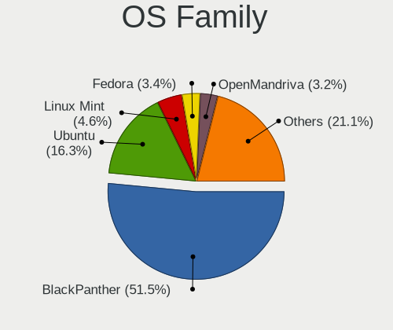
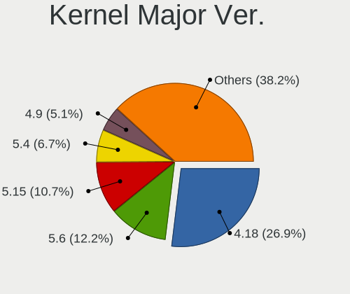
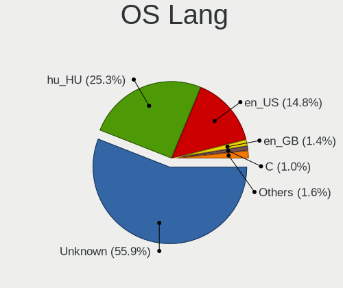
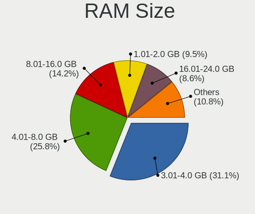
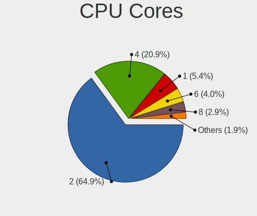
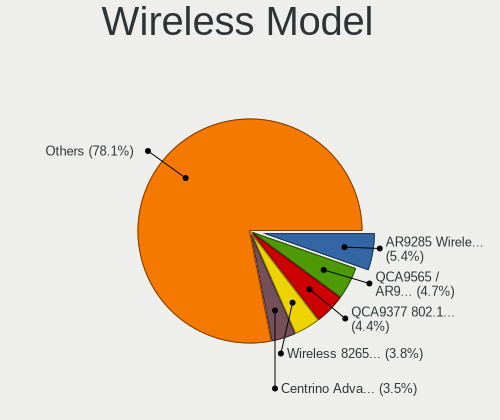
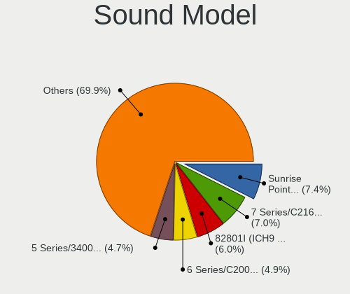
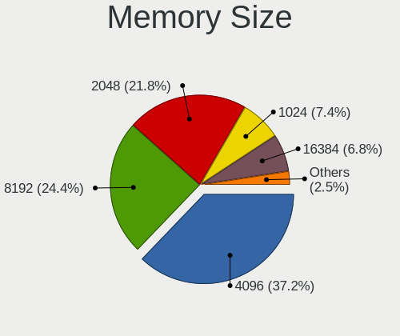

Linux in Hungary - Tested Hardware & Statistics (Notebooks)
-----------------------------------------------------------

A project to collect tested hardware configurations for Linux in Hungary.

Anyone can contribute to this report by the [hw-probe](https://github.com/linuxhw/hw-probe) tool:

    sudo -E hw-probe -all -upload

Please contribute! Especially if your hardware is rare.

Contents
--------

* [ Test Cases ](#test-cases)

* [ System ](#system)
  - [ OS                       ](#os)
  - [ OS Family                ](#os-family)
  - [ Kernel                   ](#kernel)
  - [ Kernel Family            ](#kernel-family)
  - [ Kernel Major Ver.        ](#kernel-major-ver)
  - [ Arch                     ](#arch)
  - [ DE                       ](#de)
  - [ Display Server           ](#display-server)
  - [ Display Manager          ](#display-manager)
  - [ OS Lang                  ](#os-lang)
  - [ Boot Mode                ](#boot-mode)
  - [ Filesystem               ](#filesystem)
  - [ Part. scheme             ](#part-scheme)
  - [ Dual Boot with Linux/BSD ](#dual-boot-with-linuxbsd)
  - [ Dual Boot (Win)          ](#dual-boot-win)

* [ Board ](#board)
  - [ Vendor                   ](#vendor)
  - [ Model                    ](#model)
  - [ Model Family             ](#model-family)
  - [ MFG Year                 ](#mfg-year)
  - [ Form Factor              ](#form-factor)
  - [ Secure Boot              ](#secure-boot)
  - [ Coreboot                 ](#coreboot)
  - [ RAM Size                 ](#ram-size)
  - [ RAM Used                 ](#ram-used)
  - [ Total Drives             ](#total-drives)
  - [ Has CD-ROM               ](#has-cd-rom)
  - [ Has Ethernet             ](#has-ethernet)
  - [ Has WiFi                 ](#has-wifi)
  - [ Has Bluetooth            ](#has-bluetooth)

* [ Location ](#location)
  - [ Country                  ](#country)
  - [ City                     ](#city)

* [ Drives ](#drives)
  - [ Drive Vendor             ](#drive-vendor)
  - [ Drive Model              ](#drive-model)
  - [ HDD Vendor               ](#hdd-vendor)
  - [ SSD Vendor               ](#ssd-vendor)
  - [ Drive Kind               ](#drive-kind)
  - [ Drive Connector          ](#drive-connector)
  - [ Drive Size               ](#drive-size)
  - [ Space Total              ](#space-total)
  - [ Space Used               ](#space-used)
  - [ Malfunc. Drives          ](#malfunc-drives)
  - [ Malfunc. Drive Vendor    ](#malfunc-drive-vendor)
  - [ Malfunc. HDD Vendor      ](#malfunc-hdd-vendor)
  - [ Malfunc. Drive Kind      ](#malfunc-drive-kind)
  - [ Failed Drives            ](#failed-drives)
  - [ Failed Drive Vendor      ](#failed-drive-vendor)
  - [ Drive Status             ](#drive-status)

* [ Storage controller ](#storage-controller)
  - [ Storage Vendor           ](#storage-vendor)
  - [ Storage Model            ](#storage-model)
  - [ Storage Kind             ](#storage-kind)

* [ Processor ](#processor)
  - [ CPU Vendor               ](#cpu-vendor)
  - [ CPU Model                ](#cpu-model)
  - [ CPU Model Family         ](#cpu-model-family)
  - [ CPU Cores                ](#cpu-cores)
  - [ CPU Sockets              ](#cpu-sockets)
  - [ CPU Threads              ](#cpu-threads)
  - [ CPU Op-Modes             ](#cpu-op-modes)
  - [ CPU Microcode            ](#cpu-microcode)
  - [ CPU Microarch            ](#cpu-microarch)

* [ Graphics ](#graphics)
  - [ GPU Vendor               ](#gpu-vendor)
  - [ GPU Model                ](#gpu-model)
  - [ GPU Combo                ](#gpu-combo)
  - [ GPU Driver               ](#gpu-driver)
  - [ GPU Memory               ](#gpu-memory)

* [ Monitor ](#monitor)
  - [ Monitor Vendor           ](#monitor-vendor)
  - [ Monitor Model            ](#monitor-model)
  - [ Monitor Resolution       ](#monitor-resolution)
  - [ Monitor Diagonal         ](#monitor-diagonal)
  - [ Monitor Width            ](#monitor-width)
  - [ Aspect Ratio             ](#aspect-ratio)
  - [ Monitor Area             ](#monitor-area)
  - [ Pixel Density            ](#pixel-density)
  - [ Multiple Monitors        ](#multiple-monitors)

* [ Network ](#network)
  - [ Net Controller Vendor    ](#net-controller-vendor)
  - [ Net Controller Model     ](#net-controller-model)
  - [ Wireless Vendor          ](#wireless-vendor)
  - [ Wireless Model           ](#wireless-model)
  - [ Ethernet Vendor          ](#ethernet-vendor)
  - [ Ethernet Model           ](#ethernet-model)
  - [ Net Controller Kind      ](#net-controller-kind)
  - [ Used Controller          ](#used-controller)
  - [ NICs                     ](#nics)
  - [ IPv6                     ](#ipv6)

* [ Bluetooth ](#bluetooth)
  - [ Bluetooth Vendor         ](#bluetooth-vendor)
  - [ Bluetooth Model          ](#bluetooth-model)

* [ Sound ](#sound)
  - [ Sound Vendor             ](#sound-vendor)
  - [ Sound Model              ](#sound-model)

* [ Memory ](#memory)
  - [ Memory Vendor            ](#memory-vendor)
  - [ Memory Model             ](#memory-model)
  - [ Memory Kind              ](#memory-kind)
  - [ Memory Form Factor       ](#memory-form-factor)
  - [ Memory Size              ](#memory-size)
  - [ Memory Speed             ](#memory-speed)

* [ Printers & scanners ](#printers--scanners)
  - [ Printer Vendor           ](#printer-vendor)
  - [ Printer Model            ](#printer-model)
  - [ Scanner Vendor           ](#scanner-vendor)
  - [ Scanner Model            ](#scanner-model)

* [ Camera ](#camera)
  - [ Camera Vendor            ](#camera-vendor)
  - [ Camera Model             ](#camera-model)

* [ Security ](#security)
  - [ Fingerprint Vendor       ](#fingerprint-vendor)
  - [ Fingerprint Model        ](#fingerprint-model)
  - [ Chipcard Vendor          ](#chipcard-vendor)
  - [ Chipcard Model           ](#chipcard-model)

* [ Unsupported ](#unsupported)
  - [ Unsupported Devices      ](#unsupported-devices)
  - [ Unsupported Device Types ](#unsupported-device-types)

Test Cases
----------

Total: 4494

| Vendor        | Model                       | Probe                                                      | Date         |
|---------------|-----------------------------|------------------------------------------------------------|--------------|
| HP            | EliteBook 2560p             | [ef54ce0eda](https://linux-hardware.org/?probe=ef54ce0eda) | May 06, 2022 |
| HP            | EliteBook 2560p             | [94a92586e6](https://linux-hardware.org/?probe=94a92586e6) | May 06, 2022 |
| Lenovo        | ThinkPad T460 20FMS6LB00    | [3d7e88cdae](https://linux-hardware.org/?probe=3d7e88cdae) | May 03, 2022 |
| ASUSTek       | GL552JX                     | [c91f42212d](https://linux-hardware.org/?probe=c91f42212d) | May 03, 2022 |
| ASUSTek       | ZenBook UX325EA_UX325EA     | [62f1d13e63](https://linux-hardware.org/?probe=62f1d13e63) | May 02, 2022 |
| Lenovo        | ThinkPad X240 20AL00FGMB    | [afba42bf24](https://linux-hardware.org/?probe=afba42bf24) | May 02, 2022 |
| ASUSTek       | ZenBook UX433FN_UX433FN     | [02872ac9a8](https://linux-hardware.org/?probe=02872ac9a8) | May 02, 2022 |
| HP            | ProBook 645 G4              | [0a4b56ae27](https://linux-hardware.org/?probe=0a4b56ae27) | Apr 29, 2022 |
| Lenovo        | ThinkPad E15 20RD003KHV     | [ef265ae548](https://linux-hardware.org/?probe=ef265ae548) | Apr 29, 2022 |
| Dell          | Inspiron 3593               | [54087491d8](https://linux-hardware.org/?probe=54087491d8) | Apr 28, 2022 |
| HP            | ProBook 645 G4              | [1546b59830](https://linux-hardware.org/?probe=1546b59830) | Apr 28, 2022 |
| ASUSTek       | VivoBook_ASUSLaptop M340... | [382d77c2b0](https://linux-hardware.org/?probe=382d77c2b0) | Apr 28, 2022 |
| Lenovo        | ThinkBook 15-IIL 20SM       | [4a7baada7f](https://linux-hardware.org/?probe=4a7baada7f) | Apr 27, 2022 |
| Toshiba       | NB550D                      | [386409d233](https://linux-hardware.org/?probe=386409d233) | Apr 24, 2022 |
| ASUSTek       | GL552JX                     | [dae470212d](https://linux-hardware.org/?probe=dae470212d) | Apr 22, 2022 |
| Acer          | Swift SF114-33              | [93239c624a](https://linux-hardware.org/?probe=93239c624a) | Apr 22, 2022 |
| Lenovo        | ThinkPad T14 Gen 1 20UES... | [5a855c522f](https://linux-hardware.org/?probe=5a855c522f) | Apr 22, 2022 |
| HP            | EliteBook 8470p             | [c1623a9f89](https://linux-hardware.org/?probe=c1623a9f89) | Apr 21, 2022 |
| Dell          | Vostro 3580                 | [c34ed29ab2](https://linux-hardware.org/?probe=c34ed29ab2) | Apr 21, 2022 |
| Lenovo        | ThinkPad E15 20RD003KHV     | [70547d6581](https://linux-hardware.org/?probe=70547d6581) | Apr 19, 2022 |
| Lenovo        | ThinkPad T14 Gen 1 20UES... | [36e5a2229d](https://linux-hardware.org/?probe=36e5a2229d) | Apr 18, 2022 |
| Lenovo        | B590 20208                  | [af6b076e21](https://linux-hardware.org/?probe=af6b076e21) | Apr 18, 2022 |
| Hungaro Fl... | Navon Loop 360              | [48b6f0e313](https://linux-hardware.org/?probe=48b6f0e313) | Apr 18, 2022 |
| Hungaro Fl... | Navon Loop 360              | [cde65f88c1](https://linux-hardware.org/?probe=cde65f88c1) | Apr 17, 2022 |
| ASUSTek       | TP201SA                     | [2898b67bff](https://linux-hardware.org/?probe=2898b67bff) | Apr 16, 2022 |
| HUAWEI        | NBLB-WAX9N                  | [a89ca51e1b](https://linux-hardware.org/?probe=a89ca51e1b) | Apr 15, 2022 |
| Fujitsu       | LIFEBOOK E743               | [43ee1b9237](https://linux-hardware.org/?probe=43ee1b9237) | Apr 14, 2022 |
| Dell          | G5 5587                     | [b3c44a59f0](https://linux-hardware.org/?probe=b3c44a59f0) | Apr 13, 2022 |
| Dell          | Inspiron 3537               | [88655213a1](https://linux-hardware.org/?probe=88655213a1) | Apr 12, 2022 |
| HP            | ProBook 470 G1              | [ee1f05022a](https://linux-hardware.org/?probe=ee1f05022a) | Apr 10, 2022 |
| Lenovo        | G580 20150                  | [00215e25c0](https://linux-hardware.org/?probe=00215e25c0) | Apr 10, 2022 |
| Dell          | Latitude 7480               | [b235ce5f92](https://linux-hardware.org/?probe=b235ce5f92) | Apr 10, 2022 |
| Lenovo        | G580 20150                  | [ae6967f1d5](https://linux-hardware.org/?probe=ae6967f1d5) | Apr 09, 2022 |
| Fujitsu       | LIFEBOOK U745               | [fc3b797ea0](https://linux-hardware.org/?probe=fc3b797ea0) | Apr 09, 2022 |
| Fujitsu       | LIFEBOOK U745               | [9dc3653255](https://linux-hardware.org/?probe=9dc3653255) | Apr 09, 2022 |
| Valve         | Jupiter                     | [852b6fb53a](https://linux-hardware.org/?probe=852b6fb53a) | Apr 08, 2022 |
| Lenovo        | ThinkBook 15-IIL 20SM       | [d97d3f2838](https://linux-hardware.org/?probe=d97d3f2838) | Apr 08, 2022 |
| ASUSTek       | N551JW                      | [3ddfbf37e2](https://linux-hardware.org/?probe=3ddfbf37e2) | Apr 08, 2022 |
| Lenovo        | Yoga Slim 7-14ARE05 82A2    | [ae77218dcf](https://linux-hardware.org/?probe=ae77218dcf) | Apr 07, 2022 |
| Toshiba       | TECRA A10                   | [b062d23fb7](https://linux-hardware.org/?probe=b062d23fb7) | Apr 07, 2022 |
| Dell          | Latitude E6530              | [a99419647f](https://linux-hardware.org/?probe=a99419647f) | Apr 07, 2022 |
| Lenovo        | ThinkPad T61 6458WK6        | [5303af9863](https://linux-hardware.org/?probe=5303af9863) | Apr 07, 2022 |
| Fujitsu       | LIFEBOOK U745               | [5d73ae026b](https://linux-hardware.org/?probe=5d73ae026b) | Apr 05, 2022 |
| Fujitsu       | LIFEBOOK U745               | [2ce89b7032](https://linux-hardware.org/?probe=2ce89b7032) | Apr 05, 2022 |
| Acer          | Swift SF114-32              | [3947799e36](https://linux-hardware.org/?probe=3947799e36) | Apr 05, 2022 |
| Acer          | TravelMate P215-41-G2       | [065554d2ad](https://linux-hardware.org/?probe=065554d2ad) | Apr 04, 2022 |
| Acer          | TravelMate P215-52          | [a5d16dc93e](https://linux-hardware.org/?probe=a5d16dc93e) | Apr 03, 2022 |
| Samsung       | RV410/RV510/S3510/E3510     | [495e271511](https://linux-hardware.org/?probe=495e271511) | Apr 03, 2022 |
| Lenovo        | G50-30 80G0                 | [46775a18b0](https://linux-hardware.org/?probe=46775a18b0) | Apr 03, 2022 |
| Dell          | Latitude E5420              | [a60c1a4785](https://linux-hardware.org/?probe=a60c1a4785) | Apr 03, 2022 |
| Lenovo        | G50-30 80G0                 | [be1de1d236](https://linux-hardware.org/?probe=be1de1d236) | Apr 03, 2022 |
| Lenovo        | G780 20138                  | [a7cad8a09a](https://linux-hardware.org/?probe=a7cad8a09a) | Apr 02, 2022 |
| HP            | Pavilion 15                 | [98be421e4c](https://linux-hardware.org/?probe=98be421e4c) | Apr 02, 2022 |
| ASUSTek       | ROG Zephyrus G15 GA503RM... | [8ae9fd4940](https://linux-hardware.org/?probe=8ae9fd4940) | Apr 02, 2022 |
| Acer          | TravelMate P215-52          | [752d283e54](https://linux-hardware.org/?probe=752d283e54) | Apr 01, 2022 |
| Samsung       | RV410/RV510/S3510/E3510     | [666c8daa31](https://linux-hardware.org/?probe=666c8daa31) | Apr 01, 2022 |
| HP            | Unknown                     | [c6a02a2df5](https://linux-hardware.org/?probe=c6a02a2df5) | Apr 01, 2022 |
| HP            | Unknown                     | [71ae764e9f](https://linux-hardware.org/?probe=71ae764e9f) | Apr 01, 2022 |
| Fujitsu Si... | ESPRIMO Mobile V5535        | [1a946533b6](https://linux-hardware.org/?probe=1a946533b6) | Mar 31, 2022 |
| Lenovo        | G580 20150                  | [81fc57b56b](https://linux-hardware.org/?probe=81fc57b56b) | Mar 30, 2022 |
| Lenovo        | G580 20150                  | [f518bd70a8](https://linux-hardware.org/?probe=f518bd70a8) | Mar 30, 2022 |
| Dell          | Latitude E6420              | [2a0c2610ea](https://linux-hardware.org/?probe=2a0c2610ea) | Mar 30, 2022 |
| Dell          | Latitude E6420              | [551afd78de](https://linux-hardware.org/?probe=551afd78de) | Mar 30, 2022 |
| eMachines     | E725                        | [475f79831d](https://linux-hardware.org/?probe=475f79831d) | Mar 29, 2022 |
| eMachines     | E725                        | [f8e777c318](https://linux-hardware.org/?probe=f8e777c318) | Mar 29, 2022 |
| HP            | ProBook 640 G8 Notebook ... | [60da33f3aa](https://linux-hardware.org/?probe=60da33f3aa) | Mar 28, 2022 |
| Dell          | System XPS 15Z              | [3e4b6f7b57](https://linux-hardware.org/?probe=3e4b6f7b57) | Mar 28, 2022 |
| Dell          | Latitude E5540              | [838350f357](https://linux-hardware.org/?probe=838350f357) | Mar 28, 2022 |
| Dell          | Latitude E5540              | [504e497cfb](https://linux-hardware.org/?probe=504e497cfb) | Mar 28, 2022 |
| Lenovo        | ThinkPad W530 2463A58       | [8e8bd0aad5](https://linux-hardware.org/?probe=8e8bd0aad5) | Mar 28, 2022 |
| eMachines     | E725                        | [2dbe59fd2a](https://linux-hardware.org/?probe=2dbe59fd2a) | Mar 27, 2022 |
| eMachines     | E725                        | [81a573c416](https://linux-hardware.org/?probe=81a573c416) | Mar 27, 2022 |
| Lenovo        | G580 20150                  | [ec430f1afc](https://linux-hardware.org/?probe=ec430f1afc) | Mar 27, 2022 |
| Dell          | Inspiron M5030              | [a36af1ef0f](https://linux-hardware.org/?probe=a36af1ef0f) | Mar 27, 2022 |
| Dell          | Inspiron M5030              | [c3b9926b94](https://linux-hardware.org/?probe=c3b9926b94) | Mar 27, 2022 |
| Fujitsu Si... | ESPRIMO Mobile V5555        | [b557a2005c](https://linux-hardware.org/?probe=b557a2005c) | Mar 27, 2022 |
| ASUSTek       | TUF Gaming FX505DT_FX505... | [64606b8247](https://linux-hardware.org/?probe=64606b8247) | Mar 26, 2022 |
| Lenovo        | IdeaPad 320-17ABR 80YN      | [586b8ec7cb](https://linux-hardware.org/?probe=586b8ec7cb) | Mar 26, 2022 |
| Lenovo        | IdeaPad 320-17ABR 80YN      | [d12ded1602](https://linux-hardware.org/?probe=d12ded1602) | Mar 26, 2022 |
| ASUSTek       | TUF Gaming FX505DT_FX505... | [25ad4e35b9](https://linux-hardware.org/?probe=25ad4e35b9) | Mar 26, 2022 |
| HP            | Pavilion Gaming Laptop 1... | [c527847cd3](https://linux-hardware.org/?probe=c527847cd3) | Mar 25, 2022 |
| HP            | Pavilion Gaming Laptop 1... | [af1db6f0e3](https://linux-hardware.org/?probe=af1db6f0e3) | Mar 25, 2022 |
| Lenovo        | IdeaPad 320-17ABR 80YN      | [ed4ed6851f](https://linux-hardware.org/?probe=ed4ed6851f) | Mar 23, 2022 |
| Lenovo        | IdeaPad 320-17ABR 80YN      | [c7fb3975b0](https://linux-hardware.org/?probe=c7fb3975b0) | Mar 23, 2022 |
| ASUSTek       | VivoBook_ASUSLaptop M340... | [c136393c4b](https://linux-hardware.org/?probe=c136393c4b) | Mar 23, 2022 |
| Dell          | Latitude E7450              | [57111f23b4](https://linux-hardware.org/?probe=57111f23b4) | Mar 23, 2022 |
| Dell          | Latitude E7450              | [ad41ea623a](https://linux-hardware.org/?probe=ad41ea623a) | Mar 23, 2022 |
| Lenovo        | G565 20071                  | [40cf723fac](https://linux-hardware.org/?probe=40cf723fac) | Mar 23, 2022 |
| Lenovo        | IdeaPad 330-15IKB 81DE      | [5b8c4678af](https://linux-hardware.org/?probe=5b8c4678af) | Mar 22, 2022 |
| Lenovo        | IdeaPad 330-15IKB 81DE      | [825c65940a](https://linux-hardware.org/?probe=825c65940a) | Mar 22, 2022 |
| Acer          | TravelMate P238-G2-M        | [7aa968ca84](https://linux-hardware.org/?probe=7aa968ca84) | Mar 22, 2022 |
| Apple         | MacBookPro6,2               | [5611c90f20](https://linux-hardware.org/?probe=5611c90f20) | Mar 21, 2022 |
| Apple         | MacBookPro6,2               | [2a71c88e71](https://linux-hardware.org/?probe=2a71c88e71) | Mar 21, 2022 |
| eMachines     | E725                        | [8d1bc4459a](https://linux-hardware.org/?probe=8d1bc4459a) | Mar 21, 2022 |
| Lenovo        | Z50-70 20354                | [85236d7863](https://linux-hardware.org/?probe=85236d7863) | Mar 20, 2022 |
| Lenovo        | Z50-70 20354                | [2391a2db23](https://linux-hardware.org/?probe=2391a2db23) | Mar 20, 2022 |
| Lenovo        | G580 20150                  | [c31ede0d49](https://linux-hardware.org/?probe=c31ede0d49) | Mar 20, 2022 |
| Lenovo        | G580 20150                  | [a2c31ee11f](https://linux-hardware.org/?probe=a2c31ee11f) | Mar 20, 2022 |
| ASUSTek       | VivoBook_ASUSLaptop M340... | [3607969e9d](https://linux-hardware.org/?probe=3607969e9d) | Mar 20, 2022 |
| Lenovo        | G505s 20255                 | [9f18cfb328](https://linux-hardware.org/?probe=9f18cfb328) | Mar 19, 2022 |
| Apple         | MacBookPro6,2               | [cf280def49](https://linux-hardware.org/?probe=cf280def49) | Mar 19, 2022 |
| Apple         | MacBookPro6,2               | [534b364956](https://linux-hardware.org/?probe=534b364956) | Mar 19, 2022 |
| Lenovo        | G505s 20255                 | [716d4ed3be](https://linux-hardware.org/?probe=716d4ed3be) | Mar 18, 2022 |
| Lenovo        | IdeaPad 320-17ABR 80YN      | [a5797bd090](https://linux-hardware.org/?probe=a5797bd090) | Mar 16, 2022 |
| Lenovo        | IdeaPad 320-17ABR 80YN      | [6ae5708fe3](https://linux-hardware.org/?probe=6ae5708fe3) | Mar 16, 2022 |
| HP            | Pavilion Gaming Laptop 1... | [8dc853c05a](https://linux-hardware.org/?probe=8dc853c05a) | Mar 15, 2022 |
| Fujitsu       | LIFEBOOK U745               | [e8e4e5d953](https://linux-hardware.org/?probe=e8e4e5d953) | Mar 15, 2022 |
| Fujitsu       | LIFEBOOK U745               | [11711e1a1e](https://linux-hardware.org/?probe=11711e1a1e) | Mar 15, 2022 |
| HP            | 650                         | [3266dba7df](https://linux-hardware.org/?probe=3266dba7df) | Mar 14, 2022 |
| HP            | 650                         | [54df12f572](https://linux-hardware.org/?probe=54df12f572) | Mar 14, 2022 |
| Fujitsu Si... | AMILO Xi 3650               | [6f416ff93b](https://linux-hardware.org/?probe=6f416ff93b) | Mar 13, 2022 |
| HP            | Pavilion Gaming Laptop 1... | [79a7c69b79](https://linux-hardware.org/?probe=79a7c69b79) | Mar 13, 2022 |
| ASUSTek       | Strix 15 GL503GE            | [29c3688c05](https://linux-hardware.org/?probe=29c3688c05) | Mar 13, 2022 |
| ASUSTek       | Strix 15 GL503GE            | [4e28aad5e0](https://linux-hardware.org/?probe=4e28aad5e0) | Mar 13, 2022 |
| ASUSTek       | X541UVK                     | [74ba6d5353](https://linux-hardware.org/?probe=74ba6d5353) | Mar 12, 2022 |
| eMachines     | E725                        | [05b157a340](https://linux-hardware.org/?probe=05b157a340) | Mar 12, 2022 |
| Packard Be... | EasyNote TS13SB             | [9d702d33cb](https://linux-hardware.org/?probe=9d702d33cb) | Mar 12, 2022 |
| HP            | Pavilion 17                 | [f5ff2a8a14](https://linux-hardware.org/?probe=f5ff2a8a14) | Mar 10, 2022 |
| HP            | Pavilion 17                 | [b6bfe40827](https://linux-hardware.org/?probe=b6bfe40827) | Mar 10, 2022 |
| ASUSTek       | ASUS TUF Gaming A15 FA50... | [299209635a](https://linux-hardware.org/?probe=299209635a) | Mar 09, 2022 |
| Dell          | Latitude E6230              | [2e48473c4a](https://linux-hardware.org/?probe=2e48473c4a) | Mar 09, 2022 |
| Dell          | Latitude E6230              | [20ca54a46c](https://linux-hardware.org/?probe=20ca54a46c) | Mar 09, 2022 |
| HP            | Pavilion 17                 | [a0a7609e73](https://linux-hardware.org/?probe=a0a7609e73) | Mar 09, 2022 |
| HP            | Pavilion 17                 | [f5e03e1fb3](https://linux-hardware.org/?probe=f5e03e1fb3) | Mar 09, 2022 |
| ASUSTek       | BU401LA                     | [2df54ef02e](https://linux-hardware.org/?probe=2df54ef02e) | Mar 08, 2022 |
| Sony          | SVS13118GBB                 | [64dc07d0af](https://linux-hardware.org/?probe=64dc07d0af) | Mar 08, 2022 |
| Sony          | SVS13118GBB                 | [76afe39f5e](https://linux-hardware.org/?probe=76afe39f5e) | Mar 08, 2022 |
| HP            | Pavilion 17                 | [c4225e2e13](https://linux-hardware.org/?probe=c4225e2e13) | Mar 07, 2022 |
| Dell          | Inspiron 5570               | [c2d75f15a4](https://linux-hardware.org/?probe=c2d75f15a4) | Mar 05, 2022 |
| Dell          | Inspiron 5570               | [8965098d65](https://linux-hardware.org/?probe=8965098d65) | Mar 05, 2022 |
| HP            | Compaq 6710b (GB890EA#AK... | [c313b8ee39](https://linux-hardware.org/?probe=c313b8ee39) | Mar 05, 2022 |
| HP            | Compaq 6720s                | [f83b83214e](https://linux-hardware.org/?probe=f83b83214e) | Mar 04, 2022 |
| HP            | Pavilion dv6700             | [4702dab234](https://linux-hardware.org/?probe=4702dab234) | Mar 04, 2022 |
| Acer          | Aspire A315-57G             | [83f0bbb366](https://linux-hardware.org/?probe=83f0bbb366) | Mar 04, 2022 |
| ASUSTek       | ASUS TUF Gaming A15 FA50... | [077ab4061a](https://linux-hardware.org/?probe=077ab4061a) | Mar 03, 2022 |
| Lenovo        | ThinkPad T550 20CJS1VD01    | [a3aed9d375](https://linux-hardware.org/?probe=a3aed9d375) | Mar 03, 2022 |
| eMachines     | E725                        | [99aed4cc32](https://linux-hardware.org/?probe=99aed4cc32) | Mar 02, 2022 |
| eMachines     | E725                        | [b2388edc3d](https://linux-hardware.org/?probe=b2388edc3d) | Mar 02, 2022 |
| Dell          | Latitude E5540              | [0e5ce3685b](https://linux-hardware.org/?probe=0e5ce3685b) | Mar 02, 2022 |
| Dell          | Latitude E5540              | [64d4b60fff](https://linux-hardware.org/?probe=64d4b60fff) | Mar 02, 2022 |
| HP            | Compaq 6720s                | [9d3882f4c5](https://linux-hardware.org/?probe=9d3882f4c5) | Mar 02, 2022 |
| ASUSTek       | ASUS TUF Gaming A15 FA50... | [aef2b1be5b](https://linux-hardware.org/?probe=aef2b1be5b) | Mar 01, 2022 |
| Dell          | Latitude E5420              | [6eb04c2750](https://linux-hardware.org/?probe=6eb04c2750) | Feb 28, 2022 |
| Acer          | Aspire ES1-571              | [acc272ef5a](https://linux-hardware.org/?probe=acc272ef5a) | Feb 28, 2022 |
| Acer          | Aspire ES1-571              | [cf51003466](https://linux-hardware.org/?probe=cf51003466) | Feb 28, 2022 |
| ASUSTek       | ASUS EXPERTBOOK P2451FA_... | [6875bd20ab](https://linux-hardware.org/?probe=6875bd20ab) | Feb 28, 2022 |
| Dell          | Latitude 5480               | [43ae797918](https://linux-hardware.org/?probe=43ae797918) | Feb 28, 2022 |
| Dell          | Latitude 5480               | [c2ff4b12d3](https://linux-hardware.org/?probe=c2ff4b12d3) | Feb 28, 2022 |
| ASUSTek       | K53U                        | [16c5ebe7c3](https://linux-hardware.org/?probe=16c5ebe7c3) | Feb 27, 2022 |
| HP            | OMEN Laptop 15-ek0xxx       | [5f74ba2ea7](https://linux-hardware.org/?probe=5f74ba2ea7) | Feb 27, 2022 |
| Dell          | Inspiron 3583               | [83dec4f285](https://linux-hardware.org/?probe=83dec4f285) | Feb 26, 2022 |
| HP            | ProBook 6470b               | [76e9b5f896](https://linux-hardware.org/?probe=76e9b5f896) | Feb 26, 2022 |
| HP            | ProBook 6470b               | [3b86510929](https://linux-hardware.org/?probe=3b86510929) | Feb 26, 2022 |
| HP            | ProBook 430 G5              | [1cf6d56319](https://linux-hardware.org/?probe=1cf6d56319) | Feb 25, 2022 |
| HP            | Laptop 14s-fq0xxx           | [8e06c09393](https://linux-hardware.org/?probe=8e06c09393) | Feb 25, 2022 |
| Lenovo        | IdeaPad 330-15IKB 81DE      | [b36919fb07](https://linux-hardware.org/?probe=b36919fb07) | Feb 25, 2022 |
| Lenovo        | IdeaPad 330-15IKB 81DE      | [29db1de9d6](https://linux-hardware.org/?probe=29db1de9d6) | Feb 25, 2022 |
| Dell          | Latitude E5420              | [3c6c4a57ff](https://linux-hardware.org/?probe=3c6c4a57ff) | Feb 24, 2022 |
| HP            | Pavilion 17                 | [97c44abef4](https://linux-hardware.org/?probe=97c44abef4) | Feb 22, 2022 |
| HP            | Pavilion 17                 | [2474e280bd](https://linux-hardware.org/?probe=2474e280bd) | Feb 22, 2022 |
| ASUSTek       | ASUS TUF Gaming A15 FA50... | [c90c012b20](https://linux-hardware.org/?probe=c90c012b20) | Feb 22, 2022 |
| ASUSTek       | ASUS TUF Gaming A15 FA50... | [ae6501611c](https://linux-hardware.org/?probe=ae6501611c) | Feb 22, 2022 |
| Medion        | Erazer P7647 MD60803        | [e958bf729a](https://linux-hardware.org/?probe=e958bf729a) | Feb 22, 2022 |
| Lenovo        | IdeaPad 330-15IKB 81DE      | [017df62b05](https://linux-hardware.org/?probe=017df62b05) | Feb 22, 2022 |
| Lenovo        | IdeaPad 330-15IKB 81DE      | [80ceccfdc7](https://linux-hardware.org/?probe=80ceccfdc7) | Feb 22, 2022 |
| eMachines     | E725                        | [9480fce5eb](https://linux-hardware.org/?probe=9480fce5eb) | Feb 21, 2022 |
| eMachines     | E725                        | [4aa5e2b180](https://linux-hardware.org/?probe=4aa5e2b180) | Feb 21, 2022 |
| Dell          | Latitude D630               | [067e57eab9](https://linux-hardware.org/?probe=067e57eab9) | Feb 20, 2022 |
| HP            | Pavilion 17                 | [bd4f85af63](https://linux-hardware.org/?probe=bd4f85af63) | Feb 20, 2022 |
| HP            | Pavilion 17                 | [a2b272a063](https://linux-hardware.org/?probe=a2b272a063) | Feb 20, 2022 |
| Packard Be... | EasyNote ENLG81BA           | [fb281e6c00](https://linux-hardware.org/?probe=fb281e6c00) | Feb 20, 2022 |
| Packard Be... | EasyNote ENLG81BA           | [58e5e2c95c](https://linux-hardware.org/?probe=58e5e2c95c) | Feb 20, 2022 |
| Dell          | Inspiron 7737               | [cc09141607](https://linux-hardware.org/?probe=cc09141607) | Feb 19, 2022 |
| Lenovo        | IdeaPad 320-17ABR 80YN      | [bd4442f18b](https://linux-hardware.org/?probe=bd4442f18b) | Feb 19, 2022 |
| Acer          | Aspire E5-571G              | [276c87bdc5](https://linux-hardware.org/?probe=276c87bdc5) | Feb 19, 2022 |
| ASUSTek       | X550VX                      | [2cf18df101](https://linux-hardware.org/?probe=2cf18df101) | Feb 19, 2022 |
| ASUSTek       | X550VX                      | [18c1191495](https://linux-hardware.org/?probe=18c1191495) | Feb 19, 2022 |
| Dell          | Latitude E5540              | [2a7e2d762f](https://linux-hardware.org/?probe=2a7e2d762f) | Feb 19, 2022 |
| Dell          | Latitude E5540              | [661dd4c867](https://linux-hardware.org/?probe=661dd4c867) | Feb 19, 2022 |
| HP            | Compaq 6530b (NJ641UC#AB... | [ab91a058c0](https://linux-hardware.org/?probe=ab91a058c0) | Feb 19, 2022 |
| HP            | Compaq 6530b (NJ641UC#AB... | [70ab79b3b4](https://linux-hardware.org/?probe=70ab79b3b4) | Feb 19, 2022 |
| Lenovo        | ThinkPad T470 20HES18R2G    | [bb387d7a5a](https://linux-hardware.org/?probe=bb387d7a5a) | Feb 18, 2022 |
| Lenovo        | IdeaPad S145-15IGM 81MX     | [dc8d1eb5eb](https://linux-hardware.org/?probe=dc8d1eb5eb) | Feb 18, 2022 |
| Lenovo        | IdeaPad S145-15IGM 81MX     | [58b92a0176](https://linux-hardware.org/?probe=58b92a0176) | Feb 18, 2022 |
| HP            | ProBook 6470b               | [4c37154dc3](https://linux-hardware.org/?probe=4c37154dc3) | Feb 17, 2022 |
| HP            | ProBook 6470b               | [8366ba061a](https://linux-hardware.org/?probe=8366ba061a) | Feb 17, 2022 |
| Fujitsu       | LIFEBOOK U745               | [fc72b90b47](https://linux-hardware.org/?probe=fc72b90b47) | Feb 17, 2022 |
| Fujitsu       | LIFEBOOK U745               | [66d68e3a5c](https://linux-hardware.org/?probe=66d68e3a5c) | Feb 17, 2022 |
| Dell          | Latitude E5430 non-vPro     | [a7afdd9d95](https://linux-hardware.org/?probe=a7afdd9d95) | Feb 17, 2022 |
| Dell          | Latitude E5430 non-vPro     | [0d4937104b](https://linux-hardware.org/?probe=0d4937104b) | Feb 17, 2022 |
| Lenovo        | ThinkPad T450 20BUS0VH08    | [c896752de0](https://linux-hardware.org/?probe=c896752de0) | Feb 17, 2022 |
| HP            | Pavilion 17                 | [166e1147d2](https://linux-hardware.org/?probe=166e1147d2) | Feb 17, 2022 |
| Dell          | XPS 13 7390                 | [5bca4c6855](https://linux-hardware.org/?probe=5bca4c6855) | Feb 16, 2022 |
| Lenovo        | IdeaPad 320-15ABR 80XS      | [c5eab4c7d9](https://linux-hardware.org/?probe=c5eab4c7d9) | Feb 16, 2022 |
| HP            | EliteBook 8570w             | [bdfcf410e6](https://linux-hardware.org/?probe=bdfcf410e6) | Feb 16, 2022 |
| Samsung       | RV411/RV511/E3511/S3511/... | [23e6094c83](https://linux-hardware.org/?probe=23e6094c83) | Feb 16, 2022 |
| Samsung       | RV411/RV511/E3511/S3511/... | [a0a9cf96a8](https://linux-hardware.org/?probe=a0a9cf96a8) | Feb 15, 2022 |
| HP            | Compaq 6530b (NJ641UC#AB... | [357881c642](https://linux-hardware.org/?probe=357881c642) | Feb 15, 2022 |
| Acer          | Aspire 7750G                | [fa1880e655](https://linux-hardware.org/?probe=fa1880e655) | Feb 15, 2022 |
| Dell          | Latitude E6230              | [1e55ee416b](https://linux-hardware.org/?probe=1e55ee416b) | Feb 15, 2022 |
| Dell          | Latitude D630               | [17929b78ff](https://linux-hardware.org/?probe=17929b78ff) | Feb 15, 2022 |
| Dell          | Latitude E6230              | [677f21ade7](https://linux-hardware.org/?probe=677f21ade7) | Feb 15, 2022 |
| HP            | Presario CQ57               | [14148f0279](https://linux-hardware.org/?probe=14148f0279) | Feb 15, 2022 |
| Dell          | Latitude D630               | [5161c030f4](https://linux-hardware.org/?probe=5161c030f4) | Feb 15, 2022 |
| HP            | 620                         | [bd89b469e4](https://linux-hardware.org/?probe=bd89b469e4) | Feb 14, 2022 |
| HP            | Compaq 6530b (NJ641UC#AB... | [1cfe8d6cc4](https://linux-hardware.org/?probe=1cfe8d6cc4) | Feb 14, 2022 |
| HP            | 250 G1                      | [0c35eb7e0c](https://linux-hardware.org/?probe=0c35eb7e0c) | Feb 14, 2022 |
| HP            | 250 G1                      | [0e47dcd6ff](https://linux-hardware.org/?probe=0e47dcd6ff) | Feb 14, 2022 |
| Lenovo        | ThinkPad T410 2537VFQ       | [004fd97714](https://linux-hardware.org/?probe=004fd97714) | Feb 13, 2022 |
| Lenovo        | 3000 N500 423332G           | [5f673420ca](https://linux-hardware.org/?probe=5f673420ca) | Feb 13, 2022 |
| Fujitsu Si... | LIFEBOOK S7110              | [a3f36901a2](https://linux-hardware.org/?probe=a3f36901a2) | Feb 13, 2022 |
| HP            | Pavilion 17                 | [7e4c073be5](https://linux-hardware.org/?probe=7e4c073be5) | Feb 13, 2022 |
| Lenovo        | ThinkPad W510 4876A46       | [d4b8bb3ed1](https://linux-hardware.org/?probe=d4b8bb3ed1) | Feb 12, 2022 |
| HP            | EliteBook 745 G3            | [a84f254fbc](https://linux-hardware.org/?probe=a84f254fbc) | Feb 12, 2022 |
| HP            | EliteBook 745 G3            | [26ed6eddae](https://linux-hardware.org/?probe=26ed6eddae) | Feb 12, 2022 |
| Lenovo        | G50-30 80G0                 | [a72bae3658](https://linux-hardware.org/?probe=a72bae3658) | Feb 12, 2022 |
| Lenovo        | 3000 N500 423332G           | [aa5079471b](https://linux-hardware.org/?probe=aa5079471b) | Feb 12, 2022 |
| Acer          | TravelMate 8571             | [df168b8134](https://linux-hardware.org/?probe=df168b8134) | Feb 11, 2022 |
| Acer          | TravelMate 8571             | [c8493474f0](https://linux-hardware.org/?probe=c8493474f0) | Feb 11, 2022 |
| Acer          | Swift SF314-43              | [fe2ff58a88](https://linux-hardware.org/?probe=fe2ff58a88) | Feb 10, 2022 |
| Acer          | Predator PH517-51           | [de32d3b86d](https://linux-hardware.org/?probe=de32d3b86d) | Feb 10, 2022 |
| Acer          | F                           | [a5dd4a459a](https://linux-hardware.org/?probe=a5dd4a459a) | Feb 10, 2022 |
| HP            | EliteBook 745 G3            | [21d3c81852](https://linux-hardware.org/?probe=21d3c81852) | Feb 10, 2022 |
| Dell          | Latitude D630               | [3475e13b21](https://linux-hardware.org/?probe=3475e13b21) | Feb 10, 2022 |
| Dell          | Latitude D630               | [8ee0225b17](https://linux-hardware.org/?probe=8ee0225b17) | Feb 10, 2022 |
| HP            | 620                         | [7648e2fd3d](https://linux-hardware.org/?probe=7648e2fd3d) | Feb 09, 2022 |
| Acer          | Nitro AN515-42              | [4906efe7f4](https://linux-hardware.org/?probe=4906efe7f4) | Feb 09, 2022 |
| Acer          | Nitro AN515-42              | [52d6fa9b66](https://linux-hardware.org/?probe=52d6fa9b66) | Feb 09, 2022 |
| Sony          | VPCEB4M1E                   | [373127eb11](https://linux-hardware.org/?probe=373127eb11) | Feb 09, 2022 |
| ASUSTek       | X550VX                      | [8fd69ee74c](https://linux-hardware.org/?probe=8fd69ee74c) | Feb 09, 2022 |
| ASUSTek       | X550VX                      | [5b89a28386](https://linux-hardware.org/?probe=5b89a28386) | Feb 09, 2022 |
| Dell          | Latitude 5480               | [0d2e568733](https://linux-hardware.org/?probe=0d2e568733) | Feb 09, 2022 |
| Dell          | Latitude 5480               | [d34d06c580](https://linux-hardware.org/?probe=d34d06c580) | Feb 09, 2022 |
| HP            | 620                         | [c64498bcf0](https://linux-hardware.org/?probe=c64498bcf0) | Feb 08, 2022 |
| Lenovo        | G50-30 80G0                 | [0e887710b6](https://linux-hardware.org/?probe=0e887710b6) | Feb 08, 2022 |
| Lenovo        | G50-30 80G0                 | [b05f08f7d5](https://linux-hardware.org/?probe=b05f08f7d5) | Feb 08, 2022 |
| ASUSTek       | X541UVK                     | [c4556ed732](https://linux-hardware.org/?probe=c4556ed732) | Feb 08, 2022 |
| Dell          | Inspiron 5558               | [72501fb765](https://linux-hardware.org/?probe=72501fb765) | Feb 08, 2022 |
| Dell          | Latitude E5520m             | [0e5f84866b](https://linux-hardware.org/?probe=0e5f84866b) | Feb 07, 2022 |
| Lenovo        | ThinkPad L440 20ASS3A300    | [136f9d4c89](https://linux-hardware.org/?probe=136f9d4c89) | Feb 07, 2022 |
| ASUSTek       | X541UVK                     | [f293b3a040](https://linux-hardware.org/?probe=f293b3a040) | Feb 07, 2022 |
| Dell          | Inspiron 15-3567            | [e897975636](https://linux-hardware.org/?probe=e897975636) | Feb 06, 2022 |
| Sony          | SVE1511A1EW                 | [74ce3aa5bf](https://linux-hardware.org/?probe=74ce3aa5bf) | Feb 06, 2022 |
| Dell          | Latitude D630               | [553512c6fa](https://linux-hardware.org/?probe=553512c6fa) | Feb 06, 2022 |
| Dell          | Latitude D630               | [441a327e64](https://linux-hardware.org/?probe=441a327e64) | Feb 06, 2022 |
| Fujitsu       | LIFEBOOK E756               | [92c26ed8dc](https://linux-hardware.org/?probe=92c26ed8dc) | Feb 06, 2022 |
| ASUSTek       | VivoBook 12_ASUS Laptop ... | [14cfb63e15](https://linux-hardware.org/?probe=14cfb63e15) | Feb 06, 2022 |
| ASUSTek       | ZenBook UX325EA_UX325EA     | [9a75091962](https://linux-hardware.org/?probe=9a75091962) | Feb 04, 2022 |
| HP            | 650                         | [63c7a9f5bc](https://linux-hardware.org/?probe=63c7a9f5bc) | Feb 03, 2022 |
| HP            | 650                         | [6cd85d65c0](https://linux-hardware.org/?probe=6cd85d65c0) | Feb 03, 2022 |
| Dell          | Vostro 3558                 | [de621c4916](https://linux-hardware.org/?probe=de621c4916) | Feb 02, 2022 |
| Lenovo        | ThinkPad T430 2349KQ3       | [42fa6dc2c1](https://linux-hardware.org/?probe=42fa6dc2c1) | Feb 02, 2022 |
| Dell          | Inspiron 3521               | [6a7e1e173a](https://linux-hardware.org/?probe=6a7e1e173a) | Feb 01, 2022 |
| Sony          | SVS13118GBB                 | [44ef5a252e](https://linux-hardware.org/?probe=44ef5a252e) | Feb 01, 2022 |
| Dell          | Latitude E6230              | [2e03641e17](https://linux-hardware.org/?probe=2e03641e17) | Feb 01, 2022 |
| Dell          | Latitude E6230              | [75a22a4b1e](https://linux-hardware.org/?probe=75a22a4b1e) | Feb 01, 2022 |
| HP            | Unknown                     | [6aa3eb854c](https://linux-hardware.org/?probe=6aa3eb854c) | Jan 31, 2022 |
| HP            | Unknown                     | [6d601b5260](https://linux-hardware.org/?probe=6d601b5260) | Jan 31, 2022 |
| ASUSTek       | X541UVK                     | [e923d26564](https://linux-hardware.org/?probe=e923d26564) | Jan 30, 2022 |
| Sony          | SVS13118GBB                 | [3b0cf043be](https://linux-hardware.org/?probe=3b0cf043be) | Jan 30, 2022 |
| HP            | Unknown                     | [d3bb0db95f](https://linux-hardware.org/?probe=d3bb0db95f) | Jan 30, 2022 |
| ASUSTek       | X541UVK                     | [01a2239429](https://linux-hardware.org/?probe=01a2239429) | Jan 30, 2022 |
| ASUSTek       | X541UVK                     | [d231ae37d8](https://linux-hardware.org/?probe=d231ae37d8) | Jan 29, 2022 |
| Dell          | System Vostro 3750          | [de27492af3](https://linux-hardware.org/?probe=de27492af3) | Jan 29, 2022 |
| HP            | 650                         | [6b853b4760](https://linux-hardware.org/?probe=6b853b4760) | Jan 29, 2022 |
| HP            | 650                         | [b11e33d474](https://linux-hardware.org/?probe=b11e33d474) | Jan 29, 2022 |
| Dell          | Latitude E6530              | [b47cc45b54](https://linux-hardware.org/?probe=b47cc45b54) | Jan 29, 2022 |
| Sony          | SVS13118GBB                 | [1e7063ddb5](https://linux-hardware.org/?probe=1e7063ddb5) | Jan 28, 2022 |
| HP            | 250 G6 Notebook PC          | [1168d4d65b](https://linux-hardware.org/?probe=1168d4d65b) | Jan 28, 2022 |
| HP            | 250 G6 Notebook PC          | [975facb986](https://linux-hardware.org/?probe=975facb986) | Jan 28, 2022 |
| Lenovo        | ThinkPad T61 6458Y56        | [4cef262fd4](https://linux-hardware.org/?probe=4cef262fd4) | Jan 28, 2022 |
| Lenovo        | ThinkPad T61 6458Y56        | [fd7736727c](https://linux-hardware.org/?probe=fd7736727c) | Jan 28, 2022 |
| Lenovo        | IdeaPad 320-17ABR 80YN      | [c8646ebf2c](https://linux-hardware.org/?probe=c8646ebf2c) | Jan 28, 2022 |
| HP            | Unknown                     | [de22aeb5e1](https://linux-hardware.org/?probe=de22aeb5e1) | Jan 28, 2022 |
| Acer          | Aspire A315-58G             | [cb4f253c1c](https://linux-hardware.org/?probe=cb4f253c1c) | Jan 28, 2022 |
| Dell          | G3 3579                     | [c869de19b3](https://linux-hardware.org/?probe=c869de19b3) | Jan 27, 2022 |
| Apple         | MacBookPro6,2               | [a2475cad56](https://linux-hardware.org/?probe=a2475cad56) | Jan 27, 2022 |
| HP            | ProBook 6470b               | [81afdce4bb](https://linux-hardware.org/?probe=81afdce4bb) | Jan 27, 2022 |
| Acer          | Aspire F5-573G              | [83dcbe0d18](https://linux-hardware.org/?probe=83dcbe0d18) | Jan 27, 2022 |
| Apple         | MacBookPro6,2               | [5d10078b18](https://linux-hardware.org/?probe=5d10078b18) | Jan 26, 2022 |
| ASUSTek       | X550VX                      | [986328de5c](https://linux-hardware.org/?probe=986328de5c) | Jan 26, 2022 |
| ASUSTek       | X550VX                      | [a92b98a4cf](https://linux-hardware.org/?probe=a92b98a4cf) | Jan 26, 2022 |
| Insyde        | Braswell                    | [0d8764b0d5](https://linux-hardware.org/?probe=0d8764b0d5) | Jan 26, 2022 |
| HP            | EliteBook 850 G5            | [a780b76d00](https://linux-hardware.org/?probe=a780b76d00) | Jan 25, 2022 |
| HP            | EliteBook 850 G5            | [47a78966be](https://linux-hardware.org/?probe=47a78966be) | Jan 25, 2022 |
| Samsung       | RV411/RV511/E3511/S3511/... | [242f7d0fec](https://linux-hardware.org/?probe=242f7d0fec) | Jan 25, 2022 |
| Insyde        | Braswell                    | [c082266f28](https://linux-hardware.org/?probe=c082266f28) | Jan 25, 2022 |
| Acer          | Aspire F5-573G              | [51f8947e68](https://linux-hardware.org/?probe=51f8947e68) | Jan 25, 2022 |
| HP            | ProBook 6470b               | [820d0a16ea](https://linux-hardware.org/?probe=820d0a16ea) | Jan 24, 2022 |
| ASUSTek       | GL553VW                     | [7713319e74](https://linux-hardware.org/?probe=7713319e74) | Jan 24, 2022 |
| Lenovo        | G550 20023                  | [9432cdb859](https://linux-hardware.org/?probe=9432cdb859) | Jan 24, 2022 |
| HP            | ProBook 650 G3              | [32fcb78172](https://linux-hardware.org/?probe=32fcb78172) | Jan 23, 2022 |
| Dell          | Inspiron M5030              | [0918a672e0](https://linux-hardware.org/?probe=0918a672e0) | Jan 22, 2022 |
| Lenovo        | IdeaPad S145-15IIL 81W8     | [96d938c318](https://linux-hardware.org/?probe=96d938c318) | Jan 22, 2022 |
| Lenovo        | ThinkPad L420 78544UG       | [26c13c7d16](https://linux-hardware.org/?probe=26c13c7d16) | Jan 22, 2022 |
| Lenovo        | ThinkPad L420 78544UG       | [dc6c0d3559](https://linux-hardware.org/?probe=dc6c0d3559) | Jan 22, 2022 |
| ASUSTek       | K50IN                       | [64a1640588](https://linux-hardware.org/?probe=64a1640588) | Jan 21, 2022 |
| ASUSTek       | K50IN                       | [43c8a1b1ec](https://linux-hardware.org/?probe=43c8a1b1ec) | Jan 21, 2022 |
| Dell          | Inspiron 5558               | [fc8a233818](https://linux-hardware.org/?probe=fc8a233818) | Jan 21, 2022 |
| Lenovo        | IdeaPad S145-15IIL 81W8     | [df25e2a6d4](https://linux-hardware.org/?probe=df25e2a6d4) | Jan 21, 2022 |
| Lenovo        | IdeaPad S145-15IIL 81W8     | [7439a5647b](https://linux-hardware.org/?probe=7439a5647b) | Jan 21, 2022 |
| Lenovo        | IdeaPad 110-15IBR 80T7      | [cdda13eba7](https://linux-hardware.org/?probe=cdda13eba7) | Jan 20, 2022 |
| Lenovo        | ThinkPad T400 2768WGB       | [88150d957e](https://linux-hardware.org/?probe=88150d957e) | Jan 20, 2022 |
| Acer          | Swift SF314-42              | [af81e6fd78](https://linux-hardware.org/?probe=af81e6fd78) | Jan 20, 2022 |
| Lenovo        | Yoga Slim 7 Pro 14ACH5 O... | [4d77516c19](https://linux-hardware.org/?probe=4d77516c19) | Jan 19, 2022 |
| Dell          | Latitude D630               | [a83ec36713](https://linux-hardware.org/?probe=a83ec36713) | Jan 19, 2022 |
| Dell          | Latitude D630               | [c46dc03d7b](https://linux-hardware.org/?probe=c46dc03d7b) | Jan 19, 2022 |
| ASUSTek       | VivoBook 12_ASUS Laptop ... | [1d9c3b162d](https://linux-hardware.org/?probe=1d9c3b162d) | Jan 18, 2022 |
| Lenovo        | IdeaPad 320-15IAP 80XR      | [87bd7d315f](https://linux-hardware.org/?probe=87bd7d315f) | Jan 18, 2022 |
| Lenovo        | IdeaPad 320-15IAP 80XR      | [97ef06cf22](https://linux-hardware.org/?probe=97ef06cf22) | Jan 18, 2022 |
| Lenovo        | ThinkPad L470 20J5S2RA00    | [81d06b1028](https://linux-hardware.org/?probe=81d06b1028) | Jan 18, 2022 |
| HP            | EliteBook 8440p             | [eea8c3a5c3](https://linux-hardware.org/?probe=eea8c3a5c3) | Jan 18, 2022 |
| Lenovo        | G40-45 80E1                 | [4bdc747bd4](https://linux-hardware.org/?probe=4bdc747bd4) | Jan 18, 2022 |
| HP            | EliteBook 8440p             | [a3133c9aab](https://linux-hardware.org/?probe=a3133c9aab) | Jan 17, 2022 |
| Dell          | Latitude D630               | [e3561a1c18](https://linux-hardware.org/?probe=e3561a1c18) | Jan 17, 2022 |
| Lenovo        | IdeaPad S145-15IGM 81MX     | [42a841fb5b](https://linux-hardware.org/?probe=42a841fb5b) | Jan 17, 2022 |
| ASUSTek       | VivoBook 14_ASUS Laptop ... | [10983d5883](https://linux-hardware.org/?probe=10983d5883) | Jan 17, 2022 |
| ASUSTek       | VivoBook 14_ASUS Laptop ... | [0bd3f0c6c1](https://linux-hardware.org/?probe=0bd3f0c6c1) | Jan 17, 2022 |
| Lenovo        | IdeaPad S145-15IGM 81MX     | [c57ff1a684](https://linux-hardware.org/?probe=c57ff1a684) | Jan 16, 2022 |
| HP            | EliteBook 745 G3            | [7e44b8f1f8](https://linux-hardware.org/?probe=7e44b8f1f8) | Jan 16, 2022 |
| Lenovo        | IdeaPad 110-15IBR 80T7      | [7b614a5d11](https://linux-hardware.org/?probe=7b614a5d11) | Jan 15, 2022 |
| HP            | Pavilion Gaming Laptop 1... | [30c367f8ca](https://linux-hardware.org/?probe=30c367f8ca) | Jan 15, 2022 |
| Packard Be... | EasyNote TK37               | [4b9de8a4a2](https://linux-hardware.org/?probe=4b9de8a4a2) | Jan 15, 2022 |
| Acer          | Aspire A315-51              | [841d415fa4](https://linux-hardware.org/?probe=841d415fa4) | Jan 15, 2022 |
| Lenovo        | ThinkPad T400 2768WGB       | [0d267e1823](https://linux-hardware.org/?probe=0d267e1823) | Jan 15, 2022 |
| ASUSTek       | X542UN                      | [f27ec23965](https://linux-hardware.org/?probe=f27ec23965) | Jan 15, 2022 |
| Packard Be... | EasyNote TK37               | [b511ea2a93](https://linux-hardware.org/?probe=b511ea2a93) | Jan 14, 2022 |
| Packard Be... | EasyNote TK37               | [28b9c9ef8e](https://linux-hardware.org/?probe=28b9c9ef8e) | Jan 14, 2022 |
| HP            | 255 G5 Notebook PC          | [6f20015e15](https://linux-hardware.org/?probe=6f20015e15) | Jan 13, 2022 |
| HP            | 255 G5 Notebook PC          | [6eb7d2aa15](https://linux-hardware.org/?probe=6eb7d2aa15) | Jan 13, 2022 |
| Apple         | MacBookPro6,2               | [2c599e4bdf](https://linux-hardware.org/?probe=2c599e4bdf) | Jan 13, 2022 |
| Dell          | Latitude E6230              | [7c86eef02b](https://linux-hardware.org/?probe=7c86eef02b) | Jan 12, 2022 |
| Dell          | Latitude E6230              | [6e26461fb8](https://linux-hardware.org/?probe=6e26461fb8) | Jan 12, 2022 |
| Apple         | MacBookPro6,2               | [fcf4d0709f](https://linux-hardware.org/?probe=fcf4d0709f) | Jan 12, 2022 |
| Apple         | MacBookPro6,2               | [e99e86a21b](https://linux-hardware.org/?probe=e99e86a21b) | Jan 12, 2022 |
| Lenovo        | ThinkPad T440 20B7S00H01    | [1bdc5dc298](https://linux-hardware.org/?probe=1bdc5dc298) | Jan 11, 2022 |
| MSI           | GF63 Thin 9SC               | [0914f76b4d](https://linux-hardware.org/?probe=0914f76b4d) | Jan 11, 2022 |
| Apple         | MacBookPro6,2               | [4162b81e96](https://linux-hardware.org/?probe=4162b81e96) | Jan 11, 2022 |
| Lenovo        | ThinkPad T500 2056CL8       | [ef244e06d3](https://linux-hardware.org/?probe=ef244e06d3) | Jan 10, 2022 |
| Lenovo        | ThinkPad T500 2056CL8       | [6010c90178](https://linux-hardware.org/?probe=6010c90178) | Jan 10, 2022 |
| Lenovo        | IdeaPad 320-17ABR 80YN      | [81f7bfbced](https://linux-hardware.org/?probe=81f7bfbced) | Jan 10, 2022 |
| ASUSTek       | K53U                        | [d39f634e72](https://linux-hardware.org/?probe=d39f634e72) | Jan 10, 2022 |
| ASUSTek       | K53U                        | [a174ee5aa1](https://linux-hardware.org/?probe=a174ee5aa1) | Jan 10, 2022 |
| Lenovo        | ThinkPad T420 42361P0       | [01499828ce](https://linux-hardware.org/?probe=01499828ce) | Jan 09, 2022 |
| Dell          | Latitude E6430              | [e25ec7e140](https://linux-hardware.org/?probe=e25ec7e140) | Jan 09, 2022 |
| Acer          | Aspire ES1-532G             | [7cecf04619](https://linux-hardware.org/?probe=7cecf04619) | Jan 09, 2022 |
| Acer          | Aspire ES1-532G             | [d2dfc8da4c](https://linux-hardware.org/?probe=d2dfc8da4c) | Jan 09, 2022 |
| Acer          | Aspire E1-571               | [c4d40f6344](https://linux-hardware.org/?probe=c4d40f6344) | Jan 08, 2022 |
| HP            | EliteBook 745 G3            | [5300368575](https://linux-hardware.org/?probe=5300368575) | Jan 08, 2022 |
| HP            | 650                         | [b406f886bc](https://linux-hardware.org/?probe=b406f886bc) | Jan 08, 2022 |
| Acer          | Aspire F5-573G              | [719238f99c](https://linux-hardware.org/?probe=719238f99c) | Jan 08, 2022 |
| Acer          | Aspire F5-573G              | [3d833877a7](https://linux-hardware.org/?probe=3d833877a7) | Jan 08, 2022 |
| Lenovo        | ThinkPad P14s Gen 1 20S4... | [8e4bf2cdb1](https://linux-hardware.org/?probe=8e4bf2cdb1) | Jan 08, 2022 |
| HP            | 650                         | [ab0000dbee](https://linux-hardware.org/?probe=ab0000dbee) | Jan 08, 2022 |
| Lenovo        | ThinkBook 15-IIL 20SM       | [e6501cd7df](https://linux-hardware.org/?probe=e6501cd7df) | Jan 08, 2022 |
| Lenovo        | ThinkPad T400 2768WGB       | [ac0e3dfe29](https://linux-hardware.org/?probe=ac0e3dfe29) | Jan 07, 2022 |
| HP            | 255 G5 Notebook PC          | [0dbd2ab1c9](https://linux-hardware.org/?probe=0dbd2ab1c9) | Jan 07, 2022 |
| Dell          | Latitude 5480               | [8a88e72831](https://linux-hardware.org/?probe=8a88e72831) | Jan 05, 2022 |
| Lenovo        | ThinkBook 15-IIL 20SM       | [c1f08a0773](https://linux-hardware.org/?probe=c1f08a0773) | Jan 04, 2022 |
| Lenovo        | ThinkBook 15-IIL 20SM       | [c52ca0986f](https://linux-hardware.org/?probe=c52ca0986f) | Jan 04, 2022 |
| Lenovo        | ThinkBook 15-IIL 20SM       | [3c727538a0](https://linux-hardware.org/?probe=3c727538a0) | Jan 04, 2022 |
| ASUSTek       | X541UAK                     | [bd5145c8b1](https://linux-hardware.org/?probe=bd5145c8b1) | Jan 03, 2022 |
| ASUSTek       | GL552JX                     | [248ec86597](https://linux-hardware.org/?probe=248ec86597) | Jan 03, 2022 |
| Lenovo        | IdeaPad S145-15IIL 81W8     | [1c550c0bba](https://linux-hardware.org/?probe=1c550c0bba) | Jan 02, 2022 |
| Dell          | Inspiron 1525               | [11ecdbec1b](https://linux-hardware.org/?probe=11ecdbec1b) | Jan 02, 2022 |
| Dell          | Inspiron 1525               | [c1c0a04b87](https://linux-hardware.org/?probe=c1c0a04b87) | Jan 02, 2022 |
| HP            | EliteBook 820 G1            | [a474addf38](https://linux-hardware.org/?probe=a474addf38) | Jan 01, 2022 |
| TUXEDO        | Polaris AMD Gen3 (CZN)      | [a76fb98d8d](https://linux-hardware.org/?probe=a76fb98d8d) | Jan 01, 2022 |
| Dell          | Vostro 3500                 | [5ec7cee601](https://linux-hardware.org/?probe=5ec7cee601) | Jan 01, 2022 |
| Lenovo        | IdeaPad 320-17ABR 80YN      | [8e7cb523db](https://linux-hardware.org/?probe=8e7cb523db) | Jan 01, 2022 |
| Lenovo        | IdeaPad 320-17ABR 80YN      | [f90ba417e0](https://linux-hardware.org/?probe=f90ba417e0) | Dec 30, 2021 |
| Lenovo        | IdeaPad 320-17ABR 80YN      | [8f67f7bdd8](https://linux-hardware.org/?probe=8f67f7bdd8) | Dec 30, 2021 |
| Lenovo        | ThinkPad W510 431924G       | [c0ef5f6b84](https://linux-hardware.org/?probe=c0ef5f6b84) | Dec 29, 2021 |
| Lenovo        | B590 20208                  | [452e1a4142](https://linux-hardware.org/?probe=452e1a4142) | Dec 29, 2021 |
| Lenovo        | G580 20150                  | [3fa2eda0ac](https://linux-hardware.org/?probe=3fa2eda0ac) | Dec 29, 2021 |
| Lenovo        | B590 20208                  | [84ca821541](https://linux-hardware.org/?probe=84ca821541) | Dec 29, 2021 |
| ASUSTek       | GL503VD                     | [8918ebec98](https://linux-hardware.org/?probe=8918ebec98) | Dec 28, 2021 |
| ASUSTek       | GL503VD                     | [3ef04a0fe1](https://linux-hardware.org/?probe=3ef04a0fe1) | Dec 27, 2021 |
| HP            | 15                          | [76fef17b30](https://linux-hardware.org/?probe=76fef17b30) | Dec 27, 2021 |
| HP            | 15                          | [b893a7ab27](https://linux-hardware.org/?probe=b893a7ab27) | Dec 27, 2021 |
| ASUSTek       | ASUS TUF Gaming A15 FA50... | [988628f6b6](https://linux-hardware.org/?probe=988628f6b6) | Dec 25, 2021 |
| ASUSTek       | ASUS TUF Gaming A15 FA50... | [fdf1a177f7](https://linux-hardware.org/?probe=fdf1a177f7) | Dec 25, 2021 |
| HP            | 650                         | [339ab3e2d2](https://linux-hardware.org/?probe=339ab3e2d2) | Dec 25, 2021 |
| Lenovo        | IdeaPad S145-15IGM 81MX     | [468a876561](https://linux-hardware.org/?probe=468a876561) | Dec 24, 2021 |
| Dell          | Latitude E6510              | [1fa89129c0](https://linux-hardware.org/?probe=1fa89129c0) | Dec 24, 2021 |
| Dell          | Latitude E6410              | [0588df88b2](https://linux-hardware.org/?probe=0588df88b2) | Dec 24, 2021 |
| Dell          | Latitude E6410              | [c30a066afc](https://linux-hardware.org/?probe=c30a066afc) | Dec 24, 2021 |
| Dell          | Inspiron 5502               | [020519cdfe](https://linux-hardware.org/?probe=020519cdfe) | Dec 24, 2021 |
| Lenovo        | IdeaPad S145-15IGM 81MX     | [29e9a7c27d](https://linux-hardware.org/?probe=29e9a7c27d) | Dec 24, 2021 |
| Acer          | Extensa 215-51K             | [eb7ebb463b](https://linux-hardware.org/?probe=eb7ebb463b) | Dec 23, 2021 |
| Mediacom      | GTZS                        | [d462097cdd](https://linux-hardware.org/?probe=d462097cdd) | Dec 23, 2021 |
| Dell          | Precision M6600             | [6be07fde65](https://linux-hardware.org/?probe=6be07fde65) | Dec 23, 2021 |
| Dell          | Precision M6600             | [a4f1415897](https://linux-hardware.org/?probe=a4f1415897) | Dec 23, 2021 |
| Medion        | E7218                       | [8d6ee5cd3e](https://linux-hardware.org/?probe=8d6ee5cd3e) | Dec 23, 2021 |
| ASUSTek       | Strix 17 GL703GE            | [f34a512b46](https://linux-hardware.org/?probe=f34a512b46) | Dec 22, 2021 |
| Medion        | E7218                       | [6b930af32f](https://linux-hardware.org/?probe=6b930af32f) | Dec 22, 2021 |
| ASUSTek       | K53BY                       | [c699d6fcd9](https://linux-hardware.org/?probe=c699d6fcd9) | Dec 22, 2021 |
| Lenovo        | IdeaPad S145-15IGM 81MX     | [0f0d0a4fb8](https://linux-hardware.org/?probe=0f0d0a4fb8) | Dec 22, 2021 |
| HP            | EliteBook 8570w             | [3d19abb9a8](https://linux-hardware.org/?probe=3d19abb9a8) | Dec 22, 2021 |
| Acer          | Aspire 3050                 | [888f7795aa](https://linux-hardware.org/?probe=888f7795aa) | Dec 22, 2021 |
| Acer          | Aspire 3050                 | [cfec9fece6](https://linux-hardware.org/?probe=cfec9fece6) | Dec 21, 2021 |
| Mediacom      | GTZS                        | [3694d520f6](https://linux-hardware.org/?probe=3694d520f6) | Dec 20, 2021 |
| Lenovo        | ThinkBook 15-IIL 20SM       | [190dd03fd5](https://linux-hardware.org/?probe=190dd03fd5) | Dec 19, 2021 |
| Acer          | TP-W701P-53334G1            | [674f2996b5](https://linux-hardware.org/?probe=674f2996b5) | Dec 19, 2021 |
| Acer          | Aspire ES1-532G             | [cf832b7bf6](https://linux-hardware.org/?probe=cf832b7bf6) | Dec 19, 2021 |
| Acer          | Aspire ES1-532G             | [23d3dd911d](https://linux-hardware.org/?probe=23d3dd911d) | Dec 19, 2021 |
| Packard Be... | EasyNote TE11BZ             | [24fef50189](https://linux-hardware.org/?probe=24fef50189) | Dec 19, 2021 |
| Dell          | Latitude E6430              | [5b026ea45f](https://linux-hardware.org/?probe=5b026ea45f) | Dec 19, 2021 |
| Lenovo        | IdeaPad S145-15IGM 81MX     | [7392c6c717](https://linux-hardware.org/?probe=7392c6c717) | Dec 18, 2021 |
| Dell          | Latitude E6430              | [ae951db282](https://linux-hardware.org/?probe=ae951db282) | Dec 18, 2021 |
| Apple         | MacBookPro6,2               | [f297364d3c](https://linux-hardware.org/?probe=f297364d3c) | Dec 16, 2021 |
| ASUSTek       | X550VX                      | [db3cd6403d](https://linux-hardware.org/?probe=db3cd6403d) | Dec 16, 2021 |
| Apple         | MacBookPro6,2               | [fea9356148](https://linux-hardware.org/?probe=fea9356148) | Dec 15, 2021 |
| HP            | 650                         | [c562f0b207](https://linux-hardware.org/?probe=c562f0b207) | Dec 12, 2021 |
| Fujitsu       | LIFEBOOK E756               | [539ebca696](https://linux-hardware.org/?probe=539ebca696) | Dec 12, 2021 |
| HP            | 650                         | [9eaff98515](https://linux-hardware.org/?probe=9eaff98515) | Dec 11, 2021 |
| Dell          | Precision M2800             | [0a3b99488f](https://linux-hardware.org/?probe=0a3b99488f) | Dec 11, 2021 |
| Lenovo        | ThinkPad W530 24475HG       | [00379f5e66](https://linux-hardware.org/?probe=00379f5e66) | Dec 10, 2021 |
| Fujitsu       | LIFEBOOK U745               | [12eb745be8](https://linux-hardware.org/?probe=12eb745be8) | Dec 09, 2021 |
| Fujitsu       | LIFEBOOK U745               | [e3dbc192e1](https://linux-hardware.org/?probe=e3dbc192e1) | Dec 09, 2021 |
| ASUSTek       | VivoBook S13 X330FA_S330... | [9a01f01187](https://linux-hardware.org/?probe=9a01f01187) | Dec 09, 2021 |
| Dell          | Latitude E6420              | [51073dcf26](https://linux-hardware.org/?probe=51073dcf26) | Dec 05, 2021 |
| Dell          | Latitude E6420              | [6826928218](https://linux-hardware.org/?probe=6826928218) | Dec 05, 2021 |
| MSI           | CX600                       | [38b84f0feb](https://linux-hardware.org/?probe=38b84f0feb) | Dec 05, 2021 |
| Acer          | Swift SF114-32              | [06324a46eb](https://linux-hardware.org/?probe=06324a46eb) | Dec 05, 2021 |
| Dell          | Latitude 5480               | [412919400e](https://linux-hardware.org/?probe=412919400e) | Dec 05, 2021 |
| Dell          | Latitude 5480               | [7850af63f7](https://linux-hardware.org/?probe=7850af63f7) | Dec 05, 2021 |
| Dell          | Inspiron 15-3567            | [26a01c28fa](https://linux-hardware.org/?probe=26a01c28fa) | Dec 05, 2021 |
| Dell          | Inspiron 15-3567            | [bb8b782ef0](https://linux-hardware.org/?probe=bb8b782ef0) | Dec 05, 2021 |
| Lenovo        | G500 20236                  | [dab30215a2](https://linux-hardware.org/?probe=dab30215a2) | Dec 05, 2021 |
| Dell          | Latitude 5410               | [af7b378137](https://linux-hardware.org/?probe=af7b378137) | Dec 05, 2021 |
| Dell          | Latitude 5410               | [0d992a9be7](https://linux-hardware.org/?probe=0d992a9be7) | Dec 05, 2021 |
| ASUSTek       | Strix 15 GL503GE            | [a22bef6342](https://linux-hardware.org/?probe=a22bef6342) | Dec 04, 2021 |
| Dell          | Latitude D630               | [718e2268fa](https://linux-hardware.org/?probe=718e2268fa) | Dec 04, 2021 |
| ASUSTek       | ROG Zephyrus G14 GA401IV... | [496443510d](https://linux-hardware.org/?probe=496443510d) | Dec 04, 2021 |
| Dell          | Inspiron 5558               | [cdf08abcef](https://linux-hardware.org/?probe=cdf08abcef) | Dec 04, 2021 |
| ASUSTek       | Strix 15 GL503GE            | [2f333159af](https://linux-hardware.org/?probe=2f333159af) | Dec 03, 2021 |
| Lenovo        | ThinkPad T61 6458WK6        | [e24ba2f637](https://linux-hardware.org/?probe=e24ba2f637) | Dec 03, 2021 |
| Lenovo        | ThinkPad T61 6458WK6        | [a55cb750c4](https://linux-hardware.org/?probe=a55cb750c4) | Dec 03, 2021 |
| Acer          | Aspire A315-58G             | [48e3c0e6c7](https://linux-hardware.org/?probe=48e3c0e6c7) | Dec 03, 2021 |
| Dell          | Latitude 5480               | [625beded54](https://linux-hardware.org/?probe=625beded54) | Dec 02, 2021 |
| Lenovo        | ThinkBook 15-IIL 20SM       | [ffee0a8443](https://linux-hardware.org/?probe=ffee0a8443) | Dec 02, 2021 |
| Dell          | Latitude 5480               | [d1a9d603a9](https://linux-hardware.org/?probe=d1a9d603a9) | Nov 30, 2021 |
| Acer          | Swift SF314-43              | [01ce77a927](https://linux-hardware.org/?probe=01ce77a927) | Nov 30, 2021 |
| Apple         | MacBookPro5,5               | [c32c22a4b9](https://linux-hardware.org/?probe=c32c22a4b9) | Nov 30, 2021 |
| Apple         | MacBookPro5,5               | [01a1e9ffb0](https://linux-hardware.org/?probe=01a1e9ffb0) | Nov 30, 2021 |
| Acer          | Aspire 5930                 | [17eed17c54](https://linux-hardware.org/?probe=17eed17c54) | Nov 29, 2021 |
| Acer          | Aspire 5930                 | [9a4712d7ad](https://linux-hardware.org/?probe=9a4712d7ad) | Nov 29, 2021 |
| Dell          | Latitude E6430              | [39087042b7](https://linux-hardware.org/?probe=39087042b7) | Nov 28, 2021 |
| Dell          | Latitude 5480               | [70e231854b](https://linux-hardware.org/?probe=70e231854b) | Nov 28, 2021 |
| HP            | ZBook Studio G4             | [eb3da87330](https://linux-hardware.org/?probe=eb3da87330) | Nov 27, 2021 |
| Apple         | MacBookPro6,2               | [8a35f1a8f6](https://linux-hardware.org/?probe=8a35f1a8f6) | Nov 27, 2021 |
| HP            | EliteBook 8540p             | [38dd850a7c](https://linux-hardware.org/?probe=38dd850a7c) | Nov 26, 2021 |
| HP            | EliteBook 8540p             | [e6df5b59a8](https://linux-hardware.org/?probe=e6df5b59a8) | Nov 26, 2021 |
| BenQ          | Joybook A52                 | [f11e0f093f](https://linux-hardware.org/?probe=f11e0f093f) | Nov 26, 2021 |
| Lenovo        | ThinkPad T420 42361P0       | [394d2863ce](https://linux-hardware.org/?probe=394d2863ce) | Nov 25, 2021 |
| HP            | ProBook 6470b               | [a6dad10d21](https://linux-hardware.org/?probe=a6dad10d21) | Nov 25, 2021 |
| HP            | ProBook 6470b               | [8c36c11a53](https://linux-hardware.org/?probe=8c36c11a53) | Nov 25, 2021 |
| Lenovo        | G40-45 80E1                 | [0460c1b728](https://linux-hardware.org/?probe=0460c1b728) | Nov 25, 2021 |
| Dell          | Latitude 5480               | [c2079e6c03](https://linux-hardware.org/?probe=c2079e6c03) | Nov 23, 2021 |
| HP            | ProBook 4330s               | [74e6151748](https://linux-hardware.org/?probe=74e6151748) | Nov 23, 2021 |
| HP            | ProBook 4330s               | [711ad81ee8](https://linux-hardware.org/?probe=711ad81ee8) | Nov 23, 2021 |
| Dell          | Latitude E6230              | [19dcc4c1e8](https://linux-hardware.org/?probe=19dcc4c1e8) | Nov 23, 2021 |
| Dell          | Latitude E6230              | [5df4406c5b](https://linux-hardware.org/?probe=5df4406c5b) | Nov 23, 2021 |
| Lenovo        | ThinkBook 15-IIL 20SM       | [b8d8d8e85e](https://linux-hardware.org/?probe=b8d8d8e85e) | Nov 23, 2021 |
| Fujitsu       | STYLISTIC Q702              | [b874076152](https://linux-hardware.org/?probe=b874076152) | Nov 22, 2021 |
| Dell          | Latitude E6410              | [20e60e8531](https://linux-hardware.org/?probe=20e60e8531) | Nov 22, 2021 |
| Dell          | Latitude E6410              | [96a9008d41](https://linux-hardware.org/?probe=96a9008d41) | Nov 22, 2021 |
| Toshiba       | NB550D                      | [ff322fa9a1](https://linux-hardware.org/?probe=ff322fa9a1) | Nov 21, 2021 |
| HP            | 650                         | [511b42352a](https://linux-hardware.org/?probe=511b42352a) | Nov 21, 2021 |
| Apple         | MacBookPro6,2               | [33f1433007](https://linux-hardware.org/?probe=33f1433007) | Nov 21, 2021 |
| HP            | 650                         | [f9f5da6e27](https://linux-hardware.org/?probe=f9f5da6e27) | Nov 21, 2021 |
| Dell          | Inspiron 5558               | [71a76bf540](https://linux-hardware.org/?probe=71a76bf540) | Nov 21, 2021 |
| Lenovo        | G550 20023                  | [531304bd76](https://linux-hardware.org/?probe=531304bd76) | Nov 20, 2021 |
| MSI           | CR610                       | [63411cafc4](https://linux-hardware.org/?probe=63411cafc4) | Nov 20, 2021 |
| MSI           | CR610                       | [6f2f218e21](https://linux-hardware.org/?probe=6f2f218e21) | Nov 20, 2021 |
| HP            | EliteBook 840 G3            | [1a5ca1d992](https://linux-hardware.org/?probe=1a5ca1d992) | Nov 20, 2021 |
| Dell          | Vostro 3300                 | [04fc886be3](https://linux-hardware.org/?probe=04fc886be3) | Nov 20, 2021 |
| Lenovo        | G550 20023                  | [ce28fd38d4](https://linux-hardware.org/?probe=ce28fd38d4) | Nov 20, 2021 |
| Lenovo        | ThinkPad T530 2429NL6       | [44649d8cb3](https://linux-hardware.org/?probe=44649d8cb3) | Nov 19, 2021 |
| Lenovo        | ThinkPad T530 2429NL6       | [40e07deebb](https://linux-hardware.org/?probe=40e07deebb) | Nov 19, 2021 |
| Lenovo        | IdeaPad 330S-15IKB 81F5     | [2f5c8e09bf](https://linux-hardware.org/?probe=2f5c8e09bf) | Nov 19, 2021 |
| Dell          | Latitude E6410              | [17e575c418](https://linux-hardware.org/?probe=17e575c418) | Nov 19, 2021 |
| Acer          | Aspire A315-58G             | [911895fcf2](https://linux-hardware.org/?probe=911895fcf2) | Nov 19, 2021 |
| Dell          | Latitude E7470              | [9fb42a7a17](https://linux-hardware.org/?probe=9fb42a7a17) | Nov 19, 2021 |
| Apple         | MacBookPro6,2               | [0dd964d22b](https://linux-hardware.org/?probe=0dd964d22b) | Nov 18, 2021 |
| Lenovo        | ThinkPad A475 20KMS0EJ00    | [e029652647](https://linux-hardware.org/?probe=e029652647) | Nov 18, 2021 |
| Lenovo        | ThinkBook 15p 20V3          | [855308b39c](https://linux-hardware.org/?probe=855308b39c) | Nov 18, 2021 |
| Fujitsu       | LIFEBOOK U745               | [583dc47ddd](https://linux-hardware.org/?probe=583dc47ddd) | Nov 18, 2021 |
| Fujitsu       | LIFEBOOK U745               | [647cd257ec](https://linux-hardware.org/?probe=647cd257ec) | Nov 18, 2021 |
| Apple         | MacBookPro5,5               | [e56e34b28a](https://linux-hardware.org/?probe=e56e34b28a) | Nov 18, 2021 |
| Apple         | MacBookPro5,5               | [35206eb5d3](https://linux-hardware.org/?probe=35206eb5d3) | Nov 18, 2021 |
| Dell          | Inspiron 5558               | [e86c8890fa](https://linux-hardware.org/?probe=e86c8890fa) | Nov 18, 2021 |
| Lenovo        | ThinkPad A475 20KMS0EJ00    | [26a144a0c7](https://linux-hardware.org/?probe=26a144a0c7) | Nov 17, 2021 |
| Lenovo        | Z50-75 80EC                 | [cbca714862](https://linux-hardware.org/?probe=cbca714862) | Nov 17, 2021 |
| Dell          | Latitude E5430 non-vPro     | [d4cf8a16f2](https://linux-hardware.org/?probe=d4cf8a16f2) | Nov 16, 2021 |
| Dell          | Latitude E5430 non-vPro     | [8d694f749f](https://linux-hardware.org/?probe=8d694f749f) | Nov 16, 2021 |
| Toshiba       | Satellite L750              | [f6ddfdb8ce](https://linux-hardware.org/?probe=f6ddfdb8ce) | Nov 16, 2021 |
| Toshiba       | Satellite L750              | [cc7c9dddca](https://linux-hardware.org/?probe=cc7c9dddca) | Nov 16, 2021 |
| ASUSTek       | S551LN                      | [53b3fced16](https://linux-hardware.org/?probe=53b3fced16) | Nov 16, 2021 |
| Lenovo        | B50-70 20384                | [da69364d7a](https://linux-hardware.org/?probe=da69364d7a) | Nov 16, 2021 |
| Lenovo        | B50-70 20384                | [ec91da9f30](https://linux-hardware.org/?probe=ec91da9f30) | Nov 16, 2021 |
| Lenovo        | ThinkBook 15-IIL 20SM       | [99fc9a854f](https://linux-hardware.org/?probe=99fc9a854f) | Nov 16, 2021 |
| ASUSTek       | GL753VD                     | [8109914a61](https://linux-hardware.org/?probe=8109914a61) | Nov 16, 2021 |
| Lenovo        | G550 20023                  | [520ebfcf8a](https://linux-hardware.org/?probe=520ebfcf8a) | Nov 16, 2021 |
| HP            | ProBook 4330s               | [29cda1de4c](https://linux-hardware.org/?probe=29cda1de4c) | Nov 15, 2021 |
| TUXEDO        | InfinityBook Pro 14 Gen6    | [a2947ff518](https://linux-hardware.org/?probe=a2947ff518) | Nov 15, 2021 |
| MSI           | VR610                       | [9dd3927cf1](https://linux-hardware.org/?probe=9dd3927cf1) | Nov 15, 2021 |
| MSI           | VR610                       | [fa0f1da6d7](https://linux-hardware.org/?probe=fa0f1da6d7) | Nov 15, 2021 |
| Lenovo        | Y720-15IKB 80VR             | [56b6de179d](https://linux-hardware.org/?probe=56b6de179d) | Nov 14, 2021 |
| Lenovo        | IdeaPad 330S-15IKB 81F5     | [54120357dd](https://linux-hardware.org/?probe=54120357dd) | Nov 14, 2021 |
| HP            | ProBook 4330s               | [4682329a97](https://linux-hardware.org/?probe=4682329a97) | Nov 14, 2021 |
| Lenovo        | IdeaPad 330S-15IKB 81F5     | [1db693cc35](https://linux-hardware.org/?probe=1db693cc35) | Nov 14, 2021 |
| HP            | EliteBook 840 G5            | [6bde73e59b](https://linux-hardware.org/?probe=6bde73e59b) | Nov 13, 2021 |
| Acer          | Aspire A315-55KG            | [eddf767a4f](https://linux-hardware.org/?probe=eddf767a4f) | Nov 13, 2021 |
| Lenovo        | ThinkPad X200s 74695QG      | [1ff4f8e0fc](https://linux-hardware.org/?probe=1ff4f8e0fc) | Nov 13, 2021 |
| Samsung       | NC210/NC110                 | [126116dbac](https://linux-hardware.org/?probe=126116dbac) | Nov 12, 2021 |
| Acer          | Aspire A315-58G             | [5748b3cd05](https://linux-hardware.org/?probe=5748b3cd05) | Nov 12, 2021 |
| Lenovo        | ThinkPad T420 42361P0       | [4f875ca2f0](https://linux-hardware.org/?probe=4f875ca2f0) | Nov 12, 2021 |
| Lenovo        | ThinkPad T400 2768WGB       | [9d3272960f](https://linux-hardware.org/?probe=9d3272960f) | Nov 12, 2021 |
| Lenovo        | Z50-75 80EC                 | [f49b4f30dc](https://linux-hardware.org/?probe=f49b4f30dc) | Nov 11, 2021 |
| Dell          | Latitude D630               | [bd546ec46b](https://linux-hardware.org/?probe=bd546ec46b) | Nov 11, 2021 |
| Dell          | Inspiron 5567               | [049c9e4f07](https://linux-hardware.org/?probe=049c9e4f07) | Nov 10, 2021 |
| Dell          | Latitude 7280               | [c59152a648](https://linux-hardware.org/?probe=c59152a648) | Nov 10, 2021 |
| HUAWEI        | KPL-W0X                     | [807e59f1e3](https://linux-hardware.org/?probe=807e59f1e3) | Nov 10, 2021 |
| Dell          | Inspiron 3576               | [ad9fb758a6](https://linux-hardware.org/?probe=ad9fb758a6) | Nov 09, 2021 |
| eMachines     | eME732G                     | [1e7c39c762](https://linux-hardware.org/?probe=1e7c39c762) | Nov 09, 2021 |
| Acer          | Aspire A315-55KG            | [14826ce238](https://linux-hardware.org/?probe=14826ce238) | Nov 09, 2021 |
| eMachines     | eME732G                     | [b0c186d2e4](https://linux-hardware.org/?probe=b0c186d2e4) | Nov 09, 2021 |
| HP            | Pavilion Notebook           | [6ed0c89edd](https://linux-hardware.org/?probe=6ed0c89edd) | Nov 08, 2021 |
| Lenovo        | ThinkPad T460s 20F9CTO1W... | [b996ce8823](https://linux-hardware.org/?probe=b996ce8823) | Nov 07, 2021 |
| HP            | 650                         | [4eac1ac836](https://linux-hardware.org/?probe=4eac1ac836) | Nov 07, 2021 |
| Lenovo        | ThinkPad W700 27523KG       | [73b193e1ca](https://linux-hardware.org/?probe=73b193e1ca) | Nov 07, 2021 |
| Lenovo        | ThinkPad W700 27523KG       | [4e6a02ec16](https://linux-hardware.org/?probe=4e6a02ec16) | Nov 07, 2021 |
| HP            | 650                         | [6ee809ca3e](https://linux-hardware.org/?probe=6ee809ca3e) | Nov 07, 2021 |
| Dell          | Latitude D630               | [07ddcda516](https://linux-hardware.org/?probe=07ddcda516) | Nov 07, 2021 |
| Lenovo        | IdeaPad 320-17ABR 80YN      | [3ad8721d2a](https://linux-hardware.org/?probe=3ad8721d2a) | Nov 07, 2021 |
| Lenovo        | IdeaPad 320-17ABR 80YN      | [0807858e11](https://linux-hardware.org/?probe=0807858e11) | Nov 07, 2021 |
| Dell          | Latitude E7470              | [c0949b4881](https://linux-hardware.org/?probe=c0949b4881) | Nov 07, 2021 |
| Dell          | Vostro 1540                 | [1372b6afee](https://linux-hardware.org/?probe=1372b6afee) | Nov 07, 2021 |
| Fujitsu Si... | LIFEBOOK S7110              | [6787f46858](https://linux-hardware.org/?probe=6787f46858) | Nov 06, 2021 |
| HP            | 250 G4                      | [8167957b46](https://linux-hardware.org/?probe=8167957b46) | Nov 06, 2021 |
| Sony          | SVS13118GBB                 | [741a2c8c9e](https://linux-hardware.org/?probe=741a2c8c9e) | Nov 06, 2021 |
| Dell          | Latitude E6430s             | [d7646260f0](https://linux-hardware.org/?probe=d7646260f0) | Nov 06, 2021 |
| Acer          | Aspire A315-58G             | [64f0bb3f2b](https://linux-hardware.org/?probe=64f0bb3f2b) | Nov 06, 2021 |
| eMachines     | E525                        | [05c829a085](https://linux-hardware.org/?probe=05c829a085) | Nov 06, 2021 |
| ASUSTek       | K53U                        | [6c7d579e49](https://linux-hardware.org/?probe=6c7d579e49) | Nov 05, 2021 |
| ASUSTek       | K50IN                       | [8c356405f0](https://linux-hardware.org/?probe=8c356405f0) | Nov 05, 2021 |
| Lenovo        | ThinkBook 15-IIL 20SM       | [e30e1a1247](https://linux-hardware.org/?probe=e30e1a1247) | Nov 05, 2021 |
| ASUSTek       | GL753VD                     | [b4285afb59](https://linux-hardware.org/?probe=b4285afb59) | Nov 04, 2021 |
| Lenovo        | G505s 20255                 | [c9fb91eefc](https://linux-hardware.org/?probe=c9fb91eefc) | Nov 04, 2021 |
| ASUSTek       | K53U                        | [15adf4f30a](https://linux-hardware.org/?probe=15adf4f30a) | Nov 03, 2021 |
| Acer          | Swift SF314-42              | [07025c7436](https://linux-hardware.org/?probe=07025c7436) | Nov 02, 2021 |
| ASUSTek       | K50IN                       | [570da581ab](https://linux-hardware.org/?probe=570da581ab) | Nov 02, 2021 |
| HP            | ZBook Firefly 14 G7 Mobi... | [911f44bae3](https://linux-hardware.org/?probe=911f44bae3) | Nov 02, 2021 |
| Dell          | Vostro 1540                 | [0e6d351a5f](https://linux-hardware.org/?probe=0e6d351a5f) | Nov 01, 2021 |
| Fujitsu Si... | LIFEBOOK S7110              | [e5a8a22561](https://linux-hardware.org/?probe=e5a8a22561) | Nov 01, 2021 |
| Lenovo        | IdeaPad S145-15IWL 81MV     | [f55ff834af](https://linux-hardware.org/?probe=f55ff834af) | Nov 01, 2021 |
| Lenovo        | IdeaPad S145-15IWL 81MV     | [56fe9a754b](https://linux-hardware.org/?probe=56fe9a754b) | Nov 01, 2021 |
| Dell          | Latitude E6530              | [40d78b6ddd](https://linux-hardware.org/?probe=40d78b6ddd) | Nov 01, 2021 |
| Dell          | Latitude E6530              | [4bfba155c1](https://linux-hardware.org/?probe=4bfba155c1) | Nov 01, 2021 |
| HP            | 250 G6 Notebook PC          | [fa90ad7142](https://linux-hardware.org/?probe=fa90ad7142) | Oct 31, 2021 |
| Acer          | TravelMate 8571             | [f91e822a29](https://linux-hardware.org/?probe=f91e822a29) | Oct 31, 2021 |
| HP            | 250 G6 Notebook PC          | [75c78480d2](https://linux-hardware.org/?probe=75c78480d2) | Oct 31, 2021 |
| Acer          | TravelMate 8571             | [57ed306b65](https://linux-hardware.org/?probe=57ed306b65) | Oct 31, 2021 |
| Dell          | Vostro 1700                 | [a9ba9df656](https://linux-hardware.org/?probe=a9ba9df656) | Oct 30, 2021 |
| Dell          | Vostro 1700                 | [19b12fe808](https://linux-hardware.org/?probe=19b12fe808) | Oct 30, 2021 |
| Dell          | Latitude E6230              | [d040f874c9](https://linux-hardware.org/?probe=d040f874c9) | Oct 30, 2021 |
| Fujitsu Si... | AMILO Pro Edition V3505     | [1517ac0d45](https://linux-hardware.org/?probe=1517ac0d45) | Oct 30, 2021 |
| Dell          | Latitude E6230              | [6518cc22cf](https://linux-hardware.org/?probe=6518cc22cf) | Oct 30, 2021 |
| Acer          | Aspire A315-58G             | [905fce5118](https://linux-hardware.org/?probe=905fce5118) | Oct 29, 2021 |
| HP            | Pavilion 15                 | [1014243935](https://linux-hardware.org/?probe=1014243935) | Oct 29, 2021 |
| Lenovo        | IdeaPad S145-15IWL 81MV     | [2db4ebb6ef](https://linux-hardware.org/?probe=2db4ebb6ef) | Oct 29, 2021 |
| Lenovo        | IdeaPad S145-15IWL 81MV     | [dad06f3e70](https://linux-hardware.org/?probe=dad06f3e70) | Oct 29, 2021 |
| Lenovo        | G570 20079                  | [b2f7ab7e8a](https://linux-hardware.org/?probe=b2f7ab7e8a) | Oct 28, 2021 |
| Lenovo        | G570 20079                  | [b16cb4d0dc](https://linux-hardware.org/?probe=b16cb4d0dc) | Oct 28, 2021 |
| ASUSTek       | GL753VD                     | [8a5f05e4c1](https://linux-hardware.org/?probe=8a5f05e4c1) | Oct 28, 2021 |
| HP            | EliteBook 6930p             | [77895f2a3b](https://linux-hardware.org/?probe=77895f2a3b) | Oct 28, 2021 |
| Lenovo        | ThinkBook 15-IIL 20SM       | [dea3395c5a](https://linux-hardware.org/?probe=dea3395c5a) | Oct 28, 2021 |
| Lenovo        | ThinkBook 15-IIL 20SM       | [20f75f2d4c](https://linux-hardware.org/?probe=20f75f2d4c) | Oct 28, 2021 |
| HP            | ProBook 6475b               | [c4c890f06a](https://linux-hardware.org/?probe=c4c890f06a) | Oct 27, 2021 |
| Lenovo        | ThinkPad T550 20CJS1VD01    | [55689e67b3](https://linux-hardware.org/?probe=55689e67b3) | Oct 27, 2021 |
| Dell          | Latitude D630               | [6dbcd5a1c8](https://linux-hardware.org/?probe=6dbcd5a1c8) | Oct 27, 2021 |
| HP            | ProBook 6470b               | [1b2fbcdfa0](https://linux-hardware.org/?probe=1b2fbcdfa0) | Oct 26, 2021 |
| HP            | ProBook 6470b               | [29ecbfb28a](https://linux-hardware.org/?probe=29ecbfb28a) | Oct 26, 2021 |
| HP            | OMEN by Laptop 17-an0xx     | [57cd00ef8b](https://linux-hardware.org/?probe=57cd00ef8b) | Oct 25, 2021 |
| HP            | OMEN by Laptop 17-an0xx     | [e6f20aae28](https://linux-hardware.org/?probe=e6f20aae28) | Oct 24, 2021 |
| HP            | 650                         | [22e5d1948a](https://linux-hardware.org/?probe=22e5d1948a) | Oct 24, 2021 |
| HP            | 650                         | [8c02734135](https://linux-hardware.org/?probe=8c02734135) | Oct 23, 2021 |
| HP            | ProBook 6470b               | [bef890f3d9](https://linux-hardware.org/?probe=bef890f3d9) | Oct 23, 2021 |
| Acer          | Swift SF114-32              | [87697aa300](https://linux-hardware.org/?probe=87697aa300) | Oct 23, 2021 |
| Acer          | Aspire V3-372               | [b185a2037d](https://linux-hardware.org/?probe=b185a2037d) | Oct 22, 2021 |
| HP            | 255 G5 Notebook PC          | [421c375338](https://linux-hardware.org/?probe=421c375338) | Oct 22, 2021 |
| Acer          | Aspire A315-53G             | [ebb8572b41](https://linux-hardware.org/?probe=ebb8572b41) | Oct 22, 2021 |
| Acer          | Swift SF314-43              | [8275d5fa0b](https://linux-hardware.org/?probe=8275d5fa0b) | Oct 22, 2021 |
| Lenovo        | G550 20023                  | [3bfb2e5e7b](https://linux-hardware.org/?probe=3bfb2e5e7b) | Oct 22, 2021 |
| ASUSTek       | VivoBook 15_ASUS Laptop ... | [985d10d314](https://linux-hardware.org/?probe=985d10d314) | Oct 21, 2021 |
| ASUSTek       | VivoBook 15_ASUS Laptop ... | [35a40c6757](https://linux-hardware.org/?probe=35a40c6757) | Oct 21, 2021 |
| Fujitsu Si... | AMILO Li1705                | [a61c777014](https://linux-hardware.org/?probe=a61c777014) | Oct 21, 2021 |
| Fujitsu Si... | AMILO Li1705                | [3a627aab0a](https://linux-hardware.org/?probe=3a627aab0a) | Oct 21, 2021 |
| Acer          | Aspire A315-53G             | [9231eabdb2](https://linux-hardware.org/?probe=9231eabdb2) | Oct 21, 2021 |
| HP            | 250 G1                      | [b0ed67249e](https://linux-hardware.org/?probe=b0ed67249e) | Oct 21, 2021 |
| HP            | 250 G1                      | [0790e099fa](https://linux-hardware.org/?probe=0790e099fa) | Oct 21, 2021 |
| speedmaste... | E131x series                | [44a79e6330](https://linux-hardware.org/?probe=44a79e6330) | Oct 21, 2021 |
| speedmaste... | E131x series                | [e539db1fcd](https://linux-hardware.org/?probe=e539db1fcd) | Oct 20, 2021 |
| Acer          | TravelMate 8571             | [e92532e72e](https://linux-hardware.org/?probe=e92532e72e) | Oct 20, 2021 |
| Acer          | Nitro AN515-42              | [2ff605bdb0](https://linux-hardware.org/?probe=2ff605bdb0) | Oct 20, 2021 |
| Acer          | TravelMate 8571             | [cf37daf8a1](https://linux-hardware.org/?probe=cf37daf8a1) | Oct 19, 2021 |
| ASUSTek       | N551JW                      | [a6c41c9d3e](https://linux-hardware.org/?probe=a6c41c9d3e) | Oct 19, 2021 |
| HP            | ZBook Studio G4             | [0fe0f1450c](https://linux-hardware.org/?probe=0fe0f1450c) | Oct 19, 2021 |
| Fujitsu       | LIFEBOOK A530               | [1c293cc8f0](https://linux-hardware.org/?probe=1c293cc8f0) | Oct 18, 2021 |
| HP            | 650                         | [f27e07a82b](https://linux-hardware.org/?probe=f27e07a82b) | Oct 17, 2021 |
| HP            | ZBook Studio G4             | [d79ba35f27](https://linux-hardware.org/?probe=d79ba35f27) | Oct 17, 2021 |
| Lenovo        | Z710 20250                  | [d2a9cd32b1](https://linux-hardware.org/?probe=d2a9cd32b1) | Oct 17, 2021 |
| Acer          | Aspire A315-21G             | [e740a4de27](https://linux-hardware.org/?probe=e740a4de27) | Oct 17, 2021 |
| Dell          | Latitude D630               | [e625883bed](https://linux-hardware.org/?probe=e625883bed) | Oct 17, 2021 |
| Fujitsu       | LIFEBOOK A512               | [7a71621dde](https://linux-hardware.org/?probe=7a71621dde) | Oct 17, 2021 |
| Dell          | Latitude D630               | [b3e12559af](https://linux-hardware.org/?probe=b3e12559af) | Oct 17, 2021 |
| ASUSTek       | N50Vn                       | [3494a7c5b6](https://linux-hardware.org/?probe=3494a7c5b6) | Oct 16, 2021 |
| Lenovo        | ThinkPad T450s 20BWS0090... | [70872e756c](https://linux-hardware.org/?probe=70872e756c) | Oct 16, 2021 |
| Lenovo        | ThinkPad T450s 20BWS0090... | [8b133919fd](https://linux-hardware.org/?probe=8b133919fd) | Oct 16, 2021 |
| ASUSTek       | N50Vn                       | [a725c6feba](https://linux-hardware.org/?probe=a725c6feba) | Oct 16, 2021 |
| Apple         | MacBookPro12,1              | [4bfee9269a](https://linux-hardware.org/?probe=4bfee9269a) | Oct 16, 2021 |
| Fujitsu       | LIFEBOOK A530               | [8bf8b89539](https://linux-hardware.org/?probe=8bf8b89539) | Oct 15, 2021 |
| Samsung       | 300E4Z/300E5Z/300E7Z        | [70cb0eacd3](https://linux-hardware.org/?probe=70cb0eacd3) | Oct 15, 2021 |
| Samsung       | 300E4Z/300E5Z/300E7Z        | [b2342ea37d](https://linux-hardware.org/?probe=b2342ea37d) | Oct 15, 2021 |
| HP            | Presario CQ58               | [595d5385bc](https://linux-hardware.org/?probe=595d5385bc) | Oct 14, 2021 |
| HP            | Presario CQ58               | [8c8587b079](https://linux-hardware.org/?probe=8c8587b079) | Oct 14, 2021 |
| HP            | 250 G1                      | [2ec296247f](https://linux-hardware.org/?probe=2ec296247f) | Oct 14, 2021 |
| HP            | 250 G1                      | [c0cff54f9d](https://linux-hardware.org/?probe=c0cff54f9d) | Oct 14, 2021 |
| Lenovo        | ThinkPad T400 2768WGB       | [2ae81cd94f](https://linux-hardware.org/?probe=2ae81cd94f) | Oct 13, 2021 |
| Dell          | XPS 15 9570                 | [a72aad9b00](https://linux-hardware.org/?probe=a72aad9b00) | Oct 13, 2021 |
| Lenovo        | G580 20150                  | [a4da62f3ed](https://linux-hardware.org/?probe=a4da62f3ed) | Oct 12, 2021 |
| HP            | Pavilion Gaming Laptop 1... | [bf181ddf64](https://linux-hardware.org/?probe=bf181ddf64) | Oct 10, 2021 |
| Dell          | Vostro 3401                 | [5e53dc591c](https://linux-hardware.org/?probe=5e53dc591c) | Oct 10, 2021 |
| Acer          | Swift SF114-32              | [7f914d54d9](https://linux-hardware.org/?probe=7f914d54d9) | Oct 08, 2021 |
| Acer          | Swift SF114-32              | [0ed024748e](https://linux-hardware.org/?probe=0ed024748e) | Oct 08, 2021 |
| Lenovo        | E50-80 80J2                 | [80fc6ad252](https://linux-hardware.org/?probe=80fc6ad252) | Oct 08, 2021 |
| Lenovo        | E50-80 80J2                 | [ffdda637c6](https://linux-hardware.org/?probe=ffdda637c6) | Oct 08, 2021 |
| Dell          | Inspiron M5040              | [170de9cffb](https://linux-hardware.org/?probe=170de9cffb) | Oct 08, 2021 |
| HP            | Pavilion Gaming Laptop 1... | [fe285a30ea](https://linux-hardware.org/?probe=fe285a30ea) | Oct 07, 2021 |
| Acer          | Swift SF314-42              | [61a7e6e331](https://linux-hardware.org/?probe=61a7e6e331) | Oct 07, 2021 |
| Acer          | Aspire E5-573G              | [669024a52d](https://linux-hardware.org/?probe=669024a52d) | Oct 05, 2021 |
| HP            | EliteBook 840 G2            | [2df21ffa4d](https://linux-hardware.org/?probe=2df21ffa4d) | Oct 04, 2021 |
| Dell          | Inspiron 3537               | [db580317ec](https://linux-hardware.org/?probe=db580317ec) | Oct 01, 2021 |
| Fujitsu Si... | AMILO Xi 3650               | [2d21e4f267](https://linux-hardware.org/?probe=2d21e4f267) | Oct 01, 2021 |
| Dell          | Inspiron 3537               | [b3acee24c7](https://linux-hardware.org/?probe=b3acee24c7) | Oct 01, 2021 |
| Fujitsu Si... | AMILO Xi 3650               | [dee12f3f0e](https://linux-hardware.org/?probe=dee12f3f0e) | Oct 01, 2021 |
| Lenovo        | ThinkPad T550 20CJS1VD01    | [390b9a8a74](https://linux-hardware.org/?probe=390b9a8a74) | Oct 01, 2021 |
| TUXEDO        | InfinityBook Pro 14 Gen6    | [a0602a6457](https://linux-hardware.org/?probe=a0602a6457) | Sep 30, 2021 |
| Dell          | Inspiron 3537               | [e772fc820a](https://linux-hardware.org/?probe=e772fc820a) | Sep 30, 2021 |
| Dell          | Inspiron 3537               | [bd1606966c](https://linux-hardware.org/?probe=bd1606966c) | Sep 30, 2021 |
| HP            | ProBook 6470b               | [09ccec070e](https://linux-hardware.org/?probe=09ccec070e) | Sep 30, 2021 |
| ASUSTek       | Strix 15 GL503GE            | [21165a1b6d](https://linux-hardware.org/?probe=21165a1b6d) | Sep 30, 2021 |
| HP            | ProBook 6470b               | [5f9f1487a3](https://linux-hardware.org/?probe=5f9f1487a3) | Sep 30, 2021 |
| HP            | 650                         | [665fe92981](https://linux-hardware.org/?probe=665fe92981) | Sep 29, 2021 |
| HP            | 650                         | [068771ce30](https://linux-hardware.org/?probe=068771ce30) | Sep 29, 2021 |
| HP            | ENVY 15                     | [4b949c1a1b](https://linux-hardware.org/?probe=4b949c1a1b) | Sep 29, 2021 |
| TUXEDO        | InfinityBook Pro 14 Gen6    | [15138784a5](https://linux-hardware.org/?probe=15138784a5) | Sep 29, 2021 |
| Lenovo        | ThinkPad E14 Gen 2 20TA0... | [75b4cc49f0](https://linux-hardware.org/?probe=75b4cc49f0) | Sep 29, 2021 |
| eMachines     | E525                        | [e562d136e9](https://linux-hardware.org/?probe=e562d136e9) | Sep 29, 2021 |
| eMachines     | E525                        | [7962a481cb](https://linux-hardware.org/?probe=7962a481cb) | Sep 29, 2021 |
| Lenovo        | ThinkPad E14 Gen 2 20TA0... | [1fcc57fd89](https://linux-hardware.org/?probe=1fcc57fd89) | Sep 27, 2021 |
| HP            | ProBook 6470b               | [830e7c7821](https://linux-hardware.org/?probe=830e7c7821) | Sep 27, 2021 |
| Dell          | Latitude E6440              | [d3f2e61e9a](https://linux-hardware.org/?probe=d3f2e61e9a) | Sep 25, 2021 |
| Dell          | Inspiron 3537               | [cd2db35a2e](https://linux-hardware.org/?probe=cd2db35a2e) | Sep 25, 2021 |
| Dell          | Inspiron N4010              | [82ad91793d](https://linux-hardware.org/?probe=82ad91793d) | Sep 25, 2021 |
| Lenovo        | ThinkPad T400 2768WGB       | [fc93efcead](https://linux-hardware.org/?probe=fc93efcead) | Sep 25, 2021 |
| Lenovo        | ThinkPad T400 2768WGB       | [8a2d72befe](https://linux-hardware.org/?probe=8a2d72befe) | Sep 24, 2021 |
| Lenovo        | ThinkPad X270 W10DG 20K5... | [7565c48d46](https://linux-hardware.org/?probe=7565c48d46) | Sep 24, 2021 |
| Lenovo        | ThinkPad X270 W10DG 20K5... | [004998105d](https://linux-hardware.org/?probe=004998105d) | Sep 24, 2021 |
| HP            | Pavilion 17                 | [e97612e636](https://linux-hardware.org/?probe=e97612e636) | Sep 22, 2021 |
| Dell          | Vostro 15-3568              | [78b53bb20b](https://linux-hardware.org/?probe=78b53bb20b) | Sep 21, 2021 |
| Dell          | Vostro 15-3568              | [b65c308c97](https://linux-hardware.org/?probe=b65c308c97) | Sep 21, 2021 |
| Acer          | Aspire ES1-532G             | [ae4a442880](https://linux-hardware.org/?probe=ae4a442880) | Sep 20, 2021 |
| Dell          | Vostro 15-3568              | [c0334c463b](https://linux-hardware.org/?probe=c0334c463b) | Sep 20, 2021 |
| Lenovo        | IdeaPad 3 14IIL05 81WD      | [1e0de1e13f](https://linux-hardware.org/?probe=1e0de1e13f) | Sep 20, 2021 |
| ASUSTek       | X541UAK                     | [c0303b03f0](https://linux-hardware.org/?probe=c0303b03f0) | Sep 20, 2021 |
| Acer          | Aspire ES1-532G             | [d0709692c6](https://linux-hardware.org/?probe=d0709692c6) | Sep 20, 2021 |
| Acer          | TravelMate X514-51          | [a46639e28f](https://linux-hardware.org/?probe=a46639e28f) | Sep 20, 2021 |
| Lenovo        | IdeaPad S145-15IIL 81W8     | [b079ec3bca](https://linux-hardware.org/?probe=b079ec3bca) | Sep 18, 2021 |
| Dell          | Latitude E6430              | [b559ccbcf6](https://linux-hardware.org/?probe=b559ccbcf6) | Sep 18, 2021 |
| Packard Be... | EasyNote TK11BZ             | [3e3f80f7c6](https://linux-hardware.org/?probe=3e3f80f7c6) | Sep 18, 2021 |
| Samsung       | 300E4A/300E5A/300E7A/343... | [3ad0348b26](https://linux-hardware.org/?probe=3ad0348b26) | Sep 18, 2021 |
| ASUSTek       | VivoBook 15_ASUS Laptop ... | [1677f375b2](https://linux-hardware.org/?probe=1677f375b2) | Sep 18, 2021 |
| ASUSTek       | VivoBook 15_ASUS Laptop ... | [3b527e68e4](https://linux-hardware.org/?probe=3b527e68e4) | Sep 18, 2021 |
| HP            | 250 G6 Notebook PC          | [afad64d668](https://linux-hardware.org/?probe=afad64d668) | Sep 17, 2021 |
| HP            | 250 G6 Notebook PC          | [2af691a5ab](https://linux-hardware.org/?probe=2af691a5ab) | Sep 17, 2021 |
| HP            | 250 G6 Notebook PC          | [a86eb83e79](https://linux-hardware.org/?probe=a86eb83e79) | Sep 17, 2021 |
| HP            | 250 G6 Notebook PC          | [9299dbbaf6](https://linux-hardware.org/?probe=9299dbbaf6) | Sep 16, 2021 |
| Lenovo        | ThinkPad P70 20ER003PGE     | [cea4459192](https://linux-hardware.org/?probe=cea4459192) | Sep 15, 2021 |
| Lenovo        | V130-15IKB 81HN             | [39ded78b09](https://linux-hardware.org/?probe=39ded78b09) | Sep 15, 2021 |
| Acer          | TravelMate 4400             | [8b304af834](https://linux-hardware.org/?probe=8b304af834) | Sep 15, 2021 |
| Lenovo        | ThinkPad T400 2768WGB       | [77d801bf3c](https://linux-hardware.org/?probe=77d801bf3c) | Sep 15, 2021 |
| Samsung       | R540/R580/R780/SA41/E452... | [9896fa3fa4](https://linux-hardware.org/?probe=9896fa3fa4) | Sep 15, 2021 |
| Samsung       | R540/R580/R780/SA41/E452... | [a686e35f65](https://linux-hardware.org/?probe=a686e35f65) | Sep 14, 2021 |
| Lenovo        | G40-45 80E1                 | [48b771968f](https://linux-hardware.org/?probe=48b771968f) | Sep 14, 2021 |
| HP            | 620                         | [1ab2cc4e02](https://linux-hardware.org/?probe=1ab2cc4e02) | Sep 14, 2021 |
| Dell          | Inspiron 15-3567            | [591b18eef7](https://linux-hardware.org/?probe=591b18eef7) | Sep 13, 2021 |
| Lenovo        | V130-15IKB 81HN             | [eed7bb8324](https://linux-hardware.org/?probe=eed7bb8324) | Sep 13, 2021 |
| Dell          | Inspiron 7577               | [1a39f562b3](https://linux-hardware.org/?probe=1a39f562b3) | Sep 13, 2021 |
| Dell          | Inspiron 7577               | [bb08d74e2c](https://linux-hardware.org/?probe=bb08d74e2c) | Sep 13, 2021 |
| Lenovo        | ThinkPad T400 2768WGB       | [c105819db0](https://linux-hardware.org/?probe=c105819db0) | Sep 13, 2021 |
| Lenovo        | ThinkPad T420 42361P0       | [66dcb5905e](https://linux-hardware.org/?probe=66dcb5905e) | Sep 13, 2021 |
| Lenovo        | ThinkPad T420 42361P0       | [24f3d09047](https://linux-hardware.org/?probe=24f3d09047) | Sep 13, 2021 |
| ASUSTek       | ASUS TUF Gaming F15 FX50... | [2f4eaa69ad](https://linux-hardware.org/?probe=2f4eaa69ad) | Sep 12, 2021 |
| Dell          | G3 3579                     | [c9add7ad1e](https://linux-hardware.org/?probe=c9add7ad1e) | Sep 12, 2021 |
| Dell          | Latitude 5420               | [fe7a0defea](https://linux-hardware.org/?probe=fe7a0defea) | Sep 12, 2021 |
| Dell          | Latitude 5420               | [e0b391ba90](https://linux-hardware.org/?probe=e0b391ba90) | Sep 12, 2021 |
| Lenovo        | V130-15IKB 81HN             | [b7cbadb1b3](https://linux-hardware.org/?probe=b7cbadb1b3) | Sep 12, 2021 |
| Dell          | XPS 15 9570                 | [661937dcfa](https://linux-hardware.org/?probe=661937dcfa) | Sep 12, 2021 |
| Dell          | XPS 15 9570                 | [a950c391ee](https://linux-hardware.org/?probe=a950c391ee) | Sep 12, 2021 |
| Lenovo        | ThinkPad T400 2768WGB       | [04299c1c72](https://linux-hardware.org/?probe=04299c1c72) | Sep 10, 2021 |
| Lenovo        | IdeaPad 3 15ITL6 82H8       | [8f7de35e87](https://linux-hardware.org/?probe=8f7de35e87) | Sep 09, 2021 |
| HP            | EliteBook 8470p             | [1dd7e46071](https://linux-hardware.org/?probe=1dd7e46071) | Sep 09, 2021 |
| HP            | ProBook 6470b               | [26ae14e455](https://linux-hardware.org/?probe=26ae14e455) | Sep 09, 2021 |
| HP            | ProBook 6470b               | [5b0428c617](https://linux-hardware.org/?probe=5b0428c617) | Sep 09, 2021 |
| Samsung       | N150/N210/N220              | [5443518a3c](https://linux-hardware.org/?probe=5443518a3c) | Sep 08, 2021 |
| Dell          | Latitude 5520               | [50c575ba9e](https://linux-hardware.org/?probe=50c575ba9e) | Sep 08, 2021 |
| Lenovo        | ThinkPad T420s 4174A53      | [38d904152e](https://linux-hardware.org/?probe=38d904152e) | Sep 08, 2021 |
| Lenovo        | ThinkPad T420s 4174A53      | [eceec06e8c](https://linux-hardware.org/?probe=eceec06e8c) | Sep 08, 2021 |
| Lenovo        | ThinkPad T400 2768WGB       | [7ed46b22a4](https://linux-hardware.org/?probe=7ed46b22a4) | Sep 08, 2021 |
| Lenovo        | IdeaPad 110-15ISK 80UD      | [3339b88a81](https://linux-hardware.org/?probe=3339b88a81) | Sep 07, 2021 |
| HP            | ProBook 4520s               | [7deeda6273](https://linux-hardware.org/?probe=7deeda6273) | Sep 07, 2021 |
| Toshiba       | Satellite L750              | [aa73951baa](https://linux-hardware.org/?probe=aa73951baa) | Sep 07, 2021 |
| Fujitsu Si... | AMILO Xi 3650               | [7bb0f00016](https://linux-hardware.org/?probe=7bb0f00016) | Sep 06, 2021 |
| Acer          | F                           | [62b3bc2222](https://linux-hardware.org/?probe=62b3bc2222) | Sep 06, 2021 |
| Acer          | F                           | [016acbf29e](https://linux-hardware.org/?probe=016acbf29e) | Sep 06, 2021 |
| Insyde        | Braswell                    | [97d77eebcb](https://linux-hardware.org/?probe=97d77eebcb) | Sep 06, 2021 |
| HP            | EliteBook 745 G2            | [dc9f6d9bf5](https://linux-hardware.org/?probe=dc9f6d9bf5) | Sep 06, 2021 |
| Dell          | Latitude E6420              | [8e0f8b77af](https://linux-hardware.org/?probe=8e0f8b77af) | Sep 05, 2021 |
| Dell          | Latitude E6420              | [0e7222da00](https://linux-hardware.org/?probe=0e7222da00) | Sep 05, 2021 |
| Dell          | Inspiron 5558               | [a656ff4b53](https://linux-hardware.org/?probe=a656ff4b53) | Sep 05, 2021 |
| Lenovo        | ThinkPad X1 Carbon 7th 2... | [3a2547fb3c](https://linux-hardware.org/?probe=3a2547fb3c) | Sep 05, 2021 |
| ASUSTek       | 1215P                       | [dd6345e640](https://linux-hardware.org/?probe=dd6345e640) | Sep 04, 2021 |
| HP            | 250 G6 Notebook PC          | [d7a96c2826](https://linux-hardware.org/?probe=d7a96c2826) | Sep 04, 2021 |
| HP            | 250 G6 Notebook PC          | [07ba546115](https://linux-hardware.org/?probe=07ba546115) | Sep 04, 2021 |
| Toshiba       | Satellite L750              | [9866725f61](https://linux-hardware.org/?probe=9866725f61) | Sep 04, 2021 |
| Lenovo        | ThinkPad T400 2768WGB       | [67fa77b42f](https://linux-hardware.org/?probe=67fa77b42f) | Sep 03, 2021 |
| Lenovo        | ThinkPad T400 2768WGB       | [dfcdd7558e](https://linux-hardware.org/?probe=dfcdd7558e) | Sep 03, 2021 |
| ASUSTek       | VivoBook 15_ASUS Laptop ... | [c751938f66](https://linux-hardware.org/?probe=c751938f66) | Sep 03, 2021 |
| HP            | EliteBook 845 G7 Noteboo... | [ae8bd5e632](https://linux-hardware.org/?probe=ae8bd5e632) | Sep 03, 2021 |
| Lenovo        | ThinkPad T400 2768WGB       | [a66a6f00e4](https://linux-hardware.org/?probe=a66a6f00e4) | Sep 03, 2021 |
| Lenovo        | ThinkPad T420s 4174A53      | [01adb249f3](https://linux-hardware.org/?probe=01adb249f3) | Sep 03, 2021 |
| Lenovo        | ThinkPad T400 2768WGB       | [4f0f285805](https://linux-hardware.org/?probe=4f0f285805) | Sep 03, 2021 |
| Acer          | TravelMate 5310             | [ac6597929a](https://linux-hardware.org/?probe=ac6597929a) | Sep 03, 2021 |
| ASUSTek       | VivoBook 15_ASUS Laptop ... | [9df60e9850](https://linux-hardware.org/?probe=9df60e9850) | Sep 03, 2021 |
| HP            | ProBook 6470b               | [5ed0297453](https://linux-hardware.org/?probe=5ed0297453) | Sep 01, 2021 |
| Dell          | Inspiron 5558               | [43d45354d7](https://linux-hardware.org/?probe=43d45354d7) | Sep 01, 2021 |
| HP            | ProBook 6470b               | [e2e79b31de](https://linux-hardware.org/?probe=e2e79b31de) | Sep 01, 2021 |
| ASUSTek       | ASUS TUF Gaming A15 FA50... | [31d9800e36](https://linux-hardware.org/?probe=31d9800e36) | Sep 01, 2021 |
| ASUSTek       | ASUS TUF Gaming A15 FA50... | [077420dc68](https://linux-hardware.org/?probe=077420dc68) | Sep 01, 2021 |
| HP            | ENVY 15                     | [d2bb5f165e](https://linux-hardware.org/?probe=d2bb5f165e) | Sep 01, 2021 |
| Dell          | Latitude 5420               | [335717eb52](https://linux-hardware.org/?probe=335717eb52) | Aug 30, 2021 |
| Samsung       | NC210/NC110                 | [1d2c227997](https://linux-hardware.org/?probe=1d2c227997) | Aug 30, 2021 |
| Insyde        | Braswell                    | [421fd3eff2](https://linux-hardware.org/?probe=421fd3eff2) | Aug 30, 2021 |
| Insyde        | Braswell                    | [7857026d8a](https://linux-hardware.org/?probe=7857026d8a) | Aug 30, 2021 |
| Dell          | Inspiron 5558               | [61961ad5b1](https://linux-hardware.org/?probe=61961ad5b1) | Aug 30, 2021 |
| Insyde        | Braswell                    | [e3724da36a](https://linux-hardware.org/?probe=e3724da36a) | Aug 30, 2021 |
| Toshiba       | Satellite C55-C             | [ebe9f952cc](https://linux-hardware.org/?probe=ebe9f952cc) | Aug 29, 2021 |
| Insyde        | Braswell                    | [8bdfa03ff1](https://linux-hardware.org/?probe=8bdfa03ff1) | Aug 29, 2021 |
| Insyde        | Braswell                    | [ef2719079d](https://linux-hardware.org/?probe=ef2719079d) | Aug 29, 2021 |
| Dell          | Latitude E6400              | [6b76ebb503](https://linux-hardware.org/?probe=6b76ebb503) | Aug 28, 2021 |
| Lenovo        | ThinkPad X260 20F5S6QX00    | [f10565a33d](https://linux-hardware.org/?probe=f10565a33d) | Aug 28, 2021 |
| Lenovo        | IdeaPad 320-15IAP 80XR      | [71a5232043](https://linux-hardware.org/?probe=71a5232043) | Aug 27, 2021 |
| Lenovo        | IdeaPad 320-15IAP 80XR      | [102e77fac6](https://linux-hardware.org/?probe=102e77fac6) | Aug 27, 2021 |
| Toshiba       | Satellite L750              | [a0acf38e07](https://linux-hardware.org/?probe=a0acf38e07) | Aug 26, 2021 |
| Lenovo        | ThinkPad T420 4236Z9U       | [ccb6add1f8](https://linux-hardware.org/?probe=ccb6add1f8) | Aug 26, 2021 |
| Dell          | Latitude E6320              | [b9c8e81050](https://linux-hardware.org/?probe=b9c8e81050) | Aug 26, 2021 |
| Dell          | Latitude E6320              | [3d908f1107](https://linux-hardware.org/?probe=3d908f1107) | Aug 26, 2021 |
| Acer          | Swift SF314-42              | [63a90f69bb](https://linux-hardware.org/?probe=63a90f69bb) | Aug 26, 2021 |
| HP            | 250 G6 Notebook PC          | [842a18f207](https://linux-hardware.org/?probe=842a18f207) | Aug 26, 2021 |
| HP            | 250 G6 Notebook PC          | [491000b425](https://linux-hardware.org/?probe=491000b425) | Aug 26, 2021 |
| Toshiba       | Satellite L750              | [d744400231](https://linux-hardware.org/?probe=d744400231) | Aug 26, 2021 |
| Samsung       | R540/R580/R780/SA41/E452... | [51a1186fb5](https://linux-hardware.org/?probe=51a1186fb5) | Aug 25, 2021 |
| Fujitsu Si... | AMILO PRO V3515             | [696cade909](https://linux-hardware.org/?probe=696cade909) | Aug 25, 2021 |
| Samsung       | 300E4A/300E5A/300E7A/343... | [95d6967393](https://linux-hardware.org/?probe=95d6967393) | Aug 25, 2021 |
| Lenovo        | V145-15AST 81MT             | [07a2d6ed16](https://linux-hardware.org/?probe=07a2d6ed16) | Aug 25, 2021 |
| MSI           | M670                        | [8db6fa7a1c](https://linux-hardware.org/?probe=8db6fa7a1c) | Aug 24, 2021 |
| Lenovo        | G500 20236                  | [73a5085a79](https://linux-hardware.org/?probe=73a5085a79) | Aug 24, 2021 |
| Lenovo        | IdeaPad 330-15IKB 81DE      | [1a571bccee](https://linux-hardware.org/?probe=1a571bccee) | Aug 24, 2021 |
| Lenovo        | ThinkPad T430 2349KQ3       | [04815c4b3a](https://linux-hardware.org/?probe=04815c4b3a) | Aug 23, 2021 |
| Lenovo        | IdeaPad 330-15IGM 81D1      | [6f6ea69bb2](https://linux-hardware.org/?probe=6f6ea69bb2) | Aug 23, 2021 |
| Fujitsu       | LIFEBOOK E756               | [ad2bc5b140](https://linux-hardware.org/?probe=ad2bc5b140) | Aug 23, 2021 |
| Dell          | Vostro 5471                 | [4e6b4d3b69](https://linux-hardware.org/?probe=4e6b4d3b69) | Aug 23, 2021 |
| Lenovo        | IdeaPad 330-15IGM 81D1      | [4c718cb3f4](https://linux-hardware.org/?probe=4c718cb3f4) | Aug 22, 2021 |
| HP            | EliteBook 845 G7 Noteboo... | [e2bea90cec](https://linux-hardware.org/?probe=e2bea90cec) | Aug 22, 2021 |
| Lenovo        | IdeaPad L340-17IRH Gamin... | [d966ab0abc](https://linux-hardware.org/?probe=d966ab0abc) | Aug 22, 2021 |
| Lenovo        | IdeaPad L340-17IRH Gamin... | [54c4b7d09a](https://linux-hardware.org/?probe=54c4b7d09a) | Aug 22, 2021 |
| HP            | ProBook 6470b               | [3f31314b69](https://linux-hardware.org/?probe=3f31314b69) | Aug 22, 2021 |
| HP            | ProBook 6470b               | [9708e7692f](https://linux-hardware.org/?probe=9708e7692f) | Aug 22, 2021 |
| Dell          | Inspiron 5558               | [3141d99537](https://linux-hardware.org/?probe=3141d99537) | Aug 22, 2021 |
| Fujitsu Si... | ESPRIMO Mobile D9500        | [7257fbcb36](https://linux-hardware.org/?probe=7257fbcb36) | Aug 21, 2021 |
| Fujitsu Si... | ESPRIMO Mobile D9500        | [6b0d0cd446](https://linux-hardware.org/?probe=6b0d0cd446) | Aug 21, 2021 |
| Lenovo        | Z50-75 80EC                 | [90a3a840c5](https://linux-hardware.org/?probe=90a3a840c5) | Aug 21, 2021 |
| Lenovo        | Z50-75 80EC                 | [72d1104fb9](https://linux-hardware.org/?probe=72d1104fb9) | Aug 20, 2021 |
| Toshiba       | Satellite L750              | [c781cc3652](https://linux-hardware.org/?probe=c781cc3652) | Aug 19, 2021 |
| Toshiba       | Satellite L750              | [46a893b098](https://linux-hardware.org/?probe=46a893b098) | Aug 19, 2021 |
| Lenovo        | ThinkPad X60 1706GMG        | [263db92845](https://linux-hardware.org/?probe=263db92845) | Aug 17, 2021 |
| Dell          | Latitude E6400              | [71dc5f8ba2](https://linux-hardware.org/?probe=71dc5f8ba2) | Aug 17, 2021 |
| Toshiba       | Satellite L750              | [b9d7ea01d3](https://linux-hardware.org/?probe=b9d7ea01d3) | Aug 17, 2021 |
| Dell          | Latitude E6400              | [e479330726](https://linux-hardware.org/?probe=e479330726) | Aug 17, 2021 |
| Acer          | Swift SF314-59              | [3e1d44416d](https://linux-hardware.org/?probe=3e1d44416d) | Aug 16, 2021 |
| ASUSTek       | ASUS TUF Gaming A15 FA50... | [beed49b0b2](https://linux-hardware.org/?probe=beed49b0b2) | Aug 16, 2021 |
| ASUSTek       | ASUS TUF Gaming A15 FA50... | [cb38935457](https://linux-hardware.org/?probe=cb38935457) | Aug 16, 2021 |
| Dell          | Latitude D630               | [d2df28f3ce](https://linux-hardware.org/?probe=d2df28f3ce) | Aug 15, 2021 |
| Acer          | Swift SF314-59              | [223118b549](https://linux-hardware.org/?probe=223118b549) | Aug 15, 2021 |
| HP            | Compaq nc6400 (RM100AW#A... | [55629bc5f5](https://linux-hardware.org/?probe=55629bc5f5) | Aug 14, 2021 |
| HP            | Compaq nc6400 (RM100AW#A... | [4847736f17](https://linux-hardware.org/?probe=4847736f17) | Aug 14, 2021 |
| HP            | EliteBook 8470p             | [e0a8156e11](https://linux-hardware.org/?probe=e0a8156e11) | Aug 11, 2021 |
| HP            | ProBook 6450b               | [bc4f97b57d](https://linux-hardware.org/?probe=bc4f97b57d) | Aug 11, 2021 |
| HP            | 250 G5 Notebook PC          | [2e6a0e2dc9](https://linux-hardware.org/?probe=2e6a0e2dc9) | Aug 11, 2021 |
| HP            | 250 G5 Notebook PC          | [645f860f95](https://linux-hardware.org/?probe=645f860f95) | Aug 11, 2021 |
| Acer          | Aspire 5315                 | [674c93fe23](https://linux-hardware.org/?probe=674c93fe23) | Aug 10, 2021 |
| Lenovo        | Z51-70 80K6                 | [ae4b26780f](https://linux-hardware.org/?probe=ae4b26780f) | Aug 10, 2021 |
| Acer          | Aspire E1-571               | [146f910c76](https://linux-hardware.org/?probe=146f910c76) | Aug 09, 2021 |
| Samsung       | 300E4A/300E5A/300E7A/343... | [d9e1a05930](https://linux-hardware.org/?probe=d9e1a05930) | Aug 09, 2021 |
| Samsung       | 300E4A/300E5A/300E7A/343... | [4e1213af9d](https://linux-hardware.org/?probe=4e1213af9d) | Aug 09, 2021 |
| Lenovo        | ThinkPad T400 2768WGB       | [3d67fe63ad](https://linux-hardware.org/?probe=3d67fe63ad) | Aug 09, 2021 |
| Dell          | Inspiron 5558               | [d085548b4c](https://linux-hardware.org/?probe=d085548b4c) | Aug 09, 2021 |
| Dell          | Inspiron 5558               | [7cf86b11ef](https://linux-hardware.org/?probe=7cf86b11ef) | Aug 08, 2021 |
| Toshiba       | Satellite C55-A-19D         | [1f942e8a05](https://linux-hardware.org/?probe=1f942e8a05) | Aug 06, 2021 |
| Toshiba       | Satellite C55-A-19D         | [f22eea3167](https://linux-hardware.org/?probe=f22eea3167) | Aug 06, 2021 |
| Dell          | Latitude E7450              | [57ff5a6546](https://linux-hardware.org/?probe=57ff5a6546) | Aug 06, 2021 |
| Dell          | Latitude E7450              | [0441f9ea79](https://linux-hardware.org/?probe=0441f9ea79) | Aug 06, 2021 |
| Dell          | Inspiron 5558               | [d1bd63d730](https://linux-hardware.org/?probe=d1bd63d730) | Aug 06, 2021 |
| Lenovo        | Flex 2-14D 20376            | [dc5060d3a4](https://linux-hardware.org/?probe=dc5060d3a4) | Aug 05, 2021 |
| Lenovo        | Flex 2-14D 20376            | [92e83fc372](https://linux-hardware.org/?probe=92e83fc372) | Aug 05, 2021 |
| Dell          | Inspiron 5558               | [c2804e1c89](https://linux-hardware.org/?probe=c2804e1c89) | Aug 04, 2021 |
| MSI           | U-100 Ver.001               | [480423bc8b](https://linux-hardware.org/?probe=480423bc8b) | Aug 04, 2021 |
| ASUSTek       | A7U                         | [011dfdf872](https://linux-hardware.org/?probe=011dfdf872) | Aug 03, 2021 |
| HP            | ProBook 6470b               | [b26e225573](https://linux-hardware.org/?probe=b26e225573) | Aug 03, 2021 |
| Toshiba       | Satellite Pro L300          | [56810e152d](https://linux-hardware.org/?probe=56810e152d) | Aug 02, 2021 |
| Dell          | G3 3579                     | [60616651d0](https://linux-hardware.org/?probe=60616651d0) | Aug 02, 2021 |
| Lenovo        | ThinkPad L420 78544UG       | [469a25a387](https://linux-hardware.org/?probe=469a25a387) | Aug 01, 2021 |
| Lenovo        | ThinkPad L420 78544UG       | [f8430025d8](https://linux-hardware.org/?probe=f8430025d8) | Aug 01, 2021 |
| ASUSTek       | ROG Strix G531GU_G531GU     | [29fa0f3b47](https://linux-hardware.org/?probe=29fa0f3b47) | Jul 31, 2021 |
| ASUSTek       | X550JX                      | [c69e06e7dc](https://linux-hardware.org/?probe=c69e06e7dc) | Jul 31, 2021 |
| Dell          | G5 5587                     | [035e2c24e8](https://linux-hardware.org/?probe=035e2c24e8) | Jul 31, 2021 |
| Dell          | G5 5587                     | [9f67659f5a](https://linux-hardware.org/?probe=9f67659f5a) | Jul 31, 2021 |
| HP            | ProBook 6470b               | [eec04aa99a](https://linux-hardware.org/?probe=eec04aa99a) | Jul 31, 2021 |
| Samsung       | 300E4A/300E5A/300E7A/343... | [82cb6e34f4](https://linux-hardware.org/?probe=82cb6e34f4) | Jul 31, 2021 |
| Samsung       | 300E4A/300E5A/300E7A/343... | [8e2ec28add](https://linux-hardware.org/?probe=8e2ec28add) | Jul 31, 2021 |
| HP            | ProBook 6470b               | [94632328c8](https://linux-hardware.org/?probe=94632328c8) | Jul 31, 2021 |
| Dell          | Latitude E5450              | [203e92fef9](https://linux-hardware.org/?probe=203e92fef9) | Jul 30, 2021 |
| Dell          | Inspiron 5558               | [05761a651c](https://linux-hardware.org/?probe=05761a651c) | Jul 30, 2021 |
| Lenovo        | Y720-15IKB 80VR             | [db19ed5f30](https://linux-hardware.org/?probe=db19ed5f30) | Jul 30, 2021 |
| ASUSTek       | ROG Strix G531GU_G531GU     | [189ae5737f](https://linux-hardware.org/?probe=189ae5737f) | Jul 30, 2021 |
| Lenovo        | ThinkPad T500 2241CG9       | [912d324ee3](https://linux-hardware.org/?probe=912d324ee3) | Jul 29, 2021 |
| Lenovo        | ThinkPad E590 20NB000WHV    | [d9d7f4e3eb](https://linux-hardware.org/?probe=d9d7f4e3eb) | Jul 28, 2021 |
| Lenovo        | IdeaPad L340-15IRH Gamin... | [8cdb059bd7](https://linux-hardware.org/?probe=8cdb059bd7) | Jul 28, 2021 |
| Acer          | Aspire A315-21G             | [f6f7c5c935](https://linux-hardware.org/?probe=f6f7c5c935) | Jul 27, 2021 |
| Acer          | Aspire 5735                 | [a28b01d57e](https://linux-hardware.org/?probe=a28b01d57e) | Jul 27, 2021 |
| HP            | ProBook 4540s               | [0decc673fe](https://linux-hardware.org/?probe=0decc673fe) | Jul 27, 2021 |
| Dell          | Inspiron 5558               | [b152e559b9](https://linux-hardware.org/?probe=b152e559b9) | Jul 26, 2021 |
| ASUSTek       | X550LD                      | [9bb5027af8](https://linux-hardware.org/?probe=9bb5027af8) | Jul 26, 2021 |
| ASUSTek       | X550LD                      | [f5ffd08a2d](https://linux-hardware.org/?probe=f5ffd08a2d) | Jul 26, 2021 |
| Lenovo        | ThinkPad T14s Gen 1 20UH... | [2c81d26c70](https://linux-hardware.org/?probe=2c81d26c70) | Jul 26, 2021 |
| Acer          | Predator PH517-51           | [3c02eeb3b3](https://linux-hardware.org/?probe=3c02eeb3b3) | Jul 25, 2021 |
| Acer          | Predator PH517-51           | [98f2d80e8e](https://linux-hardware.org/?probe=98f2d80e8e) | Jul 25, 2021 |
| Dell          | Inspiron 5558               | [dae902d65e](https://linux-hardware.org/?probe=dae902d65e) | Jul 25, 2021 |
| Acer          | Aspire 5735                 | [db933e0ebd](https://linux-hardware.org/?probe=db933e0ebd) | Jul 24, 2021 |
| Lenovo        | Flex 2-14D 20376            | [978cd052c6](https://linux-hardware.org/?probe=978cd052c6) | Jul 24, 2021 |
| HP            | EliteBook 8470p             | [296379d47c](https://linux-hardware.org/?probe=296379d47c) | Jul 24, 2021 |
| HP            | EliteBook 8470p             | [2dffc70504](https://linux-hardware.org/?probe=2dffc70504) | Jul 24, 2021 |
| ASUSTek       | X551CAP                     | [08a65e17b5](https://linux-hardware.org/?probe=08a65e17b5) | Jul 23, 2021 |
| ASUSTek       | X551CAP                     | [4bca8c2135](https://linux-hardware.org/?probe=4bca8c2135) | Jul 23, 2021 |
| Dell          | Latitude E6530              | [199c3f4465](https://linux-hardware.org/?probe=199c3f4465) | Jul 23, 2021 |
| Lenovo        | Flex 2-14D 20376            | [7da392466b](https://linux-hardware.org/?probe=7da392466b) | Jul 23, 2021 |
| Lenovo        | IdeaPad 330-15ARR 81D2      | [f281a6eac9](https://linux-hardware.org/?probe=f281a6eac9) | Jul 23, 2021 |
| Dell          | Inspiron 5558               | [81edf90179](https://linux-hardware.org/?probe=81edf90179) | Jul 23, 2021 |
| Lenovo        | Flex 2-14D 20376            | [fdec85be7e](https://linux-hardware.org/?probe=fdec85be7e) | Jul 22, 2021 |
| ASUSTek       | X455LA                      | [2a7cc920d2](https://linux-hardware.org/?probe=2a7cc920d2) | Jul 22, 2021 |
| HP            | EliteBook 8530p             | [589a2ba326](https://linux-hardware.org/?probe=589a2ba326) | Jul 19, 2021 |
| HP            | EliteBook 8530p             | [e57777224a](https://linux-hardware.org/?probe=e57777224a) | Jul 19, 2021 |
| Fujitsu Si... | AMILO Xi 3650               | [561ed2dd58](https://linux-hardware.org/?probe=561ed2dd58) | Jul 18, 2021 |
| Fujitsu Si... | AMILO Xi 3650               | [b55905f8cb](https://linux-hardware.org/?probe=b55905f8cb) | Jul 18, 2021 |
| Dell          | G3 3579                     | [bc60b5e732](https://linux-hardware.org/?probe=bc60b5e732) | Jul 18, 2021 |
| Dell          | G3 3579                     | [b376dde166](https://linux-hardware.org/?probe=b376dde166) | Jul 18, 2021 |
| Lenovo        | V145-15AST 81MT             | [ac665bab2e](https://linux-hardware.org/?probe=ac665bab2e) | Jul 17, 2021 |
| HUAWEI        | HLYL-WXX9                   | [a44ab9f722](https://linux-hardware.org/?probe=a44ab9f722) | Jul 17, 2021 |
| Dell          | Inspiron 7577               | [b221cbc463](https://linux-hardware.org/?probe=b221cbc463) | Jul 17, 2021 |
| Acer          | Aspire A315-21G             | [cbdec1f626](https://linux-hardware.org/?probe=cbdec1f626) | Jul 17, 2021 |
| Dell          | Inspiron 5558               | [41f3fa8f25](https://linux-hardware.org/?probe=41f3fa8f25) | Jul 17, 2021 |
| Lenovo        | V145-15AST 81MT             | [861a7247ea](https://linux-hardware.org/?probe=861a7247ea) | Jul 16, 2021 |
| Dell          | G3 3579                     | [309fc0b931](https://linux-hardware.org/?probe=309fc0b931) | Jul 15, 2021 |
| Dell          | G3 3579                     | [4db8825aa6](https://linux-hardware.org/?probe=4db8825aa6) | Jul 15, 2021 |
| Dell          | Latitude E6530              | [baa5673351](https://linux-hardware.org/?probe=baa5673351) | Jul 14, 2021 |
| Samsung       | 300V3A/300V4A/300V5A/200... | [5b765cf0bb](https://linux-hardware.org/?probe=5b765cf0bb) | Jul 12, 2021 |
| Samsung       | 300V3A/300V4A/300V5A/200... | [437fa3ab41](https://linux-hardware.org/?probe=437fa3ab41) | Jul 12, 2021 |
| Toshiba       | Satellite L300              | [6103626346](https://linux-hardware.org/?probe=6103626346) | Jul 11, 2021 |
| HP            | ProBook 6570b               | [c96bdaba36](https://linux-hardware.org/?probe=c96bdaba36) | Jul 11, 2021 |
| HP            | ProBook 6570b               | [0142f24cd4](https://linux-hardware.org/?probe=0142f24cd4) | Jul 11, 2021 |
| Acer          | Aspire E5-773               | [7c4e8d0c1c](https://linux-hardware.org/?probe=7c4e8d0c1c) | Jul 10, 2021 |
| Acer          | Aspire 7750G                | [5cb3cd8c55](https://linux-hardware.org/?probe=5cb3cd8c55) | Jul 09, 2021 |
| Lenovo        | ThinkPad T400 6475W81       | [21a71a8f23](https://linux-hardware.org/?probe=21a71a8f23) | Jul 09, 2021 |
| Dell          | Latitude E6410              | [423920bd30](https://linux-hardware.org/?probe=423920bd30) | Jul 09, 2021 |
| Lenovo        | IdeaPad 100-15IBY 80MJ      | [0a63b218ec](https://linux-hardware.org/?probe=0a63b218ec) | Jul 09, 2021 |
| Fujitsu Si... | AMILO Li 2727               | [53ae08bbd7](https://linux-hardware.org/?probe=53ae08bbd7) | Jul 08, 2021 |
| Fujitsu Si... | AMILO Li 2727               | [a11e614ce0](https://linux-hardware.org/?probe=a11e614ce0) | Jul 08, 2021 |
| ASUSTek       | X540LA                      | [95b6f836aa](https://linux-hardware.org/?probe=95b6f836aa) | Jul 08, 2021 |
| Lenovo        | IdeaPad 100-15IBY 80MJ      | [2c8cdcb7b6](https://linux-hardware.org/?probe=2c8cdcb7b6) | Jul 08, 2021 |
| ASUSTek       | ZenBook 13 UX331FAL_UX33... | [31ae8b8049](https://linux-hardware.org/?probe=31ae8b8049) | Jul 08, 2021 |
| Dell          | G3 3579                     | [fb8f8476e1](https://linux-hardware.org/?probe=fb8f8476e1) | Jul 08, 2021 |
| Dell          | G3 3579                     | [245dc98218](https://linux-hardware.org/?probe=245dc98218) | Jul 08, 2021 |
| HP            | 250 G1                      | [294432f8ce](https://linux-hardware.org/?probe=294432f8ce) | Jul 08, 2021 |
| HP            | 250 G1                      | [af0ffff3e9](https://linux-hardware.org/?probe=af0ffff3e9) | Jul 08, 2021 |
| Dell          | Latitude E6410              | [c27b4de36e](https://linux-hardware.org/?probe=c27b4de36e) | Jul 07, 2021 |
| Lenovo        | G580                        | [e90428609f](https://linux-hardware.org/?probe=e90428609f) | Jul 07, 2021 |
| Dell          | Latitude E7470              | [30a4ee08e3](https://linux-hardware.org/?probe=30a4ee08e3) | Jul 07, 2021 |
| HP            | 250 G1                      | [5a2900dc56](https://linux-hardware.org/?probe=5a2900dc56) | Jul 07, 2021 |
| HP            | 250 G1                      | [a400d0ff73](https://linux-hardware.org/?probe=a400d0ff73) | Jul 07, 2021 |
| Dell          | Latitude E7470              | [00cf446cdc](https://linux-hardware.org/?probe=00cf446cdc) | Jul 06, 2021 |
| HP            | Pavilion g6                 | [c5091057e7](https://linux-hardware.org/?probe=c5091057e7) | Jul 06, 2021 |
| HP            | Pavilion g6                 | [93863aeca0](https://linux-hardware.org/?probe=93863aeca0) | Jul 05, 2021 |
| Lenovo        | IdeaPad L340-17IRH Gamin... | [4eef36a1a8](https://linux-hardware.org/?probe=4eef36a1a8) | Jul 05, 2021 |
| Lenovo        | IdeaPad L340-17IRH Gamin... | [f4376853bb](https://linux-hardware.org/?probe=f4376853bb) | Jul 05, 2021 |
| Dell          | Latitude E5470              | [279621a990](https://linux-hardware.org/?probe=279621a990) | Jul 05, 2021 |
| Dell          | Vostro 15-3568              | [12a581cdf9](https://linux-hardware.org/?probe=12a581cdf9) | Jul 04, 2021 |
| HP            | EliteBook 8440p             | [54918be301](https://linux-hardware.org/?probe=54918be301) | Jul 04, 2021 |
| Lenovo        | ThinkPad T400 6475W81       | [72f395a13b](https://linux-hardware.org/?probe=72f395a13b) | Jul 04, 2021 |
| Lenovo        | ThinkPad T400 6475W81       | [2b96de1195](https://linux-hardware.org/?probe=2b96de1195) | Jul 04, 2021 |
| Acer          | Aspire A315-32              | [abd46bd701](https://linux-hardware.org/?probe=abd46bd701) | Jul 03, 2021 |
| Lenovo        | ThinkPad E14 Gen 2 20TA0... | [7d081b14c6](https://linux-hardware.org/?probe=7d081b14c6) | Jul 03, 2021 |
| HP            | ZBook Fury 17 G7 Mobile ... | [c24fcd1454](https://linux-hardware.org/?probe=c24fcd1454) | Jul 02, 2021 |
| Toshiba       | Satellite C55-A-1NV         | [a5e757600b](https://linux-hardware.org/?probe=a5e757600b) | Jul 02, 2021 |
| Dell          | Latitude E7470              | [ecdaf4b164](https://linux-hardware.org/?probe=ecdaf4b164) | Jul 01, 2021 |
| Alcor         | Intel Education Tablet      | [c4ab659262](https://linux-hardware.org/?probe=c4ab659262) | Jul 01, 2021 |
| Toshiba       | Satellite L300              | [3ef1e4a833](https://linux-hardware.org/?probe=3ef1e4a833) | Jul 01, 2021 |
| Toshiba       | Satellite L300              | [fc72c91d78](https://linux-hardware.org/?probe=fc72c91d78) | Jul 01, 2021 |
| Alcor         | Intel Education Tablet      | [8157b090f8](https://linux-hardware.org/?probe=8157b090f8) | Jul 01, 2021 |
| Dell          | Vostro 15-3568              | [e42b8b5fd4](https://linux-hardware.org/?probe=e42b8b5fd4) | Jul 01, 2021 |
| Dell          | Latitude E7470              | [ef7ffab7f2](https://linux-hardware.org/?probe=ef7ffab7f2) | Jun 30, 2021 |
| Fujitsu Si... | ESPRIMO Mobile D9500        | [d337aa625e](https://linux-hardware.org/?probe=d337aa625e) | Jun 30, 2021 |
| Dell          | Vostro 15-3568              | [e8a0c5c42d](https://linux-hardware.org/?probe=e8a0c5c42d) | Jun 30, 2021 |
| Alcor         | Intel Education Tablet      | [1164543f34](https://linux-hardware.org/?probe=1164543f34) | Jun 30, 2021 |
| Lenovo        | IdeaPad 110-15IBR 80T7      | [a2e3d692b7](https://linux-hardware.org/?probe=a2e3d692b7) | Jun 30, 2021 |
| Lenovo        | IdeaPad 110-15IBR 80T7      | [e465108823](https://linux-hardware.org/?probe=e465108823) | Jun 30, 2021 |
| Alcor         | Intel Education Tablet      | [7c5a2764fa](https://linux-hardware.org/?probe=7c5a2764fa) | Jun 29, 2021 |
| Alcor         | Intel Education Tablet      | [5eb432e4bf](https://linux-hardware.org/?probe=5eb432e4bf) | Jun 29, 2021 |
| Fujitsu       | LIFEBOOK S761               | [67b2b5e436](https://linux-hardware.org/?probe=67b2b5e436) | Jun 28, 2021 |
| Dell          | Vostro 15-3568              | [6736f5d9eb](https://linux-hardware.org/?probe=6736f5d9eb) | Jun 28, 2021 |
| HP            | ProBook 6470b               | [e906b73d5d](https://linux-hardware.org/?probe=e906b73d5d) | Jun 28, 2021 |
| Dell          | G3 3579                     | [f9efcf25a6](https://linux-hardware.org/?probe=f9efcf25a6) | Jun 28, 2021 |
| Lenovo        | Legion 5 15ARH05 82B5       | [a6a1935419](https://linux-hardware.org/?probe=a6a1935419) | Jun 27, 2021 |
| ASUSTek       | Strix 15 GL503GE            | [9256c09b4f](https://linux-hardware.org/?probe=9256c09b4f) | Jun 27, 2021 |
| ASUSTek       | Strix 15 GL503GE            | [913a7aca45](https://linux-hardware.org/?probe=913a7aca45) | Jun 27, 2021 |
| Lenovo        | ThinkPad T460p 20FXS1SX0... | [09705e74ac](https://linux-hardware.org/?probe=09705e74ac) | Jun 27, 2021 |
| Acer          | Swift SF114-32              | [eab3844820](https://linux-hardware.org/?probe=eab3844820) | Jun 27, 2021 |
| HP            | ProBook 650 G5              | [00c095bc61](https://linux-hardware.org/?probe=00c095bc61) | Jun 27, 2021 |
| HP            | ZBook Fury 17 G7 Mobile ... | [c3d5fd07c1](https://linux-hardware.org/?probe=c3d5fd07c1) | Jun 27, 2021 |
| Acer          | Aspire 7738                 | [3f7b3f2d6b](https://linux-hardware.org/?probe=3f7b3f2d6b) | Jun 26, 2021 |
| ASUSTek       | ASUS TUF Gaming A15 FA50... | [668aaf6455](https://linux-hardware.org/?probe=668aaf6455) | Jun 26, 2021 |
| Lenovo        | IdeaPad 100-15IBD 80QQ      | [4f14f11ee3](https://linux-hardware.org/?probe=4f14f11ee3) | Jun 26, 2021 |
| Fujitsu       | LIFEBOOK S761               | [9991b431aa](https://linux-hardware.org/?probe=9991b431aa) | Jun 26, 2021 |
| HP            | ProBook 4730s               | [7e3d750bcf](https://linux-hardware.org/?probe=7e3d750bcf) | Jun 26, 2021 |
| ASUSTek       | ASUS TUF Gaming A15 FA50... | [5948fafba0](https://linux-hardware.org/?probe=5948fafba0) | Jun 25, 2021 |
| Lenovo        | ThinkPad T410 2537KR6       | [dcfc0c4e7e](https://linux-hardware.org/?probe=dcfc0c4e7e) | Jun 25, 2021 |
| Clevo         | Unknown                     | [bfe26c3f21](https://linux-hardware.org/?probe=bfe26c3f21) | Jun 25, 2021 |
| Clevo         | Unknown                     | [2109e1a52e](https://linux-hardware.org/?probe=2109e1a52e) | Jun 25, 2021 |
| Lenovo        | ThinkPad T410 2537KR6       | [0586c90301](https://linux-hardware.org/?probe=0586c90301) | Jun 25, 2021 |
| HP            | ProBook 6470b               | [8771e94679](https://linux-hardware.org/?probe=8771e94679) | Jun 25, 2021 |
| Dell          | G3 3579                     | [c401a50882](https://linux-hardware.org/?probe=c401a50882) | Jun 25, 2021 |
| Dell          | Latitude E6230              | [a54014ddec](https://linux-hardware.org/?probe=a54014ddec) | Jun 25, 2021 |
| Dell          | Latitude E6230              | [ba341fc627](https://linux-hardware.org/?probe=ba341fc627) | Jun 25, 2021 |
| ASUSTek       | 1015BX                      | [d16bf50692](https://linux-hardware.org/?probe=d16bf50692) | Jun 24, 2021 |
| Dell          | Latitude E5520              | [d62458bdba](https://linux-hardware.org/?probe=d62458bdba) | Jun 24, 2021 |
| Dell          | Latitude 5511               | [10434415d8](https://linux-hardware.org/?probe=10434415d8) | Jun 24, 2021 |
| Dell          | Inspiron 5558               | [8336f087d2](https://linux-hardware.org/?probe=8336f087d2) | Jun 24, 2021 |
| Lenovo        | ThinkPad W540 20BHS04T0K    | [7f9142fffb](https://linux-hardware.org/?probe=7f9142fffb) | Jun 24, 2021 |
| Lenovo        | G550 20023                  | [4f1e828f8f](https://linux-hardware.org/?probe=4f1e828f8f) | Jun 23, 2021 |
| Lenovo        | G580 20150                  | [365b7a8c77](https://linux-hardware.org/?probe=365b7a8c77) | Jun 22, 2021 |
| Lenovo        | G580 20150                  | [03e936711d](https://linux-hardware.org/?probe=03e936711d) | Jun 22, 2021 |
| Medion        | E6220                       | [f51542090f](https://linux-hardware.org/?probe=f51542090f) | Jun 22, 2021 |
| Medion        | E6220                       | [3e82c8d336](https://linux-hardware.org/?probe=3e82c8d336) | Jun 22, 2021 |
| Dell          | Studio XPS 1647             | [fc9cf612e0](https://linux-hardware.org/?probe=fc9cf612e0) | Jun 22, 2021 |
| Dell          | Studio XPS 1647             | [29c1017d6a](https://linux-hardware.org/?probe=29c1017d6a) | Jun 22, 2021 |
| Lenovo        | ThinkPad T400 6474W66       | [0a7af0b209](https://linux-hardware.org/?probe=0a7af0b209) | Jun 22, 2021 |
| Dell          | Inspiron 5558               | [86c361a7c0](https://linux-hardware.org/?probe=86c361a7c0) | Jun 22, 2021 |
| Lenovo        | ThinkPad T400 6474W66       | [30c9e5abef](https://linux-hardware.org/?probe=30c9e5abef) | Jun 21, 2021 |
| Toshiba       | Satellite M50D-A            | [418ed859c6](https://linux-hardware.org/?probe=418ed859c6) | Jun 21, 2021 |
| Toshiba       | Satellite M50D-A            | [79390f4848](https://linux-hardware.org/?probe=79390f4848) | Jun 20, 2021 |
| Lenovo        | G550 20023                  | [c61bd1175b](https://linux-hardware.org/?probe=c61bd1175b) | Jun 20, 2021 |
| HP            | ProBook 6470b               | [4f19a1734d](https://linux-hardware.org/?probe=4f19a1734d) | Jun 19, 2021 |
| Toshiba       | Satellite M50D-A            | [e06f6427f0](https://linux-hardware.org/?probe=e06f6427f0) | Jun 18, 2021 |
| Toshiba       | Satellite M50D-A            | [c2d32cddb9](https://linux-hardware.org/?probe=c2d32cddb9) | Jun 18, 2021 |
| Toshiba       | Satellite C660              | [26ee332633](https://linux-hardware.org/?probe=26ee332633) | Jun 18, 2021 |
| HP            | 250 G1                      | [999f6b9bf6](https://linux-hardware.org/?probe=999f6b9bf6) | Jun 18, 2021 |
| HP            | 250 G1                      | [7e2901e0e7](https://linux-hardware.org/?probe=7e2901e0e7) | Jun 18, 2021 |
| Sony          | VGN-FZ31S                   | [2d9cce8f8d](https://linux-hardware.org/?probe=2d9cce8f8d) | Jun 17, 2021 |
| Lenovo        | ThinkPad P50 20EQS3B41R     | [c9db630f4f](https://linux-hardware.org/?probe=c9db630f4f) | Jun 17, 2021 |
| Lenovo        | ThinkPad P50 20EQS3B41R     | [b4373a2445](https://linux-hardware.org/?probe=b4373a2445) | Jun 17, 2021 |
| Fujitsu Si... | AMILO Xi 3650               | [76982d6cfe](https://linux-hardware.org/?probe=76982d6cfe) | Jun 15, 2021 |
| Samsung       | 350V5C/351V5C/3540VC/344... | [ac8e80e0cc](https://linux-hardware.org/?probe=ac8e80e0cc) | Jun 15, 2021 |
| HP            | ProBook 650 G5              | [9a8312032f](https://linux-hardware.org/?probe=9a8312032f) | Jun 15, 2021 |
| Dell          | Latitude E4200              | [cd56e039c0](https://linux-hardware.org/?probe=cd56e039c0) | Jun 14, 2021 |
| Medion        | AKOYA THE TOUCH 10          | [b5c89fa6c1](https://linux-hardware.org/?probe=b5c89fa6c1) | Jun 14, 2021 |
| HP            | Presario CQ56               | [921b0ebcdc](https://linux-hardware.org/?probe=921b0ebcdc) | Jun 13, 2021 |
| HP            | Presario CQ56               | [f91003573a](https://linux-hardware.org/?probe=f91003573a) | Jun 13, 2021 |
| Medion        | AKOYA THE TOUCH 10          | [56b32c2b32](https://linux-hardware.org/?probe=56b32c2b32) | Jun 12, 2021 |
| HP            | 250 G1                      | [693e61bf6a](https://linux-hardware.org/?probe=693e61bf6a) | Jun 12, 2021 |
| HP            | 250 G1                      | [9a83c195c4](https://linux-hardware.org/?probe=9a83c195c4) | Jun 12, 2021 |
| Hungaro Fl... | Navon Stark NX14 PRO 201... | [7db65618da](https://linux-hardware.org/?probe=7db65618da) | Jun 11, 2021 |
| Hungaro Fl... | Navon Stark NX14 PRO 201... | [4b06513768](https://linux-hardware.org/?probe=4b06513768) | Jun 11, 2021 |
| Lenovo        | V145-15AST 81MT             | [cbd2756905](https://linux-hardware.org/?probe=cbd2756905) | Jun 11, 2021 |
| Lenovo        | V145-15AST 81MT             | [9116ad00fd](https://linux-hardware.org/?probe=9116ad00fd) | Jun 11, 2021 |
| Acer          | Aspire 7750G                | [6bddbb6c2a](https://linux-hardware.org/?probe=6bddbb6c2a) | Jun 11, 2021 |
| HP            | ProBook 6470b               | [2c09517b71](https://linux-hardware.org/?probe=2c09517b71) | Jun 10, 2021 |
| Lenovo        | G580 20150                  | [a6c7274e6f](https://linux-hardware.org/?probe=a6c7274e6f) | Jun 10, 2021 |
| Toshiba       | Satellite L300              | [3cceb6e3b5](https://linux-hardware.org/?probe=3cceb6e3b5) | Jun 10, 2021 |
| Toshiba       | Satellite L300              | [f48e689dcc](https://linux-hardware.org/?probe=f48e689dcc) | Jun 10, 2021 |
| Acer          | Aspire V3-372               | [cef1a574e6](https://linux-hardware.org/?probe=cef1a574e6) | Jun 10, 2021 |
| Acer          | Aspire V3-372               | [74c08d970a](https://linux-hardware.org/?probe=74c08d970a) | Jun 10, 2021 |
| ASUSTek       | K53TA                       | [f8db9dd91d](https://linux-hardware.org/?probe=f8db9dd91d) | Jun 09, 2021 |
| HP            | Pavilion Laptop 15-cc5xx    | [560b3be08f](https://linux-hardware.org/?probe=560b3be08f) | Jun 09, 2021 |
| HP            | Compaq 6710b (GR684EA#AK... | [a9e775e56c](https://linux-hardware.org/?probe=a9e775e56c) | Jun 09, 2021 |
| HP            | Compaq 6710b (GR684EA#AK... | [37af9a1167](https://linux-hardware.org/?probe=37af9a1167) | Jun 09, 2021 |
| MSI           | MS-1674 Ver                 | [2b037b30b1](https://linux-hardware.org/?probe=2b037b30b1) | Jun 08, 2021 |
| MSI           | MS-1674 Ver                 | [6c52c94714](https://linux-hardware.org/?probe=6c52c94714) | Jun 08, 2021 |
| Dell          | Latitude E6230              | [2e841fefc9](https://linux-hardware.org/?probe=2e841fefc9) | Jun 08, 2021 |
| HP            | Laptop 14s-fq0xxx           | [f485f80d53](https://linux-hardware.org/?probe=f485f80d53) | Jun 08, 2021 |
| HP            | 250 G1                      | [f36da3760c](https://linux-hardware.org/?probe=f36da3760c) | Jun 07, 2021 |
| HP            | 250 G1                      | [ad972b5829](https://linux-hardware.org/?probe=ad972b5829) | Jun 07, 2021 |
| Fujitsu Si... | AMILO Xi 3650               | [7dd86b4c8f](https://linux-hardware.org/?probe=7dd86b4c8f) | Jun 07, 2021 |
| HP            | ProBook 6470b               | [51cc09a239](https://linux-hardware.org/?probe=51cc09a239) | Jun 07, 2021 |
| ASUSTek       | X540LJ                      | [634949901a](https://linux-hardware.org/?probe=634949901a) | Jun 07, 2021 |
| HP            | 650                         | [c20dad874f](https://linux-hardware.org/?probe=c20dad874f) | Jun 07, 2021 |
| HP            | 650                         | [c7fce24360](https://linux-hardware.org/?probe=c7fce24360) | Jun 07, 2021 |
| Timi          | Mi Gaming Laptop 15.6       | [4766b913b6](https://linux-hardware.org/?probe=4766b913b6) | Jun 07, 2021 |
| Lenovo        | ThinkPad X250 20CLS7WY04    | [fc77801294](https://linux-hardware.org/?probe=fc77801294) | Jun 07, 2021 |
| Lenovo        | ThinkPad T550 20CJS1VD01    | [aef4e323e2](https://linux-hardware.org/?probe=aef4e323e2) | Jun 06, 2021 |
| Samsung       | N150/N210/N220              | [f8ee78fcd6](https://linux-hardware.org/?probe=f8ee78fcd6) | Jun 06, 2021 |
| Dell          | G3 3579                     | [cda7c1f13e](https://linux-hardware.org/?probe=cda7c1f13e) | Jun 06, 2021 |
| Dell          | G3 3579                     | [cb198d2901](https://linux-hardware.org/?probe=cb198d2901) | Jun 06, 2021 |
| Lenovo        | ThinkPad T440 20B7S27U00    | [6e357d5654](https://linux-hardware.org/?probe=6e357d5654) | Jun 06, 2021 |
| Lenovo        | ThinkPad T440 20B7S27U00    | [f0e837b577](https://linux-hardware.org/?probe=f0e837b577) | Jun 06, 2021 |
| Toshiba       | Satellite PRO C850-1LZ      | [a3b1bfc5e8](https://linux-hardware.org/?probe=a3b1bfc5e8) | Jun 06, 2021 |
| Packard Be... | EasyNote TM86               | [72778d6fb0](https://linux-hardware.org/?probe=72778d6fb0) | Jun 06, 2021 |
| Packard Be... | EasyNote TM86               | [c58e894035](https://linux-hardware.org/?probe=c58e894035) | Jun 06, 2021 |
| HP            | ProBook 6470b               | [558e287068](https://linux-hardware.org/?probe=558e287068) | Jun 04, 2021 |
| HP            | ProBook 6470b               | [4762be3d3a](https://linux-hardware.org/?probe=4762be3d3a) | Jun 04, 2021 |
| Fujitsu       | LIFEBOOK AH530              | [3d165be0e2](https://linux-hardware.org/?probe=3d165be0e2) | Jun 04, 2021 |
| Acer          | Aspire 5736Z                | [3af4bd4aee](https://linux-hardware.org/?probe=3af4bd4aee) | Jun 02, 2021 |
| Acer          | Aspire 5736Z                | [47262b3d8b](https://linux-hardware.org/?probe=47262b3d8b) | Jun 02, 2021 |
| Lenovo        | ThinkPad X230 2325AC7       | [23bb129cd2](https://linux-hardware.org/?probe=23bb129cd2) | Jun 02, 2021 |
| Lenovo        | ThinkPad X230 2325AC7       | [408fc662a6](https://linux-hardware.org/?probe=408fc662a6) | Jun 02, 2021 |
| Lenovo        | ThinkPad X240 20AMA0XK00    | [8b7ecca1b8](https://linux-hardware.org/?probe=8b7ecca1b8) | Jun 02, 2021 |
| Dell          | Latitude E5420              | [9593642c34](https://linux-hardware.org/?probe=9593642c34) | Jun 01, 2021 |
| Dell          | Latitude E5420              | [eab182df77](https://linux-hardware.org/?probe=eab182df77) | Jun 01, 2021 |
| HP            | EliteBook 6930p             | [5254456bae](https://linux-hardware.org/?probe=5254456bae) | Jun 01, 2021 |
| Acer          | Aspire E5-774G              | [840315c6bd](https://linux-hardware.org/?probe=840315c6bd) | Jun 01, 2021 |
| HP            | ProBook 455 G4              | [3ea595a278](https://linux-hardware.org/?probe=3ea595a278) | May 31, 2021 |
| Dell          | Inspiron 5558               | [6a14872523](https://linux-hardware.org/?probe=6a14872523) | May 31, 2021 |
| ASUSTek       | X751MA                      | [a5a95a0f7b](https://linux-hardware.org/?probe=a5a95a0f7b) | May 31, 2021 |
| Timi          | Mi Gaming Laptop 15.6       | [ecc7f6b940](https://linux-hardware.org/?probe=ecc7f6b940) | May 31, 2021 |
| Dell          | Precision M4600             | [ee6c9c38b0](https://linux-hardware.org/?probe=ee6c9c38b0) | May 31, 2021 |
| HP            | ProBook 650 G2              | [bb92ab2244](https://linux-hardware.org/?probe=bb92ab2244) | May 30, 2021 |
| HP            | ProBook 4730s               | [deddbf979a](https://linux-hardware.org/?probe=deddbf979a) | May 30, 2021 |
| HP            | ProBook 4730s               | [b159faf10b](https://linux-hardware.org/?probe=b159faf10b) | May 30, 2021 |
| Dell          | Inspiron 5558               | [57d5940445](https://linux-hardware.org/?probe=57d5940445) | May 29, 2021 |
| ASUSTek       | X751MA                      | [1f32496911](https://linux-hardware.org/?probe=1f32496911) | May 29, 2021 |
| ASUSTek       | X550EA                      | [e8b5dd859f](https://linux-hardware.org/?probe=e8b5dd859f) | May 29, 2021 |
| ASUSTek       | X550EA                      | [c8313d0a4a](https://linux-hardware.org/?probe=c8313d0a4a) | May 29, 2021 |
| Lenovo        | ThinkPad W510 431924G       | [41032e0f42](https://linux-hardware.org/?probe=41032e0f42) | May 28, 2021 |
| eMachines     | eME730G                     | [2c401bfdb4](https://linux-hardware.org/?probe=2c401bfdb4) | May 28, 2021 |
| eMachines     | eME730G                     | [c2b6786ab1](https://linux-hardware.org/?probe=c2b6786ab1) | May 28, 2021 |
| Lenovo        | V145-15AST 81MT             | [18d8eec6a4](https://linux-hardware.org/?probe=18d8eec6a4) | May 28, 2021 |
| Lenovo        | V145-15AST 81MT             | [be27200090](https://linux-hardware.org/?probe=be27200090) | May 27, 2021 |
| Dell          | Latitude E6530              | [2907e3bb7d](https://linux-hardware.org/?probe=2907e3bb7d) | May 27, 2021 |
| Lenovo        | G505s 20255                 | [d6021a2855](https://linux-hardware.org/?probe=d6021a2855) | May 27, 2021 |
| Panasonic     | CF-19KDR80SH                | [99920ad031](https://linux-hardware.org/?probe=99920ad031) | May 26, 2021 |
| Panasonic     | CF-19KDR80SH                | [62858c1431](https://linux-hardware.org/?probe=62858c1431) | May 26, 2021 |
| Dell          | Latitude 5500               | [6265641cb1](https://linux-hardware.org/?probe=6265641cb1) | May 26, 2021 |
| Dell          | Latitude 5500               | [aa4ac462df](https://linux-hardware.org/?probe=aa4ac462df) | May 26, 2021 |
| Lenovo        | ThinkPad X220 429137G       | [b948fe4dd5](https://linux-hardware.org/?probe=b948fe4dd5) | May 25, 2021 |
| Lenovo        | ThinkPad X220 429137G       | [fb0db11f08](https://linux-hardware.org/?probe=fb0db11f08) | May 25, 2021 |
| Dell          | Latitude E6410              | [124fdcdccb](https://linux-hardware.org/?probe=124fdcdccb) | May 25, 2021 |
| Dell          | Latitude E6410              | [5715f12aee](https://linux-hardware.org/?probe=5715f12aee) | May 24, 2021 |
| ASUSTek       | K53BR                       | [6c0b7d6353](https://linux-hardware.org/?probe=6c0b7d6353) | May 24, 2021 |
| ASUSTek       | K53BR                       | [749f7b2e97](https://linux-hardware.org/?probe=749f7b2e97) | May 24, 2021 |
| Dell          | Precision M4800             | [a85ce8a041](https://linux-hardware.org/?probe=a85ce8a041) | May 24, 2021 |
| Dell          | Precision M4800             | [fd49c10a9f](https://linux-hardware.org/?probe=fd49c10a9f) | May 24, 2021 |
| Lenovo        | G505s 20255                 | [abd645e7e0](https://linux-hardware.org/?probe=abd645e7e0) | May 23, 2021 |
| Lenovo        | V145-15AST 81MT             | [2437d71d40](https://linux-hardware.org/?probe=2437d71d40) | May 23, 2021 |
| Lenovo        | V145-15AST 81MT             | [594255735f](https://linux-hardware.org/?probe=594255735f) | May 23, 2021 |
| Lenovo        | V330-15IKB 81AX             | [220542e252](https://linux-hardware.org/?probe=220542e252) | May 23, 2021 |
| Lenovo        | V330-15IKB 81AX             | [7a04f5645d](https://linux-hardware.org/?probe=7a04f5645d) | May 23, 2021 |
| Alcor         | Intel Education Tablet      | [c985d9fcd3](https://linux-hardware.org/?probe=c985d9fcd3) | May 23, 2021 |
| Alcor         | Intel Education Tablet      | [27f4b68825](https://linux-hardware.org/?probe=27f4b68825) | May 23, 2021 |
| Lenovo        | G505s 20255                 | [ad58d820fe](https://linux-hardware.org/?probe=ad58d820fe) | May 23, 2021 |
| HP            | Pavilion dv7                | [4e073a7e79](https://linux-hardware.org/?probe=4e073a7e79) | May 23, 2021 |
| HP            | Pavilion dv7                | [f6c91f906d](https://linux-hardware.org/?probe=f6c91f906d) | May 23, 2021 |
| Sony          | VPCYB3V1E                   | [02a7199588](https://linux-hardware.org/?probe=02a7199588) | May 23, 2021 |
| Sony          | VPCYB3V1E                   | [abe64c1425](https://linux-hardware.org/?probe=abe64c1425) | May 23, 2021 |
| Toshiba       | Satellite L750              | [f676707da3](https://linux-hardware.org/?probe=f676707da3) | May 23, 2021 |
| Toshiba       | Satellite L750              | [b2a5682582](https://linux-hardware.org/?probe=b2a5682582) | May 23, 2021 |
| HP            | Pavilion g7                 | [5deedda73f](https://linux-hardware.org/?probe=5deedda73f) | May 22, 2021 |
| HP            | Pavilion g7                 | [571a1f70a4](https://linux-hardware.org/?probe=571a1f70a4) | May 22, 2021 |
| Dell          | Inspiron 5558               | [214bb950eb](https://linux-hardware.org/?probe=214bb950eb) | May 22, 2021 |
| Dell          | Inspiron 5558               | [1d53531d20](https://linux-hardware.org/?probe=1d53531d20) | May 22, 2021 |
| Dell          | G3 3579                     | [36324023dd](https://linux-hardware.org/?probe=36324023dd) | May 22, 2021 |
| HP            | EliteBook 2540p             | [383932e73b](https://linux-hardware.org/?probe=383932e73b) | May 22, 2021 |
| HP            | ProBook 645 G1              | [dc3a057a95](https://linux-hardware.org/?probe=dc3a057a95) | May 22, 2021 |
| Dell          | G3 3579                     | [2ee6551661](https://linux-hardware.org/?probe=2ee6551661) | May 22, 2021 |
| HP            | ProBook 645 G1              | [9953d450e6](https://linux-hardware.org/?probe=9953d450e6) | May 22, 2021 |
| ASUSTek       | X302LA                      | [083220e9b6](https://linux-hardware.org/?probe=083220e9b6) | May 22, 2021 |
| Lenovo        | ThinkPad W510 431924G       | [c9fa162681](https://linux-hardware.org/?probe=c9fa162681) | May 20, 2021 |
| HP            | EliteBook 820 G1            | [688d3890fe](https://linux-hardware.org/?probe=688d3890fe) | May 20, 2021 |
| HP            | EliteBook 820 G1            | [b4bed55b15](https://linux-hardware.org/?probe=b4bed55b15) | May 20, 2021 |
| Lenovo        | ThinkPad W510 431924G       | [dcae6ca316](https://linux-hardware.org/?probe=dcae6ca316) | May 20, 2021 |
| ASUSTek       | X553SA                      | [218b46a19b](https://linux-hardware.org/?probe=218b46a19b) | May 19, 2021 |
| HP            | EliteBook 2540p             | [6821c0f82d](https://linux-hardware.org/?probe=6821c0f82d) | May 19, 2021 |
| HP            | 250 G1                      | [a49b4080f6](https://linux-hardware.org/?probe=a49b4080f6) | May 19, 2021 |
| HP            | 250 G1                      | [89018d40b0](https://linux-hardware.org/?probe=89018d40b0) | May 19, 2021 |
| ASUSTek       | A6M                         | [7bd5fa25b3](https://linux-hardware.org/?probe=7bd5fa25b3) | May 19, 2021 |
| HP            | 620                         | [702bda56a6](https://linux-hardware.org/?probe=702bda56a6) | May 18, 2021 |
| Lenovo        | ThinkPad T14 Gen 1 20UD0... | [089c319771](https://linux-hardware.org/?probe=089c319771) | May 18, 2021 |
| HP            | 620                         | [c02423a6cb](https://linux-hardware.org/?probe=c02423a6cb) | May 18, 2021 |
| HP            | 620                         | [b223c8dc46](https://linux-hardware.org/?probe=b223c8dc46) | May 18, 2021 |
| HP            | 620                         | [f257a4e2c6](https://linux-hardware.org/?probe=f257a4e2c6) | May 18, 2021 |
| Lenovo        | ThinkPad X250 20CLS1B803    | [ae357880c6](https://linux-hardware.org/?probe=ae357880c6) | May 18, 2021 |
| ASUSTek       | Strix 17 GL703GE            | [1cba3fc4fc](https://linux-hardware.org/?probe=1cba3fc4fc) | May 17, 2021 |
| HP            | ProBook 470 G1              | [136f81ef7f](https://linux-hardware.org/?probe=136f81ef7f) | May 17, 2021 |
| HP            | ProBook 470 G1              | [6e18c4e275](https://linux-hardware.org/?probe=6e18c4e275) | May 17, 2021 |
| HP            | 250 G1                      | [91b556e2a3](https://linux-hardware.org/?probe=91b556e2a3) | May 17, 2021 |
| HP            | 250 G1                      | [a8d99782e0](https://linux-hardware.org/?probe=a8d99782e0) | May 17, 2021 |
| HP            | EliteBook 8460p             | [37f8994bef](https://linux-hardware.org/?probe=37f8994bef) | May 17, 2021 |
| HP            | Laptop 15-da0xxx            | [eb1d2a1481](https://linux-hardware.org/?probe=eb1d2a1481) | May 17, 2021 |
| Dell          | Latitude 5500               | [4a47f18d16](https://linux-hardware.org/?probe=4a47f18d16) | May 16, 2021 |
| Dell          | Latitude 5401               | [335ecbb107](https://linux-hardware.org/?probe=335ecbb107) | May 16, 2021 |
| Acer          | Aspire A317-51G             | [da0502dc81](https://linux-hardware.org/?probe=da0502dc81) | May 16, 2021 |
| Lenovo        | ThinkPad X220 4293ER9       | [d2d5707dfd](https://linux-hardware.org/?probe=d2d5707dfd) | May 16, 2021 |
| Lenovo        | ThinkPad X220 4293ER9       | [5be89fccef](https://linux-hardware.org/?probe=5be89fccef) | May 16, 2021 |
| Acer          | Aspire 5333                 | [9327d7f9d1](https://linux-hardware.org/?probe=9327d7f9d1) | May 16, 2021 |
| Acer          | Aspire 5333                 | [44a472472a](https://linux-hardware.org/?probe=44a472472a) | May 15, 2021 |
| Lenovo        | ThinkPad X230 23259S9       | [38ceebb313](https://linux-hardware.org/?probe=38ceebb313) | May 15, 2021 |
| Dell          | Latitude E6330              | [4d7a7112a7](https://linux-hardware.org/?probe=4d7a7112a7) | May 14, 2021 |
| Acer          | Aspire 5610Z                | [4a0ee2eaa5](https://linux-hardware.org/?probe=4a0ee2eaa5) | May 14, 2021 |
| HP            | EliteBook 8540p             | [ffc46c9472](https://linux-hardware.org/?probe=ffc46c9472) | May 14, 2021 |
| Dell          | Latitude E6230              | [bce7e651e9](https://linux-hardware.org/?probe=bce7e651e9) | May 14, 2021 |
| Dell          | Latitude E6230              | [65e0b2a894](https://linux-hardware.org/?probe=65e0b2a894) | May 14, 2021 |
| Apple         | MacBookPro11,1              | [aa4c3ffed1](https://linux-hardware.org/?probe=aa4c3ffed1) | May 13, 2021 |
| HP            | ProBook 470 G1              | [66aabe5a6b](https://linux-hardware.org/?probe=66aabe5a6b) | May 13, 2021 |
| Toshiba       | Satellite C50D-A-133        | [0933fd31a1](https://linux-hardware.org/?probe=0933fd31a1) | May 13, 2021 |
| Toshiba       | Satellite C50D-A-133        | [2a7ec0ced7](https://linux-hardware.org/?probe=2a7ec0ced7) | May 12, 2021 |
| Acer          | Aspire SW3-013              | [ce6278c83c](https://linux-hardware.org/?probe=ce6278c83c) | May 12, 2021 |
| ASUSTek       | K52F                        | [9a11016355](https://linux-hardware.org/?probe=9a11016355) | May 12, 2021 |
| Acer          | Aspire SW3-013              | [83527d6c70](https://linux-hardware.org/?probe=83527d6c70) | May 12, 2021 |
| ASUSTek       | X555LB                      | [10b0865cab](https://linux-hardware.org/?probe=10b0865cab) | May 12, 2021 |
| Lenovo        | ThinkPad SL510 2847D8G      | [a687d09de6](https://linux-hardware.org/?probe=a687d09de6) | May 12, 2021 |
| ASUSTek       | K52F                        | [7e069d7ec9](https://linux-hardware.org/?probe=7e069d7ec9) | May 11, 2021 |
| ASUSTek       | F3Sc                        | [2494100ecb](https://linux-hardware.org/?probe=2494100ecb) | May 11, 2021 |
| ASUSTek       | F3Sc                        | [b274e46d26](https://linux-hardware.org/?probe=b274e46d26) | May 11, 2021 |
| Lenovo        | IdeaPad 120S-11IAP 81A4     | [e1e3be9efa](https://linux-hardware.org/?probe=e1e3be9efa) | May 11, 2021 |
| Lenovo        | IdeaPad 120S-11IAP 81A4     | [d8c688b688](https://linux-hardware.org/?probe=d8c688b688) | May 11, 2021 |
| HP            | EliteBook 8460p             | [834781a696](https://linux-hardware.org/?probe=834781a696) | May 11, 2021 |
| Acer          | Aspire E1-530G              | [b890252fee](https://linux-hardware.org/?probe=b890252fee) | May 11, 2021 |
| HP            | EliteBook 8460p             | [e9b0567130](https://linux-hardware.org/?probe=e9b0567130) | May 11, 2021 |
| HP            | EliteBook 8460p             | [8a8f30bedc](https://linux-hardware.org/?probe=8a8f30bedc) | May 11, 2021 |
| HP            | EliteBook 8460p             | [a5aefd812f](https://linux-hardware.org/?probe=a5aefd812f) | May 11, 2021 |
| Acer          | Aspire A515-51G             | [03c919462c](https://linux-hardware.org/?probe=03c919462c) | May 11, 2021 |
| Fujitsu       | LIFEBOOK E751               | [70d2c30d2e](https://linux-hardware.org/?probe=70d2c30d2e) | May 11, 2021 |
| Acer          | Aspire A515-51G             | [9c1f8fc4cc](https://linux-hardware.org/?probe=9c1f8fc4cc) | May 10, 2021 |
| Acer          | Swift SF114-32              | [09ca2a6a53](https://linux-hardware.org/?probe=09ca2a6a53) | May 10, 2021 |
| Fujitsu       | LIFEBOOK E751               | [dd73d6b0ec](https://linux-hardware.org/?probe=dd73d6b0ec) | May 10, 2021 |
| Dell          | Inspiron 1018               | [d6c52e4456](https://linux-hardware.org/?probe=d6c52e4456) | May 09, 2021 |
| Dell          | Inspiron 1018               | [2d89d05cad](https://linux-hardware.org/?probe=2d89d05cad) | May 09, 2021 |
| Acer          | Aspire A315-53G             | [a706597a80](https://linux-hardware.org/?probe=a706597a80) | May 09, 2021 |
| Acer          | Aspire A315-53G             | [e2cb22ac9f](https://linux-hardware.org/?probe=e2cb22ac9f) | May 09, 2021 |
| ASUSTek       | X553SA                      | [075cfa61b8](https://linux-hardware.org/?probe=075cfa61b8) | May 09, 2021 |
| ASUSTek       | X553SA                      | [4eb5ce5eda](https://linux-hardware.org/?probe=4eb5ce5eda) | May 09, 2021 |
| Toshiba       | Satellite L500              | [743decd6fb](https://linux-hardware.org/?probe=743decd6fb) | May 08, 2021 |
| Toshiba       | Satellite L500              | [30aa3ae095](https://linux-hardware.org/?probe=30aa3ae095) | May 08, 2021 |
| Dell          | Latitude D830               | [0b37bdb895](https://linux-hardware.org/?probe=0b37bdb895) | May 08, 2021 |
| HP            | ProBook 4740s               | [d8d5635b4a](https://linux-hardware.org/?probe=d8d5635b4a) | May 08, 2021 |
| Dell          | G3 3579                     | [92a0f2b1e7](https://linux-hardware.org/?probe=92a0f2b1e7) | May 08, 2021 |
| Dell          | G3 3579                     | [2d1535253f](https://linux-hardware.org/?probe=2d1535253f) | May 08, 2021 |
| ASUSTek       | ASUS TUF Gaming F15 FX50... | [20f49f94f6](https://linux-hardware.org/?probe=20f49f94f6) | May 08, 2021 |
| ASUSTek       | ASUS TUF Gaming F15 FX50... | [a4a9d8692a](https://linux-hardware.org/?probe=a4a9d8692a) | May 07, 2021 |
| Dell          | Latitude E5540              | [c17b0805a4](https://linux-hardware.org/?probe=c17b0805a4) | May 07, 2021 |
| Dell          | Latitude E5540              | [6156aa1b75](https://linux-hardware.org/?probe=6156aa1b75) | May 07, 2021 |
| Dell          | Inspiron 3576               | [743ffeb160](https://linux-hardware.org/?probe=743ffeb160) | May 06, 2021 |
| Dell          | Inspiron 3576               | [3ca8016da2](https://linux-hardware.org/?probe=3ca8016da2) | May 06, 2021 |
| Toshiba       | Satellite L300              | [8c5a2f7078](https://linux-hardware.org/?probe=8c5a2f7078) | May 05, 2021 |
| Toshiba       | Satellite L300              | [e09bf3a647](https://linux-hardware.org/?probe=e09bf3a647) | May 05, 2021 |
| Lenovo        | V145-15AST 81MT             | [e8994663d5](https://linux-hardware.org/?probe=e8994663d5) | May 05, 2021 |
| Lenovo        | V145-15AST 81MT             | [15d1d8f4b5](https://linux-hardware.org/?probe=15d1d8f4b5) | May 04, 2021 |
| Dell          | Inspiron 5547               | [dc736c2997](https://linux-hardware.org/?probe=dc736c2997) | May 04, 2021 |
| Dell          | Inspiron 5547               | [323100dee1](https://linux-hardware.org/?probe=323100dee1) | May 03, 2021 |
| HP            | Compaq 6710b (KE121EA#AK... | [7d7629b2dc](https://linux-hardware.org/?probe=7d7629b2dc) | May 03, 2021 |
| HP            | Compaq 6710b (KE121EA#AK... | [47acf31ed6](https://linux-hardware.org/?probe=47acf31ed6) | May 03, 2021 |
| ordissimo     | E17201                      | [ada3ab54e0](https://linux-hardware.org/?probe=ada3ab54e0) | May 03, 2021 |
| HP            | ProBook 6470b               | [6f4dfe8056](https://linux-hardware.org/?probe=6f4dfe8056) | May 02, 2021 |
| HP            | ProBook 6470b               | [ce592dfb3d](https://linux-hardware.org/?probe=ce592dfb3d) | May 02, 2021 |
| Lenovo        | G580 20150                  | [9e26f24725](https://linux-hardware.org/?probe=9e26f24725) | May 02, 2021 |
| Lenovo        | IdeaPad S145-15IGM 81MX     | [fa2f690693](https://linux-hardware.org/?probe=fa2f690693) | May 02, 2021 |
| Lenovo        | G550 20023                  | [b9ce65486b](https://linux-hardware.org/?probe=b9ce65486b) | May 02, 2021 |
| Lenovo        | G580 20150                  | [31dbe5ceea](https://linux-hardware.org/?probe=31dbe5ceea) | May 02, 2021 |
| Lenovo        | G550 20023                  | [3e6a6c06c0](https://linux-hardware.org/?probe=3e6a6c06c0) | May 02, 2021 |
| Lenovo        | IdeaPad S145-15IGM 81MX     | [c00e90518d](https://linux-hardware.org/?probe=c00e90518d) | May 02, 2021 |
| Lenovo        | V145-15AST 81MT             | [41a1ea1998](https://linux-hardware.org/?probe=41a1ea1998) | May 02, 2021 |
| Lenovo        | V145-15AST 81MT             | [a09a84d49e](https://linux-hardware.org/?probe=a09a84d49e) | May 02, 2021 |
| HP            | 250 G6 Notebook PC          | [e8192d388e](https://linux-hardware.org/?probe=e8192d388e) | May 02, 2021 |
| HP            | ElitePad 1000 G2            | [0015c6d1ec](https://linux-hardware.org/?probe=0015c6d1ec) | May 01, 2021 |
| HP            | Pavilion 15                 | [882223f1be](https://linux-hardware.org/?probe=882223f1be) | May 01, 2021 |
| Dell          | Latitude E6410              | [fa7d551f9c](https://linux-hardware.org/?probe=fa7d551f9c) | May 01, 2021 |
| Apple         | MacBookPro8,1               | [a737bdbca0](https://linux-hardware.org/?probe=a737bdbca0) | May 01, 2021 |
| Dell          | Inspiron 3542               | [2d9029a89c](https://linux-hardware.org/?probe=2d9029a89c) | May 01, 2021 |
| Acer          | Aspire ES1-332              | [a0ebb17e2e](https://linux-hardware.org/?probe=a0ebb17e2e) | May 01, 2021 |
| Dell          | Precision M4700             | [908638c5f1](https://linux-hardware.org/?probe=908638c5f1) | May 01, 2021 |
| Dell          | Precision M4700             | [ab9d973854](https://linux-hardware.org/?probe=ab9d973854) | May 01, 2021 |
| ASUSTek       | K50AB                       | [30be682e1d](https://linux-hardware.org/?probe=30be682e1d) | Apr 30, 2021 |
| Lenovo        | IdeaPad 320-17ABR 80YN      | [5681de2dff](https://linux-hardware.org/?probe=5681de2dff) | Apr 30, 2021 |
| HP            | 250 G6 Notebook PC          | [cd5fe9200b](https://linux-hardware.org/?probe=cd5fe9200b) | Apr 29, 2021 |
| Acer          | Aspire one                  | [49995bd052](https://linux-hardware.org/?probe=49995bd052) | Apr 28, 2021 |
| Acer          | Swift SF114-32              | [2b9b5faf20](https://linux-hardware.org/?probe=2b9b5faf20) | Apr 28, 2021 |
| Lenovo        | ThinkPad P50 20EQS3B41R     | [cb16115760](https://linux-hardware.org/?probe=cb16115760) | Apr 28, 2021 |
| Lenovo        | ThinkPad T460p 20FXS1SX0... | [267f4b13f7](https://linux-hardware.org/?probe=267f4b13f7) | Apr 28, 2021 |
| Lenovo        | ThinkPad T460p 20FXS1SX0... | [9595aedbc6](https://linux-hardware.org/?probe=9595aedbc6) | Apr 28, 2021 |
| Lenovo        | IdeaPad 320-17ABR 80YN      | [5886b4f226](https://linux-hardware.org/?probe=5886b4f226) | Apr 28, 2021 |
| Dell          | Inspiron 1525               | [cc25ad321c](https://linux-hardware.org/?probe=cc25ad321c) | Apr 25, 2021 |
| Dell          | Inspiron 1525               | [556597aee7](https://linux-hardware.org/?probe=556597aee7) | Apr 25, 2021 |
| ASUSTek       | X541NA                      | [8db0f5c7ac](https://linux-hardware.org/?probe=8db0f5c7ac) | Apr 24, 2021 |
| Lenovo        | V145-15AST 81MT             | [75903311e7](https://linux-hardware.org/?probe=75903311e7) | Apr 24, 2021 |
| Lenovo        | IdeaPad 320-17ABR 80YN      | [db77b69336](https://linux-hardware.org/?probe=db77b69336) | Apr 24, 2021 |
| HP            | EliteBook 8470p             | [a7b2495ff3](https://linux-hardware.org/?probe=a7b2495ff3) | Apr 24, 2021 |
| Lenovo        | V145-15AST 81MT             | [037ae90f95](https://linux-hardware.org/?probe=037ae90f95) | Apr 23, 2021 |
| ASUSTek       | K52F                        | [15a47f7878](https://linux-hardware.org/?probe=15a47f7878) | Apr 23, 2021 |
| Lenovo        | ThinkPad T14 Gen 1 20UD0... | [62a9d02812](https://linux-hardware.org/?probe=62a9d02812) | Apr 23, 2021 |
| Lenovo        | G580 20150                  | [492cd99ca4](https://linux-hardware.org/?probe=492cd99ca4) | Apr 23, 2021 |
| HP            | Laptop 14s-dq1xxx           | [5dc2c58da2](https://linux-hardware.org/?probe=5dc2c58da2) | Apr 23, 2021 |
| Lenovo        | IdeaPad 3 17IML05 81WC      | [284bb4ca17](https://linux-hardware.org/?probe=284bb4ca17) | Apr 23, 2021 |
| Lenovo        | ThinkPad T61 6458Y56        | [7ce9f79723](https://linux-hardware.org/?probe=7ce9f79723) | Apr 23, 2021 |
| Lenovo        | G550 20023                  | [5ef8b1f387](https://linux-hardware.org/?probe=5ef8b1f387) | Apr 23, 2021 |
| Lenovo        | ThinkPad T61 6458Y56        | [13d048c774](https://linux-hardware.org/?probe=13d048c774) | Apr 23, 2021 |
| Lenovo        | IdeaPad 3 17IML05 81WC      | [8508d7af0d](https://linux-hardware.org/?probe=8508d7af0d) | Apr 22, 2021 |
| HP            | Pavilion 15                 | [87a58b7ab7](https://linux-hardware.org/?probe=87a58b7ab7) | Apr 22, 2021 |
| HP            | Pavilion 15                 | [65e4923f35](https://linux-hardware.org/?probe=65e4923f35) | Apr 22, 2021 |
| HP            | 255 G2                      | [338785dab3](https://linux-hardware.org/?probe=338785dab3) | Apr 22, 2021 |
| Dell          | Inspiron 1501               | [0d9873f612](https://linux-hardware.org/?probe=0d9873f612) | Apr 22, 2021 |
| Dell          | Inspiron 1501               | [c65615941e](https://linux-hardware.org/?probe=c65615941e) | Apr 22, 2021 |
| Toshiba       | Satellite C650              | [e030b89f2e](https://linux-hardware.org/?probe=e030b89f2e) | Apr 20, 2021 |
| Toshiba       | Satellite C650              | [bd8ca87193](https://linux-hardware.org/?probe=bd8ca87193) | Apr 20, 2021 |
| HP            | 250 G1                      | [5cd293482f](https://linux-hardware.org/?probe=5cd293482f) | Apr 20, 2021 |
| HP            | 250 G1                      | [78f5d2ed14](https://linux-hardware.org/?probe=78f5d2ed14) | Apr 20, 2021 |
| Dell          | Inspiron N5010              | [c500bd2809](https://linux-hardware.org/?probe=c500bd2809) | Apr 19, 2021 |
| Lenovo        | G580 20150                  | [a48e280881](https://linux-hardware.org/?probe=a48e280881) | Apr 19, 2021 |
| Toshiba       | Satellite C650              | [49fd3f9b56](https://linux-hardware.org/?probe=49fd3f9b56) | Apr 19, 2021 |
| Toshiba       | Satellite C650              | [e3b0f7e80b](https://linux-hardware.org/?probe=e3b0f7e80b) | Apr 19, 2021 |
| Dell          | XPS 15 9570                 | [69ab37b6a8](https://linux-hardware.org/?probe=69ab37b6a8) | Apr 19, 2021 |
| Lenovo        | V145-15AST 81MT             | [45fc988a58](https://linux-hardware.org/?probe=45fc988a58) | Apr 18, 2021 |
| Acer          | Aspire E5-772G              | [f391112497](https://linux-hardware.org/?probe=f391112497) | Apr 18, 2021 |
| Acer          | Aspire E5-772G              | [b0de5e017d](https://linux-hardware.org/?probe=b0de5e017d) | Apr 18, 2021 |
| HP            | EliteBook 2530p             | [a5594a75d1](https://linux-hardware.org/?probe=a5594a75d1) | Apr 18, 2021 |
| Lenovo        | V145-15AST 81MT             | [5e4713eb5b](https://linux-hardware.org/?probe=5e4713eb5b) | Apr 18, 2021 |
| HP            | EliteBook 2560p             | [c75019619f](https://linux-hardware.org/?probe=c75019619f) | Apr 17, 2021 |
| HP            | Pavilion 15                 | [62c864ead5](https://linux-hardware.org/?probe=62c864ead5) | Apr 17, 2021 |
| Acer          | Aspire V5-132P              | [ee640eb5c2](https://linux-hardware.org/?probe=ee640eb5c2) | Apr 17, 2021 |
| Lenovo        | IdeaPad 330-15ICH 81FK      | [0e0ef35397](https://linux-hardware.org/?probe=0e0ef35397) | Apr 17, 2021 |
| Dell          | Vostro 1015                 | [c55f3ca871](https://linux-hardware.org/?probe=c55f3ca871) | Apr 17, 2021 |
| Dell          | Latitude E6530              | [5fa024e64f](https://linux-hardware.org/?probe=5fa024e64f) | Apr 17, 2021 |
| Dell          | Latitude E6530              | [f395388089](https://linux-hardware.org/?probe=f395388089) | Apr 17, 2021 |
| Dell          | Vostro 1015                 | [4dc93d1918](https://linux-hardware.org/?probe=4dc93d1918) | Apr 17, 2021 |
| Lenovo        | IdeaPad S145-15IGM 81MX     | [8c27a59852](https://linux-hardware.org/?probe=8c27a59852) | Apr 17, 2021 |
| Lenovo        | IdeaPad S145-15IGM 81MX     | [5235d38647](https://linux-hardware.org/?probe=5235d38647) | Apr 17, 2021 |
| Lenovo        | ThinkPad T480 20L50056HV    | [db1bb2da24](https://linux-hardware.org/?probe=db1bb2da24) | Apr 17, 2021 |
| ASUSTek       | K50AB                       | [1f686c8c38](https://linux-hardware.org/?probe=1f686c8c38) | Apr 16, 2021 |
| Lenovo        | IdeaPad 3 15IML05 81WB      | [0e860ee7ba](https://linux-hardware.org/?probe=0e860ee7ba) | Apr 16, 2021 |
| Lenovo        | IdeaPad 3 17IML05 81WC      | [796ff42739](https://linux-hardware.org/?probe=796ff42739) | Apr 16, 2021 |
| Acer          | Aspire ES1-131              | [5e36e69b21](https://linux-hardware.org/?probe=5e36e69b21) | Apr 15, 2021 |
| HP            | ProBook 6570b               | [9f433657f2](https://linux-hardware.org/?probe=9f433657f2) | Apr 15, 2021 |
| HP            | ProBook 6570b               | [bbfe232b00](https://linux-hardware.org/?probe=bbfe232b00) | Apr 15, 2021 |
| Lenovo        | IdeaPad 100-15IBD 80QQ      | [ebab7a1a23](https://linux-hardware.org/?probe=ebab7a1a23) | Apr 15, 2021 |
| Lenovo        | IdeaPad Flex 3 11IGL05 8... | [eda2fbc232](https://linux-hardware.org/?probe=eda2fbc232) | Apr 14, 2021 |
| Lenovo        | IdeaPad Flex 3 11IGL05 8... | [973dc69b2c](https://linux-hardware.org/?probe=973dc69b2c) | Apr 14, 2021 |
| ASUSTek       | TP201SA                     | [e45685044d](https://linux-hardware.org/?probe=e45685044d) | Apr 14, 2021 |
| Dell          | Inspiron 3521               | [2c86cb6a03](https://linux-hardware.org/?probe=2c86cb6a03) | Apr 13, 2021 |
| Lenovo        | ThinkPad T400 64741EG       | [eb9c8a25e2](https://linux-hardware.org/?probe=eb9c8a25e2) | Apr 13, 2021 |
| Lenovo        | ThinkPad T400 64741EG       | [b16c5440aa](https://linux-hardware.org/?probe=b16c5440aa) | Apr 13, 2021 |
| Acer          | Swift SF114-32              | [0c564de83b](https://linux-hardware.org/?probe=0c564de83b) | Apr 12, 2021 |
| Acer          | Swift SF114-32              | [da518dee74](https://linux-hardware.org/?probe=da518dee74) | Apr 12, 2021 |
| Hungaro Fl... | Navon Loop 360              | [ca1ee467c1](https://linux-hardware.org/?probe=ca1ee467c1) | Apr 12, 2021 |
| Dell          | Inspiron 5584               | [81e060632a](https://linux-hardware.org/?probe=81e060632a) | Apr 11, 2021 |
| MSI           | EX620                       | [2641fba144](https://linux-hardware.org/?probe=2641fba144) | Apr 11, 2021 |
| MSI           | EX620                       | [60bcfde431](https://linux-hardware.org/?probe=60bcfde431) | Apr 11, 2021 |
| Lenovo        | ThinkPad T61 6458Y56        | [7a553858ca](https://linux-hardware.org/?probe=7a553858ca) | Apr 11, 2021 |
| Dell          | Latitude 7280               | [7f4ef4bf0e](https://linux-hardware.org/?probe=7f4ef4bf0e) | Apr 10, 2021 |
| eMachines     | E525                        | [01be9fdecb](https://linux-hardware.org/?probe=01be9fdecb) | Apr 10, 2021 |
| Lenovo        | IdeaPad 330-15IKB 81DE      | [61f1bc3a08](https://linux-hardware.org/?probe=61f1bc3a08) | Apr 10, 2021 |
| Alcor         | Flashbook D1423I            | [7497df766d](https://linux-hardware.org/?probe=7497df766d) | Apr 10, 2021 |
| Dell          | G3 3579                     | [62bb53ba65](https://linux-hardware.org/?probe=62bb53ba65) | Apr 10, 2021 |
| Alcor         | Flashbook D1423I            | [c6e457061a](https://linux-hardware.org/?probe=c6e457061a) | Apr 10, 2021 |
| ASUSTek       | TP201SA                     | [0feaa30009](https://linux-hardware.org/?probe=0feaa30009) | Apr 10, 2021 |
| Acer          | Nitro AN515-42              | [4c7acbbbc1](https://linux-hardware.org/?probe=4c7acbbbc1) | Apr 10, 2021 |
| Lenovo        | ThinkPad T61 6458Y56        | [5cd90e8dcc](https://linux-hardware.org/?probe=5cd90e8dcc) | Apr 09, 2021 |
| Dell          | Latitude E6330              | [193e9dcf84](https://linux-hardware.org/?probe=193e9dcf84) | Apr 09, 2021 |
| HP            | ProBook 6470b               | [93188ff285](https://linux-hardware.org/?probe=93188ff285) | Apr 09, 2021 |
| HP            | ProBook 6570b               | [b556db0d38](https://linux-hardware.org/?probe=b556db0d38) | Apr 09, 2021 |
| HP            | EliteBook 8470p             | [ad6b18f63a](https://linux-hardware.org/?probe=ad6b18f63a) | Apr 09, 2021 |
| Dell          | Inspiron 5584               | [40e72b232a](https://linux-hardware.org/?probe=40e72b232a) | Apr 08, 2021 |
| HP            | 250 G1                      | [e96e21eb4c](https://linux-hardware.org/?probe=e96e21eb4c) | Apr 08, 2021 |
| HP            | Compaq 6710b (KE121EA#AK... | [3f4da01cfa](https://linux-hardware.org/?probe=3f4da01cfa) | Apr 08, 2021 |
| HP            | Compaq 6710b (KE121EA#AK... | [0c96e91853](https://linux-hardware.org/?probe=0c96e91853) | Apr 08, 2021 |
| Acer          | Extensa 5635Z               | [815083f947](https://linux-hardware.org/?probe=815083f947) | Apr 08, 2021 |
| Acer          | Extensa 5635Z               | [8633c9d7b3](https://linux-hardware.org/?probe=8633c9d7b3) | Apr 08, 2021 |
| Dell          | Inspiron 3537               | [0e0f0105eb](https://linux-hardware.org/?probe=0e0f0105eb) | Apr 08, 2021 |
| Acer          | Aspire E5-572G              | [17042db699](https://linux-hardware.org/?probe=17042db699) | Apr 08, 2021 |
| Dell          | Latitude E6530              | [c90dfbd573](https://linux-hardware.org/?probe=c90dfbd573) | Apr 07, 2021 |
| Dell          | Latitude 5511               | [7f176658f8](https://linux-hardware.org/?probe=7f176658f8) | Apr 07, 2021 |
| HP            | ProBook 4720s               | [02e147cc86](https://linux-hardware.org/?probe=02e147cc86) | Apr 06, 2021 |
| Lenovo        | G550 20023                  | [a96062e31f](https://linux-hardware.org/?probe=a96062e31f) | Apr 06, 2021 |
| HP            | ProBook 6570b               | [1a0c3d9cb1](https://linux-hardware.org/?probe=1a0c3d9cb1) | Apr 06, 2021 |
| HP            | 650                         | [1ce32ec6d8](https://linux-hardware.org/?probe=1ce32ec6d8) | Apr 06, 2021 |
| HP            | 650                         | [5ad7ae6590](https://linux-hardware.org/?probe=5ad7ae6590) | Apr 06, 2021 |
| HP            | 650                         | [b66ce6bfaa](https://linux-hardware.org/?probe=b66ce6bfaa) | Apr 05, 2021 |
| Dell          | Inspiron 5584               | [f51c8134ea](https://linux-hardware.org/?probe=f51c8134ea) | Apr 05, 2021 |
| Lenovo        | ThinkPad T420 4236S3T       | [37f63d4dce](https://linux-hardware.org/?probe=37f63d4dce) | Apr 05, 2021 |
| HP            | 650                         | [c89c9113ad](https://linux-hardware.org/?probe=c89c9113ad) | Apr 04, 2021 |
| ASUSTek       | K53TA                       | [e6a17619d6](https://linux-hardware.org/?probe=e6a17619d6) | Apr 04, 2021 |
| Acer          | JM70 Rev                    | [d08e3b9cc7](https://linux-hardware.org/?probe=d08e3b9cc7) | Apr 03, 2021 |
| Toshiba       | NB550D                      | [913cfa6e46](https://linux-hardware.org/?probe=913cfa6e46) | Apr 03, 2021 |
| Acer          | Aspire F5-573G              | [da8838647c](https://linux-hardware.org/?probe=da8838647c) | Apr 03, 2021 |
| Lenovo        | IdeaPad S145-15IGM 81MX     | [42dbaa00b0](https://linux-hardware.org/?probe=42dbaa00b0) | Apr 03, 2021 |
| ASUSTek       | K53SJ                       | [c161a80f4d](https://linux-hardware.org/?probe=c161a80f4d) | Apr 03, 2021 |
| ASUSTek       | K53SJ                       | [42d4e80bb0](https://linux-hardware.org/?probe=42d4e80bb0) | Apr 03, 2021 |
| ASUSTek       | X541UAK                     | [b3c4cbf5d1](https://linux-hardware.org/?probe=b3c4cbf5d1) | Apr 03, 2021 |
| HP            | ProBook 6570b               | [61e66edfc1](https://linux-hardware.org/?probe=61e66edfc1) | Apr 02, 2021 |
| HP            | ProBook 6470b               | [09b18a9fc4](https://linux-hardware.org/?probe=09b18a9fc4) | Apr 02, 2021 |
| Lenovo        | IdeaPad 100-15IBY 80MJ      | [9834fa97d4](https://linux-hardware.org/?probe=9834fa97d4) | Apr 02, 2021 |
| Lenovo        | IdeaPad 100-15IBY 80MJ      | [0f579a986d](https://linux-hardware.org/?probe=0f579a986d) | Apr 02, 2021 |
| Lenovo        | ThinkPad X201 3626F9G       | [6205c1bc53](https://linux-hardware.org/?probe=6205c1bc53) | Apr 02, 2021 |
| Lenovo        | ThinkPad X201 3626F9G       | [be1072da12](https://linux-hardware.org/?probe=be1072da12) | Apr 02, 2021 |
| Dell          | Latitude E5270              | [8ceffb35da](https://linux-hardware.org/?probe=8ceffb35da) | Apr 01, 2021 |
| Lenovo        | IdeaPad L340-17IRH Gamin... | [1dd356e401](https://linux-hardware.org/?probe=1dd356e401) | Apr 01, 2021 |
| Lenovo        | IdeaPad L340-17IRH Gamin... | [b2c07c21dd](https://linux-hardware.org/?probe=b2c07c21dd) | Apr 01, 2021 |
| HP            | ProBook 6570b               | [eab5d4cdab](https://linux-hardware.org/?probe=eab5d4cdab) | Mar 31, 2021 |
| Lenovo        | IdeaPad L340-17IRH Gamin... | [0268591fce](https://linux-hardware.org/?probe=0268591fce) | Mar 31, 2021 |
| ASUSTek       | K54C                        | [d732f562ae](https://linux-hardware.org/?probe=d732f562ae) | Mar 31, 2021 |
| Lenovo        | ThinkPad W510 431924G       | [f07c1c58d4](https://linux-hardware.org/?probe=f07c1c58d4) | Mar 31, 2021 |
| HP            | ProBook 6570b               | [6fd78bbdd9](https://linux-hardware.org/?probe=6fd78bbdd9) | Mar 30, 2021 |
| HP            | ProBook 6570b               | [f60b4832a3](https://linux-hardware.org/?probe=f60b4832a3) | Mar 30, 2021 |
| ASUSTek       | ASUS TUF Gaming A15 FA50... | [c8fd3965d2](https://linux-hardware.org/?probe=c8fd3965d2) | Mar 29, 2021 |
| ASUSTek       | ASUS TUF Gaming A15 FA50... | [3db7a0d7ba](https://linux-hardware.org/?probe=3db7a0d7ba) | Mar 29, 2021 |
| Lenovo        | G550 20023                  | [4b5d7dc64b](https://linux-hardware.org/?probe=4b5d7dc64b) | Mar 29, 2021 |
| HP            | 250 G1                      | [f29918fb28](https://linux-hardware.org/?probe=f29918fb28) | Mar 29, 2021 |
| HP            | 250 G1                      | [fa9b370763](https://linux-hardware.org/?probe=fa9b370763) | Mar 29, 2021 |
| HP            | 650                         | [d17de2036f](https://linux-hardware.org/?probe=d17de2036f) | Mar 28, 2021 |
| HP            | EliteBook 8540p             | [1ad126d1ca](https://linux-hardware.org/?probe=1ad126d1ca) | Mar 28, 2021 |
| HP            | EliteBook 8540p             | [76e68d794d](https://linux-hardware.org/?probe=76e68d794d) | Mar 28, 2021 |
| HP            | 650                         | [753b92a715](https://linux-hardware.org/?probe=753b92a715) | Mar 28, 2021 |
| Lenovo        | ThinkPad W700 27523KG       | [575de5cef9](https://linux-hardware.org/?probe=575de5cef9) | Mar 28, 2021 |
| FUJITSU CL... | LIFEBOOK E5510              | [2c6074e5d3](https://linux-hardware.org/?probe=2c6074e5d3) | Mar 28, 2021 |
| FUJITSU CL... | LIFEBOOK E5510              | [ee1abc0012](https://linux-hardware.org/?probe=ee1abc0012) | Mar 28, 2021 |
| HP            | ProBook 6570b               | [7cea7ea143](https://linux-hardware.org/?probe=7cea7ea143) | Mar 28, 2021 |
| HP            | 650                         | [def04223de](https://linux-hardware.org/?probe=def04223de) | Mar 28, 2021 |
| HP            | 650                         | [4f52952258](https://linux-hardware.org/?probe=4f52952258) | Mar 28, 2021 |
| HP            | ProBook 6570b               | [bb54d8dd0c](https://linux-hardware.org/?probe=bb54d8dd0c) | Mar 28, 2021 |
| Dell          | G3 3579                     | [2275f58f44](https://linux-hardware.org/?probe=2275f58f44) | Mar 28, 2021 |
| Dell          | G3 3579                     | [535c7f8c44](https://linux-hardware.org/?probe=535c7f8c44) | Mar 27, 2021 |
| Acer          | Aspire V5-122P              | [f41eab205a](https://linux-hardware.org/?probe=f41eab205a) | Mar 27, 2021 |
| Acer          | Aspire V5-122P              | [be5f930563](https://linux-hardware.org/?probe=be5f930563) | Mar 27, 2021 |
| Lenovo        | IdeaPad 310-15ISK 80SM      | [dc78493d04](https://linux-hardware.org/?probe=dc78493d04) | Mar 27, 2021 |
| Toshiba       | Satellite C50-A-14G         | [42a4e083a7](https://linux-hardware.org/?probe=42a4e083a7) | Mar 27, 2021 |
| Acer          | Aspire 5310                 | [72e13cd94b](https://linux-hardware.org/?probe=72e13cd94b) | Mar 26, 2021 |
| Dell          | Inspiron 1440               | [64dba061ca](https://linux-hardware.org/?probe=64dba061ca) | Mar 26, 2021 |
| ASUSTek       | X541UAK                     | [fb156f123e](https://linux-hardware.org/?probe=fb156f123e) | Mar 26, 2021 |
| ASUSTek       | X541UAK                     | [8f800ab93f](https://linux-hardware.org/?probe=8f800ab93f) | Mar 26, 2021 |
| Acer          | Aspire ES1-531              | [4379311707](https://linux-hardware.org/?probe=4379311707) | Mar 26, 2021 |
| Acer          | Aspire ES1-531              | [5c0a6f04f5](https://linux-hardware.org/?probe=5c0a6f04f5) | Mar 26, 2021 |
| ASUSTek       | 1011PX                      | [3d23090e46](https://linux-hardware.org/?probe=3d23090e46) | Mar 26, 2021 |
| Toshiba       | Satellite C650              | [8ef9a1bb0d](https://linux-hardware.org/?probe=8ef9a1bb0d) | Mar 25, 2021 |
| Medion        | AKOYA E1317T                | [5b9f33d75d](https://linux-hardware.org/?probe=5b9f33d75d) | Mar 25, 2021 |
| Lenovo        | Legion Y540-15IRH-PG0 81... | [f4f55b8315](https://linux-hardware.org/?probe=f4f55b8315) | Mar 25, 2021 |
| ASUSTek       | GL752VW                     | [b5571f477a](https://linux-hardware.org/?probe=b5571f477a) | Mar 25, 2021 |
| Acer          | Aspire F5-573G              | [9893212afc](https://linux-hardware.org/?probe=9893212afc) | Mar 25, 2021 |
| HP            | 250 G1                      | [571c5e86ca](https://linux-hardware.org/?probe=571c5e86ca) | Mar 25, 2021 |
| Lenovo        | ThinkPad X201 Tablet 323... | [6d77d65333](https://linux-hardware.org/?probe=6d77d65333) | Mar 25, 2021 |
| Lenovo        | V330-15IKB 81AX             | [54c3c0f350](https://linux-hardware.org/?probe=54c3c0f350) | Mar 24, 2021 |
| Acer          | Aspire F5-573G              | [001844e101](https://linux-hardware.org/?probe=001844e101) | Mar 24, 2021 |
| MSI           | GP72 2QE                    | [b2f358b988](https://linux-hardware.org/?probe=b2f358b988) | Mar 24, 2021 |
| MSI           | GP72 2QE                    | [5ad697075a](https://linux-hardware.org/?probe=5ad697075a) | Mar 24, 2021 |
| HP            | 250 G1                      | [418ff71ce3](https://linux-hardware.org/?probe=418ff71ce3) | Mar 24, 2021 |
| HP            | EliteBook 2560p             | [5f7e13ec7b](https://linux-hardware.org/?probe=5f7e13ec7b) | Mar 24, 2021 |
| HP            | 250 G1                      | [31152f4a4d](https://linux-hardware.org/?probe=31152f4a4d) | Mar 24, 2021 |
| HP            | 250 G1                      | [c86932b151](https://linux-hardware.org/?probe=c86932b151) | Mar 24, 2021 |
| ASUSTek       | K53U                        | [098cd60d2e](https://linux-hardware.org/?probe=098cd60d2e) | Mar 23, 2021 |
| ASUSTek       | K53U                        | [d681adcc3d](https://linux-hardware.org/?probe=d681adcc3d) | Mar 23, 2021 |
| HP            | 250 G1                      | [bb19807dca](https://linux-hardware.org/?probe=bb19807dca) | Mar 23, 2021 |
| ASUSTek       | X540YA                      | [0a72e96074](https://linux-hardware.org/?probe=0a72e96074) | Mar 23, 2021 |
| Acer          | TravelMate 4230             | [b658db9732](https://linux-hardware.org/?probe=b658db9732) | Mar 23, 2021 |
| ASUSTek       | VivoBook 15_ASUS Laptop ... | [6c53e53a64](https://linux-hardware.org/?probe=6c53e53a64) | Mar 23, 2021 |
| ASUSTek       | VivoBook 15_ASUS Laptop ... | [c4854dcae9](https://linux-hardware.org/?probe=c4854dcae9) | Mar 23, 2021 |
| Toshiba       | Satellite L300              | [7eb9b157fc](https://linux-hardware.org/?probe=7eb9b157fc) | Mar 23, 2021 |
| ASUSTek       | K50AB                       | [c05281346f](https://linux-hardware.org/?probe=c05281346f) | Mar 23, 2021 |
| Lenovo        | ThinkPad T400 6475VZZ       | [4c690bf6d0](https://linux-hardware.org/?probe=4c690bf6d0) | Mar 22, 2021 |
| Lenovo        | ThinkPad T400 6475VZZ       | [cfa452546d](https://linux-hardware.org/?probe=cfa452546d) | Mar 22, 2021 |
| HP            | 250 G1                      | [33687fcd77](https://linux-hardware.org/?probe=33687fcd77) | Mar 22, 2021 |
| Packard Be... | EasyNote TS44HR             | [5602ef0a89](https://linux-hardware.org/?probe=5602ef0a89) | Mar 22, 2021 |
| Lenovo        | G550 20023                  | [f5b02bf2e3](https://linux-hardware.org/?probe=f5b02bf2e3) | Mar 22, 2021 |
| Packard Be... | EasyNote TS44HR             | [bc1ed5af2c](https://linux-hardware.org/?probe=bc1ed5af2c) | Mar 22, 2021 |
| HP            | 250 G1                      | [6c53653092](https://linux-hardware.org/?probe=6c53653092) | Mar 22, 2021 |
| Acer          | Aspire 5738                 | [f5dc1b6871](https://linux-hardware.org/?probe=f5dc1b6871) | Mar 21, 2021 |
| Acer          | Aspire 5738                 | [5f270305b2](https://linux-hardware.org/?probe=5f270305b2) | Mar 21, 2021 |
| ASUSTek       | X540YA                      | [998e4d57a2](https://linux-hardware.org/?probe=998e4d57a2) | Mar 21, 2021 |
| Alcor         | Intel Education Tablet      | [7b8124a491](https://linux-hardware.org/?probe=7b8124a491) | Mar 21, 2021 |
| Alcor         | Intel Education Tablet      | [54a52a6b86](https://linux-hardware.org/?probe=54a52a6b86) | Mar 21, 2021 |
| HP            | 650                         | [de3a07f528](https://linux-hardware.org/?probe=de3a07f528) | Mar 21, 2021 |
| HP            | 250 G4                      | [f758afe9ec](https://linux-hardware.org/?probe=f758afe9ec) | Mar 21, 2021 |
| Dell          | Latitude E6320              | [aff5d25f77](https://linux-hardware.org/?probe=aff5d25f77) | Mar 21, 2021 |
| HP            | 650                         | [9e76f49a71](https://linux-hardware.org/?probe=9e76f49a71) | Mar 21, 2021 |
| HP            | 250 G4                      | [434c23e406](https://linux-hardware.org/?probe=434c23e406) | Mar 21, 2021 |
| ASUSTek       | X51RL                       | [0451b6db0a](https://linux-hardware.org/?probe=0451b6db0a) | Mar 21, 2021 |
| Fujitsu Si... | AMILO Pro Edition V3505     | [37d02ad16c](https://linux-hardware.org/?probe=37d02ad16c) | Mar 21, 2021 |
| ASUSTek       | GL752VW                     | [30bfab4bc3](https://linux-hardware.org/?probe=30bfab4bc3) | Mar 20, 2021 |
| ASUSTek       | GL752VW                     | [1164af9892](https://linux-hardware.org/?probe=1164af9892) | Mar 20, 2021 |
| ASUSTek       | F5R                         | [e575c47a9f](https://linux-hardware.org/?probe=e575c47a9f) | Mar 20, 2021 |
| Lenovo        | IdeaPad 700-15ISK 80RU      | [fe0b110232](https://linux-hardware.org/?probe=fe0b110232) | Mar 20, 2021 |
| Lenovo        | IdeaPad 700-15ISK 80RU      | [e5c0bd65b4](https://linux-hardware.org/?probe=e5c0bd65b4) | Mar 20, 2021 |
| HP            | ProBook 430 G6              | [29ef42ccfc](https://linux-hardware.org/?probe=29ef42ccfc) | Mar 20, 2021 |
| Dell          | Latitude E6230              | [91dd280bc8](https://linux-hardware.org/?probe=91dd280bc8) | Mar 19, 2021 |
| Dell          | Latitude E6230              | [bad2312143](https://linux-hardware.org/?probe=bad2312143) | Mar 19, 2021 |
| Dell          | G3 3579                     | [7ebc1a778e](https://linux-hardware.org/?probe=7ebc1a778e) | Mar 19, 2021 |
| HP            | Notebook                    | [1f1f1e9b8e](https://linux-hardware.org/?probe=1f1f1e9b8e) | Mar 19, 2021 |
| HP            | Notebook                    | [424c6ac58f](https://linux-hardware.org/?probe=424c6ac58f) | Mar 18, 2021 |
| Acer          | TravelMate B113             | [f93ee2f87d](https://linux-hardware.org/?probe=f93ee2f87d) | Mar 18, 2021 |
| ASUSTek       | Strix GL703GS_GL703GS       | [13d4c8dbbb](https://linux-hardware.org/?probe=13d4c8dbbb) | Mar 18, 2021 |
| ASUSTek       | VivoBook 15_ASUS Laptop ... | [0dd7142c8f](https://linux-hardware.org/?probe=0dd7142c8f) | Mar 18, 2021 |
| Medion        | AKOYA E1317T                | [cdf507be57](https://linux-hardware.org/?probe=cdf507be57) | Mar 18, 2021 |
| ASUSTek       | ASUS TUF Gaming A15 FA50... | [66520b695a](https://linux-hardware.org/?probe=66520b695a) | Mar 18, 2021 |
| Alcor         | Intel Education Tablet      | [eb20639ea8](https://linux-hardware.org/?probe=eb20639ea8) | Mar 17, 2021 |
| Lenovo        | IdeaPad 320-17ABR 80YN      | [55fa71b0df](https://linux-hardware.org/?probe=55fa71b0df) | Mar 17, 2021 |
| ASUSTek       | ASUS TUF Gaming A15 FA50... | [2684b4b22c](https://linux-hardware.org/?probe=2684b4b22c) | Mar 17, 2021 |
| Medion        | AKOYA E1317T                | [2799502802](https://linux-hardware.org/?probe=2799502802) | Mar 17, 2021 |
| Medion        | AKOYA E1317T                | [0ba7cb99d4](https://linux-hardware.org/?probe=0ba7cb99d4) | Mar 17, 2021 |
| Acer          | Aspire 5720Z                | [3c8537dfe3](https://linux-hardware.org/?probe=3c8537dfe3) | Mar 16, 2021 |
| Acer          | Aspire 5720Z                | [51abe2f5bb](https://linux-hardware.org/?probe=51abe2f5bb) | Mar 16, 2021 |
| HP            | 250 G1                      | [23738f1488](https://linux-hardware.org/?probe=23738f1488) | Mar 16, 2021 |
| HP            | 250 G1                      | [127e667f59](https://linux-hardware.org/?probe=127e667f59) | Mar 16, 2021 |
| Lenovo        | ThinkPad T61 6458WK6        | [36086458e0](https://linux-hardware.org/?probe=36086458e0) | Mar 15, 2021 |
| Dell          | Latitude E6230              | [6dbdc29d36](https://linux-hardware.org/?probe=6dbdc29d36) | Mar 15, 2021 |
| Lenovo        | ThinkPad T61 6458WK6        | [11fcec9a24](https://linux-hardware.org/?probe=11fcec9a24) | Mar 15, 2021 |
| Dell          | Latitude E6230              | [0feec79055](https://linux-hardware.org/?probe=0feec79055) | Mar 15, 2021 |
| Acer          | TravelMate P215-52          | [fac5349431](https://linux-hardware.org/?probe=fac5349431) | Mar 14, 2021 |
| ASUSTek       | VivoBook_ASUSLaptop X430... | [8bc72609a6](https://linux-hardware.org/?probe=8bc72609a6) | Mar 14, 2021 |
| Dell          | Latitude E5420              | [41bacbb72f](https://linux-hardware.org/?probe=41bacbb72f) | Mar 14, 2021 |
| Acer          | TravelMate P215-52          | [4e72aff862](https://linux-hardware.org/?probe=4e72aff862) | Mar 14, 2021 |
| A15HV01       | Unknown                     | [b35e7ae1ba](https://linux-hardware.org/?probe=b35e7ae1ba) | Mar 14, 2021 |
| A15HV01       | Unknown                     | [a89e4e3b11](https://linux-hardware.org/?probe=a89e4e3b11) | Mar 14, 2021 |
| Dell          | BNPPE5400___1_              | [80afc315b0](https://linux-hardware.org/?probe=80afc315b0) | Mar 14, 2021 |
| Dell          | BNPPE5400___1_              | [29efe45c73](https://linux-hardware.org/?probe=29efe45c73) | Mar 14, 2021 |
| Unknown       | Unknown                     | [0ca3544164](https://linux-hardware.org/?probe=0ca3544164) | Mar 14, 2021 |
| Unknown       | Unknown                     | [452c065e24](https://linux-hardware.org/?probe=452c065e24) | Mar 14, 2021 |
| Acer          | AOHAPPY                     | [2b59c324e6](https://linux-hardware.org/?probe=2b59c324e6) | Mar 14, 2021 |
| Lenovo        | G50-45 80E3                 | [34a9e811c9](https://linux-hardware.org/?probe=34a9e811c9) | Mar 14, 2021 |
| Toshiba       | Satellite A300              | [e1148ec276](https://linux-hardware.org/?probe=e1148ec276) | Mar 14, 2021 |
| Lenovo        | G50-45 80E3                 | [740b1749cb](https://linux-hardware.org/?probe=740b1749cb) | Mar 14, 2021 |
| Dell          | Inspiron 5737               | [34f67ab4f3](https://linux-hardware.org/?probe=34f67ab4f3) | Mar 13, 2021 |
| Dell          | Inspiron 5737               | [399a4677b9](https://linux-hardware.org/?probe=399a4677b9) | Mar 13, 2021 |
| Dell          | Latitude D630               | [390b48b1bc](https://linux-hardware.org/?probe=390b48b1bc) | Mar 13, 2021 |
| Dell          | Latitude D630               | [878e56b3c8](https://linux-hardware.org/?probe=878e56b3c8) | Mar 13, 2021 |
| Lenovo        | ThinkPad W510 4876A46       | [87e9190663](https://linux-hardware.org/?probe=87e9190663) | Mar 12, 2021 |
| Lenovo        | V15-ADA 82C7                | [395af60d19](https://linux-hardware.org/?probe=395af60d19) | Mar 12, 2021 |
| Dell          | Latitude E6530              | [46f028cb30](https://linux-hardware.org/?probe=46f028cb30) | Mar 12, 2021 |
| Dell          | Latitude D630               | [3db6fef5ae](https://linux-hardware.org/?probe=3db6fef5ae) | Mar 12, 2021 |
| Apple         | MacBook9,1                  | [1bbd86f09c](https://linux-hardware.org/?probe=1bbd86f09c) | Mar 12, 2021 |
| Lenovo        | IdeaPad 320-17ABR 80YN      | [b9229206e9](https://linux-hardware.org/?probe=b9229206e9) | Mar 12, 2021 |
| Dell          | Latitude E6330              | [1860c44201](https://linux-hardware.org/?probe=1860c44201) | Mar 12, 2021 |
| Dell          | Latitude E6330              | [40465779f3](https://linux-hardware.org/?probe=40465779f3) | Mar 12, 2021 |
| Dell          | Latitude E6320              | [9b5ab0b208](https://linux-hardware.org/?probe=9b5ab0b208) | Mar 11, 2021 |
| Dell          | Latitude E6320              | [e2d83357e4](https://linux-hardware.org/?probe=e2d83357e4) | Mar 11, 2021 |
| Samsung       | 300E4A/300E5A/300E7A/343... | [039d962c48](https://linux-hardware.org/?probe=039d962c48) | Mar 11, 2021 |
| HP            | 250 G1                      | [fbec2919a3](https://linux-hardware.org/?probe=fbec2919a3) | Mar 11, 2021 |
| Samsung       | 300E4A/300E5A/300E7A/343... | [090f2f9923](https://linux-hardware.org/?probe=090f2f9923) | Mar 11, 2021 |
| HP            | Notebook                    | [1f562e80a0](https://linux-hardware.org/?probe=1f562e80a0) | Mar 11, 2021 |
| HP            | Notebook                    | [211d3dd45c](https://linux-hardware.org/?probe=211d3dd45c) | Mar 11, 2021 |
| HP            | ProBook 6570b               | [56c65c7d29](https://linux-hardware.org/?probe=56c65c7d29) | Mar 11, 2021 |
| Dell          | Latitude E5440              | [c189f8d7d1](https://linux-hardware.org/?probe=c189f8d7d1) | Mar 10, 2021 |
| Lenovo        | ThinkPad W510 4876A46       | [75e9bc01c9](https://linux-hardware.org/?probe=75e9bc01c9) | Mar 10, 2021 |
| Dell          | Latitude E5440              | [c4941cb5a2](https://linux-hardware.org/?probe=c4941cb5a2) | Mar 10, 2021 |
| Dell          | Latitude E6420              | [00313f1a80](https://linux-hardware.org/?probe=00313f1a80) | Mar 10, 2021 |
| Dell          | Latitude E6420              | [10ed3d6907](https://linux-hardware.org/?probe=10ed3d6907) | Mar 10, 2021 |
| Dell          | Latitude E6320              | [87984c523d](https://linux-hardware.org/?probe=87984c523d) | Mar 10, 2021 |
| Lenovo        | ThinkPad X100e 287627G      | [3f010214d1](https://linux-hardware.org/?probe=3f010214d1) | Mar 10, 2021 |
| Lenovo        | ThinkPad X100e 287627G      | [0f9f81dbf1](https://linux-hardware.org/?probe=0f9f81dbf1) | Mar 10, 2021 |
| Dell          | Latitude E6530              | [0b6a7cb2c2](https://linux-hardware.org/?probe=0b6a7cb2c2) | Mar 10, 2021 |
| Dell          | Latitude E5440              | [b05166da7a](https://linux-hardware.org/?probe=b05166da7a) | Mar 09, 2021 |
| HP            | ProBook 6570b               | [bfc6eeabdb](https://linux-hardware.org/?probe=bfc6eeabdb) | Mar 09, 2021 |
| HP            | ProBook 6570b               | [7f25458c67](https://linux-hardware.org/?probe=7f25458c67) | Mar 09, 2021 |
| Dell          | Inspiron MM061              | [5f7050ed78](https://linux-hardware.org/?probe=5f7050ed78) | Mar 09, 2021 |
| Dell          | Inspiron MM061              | [cf40d9e104](https://linux-hardware.org/?probe=cf40d9e104) | Mar 09, 2021 |
| ASUSTek       | X540SA                      | [3be46fe93c](https://linux-hardware.org/?probe=3be46fe93c) | Mar 09, 2021 |
| HP            | 250 G1                      | [ff3f40df05](https://linux-hardware.org/?probe=ff3f40df05) | Mar 09, 2021 |
| ASUSTek       | X540SA                      | [4a86730d8a](https://linux-hardware.org/?probe=4a86730d8a) | Mar 09, 2021 |
| eMachines     | E525                        | [ee09927df0](https://linux-hardware.org/?probe=ee09927df0) | Mar 09, 2021 |
| HP            | EliteBook 8540p             | [3741826c9a](https://linux-hardware.org/?probe=3741826c9a) | Mar 08, 2021 |
| Lenovo        | E50-80 80J2                 | [308df9bec1](https://linux-hardware.org/?probe=308df9bec1) | Mar 08, 2021 |
| Lenovo        | E50-80 80J2                 | [f7974a4b31](https://linux-hardware.org/?probe=f7974a4b31) | Mar 08, 2021 |
| Dell          | Precision M4800             | [940b78b4e6](https://linux-hardware.org/?probe=940b78b4e6) | Mar 08, 2021 |
| Dell          | Latitude 5491               | [ccb1badf86](https://linux-hardware.org/?probe=ccb1badf86) | Mar 08, 2021 |
| HP            | EliteBook 820 G2            | [ccb914b0e4](https://linux-hardware.org/?probe=ccb914b0e4) | Mar 08, 2021 |
| Dell          | Latitude E6420              | [5adec59d2d](https://linux-hardware.org/?probe=5adec59d2d) | Mar 07, 2021 |
| HP            | EliteBook 840 G6            | [e6dd893b74](https://linux-hardware.org/?probe=e6dd893b74) | Mar 07, 2021 |
| ASUSTek       | GL752VW                     | [dd7392cb01](https://linux-hardware.org/?probe=dd7392cb01) | Mar 07, 2021 |
| HP            | 250 G1                      | [90106851e7](https://linux-hardware.org/?probe=90106851e7) | Mar 07, 2021 |
| Dell          | Latitude E6420              | [a6ceae117e](https://linux-hardware.org/?probe=a6ceae117e) | Mar 07, 2021 |
| ASUSTek       | VivoBook 15_ASUS Laptop ... | [756d77e26f](https://linux-hardware.org/?probe=756d77e26f) | Mar 07, 2021 |
| HP            | EliteBook 820 G1            | [c666b27cd2](https://linux-hardware.org/?probe=c666b27cd2) | Mar 07, 2021 |
| Lenovo        | IdeaPad 320-17ABR 80YN      | [752e9082f9](https://linux-hardware.org/?probe=752e9082f9) | Mar 07, 2021 |
| HP            | EliteBook 820 G1            | [01f12453af](https://linux-hardware.org/?probe=01f12453af) | Mar 07, 2021 |
| Sony          | SVF1521B1EW                 | [a8a79ee4e9](https://linux-hardware.org/?probe=a8a79ee4e9) | Mar 07, 2021 |
| Lenovo        | IdeaPad 330-15IKB 81DE      | [626e4300f4](https://linux-hardware.org/?probe=626e4300f4) | Mar 07, 2021 |
| Lenovo        | IdeaPad 330-15IKB 81DE      | [a5cd163b82](https://linux-hardware.org/?probe=a5cd163b82) | Mar 07, 2021 |
| ASUSTek       | GL752VW                     | [196293bb97](https://linux-hardware.org/?probe=196293bb97) | Mar 07, 2021 |
| Lenovo        | IdeaPad 320-17ABR 80YN      | [f7fc7ae3ae](https://linux-hardware.org/?probe=f7fc7ae3ae) | Mar 06, 2021 |
| ASUSTek       | VivoBook 15_ASUS Laptop ... | [d4e6973d6a](https://linux-hardware.org/?probe=d4e6973d6a) | Mar 06, 2021 |
| Dell          | G3 3579                     | [77a4d400c9](https://linux-hardware.org/?probe=77a4d400c9) | Mar 06, 2021 |
| ASUSTek       | VivoBook 15_ASUS Laptop ... | [e5a822092e](https://linux-hardware.org/?probe=e5a822092e) | Mar 06, 2021 |
| HP            | 250 G4                      | [6129012e3c](https://linux-hardware.org/?probe=6129012e3c) | Mar 06, 2021 |
| Dell          | Inspiron 3584               | [20d71b7b1f](https://linux-hardware.org/?probe=20d71b7b1f) | Mar 05, 2021 |
| ASUSTek       | VivoBook 15_ASUS Laptop ... | [80284f83dd](https://linux-hardware.org/?probe=80284f83dd) | Mar 05, 2021 |
| Acer          | Aspire 5755G                | [acc7434851](https://linux-hardware.org/?probe=acc7434851) | Mar 05, 2021 |
| Acer          | Aspire 5755G                | [6a759c27c3](https://linux-hardware.org/?probe=6a759c27c3) | Mar 05, 2021 |
| Dell          | Latitude D630               | [90ccb71f49](https://linux-hardware.org/?probe=90ccb71f49) | Mar 05, 2021 |
| Dell          | Latitude E6220              | [d0b6c97a41](https://linux-hardware.org/?probe=d0b6c97a41) | Mar 05, 2021 |
| Acer          | Aspire one                  | [0b7b2c2717](https://linux-hardware.org/?probe=0b7b2c2717) | Mar 05, 2021 |
| ASUSTek       | X550CC                      | [d9d0226043](https://linux-hardware.org/?probe=d9d0226043) | Mar 04, 2021 |
| ASUSTek       | X550CC                      | [3f8aa76720](https://linux-hardware.org/?probe=3f8aa76720) | Mar 04, 2021 |
| Lenovo        | ThinkPad W510 4876A46       | [19f0ec0ecf](https://linux-hardware.org/?probe=19f0ec0ecf) | Mar 03, 2021 |
| Lenovo        | ThinkPad W510 4876A46       | [5a37c63d6b](https://linux-hardware.org/?probe=5a37c63d6b) | Mar 03, 2021 |
| HP            | EliteBook 8460p             | [e02da0932b](https://linux-hardware.org/?probe=e02da0932b) | Mar 03, 2021 |
| Lenovo        | IdeaPad 510-15IKB 80SV      | [0dec6a51ae](https://linux-hardware.org/?probe=0dec6a51ae) | Mar 03, 2021 |
| HP            | EliteBook 6930p             | [5399ac86cd](https://linux-hardware.org/?probe=5399ac86cd) | Mar 03, 2021 |
| Dell          | Latitude D630               | [96abd4cd47](https://linux-hardware.org/?probe=96abd4cd47) | Mar 03, 2021 |
| Acer          | Aspire F5-572G              | [1524ce2771](https://linux-hardware.org/?probe=1524ce2771) | Mar 03, 2021 |
| Acer          | Aspire F5-572G              | [9f22ceac3b](https://linux-hardware.org/?probe=9f22ceac3b) | Mar 03, 2021 |
| Lenovo        | IdeaPad 510-15IKB 80SV      | [42d9585ddc](https://linux-hardware.org/?probe=42d9585ddc) | Mar 03, 2021 |
| HP            | EliteBook 840 G6            | [2ab0bd9796](https://linux-hardware.org/?probe=2ab0bd9796) | Mar 02, 2021 |
| ASUSTek       | F83Se                       | [55ff60b946](https://linux-hardware.org/?probe=55ff60b946) | Mar 02, 2021 |
| HP            | Notebook                    | [2c72d2b104](https://linux-hardware.org/?probe=2c72d2b104) | Mar 02, 2021 |
| HP            | Notebook                    | [3b38a5f774](https://linux-hardware.org/?probe=3b38a5f774) | Mar 02, 2021 |
| HP            | EliteBook 8460p             | [7600790edf](https://linux-hardware.org/?probe=7600790edf) | Mar 02, 2021 |
| Lenovo        | 3000 N100 0768BNG           | [107a372549](https://linux-hardware.org/?probe=107a372549) | Mar 02, 2021 |
| HP            | 250 G1                      | [9ab9fe3df3](https://linux-hardware.org/?probe=9ab9fe3df3) | Mar 02, 2021 |
| Dell          | Latitude E5540              | [e4e9b0ec1f](https://linux-hardware.org/?probe=e4e9b0ec1f) | Mar 02, 2021 |
| Lenovo        | 3000 N100 0768BNG           | [1948693afe](https://linux-hardware.org/?probe=1948693afe) | Mar 02, 2021 |
| HP            | 250 G1                      | [c9e270c528](https://linux-hardware.org/?probe=c9e270c528) | Mar 02, 2021 |
| Dell          | Latitude E5540              | [dd7e5ca24d](https://linux-hardware.org/?probe=dd7e5ca24d) | Mar 02, 2021 |
| HP            | 250 G1                      | [d42d398790](https://linux-hardware.org/?probe=d42d398790) | Mar 02, 2021 |
| ASUSTek       | VivoBook 15_ASUS Laptop ... | [20f1346601](https://linux-hardware.org/?probe=20f1346601) | Mar 01, 2021 |
| HP            | EliteBook 2540p             | [8112c59573](https://linux-hardware.org/?probe=8112c59573) | Mar 01, 2021 |
| HP            | EliteBook 2540p             | [f07d7ca74a](https://linux-hardware.org/?probe=f07d7ca74a) | Mar 01, 2021 |
| Packard Be... | EasyNote TK36               | [bb7ca88e4f](https://linux-hardware.org/?probe=bb7ca88e4f) | Mar 01, 2021 |
| Samsung       | 350V5C/351V5C/3540VC/344... | [9c9f262fa8](https://linux-hardware.org/?probe=9c9f262fa8) | Mar 01, 2021 |
| Samsung       | 350V5C/351V5C/3540VC/344... | [5d2e86283f](https://linux-hardware.org/?probe=5d2e86283f) | Mar 01, 2021 |
| HP            | Compaq 6710b (GB890EA#AK... | [4ca9714ef8](https://linux-hardware.org/?probe=4ca9714ef8) | Mar 01, 2021 |
| ASUSTek       | T300FA                      | [83760cad91](https://linux-hardware.org/?probe=83760cad91) | Feb 28, 2021 |
| Dell          | XPS 15 9570                 | [2e10422608](https://linux-hardware.org/?probe=2e10422608) | Feb 28, 2021 |
| Dell          | XPS 15 9570                 | [6eb385aad6](https://linux-hardware.org/?probe=6eb385aad6) | Feb 28, 2021 |
| Lenovo        | G585 20137                  | [b7804f3c41](https://linux-hardware.org/?probe=b7804f3c41) | Feb 28, 2021 |
| Lenovo        | G585 20137                  | [b0e869ae8d](https://linux-hardware.org/?probe=b0e869ae8d) | Feb 28, 2021 |
| HP            | ProBook 6570b               | [0e8689327d](https://linux-hardware.org/?probe=0e8689327d) | Feb 28, 2021 |
| Acer          | Aspire 5738                 | [cc0c3a8b65](https://linux-hardware.org/?probe=cc0c3a8b65) | Feb 28, 2021 |
| HP            | ProBook 6570b               | [04ea885576](https://linux-hardware.org/?probe=04ea885576) | Feb 28, 2021 |
| Acer          | Aspire 5738                 | [43f9d43867](https://linux-hardware.org/?probe=43f9d43867) | Feb 28, 2021 |
| Lenovo        | Y520-15IKBA 80WY            | [3c30cf3fc2](https://linux-hardware.org/?probe=3c30cf3fc2) | Feb 28, 2021 |
| ASUSTek       | K54C                        | [14005a55c9](https://linux-hardware.org/?probe=14005a55c9) | Feb 28, 2021 |
| ASUSTek       | K54C                        | [71c07c174c](https://linux-hardware.org/?probe=71c07c174c) | Feb 28, 2021 |
| Lenovo        | Y520-15IKBA 80WY            | [b330cba09d](https://linux-hardware.org/?probe=b330cba09d) | Feb 28, 2021 |
| Toshiba       | Satellite L300              | [97a2208e46](https://linux-hardware.org/?probe=97a2208e46) | Feb 28, 2021 |
| ASUSTek       | ASUS TUF Gaming A15 FA50... | [0171223167](https://linux-hardware.org/?probe=0171223167) | Feb 28, 2021 |
| HP            | ProBook 6570b               | [fe77419b8f](https://linux-hardware.org/?probe=fe77419b8f) | Feb 27, 2021 |
| Toshiba       | Satellite L300              | [1d638916dd](https://linux-hardware.org/?probe=1d638916dd) | Feb 27, 2021 |
| Dell          | Latitude E7240              | [d5e3143971](https://linux-hardware.org/?probe=d5e3143971) | Feb 27, 2021 |
| Dell          | Latitude E7240              | [f136a8d103](https://linux-hardware.org/?probe=f136a8d103) | Feb 27, 2021 |
| Acer          | Aspire E1-530G              | [028a830674](https://linux-hardware.org/?probe=028a830674) | Feb 27, 2021 |
| HP            | Compaq 610                  | [b5b8949ca0](https://linux-hardware.org/?probe=b5b8949ca0) | Feb 27, 2021 |
| Fujitsu       | LIFEBOOK E744               | [faf8adc597](https://linux-hardware.org/?probe=faf8adc597) | Feb 27, 2021 |
| Dell          | G3 3579                     | [1f810bb2a2](https://linux-hardware.org/?probe=1f810bb2a2) | Feb 27, 2021 |
| Dell          | G3 3579                     | [b0011d2058](https://linux-hardware.org/?probe=b0011d2058) | Feb 27, 2021 |
| HP            | ProBook 6450b               | [f1609d8f61](https://linux-hardware.org/?probe=f1609d8f61) | Feb 27, 2021 |
| HP            | ProBook 6450b               | [0529572419](https://linux-hardware.org/?probe=0529572419) | Feb 27, 2021 |
| Dell          | XPS 15 9570                 | [a1d304cbbc](https://linux-hardware.org/?probe=a1d304cbbc) | Feb 27, 2021 |
| Dell          | XPS 15 9570                 | [15192814e5](https://linux-hardware.org/?probe=15192814e5) | Feb 27, 2021 |
| ASUSTek       | Strix 15 GL503GE            | [9942966b82](https://linux-hardware.org/?probe=9942966b82) | Feb 27, 2021 |
| ASUSTek       | K50AB                       | [846d821461](https://linux-hardware.org/?probe=846d821461) | Feb 27, 2021 |
| ASUSTek       | K50AB                       | [b61301dfd6](https://linux-hardware.org/?probe=b61301dfd6) | Feb 27, 2021 |
| HP            | EliteBook 2560p             | [fcb94e721c](https://linux-hardware.org/?probe=fcb94e721c) | Feb 27, 2021 |
| Acer          | Aspire E5-411               | [04bfc6df09](https://linux-hardware.org/?probe=04bfc6df09) | Feb 27, 2021 |
| Packard Be... | EasyNote TE11HC             | [d3328777ce](https://linux-hardware.org/?probe=d3328777ce) | Feb 26, 2021 |
| Acer          | Aspire E1-530G              | [25d1490e00](https://linux-hardware.org/?probe=25d1490e00) | Feb 26, 2021 |
| HP            | Pavilion Notebook           | [566be917bf](https://linux-hardware.org/?probe=566be917bf) | Feb 26, 2021 |
| ASUSTek       | Strix 15 GL503GE            | [609e86dca2](https://linux-hardware.org/?probe=609e86dca2) | Feb 26, 2021 |
| HP            | EliteBook 2560p             | [cfe7bc97ee](https://linux-hardware.org/?probe=cfe7bc97ee) | Feb 26, 2021 |
| Dell          | Latitude E6220              | [dd5034ad28](https://linux-hardware.org/?probe=dd5034ad28) | Feb 25, 2021 |
| Lenovo        | Z50-70 20354                | [1dfe73ce7d](https://linux-hardware.org/?probe=1dfe73ce7d) | Feb 24, 2021 |
| ASUSTek       | X550VX                      | [b9d78cc0df](https://linux-hardware.org/?probe=b9d78cc0df) | Feb 24, 2021 |
| Acer          | Aspire A315-21G             | [d473bbb548](https://linux-hardware.org/?probe=d473bbb548) | Feb 24, 2021 |
| HP            | 620                         | [4608f73b7c](https://linux-hardware.org/?probe=4608f73b7c) | Feb 24, 2021 |
| HP            | 620                         | [a7df560942](https://linux-hardware.org/?probe=a7df560942) | Feb 24, 2021 |
| Lenovo        | G585 20137                  | [6da95e6521](https://linux-hardware.org/?probe=6da95e6521) | Feb 24, 2021 |
| Lenovo        | G585 20137                  | [f6edfe8704](https://linux-hardware.org/?probe=f6edfe8704) | Feb 24, 2021 |
| Dell          | Inspiron 3580               | [aec0175dda](https://linux-hardware.org/?probe=aec0175dda) | Feb 24, 2021 |
| HP            | 250 G2                      | [9d3487fb0f](https://linux-hardware.org/?probe=9d3487fb0f) | Feb 23, 2021 |
| eMachines     | E525                        | [25c11f3181](https://linux-hardware.org/?probe=25c11f3181) | Feb 23, 2021 |
| HP            | 620                         | [2dff1db972](https://linux-hardware.org/?probe=2dff1db972) | Feb 23, 2021 |
| HP            | EliteBook 2570p             | [f303c87784](https://linux-hardware.org/?probe=f303c87784) | Feb 23, 2021 |
| Dell          | Inspiron 3521               | [915894fb55](https://linux-hardware.org/?probe=915894fb55) | Feb 23, 2021 |
| Dell          | Inspiron 3521               | [e9926664b0](https://linux-hardware.org/?probe=e9926664b0) | Feb 23, 2021 |
| HP            | 250 G1                      | [0ae75e19dc](https://linux-hardware.org/?probe=0ae75e19dc) | Feb 23, 2021 |
| Dell          | Inspiron 3580               | [fc10e3808e](https://linux-hardware.org/?probe=fc10e3808e) | Feb 23, 2021 |
| ASUSTek       | VivoBook 15_ASUS Laptop ... | [f3bc5bcc4f](https://linux-hardware.org/?probe=f3bc5bcc4f) | Feb 23, 2021 |
| Lenovo        | ThinkPad Edge 02212SG       | [619a1a83d8](https://linux-hardware.org/?probe=619a1a83d8) | Feb 22, 2021 |
| HP            | 650                         | [78fdb5c4bc](https://linux-hardware.org/?probe=78fdb5c4bc) | Feb 22, 2021 |
| Samsung       | 350V5C/351V5C/3540VC/344... | [82eb6f8fb5](https://linux-hardware.org/?probe=82eb6f8fb5) | Feb 22, 2021 |
| Dell          | Precision M4800             | [45c92f0ad1](https://linux-hardware.org/?probe=45c92f0ad1) | Feb 22, 2021 |
| Samsung       | 350V5C/351V5C/3540VC/344... | [f070761211](https://linux-hardware.org/?probe=f070761211) | Feb 22, 2021 |
| HP            | Compaq 6710b (GB890EA#AK... | [7dc79f698d](https://linux-hardware.org/?probe=7dc79f698d) | Feb 22, 2021 |
| Lenovo        | ThinkPad T410 2522A92       | [cbc3d700ee](https://linux-hardware.org/?probe=cbc3d700ee) | Feb 22, 2021 |
| eMachines     | E525                        | [481741977f](https://linux-hardware.org/?probe=481741977f) | Feb 22, 2021 |
| Dell          | Latitude E6420              | [b2e5f33e69](https://linux-hardware.org/?probe=b2e5f33e69) | Feb 21, 2021 |
| Dell          | Latitude E6420              | [02c8f8289e](https://linux-hardware.org/?probe=02c8f8289e) | Feb 21, 2021 |
| Acer          | Aspire F5-771G              | [15ca66e52d](https://linux-hardware.org/?probe=15ca66e52d) | Feb 21, 2021 |
| eMachines     | E525                        | [5b6e9566e7](https://linux-hardware.org/?probe=5b6e9566e7) | Feb 21, 2021 |
| Acer          | Aspire 7750G                | [56972b958c](https://linux-hardware.org/?probe=56972b958c) | Feb 21, 2021 |
| HP            | ProBook 6560b               | [ff06ba428e](https://linux-hardware.org/?probe=ff06ba428e) | Feb 20, 2021 |
| Lenovo        | Z50-75 80EC                 | [cebb0408b1](https://linux-hardware.org/?probe=cebb0408b1) | Feb 20, 2021 |
| Packard Be... | EasyNote TS44HR             | [dedfe3e8c0](https://linux-hardware.org/?probe=dedfe3e8c0) | Feb 20, 2021 |
| Lenovo        | ThinkPad X200 Tablet 745... | [4b4e21e607](https://linux-hardware.org/?probe=4b4e21e607) | Feb 20, 2021 |
| Lenovo        | ThinkPad X200 Tablet 745... | [937ee2d5ae](https://linux-hardware.org/?probe=937ee2d5ae) | Feb 20, 2021 |
| eMachines     | E525                        | [632a9307f6](https://linux-hardware.org/?probe=632a9307f6) | Feb 20, 2021 |
| Lenovo        | ThinkPad Edge 02212SG       | [e785a1317b](https://linux-hardware.org/?probe=e785a1317b) | Feb 20, 2021 |
| Acer          | Aspire A315-55KG            | [a30be319dc](https://linux-hardware.org/?probe=a30be319dc) | Feb 20, 2021 |
| HP            | Mini 110-3500               | [adf2557c53](https://linux-hardware.org/?probe=adf2557c53) | Feb 20, 2021 |
| Packard Be... | EasyNote TK81               | [70477a7af1](https://linux-hardware.org/?probe=70477a7af1) | Feb 19, 2021 |
| ASUSTek       | K52JB                       | [f11acb5bec](https://linux-hardware.org/?probe=f11acb5bec) | Feb 19, 2021 |
| Dell          | Latitude D630               | [8b3732dc96](https://linux-hardware.org/?probe=8b3732dc96) | Feb 19, 2021 |
| Lenovo        | ThinkPad T440p 20AWS16U0... | [7bcb358d5a](https://linux-hardware.org/?probe=7bcb358d5a) | Feb 19, 2021 |
| ASUSTek       | X550CL                      | [6eb28f1624](https://linux-hardware.org/?probe=6eb28f1624) | Feb 19, 2021 |
| Dell          | Latitude E6230              | [b9b58caa1c](https://linux-hardware.org/?probe=b9b58caa1c) | Feb 19, 2021 |
| Dell          | Latitude E6230              | [5deb463cd5](https://linux-hardware.org/?probe=5deb463cd5) | Feb 19, 2021 |
| Fujitsu Si... | AMILO Pi 2540               | [e3f58cd216](https://linux-hardware.org/?probe=e3f58cd216) | Feb 18, 2021 |
| Dell          | Vostro 15-3568              | [c9c53d8959](https://linux-hardware.org/?probe=c9c53d8959) | Feb 18, 2021 |
| Lenovo        | Legion Y540-15IRH-PG0 81... | [20297c21f8](https://linux-hardware.org/?probe=20297c21f8) | Feb 18, 2021 |
| Acer          | Aspire E5-571G              | [d4a6b5ba05](https://linux-hardware.org/?probe=d4a6b5ba05) | Feb 18, 2021 |
| Acer          | Aspire E5-571G              | [2537521256](https://linux-hardware.org/?probe=2537521256) | Feb 18, 2021 |
| Lenovo        | IdeaPad Flex 10 20324       | [46f59cac87](https://linux-hardware.org/?probe=46f59cac87) | Feb 18, 2021 |
| Dell          | Precision 7530              | [0abb5fcc9e](https://linux-hardware.org/?probe=0abb5fcc9e) | Feb 18, 2021 |
| Dell          | System XPS L502X            | [c5d51e09ab](https://linux-hardware.org/?probe=c5d51e09ab) | Feb 18, 2021 |
| Dell          | System XPS L502X            | [8fa8b18042](https://linux-hardware.org/?probe=8fa8b18042) | Feb 18, 2021 |
| HP            | EliteBook 8540p             | [c7e8878f7b](https://linux-hardware.org/?probe=c7e8878f7b) | Feb 18, 2021 |
| HP            | ProBook 6570b               | [9e0c0d304c](https://linux-hardware.org/?probe=9e0c0d304c) | Feb 17, 2021 |
| Lenovo        | IdeaPad 320-17ABR 80YN      | [f54da832c4](https://linux-hardware.org/?probe=f54da832c4) | Feb 17, 2021 |
| ASUSTek       | 1011PX                      | [499fb41a44](https://linux-hardware.org/?probe=499fb41a44) | Feb 17, 2021 |
| ASUSTek       | 1011PX                      | [6bdaec6040](https://linux-hardware.org/?probe=6bdaec6040) | Feb 17, 2021 |
| Acer          | Aspire E5-411               | [8c0c324cb3](https://linux-hardware.org/?probe=8c0c324cb3) | Feb 16, 2021 |
| eMachines     | E525                        | [909a6a2329](https://linux-hardware.org/?probe=909a6a2329) | Feb 16, 2021 |
| ASUSTek       | K52Jr                       | [fae30cb04a](https://linux-hardware.org/?probe=fae30cb04a) | Feb 16, 2021 |
| ASUSTek       | K52Jr                       | [5a908f8b24](https://linux-hardware.org/?probe=5a908f8b24) | Feb 16, 2021 |
| ASUSTek       | X200MA                      | [489457e409](https://linux-hardware.org/?probe=489457e409) | Feb 15, 2021 |
| Samsung       | R540/R580/R780/SA41/E452... | [58e49bec1a](https://linux-hardware.org/?probe=58e49bec1a) | Feb 15, 2021 |
| HP            | 250 G4                      | [8a6fd53cc5](https://linux-hardware.org/?probe=8a6fd53cc5) | Feb 15, 2021 |
| HP            | 250 G2                      | [d9662e6e62](https://linux-hardware.org/?probe=d9662e6e62) | Feb 14, 2021 |
| Samsung       | R540/R580/R780/SA41/E452... | [6267428693](https://linux-hardware.org/?probe=6267428693) | Feb 14, 2021 |
| Dell          | Inspiron N7110              | [07dfe506e8](https://linux-hardware.org/?probe=07dfe506e8) | Feb 14, 2021 |
| Lenovo        | IdeaPad 330-15IKB 81DE      | [9b487b6e58](https://linux-hardware.org/?probe=9b487b6e58) | Feb 14, 2021 |
| Lenovo        | IdeaPad 330-15IKB 81DE      | [5d0620c83d](https://linux-hardware.org/?probe=5d0620c83d) | Feb 14, 2021 |
| ASUSTek       | ASUS TUF Gaming A15 FA50... | [fcd45a3dc4](https://linux-hardware.org/?probe=fcd45a3dc4) | Feb 14, 2021 |
| Lenovo        | ThinkPad X240 20AMA0YDHV    | [42a52f9660](https://linux-hardware.org/?probe=42a52f9660) | Feb 14, 2021 |
| Dell          | Latitude E5420              | [d6cb24338b](https://linux-hardware.org/?probe=d6cb24338b) | Feb 13, 2021 |
| Lenovo        | ThinkPad X240 20AMA0YDHV    | [05441468a9](https://linux-hardware.org/?probe=05441468a9) | Feb 13, 2021 |
| Dell          | Latitude E5420              | [e14362e581](https://linux-hardware.org/?probe=e14362e581) | Feb 13, 2021 |
| Acer          | Swift SF113-31              | [63765a9a2d](https://linux-hardware.org/?probe=63765a9a2d) | Feb 13, 2021 |
| Sony          | VPCEB4M1E                   | [8baf4338cd](https://linux-hardware.org/?probe=8baf4338cd) | Feb 13, 2021 |
| Sony          | VPCEB4M1E                   | [d1feea0a6b](https://linux-hardware.org/?probe=d1feea0a6b) | Feb 13, 2021 |
| Dell          | Latitude E5420              | [213509a58e](https://linux-hardware.org/?probe=213509a58e) | Feb 12, 2021 |
| HP            | ProBook 650 G1              | [b5aaa11bbc](https://linux-hardware.org/?probe=b5aaa11bbc) | Feb 11, 2021 |
| Dell          | Inspiron 15-3567            | [f8b215c3ed](https://linux-hardware.org/?probe=f8b215c3ed) | Feb 11, 2021 |
| Packard Be... | EasyNote TS44HR             | [f4440d6539](https://linux-hardware.org/?probe=f4440d6539) | Feb 11, 2021 |
| Dell          | Inspiron 15-3567            | [a4e2325400](https://linux-hardware.org/?probe=a4e2325400) | Feb 11, 2021 |
| Acer          | Aspire A315-32              | [0cabeaae69](https://linux-hardware.org/?probe=0cabeaae69) | Feb 11, 2021 |
| Dell          | Latitude D630               | [3021317509](https://linux-hardware.org/?probe=3021317509) | Feb 11, 2021 |
| HP            | EliteBook 8540p             | [9dececac24](https://linux-hardware.org/?probe=9dececac24) | Feb 11, 2021 |
| HP            | ProBook 650 G1              | [f629f81661](https://linux-hardware.org/?probe=f629f81661) | Feb 10, 2021 |
| HP            | 250 G1                      | [f893c5b619](https://linux-hardware.org/?probe=f893c5b619) | Feb 10, 2021 |
| Acer          | Aspire E1-530G              | [bbff22aeb1](https://linux-hardware.org/?probe=bbff22aeb1) | Feb 10, 2021 |
| Lenovo        | ThinkPad E520 1143GZG       | [68527c180a](https://linux-hardware.org/?probe=68527c180a) | Feb 10, 2021 |
| Dell          | Precision M4700             | [fb357e9f90](https://linux-hardware.org/?probe=fb357e9f90) | Feb 10, 2021 |
| Acer          | Aspire ES1-511              | [1978e01d5f](https://linux-hardware.org/?probe=1978e01d5f) | Feb 10, 2021 |
| ASUSTek       | 1011PX                      | [e61467f73c](https://linux-hardware.org/?probe=e61467f73c) | Feb 10, 2021 |
| ASUSTek       | 1011PX                      | [8145d4d80e](https://linux-hardware.org/?probe=8145d4d80e) | Feb 10, 2021 |
| Dell          | Latitude XT2                | [082037fcc0](https://linux-hardware.org/?probe=082037fcc0) | Feb 10, 2021 |
| Acer          | Aspire V3-731               | [7775d5d9df](https://linux-hardware.org/?probe=7775d5d9df) | Feb 10, 2021 |
| Lenovo        | ThinkPad T400 6474E18       | [e462c59db7](https://linux-hardware.org/?probe=e462c59db7) | Feb 09, 2021 |
| Dell          | Latitude E6530              | [411acc476b](https://linux-hardware.org/?probe=411acc476b) | Feb 09, 2021 |
| Acer          | TravelMate 4230             | [7b86af6955](https://linux-hardware.org/?probe=7b86af6955) | Feb 09, 2021 |
| Fujitsu       | LIFEBOOK T902               | [02bb4b97f9](https://linux-hardware.org/?probe=02bb4b97f9) | Feb 09, 2021 |
| Acer          | TravelMate 4230             | [a43a972e62](https://linux-hardware.org/?probe=a43a972e62) | Feb 09, 2021 |
| Dell          | Vostro 5581                 | [254dcc72cf](https://linux-hardware.org/?probe=254dcc72cf) | Feb 09, 2021 |
| Dell          | Inspiron 15-3552            | [f90e25519c](https://linux-hardware.org/?probe=f90e25519c) | Feb 09, 2021 |
| Dell          | Inspiron 15-3552            | [d9dc4f82fd](https://linux-hardware.org/?probe=d9dc4f82fd) | Feb 09, 2021 |
| Dell          | Precision M4700             | [f674f91052](https://linux-hardware.org/?probe=f674f91052) | Feb 08, 2021 |
| Dell          | Latitude E5440              | [57bf5180a1](https://linux-hardware.org/?probe=57bf5180a1) | Feb 08, 2021 |
| Lenovo        | G550 20023                  | [b359ae508c](https://linux-hardware.org/?probe=b359ae508c) | Feb 08, 2021 |
| Toshiba       | Satellite P870              | [dc8940596b](https://linux-hardware.org/?probe=dc8940596b) | Feb 08, 2021 |
| Lenovo        | ThinkPad L420 78544UG       | [fbfbf15f89](https://linux-hardware.org/?probe=fbfbf15f89) | Feb 08, 2021 |
| Lenovo        | ThinkPad L420 78544UG       | [1458fd9fa5](https://linux-hardware.org/?probe=1458fd9fa5) | Feb 08, 2021 |
| Fujitsu       | LIFEBOOK T902               | [7d4d4a7e58](https://linux-hardware.org/?probe=7d4d4a7e58) | Feb 08, 2021 |
| Acer          | Aspire ES1-511              | [ed0b8aaff9](https://linux-hardware.org/?probe=ed0b8aaff9) | Feb 08, 2021 |
| Acer          | Aspire ES1-511              | [b1b622e7ad](https://linux-hardware.org/?probe=b1b622e7ad) | Feb 07, 2021 |
| Dell          | Latitude E5440              | [55ee435a1f](https://linux-hardware.org/?probe=55ee435a1f) | Feb 07, 2021 |
| Toshiba       | Satellite L750              | [ef6d41cc6c](https://linux-hardware.org/?probe=ef6d41cc6c) | Feb 07, 2021 |
| Toshiba       | Satellite L750              | [f90432950f](https://linux-hardware.org/?probe=f90432950f) | Feb 07, 2021 |
| Fujitsu Si... | ESPRIMO Mobile V5535        | [cbe5666380](https://linux-hardware.org/?probe=cbe5666380) | Feb 07, 2021 |
| Fujitsu Si... | ESPRIMO Mobile V5535        | [e40f3ead0b](https://linux-hardware.org/?probe=e40f3ead0b) | Feb 07, 2021 |
| Lenovo        | G550 20023                  | [d96250849e](https://linux-hardware.org/?probe=d96250849e) | Feb 07, 2021 |
| HP            | 250 G4                      | [0f8f50f795](https://linux-hardware.org/?probe=0f8f50f795) | Feb 07, 2021 |
| HP            | 250 G4                      | [479b92e9e7](https://linux-hardware.org/?probe=479b92e9e7) | Feb 07, 2021 |
| Dell          | Latitude E6330              | [672ad9d2e4](https://linux-hardware.org/?probe=672ad9d2e4) | Feb 07, 2021 |
| HP            | ProBook 6570b               | [c3ae30ab9e](https://linux-hardware.org/?probe=c3ae30ab9e) | Feb 06, 2021 |
| HP            | ProBook 6570b               | [c5608fe912](https://linux-hardware.org/?probe=c5608fe912) | Feb 06, 2021 |
| HP            | EliteBook 8470p             | [023da1c7d7](https://linux-hardware.org/?probe=023da1c7d7) | Feb 06, 2021 |
| Dell          | Latitude D630               | [db74447627](https://linux-hardware.org/?probe=db74447627) | Feb 06, 2021 |
| Lenovo        | ThinkPad T61 6458WK6        | [8d2918f06c](https://linux-hardware.org/?probe=8d2918f06c) | Feb 06, 2021 |
| HP            | EliteBook 2540p             | [80f2845dd1](https://linux-hardware.org/?probe=80f2845dd1) | Feb 06, 2021 |
| HP            | ProBook 6450b               | [e065e4826b](https://linux-hardware.org/?probe=e065e4826b) | Feb 06, 2021 |
| HP            | ProBook 6450b               | [3366040e4d](https://linux-hardware.org/?probe=3366040e4d) | Feb 06, 2021 |
| HP            | 15                          | [42d8bf57f7](https://linux-hardware.org/?probe=42d8bf57f7) | Feb 06, 2021 |
| HP            | EliteBook 8540p             | [92487a475d](https://linux-hardware.org/?probe=92487a475d) | Feb 06, 2021 |
| ASUSTek       | K52De                       | [d50c2dfa52](https://linux-hardware.org/?probe=d50c2dfa52) | Feb 05, 2021 |
| ASUSTek       | K52De                       | [4b71cf0f9d](https://linux-hardware.org/?probe=4b71cf0f9d) | Feb 05, 2021 |
| Dell          | Latitude E6230              | [856adf745b](https://linux-hardware.org/?probe=856adf745b) | Feb 05, 2021 |
| HP            | ProBook 650 G1              | [61c6a4c8bb](https://linux-hardware.org/?probe=61c6a4c8bb) | Feb 04, 2021 |
| HP            | ProBook 650 G1              | [85a6b90a87](https://linux-hardware.org/?probe=85a6b90a87) | Feb 04, 2021 |
| Lenovo        | ThinkPad T400 6474Y32       | [7375b7880b](https://linux-hardware.org/?probe=7375b7880b) | Feb 04, 2021 |
| Lenovo        | ThinkPad T400 6474Y32       | [27f00207e3](https://linux-hardware.org/?probe=27f00207e3) | Feb 04, 2021 |
| Acer          | Extensa 215-21G             | [81fda41eaa](https://linux-hardware.org/?probe=81fda41eaa) | Feb 04, 2021 |
| Lenovo        | ThinkPad W700 27523KG       | [dfa260bbb9](https://linux-hardware.org/?probe=dfa260bbb9) | Feb 03, 2021 |
| Lenovo        | ThinkPad W700 27523KG       | [e1d765e35a](https://linux-hardware.org/?probe=e1d765e35a) | Feb 03, 2021 |
| Acer          | Swift SF113-31              | [b9f7e42a01](https://linux-hardware.org/?probe=b9f7e42a01) | Feb 03, 2021 |
| ASUSTek       | T300FA                      | [574b21dfd2](https://linux-hardware.org/?probe=574b21dfd2) | Feb 03, 2021 |
| Fujitsu Si... | LIFEBOOK E8410              | [1cc016f60c](https://linux-hardware.org/?probe=1cc016f60c) | Feb 03, 2021 |
| Acer          | Aspire F5-573G              | [0da3f32511](https://linux-hardware.org/?probe=0da3f32511) | Feb 03, 2021 |
| Acer          | Aspire F5-573G              | [35c82ac5dd](https://linux-hardware.org/?probe=35c82ac5dd) | Feb 03, 2021 |
| Dell          | System XPS L502X            | [1204db7bcd](https://linux-hardware.org/?probe=1204db7bcd) | Feb 03, 2021 |
| HP            | Pro x2 612 G1 Tablet        | [b42fce1a23](https://linux-hardware.org/?probe=b42fce1a23) | Feb 02, 2021 |
| Dell          | System XPS L502X            | [7b564d8b8f](https://linux-hardware.org/?probe=7b564d8b8f) | Feb 02, 2021 |
| HP            | 620                         | [4bc408358f](https://linux-hardware.org/?probe=4bc408358f) | Feb 02, 2021 |
| HP            | EliteBook 8540p             | [23cece38ed](https://linux-hardware.org/?probe=23cece38ed) | Feb 02, 2021 |
| HP            | 15                          | [922783edb2](https://linux-hardware.org/?probe=922783edb2) | Feb 02, 2021 |
| Lenovo        | ThinkPad T61 6458WK6        | [ae4d68636d](https://linux-hardware.org/?probe=ae4d68636d) | Feb 02, 2021 |
| Acer          | Swift SF113-31              | [d6a2e6da4e](https://linux-hardware.org/?probe=d6a2e6da4e) | Feb 02, 2021 |
| Toshiba       | Satellite L500              | [8456010560](https://linux-hardware.org/?probe=8456010560) | Feb 02, 2021 |
| Toshiba       | Satellite L500              | [2364e873bf](https://linux-hardware.org/?probe=2364e873bf) | Feb 02, 2021 |
| Lenovo        | V15-ADA 82C7                | [a80684e16a](https://linux-hardware.org/?probe=a80684e16a) | Feb 01, 2021 |
| Lenovo        | V15-ADA 82C7                | [01afa047d6](https://linux-hardware.org/?probe=01afa047d6) | Feb 01, 2021 |
| Dell          | Latitude E6230              | [f8ce59c147](https://linux-hardware.org/?probe=f8ce59c147) | Feb 01, 2021 |
| HP            | Unknown                     | [fd972fb9a7](https://linux-hardware.org/?probe=fd972fb9a7) | Feb 01, 2021 |
| HP            | Unknown                     | [e51af8c50e](https://linux-hardware.org/?probe=e51af8c50e) | Feb 01, 2021 |
| Dell          | Venue 11 Pro 7139           | [b2db29e616](https://linux-hardware.org/?probe=b2db29e616) | Jan 31, 2021 |
| ASUSTek       | X553MA                      | [1c1ede2b91](https://linux-hardware.org/?probe=1c1ede2b91) | Jan 31, 2021 |
| ASUSTek       | X553MA                      | [4592677cd8](https://linux-hardware.org/?probe=4592677cd8) | Jan 31, 2021 |
| Acer          | Aspire A515-51G             | [2c8dd459ff](https://linux-hardware.org/?probe=2c8dd459ff) | Jan 31, 2021 |
| Dell          | Latitude D630               | [b50998707e](https://linux-hardware.org/?probe=b50998707e) | Jan 31, 2021 |
| Fujitsu       | LIFEBOOK AH512              | [f1131173b2](https://linux-hardware.org/?probe=f1131173b2) | Jan 31, 2021 |
| Fujitsu       | LIFEBOOK AH512              | [c7d95e1ab5](https://linux-hardware.org/?probe=c7d95e1ab5) | Jan 31, 2021 |
| HP            | EliteBook 850 G1            | [0cce9f1071](https://linux-hardware.org/?probe=0cce9f1071) | Jan 31, 2021 |
| HP            | EliteBook 850 G1            | [af0e04722e](https://linux-hardware.org/?probe=af0e04722e) | Jan 31, 2021 |
| Lenovo        | IdeaPad 320-17ABR 80YN      | [c53c505ab6](https://linux-hardware.org/?probe=c53c505ab6) | Jan 30, 2021 |
| Lenovo        | G565 20071                  | [f32877769d](https://linux-hardware.org/?probe=f32877769d) | Jan 30, 2021 |
| Packard Be... | EasyNote TK85               | [c65fd44528](https://linux-hardware.org/?probe=c65fd44528) | Jan 30, 2021 |
| HP            | 15                          | [b871b51d0f](https://linux-hardware.org/?probe=b871b51d0f) | Jan 30, 2021 |
| ASUSTek       | TUF GAMING FX504GD_FX80G... | [b7f4191e49](https://linux-hardware.org/?probe=b7f4191e49) | Jan 30, 2021 |
| HP            | 15                          | [13a8523f75](https://linux-hardware.org/?probe=13a8523f75) | Jan 30, 2021 |
| ASUSTek       | TUF GAMING FX504GD_FX80G... | [f44cb9b8bf](https://linux-hardware.org/?probe=f44cb9b8bf) | Jan 30, 2021 |
| ASUSTek       | ZenBook 13 UX331FAL_UX33... | [2c7cc1502f](https://linux-hardware.org/?probe=2c7cc1502f) | Jan 30, 2021 |
| HP            | ProBook 6570b               | [8894e9a5ba](https://linux-hardware.org/?probe=8894e9a5ba) | Jan 29, 2021 |
| HP            | ProBook 6570b               | [bce59678bb](https://linux-hardware.org/?probe=bce59678bb) | Jan 29, 2021 |
| Acer          | Aspire ES1-523              | [5068058109](https://linux-hardware.org/?probe=5068058109) | Jan 29, 2021 |
| Acer          | Aspire ES1-523              | [4def6468e2](https://linux-hardware.org/?probe=4def6468e2) | Jan 29, 2021 |
| Lenovo        | ThinkPad T460s 20FAS0P90... | [e53b9e29ce](https://linux-hardware.org/?probe=e53b9e29ce) | Jan 29, 2021 |
| Lenovo        | ThinkPad T460s 20FAS0P90... | [43253657a3](https://linux-hardware.org/?probe=43253657a3) | Jan 29, 2021 |
| Lenovo        | G580 20150                  | [4ff748844d](https://linux-hardware.org/?probe=4ff748844d) | Jan 29, 2021 |
| Lenovo        | G580 20150                  | [28ab877fd2](https://linux-hardware.org/?probe=28ab877fd2) | Jan 29, 2021 |
| HP            | ENVY Notebook 13-ab0XX      | [2a88cf3422](https://linux-hardware.org/?probe=2a88cf3422) | Jan 29, 2021 |
| HP            | ENVY Notebook 13-ab0XX      | [0745dc3bf5](https://linux-hardware.org/?probe=0745dc3bf5) | Jan 29, 2021 |
| ASUSTek       | T300FA                      | [0b22266a54](https://linux-hardware.org/?probe=0b22266a54) | Jan 28, 2021 |
| Dell          | Latitude E6220              | [c940c5f094](https://linux-hardware.org/?probe=c940c5f094) | Jan 28, 2021 |
| Dell          | Latitude E6220              | [08ecbfd1b9](https://linux-hardware.org/?probe=08ecbfd1b9) | Jan 28, 2021 |
| HP            | 250 G4                      | [1439cd5477](https://linux-hardware.org/?probe=1439cd5477) | Jan 28, 2021 |
| Lenovo        | G580 20150                  | [294906aa40](https://linux-hardware.org/?probe=294906aa40) | Jan 28, 2021 |
| Dell          | Vostro 3590                 | [604dc62482](https://linux-hardware.org/?probe=604dc62482) | Jan 28, 2021 |
| Lenovo        | G580 20150                  | [a1a00af891](https://linux-hardware.org/?probe=a1a00af891) | Jan 28, 2021 |
| HP            | EliteBook 8540p             | [dd3793c498](https://linux-hardware.org/?probe=dd3793c498) | Jan 28, 2021 |
| ASUSTek       | X542UN                      | [c71208e5bb](https://linux-hardware.org/?probe=c71208e5bb) | Jan 28, 2021 |
| Dell          | Latitude E4310              | [1f602b4a6b](https://linux-hardware.org/?probe=1f602b4a6b) | Jan 28, 2021 |
| Dell          | Latitude E4310              | [62030c4e17](https://linux-hardware.org/?probe=62030c4e17) | Jan 28, 2021 |
| ASUSTek       | E502SA                      | [2edfdc183b](https://linux-hardware.org/?probe=2edfdc183b) | Jan 28, 2021 |
| ASUSTek       | E502SA                      | [14f031445b](https://linux-hardware.org/?probe=14f031445b) | Jan 28, 2021 |
| Lenovo        | ThinkPad T400 6475ZFX       | [c3038fd781](https://linux-hardware.org/?probe=c3038fd781) | Jan 27, 2021 |
| HP            | EliteBook 8540p             | [11f33ea64e](https://linux-hardware.org/?probe=11f33ea64e) | Jan 27, 2021 |
| HP            | 530 (KD088AA#ABB)           | [b73abc6f76](https://linux-hardware.org/?probe=b73abc6f76) | Jan 27, 2021 |
| Samsung       | 300E4A/300E5A/300E7A/343... | [8a14142fe0](https://linux-hardware.org/?probe=8a14142fe0) | Jan 27, 2021 |
| Samsung       | 300E4A/300E5A/300E7A/343... | [9bb49593b8](https://linux-hardware.org/?probe=9bb49593b8) | Jan 27, 2021 |
| Lenovo        | IdeaPad 100-15IBD 80QQ      | [0e4d8f117e](https://linux-hardware.org/?probe=0e4d8f117e) | Jan 27, 2021 |
| ASUSTek       | E502SA                      | [485e03f522](https://linux-hardware.org/?probe=485e03f522) | Jan 26, 2021 |
| HP            | 255 G5 Notebook PC          | [c4e9801c0f](https://linux-hardware.org/?probe=c4e9801c0f) | Jan 26, 2021 |
| HP            | OMEN by HP Laptop 15-ce0... | [d7f47e4fc7](https://linux-hardware.org/?probe=d7f47e4fc7) | Jan 26, 2021 |
| HP            | OMEN by HP Laptop 15-ce0... | [971035e4e3](https://linux-hardware.org/?probe=971035e4e3) | Jan 26, 2021 |
| HP            | 255 G5 Notebook PC          | [9af37cc441](https://linux-hardware.org/?probe=9af37cc441) | Jan 26, 2021 |
| Lenovo        | ThinkPad T420 4236S3T       | [b19ad0ddc5](https://linux-hardware.org/?probe=b19ad0ddc5) | Jan 26, 2021 |
| Dell          | Inspiron 1018               | [e297b7f16d](https://linux-hardware.org/?probe=e297b7f16d) | Jan 26, 2021 |
| Fujitsu       | LIFEBOOK E751               | [663e547ee8](https://linux-hardware.org/?probe=663e547ee8) | Jan 26, 2021 |
| Dell          | Latitude E6220              | [f681551ed4](https://linux-hardware.org/?probe=f681551ed4) | Jan 26, 2021 |
| Dell          | Latitude E6220              | [ba4dbd088b](https://linux-hardware.org/?probe=ba4dbd088b) | Jan 26, 2021 |
| Lenovo        | ThinkPad X260 20F5S5VD00    | [525bffab24](https://linux-hardware.org/?probe=525bffab24) | Jan 26, 2021 |
| Fujitsu       | STYLISTIC Q702              | [1ea03e2a92](https://linux-hardware.org/?probe=1ea03e2a92) | Jan 26, 2021 |
| HP            | ZBook 17 G2                 | [689f3a13e2](https://linux-hardware.org/?probe=689f3a13e2) | Jan 26, 2021 |
| Lenovo        | ThinkPad SL410 28423UG      | [a37a1b0ad6](https://linux-hardware.org/?probe=a37a1b0ad6) | Jan 25, 2021 |
| HP            | ZBook 17 G2                 | [e4a9deda20](https://linux-hardware.org/?probe=e4a9deda20) | Jan 25, 2021 |
| Alcor         | Flashbook D1423I            | [014e4940c6](https://linux-hardware.org/?probe=014e4940c6) | Jan 25, 2021 |
| Alcor         | Flashbook D1423I            | [bf34fd0f6c](https://linux-hardware.org/?probe=bf34fd0f6c) | Jan 25, 2021 |
| Fujitsu       | STYLISTIC Q702              | [cdde88caca](https://linux-hardware.org/?probe=cdde88caca) | Jan 25, 2021 |
| Lenovo        | IdeaPad 320-15ISK 80XH      | [f7ae00f708](https://linux-hardware.org/?probe=f7ae00f708) | Jan 24, 2021 |
| Sony          | VPCEB4Z1E                   | [b1f783f8c0](https://linux-hardware.org/?probe=b1f783f8c0) | Jan 24, 2021 |
| Dell          | Latitude E6330              | [b1e58acab1](https://linux-hardware.org/?probe=b1e58acab1) | Jan 24, 2021 |
| ASUSTek       | VivoBook 12_ASUS Laptop ... | [d90261745f](https://linux-hardware.org/?probe=d90261745f) | Jan 24, 2021 |
| Packard Be... | EasyNote TS13SB             | [6372f79bc4](https://linux-hardware.org/?probe=6372f79bc4) | Jan 23, 2021 |
| Acer          | Extensa 5635Z               | [8b06ad7ba6](https://linux-hardware.org/?probe=8b06ad7ba6) | Jan 23, 2021 |
| Packard Be... | EasyNote TS13SB             | [e1ca74f1f5](https://linux-hardware.org/?probe=e1ca74f1f5) | Jan 23, 2021 |
| Acer          | Aspire A317-51G             | [13bf4701bf](https://linux-hardware.org/?probe=13bf4701bf) | Jan 23, 2021 |
| Acer          | Extensa 5635Z               | [d58d993bc7](https://linux-hardware.org/?probe=d58d993bc7) | Jan 23, 2021 |
| Samsung       | RV410/RV510/S3510/E3510     | [4aba574c22](https://linux-hardware.org/?probe=4aba574c22) | Jan 23, 2021 |
| Samsung       | RV410/RV510/S3510/E3510     | [259c05eda2](https://linux-hardware.org/?probe=259c05eda2) | Jan 23, 2021 |
| Acer          | Aspire A317-51G             | [418a40fb89](https://linux-hardware.org/?probe=418a40fb89) | Jan 23, 2021 |
| HP            | ProBook 650 G5              | [314a05c196](https://linux-hardware.org/?probe=314a05c196) | Jan 23, 2021 |
| HP            | EliteBook 8540p             | [c504347399](https://linux-hardware.org/?probe=c504347399) | Jan 23, 2021 |
| HP            | Notebook                    | [8446405348](https://linux-hardware.org/?probe=8446405348) | Jan 22, 2021 |
| HP            | Notebook                    | [6cb5047223](https://linux-hardware.org/?probe=6cb5047223) | Jan 22, 2021 |
| IBM           | Unknown                     | [3be2271444](https://linux-hardware.org/?probe=3be2271444) | Jan 22, 2021 |
| Lenovo        | ThinkPad W510 431924G       | [86c6abc57b](https://linux-hardware.org/?probe=86c6abc57b) | Jan 22, 2021 |
| Lenovo        | G50-45 80E3                 | [1022a2c818](https://linux-hardware.org/?probe=1022a2c818) | Jan 22, 2021 |
| HP            | EliteBook 2540p             | [c1110a6e74](https://linux-hardware.org/?probe=c1110a6e74) | Jan 22, 2021 |
| HP            | EliteBook 2540p             | [ba7566fe82](https://linux-hardware.org/?probe=ba7566fe82) | Jan 22, 2021 |
| Acer          | Aspire ES1-523              | [8b5cc38228](https://linux-hardware.org/?probe=8b5cc38228) | Jan 22, 2021 |
| Acer          | Aspire ES1-523              | [4690d43450](https://linux-hardware.org/?probe=4690d43450) | Jan 22, 2021 |
| Lenovo        | G505s 20255                 | [a70f24a3d4](https://linux-hardware.org/?probe=a70f24a3d4) | Jan 22, 2021 |
| ASUSTek       | ASUS TUF Gaming A15 FA50... | [ebb77e712e](https://linux-hardware.org/?probe=ebb77e712e) | Jan 21, 2021 |
| Acer          | Aspire E5-573               | [36b20a1aec](https://linux-hardware.org/?probe=36b20a1aec) | Jan 21, 2021 |
| HP            | 250 G1                      | [86216bc3c2](https://linux-hardware.org/?probe=86216bc3c2) | Jan 21, 2021 |
| HP            | 250 G1                      | [fa7943e3c1](https://linux-hardware.org/?probe=fa7943e3c1) | Jan 21, 2021 |
| Dell          | Latitude E6530              | [97629917ee](https://linux-hardware.org/?probe=97629917ee) | Jan 21, 2021 |
| Dell          | Latitude E6530              | [41a0637bfa](https://linux-hardware.org/?probe=41a0637bfa) | Jan 21, 2021 |
| HP            | 250 G1                      | [f28eb8dd92](https://linux-hardware.org/?probe=f28eb8dd92) | Jan 21, 2021 |
| Lenovo        | Yoga Slim 7 14ARE05 82A2    | [074c40654f](https://linux-hardware.org/?probe=074c40654f) | Jan 21, 2021 |
| HP            | 250 G1                      | [07ae0b8525](https://linux-hardware.org/?probe=07ae0b8525) | Jan 21, 2021 |
| Medion        | E122X                       | [3cc8872d47](https://linux-hardware.org/?probe=3cc8872d47) | Jan 20, 2021 |
| ASUSTek       | VivoBook_ASUSLaptop X430... | [f5ad363078](https://linux-hardware.org/?probe=f5ad363078) | Jan 20, 2021 |
| Lenovo        | G505s 20255                 | [5521ddef20](https://linux-hardware.org/?probe=5521ddef20) | Jan 20, 2021 |
| Lenovo        | IdeaPad 700-15ISK 80RU      | [d3a3d2df41](https://linux-hardware.org/?probe=d3a3d2df41) | Jan 20, 2021 |
| HP            | Pavilion Gaming Laptop 1... | [e97c74d8c9](https://linux-hardware.org/?probe=e97c74d8c9) | Jan 19, 2021 |
| Acer          | Aspire F5-573G              | [78604649ec](https://linux-hardware.org/?probe=78604649ec) | Jan 19, 2021 |
| HP            | EliteBook 8560w             | [ee7957f581](https://linux-hardware.org/?probe=ee7957f581) | Jan 19, 2021 |
| Dell          | Latitude E6230              | [c1008ebc66](https://linux-hardware.org/?probe=c1008ebc66) | Jan 19, 2021 |
| Dell          | Latitude E6230              | [aba2e95a9d](https://linux-hardware.org/?probe=aba2e95a9d) | Jan 19, 2021 |
| HP            | Pavilion Laptop 15-cc5xx    | [0c0ad1edec](https://linux-hardware.org/?probe=0c0ad1edec) | Jan 19, 2021 |
| Lenovo        | G580 20150                  | [befa288f83](https://linux-hardware.org/?probe=befa288f83) | Jan 19, 2021 |
| HP            | 620                         | [a86507a5cd](https://linux-hardware.org/?probe=a86507a5cd) | Jan 19, 2021 |
| ASUSTek       | ASUS TUF Gaming A15 FA50... | [c71ed44356](https://linux-hardware.org/?probe=c71ed44356) | Jan 19, 2021 |
| Acer          | Nitro AN515-42              | [2e43134d4d](https://linux-hardware.org/?probe=2e43134d4d) | Jan 18, 2021 |
| HP            | EliteBook 8560w             | [90e0c0cec0](https://linux-hardware.org/?probe=90e0c0cec0) | Jan 18, 2021 |
| HP            | EliteBook 8540p             | [643af77934](https://linux-hardware.org/?probe=643af77934) | Jan 18, 2021 |
| Lenovo        | ThinkPad W510 431924G       | [7066764fe5](https://linux-hardware.org/?probe=7066764fe5) | Jan 18, 2021 |
| Lenovo        | ThinkPad W510 431924G       | [318a97d790](https://linux-hardware.org/?probe=318a97d790) | Jan 17, 2021 |
| ASUSTek       | ASUS TUF Gaming A15 FA50... | [7f29a13173](https://linux-hardware.org/?probe=7f29a13173) | Jan 17, 2021 |
| Lenovo        | G580 20150                  | [dc8bf051d3](https://linux-hardware.org/?probe=dc8bf051d3) | Jan 17, 2021 |
| Dell          | G3 3579                     | [ad25060944](https://linux-hardware.org/?probe=ad25060944) | Jan 17, 2021 |
| Lenovo        | IdeaPad 520-15IKB 81BF      | [a0c3014b22](https://linux-hardware.org/?probe=a0c3014b22) | Jan 17, 2021 |
| HP            | 250 G1                      | [e63d94044e](https://linux-hardware.org/?probe=e63d94044e) | Jan 17, 2021 |
| Dell          | G3 3579                     | [68934b3393](https://linux-hardware.org/?probe=68934b3393) | Jan 17, 2021 |
| HP            | Laptop 17-ak0xx             | [5760ec207f](https://linux-hardware.org/?probe=5760ec207f) | Jan 16, 2021 |
| HP            | Laptop 17-ak0xx             | [1e85e2151b](https://linux-hardware.org/?probe=1e85e2151b) | Jan 16, 2021 |
| Lenovo        | ThinkPad W510 431924G       | [09baa94cbe](https://linux-hardware.org/?probe=09baa94cbe) | Jan 16, 2021 |
| Dell          | Inspiron N5040              | [e6a927609f](https://linux-hardware.org/?probe=e6a927609f) | Jan 16, 2021 |
| Lenovo        | IdeaPad S145-14IWL 81MU     | [325809a72d](https://linux-hardware.org/?probe=325809a72d) | Jan 16, 2021 |
| Dell          | Vostro 15-3568              | [b4bc9194b3](https://linux-hardware.org/?probe=b4bc9194b3) | Jan 16, 2021 |
| Acer          | Aspire A317-51G             | [984152be50](https://linux-hardware.org/?probe=984152be50) | Jan 16, 2021 |
| ASUSTek       | 1011PX                      | [8f2dd48c15](https://linux-hardware.org/?probe=8f2dd48c15) | Jan 15, 2021 |
| ASUSTek       | ASUS TUF Gaming A15 FA50... | [28ba966074](https://linux-hardware.org/?probe=28ba966074) | Jan 15, 2021 |
| Acer          | Aspire F5-573G              | [a4bc040c3c](https://linux-hardware.org/?probe=a4bc040c3c) | Jan 14, 2021 |
| Acer          | Aspire F5-573G              | [7bcc29c6e2](https://linux-hardware.org/?probe=7bcc29c6e2) | Jan 14, 2021 |
| Dell          | Latitude 5480               | [3f873878ed](https://linux-hardware.org/?probe=3f873878ed) | Jan 14, 2021 |
| Dell          | G3 3579                     | [86196ccb4a](https://linux-hardware.org/?probe=86196ccb4a) | Jan 14, 2021 |
| Dell          | G3 3579                     | [3014f64d91](https://linux-hardware.org/?probe=3014f64d91) | Jan 14, 2021 |
| Lenovo        | ThinkPad T400 6474E18       | [aa8160d345](https://linux-hardware.org/?probe=aa8160d345) | Jan 13, 2021 |
| ASUSTek       | VivoBook 15_ASUS Laptop ... | [293835037b](https://linux-hardware.org/?probe=293835037b) | Jan 13, 2021 |
| Acer          | Aspire E5-573               | [72ed6256a4](https://linux-hardware.org/?probe=72ed6256a4) | Jan 12, 2021 |
| HP            | Pavilion g6                 | [822e6b6c4f](https://linux-hardware.org/?probe=822e6b6c4f) | Jan 12, 2021 |
| HP            | EliteBook 8540p             | [86c3c2d1d3](https://linux-hardware.org/?probe=86c3c2d1d3) | Jan 12, 2021 |
| Samsung       | R540/R580/R780/SA41/E452... | [82effa71c4](https://linux-hardware.org/?probe=82effa71c4) | Jan 11, 2021 |
| Lenovo        | ThinkPad W510 4876A46       | [5bae68ab32](https://linux-hardware.org/?probe=5bae68ab32) | Jan 11, 2021 |
| Lenovo        | ThinkPad W510 4876A46       | [d4688142cc](https://linux-hardware.org/?probe=d4688142cc) | Jan 11, 2021 |
| Fujitsu Si... | AMILO Xi 3650               | [0ed58f1c19](https://linux-hardware.org/?probe=0ed58f1c19) | Jan 11, 2021 |
| Fujitsu Si... | AMILO Xi 3650               | [b5b08b8e5c](https://linux-hardware.org/?probe=b5b08b8e5c) | Jan 11, 2021 |
| HP            | Compaq nc6320 (RH368EA#A... | [6b11dc5ae6](https://linux-hardware.org/?probe=6b11dc5ae6) | Jan 11, 2021 |
| Toshiba       | Satellite L750              | [d3716d3643](https://linux-hardware.org/?probe=d3716d3643) | Jan 11, 2021 |
| Lenovo        | IdeaPad 5-14ARE05 81YH      | [49eb50f6ed](https://linux-hardware.org/?probe=49eb50f6ed) | Jan 10, 2021 |
| HP            | 650                         | [984bbb5863](https://linux-hardware.org/?probe=984bbb5863) | Jan 10, 2021 |
| HP            | EliteBook 8470p             | [2a359fdfaf](https://linux-hardware.org/?probe=2a359fdfaf) | Jan 10, 2021 |
| HP            | EliteBook 8470p             | [1a832b3824](https://linux-hardware.org/?probe=1a832b3824) | Jan 10, 2021 |
| HP            | 650                         | [8dc34602b7](https://linux-hardware.org/?probe=8dc34602b7) | Jan 10, 2021 |
| HP            | EliteBook 8440p             | [ba250ee708](https://linux-hardware.org/?probe=ba250ee708) | Jan 09, 2021 |
| HP            | EliteBook 8440p             | [f6a9c2b7b9](https://linux-hardware.org/?probe=f6a9c2b7b9) | Jan 09, 2021 |
| HP            | 655                         | [9b8501d2f9](https://linux-hardware.org/?probe=9b8501d2f9) | Jan 09, 2021 |
| Lenovo        | ThinkPad T420 4236WCS       | [92abca59a9](https://linux-hardware.org/?probe=92abca59a9) | Jan 09, 2021 |
| Lenovo        | ThinkPad T420 4236WCS       | [2caf1727af](https://linux-hardware.org/?probe=2caf1727af) | Jan 09, 2021 |
| HP            | EliteBook 8540p             | [ad733c377c](https://linux-hardware.org/?probe=ad733c377c) | Jan 09, 2021 |
| ASUSTek       | K53SJ                       | [19c9d1cd7e](https://linux-hardware.org/?probe=19c9d1cd7e) | Jan 09, 2021 |
| Dell          | Latitude E7240              | [dbb6065703](https://linux-hardware.org/?probe=dbb6065703) | Jan 09, 2021 |
| ASUSTek       | G752VT                      | [dbc78aa02e](https://linux-hardware.org/?probe=dbc78aa02e) | Jan 09, 2021 |
| Toshiba       | Satellite L750              | [029a995d0a](https://linux-hardware.org/?probe=029a995d0a) | Jan 09, 2021 |
| Toshiba       | Satellite L750              | [fd89333daf](https://linux-hardware.org/?probe=fd89333daf) | Jan 09, 2021 |
| ASUSTek       | ASUS TUF Gaming A15 FA50... | [523366d1e0](https://linux-hardware.org/?probe=523366d1e0) | Jan 09, 2021 |
| Dell          | Latitude E5440              | [c0d46673e2](https://linux-hardware.org/?probe=c0d46673e2) | Jan 08, 2021 |
| Dell          | Inspiron 3585               | [a1ecf2b574](https://linux-hardware.org/?probe=a1ecf2b574) | Jan 08, 2021 |
| Lenovo        | IdeaPad 320-15AST 80XV      | [2d414e0050](https://linux-hardware.org/?probe=2d414e0050) | Jan 08, 2021 |
| Lenovo        | IdeaPad 320-15AST 80XV      | [be3082e900](https://linux-hardware.org/?probe=be3082e900) | Jan 08, 2021 |
| Dell          | Inspiron 3585               | [3f5bec0fd5](https://linux-hardware.org/?probe=3f5bec0fd5) | Jan 08, 2021 |
| ASUSTek       | G752VT                      | [e5a1d7b9c5](https://linux-hardware.org/?probe=e5a1d7b9c5) | Jan 08, 2021 |
| ASUSTek       | G752VT                      | [5dcf2059d9](https://linux-hardware.org/?probe=5dcf2059d9) | Jan 08, 2021 |
| Acer          | Aspire V3-551G              | [7f54c3b6fc](https://linux-hardware.org/?probe=7f54c3b6fc) | Jan 08, 2021 |
| HP            | 250 G3                      | [edc02e19eb](https://linux-hardware.org/?probe=edc02e19eb) | Jan 07, 2021 |
| Acer          | Aspire V3-551G              | [14431ab03a](https://linux-hardware.org/?probe=14431ab03a) | Jan 07, 2021 |
| Lenovo        | Z50-75 80EC                 | [ed8b12eae1](https://linux-hardware.org/?probe=ed8b12eae1) | Jan 07, 2021 |
| HP            | EliteBook 8560w             | [87a6fe0110](https://linux-hardware.org/?probe=87a6fe0110) | Jan 07, 2021 |
| HP            | EliteBook 8560w             | [52f74298e6](https://linux-hardware.org/?probe=52f74298e6) | Jan 07, 2021 |
| Lenovo        | ThinkPad T400 6474E18       | [c8842336de](https://linux-hardware.org/?probe=c8842336de) | Jan 07, 2021 |
| ASUSTek       | ASUS TUF Gaming A15 FA50... | [eb5f1ef793](https://linux-hardware.org/?probe=eb5f1ef793) | Jan 07, 2021 |
| ASUSTek       | ASUS TUF Gaming A15 FA50... | [42f8cc7d99](https://linux-hardware.org/?probe=42f8cc7d99) | Jan 07, 2021 |
| ASUSTek       | X540NA                      | [006e6e9217](https://linux-hardware.org/?probe=006e6e9217) | Jan 07, 2021 |
| Alcor         | Flashbook D1423I            | [aa48fc8f4a](https://linux-hardware.org/?probe=aa48fc8f4a) | Jan 07, 2021 |
| Lenovo        | Z50-75 80EC                 | [96f9b08bac](https://linux-hardware.org/?probe=96f9b08bac) | Jan 07, 2021 |
| Dell          | Latitude E7240              | [5c6b3b4c89](https://linux-hardware.org/?probe=5c6b3b4c89) | Jan 07, 2021 |
| HP            | EliteBook 8540p             | [d4206bf424](https://linux-hardware.org/?probe=d4206bf424) | Jan 07, 2021 |
| HP            | EliteBook 8540p             | [a5612ca66a](https://linux-hardware.org/?probe=a5612ca66a) | Jan 07, 2021 |
| eMachines     | eME728                      | [9e4afb5c82](https://linux-hardware.org/?probe=9e4afb5c82) | Jan 06, 2021 |
| Acer          | TravelMate 8571             | [714041288d](https://linux-hardware.org/?probe=714041288d) | Jan 06, 2021 |
| HP            | EliteBook 8560w             | [7fec8304eb](https://linux-hardware.org/?probe=7fec8304eb) | Jan 06, 2021 |
| Dell          | G3 3579                     | [0e2de8cd90](https://linux-hardware.org/?probe=0e2de8cd90) | Jan 06, 2021 |
| ASUSTek       | X751SA                      | [eb12bf09bb](https://linux-hardware.org/?probe=eb12bf09bb) | Jan 06, 2021 |
| Dell          | G3 3579                     | [688778fe70](https://linux-hardware.org/?probe=688778fe70) | Jan 06, 2021 |
| Dell          | Inspiron MXC061             | [31325155e6](https://linux-hardware.org/?probe=31325155e6) | Jan 06, 2021 |
| Dell          | Inspiron MXC061             | [3795955b65](https://linux-hardware.org/?probe=3795955b65) | Jan 06, 2021 |
| Dell          | Vostro 5581                 | [841da5f141](https://linux-hardware.org/?probe=841da5f141) | Jan 06, 2021 |
| Acer          | TravelMate 8571             | [c2742994c4](https://linux-hardware.org/?probe=c2742994c4) | Jan 05, 2021 |
| HP            | EliteBook 8560w             | [a38c239161](https://linux-hardware.org/?probe=a38c239161) | Jan 05, 2021 |
| Alcor         | Flashbook D1423I            | [784ab0d058](https://linux-hardware.org/?probe=784ab0d058) | Jan 05, 2021 |
| Dell          | Precision 5540              | [f6c21b8453](https://linux-hardware.org/?probe=f6c21b8453) | Jan 05, 2021 |
| Acer          | Aspire F5-573G              | [f1a5da029b](https://linux-hardware.org/?probe=f1a5da029b) | Jan 05, 2021 |
| Lenovo        | G580 20150                  | [da0b2a8b72](https://linux-hardware.org/?probe=da0b2a8b72) | Jan 03, 2021 |
| Dell          | Inspiron 5558               | [525398f0bc](https://linux-hardware.org/?probe=525398f0bc) | Jan 03, 2021 |
| Acer          | Aspire 7720                 | [87a91e32b6](https://linux-hardware.org/?probe=87a91e32b6) | Jan 03, 2021 |
| Acer          | Aspire 7720                 | [c385eeb89a](https://linux-hardware.org/?probe=c385eeb89a) | Jan 02, 2021 |
| Acer          | Aspire F5-573G              | [a444a7a020](https://linux-hardware.org/?probe=a444a7a020) | Jan 02, 2021 |
| Packard Be... | EasyNote TK36               | [d5aeb5be31](https://linux-hardware.org/?probe=d5aeb5be31) | Jan 02, 2021 |
| Lenovo        | G580 20150                  | [397540ca2c](https://linux-hardware.org/?probe=397540ca2c) | Jan 02, 2021 |
| HP            | Notebook                    | [0d1a9a7376](https://linux-hardware.org/?probe=0d1a9a7376) | Jan 02, 2021 |
| HP            | Notebook                    | [c73e79444f](https://linux-hardware.org/?probe=c73e79444f) | Jan 02, 2021 |
| HP            | Pavilion Notebook           | [9f05688ad9](https://linux-hardware.org/?probe=9f05688ad9) | Jan 02, 2021 |
| Packard Be... | EasyNote TK36               | [43b59e2a0c](https://linux-hardware.org/?probe=43b59e2a0c) | Jan 02, 2021 |
| Dell          | Inspiron 7737               | [2cec563402](https://linux-hardware.org/?probe=2cec563402) | Jan 01, 2021 |
| Dell          | Inspiron N5050              | [b027354a9f](https://linux-hardware.org/?probe=b027354a9f) | Jan 01, 2021 |
| Dell          | Inspiron 15-3552            | [44c32caa39](https://linux-hardware.org/?probe=44c32caa39) | Jan 01, 2021 |
| Dell          | Inspiron N5050              | [9182d97e2f](https://linux-hardware.org/?probe=9182d97e2f) | Jan 01, 2021 |
| Dell          | Inspiron N5050              | [394d608dea](https://linux-hardware.org/?probe=394d608dea) | Jan 01, 2021 |
| ASUSTek       | Zephyrus M GM501GS          | [07531ef4c9](https://linux-hardware.org/?probe=07531ef4c9) | Jan 01, 2021 |
| Lenovo        | ThinkPad T510 4384VN6       | [4d7088c946](https://linux-hardware.org/?probe=4d7088c946) | Jan 01, 2021 |
| Intel         | Calistoga & ICH7M Chipse... | [25db9022c9](https://linux-hardware.org/?probe=25db9022c9) | Jan 01, 2021 |
| Lenovo        | ThinkPad T510 4384VN6       | [14bb6bb277](https://linux-hardware.org/?probe=14bb6bb277) | Jan 01, 2021 |
| Dell          | Inspiron 15-3552            | [a134463d04](https://linux-hardware.org/?probe=a134463d04) | Jan 01, 2021 |
| Dell          | Inspiron 15-3552            | [0fd3b973ac](https://linux-hardware.org/?probe=0fd3b973ac) | Jan 01, 2021 |
| Dell          | G3 3579                     | [90c3fead57](https://linux-hardware.org/?probe=90c3fead57) | Dec 31, 2020 |
| HP            | EliteBook 8440p             | [4569e4959d](https://linux-hardware.org/?probe=4569e4959d) | Dec 31, 2020 |
| ASUSTek       | ASUS TUF Gaming A15 FA50... | [c31ec435d5](https://linux-hardware.org/?probe=c31ec435d5) | Dec 31, 2020 |
| HP            | EliteBook 8440p             | [6f0539d8eb](https://linux-hardware.org/?probe=6f0539d8eb) | Dec 31, 2020 |
| Lenovo        | IdeaPad Z570 HuronRiver ... | [50a80314e8](https://linux-hardware.org/?probe=50a80314e8) | Dec 31, 2020 |
| Lenovo        | V330-15IKB 81AX             | [198f958ead](https://linux-hardware.org/?probe=198f958ead) | Dec 30, 2020 |
| Lenovo        | IdeaPad 510-15ISK 80SR      | [cd8f240ffa](https://linux-hardware.org/?probe=cd8f240ffa) | Dec 30, 2020 |
| Lenovo        | IdeaPad 510-15ISK 80SR      | [5a2c5f2678](https://linux-hardware.org/?probe=5a2c5f2678) | Dec 30, 2020 |
| Alcor         | Flashbook D1423I            | [94e81a643e](https://linux-hardware.org/?probe=94e81a643e) | Dec 30, 2020 |
| Acer          | Aspire E1-571               | [c1109a4213](https://linux-hardware.org/?probe=c1109a4213) | Dec 30, 2020 |
| Lenovo        | IdeaPad 330-15IKB 81DE      | [ab1115640a](https://linux-hardware.org/?probe=ab1115640a) | Dec 30, 2020 |
| HP            | ProBook 6570b               | [30b31762db](https://linux-hardware.org/?probe=30b31762db) | Dec 30, 2020 |
| HP            | ProBook 6570b               | [d31e77cf2d](https://linux-hardware.org/?probe=d31e77cf2d) | Dec 30, 2020 |
| Lenovo        | ThinkPad T400 6474E18       | [2c5f4da774](https://linux-hardware.org/?probe=2c5f4da774) | Dec 29, 2020 |
| Lenovo        | ThinkPad T400 6474E18       | [07981976b5](https://linux-hardware.org/?probe=07981976b5) | Dec 29, 2020 |
| ASUSTek       | VivoBook_ASUSLaptop X430... | [c11d9786f7](https://linux-hardware.org/?probe=c11d9786f7) | Dec 29, 2020 |
| Acer          | Sabine Platform             | [83a401daf2](https://linux-hardware.org/?probe=83a401daf2) | Dec 29, 2020 |
| Alcor         | Flashbook D1423I            | [838d77c388](https://linux-hardware.org/?probe=838d77c388) | Dec 29, 2020 |
| ASUSTek       | ASUS TUF Gaming A15 FA50... | [dc83b47a09](https://linux-hardware.org/?probe=dc83b47a09) | Dec 29, 2020 |
| Acer          | Aspire 8930                 | [c9e3c337e0](https://linux-hardware.org/?probe=c9e3c337e0) | Dec 29, 2020 |
| ASUSTek       | ASUS TUF Gaming A15 FA50... | [24cb3bfd4d](https://linux-hardware.org/?probe=24cb3bfd4d) | Dec 29, 2020 |
| Acer          | Aspire 8930                 | [0c2886cc08](https://linux-hardware.org/?probe=0c2886cc08) | Dec 29, 2020 |
| Samsung       | 300V3A/300V4A/300V5A/200... | [da0f58d30c](https://linux-hardware.org/?probe=da0f58d30c) | Dec 29, 2020 |
| Dell          | Latitude E6400              | [4074e91eb7](https://linux-hardware.org/?probe=4074e91eb7) | Dec 29, 2020 |
| Samsung       | 300V3A/300V4A/300V5A/200... | [42cd53b99c](https://linux-hardware.org/?probe=42cd53b99c) | Dec 28, 2020 |
| Dell          | Latitude 5285               | [21853e6ddd](https://linux-hardware.org/?probe=21853e6ddd) | Dec 28, 2020 |
| ASUSTek       | K53E                        | [9d1dc95853](https://linux-hardware.org/?probe=9d1dc95853) | Dec 28, 2020 |
| HP            | 650                         | [671043372d](https://linux-hardware.org/?probe=671043372d) | Dec 28, 2020 |
| HP            | Pavilion g7                 | [5182b86541](https://linux-hardware.org/?probe=5182b86541) | Dec 28, 2020 |
| HP            | 650                         | [be1b4212bd](https://linux-hardware.org/?probe=be1b4212bd) | Dec 28, 2020 |
| HP            | 650                         | [b20ec7e86a](https://linux-hardware.org/?probe=b20ec7e86a) | Dec 28, 2020 |
| HP            | 650                         | [eccf7bb3df](https://linux-hardware.org/?probe=eccf7bb3df) | Dec 28, 2020 |
| HP            | 250 G4                      | [89031d5f77](https://linux-hardware.org/?probe=89031d5f77) | Dec 27, 2020 |
| HP            | 250 G4                      | [941d5d8bda](https://linux-hardware.org/?probe=941d5d8bda) | Dec 27, 2020 |
| HP            | 250 G1                      | [0ced050f60](https://linux-hardware.org/?probe=0ced050f60) | Dec 27, 2020 |
| Fujitsu       | CELSIUS H920                | [5d0bfd3988](https://linux-hardware.org/?probe=5d0bfd3988) | Dec 27, 2020 |
| ASUSTek       | N55SF                       | [989f4dec22](https://linux-hardware.org/?probe=989f4dec22) | Dec 27, 2020 |
| Fujitsu       | CELSIUS H920                | [e9d26f83d0](https://linux-hardware.org/?probe=e9d26f83d0) | Dec 27, 2020 |
| ASUSTek       | K53E                        | [43bb7b3653](https://linux-hardware.org/?probe=43bb7b3653) | Dec 27, 2020 |
| Dell          | Latitude E6230              | [0b79f65070](https://linux-hardware.org/?probe=0b79f65070) | Dec 26, 2020 |
| Dell          | Latitude E6230              | [def401a7b6](https://linux-hardware.org/?probe=def401a7b6) | Dec 26, 2020 |
| ASUSTek       | K53E                        | [9cd923608c](https://linux-hardware.org/?probe=9cd923608c) | Dec 26, 2020 |
| Dell          | Latitude D630               | [20e4541291](https://linux-hardware.org/?probe=20e4541291) | Dec 26, 2020 |
| Dell          | Latitude D630               | [cb4b83aa4f](https://linux-hardware.org/?probe=cb4b83aa4f) | Dec 26, 2020 |
| Samsung       | 300E4A/300E5A/300E7A/343... | [f9c54ae351](https://linux-hardware.org/?probe=f9c54ae351) | Dec 26, 2020 |
| Samsung       | 300E4A/300E5A/300E7A/343... | [72b5018ea4](https://linux-hardware.org/?probe=72b5018ea4) | Dec 26, 2020 |
| HP            | 250 G3                      | [8b4416f1ed](https://linux-hardware.org/?probe=8b4416f1ed) | Dec 26, 2020 |
| HP            | ProBook 6460b               | [308082255b](https://linux-hardware.org/?probe=308082255b) | Dec 26, 2020 |
| Dell          | Inspiron 7737               | [9903e3e092](https://linux-hardware.org/?probe=9903e3e092) | Dec 26, 2020 |
| ASUSTek       | ASUS TUF Gaming A15 FA50... | [69d1feffb3](https://linux-hardware.org/?probe=69d1feffb3) | Dec 26, 2020 |
| HP            | 635                         | [8b759a0aa0](https://linux-hardware.org/?probe=8b759a0aa0) | Dec 26, 2020 |
| HP            | 635                         | [39ab2cefd8](https://linux-hardware.org/?probe=39ab2cefd8) | Dec 26, 2020 |
| Dell          | Inspiron 7737               | [a91f762908](https://linux-hardware.org/?probe=a91f762908) | Dec 26, 2020 |
| ASUSTek       | VivoBook_ASUSLaptop X509... | [c24291e06b](https://linux-hardware.org/?probe=c24291e06b) | Dec 26, 2020 |
| ASUSTek       | VivoBook_ASUSLaptop X509... | [9c3ab34497](https://linux-hardware.org/?probe=9c3ab34497) | Dec 26, 2020 |
| Acer          | Aspire 5542                 | [b61f73224f](https://linux-hardware.org/?probe=b61f73224f) | Dec 25, 2020 |
| Acer          | Aspire 5542                 | [5c31519f77](https://linux-hardware.org/?probe=5c31519f77) | Dec 25, 2020 |
| ASUSTek       | ASUS TUF Gaming A15 FA50... | [505c405c1f](https://linux-hardware.org/?probe=505c405c1f) | Dec 25, 2020 |
| Toshiba       | Satellite L750              | [fb2add6887](https://linux-hardware.org/?probe=fb2add6887) | Dec 24, 2020 |
| Toshiba       | Satellite L750              | [869ab7ab9b](https://linux-hardware.org/?probe=869ab7ab9b) | Dec 24, 2020 |
| Acer          | Aspire F5-573G              | [0866912c49](https://linux-hardware.org/?probe=0866912c49) | Dec 24, 2020 |
| Dell          | Inspiron 1440               | [f7bb528521](https://linux-hardware.org/?probe=f7bb528521) | Dec 24, 2020 |
| Dell          | Inspiron 1440               | [6b169325ea](https://linux-hardware.org/?probe=6b169325ea) | Dec 23, 2020 |
| ASUSTek       | G752VT                      | [f316c8a8e1](https://linux-hardware.org/?probe=f316c8a8e1) | Dec 23, 2020 |
| ASUSTek       | G752VT                      | [f2e1f5a299](https://linux-hardware.org/?probe=f2e1f5a299) | Dec 23, 2020 |
| Dell          | Inspiron 1090               | [86e4bdcdff](https://linux-hardware.org/?probe=86e4bdcdff) | Dec 23, 2020 |
| Toshiba       | Satellite L750              | [ebcf5a8012](https://linux-hardware.org/?probe=ebcf5a8012) | Dec 23, 2020 |
| Dell          | Inspiron 1090               | [e32dfaa1e4](https://linux-hardware.org/?probe=e32dfaa1e4) | Dec 23, 2020 |
| HP            | Pavilion g7                 | [aa99273f61](https://linux-hardware.org/?probe=aa99273f61) | Dec 23, 2020 |
| ASUSTek       | VivoBook 15_ASUS Laptop ... | [4c62752cb9](https://linux-hardware.org/?probe=4c62752cb9) | Dec 23, 2020 |
| ASUSTek       | K53E                        | [a8d66cc547](https://linux-hardware.org/?probe=a8d66cc547) | Dec 23, 2020 |
| ASUSTek       | ASUS TUF Gaming A15 FA50... | [2e3be06fb5](https://linux-hardware.org/?probe=2e3be06fb5) | Dec 23, 2020 |
| Lenovo        | G50-45 80E3                 | [02e7794674](https://linux-hardware.org/?probe=02e7794674) | Dec 23, 2020 |
| Lenovo        | G50-45 80E3                 | [2106da5b36](https://linux-hardware.org/?probe=2106da5b36) | Dec 23, 2020 |
| Lenovo        | IdeaPad 330-15ARR 81D2      | [3372fd5612](https://linux-hardware.org/?probe=3372fd5612) | Dec 23, 2020 |
| Toshiba       | Satellite Pro L300          | [6472a832b4](https://linux-hardware.org/?probe=6472a832b4) | Dec 22, 2020 |
| Toshiba       | Satellite Pro L300          | [617710ee2d](https://linux-hardware.org/?probe=617710ee2d) | Dec 22, 2020 |
| HP            | Pavilion 11 x360 PC         | [66c5d91373](https://linux-hardware.org/?probe=66c5d91373) | Dec 22, 2020 |
| HP            | Pavilion 11 x360 PC         | [f0e36419ae](https://linux-hardware.org/?probe=f0e36419ae) | Dec 22, 2020 |
| Acer          | Aspire F5-573G              | [eb91c83121](https://linux-hardware.org/?probe=eb91c83121) | Dec 22, 2020 |
| HP            | Unknown                     | [8b9367606b](https://linux-hardware.org/?probe=8b9367606b) | Dec 22, 2020 |
| ASUSTek       | ASUS TUF Gaming A15 FA50... | [3a1b31970c](https://linux-hardware.org/?probe=3a1b31970c) | Dec 22, 2020 |
| Toshiba       | Satellite L750              | [9b1411377c](https://linux-hardware.org/?probe=9b1411377c) | Dec 22, 2020 |
| ASUSTek       | N55SF                       | [6558706cf9](https://linux-hardware.org/?probe=6558706cf9) | Dec 22, 2020 |
| Acer          | Aspire E5-772G              | [7159f22b25](https://linux-hardware.org/?probe=7159f22b25) | Dec 21, 2020 |
| Acer          | Aspire E5-772G              | [2ed24280e1](https://linux-hardware.org/?probe=2ed24280e1) | Dec 21, 2020 |
| Samsung       | N150/N210/N220              | [854cf323a6](https://linux-hardware.org/?probe=854cf323a6) | Dec 21, 2020 |
| Lenovo        | ThinkPad T61 6458WK6        | [aa2b5741ba](https://linux-hardware.org/?probe=aa2b5741ba) | Dec 21, 2020 |
| HP            | Unknown                     | [926ad2cdb1](https://linux-hardware.org/?probe=926ad2cdb1) | Dec 21, 2020 |
| Acer          | Aspire E5-772G              | [90c2c7ed2c](https://linux-hardware.org/?probe=90c2c7ed2c) | Dec 21, 2020 |
| Lenovo        | ThinkPad T480s 20L8S8540... | [12fb9652a7](https://linux-hardware.org/?probe=12fb9652a7) | Dec 21, 2020 |
| Acer          | Aspire E5-772G              | [f2427e7402](https://linux-hardware.org/?probe=f2427e7402) | Dec 21, 2020 |
| Samsung       | N150/N210/N220              | [28f540f169](https://linux-hardware.org/?probe=28f540f169) | Dec 21, 2020 |
| Hungaro Fl... | Navon Loop 360              | [f12051f884](https://linux-hardware.org/?probe=f12051f884) | Dec 20, 2020 |
| Lenovo        | ThinkPad T540p 20BFS0RK1... | [0377183ebd](https://linux-hardware.org/?probe=0377183ebd) | Dec 20, 2020 |
| Lenovo        | ThinkPad T540p 20BFS0RK1... | [17467ac4ff](https://linux-hardware.org/?probe=17467ac4ff) | Dec 20, 2020 |
| Dell          | Latitude E6430              | [979acca091](https://linux-hardware.org/?probe=979acca091) | Dec 20, 2020 |
| ASUSTek       | K53SK                       | [dc73de2e9f](https://linux-hardware.org/?probe=dc73de2e9f) | Dec 20, 2020 |
| ASUSTek       | K53SK                       | [48b35cb23d](https://linux-hardware.org/?probe=48b35cb23d) | Dec 20, 2020 |
| Samsung       | N150/N210/N220              | [d1c819d6b8](https://linux-hardware.org/?probe=d1c819d6b8) | Dec 20, 2020 |
| ASUSTek       | VivoBook 15_ASUS Laptop ... | [c7efde2762](https://linux-hardware.org/?probe=c7efde2762) | Dec 20, 2020 |
| ASUSTek       | VivoBook 15_ASUS Laptop ... | [fed08acf3a](https://linux-hardware.org/?probe=fed08acf3a) | Dec 20, 2020 |
| HP            | 650                         | [316d39f280](https://linux-hardware.org/?probe=316d39f280) | Dec 20, 2020 |
| HP            | 650                         | [10731561e2](https://linux-hardware.org/?probe=10731561e2) | Dec 20, 2020 |
| ASUSTek       | ASUS TUF Gaming A15 FA50... | [b306af9dbd](https://linux-hardware.org/?probe=b306af9dbd) | Dec 20, 2020 |
| HP            | 250 G4                      | [9bf0ebf1fd](https://linux-hardware.org/?probe=9bf0ebf1fd) | Dec 20, 2020 |
| Lenovo        | ThinkPad W510 431924G       | [3c032a608d](https://linux-hardware.org/?probe=3c032a608d) | Dec 20, 2020 |
| Dell          | Latitude E7250              | [7b1e28859e](https://linux-hardware.org/?probe=7b1e28859e) | Dec 19, 2020 |
| HP            | ProBook 640 G2              | [6ff52b5c37](https://linux-hardware.org/?probe=6ff52b5c37) | Dec 19, 2020 |
| Dell          | Latitude E7250              | [d4ef339e3c](https://linux-hardware.org/?probe=d4ef339e3c) | Dec 19, 2020 |
| HP            | ProBook 640 G2              | [aa0abb8eb0](https://linux-hardware.org/?probe=aa0abb8eb0) | Dec 19, 2020 |
| Lenovo        | ThinkPad X260 20F5S1BC00    | [164b182eec](https://linux-hardware.org/?probe=164b182eec) | Dec 19, 2020 |
| Fujitsu       | CELSIUS H920                | [355d708b29](https://linux-hardware.org/?probe=355d708b29) | Dec 19, 2020 |
| Dell          | Latitude E6430              | [53fc0a7769](https://linux-hardware.org/?probe=53fc0a7769) | Dec 19, 2020 |
| Toshiba       | Satellite P100              | [c817dd53f4](https://linux-hardware.org/?probe=c817dd53f4) | Dec 19, 2020 |
| Lenovo        | IdeaPad L340-17IRH Gamin... | [0b0d3f98f9](https://linux-hardware.org/?probe=0b0d3f98f9) | Dec 19, 2020 |
| Fujitsu       | CELSIUS H920                | [8948650052](https://linux-hardware.org/?probe=8948650052) | Dec 19, 2020 |
| HP            | EliteBook 8470p             | [6353eaa158](https://linux-hardware.org/?probe=6353eaa158) | Dec 18, 2020 |
| Acer          | Aspire 5732Z                | [94baf83aa4](https://linux-hardware.org/?probe=94baf83aa4) | Dec 18, 2020 |
| Acer          | Aspire 5732Z                | [6eaad6d04b](https://linux-hardware.org/?probe=6eaad6d04b) | Dec 18, 2020 |
| Toshiba       | Satellite Pro L300          | [ebe53bbcea](https://linux-hardware.org/?probe=ebe53bbcea) | Dec 18, 2020 |
| Fujitsu Si... | AMILO Li 2727               | [af3b3c5a1a](https://linux-hardware.org/?probe=af3b3c5a1a) | Dec 18, 2020 |
| Fujitsu Si... | AMILO Li 2727               | [518297ccb8](https://linux-hardware.org/?probe=518297ccb8) | Dec 18, 2020 |
| Toshiba       | Satellite Pro L300          | [e8335f20c1](https://linux-hardware.org/?probe=e8335f20c1) | Dec 18, 2020 |
| HP            | 250 G2                      | [adc6f86d58](https://linux-hardware.org/?probe=adc6f86d58) | Dec 17, 2020 |
| HP            | EliteBook 8540w             | [51fcd85905](https://linux-hardware.org/?probe=51fcd85905) | Dec 17, 2020 |
| Lenovo        | ThinkPad T400 6474E18       | [670a033f37](https://linux-hardware.org/?probe=670a033f37) | Dec 17, 2020 |
| HP            | G56                         | [1f1c829cd3](https://linux-hardware.org/?probe=1f1c829cd3) | Dec 17, 2020 |
| HP            | G56                         | [d8304a5c9b](https://linux-hardware.org/?probe=d8304a5c9b) | Dec 17, 2020 |
| HP            | 250 G1                      | [609b871759](https://linux-hardware.org/?probe=609b871759) | Dec 17, 2020 |
| HP            | 250 G1                      | [8bb5e1f25d](https://linux-hardware.org/?probe=8bb5e1f25d) | Dec 17, 2020 |
| HP            | EliteBook 2570p             | [d4cb7ccc8e](https://linux-hardware.org/?probe=d4cb7ccc8e) | Dec 17, 2020 |
| HP            | EliteBook 2570p             | [4103e3c28b](https://linux-hardware.org/?probe=4103e3c28b) | Dec 17, 2020 |
| Lenovo        | ThinkPad X260 20F5S1BC00    | [2553c6c31e](https://linux-hardware.org/?probe=2553c6c31e) | Dec 17, 2020 |
| Dell          | G3 3579                     | [b4f57b0991](https://linux-hardware.org/?probe=b4f57b0991) | Dec 16, 2020 |
| ASUSTek       | ASUS TUF Gaming A15 FA50... | [b5d86e2b76](https://linux-hardware.org/?probe=b5d86e2b76) | Dec 16, 2020 |
| Lenovo        | ThinkPad W510 431924G       | [7e3d8b5b2e](https://linux-hardware.org/?probe=7e3d8b5b2e) | Dec 16, 2020 |
| ASUSTek       | VivoBook_ASUSLaptop X430... | [61dc5d4b9b](https://linux-hardware.org/?probe=61dc5d4b9b) | Dec 16, 2020 |
| Lenovo        | ThinkPad W510 431924G       | [2bbfb174cc](https://linux-hardware.org/?probe=2bbfb174cc) | Dec 15, 2020 |
| Lenovo        | ThinkPad W510 431924G       | [462d644cee](https://linux-hardware.org/?probe=462d644cee) | Dec 15, 2020 |
| Fujitsu Si... | AMILO PRO V3515             | [4c0df03f70](https://linux-hardware.org/?probe=4c0df03f70) | Dec 15, 2020 |
| eMachines     | eME730G                     | [fb77fd1216](https://linux-hardware.org/?probe=fb77fd1216) | Dec 15, 2020 |
| Acer          | AO532h                      | [1a7648205f](https://linux-hardware.org/?probe=1a7648205f) | Dec 15, 2020 |
| Acer          | AO532h                      | [633d3c684e](https://linux-hardware.org/?probe=633d3c684e) | Dec 14, 2020 |
| HP            | Compaq 6715b (GB835EA#AK... | [d19283bc91](https://linux-hardware.org/?probe=d19283bc91) | Dec 14, 2020 |
| Acer          | Aspire F5-573G              | [a355470e32](https://linux-hardware.org/?probe=a355470e32) | Dec 14, 2020 |
| HP            | Compaq 6715b (GB835EA#AK... | [84146b93ec](https://linux-hardware.org/?probe=84146b93ec) | Dec 14, 2020 |
| Acer          | Aspire F5-573G              | [f06687a5e9](https://linux-hardware.org/?probe=f06687a5e9) | Dec 14, 2020 |
| Acer          | Aspire F5-573G              | [d9b23859fb](https://linux-hardware.org/?probe=d9b23859fb) | Dec 14, 2020 |
| Acer          | Aspire F5-573G              | [7c47f34320](https://linux-hardware.org/?probe=7c47f34320) | Dec 14, 2020 |
| HP            | Compaq 6715b (GB835EA#AK... | [bb9769407a](https://linux-hardware.org/?probe=bb9769407a) | Dec 14, 2020 |
| HP            | Compaq 6715b (GB835EA#AK... | [9a93ae3d7f](https://linux-hardware.org/?probe=9a93ae3d7f) | Dec 14, 2020 |
| Acer          | Aspire 5736Z                | [9772669197](https://linux-hardware.org/?probe=9772669197) | Dec 14, 2020 |
| ASUSTek       | F5N                         | [9f7742f32e](https://linux-hardware.org/?probe=9f7742f32e) | Dec 14, 2020 |
| ASUSTek       | ASUS TUF Gaming A15 FA50... | [197e72290d](https://linux-hardware.org/?probe=197e72290d) | Dec 14, 2020 |
| ASUSTek       | F5N                         | [b25d8e2391](https://linux-hardware.org/?probe=b25d8e2391) | Dec 14, 2020 |
| ASUSTek       | K52Jr                       | [f01486b052](https://linux-hardware.org/?probe=f01486b052) | Dec 14, 2020 |
| ASUSTek       | K52Jr                       | [033a2c37e3](https://linux-hardware.org/?probe=033a2c37e3) | Dec 14, 2020 |
| Dell          | Latitude D630               | [3cc91fd794](https://linux-hardware.org/?probe=3cc91fd794) | Dec 13, 2020 |
| Acer          | Aspire 5732Z                | [2dd9847217](https://linux-hardware.org/?probe=2dd9847217) | Dec 13, 2020 |
| Lenovo        | ThinkPad W510 431924G       | [20cd39c6ab](https://linux-hardware.org/?probe=20cd39c6ab) | Dec 12, 2020 |
| Lenovo        | IdeaPad 320-17ISK 80XJ      | [51b41f6080](https://linux-hardware.org/?probe=51b41f6080) | Dec 12, 2020 |
| Packard Be... | EasyNote TE11HC             | [62aea54014](https://linux-hardware.org/?probe=62aea54014) | Dec 12, 2020 |
| HP            | Pavilion dv6                | [92982d40c3](https://linux-hardware.org/?probe=92982d40c3) | Dec 12, 2020 |
| HP            | Pavilion dv6                | [2d091efdb7](https://linux-hardware.org/?probe=2d091efdb7) | Dec 12, 2020 |
| Dell          | Latitude E4300              | [0b9e0759b6](https://linux-hardware.org/?probe=0b9e0759b6) | Dec 11, 2020 |
| Lenovo        | ThinkPad W510 431924G       | [f50eb25f35](https://linux-hardware.org/?probe=f50eb25f35) | Dec 11, 2020 |
| Dell          | Latitude D630               | [b550b7276e](https://linux-hardware.org/?probe=b550b7276e) | Dec 11, 2020 |
| ASUSTek       | ASUS TUF Gaming A15 FA50... | [fe9eb7f00e](https://linux-hardware.org/?probe=fe9eb7f00e) | Dec 11, 2020 |
| Acer          | TravelMate 8571             | [2bab87c562](https://linux-hardware.org/?probe=2bab87c562) | Dec 11, 2020 |
| Acer          | Aspire 5732Z                | [adf2187447](https://linux-hardware.org/?probe=adf2187447) | Dec 11, 2020 |
| Lenovo        | IdeaPad 320-15IAP 80XR      | [9f9eae2212](https://linux-hardware.org/?probe=9f9eae2212) | Dec 11, 2020 |
| Lenovo        | IdeaPad 320-15IAP 80XR      | [e57a5c5302](https://linux-hardware.org/?probe=e57a5c5302) | Dec 11, 2020 |
| Lenovo        | IdeaPad 320-17ISK 80XJ      | [161cc062c5](https://linux-hardware.org/?probe=161cc062c5) | Dec 10, 2020 |
| Lenovo        | ThinkPad W510 431924G       | [d6e963717c](https://linux-hardware.org/?probe=d6e963717c) | Dec 10, 2020 |
| Toshiba       | Satellite L750              | [0b2f3f851d](https://linux-hardware.org/?probe=0b2f3f851d) | Dec 10, 2020 |
| Toshiba       | Satellite L750              | [fafe5251c5](https://linux-hardware.org/?probe=fafe5251c5) | Dec 10, 2020 |
| Dell          | Latitude E5500              | [6ce937d023](https://linux-hardware.org/?probe=6ce937d023) | Dec 10, 2020 |
| Samsung       | 905S3G/906S3G/915S3G/930... | [5c03c0c342](https://linux-hardware.org/?probe=5c03c0c342) | Dec 10, 2020 |
| Dell          | Latitude D630               | [d9d0782f72](https://linux-hardware.org/?probe=d9d0782f72) | Dec 09, 2020 |
| Dell          | Latitude E6230              | [f798b06fdb](https://linux-hardware.org/?probe=f798b06fdb) | Dec 09, 2020 |
| Dell          | Latitude E6230              | [0b4ffb1194](https://linux-hardware.org/?probe=0b4ffb1194) | Dec 09, 2020 |
| Dell          | Latitude D630               | [9ce28880de](https://linux-hardware.org/?probe=9ce28880de) | Dec 09, 2020 |
| HP            | Unknown                     | [568b7f357b](https://linux-hardware.org/?probe=568b7f357b) | Dec 09, 2020 |
| HP            | Unknown                     | [fb67eba690](https://linux-hardware.org/?probe=fb67eba690) | Dec 09, 2020 |
| Dell          | Latitude E6540              | [6517ec0d53](https://linux-hardware.org/?probe=6517ec0d53) | Dec 09, 2020 |
| HP            | Compaq 615                  | [1a6fc28bdc](https://linux-hardware.org/?probe=1a6fc28bdc) | Dec 09, 2020 |
| Packard Be... | EasyNote TS11HR             | [e21990cfd8](https://linux-hardware.org/?probe=e21990cfd8) | Dec 09, 2020 |
| Lenovo        | ThinkPad W510 431924G       | [2c465d7186](https://linux-hardware.org/?probe=2c465d7186) | Dec 08, 2020 |
| Lenovo        | IdeaPad 520-15IKB 81BF      | [b34f8631c6](https://linux-hardware.org/?probe=b34f8631c6) | Dec 08, 2020 |
| HP            | Compaq 615                  | [1d5cf3a97d](https://linux-hardware.org/?probe=1d5cf3a97d) | Dec 08, 2020 |
| Dell          | Latitude 5401               | [2f4ca16020](https://linux-hardware.org/?probe=2f4ca16020) | Dec 08, 2020 |
| HP            | 530                         | [e613d164e7](https://linux-hardware.org/?probe=e613d164e7) | Dec 08, 2020 |
| HP            | 530                         | [7677ffebd6](https://linux-hardware.org/?probe=7677ffebd6) | Dec 08, 2020 |
| Acer          | E1-572G                     | [e9917f98d4](https://linux-hardware.org/?probe=e9917f98d4) | Dec 07, 2020 |
| HP            | EliteBook 840 G2            | [2a56049889](https://linux-hardware.org/?probe=2a56049889) | Dec 07, 2020 |
| HP            | Pavilion 15                 | [f85041de83](https://linux-hardware.org/?probe=f85041de83) | Dec 07, 2020 |
| HP            | Pavilion 15                 | [1cdb6d4983](https://linux-hardware.org/?probe=1cdb6d4983) | Dec 07, 2020 |
| Dell          | Latitude E5500              | [09cc0ae26d](https://linux-hardware.org/?probe=09cc0ae26d) | Dec 06, 2020 |
| Lenovo        | IdeaPad 320-17ISK 80XJ      | [8834d77b69](https://linux-hardware.org/?probe=8834d77b69) | Dec 06, 2020 |
| Lenovo        | IdeaPad 320-15ISK 80XH      | [f80f03d4bb](https://linux-hardware.org/?probe=f80f03d4bb) | Dec 06, 2020 |
| HP            | ProBook 640 G2              | [64ae3007e2](https://linux-hardware.org/?probe=64ae3007e2) | Dec 05, 2020 |
| Lenovo        | IdeaPad 320-15ISK 80XH      | [da40d2b867](https://linux-hardware.org/?probe=da40d2b867) | Dec 05, 2020 |
| ASUSTek       | X540SA                      | [d7038b23de](https://linux-hardware.org/?probe=d7038b23de) | Dec 05, 2020 |
| ASUSTek       | X540SA                      | [cb28ec2bb9](https://linux-hardware.org/?probe=cb28ec2bb9) | Dec 05, 2020 |
| HP            | ProBook 640 G2              | [366f05d4d1](https://linux-hardware.org/?probe=366f05d4d1) | Dec 04, 2020 |
| HP            | Pavilion g6                 | [ac1a52456d](https://linux-hardware.org/?probe=ac1a52456d) | Dec 04, 2020 |
| HUAWEI        | BOHK-WAX9X                  | [d81e6e9f36](https://linux-hardware.org/?probe=d81e6e9f36) | Dec 04, 2020 |
| HP            | Pavilion g6                 | [9e0e778e94](https://linux-hardware.org/?probe=9e0e778e94) | Dec 04, 2020 |
| HP            | 255 G2                      | [a49abb56b5](https://linux-hardware.org/?probe=a49abb56b5) | Dec 04, 2020 |
| Lenovo        | ThinkPad T470s W10DG 20J... | [d51dfadd76](https://linux-hardware.org/?probe=d51dfadd76) | Dec 04, 2020 |
| Acer          | Aspire 5732Z                | [29ccd1be66](https://linux-hardware.org/?probe=29ccd1be66) | Dec 03, 2020 |
| Dell          | Latitude D630               | [7ca5122c8e](https://linux-hardware.org/?probe=7ca5122c8e) | Dec 03, 2020 |
| Dell          | Latitude D630               | [1e93167f7f](https://linux-hardware.org/?probe=1e93167f7f) | Dec 03, 2020 |
| Acer          | Aspire 5732Z                | [6d39206cdb](https://linux-hardware.org/?probe=6d39206cdb) | Dec 03, 2020 |
| ASUSTek       | F9E                         | [14e9013532](https://linux-hardware.org/?probe=14e9013532) | Dec 03, 2020 |
| ASUSTek       | F9E                         | [6742378935](https://linux-hardware.org/?probe=6742378935) | Dec 03, 2020 |
| HP            | OMEN by HP Laptop 15-ce0... | [c78434ecd2](https://linux-hardware.org/?probe=c78434ecd2) | Dec 03, 2020 |
| ASUSTek       | Strix 15 GL503GE            | [b60e89e6b0](https://linux-hardware.org/?probe=b60e89e6b0) | Dec 02, 2020 |
| Dell          | Latitude E4310              | [b69c559451](https://linux-hardware.org/?probe=b69c559451) | Dec 02, 2020 |
| Dell          | Latitude E4310              | [523b28f370](https://linux-hardware.org/?probe=523b28f370) | Dec 02, 2020 |
| ASUSTek       | Strix 15 GL503GE            | [7f9dfc0efb](https://linux-hardware.org/?probe=7f9dfc0efb) | Dec 02, 2020 |
| ASUSTek       | K54L                        | [d10ce66631](https://linux-hardware.org/?probe=d10ce66631) | Dec 02, 2020 |
| Dell          | Precision M4800             | [c6b54987f0](https://linux-hardware.org/?probe=c6b54987f0) | Dec 02, 2020 |
| ASUSTek       | K54L                        | [be69136c45](https://linux-hardware.org/?probe=be69136c45) | Dec 02, 2020 |
| Acer          | Aspire A515-51G             | [0b6e28e374](https://linux-hardware.org/?probe=0b6e28e374) | Dec 02, 2020 |
| HP            | EliteBook 8570p             | [fa751628e8](https://linux-hardware.org/?probe=fa751628e8) | Dec 02, 2020 |
| Acer          | Aspire A515-51G             | [5ef831db31](https://linux-hardware.org/?probe=5ef831db31) | Dec 02, 2020 |
| HP            | Pavilion dv6                | [38d1338392](https://linux-hardware.org/?probe=38d1338392) | Dec 02, 2020 |
| HP            | Pavilion dv6                | [fa9afce5c3](https://linux-hardware.org/?probe=fa9afce5c3) | Dec 02, 2020 |
| HP            | Laptop 15-ra0xx             | [b4b9f9d397](https://linux-hardware.org/?probe=b4b9f9d397) | Dec 02, 2020 |
| HP            | Laptop 15-ra0xx             | [4a0f3ebf74](https://linux-hardware.org/?probe=4a0f3ebf74) | Dec 02, 2020 |
| Toshiba       | Satellite L750              | [7f90361248](https://linux-hardware.org/?probe=7f90361248) | Dec 01, 2020 |
| Lenovo        | G50-30 80G0                 | [ea306050eb](https://linux-hardware.org/?probe=ea306050eb) | Dec 01, 2020 |
| Lenovo        | G50-30 80G0                 | [de79017e16](https://linux-hardware.org/?probe=de79017e16) | Dec 01, 2020 |
| Toshiba       | Satellite L750              | [32fad51774](https://linux-hardware.org/?probe=32fad51774) | Dec 01, 2020 |
| HP            | ProBook 4510s               | [9ebf817fd1](https://linux-hardware.org/?probe=9ebf817fd1) | Dec 01, 2020 |
| Fujitsu Si... | AMILO Li3710                | [9d462e3ce2](https://linux-hardware.org/?probe=9d462e3ce2) | Dec 01, 2020 |
| HP            | ProBook 4510s               | [fc60562d02](https://linux-hardware.org/?probe=fc60562d02) | Dec 01, 2020 |
| ASUSTek       | K54L                        | [2013a05582](https://linux-hardware.org/?probe=2013a05582) | Dec 01, 2020 |
| Fujitsu Si... | AMILO Li3710                | [c4b77f4529](https://linux-hardware.org/?probe=c4b77f4529) | Dec 01, 2020 |
| Dell          | Latitude 3330               | [bc07e493f9](https://linux-hardware.org/?probe=bc07e493f9) | Nov 30, 2020 |
| HP            | Compaq Presario CQ70        | [731f2e58f3](https://linux-hardware.org/?probe=731f2e58f3) | Nov 30, 2020 |
| HP            | ProBook 4510s               | [ce4302caf8](https://linux-hardware.org/?probe=ce4302caf8) | Nov 30, 2020 |
| HP            | ProBook 4510s               | [0b3a4e8fa7](https://linux-hardware.org/?probe=0b3a4e8fa7) | Nov 30, 2020 |
| Toshiba       | Satellite C70D-B            | [a9a8e81621](https://linux-hardware.org/?probe=a9a8e81621) | Nov 30, 2020 |
| Dell          | Latitude E6230              | [8fa0e2e200](https://linux-hardware.org/?probe=8fa0e2e200) | Nov 30, 2020 |
| Dell          | Precision M4800             | [f5d9e0ee82](https://linux-hardware.org/?probe=f5d9e0ee82) | Nov 29, 2020 |
| Dell          | Latitude D630               | [b93effc5c1](https://linux-hardware.org/?probe=b93effc5c1) | Nov 29, 2020 |
| Dell          | Latitude E6230              | [7e0500e71d](https://linux-hardware.org/?probe=7e0500e71d) | Nov 29, 2020 |
| Toshiba       | Satellite C50D-A-11M        | [e9ce7ac669](https://linux-hardware.org/?probe=e9ce7ac669) | Nov 29, 2020 |
| HP            | Pavilion Gaming Laptop 1... | [6e5d6641f8](https://linux-hardware.org/?probe=6e5d6641f8) | Nov 29, 2020 |
| Toshiba       | Satellite C50D-A-11M        | [cdd71a9145](https://linux-hardware.org/?probe=cdd71a9145) | Nov 29, 2020 |
| Samsung       | 300E4C/300E5C/300E7C        | [9ef458d79b](https://linux-hardware.org/?probe=9ef458d79b) | Nov 29, 2020 |
| Samsung       | 300E4C/300E5C/300E7C        | [40ff247d5b](https://linux-hardware.org/?probe=40ff247d5b) | Nov 29, 2020 |
| HP            | Laptop 17-ak0xx             | [127da8d94b](https://linux-hardware.org/?probe=127da8d94b) | Nov 29, 2020 |
| Acer          | Aspire V5-121               | [0da1b79137](https://linux-hardware.org/?probe=0da1b79137) | Nov 29, 2020 |
| Acer          | Aspire V5-121               | [39bf9b7d6b](https://linux-hardware.org/?probe=39bf9b7d6b) | Nov 29, 2020 |
| HP            | ProBook 4510s               | [9d7796813c](https://linux-hardware.org/?probe=9d7796813c) | Nov 29, 2020 |
| HP            | ProBook 4510s               | [c478fc232e](https://linux-hardware.org/?probe=c478fc232e) | Nov 29, 2020 |
| Dell          | G3 3579                     | [25717be4b1](https://linux-hardware.org/?probe=25717be4b1) | Nov 29, 2020 |
| Dell          | Precision M4800             | [376253c81b](https://linux-hardware.org/?probe=376253c81b) | Nov 29, 2020 |
| ASUSTek       | X541UJ                      | [db16fe45e5](https://linux-hardware.org/?probe=db16fe45e5) | Nov 28, 2020 |
| HP            | Laptop 15-da1xxx            | [690652480a](https://linux-hardware.org/?probe=690652480a) | Nov 28, 2020 |
| Toshiba       | NB550D                      | [d84dc0a8be](https://linux-hardware.org/?probe=d84dc0a8be) | Nov 28, 2020 |
| MSI           | GX720                       | [7a72676992](https://linux-hardware.org/?probe=7a72676992) | Nov 28, 2020 |
| MSI           | GX720                       | [50249ef7ec](https://linux-hardware.org/?probe=50249ef7ec) | Nov 28, 2020 |
| Lenovo        | G50-30 80G0                 | [e15310855c](https://linux-hardware.org/?probe=e15310855c) | Nov 28, 2020 |
| HP            | EliteBook 2540p             | [c02afe9dff](https://linux-hardware.org/?probe=c02afe9dff) | Nov 28, 2020 |
| ASUSTek       | VivoBook 15_ASUS Laptop ... | [8c059ee43a](https://linux-hardware.org/?probe=8c059ee43a) | Nov 27, 2020 |
| ASUSTek       | VivoBook 15_ASUS Laptop ... | [bee87843f6](https://linux-hardware.org/?probe=bee87843f6) | Nov 27, 2020 |
| Lenovo        | G550 20023                  | [2101abe01a](https://linux-hardware.org/?probe=2101abe01a) | Nov 27, 2020 |
| Dell          | G3 3579                     | [2de35f9360](https://linux-hardware.org/?probe=2de35f9360) | Nov 27, 2020 |
| HP            | Compaq 6530b (NJ641UC#AB... | [eff4e0824b](https://linux-hardware.org/?probe=eff4e0824b) | Nov 27, 2020 |
| ASUSTek       | K53SK                       | [dd2db2307a](https://linux-hardware.org/?probe=dd2db2307a) | Nov 26, 2020 |
| ASUSTek       | K53SK                       | [8fd4f5b093](https://linux-hardware.org/?probe=8fd4f5b093) | Nov 26, 2020 |
| HP            | ProBook 4510s               | [6e0e95c29f](https://linux-hardware.org/?probe=6e0e95c29f) | Nov 26, 2020 |
| Dell          | Latitude 5310               | [b941f2a157](https://linux-hardware.org/?probe=b941f2a157) | Nov 25, 2020 |
| HP            | ProBook 4510s               | [beafaf840c](https://linux-hardware.org/?probe=beafaf840c) | Nov 25, 2020 |
| Dell          | G3 3579                     | [f52f97c2d8](https://linux-hardware.org/?probe=f52f97c2d8) | Nov 25, 2020 |
| HP            | 255 G2                      | [53ade96366](https://linux-hardware.org/?probe=53ade96366) | Nov 25, 2020 |
| HP            | 255 G2                      | [df4ab87aba](https://linux-hardware.org/?probe=df4ab87aba) | Nov 25, 2020 |
| Packard Be... | EasyNote TJ65               | [5513a9f382](https://linux-hardware.org/?probe=5513a9f382) | Nov 24, 2020 |
| Apple         | MacBookAir5,2               | [8137c0e671](https://linux-hardware.org/?probe=8137c0e671) | Nov 23, 2020 |
| Apple         | MacBookAir5,2               | [ea27a8b6d0](https://linux-hardware.org/?probe=ea27a8b6d0) | Nov 23, 2020 |
| ASUSTek       | UX305FA                     | [6644c4537d](https://linux-hardware.org/?probe=6644c4537d) | Nov 23, 2020 |
| ASUSTek       | UX305FA                     | [966cb11e8c](https://linux-hardware.org/?probe=966cb11e8c) | Nov 23, 2020 |
| Dell          | Inspiron 7577               | [0457a9af60](https://linux-hardware.org/?probe=0457a9af60) | Nov 22, 2020 |
| HP            | 250 G1                      | [b3bbb9f8c7](https://linux-hardware.org/?probe=b3bbb9f8c7) | Nov 22, 2020 |
| HP            | 250 G1                      | [e596417714](https://linux-hardware.org/?probe=e596417714) | Nov 22, 2020 |
| HP            | 250 G1                      | [66202ab0a3](https://linux-hardware.org/?probe=66202ab0a3) | Nov 22, 2020 |
| HP            | 250 G1                      | [73f41fd5c2](https://linux-hardware.org/?probe=73f41fd5c2) | Nov 22, 2020 |
| HP            | 250 G1                      | [b4940889f4](https://linux-hardware.org/?probe=b4940889f4) | Nov 22, 2020 |
| HP            | 250 G1                      | [38e86cb449](https://linux-hardware.org/?probe=38e86cb449) | Nov 22, 2020 |
| Acer          | Aspire A715-71G             | [66fccfbf35](https://linux-hardware.org/?probe=66fccfbf35) | Nov 22, 2020 |
| Lenovo        | IdeaPad 100-15IBY 80MJ      | [314a356b32](https://linux-hardware.org/?probe=314a356b32) | Nov 22, 2020 |
| HP            | 250 G1                      | [e0c3ec4cff](https://linux-hardware.org/?probe=e0c3ec4cff) | Nov 22, 2020 |
| HP            | 250 G1                      | [db9f898d6a](https://linux-hardware.org/?probe=db9f898d6a) | Nov 22, 2020 |
| HP            | 250 G1                      | [df2c67173b](https://linux-hardware.org/?probe=df2c67173b) | Nov 22, 2020 |
| HP            | 250 G1                      | [e33e058e5b](https://linux-hardware.org/?probe=e33e058e5b) | Nov 22, 2020 |
| HP            | 250 G1                      | [65e41a1346](https://linux-hardware.org/?probe=65e41a1346) | Nov 22, 2020 |
| HP            | 250 G1                      | [63cce65c34](https://linux-hardware.org/?probe=63cce65c34) | Nov 22, 2020 |
| HP            | ProBook 6450b               | [8eaf59db41](https://linux-hardware.org/?probe=8eaf59db41) | Nov 22, 2020 |
| Toshiba       | Satellite Pro L300          | [f8b3366ea0](https://linux-hardware.org/?probe=f8b3366ea0) | Nov 22, 2020 |
| ASUSTek       | G752VY                      | [d7d0f64b0c](https://linux-hardware.org/?probe=d7d0f64b0c) | Nov 22, 2020 |
| ASUSTek       | G752VY                      | [225f411e3d](https://linux-hardware.org/?probe=225f411e3d) | Nov 21, 2020 |
| HP            | ProBook 6450b               | [f070695d52](https://linux-hardware.org/?probe=f070695d52) | Nov 21, 2020 |
| Lenovo        | IdeaPad 700-15ISK 80RU      | [6e6bb4eef2](https://linux-hardware.org/?probe=6e6bb4eef2) | Nov 21, 2020 |
| ASUSTek       | K53SK                       | [669c3d581d](https://linux-hardware.org/?probe=669c3d581d) | Nov 21, 2020 |
| HP            | 250 G1                      | [cbe6c3767c](https://linux-hardware.org/?probe=cbe6c3767c) | Nov 21, 2020 |
| HP            | 250 G1                      | [135fba12b0](https://linux-hardware.org/?probe=135fba12b0) | Nov 21, 2020 |
| ASUSTek       | VivoBook 15_ASUS Laptop ... | [21df7cf0bf](https://linux-hardware.org/?probe=21df7cf0bf) | Nov 21, 2020 |
| ASUSTek       | K53SK                       | [a4e2616410](https://linux-hardware.org/?probe=a4e2616410) | Nov 21, 2020 |
| Toshiba       | Satellite L750              | [1357d5a302](https://linux-hardware.org/?probe=1357d5a302) | Nov 21, 2020 |
| Acer          | Aspire 5745G                | [e697e86626](https://linux-hardware.org/?probe=e697e86626) | Nov 21, 2020 |
| Toshiba       | Satellite L750              | [1b1d09293f](https://linux-hardware.org/?probe=1b1d09293f) | Nov 21, 2020 |
| Medion        | Unknown                     | [6cc7e51747](https://linux-hardware.org/?probe=6cc7e51747) | Nov 20, 2020 |
| Lenovo        | IdeaPad 330-15AST 81D6      | [cc2b24605a](https://linux-hardware.org/?probe=cc2b24605a) | Nov 20, 2020 |
| Lenovo        | IdeaPad 330-15AST 81D6      | [1869593cdb](https://linux-hardware.org/?probe=1869593cdb) | Nov 20, 2020 |
| Acer          | Extensa 5620                | [b5ede5c96b](https://linux-hardware.org/?probe=b5ede5c96b) | Nov 20, 2020 |
| Dell          | Latitude E6400              | [6861789d99](https://linux-hardware.org/?probe=6861789d99) | Nov 20, 2020 |
| Acer          | Extensa 5620                | [73352df219](https://linux-hardware.org/?probe=73352df219) | Nov 20, 2020 |
| Dell          | Latitude E6400              | [4d35331393](https://linux-hardware.org/?probe=4d35331393) | Nov 20, 2020 |
| HP            | 255 G2                      | [84c21765c5](https://linux-hardware.org/?probe=84c21765c5) | Nov 20, 2020 |
| ASUSTek       | Strix 15 GL503GE            | [dd4d49f2b0](https://linux-hardware.org/?probe=dd4d49f2b0) | Nov 20, 2020 |
| HP            | EliteBook 8540p             | [d9ca357ad7](https://linux-hardware.org/?probe=d9ca357ad7) | Nov 20, 2020 |
| Lenovo        | IdeaPad 320-15IKB 81BG      | [fdd7c714b5](https://linux-hardware.org/?probe=fdd7c714b5) | Nov 19, 2020 |
| Lenovo        | 3000 G530 444622G           | [0d985dc8b1](https://linux-hardware.org/?probe=0d985dc8b1) | Nov 19, 2020 |
| Samsung       | 300V3A/300V4A/300V5A/200... | [66cd39bdfb](https://linux-hardware.org/?probe=66cd39bdfb) | Nov 19, 2020 |
| ASUSTek       | VivoBook 15_ASUS Laptop ... | [e9e0b4e8a8](https://linux-hardware.org/?probe=e9e0b4e8a8) | Nov 18, 2020 |
| Dell          | G3 3579                     | [344dd174c0](https://linux-hardware.org/?probe=344dd174c0) | Nov 18, 2020 |
| Acer          | Aspire one                  | [ee70b34093](https://linux-hardware.org/?probe=ee70b34093) | Nov 18, 2020 |
| Lenovo        | ThinkPad X1 Carbon 4th 2... | [6a3b7a867a](https://linux-hardware.org/?probe=6a3b7a867a) | Nov 18, 2020 |
| HP            | 255 G2                      | [4302c5b959](https://linux-hardware.org/?probe=4302c5b959) | Nov 18, 2020 |
| Dell          | G3 3579                     | [c5dd703a87](https://linux-hardware.org/?probe=c5dd703a87) | Nov 17, 2020 |
| HP            | Unknown                     | [c618867576](https://linux-hardware.org/?probe=c618867576) | Nov 17, 2020 |
| HP            | Unknown                     | [57a94ade7b](https://linux-hardware.org/?probe=57a94ade7b) | Nov 17, 2020 |
| HP            | 250 G1                      | [909f88604f](https://linux-hardware.org/?probe=909f88604f) | Nov 17, 2020 |
| HP            | 250 G1                      | [d8e181ef32](https://linux-hardware.org/?probe=d8e181ef32) | Nov 17, 2020 |
| HP            | EliteBook 2540p             | [c5324cbe9f](https://linux-hardware.org/?probe=c5324cbe9f) | Nov 17, 2020 |
| HP            | 250 G1                      | [7fd18cdfeb](https://linux-hardware.org/?probe=7fd18cdfeb) | Nov 16, 2020 |
| HP            | 250 G1                      | [e0067597a7](https://linux-hardware.org/?probe=e0067597a7) | Nov 16, 2020 |
| HP            | 250 G1                      | [67eba59bfe](https://linux-hardware.org/?probe=67eba59bfe) | Nov 16, 2020 |
| Medion        | Unknown                     | [bce8626f48](https://linux-hardware.org/?probe=bce8626f48) | Nov 15, 2020 |
| Lenovo        | ThinkPad T410 253723G       | [d1d3998f45](https://linux-hardware.org/?probe=d1d3998f45) | Nov 15, 2020 |
| Lenovo        | ThinkPad T410 253723G       | [ec4e9009af](https://linux-hardware.org/?probe=ec4e9009af) | Nov 15, 2020 |
| Acer          | Aspire A315-54K             | [17d065565e](https://linux-hardware.org/?probe=17d065565e) | Nov 15, 2020 |
| Acer          | Aspire A315-54K             | [c917123a0e](https://linux-hardware.org/?probe=c917123a0e) | Nov 15, 2020 |
| Acer          | Aspire 8930                 | [24e3233d7a](https://linux-hardware.org/?probe=24e3233d7a) | Nov 15, 2020 |
| Acer          | Aspire V3-772               | [53f0d7b945](https://linux-hardware.org/?probe=53f0d7b945) | Nov 15, 2020 |
| Lenovo        | G585 20137                  | [954b3568e6](https://linux-hardware.org/?probe=954b3568e6) | Nov 14, 2020 |
| Lenovo        | G585 20137                  | [40035bc892](https://linux-hardware.org/?probe=40035bc892) | Nov 14, 2020 |
| HP            | Unknown                     | [f43ec22440](https://linux-hardware.org/?probe=f43ec22440) | Nov 14, 2020 |
| Lenovo        | ThinkPad T61 6458WK6        | [b400bd3c48](https://linux-hardware.org/?probe=b400bd3c48) | Nov 14, 2020 |
| HP            | Compaq nx9420 (RU480ET#A... | [3ffd093a67](https://linux-hardware.org/?probe=3ffd093a67) | Nov 14, 2020 |
| HP            | 255 G2                      | [817a387416](https://linux-hardware.org/?probe=817a387416) | Nov 14, 2020 |
| HP            | EliteBook 8540p             | [10121917da](https://linux-hardware.org/?probe=10121917da) | Nov 13, 2020 |
| Fujitsu Si... | LIFEBOOK S7210              | [19df86707e](https://linux-hardware.org/?probe=19df86707e) | Nov 13, 2020 |
| Lenovo        | G50-30 80G0                 | [98a6788ce9](https://linux-hardware.org/?probe=98a6788ce9) | Nov 13, 2020 |
| Acer          | Aspire 5745G                | [62cbade85e](https://linux-hardware.org/?probe=62cbade85e) | Nov 13, 2020 |
| Acer          | Aspire 5745G                | [92ce5f634e](https://linux-hardware.org/?probe=92ce5f634e) | Nov 13, 2020 |
| HP            | Unknown                     | [f470a75dfe](https://linux-hardware.org/?probe=f470a75dfe) | Nov 13, 2020 |
| HP            | Compaq 6730s                | [8e9654126d](https://linux-hardware.org/?probe=8e9654126d) | Nov 13, 2020 |
| Medion        | Unknown                     | [df82495250](https://linux-hardware.org/?probe=df82495250) | Nov 13, 2020 |
| HP            | EliteBook 8540p             | [1df463aa08](https://linux-hardware.org/?probe=1df463aa08) | Nov 13, 2020 |
| Dell          | G3 3579                     | [b089021646](https://linux-hardware.org/?probe=b089021646) | Nov 12, 2020 |
| Lenovo        | G50-30 80G0                 | [aa5c8505dc](https://linux-hardware.org/?probe=aa5c8505dc) | Nov 12, 2020 |
| Dell          | Inspiron 3542               | [474f6dc3cd](https://linux-hardware.org/?probe=474f6dc3cd) | Nov 12, 2020 |
| Lenovo        | IdeaPad 330-15IKB 81DE      | [78d0a27bf0](https://linux-hardware.org/?probe=78d0a27bf0) | Nov 12, 2020 |
| Lenovo        | IdeaPad 330-15IKB 81DE      | [dd54937662](https://linux-hardware.org/?probe=dd54937662) | Nov 12, 2020 |
| Dell          | G3 3579                     | [68d6fff43b](https://linux-hardware.org/?probe=68d6fff43b) | Nov 12, 2020 |
| HP            | 250 G1                      | [7d00459686](https://linux-hardware.org/?probe=7d00459686) | Nov 12, 2020 |
| HP            | 250 G4                      | [45ff9070b8](https://linux-hardware.org/?probe=45ff9070b8) | Nov 12, 2020 |
| HP            | 250 G1                      | [559400d348](https://linux-hardware.org/?probe=559400d348) | Nov 12, 2020 |
| eMachines     | E510                        | [c5af2df9bc](https://linux-hardware.org/?probe=c5af2df9bc) | Nov 11, 2020 |
| HP            | EliteBook 8570p             | [d4ac12ab42](https://linux-hardware.org/?probe=d4ac12ab42) | Nov 11, 2020 |
| Dell          | Latitude E6420              | [9b397c378e](https://linux-hardware.org/?probe=9b397c378e) | Nov 11, 2020 |
| HP            | EliteBook 8540p             | [6a0b95782d](https://linux-hardware.org/?probe=6a0b95782d) | Nov 11, 2020 |
| Acer          | Aspire 5745G                | [a533350727](https://linux-hardware.org/?probe=a533350727) | Nov 10, 2020 |
| Lenovo        | G585 20137                  | [9c7693245c](https://linux-hardware.org/?probe=9c7693245c) | Nov 10, 2020 |
| HP            | 255 G2                      | [8d2c4c0826](https://linux-hardware.org/?probe=8d2c4c0826) | Nov 10, 2020 |
| HP            | ProBook 4510s               | [0c0c71b648](https://linux-hardware.org/?probe=0c0c71b648) | Nov 10, 2020 |
| HP            | EliteBook 8540p             | [a3264597e8](https://linux-hardware.org/?probe=a3264597e8) | Nov 10, 2020 |
| Medion        | Unknown                     | [408824714f](https://linux-hardware.org/?probe=408824714f) | Nov 10, 2020 |
| Packard Be... | EasyNote MB87               | [004c9d1fa7](https://linux-hardware.org/?probe=004c9d1fa7) | Nov 09, 2020 |
| ASUSTek       | VivoBook 15_ASUS Laptop ... | [aacbf98a23](https://linux-hardware.org/?probe=aacbf98a23) | Nov 09, 2020 |
| ASUSTek       | VivoBook 15_ASUS Laptop ... | [0a94255cd7](https://linux-hardware.org/?probe=0a94255cd7) | Nov 09, 2020 |
| HP            | Compaq nc6320 (RH368EA#A... | [146d8409d7](https://linux-hardware.org/?probe=146d8409d7) | Nov 09, 2020 |
| ASUSTek       | X201EP                      | [221566c86d](https://linux-hardware.org/?probe=221566c86d) | Nov 09, 2020 |
| ASUSTek       | X201EP                      | [f70a0508e1](https://linux-hardware.org/?probe=f70a0508e1) | Nov 09, 2020 |
| Packard Be... | EasyNote TK81               | [8d407e72c0](https://linux-hardware.org/?probe=8d407e72c0) | Nov 09, 2020 |
| Dell          | Latitude E6530              | [3d606b3078](https://linux-hardware.org/?probe=3d606b3078) | Nov 09, 2020 |
| Packard Be... | EasyNote TK81               | [7f53d465c4](https://linux-hardware.org/?probe=7f53d465c4) | Nov 09, 2020 |
| HP            | 250 G1                      | [be5abac629](https://linux-hardware.org/?probe=be5abac629) | Nov 09, 2020 |
| ASUSTek       | ROG Strix G531GV_G531GV     | [e57921a880](https://linux-hardware.org/?probe=e57921a880) | Nov 09, 2020 |
| ASUSTek       | ROG Strix G531GV_G531GV     | [cdd96c128f](https://linux-hardware.org/?probe=cdd96c128f) | Nov 08, 2020 |
| Medion        | Unknown                     | [fac3181c75](https://linux-hardware.org/?probe=fac3181c75) | Nov 08, 2020 |
| IBM           | Unknown                     | [ddf98baf67](https://linux-hardware.org/?probe=ddf98baf67) | Nov 08, 2020 |
| HP            | ProBook 4510s               | [c4da38504a](https://linux-hardware.org/?probe=c4da38504a) | Nov 08, 2020 |
| ASUSTek       | UX32VD                      | [a84706c108](https://linux-hardware.org/?probe=a84706c108) | Nov 08, 2020 |
| Dell          | Inspiron N5050              | [d5dc14532e](https://linux-hardware.org/?probe=d5dc14532e) | Nov 07, 2020 |
| ASUSTek       | VivoBook_ASUSLaptop X409... | [f0868a3007](https://linux-hardware.org/?probe=f0868a3007) | Nov 07, 2020 |
| ASUSTek       | VivoBook_ASUSLaptop X409... | [35ababaa99](https://linux-hardware.org/?probe=35ababaa99) | Nov 07, 2020 |
| ASUSTek       | UX32VD                      | [4b635b4f2b](https://linux-hardware.org/?probe=4b635b4f2b) | Nov 07, 2020 |
| Toshiba       | Satellite L750              | [ade9a0a0e2](https://linux-hardware.org/?probe=ade9a0a0e2) | Nov 07, 2020 |
| Dell          | Vostro 3350                 | [06a3c722c2](https://linux-hardware.org/?probe=06a3c722c2) | Nov 07, 2020 |
| Acer          | Aspire A114-31              | [675381f7b3](https://linux-hardware.org/?probe=675381f7b3) | Nov 06, 2020 |
| Dell          | Vostro 3350                 | [4dc00fd38e](https://linux-hardware.org/?probe=4dc00fd38e) | Nov 06, 2020 |
| Dell          | Vostro 3350                 | [b24afb086f](https://linux-hardware.org/?probe=b24afb086f) | Nov 06, 2020 |
| ASUSTek       | VivoBook_ASUSLaptop X571... | [517f296618](https://linux-hardware.org/?probe=517f296618) | Nov 05, 2020 |
| Toshiba       | Satellite L750              | [34721ce733](https://linux-hardware.org/?probe=34721ce733) | Nov 05, 2020 |
| Dell          | Latitude E6230              | [5e728abdce](https://linux-hardware.org/?probe=5e728abdce) | Nov 05, 2020 |
| Dell          | Latitude E6230              | [aacb9e618d](https://linux-hardware.org/?probe=aacb9e618d) | Nov 05, 2020 |
| HP            | 255 G2                      | [8da2baba47](https://linux-hardware.org/?probe=8da2baba47) | Nov 05, 2020 |
| HP            | 250 G1                      | [8537c39cae](https://linux-hardware.org/?probe=8537c39cae) | Nov 05, 2020 |
| Dell          | Latitude E5540              | [67bd065004](https://linux-hardware.org/?probe=67bd065004) | Nov 05, 2020 |
| HP            | 250 G1                      | [7921c02e99](https://linux-hardware.org/?probe=7921c02e99) | Nov 05, 2020 |
| Dell          | Latitude E5540              | [56fde3e2e8](https://linux-hardware.org/?probe=56fde3e2e8) | Nov 05, 2020 |
| Lenovo        | IdeaPad 3 17ARE05 81W5      | [8b35ff9c88](https://linux-hardware.org/?probe=8b35ff9c88) | Nov 05, 2020 |
| Lenovo        | IdeaPad 100-15IBD 80QQ      | [f04c475c87](https://linux-hardware.org/?probe=f04c475c87) | Nov 03, 2020 |
| Acer          | Aspire E5-772G              | [5a898c1812](https://linux-hardware.org/?probe=5a898c1812) | Nov 02, 2020 |
| Acer          | Aspire E5-772G              | [7a61db9db9](https://linux-hardware.org/?probe=7a61db9db9) | Nov 02, 2020 |
| HP            | 255 G2                      | [4bf87dba7e](https://linux-hardware.org/?probe=4bf87dba7e) | Nov 02, 2020 |
| HP            | 255 G2                      | [52b4eceeef](https://linux-hardware.org/?probe=52b4eceeef) | Nov 02, 2020 |
| HP            | 250 G3                      | [8f9843ca68](https://linux-hardware.org/?probe=8f9843ca68) | Nov 02, 2020 |
| Medion        | Unknown                     | [c7701aa4af](https://linux-hardware.org/?probe=c7701aa4af) | Nov 02, 2020 |
| Lenovo        | ThinkPad L450 20DSS1X52L    | [dc2c531b35](https://linux-hardware.org/?probe=dc2c531b35) | Nov 01, 2020 |
| Lenovo        | ThinkPad L450 20DSS1X52L    | [850cdbed76](https://linux-hardware.org/?probe=850cdbed76) | Nov 01, 2020 |
| HP            | 650                         | [07b95d5d88](https://linux-hardware.org/?probe=07b95d5d88) | Nov 01, 2020 |
| HP            | Pavilion Notebook           | [c41845981b](https://linux-hardware.org/?probe=c41845981b) | Nov 01, 2020 |
| HP            | 650                         | [a3c3df0625](https://linux-hardware.org/?probe=a3c3df0625) | Nov 01, 2020 |
| HP            | Pavilion Notebook           | [7e1273fd0c](https://linux-hardware.org/?probe=7e1273fd0c) | Nov 01, 2020 |
| HP            | 650                         | [d08f4fbf95](https://linux-hardware.org/?probe=d08f4fbf95) | Nov 01, 2020 |
| HP            | Pavilion Notebook           | [e6bab104d5](https://linux-hardware.org/?probe=e6bab104d5) | Nov 01, 2020 |
| HP            | Pavilion Notebook           | [7a1fd75c56](https://linux-hardware.org/?probe=7a1fd75c56) | Nov 01, 2020 |
| Lenovo        | IdeaPad 3 17ARE05 81W5      | [a15c0be22a](https://linux-hardware.org/?probe=a15c0be22a) | Nov 01, 2020 |
| Lenovo        | IdeaPad 3 17ARE05 81W5      | [b428ee0e38](https://linux-hardware.org/?probe=b428ee0e38) | Nov 01, 2020 |
| ASUSTek       | Strix 15 GL503GE            | [94c881270b](https://linux-hardware.org/?probe=94c881270b) | Oct 31, 2020 |
| Alcor         | Flashbook D1423I            | [1ecc856ca2](https://linux-hardware.org/?probe=1ecc856ca2) | Oct 31, 2020 |
| Alcor         | Flashbook D1423I            | [a8ee228974](https://linux-hardware.org/?probe=a8ee228974) | Oct 31, 2020 |
| HP            | 255 G2                      | [d340a05d0e](https://linux-hardware.org/?probe=d340a05d0e) | Oct 31, 2020 |
| HP            | 255 G2                      | [d6e62e624f](https://linux-hardware.org/?probe=d6e62e624f) | Oct 31, 2020 |
| Lenovo        | ThinkPad T440p 20AWS16U0... | [8c6e1506b5](https://linux-hardware.org/?probe=8c6e1506b5) | Oct 31, 2020 |
| Lenovo        | ThinkPad T440p 20AWS16U0... | [0866254476](https://linux-hardware.org/?probe=0866254476) | Oct 31, 2020 |
| Lenovo        | G580 20150                  | [4c611ea003](https://linux-hardware.org/?probe=4c611ea003) | Oct 31, 2020 |
| ASUSTek       | GL702VSK                    | [613f5982d9](https://linux-hardware.org/?probe=613f5982d9) | Oct 31, 2020 |
| Medion        | Unknown                     | [c1501dee30](https://linux-hardware.org/?probe=c1501dee30) | Oct 31, 2020 |
| HP            | 255 G2                      | [eed8f6b472](https://linux-hardware.org/?probe=eed8f6b472) | Oct 30, 2020 |
| Lenovo        | ThinkPad X230 2325AT6       | [fb2baece47](https://linux-hardware.org/?probe=fb2baece47) | Oct 29, 2020 |
| ASUSTek       | X541UVK                     | [bfa0b2b521](https://linux-hardware.org/?probe=bfa0b2b521) | Oct 29, 2020 |
| ASUSTek       | X541UVK                     | [405d022f51](https://linux-hardware.org/?probe=405d022f51) | Oct 29, 2020 |
| Dell          | Latitude E6530              | [404543c380](https://linux-hardware.org/?probe=404543c380) | Oct 29, 2020 |
| ASUSTek       | Strix 17 GL703GE            | [535e1e3a94](https://linux-hardware.org/?probe=535e1e3a94) | Oct 29, 2020 |
| Dell          | G3 3579                     | [7448a740cb](https://linux-hardware.org/?probe=7448a740cb) | Oct 29, 2020 |
| Dell          | G3 3579                     | [c04d99e88a](https://linux-hardware.org/?probe=c04d99e88a) | Oct 29, 2020 |
| Dell          | Latitude E6530              | [1b4c3204fd](https://linux-hardware.org/?probe=1b4c3204fd) | Oct 29, 2020 |
| ASUSTek       | X540LA                      | [c5bfef2a87](https://linux-hardware.org/?probe=c5bfef2a87) | Oct 28, 2020 |
| Acer          | Aspire ES1-531              | [1e6d5b54ea](https://linux-hardware.org/?probe=1e6d5b54ea) | Oct 28, 2020 |
| Acer          | Aspire ES1-531              | [fb1db58c15](https://linux-hardware.org/?probe=fb1db58c15) | Oct 28, 2020 |
| Dell          | G3 3579                     | [eea7b9e646](https://linux-hardware.org/?probe=eea7b9e646) | Oct 27, 2020 |
| HP            | Compaq 8710p (GC100EA#AB... | [9355c0eac9](https://linux-hardware.org/?probe=9355c0eac9) | Oct 27, 2020 |
| Dell          | G3 3579                     | [fd89a0651f](https://linux-hardware.org/?probe=fd89a0651f) | Oct 27, 2020 |
| Dell          | Latitude E5410              | [030406a017](https://linux-hardware.org/?probe=030406a017) | Oct 27, 2020 |
| Dell          | Latitude E5410              | [ae2d38870e](https://linux-hardware.org/?probe=ae2d38870e) | Oct 27, 2020 |
| Acer          | Aspire V3-531               | [0c32fdfa48](https://linux-hardware.org/?probe=0c32fdfa48) | Oct 26, 2020 |
| Samsung       | 300E4A/300E5A/300E7A/343... | [e6865e9956](https://linux-hardware.org/?probe=e6865e9956) | Oct 26, 2020 |
| Samsung       | 300E4A/300E5A/300E7A/343... | [a071445291](https://linux-hardware.org/?probe=a071445291) | Oct 26, 2020 |
| Lenovo        | ThinkBook 13s-IML 20RR      | [a181bab42e](https://linux-hardware.org/?probe=a181bab42e) | Oct 26, 2020 |
| ASUSTek       | K50IJ                       | [41d94ba840](https://linux-hardware.org/?probe=41d94ba840) | Oct 25, 2020 |
| Lenovo        | ThinkPad T480 20L50004HV    | [34e897ac40](https://linux-hardware.org/?probe=34e897ac40) | Oct 25, 2020 |
| Lenovo        | G50-45 80E3                 | [f67f51f4fa](https://linux-hardware.org/?probe=f67f51f4fa) | Oct 25, 2020 |
| Lenovo        | G50-45 80E3                 | [01b35d7467](https://linux-hardware.org/?probe=01b35d7467) | Oct 25, 2020 |
| Acer          | Aspire ES1-511              | [471f0ec3d6](https://linux-hardware.org/?probe=471f0ec3d6) | Oct 25, 2020 |
| HP            | EliteBook 8460p             | [83d1965847](https://linux-hardware.org/?probe=83d1965847) | Oct 25, 2020 |
| Acer          | Aspire ES1-511              | [9d6ac47af5](https://linux-hardware.org/?probe=9d6ac47af5) | Oct 25, 2020 |
| HP            | 620                         | [52d7c81419](https://linux-hardware.org/?probe=52d7c81419) | Oct 25, 2020 |
| HP            | 620                         | [8214cc9d32](https://linux-hardware.org/?probe=8214cc9d32) | Oct 25, 2020 |
| ASUSTek       | X55U                        | [db9b7304c2](https://linux-hardware.org/?probe=db9b7304c2) | Oct 25, 2020 |
| Lenovo        | ThinkPad X230 2325AC7       | [84f608bcec](https://linux-hardware.org/?probe=84f608bcec) | Oct 24, 2020 |
| ASUSTek       | X556UQ                      | [952525adc3](https://linux-hardware.org/?probe=952525adc3) | Oct 24, 2020 |
| ASUSTek       | X556UQ                      | [16b7ef2bad](https://linux-hardware.org/?probe=16b7ef2bad) | Oct 24, 2020 |
| ASUSTek       | K50IJ                       | [a92adf353f](https://linux-hardware.org/?probe=a92adf353f) | Oct 24, 2020 |
| Dell          | Inspiron 15-3573            | [f44afb87f4](https://linux-hardware.org/?probe=f44afb87f4) | Oct 24, 2020 |
| Dell          | Inspiron 15-3573            | [e1c6f99cb1](https://linux-hardware.org/?probe=e1c6f99cb1) | Oct 24, 2020 |
| ASUSTek       | VivoBook_ASUSLaptop X409... | [039fb44636](https://linux-hardware.org/?probe=039fb44636) | Oct 24, 2020 |
| ASUSTek       | VivoBook_ASUSLaptop X409... | [692bf25870](https://linux-hardware.org/?probe=692bf25870) | Oct 24, 2020 |
| Dell          | Inspiron 1110               | [62092186ca](https://linux-hardware.org/?probe=62092186ca) | Oct 23, 2020 |
| Lenovo        | ThinkPad X230 2325AC7       | [90a6bb38e8](https://linux-hardware.org/?probe=90a6bb38e8) | Oct 23, 2020 |
| ASUSTek       | X555SJ                      | [055675c5c1](https://linux-hardware.org/?probe=055675c5c1) | Oct 23, 2020 |
| Lenovo        | ThinkPad W510 4389A44       | [3bf23c9317](https://linux-hardware.org/?probe=3bf23c9317) | Oct 23, 2020 |
| Acer          | Aspire E5-522G              | [4ba3d57eb8](https://linux-hardware.org/?probe=4ba3d57eb8) | Oct 23, 2020 |
| Lenovo        | ThinkPad E15 20RD0069HV     | [f8496d57cd](https://linux-hardware.org/?probe=f8496d57cd) | Oct 23, 2020 |
| Dell          | Vostro 1015                 | [d8665102c0](https://linux-hardware.org/?probe=d8665102c0) | Oct 23, 2020 |
| Acer          | Aspire E5-522G              | [3a49431dbd](https://linux-hardware.org/?probe=3a49431dbd) | Oct 23, 2020 |
| eMachines     | E725                        | [ba8ca77e06](https://linux-hardware.org/?probe=ba8ca77e06) | Oct 23, 2020 |
| ASUSTek       | X555SJ                      | [723bbf8486](https://linux-hardware.org/?probe=723bbf8486) | Oct 23, 2020 |
| ASUSTek       | K50IJ                       | [4ff1d3656b](https://linux-hardware.org/?probe=4ff1d3656b) | Oct 22, 2020 |
| ASUSTek       | K50IJ                       | [0fbbb2e687](https://linux-hardware.org/?probe=0fbbb2e687) | Oct 22, 2020 |
| ASUSTek       | VivoBook 15_ASUS Laptop ... | [88aa6bddcd](https://linux-hardware.org/?probe=88aa6bddcd) | Oct 21, 2020 |
| ASUSTek       | VivoBook 15_ASUS Laptop ... | [bd22dae2d0](https://linux-hardware.org/?probe=bd22dae2d0) | Oct 21, 2020 |
| ASUSTek       | X540LA                      | [115f22ec2d](https://linux-hardware.org/?probe=115f22ec2d) | Oct 21, 2020 |
| Acer          | Aspire 5755G                | [10953e9414](https://linux-hardware.org/?probe=10953e9414) | Oct 21, 2020 |
| MSI           | M670                        | [4ef9bcc780](https://linux-hardware.org/?probe=4ef9bcc780) | Oct 21, 2020 |
| MSI           | M670                        | [57e5943c8c](https://linux-hardware.org/?probe=57e5943c8c) | Oct 21, 2020 |
| ASUSTek       | X751SJ                      | [0ca73f1022](https://linux-hardware.org/?probe=0ca73f1022) | Oct 21, 2020 |
| ASUSTek       | X541SA                      | [62c14c2d23](https://linux-hardware.org/?probe=62c14c2d23) | Oct 21, 2020 |
| Dell          | Inspiron 3584               | [969f8f9e58](https://linux-hardware.org/?probe=969f8f9e58) | Oct 20, 2020 |
| ASUSTek       | X751SJ                      | [357df9aca0](https://linux-hardware.org/?probe=357df9aca0) | Oct 20, 2020 |
| Toshiba       | TECRA A10                   | [f75ac94851](https://linux-hardware.org/?probe=f75ac94851) | Oct 19, 2020 |
| Acer          | Aspire A315-41              | [4de8d1be4b](https://linux-hardware.org/?probe=4de8d1be4b) | Oct 19, 2020 |
| ASUSTek       | F3F                         | [a4cf3b1e1d](https://linux-hardware.org/?probe=a4cf3b1e1d) | Oct 19, 2020 |
| Samsung       | R519/R719                   | [0018fa7eee](https://linux-hardware.org/?probe=0018fa7eee) | Oct 19, 2020 |
| Samsung       | R519/R719                   | [fc6eefb607](https://linux-hardware.org/?probe=fc6eefb607) | Oct 19, 2020 |
| Acer          | Aspire A315-41              | [6c5dcbb906](https://linux-hardware.org/?probe=6c5dcbb906) | Oct 19, 2020 |
| HP            | Compaq nc6320 (RH368EA#A... | [2cbc90e7de](https://linux-hardware.org/?probe=2cbc90e7de) | Oct 18, 2020 |
| Toshiba       | Satellite C50D-A-10H        | [46eec06de5](https://linux-hardware.org/?probe=46eec06de5) | Oct 18, 2020 |
| HP            | EliteBook 8470p             | [1a049977b7](https://linux-hardware.org/?probe=1a049977b7) | Oct 18, 2020 |
| HP            | EliteBook 8470p             | [03310217a0](https://linux-hardware.org/?probe=03310217a0) | Oct 18, 2020 |
| Acer          | Aspire 5755G                | [1e5e1826b8](https://linux-hardware.org/?probe=1e5e1826b8) | Oct 18, 2020 |
| Acer          | Aspire 5755G                | [26d6d8fd79](https://linux-hardware.org/?probe=26d6d8fd79) | Oct 18, 2020 |
| HP            | Notebook                    | [f828800ef0](https://linux-hardware.org/?probe=f828800ef0) | Oct 18, 2020 |
| Lenovo        | Z50-70 20354                | [5fb91bed81](https://linux-hardware.org/?probe=5fb91bed81) | Oct 17, 2020 |
| Lenovo        | Z50-70 20354                | [b76fdf709b](https://linux-hardware.org/?probe=b76fdf709b) | Oct 17, 2020 |
| Toshiba       | Satellite C50D-A-10H        | [01c2c5f7f8](https://linux-hardware.org/?probe=01c2c5f7f8) | Oct 17, 2020 |
| Dell          | Inspiron 1545               | [9c648dd410](https://linux-hardware.org/?probe=9c648dd410) | Oct 17, 2020 |
| Lenovo        | G50-45 80E3                 | [2906ab6483](https://linux-hardware.org/?probe=2906ab6483) | Oct 16, 2020 |
| Lenovo        | G50-45 80E3                 | [81e1a7c77b](https://linux-hardware.org/?probe=81e1a7c77b) | Oct 16, 2020 |
| HP            | 655                         | [8d521629e4](https://linux-hardware.org/?probe=8d521629e4) | Oct 16, 2020 |
| Acer          | Aspire A315-54K             | [adc0430521](https://linux-hardware.org/?probe=adc0430521) | Oct 15, 2020 |
| Acer          | Aspire A315-42              | [e9bbf7ab66](https://linux-hardware.org/?probe=e9bbf7ab66) | Oct 15, 2020 |
| Acer          | Aspire A315-42              | [3ac7787e1a](https://linux-hardware.org/?probe=3ac7787e1a) | Oct 15, 2020 |
| Lenovo        | IdeaPad 110-15IBR 80T7      | [04938ec3c9](https://linux-hardware.org/?probe=04938ec3c9) | Oct 15, 2020 |
| HP            | EliteBook 8460p             | [efc5e42972](https://linux-hardware.org/?probe=efc5e42972) | Oct 15, 2020 |
| Sony          | VPCEB1E1E                   | [cbd4fefba6](https://linux-hardware.org/?probe=cbd4fefba6) | Oct 14, 2020 |
| HP            | Compaq 6710b (KE121EA#AK... | [3f1e352f39](https://linux-hardware.org/?probe=3f1e352f39) | Oct 14, 2020 |
| Lenovo        | ThinkPad T520 4243GE9       | [d4a560f987](https://linux-hardware.org/?probe=d4a560f987) | Oct 14, 2020 |
| Acer          | Aspire ES1-571              | [1eaefc7e04](https://linux-hardware.org/?probe=1eaefc7e04) | Oct 13, 2020 |
| HP            | 250 G1                      | [9d22d73548](https://linux-hardware.org/?probe=9d22d73548) | Oct 12, 2020 |
| HP            | 250 G1                      | [caf9970d05](https://linux-hardware.org/?probe=caf9970d05) | Oct 12, 2020 |
| Lenovo        | Z50-70 20354                | [b8d993427d](https://linux-hardware.org/?probe=b8d993427d) | Oct 12, 2020 |
| Acer          | Aspire ES1-571              | [88306a05b4](https://linux-hardware.org/?probe=88306a05b4) | Oct 12, 2020 |
| Lenovo        | Z50-70 20354                | [387d3bf936](https://linux-hardware.org/?probe=387d3bf936) | Oct 11, 2020 |
| Lenovo        | ThinkPad X61 7673BW3        | [8e0342ed4f](https://linux-hardware.org/?probe=8e0342ed4f) | Oct 11, 2020 |
| Lenovo        | ThinkPad X61 7673BW3        | [675ac103c5](https://linux-hardware.org/?probe=675ac103c5) | Oct 11, 2020 |
| ASUSTek       | 1201N                       | [15d97a9353](https://linux-hardware.org/?probe=15d97a9353) | Oct 11, 2020 |
| ASUSTek       | 1201N                       | [3ef9d56dc5](https://linux-hardware.org/?probe=3ef9d56dc5) | Oct 11, 2020 |
| Acer          | Aspire A315-54K             | [be2952e600](https://linux-hardware.org/?probe=be2952e600) | Oct 09, 2020 |
| ASUSTek       | X402CA                      | [b2b269d822](https://linux-hardware.org/?probe=b2b269d822) | Oct 09, 2020 |
| ASUSTek       | X402CA                      | [16cf7025b0](https://linux-hardware.org/?probe=16cf7025b0) | Oct 09, 2020 |
| Dell          | Latitude E6430              | [d51aec6b61](https://linux-hardware.org/?probe=d51aec6b61) | Oct 09, 2020 |
| Acer          | AOD257                      | [dc05d7202b](https://linux-hardware.org/?probe=dc05d7202b) | Oct 07, 2020 |
| Toshiba       | Satellite L300              | [58d5ec31bb](https://linux-hardware.org/?probe=58d5ec31bb) | Oct 07, 2020 |
| Toshiba       | Satellite L300              | [17f8ebc0ff](https://linux-hardware.org/?probe=17f8ebc0ff) | Oct 07, 2020 |
| Acer          | Aspire 5755G                | [724c4b2314](https://linux-hardware.org/?probe=724c4b2314) | Oct 07, 2020 |
| Lenovo        | IdeaPad 100-15IBD 80QQ      | [05598c35df](https://linux-hardware.org/?probe=05598c35df) | Oct 07, 2020 |
| HP            | Compaq nx7400 (RH412EA#A... | [e407430195](https://linux-hardware.org/?probe=e407430195) | Oct 07, 2020 |
| Dell          | Inspiron 7559               | [385e62f20e](https://linux-hardware.org/?probe=385e62f20e) | Oct 07, 2020 |
| Dell          | Latitude E6530              | [20700c8c0b](https://linux-hardware.org/?probe=20700c8c0b) | Oct 06, 2020 |
| Dell          | Inspiron 15-3567            | [686fcd1775](https://linux-hardware.org/?probe=686fcd1775) | Oct 06, 2020 |
| Dell          | Inspiron 15-3567            | [f8f1202815](https://linux-hardware.org/?probe=f8f1202815) | Oct 06, 2020 |
| Lenovo        | ThinkPad T440s 20ARS0BH0... | [0872481f4a](https://linux-hardware.org/?probe=0872481f4a) | Oct 06, 2020 |
| Lenovo        | IdeaPad 330-15ICH 81FK      | [4bdb222c7e](https://linux-hardware.org/?probe=4bdb222c7e) | Oct 06, 2020 |
| Dell          | Latitude E6430              | [5895b54b0d](https://linux-hardware.org/?probe=5895b54b0d) | Oct 06, 2020 |
| Dell          | Latitude E6430              | [853a19b0da](https://linux-hardware.org/?probe=853a19b0da) | Oct 06, 2020 |
| HP            | ZBook 15 G5                 | [be0c71550b](https://linux-hardware.org/?probe=be0c71550b) | Oct 06, 2020 |
| Lenovo        | 3000 G530 444622G           | [f86fb3c189](https://linux-hardware.org/?probe=f86fb3c189) | Oct 05, 2020 |
| Lenovo        | 3000 G530 444622G           | [3c90bf1f15](https://linux-hardware.org/?probe=3c90bf1f15) | Oct 05, 2020 |
| eMachines     | eME728                      | [a9cf9971ed](https://linux-hardware.org/?probe=a9cf9971ed) | Oct 05, 2020 |
| Packard Be... | EasyNote TK81               | [e8a2595183](https://linux-hardware.org/?probe=e8a2595183) | Oct 05, 2020 |
| Lenovo        | ThinkPad L540 20AUA128HV    | [1892d178c6](https://linux-hardware.org/?probe=1892d178c6) | Oct 05, 2020 |
| Lenovo        | ThinkPad L540 20AUA128HV    | [0bc7ff58f6](https://linux-hardware.org/?probe=0bc7ff58f6) | Oct 05, 2020 |
| Acer          | Aspire E1-570G              | [13b54afceb](https://linux-hardware.org/?probe=13b54afceb) | Oct 04, 2020 |
| Acer          | Aspire E1-570G              | [c524e2cc84](https://linux-hardware.org/?probe=c524e2cc84) | Oct 04, 2020 |
| HP            | Notebook                    | [725127fd94](https://linux-hardware.org/?probe=725127fd94) | Oct 04, 2020 |
| MSI           | MS-1672 Ver                 | [503719edc3](https://linux-hardware.org/?probe=503719edc3) | Oct 04, 2020 |
| MSI           | MS-1672 Ver                 | [1bbde8c84f](https://linux-hardware.org/?probe=1bbde8c84f) | Oct 04, 2020 |
| HP            | Pavilion dv6700             | [6b96f8636c](https://linux-hardware.org/?probe=6b96f8636c) | Oct 04, 2020 |
| HP            | Compaq 6710b (KE121EA#AK... | [a8a1f56316](https://linux-hardware.org/?probe=a8a1f56316) | Oct 04, 2020 |
| Dell          | Latitude E6330              | [58875528e0](https://linux-hardware.org/?probe=58875528e0) | Oct 04, 2020 |
| Dell          | Latitude E6330              | [b379188d3c](https://linux-hardware.org/?probe=b379188d3c) | Oct 04, 2020 |
| HP            | Compaq 6710b (KE121EA#AK... | [a9851d0bb7](https://linux-hardware.org/?probe=a9851d0bb7) | Oct 04, 2020 |
| ASUSTek       | X55A                        | [17fd11ed65](https://linux-hardware.org/?probe=17fd11ed65) | Oct 04, 2020 |
| Samsung       | RV411/RV511/E3511/S3511/... | [6285ea29da](https://linux-hardware.org/?probe=6285ea29da) | Oct 03, 2020 |
| Samsung       | RV411/RV511/E3511/S3511/... | [4fb391497b](https://linux-hardware.org/?probe=4fb391497b) | Oct 03, 2020 |
| HP            | ProBook 4540s               | [99911be77c](https://linux-hardware.org/?probe=99911be77c) | Oct 02, 2020 |
| Toshiba       | Satellite A200              | [cf7135723d](https://linux-hardware.org/?probe=cf7135723d) | Oct 02, 2020 |
| Dell          | Latitude E6440              | [fd7d0876dd](https://linux-hardware.org/?probe=fd7d0876dd) | Oct 02, 2020 |
| Dell          | Latitude E6440              | [f059e14504](https://linux-hardware.org/?probe=f059e14504) | Oct 02, 2020 |
| HP            | 530                         | [d55c2c396f](https://linux-hardware.org/?probe=d55c2c396f) | Oct 02, 2020 |
| HP            | Compaq 6710b (KE121EA#AK... | [e64e3074e8](https://linux-hardware.org/?probe=e64e3074e8) | Oct 02, 2020 |
| HP            | Compaq 6710b (KE121EA#AK... | [658b9bbdf4](https://linux-hardware.org/?probe=658b9bbdf4) | Oct 02, 2020 |
| Dell          | Vostro 1510                 | [d9ebf271ea](https://linux-hardware.org/?probe=d9ebf271ea) | Oct 02, 2020 |
| Lenovo        | 3000 N100 07686VG           | [5e31620078](https://linux-hardware.org/?probe=5e31620078) | Oct 02, 2020 |
| Lenovo        | IdeaPad 110-15IBR 80T7      | [d19ffbb6b6](https://linux-hardware.org/?probe=d19ffbb6b6) | Oct 01, 2020 |
| Lenovo        | IdeaPad 110-15IBR 80T7      | [16e8175178](https://linux-hardware.org/?probe=16e8175178) | Oct 01, 2020 |
| Alcor         | Intel Education Tablet      | [7ead6c07b7](https://linux-hardware.org/?probe=7ead6c07b7) | Oct 01, 2020 |
| Alcor         | Intel Education Tablet      | [40fd2d9da9](https://linux-hardware.org/?probe=40fd2d9da9) | Oct 01, 2020 |
| Dell          | Vostro 5581                 | [95a4bb6b5a](https://linux-hardware.org/?probe=95a4bb6b5a) | Oct 01, 2020 |
| HP            | EliteBook 2560p             | [1e8d8c11bd](https://linux-hardware.org/?probe=1e8d8c11bd) | Oct 01, 2020 |
| ASUSTek       | Strix 15 GL503GE            | [e380012053](https://linux-hardware.org/?probe=e380012053) | Oct 01, 2020 |
| HP            | EliteBook 2560p             | [224b783206](https://linux-hardware.org/?probe=224b783206) | Sep 30, 2020 |
| Dell          | Inspiron 3780               | [d92c6e83b3](https://linux-hardware.org/?probe=d92c6e83b3) | Sep 30, 2020 |
| Dell          | Inspiron N5010              | [3c26f539a5](https://linux-hardware.org/?probe=3c26f539a5) | Sep 30, 2020 |
| ASUSTek       | X551CAP                     | [47e7324b87](https://linux-hardware.org/?probe=47e7324b87) | Sep 29, 2020 |
| Lenovo        | ThinkPad W510 431924G       | [28f5d612b7](https://linux-hardware.org/?probe=28f5d612b7) | Sep 29, 2020 |
| ASUSTek       | X551CAP                     | [3add5753e6](https://linux-hardware.org/?probe=3add5753e6) | Sep 29, 2020 |
| ASUSTek       | N550JK                      | [08316445d1](https://linux-hardware.org/?probe=08316445d1) | Sep 29, 2020 |
| HP            | ProBook 4540s               | [c4f70904bf](https://linux-hardware.org/?probe=c4f70904bf) | Sep 29, 2020 |
| ASUSTek       | X551CAP                     | [812f15f371](https://linux-hardware.org/?probe=812f15f371) | Sep 28, 2020 |
| Acer          | Aspire E1-531               | [20ca35bf09](https://linux-hardware.org/?probe=20ca35bf09) | Sep 28, 2020 |
| Alcor         | Intel Education Tablet      | [aa695a4cc0](https://linux-hardware.org/?probe=aa695a4cc0) | Sep 28, 2020 |
| Alcor         | Intel Education Tablet      | [6460f3ffad](https://linux-hardware.org/?probe=6460f3ffad) | Sep 28, 2020 |
| HP            | EliteBook 2540p (WK303EA... | [90eb71c4f7](https://linux-hardware.org/?probe=90eb71c4f7) | Sep 28, 2020 |
| Lenovo        | ThinkPad T440s 20ARS1QC0... | [af344861d5](https://linux-hardware.org/?probe=af344861d5) | Sep 27, 2020 |
| Acer          | Aspire 7750G                | [f22a2a52f4](https://linux-hardware.org/?probe=f22a2a52f4) | Sep 27, 2020 |
| Hungaro Fl... | Navon Loop 360              | [0c629fde52](https://linux-hardware.org/?probe=0c629fde52) | Sep 27, 2020 |
| Dell          | Inspiron N5110              | [b23e266947](https://linux-hardware.org/?probe=b23e266947) | Sep 27, 2020 |
| Dell          | Latitude E6400              | [67f6c20a2e](https://linux-hardware.org/?probe=67f6c20a2e) | Sep 27, 2020 |
| Alcor         | Intel Education Tablet      | [4608fd8c94](https://linux-hardware.org/?probe=4608fd8c94) | Sep 27, 2020 |
| HP            | Laptop 15-bs0xx             | [5a367b46b2](https://linux-hardware.org/?probe=5a367b46b2) | Sep 27, 2020 |
| Dell          | Inspiron N5110              | [8026151048](https://linux-hardware.org/?probe=8026151048) | Sep 27, 2020 |
| ASUSTek       | N551JW                      | [bbe5800595](https://linux-hardware.org/?probe=bbe5800595) | Sep 27, 2020 |
| ASUSTek       | TP201SA                     | [932a0a60f7](https://linux-hardware.org/?probe=932a0a60f7) | Sep 27, 2020 |
| HP            | ProBook 4540s               | [2d701d47c9](https://linux-hardware.org/?probe=2d701d47c9) | Sep 27, 2020 |
| HP            | ProBook 4540s               | [409bd25434](https://linux-hardware.org/?probe=409bd25434) | Sep 27, 2020 |
| ASUSTek       | Strix 15 GL503GE            | [6f28c0f7e7](https://linux-hardware.org/?probe=6f28c0f7e7) | Sep 27, 2020 |
| ASUSTek       | Strix 15 GL503GE            | [40e97869d1](https://linux-hardware.org/?probe=40e97869d1) | Sep 27, 2020 |
| HP            | EliteBook 2540p (WK303EA... | [37bd7657bf](https://linux-hardware.org/?probe=37bd7657bf) | Sep 27, 2020 |
| Toshiba       | Satellite Pro C660          | [075d46f568](https://linux-hardware.org/?probe=075d46f568) | Sep 26, 2020 |
| Acer          | Aspire 5755G                | [605e801c05](https://linux-hardware.org/?probe=605e801c05) | Sep 26, 2020 |
| HP            | Compaq nx7400 (RH412EA#A... | [5d7aceebef](https://linux-hardware.org/?probe=5d7aceebef) | Sep 26, 2020 |
| HP            | Compaq nx7400 (RH412EA#A... | [1702cc45b6](https://linux-hardware.org/?probe=1702cc45b6) | Sep 26, 2020 |
| ASUSTek       | VivoBook 15_ASUS Laptop ... | [382de97334](https://linux-hardware.org/?probe=382de97334) | Sep 25, 2020 |
| HP            | Presario CQ57               | [bfd317474c](https://linux-hardware.org/?probe=bfd317474c) | Sep 25, 2020 |
| HP            | Presario CQ57               | [a1450780aa](https://linux-hardware.org/?probe=a1450780aa) | Sep 25, 2020 |
| HP            | 650                         | [46e5ed2227](https://linux-hardware.org/?probe=46e5ed2227) | Sep 24, 2020 |
| HP            | Presario CQ57               | [e11f916bd4](https://linux-hardware.org/?probe=e11f916bd4) | Sep 24, 2020 |
| HP            | Presario CQ57               | [3fa37a9648](https://linux-hardware.org/?probe=3fa37a9648) | Sep 24, 2020 |
| Acer          | Aspire V5-121               | [3d1dfd0c3d](https://linux-hardware.org/?probe=3d1dfd0c3d) | Sep 23, 2020 |
| Acer          | Aspire 5755G                | [8eff6c0cf9](https://linux-hardware.org/?probe=8eff6c0cf9) | Sep 22, 2020 |
| HP            | Presario CQ57               | [c56adc94f6](https://linux-hardware.org/?probe=c56adc94f6) | Sep 22, 2020 |
| HP            | Presario CQ57               | [1ddb602c6a](https://linux-hardware.org/?probe=1ddb602c6a) | Sep 22, 2020 |
| Medion        | Unknown                     | [b02bda38c2](https://linux-hardware.org/?probe=b02bda38c2) | Sep 22, 2020 |
| Lenovo        | IdeaPad 320-15ABR 80XS      | [9e94e7e3be](https://linux-hardware.org/?probe=9e94e7e3be) | Sep 21, 2020 |
| ASUSTek       | TP201SA                     | [30c68a38a0](https://linux-hardware.org/?probe=30c68a38a0) | Sep 21, 2020 |
| Acer          | V5-131                      | [c7a2b4065f](https://linux-hardware.org/?probe=c7a2b4065f) | Sep 21, 2020 |
| ASUSTek       | TP201SA                     | [7ad7fb15a1](https://linux-hardware.org/?probe=7ad7fb15a1) | Sep 21, 2020 |
| Acer          | Aspire V5-121               | [45e2636f1d](https://linux-hardware.org/?probe=45e2636f1d) | Sep 21, 2020 |
| Lenovo        | G710 20252                  | [db5ee3605f](https://linux-hardware.org/?probe=db5ee3605f) | Sep 21, 2020 |
| Lenovo        | G710 20252                  | [274deeb9af](https://linux-hardware.org/?probe=274deeb9af) | Sep 21, 2020 |
| HP            | 250 G1                      | [b00f2f0324](https://linux-hardware.org/?probe=b00f2f0324) | Sep 21, 2020 |
| HP            | 250 G1                      | [4b9c19bff7](https://linux-hardware.org/?probe=4b9c19bff7) | Sep 21, 2020 |
| HP            | 250 G1                      | [f5c5812346](https://linux-hardware.org/?probe=f5c5812346) | Sep 21, 2020 |
| Acer          | Aspire V5-121               | [278d9dcfd7](https://linux-hardware.org/?probe=278d9dcfd7) | Sep 20, 2020 |
| Acer          | Aspire 5755G                | [2a59c0b7c4](https://linux-hardware.org/?probe=2a59c0b7c4) | Sep 20, 2020 |
| Acer          | Aspire 5755G                | [34514b88b3](https://linux-hardware.org/?probe=34514b88b3) | Sep 20, 2020 |
| Acer          | Aspire V5-121               | [62394c7389](https://linux-hardware.org/?probe=62394c7389) | Sep 20, 2020 |
| Lenovo        | Y50-70 20378                | [1b5cd85b2f](https://linux-hardware.org/?probe=1b5cd85b2f) | Sep 20, 2020 |
| HP            | Notebook                    | [9513ff9545](https://linux-hardware.org/?probe=9513ff9545) | Sep 20, 2020 |
| HP            | Notebook                    | [b69494cbb0](https://linux-hardware.org/?probe=b69494cbb0) | Sep 20, 2020 |
| Alcor         | Intel Education Tablet      | [dc18c938c1](https://linux-hardware.org/?probe=dc18c938c1) | Sep 20, 2020 |
| Acer          | Unknown                     | [4361d1170b](https://linux-hardware.org/?probe=4361d1170b) | Sep 19, 2020 |
| Acer          | Unknown                     | [52b0731496](https://linux-hardware.org/?probe=52b0731496) | Sep 19, 2020 |
| Lenovo        | IdeaPad 110-15ACL 80TJ      | [2bd0c68297](https://linux-hardware.org/?probe=2bd0c68297) | Sep 19, 2020 |
| ASUSTek       | X555LB                      | [64109fc31e](https://linux-hardware.org/?probe=64109fc31e) | Sep 18, 2020 |
| ASUSTek       | X555LB                      | [ac389754da](https://linux-hardware.org/?probe=ac389754da) | Sep 18, 2020 |
| MSI           | GP62 6QF                    | [91f9a73ba1](https://linux-hardware.org/?probe=91f9a73ba1) | Sep 18, 2020 |
| Lenovo        | ThinkPad W510 431924G       | [1956c1bece](https://linux-hardware.org/?probe=1956c1bece) | Sep 18, 2020 |
| Toshiba       | Satellite C55-C             | [b2e485b94f](https://linux-hardware.org/?probe=b2e485b94f) | Sep 17, 2020 |
| Alcor         | Intel Education Tablet      | [a67811fb7a](https://linux-hardware.org/?probe=a67811fb7a) | Sep 17, 2020 |
| Dell          | Latitude E6230              | [66d4b65b89](https://linux-hardware.org/?probe=66d4b65b89) | Sep 17, 2020 |
| Dell          | Inspiron 3584               | [d2223efcc5](https://linux-hardware.org/?probe=d2223efcc5) | Sep 17, 2020 |
| Lenovo        | ThinkPad T400 2768WGB       | [31c09f5239](https://linux-hardware.org/?probe=31c09f5239) | Sep 16, 2020 |
| Acer          | Aspire V3-571G              | [01823a254f](https://linux-hardware.org/?probe=01823a254f) | Sep 16, 2020 |
| Acer          | Aspire ES1-411              | [8dcd17e446](https://linux-hardware.org/?probe=8dcd17e446) | Sep 15, 2020 |
| Acer          | Aspire 8930                 | [2b4861ffe7](https://linux-hardware.org/?probe=2b4861ffe7) | Sep 15, 2020 |
| Acer          | Aspire 8930                 | [913713f433](https://linux-hardware.org/?probe=913713f433) | Sep 15, 2020 |
| Lenovo        | ThinkPad T400 2768WGB       | [f23a7d1768](https://linux-hardware.org/?probe=f23a7d1768) | Sep 15, 2020 |
| Fujitsu       | LIFEBOOK AH530              | [486dd12a7f](https://linux-hardware.org/?probe=486dd12a7f) | Sep 15, 2020 |
| Fujitsu       | LIFEBOOK AH530              | [8db841bd3b](https://linux-hardware.org/?probe=8db841bd3b) | Sep 15, 2020 |
| HP            | 250 G1                      | [8b80d9ab04](https://linux-hardware.org/?probe=8b80d9ab04) | Sep 15, 2020 |
| HP            | 250 G1                      | [d630313f15](https://linux-hardware.org/?probe=d630313f15) | Sep 15, 2020 |
| Dell          | XPS 12 9Q23                 | [877be59ac2](https://linux-hardware.org/?probe=877be59ac2) | Sep 15, 2020 |
| Dell          | Inspiron 3584               | [afb286ad66](https://linux-hardware.org/?probe=afb286ad66) | Sep 15, 2020 |
| HP            | Compaq 6710b (KE121EA#AK... | [d819bd45e4](https://linux-hardware.org/?probe=d819bd45e4) | Sep 14, 2020 |
| HP            | Compaq 6710b (KE121EA#AK... | [75727705a8](https://linux-hardware.org/?probe=75727705a8) | Sep 14, 2020 |
| Dell          | Inspiron 3584               | [fd7c20e3ff](https://linux-hardware.org/?probe=fd7c20e3ff) | Sep 14, 2020 |
| ASUSTek       | Strix 15 GL503GE            | [63a9bb6ff8](https://linux-hardware.org/?probe=63a9bb6ff8) | Sep 14, 2020 |
| ASUSTek       | Strix 15 GL503GE            | [079e1958eb](https://linux-hardware.org/?probe=079e1958eb) | Sep 14, 2020 |
| Dell          | Inspiron N5110              | [13fb4b7f32](https://linux-hardware.org/?probe=13fb4b7f32) | Sep 14, 2020 |
| Acer          | Swift SF514-53T             | [faed7578a5](https://linux-hardware.org/?probe=faed7578a5) | Sep 13, 2020 |
| Dell          | Inspiron 3584               | [f3f5afb298](https://linux-hardware.org/?probe=f3f5afb298) | Sep 13, 2020 |
| Lenovo        | G580 20150                  | [1735afd28b](https://linux-hardware.org/?probe=1735afd28b) | Sep 13, 2020 |
| HP            | EliteBook 8470p             | [c1f046f39b](https://linux-hardware.org/?probe=c1f046f39b) | Sep 13, 2020 |
| Lenovo        | ThinkPad W510 431924G       | [1c7b23314c](https://linux-hardware.org/?probe=1c7b23314c) | Sep 13, 2020 |
| HP            | Compaq 6710b (KE121EA#AK... | [31569d23da](https://linux-hardware.org/?probe=31569d23da) | Sep 13, 2020 |
| HP            | Compaq 6710b (KE121EA#AK... | [bd23823cba](https://linux-hardware.org/?probe=bd23823cba) | Sep 13, 2020 |
| Dell          | Inspiron N5110              | [47f3dc5654](https://linux-hardware.org/?probe=47f3dc5654) | Sep 13, 2020 |
| Fujitsu       | LIFEBOOK S751               | [10a9a710ab](https://linux-hardware.org/?probe=10a9a710ab) | Sep 13, 2020 |
| Fujitsu       | LIFEBOOK S751               | [d4f591e09e](https://linux-hardware.org/?probe=d4f591e09e) | Sep 12, 2020 |
| LG Electro... | P310-S.CBRAG                | [d0364b9f0c](https://linux-hardware.org/?probe=d0364b9f0c) | Sep 12, 2020 |
| Samsung       | 300E5EV/300E4EV/270E5EV/... | [2879ac2881](https://linux-hardware.org/?probe=2879ac2881) | Sep 12, 2020 |
| Dell          | Latitude E6420              | [f8bfac0dc8](https://linux-hardware.org/?probe=f8bfac0dc8) | Sep 12, 2020 |
| Samsung       | 300E5EV/300E4EV/270E5EV/... | [8c18da9906](https://linux-hardware.org/?probe=8c18da9906) | Sep 12, 2020 |
| ASUSTek       | Strix 15 GL503GE            | [d0aac05c9b](https://linux-hardware.org/?probe=d0aac05c9b) | Sep 12, 2020 |
| LG Electro... | P310-S.CBRAG                | [5b043121d8](https://linux-hardware.org/?probe=5b043121d8) | Sep 12, 2020 |
| ASUSTek       | Strix 15 GL503GE            | [f94e16e11d](https://linux-hardware.org/?probe=f94e16e11d) | Sep 12, 2020 |
| Dell          | Vostro 1015                 | [92b3eb5da0](https://linux-hardware.org/?probe=92b3eb5da0) | Sep 12, 2020 |
| HP            | Compaq 6710b (KE121EA#AK... | [ab19ce2619](https://linux-hardware.org/?probe=ab19ce2619) | Sep 12, 2020 |
| Dell          | Vostro 1015                 | [45e50ebfe3](https://linux-hardware.org/?probe=45e50ebfe3) | Sep 12, 2020 |
| Dell          | Inspiron N5110              | [be913cfe66](https://linux-hardware.org/?probe=be913cfe66) | Sep 12, 2020 |
| Dell          | Inspiron N5110              | [6884736dd5](https://linux-hardware.org/?probe=6884736dd5) | Sep 11, 2020 |
| Acer          | E1-572G                     | [f929666b56](https://linux-hardware.org/?probe=f929666b56) | Sep 11, 2020 |
| Acer          | E1-572G                     | [410b8f1ec1](https://linux-hardware.org/?probe=410b8f1ec1) | Sep 11, 2020 |
| Dell          | Latitude E6420              | [65cda67833](https://linux-hardware.org/?probe=65cda67833) | Sep 11, 2020 |
| HP            | Compaq 6710b (KE121EA#AK... | [346a976393](https://linux-hardware.org/?probe=346a976393) | Sep 11, 2020 |
| Dell          | Latitude E6400              | [60d47e9c71](https://linux-hardware.org/?probe=60d47e9c71) | Sep 10, 2020 |
| Fujitsu       | LIFEBOOK AH530              | [009e26123c](https://linux-hardware.org/?probe=009e26123c) | Sep 10, 2020 |
| Fujitsu Si... | LIFEBOOK E8310              | [09522a75c2](https://linux-hardware.org/?probe=09522a75c2) | Sep 09, 2020 |
| Fujitsu Si... | LIFEBOOK E8310              | [699359cd69](https://linux-hardware.org/?probe=699359cd69) | Sep 09, 2020 |
| HP            | EliteBook 840 G6            | [7b0c82c0ba](https://linux-hardware.org/?probe=7b0c82c0ba) | Sep 09, 2020 |
| Dell          | Inspiron 1018               | [52f8e584c5](https://linux-hardware.org/?probe=52f8e584c5) | Sep 09, 2020 |
| HP            | 250 G5 Notebook PC          | [2995bc48ad](https://linux-hardware.org/?probe=2995bc48ad) | Sep 09, 2020 |
| HP            | 250 G5 Notebook PC          | [e155944bd9](https://linux-hardware.org/?probe=e155944bd9) | Sep 08, 2020 |
| Lenovo        | ThinkPad L540 20AUA128HV    | [3dfffebe15](https://linux-hardware.org/?probe=3dfffebe15) | Sep 08, 2020 |
| HP            | ProBook 4540s               | [93d9bd60b3](https://linux-hardware.org/?probe=93d9bd60b3) | Sep 08, 2020 |
| Lenovo        | ThinkPad L540 20AUA128HV    | [de7d84b35b](https://linux-hardware.org/?probe=de7d84b35b) | Sep 08, 2020 |
| HP            | ProBook 4540s               | [34b1dc92eb](https://linux-hardware.org/?probe=34b1dc92eb) | Sep 08, 2020 |
| ASUSTek       | 1011PX                      | [03d93777a4](https://linux-hardware.org/?probe=03d93777a4) | Sep 08, 2020 |
| Samsung       | 300E4A/300E5A/300E7A/343... | [b5e7dae48e](https://linux-hardware.org/?probe=b5e7dae48e) | Sep 08, 2020 |
| ASUSTek       | 1011PX                      | [cc8acefa5d](https://linux-hardware.org/?probe=cc8acefa5d) | Sep 08, 2020 |
| Samsung       | 300E4A/300E5A/300E7A/343... | [79da124697](https://linux-hardware.org/?probe=79da124697) | Sep 08, 2020 |
| Acer          | Aspire 3810T                | [724dc30019](https://linux-hardware.org/?probe=724dc30019) | Sep 08, 2020 |
| Acer          | Aspire 3810T                | [364bc63d96](https://linux-hardware.org/?probe=364bc63d96) | Sep 08, 2020 |
| ASUSTek       | X540LA                      | [7588546e0d](https://linux-hardware.org/?probe=7588546e0d) | Sep 08, 2020 |
| Lenovo        | ThinkPad E15 20RD006LHV     | [f2ef943b44](https://linux-hardware.org/?probe=f2ef943b44) | Sep 08, 2020 |
| HP            | 250 G5 Notebook PC          | [8ce62ce09b](https://linux-hardware.org/?probe=8ce62ce09b) | Sep 07, 2020 |
| Lenovo        | G560 0679                   | [263430a3c9](https://linux-hardware.org/?probe=263430a3c9) | Sep 07, 2020 |
| Dell          | Latitude E5450              | [d5eebfddb5](https://linux-hardware.org/?probe=d5eebfddb5) | Sep 07, 2020 |
| Medion        | Akoya P7818                 | [87db741693](https://linux-hardware.org/?probe=87db741693) | Sep 07, 2020 |
| Medion        | Akoya P7818                 | [a9a45316ee](https://linux-hardware.org/?probe=a9a45316ee) | Sep 07, 2020 |
| Dell          | Inspiron N5110              | [fa3ab0be44](https://linux-hardware.org/?probe=fa3ab0be44) | Sep 06, 2020 |
| eMachines     | eME730G                     | [9ad58191ef](https://linux-hardware.org/?probe=9ad58191ef) | Sep 06, 2020 |
| Samsung       | 300E4Z/300E5Z/300E7Z        | [9e461b92f8](https://linux-hardware.org/?probe=9e461b92f8) | Sep 06, 2020 |
| Samsung       | 300E4Z/300E5Z/300E7Z        | [0209d6f0d1](https://linux-hardware.org/?probe=0209d6f0d1) | Sep 06, 2020 |
| Lenovo        | ThinkPad T61 6458Y56        | [2e5a351334](https://linux-hardware.org/?probe=2e5a351334) | Sep 06, 2020 |
| Lenovo        | ThinkPad T61 6458Y56        | [c00cfef76c](https://linux-hardware.org/?probe=c00cfef76c) | Sep 06, 2020 |
| Dell          | Inspiron 1018               | [cb764ba0cb](https://linux-hardware.org/?probe=cb764ba0cb) | Sep 06, 2020 |
| Dell          | Inspiron 1018               | [0899321767](https://linux-hardware.org/?probe=0899321767) | Sep 05, 2020 |
| Dell          | Vostro 3700                 | [c9b764a48b](https://linux-hardware.org/?probe=c9b764a48b) | Sep 05, 2020 |
| Dell          | Inspiron 5758               | [740fd6b861](https://linux-hardware.org/?probe=740fd6b861) | Sep 05, 2020 |
| Dell          | Inspiron 5758               | [d003e33155](https://linux-hardware.org/?probe=d003e33155) | Sep 05, 2020 |
| Lenovo        | ThinkPad L540 20AUA128HV    | [c0cf7ba97c](https://linux-hardware.org/?probe=c0cf7ba97c) | Sep 05, 2020 |
| HP            | 255 G7 Notebook PC          | [4a67af8db2](https://linux-hardware.org/?probe=4a67af8db2) | Sep 05, 2020 |
| Acer          | Aspire V3-571G              | [c266768237](https://linux-hardware.org/?probe=c266768237) | Sep 05, 2020 |
| Lenovo        | ThinkPad L540 20AUA128HV    | [a680e564ce](https://linux-hardware.org/?probe=a680e564ce) | Sep 05, 2020 |
| Dell          | Inspiron 15-3573            | [9f4c33774b](https://linux-hardware.org/?probe=9f4c33774b) | Sep 05, 2020 |
| Dell          | Inspiron 15-3573            | [975ef0be47](https://linux-hardware.org/?probe=975ef0be47) | Sep 05, 2020 |
| Acer          | Aspire V3-571G              | [1e0b93171c](https://linux-hardware.org/?probe=1e0b93171c) | Sep 05, 2020 |
| HP            | EliteBook 8540p             | [45852b242b](https://linux-hardware.org/?probe=45852b242b) | Sep 05, 2020 |
| Lenovo        | ThinkPad T420 4236A26       | [f6817fa146](https://linux-hardware.org/?probe=f6817fa146) | Sep 04, 2020 |
| Lenovo        | ThinkPad T420 4236A26       | [1e16bff40c](https://linux-hardware.org/?probe=1e16bff40c) | Sep 04, 2020 |
| Dell          | Latitude E5440              | [b17b828025](https://linux-hardware.org/?probe=b17b828025) | Sep 04, 2020 |
| Dell          | Latitude E5440              | [0cd98933cc](https://linux-hardware.org/?probe=0cd98933cc) | Sep 04, 2020 |
| Lenovo        | G505 20240                  | [9fa55678ea](https://linux-hardware.org/?probe=9fa55678ea) | Sep 04, 2020 |
| Lenovo        | G505 20240                  | [de01986083](https://linux-hardware.org/?probe=de01986083) | Sep 04, 2020 |
| HP            | Compaq 8510p                | [74e0b56a8b](https://linux-hardware.org/?probe=74e0b56a8b) | Sep 04, 2020 |
| HP            | Compaq 8510p                | [64a60f9e6a](https://linux-hardware.org/?probe=64a60f9e6a) | Sep 04, 2020 |
| HP            | Presario CQ57               | [e443bcec3b](https://linux-hardware.org/?probe=e443bcec3b) | Sep 04, 2020 |
| HP            | Presario CQ57               | [3e5cdab99d](https://linux-hardware.org/?probe=3e5cdab99d) | Sep 04, 2020 |
| Acer          | Aspire V3-571G              | [198862a2eb](https://linux-hardware.org/?probe=198862a2eb) | Sep 03, 2020 |
| ASUSTek       | VivoBook 12_ASUS Laptop ... | [c3d6bf727b](https://linux-hardware.org/?probe=c3d6bf727b) | Sep 03, 2020 |
| ASUSTek       | K52F                        | [d28986cd8f](https://linux-hardware.org/?probe=d28986cd8f) | Sep 02, 2020 |
| ASUSTek       | K52F                        | [7e044786a8](https://linux-hardware.org/?probe=7e044786a8) | Sep 02, 2020 |
| Samsung       | RV411/RV511/E3511/S3511/... | [69ac1f4537](https://linux-hardware.org/?probe=69ac1f4537) | Sep 01, 2020 |
| Samsung       | RV411/RV511/E3511/S3511/... | [678260ccb5](https://linux-hardware.org/?probe=678260ccb5) | Sep 01, 2020 |
| HP            | EliteBook 2560p             | [c6b2d14c4a](https://linux-hardware.org/?probe=c6b2d14c4a) | Sep 01, 2020 |
| Dell          | XPS 11 9P33                 | [503aaa8e6a](https://linux-hardware.org/?probe=503aaa8e6a) | Sep 01, 2020 |
| Dell          | XPS 11 9P33                 | [a30302f24f](https://linux-hardware.org/?probe=a30302f24f) | Sep 01, 2020 |
| HP            | ProBook 5330m               | [16fba68861](https://linux-hardware.org/?probe=16fba68861) | Sep 01, 2020 |
| HP            | ProBook 5330m               | [b52ee4569e](https://linux-hardware.org/?probe=b52ee4569e) | Sep 01, 2020 |
| ASUSTek       | X555LJ                      | [f40b687fb7](https://linux-hardware.org/?probe=f40b687fb7) | Sep 01, 2020 |
| HP            | 350 G1                      | [80815864dc](https://linux-hardware.org/?probe=80815864dc) | Sep 01, 2020 |
| Lenovo        | IdeaPad 320-17ABR 80YN      | [e4c6b6b679](https://linux-hardware.org/?probe=e4c6b6b679) | Sep 01, 2020 |
| Lenovo        | IdeaPad 320-17ABR 80YN      | [83c1ac398d](https://linux-hardware.org/?probe=83c1ac398d) | Aug 31, 2020 |
| Acer          | AOA150                      | [d7397a31d7](https://linux-hardware.org/?probe=d7397a31d7) | Aug 31, 2020 |
| HP            | 350 G1                      | [90a49cee89](https://linux-hardware.org/?probe=90a49cee89) | Aug 31, 2020 |
| Samsung       | RV411/RV511/E3511/S3511/... | [f6a049cc84](https://linux-hardware.org/?probe=f6a049cc84) | Aug 31, 2020 |
| Samsung       | RV411/RV511/E3511/S3511/... | [da1b679cda](https://linux-hardware.org/?probe=da1b679cda) | Aug 31, 2020 |
| ASUSTek       | X555LJ                      | [fe2ce87bda](https://linux-hardware.org/?probe=fe2ce87bda) | Aug 31, 2020 |
| Lenovo        | ThinkPad P50 20EQS3B41R     | [dab43e3477](https://linux-hardware.org/?probe=dab43e3477) | Aug 31, 2020 |
| ASUSTek       | Strix 15 GL503GE            | [b2a1ed93da](https://linux-hardware.org/?probe=b2a1ed93da) | Aug 30, 2020 |
| ASUSTek       | X555UB                      | [8f8d6b009a](https://linux-hardware.org/?probe=8f8d6b009a) | Aug 30, 2020 |
| Lenovo        | ThinkPad T410 2537BF9       | [18ac8539a0](https://linux-hardware.org/?probe=18ac8539a0) | Aug 30, 2020 |
| Lenovo        | ThinkPad T410 2537BF9       | [2370f8c2d0](https://linux-hardware.org/?probe=2370f8c2d0) | Aug 30, 2020 |
| ASUSTek       | Strix 15 GL503GE            | [a00b2d291d](https://linux-hardware.org/?probe=a00b2d291d) | Aug 30, 2020 |
| Lenovo        | ThinkPad W510 431924G       | [97c3497eed](https://linux-hardware.org/?probe=97c3497eed) | Aug 30, 2020 |
| Lenovo        | IdeaPad 320-17ABR 80YN      | [a9e5d935cd](https://linux-hardware.org/?probe=a9e5d935cd) | Aug 30, 2020 |
| HP            | Laptop 17-bs0xx             | [3b9bc3a768](https://linux-hardware.org/?probe=3b9bc3a768) | Aug 30, 2020 |
| Lenovo        | IdeaPad 320-17ABR 80YN      | [6c9ad042e9](https://linux-hardware.org/?probe=6c9ad042e9) | Aug 30, 2020 |
| HP            | EliteBook 8460p             | [4c59d52fae](https://linux-hardware.org/?probe=4c59d52fae) | Aug 30, 2020 |
| HP            | EliteBook 8460p             | [39c7a844e0](https://linux-hardware.org/?probe=39c7a844e0) | Aug 30, 2020 |
| Lenovo        | ThinkPad T430 2350B58       | [c440bf2e56](https://linux-hardware.org/?probe=c440bf2e56) | Aug 29, 2020 |
| Lenovo        | ThinkPad W510 431924G       | [39c6ce673d](https://linux-hardware.org/?probe=39c6ce673d) | Aug 28, 2020 |
| Dell          | Latitude D830               | [75b838c87c](https://linux-hardware.org/?probe=75b838c87c) | Aug 27, 2020 |
| Dell          | Latitude D830               | [275b991b94](https://linux-hardware.org/?probe=275b991b94) | Aug 27, 2020 |
| Dell          | Latitude E4310              | [d7434e1c05](https://linux-hardware.org/?probe=d7434e1c05) | Aug 26, 2020 |
| ASUSTek       | VivoBook 17_ASUS Laptop ... | [8e25577b95](https://linux-hardware.org/?probe=8e25577b95) | Aug 26, 2020 |
| Dell          | Latitude E4310              | [d1aab96cd0](https://linux-hardware.org/?probe=d1aab96cd0) | Aug 26, 2020 |
| Dell          | Latitude E5420              | [c3335bda3f](https://linux-hardware.org/?probe=c3335bda3f) | Aug 26, 2020 |
| Dell          | Latitude E5420              | [4fb6579ef7](https://linux-hardware.org/?probe=4fb6579ef7) | Aug 26, 2020 |
| ASUSTek       | X555LJ                      | [0eb5c5c8cf](https://linux-hardware.org/?probe=0eb5c5c8cf) | Aug 26, 2020 |
| ASUSTek       | X555LJ                      | [cad3453382](https://linux-hardware.org/?probe=cad3453382) | Aug 26, 2020 |
| ASUSTek       | K55VD                       | [c1e87554d1](https://linux-hardware.org/?probe=c1e87554d1) | Aug 26, 2020 |
| ASUSTek       | GL552VW                     | [9462a9e9ec](https://linux-hardware.org/?probe=9462a9e9ec) | Aug 26, 2020 |
| ASUSTek       | K55VD                       | [094af396d9](https://linux-hardware.org/?probe=094af396d9) | Aug 26, 2020 |
| Acer          | Aspire ES1-511              | [ae8c7effee](https://linux-hardware.org/?probe=ae8c7effee) | Aug 26, 2020 |
| Acer          | Aspire ES1-511              | [70d3a04bf9](https://linux-hardware.org/?probe=70d3a04bf9) | Aug 26, 2020 |
| Dell          | Latitude E6430              | [bb1cad481e](https://linux-hardware.org/?probe=bb1cad481e) | Aug 25, 2020 |
| ASUSTek       | G750JZA                     | [3093532c5a](https://linux-hardware.org/?probe=3093532c5a) | Aug 25, 2020 |
| Dell          | Latitude E6430              | [45a1c36a9a](https://linux-hardware.org/?probe=45a1c36a9a) | Aug 25, 2020 |
| ASUSTek       | VivoBook 15_ASUS Laptop ... | [9fece39e61](https://linux-hardware.org/?probe=9fece39e61) | Aug 25, 2020 |
| ASUSTek       | VivoBook 15_ASUS Laptop ... | [715d89b1a5](https://linux-hardware.org/?probe=715d89b1a5) | Aug 25, 2020 |
| ASUSTek       | GL552VW                     | [1e5df72d90](https://linux-hardware.org/?probe=1e5df72d90) | Aug 25, 2020 |
| Lenovo        | IdeaPad 110-15ACL 80TJ      | [7bd7e7d8d8](https://linux-hardware.org/?probe=7bd7e7d8d8) | Aug 25, 2020 |
| HP            | ZBook 15                    | [3475715fe2](https://linux-hardware.org/?probe=3475715fe2) | Aug 25, 2020 |
| HP            | ZBook 15                    | [7f3c51a801](https://linux-hardware.org/?probe=7f3c51a801) | Aug 25, 2020 |
| Lenovo        | IdeaPad S145-15IGM 81MX     | [26cdedab12](https://linux-hardware.org/?probe=26cdedab12) | Aug 25, 2020 |
| Dell          | Latitude E4310              | [f3a8d03820](https://linux-hardware.org/?probe=f3a8d03820) | Aug 24, 2020 |
| Lenovo        | IdeaPad 110-15ACL 80TJ      | [eae7fef49d](https://linux-hardware.org/?probe=eae7fef49d) | Aug 24, 2020 |
| Lenovo        | IdeaPad 110-15ACL 80TJ      | [a1563b6ef9](https://linux-hardware.org/?probe=a1563b6ef9) | Aug 24, 2020 |
| Fujitsu       | LIFEBOOK A512               | [0a82c3e749](https://linux-hardware.org/?probe=0a82c3e749) | Aug 24, 2020 |
| Lenovo        | ThinkPad T440 20B7S19L00    | [41bec5c51d](https://linux-hardware.org/?probe=41bec5c51d) | Aug 24, 2020 |
| Lenovo        | ThinkPad T440 20B7S19L00    | [dbd72a2074](https://linux-hardware.org/?probe=dbd72a2074) | Aug 24, 2020 |
| Acer          | Aspire ES1-571              | [c9625b0618](https://linux-hardware.org/?probe=c9625b0618) | Aug 23, 2020 |
| Dell          | Inspiron N5110              | [10543b6890](https://linux-hardware.org/?probe=10543b6890) | Aug 23, 2020 |
| Dell          | Latitude E6410              | [4217658a1b](https://linux-hardware.org/?probe=4217658a1b) | Aug 23, 2020 |
| HP            | Laptop 15-bs0xx             | [41ed3ca700](https://linux-hardware.org/?probe=41ed3ca700) | Aug 23, 2020 |
| Lenovo        | IdeaPad S145-15IGM 81MX     | [55b7a30458](https://linux-hardware.org/?probe=55b7a30458) | Aug 23, 2020 |
| Lenovo        | IdeaPad S145-15IGM 81MX     | [ee5415f1b7](https://linux-hardware.org/?probe=ee5415f1b7) | Aug 23, 2020 |
| Lenovo        | IdeaPad 320-17ABR 80YN      | [84c90d077e](https://linux-hardware.org/?probe=84c90d077e) | Aug 23, 2020 |
| Lenovo        | IdeaPad 320-17ABR 80YN      | [ab81337a7a](https://linux-hardware.org/?probe=ab81337a7a) | Aug 23, 2020 |
| Fujitsu       | LIFEBOOK S751               | [f6d3886103](https://linux-hardware.org/?probe=f6d3886103) | Aug 22, 2020 |
| HP            | EliteBook 8460p             | [e31307fb47](https://linux-hardware.org/?probe=e31307fb47) | Aug 22, 2020 |
| HP            | EliteBook 8460p             | [712aa931bf](https://linux-hardware.org/?probe=712aa931bf) | Aug 22, 2020 |
| Lenovo        | IdeaPad 320-17ABR 80YN      | [20ae0adb1f](https://linux-hardware.org/?probe=20ae0adb1f) | Aug 22, 2020 |
| HP            | EliteBook 8460p             | [bf4543115e](https://linux-hardware.org/?probe=bf4543115e) | Aug 22, 2020 |
| Lenovo        | IdeaPad 320-17ABR 80YN      | [b49653f804](https://linux-hardware.org/?probe=b49653f804) | Aug 22, 2020 |
| Lenovo        | IdeaPad 320-17ABR 80YN      | [15fca34320](https://linux-hardware.org/?probe=15fca34320) | Aug 22, 2020 |
| Lenovo        | G560 0679                   | [7d9a8b2850](https://linux-hardware.org/?probe=7d9a8b2850) | Aug 22, 2020 |
| HP            | Presario CQ57               | [57dff8ad07](https://linux-hardware.org/?probe=57dff8ad07) | Aug 22, 2020 |
| HP            | Presario CQ57               | [67eba29e4c](https://linux-hardware.org/?probe=67eba29e4c) | Aug 22, 2020 |
| Lenovo        | IdeaPad S145-15IGM 81MX     | [e0995f0bf3](https://linux-hardware.org/?probe=e0995f0bf3) | Aug 22, 2020 |
| Lenovo        | IdeaPad S145-15IGM 81MX     | [105b239349](https://linux-hardware.org/?probe=105b239349) | Aug 22, 2020 |
| Lenovo        | Legion Y7000 2019 PG0 81... | [09da46f5d5](https://linux-hardware.org/?probe=09da46f5d5) | Aug 22, 2020 |
| Lenovo        | Legion Y7000 2019 PG0 81... | [c252e7658b](https://linux-hardware.org/?probe=c252e7658b) | Aug 22, 2020 |
| HP            | EliteBook 8460p             | [39ffacf310](https://linux-hardware.org/?probe=39ffacf310) | Aug 22, 2020 |
| ASUSTek       | X101CH                      | [ef84a5397b](https://linux-hardware.org/?probe=ef84a5397b) | Aug 21, 2020 |
| Acer          | Aspire 5315                 | [94ad672425](https://linux-hardware.org/?probe=94ad672425) | Aug 21, 2020 |
| Acer          | Aspire 5315                 | [8efaa72adb](https://linux-hardware.org/?probe=8efaa72adb) | Aug 21, 2020 |
| Lenovo        | G560 0679                   | [99c996a86e](https://linux-hardware.org/?probe=99c996a86e) | Aug 21, 2020 |
| Acer          | Aspire A315-33              | [80a21949e0](https://linux-hardware.org/?probe=80a21949e0) | Aug 21, 2020 |
| Acer          | Aspire A315-33              | [4b9320979e](https://linux-hardware.org/?probe=4b9320979e) | Aug 21, 2020 |
| Acer          | Aspire E5-521               | [193abc405d](https://linux-hardware.org/?probe=193abc405d) | Aug 21, 2020 |
| ASUSTek       | Strix 15 GL503GE            | [0328ae6fb9](https://linux-hardware.org/?probe=0328ae6fb9) | Aug 21, 2020 |
| ASUSTek       | Strix 15 GL503GE            | [02b78ecfaf](https://linux-hardware.org/?probe=02b78ecfaf) | Aug 21, 2020 |
| HP            | ProBook 450 G1              | [fe46cd0a41](https://linux-hardware.org/?probe=fe46cd0a41) | Aug 21, 2020 |
| HP            | ProBook 450 G1              | [cd21111dfc](https://linux-hardware.org/?probe=cd21111dfc) | Aug 20, 2020 |
| Lenovo        | IdeaPad 330S-15ARR 81FB     | [41c2de94ec](https://linux-hardware.org/?probe=41c2de94ec) | Aug 20, 2020 |
| Samsung       | 350V5C/351V5C/3540VC/344... | [d8a8cf122c](https://linux-hardware.org/?probe=d8a8cf122c) | Aug 20, 2020 |
| Samsung       | 350V5C/351V5C/3540VC/344... | [5257fb7541](https://linux-hardware.org/?probe=5257fb7541) | Aug 20, 2020 |
| ASUSTek       | X550CC                      | [a02734e111](https://linux-hardware.org/?probe=a02734e111) | Aug 20, 2020 |
| ASUSTek       | X550CC                      | [5d14236180](https://linux-hardware.org/?probe=5d14236180) | Aug 20, 2020 |
| Dell          | Inspiron 5567               | [c6a996e6be](https://linux-hardware.org/?probe=c6a996e6be) | Aug 20, 2020 |
| Alcor         | Intel Education Tablet      | [4bcbd06735](https://linux-hardware.org/?probe=4bcbd06735) | Aug 20, 2020 |
| Acer          | Aspire 5735                 | [043232c833](https://linux-hardware.org/?probe=043232c833) | Aug 20, 2020 |
| Lenovo        | G570 20079                  | [c7e42187a8](https://linux-hardware.org/?probe=c7e42187a8) | Aug 20, 2020 |
| Acer          | Aspire E5-521               | [93426b4185](https://linux-hardware.org/?probe=93426b4185) | Aug 20, 2020 |
| Acer          | Aspire 8930                 | [76d119c5b8](https://linux-hardware.org/?probe=76d119c5b8) | Aug 19, 2020 |
| Dell          | Latitude E6330              | [4053dbd865](https://linux-hardware.org/?probe=4053dbd865) | Aug 19, 2020 |
| HP            | Laptop 15-bs0xx             | [c7f3162cc6](https://linux-hardware.org/?probe=c7f3162cc6) | Aug 19, 2020 |
| ASUSTek       | X55A                        | [2f2fc84e80](https://linux-hardware.org/?probe=2f2fc84e80) | Aug 19, 2020 |
| Lenovo        | ThinkPad T410 2537CS0       | [d390ae1026](https://linux-hardware.org/?probe=d390ae1026) | Aug 19, 2020 |
| ASUSTek       | X55A                        | [d47ada1a6b](https://linux-hardware.org/?probe=d47ada1a6b) | Aug 19, 2020 |
| Lenovo        | ThinkPad T410 2537CS0       | [9008b8a6de](https://linux-hardware.org/?probe=9008b8a6de) | Aug 19, 2020 |
| Acer          | Aspire 8930                 | [1141ff574e](https://linux-hardware.org/?probe=1141ff574e) | Aug 19, 2020 |
| Lenovo        | ThinkPad T420 4180W15       | [a5bfc9ca87](https://linux-hardware.org/?probe=a5bfc9ca87) | Aug 19, 2020 |
| Medion        | Unknown                     | [728fb66adb](https://linux-hardware.org/?probe=728fb66adb) | Aug 19, 2020 |
| ASUSTek       | K52Je                       | [ec04a8cfc1](https://linux-hardware.org/?probe=ec04a8cfc1) | Aug 19, 2020 |
| ASUSTek       | K52Je                       | [aef391fee5](https://linux-hardware.org/?probe=aef391fee5) | Aug 19, 2020 |
| Medion        | Unknown                     | [5bf58c4a39](https://linux-hardware.org/?probe=5bf58c4a39) | Aug 19, 2020 |
| Lenovo        | ThinkPad T420 4180W15       | [2b49a89339](https://linux-hardware.org/?probe=2b49a89339) | Aug 19, 2020 |
| HP            | Laptop 15-bs0xx             | [8ef9f93e05](https://linux-hardware.org/?probe=8ef9f93e05) | Aug 18, 2020 |
| Fujitsu       | LIFEBOOK E554               | [9ab157686a](https://linux-hardware.org/?probe=9ab157686a) | Aug 18, 2020 |
| Fujitsu       | LIFEBOOK E554               | [c62a88f717](https://linux-hardware.org/?probe=c62a88f717) | Aug 18, 2020 |
| HP            | EliteBook 6930p             | [27e2e2d70c](https://linux-hardware.org/?probe=27e2e2d70c) | Aug 18, 2020 |
| HP            | EliteBook 6930p             | [9eb9b2b1e3](https://linux-hardware.org/?probe=9eb9b2b1e3) | Aug 18, 2020 |
| Dell          | Latitude E6430              | [4504b5491e](https://linux-hardware.org/?probe=4504b5491e) | Aug 18, 2020 |
| Dell          | Latitude E6430              | [d6c6637d01](https://linux-hardware.org/?probe=d6c6637d01) | Aug 18, 2020 |
| ASUSTek       | VivoBook 15_ASUS Laptop ... | [660303468b](https://linux-hardware.org/?probe=660303468b) | Aug 18, 2020 |
| ASUSTek       | VivoBook 15_ASUS Laptop ... | [96fad600ee](https://linux-hardware.org/?probe=96fad600ee) | Aug 18, 2020 |
| Lenovo        | ThinkPad P50 20EQS3B41R     | [3770f89aa3](https://linux-hardware.org/?probe=3770f89aa3) | Aug 18, 2020 |
| Lenovo        | ThinkPad P50 20EQS3B41R     | [a3305b5414](https://linux-hardware.org/?probe=a3305b5414) | Aug 18, 2020 |
| Dell          | Inspiron 3585               | [358ac64e9c](https://linux-hardware.org/?probe=358ac64e9c) | Aug 18, 2020 |
| Lenovo        | IdeaPad 320-17ABR 80YN      | [30f7ba4e08](https://linux-hardware.org/?probe=30f7ba4e08) | Aug 18, 2020 |
| Dell          | Inspiron 3585               | [292d7fbb82](https://linux-hardware.org/?probe=292d7fbb82) | Aug 18, 2020 |
| Samsung       | 300V3A/300V4A/300V5A/200... | [3f5b1781c3](https://linux-hardware.org/?probe=3f5b1781c3) | Aug 17, 2020 |
| Dell          | Latitude D630               | [28e003acaf](https://linux-hardware.org/?probe=28e003acaf) | Aug 17, 2020 |
| Lenovo        | Z50-75 80EC                 | [3967255b87](https://linux-hardware.org/?probe=3967255b87) | Aug 17, 2020 |
| Lenovo        | Z50-75 80EC                 | [e2837becdd](https://linux-hardware.org/?probe=e2837becdd) | Aug 17, 2020 |
| Dell          | Latitude E6330              | [43a324d886](https://linux-hardware.org/?probe=43a324d886) | Aug 17, 2020 |
| Acer          | Aspire A515-44G             | [ad50c2f263](https://linux-hardware.org/?probe=ad50c2f263) | Aug 17, 2020 |
| Dell          | Latitude D630               | [2a089cce28](https://linux-hardware.org/?probe=2a089cce28) | Aug 17, 2020 |
| Acer          | Aspire A515-44G             | [97a874306a](https://linux-hardware.org/?probe=97a874306a) | Aug 17, 2020 |
| HP            | 250 G6 Notebook PC          | [573feaa3a2](https://linux-hardware.org/?probe=573feaa3a2) | Aug 17, 2020 |
| HP            | 250 G6 Notebook PC          | [22d19d2369](https://linux-hardware.org/?probe=22d19d2369) | Aug 17, 2020 |
| Lenovo        | IdeaPad S145-15IGM 81MX     | [399a3aafdf](https://linux-hardware.org/?probe=399a3aafdf) | Aug 17, 2020 |
| Dell          | Latitude E7240              | [c534de1b0f](https://linux-hardware.org/?probe=c534de1b0f) | Aug 17, 2020 |
| Dell          | Latitude E7240              | [7f953f70e6](https://linux-hardware.org/?probe=7f953f70e6) | Aug 17, 2020 |
| Dell          | Latitude E6430              | [099e3c14bc](https://linux-hardware.org/?probe=099e3c14bc) | Aug 17, 2020 |
| Dell          | Latitude E6430              | [0039dc6fd6](https://linux-hardware.org/?probe=0039dc6fd6) | Aug 17, 2020 |
| Lenovo        | G550 20023                  | [f7d881f2e8](https://linux-hardware.org/?probe=f7d881f2e8) | Aug 17, 2020 |
| Lenovo        | ThinkPad T420 4236Z9U       | [b589cb4a2f](https://linux-hardware.org/?probe=b589cb4a2f) | Aug 17, 2020 |
| Lenovo        | ThinkPad T420 4236Z9U       | [09c7b7f1d6](https://linux-hardware.org/?probe=09c7b7f1d6) | Aug 17, 2020 |
| Dell          | Latitude E6420              | [b07144f024](https://linux-hardware.org/?probe=b07144f024) | Aug 16, 2020 |
| HP            | EliteBook 2540p             | [9fe0f4da0b](https://linux-hardware.org/?probe=9fe0f4da0b) | Aug 16, 2020 |
| Dell          | Latitude E6330              | [671ba80289](https://linux-hardware.org/?probe=671ba80289) | Aug 16, 2020 |
| HP            | EliteBook 2570p             | [68b54a8e19](https://linux-hardware.org/?probe=68b54a8e19) | Aug 16, 2020 |
| Acer          | Aspire E5-521               | [a78919d6bc](https://linux-hardware.org/?probe=a78919d6bc) | Aug 16, 2020 |
| Acer          | Aspire E5-521               | [0e1e5eae0b](https://linux-hardware.org/?probe=0e1e5eae0b) | Aug 16, 2020 |
| Lenovo        | IdeaPad S145-15IGM 81MX     | [d7094f5d13](https://linux-hardware.org/?probe=d7094f5d13) | Aug 15, 2020 |
| Notebook      | W65_67SR                    | [0966030821](https://linux-hardware.org/?probe=0966030821) | Aug 15, 2020 |
| Dell          | Latitude D630               | [99d75dac5b](https://linux-hardware.org/?probe=99d75dac5b) | Aug 15, 2020 |
| Toshiba       | Satellite C55-C             | [e21594a307](https://linux-hardware.org/?probe=e21594a307) | Aug 14, 2020 |
| HP            | EliteBook 2540p             | [3568944dfb](https://linux-hardware.org/?probe=3568944dfb) | Aug 14, 2020 |
| ASUSTek       | K53TA                       | [814ef3ac33](https://linux-hardware.org/?probe=814ef3ac33) | Aug 14, 2020 |
| ASUSTek       | K53TA                       | [1ed40b9324](https://linux-hardware.org/?probe=1ed40b9324) | Aug 14, 2020 |
| HP            | Presario CQ61               | [f0240de631](https://linux-hardware.org/?probe=f0240de631) | Aug 14, 2020 |
| HP            | Presario CQ61               | [a823a116cc](https://linux-hardware.org/?probe=a823a116cc) | Aug 14, 2020 |
| ASUSTek       | K53TA                       | [f4fc974696](https://linux-hardware.org/?probe=f4fc974696) | Aug 14, 2020 |
| Toshiba       | Satellite A200              | [a57594075d](https://linux-hardware.org/?probe=a57594075d) | Aug 14, 2020 |
| HP            | Compaq 6530b (GW688AV)      | [90dbb75c0b](https://linux-hardware.org/?probe=90dbb75c0b) | Aug 13, 2020 |
| Lenovo        | IdeaPad 330-15AST 81D6      | [b6d19d0075](https://linux-hardware.org/?probe=b6d19d0075) | Aug 13, 2020 |
| Samsung       | N145P/N250P/N260P           | [1cc1148442](https://linux-hardware.org/?probe=1cc1148442) | Aug 13, 2020 |
| HP            | Compaq 6530b (GW688AV)      | [c9372eb2f7](https://linux-hardware.org/?probe=c9372eb2f7) | Aug 13, 2020 |
| Dell          | Latitude E6530              | [1e31f90b9c](https://linux-hardware.org/?probe=1e31f90b9c) | Aug 12, 2020 |
| Dell          | Latitude D830               | [c926e71ab2](https://linux-hardware.org/?probe=c926e71ab2) | Aug 12, 2020 |
| Dell          | Latitude D830               | [bd4705452c](https://linux-hardware.org/?probe=bd4705452c) | Aug 12, 2020 |
| Lenovo        | IdeaPad S145-15IGM 81MX     | [444f37c7b0](https://linux-hardware.org/?probe=444f37c7b0) | Aug 12, 2020 |
| Dell          | Inspiron 1018               | [f3410eeb01](https://linux-hardware.org/?probe=f3410eeb01) | Aug 12, 2020 |
| Lenovo        | IdeaPad 330-15AST 81D6      | [7726f83eb6](https://linux-hardware.org/?probe=7726f83eb6) | Aug 12, 2020 |
| ASUSTek       | VivoBook 15_ASUS Laptop ... | [f056c26050](https://linux-hardware.org/?probe=f056c26050) | Aug 12, 2020 |
| HP            | Presario CQ61               | [e52b2eca43](https://linux-hardware.org/?probe=e52b2eca43) | Aug 11, 2020 |
| HP            | Presario CQ61               | [a199c20c73](https://linux-hardware.org/?probe=a199c20c73) | Aug 11, 2020 |
| Lenovo        | IdeaPad S145-15IGM 81MX     | [fc94d09264](https://linux-hardware.org/?probe=fc94d09264) | Aug 11, 2020 |
| Dell          | Inspiron 1018               | [fd96ebe278](https://linux-hardware.org/?probe=fd96ebe278) | Aug 11, 2020 |
| Lenovo        | IdeaPad 100-15IBY 80MJ      | [0be61fdc2c](https://linux-hardware.org/?probe=0be61fdc2c) | Aug 11, 2020 |
| Lenovo        | IdeaPad 100-15IBY 80MJ      | [bab4e4b6b3](https://linux-hardware.org/?probe=bab4e4b6b3) | Aug 10, 2020 |
| Lenovo        | IdeaPad 110-15ISK 80UD      | [1441e93848](https://linux-hardware.org/?probe=1441e93848) | Aug 10, 2020 |
| Lenovo        | ThinkPad E14 20RA002UHV     | [982607f4a0](https://linux-hardware.org/?probe=982607f4a0) | Aug 10, 2020 |
| Lenovo        | ThinkPad E14 20RA002UHV     | [b84ee35937](https://linux-hardware.org/?probe=b84ee35937) | Aug 10, 2020 |
| ASUSTek       | X540SA                      | [41e1d33c39](https://linux-hardware.org/?probe=41e1d33c39) | Aug 10, 2020 |
| ASUSTek       | X540SA                      | [e5ef1f4a85](https://linux-hardware.org/?probe=e5ef1f4a85) | Aug 10, 2020 |
| Samsung       | 300E4A/300E5A/300E7A/343... | [06f46d57ef](https://linux-hardware.org/?probe=06f46d57ef) | Aug 09, 2020 |
| Acer          | Aspire 5732Z                | [193c114ad0](https://linux-hardware.org/?probe=193c114ad0) | Aug 09, 2020 |
| Samsung       | 300E4Z/300E5Z/300E7Z        | [49f890e3cf](https://linux-hardware.org/?probe=49f890e3cf) | Aug 09, 2020 |
| Samsung       | 300E4Z/300E5Z/300E7Z        | [04a58954c0](https://linux-hardware.org/?probe=04a58954c0) | Aug 09, 2020 |
| Medion        | E122X                       | [c125ffcb3d](https://linux-hardware.org/?probe=c125ffcb3d) | Aug 09, 2020 |
| Medion        | E122X                       | [a9239bb8dc](https://linux-hardware.org/?probe=a9239bb8dc) | Aug 09, 2020 |
| Samsung       | 300E4A/300E5A/300E7A/343... | [0b6ddb5626](https://linux-hardware.org/?probe=0b6ddb5626) | Aug 09, 2020 |
| ASUSTek       | Strix 15 GL503GE            | [afcdfa8d46](https://linux-hardware.org/?probe=afcdfa8d46) | Aug 08, 2020 |
| HP            | 250 G6 Notebook PC          | [1ec8af3962](https://linux-hardware.org/?probe=1ec8af3962) | Aug 08, 2020 |
| Acer          | Aspire 7750G                | [d0d43949ad](https://linux-hardware.org/?probe=d0d43949ad) | Aug 08, 2020 |
| Lenovo        | ThinkPad X250 20CLS1JN00    | [baac22f66a](https://linux-hardware.org/?probe=baac22f66a) | Aug 08, 2020 |
| Lenovo        | ThinkPad X250 20CLS1JN00    | [430602d59a](https://linux-hardware.org/?probe=430602d59a) | Aug 08, 2020 |
| Acer          | Aspire V5-121               | [a031319ce7](https://linux-hardware.org/?probe=a031319ce7) | Aug 08, 2020 |
| Toshiba       | Satellite A200              | [e06a576378](https://linux-hardware.org/?probe=e06a576378) | Aug 07, 2020 |
| Intel         | Shark Bay Platform          | [32ddddaa97](https://linux-hardware.org/?probe=32ddddaa97) | Aug 07, 2020 |
| Dell          | Latitude E7450              | [2d43213819](https://linux-hardware.org/?probe=2d43213819) | Aug 07, 2020 |
| Gigabyte      | MMLP5AP-00                  | [9fa9fcb073](https://linux-hardware.org/?probe=9fa9fcb073) | Aug 06, 2020 |
| Dell          | Latitude D430               | [08a7b521df](https://linux-hardware.org/?probe=08a7b521df) | Aug 06, 2020 |
| Acer          | Aspire 7750G                | [b8dce798c2](https://linux-hardware.org/?probe=b8dce798c2) | Aug 05, 2020 |
| ASUSTek       | X541UJ                      | [ce8023840f](https://linux-hardware.org/?probe=ce8023840f) | Aug 05, 2020 |
| ASUSTek       | X541UJ                      | [29018cc865](https://linux-hardware.org/?probe=29018cc865) | Aug 05, 2020 |
| ASUSTek       | X751SA                      | [5d21f2cf77](https://linux-hardware.org/?probe=5d21f2cf77) | Aug 05, 2020 |
| HP            | EliteBook 8470p             | [2f68aeb923](https://linux-hardware.org/?probe=2f68aeb923) | Aug 05, 2020 |
| Lenovo        | G50-45 80E3                 | [0feebc49c0](https://linux-hardware.org/?probe=0feebc49c0) | Aug 04, 2020 |
| Acer          | Aspire ES1-132              | [f82817880e](https://linux-hardware.org/?probe=f82817880e) | Aug 04, 2020 |
| Samsung       | 300E4A/300E5A/300E7A/343... | [196850a82f](https://linux-hardware.org/?probe=196850a82f) | Aug 04, 2020 |
| Samsung       | 300E4A/300E5A/300E7A/343... | [2ba96e9ffc](https://linux-hardware.org/?probe=2ba96e9ffc) | Aug 04, 2020 |
| Dell          | Latitude E5420              | [0f29c1cfc9](https://linux-hardware.org/?probe=0f29c1cfc9) | Aug 03, 2020 |
| ASUSTek       | Strix 15 GL503GE            | [2cba2ff922](https://linux-hardware.org/?probe=2cba2ff922) | Aug 03, 2020 |
| Lenovo        | ThinkPad X200s 7470Y1K      | [e8ca410719](https://linux-hardware.org/?probe=e8ca410719) | Aug 03, 2020 |
| Lenovo        | ThinkPad X200s 7470Y1K      | [d4673dcb65](https://linux-hardware.org/?probe=d4673dcb65) | Aug 03, 2020 |
| Acer          | Aspire ES1-132              | [3cd035912e](https://linux-hardware.org/?probe=3cd035912e) | Aug 03, 2020 |
| Dell          | Inspiron 15-3573            | [4b51a09baa](https://linux-hardware.org/?probe=4b51a09baa) | Aug 02, 2020 |
| Dell          | Latitude E6420              | [5f83f8d6d3](https://linux-hardware.org/?probe=5f83f8d6d3) | Aug 02, 2020 |
| HP            | ProBook 6550b               | [3f8f0958cf](https://linux-hardware.org/?probe=3f8f0958cf) | Aug 02, 2020 |
| Lenovo        | ThinkPad T470s W10DG 20J... | [7fbb8e5aab](https://linux-hardware.org/?probe=7fbb8e5aab) | Aug 01, 2020 |
| Lenovo        | G580                        | [f34ebc9a9d](https://linux-hardware.org/?probe=f34ebc9a9d) | Aug 01, 2020 |
| Lenovo        | G580                        | [4f8510d353](https://linux-hardware.org/?probe=4f8510d353) | Aug 01, 2020 |
| Lenovo        | ThinkPad X200s 7470Y1K      | [5905e36563](https://linux-hardware.org/?probe=5905e36563) | Aug 01, 2020 |
| Lenovo        | ThinkPad T470s W10DG 20J... | [cf9ab14a10](https://linux-hardware.org/?probe=cf9ab14a10) | Jul 31, 2020 |
| Toshiba       | Satellite L40               | [2bfeced980](https://linux-hardware.org/?probe=2bfeced980) | Jul 31, 2020 |
| Toshiba       | Satellite L40               | [fbbbc2b1ab](https://linux-hardware.org/?probe=fbbbc2b1ab) | Jul 31, 2020 |
| HP            | Laptop 15-bs0xx             | [edb456d8c5](https://linux-hardware.org/?probe=edb456d8c5) | Jul 31, 2020 |
| HP            | Laptop 15-bs0xx             | [86caec9af6](https://linux-hardware.org/?probe=86caec9af6) | Jul 31, 2020 |
| eMachines     | E727                        | [1f41baa69d](https://linux-hardware.org/?probe=1f41baa69d) | Jul 31, 2020 |
| eMachines     | E727                        | [2f462186c0](https://linux-hardware.org/?probe=2f462186c0) | Jul 31, 2020 |
| Lenovo        | Z50-70 20354                | [1f770714f5](https://linux-hardware.org/?probe=1f770714f5) | Jul 30, 2020 |
| Lenovo        | Z50-70 20354                | [7406496f19](https://linux-hardware.org/?probe=7406496f19) | Jul 30, 2020 |
| Lenovo        | ThinkPad R61 7735ah7        | [b6deb16d5a](https://linux-hardware.org/?probe=b6deb16d5a) | Jul 30, 2020 |
| ASUSTek       | X200MA                      | [a34da34ec9](https://linux-hardware.org/?probe=a34da34ec9) | Jul 29, 2020 |
| ASUSTek       | X200MA                      | [25b3b26cdc](https://linux-hardware.org/?probe=25b3b26cdc) | Jul 29, 2020 |
| HP            | ENVY Laptop 13-ah0xxx       | [bb6dc74cb3](https://linux-hardware.org/?probe=bb6dc74cb3) | Jul 29, 2020 |
| Acer          | Aspire one                  | [ab42d57be4](https://linux-hardware.org/?probe=ab42d57be4) | Jul 29, 2020 |
| ASUSTek       | ZenBook 13 UX331FAL_UX33... | [ccff8576fc](https://linux-hardware.org/?probe=ccff8576fc) | Jul 29, 2020 |
| Lenovo        | ThinkPad X200s 7470Y1K      | [a54e02fee8](https://linux-hardware.org/?probe=a54e02fee8) | Jul 28, 2020 |
| ASUSTek       | K50IJ                       | [6fac9d3b06](https://linux-hardware.org/?probe=6fac9d3b06) | Jul 28, 2020 |
| ASUSTek       | X55A                        | [e40886acfc](https://linux-hardware.org/?probe=e40886acfc) | Jul 28, 2020 |
| ASUSTek       | X55A                        | [e37c15bae8](https://linux-hardware.org/?probe=e37c15bae8) | Jul 28, 2020 |

...

See full list of test cases in the file [Test_Cases.md](</Location/Hungary/Notebook/Test_Cases.md>).

System
------

OS
--

Installed operating systems

| Name                  | Notebooks | Percent |
|-----------------------|-----------|---------|
| BlackPanther 18.1     | 989       | 52.58%  |
| BlackPanther 16.2     | 157       | 8.35%   |
| Ubuntu 20.04          | 150       | 7.97%   |
| Ubuntu 18.04          | 92        | 4.89%   |
| OpenMandriva 4.2      | 21        | 1.12%   |
| Linux Mint 20.2       | 18        | 0.96%   |
| Linux Mint 19.3       | 15        | 0.8%    |
| Arch                  | 13        | 0.69%   |
| Ubuntu 19.10          | 11        | 0.58%   |
| Kubuntu 20.04         | 11        | 0.58%   |
| ArcoLinux Rolling     | 11        | 0.58%   |
| Ubuntu 21.04          | 10        | 0.53%   |
| OpenMandriva 4.3      | 10        | 0.53%   |
| Fedora 35             | 10        | 0.53%   |
| Fedora 33             | 10        | 0.53%   |
| Ubuntu 21.10          | 9         | 0.48%   |
| Ubuntu 19.04          | 9         | 0.48%   |
| Ubuntu 16.04          | 9         | 0.48%   |
| Linux Mint 20         | 9         | 0.48%   |
| KDE neon 20.04        | 9         | 0.48%   |
| Debian 11             | 9         | 0.48%   |
| Debian 10             | 9         | 0.48%   |
| Xubuntu 20.04         | 8         | 0.43%   |
| Linux Mint 20.3       | 8         | 0.43%   |
| Linux Mint 20.1       | 8         | 0.43%   |
| Endless 3.9.5         | 8         | 0.43%   |
| Xubuntu 18.04         | 7         | 0.37%   |
| Manjaro               | 7         | 0.37%   |
| Ubuntu 20.10          | 6         | 0.32%   |
| Pop!_OS 21.04         | 6         | 0.32%   |
| Endless 3.9.1         | 6         | 0.32%   |
| Endless 3.8.0         | 6         | 0.32%   |
| Zorin 16              | 5         | 0.27%   |
| Fedora 34             | 5         | 0.27%   |
| Fedora 32             | 5         | 0.27%   |
| Endless 3.7.7         | 5         | 0.27%   |
| Endless 3.7.5         | 5         | 0.27%   |
| Endless 3.3.19        | 5         | 0.27%   |
| Arch Rolling          | 5         | 0.27%   |
| Zorin 15              | 4         | 0.21%   |
| ROSA R10              | 4         | 0.21%   |
| Pop!_OS 20.10         | 4         | 0.21%   |
| Endless 3.7.8         | 4         | 0.21%   |
| Endless 3.5.8         | 4         | 0.21%   |
| Endless 3.5.3         | 4         | 0.21%   |
| Debian Testing        | 4         | 0.21%   |
| Ubuntu Budgie 20.04   | 3         | 0.16%   |
| Ubuntu 22.04          | 3         | 0.16%   |
| ROSA R9               | 3         | 0.16%   |
| Pop!_OS 21.10         | 3         | 0.16%   |
| Pop!_OS 20.04         | 3         | 0.16%   |
| Manjaro 21.2.1        | 3         | 0.16%   |
| Linux Mint 19.2       | 3         | 0.16%   |
| Endless 3.9.4         | 3         | 0.16%   |
| Endless 3.9.3         | 3         | 0.16%   |
| Endless 3.8.7         | 3         | 0.16%   |
| Endless 3.8.4         | 3         | 0.16%   |
| Endless 3.6.2         | 3         | 0.16%   |
| Endless 3.4.2-nexthw1 | 3         | 0.16%   |
| Ubuntu 18.10          | 2         | 0.11%   |

OS Family
---------

OS without a version

| Name          | Notebooks | Percent |
|---------------|-----------|---------|
| BlackPanther  | 1124      | 62.48%  |
| Ubuntu        | 289       | 16.06%  |
| Endless       | 68        | 3.78%   |
| Linux Mint    | 59        | 3.28%   |
| OpenMandriva  | 33        | 1.83%   |
| Fedora        | 31        | 1.72%   |
| Debian        | 24        | 1.33%   |
| Xubuntu       | 18        | 1%      |
| Manjaro       | 17        | 0.94%   |
| Arch          | 17        | 0.94%   |
| Pop!_OS       | 16        | 0.89%   |
| Kubuntu       | 14        | 0.78%   |
| ArcoLinux     | 13        | 0.72%   |
| ROSA          | 11        | 0.61%   |
| KDE neon      | 11        | 0.61%   |
| Zorin         | 9         | 0.5%    |
| openSUSE      | 8         | 0.44%   |
| Lubuntu       | 5         | 0.28%   |
| Elementary    | 5         | 0.28%   |
| Ubuntu Budgie | 3         | 0.17%   |
| Kali          | 3         | 0.17%   |
| Clear Linux   | 3         | 0.17%   |
| Gentoo        | 2         | 0.11%   |
| Devuan        | 2         | 0.11%   |
| Xero          | 1         | 0.06%   |
| UHU           | 1         | 0.06%   |
| UbuntuDDE     | 1         | 0.06%   |
| Ubuntu MATE   | 1         | 0.06%   |
| SteamOS       | 1         | 0.06%   |
| Solus         | 1         | 0.06%   |
| PCLinuxOS     | 1         | 0.06%   |
| Parrot        | 1         | 0.06%   |
| MX            | 1         | 0.06%   |
| Garuda Linux  | 1         | 0.06%   |
| EndeavourOS   | 1         | 0.06%   |
| Chrome OS     | 1         | 0.06%   |
| Archman       | 1         | 0.06%   |
| antiX         | 1         | 0.06%   |

Kernel
------

Version of the Linux kernel

| Version                  | Notebooks | Percent |
|--------------------------|-----------|---------|
| 4.18.16-desktop-1bP      | 748       | 36%     |
| 5.6.14-desktop-2bP       | 288       | 13.86%  |
| 4.9.20-desktop-pae-1bP   | 148       | 7.12%   |
| 5.1.15-desktop-1bP       | 59        | 2.84%   |
| 5.4.0-42-generic         | 28        | 1.35%   |
| 5.8.0-14-generic         | 22        | 1.06%   |
| 5.10.14-desktop-1omv4002 | 20        | 0.96%   |
| 5.4.0-58-generic         | 16        | 0.77%   |
| 4.18.0-15-generic        | 14        | 0.67%   |
| 5.3.0-28-generic         | 12        | 0.58%   |
| 5.4.0-48-generic         | 11        | 0.53%   |
| 5.4.0-19-generic         | 11        | 0.53%   |
| 5.11.0-27-generic        | 11        | 0.53%   |
| 5.4.0-52-generic         | 10        | 0.48%   |
| 5.16.7-desktop-1omv4003  | 10        | 0.48%   |
| 5.4.0-40-generic         | 9         | 0.43%   |
| 5.4.0-29-generic         | 9         | 0.43%   |
| 5.11.0-34-generic        | 9         | 0.43%   |
| 5.4.0-81-generic         | 7         | 0.34%   |
| 5.4.0-54-generic         | 7         | 0.34%   |
| 5.4.0-26-generic         | 7         | 0.34%   |
| 5.8.0-53-generic         | 6         | 0.29%   |
| 5.4.0-91-generic         | 6         | 0.29%   |
| 5.4.0-39-generic         | 6         | 0.29%   |
| 5.3.0-23-generic         | 6         | 0.29%   |
| 5.11.0-40-generic        | 6         | 0.29%   |
| 4.15.0-43-generic        | 6         | 0.29%   |
| 4.13.0-32-generic        | 6         | 0.29%   |
| 5.8.0-59-generic         | 5         | 0.24%   |
| 5.8.0-48-generic         | 5         | 0.24%   |
| 5.3.0-42-generic         | 5         | 0.24%   |
| 5.3.0-40-generic         | 5         | 0.24%   |
| 5.3.0-26-generic         | 5         | 0.24%   |
| 5.13.0-28-generic        | 5         | 0.24%   |
| 5.13.0-27-generic        | 5         | 0.24%   |
| 5.0.0-37-generic         | 5         | 0.24%   |
| 5.0.0-32-generic         | 5         | 0.24%   |
| 5.0.0-25-generic         | 5         | 0.24%   |
| 5.0.0-20-generic         | 5         | 0.24%   |
| 4.9.20-desktop-1bP       | 5         | 0.24%   |
| 4.15.0-72-generic        | 5         | 0.24%   |
| 4.15.0-20-generic        | 5         | 0.24%   |
| 5.8.0-43-generic         | 4         | 0.19%   |
| 5.4.0-92-generic         | 4         | 0.19%   |
| 5.4.0-84-generic         | 4         | 0.19%   |
| 5.4.0-74-generic         | 4         | 0.19%   |
| 5.4.0-73-generic         | 4         | 0.19%   |
| 5.4.0-70-generic         | 4         | 0.19%   |
| 5.4.0-66-generic         | 4         | 0.19%   |
| 5.4.0-65-generic         | 4         | 0.19%   |
| 5.4.0-45-generic         | 4         | 0.19%   |
| 5.4.0-31-generic         | 4         | 0.19%   |
| 5.4.0-100-generic        | 4         | 0.19%   |
| 5.3.0-46-generic         | 4         | 0.19%   |
| 5.3.0-24-generic         | 4         | 0.19%   |
| 5.11.0-37-generic        | 4         | 0.19%   |
| 5.0.0-23-generic         | 4         | 0.19%   |
| 5.0.0-13-generic         | 4         | 0.19%   |
| 4.18.0-25-generic        | 4         | 0.19%   |
| 4.18.0-11-generic        | 4         | 0.19%   |

Kernel Family
-------------

Linux kernel without a distro release

| Version | Notebooks | Percent |
|---------|-----------|---------|
| 4.18.16 | 748       | 37.23%  |
| 5.6.14  | 288       | 14.34%  |
| 5.4.0   | 184       | 9.16%   |
| 4.9.20  | 156       | 7.77%   |
| 4.15.0  | 65        | 3.24%   |
| 5.8.0   | 60        | 2.99%   |
| 5.1.15  | 59        | 2.94%   |
| 5.3.0   | 51        | 2.54%   |
| 5.11.0  | 51        | 2.54%   |
| 5.13.0  | 34        | 1.69%   |
| 5.0.0   | 33        | 1.64%   |
| 4.18.0  | 30        | 1.49%   |
| 5.10.14 | 20        | 1%      |
| 5.10.0  | 19        | 0.95%   |
| 5.16.7  | 11        | 0.55%   |
| 4.19.0  | 9         | 0.45%   |
| 4.13.0  | 8         | 0.4%    |
| 5.15.0  | 7         | 0.35%   |
| 5.9.0   | 6         | 0.3%    |
| 4.4.0   | 6         | 0.3%    |
| 5.15.12 | 4         | 0.2%    |
| 5.12.9  | 4         | 0.2%    |
| 5.12.4  | 4         | 0.2%    |
| 5.10.7  | 4         | 0.2%    |
| 4.16.0  | 4         | 0.2%    |
| 5.8.16  | 3         | 0.15%   |
| 5.8.14  | 3         | 0.15%   |
| 5.3.18  | 3         | 0.15%   |
| 5.17.1  | 3         | 0.15%   |
| 5.16.2  | 3         | 0.15%   |
| 5.16.18 | 3         | 0.15%   |
| 5.16.0  | 3         | 0.15%   |
| 5.13.13 | 3         | 0.15%   |
| 5.11.16 | 3         | 0.15%   |
| 4.9.60  | 3         | 0.15%   |
| 5.9.16  | 2         | 0.1%    |
| 5.9.1   | 2         | 0.1%    |
| 5.7.11  | 2         | 0.1%    |
| 5.6.15  | 2         | 0.1%    |
| 5.6.13  | 2         | 0.1%    |
| 5.4.15  | 2         | 0.1%    |
| 5.16.19 | 2         | 0.1%    |
| 5.16.16 | 2         | 0.1%    |
| 5.15.6  | 2         | 0.1%    |
| 5.14.16 | 2         | 0.1%    |
| 5.14.14 | 2         | 0.1%    |
| 5.14.0  | 2         | 0.1%    |
| 5.12.11 | 2         | 0.1%    |
| 5.11.2  | 2         | 0.1%    |
| 5.11.15 | 2         | 0.1%    |
| 5.10.11 | 2         | 0.1%    |
| 5.10.1  | 2         | 0.1%    |
| 4.9.0   | 2         | 0.1%    |
| 4.7.0   | 2         | 0.1%    |
| 5.9.8   | 1         | 0.05%   |
| 5.9.6   | 1         | 0.05%   |
| 5.9.14  | 1         | 0.05%   |
| 5.9.11  | 1         | 0.05%   |
| 5.8.8   | 1         | 0.05%   |
| 5.8.7   | 1         | 0.05%   |

Kernel Major Ver.
-----------------

Linux kernel major version

| Version | Notebooks | Percent |
|---------|-----------|---------|
| 4.18    | 777       | 38.87%  |
| 5.6     | 298       | 14.91%  |
| 5.4     | 195       | 9.75%   |
| 4.9     | 163       | 8.15%   |
| 5.8     | 70        | 3.5%    |
| 4.15    | 65        | 3.25%   |
| 5.11    | 61        | 3.05%   |
| 5.1     | 59        | 2.95%   |
| 5.3     | 56        | 2.8%    |
| 5.10    | 54        | 2.7%    |
| 5.13    | 38        | 1.9%    |
| 5.0     | 33        | 1.65%   |
| 5.16    | 26        | 1.3%    |
| 5.15    | 19        | 0.95%   |
| 5.12    | 15        | 0.75%   |
| 5.9     | 14        | 0.7%    |
| 4.19    | 10        | 0.5%    |
| 5.14    | 8         | 0.4%    |
| 4.13    | 8         | 0.4%    |
| 5.7     | 6         | 0.3%    |
| 4.4     | 6         | 0.3%    |
| 5.17    | 5         | 0.25%   |
| 5.5     | 4         | 0.2%    |
| 4.16    | 4         | 0.2%    |
| 4.7     | 2         | 0.1%    |
| 5.2     | 1         | 0.05%   |
| 4.14    | 1         | 0.05%   |
| 4.1     | 1         | 0.05%   |

Arch
----

OS architecture (x86_64, i586, etc.)

| Name   | Notebooks | Percent |
|--------|-----------|---------|
| x86_64 | 1590      | 89.38%  |
| i686   | 189       | 10.62%  |

DE
--

Desktop Environment

| Name            | Notebooks | Percent |
|-----------------|-----------|---------|
| KDE5            | 1185      | 65.43%  |
| GNOME           | 300       | 16.57%  |
| Unknown         | 137       | 7.56%   |
| XFCE            | 44        | 2.43%   |
| X-Cinnamon      | 37        | 2.04%   |
| KDE             | 23        | 1.27%   |
| MATE            | 21        | 1.16%   |
| Cinnamon        | 15        | 0.83%   |
| Unity           | 9         | 0.5%    |
| KDE4            | 9         | 0.5%    |
| Pantheon        | 5         | 0.28%   |
| LXQt            | 5         | 0.28%   |
| GNOME Flashback | 4         | 0.22%   |
| Deepin          | 4         | 0.22%   |
| Budgie          | 4         | 0.22%   |
| i3              | 3         | 0.17%   |
| qtile           | 1         | 0.06%   |
| LXDE            | 1         | 0.06%   |
| ICEWM           | 1         | 0.06%   |
| GNOME Classic   | 1         | 0.06%   |
| bspwm           | 1         | 0.06%   |
| awesome         | 1         | 0.06%   |

Display Server
--------------

X11 or Wayland

| Name    | Notebooks | Percent |
|---------|-----------|---------|
| X11     | 1642      | 91.73%  |
| Unknown | 82        | 4.58%   |
| Wayland | 61        | 3.41%   |
| Tty     | 5         | 0.28%   |

Display Manager
---------------

SDDM, LightDM, etc.

| Name    | Notebooks | Percent |
|---------|-----------|---------|
| SDDM    | 1185      | 65.94%  |
| Unknown | 407       | 22.65%  |
| GDM     | 87        | 4.84%   |
| LightDM | 43        | 2.39%   |
| TDM     | 34        | 1.89%   |
| GDM3    | 27        | 1.5%    |
| KDM     | 9         | 0.5%    |
| SLiM    | 3         | 0.17%   |
| XDM     | 2         | 0.11%   |

OS Lang
-------

Language

| Lang    | Notebooks | Percent |
|---------|-----------|---------|
| Unknown | 1232      | 68.22%  |
| hu_HU   | 362       | 20.04%  |
| en_US   | 179       | 9.91%   |
| en_GB   | 15        | 0.83%   |
| C       | 9         | 0.5%    |
| de_DE   | 4         | 0.22%   |
| nl_NL   | 2         | 0.11%   |
| ru_UA   | 1         | 0.06%   |
| fr_BE   | 1         | 0.06%   |
| en_AU   | 1         | 0.06%   |

Boot Mode
---------

EFI or BIOS

| Mode | Notebooks | Percent |
|------|-----------|---------|
| BIOS | 1106      | 60.44%  |
| EFI  | 724       | 39.56%  |

Filesystem
----------

Type of filesystem

| Type    | Notebooks | Percent |
|---------|-----------|---------|
| Ext4    | 1028      | 53.88%  |
| Overlay | 770       | 40.36%  |
| Unknown | 57        | 2.99%   |
| Btrfs   | 39        | 2.04%   |
| Ext2    | 6         | 0.31%   |
| Ext3    | 5         | 0.26%   |
| Zfs     | 1         | 0.05%   |
| Xfs     | 1         | 0.05%   |
| F2fs    | 1         | 0.05%   |

Part. scheme
------------

Scheme of partitioning

| Type    | Notebooks | Percent |
|---------|-----------|---------|
| MBR     | 868       | 47.1%   |
| GPT     | 547       | 29.68%  |
| Unknown | 428       | 23.22%  |

Dual Boot with Linux/BSD
------------------------

Hosting more than one Linux/BSD

| Dual boot | Notebooks | Percent |
|-----------|-----------|---------|
| No        | 1435      | 75.33%  |
| Yes       | 470       | 24.67%  |

Dual Boot (Win)
---------------

Hosting Linux and Windows

| Dual boot | Notebooks | Percent |
|-----------|-----------|---------|
| No        | 1053      | 56.55%  |
| Yes       | 809       | 43.45%  |

Board
-----

Vendor
------

Motherboard manufacturer

| Name                             | Notebooks | Percent |
|----------------------------------|-----------|---------|
| Lenovo                           | 369       | 21%     |
| Hewlett-Packard                  | 341       | 19.41%  |
| Dell                             | 304       | 17.3%   |
| ASUSTek Computer                 | 251       | 14.29%  |
| Acer                             | 202       | 11.5%   |
| Toshiba                          | 49        | 2.79%   |
| Samsung Electronics              | 34        | 1.94%   |
| Fujitsu Siemens                  | 34        | 1.94%   |
| Packard Bell                     | 28        | 1.59%   |
| Fujitsu                          | 25        | 1.42%   |
| eMachines                        | 17        | 0.97%   |
| MSI                              | 16        | 0.91%   |
| Medion                           | 13        | 0.74%   |
| Sony                             | 12        | 0.68%   |
| Apple                            | 8         | 0.46%   |
| Hungaro Flotta Kft               | 7         | 0.4%    |
| Alcor                            | 6         | 0.34%   |
| HUAWEI                           | 4         | 0.23%   |
| Intel                            | 3         | 0.17%   |
| Insyde                           | 3         | 0.17%   |
| Clevo                            | 3         | 0.17%   |
| TUXEDO                           | 2         | 0.11%   |
| Timi                             | 2         | 0.11%   |
| speedmaster                      | 2         | 0.11%   |
| Panasonic                        | 2         | 0.11%   |
| Notebook                         | 2         | 0.11%   |
| Gigabyte Technology              | 2         | 0.11%   |
| Unknown                          | 2         | 0.11%   |
| Valve                            | 1         | 0.06%   |
| ordissimo                        | 1         | 0.06%   |
| NEC Computers                    | 1         | 0.06%   |
| Minix                            | 1         | 0.06%   |
| LG Electronics                   | 1         | 0.06%   |
| IBM                              | 1         | 0.06%   |
| FUJITSU CLIENT COMPUTING LIMITED | 1         | 0.06%   |
| Chiligreen                       | 1         | 0.06%   |
| BenQ                             | 1         | 0.06%   |
| AMI                              | 1         | 0.06%   |
| Allview                          | 1         | 0.06%   |
| Albacomp                         | 1         | 0.06%   |
| Acidanthera                      | 1         | 0.06%   |
| A15HV01                          | 1         | 0.06%   |

Model
-----

Motherboard model

| Name                                    | Notebooks | Percent |
|-----------------------------------------|-----------|---------|
| HP 250 G1                               | 41        | 2.33%   |
| Dell Latitude E6410                     | 17        | 0.97%   |
| Unknown                                 | 11        | 0.63%   |
| Lenovo IdeaPad 100-15IBD 80QQ           | 10        | 0.57%   |
| Lenovo G50-45 80E3                      | 10        | 0.57%   |
| HP 650                                  | 10        | 0.57%   |
| Lenovo IdeaPad 330-15IKB 81DE           | 9         | 0.51%   |
| HP Notebook                             | 9         | 0.51%   |
| Lenovo ThinkPad T400 2768WGB            | 8         | 0.46%   |
| HP Pavilion 15                          | 8         | 0.46%   |
| HP 620                                  | 8         | 0.46%   |
| Dell Latitude E6530                     | 8         | 0.46%   |
| Dell Latitude E6420                     | 8         | 0.46%   |
| Dell Latitude E6400                     | 8         | 0.46%   |
| Lenovo G550 20023                       | 7         | 0.4%    |
| HP EliteBook 8460p                      | 7         | 0.4%    |
| HP EliteBook 6930p                      | 7         | 0.4%    |
| ASUS VivoBook 15_ASUS Laptop X540UBR    | 7         | 0.4%    |
| Lenovo G580 20150                       | 6         | 0.34%   |
| HP Pavilion g6                          | 6         | 0.34%   |
| HP EliteBook 8440p                      | 6         | 0.34%   |
| HP EliteBook 2560p                      | 6         | 0.34%   |
| eMachines E525                          | 6         | 0.34%   |
| Dell Vostro 15-3568                     | 6         | 0.34%   |
| Dell Latitude E6430                     | 6         | 0.34%   |
| Dell Latitude E5420                     | 6         | 0.34%   |
| Dell Inspiron N5110                     | 6         | 0.34%   |
| Dell Inspiron 5558                      | 6         | 0.34%   |
| Dell Inspiron 15-3567                   | 6         | 0.34%   |
| ASUS X541NA                             | 6         | 0.34%   |
| ASUS VivoBook 15_ASUS Laptop X540UAR    | 6         | 0.34%   |
| ASUS K50IJ                              | 6         | 0.34%   |
| ASUS 1011PX                             | 6         | 0.34%   |
| Toshiba Satellite L300                  | 5         | 0.28%   |
| Lenovo Z50-75 80EC                      | 5         | 0.28%   |
| Lenovo Z50-70 20354                     | 5         | 0.28%   |
| Lenovo IdeaPad 110-15IBR 80T7           | 5         | 0.28%   |
| Lenovo IdeaPad 100-15IBY 80MJ           | 5         | 0.28%   |
| Lenovo G505s 20255                      | 5         | 0.28%   |
| Lenovo G50-30 80G0                      | 5         | 0.28%   |
| HP ProBook 6450b                        | 5         | 0.28%   |
| HP EliteBook 8540p                      | 5         | 0.28%   |
| HP EliteBook 8470p                      | 5         | 0.28%   |
| Dell Latitude E7240                     | 5         | 0.28%   |
| Dell Latitude E4310                     | 5         | 0.28%   |
| Dell Latitude D630                      | 5         | 0.28%   |
| Dell Inspiron 3542                      | 5         | 0.28%   |
| Dell Inspiron 3521                      | 5         | 0.28%   |
| ASUS X540LA                             | 5         | 0.28%   |
| Toshiba Satellite C660                  | 4         | 0.23%   |
| Lenovo G570 20079                       | 4         | 0.23%   |
| Hungaro Flotta Kft Navon Loop 360       | 4         | 0.23%   |
| HP Pavilion Notebook                    | 4         | 0.23%   |
| HP EliteBook 8570p                      | 4         | 0.23%   |
| HP EliteBook 2570p                      | 4         | 0.23%   |
| HP EliteBook 2540p                      | 4         | 0.23%   |
| HP 250 G6 Notebook PC                   | 4         | 0.23%   |
| HP 250 G5 Notebook PC                   | 4         | 0.23%   |
| Fujitsu Siemens ESPRIMO Mobile V5535    | 4         | 0.23%   |
| Fujitsu Siemens AMILO Pro Edition V3505 | 4         | 0.23%   |

Model Family
------------

Motherboard model prefix

| Name                     | Notebooks | Percent |
|--------------------------|-----------|---------|
| Lenovo ThinkPad          | 158       | 8.99%   |
| Dell Latitude            | 154       | 8.76%   |
| Acer Aspire              | 145       | 8.25%   |
| Dell Inspiron            | 98        | 5.58%   |
| Lenovo IdeaPad           | 95        | 5.41%   |
| HP EliteBook             | 73        | 4.15%   |
| HP 250                   | 56        | 3.19%   |
| HP ProBook               | 51        | 2.9%    |
| ASUS VivoBook            | 49        | 2.79%   |
| Toshiba Satellite        | 43        | 2.45%   |
| HP Pavilion              | 36        | 2.05%   |
| Packard Bell EasyNote    | 28        | 1.59%   |
| HP Compaq                | 28        | 1.59%   |
| Dell Vostro              | 23        | 1.31%   |
| Fujitsu LIFEBOOK         | 22        | 1.25%   |
| Fujitsu Siemens AMILO    | 19        | 1.08%   |
| Acer TravelMate          | 17        | 0.97%   |
| HP Laptop                | 14        | 0.8%    |
| Acer Swift               | 14        | 0.8%    |
| Unknown                  | 11        | 0.63%   |
| Lenovo G50-45            | 10        | 0.57%   |
| HP 650                   | 10        | 0.57%   |
| Lenovo 3000              | 9         | 0.51%   |
| HP Notebook              | 9         | 0.51%   |
| Fujitsu Siemens ESPRIMO  | 9         | 0.51%   |
| Dell Precision           | 9         | 0.51%   |
| Lenovo G580              | 8         | 0.46%   |
| HP ZBook                 | 8         | 0.46%   |
| HP 620                   | 8         | 0.46%   |
| Lenovo G550              | 7         | 0.4%    |
| Hungaro Flotta Kft Navon | 7         | 0.4%    |
| HP Presario              | 7         | 0.4%    |
| HP 255                   | 6         | 0.34%   |
| eMachines E525           | 6         | 0.34%   |
| Dell XPS                 | 6         | 0.34%   |
| ASUS X541NA              | 6         | 0.34%   |
| ASUS K50IJ               | 6         | 0.34%   |
| ASUS 1011PX              | 6         | 0.34%   |
| Acer Extensa             | 6         | 0.34%   |
| Lenovo Z50-75            | 5         | 0.28%   |
| Lenovo Z50-70            | 5         | 0.28%   |
| Lenovo Yoga              | 5         | 0.28%   |
| Lenovo ThinkBook         | 5         | 0.28%   |
| Lenovo G505s             | 5         | 0.28%   |
| Lenovo G50-30            | 5         | 0.28%   |
| Fujitsu Siemens LIFEBOOK | 5         | 0.28%   |
| ASUS X540LA              | 5         | 0.28%   |
| ASUS Strix               | 5         | 0.28%   |
| ASUS ROG                 | 5         | 0.28%   |
| Medion AKOYA             | 4         | 0.23%   |
| Lenovo Legion            | 4         | 0.23%   |
| Lenovo G570              | 4         | 0.23%   |
| HP OMEN                  | 4         | 0.23%   |
| HP ENVY                  | 4         | 0.23%   |
| HP 530                   | 4         | 0.23%   |
| Dell G5                  | 4         | 0.23%   |
| Dell G3                  | 4         | 0.23%   |
| ASUS ZenBook             | 4         | 0.23%   |
| ASUS X55U                | 4         | 0.23%   |
| ASUS X550VX              | 4         | 0.23%   |

MFG Year
--------

Motherboard manufacture year

| Year    | Notebooks | Percent |
|---------|-----------|---------|
| 2011    | 194       | 11.04%  |
| 2013    | 167       | 9.5%    |
| 2010    | 161       | 9.16%   |
| 2018    | 145       | 8.25%   |
| 2012    | 133       | 7.57%   |
| 2015    | 124       | 7.06%   |
| 2008    | 118       | 6.72%   |
| 2016    | 116       | 6.6%    |
| 2014    | 113       | 6.43%   |
| 2009    | 107       | 6.09%   |
| 2017    | 105       | 5.98%   |
| 2007    | 85        | 4.84%   |
| 2019    | 75        | 4.27%   |
| 2020    | 51        | 2.9%    |
| 2006    | 35        | 1.99%   |
| 2021    | 14        | 0.8%    |
| 2005    | 11        | 0.63%   |
| Unknown | 2         | 0.11%   |
| 2022    | 1         | 0.06%   |

Form Factor
-----------

Physical design of the computer

| Name     | Notebooks | Percent |
|----------|-----------|---------|
| Notebook | 1757      | 100%    |

Secure Boot
-----------

Enabled or disabled

| State    | Notebooks | Percent |
|----------|-----------|---------|
| Disabled | 1695      | 95.98%  |
| Enabled  | 71        | 4.02%   |

Coreboot
--------

Have coreboot on board

| Used | Notebooks | Percent |
|------|-----------|---------|
| No   | 1757      | 100%    |

RAM Size
--------

Total RAM memory

| Size in GB | Notebooks | Percent |
|------------|-----------|---------|
| 3.01-4.0   | 662       | 36.68%  |
| 4.01-8.0   | 418       | 23.16%  |
| 8.01-16.0  | 224       | 12.41%  |
| 1.01-2.0   | 222       | 12.3%   |
| 16.01-24.0 | 117       | 6.48%   |
| 2.01-3.0   | 84        | 4.65%   |
| 32.01-64.0 | 39        | 2.16%   |
| 0.51-1.0   | 30        | 1.66%   |
| 24.01-32.0 | 8         | 0.44%   |
| 0.01-0.5   | 1         | 0.06%   |

RAM Used
--------

Used RAM memory

| Used GB    | Notebooks | Percent |
|------------|-----------|---------|
| 0.51-1.0   | 773       | 37.25%  |
| 1.01-2.0   | 686       | 33.06%  |
| 2.01-3.0   | 217       | 10.46%  |
| 0.01-0.5   | 177       | 8.53%   |
| 3.01-4.0   | 104       | 5.01%   |
| 4.01-8.0   | 92        | 4.43%   |
| 8.01-16.0  | 25        | 1.2%    |
| 16.01-24.0 | 1         | 0.05%   |

Total Drives
------------

Number of drives on board

| Drives | Notebooks | Percent |
|--------|-----------|---------|
| 1      | 1424      | 78.28%  |
| 2      | 342       | 18.8%   |
| 3      | 30        | 1.65%   |
| 0      | 17        | 0.93%   |
| 4      | 5         | 0.27%   |
| 5      | 1         | 0.05%   |

Has CD-ROM
----------

Has CD-ROM on board

| Presented | Notebooks | Percent |
|-----------|-----------|---------|
| Yes       | 1026      | 57.97%  |
| No        | 744       | 42.03%  |

Has Ethernet
------------

Has Ethernet on board

| Presented | Notebooks | Percent |
|-----------|-----------|---------|
| Yes       | 1605      | 91.04%  |
| No        | 158       | 8.96%   |

Has WiFi
--------

Has WiFi module

| Presented | Notebooks | Percent |
|-----------|-----------|---------|
| Yes       | 1737      | 98.86%  |
| No        | 20        | 1.14%   |

Has Bluetooth
-------------

Has Bluetooth module

| Presented | Notebooks | Percent |
|-----------|-----------|---------|
| Yes       | 1288      | 72.16%  |
| No        | 497       | 27.84%  |

Location
--------

Country
-------

Geographic location (country)

| Country | Notebooks | Percent |
|---------|-----------|---------|
| Hungary | 1757      | 100%    |

City
----

Geographic location (city)

| City                    | Notebooks | Percent |
|-------------------------|-----------|---------|
| Budapest                | 713       | 34.41%  |
| Miskolc                 | 52        | 2.51%   |
| Debrecen                | 38        | 1.83%   |
| Szeged                  | 34        | 1.64%   |
| Zalaegerszeg            | 31        | 1.5%    |
| Kecskemt            | 31        | 1.5%    |
| Szkesfehrvr | 29        | 1.4%    |
| Szigetszentmiklos       | 28        | 1.35%   |
| Gyr                | 26        | 1.25%   |
| Veszprm             | 24        | 1.16%   |
| Szombathely             | 23        | 1.11%   |
| Pcs                 | 22        | 1.06%   |
| Nyiregyhaza             | 19        | 0.92%   |
| Tatabnya            | 18        | 0.87%   |
| Tatabnya            | 17        | 0.82%   |
| Szekszrd            | 17        | 0.82%   |
| Ajka                    | 16        | 0.77%   |
| Szolnok                 | 15        | 0.72%   |
| Eger                    | 13        | 0.63%   |
| Gyongyos                | 12        | 0.58%   |
| rd                 | 11        | 0.53%   |
| Szkesfehrvr | 11        | 0.53%   |
| Gyomro                  | 11        | 0.53%   |
| Esztergom               | 11        | 0.53%   |
| Dunajvros       | 11        | 0.53%   |
| Szekszrd            | 10        | 0.48%   |
| Sopron                  | 10        | 0.48%   |
| Salgotarjan             | 10        | 0.48%   |
| Oroshaza                | 10        | 0.48%   |
| Nagykanizsa             | 10        | 0.48%   |
| Kaposvr             | 10        | 0.48%   |
| Cegled                  | 10        | 0.48%   |
| Papa                    | 9         | 0.43%   |
| Bkscsaba        | 9         | 0.43%   |
| rd                 | 9         | 0.43%   |
| Toeroekbalint           | 8         | 0.39%   |
| Pcs                 | 8         | 0.39%   |
| Kazincbarcika           | 8         | 0.39%   |
| Gdll       | 8         | 0.39%   |
| Fot                     | 8         | 0.39%   |
| Bicske                  | 8         | 0.39%   |
| Tata                    | 7         | 0.34%   |
| Tarnok                  | 7         | 0.34%   |
| Pomaz                   | 7         | 0.34%   |
| Pilisvorosvar           | 7         | 0.34%   |
| Mosonmagyarvr   | 7         | 0.34%   |
| Keszthely               | 7         | 0.34%   |
| Hodmezovasarhely        | 7         | 0.34%   |
| Baja                    | 7         | 0.34%   |
| Veresegyhaz             | 6         | 0.29%   |
| Szentes                 | 6         | 0.29%   |
| Oroszlany               | 6         | 0.29%   |
| Kiskunhalas             | 6         | 0.29%   |
| Karcag                  | 6         | 0.29%   |
| Gyr                | 6         | 0.29%   |
| Dunakeszi               | 6         | 0.29%   |
| Dunajvros       | 6         | 0.29%   |
| Veszprm             | 5         | 0.24%   |
| Tiszafured              | 5         | 0.24%   |
| Senye                   | 5         | 0.24%   |

Drives
------

Drive Vendor
------------

Hard drive vendors

| Vendor                    | Notebooks | Drives | Percent |
|---------------------------|-----------|--------|---------|
| Seagate                   | 343       | 530    | 15.75%  |
| WDC                       | 299       | 444    | 13.73%  |
| Kingston                  | 232       | 349    | 10.65%  |
| Toshiba                   | 228       | 361    | 10.47%  |
| Samsung Electronics       | 223       | 360    | 10.24%  |
| HGST                      | 128       | 191    | 5.88%   |
| Hitachi                   | 127       | 178    | 5.83%   |
| Unknown                   | 87        | 127    | 3.99%   |
| SanDisk                   | 77        | 135    | 3.54%   |
| SK Hynix                  | 55        | 88     | 2.53%   |
| Intel                     | 52        | 76     | 2.39%   |
| Fujitsu                   | 40        | 56     | 1.84%   |
| Micron Technology         | 31        | 46     | 1.42%   |
| Crucial                   | 31        | 55     | 1.42%   |
| A-DATA Technology         | 26        | 38     | 1.19%   |
| SPCC                      | 17        | 22     | 0.78%   |
| Apacer                    | 17        | 30     | 0.78%   |
| JMicron                   | 16        | 21     | 0.73%   |
| LITEON                    | 12        | 14     | 0.55%   |
| PNY                       | 10        | 16     | 0.46%   |
| Kingmax                   | 9         | 9      | 0.41%   |
| China                     | 8         | 19     | 0.37%   |
| Transcend                 | 7         | 7      | 0.32%   |
| KingSpec                  | 7         | 8      | 0.32%   |
| Intenso                   | 7         | 17     | 0.32%   |
| Gigabyte Technology       | 7         | 12     | 0.32%   |
| OCZ                       | 6         | 6      | 0.28%   |
| Phison                    | 5         | 6      | 0.23%   |
| LITEONIT                  | 5         | 8      | 0.23%   |
| KIOXIA                    | 5         | 5      | 0.23%   |
| GOODRAM                   | 5         | 6      | 0.23%   |
| ASMT                      | 5         | 7      | 0.23%   |
| Team                      | 4         | 6      | 0.18%   |
| Patriot                   | 4         | 6      | 0.18%   |
| Apple                     | 4         | 5      | 0.18%   |
| Verbatim                  | 3         | 4      | 0.14%   |
| IBM/Hitachi               | 3         | 4      | 0.14%   |
| BHT                       | 3         | 3      | 0.14%   |
| Zheino                    | 2         | 2      | 0.09%   |
| PLEXTOR                   | 2         | 3      | 0.09%   |
| Micron/Crucial Technology | 2         | 5      | 0.09%   |
| HS-SSD-C100               | 2         | 2      | 0.09%   |
| HGST HTS                  | 2         | 7      | 0.09%   |
| Corsair                   | 2         | 3      | 0.09%   |
| Unknown                   | 2         | 3      | 0.09%   |
| ZTE                       | 1         | 1      | 0.05%   |
| XPG                       | 1         | 1      | 0.05%   |
| USB2.0                    | 1         | 1      | 0.05%   |
| Union Memory              | 1         | 6      | 0.05%   |
| SSSTC                     | 1         | 1      | 0.05%   |
| Solid                     | 1         | 4      | 0.05%   |
| sobetter                  | 1         | 1      | 0.05%   |
| Silicon Motion            | 1         | 2      | 0.05%   |
| SATAFIRM                  | 1         | 1      | 0.05%   |
| Philips                   | 1         | 2      | 0.05%   |
| Netac                     | 1         | 1      | 0.05%   |
| Leven                     | 1         | 1      | 0.05%   |
| KingFast                  | 1         | 1      | 0.05%   |
| KingDian                  | 1         | 1      | 0.05%   |
| Hewlett-Packard           | 1         | 1      | 0.05%   |

Drive Model
-----------

Hard drive models

| Model                                 | Notebooks | Percent |
|---------------------------------------|-----------|---------|
| Kingston SA400S37240G 240GB SSD       | 52        | 2.31%   |
| Kingston SA400S37120G 120GB SSD       | 49        | 2.18%   |
| Seagate ST1000LM035-1RK172 1TB        | 48        | 2.13%   |
| Toshiba MQ01ABF050 500GB              | 42        | 1.87%   |
| Toshiba MQ01ABD100 1TB                | 38        | 1.69%   |
| Seagate ST1000LM024 HN-M101MBB 1TB    | 38        | 1.69%   |
| Seagate ST500LT012-1DG142 500GB       | 33        | 1.47%   |
| HGST HTS545032A7E380 320GB            | 32        | 1.42%   |
| Kingston SV300S37A120G 120GB SSD      | 30        | 1.33%   |
| Kingston SA400S37480G 480GB SSD       | 27        | 1.2%    |
| HGST HTS545050A7E680 500GB            | 24        | 1.07%   |
| Toshiba MQ04ABF100 1TB                | 22        | 0.98%   |
| Seagate ST9320325AS 320GB             | 21        | 0.93%   |
| Samsung SSD 850 EVO 250GB             | 20        | 0.89%   |
| HGST HTS721010A9E630 1TB              | 18        | 0.8%    |
| WDC WDS240G2G0A-00JH30 240GB SSD      | 15        | 0.67%   |
| Seagate ST9500325AS 500GB             | 15        | 0.67%   |
| Seagate ST9250315AS 250GB             | 15        | 0.67%   |
| Kingston SUV400S37120G 120GB SSD      | 14        | 0.62%   |
| HGST HTS541010A9E680 1TB              | 13        | 0.58%   |
| WDC WD1600BEVT-22ZCT0 160GB           | 12        | 0.53%   |
| WDC WD10JPVX-22JC3T0 1TB              | 12        | 0.53%   |
| WDC WD5000LPCX-24VHAT0 500GB          | 10        | 0.44%   |
| Seagate ST500LT012-9WS142 500GB       | 10        | 0.44%   |
| Samsung NVMe SSD Drive 512GB          | 10        | 0.44%   |
| WDC WD5000LPCX-24C6HT0 500GB          | 9         | 0.4%    |
| Unknown MMC Card  32GB                | 9         | 0.4%    |
| Toshiba MQ01ABD050 500GB              | 9         | 0.4%    |
| Seagate M3 Portable 4TB               | 9         | 0.4%    |
| JMicron Generic 160GB                 | 9         | 0.4%    |
| HGST HTS725050A7E630 500GB            | 9         | 0.4%    |
| WDC WD5000LPVX-22V0TT0 500GB          | 8         | 0.36%   |
| WDC WD10SPZX-24Z10 1TB                | 8         | 0.36%   |
| Seagate ST9320423AS 320GB             | 8         | 0.36%   |
| Seagate ST1000LX015-1U7172 1TB        | 8         | 0.36%   |
| Samsung SSD 860 EVO 500GB             | 8         | 0.36%   |
| Hitachi HTS542516K9SA00 160GB         | 8         | 0.36%   |
| HGST HTS545050A7E380 500GB            | 8         | 0.36%   |
| HGST HTS541010B7E610 1TB              | 8         | 0.36%   |
| WDC WDS120G2G0A-00JH30 120GB SSD      | 7         | 0.31%   |
| WDC WD10SPZX-21Z10T0 1TB              | 7         | 0.31%   |
| WDC WD10JPVX-60JC3T0 1TB              | 7         | 0.31%   |
| SPCC Solid State Disk 128GB           | 7         | 0.31%   |
| Seagate ST500LM000-1EJ162 500GB       | 7         | 0.31%   |
| Seagate ST1000LM049-2GH172 1TB        | 7         | 0.31%   |
| Sandisk NVMe SSD Drive 512GB          | 7         | 0.31%   |
| Sandisk NVMe SSD Drive 256GB          | 7         | 0.31%   |
| Samsung SSD 860 EVO 250GB             | 7         | 0.31%   |
| Samsung SSD 850 EVO 500GB             | 7         | 0.31%   |
| Samsung HM160HI 160GB                 | 7         | 0.31%   |
| Micron 1100_MTFDDAV256TBN 256GB SSD   | 7         | 0.31%   |
| Hitachi HTS543232A7A384 320GB         | 7         | 0.31%   |
| Hitachi HTS543216L9A300 160GB         | 7         | 0.31%   |
| WDC WD3200BPVT-22JJ5T0 320GB          | 6         | 0.27%   |
| WDC WD2500BEVS-22UST0 250GB           | 6         | 0.27%   |
| WDC WD10SPCX-24HWST1 1TB              | 6         | 0.27%   |
| Unknown SD/MMC/MS PRO 128GB           | 6         | 0.27%   |
| Toshiba MQ01ABD075 752GB              | 6         | 0.27%   |
| SK Hynix HFS128G39TND-N210A 128GB SSD | 6         | 0.27%   |
| Seagate ST500LM021-1KJ152 500GB       | 6         | 0.27%   |

HDD Vendor
----------

Hard disk drive vendors

| Vendor              | Notebooks | Drives | Percent |
|---------------------|-----------|--------|---------|
| Seagate             | 334       | 514    | 29.87%  |
| WDC                 | 251       | 362    | 22.45%  |
| Toshiba             | 196       | 289    | 17.53%  |
| HGST                | 128       | 191    | 11.45%  |
| Hitachi             | 127       | 178    | 11.36%  |
| Fujitsu             | 40        | 56     | 3.58%   |
| Samsung Electronics | 28        | 37     | 2.5%    |
| Unknown             | 6         | 9      | 0.54%   |
| ASMT                | 4         | 6      | 0.36%   |
| IBM/Hitachi         | 3         | 4      | 0.27%   |
| JMicron             | 1         | 1      | 0.09%   |

SSD Vendor
----------

Solid state drive vendors

| Vendor              | Notebooks | Drives | Percent |
|---------------------|-----------|--------|---------|
| Kingston            | 216       | 326    | 28.27%  |
| Samsung Electronics | 139       | 212    | 18.19%  |
| SanDisk             | 56        | 96     | 7.33%   |
| Intel               | 38        | 57     | 4.97%   |
| WDC                 | 35        | 60     | 4.58%   |
| SK Hynix            | 32        | 51     | 4.19%   |
| Crucial             | 31        | 55     | 4.06%   |
| Micron Technology   | 26        | 32     | 3.4%    |
| A-DATA Technology   | 24        | 36     | 3.14%   |
| SPCC                | 16        | 21     | 2.09%   |
| Apacer              | 16        | 29     | 2.09%   |
| LITEON              | 12        | 14     | 1.57%   |
| Toshiba             | 11        | 30     | 1.44%   |
| PNY                 | 10        | 16     | 1.31%   |
| Kingmax             | 9         | 9      | 1.18%   |
| JMicron             | 9         | 14     | 1.18%   |
| China               | 8         | 19     | 1.05%   |
| Transcend           | 7         | 7      | 0.92%   |
| Intenso             | 7         | 17     | 0.92%   |
| OCZ                 | 6         | 6      | 0.79%   |
| KingSpec            | 6         | 7      | 0.79%   |
| Gigabyte Technology | 6         | 11     | 0.79%   |
| LITEONIT            | 5         | 8      | 0.65%   |
| GOODRAM             | 5         | 6      | 0.65%   |
| Team                | 4         | 6      | 0.52%   |
| Verbatim            | 3         | 4      | 0.39%   |
| Patriot             | 3         | 4      | 0.39%   |
| BHT                 | 3         | 3      | 0.39%   |
| Apple               | 3         | 3      | 0.39%   |
| Unknown             | 2         | 4      | 0.26%   |
| HS-SSD-C100         | 2         | 2      | 0.26%   |
| Corsair             | 2         | 3      | 0.26%   |
| Zheino              | 1         | 1      | 0.13%   |
| Union Memory        | 1         | 6      | 0.13%   |
| Solid               | 1         | 4      | 0.13%   |
| Seagate             | 1         | 1      | 0.13%   |
| SATAFIRM            | 1         | 1      | 0.13%   |
| PLEXTOR             | 1         | 1      | 0.13%   |
| Philips             | 1         | 2      | 0.13%   |
| Netac               | 1         | 1      | 0.13%   |
| Leven               | 1         | 1      | 0.13%   |
| KingDian            | 1         | 1      | 0.13%   |
| Hewlett-Packard     | 1         | 1      | 0.13%   |
| AMD                 | 1         | 1      | 0.13%   |

Drive Kind
----------

HDD or SSD

| Kind    | Notebooks | Drives | Percent |
|---------|-----------|--------|---------|
| HDD     | 1072      | 1647   | 51.51%  |
| SSD     | 709       | 1189   | 34.07%  |
| NVMe    | 189       | 317    | 9.08%   |
| MMC     | 86        | 139    | 4.13%   |
| Unknown | 25        | 34     | 1.2%    |

Drive Connector
---------------

SATA, SAS, NVMe, etc.

| Type | Notebooks | Drives | Percent |
|------|-----------|--------|---------|
| SATA | 1581      | 2768   | 82.47%  |
| NVMe | 189       | 317    | 9.86%   |
| MMC  | 86        | 139    | 4.49%   |
| SAS  | 61        | 102    | 3.18%   |

Drive Size
----------

Size of hard drive

| Size in TB | Notebooks | Drives | Percent |
|------------|-----------|--------|---------|
| 0.01-0.5   | 1331      | 2190   | 77.61%  |
| 0.51-1.0   | 361       | 598    | 21.05%  |
| 1.01-2.0   | 17        | 40     | 0.99%   |
| 4.01-10.0  | 3         | 3      | 0.17%   |
| 2.01-3.0   | 2         | 4      | 0.12%   |
| 3.01-4.0   | 1         | 1      | 0.06%   |

Space Total
-----------

Amount of disk space available on the file system

| Size in GB     | Notebooks | Percent |
|----------------|-----------|---------|
| Unknown        | 712       | 35.3%   |
| 101-250        | 464       | 23%     |
| 251-500        | 309       | 15.32%  |
| 51-100         | 154       | 7.64%   |
| 501-1000       | 142       | 7.04%   |
| 21-50          | 81        | 4.02%   |
| 1-20           | 80        | 3.97%   |
| 1001-2000      | 50        | 2.48%   |
| 2001-3000      | 17        | 0.84%   |
| More than 3000 | 8         | 0.4%    |

Space Used
----------

Amount of used disk space

| Used GB        | Notebooks | Percent |
|----------------|-----------|---------|
| 1-20           | 743       | 36.1%   |
| Unknown        | 712       | 34.6%   |
| 21-50          | 207       | 10.06%  |
| 51-100         | 147       | 7.14%   |
| 101-250        | 124       | 6.03%   |
| 251-500        | 58        | 2.82%   |
| 501-1000       | 42        | 2.04%   |
| 1001-2000      | 22        | 1.07%   |
| More than 3000 | 2         | 0.1%    |
| 2001-3000      | 1         | 0.05%   |

Malfunc. Drives
---------------

Drive models with a malfunction

| Model                                   | Notebooks | Drives | Percent |
|-----------------------------------------|-----------|--------|---------|
| HGST HTS545032A7E380 320GB              | 30        | 40     | 6.88%   |
| HGST HTS545050A7E680 500GB              | 17        | 30     | 3.9%    |
| Seagate ST9320325AS 320GB               | 10        | 22     | 2.29%   |
| Seagate ST500LT012-1DG142 500GB         | 10        | 17     | 2.29%   |
| Toshiba MQ01ABF050 500GB                | 8         | 23     | 1.83%   |
| Seagate ST1000LM024 HN-M101MBB 1TB      | 8         | 13     | 1.83%   |
| Seagate ST9320423AS 320GB               | 7         | 7      | 1.61%   |
| Seagate ST9250315AS 250GB               | 7         | 15     | 1.61%   |
| Toshiba MQ01ABD100 1TB                  | 6         | 7      | 1.38%   |
| Seagate ST9500325AS 500GB               | 6         | 11     | 1.38%   |
| Seagate ST500LT012-9WS142 500GB         | 6         | 7      | 1.38%   |
| HGST HTS541010A9E680 1TB                | 6         | 16     | 1.38%   |
| Toshiba MQ01ABD050 500GB                | 5         | 5      | 1.15%   |
| Samsung Electronics HM160HI 160GB       | 5         | 6      | 1.15%   |
| Kingston SV300S37A120G 120GB SSD        | 5         | 11     | 1.15%   |
| HGST HTS545050A7E380 500GB              | 5         | 10     | 1.15%   |
| WDC WD10JPVX-22JC3T0 1TB                | 4         | 10     | 0.92%   |
| Seagate ST320LT007-9ZV142 320GB         | 4         | 4      | 0.92%   |
| Seagate ST1000LX015-1U7172 1TB          | 4         | 12     | 0.92%   |
| Hitachi HTS723232A7A364 320GB           | 4         | 4      | 0.92%   |
| Hitachi HTS545050B9A300 500GB           | 4         | 6      | 0.92%   |
| Hitachi HTS545050A7E380 500GB           | 4         | 6      | 0.92%   |
| Hitachi HTS545032B9A300 320GB           | 4         | 5      | 0.92%   |
| Hitachi HTS545016B9A300 160GB           | 4         | 4      | 0.92%   |
| Hitachi HTS543216L9A300 160GB           | 4         | 4      | 0.92%   |
| Hitachi HTS542516K9SA00 160GB           | 4         | 4      | 0.92%   |
| Hitachi HTS541680J9SA00 80GB            | 4         | 4      | 0.92%   |
| Toshiba MQ01ABF032 320GB                | 3         | 3      | 0.69%   |
| Seagate ST980811AS 80GB                 | 3         | 3      | 0.69%   |
| Seagate ST9250410AS 250GB               | 3         | 3      | 0.69%   |
| Seagate ST500LM021-1KJ152 500GB         | 3         | 3      | 0.69%   |
| Seagate ST500LM012 HN-M500MBB 500GB     | 3         | 4      | 0.69%   |
| Seagate ST1000LM035-1RK172 1TB          | 3         | 3      | 0.69%   |
| Samsung Electronics HM321HI 320GB       | 3         | 6      | 0.69%   |
| Hitachi HTS547550A9E384 500GB           | 3         | 12     | 0.69%   |
| Hitachi HTS545025B9A300 250GB           | 3         | 8      | 0.69%   |
| Hitachi HTS543232A7A384 320GB           | 3         | 6      | 0.69%   |
| Hitachi HTS541612J9SA00 120GB           | 3         | 3      | 0.69%   |
| WDC WDS120G2G0A-00JH30 120GB SSD        | 2         | 2      | 0.46%   |
| WDC WD5000LPCX-24VHAT0 500GB            | 2         | 2      | 0.46%   |
| WDC WD5000LPCX-24C6HT0 500GB            | 2         | 2      | 0.46%   |
| WDC WD5000BPVT-80HXZT3 500GB            | 2         | 2      | 0.46%   |
| WDC WD3200BEVT-22ZCT0 320GB             | 2         | 2      | 0.46%   |
| WDC WD3200BEVT-22A23T0 320GB            | 2         | 4      | 0.46%   |
| WDC WD3200BEKT-60V5T1 320GB             | 2         | 2      | 0.46%   |
| WDC WD2500BEVT-22A23T0 250GB            | 2         | 2      | 0.46%   |
| WDC WD2500BEKT-75PVMT0 250GB            | 2         | 2      | 0.46%   |
| WDC WD2500BEKT-60PVMT0 250GB            | 2         | 5      | 0.46%   |
| Toshiba THNSFJ256GCSU 256GB SSD         | 2         | 10     | 0.46%   |
| Toshiba MQ01ABD075 752GB                | 2         | 7      | 0.46%   |
| Toshiba MK5061GSYN 500GB                | 2         | 2      | 0.46%   |
| Toshiba MK3261GSYN 320GB                | 2         | 2      | 0.46%   |
| Toshiba MK2561GSYN 250GB                | 2         | 2      | 0.46%   |
| Toshiba MK1652GSX 160GB                 | 2         | 4      | 0.46%   |
| Toshiba MK1246GSX 120GB                 | 2         | 2      | 0.46%   |
| Toshiba KSG60ZMV256G M.2 2280 256GB SSD | 2         | 3      | 0.46%   |
| Seagate ST9500420AS 500GB               | 2         | 4      | 0.46%   |
| Seagate ST9250827AS 250GB               | 2         | 2      | 0.46%   |
| Seagate ST9160821AS 160GB               | 2         | 2      | 0.46%   |
| Seagate ST9160314AS 160GB               | 2         | 2      | 0.46%   |

Malfunc. Drive Vendor
---------------------

Vendors of faulty drives

| Vendor              | Notebooks | Drives | Percent |
|---------------------|-----------|--------|---------|
| Seagate             | 109       | 165    | 25.12%  |
| Hitachi             | 72        | 108    | 16.59%  |
| HGST                | 65        | 105    | 14.98%  |
| Toshiba             | 64        | 107    | 14.75%  |
| WDC                 | 48        | 68     | 11.06%  |
| Samsung Electronics | 16        | 23     | 3.69%   |
| Kingston            | 15        | 29     | 3.46%   |
| Fujitsu             | 14        | 21     | 3.23%   |
| Intel               | 11        | 16     | 2.53%   |
| SK Hynix            | 6         | 7      | 1.38%   |
| A-DATA Technology   | 3         | 3      | 0.69%   |
| SanDisk             | 2         | 3      | 0.46%   |
| IBM/Hitachi         | 2         | 2      | 0.46%   |
| SPCC                | 1         | 1      | 0.23%   |
| LITEON              | 1         | 1      | 0.23%   |
| Kingmax             | 1         | 1      | 0.23%   |
| JMicron             | 1         | 1      | 0.23%   |
| Intenso             | 1         | 1      | 0.23%   |
| Crucial             | 1         | 1      | 0.23%   |
| Apacer              | 1         | 2      | 0.23%   |

Malfunc. HDD Vendor
-------------------

Vendors of faulty HDD drives

| Vendor              | Notebooks | Drives | Percent |
|---------------------|-----------|--------|---------|
| Seagate             | 109       | 165    | 28.53%  |
| Hitachi             | 72        | 108    | 18.85%  |
| HGST                | 65        | 105    | 17.02%  |
| Toshiba             | 60        | 94     | 15.71%  |
| WDC                 | 46        | 66     | 12.04%  |
| Samsung Electronics | 14        | 21     | 3.66%   |
| Fujitsu             | 14        | 21     | 3.66%   |
| IBM/Hitachi         | 2         | 2      | 0.52%   |

Malfunc. Drive Kind
-------------------

Kinds of faulty drives

| Kind    | Notebooks | Drives | Percent |
|---------|-----------|--------|---------|
| HDD     | 372       | 582    | 87.74%  |
| SSD     | 48        | 79     | 11.32%  |
| NVMe    | 3         | 3      | 0.71%   |
| Unknown | 1         | 1      | 0.24%   |

Failed Drives
-------------

Failed drive models

| Model                              | Notebooks | Drives | Percent |
|------------------------------------|-----------|--------|---------|
| WDC WD5000BEVT-22A0RT0 500GB       | 1         | 2      | 8.33%   |
| WDC WD3200BVVT-63A26Y0 320GB       | 1         | 1      | 8.33%   |
| WDC WD3200BPVT-24JJ5T0 320GB       | 1         | 1      | 8.33%   |
| WDC WD3200BEVT-08A23T1 320GB       | 1         | 1      | 8.33%   |
| WDC WD2500LPCX-24C6HT0 250GB       | 1         | 1      | 8.33%   |
| WDC WD1600BEVT-22ZCT0 160GB        | 1         | 1      | 8.33%   |
| Toshiba MQ01ABD050V 500GB          | 1         | 1      | 8.33%   |
| Toshiba MK6475GSX 640GB            | 1         | 1      | 8.33%   |
| Toshiba MK3275GSX 320GB            | 1         | 1      | 8.33%   |
| Seagate ST9160821AS 160GB          | 1         | 1      | 8.33%   |
| Seagate ST1000LM024 HN-M101MBB 1TB | 1         | 1      | 8.33%   |
| Samsung Electronics HM060HI 64GB   | 1         | 1      | 8.33%   |

Failed Drive Vendor
-------------------

Failed drive vendors

| Vendor              | Notebooks | Drives | Percent |
|---------------------|-----------|--------|---------|
| WDC                 | 6         | 7      | 50%     |
| Toshiba             | 3         | 3      | 25%     |
| Seagate             | 2         | 2      | 16.67%  |
| Samsung Electronics | 1         | 1      | 8.33%   |

Drive Status
------------

Number of failed and malfunc. drives

| Status   | Notebooks | Drives | Percent |
|----------|-----------|--------|---------|
| Works    | 989       | 1770   | 51.01%  |
| Detected | 520       | 878    | 26.82%  |
| Malfunc  | 418       | 665    | 21.56%  |
| Failed   | 12        | 13     | 0.62%   |

Storage controller
------------------

Storage Vendor
--------------

Storage controller vendors

| Vendor                           | Notebooks | Percent |
|----------------------------------|-----------|---------|
| Intel                            | 1456      | 77.61%  |
| AMD                              | 199       | 10.61%  |
| Samsung Electronics              | 64        | 3.41%   |
| Sandisk                          | 35        | 1.87%   |
| SK Hynix                         | 20        | 1.07%   |
| Toshiba America Info Systems     | 18        | 0.96%   |
| Kingston Technology Company      | 16        | 0.85%   |
| Silicon Integrated Systems [SiS] | 11        | 0.59%   |
| Nvidia                           | 10        | 0.53%   |
| KIOXIA                           | 9         | 0.48%   |
| VIA Technologies                 | 7         | 0.37%   |
| Phison Electronics               | 7         | 0.37%   |
| Micron Technology                | 5         | 0.27%   |
| JMicron Technology               | 5         | 0.27%   |
| Solid State Storage Technology   | 2         | 0.11%   |
| Silicon Motion                   | 2         | 0.11%   |
| Silicon Image                    | 2         | 0.11%   |
| Micron/Crucial Technology        | 2         | 0.11%   |
| ADATA Technology                 | 2         | 0.11%   |
| Seagate Technology               | 1         | 0.05%   |
| Realtek Semiconductor            | 1         | 0.05%   |
| Lite-On Technology               | 1         | 0.05%   |
| Apple                            | 1         | 0.05%   |

Storage Model
-------------

Storage controller models

| Model                                                                                  | Notebooks | Percent |
|----------------------------------------------------------------------------------------|-----------|---------|
| Intel 7 Series Chipset Family 6-port SATA Controller [AHCI mode]                       | 177       | 8.31%   |
| Intel Sunrise Point-LP SATA Controller [AHCI mode]                                     | 144       | 6.76%   |
| AMD FCH SATA Controller [AHCI mode]                                                    | 141       | 6.62%   |
| Intel 82801IBM/IEM (ICH9M/ICH9M-E) 4 port SATA Controller [AHCI mode]                  | 129       | 6.06%   |
| Intel 6 Series/C200 Series Chipset Family 6 port Mobile SATA AHCI Controller           | 116       | 5.45%   |
| Intel 82801 Mobile SATA Controller [RAID mode]                                         | 97        | 4.55%   |
| Intel 8 Series SATA Controller 1 [AHCI mode]                                           | 78        | 3.66%   |
| Intel 82801HM/HEM (ICH8M/ICH8M-E) IDE Controller                                       | 75        | 3.52%   |
| Intel Wildcat Point-LP SATA Controller [AHCI Mode]                                     | 66        | 3.1%    |
| Intel 82801HM/HEM (ICH8M/ICH8M-E) SATA Controller [AHCI mode]                          | 63        | 2.96%   |
| Intel 5 Series/3400 Series Chipset 6 port SATA AHCI Controller                         | 56        | 2.63%   |
| Intel 5 Series/3400 Series Chipset 4 port SATA AHCI Controller                         | 54        | 2.54%   |
| Intel 8 Series/C220 Series Chipset Family 6-port SATA Controller 1 [AHCI mode]         | 45        | 2.11%   |
| Intel Atom/Celeron/Pentium Processor x5-E8000/J3xxx/N3xxx Series SATA Controller       | 44        | 2.07%   |
| Intel Cannon Lake Mobile PCH SATA AHCI Controller                                      | 39        | 1.83%   |
| Intel 82801G (ICH7 Family) IDE Controller                                              | 36        | 1.69%   |
| Intel 82801GBM/GHM (ICH7-M Family) SATA Controller [AHCI mode]                         | 33        | 1.55%   |
| AMD SB7x0/SB8x0/SB9x0 SATA Controller [AHCI mode]                                      | 32        | 1.5%    |
| Samsung NVMe SSD Controller SM981/PM981/PM983                                          | 31        | 1.46%   |
| Intel HM170/QM170 Chipset SATA Controller [AHCI Mode]                                  | 31        | 1.46%   |
| Intel Celeron N3350/Pentium N4200/Atom E3900 Series SATA AHCI Controller               | 29        | 1.36%   |
| Intel Celeron/Pentium Silver Processor SATA Controller                                 | 28        | 1.31%   |
| Intel 82801IBM/IEM (ICH9M/ICH9M-E) 2 port SATA Controller [IDE mode]                   | 27        | 1.27%   |
| Intel NM10/ICH7 Family SATA Controller [AHCI mode]                                     | 26        | 1.22%   |
| Intel Atom Processor E3800 Series SATA AHCI Controller                                 | 26        | 1.22%   |
| Intel 82801GBM/GHM (ICH7-M Family) SATA Controller [IDE mode]                          | 23        | 1.08%   |
| Intel 5 Series/3400 Series Chipset 4 port SATA IDE Controller                          | 20        | 0.94%   |
| Intel 5 Series/3400 Series Chipset 2 port SATA IDE Controller                          | 20        | 0.94%   |
| Samsung NVMe SSD Controller 980                                                        | 18        | 0.85%   |
| Intel Cannon Point-LP SATA Controller [AHCI Mode]                                      | 15        | 0.7%    |
| Intel 82801HM/HEM (ICH8M/ICH8M-E) SATA Controller [IDE mode]                           | 15        | 0.7%    |
| Intel Mobile 4 Series Chipset PT IDER Controller                                       | 13        | 0.61%   |
| Intel Comet Lake SATA AHCI Controller                                                  | 13        | 0.61%   |
| Intel 6 Series/C200 Series Chipset Family Mobile SATA Controller (IDE mode, ports 4-5) | 13        | 0.61%   |
| Intel 6 Series/C200 Series Chipset Family Mobile SATA Controller (IDE mode, ports 0-3) | 13        | 0.61%   |
| Silicon Integrated Systems [SiS] 5513 IDE Controller                                   | 11        | 0.52%   |
| Samsung NVMe SSD Controller SM961/PM961/SM963                                          | 11        | 0.52%   |
| AMD SB7x0/SB8x0/SB9x0 IDE Controller                                                   | 11        | 0.52%   |
| Silicon Integrated Systems [SiS] SATA Controller / IDE mode                            | 10        | 0.47%   |
| Intel 7 Series Chipset Family 4-port SATA Controller [IDE mode]                        | 10        | 0.47%   |
| Intel 7 Series Chipset Family 2-port SATA Controller [IDE mode]                        | 10        | 0.47%   |
| Sandisk WD Blue SN500 / PC SN520 NVMe SSD                                              | 9         | 0.42%   |
| KIOXIA Non-Volatile memory controller                                                  | 9         | 0.42%   |
| Intel Q170/Q150/B150/H170/H110/Z170/CM236 Chipset SATA Controller [AHCI Mode]          | 8         | 0.38%   |
| Intel Mobile PM965/GM965 PT IDER Controller                                            | 8         | 0.38%   |
| Intel Ice Lake-LP SATA Controller [AHCI mode]                                          | 8         | 0.38%   |
| AMD SB600 Non-Raid-5 SATA                                                              | 8         | 0.38%   |
| AMD SB600 IDE                                                                          | 8         | 0.38%   |
| AMD FCH SATA Controller [IDE mode]                                                     | 8         | 0.38%   |
| SK Hynix BC501 NVMe Solid State Drive                                                  | 7         | 0.33%   |
| Sandisk PC SN520 NVMe SSD                                                              | 7         | 0.33%   |
| Intel SSD 660P Series                                                                  | 7         | 0.33%   |
| Intel NM10/ICH7 Family SATA Controller [IDE mode]                                      | 7         | 0.33%   |
| Toshiba America Info Systems XG6 NVMe SSD Controller                                   | 6         | 0.28%   |
| Toshiba America Info Systems Toshiba America Info Non-Volatile memory controller       | 6         | 0.28%   |
| Sandisk WD Blue SN550 NVMe SSD                                                         | 6         | 0.28%   |
| Sandisk WD Black SN750 / PC SN730 NVMe SSD                                             | 6         | 0.28%   |
| Kingston Company U-SNS8154P3 NVMe SSD                                                  | 6         | 0.28%   |
| Kingston Company A2000 NVMe SSD                                                        | 6         | 0.28%   |
| AMD SB7x0/SB8x0/SB9x0 SATA Controller [IDE mode]                                       | 6         | 0.28%   |

Storage Kind
------------

Kind of storage controller (IDE, SATA, NVMe, SAS, ...)

| Kind | Notebooks | Percent |
|------|-----------|---------|
| SATA | 1439      | 71.06%  |
| IDE  | 293       | 14.47%  |
| NVMe | 191       | 9.43%   |
| RAID | 102       | 5.04%   |

Processor
---------

CPU Vendor
----------

Processor vendors

| Vendor       | Notebooks | Percent |
|--------------|-----------|---------|
| Intel        | 1534      | 87.31%  |
| AMD          | 221       | 12.58%  |
| CentaurHauls | 2         | 0.11%   |

CPU Model
---------

Processor models

| Model                                       | Notebooks | Percent |
|---------------------------------------------|-----------|---------|
| Intel Core i5-2520M CPU @ 2.50GHz           | 43        | 2.44%   |
| Intel Celeron CPU 1000M @ 1.80GHz           | 41        | 2.33%   |
| Intel Core i5-7200U CPU @ 2.50GHz           | 26        | 1.48%   |
| Intel Core i3-6006U CPU @ 2.00GHz           | 26        | 1.48%   |
| Intel Core i5-8250U CPU @ 1.60GHz           | 25        | 1.42%   |
| Intel Core i5 CPU M 520 @ 2.40GHz           | 25        | 1.42%   |
| Intel Core i3-5005U CPU @ 2.00GHz           | 25        | 1.42%   |
| Intel Core 2 Duo CPU P8600 @ 2.40GHz        | 20        | 1.14%   |
| Intel Celeron CPU N3350 @ 1.10GHz           | 20        | 1.14%   |
| Intel Core i5-3320M CPU @ 2.60GHz           | 18        | 1.02%   |
| Intel Core i3-7020U CPU @ 2.30GHz           | 18        | 1.02%   |
| Intel Core i7-8750H CPU @ 2.20GHz           | 17        | 0.97%   |
| Intel Core i5-5300U CPU @ 2.30GHz           | 17        | 0.97%   |
| Intel Celeron CPU N3060 @ 1.60GHz           | 17        | 0.97%   |
| Intel Core 2 Duo CPU P8400 @ 2.26GHz        | 16        | 0.91%   |
| Intel Core i5-6200U CPU @ 2.30GHz           | 15        | 0.85%   |
| Intel Core i3-2350M CPU @ 2.30GHz           | 15        | 0.85%   |
| Intel Pentium Dual-Core CPU T4400 @ 2.20GHz | 14        | 0.8%    |
| Intel Core 2 Duo CPU T7500 @ 2.20GHz        | 14        | 0.8%    |
| Intel Core i5-5200U CPU @ 2.20GHz           | 13        | 0.74%   |
| Intel Core i5-4210U CPU @ 1.70GHz           | 13        | 0.74%   |
| Intel Core i5-4200U CPU @ 1.60GHz           | 13        | 0.74%   |
| Intel Core i3-3110M CPU @ 2.40GHz           | 13        | 0.74%   |
| Intel Core i3-2310M CPU @ 2.10GHz           | 13        | 0.74%   |
| Intel Core i3 CPU M 380 @ 2.53GHz           | 13        | 0.74%   |
| Intel Core i3 CPU M 350 @ 2.27GHz           | 13        | 0.74%   |
| Intel Celeron N4000 CPU @ 1.10GHz           | 13        | 0.74%   |
| Intel Atom CPU N270 @ 1.60GHz               | 13        | 0.74%   |
| Intel Core i5-8265U CPU @ 1.60GHz           | 12        | 0.68%   |
| Intel Core i5-4300U CPU @ 1.90GHz           | 12        | 0.68%   |
| Intel Core i5 CPU M 540 @ 2.53GHz           | 12        | 0.68%   |
| Intel Atom CPU N450 @ 1.66GHz               | 12        | 0.68%   |
| Intel Pentium CPU B960 @ 2.20GHz            | 11        | 0.63%   |
| Intel Core i7-7700HQ CPU @ 2.80GHz          | 11        | 0.63%   |
| Intel Core i7-6700HQ CPU @ 2.60GHz          | 11        | 0.63%   |
| Intel Core i7-6600U CPU @ 2.60GHz           | 11        | 0.63%   |
| Intel Core i5-3210M CPU @ 2.50GHz           | 11        | 0.63%   |
| Intel Core i5 CPU M 560 @ 2.67GHz           | 11        | 0.63%   |
| Intel Core i3-4005U CPU @ 1.70GHz           | 11        | 0.63%   |
| Intel Celeron CPU N2840 @ 2.16GHz           | 11        | 0.63%   |
| Intel Atom CPU N455 @ 1.66GHz               | 11        | 0.63%   |
| Intel Pentium Silver N5000 CPU @ 1.10GHz    | 10        | 0.57%   |
| Intel Pentium Dual-Core CPU T4500 @ 2.30GHz | 10        | 0.57%   |
| Intel Core i7-8565U CPU @ 1.80GHz           | 10        | 0.57%   |
| Intel Core i5-6300U CPU @ 2.40GHz           | 10        | 0.57%   |
| Intel Core i5-3340M CPU @ 2.70GHz           | 10        | 0.57%   |
| Intel Core i3 CPU M 370 @ 2.40GHz           | 10        | 0.57%   |
| Intel Atom x5-Z8350 CPU @ 1.44GHz           | 10        | 0.57%   |
| Intel Pentium Dual CPU T3400 @ 2.16GHz      | 9         | 0.51%   |
| Intel Core 2 Duo CPU T7300 @ 2.00GHz        | 9         | 0.51%   |
| Intel Pentium Dual-Core CPU T4200 @ 2.00GHz | 8         | 0.45%   |
| Intel Pentium CPU N3710 @ 1.60GHz           | 8         | 0.45%   |
| Intel Core i7-8550U CPU @ 1.80GHz           | 8         | 0.45%   |
| Intel Core i5-3230M CPU @ 2.60GHz           | 8         | 0.45%   |
| Intel Core i5-2430M CPU @ 2.40GHz           | 8         | 0.45%   |
| Intel Core i5-10210U CPU @ 1.60GHz          | 8         | 0.45%   |
| Intel Core i3-4030U CPU @ 1.90GHz           | 8         | 0.45%   |
| Intel Core i3-3217U CPU @ 1.80GHz           | 8         | 0.45%   |
| Intel Core 2 CPU T5600 @ 1.83GHz            | 8         | 0.45%   |
| Intel Core 2 CPU T5500 @ 1.66GHz            | 8         | 0.45%   |

CPU Model Family
----------------

Processor model prefix

| Model                                | Notebooks | Percent |
|--------------------------------------|-----------|---------|
| Intel Core i5                        | 423       | 24.03%  |
| Intel Core i3                        | 235       | 13.35%  |
| Intel Core i7                        | 219       | 12.44%  |
| Intel Celeron                        | 173       | 9.83%   |
| Intel Core 2 Duo                     | 158       | 8.98%   |
| Intel Pentium                        | 82        | 4.66%   |
| Intel Atom                           | 66        | 3.75%   |
| Intel Pentium Dual-Core              | 38        | 2.16%   |
| Intel Pentium Dual                   | 28        | 1.59%   |
| AMD A4                               | 27        | 1.53%   |
| Intel Core 2                         | 23        | 1.31%   |
| AMD A8                               | 23        | 1.31%   |
| Other                                | 18        | 1.02%   |
| AMD Ryzen 5                          | 18        | 1.02%   |
| Intel Genuine                        | 16        | 0.91%   |
| AMD E1                               | 16        | 0.91%   |
| AMD A6                               | 15        | 0.85%   |
| AMD E2                               | 14        | 0.8%    |
| Intel Pentium Silver                 | 13        | 0.74%   |
| AMD Ryzen 7                          | 13        | 0.74%   |
| AMD E                                | 13        | 0.74%   |
| Intel Celeron Dual-Core              | 12        | 0.68%   |
| Intel Celeron M                      | 11        | 0.63%   |
| AMD A10                              | 10        | 0.57%   |
| Intel Pentium M                      | 9         | 0.51%   |
| Intel Core Duo                       | 8         | 0.45%   |
| AMD Ryzen 3                          | 7         | 0.4%    |
| AMD Turion 64 X2 Mobile              | 5         | 0.28%   |
| AMD C-60                             | 5         | 0.28%   |
| AMD Ryzen 7 PRO                      | 4         | 0.23%   |
| AMD Mobile Sempron                   | 4         | 0.23%   |
| AMD FX                               | 4         | 0.23%   |
| AMD C-50                             | 4         | 0.23%   |
| AMD Athlon II                        | 4         | 0.23%   |
| AMD Athlon X2                        | 3         | 0.17%   |
| AMD Athlon II Dual-Core              | 3         | 0.17%   |
| AMD Athlon 64 X2                     | 3         | 0.17%   |
| AMD A12                              | 3         | 0.17%   |
| Intel Core M                         | 2         | 0.11%   |
| Intel Core i9                        | 2         | 0.11%   |
| AMD Turion II                        | 2         | 0.11%   |
| AMD Ryzen 5 PRO                      | 2         | 0.11%   |
| AMD C-70                             | 2         | 0.11%   |
| AMD C-30                             | 2         | 0.11%   |
| Intel Core m3                        | 1         | 0.06%   |
| Intel Core 2 Solo                    | 1         | 0.06%   |
| Intel Core 2 Quad                    | 1         | 0.06%   |
| Intel Core 2 Extreme                 | 1         | 0.06%   |
| CentaurHauls VIA Nano                | 1         | 0.06%   |
| CentaurHauls VIA C7                  | 1         | 0.06%   |
| AMD V160                             | 1         | 0.06%   |
| AMD Turion X2 Ultra Dual-Core Mobile | 1         | 0.06%   |
| AMD Turion II Dual-Core              | 1         | 0.06%   |
| AMD Turion 64 Mobile                 | 1         | 0.06%   |
| AMD Ryzen 9                          | 1         | 0.06%   |
| AMD Ryzen 3 PRO                      | 1         | 0.06%   |
| AMD Quad-Core                        | 1         | 0.06%   |
| AMD PRO A10                          | 1         | 0.06%   |
| AMD Phenom II                        | 1         | 0.06%   |
| AMD Athlon Neo                       | 1         | 0.06%   |

CPU Cores
---------

Number of processor cores

| Number | Notebooks | Percent |
|--------|-----------|---------|
| 2      | 1246      | 70.59%  |
| 4      | 336       | 19.04%  |
| 1      | 125       | 7.08%   |
| 6      | 44        | 2.49%   |
| 8      | 14        | 0.79%   |

CPU Sockets
-----------

Number of sockets

| Number | Notebooks | Percent |
|--------|-----------|---------|
| 1      | 1757      | 100%    |

CPU Threads
-----------

Threads per core (Hyper-Threading)

| Number | Notebooks | Percent |
|--------|-----------|---------|
| 2      | 990       | 56%     |
| 1      | 778       | 44%     |

CPU Op-Modes
------------

CPU Operation Modes (32-bit, 64-bit)

| Op mode        | Notebooks | Percent |
|----------------|-----------|---------|
| 32-bit, 64-bit | 1684      | 95.36%  |
| 32-bit         | 53        | 3%      |
| Unknown        | 29        | 1.64%   |

CPU Microcode
-------------

Microcode number

| Number     | Notebooks | Percent |
|------------|-----------|---------|
| Unknown    | 171       | 9.47%   |
| 0x206a7    | 165       | 9.14%   |
| 0x306a9    | 158       | 8.75%   |
| 0x1067a    | 125       | 6.93%   |
| 0x20655    | 96        | 5.32%   |
| 0x40651    | 74        | 4.1%    |
| 0x306d4    | 69        | 3.82%   |
| 0x6fd      | 66        | 3.66%   |
| 0x406e3    | 65        | 3.6%    |
| 0x306c3    | 43        | 2.38%   |
| 0x806ea    | 42        | 2.33%   |
| 0x806e9    | 41        | 2.27%   |
| 0x406c4    | 38        | 2.11%   |
| 0x906ea    | 35        | 1.94%   |
| 0x10676    | 35        | 1.94%   |
| 0x20652    | 31        | 1.72%   |
| 0x106ca    | 31        | 1.72%   |
| 0x806ec    | 30        | 1.66%   |
| 0x30678    | 26        | 1.44%   |
| 0x506c9    | 24        | 1.33%   |
| 0x706a1    | 23        | 1.27%   |
| 0x05000119 | 23        | 1.27%   |
| 0x07030105 | 22        | 1.22%   |
| 0x106c2    | 20        | 1.11%   |
| 0x406c3    | 18        | 1%      |
| 0x906e9    | 17        | 0.94%   |
| 0x806eb    | 17        | 0.94%   |
| 0x6fb      | 17        | 0.94%   |
| 0x506e3    | 17        | 0.94%   |
| 0x6f6      | 15        | 0.83%   |
| 0x0700010f | 14        | 0.78%   |
| 0x806c1    | 13        | 0.72%   |
| 0x06001119 | 13        | 0.72%   |
| 0x6ec      | 11        | 0.61%   |
| 0x05000029 | 11        | 0.61%   |
| 0x6f2      | 10        | 0.55%   |
| 0x6d8      | 10        | 0.55%   |
| 0x10661    | 9         | 0.5%    |
| 0x08600106 | 9         | 0.5%    |
| 0x706e5    | 8         | 0.44%   |
| 0x0810100b | 8         | 0.44%   |
| 0x06006705 | 8         | 0.44%   |
| 0x6e8      | 7         | 0.39%   |
| 0x06003106 | 7         | 0.39%   |
| 0x010000c8 | 7         | 0.39%   |
| 0x06006704 | 6         | 0.33%   |
| 0x03000027 | 6         | 0.33%   |
| 0xa0652    | 5         | 0.28%   |
| 0x906ed    | 5         | 0.28%   |
| 0x6fa      | 5         | 0.28%   |
| 0x106e5    | 5         | 0.28%   |
| 0x07030104 | 5         | 0.28%   |
| 0x706a8    | 4         | 0.22%   |
| 0x08108109 | 4         | 0.22%   |
| 0x08101007 | 4         | 0.22%   |
| 0x07030106 | 4         | 0.22%   |
| 0x0600611a | 4         | 0.22%   |
| 0x06006118 | 4         | 0.22%   |
| 0x30673    | 3         | 0.17%   |
| 0x08600104 | 3         | 0.17%   |

CPU Microarch
-------------

Microarchitecture

| Name            | Notebooks | Percent |
|-----------------|-----------|---------|
| KabyLake        | 215       | 12.24%  |
| SandyBridge     | 170       | 9.68%   |
| IvyBridge       | 164       | 9.33%   |
| Penryn          | 163       | 9.28%   |
| Haswell         | 130       | 7.4%    |
| Westmere        | 129       | 7.34%   |
| Core            | 125       | 7.11%   |
| Skylake         | 96        | 5.46%   |
| Silvermont      | 88        | 5.01%   |
| Broadwell       | 76        | 4.33%   |
| Bonnell         | 53        | 3.02%   |
| Bobcat          | 38        | 2.16%   |
| Puma            | 32        | 1.82%   |
| P6              | 31        | 1.76%   |
| Goldmont plus   | 30        | 1.71%   |
| Goldmont        | 29        | 1.65%   |
| Excavator       | 22        | 1.25%   |
| Zen 2           | 18        | 1.02%   |
| Piledriver      | 17        | 0.97%   |
| Jaguar          | 17        | 0.97%   |
| K8 Hammer       | 15        | 0.85%   |
| Zen             | 13        | 0.74%   |
| TigerLake       | 13        | 0.74%   |
| K10             | 13        | 0.74%   |
| IceLake         | 10        | 0.57%   |
| Steamroller     | 9         | 0.51%   |
| Zen+            | 8         | 0.46%   |
| K10 Llano       | 7         | 0.4%    |
| CometLake       | 6         | 0.34%   |
| Unknown         | 6         | 0.34%   |
| Nehalem         | 5         | 0.28%   |
| Zen 3           | 4         | 0.23%   |
| K8 & K10 hybrid | 4         | 0.23%   |
| NetBurst        | 1         | 0.06%   |

Graphics
--------

GPU Vendor
----------

Vendors of graphics cards

| Vendor                           | Notebooks | Percent |
|----------------------------------|-----------|---------|
| Intel                            | 1368      | 63.57%  |
| Nvidia                           | 405       | 18.82%  |
| AMD                              | 366       | 17.01%  |
| VIA Technologies                 | 7         | 0.33%   |
| Silicon Integrated Systems [SiS] | 6         | 0.28%   |

GPU Model
---------

Graphics card models

| Model                                                                                    | Notebooks | Percent |
|------------------------------------------------------------------------------------------|-----------|---------|
| Intel 2nd Generation Core Processor Family Integrated Graphics Controller                | 163       | 7.06%   |
| Intel 3rd Gen Core processor Graphics Controller                                         | 156       | 6.76%   |
| Intel Mobile 4 Series Chipset Integrated Graphics Controller                             | 129       | 5.59%   |
| Intel Core Processor Integrated Graphics Controller                                      | 90        | 3.9%    |
| Intel Haswell-ULT Integrated Graphics Controller                                         | 79        | 3.42%   |
| Intel Skylake GT2 [HD Graphics 520]                                                      | 69        | 2.99%   |
| Intel HD Graphics 5500                                                                   | 67        | 2.9%    |
| Intel Atom/Celeron/Pentium Processor x5-E8000/J3xxx/N3xxx Integrated Graphics Controller | 58        | 2.51%   |
| Intel Mobile 945GM/GMS/GME, 943/940GML Express Integrated Graphics Controller            | 56        | 2.43%   |
| Intel Mobile GM965/GL960 Integrated Graphics Controller (secondary)                      | 48        | 2.08%   |
| Intel Mobile GM965/GL960 Integrated Graphics Controller (primary)                        | 48        | 2.08%   |
| Intel UHD Graphics 620                                                                   | 44        | 1.91%   |
| Intel 4th Gen Core Processor Integrated Graphics Controller                              | 42        | 1.82%   |
| Intel HD Graphics 620                                                                    | 41        | 1.78%   |
| Intel CoffeeLake-H GT2 [UHD Graphics 630]                                                | 37        | 1.6%    |
| Intel Mobile 945GM/GMS, 943/940GML Express Integrated Graphics Controller                | 36        | 1.56%   |
| Intel Atom Processor D4xx/D5xx/N4xx/N5xx Integrated Graphics Controller                  | 32        | 1.39%   |
| Intel WhiskeyLake-U GT2 [UHD Graphics 620]                                               | 31        | 1.34%   |
| Intel Atom Processor Z36xxx/Z37xxx Series Graphics & Display                             | 30        | 1.3%    |
| AMD Topaz XT [Radeon R7 M260/M265 / M340/M360 / M440/M445 / 530/535 / 620/625 Mobile]    | 28        | 1.21%   |
| Nvidia GF117M [GeForce 610M/710M/810M/820M / GT 620M/625M/630M/720M]                     | 26        | 1.13%   |
| AMD Sun XT [Radeon HD 8670A/8670M/8690M / R5 M330 / M430 / Radeon 520 Mobile]            | 26        | 1.13%   |
| Nvidia GK208BM [GeForce 920M]                                                            | 24        | 1.04%   |
| Intel HD Graphics 500                                                                    | 22        | 0.95%   |
| Intel Mobile 945GSE Express Integrated Graphics Controller                               | 20        | 0.87%   |
| Intel HD Graphics 530                                                                    | 20        | 0.87%   |
| AMD Mullins [Radeon R4/R5 Graphics]                                                      | 20        | 0.87%   |
| Intel CometLake-U GT2 [UHD Graphics]                                                     | 19        | 0.82%   |
| Nvidia GM107M [GeForce GTX 950M]                                                         | 18        | 0.78%   |
| AMD Renoir                                                                               | 18        | 0.78%   |
| AMD Jet PRO [Radeon R5 M230 / R7 M260DX / Radeon 520 Mobile]                             | 18        | 0.78%   |
| Nvidia GP107M [GeForce GTX 1050 Mobile]                                                  | 17        | 0.74%   |
| Intel GeminiLake [UHD Graphics 600]                                                      | 17        | 0.74%   |
| Nvidia GP108M [GeForce MX150]                                                            | 16        | 0.69%   |
| Nvidia GM108M [GeForce MX110]                                                            | 16        | 0.69%   |
| Intel HD Graphics 630                                                                    | 15        | 0.65%   |
| AMD Park [Mobility Radeon HD 5430/5450/5470]                                             | 15        | 0.65%   |
| AMD Stoney [Radeon R2/R3/R4/R5 Graphics]                                                 | 14        | 0.61%   |
| Intel Kaby Lake-U GT2f HD 620 Graphics Controller                                        | 13        | 0.56%   |
| Intel GeminiLake [UHD Graphics 605]                                                      | 13        | 0.56%   |
| AMD RV620/M82 [Mobility Radeon HD 3450/3470]                                             | 13        | 0.56%   |
| AMD Raven Ridge [Radeon Vega Series / Radeon Vega Mobile Series]                         | 13        | 0.56%   |
| Nvidia GM108M [GeForce MX130]                                                            | 12        | 0.52%   |
| Nvidia GM108M [GeForce 920MX]                                                            | 12        | 0.52%   |
| Nvidia GM108M [GeForce 840M]                                                             | 12        | 0.52%   |
| AMD Seymour [Radeon HD 6400M/7400M Series]                                               | 12        | 0.52%   |
| AMD RV710/M92 [Mobility Radeon HD 4530/4570/545v]                                        | 12        | 0.52%   |
| Nvidia GP107M [GeForce GTX 1050 Ti Mobile]                                               | 11        | 0.48%   |
| Intel TigerLake-LP GT2 [Iris Xe Graphics]                                                | 11        | 0.48%   |
| Nvidia TU117M [GeForce GTX 1650 Mobile / Max-Q]                                          | 10        | 0.43%   |
| Nvidia GM108M [GeForce 940M]                                                             | 9         | 0.39%   |
| Nvidia GM107M [GeForce GTX 960M]                                                         | 9         | 0.39%   |
| AMD Thames [Radeon HD 7500M/7600M Series]                                                | 9         | 0.39%   |
| AMD Wrestler [Radeon HD 6310]                                                            | 8         | 0.35%   |
| AMD Wani [Radeon R5/R6/R7 Graphics]                                                      | 8         | 0.35%   |
| AMD Sun LE [Radeon HD 8550M / R5 M230]                                                   | 8         | 0.35%   |
| AMD RS880M [Mobility Radeon HD 4225/4250]                                                | 8         | 0.35%   |
| AMD Picasso/Raven 2 [Radeon Vega Series / Radeon Vega Mobile Series]                     | 8         | 0.35%   |
| Nvidia GF119M [GeForce GT 520MX]                                                         | 7         | 0.3%    |
| Nvidia GF108M [GeForce GT 525M]                                                          | 7         | 0.3%    |

GPU Combo
---------

Combinations of graphics cards

| Name           | Notebooks | Percent |
|----------------|-----------|---------|
| 1 x Intel      | 982       | 55.8%   |
| Intel + Nvidia | 301       | 17.1%   |
| 1 x AMD        | 221       | 12.56%  |
| 1 x Nvidia     | 96        | 5.45%   |
| Intel + AMD    | 85        | 4.83%   |
| 2 x AMD        | 52        | 2.95%   |
| AMD + Nvidia   | 9         | 0.51%   |
| 1 x VIA        | 7         | 0.4%    |
| 1 x SiS        | 6         | 0.34%   |
| Other          | 1         | 0.06%   |

GPU Driver
----------

Free vs proprietary

| Driver      | Notebooks | Percent |
|-------------|-----------|---------|
| Free        | 1663      | 93.9%   |
| Proprietary | 83        | 4.69%   |
| Unknown     | 25        | 1.41%   |

GPU Memory
----------

Total video memory

| Size in GB | Notebooks | Percent |
|------------|-----------|---------|
| Unknown    | 1010      | 55.71%  |
| 0.01-0.5   | 337       | 18.59%  |
| 1.01-2.0   | 258       | 14.23%  |
| 0.51-1.0   | 111       | 6.12%   |
| 3.01-4.0   | 77        | 4.25%   |
| 5.01-6.0   | 13        | 0.72%   |
| 7.01-8.0   | 4         | 0.22%   |
| 2.01-3.0   | 3         | 0.17%   |

Monitor
-------

Monitor Vendor
--------------

Monitor vendors

| Vendor                  | Notebooks | Percent |
|-------------------------|-----------|---------|
| LG Display              | 373       | 19.83%  |
| AU Optronics            | 373       | 19.83%  |
| Samsung Electronics     | 278       | 14.78%  |
| Chimei Innolux          | 222       | 11.8%   |
| BOE                     | 180       | 9.57%   |
| Chi Mei Optoelectronics | 88        | 4.68%   |
| Lenovo                  | 71        | 3.77%   |
| LG Philips              | 35        | 1.86%   |
| Goldstar                | 34        | 1.81%   |
| Dell                    | 24        | 1.28%   |
| InfoVision              | 21        | 1.12%   |
| CPT                     | 14        | 0.74%   |
| Philips                 | 12        | 0.64%   |
| PANDA                   | 12        | 0.64%   |
| HannStar                | 10        | 0.53%   |
| Apple                   | 9         | 0.48%   |
| Sharp                   | 8         | 0.43%   |
| Hewlett-Packard         | 8         | 0.43%   |
| BenQ                    | 8         | 0.43%   |
| Toshiba                 | 7         | 0.37%   |
| Sony                    | 7         | 0.37%   |
| Quanta Display          | 7         | 0.37%   |
| ASUSTek Computer        | 7         | 0.37%   |
| Acer                    | 7         | 0.37%   |
| AOC                     | 6         | 0.32%   |
| Ancor Communications    | 6         | 0.32%   |
| InnoLux Display         | 5         | 0.27%   |
| Panasonic               | 4         | 0.21%   |
| Fujitsu Siemens         | 4         | 0.21%   |
| NEC Computers           | 3         | 0.16%   |
| IBM                     | 3         | 0.16%   |
| Eizo                    | 3         | 0.16%   |
| Vestel Elektronik       | 2         | 0.11%   |
| SKY                     | 2         | 0.11%   |
| Plain Tree Systems      | 2         | 0.11%   |
| OEM                     | 2         | 0.11%   |
| MiTAC                   | 2         | 0.11%   |
| Lenovo Group Limited    | 2         | 0.11%   |
| HKC                     | 2         | 0.11%   |
| CTV                     | 2         | 0.11%   |
| ViewSonic               | 1         | 0.05%   |
| Onkyo                   | 1         | 0.05%   |
| Nvidia                  | 1         | 0.05%   |
| MStar                   | 1         | 0.05%   |
| MSI                     | 1         | 0.05%   |
| Medion                  | 1         | 0.05%   |
| LPL                     | 1         | 0.05%   |
| ITE                     | 1         | 0.05%   |
| Iiyama                  | 1         | 0.05%   |
| Daewoo                  | 1         | 0.05%   |
| CSO                     | 1         | 0.05%   |
| CHI                     | 1         | 0.05%   |
| CHD                     | 1         | 0.05%   |
| Belinea                 | 1         | 0.05%   |
| Arnos Instruments       | 1         | 0.05%   |
| ANX                     | 1         | 0.05%   |

Monitor Model
-------------

Monitor models

| Model                                                                    | Notebooks | Percent |
|--------------------------------------------------------------------------|-----------|---------|
| LG Display LCD Monitor LGD0395 1366x768 344x194mm 15.5-inch              | 49        | 2.59%   |
| Samsung Electronics LCD Monitor SEC5441 1366x768 309x174mm 14.0-inch     | 34        | 1.8%    |
| AU Optronics LCD Monitor AUO38ED 1920x1080 344x193mm 15.5-inch           | 32        | 1.69%   |
| Chimei Innolux LCD Monitor CMN15DB 1366x768 344x193mm 15.5-inch          | 24        | 1.27%   |
| AU Optronics LCD Monitor AUO22EC 1366x768 344x193mm 15.5-inch            | 24        | 1.27%   |
| LG Display LCD Monitor LGD02DC 1366x768 344x194mm 15.5-inch              | 20        | 1.06%   |
| BOE LCD Monitor BOE06A5 1366x768 344x194mm 15.5-inch                     | 19        | 1%      |
| Chi Mei Optoelectronics LCD Monitor CMO15A7 1366x768 344x193mm 15.5-inch | 16        | 0.85%   |
| Lenovo LCD Monitor LEN4036 1440x900 303x190mm 14.1-inch                  | 14        | 0.74%   |
| Chimei Innolux LCD Monitor CMN15D5 1920x1080 344x193mm 15.5-inch         | 14        | 0.74%   |
| AU Optronics LCD Monitor AUO26EC 1366x768 344x193mm 15.5-inch            | 14        | 0.74%   |
| LG Display LCD Monitor LGD033A 1366x768 344x194mm 15.5-inch              | 13        | 0.69%   |
| Chi Mei Optoelectronics LCD Monitor CMO1592 1366x768 344x193mm 15.5-inch | 12        | 0.63%   |
| BOE LCD Monitor BOE069C 1920x1080 344x193mm 15.5-inch                    | 12        | 0.63%   |
| AU Optronics LCD Monitor AUO21ED 1920x1080 344x193mm 15.5-inch           | 12        | 0.63%   |
| BOE LCD Monitor BOE0672 1366x768 344x194mm 15.5-inch                     | 11        | 0.58%   |
| AU Optronics LCD Monitor AUO20EC 1366x768 344x193mm 15.5-inch            | 11        | 0.58%   |
| Samsung Electronics LCD Monitor SEC325A 1366x768 344x194mm 15.5-inch     | 10        | 0.53%   |
| LG Display LP156WH2-TLAA LGD0230 1366x768 344x194mm 15.5-inch            | 10        | 0.53%   |
| BOE LCD Monitor BOE0675 1366x768 344x194mm 15.5-inch                     | 10        | 0.53%   |
| AU Optronics LCD Monitor AUO61ED 1920x1080 344x194mm 15.5-inch           | 10        | 0.53%   |
| Chimei Innolux LCD Monitor CMN15CA 1366x768 344x193mm 15.5-inch          | 9         | 0.48%   |
| Chimei Innolux LCD Monitor CMN14D4 1920x1080 309x173mm 13.9-inch         | 9         | 0.48%   |
| Samsung Electronics LCD Monitor SEC324A 1366x768 344x194mm 15.5-inch     | 8         | 0.42%   |
| LG Display LCD Monitor LGD0468 1366x768 344x194mm 15.5-inch              | 8         | 0.42%   |
| Chimei Innolux LCD Monitor CMN15C4 1920x1080 344x193mm 15.5-inch         | 8         | 0.42%   |
| Chi Mei Optoelectronics LCD Monitor CMO15A3 1366x768 344x193mm 15.5-inch | 8         | 0.42%   |
| Chi Mei Optoelectronics LCD Monitor CMO1526 1280x800 331x207mm 15.4-inch | 8         | 0.42%   |
| AU Optronics LCD Monitor AUO8174 1280x800 331x207mm 15.4-inch            | 8         | 0.42%   |
| AU Optronics LCD Monitor AUO40EC 1366x768 344x193mm 15.5-inch            | 8         | 0.42%   |
| Samsung Electronics LCD Monitor SEC3245 1366x768 344x194mm 15.5-inch     | 7         | 0.37%   |
| LG Philips LP154WX4-TLC8 LPL0120 1280x800 331x207mm 15.4-inch            | 7         | 0.37%   |
| LG Display LCD Monitor LGD03AB 1366x768 344x194mm 15.5-inch              | 7         | 0.37%   |
| BOE LCD Monitor BOE061D 1366x768 309x173mm 13.9-inch                     | 7         | 0.37%   |
| AU Optronics LCD Monitor AUO70EC 1366x768 344x193mm 15.5-inch            | 7         | 0.37%   |
| AU Optronics LCD Monitor AUO5544 1280x800 303x189mm 14.1-inch            | 7         | 0.37%   |
| AU Optronics LCD Monitor AUO206C 1366x768 277x156mm 12.5-inch            | 7         | 0.37%   |
| AU Optronics LCD Monitor AUO106C 1366x768 277x156mm 12.5-inch            | 7         | 0.37%   |
| Samsung Electronics LCD Monitor SEC3046 1366x768 344x193mm 15.5-inch     | 6         | 0.32%   |
| LG Display LCD Monitor LGD046F 1920x1080 344x194mm 15.5-inch             | 6         | 0.32%   |
| LG Display LCD Monitor LGD039F 1366x768 345x194mm 15.6-inch              | 6         | 0.32%   |
| LG Display LCD Monitor LGD02AD 1366x768 344x194mm 15.5-inch              | 6         | 0.32%   |
| Lenovo LCD Monitor LEN40B0 1366x768 345x194mm 15.6-inch                  | 6         | 0.32%   |
| Lenovo LCD Monitor LEN4035 1280x800 303x190mm 14.1-inch                  | 6         | 0.32%   |
| Lenovo LCD Monitor LEN4031 1280x800 304x190mm 14.1-inch                  | 6         | 0.32%   |
| InfoVision LCD Monitor IVO03F4 1024x600 223x125mm 10.1-inch              | 6         | 0.32%   |
| Chimei Innolux LCD Monitor CMN15DC 1366x768 344x193mm 15.5-inch          | 6         | 0.32%   |
| Chimei Innolux LCD Monitor CMN15CB 1920x1080 344x193mm 15.5-inch         | 6         | 0.32%   |
| Chimei Innolux LCD Monitor CMN15C9 1366x768 344x193mm 15.5-inch          | 6         | 0.32%   |
| Chimei Innolux LCD Monitor CMN15C6 1366x768 344x193mm 15.5-inch          | 6         | 0.32%   |
| Chimei Innolux LCD Monitor CMN15AB 1366x768 344x194mm 15.5-inch          | 6         | 0.32%   |
| Chimei Innolux LCD Monitor CMN1482 1600x900 309x174mm 14.0-inch          | 6         | 0.32%   |
| BOE LCD Monitor BOE07A3 1920x1080 344x193mm 15.5-inch                    | 6         | 0.32%   |
| BOE LCD Monitor BOE0687 1920x1080 344x193mm 15.5-inch                    | 6         | 0.32%   |
| AU Optronics LCD Monitor AUO46EC 1366x768 344x193mm 15.5-inch            | 6         | 0.32%   |
| AU Optronics LCD Monitor AUO23EC 1366x768 344x193mm 15.5-inch            | 6         | 0.32%   |
| AU Optronics LCD Monitor AUO193C 1366x768 309x173mm 13.9-inch            | 6         | 0.32%   |
| Samsung Electronics LCD Monitor SEC5541 1366x768 344x193mm 15.5-inch     | 5         | 0.26%   |
| Samsung Electronics LCD Monitor SEC5442 1440x900 303x190mm 14.1-inch     | 5         | 0.26%   |
| Samsung Electronics LCD Monitor SEC4149 1366x768 292x174mm 13.4-inch     | 5         | 0.26%   |

Monitor Resolution
------------------

Monitor screen resolution

| Resolution         | Notebooks | Percent |
|--------------------|-----------|---------|
| 1366x768 (WXGA)    | 792       | 43.49%  |
| 1920x1080 (FHD)    | 510       | 28.01%  |
| 1280x800 (WXGA)    | 155       | 8.51%   |
| 1600x900 (HD+)     | 124       | 6.81%   |
| 1440x900 (WXGA+)   | 54        | 2.97%   |
| 1024x600           | 39        | 2.14%   |
| 3840x2160 (4K)     | 29        | 1.59%   |
| 1920x1200 (WUXGA)  | 23        | 1.26%   |
| 1680x1050 (WSXGA+) | 20        | 1.1%    |
| 1280x1024 (SXGA)   | 17        | 0.93%   |
| 1024x768 (XGA)     | 13        | 0.71%   |
| 2560x1440 (QHD)    | 11        | 0.6%    |
| 1920x540           | 5         | 0.27%   |
| 1360x768           | 5         | 0.27%   |
| 2560x1080          | 4         | 0.22%   |
| 2560x1600          | 3         | 0.16%   |
| 2880x1800          | 2         | 0.11%   |
| 1400x1050          | 2         | 0.11%   |
| 1280x768           | 2         | 0.11%   |
| 800x1280           | 1         | 0.05%   |
| 3440x1440          | 1         | 0.05%   |
| 3200x1800 (QHD+)   | 1         | 0.05%   |
| 2304x1440          | 1         | 0.05%   |
| 2288x1287          | 1         | 0.05%   |
| 2160x1440          | 1         | 0.05%   |
| 1920x1280          | 1         | 0.05%   |
| 1800x1440          | 1         | 0.05%   |
| 1680x945           | 1         | 0.05%   |
| 1600x1200          | 1         | 0.05%   |
| 1280x720 (HD)      | 1         | 0.05%   |

Monitor Diagonal
----------------

Diagonal size in inches

| Inches  | Notebooks | Percent |
|---------|-----------|---------|
| 15      | 1044      | 55.44%  |
| 14      | 199       | 10.57%  |
| 13      | 145       | 7.7%    |
| 17      | 120       | 6.37%   |
| 12      | 72        | 3.82%   |
| 10      | 47        | 2.5%    |
| 24      | 37        | 1.96%   |
| 23      | 37        | 1.96%   |
| 11      | 34        | 1.81%   |
| 21      | 30        | 1.59%   |
| 27      | 23        | 1.22%   |
| 18      | 18        | 0.96%   |
| 19      | 13        | 0.69%   |
| 22      | 9         | 0.48%   |
| Unknown | 9         | 0.48%   |
| 20      | 6         | 0.32%   |
| 72      | 5         | 0.27%   |
| 34      | 5         | 0.27%   |
| 40      | 4         | 0.21%   |
| 32      | 4         | 0.21%   |
| 8       | 4         | 0.21%   |
| 31      | 3         | 0.16%   |
| 84      | 2         | 0.11%   |
| 65      | 2         | 0.11%   |
| 54      | 2         | 0.11%   |
| 16      | 2         | 0.11%   |
| 52      | 1         | 0.05%   |
| 48      | 1         | 0.05%   |
| 41      | 1         | 0.05%   |
| 39      | 1         | 0.05%   |
| 33      | 1         | 0.05%   |
| 29      | 1         | 0.05%   |
| 9       | 1         | 0.05%   |

Monitor Width
-------------

Physical width

| Width in mm | Notebooks | Percent |
|-------------|-----------|---------|
| 301-350     | 1289      | 68.86%  |
| 201-300     | 214       | 11.43%  |
| 351-400     | 163       | 8.71%   |
| 501-600     | 94        | 5.02%   |
| 401-500     | 64        | 3.42%   |
| 701-800     | 10        | 0.53%   |
| Unknown     | 9         | 0.48%   |
| 1501-2000   | 7         | 0.37%   |
| 1001-1500   | 6         | 0.32%   |
| 801-900     | 5         | 0.27%   |
| 601-700     | 5         | 0.27%   |
| 101-200     | 5         | 0.27%   |
| 901-1000    | 1         | 0.05%   |

Aspect Ratio
------------

Proportional relationship between the width and the height

| Ratio   | Notebooks | Percent |
|---------|-----------|---------|
| 16/9    | 1442      | 82.45%  |
| 16/10   | 255       | 14.58%  |
| 4/3     | 18        | 1.03%   |
| 5/4     | 16        | 0.91%   |
| 3/2     | 7         | 0.4%    |
| 21/9    | 5         | 0.29%   |
| Unknown | 5         | 0.29%   |
| 0.62    | 1         | 0.06%   |

Monitor Area
------------

Area in inch

| Area in inch | Notebooks | Percent |
|----------------|-----------|---------|
| 101-110        | 1042      | 55.37%  |
| 81-90          | 289       | 15.36%  |
| 201-250        | 92        | 4.89%   |
| 121-130        | 86        | 4.57%   |
| 61-70          | 70        | 3.72%   |
| 71-80          | 53        | 2.82%   |
| 41-50          | 47        | 2.5%    |
| 51-60          | 34        | 1.81%   |
| 151-200        | 28        | 1.49%   |
| 131-140        | 27        | 1.43%   |
| 301-350        | 23        | 1.22%   |
| 141-150        | 23        | 1.22%   |
| 251-300        | 15        | 0.8%    |
| More than 1000 | 13        | 0.69%   |
| 351-500        | 13        | 0.69%   |
| Unknown        | 9         | 0.48%   |
| 91-100         | 7         | 0.37%   |
| 501-1000       | 6         | 0.32%   |
| 1-40           | 5         | 0.27%   |

Pixel Density
-------------

Pixels per inch

| Density       | Notebooks | Percent |
|---------------|-----------|---------|
| 101-120       | 809       | 43.49%  |
| 121-160       | 594       | 31.94%  |
| 51-100        | 374       | 20.11%  |
| 161-240       | 53        | 2.85%   |
| 1-50          | 11        | 0.59%   |
| More than 240 | 10        | 0.54%   |
| Unknown       | 9         | 0.48%   |

Multiple Monitors
-----------------

Total monitors connected

| Total | Notebooks | Percent |
|-------|-----------|---------|
| 1     | 1581      | 87.93%  |
| 2     | 187       | 10.4%   |
| 0     | 18        | 1%      |
| 3     | 12        | 0.67%   |

Network
-------

Net Controller Vendor
---------------------

Controller vendors

| Vendor                            | Notebooks | Percent |
|-----------------------------------|-----------|---------|
| Realtek Semiconductor             | 871       | 30.16%  |
| Intel                             | 814       | 28.19%  |
| Qualcomm Atheros                  | 555       | 19.22%  |
| Broadcom                          | 236       | 8.17%   |
| Ralink                            | 92        | 3.19%   |
| Broadcom Limited                  | 83        | 2.87%   |
| Marvell Technology Group          | 44        | 1.52%   |
| Dell                              | 23        | 0.8%    |
| Hewlett-Packard                   | 17        | 0.59%   |
| Sierra Wireless                   | 13        | 0.45%   |
| Ericsson Business Mobile Networks | 13        | 0.45%   |
| Samsung Electronics               | 12        | 0.42%   |
| Huawei Technologies               | 12        | 0.42%   |
| Attansic Technology               | 11        | 0.38%   |
| Silicon Integrated Systems [SiS]  | 10        | 0.35%   |
| MEDIATEK                          | 10        | 0.35%   |
| JMicron Technology                | 10        | 0.35%   |
| Ralink Technology                 | 9         | 0.31%   |
| TP-Link                           | 8         | 0.28%   |
| Qualcomm Atheros Communications   | 6         | 0.21%   |
| VIA Technologies                  | 5         | 0.17%   |
| Xiaomi                            | 4         | 0.14%   |
| Nvidia                            | 4         | 0.14%   |
| ASIX Electronics                  | 4         | 0.14%   |
| DisplayLink                       | 3         | 0.1%    |
| D-Link                            | 2         | 0.07%   |
| Belkin Components                 | 2         | 0.07%   |
| ASUSTek Computer                  | 2         | 0.07%   |
| ZTE WCDMA Technologies MSM        | 1         | 0.03%   |
| Spreadtrum Communications         | 1         | 0.03%   |
| OPPO Electronics                  | 1         | 0.03%   |
| NetGear                           | 1         | 0.03%   |
| Motorola PCS                      | 1         | 0.03%   |
| Micro Star International          | 1         | 0.03%   |
| LG Electronics                    | 1         | 0.03%   |
| Lenovo                            | 1         | 0.03%   |
| ICS Advent                        | 1         | 0.03%   |
| Fujitsu Siemens Computers         | 1         | 0.03%   |
| Davicom Semiconductor             | 1         | 0.03%   |
| AMD                               | 1         | 0.03%   |
| 3DSP                              | 1         | 0.03%   |

Net Controller Model
--------------------

Controller models

| Model                                                                   | Notebooks | Percent |
|-------------------------------------------------------------------------|-----------|---------|
| Realtek RTL8111/8168/8411 PCI Express Gigabit Ethernet Controller       | 517       | 14.74%  |
| Realtek RTL810xE PCI Express Fast Ethernet controller                   | 269       | 7.67%   |
| Qualcomm Atheros AR9285 Wireless Network Adapter (PCI-Express)          | 107       | 3.05%   |
| Intel 82579LM Gigabit Network Connection (Lewisville)                   | 101       | 2.88%   |
| Qualcomm Atheros QCA9565 / AR9565 Wireless Network Adapter              | 98        | 2.79%   |
| Qualcomm Atheros QCA9377 802.11ac Wireless Network Adapter              | 92        | 2.62%   |
| Intel Centrino Advanced-N 6205 [Taylor Peak]                            | 72        | 2.05%   |
| Qualcomm Atheros AR9485 Wireless Network Adapter                        | 70        | 2%      |
| Ralink RT3290 Wireless 802.11n 1T/1R PCIe                               | 63        | 1.8%    |
| Realtek RTL8723BE PCIe Wireless Network Adapter                         | 62        | 1.77%   |
| Intel Wireless 7260                                                     | 58        | 1.65%   |
| Intel 82577LM Gigabit Network Connection                                | 58        | 1.65%   |
| Qualcomm Atheros AR242x / AR542x Wireless Network Adapter (PCI-Express) | 55        | 1.57%   |
| Intel Wireless 8265 / 8275                                              | 54        | 1.54%   |
| Intel 82567LM Gigabit Network Connection                                | 51        | 1.45%   |
| Broadcom BCM4313 802.11bgn Wireless Network Adapter                     | 51        | 1.45%   |
| Intel PRO/Wireless 3945ABG [Golan] Network Connection                   | 48        | 1.37%   |
| Intel Centrino Advanced-N 6200                                          | 47        | 1.34%   |
| Intel Wireless 7265                                                     | 46        | 1.31%   |
| Intel Wireless 3160                                                     | 32        | 0.91%   |
| Intel Centrino Ultimate-N 6300                                          | 32        | 0.91%   |
| Intel PRO/Wireless 5100 AGN [Shiloh] Network Connection                 | 31        | 0.88%   |
| Intel PRO/Wireless 4965 AG or AGN [Kedron] Network Connection           | 31        | 0.88%   |
| Intel Wireless 8260                                                     | 30        | 0.86%   |
| Intel Wireless 3165                                                     | 30        | 0.86%   |
| Intel Cannon Lake PCH CNVi WiFi                                         | 29        | 0.83%   |
| Qualcomm Atheros AR8132 Fast Ethernet                                   | 28        | 0.8%    |
| Intel WiFi Link 5100                                                    | 25        | 0.71%   |
| Realtek RTL8821CE 802.11ac PCIe Wireless Network Adapter                | 24        | 0.68%   |
| Intel Ethernet Connection I218-LM                                       | 24        | 0.68%   |
| Broadcom BCM43142 802.11b/g/n                                           | 24        | 0.68%   |
| Broadcom BCM4312 802.11b/g LP-PHY                                       | 24        | 0.68%   |
| Realtek RTL8821AE 802.11ac PCIe Wireless Network Adapter                | 23        | 0.66%   |
| Intel Wi-Fi 6 AX200                                                     | 22        | 0.63%   |
| Intel Ethernet Connection (3) I218-LM                                   | 21        | 0.6%    |
| Broadcom NetLink BCM57785 Gigabit Ethernet PCIe                         | 20        | 0.57%   |
| Qualcomm Atheros AR928X Wireless Network Adapter (PCI-Express)          | 19        | 0.54%   |
| Qualcomm Atheros AR8151 v2.0 Gigabit Ethernet                           | 19        | 0.54%   |
| Intel Ultimate N WiFi Link 5300                                         | 18        | 0.51%   |
| Intel 82566MM Gigabit Network Connection                                | 17        | 0.48%   |
| Qualcomm Atheros QCA8172 Fast Ethernet                                  | 16        | 0.46%   |
| Qualcomm Atheros AR9287 Wireless Network Adapter (PCI-Express)          | 16        | 0.46%   |
| Intel Ethernet Connection I217-LM                                       | 16        | 0.46%   |
| Intel Dual Band Wireless-AC 3165 Plus Bluetooth                         | 16        | 0.46%   |
| Intel Comet Lake PCH-LP CNVi WiFi                                       | 16        | 0.46%   |
| Broadcom Limited BCM4312 802.11b/g LP-PHY                               | 16        | 0.46%   |
| Broadcom BCM43228 802.11a/b/g/n                                         | 16        | 0.46%   |
| Qualcomm Atheros QCA6174 802.11ac Wireless Network Adapter              | 15        | 0.43%   |
| Marvell Group 88E8040 PCI-E Fast Ethernet Controller                    | 15        | 0.43%   |
| Intel Ethernet Connection I219-LM                                       | 14        | 0.4%    |
| Broadcom Limited NetLink BCM57780 Gigabit Ethernet PCIe                 | 14        | 0.4%    |
| Realtek RTL8822BE 802.11a/b/g/n/ac WiFi adapter                         | 13        | 0.37%   |
| Marvell Group 88E8055 PCI-E Gigabit Ethernet Controller                 | 13        | 0.37%   |
| Intel Ethernet Connection (4) I219-LM                                   | 13        | 0.37%   |
| Intel Dual Band Wireless-AC 3168NGW [Stone Peak]                        | 13        | 0.37%   |
| Realtek RTL8153 Gigabit Ethernet Adapter                                | 12        | 0.34%   |
| Realtek RTL-8100/8101L/8139 PCI Fast Ethernet Adapter                   | 12        | 0.34%   |
| Ralink RT3090 Wireless 802.11n 1T/1R PCIe                               | 12        | 0.34%   |
| Qualcomm Atheros AR8161 Gigabit Ethernet                                | 12        | 0.34%   |
| Intel Wi-Fi 6 AX201                                                     | 12        | 0.34%   |

Wireless Vendor
---------------

Wireless vendors

| Vendor                          | Notebooks | Percent |
|---------------------------------|-----------|---------|
| Intel                           | 757       | 41.89%  |
| Qualcomm Atheros                | 493       | 27.28%  |
| Realtek Semiconductor           | 205       | 11.34%  |
| Broadcom                        | 157       | 8.69%   |
| Ralink                          | 92        | 5.09%   |
| Broadcom Limited                | 37        | 2.05%   |
| Dell                            | 13        | 0.72%   |
| Sierra Wireless                 | 11        | 0.61%   |
| Ralink Technology               | 9         | 0.5%    |
| MEDIATEK                        | 9         | 0.5%    |
| TP-Link                         | 6         | 0.33%   |
| Qualcomm Atheros Communications | 6         | 0.33%   |
| Hewlett-Packard                 | 3         | 0.17%   |
| D-Link                          | 2         | 0.11%   |
| Belkin Components               | 2         | 0.11%   |
| ASUSTek Computer                | 2         | 0.11%   |
| NetGear                         | 1         | 0.06%   |
| Micro Star International        | 1         | 0.06%   |
| Fujitsu Siemens Computers       | 1         | 0.06%   |

Wireless Model
--------------

Wireless models

| Model                                                                   | Notebooks | Percent |
|-------------------------------------------------------------------------|-----------|---------|
| Qualcomm Atheros AR9285 Wireless Network Adapter (PCI-Express)          | 107       | 5.9%    |
| Qualcomm Atheros QCA9565 / AR9565 Wireless Network Adapter              | 98        | 5.4%    |
| Qualcomm Atheros QCA9377 802.11ac Wireless Network Adapter              | 92        | 5.07%   |
| Intel Centrino Advanced-N 6205 [Taylor Peak]                            | 72        | 3.97%   |
| Qualcomm Atheros AR9485 Wireless Network Adapter                        | 70        | 3.86%   |
| Ralink RT3290 Wireless 802.11n 1T/1R PCIe                               | 63        | 3.47%   |
| Realtek RTL8723BE PCIe Wireless Network Adapter                         | 62        | 3.42%   |
| Intel Wireless 7260                                                     | 58        | 3.2%    |
| Qualcomm Atheros AR242x / AR542x Wireless Network Adapter (PCI-Express) | 55        | 3.03%   |
| Intel Wireless 8265 / 8275                                              | 54        | 2.98%   |
| Broadcom BCM4313 802.11bgn Wireless Network Adapter                     | 51        | 2.81%   |
| Intel PRO/Wireless 3945ABG [Golan] Network Connection                   | 48        | 2.65%   |
| Intel Centrino Advanced-N 6200                                          | 47        | 2.59%   |
| Intel Wireless 7265                                                     | 46        | 2.54%   |
| Intel Wireless 3160                                                     | 32        | 1.76%   |
| Intel Centrino Ultimate-N 6300                                          | 32        | 1.76%   |
| Intel PRO/Wireless 5100 AGN [Shiloh] Network Connection                 | 31        | 1.71%   |
| Intel PRO/Wireless 4965 AG or AGN [Kedron] Network Connection           | 31        | 1.71%   |
| Intel Wireless 8260                                                     | 30        | 1.65%   |
| Intel Wireless 3165                                                     | 30        | 1.65%   |
| Intel Cannon Lake PCH CNVi WiFi                                         | 29        | 1.6%    |
| Intel WiFi Link 5100                                                    | 25        | 1.38%   |
| Realtek RTL8821CE 802.11ac PCIe Wireless Network Adapter                | 24        | 1.32%   |
| Broadcom BCM43142 802.11b/g/n                                           | 24        | 1.32%   |
| Broadcom BCM4312 802.11b/g LP-PHY                                       | 24        | 1.32%   |
| Realtek RTL8821AE 802.11ac PCIe Wireless Network Adapter                | 23        | 1.27%   |
| Intel Wi-Fi 6 AX200                                                     | 22        | 1.21%   |
| Qualcomm Atheros AR928X Wireless Network Adapter (PCI-Express)          | 19        | 1.05%   |
| Intel Ultimate N WiFi Link 5300                                         | 18        | 0.99%   |
| Qualcomm Atheros AR9287 Wireless Network Adapter (PCI-Express)          | 16        | 0.88%   |
| Intel Dual Band Wireless-AC 3165 Plus Bluetooth                         | 16        | 0.88%   |
| Intel Comet Lake PCH-LP CNVi WiFi                                       | 16        | 0.88%   |
| Broadcom Limited BCM4312 802.11b/g LP-PHY                               | 16        | 0.88%   |
| Broadcom BCM43228 802.11a/b/g/n                                         | 16        | 0.88%   |
| Qualcomm Atheros QCA6174 802.11ac Wireless Network Adapter              | 15        | 0.83%   |
| Realtek RTL8822BE 802.11a/b/g/n/ac WiFi adapter                         | 13        | 0.72%   |
| Intel Dual Band Wireless-AC 3168NGW [Stone Peak]                        | 13        | 0.72%   |
| Ralink RT3090 Wireless 802.11n 1T/1R PCIe                               | 12        | 0.66%   |
| Intel Wi-Fi 6 AX201                                                     | 12        | 0.66%   |
| Realtek RTL8822CE 802.11ac PCIe Wireless Network Adapter                | 11        | 0.61%   |
| Realtek RTL8191SEvB Wireless LAN Controller                             | 11        | 0.61%   |
| Realtek RTL8188CE 802.11b/g/n WiFi Adapter                              | 11        | 0.61%   |
| Qualcomm Atheros AR9462 Wireless Network Adapter                        | 11        | 0.61%   |
| Intel Cannon Point-LP CNVi [Wireless-AC]                                | 11        | 0.61%   |
| Ralink RT5390 Wireless 802.11n 1T/1R PCIe                               | 10        | 0.55%   |
| Intel Centrino Advanced-N 6235                                          | 10        | 0.55%   |
| Realtek RTL8188EUS 802.11n Wireless Network Adapter                     | 9         | 0.5%    |
| Intel Gemini Lake PCH CNVi WiFi                                         | 9         | 0.5%    |
| Realtek RTL8723BU 802.11b/g/n WLAN Adapter                              | 8         | 0.44%   |
| Intel PRO/Wireless 2200BG [Calexico2] Network Connection                | 8         | 0.44%   |
| Intel Centrino Wireless-N 2230                                          | 8         | 0.44%   |
| Intel Centrino Wireless-N 130                                           | 8         | 0.44%   |
| Intel Centrino Wireless-N 1030 [Rainbow Peak]                           | 8         | 0.44%   |
| Broadcom BCM43224 802.11a/b/g/n                                         | 8         | 0.44%   |
| Realtek RTL8723DE Wireless Network Adapter                              | 7         | 0.39%   |
| Intel Centrino Wireless-N 1000 [Condor Peak]                            | 7         | 0.39%   |
| Broadcom Limited BCM4313 802.11bgn Wireless Network Adapter             | 7         | 0.39%   |
| Broadcom BCM43225 802.11b/g/n                                           | 7         | 0.39%   |
| Broadcom BCM4322 802.11a/b/g/n Wireless LAN Controller                  | 7         | 0.39%   |
| Broadcom BCM4311 802.11b/g WLAN                                         | 7         | 0.39%   |

Ethernet Vendor
---------------

Ethernet vendors

| Vendor                           | Notebooks | Percent |
|----------------------------------|-----------|---------|
| Realtek Semiconductor            | 820       | 49.88%  |
| Intel                            | 405       | 24.64%  |
| Qualcomm Atheros                 | 138       | 8.39%   |
| Broadcom                         | 102       | 6.2%    |
| Broadcom Limited                 | 47        | 2.86%   |
| Marvell Technology Group         | 44        | 2.68%   |
| Samsung Electronics              | 11        | 0.67%   |
| Huawei Technologies              | 11        | 0.67%   |
| Attansic Technology              | 11        | 0.67%   |
| Silicon Integrated Systems [SiS] | 10        | 0.61%   |
| JMicron Technology               | 10        | 0.61%   |
| VIA Technologies                 | 5         | 0.3%    |
| Xiaomi                           | 4         | 0.24%   |
| Nvidia                           | 4         | 0.24%   |
| ASIX Electronics                 | 4         | 0.24%   |
| DisplayLink                      | 3         | 0.18%   |
| TP-Link                          | 2         | 0.12%   |
| Sierra Wireless                  | 2         | 0.12%   |
| ZTE WCDMA Technologies MSM       | 1         | 0.06%   |
| Spreadtrum Communications        | 1         | 0.06%   |
| OPPO Electronics                 | 1         | 0.06%   |
| Motorola PCS                     | 1         | 0.06%   |
| MediaTek                         | 1         | 0.06%   |
| LG Electronics                   | 1         | 0.06%   |
| Lenovo                           | 1         | 0.06%   |
| ICS Advent                       | 1         | 0.06%   |
| Hewlett-Packard                  | 1         | 0.06%   |
| Davicom Semiconductor            | 1         | 0.06%   |
| 3DSP                             | 1         | 0.06%   |

Ethernet Model
--------------

Ethernet models

| Model                                                                | Notebooks | Percent |
|----------------------------------------------------------------------|-----------|---------|
| Realtek RTL8111/8168/8411 PCI Express Gigabit Ethernet Controller    | 517       | 31.39%  |
| Realtek RTL810xE PCI Express Fast Ethernet controller                | 269       | 16.33%  |
| Intel 82579LM Gigabit Network Connection (Lewisville)                | 101       | 6.13%   |
| Intel 82577LM Gigabit Network Connection                             | 58        | 3.52%   |
| Intel 82567LM Gigabit Network Connection                             | 51        | 3.1%    |
| Qualcomm Atheros AR8132 Fast Ethernet                                | 28        | 1.7%    |
| Intel Ethernet Connection I218-LM                                    | 24        | 1.46%   |
| Intel Ethernet Connection (3) I218-LM                                | 21        | 1.28%   |
| Broadcom NetLink BCM57785 Gigabit Ethernet PCIe                      | 20        | 1.21%   |
| Qualcomm Atheros AR8151 v2.0 Gigabit Ethernet                        | 19        | 1.15%   |
| Intel 82566MM Gigabit Network Connection                             | 17        | 1.03%   |
| Qualcomm Atheros QCA8172 Fast Ethernet                               | 16        | 0.97%   |
| Intel Ethernet Connection I217-LM                                    | 16        | 0.97%   |
| Marvell Group 88E8040 PCI-E Fast Ethernet Controller                 | 15        | 0.91%   |
| Intel Ethernet Connection I219-LM                                    | 14        | 0.85%   |
| Broadcom Limited NetLink BCM57780 Gigabit Ethernet PCIe              | 14        | 0.85%   |
| Marvell Group 88E8055 PCI-E Gigabit Ethernet Controller              | 13        | 0.79%   |
| Intel Ethernet Connection (4) I219-LM                                | 13        | 0.79%   |
| Realtek RTL8153 Gigabit Ethernet Adapter                             | 12        | 0.73%   |
| Realtek RTL-8100/8101L/8139 PCI Fast Ethernet Adapter                | 12        | 0.73%   |
| Qualcomm Atheros AR8161 Gigabit Ethernet                             | 12        | 0.73%   |
| Broadcom NetLink BCM5906M Fast Ethernet PCI Express                  | 12        | 0.73%   |
| Broadcom NetLink BCM5787M Gigabit Ethernet PCI Express               | 12        | 0.73%   |
| Broadcom Limited NetLink BCM5787M Gigabit Ethernet PCI Express       | 12        | 0.73%   |
| Intel 82579V Gigabit Network Connection                              | 11        | 0.67%   |
| Huawei JNY-LX1                                                       | 11        | 0.67%   |
| Attansic AR8152 v2.0 Fast Ethernet                                   | 11        | 0.67%   |
| Silicon Integrated Systems [SiS] 191 Gigabit Ethernet Adapter        | 10        | 0.61%   |
| Qualcomm Atheros AR8162 Fast Ethernet                                | 10        | 0.61%   |
| Qualcomm Atheros AR8152 v2.0 Fast Ethernet                           | 10        | 0.61%   |
| Qualcomm Atheros AR8131 Gigabit Ethernet                             | 10        | 0.61%   |
| JMicron JMC250 PCI Express Gigabit Ethernet Controller               | 10        | 0.61%   |
| Broadcom NetLink BCM57780 Gigabit Ethernet PCIe                      | 10        | 0.61%   |
| Broadcom BCM4401-B0 100Base-TX                                       | 10        | 0.61%   |
| Qualcomm Atheros AR8121/AR8113/AR8114 Gigabit or Fast Ethernet       | 9         | 0.55%   |
| Intel Ethernet Connection I219-V                                     | 8         | 0.49%   |
| Broadcom NetLink BCM5784M Gigabit Ethernet PCIe                      | 8         | 0.49%   |
| Intel Ethernet Connection (2) I219-LM                                | 7         | 0.43%   |
| Intel 82577LC Gigabit Network Connection                             | 7         | 0.43%   |
| Samsung Galaxy series, misc. (tethering mode)                        | 6         | 0.36%   |
| Qualcomm Atheros AR8152 v1.1 Fast Ethernet                           | 6         | 0.36%   |
| Intel Ethernet Connection (4) I219-V                                 | 6         | 0.36%   |
| Broadcom NetXtreme BCM5761 Gigabit Ethernet PCIe                     | 6         | 0.36%   |
| Broadcom Limited NetXtreme BCM5761 Gigabit Ethernet PCIe             | 6         | 0.36%   |
| VIA VT6102/VT6103 [Rhine-II]                                         | 5         | 0.3%    |
| Samsung GT-I9070 (network tethering, USB debugging enabled)          | 5         | 0.3%    |
| Qualcomm Atheros QCA8171 Gigabit Ethernet                            | 5         | 0.3%    |
| Intel Ethernet Connection (7) I219-LM                                | 5         | 0.3%    |
| Broadcom NetXtreme BCM57786 Gigabit Ethernet PCIe                    | 5         | 0.3%    |
| Broadcom NetXtreme BCM5755M Gigabit Ethernet PCI Express             | 5         | 0.3%    |
| Realtek RTL8169 PCI Gigabit Ethernet Controller                      | 4         | 0.24%   |
| Realtek RTL8152 Fast Ethernet Adapter                                | 4         | 0.24%   |
| Qualcomm Atheros Killer E2400 Gigabit Ethernet Controller            | 4         | 0.24%   |
| Marvell Group 88E8042 PCI-E Fast Ethernet Controller                 | 4         | 0.24%   |
| Intel Ethernet Connection I217-V                                     | 4         | 0.24%   |
| Intel Ethernet Connection (6) I219-LM                                | 4         | 0.24%   |
| Intel Ethernet Connection (10) I219-V                                | 4         | 0.24%   |
| Intel 82573L Gigabit Ethernet Controller                             | 4         | 0.24%   |
| Intel 82567LF Gigabit Network Connection                             | 4         | 0.24%   |
| Intel 82562ET/EZ/GT/GZ - PRO/100 VE (LOM) Ethernet Controller Mobile | 4         | 0.24%   |

Net Controller Kind
-------------------

Ethernet, WiFi or modem

| Kind     | Notebooks | Percent |
|----------|-----------|---------|
| WiFi     | 1737      | 51.31%  |
| Ethernet | 1602      | 47.33%  |
| Modem    | 46        | 1.36%   |

Used Controller
---------------

Currently used network controller

| Kind     | Notebooks | Percent |
|----------|-----------|---------|
| WiFi     | 1558      | 64.35%  |
| Ethernet | 862       | 35.61%  |
| Modem    | 1         | 0.04%   |

NICs
----

Total network controllers on board

| Total | Notebooks | Percent |
|-------|-----------|---------|
| 2     | 1556      | 88.51%  |
| 1     | 175       | 9.95%   |
| 0     | 21        | 1.19%   |
| 3     | 6         | 0.34%   |

IPv6
----

IPv6 vs IPv4

| Used | Notebooks | Percent |
|------|-----------|---------|
| No   | 1596      | 88.18%  |
| Yes  | 214       | 11.82%  |

Bluetooth
---------

Bluetooth Vendor
----------------

Controller vendors

| Vendor                          | Notebooks | Percent |
|---------------------------------|-----------|---------|
| Intel                           | 414       | 31.9%   |
| Qualcomm Atheros Communications | 151       | 11.63%  |
| Broadcom                        | 127       | 9.78%   |
| Realtek Semiconductor           | 108       | 8.32%   |
| Lite-On Technology              | 78        | 6.01%   |
| Dell                            | 75        | 5.78%   |
| Hewlett-Packard                 | 65        | 5.01%   |
| Ralink                          | 63        | 4.85%   |
| IMC Networks                    | 60        | 4.62%   |
| Foxconn / Hon Hai               | 54        | 4.16%   |
| Cambridge Silicon Radio         | 26        | 2%      |
| Toshiba                         | 19        | 1.46%   |
| ASUSTek Computer                | 11        | 0.85%   |
| Ralink Technology               | 8         | 0.62%   |
| Realtek                         | 7         | 0.54%   |
| Apple                           | 7         | 0.54%   |
| Chicony Electronics             | 5         | 0.39%   |
| Askey Computer                  | 5         | 0.39%   |
| Taiyo Yuden                     | 4         | 0.31%   |
| Foxconn International           | 4         | 0.31%   |
| Micro Star International        | 3         | 0.23%   |
| Alps Electric                   | 2         | 0.15%   |
| MediaTek                        | 1         | 0.08%   |
| Fujitsu Siemens Computers       | 1         | 0.08%   |

Bluetooth Model
---------------

Controller models

| Model                                               | Notebooks | Percent |
|-----------------------------------------------------|-----------|---------|
| Intel Bluetooth wireless interface                  | 256       | 19.68%  |
| Ralink RT3290 Bluetooth                             | 63        | 4.84%   |
| Qualcomm Atheros  Bluetooth Device                  | 59        | 4.53%   |
| Realtek Bluetooth Radio                             | 57        | 4.38%   |
| Intel Bluetooth 9460/9560 Jefferson Peak (JfP)      | 56        | 4.3%    |
| Dell DW375 Bluetooth Module                         | 38        | 2.92%   |
| Lite-On Qualcomm Atheros QCA9377 Bluetooth          | 34        | 2.61%   |
| HP Broadcom 2070 Bluetooth Combo                    | 33        | 2.54%   |
| HP Bluetooth 2.0 Interface [Broadcom BCM2045]       | 31        | 2.38%   |
| Intel AX201 Bluetooth                               | 30        | 2.31%   |
| Qualcomm Atheros AR3012 Bluetooth 4.0               | 29        | 2.23%   |
| Qualcomm Atheros AR3011 Bluetooth                   | 28        | 2.15%   |
| Broadcom BCM2045B (BDC-2.1)                         | 28        | 2.15%   |
| Cambridge Silicon Radio Bluetooth Dongle (HCI mode) | 26        | 2%      |
| IMC Networks Bluetooth Radio                        | 22        | 1.69%   |
| IMC Networks Bluetooth Device                       | 22        | 1.69%   |
| Intel AX200 Bluetooth                               | 20        | 1.54%   |
| Broadcom HP Portable SoftSailing                    | 20        | 1.54%   |
| Foxconn / Hon Hai Bluetooth Device                  | 19        | 1.46%   |
| Realtek RTL8821A Bluetooth                          | 18        | 1.38%   |
| Intel Centrino Bluetooth Wireless Transceiver       | 18        | 1.38%   |
| Intel Bluetooth Device                              | 18        | 1.38%   |
| Realtek RTL8723B Bluetooth                          | 17        | 1.31%   |
| Lite-On Bluetooth Device                            | 17        | 1.31%   |
| Qualcomm Atheros AR9462 Bluetooth                   | 14        | 1.08%   |
| Dell BCM20702A0 Bluetooth Module                    | 14        | 1.08%   |
| Lite-On Atheros AR3012 Bluetooth                    | 13        | 1%      |
| Broadcom BCM2045B (BDC-2.1) [Bluetooth Controller]  | 13        | 1%      |
| Intel Wireless-AC 3168 Bluetooth                    | 12        | 0.92%   |
| Broadcom BCM2070 Bluetooth Device                   | 11        | 0.85%   |
| Qualcomm Atheros Bluetooth USB Host Controller      | 10        | 0.77%   |
| Realtek  Bluetooth 4.2 Adapter                      | 9         | 0.69%   |
| Foxconn / Hon Hai BCM20702A0                        | 9         | 0.69%   |
| Broadcom BCM2045B (BDC-2) [Bluetooth Controller]    | 9         | 0.69%   |
| Toshiba Bluetooth Device                            | 8         | 0.61%   |
| Ralink Motorola BC4 Bluetooth 3.0+HS Adapter        | 8         | 0.61%   |
| Broadcom BCM20702 Bluetooth 4.0 [ThinkPad]          | 8         | 0.61%   |
| Realtek Bluetooth Radio                             | 7         | 0.54%   |
| Foxconn / Hon Hai Broadcom Bluetooth 2.1 Device     | 7         | 0.54%   |
| Dell Wireless 360 Bluetooth                         | 7         | 0.54%   |
| Broadcom BCM43142A0 Bluetooth 4.0                   | 7         | 0.54%   |
| Broadcom BCM2046 Bluetooth Device                   | 7         | 0.54%   |
| Broadcom BCM2045 Bluetooth                          | 7         | 0.54%   |
| Realtek 802.11n WLAN Adapter                        | 6         | 0.46%   |
| Qualcomm Atheros QCA61x4 Bluetooth 4.0              | 6         | 0.46%   |
| IMC Networks Atheros AR3012 Bluetooth 4.0 Adapter   | 6         | 0.46%   |
| Qualcomm Atheros AR3012 Bluetooth                   | 5         | 0.38%   |
| Lite-On Qualcomm Atheros Bluetooth                  | 5         | 0.38%   |
| Dell Wireless 365 Bluetooth                         | 5         | 0.38%   |
| Dell Wireless 355 Bluetooth                         | 5         | 0.38%   |
| Chicony Bluetooth (RTL8723BE)                       | 5         | 0.38%   |
| Broadcom BCM2070 Bluetooth 2.1 + EDR                | 5         | 0.38%   |
| Askey Bluetooth Device                              | 5         | 0.38%   |
| Apple Bluetooth Host Controller                     | 5         | 0.38%   |
| Toshiba Integrated Bluetooth HCI                    | 4         | 0.31%   |
| Taiyo Yuden Bluetooth Device (V2.0+EDR)             | 4         | 0.31%   |
| Intel Wireless-AC 9260 Bluetooth Adapter            | 4         | 0.31%   |
| IMC Networks Bluetooth module                       | 4         | 0.31%   |
| Foxconn International BCM43142A0 Bluetooth module   | 4         | 0.31%   |
| Foxconn / Hon Hai Broadcom BCM20702 Bluetooth       | 4         | 0.31%   |

Sound
-----

Sound Vendor
------------

Sound card vendors

| Vendor                           | Notebooks | Percent |
|----------------------------------|-----------|---------|
| Intel                            | 1497      | 77.36%  |
| AMD                              | 261       | 13.49%  |
| Nvidia                           | 133       | 6.87%   |
| Silicon Integrated Systems [SiS] | 11        | 0.57%   |
| VIA Technologies                 | 7         | 0.36%   |
| Logitech                         | 5         | 0.26%   |
| C-Media Electronics              | 5         | 0.26%   |
| Texas Instruments                | 3         | 0.16%   |
| Lenovo                           | 2         | 0.1%    |
| Creative Technology              | 2         | 0.1%    |
| Tenx Technology                  | 1         | 0.05%   |
| Sennheiser Communications        | 1         | 0.05%   |
| PreSonus Audio Electronics       | 1         | 0.05%   |
| Plantronics                      | 1         | 0.05%   |
| Numark                           | 1         | 0.05%   |
| GN Netcom                        | 1         | 0.05%   |
| AudioQuest                       | 1         | 0.05%   |
| ASUSTek Computer                 | 1         | 0.05%   |
| AKAI Professional M.I.           | 1         | 0.05%   |

Sound Model
-----------

Sound card models

| Model                                                                                             | Notebooks | Percent |
|---------------------------------------------------------------------------------------------------|-----------|---------|
| Intel 7 Series/C216 Chipset Family High Definition Audio Controller                               | 199       | 8.54%   |
| Intel Sunrise Point-LP HD Audio                                                                   | 173       | 7.43%   |
| Intel 82801I (ICH9 Family) HD Audio Controller                                                    | 164       | 7.04%   |
| Intel 6 Series/C200 Series Chipset Family High Definition Audio Controller                        | 135       | 5.8%    |
| Intel 5 Series/3400 Series Chipset High Definition Audio                                          | 134       | 5.75%   |
| AMD FCH Azalia Controller                                                                         | 100       | 4.29%   |
| Intel NM10/ICH7 Family High Definition Audio Controller                                           | 94        | 4.04%   |
| Intel 8 Series HD Audio Controller                                                                | 82        | 3.52%   |
| Intel Haswell-ULT HD Audio Controller                                                             | 81        | 3.48%   |
| Intel 82801H (ICH8 Family) HD Audio Controller                                                    | 79        | 3.39%   |
| Intel Broadwell-U Audio Controller                                                                | 76        | 3.26%   |
| Intel Wildcat Point-LP High Definition Audio Controller                                           | 75        | 3.22%   |
| AMD Kabini HDMI/DP Audio                                                                          | 57        | 2.45%   |
| Intel Atom/Celeron/Pentium Processor x5-E8000/J3xxx/N3xxx Series High Definition Audio Controller | 48        | 2.06%   |
| Intel 8 Series/C220 Series Chipset High Definition Audio Controller                               | 48        | 2.06%   |
| AMD SBx00 Azalia (Intel HDA)                                                                      | 46        | 1.98%   |
| AMD Family 17h/19h HD Audio Controller                                                            | 45        | 1.93%   |
| Intel Cannon Lake PCH cAVS                                                                        | 44        | 1.89%   |
| Intel Xeon E3-1200 v3/4th Gen Core Processor HD Audio Controller                                  | 40        | 1.72%   |
| AMD Wrestler HDMI Audio                                                                           | 37        | 1.59%   |
| Intel Cannon Point-LP High Definition Audio Controller                                            | 33        | 1.42%   |
| Intel Celeron/Pentium Silver Processor High Definition Audio                                      | 30        | 1.29%   |
| Intel Celeron N3350/Pentium N4200/Atom E3900 Series Audio Cluster                                 | 29        | 1.25%   |
| Intel Atom Processor Z36xxx/Z37xxx Series High Definition Audio Controller                        | 27        | 1.16%   |
| Intel 100 Series/C230 Series Chipset Family HD Audio Controller                                   | 22        | 0.94%   |
| AMD Family 15h (Models 60h-6fh) Audio Controller                                                  | 22        | 0.94%   |
| Intel Comet Lake PCH-LP cAVS                                                                      | 20        | 0.86%   |
| AMD Renoir Radeon High Definition Audio Controller                                                | 20        | 0.86%   |
| AMD Raven/Raven2/Fenghuang HDMI/DP Audio Controller                                               | 19        | 0.82%   |
| Nvidia GF108 High Definition Audio Controller                                                     | 18        | 0.77%   |
| Intel CM238 HD Audio Controller                                                                   | 18        | 0.77%   |
| AMD Trinity HDMI Audio Controller                                                                 | 17        | 0.73%   |
| AMD RV710/730 HDMI Audio [Radeon HD 4000 series]                                                  | 16        | 0.69%   |
| Nvidia GP107GL High Definition Audio Controller                                                   | 15        | 0.64%   |
| AMD High Definition Audio Controller                                                              | 14        | 0.6%    |
| Nvidia High Definition Audio Controller                                                           | 13        | 0.56%   |
| Intel Tiger Lake-LP Smart Sound Technology Audio Controller                                       | 13        | 0.56%   |
| AMD Cedar HDMI Audio [Radeon HD 5400/6300/7300 Series]                                            | 13        | 0.56%   |
| Nvidia TU107 GeForce GTX 1650 High Definition Audio Controller                                    | 12        | 0.52%   |
| Nvidia GT216 HDMI Audio Controller                                                                | 11        | 0.47%   |
| Silicon Integrated Systems [SiS] Azalia Audio Controller                                          | 10        | 0.43%   |
| Nvidia GK208 HDMI/DP Audio Controller                                                             | 10        | 0.43%   |
| Intel Ice Lake-LP Smart Sound Technology Audio Controller                                         | 10        | 0.43%   |
| AMD Kaveri HDMI/DP Audio Controller                                                               | 9         | 0.39%   |
| Nvidia GP106 High Definition Audio Controller                                                     | 8         | 0.34%   |
| Nvidia GK107 HDMI Audio Controller                                                                | 7         | 0.3%    |
| AMD Turks HDMI Audio [Radeon HD 6500/6600 / 6700M Series]                                         | 7         | 0.3%    |
| AMD BeaverCreek HDMI Audio [Radeon HD 6500D and 6400G-6600G series]                               | 7         | 0.3%    |
| VIA Technologies VX900/VT8xxx High Definition Audio Controller                                    | 6         | 0.26%   |
| Intel Comet Lake PCH cAVS                                                                         | 6         | 0.26%   |
| Intel 82801FB/FBM/FR/FW/FRW (ICH6 Family) AC'97 Audio Controller                                  | 6         | 0.26%   |
| AMD RS880 HDMI Audio [Radeon HD 4200 Series]                                                      | 6         | 0.26%   |
| Nvidia TU116 High Definition Audio Controller                                                     | 5         | 0.21%   |
| Nvidia MCP79 High Definition Audio                                                                | 5         | 0.21%   |
| Nvidia GF119 HDMI Audio Controller                                                                | 5         | 0.21%   |
| Nvidia GP104 High Definition Audio Controller                                                     | 4         | 0.17%   |
| Nvidia GM107 High Definition Audio Controller [GeForce 940MX]                                     | 4         | 0.17%   |
| Texas Instruments PCM2902 Audio Codec                                                             | 3         | 0.13%   |
| Nvidia TU106 High Definition Audio Controller                                                     | 3         | 0.13%   |
| Nvidia MCP51 High Definition Audio                                                                | 3         | 0.13%   |

Memory
------

Memory Vendor
-------------

Memory module vendors

| Vendor                | Notebooks | Percent |
|-----------------------|-----------|---------|
| Samsung Electronics   | 457       | 27.41%  |
| SK Hynix              | 421       | 25.25%  |
| Unknown               | 185       | 11.1%   |
| Kingston              | 181       | 10.86%  |
| Micron Technology     | 160       | 9.6%    |
| Elpida                | 59        | 3.54%   |
| Nanya Technology      | 57        | 3.42%   |
| Ramaxel Technology    | 36        | 2.16%   |
| A-DATA Technology     | 23        | 1.38%   |
| Crucial               | 16        | 0.96%   |
| Kingmax               | 14        | 0.84%   |
| ASint Technology      | 9         | 0.54%   |
| Corsair               | 8         | 0.48%   |
| 48spaces              | 7         | 0.42%   |
| Transcend             | 5         | 0.3%    |
| Qimonda               | 5         | 0.3%    |
| Unknown (ABCD)        | 4         | 0.24%   |
| Patriot               | 3         | 0.18%   |
| Apacer                | 3         | 0.18%   |
| Kingmax Semiconductor | 2         | 0.12%   |
| Infineon              | 2         | 0.12%   |
| CSX                   | 2         | 0.12%   |
| Unknown (09D5)        | 1         | 0.06%   |
| Toshiba               | 1         | 0.06%   |
| Strontium             | 1         | 0.06%   |
| SHARETRONIC           | 1         | 0.06%   |
| Memory Solution       | 1         | 0.06%   |
| Melco                 | 1         | 0.06%   |
| G.Skill               | 1         | 0.06%   |
| Unknown               | 1         | 0.06%   |

Memory Model
------------

Memory module models

| Model                                                                        | Notebooks | Percent |
|------------------------------------------------------------------------------|-----------|---------|
| Samsung RAM M471B5173EB0-YK0 4GB SODIMM DDR3 1600MT/s                        | 38        | 2.12%   |
| Samsung RAM M471B5273DH0-CH9 4GB SODIMM DDR3 1334MT/s                        | 30        | 1.67%   |
| Samsung RAM M471B5173DB0-YK0 4096MB SODIMM DDR3 1600MT/s                     | 29        | 1.62%   |
| SK Hynix RAM HMT451S6BFR8A-PB 4GB SODIMM DDR3 1600MT/s                       | 28        | 1.56%   |
| Unknown RAM Module 2048MB SODIMM DDR2 667MT/s                                | 26        | 1.45%   |
| SK Hynix RAM HMT325S6CFR8A-PB 2048MB SODIMM DDR3 1600MT/s                    | 24        | 1.34%   |
| Samsung RAM M471B5173QH0-YK0 4GB SODIMM DDR3 1600MT/s                        | 24        | 1.34%   |
| Samsung RAM M471B5673FH0-CF8 2GB SODIMM DDR3 1067MT/s                        | 21        | 1.17%   |
| Samsung RAM M471B5773DH0-CH9 2GB SODIMM DDR3 1600MT/s                        | 20        | 1.12%   |
| Samsung RAM M471A5244CB0-CRC 4096MB SODIMM DDR4 2667MT/s                     | 20        | 1.12%   |
| SK Hynix RAM HMT351S6EFR8A-PB 4GB SODIMM DDR3 1600MT/s                       | 18        | 1%      |
| Samsung RAM M471B5273DH0-CK0 4GB SODIMM DDR3 1600MT/s                        | 18        | 1%      |
| SK Hynix RAM HMT41GS6BFR8A-PB 8GB SODIMM DDR3 1600MT/s                       | 17        | 0.95%   |
| SK Hynix RAM HMA851S6AFR6N-UH 4GB SODIMM DDR4 2667MT/s                       | 17        | 0.95%   |
| Samsung RAM M471B5273CH0-CH9 4096MB SODIMM DDR3 1334MT/s                     | 17        | 0.95%   |
| Micron RAM 8KTF51264HZ-1G6E1 4GB SODIMM DDR3 1600MT/s                        | 17        | 0.95%   |
| Unknown RAM Module 2048MB SODIMM DDR2                                        | 16        | 0.89%   |
| SK Hynix RAM HMT351S6CFR8C-PB 4GB SODIMM DDR3 1600MT/s                       | 16        | 0.89%   |
| Samsung RAM M471B1G73DB0-YK0 8GB SODIMM DDR3 1600MT/s                        | 16        | 0.89%   |
| Unknown RAM Module 1024MB SODIMM DDR2 667MT/s                                | 15        | 0.84%   |
| SK Hynix RAM HMT325S6EFR8A-PB 2GB SODIMM DDR3 1600MT/s                       | 15        | 0.84%   |
| SK Hynix RAM HMA81GS6AFR8N-UH 8GB SODIMM DDR4 2667MT/s                       | 14        | 0.78%   |
| Samsung RAM M471B5773CHS-CH9 2GB SODIMM DDR3 4199MT/s                        | 14        | 0.78%   |
| Unknown RAM Module 1024MB SODIMM DDR2                                        | 13        | 0.73%   |
| Samsung RAM M471A5244CB0-CTD 4GB SODIMM DDR4 3266MT/s                        | 13        | 0.73%   |
| SK Hynix RAM HMT351S6CFR8C-PB 4096MB SODIMM DDR3 1600MT/s                    | 12        | 0.67%   |
| SK Hynix RAM HMT325S6BFR8C-H9 2GB SODIMM DDR3 1600MT/s                       | 11        | 0.61%   |
| SK Hynix RAM HMT451S6AFR8A-PB 4096MB SODIMM DDR3 1600MT/s                    | 10        | 0.56%   |
| SK Hynix RAM HMT351S6BFR8C-H9 4096MB SODIMM DDR3 1333MT/s                    | 10        | 0.56%   |
| Samsung RAM M471B5673FH0-CH9 2048MB SODIMM DDR3 1334MT/s                     | 10        | 0.56%   |
| Samsung RAM M471B1G73QH0-YK0 8GB SODIMM DDR3 1600MT/s                        | 10        | 0.56%   |
| Nanya RAM NT4GC64B8HB0NS-CG 4GB SODIMM DDR3 1334MT/s                         | 10        | 0.56%   |
| Nanya RAM NT2GC64B88B0NS-CG 2GB SODIMM DDR3 1334MT/s                         | 10        | 0.56%   |
| ELPIDA RAM EBJ21UE8BDS0-DJ-F 2048MB SODIMM DDR3 1334MT/s                     | 10        | 0.56%   |
| Unknown RAM Module 2048MB SODIMM 800MT/s                                     | 9         | 0.5%    |
| Samsung RAM M471B5673EH1-CF8 2048MB SODIMM DDR3 4199MT/s                     | 9         | 0.5%    |
| Samsung RAM M471A1K43DB1-CTD 8GB SODIMM DDR4 2667MT/s                        | 9         | 0.5%    |
| Nanya RAM NT4GC64B8HG0NS-CG 4096MB SODIMM DDR3 1334MT/s                      | 9         | 0.5%    |
| Micron RAM 4ATF51264HZ-2G6E1 4096MB SODIMM DDR4 2667MT/s                     | 9         | 0.5%    |
| Unknown RAM Module 4096MB SODIMM DDR3 1600MT/s                               | 8         | 0.45%   |
| SK Hynix RAM HMT351S6BFR8C-H9 4GB SODIMM DDR3 1334MT/s                       | 8         | 0.45%   |
| SK Hynix RAM HMT325S6BFR8C-H9 2048MB SODIMM DDR3 1333MT/s                    | 8         | 0.45%   |
| Samsung RAM M471B5173BH0-CK0 4GB SODIMM DDR3 1600MT/s                        | 8         | 0.45%   |
| Samsung RAM M471A1K43CB1-CRC 8GB SODIMM DDR4 2667MT/s                        | 8         | 0.45%   |
| Micron RAM 8JSF25664HZ-1G4D1 2048MB SODIMM DDR3 1334MT/s                     | 8         | 0.45%   |
| Elpida RAM EBJ41UF8BCS0-DJ-F 4096MB SODIMM DDR3 1334MT/s                     | 8         | 0.45%   |
| Elpida RAM EBJ21UE8BFU0-DJ-F 2GB SODIMM DDR3 1334MT/s                        | 8         | 0.45%   |
| Unknown RAM Module 512MB SODIMM DDR2                                         | 7         | 0.39%   |
| Unknown RAM Module 1024MB SODIMM DDR2 533MT/s                                | 7         | 0.39%   |
| SK Hynix RAM HYMP125S64CP8-Y5 2048MB SODIMM DDR 667MT/s                      | 7         | 0.39%   |
| SK Hynix RAM HMT451S6DFR8A-PB 4GB SODIMM DDR3 1600MT/s                       | 7         | 0.39%   |
| SK Hynix RAM HMT451S6AFR8A-PB 4GB SODIMM DDR3 1600MT/s                       | 7         | 0.39%   |
| SK Hynix RAM HMA41GS6AFR8N-TF 8GB SODIMM DDR4 2667MT/s                       | 7         | 0.39%   |
| Samsung RAM M4 70T5663QZ3-CF7 2GB SODIMM DDR2 2048MT/s                       | 7         | 0.39%   |
| Micron RAM 16KTF51264HZ-1G6M1 4096MB SODIMM DDR3 1600MT/s                    | 7         | 0.39%   |
| 48spaces RAM 012345678901234567890123456789012345 2048MB SODIMM DDR2 667MT/s | 7         | 0.39%   |
| SK Hynix RAM HMT125S6TFR8C-G7 2GB SODIMM DDR3 1067MT/s                       | 6         | 0.33%   |
| SK Hynix RAM HMT125S6BFR8C-G7 2048MB SODIMM DDR3 1067MT/s                    | 6         | 0.33%   |
| Samsung RAM M471A1K43CB1-CTD 8GB SODIMM DDR4 2667MT/s                        | 6         | 0.33%   |
| Samsung RAM M471A1K43BB0-CPB 8GB SODIMM DDR4 2133MT/s                        | 6         | 0.33%   |

Memory Kind
-----------

Memory module kinds

| Kind    | Notebooks | Percent |
|---------|-----------|---------|
| DDR3    | 797       | 56.44%  |
| DDR4    | 260       | 18.41%  |
| DDR2    | 193       | 13.67%  |
| SDRAM   | 71        | 5.03%   |
| LPDDR4  | 30        | 2.12%   |
| Unknown | 23        | 1.63%   |
| DDR     | 17        | 1.2%    |
| LPDDR3  | 13        | 0.92%   |
| DRAM    | 8         | 0.57%   |

Memory Form Factor
------------------

Physical design of the memory module

| Name         | Notebooks | Percent |
|--------------|-----------|---------|
| SODIMM       | 1335      | 97.09%  |
| Row Of Chips | 22        | 1.6%    |
| DIMM         | 12        | 0.87%   |
| Chip         | 6         | 0.44%   |

Memory Size
-----------

Memory module size

| Size    | Notebooks | Percent |
|---------|-----------|---------|
| 4096    | 634       | 41.41%  |
| 2048    | 436       | 28.48%  |
| 8192    | 240       | 15.68%  |
| 1024    | 143       | 9.34%   |
| 16384   | 50        | 3.27%   |
| 512     | 21        | 1.37%   |
| 32768   | 5         | 0.33%   |
| Unknown | 2         | 0.13%   |

Memory Speed
------------

Memory module speed

| Speed   | Notebooks | Percent |
|---------|-----------|---------|
| 1600    | 524       | 33.76%  |
| 2667    | 178       | 11.47%  |
| 1334    | 161       | 10.37%  |
| 667     | 116       | 7.47%   |
| 1333    | 82        | 5.28%   |
| 1067    | 69        | 4.45%   |
| 2400    | 64        | 4.12%   |
| Unknown | 56        | 3.61%   |
| 800     | 50        | 3.22%   |
| 2133    | 37        | 2.38%   |
| 4199    | 36        | 2.32%   |
| 3200    | 33        | 2.13%   |
| 533     | 27        | 1.74%   |
| 2048    | 25        | 1.61%   |
| 975     | 18        | 1.16%   |
| 1066    | 16        | 1.03%   |
| 3266    | 13        | 0.84%   |
| 333     | 10        | 0.64%   |
| 1639    | 8         | 0.52%   |
| 1867    | 7         | 0.45%   |
| 4266    | 5         | 0.32%   |
| 1866    | 4         | 0.26%   |
| 1776    | 4         | 0.26%   |
| 4267    | 2         | 0.13%   |
| 2267    | 2         | 0.13%   |
| 400     | 2         | 0.13%   |
| 3733    | 1         | 0.06%   |
| 1400    | 1         | 0.06%   |
| 200     | 1         | 0.06%   |

Printers & scanners
-------------------

Printer Vendor
--------------

Printer device vendors

| Vendor                | Notebooks | Percent |
|-----------------------|-----------|---------|
| Hewlett-Packard       | 11        | 52.38%  |
| Samsung Electronics   | 3         | 14.29%  |
| Brother Industries    | 3         | 14.29%  |
| Seiko Epson           | 1         | 4.76%   |
| Ricoh                 | 1         | 4.76%   |
| Oki Data              | 1         | 4.76%   |
| Lexmark International | 1         | 4.76%   |

Printer Model
-------------

Printer device models

| Model                                   | Notebooks | Percent |
|-----------------------------------------|-----------|---------|
| HP Officejet J4500 series               | 2         | 9.52%   |
| HP DeskJet 2130 series                  | 2         | 9.52%   |
| Seiko Epson XP-243 245 247 Series       | 1         | 4.76%   |
| Samsung Xerox Phaser 3117 Laser Printer | 1         | 4.76%   |
| Samsung SCX-4200 series                 | 1         | 4.76%   |
| Samsung Composite Device                | 1         | 4.76%   |
| Ricoh SP 112                            | 1         | 4.76%   |
| Oki Data USB Device                     | 1         | 4.76%   |
| Lexmark International Lexmark X203n     | 1         | 4.76%   |
| HP LaserJet P1102                       | 1         | 4.76%   |
| HP LaserJet P1005                       | 1         | 4.76%   |
| HP LaserJet 1022                        | 1         | 4.76%   |
| HP LaserJet 1020                        | 1         | 4.76%   |
| HP LaserJet 1018                        | 1         | 4.76%   |
| HP DeskJet 5550                         | 1         | 4.76%   |
| HP Deskjet 1510                         | 1         | 4.76%   |
| Brother PTUSB Printing                  | 1         | 4.76%   |
| Brother HL-1110 series                  | 1         | 4.76%   |
| Brother DCP-1610W                       | 1         | 4.76%   |

Scanner Vendor
--------------

Scanner device vendors

| Vendor                                         | Notebooks | Percent |
|------------------------------------------------|-----------|---------|
| Canon                                          | 2         | 50%     |
| Siemens Information and Communication Products | 1         | 25%     |
| Mustek Systems                                 | 1         | 25%     |

Scanner Model
-------------

Scanner device models

| Model                                                                           | Notebooks | Percent |
|---------------------------------------------------------------------------------|-----------|---------|
| Siemens Information and Communication Products ID-Mouse with Fingerprint Reader | 1         | 25%     |
| Mustek Systems SNAPSCAN e22                                                     | 1         | 25%     |
| Canon CanoScan LIDE 25                                                          | 1         | 25%     |
| Canon CanoScan 4200F                                                            | 1         | 25%     |

Camera
------

Camera Vendor
-------------

Camera device vendors

| Vendor                                 | Notebooks | Percent |
|----------------------------------------|-----------|---------|
| Chicony Electronics                    | 426       | 28.84%  |
| IMC Networks                           | 148       | 10.02%  |
| Realtek Semiconductor                  | 135       | 9.14%   |
| Microdia                               | 133       | 9%      |
| Sunplus Innovation Technology          | 108       | 7.31%   |
| Acer                                   | 99        | 6.7%    |
| Suyin                                  | 81        | 5.48%   |
| Quanta                                 | 52        | 3.52%   |
| Cheng Uei Precision Industry (Foxlink) | 49        | 3.32%   |
| Syntek                                 | 41        | 2.78%   |
| Silicon Motion                         | 28        | 1.9%    |
| Lenovo                                 | 28        | 1.9%    |
| Lite-On Technology                     | 22        | 1.49%   |
| Primax Electronics                     | 19        | 1.29%   |
| Alcor Micro                            | 19        | 1.29%   |
| Ricoh                                  | 16        | 1.08%   |
| Z-Star Microelectronics                | 11        | 0.74%   |
| ALi                                    | 10        | 0.68%   |
| Samsung Electronics                    | 7         | 0.47%   |
| Logitech                               | 6         | 0.41%   |
| Importek                               | 6         | 0.41%   |
| Apple                                  | 6         | 0.41%   |
| OmniVision Technologies                | 5         | 0.34%   |
| Luxvisions Innotech Limited            | 3         | 0.2%    |
| GEMBIRD                                | 3         | 0.2%    |
| DigiTech                               | 3         | 0.2%    |
| Sunplus Technology                     | 2         | 0.14%   |
| Genesys Logic                          | 2         | 0.14%   |
| Xiaomi                                 | 1         | 0.07%   |
| Spreadtrum Communications              | 1         | 0.07%   |
| Speed Tech                             | 1         | 0.07%   |
| SHENZHEN EMEET TECHNOLOGY              | 1         | 0.07%   |
| Holitech                               | 1         | 0.07%   |
| GoPro                                  | 1         | 0.07%   |
| eMPIA Technology                       | 1         | 0.07%   |
| DJJHFA1BIF5CB0                         | 1         | 0.07%   |
| Alpha Imaging Technology               | 1         | 0.07%   |

Camera Model
------------

Camera device models

| Model                                                       | Notebooks | Percent |
|-------------------------------------------------------------|-----------|---------|
| IMC Networks USB2.0 VGA UVC WebCam                          | 52        | 3.51%   |
| Chicony Integrated Camera                                   | 46        | 3.11%   |
| Chicony HD WebCam                                           | 44        | 2.97%   |
| Chicony HP Truevision HD                                    | 38        | 2.57%   |
| Acer Lenovo EasyCamera                                      | 32        | 2.16%   |
| Microdia Integrated_Webcam_HD                               | 30        | 2.03%   |
| Chicony USB2.0 VGA UVC WebCam                               | 28        | 1.89%   |
| Realtek USB Camera                                          | 25        | 1.69%   |
| Sunplus Integrated_Webcam_HD                                | 24        | 1.62%   |
| Sunplus HP Truevision HD                                    | 24        | 1.62%   |
| IMC Networks USB2.0 HD UVC WebCam                           | 23        | 1.55%   |
| Chicony Lenovo EasyCamera                                   | 22        | 1.49%   |
| Realtek Integrated_Webcam_HD                                | 21        | 1.42%   |
| Microdia Integrated Webcam                                  | 21        | 1.42%   |
| Suyin Acer/HP Integrated Webcam [CN0314]                    | 20        | 1.35%   |
| Sunplus HD Webcam                                           | 18        | 1.22%   |
| IMC Networks EasyCamera                                     | 18        | 1.22%   |
| Chicony USB2.0 HD UVC WebCam                                | 17        | 1.15%   |
| Quanta VGA WebCam                                           | 16        | 1.08%   |
| Chicony Integrated HP HD Webcam                             | 16        | 1.08%   |
| Chicony FJ Camera                                           | 16        | 1.08%   |
| Chicony EasyCamera                                          | 16        | 1.08%   |
| Realtek Integrated Webcam                                   | 15        | 1.01%   |
| Lenovo Integrated Webcam                                    | 15        | 1.01%   |
| Chicony VGA Webcam                                          | 15        | 1.01%   |
| Acer Integrated Camera                                      | 15        | 1.01%   |
| Microdia Laptop_Integrated_Webcam_HD                        | 14        | 0.95%   |
| Primax HP HD Webcam [Fixed]                                 | 13        | 0.88%   |
| Chicony HP Webcam [2 MP Macro]                              | 13        | 0.88%   |
| Syntek Lenovo EasyCamera                                    | 12        | 0.81%   |
| Lenovo Integrated Webcam [R5U877]                           | 12        | 0.81%   |
| Acer Lenovo Integrated Webcam                               | 12        | 0.81%   |
| Syntek EasyCamera                                           | 11        | 0.74%   |
| Realtek USB2.0 VGA UVC WebCam                               | 11        | 0.74%   |
| Realtek Lenovo EasyCamera                                   | 11        | 0.74%   |
| Chicony 2.0M UVC Webcam / CNF7129                           | 11        | 0.74%   |
| Suyin Acer CrystalEye Webcam                                | 10        | 0.68%   |
| Silicon Motion WebCam SC-0311139N                           | 10        | 0.68%   |
| Realtek Integrated Webcam HD                                | 10        | 0.68%   |
| Realtek Acer 640 x 480 laptop camera                        | 10        | 0.68%   |
| Cheng Uei Precision Industry (Foxlink) Webcam               | 10        | 0.68%   |
| Syntek Integrated Camera                                    | 9         | 0.61%   |
| Lite-On Integrated Camera                                   | 9         | 0.61%   |
| IMC Networks UVC VGA Webcam                                 | 9         | 0.61%   |
| IMC Networks Integrated Webcam                              | 9         | 0.61%   |
| Chicony HP Webcam                                           | 9         | 0.61%   |
| ALi Gateway Webcam                                          | 9         | 0.61%   |
| Suyin 1.3M WebCam (notebook emachines E730, Acer sub-brand) | 8         | 0.54%   |
| Sunplus HP HD Webcam [Fixed]                                | 8         | 0.54%   |
| Ricoh HD Webcam                                             | 8         | 0.54%   |
| Realtek HP Truevision HD                                    | 8         | 0.54%   |
| Quanta HD User Facing                                       | 8         | 0.54%   |
| Microdia Sonix USB 2.0 Camera                               | 8         | 0.54%   |
| IMC Networks Integrated Camera                              | 8         | 0.54%   |
| Chicony HP HD Camera                                        | 8         | 0.54%   |
| Acer EasyCamera                                             | 8         | 0.54%   |
| Suyin 1.3M HD WebCam                                        | 7         | 0.47%   |
| Sunplus ASUS USB2.0 Webcam                                  | 7         | 0.47%   |
| Microdia Lenovo EasyCamera                                  | 7         | 0.47%   |
| Microdia Dell Laptop Integrated Webcam HD                   | 7         | 0.47%   |

Security
--------

Fingerprint Vendor
------------------

Fingerprint sensor vendors

| Vendor                     | Notebooks | Percent |
|----------------------------|-----------|---------|
| Validity Sensors           | 84        | 39.07%  |
| AuthenTec                  | 52        | 24.19%  |
| Synaptics                  | 21        | 9.77%   |
| Upek                       | 18        | 8.37%   |
| LighTuning Technology      | 16        | 7.44%   |
| Shenzhen Goodix Technology | 11        | 5.12%   |
| STMicroelectronics         | 9         | 4.19%   |
| Elan Microelectronics      | 4         | 1.86%   |

Fingerprint Model
-----------------

Fingerprint sensor models

| Model                                                                      | Notebooks | Percent |
|----------------------------------------------------------------------------|-----------|---------|
| AuthenTec AES2810                                                          | 23        | 10.7%   |
| Validity Sensors VFS495 Fingerprint Reader                                 | 20        | 9.3%    |
| Upek Biometric Touchchip/Touchstrip Fingerprint Sensor                     | 18        | 8.37%   |
| AuthenTec AES2501 Fingerprint Sensor                                       | 17        | 7.91%   |
| Validity Sensors VFS471 Fingerprint Reader                                 | 11        | 5.12%   |
| Validity Sensors VFS451 Fingerprint Reader                                 | 11        | 5.12%   |
| LighTuning EgisTec Touch Fingerprint Sensor                                | 10        | 4.65%   |
| STMicroelectronics Fingerprint Reader                                      | 9         | 4.19%   |
| Validity Sensors VFS7500 Touch Fingerprint Sensor                          | 8         | 3.72%   |
| Validity Sensors VFS491                                                    | 8         | 3.72%   |
| Shenzhen Goodix  FingerPrint Device                                        | 7         | 3.26%   |
| Validity Sensors VFS5011 Fingerprint Reader                                | 6         | 2.79%   |
| Validity Sensors VFS 5011 fingerprint sensor                               | 6         | 2.79%   |
| LighTuning Fingerprint Reader                                              | 6         | 2.79%   |
| AuthenTec Fingerprint Sensor                                               | 6         | 2.79%   |
| Synaptics Prometheus MIS Touch Fingerprint Reader                          | 5         | 2.33%   |
| Synaptics  WBDI                                                            | 4         | 1.86%   |
| Synaptics Metallica MIS Touch Fingerprint Reader                           | 4         | 1.86%   |
| Shenzhen Goodix Fingerprint Reader                                         | 4         | 1.86%   |
| Elan ELAN:Fingerprint                                                      | 4         | 1.86%   |
| AuthenTec AES1600                                                          | 4         | 1.86%   |
| Validity Sensors VFS101 Fingerprint Reader                                 | 3         | 1.4%    |
| Validity Sensors Synaptics WBDI                                            | 3         | 1.4%    |
| Validity Sensors Synaptics VFS7552 Touch Fingerprint Sensor with PurePrint | 3         | 1.4%    |
| Synaptics  VFS7552 Touch Fingerprint Sensor with PurePrint                 | 3         | 1.4%    |
| Synaptics  FS7604 Touch Fingerprint Sensor with PurePrint                  | 3         | 1.4%    |
| Validity Sensors Swipe Fingerprint Sensor                                  | 2         | 0.93%   |
| Validity Sensors Fingerprint scanner                                       | 2         | 0.93%   |
| Validity Sensors VFS Fingerprint sensor                                    | 1         | 0.47%   |
| Synaptics WBDI Device                                                      | 1         | 0.47%   |
| Synaptics Metallica MOH Touch Fingerprint Reader                           | 1         | 0.47%   |
| AuthenTec AES2550 Fingerprint Sensor                                       | 1         | 0.47%   |
| AuthenTec AES1660 Fingerprint Sensor                                       | 1         | 0.47%   |

Chipcard Vendor
---------------

Chipcard module vendors

| Vendor                | Notebooks | Percent |
|-----------------------|-----------|---------|
| Broadcom              | 101       | 54.89%  |
| Lenovo                | 27        | 14.67%  |
| Alcor Micro           | 27        | 14.67%  |
| O2 Micro              | 24        | 13.04%  |
| Upek                  | 3         | 1.63%   |
| Yubico.com            | 1         | 0.54%   |
| Gemalto (was Gemplus) | 1         | 0.54%   |

Chipcard Model
--------------

Chipcard module models

| Model                                                                        | Notebooks | Percent |
|------------------------------------------------------------------------------|-----------|---------|
| Broadcom BCM5880 Secure Applications Processor                               | 58        | 31.52%  |
| Lenovo Integrated Smart Card Reader                                          | 27        | 14.67%  |
| Alcor Micro AU9540 Smartcard Reader                                          | 27        | 14.67%  |
| O2 Micro OZ776 CCID Smartcard Reader                                         | 23        | 12.5%   |
| Broadcom BCM5880 Secure Applications Processor with fingerprint swipe sensor | 21        | 11.41%  |
| Broadcom 5880                                                                | 11        | 5.98%   |
| Broadcom 58200                                                               | 11        | 5.98%   |
| Upek TouchChip Fingerprint Coprocessor (WBF advanced mode)                   | 3         | 1.63%   |
| Yubico.com Yubikey 4/5 U2F+CCID                                              | 1         | 0.54%   |
| O2 Micro Oz776 SmartCard Reader                                              | 1         | 0.54%   |
| Gemalto (was Gemplus) GemPC Key SmartCard Reader                             | 1         | 0.54%   |

Unsupported
-----------

Unsupported Devices
-------------------

Total unsupported devices on board

| Total | Notebooks | Percent |
|-------|-----------|---------|
| 0     | 1195      | 66.28%  |
| 1     | 510       | 28.29%  |
| 2     | 89        | 4.94%   |
| 3     | 7         | 0.39%   |
| 9     | 1         | 0.06%   |
| 7     | 1         | 0.06%   |

Unsupported Device Types
------------------------

Types of unsupported devices

| Type                     | Notebooks | Percent |
|--------------------------|-----------|---------|
| Fingerprint reader       | 215       | 31.2%   |
| Chipcard                 | 172       | 24.96%  |
| Graphics card            | 84        | 12.19%  |
| Bluetooth                | 71        | 10.3%   |
| Net/wireless             | 45        | 6.53%   |
| Storage                  | 34        | 4.93%   |
| Multimedia controller    | 19        | 2.76%   |
| Flash memory             | 14        | 2.03%   |
| Communication controller | 14        | 2.03%   |
| Camera                   | 9         | 1.31%   |
| Sound                    | 3         | 0.44%   |
| Card reader              | 3         | 0.44%   |
| Modem                    | 2         | 0.29%   |
| Network                  | 1         | 0.15%   |
| Net/ethernet             | 1         | 0.15%   |
| Firewire controller      | 1         | 0.15%   |
| Dvb card                 | 1         | 0.15%   |

