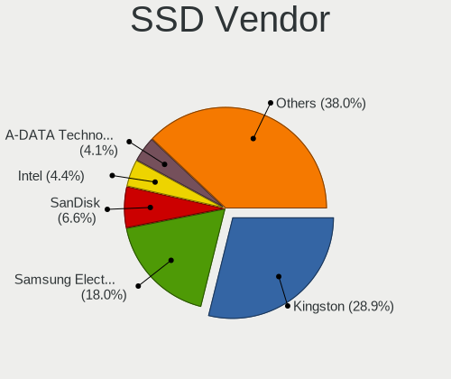
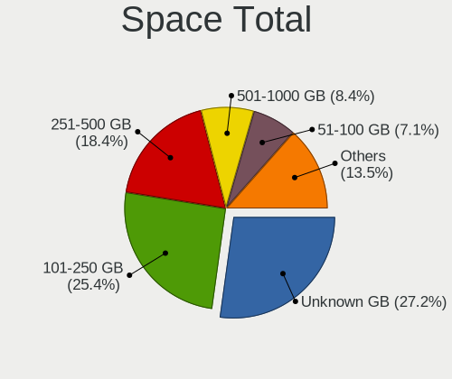
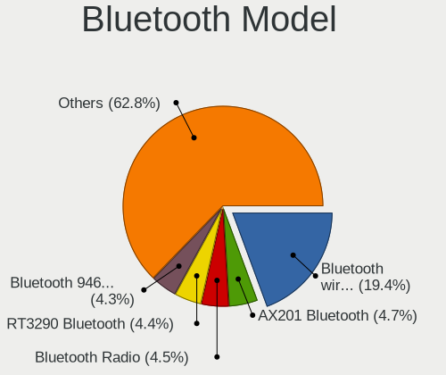
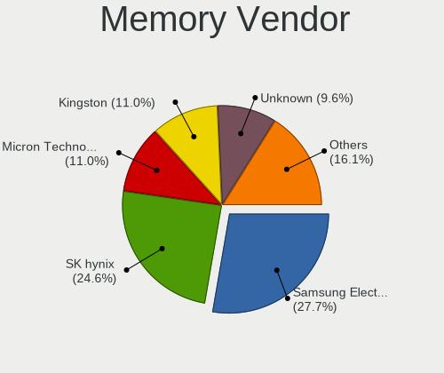

Linux in Hungary - Tested Hardware & Statistics (Notebooks)
-----------------------------------------------------------

A project to collect tested hardware configurations for Linux in Hungary.

Anyone can contribute to this report by the [hw-probe](https://github.com/linuxhw/hw-probe) tool:

    sudo -E hw-probe -all -upload

Please contribute! Especially if your hardware is rare.

Contents
--------

* [ Test Cases ](#test-cases)

* [ System ](#system)
  - [ OS                       ](#os)
  - [ OS Family                ](#os-family)
  - [ Kernel                   ](#kernel)
  - [ Kernel Family            ](#kernel-family)
  - [ Kernel Major Ver.        ](#kernel-major-ver)
  - [ Arch                     ](#arch)
  - [ DE                       ](#de)
  - [ Display Server           ](#display-server)
  - [ Display Manager          ](#display-manager)
  - [ OS Lang                  ](#os-lang)
  - [ Boot Mode                ](#boot-mode)
  - [ Filesystem               ](#filesystem)
  - [ Part. scheme             ](#part-scheme)
  - [ Dual Boot with Linux/BSD ](#dual-boot-with-linuxbsd)
  - [ Dual Boot (Win)          ](#dual-boot-win)

* [ Board ](#board)
  - [ Vendor                   ](#vendor)
  - [ Model                    ](#model)
  - [ Model Family             ](#model-family)
  - [ MFG Year                 ](#mfg-year)
  - [ Form Factor              ](#form-factor)
  - [ Secure Boot              ](#secure-boot)
  - [ Coreboot                 ](#coreboot)
  - [ RAM Size                 ](#ram-size)
  - [ RAM Used                 ](#ram-used)
  - [ Total Drives             ](#total-drives)
  - [ Has CD-ROM               ](#has-cd-rom)
  - [ Has Ethernet             ](#has-ethernet)
  - [ Has WiFi                 ](#has-wifi)
  - [ Has Bluetooth            ](#has-bluetooth)

* [ Location ](#location)
  - [ Country                  ](#country)
  - [ City                     ](#city)

* [ Drives ](#drives)
  - [ Drive Vendor             ](#drive-vendor)
  - [ Drive Model              ](#drive-model)
  - [ HDD Vendor               ](#hdd-vendor)
  - [ SSD Vendor               ](#ssd-vendor)
  - [ Drive Kind               ](#drive-kind)
  - [ Drive Connector          ](#drive-connector)
  - [ Drive Size               ](#drive-size)
  - [ Space Total              ](#space-total)
  - [ Space Used               ](#space-used)
  - [ Malfunc. Drives          ](#malfunc-drives)
  - [ Malfunc. Drive Vendor    ](#malfunc-drive-vendor)
  - [ Malfunc. HDD Vendor      ](#malfunc-hdd-vendor)
  - [ Malfunc. Drive Kind      ](#malfunc-drive-kind)
  - [ Failed Drives            ](#failed-drives)
  - [ Failed Drive Vendor      ](#failed-drive-vendor)
  - [ Drive Status             ](#drive-status)

* [ Storage controller ](#storage-controller)
  - [ Storage Vendor           ](#storage-vendor)
  - [ Storage Model            ](#storage-model)
  - [ Storage Kind             ](#storage-kind)

* [ Processor ](#processor)
  - [ CPU Vendor               ](#cpu-vendor)
  - [ CPU Model                ](#cpu-model)
  - [ CPU Model Family         ](#cpu-model-family)
  - [ CPU Cores                ](#cpu-cores)
  - [ CPU Sockets              ](#cpu-sockets)
  - [ CPU Threads              ](#cpu-threads)
  - [ CPU Op-Modes             ](#cpu-op-modes)
  - [ CPU Microcode            ](#cpu-microcode)
  - [ CPU Microarch            ](#cpu-microarch)

* [ Graphics ](#graphics)
  - [ GPU Vendor               ](#gpu-vendor)
  - [ GPU Model                ](#gpu-model)
  - [ GPU Combo                ](#gpu-combo)
  - [ GPU Driver               ](#gpu-driver)
  - [ GPU Memory               ](#gpu-memory)

* [ Monitor ](#monitor)
  - [ Monitor Vendor           ](#monitor-vendor)
  - [ Monitor Model            ](#monitor-model)
  - [ Monitor Resolution       ](#monitor-resolution)
  - [ Monitor Diagonal         ](#monitor-diagonal)
  - [ Monitor Width            ](#monitor-width)
  - [ Aspect Ratio             ](#aspect-ratio)
  - [ Monitor Area             ](#monitor-area)
  - [ Pixel Density            ](#pixel-density)
  - [ Multiple Monitors        ](#multiple-monitors)

* [ Network ](#network)
  - [ Net Controller Vendor    ](#net-controller-vendor)
  - [ Net Controller Model     ](#net-controller-model)
  - [ Wireless Vendor          ](#wireless-vendor)
  - [ Wireless Model           ](#wireless-model)
  - [ Ethernet Vendor          ](#ethernet-vendor)
  - [ Ethernet Model           ](#ethernet-model)
  - [ Net Controller Kind      ](#net-controller-kind)
  - [ Used Controller          ](#used-controller)
  - [ NICs                     ](#nics)
  - [ IPv6                     ](#ipv6)

* [ Bluetooth ](#bluetooth)
  - [ Bluetooth Vendor         ](#bluetooth-vendor)
  - [ Bluetooth Model          ](#bluetooth-model)

* [ Sound ](#sound)
  - [ Sound Vendor             ](#sound-vendor)
  - [ Sound Model              ](#sound-model)

* [ Memory ](#memory)
  - [ Memory Vendor            ](#memory-vendor)
  - [ Memory Model             ](#memory-model)
  - [ Memory Kind              ](#memory-kind)
  - [ Memory Form Factor       ](#memory-form-factor)
  - [ Memory Size              ](#memory-size)
  - [ Memory Speed             ](#memory-speed)

* [ Printers & scanners ](#printers--scanners)
  - [ Printer Vendor           ](#printer-vendor)
  - [ Printer Model            ](#printer-model)
  - [ Scanner Vendor           ](#scanner-vendor)
  - [ Scanner Model            ](#scanner-model)

* [ Camera ](#camera)
  - [ Camera Vendor            ](#camera-vendor)
  - [ Camera Model             ](#camera-model)

* [ Security ](#security)
  - [ Fingerprint Vendor       ](#fingerprint-vendor)
  - [ Fingerprint Model        ](#fingerprint-model)
  - [ Chipcard Vendor          ](#chipcard-vendor)
  - [ Chipcard Model           ](#chipcard-model)

* [ Unsupported ](#unsupported)
  - [ Unsupported Devices      ](#unsupported-devices)
  - [ Unsupported Device Types ](#unsupported-device-types)

Test Cases
----------

Total: 5512

| Vendor        | Model                       | Probe                                                      | Date         |
|---------------|-----------------------------|------------------------------------------------------------|--------------|
| Lenovo        | ThinkPad L470 20J5S2RA00    | [9ce0d2cad0](https://linux-hardware.org/?probe=9ce0d2cad0) | May 09, 2024 |
| Lenovo        | ThinkPad X230 2333A91       | [3ad48e3ebe](https://linux-hardware.org/?probe=3ad48e3ebe) | May 08, 2024 |
| ASUSTek       | K54HR                       | [67ddde3a75](https://linux-hardware.org/?probe=67ddde3a75) | May 08, 2024 |
| Dell          | Latitude E5520              | [1dc92b60a8](https://linux-hardware.org/?probe=1dc92b60a8) | May 08, 2024 |
| ASUSTek       | ASUS TUF Gaming F15 FX50... | [20ab787216](https://linux-hardware.org/?probe=20ab787216) | May 08, 2024 |
| Lenovo        | ThinkPad X250 20CLS1JN00    | [b1a0c45242](https://linux-hardware.org/?probe=b1a0c45242) | May 07, 2024 |
| Dell          | Latitude 5501               | [35d264df4c](https://linux-hardware.org/?probe=35d264df4c) | May 07, 2024 |
| ASUSTek       | X550LN                      | [b139a58ea9](https://linux-hardware.org/?probe=b139a58ea9) | May 07, 2024 |
| HP            | Laptop 15-dw1xxx            | [7d4c93ea72](https://linux-hardware.org/?probe=7d4c93ea72) | May 07, 2024 |
| HP            | Pavilion Gaming Laptop 1... | [e27e19897e](https://linux-hardware.org/?probe=e27e19897e) | May 07, 2024 |
| Lenovo        | V15-ADA 82C7                | [db9ea4ffaf](https://linux-hardware.org/?probe=db9ea4ffaf) | May 07, 2024 |
| Fujitsu       | LIFEBOOK AH530              | [b8e70b0693](https://linux-hardware.org/?probe=b8e70b0693) | May 07, 2024 |
| Fujitsu       | LIFEBOOK AH530              | [55fdc987e5](https://linux-hardware.org/?probe=55fdc987e5) | May 07, 2024 |
| Dell          | Inspiron 7737               | [73f61be8b5](https://linux-hardware.org/?probe=73f61be8b5) | May 06, 2024 |
| Acer          | Aspire 5750                 | [c414f0202a](https://linux-hardware.org/?probe=c414f0202a) | May 06, 2024 |
| ASUSTek       | ASUS TUF Gaming A15 FA50... | [b86bb80db9](https://linux-hardware.org/?probe=b86bb80db9) | May 05, 2024 |
| HP            | 650                         | [6e66ce7389](https://linux-hardware.org/?probe=6e66ce7389) | May 05, 2024 |
| HP            | 650                         | [aa4f605e5e](https://linux-hardware.org/?probe=aa4f605e5e) | May 05, 2024 |
| HP            | EliteBook 8570w             | [d18669833b](https://linux-hardware.org/?probe=d18669833b) | May 04, 2024 |
| HP            | Notebook                    | [87f06569d7](https://linux-hardware.org/?probe=87f06569d7) | May 04, 2024 |
| HP            | Laptop 15-bs0xx             | [7a34574eb1](https://linux-hardware.org/?probe=7a34574eb1) | May 03, 2024 |
| Lenovo        | ThinkPad X1 Carbon 2nd 2... | [1342233681](https://linux-hardware.org/?probe=1342233681) | May 03, 2024 |
| Lenovo        | IdeaPad Slim 5 16ABR8 82... | [d3c40c405d](https://linux-hardware.org/?probe=d3c40c405d) | May 03, 2024 |
| Dell          | Inspiron 5558               | [f3e4760d0f](https://linux-hardware.org/?probe=f3e4760d0f) | May 03, 2024 |
| Dell          | Inspiron 5558               | [ded6bb6fdc](https://linux-hardware.org/?probe=ded6bb6fdc) | May 02, 2024 |
| Lenovo        | IdeaPad Pro 5 16IMH9 83D... | [194589e94c](https://linux-hardware.org/?probe=194589e94c) | May 02, 2024 |
| ASUSTek       | K40IE                       | [82ddbf99c2](https://linux-hardware.org/?probe=82ddbf99c2) | May 02, 2024 |
| Dell          | Inspiron 5558               | [6f084542fa](https://linux-hardware.org/?probe=6f084542fa) | May 02, 2024 |
| eMachines     | E725                        | [f8c6e397e1](https://linux-hardware.org/?probe=f8c6e397e1) | May 01, 2024 |
| HP            | 255 G5 Notebook PC          | [945efc5a98](https://linux-hardware.org/?probe=945efc5a98) | May 01, 2024 |
| HP            | ProBook 455 G3              | [6d6caa45cb](https://linux-hardware.org/?probe=6d6caa45cb) | May 01, 2024 |
| HP            | ProBook 455 G3              | [bb9d1ec75d](https://linux-hardware.org/?probe=bb9d1ec75d) | May 01, 2024 |
| Lenovo        | IdeaPad 1 15ALC7 82R4       | [8d9c16f300](https://linux-hardware.org/?probe=8d9c16f300) | May 01, 2024 |
| Packard Be... | EasyNote TE11BZ             | [fe163fcb48](https://linux-hardware.org/?probe=fe163fcb48) | May 01, 2024 |
| Packard Be... | EasyNote TE11BZ             | [db92c4f28a](https://linux-hardware.org/?probe=db92c4f28a) | May 01, 2024 |
| Dell          | Latitude 5440               | [c51190016f](https://linux-hardware.org/?probe=c51190016f) | Apr 30, 2024 |
| eMachines     | E725                        | [f48c8f52da](https://linux-hardware.org/?probe=f48c8f52da) | Apr 30, 2024 |
| Samsung       | 535U3C                      | [8807f9f44f](https://linux-hardware.org/?probe=8807f9f44f) | Apr 29, 2024 |
| Lenovo        | ThinkPad T420 423662G       | [e67bde685e](https://linux-hardware.org/?probe=e67bde685e) | Apr 29, 2024 |
| Dell          | Latitude E6420              | [ce4fbe47c7](https://linux-hardware.org/?probe=ce4fbe47c7) | Apr 29, 2024 |
| Lenovo        | ThinkPad T420 423662G       | [c21e1e6ad3](https://linux-hardware.org/?probe=c21e1e6ad3) | Apr 29, 2024 |
| Dell          | Latitude E6420              | [b7e8d7d578](https://linux-hardware.org/?probe=b7e8d7d578) | Apr 29, 2024 |
| HP            | Laptop 15-dw1xxx            | [7332d6602f](https://linux-hardware.org/?probe=7332d6602f) | Apr 28, 2024 |
| HP            | Notebook                    | [43a6b1537a](https://linux-hardware.org/?probe=43a6b1537a) | Apr 28, 2024 |
| HP            | Pavilion Gaming Laptop 1... | [3f7c1cff47](https://linux-hardware.org/?probe=3f7c1cff47) | Apr 28, 2024 |
| Acer          | Swift SF114-32              | [0e6af8b6ca](https://linux-hardware.org/?probe=0e6af8b6ca) | Apr 28, 2024 |
| HP            | Pavilion Gaming Laptop 1... | [4ea4b9b731](https://linux-hardware.org/?probe=4ea4b9b731) | Apr 28, 2024 |
| Lenovo        | ThinkPad E560 20EV0011GE    | [38ab585e58](https://linux-hardware.org/?probe=38ab585e58) | Apr 27, 2024 |
| Dell          | Inspiron 3542               | [947b81aba4](https://linux-hardware.org/?probe=947b81aba4) | Apr 27, 2024 |
| Dell          | Inspiron 15-3567            | [fcff8a4272](https://linux-hardware.org/?probe=fcff8a4272) | Apr 26, 2024 |
| HP            | ProBook 455 G1              | [b67b7fc16d](https://linux-hardware.org/?probe=b67b7fc16d) | Apr 26, 2024 |
| HP            | ProBook 455 G1              | [59808a41b2](https://linux-hardware.org/?probe=59808a41b2) | Apr 26, 2024 |
| Apple         | MacBookPro5,5               | [d1fbf194df](https://linux-hardware.org/?probe=d1fbf194df) | Apr 25, 2024 |
| Lenovo        | ThinkPad X230 2324F43       | [3508590441](https://linux-hardware.org/?probe=3508590441) | Apr 25, 2024 |
| Dell          | Inspiron 15-3567            | [28838a3b1b](https://linux-hardware.org/?probe=28838a3b1b) | Apr 25, 2024 |
| Dell          | Latitude 5430               | [dba91be037](https://linux-hardware.org/?probe=dba91be037) | Apr 25, 2024 |
| HP            | 255 G5 Notebook PC          | [b3b73c7c85](https://linux-hardware.org/?probe=b3b73c7c85) | Apr 24, 2024 |
| ASUSTek       | K53BY                       | [b00f35b89c](https://linux-hardware.org/?probe=b00f35b89c) | Apr 23, 2024 |
| ASUSTek       | K54C                        | [9204edfa98](https://linux-hardware.org/?probe=9204edfa98) | Apr 21, 2024 |
| ASUSTek       | K54C                        | [0853f021e9](https://linux-hardware.org/?probe=0853f021e9) | Apr 21, 2024 |
| Packard Be... | EasyNote TK36               | [f44f785257](https://linux-hardware.org/?probe=f44f785257) | Apr 21, 2024 |
| ASUSTek       | K53TA                       | [128c0946a5](https://linux-hardware.org/?probe=128c0946a5) | Apr 21, 2024 |
| ASUSTek       | K53TA                       | [411dc2f51d](https://linux-hardware.org/?probe=411dc2f51d) | Apr 21, 2024 |
| HP            | Presario CQ57               | [366b704066](https://linux-hardware.org/?probe=366b704066) | Apr 21, 2024 |
| HP            | Laptop 15-dw1xxx            | [4a2376cdfa](https://linux-hardware.org/?probe=4a2376cdfa) | Apr 21, 2024 |
| HP            | EliteBook 8570p             | [98d15b6d8d](https://linux-hardware.org/?probe=98d15b6d8d) | Apr 20, 2024 |
| HP            | Presario CQ57               | [956b5fe458](https://linux-hardware.org/?probe=956b5fe458) | Apr 20, 2024 |
| Acer          | Aspire A715-43G             | [737b4f2bfb](https://linux-hardware.org/?probe=737b4f2bfb) | Apr 19, 2024 |
| Acer          | Aspire A715-43G             | [b1605729ff](https://linux-hardware.org/?probe=b1605729ff) | Apr 19, 2024 |
| HP            | ProBook 640 G8 Notebook ... | [473affb537](https://linux-hardware.org/?probe=473affb537) | Apr 19, 2024 |
| Acer          | Aspire ES1-512              | [11c23ef24d](https://linux-hardware.org/?probe=11c23ef24d) | Apr 18, 2024 |
| Acer          | Aspire ES1-512              | [6c292bf7df](https://linux-hardware.org/?probe=6c292bf7df) | Apr 18, 2024 |
| ASUSTek       | ASUS TUF Gaming F15 FX50... | [6f826f9c64](https://linux-hardware.org/?probe=6f826f9c64) | Apr 18, 2024 |
| ASUSTek       | X450LN                      | [bab98faa56](https://linux-hardware.org/?probe=bab98faa56) | Apr 18, 2024 |
| Dell          | Latitude D520               | [d0f7ecac0a](https://linux-hardware.org/?probe=d0f7ecac0a) | Apr 17, 2024 |
| Dell          | Latitude D520               | [faf18ae19f](https://linux-hardware.org/?probe=faf18ae19f) | Apr 17, 2024 |
| Lenovo        | IdeaPad 120S-14IAP 81A5     | [59cf1e0ea1](https://linux-hardware.org/?probe=59cf1e0ea1) | Apr 17, 2024 |
| Acer          | Aspire E1-571               | [3a38e7fc4f](https://linux-hardware.org/?probe=3a38e7fc4f) | Apr 16, 2024 |
| Lenovo        | ThinkPad L430 2466EN8       | [9a42213649](https://linux-hardware.org/?probe=9a42213649) | Apr 16, 2024 |
| Toshiba       | Satellite L650              | [b05f51b2c8](https://linux-hardware.org/?probe=b05f51b2c8) | Apr 15, 2024 |
| Toshiba       | Satellite L650              | [0a98edcca4](https://linux-hardware.org/?probe=0a98edcca4) | Apr 15, 2024 |
| Lenovo        | ThinkBook 15-IIL 20SM       | [0f31e777c7](https://linux-hardware.org/?probe=0f31e777c7) | Apr 15, 2024 |
| Toshiba       | Satellite L650              | [e706aef914](https://linux-hardware.org/?probe=e706aef914) | Apr 15, 2024 |
| Toshiba       | Satellite L650              | [1ffbc9aa24](https://linux-hardware.org/?probe=1ffbc9aa24) | Apr 15, 2024 |
| MSI           | EX600                       | [df674cd3c0](https://linux-hardware.org/?probe=df674cd3c0) | Apr 14, 2024 |
| Lenovo        | ThinkPad T470 20HES58A1L    | [fd97b7444d](https://linux-hardware.org/?probe=fd97b7444d) | Apr 14, 2024 |
| Lenovo        | ThinkPad X200 74595FG       | [708440ed39](https://linux-hardware.org/?probe=708440ed39) | Apr 14, 2024 |
| Packard Be... | EasyNote TK36               | [0c3a4cf1cc](https://linux-hardware.org/?probe=0c3a4cf1cc) | Apr 13, 2024 |
| Dell          | Inspiron 5567               | [d3a4e47ddb](https://linux-hardware.org/?probe=d3a4e47ddb) | Apr 13, 2024 |
| HP            | Pavilion Laptop 15-eh0xx... | [f24619635f](https://linux-hardware.org/?probe=f24619635f) | Apr 12, 2024 |
| Lenovo        | B50-70 20384                | [431d6db80a](https://linux-hardware.org/?probe=431d6db80a) | Apr 11, 2024 |
| Lenovo        | IdeaPad 120S-14IAP 81A5     | [8dd990563f](https://linux-hardware.org/?probe=8dd990563f) | Apr 11, 2024 |
| ASUSTek       | ZenBook UX425UA_UM425UA     | [a4cda4b4f0](https://linux-hardware.org/?probe=a4cda4b4f0) | Apr 10, 2024 |
| ASUSTek       | ZenBook UX425UA_UM425UA     | [2359c23a41](https://linux-hardware.org/?probe=2359c23a41) | Apr 10, 2024 |
| Packard Be... | EasyNote TV43HC             | [07aac9c6e6](https://linux-hardware.org/?probe=07aac9c6e6) | Apr 10, 2024 |
| Packard Be... | EasyNote TV43HC             | [036bbb75eb](https://linux-hardware.org/?probe=036bbb75eb) | Apr 10, 2024 |
| HP            | ProBook 455 G1              | [d332e44b92](https://linux-hardware.org/?probe=d332e44b92) | Apr 10, 2024 |
| Lenovo        | ThinkPad T530 2429NL6       | [d16f3981f4](https://linux-hardware.org/?probe=d16f3981f4) | Apr 10, 2024 |
| Dell          | Inspiron 5558               | [a583587fa0](https://linux-hardware.org/?probe=a583587fa0) | Apr 09, 2024 |
| HP            | 250 15.6 inch G9 Noteboo... | [717e8590bb](https://linux-hardware.org/?probe=717e8590bb) | Apr 09, 2024 |
| ASUSTek       | X541NA                      | [4118d01689](https://linux-hardware.org/?probe=4118d01689) | Apr 09, 2024 |
| HP            | ProBook 455 G1              | [9a0d60a4e6](https://linux-hardware.org/?probe=9a0d60a4e6) | Apr 09, 2024 |
| HP            | Notebook                    | [1ef4d18969](https://linux-hardware.org/?probe=1ef4d18969) | Apr 09, 2024 |
| Lenovo        | ThinkPad T530 2429NL6       | [ee82d8efd8](https://linux-hardware.org/?probe=ee82d8efd8) | Apr 08, 2024 |
| Packard Be... | EasyNote TK36               | [7b4011aa67](https://linux-hardware.org/?probe=7b4011aa67) | Apr 08, 2024 |
| HP            | ProBook 455 G1              | [cf0a1167a4](https://linux-hardware.org/?probe=cf0a1167a4) | Apr 08, 2024 |
| HP            | ProBook 455 G1              | [aca7655496](https://linux-hardware.org/?probe=aca7655496) | Apr 08, 2024 |
| ASUSTek       | K53SC                       | [9ceedcd930](https://linux-hardware.org/?probe=9ceedcd930) | Apr 07, 2024 |
| ASUSTek       | K53BY                       | [fe40c5b1ae](https://linux-hardware.org/?probe=fe40c5b1ae) | Apr 07, 2024 |
| Dell          | Latitude E6330              | [c32426747e](https://linux-hardware.org/?probe=c32426747e) | Apr 07, 2024 |
| ASUSTek       | K40IE                       | [152c0b8bef](https://linux-hardware.org/?probe=152c0b8bef) | Apr 07, 2024 |
| Acer          | Aspire E5-571G              | [566b1be599](https://linux-hardware.org/?probe=566b1be599) | Apr 06, 2024 |
| HP            | Presario CQ57               | [2506e7958a](https://linux-hardware.org/?probe=2506e7958a) | Apr 06, 2024 |
| Packard Be... | EasyNote TK36               | [a0d6051c56](https://linux-hardware.org/?probe=a0d6051c56) | Apr 06, 2024 |
| HP            | Presario CQ57               | [781ff00313](https://linux-hardware.org/?probe=781ff00313) | Apr 06, 2024 |
| ASUSTek       | K53BY                       | [c202d85a6a](https://linux-hardware.org/?probe=c202d85a6a) | Apr 06, 2024 |
| Lenovo        | IdeaPad 330-15IKB 81DE      | [d5c2c9c408](https://linux-hardware.org/?probe=d5c2c9c408) | Apr 06, 2024 |
| HP            | Pavilion dv7                | [a84ff5282d](https://linux-hardware.org/?probe=a84ff5282d) | Apr 05, 2024 |
| Acer          | Aspire A317-53              | [ddd85b18e6](https://linux-hardware.org/?probe=ddd85b18e6) | Apr 04, 2024 |
| HP            | 250 G3                      | [94b04f5a94](https://linux-hardware.org/?probe=94b04f5a94) | Apr 04, 2024 |
| HP            | 630                         | [35dd7e2dc4](https://linux-hardware.org/?probe=35dd7e2dc4) | Apr 04, 2024 |
| Acer          | TravelMate 8571             | [057645b066](https://linux-hardware.org/?probe=057645b066) | Apr 04, 2024 |
| Lenovo        | IdeaPad 330-15IKB 81DE      | [b165b6fe04](https://linux-hardware.org/?probe=b165b6fe04) | Apr 03, 2024 |
| Lenovo        | ThinkPad X220 Tablet 429... | [78a7a3ff32](https://linux-hardware.org/?probe=78a7a3ff32) | Apr 02, 2024 |
| Dell          | Latitude E6520              | [f27403f5b8](https://linux-hardware.org/?probe=f27403f5b8) | Apr 02, 2024 |
| Dell          | Vostro 1015                 | [807e851743](https://linux-hardware.org/?probe=807e851743) | Apr 02, 2024 |
| Lenovo        | Yoga Pro 7 14APH8 82Y8      | [fe5490324f](https://linux-hardware.org/?probe=fe5490324f) | Apr 01, 2024 |
| Lenovo        | Yoga Pro 7 14ARP8 83AU      | [199fad17bb](https://linux-hardware.org/?probe=199fad17bb) | Apr 01, 2024 |
| Dell          | Latitude 5480               | [3cfb6f8944](https://linux-hardware.org/?probe=3cfb6f8944) | Apr 01, 2024 |
| Dell          | Latitude E6220              | [56d82e4651](https://linux-hardware.org/?probe=56d82e4651) | Mar 30, 2024 |
| HP            | Compaq 610                  | [f2abcd633e](https://linux-hardware.org/?probe=f2abcd633e) | Mar 30, 2024 |
| ASUSTek       | K40IE                       | [2abe9e47a0](https://linux-hardware.org/?probe=2abe9e47a0) | Mar 29, 2024 |
| HP            | Presario CQ57               | [f731d051bc](https://linux-hardware.org/?probe=f731d051bc) | Mar 28, 2024 |
| Fujitsu Si... | ESPRIMO Mobile M9400        | [d056f67a21](https://linux-hardware.org/?probe=d056f67a21) | Mar 28, 2024 |
| Acer          | Aspire E5-772G              | [1900649358](https://linux-hardware.org/?probe=1900649358) | Mar 28, 2024 |
| ASUSTek       | ASUS TUF Gaming F15 FX50... | [3c061242d5](https://linux-hardware.org/?probe=3c061242d5) | Mar 27, 2024 |
| Insyde        | Braswell                    | [36cefae839](https://linux-hardware.org/?probe=36cefae839) | Mar 26, 2024 |
| Hungaro Fl... | Navon Loop 360              | [25ee97fd6c](https://linux-hardware.org/?probe=25ee97fd6c) | Mar 26, 2024 |
| ASUSTek       | X55U                        | [39ac7513a1](https://linux-hardware.org/?probe=39ac7513a1) | Mar 25, 2024 |
| Lenovo        | IdeaPad 100-15IBY 80MJ      | [4f6aeb519e](https://linux-hardware.org/?probe=4f6aeb519e) | Mar 25, 2024 |
| Apple         | MacBookAir5,2               | [26a63eb1aa](https://linux-hardware.org/?probe=26a63eb1aa) | Mar 25, 2024 |
| Medion        | E7218                       | [276473d8eb](https://linux-hardware.org/?probe=276473d8eb) | Mar 25, 2024 |
| Lenovo        | ThinkPad L470 20J5S2RA00    | [1f780ec544](https://linux-hardware.org/?probe=1f780ec544) | Mar 25, 2024 |
| HP            | Laptop 15-ra0xx             | [28ad73615f](https://linux-hardware.org/?probe=28ad73615f) | Mar 25, 2024 |
| Lenovo        | ThinkPad T430 234452G       | [fe81289ee2](https://linux-hardware.org/?probe=fe81289ee2) | Mar 24, 2024 |
| Lenovo        | ThinkPad T430 234452G       | [cc4e22e5bb](https://linux-hardware.org/?probe=cc4e22e5bb) | Mar 24, 2024 |
| Lenovo        | ThinkPad S430 6885E5G       | [29a9382e58](https://linux-hardware.org/?probe=29a9382e58) | Mar 24, 2024 |
| Samsung       | 300E4C/300E5C/300E7C        | [152813c2d7](https://linux-hardware.org/?probe=152813c2d7) | Mar 24, 2024 |
| Sony          | VPCEB4M1E                   | [770546fc7a](https://linux-hardware.org/?probe=770546fc7a) | Mar 24, 2024 |
| ASUSTek       | K40IE                       | [070dd1bcc1](https://linux-hardware.org/?probe=070dd1bcc1) | Mar 23, 2024 |
| Fujitsu       | LIFEBOOK A555               | [5238348a6f](https://linux-hardware.org/?probe=5238348a6f) | Mar 23, 2024 |
| Lenovo        | IdeaPad C340-14API 81N6     | [ae4bd4d2e6](https://linux-hardware.org/?probe=ae4bd4d2e6) | Mar 23, 2024 |
| HP            | 250 G1                      | [55e152c109](https://linux-hardware.org/?probe=55e152c109) | Mar 23, 2024 |
| Dell          | Latitude 5480               | [11476d6105](https://linux-hardware.org/?probe=11476d6105) | Mar 23, 2024 |
| Dell          | Vostro 1015                 | [5cea7dba17](https://linux-hardware.org/?probe=5cea7dba17) | Mar 23, 2024 |
| Sony          | SVS13118GBB                 | [b21f07100b](https://linux-hardware.org/?probe=b21f07100b) | Mar 23, 2024 |
| Acer          | Aspire E1-571               | [fa4ac16f77](https://linux-hardware.org/?probe=fa4ac16f77) | Mar 23, 2024 |
| HP            | 650                         | [fcdc2e81ff](https://linux-hardware.org/?probe=fcdc2e81ff) | Mar 23, 2024 |
| Lenovo        | ThinkPad T400 2768WGB       | [903d677c51](https://linux-hardware.org/?probe=903d677c51) | Mar 23, 2024 |
| HP            | 250 G1                      | [37f1c0eef8](https://linux-hardware.org/?probe=37f1c0eef8) | Mar 23, 2024 |
| Toshiba       | Satellite M50D-A            | [1551082716](https://linux-hardware.org/?probe=1551082716) | Mar 23, 2024 |
| Acer          | Aspire V5-121               | [3b266ed105](https://linux-hardware.org/?probe=3b266ed105) | Mar 22, 2024 |
| Dell          | Inspiron 17 7000 Series ... | [ba43b4e2f3](https://linux-hardware.org/?probe=ba43b4e2f3) | Mar 22, 2024 |
| ASUSTek       | X200MA                      | [e6502ec467](https://linux-hardware.org/?probe=e6502ec467) | Mar 22, 2024 |
| Dell          | Latitude E7240              | [fba5ef74a3](https://linux-hardware.org/?probe=fba5ef74a3) | Mar 22, 2024 |
| eMachines     | E725                        | [ed7591a944](https://linux-hardware.org/?probe=ed7591a944) | Mar 22, 2024 |
| Lenovo        | IdeaPad 110-15ACL 80TJ      | [20860dcb34](https://linux-hardware.org/?probe=20860dcb34) | Mar 22, 2024 |
| Lenovo        | ThinkPad X250 20CLS1JN00    | [4922ac4c1e](https://linux-hardware.org/?probe=4922ac4c1e) | Mar 21, 2024 |
| ASUSTek       | X55U                        | [99ed199098](https://linux-hardware.org/?probe=99ed199098) | Mar 21, 2024 |
| Lenovo        | ThinkPad T410 2537VFQ       | [6e650c99d9](https://linux-hardware.org/?probe=6e650c99d9) | Mar 21, 2024 |
| Acer          | Aspire 5750ZG               | [cd447c8d09](https://linux-hardware.org/?probe=cd447c8d09) | Mar 21, 2024 |
| Dell          | Latitude E5250              | [7afd8ad90c](https://linux-hardware.org/?probe=7afd8ad90c) | Mar 21, 2024 |
| Acer          | TravelMate P215-52          | [ea1412ec3b](https://linux-hardware.org/?probe=ea1412ec3b) | Mar 21, 2024 |
| HP            | ProBook 455 G1              | [deaf0f8deb](https://linux-hardware.org/?probe=deaf0f8deb) | Mar 21, 2024 |
| HP            | ProBook 455 G1              | [d6511f30e4](https://linux-hardware.org/?probe=d6511f30e4) | Mar 21, 2024 |
| HP            | ProBook 455 G1              | [81377c9f3c](https://linux-hardware.org/?probe=81377c9f3c) | Mar 21, 2024 |
| HP            | ProBook 455 G1              | [e56b916758](https://linux-hardware.org/?probe=e56b916758) | Mar 21, 2024 |
| HP            | ProBook 455 G1              | [ae202e3d04](https://linux-hardware.org/?probe=ae202e3d04) | Mar 21, 2024 |
| HP            | ProBook 455 G1              | [8a5c25a49d](https://linux-hardware.org/?probe=8a5c25a49d) | Mar 21, 2024 |
| HP            | ProBook 455 G1              | [9d4a29e34c](https://linux-hardware.org/?probe=9d4a29e34c) | Mar 21, 2024 |
| Toshiba       | Satellite M50D-A            | [28efb8633c](https://linux-hardware.org/?probe=28efb8633c) | Mar 20, 2024 |
| Lenovo        | V15-ADA 82C7                | [ad20e511df](https://linux-hardware.org/?probe=ad20e511df) | Mar 20, 2024 |
| Dell          | Inspiron 7737               | [d94c08d5bb](https://linux-hardware.org/?probe=d94c08d5bb) | Mar 20, 2024 |
| Lenovo        | ThinkPad X1 Carbon Gen 1... | [abd25548fc](https://linux-hardware.org/?probe=abd25548fc) | Mar 20, 2024 |
| Lenovo        | ThinkPad X395 20NMS0YG00    | [dccc8e498c](https://linux-hardware.org/?probe=dccc8e498c) | Mar 20, 2024 |
| Lenovo        | ThinkPad X395 20NMS0YG00    | [54b4d8c3f7](https://linux-hardware.org/?probe=54b4d8c3f7) | Mar 20, 2024 |
| Insyde        | Braswell                    | [52052f3a4c](https://linux-hardware.org/?probe=52052f3a4c) | Mar 20, 2024 |
| Valve         | Jupiter                     | [ea06aa4de3](https://linux-hardware.org/?probe=ea06aa4de3) | Mar 19, 2024 |
| Valve         | Jupiter                     | [49641a93e9](https://linux-hardware.org/?probe=49641a93e9) | Mar 19, 2024 |
| Sony          | SVS13118GBB                 | [e9ffb83f97](https://linux-hardware.org/?probe=e9ffb83f97) | Mar 19, 2024 |
| HP            | ProBook 455 G1              | [d49e68b665](https://linux-hardware.org/?probe=d49e68b665) | Mar 19, 2024 |
| HP            | ProBook 455 G1              | [ca61401c93](https://linux-hardware.org/?probe=ca61401c93) | Mar 19, 2024 |
| HP            | ProBook 455 G1              | [9af57393f1](https://linux-hardware.org/?probe=9af57393f1) | Mar 19, 2024 |
| HP            | 250 G3                      | [df2aa0348f](https://linux-hardware.org/?probe=df2aa0348f) | Mar 18, 2024 |
| Dell          | Inspiron 1545               | [b71fbb3c42](https://linux-hardware.org/?probe=b71fbb3c42) | Mar 18, 2024 |
| HP            | Pavilion Gaming Laptop 1... | [f18e6f9a20](https://linux-hardware.org/?probe=f18e6f9a20) | Mar 17, 2024 |
| HP            | Pavilion Gaming Laptop 1... | [cbf9e80869](https://linux-hardware.org/?probe=cbf9e80869) | Mar 17, 2024 |
| HP            | 250 G1                      | [3562985bc8](https://linux-hardware.org/?probe=3562985bc8) | Mar 17, 2024 |
| Lenovo        | G550 20023                  | [cfc63cec90](https://linux-hardware.org/?probe=cfc63cec90) | Mar 17, 2024 |
| Dell          | Inspiron 1545               | [c941a3660f](https://linux-hardware.org/?probe=c941a3660f) | Mar 17, 2024 |
| HP            | 650                         | [2504aba44f](https://linux-hardware.org/?probe=2504aba44f) | Mar 15, 2024 |
| HP            | 255 G8 Notebook PC          | [3ca5a10824](https://linux-hardware.org/?probe=3ca5a10824) | Mar 15, 2024 |
| HP            | ProBook 455 G1              | [6e6de8b85d](https://linux-hardware.org/?probe=6e6de8b85d) | Mar 14, 2024 |
| HP            | ProBook 455 G1              | [8d9d1c239d](https://linux-hardware.org/?probe=8d9d1c239d) | Mar 14, 2024 |
| HP            | Notebook                    | [86866cc6d3](https://linux-hardware.org/?probe=86866cc6d3) | Mar 14, 2024 |
| HP            | Notebook                    | [a14e0f5083](https://linux-hardware.org/?probe=a14e0f5083) | Mar 14, 2024 |
| Lenovo        | IdeaPad 3 15ADA05 81W1      | [044b9f1cf9](https://linux-hardware.org/?probe=044b9f1cf9) | Mar 13, 2024 |
| Fujitsu Si... | AMILO Li 2727               | [4e7fe59e31](https://linux-hardware.org/?probe=4e7fe59e31) | Mar 13, 2024 |
| ASUSTek       | ASUS TUF Gaming F15 FX50... | [89f277edc6](https://linux-hardware.org/?probe=89f277edc6) | Mar 13, 2024 |
| Dell          | Inspiron 3542               | [b1d7825b45](https://linux-hardware.org/?probe=b1d7825b45) | Mar 13, 2024 |
| Dell          | Inspiron 3542               | [8146ec44da](https://linux-hardware.org/?probe=8146ec44da) | Mar 13, 2024 |
| Dell          | Inspiron 3542               | [004f9952b4](https://linux-hardware.org/?probe=004f9952b4) | Mar 13, 2024 |
| Lenovo        | Legion 5 15ARH05H 82B1      | [703f7f40a4](https://linux-hardware.org/?probe=703f7f40a4) | Mar 13, 2024 |
| Dell          | Latitude E6440              | [4f51ad06c1](https://linux-hardware.org/?probe=4f51ad06c1) | Mar 12, 2024 |
| Dell          | Latitude E6440              | [48d271828f](https://linux-hardware.org/?probe=48d271828f) | Mar 12, 2024 |
| Lenovo        | Legion 5 15ACH6 82JW        | [d48824b8c0](https://linux-hardware.org/?probe=d48824b8c0) | Mar 12, 2024 |
| HP            | ProBook 455 G1              | [a61c8a52d5](https://linux-hardware.org/?probe=a61c8a52d5) | Mar 12, 2024 |
| HP            | ProBook 455 G1              | [b61326e2fe](https://linux-hardware.org/?probe=b61326e2fe) | Mar 12, 2024 |
| HP            | ProBook 455 G1              | [31ba38a204](https://linux-hardware.org/?probe=31ba38a204) | Mar 12, 2024 |
| HP            | ProBook 455 G1              | [b3fb9458f2](https://linux-hardware.org/?probe=b3fb9458f2) | Mar 12, 2024 |
| Lenovo        | IdeaPad 3 15ADA05 81W1      | [268fefa14b](https://linux-hardware.org/?probe=268fefa14b) | Mar 12, 2024 |
| HP            | ProBook 455 G1              | [33d6628f25](https://linux-hardware.org/?probe=33d6628f25) | Mar 12, 2024 |
| Acer          | TravelMate P215-54          | [a8e5c041ef](https://linux-hardware.org/?probe=a8e5c041ef) | Mar 11, 2024 |
| Dell          | Inspiron M5010              | [b5456dc305](https://linux-hardware.org/?probe=b5456dc305) | Mar 11, 2024 |
| Dell          | Latitude E6230              | [9f3d83bb2e](https://linux-hardware.org/?probe=9f3d83bb2e) | Mar 11, 2024 |
| Dell          | Latitude E6230              | [9d6a4dad8d](https://linux-hardware.org/?probe=9d6a4dad8d) | Mar 11, 2024 |
| HP            | ProBook 455 G1              | [8cf6a45c74](https://linux-hardware.org/?probe=8cf6a45c74) | Mar 11, 2024 |
| HP            | ProBook 455 G1              | [6db391732c](https://linux-hardware.org/?probe=6db391732c) | Mar 11, 2024 |
| HP            | ProBook 455 G1              | [f553df5906](https://linux-hardware.org/?probe=f553df5906) | Mar 11, 2024 |
| HP            | ProBook 455 G1              | [3e07d3db1c](https://linux-hardware.org/?probe=3e07d3db1c) | Mar 11, 2024 |
| Dell          | Latitude 5501               | [38df224a3f](https://linux-hardware.org/?probe=38df224a3f) | Mar 10, 2024 |
| HP            | Notebook                    | [79242853f6](https://linux-hardware.org/?probe=79242853f6) | Mar 10, 2024 |
| Dell          | Latitude 5501               | [9bf3b70fdc](https://linux-hardware.org/?probe=9bf3b70fdc) | Mar 10, 2024 |
| eMachines     | E525                        | [025c5c7d72](https://linux-hardware.org/?probe=025c5c7d72) | Mar 10, 2024 |
| ASUSTek       | K53BY                       | [16d91e8a4e](https://linux-hardware.org/?probe=16d91e8a4e) | Mar 10, 2024 |
| HP            | 530                         | [4027275e1e](https://linux-hardware.org/?probe=4027275e1e) | Mar 10, 2024 |
| Lenovo        | Legion 5 15ARH05H 82B1      | [bd9aa2f5e6](https://linux-hardware.org/?probe=bd9aa2f5e6) | Mar 10, 2024 |
| Lenovo        | ThinkPad W530 2447L76       | [29710b0ced](https://linux-hardware.org/?probe=29710b0ced) | Mar 09, 2024 |
| HP            | ProBook 430 G3              | [f631777def](https://linux-hardware.org/?probe=f631777def) | Mar 09, 2024 |
| HP            | ProBook 430 G3              | [9f3f002632](https://linux-hardware.org/?probe=9f3f002632) | Mar 09, 2024 |
| Dell          | Latitude E4300              | [b5b51d6e8d](https://linux-hardware.org/?probe=b5b51d6e8d) | Mar 08, 2024 |
| Dell          | Latitude E4300              | [cdb623a5cf](https://linux-hardware.org/?probe=cdb623a5cf) | Mar 08, 2024 |
| Acer          | Aspire 5750                 | [5160c66ffb](https://linux-hardware.org/?probe=5160c66ffb) | Mar 08, 2024 |
| Acer          | Aspire 5750                 | [505c8aa361](https://linux-hardware.org/?probe=505c8aa361) | Mar 08, 2024 |
| Lenovo        | ThinkPad X270 20HMS10M00    | [68233f4f62](https://linux-hardware.org/?probe=68233f4f62) | Mar 08, 2024 |
| HP            | Pavilion Gaming Laptop 1... | [439a24ca9f](https://linux-hardware.org/?probe=439a24ca9f) | Mar 07, 2024 |
| eMachines     | E725                        | [c9020b1bd8](https://linux-hardware.org/?probe=c9020b1bd8) | Mar 06, 2024 |
| ASUSTek       | UX32A                       | [2c11401160](https://linux-hardware.org/?probe=2c11401160) | Mar 06, 2024 |
| HP            | Pavilion dv7                | [f9ceb7f595](https://linux-hardware.org/?probe=f9ceb7f595) | Mar 06, 2024 |
| Lenovo        | ThinkPad T470p 20J6S00UH... | [b35deb0a8c](https://linux-hardware.org/?probe=b35deb0a8c) | Mar 06, 2024 |
| Dell          | Latitude 7490               | [fac507688e](https://linux-hardware.org/?probe=fac507688e) | Mar 04, 2024 |
| Acer          | Aspire E5-571G              | [82d6b28fff](https://linux-hardware.org/?probe=82d6b28fff) | Mar 04, 2024 |
| Lenovo        | ThinkPad T470 20HD000EHV    | [b2d96be2dd](https://linux-hardware.org/?probe=b2d96be2dd) | Mar 04, 2024 |
| Acer          | Aspire 7738                 | [881cdc21ae](https://linux-hardware.org/?probe=881cdc21ae) | Mar 04, 2024 |
| Acer          | Aspire 7738                 | [799b49346a](https://linux-hardware.org/?probe=799b49346a) | Mar 04, 2024 |
| Lenovo        | IdeaPad 330-15IKB 81DE      | [7527854f8a](https://linux-hardware.org/?probe=7527854f8a) | Mar 04, 2024 |
| ASUSTek       | X550CL                      | [5805ba00d1](https://linux-hardware.org/?probe=5805ba00d1) | Mar 03, 2024 |
| Dell          | Inspiron 5379               | [43522636f8](https://linux-hardware.org/?probe=43522636f8) | Mar 02, 2024 |
| HP            | ProBook 455 G1              | [38bfa9d3ce](https://linux-hardware.org/?probe=38bfa9d3ce) | Mar 01, 2024 |
| Lenovo        | G550 20023                  | [8ba9bb5abb](https://linux-hardware.org/?probe=8ba9bb5abb) | Mar 01, 2024 |
| Lenovo        | IdeaPad 120S-14IAP 81A5     | [f308193329](https://linux-hardware.org/?probe=f308193329) | Mar 01, 2024 |
| HP            | ProBook 640 G8 Notebook ... | [5d4ce61a86](https://linux-hardware.org/?probe=5d4ce61a86) | Mar 01, 2024 |
| HP            | ProBook 640 G8 Notebook ... | [0196251cd6](https://linux-hardware.org/?probe=0196251cd6) | Mar 01, 2024 |
| HP            | EliteBook 2530p             | [d4fdd36102](https://linux-hardware.org/?probe=d4fdd36102) | Mar 01, 2024 |
| Acer          | Aspire V5-121               | [9e2634a2f7](https://linux-hardware.org/?probe=9e2634a2f7) | Mar 01, 2024 |
| Dell          | Latitude 5430               | [7898f47001](https://linux-hardware.org/?probe=7898f47001) | Feb 29, 2024 |
| Lenovo        | IdeaPad 120S-14IAP 81A5     | [0eb65d42bc](https://linux-hardware.org/?probe=0eb65d42bc) | Feb 29, 2024 |
| HP            | ProBook 455 G1              | [fbe7d6e064](https://linux-hardware.org/?probe=fbe7d6e064) | Feb 29, 2024 |
| HP            | Compaq 6710b (KE121EA#AK... | [7d8b42acf1](https://linux-hardware.org/?probe=7d8b42acf1) | Feb 29, 2024 |
| ASUSTek       | X541NA                      | [8e85741592](https://linux-hardware.org/?probe=8e85741592) | Feb 29, 2024 |
| Acer          | Aspire ES1-523              | [5d233ce2af](https://linux-hardware.org/?probe=5d233ce2af) | Feb 29, 2024 |
| Samsung       | 300E4C/300E5C/300E7C        | [722c76a7ca](https://linux-hardware.org/?probe=722c76a7ca) | Feb 28, 2024 |
| Lenovo        | ThinkPad T440s 20ARA0Y50... | [fcca63a62e](https://linux-hardware.org/?probe=fcca63a62e) | Feb 28, 2024 |
| Lenovo        | ThinkPad T470 20HD000EHV    | [e398f98431](https://linux-hardware.org/?probe=e398f98431) | Feb 28, 2024 |
| Dell          | XPS 13 9305                 | [b6c7c00d14](https://linux-hardware.org/?probe=b6c7c00d14) | Feb 28, 2024 |
| Dell          | Latitude E7250              | [1e052f4295](https://linux-hardware.org/?probe=1e052f4295) | Feb 26, 2024 |
| Dell          | XPS 15 9560                 | [06faf726dc](https://linux-hardware.org/?probe=06faf726dc) | Feb 26, 2024 |
| ASUSTek       | Strix GL704GW_GL704GW       | [4f5f9307d6](https://linux-hardware.org/?probe=4f5f9307d6) | Feb 25, 2024 |
| Gigabyte      | GB-BKi3(H)A-7100            | [4d49ece83e](https://linux-hardware.org/?probe=4d49ece83e) | Feb 25, 2024 |
| Dell          | Latitude E6520              | [572f49f06c](https://linux-hardware.org/?probe=572f49f06c) | Feb 25, 2024 |
| Lenovo        | G505s 20255                 | [40385fdfe2](https://linux-hardware.org/?probe=40385fdfe2) | Feb 25, 2024 |
| Sony          | VPCEB3S1E                   | [2fe25d702b](https://linux-hardware.org/?probe=2fe25d702b) | Feb 24, 2024 |
| Sony          | VPCEB3S1E                   | [2eb1afad0e](https://linux-hardware.org/?probe=2eb1afad0e) | Feb 24, 2024 |
| Toshiba       | Satellite L450              | [d5042332dd](https://linux-hardware.org/?probe=d5042332dd) | Feb 24, 2024 |
| HP            | Laptop 15-da0xxx            | [5f959bd92e](https://linux-hardware.org/?probe=5f959bd92e) | Feb 23, 2024 |
| Lenovo        | B590 20206                  | [a20a26ce84](https://linux-hardware.org/?probe=a20a26ce84) | Feb 23, 2024 |
| eMachines     | E725                        | [2f82c253cf](https://linux-hardware.org/?probe=2f82c253cf) | Feb 23, 2024 |
| Acer          | Swift SF314-43              | [56b060901d](https://linux-hardware.org/?probe=56b060901d) | Feb 23, 2024 |
| Acer          | Aspire E5-575G              | [4c03371299](https://linux-hardware.org/?probe=4c03371299) | Feb 22, 2024 |
| Acer          | Aspire E5-575G              | [f26ddca849](https://linux-hardware.org/?probe=f26ddca849) | Feb 22, 2024 |
| ASUSTek       | ZenBook UX431FA_UX431FA     | [0f8823b5f0](https://linux-hardware.org/?probe=0f8823b5f0) | Feb 22, 2024 |
| ASUSTek       | X541SA                      | [5da541263b](https://linux-hardware.org/?probe=5da541263b) | Feb 21, 2024 |
| Acer          | Predator PT314-51s          | [19842ec54d](https://linux-hardware.org/?probe=19842ec54d) | Feb 21, 2024 |
| Lenovo        | ThinkPad L470 20J5S2RA00    | [cafc678da6](https://linux-hardware.org/?probe=cafc678da6) | Feb 21, 2024 |
| HP            | Pavilion Gaming Laptop 1... | [d6abb294f4](https://linux-hardware.org/?probe=d6abb294f4) | Feb 20, 2024 |
| HP            | ProBook 640 G8 Notebook ... | [0d2fe29e16](https://linux-hardware.org/?probe=0d2fe29e16) | Feb 20, 2024 |
| HP            | ProBook 640 G8 Notebook ... | [7cccaa021a](https://linux-hardware.org/?probe=7cccaa021a) | Feb 20, 2024 |
| ASUSTek       | X550JX                      | [a61e235f93](https://linux-hardware.org/?probe=a61e235f93) | Feb 19, 2024 |
| ASUSTek       | X550JX                      | [1df0997455](https://linux-hardware.org/?probe=1df0997455) | Feb 19, 2024 |
| Lenovo        | IdeaPad 700-15ISK 80RU      | [e7f7c0235e](https://linux-hardware.org/?probe=e7f7c0235e) | Feb 19, 2024 |
| Lenovo        | ThinkPad X200 74595FG       | [164d346b67](https://linux-hardware.org/?probe=164d346b67) | Feb 18, 2024 |
| Dell          | Inspiron 5558               | [8e1a67c565](https://linux-hardware.org/?probe=8e1a67c565) | Feb 18, 2024 |
| ASUSTek       | ZenBook UX425UA_UM425UA     | [d1ae872fcd](https://linux-hardware.org/?probe=d1ae872fcd) | Feb 18, 2024 |
| ASUSTek       | ZenBook UX425UA_UM425UA     | [1ec748cdd4](https://linux-hardware.org/?probe=1ec748cdd4) | Feb 18, 2024 |
| HP            | EliteBook 8570w             | [93fa82661b](https://linux-hardware.org/?probe=93fa82661b) | Feb 18, 2024 |
| Dell          | Inspiron 5567               | [77042df39a](https://linux-hardware.org/?probe=77042df39a) | Feb 18, 2024 |
| HP            | Pavilion Gaming Laptop 1... | [980a3f6e0e](https://linux-hardware.org/?probe=980a3f6e0e) | Feb 17, 2024 |
| Dell          | Latitude E6540              | [ac5c8c3a96](https://linux-hardware.org/?probe=ac5c8c3a96) | Feb 17, 2024 |
| HP            | Laptop 14s-fq0xxx           | [2e5b525c36](https://linux-hardware.org/?probe=2e5b525c36) | Feb 17, 2024 |
| Dell          | Latitude E5250              | [1079517ab7](https://linux-hardware.org/?probe=1079517ab7) | Feb 17, 2024 |
| Dell          | Latitude E6220              | [41583d4638](https://linux-hardware.org/?probe=41583d4638) | Feb 16, 2024 |
| ASUSTek       | K54HR                       | [b573486a80](https://linux-hardware.org/?probe=b573486a80) | Feb 16, 2024 |
| Acer          | Aspire E5-571G              | [4cbf2ad192](https://linux-hardware.org/?probe=4cbf2ad192) | Feb 15, 2024 |
| Dell          | Latitude E5250              | [9fc8178d12](https://linux-hardware.org/?probe=9fc8178d12) | Feb 15, 2024 |
| Medion        | E7220                       | [7ab5fb1ba6](https://linux-hardware.org/?probe=7ab5fb1ba6) | Feb 15, 2024 |
| Acer          | Aspire 5750ZG               | [2a57a4a8c6](https://linux-hardware.org/?probe=2a57a4a8c6) | Feb 15, 2024 |
| Lenovo        | ThinkPad T500 2056CL8       | [a50088ad4a](https://linux-hardware.org/?probe=a50088ad4a) | Feb 15, 2024 |
| Acer          | TravelMate P215-52          | [83bbc1c6c9](https://linux-hardware.org/?probe=83bbc1c6c9) | Feb 15, 2024 |
| Acer          | Aspire A315-57G             | [896a48b5bf](https://linux-hardware.org/?probe=896a48b5bf) | Feb 15, 2024 |
| HP            | Pavilion Gaming Laptop 1... | [cef87c0391](https://linux-hardware.org/?probe=cef87c0391) | Feb 14, 2024 |
| ASUSTek       | K54HR                       | [c55115ae2a](https://linux-hardware.org/?probe=c55115ae2a) | Feb 13, 2024 |
| HP            | Laptop 15-dw1xxx            | [257ef56895](https://linux-hardware.org/?probe=257ef56895) | Feb 13, 2024 |
| Dell          | Latitude E5520              | [a9081eadde](https://linux-hardware.org/?probe=a9081eadde) | Feb 13, 2024 |
| HP            | 250 G1                      | [763a7bd9b9](https://linux-hardware.org/?probe=763a7bd9b9) | Feb 13, 2024 |
| TUXEDO        | InfinityBook Pro Gen8 (M... | [d3fc4417ee](https://linux-hardware.org/?probe=d3fc4417ee) | Feb 12, 2024 |
| Fujitsu       | LIFEBOOK U745               | [1688a50d1e](https://linux-hardware.org/?probe=1688a50d1e) | Feb 12, 2024 |
| Lenovo        | G550 20023                  | [aecea25db9](https://linux-hardware.org/?probe=aecea25db9) | Feb 12, 2024 |
| Fujitsu       | LIFEBOOK U745               | [e4aae3223d](https://linux-hardware.org/?probe=e4aae3223d) | Feb 12, 2024 |
| Dell          | Latitude 5480               | [94fe2aa10d](https://linux-hardware.org/?probe=94fe2aa10d) | Feb 12, 2024 |
| Dell          | Inspiron 5379               | [ac5fe15861](https://linux-hardware.org/?probe=ac5fe15861) | Feb 12, 2024 |
| ASUSTek       | X541NA                      | [664fe7b03e](https://linux-hardware.org/?probe=664fe7b03e) | Feb 11, 2024 |
| Dell          | Latitude E7240              | [53c500181c](https://linux-hardware.org/?probe=53c500181c) | Feb 11, 2024 |
| HP            | EliteBook 840 G8 Noteboo... | [8e1a4bf348](https://linux-hardware.org/?probe=8e1a4bf348) | Feb 11, 2024 |
| HP            | 650                         | [ff19b46e6b](https://linux-hardware.org/?probe=ff19b46e6b) | Feb 11, 2024 |
| Toshiba       | Satellite L500              | [d81fffaf63](https://linux-hardware.org/?probe=d81fffaf63) | Feb 11, 2024 |
| HP            | 250 G1                      | [c4666d7fd3](https://linux-hardware.org/?probe=c4666d7fd3) | Feb 11, 2024 |
| Lenovo        | IdeaPad 110-15ACL 80TJ      | [4c6b2bc534](https://linux-hardware.org/?probe=4c6b2bc534) | Feb 11, 2024 |
| Dell          | Inspiron 5558               | [aad0bc9f91](https://linux-hardware.org/?probe=aad0bc9f91) | Feb 11, 2024 |
| Fujitsu       | LIFEBOOK A555               | [6680a7379f](https://linux-hardware.org/?probe=6680a7379f) | Feb 10, 2024 |
| Fujitsu       | LIFEBOOK A512               | [7ec4aa564c](https://linux-hardware.org/?probe=7ec4aa564c) | Feb 10, 2024 |
| Lenovo        | IdeaPad Pro 5 16APH8 83A... | [cad3731116](https://linux-hardware.org/?probe=cad3731116) | Feb 10, 2024 |
| Toshiba       | Satellite L500              | [cf27175afe](https://linux-hardware.org/?probe=cf27175afe) | Feb 10, 2024 |
| Fujitsu       | LIFEBOOK A530               | [0c29733abb](https://linux-hardware.org/?probe=0c29733abb) | Feb 09, 2024 |
| Dell          | Vostro 3500                 | [add4d7702b](https://linux-hardware.org/?probe=add4d7702b) | Feb 09, 2024 |
| HP            | ProBook 450 G1              | [a7c4eba2e5](https://linux-hardware.org/?probe=a7c4eba2e5) | Feb 09, 2024 |
| Apple         | MacBookAir5,2               | [003eb18536](https://linux-hardware.org/?probe=003eb18536) | Feb 09, 2024 |
| Lenovo        | IdeaPad 110-15ACL 80TJ      | [69ed9fbfdd](https://linux-hardware.org/?probe=69ed9fbfdd) | Feb 09, 2024 |
| HP            | 250 G7 Notebook PC          | [729d14272d](https://linux-hardware.org/?probe=729d14272d) | Feb 09, 2024 |
| Dell          | Inspiron 17 7000 Series ... | [22b25994b5](https://linux-hardware.org/?probe=22b25994b5) | Feb 09, 2024 |
| Lenovo        | ThinkPad X250 20CLS1JN00    | [dd560cf505](https://linux-hardware.org/?probe=dd560cf505) | Feb 09, 2024 |
| Fujitsu       | LIFEBOOK A512               | [ecbc2a4791](https://linux-hardware.org/?probe=ecbc2a4791) | Feb 08, 2024 |
| Lenovo        | ThinkPad T400 2768WGB       | [b03d2cbb00](https://linux-hardware.org/?probe=b03d2cbb00) | Feb 08, 2024 |
| HP            | Notebook                    | [325c3db46c](https://linux-hardware.org/?probe=325c3db46c) | Feb 08, 2024 |
| Dell          | Latitude E6230              | [be690710c1](https://linux-hardware.org/?probe=be690710c1) | Feb 08, 2024 |
| Lenovo        | ThinkPad T410 2537VFQ       | [c1ed2f5d1d](https://linux-hardware.org/?probe=c1ed2f5d1d) | Feb 08, 2024 |
| Acer          | Aspire E1-571               | [8dfa1ec3ed](https://linux-hardware.org/?probe=8dfa1ec3ed) | Feb 08, 2024 |
| eMachines     | E725                        | [f476a7c5da](https://linux-hardware.org/?probe=f476a7c5da) | Feb 08, 2024 |
| ASUSTek       | X541SA                      | [e763494c80](https://linux-hardware.org/?probe=e763494c80) | Feb 07, 2024 |
| HP            | EliteBook 840 G8 Noteboo... | [b416d53662](https://linux-hardware.org/?probe=b416d53662) | Feb 07, 2024 |
| Dell          | Latitude 5520               | [5b443acbc7](https://linux-hardware.org/?probe=5b443acbc7) | Feb 07, 2024 |
| Lenovo        | ThinkPad X220 Tablet 429... | [8398696467](https://linux-hardware.org/?probe=8398696467) | Feb 06, 2024 |
| Acer          | TravelMate P215-52          | [ba98fb542b](https://linux-hardware.org/?probe=ba98fb542b) | Feb 06, 2024 |
| HP            | 250 G1                      | [ae71670f43](https://linux-hardware.org/?probe=ae71670f43) | Feb 06, 2024 |
| Lenovo        | ThinkPad X220 Tablet 429... | [6d406157e7](https://linux-hardware.org/?probe=6d406157e7) | Feb 06, 2024 |
| ASUSTek       | X55U                        | [e11bc4cf1c](https://linux-hardware.org/?probe=e11bc4cf1c) | Feb 06, 2024 |
| Apple         | MacBookAir5,2               | [4936c65b66](https://linux-hardware.org/?probe=4936c65b66) | Feb 06, 2024 |
| HP            | 250 G1                      | [2183b2a7c8](https://linux-hardware.org/?probe=2183b2a7c8) | Feb 06, 2024 |
| HP            | Pavilion Gaming Laptop 1... | [63bb44eed5](https://linux-hardware.org/?probe=63bb44eed5) | Feb 06, 2024 |
| Toshiba       | Satellite L450              | [b2e699c155](https://linux-hardware.org/?probe=b2e699c155) | Feb 06, 2024 |
| Toshiba       | Satellite L450              | [49a92fe54f](https://linux-hardware.org/?probe=49a92fe54f) | Feb 06, 2024 |
| Lenovo        | ThinkPad T410 2537VFQ       | [677162fdcb](https://linux-hardware.org/?probe=677162fdcb) | Feb 05, 2024 |
| Lenovo        | ThinkPad T480s 20L70059M... | [19b52f3744](https://linux-hardware.org/?probe=19b52f3744) | Feb 05, 2024 |
| Lenovo        | ThinkBook 15-IIL 20SM       | [1125374dbc](https://linux-hardware.org/?probe=1125374dbc) | Feb 05, 2024 |
| Dell          | Inspiron 17 7000 Series ... | [ac5865b6df](https://linux-hardware.org/?probe=ac5865b6df) | Feb 04, 2024 |
| ASUSTek       | X200MA                      | [0ad5383685](https://linux-hardware.org/?probe=0ad5383685) | Feb 04, 2024 |
| Google        | Kefka                       | [fe649957f9](https://linux-hardware.org/?probe=fe649957f9) | Feb 04, 2024 |
| Google        | Kefka                       | [133aedd402](https://linux-hardware.org/?probe=133aedd402) | Feb 04, 2024 |
| MSI           | CR620                       | [738e384612](https://linux-hardware.org/?probe=738e384612) | Feb 04, 2024 |
| Alcor         | Flashbook D1423I            | [32f865921f](https://linux-hardware.org/?probe=32f865921f) | Feb 04, 2024 |
| HP            | Laptop 15-dw1xxx            | [bb65d3b37c](https://linux-hardware.org/?probe=bb65d3b37c) | Feb 04, 2024 |
| Toshiba       | Satellite L500              | [1bf3363342](https://linux-hardware.org/?probe=1bf3363342) | Feb 03, 2024 |
| ASUSTek       | K54HR                       | [d19f02e6c7](https://linux-hardware.org/?probe=d19f02e6c7) | Feb 03, 2024 |
| Alcor         | Flashbook D1423I            | [3e2da861fa](https://linux-hardware.org/?probe=3e2da861fa) | Feb 03, 2024 |
| Lenovo        | ThinkPad X230 2333A91       | [6b6678eed7](https://linux-hardware.org/?probe=6b6678eed7) | Feb 03, 2024 |
| HP            | 650                         | [02e7184f0a](https://linux-hardware.org/?probe=02e7184f0a) | Feb 03, 2024 |
| Dell          | Latitude E6220              | [b8c542661d](https://linux-hardware.org/?probe=b8c542661d) | Feb 03, 2024 |
| Lenovo        | IdeaPad 110-15ACL 80TJ      | [6300a79454](https://linux-hardware.org/?probe=6300a79454) | Feb 02, 2024 |
| eMachines     | E725                        | [e421aa20d1](https://linux-hardware.org/?probe=e421aa20d1) | Feb 02, 2024 |
| Dell          | Inspiron 5567               | [51c9bc9ff2](https://linux-hardware.org/?probe=51c9bc9ff2) | Feb 02, 2024 |
| Medion        | E7218                       | [d99d2a5d9c](https://linux-hardware.org/?probe=d99d2a5d9c) | Feb 02, 2024 |
| Lenovo        | G505s 20255                 | [f1903f6323](https://linux-hardware.org/?probe=f1903f6323) | Feb 02, 2024 |
| Acer          | TravelMate P215-52          | [917516e40b](https://linux-hardware.org/?probe=917516e40b) | Feb 01, 2024 |
| HP            | 250 G1                      | [af6c2e58b5](https://linux-hardware.org/?probe=af6c2e58b5) | Feb 01, 2024 |
| HP            | 250 G1                      | [1cc61ac6b5](https://linux-hardware.org/?probe=1cc61ac6b5) | Feb 01, 2024 |
| HP            | 250 G1                      | [b99ad906cf](https://linux-hardware.org/?probe=b99ad906cf) | Feb 01, 2024 |
| ASUSTek       | X541SA                      | [6bd34cb6e0](https://linux-hardware.org/?probe=6bd34cb6e0) | Jan 31, 2024 |
| Dell          | Latitude 7480               | [268ea50333](https://linux-hardware.org/?probe=268ea50333) | Jan 31, 2024 |
| ASUSTek       | X541SA                      | [8477157f76](https://linux-hardware.org/?probe=8477157f76) | Jan 31, 2024 |
| Lenovo        | IdeaPad 110-15ISK 80UD      | [45207cf034](https://linux-hardware.org/?probe=45207cf034) | Jan 31, 2024 |
| HP            | EliteBook 8570w             | [90936fe065](https://linux-hardware.org/?probe=90936fe065) | Jan 30, 2024 |
| Dell          | Latitude E7240              | [3093481906](https://linux-hardware.org/?probe=3093481906) | Jan 30, 2024 |
| LG Electro... | E500-SP13G                  | [24499c2111](https://linux-hardware.org/?probe=24499c2111) | Jan 30, 2024 |
| ASUSTek       | ZenBook UX425UA_UM425UA     | [2585f65922](https://linux-hardware.org/?probe=2585f65922) | Jan 30, 2024 |
| Acer          | Aspire E1-571               | [261ad8d1d0](https://linux-hardware.org/?probe=261ad8d1d0) | Jan 30, 2024 |
| Lenovo        | IdeaPad 110-15ACL 80TJ      | [e94c77f59d](https://linux-hardware.org/?probe=e94c77f59d) | Jan 30, 2024 |
| HP            | 250 G1                      | [2e10da4cf7](https://linux-hardware.org/?probe=2e10da4cf7) | Jan 30, 2024 |
| Toshiba       | Satellite M50D-A            | [4d7778b932](https://linux-hardware.org/?probe=4d7778b932) | Jan 30, 2024 |
| Lenovo        | ThinkPad X250 20CLS1JN00    | [8ee7ee6174](https://linux-hardware.org/?probe=8ee7ee6174) | Jan 30, 2024 |
| HP            | Notebook                    | [9203e745cd](https://linux-hardware.org/?probe=9203e745cd) | Jan 29, 2024 |
| Acer          | Aspire E5-575G              | [d4fdcb8580](https://linux-hardware.org/?probe=d4fdcb8580) | Jan 29, 2024 |
| ASUSTek       | K54HR                       | [171ab4ceee](https://linux-hardware.org/?probe=171ab4ceee) | Jan 29, 2024 |
| ASUSTek       | X55U                        | [d62fec19c9](https://linux-hardware.org/?probe=d62fec19c9) | Jan 29, 2024 |
| Dell          | Latitude E5520              | [904d3d23cb](https://linux-hardware.org/?probe=904d3d23cb) | Jan 29, 2024 |
| Lenovo        | IdeaPad 330-15IKB 81DE      | [169bc52190](https://linux-hardware.org/?probe=169bc52190) | Jan 29, 2024 |
| TUXEDO        | Aura 15 Gen1                | [017a27b28f](https://linux-hardware.org/?probe=017a27b28f) | Jan 29, 2024 |
| Lenovo        | ThinkPad T410 2537VFQ       | [e007b6155a](https://linux-hardware.org/?probe=e007b6155a) | Jan 29, 2024 |
| Apple         | MacBookAir5,2               | [7d2b32915e](https://linux-hardware.org/?probe=7d2b32915e) | Jan 29, 2024 |
| Apple         | MacBookPro10,1              | [4a9032156a](https://linux-hardware.org/?probe=4a9032156a) | Jan 29, 2024 |
| Dell          | Latitude E6540              | [1d94b95f41](https://linux-hardware.org/?probe=1d94b95f41) | Jan 28, 2024 |
| Acer          | TravelMate P215-41-G2       | [0500733b2d](https://linux-hardware.org/?probe=0500733b2d) | Jan 28, 2024 |
| HP            | Pavilion Gaming Laptop 1... | [2b39dd89e1](https://linux-hardware.org/?probe=2b39dd89e1) | Jan 28, 2024 |
| Dell          | Inspiron 5567               | [6dcfbe7bb7](https://linux-hardware.org/?probe=6dcfbe7bb7) | Jan 28, 2024 |
| Dell          | Inspiron 5558               | [d4df85a4b6](https://linux-hardware.org/?probe=d4df85a4b6) | Jan 28, 2024 |
| Dell          | Latitude E6230              | [9225ea832f](https://linux-hardware.org/?probe=9225ea832f) | Jan 28, 2024 |
| Dell          | Inspiron 17 7000 Series ... | [f9adbc6592](https://linux-hardware.org/?probe=f9adbc6592) | Jan 28, 2024 |
| Lenovo        | ThinkPad T400 2768WGB       | [dd4a6395ad](https://linux-hardware.org/?probe=dd4a6395ad) | Jan 28, 2024 |
| Lenovo        | ThinkPad T440s 20ARA0Y50... | [4010d9f5db](https://linux-hardware.org/?probe=4010d9f5db) | Jan 27, 2024 |
| Dell          | Latitude 5480               | [1af6d00744](https://linux-hardware.org/?probe=1af6d00744) | Jan 27, 2024 |
| eMachines     | E725                        | [84147d8349](https://linux-hardware.org/?probe=84147d8349) | Jan 27, 2024 |
| Dell          | Latitude E6540              | [babeeb990e](https://linux-hardware.org/?probe=babeeb990e) | Jan 27, 2024 |
| Lenovo        | IdeaPad 110-15ACL 80TJ      | [4d86c780d1](https://linux-hardware.org/?probe=4d86c780d1) | Jan 27, 2024 |
| HP            | Laptop 15-dw1xxx            | [a7ed96434c](https://linux-hardware.org/?probe=a7ed96434c) | Jan 27, 2024 |
| Dell          | Latitude E6230              | [37f5e13538](https://linux-hardware.org/?probe=37f5e13538) | Jan 26, 2024 |
| Acer          | Aspire E1-571               | [312d47e134](https://linux-hardware.org/?probe=312d47e134) | Jan 26, 2024 |
| HP            | 250 G1                      | [521decddfe](https://linux-hardware.org/?probe=521decddfe) | Jan 26, 2024 |
| eMachines     | E725                        | [112f370e34](https://linux-hardware.org/?probe=112f370e34) | Jan 26, 2024 |
| Lenovo        | G505s 20255                 | [b3fb33d826](https://linux-hardware.org/?probe=b3fb33d826) | Jan 25, 2024 |
| Lenovo        | ThinkPad X250 20CLS1JN00    | [7e4faa6c08](https://linux-hardware.org/?probe=7e4faa6c08) | Jan 25, 2024 |
| Acer          | Aspire A317-53              | [efa0303d01](https://linux-hardware.org/?probe=efa0303d01) | Jan 24, 2024 |
| Acer          | TravelMate P215-52          | [6796026981](https://linux-hardware.org/?probe=6796026981) | Jan 24, 2024 |
| Acer          | Aspire A315-57G             | [ed1eb72a6d](https://linux-hardware.org/?probe=ed1eb72a6d) | Jan 24, 2024 |
| Lenovo        | ThinkPad T410 2537VFQ       | [50080cf267](https://linux-hardware.org/?probe=50080cf267) | Jan 24, 2024 |
| Acer          | TravelMate 8371             | [e8e5b4c378](https://linux-hardware.org/?probe=e8e5b4c378) | Jan 24, 2024 |
| Acer          | TravelMate 8371             | [fb2f053fd4](https://linux-hardware.org/?probe=fb2f053fd4) | Jan 24, 2024 |
| HP            | 650                         | [dd3291b0b8](https://linux-hardware.org/?probe=dd3291b0b8) | Jan 24, 2024 |
| HP            | Pavilion Laptop 14-ec0xx... | [7c041036d7](https://linux-hardware.org/?probe=7c041036d7) | Jan 23, 2024 |
| Lenovo        | IdeaPad 330-15IKB 81DE      | [c4dcf1f288](https://linux-hardware.org/?probe=c4dcf1f288) | Jan 23, 2024 |
| Dell          | Latitude 5480               | [c833a05833](https://linux-hardware.org/?probe=c833a05833) | Jan 23, 2024 |
| Dell          | Inspiron 7737               | [6b9c1b8d86](https://linux-hardware.org/?probe=6b9c1b8d86) | Jan 23, 2024 |
| Fujitsu       | LIFEBOOK A555               | [136059d131](https://linux-hardware.org/?probe=136059d131) | Jan 23, 2024 |
| Lenovo        | ThinkPad L15 Gen 3 21C4S... | [4f812aeb52](https://linux-hardware.org/?probe=4f812aeb52) | Jan 23, 2024 |
| HP            | 250 G1                      | [1fe3185392](https://linux-hardware.org/?probe=1fe3185392) | Jan 23, 2024 |
| Dell          | Latitude E6220              | [4a2011df5b](https://linux-hardware.org/?probe=4a2011df5b) | Jan 23, 2024 |
| Lenovo        | IdeaPad 700-15ISK 80RU      | [4ae03ead13](https://linux-hardware.org/?probe=4ae03ead13) | Jan 22, 2024 |
| Lenovo        | V15-ADA 82C7                | [84e28771e9](https://linux-hardware.org/?probe=84e28771e9) | Jan 22, 2024 |
| Toshiba       | Satellite L500              | [3a68e22a09](https://linux-hardware.org/?probe=3a68e22a09) | Jan 22, 2024 |
| ASUSTek       | X55U                        | [2f57cfccb4](https://linux-hardware.org/?probe=2f57cfccb4) | Jan 22, 2024 |
| Samsung       | NC10                        | [75275f27da](https://linux-hardware.org/?probe=75275f27da) | Jan 22, 2024 |
| Dell          | G3 3579                     | [994425af24](https://linux-hardware.org/?probe=994425af24) | Jan 22, 2024 |
| Lenovo        | ThinkPad E15 Gen 3 20YG0... | [80456342d9](https://linux-hardware.org/?probe=80456342d9) | Jan 21, 2024 |
| Fujitsu       | LIFEBOOK A512               | [be9e04db5f](https://linux-hardware.org/?probe=be9e04db5f) | Jan 21, 2024 |
| Fujitsu       | LIFEBOOK A512               | [2b0f56de19](https://linux-hardware.org/?probe=2b0f56de19) | Jan 21, 2024 |
| HP            | Pavilion Gaming Laptop 1... | [2a24247ca2](https://linux-hardware.org/?probe=2a24247ca2) | Jan 20, 2024 |
| Lenovo        | ThinkPad T440s 20ARA0Y50... | [04f5d15e0c](https://linux-hardware.org/?probe=04f5d15e0c) | Jan 20, 2024 |
| Dell          | Latitude E6400              | [b2765b0e50](https://linux-hardware.org/?probe=b2765b0e50) | Jan 19, 2024 |
| Fujitsu Si... | LIFEBOOK S7110              | [c5b364eec0](https://linux-hardware.org/?probe=c5b364eec0) | Jan 19, 2024 |
| ASUSTek       | G551JW                      | [60145f8dc4](https://linux-hardware.org/?probe=60145f8dc4) | Jan 19, 2024 |
| ASUSTek       | G551JW                      | [de74c01024](https://linux-hardware.org/?probe=de74c01024) | Jan 19, 2024 |
| Lenovo        | Z50-70 20354                | [fb225848f0](https://linux-hardware.org/?probe=fb225848f0) | Jan 19, 2024 |
| Medion        | E7218                       | [4d82edaf22](https://linux-hardware.org/?probe=4d82edaf22) | Jan 18, 2024 |
| Fujitsu Si... | LIFEBOOK S7110              | [59e61beacb](https://linux-hardware.org/?probe=59e61beacb) | Jan 17, 2024 |
| Lenovo        | Z50-70 20354                | [2e0947a80d](https://linux-hardware.org/?probe=2e0947a80d) | Jan 17, 2024 |
| Dell          | Latitude 5540               | [f8274c4df8](https://linux-hardware.org/?probe=f8274c4df8) | Jan 16, 2024 |
| Lenovo        | ThinkPad T420 4236B87       | [e7afcc3ce9](https://linux-hardware.org/?probe=e7afcc3ce9) | Jan 14, 2024 |
| Lenovo        | B50-30 20382                | [e98a3e78f4](https://linux-hardware.org/?probe=e98a3e78f4) | Jan 14, 2024 |
| Lenovo        | ThinkPad T420 4236B87       | [e6f7ad5a81](https://linux-hardware.org/?probe=e6f7ad5a81) | Jan 14, 2024 |
| Lenovo        | IdeaPad 100-15IBY 80MJ      | [60d61005cb](https://linux-hardware.org/?probe=60d61005cb) | Jan 14, 2024 |
| Lenovo        | IdeaPad 100-15IBY 80MJ      | [a4ccd82a41](https://linux-hardware.org/?probe=a4ccd82a41) | Jan 14, 2024 |
| Fujitsu Si... | ESPRIMO Mobile U9210        | [0a6e40447c](https://linux-hardware.org/?probe=0a6e40447c) | Jan 14, 2024 |
| Acer          | Aspire V5-121               | [95cd91d3ff](https://linux-hardware.org/?probe=95cd91d3ff) | Jan 13, 2024 |
| Acer          | Aspire V5-121               | [278f45c6db](https://linux-hardware.org/?probe=278f45c6db) | Jan 13, 2024 |
| ASUSTek       | X541NA                      | [f909e0ce7b](https://linux-hardware.org/?probe=f909e0ce7b) | Jan 13, 2024 |
| Lenovo        | IdeaPad S145-15IIL 81W8     | [02b9ba51a9](https://linux-hardware.org/?probe=02b9ba51a9) | Jan 11, 2024 |
| HP            | EliteBook 840 G7 Noteboo... | [9b3ca5c984](https://linux-hardware.org/?probe=9b3ca5c984) | Jan 11, 2024 |
| Dell          | Inspiron 5559               | [cab13bdc85](https://linux-hardware.org/?probe=cab13bdc85) | Jan 11, 2024 |
| Lenovo        | G505s 20255                 | [2d6c3b77e9](https://linux-hardware.org/?probe=2d6c3b77e9) | Jan 10, 2024 |
| Dell          | Vostro 1015                 | [4a3e247dd8](https://linux-hardware.org/?probe=4a3e247dd8) | Jan 09, 2024 |
| Samsung       | 300E4C/300E5C/300E7C        | [070c844364](https://linux-hardware.org/?probe=070c844364) | Jan 09, 2024 |
| HP            | Notebook                    | [45febe4c2e](https://linux-hardware.org/?probe=45febe4c2e) | Jan 08, 2024 |
| Dell          | Latitude 5480               | [1ac1a307dc](https://linux-hardware.org/?probe=1ac1a307dc) | Jan 08, 2024 |
| Lenovo        | IdeaPad 3-15ITL6 82H8       | [a50c2be0bd](https://linux-hardware.org/?probe=a50c2be0bd) | Jan 08, 2024 |
| Acer          | Swift SF114-34              | [7191ffa989](https://linux-hardware.org/?probe=7191ffa989) | Jan 08, 2024 |
| HP            | EliteBook 8570w             | [2c4d04c553](https://linux-hardware.org/?probe=2c4d04c553) | Jan 08, 2024 |
| HP            | 250 G1                      | [74853cc60e](https://linux-hardware.org/?probe=74853cc60e) | Jan 08, 2024 |
| Lenovo        | IdeaPad 330-15IKB 81DE      | [cde0d6ec88](https://linux-hardware.org/?probe=cde0d6ec88) | Jan 08, 2024 |
| Lenovo        | IdeaPad 330-15IKB 81DE      | [9bf06d0de6](https://linux-hardware.org/?probe=9bf06d0de6) | Jan 08, 2024 |
| ASUSTek       | X75A1                       | [e4594c39ae](https://linux-hardware.org/?probe=e4594c39ae) | Jan 07, 2024 |
| Dell          | Inspiron 15-3567            | [fe8b450484](https://linux-hardware.org/?probe=fe8b450484) | Jan 07, 2024 |
| Acer          | Aspire E5-575G              | [54ae8808da](https://linux-hardware.org/?probe=54ae8808da) | Jan 07, 2024 |
| Lenovo        | IdeaPad 320-15ABR 80XS      | [cc9bcb19e4](https://linux-hardware.org/?probe=cc9bcb19e4) | Jan 07, 2024 |
| ASUSTek       | 1001PX                      | [c1b065d9d5](https://linux-hardware.org/?probe=c1b065d9d5) | Jan 07, 2024 |
| Dell          | Inspiron 5558               | [ee83fbddaf](https://linux-hardware.org/?probe=ee83fbddaf) | Jan 07, 2024 |
| Lenovo        | B50-30 20382                | [d4e763662a](https://linux-hardware.org/?probe=d4e763662a) | Jan 06, 2024 |
| Acer          | Aspire 5750ZG               | [8325c5264f](https://linux-hardware.org/?probe=8325c5264f) | Jan 06, 2024 |
| ASUSTek       | X555DG                      | [d63e1d3f60](https://linux-hardware.org/?probe=d63e1d3f60) | Jan 06, 2024 |
| eMachines     | E725                        | [2f966d5eeb](https://linux-hardware.org/?probe=2f966d5eeb) | Jan 06, 2024 |
| Fujitsu       | LIFEBOOK A530               | [6b26d6ac5e](https://linux-hardware.org/?probe=6b26d6ac5e) | Jan 06, 2024 |
| Fujitsu       | LIFEBOOK A530               | [d01bdc4286](https://linux-hardware.org/?probe=d01bdc4286) | Jan 06, 2024 |
| Dell          | Inspiron MXC061             | [bbc09ef129](https://linux-hardware.org/?probe=bbc09ef129) | Jan 05, 2024 |
| ASUSTek       | K54HR                       | [8e42bbee46](https://linux-hardware.org/?probe=8e42bbee46) | Jan 05, 2024 |
| ASUSTek       | Vivobook Go E1504GAB_E15... | [fecea30437](https://linux-hardware.org/?probe=fecea30437) | Jan 05, 2024 |
| ASUSTek       | Vivobook Go E1504GAB_E15... | [c372db6437](https://linux-hardware.org/?probe=c372db6437) | Jan 05, 2024 |
| HP            | Pavilion Notebook           | [bb19b91823](https://linux-hardware.org/?probe=bb19b91823) | Jan 04, 2024 |
| Sony          | VPCS13V9E                   | [5dbb868168](https://linux-hardware.org/?probe=5dbb868168) | Jan 03, 2024 |
| ASUSTek       | X200MA                      | [8898e6d6d3](https://linux-hardware.org/?probe=8898e6d6d3) | Jan 03, 2024 |
| Dell          | XPS 15 9530                 | [09c427f6cd](https://linux-hardware.org/?probe=09c427f6cd) | Jan 03, 2024 |
| Dell          | Latitude E6540              | [116e5ab1bd](https://linux-hardware.org/?probe=116e5ab1bd) | Jan 03, 2024 |
| HP            | 650                         | [11be3085af](https://linux-hardware.org/?probe=11be3085af) | Jan 03, 2024 |
| eMachines     | E725                        | [e3c0315f84](https://linux-hardware.org/?probe=e3c0315f84) | Jan 03, 2024 |
| Dell          | Latitude E7240              | [1ddcf15c95](https://linux-hardware.org/?probe=1ddcf15c95) | Jan 02, 2024 |
| HP            | ZBook Fury 17.3 inch G8 ... | [65ddbd761c](https://linux-hardware.org/?probe=65ddbd761c) | Jan 02, 2024 |
| eMachines     | E725                        | [1c62e8a613](https://linux-hardware.org/?probe=1c62e8a613) | Jan 02, 2024 |
| eMachines     | E725                        | [6485437ffb](https://linux-hardware.org/?probe=6485437ffb) | Jan 01, 2024 |
| ASUSTek       | K54HR                       | [c84a5fe9d7](https://linux-hardware.org/?probe=c84a5fe9d7) | Jan 01, 2024 |
| ASUSTek       | K54HR                       | [03ce083285](https://linux-hardware.org/?probe=03ce083285) | Jan 01, 2024 |
| eMachines     | E525                        | [a99f0e3394](https://linux-hardware.org/?probe=a99f0e3394) | Jan 01, 2024 |
| Dell          | Inspiron 15-3567            | [54e9b80fb3](https://linux-hardware.org/?probe=54e9b80fb3) | Jan 01, 2024 |
| Dell          | Inspiron 15-3567            | [c67f642893](https://linux-hardware.org/?probe=c67f642893) | Jan 01, 2024 |
| Fujitsu       | LIFEBOOK A530               | [044d66edb4](https://linux-hardware.org/?probe=044d66edb4) | Jan 01, 2024 |
| Lenovo        | ThinkPad T410 2537BF9       | [5d62cfc80b](https://linux-hardware.org/?probe=5d62cfc80b) | Jan 01, 2024 |
| Apple         | MacBookPro8,1               | [85665aae4c](https://linux-hardware.org/?probe=85665aae4c) | Dec 31, 2023 |
| ASUSTek       | K54HR                       | [0e5edd355d](https://linux-hardware.org/?probe=0e5edd355d) | Dec 31, 2023 |
| ASUSTek       | 1001PX                      | [e0e36774e8](https://linux-hardware.org/?probe=e0e36774e8) | Dec 31, 2023 |
| Dell          | Inspiron 5567               | [c271898460](https://linux-hardware.org/?probe=c271898460) | Dec 31, 2023 |
| Dell          | Latitude E6540              | [aa122de07a](https://linux-hardware.org/?probe=aa122de07a) | Dec 31, 2023 |
| HP            | ProBook 450 G1              | [a83eb9d306](https://linux-hardware.org/?probe=a83eb9d306) | Dec 31, 2023 |
| HP            | 250 G1                      | [da6bcc5b27](https://linux-hardware.org/?probe=da6bcc5b27) | Dec 31, 2023 |
| HP            | EliteBook 840 G8 Noteboo... | [1258df680a](https://linux-hardware.org/?probe=1258df680a) | Dec 31, 2023 |
| Dell          | Latitude 5480               | [3d096bf8e4](https://linux-hardware.org/?probe=3d096bf8e4) | Dec 31, 2023 |
| Lenovo        | ThinkPad T400 2768WGB       | [9894c7bf9f](https://linux-hardware.org/?probe=9894c7bf9f) | Dec 31, 2023 |
| HP            | Laptop 15s-fq5xxx           | [b5bf7051ef](https://linux-hardware.org/?probe=b5bf7051ef) | Dec 31, 2023 |
| Lenovo        | IdeaPad 330-15IKB 81DE      | [4582e28453](https://linux-hardware.org/?probe=4582e28453) | Dec 31, 2023 |
| Dell          | Latitude E5520              | [bdc879aa29](https://linux-hardware.org/?probe=bdc879aa29) | Dec 30, 2023 |
| Dell          | Inspiron 17 7000 Series ... | [63794eecd3](https://linux-hardware.org/?probe=63794eecd3) | Dec 29, 2023 |
| ASUSTek       | ROG Strix G513QY_G513QY     | [988bd71a05](https://linux-hardware.org/?probe=988bd71a05) | Dec 29, 2023 |
| HP            | Pavilion dv5                | [f347184b5c](https://linux-hardware.org/?probe=f347184b5c) | Dec 29, 2023 |
| Dell          | Latitude 5480               | [ddcc69c02c](https://linux-hardware.org/?probe=ddcc69c02c) | Dec 29, 2023 |
| Dell          | Latitude E6220              | [c106ee001b](https://linux-hardware.org/?probe=c106ee001b) | Dec 29, 2023 |
| Lenovo        | IdeaPad 110-15ACL 80TJ      | [55a9c00e34](https://linux-hardware.org/?probe=55a9c00e34) | Dec 29, 2023 |
| ASUSTek       | K54HR                       | [ce4e5d4a5b](https://linux-hardware.org/?probe=ce4e5d4a5b) | Dec 29, 2023 |
| HP            | 250 G1                      | [c0c195904c](https://linux-hardware.org/?probe=c0c195904c) | Dec 29, 2023 |
| Lenovo        | IdeaPad 110-15ACL 80TJ      | [bb3e77da36](https://linux-hardware.org/?probe=bb3e77da36) | Dec 29, 2023 |
| ASUSTek       | Vivobook Go E1504GAB_E15... | [6fa8529cff](https://linux-hardware.org/?probe=6fa8529cff) | Dec 29, 2023 |
| Dell          | Inspiron 5558               | [be6a80140f](https://linux-hardware.org/?probe=be6a80140f) | Dec 29, 2023 |
| eMachines     | E725                        | [b3be8d374c](https://linux-hardware.org/?probe=b3be8d374c) | Dec 28, 2023 |
| Lenovo        | ThinkPad X250 20CLS1JN00    | [fd565ed585](https://linux-hardware.org/?probe=fd565ed585) | Dec 28, 2023 |
| ASUSTek       | K54HR                       | [dca5908bc4](https://linux-hardware.org/?probe=dca5908bc4) | Dec 28, 2023 |
| HP            | EliteBook Folio 9480m       | [45adbe7c2a](https://linux-hardware.org/?probe=45adbe7c2a) | Dec 28, 2023 |
| Lenovo        | IdeaPad 110-15ACL 80TJ      | [324bfb9f22](https://linux-hardware.org/?probe=324bfb9f22) | Dec 28, 2023 |
| HP            | Laptop 15-dw1xxx            | [86c11fc47f](https://linux-hardware.org/?probe=86c11fc47f) | Dec 28, 2023 |
| Lenovo        | ThinkPad X230 2333A91       | [ecd05eabd6](https://linux-hardware.org/?probe=ecd05eabd6) | Dec 28, 2023 |
| Lenovo        | IdeaPad 320-17ABR 80YN      | [88fe73b44c](https://linux-hardware.org/?probe=88fe73b44c) | Dec 28, 2023 |
| ASUSTek       | UL80VT                      | [d9e57db214](https://linux-hardware.org/?probe=d9e57db214) | Dec 28, 2023 |
| ASUSTek       | UL80VT                      | [8532e3dcca](https://linux-hardware.org/?probe=8532e3dcca) | Dec 28, 2023 |
| Apple         | MacBookAir5,2               | [14b41c4c72](https://linux-hardware.org/?probe=14b41c4c72) | Dec 28, 2023 |
| Lenovo        | G70-70 80HW                 | [3b6b661f7d](https://linux-hardware.org/?probe=3b6b661f7d) | Dec 28, 2023 |
| Acer          | TravelMate P215-52          | [4191cc3d32](https://linux-hardware.org/?probe=4191cc3d32) | Dec 28, 2023 |
| eMachines     | E725                        | [1b90f2bf06](https://linux-hardware.org/?probe=1b90f2bf06) | Dec 27, 2023 |
| HP            | Pavilion Gaming Laptop 1... | [594935ef8c](https://linux-hardware.org/?probe=594935ef8c) | Dec 27, 2023 |
| Lenovo        | IdeaPad 700-15ISK 80RU      | [6ce71dea49](https://linux-hardware.org/?probe=6ce71dea49) | Dec 27, 2023 |
| HP            | EliteBook 8570w             | [4cd7501dc7](https://linux-hardware.org/?probe=4cd7501dc7) | Dec 27, 2023 |
| ASUSTek       | X55U                        | [a29a0b8a23](https://linux-hardware.org/?probe=a29a0b8a23) | Dec 27, 2023 |
| Lenovo        | ThinkPad T410 2537VFQ       | [9d710b8199](https://linux-hardware.org/?probe=9d710b8199) | Dec 27, 2023 |
| Dell          | Inspiron 7737               | [b0bde36cc7](https://linux-hardware.org/?probe=b0bde36cc7) | Dec 27, 2023 |
| HP            | EliteBook 2540p             | [a23b223ac4](https://linux-hardware.org/?probe=a23b223ac4) | Dec 27, 2023 |
| Lenovo        | IdeaPad 3-15ITL6 82H8       | [b465280108](https://linux-hardware.org/?probe=b465280108) | Dec 27, 2023 |
| Lenovo        | IdeaPad 3-15ITL6 82H8       | [67849c584b](https://linux-hardware.org/?probe=67849c584b) | Dec 26, 2023 |
| HP            | ProBook 455 G3              | [9e47611108](https://linux-hardware.org/?probe=9e47611108) | Dec 26, 2023 |
| Acer          | Aspire E1-532               | [c7d5bac798](https://linux-hardware.org/?probe=c7d5bac798) | Dec 26, 2023 |
| ASUSTek       | ZenBook UX433FN_UX433FN     | [2197c3b926](https://linux-hardware.org/?probe=2197c3b926) | Dec 26, 2023 |
| Dell          | Latitude E6520              | [634e14ff4c](https://linux-hardware.org/?probe=634e14ff4c) | Dec 25, 2023 |
| Dell          | Latitude E6520              | [fa25376a64](https://linux-hardware.org/?probe=fa25376a64) | Dec 25, 2023 |
| ASUSTek       | X55U                        | [a467fa6d5e](https://linux-hardware.org/?probe=a467fa6d5e) | Dec 25, 2023 |
| Lenovo        | IdeaPad 320-17ABR 80YN      | [4b67581412](https://linux-hardware.org/?probe=4b67581412) | Dec 25, 2023 |
| Sony          | VPCS13V9E                   | [61230cc69b](https://linux-hardware.org/?probe=61230cc69b) | Dec 24, 2023 |
| Lenovo        | IdeaPad 320-17ABR 80YN      | [fd501fc946](https://linux-hardware.org/?probe=fd501fc946) | Dec 23, 2023 |
| ASUSTek       | Vivobook Go E1504GAB_E15... | [1947533de1](https://linux-hardware.org/?probe=1947533de1) | Dec 23, 2023 |
| Sony          | VPCS13V9E                   | [05f387de9b](https://linux-hardware.org/?probe=05f387de9b) | Dec 23, 2023 |
| Lenovo        | IdeaPad 320-17ABR 80YN      | [7d9fabde46](https://linux-hardware.org/?probe=7d9fabde46) | Dec 23, 2023 |
| Samsung       | 300E4C/300E5C/300E7C        | [bf31061d97](https://linux-hardware.org/?probe=bf31061d97) | Dec 23, 2023 |
| Samsung       | 300E4C/300E5C/300E7C        | [a4ecaaf236](https://linux-hardware.org/?probe=a4ecaaf236) | Dec 23, 2023 |
| Dell          | Latitude E6410              | [7e14c30601](https://linux-hardware.org/?probe=7e14c30601) | Dec 23, 2023 |
| Fujitsu Si... | ESPRIMO Mobile U9210        | [2cc486fed2](https://linux-hardware.org/?probe=2cc486fed2) | Dec 23, 2023 |
| Acer          | Aspire A515-45              | [acab7c340a](https://linux-hardware.org/?probe=acab7c340a) | Dec 22, 2023 |
| HP            | Notebook                    | [bb4cdbdf05](https://linux-hardware.org/?probe=bb4cdbdf05) | Dec 22, 2023 |
| HP            | Notebook                    | [1b95abcc1b](https://linux-hardware.org/?probe=1b95abcc1b) | Dec 22, 2023 |
| Dell          | Inspiron 3537               | [e4c0a2d0d7](https://linux-hardware.org/?probe=e4c0a2d0d7) | Dec 22, 2023 |
| HP            | EliteBook 840 G8 Noteboo... | [b8f11e5aeb](https://linux-hardware.org/?probe=b8f11e5aeb) | Dec 22, 2023 |
| Dell          | Inspiron 3537               | [41b209e906](https://linux-hardware.org/?probe=41b209e906) | Dec 22, 2023 |
| HP            | EliteBook 840 G8 Noteboo... | [7d521242f4](https://linux-hardware.org/?probe=7d521242f4) | Dec 22, 2023 |
| ASUSTek       | Vivobook Go E1504GAB_E15... | [e7c2d69943](https://linux-hardware.org/?probe=e7c2d69943) | Dec 22, 2023 |
| Acer          | TravelMate P215-41-G2       | [476ef9075c](https://linux-hardware.org/?probe=476ef9075c) | Dec 21, 2023 |
| Lenovo        | G70-70 80HW                 | [b5d6e26b97](https://linux-hardware.org/?probe=b5d6e26b97) | Dec 21, 2023 |
| Dell          | Inspiron 5559               | [7666e1047d](https://linux-hardware.org/?probe=7666e1047d) | Dec 21, 2023 |
| eMachines     | E725                        | [7b9f0ee917](https://linux-hardware.org/?probe=7b9f0ee917) | Dec 20, 2023 |
| eMachines     | E725                        | [950542e12b](https://linux-hardware.org/?probe=950542e12b) | Dec 20, 2023 |
| Dell          | Latitude E5540              | [af5e30a046](https://linux-hardware.org/?probe=af5e30a046) | Dec 20, 2023 |
| HUAWEI        | KLVD-WXX9                   | [ff06842733](https://linux-hardware.org/?probe=ff06842733) | Dec 20, 2023 |
| Dell          | Latitude D630               | [914826699f](https://linux-hardware.org/?probe=914826699f) | Dec 20, 2023 |
| HUAWEI        | KLVD-WXX9                   | [5eca78aa43](https://linux-hardware.org/?probe=5eca78aa43) | Dec 19, 2023 |
| Mediacom      | GTZS                        | [f326507469](https://linux-hardware.org/?probe=f326507469) | Dec 19, 2023 |
| Lenovo        | Yoga 900-13ISK 80MK         | [3cc3621576](https://linux-hardware.org/?probe=3cc3621576) | Dec 19, 2023 |
| Apple         | MacBookPro5,4               | [da996ce093](https://linux-hardware.org/?probe=da996ce093) | Dec 18, 2023 |
| Apple         | MacBookPro5,4               | [ee0f91ec22](https://linux-hardware.org/?probe=ee0f91ec22) | Dec 18, 2023 |
| HP            | Compaq 6710b                | [8a4026815f](https://linux-hardware.org/?probe=8a4026815f) | Dec 18, 2023 |
| HP            | Compaq 6710b                | [01324b2772](https://linux-hardware.org/?probe=01324b2772) | Dec 18, 2023 |
| Lenovo        | ThinkBook 15-IIL 20SM       | [dec9660b8e](https://linux-hardware.org/?probe=dec9660b8e) | Dec 18, 2023 |
| Fujitsu       | LIFEBOOK A512               | [a7d805aa7c](https://linux-hardware.org/?probe=a7d805aa7c) | Dec 18, 2023 |
| Fujitsu       | LIFEBOOK A512               | [72663c66da](https://linux-hardware.org/?probe=72663c66da) | Dec 18, 2023 |
| Samsung       | RV409/RV509/RV709           | [7f55b490b8](https://linux-hardware.org/?probe=7f55b490b8) | Dec 18, 2023 |
| Lenovo        | G70-70 80HW                 | [dc86fb0437](https://linux-hardware.org/?probe=dc86fb0437) | Dec 18, 2023 |
| Acer          | Aspire 7738                 | [1333627761](https://linux-hardware.org/?probe=1333627761) | Dec 17, 2023 |
| Acer          | Aspire 7738                 | [96b31f90ac](https://linux-hardware.org/?probe=96b31f90ac) | Dec 17, 2023 |
| ASUSTek       | K53BY                       | [db6b177a99](https://linux-hardware.org/?probe=db6b177a99) | Dec 17, 2023 |
| Dell          | Latitude E6430              | [4a12bf0db8](https://linux-hardware.org/?probe=4a12bf0db8) | Dec 16, 2023 |
| Lenovo        | ThinkPad T410 2537AL8       | [8749a1d67d](https://linux-hardware.org/?probe=8749a1d67d) | Dec 16, 2023 |
| Lenovo        | ThinkPad T410 2537AL8       | [9e40928011](https://linux-hardware.org/?probe=9e40928011) | Dec 15, 2023 |
| HP            | EliteBook 840 G8 Noteboo... | [5c1d3d831c](https://linux-hardware.org/?probe=5c1d3d831c) | Dec 15, 2023 |
| ASUSTek       | X553MA                      | [1bd6eab773](https://linux-hardware.org/?probe=1bd6eab773) | Dec 15, 2023 |
| Apple         | MacBookPro11,3              | [106c5c6ec4](https://linux-hardware.org/?probe=106c5c6ec4) | Dec 15, 2023 |
| Apple         | MacBookPro5,4               | [89a318eaa6](https://linux-hardware.org/?probe=89a318eaa6) | Dec 14, 2023 |
| Apple         | MacBookPro5,4               | [1160e51426](https://linux-hardware.org/?probe=1160e51426) | Dec 14, 2023 |
| HP            | EliteBook 840 G8 Noteboo... | [a3ef12171e](https://linux-hardware.org/?probe=a3ef12171e) | Dec 13, 2023 |
| HP            | EliteBook 840 G8 Noteboo... | [3cfb1663a2](https://linux-hardware.org/?probe=3cfb1663a2) | Dec 13, 2023 |
| Acer          | Aspire A515-51G             | [00de2ee3d8](https://linux-hardware.org/?probe=00de2ee3d8) | Dec 12, 2023 |
| ASUSTek       | K51AE                       | [382bc13632](https://linux-hardware.org/?probe=382bc13632) | Dec 12, 2023 |
| Acer          | Aspire A515-51G             | [13c7114723](https://linux-hardware.org/?probe=13c7114723) | Dec 12, 2023 |
| Lenovo        | G505s 20255                 | [446bcccc18](https://linux-hardware.org/?probe=446bcccc18) | Dec 11, 2023 |
| ASUSTek       | K54L                        | [a50a95f076](https://linux-hardware.org/?probe=a50a95f076) | Dec 11, 2023 |
| Dell          | Latitude 5480               | [cdc50c85ce](https://linux-hardware.org/?probe=cdc50c85ce) | Dec 10, 2023 |
| HP            | Pavilion dv7                | [853bcfa739](https://linux-hardware.org/?probe=853bcfa739) | Dec 10, 2023 |
| HP            | Pavilion dv7                | [354a9cc9b6](https://linux-hardware.org/?probe=354a9cc9b6) | Dec 10, 2023 |
| Acer          | Nitro AN515-51              | [5c9d12b2c0](https://linux-hardware.org/?probe=5c9d12b2c0) | Dec 10, 2023 |
| Toshiba       | PORTEGE Z930                | [5ad98ef7f6](https://linux-hardware.org/?probe=5ad98ef7f6) | Dec 10, 2023 |
| Valve         | Jupiter                     | [4c72e88035](https://linux-hardware.org/?probe=4c72e88035) | Dec 10, 2023 |
| Valve         | Jupiter                     | [9f822d68bb](https://linux-hardware.org/?probe=9f822d68bb) | Dec 10, 2023 |
| Acer          | Aspire E5-575G              | [2c8df80a5f](https://linux-hardware.org/?probe=2c8df80a5f) | Dec 09, 2023 |
| ASUSTek       | 1215B                       | [65223dfc53](https://linux-hardware.org/?probe=65223dfc53) | Dec 09, 2023 |
| eMachines     | E525                        | [0b83a89d59](https://linux-hardware.org/?probe=0b83a89d59) | Dec 09, 2023 |
| Dell          | Latitude 5480               | [0dd9110b39](https://linux-hardware.org/?probe=0dd9110b39) | Dec 09, 2023 |
| eMachines     | E725                        | [7c8234f296](https://linux-hardware.org/?probe=7c8234f296) | Dec 08, 2023 |
| HP            | Notebook                    | [4d688ddd0c](https://linux-hardware.org/?probe=4d688ddd0c) | Dec 08, 2023 |
| Lenovo        | ThinkBook 15-IIL 20SM       | [b848110f65](https://linux-hardware.org/?probe=b848110f65) | Dec 08, 2023 |
| ASUSTek       | X541NA                      | [82c95b312a](https://linux-hardware.org/?probe=82c95b312a) | Dec 07, 2023 |
| HP            | ProBook 640 G8 Notebook ... | [ba710398bd](https://linux-hardware.org/?probe=ba710398bd) | Dec 06, 2023 |
| Lenovo        | ThinkPad T470 W10DG 20JN... | [c72f209121](https://linux-hardware.org/?probe=c72f209121) | Dec 05, 2023 |
| HP            | ProBook 640 G8 Notebook ... | [4389884ac0](https://linux-hardware.org/?probe=4389884ac0) | Dec 05, 2023 |
| Fujitsu Si... | ESPRIMO Mobile U9210        | [84cbb3e6b5](https://linux-hardware.org/?probe=84cbb3e6b5) | Dec 05, 2023 |
| Toshiba       | Satellite A300              | [5817017508](https://linux-hardware.org/?probe=5817017508) | Dec 04, 2023 |
| HP            | Laptop 15-ra0xx             | [5726a3acac](https://linux-hardware.org/?probe=5726a3acac) | Dec 03, 2023 |
| Dell          | Latitude E6230              | [4c2a286dd8](https://linux-hardware.org/?probe=4c2a286dd8) | Dec 03, 2023 |
| Dell          | Latitude E6230              | [6ac9013399](https://linux-hardware.org/?probe=6ac9013399) | Dec 03, 2023 |
| Acer          | Aspire 7738                 | [f41b4f3bd4](https://linux-hardware.org/?probe=f41b4f3bd4) | Dec 02, 2023 |
| Acer          | Aspire 7738                 | [fc1e5f26f3](https://linux-hardware.org/?probe=fc1e5f26f3) | Dec 02, 2023 |
| ASUSTek       | X550LN                      | [5f4856fdab](https://linux-hardware.org/?probe=5f4856fdab) | Dec 01, 2023 |
| HP            | ProBook 640 G8 Notebook ... | [71ecd72ded](https://linux-hardware.org/?probe=71ecd72ded) | Dec 01, 2023 |
| Lenovo        | ThinkPad T400 2768WGB       | [dd5b07ee50](https://linux-hardware.org/?probe=dd5b07ee50) | Dec 01, 2023 |
| Acer          | Aspire 5750ZG               | [6578e9c195](https://linux-hardware.org/?probe=6578e9c195) | Dec 01, 2023 |
| Acer          | Nitro AN515-51              | [116d65dc76](https://linux-hardware.org/?probe=116d65dc76) | Dec 01, 2023 |
| Dell          | Inspiron 5558               | [49c6f0b57f](https://linux-hardware.org/?probe=49c6f0b57f) | Dec 01, 2023 |
| Acer          | Aspire V5-591G              | [fcb901f377](https://linux-hardware.org/?probe=fcb901f377) | Nov 30, 2023 |
| Lenovo        | IdeaPad 700-15ISK 80RU      | [ff4348f86f](https://linux-hardware.org/?probe=ff4348f86f) | Nov 30, 2023 |
| HP            | 620                         | [3b69da88c5](https://linux-hardware.org/?probe=3b69da88c5) | Nov 30, 2023 |
| Dell          | Latitude E5470              | [7b9aba2d2c](https://linux-hardware.org/?probe=7b9aba2d2c) | Nov 30, 2023 |
| Dell          | Latitude E5470              | [83a0b4f237](https://linux-hardware.org/?probe=83a0b4f237) | Nov 30, 2023 |
| Lenovo        | G550 20023                  | [dab859b1f5](https://linux-hardware.org/?probe=dab859b1f5) | Nov 30, 2023 |
| Lenovo        | G550 20023                  | [6115cb75f9](https://linux-hardware.org/?probe=6115cb75f9) | Nov 30, 2023 |
| ASUSTek       | K54HR                       | [ca91d466bf](https://linux-hardware.org/?probe=ca91d466bf) | Nov 29, 2023 |
| Lenovo        | IdeaPad 320-15ABR 80XS      | [2ad6007c7f](https://linux-hardware.org/?probe=2ad6007c7f) | Nov 29, 2023 |
| MSI           | Modern 15 A5M               | [c0e81cdc2c](https://linux-hardware.org/?probe=c0e81cdc2c) | Nov 29, 2023 |
| Acer          | Swift SF114-34              | [1d9149c4e9](https://linux-hardware.org/?probe=1d9149c4e9) | Nov 28, 2023 |
| Lenovo        | ThinkPad X230 2333A91       | [ce03712596](https://linux-hardware.org/?probe=ce03712596) | Nov 28, 2023 |
| HP            | Presario CQ57               | [d8178138ad](https://linux-hardware.org/?probe=d8178138ad) | Nov 28, 2023 |
| ASUSTek       | K54HR                       | [d75b3fd958](https://linux-hardware.org/?probe=d75b3fd958) | Nov 28, 2023 |
| HP            | 250 G1                      | [01e4d8a87b](https://linux-hardware.org/?probe=01e4d8a87b) | Nov 28, 2023 |
| Fujitsu       | LIFEBOOK A555               | [988c87ee59](https://linux-hardware.org/?probe=988c87ee59) | Nov 28, 2023 |
| eMachines     | E725                        | [5035b9380f](https://linux-hardware.org/?probe=5035b9380f) | Nov 28, 2023 |
| Lenovo        | IdeaPad 110-15ACL 80TJ      | [ee62c7d97a](https://linux-hardware.org/?probe=ee62c7d97a) | Nov 28, 2023 |
| Dell          | Inspiron 5567               | [b67bf4064d](https://linux-hardware.org/?probe=b67bf4064d) | Nov 28, 2023 |
| HP            | 620                         | [80b7a22522](https://linux-hardware.org/?probe=80b7a22522) | Nov 28, 2023 |
| Acer          | TravelMate P215-52          | [ada0d60fb5](https://linux-hardware.org/?probe=ada0d60fb5) | Nov 27, 2023 |
| MSI           | CR620                       | [336d403e1b](https://linux-hardware.org/?probe=336d403e1b) | Nov 27, 2023 |
| Lenovo        | ThinkPad T410 2537VFQ       | [f6574b2aaa](https://linux-hardware.org/?probe=f6574b2aaa) | Nov 27, 2023 |
| HP            | 250 G1                      | [16a3ccd98e](https://linux-hardware.org/?probe=16a3ccd98e) | Nov 27, 2023 |
| Apple         | MacBookAir5,2               | [d828fc6b62](https://linux-hardware.org/?probe=d828fc6b62) | Nov 27, 2023 |
| Lenovo        | ThinkPad X250 20CLS1JN00    | [a83678b03b](https://linux-hardware.org/?probe=a83678b03b) | Nov 27, 2023 |
| eMachines     | E725                        | [fd646483cd](https://linux-hardware.org/?probe=fd646483cd) | Nov 26, 2023 |
| Lenovo        | IdeaPad 330-15IKB 81DE      | [bb7da237ac](https://linux-hardware.org/?probe=bb7da237ac) | Nov 26, 2023 |
| Dell          | Latitude E7240              | [0da1cb9f68](https://linux-hardware.org/?probe=0da1cb9f68) | Nov 26, 2023 |
| HP            | 250 G1                      | [1d14f29955](https://linux-hardware.org/?probe=1d14f29955) | Nov 26, 2023 |
| Dell          | Latitude 5480               | [748c349ec3](https://linux-hardware.org/?probe=748c349ec3) | Nov 26, 2023 |
| HP            | EliteBook 8570w             | [4ded3f7409](https://linux-hardware.org/?probe=4ded3f7409) | Nov 26, 2023 |
| Dell          | Latitude 7390               | [b68d99c176](https://linux-hardware.org/?probe=b68d99c176) | Nov 26, 2023 |
| ASUSTek       | X55U                        | [ba9269363a](https://linux-hardware.org/?probe=ba9269363a) | Nov 26, 2023 |
| HP            | 650                         | [00a115705f](https://linux-hardware.org/?probe=00a115705f) | Nov 26, 2023 |
| ASUSTek       | Zenbook UM3402YA_UM3402Y... | [78b8e2f560](https://linux-hardware.org/?probe=78b8e2f560) | Nov 26, 2023 |
| Dell          | Inspiron 3593               | [557aba57b5](https://linux-hardware.org/?probe=557aba57b5) | Nov 26, 2023 |
| ASUSTek       | VivoBook_ASUSLaptop M340... | [332eec50ca](https://linux-hardware.org/?probe=332eec50ca) | Nov 26, 2023 |
| ASUSTek       | Zenbook UM3402YA_UM3402Y... | [189d6b3a6f](https://linux-hardware.org/?probe=189d6b3a6f) | Nov 25, 2023 |
| Lenovo        | ThinkPad X201 3680WFQ       | [3b6eaf2c6e](https://linux-hardware.org/?probe=3b6eaf2c6e) | Nov 25, 2023 |
| Valve         | Jupiter                     | [3e59300230](https://linux-hardware.org/?probe=3e59300230) | Nov 25, 2023 |
| Lenovo        | IdeaPad 330-15IKB 81DE      | [efa6660bf5](https://linux-hardware.org/?probe=efa6660bf5) | Nov 25, 2023 |
| ASUSTek       | X55U                        | [02daf65c45](https://linux-hardware.org/?probe=02daf65c45) | Nov 24, 2023 |
| Toshiba       | PORTEGE Z930                | [74b3fd6470](https://linux-hardware.org/?probe=74b3fd6470) | Nov 24, 2023 |
| Dell          | Latitude E6220              | [c252669c37](https://linux-hardware.org/?probe=c252669c37) | Nov 24, 2023 |
| Lenovo        | ThinkBook 15-IIL 20SM       | [5d6b4323e5](https://linux-hardware.org/?probe=5d6b4323e5) | Nov 24, 2023 |
| Samsung       | RV415/RV515/E3415           | [c66c77566e](https://linux-hardware.org/?probe=c66c77566e) | Nov 24, 2023 |
| Samsung       | 300E4C/300E5C/300E7C        | [73f8815e36](https://linux-hardware.org/?probe=73f8815e36) | Nov 24, 2023 |
| Sony          | SVS13118GBB                 | [2eb3722ea1](https://linux-hardware.org/?probe=2eb3722ea1) | Nov 24, 2023 |
| Sony          | SVS13118GBB                 | [65ac45c622](https://linux-hardware.org/?probe=65ac45c622) | Nov 24, 2023 |
| Toshiba       | PORTEGE Z930                | [cdd0c24ab1](https://linux-hardware.org/?probe=cdd0c24ab1) | Nov 23, 2023 |
| HP            | Notebook                    | [a4488a0c34](https://linux-hardware.org/?probe=a4488a0c34) | Nov 23, 2023 |
| HP            | Pavilion Gaming Laptop 1... | [fd89a2eed5](https://linux-hardware.org/?probe=fd89a2eed5) | Nov 23, 2023 |
| Dell          | Latitude E5520              | [603704ca41](https://linux-hardware.org/?probe=603704ca41) | Nov 23, 2023 |
| HP            | Presario CQ57               | [1aaa046b20](https://linux-hardware.org/?probe=1aaa046b20) | Nov 22, 2023 |
| Dell          | Inspiron 17 7000 Series ... | [ce2d61136c](https://linux-hardware.org/?probe=ce2d61136c) | Nov 22, 2023 |
| Dell          | Inspiron 7737               | [c5551bb38d](https://linux-hardware.org/?probe=c5551bb38d) | Nov 22, 2023 |
| HP            | ProBook 640 G8 Notebook ... | [feccf655c5](https://linux-hardware.org/?probe=feccf655c5) | Nov 21, 2023 |
| ASUSTek       | X540NV                      | [c4d533ed88](https://linux-hardware.org/?probe=c4d533ed88) | Nov 21, 2023 |
| Acer          | Nitro AN517-55              | [c34bec8c5f](https://linux-hardware.org/?probe=c34bec8c5f) | Nov 21, 2023 |
| Lenovo        | Legion 5 15IMH05H 81Y6      | [2964062ee1](https://linux-hardware.org/?probe=2964062ee1) | Nov 21, 2023 |
| HP            | Pavilion Gaming Laptop 1... | [91a346655b](https://linux-hardware.org/?probe=91a346655b) | Nov 21, 2023 |
| Lenovo        | ThinkPad L15 Gen 3 21C4S... | [e5d9227cf4](https://linux-hardware.org/?probe=e5d9227cf4) | Nov 20, 2023 |
| Samsung       | RV415/RV515/E3415           | [7920ff517f](https://linux-hardware.org/?probe=7920ff517f) | Nov 20, 2023 |
| HP            | ProBook 640 G8 Notebook ... | [6269fd26e0](https://linux-hardware.org/?probe=6269fd26e0) | Nov 20, 2023 |
| HP            | Pavilion Gaming Laptop 1... | [6a2ddf8e53](https://linux-hardware.org/?probe=6a2ddf8e53) | Nov 19, 2023 |
| Acer          | Aspire A515-44              | [d17022be69](https://linux-hardware.org/?probe=d17022be69) | Nov 19, 2023 |
| ASUSTek       | VivoBook_ASUSLaptop M340... | [08f1313c20](https://linux-hardware.org/?probe=08f1313c20) | Nov 19, 2023 |
| Dell          | Inspiron 3542               | [488ac4cac6](https://linux-hardware.org/?probe=488ac4cac6) | Nov 18, 2023 |
| Dell          | Inspiron 3542               | [cbdd99c4fc](https://linux-hardware.org/?probe=cbdd99c4fc) | Nov 18, 2023 |
| HP            | Victus by Gaming Laptop ... | [d086db0563](https://linux-hardware.org/?probe=d086db0563) | Nov 18, 2023 |
| XIAOMI        | Redmi Book Pro 15 2023      | [f73e299a89](https://linux-hardware.org/?probe=f73e299a89) | Nov 18, 2023 |
| Valve         | Jupiter                     | [82eedfb8be](https://linux-hardware.org/?probe=82eedfb8be) | Nov 18, 2023 |
| Lenovo        | ThinkPad X220 4290KV8       | [cb34220afb](https://linux-hardware.org/?probe=cb34220afb) | Nov 17, 2023 |
| Dell          | Latitude E6230              | [230d462f11](https://linux-hardware.org/?probe=230d462f11) | Nov 17, 2023 |
| Dell          | Latitude E6230              | [0e87890c4c](https://linux-hardware.org/?probe=0e87890c4c) | Nov 17, 2023 |
| HP            | EliteBook 8570w             | [2c22b9f725](https://linux-hardware.org/?probe=2c22b9f725) | Nov 16, 2023 |
| HP            | EliteBook 8570w             | [4b06d87b96](https://linux-hardware.org/?probe=4b06d87b96) | Nov 15, 2023 |
| ASUSTek       | ASUS EXPERTBOOK P2451FA_... | [373b5a5156](https://linux-hardware.org/?probe=373b5a5156) | Nov 15, 2023 |
| Lenovo        | ThinkPad T420 4236B87       | [55665c76e2](https://linux-hardware.org/?probe=55665c76e2) | Nov 14, 2023 |
| HP            | ProBook 640 G8 Notebook ... | [39186e5754](https://linux-hardware.org/?probe=39186e5754) | Nov 13, 2023 |
| HP            | Pavilion Gaming Laptop 1... | [22c504ad97](https://linux-hardware.org/?probe=22c504ad97) | Nov 13, 2023 |
| HP            | ProBook 640 G8 Notebook ... | [aa66857d17](https://linux-hardware.org/?probe=aa66857d17) | Nov 13, 2023 |
| Fujitsu       | LIFEBOOK E782               | [134168eaaf](https://linux-hardware.org/?probe=134168eaaf) | Nov 12, 2023 |
| Fujitsu       | LIFEBOOK E782               | [15fa930dc4](https://linux-hardware.org/?probe=15fa930dc4) | Nov 12, 2023 |
| Fujitsu       | LIFEBOOK E744               | [2f9f860b8f](https://linux-hardware.org/?probe=2f9f860b8f) | Nov 12, 2023 |
| Dell          | Inspiron 5558               | [84d60633b1](https://linux-hardware.org/?probe=84d60633b1) | Nov 12, 2023 |
| HP            | 255 G1                      | [988c1c2454](https://linux-hardware.org/?probe=988c1c2454) | Nov 12, 2023 |
| Dell          | Inspiron 5558               | [bf78e4de12](https://linux-hardware.org/?probe=bf78e4de12) | Nov 12, 2023 |
| HP            | 255 G1                      | [9aa30be183](https://linux-hardware.org/?probe=9aa30be183) | Nov 12, 2023 |
| Dell          | Latitude E6520              | [4d1bb1f947](https://linux-hardware.org/?probe=4d1bb1f947) | Nov 11, 2023 |
| Dell          | Latitude 3540               | [a28b72369b](https://linux-hardware.org/?probe=a28b72369b) | Nov 11, 2023 |
| Dell          | Inspiron 5570               | [8ab7ca4fa6](https://linux-hardware.org/?probe=8ab7ca4fa6) | Nov 11, 2023 |
| Dell          | Latitude E6520              | [ecbec01a36](https://linux-hardware.org/?probe=ecbec01a36) | Nov 11, 2023 |
| Fujitsu       | LIFEBOOK E744               | [85c42caa7f](https://linux-hardware.org/?probe=85c42caa7f) | Nov 11, 2023 |
| Dell          | Vostro 3500                 | [6de94ed555](https://linux-hardware.org/?probe=6de94ed555) | Nov 11, 2023 |
| Teclast       | F6 Pro                      | [81d39ab601](https://linux-hardware.org/?probe=81d39ab601) | Nov 11, 2023 |
| HP            | EliteBook 6930p             | [dbd9eda227](https://linux-hardware.org/?probe=dbd9eda227) | Nov 10, 2023 |
| Lenovo        | ThinkPad T14s Gen 3 21CR... | [e55b3ab6db](https://linux-hardware.org/?probe=e55b3ab6db) | Nov 10, 2023 |
| Lenovo        | ThinkPad E470 20H1006NHV    | [a43db58ab7](https://linux-hardware.org/?probe=a43db58ab7) | Nov 10, 2023 |
| Lenovo        | ThinkPad T480s 20L7001MH... | [f5c3846dce](https://linux-hardware.org/?probe=f5c3846dce) | Nov 10, 2023 |
| Lenovo        | ThinkPad T420 4236B87       | [a1ba3b47c2](https://linux-hardware.org/?probe=a1ba3b47c2) | Nov 10, 2023 |
| HP            | ProBook 640 G8 Notebook ... | [b6ce2c01d3](https://linux-hardware.org/?probe=b6ce2c01d3) | Nov 10, 2023 |
| Acer          | Nitro AN515-51              | [8dda111b6a](https://linux-hardware.org/?probe=8dda111b6a) | Nov 09, 2023 |
| Medion        | E7220                       | [2a13846d8f](https://linux-hardware.org/?probe=2a13846d8f) | Nov 09, 2023 |
| Medion        | E7220                       | [f0e0b97ea6](https://linux-hardware.org/?probe=f0e0b97ea6) | Nov 08, 2023 |
| Dell          | XPS 15 9560                 | [a48d1ad818](https://linux-hardware.org/?probe=a48d1ad818) | Nov 08, 2023 |
| ASUSTek       | ROG Zephyrus G14 GA402XV... | [b8a00231d6](https://linux-hardware.org/?probe=b8a00231d6) | Nov 08, 2023 |
| Dell          | Latitude D520               | [de71d8ccf8](https://linux-hardware.org/?probe=de71d8ccf8) | Nov 08, 2023 |
| Dell          | Latitude D520               | [5beff5a82d](https://linux-hardware.org/?probe=5beff5a82d) | Nov 08, 2023 |
| Lenovo        | V15-ADA 82C7                | [eecf9896e7](https://linux-hardware.org/?probe=eecf9896e7) | Nov 07, 2023 |
| HP            | EliteBook 8460p             | [a8792eb2aa](https://linux-hardware.org/?probe=a8792eb2aa) | Nov 07, 2023 |
| Acer          | Aspire 7738                 | [06df3c94e1](https://linux-hardware.org/?probe=06df3c94e1) | Nov 07, 2023 |
| HP            | HDX 16                      | [faeb7886e4](https://linux-hardware.org/?probe=faeb7886e4) | Nov 07, 2023 |
| HP            | HDX 16                      | [321b191f5f](https://linux-hardware.org/?probe=321b191f5f) | Nov 07, 2023 |
| Dell          | Latitude 5540               | [9ff5e6f1e6](https://linux-hardware.org/?probe=9ff5e6f1e6) | Nov 07, 2023 |
| Lenovo        | ThinkPad E14 20RA002UHV     | [79a037e80b](https://linux-hardware.org/?probe=79a037e80b) | Nov 06, 2023 |
| Dell          | Vostro 1015                 | [c4d9d2cd13](https://linux-hardware.org/?probe=c4d9d2cd13) | Nov 06, 2023 |
| Dell          | Latitude E6410              | [ebdd852a85](https://linux-hardware.org/?probe=ebdd852a85) | Nov 05, 2023 |
| Dell          | Latitude D520               | [99c85f2153](https://linux-hardware.org/?probe=99c85f2153) | Nov 05, 2023 |
| Dell          | Latitude D520               | [d56819f452](https://linux-hardware.org/?probe=d56819f452) | Nov 05, 2023 |
| HP            | 650                         | [5b72d0e471](https://linux-hardware.org/?probe=5b72d0e471) | Nov 05, 2023 |
| Medion        | E7220                       | [a8643a8082](https://linux-hardware.org/?probe=a8643a8082) | Nov 05, 2023 |
| HP            | Pavilion Gaming Laptop 1... | [b1c2db4297](https://linux-hardware.org/?probe=b1c2db4297) | Nov 05, 2023 |
| Medion        | E7220                       | [f093abab73](https://linux-hardware.org/?probe=f093abab73) | Nov 05, 2023 |
| HP            | Pavilion dv5                | [6a122b29a9](https://linux-hardware.org/?probe=6a122b29a9) | Nov 05, 2023 |
| Dell          | Vostro 3500                 | [08d79042a7](https://linux-hardware.org/?probe=08d79042a7) | Nov 04, 2023 |
| HP            | 650                         | [c472e54502](https://linux-hardware.org/?probe=c472e54502) | Nov 04, 2023 |
| ASUSTek       | K53U                        | [eb44961984](https://linux-hardware.org/?probe=eb44961984) | Nov 04, 2023 |
| Dell          | Inspiron 3542               | [f36f4e888c](https://linux-hardware.org/?probe=f36f4e888c) | Nov 04, 2023 |
| Dell          | Latitude E7470              | [343fdc858a](https://linux-hardware.org/?probe=343fdc858a) | Nov 03, 2023 |
| Lenovo        | IdeaPad C340-14API 81N6     | [3a8d337535](https://linux-hardware.org/?probe=3a8d337535) | Nov 03, 2023 |
| HP            | EliteBook Folio 9480m       | [3d5b8068af](https://linux-hardware.org/?probe=3d5b8068af) | Nov 01, 2023 |
| HP            | EliteBook Folio 9480m       | [135443bd2d](https://linux-hardware.org/?probe=135443bd2d) | Nov 01, 2023 |
| HP            | Pavilion Gaming Laptop 1... | [f8a1a5a5fa](https://linux-hardware.org/?probe=f8a1a5a5fa) | Nov 01, 2023 |
| HP            | Pavilion Notebook           | [c0617fe23d](https://linux-hardware.org/?probe=c0617fe23d) | Nov 01, 2023 |
| Lenovo        | ThinkPad P15 Gen 1 20SUA... | [701a08bdb6](https://linux-hardware.org/?probe=701a08bdb6) | Oct 31, 2023 |
| Dell          | Inspiron 5558               | [a6c79e3211](https://linux-hardware.org/?probe=a6c79e3211) | Oct 31, 2023 |
| Valve         | Jupiter                     | [9749e20de1](https://linux-hardware.org/?probe=9749e20de1) | Oct 31, 2023 |
| Dell          | Inspiron 5558               | [2327e785db](https://linux-hardware.org/?probe=2327e785db) | Oct 31, 2023 |
| HP            | 255 15.6 inch G9 Noteboo... | [b1394cc278](https://linux-hardware.org/?probe=b1394cc278) | Oct 30, 2023 |
| Fujitsu Si... | AMILO Si 2636               | [bc3acc8006](https://linux-hardware.org/?probe=bc3acc8006) | Oct 30, 2023 |
| Samsung       | RV411/RV511/E3511/S3511/... | [abd35a7e37](https://linux-hardware.org/?probe=abd35a7e37) | Oct 30, 2023 |
| HP            | Notebook                    | [dae22f458b](https://linux-hardware.org/?probe=dae22f458b) | Oct 30, 2023 |
| HP            | Notebook                    | [373777c65a](https://linux-hardware.org/?probe=373777c65a) | Oct 30, 2023 |
| Dell          | Inspiron 1545               | [9902963d1d](https://linux-hardware.org/?probe=9902963d1d) | Oct 29, 2023 |
| Dell          | Inspiron 1545               | [39c5db1614](https://linux-hardware.org/?probe=39c5db1614) | Oct 29, 2023 |
| Lenovo        | ThinkPad X250 20CMS04J00    | [773098b9e5](https://linux-hardware.org/?probe=773098b9e5) | Oct 29, 2023 |
| Dell          | Inspiron 15-3573            | [de8470b056](https://linux-hardware.org/?probe=de8470b056) | Oct 29, 2023 |
| ASUSTek       | K54C                        | [d36a0a583b](https://linux-hardware.org/?probe=d36a0a583b) | Oct 29, 2023 |
| Lenovo        | ThinkPad T420 4236W1Y       | [2ff5cba7a7](https://linux-hardware.org/?probe=2ff5cba7a7) | Oct 29, 2023 |
| Dell          | Inspiron 15-3573            | [db205eed37](https://linux-hardware.org/?probe=db205eed37) | Oct 29, 2023 |
| Acer          | Nitro AN515-57              | [5d047c6d80](https://linux-hardware.org/?probe=5d047c6d80) | Oct 28, 2023 |
| Dell          | Inspiron 3521               | [67aa25e9ff](https://linux-hardware.org/?probe=67aa25e9ff) | Oct 28, 2023 |
| TELECOMITA... | M7x0S                       | [feabc7e111](https://linux-hardware.org/?probe=feabc7e111) | Oct 28, 2023 |
| ASUSTek       | X101                        | [dab1a6368d](https://linux-hardware.org/?probe=dab1a6368d) | Oct 27, 2023 |
| Dell          | Inspiron N5010              | [5d60a750af](https://linux-hardware.org/?probe=5d60a750af) | Oct 27, 2023 |
| Dell          | Inspiron N5010              | [6ca7ed2683](https://linux-hardware.org/?probe=6ca7ed2683) | Oct 27, 2023 |
| HP            | HDX 16                      | [e2c3147b80](https://linux-hardware.org/?probe=e2c3147b80) | Oct 27, 2023 |
| Dell          | Latitude 3590               | [2d288fa42e](https://linux-hardware.org/?probe=2d288fa42e) | Oct 27, 2023 |
| HP            | HDX 16                      | [9ec532aa3c](https://linux-hardware.org/?probe=9ec532aa3c) | Oct 27, 2023 |
| Lenovo        | ThinkPad E15 Gen 2 20TD0... | [181d68d988](https://linux-hardware.org/?probe=181d68d988) | Oct 27, 2023 |
| Dell          | Latitude 5480               | [200d747791](https://linux-hardware.org/?probe=200d747791) | Oct 27, 2023 |
| Lenovo        | G505 20240                  | [efe15b2600](https://linux-hardware.org/?probe=efe15b2600) | Oct 26, 2023 |
| Lenovo        | G505 20240                  | [9d4b52edfe](https://linux-hardware.org/?probe=9d4b52edfe) | Oct 26, 2023 |
| Lenovo        | G50-30 80G0                 | [5e16db7192](https://linux-hardware.org/?probe=5e16db7192) | Oct 26, 2023 |
| Lenovo        | G50-30 80G0                 | [a2731cd16e](https://linux-hardware.org/?probe=a2731cd16e) | Oct 26, 2023 |
| Fujitsu       | LIFEBOOK A512               | [f6b735de42](https://linux-hardware.org/?probe=f6b735de42) | Oct 25, 2023 |
| ASUSTek       | 1015BX                      | [676f3b81ce](https://linux-hardware.org/?probe=676f3b81ce) | Oct 25, 2023 |
| Lenovo        | G505s 20255                 | [4bc0dc73b1](https://linux-hardware.org/?probe=4bc0dc73b1) | Oct 25, 2023 |
| Fujitsu       | LIFEBOOK A512               | [3deed5f633](https://linux-hardware.org/?probe=3deed5f633) | Oct 24, 2023 |
| HP            | 250 G8 Notebook PC          | [410e22edf0](https://linux-hardware.org/?probe=410e22edf0) | Oct 24, 2023 |
| ASUSTek       | ASUS TUF Gaming A15 FA50... | [b838b1d016](https://linux-hardware.org/?probe=b838b1d016) | Oct 23, 2023 |
| Acer          | TravelMate P215-52          | [b834df3a83](https://linux-hardware.org/?probe=b834df3a83) | Oct 23, 2023 |
| Acer          | TravelMate P215-52          | [a62011100d](https://linux-hardware.org/?probe=a62011100d) | Oct 23, 2023 |
| Lenovo        | ThinkPad T420 4236B87       | [86dc35496a](https://linux-hardware.org/?probe=86dc35496a) | Oct 23, 2023 |
| HP            | Notebook                    | [d06318071f](https://linux-hardware.org/?probe=d06318071f) | Oct 22, 2023 |
| Lenovo        | IdeaPad 330-15IKB 81DE      | [2ae3b33ae8](https://linux-hardware.org/?probe=2ae3b33ae8) | Oct 22, 2023 |
| Lenovo        | IdeaPad 330-15IKB 81DE      | [5f54128707](https://linux-hardware.org/?probe=5f54128707) | Oct 22, 2023 |
| Dell          | Latitude E6540              | [5249645843](https://linux-hardware.org/?probe=5249645843) | Oct 22, 2023 |
| Lenovo        | ThinkPad T420 4236B87       | [e681e567ad](https://linux-hardware.org/?probe=e681e567ad) | Oct 22, 2023 |
| HP            | Pavilion 17                 | [f72b1f8c83](https://linux-hardware.org/?probe=f72b1f8c83) | Oct 21, 2023 |
| HP            | Pavilion Laptop 14-ec0xx... | [0d9d598232](https://linux-hardware.org/?probe=0d9d598232) | Oct 21, 2023 |
| Lenovo        | ThinkPad X201 3680V5T       | [b30e261022](https://linux-hardware.org/?probe=b30e261022) | Oct 20, 2023 |
| Dell          | Latitude E7470              | [4870f90403](https://linux-hardware.org/?probe=4870f90403) | Oct 20, 2023 |
| Lenovo        | ThinkPad X230 2333A91       | [6e43e8e97a](https://linux-hardware.org/?probe=6e43e8e97a) | Oct 20, 2023 |
| Lenovo        | ThinkPad X230 2333A91       | [1ba3f61a85](https://linux-hardware.org/?probe=1ba3f61a85) | Oct 20, 2023 |
| Lenovo        | E50-80 80J2                 | [539584b79f](https://linux-hardware.org/?probe=539584b79f) | Oct 20, 2023 |
| Lenovo        | ThinkPad T420 4236B87       | [ba440cffa8](https://linux-hardware.org/?probe=ba440cffa8) | Oct 20, 2023 |
| Fujitsu       | LIFEBOOK A512               | [91503bb9a7](https://linux-hardware.org/?probe=91503bb9a7) | Oct 19, 2023 |
| Fujitsu       | LIFEBOOK A512               | [74d8675dfc](https://linux-hardware.org/?probe=74d8675dfc) | Oct 19, 2023 |
| Fujitsu       | LIFEBOOK A3510              | [a3bc73fa83](https://linux-hardware.org/?probe=a3bc73fa83) | Oct 19, 2023 |
| Sony          | VPCS13V9E                   | [af74c8aeff](https://linux-hardware.org/?probe=af74c8aeff) | Oct 19, 2023 |
| Dell          | Latitude E6230              | [6b95eceb6d](https://linux-hardware.org/?probe=6b95eceb6d) | Oct 18, 2023 |
| Dell          | Latitude E6230              | [80ef815864](https://linux-hardware.org/?probe=80ef815864) | Oct 18, 2023 |
| ASUSTek       | Vivobook Go E1504FA_E150... | [0c5f7a1b92](https://linux-hardware.org/?probe=0c5f7a1b92) | Oct 18, 2023 |
| Fujitsu       | LIFEBOOK A555               | [6495c7be9b](https://linux-hardware.org/?probe=6495c7be9b) | Oct 18, 2023 |
| Lenovo        | V15-ADA 82C7                | [9cf2098fd0](https://linux-hardware.org/?probe=9cf2098fd0) | Oct 17, 2023 |
| Dell          | Latitude E6430              | [54d411b12d](https://linux-hardware.org/?probe=54d411b12d) | Oct 17, 2023 |
| HP            | Notebook                    | [62bc59c216](https://linux-hardware.org/?probe=62bc59c216) | Oct 17, 2023 |
| HP            | Notebook                    | [4ee408f659](https://linux-hardware.org/?probe=4ee408f659) | Oct 17, 2023 |
| ASUSTek       | Vivobook Go E1504FA_E150... | [a0dc919ac2](https://linux-hardware.org/?probe=a0dc919ac2) | Oct 17, 2023 |
| Lenovo        | ThinkPad T61 889855G        | [d2cf744079](https://linux-hardware.org/?probe=d2cf744079) | Oct 17, 2023 |
| Dell          | Inspiron 7737               | [4f8ecd431c](https://linux-hardware.org/?probe=4f8ecd431c) | Oct 17, 2023 |
| ASUSTek       | ASUS TUF Gaming F15 FX50... | [58d5c291fc](https://linux-hardware.org/?probe=58d5c291fc) | Oct 16, 2023 |
| Dell          | Latitude E7470              | [59258fc186](https://linux-hardware.org/?probe=59258fc186) | Oct 15, 2023 |
| Acer          | Aspire ES1-571              | [031455773c](https://linux-hardware.org/?probe=031455773c) | Oct 14, 2023 |
| Acer          | Aspire 5750ZG               | [23a48d0873](https://linux-hardware.org/?probe=23a48d0873) | Oct 13, 2023 |
| Acer          | Aspire 5750ZG               | [da6b006c58](https://linux-hardware.org/?probe=da6b006c58) | Oct 13, 2023 |
| Dell          | Latitude 7490               | [b5e38fe27e](https://linux-hardware.org/?probe=b5e38fe27e) | Oct 13, 2023 |
| Dell          | Vostro 3500                 | [7af22eb528](https://linux-hardware.org/?probe=7af22eb528) | Oct 12, 2023 |
| ASUSTek       | X55U                        | [82866b3b8b](https://linux-hardware.org/?probe=82866b3b8b) | Oct 11, 2023 |
| Lenovo        | ThinkPad T420 4236B87       | [55e5cd7abc](https://linux-hardware.org/?probe=55e5cd7abc) | Oct 11, 2023 |
| Dell          | Inspiron 5558               | [da6724b430](https://linux-hardware.org/?probe=da6724b430) | Oct 11, 2023 |
| eMachines     | E725                        | [1efc1e7a3a](https://linux-hardware.org/?probe=1efc1e7a3a) | Oct 10, 2023 |
| Dell          | Latitude 5531               | [1a27e5ee19](https://linux-hardware.org/?probe=1a27e5ee19) | Oct 10, 2023 |
| Dell          | Inspiron 17 7000 Series ... | [602dbf9ee0](https://linux-hardware.org/?probe=602dbf9ee0) | Oct 10, 2023 |
| ASUSTek       | X200MA                      | [731177232b](https://linux-hardware.org/?probe=731177232b) | Oct 09, 2023 |
| ASUSTek       | K51AE                       | [9c3d05354e](https://linux-hardware.org/?probe=9c3d05354e) | Oct 09, 2023 |
| Lenovo        | IdeaPad 110-15ISK 80UD      | [d3bd6d1c84](https://linux-hardware.org/?probe=d3bd6d1c84) | Oct 08, 2023 |
| Lenovo        | IdeaPad 110-15ISK 80UD      | [af810081c9](https://linux-hardware.org/?probe=af810081c9) | Oct 08, 2023 |
| eMachines     | E525                        | [4eb2312418](https://linux-hardware.org/?probe=4eb2312418) | Oct 08, 2023 |
| Lenovo        | ThinkPad T450 20BUS0VH08    | [584a2bec33](https://linux-hardware.org/?probe=584a2bec33) | Oct 07, 2023 |
| Dell          | Inspiron 5558               | [996c50cad3](https://linux-hardware.org/?probe=996c50cad3) | Oct 07, 2023 |
| Lenovo        | ThinkPad X220 4291C84       | [92cc269d09](https://linux-hardware.org/?probe=92cc269d09) | Oct 05, 2023 |
| Dell          | Latitude 7490               | [ff1fcbaff6](https://linux-hardware.org/?probe=ff1fcbaff6) | Oct 04, 2023 |
| Dell          | Latitude 7490               | [7eca4901d4](https://linux-hardware.org/?probe=7eca4901d4) | Oct 04, 2023 |
| Dell          | Inspiron 17 7000 Series ... | [aefdc00927](https://linux-hardware.org/?probe=aefdc00927) | Oct 03, 2023 |
| HP            | ProBook 6570b               | [77a44e0363](https://linux-hardware.org/?probe=77a44e0363) | Oct 03, 2023 |
| ASUSTek       | X55U                        | [029b7ab708](https://linux-hardware.org/?probe=029b7ab708) | Oct 01, 2023 |
| HP            | ProBook 640 G8 Notebook ... | [4567599161](https://linux-hardware.org/?probe=4567599161) | Sep 29, 2023 |
| HP            | ProBook 640 G8 Notebook ... | [526458167b](https://linux-hardware.org/?probe=526458167b) | Sep 29, 2023 |
| Dell          | Inspiron 3542               | [b7faf1054b](https://linux-hardware.org/?probe=b7faf1054b) | Sep 29, 2023 |
| Acer          | Swift SF114-34              | [9d618e345a](https://linux-hardware.org/?probe=9d618e345a) | Sep 29, 2023 |
| Dell          | Inspiron 5559               | [ea6622fcde](https://linux-hardware.org/?probe=ea6622fcde) | Sep 28, 2023 |
| Dell          | Inspiron 5559               | [a7e3c38a52](https://linux-hardware.org/?probe=a7e3c38a52) | Sep 28, 2023 |
| eMachines     | E725                        | [2c76723d59](https://linux-hardware.org/?probe=2c76723d59) | Sep 28, 2023 |
| Zebra Tech... | 10-WLAN-1                   | [9959efdb76](https://linux-hardware.org/?probe=9959efdb76) | Sep 27, 2023 |
| HP            | 250 G1                      | [0ec87fea6c](https://linux-hardware.org/?probe=0ec87fea6c) | Sep 27, 2023 |
| Dell          | Inspiron 5558               | [e8577ce363](https://linux-hardware.org/?probe=e8577ce363) | Sep 27, 2023 |
| ASUSTek       | X550LN                      | [390c16a341](https://linux-hardware.org/?probe=390c16a341) | Sep 26, 2023 |
| HP            | Pavilion Laptop 14-ec0xx... | [6b0a58d94c](https://linux-hardware.org/?probe=6b0a58d94c) | Sep 25, 2023 |
| HP            | 250 G1                      | [1aa0ca441a](https://linux-hardware.org/?probe=1aa0ca441a) | Sep 25, 2023 |
| ASUSTek       | X550CL                      | [9a2c66690c](https://linux-hardware.org/?probe=9a2c66690c) | Sep 25, 2023 |
| Apple         | MacBookAir5,2               | [137fbb8afb](https://linux-hardware.org/?probe=137fbb8afb) | Sep 25, 2023 |
| Fujitsu       | LIFEBOOK A530               | [dc76c26d4e](https://linux-hardware.org/?probe=dc76c26d4e) | Sep 24, 2023 |
| ASUSTek       | G750JX                      | [dc6cea804c](https://linux-hardware.org/?probe=dc6cea804c) | Sep 24, 2023 |
| Lenovo        | IdeaPad 700-15ISK 80RU      | [fcdc931f2b](https://linux-hardware.org/?probe=fcdc931f2b) | Sep 24, 2023 |
| Toshiba       | Satellite C55-A-1NV         | [2d441ed803](https://linux-hardware.org/?probe=2d441ed803) | Sep 24, 2023 |
| HP            | ProBook 640 G8 Notebook ... | [0c9651a144](https://linux-hardware.org/?probe=0c9651a144) | Sep 24, 2023 |
| HP            | Notebook                    | [b222ca41de](https://linux-hardware.org/?probe=b222ca41de) | Sep 24, 2023 |
| Lenovo        | ThinkPad T400 2768WGB       | [b4a2e6cb0a](https://linux-hardware.org/?probe=b4a2e6cb0a) | Sep 24, 2023 |
| Dell          | Inspiron 5558               | [22a7b0cc9c](https://linux-hardware.org/?probe=22a7b0cc9c) | Sep 24, 2023 |
| Lenovo        | ThinkPad T410 2537VFQ       | [8d4bdbafa8](https://linux-hardware.org/?probe=8d4bdbafa8) | Sep 23, 2023 |
| Lenovo        | Y50-70 20378                | [d967e2d2a3](https://linux-hardware.org/?probe=d967e2d2a3) | Sep 23, 2023 |
| Lenovo        | Y50-70 20378                | [477998353b](https://linux-hardware.org/?probe=477998353b) | Sep 23, 2023 |
| HP            | Compaq 6710b (KE121EA#AK... | [a5b9ab6a07](https://linux-hardware.org/?probe=a5b9ab6a07) | Sep 23, 2023 |
| HP            | 650                         | [3c45902b7c](https://linux-hardware.org/?probe=3c45902b7c) | Sep 23, 2023 |
| Lenovo        | IdeaPad Slim 3 15AMN8 82... | [c933242918](https://linux-hardware.org/?probe=c933242918) | Sep 22, 2023 |
| Dell          | Latitude 7390               | [1aab1b313f](https://linux-hardware.org/?probe=1aab1b313f) | Sep 22, 2023 |
| HP            | 250 G1                      | [44dde35a76](https://linux-hardware.org/?probe=44dde35a76) | Sep 22, 2023 |
| Dell          | Latitude E5520              | [ae034f7a6b](https://linux-hardware.org/?probe=ae034f7a6b) | Sep 22, 2023 |
| HP            | Laptop 15-dw1xxx            | [18581b1af5](https://linux-hardware.org/?probe=18581b1af5) | Sep 22, 2023 |
| Acer          | Aspire E5-575G              | [bb5eff384a](https://linux-hardware.org/?probe=bb5eff384a) | Sep 22, 2023 |
| Lenovo        | IdeaPad 330-15IKB 81DE      | [942f5325d2](https://linux-hardware.org/?probe=942f5325d2) | Sep 22, 2023 |
| Lenovo        | ThinkPad X250 20CLS1JN00    | [c71bb49dcd](https://linux-hardware.org/?probe=c71bb49dcd) | Sep 21, 2023 |
| Dell          | Inspiron 5567               | [25e14aaf2b](https://linux-hardware.org/?probe=25e14aaf2b) | Sep 21, 2023 |
| Dell          | Latitude E7240              | [3e8e36e3ea](https://linux-hardware.org/?probe=3e8e36e3ea) | Sep 21, 2023 |
| ASUSTek       | K54HR                       | [8552d31b3c](https://linux-hardware.org/?probe=8552d31b3c) | Sep 21, 2023 |
| Samsung       | 300E4C/300E5C/300E7C        | [32e2046699](https://linux-hardware.org/?probe=32e2046699) | Sep 21, 2023 |
| Lenovo        | IdeaPad 110-15ACL 80TJ      | [22733fb7ba](https://linux-hardware.org/?probe=22733fb7ba) | Sep 21, 2023 |
| Dell          | Inspiron 3576               | [a76faead17](https://linux-hardware.org/?probe=a76faead17) | Sep 21, 2023 |
| Dell          | Latitude E6220              | [dd26ec3c45](https://linux-hardware.org/?probe=dd26ec3c45) | Sep 21, 2023 |
| Dell          | Inspiron 15-3567            | [cff5fbdefd](https://linux-hardware.org/?probe=cff5fbdefd) | Sep 21, 2023 |
| HP            | Pavilion Gaming Laptop 1... | [9f1f1562ed](https://linux-hardware.org/?probe=9f1f1562ed) | Sep 21, 2023 |
| Fujitsu Si... | AMILO Li3910                | [14714d058e](https://linux-hardware.org/?probe=14714d058e) | Sep 19, 2023 |
| Dell          | Latitude E6430              | [d83d7bbfa8](https://linux-hardware.org/?probe=d83d7bbfa8) | Sep 18, 2023 |
| Acer          | Aspire A315-59              | [d00d3fed03](https://linux-hardware.org/?probe=d00d3fed03) | Sep 18, 2023 |
| ASUSTek       | VivoBook_ASUSLaptop M350... | [3bb8e84b6b](https://linux-hardware.org/?probe=3bb8e84b6b) | Sep 17, 2023 |
| Jumper        | EZbook                      | [bd0a13e867](https://linux-hardware.org/?probe=bd0a13e867) | Sep 16, 2023 |
| Dell          | Latitude E6220              | [8a341bd0e2](https://linux-hardware.org/?probe=8a341bd0e2) | Sep 16, 2023 |
| HP            | 650                         | [f648ca59f3](https://linux-hardware.org/?probe=f648ca59f3) | Sep 16, 2023 |
| Lenovo        | ThinkPad T450 20BVA01QHV    | [4f0a2bdfdc](https://linux-hardware.org/?probe=4f0a2bdfdc) | Sep 15, 2023 |
| Apple         | MacBookPro16,2              | [601a3eed6e](https://linux-hardware.org/?probe=601a3eed6e) | Sep 15, 2023 |
| Acer          | Swift SF314-43              | [ae2f1fa903](https://linux-hardware.org/?probe=ae2f1fa903) | Sep 15, 2023 |
| Dell          | Latitude 7390               | [c2529c08a4](https://linux-hardware.org/?probe=c2529c08a4) | Sep 14, 2023 |
| Dell          | Inspiron 3593               | [04d9ccd10f](https://linux-hardware.org/?probe=04d9ccd10f) | Sep 14, 2023 |
| HP            | 250 G1                      | [05483d5695](https://linux-hardware.org/?probe=05483d5695) | Sep 14, 2023 |
| Insyde        | Braswell                    | [1fb0864056](https://linux-hardware.org/?probe=1fb0864056) | Sep 14, 2023 |
| Lenovo        | IdeaPad Slim 3 15AMN8 82... | [fcac50bfba](https://linux-hardware.org/?probe=fcac50bfba) | Sep 13, 2023 |
| HP            | ProBook 640 G8 Notebook ... | [8dba4d978a](https://linux-hardware.org/?probe=8dba4d978a) | Sep 13, 2023 |
| Dell          | Latitude E6430              | [79cf77c6ba](https://linux-hardware.org/?probe=79cf77c6ba) | Sep 12, 2023 |
| Dell          | Latitude E6220              | [f34fd65819](https://linux-hardware.org/?probe=f34fd65819) | Sep 12, 2023 |
| Dell          | Inspiron 5558               | [ec4efd4d4d](https://linux-hardware.org/?probe=ec4efd4d4d) | Sep 11, 2023 |
| HP            | 245 14 inch G9 Notebook ... | [e72c31a6fc](https://linux-hardware.org/?probe=e72c31a6fc) | Sep 11, 2023 |
| Dell          | Inspiron 15-3567            | [933a72acff](https://linux-hardware.org/?probe=933a72acff) | Sep 10, 2023 |
| HP            | Notebook                    | [231eb17318](https://linux-hardware.org/?probe=231eb17318) | Sep 10, 2023 |
| Lenovo        | Yoga S740-14IIL 81RS        | [5fc8984800](https://linux-hardware.org/?probe=5fc8984800) | Sep 10, 2023 |
| Dell          | Vostro 1015                 | [06e4b83617](https://linux-hardware.org/?probe=06e4b83617) | Sep 09, 2023 |
| Lenovo        | IdeaPad Gaming 3 15ACH6 ... | [0f8249e50f](https://linux-hardware.org/?probe=0f8249e50f) | Sep 09, 2023 |
| Lenovo        | ThinkPad X395 20NMS0YG00    | [b3697e5a7e](https://linux-hardware.org/?probe=b3697e5a7e) | Sep 09, 2023 |
| Lenovo        | IdeaPad 700-15ISK 80RU      | [7f678086c3](https://linux-hardware.org/?probe=7f678086c3) | Sep 08, 2023 |
| Toshiba       | Satellite C55-A-1NV         | [d0f37c70e7](https://linux-hardware.org/?probe=d0f37c70e7) | Sep 08, 2023 |
| Dell          | Vostro 1015                 | [9c672d2801](https://linux-hardware.org/?probe=9c672d2801) | Sep 07, 2023 |
| Dell          | Latitude E6540              | [2832b1dd0d](https://linux-hardware.org/?probe=2832b1dd0d) | Sep 06, 2023 |
| ASUSTek       | X200MA                      | [e5a99beac7](https://linux-hardware.org/?probe=e5a99beac7) | Sep 06, 2023 |
| Dell          | Latitude 7490               | [2a945e76de](https://linux-hardware.org/?probe=2a945e76de) | Sep 05, 2023 |
| Lenovo        | G570 4334                   | [ce571e2d16](https://linux-hardware.org/?probe=ce571e2d16) | Sep 05, 2023 |
| Dell          | Latitude 7390               | [4d913a8444](https://linux-hardware.org/?probe=4d913a8444) | Sep 05, 2023 |
| Acer          | TravelMate P215-41-G2       | [6a1b31cf59](https://linux-hardware.org/?probe=6a1b31cf59) | Sep 05, 2023 |
| Dell          | Inspiron 5379               | [cafe064514](https://linux-hardware.org/?probe=cafe064514) | Sep 05, 2023 |
| Lenovo        | ThinkPad T520 4243WCR       | [181ef642cd](https://linux-hardware.org/?probe=181ef642cd) | Sep 05, 2023 |
| Dell          | Inspiron 15-3567            | [2fe06014b3](https://linux-hardware.org/?probe=2fe06014b3) | Sep 05, 2023 |
| Dell          | Latitude 7390               | [2c6e7f955b](https://linux-hardware.org/?probe=2c6e7f955b) | Sep 05, 2023 |
| HP            | Notebook                    | [76a4d54b3b](https://linux-hardware.org/?probe=76a4d54b3b) | Sep 04, 2023 |
| Dell          | Latitude 7390               | [cdee70b142](https://linux-hardware.org/?probe=cdee70b142) | Sep 04, 2023 |
| HP            | Laptop 15-dw1xxx            | [435d20add8](https://linux-hardware.org/?probe=435d20add8) | Sep 04, 2023 |
| Lenovo        | IdeaPad 5 Pro 16ARH7 82S... | [daeb81e2f6](https://linux-hardware.org/?probe=daeb81e2f6) | Sep 04, 2023 |
| eMachines     | E725                        | [cb1c5bd673](https://linux-hardware.org/?probe=cb1c5bd673) | Sep 03, 2023 |
| HP            | ProBook 640 G8 Notebook ... | [90fb74ac63](https://linux-hardware.org/?probe=90fb74ac63) | Sep 03, 2023 |
| HP            | ProBook 640 G8 Notebook ... | [3e196c9509](https://linux-hardware.org/?probe=3e196c9509) | Sep 03, 2023 |
| Packard Be... | EasyNote TJ65               | [55bb236bde](https://linux-hardware.org/?probe=55bb236bde) | Sep 03, 2023 |
| Lenovo        | ThinkPad T480 20L6S2KV20    | [248ef69016](https://linux-hardware.org/?probe=248ef69016) | Sep 03, 2023 |
| Dell          | Inspiron 5558               | [87cb36af8d](https://linux-hardware.org/?probe=87cb36af8d) | Sep 03, 2023 |
| Lenovo        | G565 20071                  | [289dd0308b](https://linux-hardware.org/?probe=289dd0308b) | Sep 02, 2023 |
| HP            | 255 G2                      | [27b48aa011](https://linux-hardware.org/?probe=27b48aa011) | Sep 02, 2023 |
| Acer          | Aspire 5715Z                | [22c3bee6fa](https://linux-hardware.org/?probe=22c3bee6fa) | Sep 02, 2023 |
| Dell          | Inspiron 7737               | [c1ad093dbb](https://linux-hardware.org/?probe=c1ad093dbb) | Sep 02, 2023 |
| Dell          | Inspiron 5379               | [1cbc463a43](https://linux-hardware.org/?probe=1cbc463a43) | Sep 02, 2023 |
| ASUSTek       | ASUS EXPERTBOOK B1400CEA... | [5e95785b8e](https://linux-hardware.org/?probe=5e95785b8e) | Sep 01, 2023 |
| Lenovo        | IdeaPad Gaming 3 15ACH6 ... | [c37cbe9bd9](https://linux-hardware.org/?probe=c37cbe9bd9) | Sep 01, 2023 |

...

See full list of test cases in the file [Test_Cases.md](</Location/Hungary/Notebook/Test_Cases.md>).

System
------

OS
--

Installed operating systems

| Name                         | Notebooks | Percent |
|------------------------------|-----------|---------|
| BlackPanther 18.1            | 1194      | 44.5%   |
| Ubuntu 20.04                 | 166       | 6.19%   |
| BlackPanther 16.2            | 159       | 5.93%   |
| Ubuntu 22.04                 | 100       | 3.73%   |
| Ubuntu 18.04                 | 96        | 3.58%   |
| Debian 11                    | 26        | 0.97%   |
| BlackPanther 22.1            | 23        | 0.86%   |
| Linux Mint 21.1              | 22        | 0.82%   |
| OpenMandriva 4.2             | 21        | 0.78%   |
| Linux Mint 20.2              | 19        | 0.71%   |
| ArcoLinux Rolling            | 18        | 0.67%   |
| OpenMandriva 4.3             | 17        | 0.63%   |
| Linux Mint 21.2              | 17        | 0.63%   |
| Kubuntu 22.04                | 17        | 0.63%   |
| Fedora 38                    | 17        | 0.63%   |
| Linux Mint 19.3              | 16        | 0.6%    |
| Fedora 39                    | 16        | 0.6%    |
| Arch Rolling                 | 16        | 0.6%    |
| Zorin 16                     | 15        | 0.56%   |
| Pop!_OS 22.04                | 15        | 0.56%   |
| openSUSE Tumbleweed-XXXXXXXX | 13        | 0.48%   |
| OpenMandriva 23.08           | 13        | 0.48%   |
| Linux Mint 20.3              | 13        | 0.48%   |
| KDE neon 20.04               | 13        | 0.48%   |
| Arch                         | 13        | 0.48%   |
| Kubuntu 20.04                | 12        | 0.45%   |
| Ubuntu 21.04                 | 11        | 0.41%   |
| Ubuntu 19.10                 | 11        | 0.41%   |
| Linux Mint 21                | 11        | 0.41%   |
| Fedora 37                    | 11        | 0.41%   |
| Debian 12                    | 11        | 0.41%   |
| Ubuntu 21.10                 | 10        | 0.37%   |
| Manjaro                      | 10        | 0.37%   |
| Fedora 36                    | 10        | 0.37%   |
| Fedora 35                    | 10        | 0.37%   |
| Fedora 33                    | 10        | 0.37%   |
| Xubuntu 20.04                | 9         | 0.34%   |
| Ubuntu 23.04                 | 9         | 0.34%   |
| Ubuntu 19.04                 | 9         | 0.34%   |
| OpenMandriva 5.0             | 9         | 0.34%   |

OS Family
---------

OS without a version

| Name          | Notebooks | Percent |
|---------------|-----------|---------|
| BlackPanther  | 1349      | 52.8%   |
| Ubuntu        | 417       | 16.32%  |
| Linux Mint    | 117       | 4.58%   |
| Fedora        | 85        | 3.33%   |
| OpenMandriva  | 83        | 3.25%   |
| Endless       | 75        | 2.94%   |
| Debian        | 55        | 2.15%   |
| Kubuntu       | 35        | 1.37%   |
| Manjaro       | 33        | 1.29%   |
| Pop!_OS       | 29        | 1.14%   |
| Arch          | 28        | 1.1%    |
| Zorin         | 25        | 0.98%   |
| Xubuntu       | 24        | 0.94%   |
| KDE neon      | 23        | 0.9%    |
| openSUSE      | 21        | 0.82%   |
| ArcoLinux     | 20        | 0.78%   |
| ROSA          | 13        | 0.51%   |
| Kali          | 11        | 0.43%   |
| Elementary    | 11        | 0.43%   |
| Lubuntu       | 10        | 0.39%   |
| SteamOS       | 9         | 0.35%   |
| Ubuntu Unity  | 8         | 0.31%   |
| EndeavourOS   | 7         | 0.27%   |
| Xero          | 6         | 0.23%   |
| Ubuntu MATE   | 5         | 0.2%    |
| Ubuntu Budgie | 5         | 0.2%    |
| Nobara        | 4         | 0.16%   |
| MX            | 4         | 0.16%   |
| Gentoo        | 4         | 0.16%   |
| LMDE          | 3         | 0.12%   |
| Devuan        | 3         | 0.12%   |
| Clear Linux   | 3         | 0.12%   |
| UbuntuDDE     | 2         | 0.08%   |
| Ubuntu Studio | 2         | 0.08%   |
| TUXEDO OS     | 2         | 0.08%   |
| Rocky Linux   | 2         | 0.08%   |
| Q4OS          | 2         | 0.08%   |
| antiX         | 2         | 0.08%   |
| Ultramarine   | 1         | 0.04%   |
| UHU           | 1         | 0.04%   |

Kernel
------

Version of the Linux kernel

| Version                  | Notebooks | Percent |
|--------------------------|-----------|---------|
| 4.18.16-desktop-1bP      | 817       | 27.09%  |
| 5.6.14-desktop-2bP       | 373       | 12.37%  |
| 4.9.20-desktop-pae-1bP   | 150       | 4.97%   |
| 5.15.85-desktop-1bP      | 131       | 4.34%   |
| 5.1.15-desktop-1bP       | 57        | 1.89%   |
| 5.4.0-42-generic         | 28        | 0.93%   |
| 5.8.0-14-generic         | 23        | 0.76%   |
| 5.10.14-desktop-1omv4002 | 20        | 0.66%   |
| 6.3.8-desktop-1bP        | 17        | 0.56%   |
| 5.16.7-desktop-1omv4003  | 16        | 0.53%   |
| 6.6.2-desktop-1omv2390   | 14        | 0.46%   |
| 5.4.0-58-generic         | 14        | 0.46%   |
| 4.18.0-15-generic        | 14        | 0.46%   |
| 5.3.0-28-generic         | 12        | 0.4%    |
| 5.15.0-43-generic        | 12        | 0.4%    |
| 5.4.0-52-generic         | 11        | 0.36%   |
| 5.4.0-48-generic         | 11        | 0.36%   |
| 5.4.0-19-generic         | 11        | 0.36%   |
| 5.15.0-52-generic        | 11        | 0.36%   |
| 5.11.0-27-generic        | 11        | 0.36%   |
| 6.4.11-desktop-1omv2390  | 9         | 0.3%    |
| 5.4.0-40-generic         | 9         | 0.3%    |
| 5.4.0-29-generic         | 9         | 0.3%    |
| 5.15.0-76-generic        | 9         | 0.3%    |
| 5.15.0-58-generic        | 9         | 0.3%    |
| 5.15.0-41-generic        | 9         | 0.3%    |
| 5.11.0-34-generic        | 9         | 0.3%    |
| 6.2.6-desktop-1omv2390   | 8         | 0.27%   |
| 6.1.1-desktop-1omv2290   | 8         | 0.27%   |
| 5.19.0-35-generic        | 8         | 0.27%   |
| 6.5.0-21-generic         | 7         | 0.23%   |
| 5.4.0-54-generic         | 7         | 0.23%   |
| 5.4.0-26-generic         | 7         | 0.23%   |
| 5.15.0-56-generic        | 7         | 0.23%   |
| 5.15.0-53-generic        | 7         | 0.23%   |
| 5.15.0-46-generic        | 7         | 0.23%   |
| 6.5.0-28-generic         | 6         | 0.2%    |
| 5.8.0-53-generic         | 6         | 0.2%    |
| 5.4.0-91-generic         | 6         | 0.2%    |
| 5.4.0-81-generic         | 6         | 0.2%    |

Kernel Family
-------------

Linux kernel without a distro release

| Version | Notebooks | Percent |
|---------|-----------|---------|
| 4.18.16 | 817       | 27.97%  |
| 5.6.14  | 375       | 12.84%  |
| 5.4.0   | 204       | 6.98%   |
| 4.9.20  | 158       | 5.41%   |
| 5.15.0  | 149       | 5.1%    |
| 5.15.85 | 132       | 4.52%   |
| 4.15.0  | 69        | 2.36%   |
| 5.8.0   | 61        | 2.09%   |
| 5.1.15  | 57        | 1.95%   |
| 5.11.0  | 56        | 1.92%   |
| 5.3.0   | 51        | 1.75%   |
| 5.13.0  | 51        | 1.75%   |
| 5.10.0  | 40        | 1.37%   |
| 6.5.0   | 38        | 1.3%    |
| 6.2.0   | 37        | 1.27%   |
| 5.19.0  | 35        | 1.2%    |
| 5.0.0   | 33        | 1.13%   |
| 4.18.0  | 31        | 1.06%   |
| 5.10.14 | 20        | 0.68%   |
| 6.3.8   | 19        | 0.65%   |
| 6.1.0   | 19        | 0.65%   |
| 5.16.7  | 17        | 0.58%   |
| 6.6.2   | 15        | 0.51%   |
| 6.4.11  | 11        | 0.38%   |
| 6.2.6   | 11        | 0.38%   |
| 6.1.1   | 10        | 0.34%   |
| 4.19.0  | 9         | 0.31%   |
| 6.2.9   | 8         | 0.27%   |
| 4.13.0  | 8         | 0.27%   |
| 5.9.0   | 6         | 0.21%   |
| 5.14.0  | 6         | 0.21%   |
| 4.4.0   | 6         | 0.21%   |
| 6.6.7   | 5         | 0.17%   |
| 6.5.5   | 5         | 0.17%   |
| 5.16.0  | 5         | 0.17%   |
| 5.14.21 | 5         | 0.17%   |
| 6.8.0   | 4         | 0.14%   |
| 6.6.11  | 4         | 0.14%   |
| 6.5.6   | 4         | 0.14%   |
| 6.4.8   | 4         | 0.14%   |

Kernel Major Ver.
-----------------

Linux kernel major version

| Version | Notebooks | Percent |
|---------|-----------|---------|
| 4.18    | 847       | 29.18%  |
| 5.6     | 385       | 13.26%  |
| 5.15    | 298       | 10.27%  |
| 5.4     | 216       | 7.44%   |
| 4.9     | 166       | 5.72%   |
| 5.10    | 73        | 2.51%   |
| 5.8     | 71        | 2.45%   |
| 4.15    | 69        | 2.38%   |
| 6.2     | 66        | 2.27%   |
| 5.11    | 66        | 2.27%   |
| 6.5     | 57        | 1.96%   |
| 5.1     | 57        | 1.96%   |
| 5.3     | 56        | 1.93%   |
| 5.13    | 55        | 1.89%   |
| 6.1     | 53        | 1.83%   |
| 5.19    | 44        | 1.52%   |
| 6.6     | 36        | 1.24%   |
| 6.4     | 35        | 1.21%   |
| 5.16    | 35        | 1.21%   |
| 6.3     | 34        | 1.17%   |
| 5.0     | 33        | 1.14%   |
| 5.14    | 17        | 0.59%   |
| 5.12    | 15        | 0.52%   |
| 6.0     | 14        | 0.48%   |
| 6.8     | 13        | 0.45%   |
| 5.9     | 13        | 0.45%   |
| 6.7     | 12        | 0.41%   |
| 5.18    | 12        | 0.41%   |
| 4.19    | 10        | 0.34%   |
| 5.17    | 8         | 0.28%   |
| 4.13    | 8         | 0.28%   |
| 5.7     | 7         | 0.24%   |
| 4.4     | 6         | 0.21%   |
| 5.5     | 4         | 0.14%   |
| 4.16    | 4         | 0.14%   |
| 4.7     | 3         | 0.1%    |
| 6.9     | 1         | 0.03%   |
| 5.2     | 1         | 0.03%   |
| 4.14    | 1         | 0.03%   |
| 4.1     | 1         | 0.03%   |

Arch
----

OS architecture (x86_64, i586, etc.)

| Name   | Notebooks | Percent |
|--------|-----------|---------|
| x86_64 | 2287      | 92%     |
| i686   | 199       | 8%      |

DE
--

Desktop Environment

| Name            | Notebooks | Percent |
|-----------------|-----------|---------|
| KDE5            | 1497      | 58.48%  |
| GNOME           | 530       | 20.7%   |
| Unknown         | 186       | 7.27%   |
| X-Cinnamon      | 101       | 3.95%   |
| XFCE            | 89        | 3.48%   |
| MATE            | 35        | 1.37%   |
| KDE             | 28        | 1.09%   |
| Cinnamon        | 19        | 0.74%   |
| LXQt            | 14        | 0.55%   |
| Pantheon        | 11        | 0.43%   |
| KDE4            | 9         | 0.35%   |
| Unity           | 8         | 0.31%   |
| Budgie          | 7         | 0.27%   |
| KDE6            | 6         | 0.23%   |
| GNOME Flashback | 4         | 0.16%   |
| Deepin          | 4         | 0.16%   |
| LXDE            | 3         | 0.12%   |
| i3              | 3         | 0.12%   |
| qtile           | 1         | 0.04%   |
| ICEWM           | 1         | 0.04%   |
| Hyprland        | 1         | 0.04%   |
| GNOME Classic   | 1         | 0.04%   |
| bspwm           | 1         | 0.04%   |
| awesome         | 1         | 0.04%   |

Display Server
--------------

X11 or Wayland

| Name    | Notebooks | Percent |
|---------|-----------|---------|
| X11     | 2169      | 85.8%   |
| Wayland | 256       | 10.13%  |
| Unknown | 95        | 3.76%   |
| Tty     | 8         | 0.32%   |

Display Manager
---------------

SDDM, LightDM, etc.

| Name    | Notebooks | Percent |
|---------|-----------|---------|
| SDDM    | 1517      | 59.61%  |
| Unknown | 541       | 21.26%  |
| GDM3    | 162       | 6.37%   |
| LightDM | 139       | 5.46%   |
| GDM     | 136       | 5.34%   |
| TDM     | 34        | 1.34%   |
| KDM     | 9         | 0.35%   |
| SLiM    | 4         | 0.16%   |
| XDM     | 2         | 0.08%   |
| LXDM    | 1         | 0.04%   |

OS Lang
-------

Language

| Lang    | Notebooks | Percent |
|---------|-----------|---------|
| Unknown | 1466      | 57.76%  |
| hu_HU   | 620       | 24.43%  |
| en_US   | 363       | 14.3%   |
| en_GB   | 35        | 1.38%   |
| C       | 19        | 0.75%   |
| de_DE   | 13        | 0.51%   |
| POSIX   | 4         | 0.16%   |
| ru_UA   | 3         | 0.12%   |
| en_AU   | 3         | 0.12%   |
| ru_RU   | 2         | 0.08%   |
| nl_NL   | 2         | 0.08%   |
| it_IT   | 2         | 0.08%   |
| fr_BE   | 1         | 0.04%   |
| en_ZA   | 1         | 0.04%   |
| en_IN   | 1         | 0.04%   |
| en_IL   | 1         | 0.04%   |
| de_AT   | 1         | 0.04%   |
| C.UTF8  | 1         | 0.04%   |

Boot Mode
---------

EFI or BIOS

| Mode | Notebooks | Percent |
|------|-----------|---------|
| BIOS | 1459      | 56.73%  |
| EFI  | 1113      | 43.27%  |

Filesystem
----------

Type of filesystem

| Type    | Notebooks | Percent |
|---------|-----------|---------|
| Ext4    | 1560      | 57.1%   |
| Overlay | 908       | 33.24%  |
| Btrfs   | 119       | 4.36%   |
| Unknown | 61        | 2.23%   |
| Tmpfs   | 52        | 1.9%    |
| Xfs     | 11        | 0.4%    |
| Zfs     | 6         | 0.22%   |
| Ext2    | 6         | 0.22%   |
| Ext3    | 5         | 0.18%   |
| F2fs    | 3         | 0.11%   |
| XXXXXXX | 1         | 0.04%   |

Part. scheme
------------

Scheme of partitioning

| Type    | Notebooks | Percent |
|---------|-----------|---------|
| MBR     | 1053      | 40.63%  |
| GPT     | 974       | 37.58%  |
| Unknown | 565       | 21.8%   |

Dual Boot with Linux/BSD
------------------------

Hosting more than one Linux/BSD

| Dual boot | Notebooks | Percent |
|-----------|-----------|---------|
| No        | 2072      | 77.84%  |
| Yes       | 590       | 22.16%  |

Dual Boot (Win)
---------------

Hosting Linux and Windows

| Dual boot | Notebooks | Percent |
|-----------|-----------|---------|
| No        | 1583      | 60.24%  |
| Yes       | 1045      | 39.76%  |

Board
-----

Vendor
------

Motherboard manufacturer

| Name                | Notebooks | Percent |
|---------------------|-----------|---------|
| Lenovo              | 527       | 21.41%  |
| Hewlett-Packard     | 473       | 19.22%  |
| Dell                | 435       | 17.68%  |
| ASUSTek Computer    | 353       | 14.34%  |
| Acer                | 259       | 10.52%  |
| Toshiba             | 62        | 2.52%   |
| Samsung Electronics | 44        | 1.79%   |
| Fujitsu Siemens     | 39        | 1.58%   |
| Fujitsu             | 38        | 1.54%   |
| Packard Bell        | 35        | 1.42%   |
| MSI                 | 23        | 0.93%   |
| eMachines           | 22        | 0.89%   |
| Sony                | 18        | 0.73%   |
| Apple               | 18        | 0.73%   |
| Medion              | 16        | 0.65%   |
| Valve               | 10        | 0.41%   |
| Alcor               | 9         | 0.37%   |
| Hungaro Flotta Kft  | 8         | 0.33%   |
| HUAWEI              | 7         | 0.28%   |
| Unknown             | 6         | 0.24%   |
| TUXEDO              | 4         | 0.16%   |
| Insyde              | 4         | 0.16%   |
| Gigabyte Technology | 4         | 0.16%   |
| Timi                | 3         | 0.12%   |
| LG Electronics      | 3         | 0.12%   |
| Intel               | 3         | 0.12%   |
| Google              | 3         | 0.12%   |
| Clevo               | 3         | 0.12%   |
| speedmaster         | 2         | 0.08%   |
| Panasonic           | 2         | 0.08%   |
| Notebook            | 2         | 0.08%   |
| Mediacom            | 2         | 0.08%   |
| Zebra Technologies  | 1         | 0.04%   |
| XIAOMI              | 1         | 0.04%   |
| UMAX                | 1         | 0.04%   |
| THD                 | 1         | 0.04%   |
| TELECOMITALIA       | 1         | 0.04%   |
| Teclast             | 1         | 0.04%   |
| TCL Communication   | 1         | 0.04%   |
| RM                  | 1         | 0.04%   |

Model
-----

Motherboard model

| Name                                 | Notebooks | Percent |
|--------------------------------------|-----------|---------|
| HP 250 G1                            | 41        | 1.67%   |
| Dell Latitude E6410                  | 19        | 0.77%   |
| HP ProBook 455 G1                    | 17        | 0.69%   |
| HP Notebook                          | 15        | 0.61%   |
| Unknown                              | 15        | 0.61%   |
| HP 650                               | 13        | 0.53%   |
| Lenovo IdeaPad 330-15IKB 81DE        | 12        | 0.49%   |
| Lenovo IdeaPad 100-15IBD 80QQ        | 11        | 0.45%   |
| Lenovo G50-45 80E3                   | 11        | 0.45%   |
| HP 620                               | 11        | 0.45%   |
| Dell Latitude E6400                  | 11        | 0.45%   |
| Dell Latitude 5480                   | 11        | 0.45%   |
| Dell Inspiron 7737                   | 11        | 0.45%   |
| Valve Jupiter                        | 10        | 0.41%   |
| Lenovo ThinkPad T400 2768WGB         | 9         | 0.37%   |
| HP EliteBook 8460p                   | 9         | 0.37%   |
| Dell Inspiron 3542                   | 9         | 0.37%   |
| Lenovo G550 20023                    | 8         | 0.33%   |
| HP Pavilion 15                       | 8         | 0.33%   |
| HP EliteBook 6930p                   | 8         | 0.33%   |
| Dell Latitude E6530                  | 8         | 0.33%   |
| Dell Latitude E6430                  | 8         | 0.33%   |
| Dell Latitude E6420                  | 8         | 0.33%   |
| Dell Inspiron 15-3567                | 8         | 0.33%   |
| ASUS X541NA                          | 8         | 0.33%   |
| Lenovo Z50-75 80EC                   | 7         | 0.28%   |
| Lenovo Z50-70 20354                  | 7         | 0.28%   |
| Lenovo IdeaPad 100-15IBY 80MJ        | 7         | 0.28%   |
| Lenovo G580 20150                    | 7         | 0.28%   |
| eMachines E525                       | 7         | 0.28%   |
| Dell Inspiron 5558                   | 7         | 0.28%   |
| ASUS VivoBook 15_ASUS Laptop X540UBR | 7         | 0.28%   |
| ASUS VivoBook 15_ASUS Laptop X540UAR | 7         | 0.28%   |
| Lenovo G50-30 80G0                   | 6         | 0.24%   |
| HP ProBook 640 G8 Notebook PC        | 6         | 0.24%   |
| HP Pavilion Notebook                 | 6         | 0.24%   |
| HP Pavilion g6                       | 6         | 0.24%   |
| HP EliteBook 8570p                   | 6         | 0.24%   |
| HP EliteBook 8470p                   | 6         | 0.24%   |
| HP EliteBook 8440p                   | 6         | 0.24%   |

Model Family
------------

Motherboard model prefix

| Name                    | Notebooks | Percent |
|-------------------------|-----------|---------|
| Lenovo ThinkPad         | 240       | 9.75%   |
| Dell Latitude           | 222       | 9.02%   |
| Acer Aspire             | 182       | 7.4%    |
| Dell Inspiron           | 136       | 5.53%   |
| Lenovo IdeaPad          | 130       | 5.28%   |
| HP EliteBook            | 99        | 4.02%   |
| HP ProBook              | 79        | 3.21%   |
| ASUS VivoBook           | 69        | 2.8%    |
| HP 250                  | 67        | 2.72%   |
| Toshiba Satellite       | 54        | 2.19%   |
| HP Pavilion             | 49        | 1.99%   |
| HP Compaq               | 40        | 1.63%   |
| Packard Bell EasyNote   | 35        | 1.42%   |
| Fujitsu LIFEBOOK        | 35        | 1.42%   |
| Dell Vostro             | 34        | 1.38%   |
| Acer TravelMate         | 23        | 0.93%   |
| HP Laptop               | 22        | 0.89%   |
| Fujitsu Siemens AMILO   | 22        | 0.89%   |
| Acer Swift              | 18        | 0.73%   |
| ASUS ASUS               | 16        | 0.65%   |
| HP Notebook             | 15        | 0.61%   |
| ASUS ROG                | 15        | 0.61%   |
| Unknown                 | 15        | 0.61%   |
| ASUS ZenBook            | 14        | 0.57%   |
| HP 650                  | 13        | 0.53%   |
| HP 255                  | 12        | 0.49%   |
| Dell Precision          | 12        | 0.49%   |
| Lenovo Yoga             | 11        | 0.45%   |
| Lenovo G50-45           | 11        | 0.45%   |
| HP ZBook                | 11        | 0.45%   |
| HP 620                  | 11        | 0.45%   |
| Fujitsu Siemens ESPRIMO | 11        | 0.45%   |
| Valve Jupiter           | 10        | 0.41%   |
| HP Presario             | 10        | 0.41%   |
| Dell XPS                | 10        | 0.41%   |
| Acer Nitro              | 10        | 0.41%   |
| Lenovo Legion           | 9         | 0.37%   |
| Lenovo G580             | 9         | 0.37%   |
| Lenovo 3000             | 9         | 0.37%   |
| Lenovo G550             | 8         | 0.33%   |

MFG Year
--------

Motherboard manufacture year

| Year    | Notebooks | Percent |
|---------|-----------|---------|
| 2011    | 244       | 9.91%   |
| 2013    | 222       | 9.02%   |
| 2010    | 202       | 8.21%   |
| 2018    | 186       | 7.56%   |
| 2012    | 180       | 7.31%   |
| 2014    | 166       | 6.75%   |
| 2017    | 156       | 6.34%   |
| 2015    | 156       | 6.34%   |
| 2008    | 154       | 6.26%   |
| 2009    | 139       | 5.65%   |
| 2016    | 138       | 5.61%   |
| 2019    | 109       | 4.43%   |
| 2007    | 103       | 4.19%   |
| 2020    | 95        | 3.86%   |
| 2021    | 85        | 3.45%   |
| 2022    | 48        | 1.95%   |
| 2006    | 40        | 1.63%   |
| 2023    | 23        | 0.93%   |
| 2005    | 11        | 0.45%   |
| Unknown | 3         | 0.12%   |
| 2024    | 1         | 0.04%   |

Form Factor
-----------

Physical design of the computer

| Name     | Notebooks | Percent |
|----------|-----------|---------|
| Notebook | 2461      | 100%    |

Secure Boot
-----------

Enabled or disabled

| State    | Notebooks | Percent |
|----------|-----------|---------|
| Disabled | 2355      | 95.04%  |
| Enabled  | 123       | 4.96%   |

Coreboot
--------

Have coreboot on board

| Used | Notebooks | Percent |
|------|-----------|---------|
| No   | 2458      | 99.88%  |
| Yes  | 3         | 0.12%   |

RAM Size
--------

Total RAM memory

| Size in GB  | Notebooks | Percent |
|-------------|-----------|---------|
| 3.01-4.0    | 831       | 32.63%  |
| 4.01-8.0    | 647       | 25.4%   |
| 8.01-16.0   | 341       | 13.39%  |
| 1.01-2.0    | 259       | 10.17%  |
| 16.01-24.0  | 207       | 8.13%   |
| 2.01-3.0    | 103       | 4.04%   |
| 32.01-64.0  | 98        | 3.85%   |
| 0.51-1.0    | 32        | 1.26%   |
| 24.01-32.0  | 24        | 0.94%   |
| 64.01-256.0 | 2         | 0.08%   |
| Unknown     | 2         | 0.08%   |
| 0.01-0.5    | 1         | 0.04%   |

RAM Used
--------

Used RAM memory

| Used GB    | Notebooks | Percent |
|------------|-----------|---------|
| 1.01-2.0   | 966       | 32.69%  |
| 0.51-1.0   | 934       | 31.61%  |
| 2.01-3.0   | 387       | 13.1%   |
| 0.01-0.5   | 210       | 7.11%   |
| 4.01-8.0   | 202       | 6.84%   |
| 3.01-4.0   | 192       | 6.5%    |
| 8.01-16.0  | 56        | 1.9%    |
| 16.01-24.0 | 5         | 0.17%   |
| Unknown    | 2         | 0.07%   |
| 32.01-64.0 | 1         | 0.03%   |

Total Drives
------------

Number of drives on board

| Drives | Notebooks | Percent |
|--------|-----------|---------|
| 1      | 1988      | 77.23%  |
| 2      | 502       | 19.5%   |
| 3      | 52        | 2.02%   |
| 0      | 25        | 0.97%   |
| 4      | 6         | 0.23%   |
| 5      | 1         | 0.04%   |

Has CD-ROM
----------

Has CD-ROM on board

| Presented | Notebooks | Percent |
|-----------|-----------|---------|
| Yes       | 1289      | 51.68%  |
| No        | 1205      | 48.32%  |

Has Ethernet
------------

Has Ethernet on board

| Presented | Notebooks | Percent |
|-----------|-----------|---------|
| Yes       | 2193      | 88.89%  |
| No        | 274       | 11.11%  |

Has WiFi
--------

Has WiFi module

| Presented | Notebooks | Percent |
|-----------|-----------|---------|
| Yes       | 2426      | 98.5%   |
| No        | 37        | 1.5%    |

Has Bluetooth
-------------

Has Bluetooth module

| Presented | Notebooks | Percent |
|-----------|-----------|---------|
| Yes       | 1875      | 74.97%  |
| No        | 626       | 25.03%  |

Location
--------

Country
-------

Geographic location (country)

| Country | Notebooks | Percent |
|---------|-----------|---------|
| Hungary | 2461      | 100%    |

City
----

Geographic location (city)

| City              | Notebooks | Percent |
|-------------------|-----------|---------|
| Budapest          | 1073      | 36.32%  |
| Debrecen          | 59        | 2%      |
| Miskolc           | 56        | 1.9%    |
| Tatabnya        | 55        | 1.86%   |
| Szeged            | 55        | 1.86%   |
| Pcs             | 53        | 1.79%   |
| Gyr             | 45        | 1.52%   |
| Szkesfehrvr | 39        | 1.32%   |
| Szombathely       | 38        | 1.29%   |
| Veszprm         | 36        | 1.22%   |
| Zalaegerszeg      | 34        | 1.15%   |
| Szigetszentmiklos | 33        | 1.12%   |
| Nyiregyhaza       | 32        | 1.08%   |
| Kecskemt        | 32        | 1.08%   |
| rd              | 30        | 1.02%   |
| Szolnok           | 27        | 0.91%   |
| Pomaz             | 22        | 0.74%   |
| Dunajvros     | 20        | 0.68%   |
| Szekszrd        | 18        | 0.61%   |
| Salgotarjan       | 17        | 0.58%   |
| Cegled            | 17        | 0.58%   |
| Toekoel           | 15        | 0.51%   |
| Toeroekbalint     | 14        | 0.47%   |
| Sopron            | 14        | 0.47%   |
| Gyomro            | 14        | 0.47%   |
| Gdll        | 14        | 0.47%   |
| Berettyjfalu  | 14        | 0.47%   |
| Kazincbarcika     | 13        | 0.44%   |
| Kaposvr         | 13        | 0.44%   |
| Szorgalmatos      | 12        | 0.41%   |
| Nagykanizsa       | 12        | 0.41%   |
| Monor             | 12        | 0.41%   |
| Hatvan            | 12        | 0.41%   |
| Tiszaujvaros      | 11        | 0.37%   |
| Solymar           | 11        | 0.37%   |
| Oroshaza          | 11        | 0.37%   |
| Ft              | 11        | 0.37%   |
| Bicske            | 11        | 0.37%   |
| Bkscsaba      | 11        | 0.37%   |
| Ajka              | 11        | 0.37%   |

Drives
------

Drive Vendor
------------

Hard drive vendors

| Vendor                      | Notebooks | Drives | Percent |
|-----------------------------|-----------|--------|---------|
| Seagate                     | 411       | 661    | 13.27%  |
| WDC                         | 379       | 571    | 12.24%  |
| Samsung Electronics         | 375       | 623    | 12.11%  |
| Kingston                    | 345       | 565    | 11.14%  |
| Toshiba                     | 288       | 434    | 9.3%    |
| HGST                        | 158       | 240    | 5.1%    |
| Hitachi                     | 147       | 222    | 4.75%   |
| SanDisk                     | 124       | 193    | 4%      |
| Unknown                     | 119       | 177    | 3.84%   |
| SK hynix                    | 92        | 141    | 2.97%   |
| Intel                       | 79        | 119    | 2.55%   |
| Micron Technology           | 53        | 74     | 1.71%   |
| Fujitsu                     | 49        | 64     | 1.58%   |
| A-DATA Technology           | 45        | 70     | 1.45%   |
| Crucial                     | 42        | 64     | 1.36%   |
| SPCC                        | 34        | 54     | 1.1%    |
| Apacer                      | 26        | 43     | 0.84%   |
| JMicron Technology          | 24        | 26     | 0.77%   |
| LITEON                      | 18        | 26     | 0.58%   |
| Intenso                     | 18        | 47     | 0.58%   |
| KIOXIA                      | 16        | 27     | 0.52%   |
| Kingston Technology Company | 16        | 17     | 0.52%   |
| China                       | 16        | 29     | 0.52%   |
| PNY                         | 13        | 26     | 0.42%   |
| Kingmax                     | 12        | 14     | 0.39%   |
| Apple                       | 10        | 20     | 0.32%   |
| Patriot                     | 9         | 14     | 0.29%   |
| LITEONIT                    | 9         | 17     | 0.29%   |
| Gigabyte Technology         | 9         | 12     | 0.29%   |
| Unknown                     | 9         | 18     | 0.29%   |
| Transcend                   | 8         | 9      | 0.26%   |
| Team                        | 8         | 13     | 0.26%   |
| KingSpec                    | 8         | 9      | 0.26%   |
| Verbatim                    | 7         | 18     | 0.23%   |
| SSSTC                       | 7         | 18     | 0.23%   |
| Silicon Motion              | 6         | 7      | 0.19%   |
| Phison                      | 6         | 7      | 0.19%   |
| OCZ                         | 6         | 6      | 0.19%   |
| GOODRAM                     | 5         | 6      | 0.16%   |
| ASMT                        | 5         | 7      | 0.16%   |

Drive Model
-----------

Hard drive models

| Model                                             | Notebooks | Percent |
|---------------------------------------------------|-----------|---------|
| Kingston SA400S37240G 240GB SSD                   | 75        | 2.34%   |
| Kingston SA400S37120G 120GB SSD                   | 65        | 2.02%   |
| Seagate ST1000LM035-1RK172 1TB                    | 61        | 1.9%    |
| Kingston SA400S37480G 480GB SSD                   | 52        | 1.62%   |
| Toshiba MQ01ABF050 500GB                          | 50        | 1.56%   |
| Toshiba MQ01ABD100 1TB                            | 44        | 1.37%   |
| Seagate ST1000LM024 HN-M101MBB 1TB                | 44        | 1.37%   |
| Seagate ST500LT012-1DG142 500GB                   | 38        | 1.18%   |
| Kingston SV300S37A120G 120GB SSD                  | 35        | 1.09%   |
| HGST HTS545032A7E380 320GB                        | 33        | 1.03%   |
| Toshiba MQ04ABF100 1TB                            | 26        | 0.81%   |
| HGST HTS725050A7E630 500GB                        | 25        | 0.78%   |
| HGST HTS545050A7E680 500GB                        | 25        | 0.78%   |
| Seagate ST9320325AS 320GB                         | 24        | 0.75%   |
| Samsung SSD 850 EVO 250GB                         | 24        | 0.75%   |
| Seagate ST9500325AS 500GB                         | 22        | 0.69%   |
| HGST HTS721010A9E630 1TB                          | 22        | 0.69%   |
| Kingston SUV400S37120G 120GB SSD                  | 19        | 0.59%   |
| HGST HTS541010A9E680 1TB                          | 17        | 0.53%   |
| WDC WDS240G2G0A-00JH30 240GB SSD                  | 16        | 0.5%    |
| Samsung SSD 860 EVO 500GB                         | 16        | 0.5%    |
| Seagate ST9250315AS 250GB                         | 15        | 0.47%   |
| JMicron Generic 320GB                             | 15        | 0.47%   |
| WDC WD1600BEVT-22ZCT0 160GB                       | 14        | 0.44%   |
| Unknown MMC Card  32GB                            | 14        | 0.44%   |
| WDC WD10JPVX-22JC3T0 1TB                          | 13        | 0.4%    |
| Seagate ST500LT012-9WS142 500GB                   | 13        | 0.4%    |
| Samsung NVMe SSD Controller SM981/PM981/PM983 1TB | 13        | 0.4%    |
| Kingston SA400S37960G 960GB SSD                   | 13        | 0.4%    |
| WDC WD5000LPCX-24C6HT0 500GB                      | 12        | 0.37%   |
| SPCC Solid State Disk 128GB                       | 12        | 0.37%   |
| SanDisk NVMe SSD Drive 512GB                      | 12        | 0.37%   |
| HGST HTS545050A7E380 500GB                        | 12        | 0.37%   |
| WDC WD5000LPCX-24VHAT0 500GB                      | 11        | 0.34%   |
| WDC WD10JPVX-60JC3T0 1TB                          | 11        | 0.34%   |
| Toshiba MQ01ABD050 500GB                          | 11        | 0.34%   |
| Seagate M3 Portable 4TB                           | 11        | 0.34%   |
| Samsung NVMe SSD Drive 512GB                      | 11        | 0.34%   |
| WDC WD5000LPVX-22V0TT0 500GB                      | 10        | 0.31%   |
| WDC WD10SPZX-21Z10T0 1TB                          | 10        | 0.31%   |

HDD Vendor
----------

Hard disk drive vendors

| Vendor              | Notebooks | Drives | Percent |
|---------------------|-----------|--------|---------|
| Seagate             | 400       | 643    | 29.28%  |
| WDC                 | 304       | 461    | 22.25%  |
| Toshiba             | 234       | 341    | 17.13%  |
| HGST                | 158       | 240    | 11.57%  |
| Hitachi             | 147       | 222    | 10.76%  |
| Fujitsu             | 49        | 64     | 3.59%   |
| Samsung Electronics | 34        | 42     | 2.49%   |
| JMicron Technology  | 16        | 17     | 1.17%   |
| Unknown             | 8         | 17     | 0.59%   |
| TO Exter            | 4         | 5      | 0.29%   |
| IBM/Hitachi         | 3         | 4      | 0.22%   |
| Initio              | 2         | 3      | 0.15%   |
| HGST HTS            | 2         | 7      | 0.15%   |
| Space ke            | 1         | 1      | 0.07%   |
| ICY BOX             | 1         | 1      | 0.07%   |
| CSD                 | 1         | 2      | 0.07%   |
| AXAGON              | 1         | 1      | 0.07%   |
| ASMedia             | 1         | 3      | 0.07%   |

SSD Vendor
----------

Solid state drive vendors

| Vendor              | Notebooks | Drives | Percent |
|---------------------|-----------|--------|---------|
| Kingston            | 313       | 512    | 28.64%  |
| Samsung Electronics | 198       | 350    | 18.12%  |
| SanDisk             | 73        | 113    | 6.68%   |
| Intel               | 49        | 77     | 4.48%   |
| WDC                 | 45        | 69     | 4.12%   |
| A-DATA Technology   | 42        | 67     | 3.84%   |
| Crucial             | 39        | 61     | 3.57%   |
| SK hynix            | 35        | 63     | 3.2%    |
| SPCC                | 32        | 52     | 2.93%   |
| Micron Technology   | 32        | 47     | 2.93%   |
| Apacer              | 24        | 39     | 2.2%    |
| Toshiba             | 18        | 32     | 1.65%   |
| Intenso             | 18        | 47     | 1.65%   |
| LITEON              | 17        | 19     | 1.56%   |
| China               | 16        | 29     | 1.46%   |
| PNY                 | 13        | 26     | 1.19%   |
| Kingmax             | 12        | 14     | 1.1%    |
| LITEONIT            | 9         | 17     | 0.82%   |
| Transcend           | 8         | 9      | 0.73%   |
| Gigabyte Technology | 8         | 11     | 0.73%   |
| Verbatim            | 7         | 18     | 0.64%   |
| Team                | 7         | 12     | 0.64%   |
| Patriot             | 7         | 10     | 0.64%   |
| KingSpec            | 7         | 8      | 0.64%   |
| Apple               | 7         | 16     | 0.64%   |
| OCZ                 | 6         | 6      | 0.55%   |
| GOODRAM             | 5         | 6      | 0.46%   |
| ASMT                | 4         | 6      | 0.37%   |
| Corsair             | 3         | 4      | 0.27%   |
| BHT                 | 3         | 3      | 0.27%   |
| Unknown             | 2         | 4      | 0.18%   |
| Union Memory        | 2         | 6      | 0.18%   |
| Leven               | 2         | 2      | 0.18%   |
| KingDian            | 2         | 2      | 0.18%   |
| Indilinx            | 2         | 3      | 0.18%   |
| HS-SSD-C100         | 2         | 2      | 0.18%   |
| Dahua               | 2         | 3      | 0.18%   |
| Zheino              | 1         | 1      | 0.09%   |
| XrayDisk            | 1         | 1      | 0.09%   |
| WDC WDS4            | 1         | 1      | 0.09%   |

Drive Kind
----------

HDD or SSD

| Kind    | Notebooks | Drives | Percent |
|---------|-----------|--------|---------|
| HDD     | 1296      | 2074   | 44.43%  |
| SSD     | 1007      | 1798   | 34.52%  |
| NVMe    | 460       | 733    | 15.77%  |
| MMC     | 124       | 190    | 4.25%   |
| Unknown | 30        | 36     | 1.03%   |

Drive Connector
---------------

SATA, SAS, NVMe, etc.

| Type | Notebooks | Drives | Percent |
|------|-----------|--------|---------|
| SATA | 2030      | 3759   | 74.88%  |
| NVMe | 460       | 731    | 16.97%  |
| MMC  | 124       | 190    | 4.57%   |
| SAS  | 97        | 151    | 3.58%   |

Drive Size
----------

Size of hard drive

| Size in TB | Notebooks | Drives | Percent |
|------------|-----------|--------|---------|
| 0.01-0.5   | 1717      | 3051   | 77.27%  |
| 0.51-1.0   | 468       | 757    | 21.06%  |
| 1.01-2.0   | 28        | 51     | 1.26%   |
| 4.01-10.0  | 4         | 6      | 0.18%   |
| 3.01-4.0   | 2         | 2      | 0.09%   |
| 2.01-3.0   | 2         | 4      | 0.09%   |
| 10.01-20.0 | 1         | 1      | 0.05%   |

Space Total
-----------

Amount of disk space available on the file system

| Size in GB     | Notebooks | Percent |
|----------------|-----------|---------|
| Unknown        | 826       | 28.59%  |
| 101-250        | 724       | 25.06%  |
| 251-500        | 502       | 17.38%  |
| 501-1000       | 230       | 7.96%   |
| 51-100         | 212       | 7.34%   |
| 1-20           | 130       | 4.5%    |
| 21-50          | 113       | 3.91%   |
| 1001-2000      | 106       | 3.67%   |
| 2001-3000      | 28        | 0.97%   |
| More than 3000 | 18        | 0.62%   |

Space Used
----------

Amount of used disk space

| Used GB        | Notebooks | Percent |
|----------------|-----------|---------|
| 1-20           | 1102      | 37.12%  |
| Unknown        | 826       | 27.82%  |
| 21-50          | 339       | 11.42%  |
| 51-100         | 259       | 8.72%   |
| 101-250        | 221       | 7.44%   |
| 251-500        | 106       | 3.57%   |
| 501-1000       | 69        | 2.32%   |
| 1001-2000      | 39        | 1.31%   |
| 2001-3000      | 5         | 0.17%   |
| More than 3000 | 2         | 0.07%   |
| 0              | 1         | 0.03%   |

Malfunc. Drives
---------------

Drive models with a malfunction

| Model                                   | Notebooks | Drives | Percent |
|-----------------------------------------|-----------|--------|---------|
| HGST HTS545032A7E380 320GB              | 31        | 57     | 5.53%   |
| HGST HTS545050A7E680 500GB              | 18        | 27     | 3.21%   |
| HGST HTS725050A7E630 500GB              | 16        | 17     | 2.85%   |
| Seagate ST500LT012-1DG142 500GB         | 13        | 25     | 2.32%   |
| Seagate ST9320325AS 320GB               | 12        | 27     | 2.14%   |
| Toshiba MQ01ABF050 500GB                | 11        | 30     | 1.96%   |
| Seagate ST1000LM024 HN-M101MBB 1TB      | 9         | 13     | 1.6%    |
| Seagate ST9500325AS 500GB               | 8         | 18     | 1.43%   |
| Seagate ST500LT012-9WS142 500GB         | 8         | 9      | 1.43%   |
| HGST HTS545050A7E380 500GB              | 8         | 14     | 1.43%   |
| Toshiba MQ01ABD100 1TB                  | 7         | 9      | 1.25%   |
| Seagate ST9320423AS 320GB               | 7         | 7      | 1.25%   |
| Seagate ST9250315AS 250GB               | 7         | 9      | 1.25%   |
| Kingston SV300S37A120G 120GB SSD        | 7         | 12     | 1.25%   |
| HGST HTS541010A9E680 1TB                | 7         | 20     | 1.25%   |
| Seagate ST500LM000-SSHD-8GB             | 6         | 8      | 1.07%   |
| Samsung Electronics HM160HI 160GB       | 6         | 7      | 1.07%   |
| Hitachi HTS545016B9A300 160GB           | 6         | 6      | 1.07%   |
| Toshiba MQ01ABD050 500GB                | 5         | 6      | 0.89%   |
| Seagate ST1000LM035-1RK172 1TB          | 5         | 7      | 0.89%   |
| Hitachi HTS723232A7A364 320GB           | 5         | 5      | 0.89%   |
| Hitachi HTS547550A9E384 500GB           | 5         | 24     | 0.89%   |
| Hitachi HTS545050A7E380 500GB           | 5         | 9      | 0.89%   |
| Hitachi HTS545032B9A300 320GB           | 5         | 6      | 0.89%   |
| WDC WD10JPVX-22JC3T0 1TB                | 4         | 7      | 0.71%   |
| Toshiba KSG60ZMV256G M.2 2280 256GB SSD | 4         | 7      | 0.71%   |
| Seagate ST320LT007-9ZV142 320GB         | 4         | 4      | 0.71%   |
| Seagate ST1000LX015-1U7172 1TB          | 4         | 12     | 0.71%   |
| Samsung Electronics HM321HI 320GB       | 4         | 7      | 0.71%   |
| Hitachi HTS545050B9A300 500GB           | 4         | 8      | 0.71%   |
| Hitachi HTS543232A7A384 320GB           | 4         | 6      | 0.71%   |
| Hitachi HTS543216L9A300 160GB           | 4         | 4      | 0.71%   |
| Hitachi HTS542516K9SA00 160GB           | 4         | 4      | 0.71%   |
| Hitachi HTS541680J9SA00 80GB            | 4         | 4      | 0.71%   |
| Toshiba MQ01ABF032 320GB                | 3         | 3      | 0.53%   |
| Toshiba MK2555GSX 250GB                 | 3         | 4      | 0.53%   |
| Seagate ST980811AS 80GB                 | 3         | 3      | 0.53%   |
| Seagate ST9250410AS 250GB               | 3         | 3      | 0.53%   |
| Seagate ST9160310AS 160GB               | 3         | 4      | 0.53%   |
| Seagate ST500LM021-1KJ152 500GB         | 3         | 3      | 0.53%   |

Malfunc. Drive Vendor
---------------------

Vendors of faulty drives

| Vendor              | Notebooks | Drives | Percent |
|---------------------|-----------|--------|---------|
| Seagate             | 131       | 209    | 23.52%  |
| HGST                | 85        | 144    | 15.26%  |
| Hitachi             | 82        | 136    | 14.72%  |
| Toshiba             | 75        | 120    | 13.46%  |
| WDC                 | 67        | 95     | 12.03%  |
| Samsung Electronics | 25        | 47     | 4.49%   |
| Kingston            | 22        | 36     | 3.95%   |
| Fujitsu             | 19        | 28     | 3.41%   |
| Intel               | 16        | 31     | 2.87%   |
| SK hynix            | 8         | 10     | 1.44%   |
| SanDisk             | 4         | 5      | 0.72%   |
| A-DATA Technology   | 3         | 3      | 0.54%   |
| Intenso             | 2         | 2      | 0.36%   |
| IBM/Hitachi         | 2         | 2      | 0.36%   |
| China               | 2         | 2      | 0.36%   |
| WDC WDS4            | 1         | 1      | 0.18%   |
| SPCC                | 1         | 1      | 0.18%   |
| R580                | 1         | 1      | 0.18%   |
| OCZ-AGIL            | 1         | 1      | 0.18%   |
| LITEON              | 1         | 1      | 0.18%   |
| Kingmax             | 1         | 1      | 0.18%   |
| KING                | 1         | 1      | 0.18%   |
| JMicron Technology  | 1         | 1      | 0.18%   |
| Initio              | 1         | 2      | 0.18%   |
| ICY BOX             | 1         | 1      | 0.18%   |
| CSD                 | 1         | 2      | 0.18%   |
| Crucial             | 1         | 1      | 0.18%   |
| Apple               | 1         | 10     | 0.18%   |
| Apacer              | 1         | 2      | 0.18%   |

Malfunc. HDD Vendor
-------------------

Vendors of faulty HDD drives

| Vendor              | Notebooks | Drives | Percent |
|---------------------|-----------|--------|---------|
| Seagate             | 131       | 209    | 27.75%  |
| HGST                | 85        | 144    | 18.01%  |
| Hitachi             | 82        | 136    | 17.37%  |
| Toshiba             | 69        | 106    | 14.62%  |
| WDC                 | 64        | 92     | 13.56%  |
| Fujitsu             | 19        | 28     | 4.03%   |
| Samsung Electronics | 17        | 23     | 3.6%    |
| IBM/Hitachi         | 2         | 2      | 0.42%   |
| Initio              | 1         | 2      | 0.21%   |
| ICY BOX             | 1         | 1      | 0.21%   |
| CSD                 | 1         | 2      | 0.21%   |

Malfunc. Drive Kind
-------------------

Kinds of faulty drives

| Kind    | Notebooks | Drives | Percent |
|---------|-----------|--------|---------|
| HDD     | 459       | 745    | 84.53%  |
| SSD     | 79        | 144    | 14.55%  |
| NVMe    | 4         | 6      | 0.74%   |
| Unknown | 1         | 1      | 0.18%   |

Failed Drives
-------------

Failed drive models

| Model                              | Notebooks | Drives | Percent |
|------------------------------------|-----------|--------|---------|
| WDC WD5000BEVT-22A0RT0 500GB       | 1         | 7      | 6.67%   |
| WDC WD3200BVVT-63A26Y0 320GB       | 1         | 1      | 6.67%   |
| WDC WD3200BPVT-24JJ5T0 320GB       | 1         | 1      | 6.67%   |
| WDC WD3200BEVT-08A23T1 320GB       | 1         | 1      | 6.67%   |
| WDC WD2500LPCX-24C6HT0 250GB       | 1         | 1      | 6.67%   |
| WDC WD1600BEVT-22ZCT0 160GB        | 1         | 1      | 6.67%   |
| Toshiba MQ01ABD050V 500GB          | 1         | 1      | 6.67%   |
| Toshiba MK6475GSX 640GB            | 1         | 1      | 6.67%   |
| Toshiba MK3275GSX 320GB            | 1         | 1      | 6.67%   |
| Seagate ST9160821AS 160GB          | 1         | 1      | 6.67%   |
| Seagate ST1000LM024 HN-M101MBB 1TB | 1         | 1      | 6.67%   |
| Samsung Electronics SSD 980 500GB  | 1         | 1      | 6.67%   |
| Samsung Electronics HM060HI 64GB   | 1         | 1      | 6.67%   |
| Intel SSDPEKKW256G7 256GB          | 1         | 1      | 6.67%   |
| Hitachi HTS723232A7A364 320GB      | 1         | 1      | 6.67%   |

Failed Drive Vendor
-------------------

Failed drive vendors

| Vendor              | Notebooks | Drives | Percent |
|---------------------|-----------|--------|---------|
| WDC                 | 6         | 12     | 40%     |
| Toshiba             | 3         | 3      | 20%     |
| Seagate             | 2         | 2      | 13.33%  |
| Samsung Electronics | 2         | 2      | 13.33%  |
| Intel               | 1         | 1      | 6.67%   |
| Hitachi             | 1         | 1      | 6.67%   |

Drive Status
------------

Number of failed and malfunc. drives

| Status   | Notebooks | Drives | Percent |
|----------|-----------|--------|---------|
| Works    | 1411      | 2648   | 51.72%  |
| Detected | 767       | 1266   | 28.12%  |
| Malfunc  | 535       | 896    | 19.61%  |
| Failed   | 15        | 21     | 0.55%   |

Storage controller
------------------

Storage Vendor
--------------

Storage controller vendors

| Vendor                           | Notebooks | Percent |
|----------------------------------|-----------|---------|
| Intel                            | 1924      | 70.4%   |
| AMD                              | 300       | 10.98%  |
| Samsung Electronics              | 154       | 5.63%   |
| SanDisk                          | 75        | 2.74%   |
| SK hynix                         | 54        | 1.98%   |
| Kingston Technology Company      | 48        | 1.76%   |
| Toshiba America Info Systems     | 35        | 1.28%   |
| Micron Technology                | 21        | 0.77%   |
| KIOXIA                           | 19        | 0.7%    |
| Nvidia                           | 15        | 0.55%   |
| Silicon Integrated Systems [SiS] | 14        | 0.51%   |
| Phison Electronics               | 14        | 0.51%   |
| Solid State Storage Technology   | 9         | 0.33%   |
| VIA Technologies                 | 7         | 0.26%   |
| Silicon Motion                   | 7         | 0.26%   |
| Micron/Crucial Technology        | 6         | 0.22%   |
| JMicron Technology               | 5         | 0.18%   |
| ADATA Technology                 | 4         | 0.15%   |
| Union Memory (Shenzhen)          | 3         | 0.11%   |
| Silicon Image                    | 3         | 0.11%   |
| Apple                            | 3         | 0.11%   |
| Solidigm                         | 2         | 0.07%   |
| Shenzhen Longsys Electronics     | 2         | 0.07%   |
| Seagate Technology               | 2         | 0.07%   |
| Realtek Semiconductor            | 2         | 0.07%   |
| O2 Micro                         | 2         | 0.07%   |
| Lite-On Technology               | 2         | 0.07%   |
| MAXIO Technology (Hangzhou)      | 1         | 0.04%   |

Storage Model
-------------

Storage controller models

| Model                                                                            | Notebooks | Percent |
|----------------------------------------------------------------------------------|-----------|---------|
| AMD FCH SATA Controller [AHCI mode]                                              | 222       | 7.24%   |
| Intel 7 Series Chipset Family 6-port SATA Controller [AHCI mode]                 | 218       | 7.11%   |
| Intel Sunrise Point-LP SATA Controller [AHCI mode]                               | 191       | 6.23%   |
| Intel 82801IBM/IEM (ICH9M/ICH9M-E) 4 port SATA Controller [AHCI mode]            | 167       | 5.45%   |
| Intel 6 Series/C200 Series Chipset Family 6 port Mobile SATA AHCI Controller     | 147       | 4.79%   |
| Intel 82801 Mobile SATA Controller [RAID mode]                                   | 133       | 4.34%   |
| Intel 8 Series SATA Controller 1 [AHCI mode]                                     | 110       | 3.59%   |
| Intel 82801HM/HEM (ICH8M/ICH8M-E) IDE Controller                                 | 93        | 3.03%   |
| Intel Wildcat Point-LP SATA Controller [AHCI Mode]                               | 87        | 2.84%   |
| Intel 82801HM/HEM (ICH8M/ICH8M-E) SATA Controller [AHCI mode]                    | 80        | 2.61%   |
| Intel 5 Series/3400 Series Chipset 4 port SATA AHCI Controller                   | 70        | 2.28%   |
| Intel 5 Series/3400 Series Chipset 6 port SATA AHCI Controller                   | 65        | 2.12%   |
| Samsung NVMe SSD Controller SM981/PM981/PM983                                    | 60        | 1.96%   |
| Intel 8 Series/C220 Series Chipset Family 6-port SATA Controller 1 [AHCI mode]   | 59        | 1.92%   |
| Samsung NVMe SSD Controller 980 (DRAM-less)                                      | 57        | 1.86%   |
| Intel Cannon Lake Mobile PCH SATA AHCI Controller                                | 52        | 1.7%    |
| AMD SB7x0/SB8x0/SB9x0 SATA Controller [AHCI mode]                                | 49        | 1.6%    |
| Intel Atom/Celeron/Pentium Processor x5-E8000/J3xxx/N3xxx Series SATA Controller | 48        | 1.57%   |
| Intel Volume Management Device NVMe RAID Controller                              | 45        | 1.47%   |
| Intel HM170/QM170 Chipset SATA Controller [AHCI Mode]                            | 40        | 1.3%    |
| Intel Atom Processor E3800 Series SATA AHCI Controller                           | 40        | 1.3%    |
| Intel Celeron N3350/Pentium N4200/Atom E3900 Series SATA AHCI Controller         | 39        | 1.27%   |
| Intel 82801G (ICH7 Family) IDE Controller                                        | 38        | 1.24%   |
| Intel 82801IBM/IEM (ICH9M/ICH9M-E) 2 port SATA Controller [IDE mode]             | 36        | 1.17%   |
| Intel 82801GBM/GHM (ICH7-M Family) SATA Controller [AHCI mode]                   | 35        | 1.14%   |
| Intel Celeron/Pentium Silver Processor SATA Controller                           | 31        | 1.01%   |
| Intel NM10/ICH7 Family SATA Controller [AHCI mode]                               | 27        | 0.88%   |
| Intel 82801GBM/GHM (ICH7-M Family) SATA Controller [IDE mode]                    | 25        | 0.82%   |
| Intel Tiger Lake-LP SATA Controller                                              | 22        | 0.72%   |
| Intel 5 Series/3400 Series Chipset 4 port SATA IDE Controller                    | 22        | 0.72%   |
| Intel 5 Series/3400 Series Chipset 2 port SATA IDE Controller                    | 22        | 0.72%   |
| Intel Comet Lake SATA AHCI Controller                                            | 20        | 0.65%   |
| Intel 82801HM/HEM (ICH8M/ICH8M-E) SATA Controller [IDE mode]                     | 20        | 0.65%   |
| SanDisk Ultra 3D / WD Blue SN550 NVMe SSD                                        | 19        | 0.62%   |
| Intel Ice Lake-LP SATA Controller [AHCI mode]                                    | 19        | 0.62%   |
| Samsung NVMe SSD Controller SM961/PM961/SM963                                    | 18        | 0.59%   |
| Intel Cannon Point-LP SATA Controller [AHCI Mode]                                | 18        | 0.59%   |
| SK hynix Gold P31/BC711/PC711 NVMe Solid State Drive                             | 17        | 0.55%   |
| KIOXIA NVMe SSD Controller BG4 (DRAM-less)                                       | 17        | 0.55%   |
| SanDisk WD Blue SN500 / PC SN520 x2 M.2 2280 NVMe SSD                            | 15        | 0.49%   |

Storage Kind
------------

Kind of storage controller (IDE, SATA, NVMe, SAS, ...)

| Kind | Notebooks | Percent |
|------|-----------|---------|
| SATA | 1924      | 65.85%  |
| NVMe | 463       | 15.85%  |
| IDE  | 350       | 11.98%  |
| RAID | 185       | 6.33%   |

Processor
---------

CPU Vendor
----------

Processor vendors

| Vendor       | Notebooks | Percent |
|--------------|-----------|---------|
| Intel        | 2078      | 84.44%  |
| AMD          | 381       | 15.48%  |
| CentaurHauls | 2         | 0.08%   |

CPU Model
---------

Processor models

| Model                                       | Notebooks | Percent |
|---------------------------------------------|-----------|---------|
| Intel Core i5-2520M CPU @ 2.50GHz           | 51        | 2.07%   |
| Intel Celeron CPU 1000M @ 1.80GHz           | 42        | 1.7%    |
| Intel Core i5-7200U CPU @ 2.50GHz           | 39        | 1.58%   |
| Intel Core i5-8250U CPU @ 1.60GHz           | 38        | 1.54%   |
| Intel Core i3-5005U CPU @ 2.00GHz           | 31        | 1.26%   |
| Intel Core i5 CPU M 520 @ 2.40GHz           | 28        | 1.13%   |
| Intel Core i3-6006U CPU @ 2.00GHz           | 27        | 1.09%   |
| Intel Core i5-5300U CPU @ 2.30GHz           | 25        | 1.01%   |
| Intel Celeron CPU N3350 @ 1.10GHz           | 25        | 1.01%   |
| Intel Core 2 Duo CPU P8600 @ 2.40GHz        | 24        | 0.97%   |
| Intel Core i5-6200U CPU @ 2.30GHz           | 23        | 0.93%   |
| Intel Core i5-3320M CPU @ 2.60GHz           | 23        | 0.93%   |
| Intel Core i7-8750H CPU @ 2.20GHz           | 21        | 0.85%   |
| Intel Core i3-7020U CPU @ 2.30GHz           | 21        | 0.85%   |
| Intel 11th Gen Core i5-1135G7 @ 2.40GHz     | 21        | 0.85%   |
| Intel Celeron CPU N3060 @ 1.60GHz           | 20        | 0.81%   |
| Intel Pentium Dual-Core CPU T4400 @ 2.20GHz | 18        | 0.73%   |
| Intel Core i5-4210U CPU @ 1.70GHz           | 18        | 0.73%   |
| Intel Core 2 Duo CPU T7500 @ 2.20GHz        | 18        | 0.73%   |
| Intel Core 2 Duo CPU P8400 @ 2.26GHz        | 18        | 0.73%   |
| Intel Core i7-6600U CPU @ 2.60GHz           | 17        | 0.69%   |
| Intel Core i5-5200U CPU @ 2.20GHz           | 17        | 0.69%   |
| Intel Core i3-2310M CPU @ 2.10GHz           | 17        | 0.69%   |
| Intel Celeron CPU N2840 @ 2.16GHz           | 17        | 0.69%   |
| AMD A10-5750M APU with Radeon HD Graphics   | 17        | 0.69%   |
| Intel Pentium Dual-Core CPU T4500 @ 2.30GHz | 16        | 0.65%   |
| Intel Core i5-8265U CPU @ 1.60GHz           | 16        | 0.65%   |
| Intel Core i5-4200U CPU @ 1.60GHz           | 16        | 0.65%   |
| Intel Core i3-2350M CPU @ 2.30GHz           | 16        | 0.65%   |
| Intel Core i7-7700HQ CPU @ 2.80GHz          | 15        | 0.61%   |
| Intel Core i7-4510U CPU @ 2.00GHz           | 15        | 0.61%   |
| Intel Core i5-6300U CPU @ 2.40GHz           | 15        | 0.61%   |
| Intel Core i5-3210M CPU @ 2.50GHz           | 15        | 0.61%   |
| Intel Core i3-3110M CPU @ 2.40GHz           | 15        | 0.61%   |
| Intel Core i3 CPU M 380 @ 2.53GHz           | 15        | 0.61%   |
| Intel Core i3 CPU M 350 @ 2.27GHz           | 15        | 0.61%   |
| Intel Core i5-2540M CPU @ 2.60GHz           | 14        | 0.57%   |
| Intel Core i5 CPU M 560 @ 2.67GHz           | 14        | 0.57%   |
| Intel Core i5 CPU M 540 @ 2.53GHz           | 14        | 0.57%   |
| Intel Core i3-4005U CPU @ 1.70GHz           | 14        | 0.57%   |

CPU Model Family
----------------

Processor model prefix

| Model                   | Notebooks | Percent |
|-------------------------|-----------|---------|
| Intel Core i5           | 583       | 23.63%  |
| Intel Core i7           | 319       | 12.93%  |
| Intel Core i3           | 293       | 11.88%  |
| Intel Celeron           | 215       | 8.72%   |
| Intel Core 2 Duo        | 206       | 8.35%   |
| Other                   | 104       | 4.22%   |
| Intel Pentium           | 96        | 3.89%   |
| Intel Atom              | 77        | 3.12%   |
| AMD Ryzen 5             | 55        | 2.23%   |
| Intel Pentium Dual-Core | 50        | 2.03%   |
| AMD Ryzen 7             | 43        | 1.74%   |
| Intel Pentium Dual      | 32        | 1.3%    |
| AMD A4                  | 31        | 1.26%   |
| AMD A10                 | 29        | 1.18%   |
| AMD A8                  | 27        | 1.09%   |
| Intel Core 2            | 25        | 1.01%   |
| Intel Genuine           | 21        | 0.85%   |
| AMD E                   | 21        | 0.85%   |
| AMD E1                  | 20        | 0.81%   |
| AMD A6                  | 19        | 0.77%   |
| Intel Pentium Silver    | 17        | 0.69%   |
| Intel Celeron Dual-Core | 16        | 0.65%   |
| AMD E2                  | 16        | 0.65%   |
| AMD Ryzen 3             | 15        | 0.61%   |
| Intel Celeron M         | 13        | 0.53%   |
| Intel Pentium M         | 9         | 0.36%   |
| Intel Core Duo          | 8         | 0.32%   |
| AMD Ryzen 7 PRO         | 7         | 0.28%   |
| AMD FX                  | 7         | 0.28%   |
| AMD Athlon II           | 7         | 0.28%   |
| AMD Turion 64 X2 Mobile | 6         | 0.24%   |
| AMD Ryzen 9             | 6         | 0.24%   |
| AMD Ryzen 5 PRO         | 6         | 0.24%   |
| AMD C-50                | 6         | 0.24%   |
| AMD C-60                | 5         | 0.2%    |
| AMD Athlon II Dual-Core | 5         | 0.2%    |
| AMD Mobile Sempron      | 4         | 0.16%   |
| AMD Athlon X2           | 4         | 0.16%   |
| AMD A12                 | 4         | 0.16%   |
| Intel Core i9           | 3         | 0.12%   |

CPU Cores
---------

Number of processor cores

| Number | Notebooks | Percent |
|--------|-----------|---------|
| 2      | 1638      | 66.32%  |
| 4      | 510       | 20.65%  |
| 1      | 141       | 5.71%   |
| 6      | 94        | 3.81%   |
| 8      | 59        | 2.39%   |
| 10     | 13        | 0.53%   |
| 14     | 8         | 0.32%   |
| 12     | 5         | 0.2%    |
| 16     | 1         | 0.04%   |
| 9      | 1         | 0.04%   |

CPU Sockets
-----------

Number of sockets

| Number | Notebooks | Percent |
|--------|-----------|---------|
| 1      | 2461      | 100%    |

CPU Threads
-----------

Threads per core (Hyper-Threading)

| Number | Notebooks | Percent |
|--------|-----------|---------|
| 2      | 1491      | 60.17%  |
| 1      | 987       | 39.83%  |

CPU Op-Modes
------------

CPU Operation Modes (32-bit, 64-bit)

| Op mode        | Notebooks | Percent |
|----------------|-----------|---------|
| 32-bit, 64-bit | 2384      | 96.44%  |
| 32-bit         | 55        | 2.22%   |
| Unknown        | 33        | 1.33%   |

CPU Microcode
-------------

Microcode number

| Number     | Notebooks | Percent |
|------------|-----------|---------|
| Unknown    | 453       | 17.61%  |
| 0x206a7    | 198       | 7.7%    |
| 0x306a9    | 183       | 7.12%   |
| 0x1067a    | 165       | 6.42%   |
| 0x20655    | 113       | 4.39%   |
| 0x40651    | 93        | 3.62%   |
| 0x406e3    | 85        | 3.3%    |
| 0x306d4    | 83        | 3.23%   |
| 0x6fd      | 77        | 2.99%   |
| 0x806e9    | 61        | 2.37%   |
| 0x806ea    | 55        | 2.14%   |
| 0x306c3    | 54        | 2.1%    |
| 0x406c4    | 46        | 1.79%   |
| 0x906ea    | 41        | 1.59%   |
| 0x10676    | 41        | 1.59%   |
| 0x806ec    | 39        | 1.52%   |
| 0x806c1    | 37        | 1.44%   |
| 0x20652    | 36        | 1.4%    |
| 0x30678    | 35        | 1.36%   |
| 0x106ca    | 34        | 1.32%   |
| 0x05000119 | 32        | 1.24%   |
| 0x506c9    | 30        | 1.17%   |
| 0x06001119 | 28        | 1.09%   |
| 0x07030105 | 26        | 1.01%   |
| 0x706a1    | 25        | 0.97%   |
| 0x906e9    | 22        | 0.86%   |
| 0x806eb    | 20        | 0.78%   |
| 0x406c3    | 20        | 0.78%   |
| 0x106c2    | 20        | 0.78%   |
| 0x706e5    | 19        | 0.74%   |
| 0x6fb      | 19        | 0.74%   |
| 0x506e3    | 18        | 0.7%    |
| 0x0a50000c | 18        | 0.7%    |
| 0x0700010f | 17        | 0.66%   |
| 0x6f6      | 16        | 0.62%   |
| 0x08600106 | 16        | 0.62%   |
| 0x05000029 | 13        | 0.51%   |
| 0x6ec      | 12        | 0.47%   |
| 0x010000c8 | 12        | 0.47%   |
| 0x6f2      | 11        | 0.43%   |

CPU Microarch
-------------

Microarchitecture

| Name              | Notebooks | Percent |
|-------------------|-----------|---------|
| KabyLake          | 313       | 12.71%  |
| Penryn            | 217       | 8.81%   |
| SandyBridge       | 211       | 8.57%   |
| IvyBridge         | 202       | 8.2%    |
| Haswell           | 180       | 7.31%   |
| Westmere          | 157       | 6.38%   |
| Core              | 151       | 6.13%   |
| Skylake           | 127       | 5.16%   |
| Silvermont        | 116       | 4.71%   |
| Broadwell         | 102       | 4.14%   |
| Bonnell           | 57        | 2.32%   |
| Unknown           | 55        | 2.23%   |
| Bobcat            | 53        | 2.15%   |
| TigerLake         | 50        | 2.03%   |
| Goldmont          | 39        | 1.58%   |
| Puma              | 38        | 1.54%   |
| Zen 2             | 36        | 1.46%   |
| Icelake           | 35        | 1.42%   |
| Piledriver        | 34        | 1.38%   |
| Zen 3             | 33        | 1.34%   |
| P6                | 33        | 1.34%   |
| Goldmont plus     | 33        | 1.34%   |
| Excavator         | 30        | 1.22%   |
| Zen+              | 21        | 0.85%   |
| K10               | 20        | 0.81%   |
| Jaguar            | 20        | 0.81%   |
| Alderlake Hybrid  | 18        | 0.73%   |
| K8 Hammer         | 16        | 0.65%   |
| Zen               | 15        | 0.61%   |
| Steamroller       | 13        | 0.53%   |
| CometLake         | 12        | 0.49%   |
| K10 Llano         | 8         | 0.32%   |
| K8 & K10 hybrid   | 6         | 0.24%   |
| Nehalem           | 5         | 0.2%    |
| Tremont           | 3         | 0.12%   |
| NetBurst          | 1         | 0.04%   |
| Meteorlake Hybrid | 1         | 0.04%   |
| Gracemont         | 1         | 0.04%   |

Graphics
--------

GPU Vendor
----------

Vendors of graphics cards

| Vendor                           | Notebooks | Percent |
|----------------------------------|-----------|---------|
| Intel                            | 1865      | 61.82%  |
| Nvidia                           | 570       | 18.89%  |
| AMD                              | 567       | 18.79%  |
| Silicon Integrated Systems [SiS] | 8         | 0.27%   |
| VIA Technologies                 | 7         | 0.23%   |

GPU Model
---------

Graphics card models

| Model                                                                                    | Notebooks | Percent |
|------------------------------------------------------------------------------------------|-----------|---------|
| Intel 2nd Generation Core Processor Family Integrated Graphics Controller                | 199       | 6.2%    |
| Intel 3rd Gen Core processor Graphics Controller                                         | 192       | 5.99%   |
| Intel Mobile 4 Series Chipset Integrated Graphics Controller                             | 168       | 5.24%   |
| Intel Haswell-ULT Integrated Graphics Controller                                         | 111       | 3.46%   |
| Intel Core Processor Integrated Graphics Controller                                      | 108       | 3.37%   |
| Intel Skylake GT2 [HD Graphics 520]                                                      | 93        | 2.9%    |
| Intel HD Graphics 5500                                                                   | 91        | 2.84%   |
| Intel HD Graphics 620                                                                    | 86        | 2.68%   |
| Intel Atom/Celeron/Pentium Processor x5-E8000/J3xxx/N3xxx Integrated Graphics Controller | 69        | 2.15%   |
| Intel UHD Graphics 620                                                                   | 68        | 2.12%   |
| Intel Mobile GM965/GL960 Integrated Graphics Controller (secondary)                      | 61        | 1.9%    |
| Intel Mobile GM965/GL960 Integrated Graphics Controller (primary)                        | 61        | 1.9%    |
| Intel Mobile 945GM/GMS/GME, 943/940GML Express Integrated Graphics Controller            | 59        | 1.84%   |
| Intel 4th Gen Core Processor Integrated Graphics Controller                              | 57        | 1.78%   |
| Intel CoffeeLake-H GT2 [UHD Graphics 630]                                                | 49        | 1.53%   |
| Intel Atom Processor Z36xxx/Z37xxx Series Graphics & Display                             | 47        | 1.47%   |
| Intel WhiskeyLake-U GT2 [UHD Graphics 620]                                               | 40        | 1.25%   |
| Intel Mobile 945GM/GMS, 943/940GML Express Integrated Graphics Controller                | 39        | 1.22%   |
| AMD Topaz XT [Radeon R7 M260/M265 / M340/M360 / M440/M445 / 530/535 / 620/625 Mobile]    | 39        | 1.22%   |
| Intel TigerLake-LP GT2 [Iris Xe Graphics]                                                | 37        | 1.15%   |
| Intel Atom Processor D4xx/D5xx/N4xx/N5xx Integrated Graphics Controller                  | 36        | 1.12%   |
| Nvidia GF117M [GeForce 610M/710M/810M/820M / GT 620M/625M/630M/720M]                     | 35        | 1.09%   |
| AMD Sun XT [Radeon HD 8670A/8670M/8690M / R5 M330 / M430 / Radeon 520 Mobile]            | 35        | 1.09%   |
| AMD Renoir [Radeon RX Vega 6 (Ryzen 4000/5000 Mobile Series)]                            | 35        | 1.09%   |
| Intel HD Graphics 500                                                                    | 30        | 0.94%   |
| Intel CometLake-U GT2 [UHD Graphics]                                                     | 29        | 0.9%    |
| Nvidia GK208BM [GeForce 920M]                                                            | 27        | 0.84%   |
| Intel HD Graphics 530                                                                    | 25        | 0.78%   |
| Nvidia GM107M [GeForce GTX 950M]                                                         | 24        | 0.75%   |
| AMD Mullins [Radeon R4/R5 Graphics]                                                      | 24        | 0.75%   |
| AMD Cezanne [Radeon Vega Series / Radeon Vega Mobile Series]                             | 24        | 0.75%   |
| Intel HD Graphics 630                                                                    | 22        | 0.69%   |
| AMD Jet PRO [Radeon R5 M230 / R7 M260DX / Radeon 520/610 Mobile]                         | 21        | 0.65%   |
| Nvidia GP107M [GeForce GTX 1050 Mobile]                                                  | 20        | 0.62%   |
| Intel Mobile 945GSE Express Integrated Graphics Controller                               | 20        | 0.62%   |
| AMD Picasso/Raven 2 [Radeon Vega Series / Radeon Vega Mobile Series]                     | 20        | 0.62%   |
| Nvidia GP108M [GeForce MX150]                                                            | 19        | 0.59%   |
| Intel Iris Plus Graphics G1 (Ice Lake)                                                   | 19        | 0.59%   |
| Intel GeminiLake [UHD Graphics 600]                                                      | 19        | 0.59%   |
| AMD Seymour [Radeon HD 6400M/7400M Series]                                               | 18        | 0.56%   |

GPU Combo
---------

Combinations of graphics cards

| Name           | Notebooks | Percent |
|----------------|-----------|---------|
| 1 x Intel      | 1338      | 54.24%  |
| Intel + Nvidia | 410       | 16.62%  |
| 1 x AMD        | 355       | 14.39%  |
| 1 x Nvidia     | 127       | 5.15%   |
| Intel + AMD    | 111       | 4.5%    |
| 2 x AMD        | 68        | 2.76%   |
| AMD + Nvidia   | 33        | 1.34%   |
| 2 x Intel      | 8         | 0.32%   |
| 1 x SiS        | 8         | 0.32%   |
| 1 x VIA        | 7         | 0.28%   |
| Other          | 1         | 0.04%   |
| 2 x Nvidia     | 1         | 0.04%   |

GPU Driver
----------

Free vs proprietary

| Driver      | Notebooks | Percent |
|-------------|-----------|---------|
| Free        | 2293      | 92.31%  |
| Proprietary | 146       | 5.88%   |
| Unknown     | 45        | 1.81%   |

GPU Memory
----------

Total video memory

| Size in GB | Notebooks | Percent |
|------------|-----------|---------|
| Unknown    | 1499      | 58.97%  |
| 0.01-0.5   | 431       | 16.96%  |
| 1.01-2.0   | 318       | 12.51%  |
| 0.51-1.0   | 162       | 6.37%   |
| 3.01-4.0   | 104       | 4.09%   |
| 5.01-6.0   | 17        | 0.67%   |
| 7.01-8.0   | 5         | 0.2%    |
| 2.01-3.0   | 4         | 0.16%   |
| 8.01-16.0  | 2         | 0.08%   |

Monitor
-------

Monitor Vendor
--------------

Monitor vendors

| Vendor                  | Notebooks | Percent |
|-------------------------|-----------|---------|
| LG Display              | 507       | 19.04%  |
| AU Optronics            | 501       | 18.81%  |
| Samsung Electronics     | 376       | 14.12%  |
| Chimei Innolux          | 342       | 12.84%  |
| BOE                     | 267       | 10.03%  |
| Chi Mei Optoelectronics | 112       | 4.21%   |
| Lenovo                  | 88        | 3.3%    |
| Goldstar                | 64        | 2.4%    |
| LG Philips              | 39        | 1.46%   |
| Dell                    | 36        | 1.35%   |
| InfoVision              | 29        | 1.09%   |
| PANDA                   | 26        | 0.98%   |
| Apple                   | 19        | 0.71%   |
| Philips                 | 16        | 0.6%    |
| Hewlett-Packard         | 16        | 0.6%    |
| BenQ                    | 16        | 0.6%    |
| CPT                     | 15        | 0.56%   |
| Sharp                   | 14        | 0.53%   |
| AOC                     | 14        | 0.53%   |
| Acer                    | 14        | 0.53%   |
| HannStar                | 13        | 0.49%   |
| Toshiba                 | 11        | 0.41%   |
| ASUSTek Computer        | 10        | 0.38%   |
| Sony                    | 9         | 0.34%   |
| InnoLux Display         | 9         | 0.34%   |
| Valve                   | 8         | 0.3%    |
| Quanta Display          | 8         | 0.3%    |
| Ancor Communications    | 7         | 0.26%   |
| Vestel Elektronik       | 6         | 0.23%   |
| Fujitsu Siemens         | 6         | 0.23%   |
| CSO                     | 5         | 0.19%   |
| TMX                     | 4         | 0.15%   |
| Panasonic               | 4         | 0.15%   |
| IBM                     | 4         | 0.15%   |
| OEM                     | 3         | 0.11%   |
| NEC Computers           | 3         | 0.11%   |
| Eizo                    | 3         | 0.11%   |
| ViewSonic               | 2         | 0.08%   |
| SKY                     | 2         | 0.08%   |
| Plain Tree Systems      | 2         | 0.08%   |

Monitor Model
-------------

Monitor models

| Model                                                                    | Notebooks | Percent |
|--------------------------------------------------------------------------|-----------|---------|
| LG Display LCD Monitor LGD0395 1366x768 344x194mm 15.5-inch              | 50        | 1.86%   |
| AU Optronics LCD Monitor AUO38ED 1920x1080 344x193mm 15.5-inch           | 42        | 1.56%   |
| Samsung Electronics LCD Monitor SEC5441 1366x768 344x194mm 15.5-inch     | 39        | 1.45%   |
| Chimei Innolux LCD Monitor CMN15DB 1366x768 344x193mm 15.5-inch          | 27        | 1%      |
| AU Optronics LCD Monitor AUO22EC 1366x768 344x193mm 15.5-inch            | 27        | 1%      |
| LG Display LCD Monitor LGD02DC 1366x768 344x194mm 15.5-inch              | 23        | 0.86%   |
| BOE LCD Monitor BOE06A5 1366x768 344x194mm 15.5-inch                     | 23        | 0.86%   |
| Chi Mei Optoelectronics LCD Monitor CMO15A7 1366x768 344x193mm 15.5-inch | 21        | 0.78%   |
| AU Optronics LCD Monitor AUO26EC 1366x768 344x193mm 15.5-inch            | 18        | 0.67%   |
| Chimei Innolux LCD Monitor CMN14D4 1920x1080 309x173mm 13.9-inch         | 17        | 0.63%   |
| Lenovo LCD Monitor LEN4036 1440x900 303x190mm 14.1-inch                  | 16        | 0.59%   |
| Chimei Innolux LCD Monitor CMN15D5 1920x1080 344x193mm 15.5-inch         | 16        | 0.59%   |
| AU Optronics LCD Monitor AUO106C 1366x768 277x156mm 12.5-inch            | 16        | 0.59%   |
| LG Display LP156WH2-TLAA LGD0230 1366x768 344x194mm 15.5-inch            | 15        | 0.56%   |
| Chi Mei Optoelectronics LCD Monitor CMO1592 1366x768 344x193mm 15.5-inch | 15        | 0.56%   |
| AU Optronics LCD Monitor AUO21ED 1920x1080 344x193mm 15.5-inch           | 15        | 0.56%   |
| LG Display LCD Monitor LGD033A 1366x768 344x194mm 15.5-inch              | 14        | 0.52%   |
| Chimei Innolux LCD Monitor CMN15E7 1920x1080 344x193mm 15.5-inch         | 14        | 0.52%   |
| BOE LCD Monitor BOE0672 1366x768 344x194mm 15.5-inch                     | 13        | 0.48%   |
| Samsung Electronics LCD Monitor SEC325A 1366x768 344x194mm 15.5-inch     | 12        | 0.45%   |
| BOE LCD Monitor BOE069C 1920x1080 344x193mm 15.5-inch                    | 12        | 0.45%   |
| AU Optronics LCD Monitor AUO20EC 1366x768 344x193mm 15.5-inch            | 12        | 0.45%   |
| Chimei Innolux LCD Monitor CMN15CA 1366x768 344x193mm 15.5-inch          | 11        | 0.41%   |
| Chimei Innolux LCD Monitor CMN15C4 1920x1080 344x193mm 15.5-inch         | 11        | 0.41%   |
| Chimei Innolux LCD Monitor CMN15BC 1366x768 344x194mm 15.5-inch          | 11        | 0.41%   |
| BOE LCD Monitor BOE0687 1920x1080 344x193mm 15.5-inch                    | 11        | 0.41%   |
| BOE LCD Monitor BOE0675 1366x768 344x194mm 15.5-inch                     | 11        | 0.41%   |
| Samsung Electronics LCD Monitor SEC324A 1366x768 344x194mm 15.5-inch     | 10        | 0.37%   |
| LG Display LCD Monitor LGD0365 1600x900 382x215mm 17.3-inch              | 10        | 0.37%   |
| LG Display LCD Monitor LGD02AD 1366x768 344x194mm 15.5-inch              | 10        | 0.37%   |
| Chimei Innolux LCD Monitor CMN14C9 1920x1080 309x173mm 13.9-inch         | 10        | 0.37%   |
| LG Display LCD Monitor LGD0468 1366x768 344x194mm 15.5-inch              | 9         | 0.33%   |
| LG Display LCD Monitor LGD03AB 1366x768 344x194mm 15.5-inch              | 9         | 0.33%   |
| Chimei Innolux LCD Monitor CMN15F5 1920x1080 344x193mm 15.5-inch         | 9         | 0.33%   |
| Chi Mei Optoelectronics LCD Monitor CMO1526 1280x800 331x207mm 15.4-inch | 9         | 0.33%   |
| AU Optronics LCD Monitor AUO8174 1280x800 331x207mm 15.4-inch            | 9         | 0.33%   |
| AU Optronics LCD Monitor AUO40EC 1366x768 344x193mm 15.5-inch            | 9         | 0.33%   |
| AU Optronics LCD Monitor AUO23EC 1366x768 344x193mm 15.5-inch            | 9         | 0.33%   |
| Valve ANX7530 U VLV3001 800x1280 100x150mm 7.1-inch                      | 8         | 0.3%    |
| Samsung Electronics LCD Monitor SEC5442 1440x900 303x190mm 14.1-inch     | 8         | 0.3%    |

Monitor Resolution
------------------

Monitor screen resolution

| Resolution         | Notebooks | Percent |
|--------------------|-----------|---------|
| 1366x768 (WXGA)    | 1009      | 39.32%  |
| 1920x1080 (FHD)    | 824       | 32.11%  |
| 1280x800 (WXGA)    | 189       | 7.37%   |
| 1600x900 (HD+)     | 162       | 6.31%   |
| 1440x900 (WXGA+)   | 64        | 2.49%   |
| 3840x2160 (4K)     | 48        | 1.87%   |
| 1024x600           | 42        | 1.64%   |
| 1920x1200 (WUXGA)  | 33        | 1.29%   |
| 2560x1440 (QHD)    | 26        | 1.01%   |
| 1680x1050 (WSXGA+) | 25        | 0.97%   |
| 1280x1024 (SXGA)   | 18        | 0.7%    |
| 1024x768 (XGA)     | 18        | 0.7%    |
| 2880x1800          | 16        | 0.62%   |
| 2560x1600          | 16        | 0.62%   |
| 2560x1080          | 10        | 0.39%   |
| 800x1280           | 9         | 0.35%   |
| 1360x768           | 8         | 0.31%   |
| 1920x540           | 7         | 0.27%   |
| 3440x1440          | 4         | 0.16%   |
| 1400x1050          | 4         | 0.16%   |
| 3840x2400          | 3         | 0.12%   |
| 3840x1080          | 3         | 0.12%   |
| 3200x2000          | 3         | 0.12%   |
| 2880x1620          | 3         | 0.12%   |
| 2160x1440          | 3         | 0.12%   |
| 1680x945           | 3         | 0.12%   |
| 2288x1287          | 2         | 0.08%   |
| 1600x1200          | 2         | 0.08%   |
| 1280x768           | 2         | 0.08%   |
| 5760x2160          | 1         | 0.04%   |
| 4093x4093          | 1         | 0.04%   |
| 3456x2160          | 1         | 0.04%   |
| 3200x1800 (QHD+)   | 1         | 0.04%   |
| 2304x1440          | 1         | 0.04%   |
| 1920x1280          | 1         | 0.04%   |
| 1800x1440          | 1         | 0.04%   |
| 1600x2560          | 1         | 0.04%   |
| 1280x720 (HD)      | 1         | 0.04%   |
| Unknown            | 1         | 0.04%   |

Monitor Diagonal
----------------

Diagonal size in inches

| Inches  | Notebooks | Percent |
|---------|-----------|---------|
| 15      | 1394      | 52.09%  |
| 14      | 318       | 11.88%  |
| 13      | 213       | 7.96%   |
| 17      | 161       | 6.02%   |
| 12      | 100       | 3.74%   |
| 24      | 57        | 2.13%   |
| 23      | 57        | 2.13%   |
| 21      | 56        | 2.09%   |
| 10      | 50        | 1.87%   |
| 11      | 45        | 1.68%   |
| 27      | 40        | 1.49%   |
| 18      | 27        | 1.01%   |
| 16      | 19        | 0.71%   |
| 19      | 14        | 0.52%   |
| Unknown | 13        | 0.49%   |
| 34      | 12        | 0.45%   |
| 22      | 11        | 0.41%   |
| 31      | 10        | 0.37%   |
| 20      | 9         | 0.34%   |
| 84      | 8         | 0.3%    |
| 7       | 8         | 0.3%    |
| 54      | 6         | 0.22%   |
| 72      | 5         | 0.19%   |
| 32      | 5         | 0.19%   |
| 65      | 4         | 0.15%   |
| 48      | 4         | 0.15%   |
| 40      | 4         | 0.15%   |
| 25      | 4         | 0.15%   |
| 8       | 4         | 0.15%   |
| 33      | 3         | 0.11%   |
| 29      | 3         | 0.11%   |
| 142     | 1         | 0.04%   |
| 60      | 1         | 0.04%   |
| 58      | 1         | 0.04%   |
| 52      | 1         | 0.04%   |
| 49      | 1         | 0.04%   |
| 43      | 1         | 0.04%   |
| 42      | 1         | 0.04%   |
| 41      | 1         | 0.04%   |
| 39      | 1         | 0.04%   |

Monitor Width
-------------

Physical width

| Width in mm    | Notebooks | Percent |
|----------------|-----------|---------|
| 301-350        | 1802      | 67.72%  |
| 201-300        | 286       | 10.75%  |
| 351-400        | 218       | 8.19%   |
| 501-600        | 152       | 5.71%   |
| 401-500        | 100       | 3.76%   |
| 701-800        | 20        | 0.75%   |
| 1001-1500      | 18        | 0.68%   |
| 601-700        | 16        | 0.6%    |
| 1501-2000      | 13        | 0.49%   |
| Unknown        | 13        | 0.49%   |
| 1-100          | 9         | 0.34%   |
| 801-900        | 5         | 0.19%   |
| 101-200        | 5         | 0.19%   |
| 901-1000       | 3         | 0.11%   |
| More than 2000 | 1         | 0.04%   |

Aspect Ratio
------------

Proportional relationship between the width and the height

| Ratio   | Notebooks | Percent |
|---------|-----------|---------|
| 16/9    | 2011      | 82.12%  |
| 16/10   | 348       | 14.21%  |
| 4/3     | 27        | 1.1%    |
| 5/4     | 17        | 0.69%   |
| 21/9    | 13        | 0.53%   |
| 3/2     | 11        | 0.45%   |
| 0.67    | 8         | 0.33%   |
| Unknown | 8         | 0.33%   |
| 32/9    | 3         | 0.12%   |
| 6/5     | 1         | 0.04%   |
| 1.00    | 1         | 0.04%   |
| 0.63    | 1         | 0.04%   |

Monitor Area
------------

Area in inch

| Area in inch | Notebooks | Percent |
|----------------|-----------|---------|
| 101-110        | 1393      | 52.21%  |
| 81-90          | 448       | 16.79%  |
| 201-250        | 143       | 5.36%   |
| 121-130        | 122       | 4.57%   |
| 61-70          | 98        | 3.67%   |
| 71-80          | 77        | 2.89%   |
| 41-50          | 50        | 1.87%   |
| 51-60          | 45        | 1.69%   |
| 301-350        | 42        | 1.57%   |
| 151-200        | 35        | 1.31%   |
| 131-140        | 35        | 1.31%   |
| 141-150        | 32        | 1.2%    |
| 351-500        | 31        | 1.16%   |
| More than 1000 | 28        | 1.05%   |
| 251-300        | 27        | 1.01%   |
| 1-40           | 14        | 0.52%   |
| Unknown        | 13        | 0.49%   |
| 111-120        | 12        | 0.45%   |
| 91-100         | 12        | 0.45%   |
| 501-1000       | 11        | 0.41%   |

Pixel Density
-------------

Pixels per inch

| Density       | Notebooks | Percent |
|---------------|-----------|---------|
| 101-120       | 1031      | 39.19%  |
| 121-160       | 912       | 34.66%  |
| 51-100        | 518       | 19.69%  |
| 161-240       | 102       | 3.88%   |
| More than 240 | 32        | 1.22%   |
| 1-50          | 23        | 0.87%   |
| Unknown       | 13        | 0.49%   |

Multiple Monitors
-----------------

Total monitors connected

| Total | Notebooks | Percent |
|-------|-----------|---------|
| 1     | 2181      | 85.83%  |
| 2     | 293       | 11.53%  |
| 0     | 37        | 1.46%   |
| 3     | 25        | 0.98%   |
| 4     | 5         | 0.2%    |

Network
-------

Net Controller Vendor
---------------------

Controller vendors

| Vendor                            | Notebooks | Percent |
|-----------------------------------|-----------|---------|
| Realtek Semiconductor             | 1232      | 30.59%  |
| Intel                             | 1158      | 28.76%  |
| Qualcomm Atheros                  | 708       | 17.58%  |
| Broadcom                          | 296       | 7.35%   |
| Ralink                            | 121       | 3%      |
| Broadcom Limited                  | 106       | 2.63%   |
| MediaTek                          | 58        | 1.44%   |
| Marvell Technology Group          | 55        | 1.37%   |
| Dell                              | 32        | 0.79%   |
| Hewlett-Packard                   | 22        | 0.55%   |
| Ericsson Business Mobile Networks | 21        | 0.52%   |
| TP-Link                           | 18        | 0.45%   |
| Sierra Wireless                   | 18        | 0.45%   |
| DisplayLink                       | 18        | 0.45%   |
| Samsung Electronics               | 15        | 0.37%   |
| Huawei Technologies               | 15        | 0.37%   |
| Xiaomi                            | 13        | 0.32%   |
| Attansic Technology               | 13        | 0.32%   |
| Silicon Integrated Systems [SiS]  | 12        | 0.3%    |
| JMicron Technology                | 12        | 0.3%    |
| Ralink Technology                 | 11        | 0.27%   |
| ASIX Electronics                  | 10        | 0.25%   |
| Qualcomm Atheros Communications   | 9         | 0.22%   |
| Nvidia                            | 8         | 0.2%    |
| VIA Technologies                  | 5         | 0.12%   |
| Lenovo                            | 5         | 0.12%   |
| ASUSTek Computer                  | 4         | 0.1%    |
| Qualcomm                          | 3         | 0.07%   |
| D-Link                            | 3         | 0.07%   |
| ZTE WCDMA Technologies MSM        | 2         | 0.05%   |
| Toshiba                           | 2         | 0.05%   |
| NetGear                           | 2         | 0.05%   |
| Belkin Components                 | 2         | 0.05%   |
| Apple                             | 2         | 0.05%   |
| WEMOS.CC                          | 1         | 0.02%   |
| Spreadtrum Communications         | 1         | 0.02%   |
| QinHeng Electronics               | 1         | 0.02%   |
| OPPO Electronics                  | 1         | 0.02%   |
| Motorola PCS                      | 1         | 0.02%   |
| Microsoft                         | 1         | 0.02%   |

Net Controller Model
--------------------

Controller models

| Model                                                                   | Notebooks | Percent |
|-------------------------------------------------------------------------|-----------|---------|
| Realtek RTL8111/8168/8211/8411 PCI Express Gigabit Ethernet Controller  | 739       | 15.12%  |
| Realtek RTL810xE PCI Express Fast Ethernet controller                   | 342       | 7%      |
| Qualcomm Atheros AR9285 Wireless Network Adapter (PCI-Express)          | 139       | 2.84%   |
| Intel 82579LM Gigabit Network Connection (Lewisville)                   | 135       | 2.76%   |
| Qualcomm Atheros QCA9565 / AR9565 Wireless Network Adapter              | 126       | 2.58%   |
| Qualcomm Atheros QCA9377 802.11ac Wireless Network Adapter              | 116       | 2.37%   |
| Intel Wireless 8265 / 8275                                              | 100       | 2.05%   |
| Intel Centrino Advanced-N 6205 [Taylor Peak]                            | 90        | 1.84%   |
| Ralink RT3290 Wireless 802.11n 1T/1R PCIe                               | 86        | 1.76%   |
| Qualcomm Atheros AR9485 Wireless Network Adapter                        | 83        | 1.7%    |
| Intel Wireless 7260                                                     | 77        | 1.58%   |
| Realtek RTL8723BE PCIe Wireless Network Adapter                         | 75        | 1.53%   |
| Intel Wireless 7265                                                     | 71        | 1.45%   |
| Intel 82577LM Gigabit Network Connection                                | 67        | 1.37%   |
| Qualcomm Atheros AR242x / AR542x Wireless Network Adapter (PCI-Express) | 65        | 1.33%   |
| Broadcom BCM4313 802.11bgn Wireless Network Adapter                     | 65        | 1.33%   |
| Intel 82567LM Gigabit Network Connection                                | 58        | 1.19%   |
| Intel PRO/Wireless 3945ABG [Golan] Network Connection                   | 57        | 1.17%   |
| Intel Centrino Advanced-N 6200                                          | 54        | 1.1%    |
| Realtek RTL8822CE 802.11ac PCIe Wireless Network Adapter                | 46        | 0.94%   |
| Intel Wireless 3165                                                     | 46        | 0.94%   |
| Intel Centrino Ultimate-N 6300                                          | 45        | 0.92%   |
| Intel PRO/Wireless 4965 AG or AGN [Kedron] Network Connection           | 41        | 0.84%   |
| Intel Wi-Fi 6 AX201                                                     | 40        | 0.82%   |
| Intel Ethernet Connection (4) I219-LM                                   | 40        | 0.82%   |
| Intel Wireless 8260                                                     | 39        | 0.8%    |
| Intel Cannon Lake PCH CNVi WiFi                                         | 39        | 0.8%    |
| Intel PRO/Wireless 5100 AGN [Shiloh] Network Connection                 | 38        | 0.78%   |
| Intel Wi-Fi 6 AX200                                                     | 37        | 0.76%   |
| Intel Wireless 3160                                                     | 36        | 0.74%   |
| Realtek RTL8821CE 802.11ac PCIe Wireless Network Adapter                | 34        | 0.7%    |
| MediaTek MT7921 802.11ax PCI Express Wireless Network Adapter           | 34        | 0.7%    |
| Intel WiFi Link 5100                                                    | 34        | 0.7%    |
| Qualcomm Atheros AR8132 Fast Ethernet                                   | 33        | 0.68%   |
| Intel Ethernet Connection (3) I218-LM                                   | 33        | 0.68%   |
| Broadcom BCM43142 802.11b/g/n                                           | 33        | 0.68%   |
| Intel Ethernet Connection I218-LM                                       | 30        | 0.61%   |
| Qualcomm Atheros QCA6174 802.11ac Wireless Network Adapter              | 28        | 0.57%   |
| Realtek RTL8821AE 802.11ac PCIe Wireless Network Adapter                | 27        | 0.55%   |
| Realtek RTL8153 Gigabit Ethernet Adapter                                | 27        | 0.55%   |

Wireless Vendor
---------------

Wireless vendors

| Vendor                          | Notebooks | Percent |
|---------------------------------|-----------|---------|
| Intel                           | 1093      | 43.07%  |
| Qualcomm Atheros                | 628       | 24.74%  |
| Realtek Semiconductor           | 299       | 11.78%  |
| Broadcom                        | 199       | 7.84%   |
| Ralink                          | 121       | 4.77%   |
| MediaTek                        | 56        | 2.21%   |
| Broadcom Limited                | 51        | 2.01%   |
| Dell                            | 20        | 0.79%   |
| Sierra Wireless                 | 18        | 0.71%   |
| TP-Link                         | 12        | 0.47%   |
| Ralink Technology               | 11        | 0.43%   |
| Qualcomm Atheros Communications | 9         | 0.35%   |
| ASUSTek Computer                | 4         | 0.16%   |
| Hewlett-Packard                 | 3         | 0.12%   |
| D-Link                          | 3         | 0.12%   |
| Qualcomm                        | 2         | 0.08%   |
| NetGear                         | 2         | 0.08%   |
| Belkin Components               | 2         | 0.08%   |
| Microsoft                       | 1         | 0.04%   |
| Micro Star International        | 1         | 0.04%   |
| Fujitsu Siemens Computers       | 1         | 0.04%   |
| FIBOCOM                         | 1         | 0.04%   |
| Edimax Technology               | 1         | 0.04%   |

Wireless Model
--------------

Wireless models

| Model                                                                   | Notebooks | Percent |
|-------------------------------------------------------------------------|-----------|---------|
| Qualcomm Atheros AR9285 Wireless Network Adapter (PCI-Express)          | 139       | 5.46%   |
| Qualcomm Atheros QCA9565 / AR9565 Wireless Network Adapter              | 126       | 4.95%   |
| Qualcomm Atheros QCA9377 802.11ac Wireless Network Adapter              | 116       | 4.55%   |
| Intel Wireless 8265 / 8275                                              | 100       | 3.92%   |
| Intel Centrino Advanced-N 6205 [Taylor Peak]                            | 90        | 3.53%   |
| Ralink RT3290 Wireless 802.11n 1T/1R PCIe                               | 86        | 3.38%   |
| Qualcomm Atheros AR9485 Wireless Network Adapter                        | 83        | 3.26%   |
| Intel Wireless 7260                                                     | 77        | 3.02%   |
| Realtek RTL8723BE PCIe Wireless Network Adapter                         | 75        | 2.94%   |
| Intel Wireless 7265                                                     | 71        | 2.79%   |
| Qualcomm Atheros AR242x / AR542x Wireless Network Adapter (PCI-Express) | 65        | 2.55%   |
| Broadcom BCM4313 802.11bgn Wireless Network Adapter                     | 65        | 2.55%   |
| Intel PRO/Wireless 3945ABG [Golan] Network Connection                   | 57        | 2.24%   |
| Intel Centrino Advanced-N 6200                                          | 54        | 2.12%   |
| Realtek RTL8822CE 802.11ac PCIe Wireless Network Adapter                | 46        | 1.81%   |
| Intel Wireless 3165                                                     | 46        | 1.81%   |
| Intel Centrino Ultimate-N 6300                                          | 45        | 1.77%   |
| Intel PRO/Wireless 4965 AG or AGN [Kedron] Network Connection           | 41        | 1.61%   |
| Intel Wi-Fi 6 AX201                                                     | 40        | 1.57%   |
| Intel Wireless 8260                                                     | 39        | 1.53%   |
| Intel Cannon Lake PCH CNVi WiFi                                         | 39        | 1.53%   |
| Intel PRO/Wireless 5100 AGN [Shiloh] Network Connection                 | 38        | 1.49%   |
| Intel Wi-Fi 6 AX200                                                     | 37        | 1.45%   |
| Intel Wireless 3160                                                     | 36        | 1.41%   |
| Realtek RTL8821CE 802.11ac PCIe Wireless Network Adapter                | 34        | 1.33%   |
| MediaTek MT7921 802.11ax PCI Express Wireless Network Adapter           | 34        | 1.33%   |
| Intel WiFi Link 5100                                                    | 34        | 1.33%   |
| Broadcom BCM43142 802.11b/g/n                                           | 33        | 1.3%    |
| Qualcomm Atheros QCA6174 802.11ac Wireless Network Adapter              | 28        | 1.1%    |
| Realtek RTL8821AE 802.11ac PCIe Wireless Network Adapter                | 27        | 1.06%   |
| Broadcom BCM4312 802.11b/g LP-PHY                                       | 26        | 1.02%   |
| Intel Comet Lake PCH-LP CNVi WiFi                                       | 24        | 0.94%   |
| Broadcom Limited BCM4312 802.11b/g LP-PHY                               | 24        | 0.94%   |
| Qualcomm Atheros AR9287 Wireless Network Adapter (PCI-Express)          | 22        | 0.86%   |
| Qualcomm Atheros AR928X Wireless Network Adapter (PCI-Express)          | 21        | 0.82%   |
| Intel Ultimate N WiFi Link 5300                                         | 20        | 0.78%   |
| Intel Dual Band Wireless-AC 3168NGW [Stone Peak]                        | 19        | 0.75%   |
| Intel Dual Band Wireless-AC 3165 Plus Bluetooth                         | 19        | 0.75%   |
| Broadcom BCM43228 802.11a/b/g/n                                         | 19        | 0.75%   |
| Intel Cannon Point-LP CNVi [Wireless-AC]                                | 18        | 0.71%   |

Ethernet Vendor
---------------

Ethernet vendors

| Vendor                           | Notebooks | Percent |
|----------------------------------|-----------|---------|
| Realtek Semiconductor            | 1141      | 50.35%  |
| Intel                            | 572       | 25.24%  |
| Qualcomm Atheros                 | 173       | 7.63%   |
| Broadcom                         | 123       | 5.43%   |
| Broadcom Limited                 | 56        | 2.47%   |
| Marvell Technology Group         | 55        | 2.43%   |
| DisplayLink                      | 18        | 0.79%   |
| Samsung Electronics              | 14        | 0.62%   |
| Huawei Technologies              | 14        | 0.62%   |
| Xiaomi                           | 13        | 0.57%   |
| Attansic Technology              | 13        | 0.57%   |
| Silicon Integrated Systems [SiS] | 12        | 0.53%   |
| JMicron Technology               | 12        | 0.53%   |
| ASIX Electronics                 | 10        | 0.44%   |
| Nvidia                           | 8         | 0.35%   |
| TP-Link                          | 6         | 0.26%   |
| VIA Technologies                 | 5         | 0.22%   |
| Lenovo                           | 5         | 0.22%   |
| ZTE WCDMA Technologies MSM       | 2         | 0.09%   |
| MediaTek                         | 2         | 0.09%   |
| Hewlett-Packard                  | 2         | 0.09%   |
| Apple                            | 2         | 0.09%   |
| Spreadtrum Communications        | 1         | 0.04%   |
| Qualcomm                         | 1         | 0.04%   |
| OPPO Electronics                 | 1         | 0.04%   |
| Motorola PCS                     | 1         | 0.04%   |
| LG Electronics                   | 1         | 0.04%   |
| ICS Advent                       | 1         | 0.04%   |
| Davicom Semiconductor            | 1         | 0.04%   |
| 3DSP                             | 1         | 0.04%   |

Ethernet Model
--------------

Ethernet models

| Model                                                                  | Notebooks | Percent |
|------------------------------------------------------------------------|-----------|---------|
| Realtek RTL8111/8168/8211/8411 PCI Express Gigabit Ethernet Controller | 739       | 32.5%   |
| Realtek RTL810xE PCI Express Fast Ethernet controller                  | 342       | 15.04%  |
| Intel 82579LM Gigabit Network Connection (Lewisville)                  | 135       | 5.94%   |
| Intel 82577LM Gigabit Network Connection                               | 67        | 2.95%   |
| Intel 82567LM Gigabit Network Connection                               | 58        | 2.55%   |
| Intel Ethernet Connection (4) I219-LM                                  | 40        | 1.76%   |
| Qualcomm Atheros AR8132 Fast Ethernet                                  | 33        | 1.45%   |
| Intel Ethernet Connection (3) I218-LM                                  | 33        | 1.45%   |
| Intel Ethernet Connection I218-LM                                      | 30        | 1.32%   |
| Realtek RTL8153 Gigabit Ethernet Adapter                               | 27        | 1.19%   |
| Qualcomm Atheros AR8151 v2.0 Gigabit Ethernet                          | 27        | 1.19%   |
| Broadcom NetLink BCM57785 Gigabit Ethernet PCIe                        | 26        | 1.14%   |
| Intel Ethernet Connection I219-LM                                      | 22        | 0.97%   |
| Intel 82566MM Gigabit Network Connection                               | 22        | 0.97%   |
| Intel Ethernet Connection I217-LM                                      | 21        | 0.92%   |
| Marvell Group 88E8040 PCI-E Fast Ethernet Controller                   | 19        | 0.84%   |
| Broadcom Limited NetLink BCM5787M Gigabit Ethernet PCI Express         | 17        | 0.75%   |
| Broadcom Limited NetLink BCM57780 Gigabit Ethernet PCIe                | 17        | 0.75%   |
| Qualcomm Atheros QCA8172 Fast Ethernet                                 | 16        | 0.7%    |
| Qualcomm Atheros AR8131 Gigabit Ethernet                               | 16        | 0.7%    |
| Marvell Group 88E8055 PCI-E Gigabit Ethernet Controller                | 16        | 0.7%    |
| Realtek RTL-8100/8101L/8139 PCI Fast Ethernet Adapter                  | 14        | 0.62%   |
| Qualcomm Atheros AR8161 Gigabit Ethernet                               | 14        | 0.62%   |
| Broadcom NetLink BCM5787M Gigabit Ethernet PCI Express                 | 14        | 0.62%   |
| Intel Ethernet Connection (4) I219-V                                   | 13        | 0.57%   |
| Broadcom NetLink BCM5906M Fast Ethernet PCI Express                    | 13        | 0.57%   |
| Attansic AR8152 v2.0 Fast Ethernet                                     | 13        | 0.57%   |
| Silicon Integrated Systems [SiS] 191 Gigabit Ethernet Adapter          | 12        | 0.53%   |
| Qualcomm Atheros AR8162 Fast Ethernet                                  | 12        | 0.53%   |
| Qualcomm Atheros AR8121/AR8113/AR8114 Gigabit or Fast Ethernet         | 12        | 0.53%   |
| JMicron JMC250 PCI Express Gigabit Ethernet Controller                 | 12        | 0.53%   |
| Intel Ethernet Connection (13) I219-V                                  | 12        | 0.53%   |
| Intel 82579V Gigabit Network Connection                                | 12        | 0.53%   |
| Huawei VTR-L09                                                         | 12        | 0.53%   |
| Xiaomi Mi/Redmi series (RNDIS)                                         | 11        | 0.48%   |
| Qualcomm Atheros AR8152 v2.0 Fast Ethernet                             | 11        | 0.48%   |
| DisplayLink USB3 to HDMI                                               | 11        | 0.48%   |
| Broadcom NetLink BCM57780 Gigabit Ethernet PCIe                        | 11        | 0.48%   |
| Broadcom BCM4401-B0 100Base-TX                                         | 11        | 0.48%   |
| Broadcom NetLink BCM5784M Gigabit Ethernet PCIe                        | 10        | 0.44%   |

Net Controller Kind
-------------------

Ethernet, WiFi or modem

| Kind     | Notebooks | Percent |
|----------|-----------|---------|
| WiFi     | 2427      | 51.84%  |
| Ethernet | 2190      | 46.77%  |
| Modem    | 64        | 1.37%   |
| Unknown  | 1         | 0.02%   |

Used Controller
---------------

Currently used network controller

| Kind     | Notebooks | Percent |
|----------|-----------|---------|
| WiFi     | 2012      | 74.93%  |
| Ethernet | 673       | 25.07%  |

NICs
----

Total network controllers on board

| Total | Notebooks | Percent |
|-------|-----------|---------|
| 2     | 2102      | 85.24%  |
| 1     | 318       | 12.9%   |
| 0     | 39        | 1.58%   |
| 3     | 7         | 0.28%   |

IPv6
----

IPv6 vs IPv4

| Used | Notebooks | Percent |
|------|-----------|---------|
| No   | 2051      | 79.31%  |
| Yes  | 535       | 20.69%  |

Bluetooth
---------

Bluetooth Vendor
----------------

Controller vendors

| Vendor                          | Notebooks | Percent |
|---------------------------------|-----------|---------|
| Intel                           | 662       | 35.01%  |
| Qualcomm Atheros Communications | 209       | 11.05%  |
| Broadcom                        | 166       | 8.78%   |
| Realtek Semiconductor           | 163       | 8.62%   |
| Lite-On Technology              | 107       | 5.66%   |
| IMC Networks                    | 104       | 5.5%    |
| Dell                            | 91        | 4.81%   |
| Ralink                          | 86        | 4.55%   |
| Foxconn / Hon Hai               | 80        | 4.23%   |
| Hewlett-Packard                 | 77        | 4.07%   |
| Cambridge Silicon Radio         | 33        | 1.75%   |
| Toshiba                         | 26        | 1.37%   |
| Apple                           | 15        | 0.79%   |
| ASUSTek Computer                | 14        | 0.74%   |
| Ralink Technology               | 10        | 0.53%   |
| Askey Computer                  | 9         | 0.48%   |
| Realtek                         | 8         | 0.42%   |
| Chicony Electronics             | 7         | 0.37%   |
| Taiyo Yuden                     | 4         | 0.21%   |
| Micro Star International        | 4         | 0.21%   |
| MediaTek                        | 4         | 0.21%   |
| Foxconn International           | 4         | 0.21%   |
| Alps Electric                   | 3         | 0.16%   |
| TP-Link                         | 2         | 0.11%   |
| USI                             | 1         | 0.05%   |
| Opticis                         | 1         | 0.05%   |
| Fujitsu Siemens Computers       | 1         | 0.05%   |

Bluetooth Model
---------------

Controller models

| Model                                               | Notebooks | Percent |
|-----------------------------------------------------|-----------|---------|
| Intel Bluetooth wireless interface                  | 239       | 12.62%  |
| Intel Bluetooth Device                              | 133       | 7.02%   |
| Ralink RT3290 Bluetooth                             | 86        | 4.54%   |
| Intel Bluetooth 9460/9560 Jefferson Peak (JfP)      | 86        | 4.54%   |
| Qualcomm Atheros  Bluetooth Device                  | 84        | 4.44%   |
| Realtek Bluetooth Radio                             | 82        | 4.33%   |
| Intel AX201 Bluetooth                               | 80        | 4.22%   |
| Dell DW375 Bluetooth Module                         | 44        | 2.32%   |
| Qualcomm Atheros AR3012 Bluetooth 4.0               | 41        | 2.16%   |
| Lite-On Qualcomm Atheros QCA9377 Bluetooth          | 39        | 2.06%   |
| HP Broadcom 2070 Bluetooth Combo                    | 39        | 2.06%   |
| Broadcom BCM2045B (BDC-2.1)                         | 38        | 2.01%   |
| Qualcomm Atheros AR3011 Bluetooth                   | 37        | 1.95%   |
| HP Bluetooth 2.0 Interface [Broadcom BCM2045]       | 36        | 1.9%    |
| Intel AX200 Bluetooth                               | 33        | 1.74%   |
| IMC Networks Bluetooth Radio                        | 33        | 1.74%   |
| Cambridge Silicon Radio Bluetooth Dongle (HCI mode) | 33        | 1.74%   |
| Intel Centrino Bluetooth Wireless Transceiver       | 26        | 1.37%   |
| IMC Networks Wireless_Device                        | 26        | 1.37%   |
| IMC Networks Bluetooth Device                       | 26        | 1.37%   |
| Broadcom HP Portable SoftSailing                    | 26        | 1.37%   |
| Realtek RTL8723B Bluetooth                          | 23        | 1.21%   |
| Realtek RTL8821A Bluetooth                          | 22        | 1.16%   |
| Lite-On Bluetooth Device                            | 22        | 1.16%   |
| Foxconn / Hon Hai Bluetooth Device                  | 21        | 1.11%   |
| Intel Centrino Advanced-N 6230 Bluetooth adapter    | 20        | 1.06%   |
| Qualcomm Atheros AR9462 Bluetooth                   | 19        | 1%      |
| Realtek  Bluetooth 4.2 Adapter                      | 18        | 0.95%   |
| Intel Wireless-AC 3168 Bluetooth                    | 18        | 0.95%   |
| Lite-On Atheros AR3012 Bluetooth                    | 17        | 0.9%    |
| Realtek 802.11ac WLAN Adapter                       | 16        | 0.84%   |
| Intel AX211 Bluetooth                               | 16        | 0.84%   |
| Broadcom BCM20702 Bluetooth 4.0 [ThinkPad]          | 16        | 0.84%   |
| Dell BCM20702A0 Bluetooth Module                    | 15        | 0.79%   |
| Broadcom BCM2070 Bluetooth Device                   | 14        | 0.74%   |
| Broadcom BCM2045B (BDC-2.1) [Bluetooth Controller]  | 14        | 0.74%   |
| Broadcom BCM2045B (BDC-2) [Bluetooth Controller]    | 12        | 0.63%   |
| Toshiba Bluetooth Device                            | 11        | 0.58%   |
| Qualcomm Atheros QCA61x4 Bluetooth 4.0              | 11        | 0.58%   |
| Foxconn / Hon Hai BCM20702A0                        | 11        | 0.58%   |

Sound
-----

Sound Vendor
------------

Sound card vendors

| Vendor                           | Notebooks | Percent |
|----------------------------------|-----------|---------|
| Intel                            | 2027      | 73.44%  |
| AMD                              | 432       | 15.65%  |
| Nvidia                           | 214       | 7.75%   |
| Silicon Integrated Systems [SiS] | 14        | 0.51%   |
| C-Media Electronics              | 11        | 0.4%    |
| Logitech                         | 9         | 0.33%   |
| VIA Technologies                 | 7         | 0.25%   |
| Lenovo                           | 5         | 0.18%   |
| ASUSTek Computer                 | 5         | 0.18%   |
| Texas Instruments                | 3         | 0.11%   |
| Plantronics                      | 3         | 0.11%   |
| Hewlett-Packard                  | 3         | 0.11%   |
| Realtek Semiconductor            | 2         | 0.07%   |
| GN Netcom                        | 2         | 0.07%   |
| Generalplus Technology           | 2         | 0.07%   |
| Creative Technology              | 2         | 0.07%   |
| Apple                            | 2         | 0.07%   |
| Tenx Technology                  | 1         | 0.04%   |
| TEAC                             | 1         | 0.04%   |
| Sony                             | 1         | 0.04%   |
| Samson Technologies              | 1         | 0.04%   |
| PreSonus Audio Electronics       | 1         | 0.04%   |
| Numark                           | 1         | 0.04%   |
| NAETechnologies                 | 1         | 0.04%   |
| Kingston Technology              | 1         | 0.04%   |
| JMTek                            | 1         | 0.04%   |
| Huawei Technologies              | 1         | 0.04%   |
| Focusrite-Novation               | 1         | 0.04%   |
| DSEA A/S                         | 1         | 0.04%   |
| Corsair                          | 1         | 0.04%   |
| Cooler Master                    | 1         | 0.04%   |
| AudioQuest                       | 1         | 0.04%   |
| Audio-Technica                   | 1         | 0.04%   |
| AKAI Professional M.I.           | 1         | 0.04%   |

Sound Model
-----------

Sound card models

| Model                                                                                             | Notebooks | Percent |
|---------------------------------------------------------------------------------------------------|-----------|---------|
| Intel Sunrise Point-LP HD Audio                                                                   | 255       | 7.57%   |
| Intel 7 Series/C216 Chipset Family High Definition Audio Controller                               | 244       | 7.24%   |
| Intel 82801I (ICH9 Family) HD Audio Controller                                                    | 213       | 6.32%   |
| Intel 6 Series/C200 Series Chipset Family High Definition Audio Controller                        | 169       | 5.02%   |
| Intel 5 Series/3400 Series Chipset High Definition Audio                                          | 162       | 4.81%   |
| AMD FCH Azalia Controller                                                                         | 136       | 4.04%   |
| AMD Family 17h/19h HD Audio Controller                                                            | 131       | 3.89%   |
| Intel Haswell-ULT HD Audio Controller                                                             | 113       | 3.36%   |
| Intel 8 Series HD Audio Controller                                                                | 113       | 3.36%   |
| Intel NM10/ICH7 Family High Definition Audio Controller                                           | 102       | 3.03%   |
| Intel Broadwell-U Audio Controller                                                                | 102       | 3.03%   |
| Intel Wildcat Point-LP High Definition Audio Controller                                           | 101       | 3%      |
| Intel 82801H (ICH8 Family) HD Audio Controller                                                    | 101       | 3%      |
| AMD Kabini HDMI/DP Audio                                                                          | 72        | 2.14%   |
| AMD Renoir Radeon High Definition Audio Controller                                                | 69        | 2.05%   |
| Intel 8 Series/C220 Series Chipset High Definition Audio Controller                               | 66        | 1.96%   |
| AMD SBx00 Azalia (Intel HDA)                                                                      | 64        | 1.9%    |
| Intel Cannon Lake PCH cAVS                                                                        | 59        | 1.75%   |
| Intel Xeon E3-1200 v3/4th Gen Core Processor HD Audio Controller                                  | 56        | 1.66%   |
| Intel Atom/Celeron/Pentium Processor x5-E8000/J3xxx/N3xxx Series High Definition Audio Controller | 54        | 1.6%    |
| Intel Tiger Lake-LP Smart Sound Technology Audio Controller                                       | 50        | 1.48%   |
| AMD Wrestler HDMI Audio                                                                           | 48        | 1.43%   |
| Intel Cannon Point-LP High Definition Audio Controller                                            | 42        | 1.25%   |
| Intel Atom Processor Z36xxx/Z37xxx Series High Definition Audio Controller                        | 42        | 1.25%   |
| Intel Celeron N3350/Pentium N4200/Atom E3900 Series Audio Cluster                                 | 39        | 1.16%   |
| AMD Trinity HDMI Audio Controller                                                                 | 34        | 1.01%   |
| Intel Celeron/Pentium Silver Processor High Definition Audio                                      | 33        | 0.98%   |
| AMD Raven/Raven2/Fenghuang HDMI/DP Audio Controller                                               | 33        | 0.98%   |
| Intel Comet Lake PCH-LP cAVS                                                                      | 30        | 0.89%   |
| AMD Family 15h (Models 60h-6fh) Audio Controller                                                  | 30        | 0.89%   |
| Intel 100 Series/C230 Series Chipset Family HD Audio Controller                                   | 28        | 0.83%   |
| Intel Ice Lake-LP Smart Sound Technology Audio Controller                                         | 26        | 0.77%   |
| Intel CM238 HD Audio Controller                                                                   | 25        | 0.74%   |
| Nvidia GF108 High Definition Audio Controller                                                     | 24        | 0.71%   |
| AMD Rembrandt Radeon High Definition Audio Controller                                             | 24        | 0.71%   |
| Nvidia TU107 GeForce GTX 1650 High Definition Audio Controller                                    | 22        | 0.65%   |
| Intel Alder Lake PCH-P High Definition Audio Controller                                           | 22        | 0.65%   |
| Nvidia High Definition Audio Controller                                                           | 20        | 0.59%   |
| Nvidia GP107GL High Definition Audio Controller                                                   | 19        | 0.56%   |
| AMD RV710/730 HDMI Audio [Radeon HD 4000 series]                                                  | 18        | 0.53%   |

Memory
------

Memory Vendor
-------------

Memory module vendors

| Vendor                       | Notebooks | Percent |
|------------------------------|-----------|---------|
| Samsung Electronics          | 655       | 27.92%  |
| SK hynix                     | 585       | 24.94%  |
| Kingston                     | 257       | 10.95%  |
| Micron Technology            | 246       | 10.49%  |
| Unknown                      | 235       | 10.02%  |
| Elpida                       | 70        | 2.98%   |
| Nanya Technology             | 64        | 2.73%   |
| Ramaxel Technology           | 53        | 2.26%   |
| A-DATA Technology            | 34        | 1.45%   |
| Crucial                      | 31        | 1.32%   |
| Kingmax                      | 17        | 0.72%   |
| ASint Technology             | 11        | 0.47%   |
| Corsair                      | 10        | 0.43%   |
| Qimonda                      | 8         | 0.34%   |
| 48spaces                     | 8         | 0.34%   |
| Unknown (ABCD)               | 7         | 0.3%    |
| Transcend                    | 7         | 0.3%    |
| Patriot                      | 5         | 0.21%   |
| Apacer                       | 5         | 0.21%   |
| Unknown                      | 5         | 0.21%   |
| Toshiba                      | 4         | 0.17%   |
| Team                         | 4         | 0.17%   |
| Kingmax Semiconductor        | 4         | 0.17%   |
| G.Skill                      | 4         | 0.17%   |
| PUSKILL                      | 3         | 0.13%   |
| SHARETRONIC                  | 2         | 0.09%   |
| Melco                        | 2         | 0.09%   |
| Infineon                     | 2         | 0.09%   |
| CSX                          | 2         | 0.09%   |
| Unknown (8A5B)               | 1         | 0.04%   |
| Unknown (09D5)               | 1         | 0.04%   |
| Strontium                    | 1         | 0.04%   |
| Patriot Memory (PDP Systems) | 1         | 0.04%   |
| Memory Solution              | 1         | 0.04%   |
| Hikvision                    | 1         | 0.04%   |

Memory Model
------------

Memory module models

| Model                                                     | Notebooks | Percent |
|-----------------------------------------------------------|-----------|---------|
| Samsung RAM M471B5173QH0-YK0 4GB SODIMM DDR3 1600MT/s     | 50        | 1.99%   |
| SK hynix RAM HMT451S6BFR8A-PB 4GB SODIMM DDR3 1600MT/s    | 47        | 1.87%   |
| Samsung RAM M471B5173EB0-YK0 4GB SODIMM DDR3 1600MT/s     | 44        | 1.75%   |
| Samsung RAM M471B5273DH0-CH9 4GB SODIMM DDR3 1334MT/s     | 38        | 1.51%   |
| Samsung RAM M471B5173DB0-YK0 4GB SODIMM DDR3 1600MT/s     | 36        | 1.43%   |
| SK hynix RAM HMT351S6CFR8C-PB 4GB SODIMM DDR3 1600MT/s    | 34        | 1.35%   |
| Unknown RAM Module 2048MB SODIMM DDR2 667MT/s             | 33        | 1.31%   |
| SK hynix RAM HMT41GS6BFR8A-PB 8GB SODIMM DDR3 1600MT/s    | 28        | 1.11%   |
| Samsung RAM M471B5673FH0-CF8 2GB SODIMM DDR3 1067MT/s     | 27        | 1.07%   |
| Samsung RAM M471B5773DH0-CH9 2GB SODIMM DDR3 1600MT/s     | 26        | 1.03%   |
| SK hynix RAM HMT325S6CFR8A-PB 2048MB SODIMM DDR3 1600MT/s | 25        | 0.99%   |
| Samsung RAM M471B5273CH0-CH9 4GB SODIMM DDR3 1334MT/s     | 24        | 0.95%   |
| SK hynix RAM HMA81GS6AFR8N-UH 8GB SODIMM DDR4 2667MT/s    | 22        | 0.88%   |
| Samsung RAM M471A5244CB0-CRC 4GB SODIMM DDR4 2667MT/s     | 22        | 0.88%   |
| Samsung RAM M471B5773CHS-CH9 2048MB SODIMM DDR3 4199MT/s  | 21        | 0.84%   |
| Samsung RAM M471B5273DH0-CK0 4096MB SODIMM DDR3 1600MT/s  | 21        | 0.84%   |
| Samsung RAM M471B1G73DB0-YK0 8GB SODIMM DDR3 1600MT/s     | 21        | 0.84%   |
| Samsung RAM M471A5244CB0-CTD 4GB SODIMM DDR4 3266MT/s     | 21        | 0.84%   |
| SK hynix RAM HMT351S6EFR8A-PB 4GB SODIMM DDR3 1600MT/s    | 20        | 0.8%    |
| Micron RAM 8KTF51264HZ-1G6E1 4GB SODIMM DDR3 1600MT/s     | 20        | 0.8%    |
| SK hynix RAM HMA851S6AFR6N-UH 4GB SODIMM DDR4 2667MT/s    | 19        | 0.76%   |
| Unknown RAM Module 2048MB SODIMM DDR2                     | 16        | 0.64%   |
| Unknown RAM Module 1024MB SODIMM DDR2 667MT/s             | 16        | 0.64%   |
| Unknown RAM Module 1024MB SODIMM DDR2                     | 15        | 0.6%    |
| SK hynix RAM HMT325S6EFR8A-PB 2048MB SODIMM DDR3 1600MT/s | 15        | 0.6%    |
| SK hynix RAM HMT325S6BFR8C-H9 2GB SODIMM DDR3 1600MT/s    | 15        | 0.6%    |
| Samsung RAM M471B5673FH0-CH9 2GB SODIMM DDR3 1334MT/s     | 12        | 0.48%   |
| Samsung RAM M471A1K43DB1-CTD 8GB SODIMM DDR4 2667MT/s     | 12        | 0.48%   |
| Samsung RAM M471A1K43CB1-CRC 8GB SODIMM DDR4 2667MT/s     | 12        | 0.48%   |
| Micron RAM 8JSF25664HZ-1G4D1 2GB SODIMM DDR3 1334MT/s     | 12        | 0.48%   |
| Unknown RAM Module 2048MB SODIMM 800MT/s                  | 11        | 0.44%   |
| SK hynix RAM HMT351S6BFR8C-H9 4GB SODIMM DDR3 1333MT/s    | 11        | 0.44%   |
| Samsung RAM M471B5673EH1-CF8 2048MB SODIMM DDR3 4199MT/s  | 11        | 0.44%   |
| Samsung RAM M471B1G73QH0-YK0 8GB SODIMM DDR3 1600MT/s     | 11        | 0.44%   |
| Samsung RAM M471A1G44AB0-CWE 8192MB SODIMM DDR4 3200MT/s  | 11        | 0.44%   |
| Nanya RAM NT4GC64B8HG0NS-CG 4GB SODIMM DDR3 1334MT/s      | 11        | 0.44%   |
| Nanya RAM NT2GC64B88B0NS-CG 2GB SODIMM DDR3 1334MT/s      | 11        | 0.44%   |
| Micron RAM 4ATF51264HZ-2G6E1 4GB SODIMM DDR4 2667MT/s     | 11        | 0.44%   |
| Micron RAM 16KTF51264HZ-1G6M1 4GB SODIMM DDR3 1600MT/s    | 11        | 0.44%   |
| Elpida RAM EBJ21UE8BDS0-DJ-F 2GB SODIMM DDR3 1334MT/s     | 11        | 0.44%   |

Memory Kind
-----------

Memory module kinds

| Kind    | Notebooks | Percent |
|---------|-----------|---------|
| DDR3    | 1019      | 51.75%  |
| DDR4    | 463       | 23.51%  |
| DDR2    | 241       | 12.24%  |
| SDRAM   | 96        | 4.88%   |
| LPDDR4  | 48        | 2.44%   |
| Unknown | 29        | 1.47%   |
| LPDDR3  | 23        | 1.17%   |
| DDR     | 20        | 1.02%   |
| LPDDR5  | 11        | 0.56%   |
| DDR5    | 10        | 0.51%   |
| DRAM    | 9         | 0.46%   |

Memory Form Factor
------------------

Physical design of the memory module

| Name         | Notebooks | Percent |
|--------------|-----------|---------|
| SODIMM       | 1841      | 95.74%  |
| Row Of Chips | 53        | 2.76%   |
| DIMM         | 15        | 0.78%   |
| Chip         | 10        | 0.52%   |
| Unknown      | 4         | 0.21%   |

Memory Size
-----------

Memory module size

| Size    | Notebooks | Percent |
|---------|-----------|---------|
| 4096    | 803       | 37.06%  |
| 2048    | 526       | 24.27%  |
| 8192    | 489       | 22.57%  |
| 1024    | 169       | 7.8%    |
| 16384   | 130       | 6%      |
| 32768   | 26        | 1.2%    |
| 512     | 22        | 1.02%   |
| Unknown | 2         | 0.09%   |

Memory Speed
------------

Memory module speed

| Speed   | Notebooks | Percent |
|---------|-----------|---------|
| 1600    | 693       | 32.04%  |
| 2667    | 248       | 11.47%  |
| 1334    | 201       | 9.29%   |
| 667     | 147       | 6.8%    |
| 3200    | 142       | 6.56%   |
| 1333    | 104       | 4.81%   |
| 2400    | 95        | 4.39%   |
| 1067    | 80        | 3.7%    |
| Unknown | 66        | 3.05%   |
| 800     | 59        | 2.73%   |
| 4199    | 51        | 2.36%   |
| 2133    | 51        | 2.36%   |
| 2048    | 35        | 1.62%   |
| 533     | 30        | 1.39%   |
| 975     | 25        | 1.16%   |
| 1066    | 23        | 1.06%   |
| 3266    | 21        | 0.97%   |
| 1867    | 14        | 0.65%   |
| 4266    | 12        | 0.55%   |
| 333     | 12        | 0.55%   |
| 4800    | 10        | 0.46%   |
| 6400    | 9         | 0.42%   |
| 1639    | 8         | 0.37%   |
| 4267    | 6         | 0.28%   |
| 1776    | 4         | 0.18%   |
| 8400    | 3         | 0.14%   |
| 5600    | 2         | 0.09%   |
| 3733    | 2         | 0.09%   |
| 2267    | 2         | 0.09%   |
| 1866    | 2         | 0.09%   |
| 400     | 2         | 0.09%   |
| 7467    | 1         | 0.05%   |
| 2134    | 1         | 0.05%   |
| 1400    | 1         | 0.05%   |
| 200     | 1         | 0.05%   |

Printers & scanners
-------------------

Printer Vendor
--------------

Printer device vendors

| Vendor                | Notebooks | Percent |
|-----------------------|-----------|---------|
| Hewlett-Packard       | 12        | 48%     |
| Samsung Electronics   | 4         | 16%     |
| Brother Industries    | 3         | 12%     |
| Canon                 | 2         | 8%      |
| Seiko Epson           | 1         | 4%      |
| Ricoh                 | 1         | 4%      |
| Oki Data              | 1         | 4%      |
| Lexmark International | 1         | 4%      |

Printer Model
-------------

Printer device models

| Model                                   | Notebooks | Percent |
|-----------------------------------------|-----------|---------|
| HP Officejet J4500 series               | 2         | 8%      |
| HP DeskJet 2130 series                  | 2         | 8%      |
| Seiko Epson XP-240 Series               | 1         | 4%      |
| Samsung Xerox Phaser 3117 Laser Printer | 1         | 4%      |
| Samsung SCX-4200 series                 | 1         | 4%      |
| Samsung M2070 Series                    | 1         | 4%      |
| Samsung Composite Device                | 1         | 4%      |
| Ricoh SP 112                            | 1         | 4%      |
| Oki Data USB Device                     | 1         | 4%      |
| Lexmark International Lexmark X203n     | 1         | 4%      |
| HP LaserJet P1102                       | 1         | 4%      |
| HP LaserJet P1005                       | 1         | 4%      |
| HP LaserJet 1150                        | 1         | 4%      |
| HP LaserJet 1022                        | 1         | 4%      |
| HP LaserJet 1020                        | 1         | 4%      |
| HP LaserJet 1018                        | 1         | 4%      |
| HP DeskJet 5550                         | 1         | 4%      |
| HP Deskjet 1510                         | 1         | 4%      |
| Canon PIXMA MG2500 Series               | 1         | 4%      |
| Canon LiDE 400                          | 1         | 4%      |
| Brother PTUSB Printing                  | 1         | 4%      |
| Brother HL-1110 series                  | 1         | 4%      |
| Brother DCP-1610W                       | 1         | 4%      |

Scanner Vendor
--------------

Scanner device vendors

| Vendor                                         | Notebooks | Percent |
|------------------------------------------------|-----------|---------|
| Canon                                          | 3         | 50%     |
| Siemens Information and Communication Products | 1         | 16.67%  |
| Mustek Systems                                 | 1         | 16.67%  |
| KYE Systems (Mouse Systems)                    | 1         | 16.67%  |

Scanner Model
-------------

Scanner device models

| Model                                                                           | Notebooks | Percent |
|---------------------------------------------------------------------------------|-----------|---------|
| Siemens Information and Communication Products ID-Mouse with Fingerprint Reader | 1         | 16.67%  |
| Mustek Systems SNAPSCAN e22                                                     | 1         | 16.67%  |
| KYE Systems (Mouse Systems) ColorPage-SF600                                     | 1         | 16.67%  |
| Canon CanoScan LIDE 25                                                          | 1         | 16.67%  |
| Canon CanoScan LiDE 120                                                         | 1         | 16.67%  |
| Canon CanoScan 4200F                                                            | 1         | 16.67%  |

Camera
------

Camera Vendor
-------------

Camera device vendors

| Vendor                                 | Notebooks | Percent |
|----------------------------------------|-----------|---------|
| Chicony Electronics                    | 579       | 27.23%  |
| IMC Networks                           | 213       | 10.02%  |
| Microdia                               | 199       | 9.36%   |
| Realtek Semiconductor                  | 186       | 8.75%   |
| Sunplus Innovation Technology          | 143       | 6.73%   |
| Suyin                                  | 98        | 4.61%   |
| Quanta                                 | 89        | 4.19%   |
| Cheng Uei Precision Industry (Foxlink) | 74        | 3.48%   |
| Bison Electronics                      | 69        | 3.25%   |
| Acer                                   | 64        | 3.01%   |
| Syntek                                 | 62        | 2.92%   |
| Lite-On Technology                     | 56        | 2.63%   |
| Silicon Motion                         | 39        | 1.83%   |
| Lenovo                                 | 34        | 1.6%    |
| Alcor Micro                            | 28        | 1.32%   |
| Luxvisions Innotech Limited            | 23        | 1.08%   |
| Ricoh                                  | 22        | 1.03%   |
| Primax Electronics                     | 21        | 0.99%   |
| Apple                                  | 21        | 0.99%   |
| Z-Star Microelectronics                | 12        | 0.56%   |
| Logitech                               | 12        | 0.56%   |
| ALi                                    | 12        | 0.56%   |
| Sonix Technology                       | 11        | 0.52%   |
| Samsung Electronics                    | 11        | 0.52%   |
| Importek                               | 9         | 0.42%   |
| OmniVision Technologies                | 6         | 0.28%   |
| KYE Systems (Mouse Systems)            | 5         | 0.24%   |
| GEMBIRD                                | 5         | 0.24%   |
| icSpring                               | 3         | 0.14%   |
| DigiTech                               | 3         | 0.14%   |
| SunplusIT                              | 2         | 0.09%   |
| Sunplus Technology                     | 2         | 0.09%   |
| Genesys Logic                          | 2         | 0.09%   |
| Xiaomi                                 | 1         | 0.05%   |
| Spreadtrum Communications              | 1         | 0.05%   |
| Speed Tech                             | 1         | 0.05%   |
| ShineTech                              | 1         | 0.05%   |
| SHENZHEN EMEET TECHNOLOGY              | 1         | 0.05%   |
| MacroSilicon                           | 1         | 0.05%   |
| Holitech                               | 1         | 0.05%   |

Camera Model
------------

Camera device models

| Model                                    | Notebooks | Percent |
|------------------------------------------|-----------|---------|
| Chicony Integrated Camera                | 75        | 3.52%   |
| IMC Networks USB2.0 VGA UVC WebCam       | 59        | 2.77%   |
| Microdia Integrated_Webcam_HD            | 56        | 2.63%   |
| IMC Networks USB2.0 HD UVC WebCam        | 50        | 2.35%   |
| Chicony HD WebCam                        | 50        | 2.35%   |
| Chicony HP TrueVision HD                 | 41        | 1.92%   |
| Sunplus Integrated_Webcam_HD             | 36        | 1.69%   |
| Realtek Integrated_Webcam_HD             | 33        | 1.55%   |
| Chicony USB2.0 VGA UVC WebCam            | 32        | 1.5%    |
| Realtek USB Camera                       | 30        | 1.41%   |
| Microdia Integrated Webcam               | 28        | 1.31%   |
| Suyin Acer/HP Integrated Webcam [CN0314] | 26        | 1.22%   |
| Sunplus HP Truevision HD                 | 24        | 1.13%   |
| Chicony Lenovo EasyCamera                | 24        | 1.13%   |
| Acer Lenovo EasyCamera                   | 24        | 1.13%   |
| Chicony FJ Camera                        | 23        | 1.08%   |
| Chicony USB2.0 HD UVC WebCam             | 22        | 1.03%   |
| Sunplus HD WebCam                        | 21        | 0.99%   |
| Syntek Integrated Camera                 | 20        | 0.94%   |
| IMC Networks EasyCamera                  | 20        | 0.94%   |
| Chicony Integrated HP HD Webcam          | 20        | 0.94%   |
| Chicony EasyCamera                       | 20        | 0.94%   |
| Quanta VGA Webcam                        | 19        | 0.89%   |
| Lenovo Integrated Webcam                 | 19        | 0.89%   |
| IMC Networks Integrated Camera           | 19        | 0.89%   |
| Bison Integrated Camera                  | 19        | 0.89%   |
| Realtek Integrated Webcam HD             | 18        | 0.85%   |
| Realtek Integrated Webcam                | 18        | 0.85%   |
| Lite-On Integrated Camera                | 18        | 0.85%   |
| Chicony VGA WebCam                       | 18        | 0.85%   |
| Lite-On HP HD Webcam                     | 17        | 0.8%    |
| Bison Lenovo EasyCamera                  | 16        | 0.75%   |
| Acer Integrated Camera                   | 16        | 0.75%   |
| Syntek Lenovo EasyCamera                 | 15        | 0.7%    |
| Syntek EasyCamera                        | 15        | 0.7%    |
| Realtek Lenovo EasyCamera                | 15        | 0.7%    |
| Quanta HD User Facing                    | 15        | 0.7%    |
| Primax HP HD Webcam [Fixed]              | 15        | 0.7%    |
| Microdia Laptop_Integrated_Webcam_HD     | 15        | 0.7%    |
| Lenovo Integrated Webcam [R5U877]        | 14        | 0.66%   |

Security
--------

Fingerprint Vendor
------------------

Fingerprint sensor vendors

| Vendor                             | Notebooks | Percent |
|------------------------------------|-----------|---------|
| Validity Sensors                   | 119       | 37.9%   |
| AuthenTec                          | 59        | 18.79%  |
| Synaptics                          | 39        | 12.42%  |
| Upek                               | 29        | 9.24%   |
| Shenzhen Goodix Technology         | 26        | 8.28%   |
| LighTuning Technology              | 18        | 5.73%   |
| STMicroelectronics                 | 12        | 3.82%   |
| Elan Microelectronics              | 8         | 2.55%   |
| Realtek USB2.0 Finger Print Bridge | 4         | 1.27%   |

Fingerprint Model
-----------------

Fingerprint sensor models

| Model                                                                      | Notebooks | Percent |
|----------------------------------------------------------------------------|-----------|---------|
| Upek Biometric Touchchip/Touchstrip Fingerprint Sensor                     | 28        | 8.92%   |
| Validity Sensors VFS495 Fingerprint Reader                                 | 26        | 8.28%   |
| AuthenTec AES2810                                                          | 25        | 7.96%   |
| AuthenTec AES2501 Fingerprint Sensor                                       | 19        | 6.05%   |
| Shenzhen Goodix  FingerPrint Device                                        | 18        | 5.73%   |
| Validity Sensors VFS491                                                    | 13        | 4.14%   |
| Validity Sensors VFS471 Fingerprint Reader                                 | 13        | 4.14%   |
| Validity Sensors VFS5011 Fingerprint Reader                                | 12        | 3.82%   |
| Validity Sensors VFS451 Fingerprint Reader                                 | 12        | 3.82%   |
| STMicroelectronics Fingerprint Reader                                      | 12        | 3.82%   |
| Validity Sensors Synaptics WBDI                                            | 11        | 3.5%    |
| Synaptics Metallica MIS Touch Fingerprint Reader                           | 10        | 3.18%   |
| LighTuning EgisTec Touch Fingerprint Sensor                                | 10        | 3.18%   |
| Validity Sensors VFS7500 Touch Fingerprint Sensor                          | 9         | 2.87%   |
| Validity Sensors VFS 5011 fingerprint sensor                               | 9         | 2.87%   |
| Synaptics Prometheus MIS Touch Fingerprint Reader                          | 8         | 2.55%   |
| LighTuning Fingerprint Reader                                              | 8         | 2.55%   |
| Shenzhen Goodix Fingerprint Reader                                         | 7         | 2.23%   |
| Elan ELAN:Fingerprint                                                      | 7         | 2.23%   |
| AuthenTec Fingerprint Sensor                                               | 7         | 2.23%   |
| Synaptics FS7604 Touch Fingerprint Sensor with PurePrint                   | 5         | 1.59%   |
| AuthenTec AES1600                                                          | 5         | 1.59%   |
| Validity Sensors VFS101 Fingerprint Reader                                 | 4         | 1.27%   |
| Validity Sensors Synaptics VFS7552 Touch Fingerprint Sensor with PurePrint | 4         | 1.27%   |
| Synaptics  WBDI                                                            | 4         | 1.27%   |
| Synaptics  FS7604 Touch Fingerprint Sensor with PurePrint                  | 4         | 1.27%   |
| Synaptics Fingerprint reader [HP G6]                                       | 4         | 1.27%   |
| Realtek USB2.0 Finger Print Bridge FocalTech Fingerprint Device            | 4         | 1.27%   |
| Validity Sensors Swipe Fingerprint Sensor                                  | 2         | 0.64%   |
| Validity Sensors Fingerprint scanner                                       | 2         | 0.64%   |
| Synaptics UWP WBDI Device                                                  | 2         | 0.64%   |
| AuthenTec AES2550 Fingerprint Sensor                                       | 2         | 0.64%   |
| Validity Sensors VFS301 Fingerprint Reader                                 | 1         | 0.32%   |
| Validity Sensors VFS Fingerprint sensor                                    | 1         | 0.32%   |
| Upek TCS5B Fingerprint sensor                                              | 1         | 0.32%   |
| Synaptics WBDI Device                                                      | 1         | 0.32%   |
| Synaptics Metallica MOH Touch Fingerprint Reader                           | 1         | 0.32%   |
| Shenzhen Goodix FingerPrint                                                | 1         | 0.32%   |
| Elan ELAN:ARM-M4                                                           | 1         | 0.32%   |
| AuthenTec AES1660 Fingerprint Sensor                                       | 1         | 0.32%   |

Chipcard Vendor
---------------

Chipcard module vendors

| Vendor                | Notebooks | Percent |
|-----------------------|-----------|---------|
| Broadcom              | 139       | 55.82%  |
| Alcor Micro           | 40        | 16.06%  |
| Lenovo                | 31        | 12.45%  |
| O2 Micro              | 29        | 11.65%  |
| Upek                  | 5         | 2.01%   |
| Gemalto (was Gemplus) | 2         | 0.8%    |
| Yubico.com            | 1         | 0.4%    |
| Chicony Electronics   | 1         | 0.4%    |
| Advanced Card Systems | 1         | 0.4%    |

Chipcard Model
--------------

Chipcard module models

| Model                                                                        | Notebooks | Percent |
|------------------------------------------------------------------------------|-----------|---------|
| Broadcom BCM5880 Secure Applications Processor                               | 65        | 26.1%   |
| Alcor Micro AU9540 Smartcard Reader                                          | 40        | 16.06%  |
| Lenovo Integrated Smart Card Reader                                          | 31        | 12.45%  |
| Broadcom BCM5880 Secure Applications Processor with fingerprint swipe sensor | 31        | 12.45%  |
| O2 Micro OZ776 CCID Smartcard Reader                                         | 28        | 11.24%  |
| Broadcom 58200                                                               | 22        | 8.84%   |
| Broadcom 5880                                                                | 21        | 8.43%   |
| Upek TouchChip Fingerprint Coprocessor (WBF advanced mode)                   | 5         | 2.01%   |
| Yubico.com Yubikey 4/5 U2F+CCID                                              | 1         | 0.4%    |
| O2 Micro Oz776 SmartCard Reader                                              | 1         | 0.4%    |
| Gemalto (was Gemplus) GemPC Key SmartCard Reader                             | 1         | 0.4%    |
| Gemalto (was Gemplus) Compact Smart Card Reader Writer                       | 1         | 0.4%    |
| Chicony Electronics HP Skylab USB Smartcard Keyboard                         | 1         | 0.4%    |
| Advanced Card Systems ACR1252 Dual Reader                                    | 1         | 0.4%    |

Unsupported
-----------

Unsupported Devices
-------------------

Total unsupported devices on board

| Total | Notebooks | Percent |
|-------|-----------|---------|
| 0     | 1619      | 63.82%  |
| 1     | 753       | 29.68%  |
| 2     | 143       | 5.64%   |
| 3     | 16        | 0.63%   |
| 5     | 2         | 0.08%   |
| 10    | 1         | 0.04%   |
| 9     | 1         | 0.04%   |
| 7     | 1         | 0.04%   |
| 4     | 1         | 0.04%   |

Unsupported Device Types
------------------------

Types of unsupported devices

| Type                     | Notebooks | Percent |
|--------------------------|-----------|---------|
| Fingerprint reader       | 311       | 28.85%  |
| Chipcard                 | 232       | 21.52%  |
| Graphics card            | 196       | 18.18%  |
| Bluetooth                | 98        | 9.09%   |
| Net/wireless             | 73        | 6.77%   |
| Storage                  | 42        | 3.9%    |
| Multimedia controller    | 36        | 3.34%   |
| Camera                   | 25        | 2.32%   |
| Communication controller | 19        | 1.76%   |
| Flash memory             | 18        | 1.67%   |
| Sound                    | 9         | 0.83%   |
| Card reader              | 6         | 0.56%   |
| Net/ethernet             | 5         | 0.46%   |
| Storage/ata              | 2         | 0.19%   |
| Network                  | 2         | 0.19%   |
| Modem                    | 2         | 0.19%   |
| Firewire controller      | 1         | 0.09%   |
| Dvb card                 | 1         | 0.09%   |

