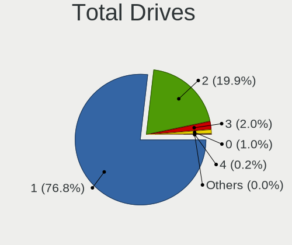
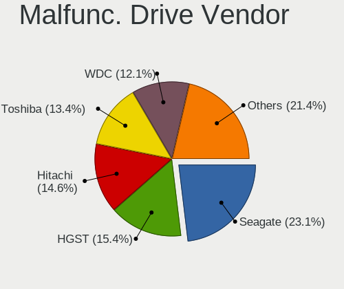
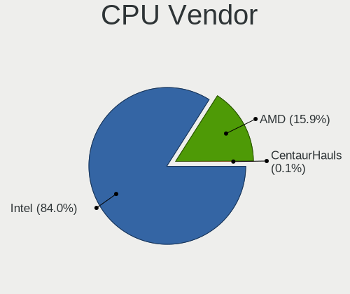
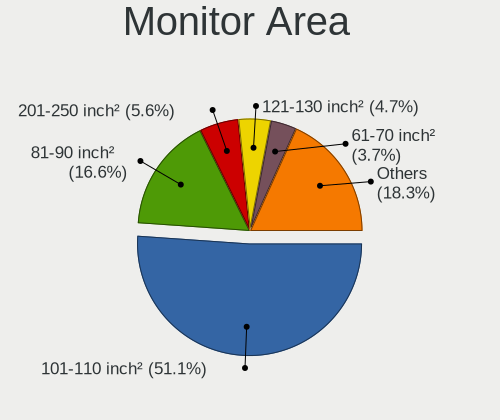
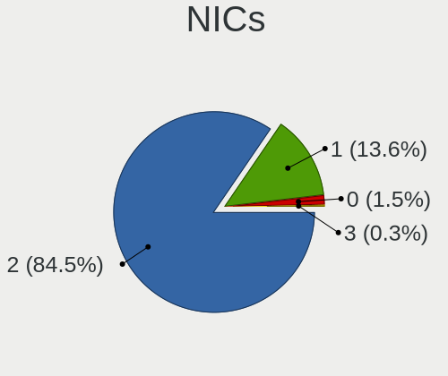
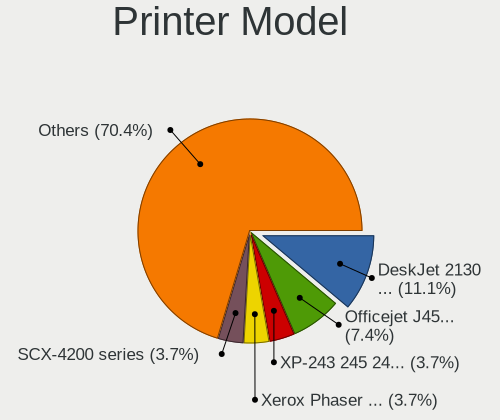
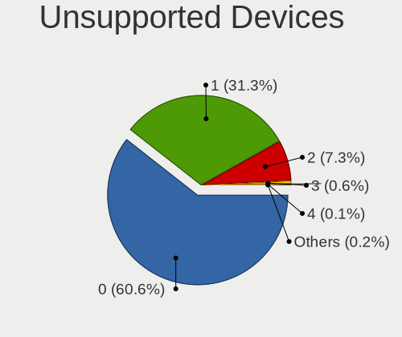

Linux in Hungary - Tested Hardware & Statistics (Notebooks)
-----------------------------------------------------------

A project to collect tested hardware configurations for Linux in Hungary.

Anyone can contribute to this report by the [hw-probe](https://github.com/linuxhw/hw-probe) tool:

    sudo -E hw-probe -all -upload

Please contribute! Especially if your hardware is rare.

Contents
--------

* [ Test Cases ](#test-cases)

* [ System ](#system)
  - [ OS                       ](#os)
  - [ OS Family                ](#os-family)
  - [ Kernel                   ](#kernel)
  - [ Kernel Family            ](#kernel-family)
  - [ Kernel Major Ver.        ](#kernel-major-ver)
  - [ Arch                     ](#arch)
  - [ DE                       ](#de)
  - [ Display Server           ](#display-server)
  - [ Display Manager          ](#display-manager)
  - [ OS Lang                  ](#os-lang)
  - [ Boot Mode                ](#boot-mode)
  - [ Filesystem               ](#filesystem)
  - [ Part. scheme             ](#part-scheme)
  - [ Dual Boot with Linux/BSD ](#dual-boot-with-linuxbsd)
  - [ Dual Boot (Win)          ](#dual-boot-win)

* [ Board ](#board)
  - [ Vendor                   ](#vendor)
  - [ Model                    ](#model)
  - [ Model Family             ](#model-family)
  - [ MFG Year                 ](#mfg-year)
  - [ Form Factor              ](#form-factor)
  - [ Secure Boot              ](#secure-boot)
  - [ Coreboot                 ](#coreboot)
  - [ RAM Size                 ](#ram-size)
  - [ RAM Used                 ](#ram-used)
  - [ Total Drives             ](#total-drives)
  - [ Has CD-ROM               ](#has-cd-rom)
  - [ Has Ethernet             ](#has-ethernet)
  - [ Has WiFi                 ](#has-wifi)
  - [ Has Bluetooth            ](#has-bluetooth)

* [ Location ](#location)
  - [ Country                  ](#country)
  - [ City                     ](#city)

* [ Drives ](#drives)
  - [ Drive Vendor             ](#drive-vendor)
  - [ Drive Model              ](#drive-model)
  - [ HDD Vendor               ](#hdd-vendor)
  - [ SSD Vendor               ](#ssd-vendor)
  - [ Drive Kind               ](#drive-kind)
  - [ Drive Connector          ](#drive-connector)
  - [ Drive Size               ](#drive-size)
  - [ Space Total              ](#space-total)
  - [ Space Used               ](#space-used)
  - [ Malfunc. Drives          ](#malfunc-drives)
  - [ Malfunc. Drive Vendor    ](#malfunc-drive-vendor)
  - [ Malfunc. HDD Vendor      ](#malfunc-hdd-vendor)
  - [ Malfunc. Drive Kind      ](#malfunc-drive-kind)
  - [ Failed Drives            ](#failed-drives)
  - [ Failed Drive Vendor      ](#failed-drive-vendor)
  - [ Drive Status             ](#drive-status)

* [ Storage controller ](#storage-controller)
  - [ Storage Vendor           ](#storage-vendor)
  - [ Storage Model            ](#storage-model)
  - [ Storage Kind             ](#storage-kind)

* [ Processor ](#processor)
  - [ CPU Vendor               ](#cpu-vendor)
  - [ CPU Model                ](#cpu-model)
  - [ CPU Model Family         ](#cpu-model-family)
  - [ CPU Cores                ](#cpu-cores)
  - [ CPU Sockets              ](#cpu-sockets)
  - [ CPU Threads              ](#cpu-threads)
  - [ CPU Op-Modes             ](#cpu-op-modes)
  - [ CPU Microcode            ](#cpu-microcode)
  - [ CPU Microarch            ](#cpu-microarch)

* [ Graphics ](#graphics)
  - [ GPU Vendor               ](#gpu-vendor)
  - [ GPU Model                ](#gpu-model)
  - [ GPU Combo                ](#gpu-combo)
  - [ GPU Driver               ](#gpu-driver)
  - [ GPU Memory               ](#gpu-memory)

* [ Monitor ](#monitor)
  - [ Monitor Vendor           ](#monitor-vendor)
  - [ Monitor Model            ](#monitor-model)
  - [ Monitor Resolution       ](#monitor-resolution)
  - [ Monitor Diagonal         ](#monitor-diagonal)
  - [ Monitor Width            ](#monitor-width)
  - [ Aspect Ratio             ](#aspect-ratio)
  - [ Monitor Area             ](#monitor-area)
  - [ Pixel Density            ](#pixel-density)
  - [ Multiple Monitors        ](#multiple-monitors)

* [ Network ](#network)
  - [ Net Controller Vendor    ](#net-controller-vendor)
  - [ Net Controller Model     ](#net-controller-model)
  - [ Wireless Vendor          ](#wireless-vendor)
  - [ Wireless Model           ](#wireless-model)
  - [ Ethernet Vendor          ](#ethernet-vendor)
  - [ Ethernet Model           ](#ethernet-model)
  - [ Net Controller Kind      ](#net-controller-kind)
  - [ Used Controller          ](#used-controller)
  - [ NICs                     ](#nics)
  - [ IPv6                     ](#ipv6)

* [ Bluetooth ](#bluetooth)
  - [ Bluetooth Vendor         ](#bluetooth-vendor)
  - [ Bluetooth Model          ](#bluetooth-model)

* [ Sound ](#sound)
  - [ Sound Vendor             ](#sound-vendor)
  - [ Sound Model              ](#sound-model)

* [ Memory ](#memory)
  - [ Memory Vendor            ](#memory-vendor)
  - [ Memory Model             ](#memory-model)
  - [ Memory Kind              ](#memory-kind)
  - [ Memory Form Factor       ](#memory-form-factor)
  - [ Memory Size              ](#memory-size)
  - [ Memory Speed             ](#memory-speed)

* [ Printers & scanners ](#printers--scanners)
  - [ Printer Vendor           ](#printer-vendor)
  - [ Printer Model            ](#printer-model)
  - [ Scanner Vendor           ](#scanner-vendor)
  - [ Scanner Model            ](#scanner-model)

* [ Camera ](#camera)
  - [ Camera Vendor            ](#camera-vendor)
  - [ Camera Model             ](#camera-model)

* [ Security ](#security)
  - [ Fingerprint Vendor       ](#fingerprint-vendor)
  - [ Fingerprint Model        ](#fingerprint-model)
  - [ Chipcard Vendor          ](#chipcard-vendor)
  - [ Chipcard Model           ](#chipcard-model)

* [ Unsupported ](#unsupported)
  - [ Unsupported Devices      ](#unsupported-devices)
  - [ Unsupported Device Types ](#unsupported-device-types)

Test Cases
----------

Total: 6118

| Vendor        | Model                       | Probe                                                      | Date         |
|---------------|-----------------------------|------------------------------------------------------------|--------------|
| ASUSTek       | VivoBook S13 X330FN_S330... | [50ff12c678](https://linux-hardware.org/?probe=50ff12c678) | Jan 06, 2025 |
| ASUSTek       | X71Sr                       | [c76c5d5a1c](https://linux-hardware.org/?probe=c76c5d5a1c) | Jan 05, 2025 |
| Lenovo        | IdeaPad 3-15ITL6 82H8       | [58de0987c9](https://linux-hardware.org/?probe=58de0987c9) | Jan 05, 2025 |
| Lenovo        | IdeaPad 3-15ITL6 82H8       | [f033408474](https://linux-hardware.org/?probe=f033408474) | Jan 05, 2025 |
| Lenovo        | ThinkPad R400 7440EL1       | [dd61c503c2](https://linux-hardware.org/?probe=dd61c503c2) | Jan 04, 2025 |
| ASUSTek       | K50IE                       | [ff1622416c](https://linux-hardware.org/?probe=ff1622416c) | Jan 04, 2025 |
| ASUSTek       | K50IE                       | [42c7d66495](https://linux-hardware.org/?probe=42c7d66495) | Jan 04, 2025 |
| Fujitsu       | LIFEBOOK U745               | [518b2a257e](https://linux-hardware.org/?probe=518b2a257e) | Jan 03, 2025 |
| Fujitsu       | LIFEBOOK U745               | [28629fe967](https://linux-hardware.org/?probe=28629fe967) | Jan 03, 2025 |
| ASUSTek       | X71Sr                       | [c17afe99ee](https://linux-hardware.org/?probe=c17afe99ee) | Jan 03, 2025 |
| HP            | EliteBook 8470p             | [63e91f06ef](https://linux-hardware.org/?probe=63e91f06ef) | Jan 02, 2025 |
| ASUSTek       | Vivobook Go E1404FA_E140... | [d65b464077](https://linux-hardware.org/?probe=d65b464077) | Jan 02, 2025 |
| Lenovo        | Yoga Pro 7 14IMH9 83E2      | [ea461f99c2](https://linux-hardware.org/?probe=ea461f99c2) | Jan 02, 2025 |
| Lenovo        | IdeaPad Slim 5 16ABR8 82... | [a03031641a](https://linux-hardware.org/?probe=a03031641a) | Jan 02, 2025 |
| Lenovo        | G510 20238                  | [ebd16410b8](https://linux-hardware.org/?probe=ebd16410b8) | Jan 01, 2025 |
| Apple         | MacBook7,1                  | [cee1ead4a5](https://linux-hardware.org/?probe=cee1ead4a5) | Jan 01, 2025 |
| HP            | EliteBook 8470p             | [e489955373](https://linux-hardware.org/?probe=e489955373) | Jan 01, 2025 |
| MSI           | EX600                       | [7cf72a2ecd](https://linux-hardware.org/?probe=7cf72a2ecd) | Jan 01, 2025 |
| MSI           | EX600                       | [1e51dc5052](https://linux-hardware.org/?probe=1e51dc5052) | Jan 01, 2025 |
| Acer          | Aspire A315-21              | [48fa2fd34a](https://linux-hardware.org/?probe=48fa2fd34a) | Dec 30, 2024 |
| Dell          | Latitude E6410              | [a9b5de08b4](https://linux-hardware.org/?probe=a9b5de08b4) | Dec 30, 2024 |
| HP            | Pavilion Gaming Laptop 1... | [cd3975c657](https://linux-hardware.org/?probe=cd3975c657) | Dec 28, 2024 |
| HP            | Laptop 15-bs0xx             | [3734fe1027](https://linux-hardware.org/?probe=3734fe1027) | Dec 28, 2024 |
| HP            | Laptop 15-bs0xx             | [3078dcda8e](https://linux-hardware.org/?probe=3078dcda8e) | Dec 28, 2024 |
| HP            | EliteBook 8540p             | [3fba3ebc56](https://linux-hardware.org/?probe=3fba3ebc56) | Dec 27, 2024 |
| MSI           | CR610                       | [cdac4d6ac5](https://linux-hardware.org/?probe=cdac4d6ac5) | Dec 27, 2024 |
| Acer          | Aspire VN7-791G             | [710d266100](https://linux-hardware.org/?probe=710d266100) | Dec 26, 2024 |
| Acer          | Aspire A317-52              | [75800ca5ab](https://linux-hardware.org/?probe=75800ca5ab) | Dec 25, 2024 |
| Acer          | Aspire A317-52              | [7893251832](https://linux-hardware.org/?probe=7893251832) | Dec 25, 2024 |
| HP            | HDX 16                      | [17ec6d80db](https://linux-hardware.org/?probe=17ec6d80db) | Dec 25, 2024 |
| Dell          | Inspiron 5748               | [b2fd13a760](https://linux-hardware.org/?probe=b2fd13a760) | Dec 25, 2024 |
| HP            | HDX 16                      | [cae2b345f8](https://linux-hardware.org/?probe=cae2b345f8) | Dec 25, 2024 |
| Fujitsu Si... | AMILO Li 2727               | [582307f2f4](https://linux-hardware.org/?probe=582307f2f4) | Dec 24, 2024 |
| Fujitsu Si... | AMILO Li 2727               | [9485bf3c97](https://linux-hardware.org/?probe=9485bf3c97) | Dec 24, 2024 |
| ASUSTek       | Vivobook Go E1404FA_E140... | [b67b195148](https://linux-hardware.org/?probe=b67b195148) | Dec 24, 2024 |
| Dell          | Vostro 1015                 | [a9e17cca23](https://linux-hardware.org/?probe=a9e17cca23) | Dec 24, 2024 |
| Dell          | Vostro 1015                 | [13644c036c](https://linux-hardware.org/?probe=13644c036c) | Dec 24, 2024 |
| Valve         | Jupiter                     | [7f72a25dab](https://linux-hardware.org/?probe=7f72a25dab) | Dec 24, 2024 |
| ASUSTek       | VivoBook S13 X330FN_S330... | [b9714a1c2f](https://linux-hardware.org/?probe=b9714a1c2f) | Dec 23, 2024 |
| ASUSTek       | X200MA                      | [9ca1965839](https://linux-hardware.org/?probe=9ca1965839) | Dec 22, 2024 |
| Lenovo        | ThinkPad L430 246834G       | [cbc0d50579](https://linux-hardware.org/?probe=cbc0d50579) | Dec 20, 2024 |
| ASUSTek       | ROG Strix G512LU_G512LU     | [914e64e86c](https://linux-hardware.org/?probe=914e64e86c) | Dec 20, 2024 |
| ASUSTek       | VivoBook_ASUSLaptop M350... | [9748115a00](https://linux-hardware.org/?probe=9748115a00) | Dec 20, 2024 |
| ASUSTek       | VivoBook_ASUSLaptop M350... | [09a86b3e16](https://linux-hardware.org/?probe=09a86b3e16) | Dec 20, 2024 |
| Dell          | Latitude 5500               | [23faa70238](https://linux-hardware.org/?probe=23faa70238) | Dec 20, 2024 |
| Dell          | Latitude E6410              | [b51666dd6f](https://linux-hardware.org/?probe=b51666dd6f) | Dec 19, 2024 |
| HP            | ProBook 440 G5              | [c5a9ba7441](https://linux-hardware.org/?probe=c5a9ba7441) | Dec 19, 2024 |
| HP            | ProBook 440 G5              | [da60bd4ae5](https://linux-hardware.org/?probe=da60bd4ae5) | Dec 19, 2024 |
| Acer          | Aspire ES1-512              | [2dd67e963d](https://linux-hardware.org/?probe=2dd67e963d) | Dec 19, 2024 |
| ASUSTek       | K50IE                       | [e19aa860da](https://linux-hardware.org/?probe=e19aa860da) | Dec 18, 2024 |
| ASUSTek       | TUF Gaming FX505DD          | [b9f8f7b1b7](https://linux-hardware.org/?probe=b9f8f7b1b7) | Dec 18, 2024 |
| ASUSTek       | ZenBook UX425UA_UM425UA     | [7e82e5049a](https://linux-hardware.org/?probe=7e82e5049a) | Dec 17, 2024 |
| Dell          | Latitude E5570              | [54e9a1a0b3](https://linux-hardware.org/?probe=54e9a1a0b3) | Dec 17, 2024 |
| HP            | EliteBook 850 G3            | [e01e3eeaf1](https://linux-hardware.org/?probe=e01e3eeaf1) | Dec 16, 2024 |
| Lenovo        | ThinkPad T520 4242A25       | [85c87ae6e1](https://linux-hardware.org/?probe=85c87ae6e1) | Dec 16, 2024 |
| Fujitsu Si... | AMILO Xi 3650               | [62988b3cd2](https://linux-hardware.org/?probe=62988b3cd2) | Dec 15, 2024 |
| Toshiba       | Satellite Pro A120          | [11c52f70d5](https://linux-hardware.org/?probe=11c52f70d5) | Dec 15, 2024 |
| HP            | 250 G1                      | [bdcc1c77b0](https://linux-hardware.org/?probe=bdcc1c77b0) | Dec 15, 2024 |
| Dell          | Latitude 5590               | [308f71f2dd](https://linux-hardware.org/?probe=308f71f2dd) | Dec 14, 2024 |
| Acer          | Aspire ES1-512              | [28c96de064](https://linux-hardware.org/?probe=28c96de064) | Dec 12, 2024 |
| Acer          | Aspire E5-571G              | [b81f4da779](https://linux-hardware.org/?probe=b81f4da779) | Dec 12, 2024 |
| Dell          | G15 5511                    | [fd366d5886](https://linux-hardware.org/?probe=fd366d5886) | Dec 12, 2024 |
| Acer          | Aspire 5732Z                | [fd6a7390c7](https://linux-hardware.org/?probe=fd6a7390c7) | Dec 10, 2024 |
| Acer          | Aspire E5-571G              | [4e3d903b5d](https://linux-hardware.org/?probe=4e3d903b5d) | Dec 10, 2024 |
| ASUSTek       | ZenBook UX425UA_UM425UA     | [d48355806f](https://linux-hardware.org/?probe=d48355806f) | Dec 10, 2024 |
| Lenovo        | ThinkPad T410 2537KR6       | [9fde9fe106](https://linux-hardware.org/?probe=9fde9fe106) | Dec 09, 2024 |
| HP            | ZBook 17 G5                 | [0f14052159](https://linux-hardware.org/?probe=0f14052159) | Dec 09, 2024 |
| Lenovo        | Z710 20250                  | [9ec30a66d1](https://linux-hardware.org/?probe=9ec30a66d1) | Dec 08, 2024 |
| Lenovo        | G550 20023                  | [f8b607f0af](https://linux-hardware.org/?probe=f8b607f0af) | Dec 08, 2024 |
| Acer          | Aspire A315-54K             | [fa1d301771](https://linux-hardware.org/?probe=fa1d301771) | Dec 08, 2024 |
| Lenovo        | ThinkPad T14 Gen 5 21ML0... | [875b1f63f7](https://linux-hardware.org/?probe=875b1f63f7) | Dec 08, 2024 |
| HP            | Pavilion Gaming Laptop 1... | [769c4b5be5](https://linux-hardware.org/?probe=769c4b5be5) | Dec 07, 2024 |
| Lenovo        | G550 20023                  | [efcb2e6de7](https://linux-hardware.org/?probe=efcb2e6de7) | Dec 07, 2024 |
| HP            | 620                         | [debb6026ee](https://linux-hardware.org/?probe=debb6026ee) | Dec 07, 2024 |
| Valve         | Galileo                     | [cff59fadd6](https://linux-hardware.org/?probe=cff59fadd6) | Dec 07, 2024 |
| Valve         | Galileo                     | [b2e558b6d3](https://linux-hardware.org/?probe=b2e558b6d3) | Dec 07, 2024 |
| HP            | 255 15.6 inch G10           | [917eafba30](https://linux-hardware.org/?probe=917eafba30) | Dec 06, 2024 |
| ASUSTek       | Zenbook UM3402YA_UM3402Y... | [2616e6e6d0](https://linux-hardware.org/?probe=2616e6e6d0) | Dec 06, 2024 |
| HP            | ProBook 4320s               | [f920f58d1e](https://linux-hardware.org/?probe=f920f58d1e) | Dec 02, 2024 |
| Dell          | Latitude E6230              | [0d86402acb](https://linux-hardware.org/?probe=0d86402acb) | Dec 01, 2024 |
| Dell          | Inspiron 17 7000 Series ... | [d588437f56](https://linux-hardware.org/?probe=d588437f56) | Dec 01, 2024 |
| eMachines     | E725                        | [c90258d992](https://linux-hardware.org/?probe=c90258d992) | Dec 01, 2024 |
| eMachines     | E725                        | [e6b68a13a8](https://linux-hardware.org/?probe=e6b68a13a8) | Dec 01, 2024 |
| Lenovo        | LOQ 15APH8 82XT             | [6b97a4fbe3](https://linux-hardware.org/?probe=6b97a4fbe3) | Nov 30, 2024 |
| Samsung       | 300E4A/300E5A/300E7A/343... | [c400fc86cb](https://linux-hardware.org/?probe=c400fc86cb) | Nov 30, 2024 |
| ASUSTek       | X55U                        | [b227d1be26](https://linux-hardware.org/?probe=b227d1be26) | Nov 30, 2024 |
| Dell          | Inspiron 15-3573            | [9f15756447](https://linux-hardware.org/?probe=9f15756447) | Nov 30, 2024 |
| Dell          | Inspiron 15-3573            | [ffd2440975](https://linux-hardware.org/?probe=ffd2440975) | Nov 30, 2024 |
| Samsung       | 300E4A/300E5A/300E7A/343... | [cdeefac044](https://linux-hardware.org/?probe=cdeefac044) | Nov 30, 2024 |
| ASUSTek       | X401U                       | [a311a92d34](https://linux-hardware.org/?probe=a311a92d34) | Nov 30, 2024 |
| ASUSTek       | ASUS Zenbook S 16 UM5606... | [f58545f3eb](https://linux-hardware.org/?probe=f58545f3eb) | Nov 30, 2024 |
| ASUSTek       | X541UAK                     | [f1806e93b3](https://linux-hardware.org/?probe=f1806e93b3) | Nov 30, 2024 |
| ASUSTek       | X401U                       | [b43b40d15d](https://linux-hardware.org/?probe=b43b40d15d) | Nov 30, 2024 |
| HP            | EliteBook 860 16 inch G1... | [2449152a7d](https://linux-hardware.org/?probe=2449152a7d) | Nov 27, 2024 |
| Lenovo        | IdeaPad 510-15IKB 80SV      | [fb7f3e2d23](https://linux-hardware.org/?probe=fb7f3e2d23) | Nov 24, 2024 |
| HP            | 255 15.6 inch G10           | [96f5e9c69f](https://linux-hardware.org/?probe=96f5e9c69f) | Nov 24, 2024 |
| ASUSTek       | ASUS TUF Gaming A15 FA50... | [e7dd6ffefe](https://linux-hardware.org/?probe=e7dd6ffefe) | Nov 24, 2024 |
| ASUSTek       | K50IE                       | [554cc7d2da](https://linux-hardware.org/?probe=554cc7d2da) | Nov 24, 2024 |
| Dell          | Vostro 3500                 | [97daaed0c7](https://linux-hardware.org/?probe=97daaed0c7) | Nov 24, 2024 |
| ASUSTek       | K50IE                       | [9de648a95f](https://linux-hardware.org/?probe=9de648a95f) | Nov 23, 2024 |
| Lenovo        | ThinkPad X280 20KES35J00    | [72a362e0ce](https://linux-hardware.org/?probe=72a362e0ce) | Nov 23, 2024 |
| Toshiba       | PORTEGE Z930                | [a6549dee5e](https://linux-hardware.org/?probe=a6549dee5e) | Nov 22, 2024 |
| Toshiba       | PORTEGE Z930                | [b1a189cb58](https://linux-hardware.org/?probe=b1a189cb58) | Nov 22, 2024 |
| HP            | ProBook 455 G3              | [25089d730d](https://linux-hardware.org/?probe=25089d730d) | Nov 22, 2024 |
| ASUSTek       | ASUS EXPERTBOOK B1502CVA... | [78da17b375](https://linux-hardware.org/?probe=78da17b375) | Nov 22, 2024 |
| Apple         | MacBookPro11,1              | [a315c80c2c](https://linux-hardware.org/?probe=a315c80c2c) | Nov 22, 2024 |
| ONE-NETBOO... | ONEXPLAYER X1 A             | [e7d1e0404d](https://linux-hardware.org/?probe=e7d1e0404d) | Nov 22, 2024 |
| ASUSTek       | K50IE                       | [88afa62033](https://linux-hardware.org/?probe=88afa62033) | Nov 21, 2024 |
| Dell          | Latitude 5521               | [f892afbbbb](https://linux-hardware.org/?probe=f892afbbbb) | Nov 21, 2024 |
| Dell          | Latitude 5501               | [d5ff7909f7](https://linux-hardware.org/?probe=d5ff7909f7) | Nov 21, 2024 |
| Acer          | Aspire 5742G                | [c117d227dd](https://linux-hardware.org/?probe=c117d227dd) | Nov 21, 2024 |
| Acer          | Aspire 5742G                | [87ecfdfb41](https://linux-hardware.org/?probe=87ecfdfb41) | Nov 20, 2024 |
| Dell          | Latitude E7270              | [3aa67229b8](https://linux-hardware.org/?probe=3aa67229b8) | Nov 20, 2024 |
| Insyde        | Braswell                    | [317bc41ff8](https://linux-hardware.org/?probe=317bc41ff8) | Nov 20, 2024 |
| Sony          | VGN-FS315M                  | [4619d1639e](https://linux-hardware.org/?probe=4619d1639e) | Nov 20, 2024 |
| Sony          | VGN-FS315M                  | [1e6166f9c8](https://linux-hardware.org/?probe=1e6166f9c8) | Nov 20, 2024 |
| Fujitsu       | LIFEBOOK E782               | [cfb43c6627](https://linux-hardware.org/?probe=cfb43c6627) | Nov 20, 2024 |
| Fujitsu       | LIFEBOOK E782               | [4ebc12b553](https://linux-hardware.org/?probe=4ebc12b553) | Nov 20, 2024 |
| Packard Be... | EasyNote TS44HR             | [43524f1599](https://linux-hardware.org/?probe=43524f1599) | Nov 19, 2024 |
| Valve         | Jupiter                     | [0d1a908294](https://linux-hardware.org/?probe=0d1a908294) | Nov 19, 2024 |
| Valve         | Jupiter                     | [2262bd5974](https://linux-hardware.org/?probe=2262bd5974) | Nov 19, 2024 |
| HP            | Compaq 6710b (KE121EA#AK... | [e02fd427cb](https://linux-hardware.org/?probe=e02fd427cb) | Nov 19, 2024 |
| ASUSTek       | VivoBook_ASUSLaptop M350... | [ad9200ca27](https://linux-hardware.org/?probe=ad9200ca27) | Nov 19, 2024 |
| Alcor Digi... | Snugbook N1431              | [404711d5c8](https://linux-hardware.org/?probe=404711d5c8) | Nov 19, 2024 |
| ASUSTek       | VivoBook_ASUSLaptop X150... | [b3bb11147d](https://linux-hardware.org/?probe=b3bb11147d) | Nov 18, 2024 |
| Samsung       | RV415/RV515/E3415           | [03e8547704](https://linux-hardware.org/?probe=03e8547704) | Nov 18, 2024 |
| Dell          | Vostro 3501                 | [188f410ab2](https://linux-hardware.org/?probe=188f410ab2) | Nov 18, 2024 |
| Apple         | MacBookPro9,2               | [0bb978b3d6](https://linux-hardware.org/?probe=0bb978b3d6) | Nov 18, 2024 |
| Lenovo        | ThinkPad P50 20EQS2CC00     | [ee47266bd4](https://linux-hardware.org/?probe=ee47266bd4) | Nov 17, 2024 |
| HP            | Pavilion Gaming Laptop 1... | [4bcb60287c](https://linux-hardware.org/?probe=4bcb60287c) | Nov 17, 2024 |
| Apple         | MacBookAir7,2               | [b899e73287](https://linux-hardware.org/?probe=b899e73287) | Nov 16, 2024 |
| Toshiba       | Satellite Pro L550          | [f41b33701f](https://linux-hardware.org/?probe=f41b33701f) | Nov 16, 2024 |
| ASUSTek       | X550LN                      | [f0d77d344b](https://linux-hardware.org/?probe=f0d77d344b) | Nov 15, 2024 |
| HP            | 255 15.6 inch G10           | [9dbc6684d7](https://linux-hardware.org/?probe=9dbc6684d7) | Nov 15, 2024 |
| ASUSTek       | ASUS Vivobook S 16 M5606... | [892844a02f](https://linux-hardware.org/?probe=892844a02f) | Nov 14, 2024 |
| Lenovo        | ThinkPad P50 20EQS2CC00     | [8815cf243a](https://linux-hardware.org/?probe=8815cf243a) | Nov 14, 2024 |
| ASUSTek       | ASUS TUF Gaming A15 FA50... | [f8db86e6a1](https://linux-hardware.org/?probe=f8db86e6a1) | Nov 14, 2024 |
| Toshiba       | Satellite Pro L550          | [d39da20aec](https://linux-hardware.org/?probe=d39da20aec) | Nov 14, 2024 |
| Lenovo        | IdeaPad Slim 3 15IRU8 82... | [a32fbc9189](https://linux-hardware.org/?probe=a32fbc9189) | Nov 14, 2024 |
| ASUSTek       | X541NA                      | [820c94c4ff](https://linux-hardware.org/?probe=820c94c4ff) | Nov 13, 2024 |
| HP            | ProBook 640 G8 Notebook ... | [10250cdc16](https://linux-hardware.org/?probe=10250cdc16) | Nov 12, 2024 |
| Google        | Kefka                       | [bf5cd8a623](https://linux-hardware.org/?probe=bf5cd8a623) | Nov 12, 2024 |
| Google        | Kefka                       | [affed9dd1e](https://linux-hardware.org/?probe=affed9dd1e) | Nov 12, 2024 |
| Dell          | Latitude E7270              | [dba418a89f](https://linux-hardware.org/?probe=dba418a89f) | Nov 12, 2024 |
| Acer          | Aspire A315-59              | [03934c9214](https://linux-hardware.org/?probe=03934c9214) | Nov 12, 2024 |
| Acer          | Aspire A315-59              | [6db55188fa](https://linux-hardware.org/?probe=6db55188fa) | Nov 12, 2024 |
| Apple         | MacBookAir7,2               | [9f8aadd091](https://linux-hardware.org/?probe=9f8aadd091) | Nov 11, 2024 |
| Dell          | Latitude E6230              | [73b9f97d94](https://linux-hardware.org/?probe=73b9f97d94) | Nov 10, 2024 |
| Acer          | Aspire ES1-512              | [4df45b6f5a](https://linux-hardware.org/?probe=4df45b6f5a) | Nov 08, 2024 |
| ASUSTek       | ZenBook UX425UA_UM425UA     | [455db089b7](https://linux-hardware.org/?probe=455db089b7) | Nov 08, 2024 |
| HP            | EliteBook Folio 9480m       | [2f9be02490](https://linux-hardware.org/?probe=2f9be02490) | Nov 08, 2024 |
| ASUSTek       | VivoBook_ASUSLaptop M150... | [ebfc91a2f1](https://linux-hardware.org/?probe=ebfc91a2f1) | Nov 07, 2024 |
| Acer          | Predator PT14-51            | [89ab08c4d5](https://linux-hardware.org/?probe=89ab08c4d5) | Nov 07, 2024 |
| Packard Be... | EasyNote TK11BZ             | [610e6cd0aa](https://linux-hardware.org/?probe=610e6cd0aa) | Nov 07, 2024 |
| Packard Be... | EasyNote TK11BZ             | [1a19aa0d42](https://linux-hardware.org/?probe=1a19aa0d42) | Nov 07, 2024 |
| HP            | Laptop 15-db0xxx            | [47b6df1477](https://linux-hardware.org/?probe=47b6df1477) | Nov 07, 2024 |
| Toshiba       | Satellite L650              | [49f804a9fc](https://linux-hardware.org/?probe=49f804a9fc) | Nov 07, 2024 |
| HP            | 350 G1                      | [f52136f10e](https://linux-hardware.org/?probe=f52136f10e) | Nov 07, 2024 |
| HP            | 350 G1                      | [7f383cc1f3](https://linux-hardware.org/?probe=7f383cc1f3) | Nov 07, 2024 |
| Dell          | Latitude 5591               | [d16add27b6](https://linux-hardware.org/?probe=d16add27b6) | Nov 07, 2024 |
| Toshiba       | Satellite L650              | [5d1d0b74f1](https://linux-hardware.org/?probe=5d1d0b74f1) | Nov 06, 2024 |
| HP            | Laptop 15-db0xxx            | [9d2ab8f727](https://linux-hardware.org/?probe=9d2ab8f727) | Nov 06, 2024 |
| ASUSTek       | TUF Gaming FX505DU          | [81def84e4a](https://linux-hardware.org/?probe=81def84e4a) | Nov 06, 2024 |
| Acer          | Swift SF114-32              | [1b4911b735](https://linux-hardware.org/?probe=1b4911b735) | Nov 05, 2024 |
| ASUSTek       | ZenBook UX425UA_UM425UA     | [c7e836cc68](https://linux-hardware.org/?probe=c7e836cc68) | Nov 05, 2024 |
| Dell          | Precision M6500             | [e588051942](https://linux-hardware.org/?probe=e588051942) | Nov 05, 2024 |
| Dell          | Precision M6500             | [e4897c55f4](https://linux-hardware.org/?probe=e4897c55f4) | Nov 05, 2024 |
| Acer          | Swift SF315-51G             | [aaa4dc76a1](https://linux-hardware.org/?probe=aaa4dc76a1) | Nov 03, 2024 |
| Lenovo        | E31-80 80MX                 | [9819e05017](https://linux-hardware.org/?probe=9819e05017) | Nov 03, 2024 |
| Acer          | Aspire ES1-571              | [f307a1d91c](https://linux-hardware.org/?probe=f307a1d91c) | Nov 02, 2024 |
| Lenovo        | ThinkPad T470 20HES2130Q    | [aa38d6e195](https://linux-hardware.org/?probe=aa38d6e195) | Nov 02, 2024 |
| HP            | EliteBook 2570p             | [7f904ff9f5](https://linux-hardware.org/?probe=7f904ff9f5) | Nov 01, 2024 |
| Lenovo        | ThinkPad T420 4236B87       | [168db3bc7f](https://linux-hardware.org/?probe=168db3bc7f) | Nov 01, 2024 |
| HP            | Pavilion Laptop 15-eh1xx... | [104f24fde1](https://linux-hardware.org/?probe=104f24fde1) | Nov 01, 2024 |
| HP            | 250 G1                      | [ea7fd9f0ad](https://linux-hardware.org/?probe=ea7fd9f0ad) | Nov 01, 2024 |
| Lenovo        | ThinkPad T420 4236B87       | [0726eeb9fe](https://linux-hardware.org/?probe=0726eeb9fe) | Oct 31, 2024 |
| ASUSTek       | X705UDR                     | [de92715772](https://linux-hardware.org/?probe=de92715772) | Oct 31, 2024 |
| Dell          | Latitude E6420              | [ba00de1a36](https://linux-hardware.org/?probe=ba00de1a36) | Oct 30, 2024 |
| Lenovo        | G40-30 80FY                 | [2af3b2835a](https://linux-hardware.org/?probe=2af3b2835a) | Oct 30, 2024 |
| Lenovo        | Flex 2-15 20405             | [6cd71b170f](https://linux-hardware.org/?probe=6cd71b170f) | Oct 29, 2024 |
| ASUSTek       | X555LJ                      | [9e5c496f61](https://linux-hardware.org/?probe=9e5c496f61) | Oct 28, 2024 |
| Dell          | Latitude E6430              | [3a0bf739f0](https://linux-hardware.org/?probe=3a0bf739f0) | Oct 28, 2024 |
| Dell          | Inspiron 17 7000 Series ... | [3c9f89ea2c](https://linux-hardware.org/?probe=3c9f89ea2c) | Oct 27, 2024 |
| HP            | Pavilion Gaming Laptop 1... | [523b7a9651](https://linux-hardware.org/?probe=523b7a9651) | Oct 27, 2024 |
| ASUSTek       | K40IE                       | [5ace026500](https://linux-hardware.org/?probe=5ace026500) | Oct 26, 2024 |
| Acer          | Aspire E5-571G              | [0801976824](https://linux-hardware.org/?probe=0801976824) | Oct 26, 2024 |
| ASUSTek       | ASUS Vivobook S 16 M5606... | [452e0bd4d1](https://linux-hardware.org/?probe=452e0bd4d1) | Oct 26, 2024 |
| HP            | 250 G5 Notebook PC          | [3d903fc0d5](https://linux-hardware.org/?probe=3d903fc0d5) | Oct 25, 2024 |
| Lenovo        | ThinkPad X1 Carbon 6th 2... | [0b5556922c](https://linux-hardware.org/?probe=0b5556922c) | Oct 25, 2024 |
| Lenovo        | IdeaPad 3 15IAU7 82RK       | [29ef72f5d5](https://linux-hardware.org/?probe=29ef72f5d5) | Oct 24, 2024 |
| Dell          | Inspiron 5558               | [b4d01e9fbd](https://linux-hardware.org/?probe=b4d01e9fbd) | Oct 24, 2024 |
| eMachines     | E725                        | [362f51d14e](https://linux-hardware.org/?probe=362f51d14e) | Oct 23, 2024 |
| HP            | 650                         | [f849b8c96e](https://linux-hardware.org/?probe=f849b8c96e) | Oct 23, 2024 |
| Acer          | Swift SF114-34              | [81302e7270](https://linux-hardware.org/?probe=81302e7270) | Oct 23, 2024 |
| ASUSTek       | K54HR                       | [794912c4c5](https://linux-hardware.org/?probe=794912c4c5) | Oct 22, 2024 |
| NVISEN        | MU01                        | [d383333ed3](https://linux-hardware.org/?probe=d383333ed3) | Oct 22, 2024 |
| Dell          | Latitude 5480               | [35580984a7](https://linux-hardware.org/?probe=35580984a7) | Oct 22, 2024 |
| Lenovo        | ThinkPad L480 20LTS1Q200    | [6c24b43d59](https://linux-hardware.org/?probe=6c24b43d59) | Oct 22, 2024 |
| HP            | Presario CQ57               | [c061615cbe](https://linux-hardware.org/?probe=c061615cbe) | Oct 22, 2024 |
| Lenovo        | IdeaPad 3 14ALC6 82KT       | [8a84646569](https://linux-hardware.org/?probe=8a84646569) | Oct 21, 2024 |
| ASUSTek       | X551MA                      | [26585357e5](https://linux-hardware.org/?probe=26585357e5) | Oct 21, 2024 |
| Dell          | Latitude 5501               | [017aaa4343](https://linux-hardware.org/?probe=017aaa4343) | Oct 21, 2024 |
| Acer          | Predator PHN18-71           | [96aa39db09](https://linux-hardware.org/?probe=96aa39db09) | Oct 20, 2024 |
| eMachines     | E725                        | [7b02f8a301](https://linux-hardware.org/?probe=7b02f8a301) | Oct 20, 2024 |
| Toshiba       | PORTEGE Z20t-C              | [b07a566014](https://linux-hardware.org/?probe=b07a566014) | Oct 20, 2024 |
| Toshiba       | PORTEGE Z20t-C              | [2c1d79c7b6](https://linux-hardware.org/?probe=2c1d79c7b6) | Oct 20, 2024 |
| Dell          | Latitude 5510               | [5b7ffc59c4](https://linux-hardware.org/?probe=5b7ffc59c4) | Oct 20, 2024 |
| ASUSTek       | K40IE                       | [acd27b1027](https://linux-hardware.org/?probe=acd27b1027) | Oct 19, 2024 |
| Acer          | Swift SF314-43              | [f19e331117](https://linux-hardware.org/?probe=f19e331117) | Oct 19, 2024 |
| Timi          | Xiaomi Book Pro 14 2022     | [6e59218d2a](https://linux-hardware.org/?probe=6e59218d2a) | Oct 19, 2024 |
| Lenovo        | ThinkPad X1 Carbon Gen 8... | [7f65e73f36](https://linux-hardware.org/?probe=7f65e73f36) | Oct 18, 2024 |
| Fujitsu Si... | AMILO Li 2727               | [ffe04d97c2](https://linux-hardware.org/?probe=ffe04d97c2) | Oct 17, 2024 |
| Fujitsu Si... | AMILO Li 2727               | [83cf97184f](https://linux-hardware.org/?probe=83cf97184f) | Oct 17, 2024 |
| ASUSTek       | X556UQK                     | [5352e1a931](https://linux-hardware.org/?probe=5352e1a931) | Oct 16, 2024 |
| Lenovo        | ThinkPad T470s W10DG 20J... | [0bdda39e37](https://linux-hardware.org/?probe=0bdda39e37) | Oct 16, 2024 |
| ASUSTek       | VivoBook_ASUSLaptop M350... | [d6137f1d53](https://linux-hardware.org/?probe=d6137f1d53) | Oct 13, 2024 |
| Lenovo        | IdeaPad 3 15ALC6 82KU       | [14c88c6e79](https://linux-hardware.org/?probe=14c88c6e79) | Oct 13, 2024 |
| Acer          | Aspire ES1-571              | [2421f59e29](https://linux-hardware.org/?probe=2421f59e29) | Oct 12, 2024 |
| Samsung       | RF510/RF410/RF710           | [e905d56a2d](https://linux-hardware.org/?probe=e905d56a2d) | Oct 12, 2024 |
| Samsung       | RF510/RF410/RF710           | [7b87f88a5a](https://linux-hardware.org/?probe=7b87f88a5a) | Oct 12, 2024 |
| HP            | EliteBook 640 14 inch G1... | [eb78247aef](https://linux-hardware.org/?probe=eb78247aef) | Oct 11, 2024 |
| Lenovo        | IdeaPad Slim 5 16ABR8 82... | [da3ad9fe6c](https://linux-hardware.org/?probe=da3ad9fe6c) | Oct 10, 2024 |
| HP            | ProBook 650 G1              | [2906c94383](https://linux-hardware.org/?probe=2906c94383) | Oct 09, 2024 |
| Lenovo        | ThinkPad T490 20N2005VMX    | [68bfe7b560](https://linux-hardware.org/?probe=68bfe7b560) | Oct 09, 2024 |
| Lenovo        | IdeaPad 3 15ALC6 82KU       | [64d275f237](https://linux-hardware.org/?probe=64d275f237) | Oct 07, 2024 |
| Lenovo        | IdeaPad 3 15ALC6 82KU       | [86f0b268b4](https://linux-hardware.org/?probe=86f0b268b4) | Oct 07, 2024 |
| HP            | Pro x2 612 G1 Tablet        | [cffabbc2b5](https://linux-hardware.org/?probe=cffabbc2b5) | Oct 07, 2024 |
| Acer          | Swift SF114-32              | [035dc1e43c](https://linux-hardware.org/?probe=035dc1e43c) | Oct 06, 2024 |
| Dell          | Vostro 1500                 | [6680201494](https://linux-hardware.org/?probe=6680201494) | Oct 06, 2024 |
| ASUSTek       | K40IE                       | [585655605c](https://linux-hardware.org/?probe=585655605c) | Oct 06, 2024 |
| ASUSTek       | UX31E                       | [f8881d8b4e](https://linux-hardware.org/?probe=f8881d8b4e) | Oct 06, 2024 |
| Fujitsu Si... | AMILO Pro V3205             | [b42a8282e2](https://linux-hardware.org/?probe=b42a8282e2) | Oct 05, 2024 |
| Dell          | Inspiron 1545               | [7e10bcffe5](https://linux-hardware.org/?probe=7e10bcffe5) | Oct 05, 2024 |
| Lenovo        | ThinkPad T460p 20FXS09D0... | [aff398dad9](https://linux-hardware.org/?probe=aff398dad9) | Oct 05, 2024 |
| Fujitsu       | LIFEBOOK U745               | [c152afbda7](https://linux-hardware.org/?probe=c152afbda7) | Oct 05, 2024 |
| Fujitsu       | LIFEBOOK U745               | [fb6df6137e](https://linux-hardware.org/?probe=fb6df6137e) | Oct 05, 2024 |
| Dell          | Latitude E5540              | [a59dfdcd62](https://linux-hardware.org/?probe=a59dfdcd62) | Oct 03, 2024 |
| ASUSTek       | X550LN                      | [61239b6939](https://linux-hardware.org/?probe=61239b6939) | Oct 03, 2024 |
| Dell          | Latitude E5540              | [44955d2b3b](https://linux-hardware.org/?probe=44955d2b3b) | Oct 03, 2024 |
| ASUSTek       | X550LN                      | [aa1afeaff4](https://linux-hardware.org/?probe=aa1afeaff4) | Oct 03, 2024 |
| Dell          | Latitude E6400              | [6fb4a249bd](https://linux-hardware.org/?probe=6fb4a249bd) | Oct 03, 2024 |
| Lenovo        | ThinkPad L470 W10DG 20JV... | [5122894a2f](https://linux-hardware.org/?probe=5122894a2f) | Oct 02, 2024 |
| Dell          | Inspiron 1100               | [1012ad2903](https://linux-hardware.org/?probe=1012ad2903) | Oct 02, 2024 |
| Lenovo        | IdeaPad 3 14ALC6 82KT       | [2a1d682889](https://linux-hardware.org/?probe=2a1d682889) | Oct 01, 2024 |
| Dell          | Latitude E5470              | [649f2683b3](https://linux-hardware.org/?probe=649f2683b3) | Oct 01, 2024 |
| ASUSTek       | ASUS TUF Gaming F15 FX50... | [974d3a9108](https://linux-hardware.org/?probe=974d3a9108) | Sep 28, 2024 |
| Lenovo        | ThinkPad X280 20KES35J00    | [92e6899ce0](https://linux-hardware.org/?probe=92e6899ce0) | Sep 28, 2024 |
| ASUSTek       | ASUS TUF Gaming F15 FX50... | [be1eb0a23b](https://linux-hardware.org/?probe=be1eb0a23b) | Sep 28, 2024 |
| Lenovo        | IdeaPad 3 15IAU7 82RK       | [cdca4fcda4](https://linux-hardware.org/?probe=cdca4fcda4) | Sep 27, 2024 |
| Acer          | Swift SF315-51G             | [e63a777daa](https://linux-hardware.org/?probe=e63a777daa) | Sep 25, 2024 |
| ASUSTek       | X541UAK                     | [c8b9cbde59](https://linux-hardware.org/?probe=c8b9cbde59) | Sep 25, 2024 |
| HP            | Laptop 15-da1xxx            | [b05a0c1ea5](https://linux-hardware.org/?probe=b05a0c1ea5) | Sep 24, 2024 |
| Dell          | Latitude E5470              | [b33fe80d61](https://linux-hardware.org/?probe=b33fe80d61) | Sep 24, 2024 |
| Samsung       | 535U3C                      | [cd236ae42d](https://linux-hardware.org/?probe=cd236ae42d) | Sep 24, 2024 |
| Lenovo        | ThinkPad L570 W10DG 20JR... | [22c02793b4](https://linux-hardware.org/?probe=22c02793b4) | Sep 23, 2024 |
| Acer          | Aspire R3-131T              | [0cddd68b84](https://linux-hardware.org/?probe=0cddd68b84) | Sep 23, 2024 |
| HP            | EliteBook 8440p             | [28d6c731df](https://linux-hardware.org/?probe=28d6c731df) | Sep 23, 2024 |
| HP            | EliteBook 8440p             | [b738b40ff9](https://linux-hardware.org/?probe=b738b40ff9) | Sep 23, 2024 |
| Acer          | Swift SF314-43              | [d85acdf3ac](https://linux-hardware.org/?probe=d85acdf3ac) | Sep 22, 2024 |
| ASUSTek       | K40IE                       | [26c865defa](https://linux-hardware.org/?probe=26c865defa) | Sep 22, 2024 |
| Dell          | Latitude E5520m             | [a2933b9960](https://linux-hardware.org/?probe=a2933b9960) | Sep 22, 2024 |
| Acer          | Swift SF114-32              | [32831794cf](https://linux-hardware.org/?probe=32831794cf) | Sep 21, 2024 |
| Lenovo        | IdeaPad 330-15ICH 81FK      | [d8b69ebd58](https://linux-hardware.org/?probe=d8b69ebd58) | Sep 21, 2024 |
| ASUSTek       | G60JX                       | [a5bebe6bc8](https://linux-hardware.org/?probe=a5bebe6bc8) | Sep 21, 2024 |
| Acer          | Aspire A317-52              | [20714a3ecd](https://linux-hardware.org/?probe=20714a3ecd) | Sep 20, 2024 |
| Dell          | Inspiron 3558               | [5bf9d94642](https://linux-hardware.org/?probe=5bf9d94642) | Sep 19, 2024 |
| ASUSTek       | ASUS TUF Gaming A17 FA70... | [4169a4ef86](https://linux-hardware.org/?probe=4169a4ef86) | Sep 17, 2024 |
| MSI           | GS43VR 6RE                  | [bdccae4765](https://linux-hardware.org/?probe=bdccae4765) | Sep 16, 2024 |
| Acer          | Swift SF114-34              | [4944f72f04](https://linux-hardware.org/?probe=4944f72f04) | Sep 16, 2024 |
| Acer          | Swift SF114-34              | [bcf2440d37](https://linux-hardware.org/?probe=bcf2440d37) | Sep 16, 2024 |
| Lenovo        | ThinkPad A485 20MVS1AQ00    | [34bfc8c26a](https://linux-hardware.org/?probe=34bfc8c26a) | Sep 16, 2024 |
| HP            | ProBook 640 G8 Notebook ... | [c045aea9f8](https://linux-hardware.org/?probe=c045aea9f8) | Sep 15, 2024 |
| ASUSTek       | ASUS Zenbook S 16 UM5606... | [c8d0560d77](https://linux-hardware.org/?probe=c8d0560d77) | Sep 14, 2024 |
| HP            | ProBook 450 G5              | [a19d93ae14](https://linux-hardware.org/?probe=a19d93ae14) | Sep 14, 2024 |
| ASUSTek       | ASUS Zenbook S 16 UM5606... | [22f88fc80a](https://linux-hardware.org/?probe=22f88fc80a) | Sep 14, 2024 |
| Valve         | Jupiter                     | [1d1a8ff915](https://linux-hardware.org/?probe=1d1a8ff915) | Sep 14, 2024 |
| ASUSTek       | ROG Strix G513QY_G513QY     | [df016642ea](https://linux-hardware.org/?probe=df016642ea) | Sep 14, 2024 |
| HUAWEI        | BOHK-WAX9X                  | [08f3055b06](https://linux-hardware.org/?probe=08f3055b06) | Sep 14, 2024 |
| Acer          | TravelMate 8571             | [f4d875d702](https://linux-hardware.org/?probe=f4d875d702) | Sep 13, 2024 |
| ASUSTek       | Vivobook Go E1504GAB_E15... | [31641eebbc](https://linux-hardware.org/?probe=31641eebbc) | Sep 13, 2024 |
| Acer          | TravelMate 8571             | [8d636145a9](https://linux-hardware.org/?probe=8d636145a9) | Sep 13, 2024 |
| ASUSTek       | ASUS EXPERTBOOK B9400CEA... | [761bf5e1bc](https://linux-hardware.org/?probe=761bf5e1bc) | Sep 13, 2024 |
| Acer          | Aspire 5750                 | [e4744fdd71](https://linux-hardware.org/?probe=e4744fdd71) | Sep 13, 2024 |
| ASUSTek       | ROG Flow X13 GV301QC_GV3... | [6afcc834a2](https://linux-hardware.org/?probe=6afcc834a2) | Sep 12, 2024 |
| Toshiba       | Satellite C660D             | [a42039bbd8](https://linux-hardware.org/?probe=a42039bbd8) | Sep 12, 2024 |
| Toshiba       | Satellite C660D             | [c07c39b882](https://linux-hardware.org/?probe=c07c39b882) | Sep 12, 2024 |
| Acer          | Aspire A515-57              | [58086a3e9e](https://linux-hardware.org/?probe=58086a3e9e) | Sep 11, 2024 |
| eMachines     | E725                        | [8f337cd36a](https://linux-hardware.org/?probe=8f337cd36a) | Sep 10, 2024 |
| Dell          | Inspiron 1090               | [01b56c5f25](https://linux-hardware.org/?probe=01b56c5f25) | Sep 10, 2024 |
| Lenovo        | ThinkPad T14 Gen 2a 20XK... | [d62929e2ad](https://linux-hardware.org/?probe=d62929e2ad) | Sep 10, 2024 |
| ASUSTek       | VivoBook_ASUSLaptop X421... | [26e054dbe4](https://linux-hardware.org/?probe=26e054dbe4) | Sep 09, 2024 |
| Dell          | Inspiron 1090               | [9ce31c0f9a](https://linux-hardware.org/?probe=9ce31c0f9a) | Sep 09, 2024 |
| Lenovo        | ThinkPad P50 20EQS2AA12     | [751b558011](https://linux-hardware.org/?probe=751b558011) | Sep 06, 2024 |
| Lenovo        | IdeaPad 3-15ITL6 82H8       | [d5537d0a74](https://linux-hardware.org/?probe=d5537d0a74) | Sep 06, 2024 |
| Toshiba       | Satellite C660D             | [8fb0696edc](https://linux-hardware.org/?probe=8fb0696edc) | Sep 06, 2024 |
| ASUSTek       | X200MA                      | [e683cda350](https://linux-hardware.org/?probe=e683cda350) | Sep 06, 2024 |
| Lenovo        | ThinkPad R400 7440EL1       | [7ae1076887](https://linux-hardware.org/?probe=7ae1076887) | Sep 06, 2024 |
| Lenovo        | ThinkPad R400 7440EL1       | [48ea54144b](https://linux-hardware.org/?probe=48ea54144b) | Sep 06, 2024 |
| Toshiba       | Satellite C660D             | [601966494b](https://linux-hardware.org/?probe=601966494b) | Sep 06, 2024 |
| Dell          | Inspiron 1090               | [9badcaecc4](https://linux-hardware.org/?probe=9badcaecc4) | Sep 06, 2024 |
| Lenovo        | ThinkPad T500 2241AK5       | [a55ee00215](https://linux-hardware.org/?probe=a55ee00215) | Sep 05, 2024 |
| eMachines     | E725                        | [5dcbbe3e40](https://linux-hardware.org/?probe=5dcbbe3e40) | Sep 04, 2024 |
| Lenovo        | ThinkPad T500 2241AK5       | [4b4b6c1e84](https://linux-hardware.org/?probe=4b4b6c1e84) | Sep 04, 2024 |
| ASUSTek       | T100HAN                     | [6f00d9ab57](https://linux-hardware.org/?probe=6f00d9ab57) | Sep 03, 2024 |
| ASUSTek       | X550LN                      | [ce640045ef](https://linux-hardware.org/?probe=ce640045ef) | Sep 03, 2024 |
| eMachines     | E725                        | [9e6ac6f05a](https://linux-hardware.org/?probe=9e6ac6f05a) | Sep 02, 2024 |
| Lenovo        | Flex 2-15 20405             | [4745c4a5ff](https://linux-hardware.org/?probe=4745c4a5ff) | Sep 02, 2024 |
| ASUSTek       | ZenBook UX425UA_UM425UA     | [3c5e306348](https://linux-hardware.org/?probe=3c5e306348) | Sep 02, 2024 |
| Samsung       | RV409/RV509/RV709           | [60cd573aa7](https://linux-hardware.org/?probe=60cd573aa7) | Sep 01, 2024 |
| Valve         | Jupiter                     | [f91d938389](https://linux-hardware.org/?probe=f91d938389) | Sep 01, 2024 |
| Valve         | Jupiter                     | [8de5f2b188](https://linux-hardware.org/?probe=8de5f2b188) | Sep 01, 2024 |
| Acer          | Aspire A315-57G             | [281b066e78](https://linux-hardware.org/?probe=281b066e78) | Sep 01, 2024 |
| Samsung       | RV409/RV509/RV709           | [d04dd86976](https://linux-hardware.org/?probe=d04dd86976) | Aug 31, 2024 |
| Lenovo        | ThinkPad T460p 20FXS09D0... | [0ff2303573](https://linux-hardware.org/?probe=0ff2303573) | Aug 31, 2024 |
| Dell          | Precision M4600             | [cbae618a59](https://linux-hardware.org/?probe=cbae618a59) | Aug 31, 2024 |
| Dell          | Precision M4600             | [5252d14ef8](https://linux-hardware.org/?probe=5252d14ef8) | Aug 31, 2024 |
| Lenovo        | IdeaPad Slim 3 15IRU8 82... | [e81c51a77c](https://linux-hardware.org/?probe=e81c51a77c) | Aug 29, 2024 |
| MSI           | Prestige 15 A11SC           | [13e5ee748a](https://linux-hardware.org/?probe=13e5ee748a) | Aug 27, 2024 |
| Dell          | Inspiron 5558               | [cf488da03c](https://linux-hardware.org/?probe=cf488da03c) | Aug 26, 2024 |
| Lenovo        | G70-70 80HW                 | [b801955e87](https://linux-hardware.org/?probe=b801955e87) | Aug 26, 2024 |
| ASUSTek       | ZenBook UX425UA_UM425UA     | [4adf7833f2](https://linux-hardware.org/?probe=4adf7833f2) | Aug 25, 2024 |
| Acer          | Nitro AN515-43              | [21fa7cdf8b](https://linux-hardware.org/?probe=21fa7cdf8b) | Aug 25, 2024 |
| Samsung       | 535U3C                      | [31ca3724b8](https://linux-hardware.org/?probe=31ca3724b8) | Aug 25, 2024 |
| Samsung       | 535U3C                      | [33f8c00390](https://linux-hardware.org/?probe=33f8c00390) | Aug 25, 2024 |
| Acer          | Aspire A317-54              | [a730c0cefe](https://linux-hardware.org/?probe=a730c0cefe) | Aug 24, 2024 |
| Acer          | Aspire A317-54              | [1977bdf5cf](https://linux-hardware.org/?probe=1977bdf5cf) | Aug 24, 2024 |
| Valve         | Jupiter                     | [72cb8f76f3](https://linux-hardware.org/?probe=72cb8f76f3) | Aug 24, 2024 |
| Samsung       | 300E4C/300E5C/300E7C        | [c9d686aedc](https://linux-hardware.org/?probe=c9d686aedc) | Aug 23, 2024 |
| ASUSTek       | ASUS TUF Gaming F15 FX50... | [be9b0da441](https://linux-hardware.org/?probe=be9b0da441) | Aug 23, 2024 |
| ASUSTek       | ASUS TUF Gaming A17 FA70... | [b8511c939d](https://linux-hardware.org/?probe=b8511c939d) | Aug 23, 2024 |
| Dell          | Latitude E6540              | [2b2c3eaaf2](https://linux-hardware.org/?probe=2b2c3eaaf2) | Aug 22, 2024 |
| Lenovo        | Y70-70 Touch 80DU           | [e568f5b89b](https://linux-hardware.org/?probe=e568f5b89b) | Aug 22, 2024 |
| Lenovo        | IdeaPad Slim 3 15IRU8 82... | [e371b64a4f](https://linux-hardware.org/?probe=e371b64a4f) | Aug 21, 2024 |
| HP            | 255 15.6 inch G9 Noteboo... | [fd482a365d](https://linux-hardware.org/?probe=fd482a365d) | Aug 21, 2024 |
| Fujitsu       | LIFEBOOK A512               | [e689cb79d7](https://linux-hardware.org/?probe=e689cb79d7) | Aug 20, 2024 |
| HP            | EliteBook 840 G1            | [2968ed0be9](https://linux-hardware.org/?probe=2968ed0be9) | Aug 19, 2024 |
| HP            | EliteBook 840 G1            | [33ec2cb9ef](https://linux-hardware.org/?probe=33ec2cb9ef) | Aug 19, 2024 |
| HP            | ProBook 650 G1              | [65fd8b02fc](https://linux-hardware.org/?probe=65fd8b02fc) | Aug 18, 2024 |
| HP            | 470 17 inch G10 Notebook... | [1b5b2201b3](https://linux-hardware.org/?probe=1b5b2201b3) | Aug 18, 2024 |
| HP            | 470 17 inch G10 Notebook... | [f96763850e](https://linux-hardware.org/?probe=f96763850e) | Aug 18, 2024 |
| HUAWEI        | BOHK-WAX9X                  | [90072c9587](https://linux-hardware.org/?probe=90072c9587) | Aug 18, 2024 |
| ASUSTek       | X551MA                      | [73073769aa](https://linux-hardware.org/?probe=73073769aa) | Aug 17, 2024 |
| Lenovo        | ThinkPad E14 Gen 2 20TA0... | [f6f383de5f](https://linux-hardware.org/?probe=f6f383de5f) | Aug 16, 2024 |
| HP            | EliteBook 8570w             | [cf4f55c38d](https://linux-hardware.org/?probe=cf4f55c38d) | Aug 16, 2024 |
| Dell          | Latitude 5550               | [0471698128](https://linux-hardware.org/?probe=0471698128) | Aug 16, 2024 |
| Lenovo        | IdeaPad 5 Pro 16ARH7 82S... | [7297672016](https://linux-hardware.org/?probe=7297672016) | Aug 15, 2024 |
| Hungaro Fl... | Navon Loop 360              | [be1fe0bb77](https://linux-hardware.org/?probe=be1fe0bb77) | Aug 13, 2024 |
| Dell          | Inspiron 5737               | [b1e8558e0e](https://linux-hardware.org/?probe=b1e8558e0e) | Aug 13, 2024 |
| Acer          | Swift SF314-54              | [cdfb12371d](https://linux-hardware.org/?probe=cdfb12371d) | Aug 13, 2024 |
| Dell          | Inspiron 5737               | [cce291b2e5](https://linux-hardware.org/?probe=cce291b2e5) | Aug 11, 2024 |
| Packard Be... | EasyNote TV43HC             | [edbae7eead](https://linux-hardware.org/?probe=edbae7eead) | Aug 09, 2024 |
| Packard Be... | EasyNote TV43HC             | [a5375f025b](https://linux-hardware.org/?probe=a5375f025b) | Aug 09, 2024 |
| Lenovo        | G505 20240                  | [a5bd4d3150](https://linux-hardware.org/?probe=a5bd4d3150) | Aug 07, 2024 |
| Dell          | Latitude 5480               | [919786dc13](https://linux-hardware.org/?probe=919786dc13) | Aug 07, 2024 |
| Dell          | Inspiron 5558               | [252d2eeb0e](https://linux-hardware.org/?probe=252d2eeb0e) | Aug 07, 2024 |
| Dell          | Latitude E6520              | [ff98fc991b](https://linux-hardware.org/?probe=ff98fc991b) | Aug 05, 2024 |
| HUAWEI        | BOHK-WAX9X                  | [559e5c2452](https://linux-hardware.org/?probe=559e5c2452) | Aug 05, 2024 |
| HUAWEI        | BOHK-WAX9X                  | [a86ff0f330](https://linux-hardware.org/?probe=a86ff0f330) | Aug 05, 2024 |
| Samsung       | 300E4C/300E5C/300E7C        | [e36cccd003](https://linux-hardware.org/?probe=e36cccd003) | Aug 05, 2024 |
| Samsung       | 300E4C/300E5C/300E7C        | [1a58581271](https://linux-hardware.org/?probe=1a58581271) | Aug 05, 2024 |
| Lenovo        | ThinkPad X240 20AMA0YDHV    | [dda75993d2](https://linux-hardware.org/?probe=dda75993d2) | Aug 04, 2024 |
| Lenovo        | ThinkPad X240 20AMA0YDHV    | [0b6472b7d4](https://linux-hardware.org/?probe=0b6472b7d4) | Aug 04, 2024 |
| ASUSTek       | X555LJ                      | [740054e26e](https://linux-hardware.org/?probe=740054e26e) | Aug 03, 2024 |
| HP            | Pavilion Gaming Laptop 1... | [febff2f437](https://linux-hardware.org/?probe=febff2f437) | Aug 03, 2024 |
| ASUSTek       | X555LJ                      | [af9ad3b380](https://linux-hardware.org/?probe=af9ad3b380) | Aug 03, 2024 |
| Packard Be... | EasyNote TS44HR             | [81463008aa](https://linux-hardware.org/?probe=81463008aa) | Aug 02, 2024 |
| Lenovo        | ThinkPad T430 2347G8G       | [0225df29df](https://linux-hardware.org/?probe=0225df29df) | Aug 02, 2024 |
| Packard Be... | EasyNote TJ65               | [e306fe8ecc](https://linux-hardware.org/?probe=e306fe8ecc) | Aug 02, 2024 |
| Dell          | Latitude E5440              | [fbe5bcf26d](https://linux-hardware.org/?probe=fbe5bcf26d) | Aug 01, 2024 |
| Toshiba       | Satellite C50-A-1HF         | [34d6b03cd8](https://linux-hardware.org/?probe=34d6b03cd8) | Aug 01, 2024 |
| ASUSTek       | TUF Gaming FX505DU          | [2acfea96de](https://linux-hardware.org/?probe=2acfea96de) | Jul 31, 2024 |
| ASUSTek       | TUF Gaming FX505DU          | [9383e42283](https://linux-hardware.org/?probe=9383e42283) | Jul 31, 2024 |
| Packard Be... | EasyNote TS44HR             | [5441df8d03](https://linux-hardware.org/?probe=5441df8d03) | Jul 31, 2024 |
| SCHNEIDER     | SC-MP6                      | [eee65ecb28](https://linux-hardware.org/?probe=eee65ecb28) | Jul 30, 2024 |
| Packard Be... | EasyNote LM98               | [5379dc4d94](https://linux-hardware.org/?probe=5379dc4d94) | Jul 30, 2024 |
| Dell          | Latitude E5430 non-vPro     | [22a8006cd5](https://linux-hardware.org/?probe=22a8006cd5) | Jul 29, 2024 |
| Dell          | Latitude E5430 non-vPro     | [5d3d739ff1](https://linux-hardware.org/?probe=5d3d739ff1) | Jul 28, 2024 |
| Samsung       | RV409/RV509/RV709           | [76845a949d](https://linux-hardware.org/?probe=76845a949d) | Jul 28, 2024 |
| Samsung       | RV409/RV509/RV709           | [3ee1da45f4](https://linux-hardware.org/?probe=3ee1da45f4) | Jul 28, 2024 |
| Acer          | Aspire ES1-531              | [4f2fc221ca](https://linux-hardware.org/?probe=4f2fc221ca) | Jul 27, 2024 |
| Acer          | Aspire ES1-531              | [f0b8b05eb6](https://linux-hardware.org/?probe=f0b8b05eb6) | Jul 27, 2024 |
| Dell          | Inspiron 1090               | [5beca5cfed](https://linux-hardware.org/?probe=5beca5cfed) | Jul 26, 2024 |
| ASUSTek       | ZenBook UX425UA_UM425UA     | [1409e51ce8](https://linux-hardware.org/?probe=1409e51ce8) | Jul 25, 2024 |
| ASUSTek       | ZenBook UX425UA_UM425UA     | [ebec078714](https://linux-hardware.org/?probe=ebec078714) | Jul 25, 2024 |
| ASUSTek       | TUF Gaming FX505DU          | [2f3174294e](https://linux-hardware.org/?probe=2f3174294e) | Jul 25, 2024 |
| Lenovo        | ThinkPad T450 20BUS0VH08    | [1abbe0b97a](https://linux-hardware.org/?probe=1abbe0b97a) | Jul 24, 2024 |
| Dell          | Inspiron 1545               | [ea8cee568c](https://linux-hardware.org/?probe=ea8cee568c) | Jul 24, 2024 |
| Lenovo        | B50-30 20382                | [944499ba13](https://linux-hardware.org/?probe=944499ba13) | Jul 22, 2024 |
| ASUSTek       | K50IN                       | [0bf5e888bb](https://linux-hardware.org/?probe=0bf5e888bb) | Jul 22, 2024 |
| Lenovo        | B50-30 20382                | [1e1ad98eab](https://linux-hardware.org/?probe=1e1ad98eab) | Jul 21, 2024 |
| Dell          | Inspiron 5593               | [208dc6d482](https://linux-hardware.org/?probe=208dc6d482) | Jul 21, 2024 |
| Dell          | Latitude 5420               | [f99c68fa63](https://linux-hardware.org/?probe=f99c68fa63) | Jul 21, 2024 |
| HP            | EliteBook Folio 9480m       | [ff50b29401](https://linux-hardware.org/?probe=ff50b29401) | Jul 21, 2024 |
| Lenovo        | ThinkPad L15 Gen 2 20X4S... | [580e2b3913](https://linux-hardware.org/?probe=580e2b3913) | Jul 21, 2024 |
| HP            | Pavilion 15                 | [a644b24aa1](https://linux-hardware.org/?probe=a644b24aa1) | Jul 20, 2024 |
| Dell          | Latitude E6230              | [7a1fb6fdd4](https://linux-hardware.org/?probe=7a1fb6fdd4) | Jul 20, 2024 |
| HP            | Pavilion 15                 | [0bea89495e](https://linux-hardware.org/?probe=0bea89495e) | Jul 20, 2024 |
| HP            | 650                         | [1fcbfe0601](https://linux-hardware.org/?probe=1fcbfe0601) | Jul 20, 2024 |
| ASUSTek       | K54C                        | [9c5567184d](https://linux-hardware.org/?probe=9c5567184d) | Jul 19, 2024 |
| ASUSTek       | K54C                        | [9b6917ee3a](https://linux-hardware.org/?probe=9b6917ee3a) | Jul 19, 2024 |
| HP            | 250 G5 Notebook PC          | [c3bf5f71da](https://linux-hardware.org/?probe=c3bf5f71da) | Jul 19, 2024 |
| ASUSTek       | ASUS TUF Gaming A17 FA70... | [6114c59dc3](https://linux-hardware.org/?probe=6114c59dc3) | Jul 19, 2024 |
| Valve         | Jupiter                     | [a8baa7b80b](https://linux-hardware.org/?probe=a8baa7b80b) | Jul 19, 2024 |
| ASUSTek       | K54HR                       | [97282062cf](https://linux-hardware.org/?probe=97282062cf) | Jul 18, 2024 |
| ASUSTek       | VivoBook_ASUSLaptop X509... | [ecd0bc3af7](https://linux-hardware.org/?probe=ecd0bc3af7) | Jul 18, 2024 |
| Fujitsu       | LIFEBOOK A555               | [70542d3e5f](https://linux-hardware.org/?probe=70542d3e5f) | Jul 18, 2024 |
| HP            | Unknown                     | [efa1195831](https://linux-hardware.org/?probe=efa1195831) | Jul 18, 2024 |
| HP            | Laptop 15-dw1xxx            | [3894a31e21](https://linux-hardware.org/?probe=3894a31e21) | Jul 17, 2024 |
| Lenovo        | V15-ADA 82C7                | [e4754b62e9](https://linux-hardware.org/?probe=e4754b62e9) | Jul 17, 2024 |
| Acer          | Aspire E1-532               | [90ce36b10f](https://linux-hardware.org/?probe=90ce36b10f) | Jul 17, 2024 |
| Acer          | Aspire E1-532               | [a62e6a1eb9](https://linux-hardware.org/?probe=a62e6a1eb9) | Jul 17, 2024 |
| HP            | Laptop 15-dw1xxx            | [a2a511102e](https://linux-hardware.org/?probe=a2a511102e) | Jul 17, 2024 |
| Lenovo        | ThinkPad T500 2241AK5       | [2597e98159](https://linux-hardware.org/?probe=2597e98159) | Jul 16, 2024 |
| Acer          | Aspire V5-561G              | [76c51b72e1](https://linux-hardware.org/?probe=76c51b72e1) | Jul 16, 2024 |
| Acer          | Aspire V5-561G              | [465cc3d3d1](https://linux-hardware.org/?probe=465cc3d3d1) | Jul 15, 2024 |
| Lenovo        | ThinkPad S430 6885E5G       | [466bf2b3a3](https://linux-hardware.org/?probe=466bf2b3a3) | Jul 14, 2024 |
| Dell          | Inspiron 17 7000 Series ... | [94e11f4f64](https://linux-hardware.org/?probe=94e11f4f64) | Jul 14, 2024 |
| HP            | Laptop 15-dw1xxx            | [87afecec6b](https://linux-hardware.org/?probe=87afecec6b) | Jul 14, 2024 |
| Lenovo        | V15-ADA 82C7                | [1d04b111a5](https://linux-hardware.org/?probe=1d04b111a5) | Jul 13, 2024 |
| ASUSTek       | X55U                        | [0250c5901e](https://linux-hardware.org/?probe=0250c5901e) | Jul 13, 2024 |
| HP            | EliteBook 8460p             | [4e901ea893](https://linux-hardware.org/?probe=4e901ea893) | Jul 13, 2024 |
| Lenovo        | ThinkPad T500 2241AK5       | [bc14cc0c9b](https://linux-hardware.org/?probe=bc14cc0c9b) | Jul 13, 2024 |
| Lenovo        | ThinkPad T530 2429NL6       | [21a6af16a8](https://linux-hardware.org/?probe=21a6af16a8) | Jul 13, 2024 |
| Acer          | Predator PHN18-71           | [38cbe6953e](https://linux-hardware.org/?probe=38cbe6953e) | Jul 12, 2024 |
| Dell          | Inspiron 5558               | [8365e4fb51](https://linux-hardware.org/?probe=8365e4fb51) | Jul 12, 2024 |
| HP            | 650                         | [8b9b76f1b6](https://linux-hardware.org/?probe=8b9b76f1b6) | Jul 10, 2024 |
| HP            | Pavilion Gaming Laptop 1... | [42a3c0928f](https://linux-hardware.org/?probe=42a3c0928f) | Jul 10, 2024 |
| HP            | 250 G5 Notebook PC          | [2ba3e3018d](https://linux-hardware.org/?probe=2ba3e3018d) | Jul 10, 2024 |
| Lenovo        | ThinkPad X230 2333A91       | [ae52b86cf3](https://linux-hardware.org/?probe=ae52b86cf3) | Jul 09, 2024 |
| ASUSTek       | K54HR                       | [a4a8b55064](https://linux-hardware.org/?probe=a4a8b55064) | Jul 09, 2024 |
| Lenovo        | IdeaPad 700-15ISK 80RU      | [7f6a57a5ac](https://linux-hardware.org/?probe=7f6a57a5ac) | Jul 09, 2024 |
| Fujitsu       | LIFEBOOK A555               | [619774655b](https://linux-hardware.org/?probe=619774655b) | Jul 09, 2024 |
| MSI           | Bravo 15 C7VF               | [efbba01002](https://linux-hardware.org/?probe=efbba01002) | Jul 08, 2024 |
| MSI           | Bravo 15 C7VF               | [556c8ca0a7](https://linux-hardware.org/?probe=556c8ca0a7) | Jul 08, 2024 |
| Dell          | Inspiron 1545               | [85747e200c](https://linux-hardware.org/?probe=85747e200c) | Jul 08, 2024 |
| Dell          | Inspiron 1090               | [d42562a878](https://linux-hardware.org/?probe=d42562a878) | Jul 08, 2024 |
| HP            | 250 G1                      | [d5da3e9f11](https://linux-hardware.org/?probe=d5da3e9f11) | Jul 07, 2024 |
| ASUSTek       | X541NA                      | [4978b7c152](https://linux-hardware.org/?probe=4978b7c152) | Jul 07, 2024 |
| Lenovo        | B50-30 20382                | [3563e89348](https://linux-hardware.org/?probe=3563e89348) | Jul 06, 2024 |
| ASUSTek       | X55U                        | [b1184e8c81](https://linux-hardware.org/?probe=b1184e8c81) | Jul 06, 2024 |
| Lenovo        | IdeaPad 320-15ABR 80XS      | [d88fa4ab1a](https://linux-hardware.org/?probe=d88fa4ab1a) | Jul 06, 2024 |
| ASUSTek       | K54HR                       | [47b4ec1529](https://linux-hardware.org/?probe=47b4ec1529) | Jul 06, 2024 |
| HP            | 650                         | [86465473fa](https://linux-hardware.org/?probe=86465473fa) | Jul 06, 2024 |
| Dell          | Inspiron 5558               | [742273c039](https://linux-hardware.org/?probe=742273c039) | Jul 05, 2024 |
| HP            | 255 15.6 inch G9 Noteboo... | [e0f29e9ecb](https://linux-hardware.org/?probe=e0f29e9ecb) | Jul 05, 2024 |
| Lenovo        | ThinkPad T530 2429NL6       | [dffeea22e4](https://linux-hardware.org/?probe=dffeea22e4) | Jul 05, 2024 |
| HP            | Pavilion Gaming Laptop 1... | [1be6e9cd49](https://linux-hardware.org/?probe=1be6e9cd49) | Jul 04, 2024 |
| Lenovo        | IdeaPad 700-15ISK 80RU      | [99ceb1f6ba](https://linux-hardware.org/?probe=99ceb1f6ba) | Jul 04, 2024 |
| Dell          | Latitude 5480               | [1d703076b9](https://linux-hardware.org/?probe=1d703076b9) | Jul 04, 2024 |
| Lenovo        | Y520-15IKBA 80WY            | [e3fc209866](https://linux-hardware.org/?probe=e3fc209866) | Jul 03, 2024 |
| ASUSTek       | K54HR                       | [df54dfec9b](https://linux-hardware.org/?probe=df54dfec9b) | Jul 03, 2024 |
| Lenovo        | V15-ADA 82C7                | [207b3e1b5f](https://linux-hardware.org/?probe=207b3e1b5f) | Jul 02, 2024 |
| Notebook      | NS5x_NS7xPU                 | [c2033b5625](https://linux-hardware.org/?probe=c2033b5625) | Jul 02, 2024 |
| Notebook      | NS5x_NS7xPU                 | [809371ad85](https://linux-hardware.org/?probe=809371ad85) | Jul 02, 2024 |
| Dell          | Inspiron 1545               | [982360e1d0](https://linux-hardware.org/?probe=982360e1d0) | Jun 30, 2024 |
| Dell          | Inspiron 1545               | [4086d535a5](https://linux-hardware.org/?probe=4086d535a5) | Jun 30, 2024 |
| Acer          | Aspire 5750ZG               | [c1138e3566](https://linux-hardware.org/?probe=c1138e3566) | Jun 30, 2024 |
| HP            | 530                         | [83a0e6b7d6](https://linux-hardware.org/?probe=83a0e6b7d6) | Jun 30, 2024 |
| Dell          | Inspiron 17 7000 Series ... | [99644748f5](https://linux-hardware.org/?probe=99644748f5) | Jun 28, 2024 |
| Dell          | XPS 13 9305                 | [2540a0a983](https://linux-hardware.org/?probe=2540a0a983) | Jun 27, 2024 |
| Lenovo        | IdeaPad 700-15ISK 80RU      | [689543a8b3](https://linux-hardware.org/?probe=689543a8b3) | Jun 26, 2024 |
| HP            | EliteBook Folio 9480m       | [1506a344e9](https://linux-hardware.org/?probe=1506a344e9) | Jun 24, 2024 |
| Lenovo        | V15-ADA 82C7                | [3eba6dc5d3](https://linux-hardware.org/?probe=3eba6dc5d3) | Jun 24, 2024 |
| HP            | 625                         | [3d705145c1](https://linux-hardware.org/?probe=3d705145c1) | Jun 24, 2024 |
| Dell          | Inspiron 3542               | [ae70c14ece](https://linux-hardware.org/?probe=ae70c14ece) | Jun 24, 2024 |
| Dell          | Latitude 5501               | [d5c5b53590](https://linux-hardware.org/?probe=d5c5b53590) | Jun 23, 2024 |
| Acer          | Aspire E5-571G              | [82c55dfff1](https://linux-hardware.org/?probe=82c55dfff1) | Jun 22, 2024 |
| Dell          | Latitude 5480               | [2734079498](https://linux-hardware.org/?probe=2734079498) | Jun 22, 2024 |
| Lenovo        | Legion S7 16IAH7 82TF       | [ea4f4934d9](https://linux-hardware.org/?probe=ea4f4934d9) | Jun 22, 2024 |
| Lenovo        | B50-30 20382                | [d5b7ee8cb0](https://linux-hardware.org/?probe=d5b7ee8cb0) | Jun 22, 2024 |
| Acer          | Aspire ES1-132              | [99a4025c87](https://linux-hardware.org/?probe=99a4025c87) | Jun 21, 2024 |
| HP            | ProBook 6560b               | [ae0a25d0f0](https://linux-hardware.org/?probe=ae0a25d0f0) | Jun 21, 2024 |
| Dell          | Latitude E6230              | [bdfda0d359](https://linux-hardware.org/?probe=bdfda0d359) | Jun 21, 2024 |
| ASUSTek       | X55U                        | [e4002664c8](https://linux-hardware.org/?probe=e4002664c8) | Jun 20, 2024 |
| Valve         | Jupiter                     | [f547ae57cb](https://linux-hardware.org/?probe=f547ae57cb) | Jun 20, 2024 |
| Fujitsu       | LIFEBOOK A555               | [0bde7623e7](https://linux-hardware.org/?probe=0bde7623e7) | Jun 20, 2024 |
| Dell          | Latitude 5501               | [bfdb7a13ee](https://linux-hardware.org/?probe=bfdb7a13ee) | Jun 18, 2024 |
| Acer          | Aspire A515-57              | [7815b1f591](https://linux-hardware.org/?probe=7815b1f591) | Jun 18, 2024 |
| Jumper        | EZbook                      | [c645f63b1d](https://linux-hardware.org/?probe=c645f63b1d) | Jun 18, 2024 |
| Lenovo        | ThinkPad T440s 20ARS31S0... | [e446976115](https://linux-hardware.org/?probe=e446976115) | Jun 16, 2024 |
| ASUSTek       | ASUS TUF Gaming F15 FX50... | [4679a6da39](https://linux-hardware.org/?probe=4679a6da39) | Jun 15, 2024 |
| ASUSTek       | ASUS TUF Gaming A15 FA50... | [78b16b8b40](https://linux-hardware.org/?probe=78b16b8b40) | Jun 15, 2024 |
| Lenovo        | IdeaPad Gaming 3 15ARH05... | [5222c9c609](https://linux-hardware.org/?probe=5222c9c609) | Jun 14, 2024 |
| Samsung       | N150/N210/N220              | [fa863c2663](https://linux-hardware.org/?probe=fa863c2663) | Jun 14, 2024 |
| Lenovo        | IdeaPad Gaming 3 15ACH6 ... | [386adc3726](https://linux-hardware.org/?probe=386adc3726) | Jun 13, 2024 |
| Dell          | Inspiron 17 7000 Series ... | [20d6d11248](https://linux-hardware.org/?probe=20d6d11248) | Jun 13, 2024 |
| ASUSTek       | K501UX                      | [ccf68ea2d8](https://linux-hardware.org/?probe=ccf68ea2d8) | Jun 13, 2024 |
| Acer          | TravelMate B117-M           | [0072129fca](https://linux-hardware.org/?probe=0072129fca) | Jun 12, 2024 |
| Acer          | TravelMate B117-M           | [bebe4f0911](https://linux-hardware.org/?probe=bebe4f0911) | Jun 12, 2024 |
| Acer          | Swift SF113-31              | [38117d2e7c](https://linux-hardware.org/?probe=38117d2e7c) | Jun 11, 2024 |
| Lenovo        | IdeaPad 330-15IKB 81DE      | [6afaa51855](https://linux-hardware.org/?probe=6afaa51855) | Jun 11, 2024 |
| Lenovo        | G550 20023                  | [f00e748380](https://linux-hardware.org/?probe=f00e748380) | Jun 11, 2024 |
| ASUSTek       | K54HR                       | [bada9b31bc](https://linux-hardware.org/?probe=bada9b31bc) | Jun 10, 2024 |
| Acer          | Predator PHN18-71           | [d46a0dc35e](https://linux-hardware.org/?probe=d46a0dc35e) | Jun 10, 2024 |
| Dell          | Inspiron 7737               | [6df32534aa](https://linux-hardware.org/?probe=6df32534aa) | Jun 08, 2024 |
| MSI           | Katana 15 B13VFK            | [b4ee376d73](https://linux-hardware.org/?probe=b4ee376d73) | Jun 08, 2024 |
| Dell          | Vostro 1015                 | [e48492dbd6](https://linux-hardware.org/?probe=e48492dbd6) | Jun 08, 2024 |
| Acer          | Aspire A315-24P             | [e21780a102](https://linux-hardware.org/?probe=e21780a102) | Jun 06, 2024 |
| Lenovo        | IdeaPad Slim 5 16ABR8 82... | [0d35e8cc84](https://linux-hardware.org/?probe=0d35e8cc84) | Jun 05, 2024 |
| Acer          | Aspire A315-24P             | [9817ea403a](https://linux-hardware.org/?probe=9817ea403a) | Jun 05, 2024 |
| Lenovo        | ThinkPad T420 4236B87       | [085cf1747a](https://linux-hardware.org/?probe=085cf1747a) | Jun 04, 2024 |
| Lenovo        | ThinkPad T500 2056CL8       | [56de2a45c3](https://linux-hardware.org/?probe=56de2a45c3) | Jun 04, 2024 |
| ASUSTek       | ROG Strix G16 G614JIR_G6... | [c01caf3d47](https://linux-hardware.org/?probe=c01caf3d47) | Jun 02, 2024 |
| HP            | ProBook 6560b               | [d459b37896](https://linux-hardware.org/?probe=d459b37896) | Jun 02, 2024 |
| Acer          | Aspire A317-54              | [55569a7482](https://linux-hardware.org/?probe=55569a7482) | Jun 01, 2024 |
| Acer          | TravelMate 8571             | [dad5e5839b](https://linux-hardware.org/?probe=dad5e5839b) | Jun 01, 2024 |
| ASUSTek       | TUF Gaming FX505DD          | [9b075c083c](https://linux-hardware.org/?probe=9b075c083c) | May 31, 2024 |
| Samsung       | R530/R730/R540              | [0223b457d4](https://linux-hardware.org/?probe=0223b457d4) | May 30, 2024 |
| Samsung       | R530/R730/R540              | [87d0731ced](https://linux-hardware.org/?probe=87d0731ced) | May 30, 2024 |
| Lenovo        | ThinkBook 15-IIL 20SM       | [817aa72be2](https://linux-hardware.org/?probe=817aa72be2) | May 29, 2024 |
| Dell          | Latitude E5550              | [7a9c252c6c](https://linux-hardware.org/?probe=7a9c252c6c) | May 29, 2024 |
| Acer          | Aspire ES1-131              | [a3d569a2e5](https://linux-hardware.org/?probe=a3d569a2e5) | May 23, 2024 |
| HP            | 250 G5 Notebook PC          | [ffce0e75ec](https://linux-hardware.org/?probe=ffce0e75ec) | May 22, 2024 |
| Toshiba       | Satellite L750              | [d33147236e](https://linux-hardware.org/?probe=d33147236e) | May 22, 2024 |
| ASUSTek       | ZenBook UX425UA_UM425UA     | [c113ecf132](https://linux-hardware.org/?probe=c113ecf132) | May 22, 2024 |
| Dell          | Inspiron 3542               | [33b997253a](https://linux-hardware.org/?probe=33b997253a) | May 22, 2024 |
| HP            | 250 G5 Notebook PC          | [4928a31c8e](https://linux-hardware.org/?probe=4928a31c8e) | May 22, 2024 |
| HP            | ProBook 455 G1              | [c07d680d8d](https://linux-hardware.org/?probe=c07d680d8d) | May 22, 2024 |
| HP            | EliteBook 840 G8 Noteboo... | [924b987f12](https://linux-hardware.org/?probe=924b987f12) | May 21, 2024 |
| HP            | Pavilion Gaming Laptop 1... | [b5b1f1efbd](https://linux-hardware.org/?probe=b5b1f1efbd) | May 21, 2024 |
| HP            | ProBook 450 G1              | [38973e9fe2](https://linux-hardware.org/?probe=38973e9fe2) | May 20, 2024 |
| ASUSTek       | X541SA                      | [5c49cf42c1](https://linux-hardware.org/?probe=5c49cf42c1) | May 20, 2024 |
| Google        | Lindar                      | [56d525e7be](https://linux-hardware.org/?probe=56d525e7be) | May 19, 2024 |
| Lenovo        | ThinkPad T400 2768WGB       | [66e5502a86](https://linux-hardware.org/?probe=66e5502a86) | May 19, 2024 |
| HP            | ProBook 640 G8 Notebook ... | [642792f7e6](https://linux-hardware.org/?probe=642792f7e6) | May 19, 2024 |
| HP            | ProBook 640 G8 Notebook ... | [e65060a787](https://linux-hardware.org/?probe=e65060a787) | May 19, 2024 |
| Apple         | MacBookPro15,1              | [01bfd6a636](https://linux-hardware.org/?probe=01bfd6a636) | May 19, 2024 |
| HP            | ProBook 640 G8 Notebook ... | [ae9dfd3201](https://linux-hardware.org/?probe=ae9dfd3201) | May 19, 2024 |
| HP            | ProBook 640 G8 Notebook ... | [4151c6d3bc](https://linux-hardware.org/?probe=4151c6d3bc) | May 19, 2024 |
| Dell          | Latitude E4300              | [21b77cff4e](https://linux-hardware.org/?probe=21b77cff4e) | May 19, 2024 |
| ASUSTek       | Zenbook UX425QA_UM425QA     | [01aa87292a](https://linux-hardware.org/?probe=01aa87292a) | May 19, 2024 |
| HP            | Laptop 15s-eq2xxx           | [85042d39ef](https://linux-hardware.org/?probe=85042d39ef) | May 19, 2024 |
| Packard Be... | EasyNote TE11BZ             | [22f47c5591](https://linux-hardware.org/?probe=22f47c5591) | May 19, 2024 |
| ASUSTek       | K40IE                       | [b6c03f685a](https://linux-hardware.org/?probe=b6c03f685a) | May 19, 2024 |
| Dell          | Latitude 5480               | [6c8a85ad01](https://linux-hardware.org/?probe=6c8a85ad01) | May 19, 2024 |
| HP            | EliteBook 8460p             | [bca3ecdc28](https://linux-hardware.org/?probe=bca3ecdc28) | May 18, 2024 |
| Dell          | Latitude E6220              | [9a6ada02ca](https://linux-hardware.org/?probe=9a6ada02ca) | May 18, 2024 |
| HP            | ProBook 455 G3              | [ed61c78e65](https://linux-hardware.org/?probe=ed61c78e65) | May 18, 2024 |
| ASUSTek       | K54HR                       | [2b01c432ef](https://linux-hardware.org/?probe=2b01c432ef) | May 18, 2024 |
| Acer          | Aspire V5-121               | [eafe1478f2](https://linux-hardware.org/?probe=eafe1478f2) | May 17, 2024 |
| Fujitsu Si... | ESPRIMO Mobile U9200        | [a3af70482b](https://linux-hardware.org/?probe=a3af70482b) | May 17, 2024 |
| ASUSTek       | ASUS TUF Gaming F15 FX50... | [9f3b4b3929](https://linux-hardware.org/?probe=9f3b4b3929) | May 17, 2024 |
| HP            | 250 G1                      | [5bf0db04e2](https://linux-hardware.org/?probe=5bf0db04e2) | May 17, 2024 |
| HP            | 250 G1                      | [7f743550c9](https://linux-hardware.org/?probe=7f743550c9) | May 17, 2024 |
| HP            | ProBook 640 G8 Notebook ... | [2d0b76f767](https://linux-hardware.org/?probe=2d0b76f767) | May 17, 2024 |
| Lenovo        | ThinkPad X200 74595FG       | [19fd63383c](https://linux-hardware.org/?probe=19fd63383c) | May 16, 2024 |
| Acer          | Aspire E5-575G              | [4399be7a39](https://linux-hardware.org/?probe=4399be7a39) | May 16, 2024 |
| Dell          | Inspiron 17 7000 Series ... | [dc144668fc](https://linux-hardware.org/?probe=dc144668fc) | May 16, 2024 |
| Dell          | Inspiron 5558               | [44736fae17](https://linux-hardware.org/?probe=44736fae17) | May 16, 2024 |
| Valve         | Jupiter                     | [ea34e4adf2](https://linux-hardware.org/?probe=ea34e4adf2) | May 15, 2024 |
| Lenovo        | IdeaPad 700-15ISK 80RU      | [1394803f10](https://linux-hardware.org/?probe=1394803f10) | May 15, 2024 |
| Fujitsu       | LIFEBOOK A3511              | [e2aa7eb681](https://linux-hardware.org/?probe=e2aa7eb681) | May 15, 2024 |
| HP            | ProBook 455 G1              | [59337b1bc0](https://linux-hardware.org/?probe=59337b1bc0) | May 15, 2024 |
| Fujitsu       | LIFEBOOK A555               | [a11be2fab6](https://linux-hardware.org/?probe=a11be2fab6) | May 15, 2024 |
| HP            | 250 G3                      | [f71884e89d](https://linux-hardware.org/?probe=f71884e89d) | May 14, 2024 |
| HP            | 250 G3                      | [87f2bfdf19](https://linux-hardware.org/?probe=87f2bfdf19) | May 14, 2024 |
| HP            | 245 G8 Notebook PC          | [7bd85ac075](https://linux-hardware.org/?probe=7bd85ac075) | May 14, 2024 |
| HP            | ProBook 455 G1              | [9f414c8bce](https://linux-hardware.org/?probe=9f414c8bce) | May 14, 2024 |
| HP            | ProBook 455 G1              | [fed6cb4f5b](https://linux-hardware.org/?probe=fed6cb4f5b) | May 14, 2024 |
| HP            | ProBook 455 G1              | [8af3a5ddc9](https://linux-hardware.org/?probe=8af3a5ddc9) | May 14, 2024 |
| HP            | ProBook 455 G1              | [133cd95b5e](https://linux-hardware.org/?probe=133cd95b5e) | May 14, 2024 |
| HP            | ProBook 455 G1              | [beb28c3a23](https://linux-hardware.org/?probe=beb28c3a23) | May 14, 2024 |
| HP            | EliteBook 2540p             | [b0eb4a80cc](https://linux-hardware.org/?probe=b0eb4a80cc) | May 14, 2024 |
| Insyde        | Braswell                    | [6f164df894](https://linux-hardware.org/?probe=6f164df894) | May 14, 2024 |
| Lenovo        | ThinkPad X250 20CLS1JN00    | [0090956ce9](https://linux-hardware.org/?probe=0090956ce9) | May 14, 2024 |
| HP            | Laptop 15-dw1xxx            | [019867d274](https://linux-hardware.org/?probe=019867d274) | May 13, 2024 |
| Dell          | Latitude E7240              | [df5ebf9574](https://linux-hardware.org/?probe=df5ebf9574) | May 13, 2024 |
| Fujitsu       | LIFEBOOK AH530              | [73acc31380](https://linux-hardware.org/?probe=73acc31380) | May 13, 2024 |
| Dell          | Inspiron 5567               | [86cb8ecc04](https://linux-hardware.org/?probe=86cb8ecc04) | May 13, 2024 |
| Fujitsu       | LIFEBOOK AH530              | [b7113b7875](https://linux-hardware.org/?probe=b7113b7875) | May 13, 2024 |
| Lenovo        | ThinkPad T530 2429NL6       | [a6178c67e6](https://linux-hardware.org/?probe=a6178c67e6) | May 13, 2024 |
| Apple         | MacBookAir5,2               | [3fdb7bdd77](https://linux-hardware.org/?probe=3fdb7bdd77) | May 13, 2024 |
| HP            | ProBook 455 G1              | [d7ab415bd5](https://linux-hardware.org/?probe=d7ab415bd5) | May 13, 2024 |
| HP            | ProBook 455 G1              | [e03cdaf4b0](https://linux-hardware.org/?probe=e03cdaf4b0) | May 13, 2024 |
| HP            | ProBook 455 G1              | [2a15e43462](https://linux-hardware.org/?probe=2a15e43462) | May 13, 2024 |
| HP            | ProBook 455 G1              | [dd137249bc](https://linux-hardware.org/?probe=dd137249bc) | May 13, 2024 |
| Lenovo        | ThinkPad L470 20J5S2RA00    | [6151d8f73e](https://linux-hardware.org/?probe=6151d8f73e) | May 13, 2024 |
| HP            | ProBook 455 G1              | [f7590ccc6a](https://linux-hardware.org/?probe=f7590ccc6a) | May 13, 2024 |
| HP            | ProBook 455 G1              | [cf1874cc22](https://linux-hardware.org/?probe=cf1874cc22) | May 13, 2024 |
| Lenovo        | IdeaPad 110-15ACL 80TJ      | [ec78abd233](https://linux-hardware.org/?probe=ec78abd233) | May 13, 2024 |
| ASUSTek       | K53BY                       | [c5e44d7870](https://linux-hardware.org/?probe=c5e44d7870) | May 12, 2024 |
| Sony          | SVS13118GBB                 | [dab837b7df](https://linux-hardware.org/?probe=dab837b7df) | May 12, 2024 |
| Acer          | TravelMate P215-52          | [ff4a17bc17](https://linux-hardware.org/?probe=ff4a17bc17) | May 12, 2024 |
| Lenovo        | ThinkPad T410 2537VFQ       | [1884d3b36b](https://linux-hardware.org/?probe=1884d3b36b) | May 12, 2024 |
| Acer          | Aspire E1-571               | [cc373fe540](https://linux-hardware.org/?probe=cc373fe540) | May 12, 2024 |
| HP            | Presario CQ57               | [b3f66446d1](https://linux-hardware.org/?probe=b3f66446d1) | May 12, 2024 |
| ASUSTek       | K50IJ                       | [4a578f13b0](https://linux-hardware.org/?probe=4a578f13b0) | May 11, 2024 |
| ASUSTek       | K50IJ                       | [64f0dd7f2c](https://linux-hardware.org/?probe=64f0dd7f2c) | May 11, 2024 |
| Toshiba       | Satellite Pro U200          | [1f1490f08a](https://linux-hardware.org/?probe=1f1490f08a) | May 11, 2024 |
| HP            | ProBook 6560b               | [f653119178](https://linux-hardware.org/?probe=f653119178) | May 11, 2024 |
| eMachines     | E725                        | [f5c5030551](https://linux-hardware.org/?probe=f5c5030551) | May 11, 2024 |
| Packard Be... | EasyNote TV43HC             | [f38a75c703](https://linux-hardware.org/?probe=f38a75c703) | May 11, 2024 |
| ASUSTek       | K54HR                       | [115cd40622](https://linux-hardware.org/?probe=115cd40622) | May 11, 2024 |
| HP            | 250 G1                      | [d2f30faf8c](https://linux-hardware.org/?probe=d2f30faf8c) | May 11, 2024 |
| Lenovo        | ThinkPad T420 4236B87       | [17cc739380](https://linux-hardware.org/?probe=17cc739380) | May 11, 2024 |
| Dell          | Latitude E4300              | [f395e4e486](https://linux-hardware.org/?probe=f395e4e486) | May 11, 2024 |
| Dell          | Latitude E5250              | [054a837b99](https://linux-hardware.org/?probe=054a837b99) | May 11, 2024 |
| HP            | 650                         | [1f5d510c0e](https://linux-hardware.org/?probe=1f5d510c0e) | May 11, 2024 |
| Lenovo        | ThinkPad T420 4236B87       | [8d20c2d866](https://linux-hardware.org/?probe=8d20c2d866) | May 11, 2024 |
| HP            | Pavilion Gaming Laptop 1... | [de5f16aa24](https://linux-hardware.org/?probe=de5f16aa24) | May 10, 2024 |
| Dell          | Inspiron 7737               | [2c1682294d](https://linux-hardware.org/?probe=2c1682294d) | May 10, 2024 |
| Samsung       | 300E4C/300E5C/300E7C        | [97411fc9fc](https://linux-hardware.org/?probe=97411fc9fc) | May 10, 2024 |
| Dell          | Latitude 5480               | [cf0bdc109e](https://linux-hardware.org/?probe=cf0bdc109e) | May 10, 2024 |
| HP            | 250 G1                      | [3469b0f316](https://linux-hardware.org/?probe=3469b0f316) | May 10, 2024 |
| Lenovo        | ThinkPad T500 2056CL8       | [3f74cf450e](https://linux-hardware.org/?probe=3f74cf450e) | May 10, 2024 |
| HP            | 250 G1                      | [4ce3297fe2](https://linux-hardware.org/?probe=4ce3297fe2) | May 10, 2024 |
| Dell          | Latitude E5520              | [b8cb5edd95](https://linux-hardware.org/?probe=b8cb5edd95) | May 09, 2024 |
| Lenovo        | ThinkPad L470 20J5S2RA00    | [9ce0d2cad0](https://linux-hardware.org/?probe=9ce0d2cad0) | May 09, 2024 |
| Lenovo        | ThinkPad X230 2333A91       | [3ad48e3ebe](https://linux-hardware.org/?probe=3ad48e3ebe) | May 08, 2024 |
| ASUSTek       | K54HR                       | [67ddde3a75](https://linux-hardware.org/?probe=67ddde3a75) | May 08, 2024 |
| Dell          | Latitude E5520              | [1dc92b60a8](https://linux-hardware.org/?probe=1dc92b60a8) | May 08, 2024 |
| ASUSTek       | ASUS TUF Gaming F15 FX50... | [20ab787216](https://linux-hardware.org/?probe=20ab787216) | May 08, 2024 |
| Lenovo        | ThinkPad X250 20CLS1JN00    | [b1a0c45242](https://linux-hardware.org/?probe=b1a0c45242) | May 07, 2024 |
| Dell          | Latitude 5501               | [35d264df4c](https://linux-hardware.org/?probe=35d264df4c) | May 07, 2024 |
| ASUSTek       | X550LN                      | [b139a58ea9](https://linux-hardware.org/?probe=b139a58ea9) | May 07, 2024 |
| HP            | Laptop 15-dw1xxx            | [7d4c93ea72](https://linux-hardware.org/?probe=7d4c93ea72) | May 07, 2024 |
| HP            | Pavilion Gaming Laptop 1... | [e27e19897e](https://linux-hardware.org/?probe=e27e19897e) | May 07, 2024 |
| Lenovo        | V15-ADA 82C7                | [db9ea4ffaf](https://linux-hardware.org/?probe=db9ea4ffaf) | May 07, 2024 |
| Fujitsu       | LIFEBOOK AH530              | [b8e70b0693](https://linux-hardware.org/?probe=b8e70b0693) | May 07, 2024 |
| Fujitsu       | LIFEBOOK AH530              | [55fdc987e5](https://linux-hardware.org/?probe=55fdc987e5) | May 07, 2024 |
| Dell          | Inspiron 7737               | [73f61be8b5](https://linux-hardware.org/?probe=73f61be8b5) | May 06, 2024 |
| Acer          | Aspire 5750                 | [c414f0202a](https://linux-hardware.org/?probe=c414f0202a) | May 06, 2024 |
| ASUSTek       | ASUS TUF Gaming A15 FA50... | [b86bb80db9](https://linux-hardware.org/?probe=b86bb80db9) | May 05, 2024 |
| HP            | 650                         | [6e66ce7389](https://linux-hardware.org/?probe=6e66ce7389) | May 05, 2024 |
| HP            | 650                         | [aa4f605e5e](https://linux-hardware.org/?probe=aa4f605e5e) | May 05, 2024 |
| HP            | EliteBook 8570w             | [d18669833b](https://linux-hardware.org/?probe=d18669833b) | May 04, 2024 |
| HP            | Notebook                    | [87f06569d7](https://linux-hardware.org/?probe=87f06569d7) | May 04, 2024 |
| HP            | Laptop 15-bs0xx             | [7a34574eb1](https://linux-hardware.org/?probe=7a34574eb1) | May 03, 2024 |
| Lenovo        | ThinkPad X1 Carbon 2nd 2... | [1342233681](https://linux-hardware.org/?probe=1342233681) | May 03, 2024 |
| Lenovo        | IdeaPad Slim 5 16ABR8 82... | [d3c40c405d](https://linux-hardware.org/?probe=d3c40c405d) | May 03, 2024 |
| Dell          | Inspiron 5558               | [f3e4760d0f](https://linux-hardware.org/?probe=f3e4760d0f) | May 03, 2024 |
| Dell          | Inspiron 5558               | [ded6bb6fdc](https://linux-hardware.org/?probe=ded6bb6fdc) | May 02, 2024 |
| Lenovo        | IdeaPad Pro 5 16IMH9 83D... | [194589e94c](https://linux-hardware.org/?probe=194589e94c) | May 02, 2024 |
| ASUSTek       | K40IE                       | [82ddbf99c2](https://linux-hardware.org/?probe=82ddbf99c2) | May 02, 2024 |
| Dell          | Inspiron 5558               | [6f084542fa](https://linux-hardware.org/?probe=6f084542fa) | May 02, 2024 |
| eMachines     | E725                        | [f8c6e397e1](https://linux-hardware.org/?probe=f8c6e397e1) | May 01, 2024 |
| HP            | 255 G5 Notebook PC          | [945efc5a98](https://linux-hardware.org/?probe=945efc5a98) | May 01, 2024 |
| HP            | ProBook 455 G3              | [6d6caa45cb](https://linux-hardware.org/?probe=6d6caa45cb) | May 01, 2024 |
| HP            | ProBook 455 G3              | [bb9d1ec75d](https://linux-hardware.org/?probe=bb9d1ec75d) | May 01, 2024 |
| Lenovo        | IdeaPad 1 15ALC7 82R4       | [8d9c16f300](https://linux-hardware.org/?probe=8d9c16f300) | May 01, 2024 |
| Packard Be... | EasyNote TE11BZ             | [fe163fcb48](https://linux-hardware.org/?probe=fe163fcb48) | May 01, 2024 |
| Packard Be... | EasyNote TE11BZ             | [db92c4f28a](https://linux-hardware.org/?probe=db92c4f28a) | May 01, 2024 |
| Dell          | Latitude 5440               | [c51190016f](https://linux-hardware.org/?probe=c51190016f) | Apr 30, 2024 |
| eMachines     | E725                        | [f48c8f52da](https://linux-hardware.org/?probe=f48c8f52da) | Apr 30, 2024 |
| Samsung       | 535U3C                      | [8807f9f44f](https://linux-hardware.org/?probe=8807f9f44f) | Apr 29, 2024 |
| Lenovo        | ThinkPad T420 423662G       | [e67bde685e](https://linux-hardware.org/?probe=e67bde685e) | Apr 29, 2024 |
| Dell          | Latitude E6420              | [ce4fbe47c7](https://linux-hardware.org/?probe=ce4fbe47c7) | Apr 29, 2024 |
| Lenovo        | ThinkPad T420 423662G       | [c21e1e6ad3](https://linux-hardware.org/?probe=c21e1e6ad3) | Apr 29, 2024 |
| Dell          | Latitude E6420              | [b7e8d7d578](https://linux-hardware.org/?probe=b7e8d7d578) | Apr 29, 2024 |
| HP            | Laptop 15-dw1xxx            | [7332d6602f](https://linux-hardware.org/?probe=7332d6602f) | Apr 28, 2024 |
| HP            | Notebook                    | [43a6b1537a](https://linux-hardware.org/?probe=43a6b1537a) | Apr 28, 2024 |
| HP            | Pavilion Gaming Laptop 1... | [3f7c1cff47](https://linux-hardware.org/?probe=3f7c1cff47) | Apr 28, 2024 |
| Acer          | Swift SF114-32              | [0e6af8b6ca](https://linux-hardware.org/?probe=0e6af8b6ca) | Apr 28, 2024 |
| HP            | Pavilion Gaming Laptop 1... | [4ea4b9b731](https://linux-hardware.org/?probe=4ea4b9b731) | Apr 28, 2024 |
| Lenovo        | ThinkPad E560 20EV0011GE    | [38ab585e58](https://linux-hardware.org/?probe=38ab585e58) | Apr 27, 2024 |
| Dell          | Inspiron 3542               | [947b81aba4](https://linux-hardware.org/?probe=947b81aba4) | Apr 27, 2024 |
| Dell          | Inspiron 15-3567            | [fcff8a4272](https://linux-hardware.org/?probe=fcff8a4272) | Apr 26, 2024 |
| HP            | ProBook 455 G1              | [b67b7fc16d](https://linux-hardware.org/?probe=b67b7fc16d) | Apr 26, 2024 |
| HP            | ProBook 455 G1              | [59808a41b2](https://linux-hardware.org/?probe=59808a41b2) | Apr 26, 2024 |
| Apple         | MacBookPro5,5               | [d1fbf194df](https://linux-hardware.org/?probe=d1fbf194df) | Apr 25, 2024 |
| Lenovo        | ThinkPad X230 2324F43       | [3508590441](https://linux-hardware.org/?probe=3508590441) | Apr 25, 2024 |
| Dell          | Inspiron 15-3567            | [28838a3b1b](https://linux-hardware.org/?probe=28838a3b1b) | Apr 25, 2024 |
| Dell          | Latitude 5430               | [dba91be037](https://linux-hardware.org/?probe=dba91be037) | Apr 25, 2024 |
| HP            | 255 G5 Notebook PC          | [b3b73c7c85](https://linux-hardware.org/?probe=b3b73c7c85) | Apr 24, 2024 |
| ASUSTek       | K53BY                       | [b00f35b89c](https://linux-hardware.org/?probe=b00f35b89c) | Apr 23, 2024 |
| ASUSTek       | K54C                        | [9204edfa98](https://linux-hardware.org/?probe=9204edfa98) | Apr 21, 2024 |
| ASUSTek       | K54C                        | [0853f021e9](https://linux-hardware.org/?probe=0853f021e9) | Apr 21, 2024 |
| Packard Be... | EasyNote TK36               | [f44f785257](https://linux-hardware.org/?probe=f44f785257) | Apr 21, 2024 |
| ASUSTek       | K53TA                       | [128c0946a5](https://linux-hardware.org/?probe=128c0946a5) | Apr 21, 2024 |
| ASUSTek       | K53TA                       | [411dc2f51d](https://linux-hardware.org/?probe=411dc2f51d) | Apr 21, 2024 |
| HP            | Presario CQ57               | [366b704066](https://linux-hardware.org/?probe=366b704066) | Apr 21, 2024 |
| HP            | Laptop 15-dw1xxx            | [4a2376cdfa](https://linux-hardware.org/?probe=4a2376cdfa) | Apr 21, 2024 |
| HP            | EliteBook 8570p             | [98d15b6d8d](https://linux-hardware.org/?probe=98d15b6d8d) | Apr 20, 2024 |
| HP            | Presario CQ57               | [956b5fe458](https://linux-hardware.org/?probe=956b5fe458) | Apr 20, 2024 |
| Acer          | Aspire A715-43G             | [737b4f2bfb](https://linux-hardware.org/?probe=737b4f2bfb) | Apr 19, 2024 |
| Acer          | Aspire A715-43G             | [b1605729ff](https://linux-hardware.org/?probe=b1605729ff) | Apr 19, 2024 |
| HP            | ProBook 640 G8 Notebook ... | [473affb537](https://linux-hardware.org/?probe=473affb537) | Apr 19, 2024 |
| Acer          | Aspire ES1-512              | [11c23ef24d](https://linux-hardware.org/?probe=11c23ef24d) | Apr 18, 2024 |
| Acer          | Aspire ES1-512              | [6c292bf7df](https://linux-hardware.org/?probe=6c292bf7df) | Apr 18, 2024 |
| ASUSTek       | ASUS TUF Gaming F15 FX50... | [6f826f9c64](https://linux-hardware.org/?probe=6f826f9c64) | Apr 18, 2024 |
| Dell          | Latitude D520               | [d0f7ecac0a](https://linux-hardware.org/?probe=d0f7ecac0a) | Apr 17, 2024 |
| Dell          | Latitude D520               | [faf18ae19f](https://linux-hardware.org/?probe=faf18ae19f) | Apr 17, 2024 |
| Lenovo        | IdeaPad 120S-14IAP 81A5     | [59cf1e0ea1](https://linux-hardware.org/?probe=59cf1e0ea1) | Apr 17, 2024 |
| Acer          | Aspire E1-571               | [3a38e7fc4f](https://linux-hardware.org/?probe=3a38e7fc4f) | Apr 16, 2024 |
| Lenovo        | ThinkPad L430 2466EN8       | [9a42213649](https://linux-hardware.org/?probe=9a42213649) | Apr 16, 2024 |
| Toshiba       | Satellite L650              | [b05f51b2c8](https://linux-hardware.org/?probe=b05f51b2c8) | Apr 15, 2024 |
| Toshiba       | Satellite L650              | [0a98edcca4](https://linux-hardware.org/?probe=0a98edcca4) | Apr 15, 2024 |
| Lenovo        | ThinkBook 15-IIL 20SM       | [0f31e777c7](https://linux-hardware.org/?probe=0f31e777c7) | Apr 15, 2024 |
| Toshiba       | Satellite L650              | [e706aef914](https://linux-hardware.org/?probe=e706aef914) | Apr 15, 2024 |
| Toshiba       | Satellite L650              | [1ffbc9aa24](https://linux-hardware.org/?probe=1ffbc9aa24) | Apr 15, 2024 |
| MSI           | EX600                       | [df674cd3c0](https://linux-hardware.org/?probe=df674cd3c0) | Apr 14, 2024 |
| Lenovo        | ThinkPad T470 20HES58A1L    | [fd97b7444d](https://linux-hardware.org/?probe=fd97b7444d) | Apr 14, 2024 |
| Lenovo        | ThinkPad X200 74595FG       | [708440ed39](https://linux-hardware.org/?probe=708440ed39) | Apr 14, 2024 |
| Packard Be... | EasyNote TK36               | [0c3a4cf1cc](https://linux-hardware.org/?probe=0c3a4cf1cc) | Apr 13, 2024 |
| Dell          | Inspiron 5567               | [d3a4e47ddb](https://linux-hardware.org/?probe=d3a4e47ddb) | Apr 13, 2024 |
| HP            | Pavilion Laptop 15-eh0xx... | [f24619635f](https://linux-hardware.org/?probe=f24619635f) | Apr 12, 2024 |
| Lenovo        | B50-70 20384                | [431d6db80a](https://linux-hardware.org/?probe=431d6db80a) | Apr 11, 2024 |
| Lenovo        | IdeaPad 120S-14IAP 81A5     | [8dd990563f](https://linux-hardware.org/?probe=8dd990563f) | Apr 11, 2024 |
| ASUSTek       | ZenBook UX425UA_UM425UA     | [a4cda4b4f0](https://linux-hardware.org/?probe=a4cda4b4f0) | Apr 10, 2024 |
| ASUSTek       | ZenBook UX425UA_UM425UA     | [2359c23a41](https://linux-hardware.org/?probe=2359c23a41) | Apr 10, 2024 |
| Packard Be... | EasyNote TV43HC             | [07aac9c6e6](https://linux-hardware.org/?probe=07aac9c6e6) | Apr 10, 2024 |
| Packard Be... | EasyNote TV43HC             | [036bbb75eb](https://linux-hardware.org/?probe=036bbb75eb) | Apr 10, 2024 |
| HP            | ProBook 455 G1              | [d332e44b92](https://linux-hardware.org/?probe=d332e44b92) | Apr 10, 2024 |
| Lenovo        | ThinkPad T530 2429NL6       | [d16f3981f4](https://linux-hardware.org/?probe=d16f3981f4) | Apr 10, 2024 |
| Dell          | Inspiron 5558               | [a583587fa0](https://linux-hardware.org/?probe=a583587fa0) | Apr 09, 2024 |
| HP            | 250 15.6 inch G9 Noteboo... | [717e8590bb](https://linux-hardware.org/?probe=717e8590bb) | Apr 09, 2024 |
| ASUSTek       | X541NA                      | [4118d01689](https://linux-hardware.org/?probe=4118d01689) | Apr 09, 2024 |
| HP            | ProBook 455 G1              | [9a0d60a4e6](https://linux-hardware.org/?probe=9a0d60a4e6) | Apr 09, 2024 |
| HP            | Notebook                    | [1ef4d18969](https://linux-hardware.org/?probe=1ef4d18969) | Apr 09, 2024 |
| Lenovo        | ThinkPad T530 2429NL6       | [ee82d8efd8](https://linux-hardware.org/?probe=ee82d8efd8) | Apr 08, 2024 |
| Packard Be... | EasyNote TK36               | [7b4011aa67](https://linux-hardware.org/?probe=7b4011aa67) | Apr 08, 2024 |
| HP            | ProBook 455 G1              | [cf0a1167a4](https://linux-hardware.org/?probe=cf0a1167a4) | Apr 08, 2024 |
| HP            | ProBook 455 G1              | [aca7655496](https://linux-hardware.org/?probe=aca7655496) | Apr 08, 2024 |
| ASUSTek       | K53SC                       | [9ceedcd930](https://linux-hardware.org/?probe=9ceedcd930) | Apr 07, 2024 |
| ASUSTek       | K53BY                       | [fe40c5b1ae](https://linux-hardware.org/?probe=fe40c5b1ae) | Apr 07, 2024 |
| Dell          | Latitude E6330              | [c32426747e](https://linux-hardware.org/?probe=c32426747e) | Apr 07, 2024 |
| ASUSTek       | K40IE                       | [152c0b8bef](https://linux-hardware.org/?probe=152c0b8bef) | Apr 07, 2024 |
| Acer          | Aspire E5-571G              | [566b1be599](https://linux-hardware.org/?probe=566b1be599) | Apr 06, 2024 |
| HP            | Presario CQ57               | [2506e7958a](https://linux-hardware.org/?probe=2506e7958a) | Apr 06, 2024 |
| Packard Be... | EasyNote TK36               | [a0d6051c56](https://linux-hardware.org/?probe=a0d6051c56) | Apr 06, 2024 |
| HP            | Presario CQ57               | [781ff00313](https://linux-hardware.org/?probe=781ff00313) | Apr 06, 2024 |
| ASUSTek       | K53BY                       | [c202d85a6a](https://linux-hardware.org/?probe=c202d85a6a) | Apr 06, 2024 |
| Lenovo        | IdeaPad 330-15IKB 81DE      | [d5c2c9c408](https://linux-hardware.org/?probe=d5c2c9c408) | Apr 06, 2024 |
| HP            | Pavilion dv7                | [a84ff5282d](https://linux-hardware.org/?probe=a84ff5282d) | Apr 05, 2024 |
| Acer          | Aspire A317-53              | [ddd85b18e6](https://linux-hardware.org/?probe=ddd85b18e6) | Apr 04, 2024 |
| HP            | 250 G3                      | [94b04f5a94](https://linux-hardware.org/?probe=94b04f5a94) | Apr 04, 2024 |
| HP            | 630                         | [35dd7e2dc4](https://linux-hardware.org/?probe=35dd7e2dc4) | Apr 04, 2024 |
| Acer          | TravelMate 8571             | [057645b066](https://linux-hardware.org/?probe=057645b066) | Apr 04, 2024 |
| Lenovo        | IdeaPad 330-15IKB 81DE      | [b165b6fe04](https://linux-hardware.org/?probe=b165b6fe04) | Apr 03, 2024 |
| Lenovo        | ThinkPad X220 Tablet 429... | [78a7a3ff32](https://linux-hardware.org/?probe=78a7a3ff32) | Apr 02, 2024 |
| Dell          | Latitude E6520              | [f27403f5b8](https://linux-hardware.org/?probe=f27403f5b8) | Apr 02, 2024 |
| Dell          | Vostro 1015                 | [807e851743](https://linux-hardware.org/?probe=807e851743) | Apr 02, 2024 |
| Lenovo        | Yoga Pro 7 14APH8 82Y8      | [fe5490324f](https://linux-hardware.org/?probe=fe5490324f) | Apr 01, 2024 |
| Lenovo        | Yoga Pro 7 14ARP8 83AU      | [199fad17bb](https://linux-hardware.org/?probe=199fad17bb) | Apr 01, 2024 |
| Dell          | Latitude 5480               | [3cfb6f8944](https://linux-hardware.org/?probe=3cfb6f8944) | Apr 01, 2024 |
| Dell          | Latitude E6220              | [56d82e4651](https://linux-hardware.org/?probe=56d82e4651) | Mar 30, 2024 |
| HP            | Compaq 610                  | [f2abcd633e](https://linux-hardware.org/?probe=f2abcd633e) | Mar 30, 2024 |
| ASUSTek       | K40IE                       | [2abe9e47a0](https://linux-hardware.org/?probe=2abe9e47a0) | Mar 29, 2024 |
| HP            | Presario CQ57               | [f731d051bc](https://linux-hardware.org/?probe=f731d051bc) | Mar 28, 2024 |
| Fujitsu Si... | ESPRIMO Mobile M9400        | [d056f67a21](https://linux-hardware.org/?probe=d056f67a21) | Mar 28, 2024 |
| Acer          | Aspire E5-772G              | [1900649358](https://linux-hardware.org/?probe=1900649358) | Mar 28, 2024 |
| ASUSTek       | ASUS TUF Gaming F15 FX50... | [3c061242d5](https://linux-hardware.org/?probe=3c061242d5) | Mar 27, 2024 |
| Insyde        | Braswell                    | [36cefae839](https://linux-hardware.org/?probe=36cefae839) | Mar 26, 2024 |
| Hungaro Fl... | Navon Loop 360              | [25ee97fd6c](https://linux-hardware.org/?probe=25ee97fd6c) | Mar 26, 2024 |
| ASUSTek       | X55U                        | [39ac7513a1](https://linux-hardware.org/?probe=39ac7513a1) | Mar 25, 2024 |
| Lenovo        | IdeaPad 100-15IBY 80MJ      | [4f6aeb519e](https://linux-hardware.org/?probe=4f6aeb519e) | Mar 25, 2024 |
| Apple         | MacBookAir5,2               | [26a63eb1aa](https://linux-hardware.org/?probe=26a63eb1aa) | Mar 25, 2024 |
| Medion        | E7218                       | [276473d8eb](https://linux-hardware.org/?probe=276473d8eb) | Mar 25, 2024 |
| Lenovo        | ThinkPad L470 20J5S2RA00    | [1f780ec544](https://linux-hardware.org/?probe=1f780ec544) | Mar 25, 2024 |
| HP            | Laptop 15-ra0xx             | [28ad73615f](https://linux-hardware.org/?probe=28ad73615f) | Mar 25, 2024 |
| Lenovo        | ThinkPad T430 234452G       | [fe81289ee2](https://linux-hardware.org/?probe=fe81289ee2) | Mar 24, 2024 |
| Lenovo        | ThinkPad T430 234452G       | [cc4e22e5bb](https://linux-hardware.org/?probe=cc4e22e5bb) | Mar 24, 2024 |
| Lenovo        | ThinkPad S430 6885E5G       | [29a9382e58](https://linux-hardware.org/?probe=29a9382e58) | Mar 24, 2024 |
| Samsung       | 300E4C/300E5C/300E7C        | [152813c2d7](https://linux-hardware.org/?probe=152813c2d7) | Mar 24, 2024 |
| Sony          | VPCEB4M1E                   | [770546fc7a](https://linux-hardware.org/?probe=770546fc7a) | Mar 24, 2024 |
| ASUSTek       | K40IE                       | [070dd1bcc1](https://linux-hardware.org/?probe=070dd1bcc1) | Mar 23, 2024 |
| Fujitsu       | LIFEBOOK A555               | [5238348a6f](https://linux-hardware.org/?probe=5238348a6f) | Mar 23, 2024 |
| Lenovo        | IdeaPad C340-14API 81N6     | [ae4bd4d2e6](https://linux-hardware.org/?probe=ae4bd4d2e6) | Mar 23, 2024 |
| HP            | 250 G1                      | [55e152c109](https://linux-hardware.org/?probe=55e152c109) | Mar 23, 2024 |
| Dell          | Latitude 5480               | [11476d6105](https://linux-hardware.org/?probe=11476d6105) | Mar 23, 2024 |
| Dell          | Vostro 1015                 | [5cea7dba17](https://linux-hardware.org/?probe=5cea7dba17) | Mar 23, 2024 |
| Sony          | SVS13118GBB                 | [b21f07100b](https://linux-hardware.org/?probe=b21f07100b) | Mar 23, 2024 |
| Acer          | Aspire E1-571               | [fa4ac16f77](https://linux-hardware.org/?probe=fa4ac16f77) | Mar 23, 2024 |
| HP            | 650                         | [fcdc2e81ff](https://linux-hardware.org/?probe=fcdc2e81ff) | Mar 23, 2024 |
| Lenovo        | ThinkPad T400 2768WGB       | [903d677c51](https://linux-hardware.org/?probe=903d677c51) | Mar 23, 2024 |
| HP            | 250 G1                      | [37f1c0eef8](https://linux-hardware.org/?probe=37f1c0eef8) | Mar 23, 2024 |
| Toshiba       | Satellite M50D-A            | [1551082716](https://linux-hardware.org/?probe=1551082716) | Mar 23, 2024 |
| Acer          | Aspire V5-121               | [3b266ed105](https://linux-hardware.org/?probe=3b266ed105) | Mar 22, 2024 |
| Dell          | Inspiron 17 7000 Series ... | [ba43b4e2f3](https://linux-hardware.org/?probe=ba43b4e2f3) | Mar 22, 2024 |
| ASUSTek       | X200MA                      | [e6502ec467](https://linux-hardware.org/?probe=e6502ec467) | Mar 22, 2024 |
| Dell          | Latitude E7240              | [fba5ef74a3](https://linux-hardware.org/?probe=fba5ef74a3) | Mar 22, 2024 |
| eMachines     | E725                        | [ed7591a944](https://linux-hardware.org/?probe=ed7591a944) | Mar 22, 2024 |
| Lenovo        | IdeaPad 110-15ACL 80TJ      | [20860dcb34](https://linux-hardware.org/?probe=20860dcb34) | Mar 22, 2024 |
| Lenovo        | ThinkPad X250 20CLS1JN00    | [4922ac4c1e](https://linux-hardware.org/?probe=4922ac4c1e) | Mar 21, 2024 |
| ASUSTek       | X55U                        | [99ed199098](https://linux-hardware.org/?probe=99ed199098) | Mar 21, 2024 |
| Lenovo        | ThinkPad T410 2537VFQ       | [6e650c99d9](https://linux-hardware.org/?probe=6e650c99d9) | Mar 21, 2024 |
| Acer          | Aspire 5750ZG               | [cd447c8d09](https://linux-hardware.org/?probe=cd447c8d09) | Mar 21, 2024 |
| Dell          | Latitude E5250              | [7afd8ad90c](https://linux-hardware.org/?probe=7afd8ad90c) | Mar 21, 2024 |
| Acer          | TravelMate P215-52          | [ea1412ec3b](https://linux-hardware.org/?probe=ea1412ec3b) | Mar 21, 2024 |
| HP            | ProBook 455 G1              | [deaf0f8deb](https://linux-hardware.org/?probe=deaf0f8deb) | Mar 21, 2024 |
| HP            | ProBook 455 G1              | [d6511f30e4](https://linux-hardware.org/?probe=d6511f30e4) | Mar 21, 2024 |
| HP            | ProBook 455 G1              | [81377c9f3c](https://linux-hardware.org/?probe=81377c9f3c) | Mar 21, 2024 |
| HP            | ProBook 455 G1              | [e56b916758](https://linux-hardware.org/?probe=e56b916758) | Mar 21, 2024 |
| HP            | ProBook 455 G1              | [ae202e3d04](https://linux-hardware.org/?probe=ae202e3d04) | Mar 21, 2024 |
| HP            | ProBook 455 G1              | [8a5c25a49d](https://linux-hardware.org/?probe=8a5c25a49d) | Mar 21, 2024 |
| HP            | ProBook 455 G1              | [9d4a29e34c](https://linux-hardware.org/?probe=9d4a29e34c) | Mar 21, 2024 |
| Toshiba       | Satellite M50D-A            | [28efb8633c](https://linux-hardware.org/?probe=28efb8633c) | Mar 20, 2024 |
| Lenovo        | V15-ADA 82C7                | [ad20e511df](https://linux-hardware.org/?probe=ad20e511df) | Mar 20, 2024 |
| Dell          | Inspiron 7737               | [d94c08d5bb](https://linux-hardware.org/?probe=d94c08d5bb) | Mar 20, 2024 |
| Lenovo        | ThinkPad X1 Carbon Gen 1... | [abd25548fc](https://linux-hardware.org/?probe=abd25548fc) | Mar 20, 2024 |
| Lenovo        | ThinkPad X395 20NMS0YG00    | [dccc8e498c](https://linux-hardware.org/?probe=dccc8e498c) | Mar 20, 2024 |
| Lenovo        | ThinkPad X395 20NMS0YG00    | [54b4d8c3f7](https://linux-hardware.org/?probe=54b4d8c3f7) | Mar 20, 2024 |
| Insyde        | Braswell                    | [52052f3a4c](https://linux-hardware.org/?probe=52052f3a4c) | Mar 20, 2024 |
| Valve         | Jupiter                     | [ea06aa4de3](https://linux-hardware.org/?probe=ea06aa4de3) | Mar 19, 2024 |
| Valve         | Jupiter                     | [49641a93e9](https://linux-hardware.org/?probe=49641a93e9) | Mar 19, 2024 |
| Sony          | SVS13118GBB                 | [e9ffb83f97](https://linux-hardware.org/?probe=e9ffb83f97) | Mar 19, 2024 |
| HP            | ProBook 455 G1              | [d49e68b665](https://linux-hardware.org/?probe=d49e68b665) | Mar 19, 2024 |
| HP            | ProBook 455 G1              | [ca61401c93](https://linux-hardware.org/?probe=ca61401c93) | Mar 19, 2024 |
| HP            | ProBook 455 G1              | [9af57393f1](https://linux-hardware.org/?probe=9af57393f1) | Mar 19, 2024 |
| HP            | 250 G3                      | [df2aa0348f](https://linux-hardware.org/?probe=df2aa0348f) | Mar 18, 2024 |
| Dell          | Inspiron 1545               | [b71fbb3c42](https://linux-hardware.org/?probe=b71fbb3c42) | Mar 18, 2024 |
| HP            | Pavilion Gaming Laptop 1... | [f18e6f9a20](https://linux-hardware.org/?probe=f18e6f9a20) | Mar 17, 2024 |
| HP            | Pavilion Gaming Laptop 1... | [cbf9e80869](https://linux-hardware.org/?probe=cbf9e80869) | Mar 17, 2024 |
| HP            | 250 G1                      | [3562985bc8](https://linux-hardware.org/?probe=3562985bc8) | Mar 17, 2024 |
| Lenovo        | G550 20023                  | [cfc63cec90](https://linux-hardware.org/?probe=cfc63cec90) | Mar 17, 2024 |
| Dell          | Inspiron 1545               | [c941a3660f](https://linux-hardware.org/?probe=c941a3660f) | Mar 17, 2024 |
| HP            | 650                         | [2504aba44f](https://linux-hardware.org/?probe=2504aba44f) | Mar 15, 2024 |
| HP            | 255 G8 Notebook PC          | [3ca5a10824](https://linux-hardware.org/?probe=3ca5a10824) | Mar 15, 2024 |
| HP            | ProBook 455 G1              | [6e6de8b85d](https://linux-hardware.org/?probe=6e6de8b85d) | Mar 14, 2024 |
| HP            | ProBook 455 G1              | [8d9d1c239d](https://linux-hardware.org/?probe=8d9d1c239d) | Mar 14, 2024 |
| HP            | Notebook                    | [86866cc6d3](https://linux-hardware.org/?probe=86866cc6d3) | Mar 14, 2024 |
| HP            | Notebook                    | [a14e0f5083](https://linux-hardware.org/?probe=a14e0f5083) | Mar 14, 2024 |
| Lenovo        | IdeaPad 3 15ADA05 81W1      | [044b9f1cf9](https://linux-hardware.org/?probe=044b9f1cf9) | Mar 13, 2024 |
| Fujitsu Si... | AMILO Li 2727               | [4e7fe59e31](https://linux-hardware.org/?probe=4e7fe59e31) | Mar 13, 2024 |
| ASUSTek       | ASUS TUF Gaming F15 FX50... | [89f277edc6](https://linux-hardware.org/?probe=89f277edc6) | Mar 13, 2024 |
| Dell          | Inspiron 3542               | [b1d7825b45](https://linux-hardware.org/?probe=b1d7825b45) | Mar 13, 2024 |
| Dell          | Inspiron 3542               | [8146ec44da](https://linux-hardware.org/?probe=8146ec44da) | Mar 13, 2024 |
| Dell          | Inspiron 3542               | [004f9952b4](https://linux-hardware.org/?probe=004f9952b4) | Mar 13, 2024 |
| Lenovo        | Legion 5 15ARH05H 82B1      | [703f7f40a4](https://linux-hardware.org/?probe=703f7f40a4) | Mar 13, 2024 |
| Dell          | Latitude E6440              | [4f51ad06c1](https://linux-hardware.org/?probe=4f51ad06c1) | Mar 12, 2024 |
| Dell          | Latitude E6440              | [48d271828f](https://linux-hardware.org/?probe=48d271828f) | Mar 12, 2024 |
| Lenovo        | Legion 5 15ACH6 82JW        | [d48824b8c0](https://linux-hardware.org/?probe=d48824b8c0) | Mar 12, 2024 |
| HP            | ProBook 455 G1              | [a61c8a52d5](https://linux-hardware.org/?probe=a61c8a52d5) | Mar 12, 2024 |
| HP            | ProBook 455 G1              | [b61326e2fe](https://linux-hardware.org/?probe=b61326e2fe) | Mar 12, 2024 |
| HP            | ProBook 455 G1              | [31ba38a204](https://linux-hardware.org/?probe=31ba38a204) | Mar 12, 2024 |
| HP            | ProBook 455 G1              | [b3fb9458f2](https://linux-hardware.org/?probe=b3fb9458f2) | Mar 12, 2024 |
| Lenovo        | IdeaPad 3 15ADA05 81W1      | [268fefa14b](https://linux-hardware.org/?probe=268fefa14b) | Mar 12, 2024 |
| HP            | ProBook 455 G1              | [33d6628f25](https://linux-hardware.org/?probe=33d6628f25) | Mar 12, 2024 |
| Acer          | TravelMate P215-54          | [a8e5c041ef](https://linux-hardware.org/?probe=a8e5c041ef) | Mar 11, 2024 |
| Dell          | Inspiron M5010              | [b5456dc305](https://linux-hardware.org/?probe=b5456dc305) | Mar 11, 2024 |
| Dell          | Latitude E6230              | [9f3d83bb2e](https://linux-hardware.org/?probe=9f3d83bb2e) | Mar 11, 2024 |
| Dell          | Latitude E6230              | [9d6a4dad8d](https://linux-hardware.org/?probe=9d6a4dad8d) | Mar 11, 2024 |
| HP            | ProBook 455 G1              | [8cf6a45c74](https://linux-hardware.org/?probe=8cf6a45c74) | Mar 11, 2024 |
| HP            | ProBook 455 G1              | [6db391732c](https://linux-hardware.org/?probe=6db391732c) | Mar 11, 2024 |
| HP            | ProBook 455 G1              | [f553df5906](https://linux-hardware.org/?probe=f553df5906) | Mar 11, 2024 |
| HP            | ProBook 455 G1              | [3e07d3db1c](https://linux-hardware.org/?probe=3e07d3db1c) | Mar 11, 2024 |
| Dell          | Latitude 5501               | [38df224a3f](https://linux-hardware.org/?probe=38df224a3f) | Mar 10, 2024 |
| HP            | Notebook                    | [79242853f6](https://linux-hardware.org/?probe=79242853f6) | Mar 10, 2024 |
| Dell          | Latitude 5501               | [9bf3b70fdc](https://linux-hardware.org/?probe=9bf3b70fdc) | Mar 10, 2024 |
| eMachines     | E525                        | [025c5c7d72](https://linux-hardware.org/?probe=025c5c7d72) | Mar 10, 2024 |
| ASUSTek       | K53BY                       | [16d91e8a4e](https://linux-hardware.org/?probe=16d91e8a4e) | Mar 10, 2024 |
| HP            | 530                         | [4027275e1e](https://linux-hardware.org/?probe=4027275e1e) | Mar 10, 2024 |
| Lenovo        | Legion 5 15ARH05H 82B1      | [bd9aa2f5e6](https://linux-hardware.org/?probe=bd9aa2f5e6) | Mar 10, 2024 |
| Lenovo        | ThinkPad W530 2447L76       | [29710b0ced](https://linux-hardware.org/?probe=29710b0ced) | Mar 09, 2024 |
| HP            | ProBook 430 G3              | [f631777def](https://linux-hardware.org/?probe=f631777def) | Mar 09, 2024 |
| HP            | ProBook 430 G3              | [9f3f002632](https://linux-hardware.org/?probe=9f3f002632) | Mar 09, 2024 |
| Dell          | Latitude E4300              | [b5b51d6e8d](https://linux-hardware.org/?probe=b5b51d6e8d) | Mar 08, 2024 |
| Dell          | Latitude E4300              | [cdb623a5cf](https://linux-hardware.org/?probe=cdb623a5cf) | Mar 08, 2024 |
| Acer          | Aspire 5750                 | [5160c66ffb](https://linux-hardware.org/?probe=5160c66ffb) | Mar 08, 2024 |
| Acer          | Aspire 5750                 | [505c8aa361](https://linux-hardware.org/?probe=505c8aa361) | Mar 08, 2024 |
| Lenovo        | ThinkPad X270 20HMS10M00    | [68233f4f62](https://linux-hardware.org/?probe=68233f4f62) | Mar 08, 2024 |
| HP            | Pavilion Gaming Laptop 1... | [439a24ca9f](https://linux-hardware.org/?probe=439a24ca9f) | Mar 07, 2024 |
| eMachines     | E725                        | [c9020b1bd8](https://linux-hardware.org/?probe=c9020b1bd8) | Mar 06, 2024 |
| ASUSTek       | UX32A                       | [2c11401160](https://linux-hardware.org/?probe=2c11401160) | Mar 06, 2024 |
| HP            | Pavilion dv7                | [f9ceb7f595](https://linux-hardware.org/?probe=f9ceb7f595) | Mar 06, 2024 |
| Lenovo        | ThinkPad T470p 20J6S00UH... | [b35deb0a8c](https://linux-hardware.org/?probe=b35deb0a8c) | Mar 06, 2024 |
| Dell          | Latitude 7490               | [fac507688e](https://linux-hardware.org/?probe=fac507688e) | Mar 04, 2024 |
| Acer          | Aspire E5-571G              | [82d6b28fff](https://linux-hardware.org/?probe=82d6b28fff) | Mar 04, 2024 |
| Lenovo        | ThinkPad T470 20HD000EHV    | [b2d96be2dd](https://linux-hardware.org/?probe=b2d96be2dd) | Mar 04, 2024 |
| Acer          | Aspire 7738                 | [881cdc21ae](https://linux-hardware.org/?probe=881cdc21ae) | Mar 04, 2024 |
| Acer          | Aspire 7738                 | [799b49346a](https://linux-hardware.org/?probe=799b49346a) | Mar 04, 2024 |
| Lenovo        | IdeaPad 330-15IKB 81DE      | [7527854f8a](https://linux-hardware.org/?probe=7527854f8a) | Mar 04, 2024 |
| ASUSTek       | X550CL                      | [5805ba00d1](https://linux-hardware.org/?probe=5805ba00d1) | Mar 03, 2024 |
| Dell          | Inspiron 5379               | [43522636f8](https://linux-hardware.org/?probe=43522636f8) | Mar 02, 2024 |
| HP            | ProBook 455 G1              | [38bfa9d3ce](https://linux-hardware.org/?probe=38bfa9d3ce) | Mar 01, 2024 |
| Lenovo        | G550 20023                  | [8ba9bb5abb](https://linux-hardware.org/?probe=8ba9bb5abb) | Mar 01, 2024 |
| Lenovo        | IdeaPad 120S-14IAP 81A5     | [f308193329](https://linux-hardware.org/?probe=f308193329) | Mar 01, 2024 |
| HP            | ProBook 640 G8 Notebook ... | [5d4ce61a86](https://linux-hardware.org/?probe=5d4ce61a86) | Mar 01, 2024 |
| HP            | ProBook 640 G8 Notebook ... | [0196251cd6](https://linux-hardware.org/?probe=0196251cd6) | Mar 01, 2024 |
| HP            | EliteBook 2530p             | [d4fdd36102](https://linux-hardware.org/?probe=d4fdd36102) | Mar 01, 2024 |
| Acer          | Aspire V5-121               | [9e2634a2f7](https://linux-hardware.org/?probe=9e2634a2f7) | Mar 01, 2024 |
| Dell          | Latitude 5430               | [7898f47001](https://linux-hardware.org/?probe=7898f47001) | Feb 29, 2024 |
| Lenovo        | IdeaPad 120S-14IAP 81A5     | [0eb65d42bc](https://linux-hardware.org/?probe=0eb65d42bc) | Feb 29, 2024 |
| HP            | ProBook 455 G1              | [fbe7d6e064](https://linux-hardware.org/?probe=fbe7d6e064) | Feb 29, 2024 |
| HP            | Compaq 6710b (KE121EA#AK... | [7d8b42acf1](https://linux-hardware.org/?probe=7d8b42acf1) | Feb 29, 2024 |
| ASUSTek       | X541NA                      | [8e85741592](https://linux-hardware.org/?probe=8e85741592) | Feb 29, 2024 |
| Acer          | Aspire ES1-523              | [5d233ce2af](https://linux-hardware.org/?probe=5d233ce2af) | Feb 29, 2024 |
| Samsung       | 300E4C/300E5C/300E7C        | [722c76a7ca](https://linux-hardware.org/?probe=722c76a7ca) | Feb 28, 2024 |
| Lenovo        | ThinkPad T440s 20ARA0Y50... | [fcca63a62e](https://linux-hardware.org/?probe=fcca63a62e) | Feb 28, 2024 |
| Lenovo        | ThinkPad T470 20HD000EHV    | [e398f98431](https://linux-hardware.org/?probe=e398f98431) | Feb 28, 2024 |
| Dell          | XPS 13 9305                 | [b6c7c00d14](https://linux-hardware.org/?probe=b6c7c00d14) | Feb 28, 2024 |
| Dell          | Latitude E7250              | [1e052f4295](https://linux-hardware.org/?probe=1e052f4295) | Feb 26, 2024 |
| Dell          | XPS 15 9560                 | [06faf726dc](https://linux-hardware.org/?probe=06faf726dc) | Feb 26, 2024 |
| ASUSTek       | Strix GL704GW_GL704GW       | [4f5f9307d6](https://linux-hardware.org/?probe=4f5f9307d6) | Feb 25, 2024 |
| Gigabyte      | GB-BKi3(H)A-7100            | [4d49ece83e](https://linux-hardware.org/?probe=4d49ece83e) | Feb 25, 2024 |
| Dell          | Latitude E6520              | [572f49f06c](https://linux-hardware.org/?probe=572f49f06c) | Feb 25, 2024 |
| Lenovo        | G505s 20255                 | [40385fdfe2](https://linux-hardware.org/?probe=40385fdfe2) | Feb 25, 2024 |
| Sony          | VPCEB3S1E                   | [2fe25d702b](https://linux-hardware.org/?probe=2fe25d702b) | Feb 24, 2024 |
| Sony          | VPCEB3S1E                   | [2eb1afad0e](https://linux-hardware.org/?probe=2eb1afad0e) | Feb 24, 2024 |
| Toshiba       | Satellite L450              | [d5042332dd](https://linux-hardware.org/?probe=d5042332dd) | Feb 24, 2024 |
| HP            | Laptop 15-da0xxx            | [5f959bd92e](https://linux-hardware.org/?probe=5f959bd92e) | Feb 23, 2024 |
| Lenovo        | B590 20206                  | [a20a26ce84](https://linux-hardware.org/?probe=a20a26ce84) | Feb 23, 2024 |
| eMachines     | E725                        | [2f82c253cf](https://linux-hardware.org/?probe=2f82c253cf) | Feb 23, 2024 |
| Acer          | Swift SF314-43              | [56b060901d](https://linux-hardware.org/?probe=56b060901d) | Feb 23, 2024 |
| Acer          | Aspire E5-575G              | [4c03371299](https://linux-hardware.org/?probe=4c03371299) | Feb 22, 2024 |
| Acer          | Aspire E5-575G              | [f26ddca849](https://linux-hardware.org/?probe=f26ddca849) | Feb 22, 2024 |
| ASUSTek       | ZenBook UX431FA_UX431FA     | [0f8823b5f0](https://linux-hardware.org/?probe=0f8823b5f0) | Feb 22, 2024 |
| ASUSTek       | X541SA                      | [5da541263b](https://linux-hardware.org/?probe=5da541263b) | Feb 21, 2024 |
| Acer          | Predator PT314-51s          | [19842ec54d](https://linux-hardware.org/?probe=19842ec54d) | Feb 21, 2024 |
| Lenovo        | ThinkPad L470 20J5S2RA00    | [cafc678da6](https://linux-hardware.org/?probe=cafc678da6) | Feb 21, 2024 |
| HP            | Pavilion Gaming Laptop 1... | [d6abb294f4](https://linux-hardware.org/?probe=d6abb294f4) | Feb 20, 2024 |
| HP            | ProBook 640 G8 Notebook ... | [0d2fe29e16](https://linux-hardware.org/?probe=0d2fe29e16) | Feb 20, 2024 |
| HP            | ProBook 640 G8 Notebook ... | [7cccaa021a](https://linux-hardware.org/?probe=7cccaa021a) | Feb 20, 2024 |
| ASUSTek       | X550JX                      | [a61e235f93](https://linux-hardware.org/?probe=a61e235f93) | Feb 19, 2024 |
| ASUSTek       | X550JX                      | [1df0997455](https://linux-hardware.org/?probe=1df0997455) | Feb 19, 2024 |
| Lenovo        | IdeaPad 700-15ISK 80RU      | [e7f7c0235e](https://linux-hardware.org/?probe=e7f7c0235e) | Feb 19, 2024 |
| Lenovo        | ThinkPad X200 74595FG       | [164d346b67](https://linux-hardware.org/?probe=164d346b67) | Feb 18, 2024 |
| Dell          | Inspiron 5558               | [8e1a67c565](https://linux-hardware.org/?probe=8e1a67c565) | Feb 18, 2024 |
| ASUSTek       | ZenBook UX425UA_UM425UA     | [d1ae872fcd](https://linux-hardware.org/?probe=d1ae872fcd) | Feb 18, 2024 |
| ASUSTek       | ZenBook UX425UA_UM425UA     | [1ec748cdd4](https://linux-hardware.org/?probe=1ec748cdd4) | Feb 18, 2024 |
| HP            | EliteBook 8570w             | [93fa82661b](https://linux-hardware.org/?probe=93fa82661b) | Feb 18, 2024 |
| Dell          | Inspiron 5567               | [77042df39a](https://linux-hardware.org/?probe=77042df39a) | Feb 18, 2024 |
| HP            | Pavilion Gaming Laptop 1... | [980a3f6e0e](https://linux-hardware.org/?probe=980a3f6e0e) | Feb 17, 2024 |
| Dell          | Latitude E6540              | [ac5c8c3a96](https://linux-hardware.org/?probe=ac5c8c3a96) | Feb 17, 2024 |
| HP            | Laptop 14s-fq0xxx           | [2e5b525c36](https://linux-hardware.org/?probe=2e5b525c36) | Feb 17, 2024 |
| Dell          | Latitude E5250              | [1079517ab7](https://linux-hardware.org/?probe=1079517ab7) | Feb 17, 2024 |
| Dell          | Latitude E6220              | [41583d4638](https://linux-hardware.org/?probe=41583d4638) | Feb 16, 2024 |
| ASUSTek       | K54HR                       | [b573486a80](https://linux-hardware.org/?probe=b573486a80) | Feb 16, 2024 |
| Acer          | Aspire E5-571G              | [4cbf2ad192](https://linux-hardware.org/?probe=4cbf2ad192) | Feb 15, 2024 |
| Dell          | Latitude E5250              | [9fc8178d12](https://linux-hardware.org/?probe=9fc8178d12) | Feb 15, 2024 |
| Medion        | E7220                       | [7ab5fb1ba6](https://linux-hardware.org/?probe=7ab5fb1ba6) | Feb 15, 2024 |
| Acer          | Aspire 5750ZG               | [2a57a4a8c6](https://linux-hardware.org/?probe=2a57a4a8c6) | Feb 15, 2024 |
| Lenovo        | ThinkPad T500 2056CL8       | [a50088ad4a](https://linux-hardware.org/?probe=a50088ad4a) | Feb 15, 2024 |
| Acer          | TravelMate P215-52          | [83bbc1c6c9](https://linux-hardware.org/?probe=83bbc1c6c9) | Feb 15, 2024 |
| Acer          | Aspire A315-57G             | [896a48b5bf](https://linux-hardware.org/?probe=896a48b5bf) | Feb 15, 2024 |
| HP            | Pavilion Gaming Laptop 1... | [cef87c0391](https://linux-hardware.org/?probe=cef87c0391) | Feb 14, 2024 |
| ASUSTek       | K54HR                       | [c55115ae2a](https://linux-hardware.org/?probe=c55115ae2a) | Feb 13, 2024 |
| HP            | Laptop 15-dw1xxx            | [257ef56895](https://linux-hardware.org/?probe=257ef56895) | Feb 13, 2024 |
| Dell          | Latitude E5520              | [a9081eadde](https://linux-hardware.org/?probe=a9081eadde) | Feb 13, 2024 |
| HP            | 250 G1                      | [763a7bd9b9](https://linux-hardware.org/?probe=763a7bd9b9) | Feb 13, 2024 |
| TUXEDO        | InfinityBook Pro Gen8 (M... | [d3fc4417ee](https://linux-hardware.org/?probe=d3fc4417ee) | Feb 12, 2024 |
| Fujitsu       | LIFEBOOK U745               | [1688a50d1e](https://linux-hardware.org/?probe=1688a50d1e) | Feb 12, 2024 |
| Lenovo        | G550 20023                  | [aecea25db9](https://linux-hardware.org/?probe=aecea25db9) | Feb 12, 2024 |
| Fujitsu       | LIFEBOOK U745               | [e4aae3223d](https://linux-hardware.org/?probe=e4aae3223d) | Feb 12, 2024 |
| Dell          | Latitude 5480               | [94fe2aa10d](https://linux-hardware.org/?probe=94fe2aa10d) | Feb 12, 2024 |
| Dell          | Inspiron 5379               | [ac5fe15861](https://linux-hardware.org/?probe=ac5fe15861) | Feb 12, 2024 |
| ASUSTek       | X541NA                      | [664fe7b03e](https://linux-hardware.org/?probe=664fe7b03e) | Feb 11, 2024 |
| Dell          | Latitude E7240              | [53c500181c](https://linux-hardware.org/?probe=53c500181c) | Feb 11, 2024 |
| HP            | EliteBook 840 G8 Noteboo... | [8e1a4bf348](https://linux-hardware.org/?probe=8e1a4bf348) | Feb 11, 2024 |
| HP            | 650                         | [ff19b46e6b](https://linux-hardware.org/?probe=ff19b46e6b) | Feb 11, 2024 |
| Toshiba       | Satellite L500              | [d81fffaf63](https://linux-hardware.org/?probe=d81fffaf63) | Feb 11, 2024 |
| HP            | 250 G1                      | [c4666d7fd3](https://linux-hardware.org/?probe=c4666d7fd3) | Feb 11, 2024 |
| Lenovo        | IdeaPad 110-15ACL 80TJ      | [4c6b2bc534](https://linux-hardware.org/?probe=4c6b2bc534) | Feb 11, 2024 |
| Dell          | Inspiron 5558               | [aad0bc9f91](https://linux-hardware.org/?probe=aad0bc9f91) | Feb 11, 2024 |
| Fujitsu       | LIFEBOOK A555               | [6680a7379f](https://linux-hardware.org/?probe=6680a7379f) | Feb 10, 2024 |
| Fujitsu       | LIFEBOOK A512               | [7ec4aa564c](https://linux-hardware.org/?probe=7ec4aa564c) | Feb 10, 2024 |
| Lenovo        | IdeaPad Pro 5 16APH8 83A... | [cad3731116](https://linux-hardware.org/?probe=cad3731116) | Feb 10, 2024 |
| Toshiba       | Satellite L500              | [cf27175afe](https://linux-hardware.org/?probe=cf27175afe) | Feb 10, 2024 |
| Fujitsu       | LIFEBOOK A530               | [0c29733abb](https://linux-hardware.org/?probe=0c29733abb) | Feb 09, 2024 |
| Dell          | Vostro 3500                 | [add4d7702b](https://linux-hardware.org/?probe=add4d7702b) | Feb 09, 2024 |
| HP            | ProBook 450 G1              | [a7c4eba2e5](https://linux-hardware.org/?probe=a7c4eba2e5) | Feb 09, 2024 |
| Apple         | MacBookAir5,2               | [003eb18536](https://linux-hardware.org/?probe=003eb18536) | Feb 09, 2024 |
| Lenovo        | IdeaPad 110-15ACL 80TJ      | [69ed9fbfdd](https://linux-hardware.org/?probe=69ed9fbfdd) | Feb 09, 2024 |
| HP            | 250 G7 Notebook PC          | [729d14272d](https://linux-hardware.org/?probe=729d14272d) | Feb 09, 2024 |
| Dell          | Inspiron 17 7000 Series ... | [22b25994b5](https://linux-hardware.org/?probe=22b25994b5) | Feb 09, 2024 |
| Lenovo        | ThinkPad X250 20CLS1JN00    | [dd560cf505](https://linux-hardware.org/?probe=dd560cf505) | Feb 09, 2024 |
| Fujitsu       | LIFEBOOK A512               | [ecbc2a4791](https://linux-hardware.org/?probe=ecbc2a4791) | Feb 08, 2024 |
| Lenovo        | ThinkPad T400 2768WGB       | [b03d2cbb00](https://linux-hardware.org/?probe=b03d2cbb00) | Feb 08, 2024 |
| HP            | Notebook                    | [325c3db46c](https://linux-hardware.org/?probe=325c3db46c) | Feb 08, 2024 |
| Dell          | Latitude E6230              | [be690710c1](https://linux-hardware.org/?probe=be690710c1) | Feb 08, 2024 |
| Lenovo        | ThinkPad T410 2537VFQ       | [c1ed2f5d1d](https://linux-hardware.org/?probe=c1ed2f5d1d) | Feb 08, 2024 |
| Acer          | Aspire E1-571               | [8dfa1ec3ed](https://linux-hardware.org/?probe=8dfa1ec3ed) | Feb 08, 2024 |
| eMachines     | E725                        | [f476a7c5da](https://linux-hardware.org/?probe=f476a7c5da) | Feb 08, 2024 |
| ASUSTek       | X541SA                      | [e763494c80](https://linux-hardware.org/?probe=e763494c80) | Feb 07, 2024 |
| HP            | EliteBook 840 G8 Noteboo... | [b416d53662](https://linux-hardware.org/?probe=b416d53662) | Feb 07, 2024 |
| Dell          | Latitude 5520               | [5b443acbc7](https://linux-hardware.org/?probe=5b443acbc7) | Feb 07, 2024 |
| Lenovo        | ThinkPad X220 Tablet 429... | [8398696467](https://linux-hardware.org/?probe=8398696467) | Feb 06, 2024 |
| Acer          | TravelMate P215-52          | [ba98fb542b](https://linux-hardware.org/?probe=ba98fb542b) | Feb 06, 2024 |
| HP            | 250 G1                      | [ae71670f43](https://linux-hardware.org/?probe=ae71670f43) | Feb 06, 2024 |
| Lenovo        | ThinkPad X220 Tablet 429... | [6d406157e7](https://linux-hardware.org/?probe=6d406157e7) | Feb 06, 2024 |
| ASUSTek       | X55U                        | [e11bc4cf1c](https://linux-hardware.org/?probe=e11bc4cf1c) | Feb 06, 2024 |
| Apple         | MacBookAir5,2               | [4936c65b66](https://linux-hardware.org/?probe=4936c65b66) | Feb 06, 2024 |
| HP            | 250 G1                      | [2183b2a7c8](https://linux-hardware.org/?probe=2183b2a7c8) | Feb 06, 2024 |
| HP            | Pavilion Gaming Laptop 1... | [63bb44eed5](https://linux-hardware.org/?probe=63bb44eed5) | Feb 06, 2024 |
| Toshiba       | Satellite L450              | [b2e699c155](https://linux-hardware.org/?probe=b2e699c155) | Feb 06, 2024 |
| Toshiba       | Satellite L450              | [49a92fe54f](https://linux-hardware.org/?probe=49a92fe54f) | Feb 06, 2024 |
| Lenovo        | ThinkPad T410 2537VFQ       | [677162fdcb](https://linux-hardware.org/?probe=677162fdcb) | Feb 05, 2024 |
| Lenovo        | ThinkPad T480s 20L70059M... | [19b52f3744](https://linux-hardware.org/?probe=19b52f3744) | Feb 05, 2024 |
| Lenovo        | ThinkBook 15-IIL 20SM       | [1125374dbc](https://linux-hardware.org/?probe=1125374dbc) | Feb 05, 2024 |
| Dell          | Inspiron 17 7000 Series ... | [ac5865b6df](https://linux-hardware.org/?probe=ac5865b6df) | Feb 04, 2024 |
| ASUSTek       | X200MA                      | [0ad5383685](https://linux-hardware.org/?probe=0ad5383685) | Feb 04, 2024 |
| Google        | Kefka                       | [fe649957f9](https://linux-hardware.org/?probe=fe649957f9) | Feb 04, 2024 |
| Google        | Kefka                       | [133aedd402](https://linux-hardware.org/?probe=133aedd402) | Feb 04, 2024 |
| MSI           | CR620                       | [738e384612](https://linux-hardware.org/?probe=738e384612) | Feb 04, 2024 |
| Alcor         | Flashbook D1423I            | [32f865921f](https://linux-hardware.org/?probe=32f865921f) | Feb 04, 2024 |
| HP            | Laptop 15-dw1xxx            | [bb65d3b37c](https://linux-hardware.org/?probe=bb65d3b37c) | Feb 04, 2024 |
| Toshiba       | Satellite L500              | [1bf3363342](https://linux-hardware.org/?probe=1bf3363342) | Feb 03, 2024 |
| ASUSTek       | K54HR                       | [d19f02e6c7](https://linux-hardware.org/?probe=d19f02e6c7) | Feb 03, 2024 |
| Alcor         | Flashbook D1423I            | [3e2da861fa](https://linux-hardware.org/?probe=3e2da861fa) | Feb 03, 2024 |
| Lenovo        | ThinkPad X230 2333A91       | [6b6678eed7](https://linux-hardware.org/?probe=6b6678eed7) | Feb 03, 2024 |
| HP            | 650                         | [02e7184f0a](https://linux-hardware.org/?probe=02e7184f0a) | Feb 03, 2024 |
| Dell          | Latitude E6220              | [b8c542661d](https://linux-hardware.org/?probe=b8c542661d) | Feb 03, 2024 |
| Lenovo        | IdeaPad 110-15ACL 80TJ      | [6300a79454](https://linux-hardware.org/?probe=6300a79454) | Feb 02, 2024 |
| eMachines     | E725                        | [e421aa20d1](https://linux-hardware.org/?probe=e421aa20d1) | Feb 02, 2024 |
| Dell          | Inspiron 5567               | [51c9bc9ff2](https://linux-hardware.org/?probe=51c9bc9ff2) | Feb 02, 2024 |
| Medion        | E7218                       | [d99d2a5d9c](https://linux-hardware.org/?probe=d99d2a5d9c) | Feb 02, 2024 |
| Lenovo        | G505s 20255                 | [f1903f6323](https://linux-hardware.org/?probe=f1903f6323) | Feb 02, 2024 |
| Acer          | TravelMate P215-52          | [917516e40b](https://linux-hardware.org/?probe=917516e40b) | Feb 01, 2024 |
| HP            | 250 G1                      | [af6c2e58b5](https://linux-hardware.org/?probe=af6c2e58b5) | Feb 01, 2024 |
| HP            | 250 G1                      | [1cc61ac6b5](https://linux-hardware.org/?probe=1cc61ac6b5) | Feb 01, 2024 |
| HP            | 250 G1                      | [b99ad906cf](https://linux-hardware.org/?probe=b99ad906cf) | Feb 01, 2024 |

...

See full list of test cases in the file [Test_Cases.md](</Location/Hungary/Notebook/Test_Cases.md>).

System
------

OS
--

Installed operating systems

| Name                         | Notebooks | Percent |
|------------------------------|-----------|---------|
| BlackPanther 18.1            | 1273      | 42.42%  |
| Ubuntu 20.04                 | 168       | 5.6%    |
| BlackPanther 16.2            | 159       | 5.3%    |
| Ubuntu 22.04                 | 107       | 3.57%   |
| Ubuntu 18.04                 | 98        | 3.27%   |
| BlackPanther 22.1            | 73        | 2.43%   |
| Ubuntu 24.04                 | 40        | 1.33%   |
| Debian 11                    | 27        | 0.9%    |
| Pop!_OS 22.04                | 24        | 0.8%    |
| Debian 12                    | 24        | 0.8%    |
| Linux Mint 21.1              | 23        | 0.77%   |
| ArcoLinux Rolling            | 23        | 0.77%   |
| Arch Rolling                 | 22        | 0.73%   |
| OpenMandriva 4.2             | 21        | 0.7%    |
| Linux Mint 20.2              | 19        | 0.63%   |
| OpenMandriva 4.3             | 17        | 0.57%   |
| Linux Mint 21.2              | 17        | 0.57%   |
| Kubuntu 22.04                | 17        | 0.57%   |
| Fedora 38                    | 17        | 0.57%   |
| openSUSE Tumbleweed-XXXXXXXX | 16        | 0.53%   |
| Linux Mint 21.3              | 16        | 0.53%   |
| Linux Mint 19.3              | 16        | 0.53%   |
| Zorin 17                     | 15        | 0.5%    |
| Zorin 16                     | 15        | 0.5%    |
| OpenMandriva 23.08           | 15        | 0.5%    |
| Fedora 39                    | 15        | 0.5%    |
| Linux Mint 20.3              | 13        | 0.43%   |
| KDE neon 20.04               | 13        | 0.43%   |
| Arch                         | 13        | 0.43%   |
| Kubuntu 20.04                | 12        | 0.4%    |
| Ubuntu 21.04                 | 11        | 0.37%   |
| Ubuntu 19.10                 | 11        | 0.37%   |
| OpenMandriva 5.0             | 11        | 0.37%   |
| Manjaro                      | 11        | 0.37%   |
| Linux Mint 21                | 11        | 0.37%   |
| Fedora 37                    | 11        | 0.37%   |
| Ubuntu 21.10                 | 10        | 0.33%   |
| KDE neon 22.04               | 10        | 0.33%   |
| Fedora 36                    | 10        | 0.33%   |
| Fedora 35                    | 10        | 0.33%   |

OS Family
---------

OS without a version

| Name          | Notebooks | Percent |
|---------------|-----------|---------|
| BlackPanther  | 1457      | 51.5%   |
| Ubuntu        | 460       | 16.26%  |
| Linux Mint    | 129       | 4.56%   |
| Fedora        | 95        | 3.36%   |
| OpenMandriva  | 91        | 3.22%   |
| Endless       | 76        | 2.69%   |
| Debian        | 69        | 2.44%   |
| Pop!_OS       | 39        | 1.38%   |
| Kubuntu       | 37        | 1.31%   |
| Zorin         | 35        | 1.24%   |
| Manjaro       | 35        | 1.24%   |
| Arch          | 34        | 1.2%    |
| KDE neon      | 27        | 0.95%   |
| Xubuntu       | 25        | 0.88%   |
| ArcoLinux     | 25        | 0.88%   |
| openSUSE      | 24        | 0.85%   |
| SteamOS       | 15        | 0.53%   |
| ROSA          | 15        | 0.53%   |
| Elementary    | 13        | 0.46%   |
| Lubuntu       | 12        | 0.42%   |
| Kali          | 12        | 0.42%   |
| Ubuntu Unity  | 8         | 0.28%   |
| Ubuntu MATE   | 8         | 0.28%   |
| MX            | 8         | 0.28%   |
| EndeavourOS   | 8         | 0.28%   |
| Nobara        | 7         | 0.25%   |
| Xero          | 6         | 0.21%   |
| Gentoo        | 6         | 0.21%   |
| Ubuntu Budgie | 5         | 0.18%   |
| LMDE          | 4         | 0.14%   |
| TUXEDO OS     | 3         | 0.11%   |
| Q4OS          | 3         | 0.11%   |
| Garuda Linux  | 3         | 0.11%   |
| Devuan        | 3         | 0.11%   |
| Clear Linux   | 3         | 0.11%   |
| UbuntuDDE     | 2         | 0.07%   |
| Ubuntu Studio | 2         | 0.07%   |
| Rocky Linux   | 2         | 0.07%   |
| Bazzite       | 2         | 0.07%   |
| antiX         | 2         | 0.07%   |

Kernel
------

Version of the Linux kernel

| Version                  | Notebooks | Percent |
|--------------------------|-----------|---------|
| 4.18.16-desktop-1bP      | 842       | 24.96%  |
| 5.6.14-desktop-2bP       | 384       | 11.38%  |
| 5.15.85-desktop-1bP      | 172       | 5.1%    |
| 4.9.20-desktop-pae-1bP   | 150       | 4.45%   |
| 5.1.15-desktop-1bP       | 57        | 1.69%   |
| 6.6.32-power-1bP         | 44        | 1.3%    |
| 5.4.0-42-generic         | 28        | 0.83%   |
| 6.3.8-desktop-1bP        | 24        | 0.71%   |
| 5.8.0-14-generic         | 23        | 0.68%   |
| 5.10.14-desktop-1omv4002 | 20        | 0.59%   |
| 6.6.2-desktop-1omv2390   | 16        | 0.47%   |
| 5.16.7-desktop-1omv4003  | 16        | 0.47%   |
| 5.4.0-58-generic         | 14        | 0.42%   |
| 4.18.0-15-generic        | 14        | 0.42%   |
| 5.3.0-28-generic         | 12        | 0.36%   |
| 5.15.0-43-generic        | 12        | 0.36%   |
| 6.4.11-desktop-1omv2390  | 11        | 0.33%   |
| 5.4.0-52-generic         | 11        | 0.33%   |
| 5.4.0-48-generic         | 11        | 0.33%   |
| 5.4.0-19-generic         | 11        | 0.33%   |
| 5.15.0-52-generic        | 11        | 0.33%   |
| 5.11.0-27-generic        | 11        | 0.33%   |
| 6.8.0-45-generic         | 10        | 0.3%    |
| 6.6.34-power-1bP         | 10        | 0.3%    |
| 6.8.0-40-generic         | 9         | 0.27%   |
| 5.4.0-40-generic         | 9         | 0.27%   |
| 5.4.0-29-generic         | 9         | 0.27%   |
| 5.15.0-76-generic        | 9         | 0.27%   |
| 5.15.0-58-generic        | 9         | 0.27%   |
| 5.15.0-41-generic        | 9         | 0.27%   |
| 5.11.0-34-generic        | 9         | 0.27%   |
| 6.9.3-76060903-generic   | 8         | 0.24%   |
| 6.5.0-21-generic         | 8         | 0.24%   |
| 6.2.6-desktop-1omv2390   | 8         | 0.24%   |
| 6.1.1-desktop-1omv2290   | 8         | 0.24%   |
| 5.19.0-35-generic        | 8         | 0.24%   |
| 6.3.3-desktop-1bP        | 7         | 0.21%   |
| 5.4.0-54-generic         | 7         | 0.21%   |
| 5.4.0-26-generic         | 7         | 0.21%   |
| 5.15.0-56-generic        | 7         | 0.21%   |

Kernel Family
-------------

Linux kernel without a distro release

| Version | Notebooks | Percent |
|---------|-----------|---------|
| 4.18.16 | 842       | 25.76%  |
| 5.6.14  | 386       | 11.81%  |
| 5.4.0   | 206       | 6.3%    |
| 5.15.85 | 173       | 5.29%   |
| 5.15.0  | 158       | 4.83%   |
| 4.9.20  | 158       | 4.83%   |
| 4.15.0  | 71        | 2.17%   |
| 6.8.0   | 62        | 1.9%    |
| 5.8.0   | 61        | 1.87%   |
| 6.5.0   | 59        | 1.81%   |
| 5.1.15  | 57        | 1.74%   |
| 5.11.0  | 56        | 1.71%   |
| 5.3.0   | 51        | 1.56%   |
| 5.13.0  | 51        | 1.56%   |
| 6.6.32  | 44        | 1.35%   |
| 5.10.0  | 43        | 1.32%   |
| 6.2.0   | 39        | 1.19%   |
| 5.19.0  | 35        | 1.07%   |
| 5.0.0   | 33        | 1.01%   |
| 6.1.0   | 32        | 0.98%   |
| 4.18.0  | 31        | 0.95%   |
| 6.3.8   | 26        | 0.8%    |
| 5.10.14 | 20        | 0.61%   |
| 6.6.2   | 17        | 0.52%   |
| 5.16.7  | 17        | 0.52%   |
| 6.4.11  | 13        | 0.4%    |
| 6.2.6   | 11        | 0.34%   |
| 6.6.34  | 10        | 0.31%   |
| 6.1.1   | 10        | 0.31%   |
| 4.19.0  | 10        | 0.31%   |
| 6.9.3   | 9         | 0.28%   |
| 6.2.9   | 8         | 0.24%   |
| 4.13.0  | 8         | 0.24%   |
| 6.6.11  | 7         | 0.21%   |
| 6.3.3   | 7         | 0.21%   |
| 6.11.0  | 7         | 0.21%   |
| 4.4.0   | 7         | 0.21%   |
| 6.10.0  | 6         | 0.18%   |
| 5.9.0   | 6         | 0.18%   |
| 5.14.0  | 6         | 0.18%   |

Kernel Major Ver.
-----------------

Linux kernel major version

| Version | Notebooks | Percent |
|---------|-----------|---------|
| 4.18    | 872       | 26.93%  |
| 5.6     | 396       | 12.23%  |
| 5.15    | 348       | 10.75%  |
| 5.4     | 218       | 6.73%   |
| 4.9     | 166       | 5.13%   |
| 6.6     | 91        | 2.81%   |
| 6.5     | 78        | 2.41%   |
| 5.10    | 77        | 2.38%   |
| 6.8     | 74        | 2.29%   |
| 5.8     | 71        | 2.19%   |
| 4.15    | 71        | 2.19%   |
| 6.2     | 68        | 2.1%    |
| 6.1     | 68        | 2.1%    |
| 5.11    | 66        | 2.04%   |
| 5.1     | 57        | 1.76%   |
| 5.3     | 56        | 1.73%   |
| 5.13    | 55        | 1.7%    |
| 5.19    | 44        | 1.36%   |
| 6.3     | 43        | 1.33%   |
| 6.4     | 37        | 1.14%   |
| 5.16    | 35        | 1.08%   |
| 5.0     | 33        | 1.02%   |
| 6.11    | 25        | 0.77%   |
| 6.9     | 22        | 0.68%   |
| 6.10    | 22        | 0.68%   |
| 5.14    | 17        | 0.53%   |
| 6.0     | 15        | 0.46%   |
| 5.12    | 15        | 0.46%   |
| 5.9     | 13        | 0.4%    |
| 6.7     | 12        | 0.37%   |
| 5.18    | 12        | 0.37%   |
| 4.19    | 11        | 0.34%   |
| 5.17    | 8         | 0.25%   |
| 4.13    | 8         | 0.25%   |
| 5.7     | 7         | 0.22%   |
| 4.4     | 7         | 0.22%   |
| 6.12    | 4         | 0.12%   |
| 5.5     | 4         | 0.12%   |
| 4.16    | 4         | 0.12%   |
| 4.7     | 3         | 0.09%   |

Arch
----

OS architecture (x86_64, i586, etc.)

| Name   | Notebooks | Percent |
|--------|-----------|---------|
| x86_64 | 2547      | 92.69%  |
| i686   | 201       | 7.31%   |

DE
--

Desktop Environment

| Name            | Notebooks | Percent |
|-----------------|-----------|---------|
| KDE5            | 1579      | 55.66%  |
| GNOME           | 612       | 21.57%  |
| Unknown         | 234       | 8.25%   |
| X-Cinnamon      | 114       | 4.02%   |
| XFCE            | 100       | 3.52%   |
| MATE            | 40        | 1.41%   |
| KDE             | 30        | 1.06%   |
| KDE6            | 25        | 0.88%   |
| Cinnamon        | 20        | 0.7%    |
| LXQt            | 18        | 0.63%   |
| Pantheon        | 13        | 0.46%   |
| KDE4            | 9         | 0.32%   |
| Unity           | 8         | 0.28%   |
| Budgie          | 7         | 0.25%   |
| i3              | 5         | 0.18%   |
| GNOME Flashback | 5         | 0.18%   |
| LXDE            | 4         | 0.14%   |
| Deepin          | 4         | 0.14%   |
| GNOME Classic   | 2         | 0.07%   |
| Endless:GNOME   | 2         | 0.07%   |
| qtile           | 1         | 0.04%   |
| ICEWM           | 1         | 0.04%   |
| Hyprland        | 1         | 0.04%   |
| COSMIC          | 1         | 0.04%   |
| bspwm           | 1         | 0.04%   |
| awesome         | 1         | 0.04%   |

Display Server
--------------

X11 or Wayland

| Name    | Notebooks | Percent |
|---------|-----------|---------|
| X11     | 2352      | 84.03%  |
| Wayland | 339       | 12.11%  |
| Unknown | 96        | 3.43%   |
| Tty     | 12        | 0.43%   |

Display Manager
---------------

SDDM, LightDM, etc.

| Name    | Notebooks | Percent |
|---------|-----------|---------|
| SDDM    | 1650      | 58.53%  |
| Unknown | 588       | 20.86%  |
| GDM3    | 217       | 7.7%    |
| LightDM | 165       | 5.85%   |
| GDM     | 147       | 5.21%   |
| TDM     | 35        | 1.24%   |
| KDM     | 9         | 0.32%   |
| SLiM    | 4         | 0.14%   |
| XDM     | 3         | 0.11%   |
| LXDM    | 1         | 0.04%   |

OS Lang
-------

Language

| Lang         | Notebooks | Percent |
|--------------|-----------|---------|
| Unknown      | 1571      | 55.95%  |
| hu_HU        | 710       | 25.28%  |
| en_US        | 416       | 14.81%  |
| en_GB        | 38        | 1.35%   |
| C            | 27        | 0.96%   |
| de_DE        | 16        | 0.57%   |
| POSIX        | 4         | 0.14%   |
| nl_NL        | 4         | 0.14%   |
| ru_UA        | 3         | 0.11%   |
| en_AU        | 3         | 0.11%   |
| de_AT        | 3         | 0.11%   |
| ru_RU        | 2         | 0.07%   |
| it_IT        | 2         | 0.07%   |
| en_IN        | 2         | 0.07%   |
| C.UTF8       | 2         | 0.07%   |
| fr_BE        | 1         | 0.04%   |
| en_ZA        | 1         | 0.04%   |
| en_US@custom | 1         | 0.04%   |
| en_IL        | 1         | 0.04%   |
| en_DK        | 1         | 0.04%   |

Boot Mode
---------

EFI or BIOS

| Mode | Notebooks | Percent |
|------|-----------|---------|
| BIOS | 1594      | 56.07%  |
| EFI  | 1249      | 43.93%  |

Filesystem
----------

Type of filesystem

| Type    | Notebooks | Percent |
|---------|-----------|---------|
| Ext4    | 1744      | 57.63%  |
| Overlay | 959       | 31.69%  |
| Btrfs   | 147       | 4.86%   |
| Tmpfs   | 80        | 2.64%   |
| Unknown | 61        | 2.02%   |
| Xfs     | 12        | 0.4%    |
| Zfs     | 8         | 0.26%   |
| Ext2    | 6         | 0.2%    |
| Ext3    | 5         | 0.17%   |
| F2fs    | 3         | 0.1%    |
| XXXXXXX | 1         | 0.03%   |

Part. scheme
------------

Scheme of partitioning

| Type    | Notebooks | Percent |
|---------|-----------|---------|
| GPT     | 1131      | 39.39%  |
| MBR     | 1125      | 39.18%  |
| Unknown | 615       | 21.42%  |

Dual Boot with Linux/BSD
------------------------

Hosting more than one Linux/BSD

| Dual boot | Notebooks | Percent |
|-----------|-----------|---------|
| No        | 2310      | 78.36%  |
| Yes       | 638       | 21.64%  |

Dual Boot (Win)
---------------

Hosting Linux and Windows

| Dual boot | Notebooks | Percent |
|-----------|-----------|---------|
| No        | 1778      | 61.16%  |
| Yes       | 1129      | 38.84%  |

Board
-----

Vendor
------

Motherboard manufacturer

| Name                | Notebooks | Percent |
|---------------------|-----------|---------|
| Lenovo              | 576       | 21.15%  |
| Hewlett-Packard     | 517       | 18.99%  |
| Dell                | 480       | 17.63%  |
| ASUSTek Computer    | 394       | 14.47%  |
| Acer                | 288       | 10.58%  |
| Toshiba             | 71        | 2.61%   |
| Samsung Electronics | 52        | 1.91%   |
| Fujitsu Siemens     | 41        | 1.51%   |
| Fujitsu             | 41        | 1.51%   |
| Packard Bell        | 39        | 1.43%   |
| MSI                 | 29        | 1.07%   |
| eMachines           | 23        | 0.84%   |
| Apple               | 23        | 0.84%   |
| Sony                | 20        | 0.73%   |
| Medion              | 16        | 0.59%   |
| Valve               | 15        | 0.55%   |
| Hungaro Flotta Kft  | 9         | 0.33%   |
| Alcor               | 9         | 0.33%   |
| HUAWEI              | 7         | 0.26%   |
| Unknown             | 6         | 0.22%   |
| Google              | 5         | 0.18%   |
| TUXEDO              | 4         | 0.15%   |
| Timi                | 4         | 0.15%   |
| Insyde              | 4         | 0.15%   |
| Gigabyte Technology | 4         | 0.15%   |
| Notebook            | 3         | 0.11%   |
| LG Electronics      | 3         | 0.11%   |
| Intel               | 3         | 0.11%   |
| Clevo               | 3         | 0.11%   |
| speedmaster         | 2         | 0.07%   |
| Panasonic           | 2         | 0.07%   |
| Mediacom            | 2         | 0.07%   |
| Jumper              | 2         | 0.07%   |
| Zebra Technologies  | 1         | 0.04%   |
| XIAOMI              | 1         | 0.04%   |
| UMAX                | 1         | 0.04%   |
| THD                 | 1         | 0.04%   |
| TELECOMITALIA       | 1         | 0.04%   |
| Teclast             | 1         | 0.04%   |
| TCL Communication   | 1         | 0.04%   |

Model
-----

Motherboard model

| Name                                 | Notebooks | Percent |
|--------------------------------------|-----------|---------|
| HP 250 G1                            | 45        | 1.65%   |
| HP ProBook 455 G1                    | 20        | 0.73%   |
| Dell Latitude E6410                  | 20        | 0.73%   |
| Unknown                              | 16        | 0.59%   |
| HP Notebook                          | 15        | 0.55%   |
| Valve Jupiter                        | 14        | 0.51%   |
| HP 650                               | 13        | 0.48%   |
| Lenovo IdeaPad 330-15IKB 81DE        | 12        | 0.44%   |
| HP 620                               | 12        | 0.44%   |
| Dell Latitude E6400                  | 12        | 0.44%   |
| Dell Latitude 5480                   | 12        | 0.44%   |
| Dell Inspiron 7737                   | 12        | 0.44%   |
| Lenovo IdeaPad 100-15IBD 80QQ        | 11        | 0.4%    |
| Lenovo G50-45 80E3                   | 11        | 0.4%    |
| HP EliteBook 8460p                   | 11        | 0.4%    |
| Dell Inspiron 3542                   | 10        | 0.37%   |
| Lenovo ThinkPad T400 2768WGB         | 9         | 0.33%   |
| HP Pavilion 15                       | 9         | 0.33%   |
| Dell Latitude E6430                  | 9         | 0.33%   |
| ASUS X541NA                          | 9         | 0.33%   |
| Lenovo G550 20023                    | 8         | 0.29%   |
| HP EliteBook 6930p                   | 8         | 0.29%   |
| Dell Vostro 1015                     | 8         | 0.29%   |
| Dell Latitude E6530                  | 8         | 0.29%   |
| Dell Latitude E6420                  | 8         | 0.29%   |
| Dell Inspiron 15-3567                | 8         | 0.29%   |
| Lenovo Z50-75 80EC                   | 7         | 0.26%   |
| Lenovo Z50-70 20354                  | 7         | 0.26%   |
| Lenovo IdeaPad 100-15IBY 80MJ        | 7         | 0.26%   |
| Lenovo G580 20150                    | 7         | 0.26%   |
| HP ProBook 640 G8 Notebook PC        | 7         | 0.26%   |
| HP EliteBook 8470p                   | 7         | 0.26%   |
| HP EliteBook 8440p                   | 7         | 0.26%   |
| eMachines E725                       | 7         | 0.26%   |
| eMachines E525                       | 7         | 0.26%   |
| Dell Latitude E6540                  | 7         | 0.26%   |
| Dell Inspiron 5558                   | 7         | 0.26%   |
| ASUS VivoBook 15_ASUS Laptop X540UBR | 7         | 0.26%   |
| ASUS VivoBook 15_ASUS Laptop X540UAR | 7         | 0.26%   |
| ASUS K50IJ                           | 7         | 0.26%   |

Model Family
------------

Motherboard model prefix

| Name                     | Notebooks | Percent |
|--------------------------|-----------|---------|
| Lenovo ThinkPad          | 268       | 9.84%   |
| Dell Latitude            | 246       | 9.03%   |
| Acer Aspire              | 201       | 7.38%   |
| Dell Inspiron            | 149       | 5.47%   |
| Lenovo IdeaPad           | 142       | 5.21%   |
| HP EliteBook             | 110       | 4.04%   |
| HP ProBook               | 90        | 3.31%   |
| ASUS Vivobook            | 75        | 2.75%   |
| HP 250                   | 73        | 2.68%   |
| Toshiba Satellite        | 61        | 2.24%   |
| HP Pavilion              | 53        | 1.95%   |
| HP Compaq                | 40        | 1.47%   |
| Packard Bell EasyNote    | 39        | 1.43%   |
| Fujitsu LIFEBOOK         | 38        | 1.4%    |
| Dell Vostro              | 38        | 1.4%    |
| ASUS ASUS                | 26        | 0.95%   |
| Acer TravelMate          | 25        | 0.92%   |
| HP Laptop                | 24        | 0.88%   |
| Fujitsu Siemens AMILO    | 23        | 0.84%   |
| Acer Swift               | 22        | 0.81%   |
| ASUS ROG                 | 18        | 0.66%   |
| Unknown                  | 16        | 0.59%   |
| HP Notebook              | 15        | 0.55%   |
| HP 255                   | 15        | 0.55%   |
| ASUS Zenbook             | 15        | 0.55%   |
| Valve Jupiter            | 14        | 0.51%   |
| Dell Precision           | 14        | 0.51%   |
| HP 650                   | 13        | 0.48%   |
| Lenovo Yoga              | 12        | 0.44%   |
| HP ZBook                 | 12        | 0.44%   |
| HP 620                   | 12        | 0.44%   |
| Fujitsu Siemens ESPRIMO  | 12        | 0.44%   |
| Lenovo G50-45            | 11        | 0.4%    |
| Dell XPS                 | 11        | 0.4%    |
| Lenovo Legion            | 10        | 0.37%   |
| HP Presario              | 10        | 0.37%   |
| Acer Nitro               | 10        | 0.37%   |
| Lenovo G580              | 9         | 0.33%   |
| Lenovo 3000              | 9         | 0.33%   |
| Hungaro Flotta Kft Navon | 9         | 0.33%   |

MFG Year
--------

Motherboard manufacture year

| Year    | Notebooks | Percent |
|---------|-----------|---------|
| 2011    | 265       | 9.73%   |
| 2013    | 248       | 9.11%   |
| 2010    | 219       | 8.04%   |
| 2012    | 195       | 7.16%   |
| 2018    | 194       | 7.12%   |
| 2014    | 179       | 6.57%   |
| 2017    | 172       | 6.32%   |
| 2015    | 168       | 6.17%   |
| 2008    | 164       | 6.02%   |
| 2016    | 151       | 5.55%   |
| 2009    | 150       | 5.51%   |
| 2019    | 115       | 4.22%   |
| 2021    | 110       | 4.04%   |
| 2020    | 106       | 3.89%   |
| 2007    | 105       | 3.86%   |
| 2022    | 62        | 2.28%   |
| 2023    | 44        | 1.62%   |
| 2006    | 44        | 1.62%   |
| 2024    | 17        | 0.62%   |
| 2005    | 11        | 0.4%    |
| Unknown | 3         | 0.11%   |
| 2003    | 1         | 0.04%   |

Form Factor
-----------

Physical design of the computer

| Name     | Notebooks | Percent |
|----------|-----------|---------|
| Notebook | 2723      | 100%    |

Secure Boot
-----------

Enabled or disabled

| State    | Notebooks | Percent |
|----------|-----------|---------|
| Disabled | 2610      | 95.19%  |
| Enabled  | 132       | 4.81%   |

Coreboot
--------

Have coreboot on board

| Used | Notebooks | Percent |
|------|-----------|---------|
| No   | 2718      | 99.82%  |
| Yes  | 5         | 0.18%   |

RAM Size
--------

Total RAM memory

| Size in GB  | Notebooks | Percent |
|-------------|-----------|---------|
| 3.01-4.0    | 875       | 31.06%  |
| 4.01-8.0    | 728       | 25.84%  |
| 8.01-16.0   | 399       | 14.16%  |
| 1.01-2.0    | 268       | 9.51%   |
| 16.01-24.0  | 242       | 8.59%   |
| 32.01-64.0  | 121       | 4.3%    |
| 2.01-3.0    | 109       | 3.87%   |
| 0.51-1.0    | 35        | 1.24%   |
| 24.01-32.0  | 30        | 1.06%   |
| 64.01-256.0 | 7         | 0.25%   |
| Unknown     | 2         | 0.07%   |
| 0.01-0.5    | 1         | 0.04%   |

RAM Used
--------

Used RAM memory

| Used GB    | Notebooks | Percent |
|------------|-----------|---------|
| 1.01-2.0   | 1071      | 32.66%  |
| 0.51-1.0   | 973       | 29.67%  |
| 2.01-3.0   | 459       | 14%     |
| 4.01-8.0   | 239       | 7.29%   |
| 3.01-4.0   | 230       | 7.01%   |
| 0.01-0.5   | 221       | 6.74%   |
| 8.01-16.0  | 72        | 2.2%    |
| 16.01-24.0 | 11        | 0.34%   |
| Unknown    | 2         | 0.06%   |
| 32.01-64.0 | 1         | 0.03%   |

Total Drives
------------

Number of drives on board

| Drives | Notebooks | Percent |
|--------|-----------|---------|
| 1      | 2188      | 76.83%  |
| 2      | 566       | 19.87%  |
| 3      | 57        | 2%      |
| 0      | 29        | 1.02%   |
| 4      | 7         | 0.25%   |
| 5      | 1         | 0.04%   |

Has CD-ROM
----------

Has CD-ROM on board

| Presented | Notebooks | Percent |
|-----------|-----------|---------|
| Yes       | 1388      | 50.27%  |
| No        | 1373      | 49.73%  |

Has Ethernet
------------

Has Ethernet on board

| Presented | Notebooks | Percent |
|-----------|-----------|---------|
| Yes       | 2427      | 88.87%  |
| No        | 304       | 11.13%  |

Has WiFi
--------

Has WiFi module

| Presented | Notebooks | Percent |
|-----------|-----------|---------|
| Yes       | 2675      | 98.13%  |
| No        | 51        | 1.87%   |

Has Bluetooth
-------------

Has Bluetooth module

| Presented | Notebooks | Percent |
|-----------|-----------|---------|
| Yes       | 2101      | 75.79%  |
| No        | 671       | 24.21%  |

Location
--------

Country
-------

Geographic location (country)

| Country | Notebooks | Percent |
|---------|-----------|---------|
| Hungary | 2723      | 100%    |

City
----

Geographic location (city)

| City              | Notebooks | Percent |
|-------------------|-----------|---------|
| Budapest          | 1180      | 36.21%  |
| Miskolc           | 65        | 1.99%   |
| Debrecen          | 64        | 1.96%   |
| Tatabnya        | 60        | 1.84%   |
| Pcs             | 60        | 1.84%   |
| Szeged            | 58        | 1.78%   |
| Gyr             | 52        | 1.6%    |
| Zalaegerszeg      | 40        | 1.23%   |
| Szkesfehrvr | 40        | 1.23%   |
| Veszprm         | 38        | 1.17%   |
| Szombathely       | 38        | 1.17%   |
| Szigetszentmiklos | 37        | 1.14%   |
| Kecskemt        | 37        | 1.14%   |
| Nyregyhza     | 36        | 1.1%    |
| rd              | 32        | 0.98%   |
| Szolnok           | 30        | 0.92%   |
| Pomaz             | 24        | 0.74%   |
| Cegled            | 22        | 0.68%   |
| Dunajvros     | 21        | 0.64%   |
| Szekszrd        | 20        | 0.61%   |
| Salgotarjan       | 18        | 0.55%   |
| Berettyjfalu  | 18        | 0.55%   |
| Sopron            | 16        | 0.49%   |
| Kaposvr         | 16        | 0.49%   |
| Toeroekbalint     | 15        | 0.46%   |
| Toekoel           | 15        | 0.46%   |
| Gyomro            | 15        | 0.46%   |
| Gdll        | 15        | 0.46%   |
| Oroshaza          | 14        | 0.43%   |
| Kazincbarcika     | 14        | 0.43%   |
| Hatvan            | 13        | 0.4%    |
| Bicske            | 13        | 0.4%    |
| Szorgalmatos      | 12        | 0.37%   |
| Nagykanizsa       | 12        | 0.37%   |
| Monor             | 12        | 0.37%   |
| Ajka              | 12        | 0.37%   |
| Tiszaujvaros      | 11        | 0.34%   |
| Szentendre        | 11        | 0.34%   |
| Solymar           | 11        | 0.34%   |
| Maglod            | 11        | 0.34%   |

Drives
------

Drive Vendor
------------

Hard drive vendors

| Vendor                      | Notebooks | Drives | Percent |
|-----------------------------|-----------|--------|---------|
| Seagate                     | 435       | 707    | 12.66%  |
| Samsung Electronics         | 433       | 726    | 12.61%  |
| WDC                         | 404       | 609    | 11.76%  |
| Kingston                    | 389       | 644    | 11.32%  |
| Toshiba                     | 302       | 457    | 8.79%   |
| HGST                        | 168       | 265    | 4.89%   |
| Hitachi                     | 158       | 236    | 4.6%    |
| SanDisk                     | 145       | 226    | 4.22%   |
| Unknown                     | 134       | 196    | 3.9%    |
| SK hynix                    | 107       | 170    | 3.11%   |
| Intel                       | 86        | 132    | 2.5%    |
| Micron Technology           | 64        | 89     | 1.86%   |
| A-DATA Technology           | 54        | 83     | 1.57%   |
| Fujitsu                     | 52        | 71     | 1.51%   |
| Crucial                     | 44        | 68     | 1.28%   |
| SPCC                        | 38        | 63     | 1.11%   |
| Apacer                      | 27        | 46     | 0.79%   |
| JMicron Technology          | 25        | 27     | 0.73%   |
| Kingston Technology Company | 24        | 31     | 0.7%    |
| KIOXIA                      | 22        | 34     | 0.64%   |
| LITEON                      | 20        | 28     | 0.58%   |
| Intenso                     | 20        | 54     | 0.58%   |
| China                       | 18        | 31     | 0.52%   |
| Kingmax                     | 14        | 18     | 0.41%   |
| PNY                         | 13        | 28     | 0.38%   |
| Apple                       | 13        | 24     | 0.38%   |
| Unknown                     | 13        | 26     | 0.38%   |
| LITEONIT                    | 11        | 21     | 0.32%   |
| Verbatim                    | 10        | 27     | 0.29%   |
| Gigabyte Technology         | 10        | 14     | 0.29%   |
| Team                        | 9         | 15     | 0.26%   |
| Patriot                     | 9         | 15     | 0.26%   |
| Transcend                   | 8         | 9      | 0.23%   |
| SSSTC                       | 8         | 22     | 0.23%   |
| Silicon Motion              | 8         | 11     | 0.23%   |
| KingSpec                    | 8         | 9      | 0.23%   |
| Phison Electronics          | 7         | 8      | 0.2%    |
| Phison                      | 6         | 7      | 0.17%   |
| OCZ                         | 6         | 6      | 0.17%   |
| GOODRAM                     | 5         | 6      | 0.15%   |

Drive Model
-----------

Hard drive models

| Model                                               | Notebooks | Percent |
|-----------------------------------------------------|-----------|---------|
| Kingston SA400S37240G 240GB SSD                     | 84        | 2.36%   |
| Kingston SA400S37120G 120GB SSD                     | 66        | 1.85%   |
| Seagate ST1000LM035-1RK172 1TB                      | 63        | 1.77%   |
| Kingston SA400S37480G 480GB SSD                     | 61        | 1.71%   |
| Toshiba MQ01ABF050 500GB                            | 53        | 1.49%   |
| Seagate ST1000LM024 HN-M101MBB 1TB                  | 47        | 1.32%   |
| Toshiba MQ01ABD100 1TB                              | 44        | 1.24%   |
| Seagate ST500LT012-1DG142 500GB                     | 38        | 1.07%   |
| Kingston SV300S37A120G 120GB SSD                    | 36        | 1.01%   |
| HGST HTS545032A7E380 320GB                          | 35        | 0.98%   |
| HGST HTS725050A7E630 500GB                          | 29        | 0.81%   |
| Toshiba MQ04ABF100 1TB                              | 26        | 0.73%   |
| Seagate ST9500325AS 500GB                           | 25        | 0.7%    |
| Samsung SSD 850 EVO 250GB                           | 25        | 0.7%    |
| HGST HTS545050A7E680 500GB                          | 25        | 0.7%    |
| Seagate ST9320325AS 320GB                           | 24        | 0.67%   |
| HGST HTS721010A9E630 1TB                            | 24        | 0.67%   |
| Kingston SUV400S37120G 120GB SSD                    | 21        | 0.59%   |
| Unknown MMC Card  32GB                              | 19        | 0.53%   |
| Samsung SSD 860 EVO 500GB                           | 19        | 0.53%   |
| Kingston SA400S37960G 960GB SSD                     | 18        | 0.51%   |
| HGST HTS541010A9E680 1TB                            | 18        | 0.51%   |
| SanDisk NVMe SSD Drive 512GB                        | 17        | 0.48%   |
| Samsung NVMe SSD Controller SM981/PM981/PM983 512GB | 17        | 0.48%   |
| WDC WDS240G2G0A-00JH30 240GB SSD                    | 16        | 0.45%   |
| JMicron Generic 500GB                               | 16        | 0.45%   |
| WDC WD1600BEVT-22ZCT0 160GB                         | 15        | 0.42%   |
| WDC WD10JPVX-22JC3T0 1TB                            | 15        | 0.42%   |
| Seagate ST9250315AS 250GB                           | 15        | 0.42%   |
| Samsung SSD 850 EVO 500GB                           | 15        | 0.42%   |
| SPCC Solid State Disk 128GB                         | 13        | 0.37%   |
| Seagate ST500LT012-9WS142 500GB                     | 13        | 0.37%   |
| Unknown                                             | 13        | 0.37%   |
| WDC WD5000LPCX-24C6HT0 500GB                        | 12        | 0.34%   |
| WDC WD10JPVX-60JC3T0 1TB                            | 12        | 0.34%   |
| Toshiba MQ01ABD050 500GB                            | 12        | 0.34%   |
| Seagate M3 Portable 4TB                             | 12        | 0.34%   |
| Samsung SSD 860 EVO 250GB                           | 12        | 0.34%   |
| HGST HTS545050A7E380 500GB                          | 12        | 0.34%   |
| WDC WD5000LPVX-22V0TT0 500GB                        | 11        | 0.31%   |

HDD Vendor
----------

Hard disk drive vendors

| Vendor              | Notebooks | Drives | Percent |
|---------------------|-----------|--------|---------|
| Seagate             | 421       | 686    | 29.05%  |
| WDC                 | 323       | 491    | 22.29%  |
| Toshiba             | 243       | 356    | 16.77%  |
| HGST                | 168       | 265    | 11.59%  |
| Hitachi             | 158       | 236    | 10.9%   |
| Fujitsu             | 52        | 71     | 3.59%   |
| Samsung Electronics | 38        | 49     | 2.62%   |
| JMicron Technology  | 17        | 18     | 1.17%   |
| Unknown             | 8         | 18     | 0.55%   |
| TO Exter            | 4         | 5      | 0.28%   |
| IBM/Hitachi         | 4         | 5      | 0.28%   |
| ASMT                | 4         | 6      | 0.28%   |
| Initio              | 2         | 3      | 0.14%   |
| HGST HTS            | 2         | 7      | 0.14%   |
| Space ke            | 1         | 1      | 0.07%   |
| ICY BOX             | 1         | 1      | 0.07%   |
| CSD                 | 1         | 2      | 0.07%   |
| AXAGON              | 1         | 1      | 0.07%   |
| ASMedia             | 1         | 3      | 0.07%   |

SSD Vendor
----------

Solid state drive vendors

| Vendor              | Notebooks | Drives | Percent |
|---------------------|-----------|--------|---------|
| Kingston            | 349       | 574    | 28.87%  |
| Samsung Electronics | 218       | 390    | 18.03%  |
| SanDisk             | 80        | 122    | 6.62%   |
| Intel               | 53        | 82     | 4.38%   |
| A-DATA Technology   | 50        | 78     | 4.14%   |
| WDC                 | 48        | 73     | 3.97%   |
| Crucial             | 41        | 65     | 3.39%   |
| SK hynix            | 38        | 68     | 3.14%   |
| SPCC                | 35        | 60     | 2.89%   |
| Micron Technology   | 35        | 50     | 2.89%   |
| Apacer              | 25        | 42     | 2.07%   |
| Toshiba             | 20        | 34     | 1.65%   |
| Intenso             | 20        | 54     | 1.65%   |
| LITEON              | 18        | 20     | 1.49%   |
| China               | 18        | 31     | 1.49%   |
| Kingmax             | 14        | 18     | 1.16%   |
| PNY                 | 13        | 28     | 1.08%   |
| LITEONIT            | 11        | 21     | 0.91%   |
| Verbatim            | 10        | 27     | 0.83%   |
| Gigabyte Technology | 9         | 13     | 0.74%   |
| Apple               | 9         | 19     | 0.74%   |
| Transcend           | 8         | 9      | 0.66%   |
| Team                | 8         | 14     | 0.66%   |
| Patriot             | 7         | 11     | 0.58%   |
| KingSpec            | 7         | 8      | 0.58%   |
| OCZ                 | 6         | 6      | 0.5%    |
| GOODRAM             | 5         | 6      | 0.41%   |
| Dahua               | 5         | 6      | 0.41%   |
| Corsair             | 3         | 4      | 0.25%   |
| BHT                 | 3         | 3      | 0.25%   |
| Unknown             | 2         | 4      | 0.17%   |
| Union Memory        | 2         | 6      | 0.17%   |
| Solid               | 2         | 9      | 0.17%   |
| Seagate             | 2         | 2      | 0.17%   |
| SATA SSD            | 2         | 2      | 0.17%   |
| Leven               | 2         | 2      | 0.17%   |
| KingDian            | 2         | 2      | 0.17%   |
| Indilinx            | 2         | 3      | 0.17%   |
| HS-SSD-C100         | 2         | 2      | 0.17%   |
| Unknown             | 2         | 4      | 0.17%   |

Drive Kind
----------

HDD or SSD

| Kind    | Notebooks | Drives | Percent |
|---------|-----------|--------|---------|
| HDD     | 1374      | 2224   | 42.51%  |
| SSD     | 1116      | 1999   | 34.53%  |
| NVMe    | 571       | 937    | 17.67%  |
| MMC     | 135       | 205    | 4.18%   |
| Unknown | 36        | 43     | 1.11%   |

Drive Connector
---------------

SATA, SAS, NVMe, etc.

| Type | Notebooks | Drives | Percent |
|------|-----------|--------|---------|
| SATA | 2189      | 4097   | 72.75%  |
| NVMe | 571       | 935    | 18.98%  |
| MMC  | 135       | 205    | 4.49%   |
| SAS  | 114       | 171    | 3.79%   |

Drive Size
----------

Size of hard drive

| Size in TB | Notebooks | Drives | Percent |
|------------|-----------|--------|---------|
| 0.01-0.5   | 1854      | 3303   | 77.25%  |
| 0.51-1.0   | 502       | 851    | 20.92%  |
| 1.01-2.0   | 36        | 59     | 1.5%    |
| 4.01-10.0  | 3         | 3      | 0.13%   |
| 3.01-4.0   | 2         | 2      | 0.08%   |
| 2.01-3.0   | 2         | 4      | 0.08%   |
| 10.01-20.0 | 1         | 1      | 0.04%   |

Space Total
-----------

Amount of disk space available on the file system

| Size in GB     | Notebooks | Percent |
|----------------|-----------|---------|
| Unknown        | 869       | 27.17%  |
| 101-250        | 812       | 25.39%  |
| 251-500        | 590       | 18.45%  |
| 501-1000       | 270       | 8.44%   |
| 51-100         | 226       | 7.07%   |
| 1-20           | 137       | 4.28%   |
| 1001-2000      | 123       | 3.85%   |
| 21-50          | 119       | 3.72%   |
| 2001-3000      | 32        | 1%      |
| More than 3000 | 20        | 0.63%   |

Space Used
----------

Amount of used disk space

| Used GB        | Notebooks | Percent |
|----------------|-----------|---------|
| 1-20           | 1212      | 36.81%  |
| Unknown        | 869       | 26.39%  |
| 21-50          | 397       | 12.06%  |
| 51-100         | 292       | 8.87%   |
| 101-250        | 258       | 7.83%   |
| 251-500        | 126       | 3.83%   |
| 501-1000       | 88        | 2.67%   |
| 1001-2000      | 41        | 1.25%   |
| 2001-3000      | 6         | 0.18%   |
| More than 3000 | 2         | 0.06%   |
| 0              | 2         | 0.06%   |

Malfunc. Drives
---------------

Drive models with a malfunction

| Model                                   | Notebooks | Drives | Percent |
|-----------------------------------------|-----------|--------|---------|
| HGST HTS545032A7E380 320GB              | 33        | 61     | 5.56%   |
| HGST HTS725050A7E630 500GB              | 19        | 28     | 3.2%    |
| HGST HTS545050A7E680 500GB              | 18        | 27     | 3.04%   |
| Seagate ST500LT012-1DG142 500GB         | 13        | 29     | 2.19%   |
| Toshiba MQ01ABF050 500GB                | 12        | 31     | 2.02%   |
| Seagate ST9320325AS 320GB               | 12        | 27     | 2.02%   |
| Seagate ST9500325AS 500GB               | 10        | 20     | 1.69%   |
| Seagate ST1000LM024 HN-M101MBB 1TB      | 10        | 14     | 1.69%   |
| Seagate ST500LT012-9WS142 500GB         | 8         | 9      | 1.35%   |
| HGST HTS545050A7E380 500GB              | 8         | 15     | 1.35%   |
| HGST HTS541010A9E680 1TB                | 8         | 23     | 1.35%   |
| Toshiba MQ01ABD100 1TB                  | 7         | 9      | 1.18%   |
| Seagate ST9320423AS 320GB               | 7         | 7      | 1.18%   |
| Seagate ST9250315AS 250GB               | 7         | 9      | 1.18%   |
| Kingston SV300S37A120G 120GB SSD        | 7         | 12     | 1.18%   |
| Toshiba MQ01ABD050 500GB                | 6         | 8      | 1.01%   |
| Seagate ST500LM000-SSHD-8GB             | 6         | 9      | 1.01%   |
| Seagate ST1000LM035-1RK172 1TB          | 6         | 8      | 1.01%   |
| Samsung Electronics HM321HI 320GB       | 6         | 11     | 1.01%   |
| Samsung Electronics HM160HI 160GB       | 6         | 7      | 1.01%   |
| Hitachi HTS545050A7E380 500GB           | 6         | 10     | 1.01%   |
| Hitachi HTS545016B9A300 160GB           | 6         | 6      | 1.01%   |
| Hitachi HTS723232A7A364 320GB           | 5         | 5      | 0.84%   |
| Hitachi HTS547550A9E384 500GB           | 5         | 24     | 0.84%   |
| Hitachi HTS545050B9A300 500GB           | 5         | 9      | 0.84%   |
| Hitachi HTS545032B9A300 320GB           | 5         | 6      | 0.84%   |
| Hitachi HTS542516K9SA00 160GB           | 5         | 5      | 0.84%   |
| WDC WD10JPVX-22JC3T0 1TB                | 4         | 7      | 0.67%   |
| Toshiba KSG60ZMV256G M.2 2280 256GB SSD | 4         | 7      | 0.67%   |
| Seagate ST320LT007-9ZV142 320GB         | 4         | 4      | 0.67%   |
| Seagate ST1000LX015-1U7172 1TB          | 4         | 12     | 0.67%   |
| Hitachi HTS543232A7A384 320GB           | 4         | 6      | 0.67%   |
| Hitachi HTS543216L9A300 160GB           | 4         | 4      | 0.67%   |
| Hitachi HTS541680J9SA00 80GB            | 4         | 4      | 0.67%   |
| WDC WD7500BPKX-60HPJT0 752GB            | 3         | 3      | 0.51%   |
| WDC WD2500BEVT-22A23T0 250GB            | 3         | 3      | 0.51%   |
| Toshiba MQ01ABF032 320GB                | 3         | 3      | 0.51%   |
| Toshiba MK2561GSYN 250GB                | 3         | 3      | 0.51%   |
| Toshiba MK2555GSX 250GB                 | 3         | 4      | 0.51%   |
| Seagate ST980811AS 80GB                 | 3         | 3      | 0.51%   |

Malfunc. Drive Vendor
---------------------

Vendors of faulty drives

| Vendor              | Notebooks | Drives | Percent |
|---------------------|-----------|--------|---------|
| Seagate             | 136       | 222    | 23.09%  |
| HGST                | 91        | 163    | 15.45%  |
| Hitachi             | 86        | 140    | 14.6%   |
| Toshiba             | 79        | 125    | 13.41%  |
| WDC                 | 71        | 100    | 12.05%  |
| Samsung Electronics | 28        | 54     | 4.75%   |
| Kingston            | 22        | 37     | 3.74%   |
| Fujitsu             | 20        | 32     | 3.4%    |
| Intel               | 19        | 34     | 3.23%   |
| SK hynix            | 9         | 12     | 1.53%   |
| SanDisk             | 4         | 5      | 0.68%   |
| China               | 3         | 3      | 0.51%   |
| A-DATA Technology   | 3         | 3      | 0.51%   |
| Intenso             | 2         | 2      | 0.34%   |
| IBM/Hitachi         | 2         | 2      | 0.34%   |
| WDC WDS4            | 1         | 1      | 0.17%   |
| SPCC                | 1         | 1      | 0.17%   |
| R580                | 1         | 1      | 0.17%   |
| OCZ-AGIL            | 1         | 1      | 0.17%   |
| LITEON              | 1         | 1      | 0.17%   |
| Kingmax             | 1         | 1      | 0.17%   |
| KING                | 1         | 1      | 0.17%   |
| JMicron Technology  | 1         | 1      | 0.17%   |
| Initio              | 1         | 2      | 0.17%   |
| ICY BOX             | 1         | 1      | 0.17%   |
| CSD                 | 1         | 2      | 0.17%   |
| Crucial             | 1         | 1      | 0.17%   |
| Apple               | 1         | 11     | 0.17%   |
| Apacer              | 1         | 2      | 0.17%   |

Malfunc. HDD Vendor
-------------------

Vendors of faulty HDD drives

| Vendor              | Notebooks | Drives | Percent |
|---------------------|-----------|--------|---------|
| Seagate             | 136       | 222    | 27.25%  |
| HGST                | 91        | 163    | 18.24%  |
| Hitachi             | 86        | 140    | 17.23%  |
| Toshiba             | 73        | 111    | 14.63%  |
| WDC                 | 68        | 97     | 13.63%  |
| Samsung Electronics | 20        | 28     | 4.01%   |
| Fujitsu             | 20        | 32     | 4.01%   |
| IBM/Hitachi         | 2         | 2      | 0.4%    |
| Initio              | 1         | 2      | 0.2%    |
| ICY BOX             | 1         | 1      | 0.2%    |
| CSD                 | 1         | 2      | 0.2%    |

Malfunc. Drive Kind
-------------------

Kinds of faulty drives

| Kind    | Notebooks | Drives | Percent |
|---------|-----------|--------|---------|
| HDD     | 485       | 800    | 84.49%  |
| SSD     | 82        | 152    | 14.29%  |
| NVMe    | 6         | 8      | 1.05%   |
| Unknown | 1         | 1      | 0.17%   |

Failed Drives
-------------

Failed drive models

| Model                              | Notebooks | Drives | Percent |
|------------------------------------|-----------|--------|---------|
| WDC WD5000BEVT-22A0RT0 500GB       | 1         | 7      | 6.67%   |
| WDC WD3200BVVT-63A26Y0 320GB       | 1         | 1      | 6.67%   |
| WDC WD3200BPVT-24JJ5T0 320GB       | 1         | 1      | 6.67%   |
| WDC WD3200BEVT-08A23T1 320GB       | 1         | 1      | 6.67%   |
| WDC WD2500LPCX-24C6HT0 250GB       | 1         | 1      | 6.67%   |
| WDC WD1600BEVT-22ZCT0 160GB        | 1         | 1      | 6.67%   |
| Toshiba MQ01ABD050V 500GB          | 1         | 1      | 6.67%   |
| Toshiba MK6475GSX 640GB            | 1         | 1      | 6.67%   |
| Toshiba MK3275GSX 320GB            | 1         | 1      | 6.67%   |
| Seagate ST9160821AS 160GB          | 1         | 1      | 6.67%   |
| Seagate ST1000LM024 HN-M101MBB 1TB | 1         | 1      | 6.67%   |
| Samsung Electronics SSD 980 500GB  | 1         | 1      | 6.67%   |
| Samsung Electronics HM060HI 64GB   | 1         | 1      | 6.67%   |
| Intel SSDPEKKW256G7 256GB          | 1         | 1      | 6.67%   |
| Hitachi HTS723232A7A364 320GB      | 1         | 1      | 6.67%   |

Failed Drive Vendor
-------------------

Failed drive vendors

| Vendor              | Notebooks | Drives | Percent |
|---------------------|-----------|--------|---------|
| WDC                 | 6         | 12     | 40%     |
| Toshiba             | 3         | 3      | 20%     |
| Seagate             | 2         | 2      | 13.33%  |
| Samsung Electronics | 2         | 2      | 13.33%  |
| Intel               | 1         | 1      | 6.67%   |
| Hitachi             | 1         | 1      | 6.67%   |

Drive Status
------------

Number of failed and malfunc. drives

| Status   | Notebooks | Drives | Percent |
|----------|-----------|--------|---------|
| Works    | 1568      | 2984   | 52.04%  |
| Detected | 864       | 1442   | 28.68%  |
| Malfunc  | 566       | 961    | 18.79%  |
| Failed   | 15        | 21     | 0.5%    |

Storage controller
------------------

Storage Vendor
--------------

Storage controller vendors

| Vendor                           | Notebooks | Percent |
|----------------------------------|-----------|---------|
| Intel                            | 2104      | 68.8%   |
| AMD                              | 322       | 10.53%  |
| Samsung Electronics              | 191       | 6.25%   |
| SanDisk                          | 92        | 3.01%   |
| SK hynix                         | 66        | 2.16%   |
| Kingston Technology Company      | 64        | 2.09%   |
| Toshiba America Info Systems     | 38        | 1.24%   |
| Micron Technology                | 29        | 0.95%   |
| KIOXIA                           | 24        | 0.78%   |
| Nvidia                           | 18        | 0.59%   |
| Phison Electronics               | 16        | 0.52%   |
| Silicon Integrated Systems [SiS] | 14        | 0.46%   |
| Solid State Storage Technology   | 10        | 0.33%   |
| Silicon Motion                   | 9         | 0.29%   |
| VIA Technologies                 | 7         | 0.23%   |
| Solidigm                         | 7         | 0.23%   |
| ADATA Technology                 | 7         | 0.23%   |
| Micron/Crucial Technology        | 6         | 0.2%    |
| JMicron Technology               | 6         | 0.2%    |
| Union Memory (Shenzhen)          | 4         | 0.13%   |
| Apple                            | 4         | 0.13%   |
| Silicon Image                    | 3         | 0.1%    |
| Seagate Technology               | 3         | 0.1%    |
| Realtek Semiconductor            | 3         | 0.1%    |
| Lite-On Technology               | 3         | 0.1%    |
| Shenzhen Longsys Electronics     | 2         | 0.07%   |
| O2 Micro                         | 2         | 0.07%   |
| MAXIO Technology (Hangzhou)      | 2         | 0.07%   |
| Lenovo                           | 2         | 0.07%   |

Storage Model
-------------

Storage controller models

| Model                                                                            | Notebooks | Percent |
|----------------------------------------------------------------------------------|-----------|---------|
| AMD FCH SATA Controller [AHCI mode]                                              | 240       | 7.03%   |
| Intel 7 Series Chipset Family 6-port SATA Controller [AHCI mode]                 | 236       | 6.91%   |
| Intel Sunrise Point-LP SATA Controller [AHCI mode]                               | 207       | 6.06%   |
| Intel 82801IBM/IEM (ICH9M/ICH9M-E) 4 port SATA Controller [AHCI mode]            | 177       | 5.18%   |
| Intel 6 Series/C200 Series Chipset Family 6 port Mobile SATA AHCI Controller     | 159       | 4.66%   |
| Intel 82801 Mobile SATA Controller [RAID mode]                                   | 149       | 4.36%   |
| Intel 8 Series SATA Controller 1 [AHCI mode]                                     | 123       | 3.6%    |
| Intel 82801HM/HEM (ICH8M/ICH8M-E) IDE Controller                                 | 96        | 2.81%   |
| Intel Wildcat Point-LP SATA Controller [AHCI Mode]                               | 93        | 2.72%   |
| Intel 82801HM/HEM (ICH8M/ICH8M-E) SATA Controller [AHCI mode]                    | 84        | 2.46%   |
| Intel 5 Series/3400 Series Chipset 4 port SATA AHCI Controller                   | 78        | 2.28%   |
| Samsung NVMe SSD Controller 980 (DRAM-less)                                      | 72        | 2.11%   |
| Intel 5 Series/3400 Series Chipset 6 port SATA AHCI Controller                   | 70        | 2.05%   |
| Samsung NVMe SSD Controller SM981/PM981/PM983                                    | 67        | 1.96%   |
| Intel 8 Series/C220 Series Chipset Family 6-port SATA Controller 1 [AHCI mode]   | 64        | 1.87%   |
| Intel Volume Management Device NVMe RAID Controller                              | 57        | 1.67%   |
| Intel Cannon Lake Mobile PCH SATA AHCI Controller                                | 54        | 1.58%   |
| AMD SB7x0/SB8x0/SB9x0 SATA Controller [AHCI mode]                                | 53        | 1.55%   |
| Intel Atom/Celeron/Pentium Processor x5-E8000/J3xxx/N3xxx Series SATA Controller | 51        | 1.49%   |
| Intel Atom Processor E3800 Series SATA AHCI Controller                           | 45        | 1.32%   |
| Intel Celeron N3350/Pentium N4200/Atom E3900 Series SATA AHCI Controller         | 44        | 1.29%   |
| Intel HM170/QM170 Chipset SATA Controller [AHCI Mode]                            | 43        | 1.26%   |
| Intel 82801G (ICH7 Family) IDE Controller                                        | 39        | 1.14%   |
| Intel 82801IBM/IEM (ICH9M/ICH9M-E) 2 port SATA Controller [IDE mode]             | 37        | 1.08%   |
| Intel 82801GBM/GHM (ICH7-M Family) SATA Controller [AHCI mode]                   | 36        | 1.05%   |
| Intel Celeron/Pentium Silver Processor SATA Controller                           | 31        | 0.91%   |
| Intel NM10/ICH7 Family SATA Controller [AHCI mode]                               | 29        | 0.85%   |
| Intel 82801GBM/GHM (ICH7-M Family) SATA Controller [IDE mode]                    | 27        | 0.79%   |
| Intel 5 Series/3400 Series Chipset 4 port SATA IDE Controller                    | 25        | 0.73%   |
| Intel 5 Series/3400 Series Chipset 2 port SATA IDE Controller                    | 25        | 0.73%   |
| Intel Tiger Lake-LP SATA Controller                                              | 24        | 0.7%    |
| Intel Comet Lake SATA AHCI Controller                                            | 22        | 0.64%   |
| Samsung NVMe SSD Controller SM961/PM961/SM963                                    | 21        | 0.61%   |
| KIOXIA NVMe SSD Controller BG4 (DRAM-less)                                       | 21        | 0.61%   |
| Kingston Company NV2 NVMe SSD [SM2267XT] (DRAM-less)                             | 21        | 0.61%   |
| Intel Ice Lake-LP SATA Controller [AHCI mode]                                    | 21        | 0.61%   |
| Intel 82801HM/HEM (ICH8M/ICH8M-E) SATA Controller [IDE mode]                     | 21        | 0.61%   |
| Intel Cannon Point-LP SATA Controller [AHCI Mode]                                | 20        | 0.59%   |
| SK hynix Gold P31/BC711/PC711 NVMe Solid State Drive                             | 19        | 0.56%   |
| SanDisk Ultra 3D / WD PC SN530, IX SN530, Blue SN550 NVMe SSD (DRAM-less)        | 19        | 0.56%   |

Storage Kind
------------

Kind of storage controller (IDE, SATA, NVMe, SAS, ...)

| Kind | Notebooks | Percent |
|------|-----------|---------|
| SATA | 2089      | 64.2%   |
| NVMe | 574       | 17.64%  |
| IDE  | 371       | 11.4%   |
| RAID | 220       | 6.76%   |

Processor
---------

CPU Vendor
----------

Processor vendors

| Vendor       | Notebooks | Percent |
|--------------|-----------|---------|
| Intel        | 2288      | 84.02%  |
| AMD          | 433       | 15.9%   |
| CentaurHauls | 2         | 0.07%   |

CPU Model
---------

Processor models

| Model                                       | Notebooks | Percent |
|---------------------------------------------|-----------|---------|
| Intel Core i5-2520M CPU @ 2.50GHz           | 55        | 2.01%   |
| Intel Celeron CPU 1000M @ 1.80GHz           | 45        | 1.65%   |
| Intel Core i5-7200U CPU @ 2.50GHz           | 42        | 1.54%   |
| Intel Core i5-8250U CPU @ 1.60GHz           | 41        | 1.5%    |
| Intel Core i3-5005U CPU @ 2.00GHz           | 32        | 1.17%   |
| Intel Core i5 CPU M 520 @ 2.40GHz           | 31        | 1.14%   |
| Intel Celeron CPU N3350 @ 1.10GHz           | 28        | 1.03%   |
| Intel Core i5-3320M CPU @ 2.60GHz           | 27        | 0.99%   |
| Intel Core i3-6006U CPU @ 2.00GHz           | 27        | 0.99%   |
| Intel Core i5-6200U CPU @ 2.30GHz           | 26        | 0.95%   |
| Intel Core i5-5300U CPU @ 2.30GHz           | 26        | 0.95%   |
| Intel Core 2 Duo CPU P8600 @ 2.40GHz        | 25        | 0.92%   |
| Intel 11th Gen Core i5-1135G7 @ 2.40GHz     | 25        | 0.92%   |
| Intel Core i7-8750H CPU @ 2.20GHz           | 22        | 0.81%   |
| Intel Core i5-4210U CPU @ 1.70GHz           | 22        | 0.81%   |
| Intel Core i3-7020U CPU @ 2.30GHz           | 21        | 0.77%   |
| Intel Celeron CPU N3060 @ 1.60GHz           | 21        | 0.77%   |
| Intel Core i3-2310M CPU @ 2.10GHz           | 20        | 0.73%   |
| AMD A10-5750M APU with Radeon HD Graphics   | 20        | 0.73%   |
| Intel Pentium Dual-Core CPU T4500 @ 2.30GHz | 19        | 0.7%    |
| Intel Pentium Dual-Core CPU T4400 @ 2.20GHz | 19        | 0.7%    |
| Intel Core i5-6300U CPU @ 2.40GHz           | 19        | 0.7%    |
| Intel Core i5-3210M CPU @ 2.50GHz           | 19        | 0.7%    |
| Intel Core 2 Duo CPU P8400 @ 2.26GHz        | 19        | 0.7%    |
| Intel Core i7-6600U CPU @ 2.60GHz           | 18        | 0.66%   |
| Intel Core i5-8265U CPU @ 1.60GHz           | 18        | 0.66%   |
| Intel Core i5-5200U CPU @ 2.20GHz           | 18        | 0.66%   |
| Intel Core i5-4200U CPU @ 1.60GHz           | 18        | 0.66%   |
| Intel Core 2 Duo CPU T7500 @ 2.20GHz        | 18        | 0.66%   |
| Intel Celeron CPU N2840 @ 2.16GHz           | 18        | 0.66%   |
| Intel Core i3-3110M CPU @ 2.40GHz           | 17        | 0.62%   |
| Intel Core i3-2350M CPU @ 2.30GHz           | 17        | 0.62%   |
| Intel Core i5-2540M CPU @ 2.60GHz           | 16        | 0.59%   |
| Intel Core i5 CPU M 560 @ 2.67GHz           | 16        | 0.59%   |
| Intel Core i7-8550U CPU @ 1.80GHz           | 15        | 0.55%   |
| Intel Core i7-7700HQ CPU @ 2.80GHz          | 15        | 0.55%   |
| Intel Core i7-4510U CPU @ 2.00GHz           | 15        | 0.55%   |
| Intel Core i5-4300U CPU @ 1.90GHz           | 15        | 0.55%   |
| Intel Core i5-3340M CPU @ 2.70GHz           | 15        | 0.55%   |
| Intel Core i3 CPU M 380 @ 2.53GHz           | 15        | 0.55%   |

CPU Model Family
----------------

Processor model prefix

| Model                   | Notebooks | Percent |
|-------------------------|-----------|---------|
| Intel Core i5           | 645       | 23.64%  |
| Intel Core i7           | 350       | 12.83%  |
| Intel Core i3           | 315       | 11.54%  |
| Intel Celeron           | 234       | 8.57%   |
| Intel Core 2 Duo        | 219       | 8.02%   |
| Other                   | 143       | 5.24%   |
| Intel Pentium           | 104       | 3.81%   |
| Intel Atom              | 80        | 2.93%   |
| AMD Ryzen 5             | 64        | 2.35%   |
| AMD Ryzen 7             | 58        | 2.13%   |
| Intel Pentium Dual-Core | 56        | 2.05%   |
| AMD A10                 | 33        | 1.21%   |
| Intel Pentium Dual      | 32        | 1.17%   |
| AMD A4                  | 31        | 1.14%   |
| Intel Core 2            | 28        | 1.03%   |
| AMD A8                  | 27        | 0.99%   |
| AMD E                   | 24        | 0.88%   |
| Intel Genuine           | 21        | 0.77%   |
| AMD Ryzen 3             | 21        | 0.77%   |
| AMD E1                  | 20        | 0.73%   |
| AMD A6                  | 19        | 0.7%    |
| AMD E2                  | 18        | 0.66%   |
| Intel Pentium Silver    | 17        | 0.62%   |
| Intel Celeron Dual-Core | 16        | 0.59%   |
| Intel Celeron M         | 13        | 0.48%   |
| Intel Pentium M         | 10        | 0.37%   |
| AMD Ryzen 9             | 9         | 0.33%   |
| Intel Core i9           | 8         | 0.29%   |
| Intel Core Duo          | 8         | 0.29%   |
| AMD Ryzen 7 PRO         | 8         | 0.29%   |
| AMD Ryzen 5 PRO         | 7         | 0.26%   |
| AMD FX                  | 7         | 0.26%   |
| AMD Athlon II           | 7         | 0.26%   |
| AMD Turion 64 X2 Mobile | 6         | 0.22%   |
| AMD C-50                | 6         | 0.22%   |
| AMD C-60                | 5         | 0.18%   |
| AMD Athlon II Dual-Core | 5         | 0.18%   |
| Intel Core              | 4         | 0.15%   |
| AMD Mobile Sempron      | 4         | 0.15%   |
| AMD Athlon X2           | 4         | 0.15%   |

CPU Cores
---------

Number of processor cores

| Number | Notebooks | Percent |
|--------|-----------|---------|
| 2      | 1775      | 64.95%  |
| 4      | 570       | 20.86%  |
| 1      | 147       | 5.38%   |
| 6      | 109       | 3.99%   |
| 8      | 80        | 2.93%   |
| 10     | 23        | 0.84%   |
| 12     | 11        | 0.4%    |
| 14     | 10        | 0.37%   |
| 24     | 4         | 0.15%   |
| 16     | 3         | 0.11%   |
| 9      | 1         | 0.04%   |

CPU Sockets
-----------

Number of sockets

| Number | Notebooks | Percent |
|--------|-----------|---------|
| 1      | 2723      | 100%    |

CPU Threads
-----------

Threads per core (Hyper-Threading)

| Number | Notebooks | Percent |
|--------|-----------|---------|
| 2      | 1689      | 61.62%  |
| 1      | 1052      | 38.38%  |

CPU Op-Modes
------------

CPU Operation Modes (32-bit, 64-bit)

| Op mode        | Notebooks | Percent |
|----------------|-----------|---------|
| 32-bit, 64-bit | 2643      | 96.67%  |
| 32-bit         | 57        | 2.08%   |
| Unknown        | 34        | 1.24%   |

CPU Microcode
-------------

Microcode number

| Number     | Notebooks | Percent |
|------------|-----------|---------|
| Unknown    | 645       | 22.47%  |
| 0x206a7    | 209       | 7.28%   |
| 0x306a9    | 190       | 6.62%   |
| 0x1067a    | 175       | 6.1%    |
| 0x20655    | 121       | 4.22%   |
| 0x40651    | 99        | 3.45%   |
| 0x406e3    | 90        | 3.14%   |
| 0x306d4    | 85        | 2.96%   |
| 0x6fd      | 80        | 2.79%   |
| 0x806e9    | 65        | 2.26%   |
| 0x306c3    | 56        | 1.95%   |
| 0x806ea    | 55        | 1.92%   |
| 0x406c4    | 46        | 1.6%    |
| 0x906ea    | 42        | 1.46%   |
| 0x10676    | 42        | 1.46%   |
| 0x806ec    | 41        | 1.43%   |
| 0x806c1    | 40        | 1.39%   |
| 0x30678    | 37        | 1.29%   |
| 0x20652    | 37        | 1.29%   |
| 0x106ca    | 36        | 1.25%   |
| 0x05000119 | 33        | 1.15%   |
| 0x506c9    | 31        | 1.08%   |
| 0x06001119 | 31        | 1.08%   |
| 0x07030105 | 26        | 0.91%   |
| 0x706a1    | 25        | 0.87%   |
| 0x906e9    | 22        | 0.77%   |
| 0x406c3    | 21        | 0.73%   |
| 0x806eb    | 20        | 0.7%    |
| 0x506e3    | 20        | 0.7%    |
| 0x106c2    | 20        | 0.7%    |
| 0x706e5    | 19        | 0.66%   |
| 0x6fb      | 19        | 0.66%   |
| 0x6f6      | 18        | 0.63%   |
| 0x0a50000c | 18        | 0.63%   |
| 0x0700010f | 17        | 0.59%   |
| 0x08600106 | 16        | 0.56%   |
| 0x05000029 | 15        | 0.52%   |
| 0x6f2      | 12        | 0.42%   |
| 0x6ec      | 12        | 0.42%   |
| 0x08108109 | 12        | 0.42%   |

CPU Microarch
-------------

Microarchitecture

| Name              | Notebooks | Percent |
|-------------------|-----------|---------|
| KabyLake          | 338       | 12.41%  |
| Penryn            | 232       | 8.52%   |
| SandyBridge       | 230       | 8.44%   |
| IvyBridge         | 218       | 8%      |
| Haswell           | 203       | 7.45%   |
| Westmere          | 170       | 6.24%   |
| Core              | 159       | 5.84%   |
| Skylake           | 143       | 5.25%   |
| Silvermont        | 126       | 4.63%   |
| Broadwell         | 110       | 4.04%   |
| Unknown           | 87        | 3.19%   |
| TigerLake         | 60        | 2.2%    |
| Bonnell           | 59        | 2.17%   |
| Bobcat            | 57        | 2.09%   |
| Goldmont          | 44        | 1.62%   |
| Zen 3             | 43        | 1.58%   |
| IceLake           | 40        | 1.47%   |
| Zen 2             | 39        | 1.43%   |
| Puma              | 38        | 1.4%    |
| Piledriver        | 37        | 1.36%   |
| P6                | 34        | 1.25%   |
| Alderlake Hybrid  | 34        | 1.25%   |
| Goldmont plus     | 33        | 1.21%   |
| Excavator         | 32        | 1.17%   |
| Zen+              | 26        | 0.95%   |
| K10               | 21        | 0.77%   |
| Jaguar            | 20        | 0.73%   |
| Zen               | 16        | 0.59%   |
| K8 Hammer         | 16        | 0.59%   |
| Steamroller       | 13        | 0.48%   |
| CometLake         | 13        | 0.48%   |
| Nehalem           | 8         | 0.29%   |
| K10 Llano         | 8         | 0.29%   |
| K8 & K10 hybrid   | 6         | 0.22%   |
| Meteorlake Hybrid | 4         | 0.15%   |
| Tremont           | 3         | 0.11%   |
| NetBurst          | 2         | 0.07%   |
| Gracemont         | 2         | 0.07%   |

Graphics
--------

GPU Vendor
----------

Vendors of graphics cards

| Vendor                           | Notebooks | Percent |
|----------------------------------|-----------|---------|
| Intel                            | 2056      | 61.48%  |
| Nvidia                           | 641       | 19.17%  |
| AMD                              | 632       | 18.9%   |
| Silicon Integrated Systems [SiS] | 8         | 0.24%   |
| VIA Technologies                 | 7         | 0.21%   |

GPU Model
---------

Graphics card models

| Model                                                                                    | Notebooks | Percent |
|------------------------------------------------------------------------------------------|-----------|---------|
| Intel 2nd Generation Core Processor Family Integrated Graphics Controller                | 216       | 6.1%    |
| Intel 3rd Gen Core processor Graphics Controller                                         | 208       | 5.87%   |
| Intel Mobile 4 Series Chipset Integrated Graphics Controller                             | 177       | 5%      |
| Intel Haswell-ULT Integrated Graphics Controller                                         | 126       | 3.56%   |
| Intel Core Processor Integrated Graphics Controller                                      | 118       | 3.33%   |
| Intel Skylake GT2 [HD Graphics 520]                                                      | 103       | 2.91%   |
| Intel HD Graphics 5500                                                                   | 98        | 2.77%   |
| Intel HD Graphics 620                                                                    | 92        | 2.6%    |
| Intel UHD Graphics 620                                                                   | 75        | 2.12%   |
| Intel Atom/Celeron/Pentium Processor x5-E8000/J3xxx/N3xxx Integrated Graphics Controller | 74        | 2.09%   |
| Intel 4th Gen Core Processor Integrated Graphics Controller                              | 64        | 1.81%   |
| Intel Mobile GM965/GL960 Integrated Graphics Controller (secondary)                      | 62        | 1.75%   |
| Intel Mobile GM965/GL960 Integrated Graphics Controller (primary)                        | 62        | 1.75%   |
| Intel Mobile 945GM/GMS/GME, 943/940GML Express Integrated Graphics Controller            | 62        | 1.75%   |
| Intel CoffeeLake-H GT2 [UHD Graphics 630]                                                | 53        | 1.5%    |
| Intel Atom Processor Z36xxx/Z37xxx Series Graphics & Display                             | 52        | 1.47%   |
| Intel TigerLake-LP GT2 [Iris Xe Graphics]                                                | 44        | 1.24%   |
| Intel WhiskeyLake-U GT2 [UHD Graphics 620]                                               | 43        | 1.21%   |
| Intel Mobile 945GM/GMS, 943/940GML Express Integrated Graphics Controller                | 42        | 1.19%   |
| AMD Topaz XT [Radeon R7 M260/M265 / M340/M360 / M440/M445 / 530/535 / 620/625 Mobile]    | 40        | 1.13%   |
| Intel Atom Processor D4xx/D5xx/N4xx/N5xx Integrated Graphics Controller                  | 38        | 1.07%   |
| AMD Renoir [Radeon Vega Series / Radeon Vega Mobile Series]                              | 38        | 1.07%   |
| Nvidia GF117M [GeForce 610M/710M/810M/820M / GT 620M/625M/630M/720M]                     | 37        | 1.04%   |
| AMD Sun XT [Radeon HD 8670A/8670M/8690M / R5 M330 / M430 / Radeon 520 Mobile]            | 35        | 0.99%   |
| Intel HD Graphics 500                                                                    | 34        | 0.96%   |
| Intel CometLake-U GT2 [UHD Graphics]                                                     | 33        | 0.93%   |
| Nvidia GK208BM [GeForce 920M]                                                            | 29        | 0.82%   |
| Intel HD Graphics 530                                                                    | 29        | 0.82%   |
| AMD Cezanne [Radeon Vega Series / Radeon Vega Mobile Series]                             | 29        | 0.82%   |
| Nvidia GM107M [GeForce GTX 950M]                                                         | 27        | 0.76%   |
| AMD Picasso/Raven 2 [Radeon Vega Series / Radeon Vega Mobile Series]                     | 25        | 0.71%   |
| AMD Mullins [Radeon R4/R5 Graphics]                                                      | 24        | 0.68%   |
| Nvidia GP107M [GeForce GTX 1050 Mobile]                                                  | 22        | 0.62%   |
| Intel Iris Plus Graphics G1 (Ice Lake)                                                   | 22        | 0.62%   |
| Intel HD Graphics 630                                                                    | 22        | 0.62%   |
| AMD Jet PRO [Radeon R5 M230 / R7 M260DX / Radeon 520/610 Mobile]                         | 22        | 0.62%   |
| Nvidia GP108M [GeForce MX150]                                                            | 21        | 0.59%   |
| AMD Seymour [Radeon HD 6400M/7400M Series]                                               | 21        | 0.59%   |
| Intel Mobile 945GSE Express Integrated Graphics Controller                               | 20        | 0.56%   |
| AMD Richland [Radeon HD 8650G]                                                           | 20        | 0.56%   |

GPU Combo
---------

Combinations of graphics cards

| Name           | Notebooks | Percent |
|----------------|-----------|---------|
| 1 x Intel      | 1477      | 54.06%  |
| Intel + Nvidia | 454       | 16.62%  |
| 1 x AMD        | 398       | 14.57%  |
| 1 x Nvidia     | 139       | 5.09%   |
| Intel + AMD    | 117       | 4.28%   |
| 2 x AMD        | 69        | 2.53%   |
| AMD + Nvidia   | 48        | 1.76%   |
| 2 x Intel      | 13        | 0.48%   |
| 1 x SiS        | 8         | 0.29%   |
| 1 x VIA        | 7         | 0.26%   |
| Other          | 1         | 0.04%   |
| 2 x Nvidia     | 1         | 0.04%   |

GPU Driver
----------

Free vs proprietary

| Driver      | Notebooks | Percent |
|-------------|-----------|---------|
| Free        | 2513      | 91.28%  |
| Proprietary | 170       | 6.18%   |
| Unknown     | 70        | 2.54%   |

GPU Memory
----------

Total video memory

| Size in GB | Notebooks | Percent |
|------------|-----------|---------|
| Unknown    | 1692      | 60.13%  |
| 0.01-0.5   | 462       | 16.42%  |
| 1.01-2.0   | 335       | 11.9%   |
| 0.51-1.0   | 176       | 6.25%   |
| 3.01-4.0   | 113       | 4.02%   |
| 5.01-6.0   | 20        | 0.71%   |
| 7.01-8.0   | 9         | 0.32%   |
| 2.01-3.0   | 5         | 0.18%   |
| 8.01-16.0  | 2         | 0.07%   |

Monitor
-------

Monitor Vendor
--------------

Monitor vendors

| Vendor                  | Notebooks | Percent |
|-------------------------|-----------|---------|
| AU Optronics            | 555       | 18.66%  |
| LG Display              | 553       | 18.59%  |
| Samsung Electronics     | 422       | 14.19%  |
| Chimei Innolux          | 374       | 12.58%  |
| BOE                     | 303       | 10.19%  |
| Chi Mei Optoelectronics | 121       | 4.07%   |
| Lenovo                  | 93        | 3.13%   |
| Goldstar                | 73        | 2.45%   |
| Dell                    | 44        | 1.48%   |
| LG Philips              | 42        | 1.41%   |
| PANDA                   | 37        | 1.24%   |
| InfoVision              | 33        | 1.11%   |
| Apple                   | 23        | 0.77%   |
| Philips                 | 19        | 0.64%   |
| Hewlett-Packard         | 19        | 0.64%   |
| BenQ                    | 19        | 0.64%   |
| CPT                     | 17        | 0.57%   |
| AOC                     | 17        | 0.57%   |
| Acer                    | 16        | 0.54%   |
| Sharp                   | 15        | 0.5%    |
| Toshiba                 | 14        | 0.47%   |
| HannStar                | 14        | 0.47%   |
| Valve                   | 13        | 0.44%   |
| Sony                    | 12        | 0.4%    |
| ASUSTek Computer        | 12        | 0.4%    |
| InnoLux Display         | 10        | 0.34%   |
| Vestel Elektronik       | 8         | 0.27%   |
| Quanta Display          | 8         | 0.27%   |
| Ancor Communications    | 8         | 0.27%   |
| CSO                     | 7         | 0.24%   |
| Fujitsu Siemens         | 6         | 0.2%    |
| TMX                     | 4         | 0.13%   |
| Panasonic               | 4         | 0.13%   |
| NEC Computers           | 4         | 0.13%   |
| IBM                     | 4         | 0.13%   |
| OEM                     | 3         | 0.1%    |
| MSI                     | 3         | 0.1%    |
| Mi                      | 3         | 0.1%    |
| Eizo                    | 3         | 0.1%    |
| ViewSonic               | 2         | 0.07%   |

Monitor Model
-------------

Monitor models

| Model                                                                    | Notebooks | Percent |
|--------------------------------------------------------------------------|-----------|---------|
| LG Display LCD Monitor LGD0395 1366x768 344x194mm 15.5-inch              | 53        | 1.76%   |
| AU Optronics LCD Monitor AUO38ED 1920x1080 344x193mm 15.5-inch           | 44        | 1.46%   |
| Samsung Electronics LCD Monitor SEC5441 1280x800 286x179mm 13.3-inch     | 42        | 1.4%    |
| Chimei Innolux LCD Monitor CMN15DB 1366x768 344x193mm 15.5-inch          | 29        | 0.97%   |
| AU Optronics LCD Monitor AUO22EC 1366x768 344x193mm 15.5-inch            | 29        | 0.97%   |
| BOE LCD Monitor BOE06A5 1366x768 344x194mm 15.5-inch                     | 24        | 0.8%    |
| LG Display LCD Monitor LGD02DC 1366x768 344x194mm 15.5-inch              | 23        | 0.77%   |
| Chi Mei Optoelectronics LCD Monitor CMO15A7 1366x768 344x193mm 15.5-inch | 23        | 0.77%   |
| Chimei Innolux LCD Monitor CMN14D4 1920x1080 309x173mm 13.9-inch         | 20        | 0.67%   |
| AU Optronics LCD Monitor AUO26EC 1366x768 344x193mm 15.5-inch            | 18        | 0.6%    |
| AU Optronics LCD Monitor AUO106C 1366x768 277x156mm 12.5-inch            | 18        | 0.6%    |
| LG Display LP156WH2-TLAA LGD0230 1366x768 344x194mm 15.5-inch            | 17        | 0.57%   |
| Lenovo LCD Monitor LEN4036 1440x900 303x189mm 14.1-inch                  | 17        | 0.57%   |
| Chi Mei Optoelectronics LCD Monitor CMO1592 1366x768 350x190mm 15.7-inch | 17        | 0.57%   |
| AU Optronics LCD Monitor AUO21ED 1920x1080 344x193mm 15.5-inch           | 17        | 0.57%   |
| Chimei Innolux LCD Monitor CMN15D5 1920x1080 344x193mm 15.5-inch         | 16        | 0.53%   |
| Chimei Innolux LCD Monitor CMN15E7 1920x1080 344x193mm 15.5-inch         | 15        | 0.5%    |
| LG Display LCD Monitor LGD033A 1366x768 340x190mm 15.3-inch              | 14        | 0.47%   |
| Samsung Electronics LCD Monitor SEC325A 1366x768 344x194mm 15.5-inch     | 13        | 0.43%   |
| Chimei Innolux LCD Monitor CMN15BC 1366x768 344x194mm 15.5-inch          | 13        | 0.43%   |
| BOE LCD Monitor BOE0672 1366x768 344x194mm 15.5-inch                     | 13        | 0.43%   |
| AU Optronics LCD Monitor AUO20EC 1366x768 344x193mm 15.5-inch            | 13        | 0.43%   |
| Valve ANX7530 U VLV3001 800x1280 100x150mm 7.1-inch                      | 12        | 0.4%    |
| Chimei Innolux LCD Monitor CMN15F5 1920x1080 344x193mm 15.5-inch         | 12        | 0.4%    |
| BOE LCD Monitor BOE069C 1920x1080 344x193mm 15.5-inch                    | 12        | 0.4%    |
| BOE LCD Monitor BOE0687 1920x1080 344x193mm 15.5-inch                    | 12        | 0.4%    |
| Samsung Electronics LCD Monitor SEC324A 1366x768 344x194mm 15.5-inch     | 11        | 0.37%   |
| LG Display LCD Monitor LGD0365 1600x900 382x215mm 17.3-inch              | 11        | 0.37%   |
| Chimei Innolux LCD Monitor CMN15CA 1366x768 344x193mm 15.5-inch          | 11        | 0.37%   |
| Chimei Innolux LCD Monitor CMN15C4 1920x1080 344x193mm 15.5-inch         | 11        | 0.37%   |
| Chi Mei Optoelectronics LCD Monitor CMO15A1 1366x768 344x193mm 15.5-inch | 11        | 0.37%   |
| BOE LCD Monitor BOE0675 1366x768 344x194mm 15.5-inch                     | 11        | 0.37%   |
| LG Display LCD Monitor LGD02AD 1366x768 344x194mm 15.5-inch              | 10        | 0.33%   |
| Chimei Innolux LCD Monitor CMN14C9 1920x1080 309x173mm 13.9-inch         | 10        | 0.33%   |
| Samsung Electronics LCD Monitor SEC5442 1440x900 331x207mm 15.4-inch     | 9         | 0.3%    |
| Samsung Electronics LCD Monitor SEC3245 1366x768 344x194mm 15.5-inch     | 9         | 0.3%    |
| PANDA LCD Monitor NCP004D 1920x1080 344x194mm 15.5-inch                  | 9         | 0.3%    |
| LG Display LCD Monitor LGD0468 1366x768 344x194mm 15.5-inch              | 9         | 0.3%    |
| LG Display LCD Monitor LGD0456 1366x768 344x194mm 15.5-inch              | 9         | 0.3%    |
| LG Display LCD Monitor LGD03AB 1366x768 344x194mm 15.5-inch              | 9         | 0.3%    |

Monitor Resolution
------------------

Monitor screen resolution

| Resolution         | Notebooks | Percent |
|--------------------|-----------|---------|
| 1366x768 (WXGA)    | 1088      | 38.11%  |
| 1920x1080 (FHD)    | 948       | 33.2%   |
| 1280x800 (WXGA)    | 200       | 7.01%   |
| 1600x900 (HD+)     | 176       | 6.16%   |
| 1440x900 (WXGA+)   | 71        | 2.49%   |
| 3840x2160 (4K)     | 57        | 2%      |
| 1024x600           | 43        | 1.51%   |
| 1920x1200 (WUXGA)  | 41        | 1.44%   |
| 2560x1440 (QHD)    | 30        | 1.05%   |
| 1680x1050 (WSXGA+) | 27        | 0.95%   |
| 2560x1600          | 23        | 0.81%   |
| 1280x1024 (SXGA)   | 23        | 0.81%   |
| 2880x1800          | 21        | 0.74%   |
| 1024x768 (XGA)     | 18        | 0.63%   |
| 800x1280           | 14        | 0.49%   |
| 2560x1080          | 11        | 0.39%   |
| 1920x540           | 7         | 0.25%   |
| 1360x768           | 7         | 0.25%   |
| 3440x1440          | 6         | 0.21%   |
| 3840x1080          | 4         | 0.14%   |
| 3200x2000          | 4         | 0.14%   |
| 1400x1050          | 4         | 0.14%   |
| 3840x2400          | 3         | 0.11%   |
| 2880x1620          | 3         | 0.11%   |
| 2160x1440          | 3         | 0.11%   |
| 1680x945           | 3         | 0.11%   |
| 2288x1287          | 2         | 0.07%   |
| 1600x2560          | 2         | 0.07%   |
| 1600x1200          | 2         | 0.07%   |
| 1280x768           | 2         | 0.07%   |
| 5760x2160          | 1         | 0.04%   |
| 504x315            | 1         | 0.04%   |
| 4093x4093          | 1         | 0.04%   |
| 400x1280           | 1         | 0.04%   |
| 3456x2160          | 1         | 0.04%   |
| 3200x1800 (QHD+)   | 1         | 0.04%   |
| 2560x2880          | 1         | 0.04%   |
| 2304x1440          | 1         | 0.04%   |
| 1920x1280          | 1         | 0.04%   |
| 1800x1440          | 1         | 0.04%   |

Monitor Diagonal
----------------

Diagonal size in inches

| Inches  | Notebooks | Percent |
|---------|-----------|---------|
| 15      | 1522      | 50.95%  |
| 14      | 347       | 11.62%  |
| 13      | 241       | 8.07%   |
| 17      | 181       | 6.06%   |
| 12      | 113       | 3.78%   |
| 24      | 71        | 2.38%   |
| 21      | 66        | 2.21%   |
| 23      | 64        | 2.14%   |
| 10      | 52        | 1.74%   |
| 11      | 50        | 1.67%   |
| 27      | 47        | 1.57%   |
| 18      | 32        | 1.07%   |
| 16      | 26        | 0.87%   |
| 19      | 19        | 0.64%   |
| 31      | 16        | 0.54%   |
| 34      | 14        | 0.47%   |
| 7       | 14        | 0.47%   |
| Unknown | 14        | 0.47%   |
| 84      | 13        | 0.44%   |
| 22      | 13        | 0.44%   |
| 54      | 9         | 0.3%    |
| 20      | 8         | 0.27%   |
| 32      | 6         | 0.2%    |
| 72      | 5         | 0.17%   |
| 48      | 5         | 0.17%   |
| 40      | 5         | 0.17%   |
| 29      | 4         | 0.13%   |
| 25      | 4         | 0.13%   |
| 8       | 4         | 0.13%   |
| 65      | 3         | 0.1%    |
| 33      | 3         | 0.1%    |
| 75      | 2         | 0.07%   |
| 55      | 2         | 0.07%   |
| 142     | 1         | 0.03%   |
| 60      | 1         | 0.03%   |
| 58      | 1         | 0.03%   |
| 52      | 1         | 0.03%   |
| 49      | 1         | 0.03%   |
| 43      | 1         | 0.03%   |
| 42      | 1         | 0.03%   |

Monitor Width
-------------

Physical width

| Width in mm    | Notebooks | Percent |
|----------------|-----------|---------|
| 301-350        | 1977      | 66.59%  |
| 201-300        | 319       | 10.74%  |
| 351-400        | 249       | 8.39%   |
| 501-600        | 176       | 5.93%   |
| 401-500        | 114       | 3.84%   |
| 601-700        | 25        | 0.84%   |
| 701-800        | 23        | 0.77%   |
| 1001-1500      | 23        | 0.77%   |
| 1501-2000      | 19        | 0.64%   |
| 1-100          | 14        | 0.47%   |
| Unknown        | 14        | 0.47%   |
| 801-900        | 6         | 0.2%    |
| 101-200        | 6         | 0.2%    |
| 901-1000       | 3         | 0.1%    |
| More than 2000 | 1         | 0.03%   |

Aspect Ratio
------------

Proportional relationship between the width and the height

| Ratio   | Notebooks | Percent |
|---------|-----------|---------|
| 16/9    | 2226      | 81.9%   |
| 16/10   | 385       | 14.16%  |
| 4/3     | 27        | 0.99%   |
| 5/4     | 22        | 0.81%   |
| 21/9    | 16        | 0.59%   |
| 3/2     | 12        | 0.44%   |
| 0.67    | 12        | 0.44%   |
| Unknown | 8         | 0.29%   |
| 32/9    | 4         | 0.15%   |
| 6/5     | 1         | 0.04%   |
| 1.00    | 1         | 0.04%   |
| 0.89    | 1         | 0.04%   |
| 0.63    | 1         | 0.04%   |
| 0.62    | 1         | 0.04%   |
| 0.31    | 1         | 0.04%   |

Monitor Area
------------

Area in inch

| Area in inch | Notebooks | Percent |
|----------------|-----------|---------|
| 101-110        | 1522      | 51.11%  |
| 81-90          | 494       | 16.59%  |
| 201-250        | 168       | 5.64%   |
| 121-130        | 139       | 4.67%   |
| 61-70          | 111       | 3.73%   |
| 71-80          | 88        | 2.96%   |
| 41-50          | 52        | 1.75%   |
| 51-60          | 50        | 1.68%   |
| 301-350        | 49        | 1.65%   |
| 151-200        | 42        | 1.41%   |
| 351-500        | 41        | 1.38%   |
| More than 1000 | 39        | 1.31%   |
| 141-150        | 38        | 1.28%   |
| 131-140        | 37        | 1.24%   |
| 251-300        | 30        | 1.01%   |
| 1-40           | 20        | 0.67%   |
| 111-120        | 19        | 0.64%   |
| Unknown        | 14        | 0.47%   |
| 501-1000       | 13        | 0.44%   |
| 91-100         | 12        | 0.4%    |

Pixel Density
-------------

Pixels per inch

| Density       | Notebooks | Percent |
|---------------|-----------|---------|
| 101-120       | 1111      | 37.85%  |
| 121-160       | 1034      | 35.23%  |
| 51-100        | 582       | 19.83%  |
| 161-240       | 132       | 4.5%    |
| More than 240 | 32        | 1.09%   |
| 1-50          | 30        | 1.02%   |
| Unknown       | 14        | 0.48%   |

Multiple Monitors
-----------------

Total monitors connected

| Total | Notebooks | Percent |
|-------|-----------|---------|
| 1     | 2394      | 85.17%  |
| 2     | 337       | 11.99%  |
| 0     | 39        | 1.39%   |
| 3     | 35        | 1.25%   |
| 4     | 6         | 0.21%   |

Network
-------

Net Controller Vendor
---------------------

Controller vendors

| Vendor                            | Notebooks | Percent |
|-----------------------------------|-----------|---------|
| Realtek Semiconductor             | 1363      | 30.77%  |
| Intel                             | 1282      | 28.94%  |
| Qualcomm Atheros                  | 754       | 17.02%  |
| Broadcom                          | 321       | 7.25%   |
| Ralink                            | 132       | 2.98%   |
| Broadcom Limited                  | 112       | 2.53%   |
| MediaTek                          | 77        | 1.74%   |
| Marvell Technology Group          | 61        | 1.38%   |
| Dell                              | 36        | 0.81%   |
| TP-Link                           | 26        | 0.59%   |
| Hewlett-Packard                   | 23        | 0.52%   |
| Ericsson Business Mobile Networks | 22        | 0.5%    |
| DisplayLink                       | 21        | 0.47%   |
| Sierra Wireless                   | 18        | 0.41%   |
| Samsung Electronics               | 18        | 0.41%   |
| Huawei Technologies               | 15        | 0.34%   |
| Xiaomi                            | 14        | 0.32%   |
| Attansic Technology               | 13        | 0.29%   |
| Silicon Integrated Systems [SiS]  | 12        | 0.27%   |
| Ralink Technology                 | 12        | 0.27%   |
| JMicron Technology                | 12        | 0.27%   |
| ASIX Electronics                  | 12        | 0.27%   |
| Qualcomm Atheros Communications   | 10        | 0.23%   |
| Nvidia                            | 9         | 0.2%    |
| Lenovo                            | 6         | 0.14%   |
| VIA Technologies                  | 5         | 0.11%   |
| ASUSTek Computer                  | 5         | 0.11%   |
| Qualcomm                          | 4         | 0.09%   |
| QinHeng Electronics               | 4         | 0.09%   |
| D-Link                            | 3         | 0.07%   |
| Apple                             | 3         | 0.07%   |
| ZTE WCDMA Technologies MSM        | 2         | 0.05%   |
| Toshiba                           | 2         | 0.05%   |
| NetGear                           | 2         | 0.05%   |
| Belkin Components                 | 2         | 0.05%   |
| WEMOS.CC                          | 1         | 0.02%   |
| Texas Instruments                 | 1         | 0.02%   |
| T & A Mobile Phones               | 1         | 0.02%   |
| Spreadtrum Communications         | 1         | 0.02%   |
| OPPO Electronics                  | 1         | 0.02%   |

Net Controller Model
--------------------

Controller models

| Model                                                                   | Notebooks | Percent |
|-------------------------------------------------------------------------|-----------|---------|
| Realtek RTL8111/8168/8211/8411 PCI Express Gigabit Ethernet Controller  | 826       | 15.28%  |
| Realtek RTL810xE PCI Express Fast Ethernet controller                   | 356       | 6.58%   |
| Qualcomm Atheros AR9285 Wireless Network Adapter (PCI-Express)          | 151       | 2.79%   |
| Intel 82579LM Gigabit Network Connection (Lewisville)                   | 149       | 2.76%   |
| Qualcomm Atheros QCA9565 / AR9565 Wireless Network Adapter              | 133       | 2.46%   |
| Qualcomm Atheros QCA9377 802.11ac Wireless Network Adapter              | 125       | 2.31%   |
| Intel Wireless 8265 / 8275                                              | 108       | 2%      |
| Intel Centrino Advanced-N 6205 [Taylor Peak]                            | 99        | 1.83%   |
| Ralink RT3290 Wireless 802.11n 1T/1R PCIe                               | 94        | 1.74%   |
| Qualcomm Atheros AR9485 Wireless Network Adapter                        | 89        | 1.65%   |
| Intel Wireless 7260                                                     | 86        | 1.59%   |
| Intel Wireless 7265                                                     | 78        | 1.44%   |
| Realtek RTL8723BE PCIe Wireless Network Adapter                         | 77        | 1.42%   |
| Intel 82577LM Gigabit Network Connection                                | 73        | 1.35%   |
| Broadcom BCM4313 802.11bgn Wireless Network Adapter                     | 67        | 1.24%   |
| Qualcomm Atheros AR242x / AR542x Wireless Network Adapter (PCI-Express) | 66        | 1.22%   |
| Intel PRO/Wireless 3945ABG [Golan] Network Connection                   | 61        | 1.13%   |
| Intel 82567LM Gigabit Network Connection                                | 61        | 1.13%   |
| Realtek RTL8822CE 802.11ac PCIe Wireless Network Adapter                | 60        | 1.11%   |
| Intel Centrino Advanced-N 6200                                          | 57        | 1.05%   |
| Intel Centrino Ultimate-N 6300                                          | 52        | 0.96%   |
| Intel Wireless 8260                                                     | 50        | 0.92%   |
| Intel Wireless 3165                                                     | 50        | 0.92%   |
| Intel Wi-Fi 6 AX201                                                     | 46        | 0.85%   |
| Intel PRO/Wireless 4965 AG or AGN [Kedron] Network Connection           | 42        | 0.78%   |
| Intel Ethernet Connection (4) I219-LM                                   | 42        | 0.78%   |
| Realtek RTL8153 Gigabit Ethernet Adapter                                | 41        | 0.76%   |
| Intel Cannon Lake PCH CNVi WiFi                                         | 41        | 0.76%   |
| MediaTek MT7921 802.11ax PCI Express Wireless Network Adapter           | 40        | 0.74%   |
| Realtek RTL8821CE 802.11ac PCIe Wireless Network Adapter                | 39        | 0.72%   |
| Intel Wireless 3160                                                     | 39        | 0.72%   |
| Intel Wi-Fi 6 AX200                                                     | 39        | 0.72%   |
| Intel PRO/Wireless 5100 AGN [Shiloh] Network Connection                 | 39        | 0.72%   |
| Intel WiFi Link 5100                                                    | 36        | 0.67%   |
| Intel Ethernet Connection I218-LM                                       | 36        | 0.67%   |
| Broadcom BCM43142 802.11b/g/n                                           | 36        | 0.67%   |
| Qualcomm Atheros AR8132 Fast Ethernet                                   | 35        | 0.65%   |
| Intel Ethernet Connection (3) I218-LM                                   | 34        | 0.63%   |
| Qualcomm Atheros QCA6174 802.11ac Wireless Network Adapter              | 31        | 0.57%   |
| Realtek RTL8821AE 802.11ac PCIe Wireless Network Adapter                | 30        | 0.55%   |

Wireless Vendor
---------------

Wireless vendors

| Vendor                          | Notebooks | Percent |
|---------------------------------|-----------|---------|
| Intel                           | 1210      | 43.21%  |
| Qualcomm Atheros                | 671       | 23.96%  |
| Realtek Semiconductor           | 344       | 12.29%  |
| Broadcom                        | 217       | 7.75%   |
| Ralink                          | 132       | 4.71%   |
| MediaTek                        | 68        | 2.43%   |
| Broadcom Limited                | 56        | 2%      |
| Dell                            | 22        | 0.79%   |
| Sierra Wireless                 | 18        | 0.64%   |
| TP-Link                         | 15        | 0.54%   |
| Ralink Technology               | 12        | 0.43%   |
| Qualcomm Atheros Communications | 10        | 0.36%   |
| ASUSTek Computer                | 5         | 0.18%   |
| Hewlett-Packard                 | 4         | 0.14%   |
| Qualcomm                        | 3         | 0.11%   |
| D-Link                          | 3         | 0.11%   |
| NetGear                         | 2         | 0.07%   |
| Belkin Components               | 2         | 0.07%   |
| Texas Instruments               | 1         | 0.04%   |
| Microsoft                       | 1         | 0.04%   |
| Micro Star International        | 1         | 0.04%   |
| Fujitsu Siemens Computers       | 1         | 0.04%   |
| Fibocom                         | 1         | 0.04%   |
| Edimax Technology               | 1         | 0.04%   |

Wireless Model
--------------

Wireless models

| Model                                                                   | Notebooks | Percent |
|-------------------------------------------------------------------------|-----------|---------|
| Qualcomm Atheros AR9285 Wireless Network Adapter (PCI-Express)          | 151       | 5.37%   |
| Qualcomm Atheros QCA9565 / AR9565 Wireless Network Adapter              | 133       | 4.73%   |
| Qualcomm Atheros QCA9377 802.11ac Wireless Network Adapter              | 125       | 4.45%   |
| Intel Wireless 8265 / 8275                                              | 108       | 3.84%   |
| Intel Centrino Advanced-N 6205 [Taylor Peak]                            | 99        | 3.52%   |
| Ralink RT3290 Wireless 802.11n 1T/1R PCIe                               | 94        | 3.34%   |
| Qualcomm Atheros AR9485 Wireless Network Adapter                        | 89        | 3.17%   |
| Intel Wireless 7260                                                     | 86        | 3.06%   |
| Intel Wireless 7265                                                     | 78        | 2.77%   |
| Realtek RTL8723BE PCIe Wireless Network Adapter                         | 77        | 2.74%   |
| Broadcom BCM4313 802.11bgn Wireless Network Adapter                     | 67        | 2.38%   |
| Qualcomm Atheros AR242x / AR542x Wireless Network Adapter (PCI-Express) | 66        | 2.35%   |
| Intel PRO/Wireless 3945ABG [Golan] Network Connection                   | 61        | 2.17%   |
| Realtek RTL8822CE 802.11ac PCIe Wireless Network Adapter                | 60        | 2.13%   |
| Intel Centrino Advanced-N 6200                                          | 57        | 2.03%   |
| Intel Centrino Ultimate-N 6300                                          | 52        | 1.85%   |
| Intel Wireless 8260                                                     | 50        | 1.78%   |
| Intel Wireless 3165                                                     | 50        | 1.78%   |
| Intel Wi-Fi 6 AX201                                                     | 46        | 1.64%   |
| Intel PRO/Wireless 4965 AG or AGN [Kedron] Network Connection           | 42        | 1.49%   |
| Intel Cannon Lake PCH CNVi WiFi                                         | 41        | 1.46%   |
| MediaTek MT7921 802.11ax PCI Express Wireless Network Adapter           | 40        | 1.42%   |
| Realtek RTL8821CE 802.11ac PCIe Wireless Network Adapter                | 39        | 1.39%   |
| Intel Wireless 3160                                                     | 39        | 1.39%   |
| Intel Wi-Fi 6 AX200                                                     | 39        | 1.39%   |
| Intel PRO/Wireless 5100 AGN [Shiloh] Network Connection                 | 39        | 1.39%   |
| Intel WiFi Link 5100                                                    | 36        | 1.28%   |
| Broadcom BCM43142 802.11b/g/n                                           | 36        | 1.28%   |
| Qualcomm Atheros QCA6174 802.11ac Wireless Network Adapter              | 31        | 1.1%    |
| Realtek RTL8821AE 802.11ac PCIe Wireless Network Adapter                | 30        | 1.07%   |
| Intel Comet Lake PCH-LP CNVi WiFi                                       | 27        | 0.96%   |
| Broadcom Limited BCM4312 802.11b/g LP-PHY                               | 27        | 0.96%   |
| Broadcom BCM4312 802.11b/g LP-PHY                                       | 27        | 0.96%   |
| Qualcomm Atheros AR9287 Wireless Network Adapter (PCI-Express)          | 25        | 0.89%   |
| Broadcom BCM43228 802.11a/b/g/n                                         | 24        | 0.85%   |
| Qualcomm Atheros AR928X Wireless Network Adapter (PCI-Express)          | 21        | 0.75%   |
| Intel Ultimate N WiFi Link 5300                                         | 21        | 0.75%   |
| Intel Cannon Point-LP CNVi [Wireless-AC]                                | 21        | 0.75%   |
| Intel Alder Lake-P PCH CNVi WiFi                                        | 21        | 0.75%   |
| Intel Dual Band Wireless-AC 3168NGW [Stone Peak]                        | 20        | 0.71%   |

Ethernet Vendor
---------------

Ethernet vendors

| Vendor                           | Notebooks | Percent |
|----------------------------------|-----------|---------|
| Realtek Semiconductor            | 1258      | 50.26%  |
| Intel                            | 645       | 25.77%  |
| Qualcomm Atheros                 | 184       | 7.35%   |
| Broadcom                         | 134       | 5.35%   |
| Marvell Technology Group         | 61        | 2.44%   |
| Broadcom Limited                 | 57        | 2.28%   |
| DisplayLink                      | 21        | 0.84%   |
| Xiaomi                           | 14        | 0.56%   |
| Huawei Technologies              | 14        | 0.56%   |
| Attansic Technology              | 13        | 0.52%   |
| Silicon Integrated Systems [SiS] | 12        | 0.48%   |
| JMicron Technology               | 12        | 0.48%   |
| ASIX Electronics                 | 12        | 0.48%   |
| TP-Link                          | 11        | 0.44%   |
| Samsung Electronics              | 9         | 0.36%   |
| Nvidia                           | 9         | 0.36%   |
| MediaTek                         | 9         | 0.36%   |
| Lenovo                           | 6         | 0.24%   |
| VIA Technologies                 | 5         | 0.2%    |
| QinHeng Electronics              | 3         | 0.12%   |
| Apple                            | 3         | 0.12%   |
| Hewlett-Packard                  | 2         | 0.08%   |
| T & A Mobile Phones              | 1         | 0.04%   |
| Spreadtrum Communications        | 1         | 0.04%   |
| Qualcomm                         | 1         | 0.04%   |
| OPPO Electronics                 | 1         | 0.04%   |
| Motorola PCS                     | 1         | 0.04%   |
| LG Electronics                   | 1         | 0.04%   |
| ICS Advent                       | 1         | 0.04%   |
| Davicom Semiconductor            | 1         | 0.04%   |
| 3DSP                             | 1         | 0.04%   |

Ethernet Model
--------------

Ethernet models

| Model                                                                  | Notebooks | Percent |
|------------------------------------------------------------------------|-----------|---------|
| Realtek RTL8111/8168/8211/8411 PCI Express Gigabit Ethernet Controller | 826       | 32.82%  |
| Realtek RTL810xE PCI Express Fast Ethernet controller                  | 356       | 14.14%  |
| Intel 82579LM Gigabit Network Connection (Lewisville)                  | 149       | 5.92%   |
| Intel 82577LM Gigabit Network Connection                               | 73        | 2.9%    |
| Intel 82567LM Gigabit Network Connection                               | 61        | 2.42%   |
| Intel Ethernet Connection (4) I219-LM                                  | 42        | 1.67%   |
| Realtek RTL8153 Gigabit Ethernet Adapter                               | 41        | 1.63%   |
| Intel Ethernet Connection I218-LM                                      | 36        | 1.43%   |
| Qualcomm Atheros AR8132 Fast Ethernet                                  | 35        | 1.39%   |
| Intel Ethernet Connection (3) I218-LM                                  | 34        | 1.35%   |
| Qualcomm Atheros AR8151 v2.0 Gigabit Ethernet                          | 30        | 1.19%   |
| Intel Ethernet Connection I219-LM                                      | 28        | 1.11%   |
| Broadcom NetLink BCM57785 Gigabit Ethernet PCIe                        | 28        | 1.11%   |
| Marvell Group 88E8040 PCI-E Fast Ethernet Controller                   | 22        | 0.87%   |
| Intel Ethernet Connection I217-LM                                      | 22        | 0.87%   |
| Intel 82566MM Gigabit Network Connection                               | 22        | 0.87%   |
| Marvell Group 88E8055 PCI-E Gigabit Ethernet Controller                | 18        | 0.72%   |
| Qualcomm Atheros QCA8172 Fast Ethernet                                 | 17        | 0.68%   |
| Qualcomm Atheros AR8131 Gigabit Ethernet                               | 17        | 0.68%   |
| Intel Ethernet Connection (4) I219-V                                   | 17        | 0.68%   |
| Broadcom Limited NetLink BCM5787M Gigabit Ethernet PCI Express         | 17        | 0.68%   |
| Broadcom Limited NetLink BCM57780 Gigabit Ethernet PCIe                | 17        | 0.68%   |
| Intel Ethernet Connection (13) I219-V                                  | 15        | 0.6%    |
| Realtek RTL-8100/8101L/8139 PCI Fast Ethernet Adapter                  | 14        | 0.56%   |
| Qualcomm Atheros AR8161 Gigabit Ethernet                               | 14        | 0.56%   |
| Intel 82579V Gigabit Network Connection                                | 14        | 0.56%   |
| DisplayLink USB3 TO HDMI                                               | 14        | 0.56%   |
| Broadcom NetLink BCM5787M Gigabit Ethernet PCI Express                 | 14        | 0.56%   |
| Broadcom NetLink BCM57780 Gigabit Ethernet PCIe                        | 14        | 0.56%   |
| Qualcomm Atheros AR8121/AR8113/AR8114 Gigabit or Fast Ethernet         | 13        | 0.52%   |
| Broadcom NetLink BCM5906M Fast Ethernet PCI Express                    | 13        | 0.52%   |
| Attansic AR8152 v2.0 Fast Ethernet                                     | 13        | 0.52%   |
| Xiaomi Mi/Redmi series (RNDIS)                                         | 12        | 0.48%   |
| Silicon Integrated Systems [SiS] 191 Gigabit Ethernet Adapter          | 12        | 0.48%   |
| Qualcomm Atheros AR8162 Fast Ethernet                                  | 12        | 0.48%   |
| Qualcomm Atheros AR8152 v2.0 Fast Ethernet                             | 12        | 0.48%   |
| JMicron JMC250 PCI Express Gigabit Ethernet Controller                 | 12        | 0.48%   |
| Intel Ethernet Connection (2) I219-LM                                  | 12        | 0.48%   |
| Huawei FOA-LX9                                                         | 12        | 0.48%   |
| Intel Ethernet Connection I219-V                                       | 11        | 0.44%   |

Net Controller Kind
-------------------

Ethernet, WiFi or modem

| Kind     | Notebooks | Percent |
|----------|-----------|---------|
| WiFi     | 2676      | 51.67%  |
| Ethernet | 2424      | 46.8%   |
| Modem    | 78        | 1.51%   |
| Unknown  | 1         | 0.02%   |

Used Controller
---------------

Currently used network controller

| Kind     | Notebooks | Percent |
|----------|-----------|---------|
| WiFi     | 2207      | 74.31%  |
| Ethernet | 763       | 25.69%  |

NICs
----

Total network controllers on board

| Total | Notebooks | Percent |
|-------|-----------|---------|
| 2     | 2307      | 84.54%  |
| 1     | 371       | 13.59%  |
| 0     | 42        | 1.54%   |
| 3     | 9         | 0.33%   |

IPv6
----

IPv6 vs IPv4

| Used | Notebooks | Percent |
|------|-----------|---------|
| No   | 2214      | 77.22%  |
| Yes  | 653       | 22.78%  |

Bluetooth
---------

Bluetooth Vendor
----------------

Controller vendors

| Vendor                          | Notebooks | Percent |
|---------------------------------|-----------|---------|
| Intel                           | 747       | 35.27%  |
| Qualcomm Atheros Communications | 223       | 10.53%  |
| Realtek Semiconductor           | 189       | 8.92%   |
| Broadcom                        | 180       | 8.5%    |
| IMC Networks                    | 128       | 6.04%   |
| Lite-On Technology              | 117       | 5.52%   |
| Dell                            | 100       | 4.72%   |
| Ralink                          | 94        | 4.44%   |
| Foxconn / Hon Hai               | 92        | 4.34%   |
| Hewlett-Packard                 | 84        | 3.97%   |
| Cambridge Silicon Radio         | 37        | 1.75%   |
| Toshiba                         | 29        | 1.37%   |
| Apple                           | 19        | 0.9%    |
| ASUSTek Computer                | 16        | 0.76%   |
| Ralink Technology               | 11        | 0.52%   |
| Askey Computer                  | 10        | 0.47%   |
| Realtek                         | 8         | 0.38%   |
| Chicony Electronics             | 7         | 0.33%   |
| MediaTek                        | 6         | 0.28%   |
| Taiyo Yuden                     | 4         | 0.19%   |
| Micro Star International        | 4         | 0.19%   |
| Foxconn International           | 4         | 0.19%   |
| Alps Electric                   | 3         | 0.14%   |
| TP-Link                         | 2         | 0.09%   |
| Opticis                         | 2         | 0.09%   |
| USI                             | 1         | 0.05%   |
| Fujitsu Siemens Computers       | 1         | 0.05%   |

Bluetooth Model
---------------

Controller models

| Model                                               | Notebooks | Percent |
|-----------------------------------------------------|-----------|---------|
| Intel Bluetooth wireless interface                  | 411       | 19.38%  |
| Intel AX201 Bluetooth                               | 99        | 4.67%   |
| Realtek Bluetooth Radio                             | 95        | 4.48%   |
| Ralink RT3290 Bluetooth                             | 94        | 4.43%   |
| Intel Bluetooth 9460/9560 Jefferson Peak (JfP)      | 91        | 4.29%   |
| Qualcomm Atheros  Bluetooth Device                  | 89        | 4.2%    |
| Dell DW375 Bluetooth Module                         | 48        | 2.26%   |
| IMC Networks Bluetooth Radio                        | 46        | 2.17%   |
| HP Broadcom 2070 Bluetooth Combo                    | 46        | 2.17%   |
| Qualcomm Atheros AR3012 Bluetooth 4.0               | 43        | 2.03%   |
| Lite-On Qualcomm Atheros QCA9377 Bluetooth          | 42        | 1.98%   |
| Qualcomm Atheros AR3011 Bluetooth                   | 41        | 1.93%   |
| Broadcom BCM2045B (BDC-2.1)                         | 41        | 1.93%   |
| Cambridge Silicon Radio Bluetooth Dongle (HCI mode) | 37        | 1.74%   |
| HP Bluetooth 2.0 Interface [Broadcom BCM2045]       | 36        | 1.7%    |
| Intel AX200 Bluetooth                               | 35        | 1.65%   |
| IMC Networks Wireless_Device                        | 35        | 1.65%   |
| Intel AX211 Bluetooth                               | 29        | 1.37%   |
| Intel Centrino Bluetooth Wireless Transceiver       | 28        | 1.32%   |
| IMC Networks Bluetooth Device                       | 27        | 1.27%   |
| Broadcom HP Portable SoftSailing                    | 27        | 1.27%   |
| Realtek RTL8723B Bluetooth                          | 25        | 1.18%   |
| Realtek  Bluetooth 4.2 Adapter                      | 25        | 1.18%   |
| Realtek RTL8821A Bluetooth                          | 24        | 1.13%   |
| Lite-On Bluetooth Device                            | 24        | 1.13%   |
| Foxconn / Hon Hai Bluetooth Device                  | 24        | 1.13%   |
| Qualcomm Atheros AR9462 Bluetooth                   | 21        | 0.99%   |
| Intel Centrino Advanced-N 6230 Bluetooth adapter    | 21        | 0.99%   |
| Lite-On Atheros AR3012 Bluetooth                    | 19        | 0.9%    |
| Intel Wireless-AC 3168 Bluetooth                    | 19        | 0.9%    |
| Broadcom BCM20702 Bluetooth 4.0 [ThinkPad]          | 19        | 0.9%    |
| Realtek 802.11ac WLAN Adapter                       | 17        | 0.8%    |
| Dell BCM20702A0 Bluetooth Module                    | 17        | 0.8%    |
| Broadcom BCM2070 Bluetooth Device                   | 15        | 0.71%   |
| Broadcom BCM2045B (BDC-2.1) [Bluetooth Controller]  | 14        | 0.66%   |
| Toshiba Bluetooth Device                            | 12        | 0.57%   |
| Qualcomm Atheros QCA61x4 Bluetooth 4.0              | 12        | 0.57%   |
| Foxconn / Hon Hai BCM20702A0                        | 12        | 0.57%   |
| Broadcom BCM2045B (BDC-2) [Bluetooth Controller]    | 12        | 0.57%   |
| Apple Bluetooth Host Controller                     | 12        | 0.57%   |

Sound
-----

Sound Vendor
------------

Sound card vendors

| Vendor                                       | Notebooks | Percent |
|----------------------------------------------|-----------|---------|
| Intel                                        | 2231      | 72.44%  |
| AMD                                          | 491       | 15.94%  |
| Nvidia                                       | 252       | 8.18%   |
| Silicon Integrated Systems [SiS]             | 14        | 0.45%   |
| C-Media Electronics                          | 14        | 0.45%   |
| Logitech                                     | 10        | 0.32%   |
| VIA Technologies                             | 7         | 0.23%   |
| Lenovo                                       | 6         | 0.19%   |
| Hewlett-Packard                              | 5         | 0.16%   |
| ASUSTek Computer                             | 5         | 0.16%   |
| Texas Instruments                            | 4         | 0.13%   |
| Realtek Semiconductor                        | 3         | 0.1%    |
| Plantronics                                  | 3         | 0.1%    |
| Apple                                        | 3         | 0.1%    |
| Kingston Technology                          | 2         | 0.06%   |
| GN Netcom                                    | 2         | 0.06%   |
| Generalplus Technology                       | 2         | 0.06%   |
| Creative Technology                          | 2         | 0.06%   |
| BEHRINGER International                      | 2         | 0.06%   |
| Audio-Technica                               | 2         | 0.06%   |
| Zoran Co. Personal Media Division (Nogatech) | 1         | 0.03%   |
| Tenx Technology                              | 1         | 0.03%   |
| TEAC                                         | 1         | 0.03%   |
| Sony                                         | 1         | 0.03%   |
| Samson Technologies                          | 1         | 0.03%   |
| PreSonus Audio Electronics                   | 1         | 0.03%   |
| Numark                                       | 1         | 0.03%   |
| NAETechnologies                             | 1         | 0.03%   |
| M-Audio                                      | 1         | 0.03%   |
| JMTek                                        | 1         | 0.03%   |
| Jieli Technology                             | 1         | 0.03%   |
| Huawei Technologies                          | 1         | 0.03%   |
| Focusrite-Novation                           | 1         | 0.03%   |
| ESS Technology                               | 1         | 0.03%   |
| ESI Audiotechnik                             | 1         | 0.03%   |
| DSEA A/S                                     | 1         | 0.03%   |
| Corsair                                      | 1         | 0.03%   |
| Cooler Master                                | 1         | 0.03%   |
| AudioQuest                                   | 1         | 0.03%   |
| AKAI Professional M.I.                       | 1         | 0.03%   |

Sound Model
-----------

Sound card models

| Model                                                                                             | Notebooks | Percent |
|---------------------------------------------------------------------------------------------------|-----------|---------|
| Intel Sunrise Point-LP HD Audio                                                                   | 280       | 7.44%   |
| Intel 7 Series/C216 Chipset Family High Definition Audio Controller                               | 263       | 6.99%   |
| Intel 82801I (ICH9 Family) HD Audio Controller                                                    | 225       | 5.98%   |
| Intel 6 Series/C200 Series Chipset Family High Definition Audio Controller                        | 185       | 4.92%   |
| Intel 5 Series/3400 Series Chipset High Definition Audio                                          | 178       | 4.73%   |
| AMD Family 17h/19h/1ah HD Audio Controller                                                        | 168       | 4.47%   |
| AMD FCH Azalia Controller                                                                         | 140       | 3.72%   |
| Intel 8 Series HD Audio Controller                                                                | 130       | 3.46%   |
| Intel Haswell-ULT HD Audio Controller                                                             | 129       | 3.43%   |
| Intel Broadwell-U Audio Controller                                                                | 110       | 2.92%   |
| Intel Wildcat Point-LP High Definition Audio Controller                                           | 109       | 2.9%    |
| Intel NM10/ICH7 Family High Definition Audio Controller                                           | 107       | 2.84%   |
| Intel 82801H (ICH8 Family) HD Audio Controller                                                    | 106       | 2.82%   |
| AMD Renoir Radeon High Definition Audio Controller                                                | 85        | 2.26%   |
| Intel 8 Series/C220 Series Chipset High Definition Audio Controller                               | 73        | 1.94%   |
| AMD Kabini HDMI/DP Audio                                                                          | 73        | 1.94%   |
| AMD SBx00 Azalia (Intel HDA)                                                                      | 68        | 1.81%   |
| Intel Xeon E3-1200 v3/4th Gen Core Processor HD Audio Controller                                  | 63        | 1.67%   |
| Intel Cannon Lake PCH cAVS                                                                        | 62        | 1.65%   |
| Intel Tiger Lake-LP Smart Sound Technology Audio Controller                                       | 60        | 1.59%   |
| Intel Atom/Celeron/Pentium Processor x5-E8000/J3xxx/N3xxx Series High Definition Audio Controller | 58        | 1.54%   |
| AMD Wrestler HDMI Audio                                                                           | 50        | 1.33%   |
| Intel Atom Processor Z36xxx/Z37xxx Series High Definition Audio Controller                        | 47        | 1.25%   |
| Intel Cannon Point-LP High Definition Audio Controller                                            | 45        | 1.2%    |
| Intel Celeron N3350/Pentium N4200/Atom E3900 Series Audio Cluster                                 | 44        | 1.17%   |
| AMD Rembrandt Radeon High Definition Audio Controller                                             | 40        | 1.06%   |
| AMD Trinity HDMI Audio Controller                                                                 | 37        | 0.98%   |
| AMD Raven/Raven2/Fenghuang HDMI/DP Audio Controller                                               | 36        | 0.96%   |
| Intel Comet Lake PCH-LP cAVS                                                                      | 34        | 0.9%    |
| Intel Celeron/Pentium Silver Processor High Definition Audio                                      | 33        | 0.88%   |
| Intel 100 Series/C230 Series Chipset Family HD Audio Controller                                   | 33        | 0.88%   |
| AMD Family 15h (Models 60h-6fh) Audio Controller                                                  | 32        | 0.85%   |
| Intel Ice Lake-LP Smart Sound Technology Audio Controller                                         | 31        | 0.82%   |
| Intel Alder Lake PCH-P High Definition Audio Controller                                           | 31        | 0.82%   |
| Nvidia TU107 GeForce GTX 1650 High Definition Audio Controller                                    | 25        | 0.66%   |
| Nvidia GF108 High Definition Audio Controller                                                     | 25        | 0.66%   |
| Intel CM238 HD Audio Controller                                                                   | 25        | 0.66%   |
| Nvidia High Definition Audio Controller                                                           | 23        | 0.61%   |
| Nvidia GP107GL High Definition Audio Controller                                                   | 20        | 0.53%   |
| AMD RV710/730 HDMI Audio [Radeon HD 4000 series]                                                  | 20        | 0.53%   |

Memory
------

Memory Vendor
-------------

Memory module vendors

| Vendor                       | Notebooks | Percent |
|------------------------------|-----------|---------|
| Samsung Electronics          | 720       | 27.72%  |
| SK hynix                     | 638       | 24.57%  |
| Micron Technology            | 286       | 11.01%  |
| Kingston                     | 285       | 10.97%  |
| Unknown                      | 250       | 9.63%   |
| Elpida                       | 72        | 2.77%   |
| Nanya Technology             | 69        | 2.66%   |
| Ramaxel Technology           | 62        | 2.39%   |
| A-DATA Technology            | 43        | 1.66%   |
| Crucial                      | 37        | 1.42%   |
| Kingmax                      | 18        | 0.69%   |
| Corsair                      | 11        | 0.42%   |
| ASint Technology             | 11        | 0.42%   |
| Unknown (ABCD)               | 9         | 0.35%   |
| 48spaces                     | 9         | 0.35%   |
| Transcend                    | 8         | 0.31%   |
| Qimonda                      | 8         | 0.31%   |
| Unknown                      | 7         | 0.27%   |
| Patriot                      | 6         | 0.23%   |
| Apacer                       | 6         | 0.23%   |
| Toshiba                      | 5         | 0.19%   |
| Team                         | 5         | 0.19%   |
| Kingmax Semiconductor        | 5         | 0.19%   |
| PUSKILL                      | 4         | 0.15%   |
| G.Skill                      | 4         | 0.15%   |
| Hikvision                    | 3         | 0.12%   |
| SHARETRONIC                  | 2         | 0.08%   |
| Melco                        | 2         | 0.08%   |
| Infineon                     | 2         | 0.08%   |
| CSX                          | 2         | 0.08%   |
| Unknown (8A5B)               | 1         | 0.04%   |
| Unknown (0x8325)             | 1         | 0.04%   |
| Unknown (0x0080)             | 1         | 0.04%   |
| Unknown (09D5)               | 1         | 0.04%   |
| Strontium                    | 1         | 0.04%   |
| Patriot Memory (PDP Systems) | 1         | 0.04%   |
| Memory Solution              | 1         | 0.04%   |
| KingSpec                     | 1         | 0.04%   |

Memory Model
------------

Memory module models

| Model                                                     | Notebooks | Percent |
|-----------------------------------------------------------|-----------|---------|
| Samsung RAM M471B5173QH0-YK0 4GB SODIMM DDR3 1600MT/s     | 53        | 1.9%    |
| Samsung RAM M471B5173EB0-YK0 4GB SODIMM DDR3 1600MT/s     | 44        | 1.58%   |
| Samsung RAM M471B5273DH0-CH9 4GB SODIMM DDR3 1334MT/s     | 43        | 1.54%   |
| Samsung RAM M471B5173DB0-YK0 4GB SODIMM DDR3 1600MT/s     | 38        | 1.36%   |
| SK hynix RAM HMT451S6BFR8A-PB 4096MB SODIMM DDR3 1600MT/s | 37        | 1.33%   |
| Unknown RAM Module 2048MB SODIMM DDR2 667MT/s             | 34        | 1.22%   |
| SK hynix RAM HMT351S6EFR8A-PB 4GB SODIMM DDR3 1600MT/s    | 34        | 1.22%   |
| SK hynix RAM HMT351S6CFR8C-PB 4GB SODIMM DDR3 1600MT/s    | 34        | 1.22%   |
| SK hynix RAM HMT41GS6BFR8A-PB 8GB SODIMM DDR3 1600MT/s    | 32        | 1.15%   |
| Samsung RAM M471B5773DH0-CH9 2GB SODIMM DDR3 1600MT/s     | 32        | 1.15%   |
| Samsung RAM M471B5673FH0-CF8 2GB SODIMM DDR3 1067MT/s     | 28        | 1%      |
| Samsung RAM M471B5273CH0-CH9 4GB SODIMM DDR3 1334MT/s     | 28        | 1%      |
| SK hynix RAM HMT325S6CFR8A-PB 2048MB SODIMM DDR3 1600MT/s | 25        | 0.9%    |
| SK hynix RAM HMA81GS6AFR8N-UH 8GB SODIMM DDR4 2667MT/s    | 24        | 0.86%   |
| Samsung RAM M471B5773CHS-CH9 2GB SODIMM DDR3 4199MT/s     | 24        | 0.86%   |
| Samsung RAM M471B1G73DB0-YK0 8GB SODIMM DDR3 1600MT/s     | 23        | 0.82%   |
| Samsung RAM M471A5244CB0-CRC 4GB SODIMM DDR4 2667MT/s     | 23        | 0.82%   |
| Samsung RAM M471B5273DH0-CK0 4GB SODIMM DDR3 2400MT/s     | 22        | 0.79%   |
| Samsung RAM M471A5244CB0-CTD 4GB SODIMM DDR4 3266MT/s     | 21        | 0.75%   |
| Micron RAM 8KTF51264HZ-1G6E1 4GB SODIMM DDR3 1600MT/s     | 21        | 0.75%   |
| SK hynix RAM HMA851S6AFR6N-UH 4GB SODIMM DDR4 2667MT/s    | 20        | 0.72%   |
| Unknown RAM Module 1024MB SODIMM DDR2 667MT/s             | 18        | 0.65%   |
| SK hynix RAM HMT451S6AFR8A-PB 4GB SODIMM DDR3 1600MT/s    | 18        | 0.65%   |
| Unknown RAM Module 2048MB SODIMM DDR2                     | 17        | 0.61%   |
| SK hynix RAM HMT325S6EFR8A-PB 2GB SODIMM DDR3 1600MT/s    | 16        | 0.57%   |
| Unknown RAM Module 1024MB SODIMM DDR2                     | 15        | 0.54%   |
| SK hynix RAM HMT325S6BFR8C-H9 2048MB SODIMM DDR3 1600MT/s | 15        | 0.54%   |
| Samsung RAM M471A1K43CB1-CRC 8GB SODIMM DDR4 2667MT/s     | 15        | 0.54%   |
| Samsung RAM M471A1G44AB0-CWE 8GB SODIMM DDR4 3200MT/s     | 15        | 0.54%   |
| Samsung RAM M471B5673FH0-CH9 2GB SODIMM DDR3 1334MT/s     | 14        | 0.5%    |
| Micron RAM 8JSF25664HZ-1G4D1 2GB SODIMM DDR3 1334MT/s     | 14        | 0.5%    |
| SK hynix RAM HMT451S6BFR8A-PB 4GB SODIMM DDR3 1600MT/s    | 13        | 0.47%   |
| Samsung RAM M471A1K43DB1-CTD 8GB SODIMM DDR4 2667MT/s     | 13        | 0.47%   |
| Nanya RAM NT4GC64B8HG0NS-CG 4GB SODIMM DDR3 1334MT/s      | 13        | 0.47%   |
| Unknown RAM Module 2048MB SODIMM 800MT/s                  | 12        | 0.43%   |
| SK hynix RAM HMT351S6BFR8C-H9 4GB SODIMM DDR3 1333MT/s    | 12        | 0.43%   |
| Samsung RAM M471B1G73QH0-YK0 8GB SODIMM DDR3 1600MT/s     | 12        | 0.43%   |
| Ramaxel RAM RMT3170MN68F9F1600 4GB SODIMM DDR3 1600MT/s   | 12        | 0.43%   |
| Nanya RAM NT2GC64B88B0NS-CG 2GB SODIMM DDR3 1334MT/s      | 12        | 0.43%   |
| Micron RAM 4ATF51264HZ-2G6E1 4GB SODIMM DDR4 2667MT/s     | 12        | 0.43%   |

Memory Kind
-----------

Memory module kinds

| Kind    | Notebooks | Percent |
|---------|-----------|---------|
| DDR3    | 1087      | 49.77%  |
| DDR4    | 553       | 25.32%  |
| DDR2    | 254       | 11.63%  |
| SDRAM   | 103       | 4.72%   |
| LPDDR4  | 57        | 2.61%   |
| Unknown | 31        | 1.42%   |
| LPDDR3  | 27        | 1.24%   |
| DDR     | 22        | 1.01%   |
| DDR5    | 21        | 0.96%   |
| LPDDR5  | 20        | 0.92%   |
| DRAM    | 9         | 0.41%   |

Memory Form Factor
------------------

Physical design of the memory module

| Name         | Notebooks | Percent |
|--------------|-----------|---------|
| SODIMM       | 2023      | 95.29%  |
| Row Of Chips | 68        | 3.2%    |
| DIMM         | 16        | 0.75%   |
| Chip         | 10        | 0.47%   |
| Unknown      | 6         | 0.28%   |

Memory Size
-----------

Memory module size

| Size    | Notebooks | Percent |
|---------|-----------|---------|
| 4096    | 895       | 37.17%  |
| 8192    | 588       | 24.42%  |
| 2048    | 524       | 21.76%  |
| 1024    | 179       | 7.43%   |
| 16384   | 163       | 6.77%   |
| 32768   | 32        | 1.33%   |
| 512     | 25        | 1.04%   |
| Unknown | 2         | 0.08%   |

Memory Speed
------------

Memory module speed

| Speed   | Notebooks | Percent |
|---------|-----------|---------|
| 1600    | 731       | 30.41%  |
| 2667    | 277       | 11.52%  |
| 1334    | 226       | 9.4%    |
| 3200    | 179       | 7.45%   |
| 667     | 156       | 6.49%   |
| 2400    | 132       | 5.49%   |
| 1333    | 112       | 4.66%   |
| 1067    | 83        | 3.45%   |
| Unknown | 69        | 2.87%   |
| 800     | 63        | 2.62%   |
| 4199    | 58        | 2.41%   |
| 2133    | 58        | 2.41%   |
| 2048    | 35        | 1.46%   |
| 533     | 31        | 1.29%   |
| 975     | 28        | 1.16%   |
| 1066    | 24        | 1%      |
| 3266    | 21        | 0.87%   |
| 4266    | 15        | 0.62%   |
| 1867    | 15        | 0.62%   |
| 4800    | 14        | 0.58%   |
| 6400    | 13        | 0.54%   |
| 333     | 12        | 0.5%    |
| 5600    | 9         | 0.37%   |
| 4267    | 8         | 0.33%   |
| 1639    | 8         | 0.33%   |
| 7500    | 4         | 0.17%   |
| 1776    | 4         | 0.17%   |
| 8400    | 3         | 0.12%   |
| 1866    | 3         | 0.12%   |
| 400     | 3         | 0.12%   |
| 7467    | 2         | 0.08%   |
| 3733    | 2         | 0.08%   |
| 2267    | 2         | 0.08%   |
| 2134    | 1         | 0.04%   |
| 1400    | 1         | 0.04%   |
| 266     | 1         | 0.04%   |
| 200     | 1         | 0.04%   |

Printers & scanners
-------------------

Printer Vendor
--------------

Printer device vendors

| Vendor                | Notebooks | Percent |
|-----------------------|-----------|---------|
| Hewlett-Packard       | 13        | 48.15%  |
| Samsung Electronics   | 4         | 14.81%  |
| Canon                 | 3         | 11.11%  |
| Brother Industries    | 3         | 11.11%  |
| Seiko Epson           | 1         | 3.7%    |
| Ricoh                 | 1         | 3.7%    |
| Oki Data              | 1         | 3.7%    |
| Lexmark International | 1         | 3.7%    |

Printer Model
-------------

Printer device models

| Model                                   | Notebooks | Percent |
|-----------------------------------------|-----------|---------|
| HP DeskJet 2130 series                  | 3         | 11.11%  |
| HP Officejet J4500 series               | 2         | 7.41%   |
| Seiko Epson XP-243 245 247 Series       | 1         | 3.7%    |
| Samsung Xerox Phaser 3117 Laser Printer | 1         | 3.7%    |
| Samsung SCX-4200 series                 | 1         | 3.7%    |
| Samsung M2070 Series                    | 1         | 3.7%    |
| Samsung Composite Device                | 1         | 3.7%    |
| Ricoh SP 112                            | 1         | 3.7%    |
| Oki Data USB Device                     | 1         | 3.7%    |
| Lexmark International Lexmark X203n     | 1         | 3.7%    |
| HP LaserJet P1102                       | 1         | 3.7%    |
| HP LaserJet P1005                       | 1         | 3.7%    |
| HP LaserJet 1150                        | 1         | 3.7%    |
| HP LaserJet 1022                        | 1         | 3.7%    |
| HP LaserJet 1020                        | 1         | 3.7%    |
| HP LaserJet 1018                        | 1         | 3.7%    |
| HP DeskJet 5550                         | 1         | 3.7%    |
| HP Deskjet 1510                         | 1         | 3.7%    |
| Canon TS3400 series                     | 1         | 3.7%    |
| Canon PIXMA MG2500 Series               | 1         | 3.7%    |
| Canon LiDE 400                          | 1         | 3.7%    |
| Brother PTUSB Printing                  | 1         | 3.7%    |
| Brother HL-1110 series                  | 1         | 3.7%    |
| Brother DCP-1610W                       | 1         | 3.7%    |

Scanner Vendor
--------------

Scanner device vendors

| Vendor                                         | Notebooks | Percent |
|------------------------------------------------|-----------|---------|
| Canon                                          | 4         | 50%     |
| Mustek Systems                                 | 2         | 25%     |
| Siemens Information and Communication Products | 1         | 12.5%   |
| KYE Systems (Mouse Systems)                    | 1         | 12.5%   |

Scanner Model
-------------

Scanner device models

| Model                                                                           | Notebooks | Percent |
|---------------------------------------------------------------------------------|-----------|---------|
| Canon CanoScan LiDE 120                                                         | 2         | 25%     |
| Siemens Information and Communication Products ID-Mouse with Fingerprint Reader | 1         | 12.5%   |
| Mustek Systems SNAPSCAN e22                                                     | 1         | 12.5%   |
| Mustek Systems BearPaw 2400 CU Plus                                             | 1         | 12.5%   |
| KYE Systems (Mouse Systems) ColorPage-SF600                                     | 1         | 12.5%   |
| Canon CanoScan LIDE 25                                                          | 1         | 12.5%   |
| Canon CanoScan 4200F                                                            | 1         | 12.5%   |

Camera
------

Camera Vendor
-------------

Camera device vendors

| Vendor                                 | Notebooks | Percent |
|----------------------------------------|-----------|---------|
| Chicony Electronics                    | 645       | 27.26%  |
| IMC Networks                           | 231       | 9.76%   |
| Microdia                               | 217       | 9.17%   |
| Realtek Semiconductor                  | 204       | 8.62%   |
| Sunplus Innovation Technology          | 152       | 6.42%   |
| Bison Electronics                      | 109       | 4.61%   |
| Suyin                                  | 106       | 4.48%   |
| Quanta                                 | 102       | 4.31%   |
| Cheng Uei Precision Industry (Foxlink) | 84        | 3.55%   |
| Syntek                                 | 68        | 2.87%   |
| Lite-On Technology                     | 61        | 2.58%   |
| Silicon Motion                         | 45        | 1.9%    |
| Acer                                   | 39        | 1.65%   |
| Lenovo                                 | 37        | 1.56%   |
| Luxvisions Innotech Limited            | 32        | 1.35%   |
| Alcor Micro                            | 31        | 1.31%   |
| Apple                                  | 26        | 1.1%    |
| Ricoh                                  | 25        | 1.06%   |
| Primax Electronics                     | 22        | 0.93%   |
| Sonix Technology                       | 16        | 0.68%   |
| Z-Star Microelectronics                | 14        | 0.59%   |
| Samsung Electronics                    | 13        | 0.55%   |
| Logitech                               | 13        | 0.55%   |
| ALi                                    | 13        | 0.55%   |
| Importek                               | 10        | 0.42%   |
| KYE Systems (Mouse Systems)            | 8         | 0.34%   |
| OmniVision Technologies                | 7         | 0.3%    |
| ShineTech                              | 5         | 0.21%   |
| GEMBIRD                                | 5         | 0.21%   |
| DigiTech                               | 4         | 0.17%   |
| Sunplus Technology                     | 3         | 0.13%   |
| icSpring                               | 3         | 0.13%   |
| SunplusIT                              | 2         | 0.08%   |
| Genesys Logic                          | 2         | 0.08%   |
| Xiaomi                                 | 1         | 0.04%   |
| Sunplus IT                             | 1         | 0.04%   |
| Spreadtrum Communications              | 1         | 0.04%   |
| Speed Tech                             | 1         | 0.04%   |
| Shine-optics                           | 1         | 0.04%   |
| SHENZHEN EMEET TECHNOLOGY              | 1         | 0.04%   |

Camera Model
------------

Camera device models

| Model                                         | Notebooks | Percent |
|-----------------------------------------------|-----------|---------|
| Chicony Integrated Camera                     | 85        | 3.58%   |
| Microdia Integrated_Webcam_HD                 | 62        | 2.61%   |
| IMC Networks USB2.0 VGA UVC WebCam            | 62        | 2.61%   |
| IMC Networks USB2.0 HD UVC WebCam             | 59        | 2.49%   |
| Chicony HD WebCam                             | 46        | 1.94%   |
| Chicony HP Truevision HD                      | 44        | 1.85%   |
| Sunplus Integrated_Webcam_HD                  | 37        | 1.56%   |
| Realtek Integrated_Webcam_HD                  | 37        | 1.56%   |
| Microdia Integrated Webcam                    | 33        | 1.39%   |
| Chicony USB2.0 VGA UVC WebCam                 | 33        | 1.39%   |
| Suyin Acer/HP Integrated Webcam [CN0314]      | 28        | 1.18%   |
| Bison Lenovo EasyCamera                       | 28        | 1.18%   |
| Bison Integrated Camera                       | 27        | 1.14%   |
| Realtek USB Camera                            | 25        | 1.05%   |
| Chicony USB2.0 HD UVC WebCam                  | 25        | 1.05%   |
| Chicony FJ Camera                             | 25        | 1.05%   |
| Sunplus HP Truevision HD                      | 24        | 1.01%   |
| Chicony Lenovo EasyCamera                     | 24        | 1.01%   |
| Syntek Integrated Camera                      | 22        | 0.93%   |
| Sunplus HD WebCam                             | 22        | 0.93%   |
| IMC Networks Integrated Camera                | 22        | 0.93%   |
| Chicony Integrated HP HD Webcam               | 22        | 0.93%   |
| Lite-On HP HD Webcam                          | 21        | 0.89%   |
| Chicony VGA WebCam                            | 21        | 0.89%   |
| Chicony EasyCamera                            | 21        | 0.89%   |
| Realtek Integrated Webcam HD                  | 20        | 0.84%   |
| IMC Networks EasyCamera                       | 20        | 0.84%   |
| Cheng Uei Precision Industry (Foxlink) Webcam | 20        | 0.84%   |
| Realtek Integrated Webcam                     | 19        | 0.8%    |
| Lite-On Integrated Camera                     | 19        | 0.8%    |
| Lenovo Integrated Webcam                      | 19        | 0.8%    |
| Quanta VGA WebCam                             | 18        | 0.76%   |
| Syntek Lenovo EasyCamera                      | 17        | 0.72%   |
| Realtek Lenovo EasyCamera                     | 17        | 0.72%   |
| Quanta HD User Facing                         | 16        | 0.67%   |
| Lenovo Integrated Webcam [R5U877]             | 16        | 0.67%   |
| Chicony HD User Facing                        | 16        | 0.67%   |
| Chicony 2.0M UVC Webcam / CNF7129             | 16        | 0.67%   |
| Syntek EasyCamera                             | 15        | 0.63%   |
| Primax HP HD Webcam [Fixed]                   | 15        | 0.63%   |

Security
--------

Fingerprint Vendor
------------------

Fingerprint sensor vendors

| Vendor                             | Notebooks | Percent |
|------------------------------------|-----------|---------|
| Validity Sensors                   | 136       | 38.1%   |
| AuthenTec                          | 63        | 17.65%  |
| Synaptics                          | 48        | 13.45%  |
| Upek                               | 31        | 8.68%   |
| Shenzhen Goodix Technology         | 27        | 7.56%   |
| LighTuning Technology              | 22        | 6.16%   |
| STMicroelectronics                 | 13        | 3.64%   |
| Elan Microelectronics              | 12        | 3.36%   |
| Realtek USB2.0 Finger Print Bridge | 4         | 1.12%   |
| FocalTech                          | 1         | 0.28%   |

Fingerprint Model
-----------------

Fingerprint sensor models

| Model                                                                      | Notebooks | Percent |
|----------------------------------------------------------------------------|-----------|---------|
| Validity Sensors VFS495 Fingerprint Reader                                 | 31        | 8.68%   |
| Upek Biometric Touchchip/Touchstrip Fingerprint Sensor                     | 30        | 8.4%    |
| AuthenTec AES2810                                                          | 27        | 7.56%   |
| Shenzhen Goodix  Fingerprint Device                                        | 19        | 5.32%   |
| AuthenTec AES2501 Fingerprint Sensor                                       | 19        | 5.32%   |
| Validity Sensors VFS451 Fingerprint Reader                                 | 15        | 4.2%    |
| Validity Sensors VFS491                                                    | 14        | 3.92%   |
| Validity Sensors VFS471 Fingerprint Reader                                 | 14        | 3.92%   |
| Validity Sensors Synaptics WBDI                                            | 13        | 3.64%   |
| STMicroelectronics Fingerprint Reader                                      | 13        | 3.64%   |
| LighTuning EgisTec Touch Fingerprint Sensor                                | 13        | 3.64%   |
| Validity Sensors VFS7500 Touch Fingerprint Sensor                          | 12        | 3.36%   |
| Validity Sensors VFS5011 Fingerprint Reader                                | 12        | 3.36%   |
| Synaptics Prometheus MIS Touch Fingerprint Reader                          | 11        | 3.08%   |
| Synaptics Metallica MIS Touch Fingerprint Reader                           | 11        | 3.08%   |
| Validity Sensors VFS 5011 fingerprint sensor                               | 10        | 2.8%    |
| LighTuning Fingerprint Reader                                              | 9         | 2.52%   |
| AuthenTec Fingerprint Sensor                                               | 8         | 2.24%   |
| Synaptics FS7604 Touch Fingerprint Sensor with PurePrint                   | 7         | 1.96%   |
| Shenzhen Goodix Fingerprint Reader                                         | 7         | 1.96%   |
| Elan WBF Fingerprint Sensor                                                | 6         | 1.68%   |
| Validity Sensors Synaptics VFS7552 Touch Fingerprint Sensor with PurePrint | 5         | 1.4%    |
| Elan ELAN:ARM-M4                                                           | 5         | 1.4%    |
| AuthenTec AES1600                                                          | 5         | 1.4%    |
| Validity Sensors VFS101 Fingerprint Reader                                 | 4         | 1.12%   |
| Synaptics  WBDI                                                            | 4         | 1.12%   |
| Synaptics  FS7604 Touch Fingerprint Sensor with PurePrint                  | 4         | 1.12%   |
| Synaptics Fingerprint reader [HP G6]                                       | 4         | 1.12%   |
| Realtek USB2.0 Finger Print Bridge FocalTech Fingerprint Device            | 4         | 1.12%   |
| Synaptics UWP WBDI Device                                                  | 3         | 0.84%   |
| Validity Sensors Swipe Fingerprint Sensor                                  | 2         | 0.56%   |
| Validity Sensors Fingerprint scanner                                       | 2         | 0.56%   |
| AuthenTec AES2550 Fingerprint Sensor                                       | 2         | 0.56%   |
| AuthenTec AES1660 Fingerprint Sensor                                       | 2         | 0.56%   |
| Validity Sensors VFS301 Fingerprint Reader                                 | 1         | 0.28%   |
| Validity Sensors VFS Fingerprint sensor                                    | 1         | 0.28%   |
| Upek TCS5B Fingerprint sensor                                              | 1         | 0.28%   |
| Synaptics WBDI Fingerprint Reader USB 086                                  | 1         | 0.28%   |
| Synaptics WBDI Device                                                      | 1         | 0.28%   |
| Synaptics Prometheus Fingerprint Reader                                    | 1         | 0.28%   |

Chipcard Vendor
---------------

Chipcard module vendors

| Vendor                | Notebooks | Percent |
|-----------------------|-----------|---------|
| Broadcom              | 156       | 55.71%  |
| Alcor Micro           | 50        | 17.86%  |
| Lenovo                | 33        | 11.79%  |
| O2 Micro              | 29        | 10.36%  |
| Upek                  | 6         | 2.14%   |
| Gemalto (was Gemplus) | 3         | 1.07%   |
| Yubico.com            | 1         | 0.36%   |
| Chicony Electronics   | 1         | 0.36%   |
| Advanced Card Systems | 1         | 0.36%   |

Chipcard Model
--------------

Chipcard module models

| Model                                                                        | Notebooks | Percent |
|------------------------------------------------------------------------------|-----------|---------|
| Broadcom BCM5880 Secure Applications Processor                               | 71        | 25.36%  |
| Alcor Micro AU9540 Smartcard Reader                                          | 50        | 17.86%  |
| Lenovo Integrated Smart Card Reader                                          | 33        | 11.79%  |
| Broadcom BCM5880 Secure Applications Processor with fingerprint swipe sensor | 33        | 11.79%  |
| O2 Micro OZ776 CCID Smartcard Reader                                         | 28        | 10%     |
| Broadcom 5880                                                                | 26        | 9.29%   |
| Broadcom 58200                                                               | 26        | 9.29%   |
| Upek TouchChip Fingerprint Coprocessor (WBF advanced mode)                   | 6         | 2.14%   |
| Gemalto (was Gemplus) GemPC Key SmartCard Reader                             | 2         | 0.71%   |
| Yubico.com Yubikey 4/5 U2F+CCID                                              | 1         | 0.36%   |
| O2 Micro Oz776 SmartCard Reader                                              | 1         | 0.36%   |
| Gemalto (was Gemplus) Compact Smart Card Reader Writer                       | 1         | 0.36%   |
| Chicony Electronics HP Skylab USB Smartcard Keyboard                         | 1         | 0.36%   |
| Advanced Card Systems ACR1252 Dual Reader                                    | 1         | 0.36%   |

Unsupported
-----------

Unsupported Devices
-------------------

Total unsupported devices on board

| Total | Notebooks | Percent |
|-------|-----------|---------|
| 0     | 1704      | 60.6%   |
| 1     | 879       | 31.26%  |
| 2     | 205       | 7.29%   |
| 3     | 16        | 0.57%   |
| 4     | 3         | 0.11%   |
| 5     | 2         | 0.07%   |
| 10    | 1         | 0.04%   |
| 9     | 1         | 0.04%   |
| 7     | 1         | 0.04%   |

Unsupported Device Types
------------------------

Types of unsupported devices

| Type                     | Notebooks | Percent |
|--------------------------|-----------|---------|
| Fingerprint reader       | 353       | 26.6%   |
| Graphics card            | 328       | 24.72%  |
| Chipcard                 | 259       | 19.52%  |
| Bluetooth                | 108       | 8.14%   |
| Net/wireless             | 89        | 6.71%   |
| Storage                  | 47        | 3.54%   |
| Multimedia controller    | 40        | 3.01%   |
| Camera                   | 32        | 2.41%   |
| Communication controller | 20        | 1.51%   |
| Flash memory             | 18        | 1.36%   |
| Sound                    | 11        | 0.83%   |
| Card reader              | 7         | 0.53%   |
| Net/ethernet             | 6         | 0.45%   |
| Modem                    | 3         | 0.23%   |
| Storage/ata              | 2         | 0.15%   |
| Network                  | 2         | 0.15%   |
| Firewire controller      | 1         | 0.08%   |
| Dvb card                 | 1         | 0.08%   |

