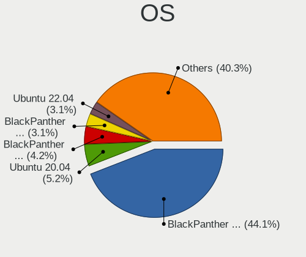
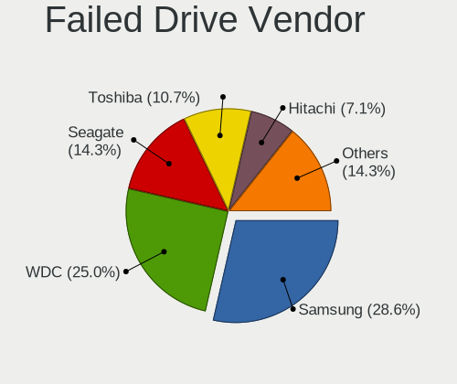
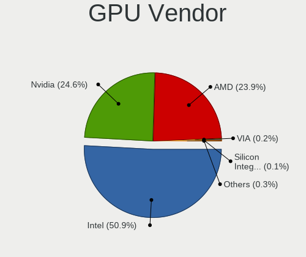
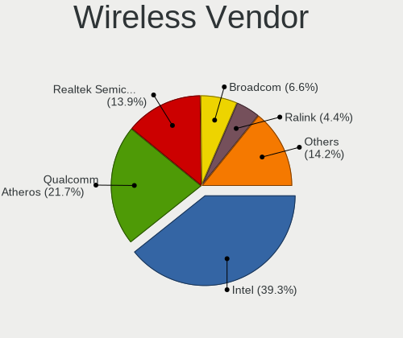
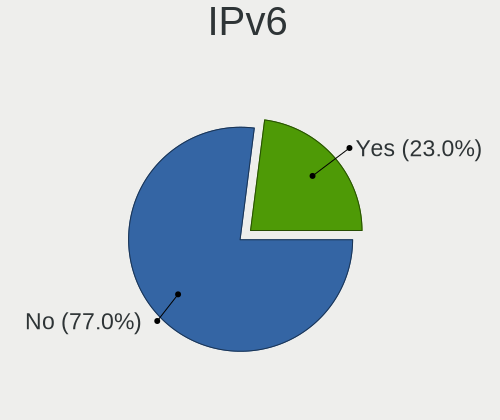

Linux in Hungary - Tested Hardware & Statistics
-----------------------------------------------

A project to collect tested hardware configurations for Linux in Hungary.

Anyone can contribute to this report by the [hw-probe](https://github.com/linuxhw/hw-probe) tool:

    sudo -E hw-probe -all -upload

Please contribute! Especially if your hardware is rare.

This is a report for all computer types. See also reports for [desktops](/Location/Hungary/Desktop/README.md) and [notebooks](/Location/Hungary/Notebook/README.md).

Contents
--------

* [ Test Cases ](#test-cases)

* [ System ](#system)
  - [ OS                       ](#os)
  - [ OS Family                ](#os-family)
  - [ Kernel                   ](#kernel)
  - [ Kernel Family            ](#kernel-family)
  - [ Kernel Major Ver.        ](#kernel-major-ver)
  - [ Arch                     ](#arch)
  - [ DE                       ](#de)
  - [ Display Server           ](#display-server)
  - [ Display Manager          ](#display-manager)
  - [ OS Lang                  ](#os-lang)
  - [ Boot Mode                ](#boot-mode)
  - [ Filesystem               ](#filesystem)
  - [ Part. scheme             ](#part-scheme)
  - [ Dual Boot with Linux/BSD ](#dual-boot-with-linuxbsd)
  - [ Dual Boot (Win)          ](#dual-boot-win)

* [ Board ](#board)
  - [ Vendor                   ](#vendor)
  - [ Model                    ](#model)
  - [ Model Family             ](#model-family)
  - [ MFG Year                 ](#mfg-year)
  - [ Form Factor              ](#form-factor)
  - [ Secure Boot              ](#secure-boot)
  - [ Coreboot                 ](#coreboot)
  - [ RAM Size                 ](#ram-size)
  - [ RAM Used                 ](#ram-used)
  - [ Total Drives             ](#total-drives)
  - [ Has CD-ROM               ](#has-cd-rom)
  - [ Has Ethernet             ](#has-ethernet)
  - [ Has WiFi                 ](#has-wifi)
  - [ Has Bluetooth            ](#has-bluetooth)

* [ Location ](#location)
  - [ Country                  ](#country)
  - [ City                     ](#city)

* [ Drives ](#drives)
  - [ Drive Vendor             ](#drive-vendor)
  - [ Drive Model              ](#drive-model)
  - [ HDD Vendor               ](#hdd-vendor)
  - [ SSD Vendor               ](#ssd-vendor)
  - [ Drive Kind               ](#drive-kind)
  - [ Drive Connector          ](#drive-connector)
  - [ Drive Size               ](#drive-size)
  - [ Space Total              ](#space-total)
  - [ Space Used               ](#space-used)
  - [ Malfunc. Drives          ](#malfunc-drives)
  - [ Malfunc. Drive Vendor    ](#malfunc-drive-vendor)
  - [ Malfunc. HDD Vendor      ](#malfunc-hdd-vendor)
  - [ Malfunc. Drive Kind      ](#malfunc-drive-kind)
  - [ Failed Drives            ](#failed-drives)
  - [ Failed Drive Vendor      ](#failed-drive-vendor)
  - [ Drive Status             ](#drive-status)

* [ Storage controller ](#storage-controller)
  - [ Storage Vendor           ](#storage-vendor)
  - [ Storage Model            ](#storage-model)
  - [ Storage Kind             ](#storage-kind)

* [ Processor ](#processor)
  - [ CPU Vendor               ](#cpu-vendor)
  - [ CPU Model                ](#cpu-model)
  - [ CPU Model Family         ](#cpu-model-family)
  - [ CPU Cores                ](#cpu-cores)
  - [ CPU Sockets              ](#cpu-sockets)
  - [ CPU Threads              ](#cpu-threads)
  - [ CPU Op-Modes             ](#cpu-op-modes)
  - [ CPU Microcode            ](#cpu-microcode)
  - [ CPU Microarch            ](#cpu-microarch)

* [ Graphics ](#graphics)
  - [ GPU Vendor               ](#gpu-vendor)
  - [ GPU Model                ](#gpu-model)
  - [ GPU Combo                ](#gpu-combo)
  - [ GPU Driver               ](#gpu-driver)
  - [ GPU Memory               ](#gpu-memory)

* [ Monitor ](#monitor)
  - [ Monitor Vendor           ](#monitor-vendor)
  - [ Monitor Model            ](#monitor-model)
  - [ Monitor Resolution       ](#monitor-resolution)
  - [ Monitor Diagonal         ](#monitor-diagonal)
  - [ Monitor Width            ](#monitor-width)
  - [ Aspect Ratio             ](#aspect-ratio)
  - [ Monitor Area             ](#monitor-area)
  - [ Pixel Density            ](#pixel-density)
  - [ Multiple Monitors        ](#multiple-monitors)

* [ Network ](#network)
  - [ Net Controller Vendor    ](#net-controller-vendor)
  - [ Net Controller Model     ](#net-controller-model)
  - [ Wireless Vendor          ](#wireless-vendor)
  - [ Wireless Model           ](#wireless-model)
  - [ Ethernet Vendor          ](#ethernet-vendor)
  - [ Ethernet Model           ](#ethernet-model)
  - [ Net Controller Kind      ](#net-controller-kind)
  - [ Used Controller          ](#used-controller)
  - [ NICs                     ](#nics)
  - [ IPv6                     ](#ipv6)

* [ Bluetooth ](#bluetooth)
  - [ Bluetooth Vendor         ](#bluetooth-vendor)
  - [ Bluetooth Model          ](#bluetooth-model)

* [ Sound ](#sound)
  - [ Sound Vendor             ](#sound-vendor)
  - [ Sound Model              ](#sound-model)

* [ Memory ](#memory)
  - [ Memory Vendor            ](#memory-vendor)
  - [ Memory Model             ](#memory-model)
  - [ Memory Kind              ](#memory-kind)
  - [ Memory Form Factor       ](#memory-form-factor)
  - [ Memory Size              ](#memory-size)
  - [ Memory Speed             ](#memory-speed)

* [ Printers & scanners ](#printers--scanners)
  - [ Printer Vendor           ](#printer-vendor)
  - [ Printer Model            ](#printer-model)
  - [ Scanner Vendor           ](#scanner-vendor)
  - [ Scanner Model            ](#scanner-model)

* [ Camera ](#camera)
  - [ Camera Vendor            ](#camera-vendor)
  - [ Camera Model             ](#camera-model)

* [ Security ](#security)
  - [ Fingerprint Vendor       ](#fingerprint-vendor)
  - [ Fingerprint Model        ](#fingerprint-model)
  - [ Chipcard Vendor          ](#chipcard-vendor)
  - [ Chipcard Model           ](#chipcard-model)

* [ Unsupported ](#unsupported)
  - [ Unsupported Devices      ](#unsupported-devices)
  - [ Unsupported Device Types ](#unsupported-device-types)

Test Cases
----------

Total: 8645

| Vendor        | Model                       | Form-Factor | Probe                                                      | Date         |
|---------------|-----------------------------|-------------|------------------------------------------------------------|--------------|
| Lenovo        | ThinkPad E14 20RA002UHV     | Notebook    | [79a037e80b](https://linux-hardware.org/?probe=79a037e80b) | Nov 06, 2023 |
| Lenovo        | 1036 NO DPK                 | Desktop     | [6e0b8b9df9](https://linux-hardware.org/?probe=6e0b8b9df9) | Nov 06, 2023 |
| Dell          | Vostro 1015                 | Notebook    | [c4d9d2cd13](https://linux-hardware.org/?probe=c4d9d2cd13) | Nov 06, 2023 |
| Dell          | Latitude E6410              | Notebook    | [ebdd852a85](https://linux-hardware.org/?probe=ebdd852a85) | Nov 05, 2023 |
| Dell          | Latitude D520               | Notebook    | [99c85f2153](https://linux-hardware.org/?probe=99c85f2153) | Nov 05, 2023 |
| Dell          | Latitude D520               | Notebook    | [d56819f452](https://linux-hardware.org/?probe=d56819f452) | Nov 05, 2023 |
| Lenovo        | SDK0E50510 WIN              | Desktop     | [038e8719ec](https://linux-hardware.org/?probe=038e8719ec) | Nov 05, 2023 |
| HP            | 650                         | Notebook    | [5b72d0e471](https://linux-hardware.org/?probe=5b72d0e471) | Nov 05, 2023 |
| Lenovo        | SDK0E50510 WIN              | Desktop     | [1e59a67f24](https://linux-hardware.org/?probe=1e59a67f24) | Nov 05, 2023 |
| Medion        | E7220                       | Notebook    | [a8643a8082](https://linux-hardware.org/?probe=a8643a8082) | Nov 05, 2023 |
| HP            | Pavilion Gaming Laptop 1... | Notebook    | [b1c2db4297](https://linux-hardware.org/?probe=b1c2db4297) | Nov 05, 2023 |
| Medion        | E7220                       | Notebook    | [f093abab73](https://linux-hardware.org/?probe=f093abab73) | Nov 05, 2023 |
| Gigabyte      | B650M DS3H                  | Desktop     | [a424739d4f](https://linux-hardware.org/?probe=a424739d4f) | Nov 05, 2023 |
| HP            | Pavilion dv5                | Notebook    | [6a122b29a9](https://linux-hardware.org/?probe=6a122b29a9) | Nov 05, 2023 |
| Lenovo        | IdeaPadFlex 5 14ABR8 82X... | Convertible | [a9f0b015d5](https://linux-hardware.org/?probe=a9f0b015d5) | Nov 04, 2023 |
| Dell          | Vostro 3500                 | Notebook    | [08d79042a7](https://linux-hardware.org/?probe=08d79042a7) | Nov 04, 2023 |
| Lenovo        | IdeaPadFlex 5 14ABR8 82X... | Convertible | [d11250217c](https://linux-hardware.org/?probe=d11250217c) | Nov 04, 2023 |
| HP            | 650                         | Notebook    | [c472e54502](https://linux-hardware.org/?probe=c472e54502) | Nov 04, 2023 |
| ASUSTek       | K53U                        | Notebook    | [eb44961984](https://linux-hardware.org/?probe=eb44961984) | Nov 04, 2023 |
| HP            | 8265                        | Desktop     | [f6b38e869b](https://linux-hardware.org/?probe=f6b38e869b) | Nov 04, 2023 |
| HP            | 8265                        | Desktop     | [49cb61db2e](https://linux-hardware.org/?probe=49cb61db2e) | Nov 04, 2023 |
| Dell          | Inspiron 3542               | Notebook    | [f36f4e888c](https://linux-hardware.org/?probe=f36f4e888c) | Nov 04, 2023 |
| Dell          | 0VHWTR A02                  | Desktop     | [7663b608dd](https://linux-hardware.org/?probe=7663b608dd) | Nov 03, 2023 |
| Dell          | Latitude E7470              | Notebook    | [343fdc858a](https://linux-hardware.org/?probe=343fdc858a) | Nov 03, 2023 |
| Lenovo        | IdeaPad C340-14API 81N6     | Notebook    | [3a8d337535](https://linux-hardware.org/?probe=3a8d337535) | Nov 03, 2023 |
| Gigabyte      | H61M-S1                     | Desktop     | [3b14b40bc9](https://linux-hardware.org/?probe=3b14b40bc9) | Nov 02, 2023 |
| ASUSTek       | ProArt Z690-CREATOR WIFI    | Desktop     | [41d5ec4633](https://linux-hardware.org/?probe=41d5ec4633) | Nov 02, 2023 |
| Lenovo        | Annapurna CRB 0B98401 PR... | Desktop     | [dacdb79776](https://linux-hardware.org/?probe=dacdb79776) | Nov 01, 2023 |
| HP            | EliteBook Folio 9480m       | Notebook    | [3d5b8068af](https://linux-hardware.org/?probe=3d5b8068af) | Nov 01, 2023 |
| HP            | EliteBook Folio 9480m       | Notebook    | [135443bd2d](https://linux-hardware.org/?probe=135443bd2d) | Nov 01, 2023 |
| Gigabyte      | H61M-DS2                    | Desktop     | [877ab8782b](https://linux-hardware.org/?probe=877ab8782b) | Nov 01, 2023 |
| HP            | Pavilion Gaming Laptop 1... | Notebook    | [f8a1a5a5fa](https://linux-hardware.org/?probe=f8a1a5a5fa) | Nov 01, 2023 |
| Gigabyte      | EP31-DS3L                   | Desktop     | [0a33a8b925](https://linux-hardware.org/?probe=0a33a8b925) | Nov 01, 2023 |
| MSI           | P43i                        | Desktop     | [847f1890e2](https://linux-hardware.org/?probe=847f1890e2) | Nov 01, 2023 |
| ASRock        | X570M Pro4                  | Desktop     | [ad5e8f91e5](https://linux-hardware.org/?probe=ad5e8f91e5) | Nov 01, 2023 |
| HP            | Pavilion Notebook           | Notebook    | [c0617fe23d](https://linux-hardware.org/?probe=c0617fe23d) | Nov 01, 2023 |
| ASRock        | G41M-VS3                    | Desktop     | [1d5b98622d](https://linux-hardware.org/?probe=1d5b98622d) | Oct 31, 2023 |
| ASRock        | G41M-VS3                    | Desktop     | [1a0da2bf85](https://linux-hardware.org/?probe=1a0da2bf85) | Oct 31, 2023 |
| Gigabyte      | H81M-HD3                    | Desktop     | [5f6ce5dbfb](https://linux-hardware.org/?probe=5f6ce5dbfb) | Oct 31, 2023 |
| Lenovo        | ThinkPad P15 Gen 1 20SUA... | Notebook    | [701a08bdb6](https://linux-hardware.org/?probe=701a08bdb6) | Oct 31, 2023 |
| Dell          | Inspiron 5558               | Notebook    | [a6c79e3211](https://linux-hardware.org/?probe=a6c79e3211) | Oct 31, 2023 |
| Valve         | Jupiter                     | Notebook    | [9749e20de1](https://linux-hardware.org/?probe=9749e20de1) | Oct 31, 2023 |
| Dell          | Inspiron 5558               | Notebook    | [2327e785db](https://linux-hardware.org/?probe=2327e785db) | Oct 31, 2023 |
| Gigabyte      | GA-MA78GPM-DS2H             | Desktop     | [4cf4e845eb](https://linux-hardware.org/?probe=4cf4e845eb) | Oct 30, 2023 |
| HP            | 255 15.6 inch G9 Noteboo... | Notebook    | [b1394cc278](https://linux-hardware.org/?probe=b1394cc278) | Oct 30, 2023 |
| Dell          | 0D883F A06                  | Desktop     | [1813899897](https://linux-hardware.org/?probe=1813899897) | Oct 30, 2023 |
| Dell          | 0D883F A06                  | Desktop     | [6cf499a771](https://linux-hardware.org/?probe=6cf499a771) | Oct 30, 2023 |
| Fujitsu Si... | AMILO Si 2636               | Notebook    | [bc3acc8006](https://linux-hardware.org/?probe=bc3acc8006) | Oct 30, 2023 |
| Samsung       | RV411/RV511/E3511/S3511/... | Notebook    | [abd35a7e37](https://linux-hardware.org/?probe=abd35a7e37) | Oct 30, 2023 |
| Lenovo        | 1730-A1G                    | Desktop     | [2a5fda7baf](https://linux-hardware.org/?probe=2a5fda7baf) | Oct 30, 2023 |
| Lenovo        | 1730-A1G                    | Desktop     | [7d99dba1af](https://linux-hardware.org/?probe=7d99dba1af) | Oct 30, 2023 |
| HP            | Notebook                    | Notebook    | [dae22f458b](https://linux-hardware.org/?probe=dae22f458b) | Oct 30, 2023 |
| HP            | Notebook                    | Notebook    | [373777c65a](https://linux-hardware.org/?probe=373777c65a) | Oct 30, 2023 |
| ASUSTek       | H81M-E                      | Desktop     | [b48b015b4c](https://linux-hardware.org/?probe=b48b015b4c) | Oct 29, 2023 |
| Dell          | Inspiron 1545               | Notebook    | [9902963d1d](https://linux-hardware.org/?probe=9902963d1d) | Oct 29, 2023 |
| Dell          | Inspiron 1545               | Notebook    | [39c5db1614](https://linux-hardware.org/?probe=39c5db1614) | Oct 29, 2023 |
| ASRock        | AM1B-M                      | Desktop     | [098a155bab](https://linux-hardware.org/?probe=098a155bab) | Oct 29, 2023 |
| Lenovo        | ThinkPad X250 20CMS04J00    | Notebook    | [773098b9e5](https://linux-hardware.org/?probe=773098b9e5) | Oct 29, 2023 |
| Dell          | 0HHV7N A00                  | Desktop     | [85e507b8b2](https://linux-hardware.org/?probe=85e507b8b2) | Oct 29, 2023 |
| Dell          | Inspiron 15-3573            | Notebook    | [de8470b056](https://linux-hardware.org/?probe=de8470b056) | Oct 29, 2023 |
| Dell          | 0XGMD0 A00                  | All in one  | [f3fe5293ae](https://linux-hardware.org/?probe=f3fe5293ae) | Oct 29, 2023 |
| ASUSTek       | K54C                        | Notebook    | [d36a0a583b](https://linux-hardware.org/?probe=d36a0a583b) | Oct 29, 2023 |
| Lenovo        | ThinkPad T420 4236W1Y       | Notebook    | [2ff5cba7a7](https://linux-hardware.org/?probe=2ff5cba7a7) | Oct 29, 2023 |
| Dell          | Inspiron 15-3573            | Notebook    | [db205eed37](https://linux-hardware.org/?probe=db205eed37) | Oct 29, 2023 |
| Acer          | Nitro AN515-57              | Notebook    | [5d047c6d80](https://linux-hardware.org/?probe=5d047c6d80) | Oct 28, 2023 |
| Dell          | Inspiron 3521               | Notebook    | [67aa25e9ff](https://linux-hardware.org/?probe=67aa25e9ff) | Oct 28, 2023 |
| Dell          | 0XGMD0 A00                  | All in one  | [27d90e68ae](https://linux-hardware.org/?probe=27d90e68ae) | Oct 28, 2023 |
| Fujitsu       | D3222-A1 S26361-D3222-A1    | Desktop     | [2c3cefb71a](https://linux-hardware.org/?probe=2c3cefb71a) | Oct 28, 2023 |
| TELECOMITA... | M7x0S                       | Notebook    | [feabc7e111](https://linux-hardware.org/?probe=feabc7e111) | Oct 28, 2023 |
| ASUSTek       | X101                        | Notebook    | [dab1a6368d](https://linux-hardware.org/?probe=dab1a6368d) | Oct 27, 2023 |
| MSI           | MS-7817                     | Desktop     | [06344ac320](https://linux-hardware.org/?probe=06344ac320) | Oct 27, 2023 |
| MSI           | MS-7817                     | Desktop     | [dc9cc99096](https://linux-hardware.org/?probe=dc9cc99096) | Oct 27, 2023 |
| Dell          | Inspiron N5010              | Notebook    | [5d60a750af](https://linux-hardware.org/?probe=5d60a750af) | Oct 27, 2023 |
| Dell          | Inspiron N5010              | Notebook    | [6ca7ed2683](https://linux-hardware.org/?probe=6ca7ed2683) | Oct 27, 2023 |
| ASUSTek       | PRIME A320M-R               | Desktop     | [0306fca319](https://linux-hardware.org/?probe=0306fca319) | Oct 27, 2023 |
| HP            | HDX 16                      | Notebook    | [e2c3147b80](https://linux-hardware.org/?probe=e2c3147b80) | Oct 27, 2023 |
| Dell          | Latitude 3590               | Notebook    | [2d288fa42e](https://linux-hardware.org/?probe=2d288fa42e) | Oct 27, 2023 |
| HP            | HDX 16                      | Notebook    | [9ec532aa3c](https://linux-hardware.org/?probe=9ec532aa3c) | Oct 27, 2023 |
| Lenovo        | ThinkPad E15 Gen 2 20TD0... | Notebook    | [181d68d988](https://linux-hardware.org/?probe=181d68d988) | Oct 27, 2023 |
| Dell          | Latitude 5480               | Notebook    | [200d747791](https://linux-hardware.org/?probe=200d747791) | Oct 27, 2023 |
| Lenovo        | G505 20240                  | Notebook    | [efe15b2600](https://linux-hardware.org/?probe=efe15b2600) | Oct 26, 2023 |
| Lenovo        | G505 20240                  | Notebook    | [9d4b52edfe](https://linux-hardware.org/?probe=9d4b52edfe) | Oct 26, 2023 |
| ASUSTek       | M5A97 LE R2.0               | Desktop     | [b58a3b7e3a](https://linux-hardware.org/?probe=b58a3b7e3a) | Oct 26, 2023 |
| ASUSTek       | M5A97 LE R2.0               | Desktop     | [220d49592e](https://linux-hardware.org/?probe=220d49592e) | Oct 26, 2023 |
| Lenovo        | G50-30 80G0                 | Notebook    | [5e16db7192](https://linux-hardware.org/?probe=5e16db7192) | Oct 26, 2023 |
| Lenovo        | G50-30 80G0                 | Notebook    | [a2731cd16e](https://linux-hardware.org/?probe=a2731cd16e) | Oct 26, 2023 |
| Gigabyte      | GA-A75M-D2H                 | Desktop     | [64693f6b03](https://linux-hardware.org/?probe=64693f6b03) | Oct 26, 2023 |
| Gigabyte      | GA-A75M-D2H                 | Desktop     | [7a96d2e495](https://linux-hardware.org/?probe=7a96d2e495) | Oct 26, 2023 |
| Fujitsu       | LIFEBOOK A512               | Notebook    | [f6b735de42](https://linux-hardware.org/?probe=f6b735de42) | Oct 25, 2023 |
| ASUSTek       | 1015BX                      | Notebook    | [676f3b81ce](https://linux-hardware.org/?probe=676f3b81ce) | Oct 25, 2023 |
| Fujitsu       | D3222-A1 S26361-D3222-A1    | Desktop     | [828dbad92c](https://linux-hardware.org/?probe=828dbad92c) | Oct 25, 2023 |
| Lenovo        | G505s 20255                 | Notebook    | [4bc0dc73b1](https://linux-hardware.org/?probe=4bc0dc73b1) | Oct 25, 2023 |
| Gigabyte      | GA-MA78GPM-DS2H             | Desktop     | [4f6c606196](https://linux-hardware.org/?probe=4f6c606196) | Oct 24, 2023 |
| MSI           | MAG B550 TOMAHAWK           | Desktop     | [7e2c80a1d7](https://linux-hardware.org/?probe=7e2c80a1d7) | Oct 24, 2023 |
| Fujitsu       | LIFEBOOK A512               | Notebook    | [3deed5f633](https://linux-hardware.org/?probe=3deed5f633) | Oct 24, 2023 |
| HP            | 250 G8 Notebook PC          | Notebook    | [410e22edf0](https://linux-hardware.org/?probe=410e22edf0) | Oct 24, 2023 |
| HP            | 339A                        | Desktop     | [119fec0a9d](https://linux-hardware.org/?probe=119fec0a9d) | Oct 24, 2023 |
| HP            | 339A                        | Desktop     | [b35bc69c82](https://linux-hardware.org/?probe=b35bc69c82) | Oct 24, 2023 |
| Gigabyte      | F2A88XN-WIFI                | Desktop     | [50bdbf100d](https://linux-hardware.org/?probe=50bdbf100d) | Oct 23, 2023 |
| MSI           | MAG B550 TOMAHAWK           | Desktop     | [3824135292](https://linux-hardware.org/?probe=3824135292) | Oct 23, 2023 |
| Gigabyte      | F2A88XN-WIFI                | Desktop     | [875d62cbac](https://linux-hardware.org/?probe=875d62cbac) | Oct 23, 2023 |
| ASUSTek       | ASUS TUF Gaming A15 FA50... | Notebook    | [b838b1d016](https://linux-hardware.org/?probe=b838b1d016) | Oct 23, 2023 |
| Acer          | TravelMate P215-52          | Notebook    | [b834df3a83](https://linux-hardware.org/?probe=b834df3a83) | Oct 23, 2023 |
| Acer          | TravelMate P215-52          | Notebook    | [a62011100d](https://linux-hardware.org/?probe=a62011100d) | Oct 23, 2023 |
| Lenovo        | ThinkPad T420 4236B87       | Notebook    | [86dc35496a](https://linux-hardware.org/?probe=86dc35496a) | Oct 23, 2023 |
| ASRock        | B760M PG Riptide            | Desktop     | [d1f12415b9](https://linux-hardware.org/?probe=d1f12415b9) | Oct 23, 2023 |
| HP            | Notebook                    | Notebook    | [d06318071f](https://linux-hardware.org/?probe=d06318071f) | Oct 22, 2023 |
| Lenovo        | IdeaPad 330-15IKB 81DE      | Notebook    | [2ae3b33ae8](https://linux-hardware.org/?probe=2ae3b33ae8) | Oct 22, 2023 |
| Lenovo        | IdeaPad 330-15IKB 81DE      | Notebook    | [5f54128707](https://linux-hardware.org/?probe=5f54128707) | Oct 22, 2023 |
| Dell          | Latitude E6540              | Notebook    | [5249645843](https://linux-hardware.org/?probe=5249645843) | Oct 22, 2023 |
| Lenovo        | ThinkPad T420 4236B87       | Notebook    | [e681e567ad](https://linux-hardware.org/?probe=e681e567ad) | Oct 22, 2023 |
| HP            | Pavilion 17                 | Notebook    | [f72b1f8c83](https://linux-hardware.org/?probe=f72b1f8c83) | Oct 21, 2023 |
| ASUSTek       | TUF Gaming B550M-E          | Desktop     | [3eafc2c647](https://linux-hardware.org/?probe=3eafc2c647) | Oct 21, 2023 |
| Microsoft     | Surface Pro                 | Tablet      | [3543df08ee](https://linux-hardware.org/?probe=3543df08ee) | Oct 21, 2023 |
| Microsoft     | Surface Pro                 | Tablet      | [79d3058ad1](https://linux-hardware.org/?probe=79d3058ad1) | Oct 21, 2023 |
| Dell          | 0D883F A06                  | Desktop     | [f687230e43](https://linux-hardware.org/?probe=f687230e43) | Oct 21, 2023 |
| HP            | Pavilion Laptop 14-ec0xx... | Notebook    | [0d9d598232](https://linux-hardware.org/?probe=0d9d598232) | Oct 21, 2023 |
| ASUSTek       | P5KPL-AM                    | Desktop     | [b5bf9b7639](https://linux-hardware.org/?probe=b5bf9b7639) | Oct 21, 2023 |
| Lenovo        | ThinkPad X201 3680V5T       | Notebook    | [b30e261022](https://linux-hardware.org/?probe=b30e261022) | Oct 20, 2023 |
| Dell          | Latitude E7470              | Notebook    | [4870f90403](https://linux-hardware.org/?probe=4870f90403) | Oct 20, 2023 |
| ASRock        | B450 Steel Legend           | Desktop     | [d3036ca319](https://linux-hardware.org/?probe=d3036ca319) | Oct 20, 2023 |
| Lenovo        | ThinkPad X230 2333A91       | Notebook    | [6e43e8e97a](https://linux-hardware.org/?probe=6e43e8e97a) | Oct 20, 2023 |
| Lenovo        | ThinkPad X230 2333A91       | Notebook    | [1ba3f61a85](https://linux-hardware.org/?probe=1ba3f61a85) | Oct 20, 2023 |
| Lenovo        | E50-80 80J2                 | Notebook    | [539584b79f](https://linux-hardware.org/?probe=539584b79f) | Oct 20, 2023 |
| HP            | 3397                        | Desktop     | [7622910000](https://linux-hardware.org/?probe=7622910000) | Oct 20, 2023 |
| Lenovo        | ThinkPad T420 4236B87       | Notebook    | [ba440cffa8](https://linux-hardware.org/?probe=ba440cffa8) | Oct 20, 2023 |
| Fujitsu       | LIFEBOOK A512               | Notebook    | [91503bb9a7](https://linux-hardware.org/?probe=91503bb9a7) | Oct 19, 2023 |
| ASUSTek       | H110M-A                     | Desktop     | [2cff132417](https://linux-hardware.org/?probe=2cff132417) | Oct 19, 2023 |
| Fujitsu       | LIFEBOOK A512               | Notebook    | [74d8675dfc](https://linux-hardware.org/?probe=74d8675dfc) | Oct 19, 2023 |
| Fujitsu       | LIFEBOOK A3510              | Notebook    | [a3bc73fa83](https://linux-hardware.org/?probe=a3bc73fa83) | Oct 19, 2023 |
| Gigabyte      | B450M GAMING                | Desktop     | [dad965a109](https://linux-hardware.org/?probe=dad965a109) | Oct 19, 2023 |
| Lenovo        | 1036 NO DPK                 | Desktop     | [0733e9c4ae](https://linux-hardware.org/?probe=0733e9c4ae) | Oct 19, 2023 |
| Gigabyte      | B450M GAMING                | Desktop     | [8ca65eabee](https://linux-hardware.org/?probe=8ca65eabee) | Oct 19, 2023 |
| Sony          | VPCS13V9E                   | Notebook    | [af74c8aeff](https://linux-hardware.org/?probe=af74c8aeff) | Oct 19, 2023 |
| MSI           | H61M-P21                    | Desktop     | [ba5fb8f49c](https://linux-hardware.org/?probe=ba5fb8f49c) | Oct 19, 2023 |
| ASRock        | B550M Pro4                  | Desktop     | [330170d5d7](https://linux-hardware.org/?probe=330170d5d7) | Oct 19, 2023 |
| ASRock        | B550M Pro4                  | Desktop     | [e6840ccb2f](https://linux-hardware.org/?probe=e6840ccb2f) | Oct 19, 2023 |
| Dell          | 0K240Y A01                  | Desktop     | [e57b8986ab](https://linux-hardware.org/?probe=e57b8986ab) | Oct 18, 2023 |
| Gigabyte      | Z370 HD3P-CF                | Desktop     | [0994d6d9a2](https://linux-hardware.org/?probe=0994d6d9a2) | Oct 18, 2023 |
| Gigabyte      | J4005ND2P-CF                | Desktop     | [23efcaf7a2](https://linux-hardware.org/?probe=23efcaf7a2) | Oct 18, 2023 |
| Dell          | Latitude E6230              | Notebook    | [6b95eceb6d](https://linux-hardware.org/?probe=6b95eceb6d) | Oct 18, 2023 |
| Dell          | Latitude E6230              | Notebook    | [80ef815864](https://linux-hardware.org/?probe=80ef815864) | Oct 18, 2023 |
| Lenovo        | ThinkStation D20 4158AF8    | Desktop     | [ce65c73e40](https://linux-hardware.org/?probe=ce65c73e40) | Oct 18, 2023 |
| ASUSTek       | Vivobook Go E1504FA_E150... | Notebook    | [0c5f7a1b92](https://linux-hardware.org/?probe=0c5f7a1b92) | Oct 18, 2023 |
| Fujitsu       | LIFEBOOK A555               | Notebook    | [6495c7be9b](https://linux-hardware.org/?probe=6495c7be9b) | Oct 18, 2023 |
| Lenovo        | V15-ADA 82C7                | Notebook    | [9cf2098fd0](https://linux-hardware.org/?probe=9cf2098fd0) | Oct 17, 2023 |
| ASUSTek       | PRIME B360-PLUS             | Desktop     | [c9f674352d](https://linux-hardware.org/?probe=c9f674352d) | Oct 17, 2023 |
| Dell          | Latitude E6430              | Notebook    | [54d411b12d](https://linux-hardware.org/?probe=54d411b12d) | Oct 17, 2023 |
| Gigabyte      | F2A88XM-D3HP                | Desktop     | [64e28141f8](https://linux-hardware.org/?probe=64e28141f8) | Oct 17, 2023 |
| HP            | Notebook                    | Notebook    | [62bc59c216](https://linux-hardware.org/?probe=62bc59c216) | Oct 17, 2023 |
| HP            | Notebook                    | Notebook    | [4ee408f659](https://linux-hardware.org/?probe=4ee408f659) | Oct 17, 2023 |
| HP            | 8265                        | Desktop     | [4e8e0ea26a](https://linux-hardware.org/?probe=4e8e0ea26a) | Oct 17, 2023 |
| ASUSTek       | Vivobook Go E1504FA_E150... | Notebook    | [a0dc919ac2](https://linux-hardware.org/?probe=a0dc919ac2) | Oct 17, 2023 |
| Lenovo        | ThinkPad T61 889855G        | Notebook    | [d2cf744079](https://linux-hardware.org/?probe=d2cf744079) | Oct 17, 2023 |
| Fujitsu       | D3403-U1 S26361-D3403-U1    | Desktop     | [9e3034f710](https://linux-hardware.org/?probe=9e3034f710) | Oct 17, 2023 |
| Dell          | Inspiron 7737               | Notebook    | [4f8ecd431c](https://linux-hardware.org/?probe=4f8ecd431c) | Oct 17, 2023 |
| Fujitsu       | D3403-U1 S26361-D3403-U1    | Desktop     | [ea34b890ed](https://linux-hardware.org/?probe=ea34b890ed) | Oct 17, 2023 |
| ASUSTek       | ASUS EXPERTBOOK B7402FVA... | Convertible | [70797c08d1](https://linux-hardware.org/?probe=70797c08d1) | Oct 17, 2023 |
| HP            | 8265                        | Desktop     | [8f4c84f4f4](https://linux-hardware.org/?probe=8f4c84f4f4) | Oct 16, 2023 |
| ASUSTek       | ASUS TUF Gaming F15 FX50... | Notebook    | [58d5c291fc](https://linux-hardware.org/?probe=58d5c291fc) | Oct 16, 2023 |
| Gigabyte      | MFLP3CP-00                  | Desktop     | [e2ddb858a9](https://linux-hardware.org/?probe=e2ddb858a9) | Oct 16, 2023 |
| Microsoft     | Surface Pro                 | Tablet      | [f04e1a56a4](https://linux-hardware.org/?probe=f04e1a56a4) | Oct 16, 2023 |
| ASUSTek       | PRIME B365M-A               | Desktop     | [b7fb2c5300](https://linux-hardware.org/?probe=b7fb2c5300) | Oct 16, 2023 |
| MSI           | MAG B550 TOMAHAWK           | Desktop     | [707b8c0acd](https://linux-hardware.org/?probe=707b8c0acd) | Oct 15, 2023 |
| ASUSTek       | PRIME B365M-A               | Desktop     | [59a2975041](https://linux-hardware.org/?probe=59a2975041) | Oct 15, 2023 |
| Dell          | Latitude E7470              | Notebook    | [59258fc186](https://linux-hardware.org/?probe=59258fc186) | Oct 15, 2023 |
| HP            | 2820h                       | Desktop     | [6b9bbe3a64](https://linux-hardware.org/?probe=6b9bbe3a64) | Oct 15, 2023 |
| Acer          | Aspire ES1-571              | Notebook    | [031455773c](https://linux-hardware.org/?probe=031455773c) | Oct 14, 2023 |
| Acer          | Aspire 5750ZG               | Notebook    | [23a48d0873](https://linux-hardware.org/?probe=23a48d0873) | Oct 13, 2023 |
| Acer          | Aspire 5750ZG               | Notebook    | [da6b006c58](https://linux-hardware.org/?probe=da6b006c58) | Oct 13, 2023 |
| Dell          | Latitude 7490               | Notebook    | [b5e38fe27e](https://linux-hardware.org/?probe=b5e38fe27e) | Oct 13, 2023 |
| Dell          | Vostro 3500                 | Notebook    | [7af22eb528](https://linux-hardware.org/?probe=7af22eb528) | Oct 12, 2023 |
| ASUSTek       | P8B75-M                     | Desktop     | [7fba4999fa](https://linux-hardware.org/?probe=7fba4999fa) | Oct 12, 2023 |
| Apple         | Mac-F2268CC8                | All in one  | [df2e146cf0](https://linux-hardware.org/?probe=df2e146cf0) | Oct 12, 2023 |
| ASRock        | H310CM-DVS                  | Desktop     | [1ae8fcd28c](https://linux-hardware.org/?probe=1ae8fcd28c) | Oct 12, 2023 |
| Medion        | MS-7748                     | Desktop     | [8b625acaae](https://linux-hardware.org/?probe=8b625acaae) | Oct 12, 2023 |
| Pegatron      | 2AB6                        | Desktop     | [50fbeed34d](https://linux-hardware.org/?probe=50fbeed34d) | Oct 11, 2023 |
| Pegatron      | 2AB6                        | Desktop     | [e97e82006c](https://linux-hardware.org/?probe=e97e82006c) | Oct 11, 2023 |
| Dell          | 0D883F A06                  | Desktop     | [d1e2846467](https://linux-hardware.org/?probe=d1e2846467) | Oct 11, 2023 |
| ASUSTek       | X55U                        | Notebook    | [82866b3b8b](https://linux-hardware.org/?probe=82866b3b8b) | Oct 11, 2023 |
| Lenovo        | ThinkPad T420 4236B87       | Notebook    | [55e5cd7abc](https://linux-hardware.org/?probe=55e5cd7abc) | Oct 11, 2023 |
| HP            | 0AA8h                       | Desktop     | [5b821194a7](https://linux-hardware.org/?probe=5b821194a7) | Oct 11, 2023 |
| Lenovo        | MAHOBAY NOK                 | Desktop     | [83ed978b53](https://linux-hardware.org/?probe=83ed978b53) | Oct 11, 2023 |
| HP            | 0AA8h                       | Desktop     | [d88c5dced7](https://linux-hardware.org/?probe=d88c5dced7) | Oct 11, 2023 |
| Dell          | Inspiron 5558               | Notebook    | [da6724b430](https://linux-hardware.org/?probe=da6724b430) | Oct 11, 2023 |
| eMachines     | E725                        | Notebook    | [1efc1e7a3a](https://linux-hardware.org/?probe=1efc1e7a3a) | Oct 10, 2023 |
| MSI           | MS-7817                     | Desktop     | [ed5e21c562](https://linux-hardware.org/?probe=ed5e21c562) | Oct 10, 2023 |
| Dell          | Latitude 5531               | Notebook    | [1a27e5ee19](https://linux-hardware.org/?probe=1a27e5ee19) | Oct 10, 2023 |
| Dell          | Inspiron 17 7000 Series ... | Notebook    | [602dbf9ee0](https://linux-hardware.org/?probe=602dbf9ee0) | Oct 10, 2023 |
| Gigabyte      | B660M GAMING DDR4           | Desktop     | [abca75fa11](https://linux-hardware.org/?probe=abca75fa11) | Oct 10, 2023 |
| Gigabyte      | GA-MA78GPM-DS2H             | Desktop     | [2cba957b98](https://linux-hardware.org/?probe=2cba957b98) | Oct 09, 2023 |
| ASUSTek       | X200MA                      | Notebook    | [731177232b](https://linux-hardware.org/?probe=731177232b) | Oct 09, 2023 |
| Gigabyte      | H310M A-CF x.x              | Desktop     | [be9975c532](https://linux-hardware.org/?probe=be9975c532) | Oct 09, 2023 |
| ASUSTek       | K51AE                       | Notebook    | [9c3d05354e](https://linux-hardware.org/?probe=9c3d05354e) | Oct 09, 2023 |
| Gigabyte      | H310M A-CF x.x              | Desktop     | [c3d3003248](https://linux-hardware.org/?probe=c3d3003248) | Oct 09, 2023 |
| Lenovo        | IdeaPad 110-15ISK 80UD      | Notebook    | [d3bd6d1c84](https://linux-hardware.org/?probe=d3bd6d1c84) | Oct 08, 2023 |
| Dell          | 0XGMD0 A00                  | All in one  | [4438e4ffc0](https://linux-hardware.org/?probe=4438e4ffc0) | Oct 08, 2023 |
| Gigabyte      | P67A-D3-B3                  | Desktop     | [d935714c39](https://linux-hardware.org/?probe=d935714c39) | Oct 08, 2023 |
| Lenovo        | IdeaPad 110-15ISK 80UD      | Notebook    | [af810081c9](https://linux-hardware.org/?probe=af810081c9) | Oct 08, 2023 |
| eMachines     | E525                        | Notebook    | [4eb2312418](https://linux-hardware.org/?probe=4eb2312418) | Oct 08, 2023 |
| Dell          | 0XGMD0 A00                  | All in one  | [870f54c9bf](https://linux-hardware.org/?probe=870f54c9bf) | Oct 08, 2023 |
| HP            | ProLiant MicroServer        | Desktop     | [1c7c472122](https://linux-hardware.org/?probe=1c7c472122) | Oct 07, 2023 |
| MSI           | H97 GUARD-PRO               | Desktop     | [ffb2b71ce7](https://linux-hardware.org/?probe=ffb2b71ce7) | Oct 07, 2023 |
| ASUSTek       | H110M-K                     | Desktop     | [5fad8d4e39](https://linux-hardware.org/?probe=5fad8d4e39) | Oct 07, 2023 |
| MSI           | H97 GUARD-PRO               | Desktop     | [047ec55668](https://linux-hardware.org/?probe=047ec55668) | Oct 07, 2023 |
| Lenovo        | 36C7 SDK0J40697 WIN 3305... | Desktop     | [29adc32704](https://linux-hardware.org/?probe=29adc32704) | Oct 07, 2023 |
| ASRock        | 775i945GZ                   | Desktop     | [ef1dd349c2](https://linux-hardware.org/?probe=ef1dd349c2) | Oct 07, 2023 |
| Lenovo        | ThinkPad T450 20BUS0VH08    | Notebook    | [584a2bec33](https://linux-hardware.org/?probe=584a2bec33) | Oct 07, 2023 |
| ASRock        | 775i945GZ                   | Desktop     | [168713fd05](https://linux-hardware.org/?probe=168713fd05) | Oct 07, 2023 |
| ASUSTek       | PRIME A320M-R               | Desktop     | [2043b1ed85](https://linux-hardware.org/?probe=2043b1ed85) | Oct 07, 2023 |
| Gigabyte      | H61MA-D3V                   | Desktop     | [53f61c91bf](https://linux-hardware.org/?probe=53f61c91bf) | Oct 07, 2023 |
| Lenovo        | SDK0E50510 WIN              | Desktop     | [ceaac5726a](https://linux-hardware.org/?probe=ceaac5726a) | Oct 07, 2023 |
| Dell          | Inspiron 5558               | Notebook    | [996c50cad3](https://linux-hardware.org/?probe=996c50cad3) | Oct 07, 2023 |
| ASUSTek       | H110M-A                     | Desktop     | [a2cc2d051e](https://linux-hardware.org/?probe=a2cc2d051e) | Oct 06, 2023 |
| Gigabyte      | B75M-D3H                    | Desktop     | [c585e7e5c4](https://linux-hardware.org/?probe=c585e7e5c4) | Oct 06, 2023 |
| Gigabyte      | B75M-D3H                    | Desktop     | [276b8cea5f](https://linux-hardware.org/?probe=276b8cea5f) | Oct 06, 2023 |
| Medion        | MS-7748                     | Desktop     | [01b345394a](https://linux-hardware.org/?probe=01b345394a) | Oct 06, 2023 |
| MSI           | B450 TOMAHAWK MAX           | Desktop     | [c074bb832e](https://linux-hardware.org/?probe=c074bb832e) | Oct 06, 2023 |
| Gigabyte      | B660M GAMING DDR4           | Desktop     | [9e00c6f4b0](https://linux-hardware.org/?probe=9e00c6f4b0) | Oct 06, 2023 |
| HP            | 8265                        | Desktop     | [6fffe02648](https://linux-hardware.org/?probe=6fffe02648) | Oct 05, 2023 |
| Lenovo        | ThinkPad X220 4291C84       | Notebook    | [92cc269d09](https://linux-hardware.org/?probe=92cc269d09) | Oct 05, 2023 |
| ASUSTek       | ASUS EXPERTBOOK B7402FVA... | Convertible | [0145cc500f](https://linux-hardware.org/?probe=0145cc500f) | Oct 05, 2023 |
| HP            | 8265                        | Desktop     | [fe09b6a8e0](https://linux-hardware.org/?probe=fe09b6a8e0) | Oct 04, 2023 |
| ASUSTek       | PRIME A320M-R               | Desktop     | [d247c129c4](https://linux-hardware.org/?probe=d247c129c4) | Oct 04, 2023 |
| Dell          | Latitude 7490               | Notebook    | [ff1fcbaff6](https://linux-hardware.org/?probe=ff1fcbaff6) | Oct 04, 2023 |
| Dell          | Latitude 7490               | Notebook    | [7eca4901d4](https://linux-hardware.org/?probe=7eca4901d4) | Oct 04, 2023 |
| HP            | 1825                        | Desktop     | [d326bc59ff](https://linux-hardware.org/?probe=d326bc59ff) | Oct 04, 2023 |
| Gigabyte      | GA-MA790X-UD3P              | Desktop     | [d6cc456788](https://linux-hardware.org/?probe=d6cc456788) | Oct 04, 2023 |
| Fujitsu Si... | D2721-A1 S26361-D2721-A1    | Desktop     | [78c456d55d](https://linux-hardware.org/?probe=78c456d55d) | Oct 04, 2023 |
| Lenovo        | 30D2 SDK0J40697 WIN 3305... | Desktop     | [74c8e5eadf](https://linux-hardware.org/?probe=74c8e5eadf) | Oct 03, 2023 |
| Dell          | Inspiron 17 7000 Series ... | Notebook    | [aefdc00927](https://linux-hardware.org/?probe=aefdc00927) | Oct 03, 2023 |
| Lenovo        | 36C7 SDK0J40697 WIN 3305... | Desktop     | [2c0427d154](https://linux-hardware.org/?probe=2c0427d154) | Oct 03, 2023 |
| ASUSTek       | TUF B450M-PRO GAMING        | Desktop     | [0a765bb242](https://linux-hardware.org/?probe=0a765bb242) | Oct 03, 2023 |
| HP            | ProBook 6570b               | Notebook    | [77a44e0363](https://linux-hardware.org/?probe=77a44e0363) | Oct 03, 2023 |
| Gigabyte      | GA-MA790X-UD3P              | Desktop     | [ee08a8d73a](https://linux-hardware.org/?probe=ee08a8d73a) | Oct 02, 2023 |
| Gigabyte      | GA-MA78GPM-DS2H             | Desktop     | [913fafd8a7](https://linux-hardware.org/?probe=913fafd8a7) | Oct 02, 2023 |
| Lenovo        | SDK0E50510 WIN              | Desktop     | [c64f3bbdbd](https://linux-hardware.org/?probe=c64f3bbdbd) | Oct 02, 2023 |
| HP            | 1494                        | Desktop     | [1c5842d2b7](https://linux-hardware.org/?probe=1c5842d2b7) | Oct 01, 2023 |
| HP            | 1494                        | Desktop     | [4ffbf86079](https://linux-hardware.org/?probe=4ffbf86079) | Oct 01, 2023 |
| Apple         | Mac-F42386C8 PVT            | All in one  | [b091100361](https://linux-hardware.org/?probe=b091100361) | Oct 01, 2023 |
| HP            | 8298                        | Desktop     | [0f73d73d00](https://linux-hardware.org/?probe=0f73d73d00) | Oct 01, 2023 |
| ASUSTek       | X55U                        | Notebook    | [029b7ab708](https://linux-hardware.org/?probe=029b7ab708) | Oct 01, 2023 |
| Apple         | Mac-F42386C8 PVT            | All in one  | [5ba74bb868](https://linux-hardware.org/?probe=5ba74bb868) | Oct 01, 2023 |
| HP            | 339A                        | Desktop     | [cd104d3996](https://linux-hardware.org/?probe=cd104d3996) | Oct 01, 2023 |
| Apple         | Mac-F42386C8 PVT            | All in one  | [fa948b8e32](https://linux-hardware.org/?probe=fa948b8e32) | Oct 01, 2023 |
| HP            | 1494                        | Desktop     | [5250e1dc1c](https://linux-hardware.org/?probe=5250e1dc1c) | Oct 01, 2023 |
| Lenovo        | ThinkCentre M55p 8811ZD4    | Desktop     | [710dea5f88](https://linux-hardware.org/?probe=710dea5f88) | Sep 30, 2023 |
| HP            | ProBook 640 G8 Notebook ... | Notebook    | [4567599161](https://linux-hardware.org/?probe=4567599161) | Sep 29, 2023 |
| HP            | ProBook 640 G8 Notebook ... | Notebook    | [526458167b](https://linux-hardware.org/?probe=526458167b) | Sep 29, 2023 |
| Dell          | Inspiron 3542               | Notebook    | [b7faf1054b](https://linux-hardware.org/?probe=b7faf1054b) | Sep 29, 2023 |
| Acer          | Swift SF114-34              | Notebook    | [9d618e345a](https://linux-hardware.org/?probe=9d618e345a) | Sep 29, 2023 |
| Gigabyte      | H110M-S2H-CF                | Desktop     | [3513d5bcf3](https://linux-hardware.org/?probe=3513d5bcf3) | Sep 28, 2023 |
| ASRock        | B550M Pro4                  | Desktop     | [a355202f8a](https://linux-hardware.org/?probe=a355202f8a) | Sep 28, 2023 |
| Dell          | Inspiron 5559               | Notebook    | [ea6622fcde](https://linux-hardware.org/?probe=ea6622fcde) | Sep 28, 2023 |
| Dell          | Inspiron 5559               | Notebook    | [a7e3c38a52](https://linux-hardware.org/?probe=a7e3c38a52) | Sep 28, 2023 |
| eMachines     | E725                        | Notebook    | [2c76723d59](https://linux-hardware.org/?probe=2c76723d59) | Sep 28, 2023 |
| Zebra Tech... | 10-WLAN-1                   | Notebook    | [9959efdb76](https://linux-hardware.org/?probe=9959efdb76) | Sep 27, 2023 |
| ASUSTek       | D700MD                      | Desktop     | [91740e63b9](https://linux-hardware.org/?probe=91740e63b9) | Sep 27, 2023 |
| HP            | 250 G1                      | Notebook    | [0ec87fea6c](https://linux-hardware.org/?probe=0ec87fea6c) | Sep 27, 2023 |
| Dell          | Inspiron 5558               | Notebook    | [e8577ce363](https://linux-hardware.org/?probe=e8577ce363) | Sep 27, 2023 |
| ASUSTek       | X550LN                      | Notebook    | [390c16a341](https://linux-hardware.org/?probe=390c16a341) | Sep 26, 2023 |
| Lenovo        | ThinkServer TS440           | Desktop     | [11efb68800](https://linux-hardware.org/?probe=11efb68800) | Sep 26, 2023 |
| ASUSTek       | P5KPL-AM EPU                | Desktop     | [4cbe33187c](https://linux-hardware.org/?probe=4cbe33187c) | Sep 26, 2023 |
| ASUSTek       | PRIME B365M-A               | Desktop     | [a3fc0915cd](https://linux-hardware.org/?probe=a3fc0915cd) | Sep 26, 2023 |
| Dell          | 0GY6Y8 A01                  | Desktop     | [3ffed1f144](https://linux-hardware.org/?probe=3ffed1f144) | Sep 26, 2023 |
| Dell          | 0GY6Y8 A01                  | Desktop     | [e6eff7d60d](https://linux-hardware.org/?probe=e6eff7d60d) | Sep 25, 2023 |
| HP            | Pavilion Laptop 14-ec0xx... | Notebook    | [6b0a58d94c](https://linux-hardware.org/?probe=6b0a58d94c) | Sep 25, 2023 |
| ASRock        | B550M Pro4                  | Desktop     | [263bf34c40](https://linux-hardware.org/?probe=263bf34c40) | Sep 25, 2023 |
| HP            | 250 G1                      | Notebook    | [1aa0ca441a](https://linux-hardware.org/?probe=1aa0ca441a) | Sep 25, 2023 |
| ASUSTek       | X550CL                      | Notebook    | [9a2c66690c](https://linux-hardware.org/?probe=9a2c66690c) | Sep 25, 2023 |
| MSI           | B85M-E33                    | Desktop     | [1e246dda8b](https://linux-hardware.org/?probe=1e246dda8b) | Sep 25, 2023 |
| HP            | 09F8h                       | Desktop     | [3d8c4a9ace](https://linux-hardware.org/?probe=3d8c4a9ace) | Sep 25, 2023 |
| HP            | 09F8h                       | Desktop     | [f844e52238](https://linux-hardware.org/?probe=f844e52238) | Sep 25, 2023 |
| Apple         | MacBookAir5,2               | Notebook    | [137fbb8afb](https://linux-hardware.org/?probe=137fbb8afb) | Sep 25, 2023 |
| Fujitsu       | LIFEBOOK A530               | Notebook    | [dc76c26d4e](https://linux-hardware.org/?probe=dc76c26d4e) | Sep 24, 2023 |
| ASUSTek       | G750JX                      | Notebook    | [dc6cea804c](https://linux-hardware.org/?probe=dc6cea804c) | Sep 24, 2023 |
| HP            | 09F8h                       | Desktop     | [d2ade2ea70](https://linux-hardware.org/?probe=d2ade2ea70) | Sep 24, 2023 |
| Lenovo        | SDK0E50510 WIN              | Desktop     | [f94c540fde](https://linux-hardware.org/?probe=f94c540fde) | Sep 24, 2023 |
| Lenovo        | IdeaPad 700-15ISK 80RU      | Notebook    | [fcdc931f2b](https://linux-hardware.org/?probe=fcdc931f2b) | Sep 24, 2023 |
| Toshiba       | Satellite C55-A-1NV         | Notebook    | [2d441ed803](https://linux-hardware.org/?probe=2d441ed803) | Sep 24, 2023 |
| ASRock        | G41M-VS3                    | Desktop     | [1dd60939d2](https://linux-hardware.org/?probe=1dd60939d2) | Sep 24, 2023 |
| HP            | ProBook 640 G8 Notebook ... | Notebook    | [0c9651a144](https://linux-hardware.org/?probe=0c9651a144) | Sep 24, 2023 |
| HP            | Notebook                    | Notebook    | [b222ca41de](https://linux-hardware.org/?probe=b222ca41de) | Sep 24, 2023 |
| Lenovo        | ThinkPad T400 2768WGB       | Notebook    | [b4a2e6cb0a](https://linux-hardware.org/?probe=b4a2e6cb0a) | Sep 24, 2023 |
| Dell          | Inspiron 5558               | Notebook    | [22a7b0cc9c](https://linux-hardware.org/?probe=22a7b0cc9c) | Sep 24, 2023 |
| ASUSTek       | PRIME B365M-A               | Desktop     | [ce1b08cdf9](https://linux-hardware.org/?probe=ce1b08cdf9) | Sep 23, 2023 |
| Lenovo        | ThinkPad T410 2537VFQ       | Notebook    | [8d4bdbafa8](https://linux-hardware.org/?probe=8d4bdbafa8) | Sep 23, 2023 |
| Gigabyte      | H110N-CF                    | Desktop     | [7655a31997](https://linux-hardware.org/?probe=7655a31997) | Sep 23, 2023 |
| Lenovo        | Y50-70 20378                | Notebook    | [d967e2d2a3](https://linux-hardware.org/?probe=d967e2d2a3) | Sep 23, 2023 |
| Lenovo        | Y50-70 20378                | Notebook    | [477998353b](https://linux-hardware.org/?probe=477998353b) | Sep 23, 2023 |
| HP            | 1497                        | Desktop     | [cbbd6a0182](https://linux-hardware.org/?probe=cbbd6a0182) | Sep 23, 2023 |
| HP            | Compaq 6710b (KE121EA#AK... | Notebook    | [a5b9ab6a07](https://linux-hardware.org/?probe=a5b9ab6a07) | Sep 23, 2023 |
| MSI           | MS-7309                     | Desktop     | [356be353d5](https://linux-hardware.org/?probe=356be353d5) | Sep 23, 2023 |
| ASUSTek       | PRIME B365M-A               | Desktop     | [b519a4adea](https://linux-hardware.org/?probe=b519a4adea) | Sep 23, 2023 |
| Fujitsu       | D2828-A2 S26361-D2828-A2    | Desktop     | [8d7c00fcd2](https://linux-hardware.org/?probe=8d7c00fcd2) | Sep 23, 2023 |
| HP            | 650                         | Notebook    | [3c45902b7c](https://linux-hardware.org/?probe=3c45902b7c) | Sep 23, 2023 |
| Gigabyte      | A520M S2H                   | Desktop     | [134cfff173](https://linux-hardware.org/?probe=134cfff173) | Sep 22, 2023 |
| Lenovo        | IdeaPad Slim 3 15AMN8 82... | Notebook    | [c933242918](https://linux-hardware.org/?probe=c933242918) | Sep 22, 2023 |
| Dell          | Latitude 7390               | Notebook    | [1aab1b313f](https://linux-hardware.org/?probe=1aab1b313f) | Sep 22, 2023 |
| HP            | 250 G1                      | Notebook    | [44dde35a76](https://linux-hardware.org/?probe=44dde35a76) | Sep 22, 2023 |
| Dell          | Latitude E5520              | Notebook    | [ae034f7a6b](https://linux-hardware.org/?probe=ae034f7a6b) | Sep 22, 2023 |
| HP            | Laptop 15-dw1xxx            | Notebook    | [18581b1af5](https://linux-hardware.org/?probe=18581b1af5) | Sep 22, 2023 |
| ASRock        | B550M Pro4                  | Desktop     | [daa9128e32](https://linux-hardware.org/?probe=daa9128e32) | Sep 22, 2023 |
| Acer          | Aspire E5-575G              | Notebook    | [bb5eff384a](https://linux-hardware.org/?probe=bb5eff384a) | Sep 22, 2023 |
| Gigabyte      | H97-D3H-CF                  | Desktop     | [61ce9ed478](https://linux-hardware.org/?probe=61ce9ed478) | Sep 22, 2023 |
| Gigabyte      | H110M-S2V-CF                | Desktop     | [96ba82f38e](https://linux-hardware.org/?probe=96ba82f38e) | Sep 22, 2023 |
| Lenovo        | IdeaPad 330-15IKB 81DE      | Notebook    | [942f5325d2](https://linux-hardware.org/?probe=942f5325d2) | Sep 22, 2023 |
| Gigabyte      | EP31-DS3L                   | Desktop     | [701abaeb8f](https://linux-hardware.org/?probe=701abaeb8f) | Sep 22, 2023 |
| ASUSTek       | M5A97 EVO R2.0              | Desktop     | [ff935c4dbe](https://linux-hardware.org/?probe=ff935c4dbe) | Sep 22, 2023 |
| ASRock        | B85M                        | Desktop     | [5b78620442](https://linux-hardware.org/?probe=5b78620442) | Sep 22, 2023 |
| Lenovo        | ThinkPad X250 20CLS1JN00    | Notebook    | [c71bb49dcd](https://linux-hardware.org/?probe=c71bb49dcd) | Sep 21, 2023 |
| Fujitsu       | D2778-B1 S26361-D2778-B1    | Desktop     | [60976010ac](https://linux-hardware.org/?probe=60976010ac) | Sep 21, 2023 |
| Dell          | Inspiron 5567               | Notebook    | [25e14aaf2b](https://linux-hardware.org/?probe=25e14aaf2b) | Sep 21, 2023 |
| ASUSTek       | H110M-A                     | Desktop     | [b21f53b9e1](https://linux-hardware.org/?probe=b21f53b9e1) | Sep 21, 2023 |
| Gigabyte      | AB350M-DS3H V2-CF           | Desktop     | [d1b966125a](https://linux-hardware.org/?probe=d1b966125a) | Sep 21, 2023 |
| Dell          | Latitude E7240              | Notebook    | [3e8e36e3ea](https://linux-hardware.org/?probe=3e8e36e3ea) | Sep 21, 2023 |
| ASUSTek       | K54HR                       | Notebook    | [8552d31b3c](https://linux-hardware.org/?probe=8552d31b3c) | Sep 21, 2023 |
| Samsung       | 300E4C/300E5C/300E7C        | Notebook    | [32e2046699](https://linux-hardware.org/?probe=32e2046699) | Sep 21, 2023 |
| Lenovo        | IdeaPad 110-15ACL 80TJ      | Notebook    | [22733fb7ba](https://linux-hardware.org/?probe=22733fb7ba) | Sep 21, 2023 |
| Dell          | Inspiron 3576               | Notebook    | [a76faead17](https://linux-hardware.org/?probe=a76faead17) | Sep 21, 2023 |
| ASUSTek       | PRIME Z370-A II             | Desktop     | [d348acd6c8](https://linux-hardware.org/?probe=d348acd6c8) | Sep 21, 2023 |
| Dell          | Latitude E6220              | Notebook    | [dd26ec3c45](https://linux-hardware.org/?probe=dd26ec3c45) | Sep 21, 2023 |
| Lenovo        | SDK0E50510 WIN              | Desktop     | [6b9f9348c0](https://linux-hardware.org/?probe=6b9f9348c0) | Sep 21, 2023 |
| HP            | 1495                        | Desktop     | [9c5926d73b](https://linux-hardware.org/?probe=9c5926d73b) | Sep 21, 2023 |
| Dell          | Inspiron 15-3567            | Notebook    | [cff5fbdefd](https://linux-hardware.org/?probe=cff5fbdefd) | Sep 21, 2023 |
| HP            | Pavilion Gaming Laptop 1... | Notebook    | [9f1f1562ed](https://linux-hardware.org/?probe=9f1f1562ed) | Sep 21, 2023 |
| Gigabyte      | J4005ND2P-CF                | Desktop     | [f3deee7792](https://linux-hardware.org/?probe=f3deee7792) | Sep 20, 2023 |
| Lenovo        | 1730-A1G                    | Desktop     | [9f9580c81f](https://linux-hardware.org/?probe=9f9580c81f) | Sep 19, 2023 |
| Lenovo        | Aptio CRB SDK0G00599 WIN    | Mini pc     | [d7f55df5b8](https://linux-hardware.org/?probe=d7f55df5b8) | Sep 19, 2023 |
| Fujitsu Si... | AMILO Li3910                | Notebook    | [14714d058e](https://linux-hardware.org/?probe=14714d058e) | Sep 19, 2023 |
| HP            | 8298                        | Desktop     | [006592d87f](https://linux-hardware.org/?probe=006592d87f) | Sep 19, 2023 |
| Lenovo        | 1730-A1G                    | Desktop     | [e58cd05ca6](https://linux-hardware.org/?probe=e58cd05ca6) | Sep 19, 2023 |
| Dell          | Latitude E6430              | Notebook    | [d83d7bbfa8](https://linux-hardware.org/?probe=d83d7bbfa8) | Sep 18, 2023 |
| Acer          | Aspire A315-59              | Notebook    | [d00d3fed03](https://linux-hardware.org/?probe=d00d3fed03) | Sep 18, 2023 |
| Gigabyte      | H310M A-CF x.x              | Desktop     | [12a4225b04](https://linux-hardware.org/?probe=12a4225b04) | Sep 18, 2023 |
| Dell          | 0D883F A06                  | Desktop     | [851a7301bc](https://linux-hardware.org/?probe=851a7301bc) | Sep 18, 2023 |
| Dell          | 0D883F A06                  | Desktop     | [8ee590e888](https://linux-hardware.org/?probe=8ee590e888) | Sep 18, 2023 |
| Gigabyte      | H310M A-CF x.x              | Desktop     | [42ade99539](https://linux-hardware.org/?probe=42ade99539) | Sep 18, 2023 |
| Lenovo        | IdeaPadFlex 5 14ABR8 82X... | Convertible | [60e5e9a3db](https://linux-hardware.org/?probe=60e5e9a3db) | Sep 18, 2023 |
| HP            | 1494                        | Desktop     | [f7dcc5924c](https://linux-hardware.org/?probe=f7dcc5924c) | Sep 17, 2023 |
| HP            | 1494                        | Desktop     | [35c90d3fb2](https://linux-hardware.org/?probe=35c90d3fb2) | Sep 17, 2023 |
| AZW           | U59                         | Desktop     | [2bc9b4b184](https://linux-hardware.org/?probe=2bc9b4b184) | Sep 17, 2023 |
| Dell          | 0R230R A00                  | Desktop     | [92ff22e072](https://linux-hardware.org/?probe=92ff22e072) | Sep 17, 2023 |
| Dell          | 0R230R A00                  | Desktop     | [7d679bbf7f](https://linux-hardware.org/?probe=7d679bbf7f) | Sep 17, 2023 |
| ASUSTek       | VivoBook_ASUSLaptop M350... | Notebook    | [3bb8e84b6b](https://linux-hardware.org/?probe=3bb8e84b6b) | Sep 17, 2023 |
| Dell          | 0VHWTR A02                  | Desktop     | [c34520d1c2](https://linux-hardware.org/?probe=c34520d1c2) | Sep 16, 2023 |
| Microsoft     | Surface Go 2                | Tablet      | [15e259376e](https://linux-hardware.org/?probe=15e259376e) | Sep 16, 2023 |
| Microsoft     | Surface Go 2                | Tablet      | [fb0eee9917](https://linux-hardware.org/?probe=fb0eee9917) | Sep 16, 2023 |
| Huanan        | X99-QD4 V1.0                | Desktop     | [ae9c2e3978](https://linux-hardware.org/?probe=ae9c2e3978) | Sep 16, 2023 |
| Huanan        | X99-QD4 V1.0                | Desktop     | [8076be0adb](https://linux-hardware.org/?probe=8076be0adb) | Sep 16, 2023 |
| Jumper        | EZbook                      | Notebook    | [bd0a13e867](https://linux-hardware.org/?probe=bd0a13e867) | Sep 16, 2023 |
| Dell          | Latitude E6220              | Notebook    | [8a341bd0e2](https://linux-hardware.org/?probe=8a341bd0e2) | Sep 16, 2023 |
| HP            | 650                         | Notebook    | [f648ca59f3](https://linux-hardware.org/?probe=f648ca59f3) | Sep 16, 2023 |
| Lenovo        | ThinkPad T450 20BVA01QHV    | Notebook    | [4f0a2bdfdc](https://linux-hardware.org/?probe=4f0a2bdfdc) | Sep 15, 2023 |
| Dell          | 0K240Y A01                  | Desktop     | [bd5fae0639](https://linux-hardware.org/?probe=bd5fae0639) | Sep 15, 2023 |
| HP            | 0B4Ch D                     | Desktop     | [781590255d](https://linux-hardware.org/?probe=781590255d) | Sep 15, 2023 |
| Apple         | MacBookPro16,2              | Notebook    | [601a3eed6e](https://linux-hardware.org/?probe=601a3eed6e) | Sep 15, 2023 |
| HP            | 0B4Ch D                     | Desktop     | [382acd4186](https://linux-hardware.org/?probe=382acd4186) | Sep 15, 2023 |
| Acer          | Swift SF314-43              | Notebook    | [ae2f1fa903](https://linux-hardware.org/?probe=ae2f1fa903) | Sep 15, 2023 |
| Dell          | Latitude 7390               | Notebook    | [c2529c08a4](https://linux-hardware.org/?probe=c2529c08a4) | Sep 14, 2023 |
| Dell          | Inspiron 3593               | Notebook    | [04d9ccd10f](https://linux-hardware.org/?probe=04d9ccd10f) | Sep 14, 2023 |
| HP            | 250 G1                      | Notebook    | [05483d5695](https://linux-hardware.org/?probe=05483d5695) | Sep 14, 2023 |
| Gigabyte      | P67A-D3-B3                  | Desktop     | [14a4828110](https://linux-hardware.org/?probe=14a4828110) | Sep 14, 2023 |
| Insyde        | Braswell                    | Notebook    | [1fb0864056](https://linux-hardware.org/?probe=1fb0864056) | Sep 14, 2023 |
| Lenovo        | ThinkServer TS440           | Desktop     | [8ffd465a75](https://linux-hardware.org/?probe=8ffd465a75) | Sep 14, 2023 |
| HP            | 8265                        | Desktop     | [1e16a47683](https://linux-hardware.org/?probe=1e16a47683) | Sep 13, 2023 |
| ASRock        | G41M-VS3                    | Desktop     | [bc19e0cdbb](https://linux-hardware.org/?probe=bc19e0cdbb) | Sep 13, 2023 |
| Lenovo        | IdeaPad Slim 3 15AMN8 82... | Notebook    | [fcac50bfba](https://linux-hardware.org/?probe=fcac50bfba) | Sep 13, 2023 |
| HP            | ProBook 640 G8 Notebook ... | Notebook    | [8dba4d978a](https://linux-hardware.org/?probe=8dba4d978a) | Sep 13, 2023 |
| Dell          | 02N3WF A01                  | Desktop     | [9bd19e6fbf](https://linux-hardware.org/?probe=9bd19e6fbf) | Sep 12, 2023 |
| Dell          | 0HY9JP A02                  | Desktop     | [ef0bc2bd79](https://linux-hardware.org/?probe=ef0bc2bd79) | Sep 12, 2023 |
| Dell          | Latitude E6430              | Notebook    | [79cf77c6ba](https://linux-hardware.org/?probe=79cf77c6ba) | Sep 12, 2023 |
| Dell          | Latitude E6220              | Notebook    | [f34fd65819](https://linux-hardware.org/?probe=f34fd65819) | Sep 12, 2023 |
| Dell          | Inspiron 5558               | Notebook    | [ec4efd4d4d](https://linux-hardware.org/?probe=ec4efd4d4d) | Sep 11, 2023 |
| HP            | 245 14 inch G9 Notebook ... | Notebook    | [e72c31a6fc](https://linux-hardware.org/?probe=e72c31a6fc) | Sep 11, 2023 |
| Dell          | 0HY9JP A02                  | Desktop     | [5907e59551](https://linux-hardware.org/?probe=5907e59551) | Sep 11, 2023 |
| Intel         | S5500HCV E40912-455         | Server      | [1f7dfe194c](https://linux-hardware.org/?probe=1f7dfe194c) | Sep 11, 2023 |
| Fujitsu Si... | D2721-A1 S26361-D2721-A1    | Desktop     | [60b271e896](https://linux-hardware.org/?probe=60b271e896) | Sep 11, 2023 |
| HP            | EliteBook x360 1030 G2      | Convertible | [7835af6517](https://linux-hardware.org/?probe=7835af6517) | Sep 11, 2023 |
| HP            | 8265                        | Desktop     | [f7e98e0f58](https://linux-hardware.org/?probe=f7e98e0f58) | Sep 10, 2023 |
| HP            | 3047h                       | Desktop     | [1070c2f57a](https://linux-hardware.org/?probe=1070c2f57a) | Sep 10, 2023 |
| HP            | 3047h                       | Desktop     | [746e154eaf](https://linux-hardware.org/?probe=746e154eaf) | Sep 10, 2023 |
| ASRock        | 775i945GZ                   | Desktop     | [31f5d64453](https://linux-hardware.org/?probe=31f5d64453) | Sep 10, 2023 |
| ASRock        | 775i945GZ                   | Desktop     | [625c711748](https://linux-hardware.org/?probe=625c711748) | Sep 10, 2023 |
| Dell          | Inspiron 15-3567            | Notebook    | [933a72acff](https://linux-hardware.org/?probe=933a72acff) | Sep 10, 2023 |
| ASUSTek       | PRIME B450-PLUS             | Desktop     | [9c9441fa1c](https://linux-hardware.org/?probe=9c9441fa1c) | Sep 10, 2023 |
| ASUSTek       | PRIME B450-PLUS             | Desktop     | [2706096498](https://linux-hardware.org/?probe=2706096498) | Sep 10, 2023 |
| MSI           | B350M MORTAR                | Desktop     | [71f9c8579d](https://linux-hardware.org/?probe=71f9c8579d) | Sep 10, 2023 |
| HP            | Notebook                    | Notebook    | [231eb17318](https://linux-hardware.org/?probe=231eb17318) | Sep 10, 2023 |
| Lenovo        | Yoga S740-14IIL 81RS        | Notebook    | [5fc8984800](https://linux-hardware.org/?probe=5fc8984800) | Sep 10, 2023 |
| HP            | 339A                        | Desktop     | [f19d37b028](https://linux-hardware.org/?probe=f19d37b028) | Sep 10, 2023 |
| HP            | 339A                        | Desktop     | [794685ff75](https://linux-hardware.org/?probe=794685ff75) | Sep 10, 2023 |
| Dell          | Vostro 1015                 | Notebook    | [06e4b83617](https://linux-hardware.org/?probe=06e4b83617) | Sep 09, 2023 |
| ASUSTek       | CG8270                      | Desktop     | [a8db1b43ce](https://linux-hardware.org/?probe=a8db1b43ce) | Sep 09, 2023 |
| AZW           | U59                         | Desktop     | [e199a9df01](https://linux-hardware.org/?probe=e199a9df01) | Sep 09, 2023 |
| ASUSTek       | CG8270                      | Desktop     | [26b9818094](https://linux-hardware.org/?probe=26b9818094) | Sep 09, 2023 |
| HP            | 1497                        | Desktop     | [e420bbd661](https://linux-hardware.org/?probe=e420bbd661) | Sep 09, 2023 |
| Intel         | S5500HCV E40912-455         | Server      | [f034939e2e](https://linux-hardware.org/?probe=f034939e2e) | Sep 09, 2023 |
| Lenovo        | IdeaPad Gaming 3 15ACH6 ... | Notebook    | [0f8249e50f](https://linux-hardware.org/?probe=0f8249e50f) | Sep 09, 2023 |
| HP            | 1497                        | Desktop     | [6de463b204](https://linux-hardware.org/?probe=6de463b204) | Sep 09, 2023 |
| Lenovo        | ThinkPad X395 20NMS0YG00    | Notebook    | [b3697e5a7e](https://linux-hardware.org/?probe=b3697e5a7e) | Sep 09, 2023 |
| Dell          | 0XGMD0 A00                  | All in one  | [aa332cc883](https://linux-hardware.org/?probe=aa332cc883) | Sep 09, 2023 |
| Dell          | 0XGMD0 A00                  | All in one  | [5c050dd160](https://linux-hardware.org/?probe=5c050dd160) | Sep 08, 2023 |
| Lenovo        | IdeaPad 700-15ISK 80RU      | Notebook    | [7f678086c3](https://linux-hardware.org/?probe=7f678086c3) | Sep 08, 2023 |
| ASUSTek       | M5A97 EVO R2.0              | Desktop     | [8a383606e3](https://linux-hardware.org/?probe=8a383606e3) | Sep 08, 2023 |
| MSI           | FM2-A85XMA-E35              | Desktop     | [ea1d2d5910](https://linux-hardware.org/?probe=ea1d2d5910) | Sep 08, 2023 |
| Toshiba       | Satellite C55-A-1NV         | Notebook    | [d0f37c70e7](https://linux-hardware.org/?probe=d0f37c70e7) | Sep 08, 2023 |
| Gigabyte      | Z390 UD V2                  | Desktop     | [598ed8c100](https://linux-hardware.org/?probe=598ed8c100) | Sep 08, 2023 |
| Gigabyte      | A520M S2H                   | Desktop     | [49adfda956](https://linux-hardware.org/?probe=49adfda956) | Sep 08, 2023 |
| ASUSTek       | P5KPL-VM                    | Desktop     | [97d9faccab](https://linux-hardware.org/?probe=97d9faccab) | Sep 07, 2023 |
| ASUSTek       | P5KPL-VM                    | Desktop     | [3112302ff6](https://linux-hardware.org/?probe=3112302ff6) | Sep 07, 2023 |
| Dell          | Vostro 1015                 | Notebook    | [9c672d2801](https://linux-hardware.org/?probe=9c672d2801) | Sep 07, 2023 |
| ASUSTek       | PRIME B365M-A               | Desktop     | [898930f2b1](https://linux-hardware.org/?probe=898930f2b1) | Sep 07, 2023 |
| Gigabyte      | A520M S2H                   | Desktop     | [132fa17be7](https://linux-hardware.org/?probe=132fa17be7) | Sep 06, 2023 |
| Gigabyte      | A520M S2H                   | Desktop     | [36e10816ea](https://linux-hardware.org/?probe=36e10816ea) | Sep 06, 2023 |
| Dell          | Latitude E6540              | Notebook    | [2832b1dd0d](https://linux-hardware.org/?probe=2832b1dd0d) | Sep 06, 2023 |
| ASUSTek       | X200MA                      | Notebook    | [e5a99beac7](https://linux-hardware.org/?probe=e5a99beac7) | Sep 06, 2023 |
| Fujitsu Si... | D2721-A1 S26361-D2721-A1    | Desktop     | [c19df6a939](https://linux-hardware.org/?probe=c19df6a939) | Sep 06, 2023 |
| Lenovo        | SDK0E50510 WIN              | Desktop     | [4e04252ac1](https://linux-hardware.org/?probe=4e04252ac1) | Sep 06, 2023 |
| Huanan        | X99-QD4 V1.0                | Desktop     | [86a4e0d5b8](https://linux-hardware.org/?probe=86a4e0d5b8) | Sep 06, 2023 |
| Gigabyte      | B450M GAMING                | Desktop     | [d729a17611](https://linux-hardware.org/?probe=d729a17611) | Sep 06, 2023 |
| Gigabyte      | B450M GAMING                | Desktop     | [857d41cc6a](https://linux-hardware.org/?probe=857d41cc6a) | Sep 06, 2023 |
| ASUSTek       | PRIME B365M-A               | Desktop     | [65bbed09ce](https://linux-hardware.org/?probe=65bbed09ce) | Sep 06, 2023 |
| Dell          | 042P49 A00                  | Desktop     | [b9dddc1ef8](https://linux-hardware.org/?probe=b9dddc1ef8) | Sep 06, 2023 |
| Apple         | Mac-F2268CC8                | All in one  | [abad0fc559](https://linux-hardware.org/?probe=abad0fc559) | Sep 05, 2023 |
| Apple         | Mac-F2268CC8                | All in one  | [999a713227](https://linux-hardware.org/?probe=999a713227) | Sep 05, 2023 |
| Gigabyte      | H61M-S1                     | Desktop     | [8f2ba921b5](https://linux-hardware.org/?probe=8f2ba921b5) | Sep 05, 2023 |
| ASRock        | H310CM-DVS                  | Desktop     | [6d7631e83a](https://linux-hardware.org/?probe=6d7631e83a) | Sep 05, 2023 |
| ASRock        | H310CM-DVS                  | Desktop     | [304ccb5f7e](https://linux-hardware.org/?probe=304ccb5f7e) | Sep 05, 2023 |
| Dell          | Latitude 7490               | Notebook    | [2a945e76de](https://linux-hardware.org/?probe=2a945e76de) | Sep 05, 2023 |
| Gigabyte      | F2A88XM-D3HP                | Desktop     | [6d1d81c7b3](https://linux-hardware.org/?probe=6d1d81c7b3) | Sep 05, 2023 |
| Lenovo        | G570 4334                   | Notebook    | [ce571e2d16](https://linux-hardware.org/?probe=ce571e2d16) | Sep 05, 2023 |
| Fujitsu Si... | D2721-A1 S26361-D2721-A1    | Desktop     | [4297e9f110](https://linux-hardware.org/?probe=4297e9f110) | Sep 05, 2023 |
| Gigabyte      | H61M-S1                     | Desktop     | [e6eb36b583](https://linux-hardware.org/?probe=e6eb36b583) | Sep 05, 2023 |
| Dell          | Latitude 7390               | Notebook    | [4d913a8444](https://linux-hardware.org/?probe=4d913a8444) | Sep 05, 2023 |
| Gigabyte      | H61M-S1                     | Desktop     | [7647c25446](https://linux-hardware.org/?probe=7647c25446) | Sep 05, 2023 |
| Huanan        | X99-QD4 V1.0                | Desktop     | [9051992ac5](https://linux-hardware.org/?probe=9051992ac5) | Sep 05, 2023 |
| Acer          | TravelMate P215-41-G2       | Notebook    | [6a1b31cf59](https://linux-hardware.org/?probe=6a1b31cf59) | Sep 05, 2023 |
| Dell          | Inspiron 5379               | Notebook    | [cafe064514](https://linux-hardware.org/?probe=cafe064514) | Sep 05, 2023 |
| Lenovo        | ThinkPad T520 4243WCR       | Notebook    | [181ef642cd](https://linux-hardware.org/?probe=181ef642cd) | Sep 05, 2023 |
| Dell          | Inspiron 15-3567            | Notebook    | [2fe06014b3](https://linux-hardware.org/?probe=2fe06014b3) | Sep 05, 2023 |
| HP            | 1495                        | Desktop     | [272f11edff](https://linux-hardware.org/?probe=272f11edff) | Sep 05, 2023 |
| Dell          | Latitude 7390               | Notebook    | [2c6e7f955b](https://linux-hardware.org/?probe=2c6e7f955b) | Sep 05, 2023 |
| HP            | 0B4Ch D                     | Desktop     | [25b4eff820](https://linux-hardware.org/?probe=25b4eff820) | Sep 05, 2023 |
| HP            | Notebook                    | Notebook    | [76a4d54b3b](https://linux-hardware.org/?probe=76a4d54b3b) | Sep 04, 2023 |
| Dell          | 0VHWTR A02                  | Desktop     | [8e4830d581](https://linux-hardware.org/?probe=8e4830d581) | Sep 04, 2023 |
| MSI           | H61M-P21                    | Desktop     | [9eddb8442b](https://linux-hardware.org/?probe=9eddb8442b) | Sep 04, 2023 |
| Dell          | Latitude 7390               | Notebook    | [cdee70b142](https://linux-hardware.org/?probe=cdee70b142) | Sep 04, 2023 |
| HP            | Laptop 15-dw1xxx            | Notebook    | [435d20add8](https://linux-hardware.org/?probe=435d20add8) | Sep 04, 2023 |
| Gigabyte      | G31M-S2C                    | Desktop     | [c1a456e342](https://linux-hardware.org/?probe=c1a456e342) | Sep 04, 2023 |
| Lenovo        | IdeaPad 5 Pro 16ARH7 82S... | Notebook    | [daeb81e2f6](https://linux-hardware.org/?probe=daeb81e2f6) | Sep 04, 2023 |
| MSI           | B85M-E33                    | Desktop     | [13b7edd351](https://linux-hardware.org/?probe=13b7edd351) | Sep 04, 2023 |
| Fujitsu       | D3403-U1 S26361-D3403-U1    | Desktop     | [6dd9f72144](https://linux-hardware.org/?probe=6dd9f72144) | Sep 04, 2023 |
| Gigabyte      | H510M H                     | Desktop     | [f235f2e7ef](https://linux-hardware.org/?probe=f235f2e7ef) | Sep 04, 2023 |
| eMachines     | E725                        | Notebook    | [cb1c5bd673](https://linux-hardware.org/?probe=cb1c5bd673) | Sep 03, 2023 |
| HP            | ProBook 640 G8 Notebook ... | Notebook    | [90fb74ac63](https://linux-hardware.org/?probe=90fb74ac63) | Sep 03, 2023 |
| HP            | ProBook 640 G8 Notebook ... | Notebook    | [3e196c9509](https://linux-hardware.org/?probe=3e196c9509) | Sep 03, 2023 |
| Gigabyte      | A520M S2H                   | Desktop     | [a6957d8672](https://linux-hardware.org/?probe=a6957d8672) | Sep 03, 2023 |
| Gigabyte      | A520M S2H                   | Desktop     | [8bbf469df8](https://linux-hardware.org/?probe=8bbf469df8) | Sep 03, 2023 |
| Fujitsu Si... | D2721-A1 S26361-D2721-A1    | Desktop     | [c450c306b1](https://linux-hardware.org/?probe=c450c306b1) | Sep 03, 2023 |
| Microsoft     | Surface Pro                 | Tablet      | [a9a436edee](https://linux-hardware.org/?probe=a9a436edee) | Sep 03, 2023 |
| Fujitsu Si... | D2721-A1 S26361-D2721-A1    | Desktop     | [f56611f610](https://linux-hardware.org/?probe=f56611f610) | Sep 03, 2023 |
| Packard Be... | EasyNote TJ65               | Notebook    | [55bb236bde](https://linux-hardware.org/?probe=55bb236bde) | Sep 03, 2023 |
| Lenovo        | ThinkPad T480 20L6S2KV20    | Notebook    | [248ef69016](https://linux-hardware.org/?probe=248ef69016) | Sep 03, 2023 |
| AZW           | U59                         | Desktop     | [98e1e109a5](https://linux-hardware.org/?probe=98e1e109a5) | Sep 03, 2023 |
| ASUSTek       | PRIME B365M-A               | Desktop     | [29553c1c51](https://linux-hardware.org/?probe=29553c1c51) | Sep 03, 2023 |
| Dell          | Inspiron 5558               | Notebook    | [87cb36af8d](https://linux-hardware.org/?probe=87cb36af8d) | Sep 03, 2023 |
| Lenovo        | G565 20071                  | Notebook    | [289dd0308b](https://linux-hardware.org/?probe=289dd0308b) | Sep 02, 2023 |
| HP            | 255 G2                      | Notebook    | [27b48aa011](https://linux-hardware.org/?probe=27b48aa011) | Sep 02, 2023 |
| Huanan        | X99-QD4 V1.0                | Desktop     | [adaa4a1718](https://linux-hardware.org/?probe=adaa4a1718) | Sep 02, 2023 |
| Acer          | Aspire 5715Z                | Notebook    | [22c3bee6fa](https://linux-hardware.org/?probe=22c3bee6fa) | Sep 02, 2023 |
| Dell          | Inspiron 7737               | Notebook    | [c1ad093dbb](https://linux-hardware.org/?probe=c1ad093dbb) | Sep 02, 2023 |
| Gigabyte      | F2A88XM-D3HP                | Desktop     | [b6a5325068](https://linux-hardware.org/?probe=b6a5325068) | Sep 02, 2023 |
| Dell          | Inspiron 5379               | Notebook    | [1cbc463a43](https://linux-hardware.org/?probe=1cbc463a43) | Sep 02, 2023 |
| ASUSTek       | H110M-R                     | Desktop     | [ab9746582a](https://linux-hardware.org/?probe=ab9746582a) | Sep 02, 2023 |
| ASUSTek       | H110M-R                     | Desktop     | [091c787432](https://linux-hardware.org/?probe=091c787432) | Sep 02, 2023 |
| ASUSTek       | PRIME B450-PLUS             | Desktop     | [f8bb43e243](https://linux-hardware.org/?probe=f8bb43e243) | Sep 01, 2023 |
| ASUSTek       | PRIME B450-PLUS             | Desktop     | [e705d0ef10](https://linux-hardware.org/?probe=e705d0ef10) | Sep 01, 2023 |
| ASUSTek       | ASUS EXPERTBOOK B1400CEA... | Notebook    | [5e95785b8e](https://linux-hardware.org/?probe=5e95785b8e) | Sep 01, 2023 |
| Lenovo        | IdeaPad Gaming 3 15ACH6 ... | Notebook    | [c37cbe9bd9](https://linux-hardware.org/?probe=c37cbe9bd9) | Sep 01, 2023 |
| ASUSTek       | X550CL                      | Notebook    | [e1eb9c4b56](https://linux-hardware.org/?probe=e1eb9c4b56) | Sep 01, 2023 |
| ASRock        | H81M-HDS                    | Desktop     | [d5df2de977](https://linux-hardware.org/?probe=d5df2de977) | Sep 01, 2023 |
| Gigabyte      | H110M-S2H-CF                | Desktop     | [e3bd6a8273](https://linux-hardware.org/?probe=e3bd6a8273) | Aug 31, 2023 |
| Gigabyte      | H110M-S2H-CF                | Desktop     | [37523b5aa3](https://linux-hardware.org/?probe=37523b5aa3) | Aug 31, 2023 |
| MSI           | MS-7817                     | Desktop     | [badd4016f3](https://linux-hardware.org/?probe=badd4016f3) | Aug 31, 2023 |
| HP            | 339A                        | Desktop     | [4b43fa6951](https://linux-hardware.org/?probe=4b43fa6951) | Aug 31, 2023 |
| MSI           | P43i                        | Desktop     | [b7c88acd7e](https://linux-hardware.org/?probe=b7c88acd7e) | Aug 31, 2023 |
| HP            | ENVY x360 2-in-1 Laptop ... | Convertible | [e0c18cf228](https://linux-hardware.org/?probe=e0c18cf228) | Aug 31, 2023 |
| HP            | 0B4Ch D                     | Desktop     | [47cb0a10f7](https://linux-hardware.org/?probe=47cb0a10f7) | Aug 31, 2023 |
| Dell          | 0TY915                      | Desktop     | [5ad1572cf2](https://linux-hardware.org/?probe=5ad1572cf2) | Aug 31, 2023 |
| Dell          | 0TY915                      | Desktop     | [e66372d79b](https://linux-hardware.org/?probe=e66372d79b) | Aug 31, 2023 |
| Lenovo        | IdeaPad 330-15IKB 81DE      | Notebook    | [458b3b6310](https://linux-hardware.org/?probe=458b3b6310) | Aug 31, 2023 |
| Dell          | 0XPDFK A00                  | Desktop     | [b7df67e39a](https://linux-hardware.org/?probe=b7df67e39a) | Aug 31, 2023 |
| HP            | Pavilion Gaming Laptop 1... | Notebook    | [4d1e47297b](https://linux-hardware.org/?probe=4d1e47297b) | Aug 30, 2023 |
| ASUSTek       | K52JB                       | Notebook    | [ddcb97361b](https://linux-hardware.org/?probe=ddcb97361b) | Aug 30, 2023 |
| ASUSTek       | EB1035                      | All in one  | [ea73e26c86](https://linux-hardware.org/?probe=ea73e26c86) | Aug 30, 2023 |
| HP            | 8265                        | Desktop     | [2c26b2823c](https://linux-hardware.org/?probe=2c26b2823c) | Aug 30, 2023 |
| Dell          | Inspiron 5567               | Notebook    | [0eddf6dfcd](https://linux-hardware.org/?probe=0eddf6dfcd) | Aug 30, 2023 |
| Dell          | Latitude E7240              | Notebook    | [ba4d78320f](https://linux-hardware.org/?probe=ba4d78320f) | Aug 30, 2023 |
| Apple         | MacBookAir5,2               | Notebook    | [8e595f3214](https://linux-hardware.org/?probe=8e595f3214) | Aug 30, 2023 |
| Dell          | 0DR845                      | Desktop     | [2b4ff07956](https://linux-hardware.org/?probe=2b4ff07956) | Aug 30, 2023 |
| HP            | Pavilion Gaming Laptop 1... | Notebook    | [41797b2df4](https://linux-hardware.org/?probe=41797b2df4) | Aug 30, 2023 |
| HP            | 250 G1                      | Notebook    | [6821396f96](https://linux-hardware.org/?probe=6821396f96) | Aug 29, 2023 |
| Gigabyte      | AB350M-DS3H V2-CF           | Desktop     | [ebfb32e1a8](https://linux-hardware.org/?probe=ebfb32e1a8) | Aug 29, 2023 |
| Fujitsu       | D2778-B1 S26361-D2778-B1    | Desktop     | [cc92a730bc](https://linux-hardware.org/?probe=cc92a730bc) | Aug 29, 2023 |
| Fujitsu       | D2828-A2 S26361-D2828-A2    | Desktop     | [33fbfa4413](https://linux-hardware.org/?probe=33fbfa4413) | Aug 29, 2023 |
| Intel         | S5500HCV E40912-455         | Server      | [d6f93cea95](https://linux-hardware.org/?probe=d6f93cea95) | Aug 29, 2023 |
| Dell          | 0M5DCD A00                  | Desktop     | [8a109f7691](https://linux-hardware.org/?probe=8a109f7691) | Aug 29, 2023 |
| Dell          | 0M5DCD A00                  | Desktop     | [c806d70c9d](https://linux-hardware.org/?probe=c806d70c9d) | Aug 29, 2023 |
| Lenovo        | IdeaPad 110-15ACL 80TJ      | Notebook    | [0f7047f2c2](https://linux-hardware.org/?probe=0f7047f2c2) | Aug 29, 2023 |
| Acer          | Aspire E5-575G              | Notebook    | [9c733aac9d](https://linux-hardware.org/?probe=9c733aac9d) | Aug 28, 2023 |
| ASUSTek       | H110M-K                     | Desktop     | [3869234a03](https://linux-hardware.org/?probe=3869234a03) | Aug 28, 2023 |
| GPD           | G1619-01                    | Notebook    | [0e12028a4d](https://linux-hardware.org/?probe=0e12028a4d) | Aug 28, 2023 |
| Lenovo        | SDK0E50510 WIN              | Desktop     | [ebf28922af](https://linux-hardware.org/?probe=ebf28922af) | Aug 28, 2023 |
| Lenovo        | ThinkStation D20 4158AF8    | Desktop     | [39db55a5e2](https://linux-hardware.org/?probe=39db55a5e2) | Aug 28, 2023 |
| HP            | 339A                        | Desktop     | [56775507f8](https://linux-hardware.org/?probe=56775507f8) | Aug 28, 2023 |
| Gigabyte      | H110M-S2V-CF                | Desktop     | [21b85ec9f3](https://linux-hardware.org/?probe=21b85ec9f3) | Aug 28, 2023 |
| Apple         | MacBookAir5,2               | Notebook    | [635743c7d4](https://linux-hardware.org/?probe=635743c7d4) | Aug 28, 2023 |
| Gigabyte      | B450M GAMING                | Desktop     | [9b898e43e7](https://linux-hardware.org/?probe=9b898e43e7) | Aug 28, 2023 |
| Gigabyte      | B450M GAMING                | Desktop     | [43c8f5f7bd](https://linux-hardware.org/?probe=43c8f5f7bd) | Aug 28, 2023 |
| Intel         | NUC13SBBi9 M58736-303       | Mini pc     | [513140b0b6](https://linux-hardware.org/?probe=513140b0b6) | Aug 28, 2023 |
| Lenovo        | ThinkPad X220 4291C84       | Notebook    | [623b0f76d1](https://linux-hardware.org/?probe=623b0f76d1) | Aug 28, 2023 |
| Lenovo        | ThinkPad X250 20CLS1JN00    | Notebook    | [cb57dd666e](https://linux-hardware.org/?probe=cb57dd666e) | Aug 28, 2023 |
| eMachines     | E725                        | Notebook    | [415b4166b9](https://linux-hardware.org/?probe=415b4166b9) | Aug 27, 2023 |
| eMachines     | E725                        | Notebook    | [edb02e1501](https://linux-hardware.org/?probe=edb02e1501) | Aug 27, 2023 |
| ASUSTek       | H110M-A                     | Desktop     | [c7ee25be08](https://linux-hardware.org/?probe=c7ee25be08) | Aug 27, 2023 |
| Lenovo        | ThinkPad X250 20CLS0MN0A    | Notebook    | [4cfb3bf1b1](https://linux-hardware.org/?probe=4cfb3bf1b1) | Aug 27, 2023 |
| Gigabyte      | H97-D3H-CF                  | Desktop     | [579e64039e](https://linux-hardware.org/?probe=579e64039e) | Aug 27, 2023 |
| ASUSTek       | K54HR                       | Notebook    | [28217feff7](https://linux-hardware.org/?probe=28217feff7) | Aug 27, 2023 |
| Dell          | Inspiron 17 7000 Series ... | Notebook    | [7f67a243d7](https://linux-hardware.org/?probe=7f67a243d7) | Aug 27, 2023 |
| HP            | Compaq 6730b (NB025EA#AB... | Notebook    | [3f742c8393](https://linux-hardware.org/?probe=3f742c8393) | Aug 27, 2023 |
| HP            | Compaq 6730b (NB025EA#AB... | Notebook    | [3b462ade1a](https://linux-hardware.org/?probe=3b462ade1a) | Aug 27, 2023 |
| ASRock        | B85M                        | Desktop     | [e1030ad449](https://linux-hardware.org/?probe=e1030ad449) | Aug 27, 2023 |
| ASUSTek       | H110M-K                     | Desktop     | [bfaf77795d](https://linux-hardware.org/?probe=bfaf77795d) | Aug 27, 2023 |
| HP            | 250 G1                      | Notebook    | [27baf9b755](https://linux-hardware.org/?probe=27baf9b755) | Aug 27, 2023 |
| HP            | EliteBook 2540p             | Notebook    | [6641de7018](https://linux-hardware.org/?probe=6641de7018) | Aug 27, 2023 |
| Apple         | MacBookPro16,2              | Notebook    | [f153f48649](https://linux-hardware.org/?probe=f153f48649) | Aug 27, 2023 |
| Fujitsu       | D2828-A2 S26361-D2828-A2    | Desktop     | [7a3378b6eb](https://linux-hardware.org/?probe=7a3378b6eb) | Aug 27, 2023 |
| HP            | 650                         | Notebook    | [ed399f8cfb](https://linux-hardware.org/?probe=ed399f8cfb) | Aug 27, 2023 |
| ASUSTek       | X550CL                      | Notebook    | [679808ec60](https://linux-hardware.org/?probe=679808ec60) | Aug 26, 2023 |
| Lenovo        | ThinkPad X250 20CLS1JN00    | Notebook    | [e8e1a3d429](https://linux-hardware.org/?probe=e8e1a3d429) | Aug 26, 2023 |
| Lenovo        | ThinkPad T470 20HES58A1L    | Notebook    | [b1fe190515](https://linux-hardware.org/?probe=b1fe190515) | Aug 26, 2023 |
| HP            | 3047h                       | Desktop     | [28037f3ded](https://linux-hardware.org/?probe=28037f3ded) | Aug 26, 2023 |
| HP            | 3047h                       | Desktop     | [dd6e5ce100](https://linux-hardware.org/?probe=dd6e5ce100) | Aug 26, 2023 |
| HP            | 8265                        | Desktop     | [39f6952188](https://linux-hardware.org/?probe=39f6952188) | Aug 26, 2023 |
| ASRock        | B85M                        | Desktop     | [70af81b1a1](https://linux-hardware.org/?probe=70af81b1a1) | Aug 26, 2023 |
| ASUSTek       | H110M-A                     | Desktop     | [56f9a82624](https://linux-hardware.org/?probe=56f9a82624) | Aug 26, 2023 |
| Lenovo        | ThinkPad T470 20HES58A1L    | Notebook    | [bc1cdf2ce7](https://linux-hardware.org/?probe=bc1cdf2ce7) | Aug 26, 2023 |
| Gigabyte      | H110M-S2V-CF                | Desktop     | [855ad99ea5](https://linux-hardware.org/?probe=855ad99ea5) | Aug 26, 2023 |
| MSI           | P43i                        | Desktop     | [3f3ea5ff94](https://linux-hardware.org/?probe=3f3ea5ff94) | Aug 26, 2023 |
| ASUSTek       | PRIME B365M-A               | Desktop     | [e226d45872](https://linux-hardware.org/?probe=e226d45872) | Aug 26, 2023 |
| Gigabyte      | GA-880GMA-UD2H              | Desktop     | [7db44bc8af](https://linux-hardware.org/?probe=7db44bc8af) | Aug 26, 2023 |
| Lenovo        | ThinkPad T410 2537VFQ       | Notebook    | [d8b8b7565b](https://linux-hardware.org/?probe=d8b8b7565b) | Aug 26, 2023 |
| HP            | 250 G1                      | Notebook    | [d2989d3be0](https://linux-hardware.org/?probe=d2989d3be0) | Aug 26, 2023 |
| ASRock        | G41M-VS3                    | Desktop     | [b1e5815ba9](https://linux-hardware.org/?probe=b1e5815ba9) | Aug 26, 2023 |
| Dell          | Inspiron 5558               | Notebook    | [8a59de1138](https://linux-hardware.org/?probe=8a59de1138) | Aug 26, 2023 |
| ASUSTek       | K54HR                       | Notebook    | [55da0d1667](https://linux-hardware.org/?probe=55da0d1667) | Aug 26, 2023 |
| ASUSTek       | H81M-E                      | Desktop     | [5e884e12a0](https://linux-hardware.org/?probe=5e884e12a0) | Aug 26, 2023 |
| Dell          | Latitude E6410              | Notebook    | [20134aee31](https://linux-hardware.org/?probe=20134aee31) | Aug 25, 2023 |
| MSI           | MS-7817                     | Desktop     | [9b7cfe20df](https://linux-hardware.org/?probe=9b7cfe20df) | Aug 25, 2023 |
| Gigabyte      | H97-D3H-CF                  | Desktop     | [675c426397](https://linux-hardware.org/?probe=675c426397) | Aug 25, 2023 |
| Dell          | Latitude E5520              | Notebook    | [6e27e77275](https://linux-hardware.org/?probe=6e27e77275) | Aug 25, 2023 |
| Acer          | Nitro AN515-45              | Notebook    | [de7752b138](https://linux-hardware.org/?probe=de7752b138) | Aug 25, 2023 |
| Fujitsu       | LIFEBOOK A555               | Notebook    | [1dc34b7cc5](https://linux-hardware.org/?probe=1dc34b7cc5) | Aug 25, 2023 |
| Lenovo        | IdeaPad 110-15ACL 80TJ      | Notebook    | [7d90deb5b1](https://linux-hardware.org/?probe=7d90deb5b1) | Aug 25, 2023 |
| Mediacom      | GTZS                        | Notebook    | [8b40b2b9fc](https://linux-hardware.org/?probe=8b40b2b9fc) | Aug 24, 2023 |
| Dell          | Latitude E6220              | Notebook    | [6afbb8e146](https://linux-hardware.org/?probe=6afbb8e146) | Aug 24, 2023 |
| HP            | ProBook 450 G1              | Notebook    | [1bb6f8d738](https://linux-hardware.org/?probe=1bb6f8d738) | Aug 24, 2023 |
| Gigabyte      | G5 MD                       | Notebook    | [74fe0374b3](https://linux-hardware.org/?probe=74fe0374b3) | Aug 23, 2023 |
| Dell          | Precision M6600             | Notebook    | [60acc9bcb0](https://linux-hardware.org/?probe=60acc9bcb0) | Aug 23, 2023 |
| ASRock        | H81M-HDS                    | Desktop     | [9d18657882](https://linux-hardware.org/?probe=9d18657882) | Aug 22, 2023 |
| HP            | 0B4Ch D                     | Desktop     | [4cb50f9265](https://linux-hardware.org/?probe=4cb50f9265) | Aug 22, 2023 |
| HP            | Presario CQ57               | Notebook    | [bfc59ff9cd](https://linux-hardware.org/?probe=bfc59ff9cd) | Aug 22, 2023 |
| Microsoft     | Surface Pro                 | Tablet      | [54ce83065f](https://linux-hardware.org/?probe=54ce83065f) | Aug 21, 2023 |
| Dell          | 08NPPY A00                  | Desktop     | [7a206bdd57](https://linux-hardware.org/?probe=7a206bdd57) | Aug 21, 2023 |
| ASUSTek       | K55A                        | Notebook    | [090e4d0a73](https://linux-hardware.org/?probe=090e4d0a73) | Aug 20, 2023 |
| Gigabyte      | H310M A-CF x.x              | Desktop     | [76d74daf52](https://linux-hardware.org/?probe=76d74daf52) | Aug 19, 2023 |
| Gigabyte      | H310M A-CF x.x              | Desktop     | [2f0cd6e6d3](https://linux-hardware.org/?probe=2f0cd6e6d3) | Aug 19, 2023 |
| Dell          | 0D883F A06                  | Desktop     | [25fbe59866](https://linux-hardware.org/?probe=25fbe59866) | Aug 19, 2023 |
| Dell          | 0D883F A06                  | Desktop     | [a6cf8bf5f2](https://linux-hardware.org/?probe=a6cf8bf5f2) | Aug 19, 2023 |
| Dell          | 03NVJ6 A00                  | Desktop     | [97a587e6ad](https://linux-hardware.org/?probe=97a587e6ad) | Aug 19, 2023 |
| Dell          | Latitude E6230              | Notebook    | [7888184dd0](https://linux-hardware.org/?probe=7888184dd0) | Aug 19, 2023 |
| Dell          | Latitude E6230              | Notebook    | [1672d92536](https://linux-hardware.org/?probe=1672d92536) | Aug 19, 2023 |
| HP            | Notebook                    | Notebook    | [661cb258ef](https://linux-hardware.org/?probe=661cb258ef) | Aug 19, 2023 |
| Dell          | 03NVJ6 A00                  | Desktop     | [5ac356a22f](https://linux-hardware.org/?probe=5ac356a22f) | Aug 19, 2023 |
| Acer          | Swift SF114-32              | Notebook    | [c6f3f044c9](https://linux-hardware.org/?probe=c6f3f044c9) | Aug 19, 2023 |
| Acer          | Swift SF114-32              | Notebook    | [9734816ff1](https://linux-hardware.org/?probe=9734816ff1) | Aug 19, 2023 |
| Gigabyte      | Z390 UD V2                  | Desktop     | [9f5242decc](https://linux-hardware.org/?probe=9f5242decc) | Aug 19, 2023 |
| ASRock        | B550M-ITX/ac                | Desktop     | [53a81617e7](https://linux-hardware.org/?probe=53a81617e7) | Aug 19, 2023 |
| Dell          | Precision M6600             | Notebook    | [15df8fbaaf](https://linux-hardware.org/?probe=15df8fbaaf) | Aug 18, 2023 |
| Gigabyte      | B450M GAMING                | Desktop     | [68bfd376a0](https://linux-hardware.org/?probe=68bfd376a0) | Aug 18, 2023 |
| MSI           | MAG B550 TOMAHAWK           | Desktop     | [84cbd742a1](https://linux-hardware.org/?probe=84cbd742a1) | Aug 17, 2023 |
| Lenovo        | IdeaPadFlex 5 14ABR8 82X... | Convertible | [0edbb9bdf1](https://linux-hardware.org/?probe=0edbb9bdf1) | Aug 17, 2023 |
| Lenovo        | IdeaPadFlex 5 14ABR8 82X... | Convertible | [645171b203](https://linux-hardware.org/?probe=645171b203) | Aug 17, 2023 |
| Gigabyte      | B450 AORUS ELITE            | Desktop     | [c093ae6eb5](https://linux-hardware.org/?probe=c093ae6eb5) | Aug 17, 2023 |
| Gigabyte      | Z390 UD V2                  | Desktop     | [79d8f79efe](https://linux-hardware.org/?probe=79d8f79efe) | Aug 17, 2023 |
| ASUSTek       | UX331UA                     | Notebook    | [b48511c64c](https://linux-hardware.org/?probe=b48511c64c) | Aug 16, 2023 |
| ASUSTek       | X550LN                      | Notebook    | [810d33b380](https://linux-hardware.org/?probe=810d33b380) | Aug 16, 2023 |
| HP            | 1495                        | Desktop     | [1d04585fac](https://linux-hardware.org/?probe=1d04585fac) | Aug 16, 2023 |
| Apple         | Mac-7BA5B2DFE22DDD8C Mac... | Mini pc     | [529613b5c7](https://linux-hardware.org/?probe=529613b5c7) | Aug 15, 2023 |
| Dell          | 0NW6H5 A00                  | Desktop     | [8f1803298d](https://linux-hardware.org/?probe=8f1803298d) | Aug 15, 2023 |
| Lenovo        | SDK0E50510 WIN              | Desktop     | [7b48c318ed](https://linux-hardware.org/?probe=7b48c318ed) | Aug 15, 2023 |
| ASRock        | B760M PG Riptide            | Desktop     | [0d11484b59](https://linux-hardware.org/?probe=0d11484b59) | Aug 15, 2023 |
| Dell          | Latitude E6410              | Notebook    | [9cc0b91505](https://linux-hardware.org/?probe=9cc0b91505) | Aug 14, 2023 |
| ASUSTek       | P8B75-M                     | Desktop     | [aa3414ebdc](https://linux-hardware.org/?probe=aa3414ebdc) | Aug 14, 2023 |
| HP            | 250 G5 Notebook PC          | Notebook    | [d5b2c3b80a](https://linux-hardware.org/?probe=d5b2c3b80a) | Aug 14, 2023 |
| ASUSTek       | PRIME Z390-P                | Desktop     | [013e2fdac5](https://linux-hardware.org/?probe=013e2fdac5) | Aug 14, 2023 |
| Huanan        | X99-QD4 V1.0                | Desktop     | [72977f6f8a](https://linux-hardware.org/?probe=72977f6f8a) | Aug 13, 2023 |
| HP            | 0B4Ch D                     | Desktop     | [b718d1c1f8](https://linux-hardware.org/?probe=b718d1c1f8) | Aug 13, 2023 |
| Fujitsu       | LIFEBOOK A3510              | Notebook    | [3e830ffabc](https://linux-hardware.org/?probe=3e830ffabc) | Aug 12, 2023 |
| HP            | 3395                        | All in one  | [1dc6b38792](https://linux-hardware.org/?probe=1dc6b38792) | Aug 12, 2023 |
| Acer          | Aspire E1-532               | Notebook    | [84cbdf027b](https://linux-hardware.org/?probe=84cbdf027b) | Aug 12, 2023 |
| Dell          | Latitude E6430              | Notebook    | [8037585070](https://linux-hardware.org/?probe=8037585070) | Aug 12, 2023 |
| HP            | 1495                        | Desktop     | [837afb7bfa](https://linux-hardware.org/?probe=837afb7bfa) | Aug 12, 2023 |
| ASUSTek       | K55A                        | Notebook    | [bf260cea2c](https://linux-hardware.org/?probe=bf260cea2c) | Aug 11, 2023 |
| HP            | 1495                        | Desktop     | [9e8b73f16e](https://linux-hardware.org/?probe=9e8b73f16e) | Aug 11, 2023 |
| Acer          | Aspire ES1-111M             | Notebook    | [3c7140c389](https://linux-hardware.org/?probe=3c7140c389) | Aug 11, 2023 |
| Huanan        | X99-QD4 V1.0                | Desktop     | [17e503622d](https://linux-hardware.org/?probe=17e503622d) | Aug 11, 2023 |
| Lenovo        | SDK0E50510 WIN              | Desktop     | [485a8bf15d](https://linux-hardware.org/?probe=485a8bf15d) | Aug 10, 2023 |
| HP            | 1495                        | Desktop     | [6c458bf059](https://linux-hardware.org/?probe=6c458bf059) | Aug 10, 2023 |
| Lenovo        | IdeaPadFlex 5 14ABR8 82X... | Convertible | [ae87c6938f](https://linux-hardware.org/?probe=ae87c6938f) | Aug 10, 2023 |
| HP            | 0AA4h                       | Desktop     | [e4da6a6aaf](https://linux-hardware.org/?probe=e4da6a6aaf) | Aug 09, 2023 |
| HP            | Notebook                    | Notebook    | [59e006f729](https://linux-hardware.org/?probe=59e006f729) | Aug 09, 2023 |
| HP            | 0AA4h                       | Desktop     | [4081f7bbda](https://linux-hardware.org/?probe=4081f7bbda) | Aug 09, 2023 |
| ASUSTek       | X540LJ                      | Notebook    | [e28870563c](https://linux-hardware.org/?probe=e28870563c) | Aug 09, 2023 |
| Lenovo        | ThinkPad T470 20HES0FW00    | Notebook    | [914ff5745c](https://linux-hardware.org/?probe=914ff5745c) | Aug 08, 2023 |
| Google        | Dragonair                   | Notebook    | [45d7954a65](https://linux-hardware.org/?probe=45d7954a65) | Aug 08, 2023 |
| Google        | Dragonair                   | Notebook    | [d78af70cf3](https://linux-hardware.org/?probe=d78af70cf3) | Aug 08, 2023 |
| Lenovo        | IdeaPad 100-15IBY 80MJ      | Notebook    | [6601d0d136](https://linux-hardware.org/?probe=6601d0d136) | Aug 07, 2023 |
| HP            | Notebook                    | Notebook    | [5cfbf14023](https://linux-hardware.org/?probe=5cfbf14023) | Aug 07, 2023 |
| ASRock        | H81M-HDS                    | Desktop     | [64dc45c007](https://linux-hardware.org/?probe=64dc45c007) | Aug 07, 2023 |
| Huanan        | X99-QD4 V1.0                | Desktop     | [b62c8c40f5](https://linux-hardware.org/?probe=b62c8c40f5) | Aug 07, 2023 |
| Gigabyte      | J4005ND2P-CF                | Desktop     | [f3644b56ad](https://linux-hardware.org/?probe=f3644b56ad) | Aug 06, 2023 |
| Lenovo        | SDK0E50510 WIN              | Desktop     | [35bb5f3e65](https://linux-hardware.org/?probe=35bb5f3e65) | Aug 06, 2023 |
| Huanan        | X99-QD4 V1.0                | Desktop     | [9aaaaec131](https://linux-hardware.org/?probe=9aaaaec131) | Aug 05, 2023 |
| HP            | 1588h                       | Desktop     | [1e041c2365](https://linux-hardware.org/?probe=1e041c2365) | Aug 05, 2023 |
| Valve         | Jupiter                     | Notebook    | [96b8677500](https://linux-hardware.org/?probe=96b8677500) | Aug 05, 2023 |
| HP            | 1495                        | Desktop     | [17ae98cda8](https://linux-hardware.org/?probe=17ae98cda8) | Aug 05, 2023 |
| Dell          | Inspiron 15-3567            | Notebook    | [cf49ab1496](https://linux-hardware.org/?probe=cf49ab1496) | Aug 04, 2023 |
| Dell          | Inspiron 15-3567            | Notebook    | [49e694bb22](https://linux-hardware.org/?probe=49e694bb22) | Aug 04, 2023 |
| Lenovo        | V15-ADA 82C7                | Notebook    | [effe3c3d6d](https://linux-hardware.org/?probe=effe3c3d6d) | Aug 04, 2023 |
| Dell          | Latitude E6420              | Notebook    | [4f67a219dc](https://linux-hardware.org/?probe=4f67a219dc) | Aug 04, 2023 |
| ASUSTek       | PRIME A320M-K               | Desktop     | [91b8e07f0d](https://linux-hardware.org/?probe=91b8e07f0d) | Aug 04, 2023 |
| HP            | Laptop 17-ak0xx             | Notebook    | [30b14bc4f6](https://linux-hardware.org/?probe=30b14bc4f6) | Aug 04, 2023 |
| HP            | Laptop 17-ak0xx             | Notebook    | [0e36ac41e4](https://linux-hardware.org/?probe=0e36ac41e4) | Aug 04, 2023 |
| HP            | 1495                        | Desktop     | [75dae4c3a6](https://linux-hardware.org/?probe=75dae4c3a6) | Aug 04, 2023 |
| MSI           | P43i                        | Desktop     | [683b26e344](https://linux-hardware.org/?probe=683b26e344) | Aug 03, 2023 |
| HPE           | ML10Gen9                    | Server      | [f5115c8a74](https://linux-hardware.org/?probe=f5115c8a74) | Aug 03, 2023 |
| ASUSTek       | Zenbook UM3402YA_UM3402Y... | Notebook    | [39fbf6393c](https://linux-hardware.org/?probe=39fbf6393c) | Aug 03, 2023 |
| Acer          | Aspire ES1-533              | Notebook    | [4c45ace98b](https://linux-hardware.org/?probe=4c45ace98b) | Aug 03, 2023 |
| Acer          | Aspire ES1-533              | Notebook    | [b7ffeb681e](https://linux-hardware.org/?probe=b7ffeb681e) | Aug 03, 2023 |
| ASUSTek       | Zenbook UM3402YA_UM3402Y... | Notebook    | [a6c2e042e4](https://linux-hardware.org/?probe=a6c2e042e4) | Aug 03, 2023 |
| ASUSTek       | X541NA                      | Notebook    | [b8ece2fce1](https://linux-hardware.org/?probe=b8ece2fce1) | Aug 03, 2023 |
| Medion        | MS-7748                     | Desktop     | [413b9e74a6](https://linux-hardware.org/?probe=413b9e74a6) | Aug 03, 2023 |
| Huanan        | X99-QD4 V1.0                | Desktop     | [e47b01848a](https://linux-hardware.org/?probe=e47b01848a) | Aug 03, 2023 |
| ASUSTek       | TUF Gaming B550M-PLUS       | Desktop     | [c94a18b924](https://linux-hardware.org/?probe=c94a18b924) | Aug 02, 2023 |
| Fujitsu       | LIFEBOOK A3510              | Notebook    | [7281304bf0](https://linux-hardware.org/?probe=7281304bf0) | Aug 02, 2023 |
| ASRock        | Z77 Extreme4                | Desktop     | [52c54dc66e](https://linux-hardware.org/?probe=52c54dc66e) | Aug 02, 2023 |
| Fujitsu       | D3403-U1 S26361-D3403-U1    | Desktop     | [99cae22846](https://linux-hardware.org/?probe=99cae22846) | Aug 02, 2023 |
| HP            | Notebook                    | Notebook    | [b73fa31837](https://linux-hardware.org/?probe=b73fa31837) | Aug 02, 2023 |
| Huanan        | X99-QD4 V1.0                | Desktop     | [56573f8499](https://linux-hardware.org/?probe=56573f8499) | Aug 01, 2023 |
| Lenovo        | G580 20150                  | Notebook    | [8aaca0803f](https://linux-hardware.org/?probe=8aaca0803f) | Jul 31, 2023 |
| Gigabyte      | F2A88XM-D3HP                | Desktop     | [6202f3b97e](https://linux-hardware.org/?probe=6202f3b97e) | Jul 31, 2023 |
| HP            | EliteBook 860 16 inch G1... | Notebook    | [9ce45f234a](https://linux-hardware.org/?probe=9ce45f234a) | Jul 31, 2023 |
| HP            | Notebook                    | Notebook    | [329c725795](https://linux-hardware.org/?probe=329c725795) | Jul 31, 2023 |
| Dell          | 0WMJ54 A01                  | Desktop     | [908f49c376](https://linux-hardware.org/?probe=908f49c376) | Jul 31, 2023 |
| ASUSTek       | VivoBook_ASUSLaptop X513... | Notebook    | [5bf8462b77](https://linux-hardware.org/?probe=5bf8462b77) | Jul 30, 2023 |
| ASUSTek       | VivoBook_ASUSLaptop X513... | Notebook    | [250fc62328](https://linux-hardware.org/?probe=250fc62328) | Jul 30, 2023 |
| Dell          | Inspiron 17 7000 Series ... | Notebook    | [c3b01ce24d](https://linux-hardware.org/?probe=c3b01ce24d) | Jul 30, 2023 |
| Dell          | Inspiron 17 7000 Series ... | Notebook    | [8e26feba38](https://linux-hardware.org/?probe=8e26feba38) | Jul 30, 2023 |
| Fujitsu       | LIFEBOOK A512               | Notebook    | [7bcd0d7683](https://linux-hardware.org/?probe=7bcd0d7683) | Jul 30, 2023 |
| Dell          | Inspiron 7737               | Notebook    | [6fd92e6150](https://linux-hardware.org/?probe=6fd92e6150) | Jul 29, 2023 |
| ASUSTek       | H110M-R                     | Desktop     | [471516b82e](https://linux-hardware.org/?probe=471516b82e) | Jul 29, 2023 |
| ASUSTek       | X550CL                      | Notebook    | [3c326304ab](https://linux-hardware.org/?probe=3c326304ab) | Jul 29, 2023 |
| ASUSTek       | X550CL                      | Notebook    | [4e19477a40](https://linux-hardware.org/?probe=4e19477a40) | Jul 29, 2023 |
| Fujitsu       | LIFEBOOK A512               | Notebook    | [404f75d04c](https://linux-hardware.org/?probe=404f75d04c) | Jul 28, 2023 |
| HP            | ProBook 640 G8 Notebook ... | Notebook    | [19d341d49d](https://linux-hardware.org/?probe=19d341d49d) | Jul 28, 2023 |
| HP            | ProBook 640 G8 Notebook ... | Notebook    | [a7c322fa40](https://linux-hardware.org/?probe=a7c322fa40) | Jul 28, 2023 |
| Lenovo        | SDK0E50510 WIN              | Desktop     | [385c97c1d3](https://linux-hardware.org/?probe=385c97c1d3) | Jul 28, 2023 |
| HP            | 1495                        | Desktop     | [b4e2031d1e](https://linux-hardware.org/?probe=b4e2031d1e) | Jul 27, 2023 |
| MSI           | MAG B550 TOMAHAWK           | Desktop     | [ea550fb04c](https://linux-hardware.org/?probe=ea550fb04c) | Jul 26, 2023 |
| MSI           | MAG B550 TOMAHAWK           | Desktop     | [5b17937c10](https://linux-hardware.org/?probe=5b17937c10) | Jul 26, 2023 |
| Dell          | 0D883F A06                  | Desktop     | [ebaacb8057](https://linux-hardware.org/?probe=ebaacb8057) | Jul 26, 2023 |
| Dell          | 0D883F A06                  | Desktop     | [3988b909c7](https://linux-hardware.org/?probe=3988b909c7) | Jul 26, 2023 |
| Lenovo        | ThinkBook 15 G2 ITL 20VE    | Notebook    | [32b57e4adb](https://linux-hardware.org/?probe=32b57e4adb) | Jul 26, 2023 |
| ASUSTek       | Z170 PRO GAMING             | Desktop     | [de48c51732](https://linux-hardware.org/?probe=de48c51732) | Jul 26, 2023 |
| ASUSTek       | Z170 PRO GAMING             | Desktop     | [f2bef973eb](https://linux-hardware.org/?probe=f2bef973eb) | Jul 26, 2023 |
| Lenovo        | SDK0E50510 WIN              | Desktop     | [04a75d9e0c](https://linux-hardware.org/?probe=04a75d9e0c) | Jul 26, 2023 |
| Lenovo        | ThinkPad T500 2056CL8       | Notebook    | [180a80b4fe](https://linux-hardware.org/?probe=180a80b4fe) | Jul 26, 2023 |
| Acer          | Aspire A515-45              | Notebook    | [58d8bbebcd](https://linux-hardware.org/?probe=58d8bbebcd) | Jul 26, 2023 |
| HP            | Presario CQ56               | Notebook    | [e0e6c2bce2](https://linux-hardware.org/?probe=e0e6c2bce2) | Jul 26, 2023 |
| HP            | Presario CQ56               | Notebook    | [21c97fcc9c](https://linux-hardware.org/?probe=21c97fcc9c) | Jul 26, 2023 |
| Lenovo        | IdeaPad 110-15ACL 80TJ      | Notebook    | [1711396786](https://linux-hardware.org/?probe=1711396786) | Jul 25, 2023 |
| Apple         | MacBookPro5,2               | Notebook    | [e367e06cac](https://linux-hardware.org/?probe=e367e06cac) | Jul 25, 2023 |
| HP            | 8265                        | Desktop     | [96a99f0e8f](https://linux-hardware.org/?probe=96a99f0e8f) | Jul 25, 2023 |
| Lenovo        | IdeaPadFlex 5 14ABR8 82X... | Convertible | [42ee46f6c4](https://linux-hardware.org/?probe=42ee46f6c4) | Jul 25, 2023 |
| ASUSTek       | UN45                        | Desktop     | [ea2bebc887](https://linux-hardware.org/?probe=ea2bebc887) | Jul 25, 2023 |
| Acer          | Veriton M4610G              | Desktop     | [aef65d0501](https://linux-hardware.org/?probe=aef65d0501) | Jul 25, 2023 |
| Lenovo        | SDK0E50510 WIN              | Desktop     | [4c5c8def02](https://linux-hardware.org/?probe=4c5c8def02) | Jul 24, 2023 |
| Gigabyte      | G31M-S2C                    | Desktop     | [828f20c8bb](https://linux-hardware.org/?probe=828f20c8bb) | Jul 24, 2023 |
| Dell          | 0XGMD0 A00                  | All in one  | [516f42eb27](https://linux-hardware.org/?probe=516f42eb27) | Jul 23, 2023 |
| Acer          | Veriton M4610G              | Desktop     | [57cdc7820f](https://linux-hardware.org/?probe=57cdc7820f) | Jul 23, 2023 |
| Gigabyte      | G31M-ES2L                   | Desktop     | [91d19df4b4](https://linux-hardware.org/?probe=91d19df4b4) | Jul 23, 2023 |
| HP            | 8265                        | Desktop     | [0e5a193692](https://linux-hardware.org/?probe=0e5a193692) | Jul 23, 2023 |
| Dell          | 0XGMD0 A00                  | All in one  | [441c83b694](https://linux-hardware.org/?probe=441c83b694) | Jul 23, 2023 |
| HP            | 1495                        | Desktop     | [a9bd3f59e8](https://linux-hardware.org/?probe=a9bd3f59e8) | Jul 23, 2023 |
| Toshiba       | Satellite C660              | Notebook    | [11a6a3a607](https://linux-hardware.org/?probe=11a6a3a607) | Jul 23, 2023 |
| Acer          | Aspire ES1-571              | Notebook    | [8f2c838141](https://linux-hardware.org/?probe=8f2c838141) | Jul 22, 2023 |
| Dell          | 0PU052                      | Desktop     | [43454a5114](https://linux-hardware.org/?probe=43454a5114) | Jul 22, 2023 |
| Dell          | 0PU052                      | Desktop     | [b1ba2d4239](https://linux-hardware.org/?probe=b1ba2d4239) | Jul 22, 2023 |
| ASUSTek       | X550CL                      | Notebook    | [c4da72acde](https://linux-hardware.org/?probe=c4da72acde) | Jul 21, 2023 |
| ASUSTek       | X550CL                      | Notebook    | [2d8ae98d9c](https://linux-hardware.org/?probe=2d8ae98d9c) | Jul 21, 2023 |
| Acer          | Aspire ES1-571              | Notebook    | [e022b7bd64](https://linux-hardware.org/?probe=e022b7bd64) | Jul 21, 2023 |
| Dell          | Latitude E6420              | Notebook    | [35d8d85f3c](https://linux-hardware.org/?probe=35d8d85f3c) | Jul 21, 2023 |
| Dell          | Inspiron 7737               | Notebook    | [1faafe201d](https://linux-hardware.org/?probe=1faafe201d) | Jul 19, 2023 |
| ASUSTek       | TUF Gaming X570-PLUS        | Desktop     | [c8fa0f7219](https://linux-hardware.org/?probe=c8fa0f7219) | Jul 19, 2023 |
| ASUSTek       | ZenBook UX562IA_UM562IA     | Convertible | [08b6a97698](https://linux-hardware.org/?probe=08b6a97698) | Jul 19, 2023 |
| Dell          | Inspiron 15-3567            | Notebook    | [4b0ce11ac5](https://linux-hardware.org/?probe=4b0ce11ac5) | Jul 18, 2023 |
| Dell          | Inspiron 15-3567            | Notebook    | [4f7745f5de](https://linux-hardware.org/?probe=4f7745f5de) | Jul 18, 2023 |
| Huanan        | X99-QD4 V1.0                | Desktop     | [fc1e32f937](https://linux-hardware.org/?probe=fc1e32f937) | Jul 17, 2023 |
| Acer          | Aspire 8930                 | Notebook    | [8b9534387b](https://linux-hardware.org/?probe=8b9534387b) | Jul 17, 2023 |
| MSI           | B85M-E33                    | Desktop     | [6d2ee4521b](https://linux-hardware.org/?probe=6d2ee4521b) | Jul 17, 2023 |
| MSI           | B85M-E33                    | Desktop     | [a8bbbd8c49](https://linux-hardware.org/?probe=a8bbbd8c49) | Jul 17, 2023 |
| Dell          | Inspiron 17 7000 Series ... | Notebook    | [b6925518be](https://linux-hardware.org/?probe=b6925518be) | Jul 16, 2023 |
| HP            | EliteBook 8570w             | Notebook    | [05a330fa6c](https://linux-hardware.org/?probe=05a330fa6c) | Jul 16, 2023 |
| Acer          | Aspire E5-573G              | Notebook    | [3cc36162b8](https://linux-hardware.org/?probe=3cc36162b8) | Jul 16, 2023 |
| HP            | ProBook 640 G8 Notebook ... | Notebook    | [60947b35a4](https://linux-hardware.org/?probe=60947b35a4) | Jul 16, 2023 |
| HP            | ProBook 640 G8 Notebook ... | Notebook    | [856a25b9d5](https://linux-hardware.org/?probe=856a25b9d5) | Jul 16, 2023 |
| Dell          | Inspiron 17 7000 Series ... | Notebook    | [1ccdf38dfa](https://linux-hardware.org/?probe=1ccdf38dfa) | Jul 16, 2023 |
| Samsung       | RV411/RV511/E3511/S3511/... | Notebook    | [71045dea53](https://linux-hardware.org/?probe=71045dea53) | Jul 16, 2023 |
| Gigabyte      | Z97MX-Gaming 5              | Desktop     | [f04f199334](https://linux-hardware.org/?probe=f04f199334) | Jul 16, 2023 |
| Hungaro Fl... | Navon Loop 360              | Notebook    | [b4325e403a](https://linux-hardware.org/?probe=b4325e403a) | Jul 15, 2023 |
| ASUSTek       | CROSSHAIR VI HERO           | Desktop     | [2330d7d072](https://linux-hardware.org/?probe=2330d7d072) | Jul 15, 2023 |
| Lenovo        | ThinkPad R400 7440EL1       | Notebook    | [8cc38e55a2](https://linux-hardware.org/?probe=8cc38e55a2) | Jul 15, 2023 |
| Lenovo        | ThinkPad R400 7440EL1       | Notebook    | [c0101c7ae1](https://linux-hardware.org/?probe=c0101c7ae1) | Jul 15, 2023 |
| Huanan        | X99-QD4 V1.0                | Desktop     | [b5588d7209](https://linux-hardware.org/?probe=b5588d7209) | Jul 15, 2023 |
| Dell          | 0GY6Y8 A01                  | Desktop     | [a562b6518f](https://linux-hardware.org/?probe=a562b6518f) | Jul 15, 2023 |
| Gigabyte      | H310M A-CF x.x              | Desktop     | [655cb31a8a](https://linux-hardware.org/?probe=655cb31a8a) | Jul 14, 2023 |
| DFI           | WL051                       | Desktop     | [bfe00b9eeb](https://linux-hardware.org/?probe=bfe00b9eeb) | Jul 14, 2023 |
| Acer          | Aspire 6930G                | Notebook    | [ba12b5ff3e](https://linux-hardware.org/?probe=ba12b5ff3e) | Jul 14, 2023 |
| Lenovo        | SDK0E50510 WIN              | Desktop     | [0d773629f2](https://linux-hardware.org/?probe=0d773629f2) | Jul 14, 2023 |
| Dell          | 0VHWTR A02                  | Desktop     | [e695d46a05](https://linux-hardware.org/?probe=e695d46a05) | Jul 14, 2023 |
| Dell          | 0VHWTR A02                  | Desktop     | [93a455ac9b](https://linux-hardware.org/?probe=93a455ac9b) | Jul 14, 2023 |
| MSI           | B150M ECO                   | Desktop     | [84601cd9dc](https://linux-hardware.org/?probe=84601cd9dc) | Jul 14, 2023 |
| HP            | Victus by Laptop 16-e0xx... | Notebook    | [2b75a3a2b7](https://linux-hardware.org/?probe=2b75a3a2b7) | Jul 13, 2023 |
| RM            | Mobile ONE WIDESCREEN       | Notebook    | [34e242c377](https://linux-hardware.org/?probe=34e242c377) | Jul 13, 2023 |
| RM            | Mobile ONE WIDESCREEN       | Notebook    | [bc67d71f5f](https://linux-hardware.org/?probe=bc67d71f5f) | Jul 13, 2023 |
| Dell          | G3 3590                     | Notebook    | [089bfa3da7](https://linux-hardware.org/?probe=089bfa3da7) | Jul 13, 2023 |
| HP            | EliteBook 8570w             | Notebook    | [5d1ed4c0a4](https://linux-hardware.org/?probe=5d1ed4c0a4) | Jul 12, 2023 |
| Gigabyte      | B450M GAMING                | Desktop     | [2f3da717f3](https://linux-hardware.org/?probe=2f3da717f3) | Jul 12, 2023 |
| Gigabyte      | B450M GAMING                | Desktop     | [bfe4c07a40](https://linux-hardware.org/?probe=bfe4c07a40) | Jul 12, 2023 |
| Fujitsu       | LIFEBOOK U745               | Notebook    | [c23f2219b4](https://linux-hardware.org/?probe=c23f2219b4) | Jul 12, 2023 |
| Fujitsu       | LIFEBOOK U745               | Notebook    | [e169b67c63](https://linux-hardware.org/?probe=e169b67c63) | Jul 12, 2023 |
| ASRock        | A520M-ITX/ac                | Desktop     | [1c7a630efb](https://linux-hardware.org/?probe=1c7a630efb) | Jul 12, 2023 |
| Toshiba       | Satellite C55-A-1NV         | Notebook    | [8528943b9e](https://linux-hardware.org/?probe=8528943b9e) | Jul 11, 2023 |
| Toshiba       | Satellite C55-A-1NV         | Notebook    | [1f9c336539](https://linux-hardware.org/?probe=1f9c336539) | Jul 11, 2023 |
| ASUSTek       | VivoBook_ASUSLaptop M650... | Notebook    | [ecc4006807](https://linux-hardware.org/?probe=ecc4006807) | Jul 11, 2023 |
| HP            | ProBook 4730s               | Notebook    | [0b6a6c7260](https://linux-hardware.org/?probe=0b6a6c7260) | Jul 11, 2023 |
| ASUSTek       | CROSSHAIR VI HERO           | Desktop     | [84088522ca](https://linux-hardware.org/?probe=84088522ca) | Jul 11, 2023 |
| ASUSTek       | VivoBook_ASUSLaptop M650... | Notebook    | [732d09609d](https://linux-hardware.org/?probe=732d09609d) | Jul 10, 2023 |
| eMachines     | E725                        | Notebook    | [69e7b54469](https://linux-hardware.org/?probe=69e7b54469) | Jul 10, 2023 |
| Lenovo        | 30D2 SDK0J40697 WIN 3305... | Desktop     | [08ae4ea22e](https://linux-hardware.org/?probe=08ae4ea22e) | Jul 09, 2023 |
| eMachines     | E725                        | Notebook    | [307f75ef0a](https://linux-hardware.org/?probe=307f75ef0a) | Jul 09, 2023 |
| Lenovo        | B50-30 20382                | Notebook    | [fe0bc25044](https://linux-hardware.org/?probe=fe0bc25044) | Jul 09, 2023 |
| Lenovo        | B50-30 20382                | Notebook    | [70e2ac254a](https://linux-hardware.org/?probe=70e2ac254a) | Jul 09, 2023 |
| ASUSTek       | PRIME B450-PLUS             | Desktop     | [657750190f](https://linux-hardware.org/?probe=657750190f) | Jul 08, 2023 |
| ASUSTek       | ROG Zephyrus G14 GA401IV... | Notebook    | [69c5198a22](https://linux-hardware.org/?probe=69c5198a22) | Jul 08, 2023 |
| eMachines     | E725                        | Notebook    | [c70b217933](https://linux-hardware.org/?probe=c70b217933) | Jul 08, 2023 |
| ASUSTek       | PRIME B450-PLUS             | Desktop     | [81dd9a0120](https://linux-hardware.org/?probe=81dd9a0120) | Jul 08, 2023 |
| Fujitsu       | D3162-A1 S26361-D3162-A1    | Desktop     | [6965fec932](https://linux-hardware.org/?probe=6965fec932) | Jul 08, 2023 |
| Fujitsu       | D3162-A1 S26361-D3162-A1    | Desktop     | [4e6e8dc45b](https://linux-hardware.org/?probe=4e6e8dc45b) | Jul 08, 2023 |
| Dell          | Latitude E6220              | Notebook    | [d853b49fc7](https://linux-hardware.org/?probe=d853b49fc7) | Jul 08, 2023 |
| ASUSTek       | CROSSHAIR VI HERO           | Desktop     | [59c2893e1a](https://linux-hardware.org/?probe=59c2893e1a) | Jul 08, 2023 |
| Gigabyte      | X570S UD                    | Desktop     | [cd368fbd36](https://linux-hardware.org/?probe=cd368fbd36) | Jul 07, 2023 |
| ASUSTek       | ROG Zephyrus G14 GA401IV... | Notebook    | [393ad4fc5d](https://linux-hardware.org/?probe=393ad4fc5d) | Jul 07, 2023 |
| Lenovo        | 20RD001FHV                  | Notebook    | [79166ca12f](https://linux-hardware.org/?probe=79166ca12f) | Jul 07, 2023 |
| Lenovo        | 20RD001FHV                  | Notebook    | [de3ed49995](https://linux-hardware.org/?probe=de3ed49995) | Jul 07, 2023 |
| Lenovo        | ThinkPad X270 20HMS10600    | Notebook    | [5d03b4b2ad](https://linux-hardware.org/?probe=5d03b4b2ad) | Jul 07, 2023 |
| Sony          | VPCYB3V1E                   | Notebook    | [2dd9b76ce0](https://linux-hardware.org/?probe=2dd9b76ce0) | Jul 06, 2023 |
| Intel         | NUC7i5BNB J31144-314        | Mini pc     | [8e5fbbccbf](https://linux-hardware.org/?probe=8e5fbbccbf) | Jul 06, 2023 |
| Gigabyte      | H61M-S2PV                   | Desktop     | [5a62a75599](https://linux-hardware.org/?probe=5a62a75599) | Jul 05, 2023 |
| Acer          | Aspire E5-575G              | Notebook    | [713b52b0c5](https://linux-hardware.org/?probe=713b52b0c5) | Jul 05, 2023 |
| HP            | EliteBook Folio 9480m       | Notebook    | [d992b0a60f](https://linux-hardware.org/?probe=d992b0a60f) | Jul 05, 2023 |
| Lenovo        | SDK0E50510 WIN              | Desktop     | [bd3b079d0d](https://linux-hardware.org/?probe=bd3b079d0d) | Jul 04, 2023 |
| Samsung       | 300E4C/300E5C/300E7C        | Notebook    | [11537fb0f5](https://linux-hardware.org/?probe=11537fb0f5) | Jul 04, 2023 |
| Lenovo        | Yoga Slim 7 Pro 16IAH7 8... | Notebook    | [ad57a8dd50](https://linux-hardware.org/?probe=ad57a8dd50) | Jul 04, 2023 |
| ASRock        | FM2A75M Pro4+               | Desktop     | [7390114024](https://linux-hardware.org/?probe=7390114024) | Jul 03, 2023 |
| Acer          | Aspire E5-575G              | Notebook    | [fe616ea0ed](https://linux-hardware.org/?probe=fe616ea0ed) | Jul 03, 2023 |
| Lenovo        | SDK0E50510 WIN              | Desktop     | [84a32e1b42](https://linux-hardware.org/?probe=84a32e1b42) | Jul 03, 2023 |
| Fujitsu Si... | D2721-A1 S26361-D2721-A1    | Desktop     | [9393d317b6](https://linux-hardware.org/?probe=9393d317b6) | Jul 03, 2023 |
| Dell          | Inspiron 5558               | Notebook    | [22879dbc9e](https://linux-hardware.org/?probe=22879dbc9e) | Jul 03, 2023 |
| Fujitsu Si... | D2721-A1 S26361-D2721-A1    | Desktop     | [2a7725896c](https://linux-hardware.org/?probe=2a7725896c) | Jul 03, 2023 |
| Dell          | Inspiron 5558               | Notebook    | [496b83b6b8](https://linux-hardware.org/?probe=496b83b6b8) | Jul 03, 2023 |
| eMachines     | E725                        | Notebook    | [ca2b670023](https://linux-hardware.org/?probe=ca2b670023) | Jul 03, 2023 |
| ASUSTek       | CROSSHAIR VI HERO           | Desktop     | [cac603cdf3](https://linux-hardware.org/?probe=cac603cdf3) | Jul 03, 2023 |
| Fujitsu       | D3162-A1 S26361-D3162-A1    | Desktop     | [5f6fc07aaa](https://linux-hardware.org/?probe=5f6fc07aaa) | Jul 03, 2023 |
| Dell          | Inspiron 15-3567            | Notebook    | [efa8ecd790](https://linux-hardware.org/?probe=efa8ecd790) | Jul 03, 2023 |
| Dell          | Inspiron 15-3567            | Notebook    | [72af61849b](https://linux-hardware.org/?probe=72af61849b) | Jul 03, 2023 |
| Lenovo        | SDK0E50510 WIN              | Desktop     | [eb7ec8410d](https://linux-hardware.org/?probe=eb7ec8410d) | Jul 02, 2023 |
| eMachines     | E725                        | Notebook    | [622425a84f](https://linux-hardware.org/?probe=622425a84f) | Jul 02, 2023 |
| Dell          | Inspiron 15-3567            | Notebook    | [ef1c856eb5](https://linux-hardware.org/?probe=ef1c856eb5) | Jul 02, 2023 |
| AOpen         | D1009 A1A4                  | Desktop     | [2819e086aa](https://linux-hardware.org/?probe=2819e086aa) | Jul 02, 2023 |
| ASUSTek       | Strix GL704GW_GL704GW       | Notebook    | [cb42a3f59d](https://linux-hardware.org/?probe=cb42a3f59d) | Jul 01, 2023 |
| Dell          | 0D883F A06                  | Desktop     | [b27b2b3825](https://linux-hardware.org/?probe=b27b2b3825) | Jul 01, 2023 |
| Dell          | 0D883F A06                  | Desktop     | [e50079b95e](https://linux-hardware.org/?probe=e50079b95e) | Jul 01, 2023 |
| Lenovo        | ThinkPad T400 2768WGB       | Notebook    | [b98b20a82c](https://linux-hardware.org/?probe=b98b20a82c) | Jul 01, 2023 |
| HP            | Spectre x360 2-in-1 Lapt... | Convertible | [b49269ab3c](https://linux-hardware.org/?probe=b49269ab3c) | Jul 01, 2023 |
| Lenovo        | SDK0E50510 WIN              | Desktop     | [ca1817783e](https://linux-hardware.org/?probe=ca1817783e) | Jul 01, 2023 |
| Lenovo        | ThinkPad T400 2768WGB       | Notebook    | [6484578658](https://linux-hardware.org/?probe=6484578658) | Jul 01, 2023 |
| HP            | EliteBook 2570p             | Notebook    | [c55a78c98a](https://linux-hardware.org/?probe=c55a78c98a) | Jul 01, 2023 |
| Lenovo        | ThinkPad T400 2768WGB       | Notebook    | [55bfc9f544](https://linux-hardware.org/?probe=55bfc9f544) | Jul 01, 2023 |
| HP            | 650                         | Notebook    | [279f48a7df](https://linux-hardware.org/?probe=279f48a7df) | Jul 01, 2023 |
| ASUSTek       | TUF Gaming B550M-E WIFI     | Desktop     | [916b60f6f7](https://linux-hardware.org/?probe=916b60f6f7) | Jun 30, 2023 |
| HP            | Notebook                    | Notebook    | [552c6713e1](https://linux-hardware.org/?probe=552c6713e1) | Jun 30, 2023 |
| Fujitsu Si... | D2721-A1 S26361-D2721-A1    | Desktop     | [908af533fc](https://linux-hardware.org/?probe=908af533fc) | Jun 30, 2023 |
| ASUSTek       | P8Z77-V DELUXE              | Desktop     | [a7bcb95d10](https://linux-hardware.org/?probe=a7bcb95d10) | Jun 30, 2023 |
| Fujitsu Si... | D2721-A1 S26361-D2721-A1    | Desktop     | [298a4bf290](https://linux-hardware.org/?probe=298a4bf290) | Jun 30, 2023 |
| LG Electro... | 16Z90P-G.AA55H              | Notebook    | [9d40263129](https://linux-hardware.org/?probe=9d40263129) | Jun 30, 2023 |
| LG Electro... | 16Z90P-G.AA55H              | Notebook    | [4e47d108a0](https://linux-hardware.org/?probe=4e47d108a0) | Jun 29, 2023 |
| ASUSTek       | ROG Zephyrus G15 GA502IV... | Notebook    | [76e11b36e9](https://linux-hardware.org/?probe=76e11b36e9) | Jun 28, 2023 |
| ASRock        | G41M-VS3                    | Desktop     | [344a5eda20](https://linux-hardware.org/?probe=344a5eda20) | Jun 28, 2023 |
| Lenovo        | SDK0E50510 WIN              | Desktop     | [565c1ea1c2](https://linux-hardware.org/?probe=565c1ea1c2) | Jun 28, 2023 |
| Lenovo        | SDK0E50510 WIN              | Desktop     | [545a2c4e26](https://linux-hardware.org/?probe=545a2c4e26) | Jun 28, 2023 |
| Dell          | Inspiron 15-3567            | Notebook    | [d3f7bcfb2c](https://linux-hardware.org/?probe=d3f7bcfb2c) | Jun 27, 2023 |
| HP            | Pavilion Gaming Laptop 1... | Notebook    | [1efefadbdf](https://linux-hardware.org/?probe=1efefadbdf) | Jun 27, 2023 |
| HP            | Pavilion Gaming Laptop 1... | Notebook    | [e304e9beeb](https://linux-hardware.org/?probe=e304e9beeb) | Jun 27, 2023 |
| Dell          | Inspiron 5558               | Notebook    | [126187748f](https://linux-hardware.org/?probe=126187748f) | Jun 27, 2023 |
| eMachines     | E725                        | Notebook    | [e1ed487442](https://linux-hardware.org/?probe=e1ed487442) | Jun 26, 2023 |
| ASUSTek       | K53SJ                       | Notebook    | [922c017262](https://linux-hardware.org/?probe=922c017262) | Jun 26, 2023 |
| ASUSTek       | K53SJ                       | Notebook    | [fe211e4239](https://linux-hardware.org/?probe=fe211e4239) | Jun 26, 2023 |
| eMachines     | E725                        | Notebook    | [909f61c87a](https://linux-hardware.org/?probe=909f61c87a) | Jun 26, 2023 |
| HP            | Notebook                    | Notebook    | [ce52423528](https://linux-hardware.org/?probe=ce52423528) | Jun 26, 2023 |
| Dell          | Latitude E5470              | Notebook    | [c463ab7b16](https://linux-hardware.org/?probe=c463ab7b16) | Jun 26, 2023 |
| Lenovo        | IdeaPad 330-15AST 81D6      | Notebook    | [604d6b2b6f](https://linux-hardware.org/?probe=604d6b2b6f) | Jun 26, 2023 |
| Lenovo        | Y50-70 20378                | Notebook    | [bf911964a8](https://linux-hardware.org/?probe=bf911964a8) | Jun 26, 2023 |
| Microsoft     | Surface 3                   | Tablet      | [e094f469bc](https://linux-hardware.org/?probe=e094f469bc) | Jun 25, 2023 |
| Dell          | 0D883F A06                  | Desktop     | [b26a7fb008](https://linux-hardware.org/?probe=b26a7fb008) | Jun 25, 2023 |
| Dell          | 0D883F A06                  | Desktop     | [04f61a169e](https://linux-hardware.org/?probe=04f61a169e) | Jun 25, 2023 |
| Lenovo        | SDK0E50510 WIN              | Desktop     | [839490cb5a](https://linux-hardware.org/?probe=839490cb5a) | Jun 25, 2023 |
| Dell          | Inspiron 5558               | Notebook    | [43849169cb](https://linux-hardware.org/?probe=43849169cb) | Jun 25, 2023 |
| Dell          | Latitude E5470              | Notebook    | [e8f8b7e986](https://linux-hardware.org/?probe=e8f8b7e986) | Jun 25, 2023 |
| Dell          | Latitude E5470              | Notebook    | [e218b300b7](https://linux-hardware.org/?probe=e218b300b7) | Jun 25, 2023 |
| HP            | EliteBook 2540p             | Notebook    | [2b3a2327fb](https://linux-hardware.org/?probe=2b3a2327fb) | Jun 24, 2023 |
| Lenovo        | SHARKBAY No DPK             | Desktop     | [75cab0a675](https://linux-hardware.org/?probe=75cab0a675) | Jun 24, 2023 |
| HP            | Pavilion Gaming Laptop 1... | Notebook    | [186b2c5cb7](https://linux-hardware.org/?probe=186b2c5cb7) | Jun 24, 2023 |
| HP            | 8265                        | Desktop     | [863a585141](https://linux-hardware.org/?probe=863a585141) | Jun 23, 2023 |
| ASUSTek       | VivoBook_ASUSLaptop X415... | Notebook    | [84239b2594](https://linux-hardware.org/?probe=84239b2594) | Jun 23, 2023 |
| HP            | Notebook                    | Notebook    | [6710ed8c9c](https://linux-hardware.org/?probe=6710ed8c9c) | Jun 21, 2023 |
| Dell          | Inspiron 5570               | Notebook    | [d661316023](https://linux-hardware.org/?probe=d661316023) | Jun 21, 2023 |
| ASRock        | FM2A75M Pro4+               | Desktop     | [a3f0d3cbc6](https://linux-hardware.org/?probe=a3f0d3cbc6) | Jun 21, 2023 |
| ASRock        | FM2A75M Pro4+               | Desktop     | [8cfeb06220](https://linux-hardware.org/?probe=8cfeb06220) | Jun 21, 2023 |
| Dell          | Latitude E6410              | Notebook    | [1d89edd254](https://linux-hardware.org/?probe=1d89edd254) | Jun 20, 2023 |
| Dell          | Latitude E6410              | Notebook    | [5230b985a8](https://linux-hardware.org/?probe=5230b985a8) | Jun 20, 2023 |
| Gigabyte      | B450M GAMING                | Desktop     | [a6f14223ae](https://linux-hardware.org/?probe=a6f14223ae) | Jun 20, 2023 |
| Gigabyte      | B450M GAMING                | Desktop     | [076a78c151](https://linux-hardware.org/?probe=076a78c151) | Jun 20, 2023 |
| Dell          | Latitude E6400              | Notebook    | [9dca1fab41](https://linux-hardware.org/?probe=9dca1fab41) | Jun 20, 2023 |
| Fujitsu       | D3403-U1 S26361-D3403-U1    | Desktop     | [d09be5d97c](https://linux-hardware.org/?probe=d09be5d97c) | Jun 20, 2023 |
| Lenovo        | G585 20137                  | Notebook    | [0a36c0985d](https://linux-hardware.org/?probe=0a36c0985d) | Jun 20, 2023 |
| Lenovo        | G585 20137                  | Notebook    | [0ccace2cfb](https://linux-hardware.org/?probe=0ccace2cfb) | Jun 20, 2023 |
| eMachines     | E725                        | Notebook    | [4317f04272](https://linux-hardware.org/?probe=4317f04272) | Jun 19, 2023 |
| Gigabyte      | B365 M AORUS ELITE-CF       | Desktop     | [320272d785](https://linux-hardware.org/?probe=320272d785) | Jun 19, 2023 |
| Dell          | Latitude E7470              | Notebook    | [645538d81e](https://linux-hardware.org/?probe=645538d81e) | Jun 19, 2023 |
| Lenovo        | V15-ADA 82C7                | Notebook    | [0423e23a21](https://linux-hardware.org/?probe=0423e23a21) | Jun 19, 2023 |
| ASRock        | J4125-ITX                   | Desktop     | [b4c617c995](https://linux-hardware.org/?probe=b4c617c995) | Jun 19, 2023 |
| Lenovo        | G50-45 80E3                 | Notebook    | [1f1209bd20](https://linux-hardware.org/?probe=1f1209bd20) | Jun 19, 2023 |
| Dell          | Inspiron 7737               | Notebook    | [8ccea52f65](https://linux-hardware.org/?probe=8ccea52f65) | Jun 19, 2023 |
| Dell          | 0WMJ54 A01                  | Desktop     | [0cbbe081c8](https://linux-hardware.org/?probe=0cbbe081c8) | Jun 19, 2023 |
| Dell          | 0WMJ54 A01                  | Desktop     | [41c5ad600b](https://linux-hardware.org/?probe=41c5ad600b) | Jun 19, 2023 |
| Gigabyte      | B365 M AORUS ELITE-CF       | Desktop     | [3dacc56dd5](https://linux-hardware.org/?probe=3dacc56dd5) | Jun 18, 2023 |
| Gigabyte      | G31M-ES2L                   | Desktop     | [b90840dbba](https://linux-hardware.org/?probe=b90840dbba) | Jun 18, 2023 |
| ASRock        | G41M-VS3                    | Desktop     | [6bd02aa0f2](https://linux-hardware.org/?probe=6bd02aa0f2) | Jun 18, 2023 |
| ASRock        | A520M-HDV                   | Desktop     | [e0d2c8f040](https://linux-hardware.org/?probe=e0d2c8f040) | Jun 18, 2023 |
| Lenovo        | IdeaPad 330-15IKB 81DE      | Notebook    | [bbc5301e6b](https://linux-hardware.org/?probe=bbc5301e6b) | Jun 17, 2023 |
| Dell          | 0XGMD0 A00                  | All in one  | [77f7dcbc1d](https://linux-hardware.org/?probe=77f7dcbc1d) | Jun 17, 2023 |
| Dell          | 0XGMD0 A00                  | All in one  | [a96d7f89ca](https://linux-hardware.org/?probe=a96d7f89ca) | Jun 17, 2023 |
| Gigabyte      | X570 GAMING X               | Desktop     | [fa9508da6e](https://linux-hardware.org/?probe=fa9508da6e) | Jun 17, 2023 |
| Dell          | Inspiron 5558               | Notebook    | [a1bb681c50](https://linux-hardware.org/?probe=a1bb681c50) | Jun 17, 2023 |
| Fujitsu       | D3162-A1 S26361-D3162-A1    | Desktop     | [24624ec732](https://linux-hardware.org/?probe=24624ec732) | Jun 17, 2023 |
| ASUSTek       | K54HR                       | Notebook    | [6fd4c94830](https://linux-hardware.org/?probe=6fd4c94830) | Jun 16, 2023 |
| ASRock        | A520M-HDV                   | Desktop     | [4f97748920](https://linux-hardware.org/?probe=4f97748920) | Jun 16, 2023 |
| Dell          | 0WMJ54 A01                  | Desktop     | [11c34f6cde](https://linux-hardware.org/?probe=11c34f6cde) | Jun 16, 2023 |
| Dell          | Inspiron 15-3567            | Notebook    | [6d154340b0](https://linux-hardware.org/?probe=6d154340b0) | Jun 16, 2023 |
| eMachines     | E725                        | Notebook    | [c2ffc64913](https://linux-hardware.org/?probe=c2ffc64913) | Jun 15, 2023 |
| Lenovo        | SDK0E50510 WIN              | Desktop     | [6adbb0811a](https://linux-hardware.org/?probe=6adbb0811a) | Jun 15, 2023 |
| ASUSTek       | PRIME B365M-A               | Desktop     | [bab5e06a26](https://linux-hardware.org/?probe=bab5e06a26) | Jun 15, 2023 |
| MSI           | MAG B550 TOMAHAWK           | Desktop     | [b560ba8109](https://linux-hardware.org/?probe=b560ba8109) | Jun 14, 2023 |
| MSI           | MAG B550 TOMAHAWK           | Desktop     | [9111abbf0e](https://linux-hardware.org/?probe=9111abbf0e) | Jun 14, 2023 |
| eMachines     | E725                        | Notebook    | [6a88f4f2be](https://linux-hardware.org/?probe=6a88f4f2be) | Jun 14, 2023 |
| Fujitsu Si... | MS-7504VP-PV                | Desktop     | [817c9acfa2](https://linux-hardware.org/?probe=817c9acfa2) | Jun 14, 2023 |
| MSI           | 970A-G46                    | Desktop     | [95a0297b20](https://linux-hardware.org/?probe=95a0297b20) | Jun 14, 2023 |
| Dell          | Latitude 7390               | Notebook    | [aad70ac5b5](https://linux-hardware.org/?probe=aad70ac5b5) | Jun 14, 2023 |
| MSI           | 970A-G46                    | Desktop     | [76441700d5](https://linux-hardware.org/?probe=76441700d5) | Jun 14, 2023 |
| Dell          | Latitude 7390               | Notebook    | [b718d8d672](https://linux-hardware.org/?probe=b718d8d672) | Jun 14, 2023 |
| MSI           | MS-7309                     | Desktop     | [fc85dd07ed](https://linux-hardware.org/?probe=fc85dd07ed) | Jun 14, 2023 |
| Samsung       | RV410/RV510/S3510/E3510     | Notebook    | [26493eeedc](https://linux-hardware.org/?probe=26493eeedc) | Jun 13, 2023 |
| HP            | ProBook 640 G8 Notebook ... | Notebook    | [03f59dc88a](https://linux-hardware.org/?probe=03f59dc88a) | Jun 13, 2023 |
| ASUSTek       | PRIME B365M-A               | Desktop     | [807fe357c7](https://linux-hardware.org/?probe=807fe357c7) | Jun 13, 2023 |
| Samsung       | RV410/RV510/S3510/E3510     | Notebook    | [e68c648de4](https://linux-hardware.org/?probe=e68c648de4) | Jun 13, 2023 |
| HP            | Laptop 15-dw1xxx            | Notebook    | [058f5805e3](https://linux-hardware.org/?probe=058f5805e3) | Jun 13, 2023 |
| HP            | Pavilion Gaming Laptop 1... | Notebook    | [8c939c89a3](https://linux-hardware.org/?probe=8c939c89a3) | Jun 13, 2023 |
| Fujitsu       | D2778-B1 S26361-D2778-B1    | Desktop     | [6385fdf921](https://linux-hardware.org/?probe=6385fdf921) | Jun 13, 2023 |
| Dell          | Latitude E5520              | Notebook    | [a86c677685](https://linux-hardware.org/?probe=a86c677685) | Jun 13, 2023 |
| HP            | 250 G1                      | Notebook    | [f8406758e3](https://linux-hardware.org/?probe=f8406758e3) | Jun 13, 2023 |
| Dell          | 0WMJ54 A01                  | Desktop     | [9e5b8610e3](https://linux-hardware.org/?probe=9e5b8610e3) | Jun 13, 2023 |
| HP            | 339A                        | Desktop     | [a8e90edbdb](https://linux-hardware.org/?probe=a8e90edbdb) | Jun 13, 2023 |
| HP            | 250 G1                      | Notebook    | [477f9bbabd](https://linux-hardware.org/?probe=477f9bbabd) | Jun 13, 2023 |
| HP            | Notebook                    | Notebook    | [aa5016380c](https://linux-hardware.org/?probe=aa5016380c) | Jun 13, 2023 |
| ASRock        | X370 Gaming-ITX/ac          | Desktop     | [9347870cd0](https://linux-hardware.org/?probe=9347870cd0) | Jun 13, 2023 |
| Gigabyte      | AB350M-DS3H V2-CF           | Desktop     | [0c2fae415b](https://linux-hardware.org/?probe=0c2fae415b) | Jun 12, 2023 |
| ASUSTek       | H110M-A                     | Desktop     | [a6333257c7](https://linux-hardware.org/?probe=a6333257c7) | Jun 12, 2023 |
| Fujitsu       | D2828-A2 S26361-D2828-A2    | Desktop     | [7d188dbdfa](https://linux-hardware.org/?probe=7d188dbdfa) | Jun 12, 2023 |
| Fujitsu       | D2828-A2 S26361-D2828-A2    | Desktop     | [75b330369d](https://linux-hardware.org/?probe=75b330369d) | Jun 12, 2023 |
| Acer          | TravelMate P259-G2-M        | Notebook    | [abc5444c45](https://linux-hardware.org/?probe=abc5444c45) | Jun 12, 2023 |
| Lenovo        | ThinkPad X200 74595FG       | Notebook    | [6d6fb0c276](https://linux-hardware.org/?probe=6d6fb0c276) | Jun 12, 2023 |
| Apple         | MacBookAir5,2               | Notebook    | [4b84ec2ade](https://linux-hardware.org/?probe=4b84ec2ade) | Jun 12, 2023 |
| Gigabyte      | F2A88XM-D3HP                | Desktop     | [9e9746b2bc](https://linux-hardware.org/?probe=9e9746b2bc) | Jun 12, 2023 |
| ASUSTek       | M5A97 EVO R2.0              | Desktop     | [b2e6e1ed18](https://linux-hardware.org/?probe=b2e6e1ed18) | Jun 12, 2023 |
| Gigabyte      | H110M-S2V-CF                | Desktop     | [5e96ddeeac](https://linux-hardware.org/?probe=5e96ddeeac) | Jun 12, 2023 |
| HP            | Pavilion 17                 | Notebook    | [e6279cb0df](https://linux-hardware.org/?probe=e6279cb0df) | Jun 12, 2023 |
| Dell          | Latitude E6230              | Notebook    | [c46f103733](https://linux-hardware.org/?probe=c46f103733) | Jun 11, 2023 |
| Dell          | Latitude E6230              | Notebook    | [390606f3f6](https://linux-hardware.org/?probe=390606f3f6) | Jun 11, 2023 |
| ASUSTek       | ROG STRIX B550-F GAMING     | Desktop     | [85902981fd](https://linux-hardware.org/?probe=85902981fd) | Jun 11, 2023 |
| Dell          | Inspiron 17 7000 Series ... | Notebook    | [43d52c8efe](https://linux-hardware.org/?probe=43d52c8efe) | Jun 11, 2023 |
| HP            | 250 G1                      | Notebook    | [e229888d41](https://linux-hardware.org/?probe=e229888d41) | Jun 11, 2023 |
| Lenovo        | V15-ADA 82C7                | Notebook    | [aee2df0fb7](https://linux-hardware.org/?probe=aee2df0fb7) | Jun 11, 2023 |
| Dell          | Latitude E6400              | Notebook    | [c1f065966d](https://linux-hardware.org/?probe=c1f065966d) | Jun 11, 2023 |
| HP            | 8265                        | Desktop     | [fb5cbd10fa](https://linux-hardware.org/?probe=fb5cbd10fa) | Jun 11, 2023 |
| Dell          | Inspiron 7737               | Notebook    | [eff8eec9d8](https://linux-hardware.org/?probe=eff8eec9d8) | Jun 11, 2023 |
| Acer          | Swift SF314-43              | Notebook    | [823925da4a](https://linux-hardware.org/?probe=823925da4a) | Jun 11, 2023 |
| Acer          | Aspire E5-572G              | Notebook    | [6f58cbafdd](https://linux-hardware.org/?probe=6f58cbafdd) | Jun 10, 2023 |
| Dell          | Inspiron 17 7000 Series ... | Notebook    | [068826c25b](https://linux-hardware.org/?probe=068826c25b) | Jun 10, 2023 |
| Gigabyte      | P35-S3G                     | Desktop     | [71339b40ec](https://linux-hardware.org/?probe=71339b40ec) | Jun 10, 2023 |
| Acer          | Nitro AN515-44              | Notebook    | [c74a9048c0](https://linux-hardware.org/?probe=c74a9048c0) | Jun 10, 2023 |
| HP            | 250 G1                      | Notebook    | [1b9c881cae](https://linux-hardware.org/?probe=1b9c881cae) | Jun 10, 2023 |
| HP            | 250 G1                      | Notebook    | [0591407196](https://linux-hardware.org/?probe=0591407196) | Jun 10, 2023 |
| HP            | Pavilion dv6                | Notebook    | [1388a433de](https://linux-hardware.org/?probe=1388a433de) | Jun 10, 2023 |
| Valve         | Jupiter                     | Notebook    | [d2df298764](https://linux-hardware.org/?probe=d2df298764) | Jun 10, 2023 |
| MSI           | MS-7309                     | Desktop     | [9c6db3b61d](https://linux-hardware.org/?probe=9c6db3b61d) | Jun 10, 2023 |
| ASUSTek       | K54HR                       | Notebook    | [6eada916c0](https://linux-hardware.org/?probe=6eada916c0) | Jun 10, 2023 |
| Fujitsu       | D2828-A2 S26361-D2828-A2    | Desktop     | [dfac11ccad](https://linux-hardware.org/?probe=dfac11ccad) | Jun 10, 2023 |
| HP            | Victus by Laptop 16-e0xx... | Notebook    | [9cb24f9445](https://linux-hardware.org/?probe=9cb24f9445) | Jun 09, 2023 |
| Gigabyte      | P67A-D3-B3                  | Desktop     | [142fc47b59](https://linux-hardware.org/?probe=142fc47b59) | Jun 09, 2023 |
| Gigabyte      | G41M-ES2L                   | Desktop     | [22e9021ae3](https://linux-hardware.org/?probe=22e9021ae3) | Jun 09, 2023 |
| Acer          | Aspire 8930                 | Notebook    | [f8eb3278fe](https://linux-hardware.org/?probe=f8eb3278fe) | Jun 09, 2023 |
| HP            | 18E7                        | Desktop     | [d80810b7f8](https://linux-hardware.org/?probe=d80810b7f8) | Jun 08, 2023 |
| Gigabyte      | G41M-ES2L                   | Desktop     | [a707a562b8](https://linux-hardware.org/?probe=a707a562b8) | Jun 08, 2023 |
| Dell          | Inspiron 7737               | Notebook    | [6f7077634a](https://linux-hardware.org/?probe=6f7077634a) | Jun 08, 2023 |
| Fujitsu       | D3403-U1 S26361-D3403-U1    | Desktop     | [9de320e96f](https://linux-hardware.org/?probe=9de320e96f) | Jun 08, 2023 |
| Google        | Edgar                       | Notebook    | [bec197cb98](https://linux-hardware.org/?probe=bec197cb98) | Jun 07, 2023 |
| ASRock        | B85M-HDS                    | Desktop     | [e563fa3fe2](https://linux-hardware.org/?probe=e563fa3fe2) | Jun 07, 2023 |
| ASUSTek       | H110M-A                     | Desktop     | [a9ca37ac88](https://linux-hardware.org/?probe=a9ca37ac88) | Jun 07, 2023 |
| Gigabyte      | GA-880GM-D2H                | Desktop     | [328aaf23c9](https://linux-hardware.org/?probe=328aaf23c9) | Jun 07, 2023 |
| Dell          | Latitude E6420              | Notebook    | [011dadb850](https://linux-hardware.org/?probe=011dadb850) | Jun 07, 2023 |
| Dell          | Latitude E6420              | Notebook    | [a1c7c69a05](https://linux-hardware.org/?probe=a1c7c69a05) | Jun 07, 2023 |
| ASUSTek       | NARRA2                      | Desktop     | [e33a2ba9dc](https://linux-hardware.org/?probe=e33a2ba9dc) | Jun 07, 2023 |
| Fujitsu Si... | MS-7504VP-PV                | Desktop     | [3c89a2a6a2](https://linux-hardware.org/?probe=3c89a2a6a2) | Jun 07, 2023 |
| ASUSTek       | NARRA2                      | Desktop     | [e05fc7beed](https://linux-hardware.org/?probe=e05fc7beed) | Jun 07, 2023 |
| Gigabyte      | Z270N-WIFI-CF               | Desktop     | [26be42ecb8](https://linux-hardware.org/?probe=26be42ecb8) | Jun 07, 2023 |
| Lenovo        | ThinkPad X200 74595FG       | Notebook    | [26f1962805](https://linux-hardware.org/?probe=26f1962805) | Jun 07, 2023 |
| HP            | EliteBook 2540p             | Notebook    | [96a6ae8f4d](https://linux-hardware.org/?probe=96a6ae8f4d) | Jun 07, 2023 |
| Apple         | MacBookAir5,2               | Notebook    | [8ef73cacf2](https://linux-hardware.org/?probe=8ef73cacf2) | Jun 07, 2023 |
| Lenovo        | G585 20137                  | Notebook    | [6eeacffa3c](https://linux-hardware.org/?probe=6eeacffa3c) | Jun 07, 2023 |
| Gigabyte      | Z270N-WIFI-CF               | Desktop     | [6ba5aae544](https://linux-hardware.org/?probe=6ba5aae544) | Jun 07, 2023 |
| HP            | 250 G1                      | Notebook    | [f5c0548f17](https://linux-hardware.org/?probe=f5c0548f17) | Jun 07, 2023 |
| Lenovo        | ThinkPad X270 W10DG 20K5... | Notebook    | [9afe34cdd8](https://linux-hardware.org/?probe=9afe34cdd8) | Jun 06, 2023 |
| ASUSTek       | K73SJ                       | Notebook    | [a77a12f870](https://linux-hardware.org/?probe=a77a12f870) | Jun 06, 2023 |
| ASUSTek       | ASUS TUF Gaming F15 FX50... | Notebook    | [4c3091f9ff](https://linux-hardware.org/?probe=4c3091f9ff) | Jun 06, 2023 |
| Lenovo        | IdeaPad 330-15IKB 81DE      | Notebook    | [bb5f9c1964](https://linux-hardware.org/?probe=bb5f9c1964) | Jun 06, 2023 |
| HP            | 250 G1                      | Notebook    | [f6cab30981](https://linux-hardware.org/?probe=f6cab30981) | Jun 06, 2023 |
| ASUSTek       | PRIME B365M-A               | Desktop     | [c33a9e5ccb](https://linux-hardware.org/?probe=c33a9e5ccb) | Jun 06, 2023 |
| eMachines     | E725                        | Notebook    | [4e50fbb5a2](https://linux-hardware.org/?probe=4e50fbb5a2) | Jun 05, 2023 |
| Gigabyte      | AB350M-DS3H V2-CF           | Desktop     | [fa3bffbe76](https://linux-hardware.org/?probe=fa3bffbe76) | Jun 05, 2023 |
| MSI           | MAG B550 TOMAHAWK           | Desktop     | [0b48c563e5](https://linux-hardware.org/?probe=0b48c563e5) | Jun 05, 2023 |
| MSI           | MAG B550 TOMAHAWK           | Desktop     | [6f1c2a6a61](https://linux-hardware.org/?probe=6f1c2a6a61) | Jun 05, 2023 |
| Gigabyte      | G31M-ES2L                   | Desktop     | [6f15ff21e4](https://linux-hardware.org/?probe=6f15ff21e4) | Jun 05, 2023 |
| Dell          | Latitude E5520              | Notebook    | [ab87df9910](https://linux-hardware.org/?probe=ab87df9910) | Jun 05, 2023 |
| Dell          | 0VD5HY A07                  | Desktop     | [4e11e5ab66](https://linux-hardware.org/?probe=4e11e5ab66) | Jun 05, 2023 |
| Dell          | 055H3G A01                  | Desktop     | [3fc296df33](https://linux-hardware.org/?probe=3fc296df33) | Jun 05, 2023 |
| Lenovo        | IdeaPad 330-15IKB 81DE      | Notebook    | [e1fabecae3](https://linux-hardware.org/?probe=e1fabecae3) | Jun 04, 2023 |
| Lenovo        | IdeaPad 330-15IKB 81DE      | Notebook    | [66ed048f40](https://linux-hardware.org/?probe=66ed048f40) | Jun 04, 2023 |
| Lenovo        | V15-ADA 82C7                | Notebook    | [0fb6670b07](https://linux-hardware.org/?probe=0fb6670b07) | Jun 03, 2023 |
| HP            | ENVY x360 Convertible 15... | Convertible | [c2c0ba92d5](https://linux-hardware.org/?probe=c2c0ba92d5) | Jun 03, 2023 |
| Samsung       | RV411/RV511/E3511/S3511/... | Notebook    | [bcf794dd14](https://linux-hardware.org/?probe=bcf794dd14) | Jun 03, 2023 |
| Dell          | Inspiron 5558               | Notebook    | [746c0d0644](https://linux-hardware.org/?probe=746c0d0644) | Jun 03, 2023 |
| Lenovo        | ThinkPad E15 20RD003KHV     | Notebook    | [3903b22ffd](https://linux-hardware.org/?probe=3903b22ffd) | Jun 02, 2023 |
| Gigabyte      | H77N-WIFI                   | Desktop     | [8dce973d6b](https://linux-hardware.org/?probe=8dce973d6b) | Jun 02, 2023 |
| Dell          | Inspiron 5558               | Notebook    | [c747f45c48](https://linux-hardware.org/?probe=c747f45c48) | Jun 02, 2023 |
| ASUSTek       | ASUS EXPERTBOOK B1500CEA... | Notebook    | [c0d0a7cb50](https://linux-hardware.org/?probe=c0d0a7cb50) | Jun 01, 2023 |
| MSI           | U200                        | Notebook    | [a217267eb0](https://linux-hardware.org/?probe=a217267eb0) | Jun 01, 2023 |
| Fujitsu       | LIFEBOOK A555               | Notebook    | [f7e3bde58c](https://linux-hardware.org/?probe=f7e3bde58c) | Jun 01, 2023 |
| Samsung       | 300E4C/300E5C/300E7C        | Notebook    | [871cbcbb88](https://linux-hardware.org/?probe=871cbcbb88) | May 31, 2023 |
| HP            | Notebook                    | Notebook    | [7d7934f727](https://linux-hardware.org/?probe=7d7934f727) | May 31, 2023 |
| HP            | Notebook                    | Notebook    | [161aaf4150](https://linux-hardware.org/?probe=161aaf4150) | May 31, 2023 |
| Samsung       | 300E4C/300E5C/300E7C        | Notebook    | [f0d7ab6b7e](https://linux-hardware.org/?probe=f0d7ab6b7e) | May 31, 2023 |
| ASUSTek       | PRIME B365M-A               | Desktop     | [0005e56720](https://linux-hardware.org/?probe=0005e56720) | May 31, 2023 |
| Lenovo        | ThinkPad X270 20HMS1RM02    | Notebook    | [8f39bcbb17](https://linux-hardware.org/?probe=8f39bcbb17) | May 30, 2023 |
| ASUSTek       | X550CL                      | Notebook    | [ac1e17e897](https://linux-hardware.org/?probe=ac1e17e897) | May 30, 2023 |
| MSI           | MAG B550 TOMAHAWK           | Desktop     | [03d2cac76c](https://linux-hardware.org/?probe=03d2cac76c) | May 29, 2023 |
| MSI           | MAG B550 TOMAHAWK           | Desktop     | [54d3fad8f3](https://linux-hardware.org/?probe=54d3fad8f3) | May 29, 2023 |
| HP            | 8265                        | Desktop     | [a554e3bddf](https://linux-hardware.org/?probe=a554e3bddf) | May 29, 2023 |
| HP            | Pavilion Laptop 14-ce3xx... | Notebook    | [62764248cb](https://linux-hardware.org/?probe=62764248cb) | May 29, 2023 |

...

See full list of test cases in the file [Test_Cases.md](</Location/Hungary/All/Test_Cases.md>).

System
------

OS
--

Installed operating systems

| Name                         | Computers | Percent |
|------------------------------|-----------|---------|
| BlackPanther 18.1            | 2067      | 48.11%  |
| Ubuntu 20.04                 | 273       | 6.35%   |
| BlackPanther 16.2            | 223       | 5.19%   |
| Ubuntu 18.04                 | 156       | 3.63%   |
| Ubuntu 22.04                 | 117       | 2.72%   |
| OpenMandriva 4.2             | 59        | 1.37%   |
| Debian 11                    | 50        | 1.16%   |
| OpenMandriva 4.3             | 39        | 0.91%   |
| Arch Rolling                 | 35        | 0.81%   |
| Zorin 16                     | 32        | 0.74%   |
| Linux Mint 20.2              | 32        | 0.74%   |
| Linux Mint 21.1              | 28        | 0.65%   |
| BlackPanther 22.1            | 28        | 0.65%   |
| Arch                         | 25        | 0.58%   |
| Linux Mint 19.3              | 24        | 0.56%   |
| Fedora 38                    | 24        | 0.56%   |
| ArcoLinux Rolling            | 24        | 0.56%   |
| Ubuntu 19.10                 | 23        | 0.54%   |
| OpenMandriva 23.03           | 21        | 0.49%   |
| Linux Mint 20.3              | 21        | 0.49%   |
| Linux Mint 20                | 21        | 0.49%   |
| Debian 10                    | 21        | 0.49%   |
| Kubuntu 20.04                | 20        | 0.47%   |
| Fedora 36                    | 20        | 0.47%   |
| Xubuntu 20.04                | 19        | 0.44%   |
| Ubuntu 21.10                 | 19        | 0.44%   |
| Ubuntu 19.04                 | 19        | 0.44%   |
| Manjaro                      | 19        | 0.44%   |
| KDE neon 20.04               | 19        | 0.44%   |
| Ubuntu 21.04                 | 18        | 0.42%   |
| Pop!_OS 22.04                | 18        | 0.42%   |
| Xubuntu 18.04                | 17        | 0.4%    |
| OpenMandriva 23.08           | 17        | 0.4%    |
| Debian 12                    | 17        | 0.4%    |
| openSUSE Tumbleweed-XXXXXXXX | 16        | 0.37%   |
| Fedora 37                    | 16        | 0.37%   |
| Ubuntu 23.04                 | 15        | 0.35%   |
| OpenMandriva 4.50            | 15        | 0.35%   |
| Linux Mint 20.1              | 15        | 0.35%   |
| Fedora 35                    | 15        | 0.35%   |

OS Family
---------

OS without a version

| Name          | Computers | Percent |
|---------------|-----------|---------|
| BlackPanther  | 2269      | 55.3%   |
| Ubuntu        | 644       | 15.7%   |
| OpenMandriva  | 171       | 4.17%   |
| Linux Mint    | 161       | 3.92%   |
| Debian        | 101       | 2.46%   |
| Fedora        | 100       | 2.44%   |
| Endless       | 85        | 2.07%   |
| Arch          | 59        | 1.44%   |
| Manjaro       | 57        | 1.39%   |
| Kubuntu       | 53        | 1.29%   |
| Xubuntu       | 46        | 1.12%   |
| Zorin         | 44        | 1.07%   |
| Pop!_OS       | 41        | 1%      |
| ArcoLinux     | 28        | 0.68%   |
| KDE neon      | 27        | 0.66%   |
| openSUSE      | 23        | 0.56%   |
| ROSA          | 22        | 0.54%   |
| Ubuntu MATE   | 19        | 0.46%   |
| Lubuntu       | 18        | 0.44%   |
| Ubuntu Unity  | 15        | 0.37%   |
| Elementary    | 11        | 0.27%   |
| Kali          | 10        | 0.24%   |
| Gentoo        | 9         | 0.22%   |
| EndeavourOS   | 9         | 0.22%   |
| Ubuntu Budgie | 6         | 0.15%   |
| SteamOS       | 6         | 0.15%   |
| Xero          | 5         | 0.12%   |
| Raspbian      | 5         | 0.12%   |
| LMDE          | 5         | 0.12%   |
| Nobara        | 4         | 0.1%    |
| MX            | 4         | 0.1%    |
| Clear Linux   | 4         | 0.1%    |
| Rocky Linux   | 3         | 0.07%   |
| Q4OS          | 3         | 0.07%   |
| AlmaLinux     | 3         | 0.07%   |
| UbuntuDDE     | 2         | 0.05%   |
| NixOS         | 2         | 0.05%   |
| Garuda Linux  | 2         | 0.05%   |
| Devuan        | 2         | 0.05%   |
| ChimeraOS     | 2         | 0.05%   |

Kernel
------

Version of the Linux kernel

| Version                  | Computers | Percent |
|--------------------------|-----------|---------|
| 4.18.16-desktop-1bP      | 1515      | 31.67%  |
| 5.6.14-desktop-2bP       | 675       | 14.11%  |
| 4.9.20-desktop-pae-1bP   | 206       | 4.31%   |
| 5.1.15-desktop-1bP       | 85        | 1.78%   |
| 5.15.85-desktop-1bP      | 61        | 1.28%   |
| 5.10.14-desktop-1omv4002 | 55        | 1.15%   |
| 5.4.0-42-generic         | 42        | 0.88%   |
| 5.16.7-desktop-1omv4003  | 37        | 0.77%   |
| 5.4.0-58-generic         | 27        | 0.56%   |
| 5.8.0-14-generic         | 25        | 0.52%   |
| 5.4.0-52-generic         | 21        | 0.44%   |
| 6.2.6-desktop-1omv2390   | 20        | 0.42%   |
| 5.4.0-48-generic         | 19        | 0.4%    |
| 5.11.0-27-generic        | 19        | 0.4%    |
| 5.3.0-28-generic         | 15        | 0.31%   |
| 5.15.0-58-generic        | 15        | 0.31%   |
| 5.15.0-56-generic        | 15        | 0.31%   |
| 6.4.11-desktop-1omv2390  | 14        | 0.29%   |
| 6.1.1-desktop-1omv2290   | 14        | 0.29%   |
| 5.15.0-52-generic        | 14        | 0.29%   |
| 5.15.0-43-generic        | 14        | 0.29%   |
| 4.18.0-15-generic        | 14        | 0.29%   |
| 5.4.0-54-generic         | 13        | 0.27%   |
| 5.4.0-40-generic         | 13        | 0.27%   |
| 5.4.0-19-generic         | 13        | 0.27%   |
| 5.11.0-34-generic        | 13        | 0.27%   |
| 6.3.8-desktop-1bP        | 12        | 0.25%   |
| 5.4.0-29-generic         | 12        | 0.25%   |
| 4.15.0-43-generic        | 12        | 0.25%   |
| 6.3.3-desktop-1bP        | 11        | 0.23%   |
| 5.4.0-91-generic         | 11        | 0.23%   |
| 5.4.0-26-generic         | 11        | 0.23%   |
| 5.15.0-46-generic        | 11        | 0.23%   |
| 5.15.0-41-generic        | 11        | 0.23%   |
| 5.11.0-43-generic        | 11        | 0.23%   |
| 5.8.0-43-generic         | 10        | 0.21%   |
| 5.3.0-46-generic         | 10        | 0.21%   |
| 5.15.0-47-generic        | 10        | 0.21%   |
| 5.13.0-27-generic        | 10        | 0.21%   |
| 5.0.0-37-generic         | 10        | 0.21%   |

Kernel Family
-------------

Linux kernel without a distro release

| Version | Computers | Percent |
|---------|-----------|---------|
| 4.18.16 | 1515      | 32.62%  |
| 5.6.14  | 677       | 14.58%  |
| 5.4.0   | 341       | 7.34%   |
| 4.9.20  | 217       | 4.67%   |
| 5.15.0  | 181       | 3.9%    |
| 4.15.0  | 117       | 2.52%   |
| 5.11.0  | 104       | 2.24%   |
| 5.8.0   | 103       | 2.22%   |
| 5.1.15  | 86        | 1.85%   |
| 5.3.0   | 82        | 1.77%   |
| 5.13.0  | 82        | 1.77%   |
| 5.15.85 | 62        | 1.34%   |
| 5.10.0  | 61        | 1.31%   |
| 5.0.0   | 56        | 1.21%   |
| 5.10.14 | 55        | 1.18%   |
| 5.19.0  | 49        | 1.06%   |
| 6.2.0   | 45        | 0.97%   |
| 4.18.0  | 40        | 0.86%   |
| 5.16.7  | 38        | 0.82%   |
| 6.2.6   | 26        | 0.56%   |
| 4.19.0  | 22        | 0.47%   |
| 6.1.0   | 20        | 0.43%   |
| 6.1.1   | 18        | 0.39%   |
| 6.4.11  | 16        | 0.34%   |
| 6.3.8   | 14        | 0.3%    |
| 5.14.0  | 12        | 0.26%   |
| 6.3.3   | 11        | 0.24%   |
| 6.2.9   | 11        | 0.24%   |
| 6.4.3   | 10        | 0.22%   |
| 6.0.12  | 9         | 0.19%   |
| 5.16.0  | 9         | 0.19%   |
| 5.12.4  | 9         | 0.19%   |
| 4.13.0  | 9         | 0.19%   |
| 5.18.12 | 8         | 0.17%   |
| 4.4.0   | 8         | 0.17%   |
| 5.13.13 | 7         | 0.15%   |
| 6.5.5   | 6         | 0.13%   |
| 6.5.3   | 6         | 0.13%   |
| 6.2.14  | 6         | 0.13%   |
| 5.9.16  | 6         | 0.13%   |

Kernel Major Ver.
-----------------

Linux kernel major version

| Version | Computers | Percent |
|---------|-----------|---------|
| 4.18    | 1554      | 33.69%  |
| 5.6     | 692       | 15%     |
| 5.4     | 364       | 7.89%   |
| 5.15    | 282       | 6.11%   |
| 4.9     | 230       | 4.99%   |
| 5.10    | 143       | 3.1%    |
| 5.11    | 124       | 2.69%   |
| 5.8     | 119       | 2.58%   |
| 4.15    | 117       | 2.54%   |
| 6.2     | 106       | 2.3%    |
| 5.13    | 94        | 2.04%   |
| 5.1     | 89        | 1.93%   |
| 5.3     | 88        | 1.91%   |
| 5.19    | 72        | 1.56%   |
| 6.1     | 69        | 1.5%    |
| 5.16    | 66        | 1.43%   |
| 5.0     | 56        | 1.21%   |
| 6.4     | 49        | 1.06%   |
| 6.3     | 39        | 0.85%   |
| 6.0     | 30        | 0.65%   |
| 5.18    | 29        | 0.63%   |
| 5.14    | 28        | 0.61%   |
| 5.9     | 25        | 0.54%   |
| 4.19    | 24        | 0.52%   |
| 5.12    | 23        | 0.5%    |
| 6.5     | 20        | 0.43%   |
| 5.17    | 17        | 0.37%   |
| 5.7     | 16        | 0.35%   |
| 4.13    | 9         | 0.2%    |
| 4.4     | 8         | 0.17%   |
| 5.5     | 7         | 0.15%   |
| 4.7     | 5         | 0.11%   |
| 4.16    | 4         | 0.09%   |
| 4.5     | 2         | 0.04%   |
| 4.20    | 2         | 0.04%   |
| 4.14    | 2         | 0.04%   |
| 4.1     | 2         | 0.04%   |
| 6       | 1         | 0.02%   |
| 5.2     | 1         | 0.02%   |
| 4.12    | 1         | 0.02%   |

Arch
----

OS architecture (x86_64, i586, etc.)

| Name    | Computers | Percent |
|---------|-----------|---------|
| x86_64  | 3711      | 92.71%  |
| i686    | 281       | 7.02%   |
| armv7l  | 4         | 0.1%    |
| aarch64 | 4         | 0.1%    |
| armv6l  | 2         | 0.05%   |
| unknow  | 1         | 0.02%   |

DE
--

Desktop Environment

| Name            | Computers | Percent |
|-----------------|-----------|---------|
| KDE5            | 2531      | 61.81%  |
| GNOME           | 772       | 18.85%  |
| Unknown         | 278       | 6.79%   |
| XFCE            | 140       | 3.42%   |
| X-Cinnamon      | 124       | 3.03%   |
| MATE            | 68        | 1.66%   |
| KDE             | 40        | 0.98%   |
| Cinnamon        | 30        | 0.73%   |
| LXQt            | 29        | 0.71%   |
| Unity           | 15        | 0.37%   |
| KDE4            | 14        | 0.34%   |
| Pantheon        | 10        | 0.24%   |
| i3              | 8         | 0.2%    |
| Budgie          | 8         | 0.2%    |
| Deepin          | 7         | 0.17%   |
| LXDE            | 6         | 0.15%   |
| GNOME Flashback | 5         | 0.12%   |
| GNOME Classic   | 2         | 0.05%   |
| Trinity         | 1         | 0.02%   |
| sway            | 1         | 0.02%   |
| qtile           | 1         | 0.02%   |
| ICEWM           | 1         | 0.02%   |
| Hyprland        | 1         | 0.02%   |
| Enlightenment   | 1         | 0.02%   |
| bspwm           | 1         | 0.02%   |
| awesome         | 1         | 0.02%   |

Display Server
--------------

X11 or Wayland

| Name    | Computers | Percent |
|---------|-----------|---------|
| X11     | 3550      | 88%     |
| Wayland | 301       | 7.46%   |
| Unknown | 147       | 3.64%   |
| Tty     | 34        | 0.84%   |
| Web     | 2         | 0.05%   |

Display Manager
---------------

SDDM, LightDM, etc.

| Name    | Computers | Percent |
|---------|-----------|---------|
| SDDM    | 2540      | 62.21%  |
| Unknown | 855       | 20.94%  |
| GDM3    | 217       | 5.31%   |
| LightDM | 193       | 4.73%   |
| GDM     | 192       | 4.7%    |
| TDM     | 64        | 1.57%   |
| KDM     | 14        | 0.34%   |
| SLiM    | 5         | 0.12%   |
| XDM     | 3         | 0.07%   |

OS Lang
-------

Language

| Lang       | Computers | Percent |
|------------|-----------|---------|
| Unknown    | 2442      | 60.01%  |
| hu_HU      | 966       | 23.74%  |
| en_US      | 530       | 13.03%  |
| en_GB      | 55        | 1.35%   |
| C          | 31        | 0.76%   |
| de_DE      | 18        | 0.44%   |
| ru_UA      | 3         | 0.07%   |
| ru_RU      | 3         | 0.07%   |
| POSIX      | 3         | 0.07%   |
| en_AU      | 3         | 0.07%   |
| nl_NL      | 2         | 0.05%   |
| hu_HU.UTF8 | 2         | 0.05%   |
| C.UTF8     | 2         | 0.05%   |
| it_IT      | 1         | 0.02%   |
| fr_FR      | 1         | 0.02%   |
| fr_BE      | 1         | 0.02%   |
| en_ZA      | 1         | 0.02%   |
| en_IN      | 1         | 0.02%   |
| en_IL      | 1         | 0.02%   |
| en_AG      | 1         | 0.02%   |
| el_GR      | 1         | 0.02%   |
| de_AT      | 1         | 0.02%   |

Boot Mode
---------

EFI or BIOS

| Mode | Computers | Percent |
|------|-----------|---------|
| BIOS | 2566      | 62%     |
| EFI  | 1573      | 38%     |

Filesystem
----------

Type of filesystem

| Type    | Computers | Percent |
|---------|-----------|---------|
| Ext4    | 2328      | 53.39%  |
| Overlay | 1716      | 39.36%  |
| Btrfs   | 141       | 3.23%   |
| Unknown | 81        | 1.86%   |
| Tmpfs   | 46        | 1.06%   |
| Xfs     | 18        | 0.41%   |
| Zfs     | 11        | 0.25%   |
| Ext2    | 9         | 0.21%   |
| Ext3    | 7         | 0.16%   |
| F2fs    | 2         | 0.05%   |
| XXXXXXX | 1         | 0.02%   |

Part. scheme
------------

Scheme of partitioning

| Type    | Computers | Percent |
|---------|-----------|---------|
| MBR     | 1819      | 43.51%  |
| GPT     | 1447      | 34.61%  |
| Unknown | 915       | 21.88%  |

Dual Boot with Linux/BSD
------------------------

Hosting more than one Linux/BSD

| Dual boot | Computers | Percent |
|-----------|-----------|---------|
| No        | 3174      | 73.95%  |
| Yes       | 1118      | 26.05%  |

Dual Boot (Win)
---------------

Hosting Linux and Windows

| Dual boot | Computers | Percent |
|-----------|-----------|---------|
| No        | 2323      | 54.96%  |
| Yes       | 1904      | 45.04%  |

Board
-----

Vendor
------

Motherboard manufacturer

| Name                    | Computers | Percent |
|-------------------------|-----------|---------|
| ASUSTek Computer        | 665       | 16.79%  |
| Hewlett-Packard         | 602       | 15.2%   |
| Dell                    | 561       | 14.16%  |
| Lenovo                  | 555       | 14.01%  |
| Gigabyte Technology     | 334       | 8.43%   |
| Acer                    | 265       | 6.69%   |
| ASRock                  | 264       | 6.66%   |
| MSI                     | 129       | 3.26%   |
| Fujitsu                 | 87        | 2.2%    |
| Fujitsu Siemens         | 66        | 1.67%   |
| Toshiba                 | 58        | 1.46%   |
| Samsung Electronics     | 38        | 0.96%   |
| Intel                   | 32        | 0.81%   |
| Packard Bell            | 30        | 0.76%   |
| Apple                   | 24        | 0.61%   |
| Medion                  | 23        | 0.58%   |
| eMachines               | 23        | 0.58%   |
| Unknown                 | 20        | 0.5%    |
| Sony                    | 17        | 0.43%   |
| Foxconn                 | 15        | 0.38%   |
| Alcor                   | 8         | 0.2%    |
| Raspberry Pi Foundation | 7         | 0.18%   |
| Microsoft               | 7         | 0.18%   |
| Hungaro Flotta Kft      | 7         | 0.18%   |
| Valve                   | 6         | 0.15%   |
| Pegatron                | 6         | 0.15%   |
| HUAWEI                  | 6         | 0.15%   |
| Supermicro              | 4         | 0.1%    |
| Insyde                  | 4         | 0.1%    |
| Biostar                 | 4         | 0.1%    |
| ZOTAC                   | 3         | 0.08%   |
| Timi                    | 3         | 0.08%   |
| Shuttle                 | 3         | 0.08%   |
| Huanan                  | 3         | 0.08%   |
| Clevo                   | 3         | 0.08%   |
| AOpen                   | 3         | 0.08%   |
| AMI                     | 3         | 0.08%   |
| ABIT                    | 3         | 0.08%   |
| VXL                     | 2         | 0.05%   |
| TUXEDO                  | 2         | 0.05%   |

Model
-----

Motherboard model

| Name                             | Computers | Percent |
|----------------------------------|-----------|---------|
| HP 250 G1                        | 41        | 1.04%   |
| ASRock FM2A75M Pro4+             | 33        | 0.83%   |
| Unknown                          | 30        | 0.76%   |
| ASUS All Series                  | 28        | 0.71%   |
| Dell OptiPlex 3020               | 23        | 0.58%   |
| Dell Latitude E6410              | 19        | 0.48%   |
| HP Notebook                      | 14        | 0.35%   |
| HP 650                           | 13        | 0.33%   |
| Gigabyte G31M-ES2L               | 13        | 0.33%   |
| Dell OptiPlex 755                | 13        | 0.33%   |
| ASUS P5KPL-AM EPU                | 12        | 0.3%    |
| Lenovo IdeaPad 330-15IKB 81DE    | 11        | 0.28%   |
| Lenovo IdeaPad 100-15IBD 80QQ    | 11        | 0.28%   |
| Lenovo G50-45 80E3               | 11        | 0.28%   |
| Dell OptiPlex 780                | 11        | 0.28%   |
| HP 620                           | 10        | 0.25%   |
| Dell Latitude E6400              | 10        | 0.25%   |
| Lenovo ThinkPad T400 2768WGB     | 9         | 0.23%   |
| Gigabyte H61M-S1                 | 9         | 0.23%   |
| Dell OptiPlex 760                | 9         | 0.23%   |
| MSI MS-7817                      | 8         | 0.2%    |
| HP Pavilion 15                   | 8         | 0.2%    |
| HP EliteBook 8460p               | 8         | 0.2%    |
| Dell Precision WorkStation T3500 | 8         | 0.2%    |
| Dell OptiPlex 7010               | 8         | 0.2%    |
| Dell Latitude E6530              | 8         | 0.2%    |
| Dell Latitude E6420              | 8         | 0.2%    |
| Dell Inspiron 3542               | 8         | 0.2%    |
| Dell Inspiron 15-3567            | 8         | 0.2%    |
| ASUS X541NA                      | 8         | 0.2%    |
| ASRock G41M-VS3                  | 8         | 0.2%    |
| Lenovo Z50-75 80EC               | 7         | 0.18%   |
| Lenovo G580 20150                | 7         | 0.18%   |
| Lenovo G550 20023                | 7         | 0.18%   |
| HP ProDesk 600 G2 SFF            | 7         | 0.18%   |
| HP EliteBook 6930p               | 7         | 0.18%   |
| Gigabyte 970A-DS3P               | 7         | 0.18%   |
| eMachines E525                   | 7         | 0.18%   |
| Dell Latitude E6430              | 7         | 0.18%   |
| Dell Latitude 5480               | 7         | 0.18%   |

Model Family
------------

Motherboard model prefix

| Name                    | Computers | Percent |
|-------------------------|-----------|---------|
| Lenovo ThinkPad         | 213       | 5.38%   |
| Dell Latitude           | 196       | 4.95%   |
| Acer Aspire             | 173       | 4.37%   |
| HP Compaq               | 142       | 3.58%   |
| Dell OptiPlex           | 133       | 3.36%   |
| Dell Inspiron           | 128       | 3.23%   |
| Lenovo IdeaPad          | 116       | 2.93%   |
| HP EliteBook            | 93        | 2.35%   |
| ASUS VivoBook           | 69        | 1.74%   |
| HP 250                  | 64        | 1.62%   |
| HP ProBook              | 59        | 1.49%   |
| Lenovo ThinkCentre      | 53        | 1.34%   |
| HP Pavilion             | 53        | 1.34%   |
| Toshiba Satellite       | 52        | 1.31%   |
| ASUS PRIME              | 47        | 1.19%   |
| Fujitsu ESPRIMO         | 39        | 0.98%   |
| Dell Vostro             | 38        | 0.96%   |
| ASRock FM2A75M          | 33        | 0.83%   |
| Fujitsu Siemens ESPRIMO | 32        | 0.81%   |
| ASUS ROG                | 32        | 0.81%   |
| Fujitsu LIFEBOOK        | 31        | 0.78%   |
| Packard Bell EasyNote   | 30        | 0.76%   |
| Unknown                 | 30        | 0.76%   |
| Dell Precision          | 29        | 0.73%   |
| ASUS All                | 28        | 0.71%   |
| ASUS TUF                | 25        | 0.63%   |
| Fujitsu Siemens AMILO   | 23        | 0.58%   |
| Acer TravelMate         | 22        | 0.56%   |
| HP Laptop               | 18        | 0.45%   |
| ASUS P5KPL-AM           | 18        | 0.45%   |
| HP EliteDesk            | 17        | 0.43%   |
| ASUS ASUS               | 16        | 0.4%    |
| Acer Veriton            | 16        | 0.4%    |
| Acer Swift              | 16        | 0.4%    |
| Gigabyte B450           | 15        | 0.38%   |
| HP Notebook             | 14        | 0.35%   |
| HP 650                  | 13        | 0.33%   |
| Gigabyte G31M-ES2L      | 13        | 0.33%   |
| ASUS Zenbook            | 12        | 0.3%    |
| Lenovo Yoga             | 11        | 0.28%   |

MFG Year
--------

Motherboard manufacture year

| Year    | Computers | Percent |
|---------|-----------|---------|
| 2013    | 359       | 9.06%   |
| 2011    | 359       | 9.06%   |
| 2010    | 337       | 8.51%   |
| 2012    | 334       | 8.43%   |
| 2018    | 297       | 7.5%    |
| 2014    | 295       | 7.45%   |
| 2008    | 270       | 6.82%   |
| 2009    | 269       | 6.79%   |
| 2017    | 220       | 5.55%   |
| 2015    | 213       | 5.38%   |
| 2007    | 197       | 4.97%   |
| 2016    | 194       | 4.9%    |
| 2019    | 168       | 4.24%   |
| 2020    | 148       | 3.74%   |
| 2021    | 98        | 2.47%   |
| 2006    | 84        | 2.12%   |
| 2022    | 59        | 1.49%   |
| 2005    | 29        | 0.73%   |
| Unknown | 13        | 0.33%   |
| 2023    | 11        | 0.28%   |
| 2004    | 4         | 0.1%    |
| 2003    | 3         | 0.08%   |

Form Factor
-----------

Physical design of the computer

| Name           | Computers | Percent |
|----------------|-----------|---------|
| Notebook       | 2212      | 55.84%  |
| Desktop        | 1627      | 41.08%  |
| Convertible    | 33        | 0.83%   |
| All in one     | 29        | 0.73%   |
| Mini pc        | 25        | 0.63%   |
| Tablet         | 13        | 0.33%   |
| Server         | 12        | 0.3%    |
| System on chip | 9         | 0.23%   |
| Phone          | 1         | 0.03%   |

Secure Boot
-----------

Enabled or disabled

| State    | Computers | Percent |
|----------|-----------|---------|
| Disabled | 3842      | 96.56%  |
| Enabled  | 137       | 3.44%   |

Coreboot
--------

Have coreboot on board

| Used | Computers | Percent |
|------|-----------|---------|
| No   | 3959      | 99.95%  |
| Yes  | 2         | 0.05%   |

RAM Size
--------

Total RAM memory

| Size in GB  | Computers | Percent |
|-------------|-----------|---------|
| 3.01-4.0    | 1252      | 30.52%  |
| 4.01-8.0    | 895       | 21.82%  |
| 8.01-16.0   | 703       | 17.14%  |
| 16.01-24.0  | 453       | 11.04%  |
| 1.01-2.0    | 377       | 9.19%   |
| 32.01-64.0  | 172       | 4.19%   |
| 2.01-3.0    | 134       | 3.27%   |
| 0.51-1.0    | 41        | 1%      |
| 24.01-32.0  | 38        | 0.93%   |
| 64.01-256.0 | 33        | 0.8%    |
| 0.01-0.5    | 3         | 0.07%   |
| Unknown     | 1         | 0.02%   |

RAM Used
--------

Used RAM memory

| Used GB     | Computers | Percent |
|-------------|-----------|---------|
| 1.01-2.0    | 1423      | 30.25%  |
| 0.51-1.0    | 1399      | 29.74%  |
| 0.01-0.5    | 712       | 15.14%  |
| 2.01-3.0    | 562       | 11.95%  |
| 3.01-4.0    | 265       | 5.63%   |
| 4.01-8.0    | 258       | 5.48%   |
| 8.01-16.0   | 68        | 1.45%   |
| 16.01-24.0  | 11        | 0.23%   |
| 32.01-64.0  | 2         | 0.04%   |
| 64.01-256.0 | 2         | 0.04%   |
| Unknown     | 2         | 0.04%   |

Total Drives
------------

Number of drives on board

| Drives  | Computers | Percent |
|---------|-----------|---------|
| 1       | 2731      | 64.75%  |
| 2       | 947       | 22.45%  |
| 3       | 291       | 6.9%    |
| 4       | 114       | 2.7%    |
| 0       | 51        | 1.21%   |
| 5       | 48        | 1.14%   |
| 6       | 14        | 0.33%   |
| 8       | 6         | 0.14%   |
| 7       | 6         | 0.14%   |
| 9       | 4         | 0.09%   |
| 11      | 2         | 0.05%   |
| 10      | 2         | 0.05%   |
| 14      | 1         | 0.02%   |
| Unknown | 1         | 0.02%   |

Has CD-ROM
----------

Has CD-ROM on board

| Presented | Computers | Percent |
|-----------|-----------|---------|
| Yes       | 2161      | 53.44%  |
| No        | 1883      | 46.56%  |

Has Ethernet
------------

Has Ethernet on board

| Presented | Computers | Percent |
|-----------|-----------|---------|
| Yes       | 3670      | 92.51%  |
| No        | 297       | 7.49%   |

Has WiFi
--------

Has WiFi module

| Presented | Computers | Percent |
|-----------|-----------|---------|
| Yes       | 2714      | 67.8%   |
| No        | 1289      | 32.2%   |

Has Bluetooth
-------------

Has Bluetooth module

| Presented | Computers | Percent |
|-----------|-----------|---------|
| No        | 2035      | 50.48%  |
| Yes       | 1996      | 49.52%  |

Location
--------

Country
-------

Geographic location (country)

| Country | Computers | Percent |
|---------|-----------|---------|
| Hungary | 3961      | 100%    |

City
----

Geographic location (city)

| City              | Computers | Percent |
|-------------------|-----------|---------|
| Budapest          | 1564      | 33.52%  |
| Pcs             | 95        | 2.04%   |
| Szeged            | 94        | 2.01%   |
| Miskolc           | 88        | 1.89%   |
| Debrecen          | 87        | 1.86%   |
| Gyr             | 83        | 1.78%   |
| Tatabnya        | 81        | 1.74%   |
| Szkesfehrvr | 59        | 1.26%   |
| Szombathely       | 58        | 1.24%   |
| Kecskemt        | 57        | 1.22%   |
| Szigetszentmiklos | 52        | 1.11%   |
| Zalaegerszeg      | 50        | 1.07%   |
| rd              | 46        | 0.99%   |
| Nyiregyhaza       | 42        | 0.9%    |
| Veszprm         | 39        | 0.84%   |
| Szolnok           | 38        | 0.81%   |
| Szekszrd        | 38        | 0.81%   |
| Karcag            | 32        | 0.69%   |
| Gdll        | 30        | 0.64%   |
| Oroshaza          | 28        | 0.6%    |
| Eger              | 27        | 0.58%   |
| Toeroekbalint     | 26        | 0.56%   |
| Dunajvros     | 26        | 0.56%   |
| Berettyjfalu  | 26        | 0.56%   |
| Nagykanizsa       | 23        | 0.49%   |
| Salgotarjan       | 22        | 0.47%   |
| Hodmezovasarhely  | 21        | 0.45%   |
| Gyomro            | 21        | 0.45%   |
| Sopron            | 20        | 0.43%   |
| Hatvan            | 20        | 0.43%   |
| Toekoel           | 19        | 0.41%   |
| Sifok           | 19        | 0.41%   |
| Pomaz             | 19        | 0.41%   |
| Mosonmagyarvr | 19        | 0.41%   |
| Esztergom         | 19        | 0.41%   |
| Ajka              | 19        | 0.41%   |
| Cegled            | 18        | 0.39%   |
| Papa              | 17        | 0.36%   |
| Bkscsaba      | 17        | 0.36%   |
| Szentendre        | 16        | 0.34%   |

Drives
------

Drive Vendor
------------

Hard drive vendors

| Vendor                      | Computers | Drives | Percent |
|-----------------------------|-----------|--------|---------|
| WDC                         | 953       | 1799   | 16.5%   |
| Samsung Electronics         | 812       | 1365   | 14.06%  |
| Seagate                     | 809       | 1280   | 14%     |
| Kingston                    | 691       | 1180   | 11.96%  |
| Toshiba                     | 500       | 817    | 8.66%   |
| Hitachi                     | 261       | 367    | 4.52%   |
| HGST                        | 165       | 275    | 2.86%   |
| SanDisk                     | 157       | 234    | 2.72%   |
| Unknown                     | 144       | 204    | 2.49%   |
| A-DATA Technology           | 125       | 202    | 2.16%   |
| Intel                       | 102       | 156    | 1.77%   |
| SK hynix                    | 97        | 140    | 1.68%   |
| Crucial                     | 80        | 137    | 1.38%   |
| SPCC                        | 69        | 94     | 1.19%   |
| Fujitsu                     | 66        | 80     | 1.14%   |
| Micron Technology           | 62        | 85     | 1.07%   |
| Maxtor                      | 53        | 69     | 0.92%   |
| Apacer                      | 47        | 69     | 0.81%   |
| JMicron Technology          | 33        | 37     | 0.57%   |
| China                       | 30        | 50     | 0.52%   |
| Intenso                     | 29        | 49     | 0.5%    |
| OCZ                         | 27        | 33     | 0.47%   |
| LITEON                      | 26        | 33     | 0.45%   |
| Patriot                     | 25        | 48     | 0.43%   |
| PNY                         | 24        | 38     | 0.42%   |
| Kingston Technology Company | 23        | 23     | 0.4%    |
| Kingmax                     | 21        | 41     | 0.36%   |
| Gigabyte Technology         | 21        | 50     | 0.36%   |
| Transcend                   | 20        | 25     | 0.35%   |
| KIOXIA                      | 17        | 21     | 0.29%   |
| KingSpec                    | 16        | 18     | 0.28%   |
| Apple                       | 14        | 22     | 0.24%   |
| Hewlett-Packard             | 13        | 17     | 0.23%   |
| Verbatim                    | 11        | 24     | 0.19%   |
| Team                        | 11        | 18     | 0.19%   |
| Phison                      | 11        | 15     | 0.19%   |
| Silicon Motion              | 10        | 12     | 0.17%   |
| LITEONIT                    | 10        | 14     | 0.17%   |
| Unknown                     | 10        | 14     | 0.17%   |
| GOODRAM                     | 9         | 10     | 0.16%   |

Drive Model
-----------

Hard drive models

| Model                                             | Computers | Percent |
|---------------------------------------------------|-----------|---------|
| Kingston SA400S37240G 240GB SSD                   | 155       | 2.45%   |
| Kingston SA400S37120G 120GB SSD                   | 129       | 2.04%   |
| Kingston SV300S37A120G 120GB SSD                  | 93        | 1.47%   |
| Kingston SA400S37480G 480GB SSD                   | 73        | 1.15%   |
| Seagate ST1000LM035-1RK172 1TB                    | 61        | 0.96%   |
| Toshiba DT01ACA100 1TB                            | 56        | 0.88%   |
| Seagate ST500DM002-1BD142 500GB                   | 54        | 0.85%   |
| Seagate ST1000LM024 HN-M101MBB 1TB                | 53        | 0.84%   |
| Toshiba MQ01ABF050 500GB                          | 52        | 0.82%   |
| Samsung SSD 850 EVO 250GB                         | 48        | 0.76%   |
| Toshiba MQ01ABD100 1TB                            | 45        | 0.71%   |
| Seagate ST500LT012-1DG142 500GB                   | 41        | 0.65%   |
| Kingston SUV400S37120G 120GB SSD                  | 40        | 0.63%   |
| Toshiba DT01ACA050 500GB                          | 39        | 0.62%   |
| HGST HTS545032A7E380 320GB                        | 34        | 0.54%   |
| Toshiba MQ04ABF100 1TB                            | 31        | 0.49%   |
| Samsung SSD 860 EVO 500GB                         | 31        | 0.49%   |
| A-DATA SU630 240GB SSD                            | 31        | 0.49%   |
| HGST HTS545050A7E680 500GB                        | 30        | 0.47%   |
| WDC WDS240G2G0A-00JH30 240GB SSD                  | 29        | 0.46%   |
| Samsung SSD 860 EVO 250GB                         | 28        | 0.44%   |
| SPCC Solid State Disk 256GB                       | 25        | 0.39%   |
| Seagate ST380815AS 80GB                           | 24        | 0.38%   |
| HGST HTS721010A9E630 1TB                          | 24        | 0.38%   |
| Toshiba HDWD130 3TB                               | 23        | 0.36%   |
| Samsung HD502HJ 500GB                             | 23        | 0.36%   |
| Toshiba HDWD110 1TB                               | 22        | 0.35%   |
| Toshiba DT01ACA200 2TB                            | 22        | 0.35%   |
| Seagate ST9320325AS 320GB                         | 22        | 0.35%   |
| JMicron Generic 256GB                             | 22        | 0.35%   |
| A-DATA SU700 120GB SSD                            | 22        | 0.35%   |
| WDC WD10EZEX-08WN4A0 1TB                          | 21        | 0.33%   |
| Kingston SHFS37A120G 120GB SSD                    | 21        | 0.33%   |
| Samsung SSD 850 EVO 500GB                         | 20        | 0.32%   |
| Samsung NVMe SSD Controller SM981/PM981/PM983 1TB | 20        | 0.32%   |
| SPCC Solid State Disk 128GB                       | 19        | 0.3%    |
| Seagate ST9500325AS 500GB                         | 19        | 0.3%    |
| Kingston SV300S37A240G 240GB SSD                  | 19        | 0.3%    |
| Unknown MMC Card  32GB                            | 18        | 0.28%   |
| Kingston SV300S37A60G 64GB SSD                    | 18        | 0.28%   |

HDD Vendor
----------

Hard disk drive vendors

| Vendor              | Computers | Drives | Percent |
|---------------------|-----------|--------|---------|
| WDC                 | 846       | 1580   | 28.58%  |
| Seagate             | 794       | 1254   | 26.82%  |
| Toshiba             | 436       | 714    | 14.73%  |
| Samsung Electronics | 281       | 441    | 9.49%   |
| Hitachi             | 261       | 367    | 8.82%   |
| HGST                | 165       | 275    | 5.57%   |
| Fujitsu             | 66        | 80     | 2.23%   |
| Maxtor              | 53        | 69     | 1.79%   |
| Unknown             | 14        | 19     | 0.47%   |
| Hewlett-Packard     | 7         | 7      | 0.24%   |
| HGST HTS            | 6         | 11     | 0.2%    |
| USB3.0              | 4         | 8      | 0.14%   |
| Quantum             | 4         | 4      | 0.14%   |
| IBM/Hitachi         | 4         | 5      | 0.14%   |
| Apple               | 3         | 5      | 0.1%    |
| WD MediaMax         | 2         | 4      | 0.07%   |
| Initio              | 2         | 3      | 0.07%   |
| ICY BOX             | 2         | 4      | 0.07%   |
| External            | 2         | 3      | 0.07%   |
| USB                 | 1         | 1      | 0.03%   |
| Space ke            | 1         | 1      | 0.03%   |
| JMicron Technology  | 1         | 1      | 0.03%   |
| ExcelStor           | 1         | 1      | 0.03%   |
| Dell                | 1         | 1      | 0.03%   |
| CSD                 | 1         | 2      | 0.03%   |
| ASMT                | 1         | 1      | 0.03%   |
| Unknown             | 1         | 1      | 0.03%   |

SSD Vendor
----------

Solid state drive vendors

| Vendor              | Computers | Drives | Percent |
|---------------------|-----------|--------|---------|
| Kingston            | 632       | 1063   | 31.06%  |
| Samsung Electronics | 370       | 606    | 18.18%  |
| A-DATA Technology   | 115       | 185    | 5.65%   |
| SanDisk             | 104       | 147    | 5.11%   |
| WDC                 | 97        | 171    | 4.77%   |
| Crucial             | 74        | 129    | 3.64%   |
| Intel               | 66        | 105    | 3.24%   |
| SPCC                | 58        | 82     | 2.85%   |
| Apacer              | 45        | 67     | 2.21%   |
| SK hynix            | 43        | 69     | 2.11%   |
| Micron Technology   | 42        | 59     | 2.06%   |
| China               | 30        | 50     | 1.47%   |
| Toshiba             | 28        | 43     | 1.38%   |
| OCZ                 | 27        | 33     | 1.33%   |
| Intenso             | 26        | 45     | 1.28%   |
| LITEON              | 25        | 31     | 1.23%   |
| PNY                 | 24        | 38     | 1.18%   |
| Patriot             | 22        | 43     | 1.08%   |
| Kingmax             | 21        | 41     | 1.03%   |
| Transcend           | 19        | 21     | 0.93%   |
| Gigabyte Technology | 17        | 45     | 0.84%   |
| KingSpec            | 15        | 17     | 0.74%   |
| Verbatim            | 11        | 24     | 0.54%   |
| Team                | 10        | 17     | 0.49%   |
| LITEONIT            | 10        | 14     | 0.49%   |
| GOODRAM             | 9         | 10     | 0.44%   |
| Corsair             | 8         | 10     | 0.39%   |
| Netac               | 6         | 12     | 0.29%   |
| ASMT                | 6         | 8      | 0.29%   |
| Apple               | 6         | 10     | 0.29%   |
| Hewlett-Packard     | 4         | 5      | 0.2%    |
| Unknown             | 3         | 6      | 0.15%   |
| SATAFIRM            | 3         | 3      | 0.15%   |
| Leven               | 3         | 3      | 0.15%   |
| KingDian            | 3         | 3      | 0.15%   |
| HS-SSD-C100         | 3         | 3      | 0.15%   |
| BHT                 | 3         | 3      | 0.15%   |
| AMD                 | 3         | 3      | 0.15%   |
| Unknown             | 3         | 3      | 0.15%   |
| WDC WDS             | 2         | 2      | 0.1%    |

Drive Kind
----------

HDD or SSD

| Kind    | Computers | Drives | Percent |
|---------|-----------|--------|---------|
| HDD     | 2500      | 4862   | 48.98%  |
| SSD     | 1797      | 3292   | 35.21%  |
| NVMe    | 610       | 988    | 11.95%  |
| MMC     | 139       | 208    | 2.72%   |
| Unknown | 58        | 76     | 1.14%   |

Drive Connector
---------------

SATA, SAS, NVMe, etc.

| Type | Computers | Drives | Percent |
|------|-----------|--------|---------|
| SATA | 3492      | 7978   | 79.38%  |
| NVMe | 594       | 963    | 13.5%   |
| SAS  | 174       | 277    | 3.96%   |
| MMC  | 139       | 208    | 3.16%   |

Drive Size
----------

Size of hard drive

| Size in TB      | Computers | Drives | Percent |
|-----------------|-----------|--------|---------|
| 0.01-0.5        | 3015      | 5796   | 71.23%  |
| 0.51-1.0        | 896       | 1612   | 21.17%  |
| 1.01-2.0        | 178       | 316    | 4.21%   |
| 2.01-3.0        | 62        | 198    | 1.46%   |
| 3.01-4.0        | 50        | 141    | 1.18%   |
| 4.01-10.0       | 23        | 56     | 0.54%   |
| 10.01-20.0      | 7         | 33     | 0.17%   |
| More than 100.0 | 2         | 2      | 0.05%   |

Space Total
-----------

Amount of disk space available on the file system

| Size in GB     | Computers | Percent |
|----------------|-----------|---------|
| Unknown        | 1568      | 33.97%  |
| 101-250        | 1003      | 21.73%  |
| 251-500        | 655       | 14.19%  |
| 501-1000       | 337       | 7.3%    |
| 51-100         | 330       | 7.15%   |
| 1-20           | 221       | 4.79%   |
| 21-50          | 181       | 3.92%   |
| 1001-2000      | 175       | 3.79%   |
| More than 3000 | 81        | 1.75%   |
| 2001-3000      | 65        | 1.41%   |

Space Used
----------

Amount of used disk space

| Used GB        | Computers | Percent |
|----------------|-----------|---------|
| 1-20           | 1618      | 34.54%  |
| Unknown        | 1568      | 33.47%  |
| 21-50          | 454       | 9.69%   |
| 51-100         | 333       | 7.11%   |
| 101-250        | 291       | 6.21%   |
| 251-500        | 164       | 3.5%    |
| 501-1000       | 135       | 2.88%   |
| 1001-2000      | 77        | 1.64%   |
| More than 3000 | 29        | 0.62%   |
| 2001-3000      | 16        | 0.34%   |

Malfunc. Drives
---------------

Drive models with a malfunction

| Model                              | Computers | Drives | Percent |
|------------------------------------|-----------|--------|---------|
| HGST HTS545032A7E380 320GB         | 31        | 48     | 2.76%   |
| Kingston SV300S37A120G 120GB SSD   | 22        | 26     | 1.96%   |
| HGST HTS545050A7E680 500GB         | 20        | 30     | 1.78%   |
| Seagate ST500DM002-1BD142 500GB    | 19        | 35     | 1.69%   |
| A-DATA Technology SU630 240GB SSD  | 18        | 28     | 1.6%    |
| Seagate ST500LT012-9WS142 500GB    | 13        | 15     | 1.16%   |
| Seagate ST500LT012-1DG142 500GB    | 13        | 18     | 1.16%   |
| Seagate ST1000LM024 HN-M101MBB 1TB | 12        | 17     | 1.07%   |
| Toshiba MQ01ABF050 500GB           | 11        | 28     | 0.98%   |
| Seagate ST9320325AS 320GB          | 11        | 24     | 0.98%   |
| Toshiba DT01ACA050 500GB           | 10        | 13     | 0.89%   |
| Samsung Electronics HD103UJ 1TB    | 10        | 22     | 0.89%   |
| Seagate ST9500325AS 500GB          | 9         | 17     | 0.8%    |
| Seagate ST9250315AS 250GB          | 9         | 14     | 0.8%    |
| Seagate ST9320423AS 320GB          | 8         | 9      | 0.71%   |
| Hitachi HTS545050B9A300 500GB      | 8         | 12     | 0.71%   |
| HGST HTS541010A9E680 1TB           | 8         | 18     | 0.71%   |
| WDC WD5000AADS-00S9B0 500GB        | 7         | 8      | 0.62%   |
| Toshiba MQ01ABD100 1TB             | 7         | 9      | 0.62%   |
| Toshiba DT01ACA100 1TB             | 7         | 13     | 0.62%   |
| Samsung Electronics HM160HI 160GB  | 7         | 8      | 0.62%   |
| WDC WD5000AAKX-001CA0 500GB        | 6         | 6      | 0.53%   |
| Toshiba MQ01ABD050 500GB           | 6         | 6      | 0.53%   |
| Samsung Electronics HD161HJ 160GB  | 6         | 6      | 0.53%   |
| Hitachi HTS545016B9A300 160GB      | 6         | 6      | 0.53%   |
| WDC WD5000AAKX-08U6AA0 500GB       | 5         | 8      | 0.44%   |
| WDC WD5000AAKS-00UU3A0 500GB       | 5         | 11     | 0.44%   |
| Seagate ST980811AS 80GB            | 5         | 5      | 0.44%   |
| Seagate ST500LM000-SSHD-8GB        | 5         | 6      | 0.44%   |
| Seagate ST3250318AS 250GB          | 5         | 9      | 0.44%   |
| Seagate ST3160815AS 160GB          | 5         | 6      | 0.44%   |
| Seagate ST1000LM035-1RK172 1TB     | 5         | 6      | 0.44%   |
| Samsung Electronics HD502HJ 500GB  | 5         | 8      | 0.44%   |
| Samsung Electronics HD321KJ 320GB  | 5         | 5      | 0.44%   |
| Samsung Electronics HD103SI 1TB    | 5         | 5      | 0.44%   |
| Maxtor 6Y080M0 80GB                | 5         | 6      | 0.44%   |
| Kingston SA400S37120G 120GB SSD    | 5         | 8      | 0.44%   |
| Hitachi HTS723232A7A364 320GB      | 5         | 5      | 0.44%   |
| Hitachi HTS547550A9E384 500GB      | 5         | 20     | 0.44%   |
| Hitachi HTS545050A7E380 500GB      | 5         | 8      | 0.44%   |

Malfunc. Drive Vendor
---------------------

Vendors of faulty drives

| Vendor              | Computers | Drives | Percent |
|---------------------|-----------|--------|---------|
| Seagate             | 244       | 348    | 22.32%  |
| WDC                 | 224       | 353    | 20.49%  |
| Samsung Electronics | 122       | 186    | 11.16%  |
| Hitachi             | 114       | 172    | 10.43%  |
| Toshiba             | 109       | 167    | 9.97%   |
| HGST                | 77        | 122    | 7.04%   |
| Kingston            | 53        | 67     | 4.85%   |
| Maxtor              | 29        | 43     | 2.65%   |
| A-DATA Technology   | 27        | 42     | 2.47%   |
| Fujitsu             | 23        | 31     | 2.1%    |
| Intel               | 18        | 31     | 1.65%   |
| SK hynix            | 10        | 14     | 0.91%   |
| SanDisk             | 4         | 5      | 0.37%   |
| Intenso             | 4         | 4      | 0.37%   |
| IBM/Hitachi         | 3         | 3      | 0.27%   |
| Hewlett-Packard     | 3         | 3      | 0.27%   |
| WD MediaMax         | 2         | 4      | 0.18%   |
| LITEON              | 2         | 2      | 0.18%   |
| KingSpec            | 2         | 2      | 0.18%   |
| Kingmax             | 2         | 2      | 0.18%   |
| China               | 2         | 2      | 0.18%   |
| Apacer              | 2         | 3      | 0.18%   |
| SPCC                | 1         | 1      | 0.09%   |
| SATAFIRM            | 1         | 1      | 0.09%   |
| R580                | 1         | 1      | 0.09%   |
| QUANTUM             | 1         | 1      | 0.09%   |
| Patriot             | 1         | 1      | 0.09%   |
| OCZ-AGIL            | 1         | 1      | 0.09%   |
| OCZ                 | 1         | 3      | 0.09%   |
| Micron Technology   | 1         | 1      | 0.09%   |
| Leven               | 1         | 1      | 0.09%   |
| JMicron Technology  | 1         | 1      | 0.09%   |
| Initio              | 1         | 2      | 0.09%   |
| ICY BOX             | 1         | 2      | 0.09%   |
| ExcelStor           | 1         | 1      | 0.09%   |
| CSD                 | 1         | 2      | 0.09%   |
| Crucial             | 1         | 1      | 0.09%   |
| ASMT                | 1         | 1      | 0.09%   |
| Apple               | 1         | 5      | 0.09%   |

Malfunc. HDD Vendor
-------------------

Vendors of faulty HDD drives

| Vendor              | Computers | Drives | Percent |
|---------------------|-----------|--------|---------|
| Seagate             | 244       | 348    | 26.21%  |
| WDC                 | 218       | 346    | 23.42%  |
| Hitachi             | 114       | 172    | 12.24%  |
| Samsung Electronics | 111       | 165    | 11.92%  |
| Toshiba             | 102       | 152    | 10.96%  |
| HGST                | 77        | 122    | 8.27%   |
| Maxtor              | 29        | 43     | 3.11%   |
| Fujitsu             | 23        | 31     | 2.47%   |
| IBM/Hitachi         | 3         | 3      | 0.32%   |
| WD MediaMax         | 2         | 4      | 0.21%   |
| Hewlett-Packard     | 2         | 2      | 0.21%   |
| QUANTUM             | 1         | 1      | 0.11%   |
| Initio              | 1         | 2      | 0.11%   |
| ICY BOX             | 1         | 2      | 0.11%   |
| ExcelStor           | 1         | 1      | 0.11%   |
| CSD                 | 1         | 2      | 0.11%   |
| ASMT                | 1         | 1      | 0.11%   |

Malfunc. Drive Kind
-------------------

Kinds of faulty drives

| Kind    | Computers | Drives | Percent |
|---------|-----------|--------|---------|
| HDD     | 851       | 1397   | 84.17%  |
| SSD     | 151       | 225    | 14.94%  |
| NVMe    | 8         | 9      | 0.79%   |
| Unknown | 1         | 1      | 0.1%    |

Failed Drives
-------------

Failed drive models

| Model                              | Computers | Drives | Percent |
|------------------------------------|-----------|--------|---------|
| Samsung Electronics HD502HJ 500GB  | 2         | 3      | 8.33%   |
| Samsung Electronics HD103SJ 1TB    | 2         | 3      | 8.33%   |
| Zheino CHN-NGFFNV2280-256 256GB    | 1         | 1      | 4.17%   |
| WDC WD5000BEVT-22A0RT0 500GB       | 1         | 7      | 4.17%   |
| WDC WD3200BVVT-63A26Y0 320GB       | 1         | 1      | 4.17%   |
| WDC WD3200BPVT-24JJ5T0 320GB       | 1         | 1      | 4.17%   |
| WDC WD3200BEVT-08A23T1 320GB       | 1         | 1      | 4.17%   |
| WDC WD2500LPCX-24C6HT0 250GB       | 1         | 1      | 4.17%   |
| WDC WD1600BEVT-22ZCT0 160GB        | 1         | 1      | 4.17%   |
| Toshiba MQ01ABD050V 497GB          | 1         | 1      | 4.17%   |
| Toshiba MK6475GSX 640GB            | 1         | 1      | 4.17%   |
| Toshiba MK3275GSX 320GB            | 1         | 1      | 4.17%   |
| Seagate ST9160821AS 160GB          | 1         | 1      | 4.17%   |
| Seagate ST380815AS 80GB            | 1         | 3      | 4.17%   |
| Seagate ST1000LM024 HN-M101MBB 1TB | 1         | 1      | 4.17%   |
| Samsung Electronics SP0802N 80GB   | 1         | 1      | 4.17%   |
| Samsung Electronics HM060HI 64GB   | 1         | 1      | 4.17%   |
| Samsung Electronics HD204UI 2TB    | 1         | 1      | 4.17%   |
| Intel SSDPEKKW256G7 256GB          | 1         | 1      | 4.17%   |
| Hitachi HTS723232A7A364 320GB      | 1         | 1      | 4.17%   |
| Hitachi HDS721075CLA332 752GB      | 1         | 1      | 4.17%   |
| Hewlett-Packard SSD EX900 250GB    | 1         | 1      | 4.17%   |

Failed Drive Vendor
-------------------

Failed drive vendors

| Vendor              | Computers | Drives | Percent |
|---------------------|-----------|--------|---------|
| Samsung Electronics | 7         | 9      | 29.17%  |
| WDC                 | 6         | 12     | 25%     |
| Toshiba             | 3         | 3      | 12.5%   |
| Seagate             | 3         | 5      | 12.5%   |
| Hitachi             | 2         | 2      | 8.33%   |
| Zheino              | 1         | 1      | 4.17%   |
| Intel               | 1         | 1      | 4.17%   |
| Hewlett-Packard     | 1         | 1      | 4.17%   |

Drive Status
------------

Number of failed and malfunc. drives

| Status   | Computers | Drives | Percent |
|----------|-----------|--------|---------|
| Works    | 2369      | 5369   | 51.76%  |
| Detected | 1204      | 2391   | 26.31%  |
| Malfunc  | 980       | 1632   | 21.41%  |
| Failed   | 24        | 34     | 0.52%   |

Storage controller
------------------

Storage Vendor
--------------

Storage controller vendors

| Vendor                           | Computers | Percent |
|----------------------------------|-----------|---------|
| Intel                            | 2944      | 63.68%  |
| AMD                              | 713       | 15.42%  |
| Samsung Electronics              | 216       | 4.67%   |
| Kingston Technology Company      | 91        | 1.97%   |
| JMicron Technology               | 82        | 1.77%   |
| SanDisk                          | 80        | 1.73%   |
| Nvidia                           | 78        | 1.69%   |
| ASMedia Technology               | 66        | 1.43%   |
| SK hynix                         | 51        | 1.1%    |
| Marvell Technology Group         | 39        | 0.84%   |
| Toshiba America Info Systems     | 34        | 0.74%   |
| Phison Electronics               | 34        | 0.74%   |
| KIOXIA                           | 22        | 0.48%   |
| VIA Technologies                 | 21        | 0.45%   |
| Silicon Motion                   | 21        | 0.45%   |
| Micron Technology                | 21        | 0.45%   |
| Silicon Integrated Systems [SiS] | 15        | 0.32%   |
| Silicon Image                    | 15        | 0.32%   |
| LSI Logic / Symbios Logic        | 12        | 0.26%   |
| ADATA Technology                 | 12        | 0.26%   |
| Micron/Crucial Technology        | 8         | 0.17%   |
| Realtek Semiconductor            | 6         | 0.13%   |
| Solid State Storage Technology   | 5         | 0.11%   |
| Integrated Technology Express    | 5         | 0.11%   |
| Broadcom / LSI                   | 4         | 0.09%   |
| Apple                            | 4         | 0.09%   |
| Seagate Technology               | 3         | 0.06%   |
| MAXIO Technology (Hangzhou)      | 3         | 0.06%   |
| Union Memory (Shenzhen)          | 2         | 0.04%   |
| Lite-On Technology               | 2         | 0.04%   |
| HighPoint Technologies           | 2         | 0.04%   |
| Hewlett-Packard                  | 2         | 0.04%   |
| Adaptec                          | 2         | 0.04%   |
| TenaFe                           | 1         | 0.02%   |
| Shenzhen Longsys Electronics     | 1         | 0.02%   |
| Promise Technology               | 1         | 0.02%   |
| OCZ Technology Group             | 1         | 0.02%   |
| O2 Micro                         | 1         | 0.02%   |
| INNOGRIT                         | 1         | 0.02%   |
| Initio                           | 1         | 0.02%   |

Storage Model
-------------

Storage controller models

| Model                                                                                   | Computers | Percent |
|-----------------------------------------------------------------------------------------|-----------|---------|
| AMD FCH SATA Controller [AHCI mode]                                                     | 427       | 7.42%   |
| Intel 7 Series Chipset Family 6-port SATA Controller [AHCI mode]                        | 208       | 3.61%   |
| Intel 8 Series/C220 Series Chipset Family 6-port SATA Controller 1 [AHCI mode]          | 198       | 3.44%   |
| Intel Sunrise Point-LP SATA Controller [AHCI mode]                                      | 193       | 3.35%   |
| Intel NM10/ICH7 Family SATA Controller [IDE mode]                                       | 186       | 3.23%   |
| Intel 82801G (ICH7 Family) IDE Controller                                               | 173       | 3%      |
| Intel 82801IBM/IEM (ICH9M/ICH9M-E) 4 port SATA Controller [AHCI mode]                   | 154       | 2.67%   |
| Intel 6 Series/C200 Series Chipset Family 6 port Mobile SATA AHCI Controller            | 137       | 2.38%   |
| Intel 82801 Mobile SATA Controller [RAID mode]                                          | 127       | 2.21%   |
| AMD SB7x0/SB8x0/SB9x0 SATA Controller [AHCI mode]                                       | 117       | 2.03%   |
| Samsung NVMe SSD Controller SM981/PM981/PM983                                           | 104       | 1.81%   |
| AMD SB7x0/SB8x0/SB9x0 IDE Controller                                                    | 101       | 1.75%   |
| Intel 8 Series SATA Controller 1 [AHCI mode]                                            | 98        | 1.7%    |
| Intel 6 Series/C200 Series Chipset Family 6 port Desktop SATA AHCI Controller           | 96        | 1.67%   |
| Intel 82801HM/HEM (ICH8M/ICH8M-E) IDE Controller                                        | 94        | 1.63%   |
| Intel Q170/Q150/B150/H170/H110/Z170/CM236 Chipset SATA Controller [AHCI Mode]           | 87        | 1.51%   |
| Intel 5 Series/3400 Series Chipset 6 port SATA AHCI Controller                          | 82        | 1.42%   |
| Intel Wildcat Point-LP SATA Controller [AHCI Mode]                                      | 80        | 1.39%   |
| Intel 82801HM/HEM (ICH8M/ICH8M-E) SATA Controller [AHCI mode]                           | 80        | 1.39%   |
| Intel 7 Series/C210 Series Chipset Family 6-port SATA Controller [AHCI mode]            | 80        | 1.39%   |
| AMD SB7x0/SB8x0/SB9x0 SATA Controller [IDE mode]                                        | 73        | 1.27%   |
| AMD FCH IDE Controller                                                                  | 73        | 1.27%   |
| AMD 400 Series Chipset SATA Controller                                                  | 69        | 1.2%    |
| Intel 5 Series/3400 Series Chipset 4 port SATA AHCI Controller                          | 66        | 1.15%   |
| Intel 200 Series PCH SATA controller [AHCI mode]                                        | 62        | 1.08%   |
| ASMedia ASM1062 Serial ATA Controller                                                   | 58        | 1.01%   |
| Samsung NVMe SSD Controller 980 (DRAM-less)                                             | 55        | 0.96%   |
| Intel Atom/Celeron/Pentium Processor x5-E8000/J3xxx/N3xxx Series SATA Controller        | 52        | 0.9%    |
| Intel 6 Series/C200 Series Chipset Family Desktop SATA Controller (IDE mode, ports 4-5) | 52        | 0.9%    |
| Intel 6 Series/C200 Series Chipset Family Desktop SATA Controller (IDE mode, ports 0-3) | 52        | 0.9%    |
| Intel 4 Series Chipset PT IDER Controller                                               | 52        | 0.9%    |
| Intel SATA Controller [RAID mode]                                                       | 51        | 0.89%   |
| Intel 82801I (ICH9 Family) 2 port SATA Controller [IDE mode]                            | 50        | 0.87%   |
| Intel Cannon Lake Mobile PCH SATA AHCI Controller                                       | 49        | 0.85%   |
| Intel Celeron/Pentium Silver Processor SATA Controller                                  | 48        | 0.83%   |
| JMicron JMB363 SATA/IDE Controller                                                      | 46        | 0.8%    |
| Intel Volume Management Device NVMe RAID Controller                                     | 43        | 0.75%   |
| Intel Atom Processor E3800 Series SATA AHCI Controller                                  | 40        | 0.69%   |
| Intel 5 Series/3400 Series Chipset 4 port SATA IDE Controller                           | 40        | 0.69%   |
| Intel 5 Series/3400 Series Chipset 2 port SATA IDE Controller                           | 40        | 0.69%   |

Storage Kind
------------

Kind of storage controller (IDE, SATA, NVMe, SAS, ...)

| Kind | Computers | Percent |
|------|-----------|---------|
| SATA | 2952      | 60.27%  |
| IDE  | 1066      | 21.76%  |
| NVMe | 595       | 12.15%  |
| RAID | 266       | 5.43%   |
| SAS  | 11        | 0.22%   |
| SCSI | 8         | 0.16%   |

Processor
---------

CPU Vendor
----------

Processor vendors

| Vendor       | Computers | Percent |
|--------------|-----------|---------|
| Intel        | 3110      | 78.52%  |
| AMD          | 837       | 21.13%  |
| ARM          | 10        | 0.25%   |
| CentaurHauls | 4         | 0.1%    |

CPU Model
---------

Processor models

| Model                                       | Computers | Percent |
|---------------------------------------------|-----------|---------|
| Intel Core i5-2520M CPU @ 2.50GHz           | 49        | 1.23%   |
| Intel Celeron CPU 1000M @ 1.80GHz           | 42        | 1.06%   |
| Intel Core i5-7200U CPU @ 2.50GHz           | 40        | 1%      |
| Intel Core 2 Duo CPU E8400 @ 3.00GHz        | 40        | 1%      |
| Intel Core i5-8250U CPU @ 1.60GHz           | 37        | 0.93%   |
| AMD A8-6600K APU with Radeon HD Graphics    | 36        | 0.9%    |
| Intel Core i5-3470 CPU @ 3.20GHz            | 29        | 0.73%   |
| Intel Core i5 CPU M 520 @ 2.40GHz           | 27        | 0.68%   |
| Intel Core i3-6006U CPU @ 2.00GHz           | 27        | 0.68%   |
| Intel Core i3-5005U CPU @ 2.00GHz           | 27        | 0.68%   |
| Intel Celeron CPU N3350 @ 1.10GHz           | 25        | 0.63%   |
| Intel Core i5-5300U CPU @ 2.30GHz           | 23        | 0.58%   |
| Intel Core i5-2400 CPU @ 3.10GHz            | 23        | 0.58%   |
| Intel Core i3-2120 CPU @ 3.30GHz            | 23        | 0.58%   |
| Intel Core 2 Duo CPU P8600 @ 2.40GHz        | 22        | 0.55%   |
| Intel Core i7-8750H CPU @ 2.20GHz           | 21        | 0.53%   |
| Intel Core i5-6500 CPU @ 3.20GHz            | 21        | 0.53%   |
| Intel Core i3-7020U CPU @ 2.30GHz           | 21        | 0.53%   |
| Intel Core i3-4160 CPU @ 3.60GHz            | 21        | 0.53%   |
| Intel Core 2 Duo CPU E7500 @ 2.93GHz        | 21        | 0.53%   |
| Intel Core i5-6200U CPU @ 2.30GHz           | 20        | 0.5%    |
| Intel Core i5-3320M CPU @ 2.60GHz           | 19        | 0.48%   |
| Intel Core i5-8265U CPU @ 1.60GHz           | 18        | 0.45%   |
| Intel Core 2 Duo CPU T7500 @ 2.20GHz        | 18        | 0.45%   |
| Intel Core 2 Duo CPU P8400 @ 2.26GHz        | 18        | 0.45%   |
| Intel Celeron CPU N3060 @ 1.60GHz           | 18        | 0.45%   |
| Intel Atom x5-Z8350 CPU @ 1.44GHz           | 18        | 0.45%   |
| Intel 11th Gen Core i5-1135G7 @ 2.40GHz     | 18        | 0.45%   |
| Intel Core i5-5200U CPU @ 2.20GHz           | 17        | 0.43%   |
| AMD FX-6300 Six-Core Processor              | 17        | 0.43%   |
| Intel Pentium Dual-Core CPU T4400 @ 2.20GHz | 16        | 0.4%    |
| Intel Core i5-4590 CPU @ 3.30GHz            | 16        | 0.4%    |
| Intel Core i5-4210U CPU @ 1.70GHz           | 16        | 0.4%    |
| Intel Core i3-3220 CPU @ 3.30GHz            | 16        | 0.4%    |
| Intel Core i3-2350M CPU @ 2.30GHz           | 16        | 0.4%    |
| Intel Core 2 Duo CPU E7300 @ 2.66GHz        | 16        | 0.4%    |
| AMD Ryzen 5 2600 Six-Core Processor         | 16        | 0.4%    |
| AMD FX-8350 Eight-Core Processor            | 16        | 0.4%    |
| Intel Pentium Dual-Core CPU E5700 @ 3.00GHz | 15        | 0.38%   |
| Intel Core i7-6600U CPU @ 2.60GHz           | 15        | 0.38%   |

CPU Model Family
----------------

Processor model prefix

| Model                   | Computers | Percent |
|-------------------------|-----------|---------|
| Intel Core i5           | 840       | 21.14%  |
| Intel Core i3           | 458       | 11.52%  |
| Intel Core i7           | 371       | 9.34%   |
| Intel Core 2 Duo        | 343       | 8.63%   |
| Intel Celeron           | 284       | 7.15%   |
| Intel Pentium           | 164       | 4.13%   |
| AMD Ryzen 5             | 120       | 3.02%   |
| Other                   | 109       | 2.74%   |
| Intel Pentium Dual-Core | 103       | 2.59%   |
| Intel Atom              | 98        | 2.47%   |
| Intel Xeon              | 81        | 2.04%   |
| AMD A8                  | 81        | 2.04%   |
| AMD Ryzen 7             | 69        | 1.74%   |
| AMD FX                  | 57        | 1.43%   |
| Intel Core 2 Quad       | 56        | 1.41%   |
| AMD A4                  | 52        | 1.31%   |
| Intel Pentium Dual      | 49        | 1.23%   |
| Intel Core 2            | 49        | 1.23%   |
| AMD Ryzen 3             | 41        | 1.03%   |
| AMD Athlon II X2        | 41        | 1.03%   |
| AMD Athlon 64 X2        | 33        | 0.83%   |
| AMD A6                  | 33        | 0.83%   |
| AMD A10                 | 29        | 0.73%   |
| Intel Genuine           | 22        | 0.55%   |
| Intel Pentium 4         | 21        | 0.53%   |
| AMD Phenom II X4        | 21        | 0.53%   |
| AMD E1                  | 19        | 0.48%   |
| AMD E                   | 19        | 0.48%   |
| Intel Pentium Silver    | 16        | 0.4%    |
| AMD Ryzen 9             | 16        | 0.4%    |
| AMD E2                  | 16        | 0.4%    |
| Intel Celeron Dual-Core | 14        | 0.35%   |
| Intel Celeron M         | 13        | 0.33%   |
| Intel Pentium D         | 12        | 0.3%    |
| AMD Athlon              | 12        | 0.3%    |
| AMD Sempron             | 11        | 0.28%   |
| AMD Athlon II X4        | 11        | 0.28%   |
| AMD Athlon Dual Core    | 11        | 0.28%   |
| Intel Pentium M         | 9         | 0.23%   |
| AMD Athlon X4           | 9         | 0.23%   |

CPU Cores
---------

Number of processor cores

| Number  | Computers | Percent |
|---------|-----------|---------|
| 2       | 2281      | 57.28%  |
| 4       | 1047      | 26.29%  |
| 1       | 237       | 5.95%   |
| 6       | 224       | 5.63%   |
| 8       | 108       | 2.71%   |
| 3       | 30        | 0.75%   |
| 12      | 19        | 0.48%   |
| 10      | 12        | 0.3%    |
| 16      | 9         | 0.23%   |
| 14      | 6         | 0.15%   |
| 18      | 2         | 0.05%   |
| Unknown | 2         | 0.05%   |
| 36      | 1         | 0.03%   |
| 28      | 1         | 0.03%   |
| 24      | 1         | 0.03%   |
| 20      | 1         | 0.03%   |
| 9       | 1         | 0.03%   |

CPU Sockets
-----------

Number of sockets

| Number  | Computers | Percent |
|---------|-----------|---------|
| 1       | 3944      | 99.52%  |
| 2       | 18        | 0.45%   |
| Unknown | 1         | 0.03%   |

CPU Threads
-----------

Threads per core (Hyper-Threading)

| Number  | Computers | Percent |
|---------|-----------|---------|
| 2       | 2020      | 50.72%  |
| 1       | 1961      | 49.23%  |
| Unknown | 2         | 0.05%   |

CPU Op-Modes
------------

CPU Operation Modes (32-bit, 64-bit)

| Op mode        | Computers | Percent |
|----------------|-----------|---------|
| 32-bit, 64-bit | 3864      | 97.23%  |
| 32-bit         | 62        | 1.56%   |
| Unknown        | 48        | 1.21%   |

CPU Microcode
-------------

Microcode number

| Number     | Computers | Percent |
|------------|-----------|---------|
| Unknown    | 606       | 14.71%  |
| 0x1067a    | 333       | 8.08%   |
| 0x206a7    | 312       | 7.57%   |
| 0x306a9    | 274       | 6.65%   |
| 0x306c3    | 196       | 4.76%   |
| 0x20655    | 124       | 3.01%   |
| 0x6fd      | 106       | 2.57%   |
| 0x06001119 | 91        | 2.21%   |
| 0x40651    | 90        | 2.18%   |
| 0x306d4    | 80        | 1.94%   |
| 0x10676    | 80        | 1.94%   |
| 0x406e3    | 78        | 1.89%   |
| 0x506e3    | 72        | 1.75%   |
| 0x906ea    | 69        | 1.67%   |
| 0x806e9    | 69        | 1.67%   |
| 0x010000c8 | 63        | 1.53%   |
| 0x906e9    | 59        | 1.43%   |
| 0x806ea    | 58        | 1.41%   |
| 0x6fb      | 53        | 1.29%   |
| 0x406c4    | 53        | 1.29%   |
| 0x806ec    | 44        | 1.07%   |
| 0x20652    | 44        | 1.07%   |
| 0x30678    | 38        | 0.92%   |
| 0x106ca    | 38        | 0.92%   |
| 0x706a1    | 36        | 0.87%   |
| 0x806c1    | 34        | 0.83%   |
| 0x0800820d | 32        | 0.78%   |
| 0x05000119 | 32        | 0.78%   |
| 0x506c9    | 31        | 0.75%   |
| 0x6f2      | 28        | 0.68%   |
| 0x06000852 | 27        | 0.66%   |
| 0x07030105 | 26        | 0.63%   |
| 0x406c3    | 25        | 0.61%   |
| 0x0700010f | 25        | 0.61%   |
| 0x06003106 | 25        | 0.61%   |
| 0x6f6      | 24        | 0.58%   |
| 0x106c2    | 23        | 0.56%   |
| 0x806eb    | 22        | 0.53%   |
| 0x706e5    | 22        | 0.53%   |
| 0x0a50000c | 21        | 0.51%   |

CPU Microarch
-------------

Microarchitecture

| Name             | Computers | Percent |
|------------------|-----------|---------|
| Penryn           | 441       | 11.13%  |
| KabyLake         | 427       | 10.77%  |
| SandyBridge      | 342       | 8.63%   |
| Haswell          | 336       | 8.48%   |
| IvyBridge        | 297       | 7.49%   |
| Core             | 246       | 6.21%   |
| Westmere         | 194       | 4.89%   |
| Skylake          | 188       | 4.74%   |
| Piledriver       | 141       | 3.56%   |
| Silvermont       | 130       | 3.28%   |
| K10              | 122       | 3.08%   |
| Broadwell        | 94        | 2.37%   |
| Zen 2            | 77        | 1.94%   |
| K8 Hammer        | 70        | 1.77%   |
| Bonnell          | 69        | 1.74%   |
| Zen+             | 64        | 1.61%   |
| Unknown          | 54        | 1.36%   |
| Zen 3            | 53        | 1.34%   |
| Zen              | 50        | 1.26%   |
| Goldmont plus    | 50        | 1.26%   |
| Bobcat           | 49        | 1.24%   |
| NetBurst         | 47        | 1.19%   |
| Puma             | 43        | 1.08%   |
| TigerLake        | 42        | 1.06%   |
| Icelake          | 40        | 1.01%   |
| Excavator        | 40        | 1.01%   |
| Goldmont         | 38        | 0.96%   |
| Steamroller      | 37        | 0.93%   |
| P6               | 33        | 0.83%   |
| Nehalem          | 32        | 0.81%   |
| Jaguar           | 30        | 0.76%   |
| CometLake        | 28        | 0.71%   |
| Alderlake Hybrid | 21        | 0.53%   |
| K10 Llano        | 19        | 0.48%   |
| Bulldozer        | 9         | 0.23%   |
| K8 & K10 hybrid  | 7         | 0.18%   |
| Tremont          | 3         | 0.08%   |
| K6               | 1         | 0.03%   |

Graphics
--------

GPU Vendor
----------

Vendors of graphics cards

| Vendor                                       | Computers | Percent |
|----------------------------------------------|-----------|---------|
| Intel                                        | 2355      | 51.42%  |
| Nvidia                                       | 1126      | 24.59%  |
| AMD                                          | 1065      | 23.25%  |
| VIA Technologies                             | 13        | 0.28%   |
| Silicon Integrated Systems [SiS]             | 8         | 0.17%   |
| ASPEED Technology                            | 5         | 0.11%   |
| Matrox Electronics Systems                   | 4         | 0.09%   |
| XGI Technology (eXtreme Graphics Innovation) | 2         | 0.04%   |
| ATI Technologies                             | 2         | 0.04%   |

GPU Model
---------

Graphics card models

| Model                                                                                    | Computers | Percent |
|------------------------------------------------------------------------------------------|-----------|---------|
| Intel 2nd Generation Core Processor Family Integrated Graphics Controller                | 252       | 5.21%   |
| Intel 3rd Gen Core processor Graphics Controller                                         | 181       | 3.74%   |
| Intel Mobile 4 Series Chipset Integrated Graphics Controller                             | 155       | 3.2%    |
| Intel Core Processor Integrated Graphics Controller                                      | 115       | 2.38%   |
| Intel Haswell-ULT Integrated Graphics Controller                                         | 99        | 2.05%   |
| Intel HD Graphics 620                                                                    | 89        | 1.84%   |
| Intel Xeon E3-1200 v3/4th Gen Core Processor Integrated Graphics Controller              | 86        | 1.78%   |
| Intel Skylake GT2 [HD Graphics 520]                                                      | 85        | 1.76%   |
| Intel HD Graphics 5500                                                                   | 83        | 1.72%   |
| Intel Atom/Celeron/Pentium Processor x5-E8000/J3xxx/N3xxx Integrated Graphics Controller | 81        | 1.67%   |
| Intel 4 Series Chipset Integrated Graphics Controller                                    | 77        | 1.59%   |
| Intel HD Graphics 530                                                                    | 66        | 1.36%   |
| Intel UHD Graphics 620                                                                   | 65        | 1.34%   |
| Nvidia GK208B [GeForce GT 710]                                                           | 61        | 1.26%   |
| Intel Mobile GM965/GL960 Integrated Graphics Controller (secondary)                      | 59        | 1.22%   |
| Intel Mobile GM965/GL960 Integrated Graphics Controller (primary)                        | 59        | 1.22%   |
| Intel Mobile 945GM/GMS/GME, 943/940GML Express Integrated Graphics Controller            | 59        | 1.22%   |
| AMD Ellesmere [Radeon RX 470/480/570/570X/580/580X/590]                                  | 54        | 1.12%   |
| Intel Xeon E3-1200 v2/3rd Gen Core processor Graphics Controller                         | 53        | 1.1%    |
| Intel 4th Gen Core Processor Integrated Graphics Controller                              | 52        | 1.08%   |
| Intel Atom Processor Z36xxx/Z37xxx Series Graphics & Display                             | 49        | 1.01%   |
| Intel CoffeeLake-H GT2 [UHD Graphics 630]                                                | 47        | 0.97%   |
| Intel WhiskeyLake-U GT2 [UHD Graphics 620]                                               | 43        | 0.89%   |
| Nvidia GT218 [GeForce 210]                                                               | 42        | 0.87%   |
| Intel Mobile 945GM/GMS, 943/940GML Express Integrated Graphics Controller                | 40        | 0.83%   |
| Intel HD Graphics 630                                                                    | 40        | 0.83%   |
| Intel Atom Processor D4xx/D5xx/N4xx/N5xx Integrated Graphics Controller                  | 38        | 0.79%   |
| AMD Richland [Radeon HD 8570D]                                                           | 37        | 0.76%   |
| AMD Caicos [Radeon HD 6450/7450/8450 / R5 230 OEM]                                       | 37        | 0.76%   |
| Intel GeminiLake [UHD Graphics 600]                                                      | 36        | 0.74%   |
| AMD Renoir [Radeon RX Vega 6 (Ryzen 4000/5000 Mobile Series)]                            | 36        | 0.74%   |
| AMD Topaz XT [Radeon R7 M260/M265 / M340/M360 / M440/M445 / 530/535 / 620/625 Mobile]    | 35        | 0.72%   |
| Nvidia GP107 [GeForce GTX 1050 Ti]                                                       | 34        | 0.7%    |
| Intel 82G33/G31 Express Integrated Graphics Controller                                   | 34        | 0.7%    |
| Intel 4th Generation Core Processor Family Integrated Graphics Controller                | 34        | 0.7%    |
| Nvidia GF117M [GeForce 610M/710M/810M/820M / GT 620M/625M/630M/720M]                     | 32        | 0.66%   |
| Intel TigerLake-LP GT2 [Iris Xe Graphics]                                                | 32        | 0.66%   |
| Intel CometLake-U GT2 [UHD Graphics]                                                     | 31        | 0.64%   |
| AMD Sun XT [Radeon HD 8670A/8670M/8690M / R5 M330 / M430 / Radeon 520 Mobile]            | 31        | 0.64%   |
| AMD Cedar [Radeon HD 5000/6000/7350/8350 Series]                                         | 31        | 0.64%   |

GPU Combo
---------

Combinations of graphics cards

| Name                     | Computers | Percent |
|--------------------------|-----------|---------|
| 1 x Intel                | 1804      | 44.95%  |
| 1 x AMD                  | 809       | 20.16%  |
| 1 x Nvidia               | 682       | 16.99%  |
| Intel + Nvidia           | 401       | 9.99%   |
| Intel + AMD              | 113       | 2.82%   |
| 2 x AMD                  | 108       | 2.69%   |
| AMD + Nvidia             | 36        | 0.9%    |
| 1 x VIA                  | 13        | 0.32%   |
| Other                    | 11        | 0.27%   |
| 2 x Intel                | 8         | 0.2%    |
| 1 x SiS                  | 8         | 0.2%    |
| 2 x Nvidia               | 6         | 0.15%   |
| 1 x Matrox               | 4         | 0.1%    |
| 1 x ASPEED               | 4         | 0.1%    |
| AMD + XGI                | 2         | 0.05%   |
| 1 x Intel + 3 x AMD      | 1         | 0.02%   |
| Intel + 2 x Nvidia       | 1         | 0.02%   |
| Intel + AMD + 1 x Nvidia | 1         | 0.02%   |
| AMD + ASPEED             | 1         | 0.02%   |

GPU Driver
----------

Free vs proprietary

| Driver      | Computers | Percent |
|-------------|-----------|---------|
| Free        | 3593      | 89.6%   |
| Proprietary | 291       | 7.26%   |
| Unknown     | 126       | 3.14%   |

GPU Memory
----------

Total video memory

| Size in GB | Computers | Percent |
|------------|-----------|---------|
| Unknown    | 2060      | 49.98%  |
| 0.01-0.5   | 708       | 17.18%  |
| 1.01-2.0   | 533       | 12.93%  |
| 0.51-1.0   | 457       | 11.09%  |
| 3.01-4.0   | 201       | 4.88%   |
| 7.01-8.0   | 78        | 1.89%   |
| 5.01-6.0   | 51        | 1.24%   |
| 2.01-3.0   | 22        | 0.53%   |
| 8.01-16.0  | 9         | 0.22%   |
| 16.01-24.0 | 3         | 0.07%   |

Monitor
-------

Monitor Vendor
--------------

Monitor vendors

| Vendor                  | Computers | Percent |
|-------------------------|-----------|---------|
| Samsung Electronics     | 718       | 17.44%  |
| LG Display              | 478       | 11.61%  |
| AU Optronics            | 459       | 11.15%  |
| Goldstar                | 338       | 8.21%   |
| Chimei Innolux          | 294       | 7.14%   |
| BOE                     | 253       | 6.15%   |
| Dell                    | 157       | 3.81%   |
| Chi Mei Optoelectronics | 112       | 2.72%   |
| Lenovo                  | 111       | 2.7%    |
| Philips                 | 106       | 2.57%   |
| BenQ                    | 104       | 2.53%   |
| Ancor Communications    | 102       | 2.48%   |
| Hewlett-Packard         | 95        | 2.31%   |
| Acer                    | 95        | 2.31%   |
| Fujitsu Siemens         | 51        | 1.24%   |
| AOC                     | 46        | 1.12%   |
| LG Philips              | 38        | 0.92%   |
| HannStar                | 32        | 0.78%   |
| InfoVision              | 29        | 0.7%    |
| Sony                    | 27        | 0.66%   |
| Eizo                    | 25        | 0.61%   |
| ASUSTek Computer        | 25        | 0.61%   |
| LG Electronics          | 23        | 0.56%   |
| Vestel Elektronik       | 22        | 0.53%   |
| Apple                   | 21        | 0.51%   |
| PANDA                   | 19        | 0.46%   |
| NEC Computers           | 19        | 0.46%   |
| HKC                     | 17        | 0.41%   |
| ViewSonic               | 14        | 0.34%   |
| Toshiba                 | 14        | 0.34%   |
| Medion                  | 14        | 0.34%   |
| IBM                     | 14        | 0.34%   |
| CPT                     | 14        | 0.34%   |
| Unknown                 | 13        | 0.32%   |
| Sharp                   | 12        | 0.29%   |
| Panasonic               | 12        | 0.29%   |
| Belinea                 | 12        | 0.29%   |
| InnoLux Display         | 10        | 0.24%   |
| Arnos Instruments       | 10        | 0.24%   |
| Quanta Display          | 8         | 0.19%   |

Monitor Model
-------------

Monitor models

| Model                                                                    | Computers | Percent |
|--------------------------------------------------------------------------|-----------|---------|
| LG Display LCD Monitor LGD0395 1366x768 344x194mm 15.5-inch              | 50        | 1.19%   |
| AU Optronics LCD Monitor AUO38ED 1920x1080 344x193mm 15.5-inch           | 41        | 0.97%   |
| Samsung Electronics LCD Monitor SEC5441 1366x768 309x174mm 14.0-inch     | 36        | 0.85%   |
| BenQ EW277HDR BNQ7948 1920x1080 598x336mm 27.0-inch                      | 31        | 0.73%   |
| Chimei Innolux LCD Monitor CMN15DB 1366x768 344x193mm 15.5-inch          | 25        | 0.59%   |
| AU Optronics LCD Monitor AUO22EC 1366x768 344x193mm 15.5-inch            | 24        | 0.57%   |
| LG Display LCD Monitor LGD02DC 1366x768 344x194mm 15.5-inch              | 23        | 0.55%   |
| Vestel Elektronik 42 FHD_LCD-TV VES3700 1920x540                         | 22        | 0.52%   |
| BOE LCD Monitor BOE06A5 1366x768 344x194mm 15.5-inch                     | 22        | 0.52%   |
| Chi Mei Optoelectronics LCD Monitor CMO15A7 1366x768 344x193mm 15.5-inch | 20        | 0.47%   |
| Goldstar 2D HD TV GSM59CA 1366x768 509x286mm 23.0-inch                   | 16        | 0.38%   |
| Chimei Innolux LCD Monitor CMN14D4 1920x1080 309x173mm 13.9-inch         | 16        | 0.38%   |
| Lenovo LCD Monitor LEN4036 1440x900 304x190mm 14.1-inch                  | 15        | 0.36%   |
| AU Optronics LCD Monitor AUO26EC 1366x768 344x193mm 15.5-inch            | 15        | 0.36%   |
| AU Optronics LCD Monitor AUO21ED 1920x1080 344x194mm 15.5-inch           | 15        | 0.36%   |
| Philips PHL 223V5 PHLC0CF 1920x1080 477x268mm 21.5-inch                  | 14        | 0.33%   |
| LG Display LP156WH2-TLAA LGD0230 1366x768 344x194mm 15.5-inch            | 14        | 0.33%   |
| LG Display LCD Monitor LGD033A 1366x768 344x194mm 15.5-inch              | 14        | 0.33%   |
| Chimei Innolux LCD Monitor CMN15D5 1920x1080 344x193mm 15.5-inch         | 14        | 0.33%   |
| Goldstar MP59G GSM5B34 1920x1080 480x270mm 21.7-inch                     | 13        | 0.31%   |
| Samsung Electronics SyncMaster SAM011E 1280x1024 338x270mm 17.0-inch     | 12        | 0.28%   |
| Samsung Electronics S24D330 SAM0D92 1920x1080 530x300mm 24.0-inch        | 12        | 0.28%   |
| Samsung Electronics S19B150 SAM08A2 1366x768 410x230mm 18.5-inch         | 12        | 0.28%   |
| Philips PHL 243V7 PHLC155 1920x1080 530x300mm 24.0-inch                  | 12        | 0.28%   |
| HKC '' HKC1850 1360x768 409x230mm 18.5-inch                              | 12        | 0.28%   |
| Chimei Innolux LCD Monitor CMN15E7 1920x1080 344x193mm 15.5-inch         | 12        | 0.28%   |
| Chi Mei Optoelectronics LCD Monitor CMO1592 1366x768 344x193mm 15.5-inch | 12        | 0.28%   |
| BOE LCD Monitor BOE069C 1920x1080 344x193mm 15.5-inch                    | 12        | 0.28%   |
| BOE LCD Monitor BOE0672 1366x768 344x194mm 15.5-inch                     | 12        | 0.28%   |
| AU Optronics LCD Monitor AUO106C 1366x768 276x155mm 12.5-inch            | 12        | 0.28%   |
| Samsung Electronics LCD Monitor SEC325A 1366x768 344x194mm 15.5-inch     | 11        | 0.26%   |
| HannStar Hanns.G HQ191 HSD0013 1280x1024 376x301mm 19.0-inch             | 11        | 0.26%   |
| Goldstar W1934 GSM4B7A 1440x900 410x256mm 19.0-inch                      | 11        | 0.26%   |
| Goldstar LG ULTRAWIDE GSM59F1 2560x1080 800x340mm 34.2-inch              | 11        | 0.26%   |
| Chimei Innolux LCD Monitor CMN15CA 1366x768 344x193mm 15.5-inch          | 11        | 0.26%   |
| BOE LCD Monitor BOE0687 1920x1080 344x193mm 15.5-inch                    | 11        | 0.26%   |
| BOE LCD Monitor BOE0675 1366x768 344x194mm 15.5-inch                     | 11        | 0.26%   |
| AU Optronics LCD Monitor AUO20EC 1366x768 344x193mm 15.5-inch            | 11        | 0.26%   |
| Ancor Communications VW195 ACI19AB 1440x900 408x255mm 18.9-inch          | 11        | 0.26%   |
| Ancor Communications ASUS VW193D ACI19D5 1440x900 410x260mm 19.1-inch    | 11        | 0.26%   |

Monitor Resolution
------------------

Monitor screen resolution

| Resolution         | Computers | Percent |
|--------------------|-----------|---------|
| 1920x1080 (FHD)    | 1431      | 35.83%  |
| 1366x768 (WXGA)    | 980       | 24.54%  |
| 1280x1024 (SXGA)   | 300       | 7.51%   |
| 1280x800 (WXGA)    | 180       | 4.51%   |
| 1600x900 (HD+)     | 174       | 4.36%   |
| 1440x900 (WXGA+)   | 173       | 4.33%   |
| 1680x1050 (WSXGA+) | 161       | 4.03%   |
| 3840x2160 (4K)     | 136       | 3.41%   |
| 1920x1200 (WUXGA)  | 65        | 1.63%   |
| 2560x1440 (QHD)    | 62        | 1.55%   |
| 1360x768           | 43        | 1.08%   |
| 1024x768 (XGA)     | 43        | 1.08%   |
| 1024x600           | 41        | 1.03%   |
| 2560x1080          | 37        | 0.93%   |
| Unknown            | 22        | 0.55%   |
| 1920x540           | 18        | 0.45%   |
| 2560x1600          | 14        | 0.35%   |
| 2880x1800          | 13        | 0.33%   |
| 3840x1080          | 10        | 0.25%   |
| 1600x1200          | 10        | 0.25%   |
| 3440x1440          | 7         | 0.18%   |
| 1280x720 (HD)      | 7         | 0.18%   |
| 2288x1287          | 6         | 0.15%   |
| 800x1280           | 5         | 0.13%   |
| 1920x1280          | 5         | 0.13%   |
| 1400x1050          | 5         | 0.13%   |
| 3840x2400          | 4         | 0.1%    |
| 2880x1620          | 3         | 0.08%   |
| 2736x1824          | 3         | 0.08%   |
| 2160x1440          | 3         | 0.08%   |
| 1680x945           | 3         | 0.08%   |
| 1280x768           | 3         | 0.08%   |
| 5760x2160          | 2         | 0.05%   |
| 3840x1200          | 2         | 0.05%   |
| 3280x1080          | 2         | 0.05%   |
| 3200x2000          | 2         | 0.05%   |
| 2048x1536          | 2         | 0.05%   |
| 2048x1152          | 2         | 0.05%   |
| 1280x960           | 2         | 0.05%   |
| 1152x864           | 2         | 0.05%   |

Monitor Diagonal
----------------

Diagonal size in inches

| Inches  | Computers | Percent |
|---------|-----------|---------|
| 15      | 1308      | 31.68%  |
| 14      | 297       | 7.19%   |
| 21      | 294       | 7.12%   |
| 17      | 286       | 6.93%   |
| 19      | 254       | 6.15%   |
| 23      | 221       | 5.35%   |
| 24      | 204       | 4.94%   |
| 13      | 200       | 4.84%   |
| 27      | 167       | 4.04%   |
| Unknown | 120       | 2.91%   |
| 22      | 117       | 2.83%   |
| 18      | 114       | 2.76%   |
| 12      | 103       | 2.49%   |
| 20      | 51        | 1.24%   |
| 10      | 51        | 1.24%   |
| 34      | 43        | 1.04%   |
| 11      | 42        | 1.02%   |
| 31      | 41        | 0.99%   |
| 84      | 40        | 0.97%   |
| 72      | 20        | 0.48%   |
| 40      | 20        | 0.48%   |
| 16      | 17        | 0.41%   |
| 54      | 14        | 0.34%   |
| 32      | 14        | 0.34%   |
| 65      | 11        | 0.27%   |
| 42      | 8         | 0.19%   |
| 52      | 7         | 0.17%   |
| 25      | 7         | 0.17%   |
| 60      | 5         | 0.12%   |
| 46      | 5         | 0.12%   |
| 7       | 5         | 0.12%   |
| 58      | 4         | 0.1%    |
| 49      | 4         | 0.1%    |
| 48      | 4         | 0.1%    |
| 8       | 4         | 0.1%    |
| 142     | 3         | 0.07%   |
| 64      | 3         | 0.07%   |
| 39      | 3         | 0.07%   |
| 75      | 2         | 0.05%   |
| 55      | 2         | 0.05%   |

Monitor Width
-------------

Physical width

| Width in mm    | Computers | Percent |
|----------------|-----------|---------|
| 301-350        | 1818      | 44.53%  |
| 401-500        | 655       | 16.04%  |
| 501-600        | 575       | 14.08%  |
| 351-400        | 349       | 8.55%   |
| 201-300        | 284       | 6.96%   |
| Unknown        | 120       | 2.94%   |
| 1501-2000      | 62        | 1.52%   |
| 1001-1500      | 62        | 1.52%   |
| 701-800        | 58        | 1.42%   |
| 601-700        | 50        | 1.22%   |
| 801-900        | 24        | 0.59%   |
| 901-1000       | 12        | 0.29%   |
| 101-200        | 6         | 0.15%   |
| 1-100          | 5         | 0.12%   |
| More than 2000 | 3         | 0.07%   |

Aspect Ratio
------------

Proportional relationship between the width and the height

| Ratio   | Computers | Percent |
|---------|-----------|---------|
| 16/9    | 2706      | 70.62%  |
| 16/10   | 578       | 15.08%  |
| 5/4     | 290       | 7.57%   |
| Unknown | 89        | 2.32%   |
| 4/3     | 82        | 2.14%   |
| 21/9    | 43        | 1.12%   |
| 3/2     | 28        | 0.73%   |
| 6/5     | 5         | 0.13%   |
| 0.67    | 4         | 0.1%    |
| 32/9    | 3         | 0.08%   |
| 1.00    | 3         | 0.08%   |
| 0.63    | 1         | 0.03%   |

Monitor Area
------------

Area in inch

| Area in inch | Computers | Percent |
|----------------|-----------|---------|
| 101-110        | 1291      | 31.49%  |
| 201-250        | 686       | 16.73%  |
| 81-90          | 417       | 10.17%  |
| 151-200        | 386       | 9.41%   |
| 141-150        | 237       | 5.78%   |
| 301-350        | 168       | 4.1%    |
| Unknown        | 120       | 2.93%   |
| More than 1000 | 117       | 2.85%   |
| 121-130        | 109       | 2.66%   |
| 351-500        | 99        | 2.41%   |
| 61-70          | 90        | 2.2%    |
| 71-80          | 84        | 2.05%   |
| 251-300        | 76        | 1.85%   |
| 41-50          | 48        | 1.17%   |
| 51-60          | 45        | 1.1%    |
| 501-1000       | 44        | 1.07%   |
| 131-140        | 33        | 0.8%    |
| 111-120        | 25        | 0.61%   |
| 91-100         | 14        | 0.34%   |
| 1-40           | 11        | 0.27%   |

Pixel Density
-------------

Pixels per inch

| Density       | Computers | Percent |
|---------------|-----------|---------|
| 51-100        | 1562      | 39.23%  |
| 101-120       | 1228      | 30.84%  |
| 121-160       | 846       | 21.25%  |
| Unknown       | 120       | 3.01%   |
| 161-240       | 116       | 2.91%   |
| 1-50          | 81        | 2.03%   |
| More than 240 | 29        | 0.73%   |

Multiple Monitors
-----------------

Total monitors connected

| Total | Computers | Percent |
|-------|-----------|---------|
| 1     | 3518      | 86.25%  |
| 2     | 411       | 10.08%  |
| 0     | 113       | 2.77%   |
| 3     | 33        | 0.81%   |
| 4     | 4         | 0.1%    |

Network
-------

Net Controller Vendor
---------------------

Controller vendors

| Vendor                            | Computers | Percent |
|-----------------------------------|-----------|---------|
| Realtek Semiconductor             | 2084      | 35.54%  |
| Intel                             | 1567      | 26.72%  |
| Qualcomm Atheros                  | 854       | 14.56%  |
| Broadcom                          | 370       | 6.31%   |
| Broadcom Limited                  | 146       | 2.49%   |
| Ralink                            | 120       | 2.05%   |
| Marvell Technology Group          | 82        | 1.4%    |
| Qualcomm Atheros Communications   | 72        | 1.23%   |
| Ralink Technology                 | 66        | 1.13%   |
| TP-Link                           | 59        | 1.01%   |
| Nvidia                            | 52        | 0.89%   |
| MediaTek                          | 52        | 0.89%   |
| Dell                              | 29        | 0.49%   |
| Samsung Electronics               | 25        | 0.43%   |
| Hewlett-Packard                   | 22        | 0.38%   |
| Huawei Technologies               | 21        | 0.36%   |
| Ericsson Business Mobile Networks | 20        | 0.34%   |
| Xiaomi                            | 17        | 0.29%   |
| VIA Technologies                  | 17        | 0.29%   |
| Sierra Wireless                   | 17        | 0.29%   |
| JMicron Technology                | 14        | 0.24%   |
| ASUSTek Computer                  | 14        | 0.24%   |
| Silicon Integrated Systems [SiS]  | 13        | 0.22%   |
| Attansic Technology               | 12        | 0.2%    |
| ASIX Electronics                  | 10        | 0.17%   |
| Aquantia                          | 10        | 0.17%   |
| Belkin Components                 | 7         | 0.12%   |
| Lenovo                            | 6         | 0.1%    |
| Edimax Technology                 | 6         | 0.1%    |
| DisplayLink                       | 6         | 0.1%    |
| D-Link System                     | 6         | 0.1%    |
| D-Link                            | 6         | 0.1%    |
| Microsoft                         | 5         | 0.09%   |
| IMC Networks                      | 5         | 0.09%   |
| Qualcomm                          | 4         | 0.07%   |
| Accton Technology                 | 4         | 0.07%   |
| NetGear                           | 3         | 0.05%   |
| Microchip Technology              | 3         | 0.05%   |
| ZyDAS                             | 2         | 0.03%   |
| ZTE WCDMA Technologies MSM        | 2         | 0.03%   |

Net Controller Model
--------------------

Controller models

| Model                                                                   | Computers | Percent |
|-------------------------------------------------------------------------|-----------|---------|
| Realtek RTL8111/8168/8411 PCI Express Gigabit Ethernet Controller       | 1462      | 21.51%  |
| Realtek RTL810xE PCI Express Fast Ethernet controller                   | 357       | 5.25%   |
| Intel 82579LM Gigabit Network Connection (Lewisville)                   | 204       | 3%      |
| Qualcomm Atheros AR9285 Wireless Network Adapter (PCI-Express)          | 129       | 1.9%    |
| Qualcomm Atheros QCA9565 / AR9565 Wireless Network Adapter              | 121       | 1.78%   |
| Qualcomm Atheros QCA9377 802.11ac Wireless Network Adapter              | 118       | 1.74%   |
| Intel Wireless 8265 / 8275                                              | 93        | 1.37%   |
| Qualcomm Atheros AR9485 Wireless Network Adapter                        | 91        | 1.34%   |
| Intel Centrino Advanced-N 6205 [Taylor Peak]                            | 79        | 1.16%   |
| Intel Wireless 7260                                                     | 78        | 1.15%   |
| Realtek RTL8723BE PCIe Wireless Network Adapter                         | 73        | 1.07%   |
| Intel Wireless 7265                                                     | 70        | 1.03%   |
| Ralink RT3290 Wireless 802.11n 1T/1R PCIe                               | 68        | 1%      |
| Intel 82577LM Gigabit Network Connection                                | 66        | 0.97%   |
| Qualcomm Atheros AR242x / AR542x Wireless Network Adapter (PCI-Express) | 65        | 0.96%   |
| Qualcomm Atheros AR9271 802.11n                                         | 62        | 0.91%   |
| Broadcom BCM4313 802.11bgn Wireless Network Adapter                     | 60        | 0.88%   |
| Intel PRO/Wireless 3945ABG [Golan] Network Connection                   | 56        | 0.82%   |
| Intel Ethernet Connection I217-LM                                       | 56        | 0.82%   |
| Intel Wireless 3165                                                     | 54        | 0.79%   |
| Intel 82567LM Gigabit Network Connection                                | 54        | 0.79%   |
| Qualcomm Atheros QCA8171 Gigabit Ethernet                               | 53        | 0.78%   |
| Intel Centrino Advanced-N 6200                                          | 53        | 0.78%   |
| Intel Ethernet Connection (2) I219-V                                    | 50        | 0.74%   |
| Intel 82567LM-3 Gigabit Network Connection                              | 50        | 0.74%   |
| Realtek RTL-8100/8101L/8139 PCI Fast Ethernet Adapter                   | 49        | 0.72%   |
| Intel Wi-Fi 6 AX200                                                     | 48        | 0.71%   |
| Realtek RTL8188EUS 802.11n Wireless Network Adapter                     | 40        | 0.59%   |
| Intel Wireless 8260                                                     | 40        | 0.59%   |
| Intel PRO/Wireless 4965 AG or AGN [Kedron] Network Connection           | 40        | 0.59%   |
| Intel Cannon Lake PCH CNVi WiFi                                         | 40        | 0.59%   |
| Realtek RTL8822CE 802.11ac PCIe Wireless Network Adapter                | 39        | 0.57%   |
| Intel Wireless 3160                                                     | 39        | 0.57%   |
| Intel Centrino Ultimate-N 6300                                          | 39        | 0.57%   |
| Intel PRO/Wireless 5100 AGN [Shiloh] Network Connection                 | 37        | 0.54%   |
| Intel 82566DM-2 Gigabit Network Connection                              | 36        | 0.53%   |
| Qualcomm Atheros AR8132 Fast Ethernet                                   | 35        | 0.51%   |
| Intel I211 Gigabit Network Connection                                   | 35        | 0.51%   |
| Intel Ethernet Connection (4) I219-LM                                   | 35        | 0.51%   |
| Intel Wi-Fi 6 AX201                                                     | 34        | 0.5%    |

Wireless Vendor
---------------

Wireless vendors

| Vendor                            | Computers | Percent |
|-----------------------------------|-----------|---------|
| Intel                             | 1108      | 38.96%  |
| Qualcomm Atheros                  | 654       | 23%     |
| Realtek Semiconductor             | 373       | 13.12%  |
| Broadcom                          | 196       | 6.89%   |
| Ralink                            | 120       | 4.22%   |
| Qualcomm Atheros Communications   | 72        | 2.53%   |
| Ralink Technology                 | 66        | 2.32%   |
| TP-Link                           | 54        | 1.9%    |
| MediaTek                          | 49        | 1.72%   |
| Broadcom Limited                  | 49        | 1.72%   |
| Dell                              | 18        | 0.63%   |
| Sierra Wireless                   | 17        | 0.6%    |
| ASUSTek Computer                  | 14        | 0.49%   |
| Belkin Components                 | 7         | 0.25%   |
| Edimax Technology                 | 6         | 0.21%   |
| Microsoft                         | 5         | 0.18%   |
| IMC Networks                      | 5         | 0.18%   |
| D-Link                            | 5         | 0.18%   |
| Ericsson Business Mobile Networks | 4         | 0.14%   |
| NetGear                           | 3         | 0.11%   |
| Marvell Technology Group          | 3         | 0.11%   |
| Hewlett-Packard                   | 3         | 0.11%   |
| ZyDAS                             | 2         | 0.07%   |
| D-Link System                     | 2         | 0.07%   |
| VIA Technologies                  | 1         | 0.04%   |
| TRENDnet                          | 1         | 0.04%   |
| Texas Instruments                 | 1         | 0.04%   |
| Qualcomm                          | 1         | 0.04%   |
| Micro Star International          | 1         | 0.04%   |
| Mercucys                          | 1         | 0.04%   |
| Fujitsu Siemens Computers         | 1         | 0.04%   |
| Accton Technology                 | 1         | 0.04%   |
| AboCom Systems                    | 1         | 0.04%   |

Wireless Model
--------------

Wireless models

| Model                                                                   | Computers | Percent |
|-------------------------------------------------------------------------|-----------|---------|
| Qualcomm Atheros AR9285 Wireless Network Adapter (PCI-Express)          | 129       | 4.51%   |
| Qualcomm Atheros QCA9565 / AR9565 Wireless Network Adapter              | 121       | 4.23%   |
| Qualcomm Atheros QCA9377 802.11ac Wireless Network Adapter              | 118       | 4.13%   |
| Intel Wireless 8265 / 8275                                              | 93        | 3.25%   |
| Qualcomm Atheros AR9485 Wireless Network Adapter                        | 91        | 3.18%   |
| Intel Centrino Advanced-N 6205 [Taylor Peak]                            | 79        | 2.76%   |
| Intel Wireless 7260                                                     | 78        | 2.73%   |
| Realtek RTL8723BE PCIe Wireless Network Adapter                         | 73        | 2.55%   |
| Intel Wireless 7265                                                     | 70        | 2.45%   |
| Ralink RT3290 Wireless 802.11n 1T/1R PCIe                               | 68        | 2.38%   |
| Qualcomm Atheros AR242x / AR542x Wireless Network Adapter (PCI-Express) | 65        | 2.27%   |
| Qualcomm Atheros AR9271 802.11n                                         | 62        | 2.17%   |
| Broadcom BCM4313 802.11bgn Wireless Network Adapter                     | 60        | 2.1%    |
| Intel PRO/Wireless 3945ABG [Golan] Network Connection                   | 56        | 1.96%   |
| Intel Wireless 3165                                                     | 54        | 1.89%   |
| Intel Centrino Advanced-N 6200                                          | 53        | 1.85%   |
| Intel Wi-Fi 6 AX200                                                     | 48        | 1.68%   |
| Realtek RTL8188EUS 802.11n Wireless Network Adapter                     | 40        | 1.4%    |
| Intel Wireless 8260                                                     | 40        | 1.4%    |
| Intel PRO/Wireless 4965 AG or AGN [Kedron] Network Connection           | 40        | 1.4%    |
| Intel Cannon Lake PCH CNVi WiFi                                         | 40        | 1.4%    |
| Realtek RTL8822CE 802.11ac PCIe Wireless Network Adapter                | 39        | 1.36%   |
| Intel Wireless 3160                                                     | 39        | 1.36%   |
| Intel Centrino Ultimate-N 6300                                          | 39        | 1.36%   |
| Intel PRO/Wireless 5100 AGN [Shiloh] Network Connection                 | 37        | 1.29%   |
| Intel Wi-Fi 6 AX201                                                     | 34        | 1.19%   |
| Realtek RTL8821CE 802.11ac PCIe Wireless Network Adapter                | 33        | 1.15%   |
| MediaTek MT7921 802.11ax PCI Express Wireless Network Adapter           | 31        | 1.08%   |
| Intel WiFi Link 5100                                                    | 31        | 1.08%   |
| Intel Dual Band Wireless-AC 3168NGW [Stone Peak]                        | 31        | 1.08%   |
| Ralink MT7601U Wireless Adapter                                         | 30        | 1.05%   |
| Broadcom BCM43142 802.11b/g/n                                           | 30        | 1.05%   |
| Realtek RTL8821AE 802.11ac PCIe Wireless Network Adapter                | 27        | 0.94%   |
| Qualcomm Atheros QCA6174 802.11ac Wireless Network Adapter              | 25        | 0.87%   |
| Qualcomm Atheros AR928X Wireless Network Adapter (PCI-Express)          | 25        | 0.87%   |
| Qualcomm Atheros AR9287 Wireless Network Adapter (PCI-Express)          | 25        | 0.87%   |
| Broadcom BCM4312 802.11b/g LP-PHY                                       | 25        | 0.87%   |
| Intel Comet Lake PCH-LP CNVi WiFi                                       | 24        | 0.84%   |
| Broadcom Limited BCM4312 802.11b/g LP-PHY                               | 23        | 0.8%    |
| Intel Dual Band Wireless-AC 3165 Plus Bluetooth                         | 20        | 0.7%    |

Ethernet Vendor
---------------

Ethernet vendors

| Vendor                                 | Computers | Percent |
|----------------------------------------|-----------|---------|
| Realtek Semiconductor                  | 1957      | 51.15%  |
| Intel                                  | 956       | 24.99%  |
| Qualcomm Atheros                       | 292       | 7.63%   |
| Broadcom                               | 200       | 5.23%   |
| Broadcom Limited                       | 98        | 2.56%   |
| Marvell Technology Group               | 79        | 2.06%   |
| Nvidia                                 | 52        | 1.36%   |
| Samsung Electronics                    | 25        | 0.65%   |
| Huawei Technologies                    | 18        | 0.47%   |
| Xiaomi                                 | 17        | 0.44%   |
| VIA Technologies                       | 15        | 0.39%   |
| JMicron Technology                     | 14        | 0.37%   |
| Silicon Integrated Systems [SiS]       | 13        | 0.34%   |
| Attansic Technology                    | 12        | 0.31%   |
| ASIX Electronics                       | 10        | 0.26%   |
| Aquantia                               | 10        | 0.26%   |
| Lenovo                                 | 6         | 0.16%   |
| DisplayLink                            | 6         | 0.16%   |
| TP-Link                                | 5         | 0.13%   |
| D-Link System                          | 4         | 0.1%    |
| Qualcomm                               | 3         | 0.08%   |
| Microchip Technology                   | 3         | 0.08%   |
| MediaTek                               | 3         | 0.08%   |
| Hewlett-Packard                        | 3         | 0.08%   |
| Accton Technology                      | 3         | 0.08%   |
| ZTE WCDMA Technologies MSM             | 2         | 0.05%   |
| Sundance Technology Inc / IC Plus      | 2         | 0.05%   |
| Apple                                  | 2         | 0.05%   |
| T & A Mobile Phones                    | 1         | 0.03%   |
| Spreadtrum Communications              | 1         | 0.03%   |
| Sony Ericsson Mobile Communications AB | 1         | 0.03%   |
| QLogic                                 | 1         | 0.03%   |
| OPPO Electronics                       | 1         | 0.03%   |
| OnePlus Technology (Shenzhen)          | 1         | 0.03%   |
| Motorola PCS                           | 1         | 0.03%   |
| LG Electronics                         | 1         | 0.03%   |
| ICS Advent                             | 1         | 0.03%   |
| HMD Global                             | 1         | 0.03%   |
| Hangzhou Silan Microelectronics        | 1         | 0.03%   |
| Google                                 | 1         | 0.03%   |

Ethernet Model
--------------

Ethernet models

| Model                                                             | Computers | Percent |
|-------------------------------------------------------------------|-----------|---------|
| Realtek RTL8111/8168/8411 PCI Express Gigabit Ethernet Controller | 1462      | 37.73%  |
| Realtek RTL810xE PCI Express Fast Ethernet controller             | 357       | 9.21%   |
| Intel 82579LM Gigabit Network Connection (Lewisville)             | 204       | 5.26%   |
| Intel 82577LM Gigabit Network Connection                          | 66        | 1.7%    |
| Intel Ethernet Connection I217-LM                                 | 56        | 1.45%   |
| Intel 82567LM Gigabit Network Connection                          | 54        | 1.39%   |
| Qualcomm Atheros QCA8171 Gigabit Ethernet                         | 53        | 1.37%   |
| Intel Ethernet Connection (2) I219-V                              | 50        | 1.29%   |
| Intel 82567LM-3 Gigabit Network Connection                        | 50        | 1.29%   |
| Realtek RTL-8100/8101L/8139 PCI Fast Ethernet Adapter             | 49        | 1.26%   |
| Intel 82566DM-2 Gigabit Network Connection                        | 36        | 0.93%   |
| Qualcomm Atheros AR8132 Fast Ethernet                             | 35        | 0.9%    |
| Intel I211 Gigabit Network Connection                             | 35        | 0.9%    |
| Intel Ethernet Connection (4) I219-LM                             | 35        | 0.9%    |
| Qualcomm Atheros AR8151 v2.0 Gigabit Ethernet                     | 33        | 0.85%   |
| Qualcomm Atheros AR8121/AR8113/AR8114 Gigabit or Fast Ethernet    | 32        | 0.83%   |
| Qualcomm Atheros AR8131 Gigabit Ethernet                          | 31        | 0.8%    |
| Intel Ethernet Connection (3) I218-LM                             | 30        | 0.77%   |
| Realtek RTL8153 Gigabit Ethernet Adapter                          | 29        | 0.75%   |
| Intel Ethernet Connection I218-LM                                 | 29        | 0.75%   |
| Realtek RTL8169 PCI Gigabit Ethernet Controller                   | 28        | 0.72%   |
| Nvidia MCP61 Ethernet                                             | 28        | 0.72%   |
| Intel 82579V Gigabit Network Connection                           | 28        | 0.72%   |
| Realtek RTL8125 2.5GbE Controller                                 | 26        | 0.67%   |
| Intel Ethernet Connection (2) I219-LM                             | 24        | 0.62%   |
| Broadcom NetLink BCM57785 Gigabit Ethernet PCIe                   | 23        | 0.59%   |
| Qualcomm Atheros AR8152 v2.0 Fast Ethernet                        | 22        | 0.57%   |
| Intel 82566MM Gigabit Network Connection                          | 22        | 0.57%   |
| Broadcom NetXtreme BCM5761 Gigabit Ethernet PCIe                  | 22        | 0.57%   |
| Intel Ethernet Connection I219-LM                                 | 21        | 0.54%   |
| Intel Ethernet Connection I217-V                                  | 19        | 0.49%   |
| Realtek RTL8152 Fast Ethernet Adapter                             | 17        | 0.44%   |
| Marvell Group 88E8040 PCI-E Fast Ethernet Controller              | 17        | 0.44%   |
| Broadcom NetXtreme BCM5754 Gigabit Ethernet PCI Express           | 17        | 0.44%   |
| Qualcomm Atheros QCA8172 Fast Ethernet                            | 16        | 0.41%   |
| Qualcomm Atheros AR8161 Gigabit Ethernet                          | 16        | 0.41%   |
| Broadcom Limited NetLink BCM5787M Gigabit Ethernet PCI Express    | 16        | 0.41%   |
| Xiaomi Mi/Redmi series (RNDIS)                                    | 15        | 0.39%   |
| Marvell Group 88E8055 PCI-E Gigabit Ethernet Controller           | 15        | 0.39%   |
| Huawei ALP-AL00                                                   | 15        | 0.39%   |

Net Controller Kind
-------------------

Ethernet, WiFi or modem

| Kind     | Computers | Percent |
|----------|-----------|---------|
| Ethernet | 3665      | 56.93%  |
| WiFi     | 2710      | 42.09%  |
| Modem    | 61        | 0.95%   |
| Unknown  | 2         | 0.03%   |

Used Controller
---------------

Currently used network controller

| Kind     | Computers | Percent |
|----------|-----------|---------|
| WiFi     | 2156      | 51.47%  |
| Ethernet | 2033      | 48.53%  |

NICs
----

Total network controllers on board

| Total | Computers | Percent |
|-------|-----------|---------|
| 2     | 2213      | 55.62%  |
| 1     | 1647      | 41.39%  |
| 0     | 70        | 1.76%   |
| 3     | 42        | 1.06%   |
| 4     | 6         | 0.15%   |
| 5     | 1         | 0.03%   |

IPv6
----

IPv6 vs IPv4

| Used | Computers | Percent |
|------|-----------|---------|
| No   | 3373      | 81.36%  |
| Yes  | 773       | 18.64%  |

Bluetooth
---------

Bluetooth Vendor
----------------

Controller vendors

| Vendor                          | Computers | Percent |
|---------------------------------|-----------|---------|
| Intel                           | 703       | 34.99%  |
| Qualcomm Atheros Communications | 197       | 9.81%   |
| Broadcom                        | 166       | 8.26%   |
| Realtek Semiconductor           | 154       | 7.67%   |
| Cambridge Silicon Radio         | 138       | 6.87%   |
| Lite-On Technology              | 100       | 4.98%   |
| IMC Networks                    | 99        | 4.93%   |
| Dell                            | 85        | 4.23%   |
| Hewlett-Packard                 | 75        | 3.73%   |
| Foxconn / Hon Hai               | 72        | 3.58%   |
| Ralink                          | 68        | 3.38%   |
| ASUSTek Computer                | 27        | 1.34%   |
| Toshiba                         | 25        | 1.24%   |
| Apple                           | 18        | 0.9%    |
| Ralink Technology               | 10        | 0.5%    |
| Realtek                         | 8         | 0.4%    |
| Askey Computer                  | 8         | 0.4%    |
| Conwise Technology              | 7         | 0.35%   |
| Chicony Electronics             | 6         | 0.3%    |
| Belkin Components               | 6         | 0.3%    |
| MediaTek                        | 5         | 0.25%   |
| TP-Link                         | 4         | 0.2%    |
| Taiyo Yuden                     | 4         | 0.2%    |
| Logitech                        | 4         | 0.2%    |
| Integrated System Solution      | 4         | 0.2%    |
| Foxconn International           | 4         | 0.2%    |
| Micro Star International        | 3         | 0.15%   |
| Alps Electric                   | 3         | 0.15%   |
| Marvell Semiconductor           | 2         | 0.1%    |
| Edimax Technology               | 2         | 0.1%    |
| Opticis                         | 1         | 0.05%   |
| Fujitsu Siemens Computers       | 1         | 0.05%   |

Bluetooth Model
---------------

Controller models

| Model                                               | Computers | Percent |
|-----------------------------------------------------|-----------|---------|
| Intel Bluetooth wireless interface                  | 378       | 18.79%  |
| Cambridge Silicon Radio Bluetooth Dongle (HCI mode) | 138       | 6.86%   |
| Intel Bluetooth 9460/9560 Jefferson Peak (JfP)      | 96        | 4.77%   |
| Realtek Bluetooth Radio                             | 90        | 4.47%   |
| Qualcomm Atheros  Bluetooth Device                  | 84        | 4.17%   |
| Intel AX201 Bluetooth                               | 74        | 3.68%   |
| Ralink RT3290 Bluetooth                             | 68        | 3.38%   |
| Intel AX200 Bluetooth                               | 44        | 2.19%   |
| Dell DW375 Bluetooth Module                         | 41        | 2.04%   |
| Lite-On Qualcomm Atheros QCA9377 Bluetooth          | 39        | 1.94%   |
| Qualcomm Atheros AR3012 Bluetooth 4.0               | 37        | 1.84%   |
| HP Broadcom 2070 Bluetooth Combo                    | 36        | 1.79%   |
| Broadcom BCM2045B (BDC-2.1)                         | 36        | 1.79%   |
| HP Bluetooth 2.0 Interface [Broadcom BCM2045]       | 35        | 1.74%   |
| Qualcomm Atheros AR3011 Bluetooth                   | 33        | 1.64%   |
| Intel Bluetooth Device                              | 33        | 1.64%   |
| Intel Wireless-AC 3168 Bluetooth                    | 30        | 1.49%   |
| IMC Networks Bluetooth Radio                        | 29        | 1.44%   |
| IMC Networks Bluetooth Device                       | 28        | 1.39%   |
| Intel Centrino Bluetooth Wireless Transceiver       | 26        | 1.29%   |
| IMC Networks Wireless_Device                        | 24        | 1.19%   |
| Broadcom HP Portable SoftSailing                    | 24        | 1.19%   |
| Realtek RTL8723B Bluetooth                          | 22        | 1.09%   |
| Realtek  Bluetooth 4.2 Adapter                      | 21        | 1.04%   |
| Lite-On Bluetooth Device                            | 21        | 1.04%   |
| Foxconn / Hon Hai Bluetooth Device                  | 20        | 0.99%   |
| Realtek RTL8821A Bluetooth                          | 19        | 0.94%   |
| Qualcomm Atheros AR9462 Bluetooth                   | 18        | 0.89%   |
| Lite-On Atheros AR3012 Bluetooth                    | 15        | 0.75%   |
| Dell BCM20702A0 Bluetooth Module                    | 14        | 0.7%    |
| Broadcom BCM2045B (BDC-2.1) [Bluetooth Controller]  | 14        | 0.7%    |
| Intel Wireless-AC 9260 Bluetooth Adapter            | 13        | 0.65%   |
| Broadcom BCM2045B (BDC-2) [Bluetooth Controller]    | 12        | 0.6%    |
| Toshiba Bluetooth Device                            | 11        | 0.55%   |
| Broadcom BCM20702 Bluetooth 4.0 [ThinkPad]          | 11        | 0.55%   |
| Broadcom BCM2070 Bluetooth Device                   | 11        | 0.55%   |
| Ralink Motorola BC4 Bluetooth 3.0+HS Adapter        | 10        | 0.5%    |
| Foxconn / Hon Hai Wireless_Device                   | 10        | 0.5%    |
| Intel AX210 Bluetooth                               | 9         | 0.45%   |
| IMC Networks Atheros AR3012 Bluetooth 4.0 Adapter   | 9         | 0.45%   |

Sound
-----

Sound Vendor
------------

Sound card vendors

| Vendor                               | Computers | Percent |
|--------------------------------------|-----------|---------|
| Intel                                | 2982      | 58.55%  |
| AMD                                  | 1036      | 20.34%  |
| Nvidia                               | 735       | 14.43%  |
| C-Media Electronics                  | 89        | 1.75%   |
| Creative Labs                        | 41        | 0.81%   |
| Logitech                             | 20        | 0.39%   |
| Texas Instruments                    | 18        | 0.35%   |
| VIA Technologies                     | 17        | 0.33%   |
| Silicon Integrated Systems [SiS]     | 15        | 0.29%   |
| ASUSTek Computer                     | 14        | 0.27%   |
| Generalplus Technology               | 12        | 0.24%   |
| Kingston Technology                  | 8         | 0.16%   |
| Plantronics                          | 7         | 0.14%   |
| JMTek                                | 7         | 0.14%   |
| Creative Technology                  | 7         | 0.14%   |
| BEHRINGER International              | 6         | 0.12%   |
| Lenovo                               | 5         | 0.1%    |
| SteelSeries ApS                      | 4         | 0.08%   |
| Samson Technologies                  | 4         | 0.08%   |
| GN Netcom                            | 4         | 0.08%   |
| Focusrite-Novation                   | 4         | 0.08%   |
| Realtek Semiconductor                | 3         | 0.06%   |
| Hewlett-Packard                      | 3         | 0.06%   |
| Ensoniq                              | 3         | 0.06%   |
| Apple                                | 3         | 0.06%   |
| Yamaha                               | 2         | 0.04%   |
| Tenx Technology                      | 2         | 0.04%   |
| Promethean Limited                   | 2         | 0.04%   |
| ELMCU                                | 2         | 0.04%   |
| D&M Holdings (Denon/Marantz)         | 2         | 0.04%   |
| ATI Technologies                     | 2         | 0.04%   |
| Thesycon Systemsoftware & Consulting | 1         | 0.02%   |
| TEAC                                 | 1         | 0.02%   |
| Syntek                               | 1         | 0.02%   |
| Superlux digit                       | 1         | 0.02%   |
| Sunplus Technology                   | 1         | 0.02%   |
| Sony                                 | 1         | 0.02%   |
| SM950T Microphone                    | 1         | 0.02%   |
| Sennheiser Communications            | 1         | 0.02%   |
| Rotel                                | 1         | 0.02%   |

Sound Model
-----------

Sound card models

| Model                                                                                             | Computers | Percent |
|---------------------------------------------------------------------------------------------------|-----------|---------|
| Intel 7 Series/C216 Chipset Family High Definition Audio Controller                               | 320       | 5.27%   |
| Intel 6 Series/C200 Series Chipset Family High Definition Audio Controller                        | 299       | 4.93%   |
| Intel NM10/ICH7 Family High Definition Audio Controller                                           | 274       | 4.51%   |
| Intel 82801I (ICH9 Family) HD Audio Controller                                                    | 261       | 4.3%    |
| Intel Sunrise Point-LP HD Audio                                                                   | 252       | 4.15%   |
| AMD FCH Azalia Controller                                                                         | 246       | 4.05%   |
| Intel 8 Series/C220 Series Chipset High Definition Audio Controller                               | 207       | 3.41%   |
| AMD SBx00 Azalia (Intel HDA)                                                                      | 204       | 3.36%   |
| Intel 5 Series/3400 Series Chipset High Definition Audio                                          | 191       | 3.15%   |
| Intel Xeon E3-1200 v3/4th Gen Core Processor HD Audio Controller                                  | 154       | 2.54%   |
| AMD Family 17h/19h HD Audio Controller                                                            | 149       | 2.46%   |
| Intel 82801H (ICH8 Family) HD Audio Controller                                                    | 119       | 1.96%   |
| Intel 8 Series HD Audio Controller                                                                | 102       | 1.68%   |
| Intel Haswell-ULT HD Audio Controller                                                             | 101       | 1.66%   |
| Nvidia GK208 HDMI/DP Audio Controller                                                             | 98        | 1.61%   |
| Intel 100 Series/C230 Series Chipset Family HD Audio Controller                                   | 97        | 1.6%    |
| Intel Broadwell-U Audio Controller                                                                | 94        | 1.55%   |
| Intel Wildcat Point-LP High Definition Audio Controller                                           | 93        | 1.53%   |
| AMD Kabini HDMI/DP Audio                                                                          | 92        | 1.52%   |
| Intel Cannon Lake PCH cAVS                                                                        | 82        | 1.35%   |
| AMD Trinity HDMI Audio Controller                                                                 | 82        | 1.35%   |
| AMD Renoir Radeon High Definition Audio Controller                                                | 75        | 1.24%   |
| Nvidia High Definition Audio Controller                                                           | 69        | 1.14%   |
| Intel 200 Series PCH HD Audio                                                                     | 69        | 1.14%   |
| Intel 82801JD/DO (ICH10 Family) HD Audio Controller                                               | 64        | 1.05%   |
| Nvidia GP107GL High Definition Audio Controller                                                   | 63        | 1.04%   |
| AMD Oland/Hainan/Cape Verde/Pitcairn HDMI Audio [Radeon HD 7000 Series]                           | 61        | 1.01%   |
| Nvidia GF108 High Definition Audio Controller                                                     | 59        | 0.97%   |
| AMD Family 17h (Models 00h-0fh) HD Audio Controller                                               | 58        | 0.96%   |
| Intel Atom/Celeron/Pentium Processor x5-E8000/J3xxx/N3xxx Series High Definition Audio Controller | 57        | 0.94%   |
| AMD Ellesmere HDMI Audio [Radeon RX 470/480 / 570/580/590]                                        | 56        | 0.92%   |
| AMD Caicos HDMI Audio [Radeon HD 6450 / 7450/8450/8490 OEM / R5 230/235/235X OEM]                 | 54        | 0.89%   |
| AMD Cedar HDMI Audio [Radeon HD 5400/6300/7300 Series]                                            | 52        | 0.86%   |
| Intel Celeron/Pentium Silver Processor High Definition Audio                                      | 50        | 0.82%   |
| Intel 82801JI (ICH10 Family) HD Audio Controller                                                  | 49        | 0.81%   |
| AMD Starship/Matisse HD Audio Controller                                                          | 49        | 0.81%   |
| Intel Cannon Point-LP High Definition Audio Controller                                            | 48        | 0.79%   |
| AMD Wrestler HDMI Audio                                                                           | 48        | 0.79%   |
| AMD Raven/Raven2/Fenghuang HDMI/DP Audio Controller                                               | 47        | 0.77%   |
| Nvidia GP106 High Definition Audio Controller                                                     | 45        | 0.74%   |

Memory
------

Memory Vendor
-------------

Memory module vendors

| Vendor                     | Computers | Percent |
|----------------------------|-----------|---------|
| Samsung Electronics        | 743       | 19.71%  |
| SK hynix                   | 711       | 18.86%  |
| Unknown                    | 648       | 17.19%  |
| Kingston                   | 610       | 16.18%  |
| Micron Technology          | 309       | 8.2%    |
| Nanya Technology           | 109       | 2.89%   |
| Elpida                     | 88        | 2.33%   |
| Crucial                    | 81        | 2.15%   |
| Kingmax                    | 80        | 2.12%   |
| Corsair                    | 66        | 1.75%   |
| Ramaxel Technology         | 57        | 1.51%   |
| G.Skill                    | 52        | 1.38%   |
| A-DATA Technology          | 40        | 1.06%   |
| CSX                        | 18        | 0.48%   |
| Team                       | 16        | 0.42%   |
| Patriot                    | 13        | 0.34%   |
| Transcend                  | 12        | 0.32%   |
| Qimonda                    | 12        | 0.32%   |
| ASint Technology           | 10        | 0.27%   |
| 48spaces                   | 10        | 0.27%   |
| Unknown (ABCD)             | 9         | 0.24%   |
| Melco                      | 8         | 0.21%   |
| Apacer                     | 8         | 0.21%   |
| Kingmax Semiconductor      | 7         | 0.19%   |
| Unknown                    | 5         | 0.13%   |
| Toshiba                    | 4         | 0.11%   |
| OCZ                        | 4         | 0.11%   |
| GeIL                       | 4         | 0.11%   |
| Unknown (09D5)             | 2         | 0.05%   |
| Silicon Power              | 2         | 0.05%   |
| PUSKILL                    | 2         | 0.05%   |
| Intersil                   | 2         | 0.05%   |
| Infineon                   | 2         | 0.05%   |
| Hikvision                  | 2         | 0.05%   |
| H                          | 2         | 0.05%   |
| Golden Empire              | 2         | 0.05%   |
| ZION                       | 1         | 0.03%   |
| Unknown (8A5B)             | 1         | 0.03%   |
| Unknown (7F7F7F7F7F970000) | 1         | 0.03%   |
| Unigen                     | 1         | 0.03%   |

Memory Model
------------

Memory module models

| Model                                                     | Computers | Percent |
|-----------------------------------------------------------|-----------|---------|
| Kingston RAM KHX1600C10D3/4G 4GB DIMM DDR3 1600MT/s       | 44        | 1.05%   |
| Samsung RAM M471B5173EB0-YK0 4GB SODIMM DDR3 1600MT/s     | 43        | 1.03%   |
| Unknown RAM Module 2048MB DIMM 800MT/s                    | 38        | 0.91%   |
| SK hynix RAM HMT451S6BFR8A-PB 4GB SODIMM DDR3 1600MT/s    | 38        | 0.91%   |
| Samsung RAM M471B5273DH0-CH9 4GB SODIMM DDR3 1334MT/s     | 36        | 0.86%   |
| Samsung RAM M471B5173QH0-YK0 4GB SODIMM DDR3 1600MT/s     | 36        | 0.86%   |
| Samsung RAM M471B5173DB0-YK0 4GB SODIMM DDR3 1600MT/s     | 36        | 0.86%   |
| Unknown RAM Module 2048MB DIMM SDRAM                      | 34        | 0.81%   |
| Unknown RAM Module 2048MB SODIMM DDR2 667MT/s             | 32        | 0.77%   |
| SK hynix RAM HMT351S6CFR8C-PB 4GB SODIMM DDR3 1600MT/s    | 32        | 0.77%   |
| Samsung RAM M471B5673FH0-CF8 2GB SODIMM DDR3 1067MT/s     | 26        | 0.62%   |
| SK hynix RAM HMT325S6CFR8A-PB 2GB SODIMM DDR3 1600MT/s    | 25        | 0.6%    |
| SK hynix RAM HMA81GS6AFR8N-UH 8GB SODIMM DDR4 2667MT/s    | 24        | 0.57%   |
| Samsung RAM M471A5244CB0-CRC 4GB SODIMM DDR4 2667MT/s     | 23        | 0.55%   |
| Samsung RAM M471B5773DH0-CH9 2048MB SODIMM DDR3 1600MT/s  | 22        | 0.53%   |
| Samsung RAM M471B5273DH0-CK0 4GB SODIMM DDR3 1600MT/s     | 22        | 0.53%   |
| Kingston RAM KHX1600C10D3/8G 8GB DIMM DDR3 1648MT/s       | 22        | 0.53%   |
| SK hynix RAM HMA851S6AFR6N-UH 4GB SODIMM DDR4 2667MT/s    | 21        | 0.5%    |
| Samsung RAM M471B1G73DB0-YK0 8GB SODIMM DDR3 1600MT/s     | 21        | 0.5%    |
| Kingston RAM KHX1600C9D3/4GX 4GB DIMM DDR3 1600MT/s       | 21        | 0.5%    |
| Unknown RAM Module 4096MB DIMM DDR3 1333MT/s              | 20        | 0.48%   |
| Samsung RAM M471A5244CB0-CTD 4GB SODIMM DDR4 3266MT/s     | 20        | 0.48%   |
| Unknown RAM Module 2048MB DIMM DDR2 800MT/s               | 19        | 0.45%   |
| SK hynix RAM HMT41GS6BFR8A-PB 8192MB SODIMM DDR3 1600MT/s | 19        | 0.45%   |
| Samsung RAM M471B5773CHS-CH9 2GB SODIMM 4199MT/s          | 19        | 0.45%   |
| Samsung RAM M471B5273CH0-CH9 4GB SODIMM DDR3 1334MT/s     | 19        | 0.45%   |
| Unknown RAM Module 1024MB DIMM SDRAM                      | 18        | 0.43%   |
| Micron RAM 8KTF51264HZ-1G6E1 4096MB SODIMM DDR3 1600MT/s  | 18        | 0.43%   |
| Unknown RAM Module 1024MB DIMM 800MT/s                    | 17        | 0.41%   |
| SK hynix RAM HMT451S6AFR8A-PB 4GB SODIMM DDR3 1600MT/s    | 17        | 0.41%   |
| SK hynix RAM HMT351S6EFR8A-PB 4096MB SODIMM DDR3 1600MT/s | 17        | 0.41%   |
| Unknown RAM Module 2048MB SODIMM DDR2                     | 16        | 0.38%   |
| Unknown RAM Module 2048MB DIMM 1333MT/s                   | 16        | 0.38%   |
| Unknown RAM Module 1024MB SODIMM DDR2 667MT/s             | 16        | 0.38%   |
| Kingston RAM 99U5584-005.A00LF 4GB DIMM DDR3 1600MT/s     | 16        | 0.38%   |
| Unknown RAM Module 4096MB DIMM 1333MT/s                   | 15        | 0.36%   |
| Unknown RAM Module 1024MB SODIMM DDR2                     | 15        | 0.36%   |
| SK hynix RAM HMT325S6EFR8A-PB 2048MB SODIMM DDR3 1600MT/s | 15        | 0.36%   |
| SK hynix RAM HMT325S6BFR8C-H9 2GB SODIMM DDR3 1600MT/s    | 14        | 0.33%   |
| Unknown RAM Module 2048MB DIMM DDR2 667MT/s               | 13        | 0.31%   |

Memory Kind
-----------

Memory module kinds

| Kind    | Computers | Percent |
|---------|-----------|---------|
| DDR3    | 1473      | 45.66%  |
| DDR4    | 734       | 22.75%  |
| DDR2    | 419       | 12.99%  |
| SDRAM   | 238       | 7.38%   |
| Unknown | 192       | 5.95%   |
| DDR     | 61        | 1.89%   |
| LPDDR4  | 53        | 1.64%   |
| LPDDR3  | 24        | 0.74%   |
| DDR5    | 15        | 0.46%   |
| DRAM    | 11        | 0.34%   |
| LPDDR5  | 6         | 0.19%   |

Memory Form Factor
------------------

Physical design of the memory module

| Name         | Computers | Percent |
|--------------|-----------|---------|
| SODIMM       | 1751      | 56.16%  |
| DIMM         | 1298      | 41.63%  |
| Row Of Chips | 55        | 1.76%   |
| Chip         | 8         | 0.26%   |
| RIMM         | 4         | 0.13%   |
| FB-DIMM      | 1         | 0.03%   |
| Unknown      | 1         | 0.03%   |

Memory Size
-----------

Memory module size

| Size    | Computers | Percent |
|---------|-----------|---------|
| 4096    | 1238      | 34.85%  |
| 2048    | 936       | 26.35%  |
| 8192    | 745       | 20.97%  |
| 1024    | 351       | 9.88%   |
| 16384   | 178       | 5.01%   |
| 512     | 53        | 1.49%   |
| 32768   | 45        | 1.27%   |
| 256     | 4         | 0.11%   |
| Unknown | 2         | 0.06%   |

Memory Speed
------------

Memory module speed

| Speed   | Computers | Percent |
|---------|-----------|---------|
| 1600    | 898       | 25.14%  |
| 1333    | 336       | 9.41%   |
| 2667    | 274       | 7.67%   |
| 667     | 238       | 6.66%   |
| 800     | 225       | 6.3%    |
| 1334    | 190       | 5.32%   |
| 2400    | 170       | 4.76%   |
| 3200    | 169       | 4.73%   |
| Unknown | 144       | 4.03%   |
| 2133    | 124       | 3.47%   |
| 1067    | 91        | 2.55%   |
| 1866    | 69        | 1.93%   |
| 1867    | 60        | 1.68%   |
| 533     | 51        | 1.43%   |
| 1066    | 50        | 1.4%    |
| 2048    | 49        | 1.37%   |
| 4199    | 45        | 1.26%   |
| 400     | 35        | 0.98%   |
| 3600    | 33        | 0.92%   |
| 975     | 23        | 0.64%   |
| 3266    | 22        | 0.62%   |
| 3733    | 19        | 0.53%   |
| 1800    | 19        | 0.53%   |
| 1639    | 18        | 0.5%    |
| 2666    | 16        | 0.45%   |
| 333     | 15        | 0.42%   |
| 3400    | 14        | 0.39%   |
| 2933    | 14        | 0.39%   |
| 3466    | 12        | 0.34%   |
| 3000    | 11        | 0.31%   |
| 4267    | 10        | 0.28%   |
| 4800    | 9         | 0.25%   |
| 4266    | 9         | 0.25%   |
| 2000    | 9         | 0.25%   |
| 49926   | 8         | 0.22%   |
| 3151    | 8         | 0.22%   |
| 1648    | 7         | 0.2%    |
| 6400    | 6         | 0.17%   |
| 5808    | 5         | 0.14%   |
| 1400    | 5         | 0.14%   |

Printers & scanners
-------------------

Printer Vendor
--------------

Printer device vendors

| Vendor                | Computers | Percent |
|-----------------------|-----------|---------|
| Hewlett-Packard       | 63        | 50%     |
| Samsung Electronics   | 25        | 19.84%  |
| Canon                 | 14        | 11.11%  |
| Brother Industries    | 9         | 7.14%   |
| Seiko Epson           | 6         | 4.76%   |
| QinHeng Electronics   | 2         | 1.59%   |
| Lexmark International | 2         | 1.59%   |
| Xerox                 | 1         | 0.79%   |
| STMicroelectronics    | 1         | 0.79%   |
| Ricoh                 | 1         | 0.79%   |
| Prolific Technology   | 1         | 0.79%   |
| Oki Data              | 1         | 0.79%   |

Printer Model
-------------

Printer device models

| Model                                                     | Computers | Percent |
|-----------------------------------------------------------|-----------|---------|
| HP DeskJet 2600 series                                    | 9         | 7.03%   |
| HP LaserJet 1020                                          | 6         | 4.69%   |
| Samsung ML-2010P Mono Laser Printer                       | 5         | 3.91%   |
| Samsung M2020 Series                                      | 5         | 3.91%   |
| Samsung ML-1640 Series Laser Printer                      | 4         | 3.13%   |
| HP DeskJet 2130 series                                    | 4         | 3.13%   |
| HP LaserJet P1005                                         | 3         | 2.34%   |
| HP LaserJet 1018                                          | 3         | 2.34%   |
| HP Deskjet 2050 J510                                      | 3         | 2.34%   |
| Canon LiDE 400                                            | 3         | 2.34%   |
| Brother HL-1110 series                                    | 3         | 2.34%   |
| Samsung SCX-3400 Series                                   | 2         | 1.56%   |
| QinHeng CH340S                                            | 2         | 1.56%   |
| HP Officejet J4500 series                                 | 2         | 1.56%   |
| HP LaserJet P1102                                         | 2         | 1.56%   |
| HP LaserJet 1022                                          | 2         | 1.56%   |
| HP LaserJet 1010                                          | 2         | 1.56%   |
| HP LaserJet 1000                                          | 2         | 1.56%   |
| HP DeskJet F4100 Printer series                           | 2         | 1.56%   |
| HP Deskjet F2280 series                                   | 2         | 1.56%   |
| HP DeskJet F2100 Printer series                           | 2         | 1.56%   |
| HP DeskJet 840c                                           | 2         | 1.56%   |
| HP Deskjet 3520 series                                    | 2         | 1.56%   |
| Canon TS5100 series                                       | 2         | 1.56%   |
| Brother HL-L2300D series                                  | 2         | 1.56%   |
| Xerox WorkCentre 3119 Series                              | 1         | 0.78%   |
| STMicroelectronics LED badge -- mini LED display -- 11x44 | 1         | 0.78%   |
| Seiko Epson XP-240 Series                                 | 1         | 0.78%   |
| Seiko Epson Stylus NX230/SX235W Series                    | 1         | 0.78%   |
| Seiko Epson Printer                                       | 1         | 0.78%   |
| Seiko Epson ME 320/330 Series [Stylus SX125]              | 1         | 0.78%   |
| Seiko Epson L120 Series                                   | 1         | 0.78%   |
| Seiko Epson ET-2600 Series                                | 1         | 0.78%   |
| Samsung Xerox Phaser 3117 Laser Printer                   | 1         | 0.78%   |
| Samsung SCX-4650 4x21S Series                             | 1         | 0.78%   |
| Samsung SCX-4623 Series                                   | 1         | 0.78%   |
| Samsung SCX-4200 series                                   | 1         | 0.78%   |
| Samsung ML-1660 Series                                    | 1         | 0.78%   |
| Samsung ML-1630 Series                                    | 1         | 0.78%   |
| Samsung Composite Device                                  | 1         | 0.78%   |

Scanner Vendor
--------------

Scanner device vendors

| Vendor                                         | Computers | Percent |
|------------------------------------------------|-----------|---------|
| Canon                                          | 16        | 61.54%  |
| Hewlett-Packard                                | 4         | 15.38%  |
| Mustek Systems                                 | 2         | 7.69%   |
| UMAX                                           | 1         | 3.85%   |
| Siemens Information and Communication Products | 1         | 3.85%   |
| Seiko Epson                                    | 1         | 3.85%   |
| KYE Systems (Mouse Systems)                    | 1         | 3.85%   |

Scanner Model
-------------

Scanner device models

| Model                                                                           | Computers | Percent |
|---------------------------------------------------------------------------------|-----------|---------|
| Canon CanoScan N670U/N676U/LiDE 20                                              | 4         | 15.38%  |
| Canon CanoScan LIDE 25                                                          | 3         | 11.54%  |
| Canon CanoScan LiDE 110                                                         | 3         | 11.54%  |
| Mustek Systems SNAPSCAN e22                                                     | 2         | 7.69%   |
| HP Scanjet 300                                                                  | 2         | 7.69%   |
| Canon CanoScan LiDE 120                                                         | 2         | 7.69%   |
| UMAX Astra 4400/4450                                                            | 1         | 3.85%   |
| Siemens Information and Communication Products ID-Mouse with Fingerprint Reader | 1         | 3.85%   |
| Seiko Epson Stylus Photo RX500/510                                              | 1         | 3.85%   |
| KYE Systems (Mouse Systems) ColorPage-SF600                                     | 1         | 3.85%   |
| HP ScanJet 3770                                                                 | 1         | 3.85%   |
| HP ScanJet 2400c                                                                | 1         | 3.85%   |
| Canon CanoScan N1240U/LiDE 30                                                   | 1         | 3.85%   |
| Canon CanoScan LiDE 220                                                         | 1         | 3.85%   |
| Canon CanoScan LiDE 100                                                         | 1         | 3.85%   |
| Canon CanoScan 4200F                                                            | 1         | 3.85%   |

Camera
------

Camera Vendor
-------------

Camera device vendors

| Vendor                                 | Computers | Percent |
|----------------------------------------|-----------|---------|
| Chicony Electronics                    | 521       | 24.05%  |
| Microdia                               | 216       | 9.97%   |
| IMC Networks                           | 208       | 9.6%    |
| Realtek Semiconductor                  | 173       | 7.99%   |
| Sunplus Innovation Technology          | 135       | 6.23%   |
| Suyin                                  | 95        | 4.39%   |
| Bison Electronics                      | 93        | 4.29%   |
| Quanta                                 | 83        | 3.83%   |
| Cheng Uei Precision Industry (Foxlink) | 73        | 3.37%   |
| Logitech                               | 62        | 2.86%   |
| Syntek                                 | 54        | 2.49%   |
| Lite-On Technology                     | 40        | 1.85%   |
| Silicon Motion                         | 36        | 1.66%   |
| Acer                                   | 36        | 1.66%   |
| Lenovo                                 | 33        | 1.52%   |
| Z-Star Microelectronics                | 27        | 1.25%   |
| Apple                                  | 26        | 1.2%    |
| Alcor Micro                            | 23        | 1.06%   |
| Ricoh                                  | 21        | 0.97%   |
| Primax Electronics                     | 20        | 0.92%   |
| KYE Systems (Mouse Systems)            | 19        | 0.88%   |
| Microsoft                              | 18        | 0.83%   |
| Luxvisions Innotech Limited            | 15        | 0.69%   |
| GEMBIRD                                | 15        | 0.69%   |
| Samsung Electronics                    | 14        | 0.65%   |
| Sonix Technology                       | 11        | 0.51%   |
| ALi                                    | 11        | 0.51%   |
| Importek                               | 9         | 0.42%   |
| OmniVision Technologies                | 7         | 0.32%   |
| Trust                                  | 6         | 0.28%   |
| Generalplus Technology                 | 5         | 0.23%   |
| Aveo Technology                        | 5         | 0.23%   |
| Arkmicro Technologies                  | 5         | 0.23%   |
| Pixart Imaging                         | 4         | 0.18%   |
| MacroSilicon                           | 4         | 0.18%   |
| LG Electronics                         | 4         | 0.18%   |
| Jieli Technology                       | 3         | 0.14%   |
| icSpring                               | 3         | 0.14%   |
| DigiTech                               | 3         | 0.14%   |
| Cubeternet                             | 3         | 0.14%   |

Camera Model
------------

Camera device models

| Model                                         | Computers | Percent |
|-----------------------------------------------|-----------|---------|
| Chicony integrated camera                     | 64        | 2.94%   |
| IMC Networks USB2.0 VGA UVC WebCam            | 59        | 2.71%   |
| Microdia Integrated_Webcam_HD                 | 52        | 2.39%   |
| IMC Networks USB2.0 HD UVC WebCam             | 47        | 2.16%   |
| Chicony HP Truevision HD                      | 40        | 1.84%   |
| Chicony HD WebCam                             | 39        | 1.79%   |
| Sunplus Integrated_Webcam_HD                  | 34        | 1.56%   |
| Bison Lenovo EasyCamera                       | 32        | 1.47%   |
| Realtek Integrated_Webcam_HD                  | 30        | 1.38%   |
| Chicony USB2.0 VGA UVC WebCam                 | 30        | 1.38%   |
| Suyin Acer/HP Integrated Webcam [CN0314]      | 26        | 1.2%    |
| Microdia Integrated Webcam                    | 25        | 1.15%   |
| Sunplus HP Truevision HD                      | 24        | 1.1%    |
| Chicony Lenovo EasyCamera                     | 24        | 1.1%    |
| Sunplus HD WebCam                             | 23        | 1.06%   |
| Realtek USB Camera                            | 21        | 0.97%   |
| IMC Networks Integrated Camera                | 20        | 0.92%   |
| Chicony FJ Camera                             | 20        | 0.92%   |
| Quanta VGA Webcam                             | 19        | 0.87%   |
| Logitech Webcam C270                          | 19        | 0.87%   |
| Lenovo Integrated Webcam                      | 19        | 0.87%   |
| IMC Networks EasyCamera                       | 19        | 0.87%   |
| Chicony USB2.0 HD UVC WebCam                  | 19        | 0.87%   |
| Microdia Sonix USB 2.0 Camera                 | 18        | 0.83%   |
| Chicony VGA Webcam                            | 18        | 0.83%   |
| Chicony Integrated HP HD Webcam               | 18        | 0.83%   |
| Chicony EasyCamera                            | 18        | 0.83%   |
| Microdia Camera                               | 17        | 0.78%   |
| Bison Integrated Camera                       | 17        | 0.78%   |
| Realtek Integrated Webcam                     | 16        | 0.74%   |
| Cheng Uei Precision Industry (Foxlink) Webcam | 16        | 0.74%   |
| Syntek Integrated Camera                      | 15        | 0.69%   |
| Lite-On Integrated Camera                     | 15        | 0.69%   |
| Syntek Lenovo EasyCamera                      | 14        | 0.64%   |
| Realtek Lenovo EasyCamera                     | 14        | 0.64%   |
| Realtek Integrated Webcam HD                  | 14        | 0.64%   |
| Primax HP HD Webcam [Fixed]                   | 14        | 0.64%   |
| Microdia Laptop_Integrated_Webcam_HD          | 14        | 0.64%   |
| Chicony HP Webcam [2 MP Macro]                | 14        | 0.64%   |
| Bison Lenovo Integrated Webcam                | 14        | 0.64%   |

Security
--------

Fingerprint Vendor
------------------

Fingerprint sensor vendors

| Vendor                             | Computers | Percent |
|------------------------------------|-----------|---------|
| Validity Sensors                   | 111       | 36.16%  |
| AuthenTec                          | 56        | 18.24%  |
| Synaptics                          | 43        | 14.01%  |
| Upek                               | 28        | 9.12%   |
| Shenzhen Goodix Technology         | 25        | 8.14%   |
| LighTuning Technology              | 17        | 5.54%   |
| STMicroelectronics                 | 12        | 3.91%   |
| Elan Microelectronics              | 11        | 3.58%   |
| Realtek USB2.0 Finger Print Bridge | 4         | 1.3%    |

Fingerprint Model
-----------------

Fingerprint sensor models

| Model                                                                      | Computers | Percent |
|----------------------------------------------------------------------------|-----------|---------|
| Upek Biometric Touchchip/Touchstrip Fingerprint Sensor                     | 27        | 8.79%   |
| Validity Sensors VFS495 Fingerprint Reader                                 | 26        | 8.47%   |
| AuthenTec AES2810                                                          | 23        | 7.49%   |
| AuthenTec AES2501 Fingerprint Sensor                                       | 19        | 6.19%   |
| Shenzhen Goodix  FingerPrint Device                                        | 15        | 4.89%   |
| Validity Sensors VFS471 Fingerprint Reader                                 | 12        | 3.91%   |
| Validity Sensors VFS451 Fingerprint Reader                                 | 12        | 3.91%   |
| STMicroelectronics Fingerprint Reader                                      | 12        | 3.91%   |
| Validity Sensors VFS491                                                    | 11        | 3.58%   |
| LighTuning EgisTec Touch Fingerprint Sensor                                | 10        | 3.26%   |
| Validity Sensors VFS7500 Touch Fingerprint Sensor                          | 9         | 2.93%   |
| Validity Sensors Synaptics WBDI                                            | 9         | 2.93%   |
| Shenzhen Goodix Fingerprint Reader                                         | 9         | 2.93%   |
| Validity Sensors VFS5011 Fingerprint Reader                                | 8         | 2.61%   |
| Synaptics Prometheus MIS Touch Fingerprint Reader                          | 8         | 2.61%   |
| Synaptics Metallica MIS Touch Fingerprint Reader                           | 8         | 2.61%   |
| Validity Sensors VFS 5011 fingerprint sensor                               | 7         | 2.28%   |
| Elan ELAN:Fingerprint                                                      | 7         | 2.28%   |
| LighTuning Fingerprint Reader                                              | 6         | 1.95%   |
| AuthenTec Fingerprint Sensor                                               | 6         | 1.95%   |
| Synaptics  WBDI                                                            | 5         | 1.63%   |
| AuthenTec AES1600                                                          | 5         | 1.63%   |
| Validity Sensors VFS101 Fingerprint Reader                                 | 4         | 1.3%    |
| Validity Sensors Synaptics VFS7552 Touch Fingerprint Sensor with PurePrint | 4         | 1.3%    |
| Synaptics  FS7604 Touch Fingerprint Sensor with PurePrint                  | 4         | 1.3%    |
| Synaptics Fingerprint reader [HP G6]                                       | 4         | 1.3%    |
| Realtek USB2.0 Finger Print Bridge FocalTech Fingerprint Device            | 4         | 1.3%    |
| Validity Sensors Swipe Fingerprint Sensor                                  | 3         | 0.98%   |
| Synaptics WBDI                                                             | 3         | 0.98%   |
| Synaptics FS7604 Touch Fingerprint Sensor with PurePrint                   | 3         | 0.98%   |
| Synaptics Fingerprint scanner                                              | 3         | 0.98%   |
| Elan ELAN:ARM-M4                                                           | 3         | 0.98%   |
| Validity Sensors Synaptics VFS7552 Touch Fingerprint Sensor                | 2         | 0.65%   |
| Validity Sensors Fingerprint scanner                                       | 2         | 0.65%   |
| Synaptics UWP WBDI                                                         | 2         | 0.65%   |
| AuthenTec AES2550 Fingerprint Sensor                                       | 2         | 0.65%   |
| Validity Sensors VFS301 Fingerprint Reader                                 | 1         | 0.33%   |
| Validity Sensors VFS Fingerprint sensor                                    | 1         | 0.33%   |
| Upek TCS5B Fingerprint sensor                                              | 1         | 0.33%   |
| Synaptics WBDI Device                                                      | 1         | 0.33%   |

Chipcard Vendor
---------------

Chipcard module vendors

| Vendor                    | Computers | Percent |
|---------------------------|-----------|---------|
| Broadcom                  | 127       | 53.81%  |
| Alcor Micro               | 37        | 15.68%  |
| Lenovo                    | 30        | 12.71%  |
| O2 Micro                  | 27        | 11.44%  |
| Gemalto (was Gemplus)     | 5         | 2.12%   |
| Upek                      | 3         | 1.27%   |
| Reiner SCT Kartensysteme  | 2         | 0.85%   |
| Yubico.com                | 1         | 0.42%   |
| OmniKey                   | 1         | 0.42%   |
| Chicony Electronics       | 1         | 0.42%   |
| Aladdin Knowledge Systems | 1         | 0.42%   |
| Advanced Card Systems     | 1         | 0.42%   |

Chipcard Model
--------------

Chipcard module models

| Model                                                                        | Computers | Percent |
|------------------------------------------------------------------------------|-----------|---------|
| Broadcom BCM5880 Secure Applications Processor                               | 64        | 27.12%  |
| Alcor Micro AU9540 Smartcard Reader                                          | 37        | 15.68%  |
| Lenovo Integrated Smart Card Reader                                          | 30        | 12.71%  |
| O2 Micro OZ776 CCID Smartcard Reader                                         | 26        | 11.02%  |
| Broadcom BCM5880 Secure Applications Processor with fingerprint swipe sensor | 26        | 11.02%  |
| Broadcom 5880                                                                | 20        | 8.47%   |
| Broadcom 58200                                                               | 17        | 7.2%    |
| Upek TouchChip Fingerprint Coprocessor (WBF advanced mode)                   | 3         | 1.27%   |
| Reiner SCT Kartensysteme cyberJack RFID basis contactless smartcard reader   | 2         | 0.85%   |
| Gemalto (was Gemplus) GemPC Twin SmartCard Reader                            | 2         | 0.85%   |
| Gemalto (was Gemplus) GemPC Key SmartCard Reader                             | 2         | 0.85%   |
| Yubico.com Yubikey 4/5 U2F+CCID                                              | 1         | 0.42%   |
| OmniKey CardMan 3121 (HID Technologies)                                      | 1         | 0.42%   |
| O2 Micro Oz776 SmartCard Reader                                              | 1         | 0.42%   |
| Gemalto (was Gemplus) Compact Smart Card Reader Writer                       | 1         | 0.42%   |
| Chicony Electronics HP Skylab USB Smartcard Keyboard                         | 1         | 0.42%   |
| Aladdin Knowledge Systems Token JC                                           | 1         | 0.42%   |
| Advanced Card Systems ACR1252 Dual Reader                                    | 1         | 0.42%   |

Unsupported
-----------

Unsupported Devices
-------------------

Total unsupported devices on board

| Total | Computers | Percent |
|-------|-----------|---------|
| 0     | 2988      | 73.22%  |
| 1     | 908       | 22.25%  |
| 2     | 160       | 3.92%   |
| 3     | 17        | 0.42%   |
| 4     | 4         | 0.1%    |
| 5     | 2         | 0.05%   |
| 10    | 1         | 0.02%   |
| 7     | 1         | 0.02%   |

Unsupported Device Types
------------------------

Types of unsupported devices

| Type                     | Computers | Percent |
|--------------------------|-----------|---------|
| Graphics card            | 330       | 26.17%  |
| Fingerprint reader       | 306       | 24.27%  |
| Chipcard                 | 217       | 17.21%  |
| Net/wireless             | 100       | 7.93%   |
| Bluetooth                | 81        | 6.42%   |
| Multimedia controller    | 52        | 4.12%   |
| Storage                  | 38        | 3.01%   |
| Communication controller | 38        | 3.01%   |
| Camera                   | 27        | 2.14%   |
| Flash memory             | 18        | 1.43%   |
| Unassigned class         | 13        | 1.03%   |
| Sound                    | 10        | 0.79%   |
| Card reader              | 9         | 0.71%   |
| Net/ethernet             | 6         | 0.48%   |
| Storage/raid             | 4         | 0.32%   |
| Network                  | 3         | 0.24%   |
| Dvb card                 | 3         | 0.24%   |
| Storage/ata              | 2         | 0.16%   |
| Modem                    | 2         | 0.16%   |
| Storage/ide              | 1         | 0.08%   |
| Firewire controller      | 1         | 0.08%   |

