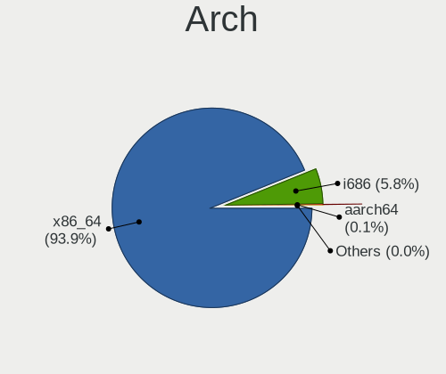
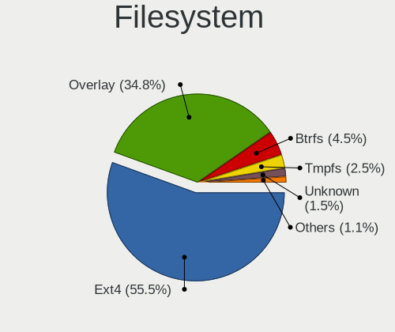
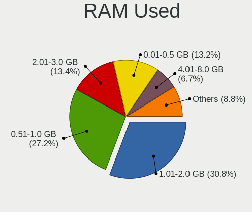
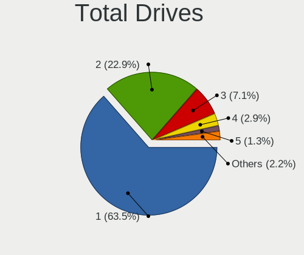
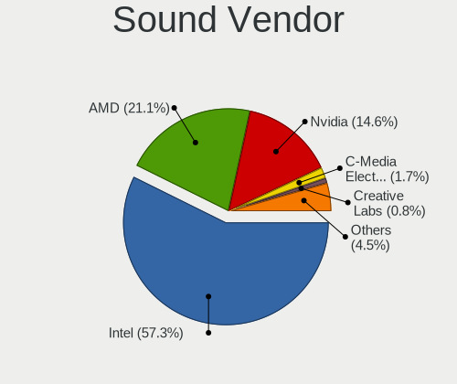
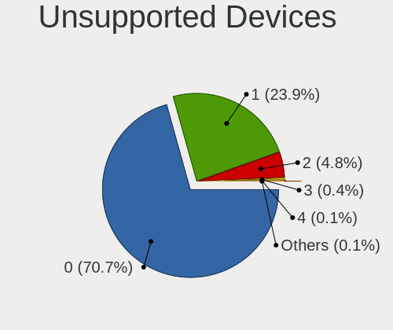

Linux in Hungary - Tested Hardware & Statistics
-----------------------------------------------

A project to collect tested hardware configurations for Linux in Hungary.

Anyone can contribute to this report by the [hw-probe](https://github.com/linuxhw/hw-probe) tool:

    sudo -E hw-probe -all -upload

Please contribute! Especially if your hardware is rare.

This is a report for all computer types. See also reports for [desktops](/Location/Hungary/Desktop/README.md) and [notebooks](/Location/Hungary/Notebook/README.md).

Contents
--------

* [ Test Cases ](#test-cases)

* [ System ](#system)
  - [ OS                       ](#os)
  - [ OS Family                ](#os-family)
  - [ Kernel                   ](#kernel)
  - [ Kernel Family            ](#kernel-family)
  - [ Kernel Major Ver.        ](#kernel-major-ver)
  - [ Arch                     ](#arch)
  - [ DE                       ](#de)
  - [ Display Server           ](#display-server)
  - [ Display Manager          ](#display-manager)
  - [ OS Lang                  ](#os-lang)
  - [ Boot Mode                ](#boot-mode)
  - [ Filesystem               ](#filesystem)
  - [ Part. scheme             ](#part-scheme)
  - [ Dual Boot with Linux/BSD ](#dual-boot-with-linuxbsd)
  - [ Dual Boot (Win)          ](#dual-boot-win)

* [ Board ](#board)
  - [ Vendor                   ](#vendor)
  - [ Model                    ](#model)
  - [ Model Family             ](#model-family)
  - [ MFG Year                 ](#mfg-year)
  - [ Form Factor              ](#form-factor)
  - [ Secure Boot              ](#secure-boot)
  - [ Coreboot                 ](#coreboot)
  - [ RAM Size                 ](#ram-size)
  - [ RAM Used                 ](#ram-used)
  - [ Total Drives             ](#total-drives)
  - [ Has CD-ROM               ](#has-cd-rom)
  - [ Has Ethernet             ](#has-ethernet)
  - [ Has WiFi                 ](#has-wifi)
  - [ Has Bluetooth            ](#has-bluetooth)

* [ Location ](#location)
  - [ Country                  ](#country)
  - [ City                     ](#city)

* [ Drives ](#drives)
  - [ Drive Vendor             ](#drive-vendor)
  - [ Drive Model              ](#drive-model)
  - [ HDD Vendor               ](#hdd-vendor)
  - [ SSD Vendor               ](#ssd-vendor)
  - [ Drive Kind               ](#drive-kind)
  - [ Drive Connector          ](#drive-connector)
  - [ Drive Size               ](#drive-size)
  - [ Space Total              ](#space-total)
  - [ Space Used               ](#space-used)
  - [ Malfunc. Drives          ](#malfunc-drives)
  - [ Malfunc. Drive Vendor    ](#malfunc-drive-vendor)
  - [ Malfunc. HDD Vendor      ](#malfunc-hdd-vendor)
  - [ Malfunc. Drive Kind      ](#malfunc-drive-kind)
  - [ Failed Drives            ](#failed-drives)
  - [ Failed Drive Vendor      ](#failed-drive-vendor)
  - [ Drive Status             ](#drive-status)

* [ Storage controller ](#storage-controller)
  - [ Storage Vendor           ](#storage-vendor)
  - [ Storage Model            ](#storage-model)
  - [ Storage Kind             ](#storage-kind)

* [ Processor ](#processor)
  - [ CPU Vendor               ](#cpu-vendor)
  - [ CPU Model                ](#cpu-model)
  - [ CPU Model Family         ](#cpu-model-family)
  - [ CPU Cores                ](#cpu-cores)
  - [ CPU Sockets              ](#cpu-sockets)
  - [ CPU Threads              ](#cpu-threads)
  - [ CPU Op-Modes             ](#cpu-op-modes)
  - [ CPU Microcode            ](#cpu-microcode)
  - [ CPU Microarch            ](#cpu-microarch)

* [ Graphics ](#graphics)
  - [ GPU Vendor               ](#gpu-vendor)
  - [ GPU Model                ](#gpu-model)
  - [ GPU Combo                ](#gpu-combo)
  - [ GPU Driver               ](#gpu-driver)
  - [ GPU Memory               ](#gpu-memory)

* [ Monitor ](#monitor)
  - [ Monitor Vendor           ](#monitor-vendor)
  - [ Monitor Model            ](#monitor-model)
  - [ Monitor Resolution       ](#monitor-resolution)
  - [ Monitor Diagonal         ](#monitor-diagonal)
  - [ Monitor Width            ](#monitor-width)
  - [ Aspect Ratio             ](#aspect-ratio)
  - [ Monitor Area             ](#monitor-area)
  - [ Pixel Density            ](#pixel-density)
  - [ Multiple Monitors        ](#multiple-monitors)

* [ Network ](#network)
  - [ Net Controller Vendor    ](#net-controller-vendor)
  - [ Net Controller Model     ](#net-controller-model)
  - [ Wireless Vendor          ](#wireless-vendor)
  - [ Wireless Model           ](#wireless-model)
  - [ Ethernet Vendor          ](#ethernet-vendor)
  - [ Ethernet Model           ](#ethernet-model)
  - [ Net Controller Kind      ](#net-controller-kind)
  - [ Used Controller          ](#used-controller)
  - [ NICs                     ](#nics)
  - [ IPv6                     ](#ipv6)

* [ Bluetooth ](#bluetooth)
  - [ Bluetooth Vendor         ](#bluetooth-vendor)
  - [ Bluetooth Model          ](#bluetooth-model)

* [ Sound ](#sound)
  - [ Sound Vendor             ](#sound-vendor)
  - [ Sound Model              ](#sound-model)

* [ Memory ](#memory)
  - [ Memory Vendor            ](#memory-vendor)
  - [ Memory Model             ](#memory-model)
  - [ Memory Kind              ](#memory-kind)
  - [ Memory Form Factor       ](#memory-form-factor)
  - [ Memory Size              ](#memory-size)
  - [ Memory Speed             ](#memory-speed)

* [ Printers & scanners ](#printers--scanners)
  - [ Printer Vendor           ](#printer-vendor)
  - [ Printer Model            ](#printer-model)
  - [ Scanner Vendor           ](#scanner-vendor)
  - [ Scanner Model            ](#scanner-model)

* [ Camera ](#camera)
  - [ Camera Vendor            ](#camera-vendor)
  - [ Camera Model             ](#camera-model)

* [ Security ](#security)
  - [ Fingerprint Vendor       ](#fingerprint-vendor)
  - [ Fingerprint Model        ](#fingerprint-model)
  - [ Chipcard Vendor          ](#chipcard-vendor)
  - [ Chipcard Model           ](#chipcard-model)

* [ Unsupported ](#unsupported)
  - [ Unsupported Devices      ](#unsupported-devices)
  - [ Unsupported Device Types ](#unsupported-device-types)

Test Cases
----------

Total: 6691

| Vendor        | Model                       | Form-Factor | Probe                                                      | Date         |
|---------------|-----------------------------|-------------|------------------------------------------------------------|--------------|
| ASRock        | 4CoreDual-SATA2             | Desktop     | [0a598dc332](https://linux-hardware.org/?probe=0a598dc332) | Nov 02, 2022 |
| Dell          | 0K240Y A01                  | Desktop     | [41707b16d1](https://linux-hardware.org/?probe=41707b16d1) | Nov 02, 2022 |
| ASUSTek       | VivoBook 12_ASUS Laptop ... | Notebook    | [c83f37c114](https://linux-hardware.org/?probe=c83f37c114) | Nov 01, 2022 |
| Dell          | G5 5587                     | Notebook    | [a4e32e9eb8](https://linux-hardware.org/?probe=a4e32e9eb8) | Nov 01, 2022 |
| Fujitsu       | D2828-A2 S26361-D2828-A2    | Desktop     | [cf394ed108](https://linux-hardware.org/?probe=cf394ed108) | Nov 01, 2022 |
| ASRock        | 4CoreDual-SATA2             | Desktop     | [446799aa8e](https://linux-hardware.org/?probe=446799aa8e) | Nov 01, 2022 |
| MSI           | B450 TOMAHAWK MAX           | Desktop     | [183545ed4e](https://linux-hardware.org/?probe=183545ed4e) | Oct 31, 2022 |
| Gigabyte      | GA-MA770-UD3                | Desktop     | [e49d4af683](https://linux-hardware.org/?probe=e49d4af683) | Oct 31, 2022 |
| Dell          | Inspiron 5558               | Notebook    | [416655ce7d](https://linux-hardware.org/?probe=416655ce7d) | Oct 30, 2022 |
| Dell          | Inspiron 5558               | Notebook    | [ae71fe1a19](https://linux-hardware.org/?probe=ae71fe1a19) | Oct 30, 2022 |
| Lenovo        | ThinkPad W510 431965U       | Notebook    | [56dd93206a](https://linux-hardware.org/?probe=56dd93206a) | Oct 29, 2022 |
| Lenovo        | V15 G2 ALC 82KD             | Notebook    | [aea626acae](https://linux-hardware.org/?probe=aea626acae) | Oct 29, 2022 |
| Gigabyte      | GA-MA770-UD3                | Desktop     | [52a6d45e82](https://linux-hardware.org/?probe=52a6d45e82) | Oct 29, 2022 |
| Dell          | Inspiron 7737               | Notebook    | [f352df76ef](https://linux-hardware.org/?probe=f352df76ef) | Oct 29, 2022 |
| Phoenix/Si... | M7x0S                       | Notebook    | [8b27fc5eb3](https://linux-hardware.org/?probe=8b27fc5eb3) | Oct 29, 2022 |
| ASUSTek       | ROG Zephyrus M16 GU603HM... | Notebook    | [3b67700f14](https://linux-hardware.org/?probe=3b67700f14) | Oct 28, 2022 |
| HP            | Compaq nx6310 (EY589ES#A... | Notebook    | [a80d2e7626](https://linux-hardware.org/?probe=a80d2e7626) | Oct 27, 2022 |
| Fujitsu       | LIFEBOOK U745               | Notebook    | [7cb792e432](https://linux-hardware.org/?probe=7cb792e432) | Oct 27, 2022 |
| Fujitsu       | LIFEBOOK U745               | Notebook    | [0c33d71210](https://linux-hardware.org/?probe=0c33d71210) | Oct 27, 2022 |
| Dell          | 0K240Y A01                  | Desktop     | [4be40e9739](https://linux-hardware.org/?probe=4be40e9739) | Oct 27, 2022 |
| Dell          | 0K240Y A01                  | Desktop     | [fc26c82789](https://linux-hardware.org/?probe=fc26c82789) | Oct 27, 2022 |
| Lenovo        | ThinkServer TS440           | Desktop     | [acdfb9b02e](https://linux-hardware.org/?probe=acdfb9b02e) | Oct 26, 2022 |
| ASUSTek       | K55VJ                       | Notebook    | [eac363d110](https://linux-hardware.org/?probe=eac363d110) | Oct 25, 2022 |
| ALLDOCUBE     | i1402A                      | Notebook    | [22c255e8cd](https://linux-hardware.org/?probe=22c255e8cd) | Oct 25, 2022 |
| Lenovo        | ThinkBook 15-IIL 20SM       | Notebook    | [e5d5599bc7](https://linux-hardware.org/?probe=e5d5599bc7) | Oct 25, 2022 |
| Lenovo        | ThinkBook 15-IIL 20SM       | Notebook    | [9cc8a69671](https://linux-hardware.org/?probe=9cc8a69671) | Oct 25, 2022 |
| Dell          | Vostro 3501                 | Notebook    | [df16ec68c3](https://linux-hardware.org/?probe=df16ec68c3) | Oct 24, 2022 |
| Dell          | Vostro 3501                 | Notebook    | [996a5a3b8d](https://linux-hardware.org/?probe=996a5a3b8d) | Oct 24, 2022 |
| HP            | Compaq 6910p (GH717AW#AB... | Notebook    | [02d31506a2](https://linux-hardware.org/?probe=02d31506a2) | Oct 24, 2022 |
| Lenovo        | IdeaPad 330-15IKB 81DE      | Notebook    | [c24c3f0836](https://linux-hardware.org/?probe=c24c3f0836) | Oct 23, 2022 |
| Dell          | Latitude E6230              | Notebook    | [73ee8be4e9](https://linux-hardware.org/?probe=73ee8be4e9) | Oct 23, 2022 |
| Dell          | Latitude E6230              | Notebook    | [52ee15a8f5](https://linux-hardware.org/?probe=52ee15a8f5) | Oct 23, 2022 |
| ASUSTek       | ROG Zephyrus G14 GA402RK... | Notebook    | [bd25fa1073](https://linux-hardware.org/?probe=bd25fa1073) | Oct 23, 2022 |
| ASRock        | B450M Pro4                  | Desktop     | [23a298a9a5](https://linux-hardware.org/?probe=23a298a9a5) | Oct 23, 2022 |
| Dell          | Latitude 7390               | Notebook    | [71f8a9e59b](https://linux-hardware.org/?probe=71f8a9e59b) | Oct 22, 2022 |
| HP            | EliteBook 845 G7 Noteboo... | Notebook    | [0cf70c348b](https://linux-hardware.org/?probe=0cf70c348b) | Oct 21, 2022 |
| Gigabyte      | G41MT-S2PT                  | Desktop     | [1ad0ed065f](https://linux-hardware.org/?probe=1ad0ed065f) | Oct 21, 2022 |
| Lenovo        | ThinkPad E14 Gen 2 20TA0... | Notebook    | [238c40d2e4](https://linux-hardware.org/?probe=238c40d2e4) | Oct 19, 2022 |
| ASUSTek       | ROG Strix G513QY_G513QY     | Notebook    | [680823db07](https://linux-hardware.org/?probe=680823db07) | Oct 19, 2022 |
| Alcor Digi... | Snugbook N1431              | Notebook    | [eb7940e5a4](https://linux-hardware.org/?probe=eb7940e5a4) | Oct 19, 2022 |
| eMachines     | E725                        | Notebook    | [ea21ca2d78](https://linux-hardware.org/?probe=ea21ca2d78) | Oct 19, 2022 |
| Alcor Digi... | Snugbook N1431              | Notebook    | [098e362854](https://linux-hardware.org/?probe=098e362854) | Oct 19, 2022 |
| eMachines     | E725                        | Notebook    | [6d5ddca6c9](https://linux-hardware.org/?probe=6d5ddca6c9) | Oct 18, 2022 |
| Lenovo        | ThinkPad T490 20N2S29E00    | Notebook    | [dd61a6ea26](https://linux-hardware.org/?probe=dd61a6ea26) | Oct 18, 2022 |
| Dell          | Inspiron 3584               | Notebook    | [c80df2b63c](https://linux-hardware.org/?probe=c80df2b63c) | Oct 17, 2022 |
| Acer          | Aspire A717-71G             | Notebook    | [969c0ac771](https://linux-hardware.org/?probe=969c0ac771) | Oct 17, 2022 |
| eMachines     | E725                        | Notebook    | [f365f1eaa7](https://linux-hardware.org/?probe=f365f1eaa7) | Oct 17, 2022 |
| eMachines     | E725                        | Notebook    | [7003528b88](https://linux-hardware.org/?probe=7003528b88) | Oct 17, 2022 |
| ASUSTek       | GL552VW                     | Notebook    | [a49ebeea02](https://linux-hardware.org/?probe=a49ebeea02) | Oct 17, 2022 |
| HP            | OMEN Laptop 15-en0xxx       | Notebook    | [528fc3c5ec](https://linux-hardware.org/?probe=528fc3c5ec) | Oct 17, 2022 |
| ASUSTek       | TUF Gaming B560M-PLUS       | Desktop     | [4ab8d609e7](https://linux-hardware.org/?probe=4ab8d609e7) | Oct 16, 2022 |
| Dell          | 0WR7PY A02                  | Desktop     | [8c1b258565](https://linux-hardware.org/?probe=8c1b258565) | Oct 16, 2022 |
| Apple         | Mac-F4208EAA PVT            | Mini pc     | [bfbf006040](https://linux-hardware.org/?probe=bfbf006040) | Oct 16, 2022 |
| ASUSTek       | TUF Gaming B560M-PLUS       | Desktop     | [8781d340f7](https://linux-hardware.org/?probe=8781d340f7) | Oct 16, 2022 |
| ASRock        | 4CoreDual-SATA2             | Desktop     | [a0c85cb9ab](https://linux-hardware.org/?probe=a0c85cb9ab) | Oct 15, 2022 |
| ASUSTek       | ProArt Z690-CREATOR WIFI    | Desktop     | [365f1a9123](https://linux-hardware.org/?probe=365f1a9123) | Oct 15, 2022 |
| Fujitsu       | D3313-S4 S26361-D3313-S4    | Desktop     | [e92144b22a](https://linux-hardware.org/?probe=e92144b22a) | Oct 15, 2022 |
| Unknown       | Unknown                     | Notebook    | [07a141abbb](https://linux-hardware.org/?probe=07a141abbb) | Oct 14, 2022 |
| eMachines     | E725                        | Notebook    | [77e7244d88](https://linux-hardware.org/?probe=77e7244d88) | Oct 14, 2022 |
| eMachines     | E725                        | Notebook    | [34538c32c5](https://linux-hardware.org/?probe=34538c32c5) | Oct 14, 2022 |
| Lenovo        | Z50-75 80EC                 | Notebook    | [b36e579d37](https://linux-hardware.org/?probe=b36e579d37) | Oct 14, 2022 |
| Unknown       | Unknown                     | Notebook    | [0d8c24c367](https://linux-hardware.org/?probe=0d8c24c367) | Oct 13, 2022 |
| Lenovo        | ThinkPad E15 20RD003KHV     | Notebook    | [f4d09b3dae](https://linux-hardware.org/?probe=f4d09b3dae) | Oct 13, 2022 |
| ASRock        | 4CoreDual-SATA2             | Desktop     | [9743b0896c](https://linux-hardware.org/?probe=9743b0896c) | Oct 13, 2022 |
| Lenovo        | ThinkPad SL510 2847CXG      | Notebook    | [5680d8a827](https://linux-hardware.org/?probe=5680d8a827) | Oct 12, 2022 |
| Acer          | Aspire A515-45              | Notebook    | [3ba623cebe](https://linux-hardware.org/?probe=3ba623cebe) | Oct 12, 2022 |
| ASUSTek       | ROG STRIX B550-A GAMING     | Desktop     | [ec470df515](https://linux-hardware.org/?probe=ec470df515) | Oct 11, 2022 |
| Dell          | Latitude 5410               | Notebook    | [e468acae5c](https://linux-hardware.org/?probe=e468acae5c) | Oct 11, 2022 |
| Gigabyte      | G41MT-S2PT                  | Desktop     | [e5720c01a5](https://linux-hardware.org/?probe=e5720c01a5) | Oct 10, 2022 |
| Lenovo        | ThinkPad W530 2463A58       | Notebook    | [dc933df0a9](https://linux-hardware.org/?probe=dc933df0a9) | Oct 10, 2022 |
| Gigabyte      | P67A-D3-B3                  | Desktop     | [000e5389a8](https://linux-hardware.org/?probe=000e5389a8) | Oct 10, 2022 |
| ASUSTek       | X550VX                      | Notebook    | [63a8f1baa1](https://linux-hardware.org/?probe=63a8f1baa1) | Oct 10, 2022 |
| ASUSTek       | X550VX                      | Notebook    | [7f9e9ab40b](https://linux-hardware.org/?probe=7f9e9ab40b) | Oct 10, 2022 |
| HP            | EliteBook 845 G7 Noteboo... | Notebook    | [5268977f64](https://linux-hardware.org/?probe=5268977f64) | Oct 09, 2022 |
| Dell          | 003KPJ A00                  | Desktop     | [e151f6645b](https://linux-hardware.org/?probe=e151f6645b) | Oct 08, 2022 |
| ASUSTek       | F3Sv                        | Notebook    | [042104bbc2](https://linux-hardware.org/?probe=042104bbc2) | Oct 08, 2022 |
| Lenovo        | V145-15AST 81MT             | Notebook    | [91163f885b](https://linux-hardware.org/?probe=91163f885b) | Oct 07, 2022 |
| HP            | 3047h                       | Desktop     | [b29b0b1ef4](https://linux-hardware.org/?probe=b29b0b1ef4) | Oct 07, 2022 |
| ASUSTek       | M4A785TD-V EVO              | Desktop     | [c7ae238295](https://linux-hardware.org/?probe=c7ae238295) | Oct 07, 2022 |
| Lenovo        | ThinkPad T460s 20FAS30L0... | Notebook    | [ea6a5c970c](https://linux-hardware.org/?probe=ea6a5c970c) | Oct 07, 2022 |
| ASUSTek       | ROG Zephyrus G15 GA503QM... | Notebook    | [7f186dfabd](https://linux-hardware.org/?probe=7f186dfabd) | Oct 07, 2022 |
| ASUSTek       | ROG Zephyrus G15 GA503QM... | Notebook    | [6bae0e4f18](https://linux-hardware.org/?probe=6bae0e4f18) | Oct 07, 2022 |
| ASUSTek       | ROG STRIX B450-F GAMING     | Desktop     | [f19e278e43](https://linux-hardware.org/?probe=f19e278e43) | Oct 06, 2022 |
| eMachines     | E725                        | Notebook    | [9a77e04f3c](https://linux-hardware.org/?probe=9a77e04f3c) | Oct 05, 2022 |
| eMachines     | E725                        | Notebook    | [e413d82fa5](https://linux-hardware.org/?probe=e413d82fa5) | Oct 05, 2022 |
| Dell          | Inspiron 5593               | Notebook    | [33e28ce993](https://linux-hardware.org/?probe=33e28ce993) | Oct 05, 2022 |
| Gigabyte      | P67A-D3-B3                  | Desktop     | [73c9f25932](https://linux-hardware.org/?probe=73c9f25932) | Oct 04, 2022 |
| Acer          | TravelMate Spin P614RN-5... | Convertible | [3a515cdda0](https://linux-hardware.org/?probe=3a515cdda0) | Oct 03, 2022 |
| Lenovo        | ThinkPad T410 2537CS0       | Notebook    | [c6a45619c4](https://linux-hardware.org/?probe=c6a45619c4) | Oct 03, 2022 |
| Toshiba       | Satellite M50D-A            | Notebook    | [6eaada1ab0](https://linux-hardware.org/?probe=6eaada1ab0) | Oct 03, 2022 |
| Lenovo        | ThinkPad X230 2325Y5L       | Notebook    | [7c5c62cc90](https://linux-hardware.org/?probe=7c5c62cc90) | Oct 03, 2022 |
| HP            | EliteBook 850 G1            | Notebook    | [7bb0235bd2](https://linux-hardware.org/?probe=7bb0235bd2) | Oct 03, 2022 |
| Lenovo        | ThinkServer TS440           | Desktop     | [1031dfcd50](https://linux-hardware.org/?probe=1031dfcd50) | Oct 03, 2022 |
| ASUSTek       | PRIME B460M-A               | Desktop     | [0b1bf36485](https://linux-hardware.org/?probe=0b1bf36485) | Oct 02, 2022 |
| Dell          | Latitude D630               | Notebook    | [90dc2dddf8](https://linux-hardware.org/?probe=90dc2dddf8) | Oct 02, 2022 |
| AZW           | GTR V01                     | Mini pc     | [40c181376b](https://linux-hardware.org/?probe=40c181376b) | Oct 01, 2022 |
| AZW           | GTR V01                     | Mini pc     | [4638cc7f7b](https://linux-hardware.org/?probe=4638cc7f7b) | Oct 01, 2022 |
| Sony          | SVS13118GBB                 | Notebook    | [48dd8fb419](https://linux-hardware.org/?probe=48dd8fb419) | Oct 01, 2022 |
| Dell          | Latitude D630               | Notebook    | [d00c756052](https://linux-hardware.org/?probe=d00c756052) | Oct 01, 2022 |
| Sony          | SVS13118GBB                 | Notebook    | [75e6dbe3d2](https://linux-hardware.org/?probe=75e6dbe3d2) | Oct 01, 2022 |
| ASUSTek       | Strix 15 GL503GE            | Notebook    | [e48bab666f](https://linux-hardware.org/?probe=e48bab666f) | Oct 01, 2022 |
| Sony          | SVS13118GBB                 | Notebook    | [0e0ca26d00](https://linux-hardware.org/?probe=0e0ca26d00) | Sep 30, 2022 |
| ASUSTek       | M5A78L LE                   | Desktop     | [1b2683c634](https://linux-hardware.org/?probe=1b2683c634) | Sep 30, 2022 |
| Sony          | SVS13118GBB                 | Notebook    | [12868cf90f](https://linux-hardware.org/?probe=12868cf90f) | Sep 30, 2022 |
| ASUSTek       | M5A78L LE                   | Desktop     | [8762386a2b](https://linux-hardware.org/?probe=8762386a2b) | Sep 30, 2022 |
| Lenovo        | IdeaPad 320-17ABR 80YN      | Notebook    | [1ff8e037f4](https://linux-hardware.org/?probe=1ff8e037f4) | Sep 30, 2022 |
| Acer          | Aspire E5-521               | Notebook    | [a55d68e93c](https://linux-hardware.org/?probe=a55d68e93c) | Sep 30, 2022 |
| Acer          | Aspire A715-72G             | Notebook    | [8b7e129d4a](https://linux-hardware.org/?probe=8b7e129d4a) | Sep 29, 2022 |
| HUAWEI        | BOHK-WAX9X                  | Notebook    | [65f56cc48b](https://linux-hardware.org/?probe=65f56cc48b) | Sep 29, 2022 |
| HP            | 3047h                       | Desktop     | [9426ee3f59](https://linux-hardware.org/?probe=9426ee3f59) | Sep 28, 2022 |
| Lenovo        | IdeaPad 3 15ARE 81W4        | Notebook    | [b784552e84](https://linux-hardware.org/?probe=b784552e84) | Sep 28, 2022 |
| eMachines     | E725                        | Notebook    | [04c9a24d86](https://linux-hardware.org/?probe=04c9a24d86) | Sep 28, 2022 |
| eMachines     | E725                        | Notebook    | [f99f2244c7](https://linux-hardware.org/?probe=f99f2244c7) | Sep 28, 2022 |
| Acer          | Aspire E1-531               | Notebook    | [b7d37d0c6f](https://linux-hardware.org/?probe=b7d37d0c6f) | Sep 27, 2022 |
| Acer          | Aspire E1-531               | Notebook    | [90856d2122](https://linux-hardware.org/?probe=90856d2122) | Sep 27, 2022 |
| ASUSTek       | 1015BX                      | Notebook    | [5190c360db](https://linux-hardware.org/?probe=5190c360db) | Sep 25, 2022 |
| HP            | 650                         | Notebook    | [f835e52a64](https://linux-hardware.org/?probe=f835e52a64) | Sep 25, 2022 |
| ASUSTek       | P7H55D-M PRO                | Desktop     | [9ff56b2438](https://linux-hardware.org/?probe=9ff56b2438) | Sep 24, 2022 |
| ASUSTek       | P7H55D-M PRO                | Desktop     | [3ba342d57a](https://linux-hardware.org/?probe=3ba342d57a) | Sep 24, 2022 |
| HP            | Compaq 6710b (KE125ET#AB... | Notebook    | [fc7831b371](https://linux-hardware.org/?probe=fc7831b371) | Sep 23, 2022 |
| HP            | Compaq 6710b (KE125ET#AB... | Notebook    | [15cffbb03b](https://linux-hardware.org/?probe=15cffbb03b) | Sep 23, 2022 |
| Gigabyte      | H61M-S1                     | Desktop     | [b28077e806](https://linux-hardware.org/?probe=b28077e806) | Sep 23, 2022 |
| Fujitsu       | LIFEBOOK U745               | Notebook    | [0570d2318c](https://linux-hardware.org/?probe=0570d2318c) | Sep 23, 2022 |
| ASUSTek       | ROG Strix G513QY_G513QY     | Notebook    | [4d47a6bfcf](https://linux-hardware.org/?probe=4d47a6bfcf) | Sep 22, 2022 |
| ASUSTek       | K54HR                       | Notebook    | [dbf0f3b1c8](https://linux-hardware.org/?probe=dbf0f3b1c8) | Sep 21, 2022 |
| ASUSTek       | K54HR                       | Notebook    | [25fd2ae90c](https://linux-hardware.org/?probe=25fd2ae90c) | Sep 21, 2022 |
| ASUSTek       | PRIME A320M-K               | Desktop     | [d62d1ed9fd](https://linux-hardware.org/?probe=d62d1ed9fd) | Sep 21, 2022 |
| HP            | 250 G8 Notebook PC          | Notebook    | [17945ad430](https://linux-hardware.org/?probe=17945ad430) | Sep 21, 2022 |
| HP            | 250 G8 Notebook PC          | Notebook    | [49c7f8f204](https://linux-hardware.org/?probe=49c7f8f204) | Sep 21, 2022 |
| Fujitsu       | D3400-A1 S26361-D3400-A1    | Desktop     | [5cf5ac2512](https://linux-hardware.org/?probe=5cf5ac2512) | Sep 21, 2022 |
| Toshiba       | Satellite L450              | Notebook    | [20b85987c4](https://linux-hardware.org/?probe=20b85987c4) | Sep 20, 2022 |
| Toshiba       | Satellite L450              | Notebook    | [9f694612d3](https://linux-hardware.org/?probe=9f694612d3) | Sep 20, 2022 |
| ASUSTek       | X550CL                      | Notebook    | [16d313fefa](https://linux-hardware.org/?probe=16d313fefa) | Sep 20, 2022 |
| eMachines     | E725                        | Notebook    | [141723a3e2](https://linux-hardware.org/?probe=141723a3e2) | Sep 16, 2022 |
| ASUSTek       | PRIME H310M-D R2.0          | Desktop     | [588c189149](https://linux-hardware.org/?probe=588c189149) | Sep 16, 2022 |
| ASUSTek       | PRIME H310M-D R2.0          | Desktop     | [4b94d21772](https://linux-hardware.org/?probe=4b94d21772) | Sep 16, 2022 |
| eMachines     | E725                        | Notebook    | [bf27205286](https://linux-hardware.org/?probe=bf27205286) | Sep 15, 2022 |
| Raspberry ... | Raspberry Pi Zero W Rev ... | Soc         | [15c9bd2a8a](https://linux-hardware.org/?probe=15c9bd2a8a) | Sep 15, 2022 |
| Acer          | Aspire 5310                 | Notebook    | [963a5bcade](https://linux-hardware.org/?probe=963a5bcade) | Sep 15, 2022 |
| Dell          | Latitude 7480               | Notebook    | [a9432965f4](https://linux-hardware.org/?probe=a9432965f4) | Sep 15, 2022 |
| ASUSTek       | P5PL2-E                     | Desktop     | [84bfb7d319](https://linux-hardware.org/?probe=84bfb7d319) | Sep 15, 2022 |
| Lenovo        | ThinkPad X1 Tablet Gen 2... | Tablet      | [9fcc670422](https://linux-hardware.org/?probe=9fcc670422) | Sep 15, 2022 |
| ASUSTek       | P7P55D                      | Desktop     | [10c83deaa9](https://linux-hardware.org/?probe=10c83deaa9) | Sep 15, 2022 |
| ASUSTek       | P7P55D                      | Desktop     | [4b6fca3ab4](https://linux-hardware.org/?probe=4b6fca3ab4) | Sep 15, 2022 |
| Gigabyte      | G41MT-S2PT                  | Desktop     | [8366bd494c](https://linux-hardware.org/?probe=8366bd494c) | Sep 14, 2022 |
| ASUSTek       | PRIME B250-PRO              | Desktop     | [98422dda65](https://linux-hardware.org/?probe=98422dda65) | Sep 14, 2022 |
| Dell          | 0PC5F7 A03                  | Desktop     | [161958a208](https://linux-hardware.org/?probe=161958a208) | Sep 14, 2022 |
| HP            | 3648h                       | Desktop     | [8ed24fd9d4](https://linux-hardware.org/?probe=8ed24fd9d4) | Sep 13, 2022 |
| ASUSTek       | P7P55D                      | Desktop     | [4a7057f627](https://linux-hardware.org/?probe=4a7057f627) | Sep 13, 2022 |
| MSI           | MAG B550 TOMAHAWK           | Desktop     | [b251a95678](https://linux-hardware.org/?probe=b251a95678) | Sep 12, 2022 |
| MSI           | MAG B550 TOMAHAWK           | Desktop     | [b3c2018879](https://linux-hardware.org/?probe=b3c2018879) | Sep 12, 2022 |
| Lenovo        | SHARKBAY NOK                | Desktop     | [f10e559655](https://linux-hardware.org/?probe=f10e559655) | Sep 11, 2022 |
| Timi          | RedmiBook Pro 15S           | Notebook    | [20b9167fee](https://linux-hardware.org/?probe=20b9167fee) | Sep 11, 2022 |
| Lenovo        | ThinkServer TS440           | Desktop     | [cf028f9b8c](https://linux-hardware.org/?probe=cf028f9b8c) | Sep 10, 2022 |
| HP            | 3396                        | Desktop     | [964f32cccf](https://linux-hardware.org/?probe=964f32cccf) | Sep 10, 2022 |
| Gigabyte      | P67A-D3-B3                  | Desktop     | [eba0d1ad0c](https://linux-hardware.org/?probe=eba0d1ad0c) | Sep 09, 2022 |
| HP            | EliteBook 860 16 inch G9... | Notebook    | [080ffe37b9](https://linux-hardware.org/?probe=080ffe37b9) | Sep 08, 2022 |
| HP            | 18E4                        | Desktop     | [1e8addf905](https://linux-hardware.org/?probe=1e8addf905) | Sep 08, 2022 |
| Dell          | Latitude E6230              | Notebook    | [41c1130440](https://linux-hardware.org/?probe=41c1130440) | Sep 07, 2022 |
| Dell          | Latitude E6230              | Notebook    | [5e0436a64a](https://linux-hardware.org/?probe=5e0436a64a) | Sep 07, 2022 |
| Lenovo        | IdeaPad 110-15ISK 80UD      | Notebook    | [32715c6eb9](https://linux-hardware.org/?probe=32715c6eb9) | Sep 06, 2022 |
| Lenovo        | IdeaPad 110-15ISK 80UD      | Notebook    | [cbc35f08cb](https://linux-hardware.org/?probe=cbc35f08cb) | Sep 06, 2022 |
| HP            | 805D                        | Desktop     | [fdf50a9e36](https://linux-hardware.org/?probe=fdf50a9e36) | Sep 05, 2022 |
| Gigabyte      | P67A-D3-B3                  | Desktop     | [8c34a6ec8c](https://linux-hardware.org/?probe=8c34a6ec8c) | Sep 05, 2022 |
| Dell          | Latitude 7490               | Notebook    | [4a59725d2d](https://linux-hardware.org/?probe=4a59725d2d) | Sep 05, 2022 |
| Mediacom      | GTZS                        | Notebook    | [d62a43f91e](https://linux-hardware.org/?probe=d62a43f91e) | Sep 04, 2022 |
| HP            | 650                         | Notebook    | [526b86a559](https://linux-hardware.org/?probe=526b86a559) | Sep 04, 2022 |
| HP            | 650                         | Notebook    | [6f184e96df](https://linux-hardware.org/?probe=6f184e96df) | Sep 04, 2022 |
| Gigabyte      | F2A78M-D3H                  | Desktop     | [5b0da32c82](https://linux-hardware.org/?probe=5b0da32c82) | Sep 03, 2022 |
| ASUSTek       | PRIME A320M-K               | Desktop     | [7cfd7da775](https://linux-hardware.org/?probe=7cfd7da775) | Sep 03, 2022 |
| Apple         | Mac-63001698E7A34814 iMa... | All in one  | [2dbc615641](https://linux-hardware.org/?probe=2dbc615641) | Sep 02, 2022 |
| HP            | OMEN Laptop 15-en0xxx       | Notebook    | [e4a4630b4e](https://linux-hardware.org/?probe=e4a4630b4e) | Sep 01, 2022 |
| ASUSTek       | PRIME A320M-K               | Desktop     | [6552f796e2](https://linux-hardware.org/?probe=6552f796e2) | Sep 01, 2022 |
| HP            | 1589                        | Desktop     | [fce9004571](https://linux-hardware.org/?probe=fce9004571) | Sep 01, 2022 |
| ASUSTek       | V-M3N8200                   | Desktop     | [f593540c1c](https://linux-hardware.org/?probe=f593540c1c) | Sep 01, 2022 |
| ASUSTek       | V-M3N8200                   | Desktop     | [f3cc0c0bd5](https://linux-hardware.org/?probe=f3cc0c0bd5) | Sep 01, 2022 |
| HP            | Pavilion x360 Convertibl... | Convertible | [26d60edae6](https://linux-hardware.org/?probe=26d60edae6) | Aug 30, 2022 |
| Gigabyte      | B550M DS3H                  | Desktop     | [2e6d572c33](https://linux-hardware.org/?probe=2e6d572c33) | Aug 30, 2022 |
| eMachines     | E725                        | Notebook    | [3e5c01d133](https://linux-hardware.org/?probe=3e5c01d133) | Aug 28, 2022 |
| Lenovo        | IdeaPad 110-15ISK 80UD      | Notebook    | [1dd156b433](https://linux-hardware.org/?probe=1dd156b433) | Aug 27, 2022 |
| Lenovo        | ThinkPad T420s 4173RT4      | Notebook    | [a10cbdb73b](https://linux-hardware.org/?probe=a10cbdb73b) | Aug 27, 2022 |
| Lenovo        | ThinkPad T420s 4173RT4      | Notebook    | [562d827323](https://linux-hardware.org/?probe=562d827323) | Aug 27, 2022 |
| ASUSTek       | ROG Flow X16 GV601RW_GV6... | Convertible | [aa28bc2c61](https://linux-hardware.org/?probe=aa28bc2c61) | Aug 26, 2022 |
| Lenovo        | Dory CRB                    | Desktop     | [aa633e1f74](https://linux-hardware.org/?probe=aa633e1f74) | Aug 26, 2022 |
| Lenovo        | Dory CRB                    | Desktop     | [34492f12b7](https://linux-hardware.org/?probe=34492f12b7) | Aug 26, 2022 |
| eMachines     | E725                        | Notebook    | [b73baa0850](https://linux-hardware.org/?probe=b73baa0850) | Aug 25, 2022 |
| ASUSTek       | A7N8X2.0                    | Desktop     | [f063b3e61a](https://linux-hardware.org/?probe=f063b3e61a) | Aug 25, 2022 |
| Lenovo        | IdeaPad 110-15ISK 80UD      | Notebook    | [72888e9acb](https://linux-hardware.org/?probe=72888e9acb) | Aug 25, 2022 |
| ASUSTek       | ASUS TUF Gaming A15 FA50... | Notebook    | [92be7f3368](https://linux-hardware.org/?probe=92be7f3368) | Aug 24, 2022 |
| Lenovo        | IdeaPad 5 14ALC05 82LM      | Notebook    | [421ab76c43](https://linux-hardware.org/?probe=421ab76c43) | Aug 24, 2022 |
| Gigabyte      | Z68A-D3H-B3                 | Desktop     | [e75751c55b](https://linux-hardware.org/?probe=e75751c55b) | Aug 24, 2022 |
| Lenovo        | Legion Y540-15IRH-PG0 81... | Notebook    | [c7d603acb8](https://linux-hardware.org/?probe=c7d603acb8) | Aug 24, 2022 |
| Lenovo        | ThinkPad T410 2537BF9       | Notebook    | [be0227ed47](https://linux-hardware.org/?probe=be0227ed47) | Aug 23, 2022 |
| ASUSTek       | A7N8X2.0                    | Desktop     | [56416fa002](https://linux-hardware.org/?probe=56416fa002) | Aug 23, 2022 |
| Dell          | Latitude D630               | Notebook    | [be9c4025cb](https://linux-hardware.org/?probe=be9c4025cb) | Aug 23, 2022 |
| Apple         | MacBookPro8,1               | Notebook    | [88bb92c310](https://linux-hardware.org/?probe=88bb92c310) | Aug 22, 2022 |
| Shuttle       | FS81                        | Desktop     | [4c3be1b1a6](https://linux-hardware.org/?probe=4c3be1b1a6) | Aug 21, 2022 |
| ASUSTek       | 1015BX                      | Notebook    | [94f3284833](https://linux-hardware.org/?probe=94f3284833) | Aug 21, 2022 |
| HP            | ZBook Fury 17.3 inch G8 ... | Notebook    | [8b1d8459e2](https://linux-hardware.org/?probe=8b1d8459e2) | Aug 20, 2022 |
| HP            | 620                         | Notebook    | [d3b1eb8b4e](https://linux-hardware.org/?probe=d3b1eb8b4e) | Aug 20, 2022 |
| ASUSTek       | ROG Strix G513QM_G513QM     | Notebook    | [0cef35b44a](https://linux-hardware.org/?probe=0cef35b44a) | Aug 20, 2022 |
| Lenovo        | ThinkPad X220 4290L39       | Notebook    | [31a7893b95](https://linux-hardware.org/?probe=31a7893b95) | Aug 20, 2022 |
| HP            | 620                         | Notebook    | [259635c419](https://linux-hardware.org/?probe=259635c419) | Aug 19, 2022 |
| Dell          | Latitude 5580               | Notebook    | [5c9db9ff58](https://linux-hardware.org/?probe=5c9db9ff58) | Aug 18, 2022 |
| Lenovo        | G50-80 80E5                 | Notebook    | [1a392021c7](https://linux-hardware.org/?probe=1a392021c7) | Aug 18, 2022 |
| Lenovo        | G580 20150                  | Notebook    | [3c18536e95](https://linux-hardware.org/?probe=3c18536e95) | Aug 18, 2022 |
| HUAWEI        | NBLB-WAX9N                  | Notebook    | [9003287b49](https://linux-hardware.org/?probe=9003287b49) | Aug 17, 2022 |
| Gigabyte      | G31M-ES2L                   | Desktop     | [c51689de69](https://linux-hardware.org/?probe=c51689de69) | Aug 16, 2022 |
| Dell          | Latitude 5420               | Notebook    | [0dec3e9676](https://linux-hardware.org/?probe=0dec3e9676) | Aug 15, 2022 |
| Lenovo        | IdeaPad 110-15ISK 80UD      | Notebook    | [6649d66a82](https://linux-hardware.org/?probe=6649d66a82) | Aug 15, 2022 |
| ASUSTek       | ProArt Z690-CREATOR WIFI    | Desktop     | [3bdf8d4582](https://linux-hardware.org/?probe=3bdf8d4582) | Aug 14, 2022 |
| Lenovo        | G50-80 80E5                 | Notebook    | [132a476896](https://linux-hardware.org/?probe=132a476896) | Aug 14, 2022 |
| eMachines     | E725                        | Notebook    | [928cfd8881](https://linux-hardware.org/?probe=928cfd8881) | Aug 13, 2022 |
| eMachines     | E725                        | Notebook    | [e1d0d38a1c](https://linux-hardware.org/?probe=e1d0d38a1c) | Aug 13, 2022 |
| ASUSTek       | ProArt Z690-CREATOR WIFI    | Desktop     | [507fa4d8dc](https://linux-hardware.org/?probe=507fa4d8dc) | Aug 13, 2022 |
| Lenovo        | IdeaPad 320-15ABR 80XS      | Notebook    | [1d7c1c5212](https://linux-hardware.org/?probe=1d7c1c5212) | Aug 13, 2022 |
| ASUSTek       | ProArt Z690-CREATOR WIFI    | Desktop     | [bc105e1507](https://linux-hardware.org/?probe=bc105e1507) | Aug 13, 2022 |
| Lenovo        | IdeaPad 320-15ABR 80XS      | Notebook    | [70b0d2bb45](https://linux-hardware.org/?probe=70b0d2bb45) | Aug 13, 2022 |
| Lenovo        | ThinkPad E15 20RD003KHV     | Notebook    | [5d50a29ca9](https://linux-hardware.org/?probe=5d50a29ca9) | Aug 13, 2022 |
| MSI           | B450 TOMAHAWK MAX           | Desktop     | [27cd96982f](https://linux-hardware.org/?probe=27cd96982f) | Aug 10, 2022 |
| Lenovo        | Legion 5 17ACH6H 82JY       | Notebook    | [4c3d230572](https://linux-hardware.org/?probe=4c3d230572) | Aug 10, 2022 |
| HP            | 1589                        | Desktop     | [0519e046d2](https://linux-hardware.org/?probe=0519e046d2) | Aug 08, 2022 |
| Intel         | NUC7JYB J67967-405          | Mini pc     | [06fdb19375](https://linux-hardware.org/?probe=06fdb19375) | Aug 08, 2022 |
| Dell          | Latitude E7450              | Notebook    | [f2d8a030f4](https://linux-hardware.org/?probe=f2d8a030f4) | Aug 08, 2022 |
| ASUSTek       | ROG STRIX Z390-E GAMING     | Desktop     | [7b8b4b5616](https://linux-hardware.org/?probe=7b8b4b5616) | Aug 08, 2022 |
| ASUSTek       | AM1M-A                      | Desktop     | [e778ebd72b](https://linux-hardware.org/?probe=e778ebd72b) | Aug 08, 2022 |
| Acer          | Nitro AN515-55              | Notebook    | [01e6e21efb](https://linux-hardware.org/?probe=01e6e21efb) | Aug 06, 2022 |
| eMachines     | E520 V1.10                  | Notebook    | [a5c7ca58d9](https://linux-hardware.org/?probe=a5c7ca58d9) | Aug 06, 2022 |
| Dell          | Inspiron 15-3567            | Notebook    | [2ac3b9a2f1](https://linux-hardware.org/?probe=2ac3b9a2f1) | Aug 06, 2022 |
| Dell          | Precision 7530              | Notebook    | [40854a027f](https://linux-hardware.org/?probe=40854a027f) | Aug 05, 2022 |
| Fujitsu       | LIFEBOOK U745               | Notebook    | [c6d5fcceee](https://linux-hardware.org/?probe=c6d5fcceee) | Aug 05, 2022 |
| Fujitsu       | LIFEBOOK U745               | Notebook    | [0e067ccc56](https://linux-hardware.org/?probe=0e067ccc56) | Aug 05, 2022 |
| ASUSTek       | AM1M-A                      | Desktop     | [687f213628](https://linux-hardware.org/?probe=687f213628) | Aug 05, 2022 |
| eMachines     | E725                        | Notebook    | [8028786618](https://linux-hardware.org/?probe=8028786618) | Aug 04, 2022 |
| HP            | Notebook                    | Notebook    | [81b05860ab](https://linux-hardware.org/?probe=81b05860ab) | Aug 04, 2022 |
| Apple         | MacBookAir7,2               | Notebook    | [3e5f261f2a](https://linux-hardware.org/?probe=3e5f261f2a) | Aug 04, 2022 |
| HP            | 1589                        | Desktop     | [738de77596](https://linux-hardware.org/?probe=738de77596) | Aug 03, 2022 |
| HP            | 625                         | Notebook    | [1c59a9a3d3](https://linux-hardware.org/?probe=1c59a9a3d3) | Aug 03, 2022 |
| HP            | 625                         | Notebook    | [02db8f5852](https://linux-hardware.org/?probe=02db8f5852) | Aug 03, 2022 |
| ASUSTek       | X550JX                      | Notebook    | [469c737a9b](https://linux-hardware.org/?probe=469c737a9b) | Aug 03, 2022 |
| Lenovo        | SDK0E50510 WIN              | Desktop     | [566648ca6d](https://linux-hardware.org/?probe=566648ca6d) | Aug 02, 2022 |
| eMachines     | E725                        | Notebook    | [fe35b6624b](https://linux-hardware.org/?probe=fe35b6624b) | Aug 02, 2022 |
| ASUSTek       | Zenbook UX3402ZA_UX3402Z... | Convertible | [77990d76cc](https://linux-hardware.org/?probe=77990d76cc) | Aug 02, 2022 |
| eMachines     | E725                        | Notebook    | [25d51b3945](https://linux-hardware.org/?probe=25d51b3945) | Aug 02, 2022 |
| ASUSTek       | X550JX                      | Notebook    | [edf8c765aa](https://linux-hardware.org/?probe=edf8c765aa) | Aug 02, 2022 |
| ASRock        | FM2A75M Pro4+               | Desktop     | [a446c446ae](https://linux-hardware.org/?probe=a446c446ae) | Aug 02, 2022 |
| eMachines     | E520 V1.10                  | Notebook    | [bb16305e18](https://linux-hardware.org/?probe=bb16305e18) | Aug 01, 2022 |
| HP            | EliteBook 8470p             | Notebook    | [a1d5593420](https://linux-hardware.org/?probe=a1d5593420) | Aug 01, 2022 |
| Packard Be... | EasyNote TM85               | Notebook    | [a6df06f9e5](https://linux-hardware.org/?probe=a6df06f9e5) | Jul 31, 2022 |
| Samsung       | RV415/RV515                 | Notebook    | [5bb2e2b3e9](https://linux-hardware.org/?probe=5bb2e2b3e9) | Jul 31, 2022 |
| HP            | EliteBook 8470p             | Notebook    | [0cecb854f4](https://linux-hardware.org/?probe=0cecb854f4) | Jul 31, 2022 |
| Gigabyte      | H81M-DS2V                   | Desktop     | [0645ed0b9e](https://linux-hardware.org/?probe=0645ed0b9e) | Jul 31, 2022 |
| Gigabyte      | H81M-DS2V                   | Desktop     | [f5e17ecf3d](https://linux-hardware.org/?probe=f5e17ecf3d) | Jul 31, 2022 |
| Gigabyte      | H77-DS3H                    | Desktop     | [a6889e4564](https://linux-hardware.org/?probe=a6889e4564) | Jul 31, 2022 |
| HP            | EliteBook 8470p             | Notebook    | [5e73e33a77](https://linux-hardware.org/?probe=5e73e33a77) | Jul 31, 2022 |
| ASUSTek       | Zenbook UX5401ZA_UX5401Z... | Notebook    | [b8daa2d973](https://linux-hardware.org/?probe=b8daa2d973) | Jul 30, 2022 |
| HP            | 250 G2                      | Notebook    | [43d1d3ae24](https://linux-hardware.org/?probe=43d1d3ae24) | Jul 30, 2022 |
| ASRock        | FM2A75M Pro4+               | Desktop     | [9cb3ed38a5](https://linux-hardware.org/?probe=9cb3ed38a5) | Jul 30, 2022 |
| Gigabyte      | H81M-HD3                    | Desktop     | [0f83741c2e](https://linux-hardware.org/?probe=0f83741c2e) | Jul 30, 2022 |
| ASUSTek       | ROG CROSSHAIR VIII FORMU... | Desktop     | [aa6ae1c12f](https://linux-hardware.org/?probe=aa6ae1c12f) | Jul 30, 2022 |
| ASUSTek       | ROG CROSSHAIR VIII FORMU... | Desktop     | [6d72261de7](https://linux-hardware.org/?probe=6d72261de7) | Jul 30, 2022 |
| ASUSTek       | Zenbook UM3402YA_UM3402Y... | Notebook    | [e5e5cc4bbc](https://linux-hardware.org/?probe=e5e5cc4bbc) | Jul 29, 2022 |
| Gigabyte      | G41MT-S2P                   | Desktop     | [ea545ae9ed](https://linux-hardware.org/?probe=ea545ae9ed) | Jul 29, 2022 |
| ASUSTek       | Zenbook UM3402YA_UM3402Y... | Notebook    | [486ef751f0](https://linux-hardware.org/?probe=486ef751f0) | Jul 29, 2022 |
| Lenovo        | Z50-75 80EC                 | Notebook    | [44f505647d](https://linux-hardware.org/?probe=44f505647d) | Jul 29, 2022 |
| HUAWEI        | WRT-WX9                     | Notebook    | [ed09406e6c](https://linux-hardware.org/?probe=ed09406e6c) | Jul 28, 2022 |
| HP            | 8158 A01                    | Mini pc     | [56631cd6ac](https://linux-hardware.org/?probe=56631cd6ac) | Jul 28, 2022 |
| Lenovo        | ThinkPad W510 431965U       | Notebook    | [ab6b15eef4](https://linux-hardware.org/?probe=ab6b15eef4) | Jul 28, 2022 |
| ASUSTek       | PRIME B450M-A               | Desktop     | [9194a07c08](https://linux-hardware.org/?probe=9194a07c08) | Jul 28, 2022 |
| MSI           | GF63 Thin 9SC               | Notebook    | [323db48d16](https://linux-hardware.org/?probe=323db48d16) | Jul 27, 2022 |
| Dell          | Vostro 5471                 | Notebook    | [be2f2c9f98](https://linux-hardware.org/?probe=be2f2c9f98) | Jul 27, 2022 |
| Lenovo        | ThinkPad W510 431965U       | Notebook    | [8ba9959c19](https://linux-hardware.org/?probe=8ba9959c19) | Jul 27, 2022 |
| eMachines     | E725                        | Notebook    | [ca033cf053](https://linux-hardware.org/?probe=ca033cf053) | Jul 26, 2022 |
| Lenovo        | Dory CRB                    | Desktop     | [1aa1f63a2d](https://linux-hardware.org/?probe=1aa1f63a2d) | Jul 25, 2022 |
| Dell          | Inspiron 15-3567            | Notebook    | [06fd282e9d](https://linux-hardware.org/?probe=06fd282e9d) | Jul 25, 2022 |
| Lenovo        | Dory CRB                    | Desktop     | [81e755d9a1](https://linux-hardware.org/?probe=81e755d9a1) | Jul 25, 2022 |
| eMachines     | E725                        | Notebook    | [b975298e85](https://linux-hardware.org/?probe=b975298e85) | Jul 25, 2022 |
| Dell          | 054KM3 A00                  | Desktop     | [f84c50a2ae](https://linux-hardware.org/?probe=f84c50a2ae) | Jul 25, 2022 |
| Dell          | 054KM3 A00                  | Desktop     | [37fc6a278e](https://linux-hardware.org/?probe=37fc6a278e) | Jul 25, 2022 |
| Alcor         | Intel Education Tablet      | Notebook    | [a04ad41c5a](https://linux-hardware.org/?probe=a04ad41c5a) | Jul 24, 2022 |
| Alcor         | Intel Education Tablet      | Notebook    | [700f83a555](https://linux-hardware.org/?probe=700f83a555) | Jul 24, 2022 |
| Dell          | Latitude D630               | Notebook    | [a9fc5a41aa](https://linux-hardware.org/?probe=a9fc5a41aa) | Jul 24, 2022 |
| Fujitsu       | D2901-A1 S26361-D2901-A1    | Desktop     | [aa952e11aa](https://linux-hardware.org/?probe=aa952e11aa) | Jul 24, 2022 |
| Toshiba       | Satellite C650D             | Notebook    | [50e201ffd2](https://linux-hardware.org/?probe=50e201ffd2) | Jul 24, 2022 |
| Dell          | Latitude D630               | Notebook    | [7476af3363](https://linux-hardware.org/?probe=7476af3363) | Jul 23, 2022 |
| Dell          | Precision 3561              | Notebook    | [ca88539127](https://linux-hardware.org/?probe=ca88539127) | Jul 22, 2022 |
| ASUSTek       | Strix 15 GL503GE            | Notebook    | [e543e58f00](https://linux-hardware.org/?probe=e543e58f00) | Jul 22, 2022 |
| MSI           | X58 Pro-E                   | Desktop     | [a448d7e654](https://linux-hardware.org/?probe=a448d7e654) | Jul 21, 2022 |
| MSI           | X58 Pro-E                   | Desktop     | [af97aaa970](https://linux-hardware.org/?probe=af97aaa970) | Jul 21, 2022 |
| Dell          | 054KM3 A00                  | Desktop     | [228194fb04](https://linux-hardware.org/?probe=228194fb04) | Jul 21, 2022 |
| Dell          | 054KM3 A00                  | Desktop     | [406a93be76](https://linux-hardware.org/?probe=406a93be76) | Jul 21, 2022 |
| Dell          | 09KPNV A00                  | Desktop     | [711546ab63](https://linux-hardware.org/?probe=711546ab63) | Jul 21, 2022 |
| Dell          | Precision M4400             | Notebook    | [cf3bbe255a](https://linux-hardware.org/?probe=cf3bbe255a) | Jul 20, 2022 |
| ASUSTek       | 1215P                       | Notebook    | [3bb44d06d1](https://linux-hardware.org/?probe=3bb44d06d1) | Jul 20, 2022 |
| Dell          | Latitude E6420              | Notebook    | [77501652df](https://linux-hardware.org/?probe=77501652df) | Jul 18, 2022 |
| ASUSTek       | PRIME A320M-K               | Desktop     | [09a3fc75e9](https://linux-hardware.org/?probe=09a3fc75e9) | Jul 18, 2022 |
| Dell          | Vostro 3500                 | Notebook    | [27a7c25204](https://linux-hardware.org/?probe=27a7c25204) | Jul 17, 2022 |
| Gigabyte      | F2A88XM-DS2                 | Desktop     | [fcbd85f698](https://linux-hardware.org/?probe=fcbd85f698) | Jul 17, 2022 |
| ASUSTek       | M4A78                       | Desktop     | [d04747e05b](https://linux-hardware.org/?probe=d04747e05b) | Jul 17, 2022 |
| Dell          | 054KM3 A00                  | Desktop     | [2c14be3e6c](https://linux-hardware.org/?probe=2c14be3e6c) | Jul 17, 2022 |
| Acer          | Swift SF314-43              | Notebook    | [61b8fb7c41](https://linux-hardware.org/?probe=61b8fb7c41) | Jul 17, 2022 |
| Gigabyte      | F2A88XM-DS2                 | Desktop     | [391df88f80](https://linux-hardware.org/?probe=391df88f80) | Jul 17, 2022 |
| Dell          | 09KPNV A00                  | Desktop     | [c47ecbd03f](https://linux-hardware.org/?probe=c47ecbd03f) | Jul 16, 2022 |
| eMachines     | E725                        | Notebook    | [771942dd5e](https://linux-hardware.org/?probe=771942dd5e) | Jul 15, 2022 |
| HP            | 255 G5 Notebook PC          | Notebook    | [86b8dc8c6d](https://linux-hardware.org/?probe=86b8dc8c6d) | Jul 15, 2022 |
| ASUSTek       | ASUS TUF Gaming F15 FX50... | Notebook    | [23077c70b2](https://linux-hardware.org/?probe=23077c70b2) | Jul 14, 2022 |
| ASUSTek       | ASUS TUF Gaming F15 FX50... | Notebook    | [10192c3d0b](https://linux-hardware.org/?probe=10192c3d0b) | Jul 14, 2022 |
| HP            | 255 G5 Notebook PC          | Notebook    | [fa6486dcd9](https://linux-hardware.org/?probe=fa6486dcd9) | Jul 13, 2022 |
| AOpen         | D1009 A1A4                  | Desktop     | [d8edf66887](https://linux-hardware.org/?probe=d8edf66887) | Jul 13, 2022 |
| ASRock        | B365M Pro4                  | Desktop     | [5701f5019e](https://linux-hardware.org/?probe=5701f5019e) | Jul 13, 2022 |
| eMachines     | E725                        | Notebook    | [27fb6a6cab](https://linux-hardware.org/?probe=27fb6a6cab) | Jul 12, 2022 |
| Lenovo        | ThinkPad T400 2768WGB       | Notebook    | [6998a6fb37](https://linux-hardware.org/?probe=6998a6fb37) | Jul 10, 2022 |
| ASRock        | B450M Pro4                  | Desktop     | [0cdcc2c0e0](https://linux-hardware.org/?probe=0cdcc2c0e0) | Jul 10, 2022 |
| HP            | Laptop 14s-fq0xxx           | Notebook    | [5a009407d9](https://linux-hardware.org/?probe=5a009407d9) | Jul 09, 2022 |
| ASUSTek       | VivoBook_ASUSLaptop X530... | Notebook    | [9ae6c29438](https://linux-hardware.org/?probe=9ae6c29438) | Jul 08, 2022 |
| Dell          | Inspiron 1564               | Notebook    | [0fbabbb83d](https://linux-hardware.org/?probe=0fbabbb83d) | Jul 08, 2022 |
| Dell          | 0UT806                      | Desktop     | [7d63f287bc](https://linux-hardware.org/?probe=7d63f287bc) | Jul 08, 2022 |
| HP            | Pavilion x360 Convertibl... | Convertible | [3672d4926e](https://linux-hardware.org/?probe=3672d4926e) | Jul 08, 2022 |
| Gigabyte      | B450M GAMING                | Desktop     | [b7cc7cee98](https://linux-hardware.org/?probe=b7cc7cee98) | Jul 05, 2022 |
| Dell          | Inspiron 3593               | Notebook    | [d34d56c473](https://linux-hardware.org/?probe=d34d56c473) | Jul 05, 2022 |
| Lenovo        | ThinkPad W510 431924G       | Notebook    | [d65b149a5f](https://linux-hardware.org/?probe=d65b149a5f) | Jul 04, 2022 |
| Fujitsu       | D3028-A1 S26361-D3028-A1    | Desktop     | [64cb4f60fb](https://linux-hardware.org/?probe=64cb4f60fb) | Jul 04, 2022 |
| Dell          | 0C27VV A01                  | Desktop     | [bc4f34c375](https://linux-hardware.org/?probe=bc4f34c375) | Jul 04, 2022 |
| Dell          | 0C27VV A01                  | Desktop     | [03cd99ca9f](https://linux-hardware.org/?probe=03cd99ca9f) | Jul 04, 2022 |
| eMachines     | E725                        | Notebook    | [18d7561b19](https://linux-hardware.org/?probe=18d7561b19) | Jul 04, 2022 |
| Fujitsu       | LIFEBOOK T936               | Convertible | [aeb0f9ca52](https://linux-hardware.org/?probe=aeb0f9ca52) | Jul 03, 2022 |
| ASRock        | B365M Pro4                  | Desktop     | [8b2e08891d](https://linux-hardware.org/?probe=8b2e08891d) | Jul 03, 2022 |
| ASUSTek       | VivoBook_ASUSLaptop M340... | Notebook    | [a2df072a44](https://linux-hardware.org/?probe=a2df072a44) | Jul 03, 2022 |
| Hardkernel    | ODROID-M1                   | Soc         | [577e49b87c](https://linux-hardware.org/?probe=577e49b87c) | Jul 03, 2022 |
| Hardkernel    | ODROID-M1                   | Soc         | [38a248fedd](https://linux-hardware.org/?probe=38a248fedd) | Jul 03, 2022 |
| Fujitsu       | D2828-A2 S26361-D2828-A2    | Desktop     | [98c7e055a3](https://linux-hardware.org/?probe=98c7e055a3) | Jul 03, 2022 |
| ASUSTek       | TUF Gaming B550-PLUS        | Desktop     | [ffde44eef6](https://linux-hardware.org/?probe=ffde44eef6) | Jul 02, 2022 |
| Gigabyte      | H61M-S1                     | Desktop     | [a38b0e0209](https://linux-hardware.org/?probe=a38b0e0209) | Jul 02, 2022 |
| Biostar       | TZ77XE3                     | Desktop     | [7b597af136](https://linux-hardware.org/?probe=7b597af136) | Jul 02, 2022 |
| Dell          | 0R5KP9 A04                  | Server      | [2a9a66a9d9](https://linux-hardware.org/?probe=2a9a66a9d9) | Jul 01, 2022 |
| eMachines     | E725                        | Notebook    | [8ba1579921](https://linux-hardware.org/?probe=8ba1579921) | Jul 01, 2022 |
| eMachines     | E725                        | Notebook    | [874b6bd7de](https://linux-hardware.org/?probe=874b6bd7de) | Jul 01, 2022 |
| eMachines     | E725                        | Notebook    | [021bcca061](https://linux-hardware.org/?probe=021bcca061) | Jun 30, 2022 |
| eMachines     | E725                        | Notebook    | [b8b332e92f](https://linux-hardware.org/?probe=b8b332e92f) | Jun 30, 2022 |
| ASUSTek       | P8H77-V LE                  | Desktop     | [0ecaca17cb](https://linux-hardware.org/?probe=0ecaca17cb) | Jun 30, 2022 |
| HP            | EliteBook 8470p             | Notebook    | [96b07cbbd5](https://linux-hardware.org/?probe=96b07cbbd5) | Jun 30, 2022 |
| Dell          | Inspiron 5537               | Notebook    | [9758b4dcff](https://linux-hardware.org/?probe=9758b4dcff) | Jun 30, 2022 |
| HP            | EliteBook 840 G2            | Notebook    | [018b6945e1](https://linux-hardware.org/?probe=018b6945e1) | Jun 28, 2022 |
| Lenovo        | ThinkBook 15-IIL 20SM       | Notebook    | [95db2f9536](https://linux-hardware.org/?probe=95db2f9536) | Jun 27, 2022 |
| ASUSTek       | PRIME B460M-A               | Desktop     | [b63dffc595](https://linux-hardware.org/?probe=b63dffc595) | Jun 27, 2022 |
| eMachines     | E725                        | Notebook    | [3b272a4e25](https://linux-hardware.org/?probe=3b272a4e25) | Jun 26, 2022 |
| Acer          | Swift SF114-32              | Notebook    | [25e6653354](https://linux-hardware.org/?probe=25e6653354) | Jun 26, 2022 |
| Dell          | 0YM158 A02                  | Server      | [ec0a133cdf](https://linux-hardware.org/?probe=ec0a133cdf) | Jun 26, 2022 |
| Fujitsu       | D2828-A2 S26361-D2828-A2    | Desktop     | [4889364145](https://linux-hardware.org/?probe=4889364145) | Jun 26, 2022 |
| Dell          | Latitude E5500              | Notebook    | [8002c78586](https://linux-hardware.org/?probe=8002c78586) | Jun 25, 2022 |
| Dell          | 0TY915                      | Desktop     | [d6faa2c9f1](https://linux-hardware.org/?probe=d6faa2c9f1) | Jun 25, 2022 |
| Lenovo        | IdeaPad S540-14API 81NH     | Notebook    | [8f9e6e12b1](https://linux-hardware.org/?probe=8f9e6e12b1) | Jun 25, 2022 |
| Dell          | Latitude E7450              | Notebook    | [a03ea66786](https://linux-hardware.org/?probe=a03ea66786) | Jun 24, 2022 |
| Lenovo        | ThinkServer TS440           | Desktop     | [e68364c28e](https://linux-hardware.org/?probe=e68364c28e) | Jun 24, 2022 |
| Lenovo        | IdeaPad 320-17ABR 80YN      | Notebook    | [a26161ba2f](https://linux-hardware.org/?probe=a26161ba2f) | Jun 23, 2022 |
| Gigabyte      | H410M S2 V2                 | Desktop     | [c37f67ba4b](https://linux-hardware.org/?probe=c37f67ba4b) | Jun 23, 2022 |
| Dell          | Latitude D630               | Notebook    | [60c9b1089c](https://linux-hardware.org/?probe=60c9b1089c) | Jun 23, 2022 |
| Xunlong       | Orange Pi Plus 2E           | Soc         | [e2beed8ee0](https://linux-hardware.org/?probe=e2beed8ee0) | Jun 23, 2022 |
| Dell          | Latitude E5500              | Notebook    | [ad849dbfe7](https://linux-hardware.org/?probe=ad849dbfe7) | Jun 22, 2022 |
| ASUSTek       | VivoBook_ASUSLaptop M340... | Notebook    | [f3ebefa03f](https://linux-hardware.org/?probe=f3ebefa03f) | Jun 21, 2022 |
| HP            | 255 G5 Notebook PC          | Notebook    | [d230e8311a](https://linux-hardware.org/?probe=d230e8311a) | Jun 21, 2022 |
| HP            | 255 G5 Notebook PC          | Notebook    | [7d1b0cfc99](https://linux-hardware.org/?probe=7d1b0cfc99) | Jun 21, 2022 |
| HP            | 339A                        | Desktop     | [4f244ada14](https://linux-hardware.org/?probe=4f244ada14) | Jun 19, 2022 |
| eMachines     | E725                        | Notebook    | [6e81be09d2](https://linux-hardware.org/?probe=6e81be09d2) | Jun 19, 2022 |
| ASUSTek       | M5A97 R2.0                  | Desktop     | [707f314c74](https://linux-hardware.org/?probe=707f314c74) | Jun 19, 2022 |
| ASUSTek       | PRIME A320M-K               | Desktop     | [7c094dc326](https://linux-hardware.org/?probe=7c094dc326) | Jun 19, 2022 |
| Lenovo        | ThinkServer TS440           | Desktop     | [42bf4b080d](https://linux-hardware.org/?probe=42bf4b080d) | Jun 19, 2022 |
| Fujitsu       | D2828-A2 S26361-D2828-A2    | Desktop     | [3b5fb60639](https://linux-hardware.org/?probe=3b5fb60639) | Jun 19, 2022 |
| Intel         | X79 V2.72B                  | Desktop     | [fbd8e560b4](https://linux-hardware.org/?probe=fbd8e560b4) | Jun 18, 2022 |
| ASUSTek       | A7N8X2.0                    | Desktop     | [0078dfa592](https://linux-hardware.org/?probe=0078dfa592) | Jun 17, 2022 |
| Lenovo        | IdeaPad 100-15IBY 80MJ      | Notebook    | [73f958fb35](https://linux-hardware.org/?probe=73f958fb35) | Jun 17, 2022 |
| HP            | OMEN Laptop 15-en0xxx       | Notebook    | [a7431ef0c5](https://linux-hardware.org/?probe=a7431ef0c5) | Jun 17, 2022 |
| Lenovo        | IdeaPad 320-15IAP 80XR      | Notebook    | [e9eb39efa4](https://linux-hardware.org/?probe=e9eb39efa4) | Jun 16, 2022 |
| Lenovo        | ThinkPad E15 20RD003KHV     | Notebook    | [d4ad64d715](https://linux-hardware.org/?probe=d4ad64d715) | Jun 15, 2022 |
| Lenovo        | IdeaPad 320-15IAP 80XR      | Notebook    | [bffb7f61cb](https://linux-hardware.org/?probe=bffb7f61cb) | Jun 15, 2022 |
| HP            | x2 210                      | Notebook    | [8f6739cda0](https://linux-hardware.org/?probe=8f6739cda0) | Jun 15, 2022 |
| HP            | ProBook 4540s               | Notebook    | [934a74329f](https://linux-hardware.org/?probe=934a74329f) | Jun 14, 2022 |
| Dell          | 0VD5HY A07                  | Desktop     | [6a66d72bc1](https://linux-hardware.org/?probe=6a66d72bc1) | Jun 14, 2022 |
| Dell          | 0VD5HY A07                  | Desktop     | [5d7c3bee0c](https://linux-hardware.org/?probe=5d7c3bee0c) | Jun 14, 2022 |
| ASUSTek       | Zenbook UX5401ZA_UX5401Z... | Notebook    | [2b87adfa9f](https://linux-hardware.org/?probe=2b87adfa9f) | Jun 13, 2022 |
| Dell          | Inspiron 15-3567            | Notebook    | [013de61252](https://linux-hardware.org/?probe=013de61252) | Jun 12, 2022 |
| Dell          | Inspiron 15-3567            | Notebook    | [ad093b7b31](https://linux-hardware.org/?probe=ad093b7b31) | Jun 11, 2022 |
| Dell          | Latitude E6540              | Notebook    | [b1cc75656e](https://linux-hardware.org/?probe=b1cc75656e) | Jun 11, 2022 |
| HUAWEI        | WRT-WX9                     | Notebook    | [13dcf888fe](https://linux-hardware.org/?probe=13dcf888fe) | Jun 10, 2022 |
| Gigabyte      | H87M-HD3                    | Desktop     | [eadd724efa](https://linux-hardware.org/?probe=eadd724efa) | Jun 10, 2022 |
| ASUSTek       | ZenBook UX325EA_UX325EA     | Notebook    | [eb4a496e95](https://linux-hardware.org/?probe=eb4a496e95) | Jun 09, 2022 |
| ASUSTek       | ZenBook UX325EA_UX325EA     | Notebook    | [24b293410c](https://linux-hardware.org/?probe=24b293410c) | Jun 09, 2022 |
| HP            | OMEN Laptop 15-en0xxx       | Notebook    | [158a18f6d1](https://linux-hardware.org/?probe=158a18f6d1) | Jun 09, 2022 |
| HP            | Compaq 6710b (KE121EA#AK... | Notebook    | [940eb51107](https://linux-hardware.org/?probe=940eb51107) | Jun 09, 2022 |
| Lenovo        | Z50-70 20354                | Notebook    | [57582f68b6](https://linux-hardware.org/?probe=57582f68b6) | Jun 08, 2022 |
| Gigabyte      | F2A88XM-HD3                 | Desktop     | [f57b643831](https://linux-hardware.org/?probe=f57b643831) | Jun 08, 2022 |
| Lenovo        | ThinkBook 14-IIL 20SL       | Notebook    | [fce3696537](https://linux-hardware.org/?probe=fce3696537) | Jun 08, 2022 |
| Lenovo        | IdeaPadFlex 5 14ARE05 81... | Convertible | [a2cb02217f](https://linux-hardware.org/?probe=a2cb02217f) | Jun 07, 2022 |
| Lenovo        | Z50-70 20354                | Notebook    | [870233669c](https://linux-hardware.org/?probe=870233669c) | Jun 07, 2022 |
| Lenovo        | SDK0E50510 WIN              | Desktop     | [0c00fb9fe4](https://linux-hardware.org/?probe=0c00fb9fe4) | Jun 07, 2022 |
| Lenovo        | SDK0E50510 WIN              | Desktop     | [4b8eab59e2](https://linux-hardware.org/?probe=4b8eab59e2) | Jun 07, 2022 |
| Gigabyte      | H77N-WIFI                   | Desktop     | [a989dee1a0](https://linux-hardware.org/?probe=a989dee1a0) | Jun 06, 2022 |
| Lenovo        | ThinkPad X61 Tablet 7762... | Notebook    | [d2efe762b7](https://linux-hardware.org/?probe=d2efe762b7) | Jun 06, 2022 |
| Lenovo        | IdeaPad S145-15IIL 81W8     | Notebook    | [5f64f824aa](https://linux-hardware.org/?probe=5f64f824aa) | Jun 05, 2022 |
| Gigabyte      | H61M-S2PV                   | Desktop     | [63b4cd5c56](https://linux-hardware.org/?probe=63b4cd5c56) | Jun 05, 2022 |
| Medion        | P6630                       | Notebook    | [c1de1611b8](https://linux-hardware.org/?probe=c1de1611b8) | Jun 04, 2022 |
| Lenovo        | IdeaPad S145-15IIL 81W8     | Notebook    | [b563da5d39](https://linux-hardware.org/?probe=b563da5d39) | Jun 04, 2022 |
| HP            | ProBook 650 G2              | Notebook    | [a580e923a7](https://linux-hardware.org/?probe=a580e923a7) | Jun 03, 2022 |
| HP            | ProBook 640 G8 Notebook ... | Notebook    | [15e4cca5bc](https://linux-hardware.org/?probe=15e4cca5bc) | Jun 03, 2022 |
| HP            | ProBook 640 G8 Notebook ... | Notebook    | [b99a9b1bce](https://linux-hardware.org/?probe=b99a9b1bce) | Jun 03, 2022 |
| HP            | ProBook 650 G2              | Notebook    | [27063b3b3a](https://linux-hardware.org/?probe=27063b3b3a) | Jun 03, 2022 |
| HP            | ProBook 640 G8 Notebook ... | Notebook    | [96768b6e5c](https://linux-hardware.org/?probe=96768b6e5c) | Jun 02, 2022 |
| ASRock        | G41MH/USB3                  | Desktop     | [8cb0243666](https://linux-hardware.org/?probe=8cb0243666) | Jun 02, 2022 |
| HP            | Pavilion Laptop 14-ce0xx... | Notebook    | [d11a49f42b](https://linux-hardware.org/?probe=d11a49f42b) | Jun 02, 2022 |
| HP            | Pavilion Laptop 14-ce0xx... | Notebook    | [968decd1af](https://linux-hardware.org/?probe=968decd1af) | Jun 02, 2022 |
| Dell          | Latitude E6400              | Notebook    | [cea3337908](https://linux-hardware.org/?probe=cea3337908) | Jun 01, 2022 |
| ASUSTek       | M5A78L-M PLUS/USB3          | Desktop     | [a02283c272](https://linux-hardware.org/?probe=a02283c272) | Jun 01, 2022 |
| ASUSTek       | M5A78L-M PLUS/USB3          | Desktop     | [2bb0b663d7](https://linux-hardware.org/?probe=2bb0b663d7) | Jun 01, 2022 |
| HP            | 255 G5 Notebook PC          | Notebook    | [4ff7c85a84](https://linux-hardware.org/?probe=4ff7c85a84) | May 31, 2022 |
| HP            | 255 G5 Notebook PC          | Notebook    | [c65fb5ddb9](https://linux-hardware.org/?probe=c65fb5ddb9) | May 31, 2022 |
| HP            | OMEN Laptop 15-en0xxx       | Notebook    | [956299505f](https://linux-hardware.org/?probe=956299505f) | May 31, 2022 |
| HP            | EliteBook 8470p             | Notebook    | [6b22d31e8e](https://linux-hardware.org/?probe=6b22d31e8e) | May 31, 2022 |
| ASUSTek       | K53U                        | Notebook    | [efd067c3a8](https://linux-hardware.org/?probe=efd067c3a8) | May 30, 2022 |
| ASUSTek       | K53U                        | Notebook    | [a26756238b](https://linux-hardware.org/?probe=a26756238b) | May 30, 2022 |
| Lenovo        | ThinkCentre A57 98517HG     | Desktop     | [254fda14c1](https://linux-hardware.org/?probe=254fda14c1) | May 30, 2022 |
| Gigabyte      | B450M GAMING                | Desktop     | [2f4ff624ba](https://linux-hardware.org/?probe=2f4ff624ba) | May 29, 2022 |
| Gigabyte      | B450M GAMING                | Desktop     | [726cb8d22e](https://linux-hardware.org/?probe=726cb8d22e) | May 29, 2022 |
| Dell          | Latitude E6230              | Notebook    | [068d9b4143](https://linux-hardware.org/?probe=068d9b4143) | May 29, 2022 |
| ASRock        | B450M-HDV R4.0              | Desktop     | [b6d663fde6](https://linux-hardware.org/?probe=b6d663fde6) | May 29, 2022 |
| Dell          | Latitude E6230              | Notebook    | [c50bb14e9a](https://linux-hardware.org/?probe=c50bb14e9a) | May 29, 2022 |
| Gigabyte      | H61M-S1                     | Desktop     | [444e61772c](https://linux-hardware.org/?probe=444e61772c) | May 29, 2022 |
| Gigabyte      | H61M-S1                     | Desktop     | [09b39cf91e](https://linux-hardware.org/?probe=09b39cf91e) | May 29, 2022 |
| Gigabyte      | H81M-S                      | Desktop     | [143b8e7ea9](https://linux-hardware.org/?probe=143b8e7ea9) | May 29, 2022 |
| Medion        | P6630                       | Notebook    | [7f5b714dfc](https://linux-hardware.org/?probe=7f5b714dfc) | May 28, 2022 |
| Gigabyte      | G41MT-S2                    | Desktop     | [255d32d2b3](https://linux-hardware.org/?probe=255d32d2b3) | May 28, 2022 |
| HP            | 255 G5 Notebook PC          | Notebook    | [672f924aec](https://linux-hardware.org/?probe=672f924aec) | May 28, 2022 |
| HP            | 255 G5 Notebook PC          | Notebook    | [7f91291747](https://linux-hardware.org/?probe=7f91291747) | May 28, 2022 |
| ASUSTek       | P5Q DELUXE                  | Desktop     | [65bb3086df](https://linux-hardware.org/?probe=65bb3086df) | May 28, 2022 |
| ASUSTek       | P5Q DELUXE                  | Desktop     | [fcff479318](https://linux-hardware.org/?probe=fcff479318) | May 28, 2022 |
| Gigabyte      | B560M H                     | Desktop     | [7e17227514](https://linux-hardware.org/?probe=7e17227514) | May 27, 2022 |
| Gigabyte      | H61M-S1                     | Desktop     | [3db842adc9](https://linux-hardware.org/?probe=3db842adc9) | May 27, 2022 |
| Lenovo        | IdeaPad 5 15ITL05 82FG      | Notebook    | [110903519d](https://linux-hardware.org/?probe=110903519d) | May 26, 2022 |
| Gigabyte      | A320M-S2H-CF                | Desktop     | [293f5586bd](https://linux-hardware.org/?probe=293f5586bd) | May 25, 2022 |
| Dell          | 0PU052                      | Desktop     | [4e3e3cc0fd](https://linux-hardware.org/?probe=4e3e3cc0fd) | May 24, 2022 |
| HP            | 620                         | Notebook    | [b5bf98b16a](https://linux-hardware.org/?probe=b5bf98b16a) | May 23, 2022 |
| HP            | 620                         | Notebook    | [8bf9517a97](https://linux-hardware.org/?probe=8bf9517a97) | May 23, 2022 |
| Lenovo        | SDK0E50510 WIN              | Desktop     | [1f8b067cca](https://linux-hardware.org/?probe=1f8b067cca) | May 23, 2022 |
| ASUSTek       | VivoBook_ASUSLaptop X415... | Notebook    | [26d3a29dc1](https://linux-hardware.org/?probe=26d3a29dc1) | May 23, 2022 |
| ASRock        | B365M Pro4-F                | Desktop     | [4cbbeda22c](https://linux-hardware.org/?probe=4cbbeda22c) | May 22, 2022 |
| HP            | Presario CQ58               | Notebook    | [bdf8b7e229](https://linux-hardware.org/?probe=bdf8b7e229) | May 22, 2022 |
| HP            | Presario CQ58               | Notebook    | [383a27dd29](https://linux-hardware.org/?probe=383a27dd29) | May 22, 2022 |
| Fujitsu       | D2828-A2 S26361-D2828-A2    | Desktop     | [43d5dce3ee](https://linux-hardware.org/?probe=43d5dce3ee) | May 22, 2022 |
| Lenovo        | SDK0E50510 WIN              | Desktop     | [6efef2bd1e](https://linux-hardware.org/?probe=6efef2bd1e) | May 22, 2022 |
| ASUSTek       | VivoBook_ASUSLaptop M340... | Notebook    | [b128814505](https://linux-hardware.org/?probe=b128814505) | May 21, 2022 |
| Lenovo        | B590 20208                  | Notebook    | [b32a821a4c](https://linux-hardware.org/?probe=b32a821a4c) | May 21, 2022 |
| Lenovo        | B590 20208                  | Notebook    | [3386aeef48](https://linux-hardware.org/?probe=3386aeef48) | May 21, 2022 |
| Fujitsu       | LIFEBOOK U745               | Notebook    | [9003466ff8](https://linux-hardware.org/?probe=9003466ff8) | May 21, 2022 |
| Fujitsu       | LIFEBOOK U745               | Notebook    | [2e05001696](https://linux-hardware.org/?probe=2e05001696) | May 21, 2022 |
| HP            | 620                         | Notebook    | [babb1f392a](https://linux-hardware.org/?probe=babb1f392a) | May 21, 2022 |
| ASRock        | A75M-ITX                    | Desktop     | [6287159bfa](https://linux-hardware.org/?probe=6287159bfa) | May 20, 2022 |
| JGINYUE       | X99M-PLUS V2 V2.0           | Desktop     | [de7a2328c3](https://linux-hardware.org/?probe=de7a2328c3) | May 20, 2022 |
| Lenovo        | SDK0E50510 WIN              | Desktop     | [0044468fc2](https://linux-hardware.org/?probe=0044468fc2) | May 19, 2022 |
| Lenovo        | SDK0E50510 WIN              | Desktop     | [ae6f7ab64b](https://linux-hardware.org/?probe=ae6f7ab64b) | May 19, 2022 |
| Dell          | Vostro 3500                 | Notebook    | [d30a648e90](https://linux-hardware.org/?probe=d30a648e90) | May 19, 2022 |
| Gigabyte      | F2A88XM-D3H                 | Desktop     | [cf5954d738](https://linux-hardware.org/?probe=cf5954d738) | May 18, 2022 |
| ASUSTek       | P8B75-M LX PLUS             | Desktop     | [5995dc5192](https://linux-hardware.org/?probe=5995dc5192) | May 18, 2022 |
| Lenovo        | SDK0E50510 WIN              | Desktop     | [26837853fd](https://linux-hardware.org/?probe=26837853fd) | May 17, 2022 |
| HP            | Pavilion x360 Convertibl... | Convertible | [ac086e77c6](https://linux-hardware.org/?probe=ac086e77c6) | May 17, 2022 |
| Dell          | Inspiron 5759               | Notebook    | [bfe6579a0e](https://linux-hardware.org/?probe=bfe6579a0e) | May 16, 2022 |
| Lenovo        | G570 20079                  | Notebook    | [f4b9c3997d](https://linux-hardware.org/?probe=f4b9c3997d) | May 16, 2022 |
| Gigabyte      | H61M-S1                     | Desktop     | [153c3cb471](https://linux-hardware.org/?probe=153c3cb471) | May 16, 2022 |
| Toshiba       | Satellite L775-18R          | Notebook    | [ec012c6b3d](https://linux-hardware.org/?probe=ec012c6b3d) | May 16, 2022 |
| Lenovo        | G580 20150                  | Notebook    | [75f2c0ab4e](https://linux-hardware.org/?probe=75f2c0ab4e) | May 15, 2022 |
| Lenovo        | G580 20150                  | Notebook    | [8d710ae7c3](https://linux-hardware.org/?probe=8d710ae7c3) | May 15, 2022 |
| Lenovo        | IdeaPad 320-17ABR 80YN      | Notebook    | [758e2b869d](https://linux-hardware.org/?probe=758e2b869d) | May 15, 2022 |
| Lenovo        | IdeaPad 320-17ABR 80YN      | Notebook    | [91c6da69a9](https://linux-hardware.org/?probe=91c6da69a9) | May 15, 2022 |
| HP            | 1589                        | Desktop     | [fb9e076bb8](https://linux-hardware.org/?probe=fb9e076bb8) | May 15, 2022 |
| Lenovo        | ThinkServer TS440           | Desktop     | [bde3f15809](https://linux-hardware.org/?probe=bde3f15809) | May 15, 2022 |
| Unknown       | NF-MCP78                    | Desktop     | [0265fc0430](https://linux-hardware.org/?probe=0265fc0430) | May 14, 2022 |
| Dell          | Latitude E6430              | Notebook    | [e805d60a6b](https://linux-hardware.org/?probe=e805d60a6b) | May 14, 2022 |
| MSI           | B85M-P32                    | Desktop     | [9585181994](https://linux-hardware.org/?probe=9585181994) | May 14, 2022 |
| Dell          | Vostro 3500                 | Notebook    | [f784f7eb95](https://linux-hardware.org/?probe=f784f7eb95) | May 14, 2022 |
| HP            | ProBook 640 G8 Notebook ... | Notebook    | [bfc1a518db](https://linux-hardware.org/?probe=bfc1a518db) | May 14, 2022 |
| Dell          | 0X2MKR A00                  | All in one  | [cace04f39a](https://linux-hardware.org/?probe=cace04f39a) | May 12, 2022 |
| HP            | 620                         | Notebook    | [62369d924a](https://linux-hardware.org/?probe=62369d924a) | May 12, 2022 |
| Gigabyte      | B450M GAMING                | Desktop     | [146d11b8f2](https://linux-hardware.org/?probe=146d11b8f2) | May 10, 2022 |
| Gigabyte      | B450M GAMING                | Desktop     | [6c4bf376bd](https://linux-hardware.org/?probe=6c4bf376bd) | May 10, 2022 |
| Unknown       | Unknown                     | Notebook    | [0099d17388](https://linux-hardware.org/?probe=0099d17388) | May 10, 2022 |
| Lenovo        | ThinkBook 15-IIL 20SM       | Notebook    | [25787f8eb3](https://linux-hardware.org/?probe=25787f8eb3) | May 10, 2022 |
| ASUSTek       | PRIME B365M-A               | Desktop     | [5a694d9de8](https://linux-hardware.org/?probe=5a694d9de8) | May 10, 2022 |
| ASUSTek       | PRIME B365M-A               | Desktop     | [af7f41e61f](https://linux-hardware.org/?probe=af7f41e61f) | May 10, 2022 |
| ASRock        | AB350 Pro4                  | Desktop     | [fdc78a778b](https://linux-hardware.org/?probe=fdc78a778b) | May 09, 2022 |
| Dell          | Latitude E6230              | Notebook    | [d9d1e38394](https://linux-hardware.org/?probe=d9d1e38394) | May 09, 2022 |
| Fujitsu       | D2828-A2 S26361-D2828-A2    | Desktop     | [f1bdc60827](https://linux-hardware.org/?probe=f1bdc60827) | May 08, 2022 |
| Lenovo        | IdeaPad S145-15IIL 81W8     | Notebook    | [dd31ac3d4d](https://linux-hardware.org/?probe=dd31ac3d4d) | May 08, 2022 |
| Gigabyte      | H61M-S1                     | Desktop     | [e4030c65d7](https://linux-hardware.org/?probe=e4030c65d7) | May 07, 2022 |
| Gigabyte      | F2A88XM-D3H                 | Desktop     | [4c4a006287](https://linux-hardware.org/?probe=4c4a006287) | May 07, 2022 |
| HP            | EliteBook 2560p             | Notebook    | [ef54ce0eda](https://linux-hardware.org/?probe=ef54ce0eda) | May 06, 2022 |
| HP            | EliteBook 2560p             | Notebook    | [94a92586e6](https://linux-hardware.org/?probe=94a92586e6) | May 06, 2022 |
| Intel         | X79 V2.72B                  | Desktop     | [87dd767f71](https://linux-hardware.org/?probe=87dd767f71) | May 05, 2022 |
| Gigabyte      | X48-DS5                     | Desktop     | [72a1aaf67d](https://linux-hardware.org/?probe=72a1aaf67d) | May 05, 2022 |
| Lenovo        | ThinkPad T460 20FMS6LB00    | Notebook    | [3d7e88cdae](https://linux-hardware.org/?probe=3d7e88cdae) | May 03, 2022 |
| ASUSTek       | GL552JX                     | Notebook    | [c91f42212d](https://linux-hardware.org/?probe=c91f42212d) | May 03, 2022 |
| ASUSTek       | ZenBook UX325EA_UX325EA     | Notebook    | [62f1d13e63](https://linux-hardware.org/?probe=62f1d13e63) | May 02, 2022 |
| Lenovo        | ThinkPad X240 20AL00FGMB    | Notebook    | [afba42bf24](https://linux-hardware.org/?probe=afba42bf24) | May 02, 2022 |
| ASUSTek       | ZenBook UX433FN_UX433FN     | Notebook    | [02872ac9a8](https://linux-hardware.org/?probe=02872ac9a8) | May 02, 2022 |
| HP            | 1850                        | Desktop     | [1a2271c939](https://linux-hardware.org/?probe=1a2271c939) | May 01, 2022 |
| Dell          | 0TY915                      | Desktop     | [7de07e1186](https://linux-hardware.org/?probe=7de07e1186) | May 01, 2022 |
| Fujitsu Si... | D2660-A1 S26361-D2660-A1    | Desktop     | [bb192229b3](https://linux-hardware.org/?probe=bb192229b3) | Apr 30, 2022 |
| Fujitsu Si... | D2660-A1 S26361-D2660-A1    | Desktop     | [a5ce52429c](https://linux-hardware.org/?probe=a5ce52429c) | Apr 30, 2022 |
| MSI           | MPG B550 GAMING PLUS        | Desktop     | [af2b0de49b](https://linux-hardware.org/?probe=af2b0de49b) | Apr 29, 2022 |
| HP            | ProBook 645 G4              | Notebook    | [0a4b56ae27](https://linux-hardware.org/?probe=0a4b56ae27) | Apr 29, 2022 |
| Lenovo        | ThinkPad E15 20RD003KHV     | Notebook    | [ef265ae548](https://linux-hardware.org/?probe=ef265ae548) | Apr 29, 2022 |
| Dell          | Inspiron 3593               | Notebook    | [54087491d8](https://linux-hardware.org/?probe=54087491d8) | Apr 28, 2022 |
| HP            | ProBook 645 G4              | Notebook    | [1546b59830](https://linux-hardware.org/?probe=1546b59830) | Apr 28, 2022 |
| ASUSTek       | TUF Z390-PLUS GAMING        | Desktop     | [919872f97b](https://linux-hardware.org/?probe=919872f97b) | Apr 28, 2022 |
| ASUSTek       | VivoBook_ASUSLaptop M340... | Notebook    | [382d77c2b0](https://linux-hardware.org/?probe=382d77c2b0) | Apr 28, 2022 |
| ASUSTek       | B85M-E                      | Desktop     | [05896f4d55](https://linux-hardware.org/?probe=05896f4d55) | Apr 27, 2022 |
| ASUSTek       | B85M-E                      | Desktop     | [c4ccc166be](https://linux-hardware.org/?probe=c4ccc166be) | Apr 27, 2022 |
| ASRock        | FM2A75M Pro4+               | Desktop     | [0fc510a45a](https://linux-hardware.org/?probe=0fc510a45a) | Apr 26, 2022 |
| Toshiba       | NB550D                      | Notebook    | [386409d233](https://linux-hardware.org/?probe=386409d233) | Apr 24, 2022 |
| ASRock        | FM2A75M Pro4+               | Desktop     | [2ccbcae022](https://linux-hardware.org/?probe=2ccbcae022) | Apr 23, 2022 |
| ASRock        | FM2A75M Pro4+               | Desktop     | [ec77795911](https://linux-hardware.org/?probe=ec77795911) | Apr 23, 2022 |
| ASUSTek       | GL552JX                     | Notebook    | [dae470212d](https://linux-hardware.org/?probe=dae470212d) | Apr 22, 2022 |
| Acer          | Swift SF114-33              | Notebook    | [93239c624a](https://linux-hardware.org/?probe=93239c624a) | Apr 22, 2022 |
| MSI           | B350M MORTAR ARCTIC         | Desktop     | [6c6203c7ff](https://linux-hardware.org/?probe=6c6203c7ff) | Apr 22, 2022 |
| Lenovo        | ThinkPad T14 Gen 1 20UES... | Notebook    | [5a855c522f](https://linux-hardware.org/?probe=5a855c522f) | Apr 22, 2022 |
| ASRock        | Z87 Pro4                    | Desktop     | [0c4cc8712f](https://linux-hardware.org/?probe=0c4cc8712f) | Apr 22, 2022 |
| Dell          | 0X2MKR A00                  | All in one  | [5a662b428e](https://linux-hardware.org/?probe=5a662b428e) | Apr 21, 2022 |
| HP            | EliteBook 8470p             | Notebook    | [c1623a9f89](https://linux-hardware.org/?probe=c1623a9f89) | Apr 21, 2022 |
| Dell          | Vostro 3580                 | Notebook    | [c34ed29ab2](https://linux-hardware.org/?probe=c34ed29ab2) | Apr 21, 2022 |
| Gigabyte      | A320M-S2H-CF                | Desktop     | [9b742eb785](https://linux-hardware.org/?probe=9b742eb785) | Apr 20, 2022 |
| ASUSTek       | M5A78L-M LX V2              | Desktop     | [f830e867e5](https://linux-hardware.org/?probe=f830e867e5) | Apr 20, 2022 |
| HP            | 339A                        | Desktop     | [229032eb98](https://linux-hardware.org/?probe=229032eb98) | Apr 19, 2022 |
| Lenovo        | ThinkPad E15 20RD003KHV     | Notebook    | [70547d6581](https://linux-hardware.org/?probe=70547d6581) | Apr 19, 2022 |
| Dell          | 0WR7PY A01                  | Desktop     | [6fa162f829](https://linux-hardware.org/?probe=6fa162f829) | Apr 19, 2022 |
| Lenovo        | ThinkPad T14 Gen 1 20UES... | Notebook    | [36e5a2229d](https://linux-hardware.org/?probe=36e5a2229d) | Apr 18, 2022 |
| Lenovo        | B590 20208                  | Notebook    | [af6b076e21](https://linux-hardware.org/?probe=af6b076e21) | Apr 18, 2022 |
| Hungaro Fl... | Navon Loop 360              | Notebook    | [48b6f0e313](https://linux-hardware.org/?probe=48b6f0e313) | Apr 18, 2022 |
| Lenovo        | ThinkCentre A57 98517HG     | Desktop     | [d624a31b69](https://linux-hardware.org/?probe=d624a31b69) | Apr 18, 2022 |
| Hungaro Fl... | Navon Loop 360              | Notebook    | [cde65f88c1](https://linux-hardware.org/?probe=cde65f88c1) | Apr 17, 2022 |
| ASUSTek       | TP201SA                     | Notebook    | [2898b67bff](https://linux-hardware.org/?probe=2898b67bff) | Apr 16, 2022 |
| ASRock        | ConRoe1333-D667             | Desktop     | [d2bba273a0](https://linux-hardware.org/?probe=d2bba273a0) | Apr 15, 2022 |
| ASUSTek       | Z97-K                       | Desktop     | [4852dde595](https://linux-hardware.org/?probe=4852dde595) | Apr 15, 2022 |
| HUAWEI        | NBLB-WAX9N                  | Notebook    | [a89ca51e1b](https://linux-hardware.org/?probe=a89ca51e1b) | Apr 15, 2022 |
| ASUSTek       | M4A78 PRO                   | Desktop     | [9ed3f59682](https://linux-hardware.org/?probe=9ed3f59682) | Apr 14, 2022 |
| Fujitsu       | LIFEBOOK E743               | Notebook    | [43ee1b9237](https://linux-hardware.org/?probe=43ee1b9237) | Apr 14, 2022 |
| ASUSTek       | M5A97 R2.0                  | Desktop     | [0dddcf5626](https://linux-hardware.org/?probe=0dddcf5626) | Apr 13, 2022 |
| Dell          | G5 5587                     | Notebook    | [b3c44a59f0](https://linux-hardware.org/?probe=b3c44a59f0) | Apr 13, 2022 |
| Dell          | 0X2MKR A00                  | All in one  | [0123ade8f7](https://linux-hardware.org/?probe=0123ade8f7) | Apr 13, 2022 |
| Gigabyte      | GA-MA74GM-S2                | Desktop     | [5e30e0e56d](https://linux-hardware.org/?probe=5e30e0e56d) | Apr 12, 2022 |
| Gigabyte      | GA-MA74GM-S2                | Desktop     | [67175f0019](https://linux-hardware.org/?probe=67175f0019) | Apr 12, 2022 |
| Gigabyte      | GA-MA74GM-S2                | Desktop     | [c11ab04912](https://linux-hardware.org/?probe=c11ab04912) | Apr 12, 2022 |
| Dell          | Inspiron 3537               | Notebook    | [88655213a1](https://linux-hardware.org/?probe=88655213a1) | Apr 12, 2022 |
| HP            | ProBook 470 G1              | Notebook    | [ee1f05022a](https://linux-hardware.org/?probe=ee1f05022a) | Apr 10, 2022 |
| Dell          | 055H3G A01                  | Desktop     | [a41b7fbf00](https://linux-hardware.org/?probe=a41b7fbf00) | Apr 10, 2022 |
| Lenovo        | G580 20150                  | Notebook    | [00215e25c0](https://linux-hardware.org/?probe=00215e25c0) | Apr 10, 2022 |
| ASRock        | Z270 Professional Gaming... | Desktop     | [9129317f19](https://linux-hardware.org/?probe=9129317f19) | Apr 10, 2022 |
| Dell          | 0WMJ54 A01                  | Desktop     | [64ac971253](https://linux-hardware.org/?probe=64ac971253) | Apr 10, 2022 |
| Dell          | Latitude 7480               | Notebook    | [b235ce5f92](https://linux-hardware.org/?probe=b235ce5f92) | Apr 10, 2022 |
| Apple         | Mac-F4208DC8 PVT            | Desktop     | [3d91f855bc](https://linux-hardware.org/?probe=3d91f855bc) | Apr 09, 2022 |
| Lenovo        | ThinkCentre M70e 0832A26    | Desktop     | [6130d7e1e6](https://linux-hardware.org/?probe=6130d7e1e6) | Apr 09, 2022 |
| Gigabyte      | G41MT-S2PT                  | Desktop     | [7dde5fefd1](https://linux-hardware.org/?probe=7dde5fefd1) | Apr 09, 2022 |
| ASUSTek       | TUF Gaming B550M-PLUS       | Desktop     | [b0840dd295](https://linux-hardware.org/?probe=b0840dd295) | Apr 09, 2022 |
| Fujitsu       | LIFEBOOK U745               | Notebook    | [9dc3653255](https://linux-hardware.org/?probe=9dc3653255) | Apr 09, 2022 |
| Valve         | Jupiter                     | Notebook    | [852b6fb53a](https://linux-hardware.org/?probe=852b6fb53a) | Apr 08, 2022 |
| ASUSTek       | N551JW                      | Notebook    | [3ddfbf37e2](https://linux-hardware.org/?probe=3ddfbf37e2) | Apr 08, 2022 |
| Lenovo        | Yoga Slim 7-14ARE05 82A2    | Notebook    | [ae77218dcf](https://linux-hardware.org/?probe=ae77218dcf) | Apr 07, 2022 |
| Toshiba       | TECRA A10                   | Notebook    | [b062d23fb7](https://linux-hardware.org/?probe=b062d23fb7) | Apr 07, 2022 |
| Dell          | Latitude E6530              | Notebook    | [a99419647f](https://linux-hardware.org/?probe=a99419647f) | Apr 07, 2022 |
| Lenovo        | ThinkPad T61 6458WK6        | Notebook    | [5303af9863](https://linux-hardware.org/?probe=5303af9863) | Apr 07, 2022 |
| ASUSTek       | B85M-G                      | Desktop     | [c58e24cff5](https://linux-hardware.org/?probe=c58e24cff5) | Apr 07, 2022 |
| Fujitsu       | LIFEBOOK U745               | Notebook    | [5d73ae026b](https://linux-hardware.org/?probe=5d73ae026b) | Apr 05, 2022 |
| Acer          | Swift SF114-32              | Notebook    | [3947799e36](https://linux-hardware.org/?probe=3947799e36) | Apr 05, 2022 |
| Gigabyte      | H87M-HD3                    | Desktop     | [76eb57cf5e](https://linux-hardware.org/?probe=76eb57cf5e) | Apr 05, 2022 |
| Dell          | 0X2MKR A00                  | All in one  | [c081f43e18](https://linux-hardware.org/?probe=c081f43e18) | Apr 05, 2022 |
| ASRock        | B85M                        | Desktop     | [5e03e9532d](https://linux-hardware.org/?probe=5e03e9532d) | Apr 04, 2022 |
| Acer          | TravelMate P215-41-G2       | Notebook    | [065554d2ad](https://linux-hardware.org/?probe=065554d2ad) | Apr 04, 2022 |
| Gigabyte      | G41MT-S2PT                  | Desktop     | [9d1398934f](https://linux-hardware.org/?probe=9d1398934f) | Apr 04, 2022 |
| Gigabyte      | H61M-DS2                    | Desktop     | [10ccb633ee](https://linux-hardware.org/?probe=10ccb633ee) | Apr 04, 2022 |
| Acer          | TravelMate P215-52          | Notebook    | [a5d16dc93e](https://linux-hardware.org/?probe=a5d16dc93e) | Apr 03, 2022 |
| Samsung       | RV410/RV510/S3510/E3510     | Notebook    | [495e271511](https://linux-hardware.org/?probe=495e271511) | Apr 03, 2022 |
| Lenovo        | G50-30 80G0                 | Notebook    | [46775a18b0](https://linux-hardware.org/?probe=46775a18b0) | Apr 03, 2022 |
| Dell          | Latitude E5420              | Notebook    | [a60c1a4785](https://linux-hardware.org/?probe=a60c1a4785) | Apr 03, 2022 |
| Lenovo        | G50-30 80G0                 | Notebook    | [be1de1d236](https://linux-hardware.org/?probe=be1de1d236) | Apr 03, 2022 |
| Lenovo        | G780 20138                  | Notebook    | [a7cad8a09a](https://linux-hardware.org/?probe=a7cad8a09a) | Apr 02, 2022 |
| HP            | Pavilion 15                 | Notebook    | [98be421e4c](https://linux-hardware.org/?probe=98be421e4c) | Apr 02, 2022 |
| ASUSTek       | ROG Zephyrus G15 GA503RM... | Notebook    | [8ae9fd4940](https://linux-hardware.org/?probe=8ae9fd4940) | Apr 02, 2022 |
| Acer          | TravelMate P215-52          | Notebook    | [752d283e54](https://linux-hardware.org/?probe=752d283e54) | Apr 01, 2022 |
| Samsung       | RV410/RV510/S3510/E3510     | Notebook    | [666c8daa31](https://linux-hardware.org/?probe=666c8daa31) | Apr 01, 2022 |
| HP            | Unknown                     | Notebook    | [c6a02a2df5](https://linux-hardware.org/?probe=c6a02a2df5) | Apr 01, 2022 |
| HP            | Unknown                     | Notebook    | [71ae764e9f](https://linux-hardware.org/?probe=71ae764e9f) | Apr 01, 2022 |
| ASRock        | B75 Pro3                    | Desktop     | [01c8b92976](https://linux-hardware.org/?probe=01c8b92976) | Mar 31, 2022 |
| Fujitsu Si... | ESPRIMO Mobile V5535        | Notebook    | [1a946533b6](https://linux-hardware.org/?probe=1a946533b6) | Mar 31, 2022 |
| Lenovo        | ThinkCentre M91p 4524AS3    | Desktop     | [c338f4ffd4](https://linux-hardware.org/?probe=c338f4ffd4) | Mar 31, 2022 |
| HP            | 18E7                        | Desktop     | [4503b657fe](https://linux-hardware.org/?probe=4503b657fe) | Mar 30, 2022 |
| Dell          | Latitude E6420              | Notebook    | [2a0c2610ea](https://linux-hardware.org/?probe=2a0c2610ea) | Mar 30, 2022 |
| eMachines     | E725                        | Notebook    | [475f79831d](https://linux-hardware.org/?probe=475f79831d) | Mar 29, 2022 |
| eMachines     | E725                        | Notebook    | [f8e777c318](https://linux-hardware.org/?probe=f8e777c318) | Mar 29, 2022 |
| HP            | ProBook 640 G8 Notebook ... | Notebook    | [60da33f3aa](https://linux-hardware.org/?probe=60da33f3aa) | Mar 28, 2022 |
| Gigabyte      | B450M GAMING                | Desktop     | [6cff18109b](https://linux-hardware.org/?probe=6cff18109b) | Mar 28, 2022 |
| Gigabyte      | B450M GAMING                | Desktop     | [b650c90413](https://linux-hardware.org/?probe=b650c90413) | Mar 28, 2022 |
| Dell          | System XPS 15Z              | Notebook    | [3e4b6f7b57](https://linux-hardware.org/?probe=3e4b6f7b57) | Mar 28, 2022 |
| Dell          | Latitude E5540              | Notebook    | [838350f357](https://linux-hardware.org/?probe=838350f357) | Mar 28, 2022 |
| Lenovo        | ThinkPad W530 2463A58       | Notebook    | [8e8bd0aad5](https://linux-hardware.org/?probe=8e8bd0aad5) | Mar 28, 2022 |
| ASUSTek       | AM1M-A                      | Desktop     | [2f7bece339](https://linux-hardware.org/?probe=2f7bece339) | Mar 27, 2022 |
| Lenovo        | G580 20150                  | Notebook    | [ec430f1afc](https://linux-hardware.org/?probe=ec430f1afc) | Mar 27, 2022 |
| Dell          | Inspiron M5030              | Notebook    | [a36af1ef0f](https://linux-hardware.org/?probe=a36af1ef0f) | Mar 27, 2022 |
| Dell          | Inspiron M5030              | Notebook    | [c3b9926b94](https://linux-hardware.org/?probe=c3b9926b94) | Mar 27, 2022 |
| Fujitsu       | D3161-A1 S26361-D3161-A1    | Desktop     | [5d62943116](https://linux-hardware.org/?probe=5d62943116) | Mar 27, 2022 |
| Lenovo        | ThinkServer TS440           | Desktop     | [a356a33d0a](https://linux-hardware.org/?probe=a356a33d0a) | Mar 27, 2022 |
| Fujitsu Si... | ESPRIMO Mobile V5555        | Notebook    | [b557a2005c](https://linux-hardware.org/?probe=b557a2005c) | Mar 27, 2022 |
| ASUSTek       | TUF Gaming FX505DT_FX505... | Notebook    | [64606b8247](https://linux-hardware.org/?probe=64606b8247) | Mar 26, 2022 |
| ASUSTek       | TUF Gaming FX505DT_FX505... | Notebook    | [25ad4e35b9](https://linux-hardware.org/?probe=25ad4e35b9) | Mar 26, 2022 |
| Gigabyte      | H61M-D2-B3                  | Desktop     | [e807733708](https://linux-hardware.org/?probe=e807733708) | Mar 26, 2022 |
| Gigabyte      | H61M-D2-B3                  | Desktop     | [59df12dc12](https://linux-hardware.org/?probe=59df12dc12) | Mar 26, 2022 |
| Lenovo        | ThinkCentre M91p 4524AS3    | Desktop     | [7e1b536f6b](https://linux-hardware.org/?probe=7e1b536f6b) | Mar 26, 2022 |
| Lenovo        | ThinkCentre M70e 0832A26    | Desktop     | [fd041828d0](https://linux-hardware.org/?probe=fd041828d0) | Mar 26, 2022 |
| HP            | Pavilion Gaming Laptop 1... | Notebook    | [c527847cd3](https://linux-hardware.org/?probe=c527847cd3) | Mar 25, 2022 |
| Raspberry ... | Raspberry Pi 4 Model B R... | Soc         | [c3e549a376](https://linux-hardware.org/?probe=c3e549a376) | Mar 25, 2022 |
| Lenovo        | IdeaPad 320-17ABR 80YN      | Notebook    | [ed4ed6851f](https://linux-hardware.org/?probe=ed4ed6851f) | Mar 23, 2022 |
| ASUSTek       | VivoBook_ASUSLaptop M340... | Notebook    | [c136393c4b](https://linux-hardware.org/?probe=c136393c4b) | Mar 23, 2022 |
| Dell          | Latitude E7450              | Notebook    | [57111f23b4](https://linux-hardware.org/?probe=57111f23b4) | Mar 23, 2022 |
| Dell          | Latitude E7450              | Notebook    | [ad41ea623a](https://linux-hardware.org/?probe=ad41ea623a) | Mar 23, 2022 |
| Lenovo        | G565 20071                  | Notebook    | [40cf723fac](https://linux-hardware.org/?probe=40cf723fac) | Mar 23, 2022 |
| Lenovo        | IdeaPad 330-15IKB 81DE      | Notebook    | [5b8c4678af](https://linux-hardware.org/?probe=5b8c4678af) | Mar 22, 2022 |
| ASUSTek       | M5A78L-M PLUS/USB3          | Desktop     | [d2e30b1d8b](https://linux-hardware.org/?probe=d2e30b1d8b) | Mar 22, 2022 |
| ASUSTek       | M5A78L-M PLUS/USB3          | Desktop     | [72e8662f26](https://linux-hardware.org/?probe=72e8662f26) | Mar 22, 2022 |
| Acer          | TravelMate P238-G2-M        | Notebook    | [7aa968ca84](https://linux-hardware.org/?probe=7aa968ca84) | Mar 22, 2022 |
| ASRock        | FM2A75 Pro4+                | Desktop     | [0d7edce12d](https://linux-hardware.org/?probe=0d7edce12d) | Mar 21, 2022 |
| Apple         | MacBookPro6,2               | Notebook    | [5611c90f20](https://linux-hardware.org/?probe=5611c90f20) | Mar 21, 2022 |
| Apple         | MacBookPro6,2               | Notebook    | [2a71c88e71](https://linux-hardware.org/?probe=2a71c88e71) | Mar 21, 2022 |
| MSI           | A320M BAZOOKA               | Desktop     | [0c12287476](https://linux-hardware.org/?probe=0c12287476) | Mar 21, 2022 |
| ASUSTek       | P5B                         | Desktop     | [0ec5966c98](https://linux-hardware.org/?probe=0ec5966c98) | Mar 21, 2022 |
| Lenovo        | Z50-70 20354                | Notebook    | [85236d7863](https://linux-hardware.org/?probe=85236d7863) | Mar 20, 2022 |
| Lenovo        | Z50-70 20354                | Notebook    | [2391a2db23](https://linux-hardware.org/?probe=2391a2db23) | Mar 20, 2022 |
| ASUSTek       | VivoBook_ASUSLaptop M340... | Notebook    | [3607969e9d](https://linux-hardware.org/?probe=3607969e9d) | Mar 20, 2022 |
| Lenovo        | G505s 20255                 | Notebook    | [9f18cfb328](https://linux-hardware.org/?probe=9f18cfb328) | Mar 19, 2022 |
| Gigabyte      | GA-78LMT-USB3 R2            | Desktop     | [399ab158b9](https://linux-hardware.org/?probe=399ab158b9) | Mar 19, 2022 |
| Lenovo        | G505s 20255                 | Notebook    | [716d4ed3be](https://linux-hardware.org/?probe=716d4ed3be) | Mar 18, 2022 |
| Gigabyte      | GA-78LMT-USB3 R2            | Desktop     | [661d9fcffa](https://linux-hardware.org/?probe=661d9fcffa) | Mar 18, 2022 |
| MSI           | X470 GAMING PRO CARBON      | Desktop     | [46af9af40c](https://linux-hardware.org/?probe=46af9af40c) | Mar 17, 2022 |
| MSI           | X470 GAMING PRO CARBON      | Desktop     | [1b697ade27](https://linux-hardware.org/?probe=1b697ade27) | Mar 17, 2022 |
| ASUSTek       | Rampage III Extreme         | Desktop     | [6533ff3270](https://linux-hardware.org/?probe=6533ff3270) | Mar 16, 2022 |
| ASUSTek       | Rampage III Extreme         | Desktop     | [1e13431147](https://linux-hardware.org/?probe=1e13431147) | Mar 16, 2022 |
| Lenovo        | IdeaPad 320-17ABR 80YN      | Notebook    | [6ae5708fe3](https://linux-hardware.org/?probe=6ae5708fe3) | Mar 16, 2022 |
| Fujitsu       | LIFEBOOK U745               | Notebook    | [e8e4e5d953](https://linux-hardware.org/?probe=e8e4e5d953) | Mar 15, 2022 |
| HP            | 1589                        | Desktop     | [41622b6b2d](https://linux-hardware.org/?probe=41622b6b2d) | Mar 14, 2022 |
| HP            | 650                         | Notebook    | [3266dba7df](https://linux-hardware.org/?probe=3266dba7df) | Mar 14, 2022 |
| HP            | 650                         | Notebook    | [54df12f572](https://linux-hardware.org/?probe=54df12f572) | Mar 14, 2022 |
| Fujitsu Si... | AMILO Xi 3650               | Notebook    | [6f416ff93b](https://linux-hardware.org/?probe=6f416ff93b) | Mar 13, 2022 |
| HP            | Pavilion Gaming Laptop 1... | Notebook    | [79a7c69b79](https://linux-hardware.org/?probe=79a7c69b79) | Mar 13, 2022 |
| HP            | 1589                        | Desktop     | [95af16db2e](https://linux-hardware.org/?probe=95af16db2e) | Mar 13, 2022 |
| ASUSTek       | Strix 15 GL503GE            | Notebook    | [29c3688c05](https://linux-hardware.org/?probe=29c3688c05) | Mar 13, 2022 |
| Dell          | 0GM819                      | Desktop     | [e06d400f29](https://linux-hardware.org/?probe=e06d400f29) | Mar 13, 2022 |
| ASUSTek       | X541UVK                     | Notebook    | [74ba6d5353](https://linux-hardware.org/?probe=74ba6d5353) | Mar 12, 2022 |
| ASRock        | FM2A75M Pro4+               | Desktop     | [912b670e0f](https://linux-hardware.org/?probe=912b670e0f) | Mar 12, 2022 |
| ASRock        | FM2A75M Pro4+               | Desktop     | [64f83fa328](https://linux-hardware.org/?probe=64f83fa328) | Mar 12, 2022 |
| eMachines     | E725                        | Notebook    | [05b157a340](https://linux-hardware.org/?probe=05b157a340) | Mar 12, 2022 |
| Packard Be... | EasyNote TS13SB             | Notebook    | [9d702d33cb](https://linux-hardware.org/?probe=9d702d33cb) | Mar 12, 2022 |
| Acer          | Veriton M4610G              | Desktop     | [ec980460ed](https://linux-hardware.org/?probe=ec980460ed) | Mar 12, 2022 |
| Lenovo        | ThinkServer TS440           | Desktop     | [ec0e6e5114](https://linux-hardware.org/?probe=ec0e6e5114) | Mar 11, 2022 |
| HP            | Pavilion 17                 | Notebook    | [f5ff2a8a14](https://linux-hardware.org/?probe=f5ff2a8a14) | Mar 10, 2022 |
| HP            | Pavilion 17                 | Notebook    | [b6bfe40827](https://linux-hardware.org/?probe=b6bfe40827) | Mar 10, 2022 |
| ASUSTek       | ASUS TUF Gaming A15 FA50... | Notebook    | [299209635a](https://linux-hardware.org/?probe=299209635a) | Mar 09, 2022 |
| Dell          | Latitude E6230              | Notebook    | [20ca54a46c](https://linux-hardware.org/?probe=20ca54a46c) | Mar 09, 2022 |
| Gigabyte      | H61M-S2PV                   | Desktop     | [71e8b113b4](https://linux-hardware.org/?probe=71e8b113b4) | Mar 09, 2022 |
| Gigabyte      | H61M-S2PV                   | Desktop     | [0148e15f51](https://linux-hardware.org/?probe=0148e15f51) | Mar 09, 2022 |
| ASUSTek       | BU401LA                     | Notebook    | [2df54ef02e](https://linux-hardware.org/?probe=2df54ef02e) | Mar 08, 2022 |
| Sony          | SVS13118GBB                 | Notebook    | [64dc07d0af](https://linux-hardware.org/?probe=64dc07d0af) | Mar 08, 2022 |
| Sony          | SVS13118GBB                 | Notebook    | [76afe39f5e](https://linux-hardware.org/?probe=76afe39f5e) | Mar 08, 2022 |
| MSI           | B550M PRO-VDH WIFI          | Desktop     | [5b31db42d4](https://linux-hardware.org/?probe=5b31db42d4) | Mar 08, 2022 |
| HP            | 1589                        | Desktop     | [eceb34c7fa](https://linux-hardware.org/?probe=eceb34c7fa) | Mar 08, 2022 |
| Lenovo        | Dory CRB                    | Desktop     | [e8cfaeca24](https://linux-hardware.org/?probe=e8cfaeca24) | Mar 08, 2022 |
| Fujitsu Si... | MS-7504VP-PV                | Desktop     | [8dcdbb2b22](https://linux-hardware.org/?probe=8dcdbb2b22) | Mar 07, 2022 |
| ASUSTek       | M5A78L-M PLUS/USB3          | Desktop     | [378234e501](https://linux-hardware.org/?probe=378234e501) | Mar 07, 2022 |
| ASUSTek       | T101HA                      | Tablet      | [05983a1e06](https://linux-hardware.org/?probe=05983a1e06) | Mar 06, 2022 |
| Dell          | Inspiron 5570               | Notebook    | [c2d75f15a4](https://linux-hardware.org/?probe=c2d75f15a4) | Mar 05, 2022 |
| Dell          | Inspiron 5570               | Notebook    | [8965098d65](https://linux-hardware.org/?probe=8965098d65) | Mar 05, 2022 |
| HP            | Compaq 6710b (GB890EA#AK... | Notebook    | [c313b8ee39](https://linux-hardware.org/?probe=c313b8ee39) | Mar 05, 2022 |
| HP            | Compaq 6720s                | Notebook    | [f83b83214e](https://linux-hardware.org/?probe=f83b83214e) | Mar 04, 2022 |
| HP            | Pavilion dv6700             | Notebook    | [4702dab234](https://linux-hardware.org/?probe=4702dab234) | Mar 04, 2022 |
| Acer          | Aspire A315-57G             | Notebook    | [83f0bbb366](https://linux-hardware.org/?probe=83f0bbb366) | Mar 04, 2022 |
| ASUSTek       | P8H61-M LE/USB3             | Desktop     | [3cb51f5689](https://linux-hardware.org/?probe=3cb51f5689) | Mar 04, 2022 |
| Gigabyte      | B450M S2H V2                | Desktop     | [000ae29fb1](https://linux-hardware.org/?probe=000ae29fb1) | Mar 03, 2022 |
| Apple         | Mac-F4208DC8 PVT            | Desktop     | [3d54b5db38](https://linux-hardware.org/?probe=3d54b5db38) | Mar 03, 2022 |
| Lenovo        | ThinkPad T550 20CJS1VD01    | Notebook    | [a3aed9d375](https://linux-hardware.org/?probe=a3aed9d375) | Mar 03, 2022 |
| MSI           | B450 GAMING PLUS MAX        | Desktop     | [eb3d721453](https://linux-hardware.org/?probe=eb3d721453) | Mar 02, 2022 |
| Gigabyte      | H61M-D2-B3                  | Desktop     | [ad003c1394](https://linux-hardware.org/?probe=ad003c1394) | Mar 02, 2022 |
| Gigabyte      | H61M-D2-B3                  | Desktop     | [8225572009](https://linux-hardware.org/?probe=8225572009) | Mar 02, 2022 |
| ASRock        | B450M Pro4                  | Desktop     | [b18f6804d6](https://linux-hardware.org/?probe=b18f6804d6) | Mar 02, 2022 |
| Dell          | Latitude E5540              | Notebook    | [0e5ce3685b](https://linux-hardware.org/?probe=0e5ce3685b) | Mar 02, 2022 |
| HP            | Compaq 6720s                | Notebook    | [9d3882f4c5](https://linux-hardware.org/?probe=9d3882f4c5) | Mar 02, 2022 |
| HP            | 339A                        | Desktop     | [59d197fac4](https://linux-hardware.org/?probe=59d197fac4) | Mar 01, 2022 |
| Gigabyte      | A320M-S2H-CF                | Desktop     | [a94729eaf7](https://linux-hardware.org/?probe=a94729eaf7) | Mar 01, 2022 |
| Acer          | Aspire ES1-571              | Notebook    | [acc272ef5a](https://linux-hardware.org/?probe=acc272ef5a) | Feb 28, 2022 |
| Acer          | Aspire ES1-571              | Notebook    | [cf51003466](https://linux-hardware.org/?probe=cf51003466) | Feb 28, 2022 |
| ASUSTek       | ASUS EXPERTBOOK P2451FA_... | Notebook    | [6875bd20ab](https://linux-hardware.org/?probe=6875bd20ab) | Feb 28, 2022 |
| Dell          | Latitude 5480               | Notebook    | [43ae797918](https://linux-hardware.org/?probe=43ae797918) | Feb 28, 2022 |
| ASUSTek       | K53U                        | Notebook    | [16c5ebe7c3](https://linux-hardware.org/?probe=16c5ebe7c3) | Feb 27, 2022 |
| ASUSTek       | B75M-PLUS                   | Desktop     | [e479ffd9d5](https://linux-hardware.org/?probe=e479ffd9d5) | Feb 27, 2022 |
| ASUSTek       | B75M-PLUS                   | Desktop     | [96e4cf1606](https://linux-hardware.org/?probe=96e4cf1606) | Feb 27, 2022 |
| HP            | OMEN Laptop 15-ek0xxx       | Notebook    | [5f74ba2ea7](https://linux-hardware.org/?probe=5f74ba2ea7) | Feb 27, 2022 |
| Dell          | Inspiron 3583               | Notebook    | [83dec4f285](https://linux-hardware.org/?probe=83dec4f285) | Feb 26, 2022 |
| ASUSTek       | P5QC                        | Desktop     | [8d2d104db6](https://linux-hardware.org/?probe=8d2d104db6) | Feb 26, 2022 |
| HP            | ProBook 6470b               | Notebook    | [76e9b5f896](https://linux-hardware.org/?probe=76e9b5f896) | Feb 26, 2022 |
| HP            | ProBook 6470b               | Notebook    | [3b86510929](https://linux-hardware.org/?probe=3b86510929) | Feb 26, 2022 |
| HP            | ProBook 430 G5              | Notebook    | [1cf6d56319](https://linux-hardware.org/?probe=1cf6d56319) | Feb 25, 2022 |
| HP            | 3396                        | Desktop     | [c9cce866c4](https://linux-hardware.org/?probe=c9cce866c4) | Feb 25, 2022 |
| HP            | Laptop 14s-fq0xxx           | Notebook    | [8e06c09393](https://linux-hardware.org/?probe=8e06c09393) | Feb 25, 2022 |
| Gigabyte      | B450M H                     | Desktop     | [fbed153592](https://linux-hardware.org/?probe=fbed153592) | Feb 25, 2022 |
| Gigabyte      | MCMLUCB-00                  | Desktop     | [d2bce2bda0](https://linux-hardware.org/?probe=d2bce2bda0) | Feb 25, 2022 |
| Gigabyte      | B85M-DS3H-A                 | Desktop     | [e1284695f2](https://linux-hardware.org/?probe=e1284695f2) | Feb 24, 2022 |
| Gigabyte      | B85M-DS3H-A                 | Desktop     | [c7c60ad7ac](https://linux-hardware.org/?probe=c7c60ad7ac) | Feb 24, 2022 |
| Shenzhen W... | GB1                         | Mini pc     | [78762d9561](https://linux-hardware.org/?probe=78762d9561) | Feb 24, 2022 |
| Shenzhen W... | GB1                         | Mini pc     | [25f0f61205](https://linux-hardware.org/?probe=25f0f61205) | Feb 24, 2022 |
| Fujitsu       | D3164-C2 S26361-D3164-C2    | Desktop     | [9d9c4fe241](https://linux-hardware.org/?probe=9d9c4fe241) | Feb 23, 2022 |
| Fujitsu       | D3164-C2 S26361-D3164-C2    | Desktop     | [84b8eefa6d](https://linux-hardware.org/?probe=84b8eefa6d) | Feb 23, 2022 |
| Gigabyte      | F2A88XM-HD3P                | Desktop     | [4b90c1398d](https://linux-hardware.org/?probe=4b90c1398d) | Feb 23, 2022 |
| HP            | 8158 A01                    | Mini pc     | [702f310a99](https://linux-hardware.org/?probe=702f310a99) | Feb 22, 2022 |
| HP            | Pavilion 17                 | Notebook    | [97c44abef4](https://linux-hardware.org/?probe=97c44abef4) | Feb 22, 2022 |
| Medion        | Erazer P7647 MD60803        | Notebook    | [e958bf729a](https://linux-hardware.org/?probe=e958bf729a) | Feb 22, 2022 |
| Lenovo        | IdeaPad 330-15IKB 81DE      | Notebook    | [80ceccfdc7](https://linux-hardware.org/?probe=80ceccfdc7) | Feb 22, 2022 |
| eMachines     | E725                        | Notebook    | [4aa5e2b180](https://linux-hardware.org/?probe=4aa5e2b180) | Feb 21, 2022 |
| Dell          | Latitude D630               | Notebook    | [067e57eab9](https://linux-hardware.org/?probe=067e57eab9) | Feb 20, 2022 |
| Fujitsu       | D3162-A1 S26361-D3162-A1    | Desktop     | [ee84460851](https://linux-hardware.org/?probe=ee84460851) | Feb 20, 2022 |
| Fujitsu       | D3162-A1 S26361-D3162-A1    | Desktop     | [158e5bd3bb](https://linux-hardware.org/?probe=158e5bd3bb) | Feb 20, 2022 |
| Packard Be... | EasyNote ENLG81BA           | Notebook    | [fb281e6c00](https://linux-hardware.org/?probe=fb281e6c00) | Feb 20, 2022 |
| Packard Be... | EasyNote ENLG81BA           | Notebook    | [58e5e2c95c](https://linux-hardware.org/?probe=58e5e2c95c) | Feb 20, 2022 |
| Dell          | Inspiron 7737               | Notebook    | [cc09141607](https://linux-hardware.org/?probe=cc09141607) | Feb 19, 2022 |
| Lenovo        | MAHOBAY NO DPK              | Desktop     | [1ddb502787](https://linux-hardware.org/?probe=1ddb502787) | Feb 19, 2022 |
| ASRock        | 970 Pro3 R2.0               | Desktop     | [fde5d3aa86](https://linux-hardware.org/?probe=fde5d3aa86) | Feb 19, 2022 |
| Acer          | Aspire E5-571G              | Notebook    | [276c87bdc5](https://linux-hardware.org/?probe=276c87bdc5) | Feb 19, 2022 |
| ASUSTek       | X550VX                      | Notebook    | [2cf18df101](https://linux-hardware.org/?probe=2cf18df101) | Feb 19, 2022 |
| Gigabyte      | Z490I AORUS ULTRA           | Desktop     | [7ecf132718](https://linux-hardware.org/?probe=7ecf132718) | Feb 19, 2022 |
| HP            | Compaq 6530b (NJ641UC#AB... | Notebook    | [ab91a058c0](https://linux-hardware.org/?probe=ab91a058c0) | Feb 19, 2022 |
| HP            | Compaq 6530b (NJ641UC#AB... | Notebook    | [70ab79b3b4](https://linux-hardware.org/?probe=70ab79b3b4) | Feb 19, 2022 |
| Lenovo        | ThinkPad T470 20HES18R2G    | Notebook    | [bb387d7a5a](https://linux-hardware.org/?probe=bb387d7a5a) | Feb 18, 2022 |
| Gigabyte      | Z68MX-UD2H-B3               | Desktop     | [4ee5a962df](https://linux-hardware.org/?probe=4ee5a962df) | Feb 18, 2022 |
| Gigabyte      | B85M-D3H                    | Desktop     | [7b5e16621e](https://linux-hardware.org/?probe=7b5e16621e) | Feb 18, 2022 |
| Gigabyte      | B85M-D3H                    | Desktop     | [85a5aca2eb](https://linux-hardware.org/?probe=85a5aca2eb) | Feb 18, 2022 |
| Lenovo        | IdeaPad S145-15IGM 81MX     | Notebook    | [dc8d1eb5eb](https://linux-hardware.org/?probe=dc8d1eb5eb) | Feb 18, 2022 |
| Lenovo        | IdeaPad S145-15IGM 81MX     | Notebook    | [58b92a0176](https://linux-hardware.org/?probe=58b92a0176) | Feb 18, 2022 |
| HP            | ProBook 6470b               | Notebook    | [4c37154dc3](https://linux-hardware.org/?probe=4c37154dc3) | Feb 17, 2022 |
| Medion        | MS-7748                     | Desktop     | [0f9283e5e9](https://linux-hardware.org/?probe=0f9283e5e9) | Feb 17, 2022 |
| Dell          | Latitude E5430 non-vPro     | Notebook    | [a7afdd9d95](https://linux-hardware.org/?probe=a7afdd9d95) | Feb 17, 2022 |
| ASUSTek       | P5KPL-AM IN/ROEM/SI         | Desktop     | [8b373bbfec](https://linux-hardware.org/?probe=8b373bbfec) | Feb 17, 2022 |
| Medion        | MS-7748                     | Desktop     | [72e17bd510](https://linux-hardware.org/?probe=72e17bd510) | Feb 17, 2022 |
| Lenovo        | ThinkPad T450 20BUS0VH08    | Notebook    | [c896752de0](https://linux-hardware.org/?probe=c896752de0) | Feb 17, 2022 |
| HP            | 2820h                       | Desktop     | [ecf8b8bc60](https://linux-hardware.org/?probe=ecf8b8bc60) | Feb 17, 2022 |
| HP            | 2820h                       | Desktop     | [89f7abcbf4](https://linux-hardware.org/?probe=89f7abcbf4) | Feb 17, 2022 |
| HP            | Pavilion 17                 | Notebook    | [166e1147d2](https://linux-hardware.org/?probe=166e1147d2) | Feb 17, 2022 |
| Dell          | XPS 13 7390                 | Notebook    | [5bca4c6855](https://linux-hardware.org/?probe=5bca4c6855) | Feb 16, 2022 |
| Lenovo        | IdeaPad 320-15ABR 80XS      | Notebook    | [c5eab4c7d9](https://linux-hardware.org/?probe=c5eab4c7d9) | Feb 16, 2022 |
| HP            | EliteBook 8570w             | Notebook    | [bdfcf410e6](https://linux-hardware.org/?probe=bdfcf410e6) | Feb 16, 2022 |
| Samsung       | RV411/RV511/E3511/S3511/... | Notebook    | [23e6094c83](https://linux-hardware.org/?probe=23e6094c83) | Feb 16, 2022 |
| Samsung       | RV411/RV511/E3511/S3511/... | Notebook    | [a0a9cf96a8](https://linux-hardware.org/?probe=a0a9cf96a8) | Feb 15, 2022 |
| HP            | Pavilion x2 Detachable      | Tablet      | [16b7c17050](https://linux-hardware.org/?probe=16b7c17050) | Feb 15, 2022 |
| HP            | Pavilion x2 Detachable      | Tablet      | [e4220e0244](https://linux-hardware.org/?probe=e4220e0244) | Feb 15, 2022 |
| HP            | Compaq 6530b (NJ641UC#AB... | Notebook    | [357881c642](https://linux-hardware.org/?probe=357881c642) | Feb 15, 2022 |
| Acer          | Aspire 7750G                | Notebook    | [fa1880e655](https://linux-hardware.org/?probe=fa1880e655) | Feb 15, 2022 |
| Dell          | Latitude D630               | Notebook    | [17929b78ff](https://linux-hardware.org/?probe=17929b78ff) | Feb 15, 2022 |
| MSI           | B85M-P32                    | Desktop     | [e0a962d224](https://linux-hardware.org/?probe=e0a962d224) | Feb 15, 2022 |
| HP            | Presario CQ57               | Notebook    | [14148f0279](https://linux-hardware.org/?probe=14148f0279) | Feb 15, 2022 |
| ASRock        | B550M Pro4                  | Desktop     | [5897907111](https://linux-hardware.org/?probe=5897907111) | Feb 15, 2022 |
| AMI           | Aptio CRB                   | Mini pc     | [85a08428df](https://linux-hardware.org/?probe=85a08428df) | Feb 14, 2022 |
| ASUSTek       | Crosshair IV Formula        | Desktop     | [f33f7c184e](https://linux-hardware.org/?probe=f33f7c184e) | Feb 14, 2022 |
| AMI           | Aptio CRB                   | Mini pc     | [65bc09e992](https://linux-hardware.org/?probe=65bc09e992) | Feb 14, 2022 |
| MSI           | H61M-P20                    | Desktop     | [63dbb68d31](https://linux-hardware.org/?probe=63dbb68d31) | Feb 14, 2022 |
| HP            | 620                         | Notebook    | [bd89b469e4](https://linux-hardware.org/?probe=bd89b469e4) | Feb 14, 2022 |
| HP            | Compaq 6530b (NJ641UC#AB... | Notebook    | [1cfe8d6cc4](https://linux-hardware.org/?probe=1cfe8d6cc4) | Feb 14, 2022 |
| HP            | 250 G1                      | Notebook    | [0c35eb7e0c](https://linux-hardware.org/?probe=0c35eb7e0c) | Feb 14, 2022 |
| HP            | 250 G1                      | Notebook    | [0e47dcd6ff](https://linux-hardware.org/?probe=0e47dcd6ff) | Feb 14, 2022 |
| Lenovo        | ThinkPad T410 2537VFQ       | Notebook    | [004fd97714](https://linux-hardware.org/?probe=004fd97714) | Feb 13, 2022 |
| Lenovo        | 3000 N500 423332G           | Notebook    | [5f673420ca](https://linux-hardware.org/?probe=5f673420ca) | Feb 13, 2022 |
| ASRock        | B450 Gaming-ITX/ac          | Desktop     | [3d320cc4d6](https://linux-hardware.org/?probe=3d320cc4d6) | Feb 13, 2022 |
| MSI           | H61M-P20                    | Desktop     | [d0996e1c65](https://linux-hardware.org/?probe=d0996e1c65) | Feb 13, 2022 |
| Fujitsu Si... | LIFEBOOK S7110              | Notebook    | [a3f36901a2](https://linux-hardware.org/?probe=a3f36901a2) | Feb 13, 2022 |
| HP            | Pavilion 17                 | Notebook    | [7e4c073be5](https://linux-hardware.org/?probe=7e4c073be5) | Feb 13, 2022 |
| ASUSTek       | P5KPL-AM IN/ROEM/SI         | Desktop     | [7968062d45](https://linux-hardware.org/?probe=7968062d45) | Feb 13, 2022 |
| Lenovo        | ThinkPad W510 4876A46       | Notebook    | [d4b8bb3ed1](https://linux-hardware.org/?probe=d4b8bb3ed1) | Feb 12, 2022 |
| Intel         | DG45ID AAE27729-308         | Desktop     | [91f90c2997](https://linux-hardware.org/?probe=91f90c2997) | Feb 12, 2022 |
| HP            | EliteBook 745 G3            | Notebook    | [a84f254fbc](https://linux-hardware.org/?probe=a84f254fbc) | Feb 12, 2022 |
| HP            | EliteBook 745 G3            | Notebook    | [26ed6eddae](https://linux-hardware.org/?probe=26ed6eddae) | Feb 12, 2022 |
| ASRock        | B550M Pro4                  | Desktop     | [18b9c160a9](https://linux-hardware.org/?probe=18b9c160a9) | Feb 12, 2022 |
| Lenovo        | G50-30 80G0                 | Notebook    | [a72bae3658](https://linux-hardware.org/?probe=a72bae3658) | Feb 12, 2022 |
| Lenovo        | 3000 N500 423332G           | Notebook    | [aa5079471b](https://linux-hardware.org/?probe=aa5079471b) | Feb 12, 2022 |
| Gigabyte      | AB350M-D3H-CF               | Desktop     | [406bd79f86](https://linux-hardware.org/?probe=406bd79f86) | Feb 11, 2022 |
| ASUSTek       | V222GA                      | All in one  | [23082ab8ca](https://linux-hardware.org/?probe=23082ab8ca) | Feb 11, 2022 |
| ASUSTek       | V222GA                      | All in one  | [40dcd4cb7e](https://linux-hardware.org/?probe=40dcd4cb7e) | Feb 11, 2022 |
| Acer          | TravelMate 8571             | Notebook    | [df168b8134](https://linux-hardware.org/?probe=df168b8134) | Feb 11, 2022 |
| Acer          | TravelMate 8571             | Notebook    | [c8493474f0](https://linux-hardware.org/?probe=c8493474f0) | Feb 11, 2022 |
| Gigabyte      | H61M-D2-B3                  | Desktop     | [4a05dcdd20](https://linux-hardware.org/?probe=4a05dcdd20) | Feb 11, 2022 |
| HP            | EliteBook x360 1030 G2      | Convertible | [c38ad73c09](https://linux-hardware.org/?probe=c38ad73c09) | Feb 11, 2022 |
| HP            | EliteBook x360 1030 G2      | Convertible | [b380982ba5](https://linux-hardware.org/?probe=b380982ba5) | Feb 11, 2022 |
| Acer          | Swift SF314-43              | Notebook    | [fe2ff58a88](https://linux-hardware.org/?probe=fe2ff58a88) | Feb 10, 2022 |
| Acer          | Predator PH517-51           | Notebook    | [de32d3b86d](https://linux-hardware.org/?probe=de32d3b86d) | Feb 10, 2022 |
| Acer          | F                           | Notebook    | [a5dd4a459a](https://linux-hardware.org/?probe=a5dd4a459a) | Feb 10, 2022 |
| HP            | EliteBook 745 G3            | Notebook    | [21d3c81852](https://linux-hardware.org/?probe=21d3c81852) | Feb 10, 2022 |
| MSI           | MS-7253                     | Desktop     | [c6d4e8933e](https://linux-hardware.org/?probe=c6d4e8933e) | Feb 10, 2022 |
| MSI           | MS-7253                     | Desktop     | [ee60e146a7](https://linux-hardware.org/?probe=ee60e146a7) | Feb 10, 2022 |
| HP            | 620                         | Notebook    | [7648e2fd3d](https://linux-hardware.org/?probe=7648e2fd3d) | Feb 09, 2022 |
| Acer          | Nitro AN515-42              | Notebook    | [4906efe7f4](https://linux-hardware.org/?probe=4906efe7f4) | Feb 09, 2022 |
| Acer          | Nitro AN515-42              | Notebook    | [52d6fa9b66](https://linux-hardware.org/?probe=52d6fa9b66) | Feb 09, 2022 |
| Sony          | VPCEB4M1E                   | Notebook    | [373127eb11](https://linux-hardware.org/?probe=373127eb11) | Feb 09, 2022 |
| ASUSTek       | X550VX                      | Notebook    | [8fd69ee74c](https://linux-hardware.org/?probe=8fd69ee74c) | Feb 09, 2022 |
| Fujitsu Si... | D2811-A1 S26361-D2811-A1    | Desktop     | [b56694aaf5](https://linux-hardware.org/?probe=b56694aaf5) | Feb 09, 2022 |
| Dell          | Latitude 5480               | Notebook    | [0d2e568733](https://linux-hardware.org/?probe=0d2e568733) | Feb 09, 2022 |
| Gigabyte      | H310M H x.x                 | Desktop     | [1ca3e5ad44](https://linux-hardware.org/?probe=1ca3e5ad44) | Feb 08, 2022 |
| Lenovo        | G50-30 80G0                 | Notebook    | [b05f08f7d5](https://linux-hardware.org/?probe=b05f08f7d5) | Feb 08, 2022 |
| ASUSTek       | X541UVK                     | Notebook    | [c4556ed732](https://linux-hardware.org/?probe=c4556ed732) | Feb 08, 2022 |
| Dell          | Inspiron 5558               | Notebook    | [72501fb765](https://linux-hardware.org/?probe=72501fb765) | Feb 08, 2022 |
| Dell          | 0GM819                      | Desktop     | [473d90da33](https://linux-hardware.org/?probe=473d90da33) | Feb 08, 2022 |
| Gigabyte      | H110M-S2V-CF                | Desktop     | [f424a1b3be](https://linux-hardware.org/?probe=f424a1b3be) | Feb 08, 2022 |
| Gigabyte      | F2A88XM-HD3                 | Desktop     | [a76a47a11f](https://linux-hardware.org/?probe=a76a47a11f) | Feb 07, 2022 |
| HP            | 0A64h                       | Desktop     | [98ed15aae2](https://linux-hardware.org/?probe=98ed15aae2) | Feb 07, 2022 |
| HP            | 0A64h                       | Desktop     | [668921361e](https://linux-hardware.org/?probe=668921361e) | Feb 07, 2022 |
| Gigabyte      | F2A88XM-HD3                 | Desktop     | [071fcc6209](https://linux-hardware.org/?probe=071fcc6209) | Feb 07, 2022 |
| Dell          | Latitude E5520m             | Notebook    | [0e5f84866b](https://linux-hardware.org/?probe=0e5f84866b) | Feb 07, 2022 |
| HP            | 805D                        | Desktop     | [c60a6bdbbe](https://linux-hardware.org/?probe=c60a6bdbbe) | Feb 07, 2022 |
| HP            | 805D                        | Desktop     | [c744f9c342](https://linux-hardware.org/?probe=c744f9c342) | Feb 07, 2022 |
| Lenovo        | ThinkPad L440 20ASS3A300    | Notebook    | [136f9d4c89](https://linux-hardware.org/?probe=136f9d4c89) | Feb 07, 2022 |
| ASUSTek       | X541UVK                     | Notebook    | [f293b3a040](https://linux-hardware.org/?probe=f293b3a040) | Feb 07, 2022 |
| Fujitsu       | D2778-B1 S26361-D2778-B1    | Desktop     | [43f1fc6098](https://linux-hardware.org/?probe=43f1fc6098) | Feb 06, 2022 |
| HP            | 843C                        | Desktop     | [65121c676e](https://linux-hardware.org/?probe=65121c676e) | Feb 06, 2022 |
| Dell          | Inspiron 15-3567            | Notebook    | [e897975636](https://linux-hardware.org/?probe=e897975636) | Feb 06, 2022 |
| Sony          | SVE1511A1EW                 | Notebook    | [74ce3aa5bf](https://linux-hardware.org/?probe=74ce3aa5bf) | Feb 06, 2022 |
| Dell          | Latitude D630               | Notebook    | [553512c6fa](https://linux-hardware.org/?probe=553512c6fa) | Feb 06, 2022 |
| Fujitsu       | LIFEBOOK E756               | Notebook    | [92c26ed8dc](https://linux-hardware.org/?probe=92c26ed8dc) | Feb 06, 2022 |
| ASUSTek       | VivoBook 12_ASUS Laptop ... | Notebook    | [14cfb63e15](https://linux-hardware.org/?probe=14cfb63e15) | Feb 06, 2022 |
| Fujitsu       | D3161-A1 S26361-D3161-A1    | Desktop     | [f45c4ae60c](https://linux-hardware.org/?probe=f45c4ae60c) | Feb 05, 2022 |
| ASRock        | G31M-S                      | Desktop     | [2b4d2d640f](https://linux-hardware.org/?probe=2b4d2d640f) | Feb 05, 2022 |
| Gigabyte      | H81M-S                      | Desktop     | [2f6399fd27](https://linux-hardware.org/?probe=2f6399fd27) | Feb 04, 2022 |
| ASUSTek       | M5A97 R2.0                  | Desktop     | [548f756c0e](https://linux-hardware.org/?probe=548f756c0e) | Feb 04, 2022 |
| Unknown       | Unknown                     | Desktop     | [f9a64bf682](https://linux-hardware.org/?probe=f9a64bf682) | Feb 04, 2022 |
| HP            | 805D                        | Desktop     | [a1c655471b](https://linux-hardware.org/?probe=a1c655471b) | Feb 04, 2022 |
| HP            | 805D                        | Desktop     | [1d5437358e](https://linux-hardware.org/?probe=1d5437358e) | Feb 04, 2022 |
| Unknown       | Unknown                     | Desktop     | [e4e8e488a2](https://linux-hardware.org/?probe=e4e8e488a2) | Feb 04, 2022 |
| HP            | 2820h                       | Desktop     | [29ca2cd67e](https://linux-hardware.org/?probe=29ca2cd67e) | Feb 04, 2022 |
| ASUSTek       | ZenBook UX325EA_UX325EA     | Notebook    | [9a75091962](https://linux-hardware.org/?probe=9a75091962) | Feb 04, 2022 |
| HP            | 2820h                       | Desktop     | [81782756a3](https://linux-hardware.org/?probe=81782756a3) | Feb 04, 2022 |
| ASUSTek       | VM40B                       | Desktop     | [81ae77ad68](https://linux-hardware.org/?probe=81ae77ad68) | Feb 03, 2022 |
| ASUSTek       | VM40B                       | Desktop     | [3f29251c4f](https://linux-hardware.org/?probe=3f29251c4f) | Feb 03, 2022 |
| HP            | 650                         | Notebook    | [63c7a9f5bc](https://linux-hardware.org/?probe=63c7a9f5bc) | Feb 03, 2022 |
| Dell          | Vostro 3558                 | Notebook    | [de621c4916](https://linux-hardware.org/?probe=de621c4916) | Feb 02, 2022 |
| Gigabyte      | P67A-D3-B3                  | Desktop     | [e490dd8875](https://linux-hardware.org/?probe=e490dd8875) | Feb 02, 2022 |
| Lenovo        | ThinkPad T430 2349KQ3       | Notebook    | [42fa6dc2c1](https://linux-hardware.org/?probe=42fa6dc2c1) | Feb 02, 2022 |
| Dell          | Inspiron 3521               | Notebook    | [6a7e1e173a](https://linux-hardware.org/?probe=6a7e1e173a) | Feb 01, 2022 |
| Sony          | SVS13118GBB                 | Notebook    | [44ef5a252e](https://linux-hardware.org/?probe=44ef5a252e) | Feb 01, 2022 |
| ASUSTek       | AM1M-A                      | Desktop     | [7967848128](https://linux-hardware.org/?probe=7967848128) | Feb 01, 2022 |
| Lenovo        | NOK                         | Desktop     | [fbc8b16f78](https://linux-hardware.org/?probe=fbc8b16f78) | Feb 01, 2022 |
| HP            | Unknown                     | Notebook    | [6aa3eb854c](https://linux-hardware.org/?probe=6aa3eb854c) | Jan 31, 2022 |
| ASRock        | H170M Pro4S                 | Desktop     | [efb4e3254e](https://linux-hardware.org/?probe=efb4e3254e) | Jan 31, 2022 |
| HP            | 18E7                        | Desktop     | [fb9b13b49b](https://linux-hardware.org/?probe=fb9b13b49b) | Jan 30, 2022 |
| ASUSTek       | X541UVK                     | Notebook    | [e923d26564](https://linux-hardware.org/?probe=e923d26564) | Jan 30, 2022 |
| Fujitsu       | D3161-A1 S26361-D3161-A1    | Desktop     | [fc9ddc34b0](https://linux-hardware.org/?probe=fc9ddc34b0) | Jan 30, 2022 |
| Gigabyte      | P35-S3G                     | Desktop     | [21f5490cc5](https://linux-hardware.org/?probe=21f5490cc5) | Jan 30, 2022 |
| Gigabyte      | B150M-D3H-CF                | Desktop     | [ab6c348741](https://linux-hardware.org/?probe=ab6c348741) | Jan 30, 2022 |
| Fujitsu       | D3012-A1 S26361-D3012-A1    | Desktop     | [88218319a7](https://linux-hardware.org/?probe=88218319a7) | Jan 30, 2022 |
| Fujitsu       | D3012-A1 S26361-D3012-A1    | Desktop     | [1ddd377c2c](https://linux-hardware.org/?probe=1ddd377c2c) | Jan 30, 2022 |
| ASUSTek       | X541UVK                     | Notebook    | [01a2239429](https://linux-hardware.org/?probe=01a2239429) | Jan 30, 2022 |
| Lenovo        | Dory CRB                    | Desktop     | [6c48175227](https://linux-hardware.org/?probe=6c48175227) | Jan 30, 2022 |
| Gigabyte      | H61M-D2-B3                  | Desktop     | [19f3d984b0](https://linux-hardware.org/?probe=19f3d984b0) | Jan 30, 2022 |
| ASUSTek       | X541UVK                     | Notebook    | [d231ae37d8](https://linux-hardware.org/?probe=d231ae37d8) | Jan 29, 2022 |
| Dell          | System Vostro 3750          | Notebook    | [de27492af3](https://linux-hardware.org/?probe=de27492af3) | Jan 29, 2022 |
| ASUSTek       | PRIME H370-PLUS             | Desktop     | [c5e9f1b68c](https://linux-hardware.org/?probe=c5e9f1b68c) | Jan 29, 2022 |
| Lenovo        | ThinkServer TS440           | Desktop     | [eaef3cbdab](https://linux-hardware.org/?probe=eaef3cbdab) | Jan 29, 2022 |
| Dell          | Latitude E6530              | Notebook    | [b47cc45b54](https://linux-hardware.org/?probe=b47cc45b54) | Jan 29, 2022 |
| Sony          | SVS13118GBB                 | Notebook    | [1e7063ddb5](https://linux-hardware.org/?probe=1e7063ddb5) | Jan 28, 2022 |
| HP            | 250 G6 Notebook PC          | Notebook    | [1168d4d65b](https://linux-hardware.org/?probe=1168d4d65b) | Jan 28, 2022 |
| HP            | 250 G6 Notebook PC          | Notebook    | [975facb986](https://linux-hardware.org/?probe=975facb986) | Jan 28, 2022 |
| Lenovo        | ThinkPad T61 6458Y56        | Notebook    | [4cef262fd4](https://linux-hardware.org/?probe=4cef262fd4) | Jan 28, 2022 |
| Acer          | Aspire A315-58G             | Notebook    | [cb4f253c1c](https://linux-hardware.org/?probe=cb4f253c1c) | Jan 28, 2022 |
| Dell          | G3 3579                     | Notebook    | [c869de19b3](https://linux-hardware.org/?probe=c869de19b3) | Jan 27, 2022 |
| Apple         | MacBookPro6,2               | Notebook    | [a2475cad56](https://linux-hardware.org/?probe=a2475cad56) | Jan 27, 2022 |
| Gigabyte      | Z270N-WIFI-CF               | Desktop     | [78f310c42a](https://linux-hardware.org/?probe=78f310c42a) | Jan 27, 2022 |
| HP            | ProBook 6470b               | Notebook    | [81afdce4bb](https://linux-hardware.org/?probe=81afdce4bb) | Jan 27, 2022 |
| Acer          | Aspire F5-573G              | Notebook    | [83dcbe0d18](https://linux-hardware.org/?probe=83dcbe0d18) | Jan 27, 2022 |
| Dell          | 02YYK5 A00                  | Desktop     | [af828f5f84](https://linux-hardware.org/?probe=af828f5f84) | Jan 26, 2022 |
| ASRock        | H170M Pro4S                 | Desktop     | [0c900f67d0](https://linux-hardware.org/?probe=0c900f67d0) | Jan 26, 2022 |
| ASUSTek       | X550VX                      | Notebook    | [a92b98a4cf](https://linux-hardware.org/?probe=a92b98a4cf) | Jan 26, 2022 |
| Insyde        | Braswell                    | Notebook    | [0d8764b0d5](https://linux-hardware.org/?probe=0d8764b0d5) | Jan 26, 2022 |
| Lenovo        | 3098 SDK0E50510 WIN         | Desktop     | [781a92f9a4](https://linux-hardware.org/?probe=781a92f9a4) | Jan 26, 2022 |
| Lenovo        | 3098 SDK0E50510 WIN         | Desktop     | [205214c3d2](https://linux-hardware.org/?probe=205214c3d2) | Jan 26, 2022 |
| Dell          | 02YYK5 A00                  | Desktop     | [d357a59431](https://linux-hardware.org/?probe=d357a59431) | Jan 26, 2022 |
| Unknown       | Unknown                     | Desktop     | [018c871f94](https://linux-hardware.org/?probe=018c871f94) | Jan 25, 2022 |
| HP            | EliteBook 850 G5            | Notebook    | [a780b76d00](https://linux-hardware.org/?probe=a780b76d00) | Jan 25, 2022 |
| HP            | EliteBook 850 G5            | Notebook    | [47a78966be](https://linux-hardware.org/?probe=47a78966be) | Jan 25, 2022 |
| Samsung       | RV411/RV511/E3511/S3511/... | Notebook    | [242f7d0fec](https://linux-hardware.org/?probe=242f7d0fec) | Jan 25, 2022 |
| ASUSTek       | V222GA                      | All in one  | [e003990aa9](https://linux-hardware.org/?probe=e003990aa9) | Jan 25, 2022 |
| Insyde        | Braswell                    | Notebook    | [c082266f28](https://linux-hardware.org/?probe=c082266f28) | Jan 25, 2022 |
| Acer          | Aspire F5-573G              | Notebook    | [51f8947e68](https://linux-hardware.org/?probe=51f8947e68) | Jan 25, 2022 |
| HP            | ProBook 6470b               | Notebook    | [820d0a16ea](https://linux-hardware.org/?probe=820d0a16ea) | Jan 24, 2022 |
| Lenovo        | Yoga 310-11IAP 80U2         | Convertible | [3121064ff5](https://linux-hardware.org/?probe=3121064ff5) | Jan 24, 2022 |
| Lenovo        | Yoga 310-11IAP 80U2         | Convertible | [24bb7a61dc](https://linux-hardware.org/?probe=24bb7a61dc) | Jan 24, 2022 |
| ASUSTek       | GL553VW                     | Notebook    | [7713319e74](https://linux-hardware.org/?probe=7713319e74) | Jan 24, 2022 |
| Lenovo        | G550 20023                  | Notebook    | [9432cdb859](https://linux-hardware.org/?probe=9432cdb859) | Jan 24, 2022 |
| Medion        | MS-7748                     | Desktop     | [859e4baa04](https://linux-hardware.org/?probe=859e4baa04) | Jan 24, 2022 |
| Fujitsu       | D3220-A1 S26361-D3220-A1    | Desktop     | [b1cfd38100](https://linux-hardware.org/?probe=b1cfd38100) | Jan 23, 2022 |
| HP            | ProBook 650 G3              | Notebook    | [32fcb78172](https://linux-hardware.org/?probe=32fcb78172) | Jan 23, 2022 |
| ASUSTek       | P8B75-M LX                  | Desktop     | [dc2c32aac2](https://linux-hardware.org/?probe=dc2c32aac2) | Jan 23, 2022 |
| Dell          | Inspiron M5030              | Notebook    | [0918a672e0](https://linux-hardware.org/?probe=0918a672e0) | Jan 22, 2022 |
| ASUSTek       | VM40B                       | Desktop     | [35ab4cf978](https://linux-hardware.org/?probe=35ab4cf978) | Jan 22, 2022 |
| Lenovo        | ThinkPad L420 78544UG       | Notebook    | [26c13c7d16](https://linux-hardware.org/?probe=26c13c7d16) | Jan 22, 2022 |
| MSI           | B150M ECO                   | Desktop     | [d484e899ef](https://linux-hardware.org/?probe=d484e899ef) | Jan 22, 2022 |
| Lenovo        | ThinkPad L420 78544UG       | Notebook    | [dc6c0d3559](https://linux-hardware.org/?probe=dc6c0d3559) | Jan 22, 2022 |
| ASUSTek       | K50IN                       | Notebook    | [64a1640588](https://linux-hardware.org/?probe=64a1640588) | Jan 21, 2022 |
| Lenovo        | ThinkServer TS440           | Desktop     | [b736a56c19](https://linux-hardware.org/?probe=b736a56c19) | Jan 21, 2022 |
| ASUSTek       | K50IN                       | Notebook    | [43c8a1b1ec](https://linux-hardware.org/?probe=43c8a1b1ec) | Jan 21, 2022 |
| Lenovo        | ThinkServer TS440           | Desktop     | [1f5146de0a](https://linux-hardware.org/?probe=1f5146de0a) | Jan 21, 2022 |
| Dell          | Inspiron 5558               | Notebook    | [fc8a233818](https://linux-hardware.org/?probe=fc8a233818) | Jan 21, 2022 |
| HP            | 3647h                       | Desktop     | [8c83ed4e1a](https://linux-hardware.org/?probe=8c83ed4e1a) | Jan 21, 2022 |
| ASUSTek       | VM40B                       | Desktop     | [64aa40b399](https://linux-hardware.org/?probe=64aa40b399) | Jan 21, 2022 |
| Gigabyte      | P35-S3G                     | Desktop     | [64049e547a](https://linux-hardware.org/?probe=64049e547a) | Jan 21, 2022 |
| ASUSTek       | P6T7 WS SUPERCOMPUTER       | Desktop     | [918378014c](https://linux-hardware.org/?probe=918378014c) | Jan 21, 2022 |
| Lenovo        | IdeaPad S145-15IIL 81W8     | Notebook    | [df25e2a6d4](https://linux-hardware.org/?probe=df25e2a6d4) | Jan 21, 2022 |
| Lenovo        | IdeaPad S145-15IIL 81W8     | Notebook    | [7439a5647b](https://linux-hardware.org/?probe=7439a5647b) | Jan 21, 2022 |
| Lenovo        | IdeaPad 110-15IBR 80T7      | Notebook    | [cdda13eba7](https://linux-hardware.org/?probe=cdda13eba7) | Jan 20, 2022 |
| Lenovo        | ThinkPad T400 2768WGB       | Notebook    | [88150d957e](https://linux-hardware.org/?probe=88150d957e) | Jan 20, 2022 |
| ASUSTek       | P6T7 WS SUPERCOMPUTER       | Desktop     | [d258269f4e](https://linux-hardware.org/?probe=d258269f4e) | Jan 20, 2022 |
| Fujitsu       | D2901-A1 S26361-D2901-A1    | Desktop     | [586012f45e](https://linux-hardware.org/?probe=586012f45e) | Jan 20, 2022 |
| Acer          | Swift SF314-42              | Notebook    | [af81e6fd78](https://linux-hardware.org/?probe=af81e6fd78) | Jan 20, 2022 |
| Lenovo        | Yoga Slim 7 Pro 14ACH5 O... | Notebook    | [4d77516c19](https://linux-hardware.org/?probe=4d77516c19) | Jan 19, 2022 |
| HP            | 3647h                       | Desktop     | [b393fe2f3a](https://linux-hardware.org/?probe=b393fe2f3a) | Jan 19, 2022 |
| HP            | 3029h                       | Desktop     | [21048ac4b2](https://linux-hardware.org/?probe=21048ac4b2) | Jan 19, 2022 |
| ASUSTek       | VivoBook 12_ASUS Laptop ... | Notebook    | [1d9c3b162d](https://linux-hardware.org/?probe=1d9c3b162d) | Jan 18, 2022 |
| Lenovo        | IdeaPad 320-15IAP 80XR      | Notebook    | [87bd7d315f](https://linux-hardware.org/?probe=87bd7d315f) | Jan 18, 2022 |
| Lenovo        | ThinkPad L470 20J5S2RA00    | Notebook    | [81d06b1028](https://linux-hardware.org/?probe=81d06b1028) | Jan 18, 2022 |
| HP            | EliteBook 8440p             | Notebook    | [eea8c3a5c3](https://linux-hardware.org/?probe=eea8c3a5c3) | Jan 18, 2022 |
| Lenovo        | G40-45 80E1                 | Notebook    | [4bdc747bd4](https://linux-hardware.org/?probe=4bdc747bd4) | Jan 18, 2022 |
| Gigabyte      | H61M-S2PV                   | Desktop     | [330f414282](https://linux-hardware.org/?probe=330f414282) | Jan 18, 2022 |
| ASUSTek       | H81M-C                      | Desktop     | [a28c50c71f](https://linux-hardware.org/?probe=a28c50c71f) | Jan 17, 2022 |
| HP            | EliteBook 8440p             | Notebook    | [a3133c9aab](https://linux-hardware.org/?probe=a3133c9aab) | Jan 17, 2022 |
| Lenovo        | IdeaPad S145-15IGM 81MX     | Notebook    | [42a841fb5b](https://linux-hardware.org/?probe=42a841fb5b) | Jan 17, 2022 |
| ASUSTek       | VivoBook 14_ASUS Laptop ... | Notebook    | [10983d5883](https://linux-hardware.org/?probe=10983d5883) | Jan 17, 2022 |
| ASUSTek       | VivoBook 14_ASUS Laptop ... | Notebook    | [0bd3f0c6c1](https://linux-hardware.org/?probe=0bd3f0c6c1) | Jan 17, 2022 |
| MSI           | 890GXM-G65                  | Desktop     | [62c8eab51c](https://linux-hardware.org/?probe=62c8eab51c) | Jan 16, 2022 |
| MSI           | X570-A PRO                  | Desktop     | [acd5f363d7](https://linux-hardware.org/?probe=acd5f363d7) | Jan 16, 2022 |
| HP            | EliteBook 745 G3            | Notebook    | [7e44b8f1f8](https://linux-hardware.org/?probe=7e44b8f1f8) | Jan 16, 2022 |
| MSI           | 890GXM-G65                  | Desktop     | [e59fd1ba13](https://linux-hardware.org/?probe=e59fd1ba13) | Jan 16, 2022 |
| ASUSTek       | TUF B450-PRO GAMING         | Desktop     | [fe9b500730](https://linux-hardware.org/?probe=fe9b500730) | Jan 15, 2022 |
| Lenovo        | 0B98401 PRO                 | Desktop     | [a3711dfcf9](https://linux-hardware.org/?probe=a3711dfcf9) | Jan 15, 2022 |
| Lenovo        | 0B98401 PRO                 | Desktop     | [c973a9bc0d](https://linux-hardware.org/?probe=c973a9bc0d) | Jan 15, 2022 |
| Lenovo        | IdeaPad 110-15IBR 80T7      | Notebook    | [7b614a5d11](https://linux-hardware.org/?probe=7b614a5d11) | Jan 15, 2022 |
| HP            | Pavilion Gaming Laptop 1... | Notebook    | [30c367f8ca](https://linux-hardware.org/?probe=30c367f8ca) | Jan 15, 2022 |
| Packard Be... | EasyNote TK37               | Notebook    | [4b9de8a4a2](https://linux-hardware.org/?probe=4b9de8a4a2) | Jan 15, 2022 |
| Acer          | Aspire A315-51              | Notebook    | [841d415fa4](https://linux-hardware.org/?probe=841d415fa4) | Jan 15, 2022 |
| Lenovo        | ThinkServer TS440           | Desktop     | [bae7c1cd50](https://linux-hardware.org/?probe=bae7c1cd50) | Jan 15, 2022 |
| Lenovo        | ThinkPad T400 2768WGB       | Notebook    | [0d267e1823](https://linux-hardware.org/?probe=0d267e1823) | Jan 15, 2022 |
| ASUSTek       | X542UN                      | Notebook    | [f27ec23965](https://linux-hardware.org/?probe=f27ec23965) | Jan 15, 2022 |
| Packard Be... | EasyNote TK37               | Notebook    | [b511ea2a93](https://linux-hardware.org/?probe=b511ea2a93) | Jan 14, 2022 |
| Packard Be... | EasyNote TK37               | Notebook    | [28b9c9ef8e](https://linux-hardware.org/?probe=28b9c9ef8e) | Jan 14, 2022 |
| HP            | 255 G5 Notebook PC          | Notebook    | [6f20015e15](https://linux-hardware.org/?probe=6f20015e15) | Jan 13, 2022 |
| ASRock        | G31M-VS                     | Desktop     | [016c34dc7a](https://linux-hardware.org/?probe=016c34dc7a) | Jan 13, 2022 |
| ASRock        | G31M-VS                     | Desktop     | [c9d6ddaddc](https://linux-hardware.org/?probe=c9d6ddaddc) | Jan 13, 2022 |
| Gigabyte      | H77N-WIFI                   | Desktop     | [010543afde](https://linux-hardware.org/?probe=010543afde) | Jan 13, 2022 |
| Medion        | MS-7748                     | Desktop     | [a5a11345ba](https://linux-hardware.org/?probe=a5a11345ba) | Jan 12, 2022 |
| Lenovo        | ThinkPad T440 20B7S00H01    | Notebook    | [1bdc5dc298](https://linux-hardware.org/?probe=1bdc5dc298) | Jan 11, 2022 |
| ASRock        | G41M-VS3                    | Desktop     | [8709398c0f](https://linux-hardware.org/?probe=8709398c0f) | Jan 11, 2022 |
| ASRock        | G41M-VS3                    | Desktop     | [9915e534b9](https://linux-hardware.org/?probe=9915e534b9) | Jan 11, 2022 |
| HPE           | ML10Gen9                    | Server      | [03f2d30df2](https://linux-hardware.org/?probe=03f2d30df2) | Jan 11, 2022 |
| MSI           | GF63 Thin 9SC               | Notebook    | [0914f76b4d](https://linux-hardware.org/?probe=0914f76b4d) | Jan 11, 2022 |
| ASRock        | G31M-VS                     | Desktop     | [cbf7421335](https://linux-hardware.org/?probe=cbf7421335) | Jan 11, 2022 |
| Medion        | MS-7646                     | Desktop     | [9bc224fcf4](https://linux-hardware.org/?probe=9bc224fcf4) | Jan 10, 2022 |
| Lenovo        | ThinkPad T500 2056CL8       | Notebook    | [ef244e06d3](https://linux-hardware.org/?probe=ef244e06d3) | Jan 10, 2022 |
| Lenovo        | IdeaPad 320-17ABR 80YN      | Notebook    | [81f7bfbced](https://linux-hardware.org/?probe=81f7bfbced) | Jan 10, 2022 |
| ASUSTek       | ROG STRIX B550-F GAMING     | Desktop     | [c2c5bfd879](https://linux-hardware.org/?probe=c2c5bfd879) | Jan 10, 2022 |
| ASUSTek       | K53U                        | Notebook    | [d39f634e72](https://linux-hardware.org/?probe=d39f634e72) | Jan 10, 2022 |
| ASUSTek       | K53U                        | Notebook    | [a174ee5aa1](https://linux-hardware.org/?probe=a174ee5aa1) | Jan 10, 2022 |
| Gigabyte      | F2A88XN-WIFI                | Desktop     | [d3117e8b94](https://linux-hardware.org/?probe=d3117e8b94) | Jan 10, 2022 |
| Gigabyte      | F2A88XN-WIFI                | Desktop     | [2a515d8620](https://linux-hardware.org/?probe=2a515d8620) | Jan 10, 2022 |
| Lenovo        | ThinkPad T420 42361P0       | Notebook    | [01499828ce](https://linux-hardware.org/?probe=01499828ce) | Jan 09, 2022 |
| Dell          | Latitude E6430              | Notebook    | [e25ec7e140](https://linux-hardware.org/?probe=e25ec7e140) | Jan 09, 2022 |
| Acer          | Aspire ES1-532G             | Notebook    | [7cecf04619](https://linux-hardware.org/?probe=7cecf04619) | Jan 09, 2022 |
| Acer          | Aspire ES1-532G             | Notebook    | [d2dfc8da4c](https://linux-hardware.org/?probe=d2dfc8da4c) | Jan 09, 2022 |
| ASUSTek       | PRIME B460M-A               | Desktop     | [34fad0ad77](https://linux-hardware.org/?probe=34fad0ad77) | Jan 09, 2022 |
| ASRock        | B450 Pro4                   | Desktop     | [56ebb4b643](https://linux-hardware.org/?probe=56ebb4b643) | Jan 09, 2022 |
| Acer          | Aspire E1-571               | Notebook    | [c4d40f6344](https://linux-hardware.org/?probe=c4d40f6344) | Jan 08, 2022 |
| HP            | EliteBook 745 G3            | Notebook    | [5300368575](https://linux-hardware.org/?probe=5300368575) | Jan 08, 2022 |
| Acer          | Aspire F5-573G              | Notebook    | [719238f99c](https://linux-hardware.org/?probe=719238f99c) | Jan 08, 2022 |
| Acer          | Aspire F5-573G              | Notebook    | [3d833877a7](https://linux-hardware.org/?probe=3d833877a7) | Jan 08, 2022 |
| Lenovo        | ThinkPad P14s Gen 1 20S4... | Notebook    | [8e4bf2cdb1](https://linux-hardware.org/?probe=8e4bf2cdb1) | Jan 08, 2022 |
| Lenovo        | ThinkBook 15-IIL 20SM       | Notebook    | [e6501cd7df](https://linux-hardware.org/?probe=e6501cd7df) | Jan 08, 2022 |
| Lenovo        | ThinkPad T400 2768WGB       | Notebook    | [ac0e3dfe29](https://linux-hardware.org/?probe=ac0e3dfe29) | Jan 07, 2022 |
| Unknown       | NF-MCP78                    | Desktop     | [b1cca5c515](https://linux-hardware.org/?probe=b1cca5c515) | Jan 06, 2022 |
| ASUSTek       | PRIME H370-PLUS             | Desktop     | [4af527ae61](https://linux-hardware.org/?probe=4af527ae61) | Jan 05, 2022 |
| Dell          | Latitude 5480               | Notebook    | [8a88e72831](https://linux-hardware.org/?probe=8a88e72831) | Jan 05, 2022 |
| Gigabyte      | B450M GAMING                | Desktop     | [0c8a502a11](https://linux-hardware.org/?probe=0c8a502a11) | Jan 04, 2022 |
| Intel         | HURONRIVER                  | Desktop     | [85b441d7cb](https://linux-hardware.org/?probe=85b441d7cb) | Jan 04, 2022 |
| Lenovo        | ThinkBook 15-IIL 20SM       | Notebook    | [c1f08a0773](https://linux-hardware.org/?probe=c1f08a0773) | Jan 04, 2022 |
| ASUSTek       | B85M-E                      | Desktop     | [6ef9b69e18](https://linux-hardware.org/?probe=6ef9b69e18) | Jan 04, 2022 |
| ASUSTek       | B85M-E                      | Desktop     | [c2d49cd216](https://linux-hardware.org/?probe=c2d49cd216) | Jan 04, 2022 |
| Lenovo        | ThinkBook 15-IIL 20SM       | Notebook    | [c52ca0986f](https://linux-hardware.org/?probe=c52ca0986f) | Jan 04, 2022 |
| Dell          | 0X2MKR A00                  | All in one  | [48ff6eeb08](https://linux-hardware.org/?probe=48ff6eeb08) | Jan 03, 2022 |
| MSI           | MPG X570 GAMING PRO CARB... | Desktop     | [50551cf5c6](https://linux-hardware.org/?probe=50551cf5c6) | Jan 03, 2022 |
| Gigabyte      | H310M H x.x                 | Desktop     | [45f7689f8d](https://linux-hardware.org/?probe=45f7689f8d) | Jan 03, 2022 |
| ASUSTek       | X541UAK                     | Notebook    | [bd5145c8b1](https://linux-hardware.org/?probe=bd5145c8b1) | Jan 03, 2022 |
| ASUSTek       | GL552JX                     | Notebook    | [248ec86597](https://linux-hardware.org/?probe=248ec86597) | Jan 03, 2022 |
| HP            | 2215                        | Desktop     | [e3e3c6590f](https://linux-hardware.org/?probe=e3e3c6590f) | Jan 02, 2022 |
| Acer          | RS880M05                    | Desktop     | [6d398453c9](https://linux-hardware.org/?probe=6d398453c9) | Jan 02, 2022 |
| Lenovo        | IdeaPad S145-15IIL 81W8     | Notebook    | [1c550c0bba](https://linux-hardware.org/?probe=1c550c0bba) | Jan 02, 2022 |
| Gigabyte      | H61M-S2PV                   | Desktop     | [f527f05637](https://linux-hardware.org/?probe=f527f05637) | Jan 02, 2022 |
| Dell          | Inspiron 1525               | Notebook    | [11ecdbec1b](https://linux-hardware.org/?probe=11ecdbec1b) | Jan 02, 2022 |
| Dell          | Inspiron 1525               | Notebook    | [c1c0a04b87](https://linux-hardware.org/?probe=c1c0a04b87) | Jan 02, 2022 |
| HP            | EliteBook 820 G1            | Notebook    | [a474addf38](https://linux-hardware.org/?probe=a474addf38) | Jan 01, 2022 |
| TUXEDO        | Polaris AMD Gen3 (CZN)      | Notebook    | [a76fb98d8d](https://linux-hardware.org/?probe=a76fb98d8d) | Jan 01, 2022 |

...

See full list of test cases in the file [Test_Cases.md](</Location/Hungary/All/Test_Cases.md>).

System
------

OS
--

Installed operating systems

| Name                         | Computers | Percent |
|------------------------------|-----------|---------|
| BlackPanther 18.1            | 1879      | 52.62%  |
| Ubuntu 20.04                 | 265       | 7.42%   |
| BlackPanther 16.2            | 222       | 6.22%   |
| Ubuntu 18.04                 | 153       | 4.28%   |
| OpenMandriva 4.2             | 58        | 1.62%   |
| Ubuntu 22.04                 | 50        | 1.4%    |
| Debian 11                    | 35        | 0.98%   |
| Linux Mint 20.2              | 31        | 0.87%   |
| OpenMandriva 4.3             | 28        | 0.78%   |
| Arch                         | 25        | 0.7%    |
| Ubuntu 19.10                 | 23        | 0.64%   |
| Linux Mint 19.3              | 22        | 0.62%   |
| Debian 10                    | 21        | 0.59%   |
| Kubuntu 20.04                | 20        | 0.56%   |
| Xubuntu 20.04                | 19        | 0.53%   |
| Ubuntu 21.10                 | 19        | 0.53%   |
| Ubuntu 19.04                 | 19        | 0.53%   |
| Linux Mint 20                | 19        | 0.53%   |
| KDE neon 20.04               | 19        | 0.53%   |
| Fedora 36                    | 19        | 0.53%   |
| Arch Rolling                 | 19        | 0.53%   |
| Linux Mint 20.3              | 18        | 0.5%    |
| Ubuntu 21.04                 | 17        | 0.48%   |
| Zorin 16                     | 16        | 0.45%   |
| Xubuntu 18.04                | 16        | 0.45%   |
| Fedora 35                    | 15        | 0.42%   |
| ArcoLinux Rolling            | 15        | 0.42%   |
| Manjaro                      | 14        | 0.39%   |
| Linux Mint 20.1              | 14        | 0.39%   |
| Fedora 33                    | 14        | 0.39%   |
| Ubuntu 20.10                 | 13        | 0.36%   |
| Fedora 32                    | 13        | 0.36%   |
| Zorin 15                     | 11        | 0.31%   |
| OpenMandriva 4.50            | 11        | 0.31%   |
| openSUSE Tumbleweed-XXXXXXXX | 10        | 0.28%   |
| Ubuntu Unity 16.04           | 9         | 0.25%   |
| Pop!_OS 21.04                | 9         | 0.25%   |
| Fedora 34                    | 9         | 0.25%   |
| Endless 3.9.5                | 9         | 0.25%   |
| Debian Testing               | 9         | 0.25%   |

OS Family
---------

OS without a version

| Name          | Computers | Percent |
|---------------|-----------|---------|
| BlackPanther  | 2061      | 60.12%  |
| Ubuntu        | 543       | 15.84%  |
| Linux Mint    | 109       | 3.18%   |
| OpenMandriva  | 102       | 2.98%   |
| Endless       | 77        | 2.25%   |
| Debian        | 68        | 1.98%   |
| Fedora        | 67        | 1.95%   |
| Xubuntu       | 43        | 1.25%   |
| Arch          | 43        | 1.25%   |
| Manjaro       | 40        | 1.17%   |
| Kubuntu       | 39        | 1.14%   |
| Pop!_OS       | 30        | 0.88%   |
| Zorin         | 27        | 0.79%   |
| KDE neon      | 22        | 0.64%   |
| ArcoLinux     | 19        | 0.55%   |
| ROSA          | 18        | 0.53%   |
| openSUSE      | 16        | 0.47%   |
| Ubuntu Unity  | 15        | 0.44%   |
| Lubuntu       | 14        | 0.41%   |
| Ubuntu MATE   | 10        | 0.29%   |
| Elementary    | 8         | 0.23%   |
| Ubuntu Budgie | 5         | 0.15%   |
| Raspbian      | 5         | 0.15%   |
| Kali          | 5         | 0.15%   |
| Gentoo        | 5         | 0.15%   |
| LMDE          | 4         | 0.12%   |
| Clear Linux   | 4         | 0.12%   |
| MX            | 3         | 0.09%   |
| EndeavourOS   | 3         | 0.09%   |
| UbuntuDDE     | 2         | 0.06%   |
| Devuan        | 2         | 0.06%   |
| Xero          | 1         | 0.03%   |
| UHU           | 1         | 0.03%   |
| Ubuntu Studio | 1         | 0.03%   |
| SteamOS       | 1         | 0.03%   |
| Solus         | 1         | 0.03%   |
| Rocky Linux   | 1         | 0.03%   |
| Reborn OS     | 1         | 0.03%   |
| PCLinuxOS     | 1         | 0.03%   |
| Parrot        | 1         | 0.03%   |

Kernel
------

Version of the Linux kernel

| Version                  | Computers | Percent |
|--------------------------|-----------|---------|
| 4.18.16-desktop-1bP      | 1435      | 36.61%  |
| 5.6.14-desktop-2bP       | 550       | 14.03%  |
| 4.9.20-desktop-pae-1bP   | 205       | 5.23%   |
| 5.1.15-desktop-1bP       | 84        | 2.14%   |
| 5.10.14-desktop-1omv4002 | 54        | 1.38%   |
| 5.4.0-42-generic         | 42        | 1.07%   |
| 5.4.0-58-generic         | 27        | 0.69%   |
| 5.16.7-desktop-1omv4003  | 27        | 0.69%   |
| 5.8.0-14-generic         | 23        | 0.59%   |
| 5.4.0-52-generic         | 21        | 0.54%   |
| 5.4.0-48-generic         | 19        | 0.48%   |
| 5.11.0-27-generic        | 18        | 0.46%   |
| 5.3.0-28-generic         | 14        | 0.36%   |
| 4.18.0-15-generic        | 14        | 0.36%   |
| 5.4.0-54-generic         | 13        | 0.33%   |
| 5.4.0-40-generic         | 13        | 0.33%   |
| 5.4.0-19-generic         | 13        | 0.33%   |
| 5.11.0-34-generic        | 13        | 0.33%   |
| 5.4.0-29-generic         | 12        | 0.31%   |
| 5.15.0-43-generic        | 12        | 0.31%   |
| 4.15.0-43-generic        | 12        | 0.31%   |
| 5.4.0-91-generic         | 11        | 0.28%   |
| 5.4.0-26-generic         | 11        | 0.28%   |
| 5.15.0-46-generic        | 11        | 0.28%   |
| 5.11.0-43-generic        | 11        | 0.28%   |
| 5.8.0-43-generic         | 10        | 0.26%   |
| 5.3.0-46-generic         | 10        | 0.26%   |
| 5.15.0-41-generic        | 10        | 0.26%   |
| 5.13.0-27-generic        | 10        | 0.26%   |
| 5.0.0-37-generic         | 10        | 0.26%   |
| 5.8.0-59-generic         | 9         | 0.23%   |
| 5.8.0-53-generic         | 9         | 0.23%   |
| 5.4.0-39-generic         | 9         | 0.23%   |
| 5.4.0-100-generic        | 9         | 0.23%   |
| 5.0.0-25-generic         | 9         | 0.23%   |
| 5.8.0-44-generic         | 8         | 0.2%    |
| 5.4.0-73-generic         | 8         | 0.2%    |
| 5.4.0-47-generic         | 8         | 0.2%    |
| 5.4.0-31-generic         | 8         | 0.2%    |
| 5.3.0-40-generic         | 8         | 0.2%    |

Kernel Family
-------------

Linux kernel without a distro release

| Version | Computers | Percent |
|---------|-----------|---------|
| 4.18.16 | 1435      | 37.66%  |
| 5.6.14  | 551       | 14.46%  |
| 5.4.0   | 326       | 8.56%   |
| 4.9.20  | 216       | 5.67%   |
| 4.15.0  | 112       | 2.94%   |
| 5.8.0   | 101       | 2.65%   |
| 5.11.0  | 99        | 2.6%    |
| 5.1.15  | 85        | 2.23%   |
| 5.3.0   | 81        | 2.13%   |
| 5.15.0  | 79        | 2.07%   |
| 5.13.0  | 75        | 1.97%   |
| 5.0.0   | 56        | 1.47%   |
| 5.10.14 | 54        | 1.42%   |
| 5.10.0  | 41        | 1.08%   |
| 4.18.0  | 38        | 1%      |
| 5.16.7  | 28        | 0.73%   |
| 4.19.0  | 22        | 0.58%   |
| 5.16.0  | 9         | 0.24%   |
| 5.12.4  | 9         | 0.24%   |
| 4.13.0  | 9         | 0.24%   |
| 4.4.0   | 8         | 0.21%   |
| 5.14.0  | 7         | 0.18%   |
| 5.13.13 | 7         | 0.18%   |
| 5.9.16  | 6         | 0.16%   |
| 5.9.0   | 6         | 0.16%   |
| 5.18.12 | 6         | 0.16%   |
| 5.18.0  | 5         | 0.13%   |
| 5.17.1  | 5         | 0.13%   |
| 5.15.12 | 5         | 0.13%   |
| 5.12.9  | 5         | 0.13%   |
| 5.10.7  | 5         | 0.13%   |
| 4.9.60  | 5         | 0.13%   |
| 4.7.0   | 5         | 0.13%   |
| 5.9.1   | 4         | 0.1%    |
| 5.8.14  | 4         | 0.1%    |
| 5.7.11  | 4         | 0.1%    |
| 5.4.83  | 4         | 0.1%    |
| 5.3.18  | 4         | 0.1%    |
| 5.18.5  | 4         | 0.1%    |
| 5.16.2  | 4         | 0.1%    |

Kernel Major Ver.
-----------------

Linux kernel major version

| Version | Computers | Percent |
|---------|-----------|---------|
| 4.18    | 1472      | 38.85%  |
| 5.6     | 566       | 14.94%  |
| 5.4     | 348       | 9.18%   |
| 4.9     | 228       | 6.02%   |
| 5.10    | 121       | 3.19%   |
| 5.11    | 119       | 3.14%   |
| 5.8     | 117       | 3.09%   |
| 4.15    | 112       | 2.96%   |
| 5.15    | 108       | 2.85%   |
| 5.1     | 88        | 2.32%   |
| 5.3     | 87        | 2.3%    |
| 5.13    | 87        | 2.3%    |
| 5.0     | 56        | 1.48%   |
| 5.16    | 55        | 1.45%   |
| 5.18    | 27        | 0.71%   |
| 5.9     | 25        | 0.66%   |
| 4.19    | 24        | 0.63%   |
| 5.12    | 23        | 0.61%   |
| 5.14    | 22        | 0.58%   |
| 5.19    | 21        | 0.55%   |
| 5.17    | 16        | 0.42%   |
| 5.7     | 15        | 0.4%    |
| 4.13    | 9         | 0.24%   |
| 4.4     | 8         | 0.21%   |
| 5.5     | 7         | 0.18%   |
| 6.0     | 6         | 0.16%   |
| 4.7     | 5         | 0.13%   |
| 4.16    | 4         | 0.11%   |
| 4.5     | 2         | 0.05%   |
| 4.20    | 2         | 0.05%   |
| 4.14    | 2         | 0.05%   |
| 4.1     | 2         | 0.05%   |
| 6.1     | 1         | 0.03%   |
| 5.2     | 1         | 0.03%   |
| 4.12    | 1         | 0.03%   |
| 4.10    | 1         | 0.03%   |
| 3.13    | 1         | 0.03%   |

Arch
----

OS architecture (x86_64, i586, etc.)

| Name    | Computers | Percent |
|---------|-----------|---------|
| x86_64  | 3087      | 91.58%  |
| i686    | 274       | 8.13%   |
| armv7l  | 4         | 0.12%   |
| aarch64 | 3         | 0.09%   |
| armv6l  | 2         | 0.06%   |
| unknow  | 1         | 0.03%   |

DE
--

Desktop Environment

| Name            | Computers | Percent |
|-----------------|-----------|---------|
| KDE5            | 2231      | 65.02%  |
| GNOME           | 581       | 16.93%  |
| Unknown         | 235       | 6.85%   |
| XFCE            | 108       | 3.15%   |
| X-Cinnamon      | 75        | 2.19%   |
| MATE            | 47        | 1.37%   |
| KDE             | 36        | 1.05%   |
| Cinnamon        | 28        | 0.82%   |
| LXQt            | 17        | 0.5%    |
| Unity           | 15        | 0.44%   |
| KDE4            | 14        | 0.41%   |
| Pantheon        | 7         | 0.2%    |
| i3              | 7         | 0.2%    |
| Deepin          | 7         | 0.2%    |
| Budgie          | 6         | 0.17%   |
| LXDE            | 5         | 0.15%   |
| GNOME Flashback | 5         | 0.15%   |
| GNOME Classic   | 2         | 0.06%   |
| qtile           | 1         | 0.03%   |
| ICEWM           | 1         | 0.03%   |
| Enlightenment   | 1         | 0.03%   |
| bspwm           | 1         | 0.03%   |
| awesome         | 1         | 0.03%   |

Display Server
--------------

X11 or Wayland

| Name    | Computers | Percent |
|---------|-----------|---------|
| X11     | 3074      | 90.97%  |
| Wayland | 142       | 4.2%    |
| Unknown | 136       | 4.02%   |
| Tty     | 27        | 0.8%    |

Display Manager
---------------

SDDM, LightDM, etc.

| Name    | Computers | Percent |
|---------|-----------|---------|
| SDDM    | 2222      | 65.03%  |
| Unknown | 738       | 21.6%   |
| GDM     | 147       | 4.3%    |
| GDM3    | 114       | 3.34%   |
| LightDM | 112       | 3.28%   |
| TDM     | 63        | 1.84%   |
| KDM     | 14        | 0.41%   |
| SLiM    | 5         | 0.15%   |
| XDM     | 2         | 0.06%   |

OS Lang
-------

Language

| Lang       | Computers | Percent |
|------------|-----------|---------|
| Unknown    | 2225      | 65.13%  |
| hu_HU      | 737       | 21.57%  |
| en_US      | 372       | 10.89%  |
| en_GB      | 36        | 1.05%   |
| C          | 18        | 0.53%   |
| de_DE      | 10        | 0.29%   |
| ru_UA      | 2         | 0.06%   |
| ru_RU      | 2         | 0.06%   |
| POSIX      | 2         | 0.06%   |
| nl_NL      | 2         | 0.06%   |
| en_AU      | 2         | 0.06%   |
| it_IT      | 1         | 0.03%   |
| hu_HU.UTF8 | 1         | 0.03%   |
| fr_FR      | 1         | 0.03%   |
| fr_BE      | 1         | 0.03%   |
| en_ZA      | 1         | 0.03%   |
| en_AG      | 1         | 0.03%   |
| de_AT      | 1         | 0.03%   |
| C.UTF8     | 1         | 0.03%   |

Boot Mode
---------

EFI or BIOS

| Mode | Computers | Percent |
|------|-----------|---------|
| BIOS | 2232      | 64.3%   |
| EFI  | 1239      | 35.7%   |

Filesystem
----------

Type of filesystem

| Type    | Computers | Percent |
|---------|-----------|---------|
| Ext4    | 1929      | 53.14%  |
| Overlay | 1508      | 41.54%  |
| Btrfs   | 83        | 2.29%   |
| Unknown | 79        | 2.18%   |
| Ext2    | 9         | 0.25%   |
| Zfs     | 7         | 0.19%   |
| Xfs     | 7         | 0.19%   |
| Ext3    | 6         | 0.17%   |
| Tmpfs   | 1         | 0.03%   |
| F2fs    | 1         | 0.03%   |

Part. scheme
------------

Scheme of partitioning

| Type    | Computers | Percent |
|---------|-----------|---------|
| MBR     | 1634      | 46.93%  |
| GPT     | 1044      | 29.98%  |
| Unknown | 804       | 23.09%  |

Dual Boot with Linux/BSD
------------------------

Hosting more than one Linux/BSD

| Dual boot | Computers | Percent |
|-----------|-----------|---------|
| No        | 2653      | 73.69%  |
| Yes       | 947       | 26.31%  |

Dual Boot (Win)
---------------

Hosting Linux and Windows

| Dual boot | Computers | Percent |
|-----------|-----------|---------|
| No        | 1884      | 53.3%   |
| Yes       | 1651      | 46.7%   |

Board
-----

Vendor
------

Motherboard manufacturer

| Name                    | Computers | Percent |
|-------------------------|-----------|---------|
| ASUSTek Computer        | 555       | 16.67%  |
| Hewlett-Packard         | 501       | 15.05%  |
| Dell                    | 476       | 14.29%  |
| Lenovo                  | 464       | 13.93%  |
| Gigabyte Technology     | 277       | 8.32%   |
| ASRock                  | 237       | 7.12%   |
| Acer                    | 231       | 6.94%   |
| MSI                     | 101       | 3.03%   |
| Fujitsu                 | 69        | 2.07%   |
| Fujitsu Siemens         | 59        | 1.77%   |
| Toshiba                 | 53        | 1.59%   |
| Samsung Electronics     | 35        | 1.05%   |
| Packard Bell            | 29        | 0.87%   |
| Intel                   | 27        | 0.81%   |
| Medion                  | 22        | 0.66%   |
| eMachines               | 19        | 0.57%   |
| Unknown                 | 17        | 0.51%   |
| Apple                   | 16        | 0.48%   |
| Foxconn                 | 14        | 0.42%   |
| Sony                    | 12        | 0.36%   |
| Raspberry Pi Foundation | 7         | 0.21%   |
| Hungaro Flotta Kft      | 7         | 0.21%   |
| Alcor                   | 7         | 0.21%   |
| HUAWEI                  | 6         | 0.18%   |
| Pegatron                | 5         | 0.15%   |
| Supermicro              | 4         | 0.12%   |
| Timi                    | 3         | 0.09%   |
| Microsoft               | 3         | 0.09%   |
| Insyde                  | 3         | 0.09%   |
| Clevo                   | 3         | 0.09%   |
| Biostar                 | 3         | 0.09%   |
| AOpen                   | 3         | 0.09%   |
| AMI                     | 3         | 0.09%   |
| ABIT                    | 3         | 0.09%   |
| ZOTAC                   | 2         | 0.06%   |
| TUXEDO                  | 2         | 0.06%   |
| speedmaster             | 2         | 0.06%   |
| Shuttle                 | 2         | 0.06%   |
| Panasonic               | 2         | 0.06%   |
| Nvidia                  | 2         | 0.06%   |

Model
-----

Motherboard model

| Name                                 | Computers | Percent |
|--------------------------------------|-----------|---------|
| HP 250 G1                            | 41        | 1.23%   |
| ASRock FM2A75M Pro4+                 | 33        | 0.99%   |
| Unknown                              | 27        | 0.81%   |
| ASUS All Series                      | 25        | 0.75%   |
| Dell OptiPlex 3020                   | 17        | 0.51%   |
| Dell Latitude E6410                  | 17        | 0.51%   |
| ASUS P5KPL-AM EPU                    | 12        | 0.36%   |
| HP 650                               | 11        | 0.33%   |
| Gigabyte G31M-ES2L                   | 11        | 0.33%   |
| Dell OptiPlex 755                    | 11        | 0.33%   |
| Lenovo IdeaPad 330-15IKB 81DE        | 10        | 0.3%    |
| Lenovo IdeaPad 100-15IBD 80QQ        | 10        | 0.3%    |
| Lenovo G50-45 80E3                   | 10        | 0.3%    |
| HP Notebook                          | 10        | 0.3%    |
| HP 620                               | 10        | 0.3%    |
| Dell OptiPlex 780                    | 10        | 0.3%    |
| Dell OptiPlex 760                    | 9         | 0.27%   |
| Dell Latitude E6400                  | 9         | 0.27%   |
| Lenovo ThinkPad T400 2768WGB         | 8         | 0.24%   |
| HP Pavilion 15                       | 8         | 0.24%   |
| Gigabyte H61M-S1                     | 8         | 0.24%   |
| Dell Precision WorkStation T3500     | 8         | 0.24%   |
| Dell OptiPlex 7010                   | 8         | 0.24%   |
| Dell Latitude E6530                  | 8         | 0.24%   |
| Dell Latitude E6420                  | 8         | 0.24%   |
| ASRock G41M-VS3                      | 8         | 0.24%   |
| Lenovo Z50-75 80EC                   | 7         | 0.21%   |
| Lenovo G550 20023                    | 7         | 0.21%   |
| HP ProDesk 600 G2 SFF                | 7         | 0.21%   |
| HP EliteBook 8460p                   | 7         | 0.21%   |
| HP EliteBook 6930p                   | 7         | 0.21%   |
| Gigabyte 970A-DS3P                   | 7         | 0.21%   |
| Dell Inspiron 15-3567                | 7         | 0.21%   |
| ASUS VivoBook 15_ASUS Laptop X540UBR | 7         | 0.21%   |
| Lenovo Z50-70 20354                  | 6         | 0.18%   |
| Lenovo G580 20150                    | 6         | 0.18%   |
| HP Pavilion g6                       | 6         | 0.18%   |
| HP EliteBook 8470p                   | 6         | 0.18%   |
| HP EliteBook 8440p                   | 6         | 0.18%   |
| HP EliteBook 2560p                   | 6         | 0.18%   |

Model Family
------------

Motherboard model prefix

| Name                    | Computers | Percent |
|-------------------------|-----------|---------|
| Lenovo ThinkPad         | 169       | 5.08%   |
| Dell Latitude           | 166       | 4.98%   |
| Acer Aspire             | 154       | 4.62%   |
| HP Compaq               | 120       | 3.6%    |
| Dell OptiPlex           | 112       | 3.36%   |
| Dell Inspiron           | 106       | 3.18%   |
| Lenovo IdeaPad          | 101       | 3.03%   |
| HP EliteBook            | 79        | 2.37%   |
| HP 250                  | 58        | 1.74%   |
| HP ProBook              | 54        | 1.62%   |
| ASUS VivoBook           | 54        | 1.62%   |
| Toshiba Satellite       | 47        | 1.41%   |
| Lenovo ThinkCentre      | 45        | 1.35%   |
| HP Pavilion             | 44        | 1.32%   |
| ASUS PRIME              | 36        | 1.08%   |
| ASRock FM2A75M          | 33        | 0.99%   |
| Dell Vostro             | 32        | 0.96%   |
| Fujitsu ESPRIMO         | 30        | 0.9%    |
| Packard Bell EasyNote   | 29        | 0.87%   |
| Fujitsu Siemens ESPRIMO | 28        | 0.84%   |
| Unknown                 | 27        | 0.81%   |
| Dell Precision          | 25        | 0.75%   |
| ASUS ROG                | 25        | 0.75%   |
| ASUS All                | 25        | 0.75%   |
| Fujitsu LIFEBOOK        | 24        | 0.72%   |
| Fujitsu Siemens AMILO   | 20        | 0.6%    |
| Acer TravelMate         | 18        | 0.54%   |
| ASUS P5KPL-AM           | 17        | 0.51%   |
| HP Laptop               | 15        | 0.45%   |
| ASUS TUF                | 14        | 0.42%   |
| Acer Veriton            | 14        | 0.42%   |
| Acer Swift              | 14        | 0.42%   |
| HP 650                  | 11        | 0.33%   |
| Gigabyte G31M-ES2L      | 11        | 0.33%   |
| Gigabyte B450           | 11        | 0.33%   |
| Lenovo G50-45           | 10        | 0.3%    |
| Lenovo 3000             | 10        | 0.3%    |
| HP Notebook             | 10        | 0.3%    |
| HP 620                  | 10        | 0.3%    |
| HP ZBook                | 9         | 0.27%   |

MFG Year
--------

Motherboard manufacture year

| Year    | Computers | Percent |
|---------|-----------|---------|
| 2013    | 318       | 9.55%   |
| 2011    | 317       | 9.52%   |
| 2010    | 296       | 8.89%   |
| 2012    | 294       | 8.83%   |
| 2018    | 255       | 7.66%   |
| 2014    | 242       | 7.27%   |
| 2008    | 241       | 7.24%   |
| 2009    | 240       | 7.21%   |
| 2015    | 186       | 5.59%   |
| 2007    | 175       | 5.26%   |
| 2016    | 171       | 5.14%   |
| 2017    | 170       | 5.11%   |
| 2019    | 136       | 4.08%   |
| 2020    | 105       | 3.15%   |
| 2006    | 77        | 2.31%   |
| 2021    | 50        | 1.5%    |
| 2005    | 28        | 0.84%   |
| Unknown | 12        | 0.36%   |
| 2022    | 10        | 0.3%    |
| 2004    | 4         | 0.12%   |
| 2003    | 3         | 0.09%   |

Form Factor
-----------

Physical design of the computer

| Name           | Computers | Percent |
|----------------|-----------|---------|
| Notebook       | 1874      | 56.28%  |
| Desktop        | 1363      | 40.93%  |
| All in one     | 24        | 0.72%   |
| Convertible    | 22        | 0.66%   |
| Mini pc        | 19        | 0.57%   |
| Server         | 11        | 0.33%   |
| System on chip | 9         | 0.27%   |
| Tablet         | 8         | 0.24%   |

Secure Boot
-----------

Enabled or disabled

| State    | Computers | Percent |
|----------|-----------|---------|
| Disabled | 3242      | 96.98%  |
| Enabled  | 101       | 3.02%   |

Coreboot
--------

Have coreboot on board

| Used | Computers | Percent |
|------|-----------|---------|
| No   | 3330      | 100%    |

RAM Size
--------

Total RAM memory

| Size in GB  | Computers | Percent |
|-------------|-----------|---------|
| 3.01-4.0    | 1104      | 32.2%   |
| 4.01-8.0    | 719       | 20.97%  |
| 8.01-16.0   | 593       | 17.29%  |
| 16.01-24.0  | 346       | 10.09%  |
| 1.01-2.0    | 343       | 10%     |
| 2.01-3.0    | 126       | 3.67%   |
| 32.01-64.0  | 109       | 3.18%   |
| 0.51-1.0    | 40        | 1.17%   |
| 24.01-32.0  | 25        | 0.73%   |
| 64.01-256.0 | 21        | 0.61%   |
| 0.01-0.5    | 3         | 0.09%   |

RAM Used
--------

Used RAM memory

| Used GB     | Computers | Percent |
|-------------|-----------|---------|
| 0.51-1.0    | 1261      | 32.42%  |
| 1.01-2.0    | 1154      | 29.67%  |
| 0.01-0.5    | 643       | 16.53%  |
| 2.01-3.0    | 407       | 10.46%  |
| 3.01-4.0    | 190       | 4.88%   |
| 4.01-8.0    | 176       | 4.52%   |
| 8.01-16.0   | 48        | 1.23%   |
| 16.01-24.0  | 8         | 0.21%   |
| 32.01-64.0  | 1         | 0.03%   |
| 64.01-256.0 | 1         | 0.03%   |
| Unknown     | 1         | 0.03%   |

Total Drives
------------

Number of drives on board

| Drives  | Computers | Percent |
|---------|-----------|---------|
| 1       | 2297      | 65.2%   |
| 2       | 781       | 22.17%  |
| 3       | 243       | 6.9%    |
| 4       | 91        | 2.58%   |
| 0       | 43        | 1.22%   |
| 5       | 40        | 1.14%   |
| 6       | 12        | 0.34%   |
| 7       | 5         | 0.14%   |
| 8       | 4         | 0.11%   |
| 9       | 3         | 0.09%   |
| 14      | 1         | 0.03%   |
| 11      | 1         | 0.03%   |
| 10      | 1         | 0.03%   |
| Unknown | 1         | 0.03%   |

Has CD-ROM
----------

Has CD-ROM on board

| Presented | Computers | Percent |
|-----------|-----------|---------|
| Yes       | 1926      | 56.61%  |
| No        | 1476      | 43.39%  |

Has Ethernet
------------

Has Ethernet on board

| Presented | Computers | Percent |
|-----------|-----------|---------|
| Yes       | 3112      | 93.29%  |
| No        | 224       | 6.71%   |

Has WiFi
--------

Has WiFi module

| Presented | Computers | Percent |
|-----------|-----------|---------|
| Yes       | 2272      | 67.6%   |
| No        | 1089      | 32.4%   |

Has Bluetooth
-------------

Has Bluetooth module

| Presented | Computers | Percent |
|-----------|-----------|---------|
| No        | 1760      | 52.02%  |
| Yes       | 1623      | 47.98%  |

Location
--------

Country
-------

Geographic location (country)

| Country | Computers | Percent |
|---------|-----------|---------|
| Hungary | 3330      | 100%    |

City
----

Geographic location (city)

| City              | Computers | Percent |
|-------------------|-----------|---------|
| Budapest          | 1287      | 33.47%  |
| Pcs             | 85        | 2.21%   |
| Szeged            | 83        | 2.16%   |
| Miskolc           | 74        | 1.92%   |
| Debrecen          | 71        | 1.85%   |
| Gyr             | 68        | 1.77%   |
| Tatabnya        | 64        | 1.66%   |
| Szkesfehrvr | 53        | 1.38%   |
| Szombathely       | 47        | 1.22%   |
| Kecskemt        | 46        | 1.2%    |
| rd              | 40        | 1.04%   |
| Nyiregyhaza       | 37        | 0.96%   |
| Szigetszentmiklos | 36        | 0.94%   |
| Veszprm         | 33        | 0.86%   |
| Szekszrd        | 33        | 0.86%   |
| Zalaegerszeg      | 32        | 0.83%   |
| Karcag            | 30        | 0.78%   |
| Oroshaza          | 25        | 0.65%   |
| Dunajvros     | 25        | 0.65%   |
| Szolnok           | 24        | 0.62%   |
| Gdll        | 24        | 0.62%   |
| Eger              | 22        | 0.57%   |
| Salgotarjan       | 20        | 0.52%   |
| Toekoel           | 19        | 0.49%   |
| Nagykanizsa       | 19        | 0.49%   |
| Hodmezovasarhely  | 19        | 0.49%   |
| Gyomro            | 19        | 0.49%   |
| Toeroekbalint     | 18        | 0.47%   |
| Ajka              | 18        | 0.47%   |
| Sopron            | 17        | 0.44%   |
| Mosonmagyarvr | 17        | 0.44%   |
| Esztergom         | 17        | 0.44%   |
| Berettyjfalu  | 17        | 0.44%   |
| Sifok           | 16        | 0.42%   |
| Kazincbarcika     | 16        | 0.42%   |
| Hatvan            | 16        | 0.42%   |
| Szorgalmatos      | 15        | 0.39%   |
| Pomaz             | 15        | 0.39%   |
| Kaposvr         | 15        | 0.39%   |
| Papa              | 14        | 0.36%   |

Drives
------

Drive Vendor
------------

Hard drive vendors

| Vendor              | Computers | Drives | Percent |
|---------------------|-----------|--------|---------|
| WDC                 | 826       | 1419   | 17.18%  |
| Seagate             | 717       | 1098   | 14.92%  |
| Samsung Electronics | 648       | 1013   | 13.48%  |
| Kingston            | 572       | 899    | 11.9%   |
| Toshiba             | 435       | 674    | 9.05%   |
| Hitachi             | 239       | 321    | 4.97%   |
| HGST                | 150       | 220    | 3.12%   |
| SanDisk             | 126       | 188    | 2.62%   |
| Unknown             | 121       | 167    | 2.52%   |
| A-DATA Technology   | 105       | 159    | 2.18%   |
| Intel               | 80        | 118    | 1.66%   |
| SK hynix            | 73        | 106    | 1.52%   |
| Crucial             | 64        | 101    | 1.33%   |
| Fujitsu             | 60        | 72     | 1.25%   |
| Maxtor              | 48        | 63     | 1%      |
| SPCC                | 44        | 60     | 0.92%   |
| Micron Technology   | 41        | 54     | 0.85%   |
| Apacer              | 31        | 49     | 0.64%   |
| JMicron Technology  | 25        | 28     | 0.52%   |
| China               | 25        | 39     | 0.52%   |
| OCZ                 | 24        | 30     | 0.5%    |
| LITEON              | 19        | 24     | 0.4%    |
| Kingmax             | 18        | 28     | 0.37%   |
| Intenso             | 18        | 27     | 0.37%   |
| Gigabyte Technology | 18        | 37     | 0.37%   |
| Transcend           | 17        | 19     | 0.35%   |
| PNY                 | 17        | 29     | 0.35%   |
| Patriot             | 17        | 26     | 0.35%   |
| KingSpec            | 15        | 17     | 0.31%   |
| Hewlett-Packard     | 13        | 17     | 0.27%   |
| Phison              | 11        | 15     | 0.23%   |
| Team                | 10        | 14     | 0.21%   |
| KIOXIA              | 10        | 11     | 0.21%   |
| Apple               | 9         | 13     | 0.19%   |
| Zheino              | 8         | 11     | 0.17%   |
| Corsair             | 8         | 10     | 0.17%   |
| ASMT                | 8         | 10     | 0.17%   |
| Verbatim            | 7         | 12     | 0.15%   |
| LITEONIT            | 7         | 9      | 0.15%   |
| GOODRAM             | 7         | 8      | 0.15%   |

Drive Model
-----------

Hard drive models

| Model                              | Computers | Percent |
|------------------------------------|-----------|---------|
| Kingston SA400S37240G 240GB SSD    | 126       | 2.42%   |
| Kingston SA400S37120G 120GB SSD    | 120       | 2.3%    |
| Kingston SV300S37A120G 120GB SSD   | 85        | 1.63%   |
| Seagate ST1000LM035-1RK172 1TB     | 53        | 1.02%   |
| Toshiba DT01ACA100 1TB             | 49        | 0.94%   |
| Toshiba MQ01ABF050 500GB           | 46        | 0.88%   |
| Kingston SA400S37480G 480GB SSD    | 46        | 0.88%   |
| Seagate ST1000LM024 HN-M101MBB 1TB | 45        | 0.86%   |
| Seagate ST500DM002-1BD142 500GB    | 44        | 0.84%   |
| Toshiba MQ01ABD100 1TB             | 43        | 0.83%   |
| Seagate ST500LT012-1DG142 500GB    | 39        | 0.75%   |
| Kingston SUV400S37120G 120GB SSD   | 37        | 0.71%   |
| Samsung SSD 850 EVO 250GB          | 36        | 0.69%   |
| HGST HTS545032A7E380 320GB         | 32        | 0.61%   |
| Toshiba DT01ACA050 500GB           | 31        | 0.6%    |
| Toshiba MQ04ABF100 1TB             | 29        | 0.56%   |
| A-DATA SU630 240GB SSD             | 29        | 0.56%   |
| HGST HTS545050A7E680 500GB         | 28        | 0.54%   |
| WDC WDS240G2G0A-00JH30 240GB SSD   | 27        | 0.52%   |
| Seagate ST380815AS 80GB            | 24        | 0.46%   |
| Samsung SSD 860 EVO 250GB          | 24        | 0.46%   |
| HGST HTS721010A9E630 1TB           | 23        | 0.44%   |
| Seagate ST9320325AS 320GB          | 22        | 0.42%   |
| A-DATA SU700 120GB SSD             | 22        | 0.42%   |
| Toshiba HDWD110 1TB                | 21        | 0.4%    |
| Samsung HD502HJ 500GB              | 21        | 0.4%    |
| Kingston SHFS37A120G 120GB SSD     | 21        | 0.4%    |
| WDC WD10EZEX-08WN4A0 1TB           | 20        | 0.38%   |
| Toshiba HDWD130 3TB                | 19        | 0.36%   |
| Seagate ST9500325AS 500GB          | 18        | 0.35%   |
| Samsung SSD 860 EVO 500GB          | 18        | 0.35%   |
| Toshiba DT01ACA200 2TB             | 17        | 0.33%   |
| Seagate ST9250315AS 250GB          | 17        | 0.33%   |
| JMicron Generic 500GB              | 17        | 0.33%   |
| Samsung SSD 850 EVO 500GB          | 16        | 0.31%   |
| Kingston SV300S37A240G 240GB SSD   | 16        | 0.31%   |
| HGST HTS541010A9E680 1TB           | 16        | 0.31%   |
| WDC WDS120G2G0A-00JH30 120GB SSD   | 15        | 0.29%   |
| WDC WD10JPVX-22JC3T0 1TB           | 15        | 0.29%   |
| Unknown MMC Card  32GB             | 15        | 0.29%   |

HDD Vendor
----------

Hard disk drive vendors

| Vendor              | Computers | Drives | Percent |
|---------------------|-----------|--------|---------|
| WDC                 | 734       | 1244   | 27.95%  |
| Seagate             | 703       | 1074   | 26.77%  |
| Toshiba             | 386       | 594    | 14.7%   |
| Samsung Electronics | 259       | 386    | 9.86%   |
| Hitachi             | 239       | 321    | 9.1%    |
| HGST                | 150       | 220    | 5.71%   |
| Fujitsu             | 60        | 72     | 2.28%   |
| Maxtor              | 48        | 63     | 1.83%   |
| Unknown             | 13        | 17     | 0.5%    |
| Hewlett-Packard     | 7         | 7      | 0.27%   |
| USB3.0              | 4         | 8      | 0.15%   |
| IBM/Hitachi         | 4         | 5      | 0.15%   |
| SATAFIRM            | 3         | 3      | 0.11%   |
| Quantum             | 3         | 3      | 0.11%   |
| Apple               | 3         | 5      | 0.11%   |
| WD MediaMax         | 2         | 4      | 0.08%   |
| ICY BOX             | 2         | 3      | 0.08%   |
| USB                 | 1         | 1      | 0.04%   |
| JMicron Technology  | 1         | 1      | 0.04%   |
| Initio              | 1         | 1      | 0.04%   |
| HGST HTS            | 1         | 6      | 0.04%   |
| ExcelStor           | 1         | 1      | 0.04%   |
| ASMT                | 1         | 1      | 0.04%   |

SSD Vendor
----------

Solid state drive vendors

| Vendor              | Computers | Drives | Percent |
|---------------------|-----------|--------|---------|
| Kingston            | 525       | 820    | 31.8%   |
| Samsung Electronics | 295       | 431    | 17.87%  |
| A-DATA Technology   | 100       | 150    | 6.06%   |
| SanDisk             | 90        | 127    | 5.45%   |
| WDC                 | 85        | 139    | 5.15%   |
| Crucial             | 60        | 95     | 3.63%   |
| Intel               | 55        | 82     | 3.33%   |
| SK hynix            | 39        | 61     | 2.36%   |
| SPCC                | 36        | 51     | 2.18%   |
| Micron Technology   | 32        | 40     | 1.94%   |
| Apacer              | 30        | 48     | 1.82%   |
| China               | 25        | 39     | 1.51%   |
| OCZ                 | 24        | 30     | 1.45%   |
| Toshiba             | 22        | 34     | 1.33%   |
| LITEON              | 19        | 24     | 1.15%   |
| Kingmax             | 18        | 28     | 1.09%   |
| PNY                 | 17        | 29     | 1.03%   |
| Intenso             | 17        | 26     | 1.03%   |
| Transcend           | 16        | 18     | 0.97%   |
| Patriot             | 15        | 23     | 0.91%   |
| Gigabyte Technology | 15        | 33     | 0.91%   |
| KingSpec            | 14        | 16     | 0.85%   |
| Team                | 9         | 13     | 0.55%   |
| Verbatim            | 7         | 12     | 0.42%   |
| LITEONIT            | 7         | 9      | 0.42%   |
| GOODRAM             | 7         | 8      | 0.42%   |
| Corsair             | 7         | 9      | 0.42%   |
| ASMT                | 6         | 8      | 0.36%   |
| Netac               | 5         | 10     | 0.3%    |
| Hewlett-Packard     | 4         | 5      | 0.24%   |
| Apple               | 4         | 4      | 0.24%   |
| Unknown             | 3         | 6      | 0.18%   |
| KingDian            | 3         | 3      | 0.18%   |
| HS-SSD-C100         | 3         | 3      | 0.18%   |
| BHT                 | 3         | 3      | 0.18%   |
| AMD                 | 3         | 3      | 0.18%   |
| WDC WDS             | 2         | 2      | 0.12%   |
| TO Exter            | 2         | 2      | 0.12%   |
| Seagate             | 2         | 2      | 0.12%   |
| Leven               | 2         | 2      | 0.12%   |

Drive Kind
----------

HDD or SSD

| Kind    | Computers | Drives | Percent |
|---------|-----------|--------|---------|
| HDD     | 2220      | 4040   | 52.17%  |
| SSD     | 1474      | 2487   | 34.64%  |
| NVMe    | 396       | 621    | 9.31%   |
| MMC     | 116       | 170    | 2.73%   |
| Unknown | 49        | 64     | 1.15%   |

Drive Connector
---------------

SATA, SAS, NVMe, etc.

| Type | Computers | Drives | Percent |
|------|-----------|--------|---------|
| SATA | 3021      | 6383   | 82.68%  |
| NVMe | 382       | 601    | 10.45%  |
| SAS  | 135       | 228    | 3.69%   |
| MMC  | 116       | 170    | 3.17%   |

Drive Size
----------

Size of hard drive

| Size in TB | Computers | Drives | Percent |
|------------|-----------|--------|---------|
| 0.01-0.5   | 2627      | 4743   | 72.45%  |
| 0.51-1.0   | 761       | 1285   | 20.99%  |
| 1.01-2.0   | 138       | 232    | 3.81%   |
| 2.01-3.0   | 43        | 118    | 1.19%   |
| 3.01-4.0   | 38        | 85     | 1.05%   |
| 4.01-10.0  | 13        | 35     | 0.36%   |
| 10.01-20.0 | 6         | 29     | 0.17%   |

Space Total
-----------

Amount of disk space available on the file system

| Size in GB     | Computers | Percent |
|----------------|-----------|---------|
| Unknown        | 1397      | 36.38%  |
| 101-250        | 829       | 21.59%  |
| 251-500        | 522       | 13.59%  |
| 51-100         | 288       | 7.5%    |
| 501-1000       | 250       | 6.51%   |
| 1-20           | 158       | 4.11%   |
| 21-50          | 155       | 4.04%   |
| 1001-2000      | 132       | 3.44%   |
| More than 3000 | 59        | 1.54%   |
| 2001-3000      | 50        | 1.3%    |

Space Used
----------

Amount of used disk space

| Used GB        | Computers | Percent |
|----------------|-----------|---------|
| Unknown        | 1397      | 36.06%  |
| 1-20           | 1359      | 35.08%  |
| 21-50          | 334       | 8.62%   |
| 51-100         | 253       | 6.53%   |
| 101-250        | 217       | 5.6%    |
| 251-500        | 119       | 3.07%   |
| 501-1000       | 104       | 2.68%   |
| 1001-2000      | 60        | 1.55%   |
| More than 3000 | 19        | 0.49%   |
| 2001-3000      | 12        | 0.31%   |

Malfunc. Drives
---------------

Drive models with a malfunction

| Model                               | Computers | Drives | Percent |
|-------------------------------------|-----------|--------|---------|
| HGST HTS545032A7E380 320GB          | 30        | 40     | 3.03%   |
| Kingston SV300S37A120G 120GB SSD    | 19        | 22     | 1.92%   |
| HGST HTS545050A7E680 500GB          | 19        | 29     | 1.92%   |
| A-DATA Technology SU630 240GB SSD   | 18        | 21     | 1.82%   |
| Seagate ST500DM002-1BD142 500GB     | 15        | 29     | 1.52%   |
| Seagate ST9320325AS 320GB           | 11        | 23     | 1.11%   |
| Seagate ST500LT012-1DG142 500GB     | 11        | 14     | 1.11%   |
| Samsung Electronics HD103UJ 1TB     | 10        | 16     | 1.01%   |
| Seagate ST9250315AS 250GB           | 9         | 14     | 0.91%   |
| Seagate ST500LT012-9WS142 500GB     | 9         | 10     | 0.91%   |
| Toshiba MQ01ABF050 500GB            | 8         | 22     | 0.81%   |
| Toshiba DT01ACA050 500GB            | 8         | 9      | 0.81%   |
| Seagate ST9500325AS 500GB           | 8         | 13     | 0.81%   |
| Seagate ST9320423AS 320GB           | 8         | 9      | 0.81%   |
| Seagate ST1000LM024 HN-M101MBB 1TB  | 8         | 12     | 0.81%   |
| HGST HTS541010A9E680 1TB            | 8         | 15     | 0.81%   |
| Toshiba MQ01ABD100 1TB              | 7         | 8      | 0.71%   |
| Samsung Electronics HM160HI 160GB   | 7         | 8      | 0.71%   |
| Hitachi HTS545050B9A300 500GB       | 7         | 8      | 0.71%   |
| WDC WD5000AAKX-001CA0 500GB         | 6         | 6      | 0.61%   |
| WDC WD5000AADS-00S9B0 500GB         | 6         | 7      | 0.61%   |
| Toshiba DT01ACA100 1TB              | 6         | 12     | 0.61%   |
| Toshiba MQ01ABD050 500GB            | 5         | 5      | 0.51%   |
| Seagate ST980811AS 80GB             | 5         | 5      | 0.51%   |
| Seagate ST3250318AS 250GB           | 5         | 8      | 0.51%   |
| Samsung Electronics HD502HJ 500GB   | 5         | 8      | 0.51%   |
| Samsung Electronics HD321KJ 320GB   | 5         | 5      | 0.51%   |
| Samsung Electronics HD161HJ 160GB   | 5         | 5      | 0.51%   |
| Samsung Electronics HD103SI 1TB     | 5         | 5      | 0.51%   |
| Maxtor 6Y080M0 81GB                 | 5         | 6      | 0.51%   |
| Hitachi HTS545032B9A300 320GB       | 5         | 6      | 0.51%   |
| Hitachi HTS545016B9A300 160GB       | 5         | 5      | 0.51%   |
| Hitachi HTS541680J9SA00 80GB        | 5         | 5      | 0.51%   |
| HGST HTS545050A7E380 500GB          | 5         | 9      | 0.51%   |
| WDC WD5000AAKS-00UU3A0 500GB        | 4         | 6      | 0.4%    |
| WDC WD10JPVX-22JC3T0 1TB            | 4         | 7      | 0.4%    |
| Seagate ST500LM012 HN-M500MBB 500GB | 4         | 6      | 0.4%    |
| Seagate ST380815AS 80GB             | 4         | 7      | 0.4%    |
| Seagate ST320LT007-9ZV142 320GB     | 4         | 4      | 0.4%    |
| Seagate ST3160815AS 160GB           | 4         | 4      | 0.4%    |

Malfunc. Drive Vendor
---------------------

Vendors of faulty drives

| Vendor              | Computers | Drives | Percent |
|---------------------|-----------|--------|---------|
| Seagate             | 210       | 294    | 21.78%  |
| WDC                 | 194       | 292    | 20.12%  |
| Samsung Electronics | 112       | 157    | 11.62%  |
| Hitachi             | 105       | 149    | 10.89%  |
| Toshiba             | 99        | 141    | 10.27%  |
| HGST                | 73        | 106    | 7.57%   |
| Kingston            | 46        | 57     | 4.77%   |
| Maxtor              | 26        | 40     | 2.7%    |
| A-DATA Technology   | 25        | 33     | 2.59%   |
| Fujitsu             | 20        | 27     | 2.07%   |
| Intel               | 14        | 19     | 1.45%   |
| SK hynix            | 9         | 13     | 0.93%   |
| SanDisk             | 3         | 4      | 0.31%   |
| IBM/Hitachi         | 3         | 3      | 0.31%   |
| Hewlett-Packard     | 3         | 3      | 0.31%   |
| WD MediaMax         | 2         | 4      | 0.21%   |
| LITEON              | 2         | 2      | 0.21%   |
| KingSpec            | 2         | 2      | 0.21%   |
| Kingmax             | 2         | 2      | 0.21%   |
| Intenso             | 2         | 2      | 0.21%   |
| Apacer              | 2         | 3      | 0.21%   |
| SPCC                | 1         | 1      | 0.1%    |
| SATAFIRM            | 1         | 1      | 0.1%    |
| OCZ                 | 1         | 3      | 0.1%    |
| Micron Technology   | 1         | 1      | 0.1%    |
| JMicron Technology  | 1         | 1      | 0.1%    |
| ICY BOX             | 1         | 1      | 0.1%    |
| ExcelStor           | 1         | 1      | 0.1%    |
| Crucial             | 1         | 1      | 0.1%    |
| China               | 1         | 1      | 0.1%    |
| ASMT                | 1         | 1      | 0.1%    |

Malfunc. HDD Vendor
-------------------

Vendors of faulty HDD drives

| Vendor              | Computers | Drives | Percent |
|---------------------|-----------|--------|---------|
| Seagate             | 210       | 294    | 25.21%  |
| WDC                 | 190       | 288    | 22.81%  |
| Samsung Electronics | 105       | 149    | 12.61%  |
| Hitachi             | 105       | 149    | 12.61%  |
| Toshiba             | 93        | 129    | 11.16%  |
| HGST                | 73        | 106    | 8.76%   |
| Maxtor              | 26        | 40     | 3.12%   |
| Fujitsu             | 20        | 27     | 2.4%    |
| IBM/Hitachi         | 3         | 3      | 0.36%   |
| WD MediaMax         | 2         | 4      | 0.24%   |
| Hewlett-Packard     | 2         | 2      | 0.24%   |
| SATAFIRM            | 1         | 1      | 0.12%   |
| ICY BOX             | 1         | 1      | 0.12%   |
| ExcelStor           | 1         | 1      | 0.12%   |
| ASMT                | 1         | 1      | 0.12%   |

Malfunc. Drive Kind
-------------------

Kinds of faulty drives

| Kind    | Computers | Drives | Percent |
|---------|-----------|--------|---------|
| HDD     | 763       | 1195   | 85.54%  |
| SSD     | 123       | 164    | 13.79%  |
| NVMe    | 5         | 5      | 0.56%   |
| Unknown | 1         | 1      | 0.11%   |

Failed Drives
-------------

Failed drive models

| Model                              | Computers | Drives | Percent |
|------------------------------------|-----------|--------|---------|
| Samsung Electronics HD502HJ 500GB  | 2         | 2      | 9.52%   |
| Zheino CHN-NGFFNV2280-256 256GB    | 1         | 1      | 4.76%   |
| WDC WD5000BEVT-22A0RT0 500GB       | 1         | 7      | 4.76%   |
| WDC WD3200BVVT-63A26Y0 320GB       | 1         | 1      | 4.76%   |
| WDC WD3200BPVT-24JJ5T0 320GB       | 1         | 1      | 4.76%   |
| WDC WD3200BEVT-08A23T1 320GB       | 1         | 1      | 4.76%   |
| WDC WD2500LPCX-24C6HT0 250GB       | 1         | 1      | 4.76%   |
| WDC WD1600BEVT-22ZCT0 160GB        | 1         | 1      | 4.76%   |
| Toshiba MQ01ABD050V 500GB          | 1         | 1      | 4.76%   |
| Toshiba MK6475GSX 640GB            | 1         | 1      | 4.76%   |
| Toshiba MK3275GSX 320GB            | 1         | 1      | 4.76%   |
| Seagate ST9160821AS 160GB          | 1         | 1      | 4.76%   |
| Seagate ST380815AS 80GB            | 1         | 3      | 4.76%   |
| Seagate ST1000LM024 HN-M101MBB 1TB | 1         | 1      | 4.76%   |
| Samsung Electronics SP0802N 80GB   | 1         | 1      | 4.76%   |
| Samsung Electronics HM060HI 64GB   | 1         | 1      | 4.76%   |
| Samsung Electronics HD204UI 2TB    | 1         | 1      | 4.76%   |
| Samsung Electronics HD103SJ 1TB    | 1         | 2      | 4.76%   |
| Hitachi HDS721075CLA332 752GB      | 1         | 1      | 4.76%   |
| Hewlett-Packard SSD EX900 250GB    | 1         | 1      | 4.76%   |

Failed Drive Vendor
-------------------

Failed drive vendors

| Vendor              | Computers | Drives | Percent |
|---------------------|-----------|--------|---------|
| WDC                 | 6         | 12     | 28.57%  |
| Samsung Electronics | 6         | 7      | 28.57%  |
| Toshiba             | 3         | 3      | 14.29%  |
| Seagate             | 3         | 5      | 14.29%  |
| Zheino              | 1         | 1      | 4.76%   |
| Hitachi             | 1         | 1      | 4.76%   |
| Hewlett-Packard     | 1         | 1      | 4.76%   |

Drive Status
------------

Number of failed and malfunc. drives

| Status   | Computers | Drives | Percent |
|----------|-----------|--------|---------|
| Works    | 1961      | 4032   | 51.04%  |
| Detected | 990       | 1955   | 25.77%  |
| Malfunc  | 870       | 1365   | 22.64%  |
| Failed   | 21        | 30     | 0.55%   |

Storage controller
------------------

Storage Vendor
--------------

Storage controller vendors

| Vendor                           | Computers | Percent |
|----------------------------------|-----------|---------|
| Intel                            | 2528      | 66.23%  |
| AMD                              | 588       | 15.4%   |
| Samsung Electronics              | 134       | 3.51%   |
| JMicron Technology               | 79        | 2.07%   |
| Nvidia                           | 67        | 1.76%   |
| SanDisk                          | 57        | 1.49%   |
| Kingston Technology Company      | 55        | 1.44%   |
| ASMedia Technology               | 54        | 1.41%   |
| Marvell Technology Group         | 34        | 0.89%   |
| SK hynix                         | 31        | 0.81%   |
| Phison Electronics               | 26        | 0.68%   |
| Toshiba America Info Systems     | 25        | 0.65%   |
| VIA Technologies                 | 19        | 0.5%    |
| Silicon Motion                   | 16        | 0.42%   |
| KIOXIA                           | 16        | 0.42%   |
| Silicon Integrated Systems [SiS] | 13        | 0.34%   |
| Silicon Image                    | 12        | 0.31%   |
| LSI Logic / Symbios Logic        | 11        | 0.29%   |
| Micron Technology                | 10        | 0.26%   |
| ADATA Technology                 | 8         | 0.21%   |
| Micron/Crucial Technology        | 6         | 0.16%   |
| Solid State Storage Technology   | 4         | 0.1%    |
| Integrated Technology Express    | 4         | 0.1%    |
| Seagate Technology               | 3         | 0.08%   |
| Broadcom / LSI                   | 3         | 0.08%   |
| Realtek Semiconductor            | 2         | 0.05%   |
| Hewlett-Packard                  | 2         | 0.05%   |
| Adaptec                          | 2         | 0.05%   |
| Shenzhen Longsys Electronics     | 1         | 0.03%   |
| Promise Technology               | 1         | 0.03%   |
| OCZ Technology Group             | 1         | 0.03%   |
| Lite-On Technology               | 1         | 0.03%   |
| Initio                           | 1         | 0.03%   |
| HighPoint Technologies           | 1         | 0.03%   |
| Apple                            | 1         | 0.03%   |
| 3ware                            | 1         | 0.03%   |

Storage Model
-------------

Storage controller models

| Model                                                                                   | Computers | Percent |
|-----------------------------------------------------------------------------------------|-----------|---------|
| AMD FCH SATA Controller [AHCI mode]                                                     | 353       | 7.34%   |
| Intel 7 Series Chipset Family 6-port SATA Controller [AHCI mode]                        | 191       | 3.97%   |
| Intel NM10/ICH7 Family SATA Controller [IDE mode]                                       | 168       | 3.49%   |
| Intel Sunrise Point-LP SATA Controller [AHCI mode]                                      | 166       | 3.45%   |
| Intel 82801G (ICH7 Family) IDE Controller                                               | 164       | 3.41%   |
| Intel 8 Series/C220 Series Chipset Family 6-port SATA Controller 1 [AHCI mode]          | 164       | 3.41%   |
| Intel 82801IBM/IEM (ICH9M/ICH9M-E) 4 port SATA Controller [AHCI mode]                   | 135       | 2.81%   |
| Intel 6 Series/C200 Series Chipset Family 6 port Mobile SATA AHCI Controller            | 122       | 2.54%   |
| Intel 82801 Mobile SATA Controller [RAID mode]                                          | 112       | 2.33%   |
| AMD SB7x0/SB8x0/SB9x0 SATA Controller [AHCI mode]                                       | 101       | 2.1%    |
| AMD SB7x0/SB8x0/SB9x0 IDE Controller                                                    | 93        | 1.93%   |
| Intel 82801HM/HEM (ICH8M/ICH8M-E) IDE Controller                                        | 83        | 1.73%   |
| Intel 8 Series SATA Controller 1 [AHCI mode]                                            | 82        | 1.71%   |
| Intel 6 Series/C200 Series Chipset Family 6 port Desktop SATA AHCI Controller           | 81        | 1.68%   |
| Intel 5 Series/3400 Series Chipset 6 port SATA AHCI Controller                          | 74        | 1.54%   |
| Samsung NVMe SSD Controller SM981/PM981/PM983                                           | 73        | 1.52%   |
| Intel Q170/Q150/B150/H170/H110/Z170/CM236 Chipset SATA Controller [AHCI Mode]           | 71        | 1.48%   |
| Intel 7 Series/C210 Series Chipset Family 6-port SATA Controller [AHCI mode]            | 70        | 1.46%   |
| Intel 82801HM/HEM (ICH8M/ICH8M-E) SATA Controller [AHCI mode]                           | 69        | 1.43%   |
| Intel Wildcat Point-LP SATA Controller [AHCI Mode]                                      | 68        | 1.41%   |
| AMD FCH IDE Controller                                                                  | 68        | 1.41%   |
| AMD SB7x0/SB8x0/SB9x0 SATA Controller [IDE mode]                                        | 67        | 1.39%   |
| Intel 5 Series/3400 Series Chipset 4 port SATA AHCI Controller                          | 57        | 1.19%   |
| AMD 400 Series Chipset SATA Controller                                                  | 57        | 1.19%   |
| Intel Atom/Celeron/Pentium Processor x5-E8000/J3xxx/N3xxx Series SATA Controller        | 49        | 1.02%   |
| Intel 4 Series Chipset PT IDER Controller                                               | 48        | 1%      |
| ASMedia ASM1062 Serial ATA Controller                                                   | 48        | 1%      |
| Intel 200 Series PCH SATA controller [AHCI mode]                                        | 46        | 0.96%   |
| JMicron JMB363 SATA/IDE Controller                                                      | 45        | 0.94%   |
| Intel Cannon Lake Mobile PCH SATA AHCI Controller                                       | 45        | 0.94%   |
| Intel 82801I (ICH9 Family) 2 port SATA Controller [IDE mode]                            | 45        | 0.94%   |
| Intel SATA Controller [RAID mode]                                                       | 43        | 0.89%   |
| Intel Celeron/Pentium Silver Processor SATA Controller                                  | 43        | 0.89%   |
| Intel 6 Series/C200 Series Chipset Family Desktop SATA Controller (IDE mode, ports 4-5) | 43        | 0.89%   |
| Intel 6 Series/C200 Series Chipset Family Desktop SATA Controller (IDE mode, ports 0-3) | 43        | 0.89%   |
| Intel 5 Series/3400 Series Chipset 4 port SATA IDE Controller                           | 37        | 0.77%   |
| Intel 5 Series/3400 Series Chipset 2 port SATA IDE Controller                           | 37        | 0.77%   |
| Intel NM10/ICH7 Family SATA Controller [AHCI mode]                                      | 35        | 0.73%   |
| Intel 82801GBM/GHM (ICH7-M Family) SATA Controller [AHCI mode]                          | 35        | 0.73%   |
| Intel 82801JD/DO (ICH10 Family) SATA AHCI Controller                                    | 34        | 0.71%   |

Storage Kind
------------

Kind of storage controller (IDE, SATA, NVMe, SAS, ...)

| Kind | Computers | Percent |
|------|-----------|---------|
| SATA | 2494      | 61.2%   |
| IDE  | 965       | 23.68%  |
| NVMe | 389       | 9.55%   |
| RAID | 211       | 5.18%   |
| SAS  | 8         | 0.2%    |
| SCSI | 8         | 0.2%    |

Processor
---------

CPU Vendor
----------

Processor vendors

| Vendor       | Computers | Percent |
|--------------|-----------|---------|
| Intel        | 2643      | 79.37%  |
| AMD          | 676       | 20.3%   |
| ARM          | 9         | 0.27%   |
| CentaurHauls | 2         | 0.06%   |

CPU Model
---------

Processor models

| Model                                       | Computers | Percent |
|---------------------------------------------|-----------|---------|
| Intel Core i5-2520M CPU @ 2.50GHz           | 45        | 1.35%   |
| Intel Celeron CPU 1000M @ 1.80GHz           | 41        | 1.23%   |
| Intel Core 2 Duo CPU E8400 @ 3.00GHz        | 38        | 1.14%   |
| AMD A8-6600K APU with Radeon HD Graphics    | 36        | 1.08%   |
| Intel Core i5-8250U CPU @ 1.60GHz           | 31        | 0.93%   |
| Intel Core i5-7200U CPU @ 2.50GHz           | 31        | 0.93%   |
| Intel Core i5-3470 CPU @ 3.20GHz            | 27        | 0.81%   |
| Intel Core i3-6006U CPU @ 2.00GHz           | 27        | 0.81%   |
| Intel Core i5 CPU M 520 @ 2.40GHz           | 25        | 0.75%   |
| Intel Core i3-5005U CPU @ 2.00GHz           | 25        | 0.75%   |
| Intel Celeron CPU N3350 @ 1.10GHz           | 22        | 0.66%   |
| Intel Core 2 Duo CPU P8600 @ 2.40GHz        | 20        | 0.6%    |
| Intel Core 2 Duo CPU E7500 @ 2.93GHz        | 20        | 0.6%    |
| Intel Core i3-7020U CPU @ 2.30GHz           | 19        | 0.57%   |
| Intel Core i3-2120 CPU @ 3.30GHz            | 19        | 0.57%   |
| Intel Core i7-8750H CPU @ 2.20GHz           | 18        | 0.54%   |
| Intel Core i5-6500 CPU @ 3.20GHz            | 18        | 0.54%   |
| Intel Core i5-5300U CPU @ 2.30GHz           | 18        | 0.54%   |
| Intel Core i5-3320M CPU @ 2.60GHz           | 18        | 0.54%   |
| Intel Core 2 Duo CPU P8400 @ 2.26GHz        | 18        | 0.54%   |
| Intel Core i5-6200U CPU @ 2.30GHz           | 17        | 0.51%   |
| Intel Celeron CPU N3060 @ 1.60GHz           | 17        | 0.51%   |
| Intel Core i5-8265U CPU @ 1.60GHz           | 16        | 0.48%   |
| Intel Core i5-2400 CPU @ 3.10GHz            | 16        | 0.48%   |
| Intel Core i3-2350M CPU @ 2.30GHz           | 16        | 0.48%   |
| Intel Core 2 Duo CPU T7500 @ 2.20GHz        | 16        | 0.48%   |
| Intel Atom x5-Z8350 CPU @ 1.44GHz           | 16        | 0.48%   |
| Intel Core i5-4590 CPU @ 3.30GHz            | 15        | 0.45%   |
| Intel Core i5-4210U CPU @ 1.70GHz           | 15        | 0.45%   |
| Intel Core 2 Duo CPU E7300 @ 2.66GHz        | 15        | 0.45%   |
| AMD Ryzen 5 2600 Six-Core Processor         | 15        | 0.45%   |
| AMD FX-8350 Eight-Core Processor            | 15        | 0.45%   |
| Intel Pentium Dual-Core CPU T4400 @ 2.20GHz | 14        | 0.42%   |
| Intel Core i5-5200U CPU @ 2.20GHz           | 14        | 0.42%   |
| Intel Core i5-4200U CPU @ 1.60GHz           | 14        | 0.42%   |
| Intel Core i3-4160 CPU @ 3.60GHz            | 14        | 0.42%   |
| Intel Core i3-3220 CPU @ 3.30GHz            | 14        | 0.42%   |
| Intel Celeron N4000 CPU @ 1.10GHz           | 14        | 0.42%   |
| AMD FX-6300 Six-Core Processor              | 14        | 0.42%   |
| Intel Core i7-8565U CPU @ 1.80GHz           | 13        | 0.39%   |

CPU Model Family
----------------

Processor model prefix

| Model                   | Computers | Percent |
|-------------------------|-----------|---------|
| Intel Core i5           | 706       | 21.15%  |
| Intel Core i3           | 382       | 11.44%  |
| Intel Core 2 Duo        | 307       | 9.2%    |
| Intel Core i7           | 305       | 9.14%   |
| Intel Celeron           | 255       | 7.64%   |
| Intel Pentium           | 148       | 4.43%   |
| Intel Pentium Dual-Core | 93        | 2.79%   |
| Intel Atom              | 87        | 2.61%   |
| AMD A8                  | 78        | 2.34%   |
| AMD Ryzen 5             | 76        | 2.28%   |
| Intel Xeon              | 62        | 1.86%   |
| Intel Core 2 Quad       | 52        | 1.56%   |
| AMD FX                  | 52        | 1.56%   |
| AMD A4                  | 47        | 1.41%   |
| Other                   | 45        | 1.35%   |
| Intel Core 2            | 45        | 1.35%   |
| AMD Ryzen 7             | 45        | 1.35%   |
| Intel Pentium Dual      | 44        | 1.32%   |
| AMD Athlon II X2        | 35        | 1.05%   |
| AMD Ryzen 3             | 32        | 0.96%   |
| AMD Athlon 64 X2        | 30        | 0.9%    |
| AMD A6                  | 29        | 0.87%   |
| AMD A10                 | 24        | 0.72%   |
| Intel Genuine           | 20        | 0.6%    |
| Intel Pentium 4         | 19        | 0.57%   |
| AMD Phenom II X4        | 19        | 0.57%   |
| AMD E1                  | 17        | 0.51%   |
| AMD E                   | 16        | 0.48%   |
| AMD E2                  | 14        | 0.42%   |
| Intel Pentium Silver    | 13        | 0.39%   |
| Intel Celeron M         | 13        | 0.39%   |
| Intel Celeron Dual-Core | 13        | 0.39%   |
| Intel Pentium D         | 12        | 0.36%   |
| AMD Sempron             | 10        | 0.3%    |
| AMD Ryzen 9             | 10        | 0.3%    |
| AMD Athlon Dual Core    | 10        | 0.3%    |
| AMD Athlon              | 10        | 0.3%    |
| Intel Pentium M         | 9         | 0.27%   |
| AMD Athlon X4           | 9         | 0.27%   |
| AMD Athlon II X4        | 9         | 0.27%   |

CPU Cores
---------

Number of processor cores

| Number  | Computers | Percent |
|---------|-----------|---------|
| 2       | 1991      | 59.54%  |
| 4       | 868       | 25.96%  |
| 1       | 216       | 6.46%   |
| 6       | 156       | 4.67%   |
| 8       | 70        | 2.09%   |
| 3       | 26        | 0.78%   |
| 12      | 7         | 0.21%   |
| 16      | 5         | 0.15%   |
| 28      | 1         | 0.03%   |
| 20      | 1         | 0.03%   |
| 14      | 1         | 0.03%   |
| 10      | 1         | 0.03%   |
| Unknown | 1         | 0.03%   |

CPU Sockets
-----------

Number of sockets

| Number | Computers | Percent |
|--------|-----------|---------|
| 1      | 3319      | 99.64%  |
| 2      | 12        | 0.36%   |

CPU Threads
-----------

Threads per core (Hyper-Threading)

| Number  | Computers | Percent |
|---------|-----------|---------|
| 1       | 1726      | 51.58%  |
| 2       | 1619      | 48.39%  |
| Unknown | 1         | 0.03%   |

CPU Op-Modes
------------

CPU Operation Modes (32-bit, 64-bit)

| Op mode        | Computers | Percent |
|----------------|-----------|---------|
| 32-bit, 64-bit | 3234      | 96.8%   |
| 32-bit         | 61        | 1.83%   |
| Unknown        | 46        | 1.38%   |

CPU Microcode
-------------

Microcode number

| Number     | Computers | Percent |
|------------|-----------|---------|
| Unknown    | 362       | 10.55%  |
| 0x1067a    | 304       | 8.86%   |
| 0x206a7    | 277       | 8.08%   |
| 0x306a9    | 256       | 7.46%   |
| 0x306c3    | 167       | 4.87%   |
| 0x20655    | 113       | 3.29%   |
| 0x6fd      | 97        | 2.83%   |
| 0x06001119 | 88        | 2.57%   |
| 0x40651    | 78        | 2.27%   |
| 0x10676    | 76        | 2.22%   |
| 0x406e3    | 73        | 2.13%   |
| 0x306d4    | 73        | 2.13%   |
| 0x506e3    | 65        | 1.9%    |
| 0x906ea    | 64        | 1.87%   |
| 0x010000c8 | 54        | 1.57%   |
| 0x806e9    | 52        | 1.52%   |
| 0x906e9    | 51        | 1.49%   |
| 0x806ea    | 51        | 1.49%   |
| 0x406c4    | 49        | 1.43%   |
| 0x6fb      | 47        | 1.37%   |
| 0x20652    | 39        | 1.14%   |
| 0x806ec    | 37        | 1.08%   |
| 0x106ca    | 35        | 1.02%   |
| 0x706a1    | 34        | 0.99%   |
| 0x30678    | 30        | 0.87%   |
| 0x506c9    | 28        | 0.82%   |
| 0x0800820d | 28        | 0.82%   |
| 0x05000119 | 28        | 0.82%   |
| 0x6f2      | 26        | 0.76%   |
| 0x6f6      | 24        | 0.7%    |
| 0x07030105 | 24        | 0.7%    |
| 0x06000852 | 24        | 0.7%    |
| 0x106c2    | 23        | 0.67%   |
| 0x806eb    | 22        | 0.64%   |
| 0x806c1    | 22        | 0.64%   |
| 0x406c3    | 22        | 0.64%   |
| 0x0700010f | 22        | 0.64%   |
| 0x06003106 | 22        | 0.64%   |
| 0x106e5    | 20        | 0.58%   |
| 0x0810100b | 17        | 0.5%    |

CPU Microarch
-------------

Microarchitecture

| Name             | Computers | Percent |
|------------------|-----------|---------|
| Penryn           | 400       | 12.01%  |
| KabyLake         | 339       | 10.18%  |
| SandyBridge      | 299       | 8.98%   |
| Haswell          | 275       | 8.26%   |
| IvyBridge        | 269       | 8.08%   |
| Core             | 219       | 6.58%   |
| Westmere         | 167       | 5.02%   |
| Skylake          | 162       | 4.86%   |
| Piledriver       | 131       | 3.93%   |
| Silvermont       | 111       | 3.33%   |
| K10              | 106       | 3.18%   |
| Broadwell        | 81        | 2.43%   |
| K8 Hammer        | 65        | 1.95%   |
| Bonnell          | 64        | 1.92%   |
| Zen 2            | 52        | 1.56%   |
| Zen+             | 51        | 1.53%   |
| Goldmont plus    | 45        | 1.35%   |
| NetBurst         | 44        | 1.32%   |
| Bobcat           | 42        | 1.26%   |
| Zen              | 39        | 1.17%   |
| Puma             | 39        | 1.17%   |
| Steamroller      | 33        | 0.99%   |
| Goldmont         | 33        | 0.99%   |
| P6               | 32        | 0.96%   |
| Nehalem          | 30        | 0.9%    |
| Excavator        | 28        | 0.84%   |
| Jaguar           | 26        | 0.78%   |
| Unknown          | 26        | 0.78%   |
| TigerLake        | 23        | 0.69%   |
| Zen 3            | 22        | 0.66%   |
| IceLake          | 22        | 0.66%   |
| CometLake        | 20        | 0.6%    |
| K10 Llano        | 17        | 0.51%   |
| Bulldozer        | 9         | 0.27%   |
| K8 & K10 hybrid  | 5         | 0.15%   |
| Alderlake Hybrid | 3         | 0.09%   |
| K6               | 1         | 0.03%   |

Graphics
--------

GPU Vendor
----------

Vendors of graphics cards

| Vendor                                       | Computers | Percent |
|----------------------------------------------|-----------|---------|
| Intel                                        | 1987      | 51.68%  |
| Nvidia                                       | 944       | 24.55%  |
| AMD                                          | 884       | 22.99%  |
| VIA Technologies                             | 11        | 0.29%   |
| Silicon Integrated Systems [SiS]             | 7         | 0.18%   |
| ASPEED Technology                            | 5         | 0.13%   |
| Matrox Electronics Systems                   | 4         | 0.1%    |
| ATI Technologies                             | 2         | 0.05%   |
| XGI Technology (eXtreme Graphics Innovation) | 1         | 0.03%   |

GPU Model
---------

Graphics card models

| Model                                                                                    | Computers | Percent |
|------------------------------------------------------------------------------------------|-----------|---------|
| Intel 2nd Generation Core Processor Family Integrated Graphics Controller                | 220       | 5.4%    |
| Intel 3rd Gen Core processor Graphics Controller                                         | 167       | 4.1%    |
| Intel Mobile 4 Series Chipset Integrated Graphics Controller                             | 137       | 3.37%   |
| Intel Core Processor Integrated Graphics Controller                                      | 99        | 2.43%   |
| Intel Haswell-ULT Integrated Graphics Controller                                         | 83        | 2.04%   |
| Intel Xeon E3-1200 v3/4th Gen Core Processor Integrated Graphics Controller              | 76        | 1.87%   |
| Intel Skylake GT2 [HD Graphics 520]                                                      | 76        | 1.87%   |
| Intel Atom/Celeron/Pentium Processor x5-E8000/J3xxx/N3xxx Integrated Graphics Controller | 73        | 1.79%   |
| Intel 4 Series Chipset Integrated Graphics Controller                                    | 71        | 1.74%   |
| Intel HD Graphics 5500                                                                   | 70        | 1.72%   |
| Intel Mobile 945GM/GMS/GME, 943/940GML Express Integrated Graphics Controller            | 58        | 1.42%   |
| Nvidia GK208B [GeForce GT 710]                                                           | 55        | 1.35%   |
| Intel UHD Graphics 620                                                                   | 52        | 1.28%   |
| Intel HD Graphics 530                                                                    | 52        | 1.28%   |
| Intel Mobile GM965/GL960 Integrated Graphics Controller (secondary)                      | 51        | 1.25%   |
| Intel Mobile GM965/GL960 Integrated Graphics Controller (primary)                        | 51        | 1.25%   |
| Intel HD Graphics 620                                                                    | 50        | 1.23%   |
| Intel Xeon E3-1200 v2/3rd Gen Core processor Graphics Controller                         | 46        | 1.13%   |
| Intel 4th Gen Core Processor Integrated Graphics Controller                              | 44        | 1.08%   |
| AMD Ellesmere [Radeon RX 470/480/570/570X/580/580X/590]                                  | 42        | 1.03%   |
| Nvidia GT218 [GeForce 210]                                                               | 41        | 1.01%   |
| Intel CoffeeLake-H GT2 [UHD Graphics 630]                                                | 41        | 1.01%   |
| Intel Mobile 945GM/GMS, 943/940GML Express Integrated Graphics Controller                | 39        | 0.96%   |
| Intel WhiskeyLake-U GT2 [UHD Graphics 620]                                               | 38        | 0.93%   |
| Intel Atom Processor Z36xxx/Z37xxx Series Graphics & Display                             | 38        | 0.93%   |
| AMD Caicos [Radeon HD 6450/7450/8450 / R5 230 OEM]                                       | 37        | 0.91%   |
| AMD Richland [Radeon HD 8570D]                                                           | 36        | 0.88%   |
| Intel Atom Processor D4xx/D5xx/N4xx/N5xx Integrated Graphics Controller                  | 34        | 0.84%   |
| Intel 82G33/G31 Express Integrated Graphics Controller                                   | 33        | 0.81%   |
| Intel GeminiLake [UHD Graphics 600]                                                      | 32        | 0.79%   |
| Intel HD Graphics 630                                                                    | 31        | 0.76%   |
| AMD Topaz XT [Radeon R7 M260/M265 / M340/M360 / M440/M445 / 530/535 / 620/625 Mobile]    | 31        | 0.76%   |
| Nvidia GP107 [GeForce GTX 1050 Ti]                                                       | 28        | 0.69%   |
| AMD Sun XT [Radeon HD 8670A/8670M/8690M / R5 M330 / M430 / Radeon 520 Mobile]            | 28        | 0.69%   |
| Nvidia GF117M [GeForce 610M/710M/810M/820M / GT 620M/625M/630M/720M]                     | 27        | 0.66%   |
| Intel HD Graphics 500                                                                    | 26        | 0.64%   |
| AMD Cedar [Radeon HD 5000/6000/7350/8350 Series]                                         | 26        | 0.64%   |
| Nvidia GK208BM [GeForce 920M]                                                            | 25        | 0.61%   |
| AMD Renoir                                                                               | 25        | 0.61%   |
| AMD Raven Ridge [Radeon Vega Series / Radeon Vega Mobile Series]                         | 25        | 0.61%   |

GPU Combo
---------

Combinations of graphics cards

| Name                | Computers | Percent |
|---------------------|-----------|---------|
| 1 x Intel           | 1518      | 45.07%  |
| 1 x AMD             | 667       | 19.8%   |
| 1 x Nvidia          | 576       | 17.1%   |
| Intel + Nvidia      | 343       | 10.18%  |
| Intel + AMD         | 100       | 2.97%   |
| 2 x AMD             | 99        | 2.94%   |
| AMD + Nvidia        | 22        | 0.65%   |
| 1 x VIA             | 11        | 0.33%   |
| Other               | 10        | 0.3%    |
| 1 x SiS             | 7         | 0.21%   |
| 1 x Matrox          | 4         | 0.12%   |
| 1 x ASPEED          | 4         | 0.12%   |
| 2 x Nvidia          | 3         | 0.09%   |
| 1 x Intel + 3 x AMD | 1         | 0.03%   |
| Intel + 2 x Nvidia  | 1         | 0.03%   |
| AMD + XGI           | 1         | 0.03%   |
| AMD + ASPEED        | 1         | 0.03%   |

GPU Driver
----------

Free vs proprietary

| Driver      | Computers | Percent |
|-------------|-----------|---------|
| Free        | 3032      | 90.21%  |
| Proprietary | 234       | 6.96%   |
| Unknown     | 95        | 2.83%   |

GPU Memory
----------

Total video memory

| Size in GB | Computers | Percent |
|------------|-----------|---------|
| Unknown    | 1661      | 48.12%  |
| 0.01-0.5   | 610       | 17.67%  |
| 1.01-2.0   | 481       | 13.93%  |
| 0.51-1.0   | 416       | 12.05%  |
| 3.01-4.0   | 167       | 4.84%   |
| 7.01-8.0   | 50        | 1.45%   |
| 5.01-6.0   | 42        | 1.22%   |
| 2.01-3.0   | 20        | 0.58%   |
| 8.01-16.0  | 3         | 0.09%   |
| 16.01-24.0 | 2         | 0.06%   |

Monitor
-------

Monitor Vendor
--------------

Monitor vendors

| Vendor                  | Computers | Percent |
|-------------------------|-----------|---------|
| Samsung Electronics     | 612       | 17.71%  |
| LG Display              | 405       | 11.72%  |
| AU Optronics            | 401       | 11.61%  |
| Goldstar                | 286       | 8.28%   |
| Chimei Innolux          | 246       | 7.12%   |
| BOE                     | 204       | 5.9%    |
| Dell                    | 132       | 3.82%   |
| Lenovo                  | 97        | 2.81%   |
| Chi Mei Optoelectronics | 97        | 2.81%   |
| Philips                 | 92        | 2.66%   |
| Ancor Communications    | 89        | 2.58%   |
| BenQ                    | 84        | 2.43%   |
| Acer                    | 78        | 2.26%   |
| Hewlett-Packard         | 71        | 2.05%   |
| Fujitsu Siemens         | 43        | 1.24%   |
| LG Philips              | 35        | 1.01%   |
| AOC                     | 30        | 0.87%   |
| HannStar                | 29        | 0.84%   |
| Eizo                    | 25        | 0.72%   |
| Sony                    | 24        | 0.69%   |
| InfoVision              | 22        | 0.64%   |
| LG Electronics          | 19        | 0.55%   |
| ASUSTek Computer        | 19        | 0.55%   |
| HKC                     | 17        | 0.49%   |
| NEC Computers           | 16        | 0.46%   |
| Vestel Elektronik       | 15        | 0.43%   |
| PANDA                   | 14        | 0.41%   |
| CPT                     | 14        | 0.41%   |
| Apple                   | 14        | 0.41%   |
| Toshiba                 | 13        | 0.38%   |
| IBM                     | 12        | 0.35%   |
| Belinea                 | 11        | 0.32%   |
| Sharp                   | 10        | 0.29%   |
| Panasonic               | 10        | 0.29%   |
| Medion                  | 10        | 0.29%   |
| ViewSonic               | 9         | 0.26%   |
| Unknown                 | 8         | 0.23%   |
| Quanta Display          | 8         | 0.23%   |
| Arnos Instruments       | 8         | 0.23%   |
| Plain Tree Systems      | 7         | 0.2%    |

Monitor Model
-------------

Monitor models

| Model                                                                    | Computers | Percent |
|--------------------------------------------------------------------------|-----------|---------|
| LG Display LCD Monitor LGD0395 1366x768 344x194mm 15.5-inch              | 49        | 1.39%   |
| AU Optronics LCD Monitor AUO38ED 1920x1080 344x193mm 15.5-inch           | 35        | 1%      |
| Samsung Electronics LCD Monitor SEC5441 1366x768 344x194mm 15.5-inch     | 34        | 0.97%   |
| BenQ EW277HDR BNQ7948 1920x1080 598x336mm 27.0-inch                      | 31        | 0.88%   |
| Chimei Innolux LCD Monitor CMN15DB 1366x768 344x193mm 15.5-inch          | 24        | 0.68%   |
| AU Optronics LCD Monitor AUO22EC 1366x768 344x193mm 15.5-inch            | 24        | 0.68%   |
| LG Display LCD Monitor LGD02DC 1366x768 344x194mm 15.5-inch              | 21        | 0.6%    |
| BOE LCD Monitor BOE06A5 1366x768 344x194mm 15.5-inch                     | 19        | 0.54%   |
| Chi Mei Optoelectronics LCD Monitor CMO15A7 1366x768 344x193mm 15.5-inch | 18        | 0.51%   |
| Vestel Elektronik 50UHD_LCD_TV VES3700 3840x2160 1872x1053mm 84.6-inch   | 15        | 0.43%   |
| Lenovo LCD Monitor LEN4036 1440x900 303x190mm 14.1-inch                  | 14        | 0.4%    |
| Chimei Innolux LCD Monitor CMN15D5 1920x1080 344x193mm 15.5-inch         | 14        | 0.4%    |
| AU Optronics LCD Monitor AUO26EC 1366x768 344x193mm 15.5-inch            | 14        | 0.4%    |
| AU Optronics LCD Monitor AUO21ED 1920x1080 344x193mm 15.5-inch           | 14        | 0.4%    |
| LG Display LCD Monitor LGD033A 1366x768 344x194mm 15.5-inch              | 13        | 0.37%   |
| Samsung Electronics SyncMaster SAM011E 1280x1024 338x270mm 17.0-inch     | 12        | 0.34%   |
| Philips PHL 223V5 PHLC0CF 1920x1080 477x268mm 21.5-inch                  | 12        | 0.34%   |
| HKC Monitor HKC1850 1360x768 409x230mm 18.5-inch                         | 12        | 0.34%   |
| Chimei Innolux LCD Monitor CMN14D4 1920x1080 309x173mm 13.9-inch         | 12        | 0.34%   |
| Chi Mei Optoelectronics LCD Monitor CMO1592 1366x768 344x193mm 15.5-inch | 12        | 0.34%   |
| BOE LCD Monitor BOE069C 1920x1080 344x193mm 15.5-inch                    | 12        | 0.34%   |
| BOE LCD Monitor BOE0672 1366x768 344x194mm 15.5-inch                     | 12        | 0.34%   |
| Samsung Electronics S19B150 SAM08A2 1366x768 410x230mm 18.5-inch         | 11        | 0.31%   |
| Philips PHL 243V7 PHLC155 1920x1080 530x300mm 24.0-inch                  | 11        | 0.31%   |
| LG Display LP156WH2-TLAA LGD0230 1366x768 344x194mm 15.5-inch            | 11        | 0.31%   |
| HannStar HannsG HS191D HSD0013 1280x1024 376x301mm 19.0-inch             | 11        | 0.31%   |
| Goldstar W1934 GSM4B7A 1440x900 410x260mm 19.1-inch                      | 11        | 0.31%   |
| Goldstar ULTRAWIDE GSM59F1 2560x1080 798x334mm 34.1-inch                 | 11        | 0.31%   |
| AU Optronics LCD Monitor AUO61ED 1920x1080 344x194mm 15.5-inch           | 11        | 0.31%   |
| AU Optronics LCD Monitor AUO20EC 1366x768 344x193mm 15.5-inch            | 11        | 0.31%   |
| Samsung Electronics LCD Monitor SEC325A 1366x768 344x194mm 15.5-inch     | 10        | 0.28%   |
| Goldstar 2D HD TV GSM59CA 1366x768 509x286mm 23.0-inch                   | 10        | 0.28%   |
| Chimei Innolux LCD Monitor CMN15CA 1366x768 344x193mm 15.5-inch          | 10        | 0.28%   |
| BOE LCD Monitor BOE0675 1366x768 344x194mm 15.5-inch                     | 10        | 0.28%   |
| LG Display LCD Monitor LGD02AD 1366x768 344x194mm 15.5-inch              | 9         | 0.26%   |
| Goldstar MP59G GSM5B34 1920x1080 480x270mm 21.7-inch                     | 9         | 0.26%   |
| Chi Mei Optoelectronics LCD Monitor CMO15A3 1366x768 344x193mm 15.5-inch | 9         | 0.26%   |
| AU Optronics LCD Monitor AUO8174 1280x800 331x207mm 15.4-inch            | 9         | 0.26%   |
| Ancor Communications VW195 ACI19AB 1440x900 408x255mm 18.9-inch          | 9         | 0.26%   |
| Ancor Communications ASUS VW193D ACI19D5 1440x900 408x255mm 18.9-inch    | 9         | 0.26%   |

Monitor Resolution
------------------

Monitor screen resolution

| Resolution         | Computers | Percent |
|--------------------|-----------|---------|
| 1920x1080 (FHD)    | 1149      | 34.31%  |
| 1366x768 (WXGA)    | 878       | 26.22%  |
| 1280x1024 (SXGA)   | 264       | 7.88%   |
| 1280x800 (WXGA)    | 164       | 4.9%    |
| 1440x900 (WXGA+)   | 154       | 4.6%    |
| 1600x900 (HD+)     | 148       | 4.42%   |
| 1680x1050 (WSXGA+) | 138       | 4.12%   |
| 3840x2160 (4K)     | 102       | 3.05%   |
| 1920x1200 (WUXGA)  | 55        | 1.64%   |
| 2560x1440 (QHD)    | 40        | 1.19%   |
| 1024x600           | 38        | 1.13%   |
| 1360x768           | 37        | 1.1%    |
| 1024x768 (XGA)     | 37        | 1.1%    |
| 2560x1080          | 30        | 0.9%    |
| Unknown            | 19        | 0.57%   |
| 1920x540           | 17        | 0.51%   |
| 1600x1200          | 9         | 0.27%   |
| 2880x1800          | 8         | 0.24%   |
| 1280x720 (HD)      | 7         | 0.21%   |
| 3840x1080          | 6         | 0.18%   |
| 3440x1440          | 6         | 0.18%   |
| 2560x1600          | 5         | 0.15%   |
| 2288x1287          | 3         | 0.09%   |
| 2160x1440          | 3         | 0.09%   |
| 1920x1280          | 3         | 0.09%   |
| 1400x1050          | 3         | 0.09%   |
| 3840x1200          | 2         | 0.06%   |
| 3280x1080          | 2         | 0.06%   |
| 3200x2000          | 2         | 0.06%   |
| 2048x1152          | 2         | 0.06%   |
| 1280x960           | 2         | 0.06%   |
| 1280x768           | 2         | 0.06%   |
| 800x1280           | 1         | 0.03%   |
| 7680x2160          | 1         | 0.03%   |
| 3840x2400          | 1         | 0.03%   |
| 3840x1920          | 1         | 0.03%   |
| 3600x1200          | 1         | 0.03%   |
| 3200x1080          | 1         | 0.03%   |
| 2880x1024          | 1         | 0.03%   |
| 2736x1824          | 1         | 0.03%   |

Monitor Diagonal
----------------

Diagonal size in inches

| Inches  | Computers | Percent |
|---------|-----------|---------|
| 15      | 1146      | 33.23%  |
| 17      | 249       | 7.22%   |
| 21      | 237       | 6.87%   |
| 14      | 237       | 6.87%   |
| 19      | 219       | 6.35%   |
| 23      | 185       | 5.36%   |
| 13      | 166       | 4.81%   |
| 24      | 155       | 4.49%   |
| 27      | 141       | 4.09%   |
| 22      | 100       | 2.9%    |
| Unknown | 98        | 2.84%   |
| 18      | 96        | 2.78%   |
| 12      | 79        | 2.29%   |
| 10      | 48        | 1.39%   |
| 20      | 47        | 1.36%   |
| 11      | 36        | 1.04%   |
| 34      | 35        | 1.01%   |
| 84      | 27        | 0.78%   |
| 40      | 23        | 0.67%   |
| 31      | 22        | 0.64%   |
| 72      | 19        | 0.55%   |
| 32      | 13        | 0.38%   |
| 65      | 10        | 0.29%   |
| 54      | 9         | 0.26%   |
| 52      | 7         | 0.2%    |
| 42      | 6         | 0.17%   |
| 16      | 5         | 0.14%   |
| 60      | 4         | 0.12%   |
| 64      | 3         | 0.09%   |
| 48      | 3         | 0.09%   |
| 47      | 3         | 0.09%   |
| 46      | 3         | 0.09%   |
| 39      | 3         | 0.09%   |
| 8       | 3         | 0.09%   |
| 55      | 2         | 0.06%   |
| 33      | 2         | 0.06%   |
| 75      | 1         | 0.03%   |
| 63      | 1         | 0.03%   |
| 50      | 1         | 0.03%   |
| 41      | 1         | 0.03%   |

Monitor Width
-------------

Physical width

| Width in mm | Computers | Percent |
|-------------|-----------|---------|
| 301-350     | 1557      | 45.59%  |
| 401-500     | 553       | 16.19%  |
| 501-600     | 460       | 13.47%  |
| 351-400     | 301       | 8.81%   |
| 201-300     | 235       | 6.88%   |
| Unknown     | 98        | 2.87%   |
| 701-800     | 49        | 1.43%   |
| 1501-2000   | 47        | 1.38%   |
| 1001-1500   | 46        | 1.35%   |
| 601-700     | 30        | 0.88%   |
| 801-900     | 27        | 0.79%   |
| 901-1000    | 7         | 0.2%    |
| 101-200     | 5         | 0.15%   |

Aspect Ratio
------------

Proportional relationship between the width and the height

| Ratio   | Computers | Percent |
|---------|-----------|---------|
| 16/9    | 2273      | 70.57%  |
| 16/10   | 497       | 15.43%  |
| 5/4     | 254       | 7.89%   |
| Unknown | 74        | 2.3%    |
| 4/3     | 65        | 2.02%   |
| 21/9    | 35        | 1.09%   |
| 3/2     | 18        | 0.56%   |
| 6/5     | 4         | 0.12%   |
| 0.62    | 1         | 0.03%   |

Monitor Area
------------

Area in inch

| Area in inch | Computers | Percent |
|----------------|-----------|---------|
| 101-110        | 1132      | 32.97%  |
| 201-250        | 562       | 16.37%  |
| 81-90          | 337       | 9.82%   |
| 151-200        | 335       | 9.76%   |
| 141-150        | 207       | 6.03%   |
| 301-350        | 141       | 4.11%   |
| Unknown        | 98        | 2.85%   |
| 121-130        | 90        | 2.62%   |
| More than 1000 | 87        | 2.53%   |
| 61-70          | 74        | 2.16%   |
| 351-500        | 72        | 2.1%    |
| 71-80          | 63        | 1.84%   |
| 251-300        | 53        | 1.54%   |
| 41-50          | 46        | 1.34%   |
| 501-1000       | 39        | 1.14%   |
| 51-60          | 38        | 1.11%   |
| 131-140        | 28        | 0.82%   |
| 111-120        | 14        | 0.41%   |
| 91-100         | 12        | 0.35%   |
| 1-40           | 5         | 0.15%   |

Pixel Density
-------------

Pixels per inch

| Density       | Computers | Percent |
|---------------|-----------|---------|
| 51-100        | 1330      | 39.73%  |
| 101-120       | 1074      | 32.08%  |
| 121-160       | 685       | 20.46%  |
| Unknown       | 98        | 2.93%   |
| 161-240       | 77        | 2.3%    |
| 1-50          | 66        | 1.97%   |
| More than 240 | 18        | 0.54%   |

Multiple Monitors
-----------------

Total monitors connected

| Total | Computers | Percent |
|-------|-----------|---------|
| 1     | 2973      | 87.18%  |
| 2     | 332       | 9.74%   |
| 0     | 81        | 2.38%   |
| 3     | 24        | 0.7%    |

Network
-------

Net Controller Vendor
---------------------

Controller vendors

| Vendor                            | Computers | Percent |
|-----------------------------------|-----------|---------|
| Realtek Semiconductor             | 1746      | 35.48%  |
| Intel                             | 1281      | 26.03%  |
| Qualcomm Atheros                  | 749       | 15.22%  |
| Broadcom                          | 321       | 6.52%   |
| Broadcom Limited                  | 132       | 2.68%   |
| Ralink                            | 110       | 2.24%   |
| Marvell Technology Group          | 72        | 1.46%   |
| Qualcomm Atheros Communications   | 65        | 1.32%   |
| Ralink Technology                 | 56        | 1.14%   |
| TP-Link                           | 47        | 0.96%   |
| Nvidia                            | 44        | 0.89%   |
| Dell                              | 26        | 0.53%   |
| MediaTek                          | 25        | 0.51%   |
| Samsung Electronics               | 18        | 0.37%   |
| VIA Technologies                  | 17        | 0.35%   |
| Huawei Technologies               | 17        | 0.35%   |
| Hewlett-Packard                   | 17        | 0.35%   |
| Sierra Wireless                   | 15        | 0.3%    |
| Ericsson Business Mobile Networks | 15        | 0.3%    |
| Silicon Integrated Systems [SiS]  | 12        | 0.24%   |
| ASUSTek Computer                  | 12        | 0.24%   |
| Xiaomi                            | 11        | 0.22%   |
| JMicron Technology                | 11        | 0.22%   |
| Attansic Technology               | 11        | 0.22%   |
| ASIX Electronics                  | 8         | 0.16%   |
| Belkin Components                 | 7         | 0.14%   |
| Aquantia                          | 7         | 0.14%   |
| D-Link System                     | 6         | 0.12%   |
| IMC Networks                      | 5         | 0.1%    |
| DisplayLink                       | 5         | 0.1%    |
| D-Link                            | 5         | 0.1%    |
| Accton Technology                 | 4         | 0.08%   |
| Qualcomm                          | 3         | 0.06%   |
| Microchip Technology              | 3         | 0.06%   |
| Edimax Technology                 | 3         | 0.06%   |
| ZyDAS                             | 2         | 0.04%   |
| ZTE WCDMA Technologies MSM        | 2         | 0.04%   |
| NetGear                           | 2         | 0.04%   |
| Microsoft                         | 2         | 0.04%   |
| Lenovo                            | 2         | 0.04%   |

Net Controller Model
--------------------

Controller models

| Model                                                                   | Computers | Percent |
|-------------------------------------------------------------------------|-----------|---------|
| Realtek RTL8111/8168/8411 PCI Express Gigabit Ethernet Controller       | 1224      | 21.47%  |
| Realtek RTL810xE PCI Express Fast Ethernet controller                   | 316       | 5.54%   |
| Intel 82579LM Gigabit Network Connection (Lewisville)                   | 178       | 3.12%   |
| Qualcomm Atheros AR9285 Wireless Network Adapter (PCI-Express)          | 113       | 1.98%   |
| Qualcomm Atheros QCA9565 / AR9565 Wireless Network Adapter              | 104       | 1.82%   |
| Qualcomm Atheros QCA9377 802.11ac Wireless Network Adapter              | 104       | 1.82%   |
| Qualcomm Atheros AR9485 Wireless Network Adapter                        | 83        | 1.46%   |
| Intel Centrino Advanced-N 6205 [Taylor Peak]                            | 73        | 1.28%   |
| Realtek RTL8723BE PCIe Wireless Network Adapter                         | 66        | 1.16%   |
| Intel Wireless 7260                                                     | 65        | 1.14%   |
| Ralink RT3290 Wireless 802.11n 1T/1R PCIe                               | 64        | 1.12%   |
| Intel Wireless 8265 / 8275                                              | 63        | 1.11%   |
| Intel 82577LM Gigabit Network Connection                                | 60        | 1.05%   |
| Qualcomm Atheros AR242x / AR542x Wireless Network Adapter (PCI-Express) | 59        | 1.03%   |
| Qualcomm Atheros AR9271 802.11n                                         | 56        | 0.98%   |
| Intel Wireless 7265                                                     | 54        | 0.95%   |
| Intel 82567LM Gigabit Network Connection                                | 53        | 0.93%   |
| Broadcom BCM4313 802.11bgn Wireless Network Adapter                     | 53        | 0.93%   |
| Qualcomm Atheros QCA8171 Gigabit Ethernet                               | 51        | 0.89%   |
| Intel PRO/Wireless 3945ABG [Golan] Network Connection                   | 50        | 0.88%   |
| Intel Centrino Advanced-N 6200                                          | 48        | 0.84%   |
| Intel 82567LM-3 Gigabit Network Connection                              | 47        | 0.82%   |
| Intel Ethernet Connection I217-LM                                       | 46        | 0.81%   |
| Realtek RTL-8100/8101L/8139 PCI Fast Ethernet Adapter                   | 44        | 0.77%   |
| Intel Wireless 3165                                                     | 42        | 0.74%   |
| Intel Ethernet Connection (2) I219-V                                    | 41        | 0.72%   |
| Intel Wireless 3160                                                     | 36        | 0.63%   |
| Intel Cannon Lake PCH CNVi WiFi                                         | 35        | 0.61%   |
| Realtek RTL8188EUS 802.11n Wireless Network Adapter                     | 34        | 0.6%    |
| Intel Wireless 8260                                                     | 34        | 0.6%    |
| Intel PRO/Wireless 4965 AG or AGN [Kedron] Network Connection           | 34        | 0.6%    |
| Intel Wi-Fi 6 AX200                                                     | 33        | 0.58%   |
| Intel Centrino Ultimate-N 6300                                          | 33        | 0.58%   |
| Intel PRO/Wireless 5100 AGN [Shiloh] Network Connection                 | 31        | 0.54%   |
| Realtek RTL8821CE 802.11ac PCIe Wireless Network Adapter                | 30        | 0.53%   |
| Qualcomm Atheros AR8151 v2.0 Gigabit Ethernet                           | 30        | 0.53%   |
| Qualcomm Atheros AR8132 Fast Ethernet                                   | 30        | 0.53%   |
| Qualcomm Atheros AR8121/AR8113/AR8114 Gigabit or Fast Ethernet          | 30        | 0.53%   |
| Intel 82566DM-2 Gigabit Network Connection                              | 30        | 0.53%   |
| Realtek RTL8169 PCI Gigabit Ethernet Controller                         | 28        | 0.49%   |

Wireless Vendor
---------------

Wireless vendors

| Vendor                          | Computers | Percent |
|---------------------------------|-----------|---------|
| Intel                           | 896       | 37.82%  |
| Qualcomm Atheros                | 570       | 24.06%  |
| Realtek Semiconductor           | 311       | 13.13%  |
| Broadcom                        | 174       | 7.34%   |
| Ralink                          | 110       | 4.64%   |
| Qualcomm Atheros Communications | 65        | 2.74%   |
| Ralink Technology               | 56        | 2.36%   |
| TP-Link                         | 43        | 1.82%   |
| Broadcom Limited                | 41        | 1.73%   |
| MediaTek                        | 23        | 0.97%   |
| Sierra Wireless                 | 15        | 0.63%   |
| Dell                            | 15        | 0.63%   |
| ASUSTek Computer                | 12        | 0.51%   |
| Belkin Components               | 7         | 0.3%    |
| IMC Networks                    | 5         | 0.21%   |
| D-Link                          | 4         | 0.17%   |
| Hewlett-Packard                 | 3         | 0.13%   |
| Edimax Technology               | 3         | 0.13%   |
| ZyDAS                           | 2         | 0.08%   |
| NetGear                         | 2         | 0.08%   |
| Microsoft                       | 2         | 0.08%   |
| D-Link System                   | 2         | 0.08%   |
| VIA Technologies                | 1         | 0.04%   |
| TRENDnet                        | 1         | 0.04%   |
| Texas Instruments               | 1         | 0.04%   |
| Micro Star International        | 1         | 0.04%   |
| Mercucys                        | 1         | 0.04%   |
| Marvell Technology Group        | 1         | 0.04%   |
| Fujitsu Siemens Computers       | 1         | 0.04%   |
| Accton Technology               | 1         | 0.04%   |

Wireless Model
--------------

Wireless models

| Model                                                                   | Computers | Percent |
|-------------------------------------------------------------------------|-----------|---------|
| Qualcomm Atheros AR9285 Wireless Network Adapter (PCI-Express)          | 113       | 4.75%   |
| Qualcomm Atheros QCA9565 / AR9565 Wireless Network Adapter              | 104       | 4.37%   |
| Qualcomm Atheros QCA9377 802.11ac Wireless Network Adapter              | 104       | 4.37%   |
| Qualcomm Atheros AR9485 Wireless Network Adapter                        | 83        | 3.49%   |
| Intel Centrino Advanced-N 6205 [Taylor Peak]                            | 73        | 3.07%   |
| Realtek RTL8723BE PCIe Wireless Network Adapter                         | 66        | 2.77%   |
| Intel Wireless 7260                                                     | 65        | 2.73%   |
| Ralink RT3290 Wireless 802.11n 1T/1R PCIe                               | 64        | 2.69%   |
| Intel Wireless 8265 / 8275                                              | 63        | 2.65%   |
| Qualcomm Atheros AR242x / AR542x Wireless Network Adapter (PCI-Express) | 59        | 2.48%   |
| Qualcomm Atheros AR9271 802.11n                                         | 56        | 2.35%   |
| Intel Wireless 7265                                                     | 54        | 2.27%   |
| Broadcom BCM4313 802.11bgn Wireless Network Adapter                     | 53        | 2.23%   |
| Intel PRO/Wireless 3945ABG [Golan] Network Connection                   | 50        | 2.1%    |
| Intel Centrino Advanced-N 6200                                          | 48        | 2.02%   |
| Intel Wireless 3165                                                     | 42        | 1.77%   |
| Intel Wireless 3160                                                     | 36        | 1.51%   |
| Intel Cannon Lake PCH CNVi WiFi                                         | 35        | 1.47%   |
| Realtek RTL8188EUS 802.11n Wireless Network Adapter                     | 34        | 1.43%   |
| Intel Wireless 8260                                                     | 34        | 1.43%   |
| Intel PRO/Wireless 4965 AG or AGN [Kedron] Network Connection           | 34        | 1.43%   |
| Intel Wi-Fi 6 AX200                                                     | 33        | 1.39%   |
| Intel Centrino Ultimate-N 6300                                          | 33        | 1.39%   |
| Intel PRO/Wireless 5100 AGN [Shiloh] Network Connection                 | 31        | 1.3%    |
| Realtek RTL8821CE 802.11ac PCIe Wireless Network Adapter                | 30        | 1.26%   |
| Realtek RTL8821AE 802.11ac PCIe Wireless Network Adapter                | 27        | 1.13%   |
| Intel WiFi Link 5100                                                    | 27        | 1.13%   |
| Broadcom BCM43142 802.11b/g/n                                           | 27        | 1.13%   |
| Ralink MT7601U Wireless Adapter                                         | 25        | 1.05%   |
| Intel Dual Band Wireless-AC 3168NGW [Stone Peak]                        | 24        | 1.01%   |
| Broadcom BCM4312 802.11b/g LP-PHY                                       | 24        | 1.01%   |
| Intel Wi-Fi 6 AX201                                                     | 22        | 0.92%   |
| Realtek RTL8822CE 802.11ac PCIe Wireless Network Adapter                | 21        | 0.88%   |
| Qualcomm Atheros AR928X Wireless Network Adapter (PCI-Express)          | 21        | 0.88%   |
| Qualcomm Atheros QCA6174 802.11ac Wireless Network Adapter              | 20        | 0.84%   |
| Qualcomm Atheros AR9287 Wireless Network Adapter (PCI-Express)          | 19        | 0.8%    |
| Intel Ultimate N WiFi Link 5300                                         | 19        | 0.8%    |
| Intel Dual Band Wireless-AC 3165 Plus Bluetooth                         | 18        | 0.76%   |
| Intel Comet Lake PCH-LP CNVi WiFi                                       | 18        | 0.76%   |
| Broadcom Limited BCM4312 802.11b/g LP-PHY                               | 18        | 0.76%   |

Ethernet Vendor
---------------

Ethernet vendors

| Vendor                            | Computers | Percent |
|-----------------------------------|-----------|---------|
| Realtek Semiconductor             | 1647      | 51.02%  |
| Intel                             | 791       | 24.5%   |
| Qualcomm Atheros                  | 260       | 8.05%   |
| Broadcom                          | 172       | 5.33%   |
| Broadcom Limited                  | 92        | 2.85%   |
| Marvell Technology Group          | 71        | 2.2%    |
| Nvidia                            | 44        | 1.36%   |
| Samsung Electronics               | 18        | 0.56%   |
| VIA Technologies                  | 15        | 0.46%   |
| Huawei Technologies               | 15        | 0.46%   |
| Silicon Integrated Systems [SiS]  | 12        | 0.37%   |
| Xiaomi                            | 11        | 0.34%   |
| JMicron Technology                | 11        | 0.34%   |
| Attansic Technology               | 11        | 0.34%   |
| ASIX Electronics                  | 8         | 0.25%   |
| Aquantia                          | 7         | 0.22%   |
| DisplayLink                       | 5         | 0.15%   |
| TP-Link                           | 4         | 0.12%   |
| D-Link System                     | 4         | 0.12%   |
| Qualcomm                          | 3         | 0.09%   |
| Microchip Technology              | 3         | 0.09%   |
| Accton Technology                 | 3         | 0.09%   |
| ZTE WCDMA Technologies MSM        | 2         | 0.06%   |
| MediaTek                          | 2         | 0.06%   |
| Lenovo                            | 2         | 0.06%   |
| T & A Mobile Phones               | 1         | 0.03%   |
| Sundance Technology Inc / IC Plus | 1         | 0.03%   |
| Spreadtrum Communications         | 1         | 0.03%   |
| QLogic                            | 1         | 0.03%   |
| OPPO Electronics                  | 1         | 0.03%   |
| Motorola PCS                      | 1         | 0.03%   |
| LG Electronics                    | 1         | 0.03%   |
| ICS Advent                        | 1         | 0.03%   |
| HMD Global                        | 1         | 0.03%   |
| Hewlett-Packard                   | 1         | 0.03%   |
| Hangzhou Silan Microelectronics   | 1         | 0.03%   |
| Davicom Semiconductor             | 1         | 0.03%   |
| D-Link                            | 1         | 0.03%   |
| American Megatrends               | 1         | 0.03%   |
| 3DSP                              | 1         | 0.03%   |

Ethernet Model
--------------

Ethernet models

| Model                                                             | Computers | Percent |
|-------------------------------------------------------------------|-----------|---------|
| Realtek RTL8111/8168/8411 PCI Express Gigabit Ethernet Controller | 1224      | 37.49%  |
| Realtek RTL810xE PCI Express Fast Ethernet controller             | 316       | 9.68%   |
| Intel 82579LM Gigabit Network Connection (Lewisville)             | 178       | 5.45%   |
| Intel 82577LM Gigabit Network Connection                          | 60        | 1.84%   |
| Intel 82567LM Gigabit Network Connection                          | 53        | 1.62%   |
| Qualcomm Atheros QCA8171 Gigabit Ethernet                         | 51        | 1.56%   |
| Intel 82567LM-3 Gigabit Network Connection                        | 47        | 1.44%   |
| Intel Ethernet Connection I217-LM                                 | 46        | 1.41%   |
| Realtek RTL-8100/8101L/8139 PCI Fast Ethernet Adapter             | 44        | 1.35%   |
| Intel Ethernet Connection (2) I219-V                              | 41        | 1.26%   |
| Qualcomm Atheros AR8151 v2.0 Gigabit Ethernet                     | 30        | 0.92%   |
| Qualcomm Atheros AR8132 Fast Ethernet                             | 30        | 0.92%   |
| Qualcomm Atheros AR8121/AR8113/AR8114 Gigabit or Fast Ethernet    | 30        | 0.92%   |
| Intel 82566DM-2 Gigabit Network Connection                        | 30        | 0.92%   |
| Realtek RTL8169 PCI Gigabit Ethernet Controller                   | 28        | 0.86%   |
| Nvidia MCP61 Ethernet                                             | 25        | 0.77%   |
| Intel I211 Gigabit Network Connection                             | 25        | 0.77%   |
| Intel Ethernet Connection I218-LM                                 | 25        | 0.77%   |
| Qualcomm Atheros AR8131 Gigabit Ethernet                          | 24        | 0.74%   |
| Intel Ethernet Connection (3) I218-LM                             | 24        | 0.74%   |
| Intel 82579V Gigabit Network Connection                           | 24        | 0.74%   |
| Broadcom NetLink BCM57785 Gigabit Ethernet PCIe                   | 21        | 0.64%   |
| Realtek RTL8153 Gigabit Ethernet Adapter                          | 20        | 0.61%   |
| Intel Ethernet Connection (2) I219-LM                             | 20        | 0.61%   |
| Qualcomm Atheros AR8152 v2.0 Fast Ethernet                        | 19        | 0.58%   |
| Intel 82566MM Gigabit Network Connection                          | 19        | 0.58%   |
| Broadcom NetXtreme BCM5761 Gigabit Ethernet PCIe                  | 19        | 0.58%   |
| Intel Ethernet Connection I217-V                                  | 17        | 0.52%   |
| Intel Ethernet Connection (4) I219-LM                             | 17        | 0.52%   |
| Qualcomm Atheros QCA8172 Fast Ethernet                            | 16        | 0.49%   |
| Intel Ethernet Connection I219-LM                                 | 16        | 0.49%   |
| Marvell Group 88E8040 PCI-E Fast Ethernet Controller              | 15        | 0.46%   |
| Broadcom NetXtreme BCM5754 Gigabit Ethernet PCI Express           | 15        | 0.46%   |
| Broadcom NetLink BCM57780 Gigabit Ethernet PCIe                   | 15        | 0.46%   |
| Realtek RTL8152 Fast Ethernet Adapter                             | 14        | 0.43%   |
| Qualcomm Atheros AR8161 Gigabit Ethernet                          | 14        | 0.43%   |
| Broadcom Limited NetXtreme BCM5761 Gigabit Ethernet PCIe          | 14        | 0.43%   |
| Broadcom Limited NetLink BCM5787M Gigabit Ethernet PCI Express    | 14        | 0.43%   |
| Broadcom Limited NetLink BCM57780 Gigabit Ethernet PCIe           | 14        | 0.43%   |
| Marvell Group 88E8056 PCI-E Gigabit Ethernet Controller           | 13        | 0.4%    |

Net Controller Kind
-------------------

Ethernet, WiFi or modem

| Kind     | Computers | Percent |
|----------|-----------|---------|
| Ethernet | 3108      | 57.2%   |
| WiFi     | 2270      | 41.77%  |
| Modem    | 54        | 0.99%   |
| Unknown  | 2         | 0.04%   |

Used Controller
---------------

Currently used network controller

| Kind     | Computers | Percent |
|----------|-----------|---------|
| WiFi     | 1803      | 51.29%  |
| Ethernet | 1712      | 48.71%  |

NICs
----

Total network controllers on board

| Total | Computers | Percent |
|-------|-----------|---------|
| 2     | 1876      | 56.15%  |
| 1     | 1370      | 41.01%  |
| 0     | 57        | 1.71%   |
| 3     | 32        | 0.96%   |
| 4     | 5         | 0.15%   |
| 5     | 1         | 0.03%   |

IPv6
----

IPv6 vs IPv4

| Used | Computers | Percent |
|------|-----------|---------|
| No   | 2972      | 86.4%   |
| Yes  | 468       | 13.6%   |

Bluetooth
---------

Bluetooth Vendor
----------------

Controller vendors

| Vendor                          | Computers | Percent |
|---------------------------------|-----------|---------|
| Intel                           | 535       | 32.76%  |
| Qualcomm Atheros Communications | 168       | 10.29%  |
| Broadcom                        | 146       | 8.94%   |
| Realtek Semiconductor           | 128       | 7.84%   |
| Cambridge Silicon Radio         | 112       | 6.86%   |
| Lite-On Technology              | 84        | 5.14%   |
| IMC Networks                    | 78        | 4.78%   |
| Dell                            | 77        | 4.72%   |
| Hewlett-Packard                 | 69        | 4.23%   |
| Ralink                          | 64        | 3.92%   |
| Foxconn / Hon Hai               | 56        | 3.43%   |
| Toshiba                         | 20        | 1.22%   |
| ASUSTek Computer                | 20        | 1.22%   |
| Apple                           | 13        | 0.8%    |
| Ralink Technology               | 9         | 0.55%   |
| Realtek                         | 8         | 0.49%   |
| Conwise Technology              | 6         | 0.37%   |
| Chicony Electronics             | 5         | 0.31%   |
| Askey Computer                  | 5         | 0.31%   |
| Taiyo Yuden                     | 4         | 0.24%   |
| Integrated System Solution      | 4         | 0.24%   |
| Foxconn International           | 4         | 0.24%   |
| Belkin Components               | 4         | 0.24%   |
| Micro Star International        | 3         | 0.18%   |
| MediaTek                        | 2         | 0.12%   |
| Logitech                        | 2         | 0.12%   |
| Edimax Technology               | 2         | 0.12%   |
| Alps Electric                   | 2         | 0.12%   |
| TP-Link                         | 1         | 0.06%   |
| Opticis                         | 1         | 0.06%   |
| Fujitsu Siemens Computers       | 1         | 0.06%   |

Bluetooth Model
---------------

Controller models

| Model                                               | Computers | Percent |
|-----------------------------------------------------|-----------|---------|
| Intel Bluetooth wireless interface                  | 300       | 18.34%  |
| Cambridge Silicon Radio Bluetooth Dongle (HCI mode) | 112       | 6.85%   |
| Intel Bluetooth 9460/9560 Jefferson Peak (JfP)      | 81        | 4.95%   |
| Qualcomm Atheros  Bluetooth Device                  | 71        | 4.34%   |
| Realtek Bluetooth Radio                             | 69        | 4.22%   |
| Ralink RT3290 Bluetooth                             | 64        | 3.91%   |
| Intel AX201 Bluetooth                               | 44        | 2.69%   |
| Dell DW375 Bluetooth Module                         | 38        | 2.32%   |
| Lite-On Qualcomm Atheros QCA9377 Bluetooth          | 34        | 2.08%   |
| HP Broadcom 2070 Bluetooth Combo                    | 33        | 2.02%   |
| HP Bluetooth 2.0 Interface [Broadcom BCM2045]       | 33        | 2.02%   |
| Broadcom BCM2045B (BDC-2.1)                         | 32        | 1.96%   |
| Qualcomm Atheros AR3012 Bluetooth 4.0               | 30        | 1.83%   |
| Qualcomm Atheros AR3011 Bluetooth                   | 30        | 1.83%   |
| Intel AX200 Bluetooth                               | 30        | 1.83%   |
| IMC Networks Bluetooth Device                       | 26        | 1.59%   |
| Intel Wireless-AC 3168 Bluetooth                    | 23        | 1.41%   |
| IMC Networks Bluetooth Radio                        | 23        | 1.41%   |
| Intel Centrino Bluetooth Wireless Transceiver       | 22        | 1.34%   |
| Broadcom HP Portable SoftSailing                    | 21        | 1.28%   |
| Realtek RTL8723B Bluetooth                          | 20        | 1.22%   |
| Lite-On Bluetooth Device                            | 20        | 1.22%   |
| Realtek RTL8821A Bluetooth                          | 19        | 1.16%   |
| Foxconn / Hon Hai Bluetooth Device                  | 19        | 1.16%   |
| Realtek  Bluetooth 4.2 Adapter                      | 18        | 1.1%    |
| Intel Centrino Advanced-N 6230 Bluetooth adapter    | 18        | 1.1%    |
| Qualcomm Atheros AR9462 Bluetooth                   | 14        | 0.86%   |
| IMC Networks Wireless_Device                        | 14        | 0.86%   |
| Dell BCM20702A0 Bluetooth Module                    | 14        | 0.86%   |
| Lite-On Atheros AR3012 Bluetooth                    | 13        | 0.79%   |
| Broadcom BCM2045B (BDC-2.1) [Bluetooth Controller]  | 13        | 0.79%   |
| Broadcom BCM2070 Bluetooth Device                   | 11        | 0.67%   |
| Intel Wireless-AC 9260 Bluetooth Adapter            | 10        | 0.61%   |
| Toshiba Bluetooth Device                            | 9         | 0.55%   |
| Ralink Motorola BC4 Bluetooth 3.0+HS Adapter        | 9         | 0.55%   |
| Foxconn / Hon Hai BCM20702A0                        | 9         | 0.55%   |
| Broadcom BCM20702 Bluetooth 4.0 [ThinkPad]          | 9         | 0.55%   |
| Broadcom BCM2045B (BDC-2) [Bluetooth Controller]    | 9         | 0.55%   |
| Realtek Bluetooth Radio                             | 8         | 0.49%   |
| Broadcom BCM2045 Bluetooth                          | 8         | 0.49%   |

Sound
-----

Sound Vendor
------------

Sound card vendors

| Vendor                               | Computers | Percent |
|--------------------------------------|-----------|---------|
| Intel                                | 2530      | 59.73%  |
| AMD                                  | 845       | 19.95%  |
| Nvidia                               | 600       | 14.16%  |
| C-Media Electronics                  | 76        | 1.79%   |
| Creative Labs                        | 31        | 0.73%   |
| Logitech                             | 17        | 0.4%    |
| VIA Technologies                     | 14        | 0.33%   |
| Texas Instruments                    | 13        | 0.31%   |
| Silicon Integrated Systems [SiS]     | 13        | 0.31%   |
| Generalplus Technology               | 9         | 0.21%   |
| ASUSTek Computer                     | 9         | 0.21%   |
| JMTek                                | 7         | 0.17%   |
| Creative Technology                  | 7         | 0.17%   |
| BEHRINGER International              | 6         | 0.14%   |
| Kingston Technology                  | 5         | 0.12%   |
| SteelSeries ApS                      | 3         | 0.07%   |
| Samson Technologies                  | 3         | 0.07%   |
| Plantronics                          | 3         | 0.07%   |
| GN Netcom                            | 3         | 0.07%   |
| Tenx Technology                      | 2         | 0.05%   |
| Sennheiser Communications            | 2         | 0.05%   |
| Lenovo                               | 2         | 0.05%   |
| Hewlett-Packard                      | 2         | 0.05%   |
| Ensoniq                              | 2         | 0.05%   |
| D&M Holdings (Denon/Marantz)         | 2         | 0.05%   |
| ATI Technologies                     | 2         | 0.05%   |
| Yamaha                               | 1         | 0.02%   |
| Thesycon Systemsoftware & Consulting | 1         | 0.02%   |
| Syntek                               | 1         | 0.02%   |
| Superlux digit                       | 1         | 0.02%   |
| Sunplus Technology                   | 1         | 0.02%   |
| SM950T Microphone                    | 1         | 0.02%   |
| Rotel                                | 1         | 0.02%   |
| Reloop                               | 1         | 0.02%   |
| Realtek Semiconductor                | 1         | 0.02%   |
| Promethean Limited                   | 1         | 0.02%   |
| PreSonus Audio Electronics           | 1         | 0.02%   |
| Numark                               | 1         | 0.02%   |
| Nektar                               | 1         | 0.02%   |
| MCS                                  | 1         | 0.02%   |

Sound Model
-----------

Sound card models

| Model                                                                                             | Computers | Percent |
|---------------------------------------------------------------------------------------------------|-----------|---------|
| Intel 7 Series/C216 Chipset Family High Definition Audio Controller                               | 290       | 5.76%   |
| Intel 6 Series/C200 Series Chipset Family High Definition Audio Controller                        | 260       | 5.17%   |
| Intel NM10/ICH7 Family High Definition Audio Controller                                           | 254       | 5.05%   |
| Intel 82801I (ICH9 Family) HD Audio Controller                                                    | 231       | 4.59%   |
| AMD FCH Azalia Controller                                                                         | 224       | 4.45%   |
| Intel Sunrise Point-LP HD Audio                                                                   | 202       | 4.01%   |
| AMD SBx00 Azalia (Intel HDA)                                                                      | 180       | 3.58%   |
| Intel 8 Series/C220 Series Chipset High Definition Audio Controller                               | 170       | 3.38%   |
| Intel 5 Series/3400 Series Chipset High Definition Audio                                          | 170       | 3.38%   |
| Intel Xeon E3-1200 v3/4th Gen Core Processor HD Audio Controller                                  | 128       | 2.54%   |
| Intel 82801H (ICH8 Family) HD Audio Controller                                                    | 105       | 2.09%   |
| AMD Family 17h/19h HD Audio Controller                                                            | 92        | 1.83%   |
| Intel 8 Series HD Audio Controller                                                                | 86        | 1.71%   |
| Intel Haswell-ULT HD Audio Controller                                                             | 85        | 1.69%   |
| Nvidia GK208 HDMI/DP Audio Controller                                                             | 83        | 1.65%   |
| Intel Broadwell-U Audio Controller                                                                | 81        | 1.61%   |
| Intel 100 Series/C230 Series Chipset Family HD Audio Controller                                   | 81        | 1.61%   |
| Intel Wildcat Point-LP High Definition Audio Controller                                           | 80        | 1.59%   |
| AMD Trinity HDMI Audio Controller                                                                 | 79        | 1.57%   |
| AMD Kabini HDMI/DP Audio                                                                          | 76        | 1.51%   |
| Intel Cannon Lake PCH cAVS                                                                        | 68        | 1.35%   |
| Nvidia High Definition Audio Controller                                                           | 64        | 1.27%   |
| Intel 82801JD/DO (ICH10 Family) HD Audio Controller                                               | 60        | 1.19%   |
| AMD Oland/Hainan/Cape Verde/Pitcairn HDMI Audio [Radeon HD 7000 Series]                           | 54        | 1.07%   |
| Nvidia GP107GL High Definition Audio Controller                                                   | 53        | 1.05%   |
| Intel Atom/Celeron/Pentium Processor x5-E8000/J3xxx/N3xxx Series High Definition Audio Controller | 53        | 1.05%   |
| Nvidia GF108 High Definition Audio Controller                                                     | 52        | 1.03%   |
| AMD Caicos HDMI Audio [Radeon HD 6450 / 7450/8450/8490 OEM / R5 230/235/235X OEM]                 | 52        | 1.03%   |
| Intel 200 Series PCH HD Audio                                                                     | 51        | 1.01%   |
| AMD Cedar HDMI Audio [Radeon HD 5400/6300/7300 Series]                                            | 46        | 0.91%   |
| Intel Celeron/Pentium Silver Processor High Definition Audio                                      | 45        | 0.89%   |
| AMD Family 17h (Models 00h-0fh) HD Audio Controller                                               | 44        | 0.87%   |
| Intel Cannon Point-LP High Definition Audio Controller                                            | 43        | 0.85%   |
| AMD Ellesmere HDMI Audio [Radeon RX 470/480 / 570/580/590]                                        | 42        | 0.83%   |
| Intel 82801JI (ICH10 Family) HD Audio Controller                                                  | 41        | 0.81%   |
| AMD Wrestler HDMI Audio                                                                           | 41        | 0.81%   |
| AMD Renoir Radeon High Definition Audio Controller                                                | 41        | 0.81%   |
| AMD Raven/Raven2/Fenghuang HDMI/DP Audio Controller                                               | 39        | 0.77%   |
| Nvidia GP106 High Definition Audio Controller                                                     | 38        | 0.76%   |
| AMD RV710/730 HDMI Audio [Radeon HD 4000 series]                                                  | 35        | 0.7%    |

Memory
------

Memory Vendor
-------------

Memory module vendors

| Vendor                     | Computers | Percent |
|----------------------------|-----------|---------|
| Samsung Electronics        | 628       | 19.77%  |
| SK hynix                   | 601       | 18.92%  |
| Unknown                    | 576       | 18.14%  |
| Kingston                   | 497       | 15.65%  |
| Micron Technology          | 251       | 7.9%    |
| Nanya Technology           | 103       | 3.24%   |
| Elpida                     | 80        | 2.52%   |
| Kingmax                    | 69        | 2.17%   |
| Crucial                    | 66        | 2.08%   |
| Corsair                    | 55        | 1.73%   |
| Ramaxel Technology         | 46        | 1.45%   |
| G.Skill                    | 40        | 1.26%   |
| A-DATA Technology          | 32        | 1.01%   |
| CSX                        | 18        | 0.57%   |
| Team                       | 10        | 0.31%   |
| Qimonda                    | 10        | 0.31%   |
| ASint Technology           | 9         | 0.28%   |
| 48spaces                   | 9         | 0.28%   |
| Transcend                  | 8         | 0.25%   |
| Patriot                    | 8         | 0.25%   |
| Unknown (ABCD)             | 7         | 0.22%   |
| Melco                      | 7         | 0.22%   |
| Kingmax Semiconductor      | 6         | 0.19%   |
| Apacer                     | 4         | 0.13%   |
| Toshiba                    | 3         | 0.09%   |
| OCZ                        | 3         | 0.09%   |
| GeIL                       | 3         | 0.09%   |
| Unknown (09D5)             | 2         | 0.06%   |
| Silicon Power              | 2         | 0.06%   |
| Intersil                   | 2         | 0.06%   |
| Infineon                   | 2         | 0.06%   |
| H                          | 2         | 0.06%   |
| Golden Empire              | 2         | 0.06%   |
| Unknown                    | 2         | 0.06%   |
| Unknown (7F7F7F7F7F970000) | 1         | 0.03%   |
| Unigen                     | 1         | 0.03%   |
| Strontium                  | 1         | 0.03%   |
| SHARETRONIC                | 1         | 0.03%   |
| Ramos Technology           | 1         | 0.03%   |
| Princeton                  | 1         | 0.03%   |

Memory Model
------------

Memory module models

| Model                                                    | Computers | Percent |
|----------------------------------------------------------|-----------|---------|
| Kingston RAM KHX1600C10D3/4G 4GB DIMM DDR3 1866MT/s      | 42        | 1.19%   |
| Samsung RAM M471B5173EB0-YK0 4GB SODIMM DDR3 1600MT/s    | 40        | 1.13%   |
| Unknown RAM Module 2048MB DIMM 800MT/s                   | 33        | 0.94%   |
| Unknown RAM Module 2048MB DIMM SDRAM                     | 32        | 0.91%   |
| Samsung RAM M471B5173DB0-YK0 4GB SODIMM DDR3 1600MT/s    | 32        | 0.91%   |
| SK hynix RAM HMT451S6BFR8A-PB 4GB SODIMM DDR3 1600MT/s   | 31        | 0.88%   |
| Samsung RAM M471B5273DH0-CH9 4GB SODIMM DDR3 1334MT/s    | 30        | 0.85%   |
| SK hynix RAM HMT351S6CFR8C-PB 4GB SODIMM DDR3 1600MT/s   | 28        | 0.79%   |
| Samsung RAM M471B5173QH0-YK0 4GB SODIMM DDR3 1600MT/s    | 28        | 0.79%   |
| Unknown RAM Module 2048MB SODIMM DDR2 667MT/s            | 26        | 0.74%   |
| SK hynix RAM HMT325S6CFR8A-PB 2GB SODIMM DDR3 1600MT/s   | 24        | 0.68%   |
| Samsung RAM M471A5244CB0-CRC 4GB SODIMM DDR4 2667MT/s    | 23        | 0.65%   |
| Samsung RAM M471B5673FH0-CF8 2GB SODIMM DDR3 1067MT/s    | 22        | 0.62%   |
| SK hynix RAM HMT351S6EFR8A-PB 4GB SODIMM DDR3 1600MT/s   | 21        | 0.6%    |
| Samsung RAM M471B5773DH0-CH9 2GB SODIMM DDR3 1600MT/s    | 20        | 0.57%   |
| Samsung RAM M471B5273DH0-CK0 4GB SODIMM DDR3 1600MT/s    | 20        | 0.57%   |
| Unknown RAM Module 2048MB DIMM DDR2 800MT/s              | 19        | 0.54%   |
| SK hynix RAM HMA851S6AFR6N-UH 4GB SODIMM DDR4 2667MT/s   | 19        | 0.54%   |
| Kingston RAM KHX1600C10D3/8G 8GB DIMM DDR3 1600MT/s      | 19        | 0.54%   |
| SK hynix RAM HMT41GS6BFR8A-PB 8GB SODIMM DDR3 1600MT/s   | 18        | 0.51%   |
| SK hynix RAM HMA81GS6AFR8N-UH 8GB SODIMM DDR4 2667MT/s   | 18        | 0.51%   |
| Samsung RAM M471B5273CH0-CH9 4GB SODIMM DDR3 1334MT/s    | 18        | 0.51%   |
| Unknown RAM Module 4096MB DIMM DDR3 1333MT/s             | 17        | 0.48%   |
| Micron RAM 8KTF51264HZ-1G6E1 4GB SODIMM DDR3 1600MT/s    | 17        | 0.48%   |
| Kingston RAM KHX1600C9D3/4GX 4GB DIMM DDR3 2400MT/s      | 17        | 0.48%   |
| Unknown RAM Module 2048MB SODIMM DDR2                    | 16        | 0.45%   |
| Unknown RAM Module 2048MB DIMM 1333MT/s                  | 16        | 0.45%   |
| Unknown RAM Module 1024MB DIMM SDRAM                     | 16        | 0.45%   |
| Unknown RAM Module 1024MB DIMM 800MT/s                   | 16        | 0.45%   |
| Samsung RAM M471B5773CHS-CH9 2GB SODIMM DDR3 4199MT/s    | 16        | 0.45%   |
| Samsung RAM M471B1G73DB0-YK0 8GB SODIMM DDR3 1600MT/s    | 16        | 0.45%   |
| Kingston RAM 99U5584-005.A00LF 4096MB DIMM DDR3 1600MT/s | 16        | 0.45%   |
| Unknown RAM Module 4096MB DIMM 1333MT/s                  | 15        | 0.43%   |
| Unknown RAM Module 1024MB SODIMM DDR2 667MT/s            | 15        | 0.43%   |
| Unknown RAM Module 1024MB SODIMM DDR2                    | 15        | 0.43%   |
| SK hynix RAM HMT325S6EFR8A-PB 2GB SODIMM DDR3 1600MT/s   | 15        | 0.43%   |
| Samsung RAM M471A5244CB0-CTD 4GB SODIMM DDR4 3266MT/s    | 15        | 0.43%   |
| SK hynix RAM HMT451S6AFR8A-PB 4GB SODIMM DDR3 1600MT/s   | 14        | 0.4%    |
| SK hynix RAM HMT325S6BFR8C-H9 2GB SODIMM DDR3 1600MT/s   | 12        | 0.34%   |
| Samsung RAM M378B5773DH0-CH9 2GB DIMM DDR3 1333MT/s      | 12        | 0.34%   |

Memory Kind
-----------

Memory module kinds

| Kind    | Computers | Percent |
|---------|-----------|---------|
| DDR3    | 1294      | 47.56%  |
| DDR4    | 542       | 19.92%  |
| DDR2    | 371       | 13.63%  |
| SDRAM   | 215       | 7.9%    |
| Unknown | 171       | 6.28%   |
| DDR     | 55        | 2.02%   |
| LPDDR4  | 39        | 1.43%   |
| LPDDR3  | 17        | 0.62%   |
| DRAM    | 9         | 0.33%   |
| DDR5    | 6         | 0.22%   |
| LPDDR5  | 2         | 0.07%   |

Memory Form Factor
------------------

Physical design of the memory module

| Name         | Computers | Percent |
|--------------|-----------|---------|
| SODIMM       | 1481      | 56.35%  |
| DIMM         | 1100      | 41.86%  |
| Row Of Chips | 37        | 1.41%   |
| Chip         | 7         | 0.27%   |
| RIMM         | 2         | 0.08%   |
| FB-DIMM      | 1         | 0.04%   |

Memory Size
-----------

Memory module size

| Size    | Computers | Percent |
|---------|-----------|---------|
| 4096    | 1092      | 36.56%  |
| 2048    | 837       | 28.02%  |
| 8192    | 545       | 18.25%  |
| 1024    | 323       | 10.81%  |
| 16384   | 108       | 3.62%   |
| 512     | 53        | 1.77%   |
| 32768   | 23        | 0.77%   |
| 256     | 4         | 0.13%   |
| Unknown | 2         | 0.07%   |

Memory Speed
------------

Memory module speed

| Speed   | Computers | Percent |
|---------|-----------|---------|
| 1600    | 787       | 26.13%  |
| 1333    | 294       | 9.76%   |
| 2667    | 225       | 7.47%   |
| 800     | 206       | 6.84%   |
| 667     | 203       | 6.74%   |
| 1334    | 172       | 5.71%   |
| 2400    | 141       | 4.68%   |
| Unknown | 134       | 4.45%   |
| 2133    | 96        | 3.19%   |
| 3200    | 94        | 3.12%   |
| 1067    | 84        | 2.79%   |
| 1866    | 61        | 2.03%   |
| 533     | 50        | 1.66%   |
| 1867    | 48        | 1.59%   |
| 1066    | 45        | 1.49%   |
| 2048    | 41        | 1.36%   |
| 4199    | 39        | 1.29%   |
| 3600    | 33        | 1.1%    |
| 400     | 32        | 1.06%   |
| 975     | 18        | 0.6%    |
| 1639    | 17        | 0.56%   |
| 3266    | 15        | 0.5%    |
| 1800    | 14        | 0.46%   |
| 333     | 14        | 0.46%   |
| 3466    | 13        | 0.43%   |
| 3400    | 12        | 0.4%    |
| 3000    | 12        | 0.4%    |
| 2666    | 10        | 0.33%   |
| 2000    | 9         | 0.3%    |
| 2933    | 8         | 0.27%   |
| 49926   | 6         | 0.2%    |
| 4266    | 6         | 0.2%    |
| 3151    | 6         | 0.2%    |
| 4267    | 5         | 0.17%   |
| 4800    | 4         | 0.13%   |
| 3733    | 4         | 0.13%   |
| 2134    | 4         | 0.13%   |
| 1776    | 4         | 0.13%   |
| 1400    | 4         | 0.13%   |
| 8400    | 3         | 0.1%    |

Printers & scanners
-------------------

Printer Vendor
--------------

Printer device vendors

| Vendor                | Computers | Percent |
|-----------------------|-----------|---------|
| Hewlett-Packard       | 52        | 45.61%  |
| Samsung Electronics   | 24        | 21.05%  |
| Canon                 | 14        | 12.28%  |
| Brother Industries    | 9         | 7.89%   |
| Seiko Epson           | 6         | 5.26%   |
| QinHeng Electronics   | 2         | 1.75%   |
| Lexmark International | 2         | 1.75%   |
| Xerox                 | 1         | 0.88%   |
| STMicroelectronics    | 1         | 0.88%   |
| Ricoh                 | 1         | 0.88%   |
| Prolific Technology   | 1         | 0.88%   |
| Oki Data              | 1         | 0.88%   |

Printer Model
-------------

Printer device models

| Model                                                     | Computers | Percent |
|-----------------------------------------------------------|-----------|---------|
| HP DeskJet 2620 All-in-One Printer                        | 8         | 6.96%   |
| HP LaserJet 1020                                          | 6         | 5.22%   |
| Samsung ML-2010P Mono Laser Printer                       | 5         | 4.35%   |
| Samsung M2020 Series                                      | 5         | 4.35%   |
| HP DeskJet 2130 series                                    | 4         | 3.48%   |
| Samsung ML-1640 Series Laser Printer                      | 3         | 2.61%   |
| HP LaserJet P1005                                         | 3         | 2.61%   |
| HP LaserJet 1018                                          | 3         | 2.61%   |
| Canon LiDE 400                                            | 3         | 2.61%   |
| Brother HL-1110 series                                    | 3         | 2.61%   |
| Samsung SCX-3400 Series                                   | 2         | 1.74%   |
| QinHeng CH340S                                            | 2         | 1.74%   |
| HP Officejet J4500 series                                 | 2         | 1.74%   |
| HP LaserJet 1022                                          | 2         | 1.74%   |
| HP LaserJet 1010                                          | 2         | 1.74%   |
| HP LaserJet 1000                                          | 2         | 1.74%   |
| HP DeskJet F4100 Printer series                           | 2         | 1.74%   |
| HP Deskjet F2280 series                                   | 2         | 1.74%   |
| HP Deskjet 3520 series                                    | 2         | 1.74%   |
| HP Deskjet 2050 J510                                      | 2         | 1.74%   |
| Canon TS5100 series                                       | 2         | 1.74%   |
| Brother HL-L2300D series                                  | 2         | 1.74%   |
| Xerox WorkCentre 3119 Series                              | 1         | 0.87%   |
| STMicroelectronics LED badge -- mini LED display -- 11x44 | 1         | 0.87%   |
| Seiko Epson XP-243 245 247 Series                         | 1         | 0.87%   |
| Seiko Epson Stylus NX230/SX235W Series                    | 1         | 0.87%   |
| Seiko Epson Printer                                       | 1         | 0.87%   |
| Seiko Epson ME 320/330 Series [Stylus SX125]              | 1         | 0.87%   |
| Seiko Epson L395 Series                                   | 1         | 0.87%   |
| Seiko Epson L120 Series                                   | 1         | 0.87%   |
| Samsung Xerox Phaser 3117 Laser Printer                   | 1         | 0.87%   |
| Samsung SCX-4650 4x21S Series                             | 1         | 0.87%   |
| Samsung SCX-4623 Series                                   | 1         | 0.87%   |
| Samsung SCX-4200 series                                   | 1         | 0.87%   |
| Samsung ML-1660 Series                                    | 1         | 0.87%   |
| Samsung ML-1630 Series                                    | 1         | 0.87%   |
| Samsung Composite Device                                  | 1         | 0.87%   |
| Samsung CLP-310 Color Laser Printer                       | 1         | 0.87%   |
| Samsung C48x Series Color Laser Multifunction Printer     | 1         | 0.87%   |
| Ricoh SP 112                                              | 1         | 0.87%   |

Scanner Vendor
--------------

Scanner device vendors

| Vendor                                         | Computers | Percent |
|------------------------------------------------|-----------|---------|
| Canon                                          | 13        | 61.9%   |
| Hewlett-Packard                                | 3         | 14.29%  |
| Mustek Systems                                 | 2         | 9.52%   |
| UMAX                                           | 1         | 4.76%   |
| Siemens Information and Communication Products | 1         | 4.76%   |
| Seiko Epson                                    | 1         | 4.76%   |

Scanner Model
-------------

Scanner device models

| Model                                                                           | Computers | Percent |
|---------------------------------------------------------------------------------|-----------|---------|
| Canon CanoScan N670U/N676U/LiDE 20                                              | 3         | 14.29%  |
| Canon CanoScan LIDE 25                                                          | 3         | 14.29%  |
| Canon CanoScan LiDE 110                                                         | 3         | 14.29%  |
| Mustek Systems SNAPSCAN e22                                                     | 2         | 9.52%   |
| HP Scanjet 300                                                                  | 2         | 9.52%   |
| UMAX Astra 4400/4450                                                            | 1         | 4.76%   |
| Siemens Information and Communication Products ID-Mouse with Fingerprint Reader | 1         | 4.76%   |
| Seiko Epson Stylus Photo RX500/510                                              | 1         | 4.76%   |
| HP ScanJet 3770                                                                 | 1         | 4.76%   |
| Canon CanoScan N1240U/LiDE 30                                                   | 1         | 4.76%   |
| Canon CanoScan LiDE 120                                                         | 1         | 4.76%   |
| Canon CanoScan LiDE 100                                                         | 1         | 4.76%   |
| Canon CanoScan 4200F                                                            | 1         | 4.76%   |

Camera
------

Camera Vendor
-------------

Camera device vendors

| Vendor                                 | Computers | Percent |
|----------------------------------------|-----------|---------|
| Chicony Electronics                    | 451       | 25.21%  |
| Microdia                               | 177       | 9.89%   |
| IMC Networks                           | 169       | 9.45%   |
| Realtek Semiconductor                  | 148       | 8.27%   |
| Sunplus Innovation Technology          | 119       | 6.65%   |
| Acer                                   | 111       | 6.2%    |
| Suyin                                  | 83        | 4.64%   |
| Quanta                                 | 61        | 3.41%   |
| Cheng Uei Precision Industry (Foxlink) | 57        | 3.19%   |
| Logitech                               | 52        | 2.91%   |
| Syntek                                 | 46        | 2.57%   |
| Silicon Motion                         | 31        | 1.73%   |
| Lenovo                                 | 30        | 1.68%   |
| Lite-On Technology                     | 26        | 1.45%   |
| Z-Star Microelectronics                | 22        | 1.23%   |
| Alcor Micro                            | 22        | 1.23%   |
| Primax Electronics                     | 19        | 1.06%   |
| Ricoh                                  | 16        | 0.89%   |
| KYE Systems (Mouse Systems)            | 15        | 0.84%   |
| Microsoft                              | 14        | 0.78%   |
| Apple                                  | 13        | 0.73%   |
| Samsung Electronics                    | 12        | 0.67%   |
| ALi                                    | 11        | 0.61%   |
| GEMBIRD                                | 8         | 0.45%   |
| Importek                               | 7         | 0.39%   |
| OmniVision Technologies                | 6         | 0.34%   |
| Luxvisions Innotech Limited            | 6         | 0.34%   |
| Trust                                  | 5         | 0.28%   |
| Arkmicro Technologies                  | 5         | 0.28%   |
| Pixart Imaging                         | 3         | 0.17%   |
| MacroSilicon                           | 3         | 0.17%   |
| LG Electronics                         | 3         | 0.17%   |
| Jieli Technology                       | 3         | 0.17%   |
| DigiTech                               | 3         | 0.17%   |
| Cubeternet                             | 3         | 0.17%   |
| Creative Technology                    | 3         | 0.17%   |
| Aveo Technology                        | 3         | 0.17%   |
| Sunplus Technology                     | 2         | 0.11%   |
| Sonix Technology                       | 2         | 0.11%   |
| icSpring                               | 2         | 0.11%   |

Camera Model
------------

Camera device models

| Model                                         | Computers | Percent |
|-----------------------------------------------|-----------|---------|
| IMC Networks USB2.0 VGA UVC WebCam            | 53        | 2.95%   |
| Chicony Integrated Camera                     | 49        | 2.73%   |
| Chicony HD WebCam                             | 45        | 2.51%   |
| Chicony HP TrueVision HD                      | 39        | 2.17%   |
| Microdia Integrated_Webcam_HD                 | 38        | 2.12%   |
| Acer Lenovo EasyCamera                        | 34        | 1.89%   |
| IMC Networks USB2.0 HD UVC WebCam             | 33        | 1.84%   |
| Chicony USB2.0 VGA UVC WebCam                 | 29        | 1.61%   |
| Sunplus Integrated_Webcam_HD                  | 28        | 1.56%   |
| Realtek Integrated_Webcam_HD                  | 25        | 1.39%   |
| Sunplus HP Truevision HD                      | 24        | 1.34%   |
| Microdia Integrated Webcam                    | 23        | 1.28%   |
| Chicony Lenovo EasyCamera                     | 22        | 1.22%   |
| Suyin Acer/HP Integrated Webcam [CN0314]      | 21        | 1.17%   |
| Acer Integrated Camera                        | 20        | 1.11%   |
| Sunplus HD WebCam                             | 19        | 1.06%   |
| Realtek USB Camera                            | 19        | 1.06%   |
| IMC Networks EasyCamera                       | 19        | 1.06%   |
| Logitech Webcam C270                          | 18        | 1%      |
| Chicony EasyCamera                            | 18        | 1%      |
| Chicony USB2.0 HD UVC WebCam                  | 17        | 0.95%   |
| Quanta VGA WebCam                             | 16        | 0.89%   |
| Lenovo Integrated Webcam                      | 16        | 0.89%   |
| Chicony Integrated HP HD Webcam               | 16        | 0.89%   |
| Chicony FJ Camera                             | 16        | 0.89%   |
| Realtek Integrated Webcam                     | 15        | 0.84%   |
| Chicony VGA Webcam                            | 15        | 0.84%   |
| Microdia Sonix USB 2.0 Camera                 | 14        | 0.78%   |
| Microdia Laptop_Integrated_Webcam_HD          | 14        | 0.78%   |
| Microdia Camera                               | 14        | 0.78%   |
| Syntek Integrated Camera                      | 13        | 0.72%   |
| Primax HP HD Webcam [Fixed]                   | 13        | 0.72%   |
| Lenovo Integrated Webcam [R5U877]             | 13        | 0.72%   |
| IMC Networks Integrated Camera                | 13        | 0.72%   |
| Chicony HP Webcam [2 MP Macro]                | 13        | 0.72%   |
| Cheng Uei Precision Industry (Foxlink) Webcam | 13        | 0.72%   |
| Syntek Lenovo EasyCamera                      | 12        | 0.67%   |
| Realtek Lenovo EasyCamera                     | 12        | 0.67%   |
| Acer Lenovo Integrated Webcam                 | 12        | 0.67%   |
| Syntek EasyCamera                             | 11        | 0.61%   |

Security
--------

Fingerprint Vendor
------------------

Fingerprint sensor vendors

| Vendor                     | Computers | Percent |
|----------------------------|-----------|---------|
| Validity Sensors           | 90        | 36.59%  |
| AuthenTec                  | 55        | 22.36%  |
| Synaptics                  | 30        | 12.2%   |
| Upek                       | 21        | 8.54%   |
| LighTuning Technology      | 17        | 6.91%   |
| Shenzhen Goodix Technology | 15        | 6.1%    |
| STMicroelectronics         | 10        | 4.07%   |
| Elan Microelectronics      | 8         | 3.25%   |

Fingerprint Model
-----------------

Fingerprint sensor models

| Model                                                                      | Computers | Percent |
|----------------------------------------------------------------------------|-----------|---------|
| AuthenTec AES2810                                                          | 23        | 9.35%   |
| Validity Sensors VFS495 Fingerprint Reader                                 | 22        | 8.94%   |
| Upek Biometric Touchchip/Touchstrip Fingerprint Sensor                     | 21        | 8.54%   |
| AuthenTec AES2501 Fingerprint Sensor                                       | 19        | 7.72%   |
| Validity Sensors VFS471 Fingerprint Reader                                 | 11        | 4.47%   |
| Validity Sensors VFS451 Fingerprint Reader                                 | 11        | 4.47%   |
| STMicroelectronics Fingerprint Reader                                      | 10        | 4.07%   |
| LighTuning EgisTec Touch Fingerprint Sensor                                | 10        | 4.07%   |
| Validity Sensors VFS7500 Touch Fingerprint Sensor                          | 9         | 3.66%   |
| Shenzhen Goodix  FingerPrint Device                                        | 9         | 3.66%   |
| Validity Sensors VFS491                                                    | 8         | 3.25%   |
| Validity Sensors VFS5011 Fingerprint Reader                                | 6         | 2.44%   |
| Validity Sensors VFS 5011 fingerprint sensor                               | 6         | 2.44%   |
| Synaptics Prometheus MIS Touch Fingerprint Reader                          | 6         | 2.44%   |
| Shenzhen Goodix Fingerprint Reader                                         | 6         | 2.44%   |
| LighTuning Fingerprint Reader                                              | 6         | 2.44%   |
| Elan ELAN:Fingerprint                                                      | 6         | 2.44%   |
| AuthenTec Fingerprint Sensor                                               | 6         | 2.44%   |
| Unknown                                                                    | 6         | 2.44%   |
| Synaptics  WBDI                                                            | 5         | 2.03%   |
| AuthenTec AES1600                                                          | 5         | 2.03%   |
| Validity Sensors Synaptics WBDI                                            | 4         | 1.63%   |
| Synaptics  FS7604 Touch Fingerprint Sensor with PurePrint                  | 4         | 1.63%   |
| Synaptics Metallica MIS Touch Fingerprint Reader                           | 4         | 1.63%   |
| Validity Sensors VFS101 Fingerprint Reader                                 | 3         | 1.22%   |
| Validity Sensors Synaptics VFS7552 Touch Fingerprint Sensor with PurePrint | 3         | 1.22%   |
| Validity Sensors Swipe Fingerprint Sensor                                  | 3         | 1.22%   |
| Synaptics  VFS7552 Touch Fingerprint Sensor with PurePrint                 | 3         | 1.22%   |
| Validity Sensors Fingerprint scanner                                       | 2         | 0.81%   |
| Validity Sensors VFS Fingerprint sensor                                    | 1         | 0.41%   |
| Validity Sensors Synaptics VFS7552 Touch Fingerprint Sensor                | 1         | 0.41%   |
| Synaptics WBDI Device                                                      | 1         | 0.41%   |
| Synaptics Metallica MOH Touch Fingerprint Reader                           | 1         | 0.41%   |
| LighTuning Fingerprint Sensor                                              | 1         | 0.41%   |
| Elan fingerprint sensor [FeinTech FPS00200]                                | 1         | 0.41%   |
| Elan ELAN:ARM-M4                                                           | 1         | 0.41%   |
| AuthenTec AES2550 Fingerprint Sensor                                       | 1         | 0.41%   |
| AuthenTec AES1660 Fingerprint Sensor                                       | 1         | 0.41%   |

Chipcard Vendor
---------------

Chipcard module vendors

| Vendor                    | Computers | Percent |
|---------------------------|-----------|---------|
| Broadcom                  | 111       | 54.95%  |
| Alcor Micro               | 28        | 13.86%  |
| Lenovo                    | 27        | 13.37%  |
| O2 Micro                  | 26        | 12.87%  |
| Upek                      | 3         | 1.49%   |
| Gemalto (was Gemplus)     | 3         | 1.49%   |
| Yubico.com                | 1         | 0.5%    |
| Chicony Electronics       | 1         | 0.5%    |
| Aladdin Knowledge Systems | 1         | 0.5%    |
| Advanced Card Systems     | 1         | 0.5%    |

Chipcard Model
--------------

Chipcard module models

| Model                                                                        | Computers | Percent |
|------------------------------------------------------------------------------|-----------|---------|
| Broadcom BCM5880 Secure Applications Processor                               | 60        | 29.7%   |
| Alcor Micro AU9540 Smartcard Reader                                          | 28        | 13.86%  |
| Lenovo Integrated Smart Card Reader                                          | 27        | 13.37%  |
| O2 Micro OZ776 CCID Smartcard Reader                                         | 25        | 12.38%  |
| Broadcom BCM5880 Secure Applications Processor with fingerprint swipe sensor | 22        | 10.89%  |
| Broadcom 5880                                                                | 15        | 7.43%   |
| Broadcom 58200                                                               | 14        | 6.93%   |
| Upek TouchChip Fingerprint Coprocessor (WBF advanced mode)                   | 3         | 1.49%   |
| Yubico.com Yubikey 4/5 U2F+CCID                                              | 1         | 0.5%    |
| O2 Micro Oz776 SmartCard Reader                                              | 1         | 0.5%    |
| Gemalto (was Gemplus) GemPC Twin SmartCard Reader                            | 1         | 0.5%    |
| Gemalto (was Gemplus) GemPC Key SmartCard Reader                             | 1         | 0.5%    |
| Gemalto (was Gemplus) Compact Smart Card Reader Writer                       | 1         | 0.5%    |
| Chicony Electronics HP Skylab USB Smartcard Keyboard                         | 1         | 0.5%    |
| Aladdin Knowledge Systems Token JC                                           | 1         | 0.5%    |
| Advanced Card Systems ACR1252 Dual Reader                                    | 1         | 0.5%    |

Unsupported
-----------

Unsupported Devices
-------------------

Total unsupported devices on board

| Total | Computers | Percent |
|-------|-----------|---------|
| 0     | 2553      | 74.71%  |
| 1     | 733       | 21.45%  |
| 2     | 115       | 3.37%   |
| 3     | 11        | 0.32%   |
| 4     | 4         | 0.12%   |
| 7     | 1         | 0.03%   |

Unsupported Device Types
------------------------

Types of unsupported devices

| Type                     | Computers | Percent |
|--------------------------|-----------|---------|
| Fingerprint reader       | 246       | 25.33%  |
| Graphics card            | 210       | 21.63%  |
| Chipcard                 | 187       | 19.26%  |
| Net/wireless             | 79        | 8.14%   |
| Bluetooth                | 73        | 7.52%   |
| Multimedia controller    | 40        | 4.12%   |
| Storage                  | 35        | 3.6%    |
| Communication controller | 32        | 3.3%    |
| Flash memory             | 17        | 1.75%   |
| Camera                   | 17        | 1.75%   |
| Unassigned class         | 10        | 1.03%   |
| Card reader              | 6         | 0.62%   |
| Sound                    | 5         | 0.51%   |
| Net/ethernet             | 4         | 0.41%   |
| Storage/raid             | 3         | 0.31%   |
| Dvb card                 | 3         | 0.31%   |
| Modem                    | 2         | 0.21%   |
| Network                  | 1         | 0.1%    |
| Firewire controller      | 1         | 0.1%    |

